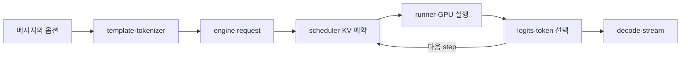

# 1장. 한 요청의 여행: HTTP에서 첫 token까지

채팅 창에 질문을 쓰고 전송 버튼을 누르면 잠시 뒤 글자가 하나씩 나타난다. 화면만 보면
서버가 질문을 모델에 넣고 답을 돌려준 것처럼 보인다. 이 설명은 틀리지는 않지만, 자동차가
“연료를 넣으면 움직이는 기계”라는 설명만큼이나 많은 것을 감춘다. 답이 늦거나, 중간에
멈추거나, 같은 질문인데 결과가 달라졌을 때는 어느 부분을 살펴봐야 할지 전혀 알려 주지
않기 때문이다.

이 장에서는 아직 vLLM이나 SGLang의 함수 내부로 깊이 들어가지 않는다. 대신 요청 한 건이
어떤 모습으로 여러 번 바뀌는지, 그때마다 누가 새 책임을 맡는지 따라간다. 이 여행을 한 번
끝까지 본 뒤에는 뒤 장의 tokenizer, scheduler, KV cache와 CUDA kernel이 서로 떨어진 용어가
아니라 한 요청의 서로 다른 순간이라는 사실이 보일 것이다.



그림에서 되돌아가는 화살표가 중요하다. prompt를 처리하는 첫 구간이 끝나도 요청의 여행은
끝나지 않는다. 새 token 하나를 선택할 때마다 그 token이 다음 입력이 되어 scheduling과 GPU
실행을 다시 거친다. 이 반복 때문에 첫 token까지의 지연과 이후 token 사이의 지연을 따로
측정해야 한다.

## 1.1 사용자가 보낸 것은 아직 모델 입력이 아니다

사용자가 보낸 JSON에는 대개 `messages`, model 이름, 최대 출력 길이, sampling 옵션과 stream
여부가 들어 있다. 이 객체는 API가 이해하는 계약이지, transformer layer가 읽는 입력은
아니다. 모델은 “사용자”, “도우미”, “도구”라는 JSON role을 직접 이해하지 않는다. 서버는
먼저 요청의 형식과 권한을 검사하고, model에 맞는 chat template로 대화를 문자열로
렌더링한 뒤 tokenizer로 정수 ID 열을 만든다.

이 과정을 여행 서류를 준비하는 일에 비유해 보자. 사용자가 쓴 메시지는 여행자의 사연이고,
chat template는 입국 심사대가 요구하는 신청서 양식이며, token ID는 뒤 시스템이 읽는
기계 판독 영역과 비슷하다. 사연이 같아도 신청서 양식이 바뀌면 최종 서류의 바이트가
달라진다. 다만 token은 단순한 문자 코드가 아니므로 이 비유를 너무 멀리 가져가면 안 된다.
tokenizer는 여러 문자나 바이트를 한 token으로 묶을 수 있고, 같은 화면 글자도 normalization과
byte 표현에 따라 다른 ID 열이 될 수 있다. 이 비유에서 가져가야 할 결론은 “서류가
바뀐다”는 막연한 느낌이 아니라, 어느 변환 단계가 실제 token sequence를 바꾸었는지 따로
비교해야 한다는 원칙이다.

> 같은 HTTP 메시지는 같은 모델 입력을 보장하지 않는다. template, tokenizer와 special-token
> 설정까지 같아야 비로소 같은 token sequence인지 비교할 수 있다.

이 원칙은 prefix cache를 조사할 때 특히 중요하다. 사용자는 같은 system prompt를 보냈다고
생각하지만 template에 줄바꿈 하나가 추가되면 token 경계가 달라질 수 있다. cache 입장에서는
비슷한 문장이 아니라 다른 key다. 그래서 재현 기록에는 원문 전체를 무작정 남기기보다
template와 tokenizer revision, 최종 token 수와 안전한 digest를 함께 둔다.

```text
messages JSON
  → schema·권한 검사
  → chat template로 렌더링
  → tokenizer·multimodal processor
  → token IDs와 sampling 계약
```

이 단계에서 오류가 났다면 GPU를 조사할 이유가 없다. 요청이 engine queue에 들어가기 전에
거절됐기 때문이다. 반대로 token ID와 effective sampling 설정까지 같다는 것을 확인했다면,
이제부터는 계산 자원을 나누는 engine 쪽을 볼 차례다.

### 손으로 따라가는 입력 하나

다음처럼 짧은 대화를 가정하자.

```text
system: 답을 두 문장으로 작성하라.
user: KV cache가 무엇인가?
```

API가 받은 것은 두 role과 두 content다. template는 여기에 role delimiter, 줄바꿈과 assistant가
답을 시작할 위치를 덧붙일 수 있다. tokenizer는 렌더링된 전체 문자열을 ID로 바꾼다. 그러므로
입력 장부에는 세 표현을 따로 둔다.

| 표현 | 이 단계에서 답할 질문 |
|---|---|
| protocol message | 사용자가 어떤 role과 옵션을 보냈는가? |
| rendered prompt | model별 문법이 정확히 한 번 적용됐는가? |
| token sequence | 실제 계산과 cache identity가 무엇인가? |

세 표현을 모두 로그에 원문으로 남길 필요는 없다. 민감정보를 피하면서도 길이, artifact
revision과 digest로 동일성을 비교할 수 있다. 장애 조사에서는 “사용자 문장이 같았다”가 아니라
어느 표현까지 같았는지 말해야 한다.

## 1.2 API가 받은 요청과 engine이 소유한 요청

API handler는 요청을 받았다고 해서 그 수명 전체를 혼자 관리하지 않는다. 일반적인 추론
서버는 사용자 연결을 다루는 계층과 GPU 작업을 다루는 engine을 분리한다. 두 계층이 같은
프로세스에 있을 수도 있고 IPC나 network를 사이에 둘 수도 있지만, 책임의 차이는 남는다.

API 계층은 다음과 같은 일을 맡는다.

- 요청이 protocol에 맞는지 검사한다.
- 입력을 model이 읽을 형태로 바꾼다.
- 사용자 request ID와 응답 stream을 만든다.
- engine에 작업을 제출하고 결과를 사용자 형식으로 변환한다.
- client가 연결을 끊으면 취소 의사를 전달한다.

engine은 다른 질문을 맡는다.

- 이 요청을 언제 실행할 것인가?
- 이번 step에 몇 token을 계산할 것인가?
- KV cache block을 얼마나 주고 누구와 공유할 것인가?
- 어느 GPU와 어느 실행 backend를 사용할 것인가?
- 계산이 끝나거나 실패했을 때 예약한 상태를 어떻게 되돌릴 것인가?

이 분리는 불필요한 관료제가 아니다. API 연결은 느린 client, retry와 인증 같은 network
문제를 만나고, engine은 GPU memory, batch shape와 collective 같은 계산 문제를 만난다. 한
객체가 둘을 모두 소유하면 client 한 명의 backpressure가 GPU scheduling을 막거나, GPU
worker의 실패가 열린 socket을 정리하지 못하는 식으로 서로 다른 수명이 엉킨다.

요청이 engine 경계를 넘을 때는 표현도 바뀐다. HTTP body 전체가 그대로 scheduler에
들어가는 것이 아니라 request ID, token ID, sampling parameter, multimodal input descriptor와
도착 시각처럼 실행에 필요한 상태로 압축된다. 이 경계는 디버깅의 첫 분기점이다.

request ID는 로그를 보기 좋게 만드는 꼬리표 이상이다. API의 output collector, engine의
request state, scheduler의 collection, runner의 row와 최종 stream을 같은 수명으로 묶는
상관 키다. ID를 너무 일찍 재사용하거나 서로 다른 process가 generation을 구분하지 못하면
늦게 도착한 output이나 abort가 새 요청에 적용되는 ABA 문제가 생길 수 있다. 그래서 오래
사는 server는 문자열 ID뿐 아니라 내부 generation, wave 또는 incarnation을 함께 관리하기도
한다.

request identity를 추적할 때는 “어디에 존재하는가”도 적는다.

```text
API collector에만 존재
  → engine input queue에도 존재
  → scheduler waiting 또는 running에 존재
  → runner의 persistent state에도 존재
  → terminal output이 만들어짐
  → 모든 owner에서 제거됨
```

정상 종료는 마지막 token이 계산된 순간만 뜻하지 않는다. 사용자에게 terminal event를 보내고,
KV와 runner state를 해제하며, 늦게 도착하는 output이 더는 현재 요청으로 해석되지 않는
상태까지 가야 한다.

### 연결을 끊으면 계산도 즉시 끝나는가

사용자가 브라우저를 닫았다고 GPU instruction이 그 자리에서 멈추는 것은 아니다. socket
disconnect를 알아챈 API 계층은 engine에 abort를 보내야 하고, engine은 waiting queue,
scheduler running state, runner의 in-flight row와 KV block을 정리해야 한다. 이미 제출한
CUDA work는 안전한 경계까지 실행될 수 있으며 그 결과가 늦게 돌아올 수도 있다.

```text
client disconnect 감지
  → API abort 발행
  → engine abort 수신
  → scheduler에서 더 이상 schedule하지 않음
  → in-flight output 폐기 또는 reconcile
  → KV·runner·output collector 해제
```

이 흐름을 처음 읽을 때는 request `r7`, batch `b12`, KV lease `k31` 세 이름만 적으면 된다. 연결이
끊긴 순간 사라진 것은 `r7`의 전송 경로뿐이다. Abort는 아직 frontend queue에 있고 `b12`는 이미
GPU stream에 들어갔다. 따라서 allocator가 `k31`을 즉시 다른 요청에 주면 새 주인의 주소에
`b12`의 늦은 write가 도착할 수 있다. 취소를 빨리 보이게 하는 것과 메모리를 빨리 재사용하는 것은
같은 최적화가 아니다.

여기서 API owner가 보장할 것은 GPU 중단이 아니라 새 작업을 더 만들지 않도록 올바른 incarnation의
abort를 전달하는 일이다. 동일 request ID가 재사용될 수 있으므로 ID만 비교하지 않고 generation과
ADD sequence를 함께 본다. Abort가 ADD보다 먼저 도착하면 해당 generation을 terminal tombstone으로
남겨 뒤늦은 ADD를 거절한다. 다음 generation의 ADD는 별도 요청으로 받아들여야 한다. 이 경계가
없으면 빠른 control queue가 오히려 client 없는 작업을 만들 수 있다.

각 단계는 idempotent해야 한다. network retry로 abort가 두 번 오거나 정상 finish와 abort가
경합해도 block을 두 번 free하거나 새 request state를 지우면 안 된다. 반대로 abort 요청만
로그에 남고 마지막 해제가 없으면 취소 폭주 뒤 usable KV가 회복되지 않는 것처럼 보일 수
있다. model이 stop condition을 만난 것, scheduler가 terminal로 표시한 것, 자원을 회수한 것,
client가 마지막 event를 받은 것은 서로 다른 사실이다.

| 관찰한 현상 | 먼저 확인할 경계 | 아직 켤 필요가 없는 도구 |
|---|---|---|
| HTTP 4xx와 template 오류 | API 입력 변환 | GPU profiler |
| HTTP는 성공했지만 engine request가 없음 | API→engine 제출 | kernel disassembler |
| engine output은 있는데 stream이 멈춤 | output routing·socket | KV allocator 튜닝 |
| scheduler에 들어갔지만 실행되지 않음 | admission·budget·KV | tokenizer trace |

표는 결론을 대신하지 않는다. 예를 들어 “engine output은 있는데 stream이 멈췄다”면 GPU가
정상이라는 뜻까지는 아니다. 다만 최초로 확인된 token 이후의 output handler나 socket
backpressure를 먼저 조사할 이유가 생긴다. 원인을 찾는 일은 가장 그럴듯한 부품을 탓하는
것이 아니라, 상태가 처음 갈라진 경계를 찾는 일이다.

## 1.3 queue에 들어갔다고 바로 실행되는 것은 아니다

GPU는 요청 하나를 정성스럽게 끝낸 뒤 다음 요청을 받는 방식으로 쓰기에는 너무 비싼
병렬 장치다. 서버는 여러 요청의 token 작업을 모아 batch를 만들려고 한다. 하지만 prompt
길이도 다르고 도착 시각도 다르며, 이미 답을 생성 중인 요청과 이제 긴 prompt를 읽기 시작한
요청의 계산 성격도 다르다. 그래서 단순한 FIFO queue만으로는 충분하지 않다.

scheduler를 엘리베이터에 비유하면 첫 직관을 얻을 수 있다. 엘리베이터는 먼저 버튼을 누른
사람만 태우는 대신 현재 위치, 진행 방향과 남은 공간을 고려한다. 추론 scheduler도 도착
순서만 보지 않고 이번 step의 token budget, 동시 request 제한과 KV 여유를 함께 본다. 그러나
엘리베이터 비유에는 큰 한계가 있다. 요청은 탑승한 뒤에도 sequence가 길어질수록 KV 공간을
더 요구하고, 다른 요청과 prefix block을 공유하거나 speculative token을 되감을 수 있다.

scheduler가 매 step 실제로 묻는 질문은 “몇 명을 태울까?”보다 다음 문장에 가깝다.

> 각 요청을 다음 유효 상태까지 전진시키려면 token 계산과 cache 공간이 얼마나 필요하며,
> 지금 가진 예산으로 어느 조합을 안전하게 commit할 수 있는가?

scheduler의 결정은 미래에 실행될 일을 미리 예약한다. 이 점을 은행 이체에 비유하면
reservation과 commit을 구분하기 쉽다. 출금 가능액을 확인하고 금액을 묶어 두는 단계와 실제
상대 계좌에 반영하는 단계가 다르듯, scheduler가 token과 block을 예약한 순간과 GPU 결과를
request state에 반영한 순간은 다르다. 비유의 한계는 GPU 실행이 단순 금액 이동이 아니라
새 token과 cache 내용을 계산하며, 일부 speculative 결과를 거부할 수 있다는 데 있다.

이 질문은 요청의 진행 상태와 자원 소유권을 한 표에 놓아야 답할 수 있다. 대표적으로 첫 행의
`S_t`는 아직 계산 전인 현재 사실이고, 둘째 행의 schedule 결과는 미래 작업을 예약했을 뿐이다.
둘을 구분하지 않으면 예약 직후 worker가 실패했는데도 token과 block이 이미 확정됐다고 잘못
기록한다. 이 차이를 기준으로 최소 상태 장부를 다음 네 단계로 나눈다.

| 세대 | 예정된 일 | 소유 자원 | 아직 실패할 수 있는 것 |
|---|---|---|---|
| `S_t` | 현재 request frontier | 기존 KV block | admission 전 취소 |
| schedule 결과 | 이번 query token | 새 block reservation | worker 제출 실패 |
| device output | logits·sample·KV write | stream/workspace | async CUDA error |
| `S_{t+1}` | accepted token과 새 frontier | commit된 block | output 전달 실패 |

오류가 났을 때 어느 행까지 사실인지 알아야 rollback 범위를 정할 수 있다. schedule 결과만
있는데 token을 생성됐다고 세면 안 되고, device output이 있다고 client가 받았다고 세어도
안 된다.

긴 prompt를 처음 처리하는 prefill은 한 번에 많은 query token을 계산한다. 답을 한 token씩
만드는 decode는 query가 작지만 지금까지 쌓인 KV를 읽는다. scheduler는 긴 prefill을 chunk로
나눠 decode와 섞을 수도 있다. 이렇게 하면 한 사용자의 긴 prompt가 다른 사용자의 다음
token을 오래 막는 상황을 줄일 수 있지만, chunk 수가 늘어 scheduling과 launch overhead도
늘어난다. 뒤 장에서 TTFT와 ITL이 서로 싸우는 이유를 이 지점에서 정량화한다.

## 1.4 KV cache는 기억이 아니라 예약된 공간이다

autoregressive model은 다음 token을 계산할 때 이전 token의 key와 value를 다시 사용한다.
매번 과거 전체를 처음부터 계산하지 않기 위해 layer별 K와 V를 보관하는데, 이것이 KV
cache다. “모델의 기억”이라는 표현은 직관에는 도움이 되지만 운영에서는 위험하다. KV cache는
추상적인 기억이 아니라 GPU memory의 구체적인 byte, block과 주소표다.

요청의 context가 길어지면 KV도 커진다. 매우 단순화하면 layer 수를 `N`, KV head 수를
`H_kv`, head dimension을 `D`, 저장 token 수를 `L`, 원소 byte를 `s`라고 할 때 요청 하나의
K·V 데이터 하한은 다음과 같다.

\[
\text{KV bytes} \approx 2N H_{kv} D L s
\]

앞의 2는 K와 V 두 tensor를 뜻한다. 실제 시스템에는 block tail, alignment, page table,
scale, allocator metadata와 여러 rank의 분할 방식이 더해진다. 이 식은 capacity의 출발점이지
실제 할당량의 최종 답이 아니다.

숫자를 한 번 넣어 보자. 32개 layer, 8개 KV head, head dimension 128, BF16 원소 2byte인
모델이 token 4,096개의 full KV를 저장한다고 가정한다.

\[
2 \times 32 \times 8 \times 128 \times 4096 \times 2
=1{,}073{,}741{,}824\ \text{bytes}
\]

단순 하한만 약 1GiB다. query head가 32개여도 GQA가 KV head를 8개만 저장한다면 KV 식에는
8을 넣어야 한다. 반대로 모든 layer가 같은 attention 구조가 아닌 hybrid model에서는 layer
group별 state를 따로 더해야 한다. tensor parallel은 KV head를 rank에 나눌 수 있지만 총
cluster byte를 자동으로 없애지는 않는다. replication, padding과 rank별 최소 배치가 개입한다.

CPU offload나 remote cache는 HBM resident byte를 줄이는 대신 PCIe나 network transfer와
completion state를 산다. capacity 문제를 다른 계층의 latency 문제로 옮기는 선택이다.

잘못된 회수는 취소된 요청이 아니라 다음 요청을 망가뜨린다. Terminal flag를 보고 `k31`을 반환한
뒤 새 요청 `r8`이 같은 block을 generation 44로 받았는데, 이전 batch가 generation 43의 KV를 늦게
쓴다고 하자. `r7`의 output은 버려져 오류가 보이지 않고 `r8`의 decode만 틀린다. 부하가 낮아 lease가
즉시 재사용되지 않으면 재현되지 않으므로, 이를 단순 cancel leak으로 분류하면 반대 수정을 하게 된다.

서버가 paged KV를 사용하는 이유는 요청 길이가 제각각이고 종료 시각도 다르기 때문이다.
모든 요청에 최대 context만큼 연속 공간을 미리 주면 대부분이 비고, 필요할 때마다 큰 연속
영역을 늘리면 fragmentation과 copy가 문제가 된다. 작은 block을 필요에 따라 연결하면
가변적인 수명을 다루기 쉬워진다. 대신 block table lookup, 마지막 block의 빈 tail,
reference count와 partial-block copy 같은 관리 비용이 생긴다.

scheduler가 요청을 선택했어도 필요한 block을 확보하지 못하면 실행할 수 없다. 이것은 CUDA
allocator가 OOM을 던졌다는 말과 같지 않다. 서버가 미리 만든 KV pool 안에 지금 빌려줄
block이 없을 수 있다. 이때 scheduler는 새 요청을 기다리게 하거나 기존 요청을 선점해
재계산하도록 만들 수 있다. “GPU memory가 부족하다”는 한 문장 아래에 서로 다른 사건이
숨어 있는 이유다.

## 1.5 scheduler의 결정을 GPU가 읽는 모양으로 바꾼다

scheduler의 결정은 Python request 객체의 목록으로 끝나지 않는다. model runner는 선택된
요청들의 token을 평평한 input tensor로 모으고, 각 token의 position, sequence 경계, KV block
주소와 sampling에 필요한 row mapping을 만든다. 논리적인 “요청 세 개”가 GPU 관점에서는
연속 token buffer와 여러 metadata tensor가 된다.

Scheduler가 abort를 적용하면 요청은 다음 batch 후보에서 빠지지만 이미 제출된 kernel은 계속 간다.
Worker가 CUDA event 완료를 관측한 뒤에야 allocator는 그 batch가 lease를 다시 만지지 않는다고 말할
수 있다. Reference count와 generation을 확인해 free list로 publish하는 시점이 물리 완료다. Event
완료와 publish 사이의 짧은 간격은 누수가 아니라 안전성 검증 시간일 수 있다.

Device owner의 증거는 host 함수가 반환했다는 로그가 아니다. 해당 batch를 발행한 stream의 event가
완료됐고, 다른 stream이 그 buffer를 읽거나 쓰는 dependency도 닫혔다는 사실이다. Shared batch에서
한 request만 취소됐다고 kernel 전체를 강제 synchronize하면 안전할 수는 있지만 다른 요청의 ITL까지
늘어난다. 그래서 현재 batch는 drain하고 취소 요청의 output만 폐기하며, 다음 schedule부터 row를
제외하는 경계가 보통 더 안전한 출발점이다.

이 변환에서 shape만 기록하면 의미를 잃기 쉽다. 길이 128인 tensor가 prompt token인지,
128개 request의 decode token인지에 따라 attention과 memory access가 전혀 다르다. 그래서
관측 기록에는 최소한 다음 의미를 함께 둔다.

- 총 query token 수와 request 수
- request별 query length와 KV length
- query head, KV head와 head dimension
- dtype, page size와 block table shape
- prefill, decode 또는 두 작업이 섞인 batch인지
- eager, compiled 또는 CUDA Graph replay인지

runner는 shape와 기능 조건에 맞는 attention backend를 고른다. FlashAttention, FlashInfer,
Triton 또는 framework attention은 이름만 다른 동일 함수가 아니다. 지원하는 dtype, head
dimension, mask, sliding window, paged layout와 GPU architecture가 다르다. 빠른 후보가 특정
기능을 지원하지 않으면 정확성을 위해 다른 backend로 내려가야 한다.

여기서 “설치했으니 사용 중이다”라는 흔한 오해가 생긴다. package에 kernel이 들어 있다는
사실, selector가 후보로 인정했다는 사실, 실제 loaded binary에서 그 kernel이 실행됐다는
사실은 세 단계다. 뒤의 CUDA 편에서는 Python wrapper에서 native binding, launcher와 device
kernel까지 이 사슬을 끝까지 확인한다.

### 같은 128이라는 숫자가 다른 일을 뜻하는 사례

두 batch의 `input_ids` 원소 수가 모두 128이라고 하자. 첫 batch는 prompt 하나의 128 token
prefill이고, 둘째 batch는 128개 request의 한-token decode일 수 있다. 첫 batch는 한 sequence의
긴 query tile과 causal mask를 만들고, 둘째는 128개의 서로 다른 block table과 KV length를
가진다. 원소 수만 같을 뿐 attention metadata, memory locality와 sampling row 수가 다르다.

그래서 profiler에서 kernel grid만 보고 workload를 추측하지 않는다. 같은 symbol도 query
length, KV length, head 구조, page size와 split 수에 따라 다른 반복 횟수와 traffic을 만든다.
반대로 symbol이 달라도 selector fallback 때문에 동일한 logical attention을 계산할 수 있다.
service shape와 launch shape를 같은 기록에 놓아야 한다.

## 1.6 모델은 한 번에 문장을 만들지 않는다

runner가 준비한 입력은 embedding layer를 거쳐 각 token의 vector가 되고, 여러 transformer
layer를 통과한다. attention은 현재 query와 이전 K·V의 관계를 계산하고, MLP나 MoE는 각
위치의 표현을 변환한다. 마지막 hidden state는 LM head를 거쳐 vocabulary 크기의 logits가
된다.

logit은 확률이 아니다. 각 token 후보에 대한 정규화되지 않은 점수다. greedy decoding이라면
가장 큰 logit의 index만 필요해 softmax를 만들지 않고도 같은 token을 고를 수 있다. sampling을
한다면 temperature와 penalty, top-k·top-p 같은 processor가 score를 바꾸거나 후보를 자른
뒤 필요한 확률을 만들고 난수를 사용한다.

선택된 token은 즉시 사용자 문자가 되는 것도 아니다. 먼저 request의 output state에
commit되고, EOS·stop string·길이 조건을 검사하며, tokenizer가 증분 decode한다. UTF-8 문자의
바이트가 여러 token에 걸치면 완성되지 않은 조각을 잠시 보류해야 할 수 있다. stream
generator는 확정된 text delta를 SSE frame이나 다른 protocol event로 바꿔 socket에 쓴다.

한 token의 순환을 간단히 적으면 다음과 같다.

```text
scheduled token과 KV 주소
  → embedding·transformer layers
  → LM head와 raw logits
  → processor·candidate selection·sampling
  → request state에 token commit
  → stop 판정·incremental decode
  → stream event
  → 다음 scheduling step
```

decode 중에는 이 순환이 token마다 반복된다. 그래서 사용자가 느끼는 응답 시간도 하나의
숫자로 설명할 수 없다. 요청을 보내 첫 token이 보일 때까지의 TTFT와, 그 뒤 token 사이의
ITL은 서로 다른 구간을 포함한다.

### layer 하나 안에서도 소유권이 바뀐다

첫 장에서는 수식을 모두 전개하지 않지만 `model.forward`를 하나의 검은 상자로 남겨 두지도
않는다. decoder-only transformer의 한 layer를 크게 보면 다음 흐름이 있다.

```text
residual state
  → normalization
  → Q·K·V projection
  → position transform와 KV write
  → attention backend가 과거 KV를 읽음
  → output projection과 residual add
  → normalization·MLP 또는 MoE
  → 다음 layer의 residual state
```

K와 V projection 결과는 현재 token의 cache state가 되고, Q는 이번 attention 계산에서 과거
K와 비교된다. attention backend는 contiguous tensor를 받을 수도 있고 paged block table을
통해 주소를 찾을 수도 있다. 같은 수학식을 구현해도 주소 계약과 kernel pipeline은 다르다.

MLP가 모든 token에 같은 dense matrix를 적용하는 모델도 있고, router가 token을 일부
expert로 보내는 MoE 모델도 있다. GDN이나 SSM state를 함께 가진 hybrid 모델은 KV만으로
모든 과거 상태를 설명할 수 없다. 마지막 layer의 state를 vocabulary projection에 넣어
logits를 만들 때도 어느 position을 materialize하고 vocabulary를 rank에 어떻게 나누는지가
memory와 compute 비용을 바꾼다.

## 1.7 첫 token이 늦을 때 어디서부터 볼 것인가

이제 “첫 token이 늦다”는 현상을 요청의 여행에 놓아 보자. 가능한 원인은 적어도 다음처럼
서로 다른 구간에 있다.

1. chat render나 tokenizer가 CPU에서 오래 걸렸다.
2. API에서 engine으로 가는 queue나 IPC에 backpressure가 생겼다.
3. scheduler waiting 시간이 길거나 긴 prefill에 밀렸다.
4. KV block admission이 실패해 기다리거나 선점이 반복됐다.
5. model runner가 새 shape를 compile하거나 CUDA Graph를 capture했다.
6. 실제 prefill kernel이 memory·compute·communication 병목을 만났다.
7. token은 나왔지만 output handler, detokenizer나 socket이 늦었다.

이 목록을 그대로 체크리스트로 외우는 것이 이 장의 목적은 아니다. 중요한 것은 각 가설이
서로 다른 두 timestamp 사이의 시간을 설명한다는 점이다. 다음과 같은 최소 timeline을 만들면
막연한 “GPU가 느리다”를 여러 작은 질문으로 바꿀 수 있다.

예를 들어 client TTFT가 900ms이고 server가 기록한 첫 token commit은 요청 수신 420ms 뒤라고
하자. GPU prefill은 180ms였다고 가정한다. 이 숫자만으로 kernel이 원인이라고 말할 수 없다.
최소한 420ms 안에서 render/tokenize, engine queue, scheduling과 GPU 180ms를 나누고, commit
뒤 client까지 남은 480ms를 output queue와 network로 나눠야 한다.

경쟁 가설을 세 개만 놓아도 조사 순서가 달라진다.

- 긴 prefill kernel이 지배했다면 GPU 구간 자체가 길고 같은 shape에서 반복된다.
- scheduler waiting이 지배했다면 첫 GPU start 전이 길고 concurrency·budget 변화와 함께
  움직인다.
- client backpressure가 지배했다면 token commit은 빠르지만 first byte receive가 늦으며 다른
  client나 local sink에서는 재현되지 않을 수 있다.

각 가설은 다른 구간을 설명하므로 하나의 timestamp로 서로를 대체할 수 없다. 먼저 싼
timestamp로 구간을 고르고, 그 뒤에만 profiler나 breakpoint를 연다.

### 관측을 많이 모으는 것과 잘 모으는 것은 다르다

모든 함수에 log를 넣으면 요청의 여행이 더 잘 보일 것 같지만 hot path logging은 CPU 비용,
lock contention과 개인정보 노출을 만들 수 있다. process마다 wall clock만 저장하면 clock
offset 때문에 가짜 지연도 생긴다.

먼저 request identity와 phase 이름, monotonic timestamp, token·KV shape, terminal reason을
작은 구조로 정한다. 상세 tensor content와 prompt 원문은 기본 수집 대상이 아니다. 평균
metric은 전체 상태를 보고, sampling된 trace는 한 요청의 인과를 잇고, source breakpoint는
trace에서 갈라진 좁은 구간에만 사용한다.

좋은 관측은 다음 질문에 답한다. timestamp는 queue에 넣기 전인지 commit 뒤인지, counter의
분모는 request·token·block·step 중 무엇인지, 여러 process의 값은 같은 generation인지,
관측 자체가 synchronization을 바꾸지는 않는지 확인한다. 이 질문에 답하지 못하는 숫자는
dashboard에 많아도 원인을 좁히지 못한다.

Trace는 `disconnect(r7)`, `abort_enqueued(r7,g19)`, `abort_applied(r7,g19)`, `event_complete(b12)`,
`lease_publish(k31,g44)`를 한 인과선으로 연결한다. 각 화살표에는 owner와 실제로 관측한 generation을
붙인다. Abort 로그에 batch ID가 없으면 device completion까지 이어지지 않았고, event 로그에 lease
generation이 없으면 늦은 write와 새 주인을 가를 수 없다.

독자가 로그만으로 조사할 때는 external ID를 internal generation에 연결한 뒤, 그 generation이 마지막으로
포함된 batch를 찾는다. Batch completion event와 lease release 시각을 비교하고, 같은 주소를 다음에 받은
request generation을 확인한다. 서로 다른 worker의 wall clock은 어긋날 수 있으므로 timestamp 정렬만
믿지 않고 message sequence와 CUDA event dependency를 사용한다. 이 최소 연결이 성립한 다음에 queue
우선순위, allocator와 kernel timeline으로 내려가면 된다.

```text
request received
  → rendered/tokenized
  → engine admitted
  → first scheduled
  → first GPU work starts/ends
  → first token committed
  → first byte sent
```

`first scheduled` 전이 길다면 kernel을 바꿔도 원인이 사라지지 않는다. GPU work는 끝났는데
token commit이 늦다면 scheduler reconciliation이나 output processing을 본다. token commit은
빨랐는데 first byte가 늦다면 network와 backpressure를 본다. 하나의 metric으로 결론을 내리는
대신 최초로 예상과 달라진 구간을 찾는 습관이 이 책 전체의 디버깅 방법이다.

이제 우리는 요청 한 건이 지나가는 지도를 얻었다. 다음 장에서는 이 지도의 첫 번째 긴장을
다룬다. 왜 서버가 prefill을 크게 묶어 GPU를 잘 채우려 할수록, 이미 답을 받고 있는 사용자의
다음 token은 늦어질 수 있을까? TTFT와 ITL을 분해하면 serving optimization이 단순히
“batch를 크게 만든다”는 이야기가 아닌 이유가 드러난다.

## 1.8 같은 요청을 네 구현에 놓으면 무엇이 달라지는가

공통 지도를 얻었다고 해서 네 구현의 객체 이름을 억지로 일대일 대응시키면 안 된다. vLLM과
SGLang은 오래 사는 engine과 scheduler를 중심에 두지만 요청을 넘기는 process 경계와 상태
표현이 다르다. Transformers의 전통적인 `generate()`는 호출자가 가진 model을 중심으로
한 generation loop를 실행한다. continuous batching API는 그 위에 manager와 scheduler의
수명을 새로 만든다. llama.cpp server는 제한된 slot과 task queue를 전면에 드러낸다.

차이를 읽는 가장 쉬운 방법은 클래스 이름이 아니라 세 사건을 찾는 것이다.

1. 새 요청이 실행 후보 집합에 들어가는 순간
2. 이번 step에서 처리할 token과 cache 주소가 확정되는 순간
3. 결과가 영속 request state에 반영되고 외부로 나갈 수 있게 되는 순간

예를 들어 vLLM의 `AsyncLLM.generate`는 비동기 iterator 형태로 API와 output 수명을 잇는다.
하지만 iterator가 존재한다는 사실은 request가 GPU batch에 들어갔다는 뜻이 아니다. scheduler의
waiting collection으로 전달된 뒤 `Scheduler.schedule`이 token budget과 block 가용성을 보고
이번 step의 몫을 정해야 한다. worker output도 그대로 사용자 응답이 아니라 scheduler state와
output handler를 거쳐야 한다. 다음 세 로그는 서로 다른 사실을 증명한다.

```text
AsyncLLM이 request를 받음       ≠ scheduler가 이번 step에 선택함
scheduler output에 ID가 있음    ≠ device 결과가 commit됨
sampled token이 생김            ≠ client가 text delta를 받음
```

SGLang에서도 tokenizer manager가 요청을 받아 IPC로 보낸 시점과 scheduler가 batch를 만든
시점은 다르다. scheduler의 event loop가 오래 산다는 점은 특히 중요하다. 한 요청을 처리하기
위해 loop가 생겼다가 사라지는 것이 아니라, 여러 요청이 같은 loop의 waiting·running 상태를
오가며 batch에 합류한다. loop의 한 iteration이 특정 사용자의 온전한 forward 한 번이라고
생각하면 mixed batch와 chunked prefill을 이해할 수 없다.

Transformers의 고전 `generate()`는 좋은 대조군이다. Python 호출 하나가 입력 준비, decoding
method 선택과 반복을 주도하므로 함수 stack을 따라가기가 상대적으로 쉽다. 대신 여러 사용자의
도착과 취소, 공용 KV budget을 다루는 server scheduler가 자동으로 생기지는 않는다. continuous
batching manager는 바로 이 빠진 수명을 추가한다. 같은 라이브러리 안에서도 “generation
algorithm”과 “serving scheduler”를 분리해 읽어야 하는 이유다.

llama.cpp server의 slot은 단순히 GPU batch의 row 번호가 아니다. 요청이 prompt를 처리하고
token을 생성하며 결과를 보내는 동안 유지되는 service-side 실행 자리다. task가 slot에
배정되지 못하면 아직 model decode에 들어가지 않는다. 반대로 slot을 잡았어도 매 iteration의
batch에 얼마만큼 포함되는지는 별도 결정이다. slot 수를 늘렸다는 사실만으로 동시에 계산되는
token 수가 같은 비율로 늘지 않는 이유가 여기에 있다.

| 공통 질문 | vLLM에서 찾을 입구 | SGLang에서 찾을 입구 | 다른 두 구현에서의 대비 |
|---|---|---|---|
| 외부 요청의 소유자는 누구인가 | `AsyncLLM`·output handler | tokenizer manager | `generate()` 호출자·server task |
| 실행 후보는 누가 보관하는가 | scheduler collections | scheduler batch state | continuous manager·slot queue |
| step 예산은 어디서 정해지는가 | scheduler token/KV 계산 | prefill/decode batch 계획 | scheduler policy·batch builder |
| terminal 정리는 누가 닫는가 | scheduler와 output 경로 | manager·scheduler 경계 | caller loop·slot release |

이 표는 번역 사전이 아니다. 실제 소스에서 이름이 달라져도 같은 질문으로 경계를 다시 찾기
위한 나침반이다. 한 구현의 옵션을 다른 구현에 적용할 때도 이름의 유사성보다 이 상태 전이가
같은지를 먼저 확인한다.

### 함수 호출 그래프와 요청 수명 그래프는 다르다

소스를 처음 읽으면 함수 호출 그래프부터 그리기 쉽다. `generate()`가 A를 부르고 A가 B를
부른다는 그림은 동기적인 한 순간을 설명한다. 그러나 요청은 queue에서 기다리고, 여러
iteration 뒤 다시 선택되며, 다른 process의 응답으로 재개될 수 있다. 이 수명은 call stack
하나보다 길다.

코드 노트에는 두 그래프를 따로 그린다.

```text
호출 그래프: handler → submit → IPC send

수명 그래프: NEW → WAITING → SCHEDULED → IN_FLIGHT
                   ↑                    ↓
                   └── PREEMPTED ← RUNNING → FINISHED/ABORTED
```

첫 그래프는 “어느 함수가 메시지를 보냈는가”에 답하고, 둘째는 “그 뒤 요청 상태를 누가
소유하는가”에 답한다. 비동기 서버의 버그 상당수는 호출이 성공했다는 사실을 수명 전이가
완료됐다는 사실로 오해할 때 생긴다. IPC send가 성공해도 receiver가 admission 전에 죽을 수
있고, abort를 보냈어도 이미 in-flight인 device output이 돌아올 수 있다.

## 1.9 한 건의 느린 요청을 끝까지 해부하는 예

마지막으로 작은 장애 기록을 만들어 보자. 사용자는 오전 10시 3분에 1,800-token 문서를
보냈고 첫 글자를 1.42초 뒤에 받았다. 같은 시각 GPU utilization은 92%였다. 이 정보만 보면
GPU가 바빠서 늦었다고 말하기 쉽지만 utilization은 어느 요청이 왜 기다렸는지 알려 주지
않는다.

요청 ID로 사건을 연결했더니 다음 장부가 나왔다고 하자.

| 사건 | 수신 뒤 시각 | 구간 길이 | 이 시점에 확정되는 사실 |
|---|---:|---:|---|
| API receive | 0ms | — | server가 request를 봄 |
| render·tokenize 완료 | 44ms | 44ms | 실제 token 수가 1,936임 |
| engine admission | 61ms | 17ms | 실행 후보 집합에 들어감 |
| first scheduled | 487ms | 426ms | queue·budget 대기가 있었음 |
| prefill GPU end | 812ms | 325ms | 첫 model 계산이 끝남 |
| token commit | 829ms | 17ms | token ID가 request state에 반영됨 |
| first byte send | 837ms | 8ms | server output 경로를 떠남 |
| client receive | 1,420ms | 583ms | 사용자에게 보임 |

이 요청의 TTFT는 1.42초지만 한 병목으로 이루어지지 않았다. engine admission부터 schedule까지
426ms, prefill 325ms, server가 보낸 뒤 client가 받을 때까지 583ms가 큰 구간이다. kernel을
20% 빠르게 만들어도 약 65ms를 줄일 뿐이며 network 구간과 schedule 대기는 그대로다.

이제 각 구간에 경쟁 가설을 붙인다. schedule 대기는 앞선 긴 prefill 때문일 수도, KV block
부족 때문일 수도, tenant admission limit 때문일 수도 있다. 당시 step ledger에서 scheduled
token 구성과 free block을 보면 세 가설을 가를 수 있다. GPU 325ms는 동일 model·동일 길이
cohort의 정상 prefill과 비교한다. client 구간은 server와 같은 host의 sink, gateway timestamp,
socket write completion을 비교한다.

조사 결과 schedule 직전 7,000-token prefill이 한 chunk로 실행됐고, client는 느린 mobile
gateway를 통과했다고 하자. 그러면 원인은 “GPU가 느렸다”가 아니다. scheduler가 긴 prefill에
decode와 새 admission의 시간을 배치한 정책, 그리고 외부 전달 경로가 합쳐진 사건이다.
prefill kernel 자체가 정상 cohort와 같았다면 CUDA 최적화는 우선순위가 아니다.

### 수정 뒤에는 원인과 부작용을 함께 검증한다

수정은 같은 인과선을 역순으로 닫는다. 새 요청의 output과 KV fingerprint를 fresh allocation과
비교하고, lease publish가 event completion보다 앞선 표본이 없는지 확인한다. Abort 적용 뒤 취소된
요청에 새 token이 admission되지 않았는지 센 뒤 disconnect→abort p99를 본다. 정확성, 자원 회수,
취소 지연을 함께 통과해야 빠르고 안전한 cancel이다.

긴 prefill의 chunk 한도를 낮춘 뒤 이 요청 cohort의 schedule 대기가 426ms에서 150ms로
줄었다고 하자. 여기서 성공 선언을 멈추면 안 된다. 긴 prompt를 여러 step으로 나눴으므로
그 요청 자체의 prefill 완료는 늦어질 수 있고 scheduler CPU 횟수와 launch 수는 늘 수 있다.
다음 네 결과를 함께 본다.

- 긴 prompt cohort의 TTFT p50·p95·p99
- 이미 decode 중인 요청의 ITL tail
- 완료 token 기준 goodput과 취소율
- step당 query-token 구성, GPU 실행 시간과 launch gap

network 쪽 수정도 같은 방식으로 검증한다. server의 first-byte timestamp만 빨라졌는지,
실제 client receive가 빨라졌는지 분리한다. 관측점 하나를 움직인 것을 사용자 경험 개선으로
착각하지 않기 위해서다.

이 사례가 보여 주는 독법은 책 전체에서 반복된다. 먼저 증상을 요청의 수명 위에 놓고, 가장
처음 예상과 달라진 경계를 찾는다. 그 경계를 소유한 상태와 함수를 읽고, 변경이 옮겨 놓을
비용까지 예측한 다음 동일 workload에서 반증한다. 소스 코드를 깊게 읽는 목적은 함수 이름을
많이 아는 데 있지 않다. **사용자가 본 한 현상을 어떤 상태 전이가 만들었는지 끝까지 설명할
수 있게 되는 데 있다.**

### 처음 소스를 펼칠 때 만드는 한 장짜리 조사표

이 장을 읽은 뒤 저장소를 열면 파일 수에 다시 압도될 수 있다. 그럴 때는 모든 디렉터리를
순서대로 읽지 않는다. 조사하려는 증상 한 개를 고르고, 먼저 외부 요청이 내부 ID를 얻는
첫 행만 채워 보자. handler와 ID 생성 위치를 찾으면 그 ID가 어느 collection으로 이동하는지
다음 행의 질문이 자연스럽게 생긴다. 이런 식으로 앞 행의 결과가 뒤 행의 출발점이 되도록
다음 표를 사용한다.

| 질문 | 기록할 증거 | 아직 모르면 할 일 |
|---|---|---|
| 외부 요청은 어디서 내부 ID를 얻는가 | handler와 ID 생성 위치 | API 진입점에서 submit까지 호출 추적 |
| engine은 요청을 어디에 보관하는가 | waiting/running collection | add-request 뒤 첫 mutation 검색 |
| 이번 step의 몫은 어디서 정하는가 | token·KV budget 계산 | schedule output 구조 역추적 |
| runner는 어떤 tensor를 받는가 | shape와 의미 필드 | execute 입력 dataclass 확인 |
| token은 언제 확정되는가 | commit 전후 state 차이 | worker output 소비 함수를 읽음 |
| 종료 때 무엇을 해제하는가 | KV·slot·collector 정리 | normal finish와 abort 경로 비교 |

검색은 함수 이름보다 상태를 바꾸는 동사에서 시작하는 편이 유용하다. `add`, `schedule`,
`allocate`, `update`, `finish`, `abort`, `free`를 찾고 해당 collection이 전후로 어떻게 달라지는지
본다. 그다음 호출자를 거슬러 올라가 외부 사건과 연결한다. 단, 이름만 보고 mutation이라고
단정하지 않는다. 반환된 새 객체를 만드는 구현도 있고 비동기 메시지만 보내는 wrapper도
있다.

한 함수에서 반드시 적어야 할 것은 세 가지다. 입력이 무엇을 증명하는지, 성공 뒤 어떤 상태가
새로 참이 되는지, 중간 실패 때 누가 원복하는지다. 예를 들어 allocator 호출을 발견했다면
“block을 얻는다”로 끝내지 않는다. 예약만 했는지 reference count까지 commit했는지, worker
실패 때 scheduler가 되돌리는지, abort와 정상 완료가 같은 release 함수를 쓰는지 확인한다.

```text
함수: ____________________
전제 상태: _______________
소비/예약 자원: ___________
성공 후 불변식: ___________
실패·취소 후 불변식: ______
관측 가능한 metric/log: ___
호출자를 다시 볼 조건: ____
```

이 양식은 코드 리뷰를 문서 작업으로 만드는 장식이 아니다. 나중에 옵션 하나가 어느 필드를
바꾸는지 설명할 때, 또는 metric이 어느 상태 전이를 세는지 검증할 때 같은 기록을 재사용한다.
책의 세부 장들은 이 빈칸을 실제 vLLM·SGLang·Transformers·llama.cpp 함수로 채워 갈 것이다.

### 입문 단계에서 피해야 할 세 가지 지름길

첫째, API 문서의 옵션 표를 내부 동작으로 간주하지 않는다. 설명이 “최대 batch token”이라고
써 있어도 그 값이 admission, chunking, preemption 중 어느 분기에서 읽히는지 소스를 확인해야
한다. 옵션은 원인이 아니라 상태 변화를 일으키는 입력이다.

둘째, profiler의 가장 긴 kernel부터 최적화하지 않는다. 해당 kernel이 느린 요청의 critical
path에 있었는지, 같은 시간 다른 batch를 처리한 것인지 request와 step identity로 연결한다.
길다는 사실과 사용자 지연의 원인이라는 사실은 다르다.

셋째, 평균 benchmark 한 번으로 설정을 확정하지 않는다. warm-up과 graph capture가 끝났는지,
prompt·output 길이와 동시성 분포가 운영 workload를 닮았는지, 취소와 실패 token을 throughput에
포함했는지 확인한다. 평균이 좋아져도 tail과 goodput이 나빠질 수 있다.

이 세 지름길을 피하면 처음부터 모든 CUDA instruction을 알지 못해도 조사 방향을 잃지 않는다.
요청 수명에서 느린 구간을 고르고, 그 상태를 소유한 함수까지 내려간 뒤, 필요할 때만 allocator,
collective 또는 kernel 내부로 더 깊게 들어가면 된다. 이것이 이후 수천 쪽의 세부 내용을 한
번에 외우지 않고도 사용할 수 있는 독자 경로다.

처음 읽을 때는 이 장의 지도를 왼쪽에 두고 관심 있는 구현 하나만 오른쪽에 놓으면 충분하다.
곧바로 네 저장소를 비교하면 이름의 차이가 본질처럼 보이고, 한 구현만 오래 보면 우연한
설계를 보편 원리로 착각하기 쉽다. 두 번째 읽기에서 같은 경계를 다른 구현과 비교하고 세 번째
읽기에서 metric과 trace를 연결하면 두 오류를 함께 줄일 수 있다.

장을 덮기 전에 임의의 요청 하나를 골라 말로 설명해 보자. 최종 token ID는 어디에서
결정됐고, 그 전에 누가 KV 공간을 예약했으며, 사용자가 연결을 끊으면 어느 owner들이 어떤
순서로 사라지는가? “아마”, “자동으로”, “내부에서”라는 말이 나온 지점이 다음에 소스를 팔
경계다. 반대로 함수 이름을 말하면서도 전후 상태 차이를 설명하지 못한다면 이름만 외운
것이다. 이 책에서 깊이는 호출 깊이가 아니라 외부 증상과 내부 불변식을 끊김 없이 연결하는
능력을 뜻한다.

## 1.10 연결이 끊긴 뒤에도 요청은 세 번 끝난다

지금까지는 응답이 정상적으로 돌아오는 길을 중심으로 지도를 그렸다. 그러나 운영에서 요청의
소유권이 가장 선명하게 드러나는 순간은 사용자가 브라우저 탭을 닫거나 모바일 연결이 끊기는
때다. 소켓이 닫혔다는 사실은 모델 계산이 끝났다는 뜻이 아니다. 서버 coroutine이 취소됐다는
뜻도 아니며, 이미 GPU stream에 제출된 kernel이 완료됐다는 뜻은 더더욱 아니다. 이 셋을 한
단어인 “취소”로 묶으면 API metric은 즉시 성공하는데 GPU memory와 compute는 한동안 줄지 않는
현상을 설명하지 못한다.

먼저 세 완료 시점을 이름 붙이자. **전달 완료**는 더 보낼 byte가 없거나 client에게 보낼 길이
사라진 시점이다. **논리 완료**는 scheduler가 해당 request를 더 이상 admission하지 않고
waiting·running 상태와 output collector를 terminal로 바꾼 시점이다. **물리 완료**는 이미 제출된
GPU work가 stream ordering을 따라 끝나고 KV block, adapter reference, output buffer를 안전하게
재사용할 수 있게 된 시점이다. 정상 요청에서는 세 시점이 가까울 수 있다. disconnect 사건에서는
전달 완료가 먼저 오고 논리 완료와 물리 완료가 뒤따른다. 이 순서를 metric 하나로 압축하지 않는
것이 첫 원칙이다.

### 고정된 소스에서 abort가 어디까지 가는지 읽는다

vLLM commit `6e448d0ea9bf3d88d898b65449ca6dc2aec170ac`의
[`AsyncLLM.generate`](https://github.com/vllm-project/vllm/blob/6e448d0ea9bf3d88d898b65449ca6dc2aec170ac/vllm/v1/engine/async_llm.py#L544)는
output collector에서 결과를 yield하는 front-side lifetime을 보여 준다. 이 generator의 취소와
종료 경로를 읽을 때는 `finally`가 있다는 사실만 확인하고 끝내지 않는다. internal request ID로
abort를 보내는 지점, collector를 닫는 지점, core 쪽 request 제거가 비동기 메시지인지 차례로
적는다. front object cleanup은 core scheduler cleanup의 증거가 아니기 때문이다.

이어서 같은
revision의 [`Scheduler.schedule`](https://github.com/vllm-project/vllm/blob/6e448d0ea9bf3d88d898b65449ca6dc2aec170ac/vllm/v1/core/sched/scheduler.py#L439)로
내려가 취소된 request가 다음 token budget에서 제외되는지 확인한다. 여기까지 닫혀야 논리 완료를
말할 수 있다.

SGLang에서도 연결 감지와 자원 회수의 owner는 하나가 아니다. commit
`71de97b264b04dcd514cf904003028aefe9775c8`에서 TokenizerManager의 response wait·abort 제어는
[`tokenizer_manager.py:1733-1830`](https://github.com/sgl-project/sglang/blob/71de97b264b04dcd514cf904003028aefe9775c8/python/sglang/srt/managers/tokenizer_manager.py#L1733-L1830)에,

scheduler가 waiting·running·chunked request를 찾아 finish와 cleanup을 수행하는 경로는
[`scheduler.py:4442-4562`](https://github.com/sgl-project/sglang/blob/71de97b264b04dcd514cf904003028aefe9775c8/python/sglang/srt/managers/scheduler.py#L4442-L4562)에
있다.

앞 함수가 `AbortReq`를 보냈다는 로그는 제어 메시지 제출 증거다. 뒤 함수가 올바른 request
incarnation을 terminal로 만들었다는 증거와 동일하지 않다. control channel이 밀리거나 request가
이미 running batch에 들어갔다면 두 timestamp 사이가 길어질 수 있다.

이 source walk에서 독자가 남길 최소 원장은 다음과 같다.

| 사건 | owner | 바뀌어야 하는 상태 | 아직 끝나지 않을 수 있는 것 |
|---|---|---|---|
| client disconnect 관측 | HTTP/stream task | 더 이상 byte 전달 불가 | engine request, GPU work |
| abort 제출 | frontend manager | control message sequence 생성 | scheduler 수신·처리 |
| scheduler terminal 전이 | scheduler | 다음 step admission 금지 | 현재 step의 device work |
| batch 결과 폐기 | output processor | client mailbox/collector close | KV·buffer lease |
| stream completion 관측 | worker/allocator | lease와 generation 재사용 가능 | 없음 |

### backpressure는 느린 client를 GPU 문제로 바꿀 수 있다

streaming response 한 조각이 평균 80 byte이고 한 request가 초당 40조각을 만든다고 하자. client가
초당 800 byte만 읽으면 매초 `80×40-800=2,400 byte`가 output queue에 쌓인다. request 500개가
같은 상태로 30초 유지되면 payload만 `2,400×500×30=36,000,000 byte`, 약 34.3 MiB다. Python
object, queue node와 문자열 overhead는 이 계산에 포함되지 않았다. 실제 resident memory는 더
크다. queue를 무한대로 두면 GPU는 계속 생성하고 host memory와 응답 지연이 커진다. queue를
작게 두고 producer를 await시키면 backpressure가 model output loop까지 전파될 수 있다.

여기서 중요한 질문은 “queue 크기를 얼마로 할까”가 아니라 “막힌 await가 누구를 함께
멈추는가”다. request별 독립 producer라면 느린 client 하나가 자기 request만 늦출 수 있다. 여러
request의 detokenization과 delivery를 한 loop가 순차 처리하고 bounded send에서 기다린다면 한
client의 정체가 다른 request의 first byte까지 늦추는 head-of-line blocking이 된다. 반대로
frontend queue만 비우기 위해 결과를 버리면서 engine을 계속 돌리면 사용자에게 전달되지 않을
token이 GPU budget을 소비한다. 따라서 backpressure policy는 buffer capacity, producer blocking,
abort threshold, already-generated output accounting을 한 묶음으로 정의해야 한다.

작은 용량 계산으로 upper bound를 정할 수 있다. 조각 최대 크기 4 KiB, request별 queue 32개,
동시 streaming request 1,000개라면 payload 상한만 `4 KiB×32×1,000=125 MiB`다. queue metadata가
조각당 200 byte라면 약 6.1 MiB가 더해진다. 하지만 이 bound는 queue만 제한한다. detokenizer가
별도 decoded text 누적본을 보존하거나 output object가 token history를 참조하면 실제 retained
graph는 더 크다. heap snapshot에서 queue object만 보지 말고 request state가 가리키는 history와
collector를 함께 본다.

### disconnect 사건을 세 완료로 재구성한다

다음 사건을 생각해 보자. 09:00:00.000에 2,048-token prompt가 ingress를 통과했고 80 ms 뒤
prefill이 시작됐다. 09:00:00.120에 client가 연결을 끊었다. HTTP task는 3 ms 안에 disconnect를
관측했고 abort message를 제출했다. 그런데 control queue 앞에 generate message가 쌓여 scheduler는
09:00:00.170에야 abort를 받았다. 그 사이 09:00:00.140에 시작한 GPU step은 이미 16개 request의
mixed batch를 계산하고 있었고 09:00:00.185에 완료됐다. scheduler는 다음 step에서 이 request를
제외했고 allocator는 completion event를 확인한 09:00:00.188에 KV lease를 놓았다.

이 사건의 전달 완료는 120 ms, 논리 완료는 170 ms, 물리 완료는 188 ms다. disconnect 뒤 낭비된
GPU 시간은 단순히 68 ms가 아니다. mixed batch 전체 kernel에서 이 request가 차지한 row와 KV
traffic만 낭비다. 한 decode step이 request당 1 token이고 batch가 16이면 이 request 몫을 거칠게
`1/16`로 회계할 수 있지만 kernel cost가 batch에 선형이라는 보장은 없다. 더 정확한 원장은
abort 관측 이후 이 request에 새로 admitted된 token 수, 해당 token의 KV write byte, batch shape
변화가 없어서 회수하지 못한 launch cost를 나눈다.

예를 들어 layer 32개, token당 KV write 128 KiB인 모델에서 abort 뒤 실수로 decode 4 token을 더
admission했다면 불필요한 persistent write는 적어도 `4×128 KiB=512 KiB`다. 여기에는 weight read,
attention read와 MLP 계산이 빠져 있다. 반면 abort가 current step 도중 도착해 새 token admission은
0이지만 event completion까지 18 ms 기다린 경우, 그 18 ms를 모두 낭비 token으로 세면 안 된다.
이미 제출된 공동 작업을 안전하게 drain한 시간이다. 이 구분이 있어야 cancel latency를 무리하게
줄이다 buffer를 조기 재사용하는 correctness bug를 만들지 않는다.

조사는 다섯 timestamp로 닫는다. `disconnect_observed`, `abort_enqueued`, `abort_applied`,
`last_device_use_completed`, `resources_released`다. 첫 둘의 차이가 크면 HTTP task나 local control
path를, 둘째와 셋째가 크면 IPC/control queue를, 셋째와 넷째가 크면 in-flight batch와 stream을,
넷째와 다섯째가 크면 allocator·reference cleanup을 본다. `HTTP 499` count와 GPU utilization만
나란히 놓으면 어느 구간이 긴지 알 수 없다.

### 수정은 빠른 cancel과 안전한 drain을 함께 증명한다

control message에 우선순위를 주는 수정은 `abort_enqueued→abort_applied`를 줄일 수 있다. 그러나
generate와 abort의 순서가 뒤집혀 아직 생성되지 않은 incarnation을 취소하거나, 재사용된 request
ID의 새 요청을 지우지 않는지 확인해야 한다. request ID에 generation을 붙이고 ADD와 ABORT가
같은 `(id,generation)`을 가리키게 하는 이유다. output queue를 bounded로 바꾸는 수정은 memory
상한을 만들지만 shared output loop를 block하지 않는지 확인해야 한다. 느린 client를 일정 시간 뒤
abort하는 정책은 GPU goodput을 지킬 수 있지만 partial response와 terminal reason을 API 계약에
맞게 남겨야 한다.

회귀 fixture는 빠른 client, 느린 client, 즉시 disconnect 세 요청을 같은 batch에 넣는다. 빠른
client의 TTFT/ITL이 느린 client 때문에 악화되지 않는지, 즉시 disconnect request가 abort 적용 뒤
새 token을 admission하지 않는지, 세 요청이 끝난 뒤 KV free count와 request table이 기준선으로
돌아오는지 본다. 마지막 assert는 “abort API가 성공했다”가 아니라 마지막 device event 이후
slot generation이 한 번만 증가하고 stale output이 새 collector에 도착하지 않는다는 것이다.

### handoff 표에는 소유권을 넘긴 증거와 거절할 권한을 함께 적는다

gateway가 engine에 request를 보냈다고 해서 모든 책임을 넘긴 것은 아니다. client connection과
response framing은 여전히 gateway가 소유한다. engine은 request state와 scheduling eligibility를,
worker는 batch row와 device buffer lease를 소유한다. 이 셋 사이에는 “보냈다”와 “받았다”가
각각 존재한다. sender의 enqueue 성공만 기록하면 receiver가 죽거나 queue가 가득 찬 순간 ownership
공백이 생긴다. receiver가 request generation을 등록하고 acknowledgement를 돌려준 시점을 handoff
commit으로 삼거나, acknowledgement 전 실패 시 sender가 retry/abort를 책임지는 규칙이 필요하다.

다음 표는 설명용 inventory가 아니라 사건을 재현할 때 채우는 하나의 인과 기록이다.

| 경계 | sender가 보존할 것 | receiver의 commit 증거 | commit 전 cancel | commit 후 cancel |
|---|---|---|---|---|
| gateway→engine | external/internal ID, deadline, payload digest | request generation 등록과 ADD acknowledgement | local response 종료, 전송된 ADD 여부 reconciliation | 같은 generation의 ABORT 제출 |
| engine→scheduler | normalized input, token count, adapter/cache identity | waiting/running owner와 admission sequence | input object rollback | future admission 금지, 현재 step 표시 |
| scheduler→worker | batch generation, row mapping, KV lease | execute request 수신과 stream dependency 설정 | batch rebuild 또는 row 제거 | 결과 폐기하되 device completion 대기 |
| worker→allocator | buffer/block generation, last-use stream/event | completion event와 reference zero | 예약 취소 | event 뒤 free-list publish |

이 표를 채울 때 `cancelled=true` 같은 전역 flag 하나를 모든 열에 복사하지 않는다. gateway가
disconnect를 관측한 generation `g=19`와 scheduler가 현재 소유한 generation이 같은지, worker에
제출된 batch generation `b=813`에 그 request row가 포함됐는지, allocator lease가 어느 event를
기다리는지를 적는다. ID는 같아도 generation이 다르면 다른 소유권이다.

첫 번째 race는 ADD와 ABORT의 추월이다. gateway가 ADD를 queue A에 넣고 disconnect task가 ABORT를
우선순위가 높은 queue B에 넣었다고 하자. scheduler가 B를 먼저 읽으면 아직 존재하지 않는 request를
abort한다. 이를 성공한 no-op로 처리한 뒤 A의 ADD를 받아들이면 client 없는 request가 실행된다.
반대로 unknown abort를 영구 tombstone으로 보존하면 ID가 재사용됐을 때 새 request를 잘못 거절할
수 있다.

해결 계약은 sequence 또는 generation이다. `(request_id,19,ADD)`보다
`(request_id,19,ABORT)`가 먼저 도착해도 generation 19를 terminal tombstone으로 만들고 뒤늦은
ADD 19를 거절한다. generation 20 ADD는 별도 요청으로 받아들인다. Tombstone retention이 60초이고
초당 20,000 request가 들어오며 record가 96 byte라면 상한은 `20,000×60×96=115,200,000 byte`,
약 109.9 MiB다. 무기한 보존할 필요는 없지만 ID 재사용 주기와 message 최대 지연보다 짧아서는
안 된다.

두 번째 race는 scheduler terminal과 batch publish의 교차다. scheduler thread가 request를
terminal로 바꾸는 동시에 model runner thread가 이전 snapshot으로 batch `b=813`을 publish할 수
있다. terminal flag만 확인하고 allocator lease를 즉시 놓으면 worker는 재사용된 KV block에
write한다. Batch snapshot이 request generation과 lease generation을 보존하고, completion path가
`b=813`의 last-use event를 내릴 때까지 free publish를 미뤄야 한다. 이때 output을 client에게
버리는 결정과 device buffer를 free하는 결정은 분리된다.

### 느린 소비자를 받아들일지 계산으로 결정한다

backpressure admission에는 최소 세 예산이 필요하다. 첫째는 output queue byte, 둘째는 delivery
worker time, 셋째는 전달 가능성이 낮은 token에 쓰는 GPU budget이다. 동시 stream 800개, 평균
생성률 25 chunk/s, 평균 chunk 120 byte, 평균 client drain 2,000 byte/s라고 하자. request 하나의
순증가는 `25×120-2,000=1,000 byte/s`, 전체는 0.8 MB/s다. queue 총 예산이 64 MiB라면 overhead를
무시해도 약 `64 MiB÷0.8 MB/s≈83.9초` 뒤 포화된다. 평균 request가 40초면 정상 burst일 수 있지만
p99가 180초면 queue 확장만으로 해결되지 않는다.

이제 admission 후보 세 개를 비교한다. A는 새 stream을 계속 받고 request별 128 KiB queue를 둔다.
800개일 때 payload capacity는 100 MiB다. B는 64 KiB queue와 5초 stall timeout을 두어 느린
consumer를 abort한다. Memory 상한은 50 MiB지만 모바일 네트워크의 일시 정체도 끊을 수 있다.
C는 output queue 점유율이 75%를 넘으면 새 streaming request만 429로 거절하고 이미 accepted된
request는 drain한다.

C는 계약이 명확하지만 queue pressure가 tenant 하나에서 왔는데 전체 tenant를
막을 수 있다. 선택은 queue byte 하나가 아니라 `tenant별 drain deficit`, `stall duration`,
`accepted-but-undelivered token`, `abort 후 resource release latency`를 함께 본다.

예를 들어 10분 창에서 생성 token이 12,000,000개이고 그중 disconnect 뒤 생성된 token이
360,000개라면 delivery-aware goodput의 이 항목 손실은 3%다. B 정책 적용 후 후속 token이
90,000개로 줄었지만 정상 stream 99.9 percentile completion이 98%에서 94%로 떨어졌다면 성공이
아니다. C 정책이 후속 token을 120,000개로 줄이고 accepted stream completion을 98%로 유지했지만
특정 tenant reject가 30%라면 fairness guard가 필요하다. “GPU utilization이 낮아졌다”만으로 어느
정책도 승인하지 않는다.

### 완료된 incident record는 다섯 줄의 원인 사슬을 가진다

최종 incident에서는 streaming client 2,400개 가운데 180개가 같은 mobile carrier 구간에서
30초 이상 drain되지 않았다. Request별 queue는 unbounded였고 shared detokenization loop가
`await send`에 머물렀다. GPU scheduler queue는 정상인데 first-byte delivery p99가 11초까지
증가했다. Disconnect를 감지한 request도 abort control message가 generate traffic 뒤에 놓여
논리 완료가 최대 4.2초 늦었다. 이때 최초 불일치는 GPU kernel이 아니라 frontend output queue의
`enqueued_bytes-drained_bytes`가 지속적으로 양수가 된 시점이었다.

수정은 세 부분이었다. Shared loop는 request mailbox publish까지만 책임지고 network send는
request별 task가 맡았다. Mailbox에는 byte 상한과 stall deadline을 두었다. Abort control에는
request generation과 별도 우선순위를 주되 scheduler가 early tombstone으로 순서를 보존했다.
수정 뒤 `disconnect_observed→abort_applied` p99는 4.2초에서 38 ms로 줄었고 output retained byte는
1.8 GiB에서 91 MiB로 줄었다. 동시에 빠른 client ITL p99, 정상 completion ratio, stale generation
reject count와 completion event 이전 block reuse count를 보았다. 마지막 값은 반드시 0이어야 했다.

이 incident의 판정문은 “disconnect 처리를 최적화했다”가 아니다. “shared delivery loop의
bounded되지 않은 mailbox와 control queue starvation이 frontend backpressure를 다른 request의
전달 지연과 abort 지연으로 전파했다. Request별 delivery ownership, bounded queue, generation-aware
priority abort로 전파를 끊었고 scheduler terminal 이후 device event 이전에는 lease가 publish되지
않음을 회귀 fixture로 확인했다”다. 증상, 최초 불일치, owner, 수정, 안전성 반증이 한 문장에
연결된다.

### 같은 인과 기록의 admission 행을 실제 숫자로 닫는다

새 streaming request를 받을 때 GPU free memory만 보면 안 된다. 이미 받은 요청을 끝낼 output
capacity와 cancel을 전달할 control capacity도 admission 자원이다. 운영자는 arrival rate, 평균과
p99 chunk rate·byte, client drain p10, mailbox budget, abort control p99, disconnect 뒤 admitted
token, logical→physical completion p99를 workload bucket별로 기록한다.

값을 채우는 순서가 중요하다. Arrival rate와 생성률로 생산 byte를 구하고 client drain을 빼 backlog
증가율을 구한다. Mailbox budget으로 포화 시간을 계산한 다음 abort와 physical completion 지연을
더해 overload에서 memory가 실제로 내려오는 시간을 추정한다. 평균 drain만 쓰면 느린 consumer가
만드는 tail을 숨긴다.

λ=50 requests/s, 평균 수명 20초이면 Little의 법칙으로 평균 동시성은 1,000이다. 각 request가
30 chunks/s×160 byte=4,800 byte/s를 생산하고 client drain p10이 1,600 byte/s라면 느린 bucket의
순 backlog는 3,200 byte/s다. Mailbox 96 KiB는 `98,304÷3,200=30.72초`에 찬다. 평균 수명보다
길어도 p99 수명이 90초라면 안전하지 않다. 동시성 중 100개가 이 상태면 전체 순증가는 320,000
byte/s, 5분에 약 91.6 MiB다. 실제 heap 증가가 예측보다 크면 decoded history 같은 숨은 owner를
찾고, 작으면 producer blocking이나 early abort를 확인한다.

정책 P1은 global queue 80%에서 새 stream을 거절한다. P2는 tenant 70%와 global 90%의 이중
watermark를 쓴다. P3는 계속 받아 stall 10초 뒤 abort한다. Replay에서 P1은 2,000건 거절·완성률
99%, P2는 1,200건 거절·완성률 98.8%, P3는 거절 0이지만 partial response 뒤 1,700건 abort라고
하자. Accept count로는 P3가 이기지만 완성 응답을 분자로 두면 그렇지 않다. Fairness와 partial
response 비용까지 넣어야 admission 결정을 닫을 수 있다.

### completion metric은 상태 전이마다 다른 분모를 쓴다

`request_cancel_latency` 하나 대신 disconnect→control enqueue, enqueue→matching generation
terminal, terminal→last-use event, event→KV/buffer generation publish를 나눈다. Waiting request는
device drain 분모에서 빼고, persistent cache policy로 보존한 객체는 release latency에서 뺀다.

vLLM `AsyncLLM.generate` cleanup과 SGLang TokenizerManager abort 송신은 frontend 경계다. vLLM
schedule 경로와 SGLang scheduler abort cleanup은 논리 terminal을 확인하는 경계다. 하지만 이
함수의 반환은 device drain 증거가 아니다. Worker event와 lease generation을 연결해야 한다.
함수 반환 timestamp를 물리 완료로 기록하면 빠르게 보이지만 잘못된 metric이 된다.

Label은 raw request ID 대신 bounded `reason`, `location`, `phase`, `outcome`을 쓰고 generation과
batch/event identity는 trace에 둔다. 최종 acceptance는 한 요청의 다섯 timestamp를 재구성하고,
인과 기록의 예측과 관측 차이를 설명하며, disconnect 뒤 새 admission과 event 전 lease reuse가 모두
0임을 보이는 것이다.

같은 기록을 metric 사건에 적용해 보자. Trace `r-27/g-19`에서 disconnect는 12:00:00.100,
control enqueue는 .104, scheduler terminal은 .137, last-use event는 .151, block generation publish는
.153이었다. 따라서 dispatch 4 ms, apply 33 ms, drain 14 ms, release 2 ms다. 같은 창의 p99가 각각
8, 640, 19, 3 ms라면 GPU drain보다 control 적용이 tail의 owner다. 이때 allocator를 바꾸는 수정은
근거가 없다. Scheduler control queue depth가 apply latency와 함께 증가하고, sampled trace에서
ABORT가 여러 ADD 뒤에 소비됐다는 사실을 확인해야 원인이 닫힌다.

수정 뒤 p99 apply가 42 ms로 줄었어도 acceptance는 끝나지 않는다. `stale_generation`이 0에서
분당 17건으로 늘었다면 priority queue가 ordering assumption을 드러낸 것이다. 이 17건이 old abort를
안전하게 거절한 것인지, 정상 request의 generation stamp가 누락된 것인지 trace를 대조한다. 전자는
관측 가능한 방어이고 후자는 correctness gap이다. Metric 이름만 같아도 outcome 의미가 다르다.

인과 기록에는 raw timestamp 다섯 개, request·batch·lease generation, abort outcome, 마지막
admitted token sequence, event ID, release 뒤 free-list generation을 한 행에 둔다. 개인정보나 prompt는
필요 없다. 이 한 행으로 다른 엔지니어가 네 구간을 다시 계산하고 최초로 길어진 경계를 고를 수
있으면 충분하다. 재계산 결과가 dashboard percentile과 다르면 sampling population과 clock domain을
확인한다. HTTP monotonic clock과 GPU event duration을 wall clock처럼 직접 빼지 않는다.

1장의 incident acceptance는 다음 문장으로 닫힌다. “고정 revision의 frontend cleanup과 scheduler
abort 경계를 따라 disconnect generation을 추적했고, control queue에서 33 ms 지연된 뒤 논리
terminal이 발생했으며 14 ms의 합법적인 device drain 후 lease가 publish됐다. Priority 적용 뒤
새 token admission과 event 전 reuse는 0이었고, 느린 client workload에서도 정상 client ITL과
tenant completion guard를 통과했다.” Source, 계산, owner, 수정과 반증이 모두 들어 있으므로
“취소가 빨라졌다”보다 재현 가능하다.

이제 처음의 질문에 더 정확히 답할 수 있다. 사용자가 연결을 끊으면 frontend 전달은 즉시 끝날
수 있지만 요청은 scheduler에서 한 번, GPU resource lifetime에서 다시 한 번 끝난다. 좋은 서버는
이 간격을 무조건 0으로 만드는 서버가 아니다. 새 work admission은 빨리 멈추고 이미 제출된 work는
안전하게 drain하며, 두 사실을 서로 다른 evidence로 보여 주는 서버다.

다음 장에서는 이 긴 여행의 시간을 TTFT와 ITL이라는 두 관측창으로 나눈다. 두 숫자의 시작과
끝을 고정한 뒤, scheduler가 긴 prefill과 짧은 decode 사이에 GPU 시간을 나눌 때 한쪽의 개선이
왜 다른 쪽의 정지로 나타날 수 있는지 손으로 계산한다. 이후 낯선 객체나 최적화를 만나면
“요청 수명의 어느 구간을 소유하는가, 어느 두 사건 사이를 재는가, 무엇을 덜 쓰는 대신 누구의
대기나 복잡성을 늘리는가”라는 세 질문으로 돌아오면 된다.

**첫 15분 판정 분기.** 같은 요청에서 gateway 수신 시각, engine enqueue, 첫 schedule, 첫 CUDA launch, 첫 SSE frame을 한 줄에 놓는다. enqueue 전이 비면 ingress를, enqueue 뒤 schedule 전이 길면 queue·budget을, launch 뒤 frame 전이 길면 kernel·동기화·serialization을 우선 조사한다. 이 진단 순서는 가장 큰 구간을 원인으로 단정하지 않고 각 경계의 producer event로 반증한다.

## 1.11 장말 소스 노트: 이 지도를 원문에서 다시 찾는 법

이 절을 링크 목록으로 읽지 말자. 사용자가 보낸 요청 하나가 API, queue, scheduler, runner, output을 거쳐 돌아오는 지도에서 지금 필요한 경계 하나만 고르면 된다. 첫 token이 느리면 request가 queue에 들어간 시각과 첫 scheduled 시각이 갈라지는 경계를 먼저 찾는다.

연결 종료 문제라면 frontend delivery, scheduler의 새 work 차단, 마지막 GPU consumer 뒤 resource 반환을 각각 소유한 함수를 찾는다. 세 사건이 같다는 근거가 없다면 “요청이 끝났다”는 단일 timestamp 가설을 버린다. 아래 소스는 이 두 분기의 출발점이다.

### 1.11.1 이 장의 지도를 다시 읽는 기준

이 장은 구현 하나의 호출 순서를 외우게 하려는 장이 아니다. 뒤에서 각 stack을 배울 때
같은 여행 지도의 어느 경계를 구현하는지 알아볼 수 있도록 좌표를 잡았다. 지금은 아래
원문을 모두 읽을 필요가 없다. 다만 “API에서 scheduler로 바로 간다”거나 “scheduler step은
forward 한 번이다”처럼 지도를 한 칸으로 줄이고 싶을 때, 실제 경계가 분리돼 있는지
확인하는 출발점으로 사용한다.

### 1.11.2 경계별 고정 소스 좌표

- vLLM의 API-side request 수명은
  [`AsyncLLM.generate`](https://github.com/vllm-project/vllm/blob/6e448d0ea9bf3d88d898b65449ca6dc2aec170ac/vllm/v1/engine/async_llm.py#L544)와
  output handler에서 시작한다.
- vLLM이 step의 token·KV 결정을 만드는 중심은
  [`Scheduler.schedule`](https://github.com/vllm-project/vllm/blob/6e448d0ea9bf3d88d898b65449ca6dc2aec170ac/vllm/v1/core/sched/scheduler.py#L439)이다.
- SGLang은
  [`TokenizerManager.generate_request`](https://github.com/sgl-project/sglang/blob/71de97b264b04dcd514cf904003028aefe9775c8/python/sglang/srt/managers/tokenizer_manager.py#L765)에서
  입력 계층의 요청 수명을 드러내고,
  [`Scheduler.event_loop_normal`](https://github.com/sgl-project/sglang/blob/71de97b264b04dcd514cf904003028aefe9775c8/python/sglang/srt/managers/scheduler.py#L1719)에서
  오래 사는 scheduling loop를 드러낸다.
- Transformers의 고전 호출 수명은
  [`GenerationMixin.generate`](https://github.com/huggingface/transformers/blob/550d7b3834670483a4df436541272c055dc364bf/src/transformers/generation/utils.py#L2261),
  continuous 수명은
  [`ContinuousBatchingManager`](https://github.com/huggingface/transformers/blob/550d7b3834670483a4df436541272c055dc364bf/src/transformers/generation/continuous_batching/continuous_api.py#L553)에서 갈라진다.
- llama.cpp server는
  [`server_slot`](https://github.com/ggml-org/llama.cpp/blob/bb4caa7540188872173c44d161602d9271386413/tools/server/server-context.cpp#L196)과
  [`process_single_task`](https://github.com/ggml-org/llama.cpp/blob/bb4caa7540188872173c44d161602d9271386413/tools/server/server-context.cpp#L2305)에서
  request를 slot과 task로 나눠 소유한다.

### 1.11.3 링크를 닫고 남겨야 할 질문

이 좌표들의 이름은 서로 다르지만 독자가 던질 질문은 같다. 요청 identity는 어디서 생기고,
queue membership은 누가 바꾸며, 계산 자원은 언제 예약되고, 결과는 어느 지점에서 사용자에게
보낼 수 있는 상태가 되는가? 이후 장은 이 공통 질문을 유지한 채 각 구현의 서로 다른 답을
비교한다.
