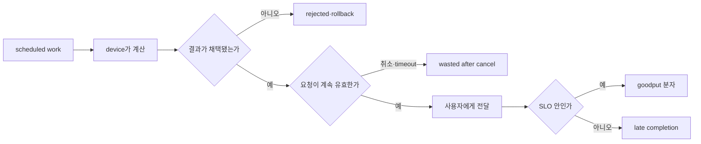
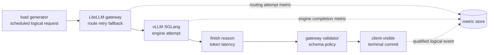

# 3장. 처리량보다 goodput을 묻는 이유

두 서버가 같은 GPU에서 초당 10,000 token을 계산했다고 하자. 첫 서버는 대부분의 요청을
지연 목표 안에 끝냈다. 둘째 서버는 큰 batch로 GPU를 계속 채웠지만 queue가 길어져 일부
사용자가 응답 전에 떠났고, 취소된 요청의 in-flight token도 한동안 계산했다. raw throughput만
보면 두 서버는 같다. 사용자에게 제때 전달된 유효한 결과를 보면 전혀 다른 시스템이다.

이 장은 “throughput은 나쁘고 goodput은 좋다”는 구호를 만들지 않는다. throughput은 hardware와
kernel 효율을 이해하는 데 반드시 필요하다. 문제는 분자에 무엇을 넣었는지 밝히지 않은 채
그 숫자를 서비스의 성공으로 사용하는 데 있다. 계산된 token, accepted token, streamed token,
완료 request와 SLO를 만족한 request를 각각 세어 보면 최적화가 어디서 일을 버리는지 보인다.



## 3.1 바쁜 GPU가 좋은 서비스를 보장하지 않는 장면

온라인 요약 서비스에 긴 문서 요청이 갑자기 몰렸다. dashboard의 GPU utilization은 97%,
token throughput은 평소보다 15% 높다. 하지만 timeout과 client cancellation도 늘었고 완료
요청 수는 줄었다. 운영자는 GPU가 충분히 일하고 있다는 숫자와 사용자가 결과를 못 받는
현상을 동시에 본다.

모순은 throughput의 분자를 열면 사라진다. scheduler가 이미 timeout 임박한 요청을 큰 batch에
넣었고, client disconnect가 engine abort로 전달되기 전에 몇 step이 더 실행됐다. KV 부족으로
일부 요청은 선점된 뒤 prompt를 다시 계산했다. speculative decoding은 여러 draft token을
계산했지만 target이 일부만 받아들였다. device counter에는 이 물리 작업이 모두 들어갈 수
있다. 사용자가 받은 새 결과는 그 일부다.

이 모순을 풀려면 같은 token이라는 이름 아래 섞인 사건을 시간순으로 나눠야 한다. 대표적으로
device가 계산한 token은 둘째 행에 잡히지만, client가 떠나 결과가 전달되지 않으면 넷째 행에는
잡히지 않는다. 어느 행을 분자로 삼느냐에 따라 같은 실행이 hardware 효율 실험인지 서비스
capacity 실험인지 달라진다.

| 회계 단위 | 세는 사건 | 답할 수 있는 질문 |
|---|---|---|
| scheduled token | scheduler가 계산을 약속함 | 정책이 일을 얼마나 발행했는가 |
| executed token | device가 실제 계산함 | hardware가 얼마나 일했는가 |
| accepted token | 결과가 logical history에 commit됨 | rollback 뒤 무엇이 남았는가 |
| delivered token | output 경로가 사용자에게 보냄 | 외부에 무엇이 전달됐는가 |
| completed request | terminal success에 도달함 | 몇 요청을 끝냈는가 |
| SLO-qualified request | 성공과 latency 조건을 모두 만족 | 제품 계약 안의 완료량은 얼마인가 |

한 열이 다른 열보다 항상 옳은 것이 아니다. kernel을 비교할 때는 executed token과 device
time이 유용하다. speculative algorithm을 비교할 때는 draft·accepted 비율이 필요하다. 서비스
capacity를 정할 때는 SLO-qualified completion이 중요하다. 같은 `tokens/s`라는 표제 아래 서로
다른 사건을 섞지 않는 것이 출발점이다.

### 동일 throughput이 서로 다른 useful output을 만드는 fixture

두 설정 A와 B가 60초 동안 각각 60,000 output token을 계산했다고 하자. raw throughput은 둘 다 1,000 token/s다. A는 100개 요청을 모두 끝냈지만 20개가 deadline을 넘었고 5개는 결과 검증에 실패했다. B는 90개만 받아 88개를 deadline 안에 정확히 끝냈고 2개는 명시적으로 빠르게 거절했다.

token throughput만 보면 동률이다. completed-request 비율만 보면 A가 더 좋아 보일 수 있다. 그러나 제품 계약이 “deadline 안에 정확히 완료된 요청”이라면 A의 useful request는 최대 75개이고 B는 88개다. 거절을 분모에 넣는 정책, client retry와 cancel 비용을 어떻게 셀지는 실험 전에 고정한다.

token goodput도 별도로 계산한다. deadline을 넘긴 A 요청이 긴 output을 가졌다면 rejected token 비율은 request 비율보다 클 수 있다. 반대로 짧은 health-style 요청이 많이 실패하면 request goodput은 낮고 token goodput은 높을 수 있다. 어느 단위를 제품 가치의 proxy로 택했는지 명시한다.

## 3.2 goodput의 분자와 분모를 계약으로 정한다

goodput을 가장 넓게 쓰면 단위 시간에 유효하게 완료한 작업량이다. 그러나 “유효”는 제품마다
다르므로 식을 먼저 적는다. 요청 단위 goodput은 다음처럼 둘 수 있다.

\[
G_{req}=\frac{\sum_i \mathbf{1}[\mathrm{success}_i \land
\mathrm{TTFT}_i\le S^{ttft}_{c(i)} \land
\mathrm{ITLtail}_i\le S^{itl}_{c(i)}]}{T}
\]

`c(i)`는 요청의 workload class이고 `T`는 관측 시간이다. 긴 문서와 짧은 대화에 서로 다른
TTFT SLO를 적용할 수 있다. streaming이 아닌 작업에는 ITL 조건이 없을 수 있다. 성공했지만
SLO를 넘긴 요청은 완료량에는 들어가도 이 goodput 분자에는 들어가지 않는다.

token 단위 goodput도 정의할 수 있다.

\[
G_{tok}=\frac{\sum_i \mathrm{delivered\ output\ tokens}_i\cdot
\mathbf{1}[\mathrm{request\ contract\ satisfied}_i]}{T}
\]

두 식은 다른 제품 행동을 보상한다. request goodput은 짧은 답변을 많이 끝내는 정책에 유리할
수 있고, token goodput은 긴 출력을 제공한 일을 반영한다. 그래서 논문이나 benchmark의
`goodput` 숫자를 가져올 때는 request인지 token인지, 어떤 SLO와 workload class를 썼는지 같이
가져와야 한다.

분모 `T`도 측정 window의 wall-clock인지 GPU active time인지 밝힌다. service capacity에는
queue와 idle을 포함한 wall-clock이 맞다. kernel efficiency에는 active device time이 유용하다.
둘을 바꾸면 같은 실행도 전혀 다른 숫자가 된다.

### 한 요청이 여러 SLO를 만족해야 하는 이유

TTFT만 제한하면 첫 token을 빨리 보낸 뒤 decode가 오래 멈춰도 성공으로 센다. ITL만 제한하면
queue에서 몇 초 기다린 사용자가 답이 시작된 뒤 매끄럽다는 이유로 성공이 된다. total latency만
보면 긴 출력 요청이 구조적으로 불리해지고 streaming 경험의 멈춤이 평균에 숨는다.

대화형 서비스라면 TTFT와 ITL tail을 함께 둘 수 있다. batch job은 deadline과 completion만
볼 수 있다. tool call 서비스는 첫 structured action까지의 시간과 schema-valid completion을
계약에 넣을 수 있다. goodput은 고정된 단일 공식이 아니라 제품의 유효한 완료를 기계적으로
판정할 수 있게 만든 회계다.

### 숫자를 끝까지 채워 보는 예

10분 동안 logical task 6,000개가 들어온 서비스를 가정하자. gateway retry 때문에 physical
attempt는 6,420개다. admission은 5,700개를 받았고 720개 attempt를 거절했다. admitted 가운데
5,500개가 성공 terminal에 도달했으며 120개는 오류, 80개는 취소됐다. 성공 중 TTFT 조건을
통과한 요청은 5,050개, TTFT와 TPOT를 모두 통과한 요청은 4,720개, E2EL까지 모두 통과한
요청은 4,650개다.

request throughput과 goodput은 다음처럼 다르다.

\[
\mathrm{completed\ throughput}=5500/600=9.17\ \mathrm{req/s}
\]

\[
\mathrm{SLO\ goodput}=4650/600=7.75\ \mathrm{req/s}
\]

offered logical task에 대한 SLO attainment는 `4,650/6,000=77.5%`다. physical attempt를 분모로
쓰면 retry 때문에 다른 비율이 나온다. 어느 값을 availability라고 부를지 계약에 적어야 한다.

이제 token ledger를 열어 보니 output device가 계산한 target token은 1,120,000개, accepted는
1,030,000개, client에 전달된 것은 990,000개였다. draft model은 별도로 760,000 token을
계산했다. preemption recompute는 prompt token 140,000개, abort 요청 이후 계산된 output은
18,000개다.

`1,120,000 / 600 = 1,866.7 target tokens/s`만 보고 변경을 승인하면 draft, recompute와
post-cancel work를 놓친다. delivered output은 1,650 tokens/s이고, SLO를 만족한 요청에 속한
delivered token만 다시 합치면 더 작아질 수 있다. 그렇다고 draft 760,000개를 모두 낭비라고
부르면 speculative 기법의 target step 절감을 무시한다. wall-clock과 GPU-time을 baseline과
비교해야 한다.

변경 전 baseline이 goodput 7.5 req/s, target executed 1,600 tokens/s, draft 없음이었다고 하자.
변경 뒤 goodput은 3.3% 올랐지만 총 device work와 workspace가 크게 늘었다. 낮은 동시성에서는
가치가 있어도 peak traffic에서 queue headroom이 줄 수 있다. rate sweep에서 goodput 정점과
회복 시간을 다시 확인한다.

cohort를 나누니 짧은 대화 attainment 92%, 긴 문서 31%였다면 전체 77.5%만으로 승인할 수 없다.
긴 문서가 필수 제품 class인지, 별도 queue·deadline·resource share가 필요한지 결정한다. 이 한
예만으로도 goodput은 단순한 나눗셈이 아니라 workload와 정책을 드러내는 회계임을 알 수 있다.

### 자주 틀리는 결론을 바로잡는다

“goodput이 높으면 utilization도 높아야 한다”는 명제는 성립하지 않는다. SLO를 지키기 위해
burst headroom을 남기면 평균 utilization이 낮을 수 있다. 반대로 항상 100%에 가까운 장치는
queue shock을 흡수하지 못할 수 있다. 목표는 장치를 쉬게 하는 것이 아니라 유효 완료를 최대화할
충분한 headroom을 찾는 것이다.

“늦은 성공은 전부 버린 일”도 항상 맞지 않는다. offline 결과로 재사용되거나 cache를 덥히는
가치가 있을 수 있다. 다만 interactive SLO goodput에는 넣지 않고 별도 가치로 회계한다. 서로
다른 제품 목표를 한 분자에 넣으면 실패의 의미가 흐려진다.

“goodput이 같으면 더 싼 설정이 무조건 낫다”는 결론도 조건부다. 두 설정의 평균 goodput이
같아도 tail cohort, 오류 복구, burst headroom과 resource leak 위험이 다를 수 있다. 비용은
GPU-hour뿐 아니라 retry traffic, network byte, memory-time과 운영 복잡성을 포함한다.

“benchmark가 계산해 주니 정의를 읽을 필요가 없다”는 생각이 가장 위험하다. vLLM benchmark의
goodput은 설정된 TTFT·TPOT·E2EL 조건을 모두 통과한 성공 request를 duration으로 나눈다. 제품이
ITL tail, schema validity나 logical retry를 요구한다면 별도 판정이 필요하다. 계산기가 정확해도
질문이 다르면 답은 쓸 수 없다.

이 장의 회계는 뒤의 모든 최적화 장에서 공통 바닥이 된다. KV cache는 hit 수가 아니라 절약한
유효 work로, P/D 분리는 phase별 utilization이 아니라 transfer 비용을 포함한 SLO goodput으로,
quantization과 kernel은 peak tokens/s가 아니라 정확성 조건과 workload goodput으로 돌아온다.
중간 지표가 나쁘다는 뜻이 아니다. 중간 지표가 최종 목적과 연결되는 사슬을 매번 증명해야
한다는 뜻이다.

### raw throughput과 네 goodput을 같은 표에 놓는다

하나의 숫자로 모든 목적을 합치지 않는다. request goodput은 계약을 만족한 logical completions/s, token goodput은 그 요청의 useful output tokens/s다. deadline goodput은 latency 조건을, correctness goodput은 output invariant를 적용한다. cost-adjusted goodput은 useful completion 또는 token을 GPU time·attempt·화폐 비용으로 나눈다.

A/B 비교를 시작할 때는 결과 비율부터 쓰지 않고, 요청이 제공된 순간부터 유효 결과가 된
순간까지 같은 모집단이 어떻게 줄었는지 행으로 놓는다. 예를 들어 offered 1,000건 가운데
admitted 900건, completed 850건, deadline과 correctness를 모두 통과한 700건이라면 700/850과
700/1,000은 서로 다른 질문의 답이다. 이 비교 축을 고정한 뒤 offered requests, admitted,
completed, deadline pass, correctness pass, client committed, canceled, retries, computed tokens와
useful tokens를 같은 표에 둔다. derived metric은 이 원장 열에서 계산하고 서로 다른 로그
시스템의 집계 창을 섞지 않는다.

분모에는 open-loop offered arrival을 기본으로 두되 admission policy 자체를 평가할 때 accepted goodput도 보조로 보고한다. accepted-only가 높고 offered goodput이 낮다면 overload를 rejection으로 밀어냈을 수 있다. 빠른 reject가 client retry storm을 만들면 gateway까지 workload boundary를 넓힌다.

tokens/s는 prompt와 output을 합쳤는지 밝힌다. prefill token 하나와 decode token 하나의 비용과 사용자 가치가 다르다. input processing throughput, output token throughput과 useful response를 별도 표시하고 하나를 다른 것의 proxy로 쓰는 조건을 설명한다.

### 관측이 goodput 손실의 owner를 가리키게 만든다

goodput dashboard는 최종 숫자와 함께 exclusion reason을 보여야 한다. `deadline`, `incorrect`, `canceled`, `rejected`, `transport_lost`, `duplicate`를 중복 없이 한 terminal classification으로 만들고, 여러 원인이 있으면 first violated contract와 보조 flags를 분리한다. 같은 request를 두 reason 분자에서 두 번 빼지 않는다.

reason만으로 root cause를 확정하지 않는다. deadline miss는 scheduler wait, prefill service, decode ITL와 output commit 어느 곳에서도 생길 수 있다. cancellation은 사용자가 먼저 떠난 정상 행동일 수도 있고 server latency의 결과일 수도 있다. classification에서 stage timestamp와 attempt tree로 내려간다.

metric label은 bounded해야 한다. raw prompt, request id, exact model path와 free-form error를 label에 넣지 않는다. model/version, endpoint, length/deadline bucket, terminal category와 selected backend 정도를 제한된 값으로 두고 sampled trace에서 상세 identity를 연결한다.

서버 token counter와 client-observed bytes 사이에는 detokenization, buffering과 disconnect가 있다. 서버가 100 token을 만들었어도 80만 client에 commit됐다면 제품 useful output 정의에 따라 80 또는 terminal 실패 0이 될 수 있다. partial response가 가치 있는 streaming 제품인지 atomic response 제품인지 계약을 먼저 쓴다.

## 3.3 계산됐지만 분자에서 빠지는 네 종류의 일

첫째는 취소 뒤의 계산이다. client disconnect와 engine abort 사이에는 전파 지연이 있고 이미
제출된 CUDA work는 안전한 경계까지 끝날 수 있다. 이 token은 executed에는 들어가지만 delivered와
completed에는 들어가지 않는다. abort latency가 길수록 과부하 때 쓸모없는 일이 capacity를
다시 잠식하는 양의 되먹임이 생긴다.

둘째는 preemption 뒤 재계산이다. KV를 내려놓고 prompt 일부를 다시 계산하면 동일한 logical
token에 device work를 두 번 쓴다. throughput은 높아 보일 수 있지만 새 completion은 늘지
않는다. `executed / accepted` 비율을 recompute amplification의 한 관측으로 사용할 수 있다.

셋째는 speculative rejection이다. draft model이나 target verification이 여러 후보를 계산해도
accepted history에는 일부만 commit된다. rejected token은 알고리즘이 속도를 얻기 위해 의도적으로
지불한 비용일 수 있으므로 무조건 낭비라고 부르지는 않는다. acceptance length, draft 비용과
target step 감소를 함께 보아 wall-clock goodput이 실제로 늘었는지 판단한다.

넷째는 늦은 성공이다. 응답이 정확히 완료됐더라도 사용자의 deadline 뒤라면 SLO goodput에서
빠진다. 이 일은 자원 회계상 낭비가 아닐 수 있지만 해당 제품 계약에는 유효하지 않다. offline
재사용이나 cache warming 가치가 있다면 별도 지표로 남기되 사용자 SLO와 섞지 않는다.

이 네 종류를 한 `wasted_tokens` counter로 합치면 처방을 잃는다. 취소 전파는 request lifecycle을,
재계산은 KV와 preemption 정책을, speculative rejection은 acceptance와 draft 비용을, 늦은
성공은 admission과 SLO를 봐야 한다. 원인별 counter와 request·step trace 연결이 필요하다.

### cancellation 뒤 계산된 token의 owner를 찾는다

client가 t=4초에 취소했지만 engine이 t=7초까지 decode했다면 3초 구간의 GPU work는 raw throughput에는 들어가도 useful output에는 들어가지 않는다. API가 terminal cancel을 반환한 시각, abort가 scheduler에 도달한 시각, running batch에서 제거된 시각과 KV가 해제된 시각을 분리한다.

cancel counter 하나로 wasted compute를 계산하지 않는다. 취소 전에 이미 계산·전송된 token, 취소 뒤 queue에 남은 output, in-flight kernel에서 피할 수 없었던 quantum과 다음 step까지 계속된 잘못된 membership을 나눈다. 마지막 항목만 줄일 수 있는 scheduler/control-plane waste일 수 있다.

경쟁 가설은 client disconnect detection 지연, abort queue 지연, non-preemptible kernel quantum과 stale output reconciliation이다. timestamp 네 개가 처음 갈라지는 경계로 owner를 고른다. device utilization이 높다는 사실은 네 가설을 구별하지 못한다.

### retry가 성공률을 높이고 goodput을 낮추는 시간표

logical request R이 provider/engine attempt A1에서 timeout되고 A2로 retry됐다고 하자. A1이 실제로 취소되지 않고 늦게 성공하면 두 attempt가 compute를 소비한다. client에는 A2만 commit될 수 있으므로 A1 output은 denominator의 offered work에는 영향을 주지만 numerator의 useful completion은 아니다.

attempt success rate와 logical success rate를 분리한다. logical latency는 첫 admission부터 committed response까지이며 attempt latency 평균으로 대체하지 않는다. retry가 arrival rate를 증폭해 정상 요청까지 queue에서 deadline을 놓치면 개별 R 복구가 전체 goodput을 떨어뜨릴 수 있다.

fixture에는 retry owner, deadline budget, backoff, idempotency/response commitment와 downstream cancellation acknowledgement를 둔다. retry를 껐을 때 failure가 늘었다는 사실만으로 켜는 결론을 내리지 않는다. retry-on에서 useful completions, total attempts, wasted tokens와 tail latency를 함께 비교한다.

## 3.4 vLLM benchmark가 goodput을 세는 코드를 읽는다

추상 정의가 실제 도구에서 어떻게 좁아지는지 vLLM v0.27.1의 Rust benchmark를 보자. CLI는
`--goodput`에 `ttft`, `tpot`, `e2el`이라는 세 이름과 millisecond 값을 받는다. parser는 다른
이름과 음수를 거부하고 `GoodputConfig`의 선택 필드로 옮긴다. 즉 이 도구에서 goodput은 임의의
제품 조건 전체가 아니라 세 latency 조건의 conjunction으로 구현돼 있다.

고정 소스의 [`parse_goodput`](https://github.com/vllm-project/vllm/blob/6e448d0ea9bf3d88d898b65449ca6dc2aec170ac/rust/src/bench/src/config.rs#L770-L815)은
문자열을 field로 바꾸는 입구다. 계산 경로의
[`calculate_metrics`](https://github.com/vllm-project/vllm/blob/6e448d0ea9bf3d88d898b65449ca6dc2aec170ac/rust/src/bench/src/metrics/calculator.rs#L131-L171)은
성공 요청별로 TTFT·TPOT·E2EL 배열을 같은 index에서 읽는다. 설정된 조건 가운데 하나라도
초과하면 `is_good=false`가 되고, 모두 통과한 `good_completed`를 benchmark duration으로 나눠
request goodput을 만든다.

코드에서 중요한 세부는 다음과 같다.

```text
설정하지 않은 SLO       → 그 조건은 판정에서 제외
설정한 SLO를 초과       → 해당 성공 요청은 goodput 분자에서 제외
모든 설정 조건 통과     → good_completed += 1
request_goodput          → good_completed / dur_s
```

이 구현은 우리가 앞 절에서 만든 request goodput의 한 구체화다. 그러나 ITL p99를 요청별로
제한하거나 schema correctness, tenant별 deadline을 판정하지 않는다. TPOT는 요청의 output
token 평균 간격 성격이므로 드문 긴 멈춤을 별도로 제한하지 못할 수 있다. 도구가 잘못됐다는
뜻이 아니라, 도구의 metric contract가 제품 contract와 같은지 확인해야 한다는 뜻이다.

또한 `good_completed` loop는 성공 요청에서 만들어진 평행 배열을 전제로 한다. 실패 요청은
completed·failed 회계에서 따로 다뤄지고 goodput 분자에는 들어가지 않는다. timeout을 client가
어떻게 오류로 표기하는지, partial stream 뒤 연결 종료가 성공인지 실패인지 backend output
contract까지 읽어야 한다. calculator 한 함수만 보고 request lifecycle 전체를 추정하면 안 된다.

### CLI 숫자가 scheduler 옵션은 아니다

`--goodput ttft:200 e2el:5000`은 서버가 200ms를 deadline으로 scheduling하도록 만드는 옵션이
아니다. benchmark가 결과를 사후 판정하는 기준이다. server admission이나 priority가 이 값을
받지 않는다면 SLO를 넘길 요청도 계속 실행할 수 있다. 측정 목표와 제어 정책을 구분해야 한다.

이 차이는 overload에서 커진다. benchmark는 200ms를 넘긴 완료를 분자에서 빼지만 서버는 그
요청에 이미 GPU 시간을 썼다. admission controller가 예상 queue delay를 보고 일찍 거절한다면
실패율은 늘어도 남은 요청의 goodput이 높아질 수 있다. 어느 정책이 옳은지는 거절 비용과
제품 계약에 달려 있으며 benchmark flag 하나가 결정하지 않는다.

vLLM benchmark의 고정 README도 goodput을 “지정한 모든 SLO를 만족한 requests/sec”로 설명하고
rate·concurrency sweep을 제공한다. 원문 좌표는
[`rust/src/bench/README.md`](https://github.com/vllm-project/vllm/blob/6e448d0ea9bf3d88d898b65449ca6dc2aec170ac/rust/src/bench/README.md#L246-L262)다.
예제 명령을 복사하는 것보다 어떤 arrival process와 dataset으로 sweep했는지를 결과에 함께
남기는 것이 더 중요하다.

### 처음 도입할 때의 최소 계측

기존 서비스에 goodput dashboard가 없다면 모든 waste 경로를 한 번에 구현할 필요는 없다.
먼저 logical task와 physical attempt를 구분하고, attempt마다 receive·first token·finish 시각,
terminal reason, input/output token 수를 남긴다. 이 정보만으로 completed throughput, 기본
TTFT·TPOT·E2EL SLO goodput, retry amplification과 cancellation 비율을 계산할 수 있다.

다음 단계에서 scheduler step ID와 executed query token을 연결한다. request별 accepted·delivered
길이, preemption과 recompute, speculative draft·accepted 수를 추가하면 waste 경로가 보인다.
마지막으로 KV memory-time, remote transfer와 energy·비용을 붙인다. 관측을 점진적으로 늘리되
각 counter의 owner와 terminal update를 소스에서 확인한다.

counter 불변식도 둔다. 한 관측 window의 attempt는 terminal이거나 아직 in-flight여야 하고,
success·failed·cancelled가 겹치면 안 된다. accepted output은 일반적으로 target이 확정한 logical
history이고 delivered는 그중 output 계약이 외부로 보낸 부분이다. 구현에 따라 usage가 special
token이나 stop token을 포함하는 방식이 다를 수 있으므로 부등식을 맹목적으로 강제하지 말고
정확한 포함 규칙을 먼저 적는다.

```text
offered logical task = terminal logical task + active logical task
admitted attempt = terminal attempt + in-flight attempt
physical attempt ≥ logical task             # retry가 있다면
SLO-qualified success ≤ successful terminal
```

window 경계에서는 이전 window에서 시작한 요청이 이번에 끝날 수 있다. 단순 arrival와 completion
수를 같은 window에서 빼 leak이라고 판정하지 않는다. cohort analysis는 request start 기준인지
finish 기준인지 밝히고, 장기 running과 orphan만 수명 trace로 찾는다.

### vLLM benchmark 숫자의 범위를 넘겨 읽지 않는다

vLLM benchmark의 goodput 계산은 요청별 latency와 SLO threshold를 적용하는 구체적 구현 근거다. 그러나 해당 CLI threshold가 production admission이나 scheduler state를 바꾸는 것은 아니다. benchmark client가 결과를 사후 분류하는 것과 engine이 deadline-aware scheduling을 하는 것을 분리한다.

source에서 request output, latency record, successful response filter와 goodput aggregation의 input을 잇는다. tokenizer/input length 계산, output length와 error가 어느 시점에 정해지는지도 본다. timeout request가 output token denominator에 남는지, streaming TTFT/ITL threshold가 missing sample을 어떻게 처리하는지 확인한다.

benchmark의 offered rate가 open-loop인지 concurrency-limited인지도 source option consumer에서 확인한다. concurrency client는 response가 늦을수록 다음 request 발행이 늦어져 overload input을 자동으로 줄일 수 있다. arrival-rate sweep과 같은 곡선으로 부르지 않는다.

current source가 제공하지 않는 correctness judge나 cost reconciliation을 benchmark goodput에 포함됐다고 쓰지 않는다. 이 장의 확장된 product goodput ledger는 benchmark 결과와 별도 계산이다. 공통 request id/timestamp를 통해 비교할 수는 있지만 정의가 같다고 가정하지 않는다.

### 세 stack 관측을 하나의 request ledger로 조인한다

gateway는 logical request와 retries, engine은 scheduler membership과 generated tokens, client는 실제 commit과 deadline을 안다. 어느 한 층도 전체 goodput을 단독으로 알지 못할 수 있다. privacy-safe logical id와 attempt id, engine request generation을 전달해 세 원장을 join한다.

join 실패를 success/failure에서 조용히 버리지 않는다. unmatched gateway attempt, engine request와 client terminal을 별도 completeness metric으로 둔다. 관측 누락이 많은 기간의 goodput은 lower/upper bound로 보고하고 정밀 숫자로 과장하지 않는다.

clock은 monotonic domain이 다를 수 있다. process 간 absolute timestamp를 직접 빼기 전에 trace propagation과 clock synchronization 범위를 확인한다. 각 process 내부 duration과 causal send/receive edge를 사용하면 일부 skew를 피할 수 있다.

retry는 logical id를 유지하고 attempt id를 바꾼다. same request id를 재사용하는 engine이 generation을 제공하지 않으면 late output이 새 attempt에 귀속될 수 있다. output correctness뿐 아니라 accounting correctness 문제다. terminal 후 late event를 quarantine하고 usage는 원 attempt에 붙인다.

## 3.5 부하를 올리면 throughput과 goodput 곡선이 갈라진다

낮은 도착률에서는 대부분의 요청이 곧바로 실행되므로 throughput과 goodput이 함께 오른다.
GPU가 더 잘 채워지는 구간에서는 batch 효율도 좋아질 수 있다. 그러나 service capacity에
가까워지면 queue가 쌓이고 tail latency가 SLO를 넘기 시작한다. 완료 throughput은 조금 더
오르거나 평평해져도 goodput은 먼저 정점을 찍고 내려갈 수 있다.

가상의 sweep을 보자.

| offered load | 완료 req/s | SLO 통과율 | request goodput | p99 TTFT |
|---:|---:|---:|---:|---:|
| 10 req/s | 10 | 99% | 9.9 | 180ms |
| 30 req/s | 30 | 97% | 29.1 | 420ms |
| 50 req/s | 49 | 82% | 40.2 | 1.1s |
| 70 req/s | 55 | 48% | 26.4 | 4.8s |
| 90 req/s | 56 | 21% | 11.8 | 11.2s |

완료량만 보면 70~90 req/s에서도 서버는 55~56 req/s를 처리한다. goodput 최대는 50 req/s
부근이고 그 뒤에는 더 많은 입력이 유효한 완료를 줄인다. 과부하 보호가 필요한 이유다.

이 표에서 50 req/s를 capacity라고 단정할 수도 없다. prompt·output 길이, SLO, burstiness,
prefix reuse와 hardware가 바뀌면 곡선이 이동한다. steady Poisson arrival에서 얻은 정점은 갑작스런
burst의 queue 회복 시간을 말하지 않는다. 최소한 여러 seed와 길이 cohort, warm/cold cache를
나눠야 한다.

### concurrency sweep과 arrival-rate sweep은 다른 질문이다

동시 요청 수를 고정하는 closed-loop sweep은 “이만큼의 active client가 있을 때 각 client가
얻는 성능”을 본다. 서버가 느려지면 client의 다음 요청도 늦게 출발해 offered load가 스스로
줄어든다. arrival-rate sweep은 정해진 속도로 요청을 보내 queue의 불안정을 드러낸다. 대신
무한 queue를 허용하면 현실의 timeout·retry 정책과 달라진다.

두 실험을 함께 쓰면 saturation을 더 잘 이해할 수 있다. concurrency sweep으로 batch 효율과
active sequence 한계를 보고, open-loop rate sweep으로 queue가 회복 가능한 도착률과 SLO
goodput 정점을 찾는다. 결과에는 실제 achieved arrival, rejected, failed, cancelled와 benchmark
duration을 같이 남긴다.

### workload mix가 분모를 바꾸는 것을 막는다

설정 A는 긴 prompt를 빠르게 거절하고 짧은 decode만 처리할 수 있다. 설정 B는 둘을 모두 받는다. A의 admitted-request throughput만 보면 높지만 offered workload 기준으로 긴 요청이 사라졌다. benchmark client가 rejection 뒤 요청을 빼거나 input distribution을 바꾸면 비교 분모가 달라진다.

arrival trace, prompt/output length, priority/tenant, streaming과 deadline을 고정한다. admission rejection, timeout과 client-side queue도 결과에 포함한다. concurrency 고정 실험과 open-loop arrival-rate 실험은 다른 질문이다. 전자는 서버가 느려질수록 offered rate가 함께 줄 수 있어 overload collapse를 숨긴다.

mix별 goodput을 보고하고 weighted aggregate의 weight를 사전에 정한다. 전체 평균이 좋아도 interactive tier가 나빠질 수 있다. fairness/minimum-share 계약이 있으면 tenant별 numerator와 starvation/max-wait를 함께 둔다.

### deadline miss를 queue·service·commit으로 분해한다

요청의 deadline miss를 engine latency 하나로 쓰면 조정 지렛대를 잃는다. arrival에서 admission까지의 client/gateway wait, scheduler waiting, prefill service, 첫 token 이후 decode interval, output queue와 network commit을 나눈다. deadline은 최종 byte 기준일 수도 있고 TTFT와 ITL 각각의 계약일 수도 있다.

A 설정에서 20개 miss가 모두 긴 prompt라면 prefill queue 또는 chunk policy 후보가 강하다. 짧은 prompt도 first byte 이전에 같이 늦으면 admission burst와 host gap을 본다. TTFT는 맞고 streaming tail만 늦으면 decode fairness, output backpressure와 slow client를 분리한다. 최종 latency 하나는 이 세 장면을 같은 miss로 센다.

각 request에는 `arrival, admitted, first_scheduled, first_token_ready, first_byte_committed, last_token_ready, terminal_committed`를 둔다. timestamp를 모두 production metric label로 넣지 않고 trace sample에 둔다. stage별 bounded histogram과 miss reason category로 집계한다.

deadline을 request 처리 중간에 바꾸지 않는다. client timeout이 10초인데 benchmark가 server-reported 30초 deadline으로 goodput을 세면 이미 떠난 client의 output이 분자에 들어간다. logical request의 최초 계약을 보존하고 retry attempt에는 remaining deadline만 넘긴다.

miss 뒤 결과가 정확해도 사용자가 소비하지 못했다면 strict deadline goodput에서는 제외된다. 별도의 late-useful tier가 필요한 제품이면 사전에 정의한다. 보고서에서 strict와 relaxed goodput을 섞어 개선을 만들지 않는다.

## 3.6 요청 하나의 token 회계 장부를 만든다

문서 요약 요청 `R17`이 prompt 2,000 token, 최종 출력 120 token을 사용자에게 보냈다고 하자.
trace에는 다음 일이 있었다.

- prefix cache miss로 2,000 prompt token을 prefill했다.
- KV pressure로 선점되어 prompt 800 token을 다시 계산했다.
- speculative decode가 draft token 180개를 만들었고 target은 126개를 받아들였다.
- stop string 판정에서 마지막 accepted token 6개 가운데 일부 text를 사용자에게 내보내지 않았다.
- client가 받은 최종 output token은 120개였다.

하나의 숫자로 요약하지 말고 ledger를 만든다.

| 경로 | 물리 계산 token | logical history 기여 | 사용자 전달 | 분리할 이유 |
|---|---:|---:|---:|---|
| 최초 prefill | 2,000 | prompt state 2,000 | 직접 전달 없음 | 필수 입력 비용 |
| recompute | 800 | 기존 state 복원 | 없음 | preemption 증폭 |
| draft | 180 | acceptance 전 후보 | 없음 | assistant 비용 |
| target accepted | 126 | output history 126 | 120 | verification·stop 차이 |
| rejected/trimmed | 별도 계산에 포함 | 0 또는 terminal 처리 | 0 | rollback·출력 계약 |

여기서 `executed / delivered = 3,106 / 120` 같은 비율은 prompt 비용까지 섞어 해석하기 어렵다.
prefill, recompute, draft, target decode를 phase별로 나눈다. decode optimization에는 accepted
length와 draft/target device time을 보고, scheduler에는 recompute token과 victim age를 본다.
service goodput에는 이 요청이 TTFT·ITL·deadline을 통과했는지를 한 표식으로 둔다.

### 취소 요청은 terminal reason과 물리 drain을 따로 기록한다

사용자가 output 20 token 뒤 취소했다고 하자. API가 `ABORTED`를 기록한 뒤 이미 제출된 batch가
끝나 token 4개를 더 계산할 수 있다. logical request는 terminal이지만 device work는 아직
drain 중이다. KV block을 즉시 다른 요청에 재사용하면 늦은 write와 충돌할 수 있다.

회계에는 `abort_requested`, `scheduler_removed`, `inflight_drained`, `resource_reclaimed`를
서로 다른 사건으로 둔다. abort 이후 executed token과 reclaim까지의 memory-time을 측정하면
cancel storm이 capacity를 얼마나 잠식하는지 보인다. 단순 cancelled request count만으로는
취소가 싼지 비싼지 알 수 없다.

### 물리 work 원장이 취소 최적화의 상한을 보여 준다

취소 요청 R이 이미 prefill 8,192 token을 끝내고 decode 20 token 뒤 떠났다고 하자. 취소 전 work는 요청 결과가 폐기돼도 당시에는 필요한 계산이었다. 취소 후 scheduler가 추가 15 token을 만들었다면 이 부분은 avoidable 후보다. 그러나 한 kernel batch에 이미 들어간 4-token quantum은 즉시 중단할 수 없을 수 있다.

원장은 `useful committed`, `computed before cancel`, `in-flight unavoidable`, `post-cancel stale membership`, `retry duplicate`를 구분한다. 모든 폐기 token을 scheduler bug로 세면 개선 가능한 상한을 과장한다. 반대로 GPU counter에 나온 전체 token만 보면 stale membership을 숨긴다.

abort latency를 줄이는 patch는 cancel→manager receive, manager→scheduler enqueue, schedule boundary removal과 in-flight completion 중 어느 구간을 줄였는지 보여야 한다. device-wide sync로 빨리 정리된 것처럼 만들면 다른 request concurrency를 해칠 수 있다. 올바른 request-generation edge와 batch membership 검사가 필요하다.

회귀 fixture는 waiting cancel, running prefill cancel, decode cancel, stream disconnect와 same-ID retry를 포함한다. terminal event는 한 번이고, canceled generation output은 새 incarnation mailbox에 들어가지 않으며, KV와 active slot은 마지막 consumer 뒤 유한하게 반환돼야 한다.

goodput 개선은 canceled work가 줄었다는 것만으로 승인하지 않는다. cancel polling을 너무 자주 하면 정상 request service가 느려질 수 있다. 정상 workload throughput/latency, cancel-heavy useful completion과 control-plane CPU cost를 함께 본다.

### retry tree를 logical request 하나로 회계한다

R의 attempt A1이 8초 뒤 timeout, A2가 6초 뒤 성공했다고 하자. 두 attempt latency 평균 7초는 logical latency 14초를 숨긴다. backoff 1초가 있었다면 15초다. A1과 A2가 겹쳤다면 wall-clock은 줄 수 있지만 동시 compute와 duplicate response commitment 위험이 생긴다.

attempt tree에는 parent logical id, attempt id, target deployment, start/end, cancel acknowledgement, produced/committed tokens와 usage cost를 둔다. logical numerator에는 최종적으로 한 번 commit된 correct response만 들어간다. denominator 정책에는 최초 offered request와 retry-generated load를 별도 열로 둔다.

retry-on에서 성공률이 올랐지만 total attempts가 1.4배, queue wait가 2배가 되면 다른 요청 miss가 늘 수 있다. R 자체 success와 전체 workload goodput을 동시에 비교한다. circuit breaker와 backoff가 retry burst를 시간상 분산해도 총 compute가 줄었다는 뜻은 아니다.

late A1 success가 도착했을 때 A2가 이미 stream commit을 시작했다면 A1을 버린다. usage billing은 provider/engine 계약에 따라 두 attempt 모두 발생할 수 있다. budget reconciliation이 logical response 하나만 세면 cost goodput을 과대평가한다.

재시도 가능 error를 status code 하나로 정하지 않는다. request body가 provider에 도달했는지, response commitment가 시작됐는지, operation이 idempotent한지와 remaining deadline을 본다. tool call이나 외부 side effect가 있다면 semantic duplicate 비용이 token waste보다 크다.

## 3.7 goodput 최적화가 admission 문제로 이어지는 이유

queue에 들어온 모든 요청을 언젠가 끝내는 것이 항상 친절한 정책은 아니다. 이미 deadline을
맞출 가능성이 거의 없는 요청을 받아 오래 기다리게 하면 그 요청도 실패하고 뒤 요청도
밀린다. admission control은 예상 service와 queue delay, KV capacity를 보고 새 요청을
받거나 미루거나 거절한다.

그러나 admission을 aggressive하게 만들면 좋은 숫자를 조작하기 쉽다. 어려운 긴 요청을 모두
거절하고 짧은 요청만 받으면 accepted-request goodput은 높아진다. offered, admitted,
rejected, completed와 SLO-qualified를 같은 funnel에 둔다.

```text
offered 1,000
  → admitted 820
    → completed 790
      → SLO-qualified 730
  → rejected 180
```

`730 / duration`은 admitted workload의 service goodput이고, `730 / 1,000`은 offered demand에
대한 attainment 비율이다. 둘을 함께 봐야 router가 부하를 숨기는지 알 수 있다. tenant와
길이 cohort별 rejection도 나눈다.

DistServe는 TTFT와 TPOT 조건 안에서 서비스할 수 있는 최대 rate를 goodput 관점으로 다루고,
prefill과 decode 자원·parallelism을 독립적으로 배치한다. 이 논문 명제는 goodput이 단순한
dashboard 지표가 아니라 provisioning 목적 함수가 될 수 있음을 보여 준다. 다만 논문의
prototype 결과를 현재 vLLM이나 SGLang의 성능으로 옮기면 안 된다. 논문 원문은
[DistServe arXiv 2401.09670v3](https://arxiv.org/abs/2401.09670v3)이며, 현행 구현의 admission·KV
transfer·cleanup은 각각 고정 소스에서 다시 검증해야 한다.

### fairness를 goodput 분자 밖에 두면 생기는 착시

긴 요청을 모두 굶기면 짧은 request/s는 급격히 오를 수 있다. aggregate strict goodput이 좋아도 긴-context tier의 useful completion이 0이면 제품 계약을 위반한다. workload bucket과 tenant별 goodput, max wait와 minimum share를 함께 둔다.

token goodput은 긴 요청에 상대적으로 큰 weight를 줄 수 있고 request goodput은 짧은 요청에 유리하다. 둘 가운데 하나를 공정성으로 부르지 않는다. weighted objective의 weight와 SLA tier를 공개하고 starvation guardrail을 별도로 둔다.

preemption은 high priority deadline goodput을 올리면서 victim의 이미 계산된 prompt를 버릴 수 있다. freed KV byte나 selected priority만 보지 않고 recompute tokens, victim completion과 retry를 원장에 넣는다. 유용한 high-tier 증가가 전체 compute debt보다 가치 있는지는 제품 weight로 판정한다.

prefix locality policy도 raw throughput을 올릴 수 있지만 cache-poor tenant를 늦출 수 있다. saved prefill tokens와 tenant wait debt를 같이 본다. locality는 fairness policy가 아니며 aging/minimum-share와 결합한 실제 queue key를 확인한다.

### 비용과 에너지를 분모로 넣을 때의 주의점

useful tokens per GPU-second는 같은 GPU·power 상태에서 효율을 비교하는 데 쓸 수 있다. 서로 다른 장치에서는 GPU-second가 같은 비용이나 에너지를 뜻하지 않는다. accelerator count, wall time, measured power/energy 또는 청구 비용 가운데 무엇을 분모로 썼는지 밝힌다.

idle headroom은 낭비처럼 보여도 burst SLO와 failure recovery에 필요한 reserve일 수 있다. energy/token을 최소화하려고 장치를 포화시키면 queue와 deadline goodput이 나빠질 수 있다. energy와 SLO를 Pareto 형태로 보고 한 metric에 숨기지 않는다.

retry와 speculative work는 에너지에는 모두 들어가지만 useful output에는 accepted/committed portion만 들어간다. prefix cache hit는 saved compute를 줄이지만 remote KV transfer와 memory pin 비용이 생긴다. component별 energy를 직접 측정하지 못하면 경로와 시간 proxy의 한계를 쓴다.

cost-adjusted goodput도 provider price revision, cache discount와 reserved capacity를 포함할 수 있다. list price로 attempt 하나만 세면 late success와 retry cost를 누락한다. usage reconciliation이 늦는다면 provisional과 final cost goodput을 구분한다.

## 3.8 throughput이 올랐는데 goodput이 떨어지는 세 사건

첫 번째 사건은 batch 한도를 높인 배포다. device token throughput은 18% 올랐지만 한 step의
실행 시간이 길어져 대화 요청의 ITL p99가 SLO를 넘었다. completed requests/sec는 비슷했고
goodput만 떨어졌다. 이때 “GPU 효율 개선”과 “서비스 개선”은 동시에 참이 아니다. kernel
관점의 목표는 달성했지만 scheduler가 사용자 시간을 배치하는 목적은 실패했다.

검증은 batch 변경 전후의 동일 workload에서 step token 구성, GPU duration, ITL 위반 요청을
연결한다. ITL 위반이 긴 mixed step과 겹치고 output 구간은 정상이라면 인과가 강해진다. 단지
배포 시각과 p99 상승이 같다는 이유만으로 결론내리지 않는다. arrival burst나 cache miss
증가가 함께 있었는지 비교한다.

두 번째 사건은 prefix cache hit가 오른 배포다. hit counter는 40%에서 75%로 뛰었지만 remote
cache lookup과 transfer가 짧은 prefix의 recompute보다 느렸고, destination KV reservation이
HBM을 오래 점유했다. GPU prefill token은 줄었지만 TTFT SLO 통과율이 떨어졌다. saved token만
보면 성공이고 end-to-end goodput을 보면 실패다.

이 경우 hit를 local, host, remote, partial로 나누고 `lookup→transfer→install→runnable` 시간을
잰다. hit prefix 길이로 절약한 예상 prefill과 memory-time을 비교한다. cache hit는 결과가 아니라
특정 경로를 탔다는 사건이다. 이 경로의 비용이 miss 경로보다 작아야 유효하다.

세 번째 사건은 speculative decoding의 draft 길이를 늘린 배포다. target forward 횟수는 줄었고
한 번에 accepted되는 token 수도 늘었지만 draft model과 verification workspace가 GPU를 더
점유해 높은 동시성에서 queue가 길어졌다. 단독 요청 latency는 좋아지고 saturation goodput은
나빠질 수 있다.

acceptance rate 하나로는 판정할 수 없다. accepted tokens per target step, draft와 target의
각 device time, verification·rollback 비용, 동시성별 queue, KV/workspace peak를 함께 본다.
acceptance가 높아도 draft 비용이 너무 크면 손해이고, acceptance가 중간이어도 target step을
충분히 줄이면 이득일 수 있다.

세 사건의 공통점은 한 계층의 proxy가 최종 목적을 대신했다는 데 있다. device throughput,
cache hit rate와 speculative acceptance는 원인을 설명하는 중간 지표다. 최종 판정은 workload
contract 안에서 완료한 goodput과 그 비용으로 돌아와야 한다.

**실험에서 goodput을 조작하지 않는 법**

goodput은 SLO를 설정하는 사람이 숫자를 쉽게 움직일 수 있다. TTFT 한도를 500ms에서 2초로
느슨하게 하면 코드 한 줄 바꾸지 않고 goodput이 오른다. 그래서 비교 실험에서는 SLO, dataset,
arrival process와 성공 판정을 고정하고 결과와 함께 공개한다.

실험 manifest에는 다음을 둔다.

| 범주 | 고정하거나 기록할 항목 |
|---|---|
| artifact | model·tokenizer·template·adapter revision |
| system | framework commit, CUDA·driver, GPU와 topology |
| workload | prompt/output joint distribution, arrival, burst, prefix reuse |
| contract | TTFT·ITL/TPOT·E2EL SLO와 cohort |
| lifecycle | timeout, retry, cancellation, failure 판정 |
| measurement | warm-up, duration, seeds, client clock, aggregation |

retry는 특히 조심한다. 첫 시도가 timeout되고 두 번째가 성공했을 때 최종 사용자 작업 하나로
셀지 HTTP request 두 개로 셀지 정해야 한다. server throughput에는 두 실행 비용이 모두
들어가고 product goodput에는 logical user task 하나만 들어갈 수 있다. retry ID와 parent task
ID를 함께 보존하지 않으면 성공률을 부풀리고 중복 비용을 잃는다.

### warm-up을 버리는 것과 cold path를 숨기는 것은 다르다

steady-state capacity를 비교할 때 graph capture, compilation, allocator 초기화가 포함된 warm-up
구간을 제외할 수 있다. 하지만 production에서 replica가 자주 scale-out되거나 model을 교체한다면
cold TTFT도 사용자 경험이다. warm과 cold를 별도 결과로 보고 어떤 질문에 어느 값을 쓰는지
밝힌다.

prefix cache도 마찬가지다. 완전히 warm한 cache만 재면 반복 workload의 상한을 볼 수 있지만
eviction과 tenant mix를 잃는다. cold, controlled-warm, steady mixed 세 조건을 나누면 cache가
goodput을 만드는 범위와 miss storm 위험을 함께 볼 수 있다.

### 오류 막대 없이 정점 하나를 고르지 않는다

arrival가 무작위이고 output 길이도 변하면 goodput 정점은 run마다 흔들린다. 각 rate를 여러
seed로 반복하고 confidence interval 또는 최소한 분산과 sample 수를 남긴다. 인접한 두 설정의
차이가 noise보다 작으면 더 큰 숫자를 “최적”이라고 선언하지 않는다.

중단 조건도 필요하다. queue age가 안전 한도를 넘거나 오류·OOM이 증가하면 sweep의 더 높은
rate를 계속 밀지 않는다. 목표는 서버를 쓰러뜨리는 최대 숫자가 아니라 안정적으로 회복 가능한
SLO goodput 범위를 찾는 것이다.

### correctness gate가 performance benchmark 안에 있어야 하는 이유

optimized backend가 reference보다 빠르지만 일부 tail shape에서 wrong token을 내면 raw token/s는 상승한다. benchmark가 output content를 검증하지 않고 token count만 세면 이 변경을 승인한다. goodput 분자에는 correctness predicate가 들어가야 한다.

모든 실제 output을 expensive judge로 평가할 필요는 없다. deterministic golden fixture, exact token IDs가 필요한 경계와 tolerance가 가능한 logits 경계를 분리하고, production workload에서는 error/constraint/finish invariant를 sampling한다. 검증 sampling 비율과 미검증 영역을 보고한다.

correctness failure 뒤 retry가 성공하면 사용자 success는 복구될 수 있지만 두 번의 compute와 latency가 남는다. 첫 attempt wrong output이 stream으로 이미 commit됐다면 retry로 되돌릴 수도 없다. streaming commitment와 correctness check 시점이 goodput 정의에 들어오는 이유다.

## 3.9 증상에서 goodput 손실 원인까지 가는 워크북

운영 dashboard에서 request throughput은 정상인데 SLO goodput이 30% 떨어졌다고 하자. 다음
순서로 funnel을 자른다.

이 워크북은 지표를 위에서 아래로 모두 확인하는 점검표가 아니다. 먼저 손실이 생긴 경계를 하나 고른 뒤 세 갈래 중 하나로 들어간다. `admitted→completed`에서 줄면 취소·오류와 자원 회수를, `completed→TTFT·ITL 통과`에서 줄면 queue·prefill·mixed batch를, 서비스 계산과 제품 dashboard만 다르면 모집단·clock·retry folding을 먼저 본다. 앞 경계의 분모가 달라졌는데 뒤 latency를 파면 원인과 결과를 뒤섞게 되므로 이 순서를 지킨다.

```text
offered
  → admitted / rejected
  → completed / failed / cancelled
  → TTFT 통과 / 실패
  → ITL·TPOT 통과 / 실패
  → E2EL·제품 조건 통과 / 실패
```

먼저 어느 경계에서 전주 대비 비율이 바뀌었는지 찾는다. admitted가 줄었다면 router와 capacity
signal을 본다. completed는 같은데 TTFT 실패가 늘었다면 queue·prefill을 본다. TTFT는 같은데
ITL 실패가 늘었다면 mixed batch, collective, KV pressure와 output stream을 본다. completed
자체가 줄었다면 오류와 cancellation terminal reason을 나눈다.

여기서 다음 명령 묶음으로 넘어가는 조건은 ‘GPU가 바쁘다’ 같은 공통 현상이 아니라 최초로 비율이 달라진 funnel edge다. 아래 세 사례는 각각 수명 주기 손실, 재실행 부채, 측정 계약 불일치를 대표한다.

### 사례 A: cancellation이 늘고 GPU는 계속 바쁘다

필요한 사건은 client disconnect, API abort 발행, engine 수신, scheduler 제거, in-flight drain,
KV reclaim이다. 각 간격과 abort 뒤 executed token을 센다. API→engine 전파가 길면 IPC와 output
collector를, scheduler 제거가 늦으면 queue ownership을, drain이 길면 큰 step과 async work를,
reclaim이 늦으면 reference·event fence를 본다.

검증은 cancel storm을 재현하라는 뜻이 아니다. 런타임 실행 없이 소스에서는 normal finish와
abort의 owner, idempotent cleanup과 late output 조건을 감사한다. 실제 배포 검증을 할 독자는
작은 canary에서 취소 시점을 통제하고 block 수와 stale output을 관측해야 한다.

이 경로에서 필요한 명령이 abort·drain·reclaim에 몰리는 이유는 completed 이전에 사라진 요청의 계산이 언제 멈추는지가 goodput 분모와 GPU 낭비를 동시에 결정하기 때문이다. 이 사건이 닫히기 전에는 preemption tuning으로 이동하지 않는다.

### 사례 B: preemption counter와 throughput이 함께 오른다

victim request ID, preemption 당시 logical length, 내려놓거나 잃은 KV byte, resume 방식과
recompute token을 기록한다. throughput 증가가 새 work인지 재계산인지 나눈다. KV capacity를
늘려 preemption을 줄이는 변경은 HBM을 graph workspace나 activation과 경쟁시킬 수 있으므로
memory budget 전체를 다시 본다.

검증 성공은 preemption counter가 0이 되는 것이 아니다. 일부 선점이 fairness와 tail을 위해
합리적일 수 있다. recompute amplification이 줄고 SLO goodput이 늘며 다른 cohort의 starvation이
악화되지 않았는지가 기준이다.

두 번째 경로는 요청이 사라진 것이 아니라 같은 logical progress를 다시 계산한 사건이다. 그래서 counter 자체보다 victim별 lost KV와 recompute amplification을 연결해야 하며, 모집단 정의가 다른 사례 C의 metric parity 검사와 섞지 않는다.

### 사례 C: benchmark goodput과 제품 dashboard가 다르다

두 계산기의 모집단과 clock부터 비교한다. benchmark는 성공 응답만 배열에 넣고 TTFT·TPOT·E2EL
조건을 판정할 수 있다. 제품 dashboard는 timeout을 포함하거나 client-observed TTFT, ITL p99,
schema validity를 쓸 수 있다. 같은 이름이 다른 contract를 가리키면 숫자가 달라지는 것이
정상이다.

한쪽을 정답으로 고르지 말고 logical task 몇 개를 표본으로 골라 두 계산을 손으로 재현한다.
시작·끝 timestamp, retry folding, partial stream, error와 cohort를 맞춘 뒤 남은 차이를 버그로
본다. metric parity test는 값 하나가 아니라 request별 pass/fail 판정이 같은지 비교해야 한다.

이 마지막 경로에서는 scheduler를 바꾸기 전에 두 계산기가 같은 사건을 세는지 닫는다. 같은 logical task의 판정이 일치한 뒤에도 차이가 남을 때만 실제 serving 경로의 손실로 내려간다.

### 장말 소스 노트: goodput 판정을 원문 좌표에 고정한다

이 장의 코드는 server scheduler 전체가 아니라 benchmark가 goodput을 어떻게 정의하는지 보여
주는 좁은 증거다. 고정 vLLM v0.27.1에서 다시 볼 좌표는 다음과 같다.

- CLI의 `--goodput` 계약:
  [`rust/src/bench/src/cli.rs`](https://github.com/vllm-project/vllm/blob/6e448d0ea9bf3d88d898b65449ca6dc2aec170ac/rust/src/bench/src/cli.rs#L503-L506)
- 문자열 SLO의 validation과 field 변환:
  [`parse_goodput`](https://github.com/vllm-project/vllm/blob/6e448d0ea9bf3d88d898b65449ca6dc2aec170ac/rust/src/bench/src/config.rs#L770-L815)
- 성공 요청별 conjunction과 duration 분모:
  [`calculator.rs`](https://github.com/vllm-project/vllm/blob/6e448d0ea9bf3d88d898b65449ca6dc2aec170ac/rust/src/bench/src/metrics/calculator.rs#L131-L180)
- benchmark rate·goodput 사용 계약:
  [`README.md`](https://github.com/vllm-project/vllm/blob/6e448d0ea9bf3d88d898b65449ca6dc2aec170ac/rust/src/bench/README.md#L246-L262)

문헌 좌표인 [DistServe v3](https://arxiv.org/abs/2401.09670v3)는 TTFT와 TPOT 제약 아래의 서비스
rate를 설계 목적으로 삼는 사례다. 논문 평가의 배수는 당시 model·GPU·baseline·workload에
묶인다. 이 장에서는 그 숫자를 현행 framework 성능으로 사용하지 않는다.

독자가 가져갈 핵심은 세 문장이다. 첫째, 계산된 token과 사용자에게 제때 전달된 유효한 일은
같지 않다. 둘째, goodput은 이름이 아니라 성공·SLO·workload class·분모가 적힌 계약이다.
셋째, 좋은 최적화는 raw throughput을 버리는 것이 아니라 executed→accepted→delivered→qualified
사이에서 일이 사라지는 위치를 찾아 줄인다.

다음에 “tokens/s가 20% 올랐다”는 결과를 보면 먼저 기뻐하거나 의심하지 않는다. 어떤
token을 셌는지, retry·cancel·recompute·speculation을 어떻게 회계했는지, 같은 시간에 몇 요청이
SLO를 만족했는지 묻는다. 이 질문에 답한 뒤에야 더 높은 throughput이 더 좋은 서비스인지
판정할 수 있다.

**retry는 실패를 숨기면서 부하를 증폭한다**

gateway가 timeout 뒤 최대 두 번 retry한다고 하자. 원래 사용자의 도착률은 초당 40 task이고
첫 시도의 성공 확률이 과부하 때문에 70%로 떨어졌다. 실패한 30%가 한 번 더 들어오면 server가
보는 기대 request rate는 일단 `40 + 12 = 52 req/s`가 된다. 두 번째 시도도 같은 확률로
실패해 다시 retry한다면 `3.6 req/s`가 더해진다. 단순 기대만 약 55.6 req/s다.

실제로 각 시도의 성공 확률은 독립이지 않다. 같은 overload window에 즉시 retry하면 두 번째도
실패하기 쉽고, 이미 시작한 첫 시도가 timeout 뒤 계속 실행 중일 수도 있다. 사용자는 logical
task 하나를 보냈지만 server는 중복 work와 KV를 동시에 소유한다. 이 부하가 queue를 늘려 더
많은 timeout을 만들면 retry storm이 된다.

회계에는 두 ID가 필요하다.

```text
logical_task_id: 사용자가 원한 일 하나
attempt_id: 실제로 server에 제출된 각 시도
```

logical goodput은 최종 결과를 SLO 안에 받은 task를 세고, physical throughput과 비용은 모든
attempt를 센다. 첫 시도와 두 번째가 모두 성공해 서로 다른 답을 stream하면 deduplication과
cancel propagation 문제도 생긴다. winner가 정해졌을 때 loser attempt가 scheduler와 KV에서
언제 사라졌는지 본다.

### backoff는 traffic 모양을 바꾸는 scheduler 바깥의 정책이다

exponential backoff와 jitter는 동시 retry를 흩어 queue shock를 줄일 수 있다. 그러나 사용자
deadline이 짧으면 긴 backoff 뒤 성공해도 goodput에는 들어가지 않는다. retry 횟수를 줄이면
server 부하는 줄지만 transient failure 회복률이 떨어질 수 있다.

gateway의 retry를 독립적인 안정성 옵션으로 설명하지 않는다. per-attempt timeout,
전체 logical deadline, idempotency, server-side cancellation과 admission response를 함께 본다.
서버가 명확한 overload rejection과 retry-after를 보낼 수 있다면 client가 이미 늦은 요청을
blind retry하는 일을 줄일 수 있다.

실험에서는 retry on/off의 최종 성공률만 비교하지 않는다. offered logical tasks, physical
attempts, duplicate overlap time, loser compute token, abort-to-reclaim latency와 SLO goodput을
함께 기록한다. retry가 성공 수를 늘렸어도 attempt amplification이 capacity를 잠식해 다른
사용자의 goodput을 낮출 수 있다.

**admission이 goodput을 높이면서 불공정해지는 경우**

예상 service time이 짧은 요청을 우선 받으면 단위 시간에 더 많은 request를 끝낼 수 있다.
request goodput만 목적이라면 100-token prompt와 20-token output을 선호하고 32K prompt를
거절하는 정책이 유리해 보인다. 그러나 긴 문서 사용자는 offered demand에 비해 거의 service를
받지 못한다.

전체 숫자 아래 cohort funnel을 둔다.

| cohort | offered | admitted | SLO-qualified | attainment |
|---|---:|---:|---:|---:|
| 짧은 대화 | 700 | 680 | 650 | 92.9% |
| 중간 요약 | 250 | 190 | 155 | 62.0% |
| 긴 문서 | 50 | 8 | 5 | 10.0% |

전체 qualified는 810으로 좋아 보이지만 긴 문서 class의 attainment는 10%다. 제품이 이 class를
지원한다고 약속했다면 실패다. tenant quota, class별 최소 share, deadline과 age를 scheduler나
router 정책에 반영해야 할 수 있다.

공정성을 무조건 동일 request 수로 배분할 수도 없다. 긴 요청은 더 많은 token·KV memory-time을
소비한다. token budget, GPU time 또는 dominant resource share로 정규화할 수 있으며 어느
정의가 제품 계약과 맞는지 정한다. 중요한 것은 전체 request goodput 하나가 희생된 집단을
숨기지 않게 하는 것이다.

### 거절은 빠른 실패여도 사용자에게는 비용이다

admission reject가 5ms 만에 왔다고 latency SLO 성공으로 세면 안 된다. 성공 completion과
availability 계약을 분리한다. caller가 다른 replica로 안전하게 reroute할 수 있는 overload
신호인지, 사용자가 작업을 잃는 terminal error인지도 다르다.

router가 여러 replica 중 하나를 고를 때 queue length만 보면 긴 active decode의 남은 service와
KV pressure를 놓칠 수 있다. predicted load가 부정확하면 한 replica에 retry가 몰린다. routing
정확성은 predicted completion과 실제 completion의 error, reroute 횟수와 cohort goodput으로
검증한다.

## 3.10 성능 변경을 승인하는 goodput 게이트

최종 승인표는 한 숫자의 상승 화살표가 아니라 여러 불변식을 포함한다. 예를 들어 scheduler
변경의 승인을 다음처럼 정할 수 있다.

1. 대표 workload의 request goodput이 baseline 대비 통계적으로 감소하지 않는다.
2. 목표 cohort의 goodput 개선이 다른 필수 cohort의 SLO·attainment를 하한 아래로 내리지 않는다.
3. executed/accepted, recompute, rejected draft와 cancel-after-work 증폭이 설명 가능한 범위다.
4. 오류, OOM, stale output, resource reclaim과 retry amplification이 악화되지 않는다.
5. cold start, steady state와 burst 뒤 회복 조건을 모두 통과한다.

“감소하지 않는다”의 허용 폭과 confidence는 변경 위험도에 맞춰 수치로 정한다. 0.5% 성능
차이를 주장하면서 run-to-run noise가 4%라면 증거가 없다. correctness와 resource leak은 평균
성능의 교환 대상으로 두지 않는다.

### 승인 실패 뒤 어디로 돌아갈 것인가

TTFT goodput만 실패하면 prompt cohort의 queue와 prefill을 본다. ITL만 실패하면 긴 step,
collective, KV pressure와 output backpressure를 본다. completed는 같지만 qualified가 줄면 SLO
경계 근처 요청의 분포를 본다. completed 자체와 오류가 변하면 terminal lifecycle과 capacity를
우선한다.

executed throughput이 늘고 accepted ratio가 떨어졌다면 speculation·rollback·recompute를,
accepted는 같은데 delivered가 줄면 stop·output·cancel 경계를, delivered는 같은데 qualified가
줄면 queue와 end-to-end clock을 본다. 회계 funnel의 최초 divergence가 다음 source 탐색 위치다.

승인 보고서에는 “vLLM 옵션 X를 Y로 바꿨다”보다 상태 변화를 먼저 쓴다. step token 예산이
어떻게 달라졌고, 실제 schedule output과 batch shape가 어떻게 움직였으며, 어느 cohort의 어느
SLO와 waste 경로가 변했는지 적는다. option 이름은 release에서 바뀌어도 이 인과 기록은 남는다.

### 이 장의 한 장짜리 계산 템플릿

```text
관측 시간 T: ______________________________
offered logical tasks: _____________________
physical attempts: _________________________
admitted / rejected: _______________________
completed / failed / cancelled: ___________
TTFT·ITL/TPOT·E2EL 조건: __________________
SLO-qualified tasks: _______________________
request goodput = qualified / T: __________

executed prefill / decode / draft token: ___
accepted output token: _____________________
delivered output token: ____________________
recompute / rejected / post-cancel work: ___

최초 divergence: ___________________________
바뀐 상태·함수: ___________________________
반증 관측: _________________________________
부작용과 rollback 조건: ____________________
```

이 템플릿을 채우면 “처리량이 올랐다”는 문장을 분해할 수 있다. 계산량이 늘어난 것인지,
유효 완료가 늘어난 것인지, SLO를 느슨하게 했는지, 어려운 요청을 거절했는지, retry로 물리
부하가 커졌는지 드러난다. 그래야 서로 다른 팀의 dashboard 숫자를 같은 회계로 맞출 수 있다.

### 최적화 승인 실험을 A/B 한 줄에서 벗어나게 한다

baseline과 candidate는 동일 binary dependency, model/tokenizer revision, input trace, warm state, GPU clock/power와 tenant interference를 고정한다. 변경 대상 외 backend selection과 graph capture hit가 달라지면 mediation effect로 기록한다. kernel speedup이 아니라 scheduler behavior 변화일 수 있다.

arrival rate를 낮은 구간부터 overload 이후까지 sweep한다. 각 점에서 raw throughput, strict goodput, queue age, cancellation/retry waste와 correctness failure를 본다. raw throughput 정점이 strict goodput 정점보다 오른쪽이면 admission limit을 raw peak로 잡지 않는다.

한 번의 평균 대신 반복과 uncertainty를 둔다. 요청 length/tenant/deadline bucket별 sample 수를 보고하고, rare correctness failure는 평균 latency error bar로 가리지 않는다. zero failure 관측이 실제 failure probability 0의 증명은 아니다.

cold와 warm을 따로 보고한다. compile, graph capture, allocator growth와 cache warm-up이 real deployment first request SLO에 포함되면 버리지 않는다. steady-state capacity 질문에서는 warm을 분리할 수 있지만 cold path를 별도 결과로 남긴다.

승인 기준은 변경 전에 쓴다. strict goodput 최소 개선, p99/ITL guardrail, correctness zero-tolerance fixture, max retry amplification, cancel drain과 fairness/minimum share를 둔다. 결과를 본 뒤 threshold를 이동하면 실험은 반증이 아니라 설명 만들기가 된다.

### admission limit을 raw throughput 정점에서 고르지 않는다

arrival-rate sweep에서 raw throughput이 900 rps까지 오르고 1,000 rps에서 평평해졌다고 하자. strict goodput은 700 rps에서 정점이고 그 뒤 deadline miss와 retry로 내려갈 수 있다. capacity를 1,000으로 선언하면 시스템이 계산 가능한 양을 말할 뿐 계약을 지키며 제공 가능한 양을 말하지 않는다.

admission limit은 strict goodput plateau, queue-age bound와 overload recovery를 함께 본다. limit 밖 요청을 reject할지 queue할지에 따라 client cost가 다르다. 빠른 429는 서버 waste를 줄이지만 client retry가 즉시 돌아오면 offered load를 줄이지 못한다. retry-after와 upstream coordination을 포함한다.

reservation은 prompt/output upper bound를 사용할 수 있고 실제 usage와 reconcile한다. 너무 보수적이면 good requests를 거절하고, 너무 낙관적이면 중간 preemption/cancel waste가 늘어난다. estimate error distribution과 debt를 goodput 원장에 넣는다.

load shedding 순서도 product contract다. low priority를 먼저 거절하면 aggregate goodput은 높아도 tenant fairness가 깨질 수 있다. deadline feasibility가 없는 요청을 먼저 거절하는 정책, cost가 큰 요청을 제한하는 정책과 weighted tier share를 구분한다. 하나의 전역 success/s로 정책을 승인하지 않는다.

recovery fixture는 overload burst를 끝낸 뒤 queue age, retry traffic, allocator와 latency가 baseline으로 돌아오는 시간을 잰다. throughput이 회복돼도 stale canceled requests가 계속 계산되거나 retry backlog가 남으면 recovery가 끝난 것이 아니다.

### 세 사건을 종료하는 회귀 fixture

첫 사건은 throughput 동률·deadline 차이다. 동일 arrival trace에서 stage timestamps와 terminal contract를 검증하고 A의 miss owner를 좁힌다. 수정 뒤 strict goodput이 오르며 다른 tier, correctness와 raw capacity guardrail을 통과해야 한다.

둘째는 cancel 뒤 busy GPU다. waiting/running/stream disconnect를 주입하고 cancel→scheduler removal→last in-flight completion→resource free를 연결한다. stale generation output이 client나 retry mailbox로 가지 않아야 한다. 정상 request overhead도 측정한다.

셋째는 retry success 착시다. deterministic timeout/late-success fixture에서 logical success 하나, attempts 두 개, committed response 하나와 usage 두 건을 정확히 회계한다. backoff/circuit breaker 뒤 전체 offered load와 unrelated request deadline goodput이 개선되는지 본다.

correctness 변형은 tail shape 또는 grammar/stop boundary에서 intentionally wrong output을 만들고 raw benchmark가 이를 세는지 확인한다. product goodput은 분자에서 제외하고 error reason을 보존해야 한다. retry로 복구되면 original wrong attempt와 추가 cost를 지우지 않는다.

각 fixture는 first divergence, competing hypothesis와 negative evidence를 남긴다. 숫자가 개선됐다는 기록만으로 닫지 않는다. 변경한 state가 예상 owner에서 바뀌었고 다른 원인이 기각됐으며 종료 뒤 resource/accounting 보존식이 맞아야 한다.

### 보고서 한 장으로 decision을 재현한다

첫 줄에는 workload contract를 쓴다. arrival 방식, request 수, prompt/output·tenant·deadline 분포, model/tokenizer/backend revision과 warm/cold 조건이다. 이 줄이 다르면 같은 throughput 숫자를 직접 비교하지 않는다.

둘째 줄은 goodput 정의다. logical request와 attempt 중 집계 단위, deadline/TTFT/ITL, correctness와 client commitment predicate, rejected/canceled/retry 처리와 분모를 명시한다. 수식을 코드와 dashboard 이름에 연결한다.

셋째는 A/B 원장이다. offered, admitted, completed, deadline/correctness/client pass, attempts, computed/useful token, retry/cancel waste와 비용을 같은 창에 둔다. aggregate 옆에 workload/tenant bucket을 둔다.

넷째는 first divergence다. raw workload는 같은데 admission부터 달랐는지, queue wait, service, output commit 또는 accounting에서 처음 갈라졌는지 적는다. source owner와 trace timestamp를 연결하고 competing hypothesis를 기각한 관측을 남긴다.

다섯째는 비용 이동이다. chunking으로 TTFT를 줄이며 ITL을 늘렸는지, admission으로 queue를 줄이며 rejection을 늘렸는지, retry를 줄이며 transient failure recovery를 잃었는지 쓴다. 개선된 numerator만 표시하지 않는다.

여섯째는 승인과 한계다. guardrail 결과, 반복/uncertainty, cold path, 미검증 backend와 관측 completeness를 쓴다. “GPU utilization이 높았다”는 승인 근거가 아니다. utilization window와 owner가 있어도 useful contract 결과를 대신하지 못한다.

이 한 장은 복잡한 dashboard를 요약하는 장식이 아니다. 다음 revision에서 동일 workload를 재실행하고 어느 predicate나 owner가 바뀌었는지 비교하는 재현 계약이다. config 이름이 같아도 consumer와 default가 달라질 수 있으므로 effective state와 source revision을 보존한다.

처음 보는 goodput 회귀는 네 분기를 차례로 지난다. 먼저 metric definition과 observation window가
바뀌었는지 확인해 단순한 분모 drift를 제거하고, 같은 offered workload에서 admission과 rejection이
어디서 갈렸는지 본다. 그다음 terminal reason을 deadline·incorrect·cancel·duplicate로 나눠 각각
stage timestamp, earliest output checkpoint, abort/drain과 retry tree를 연다. raw throughput도 함께
내려갔다면 compute·scheduler gap·resource pressure를 보지만, raw가 유지되거나 올랐는데 goodput만
내려갔다면 wasted work·correctness·client commitment를 먼저 본다.

이 순서로 최초 차이를 찾은 뒤 rollback이나 mitigation을 고른다. 잘못된 output은 즉시 정확한
backend로 되돌리고, overload는 bounded admission과 retry-after로 영향을 줄이며, cancel drain은
stale generation guard와 queue removal을 확인한다. 다만 mitigation은 원인 해결의 증거가 아니므로
first-divergence fixture와 resource/accounting 보존식이 다시 맞을 때 incident를 닫는다.

승인
회의에서도 동일 offered trace의 useful completion과 exclusion 원장을 먼저 놓고 raw 계산량은
분자에서 사라진 일을 설명하는 보조값으로 둔다. deadline을 넘긴 정확한 응답, 빨리 만들었지만
틀린 응답, 취소 뒤의 token과 retry가 중복 생산한 token은 GPU를 바쁘게 만들 수 있지만 제품
가치와 같은 축은 아니다.

candidate가 strict goodput을 올렸다면 first divergence가 의도한 state mutation인지 다시 본다. workload가 짧은 요청으로 바뀌거나 rejection이 집계에서 사라지고 correctness validation이 꺼져 생긴 개선이면 승인하지 않는다. stage timestamp, attempt tree와 client commitment가 baseline과 같은 정의를 사용해야 한다.

마지막 반증은 변경을 원래 상태로 되돌렸을 때 원장과 곡선이 함께 복귀하는지 보는 것이다. 복귀하지 않으면 cache warm state, arrival drift, retry backlog 또는 다른 concurrent change가 결과를 매개했을 수 있다. 단순 rollback 비교도 cold/warm과 drain 완료를 맞춰야 한다.

장기 관측에서는 release 뒤 workload mix와 provider/model revision이 바뀌므로 실험 숫자를 영구 threshold로 고정하지 않는다. 정의와 invariant는 유지하고 baseline distribution을 versioned window로 갱신한다. regression alarm에는 metric definition version을 붙여 집계 코드 변경을 성능 변화와 구분한다.

이 과정을 통과하면 “throughput이 8퍼센트 올랐다”는 문장은 “같은 workload와 contract에서 deadline·correctness·commitment를 만족한 logical completions가 늘었고, retry·cancel waste와 다른 tier guardrail도 허용 범위였다”는 재현 가능한 판단으로 바뀐다.

최종 독자 경로는 다음과 같다.

성능 숫자를 받으면 다음 순서로 읽는다. 첫째 단위가 request, input token, output token 또는
device work인지 확인한다. 둘째 success, latency SLO와 workload cohort를 연다. 셋째 retry,
cancel, recompute와 speculation이 분자 어디에 들어가는지 찾는다. 넷째 offered→admitted→completed
→qualified funnel에서 최초로 손실이 커진 경계를 고른다. 다섯째 그 경계를 소유한 함수·상태와
trace를 연결해 변경을 반증한다.

이 순서는 goodput을 만능 KPI로 만들기 위한 것이 아니다. 오히려 하나의 KPI가 감추는 물리
작업과 사용자 계약을 다시 펼치는 방법이다. 좋은 dashboard는 최종 goodput과 중간 회계를
함께 보여 준다. 최종 숫자는 우선순위를 정하고, 중간 숫자는 원인을 찾게 한다.

이제 2장의 TTFT·ITL과 3장의 유효 작업 회계를 합치면 첫 편의 중심 질문에 답할 수 있다.
서빙 최적화는 GPU를 최대한 바쁘게 하는 일이 아니라, 제한된 compute·memory·network 시간을
어떤 요청의 어느 단계에 배분해 가장 많은 유효한 결과를 제때 완성할지 결정하는 일이다.
다음 4장은 그 배분이 어려운 물리적 이유를 prefill과 decode의 서로 다른 연산 모양에서 찾는다.

장을 덮기 전에 최근 benchmark 결과 하나를 다시 열어 보자. `throughput`, `goodput`, `completed`,
`failed`가 있다면 각 값의 계산 코드와 입력 배열을 찾는다. duration은 첫 요청 발행부터 마지막
응답까지인지, 고정 measurement window인지 확인한다. TTFT와 TPOT가 성공 요청에 대해서만
정렬됐는지, timeout과 빈 출력은 어디에서 제외되는지 본다. 숫자가 맞다는 사실과 제품 질문에
맞는다는 사실을 분리한다.

그다음 같은 결과 파일에서 가장 느린 요청 몇 개를 골라 pass/fail을 손으로 계산한다. aggregate
p99가 계산기와 맞더라도 request별 SLO conjunction이 다를 수 있다. millisecond와 second 변환,
`>`와 `>=` 경계, output token 하나일 때 TPOT 정의, streaming 첫 chunk가 빈 role delta인 경우를
확인한다. 경계 사례는 전체 평균에는 거의 영향을 주지 않지만 regression test에는 중요하다.

마지막으로 server 내부 waste counter와 client goodput을 같은 request ID로 연결할 수 있는지
본다. 연결할 수 없다면 “preemption이 goodput을 낮췄다”는 문장은 아직 상관관계다. 느린
cohort의 step에서 victim·recompute가 실제로 증가했고 이를 줄인 변경 뒤 동일 workload의
qualified completion이 회복되는지 확인해야 원인에 가까워진다.

이 세 번의 확인—계산 코드, 개별 요청 판정, 내부 상태 연결—을 통과하면 dashboard는 단순한
성적표가 아니라 source를 파고들 위치를 알려 주는 지도 역할을 한다.

goodput은 결국 절약의 언어이기도 하다. 더 적은 GPU로 같은 계약을 만족하거나, 같은 장비로
더 많은 요청을 제때 끝내거나, 취소·재계산·retry에 쓰이던 시간을 유효한 일로 돌린다. 다만
절약된 비용을 주장하려면 baseline의 장비 수, 전력·시간, workload와 품질 조건을 그대로
남겨야 한다. latency 한계를 느슨하게 하거나 출력 길이를 줄인 결과를 시스템 효율로 포장하지
않는다. 유효한 일이 무엇인지 먼저 고정해야 효율이라는 말도 의미를 얻는다.
이 원칙이 이후 모든 성능 비교의 명시적인 최종 승인 판단 기준이 된다.

## 3.11 retry와 invalid output까지 포함한 strict goodput 원장

한 logical request가 retry로 세 번 실행되면 server completion은 3을 셀 수 있지만 사용자 성공은
최대 1이다. `offered`는 보내려 한 logical request, `admitted`는 서버가 받은 request,
`attempted`는 backend 실행, `delivered`는 terminal response를 받은 logical request다. 그중 latency,
품질, schema와 중복 금지를 모두 만족한 것이 `qualified`다.

60초 동안 offered 6,000, admitted 5,700, attempts 6,270, delivered 5,500이라고 하자. Delivered 중
TTFT 위반 220, ITL 위반 140, 동시 위반 40, invalid JSON 35, duplicate commit 5라면 latency 위반
합집합은 `220+140-40=320`, qualified는 `5,500-320-35-5=5,140`이다. Strict goodput은 85.67
requests/s다. Attempts throughput 104.5/s는 이를 22% 이상 과장한다. Retry amplification은 1.10,
admission yield는 95%, offered 대비 qualification yield는 85.67%다. 각각 다른 처방을 요구한다.

Prometheus counter는 restart에서 0으로 돌아갈 수 있으므로 두 시점 값을 직접 빼지 않고 reset을
보정하는 `increase()`나 `rate()`를 쓴다. 그러나 함수가 metric 의미를 고쳐 주지는 않는다.
`request_success_total`이 attempt 성공인지 logical terminal인지 source의 increment 지점을 확인한다.

```promql
sum(increase(llm_logical_requests_total{terminal="qualified"}[5m])) / 300
```

TTFT와 ITL 위반 counter를 단순히 빼면 동시 위반을 두 번 뺀다. Terminal 판정 때 bounded outcome을
한 번 기록하거나 request event에서 conjunction을 집계해야 한다. Request ID와 tenant를 label에
넣지 않고 exact identity는 trace에 둔다. Restart 전 800, restart 후 500 증가했다면 실제 증가는
1,300이다. 단순 차이를 0으로 clamp하면 800을 잃고 duplicate exporter를 sum하면 두 번 센다.

부하 발생기 오류도 분모를 바꾼다. Open-loop 목표 100 rps인데 connection pool이 차면 새 request
schedule 자체를 멈췄다고 하자. 60초 계획은 6,000이지만 실제 send는 4,200이었다. 보고서는 성공
4,000, 실패 200만 보고 66.7 rps라 썼다. 누락된 1,800건, 즉 30%는 server reject가 아니라
client-side unsent schedule이다.

Reader artifact에는 `scheduled_at`, `send_started`, `socket_committed`, `response_terminal`을 둔다.
Arrival scheduler와 connection worker를 분리해 worker가 밀려도 scheduled event와 lateness를
보존한다. Queue 상한을 넘으면 unsent를 명시적 `generator_overload`로 terminal 처리한다. 수정 뒤
socket commit 5,760, qualified 5,140, generator overload 240이면 server strict goodput과 offered
qualification yield를 함께 재구성할 수 있다. Load generator 성공률만으로는 불가능하다.

### source walk는 terminal을 확정하는 consumer에서 시작한다

vLLM commit `6e448d0ea9bf3d88d898b65449ca6dc2aec170ac`에서는 benchmark CLI의 goodput 입력을
[`parse_goodput`](https://github.com/vllm-project/vllm/blob/6e448d0ea9bf3d88d898b65449ca6dc2aec170ac/rust/src/bench/src/config.rs#L770-L815)에서
읽고, 실제 요청별 판정은
[`calculator.rs`](https://github.com/vllm-project/vllm/blob/6e448d0ea9bf3d88d898b65449ca6dc2aec170ac/rust/src/bench/src/metrics/calculator.rs#L131-L180)로
내려가 확인한다. Parser가 threshold를 받아들였다는 사실과 calculator가 같은 clock·단위로
qualified를 판정했다는 사실은 별개다.

Server metric은 attempt를 셀 수 있으므로 benchmark의
logical request 결과와 request identity로 대조한다.

PromQL 검산은 분자를 따로 확인한 뒤 비율을 만든다.

```promql
sum(increase(llm_logical_terminal_total{outcome="qualified"}[5m]))
/
sum(increase(llm_offered_total[5m]))
```

Multiprocess exporter에서는 worker별 series가 같은 logical request를 중복 세지 않는지 확인한다.
Rolling restart로 old/new pod가 겹치면 `sum`은 실제 traffic과 함께 overlap을 세지만, 동일 event를
두 exporter가 관측하면 중복이다. 통합 사례표에는 pod start time, process incarnation, counter reset,
terminal event digest와 scrape gap을 보존한다.

완료된 사건에서는 dashboard strict goodput이 92%였지만 raw event 재계산은 85.7%였다. Query가
TTFT miss와 ITL miss를 각각 빼 동시 위반 40건을 두 번 차감한 오류보다, load generator가 unsent
1,800건을 offered 분모에서 누락한 영향이 더 컸다. Logical terminal outcome을 단일 분류로 바꾸고
scheduled event를 분모로 복원하자 dashboard와 통합 사례표가 일치했다. 회귀 test는 restart, worker
scale-out, 동시 latency 위반, retry duplicate와 generator overload fixture를 각각 포함한다.

## 3.12 같은 이름의 metric도 같은 사건을 세는 것은 아니다

여기서 가장 위험한 지름길은 서버가 내놓은 `request_success`를 strict goodput의 분자로 바로 쓰는
것이다. 이름에 success가 들어 있어도 그 counter가 보장하는 것은 increment를 호출한 코드가 알고
있는 성공뿐이다. 엔진은 생성이 정상적인 finish reason으로 끝났다는 사실을 알 수 있지만, 응답이
gateway를 지나 사용자의 socket에 전달됐는지, JSON schema를 만족했는지, 최종 답이 중복 commit되지
않았는지는 모를 수 있다. 반대로 gateway는 client disconnect를 알지만 이미 GPU에서 계산된 token과
KV block의 물리 비용은 모른다. metric 이름부터 맞추는 대신 **판정을 내린 terminal consumer와
그 consumer가 볼 수 있는 상태**를 먼저 찾는다.

vLLM의 고정 revision에서 이 차이는 소스에 그대로 드러난다. Prometheus metric의 정의는
[`loggers.py`의 `PrometheusStatLogger`](https://github.com/vllm-project/vllm/blob/6e448d0ea9bf3d88d898b65449ca6dc2aec170ac/vllm/v1/metrics/loggers.py#L713-L829)에
있다. `vllm:request_success`는 finish reason별 counter로 만들어지고 TTFT는 별도 histogram으로
만들어진다. 실제 기록은 같은 파일의

[`log`](https://github.com/vllm-project/vllm/blob/6e448d0ea9bf3d88d898b65449ca6dc2aec170ac/vllm/v1/metrics/loggers.py#L1204-L1234)에서
iteration 동안 모인 TTFT를 관측하고, `finished_requests`를 순회하며 finish reason counter를 올리는
경로다.

이 좌표가 말해 주는 것은 명확하다. 엔진이 본 정상 종료 횟수와 request별 latency·schema·전달
계약을 모두 만족한 logical completion 횟수는 같은 값이라고 가정할 수 없다.

예를 들어 5분 동안 `request_success`가 28,800 증가했고 그중 stop finish가 27,900, length finish가
900이라고 하자. 제품 계약이 “JSON object를 끝까지 전달하고 2초 안에 첫 token을 보낸 logical
request”라면 28,800은 아직 분자가 아니다. Gateway terminal ledger에서 retry로 겹친 attempt 720개를
logical request로 접고, disconnect 뒤 finish 180개, TTFT 위반 1,100개, JSON 검증 실패 260개를
제외해야 한다. 이 집합들 사이에 겹침이 없다면 qualified는 26,540이다. 그러나 disconnect 180개 중
80개가 TTFT도 위반했다면 두 번 빼지 않아야 하므로 26,620이다.

Counter 네 개의 합과 차로 이 값을
복원하려 하면 교집합을 잃는다. Terminal 시점에 outcome을 상호 배타적인 한 값으로 확정하거나,
bounded event log에서 request별 conjunction을 다시 계산하는 이유다.

SGLang도 metric 이름만으로 의미를 옮기면 안 된다. 고정 revision의
[`TokenizerMetricsCollector.observe_one_finished_request`](https://github.com/sgl-project/sglang/blob/71de97b264b04dcd514cf904003028aefe9775c8/python/sglang/srt/observability/metrics_collector.py#L1740-L1798)는
finished request의 입력·출력 token, cached token, finish reason과 streaming label을 받아
`sglang:num_requests_total` 등을 기록한다. TTFT는

[`observe_time_to_first_token`](https://github.com/sgl-project/sglang/blob/71de97b264b04dcd514cf904003028aefe9775c8/python/sglang/srt/observability/metrics_collector.py#L1800-L1812)의
별도 관측이다. 호출자는
[`tokenizer_manager.py`의 response 처리 경로](https://github.com/sgl-project/sglang/blob/71de97b264b04dcd514cf904003028aefe9775c8/python/sglang/srt/managers/tokenizer_manager.py#L2860-L2920)다.

즉 scheduler queue metric, tokenizer manager가 본 응답 terminal, 외부 gateway가 본 사용자 terminal은
서로 다른 경계다. `num_requests_total` 증가가 곧 schema-valid delivery라는 해석은 source가 보장하지
않는 의미를 덧붙이는 셈이다.

LiteLLM은 backend보다 앞에서 retry와 fallback을 소유하므로 또 다른 축을 본다. Prometheus callback을
붙이는 경로는
[`litellm_logging.py`](https://github.com/BerriAI/litellm/blob/ef84494d52c6708e4e9f4a54ce551a265995ad8f/litellm/litellm_core_utils/litellm_logging.py#L3628-L3650)에서
logger를 만들고, proxy 다중 process의 파일 수명은

[`proxy_cli.py`](https://github.com/BerriAI/litellm/blob/ef84494d52c6708e4e9f4a54ce551a265995ad8f/litellm/proxy/proxy_cli.py#L614-L661)와
[`prometheus_cleanup.py`](https://github.com/BerriAI/litellm/blob/ef84494d52c6708e4e9f4a54ce551a265995ad8f/litellm/proxy/prometheus_cleanup.py#L1-L40)가
다룬다.

여기서 provider 호출 성공은 routing attempt의 결과이고, 최종 logical request가 한 번만
사용자에게 전달됐다는 뜻이 아니다. Fallback A→B가 성공하면 LiteLLM의 provider attempt 회계,
vLLM 또는 SGLang의 engine completion 회계, 제품의 logical terminal 회계가 모두 다른 숫자를
내는 것이 정상이다.

세 경계를 한눈에 보기 위해 다음처럼 owner를 그린다.



이 그림에서 strict goodput의 분자는 가장 오른쪽 terminal을 기준으로 만들고, 왼쪽 metric은 원인을
분해하는 데 쓴다. Engine completion은 높은데 qualified가 낮으면 전달·검증·retry folding을 본다.
Admitted 자체가 낮으면 gateway reject나 generator overload를 본다. Engine attempt가 logical
request보다 지나치게 많으면 retry amplification과 preemption·recompute를 분리한다. 하나의 metric을
모든 경계의 대표로 쓰지 않는 것이 핵심이다.

### counter reset과 다중 process를 숫자로 검산한다

Counter query는 보기보다 계약이 많다. Pod A가 5분 window의 첫 2분 동안 1,200에서 2,000으로
증가한 뒤 재시작하고, 새 process가 0에서 900으로 증가했다고 하자. 실제 증가는 1,700이다. Window
처음과 끝의 차 `900-1,200`은 음수이고, `clamp_min(..., 0)`은 0을 만든다. Process incarnation을
유지한 series에 `increase()`를 적용한 뒤 합해야 reset 전 800과 reset 후 900을 모두 센다.

```promql
sum by (model, outcome) (
  increase(llm_logical_terminal_total{outcome=~"qualified|invalid|timeout|duplicate"}[5m])
)
```

하지만 `increase()`도 scrape되지 않은 사건을 발명하지 못한다. 60초 scrape interval에서 process가
20초만 살고 죽었다면 처음과 끝 sample이 하나도 없을 수 있다. 이 경우 counter 증가가 사라진다.
Deployment overlap에서는 반대 오류도 생긴다. Old pod와 new pod가 각자 받은 서로 다른 traffic은
합해야 하지만, 동일 terminal event를 양쪽 gateway가 active-active로 기록했다면 event identity로
deduplicate해야 한다. `sum without(instance)`는 label만 지울 뿐 사건을 합치지 않는다. 통합 사례표에
process start time, pod UID, logical request ID의 hash digest, scrape gap을 남겨야 하는 까닭이다.

Histogram도 raw average처럼 읽지 않는다. 다음 query는 각 series에서 `rate()`를 먼저 계산하고
bucket을 합쳐야 한다. 먼저 pod별 quantile을 구해 평균하면 서로 다른 traffic volume과 bucket
분포를 잃는다.

```promql
histogram_quantile(
  0.99,
  sum by (le, model, cohort) (
    rate(vllm:time_to_first_token_seconds_bucket[5m])
  )
)
```

이 p99는 window의 request population에 대한 근사 quantile이지 “request의 99%가 매 순간 이 값보다
빠르다”는 보장이 아니다. Bucket이 1초 다음 2.5초라면 실제 값 1.01초와 2.49초가 같은 bucket에
들어간다. SLO가 2초인데 bucket 경계가 없다면 exact violation 수를 histogram에서 복원할 수 없다.
SLO 경계를 bucket에 넣거나 terminal event에서 pass/fail counter를 한 번 기록한다.

Cardinality는 정확성을 위해 무한히 늘릴 수 있는 자원이 아니다. `model` 8개, `tenant_tier` 4개,
`region` 3개, `outcome` 8개, `backend` 3개만 곱해도 metric 하나에 2,304 series다. 여기에 pod 40개와
finish reason 4개를 동시에 붙이면 368,640 series가 된다. Request ID나 user ID까지 label로 넣으면
상한이 사라진다. 운영 dashboard에는 원인 분기에 필요한 bounded dimension만 두고, exact request
identity와 retry tree는 sampled trace 또는 보존 기간이 짧은 event ledger로 넘긴다. “원인을 찾기
위해 모든 것을 label로 둔다”는 설계는 결국 scrape 지연과 memory 압박으로 가장 필요한 장애 순간의
관측을 잃게 한다.

## 3.13 coordinated omission이 만든 가짜 승리

한 팀이 concurrency 256의 closed-loop 부하 시험에서 backend 변경 전후를 비교했다. 변경 전은
평균 91 rps, p99 2.8초였고 변경 후는 96 rps, p99 2.1초였다. GPU utilization도 84%에서 91%로
올랐다. 보고서는 처리량과 tail latency가 함께 개선됐다고 결론 내렸다. 그러나 실제 제품 traffic은
초당 110건이 외부 시계에 따라 도착하는 open-loop였다. Closed-loop worker는 느린 응답을 기다리는
동안 다음 request를 만들지 않았고, 바로 그 시간의 잠재 도착을 표본에서 지웠다. 시스템이 막힐수록
측정 traffic이 스스로 줄어드는 coordinated omission이었다.

사건을 외부 시계로 다시 구성한다. 120초 동안 계획된 arrival은 13,200건이다. Load generator의
connection pool은 512이고 pending queue 상한은 1,000이다. 변경 후 첫 70초에는 110 rps를 따라갔지만
71초부터 backend retry 폭증으로 socket worker가 막혔다. Scheduled event 13,200개 가운데 send가
시작된 것은 11,640개, socket commit은 11,400개, gateway admission은 11,100개, backend attempt는
13,875개, delivered logical response는 10,620개였다. 그중 deadline·schema·중복 금지를 만족한 것은
9,840개다.

화면에 보인 attempt throughput은 `13,875/120=115.63/s`다. Socket까지 보낸 요청만 분모로 잡은
성공률은 `10,620/11,400=93.16%`다. 하지만 strict goodput은 `9,840/120=82/s`, offered qualification
yield는 `9,840/13,200=74.55%`다. 보내지 못한 1,560건을 숨기고 retry attempt를 throughput으로
센 탓에 실제로는 계약을 악화시킨 변경이 승리처럼 보였다.

원인을 찾을 때 GPU utilization부터 낮추려 하지 않았다. 사건 경계별 count를 한 줄에 놓았다.

| 경계 | 건수 | 직전 경계 손실·증폭 | 첫 질문 |
|---|---:|---:|---|
| scheduled | 13,200 | 기준 | 외부 arrival clock이 보존됐는가 |
| send started | 11,640 | -1,560 | generator queue가 schedule을 삼켰는가 |
| socket committed | 11,400 | -240 | client connection·TLS가 막혔는가 |
| admitted | 11,100 | -300 | gateway rate limit·queue reject인가 |
| backend attempts | 13,875 | ×1.25 | retry·fallback·recompute 중 무엇인가 |
| delivered | 10,620 | -480 | timeout·disconnect·late response인가 |
| qualified | 9,840 | -780 | latency·schema·duplicate 교집합은 무엇인가 |

최초 불일치는 scheduled→send started였다. 그러나 이것만으로 서버가 무죄라는 뜻은 아니다.
Generator worker가 막힌 직접 원인은 upstream timeout 뒤 즉시 재시도하는 gateway 정책이었다.
Retry가 connection을 오래 점유해 generator의 send worker를 고갈시켰다. 그래서 `generator_overload`
counter만 보고 부하 도구를 키우는 처방도 원인을 가린다. Trace에서 logical request 하나의 attempt
tree를 열어 A backend timeout 8초, B fallback 6초, client deadline 10초, 늦은 B 성공 14초를
확인했다. Client에게는 timeout인데 두 backend는 work를 수행했고 늦은 성공도 engine success에
남았다.

수정은 세 군데를 함께 묶었다. 첫째 retry budget을 client deadline의 남은 시간으로 제한해 남은
시간이 2초 미만이면 fallback을 시작하지 않았다. 둘째 load generator의 arrival scheduler를 socket
worker와 분리해 예정 시각과 실제 send 지연을 항상 기록했다. 셋째 terminal ledger가 attempt를
logical request로 접고 `qualified`, `timeout`, `invalid`, `duplicate`, `generator_overload` 가운데 한
outcome만 기록하게 했다. 단순히 connection pool을 512에서 2,048로 늘리는 변경은 overload 발생
시점을 뒤로 미뤘지만 strict goodput을 회복하지 못했으므로 반증됐다.

같은 13,200건 arrival fixture로 다시 시험했을 때 send started는 13,080, admitted는 12,850,
backend attempts는 13,235, delivered는 12,420, qualified는 11,760이었다. Strict goodput은 98/s,
retry amplification은 1.03으로 내려갔다. p99는 scheduled time부터 재어 2.4초였다. 과거 closed-loop의
2.1초보다 숫자는 커 보이지만 이제 queue에서 기다린 시간까지 포함한다. 변경 승인은 이 2.4초가
계약 안에 있고, 82/s에서 98/s로 늘어난 qualified 결과가 schema와 중복 방지 fixture를 통과했다는
근거로 내렸다.

### 부하 발생기 자체를 하나의 서비스처럼 관측한다

부하 도구에는 최소 네 clock이 필요하다. `scheduled_at`은 workload가 요구한 도착, `send_started`는
worker가 socket 작업을 시작한 때, `socket_committed`는 request byte가 transport에 넘어간 때,
`response_terminal`은 성공·오류·timeout이 확정된 때다. `send_started-scheduled_at`은 generator
lateness이고, `response_terminal-socket_committed`는 대략적인 외부 service latency다. 둘을 합친
시간이 제품 사용자가 경험하는 offered-to-terminal latency에 가깝다.

Clock을 기록해도 generator host의 CPU throttling, DNS, TLS handshake, ephemeral port 고갈이 섞일
수 있다. 같은 workload를 server 없이 loopback 또는 충분히 빠른 stub에 보내 generator의
자체 ceiling을 확인한다. 다만 그 stub 결과로 실제 server를 실행했다고 주장하지 않는다. 본 실험의
증거 묶음에는 generator CPU·event-loop lag·connection pool wait·unsent queue depth를 함께 둔다.
Server 변경 전후 generator ceiling이 충분히 높고 동일해야 비로소 backend 차이를 읽을 수 있다.

Open-loop도 무조건 옳지는 않다. 현실의 사용자가 응답을 받은 뒤 다음 질문을 보내는 workload라면
closed-loop dependency가 실제 계약이다. 문제는 모델을 선택하고도 그 사실을 쓰지 않는 것이다.
Arrival-rate sweep은 외부 수요를 견디는 용량을 묻고, concurrency sweep은 정해진 동시 사용자 아래의
완료 속도를 묻는다. 둘을 같은 “100 users” 결과로 섞지 않는다. 통합 사례표 첫 줄에 arrival process,
think time, burst, queue 상한과 overload terminal을 적어야 재현 가능한 비교가 된다.

## 3.14 하나의 통합 사례표로 strict goodput을 승인한다

이 장의 최종 형식은 새 dossier가 아니라 앞선 funnel을 확장한 하나의 사건표다. 첫 행에는 변경의 기대 인과를
한 문장으로 쓴다. 예컨대 “deadline을 넘길 fallback을 시작하지 않으면 retry amplification과 socket
점유가 줄고, 동일 offered arrival에서 qualified logical completion이 늘어난다.” 이 문장은 수정한
상태, 예상 중간 신호, 최종 사용자 효과를 모두 포함한다. “성능을 개선한다”처럼 반증할 수 없는
문장은 허용하지 않는다.

| population | 기준값 | 변경값 | 해석 |
|---|---:|---:|---|
| scheduled logical | 13,200 | 13,200 | 외부 수요 고정 |
| backend attempts | 13,875 | 13,235 | retry amplification 1.25→1.03 |
| qualified logical | 9,840 | 11,760 | strict goodput 82→98/s |
| unsent overload | 1,560 | 120 | generator ceiling 회복 |

이 네 행은 서로 다른 분모를 한 성공률로 섞지 않는다. 같은 logical identity와 120초 창으로 조인한
뒤에만 변경 효과를 주장한다.

둘째 면에는 workload identity를 고정한다. Prompt·output 길이 분포, streaming 여부, schema 검사,
모델과 revision, tokenizer·chat template, adapter, region, arrival process, deadline, warm-up과 측정
window를 적는다. Retry 정책은 최대 횟수만 쓰지 않고 어떤 오류에서, 얼마의 backoff로, 남은 deadline
몇 초까지 허용되는지 쓴다. 이 중 하나가 달라지면 같은 cohort가 아니므로 결과를 직접 나누어 비교하지
않는다.

셋째 면에는 funnel과 집합을 둔다. Offered, sent, admitted, attempts, delivered, qualified count를
모두 기록하고 다음 불변식을 검산한다.

```text
scheduled = sent + generator_overload
attempts >= admitted logical requests
delivered = qualified + timeout + invalid + duplicate + other_terminal
strict_goodput = qualified / fixed_measurement_seconds
retry_amplification = attempts / admitted_logical_requests
```

실제 시스템에서는 disconnect가 terminal 전에 발생하고 late response가 뒤늦게 올 수 있으므로 event
time window와 processing time window를 구분한다. 측정 종료 직전에 시작된 request를 버리면 tail이
좋아진다. 시작 cohort를 기준으로 drain이 끝날 때까지 terminal을 수집하거나, fixed observation
window에서 censored request 수를 별도로 기록한다. 어느 방식을 골랐든 baseline과 treatment에 같은
규칙을 적용한다.

넷째 면에는 metric provenance를 적는다. Metric name 옆에 type, label set, 단위, increment 또는
observe 함수, 그 함수가 보는 terminal 경계를 쓴다. vLLM engine finish, SGLang tokenizer response,
LiteLLM routing callback, gateway validation, client terminal을 서로 다른 행에 놓는다. Source revision과
line anchor가 없거나 counter의 logical/attempt 의미를 답하지 못하면 그 metric은 최종 분자가 아니라
보조 신호로 강등한다.

다섯째 면은 관측 무결성 검사다. Counter reset 수, scrape gap, pod overlap, multiprocess stale file,
series cardinality, histogram bucket과 SLO 경계, clock skew를 기록한다. Query 결과와 raw terminal event의
작은 표본을 손으로 맞춘다. 100개 표본에서 dashboard qualified가 94인데 event ledger가 91이면 3개의
request ID를 찾아 분류 규칙의 최초 차이를 설명하기 전에는 전체 실험을 승인하지 않는다.

여섯째 면에는 반증을 남긴다. Generator pool 확대, server admission 완화, retry budget 제한처럼 서로
다른 원인 가설을 한 번에 적용하지 않는다. 각 treatment가 바꾸어야 할 최초 경계와 바꾸지 않아야 할
guardrail을 미리 적는다. Pool 확대가 scheduled→send gap만 늦추고 attempts/admitted를 낮추지 못했다면
generator capacity 단독 원인은 기각한다. Retry budget 제한이 amplification과 qualified를 동시에
회복시키되 correctness·tenant fairness를 악화시키지 않았을 때 원인 설명이 닫힌다.

종료 분류표도 글로만 남기지 않는다. `client_deadline_at`, `first_byte_at`, `last_byte_at`,
`validation_result`, `commit_generation`, `attempt_count`를 입력으로 하는 작은 판정 함수를 독립 fixture로
고정한다. 첫 byte가 deadline 전에 왔지만 마지막 byte가 뒤에 왔을 때 TTFT만 통과하고 end-to-end
계약은 실패한다. HTTP 200이어도 schema validator가 거부하면 invalid다. 첫 attempt가 timeout이고
둘째가 성공했어도 같은 logical ID와 generation으로 한 번만 commit됐다면 qualified 하나와 wasted
attempt 하나다. 서로 다른 generation이 둘 다 외부 side effect를 commit했다면 duplicate이며 뒤의
성공을 qualified에 다시 넣지 않는다.

Fixture는 경계값을 일부러 포함한다. Deadline이 정확히 2.000초라면 2.000초를 통과시킬지 실패시킬지
계약의 비교 연산자를 명시한다. Output token 하나일 때 ITL을 0으로 둘지 정의 불가로 둘지 정한다.
Streaming의 첫 frame이 role만 담고 text가 비어 있다면 그것을 first useful token으로 세지 여부도
고정한다. Invalid UTF-8, truncated JSON, client cancel과 server finish가 같은 millisecond에 기록된
경우에는 wall-clock 정렬 대신 causal event와 generation을 사용한다. 이 경계 사례를 결정하지 않으면
baseline과 새 구현이 서로 다른 판정기를 사용해도 aggregate 표에서는 차이가 숨는다.

PromQL에는 분자뿐 아니라 보존 법칙을 경보로 둔다. 다음 차이는 장기적으로 0에 가까워야 한다.

```promql
sum(increase(llm_offered_total[5m]))
- sum(increase(llm_terminal_total[5m]))
- sum(llm_inflight_requests)
```

단, counter의 5분 event cohort와 현재 시점 gauge를 그대로 빼면 window 시작 전에 들어온 inflight가
섞인다. 정확한 보존 검사는 event ledger에서 cohort별로 하고, PromQL은 급격한 누락을 찾는 근사
경보다. 차이가 커졌을 때 “요청이 사라졌다”고 바로 결론 내리지 말고 scrape gap, drain 중 request,
window 경계, stale multiprocess gauge를 먼저 분기한다. Dashboard의 편리한 한 줄과 감사 가능한
회계가 서로 맡는 역할을 분리해야 한다.

마지막으로 비용 guardrail을 붙인다. Qualified 98/s가 나왔더라도 평균 output이 400 token에서 220
token으로 줄었거나 provider fallback 비용이 두 배가 됐다면 같은 효율 향상이 아니다. Cohort별 입력·
출력 token과 quality oracle을 고정한 뒤 `qualified logical requests / GPU-second`, `qualified output
tokens / joule`, `provider cost / qualified request`를 함께 계산한다. 이 값은 strict goodput을 대체하지
않는다. 같은 사용자 계약을 더 적은 물리 자원으로 달성했는지 묻는 별도의 분모다. 사용자 결과와
물리 비용을 한 비율에 섞지 않고 나란히 두어야 “짧게 답해서 빨라진 것”과 “같은 답을 효율적으로
만든 것”을 구별할 수 있다.

종료 우선순위도 계약에 적는다. 한 요청이 deadline을 넘긴 뒤 invalid JSON으로 끝나고 retry가
중복 commit까지 만들었다면 세 counter를 모두 올리는 방식은 원인 분석에는 편하지만 funnel의
상호 배타적 합을 깨뜨린다. 최종 outcome은 사용자 계약의 우선순위에 따라 `duplicate`처럼 가장 큰
외부 부작용 하나로 확정하고, `deadline_miss=true`, `validation_failed=true`는 bounded diagnostic
attribute로 남긴다. 이렇게 하면 terminal 합은 delivered logical request와 같고, 원인 교집합도 event
ledger에서 잃지 않는다. 우선순위는 사후에 dashboard가 정하는 것이 아니라 validator·commit 함수의
회귀 fixture가 정한다.

샘플링 정책도 같은 원칙을 따른다. Qualified 요청은 낮은 비율로 trace하더라도 timeout, invalid,
duplicate, generator overload는 전부 보존해야 희귀 실패의 분모를 잃지 않는다. 다만 실패 trace를
전수 보존하면서 prompt 원문이나 tenant 식별자를 그대로 넣으면 관측 시스템이 새로운 보안 사고가
된다. Request identity는 salt가 회전하는 digest로 조인하고, prompt는 길이·template generation·
schema ID 같은 재현에 필요한 bounded metadata로 바꾼다. Debug sampling과 metric cardinality, 개인
정보 보존 기간을 한 설계표에서 함께 검토한다.

통합 사례표의 승인에는 세 역할이 필요하다. Load 담당자는 arrival clock과 generator ceiling을,
runtime 담당자는 attempt·finish metric의 owner와 reset을, 제품 담당자는 validation·commit terminal을
확인한다. 어느 한 팀의 dashboard만으로 세 경계를 대리하지 않는다. 세 사람이 같은 logical request
표본을 열어 scheduled event부터 client-visible commit까지 맞출 수 있을 때 비로소 strict goodput
숫자가 운영 의사결정에 쓸 수 있는 근거가 된다.

마지막 면은 배포 후 종료 조건이다. Canary에서 같은 bounded outcome과 retry amplification을 보고,
5분 평균 하나가 아니라 peak·off-peak workload cohort별 confidence interval을 남긴다. Rollback 조건은
strict goodput 3% 하락, invalid outcome 0.1% 초과, 특정 tier starvation처럼 변경 전에 정한다.
Rollback 뒤 baseline이 회복되는 것까지 확인해야 사건을 종료한다. 회복되지 않으면 변경이 원인이
아니었거나 관측 창에 다른 변화가 섞였다는 뜻이다.

이 통합 사례표를 채운 독자는 “GPU가 더 바빠졌고 throughput이 올랐다”에서 멈추지 않는다. 어떤 외부
수요가 들어왔고, 어느 경계에서 일이 늘거나 사라졌으며, 어떤 함수가 그 terminal을 기록했고, reset과
다중 process를 보정한 query가 raw event와 맞는지 설명할 수 있다. Strict goodput은 그 설명의 마지막
한 줄이지 설명을 대신하는 숫자가 아니다.
