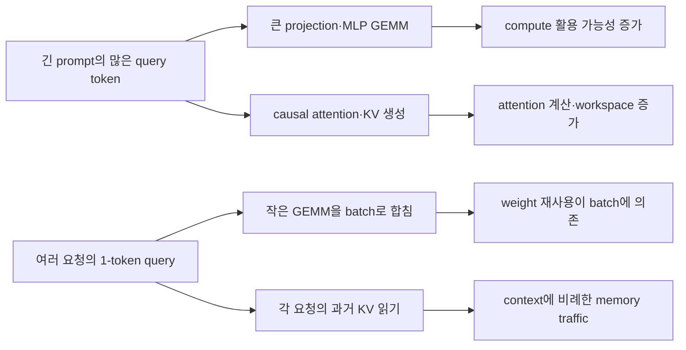

# 4장. prefill과 decode는 같은 forward인데 왜 다른가

한 모델에 prompt 2,048 token을 한꺼번에 넣는 일과, 이미 2,048 token을 읽은 요청의 다음 token 하나를 만드는 일은 같은 weight와 같은 transformer layer를 지난다. 그래서 둘을 같은 forward의 크기 차이로만 생각하기 쉽다. 수학적 연산 종류는 겹치지만 GPU에 나타나는 문제의 모양은 크게 다르다.

prefill에는 token 축으로 넓은 병렬성이 있다. projection과 MLP가 큰 GEMM이 되고 tensor core를 채우기 쉽다. attention은 긴 query와 key를 함께 다뤄 계산량과 workspace가 커진다. decode는 request 하나당 새 query가 보통 한 token뿐이다. 작은 projection이 model weight를 반복해 읽고, attention은 지금까지 축적한 KV를 매 step 훑는다. 여러 요청을 묶지 않으면 연산 장치를 채우기 어렵고 memory bandwidth와 launch 비용이 두드러진다.

이 장에서는 “prefill은 compute-bound, decode는 memory-bound”라는 구호를 외우지 않는다. 어떤 tensor의 어떤 byte와 FLOP을 세어 그 판단에 도달하는지, batch와 context 길이가 바뀌면 경계가 어떻게 이동하는지 손으로 계산한다. 마지막에는 profiler counter 하나로 결론내리지 않고 service shape→operator→kernel→사용자 지연을 잇는 진단 순서를 만든다.



## 4.1 같은 layer를 지나도 tensor 모양이 다르다

decoder-only transformer 한 layer의 큰 흐름은 normalization, Q·K·V projection, attention, output projection, normalization과 MLP다. prefill과 decode 모두 이 순서를 지난다. 차이는 logical sequence와 physical batch의 축이다.

hidden size를 `H`, 이번 step의 전체 query token을 `T`, batch의 request 수를 `B`라고 하자. packed serving runner는 여러 요청의 유효 query token을 `[T,H]`처럼 평평하게 모을 수 있다. prefill 한 요청이 1,024 token이면 `B=1,T=1024`일 수 있다. decode 요청 1,024개가 token 하나씩 내면 `B=1024,T=1024`일 수 있다. projection의 입력 원소 수는 같아도 attention metadata와 KV 주소는 전혀 다르다.

대표 행인 request 수부터 보면 차이가 선명하다. 두 실행 모두 total query token은 1,024지만, prefill은 block table 하나를 따라가고 decode는 서로 다른 과거를 가진 1,024개 block table을 따라간다. 따라서 첫 행의 숫자가 같다는 이유로 attention 주소 계산과 sampling row까지 같은 workload라고 볼 수 없다. 이 비교 축을 고정한 뒤 나머지 shape를 함께 놓는다.

| shape 장부 | prefill 한 요청 | decode 1,024 요청 |
|---|---:|---:|
| total query token `T` | 1,024 | 1,024 |
| request `B` | 1 | 1,024 |
| request별 query length | 1,024 | 대부분 1 |
| request별 KV length | prompt 내부에서 증가 | 서로 다른 누적 context |
| block table | 한 sequence 중심 | 1,024개 sequence 주소 |
| sampling row | 보통 마지막 위치 중심 | 요청마다 한 행 |

`num_tokens=1024`만 기록하면 kernel 비용을 설명할 수 없다. request별 query length와 KV length, prefill/decode 구성, head 구조, page 크기와 backend를 함께 기록한다. 같은 total token budget을 scheduler가 1:1 비용으로 세더라도 실제 GPU 시간은 구성에 따라 달라질 수 있다.

두 열을 실제 주소 수로 한 번 더 비교해 보자. prefill 한 요청의 1,024개 query가 block size 16인 새 KV를 만든다면 논리적으로 64개 block을 순서대로 채운다. 반면 decode 1,024개 요청은 각자 기존 context의 마지막 위치에 token 하나를 덧붙인다. 모든 context가 우연히 같은 1,024-token 길이라고 해도 runner는 1,024개의 request-to-row mapping과 각 요청의 block table 끝을 찾아야 한다. 마지막 block에 빈 slot이 있는 요청과 새 block을 할당해야 하는 요청도 섞인다. 첫 실행은 한 sequence 안에서 query position이 0부터 1,023까지 변하지만, 둘째 실행은 query row마다 서로 다른 absolute position과 cache generation을 가진다.

이 차이는 projection에서는 쉽게 숨는다. 두 경우 모두 `[1024,H]`를 같은 weight에 곱할 수 있기 때문이다. attention 입구에서 request boundary를 복원하면 비로소 mask와 주소가 갈라진다. prefill row `i`는 같은 sequence의 앞선 key만 보아야 하고, decode row `j`는 request `j`가 소유한 과거 KV만 읽어야 한다. row mapping이 한 칸 밀리면 shape와 kernel 실행은 정상이어도 다른 요청의 logits를 sampling하거나 KV를 잘못된 sequence에 쓸 수 있다. profiler의 GEMM shape가 같다는 관측은 projection work가 비슷하다는 증거일 뿐, attention과 request correctness가 같다는 증거가 아니다.

운영 비교에는 이 경계를 드러내는 최소 관측을 붙인다. total query token 옆에 sequence 수, query-length histogram, KV-length histogram, 새 block allocation 수와 sampled-row mapping 수를 기록한다. prefill/decode label만 남기면 speculative verification이나 chunked prefill처럼 label과 실제 query shape가 어긋나는 실행을 설명하지 못한다. 반대로 이 다섯 값이 있으면 동일 token budget인데 duration이 갈린 이유를 projection M, attention work, allocator와 metadata 가운데 어느 축에서 먼저 찾을지 결정할 수 있다.

### 자주 섞이는 네 가지 batch 크기

`batch size`라는 표현은 다음 네 값을 가리킬 수 있다.

- scheduler가 선택한 request 수
- 이번 step의 total query token
- attention backend가 plan한 sequence·split 수
- GEMM 또는 CUDA Graph가 보는 padded/captured shape

decode 64 request는 query token 64일 수 있지만 speculative verification에서는 request마다 여러 query가 생길 수 있다. prefill request 4개도 chunk 합계가 2,048 token일 수 있다. graph가 2,048 shape로 pad하면 logical active token과 physical launch shape가 다르다.

옵션 문서, metric과 profiler가 어느 batch를 말하는지 밝힌다. request 수를 줄였는데 launch shape가 그대로면 graph padding 때문에 kernel 시간 변화가 작을 수 있다. total query는 같은데 sequence 수가 늘면 block table과 attention plan 비용이 커질 수 있다. 이름이 같아도 단위가 다르면 상관관계가 무너진다.

## 4.2 projection과 MLP에서 token 축은 GEMM의 M이 된다

입력 `[T,H]`에 weight `[H,O]`를 곱하면 출력은 `[T,O]`다. multiply-add를 2 FLOP으로 세면 대략 `2THO` FLOP이다. weight byte는 dtype 원소 크기를 `s`라 할 때 최소 `HOs`이고, 입력과 출력 traffic이 더해진다.

아주 단순한 예로 `H=4096`, `O=4096`, BF16 weight 2byte를 쓰자. weight 하나는 약 32MiB다. `T=1` decode 요청 하나는 약 33.6MFLOP을 위해 32MiB weight를 읽는다. cache와 fusion을 무시한 낮은 산술강도다. `T=1024` prefill은 같은 weight를 tile 안에서 여러 token에 재사용해 약 34.4GFLOP을 수행한다. weight byte만 분모로 보면 산술강도가 크게 오른다.

실제 layer에는 QKV와 output projection, MLP gate·up·down weight가 있고 tensor parallel shard, quantized packing과 cache hierarchy가 개입한다. weight가 모든 token마다 HBM에서 정확히 한 번씩 읽힌다는 뜻도 아니다. 이 계산의 목적은 decode batch가 작을 때 큰 weight를 적은 연산에 쓰는 구조와, token M축을 키울 때 재사용 기회가 생기는 이유를 보여 주는 데 있다.

continuous batching이 여러 decode request를 모으는 이유 중 하나가 이 M축을 키우기 위해서다. 하지만 batch를 모으는 동안 queue가 생기고 한 step이 길어진다. projection의 token/s 최적점과 ITL p99의 최적점이 다른 이유다.

### MLP는 왜 decode에서도 큰 비용인가

SwiGLU 계열 MLP에서 intermediate size를 `I`라고 하면 gate와 up projection에 각각 `2THI`, down projection에 `2TIH`가 들어가 총 근사는 `6THI`다. activation과 elementwise multiply도 있지만 큰 weight GEMM이 중심이다. decode `T`가 작으면 여러 거대한 weight를 매 token step 읽는 문제가 된다.

gate와 up을 packed weight로 묶고 activation·multiply를 fuse하면 launch와 중간 memory write를 줄일 수 있다. 그러나 packed 순서와 shard ID가 checkpoint 계약과 다르면 shape는 맞지만 값은 틀린다. 성능 최적화의 kernel 모양과 weight loader correctness를 함께 읽어야 한다.

### projection FLOP와 weight byte가 phase를 가르는 이유

linear `X[M,K]·W[K,N]`의 dense multiply-add FLOP를 약 `2MKN`으로 둔다. weight byte를 BF16 `2KN`으로 단순화하면 weight만 본 operational intensity는 약 M FLOP/byte다. M=512 prefill은 weight reuse가 충분할 가능성이 크고, M=1 decode는 weight를 한 token을 위해 읽으므로 weight bandwidth가 강한 후보가 된다.

이 비율은 결론이 아니다. activation/output byte, cache reuse, quantized weight와 dequant scale, fused epilogue, padding과 실제 DRAM traffic이 들어간다. weight가 L2에 남는 작은 model과 multi-tenant 큰 model도 다르다. 손계산은 어떤 byte를 profiler에서 확인할지 정한다.

MLP gate/up 두 projection과 down projection은 attention 외에도 매 token 큰 weight를 통과한다. decode attention의 KV read가 커도 MLP weight streaming이 사라지는 것은 아니다. context N, batch M과 model I에 따라 어느 쪽이 지배하는지 layer 장부로 합친다.

quantized W4 weight는 ideal weight byte를 BF16의 1/4로 줄이지만 scales, packing과 dequant work가 있다. M이 작을 때 bandwidth 절감이 중요할 수 있고 M이 커지면 compute/dequant와 kernel efficiency가 달라진다. “4-bit는 decode만 빠르다”처럼 일반화하지 않는다.

### GEMM과 GEMV라는 이름보다 실제 M과 tile을 본다

decode Q=1을 흔히 GEMV라고 부르지만 serving batch B가 있으면 projection M은 active token rows의 합이 된다. B=1과 B=64는 같은 decode phase라도 kernel 선택과 weight reuse가 다르다. speculative verification이 여러 token을 한 번에 검사하면 request 하나도 M>1이 될 수 있다.

dispatch가 M threshold로 GEMV family와 GEMM family를 나눈다면 threshold 양쪽 M을 fixture로 둔다. M=15,16,17에서 selected symbol, grid/tile, padding과 duration을 본다. phase label `decode`가 dispatch key라고 추정하지 않는다. dtype, quant format, K/N alignment와 GPU SM도 specialization을 바꾼다.

작은 M에서는 grid CTA 수가 SM 수보다 적어 GPU 전체 병렬 work가 부족할 수 있다. 한 active SM의 occupancy가 높아도 나머지 SM이 idle일 수 있다. block thread를 늘리는 것과 independent CTA/rows를 늘리는 것은 다르다. batch/fusion이 병렬성을 늘리지만 scheduler wait와 latency를 지불할 수 있다.

큰 M prefill은 tile을 잘 채우지만 K/N tail과 TP shard가 alignment를 깨뜨릴 수 있다. global shape가 정렬돼도 rank-local K/N이 kernel tile과 다를 수 있다. padding FLOP와 output unpad를 useful/executed work 장부에 넣는다.

## 4.3 attention은 query 길이와 KV 길이를 따로 봐야 한다

query length를 `S_q`, 읽는 key/value 길이를 `S_k`, query head 수를 `N_q`, head dimension을 `D`라고 하자. QK score와 probability×V의 full attention FLOP 근사는 합쳐서 다음과 같다.

\[ 4S_qS_kN_qD \]

causal prefill에서는 유효한 삼각형 때문에 평균적으로 보는 과거 길이가 짧지만 kernel tile과 mask 처리에 따라 실제 실행량은 단순 절반과 다를 수 있다. decode에서는 보통 `S_q=1`이므로 FLOP은 context `S_k`에 선형이다. 대신 token 하나를 낼 때마다 layer별 K와 V를 읽는다.

KV head 수를 `N_{kv}`, KV dtype byte를 `s`라 하면 한 layer에서 과거 KV를 한 번 읽는 논리 byte 하한은 대략 다음과 같다.

\[ 2S_kN_{kv}Ds \]

앞의 2는 K와 V다. GQA가 `N_{kv}`를 줄이면 KV 저장과 read traffic이 크게 줄지만 query head별 score 계산의 `N_q`가 자동으로 `N_{kv}`가 되는 것은 아니다. compute 절감과 memory 절감을 구분해야 한다.

decode context가 두 배가 되면 이 KV read 하한도 두 배가 된다. 같은 active request 수와 output rate라도 context 분포가 길어지면 ITL이 나빠질 수 있다. dashboard에서 batch size만 보고 회귀를 설명하지 못하는 이유다.

### KV logical byte에서 HBM traffic으로 내려가는 세 단계

N=8192 fixture의 32 MiB/layer는 logical K/V payload다. kernel lane이 요청한 byte는 layout, GQA mapping, page traversal와 tail에 따라 달라진다. memory transaction sector가 합쳐지지 않으면 requested보다 더 많은 cache-line/sector traffic이 발생한다. L2 hit이면 모든 logical byte가 HBM에 도달하지 않는다.

따라서 `logical useful→lane requested→L1/L2 sectors→DRAM bytes`를 나눈다. profiler의 DRAM byte가 logical 식보다 작다고 counter가 틀린 것은 아니다. cache reuse가 있을 수 있다. 반대로 크면 repeated load, poor coalescing, metadata/scale, spill과 output traffic을 본다.

paged KV에서는 logical sequence가 여러 physical block에 있다. page table load와 block boundary, last partial page가 추가된다. block size를 키우면 metadata가 줄 수 있지만 internal fragmentation과 copy/sharing granularity가 바뀐다. byte 하나만 최적화하지 않는다.

FP8 KV는 payload를 줄일 수 있지만 scale tensor와 dequantization, supported attention backend가 추가된다. BF16 식을 단순 절반으로 나눈 뒤 실제 traffic이라고 쓰지 않는다. scale granularity와 physical layout, selected kernel을 확인한다.

## 4.4 roofline은 peak FLOP 표가 아니라 FLOP/byte 질문이다

roofline의 첫 직관은 산술강도 `I=FLOP/byte`와 장치의 compute 대 memory bandwidth 비율을 비교하는 것이다. peak compute를 `P`, sustainable bandwidth를 `BW`라고 하면 단순한 성능 상한은 다음 두 값 중 작은 쪽이다.

\[ \mathrm{attainable\ FLOP/s}\le \min(P, I\times BW) \]

산술강도가 낮으면 peak tensor-core FLOP가 아무리 커도 memory roof에 먼저 닿을 수 있다. prefill의 큰 GEMM은 weight와 tile을 여러 token에 재사용해 `I`를 높일 기회가 있다. 작은 decode는 weight와 KV byte에 비해 연산이 적어 bandwidth roof에 묶이기 쉽다.

그러나 이 식으로 kernel의 실제 시간을 계산했다고 말하면 안 된다. 어떤 byte를 HBM traffic으로 셀지, L2 hit가 얼마나 되는지, quantized weight를 어떻게 unpack하는지, occupancy와 instruction mix가 어떤지 빠져 있다. roofline은 병목 후보를 좁히는 모델이지 profiler의 대체물이 아니다.

### 숫자로 보는 ridge point

가상의 GPU가 BF16 연산 300TFLOP/s와 HBM 3TB/s를 지속할 수 있다고 하자. compute와 memory roof가 만나는 산술강도는 `300/3=100 FLOP/byte`다. 어떤 operator가 실제 HBM 기준 20 FLOP/byte라면 memory roof 상한은 약 60TFLOP/s다. peak 300을 기준으로 “20%밖에 못 쓴다”고 kernel을 실패로 판정하면 틀릴 수 있다.

반대로 200 FLOP/byte인 큰 GEMM은 compute roof에 닿을 가능성이 생긴다. 가능성이라는 표현이 중요하다. 작은 tile, 낮은 occupancy, collective 대기와 launch gap 때문에 compute peak에 훨씬 못 미칠 수 있다. profiler에서는 같은 shape의 achieved FLOP, DRAM byte, cache hit, active warp와 duration을 함께 본다.

### latency를 token당 시간으로만 나누면 생기는 오류

prefill duration을 prompt token으로 나눈 `ms/token`은 길이별 효율을 비교하는 데 쓸 수 있지만 각 token이 같은 attention work를 한다고 뜻하지 않는다. causal sequence 후반 token은 더 긴 과거를 본다. chunk와 prefix hit가 있으면 새 query와 기존 KV 관계도 달라진다.

decode의 평균 TPOT도 context가 생성 중 늘어나는 효과와 batch 구성 변화를 섞는다. 첫 decode token과 1,000번째 token의 KV read가 다르다. context cohort와 step별 ITL을 함께 본다. 한 request의 평균값만으로 어느 길이에서 병목이 바뀌는지 알 수 없다.

operator `duration/query-token` 역시 mixed batch에서 조심한다. projection에는 total query가 합리적인 분모지만 attention에는 `sum(S_q×S_k)`나 실제 tile work가 더 설명력이 있을 수 있다. KV traffic은 `sum(S_k×N_kv×D×bytes)`로 근사한다. 목적에 맞는 work unit을 선택한다.

## 4.5 mixed batch는 두 비용을 한 step에 겹친다

현대 scheduler는 prefill과 decode를 완전히 다른 시간에만 실행하지 않는다. 긴 prompt의 chunk와 active decode token을 같은 step에 넣을 수 있다. projection·MLP는 total query token을 큰 M축으로 활용할 수 있지만 attention은 request별 query/KV 관계와 mask가 다르다.

mixed batch는 total query 합계만으로 설명할 수 없으므로 대표 요청 하나씩을 먼저 읽는다. `P1`은 512개 query로 기존 1,024-token KV를 확장하고, `D1`은 query 하나뿐이지만 2,400-token KV를 읽는다. 둘이 같은 step에 있어도 물리 비용의 분모가 다르다는 사실을 확인한 뒤 다음 ledger를 회상용으로 사용한다.

| request | phase | query token | KV before | KV after | sampling row |
|---|---|---:|---:|---:|---|
| `P1` | prefill chunk | 512 | 1,024 | 1,536 | chunk 마지막 |
| `D1` | decode | 1 | 2,400 | 2,401 | 현재 행 |
| `D2` | decode | 1 | 800 | 801 | 현재 행 |

total query는 514지만 attention read와 block table은 세 요청마다 다르다. `P1`의 query들이 causal 삼각형을 만들고 `D1`은 2,400-token KV를 읽는다. kernel backend가 prefill/decode를 별도 launcher로 나눌 수도, 하나의 varlen paged op와 metadata로 표현할 수도 있다. service phase와 CUDA entrypoint가 반드시 일대일은 아니다.

SGLang에서 prefill·decode backend 설정이 별도로 resolve될 수 있다는 사실과, vLLM의 특정 backend가 같은 logical op로 여러 shape를 다룰 수 있다는 사실은 모순이 아니다. selector, wrapper, native launcher와 device kernel이라는 서로 다른 층을 말한다. “prefill kernel”이라는 label 하나만으로 backend를 비교하지 않는다.

### chunk 크기가 operator마다 다르게 작용한다

chunk를 크게 하면 projection과 MLP의 M축 효율은 좋아질 수 있고 scheduler/launch 횟수는 줄어든다. 하지만 attention의 query·KV 작업과 activation peak가 커지고 active decode가 기다리는 step이 길어진다. chunk를 작게 하면 ITL 간섭을 줄일 schedule 경계가 늘지만 CPU bookkeeping, metadata, launch와 작은 GEMM 효율을 잃는다.

chunk sweep은 TTFT·ITL뿐 아니라 operator별 duration/token을 본다. projection은 좋아졌는데 attention workspace와 step tail이 커질 수 있다. 하나의 평균 forward duration은 어느 operator가 교환 비용을 만들었는지 숨긴다.

### 올바른 최적화도 다른 단계에서 실패할 수 있다

decode attention의 KV read를 줄여 device time이 20% 좋아졌다고 하자. scheduler가 더 많은 request를 admission하면서 batch와 queue가 커지면 최종 ITL 개선은 작을 수 있다. capacity가 늘어난 만큼 offered load가 증가하면 tail이 다시 원래 수준으로 돌아올 수도 있다. kernel speedup과 service capacity를 각각 측정한다.

prefill kernel을 fuse해 temporary write와 launch를 줄였더라도 output precision이나 supported mask가 달라질 수 있다. 동일 token sequence의 reference logits와 layer checkpoint를 비교하고, 지원하지 않는 shape가 올바른 fallback을 타는지 본다. 빠른 경로의 correctness와 느린 fallback의 coverage를 함께 승인한다.

P/D 분리로 decode 간섭을 없애도 KV transfer가 TTFT에 들어온다. prefill compute 완료와 decode runnable 사이에는 destination allocation, descriptor, transfer completion과 cache publish가 있다. 이 장의 compute/memory 비대칭은 분리의 이유를 주지만 network가 공짜라는 결론은 주지 않는다. 7편에서 transfer byte·topology·ownership을 포함해 손익분기를 다시 계산한다.

### mixed batch에서 M 하나가 모든 operator를 설명하지 못한다

continuous batching step에 decode 32 token과 prefill chunk 256 token이 함께 있으면 runner의 total scheduled token은 288일 수 있다. projection은 이를 큰 M으로 합칠 수 있다. attention은 decode rows 32개가 서로 다른 긴 KV를 읽고, prefill rows 256개는 causal chunk와 각 request prefix를 본다. 같은 M=288이어도 attention metadata와 work distribution은 이질적이다.

backend가 prefill/decode를 별도 kernel로 나누면 projection fusion과 attention launch 수가 바뀐다. 하나로 합치면 launch는 줄 수 있지만 tile underfill, mask와 scheduling complexity가 늘 수 있다. selected kernel과 actual shapes를 trace에서 확인한다.

chunk를 256에서 512로 올리면 prefill step 수는 줄지만 한 step activation/logits/mask peak와 decode 간섭 quantum이 커진다. TTFT가 줄 수 있어도 ITL tail이 악화될 수 있다. Q budget과 workspace W, KV growth K를 함께 본다.

### 옵션을 physical state transition으로 번역한다

`max_num_batched_tokens`류 상한을 올리면 scheduler의 per-step token rhs가 바뀌고 runner M과 activation peak가 커질 수 있다. 실제 batch가 상한에 닿지 않으면 no-op이다. effective config, selected requests, runner input shape와 peak를 연결한다.

chunked prefill을 켜면 긴 prompt가 여러 schedule step으로 나뉘고 intermediate request progress state가 생긴다. 첫 chunk 뒤 KV는 persistent하며 suffix token은 waiting/parked owner에 남는다. decode와 혼합되는 policy가 TTFT/ITL을 바꾼다.

CUDA Graph 범위를 넓히면 captured shape buckets와 static buffers, replay hit가 변한다. host overhead는 줄 수 있지만 memory reserve와 cold capture가 늘고 dynamic shape fallback이 생긴다. graph option 하나를 kernel speed option으로만 설명하지 않는다.

KV cache dtype을 FP8로 바꾸면 payload와 capacity, scale metadata, quant/dequant kernel과 attention backend eligibility가 변한다. model quality와 first-token exactness, long-context tolerance를 승인한다. 지원되지 않아 BF16 fallback이면 config string만 바뀐 no-op일 수 있다.

quantized weight는 projection byte와 kernel selection을 바꾼다. attention KV byte는 직접 줄이지 않는다. smaller weight로 free memory가 늘어 KV pool을 키울 수 있는 간접 효과는 config initialization과 allocation에서 확인한다.

batch/concurrency를 올리면 projection M과 weight reuse는 좋아질 수 있지만 per-request wait, logits rows, KV ownership과 output backpressure가 늘어난다. throughput, TTFT/ITL, strict goodput과 peak memory를 같이 본다.

## 4.6 prefill OOM과 decode capacity 부족은 같은 사건이 아니다

긴 prefill은 많은 query activation과 attention workspace를 한 번에 요구할 수 있다. prompt를 chunk로 나누면 peak temporary memory를 낮출 가능성이 있다. decode는 한 step의 activation은 작아도 여러 active sequence가 오래 살아 누적 KV capacity를 채운다.

“GPU OOM” 보고를 받으면 최소 세 층을 나눈다.

1. framework allocator가 weight·workspace·activation 할당에 실패했는가?
2. 미리 만든 KV pool의 free block이 부족해 scheduler admission이 실패했는가?
3. CUDA Graph·communication·speculation용 static buffer가 capacity를 잠식했는가?

첫 사건은 CUDA allocation error로 process를 실패시킬 수 있다. 둘째는 정상 정책 분기로 waiting, preemption 또는 rejection을 만들 수 있다. 셋째는 기능을 켠 뒤 usable KV block이 줄어드는 간접 효과다. `nvidia-smi`의 free byte 하나로 세 원인을 구분할 수 없다.

prefill OOM이라면 실패 step의 total query, longest query, attention backend와 workspace를 정상 step과 비교한다. decode tail에서 KV가 부족하다면 active request별 context, block rounding, prefix sharing, preemption과 free/evictable block을 본다. `max_model_len`을 낮춰 증상이 사라졌다는 사실은 capacity pressure를 줄였을 뿐 어느 allocation이 지배했는지 증명하지 않는다.

### 계산 결과를 배포 용량으로 옮길 때의 마지막 함정

단일 step에서 decode가 20ms이고 batch가 32라면 단순히 `32/0.02=1,600 token/s`라고 계산할 수 있다. 이는 그 step의 target output 처리율 근사다. scheduler CPU, sampling, collective가 20ms에 포함됐는지, 모든 request가 실제 token을 commit했는지, stop과 speculative rejection이 있는지 확인해야 service throughput이 된다.

각 요청이 평균 200 output token을 요구한다고 `1,600/200=8 req/s`로 capacity를 정하는 것도 부족하다. output 길이 분포, prompt prefill이 점유하는 시간, arrival burst, KV memory-time과 SLO가 빠져 있다. 긴 output 몇 개가 KV를 오래 소유하면 평균과 다른 saturation이 생긴다.

prefill capacity도 token/s 하나로 decode와 합치지 않는다. 8K prompt를 초당 몇 개 처리하는지와 128-token prompt를 몇 개 처리하는지는 attention 비용과 batch packing이 다르다. prompt length cohort별 service curve를 만들고 mixed arrival에서 interference를 측정한다. P/D 분리 용량을 계획할 때도 phase별 평균 token rate만 맞추면 burst와 transfer queue가 흔들릴 수 있다.

capacity 계획의 최소 식은 queueing model보다 먼저 자원 시간을 적는 것이다.

```text
요청당 prefill GPU-time(prompt class별)
+ 요청당 decode GPU-time(context·output class별)
+ layer collective와 KV transfer critical time
+ scheduler·output CPU critical time
+ 실패·retry·recompute 증폭
```

각 항은 완전히 더해지지 않을 수 있다. stream과 pipeline으로 겹치는 시간은 overlap을 증명한 뒤 critical path에 반영한다. 이론상 async copy가 있다는 이유로 transfer 시간을 0으로 두지 않는다. producer와 consumer의 event ordering과 trace에서 실제 overlap을 확인한다.

### prefill OOM은 persistent KV capacity와 다른 lifetime이다

prefill Q=512에서 layer activation, QKV, attention workspace와 MLP intermediate는 forward 구간에 생겼다가 소비 후 재사용될 수 있다. KV 2 MiB/layer는 request lifetime 동안 persistent cache에 남는다. OOM timestamp가 projection/attention workspace allocation인지 KV block allocation인지 먼저 나눈다.

Q를 512에서 256으로 낮추면 activation/workspace peak는 줄 수 있지만 최종 16K context의 KV byte는 줄지 않는다. 그래서 작은 chunk로 prefill OOM은 해결하면서 나중 decode admission이 KV capacity에서 실패할 수 있다. 반대로 KV dtype을 줄여 동시 context는 늘어도 큰 chunk workspace OOM은 그대로일 수 있다.

memory snapshot에는 weight, persistent KV, graph/static buffer, allocator reserved/free, current activation/workspace와 communication temporary를 둔다. framework allocated와 device free만 비교하면 caching allocator reserve를 누수로 오해하거나 외부 library allocation을 놓친다.

TP를 늘리면 rank-local weight/KV와 projection shape가 줄 수 있지만 collective workspace와 topology cost가 늘고, KV head가 rank 수로 고르게 나뉘지 않는 replication이 있을 수 있다. cluster aggregate memory가 아니라 가장 작은 rank headroom이 launch/admission을 막는다.

OOM 회귀 fixture는 동일 final context에서 chunk Q sweep, 동일 Q에서 concurrent sequence/KV length sweep을 분리한다. 첫 allocation failure owner와 requested bytes를 기록한다. OOM이 사라졌어도 allocator fragmentation, latency와 output correctness를 함께 본다.

**배포 capacity로 옮길 때 네 보존식을 지킨다**

첫째, scheduled logical token 합과 runner input M이 padding/auxiliary rows 설명 뒤 맞아야 한다. 둘째, 새 KV write와 allocated block/refcount, finished/canceled free가 allocator total과 맞아야 한다. 셋째, transient workspace/static graph/weight/KV와 free/reserved memory가 peak를 설명해야 한다. 넷째, produced token과 visible committed output이 request generation별로 맞아야 한다.

capacity model은 평균 prompt 하나가 아니라 arrival burst, prefill Q distribution, decode active M와 context N의 joint distribution을 사용한다. 같은 평균 길이도 긴 prompt가 동시에 들어오는 경우와 짧은 decode가 교체되는 경우 peak와 service가 다르다.

GPU 추가나 TP 변경은 rank-local shape와 network collective를 바꾼다. aggregate FLOP/HBM을 단순 합산해 선형 capacity를 예측하지 않는다. 가장 느린 rank, KV head replication, topology와 synchronization이 step을 결정할 수 있다.

model 교체에서는 H/I/layers, Q/KV heads, head dimension, vocabulary, dtype/quant와 sliding semantics를 fixture 식에 다시 넣는다. server option이 같아도 물리 비용은 달라진다. capacity report에 model/config digest를 포함한다.

이 보존식을 실제 review에 적용할 때는 baseline과 candidate의 state를 같은 행에 둔다. `request/step, phase, logical Q, runner M, per-request N, selected kernel, grid, logical KV bytes, requested/DRAM bytes, workspace peak, host gap, kernel duration, output digest`가 한 행의 최소 열이다. 서로 다른 step의 M과 N을 섞은 평균은 source predicate와 연결할 수 없다.

prefill row에는 Npast와 chunk 내 causal length를 함께 둔다. decode row에는 active request 수뿐 아니라 context bucket, GQA/cache layout과 page count를 둔다. mixed row는 prefill/decode token 수와 각 group의 kernel 분리 여부를 쓴다. total scheduled tokens 하나만으로 mixed attention work를 복원할 수 없다.

candidate에서 projection 시간이 줄었는데 step 시간이 그대로라면 개선 시간이 attention, collective 또는 host gap에 흡수됐는지 본다. Amdahl 상한을 계산하고 작은 kernel win을 end-to-end speedup으로 확대하지 않는다. 반대로 kernel 하나가 느려져도 fusion으로 launches와 intermediate traffic이 줄어 step이 빨라질 수 있다.

memory review는 peak 숫자보다 lifetime overlap을 그린다. weight와 persistent KV는 request보다 오래 살고, chunk activation/workspace는 step 안에 살며, graph static buffer와 allocator reserve는 process lifetime일 수 있다. 같은 2 GiB라도 동시에 존재하는지에 따라 OOM이 달라진다.

prefix hit는 prefill Q를 줄여 projection/attention work와 new KV write를 줄일 수 있지만 cached KV N read, lookup/transfer와 block pin은 남는다. hit tokens를 saved elapsed time으로 그대로 바꾸지 않는다. accepted physical prefix와 실제 skipped runner rows를 확인한다.

speculative verification은 decode라는 이름 아래 Q>1을 만든다. proposed tokens가 verification M에 들어가고 accepted prefix만 visible output/state로 commit된다. executed projection/attention work와 useful accepted tokens를 구분한다. acceptance rate가 낮으면 phase별 token/s가 높아도 goodput이 낮을 수 있다.

P/D 분리에서는 prefill 장치와 decode 장치의 roofline·memory capacity가 달라질 수 있다. transfer되는 KV byte, layout conversion, network wait와 ownership generation을 추가한다. prefill compute가 빨라도 KV 전송이 decode admission을 늦추면 TTFT handoff가 지배한다.

관측 도구 자체도 workload를 바꾼다. kernel profiler replay는 graph/concurrency를 바꿀 수 있고 timeline annotation은 host cost를 늘린다. static source와 shape 장부로 질문을 줄인 뒤 대표 kernel만 profile한다. profile run의 절대 latency 대신 counter와 source correlation을 사용하고 production benchmark를 별도로 둔다.

## 4.7 profiler를 켜기 전에 shape 가설을 세운다

증상이 “긴 prompt TTFT가 특정 길이부터 급증한다”라면 먼저 prompt length와 chunk boundary, backend selector 조건, graph captured shape와 workspace step을 의심한다. “동시성이 늘면 ITL이 선형 이상으로 악화된다”면 active KV length 분포, decode batch의 GEMM M축, memory bandwidth, collective와 preemption을 경쟁 가설로 둔다.

각 가설은 다른 최소 관측을 요구한다.

| 증상 | 먼저 남길 service shape | 다음 operator 관측 | 반증 예 |
|---|---|---|---|
| 긴 prompt 경계에서 TTFT 점프 | chunk pattern·query/KV length | attention workspace·graph mode | GPU 전 구간은 같고 queue만 증가 |
| context 증가에 ITL 악화 | request별 KV length | KV read·attention duration | output socket에서만 gap 발생 |
| decode batch를 키워도 token/s 정체 | total query·request 수 | GEMM·attention·collective | scheduler가 실제 batch를 못 키움 |
| mixed batch에서 tail spike | prefill/decode token 구성 | step별 operator duration | 동일 shape의 kernel은 정상, CPU gap 증가 |

service shape에서 최초 차이를 찾은 뒤 Nsight Systems로 CPU launch gap, CUDA stream과 NCCL을 나눈다. 특정 device kernel이 지배할 때 Compute counter로 내려간다. GPU utilization이 높다는 이유만으로 compute-bound라고 부르지 않는다. memory stall, collective 또는 busy-wait kernel도 장치를 busy로 보이게 할 수 있다.

### 15분 동안 만드는 shape autopsy

느린 step 하나와 정상 step 하나를 골랐다고 하자. 첫 3분에는 service ledger만 비교한다. model·adapter·dtype, total query token, request 수, prefill/decode token, request별 KV length의 요약, free KV block과 graph mode를 적는다. 이 단계에서 kernel 이름은 보지 않는다.

다음 4분에는 runner input을 본다. flattened token과 position의 active range, query start, sequence length, block table, slot mapping, sampling row가 schedule output과 일치하는지 확인한다. shape는 같아도 stale metadata가 남으면 다른 주소를 읽을 수 있다. graph buffer라면 active 범위 밖 padding과 이전 step 값이 mask되는지 본다.

그다음 4분에는 operator timeline을 projection, attention, MLP, collective, sampling으로 나눈다. 느린 step의 증가분이 어디에 있는지 본다. projection과 MLP가 함께 늘면 total query나 clock, attention만 context에 따라 늘면 KV와 backend, collective만 늘면 rank imbalance와 topology, operator 사이 gap이 늘면 CPU launch와 dependency를 의심한다.

마지막 4분에만 device kernel로 내려간다. selected wrapper가 실제 호출한 symbol, grid와 dtype, head dimension, page size, split 수와 stream을 맞춘다. 정상 step과 다른 조건이 있다면 그 분기를 source에서 찾는다. 모든 조건이 같은데 duration만 다르면 profiler counter와 system state를 본다.

이 15분은 엄격한 시간 제한이 아니라 조사 순서다. service shape가 다른데 kernel counter부터 비교하면 서로 다른 문제를 같은 기준으로 재게 된다. 반대로 shape와 operator가 같다는 증거가 쌓이면 낮은 층을 깊게 파는 비용이 정당해진다.

### launch overhead를 kernel time과 host gap으로 분리한다

decode 한 step은 여러 layer에서 projection, attention, MLP, normalization과 collective를 반복한다. 각 kernel이 짧으면 host dispatch, graph replay, framework overhead가 critical path의 큰 비율이 될 수 있다. prefill은 같은 launch 수라도 kernel work가 길어 overhead가 상대적으로 작을 수 있다.

“kernel launch가 느리다”는 문장을 API duration, enqueue 사이 host gap, stream queue wait와 device kernel duration으로 나눈다. CUDA API call이 짧아도 Python/C++ 준비가 launch 사이에 있을 수 있고, API가 길면 앞선 synchronization을 기다린 것일 수 있다.

CUDA Graph는 stable shape의 host launch overhead를 줄일 수 있지만 graph key cardinality, capture/instantiate와 static buffer lifetime이 있다. batch/sequence shape가 자주 바뀌면 miss/fallback이 생긴다. graph hit metric과 kernel time을 섞지 않고 first request와 steady replay를 나눈다.

fusion은 launch 수를 줄이지만 register/shared pressure, intermediate lifetime과 supported shape를 바꾼다. fused kernel이 느려도 end-to-end는 launch와 HBM intermediate를 줄여 빨라질 수 있다. 개별 kernel duration 합과 request step duration을 함께 본다.

### 승인 실험은 phase와 shape bucket을 나눠야 한다

baseline/candidate에 같은 prompt/output length와 arrival trace를 준다. prefill Q/Npast bucket, decode batch M/context N, mixed token composition으로 결과를 나눈다. aggregate tokens/s 하나는 어느 phase가 개선됐는지 숨긴다.

각 bucket에서 scheduler wait, host/launch gap, projection·attention·MLP·collective duration, logical/requested/DRAM byte와 peak allocation을 본다. 모든 metric을 무차별 수집하지 않고 손계산이 경쟁 가설을 가르는 필드를 선택한다.

correctness에는 logits/token tolerance, KV write/read position, tail/padding과 graph replay generation을 넣는다. performance patch가 다른 request row나 stale KV를 읽어 빨라진 경우를 배제한다. cancel/reuse와 prefix hit fixture도 필요한 lifetime 경계를 자극한다.

TTFT 개선은 ITL/p99와 throughput guardrail을, decode throughput 개선은 prefill starvation/TTFT guardrail을 통과해야 한다. memory 절감은 OOM만 아니라 fragmentation, conversion workspace와 supported backend fallback을 본다.

cold와 warm을 분리한다. compile/capture/autotune·allocator growth를 real deployment SLO에 포함할지 명시한다. profiler run의 serialization과 replay가 timing을 바꿀 수 있으므로 profile absolute time을 production benchmark에 복사하지 않는다.

### 손계산과 profiler가 어긋날 때의 조사 순서

먼저 같은 request/step과 selected kernel인지 확인한다. scheduler batch M, Q, per-request N, dtype/layout, TP shard와 graph key를 고정한다. 이름이 같은 kernel도 specialization이 다를 수 있다.

다음으로 logical FLOP/byte 정의를 확인한다. causal triangle, GQA, padding, recomputation과 fusion을 식에 포함했는지 본다. profiler counter는 instruction/executed 또는 특정 memory level traffic일 수 있어 logical payload와 직접 같지 않다.

requested sector가 예상보다 크면 address/layout/tail, DRAM만 크면 cache reuse/eviction, duration만 크면 dependency/issue/clock과 contention을 본다. source expression과 metric을 연결하고 counter 비율 하나를 root cause로 쓰지 않는다.

마지막으로 model output과 memory safety를 확인한다. wrong shape나 mask로 일을 덜 해 빠른 결과는 성능 개선이 아니다. exact/tolerance와 canary/sanitizer fixture가 통과한 결과만 비용 모델과 비교한다.

## 4.8 한 layer의 FLOP·byte 장부를 끝까지 적어 본다

설명을 수치에 붙이기 위해 단순한 GQA layer를 가정하자. hidden size `H=4096`, query head 32개, KV head 8개, head dimension 128, MLP intermediate `I=14336`, BF16 weight와 KV를 쓴다. bias, normalization, activation, collective와 cache effect는 우선 제외한다.

Q projection 출력 폭은 `32×128=4096`, K와 V는 각각 `8×128=1024`다. QKV projection의 FLOP은 query token `T`에 대해 다음과 같다.

\[ 2TH(4096+1024+1024) \]

output projection은 `2T×4096×4096`, MLP는 대략 `6T×4096×14336`이다. `T=1`과 `T=1024`에서 FLOP은 정확히 1,024배가 되지만 weight 크기는 변하지 않는다. 큰 `T`가 weight tile을 재사용하고 GEMM을 효율적인 shape로 만드는 이유다.

decode context `S_k=4096`일 때 한 layer의 논리 KV read 하한은 다음과 같다.

\[ 2\times4096\times8\times128\times2 =16{,}777{,}216\ \mathrm{bytes} \]

약 16MiB다. 32-layer model이면 next token 하나에 논리 KV만 약 512MiB를 읽는다. 여기에 layer weight, block table와 output이 더해진다. 여러 request를 batch하면 각 request의 KV는 서로 달라 weight처럼 완전히 공유할 수 없다. GQA가 decode memory에 중요한 이유가 숫자로 드러난다.

반면 1,024-token causal prefill의 attention은 모든 query가 같은 길이의 과거를 읽는 것이 아니며 평균 유효 key 수가 대략 절반이다. FlashAttention 계열은 거대한 score matrix를 HBM에 materialize하지 않고 tile 안에서 softmax 통계를 유지해 IO를 줄인다. 그렇다고 QK·PV 계산이 사라지는 것은 아니다. compute와 activation/workspace가 긴 sequence에서 중요해진다.

### 이 계산에서 일부러 빠뜨린 것

첫째 tensor parallel은 weight와 head를 rank에 나누고 layer 사이 collective를 추가한다. local FLOP·byte가 줄어도 all-reduce나 all-gather가 critical path가 된다. 둘째 quantization은 weight byte를 줄이는 대신 scale, unpack/dequant와 kernel 지원 조건을 더한다. 셋째 MoE는 모든 expert weight를 token마다 쓰지 않지만 routing, imbalance와 all-to-all을 만든다.

넷째 hybrid model은 모든 layer가 full attention이 아닐 수 있다. sliding-window attention은 읽는 KV 길이를 제한하고, recurrent/SSM 계열은 고정 크기 state를 갱신할 수 있다. “context가 두 배면 모든 layer KV read가 두 배”라는 문장은 해당 architecture의 layer composition을 확인한 뒤에만 쓴다.

장부에는 model config와 layer type별 합계를 둔다. 평균 layer 하나를 곱하면 Gemma 계열의 local/global attention 조합이나 Qwen 계열 hybrid state를 잘못 계산할 수 있다. 뒤의 모델 장에서 실제 config와 forward dispatch로 이 합계를 다시 만든다.

### 하나의 layer를 Q=512 prefill과 Q=1 decode로 계산한다

설명용 decoder layer를 hidden H=4096, intermediate I=11008, query heads 32, KV heads 8, head dimension 128로 둔다. activation dtype과 KV가 BF16이라 element 2 bytes라고 가정한다. 실제 model/backend는 source config로 다시 계산해야 하며 이 숫자는 실행 측정값이 아니다.

prefill chunk Q=512이면 projection의 token 축 M은 512다. QKV와 output projection, gate/up/down projection은 큰 M을 가진 matrix multiplication으로 표현된다. weight를 한 번 읽는 동안 512 row가 재사용할 기회가 있다. decode 한 request의 Q=1에서는 같은 weight matrix를 한 row가 소비한다. batch decode가 B=64이면 여러 request row를 묶어 M=64가 될 수 있지만 각 row의 KV length와 page table은 다르다.

Q projection output은 prefill에서 대략 `[512,32,128]`, K/V new output은 각각 `[512,8,128]`이다. decode 한 request에서는 첫 dimension이 1이다. GQA 때문에 Q head와 KV head 수가 다르며 K/V byte를 Q head 32로 계산하면 네 배 과대평가한다.

한 layer가 새로 쓰는 K와 V는 prefill에서 `2×512×8×128×2 = 2,097,152 bytes`, 약 2 MiB다. decode 한 request 한 step은 `2×1×8×128×2 = 4,096 bytes`를 새로 쓴다. 그러나 decode attention은 새 4 KiB만 읽지 않는다. 기존 KV length N 전체를 읽어 현재 query와 score/value reduction을 수행한다.

N=8192인 decode request의 한 layer logical KV payload는 K와 V 합계 `2×8192×8×128×2 = 33,554,432 bytes`, 약 32 MiB다. page table, scale, alignment와 repeated/inefficient transactions는 별도다. layer 32개면 logical KV read만 대략 1 GiB/step이라는 설명용 상한 감각을 준다. cache hit와 GQA sharing에 따라 실제 HBM traffic은 counter로 검증한다.

prefill attention도 이전 prefix Npast와 새 Q를 모두 본다. Npast=0인 첫 chunk라면 causal triangle 때문에 모든 Q×Q pair를 똑같이 계산하지 않을 수 있지만 order는 Q²에 가깝다. 뒤 chunk라면 각 query가 기존 Npast와 chunk 안 앞 token을 본다. “prefill은 compute-bound”라는 라벨 전에 Q, Npast와 kernel tile을 적는다.

## 4.9 같은 증상이 서로 다른 물리 원인을 갖는 사례

첫 번째 사례는 “decode batch를 16에서 64로 키웠더니 ITL이 나빠졌다”다. projection과 MLP의 token당 device time은 좋아졌을 수 있다. 하지만 한 step의 wall time이 늘고, 64개 request의 서로 다른 KV를 읽으며, TP collective payload와 sampling row가 늘어난다. 개별 요청은 다음 schedule 경계를 더 오래 기다린다.

최초 divergence를 찾으려면 batch 설정값이 아니라 실제 scheduled request와 token을 본다. runner shape가 64로 커졌는지, operator별 token당 시간과 step 전체 시간이 어떻게 변했는지, queue wait와 output time은 같은지 비교한다. 설정은 64지만 KV admission 때문에 실제 batch가 16이라면 원인은 다른 곳이다.

두 번째 사례는 “8K prompt부터 TTFT가 계단처럼 뛴다”다. full attention의 연속 증가만으로는 날카로운 계단을 설명하기 어렵다. chunk count가 하나 늘거나, graph captured shape를 벗어나 eager fallback하거나, backend workspace split 수가 바뀌거나, KV block rounding이 capacity 분기를 넘을 수 있다.

7,999와 8,001 token의 rendered token sequence, chunk pattern, selected backend, execution mode, workspace와 kernel list를 비교한다. tokenizer가 special token을 추가해 실제 경계가 달라질 수 있으므로 사용자가 본 문자 길이가 아니라 engine token 길이를 쓴다.

세 번째 사례는 “prefix cache hit 뒤 prefill GPU 시간은 줄었는데 TTFT는 같다”다. cache lookup과 remote transfer, destination block install, scheduler admission이 절약한 compute를 상쇄할 수 있다. hit로 줄어든 query token과 남은 suffix, transfer byte와 phase timeline을 함께 본다. prefill kernel만 빨라졌다는 사실은 end-to-end 개선을 보장하지 않는다.

### 반대로 kernel을 파야 하는 증거

같은 model revision, 같은 query/KV shape, 같은 backend와 execution mode에서 device operator duration만 안정적으로 늘었다면 kernel·clock·memory·driver를 조사할 근거가 생긴다. 먼저 host launch gap과 collective를 제외하고 동일 symbol의 grid, dtype, head dimension과 page layout을 맞춘다.

Systems에서 device 구간을 고른 뒤 Compute에서 achieved bandwidth, tensor utilization, warp stall, occupancy와 instruction mix를 본다. counter 하나가 원인은 아니다. DRAM 비율이 높고 context에 따라 duration이 선형이면 KV bandwidth 가설이 강해진다. 낮은 occupancy와 작은 GEMM이면 batch shape 또는 kernel specialization을 본다. dependency stall이면 pipeline과 data readiness를 본다.

**구현에서 prefill·decode 경계를 찾는 좌표**

Transformers의 전통 generation loop에서는 첫 forward 여부가 `_prefill` 상태와 cache 준비로 갈리고, 이후 step은 마지막 token 중심으로 입력을 줄인다. 고정 v5.15.1의 [`GenerationMixin._sample`](https://github.com/huggingface/transformers/blob/550d7b3834670483a4df436541272c055dc364bf/src/transformers/generation/utils.py#L2783-L2973)은 입력 준비, model forward, logits 처리와 cache update가 반복되는 좌표다. 이는 online multi-request scheduler 전체가 아니라 한 generation 호출의 phase 전환을 보여 준다.

vLLM에서는 scheduler가 이번 step의 query token 수를 요청별로 정하고 runner가 packed input과 attention metadata를 만든다. 고정 v0.27.1의 [`Scheduler.schedule`](https://github.com/vllm-project/vllm/blob/6e448d0ea9bf3d88d898b65449ca6dc2aec170ac/vllm/v1/core/sched/scheduler.py#L439)은 token budget과 KV admission을 읽는 입구다. schedule 함수가 CUDA kernel을 직접 고르는 것은 아니다. schedule output이 runner와 backend selector로 내려가 physical shape가 된다.

SGLang의 오래 사는 loop는 고정 v0.5.18의 [`Scheduler.event_loop_normal`](https://github.com/sgl-project/sglang/blob/71de97b264b04dcd514cf904003028aefe9775c8/python/sglang/srt/managers/scheduler.py#L1719)에서 볼 수 있고, 새 prefill batch 계획은 [`get_new_batch_prefill`](https://github.com/sgl-project/sglang/blob/71de97b264b04dcd514cf904003028aefe9775c8/python/sglang/srt/managers/scheduler.py#L3157)로 내려간다. 현재 running decode와 새 prefill을 어떤 batch로 만드는지 상태를 따라야 한다.

llama.cpp는 slot의 prompt processing과 generation을 shared decode loop의 batch로 모은다. server task/slot 수명과 ggml graph의 fused attention 선택을 분리해 읽는다. slot phase가 다르다는 사실과 CUDA op가 반드시 별도 symbol이라는 주장은 같지 않다. 고정 좌표는 [`server_slot`](https://github.com/ggml-org/llama.cpp/blob/bb4caa7540188872173c44d161602d9271386413/tools/server/server-context.cpp#L196)에서 시작한다.

네 구현을 비교할 때 공통 질문은 다음과 같다.

```text
누가 query token 수를 정하는가
→ 누가 request별 KV length와 주소를 만드는가
→ backend는 어떤 capability와 shape로 선택되는가
→ wrapper가 어느 native launcher를 부르는가
→ 실제 binary에서 어느 kernel과 collective가 실행되는가
→ 결과가 어느 request state에 commit되는가
```

설정 파일, selected class와 실제 kernel을 한 단계로 합치지 않는다. package가 설치됐다는 사실도 실제 hot path에서 사용됐다는 증거가 아니다.

**독자가 직접 만드는 prefill/decode 비교 워크북**

런타임을 실행하지 않는 이 원고 감사에서는 고정 소스가 만드는 상태와 shape 계약을 확인한다. 독자가 자신의 허가된 환경에서 측정할 때는 작은 workload matrix를 만든다.

| 축 | 낮은 값 | 높은 값 | 분리해서 볼 이유 |
|---|---|---|---|
| prompt length | 128 | 8K 이상 | prefill attention·chunk 경계 |
| active decode | 1 | capacity 근처 | GEMM M축·KV bandwidth |
| decode context | 짧음 | 긺 | request당 KV read |
| prefix state | cold | warm/local/remote | 계산 절약과 lookup 비용 |
| execution | eager | graph/replay | launch와 shape coverage |

각 점에서 TTFT·ITL·goodput, schedule token 구성, request별 query/KV length, operator duration, selected backend·graph mode, KV와 workspace peak를 남긴다. 한 번에 여러 옵션을 바꾸지 않는다.

### 손계산과 trace가 다를 때

예상 projection FLOP은 두 배인데 duration이 거의 같다면 이전 shape가 device를 충분히 채우지 못했고 큰 shape가 효율을 높였을 수 있다. KV read 하한은 두 배인데 attention 시간이 덜 늘었다면 cache behavior, split scheduling 또는 다른 kernel specialization을 본다. 반대로 훨씬 더 늘었다면 page locality, occupancy, collective나 clock 제한을 경쟁 가설로 둔다.

손계산을 정답으로 강제하지 않는다. 차이가 나는 지점이 숨은 byte와 분기를 찾는 질문이다. profiler byte가 논리 KV 하한보다 큰 것은 page rounding, repeated load와 metadata 때문일 수 있고, 작다면 cache hit나 실제 window가 짧을 수 있다. model config와 backend source로 설명을 닫는다.

### 여기까지의 비용 모델을 잠시 회수한다

prefill과 decode는 서로 다른 model이 아니다. 같은 weight와 layer 수학을 서로 다른 query·KV shape와 request lifetime에서 실행한다. prefill은 넓은 token 병렬성과 큰 attention 작업을, decode는 작은 신규 query와 반복되는 weight·KV read를 전면에 드러낸다. batch와 chunk는 이 물리 비용을 사용자 TTFT·ITL 사이에 재배치한다.

“prefill은 compute-bound, decode는 memory-bound”는 출발 가설일 뿐 결론이 아니다. model architecture, batch, context, dtype, quantization, backend, GPU와 topology마다 FLOP·byte 장부와 trace를 다시 맞춰야 한다. 그 과정을 거치면 왜 P/D 분리, GQA, paged KV, continuous batching과 kernel specialization이 등장했는지 기술적 이유를 설명할 수 있다.

**GPU 세대가 바뀌면 같은 결론을 다시 계산한다**

새 GPU의 peak tensor FLOP가 두 배가 됐다고 prefill과 decode가 모두 두 배 빨라지지는 않는다. HBM bandwidth 증가율, capacity, cache, tensor-core 지원 dtype, shared memory와 interconnect가 각기 다르게 변한다. compute-bound에 가까운 큰 prefill GEMM은 tensor 성능의 이득을 더 받을 수 있고, KV bandwidth가 지배하는 긴-context decode는 HBM 증가율에 더 민감할 수 있다.

capacity도 성능 변수다. 더 큰 HBM에 active KV를 많이 넣으면 request concurrency는 늘지만 각 step의 KV traffic과 queue policy가 함께 달라진다. 작은 GPU 두 개에 tensor parallel로 weight를 나누는 것과 큰 GPU 한 개에 넣는 것은 총 capacity가 비슷해도 layer collective 유무가 다르다.

CUDA 12.x와 13.x 같은 toolkit 차이를 논할 때도 버전 숫자를 속도 원인으로 쓰지 않는다. compiler code generation, bundled library, supported architecture, framework wheel과 extension build, driver compatibility, backend selector가 실제 binary를 바꿨는지 확인한다. 같은 source도 어떤 `-gencode`, PTX와 cubin을 포함했는지, runtime이 JIT했는지에 따라 실행 경로가 달라진다.

### architecture gate와 제품 성능을 구분한다

backend가 compute capability만 보고 특정 kernel을 허용할 수 있다. 하지만 같은 architecture family 안에서도 HBM/GDDR, bandwidth와 capacity, power limit가 다를 수 있다. selector가 같은 class를 골랐다는 사실은 동일한 serving capacity를 보장하지 않는다.

배포 manifest에는 GPU product, SM, memory capacity·bandwidth, power/clock policy, driver, toolkit/runtime, framework commit, extension build와 selected backend를 둔다. 성능 결과에는 model dtype, TP/PP, query/KV shape와 workload를 붙인다. “Hopper에서 빠르다” 같은 넓은 문장을 피한다.

**최적화 옵션을 물리 상태 변화로 번역한다**

`max batch tokens`를 높이는 옵션을 예로 들자. 이름만 보면 더 큰 GEMM을 만드는 손잡이 같지만 실제 효과는 scheduler의 다른 제한과 workload에 달려 있다.

```text
config 값 증가
  → scheduler의 step token 상한 증가
  → waiting/running 중 더 많은 query가 선택될 가능성
  → runner total query와 request 구성 변화
  → GEMM M축·attention metadata·KV admission 변화
  → kernel/graph shape와 step duration 변화
  → TTFT·ITL·goodput 변화
```

sequence 한도나 free KV block이 먼저 막으면 total query는 변하지 않는다. 긴 prefill만 추가되면 M축은 커져도 decode가 기다릴 수 있다. decode request가 늘면 projection 재사용은 좋아지지만 서로 다른 KV read와 sampling row가 늘어난다. 옵션 설명에는 어느 field와 조건문이 active인지, 실제 schedule output이 어떻게 변했는지까지 들어가야 한다.

attention backend 옵션도 같은 방식으로 읽는다. requested name은 selector 입력이고 selected class는 capability 판정 결과다. class가 wrapper에서 어떤 op를 호출하고, op가 어떤 extension binary와 kernel로 내려가는지 확인한다. dtype, head dimension, sliding window, MLA, paged layout, SM과 graph 조건 때문에 fallback될 수 있다.

CUDA Graph 옵션은 forward 수학을 바꾸지 않지만 launch와 memory lifetime을 바꾼다. capture 가능한 shape 집합, padding, static buffer와 replay 조건을 만든다. 동적 mixed batch가 captured shape를 벗어나면 eager로 내려갈 수 있다. “graph enabled”와 “해당 느린 step이 graph replay였다”를 구분한다.

KV dtype을 줄이면 capacity와 read byte를 줄일 수 있지만 scale storage·dequant와 kernel 지원을 산다. scheduler가 더 많은 request를 admission해 concurrency가 늘면 ITL이 자동으로 좋아지지 않는다. quantized KV의 정확성, selected kernel, usable block 수, context cohort와 goodput을 함께 검증한다.

### 옵션 카드의 여섯 칸

| 칸 | 적을 내용 |
|---|---|
| 입력 | CLI/API 값과 기본·effective 값 |
| 코드 | config field, reader와 분기 |
| 상태 | token·sequence·KV·graph/backend 변화 |
| 물리 | FLOP, byte, launch, workspace와 collective |
| 사용자 | TTFT·ITL·goodput 예상과 희생 cohort |
| 반증 | shape가 안 변함, 다른 구간이 지배함 등 |

이 카드가 채워지지 않으면 추천값을 책에 싣지 않는다. 특정 장비와 workload에서 얻은 값은 범위가 붙은 관측이며, 보편 기본값이 아니다.

### TTFT가 느린 사건의 competing hypotheses

긴 prompt TTFT가 느리면 prefill GEMM이 compute-bound라는 결론부터 내리지 않는다. admission/queue wait, tokenization, chunk scheduling, weight/kernel compile·graph capture, attention Q×N, collective와 output commit을 timeline으로 분리한다.

GPU timeline에서 prefill kernels가 critical path를 차지한 뒤에 M/K/N, executed FLOP와 memory byte를 본다. projection이 ceiling에 가깝고 duration 비중이 크면 quantization/fusion/tile 후보다. attention이 N과 함께 급증하면 attention algorithm과 chunk/prefix를 본다. host gap이면 kernel 최적화의 상한이 낮다.

chunk를 키워 TTFT가 줄어도 decode ITL이 나빠질 수 있다. mixed batch에서 prefill quantum이 decode를 얼마나 오래 막는지 step timeline을 본다. chunk가 작아 launch/overhead가 늘어난 반대 효과도 있다. arrival trace와 decode concurrency를 고정한다.

### ITL이 느린 사건의 competing hypotheses

decode ITL은 weight streaming, long KV read, insufficient M/CTA, launch gap, collective와 prefill interference 후보를 가진다. context N sweep, batch M sweep과 prefill on/off를 한 축씩 바꾼다. N에 비례하면 KV/attention 후보, M에 따라 weight reuse가 좋아지면 projection bandwidth 후보가 강해진다.

batch를 늘려 token throughput이 오르면서 ITL이 나빠지면 service quantum과 queueing을 본다. engine이 한 step에 더 많은 rows를 처리해 device efficiency는 좋아졌지만 개별 request가 다음 step을 기다릴 수 있다. throughput 개선을 latency 개선으로 일반화하지 않는다.

prefill을 끄면 ITL이 정상화되는 경우 decode kernel 자체가 아니라 mixed scheduling interference일 수 있다. 같은 decode shapes와 clocks를 유지해 비교하고, cache warm state가 바뀌지 않았는지 확인한다.

## 4.10 두 phase를 이해했는지 확인하는 최종 사건

서비스를 새 GPU로 옮긴 뒤 prefill token/s는 70% 올랐지만 decode ITL은 5%만 좋아졌다고 하자. 오류는 없고 backend 이름도 같다. 이것은 이상한 결과가 아니다. 새 GPU의 tensor compute가 크게 늘고 HBM bandwidth 증가가 작다면 큰 prefill GEMM과 긴-context KV read가 서로 다른 이득을 받았을 수 있다.

하지만 이 설명을 곧바로 결론으로 쓰지 않는다. 이전·새 장비에서 같은 model, dtype, query/KV shape, batch 구성과 clock policy를 맞춘다. selected class뿐 아니라 loaded kernel과 graph mode, TP topology를 확인한다. prefill·decode의 operator breakdown과 achieved bandwidth/compute를 비교한다. CPU와 network 구간이 ITL을 지배하지 않았는지도 본다.

두 번째 상황으로, decode batch를 늘려 projection token/s는 올랐는데 attention duration이 context 길이에 따라 커져 step 전체가 느려졌다고 하자. projection kernel만 보면 최적화 성공이고 사용자 ITL은 실패다. scheduler가 shorter-context와 longer-context request를 어떻게 섞었는지, KV page locality와 split 수가 어떤지 본다. length-aware 정책이 좋은지는 fairness와 queue를 포함한 goodput으로 검증한다.

세 번째 상황으로, chunked prefill을 켠 뒤 longest step은 짧아지고 decode ITL tail은 좋아졌지만 prefill TTFT가 늘었다고 하자. 예상된 교환일 수 있다. chunk 횟수, GEMM 효율, scheduler CPU와 launch gap을 보고 TTFT 증가의 물리 비용을 설명한다. 두 SLO 안에서 goodput이 늘면 채택할 수 있고, 긴 prompt cohort가 계약을 넘으면 chunk나 admission class를 다시 조정한다.

### 사건 A: prefill throughput은 올랐지만 interactive ITL이 무너졌다

candidate는 prefill chunk를 256에서 1024로 키웠고 isolated prompt benchmark의 tokens/s가 올랐다. production mixed workload에서는 decode p99 ITL이 계단처럼 뛰었다. 첫 가설은 decode attention kernel regression이었다.

decode-only fixture에서 같은 M/N kernel duration과 bytes는 baseline과 같았다. mixed timeline에서 first divergence는 한 schedule step에 들어온 prefill token grant와 runner M이었다. 큰 chunk가 projection efficiency를 올렸지만 decode request가 다음 service를 받기 전 non-preemptible work interval을 늘렸다.

경쟁 가설은 KV pressure와 graph miss였다. free blocks와 graph hit가 같아 낮췄다. 수정 후보는 chunk를 되돌리는 것뿐 아니라 decode-aware cap, mixed budget 또는 interruptible boundary다. 종료 조건은 prefill throughput 이득 일부, TTFT와 decode ITL guardrail, 동일 output/KV ownership이다.

### 사건 B: decode batch를 늘렸는데 token/s가 거의 늘지 않았다

active sequence 상한을 32에서 64로 올렸지만 GPU token throughput은 평평하고 latency만 늘었다. “batch가 실제로 64가 되지 않았다”와 “M=64 kernel이 memory ceiling”이 경쟁했다. scheduler trace에서 admitted 64여도 finished/blocked row 때문에 runner M이 38일 수 있다.

first divergence는 config가 아니라 actual scheduled token rows였다. KV free block reserve가 추가 sequence admission을 막아 상한 변경이 대부분 no-op이었다. 일부 step M이 늘어난 구간에서는 projection weight reuse가 좋아졌지만 long-N KV read와 collective가 지배해 총 개선이 작았다.

수정은 active 상한만 더 올리는 것이 아니다. 첫 false admission predicate, KV capacity와 batch composition을 맞춘다. 종료 fixture는 effective M histogram, context N bucket, projection/attention share, queue wait와 strict goodput을 포함한다.

### 사건 C: KV FP8로 capacity는 늘었지만 첫 token이 틀렸다

KV pool byte는 예상대로 줄었고 더 많은 sequence가 admission됐다. 그러나 long context 특정 head에서 logits가 달랐다. tolerance를 넓히기 전에 writer scale axis, physical cache layout과 reader backend가 같은 format을 보는지 확인한다.

first divergence는 attention output 이전의 dequantized K checkpoint였다. writer는 per-head scale, reader는 per-tensor scale로 broadcast했다. payload allocation과 launch는 valid해 memory checker가 조용할 수 있다. quantization error가 아니라 representation ABI 오류다.

수정 뒤 short/long N, page boundary, GQA head mapping, prefix reuse와 graph replay를 검사한다. capacity/throughput은 correct BF16 baseline과 비교하며, 잘못 계산해 빨랐던 candidate를 성능 baseline으로 쓰지 않는다.

### 첫 편에서 다음 편으로 넘어가는 다리

## 4.11 같은 Llama layer를 두 개의 실행 장부로 펼친다

앞의 식을 실제 구현 좌표에 고정해 보자. Fixture는 `H=4096`, query head 32, KV head 8, head dimension 128, intermediate `I=14336`, BF16이다. Tensor parallel은 우선 1로 두고 bias, normalization, residual, RoPE, activation의 작은 traffic은 별도 행으로 미룬다. 비교할 두 step은 prompt 512 token의 prefill과 context 8,192 token을 가진 request 하나의 decode다. 둘 다 같은 layer weight를 쓰지만 projection의 `M`과 attention의 `S_q`, `S_k`가 다르다.

QKV weight 원소는 `4096×(4096+1024+1024)=25,165,824`, BF16 byte는 48MiB다. Output projection은 `4096×4096`으로 32MiB다. Gate와 up은 각각 `4096×14336`, 합쳐 224MiB이고 down은 112MiB다. 한 layer의 네 projection weight 합은 416MiB다. Dense multiply-add는 weight 원소마다 token당 2 FLOP이므로 token 하나의 projection FLOP은 약 436.2MFLOP이다. Prefill 512 token은 약 223.3GFLOP, decode 한 token은 약 436.2MFLOP이다.

Weight만 분모로 둔 이상적인 산술 집약도는 prefill에서 `223.3GFLOP/416MiB≈512 FLOP/byte`, decode에서 `436.2MFLOP/416MiB≈1 FLOP/byte`다. 이 숫자는 우연이 아니다. Weight가 한 번 HBM에서 읽혀 M개의 row에 재사용된다는 이상화에서는 BF16 dense linear의 weight 기준 intensity가 대략 M이 된다. 실제 traffic에는 input·output activation, scale, padding, cache miss와 intermediate가 더해지고 weight가 L2에 남을 수도 있다. 따라서 512와 1은 profiler 결과가 아니라 두 phase가 서로 다른 roof를 먼저 의심하게 만드는 기준선이다.

Activation traffic도 적는다. Prefill input `[512,4096]`은 4MiB이고 QKV output은 6MiB다. Gate·up 출력은 각각 14MiB, down input과 output도 materialize 여부에 따라 수십 MiB가 된다. Fused SwiGLU가 gate와 up의 중간 write를 없애면 logical weight byte는 그대로지만 HBM activation traffic과 launch가 줄어든다. Decode의 같은 tensor는 row 하나라 input 8KiB, QKV output 12KiB, gate·up 각각 28KiB에 불과하다. 이때 416MiB weight 앞에서 activation byte는 작다. “Fusion은 prefill에만 의미 있다”가 아니라 prefill에서는 중간 activation byte, decode에서는 launch와 weight access가 서로 다른 비중을 갖는다는 뜻이다.

Attention 장부는 방향이 다르다. Decode context 8,192에서 layer별 KV payload는 `2×8192×8×128×2=32MiB`다. 새 query의 QK와 PV는 `4×1×8192×32×128≈134.2MFLOP`이다. KV payload만 본 intensity는 약 4 FLOP/byte다. Projection weight 416MiB와 KV 32MiB를 합친 logical lower bound는 token당 448MiB이고 FLOP은 약 570.4MFLOP이다. GQA가 KV head를 8로 줄여 payload는 줄였지만 Q head 32개의 score work는 남으므로 KV 기준 intensity가 projection과 다르게 계산된다.

Prefill 512의 causal attention은 각 query가 평균적으로 약 256개의 key를 본다. 유효 삼각형 FLOP은 대략 `4×(512×513/2)×32×128≈2.15GFLOP`이다. 새 KV write는 layer당 `2×512×8×128×2=2MiB`다. 이미 같은 prompt 안에서 만들어진 K와 V를 tile로 재사용하므로 모든 logical reference가 HBM 재독해를 뜻하지 않는다. Online softmax kernel의 tile, causal mask와 recompute가 실제 instruction과 traffic을 정한다. 이 때문에 prefill attention은 projection처럼 단순히 M배 weight reuse라고만 말할 수 없다.

| 한 layer 장부 | prefill 512 | decode 1, context 8K |
|---|---:|---:|
| projection M | 512 | 1 |
| projection FLOP | 약 223.3GFLOP | 약 436.2MFLOP |
| projection weight lower bound | 416MiB | 416MiB |
| weight 기준 intensity | 약 512 FLOP/byte | 약 1 FLOP/byte |
| attention 유효 FLOP | 약 2.15GFLOP | 약 134.2MFLOP |
| 새 KV write | 2MiB | 4KiB |
| 과거 KV logical read | prompt tile·causal 재사용 | 32MiB |

이 표에서 decode의 4KiB 새 KV write만 보고 KV가 싸다고 결론 내리면 틀린다. 비용은 새 cell을 쓰는 byte보다 과거 8K cell을 읽는 byte에 있다. 반대로 prefill의 attention FLOP만 보고 전체 layer가 attention-bound라고 결론 내리면 projection·MLP 223GFLOP의 비중을 놓친다. 모든 행을 같은 layer step duration에 합친 뒤 어느 kernel이 critical path인지 확인한다.

### batching이 decode의 M을 키울 때 무엇이 실제로 줄어드는가

Context 8K인 decode request 32개를 묶으면 projection M은 32가 된다. Projection FLOP은 13.96GFLOP이고 같은 416MiB weight를 32 row에 재사용할 기회가 생겨 weight 기준 intensity는 약 32 FLOP/byte다. 그러나 KV read는 request마다 32MiB라 합계 1GiB다. Projection token당 weight lower bound는 이상적으로 13MiB까지 줄지만 KV token당 32MiB는 서로 다른 sequence라 자동 공유되지 않는다. 따라서 batch를 1에서 32로 키울 때 projection은 크게 좋아지고 attention은 context 주소의 독립성 때문에 같은 비율로 좋아지지 않을 수 있다.

Batch 128이면 projection intensity의 이상값은 128 FLOP/byte가 되어 가상의 ridge point 100을 넘는다. 그러나 KV read는 4GiB/step이고 block table 128개를 따라야 한다. Step이 길어져 각 request의 다음 service 시각이 늦어질 수 있다. “Batch를 키우면 decode가 compute-bound가 된다”는 문장은 projection에만 부분적으로 맞고, layer 전체와 ITL에는 보장되지 않는다. M sweep과 context N sweep을 독립적으로 해야 weight streaming과 KV streaming을 분리할 수 있다.

## 4.12 네 구현에서 이 계산이 실제 operator가 되는 좌표

vLLM의 Llama layer에서는 [`LlamaAttention.forward`](https://github.com/vllm-project/vllm/blob/6e448d0ea9bf3d88d898b65449ca6dc2aec170ac/vllm/model_executor/models/llama.py#L221-L231)가 packed `hidden_states`를 `qkv_proj`에 넣고 Q·K·V를 나눈 뒤 attention과 `o_proj`를 호출한다.

[`LlamaMLP.forward`](https://github.com/vllm-project/vllm/blob/6e448d0ea9bf3d88d898b65449ca6dc2aec170ac/vllm/model_executor/models/llama.py#L115-L120)는 merged gate/up projection, activation, down projection 순서다. 여기서 `hidden_states.shape[0]`이 위 계산의 물리적 M 후보다. API의 request count나 scheduler의 sequence count를 그대로 M으로 쓰지 않고 runner가 pack한 실제 row를 확인해야 한다.

SGLang 고정 revision도 수학은 같지만 분기와 owner가 다르다. [`LlamaAttention.forward`](https://github.com/sgl-project/sglang/blob/71de97b264b04dcd514cf904003028aefe9775c8/python/sglang/srt/models/llama.py#L240-L264)는 QKV projection 뒤 position, forward batch를 attention layer에 넘기고 output projection으로 나온다.

MLP는 [`LlamaMLP.forward`](https://github.com/sgl-project/sglang/blob/71de97b264b04dcd514cf904003028aefe9775c8/python/sglang/srt/models/llama.py#L111-L121)에서 merged gate/up과 down을 호출한다. 같은 `M=32`라도 `forward_batch`의 mode, sequence length와 KV metadata가 prefill인지 decode인지 결정한다. Phase 이름을 linear kernel selector의 직접 입력이라고 추정하지 않는다.

Transformers의 reference path는 packed continuous batch와 다른 shape를 보여 주는 대조군이다. [`LlamaAttention.forward`](https://github.com/huggingface/transformers/blob/550d7b3834670483a4df436541272c055dc364bf/src/transformers/models/llama/modeling_llama.py#L243-L277)는 hidden shape를 보존해 Q·K·V projection 뒤 head 차원으로 view·transpose하고 attention interface를 부른다.

[`LlamaMLP.forward`](https://github.com/huggingface/transformers/blob/550d7b3834670483a4df436541272c055dc364bf/src/transformers/models/llama/modeling_llama.py#L163-L176)는 gate·up·down `nn.Linear`를 명시한다. 여기서는 `[batch, sequence, hidden]`이 linear 내부에서 어떻게 flatten되는지까지 확인해야 M을 얻는다. Serving runtime의 packed T와 framework model의 B×S를 같은 축 이름으로 착각하지 않는다.

llama.cpp에서는 graph builder가 weight와 activation을 `ggml_mul_mat` node로 연결하고 backend가 그 node를 CUDA operator로 내린다. 고정 revision의 tensor role 표는 [`llama-arch.cpp`](https://github.com/ggml-org/llama.cpp/blob/bb4caa7540188872173c44d161602d9271386413/src/llama-arch.cpp#L675-L694)에서 Q·K·V·output과 FFN gate·up·down이 `GGML_OP_MUL_MAT`임을 연결한다. 모델 builder의

`ggml_mul_mat(weight, cur)`에서 tensor dimension과 token dimension을 읽고, CUDA backend가 선택한 quantized matmul과 batch specialization으로 내려가야 실제 GEMV/GEMM을 안다. Graph node 이름만 보고 tensor core GEMM이라고 단정하지 않는다.

네 구현의 source walk가 만나는 지점은 함수 이름이 아니라 `X[M,K]`, `W[K,N]`, KV의 `sequence×head×dimension×dtype`, 그리고 selected backend다. Source dossier에는 model-level input shape, linear wrapper가 만든 local TP shape, kernel dispatch shape를 세 줄로 분리한다. Global `H=4096,N=14336`이어도 TP=4의 local N과 collective가 달라지고 quantized packed K/N alignment가 padding을 만들 수 있다.

## 4.13 completed incident: GEMM 개선이 decode 회귀를 가린 사건

Candidate kernel은 M≥16 projection에서 baseline보다 18% 빨랐다. Offline prefill 512에서는 layer 시간이 줄고 prompt token/s가 14% 올랐다. 운영 canary의 aggregate token/s도 7% 올랐지만 context 8K cohort의 ITL p99는 21% 나빠졌다. 처음에는 candidate가 decode M=32에서도 수치적으로 느린 것이 원인이라고 추정했다.

먼저 actual shape를 고정했다. Baseline과 candidate 모두 decode projection M histogram은 24–40, QKV·MLP selected kernel과 duration은 candidate가 11% 빨랐다. Logit fixture도 일치했다. 따라서 projection regression 가설은 기각됐다. 최초 불일치는 attention의 KV logical byte가 아니라 DRAM byte였다. Candidate rollout과 함께 scheduler batch cap이 32에서 64로 바뀌어 더 긴 context request가 같은 step에 admission됐고, median context는 3.1K에서 6.7K로 이동했다. Aggregate batch만 맞춘 benchmark가 workload composition 변화를 숨겼다.

장부로 상한을 계산했다. Batch 32, context 3.1K의 KV payload는 layer당 약 397MiB였지만 batch 51, context 6.7K에서는 약 1.33GiB였다. Projection은 큰 M에서 weight 재사용이 좋아졌으나 서로 다른 sequence의 KV read가 3배 넘게 늘었다. Attention duration과 DRAM byte가 함께 증가했고 scheduler wait까지 더해져 ITL tail이 악화됐다. Candidate kernel 자체를 되돌렸을 때도 새 admission cap을 유지하면 회귀가 남아 kernel root cause 가설이 다시 반증됐다.

수정은 kernel을 버리는 것이 아니라 admission 실험을 분리하는 일이었다. Baseline cap 32에서 candidate만 켠 cohort, candidate를 끄고 cap 64만 켠 cohort, 둘 다 켠 cohort를 같은 arrival trace와 context bucket으로 비교했다. Candidate-only는 strict goodput 5.2% 개선, ITL guardrail 통과였다. Cap-only는 long-context ITL을 악화시켰다. 최종 배포는 candidate와 context-byte-aware token budget을 묶고, request count가 아니라 `Σ context_len×KV_heads×head_dim×dtype` 추정치를 admission guard로 사용했다.

회귀 fixture는 M=1·8·16·32·64와 context 1K·4K·8K·16K 격자를 가진다. 각 cell에 actual local M/N/K, projection weight byte, logical KV byte, DRAM byte, selected symbol, kernel duration, step duration과 ITL을 기록한다. Correctness는 output token뿐 아니라 attention output checkpoint와 KV page boundary를 본다. 종료 조건은 candidate-only 이득 재현, long-context p99 복구, 다른 tenant starvation 없음, rollback 뒤 baseline 회복이다. 이 사건은 “decode는 memory-bound”라는 구호가 아니라 어느 memory traffic이 어떤 workload 변화로 늘었는지를 숫자와 source 좌표로 닫은 사례다.

## 4.14 독자 실습: profiler를 열기 전에 20분 비용 장부를 만든다

첫 5분에는 model config와 실제 local shard에서 숫자를 옮긴다. Hidden size, intermediate size, query/KV head, head dimension, layer 수, weight·KV dtype byte, TP size를 적는다. Config의 global shape와 rank가 소유한 local output 폭을 두 열로 둔다. QKV가 merged됐는지, gate/up이 merged됐는지, quantized weight의 payload와 scale byte가 얼마인지 모르면 unknown으로 남긴다. Unknown을 BF16 이상값으로 몰래 채우지 않는다.

다음 5분에는 느린 실제 step의 shape를 적는다. Request 수만 쓰지 말고 packed query row `M`, prefill row와 decode row의 구성, request별 `S_q`와 `S_k`, graph padded row, 새 KV block 수를 쓴다. Speculative verification row와 chunked prefill row는 phase label에 억지로 넣지 않고 별도 composition으로 표시한다. 같은 `M=64`가 prefill 64 token인지 decode 64 request인지 구분해야 attention 장부가 맞는다.

세 번째 5분에는 식을 채운다. 각 linear마다 `2MKN`, weight payload `KNs`, input `MKs`, output `MNs`를 계산한다. Fused operator는 사라진 intermediate write를 표시하되 weight FLOP을 삭제하지 않는다. Attention은 request별 `4S_qS_kN_qD`를 더하고 KV payload는 `2S_kN_kvDs`를 더한다. Causal prefill은 유효 삼각형과 executed padded tile을 별도 행으로 둔다. Logical byte와 profiler의 DRAM byte가 같을 것이라고 가정하지 않는다.

마지막 5분에는 세 개의 예측을 쓴다. 첫째 M을 두 배로 했을 때 projection token당 weight byte가 줄어야 하는가. 둘째 context를 두 배로 했을 때 attention logical KV byte와 duration이 선형으로 늘어야 하는가. 셋째 prefill을 제거했을 때 decode ITL이 회복돼야 하는가. 각 예측 옆에 이를 반증할 관측을 적는다. M이 바뀌지 않으면 scheduler·padding, KV byte는 늘었는데 DRAM이 안 늘면 cache·reuse, logical byte는 같은데 duration만 늘면 dependency·launch·collective를 본다.

| 실습 필드 | 값 | 근거 좌표 | 다음 관측 |
|---|---|---|---|
| global/local H·I·heads |  | config·constructor·TP wrapper | kernel M/N/K |
| active/padded M |  | schedule output·runner input | grid·useful FLOP |
| context distribution |  | block table·sequence metadata | logical KV byte |
| projection FLOP/weight byte |  | linear owner | achieved FLOP·DRAM |
| attention FLOP/KV byte |  | attention metadata | DRAM·L2·duration |
| selected backend/symbol |  | selector·dispatch | executed kernel |
| 사용자 영향 |  | request timeline | TTFT·ITL·goodput |

이 표에서 근거 좌표가 없는 값은 관측이 아니라 추정이다. 추정도 유용하지만 예상과 실제를 다른 색으로 둔다. Profiler를 연 뒤에는 숫자가 맞지 않는 행부터 조사한다. 모든 counter를 한꺼번에 수집해 우연한 상관관계를 찾지 않는다.

### TP가 들어오면 global 장부를 rank-local 장부로 다시 쓴다

TP=4에서 column-parallel QKV와 gate/up의 output 폭이 rank별로 나뉘면 local N은 대체로 1/4이지만, KV head replication이나 divisibility 조건 때문에 단순 나눗셈이 아닐 수 있다. Row-parallel output과 down projection은 local K를 곱한 뒤 collective를 호출한다. 그러므로 GPU 하나의 kernel FLOP을 global 식으로 계산하고 다시 네 배로 해석하면 padding·replication·collective를 잃는다.

Fixture의 global Q head 32, KV head 8은 TP=4에서 rank당 Q head 8, KV head 2로 균등하게 나뉠 수 있다. 이때 rank-local QKV output은 1,536이고 weight는 12MiB다. 그러나 KV head가 2인데 TP=8이라면 일부 구현은 KV를 replicate한다. Q weight는 계속 shard되지만 K/V byte 합이 global/TP로 줄지 않는다. Decode의 rank-local KV read와 memory capacity가 기대보다 큰 이유가 될 수 있다. Constructor가 정한 local head count와 replication factor를 source에서 확인한다.

Collective는 산술 집약도 식 바깥에 새 critical path를 만든다. Row-parallel projection의 local GEMM이 빨라져도 all-reduce가 step을 지배하면 사용자 ITL 이득은 작다. Local M을 키우면 GEMM efficiency는 좋아지지만 collective message byte는 output shape와 algorithm에 따라 달라진다. Kernel duration, collective enqueue·device duration, stream dependency를 분리한다. “Projection 18% 개선”을 layer 18% 개선으로 옮기지 않는 마지막 이유다.

### 양자화는 byte만 바꾸지 않고 kernel 계약을 바꾼다

W4 payload를 BF16의 1/4로 두면 416MiB 이상값은 104MiB가 된다. Decode M=1에서 weight 기준 intensity는 약 4 FLOP/byte로 올라가고 bandwidth 상한은 좋아진다. 그러나 group scale, zero point, packing padding과 dequant instruction이 추가된다. M이 커지면 BF16 tensor-core GEMM과 quantized kernel의 compute ceiling·tile efficiency가 달라져 같은 4배를 얻지 못한다.

장부에 payload, metadata, workspace와 output dtype을 나눈다. 실제 loaded format이 kernel이 기대하는 scale axis와 같은지 확인하고, M/K/N alignment로 padded work를 센다. Decode M=1·8과 prefill M=512에서 각각 비교한다. Weight byte가 줄었는데 DRAM과 duration이 줄지 않으면 repack, fallback, dequant workspace, poor tile 중 무엇이 최초로 달라졌는지 찾는다. 값이 틀린 candidate는 빠른 성능점에서 즉시 제외한다.

### 산술 집약도의 분모를 바꾸면 같은 kernel의 이야기가 달라진다

앞에서 계산한 512와 1은 **weight payload를 HBM에서 한 번 읽는다**는 이상적인 분모를 썼다. 이를 실제 장치의 산술 집약도라고 부르면 안 된다. 같은 projection에도 적어도 네 분모가 있다. Checkpoint의 logical weight payload, kernel lane이 요청한 byte, L2가 공급한 byte, HBM이 공급한 byte다. 여기에 activation·scale·workspace·spill을 포함할지도 명시해야 한다. 분모의 memory level과 포함 범위를 쓰지 않은 FLOP/byte 숫자는 서로 비교할 수 없다.

Decode M=1의 416MiB weight 가운데 이전 layer나 tenant 때문에 대부분이 L2에 남지 않아 HBM에서 400MiB가 왔다고 하자. Projection FLOP 436.2MFLOP을 나누면 HBM 기준 intensity는 약 1.04다. 반면 작은 model이나 동일 weight를 연속 실행한 synthetic test에서 L2가 300MiB를 공급하고 HBM은 100MiB만 공급했다면 HBM 기준 intensity는 약 4.16이다. 수학과 kernel은 같은데 cache residency가 달라 roofline 위치가 바뀐다. Synthetic warm-cache 결과를 multi-tenant service에 옮기지 않는 이유다.

Prefill M=512에서도 weight 416MiB만 분모로 두면 512 FLOP/byte지만 input·output과 SwiGLU 중간 traffic 100MiB, padding·workspace 60MiB, 낮은 L2 hit 때문에 weight가 1.2회 HBM에서 읽혔다면 총 HBM traffic은 약 659MiB다. 실제 intensity는 약 339 FLOP/byte로 내려간다. 여전히 가상의 ridge point 100보다 높지만, “정확히 512”라는 결론은 사라진다. Executed FLOP에는 padded tile이 들어가고 useful FLOP에는 실제 token만 들어가므로 numerator도 두 종류다.

worksheet에는 네 숫자를 나란히 둔다.

| 구분 | 분자 | 분모 | 답하는 질문 |
|---|---|---|---|
| algorithmic | useful FLOP | logical payload | 문제 자체의 재사용 기회는 얼마인가 |
| executed | issued·executed FLOP | requested byte | kernel이 padding·재로딩으로 무엇을 했는가 |
| L2 roofline | executed FLOP | L2 byte | cache·tile 공급이 병목인가 |
| HBM roofline | executed FLOP | DRAM byte | 외부 memory bandwidth에 가까운가 |

Algorithmic intensity가 높은데 HBM intensity가 낮다면 payload가 반복해서 HBM에 내려갔거나 예상보다 큰 intermediate·workspace가 있다. Algorithmic intensity는 낮은데 HBM traffic이 작다면 L2 residency, compression 또는 counter 범위를 의심한다. 둘이 맞아도 duration이 길면 launch gap, dependency, occupancy, instruction mix나 collective가 남는다. Roofline은 “memory-bound” 도장을 찍는 도구가 아니라 이 네 분기를 순서대로 여는 도구다.

Peak FLOP과 peak bandwidth로 ridge point를 계산할 때도 같은 주의가 필요하다. Datasheet tensor FLOP은 특정 dtype·sparsity·clock 조건이고, HBM 수치는 이론 peak일 수 있다. Candidate kernel이 FP8 tensor core를 쓰고 baseline은 BF16을 쓰면 같은 300TFLOP/s roof를 적용할 수 없다. Sustainable bandwidth와 compute ceiling은 동일 장비의 통제된 microbenchmark 또는 공식 조건을 함께 기록하고, service trace의 power·clock·MIG·contention 상태를 붙인다. 계산은 후보를 좁히되 관측을 대신하지 않는다.

### weight byte와 KV byte가 같은 DRAM counter에서 섞이는 반례

Profiler가 step 전체에 `dram__bytes` 하나만 주면 projection weight와 attention KV를 자동으로 분리해 주지 않는다. Decode batch 32, context 8K fixture의 logical lower bound는 projection weight 416MiB와 KV 1GiB다. Step DRAM traffic이 1.5GiB라면 “KV가 1GiB이므로 나머지 0.5GiB가 weight”라고 곧바로 나누기 쉽다. 그러나 weight 일부는 L2 hit일 수 있고 KV page가 반복 load될 수 있으며 collective buffer, logits, allocator zeroing과 다른 layer가 profile range에 들어왔을 수 있다.

이를 분리하려고 model 결과를 바꾸는 임의 kernel 제거 실험부터 하지 않는다. 같은 binary에서 context N만 1K·4K·8K로 바꾸고 M을 고정한다. KV가 주원인이면 DRAM byte와 attention duration의 기울기가 `N`에 따라 커져야 한다. 다음에는 N을 고정하고 M을 1·8·32로 바꾼다. Weight reuse가 주원인이면 token당 projection byte가 줄고 projection duration의 증가율이 sublinear여야 한다. 각 sweep에서 selected backend, graph key, clock과 request composition이 같아야 기울기를 비교할 수 있다.

수치 fixture를 채워 보자. M=32에서 context 1K·4K·8K의 논리 KV는 각각 128MiB·512MiB·1GiB다. 관측 DRAM이 620MiB·1.02GiB·1.57GiB라면 N이 4K 늘 때 약 0.55GiB가 추가되어 logical KV 증가 0.5GiB와 가깝다. 반면 M을 8→32로 늘렸는데 context를 8K로 고정한 token당 DRAM이 70MiB에서 49MiB로 내려가면 weight 재사용 이득이 섞여 있다. 절대값을 억지로 weight와 KV에 정확히 배분하지 않고, 두 독립 sweep의 기울기로 경쟁 가설을 가른다.

반대 사건도 있다. Context를 2배로 늘렸는데 DRAM byte가 거의 그대로이고 attention duration만 늘었다. 이것을 KV traffic과 무관하다고 결론 내리기 전에 split 수, page table traversal, instruction, L2 hit와 synchronization을 본다. Logical KV가 L2에서 공급됐어도 address calculation과 softmax work는 늘 수 있다. DRAM counter가 profile range의 모든 device에서 합쳐졌는지, TP rank 하나만 보았는지도 확인한다. Counter가 가설과 다를 때 가설을 버리는 것과 metric scope를 검증하는 것은 한 절차다.

### worksheet를 승인하는 세 개의 보존 법칙

첫째, shape 보존이다. Model config의 global tensor가 TP partition과 replication을 거쳐 rank-local M/N/K가 되고, padding을 더한 executed shape로 이어져야 한다. Global QKV output 6,144가 TP=4에서 local 1,536이라는 설명과 profiler kernel N이 1,664라면 128 padding의 owner를 찾아야 한다. 설명되지 않은 차이를 kernel 최적화 결과에 남기지 않는다.

둘째, byte 보존이다. Logical weight·KV·activation에서 requested transaction, L2, HBM으로 갈수록 cache hit와 over-fetch를 표시한다. 값이 단조롭게 줄어야 한다는 뜻은 아니다. Sector over-fetch와 반복 load 때문에 requested byte가 payload보다 클 수 있고 writeback이 HBM traffic을 늘릴 수 있다. 대신 각 차이에 cache, alignment, replication, workspace 같은 이름 있는 owner가 있어야 한다.

셋째, 시간 보존이다. API request duration은 queue, host prepare, kernel·collective, output commit을 포함한다. Kernel duration 합이 step duration보다 작으면 launch gap과 dependency가 남고, step 합이 ITL보다 작으면 scheduler wait와 stream delivery가 남는다. Candidate가 GEMM 100µs를 줄였는데 ITL은 변하지 않았다면 그 100µs가 critical path였는지 확인한다. 절약 시간을 사용자 개선으로 두 번 세지 않는다.

완료 판정은 이 세 장부가 같은 incident ID로 조인될 때 내린다. Accepted 사건에는 baseline과 candidate의 동일 shape row, source revision과 selected symbol, algorithmic·HBM intensity, N/M sweep, TTFT·ITL·strict goodput, correctness checkpoint와 rollback 결과가 있다. 하나라도 빠지면 보고서는 “candidate가 빠르게 보였다”까지는 말할 수 있어도 “왜 빨랐고 어느 workload에서 안전한가”까지는 말할 수 없다. 독자는 이 빈칸 자체를 다음 소스·계측 질문으로 사용한다.

완성된 worksheet 한 줄은 다음처럼 읽힌다. “Revision R의 TP=4 rank 2에서 decode M=32, local QKV N=1,536, context p50 8,192였다. Candidate는 같은 symbol family에서 projection HBM byte를 510MiB에서 438MiB로 줄였고 projection duration은 740µs에서 655µs가 됐다. Attention logical KV는 1GiB로 같았고 attention duration과 collective는 오차 범위 안이었다. Step은 92µs, ITL p99는 0.7ms 줄었으며 output token과 attention checkpoint가 일치했다.” Shape, byte, time의 절감이 같은 방향으로 연결되므로 이 주장은 승인할 수 있다.

반대로 “GPU utilization이 8% 올랐고 token/s가 6% 늘었다”는 한 줄은 기각한다. Utilization 상승이 useful compute인지 longer kernel인지 모르고, token/s가 prefill과 decode 중 어느 population에서 왔는지도 모른다. Candidate에서 output length가 짧아졌거나 retry가 늘었을 가능성도 남는다. 같은 그래프에 좋은 숫자가 두 개 있다고 인과가 생기지 않는다.

Reader 제출물에는 마지막으로 `unknown` 행을 남긴다. 예컨대 HBM counter가 unavailable이면 logical payload와 duration 기울기까지만 근거로 쓰고 memory-bound를 확정하지 않는다. Loaded symbol을 확인하지 못했으면 requested backend가 아니라 effective backend를 unknown으로 둔다. 빈칸을 감추지 않는 보고서는 후속 조사 비용을 정확히 가리키지만, 추정으로 채운 보고서는 잘못된 kernel을 며칠간 최적화하게 만든다. 이 차이가 비용 장부를 단순 계산 연습이 아니라 운영 도구로 만든다.

Unknown을 닫는 순서도 비용순으로 정한다. 먼저 기존 scheduler trace에서 M과 context를 복원하고, 다음으로 source의 selector와 launcher를 확인하며, 마지막에 필요한 counter만 짧게 수집한다. 첫 단계에서 workload shape가 달랐음이 드러나면 비싼 profiling을 시작하지 않는다. Source에서 해당 dtype·head dimension이 fallback됨이 보이면 요청한 backend 이름으로 kernel을 찾지 않는다. 반대로 shape와 source가 같은데 duration만 다를 때 profiler가 가치가 있다.

이 순서는 측정 비용뿐 아니라 관측 교란도 줄인다. Detailed profiling은 kernel serialization, counter replay와 cache state를 바꿀 수 있다. 따라서 profile run은 원인 위치를 확인하고, 최종 성능 수치는 계측 부담이 작은 동일 workload benchmark에서 다시 얻는다. Worksheet에는 profile 결과와 production-like 결과를 다른 열에 둔다. 디버그 실행의 절대 시간을 서비스 SLO 증거로 복사하지 않는다. 원인 확인용 계측과 승인용 측정의 workload identity가 같다는 증거도 함께 보존한다.

지금까지 요청의 여행, 두 latency clock, goodput과 prefill/decode 비용을 연결했다. 다음 5장에서는 설명의 정확성을 지키는 방법을 다룬다. 문서에 쓰인 기능 설명, 고정 소스의 조건문, 논문 명제와 독자의 실제 runtime observation은 서로 다른 증거다. 이 경계를 지켜야 “왜”라는 설명이 추측이 아니라 재현 가능한 기술 지식이 된다.

그 뒤 토크나이저 편으로 들어가면 같은 방법을 반복한다. 문자열이 token ID로 바뀌는 계약을 소스에서 확인하고, 실제 request의 최초 divergence를 관측하며, padding·position 오류가 logits로 어떻게 이어지는지 검증한다. component를 외우는 대신 요청 수명과 tensor shape를 따라가므로 책이 길어져도 독자 경로를 잃지 않는다.

### 한 문장으로 설명하는 연습

좋은 설명은 “decode가 memory-bound라 느리다”에서 멈추지 않는다. 예를 들면 다음과 같다.

> 이 workload의 decode는 request당 query가 한 token이고 평균 context가 6K라, layer마다 작은
> projection에 weight를 다시 쓰고 paged KV를 읽는다. batch 32 이후 projection token당 시간은
> 거의 줄지 않으며 attention duration은 context byte와 함께 증가한다. 동일 shape trace에서
> DRAM traffic이 정상군보다 높고 output 구간은 변하지 않았다. 따라서 page locality와 selected
> attention kernel을 먼저 비교하며, batch 확대는 ITL SLO를 악화해 해법이 아니다.

이 문장에는 workload, shape, 물리 가설, 관측과 기각한 해법이 모두 있다. model 이름이나 GPU utilization만으로 내린 결론보다 재현 가능하다. 이후 장의 모든 “왜” 설명도 이 정도의 인과 밀도를 목표로 한다.

최종 수정 기록은 “prefill을 최적화했다”나 “GEMV가 빨라졌다”로 끝내지 않는다. 예를 들어 `Q=512,Npast=4096` bucket에서 projection byte와 launch gap 가운데 무엇을 줄였고, 동일한 output·KV 불변식 아래 TTFT가 얼마나 움직였으며 mixed decode ITL과 peak memory guardrail을 통과했는지 쓴다. decode도 `M=8~32,N=8192`에서 weight traffic, KV traffic, host gap과 batch wait 중 어느 항이 바뀌었는지 기록해야 재현할 수 있다.

승인할 때는 세 비교를 순서대로 닫는다. 먼저 model revision, TP rank, Q/M/N, head 수와 dtype/layout이 같아 동일 workload인지 확인한다. 다음으로 executed FLOP, logical·requested·DRAM byte, launch·collective와 peak lifetime이 가설대로 움직였는지 본다. 마지막으로 TTFT·ITL·strict goodput과 correctness가 제품 guardrail을 통과했는지 확인한다. 첫 비교가 다르면 실험 대상이 달라진 것이고, 둘째가 어긋나면 dispatch·padding·cache 또는 측정 범위를 다시 찾으며, 앞의 두 비교가 맞는데 사용자 결과만 다르면 scheduler wait와 output path 같은 layer 바깥 owner를 본다.

이 결론은 새 GPU에서도 다시 계산돼야 한다. peak FLOP와 bandwidth뿐 아니라 SM 수, cache/HBM, 지원 dtype·instruction, graph와 topology가 tile과 dispatch를 바꾸므로 compiled specialization과 rank-local shape를 다시 기록한다. Q sweep은 projection reuse와 transient peak, context N sweep은 KV read, batch M sweep은 weight reuse와 queue wait가 예측대로 움직이는지 반증한다. 어느 축에도 반응하지 않으면 fallback·fixed overhead·잘못된 metric scope가 더 강한 후보다. 이 증거가 닫힌 뒤에야 “prefill은 compute-bound이고 decode는 memory-bound였다”는 짧은 요약을 결론으로 쓸 수 있다.

### 짧은 최종 점검표

prefill과 decode를 비교한 설명을 승인하기 전에 다음 질문에 답한다.

- total query token과 request별 query/KV length를 구분했는가?
- projection·MLP weight byte와 attention KV byte를 따로 셌는가?
- architecture의 GQA·window·hybrid layer를 실제 config에서 확인했는가?
- selected backend와 실제 launcher/kernel을 구분했는가?
- graph padding, TP collective와 workspace를 장부에 넣었는가?
- kernel 결과를 TTFT·ITL·goodput까지 연결했는가?
- 개선이 다른 cohort의 queue와 memory pressure로 이동하지 않았는가?

하나라도 비어 있으면 “compute-bound”나 “memory-bound”는 아직 작업 가설이다. 빈칸을 채우기 위해 source, shape event 또는 profiler 중 가장 싼 증거를 고른다. 모든 counter를 수집한 뒤 이야기를 만드는 대신, 경쟁 가설을 가를 관측만 추가한다.

이렇게 읽으면 prefill/decode 차이는 추상적인 두 phase 이름이 아니다. projection의 M축, attention의 `S_q×S_k`, KV의 byte와 lifetime, scheduler가 만든 mixed batch, GPU와 interconnect의 구체적인 자원 시간으로 보인다. 이 물리 지도가 뒤의 scheduler·cache·kernel·P/D 분리 장을 서로 연결하는 기준선이 된다.

마지막으로 작은 비교를 말로 풀어 보자. prompt 4,096 token 한 건과 context 4,096 token인 decode 요청 128건이 같은 GPU에 있다. prefill은 많은 query를 한 sequence에서 계산해 큰 GEMM을 만들지만 causal attention과 activation peak가 크다. decode는 query가 128개뿐이지만 각 요청의 layer별 KV를 읽고 서로 다른 block table을 따라간다. total token 수만 비교해 prefill 4,096 대 decode 128이라 비용이 32배라고 말할 수 없다.

scheduler가 prefill을 1,024-token chunk 네 개로 나누고 decode를 사이에 넣으면 물리 shape와 사용자 시간이 함께 바뀐다. prefill GEMM은 작아지고 launch·metadata 횟수는 늘며, decode는 다음 token을 낼 경계를 얻는다. 결과는 긴 요청 TTFT, decode ITL, operator 효율과 goodput을 같이 측정해야 한다.

prefix cache가 prefill 앞 3,000 token을 재사용하면 query는 1,096으로 줄지만 attention이 읽는 기존 KV와 cache lookup·install 비용은 남는다. KV dtype을 줄이면 decode byte는 감소하지만 dequant와 정확성 조건이 생긴다. tensor parallel을 늘리면 local weight는 줄어도 layer마다 collective가 들어온다. 모든 최적화는 FLOP, byte, lifetime 또는 통신을 다른 형태로 바꾸는 일이다.

독자가 해야 할 일은 이름을 보고 병목을 고르는 것이 아니다. 변화 전후의 tensor와 소유 자원을 적고, 어느 kernel과 collective가 그 계약을 소비하는지 확인하며, 요청 수명의 어느 clock이 실제로 줄었는지 검증하는 것이다. 이 세 단계를 지키면 새로운 모델 구조와 GPU 세대에서도 prefill/decode 차이를 다시 계산할 수 있다.

이 장의 계산식은 실제 측정값을 대신하지 않지만 무엇을 측정할지 결정한다. projection에는 `T,H,O`와 weight dtype을, attention에는 `S_q,S_k,N_q,N_kv,D`와 page layout을, scheduler에는 request별 phase와 lifetime을 요구한다. profiler 결과에 이 좌표가 없으면 빠른 kernel과 느린 kernel을 공정하게 비교할 수 없다.

반대로 shape ledger가 있으면 예상 밖의 결과가 가치 있는 단서가 된다. FLOP은 같은데 시간이 달라지면 backend·graph·clock·collective를 찾고, 논리 byte는 같은데 traffic이 달라지면 cache와 layout을 찾는다. 예상과 관측의 차이를 숨기지 않고 다음 source 질문으로 바꾸는 것이 이 책이 말하는 깊은 분석이다.

장비 표의 peak 수치, framework 옵션 이름과 profiler counter는 모두 이 질문을 돕는 재료다. 어느 것도 단독 결론은 아니다. 요청의 실제 shape, 선택된 코드 경로와 사용자 clock이 같은 사건으로 연결될 때 비로소 최적화 이유와 결과를 설득력 있게 설명할 수 있다. 이 연결이 끊긴 지점이 다음에 더 깊게 파고들 정확한 경계다. 그 경계부터 함수, tensor, launcher와 kernel을 차례로 내려가면 된다. 그 순서가 추측을 줄이고 재현 가능한 결론을 남긴다. 그리고 다음 최적화의 기술적 출발점도 정확해진다.
