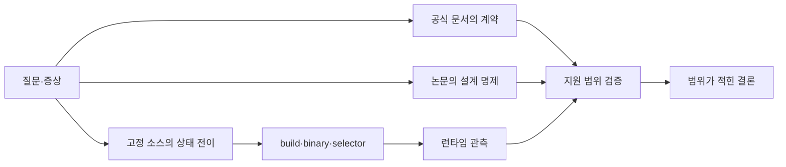

# 5장. 이 책에서 소스·문서·측정을 구분하는 법

어떤 옵션의 문서에 “성능을 높인다”고 적혀 있고, 소스에는 그 옵션을 읽는 조건문이 있으며, benchmark에서는 20% 향상이 나왔다고 하자. 세 증거는 서로를 보강할 수 있지만 같은 주장을 증명하지 않는다. 문서는 사용자가 기대할 계약과 지원 범위를 말한다. 소스는 특정 revision이 어떤 조건에서 어떤 상태를 바꾸도록 작성됐는지 말한다. benchmark는 특정 binary·장비·workload에서 관측한 결과를 말한다.

이 셋을 합쳐 “이 옵션은 항상 20% 빠르다”고 쓰면 친절해 보이지만 틀린 설명이다. 반대로 모든 문장을 “환경에 따라 다르다”로 끝내면 안전하지만 쓸모가 없다. 필요한 것은 불확실성을 숨기지 않으면서도 독자가 다음 코드를 찾고 자신의 환경에서 판정할 수 있는 증거 사슬이다.

이 장은 책 전체의 독법을 정한다. 함수 이름을 많이 인용하는 것보다 어느 artifact의 어느 명제를 증명하는지, 의도는 무엇으로 복원하는지, 실제 사용과 성능은 무엇을 추가로 관측해야 하는지 배운다.

이 장이 소유하는 질문은 “서로 다른 증거가 각각 어디까지 말할 수 있는가”다. 78장은 이 규칙을 반복 설명하는 장이 아니라, 실제 논문·공식 문서·고정 소스·측정이 충돌하거나 비어 있을 때 한 기술 주장을 판정 가능한 ledger로 완성하는 실습을 소유한다.



## 5.1 세 증명 범위를 먼저 고정한다

이 책에서 증거는 문서·소스·측정이라는 세 칸을 넘나들지 않는다. **문서 증명**은 공개된 계약과 지원 범위를, **소스 증명**은 고정 revision에 작성된 조건·상태 전이·호출 관계를, **측정 증명**은 고정 binary와 workload에서 실제로 관측한 사건을 닫는다. 한 칸의 자료로 다른 칸의 결론을 대신하지 않는다. 소스에 branch가 있다는 사실은 그 branch가 이번 요청에서 실행됐다는 증명이 아니며, 한 번의 benchmark가 보편 성능을 증명하지도 않는다.

앞으로 `artifact`라는 말이 필요한 곳에서는 먼저 한국어 역할 이름을 쓴다. 문서 원본, 고정 소스, 빌드 명세, 실행 기록, 측정 표, 재현 입력이 기본 이름이다. 실제 파일명·클래스명·스키마 필드처럼 식별자 자체가 영어일 때만 원문을 보존한다. 이 규칙은 번역 취향이 아니라 제출물을 열었을 때 각 파일의 책임이 바로 보이게 하는 제작 규약이다.

> **정식 판정 문장**  
> 문서는 조건 C에서 기능 F를 지원한다고 계약한다. 고정 소스 R은 C를 검사해 상태 S를 바꾸도록 작성돼 있다. 실행 E에서는 binary B가 그 경로를 선택했고 측정값 M이 관측됐다. 따라서 결론은 C·R·B·E의 범위 안에서만 성립한다.

### “무엇이 사실인가”보다 “어느 근거물에 대한 사실인가”

“vLLM은 backend X를 사용한다”는 문장에는 revision, model feature, GPU, dtype와 configuration이 빠져 있다. 특정 release의 selector는 여러 후보와 fallback을 가질 수 있고 설치된 extension도 build variant가 다를 수 있다. 정확한 문장은 다음처럼 범위를 가진다.

> 고정 revision R의 selector는 조건 C에서 backend class X를 선택하도록 구현돼 있다. 실제
> 배포에서 X의 binary와 kernel이 사용됐는지는 build manifest, selection log와 trace로 추가
> 확인해야 한다.

이 문장은 길지만 독자를 막지 않는다. 소스에서 볼 조건과 runtime에서 볼 증거를 함께 준다. 반대로 “X를 사용한다”는 짧은 문장은 틀렸을 때 어디서 갈라졌는지 알려 주지 않는다.

근거물을 최소한 여섯 종류로 나눈다.

| 근거물 | 증명할 수 있는 것 | 단독으로 증명하지 못하는 것 |
|---|---|---|
| 공식 문서 | 공개 계약·지원·권장 절차 | 현행 binary의 실제 branch |
| 고정 source revision | 작성된 조건·상태·호출 관계 | 설치 binary와 실제 hot path |
| build manifest·wheel | 포함된 extension·architecture | 특정 요청이 사용한 kernel |
| 논문 version | 제안한 설계·평가 범위 | 현재 release의 구현·성능 |
| config·startup log | 요청·resolve된 선택 일부 | 모든 step의 실제 실행 |
| trace·metric·output | 특정 실행의 관측 | 보지 못한 workload의 보편 결과 |

표의 오른쪽 열이 중요하다. 증거가 약하다는 뜻이 아니라 질문의 범위가 다르다는 뜻이다. 공식 문서는 API 사용법에 가장 권위 있을 수 있지만 release binary가 특정 fallback을 탔다는 사실은 trace가 더 직접적이다. source는 구현 의도를 읽는 핵심이지만 compiler가 dead code를 제거했거나 다른 binary가 load됐다면 runtime을 대신하지 못한다.

### revision을 고정하지 않은 줄 번호는 빠르게 썩는다

GitHub의 `main` branch 링크는 오늘과 내일 내용이 달라질 수 있다. 함수가 이동하면 line number는 다른 코드를 가리킨다. 이 책은 release tag를 확인한 뒤 commit SHA의 blob URL을 사용하고, qualified symbol과 line span을 함께 남긴다.

예를 들어 vLLM scheduler의 고정 좌표는 [`Scheduler.schedule`](https://github.com/vllm-project/vllm/blob/6e448d0ea9bf3d88d898b65449ca6dc2aec170ac/vllm/v1/core/sched/scheduler.py#L439)처럼 commit을 포함한다.

SGLang loop는 [`Scheduler.event_loop_normal`](https://github.com/sgl-project/sglang/blob/71de97b264b04dcd514cf904003028aefe9775c8/python/sglang/srt/managers/scheduler.py#L1719), Transformers generation은 [`GenerationMixin.generate`](https://github.com/huggingface/transformers/blob/550d7b3834670483a4df436541272c055dc364bf/src/transformers/generation/utils.py#L2261)에 고정한다.

line span만으로도 부족하다. refactor 전후 의미를 비교하려면 symbol, class ownership과 호출자를 기록한다. 함수가 같은 이름으로 남아도 parameter와 불변식이 바뀔 수 있다. 짧은 핵심 인용은 독자가 분기를 이해하게 돕되 파일 전체를 복제하지 않는다. 주변 문맥은 고정 링크로 연다.

### 최신 버전이라는 말도 검증 대상이다

저장소의 release page, tag와 package index가 같은 artifact를 가리키는지 확인한다. prerelease와 stable, monorepo subpackage, vendored dependency tag가 다를 수 있다. 책의 source manifest에는 project, version, commit, 취득 시각과 upstream URL을 둔다.

새 release가 나왔다고 모든 결론을 자동으로 옮기지 않는다. 먼저 관심 symbol과 config field, default, capability gate, dependency pin의 diff를 만든다. 바뀐 부분만 다시 감사하고 기존 설명의 범위를 유지할지 수정할지 결정한다. “최신으로 업데이트”는 버전 숫자를 바꾸는 일이 아니라 증거 사슬을 새 artifact에 다시 연결하는 일이다.

## 5.2 문서와 소스의 증명 범위를 연결한다

공식 문서에는 사용자에게 안정적으로 노출할 개념과 예제가 담긴다. 그러나 모든 internal state와 fallback을 설명하지 않을 수 있다. source에는 세부 branch가 있지만 문서가 보장하지 않는 internal symbol은 다음 release에 바뀔 수 있다.

옵션을 읽을 때 다음 순서를 쓴다.

1. 공식 문서에서 단위, 기본값, 지원·비지원 조건과 경고를 읽는다.
2. CLI/API parser가 값을 어떤 config field로 옮기는지 찾는다.
3. field의 모든 reader를 찾아 조건문·계산과 state mutation을 적는다.
4. 다른 limit와 default resolution이 effective 값을 덮는지 본다.
5. startup log나 diagnostic이 resolved 값을 노출하는지 찾는다.
6. 실제 request에서 schedule shape·backend·metric이 변했는지 검증한다.

문서와 source가 다르게 보이면 곧바로 문서 버그라고 단정하지 않는다. 보고 있는 version이 같은지, deprecated alias와 compatibility layer가 있는지, 문서는 public behavior를 source는 internal optimization을 말하는지 확인한다. 그래도 계약과 구현이 어긋나면 범위를 적어 issue와 regression test 후보로 남긴다.

### source에 있다는 사실과 reachable하다는 사실

어떤 kernel wrapper가 저장소에 있어도 build flag가 꺼져 있거나 dependency가 없거나 GPU capability가 맞지 않으면 선택되지 않는다. reachability는 다음 사슬로 확인한다.

```text
source file 존재
→ build target에 포함
→ wheel/binary에 symbol 포함
→ registry에 등록
→ selector 조건 통과
→ wrapper 호출
→ launcher·kernel 실행
```

각 화살표는 다른 증거를 요구한다. source tree 검색만으로 “지원한다”고 쓸 수는 있어도 “현재 요청이 사용했다”고 쓸 수 없다. package metadata와 startup selection log도 마지막 kernel 실행을 자동으로 증명하지 않는다.

## 5.3 논문은 배경 근거이며 현재 구현의 증명은 아니다

논문은 어떤 문제가 왜 중요했고 어떤 primitive로 풀려 했는지 가장 밀도 있게 설명한다. 하지만 paper algorithm, 공개 prototype과 수년 뒤 framework release는 서로 다른 artifact다. 이름이 같아도 allocator, failure handling과 hardware specialization이 바뀔 수 있다.

논문에서 가져올 때는 최소한 다음 좌표를 보존한다.

- 정확한 version과 section·figure·table
- model, dtype, GPU·node topology와 parallelism
- prompt/output 분포, arrival process와 concurrency
- baseline version과 configuration
- TTFT·ITL/TPOT·E2EL 등 metric 정의와 percentile
- reported result의 범위와 저자의 limitation

PagedAttention 논문의 block mapping 명제를 현행 vLLM의 모든 hybrid cache class와 일대일로 대응시키지 않는다. DistServe의 TTFT·TPOT 제약 goodput 결과를 현재 P/D connector의 성능으로 쓰지 않는다. 논문은 “왜 이런 경계를 만들었는가”를 묻게 하고, 현행 source는 “지금 어떤 상태로 구현됐는가”를 다시 증명한다.

논문에 timeout, cancellation, partial transfer와 resource reclamation이 명시되지 않았다면 상식으로 채우지 않는다. production 구현을 위해 필요한 상태라고 설명할 수는 있지만, paper가 그 protocol을 보장했다고 쓰지 않는다. 빠진 부분 자체가 source audit의 질문이 된다.

## 5.4 측정은 이름이 아니라 시작·끝 사건으로 증명한다

`time_to_first_token`이라는 이름이 같아도 client send→first byte와 server receive→first token commit은 다르다. `cache_hit`도 query, token, block, local/remote와 partial 여부에 따라 분자와 분모가 다르다. metric을 인용할 때 다음을 적는다.

```text
이름·단위
모집단과 label filter
분자·분모 또는 bucket
timestamp 시작·끝 사건
observe/inc가 호출되는 state transition
누락·오류·취소 처리
aggregation window와 percentile 방법
```

dashboard panel에서 PromQL을 읽고 exporter 등록, update 함수와 timestamp writer까지 거슬러 간다. process가 다르면 clock domain을 확인한다. histogram p99는 개별 request의 인과를 보존하지 않으므로 exemplar나 sampled trace로 request→step을 연결한다.

“metric이 없다”와 값이 0인 것도 다르다. scrape 실패, label mismatch와 feature-disabled를 0으로 채우면 정상처럼 보인다. 관측 pipeline의 freshness와 missing series alert를 별도로 둔다.

## 5.5 설계 의도는 주석 하나가 아니라 제약의 교집합에서 복원한다

사용자는 “왜 이 코드가 들어갔는가”를 알고 싶다. commit message나 주석이 명시하면 강한 출발점이지만 그것만으로 충분하지 않다. 오래된 주석이 현재 branch와 어긋나거나, 성능 이유를 말하면서 correctness 제약을 생략할 수 있다.

의도는 다음 증거를 함께 읽어 복원한다.

1. 어떤 실패나 비용을 막는 조건문인가?
2. 함수 전후에 유지되는 불변식은 무엇인가?
3. option·capability가 없을 때 fallback은 무엇인가?
4. test는 어느 경계와 실패를 고정하는가?
5. issue·PR·commit은 어떤 관측을 보고 변경했는가?
6. 현재 caller가 그 가정을 여전히 만족하는가?

예를 들어 block을 바로 free하지 않고 reference와 event를 기다리는 코드는 단순 보수성이 아닐 수 있다. late CUDA work가 주소를 쓰는 동안 reuse하지 않는 lifetime 제약일 수 있다. 주석이 없어도 acquire→submit→completion→release 순서와 test의 cancel race에서 의도를 복원할 수 있다. 다만 author의 역사적 동기를 확정하지 않고 “현재 불변식상 필요한 이유”라고 범위를 적는다.

### 성능 최적화와 correctness guard를 혼동하지 않는다

조건이 맞지 않을 때 fallback하는 branch를 보면 느린 경로라고만 생각하기 쉽다. dtype, head dimension, mask, alignment와 architecture gate는 잘못된 계산이나 illegal access를 막을 수 있다. 강제로 fast path를 켜 benchmark가 빨라졌다는 결과는 correctness를 잃었을 수 있다.

selector를 설명할 때 candidate의 속도 순위뿐 아니라 capability predicate와 failure behavior를 적는다. 지원하지 않는 경우 명시 오류인지 다른 backend인지, silent option ignore인지 본다. fallback 횟수와 이유를 관측할 수 있어야 배포에서 성능 회귀를 진단할 수 있다.

## 5.6 핵심 코드를 부분 인용하는 법

긴 함수 전체를 책에 붙이면 원본보다 읽기 어렵고 release가 바뀔 때 검증 범위가 커진다. 독자의 질문에 필요한 조건과 state mutation 몇 줄만 인용하고, 생략한 앞뒤와 고정 source 링크를 둔다.

좋은 인용 뒤에는 네 문장이 따른다.

1. 입력 state가 무엇인지 설명한다.
2. 조건이 참·거짓일 때 무엇이 달라지는지 설명한다.
3. mutation 뒤 새로 성립해야 할 불변식을 설명한다.
4. 이 분기가 runtime에서 실행됐음을 어떻게 관측할지 설명한다.

코드 표면을 한국어로 한 줄씩 번역하는 것은 충분하지 않다. `min(a,b)`라면 두 제한의 의미와 어느 것이 active인지, collection에서 `pop`한다면 ownership이 어디로 이동하는지, async call이면 완료와 resource release가 왜 분리되는지 설명한다.

### line number보다 semantic anchor를 남긴다

고정 commit의 line은 독자가 즉시 열어 보기 좋다. 장기 유지에는 qualified symbol, 중요한 parameter·field와 짧은 excerpt digest가 더 안정적인 anchor다. 새 release 감사에서는 symbol과 핵심 expression을 검색하고 line을 갱신한다.

generated code, vendored dependency와 submodule은 upstream revision을 별도로 기록한다. framework repository의 commit이 FlashInfer·FlashAttention·CUTLASS 소스 version을 자동으로 고정하지 않을 수 있다. build가 external wheel을 쓴다면 package lock과 binary metadata가 필요하다.

라이선스와 저작권도 보존한다. 이해에 필요한 짧은 부분만 인용하고 원문 링크와 project 정보를 남긴다. 구현 전체를 책 내부에 복제하는 대신 독자가 정확한 revision으로 이동하게 한다.

## 5.7 source diff는 줄 수가 아니라 의미 변화를 분류한다

release를 올릴 때 `git diff --stat`의 변경 줄 수는 영향도를 말하지 않는다. default 한 줄이 backend selection 전체를 바꿀 수 있고, 큰 formatting diff는 의미가 없을 수 있다. 다음 범주로 diff를 분류한다.

| 변화 | 다시 검증할 것 |
|---|---|
| public option·default | effective config와 사용자 결과 |
| state field·owner | lifecycle, serialization과 cleanup |
| scheduler condition | admission, fairness, token/KV budget |
| tensor shape·layout | runner metadata와 kernel contract |
| backend dependency | build, selector와 supported feature |
| metric timestamp | dashboard continuity와 SLO 계산 |
| error/fallback | 실패 의미와 rollback |

함수 이름이 그대로여도 dataclass field와 caller ordering이 바뀌면 설명을 다시 본다. 반대로 파일이 이동했어도 semantic behavior와 test가 같다면 locator만 갱신할 수 있다. 변경 전후에 입력, state transition, output과 failure invariant를 비교한다.

### dependency pin은 framework release와 별도 축이다

vLLM release가 같아도 다른 CUDA wheel variant나 optional dependency가 설치될 수 있다. SGLang의 backend package, llama.cpp의 build flag와 Transformers가 쓰는 PyTorch/attention implementation도 마찬가지다. source manifest에는 직접 repository뿐 아니라 성능·정확성에 중요한 dependency의 version과 취득 방식을 둔다.

CUDA toolkit, driver와 GPU architecture는 특히 build/runtime compatibility에 관여한다. source가 SM-specific path를 갖는지, wheel에 cubin 또는 PTX가 포함됐는지, runtime JIT와 fallback이 있었는지 분리한다. “CUDA 13에서 빠르다”는 문장을 쓰려면 동일 source·workload에서 무엇이 달라졌는지 증명해야 한다.

## 5.8 모순되는 증거를 만났을 때의 조사 순서

문서에는 기능이 enabled라고 적혀 있고 startup log도 backend X를 선택했다고 하는데 trace에는 다른 kernel이 보인다고 하자. 한 증거를 버리기 전에 층을 맞춘다.

```text
문서: 기능을 지원하거나 요청하는 계약
config: 사용자가 요청한 값
selector log: wrapper/class resolution
wrapper: shape별 subpath와 fallback
trace: 실제 실행 symbol
```

class X가 내부에서 여러 kernel을 shape별로 고를 수 있다. trace symbol이 library 내부 이름이라 log의 class와 문자열이 다를 수 있다. 일부 operator만 fallback했거나 graph replay가 child kernel 이름을 다르게 보일 수 있다. wrapper→binding→launcher를 따라 mapping을 만든다.

반대로 실제 binary가 예상과 다를 수도 있다. Python source checkout과 installed extension이 다른 build에서 왔거나 여러 library가 search path에 있을 수 있다. module path, shared object hash, loaded library와 build manifest를 확인한다. source를 읽었다는 사실이 binary identity를 증명하지 않는다.

### 성능 문서와 자체 측정이 다를 때

먼저 model·dtype·GPU, parallelism, prompt/output distribution, concurrency, arrival, prefix state, latency constraint와 metric aggregation을 표로 맞춘다. 하나라도 다르면 재현 실패가 아니라 다른 실험일 수 있다.

조건을 맞췄는데도 차이가 크면 warm-up, power/clock, dependency build, backend selection과 trace를 본다. 여러 run과 오류 막대를 사용한다. marketing chart의 최고값과 한 번의 local run을 직접 비교하지 않는다. 공식 문서 수치도 명시된 환경 밖에서는 기대값이 아니라 참고 관측이다.

## 5.9 한 기술 명제를 끝까지 닫는 evidence card

책의 중요한 문장은 다음 카드로 감사한다.

```text
명제: ______________________________________
대상 artifact와 revision: __________________
지원하는 문서 좌표: ________________________
구현 symbol·line: __________________________
전제 config·shape·capability: ______________
state/tensor 변화: __________________________
failure·fallback: ___________________________
실제 사용을 보일 관측: _____________________
성능 판정 workload·metric: _________________
반증 조건: __________________________________
아직 확인하지 못한 것: _____________________
```

예를 들어 “chunked prefill은 ITL tail을 줄인다”는 명제의 source는 chunk를 만들 수 있다는 것을 보여 준다. 실제 schedule event는 긴 prefill이 나뉘고 decode가 사이에 들어왔음을 보여 준다. TTFT·ITL trace는 해당 workload에서 tail이 어떻게 변했는지 보여 준다. 작은 chunk의 launch overhead와 긴 prompt TTFT 증가는 부작용이다. 다른 workload에서 항상 좋아진다는 결론은 카드 범위를 넘는다.

“backend X가 사용된다”는 명제라면 config, selector predicate, selected class, loaded binary와 kernel trace를 잇는다. “backend X가 더 빠르다”면 동일 correctness, shape와 workload의 A/B가 추가된다. 기능 명제와 성능 명제를 한 카드에 섞지 않는다.

### 확인하지 못한 것을 원고에 쓰는 방식

실행하지 않은 hardware 결과를 실행한 것처럼 쓰지 않는다. source에서 확인한 capability와 독자가 측정할 절차를 분리한다. “고정 source는 A 조건에서 X를 선택한다”와 “실제 배포에서는 selection log와 trace를 확인한다”라고 쓴다.

논문에 없는 cleanup을 추론했다면 production correctness에 필요한 검증 항목으로 제시하고 paper 명제로 귀속하지 않는다. 정보가 부족한 것은 빈칸으로 남기는 편이 허구의 완결성보다 정확하다. 빈칸에는 다음에 수집할 artifact나 실험을 적어 작업 가능한 질문으로 바꾼다.

### 시간 제한 option 조사는 73~75장의 실행 절차로 넘긴다

처음 5분에는 공식 문서와 `--help`에서 이름, type, default, 단위와 경고를 읽는다. 같은 version의 문서인지 확인한다. 다음 5분에는 parser와 config field를 찾고 alias·deprecated path와 default resolution을 적는다.

10~20분에는 모든 field reader를 검색한다. active limit 계산, selector, allocator와 metric label을 분류한다. 주요 branch 전후 state를 적고 normal·error·fallback caller를 찾는다. test가 있으면 어떤 boundary를 고정하는지 읽는다.

20~25분에는 option→effective field→state/tensor→runtime signal의 사슬을 그린다. startup log만 있는지 step-level metric도 있는지, 없다면 작은 structured event를 어디에 둘지 정한다. prompt 원문과 무한 cardinality label을 넣지 않는다.

마지막 5분에는 반증 가능한 예측을 쓴다. 예를 들어 token budget을 줄이면 특정 workload에서 prefill chunk 수가 늘고 longest step이 짧아지며 active decode ITL tail이 줄 가능성이 있지만 긴 prompt TTFT와 launch 수가 늘 수 있다. 실제 schedule shape가 안 바뀐다면 다른 limit이 active거나 path가 비활성이다.

이 절차는 30분에 모든 성능 결론을 내리려는 것이 아니다. 잘못된 층을 며칠 파는 일을 막고, 어느 source와 측정이 더 필요한지 정확히 정하는 첫 pass다.

### 친절함과 근거는 대립하지 않는다

독자에게 친절하다는 이유로 조건과 불확실성을 지우면 나중에 문제를 풀 수 없는 설명이 된다. 반대로 revision과 줄 번호만 나열하면 정확해 보여도 이해하기 어렵다. 좋은 설명은 먼저 문제와 직관을 주고, 직관이 깨지는 경계를 보여 준 뒤, 상태·함수·tensor와 검증으로 내려간다.

이 책의 문장을 읽을 때 주어를 확인한다.

- “공식 문서는” 공개 계약을 말한다.
- “고정 source는” 작성된 branch와 state를 말한다.
- “논문은” 해당 version의 설계·평가 명제를 말한다.
- “trace에서 관측했다면” 특정 binary·workload의 실행을 말한다.
- “독자가 확인해야 한다”는 문장은 이 원고가 runtime으로 증명하지 않은 선택 검증이다.

이 구분은 글을 약하게 만들지 않는다. 오히려 어디까지 확실하고 다음에 무엇을 보면 되는지 알려 준다. 독자는 새로운 release와 GPU에서도 같은 증거 사슬을 다시 만들 수 있다.

첫 편에서 우리는 요청의 수명, TTFT·ITL, goodput, prefill/decode 물리 비용과 증거 독법을 얻었다. 다음 편은 사용자의 문자열이 model tensor가 되는 경계를 걷는다. tokenizer와 template를 단순 전처리로 넘기지 않고 cache identity, position, embedding과 logits까지 이어지는 코드로 읽는다.

## 5.10 실제로 자주 만나는 증거 충돌 다섯 가지

첫 번째는 문서 default와 runtime effective 값이 다른 사건이다. 문서는 `auto`를 기본으로 설명하고 source parser도 `auto`를 저장하지만 model config, GPU capability와 dependency availability를 읽는 post-init이 concrete backend로 바꾼다. config dump를 parser 직후에 찍었는지 resolution 뒤에 찍었는지에 따라 값이 다르다.

조사는 public default→parser field→post-init/validator→selector→selected class 순서다. 사용자가 지정한 값, default와 effective 값을 별도 필드로 보존한다. source 설명에는 “default가 X”와 “조건 C에서 X로 resolve”를 구분한다.

두 번째는 source에는 metric이 있지만 dashboard에 없는 사건이다. exporter 등록이 feature flag나 worker role에 묶였거나, metric 이름·label이 release에서 바뀌었거나, scrape target이 다른 process일 수 있다. source 검색 결과를 0값으로 간주하지 않는다. `/metrics` 원문, scrape status, registry owner와 update call reachability를 확인한다.

세 번째는 startup log는 fast backend인데 일부 request만 느린 사건이다. multimodal, sliding window, head dimension, KV dtype 또는 graph shape 때문에 request별 subpath가 fallback할 수 있다. startup의 global selection과 step의 actual op를 구분한다. 느린 cohort의 feature·shape와 kernel symbol을 정상 cohort와 비교한다.

네 번째는 논문과 동일한 algorithm 이름인데 성능이 재현되지 않는 사건이다. baseline, hardware, model, arrival와 SLO가 다를 수 있고 production code가 failure handling과 generality 비용을 추가했을 수 있다. paper figure를 목표 숫자로 두기 전에 experiment matrix를 맞춘다. 일치하지 않는 조건은 재현 실패가 아니라 scope 차이로 표시한다.

다섯 번째는 profiler가 예상 symbol을 보여도 출력이 다른 사건이다. 같은 kernel 이름이 dtype, template parameter와 layout에 따라 다른 specialization을 포함할 수 있다. upstream source와 loaded binary revision이 다를 수도 있다. symbol만 아니라 launch argument, grid, shared memory, build ID와 입출력 tensor contract를 확인한다.

### 사건 1: 옵션을 바꿨는데 아무 일도 일어나지 않았다

token budget을 4,096에서 2,048로 낮췄지만 TTFT·ITL과 schedule shape가 모두 같다고 하자. “옵션이 버그”라고 결론내리기 전에 effective constraint를 계산한다. workload의 가장 긴 prompt chunk가 1,500 token이라 두 값 모두 active하지 않았을 수 있다. sequence별 limit 1,024가 먼저 적용되거나 prefix hit가 query를 줄였을 수도 있다.

증거 사슬은 config accepted→effective field changed→budget expression evaluated→schedule output changed→runner shape changed→user metric changed다. 최초로 차이가 사라진 화살표를 찾는다. field는 바뀌었지만 branch가 실행되지 않았다면 workload/condition 문제고, schedule은 바뀌었지만 metric이 같다면 critical path가 다른 곳이다.

### 사건 2: source상 안전해 보이는데 cancel 뒤 memory가 줄지 않는다

release 함수가 존재한다는 사실은 모든 abort path가 그 함수를 호출한다는 뜻이 아니다. waiting, running, in-flight copy, remote transfer와 normal finish의 caller를 전수한다. async operation은 cancel 요청 뒤 completion까지 lease를 유지할 수 있으므로 즉시 memory가 줄지 않는 것이 정상일 수 있다. 반대로 completion 뒤에도 reference가 남으면 leak 후보다.

request terminal, scheduler removal, device drain, transfer handle completion과 allocator reuse를 timeline에 둔다. source의 owner와 runtime counter를 연결해야 정상 지연과 누수를 가른다. 한 번의 steady-state snapshot만으로 판단하지 않는다.

### 사건 3: 공식 CUDA 문서의 규칙과 framework 설명이 달라 보인다

CUDA Programming Guide는 execution, memory model과 synchronization의 platform contract를 제공한다. framework 문서는 그 위의 abstraction과 지원 범위를 설명한다. 예를 들어 비동기 API라는 이름이 host thread에 비동기라는 뜻일 수 있고, 동일 stream ordering이나 device completion까지 자동으로 보장한다는 뜻은 아닐 수 있다.

먼저 CUDA의 stream·event·memory visibility 규칙을 읽고, framework wrapper가 어느 stream과 event를 사용하는지 source에서 본다. 마지막으로 trace에서 submit과 completion ordering을 확인한다. 공식 문서를 framework 특정 구현의 증거로 쓰지 않고, framework source를 CUDA platform 전체의 보편 규칙으로 쓰지 않는다.

## 5.11 backend 성능 주장을 evidence card로 검증한다

하나라도 “자동으로”, “내부적으로”, “대체로 빠르다”로 끝나면 더 파야 한다. 불필요하게 낮은 세부까지 모두 넣으라는 뜻은 아니다. 독자의 질문을 닫는 데 필요하지 않은 symbol atlas는 장말이나 부록으로 옮긴다. 깊이와 과잉은 정보량이 아니라 인과 연결 여부로 구분한다.

### 이 증거 규칙을 독서 경로에 적용한다

입문 독자는 1장의 요청 지도, 2장의 두 clock, 3장의 goodput, 4장의 shape 차이를 읽고 6장으로 간다. 운영자는 증상에 따라 2·3장의 timeline/funnel을 사용한 뒤 scheduler·관측 편으로 이동한다. kernel 개발자는 4장의 FLOP·byte ledger에서 CUDA·kernel 편으로 내려가되 user SLO와 연결을 놓치지 않는다.

새 framework를 평가하는 독자는 5장의 evidence card를 복사한다. 공식 docs와 source revision을 고정하고 request lifecycle, scheduler, allocator, runner와 kernel 경계를 채운다. 기존 책의 class 이름과 같지 않아도 공통 state 질문으로 비교할 수 있다.

장애 대응 중에는 책을 처음부터 읽지 않는다. 증상→clock/funnel→최초 divergence→owner→source →반증 실험의 경로를 탄다. 충분히 좁힌 뒤 해당 전문 장의 source note와 workbook을 사용한다. 이 독자 경로가 장 수가 늘어도 책을 검색 가능한 도구로 만든다.

### 이 방법이 보장하지 않는 것

이 장이 보장하는 것은 독자가 언제나 즉시 정답을 얻는다는 것이 아니다. 정답처럼 보이는 추측을 줄이고, 확인된 사실·범위가 있는 관측·아직 검증할 질문을 분리하게 한다. 정보가 부족하면 무엇을 더 수집할지 명확해진다.

다음 편부터 모든 장은 이 규칙을 실제 코드에 적용한다. tokenizer에서 byte와 offset을, chat template에서 protocol grammar를, embedding에서 ID→row를, logits와 sampling에서 score→state commit을 따라간다. 각 단계에서 문서 계약, 고정 source와 독자의 선택 검증을 섞지 않는다.

이렇게 해야 책을 읽은 사람이 단지 “vLLM은 빠르다”거나 “SGLang은 radix cache를 쓴다”고 기억하는 데 그치지 않는다. 자신의 증상에 맞는 artifact를 고르고 함수와 state를 찾아가며, 변경이 어떤 자원을 어디로 옮겼는지 설명하고 검증할 수 있다. 그것이 이 책이 목표로 하는 실용적인 깊이다.

### 하나의 backend 성능 주장을 처음부터 감사하는 예

“새 attention backend를 켜면 긴 context decode가 30% 빨라진다”는 문장을 검토한다고 하자. 먼저 30%의 분모를 묻는다. attention kernel duration인지 model forward인지 ITL인지, 평균인지 p99인지 확인한다. model, dtype, head 구조, page size, GPU, batch와 context 분포를 표에 넣는다.

공식 문서에서는 backend의 지원 architecture, dtype, head dimension, paged KV와 graph 제약을 읽는다. source에서는 option parser, registry, selector predicate와 fallback을 찾는다. wrapper가 prefill·decode 또는 ragged/paged shape를 어떻게 구분하는지, workspace와 plan이 어느 stream에서 만들어지는지 본다. native binding과 dependency revision을 고정한다.

build 증거에는 framework commit, wheel name·hash, extension/shared library, CUDA·driver와 embedded architecture를 둔다. startup에서 requested와 selected backend를 보존한다. 실제 느린/빠른 request의 step event에는 query/KV shape와 execution mode를 넣고 trace symbol까지 연결한다.

correctness gate는 동일 token 입력의 output 또는 logits tolerance, mask·position, block boundary, odd head dimension, cancellation과 fallback을 포함한다. 성능 gate는 동일 workload의 warm/cold, 여러 seed와 TTFT·ITL·goodput, operator duration과 HBM/collective를 본다.

결론은 다음처럼 범위를 가진다.

> 고정 build B에서 조건 C를 만족한 decode step은 backend X의 launcher를 실행했다. workload W의
> context cohort에서 baseline Y보다 attention device time은 28~32% 감소했지만 output routing을
> 포함한 ITL p99 개선은 14%였다. unsupported sliding-window 요청은 Y로 fallback했고 동일
> correctness gate를 통과했다.

이 결론은 길지만 무엇을 재현하고 어디서 다를지 분명하다. “X가 30% 빠르다”는 문장보다 실제 운영 판단에 짧은 길이다.

### version matrix를 만드는 이유

책은 한 최신 revision을 중심으로 쓰지만 독자는 이전 release를 운영할 수 있다. 중요한 의미 변화에는 작은 matrix를 둘 수 있다.

| 축 | 이전 revision | 현재 고정 revision | 독자가 확인할 것 |
|---|---|---|---|
| option 이름·default | old | new | migration alias와 warning |
| state owner | class A | class B | cleanup과 serialization |
| backend dependency | version P | version Q | supported shape·binary |
| metric 사건 | timestamp X | timestamp Y | dashboard discontinuity |

모든 release를 역사책처럼 나열하지 않는다. 현재 동작을 이해하거나 migration 장애를 설명하는 변화만 둔다. 이전 성능 수치를 현재 default와 섞지 않는다.

matrix가 없으면 option rename을 기능 삭제로 오해하거나 metric timestamp 변경을 성능 회귀로 볼 수 있다. 반대로 이름이 같아도 default와 owner가 바뀌면 동일 behavior로 간주하면 안 된다.

## 5.12 worked example: release에서 scheduler state까지 잇는다

검토할 문장을 일부러 평범하게 잡자. “vLLM에서 chunked prefill을 켜면 긴 prompt가 여러 step으로 나뉜다.” 대체로 그럴듯하지만 revision, effective 값, scheduler branch와 관측 범위가 빠졌다. 이를 “고정 revision에서 어떤 조건이 참일 때 scheduler가 남은 token을 budget에 맞추며, 실제 request의 한 prompt가 여러 schedule output으로 나뉘었는지는 step event로 확인한다”로 바꾸는 전 과정을 evidence packet 하나에 담는다.

첫 화살표는 release pin이다. 대상은 vLLM v0.27.1에 대응하는 commit `6e448d0ea9bf3d88d898b65449ca6dc2aec170ac`다. Package version 문자열만 쓰지 않고 source commit, wheel hash와 loaded package path를 각각 둔다. Source tree가 맞아도 실행 process가 다른 virtual environment의 wheel을 import하면 이후 모든 line anchor가 다른 artifact를 설명하기 때문이다. 이 책은 runtime을 실행하지 않으므로 wheel이 실제 load됐다고 주장하지 않고, 독자가 남길 observation field로 분리한다.

둘째 화살표는 raw option에서 normalized state다. CLI field는 [`EngineArgs.enable_chunked_prefill`](https://github.com/vllm-project/vllm/blob/6e448d0ea9bf3d88d898b65449ca6dc2aec170ac/vllm/engine/arg_utils.py#L609-L622)에 있고 parser 등록은 같은 파일의 [`add_cli_args`](https://github.com/vllm-project/vllm/blob/6e448d0ea9bf3d88d898b65449ca6dc2aec170ac/vllm/engine/arg_utils.py#L1488-L1505)에서 찾는다.

그러나 raw 값이 `None`일 수 있으므로 “option을 쓰지 않았다=꺼졌다”가 아니다. [`_set_default_args`](https://github.com/vllm-project/vllm/blob/6e448d0ea9bf3d88d898b65449ca6dc2aec170ac/vllm/engine/arg_utils.py#L2600-L2670)가 platform·runner 조건과 default를 적용하고 일부 조건에서는 값을 다시 끈다. 이 함수 뒤의 `enable_chunked_prefill`이 effective state다.

셋째 화살표는 config 불변식이다. EngineArgs가 [`create_scheduler_config`](https://github.com/vllm-project/vllm/blob/6e448d0ea9bf3d88d898b65449ca6dc2aec170ac/vllm/engine/arg_utils.py#L2248-L2282)에서 `SchedulerConfig`를 만들 때 chunk flag와 `max_num_batched_tokens`가 함께 전달된다. Config의 [`__post_init__`](https://github.com/vllm-project/vllm/blob/6e448d0ea9bf3d88d898b65449ca6dc2aec170ac/vllm/config/scheduler.py#L226-L275)는 runner type과 token/sequence limit 조합을 검사하고 warning·error 또는 state 변화를 만든다.

Flag 하나가 아니라 token budget, model length와 runner compatibility의 교집합이 behavior 범위다.

넷째 화살표는 consumer와 state transition이다. Scheduler의 [`_try_schedule_encoder_inputs`](https://github.com/vllm-project/vllm/blob/6e448d0ea9bf3d88d898b65449ca6dc2aec170ac/vllm/v1/core/sched/scheduler.py#L840-L919)에는 남은 budget보다 입력이 클 때 chunking이 꺼져 있으면 request를 이번 step에 schedule하지 않는 분기가 있다. 이 source가 직접 지지하는 bounded claim은 “해당 조건에서 chunk flag가 schedule 가능 여부의 한 predicate다”이다. 모든 prompt가 일정 크기 chunk로 잘린다거나 decode보다 항상 우선한다는 주장은 이 span이 증명하지 않는다.

다섯째 화살표는 caller와 다음 consumer다. `Scheduler.schedule`이 running과 waiting request를 순회하며 token budget, KV allocation, encoder budget 등 여러 제약을 적용한다. Chunk predicate가 통과해도 free KV block, max sequence, preemption과 다른 budget이 먼저 막을 수 있다. Schedule output의 request별 scheduled token 수가 runner input으로 내려갈 때 비로소 물리 query shape가 바뀐다. “Config가 true다”와 “이 request가 chunk됐다” 사이에 scheduler decision이라는 화살표를 남겨야 한다.

여섯째 화살표는 runtime observation과 사용자 효과다. 독자가 보존할 최소 event는 request ID, prompt token 수, step ID, step별 scheduled token, remaining token, effective flag, active token budget, blocking predicate다. 한 2,048-token prompt가 step별 512·512·512·512로 schedule됐다면 chunking 관측이 있다. 하지만 TTFT 개선은 별도 주장이다. 같은 arrival trace에서 queue time, prefill step duration, decode ITL과 strict goodput을 비교하고 output token·KV position correctness를 검증해야 한다.

이 사슬을 작은 상태 표로 압축하면 다음과 같다.

| 단계 | 값·owner | 증명하는 것 | 아직 증명하지 못한 것 |
|---|---|---|---|
| release | commit·wheel·import path | 조사 artifact identity | hot path |
| parser | raw true/false/none | 사용자 입력 | effective state |
| normalization | resolved flag·token budget | config state | request decision |
| scheduler | predicate·scheduled token | request별 mutation | device execution |
| runner | packed query shape·step | 실행 입력 | 사용자 SLO 개선 |
| client ledger | TTFT·ITL·output | workload 결과 | 다른 환경의 보편 결과 |

### derived inference는 source fact와 다른 문장으로 쓴다

위 source에서 “chunk가 커지면 한 prefill step의 query row가 커질 가능성이 있고 mixed decode가 다음 service를 기다리는 시간이 늘 수 있다”는 결론을 낼 수 있다. 그러나 이는 한 줄에 쓰인 직접 사실이 아니라 scheduler budget과 4장의 FLOP·byte 장부를 결합한 derived inference다. Evidence packet에서 `source fact`, `derived inference`, `runtime observation`을 세 칸으로 나눈다.

소스에서 확인한 사실는 정확한 predicate와 mutation을 현재형으로 쓴다. Derived inference는 가정 목록을 앞에 둔다. 같은 arrival, free KV, 다른 budget 비활성, runner가 schedule output을 그대로 packed shape로 사용한다는 조건 아래 chunk cap 증가는 M과 non-preemptible step 시간을 늘릴 수 있다. Runtime observation은 특정 build·workload에서 실제 M과 latency가 어떻게 움직였는지다. 세 문장을 합치되 서로의 증명 범위를 빌리지 않는다.

Inference에는 반드시 falsifier가 있다. Cap을 512에서 1,024로 올렸는데 actual scheduled token histogram이 같다면 다른 limit가 active이므로 “cap이 M을 키웠다”는 inference는 기각한다. M은 커졌지만 step duration이 같다면 graph padding, 더 효율적인 GEMM 또는 overlap이 상쇄했을 수 있다. Step은 길어졌는데 ITL이 같다면 decode가 같은 critical path에 없거나 scheduler interleave가 달랐을 수 있다. ITL만 나빠지고 prefill shape가 같다면 gateway arrival·context mix·backend 변경을 찾는다.

Falsifier는 주장을 약하게 만드는 장식이 아니다. 조사 순서를 결정한다. 먼저 effective config와 schedule output을 비교하는 값싼 증거로 option no-op을 제거한다. 다음으로 runner shape와 step timeline을 본다. 마지막으로 device profiler를 연다. 첫 경계에서 이미 차이가 없으면 CUDA kernel을 분석하지 않는다. 반대로 schedule shape가 같고 selected kernel만 달라졌다면 option source walk를 그만두고 backend dispatch로 이동한다.

수치 예를 들어 raw option은 true였고 effective token budget은 1,024였다. Prompt 3,000 token의 schedule event가 1,024·1,024·952로 나뉘었다. Baseline budget 512에서는 여섯 step이었고 각 step의 device 시간이 4.2ms, candidate 세 step은 7.1ms였다. 총 prefill device 시간은 25.2ms에서 21.3ms로 줄었지만 mixed decode request가 기다린 최장 service interval은 4.2ms에서 7.1ms로 늘었다. TTFT와 ITL이 반대 방향으로 움직일 수 있다는 derived inference가 관측과 일치한다.

그럼에도 원인 확정에는 경쟁 가설이 남는다. Candidate에서 graph bucket이 바뀌거나 context mix가 달랐으면 step duration 차이를 chunk만으로 설명할 수 없다. Evidence packet은 baseline/candidate의 model, token IDs, arrival trace, running decode cohort, graph mode와 backend를 같은 행에 둔다. 하나가 다르면 통제하거나 claim 범위를 그 차이까지 포함한다.

## 5.13 제출물을 하나의 재현 묶음으로 합친다

조사가 끝났다는 뜻은 메모가 여러 디렉터리에 흩어져 있다는 뜻이 아니다. 독자나 동료가 한 상자를 열어 같은 판정을 재현할 수 있어야 한다. 상자에는 `판정.md`, `근거-목록.tsv`, `고정-소스/`, `실행-명세.json`, `관측/`, `재현/`, `한계.md`만 둔다. `판정.md`의 각 문장은 근거 목록의 행을 가리키고, 각 행은 고정 좌표·digest·증명 범위·반증 조건을 가진다. 원본을 복제할 수 없으면 라이선스와 접근 조건을 적고 고정 locator와 bounded excerpt를 남긴다.

```text
제출-상자/
├── 판정.md                 # 범위가 닫힌 결론과 반증 조건
├── 근거-목록.tsv           # 문서/소스/측정 분류, 좌표, digest
├── 고정-소스/              # 허용되는 짧은 원문과 revision 명세
├── 실행-명세.json          # binary·GPU·driver·옵션·workload
├── 관측/                   # trace·metric·output과 수집 시각
├── 재현/                   # 최소 입력, 기대값, 실행 절차
└── 한계.md                 # 확인하지 못한 범위와 다음 질문
```

### 공식 문서와 current code가 어긋날 때의 판정 트리

문서가 “기본 활성”이라고 하고 source field default가 `None`이면 모순처럼 보인다. 첫 질문은 두 artifact의 version이 같은가다. `latest` 문서가 main branch를 설명하고 운영 wheel은 release라면 양쪽이 각각 맞을 수 있다. 문서 version selector, page commit 또는 release note를 확인한다. Version이 다르면 mismatch가 아니라 migration diff다.

Version이 같다면 문서의 주어를 읽는다. Public default가 자동 resolution 뒤 true라는 의미일 수 있고 dataclass의 raw default `None`은 “platform별로 나중에 결정”이라는 internal representation일 수 있다. Parser, normalization과 final config까지 추적해 effective default를 찾는다. Raw field 한 줄로 문서 오류를 선언하지 않는다.

그래도 같은 지원 조건에서 문서는 true, normalized source는 false라면 compatibility override, environment variable, platform hook과 downstream mutation을 찾는다. vLLM source에는 CPU platform과 engine core 같은 후속 owner가 chunk flag를 끄는 좌표가 있으므로 config creation만 보고 끝내지 않는다. 모든 writer를 찾고 mutation 시점과 reason을 적는다. 문서가 일반 CUDA 배포를, source가 특정 runner를 말한다면 claim population을 나눈다.

마지막에도 계약과 구현이 실제로 어긋나면 둘 중 하나를 몰래 고르지 않는다. Evidence card에는 `documented`, `implemented`, `observed`, `unsupported` 네 상태를 둔다. 문서 계약은 해당 version의 문구와 조건, 구현은 current source의 predicate, observed는 binary에서 얻을 diagnostic, unsupported는 확인하지 못한 환경이다. 원고 문장은 “문서는 C에서 X를 약속하지만 고정 revision의 source는 C에서 Y로 resolve한다. 실제 wheel의 effective diagnostic을 확인하기 전에는 어느 behavior가 배포됐다고 확정하지 않는다”가 된다.

이 mismatch의 회귀 fixture는 raw unset·explicit true·explicit false, 지원 CUDA·비지원 runner, token budget보다 짧고 긴 prompt를 교차한다. Expected에는 final config와 request별 scheduled token sequence를 넣는다. 문서 수정만 했다면 contract test가, source 수정만 했다면 behavior test가 다음 release에서 다시 어긋남을 잡는다. Issue를 열 때도 “문서가 틀림” 대신 artifact version, 최소 config, source span, 예상·실제 state와 falsifier를 제공한다.

### reader evidence packet을 한 디렉터리 없이도 재현 가능하게 쓴다

본문의 evidence packet은 저장소 파일 목록이 아니라 한 주장에 필요한 필드 집합이다. 첫 면의 `subject`에는 project, release, commit, dependency pin, wheel 또는 container digest를 쓴다. 둘째 `contract`에는 공식 문서 URL·version, option 단위·default·지원 조건을 쓴다. 셋째 `source walk`에는 parser symbol, normalized field, 모든 writer, decisive reader, mutation, next consumer와 error/fallback을 쓴다.

넷째 `observation plan`에는 실행하지 않고도 예상할 state와 실행할 때 필요한 diagnostic을 분리한다. 이 책의 static audit는 “predicate상 긴 request가 budget 때문에 보류 또는 chunk 대상이 된다”까지 말한다. 실제 배포 검증란에는 imported revision, effective config dump, request/step event, selected runner·kernel과 output fixture를 둔다. 빈 observation을 static 사실처럼 채우지 않는다.

다섯째 `claim`은 한 문장, population, conditions, effect, exclusions로 나눈다. 예컨대 population은 고정 vLLM revision의 decoder request, conditions는 effective chunk flag true와 남은 token이 active budget보다 큰 경우, effect는 scheduler가 한 step의 scheduled token을 제한할 수 있음, exclusion은 다른 budget·KV 부족·unsupported runner다. Performance 효과는 observation 전에는 별도 가설이다.

여섯째 `falsifiers`에는 최소 세 개를 둔다. Effective flag가 false, actual scheduled token이 limit에 닿지 않음, 다른 writer가 값을 덮음이다. Performance claim에는 동일 shape에서 TTFT·ITL이 변하지 않거나 correctness가 깨지는 반례를 더한다. Falsifier가 관측되면 claim을 폐기하거나 조건을 더 좁히고 source walk의 최초 불일치로 돌아간다.

마지막 `decision`에는 accepted, rejected, partially supported, unsupported 가운데 하나와 이유를 쓴다. Accepted도 영구 진리가 아니다. 다음 release에서 parser·default·consumer·metric 중 하나가 바뀌면 재감사할 semantic anchor를 남긴다. 이렇게 만든 packet은 독자가 옵션 이름을 외우게 하지 않고 새 release에서도 같은 주장을 다시 조립하게 한다.

### completed incident: 문서대로 켰는데 option이 no-op처럼 보였다

장애 티켓은 “chunked prefill을 켰는데 TTFT가 전혀 달라지지 않는다”로 시작했다. 운영자는 startup argument에 explicit true가 있고 문서의 활성 설명도 확인했다. 첫 대응은 token budget을 더 작게 만드는 것이었지만, 원인을 모른 채 성능 손잡이를 움직이면 decode ITL과 launch 횟수만 바꿀 수 있다. Evidence packet은 사용자 효과가 아니라 여섯 화살표를 앞에서부터 검사했다.

Artifact identity에서 첫 이상이 나왔다. Container label은 새 release였지만 process의 import path는 base image에 남은 이전 wheel을 가리켰다. 다만 이것만으로 원인이라 확정하지 않았다. 이전 wheel도 해당 option parser를 갖고 있었기 때문이다. Loaded module의 revision은 old, source review link는 new라는 mismatch를 packet에 기록하고 두 revision의 semantic diff를 만들었다.

두 revision 모두 raw flag를 받았지만 normalization 순서가 달랐다. New revision에서는 supported runner 판단 뒤 final config가 true였고 old revision에서는 선택된 pooling runner가 후속 writer에서 false로 덮였다. Startup argument log는 raw value만 출력해 true로 보였고 scheduler diagnostic은 effective false였다. 문서, parser와 운영자의 관측은 각각 거짓이 아니었다. 서로 다른 lifecycle 시점의 state를 같은 “설정값”으로 부른 것이 문제였다.

Request event도 source 해석과 맞았다. 3,000-token 입력이 old build에서는 한 step에 admission되지 않고 token budget을 늘릴 때까지 waiting에 남았다. `scheduled_tokens` sequence는 chunk가 아니라 0, 0, 3,000이었다. New build의 supported runner에서는 1,024, 1,024, 952였다. Raw argument가 같아도 normalized writer와 runner population이 달라 state transition이 달라졌다.

경쟁 가설은 workload가 너무 짧아 chunk 조건을 밟지 않았다는 것이었다. 512-token prompt fixture는 두 build 모두 한 step이라 이 가설과 양립했지만, 3,000-token fixture가 갈라져 짧은 workload 단독 원인은 기각됐다. 다른 가설은 free KV 부족이었다. Free block과 allocation result가 충분했고 first divergence가 allocation 전 effective flag였으므로 후순위로 내렸다. Kernel 성능은 scheduler output이 갈린 뒤의 현상이므로 root cause 조사에서 제외했다.

수정은 argument를 반복해서 추가하는 일이 아니었다. Container에서 stale wheel을 제거하고 image digest와 imported commit을 startup evidence에 넣었다. Raw와 effective config를 다른 field로 노출하고 후속 writer가 값을 바꿀 때 reason을 남겼다. 문서에는 일반 default뿐 아니라 runner별 비지원과 diagnostic 확인법을 추가했다. Regression fixture는 container build 단계의 import path, raw/effective pair와 3,000-token scheduled sequence를 함께 검사했다.

배포 후 같은 request에서 expected sequence가 재현됐지만 사건 종료는 TTFT 하나로 하지 않았다. 긴 prompt TTFT는 회복됐고 mixed decode ITL은 guardrail 안이었으며 output token과 KV position도 baseline과 일치했다. Rollback image에서 effective false와 0,0,3000이 다시 나타나 causal link를 확인했다. 이 사건의 결론은 “문서가 틀렸다”도 “source가 진실이다”도 아니다. Artifact identity와 state 시점이 어긋나 raw config를 effective behavior로 오독했다는 것이다.

### source diff를 behavior diff로 승격하는 최소 절차

두 release의 diff에서 option 주변 40줄이 바뀌었다고 하자. 먼저 formatting, rename과 control-flow 변화를 나눈다. Field가 class A에서 B로 이동했지만 동일 caller가 같은 값을 넘긴다면 ownership 좌표는 바뀌어도 behavior는 같을 수 있다. Default expression이 `None`에서 `True`가 됐어도 바로 뒤 normalizer가 둘 다 같은 platform value로 resolve하면 effective behavior는 같을 수 있다. 반대로 한 줄의 predicate 순서 변경은 request population을 바꿀 수 있다.

Semantic diff 표에는 raw default, normalization writer 순서, final field, decisive predicate, mutation, fallback/error, metric·log 사건을 둔다. 각 행에 unchanged, moved, widened, narrowed, inverted, removed를 표시한다. Widened라면 새로 포함되는 fixture를, narrowed라면 더 이상 reachable하지 않는 fixture를 만든다. 이 표가 없으면 큰 refactor를 큰 behavior 변화로, 작은 default diff를 작은 변화로 잘못 분류한다.

Caller diff도 반드시 본다. 함수 body가 같아도 caller가 전달하는 token budget, runner mode와 request state가 바뀌면 behavior가 달라진다. 반대로 function signature가 바뀌어 parameter가 하나 늘었어도 모든 current caller가 같은 constant를 넘기면 현재 population의 behavior는 같을 수 있다. Symbol diff에서 끝나지 않고 caller→callee input fixture로 내려가는 이유다.

상태가 바뀐 뒤에는 next consumer까지 따라간다. Config value가 바뀌었지만 scheduler가 cached copy를 읽거나 engine initialization 전에 snapshot을 만들었다면 runtime effect가 없을 수 있다. Mutation 시점, snapshot generation과 reader lifetime을 기록한다. Hot reload가 지원되지 않는 field를 config file만 바꿔 놓고 behavior change를 기대하는 사건도 같은 방식으로 잡힌다.

Metric diff는 behavior diff와 별도다. Scheduler decision은 그대로인데 observe timestamp가 request receive에서 first scheduled로 이동하면 TTFT dashboard가 달라진다. 이는 성능 regression이 아니라 measurement contract change일 수 있다. Release 비교에는 raw event timestamp 두 개와 old/new query를 동시에 재계산하는 bridge window를 둔다. 이름이 유지됐다는 이유로 time series를 그대로 잇지 않는다.

마지막으로 behavior fixture와 output fixture를 분리한다. Chunk sequence가 달라지는 것이 기대 behavior라면 schedule event를 assert하고, 최종 token과 logit tolerance가 유지되는지 별도 assert한다. Schedule sequence가 같아도 selected kernel과 latency가 달라질 수 있으므로 performance fixture도 독립이다. 하나의 golden output이 config consumer와 성능 변화를 모두 증명하지 못한다.

### evidence packet 품질을 상호 검토하는 질문

Reviewer는 링크 개수보다 화살표의 단절을 찾는다. Release commit은 있는데 loaded artifact 증거가 없다면 static claim으로 범위를 줄였는가? Parser는 있는데 모든 writer가 없으면 effective state를 확정했는가? Consumer는 있는데 caller input이 없으면 reachable population을 설명했는가? Metric은 있는데 increment transition이 없으면 무엇을 센다고 썼는가? Performance 숫자는 있는데 workload와 correctness가 없으면 채택 판단을 했는가?

Packet의 source span을 직접 열어 claim의 동사와 맞춘다. Source가 “조건에서 request를 skip한다”인데 원고가 “chunk를 실행한다”고 썼다면 next iteration과 다른 branch가 빠졌다. Source가 config field를 정의할 뿐인데 원고가 runtime 사용을 주장하면 consumer가 빠졌다. Source가 fallback을 허용하는데 원고가 특정 backend 실행을 단정하면 launcher observation이 빠졌다. 명사보다 동사의 강도를 감사한다.

Calculation도 재현한다. 3,000 token과 budget 1,024가 세 chunk가 되는 것은 다른 budget과 alignment가 없다는 가정 아래의 산술이다. 실제 sequence가 1,024·976·1,000이라면 multimodal span, cached prefix, block alignment나 mixed budget owner를 찾아야 한다. 예쁜 균등 분할로 event를 교정하지 않는다. 관측의 불규칙성이 source walk가 놓친 state를 알려 준다.

Falsifier는 실제로 claim을 뒤집을 수 있어야 한다. “성능이 환경에 따라 다를 수 있다”는 falsifier가 아니다. Effective flag false, scheduled token이 cap을 초과함, 동일 schedule에서 output divergence, selected runner가 다른 것처럼 구체적인 event를 쓴다. 관측됐을 때 accepted를 rejected 또는 partial로 바꾸는 규칙도 미리 둔다.

Reader packet의 최종 한 페이지에는 주장과 제외 범위를 평문으로 쓴다. 링크를 열지 않은 동료도 어떤 release, request population, state mutation과 결과를 말하는지 이해해야 한다. 그 아래에는 더 깊이 파는 독자가 parser→writer→reader→next consumer를 바로 열 수 있는 고정 좌표를 둔다. 친절한 설명과 깊은 감사 좌표가 한 페이지에서 서로 다른 독자 경로를 제공한다.

마지막 review는 운영 결정을 묻는다. 이 packet으로 option을 켤지, migration을 멈출지, issue를 열지 결정할 수 있는가? 판단이 없다면 source atlas일 가능성이 크다. 판단은 있는데 rollback과 unsupported 조건이 없다면 홍보 문구일 가능성이 크다. Evidence packet은 정보를 많이 모은 문서가 아니라 불확실성을 남긴 채로도 안전한 다음 행동을 선택하게 하는 문서다.

### 한 주장에 여러 증거 등급을 섞지 않는 최종 판정표

Worked example의 결론을 한꺼번에 accepted로 표시하면 static source fact와 미실행 성능 가설의 상태가 섞인다. Claim을 네 개로 쪼갠다. 첫째 “raw option은 nullable field로 파싱된다”는 고정 source span이 직접 지지하므로 accepted다. 둘째 “normalization 뒤 effective flag가 조건 C에서 true다”는 모든 writer와 config fixture가 지지하면 accepted다. 셋째 “request R이 세 chunk로 schedule된다”는 runtime event 전에는 planned observation이다. 넷째 “이 설정이 TTFT를 개선한다”는 matched workload 측정 전에는 hypothesis다.

| claim | 현재 상태 | 필요한 다음 증거 | 반증 시 이동 |
|---|---|---|---|
| raw parser field | source-confirmed | 새 release symbol diff | removed·renamed |
| effective config | source-derived | final config diagnostic | partial·rejected |
| request schedule | unobserved | request별 step event | different-owner |
| TTFT·ITL 효과 | hypothesis | matched cohort와 correctness | rejected·bounded |

이 표 덕분에 source를 깊게 읽은 자신감이 runtime 칸으로 새지 않는다. 반대로 runtime 결과가 source 설명을 자동으로 증명하지도 않는다. TTFT가 좋아졌어도 chunk 때문인지 prefix hit나 workload mix 때문인지 source·state event가 필요하다. 서로 다른 증거 등급은 경쟁하지 않고 화살표의 서로 다른 구간을 맡는다.

문서와 source mismatch도 같은 방식으로 부분 판정한다. Public 문구가 범위 C에서 true를 약속하고 source normalization은 C1에서 true, C2에서 false라면 문서 전체를 거짓으로 표시하지 않는다. `C1=consistent`, `C2=contract-implementation mismatch`, 나머지는 unsupported로 나눈다. 독자는 자신의 runner·platform이 어느 population인지 먼저 판정할 수 있다. Issue도 C2의 최소 fixture로 좁아져 maintainer가 재현하기 쉬워진다.

Derived inference는 입력 claim 중 가장 약한 등급보다 강해질 수 없다. Source-confirmed predicate와 미확인 build identity를 결합한 “운영 binary가 이 branch를 탄다”는 unobserved다. 두 accepted source claim을 결합해도 scheduler와 runner 사이에 다른 mutation이 가능하면 partial이다. 논리적으로 그럴듯한 결론을 provenance보다 높은 등급으로 올리지 않는다.

수치 주장에는 uncertainty뿐 아니라 exclusion을 붙인다. “TTFT 12% 개선” 옆에는 confidence interval, seed와 run 수만 아니라 short-prompt, unsupported runner, cold compile과 mixed decode가 포함됐는지 쓴다. 제외된 cohort에 결과를 일반화하지 않는다. Aggregate가 개선돼도 long-prompt p99나 tenant fairness guardrail이 실패하면 deployment decision은 rejected일 수 있다. Claim truth와 rollout decision은 관련되지만 같은 field가 아니다.

Evidence packet의 종료 조건은 링크가 모두 채워진 상태가 아니다. Accepted claim마다 직접 evidence와 범위가 있고, derived claim마다 assumptions와 falsifier가 있으며, unobserved claim은 실행한 것처럼 쓰이지 않고, decision에는 rollback과 unsupported population이 있어야 한다. 새 release audit가 같은 semantic anchor를 검색해 달라진 화살표만 다시 열 수 있어야 한다.

이제 독자는 “문서가 그렇게 말했다”, “source에 함수가 있다”, “benchmark가 빨랐다”를 서로 바꿔 말하지 않는다. 세 문장을 release pin과 state transition으로 연결하고, 연결되지 않은 구간은 빈칸으로 남긴다. 그 빈칸은 결함이 아니라 다음으로 가장 값싼 증거를 고르는 작업 목록이다. 이 원칙이 이후 tokenizer부터 CUDA kernel까지 동일한 깊이의 설명을 가능하게 한다.

Packet을 넘겨받은 운영자는 원 저자의 머릿속을 추측하지 않아도 된다. Imported build가 다르면 artifact identity에서 멈추고, effective field가 다르면 writer에서 멈추며, schedule event가 같으면 kernel·measurement 경계로 이동한다. Stop rule이 명확해야 소스 전체를 처음부터 다시 읽는 낭비와 관계없는 계층을 최적화하는 실수를 줄인다.

보안과 재현성도 함께 본다. Evidence packet에 request ID와 prompt 원문을 무기한 저장하지 않는다. Artifact digest, bounded shape, terminal outcome과 회전하는 request digest로 조인하고, 민감한 payload는 별도 접근 통제 아래 짧게 보존한다. 재현에 필요하다는 이유로 사용자 데이터를 source note에 복제하지 않는다. 최소 fixture는 production prompt를 익명화하는 수준이 아니라 동일 boundary를 자극하는 synthetic token·shape로 다시 만든다.

팀 review에서는 한 사람이 source, 다른 사람이 observation, 세 번째 사람이 claim 문장을 읽는다. Source reviewer는 모든 writer와 fallback 누락을, observation reviewer는 clock·cohort·missing event를, claim reviewer는 동사 강도와 exclusion을 찾는다. 세 역할이 같은 사람이어도 pass를 분리해 수행한다. 한 번에 읽으면 자신이 세운 가설과 맞는 증거만 보존하기 쉽다.

최종 제출물은 길 필요가 없다. 핵심 claim 한 문장, 여섯 화살표 표, decisive source span 두세 개, 작은 state fixture, observation 또는 그 빈칸, falsifier와 decision이면 된다. 본문은 이 인과를 설명하고 전체 검색 결과는 atlas로 보낸다. Evidence packet의 품질은 발견한 symbol 수가 아니라 독자가 다음 행동을 안전하게 결정하는 데 필요한 단절이 없는지로 평가한다.

Release가 바뀌면 packet 전체를 폐기하지 않는다. Commit identity, parser symbol, writer order, consumer predicate, metric event와 binary dependency를 diff key로 삼는다. 변하지 않은 화살표는 기존 근거를 유지하고 바뀐 화살표부터 downstream claim만 재검증한다. 다만 dependency wheel이나 generated binding이 바뀌면 framework source가 같아도 build→launcher 구간을 다시 연다.

관측을 새로 얻지 못하면 마지막 confirmed boundary를 명시한다. “Final config까지 true임을 source와 diagnostic으로 확인했으나 request별 scheduler event가 없어 실제 chunk는 미확인”이라고 쓰면 독자는 무엇을 더 수집할지 안다. 이를 “기능이 활성화됐다”로 줄이면 config와 behavior 사이의 빈 화살표가 사라져 잘못된 확신만 남는다.

반대로 관측이 source 예상과 맞지 않으면 관측을 버리지 않는다. Loaded revision, hidden writer, cached snapshot, unsupported fallback, metric scope를 순서대로 조사한다. 예상 밖 event는 evidence chain의 최초 잘못된 전제를 찾는 가장 가치 있는 입력이다. 설명에 맞도록 측정값을 정리하는 대신 설명을 실제 state에 맞게 고친다.

### 자동 검사와 사람 검토가 나누는 증거 책임

자동 검사는 source path 존재, commit URL 형식, 중복 문단, heading·fence 균형, 금지된 내부 표현과 최소 링크를 빠르게 찾는다. source excerpt digest와 line span이 현재 manifest에 맞는지도 기계적으로 확인할 수 있다.

하지만 링크가 문장을 실제로 지지하는지, 비유가 오해를 만들지, 옵션 설명이 active constraint를 놓쳤는지, 장의 배열이 독자의 질문을 닫는지는 사람이 검토해야 한다. 최소 단어 gate도 내용 충실성을 증명하지 않는다. 짧은 장을 막는 하한이지 반복을 허가하는 목표가 아니다.

사람 검토도 기억에만 의존하지 않는다. evidence card, split manifest, source manifest와 failure workbook을 사용한다. reviewer가 “이 설명은 이상하다”고 느끼면 어느 명제·범위·상태 사슬이 비었는지 기록해 수정 가능한 지적으로 바꾼다.

### 독자가 직접 해 볼 네 가지 짧은 연습

첫 연습은 옵션 하나다. `--help`에서 option을 고르고 parser field와 모든 reader를 찾는다. source를 실행하지 않고 condition과 예상 state 변화를 적는다. effect가 없는 workload 조건도 하나 쓴다.

두 번째는 metric 하나다. dashboard query에서 exporter update까지 내려가 시작·끝 timestamp, 단위, failure 포함과 label cardinality를 적는다. client 측정과 다른 구간을 표시한다.

세 번째는 논문 figure 하나다. model, hardware, workload, baseline과 metric을 표로 복원한다. 현재 framework의 같은 이름 기능이 figure의 algorithm과 동일하다고 말하기 위해 부족한 증거를 목록으로 만든다.

네 번째는 kernel 이름 하나다. Python selector에서 wrapper, native binding과 launcher까지 source 호출을 잇는다. 실제 사용을 증명하려면 어떤 build metadata와 trace가 필요한지 적는다. source 존재와 실행 관측 사이의 빈 화살표가 보이면 성공이다.

### 과도한 세부를 걷어 내는 판정

모든 발견을 본문에 넣으면 다시 불친절한 사전이 된다. 세부가 중심 인과를 바꾸거나, 흔한 실패를 가르치거나, 독자가 다음 source를 찾는 데 필요하면 본문에 둔다. 정확한 전체 option 목록, metric atlas와 line inventory는 장말 source note·부록·검색 가능한 색인으로 옮긴다.

삭제 후보는 현재 revision과 무관한 역사, 중심 질문에 답하지 않는 class 나열, 동일 체크리스트의 반복, 근거 없는 가능한 시나리오다. 다만 failure cleanup, fallback과 option side effect는 짧아 보여도 실전 인과를 닫으므로 남긴다.

본문을 걷어 낼 때 정보 자체를 잃지 않는다. 적절한 canonical 장이나 부록으로 이동하고 역참조를 둔다. 독자는 서사를 따라 읽을 수 있고 필요할 때 상세 좌표를 찾을 수 있다. 이 분리가 대규모 기술서에서도 중심 서사와 깊은 근거를 함께 유지하게 만든다.

### 첫 편의 최종 산출물

독자는 이제 요청 lifecycle 지도, latency timeline, goodput funnel, prefill/decode FLOP·byte ledger와 evidence card를 가진다. 뒤의 모든 장은 이 다섯 도구 중 적어도 하나를 사용한다.

API 문제는 lifecycle과 contract를, scheduler 문제는 timeline·funnel을, CUDA 문제는 shape·byte ledger를, 논문과 option 비교는 evidence card를 쓴다. 도구가 서로 떨어져 있지 않다. 같은 request ID와 step shape가 외부 증상, state transition과 kernel을 연결한다.

이 기반이 없으면 소스 세부는 거대한 이름 목록이 된다. 기반이 있으면 함수 수천 개 가운데 증상의 최초 divergence를 소유한 작은 경로를 고를 수 있다. 책의 나머지 분량은 그 경로들을 stack별로 깊게 채우되, 항상 이 첫 편의 사용자 질문으로 돌아온다.

## 5.14 잘못된 확신을 걷어 내고 다음 경계로 이동한다

“이 함수는 KV block을 해제한다”는 문장은 호출됐다는 뜻인지, free list에 즉시 반환한다는 뜻인지 모호하다. “이 함수는 request reference를 감소시키고, 마지막 reference와 completion 조건이 충족되면 allocator 반환 후보가 된다”처럼 실제 state transition을 쓴다. 정확한 동작은 고정 source로 확인한다.

“CUDA는 비동기라서 겹친다”는 문장도 고친다. 어느 host API가 비동기이고 어느 stream에 work를 enqueue하며, producer·consumer dependency가 어떤 event로 표현되는지 적는다. trace에서 두 구간이 실제 겹친 것을 보지 않았다면 overlap 가능성과 관측을 구분한다.

“A100보다 H100이 빠르다”는 문장은 제품·dtype·operator와 workload가 빠졌다. peak spec 비교인지, 동일 model benchmark인지, 특정 prefill GEMM인지 밝힌다. decode KV bandwidth, capacity와 TP topology에서는 다른 비율이 나올 수 있다.

“cache hit가 계산을 절약한다”는 문장은 hit 단위와 saved work가 빠졌다. matched token, local/remote, lookup·transfer·install 비용과 실제 scheduled query 감소를 적는다. hit counter 상승만으로 TTFT 개선을 주장하지 않는다.

“동일 seed면 같은 출력이다”는 문장은 RNG 소비 순서, batch compaction, distributed sampling, floating-point와 kernel determinism이 빠졌다. seed는 필요한 상태 중 하나다. 어느 조건에서 재현성을 기대하는지와 token별 logit divergence를 분리한다.

이 교정은 문장을 무조건 길게 만들기 위한 것이 아니다. 독자가 틀렸을 때 확인할 경계를 포함시키는 일이다. 본문에서는 가장 중요한 조건만 쓰고 상세 조건표는 source note에 둔다.

### 정확성과 가독성이 충돌할 때

조건을 모두 한 문장에 넣으면 읽기 어렵다. 먼저 기본 장면과 중심 인과를 평문으로 설명하고, 다음 문단에서 예외와 한계를 둔다. 그 뒤 수식·state table과 source 좌표로 정확성을 고정한다. 독자는 직관에서 시작해 필요한 만큼 깊게 내려갈 수 있다.

반대로 전문 용어를 모두 일상어로 바꾸면 source를 검색할 anchor가 사라진다. 처음 등장할 때 한국어 뜻과 실제 symbol/term을 함께 주고 이후 일관되게 쓴다. `commit`, `reservation`, `completion` 처럼 서로 다른 lifecycle 사건을 모두 “완료”로 번역하지 않는다.

표와 Mermaid는 관계를 압축할 때만 쓴다. 한 방향의 짧은 절차는 문장이 낫고, 여러 owner와 async 상태가 얽히면 그림이 낫다. 그림 뒤에는 화살표 하나가 실제로 어떤 message, tensor, event 또는 ownership transfer인지 설명한다.

코드 인용은 독자가 조건을 직접 볼 때 가치가 있다. 단순 assignment 여러 줄을 붙이는 대신 의미가 갈리는 branch, budget 식, state mutation과 error cleanup을 고른다. 인용 앞에는 질문을, 뒤에는 전후 불변식과 관측을 둔다.

### 이 책의 정확성 약속

고정 source로 확인한 것은 revision과 locator를 남긴다. 공식 문서와 논문은 version·scope를 보존한다. runtime 실행이 필요한 사실은 독자의 선택 검증으로 명시하며 이 원고가 측정한 것처럼 서술하지 않는다. 상충하거나 부족한 증거는 덮지 않고 다음 조사 단계로 남긴다.

동시에 단순한 면책으로 도망가지 않는다. source가 증명하는 state transition, 수학이 주는 비용 하한과 문서가 보장하는 계약은 분명히 설명한다. 환경 의존적인 부분은 어느 변수 때문에 결론이 바뀌는지와 어떻게 판정할지 제시한다.

이 약속을 지키면 “왜”는 추측이나 홍보 문구가 아니다. 문제를 만든 제약, 이를 다루는 state와 함수, 자원 비용과 실패, 그리고 주장을 반증할 관측이 하나의 설명으로 연결된다. 독자는 책의 결론을 믿기만 하는 대신 자신의 고정 환경에서 다시 확인하고 확장할 수 있다.

첫 편을 마치며 한 가지를 더 분명히 한다. 이 책의 source link는 독자를 압도하기 위한 장식이 아니다. 설명이 이상할 때 원문으로 돌아가 전제와 분기를 확인하는 탈출구다. 링크를 열지 않아도 본문의 인과를 이해할 수 있어야 하고, 더 깊게 팔 때는 정확한 revision과 symbol로 곧바로 이동할 수 있어야 한다.

반대로 원문을 열었다고 이해가 자동으로 생기지도 않는다. 함수 호출 그래프와 request 수명, logical tensor와 physical layout, config 요청값과 effective state를 구분해 읽어야 한다. 이 장의 evidence card가 그 구분을 강제한다.

앞으로 어떤 장에서 새로운 수치나 최적화 주장을 만나든 세 질문을 먼저 던진다. 어느 artifact의 어느 revision에 대한 말인가, 그 증거가 실제로 증명하는 범위는 어디까지인가, 독자의 환경에서 결론이 달라졌음을 보여 줄 반증은 무엇인가? 세 답이 있으면 세부가 깊어져도 길을 잃지 않는다.

### 첫 실제 경계인 tokenizer에 이 방법을 적용한다

다음 장으로 넘어가기 전에 아주 작은 주장을 시험해 보자. “같은 문자열은 같은 token ID가 된다”는 문장은 자연스럽지만 범위가 없다. 어느 tokenizer artifact와 revision인지, normalization·pre-tokenization 설정이 같은지, special token 추가와 chat template 적용 전후 중 어느 입력인지가 빠졌다. Unicode가 시각적으로 같아도 byte sequence가 다를 수 있고, fast와 slow 구현이 offset mapping에서 다른 계약을 가질 수도 있다.

evidence card의 artifact 칸에는 model 이름만 쓰지 않는다. tokenizer 파일 집합, config와 added-token 목록의 digest를 둔다. contract 칸에는 API가 받는 문자열 형태, normalization 여부, special token을 자동으로 붙이는지와 반환되는 ID·offset 필드를 적는다. source 칸에서는 public `encode` 이름 하나보다 normalizer, pre-tokenizer, model algorithm과 post-processor가 실제 어떤 순서로 조립되는지 찾는다.

관측은 입력 문자열, UTF-8 byte, normalized text, token piece, ID와 offset을 같은 행에 놓는다. 예를 들어 NFC와 NFD로 표현한 글자가 최종 ID에서 같아졌다면 “Unicode는 원래 같다”가 아니라 선택된 normalizer가 두 byte sequence를 같은 중간 문자열로 바꿨는지 확인한다. ID가 같아도 offset이 다르면 token 결과와 alignment 계약을 별도로 판정한다. decode가 원문과 완전히 같지 않아도 곧바로 오류라고 부르지 않는다. tokenizer decode의 계약이 원문 byte 역함수인지, 사람이 읽을 text 복원인지부터 본다.

이 주장의 반례도 미리 고른다. leading space, combining mark, emoji sequence, unknown byte, special-token 문자열과 truncation 경계를 넣는다. 한 사례가 다르게 나왔다면 “tokenizer가 비결정적이다”로 넓히지 않고 최초 divergence가 normalizer, pre-tokenizer, merge/model, post-processor 가운데 어디인지 찾는다. 같은 artifact와 동일 입력에서 실제 알고리즘 경로가 같았는지도 확인한다.

이 짧은 적용은 6장의 내용을 미리 가르치려는 요약이 아니다. 5장에서 만든 증거 규칙이 추상적인 저자 규약이 아니라 독자가 첫 번째 실제 데이터 경계를 파는 도구임을 보여 준다. 다음 장은 이 카드의 빈칸을 BPE·WordPiece·Unigram의 구체적인 경계 연산과 네 구현의 source path로 채운다.

운영 장애로 시작해도 순서는 같다. prefix cache hit가 갑자기 줄었다면 cache hash 함수부터 바꾸지 않는다. gateway가 받은 message, chat template 결과, tokenizer artifact와 최종 token IDs가 이전 요청과 같은지 먼저 비교한다. 문자열 로그가 같아 보여도 invisible separator나 special-token 처리로 ID가 다르면 cache는 올바르게 miss한 것이다. 반대로 IDs와 cache namespace가 같은데 miss한다면 그때 hash·block boundary·residency로 내려간다. 증거 카드는 이렇게 비싼 하위 계층 조사를 시작하기 전에 더 이른 경계의 경쟁 가설을 지운다.

성능 주장도 같은 방식으로 좁힌다. “tokenizer가 느리다”면 request 전체 TTFT가 아니라 queue 진입 전 processor 구간의 시작·끝, 입력 byte와 생성 token 수, template와 multimodal processing 포함 여부를 명시한다. fast tokenizer class가 선택됐다는 source 사실만으로 병목을 증명하지 않는다. 실제 artifact, 호출 경로와 측정 구간이 같은 주어를 가질 때에만 최적화 후보가 된다. 이 기준이 있어야 CPU 전처리, scheduler 대기와 GPU 실행 시간을 서로의 원인처럼 잘못 설명하지 않고, 개선 전후의 사용자-visible TTFT까지 같은 요청으로 연결할 수 있다.

이제 문자열과 token의 세계로 내려간다. 화면의 글자가 byte·token ID·position·embedding으로 바뀌는 동안에도 같은 원칙을 유지한다. API 문서의 입력 계약, tokenizer source의 경계 알고리즘, 최종 tensor와 logits의 differential observation을 서로 연결하되 어느 하나를 다른 것처럼 말하지 않는다.

정확성은 많은 각주에서 나오지 않는다. 주장과 증거의 범위가 맞고, state 전후가 닫히며, 반례가 나왔을 때 어느 경계로 돌아갈지 알 수 있을 때 생긴다. 가독성도 세부를 지우는 데서 나오지 않는다. 문제에서 시작해 필요한 깊이만 순서대로 열어 주고 나머지를 검색 가능한 좌표로 옮길 때 생긴다. 이후 모든 장은 이 두 조건을 동시에 지켜야 통과한다. 그 기준이 독자에게는 신뢰를, 저자에게는 반복 가능한 검토 절차를 제공한다. 새 release에서도 같은 핵심 기술 질문으로 다시 검증할 수 있다.

## 5.15 관측 기록의 최소 문법

Source에서 찾은 state transition을 운영 환경에서 확인하려면 먼저 숫자의 문법을 구분해야 한다. Counter는 한 process generation 안에서 누적되는 사건 수이므로 재시작 전후의 원시 값을 그대로 빼지 않는다. Gauge는 그 시점의 상태를 나타내지만, 여러 replica의 값을 더할지 최댓값을 볼지 최근 값을 택할지는 질문과 소유권에 달려 있다. Histogram은 관측을 bucket과 count로 모아 분포를 재구성하게 한다. 반면 process별 p50이나 p99를 다시 평균내도 전체 요청의 p50이나 p99가 되지는 않는다. 어느 population, window와 bucket schema를 합쳤는지가 숫자보다 먼저다.

Label은 탐색을 돕는 대신 series 수를 곱한다. Role, model revision, bounded finish reason처럼 허용 값의 집합을 설명할 수 있는 축만 metric label 후보로 둔다. Request ID나 자유로운 오류 문자열처럼 요청 수에 따라 늘어나는 값은 metric에 붙이지 않는다. 재시작 뒤 같은 endpoint가 새 process를 가리킬 수 있으므로 process generation과 start time도 관측의 identity에 포함한다. 이 규칙이 없으면 stale series와 counter reset을 실제 부하 변화로 오인할 수 있다.

관측 수단마다 맡는 질문도 다르다. Metric은 population이 언제부터 얼마나 달라졌는지를 찾는다. Exemplar는 그 집계에 기여한 표본에서 trace로 건너가는 연결이지 p99 전체의 대표값이 아니다. Trace는 한 요청의 구간과 propagation을 잇고, structured log와 event는 enqueue·select·submit·complete 같은 상태 전이를 남긴다. 이들을 합칠 때는 같은 문자열보다 request incarnation, process generation과 local monotonic 순서를 우선한다. 화면의 봉우리, sampled trace 하나와 자유 형식 로그 한 줄을 곧바로 하나의 인과로 묶지 않는다.

여기서 필요한 것은 이 최소 구분까지다. 66장은 counter·gauge·histogram의 합산 계약, label cardinality와 process 세대를 실제 exporter·query 경계에서 파고든다. 67장은 metric의 이상 구간을 exemplar, trace, log와 CUDA/NCCL event의 시간축으로 넘기며, 누락과 clock 오차가 있을 때 최초 divergence를 판정하는 절차를 완성한다. 이후 장에서 “metric이 올랐다”는 문장을 만나면 타입, population, generation, window와 다음 증거로 건너갈 join key가 적혀 있는지부터 확인한다.
