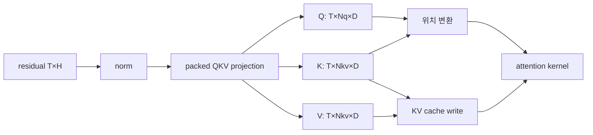

# 12장. Q·K·V를 만들고 head로 나누는 법

attention 설명은 흔히 “query와 key의 유사도로 value를 섞는다”에서 시작한다. 직관으로는 맞지만 실제 서빙 코드를 읽기에는 좌표가 부족하다. residual tensor `[T,H]`가 어느 weight와 곱해지고, packed output의 어느 구간이 Q·K·V인지, head·rank·token 축으로 어떻게 reshape되는지 알아야 RoPE, KV cache write와 attention kernel의 입력을 연결할 수 있다.

이 장은 attention score를 계산하기 직전까지 간다. dense MHA, GQA와 MQA에서 Q head와 KV head 수가 왜 다르고, tensor parallel이 head ownership을 어떻게 바꾸며, packed projection의 작은 offset 오류가 왜 shape-valid 오답을 만드는지 손으로 추적한다.



## 12.1 dense MHA 기준선에서 projection을 검산한다

증상은 model이 유창하지만 의미 없는 답을 내거나 첫 layer부터 logits가 reference와 크게 다른 형태일 수 있다. shape, dtype와 OOM은 정상이다. quantized checkpoint나 새 TP degree에서만 재현된다면 packed loader와 shard mapping이 강한 후보다.

다음 checkpoint는 함수 이름을 모은 목록이 아니라 최초로 값이 갈리는 경계를 찾는 순서다. 대표적으로 normalized hidden이 두 구현에서 같으면 이전 residual과 norm은 이번 사건의 원인 후보에서 내릴 수 있다. 바로 다음 packed projection만 달라졌다면 head reshape나 RoPE를 먼저 고쳐서는 안 된다. 반대로 packed output까지 같고 Q/K/V split 직후 달라지면 GEMM보다 offset과 packed order가 강한 후보다. 이 판별 축을 유지하면서 같은 token batch를 아래 순서로 비교한다.

```text
normalized hidden
→ raw packed projection output
→ Q/K/V split 직후
→ reshape·head mapping 뒤
→ position transform 뒤
→ cache write를 다시 읽은 K/V
→ attention output
```

normalized hidden이 같고 packed output부터 다르면 weight·GEMM·quantization을 본다. packed output은 같은데 Q split부터 다르면 offset/order다. local rank는 맞지만 gathered reference와 head 순서가 다르면 TP mapping이다. cache readback에서 처음 다르면 slot/layout·dtype다.

### 작은 sentinel weight 실험의 의미

실제 model을 실행하지 않는 source 감사와 별개로, 구현 test는 Q/K/V shard에 서로 구분되는 sentinel pattern을 넣어 loader mapping을 확인할 수 있다. Q 구간은 1, K는 2, V는 3 같은 값을 사용하면 packed offset 오류가 즉시 보인다. quantized path는 scale group도 서로 구분한다.

이 test는 model quality를 재는 것이 아니라 layout contract를 검증한다. full inference가 실패할 때 거대한 logits만 비교하는 것보다 최초 잘못된 buffer를 빠르게 찾는다.

### stride가 맞는데도 backend가 다른 head를 읽는 사건

다음과 같은 장애를 상상해 보자. PyTorch eager attention에서는 reference와 logits가 맞는다. FlashAttention backend를 선택하면 shape assertion도 통과하고 CUDA illegal access도 없지만 답이 망가진다. `tensor.stride()`를 출력해 보아도 Q는 `[N_qD,D,1]`, K와 V는 `[N_{kv}D,D,1]`처럼 그럴듯하다. 여기서 “stride가 정상”이라는 말은 충분한 판정이 아니다. kernel이 읽는 주소는 base pointer, storage offset, logical shape, byte stride, head grouping과 kernel이 가정한 axis order를 모두 합쳐 결정되기 때문이다.

`T=2,N_q=4,N_{kv}=2,D=2`인 작은 예를 손으로 펼쳐 보자. token 하나의 packed 폭은 `(4+2+2)×2=16`이다. row 0의 Q는 원소 offset `[0,8)`, K는 `[8,12)`, V는 `[12,16)`이고 row 1은 각각 16을 더한다. packed tensor `[2,16]`을 `split([8,4,4],-1)`하면 Q view의 logical shape는 `[2,8]`이지만 row stride는 여전히 16이다. 이것을 `[2,4,2]`로 reshape해도 stride는 `[16,2,1]`이다. K는 base storage offset 8과 stride `[16,2,1]`, V는 offset 12와 같은 stride를 갖는다. 이 view들은 모두 합법적이다.

그러나 kernel wrapper가 Q/K/V를 각각 compact `[T,N,D]`라고 간주하여 row stride를 `N×D`로 재구성하면 Q의 두 번째 token에서 packed row 0의 K를 읽는다. 주소는 allocation 안에 있으므로 crash가 아니라 조용한 오답이 된다.

따라서 handoff 직전에는 “contiguous인가”만 기록하지 말고 다음을 한 줄로 고정한다.

```text
tensor=K base_ptr=0x... storage_offset=8
logical=[T=2,Nkv=2,D=2] stride_elems=[16,2,1]
layout=NHD dtype=bf16 local_head_ids=[0,1]
backend_row_stride=16 backend_head_stride=2
```

wrapper가 arbitrary stride를 지원하면 이 값을 kernel argument로 넘겨야 한다. compact input만 지원하면 `.contiguous()`를 명시적으로 만들고 새 pointer와 stride `[4,2,1]`을 넘겨야 한다. 둘 중 어느 쪽이 항상 우월한 것은 아니다. copy를 피하면 bandwidth와 allocation을 줄이지만, backend가 지원하지 않는 stride를 억지로 해석할 수는 없다. source에서 `view`, `reshape`, `transpose`, `contiguous` 호출을 찾은 뒤 실제 launch parameter가 어느 tensor의 stride를 쓰는지 확인해야 한다.

axis order도 독립된 계약이다. host code가 `[T,N,D]`, 즉 NHD라고 부르는 tensor를 backend가 `[N,T,D]`, 즉 HND로 읽는다면 두 layout은 총 원소 수와 마지막 축 stride가 같다. `D=2`라는 assertion도 통과한다. token과 head axis의 stride만 뒤바뀐다. 특히 decode처럼 `T=1`이면 두 shape가 퇴화하여 테스트가 우연히 통과할 수 있다. prefill `T>1`, decode `T=1`, chunked prefill을 각각 검증해야 하는 이유다.

GQA는 여기에 logical head mapping을 하나 더 얹는다. `N_q=4,N_{kv}=2`이면 보통 Q head `[0,1]`은 KV head 0, `[2,3]`은 KV head 1을 공유한다. kernel이 `q_head / group_size`를 쓰는지, head map array를 받는지, TP-local head 번호를 global 번호로 오인하는지 확인한다. TP 2에서 rank 1의 local Q head `[0,1]`은 global `[2,3]`일 수 있다. group mapping을 global 번호로 해야 하는 backend에 local 번호를 주면 rank 1도 KV head 0을 읽는다. 반대로 KV가 rank별 replicate되어 local 번호가 의도된 ABI라면 global offset을 더하는 것이 버그다. 답은 이름이 아니라 wrapper가 만드는 metadata와 kernel indexing 식에 있다.

이 사건의 최초 divergence를 찾는 비교점은 다섯 개면 충분하다.

1. packed GEMM output의 선택 원소와 digest가 reference와 같은가.
2. split view의 `storage_offset`, shape, stride와 head ID가 같은가.
3. backend 직전 tensor가 copy되었다면 copy 전후 값과 pointer가 같은 의미를 갖는가.
4. launch descriptor의 row/head stride와 GQA group ratio가 tensor ledger와 같은가.
5. kernel output에서 어느 token·Q head가 최초로 달라지는가.

2까지 같고 3의 compact copy부터 다르면 view materialization을 본다. 3까지 같고 descriptor부터 다르면 wrapper ABI 번역이다. descriptor도 같지만 특정 rank의 GQA group만 다르면 kernel의 local/global head convention이나 replication table을 본다. 모든 head가 prefill에서만 다르면 token stride와 ragged offsets가 더 강한 후보다.

CUDA Graph padding은 같은 종류의 오류를 더 교묘하게 만든다. captured graph의 최대 token row를 위해 QKV buffer를 크게 잡고 이번 replay의 유효 row만 앞부분에 채울 수 있다. tensor의 allocated shape와 logical valid row 수가 다르다. backend가 allocated `T_max`를 sequence total로 쓰면 padding row를 실제 query로 처리하거나 다음 request의 오래된 값과 섞는다. graph input copy, valid-token count, cumulative sequence length의 마지막 값이 같은 숫자를 가리키는지 확인한다. padding row에 NaN sentinel을 넣는 검사는 lab에서 유용하지만 production kernel이 NaN을 전파해 다른 요청까지 오염시키지 않도록 격리한다.

성능 문제도 같은 ledger에서 설명된다. non-compact view를 backend가 지원하지 않아 매 layer마다 Q/K/V 세 번 copy하면 projection GEMM보다 layout kernel이 더 많은 memory traffic을 만들 수 있다. 반대로 무조건 세 contiguous buffer를 만들면 fused rotary·cache write가 이용할 packed locality를 잃을 수 있다. profiler에서 transpose/copy kernel이 보인다는 사실만으로 제거하지 말고, 그 copy가 어떤 ABI 차이를 해소하는지 먼저 찾는다. 최적화는 의미가 같은 두 경로의 비용을 비교할 때만 유효하다.


column-parallel QKV projection은 output feature 축을 rank에 나눈다. 이상적으로 query와 KV head가 TP rank에 균등하게 분할되면 각 rank가 local Q/K/V head를 계산한다. `N_{kv}`가 TP degree보다 작으면 KV head를 rank 사이에 replicate해야 할 수 있다.

예를 들어 `N_q=32,N_{kv}=8,TP=4`이면 rank마다 Q head 8개와 KV head 2개를 가질 수 있다. `TP=16`이면 KV head 8개를 16 rank에 고유하게 하나씩 나눌 수 없다. 구현은 KV head를 반복 배치하거나 parallel group을 다르게 구성한다. total cluster KV byte와 rank local byte를 구분한다.

QKV projection 직후 local head attention을 계산할 수 있다면 모든 Q/K/V를 즉시 all-gather할 필요는 없다. attention output의 row-parallel projection에서 partial output을 collective로 합칠 수 있다. 어느 지점이 complete residual을 만드는 correctness barrier인지 11장의 projection·collective ledger와 이 12장의 head-ownership ledger에 연결한다.

rank별 head mapping은 checkpoint shard mapping, RoPE, KV cache block layout와 attention kernel이 공유하는 계약이다. 한 층만 다른 순서를 쓰면 shape는 맞아도 rank마다 다른 head를 읽는다.

### 하나의 packed weight가 rank-local Q·K·V가 되기까지

운영에서 자주 만나는 장면부터 시작하자. 단일 GPU에서는 정상인 모델이 TP=8에서만 조용히 품질이 무너진다. process는 죽지 않고 모든 tensor shape도 예상과 같다. attention backend도 fallback하지 않았다. 이런 사건에서 “NCCL이 값을 망쳤다”거나 “FlashAttention의 수치 오차다”라고 시작하면 조사 범위가 너무 넓다. 먼저 checkpoint의 전역 Q/K/V 행이 각 rank의 packed destination 어디에 들어갔는지 계산해야 한다. collective보다 앞선 local projection이 이미 다른 semantic head를 만들었을 수 있기 때문이다.

전역 config를 `H=4096`, `N_q=32`, `N_{kv}=8`, `D=128`, `TP=8`이라고 하자. 별도 checkpoint tensor의 논리 shape가 output-major `[out,in]`이라면 Q는 `[4096,4096]`, K와 V는 각각 `[1024,4096]`이다. runtime이 세 tensor를 output 축으로 pack하면 전역 destination은 `[6144,4096]`이며 범위는 다음과 같다.

```text
Q global rows: [0, 4096)
K global rows: [4096, 5120)
V global rows: [5120, 6144)
```

TP=8에서 query head는 rank마다 4개, 즉 Q width 512를 소유한다. KV head도 rank마다 1개이므로 K와 V width는 각각 128이다. rank-local packed width는 `512+128+128=768`이다. rank 3의 논리 source 범위는 Q head 12~15, K/V head 3이다. 그러나 local destination은 전역 offset을 그대로 쓰지 않는다. local buffer 안에서 Q는 `[0,512)`, K는 `[512,640)`, V는 `[640,768)`이다. loader는 source tensor의 rank-local slice와 destination의 component-local offset을 동시에 계산해야 한다.

이 계산이 중요한 이유는 `q`, `k`, `v`라는 shard identifier가 단순 label이 아니기 때문이다. vLLM의 [`QKVParallelLinear`](https://github.com/vllm-project/vllm/blob/6e448d0ea9bf3d88d898b65449ca6dc2aec170ac/vllm/model_executor/layers/linear.py#L1022-L1120)는 total/local head 수와 replication을 construction에서 정하고, packed parameter의 loader는 component별 output partition을 소비한다. 실제 model loader는 checkpoint name을 destination parameter와 shard identifier에 연결한다.

SGLang의 Llama 구현도 [`qkv_proj` construction과 forward](https://github.com/sgl-project/sglang/blob/71de97b264b04dcd514cf904003028aefe9775c8/python/sglang/srt/models/llama.py#L184-L233)뿐 아니라 [`load_weights`의 stacked mapping](https://github.com/sgl-project/sglang/blob/71de97b264b04dcd514cf904003028aefe9775c8/python/sglang/srt/models/llama.py#L430-L486)을 함께 읽어야 한다. constructor만 보면 폭은 알 수 있지만 어느 checkpoint tensor가 어느 destination slice를 채우는지는 알 수 없다.

이제 GQA replication이 필요한 config로 바꿔 보자. `N_q=32`, `N_{kv}=4`, `D=128`, `TP=8`이면 query는 rank마다 4 head를 나눌 수 있지만 KV head는 rank보다 적다. 흔한 정책은 각 logical KV head를 두 rank에 복제하는 것이다. replication factor는 `TP/N_{kv}=2`다. rank 0과 1이 logical KV head 0, rank 2와 3이 head 1을 가지는 식이다. 각 rank의 local Q width는 여전히 512이고 local K/V width는 각각 128이다. rank-local packed width도 768이므로 앞 config와 같다. shape만 비교하면 KV가 unique partition인지 두 번 복제됐는지 알 수 없다.

물리 byte를 계산하면 차이가 보인다. 한 layer, 한 token, BF16에서 전역 논리 K/V는 `2×4×128×2=2048 bytes`다. rank 하나는 `2×1×128×2=512 bytes`를 저장하지만 8 rank 합계는 4096 bytes다. cluster physical byte가 model logical byte의 두 배다. “TP를 늘리면 rank당 KV가 줄어든다”는 말은 rank-local capacity에는 맞지만 cluster aggregate에는 틀릴 수 있다. admission은 rank당 가장 작은 pool을 보고, 비용·전력·전송 장부는 aggregate와 replication을 본다.

MQA에서 `N_{kv}=1`, `TP=8`이면 replication factor는 8이다. 모든 rank가 같은 logical K/V head를 가진다. rank-local K/V width는 128이고 aggregate K/V byte는 논리 byte의 8배다. 대신 local query head가 attention을 계산할 때 다른 rank에서 K/V를 가져오기 위한 collective를 피할 수 있다. replication은 낭비라는 한 문장으로 끝나지 않는다. 저장 byte와 communication, backend가 요구하는 local head mapping 사이의 교환이다.

loader first divergence는 작은 sentinel로 가장 싸게 찾는다. Q global head `h`의 모든 row에 `1000+h`, K에는 `2000+h`, V에는 `3000+h`를 채운 synthetic weight를 생각하자. rank-local projection에 basis input을 넣으면 output 숫자만 보고도 component와 logical head를 식별할 수 있다. 실행하지 않는 정적 감사에서도 source range와 destination offset 표를 만들 수 있다.

| rank | Q logical heads | KV logical head | local Q range | local K range | local V range |
|---:|---|---:|---|---|---|
| 0 | 0~3 | 0 | `[0,512)` | `[512,640)` | `[640,768)` |
| 1 | 4~7 | 0 | `[0,512)` | `[512,640)` | `[640,768)` |
| 2 | 8~11 | 1 | `[0,512)` | `[512,640)` | `[640,768)` |
| 3 | 12~15 | 1 | `[0,512)` | `[512,640)` | `[640,768)` |

rank 1의 K sentinel이 head 1을 가리키면 replication mapping이 틀렸다. K와 V sentinel이 바뀌면 shard identifier 또는 packed offset이 틀렸다. local Q/K/V는 맞는데 O projection collective 뒤 residual부터 다르면 loader 가설을 기각하고 11장의 row-parallel collective로 이동한다. 이 순서가 first divergence다. 최종 logits만 비교해 tolerance를 넓히는 것은 semantic head order 오류를 수치 오차로 숨기는 일이다.

bias도 같은 partition을 따라야 한다. global Q/K/V bias가 각각 4096/512/512 폭이라면 rank-local bias는 512/128/128이다. weight는 올바른 slice를 받았지만 bias가 전역 연속 buffer의 rank 구간으로 단순 분할되면 K/V offset이 어긋날 수 있다. bias가 없는 Llama fixture만 통과했다고 bias가 있는 Qwen 계열 loader까지 증명되는 것은 아니다. constructor의 `bias` flag, checkpoint mapping, destination parameter loader를 한 사슬로 읽는다.

QK norm parameter도 head ownership을 따른다. Q norm weight가 head dimension `D` 하나를 모든 head에 공유하는지, head별 `[N_q,D]`인지, K norm이 `[D]`인지 model source로 확인한다. Transformers Qwen 계열의 model implementation은 separate projection과 Q/K normalization의 reference semantics를 읽기 좋은 기준이다. serving engine이 이를 fused QKV 뒤에 적용한다면 norm input slice, accumulation dtype, output alias가 같은 의미를 보존해야 한다. weight와 bias까지 맞고 pre-QK-norm output부터 다르면 loader가 아니라 norm placement·epsilon·dtype이 첫 owner다.

이 사건에서 중요한 것은 TP가 오류를 만들어 냈다는 결론이 아니다. TP는 단일 장치에서 우연히 일치하던 global 순서와 local 순서를 갈라 놓아 이미 존재하던 모호함을 드러냈다. 따라서 고칠 대상은 rank 수가 아니라 좌표 계약이다. 이제부터는 같은 fixture를 바꾸지 않고 projection 폭, head view, ownership, loader offset, 위치 변환, cache 주소, backend stride를 차례로 붙인다. 각 단계의 출력은 다음 단계의 입력과 동일한 logical head를 가리켜야 한다. 이 연결을 유지하면 마지막 logits가 달라졌을 때도 앞쪽으로 무작정 되돌아가지 않고 최초로 의미가 바뀐 경계를 정확히 지목할 수 있다.


## 12.2 dense Q·K·V를 head 좌표로 복원한다

normalized hidden을 `X∈R^{T×H}`라고 하자. 가장 단순한 표현은 세 weight를 각각 곱하는 것이다.

\[ Q=XW_Q,\quad K=XW_K,\quad V=XW_V \]

query head 수 `N_q`, KV head 수 `N_{kv}`, head dimension `D`라면 output 폭은 각각 `N_qD`, `N_{kv}D`, `N_{kv}D`다. 구현은 launch와 weight loading을 줄이기 위해 세 weight를 한 packed parameter로 묶어 한 projection을 수행할 수 있다.

```text
packed width = Nq×D + Nkv×D + Nkv×D
             = (Nq + 2Nkv)×D
```

예를 들어 `H=4096`, `N_q=32`, `N_{kv}=8`, `D=128`이면 Q 폭은 4,096, K와 V는 각각 1,024다. packed output은 `[T,6144]`가 된다. 이를 `[T,32,128]`, `[T,8,128]`, `[T,8,128]`로 분할한다.

### 폭이 맞아도 내부 head 좌표는 틀릴 수 있다

이 계산에서 가장 위험한 부분은 전체 6,144라는 shape가 맞아도 내부 순서가 틀릴 수 있다는 것이다. checkpoint는 `[Q,K,V]`인데 loader나 kernel이 `[Q,V,K]`로 해석하면 allocation과 GEMM은 성공하고 attention 결과만 틀린다. packed parameter의 shard ID, offset과 loader mapping을 함께 감사해야 한다.


Q tensor `[T,N_q,D]`의 head 축은 서로 다른 learned projection subspace를 나타낸다. attention은 각 query head에 대응하는 K/V head를 사용하고 head별 output을 다시 이어 output projection으로 보낸다. head가 Python object 여러 개로 존재해야 한다는 뜻은 아니다. 대개 하나의 contiguous 또는 strided tensor 축이다.

reshape와 transpose는 논리 shape만 바꾸고 storage를 공유할 수 있다. contiguous kernel이 필요한 layout으로 transpose 뒤 materialize하면 copy가 생길 수 있다. runner와 native op가 기대하는 layout을 알아야 `view`가 가능한지 판단할 수 있다.

shape ledger에는 다음을 적는다.

| tensor | logical shape | stride/layout | owner | 다음 소비자 |
|---|---|---|---|---|
| normalized X | `[T,H]` | token-major | layer | QKV GEMM |
| packed QKV | `[T,(Nq+2Nkv)D]` | packed order | projection | split/reshape |
| Q | `[T,Nq,D]` | backend contract | attention step | RoPE·attention |
| K,V | `[T,Nkv,D]` | cache write contract | request cache | RoPE·KV writer |

owner가 다른 이유는 Q가 현재 step 계산 뒤 사라질 수 있지만 K와 V는 request lifetime 동안 cache에 남기 때문이다. projection output buffer에서 K/V를 view한 뒤 cache로 copy하거나 fused kernel이 직접 slot mapping에 쓸 수 있다. 어느 시점부터 persistent state인지 source로 확인한다.


## 12.3 MHA에서 GQA·MQA로 KV ownership을 줄인다

MHA는 보통 `N_q=N_{kv}`다. GQA는 여러 query head가 한 KV head를 공유해 `N_{kv}<N_q`이고, MQA는 극단적으로 `N_{kv}=1`일 수 있다. query head `h`가 사용할 KV head를 단순히 다음처럼 매핑할 수 있다.

\[ h_{kv}=\left\lfloor\frac{h}{N_q/N_{kv}}\right\rfloor \]

`N_q=32,N_{kv}=8`이면 query head 네 개가 KV head 하나를 공유한다. KV cache byte는 MHA의 32 head 대신 8 head를 저장해 같은 dtype·D에서 1/4이 된다. 하지만 Q head 32개가 score를 계산하므로 attention FLOP가 단순히 1/4이 되는 것은 아니다.

kernel은 KV tensor를 물리적으로 query head 수만큼 복제하지 않고 mapping으로 broadcast할 수 있다. 어떤 wrapper가 `repeat_kv`를 명시적으로 materialize하면 memory traffic이 달라진다. source와 profiler에서 logical broadcast와 physical repeat를 구분한다.

### head count를 config 이름만 믿지 않는다

model config의 `num_attention_heads`, `num_key_value_heads`, hidden size와 head dimension 사이 불변식을 확인한다. 일부 model은 head dimension을 `H/N_q`로 추론하지 않고 별도 값을 가진다. MLA나 asymmetric attention은 단순 GQA shape를 벗어난다.

weight loader가 checkpoint config와 runtime config를 다르게 해석하면 packed width와 shard가 어긋난다. quantized checkpoint는 group/scale layout까지 head partition에 맞아야 한다. config, parameter shape와 projection output을 세 방향에서 교차 검증한다.


## 12.4 TP local ownership에서 wrong-head 사건까지 닫는다

앞의 세 단계가 global 의미를 정했다면 이제 rank가 실제로 소유하는 row와 head를 계산한다. 이 절 아래의 loader·RoPE·cache·backend·Llama·MLA 자료는 서로 다른 dossier가 아니다. 모두 `global checkpoint row → rank-local packed range → logical head ID → cache consumer → 최초 오답`이라는 한 사건 장부를 채운다. Llama GQA는 기본 표현의 완결 예제이고 MLA는 같은 질문에 다른 표현으로 답해야 하는 capability 분기다.

Transformers v5.15.1의 Llama 구현은 [`LlamaAttention`](https://github.com/huggingface/transformers/blob/550d7b3834670483a4df436541272c055dc364bf/src/transformers/models/llama/modeling_llama.py#L217-L278)에서 model별 projection과 attention interface의 경계를 보여 준다. 이 좌표를 모든 model의 공통 구현으로 일반화하지 않는다. Qwen·Gemma class는 Q/K norm, bias, head dimension과 position 입력이 다를 수 있으므로 각 model file을 다시 읽는다.

vLLM v0.27.1의 packed TP primitive는 [`QKVParallelLinear`](https://github.com/vllm-project/vllm/blob/6e448d0ea9bf3d88d898b65449ca6dc2aec170ac/vllm/model_executor/layers/linear.py#L1022-L1120)에서 Q·K·V head와 shard ID를 다룬다. class가 존재한다는 사실만으로 특정 model이 이를 쓴다고 말하지 않는다. model constructor와 weight mapping, forward caller를 이어야 한다.

SGLang v0.5.18의 Llama model은 [`qkv_proj` 구성과 forward](https://github.com/sgl-project/sglang/blob/71de97b264b04dcd514cf904003028aefe9775c8/python/sglang/srt/models/llama.py#L184-L233), checkpoint의 분리된 projection 이름을 packed destination으로 보내는 mapping은 [`weight loader`](https://github.com/sgl-project/sglang/blob/71de97b264b04dcd514cf904003028aefe9775c8/python/sglang/srt/models/llama.py#L511-L547)에서 찾을 수 있다. 숫자 shard ID와 문자 `q/k/v`가 어느 layer helper에서 정규화되는지까지 본다.

llama.cpp v0.2.0 계열의 Qwen2 graph는 [`src/models/qwen2.cpp`](https://github.com/ggml-org/llama.cpp/blob/bb4caa7540188872173c44d161602d9271386413/src/models/qwen2.cpp#L60-L103)에서 Q/K/V tensor와 RoPE node의 순서를 드러낸다. ggml tensor dimension ordering은 PyTorch의 `[T,N,D]` 표기와 그대로 같지 않으므로 logical axis를 먼저 번역한다.

### source를 읽는 실제 순서

model config에서 head 수와 dimension을 찾고 constructor에서 local head 계산과 projection class를 본다. 그다음 checkpoint name mapping과 packed loader를 읽는다. forward에서 projection output을 어떤 크기로 split하고 reshape하는지 본 뒤 rotary/cache op의 parameter를 확인한다. 마지막으로 attention backend metadata가 같은 local head·layout을 기대하는지 맞춘다.

```text
config
→ model constructor의 head resolution
→ parameter/loader의 packed order
→ forward split·view·stride
→ position transform
→ slot mapping·cache write
→ attention backend input
```

이 사슬 가운데 한 부분만 읽으면 오류가 다른 층에서 보인다. loader가 Q/K/V를 바꿔 넣어도 forward split은 코드대로 정확하다. runner slot이 틀려도 projection 값은 정확하다. 최초 divergence checkpoint가 필요한 이유다.

### 수치 예: TP replication이 KV byte에 미치는 영향

`N_q=32,N_{kv}=4,D=128`, TP 8을 생각하자. query head는 rank마다 4개로 나눌 수 있다. KV head 4개는 rank 8개에 고유하게 하나씩 줄 수 없으므로 각 KV head를 두 rank가 소유하도록 replicate할 수 있다. rank local KV head는 1개지만 cluster 전체에 저장된 local head 합은 8개가 된다.

단일 model 논리 KV는 4 head지만 TP cluster의 physical local cache 합은 replication 때문에 8 head 상당일 수 있다. “GQA가 8배 줄였다”는 model-level 비율과 실제 배포 memory 합계를 구분한다. 구현은 TP degree를 KV head 수에 맞게 제한하거나 다른 grouping을 사용할 수도 있으므로 constructor 계산을 확인한다.

rank별 head replication은 correctness에도 중요하다. 같은 logical KV head를 가진 rank들이 동일 K/V weight shard와 cache content를 만들어야 한다. loader가 서로 다른 shard를 배정하면 collective가 shape 오류 없이 오답을 합칠 수 있다.

### 수치 예: packed offset 한 칸의 파급

작은 `N_q=2,N_{kv}=1,D=2`를 쓰면 packed 폭은 `(2+2)×2=8`이다. 올바른 구간은 Q `[0:4]`, K `[4:6]`, V `[6:8]`이다. K 시작을 실수로 3으로 잡으면 K는 Q 마지막 원소 하나와 원래 K 하나를 읽고, V offset도 밀릴 수 있다.

reshape 결과는 여전히 Q `[T,2,2]`, K/V `[T,1,2]`다. dtype, stride와 allocation은 정상이다. RoPE도 정상 실행되고 cache도 정상 크기로 쓴다. 첫 attention score부터 값만 틀린다. 이 종류의 사고가 output text 비교만으로 찾기 어려운 이유다.

sentinel fixture에서는 packed output을 `[10,11,20,21,30,31,40,41]`처럼 구간별로 구분하고 split 결과를 직접 assert한다. TP에서는 rank별 expected head ID를 tensor 값에 encode한다. quantized loader는 dequant 뒤뿐 아니라 packed scale offset도 확인한다.

### quantization이 head boundary를 넘을 때

weight-only quantization은 output-channel group마다 scale이나 zero point를 둘 수 있다. packed QKV의 group boundary가 Q/K/V boundary와 맞지 않으면 loader가 source weight의 scale을 destination group에 잘못 배치할 수 있다. group size, pack factor와 output partition을 byte 단위로 계산한다.

quant kernel이 packed QKV를 하나의 matrix로 보는 것과 checkpoint가 세 tensor를 각각 quantize한 것도 다르다. 변환 단계에서 재포장하거나 separate projection을 유지해야 할 수 있다. “같은 4-bit”라는 이름만으로 layout 호환을 가정하지 않는다.

오류는 특정 head나 K/V에서만 커질 수 있다. Q/K/V별 max absolute·relative error, head별 norm과 cosine을 본다. 최종 logits 하나만 보면 quantization 허용 오차인지 packed mapping 버그인지 구분하기 어렵다.

### runtime 진단에서 남길 최소 tensor fingerprint

전체 activation을 production log에 남기지 않는다. 허가된 differential lab에서는 token row, local head 몇 개와 dimension 일부를 선택하고 shape·stride·dtype·device, finite 비율, norm과 안전한 digest를 남긴다. prompt 원문과 전체 tensor dump는 기본 관측이 아니다.

정상 reference와 다음 경계를 비교한다.

| 경계 | 같으면 제외되는 후보 | 다르면 다음에 볼 곳 |
|---|---|---|
| norm output | embedding·residual 이전 | norm dtype·epsilon·alias |
| packed QKV | 이전 residual | weight·GEMM·quant·TP shard |
| split Q/K/V | GEMM | offset·order·view |
| post-position Q/K | split | position·rotary layout |
| cache readback | projection·rotation | slot·page·dtype·ordering |
| attention output | cache input | mask·kernel·collective |

이 표는 오류를 한 단계씩 좁힌다. 모든 module hook을 켜 성능과 memory를 크게 바꾸지 않고, 경쟁 가설을 가를 checkpoint만 추가한다.

일부 architecture는 projection 뒤 Q와 K의 head vector에 별도 RMSNorm을 적용한다. 이는 layer 입력 전체를 normalize하는 pre-attention norm과 다른 연산이다. `[T,N,D]`에서 마지막 head dimension `D`마다 scale을 적용하므로 parameter shape와 TP ownership도 head layout에 맞아야 한다.

Q/K norm이 있는 model을 없는 Llama-style path로 load하면 extra parameter가 누락되거나 output이 달라진다. 반대로 config gate를 잘못 켜 임의 norm을 넣어도 shape는 같다. checkpoint parameter 목록, constructor condition과 forward order를 함께 확인한다.

projection bias도 마찬가지다. Q/K/V 모두 bias가 있거나 일부만 있을 수 있다. packed weight를 만들 때 packed bias order와 local shard를 같은 방식으로 매핑해야 한다. quantized weight kernel이 bias fusion을 지원하지 않으면 별도 add가 생기며 dtype·rounding과 launch가 달라진다.

### norm 위치를 checkpoint로 가르는 법

reference와 residual·pre-attention norm output은 같지만 raw QKV가 다르다면 projection weight·bias를 본다. linear output은 같은데 Q/K norm 뒤부터 다르면 epsilon, scale dtype, head reshape와 norm placement를 본다. RoPE 뒤에 처음 다르면 position transform이다.

Q/K norm과 RoPE의 순서도 source로 확인한다. 둘은 일반적으로 교환 가능하지 않다. RoPE가 head vector의 pair를 직교 회전하므로 이상적인 전체 RMS norm 값은 보존할 수 있지만 partial rotary, learned scale과 finite precision, 구현 layout이 개입한다. “수학상 비슷하다”는 이유로 순서를 바꾸지 않는다.

### quantized QKV와 adapter가 같은 packed 경계를 공유할 때

BF16 base model은 정확한데 4-bit checkpoint에서만 K/V head 일부가 무너지는 장애가 있다. 같은 4-bit model도 TP 1에서는 맞고 TP 4부터 틀린다. 여기에 LoRA를 켜면 adapter를 적용하지 않은 request까지 결과가 흔들린다. 이 증상을 “양자화 오차가 크다”로 닫으면 안 된다. 양자화 payload, scale, zero point, packed output-channel mapping과 adapter row mapping이 서로 다른 좌표계를 쓰는지 먼저 가른다.

양자화된 linear parameter는 단일 weight tensor가 아니다. 최소한 다음 상태 묶음으로 읽는다.

```text
logical weight [out_features, in_features]
quantized payload [packed_out_or_in, ...]
scale [group coordinates]
optional zero point / codebook
pack factor와 nibble/bit ordering
group axis와 group size
TP shard axis와 local logical output range
Q/K/V destination range
```

예를 들어 `H=4096,N_q=32,N_{kv}=8,D=128`이면 global logical output 폭은 6144다. Q는 `[0,4096)`, K는 `[4096,5120)`, V는 `[5120,6144)`다. TP 4에서 head가 균등 분할되면 rank별 logical 폭은 Q 1024, K 256, V 256, 합계 1536이다. 하지만 checkpoint가 `q_proj`, `k_proj`, `v_proj`를 따로 group-size 64로 quantize했다면 각 source tensor의 group index는 0에서 다시 시작한다. destination packed tensor의 K가 local offset 1024에서 시작한다는 이유로 source K scale index에 `1024/64=16`을 더하면 잘못된 scale을 읽는다.

반대로 checkpoint 자체가 global fused QKV를 한 번에 quantize했다면 K scale은 global group 64부터 이어진다. loader는 artifact의 quantization 단위와 destination의 packing 단위를 모두 알아야 한다.

4-bit payload는 byte offset도 logical output offset과 같지 않다. pack factor가 2라면 logical channel 여덟 칸 이동이 네 byte 이동일 수 있다. kernel에 따라 pack axis가 input channel일 수도, output channel일 수도 있고 tile-interleaved layout일 수도 있다. 그러므로 `shard_offset * 4 / 8` 같은 식을 이름만 보고 적용하지 않는다. quant method가 parameter에 부착한 pack factor, packed dimension, tile size를 읽고 local logical range를 storage range로 변환한다. range 시작이 pack 또는 tile boundary에 맞지 않으면 slice만으로 표현할 수 없어 repack이 필요할 수도 있다.

작은 손계산으로 오류를 드러낼 수 있다. Q 8 channel, K 4, V 4이고 group size 4인 별도 source를 가정한다. Q scale을 `[10,11]`, K를 `[20]`, V를 `[30]`으로 채운다. 올바른 destination scale sequence는 `[10,11,20,30]`이다. loader가 packed destination group index를 source에도 적용하면 K에서 source group 2, V에서 source group 3을 찾으려 하거나 잘못 clamp한 scale을 재사용한다. payload를 모두 같은 정수로 채워도 dequant 결과의 구간별 norm은 `10:11:20:30` 비율을 보여야 한다. 이 fixture는 real model의 허용 오차와 무관하게 mapping contract를 검증한다.

TP replication은 KV scale도 함께 복제해야 한다. `N_{kv}=1,TP=4`인 MQA에서 네 rank가 같은 logical K/V head를 갖는다면 weight payload뿐 아니라 그 head의 scale과 zero point도 같아야 한다. rank별 local destination offset은 같아 보여도 global source shard 계산에서 rank를 더하면 rank 1~3이 존재하지 않는 KV shard를 읽을 수 있다. 일부 loader는 `output_partition_sizes`와 `replicate_kv_heads` 같은 metadata를 통해 이를 해결한다.

감사자는 [`QKVParallelLinear`](https://github.com/vllm-project/vllm/blob/6e448d0ea9bf3d88d898b65449ca6dc2aec170ac/vllm/model_executor/layers/linear.py#L1022-L1120)의 logical partition 정의에서 출발해, 실제 quant method의 weight loader가 문자 또는 숫자 shard ID를 어떻게 storage slice로 바꾸는지 호출 사슬을 끝까지 이어야 한다.

LoRA는 다른 방식으로 같은 경계를 건드린다. 일반 linear의 low-rank update를 `ΔY=(X A^T) B^T`로 쓰면 A는 input projection, B는 output row 의미를 갖는다. Q/K/V source adapter가 분리되어 있다면 세 B matrix의 output row를 packed destination의 Q/K/V 구간에 정확히 배치해야 한다. base weight가 quantized여도 adapter activation과 B는 BF16/FP16일 수 있고, fused kernel은 base output에 adapter update를 어느 dtype에서 더할지 결정한다. dtype 차이는 작은 수치 차이를 만들 수 있지만 K adapter가 Q tail에 들어가는 mapping 오류와는 패턴이 다르다.

같은 수치 예에서 local Q/K/V 폭이 `1024/256/256`이면 K adapter B의 row 0은 packed local row 1024, V row 0은 1280으로 간다. global output offset 4096과 5120을 그대로 local allocation에 적용하면 범위를 벗어나야 정상인데, modulo나 잘못된 shard helper가 개입하면 Q의 다른 row를 덮어쓸 수 있다. sentinel adapter에서는 Q/B를 1, K/B를 2, V/B를 3으로 채우고 adapter-only output의 구간별 값과 rank별 global head ID를 검증한다.

adapter multiplexing에서는 parameter mapping만큼 request identity가 중요하다. 한 batch 안에 base request와 adapter A·B request가 섞이면 token row마다 선택된 adapter ID가 projection kernel에 전달되어야 한다. continuous batching으로 row가 재배치되었는데 adapter index buffer를 이전 순서로 재사용하면 shape는 맞고 다른 사용자의 adapter가 적용된다. prefix cache가 base model만으로 만든 KV를 adapter request에 재사용할 수 있는지도 adapter가 어느 layer의 K/V를 바꾸는가에 달려 있다.

Q/K/V projection adapter가 다르면 그 prefix KV는 동일하지 않다. cache key에 model, adapter ID와 adapter revision을 포함하거나 해당 조합의 cache sharing을 금지해야 한다.

이 장애를 조사할 때 함수 이름 목록보다 state transition을 고정한다.

```text
checkpoint tensor name
→ quant metadata가 붙은 parameter
→ global source range
→ TP-local logical Q/K/V range
→ packed payload·scale storage range
→ dequant/GEMM output
→ adapter row index와 token adapter ID
→ final packed QKV
→ split·cache write
```

첫 divergence 판정도 구체적이어야 한다. dequantized logical weight를 소규모로 materialize했을 때 reference와 다르면 loader 또는 quant metadata다. weight는 같고 base GEMM부터 다르면 kernel의 pack interpretation이나 accumulation이다. base output은 같고 adapter-only output부터 다르면 A/B row mapping, token-to-adapter routing과 add dtype을 본다. packed output까지 같고 cache readback이 다르면 양자화/adapter가 아니라 뒤의 layout·slot 문제다.

production에서 전체 dequant weight를 뽑을 필요는 없다. 허가된 offline 검사에서 Q/K/V boundary 앞뒤의 몇 group, 각 TP rank의 첫·마지막 logical head, replicated KV head를 표본으로 잡는다. payload digest와 scale min/max만 남기는 것으로는 scale이 서로 바뀐 사건을 놓칠 수 있으므로 sentinel fixture와 expected global row ID test를 CI에 둔다. model quality benchmark는 이 구조 test를 통과한 뒤 수행한다. 구조가 틀린 4-bit model의 perplexity를 오래 측정하는 것은 원인을 알려 주지 않는다.


## 12.5 RoPE와 cache write에서 수명이 바뀌는 순간

RoPE 계열에서는 Q와 K의 head dimension 일부를 position-dependent rotation한다. V는 score의 위치 관계를 만드는 operand가 아니므로 보통 같은 회전을 적용하지 않는다. packed QKV를 split한 뒤 어느 layout에서 position을 broadcast하고 rotary dimension을 자르는지가 중요하다.

position tensor는 prefill에서 여러 token 좌표를, decode에서 각 request의 다음 좌표를 가진다. padding과 packed batch에서는 physical row index가 logical position과 같지 않다. multimodal model은 여러 축의 position이나 delta를 사용할 수 있다. 9장의 position ledger가 Q/K row와 정확히 정렬돼야 한다.

position transform 전후 shape는 같으므로 잘못된 position도 kernel이 정상 실행된다. logits divergence는 첫 위치 오류부터 모든 뒤 token에 누적될 수 있다. layer checkpoint에서 pre-RoPE Q/K와 post-RoPE Q/K를 따로 비교하면 projection 오류와 position 오류를 나눌 수 있다.

이 장에서는 회전 수학 전체를 14장으로 넘긴다. 현재 handoff 계약은 다음과 같다.

```text
packed QKV split이 맞음
→ Q/K head와 token row가 position에 정렬
→ 지정된 rotary sub-dimension만 변환
→ K는 변환된 좌표로 cache에 저장
→ decode query가 같은 좌표계의 과거 K를 읽음
```

K를 회전 전 상태로 cache하고 attention마다 다시 회전하는 구현도 이론상 가능하지만 source contract를 확인해야 한다. cache에 무엇을 저장하는지 서로 다른 구현 사이에서 추측하지 않는다.


K와 V가 계산됐다고 cache에 안전하게 보존된 것은 아니다. runner가 logical token row를 physical slot으로 매핑하고 layer·head·dimension layout에 맞춰 write해야 한다. paged cache라면 block table과 slot mapping이 주소를 결정한다.

prefill chunk 512 token은 여러 slot에 연속 또는 비연속으로 쓰일 수 있다. decode는 request마다 한 slot을 쓴다. mixed batch의 flat K/V row와 request별 slot mapping 길이가 일치해야 한다. speculative token은 후보 slot을 쓰고 acceptance 뒤 일부만 logical history에 commit하거나 crop할 수 있다.

cache writer와 attention kernel은 다음 계약을 공유한다.

- K/V head order와 local TP head mapping
- block·page size와 physical stride
- token→slot mapping과 invalid/padded slot 처리
- cache dtype, scale와 quantization layout
- K가 position transform 전인지 후인지
- write completion과 다음 read ordering

wrapper의 shape validation만 통과해도 slot이 틀리면 다른 request의 cache를 오염시킬 수 있다. request ID를 device tensor에 넣지 않는 경우가 많으므로 scheduler·runner metadata 검증이 중요하다.

### invalid lane의 보호 주소와 mask

graph padding이나 speculative row에는 실제 cache write를 하면 안 되는 lane이 있을 수 있다. kernel은 illegal pointer를 피하려고 보호 주소를 만들 수 있지만 validity mask가 결과 반영과 write를 함께 막아야 한다. 보호 주소가 있다는 사실을 완전한 bounds check로 오해하지 않는다.

failure test는 block 끝, partial page, zero-length padding, cancelled row와 page reuse를 포함한다. late write가 새 request의 block에 닿지 않도록 in-flight completion 뒤에만 reuse해야 한다.


## 12.6 backend가 실제로 읽는 pointer·stride·head order

attention kernel은 Q/K/V 값만 받는 것이 아니다. variable-length prefill이라면 query start locations, sequence lengths와 causal flag를 받고, paged decode라면 block table, KV length와 page layout을 받는다. QKV head layout은 이 metadata와 함께 하나의 ABI를 이룬다.

대표적인 logical layout은 token-major `[T,N,D]`지만 native kernel은 stride를 받아 여러 layout을 지원하거나 wrapper가 transpose·contiguous를 만든다. prefill과 decode wrapper가 별도 plan을 사용할 수도 있고 하나의 varlen/paged op가 query length로 구분할 수도 있다.

layout audit에는 다음을 둔다.

```text
Q pointer, shape, stride, alignment
K/V cache pointer와 page stride
local Q/KV head 수와 group ratio
head dimension·rotary dimension
query starts·KV lengths·block table
cache dtype·scale pointer
causal/window/mask mode
stream·workspace와 graph capture 여부
```

wrapper가 shape를 assert해도 metadata의 값이 틀릴 수 있다. `sum(query_lengths)=T`, block table이 각 KV length를 cover하며 local head와 cache stride가 일치하는지 host-side invariant를 만든다.

### prefill K/V와 cache K/V가 동시에 존재하는 경우

chunked prefill은 현재 chunk의 새 K/V와 이전 chunk의 cache를 함께 attention에 사용한다. kernel interface는 새 ragged K/V와 paged cache를 합성하거나 새 값을 먼저 cache에 쓰고 전체 paged state를 읽을 수 있다. write와 read ordering, causal coordinate가 중요하다.

prefix hit가 있으면 query 시작 position은 0이 아니고 cache에는 이미 K/V가 있다. 새 Q/K의 position과 block table의 logical prefix가 맞아야 한다. hit token 수, computed token 수와 query start를 한 ledger에 둔다.

### pipeline stage와 attention backend 사이에서 ownership이 끊기는 사건

TP와 PP를 함께 쓰면 “이 tensor는 어느 rank에 있는가”를 한 숫자로 답할 수 없다. process는 pipeline stage와 tensor-parallel rank의 곱으로 식별되고, request row는 scheduler가 정한 batch 위치와 sequence 위치를 가진다. QKV는 대개 해당 transformer layer를 소유한 PP stage 안에서 생성되고 소비된다. stage 경계를 건너가는 주된 activation은 layer 사이 hidden state다. K/V cache는 그 layer를 소유한 stage의 TP rank에 남는다. Q/K/V를 무조건 다음 stage로 전송한다고 그리면 실제 통신량과 장애 지점을 잘못 이해하게 된다.

PP 2, TP 4, 32-layer model을 단순 분할해 stage 0이 layer 0~15, stage 1이 16~31을 갖는다고 하자. stage 0의 TP rank 2에서 layer 7의 local QKV를 만들면 그 K/V는 `(stage=0,tp=2,layer=7)`의 cache pool에 기록된다. stage 1은 같은 request의 layer 16 이상 cache를 별도로 갖는다. token 하나가 decode될 때 hidden activation은 stage 0의 마지막 layer와 필요한 TP collective를 거쳐 stage 1로 넘어가지만 layer 7의 KV page 자체는 넘어가지 않는다. request가 종료될 때 두 stage의 cache allocator가 모두 자기 page를 반환해야 한다.

여기서 대표적인 장애는 stage별 scheduler metadata가 같은 request row 순서를 가리키지 않는 경우다. stage 0의 active rows가 `[req-A, req-C, req-D]`인데 stage 1이 이전 iteration의 `[req-A, req-B, req-C]` block table이나 adapter map을 재사용하면 activation tensor shape는 여전히 3이다. layer 16의 Q는 C의 hidden으로 계산되지만 cache slot은 B의 것으로 선택될 수 있다. output은 마지막 stage에서만 보이므로 최초 증상은 logits 오류지만, 첫 divergence는 stage 1의 request-row identity 또는 layer 16 cache write다.

따라서 PP send/receive 경계에는 tensor만 보내지 말고 논리 ledger를 대조한다.

| 항목 | stage 0 send | stage 1 receive에서 같아야 하는 의미 |
|---|---|---|
| microbatch/step ID | 이번 scheduler step | 같은 replay·iteration |
| row→request ID | activation row 소유자 | slot/block table row 소유자 |
| row→position | 새 token의 logical position | RoPE와 cache position |
| valid row count | padding 제외 | attention query total |
| model/adapter identity | activation을 만든 weights | QKV를 만들 weights |
| stream/event epoch | send 완료 시점 | receive 후 launch 가능 시점 |

production log에서 사용자 prompt를 남길 필요는 없다. request의 안전한 내부 ID, generation epoch, row index와 position이면 ownership을 검증할 수 있다. abort 후 같은 request object ID가 재사용될 수 있다면 epoch를 반드시 포함한다.

TP 안의 QKV 이후 경로도 손으로 닫아 보자. column-parallel packed projection은 rank마다 local Q/K/V head를 만든다. attention backend는 local Q head와 local 또는 replicated KV head를 소비해 local attention output `[T,N_q^{local},D]`를 만든다. 뒤의 output projection이 row-parallel이면 각 rank가 local head slice에 대한 partial hidden contribution `[T,H]`을 계산하고 all-reduce 또는 reduce-scatter 계열 collective가 완전한 residual contribution을 만든다.

따라서 attention 직후 rank별 output이 서로 다른 것은 정상이다. collective 뒤에도 reference와 다를 때만 앞의 head mapping 또는 O projection을 의심한다.

`H=4096,N_q=32,D=128,TP=4`라면 rank별 attention output 폭은 1024다. O projection weight를 input 축으로 네 조각 내면 각 rank는 `[T,1024] × [1024,4096]`의 partial result를 만든다. 네 partial을 합해야 `[T,4096]`의 완전한 결과다. rank 2의 Q head 두 개가 바뀌었을 때 그 오차가 O projection과 all-reduce 뒤 모든 hidden channel에 퍼질 수 있다. 최종 residual의 “모든 열이 틀렸다”는 관측은 모든 Q head가 틀렸다는 뜻이 아니다. attention 직전·직후 local head checkpoint가 필요한 이유다.

collective placement도 source로 확인한다. 일부 구현은 fused communication, reduce-scatter와 sequence parallel을 사용해 중간 tensor shape가 위의 단순 그림과 다르다. 그러나 검증 질문은 같다. 각 rank의 local attention output이 어느 global Q head를 나타내는가, O projection의 어느 input row와 곱해지는가, 어느 collective 뒤 residual이 완전해지는가를 명시한다. collective를 성능 옵션으로 끄거나 custom all-reduce가 fallback했을 때 수치 의미가 유지되어야 한다.

backend ABI를 stage/rank 소유권과 함께 펼치면 launch 하나에도 다음 입력이 있다.

```text
Q: current stage·rank의 current token rows
K/V: 같은 layer·rank의 새 projection 또는 paged cache
sequence metadata: row별 query/KV length와 cumulative offsets
block table/slot mapping: 같은 stage allocator의 page coordinates
head metadata: local Q head, local/replicated KV head, GQA ratio
position metadata: stage가 받은 row position과 같은 coordinate
execution metadata: stream, workspace, graph slot, valid rows
```

어느 하나가 다른 scheduler epoch에서 왔다면 pointer와 shape가 유효해도 semantic use-after-free다. CUDA memory allocator 관점에서는 아직 살아 있는 allocation이므로 sanitizer가 잡지 못할 수 있다. page generation counter, scheduler step과 graph replay ID를 debug build의 metadata assertion에 넣으면 이 종류의 조용한 오염을 훨씬 빨리 찾는다.

장애 재현은 가장 작은 topology로 줄인다. 먼저 PP 1·TP 1 reference, 다음 TP만 4, 다음 PP만 2, 마지막 PP 2·TP 4를 비교한다. TP 4에서 이미 다르면 head shard·collective 문제다. PP 2에서만 다르면 stage row/position handoff다. 둘을 함께 쓸 때만 다르면 stage별 TP group 생성, global rank를 TP rank로 변환하는 식, replicated KV ownership이 후보가 된다. world rank 5가 `(pp=1,tp=1)`인지 `(pp=0,tp=5)`인지 같은 계산을 코드와 launch log에서 확인한다.

첫 divergence ladder는 다음처럼 운용한다.

```text
stage receive hidden과 row ledger
→ pre-attention norm
→ local packed QKV
→ local split/head mapping
→ local cache readback
→ local attention output
→ O projection partial
→ collective-complete residual
```

receive hidden부터 다르면 앞 stage 통신 또는 row ordering이다. norm은 같고 QKV부터 특정 TP rank만 다르면 local weight/adapter shard다. QKV는 같고 cache readback부터 다르면 stage-local slot metadata다. attention output만 다르면 backend ABI와 mask다. partial까지 같고 collective 뒤부터 다르면 process group, stream ordering과 reduction path를 본다. 이렇게 해야 “분산 환경에서만 틀린다”를 재현 불가능한 문장으로 남기지 않는다.

성능 해석도 ownership을 따라간다. PP bubble을 줄이려고 microbatch를 늘리면 각 stage의 active request row와 graph shape가 달라진다. TP를 늘리면 local GEMM 폭은 줄지만 replicated KV cache와 collective 비중이 커질 수 있다. backend 변경으로 attention kernel이 빨라져도 PP stage imbalance가 병목이면 end-to-end ITL은 거의 바뀌지 않는다. profiler에서 kernel duration, TP collective, PP send/receive와 scheduler idle interval을 같은 timeline에 놓아야 “왜 최적화가 효과가 없었는가”를 설명할 수 있다.


Transformers model class는 attention module에서 `q_proj`, `k_proj`, `v_proj`를 별도 linear로 둘 수도 있고 model별 fused projection을 쓸 수도 있다. framework의 추상 attention 이름만 보지 말고 실제 model implementation과 attention interface에 전달되는 shape를 본다.

vLLM과 SGLang은 tensor-parallel linear class와 packed weight loader, fused rotary·cache op를 사용할 수 있다. model definition의 constructor가 local head 수와 KV head replication을 어떻게 계산하는지, weight loader의 shard ID가 packed order와 일치하는지, forward가 output을 어떤 shape로 split하는지 잇는다.

llama.cpp의 ggml graph는 Python module object 대신 tensor와 op node로 projection, reshape, RoPE와 attention을 구성한다. weight tensor naming과 graph view/permute, backend fused op가 같은 logical Q/K/V 계약을 소비하는지 확인한다.

고정 source link는 장이 완성될 때 model·linear·cache writer의 실제 symbol로 확장한다. 독자가 비교할 공통 질문은 구현 언어가 달라도 같다.

1. `N_q,N_{kv},D`는 어디서 resolve되는가?
2. packed weight order와 checkpoint shard는 누가 매핑하는가?
3. TP rank는 어느 head를 소유하고 언제 collective하는가?
4. reshape 뒤 stride와 backend 입력 layout은 무엇인가?
5. position transform과 cache write는 어느 순서인가?
6. invalid·speculative row와 abort는 어떻게 막고 되감는가?

이 질문에 답하면 “QKV projection을 한다”는 한 줄을 실제 tensor lifetime과 kernel 계약으로 펼칠 수 있다.


## 12.7 GQA fixture가 깨지는 반례: MLA capability gate

MLA 계열은 K/V를 작은 latent representation으로 압축하고 query와 key의 positional/non-positional 부분을 다르게 다룰 수 있다. `N_{kv}`가 작은 GQA 식에 억지로 넣으면 projection parameter, cache content와 attention reconstruction 경계를 잃는다.

일반 GQA의 cache는 layer별 K/V head vector다. MLA cache는 compressed latent와 positional key component 등 architecture가 정의한 state를 보존할 수 있다. decode kernel은 latent에서 필요한 부분을 흡수하거나 weight를 재배치해 score/output을 계산한다. 따라서 KV byte 식과 backend capability도 별도다.

이 장의 공통 질문은 유지된다.

- residual에서 어떤 projection들이 만들어지는가?
- 어떤 component가 현재 query에만 살고 무엇이 cache에 남는가?
- TP rank와 head/latent 축은 어떻게 분할되는가?
- position transform은 어느 component에 적용되는가?
- backend는 compressed state를 직접 소비하는가, 복원하는가?

하지만 `Q,K,V=[T,N,D]`라는 단순 shape를 MLA에 그대로 강제하지 않는다. 14장에서 GQA·MLA와 cache shape를 architecture별로 다시 계산한다.

### capability gate가 필요한 이유

일반 paged MHA kernel이 MLA state를 자동으로 이해하지 않는다. framework selector는 model flag, head/latent dimension, dtype, architecture와 backend availability를 보고 MLA-specific path를 골라야 할 수 있다. unsupported kernel을 강제로 쓰면 단순 성능 저하가 아니라 layout 오류가 된다.

배포 log에는 `attention_backend=X` 하나보다 mode(MHA/GQA/MLA), cache kind, resolved dimensions와 fallback reason을 둔다. source에서는 selector config가 실제 model constructor와 같은 값을 받는지 확인한다.


## 12.8 하나의 wrong-head 사건 장부

Q·K·V를 이해했다는 것은 세 이름을 외우는 일이 아니라 residual row의 어느 projection 폭이 각 tensor가 되고, head와 TP rank가 이를 어떻게 소유하며, 위치 좌표와 cache 수명에서 어디서 갈라지는지 한 요청으로 증명하는 일이다. 이 마지막 절은 앞에서 만든 packed/head/cache ledger를 조사 workbook으로 바꾼다. 같은 canonical fixture를 유지한 채 option 하나를 바꾸고, 먼저 state와 주소가 변했는지 확인한 다음 correctness와 성능을 본다. 13장은 여기서 확정한 Q/K/V로 causal score와 softmax-weighted value를 계산하며, 14장은 위치 좌표와 GQA·MLA의 cache shape를 더 깊게 다룬다. 따라서 이 절의 출력은 느슨한 요약이 아니라 다음 두 장이 입력으로 받는 검증된 좌표다.

`tensor_parallel_size`를 키우면 local projection 폭과 head 수가 줄 수 있지만 KV head replication, collective와 cache partition이 달라진다. field를 바꾼 뒤 constructor의 local head 계산, packed weight shard, cache config와 kernel launch를 확인한다. memory가 단순히 `1/TP`가 된다고 쓰지 않는다.

KV cache dtype option은 K/V persistent byte와 writer/reader kernel을 바꾼다. projection output dtype에서 cache dtype으로 변환하는 위치, scale 계산·저장과 dequant 위치를 찾는다. Q는 cache에 남지 않으므로 같은 option이 Q storage를 바꾸는지 추측하지 않는다.

attention backend option은 QKV projection weight를 반드시 바꾸지는 않지만 요구 layout, cache writer fusion과 workspace를 바꿀 수 있다. model layer가 backend-specific projection class를 선택하는지, 공통 tensor를 wrapper에서 변환하는지 source로 확인한다.

head size와 head 수는 대개 model artifact의 구조이므로 serving CLI로 임의 튜닝하는 knob가 아니다. config override로 shape를 바꾸면 checkpoint parameter와 의미가 맞지 않는다. performance option과 model semantics를 구분한다.

graph mode는 QKV의 semantic head 수를 바꾸지 않지만 captured shape에 맞춘 padded buffer와 고정 주소의 수명을 바꿀 수 있다. 해당 batch shape가 capture 대상이 아니어서 eager path로 돌아갔다면 graph option을 켰다는 사실만으로 launch 감소를 기대할 수 없다. 이처럼 TP degree는 local head와 weight shard, KV dtype은 cache writer와 reader, backend는 wrapper와 plan, graph mode는 captured buffer와 launch sequence에서 먼저 관찰되어야 한다. 이 선행 state가 그대로라면 TTFT·ITL 변화는 그 option의 효과라는 가설을 반증한다. state와 launch가 실제로 달라진 뒤에만 logits correctness, TTFT·ITL·goodput을 연결한다.


이 절은 앞의 projection·head·TP·cache handoff를 하나의 요청에 다시 겹친다. 새 개념을 덧붙이지 않고, config에서 계산한 폭이 loader와 runtime tensor에서 같은 의미를 유지하는지 확인한 뒤 새 13장 attention에 정확한 입력 상태를 넘긴다.

### 한 요청의 QKV lifecycle을 끝까지 따라가는 예

요청 `R`이 6-token prefill을 마치고 다음 decode token을 계산한다고 하자. model은 2 layer, `H=8,N_q=4,N_{kv}=2,D=2`, TP 2다. 각 rank는 Q head 2개, KV head 1개를 소유한다. decode step의 total query `T=1`이므로 rank-local packed projection width는 `2×2+2×1×2=8`이다.

rank 0의 normalized hidden `[1,8]`이 local packed weight와 곱해 `[1,8]`을 만든다. split은 Q `[1,2,2]`, K/V 각각 `[1,1,2]`다. Q/K norm이 있다면 head 마지막 축 2에서 적용하고, position 6으로 Q/K를 회전한다. slot mapping은 layer별 cache의 token position 6에 해당하는 physical slot을 준다.

K/V write가 완료된 뒤 attention은 context length 7의 cache를 읽는다. rank 0은 query head 0·1이 local KV head 0을 공유하고 rank 1은 query head 2·3이 logical KV head 1을 사용한다. local attention output은 O projection 뒤 residual 폭 partial이 되고 collective가 완성된 update를 만든다.

이 흐름에서 저장해야 할 request state는 token/history frontier, layer별 cache slot과 position이다. Q projection은 step temporary다. packed weight는 model lifetime이고 graph workspace는 execution context lifetime일 수 있다. 같은 `[1,8]` shape라도 owner와 reuse 조건이 다르다.

### config 세 줄에서 실제 local shape를 계산하는 연습

model config에 `hidden_size=5120`, `num_attention_heads=40`, `num_key_value_heads=8`이 있고 별도 head dimension이 없다고 하자. `D=5120/40=128`이다. packed QKV output width는 `40×128+2×8×128=7168`이다.

TP 4에서 균등 분할하면 rank마다 query head 10개, KV head 2개다. local packed 폭은 `10×128+2×2×128=1792`다. 네 rank 합이 7,168이므로 replication이 없다. TP 16이면 query head를 균등하게 2.5개씩 나눌 수 없어 이 단순 mapping 자체가 성립하지 않는다. framework가 TP degree를 거부하거나 다른 partition을 지원하는지 constructor validation을 본다.

`N_q`가 TP로 나누어떨어진다고 끝이 아니다. `N_{kv}`와 TP 관계, model-specific head dimension, quant pack alignment와 kernel supported head size도 확인한다. configuration acceptance는 이 불변식들을 검증해야 한다.

반대로 `N_q=64,N_{kv}=8,TP=16`은 query head 4개씩 가능하지만 KV는 replicate가 필요하다. constructor가 rank별 `num_kv_heads=1`로 올림하고 mapping group을 계산할 수 있다. cluster physical KV head 합이 16이므로 logical 8의 두 배다.

### bias와 packed weight를 함께 shard하는 수치 예

앞의 local packed 폭 1,792에는 bias가 있다면 bias 원소도 1,792개다. global bias에서 Q 5,120, K 1,024, V 1,024 구간을 먼저 정의하고 각 구간을 head 단위로 rank에 나눈다. global packed tensor를 단순 연속 1/4로 자르는 것과 결과가 같으려면 packed head order와 rank mapping이 특정 조건을 만족해야 한다.

KV replication에서는 global bias 일부를 여러 rank에 복사한다. weight와 bias가 서로 다른 mapping을 쓰면 특정 head에 constant shift가 생긴다. raw Q/K/V checkpoint에서 weight contribution과 bias를 분리 비교할 수 있다.

### weight loader를 역방향으로 읽는 법

checkpoint에는 `q_proj.weight`, `k_proj.weight`, `v_proj.weight`가 별도 tensor로 있고 runtime은 `qkv_proj.weight` 하나를 가질 수 있다. loader mapping 표에서 source name→destination name과 shard ID를 찾고, destination parameter의 loader가 shard ID를 output offset으로 바꾸는 계산을 읽는다.

역방향 감사가 유용하다. runtime packed parameter의 byte 구간 하나를 골라 어느 source tensor, 어느 TP shard와 quant group에서 왔는지 거슬러 간다. forward output이 틀릴 때 checkpoint 이름을 정방향으로 나열하는 것보다 실제 오염된 destination 구간을 좁힐 수 있다.

다음 불변식을 적는다.

```text
destination Q width = local_or_replicated_q_heads × D
destination K width = local_or_replicated_kv_heads × D
destination V width = local_or_replicated_kv_heads × D
세 구간은 겹치지 않고 packed width 전체를 정확히 덮는다
source shard의 모든 원소는 의도한 destination에 정확히 한 번 대응한다
```

KV replication이 있으면 logical source head가 여러 destination rank에 나타날 수 있으므로 “정확히 한 번”은 rank-local mapping과 cluster mapping을 구분한다. 같은 rank 안에서 accidental duplicate나 hole이 없어야 한다.

parameter orientation도 확인한다. PyTorch `Linear` weight는 흔히 `[out,in]`이지만 ggml/quant format과 GEMM kernel의 storage ordering은 다를 수 있다. loader가 transpose나 pack을 수행하면 source shape만 보고 destination axis를 단정하지 않는다.

### stride가 맞아도 semantic head order가 틀릴 수 있다

tensor가 contiguous이고 last stride가 1이어도 head 순서가 model contract와 다를 수 있다. 예를 들어 storage가 query heads `[0,1,2,3]`이어야 하는데 TP gather 결과가 `[0,2,1,3]`이면 shape·stride 검사는 통과한다.

head ID sentinel을 사용해 logical order를 검증한다. 각 head의 모든 원소에 head ID를 넣거나 첫 dimension에 고유 pattern을 둔다. reshape, transpose, rank partition과 gather 뒤 expected sequence를 assert한다. K/V replication은 동일 logical ID가 예상 rank에 반복되는지 본다.

production observation에는 sentinel을 넣지 않는다. unit/differential test에서 layout을 고정하고, 운영에서는 model config, local head mapping과 safe fingerprint를 기록한다.

### projection performance를 attention 성능으로 착각하지 않는다

packed QKV GEMM은 세 projection launch를 줄이고 weight access를 합칠 수 있다. 하지만 output 폭, quant unpack, Q/K norm과 split·RoPE·cache write가 뒤따른다. fused kernel이 cache write까지 포함하면 intermediate traffic을 줄일 수 있지만 supported shape와 lifetime 계약이 더 복잡해진다.

성능 ledger에는 QKV GEMM duration만 아니라 split/view copy, norm, RoPE, cache write와 backend plan을 둔다. `view`는 공짜일 수 있지만 `contiguous` materialization은 byte와 launch를 만든다. 프로파일러에서 wrapper range 아래 child op를 분해한다.

prefill은 T가 커 QKV GEMM을 잘 채울 수 있고 output·cache write byte도 많다. decode는 batch의 active request 수가 T가 되어 weight 재사용이 batch에 의존한다. packed projection speedup이 prefill과 decode에서 같은 비율일 것으로 가정하지 않는다.

TP에서는 local GEMM이 빨라져도 O projection collective가 layer critical path에 남는다. QKV 직후 collective가 없다는 사실만 보고 end-to-end scaling이 좋다고 말하지 않는다. 한 layer의 norm→QKV→attention→O/collective 전체를 잰다.

## 12.9 처음 보는 model의 QKV를 두 시간 안에 해체하는 조사표

새 architecture를 만났을 때 처음부터 모든 CUDA kernel을 읽는 것은 효율적이지 않다. 첫 20분에는 artifact와 config만으로 수학적 계약을 쓴다. hidden size, query head 수, KV head 수, explicit head dimension, Q/K norm, projection bias, rotary dimension과 attention mode를 표 한 장에 옮긴다. 여기서 `H=N_qD`가 성립하지 않으면 model-specific projection 또는 head dimension을 놓친 것이다. Q/K/V global 폭과 dtype별 token당 transient byte, KV의 token·layer당 persistent byte를 손으로 계산한다.

다음 20분에는 constructor를 읽는다. config 값이 runtime field로 resolve되는 줄, TP world size와 rank를 읽는 줄, local Q/KV head와 replication factor를 만드는 줄, projection class와 quant method를 선택하는 줄을 고정 링크로 남긴다. 변수 이름을 그대로 베끼는 데서 끝내지 않고 예시 config를 대입해 실제 숫자를 주석으로 적는다. 예상 local packed 폭과 parameter shape가 source assertion과 맞지 않으면 이 단계에서 멈추고 model-specific convention을 찾는다.

세 번째 20분에는 loader를 양방향으로 읽는다. checkpoint tensor 세 개가 runtime packed parameter의 어느 구간으로 들어가는지 정방향으로 그리고, destination의 Q/K/V boundary 앞뒤 원소를 source까지 역추적한다. quantized model이면 payload, scale, zero point를 각각 추적한다. adapter가 있으면 base와 adapter mapping을 별도 색으로 표시한다. 이때 필요한 결과물은 함수 이름 목록이 아니라 `source logical row → global head → TP-local head → destination storage range` 표다.

네 번째 20분에는 forward를 따라간다. norm output, packed projection, split, reshape, Q/K norm, RoPE, cache write, backend call의 순서를 한 줄씩 적는다. 각 줄마다 shape뿐 아니라 owner, lifetime, stride, position coordinate를 붙인다. `reshape`가 view인지 copy인지, fused op가 어느 두 줄을 합치는지, cache write가 attention 전인지 backend 내부인지 확인한다. optimization 때문에 함수 경계가 사라져도 논리 checkpoint는 사라지지 않는다.

다섯 번째 20분에는 backend wrapper와 selector를 읽는다. 지원 dtype, head dimension, GQA ratio, cache layout, graph mode와 fallback 조건을 적고 실제 config가 어느 branch를 선택하는지 계산한다. kernel 본문은 wrapper가 넘기는 pointer·stride·metadata를 이해한 뒤 읽는다. thread/block indexing이 logical token·head·dimension에 어떻게 대응하는지, local/global head 번호와 page offset 계산이 host ledger와 같은지 확인한다. kernel 이름이 FlashAttention이라고 해서 모든 호출 site가 같은 ABI를 쓰는 것은 아니다.

마지막 20분에는 반증 가능한 실험을 설계한다. 실행이 허용되지 않거나 GPU가 없어도 test fixture의 expected 값을 손으로 쓸 수 있다. Q/K/V sentinel, head ID sentinel, scale group sentinel, TP rank와 adapter ID가 섞인 작은 입력을 정의한다. 실제 장비가 생기면 full generation보다 이 fixture와 경계 fingerprint를 먼저 실행한다. 어떤 비교가 같을 때 어떤 가설을 버릴지 미리 적는다.

조사 결과는 다음 일곱 문장에 답해야 완료다.

1. 이 model에서 Q/K/V 각 원소는 어떤 config 좌표로 정의되는가.
2. checkpoint의 어느 byte가 각 TP rank의 어느 logical head가 되는가.
3. bias·norm·quant scale·adapter row는 weight와 같은 partition을 어떻게 공유하는가.
4. packed output이 backend input이 되는 동안 view, copy와 dtype 변환은 어디서 일어나는가.
5. 현재 K/V가 어느 position·slot·page에 기록되고 누가 언제 재사용·해제하는가.
6. PP·TP·graph·continuous batching에서 row와 head identity를 무엇이 보존하는가.
7. 결과가 틀리거나 느릴 때 최초 divergence와 critical path를 어떤 관측으로 가르는가.

답이 “framework가 처리한다”, “kernel이 알아서 한다”에 머물면 조사가 끝난 것이 아니다. 정확한 field, 계산식, 함수 경계와 관측값이 있어야 다음 버전에서 변경점을 diff할 수 있다. 반대로 이 일곱 문장이 닫히면 모든 구현 파일을 줄마다 요약하지 않아도 된다. 독자는 의미를 운반하는 호출 사슬과 실패 시 돌아갈 좌표를 확보한다.

버전 업그레이드에서는 이 조사표를 회귀 계약으로 재사용한다. pinned commit을 새 commit으로 바꾸고 constructor 계산, loader mapping, backend selector와 cache ABI의 diff를 먼저 본다. option 이름이 그대로여도 default backend, replication policy나 quant pack layout이 달라질 수 있다. release note만 읽지 말고 계산된 local shape와 sentinel expected가 그대로인지 확인한다. 이 기록이 있어야 “최신 버전에서 품질이 떨어졌다”를 구체적인 state 변화로 바꿀 수 있다.

조사 문서에는 확인한 사실과 아직 확인하지 않은 추론을 분리한다. “constructor가 local KV head를 1로 계산한다”는 source 사실, “따라서 네 rank에 같은 KV가 복제될 것이다”라는 추론, “rank별 fingerprint가 동일하다”는 실행 관측은 증거 종류가 다르다. 세 문장을 섞으면 버전 변경 뒤 어느 가정이 깨졌는지 알 수 없다. source line, 손계산, test 결과를 나란히 두고 불일치가 생기면 가장 먼저 갈라진 증거를 갱신한다. GPU 실행을 생략한 검토라면 실행 관측 칸을 비워 두고 완료했다고 꾸미지 않는다. 대신 어떤 tensor와 metadata를 캡처하면 추론을 확정할 수 있는지 정확히 적는다. 이 정직한 빈칸이 다음 디버깅의 시작점이며, 근거 없는 확신보다 훨씬 가치가 크다. 그리고 그 빈칸의 owner와 확인 기한까지 적어 두면 검토가 실제 회귀 방어선으로 남는다.

**12.8의 중간 handoff: 다음 장으로 넘기는 정확한 상태.**

13장에 넘기는 입력은 “Q,K,V가 준비됐다”는 막연한 문장이 아니다. Q는 현재 query row와 local query head 좌표를 가지며 position transform까지 마쳤다. K/V cache는 logical past와 현재 row를 올바른 slot·head·dtype으로 보존했고 read ordering이 성립한다. query starts, KV lengths, block table과 mask coordinate가 같은 request generation을 가리킨다.

13장은 이 상태에서 QK score, scale, mask, stable softmax와 PV를 계산한다. score가 틀리면 먼저 13장의 mask/kernel을 보되, Q/K fingerprint나 cache readback이 이미 틀렸다면 이 장으로 돌아온다. 최초 divergence 원칙이 장 경계에도 적용된다.

14장은 position transform, GQA replication과 MLA cache representation을 더 깊게 확장한다. 이 장에서는 그 입력·소유권을 고정했고, 14장에서는 architecture별 수학과 byte/lifetime을 비교한다. 같은 내용을 반복하지 않고 공통 ledger를 이어 쓴다.

이제 독자는 QKV라는 세 글자를 projection, layout, head mapping, cache와 distributed lifetime으로 펼칠 수 있다. 그 정도로 구체적이어야 attention kernel이 왜 특정 head dimension·dtype·page layout만 지원하는지, fallback과 성능 차이가 어디서 생기는지 이해할 수 있다.

실전에서 가장 값싼 시작점은 config와 shape다. `N_q,N_{kv},D,TP`로 global/local 폭을 계산하고 실제 parameter와 runner metadata가 맞는지 본다. 이 네 값에서 이미 모순이 나면 profiler를 켤 이유가 없다. shape가 맞으면 packed offset과 head fingerprint, position과 cache readback 순으로 내려간다.

반대로 모든 tensor checkpoint가 맞고 attention output부터 다르면 QKV loader를 더 의심하지 않는다. mask coordinate, softmax, backend와 cache reader를 13장에서 조사한다. 문제를 잘 찾는 능력은 가능한 원인을 많이 나열하는 것이 아니라, 확인된 경계 위쪽의 원인을 과감하게 제외하는 능력이다.

성능도 같은 원칙을 따른다. QKV GEMM이 critical path인지 확인하고, copy·norm·RoPE·cache write와 collective를 포함한 layer 시간을 본다. fast path가 선택되지 않았다면 selector 조건으로 돌아가고, 선택됐는데 느리면 동일 shape의 kernel과 memory traffic을 본다. 사용자 TTFT·ITL까지 이어져야 최적화가 닫힌다.

이 조사 순서를 기억하면 model이 새 head 구조를 도입해도 세부 이름을 처음부터 외울 필요가 없다. residual에서 만들어진 state, rank별 소유권, persistent cache와 attention consumer라는 네 질문으로 새 구현을 다시 해체할 수 있다. 그리고 최초로 달라진 실제 tensor 경계에서만 더 깊은 정밀 분석 도구를 선택하면 된다.

## 12.10 Llama GQA 수치 사례를 사건 장부에 합친다

Llama 계열 GQA를 검산할 최소 config를 정한다. hidden size H=4096, query heads Nq=32, KV heads Nkv=8, head dimension Dh=128, TP=4다. global Q width는 4096, K와 V는 각각 1024다. packed QKV global width는 6144다. Q head는 rank당 8개, KV head는 rank당 2개이므로 local Q width 1024, local K/V width 각 256, local packed width 1536이다.

### rank별 global head identity를 표로 만든다

rank 0은 Q heads 0~7, KV heads 0~1을 소유한다. rank 1은 Q 8~15, KV 2~3, rank 2는 Q 16~23, KV 4~5, rank 3은 Q 24~31, KV 6~7이다. GQA group size는 `Nq/Nkv=4`이므로 query heads 0~3이 KV head 0, 4~7이 KV head 1을 참조한다. rank 경계가 group 경계와 맞는다.

local packed ranges는 모든 rank에서 Q `[0,1024)`, K `[1024,1280)`, V `[1280,1536)`일 수 있지만 source checkpoint ranges는 rank마다 다른 global heads다. local offset equality가 global identity equality를 의미하지 않는다. loader manifest에는 `(semantic=K, global_head_start=2r, count=2, destination_offset=1024)` 같은 정보를 둔다.

sentinel weight는 global head h의 row를 Q는 `1000+h`, K는 `2000+h`, V는 `3000+h` 패턴으로 만든다. rank 2 local K에서 2004,2005가 보여야 한다. shape `[T,2,128]`이 맞아도 2002,2003이면 wrong shard다. head fingerprint는 전체 production weight를 dump하지 않고 selected synthetic row로 identity를 확인한다.

#### KV heads가 TP보다 적을 때 replication을 계산한다

Nq=32, Nkv=2, TP=4로 바꾸자. Q는 여전히 rank당 8 heads지만 KV를 0.5 head로 나눌 수 없다. 흔한 정책은 KV head 하나를 두 rank에 복제한다. query group size는 16이므로 Q 0~15는 KV0, Q16~31은 KV1을 참조한다. rank0·1은 KV0 replica, rank2·3은 KV1 replica를 가져야 한다.

local KV head count는 1이고 K/V width는 각 128이다. local packed width는 `1024+128+128=1280`이다. rank별 expected KV global identity는 `[0,0,1,1]`이다. 단순 `rank % Nkv`는 `[0,1,0,1]`을 만들어 shape는 맞지만 Q group과 identity가 틀린다. replication factor는 `TP/Nkv=2`, owner mapping은 query-head partition과 같은 group을 보존해야 한다.

복제는 collective sum을 뜻하지 않는다. 각 rank의 local attention이 같은 global KV head의 replica를 읽는다. K/V projection weight 또는 projected K/V를 어떻게 복제하는지는 구현에 따라 다를 수 있다. loader가 같은 KV weight shard를 여러 rank에 적재할 수도 있고 projection 후 communication으로 배포할 수도 있다. source에서 constructor 계산, loader mapping, forward consumer를 잇는다.

replica consistency를 검증할 때 rank0과 rank1 K fingerprint가 같아야 하지만 Q fingerprint는 달라야 한다. 모든 local QKV digest가 같아야 한다는 assertion은 잘못이다. `(semantic,global_head,replica_group)`별로 비교한다. adapter나 quant scale도 replica와 동일 generation을 가져야 한다.

#### KV heads가 TP보다 많지만 나누어떨어지지 않는 config

Nkv=6, TP=4라면 균등 head sharding이 불가능하다. runtime은 config를 reject하거나, KV head padding/replication, uneven partition 중 하나를 구현해야 한다. 아무 근거 없이 `ceil(6/4)=2` local heads라고 쓰면 총 8 physical heads 중 어느 둘이 dummy/replica인지 설명하지 못한다.

capability validation에서 divisibility predicate를 찾는다. 지원하지 않으면 bounded error가 가장 정직하다. 지원한다면 rank별 logical head set, physical slot, dummy/replica identity와 attention mapping이 필요하다. kernel이 고정 local head count를 요구해 padding한다면 dummy head가 score/output에 참여하지 않도록 metadata/mask가 있어야 한다.

option parser가 TP=4를 허용해도 model constructor나 backend selector가 reject할 수 있다. requested TP와 effective TP를 구분한다. silent fallback으로 TP=2를 쓴다면 resource/latency와 shard manifest가 달라지므로 trace에 effective value와 reason을 남긴다.

#### QKV projection 뒤 collective가 없는 이유와 O projection collective

column-parallel QKV는 각 rank가 자신이 소비할 local heads를 만든다. attention kernel도 local heads를 처리하므로 Q/K/V를 global concat하기 위한 all-gather가 즉시 필요하지 않다. 이 locality가 TP의 핵심이다. KV replica policy가 맞다면 local attention output shape는 `[T,local_q_heads,Dh]`, flatten하면 `[T,H/TP]`다.

O projection은 local attention features를 global hidden width D로 보낸다. stored weight는 input axis로 shard되고 각 rank가 partial `[T,D]`를 만든다. global attention update는 partial sum이다. residual add가 replicated hidden에 수행되려면 all-reduce 후 complete update가 필요하다. sequence parallel/reduce-scatter 설계라면 output ownership과 다음 norm contract가 달라진다.

숫자 fixture에서 TP=2, residual x=[10,10], rank partial o0=[1,2], o1=[3,4]라면 global update [4,6], residual [14,16]이다. rank별로 residual을 먼저 더한 뒤 sum하면 `[1+10,2+10]+[3+10,4+10]=[24,26]`으로 residual이 두 번 들어간다. collective와 residual owner 순서를 source로 확인한다.

QKV에 bias가 있으면 column-parallel local bias가 각 semantic output shard에 붙는다. O projection bias는 row-parallel sum 뒤 한 번만 적용돼야 한다. bias가 없는 Llama config에서도 generic primitive의 optional branch가 존재할 수 있으므로 effective model flag를 확인한다.

#### cache는 projected KV의 logical head identity를 보존한다

prefill에서 local K/V를 cache에 쓸 때 cache head slot이 global KV identity인지 rank-local identity인지 backend ABI가 정한다. rank0과 rank1이 KV0 replica를 각자 local slot 0에 쓰는 것은 정상일 수 있다. 그러나 cache migration이나 external KV store가 rank 정보를 잃고 두 replica를 서로 다른 global heads로 해석하면 틀린다.

cache key에는 model/adapter/position generation뿐 아니라 TP topology와 KV layout version이 필요할 수 있다. TP=2에서 만든 cache shard를 TP=4 reader가 같은 local slot 규칙으로 읽을 수 있다고 가정하지 않는다. logical KV head, replica group, layer, token position에서 physical page/head offset으로 가는 mapping을 manifest에 둔다.

decode에서 new K/V는 current token 하나지만 past cache length는 길다. local Q head h가 어느 local/global KV head를 참조하는지 group mapping이 prefill과 같아야 한다. prefill은 맞고 decode부터 틀리면 cache reader의 head mapping, replica generation, slot layout을 본다. QKV weight loader를 다시 의심하기 전에 new projected K/V fingerprint와 cache readback을 비교한다.

#### collective 실패와 semantic head 실패를 구분한다

TP에서만 품질이 틀리면 NCCL부터 보는 습관을 버린다. local Q/K/V identity와 local attention output이 reference local decomposition과 맞는지 먼저 본다. local부터 다르면 loader/head mapping/backend 문제다. local partial은 맞고 collective 후만 다르면 group membership, element count, op, stream/lifetime을 본다.

collective가 성공 종료해도 wrong group이나 average op는 finite wrong result를 낼 수 있다. 각 rank partial sentinel을 다르게 만들어 expected sum을 계산한다. 모든 rank가 같은 complete output을 받았다는 사실만으로 sum이 맞다고 할 수 없다.

한 rank local output에 NaN이 있으면 all-reduce 뒤 모든 rank가 NaN이 된다. collective 후 증상 범위가 global이라는 사실은 root가 global이라는 증거가 아니다. collective 전 non-finite와 head fingerprint를 보존한다. 반대로 local은 유한하지만 sum overflow가 가능하면 expected bound와 accumulator dtype을 본다.

## 12.11 MLA 표현 분기를 같은 사건 장부에 합친다

GQA fixture를 MLA에 그대로 적용하면 잘못된 설명이 된다. GQA는 Q head와 소수 K/V heads를 만들고 K/V head를 query groups가 공유한다. MLA는 latent representation과 projection/position 성분을 사용해 cache에 저장하는 state 자체가 전통적 per-head K/V와 다를 수 있다. `Nkv` 하나로 local cache width를 계산할 수 없다.

### 공통 질문과 architecture별 답을 분리한다

공통 질문은 네 가지다. attention query를 만드는 source state는 무엇인가. persistent cache에 무엇을 어떤 dtype/layout으로 저장하는가. rank별로 무엇을 shard/replicate하는가. backend가 score/value 계산 전에 어떤 reconstruction을 하는가. 답은 GQA와 MLA가 다르다.

GQA manifest에는 Nq,Nkv,Dh, group mapping, local/replica heads, K/V cache layout이 들어간다. MLA manifest에는 query projection components, latent dimension, positional component, reconstruction/projection weight ownership, cache representation과 backend capability가 들어간다. 이름이 비슷한 `kv_lora_rank`, `qk_rope_head_dim` 같은 config를 일반 KV head 수로 바꾸지 않는다.

#### backend capability는 shape뿐 아니라 representation을 검증한다

kernel이 head_dim 128 BF16을 지원한다는 조건만으로 MLA를 지원하지 않는다. cache pointer가 가리키는 row가 dense K/V인지 compressed latent인지, positional component가 별 buffer인지, stride/head index 의미가 무엇인지 맞아야 한다. selector는 architecture kind, cache layout version, dtype, head/latent dimensions, page size와 feature flag를 검증해야 한다.

unsupported representation을 일반 GQA kernel에 넘기면 shape mismatch로 crash할 수도 있지만 physical padding으로 shape가 맞아 silent wrong answer가 날 수도 있다. capability gate는 bounded reject 또는 correctness-preserving fallback을 선택한다. fallback reason과 selected backend를 trace한다.

#### numeric fixture를 representation별로 만든다

GQA fixture는 global head fingerprints와 group mapping을 사용한다. MLA fixture는 latent vector 각 dimension과 positional component에 다른 sentinel을 두고 reconstruction 뒤 expected Q/K contribution을 손계산한다. 두 fixture의 assertion schema를 억지로 통합하지 않는다. 공통 envelope 안에 architecture-specific payload를 둔다.

예를 들어 latent c=[1,2], reconstruction matrix가 [[1,0],[0,2]]이면 reconstructed content는 [1,4]다. positional component p=[10]이 별 concat되어 K=[1,4,10]이 된다고 가정할 수 있다. cache가 c와 p를 별도로 저장하는지 K 전체를 저장하는지 source가 결정한다. 이 작은 예는 wrong concat order, wrong scale, stale p를 구분한다.

#### TP ownership도 representation에 맞게 다시 계산한다

GQA에서는 query heads와 KV head replicas가 명확한 축이다. MLA에서는 latent projection weight나 output heads를 shard하고 latent cache를 replicate/partition하는 정책이 다를 수 있다. rank-local tensor shape가 `[T,L]`이라는 이유만으로 L을 head count처럼 나누지 않는다.

loader, model forward, backend runner가 같은 partition descriptor를 공유하는지 확인한다. reconstruction이 attention kernel 안에서 일어나면 weight pointer와 shard ownership도 kernel ABI 일부다. external cache 전송은 latent와 positional state의 generation/ordering을 보존해야 한다.

#### capability incident의 종료 조건

사건 M12는 새 MLA model이 generic paged attention fast path를 선택해 output이 유한하지만 틀린 경우다. config shape가 허용 범위였고 cache allocation도 성공했다. first divergence는 Q projection이 아니라 cache reader가 latent row를 dense K head로 해석한 지점이었다.

수정은 selector에 architecture/cache-layout capability를 추가하고 지원 backend 또는 fallback으로 route한다. canary는 GQA와 MLA representation sentinel, cache miss/hit, prefill/decode, TP 대표 topology를 포함한다. selected backend가 기대 capability descriptor와 일치하고 first attention output이 reference와 맞을 때 닫는다.

이 분기는 “MLA는 예외”라는 각주가 아니다. 새로운 attention architecture를 검토하는 일반 방법이다. 익숙한 head 공식이 적용되는지 먼저 capability를 판정하고, 적용되지 않으면 persistent state와 reconstruction을 새 schema로 기술한다. 공통 이름보다 실제 representation이 kernel compatibility를 결정한다.

## 12.12 reshape·transpose·cache consumer에서 최초 오답을 확정한다

packed projection output이 맞아도 head tensor가 맞다는 보장은 없다. `[T, local_width]`를 `[T, local_heads, Dh]`로 reshape하고 backend에 맞춰 transpose/pack하는 과정에서 head와 token 축이 바뀔 수 있다. contiguous copy가 생기는지 view인지, stride가 무엇인지, cache writer가 어느 layout을 기대하는지 source consumer까지 확인한다.

### 작은 tensor로 reshape와 transpose를 구분한다

T=2, local Q heads=2, Dh=2라면 flat Q는 다음처럼 둔다.

```text
row0 = [100,101, 110,111]
row1 = [200,201, 210,211]
```

`reshape[T,H,D]`의 기대값은 token0 head0 `[100,101]`, head1 `[110,111]`, token1 head0 `[200,201]`, head1 `[210,211]`이다. backend가 `[H,T,D]`를 기대하면 transpose 뒤 head0은 두 token `[100,101],[200,201]` 순서다. reshape만으로 `[H,T,D]`를 만들면 head0에 row0의 두 heads가 들어가는 잘못된 해석이 된다.

두 tensor의 element 수와 shape가 모두 `[2,2,2]`라 assertion이 통과한다. stride는 올바른 transpose view와 잘못된 reshape에서 다를 수 있지만 `.contiguous()`를 호출하면 stride도 같아지고 값 순서만 틀린다. semantic sentinel이 필요한 이유다.

K/V는 local heads가 1이면 `[T,1,D]`라 head/token 축 오류가 일부 shape에서 숨을 수 있다. T=1 decode도 transpose 차이가 사라진다. T=2, heads=2 이상인 Q fixture와 replication identity fixture를 함께 둔다. MQA/GQA의 K/V는 global head fingerprint로 별 검증한다.

#### source walk를 여덟 consumer로 나눈다

첫째 config/constructor에서 Nq,Nkv,Dh,TP와 local/replica head 수를 계산한다. 둘째 loader에서 Q/K/V global source head가 local packed destination에 어떻게 들어가는지 본다. 셋째 projection forward에서 flat local widths를 확인한다. 넷째 split에서 Q/K/V offsets를 확인한다.

다섯째 reshape/transpose에서 token, head, dimension 축과 stride를 기록한다. 여섯째 RoPE consumer가 Q/K의 어느 dimension section과 position을 읽는지 본다. 일곱째 cache writer가 K/V pointer, head stride, token/page index를 어떻게 해석하는지 본다. 여덟째 attention backend와 O projection이 local output을 어떤 head order로 flatten하고 collective하는지 본다.

이 사슬 중 하나라도 다른 descriptor를 사용하면 shape가 맞아도 semantic identity가 깨질 수 있다. loader는 `[Q,K,V]`, splitter는 `[Q,V,K]`, cache ABI는 `[token,head,dim]`인데 kernel은 `[head,token,dim]`을 기대하는 식이다. canonical descriptor와 변환 함수, next consumer를 명시한다.

#### pinned source의 역할을 구분한다

Transformers reference attention은 separate Q/K/V projections, view/transpose, GQA repeat 또는 SDPA enable_gqa 경계를 보여 준다. 이는 semantic oracle다. vLLM/SGLang parallel linear source는 local head/replica 계산과 loader mapping을 보여 준다. model attention forward와 backend metadata builder는 reshape, RoPE, cache write, kernel ABI를 잇는다.

FlashInfer 같은 backend header/launcher는 qo heads, kv heads, head dim, page layout, strides와 dispatch 조건을 보여 준다. llama.cpp graph/backend는 ggml tensor extents와 CUDA flash-attention selection을 같은 semantic 축으로 번역한다. 각 링크가 증명하는 층을 넘어서 실제 selected backend나 latency를 주장하지 않는다.

source card에는 `global heads`, `local heads`, `replica factor`, `flat offsets`, `view shape/stride`, `cache layout`, `collective`, `next consumer`를 둔다. architecture별로 not-applicable을 허용한다. MLA에 GQA repeat factor 칸을 억지로 채우지 않는다.

#### first-divergence incident H12

H12는 TP=4, Nq=32,Nkv=2인 Llama GQA에서 prefill은 대체로 맞지만 mixed batch의 first decode가 틀렸다. local flat QKV projection fingerprint는 모든 rank에서 expected와 일치했다. RoPE 전 Q view도 맞았다. rank1과 rank2의 K cache readback global-head identity가 expected `[0,1]` 대신 `[1,0]`으로 뒤집혔다.

경쟁 가설은 loader replica mapping, reshape/transpose, cache slot/head descriptor, collective다. flat projected K fingerprint가 expected이므로 loader는 약해진다. cache write 직전 head view가 맞으면 reshape도 약해진다. write 전은 맞고 readback부터 바뀌면 cache descriptor/slot mapping이 first divergence다. O projection collective는 훨씬 뒤이므로 조사하지 않는다.

원인은 cache namespace가 rank-local head slot 0만 저장하고 replica group/global head identity를 manifest에 포함하지 않은 것이었다고 가정하자. TP topology가 바뀐 뒤 old cache entry를 새 rank가 읽어 local slot 0을 다른 global KV로 해석했다. 주소와 dtype은 유효해 silent wrong answer가 났다.

수정은 cache layout generation에 TP topology, global KV identity/replica group, layer와 position mapping을 포함하고 incompatible entry를 reject한다. canary는 cache miss/hit, topology old/new, rank reorder, prefill/decode, `[A,B]`/`[B,A]` batch 순서를 포함한다. write-before와 read-after fingerprint가 request-position-global-head key로 같아야 한다.

#### Llama GQA numeric dossier를 완성한다

H=4096,Nq=32,Nkv=2,Dh=128,TP=4에서 global group size 16, local query heads 8, local KV heads 1, replica factor 2다. local Q width 1024, K/V 각 128, packed 1280이다. rank expected KV global heads `[0,0,1,1]`이다.

T=2이면 local packed base shape `[2,1280]`이다. BF16 contiguous row stride는 1280 element, 2560 byte다. Q view `[2,8,128]`, K/V `[2,1,128]`는 base offsets Q0,K1024,V1152와 base row stride를 보존한다. view를 별 contiguous buffer로 만들면 row stride가 각각 1024,128,128로 바뀌고 new storage generation이 생긴다.

cache writer가 contiguous K를 요구하는지 strided base+offset을 지원하는지 source가 결정한다. 잘못된 leading dimension 128을 packed base K pointer에 적용하면 token1 K 대신 token0 이후 V/Q 영역을 읽는다. T=1은 통과하므로 T=2 sentinel이 필요하다.

local attention output `[2,8,128]`을 flatten하면 `[2,1024]`이다. O projection local weight input width 1024가 이를 받아 partial `[2,4096]`을 만든다. all-reduce sum 뒤 global attention update `[2,4096]`이 된다. head gather는 필요하지 않지만 output projection collective는 필요하다는 차이를 수치로 설명한다.

#### MLA numeric dossier는 별 representation을 쓴다

예시 MLA가 content latent dimension Lc=512, positional component Lp=64, query heads 32, TP=4라고 하자. 실제 config/source가 이 숫자와 식을 결정하며 여기서는 계산 좌표를 보여 주는 fixture다. cache가 per-token latent `[Lc]`와 positional `[Lp]`를 저장한다면 traditional K/V cache `[Nkv,Dh]` 식으로 byte를 계산하지 않는다.

BF16에서 token당 단순 payload는 `(512+64)×2=1152 byte`다. padding, quantization, scale metadata, page header는 별도다. reconstruction weight가 rank별 query heads에 shard돼 각 rank가 same latent를 읽을 수 있다면 latent replication/availability가 필요할 수 있다. latent 자체를 shard한다면 kernel/collective가 reconstruction 의미를 복원해야 한다.

sentinel은 latent index l에 100+l, positional index p에 1000+p를 둔다. reconstruction 뒤 query-head별 content와 position contribution을 reference matrix로 계산한다. cache hit/miss와 TP rank에서 same logical token의 representation fingerprint가 맞는지 본다. GQA의 KV head owner count assertion을 그대로 쓰지 않는다.

#### 성능 계산은 projection·cache·collective를 나눈다

GQA가 Nkv를 줄이면 K/V projection width와 cache bytes가 줄어든다. 위 Nkv=8 config의 token당 K+V BF16 payload는 `2×8×128×2=4096 byte`, Nkv=2는 1024 byte다. 4배 감소다. Q width와 O projection은 그대로다. end-to-end attention이 4배 빨라진다는 뜻은 아니다.

KV replication은 rank-local memory 합을 늘릴 수 있다. Nkv=2,TP=4에서 각 KV head가 두 rank에 복제되면 rank 합계 physical KV payload는 global logical payload의 2배일 수 있다. 각 rank는 local Q와 가까운 KV를 읽어 communication을 피하는 tradeoff를 얻는다. per-GPU와 cluster-total memory를 분리한다.

MLA cache reduction도 projection/reconstruction compute와 backend support 비용을 함께 본다. cache byte가 작아도 reconstruction kernel, weight bandwidth, fallback이 critical path일 수 있다. TTFT/ITL, memory bandwidth, selected backend, cache hit와 correctness를 같은 workload에서 평가한다.

#### 종료 matrix와 handoff

matrix 축은 Nkv≥TP divisible, Nkv<TP replication, unsupported non-divisible, GQA/MLA, TP1/2/4, T1/T2, cache miss/hit, eager/graph 대표 lane이다. 각 cell은 local head identities, packed stride, view order, cache write/read generation, local attention output, O partial/global complete를 판정한다.

head terminal은 query head가 정확한 global KV identity/representation을 참조하는 것이다. layout terminal은 reshape/transpose와 cache/kernel consumer가 같은 descriptor를 쓰는 것이다. distributed terminal은 replication과 collective가 중복/누락 없이 global 의미를 만든다. capability terminal은 architecture representation을 지원하지 않는 backend가 reject/fallback하는 것이다.

12장의 최종 handoff는 Q/K/V 또는 MLA state의 logical identity, rank ownership, position-transformed view, cache layout/generation, query/KV lengths와 backend descriptor다. 13장은 이 상태에서 어떤 key column이 query row에 보이는지 계산한다. Q/K fingerprint가 이미 다르면 13장 mask를 의심하지 않고 이 장으로 돌아온다.

## 12.13 option·모니터링·회귀 판정으로 사건을 종료한다

tensor parallel size option은 GPU 수만 바꾸지 않는다. local query heads, KV sharding/replication factor, packed widths, O projection input shard, collective group과 cache topology를 바꾼다. parser에서 validation된 값이 model constructor, weight loader, runner metadata, cache manager와 backend selector에 같은 effective value로 전달되는지 걷는다.

attention backend option은 kernel 이름만 바꾸지 않는다. 지원 head dimension, Nq/Nkv relation, cache layout, dtype, page size, MLA/GQA capability, graph eligibility를 검증한다. requested backend가 incompatible하면 reject, auto fallback, partial feature disable 중 무엇이 일어나는지 source predicate와 trace field로 설명한다.

KV cache dtype option은 persistent K/V 또는 latent payload, scale metadata, reader dequantization과 kernel eligibility를 바꾼다. projection output dtype과 cache storage dtype이 다를 수 있다. write cast와 read/dequant, error envelope를 별 checkpoint로 둔다. memory 절감만 쓰지 않고 first attention output parity와 cache hit/miss를 검증한다.

### startup manifest로 배포 조합을 차단한다

manifest에는 architecture kind, H,Nq,Nkv,Dh 또는 MLA dimensions, TP/PP, rank별 global/local head set, replica group, packed descriptor, cache layout/dtype, backend capability version을 둔다. weight tensor shape와 loader destination 합이 이 계산과 맞는지 startup에서 확인한다.

valid global Q head는 정확히 한 rank owner를 가져야 한다. GQA KV head는 정책에 따른 replica count를 가져야 하며 각 replica가 same artifact generation을 읽어야 한다. dummy physical head는 logical owner 집합에 들어가지 않아야 한다. MLA는 architecture-specific ownership invariant를 사용한다.

old/new worker가 공존할 때 cache와 request를 compatible manifest로만 route한다. TP topology나 cache representation이 달라지면 prefix/KV entry를 공유하지 않는다. model weight revision이 같아도 layout generation이 다르면 incompatible할 수 있다.

**Fleet metric은 bounded state만 센다.**

metric에는 effective TP, architecture/backend, cache layout version, replication mode, capability fallback reason, owner-count validation failure, cache head mismatch, collective error를 bounded label로 둔다. global head ID나 request ID를 label로 넣지 않는다. head boundary 오류는 synthetic canary와 sampled trace에서 상세히 본다.

latency는 QKV projection, RoPE/reshape, cache write/read, attention, O projection, collective를 의미 구간으로 나눈다. fused kernel에서는 span이 합쳐질 수 있으므로 전후 total critical path를 비교한다. backend 이름만 보고 어느 구간이 빨라졌는지 추정하지 않는다.

memory는 per-rank cache, cluster-total logical/physical, replica overhead, allocator padding을 분리한다. GQA로 logical K/V가 4배 줄어도 TP replication으로 cluster total 감소가 작을 수 있다. cache hit율과 bandwidth, capacity를 함께 본다.

#### 장애 triage를 20분 순서로 만든다

첫 5분에는 config와 rank manifest에서 local Q/KV head 수, replica mapping, packed width를 손계산한다. 모순이면 kernel profiler를 켜지 않는다. 다음 5분에는 flat Q/K/V sentinel 또는 safe fingerprint를 projection 직후 비교한다. loader와 packed split을 닫는다.

다음 5분에는 reshape/RoPE 뒤와 cache write/readback을 request-position-global-head key로 비교한다. T1/T2와 cache miss/hit neighbor를 둔다. 마지막 5분에는 local attention output, O partial, collective complete를 비교한다. first divergence에 따라 loader/model/cache/backend/collective owner로 넘긴다.

실행이 금지된 정적 검토에서는 동일 순서로 expected shape, source predicate와 필요한 probe를 작성한다. observed 칸을 비워 둔다. runtime 결과를 꾸며내지 않고 후속 실행자가 정확히 어느 tensor를 어떤 key로 캡처할지 알려 준다.

**Regression fixture를 값과 identity로 판정한다.**

값 parity만 보면 identical sentinel replica가 wrong global head에 붙어도 통과할 수 있다. 각 head에 다른 fingerprint를 쓰고 global identity를 assertion한다. 반대로 production weight의 두 KV heads가 우연히 비슷해도 identity manifest로 구분한다.

fixture는 `Nkv = TP`, `Nkv < TP`, `Nkv > TP`, non-divisible reject, TP topology 변경, Q/K/V unequal widths, T1/T2, cache miss/hit, batch reorder를 포함한다. MLA는 latent/position sentinel과 capability fallback을 별 fixture로 둔다. GQA assertion을 복사하지 않는다.

collective fixture는 rank partial에 서로 다른 값과 request row를 넣는다. expected sum과 row identity를 확인한다. reduce-scatter라면 shard ownership과 next consumer를 판정한다. 모든 rank output equality만으로 올바른 collective를 선언하지 않는다.

#### wrong-head와 wrong-mask 증상을 가른다

wrong-head는 Q/K fingerprint 또는 cache readback이 score 계산 전에 이미 다르다. wrong-mask는 Q/K와 logical key ordering은 맞지만 visible predicate 또는 kernel metadata가 다르다. 둘 다 긴 context나 특정 batch에서 품질 저하로 보일 수 있다.

score matrix를 보기 전에 Q/K identity를 닫는다. Q/K가 맞으면 13장에 query start, KV length, block table, window/prefix predicate를 넘긴다. Q/K가 다르면 mask 변경으로 우연히 output을 맞추려 하지 않는다. first divergence가 ownership을 정한다.

**Option 효과를 인과적으로 서술한다.**

“TP를 4로 늘리면 빨라진다”가 아니라 “Q heads는 rank당 8로 줄고 Nkv=2는 두 rank replica가 되며, QKV/O weight와 activation이 shard되고 O partial에 sum collective가 추가된다. GEMM local work와 per-rank cache는 줄 수 있지만 replica와 collective, 작은 GEMM 효율이 효과를 제한한다”라고 쓴다.

“GQA가 cache를 줄인다”도 `2×Nkv×Dh×bytes×tokens` logical 식을 제시하고 TP replica, physical padding, metadata를 별도로 더한다. “MLA가 더 작다”는 실제 latent/cache representation과 reconstruction 비용, supported backend를 확인한 뒤 쓴다.

backend 변경은 capability predicate→selected state→tensor layout/operation→latency/memory/correctness effect→falsifier fixture 사슬로 기록한다. workload와 shape가 없으면 성능 방향을 일반화하지 않는다.

**최종 승인과 rollback.**

승인 조건은 ordinary prompt의 자연어 출력 하나가 아니다. config/loader/forward/backend/cache descriptor 일치, boundary head fingerprints, replica consistency, cache miss/hit parity, local/global collective semantics, GQA/MLA capability gate가 통과해야 한다. numerical dtype lane은 별 tolerance를 갖는다.

rollback은 model binary만 되돌리지 않는다. packed weight, adapter/quant metadata, cache layout namespace, captured graph와 router topology generation을 함께 되돌린다. in-flight request가 old topology state를 new rank mapping으로 이어 쓰지 않게 drain/fence한다.

최종 incident record에는 failing topology, local/global shapes, expected/observed head identity, first divergence, passing neighbor, selected backend/cache generation, mitigation, fix와 rollback terminal을 둔다. 이 레코드만 읽고 다음 담당자가 어느 source consumer를 열지 알 수 있어야 한다.

12장이 닫히면 attention 입력은 더 이상 “QKV tensor” 한 덩어리가 아니다. request와 position, global/local query head, KV head 또는 latent representation, replica group, cache address와 generation을 가진 상태다. 13장은 이 상태를 logical visibility predicate와 ragged kernel metadata로 변환한다.

배포 전 계산 예를 하나 더 남긴다. batch에 decode request 64개가 있고 각 rank local query heads 8, Dh=128이라면 current Q element는 rank당 `64×8×128=65,536`개다. BF16 payload만 128KiB다. 그러나 KV read는 각 request의 context length 합에 비례하고 page/block metadata를 거친다. current Q byte만 보고 attention bandwidth를 설명하지 않는다.

Nkv=2, TP=4 replica config에서 context length가 request마다 4096이면 rank당 logical local K+V payload 상한은 request 하나에 `2×1×128×4096×2=2MiB`, 64개면 128MiB다. 실제 read는 backend tiling, cache residency, window/prefix에 따라 달라진다. 이 계산은 capacity/traffic 후보를 보여 주는 상한이며 실측 byte로 쓰지 않는다.

sliding window가 1024라면 logical visible K/V 상한은 4분의 1로 줄지만 physical cache allocation이 즉시 줄지 않을 수 있다. 13장은 visible predicate와 kernel metadata를, cache 장은 allocation/reclaim을 구분한다. “window를 줄이면 cache memory도 같은 비율로 준다”는 일반화를 피한다.

head replication은 failure domain도 바꾼다. 같은 KV head의 두 replica fingerprint가 다르면 어느 것이 canonical인지 query group과 artifact manifest로 판정한다. 다수결을 쓰지 않는다. 둘 다 서로 다른 stale generation일 수 있다. loader source, checkpoint digest와 expected global head identity가 진실의 근거다.

rank reorder나 elastic restart가 있다면 physical rank 번호를 stable head identity로 사용하지 않는다. process group membership과 topology generation에서 logical TP rank를 만들고 cache/trace에 generation을 붙인다. old rank1 local slot0과 new rank1 local slot0이 같은 global KV를 뜻한다는 보장은 없다.

adapter hot-swap은 Q/K/V/O weight identity와 cache compatibility에 영향을 준다. K/V projection adapter가 바뀌면 old KV cache를 새 adapter generation에서 읽지 않는다. Q/O만 바뀌는 adapter도 semantic output이 달라지므로 manifest 정책을 명시한다. target module 이름 목록만으로 effective loaded shard를 증명하지 않고 rank별 adapter fingerprint를 본다.

quantized QKV에서는 replica weight code뿐 아니라 scale/zero group도 같은 global KV head를 가리켜야 한다. shape가 같아도 scale shard가 다른 head에서 오면 finite wrong K/V가 나온다. 11장의 effective-row fixture를 head fingerprint와 결합한다. projection 전부터 wrong이면 cache/mask로 내려가지 않는다.

graph replay는 local head count와 pointer layout이 capture bucket과 호환돼야 한다. topology/model generation이 바뀐 뒤 old graph가 old strides/pointers를 재사용하면 wrong head를 읽을 수 있다. graph key에는 relevant layout generation을 포함하고 replay 전 mutable lengths/block table만 갱신되는지 static head descriptor도 재검증한다.

모니터링 경보는 증상과 원인을 구분한다. cache head mismatch assertion은 직접 correctness signal이고, backend fallback rate는 가능성/성능 signal이며, answer quality 변화는 downstream symptom이다. 세 신호를 같은 severity로 취급하지 않는다. cross-request head/state contamination은 즉시 격리·rollback 기준을 낮춘다.

독자가 새 architecture를 만났을 때 첫 질문은 “KV heads가 몇 개인가”가 아닐 수 있다. persistent state가 무엇이고 query consumer가 그것을 어떻게 재구성하는지 묻는다. 그 답이 traditional heads라면 GQA 표를 쓰고 latent/recurrent state라면 새 representation schema를 만든다. 익숙한 공식을 적용하기 전 capability를 확인하는 습관이 가장 중요한 회귀 방어다.

최종 source audit에서는 계산식과 code predicate를 서로 대조한다. `num_kv_head_replicas`, `num_kv_heads`, `num_kv_heads_per_partition`처럼 비슷한 이름을 문맥 없이 옮기지 않는다. global 수인지 local logical 수인지 physical replica 수인지 constructor와 consumer에서 확인한다. integer division과 assertion의 순서도 본다.

head index 변환은 식으로 적는다. local query head에서 global query head, global KV head, local KV slot로 가는 함수를 rank별 표에 적용한다. loader와 forward/cache consumer가 같은 결과를 내야 한다. helper 하나를 공유하더라도 입력 convention이 다르면 오류가 날 수 있으므로 호출 인자 단위를 확인한다.

reshape source에서는 `.view`, `.reshape`, `.transpose`, `.contiguous`의 결과를 이름만으로 판단하지 않는다. 입력 stride와 storage offset을 기록하고 backend launcher가 받는 final pointer/leading dimension을 찾는다. compiler가 layout을 바꾸는 lane은 effective graph 증거가 필요하다고 표시한다.

incident 종료 뒤에도 cache entry TTL이 지날 때까지 old layout consumption을 관찰한다. 새 request가 모두 정상이어도 in-flight 또는 remote cache가 old generation을 돌려줄 수 있다. rejected incompatible entry, fallback/recompute, old-generation read count를 보고 migration을 닫는다.

장말 산출물은 rank별 한 장의 표다. 각 행은 global Q/KV identity, local slot, replica group, packed offsets/strides, cache layout, backend capability, O collective를 가진다. 여기에 failing/passing fixture와 pinned producer/consumer를 연결하면 독자는 다음 revision에서도 같은 의미를 다시 찾을 수 있다.

표의 빈칸은 정상값으로 해석하지 않는다. runtime에서만 확인 가능한 selected kernel, physical pointer와 collective timing은 미관찰로 표시하고 필요한 trace를 적는다. source에서 확인한 expected state와 observed state가 분리돼야 배포 차이를 정확히 찾는다.

12장의 완료 기준은 head 수 공식을 외우는 것이 아니다. config에서 rank별 identity를 계산하고, loader·reshape·cache·kernel·collective가 그 identity를 보존하는지 반증하며, representation이 다르면 capability gate에서 새 schema로 분기할 수 있어야 한다. 이 기준을 충족해야 13장의 mask 좌표가 의미 있는 Q/K 위에서 시작한다.

마지막 검토에서는 동일한 숫자가 서로 다른 단위를 갖지 않는지 확인한다. `2`가 global KV heads인지 rank-local heads인지 replica factor인지 구별하고, `128`이 head dimension인지 byte stride인지 명시한다. 단위가 있는 ledger가 shape만 맞는 silent 오류를 막는다.

각 숫자의 producer symbol과 next consumer도 함께 적어 revision 이동 시 계산식 변화를 재검증한다.
