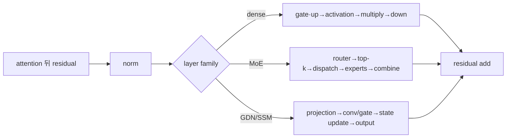

# 15장. MLP·MoE·GDN/SSM을 서빙 관점에서 읽기

새 모델을 서버에 올린 운영자가 있다고 하자. 메모리에는 여유가 있고 attention kernel도 예상한
경로를 탔다. 그런데 decode가 생각보다 느리다. 프로파일에는 작은 GEMM이 빽빽하게 나타나고,
GPU가 여러 장인 구성에서는 일부 rank만 늦는다. 다른 모델에서는 KV cache 사용량이 충분한데도
두 번째 요청의 출력이 첫 번째 요청에 오염된다. 이 세 증상은 서로 달라 보이지만, 모두 attention
뒤에 놓인 변환을 너무 빨리 ‘feed-forward 한 칸’으로 접어 버렸을 때 놓치기 쉽다.

attention은 과거 token에서 필요한 정보를 residual stream으로 가져온다. 그 다음 변환은 그 정보를
token마다 다시 섞고 확장한 뒤 원래 hidden 폭으로 돌려놓는다. dense decoder라면 모든 token이 같은
gated MLP weight를 지난다. MoE 모델이라면 router가 token마다 일부 expert를 골라 서로 다른 weight로
보낸다. hybrid architecture라면 짧은 convolution과 recurrent state를 갱신하는 GDN·SSM 계열 layer가
그 자리를 차지할 수 있다. 모델 도식에서는 모두 비슷한 직사각형으로 보이지만, 서버가 부담하는
일은 전혀 같지 않다.

dense MLP의 주된 질문은 큰 weight를 작은 decode batch가 얼마나 재사용할 수 있느냐다. MoE에서는
계산량뿐 아니라 token을 expert별로 흩었다가 원래 순서로 되돌리는 비용과 느린 rank가 생긴다.
recurrent 계열에서는 KV cache와 별개의 mutable state가 생기며, 긴 prompt를 한꺼번에 처리하는
prefill 알고리즘과 한 token씩 갱신하는 decode 알고리즘이 같은 결과를 내야 한다. 따라서 “어느
구조가 더 빠른가”라는 질문에는 모델 이름만으로 답할 수 없다. token 수, hidden shape, expert별
분포, 통신 topology, state 수명을 함께 놓아야 한다.

이 장은 attention 결과가 residual에 합쳐진 순간부터 다음 layer에 건넬 residual update가 완성될
때까지 한 token의 경로를 따라간다. 먼저 dense MLP를 손으로 펼쳐 왜 decode에서 weight traffic이
문제가 되는지 계산한다. 그 뒤 같은 관점으로 MoE의 dispatch와 GDN·SSM의 state update를 읽는다.
마지막에는 세 경로에서 비슷해 보이는 장애를 어떤 중간 상태로 구별하는지 연결한다.



## 15.1 gated MLP는 왜 hidden 폭을 넓혔다가 다시 줄이는가

Attention을 막 통과한 token row 하나를 먼저 잡자. Residual width가 2인 설명용 row `x=[1,2]`가
post-attention normalization 뒤 `n=[0.5,1.0]`이 됐다고 하자. Gate와 up projection이 각각
`g=[2,-1]`, `u=[3,4]`를 만들면 SiLU를 단순화한 설명용 activation `a=[1,0]` 아래 intermediate product는
`a⊙u=[3,0]`이다. Down projection이 이를 `m=[0.3,-0.2]`로 되돌리면 residual update는
`x+m=[1.3,1.8]`이다. 넓어진 intermediate는 임시 계산 공간이고 다음 layer가 받는 것은 원래 폭의 token row다.

attention을 지난 벡터의 폭이 `H`라면 그대로 `H×H` 변환 하나를 적용하는 편이 단순해 보인다.
실제 decoder의 MLP는 대개 중간 폭 `I`를 더 크게 잡고, 서로 다른 두 projection으로 만든 값에
gate를 건 뒤 다시 `H`로 줄인다. 여기서 gate는 요청을 다른 경로로 보내는 MoE router가 아니다.
같은 token의 각 중간 차원을 얼마나 통과시킬지를 값 자체로 조절하는 elementwise 연산이다.

SwiGLU 계열을 가장 단순하게 쓰면 다음과 같다.

\[
Y=W_{down}(\mathrm{SiLU}(W_{gate}X)\odot W_{up}X)
\]

input `X`가 `[T,H]`, intermediate size가 `I`라면 `W_gate`와 `W_up`은 같은 token을 서로 다른
좌표계로 보낸다. 두 결과는 모두 `[T,I]`다. `SiLU`를 통과한 gate와 up 값을 원소별로 곱해도
shape는 `[T,I]`로 남고, `W_down`이 이를 `[T,H]`로 되돌린다. 이 마지막 폭이 residual stream과
같아야 덧셈이 가능하다. 따라서 `I`는 layer 사이 인터페이스가 아니라 layer 안에서만 살아 있는
작업 공간이다. bias 유무와 activation 종류는 모델 계약이므로 이름만 보고 가정하지 않는다.

이 shape가 서버 비용으로 바뀌는 과정을 숫자로 보자. multiply-add를 2 FLOP으로 세면 gate, up,
down 세 GEMM의 연산량은 대략 `6THI`다. `H=4096`, `I=14336`이면 token 하나에도 약 3.52억 FLOP이
필요하다. 연산량만 보면 충분히 커 보이지만 decode의 `T=1`은 GEMM의 행이 하나뿐이다. 거대한
weight를 읽는 동안 같은 tile을 여러 token에 재사용할 기회가 거의 없다. 반대로 prefill에서
`T=1024`라면 많은 행이 같은 weight tile을 공유한다. 4장에서 본 prefill과 decode의 물리적 차이가
MLP에서는 이렇게 ‘같은 수식, 다른 재사용률’로 드러난다.

그래서 구현은 gate와 up을 언제나 별도 GEMM으로 두지 않는다. 두 weight를 `[gate,up]` 순서로
붙이면 projection 한 번으로 `[T,2I]`를 만들고 뒤에서 반으로 나눌 수 있다. launch 수를 줄이고
입력을 한 번 더 읽는 일을 피할 수 있기 때문이다. 그러나 이 최적화는 새 불변조건을 만든다.
checkpoint가 `[up,gate]` 순서인데 runtime이 `[gate,up]`로 해석하면 모든 shape 검사는 통과하면서
값만 틀린다. activation을 앞 절반과 뒤 절반 중 어디에 적용하는지 loader와 fused op가 같은 계약을
써야 하는 이유다.

### fusion은 intermediate lifetime을 바꾼다

reference path는 gate/up output, activation과 multiply 결과를 별 tensor로 만들 수 있다. fused
kernel은 tile 안에서 activation·multiply를 수행해 HBM write와 launch를 줄인다. down projection까지
완전히 fuse할 수 있는지는 weight size, kernel과 backend에 달려 있다.

성능을 비교할 때 GEMM 세 symbol만 세지 않는다. packed projection, fused activation op, temporary
byte와 graph workspace를 합친다. fusion이 supported하지 않는 dtype·quant·adapter shape는 fallback할
수 있다.

## 15.2 dense MLP의 tensor parallel은 column 뒤 row로 닫힌다

모델이 한 GPU에 들어가지 않아 TP를 2로 늘렸더니 각 rank의 MLP kernel은 빨라졌지만 ITL은 거의
줄지 않는 장면을 생각해 보자. 흔한 오해는 weight를 절반씩 나눴으니 MLP 시간도 절반이 될 것이라는
기대다. 실제 경로에는 두 종류의 상태가 있다. rank 혼자 다음 연산으로 넘길 수 있는 local activation과,
모든 rank의 partial sum이 모여야 비로소 residual에 더할 수 있는 complete update다. kernel 시간만
비교하면 이 둘 사이의 collective를 지워 버리게 된다.

gate/up은 output intermediate 축을 rank에 나누는 column-parallel projection으로 구현할 수 있다.
rank마다 local `I/TP` activation을 계산한다. down projection은 local intermediate shard를 입력으로
받아 residual 폭 `H`의 partial output을 만들고 all-reduce로 합친다.

```text
complete X [T,H]
→ local gate/up [T,I/TP]
→ local activation·multiply
→ local partial down [T,H]
→ all-reduce
→ complete MLP update [T,H]
```

all-reduce 전 tensor는 shape `[T,H]`여도 complete residual update가 아니다. rank partial이라는
semantic state를 관측 행에 표시한다. 한 rank가 NaN이거나 collective 순서가 어긋나면 모든 rank의
output에 영향을 준다.

`H=4096`, `I=14336`, TP=2라면 각 rank의 gate/up output 폭은 7168이다. down projection 뒤에는
각 rank가 다시 `[T,4096]`을 만들지만, 이는 전체 update의 절반에 해당하는 weight shard가 기여한
partial sum이다. BF16 payload만 단순히 세어도 collective가 다루는 논리 tensor는 token당 8192 byte다.
실제 link traffic은 all-reduce algorithm, rank 수와 topology에 따라 이보다 커진다. decode에서 `T`가
작으면 local GEMM을 줄여 얻은 시간이 collective latency와 launch에 가려질 수 있고, prefill에서 `T`가
크면 payload byte와 local GEMM 효율이 함께 달라진다.

여기서 “all-reduce가 비싸다”는 문장만으로는 조치가 나오지 않는다. rank별 down GEMM 종료 시각이
비슷한데 collective 구간이 길다면 topology·algorithm·stream dependency를 본다. 한 rank만 늦게
도착한다면 collective 자체보다 그 앞의 kernel shape, page fault, thermal clock, 다른 stream의 작업을
먼저 의심한다. 모든 rank가 동시에 끝났는데 다음 residual add가 늦다면 event나 graph dependency가
complete update의 소비를 막고 있는지 본다. 같은 긴 막대라도 원인이 세 가지다.

quantized packed gate/up은 output partition과 quant group·scale shard를 맞춰야 한다. LoRA adapter가
gate/up/down 일부를 target하면 packed offset과 row mapping도 필요하다. 11·12장의 packed projection
검산법을 재사용한다.

TP degree를 바꾸는 일은 단지 process 수를 바꾸는 배포 옵션이 아니다. local `I`가 달라지면서 quant
group의 경계, fused activation kernel이 지원하는 alignment, graph에 capture된 workspace shape가 함께
달라질 수 있다. adapter가 rank별 shard로 적재된다면 checkpoint의 global row와 runtime local row를
옮기는 mapping도 다시 계산된다. 따라서 TP=1에서 맞았다는 correctness fixture는 TP=2의 packed-order와
collective-completeness를 증명하지 못한다.

## 15.3 MoE는 token마다 다른 weight를 선택한다

Dense 예의 한 row는 항상 같은 gate/up/down weight를 읽었다. MoE에서는 token row가 먼저 router를 만나
assignment rows로 늘어난다. Token `t0,t1,t2`가 top-2로 각각 `(E1,E3)`, `(E0,E1)`, `(E3,E0)`을 고르면 세
token은 여섯 assignment가 된다. Dispatch는 expert 순서로 이를 `[t1/E0,t2/E0,t0/E1,t1/E1,t0/E3,t2/E3]`처럼
재배열하고, expert 계산 뒤 inverse mapping과 routing weight가 다시 `t0,t1,t2` 세 row를 복원한다. 이 복원 전
expert output은 shape가 맞아도 residual에 더할 complete update가 아니다.

MoE 모델을 설명할 때 흔히 “전문가가 여러 명이고 질문마다 알맞은 전문가 둘만 부른다”는 비유를
쓴다. 어떤 token이 어떤 weight를 사용할지 선택한다는 점에서는 유용하다. 그러나 실제 서버에서는
전문가가 회의실에 앉아 있는 사람이 아니다. expert는 GPU 여러 장에 나뉜 weight 묶음이며, token
벡터를 그 weight가 있는 rank로 복사하고 계산 결과를 되가져와야 한다. 전문가를 고르는 판단과
선택된 데이터를 물리적으로 옮기는 일이 분리돼 있다는 점에서 비유가 깨진다.

MoE layer는 먼저 router logits로 expert score를 만들고 token마다 top-k expert를 고른다. 선택된
expert의 output은 routing weight로 가중 합쳐져 원래 token row 하나로 돌아온다. 따라서 parameter가
많지만 일부만 계산하는 MLP라는 설명만으로는 부족하다. token 하나가 `K`개의 assignment로 늘어나는
순간부터 permutation, buffer capacity, rank 사이 dispatch, inverse permutation과 load balance가
새 비용이자 correctness 계약이 된다.

input `T` token, expert 수 `E`, top-k `K`라면 logical routed assignment는 `T×K`개다. expert별
token 수가 균등하지 않으면 어떤 GEMM은 크고 어떤 것은 작다. 한 expert에 몰리면 다른 rank가
먼저 끝나도 straggler를 기다린다.

예를 들어 decode step에 active token이 64개이고 top-2라면 expert 계산의 논리 입력은 128개 row다.
expert가 8개라고 해서 각 expert가 정확히 16개씩 받는 것은 아니다. router가 만든 실제 분포가
`[48, 21, 17, 15, 11, 8, 5, 3]`일 수도 있다. 합은 같지만 첫 expert의 GEMM과 마지막 expert의
GEMM은 M축이 열여섯 배 차이 난다. 작은 expert batch는 tensor core tile을 채우지 못하고, 큰 expert가
있는 rank는 뒤의 combine을 지연시킨다. 평균 assignment 16이라는 숫자는 두 문제를 모두 숨긴다.

router correctness에는 score processor, normalization, top-k tie와 expert ID mapping이 포함된다.
distributed expert parallel에서는 logical expert ID를 어느 rank·local expert가 소유하는지 mapping한다.

이 mapping에는 최소 세 좌표가 존재한다. checkpoint가 사용하는 global expert ID, 현재 EP 배치가
소유한 local expert ID, dispatch buffer에서의 정렬 위치다. weight loader가 global 6을 local 2에
적재했는데 router-to-rank table은 global 6을 local 1로 번역하면 shape와 통신량은 모두 정상이고
내용만 틀린다. 그래서 router top-k ID만 기록해서는 부족하다. 해당 ID가 어느 rank의 어느 weight
slot으로 해석됐는지와 combine 때 어느 원본 token row로 돌아왔는지를 함께 남겨야 한다.

### dispatch는 permutation이자 ownership transfer다

token row를 expert별로 group하고 rank 사이 all-to-all로 보낼 수 있다. 원래 request/token order를
복원할 inverse mapping이 필요하다. padding/capacity drop가 있다면 dropped assignment와 routing
weight 처리도 model contract다.

```text
flat token row
→ router top-k assignment
→ expert/rank별 sort·pack
→ all-to-all dispatch
→ local grouped expert GEMM
→ all-to-all return
→ inverse permutation·weighted combine
```

request cancellation이나 dynamic batch compaction이 row mapping과 경합하면 다른 request의 expert
output을 합칠 수 있다. row→request generation→expert assignment를 sampled trace에서 잇는다.

여기서 cancellation은 특별히 까다롭다. dispatch가 시작된 뒤 사용자가 연결을 끊어도 collective에
참여하는 rank 하나만 그 row를 즉시 제거할 수는 없다. 모든 rank가 같은 collective 순서를 지켜야
하기 때문이다. 안전한 구현은 이미 발행된 작업을 완료하되 결과를 폐기하거나, 모든 참가자가 공유하는
generation을 다음 안전 지점에서 함께 바꾼다. 취소 응답이 빨랐다는 사실은 expert buffer가 즉시
재사용 가능하다는 뜻이 아니다. device event가 끝나기 전에 slot을 새 요청에 주면 늦게 도착한
return payload가 새 row를 덮을 수 있다.

## 15.4 MoE의 성능은 active parameter 수만으로 설명되지 않는다

token당 top-2 expert만 쓴다고 dense보다 정확히 `2/E` 계산하는 것은 아니다. expert intermediate
크기, shared expert, router, dispatch/combine, all-to-all, padding과 imbalance가 있다. 작은 decode
batch에서는 expert별 token이 너무 적어 GEMM 효율이 낮을 수 있다.

‘active parameter’는 품질과 모델 규모를 설명할 때 유용하지만 서버가 기다리는 시간을 직접 나타내는
단위는 아니다. weight가 어느 GPU에 resident하는지, 선택된 token row가 그곳에 이미 있는지, expert
GEMM의 M축이 tile을 채우는지, shared expert를 sparse expert와 겹쳐 실행할 수 있는지가 빠져 있기
때문이다. 같은 top-2 모델도 single-GPU, TP-only, EP+all-to-all 배치에서 critical path가 달라진다.

prefill은 많은 token이 route돼 expert batch가 커질 기회가 있다. decode는 active request 수가
충분해야 expert별 M축을 채운다. token distribution은 prompt content와 model routing에 따라
달라지므로 random 균등 가정만으로 capacity를 정하지 않는다.

prefill과 decode를 하나의 mixed batch로 묶으면 total assignment 수는 커지지만 그것만으로 decode가
빨라졌다고 볼 수 없다. 긴 prompt의 routed row가 expert queue 앞부분을 차지해 decode row의 combine을
늦출 수 있다. 반대로 backend가 chunk 단위로 expert 작업을 나누면 workspace 상한과 fairness가
좋아지는 대신 expert weight를 더 자주 읽거나 launch 수가 늘 수 있다. scheduler token budget과
MoE kernel chunk 크기는 이름이 다르지만 같은 step의 tail에 함께 관여한다.

관측에는 expert별 assigned/processed token, max/mean imbalance, dropped assignment, dispatch·expert
compute·combine duration, all-to-all byte와 tail rank를 둔다. 전체 GPU utilization만으로 expert
효율을 설명하지 않는다.

### backend 선택은 통신 이름 하나로 끝나지 않는다

vLLM의 modular MoE 경로가 prepare/finalize와 expert 계산을 분리하는 이유는 서로 다른 통신·kernel
조합을 같은 논리 인터페이스 아래 놓기 위해서다. prepare 단계는 token을 어느 activation format으로
정렬해 어느 rank에 보낼지 결정하고, expert 단계는 local grouped GEMM을 수행하며, finalize가 return과
원래 row 복원을 닫는다. backend마다 이 세 단계가 완전히 분리될 수도 있고 일부가 monolithic하게
결합될 수도 있다.

`moe-a2a-backend` 같은 옵션을 설명할 때 “all-to-all 구현을 바꾼다”에서 멈추지 않는다. 그
backend가 요구하는 topology와 library, 지원 dtype·quant layout, token dispatch format, shared-expert
overlap 가능성, CUDA Graph capture 제약, fallback 조건을 따라가야 한다. requested 값이 validation을
통과해도 현재 EP/DP 구성에서 effective prepare/finalize 객체가 무엇인지 확인해야 한다.

DeepEP처럼 low-latency와 high-throughput 성격이 다른 경로가 있다면 이름만 보고 decode/prefill에
고정 배치하지 않는다. 실제 token 수와 expert 분포, communication domain, buffer registration을 포함한
선택 predicate를 읽는다. NVLink one-sided 경로와 node 간 RDMA 경로도 같은 ‘빠른 MoE’로 묶을 수 없다.
peer visibility, symmetric allocation, completion 신호와 실패 복구 계약이 다르기 때문이다.

backend 비교 실험은 end-to-end token/s 하나만 남기지 않는다. 동일한 router assignment를 고정해
prepare, dispatch wait, local expert, return/finalize의 시간을 나누고, rank별 send/receive byte와 최대
expert load를 같이 기록한다. assignment가 실험마다 달라지면 kernel 차이와 workload 차이를 분리할
수 없다. warm-up 뒤 같은 distribution에서도 tail rank가 바뀐다면 topology placement나 비동기 overlap을
다시 본다.

### shared expert는 공짜로 더해지는 dense branch가 아니다

일부 MoE는 routed expert 외에 모든 token이 통과하는 shared expert를 둔다. 수학적으로는 sparse
output과 dense/shared output을 더하면 되지만, serving 구현은 두 branch의 입력 alias와 실행 순서를
결정해야 한다. shared expert를 dispatch 통신과 겹치면 critical path를 줄일 수 있지만, 입력 buffer를
prepare 단계가 in-place로 재배열한다면 원본 hidden state를 별도로 보존해야 할 수 있다.

이때 memory 최적화와 overlap은 서로 연결된다. input clone을 없애면 byte는 줄지만 shared expert가
읽기를 끝내기 전에 prepare가 덮어쓰지 않는다는 stream/event 계약이 필요하다. 반대로 안전을 위해
항상 clone하면 큰 prefill batch에서 HBM traffic과 peak memory가 늘어난다. source에서 `supports_async`,
shared-expert input 인자, workspace alias 조건을 함께 읽는 이유다.

shared branch가 어느 rank에 복제돼 있는지 또는 TP shard인지도 collective를 바꾼다. sparse expert
return과 shared partial output이 각각 complete인지 확인한 뒤 합쳐야 한다. 한 branch가 complete이고
다른 branch가 rank partial인 상태에서 residual에 더하면 shape는 정상이어도 rank마다 다른 hidden
state가 생긴다.

### 세 개의 경쟁 가설을 한 timeline에서 가른다

MoE layer의 p99가 길어졌다고 하자. 첫 가설은 router imbalance, 둘째는 network congestion, 셋째는
작은 expert batch의 낮은 GEMM 효율이다. 평균 GPU utilization이나 전체 layer duration만으로는 셋을
가를 수 없다. step마다 expert count histogram, rank별 prepare 종료, dispatch completion, expert GEMM
시작·종료, finalize completion을 같은 clock domain에 놓는다.

한 rank의 expert count가 계속 크고 그 rank의 GEMM 종료가 늦다면 imbalance 설명이 강해진다. count는
비슷한데 dispatch completion만 특정 link에서 늦으면 network·topology 설명이 남는다. dispatch는 함께
끝났지만 모든 rank의 expert GEMM이 작고 launch가 길다면 token이 너무 잘게 흩어진 문제다. 세 경우의
조치는 replica placement, communication backend, batch/chunk 정책으로 서로 다르다. ‘MoE가 느리다’는
한 문장은 이 분기까지 닫기 전에는 운영 결론이 아니다.

## 15.5 GDN·SSM 계열은 KV가 아닌 recurrent state를 소유한다

여기서 독자는 계산 family를 한 번 바꿔야 한다. Dense와 MoE는 현재 token row를 임시 intermediate 또는 assignment로
늘렸다가 같은 forward 안에서 `[T,H]`로 되돌린다. GDN·SSM 계열은 output row뿐 아니라 다음 token이 읽을 mutable
frontier를 남긴다. Attention KV는 과거 position별 K/V를 append하거나 page로 보존하지만 recurrent state는 과거를
고정 크기 convolution/SSM state에 접어 넣고 같은 slot을 갱신한다. 그래서 position-page owner만 맞아도 충분하지 않고,
request incarnation·committed step·candidate generation과 publish 순서를 따로 가져야 한다.

긴 context를 지원하는 hybrid 모델을 올렸더니 KV cache 계산상으로는 수백 request가 들어가야 하는데
admission이 훨씬 일찍 멈추는 경우가 있다. 반대로 request가 끝난 뒤 KV block은 모두 반환됐는데 다음
요청의 첫 token부터 값이 어긋날 수도 있다. 이때 attention layer만 조사하면 원인을 찾을 수 없다.
hybrid 모델에는 KV와 모양도 갱신 규칙도 다른 recurrent state와 짧은 convolution buffer가 있기
때문이다.

linear/recurrent layer는 input projection을 여러 branch로 나누고 short convolution, gate와 recurrent
update를 수행할 수 있다. 정확한 방정식과 이름은 architecture마다 다르다. Gated DeltaNet을 Mamba의
방정식으로 바꾸어 설명하거나 모든 SSM state를 vector 하나로 그리면 correctness 계약을 왜곡한다.
다만 serving에서 공통으로 붙잡을 질문은 같다. 이 layer가 과거 전체 K/V 대신 무엇을 남기며, 다음
token은 그 state를 어느 시점에 읽고 어느 시점에 덮어쓰는가다.

short convolution kernel width가 `W`라면 최근 `W-1` activation을 buffer로 보존할 수 있다. recurrent
state는 head/channel별 matrix나 vector일 수 있다. layer마다 state shape·dtype와 reset/clone 규칙을
model source에서 확인한다.

‘고정 크기 state’라는 표현도 조심해야 한다. 한 request의 context가 길어져도 최종 recurrent state
한 벌만 resident하면 되는 모드는 context 길이에 대해 고정일 수 있다. 그러나 speculative decoding이
여러 미래 token의 state를 보존하거나 prefix reuse를 위해 중간 snapshot을 정렬된 page로 남기면
request당 page 수가 늘어난다. state tensor 자체의 shape, allocator가 예약하는 padded page, block table이
표현해야 하는 position 범위는 서로 다른 수치다.

prefill은 긴 sequence를 convolution/chunk scan으로 병렬 처리하고 마지막 state를 추출할 수 있다.
decode는 한 token을 넣어 ring buffer와 recurrent state를 in-place 갱신하는 fast path를 쓸 수 있다.
같은 recurrence를 계산하지만 algorithm과 kernel이 다르다.

이를 추적할 때는 `old_state → read → new_state → commit` 네 칸만으로 끝내지 않는다. output이
old state와 new state 중 어느 쪽을 사용하는지, convolution buffer의 write index를 update 전후 어느
시점에 해석하는지, kernel을 발행한 stream의 완료 전에 scheduler가 state generation을 바꿀 수 있는지를
붙인다. 수식이 같아도 이 순서가 한 칸 밀리면 prefill 마지막 token과 첫 decode token의 경계에서만
오답이 나타난다.

### prefill→decode 동등성이 correctness 중심이다

64 token을 한 번에 prefill한 state와 63 token prefill 뒤 한 token decode한 state가 tolerance 안에서
같아야 한다. 32+32 chunk, block boundary와 convolution width보다 짧은 chunk도 비교한다.

off-by-one이면 prefill output은 정상처럼 보이고 첫 또는 몇 번째 decode부터 diverge한다. state
frontier, convolution write index와 position을 같은 사건 기록에 둔다. cache hit가 snapshot state를 restore할
때도 token length와 generation이 맞아야 한다.

가장 작은 동등성 시험은 길이를 무작정 크게 잡지 않는다. convolution width가 4라면 길이 1, 3, 4,
5를 먼저 쓴다. 길이 3은 아직 ring을 한 번도 완전히 채우지 않은 상태, 4는 첫 경계, 5는 첫 이동을
드러낸다. 그 다음 같은 token을 `5`, `3+2`, `4+1`, `1+1+1+1+1`로 나누어 마지막 output과 state를
비교한다. 어느 분할에서 처음 달라지는지가 scan의 chunk frontier와 decode update 가운데 조사할 쪽을
알려 준다.

KV cache allocator만 확장해 recurrent state를 자동 관리할 수 없다. fixed slot pool, per-request
state table이나 hybrid cache manager가 layer type별 storage와 lifetime을 가져야 한다.

request fork도 차이를 만든다. attention KV의 완성된 prefix page는 immutable하게 공유하고 마지막
partial block만 copy-on-write할 수 있다. recurrent state는 다음 decode에서 즉시 in-place로 바뀌므로
두 child request가 같은 mutable slot을 가리키면 서로의 미래를 덮어쓴다. fork 시 clone이 필요한지,
snapshot을 immutable generation으로 유지하고 child별 working state를 따로 만드는지 확인해야 한다.
prefix hash가 같다는 사실만으로 state sharing이 안전하다고 결론내릴 수 없는 이유다.

## 15.6 hybrid model은 layer index와 cache kind를 함께 읽는다

model config가 full attention, local attention과 linear/recurrent layer pattern을 정의할 수 있다.
layer list의 module type과 cache group mapping이 같은 순서를 써야 한다. layer 3의 state를 layer 4
slot에 쓰면 shape가 우연히 같아도 오답이다.

Qwen 계열 hybrid model처럼 일정한 pattern으로 full attention과 GDN layer가 교대한다고 해도,
“네 layer마다 attention”이라는 말만 코드 계약으로 쓰면 부족하다. config가 가진 layer type 배열,
constructor가 실제로 만든 module 배열, cache manager가 부여한 group과 runner가 forward 때 조회하는
layer name이 같은 index를 가리켜야 한다. checkpoint loader의 layer 번호도 여기에 합류한다. 네 배열
중 하나라도 filtered index를 쓰면 state shape가 같은 인접 layer끼리 조용히 뒤바뀔 수 있다.

작은 감사표는 layer 번호마다 `module kind`, `weight prefix`, `persistent state kind`, `allocator group`,
`forward lookup key`를 한 행에 둔다. 이 표는 제품 카탈로그가 아니라 join 검증이다. 각 열을 만든
함수가 다르므로, 같은 문자열이 우연히 반복된다는 사실보다 한 요청이 constructor에서 allocation,
forward, cleanup까지 동일한 key를 유지하는지 확인한다.

capacity 식은 layer family별로 더한다.

```text
full/global attention KV byte
+ local-window KV byte
+ recurrent state byte
+ convolution buffer byte
+ scale·metadata·alignment
```

context가 늘 때 full KV는 선형으로 커지고 local window는 상한이 있으며 recurrent state는 고정일
수 있다. 평균 layer×하나의 KV 식으로 hybrid model을 계산하지 않는다.

예를 들어 24개 layer 가운데 full attention 6개, local attention 6개, recurrent layer 12개가 있다고
하자. full KV는 context 32K 전체를 보존하고 local KV의 window가 4K라면 두 attention family의 token
capacity부터 여덟 배 차이가 난다. recurrent state는 context token 수가 아니라 active sequence와
speculative snapshot 수에 비례할 수 있다. 따라서 평균 12K context를 layer 24개에 곱하는 식은 full
KV를 과소평가하고 local KV를 과대평가하며 recurrent pool을 아예 놓친다.

admission은 이 세 pool 가운데 가장 먼저 고갈되는 자원을 따라야 한다. KV byte가 남아도 recurrent
slot이 없으면 새 request를 받지 못하고, recurrent slot이 남아도 full-attention page가 없으면 긴
prompt를 처리할 수 없다. 관측 화면에 ‘cache 사용률’ 하나만 표시하면 어떤 pool이 admission을 막았는지
알 수 없다. cache kind별 reserved, resident, reusable, pending-free를 분리해야 한다.

prefix sharing도 state family마다 다르다. token-identical prefix의 recurrent snapshot을 공유할 수
있는지, mutable decode state는 copy-on-write나 clone이 필요한지 본다. snapshot generation과 adapter
identity를 cache key에 포함한다.

adapter identity가 중요한 까닭은 같은 token prefix라도 layer output과 state가 다른 weight를 통과해
만들어졌기 때문이다. base model에서 계산한 recurrent snapshot을 LoRA가 활성화된 요청에 붙이면 token
hash와 position은 맞지만 state 의미가 다르다. quantization backend나 state dtype 변경도 snapshot
호환 계약에 포함될 수 있다. key를 길게 만드는 것이 목적이 아니라, state를 결정하는 입력 가운데
누락된 축이 없는지를 proof로 남기는 것이 목적이다.

### capacity planning을 layer family별 숫자로 닫는다

서버 용량을 계산할 때 parameter byte와 request state byte를 분리한다. dense MLP weight는 모델을 올릴
때 resident하고 active request가 늘어도 같은 weight를 공유한다. MoE expert weight도 원칙상 resident
parameter지만 EP placement에 따라 rank별 보유량이 달라진다. 반면 recurrent state와 convolution
buffer는 active sequence마다 새로 필요하다. 세 항목을 한 ‘모델 메모리’ 숫자로 합치면 admission에
쓸 수 없다.

가령 recurrent layer 하나가 request마다 BF16 state `[32,128,128]`과 convolution buffer
`[32,128,3]`을 가진다고 하자. alignment와 metadata를 빼고도 state는 약 1 MiB, buffer는 약 24 KiB다.
이런 layer가 24개면 request당 대략 24.6 MiB다. active sequence 256개라면 6 GiB가 넘는다. context
길이와 무관하다는 말이 작다는 뜻은 아니다. speculative branch를 위해 state 세 벌을 보존하면 같은
용량에서 받을 수 있는 request 수가 크게 줄어든다.

실제 shape는 모델별로 다르므로 이 숫자를 특정 모델의 사양으로 인용하면 안 된다. 계산의 목적은
config에서 얻은 head, key/value dimension, state dimension, convolution width와 dtype를 allocator가
쓰는 padded page 식에 대입하는 방법을 보여 주는 것이다. source가 여러 state tensor를 tuple로
보존하면 각각의 `numel×dtype byte`를 합하고 page alignment, graph pool, snapshot 여유를 더한다.

MoE의 rank별 parameter 용량도 평균 `전체 expert/EPrank`만으로 끝내지 않는다. shared expert가 모든
rank에 복제되는지, local expert 수가 균등하게 나뉘지 않는 remainder가 있는지, quant scale와 packing
metadata가 얼마나 붙는지 본다. elastic EP나 expert replica를 사용하면 placement 세대가 바뀔 때
old/new weight가 잠시 공존하는지도 peak memory에 포함한다.

이렇게 계산한 뒤 admission metric과 맞춘다. 예상 recurrent slot byte와 실제 pool reserved byte가
다르면 padding 또는 숨은 state tensor를 찾는다. expected local expert weight와 device allocation이
다르면 replica/shared expert/workspace를 분리한다. 숫자가 맞지 않는 상태에서 utilization 비율만
조정하면 OOM 원인을 설정으로 덮게 된다.

### prefill과 decode를 분리 배치할 때 state 이동 비용

P/D 분리는 attention KV만 옮기는 문제로 소개되기 쉽다. hybrid 모델에서 decode 노드는 recurrent
state와 convolution frontier도 정확히 이어받아야 한다. prefill output hidden state만 보내면 decode가
과거 문맥을 잃고, KV만 보내면 recurrent layer가 초기 state에서 시작한다. 전송 protocol의 descriptor는
layer family별 payload와 token frontier를 표현해야 한다.

전송량은 KV와 성격이 다르다. full-attention KV는 prefix 길이에 비례하지만 final recurrent state 한
벌은 길이에 무관할 수 있다. 그래서 긴 prompt일수록 state payload 비중은 작아 보인다. 그러나 많은
짧은 request를 넘기면 registration, descriptor, completion 같은 고정 비용이 state byte보다 커질 수
있다. convolution buffer처럼 작은 조각이 layer마다 흩어져 있으면 gather/scatter와 memory registration
단위가 protocol 효율을 결정한다.

producer가 state kernel을 발행했다는 사실과 consumer가 읽어도 된다는 사실도 다르다. producer stream의
write completion, transport가 볼 수 있는 memory visibility, transfer completion, consumer stream의
wait를 순서대로 닫아야 한다. host가 descriptor를 먼저 전송하면 decode 노드가 아직 완성되지 않은
state를 읽을 수 있다. 반대로 모든 layer마다 host synchronize를 넣으면 correctness는 얻어도 TTFT가
망가진다. event와 batched completion으로 필요한 경계만 표현하는 이유다.

실패 복구에서는 KV와 state의 generation을 함께 다룬다. KV transfer는 성공했지만 recurrent state가
실패했다면 그 request를 decode-ready로 공개할 수 없다. 일부 payload만 설치된 consumer slot은 폐기하거나
같은 generation으로 재전송해야 한다. retry가 old state와 new KV를 조합하지 않도록 descriptor, cache key,
install transaction과 ready flag를 하나의 세대로 묶는다.

## 15.7 dense·MoE·recurrent 경로의 failure surface를 비교한다

| family | shape가 맞는 오답 | 주된 lifetime 위험 | 분산 위험 |
|---|---|---|---|
| dense MLP | gate/up packed 순서·quant scale | fused alias/workspace reuse | down all-reduce 순서 |
| MoE | expert ID·inverse permutation | routed buffer·cancel row | imbalance·all-to-all hang |
| recurrent | chunk/decode frontier·ring index | mutable state reuse/reset | state shard·PP migration |

dense incident는 quantized conversion 뒤 gate와 up order가 바뀐 경우다. pre-attention output은 같고
MLP packed projection split부터 divergence한다. sentinel과 dequantized weight 구간을 본다.

이 사건은 최종 text만 비교하면 sampling noise처럼 보일 수 있다. 같은 token IDs와 position으로
reference path와 fused path를 고정하고, post-attention residual이 같은지 먼저 확인한다. packed
projection의 앞뒤 절반을 각각 fingerprint했을 때 서로 교환된 모양이면 activation이나 down GEMM보다
loader mapping이 우선 용의자다. weight 일부를 작은 dense tensor로 dequantize해 gate/up checkpoint와
직접 비교하면 kernel 전체를 디버깅하기 전에 오류 층을 닫을 수 있다.

MoE incident는 batch compaction 뒤 inverse permutation이 stale한 경우다. 일부 request만 다른 expert
output을 받는다. router assignment는 맞고 combine checkpoint에서 처음 다르다. row generation과
sort/unsort mapping을 본다.

특징적인 증상은 모든 token이 틀리지 않는다는 점이다. compaction 전에 존재하던 row와 새로 당겨진
row가 교차하는 구간만 오염될 수 있다. router logits와 expert output 자체가 reference와 같다면 expert
GEMM을 의심할 이유가 줄어든다. `request_id`만으로는 ID 재사용을 놓칠 수 있으므로 batch epoch 또는
slot generation을 붙여 dispatch 전 source row와 combine 후 destination row를 비교한다.

recurrent incident는 chunk 크기가 convolution width 경계를 넘을 때 state extraction이 한 token
밀리는 경우다. full prefill과 chunk prefill output을 boundary token에서 비교하고 decode ring index를
추적한다.

세 사건의 공통점은 최종 tensor shape와 allocator 사용량이 정상일 수 있다는 것이다. 그래서 장애
조사는 “OOM인가 오답인가”라는 큰 분류에서 멈추지 않는다. 값이 처음 갈라진 logical checkpoint와
그 tensor가 가진 generation·partial/complete·mutable/immutable 상태를 함께 찾는다. 다만 이 장에서
모든 incident 양식을 반복하지 않는다. 11편의 고장 실험실에서는 여기서 고른 checkpoint를 trace와
metric timeline에 연결한다.

## 15.8 source를 읽는 공통 spine

model config에서 layer family와 intermediate/expert/state dimension을 찾는다. model constructor가
어떤 submodule과 TP/EP primitive를 만드는지 읽는다. weight loader mapping, forward branch와 native
op를 잇고 cache/state manager가 persistent storage를 어떻게 예약·정리하는지 본다.

소스를 읽을 때 가장 흔한 실패는 모델 파일의 `forward`만 읽고 계산 전체를 이해했다고 생각하는
것이다. 모델 파일은 주로 논리적인 branch와 tensor 연결을 보여 준다. packed weight가 어떻게 잘렸는지,
MoE prepare가 row를 어떻게 재배열하는지, recurrent state가 어느 allocator slot에 놓이는지는 다른
층이 소유한다. 반대로 kernel 파일부터 열면 현재 모델이 그 kernel의 지원 predicate를 실제로 통과하는지
알 수 없다. 위에서 아래로 한 번, 아래에서 위로 한 번 읽어 reachability를 닫아야 한다.

```text
config·layer pattern
→ constructor·parallel ownership
→ weight/quant/adapter loader
→ forward projection·route·state branch
→ fused/native launcher
→ collective·cache/state commit
→ residual update·finish/abort cleanup
```

Transformers reference path는 model별 Python equation과 cache class를 보여 줄 수 있다. vLLM과
SGLang은 packed TP/EP linear, fused activation·MoE·recurrent custom op와 scheduler-owned state를
추가한다. llama.cpp는 GGUF tensor와 ggml graph/op로 같은 logical branch를 표현한다.

첫 번째 하강은 config에서 시작한다. `intermediate_size`, expert 수, top-k, layer type pattern,
state·convolution dimension을 적고 constructor가 이 값으로 어느 module을 만드는지 본다. 두 번째는
checkpoint tensor 이름에서 loader mapping을 거쳐 runtime parameter의 local shape로 간다. 세 번째는
forward의 Python/C++ graph node에서 custom op, backend dispatch, launcher와 workspace로 내려간다.
마지막은 allocator에서 request finish·abort 뒤 slot이 다시 free list에 들어가는 순간까지 간다.

이 네 하강은 서로 다른 질문에 답한다. config→constructor는 “무슨 계산인가”, loader는 “어느 weight가
어디에 놓였는가”, dispatch는 “이번 shape가 실제 어느 구현을 탔는가”, allocator는 “다음 token과 다음
request가 무엇을 이어받는가”를 답한다. 한 축의 증거를 다른 축의 결론으로 확대하지 않는다.

### dense 경로는 간단해 보여도 loader와 custom op를 건너뛰지 않는다

Transformers의 `LlamaMLP.forward`는 gate projection에 activation을 적용하고 up projection과 곱한 뒤
down projection을 호출한다. 이것은 수식의 훌륭한 기준점이다. serving engine에서는 gate와 up이
packed parameter 하나일 수 있고, TP shard loader가 checkpoint 이름을 packed offset으로 바꾸며,
activation custom op가 두 절반을 split해 in-place 또는 새 output으로 계산할 수 있다.

따라서 reference와 serving 결과가 다를 때 model class의 수식만 다시 읽지 않는다. checkpoint global
shape→runtime packed shape→rank local slice→activation split→down partial→collective complete라는 좌표를
만든다. quantization이 있으면 weight storage dtype, scale/zero-point group, dequant accumulator와 output
dtype를 그 사이에 끼운다. adapter가 있으면 base output에 언제 어떤 local update가 합쳐지는지도 넣는다.

CUDA profiler에 GEMM 하나와 activation 하나만 보인다고 gate/up이 올바르게 pack됐다는 뜻은 아니다.
kernel은 전달받은 layout을 충실히 계산하면서 의미상 뒤바뀐 절반을 처리할 수 있다. 작은 sentinel
weight와 intermediate checkpoint가 semantic layout을 증명하고, trace는 그 layout이 어떤 비용으로
실행됐는지를 증명한다. correctness와 performance 증거의 역할이 다르다.

### MoE 경로는 prepare와 finalize 사이의 자료 형식을 읽는다

MoE abstraction의 메서드 이름만 나열하는 대신 prepare의 입력과 출력을 적는다. 입력은 원래 token
order의 hidden rows와 router 결과다. 출력은 expert 또는 destination rank별로 정렬·복제된 activation,
expert token count, 원래 row로 돌아가기 위한 metadata일 수 있다. expert kernel은 이 format을 소비해
grouped GEMM을 하고 finalize는 결과를 되보내 routing weight로 합친다.

여기서 activation format은 단순 dtype이 아니다. row가 top-k slot별로 복제됐는지, expert-major인지,
rank-major인지, padding row가 포함됐는지, scale가 row와 함께 이동하는지를 포함한다. prepare backend와
expert backend를 임의로 조합할 수 없는 까닭은 이 format 계약과 workspace ownership이 맞아야 하기
때문이다. modular interface가 존재한다는 사실은 모든 구현이 서로 교환 가능하다는 뜻이 아니다.

source review에서는 empty expert와 zero-token rank 경로도 읽는다. 어떤 rank에 assignment가 없더라도
다른 rank가 collective를 호출하면 동일한 순서로 참여해야 한다. 조건문이 local token count만 보고
통신 전체를 건너뛰면 workload에 따라 간헐적 hang이 된다. unit test의 균등 random route는 이 경계를
놓칠 수 있으므로 모든 token이 expert 하나에 몰리는 fixture를 둔다.

### recurrent 경로는 allocation보다 commit과 rollback이 더 어렵다

state slot을 얻는 함수만 찾으면 lifetime의 절반만 본 것이다. prefill kernel이 새 state를 계산하는
동안 scheduler는 request를 취소하거나 speculative branch를 버릴 수 있다. device work가 끝나기 전에
slot을 free list에 넣을 수 없고, 계산이 끝났다고 해서 실패한 branch의 state를 canonical request에
commit해서도 안 된다. 완료와 채택은 서로 다른 사건이다.

안전한 상태 기계는 generation이 붙은 working state를 예약하고 kernel completion을 기다린 뒤, 해당
request와 branch가 여전히 유효할 때만 frontier를 commit한다. 취소됐으면 output을 노출하지 않고
completion 뒤 slot을 회수한다. speculative token 일부만 accept되면 지원되는 경우 accepted frontier로
rollback하거나 보존된 snapshot에서 다시 시작한다. backend가 arbitrary rollback을 지원하지 않으면
검증 단위를 더 작게 잡거나 state를 추가로 보존해야 한다.

metric에는 allocation count만 두지 않는다. reserved지만 kernel이 아직 쓰는 slot, commit 대기,
rollback/폐기 대기, reusable state를 구분한다. free 수가 충분한데 admission이 멈춘다면 pending device
work나 generation barrier가 병목일 수 있다. 반대로 free로 표시된 slot에서 오답이 나면 metric 정의가
실제 stream completion보다 앞섰는지 의심한다.

source link는 각 family 대표 model과 primitive를 고정 commit으로 연결해 장 완성 때 확장한다.
class 존재와 실제 model reachability, selected backend와 실행 kernel을 구분한다.

## 15.9 세 경로를 하나의 checkpoint 표로 비교하고 사건에서 필요한 행만 연다

이 표의 목적은 checkpoint 이름을 더 많이 만드는 것이 아니다. “두 backend의 최종 logits가 다르다”는
큰 증상을 가장 적은 중간 관측으로 어느 family의 어느 경계까지 좁히는 것이다.
같은 token IDs와 position, 동일 model artifact를 사용하고 먼저 attention 뒤 residual이 같은지 확인한다.
여기서 이미 다르면 이 장의 MLP·MoE·recurrent branch로 내려갈 이유가 없다.

attention 뒤가 같다면 model config의 해당 layer kind에 따라 관측점을 고른다. 모든 checkpoint를 한꺼번에
활성화하면 큰 tensor 복사와 synchronization이 원래 schedule을 바꾼다. dense는 packed gate/up split과
down output, MoE는 router assignment와 combine, recurrent는 convolution frontier와 final state라는
서로 다른 최소 관측점을 쓴다.

```text
attention 뒤 residual
→ post-attention norm
→ dense: packed gate/up→activation product→down partial/complete
→ MoE: router logits→assignment→expert output→combine
→ recurrent: projected branches→conv state→recurrent state→output
→ residual add 뒤 next-layer input
```

prefill full, chunk prefill과 decode 반복을 비교한다. TP/EP에서는 local partial과 collective complete를
구분한다. quant/adapter path는 reference dequant/dense 또는 unfused path와 tolerance를 둔다.

Shape·dtype·stride·owner, finite/norm과 안전한 fingerprint를 남긴다. Production hot path 전체에 hook을
달지 않고 통제된 lab에서 first divergence 후보만 checkpoint한다. 별도의 성능 기록표나 마지막 요약표를
만들지 않고 같은 행에 work 단위, 주요 byte/collective, 완료와 rollback을 함께 적는다.

| family·checkpoint | token row/state와 값 검증 | owner·임시 상태 | 성능 분모·byte | complete 조건 | 실패 시 rollback |
|---|---|---|---|---|---|
| dense `norm→gate/up→product→down` | token row별 packed split과 down output | fused intermediate, TP local partial | `T,H,I`, weight/workspace, all-reduce | row-parallel collective 뒤 `[T,H]` | workspace last event 뒤 free, verified dense path |
| MoE `router→assignment→expert→combine` | top-k ID/weight, sorted/inverse row | `T×K` assignment와 rank ownership | expert별 rows, dispatch/return byte, max/mean skew | combine이 원 token `[T,H]` 복원 | collective drain, stale permutation discard, verified backend/EP |
| recurrent `state read→candidate→publish` | conv/SSM digest와 committed frontier | request slot generation, candidate staging | state shape·copy byte, pending-free age | accepted generation atomic publish | snapshot restore 또는 slot discard/quarantine |

### 사건 A: TP=1은 맞고 TP=2부터 모든 token이 조금씩 틀린다

이 증상에서 collective library부터 바꾸는 것은 이르다. TP=2는 local intermediate 폭, packed weight
shard와 quant scale mapping도 함께 바꾼다. 두 rank의 post-attention input이 같고 local gate/up output을
reference global output의 대응 slice와 비교한다. 여기서 다르면 loader·partition·quant group 문제다.
local activation product까지 같고 down partial이 다르면 row-parallel weight orientation을 본다. 모든
partial이 맞는데 complete output만 다르면 그때 collective order와 reduction dtype으로 내려간다.

성능도 같은 순서로 본다. local GEMM이 예상대로 줄었는지, rank arrival skew가 있는지, all-reduce와
residual add 사이 event가 긴지를 나눈다. TP를 늘린 뒤 ITL이 그대로라는 결과는 실패가 아닐 수 있다.
decode의 작은 M에서 줄어든 compute보다 collective 고정 비용이 크다는 비용 모델과 맞으면 정상적인
손익분기다.

### 사건 B: 긴 prompt에서는 맞지만 동시 decode가 늘면 일부 요청만 틀린다

MoE의 router logits와 top-k ID를 먼저 비교한다. 동시성에 따라 route 자체가 달라졌다면 batch row
구성, score processor 또는 nondeterministic tie를 본다. route가 같은데 expert output이 다르면 global
expert ID→rank→local weight mapping과 quantized expert kernel을 본다. expert output까지 같고 combine에서
처음 어긋나면 inverse permutation과 slot generation이 중심 용의자다.

특히 취소된 요청이 있던 step과 batch compaction 직후만 틀리면 stale mapping 가설이 강하다. source
row에는 request ID뿐 아니라 generation을 기록하고, dispatch 시점의 `T×K` assignment와 finalize 시점의
destination을 대조한다. 모든 rank가 collective를 마치기 전에 host가 slot을 반환했는지도 device event로
확인한다. 이 관측이 없으면 “동시성이 높아 numerical noise가 커졌다”는 그럴듯하지만 틀린 설명이 남는다.

### 사건 C: full prefill은 맞고 chunked prefill의 첫 decode부터 갈라진다

recurrent layer에서는 마지막 hidden output만 보지 않고 chunk 끝의 convolution buffer와 recurrent state를
비교한다. 길이 5를 한 번에 처리한 state와 `3+2`, `4+1`로 나눈 state 가운데 어느 경계에서 처음
달라지는지 찾는다. convolution buffer만 다르면 tail extraction과 ring order, recurrent state만 다르면
scan combine 또는 commit frontier, 둘 다 같고 decode output만 다르면 decode fast path의 read/write
순서를 본다.

prefix cache가 개입했다면 cache miss path와 snapshot hit path를 같은 prefix로 비교한다. snapshot의
token length, layer kind, adapter identity와 state generation이 모두 맞는지 확인한다. hit를 끄자 오류가
사라진다고 해서 transfer library가 범인인 것은 아니다. stale snapshot key, install destination과 mutable
clone 누락도 같은 증상을 만든다.

Duration을 token 하나로만 나누지 않는다. MoE는 expert별 token과 imbalance, recurrent는 state shape와
chunk length, dense는 total query token을 함께 쓴다. 예를 들어 MoE finalize가 길 때 assignment
분포와 return byte를 함께 기록해야 network 병목과 inverse mapping용 scatter 비용을 가를 수 있다.
recurrent decode가 느릴 때 state shape와 dtype, ring buffer byte가 없으면 kernel regression인지 모델
구성 변화인지 판단할 수 없다. dense MLP에서도 token 수와 local `I` 없이 kernel duration만 비교하면
prefill과 decode 표본이 섞인다.

### 고정 소스에서 세 family의 입구를 잡는다

Transformers v5.15.1의 dense reference는
[`LlamaMLP`](https://github.com/huggingface/transformers/blob/550d7b3834670483a4df436541272c055dc364bf/src/transformers/models/llama/modeling_llama.py#L163-L180)에서
gate·up·down과 activation 순서를 보여 준다. 이 간단한 path를 bias, packed/fused op와 quantization이
있는 serving implementation의 전체 동작으로 일반화하지 않는다.

Qwen3.5의 hybrid reference는
[`Qwen3_5GatedDeltaNet`](https://github.com/huggingface/transformers/blob/550d7b3834670483a4df436541272c055dc364bf/src/transformers/models/qwen3_5/modeling_qwen3_5.py#L383-L703)과
[`Qwen3_5MLP`](https://github.com/huggingface/transformers/blob/550d7b3834670483a4df436541272c055dc364bf/src/transformers/models/qwen3_5/modeling_qwen3_5.py#L704-L733)을
분리한다. layer constructor가 linear attention과 full attention 가운데 무엇을 만드는지도 이어
읽는다.

SGLang v0.5.18의 serving-specific GDN path는
[`Qwen3_5GatedDeltaNet`](https://github.com/sgl-project/sglang/blob/71de97b264b04dcd514cf904003028aefe9775c8/python/sglang/srt/models/qwen3_5.py#L227-L705)에서
fused projection, head ratio와 backend 조건을 드러낸다. source에 여러 fast path가 있으므로 model
이름만으로 선택을 단정하지 않고 condition과 resolved backend를 본다.

MoE 대표 구현은 model마다 router, shared expert와 expert parallel primitive가 다르다. SGLang의
[`MixtralMoE`](https://github.com/sgl-project/sglang/blob/71de97b264b04dcd514cf904003028aefe9775c8/python/sglang/srt/models/mixtral.py#L57-L150)처럼
구체 model path를 출발점으로 삼고 fused MoE layer와 weight mapping으로 내려간다.

vLLM v0.27.1에서는 모델 클래스만 읽고 멈추면 dispatch와 임시 메모리의 수명을 볼 수 없다.
[`FusedMoEKernelModularImpl`](https://github.com/vllm-project/vllm/blob/6e448d0ea9bf3d88d898b65449ca6dc2aec170ac/vllm/model_executor/layers/fused_moe/modular_kernel.py#L1095-L1174)은
prepare/finalize와 expert 계산을 별 객체로 받아 조립하고, `_allocate_buffers`에서 chunk용 workspace와
전체 output shape를 구분한다.

특히 첫 번째와 세 번째 workspace의 lifetime이 겹치지 않는다는
조건으로 같은 storage를 재사용한다. 이는 단순한 구현 세부가 아니다. 비동기 prepare나 shared expert가
그 lifetime 가정을 깨면 값이 오염될 수 있으므로, kernel을 바꿀 때는 shape뿐 아니라 어느 stream에서
마지막 사용이 끝나는지도 함께 증명해야 한다.

같은 버전의
[`MambaSpec`](https://github.com/vllm-project/vllm/blob/6e448d0ea9bf3d88d898b65449ca6dc2aec170ac/vllm/v1/kv_cache_interface.py#L709-L759)은
recurrent state를 추상적인 ‘고정 크기 cache’ 한 덩어리로 취급하지 않는다. 여러 state shape와 dtype의
byte를 합하고, `mamba_cache_mode`가 `all`, `align`, 그 밖의 값일 때 request당 필요한 page 수를 서로
다르게 계산한다. `align`에서는 실제 resident state가 적어도 block-table row는 전체 position을 가리킬
수 있어야 한다. 메모리 사용량과 주소 공간 길이가 같은 수치라고 가정하면 안 되는 구체적인 사례다.

GDN의 실행 분기는
[`QwenGatedDeltaNetAttention.forward_cuda`](https://github.com/vllm-project/vllm/blob/6e448d0ea9bf3d88d898b65449ca6dc2aec170ac/vllm/model_executor/layers/mamba/gdn/qwen_gdn_linear_attn.py#L829-L920)에서
이어 읽는다. 이름에 `cuda`가 붙었다고 하나의 kernel만 호출하는 것은 아니다. metadata가 나타내는
prefill·decode 구성, convolution state와 recurrent state의 위치, backend가 지원하는 경로에 따라
실제 호출과 update 방식이 달라진다. 따라서 profiler에서 Python symbol 하나를 본 사실만으로 scan과
decode recurrence 중 어느 경로가 실행됐는지 단정하지 않는다.

llama.cpp v0.2.0은 같은 논리를 eager tensor 연산의 연속이 아니라 계산 graph로 드러낸다.
[`qwen35.cpp`의 recurrent layer 구성](https://github.com/ggml-org/llama.cpp/blob/bb4caa7540188872173c44d161602d9271386413/src/models/qwen35.cpp#L330-L489)은
projection을 나눈 뒤 `ggml_ssm_conv`로 짧은 convolution을 graph에 넣고, state와 output을 다음 node로
잇는다. 반면 dense branch는 같은 파일의 `build_ffn` 호출로 접힌다. 이 차이는 Python class 이름의
차이가 아니라 graph 안에 persistent state를 읽고 쓰는 op가 존재하는지의 차이로 확인할 수 있다.

MoE graph의 공통 입구는
[`build_moe_ffn` 선언](https://github.com/ggml-org/llama.cpp/blob/bb4caa7540188872173c44d161602d9271386413/src/llama-graph.h#L1049-L1098)과
이를 호출하는 구체 모델을 함께 읽는다. 예를 들어
[`qwen3next.cpp`](https://github.com/ggml-org/llama.cpp/blob/bb4caa7540188872173c44d161602d9271386413/src/models/qwen3next.cpp#L540-L631)는
layer 종류에 따라 MoE, shared expert와 dense FFN을 조합한다.

graph builder가 논리 연산을 만들었다는
사실과 CUDA backend가 어떤 kernel로 실행했다는 사실은 서로 다른 층이다. 따라서 graph dump로
route·combine node를 확인한 뒤 backend dispatch와 device trace를 별도로 이어야 한다.

이 좌표는 장의 소스 노트 시작점이다. vLLM의 fused MoE/GDN primitive, llama.cpp의 dense/MoE/
SSM graph와 cache pool은 실제 symbol을 더 수집해 완성한다. 좌표를 외우는 것이 목적은 아니다.
reference equation, serving용 fused path, persistent state owner를 차례로 읽으면 같은 이름 아래 감춰진
계산·수명 차이를 놓치지 않는다는 점이 중요하다.

## 15.10 세 경로를 작은 수와 한 요청으로 다시 걷는다

앞 절까지는 dense, MoE, recurrent 경로를 따로 살폈다. 이제 작은 입력 하나를 사용해 각 경로에서
무엇을 기록해야 하는지 다시 연결한다. 아래 계산은 특정 kernel의 성능을 흉내 내기 위한 benchmark가
아니다. shape가 맞는데 값이 틀리는 오류와, 평균 처리량은 괜찮은데 꼬리 지연이 길어지는 오류를
중간 상태에서 구분하기 위한 최소 fixture다.

### dense MLP를 작은 숫자로 끝까지 계산한다

`H=2,I=3,T=1`이고 bias가 없다고 하자. normalized input은 `x=[1,-2]`다. gate와 up projection
결과가 각각 `g=[0,1,-1]`, `u=[2,3,4]`라고 가정한다. SiLU는 `z·sigmoid(z)`이므로
`SiLU(0)=0`, `SiLU(1)≈0.731`, `SiLU(-1)≈-0.269`다.

elementwise product는 대략 `[0,2.193,-1.076]`이다. down weight가

\[
W_{down}=\begin{bmatrix}1&0&1\\0&1&-1\end{bmatrix}
\]

이라면 MLP update는 `[-1.076,3.269]`가 된다. residual이 `[5,1]`이었다면 다음 layer 입력은
`[3.924,4.269]`다. orientation은 설명을 위한 convention이므로 실제 storage와 GEMM API를
source에서 확인한다.

packed gate/up order가 뒤바뀌면 `SiLU(u)⊙g`를 계산해 전혀 다른 값이 된다. shape `[1,6]` split은
여전히 성공한다. 작은 fixture가 packed-order 사고를 즉시 보이는 이유다.

### dtype ladder와 overflow 위치

weight가 int4이고 activation이 BF16이어도 accumulator, dequant scale, activation과 down input의
dtype은 kernel마다 다를 수 있다. gate/up output이 큰 경우 SiLU와 multiply에서 overflow가
처음 생길 수 있고, down reduction에서 NaN이 퍼질 수 있다.

checkpoint는 pre-activation gate/up, post-activation product와 down output을 나눈다. finite 비율,
max/norm과 dtype를 기록한다. 최종 residual에서 NaN을 발견하고 norm epsilon만 바꾸지 않는다.

quant group이 packed gate/up boundary를 넘는 경우 scale mapping을 감사한다. separate checkpoint
tensor를 runtime packed weight로 변환할 때 group boundary와 output partition이 보존돼야 한다.

### dense option을 state 변화로 번역한다

quantization option은 weight storage·loader와 selected GEMM/activation fusion을 바꾼다. TP degree는
local intermediate width와 down all-reduce를 바꾼다. adapter option은 gate/up/down update와 row
mapping을 바꾼다. graph mode는 captured token shape와 static workspace를 바꾼다.

```text
option
→ parameter/storage 또는 local shape
→ selected linear·activation path
→ temporary/collective
→ layer duration·memory
→ TTFT·ITL·goodput와 correctness
```

MLP kernel이 빨라져도 attention이나 collective가 critical path면 user latency 변화가 작다. operator
breakdown과 layer/end-to-end를 함께 본다.

설정 하나를 예로 들면 quantization 문자열은 먼저 CLI/API parser에서 정규화되고 model artifact의
quant metadata와 호환되는지 검증된다. 그 결과가 quant config 객체를 만들고, parameter loader가 packed
storage와 scale layout을 선택하며, linear layer가 quant method를 부착한다. 실행 시 method가 현재
activation shape, device capability와 workspace 조건에 맞는 kernel을 고른다. 어느 단계에서든 지원되지
않으면 명시적 오류, 다른 method 또는 dequantized fallback이 될 수 있다.

따라서 옵션 설명에는 requested 문자열과 effective kernel 사이의 소비자 사슬을 적는다. 단순히
“FP8은 메모리를 줄인다”라고 쓰면 weight byte, activation/scale dtype, accumulator, calibration contract,
fallback과 정확도 영향을 모두 놓친다. 같은 FP8 이름도 dense GEMM과 MoE expert kernel에서 지원 layout이
다를 수 있고, gate/up fusion이 풀리면 launch와 temporary가 늘 수 있다.

CUDA Graph 옵션도 MLP 수식을 바꾸지는 않지만 tensor lifetime을 바꾼다. capture된 batch shape에 맞춘
static input·workspace address가 필요하고, eager 실행에서 허용되던 동적 resize나 temporary alias가 capture
경계에서 제한될 수 있다. 실제 batch가 padding돼 capture shape에 들어가면 유효 token 수와 GEMM M축이
달라진다. graph replay가 성공했다는 사실과 padding 낭비를 포함한 end-to-end 이득은 별도 관측이다.

### router softmax와 top-k를 손으로 계산한다

expert 4개의 router logits가 `[2,1,0,-1]`이라고 하자. softmax 전 `e^2,e^1,e^0,e^-1`을 정규화하면
대략 `[0.644,0.237,0.087,0.032]`다. top-2는 expert 0과 1이다. 구현은 top-k 후 선택 expert
weight만 다시 normalize해 `[0.731,0.269]`로 만들 수도 있고 원래 확률을 유지할 수도 있다.

두 정책은 output scale이 다르다. model config와 router code를 확인한다. score correction bias,
grouped top-k, shared expert와 auxiliary-loss-free balancing이 있으면 단순 softmax top-k를 일반화하지
않는다.

tie와 finite 문제도 있다. logits가 같은 expert의 결정 순서, NaN/Inf 처리와 deterministic top-k가
backend마다 다를 수 있다. expert ID가 달라져 output divergence가 크게 증폭될 수 있다.

### expert output을 다시 token row로 합친다

token 2개가 top-2 routing을 하면 assignment는 4개다. 예를 들어

```text
token0 → (expert2, 0.7), (expert0, 0.3)
token1 → (expert2, 0.4), (expert3, 0.6)
```

dispatch sort는 expert0:[t0], expert2:[t0,t1], expert3:[t1] 순으로 묶을 수 있다. expert output을
원래 token·slot으로 scatter하고 weight를 곱해 합친다. token0의 두 output을 token1에 섞지 않도록
source row, top-k slot과 inverse index를 보존한다.

capacity 제한으로 assignment를 drop한다면 weight renormalization과 residual fallback이 model
contract다. serving system이 임의로 drop해 성능을 얻으면 model semantics가 달라질 수 있다.

### expert parallel의 all-to-all byte를 세는 출발점

assignment 하나가 hidden vector `H` 원소를 보내고 dtype byte가 `b`라면 dispatch payload 하한은
대략 `T×K×H×b`다. return도 비슷한 byte가 필요하다. routing metadata, padding, alignment와 network
protocol이 더해진다.

expert가 local이면 network 전송이 없을 수 있지만 전체 batch의 imbalance가 남는다. EP degree,
expert placement와 token route에 따라 rank pair traffic이 달라진다. 평균 byte만 아니라 max link,
queue와 straggler를 본다.

TP와 EP를 함께 쓰면 expert 내부 weight shard collective와 token dispatch collective의 group이
다를 수 있다. rank topology와 collective sequence를 명시한다. 한 rank의 conditional empty expert
branch가 collective를 건너뛰지 않게 한다.

### MoE option 카드

`top_k`가 model artifact의 학습된 routing contract라면 단순 serving tuning knob가 아니다. 값을
바꾸면 compute뿐 아니라 model output이 달라진다. expert parallel size는 placement와 all-to-all을,
capacity/padding option은 memory·kernel shape와 drop behavior를, fused MoE backend는 supported
quant·activation·expert layout을 바꾼다.

설명에는 requested/effective option, router state, assignment distribution, dispatch byte와 fallback,
expert output correctness와 service metric을 둔다. “활성 expert 수를 줄여 빠르게 한다”는 문장에는
품질과 artifact 변경이 빠져 있다.

EP degree를 늘리면 rank당 expert weight는 줄 수 있지만 assignment가 node 경계를 넘을 확률과 collective
참가자 수가 달라진다. local expert 수가 kernel이 요구하는 group 정렬을 만족하는지, expert 수가 EP
degree로 나누어떨어지지 않을 때 placement가 어떻게 되는지, shared expert가 복제되는지를 validation에서
확인한다. effective placement table 없이 EP 숫자만 benchmark manifest에 쓰지 않는다.

expert load balancing 기능도 두 부류를 구분한다. logical route를 바꾸는 기능은 model output에 영향을
줄 수 있다. logical expert의 replica나 physical placement만 조정하면서 같은 weight와 route 의미를
보존하는 기능은 주로 성능·용량 문제지만, replica state와 routing table 전환의 generation 계약이 생긴다.
이 둘을 모두 “load balance”라고 부르면 correctness review 범위를 잘못 잡는다.

backend fallback은 시작 로그 한 줄로 끝내지 않는다. requested backend가 import·capability 검사를
통과했어도 특정 quant format, top-k, token count 또는 graph mode에서 다른 expert implementation을 탈
수 있다. step마다 backend label을 metric에 넣으면 cardinality가 커질 수 있으므로, resolved config를
startup manifest로 남기고 대표 shape의 dispatch를 통제된 trace로 확인한다.

### imbalance가 tail latency가 되는 과정

batch 128 token의 assignment가 expert0에 70%, 나머지 7 expert에 고르게 갔다고 하자. expert0
GEMM이 가장 큰 M축으로 효율적일 수 있지만 절대 work가 크고 그 rank가 straggler가 된다. 다른
rank는 return all-to-all 또는 combine barrier에서 기다린다.

전체 expert token 평균 32만 보면 hotspot을 숨긴다. max/mean, p95 expert load, rank compute end와
collective wait를 기록한다. workload content와 prompt phase별 route distribution도 나눈다.

load balancing policy가 token을 다른 expert로 보내 model routing을 바꾸는지, replica/EP group
placement만 조정하는지 구분한다. correctness를 유지하는 범위에서만 운영 최적화한다.

### recurrent update를 추상 state equation으로 읽는다

단순화한 recurrent state를 `S_t=A_t⊙S_{t-1}+B_t`라고 하자. output은 `C_t`와 `S_t`의 함수다.
실제 GDN/SSM equation은 더 복잡하고 head/channel matrix를 쓸 수 있지만, 서빙 관측은 입력
projection에서 `A,B,C`류 parameter를 만들고 state를 read-modify-write한다는 점을 잡는다.

prefill scan은 여러 `t`를 associative form으로 묶어 병렬 계산할 수 있다. decode는 state 하나를
읽어 한 step update한다. scan과 recurrent kernel이 같은 recurrence와 finite-precision convention을
구현해야 한다.

state update를 in-place로 하면 이전 state를 output 계산에 더 써야 하는지 ordering이 중요하다.
fused kernel의 alias contract와 stream completion 전 slot reuse를 확인한다.

### convolution ring buffer의 손계산

kernel width 4라면 다음 token을 계산할 때 최근 3 input activation과 현재 input을 쓸 수 있다.
ring buffer가 `[x_{t-3},x_{t-2},x_{t-1}]`이고 새 `x_t`가 오면 convolution 뒤 buffer는
`[x_{t-2},x_{t-1},x_t]`가 된다.

write index를 먼저 증가시키는지 뒤에 증가시키는지 source에서 확인한다. off-by-one은 첫 몇 token
뒤 ring wrap 시점에 나타날 수 있다. 길이 1,3,4,5와 여러 wrap fixture를 둔다.

chunk prefill은 마지막 `W-1` activation을 올바른 order로 추출해야 decode buffer와 같다. padding
row와 다른 request activation이 섞이지 않게 request/slot mapping을 본다.

### recurrent state capacity와 lifetime

request당 state byte는 layer별 state tensor와 convolution buffer를 합한다. context length에 무관한
고정 byte일 수 있지만 active request 수에 비례한다. KV pool과 별도 pool이거나 hybrid allocator의
cache group일 수 있다.

admission은 KV block만 보고 recurrent slot이 없으면 실행할 수 없다. metric에는 used/free state
slot, allocation failure와 reset/restore를 둔다. request finish/abort 뒤 device work completion을
기다리고 state를 zero/reset 또는 generation 교체한다.

prefix snapshot을 external cache에 저장하면 byte transfer와 version/adapter identity, mutable clone을
고려한다. snapshot hit가 full prefill보다 실제 빠른지 lookup·transfer·install과 goodput으로 본다.

recurrent 관련 옵션은 cache mode, state dtype, speculative block 수, chunk size와 backend 선택처럼 서로
다른 층에 놓인다. cache mode는 몇 개의 state page를 resident하게 두고 block table을 어떤 position
범위로 유지할지를 바꾼다. speculative block 수는 canonical frontier 밖에 보존할 미래 state를 늘린다.
chunk size는 scan kernel의 작업 모양과 마지막 state 추출 횟수를 바꾼다. backend는 지원하는 state
layout, convolution fusion과 decode update 경로를 바꾼다.

이 옵션들은 독립적이지 않을 수 있다. backend가 특정 cache mode나 state alignment만 지원하고, graph
capture가 고정 chunk shape를 요구하며, speculative depth가 allocator의 page 여유를 늘릴 수 있다.
parser 기본값 표만 보면 이 관계가 보이지 않는다. config validation, `MambaSpec` 같은 capacity 식,
runner metadata 구성, forward branch와 allocator cleanup까지 소비자를 따라간다.

옵션 변경 후에는 세 종류의 결과를 따로 판정한다. 첫째 full prefill, 여러 chunk 분할과 반복 decode의
state 동등성이다. 둘째 active sequence 수별 reserved/resident/pending-free byte와 admission이다. 셋째
TTFT, decode cadence, graph replay/fallback과 transfer 시간이다. 속도만 좋아지고 chunk 경계 output이
달라지면 최적화가 아니라 semantics 변경이다.

## 15.11 route·sort·dispatch·combine을 row permutation으로 검산한다

Token 네 개 `t0…t3`, expert 세 개 `e0…e2`, top-k 2의 작은 fixture를 만들자. Router 결과를
다음처럼 고정한다.

```text
t0 → (e2, 0.6), (e0, 0.4)
t1 → (e1, 0.7), (e2, 0.3)
t2 → (e0, 0.8), (e1, 0.2)
t3 → (e2, 0.9), (e1, 0.1)
```

Logical assignment row는 token-major 순서로 `(t0,e2),(t0,e0),(t1,e1),(t1,e2),(t2,e0),
(t2,e1),(t3,e2),(t3,e1)` 여덟 개다. Expert GEMM은 같은 expert의 row가 모여 있을 때 효율적이므로
expert ID로 stable sort하면 e0은 original assignment 1·4, e1은 2·5·7, e2는 0·3·6을 받는다.
정렬 permutation은 `[1,4,2,5,7,0,3,6]`이다.

Dispatch buffer의 각 row에는 hidden vector뿐 아니라 원래 token row, top-k lane과 routing weight를
복원할 정보가 필요하다. Expert output이 `y_sorted[j]`라면 inverse mapping은 이를 assignment row로
scatter하고, combine은 token별 두 output을 weight로 합친다.

```text
out[t0] = 0.6*y(e2,t0) + 0.4*y(e0,t0)
out[t1] = 0.7*y(e1,t1) + 0.3*y(e2,t1)
out[t2] = 0.8*y(e0,t2) + 0.2*y(e1,t2)
out[t3] = 0.9*y(e2,t3) + 0.1*y(e1,t3)
```

Weight 합이 1인 것은 이 fixture의 renormalization 계약이다. 일부 router는 top-k 전 softmax,
top-k 후 renormalize, sigmoid와 correction bias, routed scaling을 사용하므로 무조건 1이라고
가정하지 않는다. Router source에서 score producer, selection에 쓰는 값, combine에 쓰는 weight와
scaling 시점을 따로 찾는다.

SGLang 고정 source의 Inkling MoE 경로는 이 permutation을 구체적으로 보여 준다.
[`run_moe_preprocess`](https://github.com/sgl-project/sglang/blob/71de97b264b04dcd514cf904003028aefe9775c8/python/sglang/srt/models/inkling_common/moe.py#L515-L550)는
top-k IDs를 평평하게 만들고 stable sort 또는 fused preprocess를 통해 reordered expert IDs와 row
indices를 만든다.

Forward 입력의
[`make_forward_inputs_2d`](https://github.com/sgl-project/sglang/blob/71de97b264b04dcd514cf904003028aefe9775c8/python/sglang/srt/models/inkling_common/moe.py#L492-L512)는
hidden, top-k weight와 IDs의 2D 계약을 고정한다. Packed top-k representation은 standard tensors와
동일하지 않으므로 producer와 quantized runner가 같은 mode를 소비해야 한다.

### expert parallel은 permutation에 rank 축을 하나 더 붙인다

Expert owner가 e0→rank0, e1→rank1, e2→rank1이라면 rank0으로 두 assignment, rank1으로 여섯
assignment를 보낸다. Hidden width D=4096, BF16, top-k 2일 때 payload lower bound는 assignment당
8KiB이고 총 64KiB다. Local assignment는 network를 건너지 않을 수 있고 metadata·alignment가 더해진다.
Send count는 token count 4가 아니라 assignment count 8을 기준으로 시작한다.

Rank1은 e1 세 row와 e2 세 row를 expert별로 다시 group한다. Compute가 끝난 뒤 result를 원래 token
owner로 돌려보내고 inverse permutation·weighted combine이 끝나야 residual에 더할 `[4,D]`가
global-complete다. All-to-all 완료가 expert output의 최종 완료가 아니며, combine 전에 buffer를
재사용하면 다른 token row가 섞일 수 있다.

Skew fixture에서는 모든 token이 e2를 첫 expert로 고르면 rank1 send count가 늘고 e2 padded capacity가
병목이 된다. Average top-k와 active parameter 수는 같아도 max tokens per expert, rank send/recv
imbalance와 padded row가 tail을 만든다. Monitoring에는 expert histogram, rank matrix, dropped/padded
assignment, dispatch·GEMM·combine duration을 둔다.

### first divergence는 router와 permutation을 분리한다

Reference와 optimized path를 비교할 때 router logits, top-k IDs, top-k weights, sorted expert IDs,
reorder IDs, expert-local input, expert output, inverse-scattered assignment, combined token output 순으로
checkpoint한다. Top-k까지 같고 expert-local input부터 다르면 sort/gather 문제다. Expert output까지
같고 combined row만 다르면 inverse mapping·weight lane 문제다.

잘못된 stable sort가 같은 expert ID의 assignment 순서를 바꿔도 순수 독립 GEMM과 exact inverse
mapping이면 수학 결과는 같을 수 있다. 그러나 metadata가 순서에 묵시적으로 의존하거나 capacity
drop이 “앞 row 유지” 정책이면 결과가 달라진다. Sort stability 자체를 보편 correctness 요건으로
쓰지 않고 downstream contract가 어느 tie order를 요구하는지 확인한다.

Cancel도 assignment lifetime을 가진다. Dispatch 뒤 request t3이 취소돼도 collective에 이미 포함된
row를 임의로 제거하면 peer count가 어긋난다. Transport는 합의한 send count를 완료하고, combine에서
cancelled token generation을 discard하거나 다음 safe boundary에서 batch를 재구성한다. Buffer free는
collective completion과 consumer completion 뒤여야 한다.

### padding과 capacity drop을 useful/executed row로 나눈다

Expert GEMM이 tile M=8을 요구한다고 하자. Fixture의 e0·e1·e2 row count는 2·3·3이므로 각각 8로
pad하면 useful assignment 8개를 위해 executed row 24개가 된다. Padding efficiency는 33.3%다.
Token이 늘어 각 expert count가 15·17·16이면 16·24·16으로 pad되어 useful 48, executed 56,
efficiency 85.7%다. 같은 top-k와 expert 수라도 batch와 route distribution이 kernel efficiency를
바꾼다.

Capacity를 expert당 16 row로 제한하면 두 번째 fixture의 e1 한 row가 overflow다. Drop 정책이면
해당 assignment weight를 버리거나 remaining expert weight를 renormalize할 수 있고, reroute 정책이면
다른 expert로 보낸다. Queue 정책이면 step을 나눌 수 있다. 세 정책은 output, byte와 latency가 모두
다르다. `num_dropped_tokens`만 보고 어떤 semantic policy인지 알 수 없다.

Top-k 2에서 한 assignment가 drop됐을 때 원래 weights 0.7·0.3 중 0.3이 사라졌다고 하자. 그대로
combine하면 output scale이 0.7이 되고, renormalize하면 남은 expert weight 1.0이 된다. 둘 다 finite
output이며 model contract에 따라 한쪽만 맞다. Reference fixture는 dropped assignment ID와 final
effective weight를 checkpoint한다.

EP=4, hidden D=4096, BF16, batch token T=1024, top-k=2의 assignment payload lower bound는
`1024×2×4096×2=16MiB`다. 모든 assignment가 remote라면 dispatch 16MiB와 return 16MiB가 있으며
IDs·weights·counts·alignment가 더해진다. Local owner 비율 25%라면 ideal remote hidden payload는
각 방향 12MiB지만 route skew와 rank mapping에 따라 link별 maximum은 평균보다 훨씬 클 수 있다.

Rank send matrix를 예로 들자.

| source→dest | r0 | r1 | r2 | r3 | row 합 |
|---|---:|---:|---:|---:|---:|
| r0 | 120 | 300 | 60 | 32 | 512 |
| r1 | 100 | 128 | 220 | 64 | 512 |
| r2 | 80 | 240 | 128 | 64 | 512 |
| r3 | 96 | 280 | 72 | 64 | 512 |

Dest r1은 948 row를 받고 r3은 224 row만 받는다. Total assignment는 맞지만 r1 expert compute와
recv link가 critical path가 된다. Average bytes `16MiB/4`로 rank 시간을 예측하면 tail을 숨긴다.
Matrix의 max column, expert 내부 padded count와 return path를 함께 본다.

Load-balancing bias가 route를 바꾸면 token output semantics도 바뀔 수 있다. Auxiliary-loss-free bias,
grouped top-k와 expert correction은 단순 성능 scheduler가 아니라 router selection 계약의 일부다.
Serving 중 bias가 update되는 구현이라면 generation과 checkpoint provenance를 보존한다. Old prefix나
replay가 다른 routing generation을 사용하면 deterministic fixture가 갈릴 수 있다.

### inverse combine의 보존 법칙

첫째 assignment 수는 `T×K = processed + dropped + explicitly rerouted`로 닫혀야 한다. 둘째 processed
각 row는 정확히 한 expert input과 한 expert output을 갖는다. 셋째 non-dropped assignment는 정확히
한 token row·top-k lane으로 inverse scatter된다. 넷째 token output은 model contract의 effective
weights로 K개의 contribution을 한 번씩 합친다.

Duplicate inverse index는 같은 expert output을 두 token에 더하고 missing index는 contribution을
잃는다. Atomic combine의 nondeterministic addition order는 floating-point 차이를 만들 수 있지만
assignment identity 오류와 구분한다. 작은 FP64 reference로 exact mapping을 먼저 검증하고 production
dtype tolerance를 별도로 적용한다.

Collective trace에는 rank별 `send_counts`, `recv_counts`, permutation generation, dispatch event,
expert completion, return event와 combine completion을 둔다. Token residual에 더한 시점이 final
terminal이다. Expert GEMM kernel 종료만 보고 MoE layer latency를 계산하지 않는다.

## 15.12 recurrent state는 append가 아니라 frontier mutation이다

KV cache는 과거 token마다 새 row를 남기는 표현이 흔하다. SSM·GDN의 recurrent state는 지금까지의
과거를 고정 폭 state에 접어 넣고 다음 token 때 같은 slot을 갱신한다. 단순 식
`s_{t+1}=F(s_t,x_t)`, `y_t=G(s_t,x_t)`에서 output뿐 아니라 `s_{t+1}`이 forward의 결과다. Request가
다음 step을 실행하려면 state generation이 정확히 한 번 commit되어야 한다.

작은 scalar fixture로 `s_{t+1}=0.5s_t+x_t`를 쓰자. Initial 0, input `[2,4,6]`이면 state는 2,5,8.5로
진행한다. Full prefill 뒤 state 8.5와 chunk `[2,4]` 뒤 5에서 `[6]`을 이어 얻은 8.5가 같아야 한다.
둘째 chunk가 initial 0에서 시작하면 6이 되어 output shape는 맞지만 첫 decode부터 갈린다. Chunk
equivalence가 recurrent serving의 기본 correctness fixture인 이유다.

실제 state는 scalar 하나가 아니다. Convolution window는 최근 input feature의 ring을 보존하고 SSM
state는 head·state dimension의 temporal accumulator를 가진다. SGLang의
[`MambaMixer2.forward`](https://github.com/sgl-project/sglang/blob/71de97b264b04dcd514cf904003028aefe9775c8/python/sglang/srt/layers/attention/mamba/mamba.py#L445-L760)는
metadata의 cache indices로 `conv_state`와 `ssm_state` row를 선택한다.

Prefill에서는 variable-length
state를 계산해 indexed row에 쓰고, decode·speculative path에서는 intermediate convolution/SSM
buffer와 cache step을 별도로 다룬다.

여기서 canonical key는 `(request incarnation, layer, state family, slot generation)`이다. Batch row
index는 매 step compaction으로 바뀔 수 있고 physical state index는 allocator 재사용으로 바뀔 수
있다. Metadata의 `mamba_cache_indices`가 request row와 어긋나면 request A input이 B의 state를
갱신한다. Shape, finite value와 kernel launch는 정상이라 동시성이 높을 때만 오답이 보일 수 있다.

### state byte와 copy 비용을 계산한다

Layer별 convolution state shape를 `[conv_dim, kernel-1]`, SSM state를
`[num_heads, head_dim, state_size]`라 하자. Conv_dim 4096, kernel 4, heads 64, head_dim 64,
state_size 128, BF16이면 conv는 `4096×3×2=24KiB`, SSM은
`64×64×128×2=1MiB`, 합계 약 1.023MiB/request/layer다. Recurrent layer 8개면 request당 약
8.18MiB다.

Active 256 request면 data만 약 2.04GiB다. Speculative depth 4에서 intermediate state를 full clone
네 벌 만들면 추가 8GiB가 될 수 있다. 실제 구현은 ring/intermediate buffer와 accepted frontier만
저장해 줄일 수 있지만, “recurrent state는 context와 무관해 작다”는 문장은 dimension과 speculative
contract 없이는 안전하지 않다.

P/D 분리나 preemption에서 state를 복사하면 byte는 context length가 아니라 recurrent layer 수와
state shape에 비례한다. 위 fixture 한 request의 8.18MiB를 PCIe effective 24GB/s로 옮기는 payload
하한은 약 0.34ms이고 128 request면 약 43.6ms다. Serialization, metadata, synchronization과 network가
더해진다. KV가 작아진 hybrid model도 recurrent transfer가 handoff critical path가 될 수 있다.

### commit은 output visibility와 state visibility를 묶는다

Decode token t를 계산해 logit은 성공했지만 client가 cancel했다고 하자. 이미 token t를 사용자에게
commit했다면 state `s_{t+1}`도 다음 resume의 frontier여야 한다. Token을 commit하지 않았다면 speculative
또는 retry 정책에 따라 state update를 rollback하거나 invisible staging으로 남겨야 한다. Output
generation과 state generation이 서로 다른 수를 가리키면 resume에서 ghost input을 한 번 더 먹거나
건너뛴다.

안전한 추상 protocol은 `read committed g → compute candidate g+1 → validate/accept → atomically
publish output frontier and state g+1`이다. Kernel이 physical state를 in-place로 덮는다면 rollback용
old snapshot, journal 또는 intermediate buffer가 필요하다. Copy-on-write staging이면 memory를 더
쓰지만 visibility가 단순하다. 어떤 방식을 쓰는지는 source의 pool과 kernel ABI에서 확인한다.

Speculative depth 4에서 두 token만 accept하면 intermediate state `g+1`, `g+2`까지만 committed frontier에
반영하고 `g+3`, `g+4`는 discard한다. SGLang source가 speculative intermediate buffers와
`cache_steps`를 따로 전달하는 이유를 이 lifetime으로 읽는다. Draft token 수를 state generation에
무조건 더하면 reject 뒤 다음 decode가 틀린다.

## 15.13 cancel 뒤 재할당된 state가 오염된 사건

서비스는 Qwen3.5 hybrid model을 continuous batching으로 제공했다. 단일 request와 낮은 concurrency는
정상이었지만 concurrency 128에서 streaming cancel 직후 새 request 일부가 첫 decode부터 다른 token을
냈다. KV allocator metric, model weight와 tokenizer는 정상이었고 wrong answer는 recurrent layer가
있는 모델에서만 나타났다.

Fixture는 request A를 prompt 33 token 뒤 decode 한 번 수행하게 하고 response를 commit하기 직전에
cancel했다. 곧바로 같은 state-pool slot을 request B에 할당해 고정 prompt를 실행했다. A 없이 B만
실행하면 reference와 맞고 A normal finish 뒤 다른 slot의 B도 맞았다. A cancel→same slot B에서만
recurrent layer 0의 convolution state부터 갈렸다.

첫 divergence ladder는 embedding, attention layer residual, GDN input projection, selected state index,
conv state read, SSM state read, recurrent output, global residual이었다. GDN input까지 같고 B가 읽은
conv state의 일부가 A의 마지막 input feature와 같았다. State index 숫자는 재사용됐지만 incarnation
generation이 바뀌지 않았고 async update completion이 free 뒤 같은 slot을 덮었다.

사건 timeline은 다음과 같았다.

```text
t0  A owns slot 17 generation 41
t1  A enqueues recurrent update on stream S
t2  client cancel decrements request owner
t3  allocator returns slot 17 before event S completes
t4  B receives slot 17 but generation header remains 41
t5  B initializes part of state and starts forward
t6  A's late kernel writes conv frontier into slot 17
t7  B reads mixed state and produces finite wrong output
```

Memory checker는 주소가 allocated pool 안이므로 조용했다. State tensor shape와 dtype도 맞았다. 이는
use-after-free가 address validity가 아니라 semantic ownership에서 발생한 사례다. Generation header와
completion event가 없다면 physical slot 17만으로 A와 B를 구분할 수 없다.

경쟁 가설은 batch compaction row mapping, missing zero initialization과 speculative rollback이었다.
Same-slot을 피하면 cancel 뒤에도 정상이라 general compaction 가설을 낮췄다. Slot 재할당 전에 device
synchronize를 넣으면 재현이 사라져 late write 가설이 강해졌다. Full state memset만 추가해도 late
write가 뒤에 오면 다시 오염되어 initialization 단독 원인을 기각했다. Speculation을 끄고도 재현돼
cancel completion lifetime이 root cause였다.

수정은 free 경로에서 request reference만 0인지 보지 않고 layer state를 소비하는 device event가
complete했는지 확인하게 했다. Slot은 pending-free에 머물고 completion 뒤 generation을 증가시켜
free list로 이동한다. Allocation은 expected generation을 metadata에 담고 kernel adapter가 state
index와 generation pair를 검증하도록 했다. Unsupported kernel에서 generation check가 불가능하면
slot quarantine과 stream ordering을 사용했다.

상태 초기화는 conv와 SSM 두 family, scale·auxiliary buffer를 한 transaction으로 묶었다.
일부만 zero한 뒤 visible하게 하지 않았다. Prefix/recurrent snapshot을 restore할 때도 snapshot의
model·adapter·layer layout·state dtype과 frontier generation을 확인하고 mutable destination으로 clone했다.
공유 snapshot 자체를 in-place update하지 않았다.

### rollback fixture는 네 terminal을 교차한다

Normal finish는 마지막 committed token과 state generation이 같고 completion 뒤 slot이 reclaim된다.
Client cancel before output commit은 candidate generation이 visible하지 않고 pending work drain 뒤
reclaim된다. Cancel after output commit은 committed state를 resume에 사용할지 request를 완전히
폐기할지 API contract대로 한쪽으로 닫는다. Speculative reject는 accepted count만큼만 frontier가
진행한다.

각 terminal 뒤 같은 physical slot을 즉시 재할당하는 stress fixture를 둔다. New request의 initial
conv/SSM digest, 첫 recurrent output과 final logits를 fresh pool reference와 비교한다. Generation이
단조 증가하고 stale event write가 새 generation에 관측되지 않는지 본다. 단순 memory 사용량 회복만
으로 correctness cleanup을 증명하지 않는다.

성능 terminal도 필요하다. Pending-free quarantine가 너무 길면 free state slot이 줄어 admission과
TTFT가 악화된다. Event polling·callback latency, pending count와 oldest age를 관측하고 normal path의
overhead를 측정한다. Correctness를 위해 global synchronize를 넣어 모든 request를 직렬화한 임시 fix는
안전 containment일 수 있지만 최종 최적화는 아니다.

수정 뒤 6시간 cancel/reallocate soak에서 wrong-answer와 stale-generation reject는 0, pending-free는
bounded하고 oldest age가 SLO 안에 들어왔다. Rollback build에서는 same-slot fixture가 다시 재현되어
causal link를 확인했다. Token output parity, state generation, slot reclamation과 latency guardrail이
모두 닫힌 뒤 사건을 종료했다.

### 두 사건의 checkpoint는 permutation과 mutable frontier를 다르게 읽는다

15.9의 MoE 행은 token row→top-k lane→expert→rank→sorted row→inverse row를 보존한다. 각
assignment에 routing weight와 dropped/padded 여부를 붙인다. Expert output 이후 token-major `[T,D]`가
복원되기 전에는 residual update가 complete하지 않다. Recurrent 행은 request→state slot→generation→
committed frontier→pending event→reclaim을 보존한다.

두 경로는 모두 row를 재배치하지만 같은 문제가 아니다. MoE permutation은 한 forward 안의 temporary
assignment를 원래 token 순서로 돌려놓는다. Recurrent pool mapping은 forward 사이에 persistent state
owner를 같은 request incarnation에 연결한다. MoE inverse permutation 오류와 recurrent stale slot
오염을 “index bug” 하나로 합치지 않는다.

각 사건의 관측에는 first divergence와 terminal을 쓴다. MoE는 router/top-k/sorted input/expert output/
combined output, recurrent는 input/state read/candidate state/committed state/reuse read다. Performance는
MoE dispatch byte·expert skew·combine, recurrent state byte·copy·pending-free age를 각각 본다.

최종 승인문은 bounded하다. “Fixture의 eight assignments가 stable preprocess와 inverse combine 뒤
reference token rows를 복원했고 skewed route의 rank byte와 p99가 guardrail 안이었다.” “Cancel·reject
fixture의 recurrent candidate는 accepted frontier만 publish했고 event completion 뒤 generation을
증가시켜 same-slot reuse parity를 통과했다.” 둘 중 하나의 증거로 다른 하나를 승인하지 않는다.

### recurrent 오염 사건의 state 행을 실제 값으로 채운다

Request A의 state slot 17, generation 41에서 prefill token 33개가 commit됐다고 하자. Conv frontier는
ring write index `33 mod 3=0`, SSM frontier는 committed step 33이다. Decode candidate token 하나를
실행하면 staging generation 42가 index 1의 conv cell과 SSM candidate를 가진다. Client output commit이
성공하면 committed generation 42, frontier 34가 된다.

Cancel이 commit 전에 오면 visible generation은 41로 남아야 한다. Kernel이 in-place로 slot 17을
이미 덮었다면 old generation snapshot에서 복구하거나 slot을 폐기해야 한다. Header만 41로 되돌리고
data는 candidate 42면 다음 resume가 silent wrong state를 읽는다. Data digest와 header generation을
한 transaction으로 검증한다.

| request | slot | visible gen | candidate gen | committed steps | pending event | terminal |
|---|---:|---:|---:|---:|---|---|
| A prefill | 17 | 41 | 없음 | 33 | complete | committed |
| A decode | 17 | 41 | 42 | 33 | event E9 | cancelled-before-commit |
| slot quarantine | 17 | 41 | discard | 33 | E9 pending | not reusable |
| B allocate | 17 | 43 | 없음 | 0 | E9 complete | fresh owner |

Generation 42를 취소 때문에 건너뛰고 B가 43을 받는 것은 정상일 수 있다. 중요한 것은 단조성과
stale work rejection이지 generation이 연속이어야 한다는 것이 아니다. Counter wraparound가 가능한
폭이라면 slot reincarnation과 epoch를 결합한다.

### preemption은 recompute와 snapshot 중 하나의 비용을 고른다

Attention KV는 prompt를 recompute해 복원할 수 있고 recurrent state도 input token을 처음부터 다시
scan해 복원할 수 있다. Context N=32K에서 recurrent layer 8개를 recompute하는 비용과 8.18MiB state를
snapshot/transfer하는 비용을 비교한다. Snapshot은 byte와 synchronization을 지불하고 recompute는
projection·scan compute와 latency를 지불한다.

Snapshot은 model weight, adapter, state layout, dtype, committed token digest와 generation을 key로
가져야 한다. Prompt token이 같아도 adapter가 다르면 transition F가 달라 state를 재사용할 수 없다.
Chunked prefill backend와 full scan이 수치적으로 허용 범위 안에서 동등한지도 fixture로 확인한다.

Restore는 snapshot buffer를 pool slot에 복사한 뒤 completion 전 visible하게 하지 않는다. State
index를 request metadata에 먼저 publish하면 decode가 half-copied conv/SSM을 읽을 수 있다. Protocol은
reserve destination→copy all families→event complete→validate digest→publish generation 순서다. 실패하면
destination을 discard하고 source snapshot은 immutable하게 유지한다.

### GDN과 SSM을 한 state equation으로 과도하게 일반화하지 않는다

앞의 scalar equation은 lifetime을 설명하지만 실제 Qwen3.5 Gated Delta Net과 Mamba2의 연산 사양을
대신하지 않는다. GDN은 projected q/k/v, gate·decay와 recurrent matrix update를 가질 수 있고 Mamba2는
convolution state, selective scan과 SSM state shape를 가진다. 동일한 것은 과거를 fixed state에
압축하고 request별 mutable frontier를 소유한다는 serving 책임이다.

소스 walk는 model constructor에서 state shape·dtype calculator, pool spec, forward metadata,
prefill/decode kernel, speculative intermediate, copy/restore와 free path를 각각 찾는다. vLLM Qwen3.5
wrapper의
[`get_mamba_state_shape_from_config`](https://github.com/vllm-project/vllm/blob/6e448d0ea9bf3d88d898b65449ca6dc2aec170ac/vllm/model_executor/models/qwen3_5.py#L381-L401)와

[`get_mamba_state_copy_func`](https://github.com/vllm-project/vllm/blob/6e448d0ea9bf3d88d898b65449ca6dc2aec170ac/vllm/model_executor/models/qwen3_5.py#L403-L407)는
model이 runner에 state shape와 copy contract를 제공하는 입구다. 이것만으로 allocator rollback이
안전하다고 주장하지 않고 pool·scheduler terminal까지 이어 간다.

SGLang Qwen3.5의
[`Qwen3_5GatedDeltaNet.forward`](https://github.com/sgl-project/sglang/blob/71de97b264b04dcd514cf904003028aefe9775c8/python/sglang/srt/models/qwen3_5.py#L631-L674)는
input projection 뒤 forward batch에 따라 backend를 소비하는 model-level 경계다. 실제 state mutation은
selected linear-attention backend와 pool index에서 확인한다. Model 함수 이름만 보고 conv/SSM
buffer가 어디서 commit되는지 추측하지 않는다.

Checkpoint 표는 concrete family별 field를 같은 family 행 안에 유지한다. 공통 generation·commit protocol은
재사용하지만 shape, copy function, speculative staging과 numeric checkpoint는 구현별로 채운다. 이
구분이 새 recurrent architecture를 기존 Mamba 사양에 억지로 맞추는 오류를 막는다.

### 두 incident를 운영 metric으로 수렴시킨다

MoE에는 assignment funnel을 둔다. `routed`, `processed`, `dropped`, `rerouted`, `combined` count와
expert/rank histogram을 기록한다. Request ID나 token ID를 metric label에 넣지 않고 exact permutation은
sampled trace에 둔다. Counter 보존은 `routed=processed+dropped`처럼 policy에 맞게 정의하고 reroute가
두 번 세어지지 않도록 logical assignment ID를 가진다.

Latency는 router, preprocess/sort, dispatch collective, expert queue/GEMM, return collective와 combine으로
분해한다. Expert histogram이 skew됐지만 dispatch가 겹쳐 critical path가 아니면 balancing부터 바꾸지
않는다. Combine duration만 늘면 inverse metadata·atomic contention·dtype conversion을 본다. Total
MoE time만 있으면 원인을 다른 단계로 옮기는 최적화를 승인하기 쉽다.

Recurrent pool에는 `free`, `reserved`, `active`, `pending_free`, `snapshot`, `restore_pending` slot을
상호 배타적으로 센다. Pending-free oldest age, device event wait와 stale-generation rejection을 둔다.
Rejection 0은 좋은 값일 수 있지만 generation check 자체가 꺼졌거나 metric이 missing인 경우와
구분한다. Pool capacity와 exporter freshness를 함께 본다.

Cancel rate가 오를 때 pending-free가 잠깐 늘었다가 completion 뒤 회복하는 것은 정상이다. 계속
증가하면 event leak·callback 정체, 즉시 0으로 떨어지면서 same-slot fixture가 틀리면 early reuse를
의심한다. Memory 사용량 하나만 보면 leak과 unsafe fast reclaim을 반대 방향으로 오진할 수 있다.

상태 정확성 metric으로 tensor digest를 모든 request에 수집하지 않는다. Canary synthetic fixture와
오류 cohort trace에서 layer·family·generation별 bounded digest를 사용한다. Production에는 stale reject,
rollback count, restore validation failure와 state frontier mismatch처럼 낮은 cardinality 사건을 둔다.

### 승인 실험은 route와 state workload를 고정한다

MoE backend 비교는 같은 hidden rows와 router logits를 replay해 top-k IDs·weights를 고정한다. 실제
service 비교에서는 router 자체가 hidden 변화로 달라질 수 있으므로 assignment histogram이 matched인지
확인한다. Uniform, single-hot skew, Zipf-like와 capacity overflow fixture를 각각 사용한다. Average
throughput만으로 skew tail을 숨기지 않는다.

각 fixture에서 useful/executed padded row, rank matrix byte, expert duration, combine parity와 layer
time을 기록한다. Performance candidate가 route를 drop해 빨라지지 않았는지 output·assignment
conservation을 먼저 검증한다. EP topology와 link도 manifest에 둔다.

Recurrent backend 비교는 full prefill, 3·3·2 chunk처럼 uneven chunk, 반복 decode, speculative
accept 0·partial·all, cancel before/after commit과 same-slot reuse를 교차한다. Input tokens와 state initial
generation을 고정하고 step별 state digest와 output을 reference scan과 비교한다.

Performance에는 state pool capacity, copy/snapshot byte, prefill scan, decode kernel, graph replay/fallback,
pending-free age와 TTFT·ITL을 둔다. Global synchronize로 correctness를 얻은 containment는 overlap과
tail을 악화시킬 수 있으므로 final candidate와 구분한다.

### 세 경로의 checkpoint를 한 row와 한 state slot로 다시 확인한다

15.9의 표는 구현을 같게 만들지 않고 공통 질문을 맞춘다. 어떤 row가 늘어났는가, 어느 buffer가 temporary인가,
누가 다음 step까지 state를 소유하는가, 언제 residual에 더할 complete output인가, cancel 뒤 무엇을
되돌리거나 drain해야 하는가다.

Reviewer는 한 row를 임의로 고른다. MoE에서는 token 3 top-k lane 1이 어느 expert/rank/sorted index를
지나 token 3으로 돌아왔는지 추적한다. Recurrent에서는 request B generation 43이 어느 slot을 읽고
candidate 44를 언제 publish했는지 추적한다. 이 단일-row walk를 답하지 못하면 aggregate metric이
맞아도 ownership 설명은 미완성이다.

최종 decision은 성능과 semantics를 나눈다. “Backend X는 matched route에서 dispatch+combine을 12%
줄였고 overflow policy와 output parity를 유지했다.” “State pool fix는 cancel soak에서 stale write를
제거했으며 pending quarantine의 ITL 비용은 guardrail 안이었다.” 두 bounded claim이 있어야 MoE와
recurrent serving 최적화를 각각 승인할 수 있다.

### 수치가 맞아도 owner가 틀린 두 반례

첫 반례에서 rank별 send count 합과 receive count 합은 모두 2,048 assignment로 맞았다. 하지만
source rank 2의 permutation generation이 한 step 늦어 return row 17이 현재 token이 아니라 이전
batch token에 combine됐다. Aggregate bytes, expert histogram과 collective completion은 정상이었고
output만 일부 row에서 달랐다. Count conservation은 필요하지만 assignment identity 보존을 대신하지
않는다.

이를 잡는 fixture는 hidden row마다 basis marker를 넣는다. D=4로 줄여 token t의 input을 one-hot 또는
서로 구별되는 `[10t,10t+1,10t+2,10t+3]`로 만들고 expert를 식별 가능한 affine function으로 둔다.
Sort→expert→return 뒤 각 contribution의 예상 token과 lane을 손으로 계산할 수 있다. Random hidden의
전체 tolerance보다 inverse mapping 오류를 더 직접적으로 잡는다.

둘째 반례에서 recurrent pool의 active+free+pending slot 합은 capacity와 같고 memory leak도 없었다.
그러나 cancel path가 slot을 pending에 넣으면서 request metadata의 state index를 먼저 다른 request에
재사용했다. Physical free는 늦춰졌지만 logical mapping이 일찍 바뀌어 B가 A의 slot을 읽었다. Resource
count 보존은 semantic owner 보존을 대신하지 않는다.

상태 fixture는 allocator slot과 request-visible index를 모두 기록한다. `request→slot` publish는
destination generation 초기화와 prior event completion 뒤여야 한다. Metadata table, pool header와
kernel input의 `(slot,generation)` 세 값이 같은 step에서 합의하는지 비교한다. 한 곳만 generation을
추가해도 stale adapter가 숫자를 버리면 보호가 사라진다.

### 복구 절차를 정상 요청으로 검증한다

Incident 직후 traffic을 drain하고 pool을 재생성하면 오염은 사라질 수 있다. 이것은 containment이지
수정 증거가 아니다. 정상 운영 중 cancel·preemption·spec reject가 계속 일어나도 generation protocol이
state를 격리해야 한다. Soak는 오류 request뿐 아니라 인접한 정상 request의 output과 latency를 본다.

MoE collective 오류 containment로 EP를 1로 줄이면 permutation의 network 축은 사라진다. Correctness가
회복돼도 router·expert-local sort와 combine은 남으며, EP fix가 검증된 것은 아니다. Same recorded
route를 EP1과 EP4에 적용해 dispatch 전 top-k와 final combine을 비교하고 rank matrix만 차이로 남긴다.

Recurrent containment로 모든 cancel 뒤 device synchronize를 넣으면 stale write는 사라진다. Final
fix는 per-slot event와 pending queue가 같은 parity를 유지하면서 unrelated request overlap을 회복해야
한다. Sync build, event build, unsafe baseline을 세 cohort로 두고 correctness와 ITL을 함께 비교한다.

Recovery terminal은 restart 뒤 정상이라는 관측보다 강하다. Old pool generation에서 pending work를
drain하고, new allocations의 generation·digest가 fresh reference와 맞으며, 동일 workload에서 free/
pending steady state와 output parity가 유지되어야 한다. Rollback으로 unsafe lifetime이 재현되는
negative control도 격리 환경에서 남긴다.

### 다음 release에서 다시 열 semantic anchor

MoE는 top-k output representation, preprocess permutation, expert capacity/padding, dispatch count exchange,
inverse combine의 다섯 anchor를 diff한다. Function 이름이 같아도 standard/packed top-k mode가 바뀌면
consumer ABI를 다시 검증한다. Quantization backend가 바뀌어 preprocessing을 fuse하면 intermediate가
보이지 않아도 basis fixture로 semantics를 확인한다.

Recurrent는 state shape/dtype calculator, pool index metadata, prefill state write, decode/spec intermediate,
copy/restore와 reclaim event를 diff한다. Model forward가 그대로여도 pool owner나 CUDA graph capture가
바뀌면 lifetime이 달라질 수 있다. State shape만 비교해 cleanup을 unchanged로 판정하지 않는다.

이 semantic anchor가 있으면 repository 전체를 다시 읽지 않고 바뀐 화살표부터 downstream fixture를
재실행할 수 있다. 반대로 anchor 하나가 unknown이면 기존 성능 수치를 새 release에 자동 승계하지
않는다. Verified region을 dtype·TP/EP·route distribution·chunk/spec/cancel 조건으로 명시한다.

장애를 처음 마주한 30분도 이 anchor를 따라 움직인다. 먼저 model layer family와 effective backend를 확인한다.
MoE면 느린 step의 top-k IDs·weights와 expert/rank count를, recurrent면 request state index·generation과
pending event를 확보한다. 다음으로 first divergence basis fixture를 하나만 실행한다. Aggregate dashboard를
더 많이 캡처하기보다 owner가 갈리는 좌표를 찾는다.

MoE에서 top-k부터 다르면 router input·score contract, top-k는 같고 sorted input부터 다르면 preprocess,
expert output은 같고 token output만 다르면 inverse combine으로 간다. Recurrent에서 input은 같고 state
read부터 다르면 pool mapping, state read는 같고 candidate부터 다르면 kernel, candidate는 같고 다음
step만 다르면 commit·rollback으로 간다.

Containment는 root cause에 맞게 고른다. MoE mapping이 의심되면 verified backend나 EP1로 제한하고
capacity overflow면 admission·route policy를 보수적으로 둔다. Recurrent lifetime이 의심되면 affected
feature의 reuse/speculation을 끄거나 slot synchronize quarantine을 적용한다. 서로 다른 family의
손잡이를 무작정 함께 끄지 않는다.

복구 보고서에는 symptom, first divergence, owner mutation, negative evidence, containment, fix와
terminal을 한 행씩 쓴다. “MoE가 느렸다”, “Mamba cache가 틀렸다” 같은 component 이름은 원인이
아니다. 어느 assignment가 어느 inverse row를 잃었는지, 어느 state generation이 언제 visible해졌는지
써야 재발 방지 test가 된다.

이 수준까지 닫히면 feed-forward serving은 attention 뒤의 검은 상자가 아니다. Dense weight reuse,
MoE의 distributed row permutation, recurrent mutable frontier라는 세 표현이 각각 어떤 byte·compute와
lifetime 책임을 만드는지 설명할 수 있다. 다음 장의 LM head는 이렇게 완성된 token row를 vocabulary
축으로 투영하는 새로운 ownership 경계에서 시작한다.

최종 sanity check에서는 단위를 다시 적는다. MoE의 T는 token row, T×K는 assignment row이고
expert padded M은 executed row다. Recurrent의 T는 이번 호출 input row지만 persistent capacity는
request slot 수와 state shape로 계산한다. 세 값을 모두 batch size라고 부르면 dispatch byte,
GEMM 효율과 state pool capacity가 한 숫자에 섞인다.

Metric 이름에도 같은 단위를 붙인다. Expert queue는 assignment, recurrent pool은 slot, user SLO는
logical request와 token clock이다. 한 단위의 개선을 다른 단위의 성공으로 옮기기 전에 owner와
critical path를 연결한다. 이 마지막 번역이 있어야 kernel 최적화가 실제 서비스 효과로 닫힌다.

**경로 선택 판정.** 같은 token batch에서 dense MLP, MoE, recurrent 경로의 입력 hidden checksum을 먼저 맞춘다. router imbalance만 높으면 expert 선택·capacity를, 선택은 맞고 combine 뒤만 다르면 permutation·weight를, recurrent chunk 경계에서만 갈라지면 state frontier를 조사한다. 이 결정 트리는 “MoE가 느리다”를 dispatch bytes, expert queue, combine copy 또는 recurrent dependency라는 서로 다른 owner로 분리한다.

## 15.14 장을 닫는 질문

MLP를 attention 뒤에 붙는 단순 후처리로 보면 세 종류의 비용을 한꺼번에 잃는다. dense MLP에서는
큰 weight를 얼마나 재사용하는지가 prefill과 decode의 효율을 갈라놓는다. MoE에서는 같은 token이
여러 expert assignment로 늘어나며, 그 행을 rank 사이에 보내고 정확히 원래 자리로 되돌려야 한다.
recurrent layer에서는 계산 결과뿐 아니라 다음 token이 이어받을 state가 output의 일부가 된다.

처음의 세 장애 장면으로 돌아가 보자. decode에서 작은 GEMM이 빽빽했던 dense 모델은 수식이 작아서가
아니라 `T`가 작아 큰 weight를 재사용하지 못했을 가능성이 있다. 일부 rank만 늦었던 MoE 모델은 평균
active parameter보다 expert별 token 분포와 dispatch topology를 봐야 했다. KV가 정상인데 다음 요청이
오염된 hybrid 모델은 mutable recurrent slot이 device completion 전에 재사용됐는지 확인해야 했다.
같은 ‘feed-forward 구간’이라는 이름 아래에서도 관측점과 조치가 이렇게 갈린다.

한 layer를 검토할 때는 먼저 계산 family를 고른다. 그 다음 logical equation을 tensor shape로 펼치고,
checkpoint weight가 runtime layout과 rank ownership으로 바뀌는 과정을 잇는다. forward에서는 temporary
activation과 persistent state를 구분하고, native kernel과 collective 뒤 어느 시점에 complete output이
되는지 표시한다. 마지막으로 finish, cancel, speculative reject에서 workspace와 state generation이 어떻게
정리되는지 확인한다. 이 순서는 함수 목록이 아니라 오답과 지연을 같은 경로에서 설명하는 인과 사슬이다.

설명에도 경계를 남긴다. 이 장의 추상 recurrent 식은 구체 GDN이나 SSM 방정식을 대신하지 않는다.
MoE의 top-k 예시는 grouped routing과 score correction을 일반화하지 않는다. FLOP과 byte 계산은 kernel
tile, cache hit, overlap을 생략한 하한이다. 이런 한계를 밝혀야 독자가 새 모델을 만났을 때 예시를
사양으로 오해하지 않고 config·source·trace로 빈칸을 다시 채울 수 있다.

이제 독자는 model config에서 layer family를 먼저 판정하고, attention 뒤 residual에서 다음 residual까지
shape와 소유자를 적을 수 있어야 한다. 값이 어긋났다면 dense에서는 packed gate/up 경계, MoE에서는
router assignment와 inverse permutation, recurrent 경로에서는 convolution frontier와 state generation을
첫 비교점으로 삼는다. 성능이 문제라면 FLOP 하나로 결론내리지 않고 weight traffic, expert별 token
분포, collective 대기, state read/write 가운데 어느 것이 critical path인지 확인한다.

소스에서 찾을 최소 좌표도 이제 역할별로 정리된다. reference model은 수식과 branch를, serving model은
packed module과 metadata를, loader는 global-to-local weight 의미를, custom op와 backend는 workspace·stream
계약을, allocator는 request state의 generation과 회수를 보여 준다. 다섯 좌표 가운데 하나가 빠지면
“무엇을 계산하는가”와 “이번 요청이 실제 무엇을 실행했는가” 사이에 추측이 남는다.

운영자는 이 장을 매 요청마다 그대로 수행할 필요가 없다. 배포 승인 때 대표 dense, MoE, recurrent
fixture로 shape·state 동등성과 resolved backend를 고정하고, production에서는 expert imbalance,
collective wait, state pool과 fallback처럼 낮은 비용의 신호를 관찰한다. 이상이 생겼을 때만 통제된
재현에서 최초 divergence checkpoint를 연다. 친절한 설명은 모든 tensor를 상시 수집하라는 뜻이 아니라,
왜 어느 관측을 다음에 선택하는지 독자가 스스로 결정할 수 있게 하는 것이다.

마지막으로 최적화의 적용 보류 조건을 생각해 보자. fused dense kernel이 빠르더라도 새 quant layout의
packed-order를 검증할 reference가 없다면 바로 production 기본값으로 삼지 않는다. MoE 통신 backend가
평균 throughput을 높여도 skewed route에서 p99와 cancellation cleanup을 관찰하지 못했다면 꼬리 지연
개선으로 주장하지 않는다. recurrent snapshot이 prefill 계산을 줄여도 adapter·generation key와 mutable
clone 계약이 닫히지 않았다면 cache hit를 활성화하지 않는다. 느린 경로를 유지하는 결정도 근거가
있다면 올바른 serving 설계다.

반대로 모든 위험이 사라질 때까지 최적화를 금지하는 것도 답은 아니다. reference와 optimized path의
최초 divergence를 잡는 작은 fixture, 실제 workload shape의 latency·byte 원장, finish·cancel·reject 뒤
자원 회수 관측을 갖추면 변경 범위를 단계적으로 넓힐 수 있다. dense에서는 dtype과 TP 조합, MoE에서는
route distribution과 topology, recurrent에서는 chunk 경계와 cache mode를 축으로 삼아 검증된 영역을
명시한다. 지원 matrix는 제품 이름 목록이 아니라 이런 증거가 존재하는 shape·state 영역이어야 한다.

새 모델을 읽을 때도 같은 세 질문이면 출발할 수 있다. 첫째 이 layer가 모든 token에 같은 weight를
쓰는가, token별로 weight를 고르는가, 아니면 과거를 persistent state로 압축하는가. 둘째 그 선택 때문에
생긴 local·distributed·persistent 상태의 소유자는 누구인가. 셋째 prefill, decode, cancel과 retry에서
그 상태가 언제 complete하고 언제 폐기되는가. 이름을 몰라도 이 질문으로 config와 constructor를
분류한 뒤 정확한 architecture 용어를 붙일 수 있다.

이 질문은 모니터링 설계에도 바로 이어진다. dense 경로에는 resolved kernel, local shape, collective
arrival skew가 필요하고, MoE에는 expert load 분포와 prepare·expert·finalize 구간이 필요하며, recurrent
경로에는 state pool generation과 commit·discard 수가 필요하다. 다만 request ID나 token 내용을 높은
cardinality label로 내보내지는 않는다. 집계 metric으로 이상 구간을 찾고, 제한된 trace sample에서만
row와 generation을 연결한다. 관측 가능성과 개인정보·비용 사이에도 같은 소유권 사고가 필요하다.

한편 GPU utilization이 높다는 사실은 세 family 어디에서도 충분한 성공 조건이 아니다. dense weight를
비효율적으로 반복 읽어도 장치는 바쁠 수 있고, MoE의 straggler를 기다리는 동안 일부 rank만 높게
보일 수 있으며, recurrent state copy가 compute와 겹쳐 전체 utilization을 올릴 수도 있다. 사용자가
보는 TTFT·ITL과 goodput을 layer 원장의 compute·byte·collective·state wait에 연결해야 최적화 이유가
기술적으로 설득력을 가진다.

장애 보고서의 마지막 문장도 “MLP 병목”으로 끝내지 않는다. 어떤 workload와 layer family에서,
어느 local shape·route distribution·state mode가 선택됐고, 최초 지연 또는 divergence가 어느 경계에서
나타났으며, 어떤 경쟁 가설을 관측으로 제외했는지를 쓴다. 그러면 다음 버전의 kernel이나 backend가
들어와도 같은 증거 구조로 회귀를 비교할 수 있다. 특정 함수 이름은 바뀌어도 tensor 의미, ownership,
completion과 사용자-visible 결과를 잇는 방법은 남는다.

이 장의 계산표와 source 좌표는 그 보고서를 만들기 위한 출발점이다. 그대로 복사하는 양식이 아니라
새 architecture의 실제 equation과 allocator 계약으로 교체해야 하는 빈 지도다. 독자가 그 교체를
설명할 수 있을 때 비로소 모델 이름을 넘어 serving mechanism을 이해한 것이다.
그 이해가 있어야 새 backend의 빠름과 안전성을 따로 검증할 수 있다.

16장은 이 residual stream의 마지막 layer를 지나 final normalization과 LM head로 간다. 그 지점에서는
hidden 폭 `H`가 vocabulary 폭 `V`의 logits로 바뀌고, tensor-parallel rank에 흩어진 점수가 실제 다음
token 하나로 합의되어야 한다. 지금까지 살핀 dense·MoE·recurrent 어느 경로를 지나왔든 residual의
shape, 소유권과 완료 시점이 닫혀 있어야 그 마지막 projection을 안전하게 시작할 수 있다.
