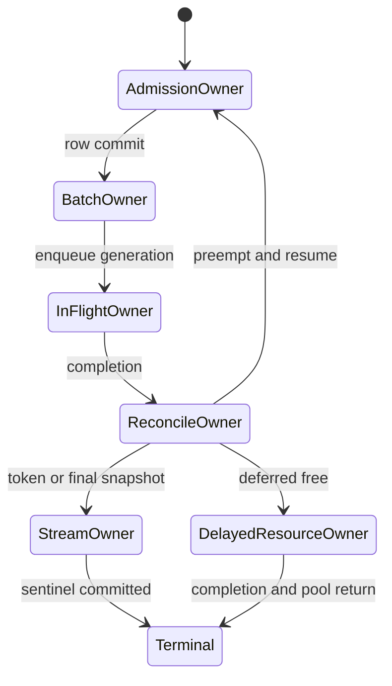

# 28장. 상태 이름보다 먼저 보아야 할 것: 요청·배치·KV·스트림의 네 수명

운영자가 보는 로그에는 요청 R이 `RUNNING`이라고 찍혀 있다. 그런데 다음 GPU 실행 batch에는 R이 없다. 잠시 뒤 preemption 경고가 나오고 KV 블록 사용량은 감소한다. 그 뒤 이미 취소한 R의 token 조각 하나가 output queue에 도착한다. “running 요청이 실행되지 않았고, 끝난 요청이 답했다”는 모순처럼 보인다. 하지만 request의 논리 상태, 이번 runner batch의 membership, KV 소유권, output stream의 개방 여부를 하나의 상태로 간주했기 때문에 생긴 착시다.

이 장에서는 요청 R 하나를 끝까지 따라간다. R은 처음 admission에 실패해 기다린다. 자원을 얻어 실행되지만 다른 요청 때문에 preempt된다. KV를 반납하고 waiting으로 돌아간 뒤 resume한다. 한 갈래에서는 stop token으로 자연 종료한다. 다른 갈래에서는 client disconnect로 abort된다. 마지막에는 preemption 또는 abort 전에 제출된 GPU step의 늦은 output이 돌아온다. 각 사건에서 어느 list·queue·map이 바뀌고, 어떤 predicate가 전이를 허용하며, 어떤 순서로 resource를 free해야 하는지 고정 소스 함수로 확인한다.

vLLM 기준은 커밋 `6e448d0ea9bf3d88d898b65449ca6dc2aec170ac`, SGLang 기준은 `71de97b264b04dcd514cf904003028aefe9775c8`, llama.cpp 기준은 `bb4caa7540188872173c44d161602d9271386413`이다. Transformers는 서버 scheduler가 아니라 generation 호출 안의 sequence 종료 mask와 streamer 수명을 비교하는 경계로만 사용한다.

## 28.1 사건 0: R이 도착했지만 아직 실행 요청은 아니다

### 28.1.1 admission 실패는 finish가 아니다

R의 prompt와 sampling parameter가 검증되어 engine request가 만들어졌다고 하자. vLLM scheduler는 request를 `requests` map에 넣고 waiting queue에 enqueue한다. 이 순간 R의 논리 상태는 waiting이지만 KV block을 반드시 소유하는 것은 아니다. runner가 실행할 이번 batch에도 아직 없다. API 쪽 output collector는 R의 stream을 열고 결과를 기다릴 수 있다. 네 축은 이미 서로 다른 값을 가진다.

이 구분은 “waiting request가 100개이니 KV가 100개 request 분량 필요하다”는 계산을 막는다. waiting 중 prefix cache lookup이나 remote KV transfer처럼 일부 자원과 연결될 수는 있지만, status 이름만으로 물리 block 소유를 추론하지 않는다. 실제 block table과 connector 상태를 확인한다. vLLM의 새 요청 등록과 queue mutation은 [`Scheduler.add_request()` 주변](https://github.com/vllm-project/vllm/blob/6e448d0ea9bf3d88d898b65449ca6dc2aec170ac/vllm/v1/core/sched/scheduler.py#L2207-L2235)에 고정되어 있다.

admission이 실패했다는 말도 두 뜻을 가른다. 유효하지 않은 요청이라 영구 거절된 것과, 이번 scheduling iteration의 token·KV·running request 제약 때문에 아직 선택되지 않은 것은 다르다. 후자는 waiting queue의 소유권을 유지하며 다음 iteration에서 재평가된다. output stream도 닫지 않는다. 전이 predicate가 false였다고 finished status를 기록하거나 collector를 종료하면 재시도할 요청이 사라진다.

### 28.1.2 네 축의 첫 snapshot

R을 조사할 때 단일 `state=WAITING` 대신 다음 snapshot을 남긴다.

| 축 | admission 직후 R | 근거 객체 |
|---|---|---|
| 논리 request | waiting | `Request.status`와 `requests[request_id]` |
| scheduler 소유 | waiting queue member | queue의 membership |
| runner 실행 | 이번 scheduled request 집합에 없음 | `SchedulerOutput` |
| KV 자원 | 미할당 또는 별도 transfer 대기 | KV manager block table·connector |
| output 통로 | collector/queue가 열림 | engine output `RequestState` |

표의 목적은 상태 이름을 외우게 하는 것이 아니다. 같은 request id에 대해 서로 다른 owner가 어떤 사실을 말하는지 보여 주는 것이다. 메트릭 수집 시각도 함께 기록한다. scheduler snapshot과 runner snapshot이 다른 iteration에서 왔다면 정상적인 queue 이동도 불변식 위반처럼 보일 수 있다.

### 28.1.3 같은 R에 generation이 네 개 필요한 이유

`request_id=R` 하나만 로그에 남기면 재시도와 resume, 과거 GPU 결과를 구분할 수 없다. 여기서는 네 번호를 따로 둔다. `request_generation`은 외부 요청의 한 실행 시도를, `batch_generation`은 scheduler output이 runner에 제출된 한 step을, `kv_generation`은 block table이 특정 owner에게 할당된 한 수명을, `stream_generation`은 client에게 결과를 공개할 수 있는 한 output session을 뜻한다. 이름은 구현에 맞게 달라져도 네 질문은 사라지지 않는다.

R이 처음 들어왔을 때 request generation은 7이고 stream generation도 7이라고 하자. 아직 runner batch에 들어가지 않았으므로 batch generation은 없다. KV도 할당되지 않았다. step 40에서 admission되면 batch generation 40과 KV generation 12를 얻는다. step 41 직전에 preempt되면 request generation 7은 유지되지만 KV generation 12의 소유는 끝난다. resume한 step 46에서는 batch generation 46과 KV generation 19를 새로 얻는다. 이때 step 40의 output이 늦게 도착해도 `request_id=R`만 비교하면 현재 요청처럼 보인다. `(R, request_gen=7, batch_gen=40, kv_gen=12)`를 현재 `(R, 7, 46, 19)`와 비교해야 과거 결과임을 알 수 있다.

Stream generation은 또 다른 축이다. client disconnect 뒤 같은 논리 요청을 gateway가 재시도하면 새 stream generation이 열린다. 과거 stream에 token을 쓸 권한은 종료됐지만 scheduler cleanup이 진행 중일 수 있다. 반대로 scheduler request가 finished map에서 사라졌어도 final snapshot이 output processor에 전달되어 stream이 아직 닫히지 않았을 수 있다. “request가 없다”와 “client가 마지막 결과를 받았다”를 같은 commit으로 취급하면 마지막 token 유실이나 닫힌 socket에 대한 늦은 write가 생긴다.

Commit도 축마다 다르다. Request commit은 유효성 검증 뒤 현재 owner container가 하나로 정해지는 순간이다. Batch commit은 row와 모든 row-indexed metadata가 함께 runner 입력에 고정되는 순간이다. KV commit은 block id와 generation이 owner table에 들어가고 이전 writer의 완료 조건이 충족된 순간이다. Stream commit은 token이나 terminal snapshot이 한 stream에 단 한 번 공개되는 순간이다. 앞 commit이 뒤 commit을 자동 보장하지 않는다.

Rollback은 commit의 역순 삭제가 아니다. Batch 생성이 실패했다면 아직 runner에 제출되지 않은 row metadata만 되돌리고 request는 waiting owner에게 돌려준다. 이미 kernel이 enqueue됐다면 batch generation은 되돌릴 수 없다. 결과를 reconcile할 때까지 in-flight로 남겨야 한다. KV를 pool에 반환할 때도 논리 table 제거와 과거 writer 완료 사이에 fence가 필요하다. Stream에 이미 공개한 token은 rollback할 수 없으므로 재시도 정책이 중복 공개를 막아야 한다.

이 모델의 반증 fixture는 일부러 id를 재사용한다. step 40 제출 뒤 R을 preempt하고, block 31을 generation 13으로 S에 재할당한 다음 step 40 결과를 늦게 전달한다. 올바른 구현은 R의 늦은 결과가 S의 KV counter나 R의 resume counter를 바꾸지 못하게 한다. 이어 client stream을 닫고 같은 외부 id로 새 attempt를 연다. 과거 terminal event가 새 stream을 닫으면 stream generation fence가 없다는 뜻이다. 이 두 경쟁을 통과해야 `request_id` 중심 로그를 generation 원장으로 교체한 효과가 있다.

## 28.2 사건 1: waiting에서 running으로 옮겨지는 순간

### 28.2.1 status 대입보다 queue mutation이 먼저 보인다

vLLM scheduler는 running request들을 먼저 검토한 뒤 waiting 후보를 살핀다. 선택된 R은 waiting queue에서 제거되고 `running` list에 append되며 status가 `RUNNING`으로 바뀐다. KV manager가 필요한 block을 제공하고 이번 step의 scheduled token 수가 output에 기록되어야 runner가 R을 계산한다. “status가 running으로 바뀜”은 이 묶음의 한 조각일 뿐이다. [waiting admission과 running append](https://github.com/vllm-project/vllm/blob/6e448d0ea9bf3d88d898b65449ca6dc2aec170ac/vllm/v1/core/sched/scheduler.py#L683-L1075)를 함께 읽어야 한다.

중간 실패에는 rollback이 필요하다. block을 할당했지만 multimodal encoder budget이나 structured output 준비가 충족되지 않아 R을 실행시키지 못한다면, waiting ownership과 할당 자원을 일관되게 되돌려야 한다. queue에서 뺀 뒤 예외가 나서 어느 queue에도 넣지 않으면 고아 request가 된다. running에 append했지만 scheduler output에 빠지면 논리 running과 runner membership이 어긋난다.

### 28.2.2 running은 매 iteration 실행된다는 뜻이 아니다

vLLM 코드에는 `len(running)`보다 이번 step에 실제 scheduled된 request 수가 작을 수 있다는 assertion 설명이 있다. running list는 scheduler가 활성 집합으로 관리하는 수명이고, token budget이나 asynchronous scheduling 때문에 이번 runner batch membership은 그 부분집합일 수 있다. “running인데 GPU batch에 없음”은 단독으로 결함이 아니다.

결함 여부는 전진 계약으로 판정한다. R이 여러 iteration 동안 scheduled token 0이고 기다림 원인이 해소되지 않으며 fairness 정책상 계속 선택되어야 한다면 starvation을 의심한다. 한 iteration 빠졌다가 다음에 전진하면 정상적인 active-set scheduling일 수 있다. 27장에서 계산한 budget 공식은 반복하지 않고, 여기서는 그 결과가 어느 membership mutation으로 표현되는지만 본다.

### 28.2.3 admission을 작은 transaction으로 읽는다

이 구간을 디버깅하기 가장 좋은 방법은 `RUNNING` 대입을 출발점으로 삼는 것이 아니라 admission을 다섯 단계의 작은 transaction으로 다시 쓰는 것이다. 첫째, waiting owner가 후보 R을 선택한다. 둘째, prefix와 이미 계산한 token 수를 확정한다. 셋째, 부족한 KV block과 부수 자원의 예약을 시도한다. 넷째, R을 다음 runner 입력으로 직렬화할 수 있는 상태로 만든다. 다섯째, waiting에서 빼고 active container와 scheduler output에 넣는다. 구현은 성능을 위해 이 순서를 겹치거나 임시 객체에 담을 수 있지만, 성공 뒤에는 다섯 효과가 모두 보이고 실패 뒤에는 임시 효과가 모두 사라져야 한다.

여기서 transaction이라는 표현은 데이터베이스처럼 lock과 WAL을 쓴다는 뜻이 아니다. 관찰 가능한 commit 조건과 rollback 의무가 있다는 뜻이다. prefix lookup이 block 두 개를 가리켰지만 새 token을 위한 block을 얻지 못했다면 R은 이번 step에 commit되지 않는다. prefix block의 reference가 cache 정책상 잠시 유지될 수는 있어도 누가 그 reference를 소유하는지 명시되어야 한다. `scheduled_new_reqs`에 반쯤 만들어진 entry가 남거나 `running` 길이만 늘면 다음 iteration은 실제보다 적은 여유를 계산한다.

대표 요청 R에 sequence 번호를 붙여 보자. step 40에서 waiting 후보로 뽑혔고 prefix 96 token이 맞았다. step 40의 남은 budget은 16 token이지만 KV manager는 새 block을 확보하지 못했다. 정상 rollback에서는 `scheduled_tokens[R]`가 생성되지 않고 runner row도 없다. R은 waiting의 원래 순서를 유지하거나 정책이 정한 위치로 돌아간다. prefix reference가 임시였다면 해제된다. output stream은 계속 열린다. 반대로 status만 `WAITING`으로 되돌리고 `running` append를 취소하지 않았다면 논리 status와 container membership의 첫 divergence가 step 40에서 생긴다. 사용자가 timeout을 보는 step 900은 원인이 아니다.

admission 실패 직후 GPU utilization이 낮다는 이유로 runner 문제를 먼저 의심하는 것도 흔한 오진이다. runner는 받은 row가 없으니 올바르게 놀고 있을 수 있다. 이때 필요한 관측은 kernel launch 수보다 `candidate_selected`, `kv_reservation`, `scheduled_tokens`, `runner_row_count`의 동일 step 상관관계다. candidate는 증가하는데 reservation이 계속 실패하면 KV 또는 admission 제약이다. scheduler output에는 R이 있는데 runner row가 없다면 serialization이나 input preparation 경계다. runner row와 launch는 있는데 token이 전진하지 않으면 그때 model runner와 output reconciliation로 내려간다.

SGLang에서는 같은 질문을 Python 객체 하나로 끝낼 수 없다. `Req`가 waiting owner에게서 나와 `ScheduleBatch`에 들어갈 때 request pool index, cache location, sequence length, sampling 정보가 같은 row 의미를 공유해야 한다. 한 배열의 첫 차원이 batch 크기와 같다는 사실만으로 충분하지 않다. R이 두 번째 row라면 모든 row-indexed tensor에서 두 번째가 R이어야 한다. filter나 merge 뒤 이 permutation이 하나라도 다르면 실행은 성공하지만 다른 요청의 temperature, position 또는 cache slot을 쓰는 조용한 오염이 된다.

이 문제를 잡기 위한 강한 불변식은 `row → request id → request pool index → block table generation`의 대응이다. production hot path에서 긴 문자열을 매번 기록할 필요는 없다. debug build나 표본 step에서 짧은 request hash와 generation을 row metadata로 함께 남기면 된다. 결과 token이 도착했을 때 같은 tuple을 대조하면 “status는 정상인데 답이 이상하다”를 sampler 문제가 아니라 row permutation 문제로 빠르게 좁힐 수 있다.

llama.cpp의 slot admission도 같은 사고법을 적용하되 상태 이름을 억지로 맞추지 않는다. queue task가 slot에 결합되고 prompt processing을 시작하기 전에는 slot 선택, task 이동, sampler와 prompt buffer 초기화, response route 연결이 성공해야 한다. slot이 task id를 가졌지만 response queue가 그 id를 기다리지 않으면 결과가 고아가 된다. 반대로 response reader가 기다리는데 task가 deferred queue와 slot 양쪽에 있으면 두 번 실행될 수 있다. vLLM의 waiting/running list와 자료구조는 다르지만 commit 뒤 유일 owner가 하나여야 한다는 조건은 같다.

Transformers 단독 `generate()`에는 서버 admission queue가 없다. 호출 stack이 곧 논리 owner이고 input batch가 runner membership이다. 그러므로 서버에서 관측한 admission rollback 용어를 그대로 붙이면 안 된다. 다만 Transformers를 감싼 서버가 request를 batch tensor에 합치는 순간에는 자체 transaction이 생긴다. tokenizer 결과를 batch row에 넣고 streamer route를 등록했지만 호출 cancellation table에 등록하지 못했다면 disconnect가 generation loop까지 닿지 않는다. 라이브러리가 제공하지 않는 수명을 wrapper가 어디에 만들었는지 먼저 찾는다.

admission의 완료 조건은 “함수가 예외 없이 반환했다”보다 강하다. 다음 scheduler iteration이 R을 정확히 한 owner에서 발견하고, runner가 R을 정확히 한 row로 해석하며, R이 아직 실행되지 않았다면 모든 예약이 회수 가능해야 한다. 이 세 문장을 로그와 자료구조 snapshot으로 증명하지 못하면 status enum이 맞아도 admission은 검증되지 않은 것이다.

rollback을 시험할 때는 무작정 OOM을 만드는 대신 각 commit 경계의 실패를 정적으로 추적한다. prefix lookup 뒤 allocation 실패, allocation 뒤 batch serialization 실패, serialization 뒤 queue mutation 예외를 가정하고 각 지역 변수가 어느 cleanup 분기로 흘러가는지 소스에서 표시한다. 성공 경로에서 만들어진 owner마다 실패 경로에 대응 release 또는 handback이 있어야 한다. 대응이 없으면 실제 실행 전에도 누수 후보를 찾을 수 있다. 반대로 broad exception handler가 모든 자원을 free한다면 이미 commit된 공유 prefix reference까지 회수하지 않는지 살핀다. rollback은 많이 지우는 일이 아니라 이 transaction이 새로 얻은 효과만 정확히 되돌리는 일이다.

Batch generation을 별도로 두면 이 불변식을 race로 시험할 수 있다. Generation 52에 R/S/T가 row 0/1/2로 commit된 뒤 S의 abort가 도착했다고 하자. 아직 enqueue 전이면 모든 row-indexed 배열을 R/T로 함께 압축하고 새 generation을 만든다. 이미 enqueue됐다면 generation 52의 row map은 바꾸지 않는다. S 결과만 discard 대상으로 표시한다. 그 사이 U가 S의 scheduler slot을 얻어도 52번 row 1의 결과를 U에게 주면 안 된다. `current running list`로 과거 output을 해석하는 구현은 이 fixture에서 곧바로 드러난다.

llama.cpp의 slot도 같은 함정을 다른 모양으로 만든다. Slot 3이 task 90을 batch에 넣은 직후 cancel되고 task 91에 재사용될 수 있다. Batch completion을 slot 번호만으로 전달하면 90의 결과가 91의 sampler와 response buffer를 움직인다. Task id와 slot generation을 제출 당시 batch element에 고정해야 한다. Slot state가 idle로 바뀌었다는 사실은 이미 enqueue된 element의 수명을 취소하지 않는다.

Transformers의 `unfinished_sequences`는 서버 queue generation은 아니지만 row lifetime 비교점이다. EOS가 난 row도 tensor와 cache의 batch 차원에는 남아 있을 수 있다. Mask가 0인 row의 token을 padding으로 대체하는 것과 cache row를 해제하는 것은 별 사건이다. Streamer가 batch token을 받을 때 row 의미를 보존하지 않으면 끝난 sequence의 placeholder가 사용자 출력으로 보일 수 있다. 이를 vLLM preemption이라고 부르지 않되 논리 종료와 row 존속을 분리해 관찰한다.

Admission transaction의 종료 조건은 네 가지다. 실패한 generation이 runner에 제출되지 않았고, 임시 KV·prefix·adapter reference가 명시된 owner에게 돌아갔으며, R은 정확히 한 scheduler container에 있고, output stream은 열린 채 다음 시도를 기다린다. 이미 enqueue된 generation은 rollback 대상이 아니라 terminal reconciliation 대상이다. 이 한 줄이 예외 처리 코드가 GPU 작업을 없는 일처럼 취급하는 것을 막는다.

## 28.3 사건 2: R이 preempt되고 KV를 돌려준다

### 28.3.1 vLLM의 free→reset→prepend 순서

R이 `RUNNING`일 때 자원 압력으로 victim이 되었다. vLLM `_preempt_request()`는 진입 시 status가 `RUNNING`인지 assert한다. 함수 호출자는 R을 running list에서 제거할 책임이 있다. 함수는 request KV block과 encoder cache를 free하고 in-flight prefill set에서 제거한다. 그 뒤 status를 `PREEMPTED`로 바꾸고 `num_computed_tokens`를 0으로 되돌리며 speculative token을 지운다. 마지막에 preemption 횟수와 event를 기록하고 waiting queue 앞에 prepend한다.

실제 순서는 [`_preempt_request()`](https://github.com/vllm-project/vllm/blob/6e448d0ea9bf3d88d898b65449ca6dc2aec170ac/vllm/v1/core/sched/scheduler.py#L1274-L1315)에 있다.

왜 KV free가 중요할까. preemption의 목적은 단순 우선순위 표식이 아니라 자원 회수다. status만 PREEMPTED로 바꾸고 block table을 남기면 새 요청 admission은 계속 실패한다. 반대로 block을 free한 뒤 R을 running batch에 남기면 runner가 반환된 block id에 쓰거나 읽을 수 있다. SGLang의 priority preemption 코드에도 “KV는 이미 free됐지만 running batch에는 filter 전 request가 남을 수 있다”는 경고가 있다. 그래서 free와 batch filter 사이의 짧은 과도 상태를 알고 그 사이에 batch를 실행하지 않아야 한다.

### 28.3.2 늦은 output은 상태 역행이 아니다

preemption 직전에 R이 포함된 GPU step이 이미 제출되었다면 결과는 나중에 돌아온다. R은 지금 PREEMPTED이고 KV도 반납했지만 output은 과거 iteration의 계산 결과다. vLLM은 `num_in_flight_tokens`, `num_stale_output_tokens`, `drop_stale_output`을 이용해 이 사실을 표현한다. prefix cache reset처럼 같은 step resume가 token 순서를 어지럽히는 경우에는 stale output을 drop한다. 다른 async 경로에서는 결과를 전달하더라도 reset된 counter를 다시 오염시키지 않도록 stale share를 구분한다.

output handler가 현재 status만 보고 “PREEMPTED인데 결과가 왔으니 불가능”이라고 crash하면 안 된다. 결과에는 어느 scheduler step에서 제출되었는지 식별할 세대 정보가 필요하다. stale 결과를 받아 protocol stream에 전달할지, 내부 counter 갱신에서 제외할지, 완전히 버릴지는 preemption 이유와 speculative decode 계약에 따라 달라진다.

### 28.3.3 논리 free와 allocator 반환 사이에 fence가 있다

KV 소유권을 설명할 때 `free`를 한 순간으로 그리면 중요한 경쟁이 사라진다. 최소한 세 사건을 구별해야 한다. scheduler가 R이 앞으로 그 block을 사용하지 않는다고 결정하는 논리 release, block table에서 R의 reference를 제거하는 metadata mutation, allocator가 block id를 다른 요청에 줄 수 있게 만드는 물리 반환이다. GPU work가 완전히 끝났다면 세 사건이 가까이 붙는다. 비동기 실행이나 connector가 끼면 서로 다른 step에 일어난다.

R이 step 70에 block 31을 사용해 decode를 제출했다고 하자. CPU는 다음 iteration에서 자원 부족을 발견해 R을 preempt한다. 논리 release 시각은 step 71의 scheduling 중이다. 그러나 step 70 kernel이 아직 block 31에 KV 또는 output metadata를 쓸 수 있다면 allocator 반환은 completion 관측 뒤여야 한다. block table에서 R을 제거한 사실만 보고 block 31을 S에게 주면 과거 R kernel이 S의 새 cache를 덮는다. 이 장애는 R보다 S의 품질 저하로 나타나 원인 request를 놓치기 쉽다.

반대로 안전을 이유로 모든 block을 오래 붙잡아 두면 correctness는 지킬 수 있어도 allocator starvation이 생긴다. delayed-free owner는 “아무도 소유하지 않음”이 아니라 명시적인 중간 owner다. 그 owner는 어떤 scheduler step 또는 GPU completion이 오면 반환 가능한지 알고 있어야 한다. request map에서 R을 지웠더라도 delayed list에는 `(block generation, wait condition)`이 남는다. 이 목록 없이 단순히 free block gauge만 보면 누수와 정상 지연을 구별할 수 없다.

generation은 block id의 재사용을 구분한다. block 31이 R에게 배정된 세대와 나중에 S에게 배정된 세대가 다르면 늦은 completion이나 output이 숫자 31만 보고 현재 owner를 건드리지 않게 할 수 있다. request generation도 마찬가지다. client가 같은 외부 식별자를 재사용하거나 scheduler가 R 객체를 resume해도 제출 세대가 다르면 과거 output을 새 counter에 합치지 않는다. 정확한 구현 필드 이름은 엔진마다 다르지만 진단 기록에는 이 논리 세대를 만들어 두어야 한다.

fence라는 말도 CUDA 동기화 호출 하나와 동일시하면 안 된다. 어떤 구현은 scheduler가 처리 완료한 step sequence로 안전성을 증명하고, 어떤 구현은 event나 result queue의 완료로 증명하며, remote KV connector는 전송 완료 callback을 요구할 수 있다. 중요한 것은 block 재사용 전에 “그 block을 참조하는 더 이른 writer가 없다”는 happens-before 관계가 서는가다. 전체 device synchronize로 이를 만들 수는 있지만 concurrency를 크게 희생한다. 그래서 서빙 엔진은 더 좁은 완료 증거를 추적한다.

관측 순서는 이렇게 읽는다. 먼저 R의 마지막 제출 step과 block generation을 찾는다. 다음으로 preemption이 논리 owner를 제거한 step을 찾는다. 이어 delayed-free entry가 만들어졌는지, 어떤 completion이 entry를 해제했는지 확인한다. 마지막으로 allocator가 같은 block id를 새 owner에게 준 시각을 본다. 새 할당이 completion보다 앞서면 first divergence다. completion은 앞섰지만 delayed entry가 계속 남으면 누수다. allocator 반환은 한 번인데 cleanup 함수가 두 번 호출됐다는 로그만 있으면 idempotence 여부를 더 확인해야 한다.

SGLang의 `release_req()`와 `filter_batch()` 사이 역시 짧지만 의미가 크다. 자원 release 뒤 victim row가 아직 batch 배열에 남아 있다면 그 배열을 실행해서는 안 된다. filter가 runner membership을 제거해 이 금지 구간을 닫는다. release와 filter 사이 예외를 복구하면서 이미 반환한 KV를 victim이 계속 소유한다고 표시하면 double ownership이 된다. 안전한 실패 처리는 그 batch의 실행을 중지하고 남은 metadata를 단일 owner 상태로 수렴시키는 것이다.

preemption 횟수만 보고 성능을 판단하지 않는 이유도 여기에 있다. preemption 한 번이 즉시 반환되어 다른 요청을 살리는 경우와, 많은 in-flight write 때문에 block이 오래 delayed owner에 머무는 경우는 같은 count라도 효과가 다르다. 운영자는 preemption rate와 함께 logical-release→allocator-return 지연, delayed block 수, resume 재계산 token 수를 본다. 그래야 정책이 실제 메모리 압력을 풀었는지 알 수 있다.

### 28.3.4 KV rollback은 block table 삭제로 끝나지 않는다

KV generation의 commit point는 block id가 table에 보인다는 사실보다 강하다. 새 owner가 그 block을 읽고 쓸 수 있으려면 이전 generation의 writer가 더는 접근하지 않는다는 happens-before가 필요하다. Scheduler가 R을 preempt해 table을 비운 시각과 stream 7에서 제출된 kernel이 끝난 시각은 다를 수 있다. 논리 table을 먼저 제거하더라도 allocator pool 반환은 completion evidence까지 늦춰야 한다.

수치 fixture에서 R은 step 80, batch generation 80, KV generation 4로 block `[31, 32]`를 사용한다. CPU는 t=12.000ms에 preemption을 결정하고 table을 비운다. Kernel completion event는 t=12.230ms에 관측된다. Pool이 12.010ms에 block 31을 S의 KV generation 5에 주면 220µs 동안 두 writer가 같은 주소를 소유한다. 과거 kernel이 실제로 write하지 않았다는 우연은 계약을 고치지 않는다. Event 이전 재할당을 금지하거나 old generation write를 하드웨어·프로토콜 수준에서 fence해야 한다.

반대편 오류도 있다. Completion은 끝났는데 delayed-free ledger에서 R을 제거하지 않으면 block은 영원히 회수되지 않는다. 이 경우 status, request map과 runner batch는 정상인데 usable KV가 request 취소 횟수에 비례해 감소한다. Leak 여부는 `table_removed`, `last_writer_complete`, `pool_returned` 세 시각과 owner를 비교해 판정한다. `free()` 호출 로그 하나로는 어느 사건이 완료됐는지 알 수 없다.

vLLM의 free 경계는 scheduler가 알고 있는 마지막 scheduled sequence와 processed sequence를 연결해 읽어야 한다. Finished status를 보았다고 즉시 block 반환을 추론하지 않는다. Connector가 완료 후 처리를 요구하면 request cleanup과 pool return 사이의 owner가 connector 또는 delayed-free 구조로 넘어간다. 이 owner handoff가 없으면 즉시 free와 지연 free가 같은 block을 각각 반환하는 double free가 된다.

SGLang priority preemption에서 `release_req()`와 `filter_batch()`의 간격은 또 다른 rollback 경계다. Resource는 풀렸지만 victim row가 running batch에 잠깐 남는다면 그 batch를 실행해서는 안 된다. 예외가 이 사이에 발생했을 때 자원을 원상 복원했다고 가정하지 말고 runner 제출을 막고 row를 제거한 뒤 waiting owner에게 한 번만 넘긴다. `preempt_list`와 waiting queue 양쪽에 같은 `Req`가 들어가면 resume가 두 번 commit될 수 있다.

Race 검증은 pool count만 보지 않는다. 매 allocation에서 `(physical block, kv_generation, owner_request)`의 유일성을 표본 검사한다. Preemption, abort와 completion 순서를 매 실행마다 바꾸고, 새 generation이 old completion 전에 시작되지 않는지 본다. 마지막에는 모든 request가 terminal인 상태에서 delayed owner가 0이고 pool의 유일 block 수가 초기값과 같아야 한다. 이 조건을 통과해야 rollback이 correctness와 capacity를 함께 복구했다고 말할 수 있다.

## 28.4 사건 3: resume는 새 요청 생성이 아니다

preempt된 R은 waiting queue 앞에서 다시 admission을 시도한다. status가 PREEMPTED라는 사실은 최초 waiting과 구분되어 scheduler가 resumed request로 기록하게 한다. 하지만 이전 KV를 free하고 `num_computed_tokens=0`으로 reset했다면 prompt 계산을 다시 수행하거나 prefix cache에서 다시 찾아야 한다. resume를 “정지한 kernel의 program counter에서 계속”으로 설명하면 틀린다.

output collector는 같은 request id와 열린 stream을 유지한다. 사용자는 preemption을 별도 응답으로 보지 않을 수 있다. scheduler 내부에서는 preemption count와 event가 증가하고 latency가 늘어난다. request 객체는 유지되지만 runner batch membership과 KV ownership은 새로 구성된다. 이 차이가 resume의 핵심이다.

SGLang에서는 `retract_decode()`가 희생 요청의 자원을 `release_req()`로 해제한다. 이어 `filter_batch()`로 배치를 걸러 낸 뒤, 철회된 요청을 대기 경로로 돌린다.

요청의 출력 ID와 접두부 관련 상태를 어디까지 보존하는지는 기수 트리 캐시와 재계산 정책에 연결된다. [decode retraction](https://github.com/sgl-project/sglang/blob/71de97b264b04dcd514cf904003028aefe9775c8/python/sglang/srt/managers/schedule_batch.py#L2816-L2918)과 [batch filtering](https://github.com/sgl-project/sglang/blob/71de97b264b04dcd514cf904003028aefe9775c8/python/sglang/srt/managers/schedule_batch.py#L3125-L3206)을 한 쌍으로 읽는다.

### 28.4.1 보존하는 진행과 다시 만드는 실행 상태를 가른다

resume를 정확히 설명하려면 “진행”도 세 층으로 나눈다. 사용자가 이미 받은 output token은 외부 계약상 확정된 진행이다. request 객체가 보존한 prompt와 output token 목록은 의미 상태다. KV block, runner row, CUDA graph input 주소, `num_computed_tokens`는 그 의미를 빠르게 이어 계산하기 위한 실행 상태다. preemption은 보통 앞의 두 층을 보존하고 마지막 층의 일부 또는 전부를 버린다. 그래서 같은 request를 이어가면서도 forward 계산은 앞부분부터 다시 할 수 있다.

R이 prompt 100 token 뒤 output 5 token을 이미 client에 보냈다고 하자. preemption 직전 내부에는 106번째 token 후보를 만드는 step이 in flight다. KV를 모두 놓고 computed count를 0으로 reset했다면 resume admission은 prompt와 확정 output 5개를 context로 재구성해야 한다. 그 뒤 다음 token을 다시 계산한다. 과거 in-flight 후보를 그대로 외부 확정 token 6으로 받아들일지는 stale-output 정책에 달려 있다. 무엇을 택하든 동일 위치를 과거 결과와 새 결과가 둘 다 전진시키면 안 된다.

이때 “request id가 같으니 모든 state를 재사용한다”는 규칙은 위험하다. sampler는 RNG state, repetition penalty history, grammar automaton state를 가질 수 있다. 확정 output을 기준으로 이 상태가 어디까지 전진했는지 알아야 한다. 과거 speculative 후보까지 sampler history에 반영했다가 후보를 drop하고도 되돌리지 않으면 resume 뒤 확률 분포가 달라진다. 반대로 client에 이미 보낸 token을 history에서 빼면 반복 억제와 grammar 위치가 뒤로 간다. KV만이 아니라 sampler state에도 commit 경계가 있다.

runner row는 더 짧은 수명이다. step 70의 R이 row 3이었다고 resume batch에서도 row 3일 이유가 없다. 그 사이 다른 request가 끝나고 batch가 compact되거나 새 요청이 합쳐진다. output reconciliation가 request id 대신 과거 row index를 신뢰하면 S의 결과를 R에 붙인다. row index는 한 batch의 지역 주소이고 request id와 submission generation이 장기 identity다. CUDA graph가 고정 크기 buffer를 재사용하더라도 유효 row와 owner mapping은 매 replay에 새로 해석해야 한다.

KV prefix를 cache에서 다시 찾은 경우도 “옛 KV를 되찾았다”와 다르다. cache entry가 같은 token prefix를 나타내더라도 request-private tail과 reference ownership은 새로 구성된다. 공유 prefix block은 여러 request가 참조할 수 있으므로 resume cleanup이 그 block을 allocator에 직접 반환해서는 안 된다. reference decrement와 실제 eviction 가능 상태를 구분한다. private tail은 다른 owner가 없어 곧바로 반환할 수 있지만 in-flight writer가 있으면 앞 절의 fence를 기다린다.

resume 성공의 관측 증거는 PREEMPTED→RUNNING 로그 한 줄이 아니다. waiting에서 R이 정확히 한 번 제거되고, 새 block table generation이 생기며, 현재 context와 맞는 computed count가 설정되고, 새로운 scheduler output에 R의 token 수가 들어가며, runner가 그 generation의 row를 실행해야 한다. 외부 stream은 같은 요청의 다음 확정 token을 중복 없이 이어 받아야 한다. 이 사슬 중 가장 먼저 끊긴 곳이 first divergence다.

실패 양상도 층별로 다르다. waiting에서 빠지지 못하면 resume starvation이다. block은 얻었지만 computed count가 오래된 값이면 position 또는 KV read가 잘못된다. runner row는 맞지만 sampler commit 위치가 어긋나면 구조적으로 유효하나 다른 token이 나온다. output은 맞지만 collector가 preemption을 finish로 오해해 닫혔다면 client는 중간에서 끊긴다. “resume 실패”라는 하나의 counter로는 이 네 원인을 나누지 못한다.

운영자가 할 수 있는 반증은 결정론을 과장하지 않는 것이다. 같은 prompt를 preempt 없이 다시 실행한 결과와 token이 다르다고 곧바로 state corruption이라고 결론 내리면 안 된다. temperature가 0보다 크거나 비결정적 kernel, speculative acceptance 차이가 있으면 정상적으로 달라질 수 있다. 대신 확정 token count의 단조성, position과 context 길이, grammar state, block generation, 중복 전달 여부처럼 구현 계약을 검사한다. correctness는 항상 동일 문자열이라는 뜻보다 각 전이가 자기 계약을 지켰다는 뜻이다.

### 28.4.2 R의 resume timeline을 숫자로 맞춘다

R의 타임라인을 작은 장부로 적으면 네 수명이 한눈에 갈라진다. `t0`에는 request map과 waiting queue에만 R이 있고 stream은 open이다. `t1`에는 block generation 7을 얻어 running owner가 되고 scheduler output generation 12에 들어간다. `t2`에는 runner generation 12가 row 4를 제출한다. `t3`에는 CPU가 R을 preempt해 running에서 제거하고 generation 7의 논리 ownership을 끝낸다. `t4`에는 R이 waiting 앞에 있고 computed count는 reset됐지만 generation 12 output은 아직 올 수 있다.

`t5`에 과거 output이 도착한다. 이 output이 확정 가능한지 판정한 뒤 stale count에 포함하거나 drop한다. 어느 쪽이든 generation 7 block을 새 writer로 부활시키지는 않는다. `t6`에는 generation 12 completion이 관측되어 delayed block 반환이 가능해진다. `t7`에 R은 prefix cache와 새 private block generation 11을 얻고 scheduler output generation 15에 포함된다. `t8`에는 새로운 row 1로 실행된다. request identity는 계속 R이지만 block generation, batch generation, row가 모두 달라졌다.

이 장부에서 논리 status만 뽑으면 WAITING→RUNNING→PREEMPTED→RUNNING이다. 너무 많은 정보가 사라진다. stream은 전 구간 open일 수 있고, runner membership은 generation 12와 15에서만 참이며, KV는 generation 7과 11 사이에 공백이 있다. 늦은 output은 PREEMPTED 구간에 도착한다. status enum으로는 모순이지만 다섯 축 장부로는 정상적으로 설명된다.

타임라인 검증에는 벽시계보다 단조 sequence가 낫다. scheduler와 worker의 clock이 어긋나거나 log flush가 지연되면 timestamp 순서가 실제 happens-before를 뒤집는다. scheduler output id, worker input id, completion id와 각 subsystem의 monotonic counter를 기록하고 메시지 전달 경계에서 연결한다. 벽시계는 지연을 계산하는 보조 수단으로 쓴다. “preempt 로그 뒤 output 로그”만으로 output이 preempt 뒤 제출됐다고 말할 수 없는 이유다.

### 28.4.3 resume commit은 무엇을 이어받고 무엇을 버리는가

Resume를 새 request로 만들면 이미 공개한 token, deadline, priority와 usage 의미가 끊긴다. 반대로 preemption 전 실행 상태를 전부 보존한다고 가정하면 반환한 KV와 과거 batch row를 현재 것으로 오인한다. 이어받는 것은 논리 request generation과 client-visible prefix다. 새로 만드는 것은 scheduler admission, batch generation, KV generation과 필요하다면 graph input content generation이다.

R이 prompt 256개와 output 12개를 client에 확정한 뒤 preempt됐다고 하자. 내부 computed token counter는 268이었지만 마지막 두 token의 batch가 아직 reconcile되지 않았다. Resume 기준점은 단순히 counter 268이 아니다. Client-visible commit이 266이고 KV generation 4가 반환됐다면, 새 generation 9는 안전하게 재구성할 수 있는 prefix 좌표에서 시작해야 한다. Prefix cache가 256까지만 보장한다면 256 이후를 재계산한다. 과거 batch 결과가 뒤늦게 와서 268로 counter를 올리게 두면 새 batch가 같은 위치를 다시 계산해 중복 token 또는 position drift를 만든다.

여기에는 세 commit index를 둔다. `computed_index`는 어떤 generation에서 계산을 시도했는지, `kv_committed_index`는 현재 소유한 KV가 어느 위치까지 유효한지, `stream_committed_index`는 client가 어느 token까지 보았는지다. 정상 steady state에서는 가까이 있지만 preemption·abort·비동기 output 사이에서는 달라진다. Resume start는 정책에 따라 이 값들을 사용하되, 반환한 KV generation의 computed index를 새 KV의 유효 prefix처럼 사용해서는 안 된다.

vLLM의 preemption reset과 output reconciliation은 이 차이를 확인하는 source walk다. Request의 computed token 수가 reset되는 지점, 새 scheduler output이 정하는 token 수, 과거 output을 적용하는 조건을 연결한다. Status가 다시 RUNNING이라는 사실은 old batch result를 current로 승격하지 않는다. Output에 submission step이나 generation이 직접 없다면 scheduler의 in-flight ordering과 processed step count가 사실상 generation fence 역할을 하는지 확인하고, 다중 in-flight가 허용될 때 모호성이 생기는 지점을 evidence gap으로 남긴다.

SGLang에서는 chunked prefill 또는 retraction 뒤 `Req`의 prefix·fill id와 request/token pool 소유가 어떤 좌표로 재구성되는지 본다. Radix cache reference를 다시 얻었다고 old request pool row가 복구되는 것은 아니다. `ScheduleBatch`에 들어가는 새 row의 request pool index와 output cache location이 같은 request generation을 가리켜야 한다. 과거 `running_batch` 결과가 filter 이후 새 row 순서에 적용되지 않도록 제출 batch의 row map을 유지해야 한다.

llama.cpp의 deferred task는 여기서 경계를 선명하게 해 준다. Slot을 아직 얻지 못해 deferred된 task는 KV를 회수당한 실행 request가 아니다. Admission retry와 preemption resume를 같은 상태로 번역하면 존재하지 않는 old batch와 KV generation을 상상하게 된다. 반대로 실행 slot이 cancel된 뒤 같은 prompt를 새 task로 넣는다면 이는 새 task/stream generation이며 이미 공개한 output과 sampler 상태를 자동 상속하지 않는다.

Transformers 단독 generation은 서버 preemption owner가 없다. 호출자가 cache object를 보존하고 generation loop를 다시 부르는 설계를 만들었다면 어느 position까지 cache가 유효하고 streamer가 어느 token까지 공개했는지를 호출자가 계약해야 한다. `past_key_values`가 존재한다는 사실만으로 재개 가능하지 않다. Attention mask, position, unfinished mask, logits processor state와 random generator state가 같은 generation을 구성한다. 이 중 하나를 새 호출 기본값으로 되돌리면 출력 의미가 달라질 수 있다.

Race fixture는 preemption 직전과 직후에 output completion을 번갈아 배치한다. Case A에서는 completion이 preemption commit 전에 도착해 current generation에 반영된다. Case B에서는 table 반환 뒤 도착해 stale로 격리된다. Case C에서는 stream에는 공개됐지만 KV commit에는 반영되지 않아 resume가 해당 token을 포함한 context를 재계산한다. 세 경우 모두 최종 token stream에 중복이 없고, 새 KV generation이 old block을 참조하지 않으며, usage가 공개 token과 계산 token을 혼동하지 않아야 한다.

Resume 종료 조건은 원래 latency를 회복했다는 것이 아니다. R의 logical owner가 하나이고, 새 batch row와 KV generation이 일치하며, old in-flight 결과가 terminal 또는 격리되고, stream commit index가 단조 증가해야 한다. 이 네 조건을 통과한 뒤에야 scheduler fairness와 성능을 평가한다.

## 28.5 사건 4A: stop token으로 자연 종료한다

R이 resume 후 token을 생성하다 stop token을 만난다. 자연 종료 predicate는 단순 EOS 하나가 아니다. stop token id, stop string, 최대 새 token, 모델별 종료 조건, grammar와 abort 표식이 finish reason을 정할 수 있다. SGLang `Req`는 `finished_reason`이 설정되었는지를 `finished()`로 노출하고, stop string의 실제 끝 위치를 `finished_len`으로 보존한다. 중간에 곧바로 finished reason을 설정하면 request가 filter되어 응답을 못 할 수 있어 `to_finish`로 지연하는 경로가 있다는 주석은 output과 batch 제거 순서가 계약임을 보여 준다.

근거는 [SGLang 종료 판정](https://github.com/sgl-project/sglang/blob/71de97b264b04dcd514cf904003028aefe9775c8/python/sglang/srt/managers/schedule_batch.py#L1500-L1666)에 있다.

자연 종료에서는 마지막 token의 output 반영, finish reason 생성, final output 전송, batch filtering, KV release, request map 제거가 모두 필요하다. 순서를 하나의 원자적 사건처럼 로그에 찍으면 double free와 누락을 찾기 어렵다. output에 필요한 token과 통계를 resource free 전에 snapshot하고, runner가 다시 참조하지 않게 membership을 제거하며, connector hook이 request state를 읽어야 한다면 그 전에 객체를 삭제하지 않는다.

### 28.5.1 마지막 token은 계산 완료와 공개 완료가 다르다

자연 종료는 model이 EOS id를 골랐을 때 끝나는 것이 아니다. 그 token이 stop 정책상 응답에 포함되는지 판단하고, stop string이면 byte 또는 문자 경계에서 잘라 내며, usage와 finish reason을 고정하고, 마지막 response를 stream에 게시해야 한다. 그 다음에야 consumer 관점의 완료가 된다. scheduler는 이보다 앞서 R을 다음 batch에서 제외할 수 있고, allocator 반환은 더 늦을 수 있다. “끝났다”는 말에는 최소 세 시각이 있다.

예를 들어 R이 UTF-8 다중 byte 문자 일부를 포함하는 token 조각 뒤 stop string을 완성했다고 하자. scheduler-level token predicate는 종료를 알지만 detokenizer가 안정적으로 공개할 문자 경계를 확정하려면 buffered token이 더 필요할 수 있다. SGLang의 `finished_len`처럼 실제 노출 끝을 보존하는 값이 중요한 이유다. finish reason만 남기고 tokenizer state를 먼저 해제하면 마지막 텍스트를 정확히 만들 수 없다. 반대로 공개하면 안 되는 stop 문자열을 먼저 stream에 써 버리면 나중에 잘라 낼 수 없다.

마지막 output snapshot에는 적어도 확정 token 범위, 공개 text 범위, cumulative usage, finish reason, request generation이 필요하다. logprob를 요청했다면 어느 token 위치까지 계산과 정렬이 끝났는지도 포함한다. speculative decode에서는 후보 전체가 아니라 accepted prefix만 확정 범위다. snapshot 뒤 resource object가 변해도 response serialization가 같은 값을 읽어야 한다. mutable request object를 비동기 serializer에 넘긴 뒤 cleanup이 list를 비우면 빈 최종 응답이 만들어질 수 있다.

batch filtering은 다음 실행의 안전성과 연결된다. finish predicate가 참인 R을 output snapshot 전에 filter하면 row-indexed logprob나 cache location을 잃을 수 있다. snapshot 뒤에도 filter를 하지 않으면 다음 step에서 finished R이 다시 실행되어 token이 하나 더 생긴다. `finish predicate → final data snapshot → runner membership 제거`의 순서는 단순 미관이 아니라 정확성 계약이다. 물리 KV release와 map 삭제는 connector hook과 in-flight fence에 맞춰 그 뒤에 놓인다.

stream close도 final message publish와 동일하지 않다. queue에 final item을 넣은 뒤 sentinel을 넣는 구현에서는 consumer가 두 항목을 순서대로 읽는다. sentinel을 먼저 넣거나 cancel 경로가 queue를 폐기하면 final item이 있어도 도달하지 않는다. 반대로 final item을 보냈지만 sentinel이 유실되면 client는 완성된 답을 받고도 연결 종료를 기다린다. API latency의 긴 꼬리가 GPU가 아니라 이 마지막 수명 누락에서 생길 수 있다.

자연 종료와 timeout의 경계도 경쟁한다. model output이 stop 조건을 만족한 순간과 API deadline이 만료된 순간이 가깝다면 어느 finish reason을 외부 계약으로 택할지 정해야 한다. 두 경로가 각각 cleanup을 수행하게 두면 double free가 된다. 먼저 단일 terminal owner를 획득한 경로가 finish reason과 final snapshot을 commit하고 다른 경로는 이미 terminal임을 보고 idempotent하게 돌아가야 한다. terminal status는 이 경쟁을 끝내는 표식이지 모든 후속 cleanup이 완료됐다는 표식은 아니다.

정상 종료 검증은 client가 문자열을 받았다는 데서 멈추지 않는다. R이 다음 scheduler output에 다시 등장하지 않는지, final token과 usage가 한 번만 증가했는지, collector가 한 번 닫혔는지, delayed resource가 조건 충족 뒤 반환됐는지 본다. 반대로 KV gauge가 즉시 내려가지 않았다는 사실만으로 leak이라고 판단하지 않는다. connector와 in-flight work 때문에 정당하게 늦을 수 있으므로 owner와 release condition을 확인한다.

### 28.5.2 자연 종료의 세 commit이 경쟁할 때

Stop predicate가 참이 되는 순간, scheduler resource가 해제되는 순간, final response가 공개되는 순간은 하나가 아니다. Token 37이 stop token이라고 하자. Model output이 token 37을 만들었어도 output processor가 stop string과 길이 정책을 적용하기 전에는 protocol-visible finish가 아니다. Finish reason과 노출할 text·usage를 snapshot한 뒤에야 scheduler membership과 자원을 정리할 수 있다. Stream은 그 snapshot과 terminal sentinel을 전달한 뒤 닫힌다.

순서를 거꾸로 하면 정상 종료가 장애로 바뀐다. KV와 request object를 먼저 free한 뒤 connector hook이나 output formatter가 usage와 token metadata를 읽으면 use-after-release 또는 빈 final response가 된다. Stream을 먼저 닫으면 scheduler는 정상적으로 종료됐어도 client는 마지막 token과 finish reason을 받지 못한다. 반대로 final을 공개한 뒤 resource cleanup이 실패하면 client는 성공을 봤지만 worker capacity는 줄어든다. Service outcome과 cleanup outcome을 별 terminal로 기록해야 한다.

vLLM source walk에서는 finish predicate가 Request status를 바꾸는 지점만 보지 않고 scheduler가 finished id와 output을 만들고 `_free_request()`를 호출하는 순서를 따른다. KV connector의 finished hook이 encoder/cache metadata를 읽는다면 그 metadata의 free보다 hook이 앞서야 한다. Connector가 block 반환을 지연시키면 finished request와 retained KV의 owner가 분리된다. Map에서 request가 사라졌다는 이유로 delayed generation을 orphan으로 회수하면 late DMA나 consumer가 접근할 수 있다.

SGLang의 `finished_reason`, `to_finish`, `finished_len`은 종료를 한 bool로 압축할 수 없다는 증거다. Stop 조건을 발견했지만 speculative candidate 중 어느 위치까지 확정할지, stop string을 얼마나 노출할지 아직 정하지 못했다면 intermediate marker가 필요하다. 너무 일찍 `finished_reason`을 설정해 batch filter가 row를 없애면 마지막 결과 snapshot을 만들 자료가 사라진다. 너무 늦게 설정하면 한 step 더 실행해 token과 KV를 불필요하게 늘린다.

Transformers의 `unfinished_sequences`가 0이 되는 것은 generation loop의 계산 종료다. Streamer의 `end()` 호출과 consumer가 queue sentinel을 받는 것은 output 종료다. Cache tensor와 model local이 Python frame을 벗어나 회수되는 것은 resource 종료다. 서버 wrapper가 이 셋을 하나의 future completion으로 숨기면 disconnect나 formatter 예외에서 어느 단계가 끝났는지 알 수 없다. Wrapper는 적어도 final snapshot 생성, streamer close와 cache release의 실패를 구분해야 한다.

llama.cpp slot에서는 stop을 판정한 뒤 final result를 response queue로 넘기고 slot을 reset한다. Response queue가 payload를 소유하도록 move 또는 copy가 끝나기 전에 slot buffer를 초기화하면 final JSON이 비거나 다음 task 데이터가 섞일 수 있다. 반대로 response reader가 사라졌다고 slot release를 생략하면 compute는 끝났지만 slot이 영구 busy가 된다. Task generation과 response reader generation을 함께 기록하면 어느 owner가 final payload를 보유하는지 확인할 수 있다.

종료 race fixture는 stop token 생성 직후 disconnect를 주입한다. 자연 finish와 abort가 모두 cleanup을 호출해도 물리 block generation은 한 번만 pool에 돌아가야 한다. Final snapshot이 이미 stream에 commit됐다면 abort가 이를 취소하거나 두 번째 terminal을 보내지 않는다. 아직 공개 전이라면 정책에 따라 abort terminal만 보낼 수 있지만 snapshot buffer와 KV는 정확히 한 owner가 회수한다. 1,000회 반복 후 terminal event 수가 request generation 수와 같고, pool 반환 generation이 중복되지 않으며, 열린 stream이 0인지 확인한다.

## 28.6 사건 4B: client disconnect가 abort를 만든다

abort는 자연 stop과 같은 finished 계열로 귀결될 수 있지만 시작 owner가 다르다. API output processor가 collector를 닫고 engine core에 request id를 전달한다. scheduler `finish_requests()`는 id가 없거나 이미 finished이면 건너뛴다. 유효한 request를 먼저 모아 running list 또는 waiting queue에서 일괄 제거한다. 그 다음 status를 `FINISHED_ABORTED`로 바꾸고 `_free_request()`를 부른다. [외부 finish 처리](https://github.com/vllm-project/vllm/blob/6e448d0ea9bf3d88d898b65449ca6dc2aec170ac/vllm/v1/core/sched/scheduler.py#L2237-L2298)에 이 두 pass가 드러난다.

두 pass의 의도는 iteration 중 list를 하나씩 바꾸며 탐색을 깨뜨리지 않고, 모든 valid request의 membership을 먼저 제거하는 데 있다. 그 뒤 connector finish hook, encoder cache free, finished id 기록, KV block free와 request map 삭제가 이어진다. remote KV 수신이나 in-flight GPU write가 있으면 block 반환을 지연할 수 있다. status가 finished라고 물리 block이 이미 free됐다고 단정해서는 안 되는 또 하나의 사례다.

### 28.6.1 취소 의도와 취소 완료 사이를 지우지 않는다

client disconnect는 scheduler thread에서 곧바로 일어나는 사건이 아니다. socket 또는 API coroutine이 연결 종료를 감지하고 output-side request state를 찾은 뒤 core에 request id를 전달한다. core message가 scheduler에 도착한 시점에는 R이 waiting일 수도, running일 수도, 방금 natural finish했을 수도 있다. 따라서 abort 요청은 “현재 owner에게 취소 의도를 전달한다”는 명령이고, 호출 직후 모든 GPU work와 KV가 사라졌다는 동기식 보장이 아니다.

R이 waiting이면 runner in-flight work는 없으므로 container 제거와 예약 reference 회수가 중심이다. R이 running이지만 아직 이번 step에 포함되지 않았다면 active membership을 제거하고 자원을 놓는다. 이미 runner에 제출됐다면 앞으로의 membership은 막되 과거 work completion과 block fence를 처리해야 한다. R이 natural finish snapshot을 commit한 뒤라면 abort가 외부 응답 전달만 중단할 수 있고 scheduler 자원을 두 번째로 free해서는 안 된다. 같은 API 호출이 현재 owner에 따라 다른 정리 경로를 요구한다.

vLLM의 `finish_requests()`가 먼저 유효 request를 모으고 container 제거를 일괄 수행한 뒤 status와 free로 넘어가는 구조는 이전 owner 정보를 보존한다. R을 먼저 `FINISHED_ABORTED`로 바꾸면 그 status만으로 R이 running과 waiting 중 어디에 있었는지 알 수 없다. 이전 owner를 찾으려고 두 container를 모두 훑어 제거하는 방식은 중복 entry를 숨길 수는 있어도 왜 중복됐는지 놓친다. 정상 경로에서는 pre-terminal status와 membership이 일치해야 한다.

취소 전파의 반대 방향도 중요하다. output consumer가 사라졌다고 scheduler request가 자동으로 사라지는 것은 아니다. collector map 삭제와 core abort enqueue 사이에 예외가 나면 R은 계산을 계속하지만 결과를 받을 owner가 없다. GPU utilization과 throughput은 정상처럼 보이지만 abandoned request가 KV를 점유한다. 이때 first divergence는 scheduler의 느린 cleanup이 아니라 output state를 삭제했으면서 abort message를 commit하지 못한 API 경계다.

abort message를 먼저 보내고 collector를 나중에 닫아도 별도 경쟁 창이 생긴다. scheduler가 빠르게 final abort output을 보내는 동안 collector가 여전히 열려 있으면 consumer에게 취소 응답 또는 늦은 token이 공개될 수 있다. 정답은 무조건 한 순서가 아니라 protocol 정책에 맞는 ownership handoff다. output state에 closing 표식을 세워 새 publish를 막고, core abort를 단 한 번 enqueue하며, 이미 queue에 들어간 항목을 drain할지 폐기할지 정한 뒤 terminal sentinel을 한 번 게시한다.

SGLang의 chunked prefill처럼 request가 장기 작업의 중간 owner에게 잡혀 있으면 즉시 list를 바꾸는 것도 위험하다. 현재 batch의 output 처리 코드가 R의 row와 cache location을 아직 읽는 중일 수 있다. pending abort 표식은 취소를 무시하는 것이 아니라 안전한 synchronization point에서 filter와 release를 수행하겠다는 뜻이다. pending 기간에 새 chunk를 admission하지 않는 불변식이 함께 있어야 한다. 표식만 세우고 scheduler가 계속 R을 선택하면 취소 지연이 아니라 취소 실패다.

llama.cpp에서 task가 main queue, deferred queue, yielding 중 지역 변수, active slot 가운데 어디에 있는지에 따라 cancel owner가 달라지는 것도 같은 문제다. 모든 deque만 지웠는데 callback 지역 변수로 move된 task가 있으면 잠시 뒤 slot에 들어간다. active slot만 release하고 response reader의 waiting id를 남기면 caller가 끝나지 않는다. 취소 코드는 가능한 owner 집합을 열거하고, 한 순간에는 정확히 하나가 task를 책임진다는 전제 아래 handoff 경계를 처리해야 한다.

Transformers 단독 호출은 이 전파를 제공하지 않는다. streamer consumer가 읽기를 멈췄다고 model loop가 자동 중단되지 않는다. wrapper는 cancellation criterion 또는 loop가 확인하는 flag를 만들고 forward 사이의 안전한 지점에서 읽게 해야 한다. 이미 시작된 CUDA kernel을 Python flag가 중간에 멈추지는 못한다. 따라서 abort latency에는 현재 forward 완료 시간이 포함될 수 있다. 이를 deadlock으로 오인하지 않으려면 마지막 flag 관측, forward 제출, forward 완료, loop exit를 나누어 기록한다.

자연 종료와 abort 경쟁을 숫자로 보자. step 90 output이 EOS를 만들었고 worker completion은 도착했지만 scheduler가 아직 finish snapshot을 만들기 전이다. 같은 때 API가 disconnect를 감지한다. abort가 terminal owner를 먼저 얻으면 외부 finish reason은 aborted가 되고 EOS output은 stale 또는 비공개가 된다. natural finish가 먼저 commit하면 scheduler 자원은 정상 finish 경로가 소유하며 뒤의 abort는 collector를 닫는 일만 할 수 있다. 두 경로가 서로 다른 terminal reason을 client와 metrics에 기록하면 완료 집계도 이중화된다.

idempotence를 검증할 때는 함수 호출 수가 아니라 효과의 cardinality를 센다. request는 active container에서 한 번 제거되고, block generation은 allocator에 한 번 반환되며, connector finish hook은 계약상 한 번 호출되고, terminal metric은 한 원인으로 한 번 증가하며, collector sentinel은 한 번 게시되어야 한다. cleanup entry point가 재시도되어도 이 효과가 중복되지 않으면 안전하다. 반대로 두 번째 호출이 map 부재로 return하더라도 첫 호출이 delayed owner를 등록하기 전에 map을 지웠다면 자원이 영원히 남을 수 있다.

abort 완료를 외부와 내부로 나누면 SLO도 정확해진다. 외부 취소 확인 latency는 client가 더는 token을 받지 않고 연결이 닫힐 때까지다. scheduler 제거 latency는 R이 새 batch에 들어가지 않을 때까지다. resource reclamation latency는 KV와 slot이 재사용 가능할 때까지다. in-flight kernel 때문에 마지막 값이 더 길어도 정상일 수 있다. 세 값을 하나의 cancel latency histogram에 섞으면 어느 계층이 병목인지 알 수 없다.

first divergence 조사에서는 disconnect timestamp부터 앞으로만 읽지 않는다. R의 마지막 owner snapshot을 찾고 closing 표식과 abort enqueue 가운데 무엇이 commit됐는지 확인한다. 다음으로 scheduler가 받은 pre-terminal status와 container를 대조한다. 그 뒤 runner in-flight generation과 delayed block owner를 확인하고, 마지막에 collector close와 pool return을 본다. timeout이 난 위치보다 소유권이 처음 둘로 갈라진 위치가 수정할 줄이다.

### 28.6.2 abort는 의도와 완료를 나누어 기록한다

Client disconnect는 “R을 당장 없애라”는 동기 명령이 아니라 더 이상 결과를 공개할 consumer가 없다는 의도다. API owner가 stream generation을 닫고 scheduler에 abort를 전달한 뒤, 현재 request owner가 waiting인지 running인지, chunked prefill인지, 이미 terminal인지에 따라 정리를 수행한다. Abort API가 반환한 시각과 GPU work·KV·batch row가 사라진 시각을 같다고 가정하지 않는다.

vLLM의 `finish_requests()`는 map에 없거나 이미 finished인 id를 건너뛰고, 유효 request를 이전 status에 따라 running 또는 waiting container에서 제거한 뒤 finished status와 free 경계로 넘긴다. 이 순서가 중요한 이유는 status를 먼저 FINISHED_ABORTED로 바꾸면 어느 container에서 제거해야 하는지 잃기 때문이다. Running list에 객체가 남으면 다음 admission은 capacity를 과소평가하고, 우연히 finished predicate로 실행만 막혀 장기간 숨어 있을 수 있다.

중복 abort fixture에서 gateway timeout과 client disconnect가 2ms 간격으로 같은 R을 취소한다고 하자. 첫 호출이 map owner를 제거하고 delayed KV generation 14를 등록한다. 두 번째 호출은 map 부재를 보고 종료해야 한다. Delayed ledger에 generation 14를 또 넣거나 stream sentinel을 두 번 보내면 idempotence가 request map까지만 적용되고 resource·stream owner에는 적용되지 않은 것이다. 각 terminal mutation은 `(request_generation, terminal_kind)` key로 한 번만 commit되어야 한다.

SGLang에서는 waiting queue, running batch, chunked request, grammar/constraint manager가 서로 다른 현재 owner가 될 수 있다. Chunked prefill 결과 처리가 진행 중일 때 자료구조를 즉시 제거하면 output handler가 해제된 request pool index를 읽을 수 있다. Pending abort marker로 의도를 기록하고 안전한 batch boundary에서 filter와 release를 수행하는 이유가 여기에 있다. Marker가 생겼다는 사실을 resource 완료로 보고 pool을 재할당하면 같은 race가 다른 층에서 반복된다.

llama.cpp의 task는 main, deferred, yielding queue 사이를 move할 수 있고 active slot에 들어갈 수 있다. Cancel cleanup이 한 container만 검색하면 move 중인 task를 놓친다. 반대로 모든 container에서 같은 id를 독립적으로 free하면 callback 지역 변수로 이동한 task와 slot task를 중복 정리할 수 있다. 현재 owner를 단일 registry나 generation-bearing transition으로 확인한 뒤, queue task는 queue가, active task는 slot callback이 terminalize하도록 권한을 나눈다.

Transformers 호출에는 이런 scheduler abort가 내장되어 있지 않다. Server wrapper가 stopping criterion에 cancellation flag를 추가하더라도 flag 관측 전 이미 forward가 실행 중일 수 있다. Streamer consumer 종료, generation loop stop, cache 회수는 별 단계다. Consumer가 사라졌다고 background generation을 방치하면 GPU 자원이 새 요청을 막고, thread만 강제 종료하면 cache와 framework work의 lifetime을 증명할 수 없다. Cooperative flag와 terminal join point를 설계해야 한다.

늦은 output 처리에는 세 가지 판정이 필요하다. 먼저 제출 batch generation이 abort commit 전인지 확인한다. 다음으로 token이 stream에 이미 공개됐는지 확인한다. 마지막으로 그 output이 current KV/computed counter를 갱신할 권한이 있는지 본다. 공개 전 stale output은 버릴 수 있어도 completion 자체는 resource fence 해제를 위해 소비해야 한다. “drop”을 queue에서 객체를 보지 않는다는 뜻으로 구현하면 delayed block이 영구 보류될 수 있다.

Abort 종료 조건은 client socket close가 아니다. Request가 어떤 scheduler container에도 없고, 모든 제출 batch generation이 terminal이며, KV generation이 pool 반환 또는 명시적 quarantine 상태이고, stream terminal이 한 번만 commit되어야 한다. 이 네 predicate 가운데 모르는 것이 있으면 request id를 재사용하지 않고 worker admission 범위를 줄인다. 불명확한 block을 즉시 재사용하는 것보다 작은 실패 반경이 안전하다.

## 28.7 네 엔진의 경계는 같은 이름으로 맞추지 않는다

vLLM은 명시적 `RequestStatus`, waiting queue, running list, request map, KV cache manager, output processor를 가진다. SGLang은 `Req.finished_reason`, scheduler waiting queue, `ScheduleBatch.reqs`, request/token pool과 radix cache, tokenizer manager의 result state가 경계를 나눈다. llama.cpp는 고정 `server_slot`의 state와 task queue/deferred queue, slot prompt memory, response reader를 쓴다.

Transformers 단독 generation은 server waiting queue나 preemption이 없고, batch row별 unfinished mask와 stopping criteria, cache, streamer를 호출자가 관리한다.

Transformers에서 한 batch row가 EOS에 도달해 mask가 false가 되는 사건을 vLLM의 preemption과 대응시키지 않는다. 계산 참여가 끝나는 자연 종료일 뿐, 자원 압력 때문에 request를 waiting으로 되돌리는 전이가 아니다. llama.cpp slot release도 vLLM KV block preemption과 같지 않다. slot은 재사용 실행 자리이고 cache 보존 정책에 따라 prompt memory가 남을 수 있다.

### 28.7.1 이름 대신 다섯 질문으로 번역한다

엔진 비교표를 만들 때 `WAITING`, `RUNNING`, `FINISHED`라는 세 칸을 먼저 만들면 차이를 지워 버린다. 대신 요청 의미를 누가 보관하는가, 다음 실행 후보를 누가 고르는가, 이번 실행 row를 누가 소유하는가, 계산 state를 어느 allocator가 회수하는가, 마지막 output 통로를 누가 닫는가라는 다섯 질문을 던진다. 각 엔진의 객체를 이 질문에 답하게 배치하면 없는 상태를 억지로 발명하지 않게 된다.

vLLM에서 request map은 identity와 논리 수명의 중심이고 waiting queue와 running list는 scheduler owner를 표현한다. `SchedulerOutput`은 이번 step의 실행 계약이며 model runner는 그것을 device batch row로 구체화한다. KV manager는 block table과 pool 수명을 담당한다. engine output processor의 request state와 collector는 외부 stream 수명을 담당한다. 한 객체가 여러 역할을 일부 가질 수 있지만 질문별 관측점은 구분된다.

SGLang에서는 `Req`와 waiting queue, `ScheduleBatch.reqs`, row-indexed tensor, request/token pool, tokenizer manager 쪽 state가 대응한다. 특히 `ScheduleBatch`는 단순 request 목록이 아니다. row permutation과 cache location, sampling tensor가 함께 실행 계약을 이룬다. `filter_batch()`가 필요한 까닭은 finished 또는 retracted Python 객체를 빼는 데 그치지 않고 이 동반 배열의 같은 행을 제거하기 위해서다. 목록 길이만 맞춘 비교는 이 핵심을 놓친다.

llama.cpp의 server task와 slot은 scheduler/request 구분이 다른 방식으로 합쳐져 있다. task queue가 admission owner이고 slot이 선택되면 slot 내부 state와 batch construction이 실행 owner가 된다. slot memory와 context KV operation이 계산 state를 담당하며 response queue의 waiting task id가 output route를 지킨다. deferred는 resource pressure로 이미 실행한 context를 회수한 상태가 아니라 아직 적절한 slot을 얻지 못한 task일 수 있으므로 PREEMPTED로 번역하지 않는다.

Transformers는 호출자가 request owner이며 generation loop의 tensor batch가 실행 owner다. `unfinished_sequences`는 row별 자연 종료 predicate를 누적하지만 server waiting queue나 재admission 정책을 제공하지 않는다. cache object는 loop가 관리하고 streamer는 token 공개 수명을 가진다. 서버 wrapper가 continuous batching, cancellation, per-request queue를 추가했다면 그 상태는 Transformers core가 아니라 wrapper의 계약이다. 장애를 조사할 때 library와 wrapper 책임을 나누지 않으면 존재하지 않는 upstream 함수를 찾게 된다.

다섯 질문은 P/D 분리나 remote KV에도 그대로 확장된다. request 의미 owner는 router 또는 decode scheduler에 있고 prefill 실행 owner와 decode 실행 owner가 서로 다른 process일 수 있다. KV는 connector transfer 중 제3의 owner를 거친다. output stream은 decode 결과를 받는 frontend에 남는다. 이때 `RUNNING` 하나로 전체를 표시하면 prefill 완료, KV 전송 대기, decode admission 대기를 구분할 수 없다. 전송 handle과 destination block reservation을 명시적인 수명으로 추가해야 한다.

비교의 목적은 공통 enum을 만드는 것이 아니라 공통 불변식을 찾는 것이다. 한 request identity는 각 계층에서 허용된 owner 수를 넘지 않는다. runner row는 현재 scheduler submission에 속한다. allocator가 재사용한 state에는 더 이른 writer가 없다. final output snapshot은 resource mutation 전에 필요한 값을 보존한다. stream close는 terminal output 정책과 일치한다. 구현 이름이 달라도 이 불변식은 source walk와 incident 분석을 연결한다.

반대로 모든 계층이 항상 동시에 움직여야 한다는 것은 공통 불변식이 아니다. scheduler가 R을 running owner로 보유하면서 이번 runner batch에서 제외할 수 있다. finished request의 KV가 delayed owner에게 남을 수 있다. slot이 release된 뒤 response serializer가 final JSON을 만들 수 있다. Transformers의 finished row가 고정 batch tensor 안에 padding 형태로 남을 수 있다. 이런 정상 과도 상태를 허용하지 않는 monitor는 false positive를 쏟아낸다.

monitor는 단일 상태 일치 대신 허용된 시간 관계를 검사해야 한다. scheduler output에 든 R은 대응 runner submission에 나타나야 한다. resource release 뒤 남은 runner row는 실행 전에 filter되어야 한다. terminal commit 뒤 새 scheduler submission이 생겨서는 안 된다. delayed block은 completion 조건 뒤 유한 시간 안에 pool로 돌아와야 한다. final snapshot 뒤 stream은 한 번 닫혀야 한다. 이 규칙은 순간 snapshot보다 원인과 결과 사이의 deadline을 본다.

이 번역법은 새 엔진을 읽을 때도 유용하다. 먼저 status enum을 찾지 말고 request registry, ready container, batch builder, cache allocator, output router를 찾는다. 그 사이 함수가 객체를 move하는지 copy하는지, 실패 시 어느 owner에게 되돌리는지 표시한다. 그런 다음 terminal과 cancellation 경로가 같은 cleanup primitive를 공유하는지, 공유한다면 idempotence guard가 어디 있는지 본다. 이름을 몰라도 소유권 누락은 이 순서에서 드러난다.

### 28.7.2 네 구현을 owner handoff로 비교한다

네 프로젝트를 `WAITING→RUNNING→FINISHED` 세 단어에 억지로 맞추면 차이를 잃는다. 대신 owner handoff를 상태도로 그린다.



이 그림은 실제 클래스 이름이 아니라 질문의 틀이다. vLLM에서는 request map과 waiting/running container, scheduler output, engine core output processing, collector와 KV connector/delayed free 구조가 각 owner 후보다. Source walk에서는 `Scheduler.add_request()`, waiting admission, preemption reset, `finish_requests()`와 `_free_request()`, runner state update와 output reconciliation을 이어서 본다. 한 함수가 모든 화살표를 소유한다고 가정하지 않는다.

SGLang에서는 waiting `Req`, `ScheduleBatch`와 `running_batch`, request/token pool, radix cache reference, tokenizer manager output이 owner 경계다. `release_req()`와 `filter_batch()`는 같은 cleanup의 중복 이름이 아니다. 전자는 resource ownership, 후자는 batch row membership을 주로 바꾼다. `finished_reason`과 `to_finish`도 final snapshot 전후의 차이를 보존한다. 이 구분을 없애면 finish 판정과 output commit 사이를 관찰할 수 없다.

llama.cpp에서는 `server_task`가 queue에서 slot로 이동하고, slot이 prompt·sampler·generated buffer와 실행 owner가 된다. Batch enqueue 뒤에는 batch element generation이 별 수명을 갖고, response queue가 final payload를 인수하면 stream owner가 된다. Slot 번호는 재사용되므로 task id와 slot generation 없이 owner handoff를 표현할 수 없다. Deferred queue는 실행 후 preemption 상태가 아니라 아직 slot commit을 얻지 못한 admission owner다.

Transformers는 내장 server owner가 없는 비교 기준이다. Generation 호출 frame이 batch와 cache를 소유하고, `unfinished_sequences`와 stopping criteria가 row 계산을 끝내며, streamer가 output queue 수명을 가진다. Scheduler waiting/resume generation이 없다는 차이를 명시해야 한다. Transformers 기반 서버가 이를 추가했다면 그 queue와 cancellation owner는 library가 아니라 wrapper 구현의 근거를 읽어야 한다.

동일 fixture를 네 구현에 적용할 때도 존재하지 않는 기능을 강요하지 않는다. vLLM과 SGLang에는 preemption/abort 뒤 old batch completion을 주입한다. llama.cpp에는 slot release·reuse와 old task completion을 경쟁시킨다. Transformers에는 한 row EOS, 다른 row 계속 실행, streamer consumer 조기 종료를 경쟁시킨다. 공통 판정은 current owner만 state를 mutate하고, old generation 결과가 새 owner를 건드리지 않으며, terminal과 resource return이 각각 한 번이라는 것이다.

관측 비용을 줄이려면 모든 event에 전체 payload를 기록하지 않는다. `(request hash, request gen, batch gen, resource gen, stream gen, owner transition, local sequence)`를 표본으로 남긴다. Payload나 prompt는 필요 없고 privacy 위험도 줄어든다. Race가 잡히면 해당 generation 주변의 source-local state dump만 확장한다. Generation이 없는 기존 로그는 강한 join 근거로 쓰지 않고 같은 시간대의 후보 evidence로만 둔다.

## 28.8 세 사고를 first divergence에서 닫는다

### 28.8.1 invalid transition

증상은 waiting request를 preempt하려다 assertion이 나거나, finished request가 running에 다시 append되는 것이다. 관측은 status 변경 로그만으로 부족하다. request id의 waiting/running membership, scheduler step, block table, finished id set을 함께 수집한다. first divergence는 대개 queue에서 제거하지 않고 status만 바꾼 지점, 또는 admission rollback에서 두 queue에 동시에 넣은 지점이다.

반증은 snapshot 시각 불일치다. 서로 다른 step의 waiting gauge와 running trace를 합친 것은 아닌지 확인한다. 실제 중복이면 scheduling을 멈추고 해당 request를 output stream 오류로 닫은 뒤, 단일 owner를 기준으로 membership과 KV를 정리한다. 프로세스를 계속 돌릴 때 반환된 block id가 새 request에 이미 할당됐는지 확인하지 않고 두 번째 free를 호출하면 사고가 확대된다.

### 28.8.2 double free

증상은 free block count가 비정상적으로 늘거나 다른 request의 KV가 손상되고, block pool assertion이 발생하는 것이다. 관측은 request id별 allocation generation, preempt/finish/abort 원인, connector delay-free 여부, 실제 pool return을 기록한다. first divergence는 preemption에서 이미 free한 request를 abort cleanup이 다시 free하거나, delayed free 목록과 즉시 free 경로가 동시에 소유한 순간이다.

반증은 “free 함수가 두 번 호출됨”과 “실제 pool return이 두 번임”을 구분하는 것이다. idempotent manager나 empty block table 때문에 두 번째 호출이 안전한 구현도 있다. 그러나 이를 추정하지 말고 block table mutation을 본다. 복구는 해당 worker를 격리하고 cache를 폐기하며, request map·delayed list·pool free list의 소유권을 대조한 뒤 재사용한다.

### 28.8.3 stale output

증상은 취소 후 token이 하나 더 오거나, resume 후 token 순서가 뒤집히고 usage counter가 중복 증가하는 것이다. 관측은 scheduler step sequence, in-flight token 수, preemption generation, output arrival, stream close 시각을 묶는다. first divergence는 과거 step output이 현재 generation counter를 갱신한 지점 또는 collector 종료 후 queue가 결과를 다시 공개한 지점이다.

반증은 네트워크 buffering이다. client가 늦게 본 token이 서버에서 abort 뒤 생성된 것인지, abort 전에 write됐지만 proxy에 머문 것인지 구분한다. 복구는 request generation과 맞지 않는 output을 protocol 정책에 따라 drop하고, collector를 단 한 번 닫으며, 내부 counter를 stale share만큼 분리한다. 이미 client에 전달한 token을 서버가 되돌릴 수는 없으므로 중복 없는 resume token 경계를 응답 계약에 명시한다.

세 사고는 서로의 증상을 흉내 낸다. invalid transition으로 R이 running과 waiting 양쪽에 들어가면 두 admission 경로가 같은 block table을 정리해 double free로 이어질 수 있다. double free로 재사용된 block을 과거 kernel이 덮으면 처음에는 stale output처럼 잘못된 token만 보일 수 있다. stale output이 current counter를 전진시키면 scheduler가 R을 finished로 오판해 invalid transition을 만든다. 그래서 증상 이름을 원인 이름처럼 쓰지 않는다.

대표 사건을 step 단위로 재구성해 보자. step 120에서 R은 running owner이고 block generation 20을 가진다. scheduler output 120에 row 2로 제출됐다. step 121에서 abort가 도착해 R을 container에서 제거하고 generation 20을 delayed owner에게 넘겼다. 그런데 output processor는 submission generation을 보존하지 않아 step 120 결과를 현재 결과로 처리한다. token count가 상한에 닿아 자연 finish cleanup을 다시 호출한다. 여기서 보이는 double cleanup은 step 121의 abort가 원인이 아니라 step 120 output을 current로 분류한 reconciliation이 first divergence다.

반대 사건에서는 step 130 preemption이 block table을 비운 뒤 waiting에 R을 두 번 prepend한다. resume 후보 loop가 첫 R을 admission해 generation 24를 얻고, 같은 iteration의 두 번째 R 객체가 다시 후보가 된다. status assertion이 두 번째 admission을 막는다면 invalid transition으로 일찍 드러난다. assertion이 없다면 동일 request id가 두 runner row에 들어가고 결과 순서가 흔들린다. 이 경우 output generation filter를 강화하는 것은 피해를 줄일 뿐 queue rollback의 중복 삽입을 고치지 못한다.

double free를 pool counter로만 찾기도 어렵다. allocator가 free list에 중복 block id를 넣어도 당장 free count 상한 assertion이 없다면, 서로 다른 S와 T가 나중에 같은 id를 할당받을 때까지 증상이 없다. S와 T가 같은 prefix를 우연히 공유하면 한동안 output도 정상처럼 보일 수 있다. allocation 시점에 `(block id, generation, owner)`의 유일성을 검증하는 표본 audit가 필요하다. corruption이 보인 시점에서 역으로 마지막 두 pool return을 찾아가야 한다.

late output의 protocol 정책은 내부 correctness와 외부 경험을 따로 결정한다. preemption 전 정상 계산된 token이라도 resume가 context를 reset해 같은 위치를 다시 계산한다면 client에 먼저 공개해서는 중복 위험이 있다. 반면 asynchronous scheduling이 단지 CPU status를 앞서 바꾸었고 결과가 유일한 확정 token이라면 공개할 수 있다. 어느 경우에도 stale share가 새 KV computed count를 무조건 전진시키면 안 된다. “drop all”과 “accept all” 사이의 분기는 submission 세대, 확정 위치, reset 원인으로 설명되어야 한다.

복구 범위도 first divergence에 맞춘다. collector routing만 잘못됐고 block ownership과 counters가 일관되면 해당 request를 오류 종료하고 worker 전체 cache를 버릴 필요는 없다. allocator generation의 유일성을 증명하지 못하면 request 하나만 닫는 것으로 부족하다. 그 worker의 새 admission을 막고 in-flight work를 drain한 뒤 KV pool을 폐기하거나 process를 재시작한다. 서비스 가용성을 위해 불명확한 block을 계속 재사용하면 조용한 정답 오염을 허용하는 셈이다.

사후 검증에서는 수정한 guard가 증상을 숨기는지 본다. duplicate waiting entry를 set 변환으로 제거하면 queue ordering과 fairness 정보가 사라지고 원래 rollback 결함은 남는다. 두 번째 free를 무시하면 첫 free가 올바른 generation을 반환했는지 확인되지 않는다. 늦은 output을 모두 버리면 token 중복은 없어져도 정상 token 손실과 ITL spike가 생길 수 있다. 수정은 first divergence의 owner handoff를 바로잡고, 방어 guard는 그 불변식이 다시 깨졌을 때 명시적으로 알리게 해야 한다.

최종적으로 사건 기록은 다섯 줄의 연결을 증명해야 한다. R의 pre-terminal owner는 하나였는가. 해당 submission의 runner row와 generation은 무엇이었는가. KV block을 마지막으로 쓸 수 있는 work는 언제 완료됐는가. terminal 또는 resume counter를 갱신한 output은 어느 submission에서 왔는가. collector는 어떤 정책으로 마지막 결과와 sentinel을 처리했는가. 이 다섯 줄이 닫히면 invalid transition, double free, stale output을 서로 바꾸어 부르지 않고 수정 지점을 고를 수 있다.

### 28.8.4 하나의 race matrix로 세 증상을 분리한다

세 사고를 따로 재현하면 우연한 timing 차이를 원인 차이로 오해하기 쉽다. 같은 R과 block 31, 두 batch generation을 사용해 event 순서만 바꾼다. A에서는 preemption 전에 old batch가 완료된다. B에서는 preemption 뒤, block 재할당 전에 완료된다. C에서는 block이 새 owner에게 commit된 뒤 old completion이 도착한다. D에서는 자연 finish와 abort가 동시에 terminal을 시도한다.

| case | old completion | KV 재할당 | stream terminal | 기대 판정 |
|---|---:|---:|---:|---|
| A | 10.10ms | 없음 | 열림 | current 결과로 reconcile 가능 |
| B | 10.30ms | 10.50ms | 열림 | old 결과 terminal 처리 뒤 반환 |
| C | 10.70ms | 10.50ms | 새 generation | state mutation 거부, completion만 소비 |
| D | 이미 완료 | 반환 대기 | finish/abort 경쟁 | terminal·pool return 각 한 번 |

Invalid transition 가설은 container와 status를 같은 scheduler sequence에서 수집해 반증한다. 서로 다른 scrape 시각의 waiting과 running gauge를 합친 것이라면 실제 중복 owner가 아니다. 진짜 위반이면 동일 request generation이 같은 sequence에 두 container에 존재하거나, transition predicate 없이 FINISHED에서 RUNNING으로 이동한 mutation이 있어야 한다.

Double free 가설은 free 함수 호출 횟수로 확정하지 않는다. 첫 호출이 table을 비우고 두 번째 호출이 empty table을 안전하게 무시할 수 있다. 물리 block generation이 pool에 두 번 삽입되었는지, 즉시 owner와 delayed owner가 동시에 반환 권한을 가졌는지를 본다. Case D에서 free count가 우연히 정상이어도 block 31이 서로 다른 두 request에 할당되면 이미 invariant가 깨졌다.

Stale output 가설은 늦었다는 wall-clock 사실만으로 세우지 않는다. Case B의 결과는 늦어도 재할당 전 terminal reconciliation에 필요할 수 있다. Case C에서 submission generation과 current generation이 다른데 counter·KV·stream 중 하나를 mutate하면 stale 적용이다. Proxy buffer에 이미 있던 token이 socket 지연으로 늦게 관측된 경우는 server의 늦은 계산과 다르므로 application commit 시각과 socket write 시각을 구분한다.

안전한 복구 분기도 classification에 맞춘다. Container만 중복되고 runner 미제출·KV unique가 증명되면 단일 owner로 정리해 R을 재평가할 수 있다. Block generation uniqueness를 증명하지 못하면 worker의 신규 admission을 막고 in-flight를 drain한 뒤 pool을 폐기한다. Stream만 중복 terminal이면 새 token 생성을 재시도하지 않고 protocol 상태를 오류로 닫는다. 이미 공개한 token은 rollback할 수 없기 때문이다.

회귀 fixture는 10,000개의 scheduling interleaving을 모두 만들겠다는 약속이 아니다. 위험한 owner handoff마다 두 event의 순서를 앞/뒤/동시로 바꾸고, generation uniqueness와 terminal count를 검사한다. 최소 출력은 각 case의 first divergence sequence, mutation owner, affected generation과 cleanup terminal이다. 장애가 재현되지 않아도 required evidence가 없으면 통과로 판정하지 않는다.

## 28.9 네 축을 함수 mutation으로 다시 검증한다

R의 첫 admission 실패를 vLLM에서 다시 펼치면 `requests` map, waiting queue, KV manager, scheduler output이 서로 다른 commit 지점을 가진다. waiting에서 후보를 pop한 뒤 prefix cache reference를 얻었지만 새 block 확보가 실패했다면 임시 reference를 놓고 R을 waiting owner에게 되돌려야 한다. status만 waiting으로 대입하고 reference를 남기면 eviction을 막는 누수가 된다. reference는 놓았지만 queue 복귀를 빼먹으면 map에는 있으나 어느 scheduling container에도 없는 고아가 된다. running에 append했지만 scheduler output에 넣지 못했다면 논리 active와 runner row가 갈라진다.

이 rollback의 증상은 보통 한참 뒤 나타난다. R은 timeout되지만 waiting gauge에는 없고, free block은 예상보다 적다. first divergence는 timeout이 아니라 후보를 꺼낸 함수의 실패 분기다. 관측에는 pop, prefix match handle, block allocation, running append, scheduler output 포함을 단조 증가 sequence와 함께 남긴다. 복구는 status 문자열을 억지로 바꾸는 것이 아니다. runner에 제출되지 않았음을 확인하고 남은 reference를 회수한 뒤 waiting에 단 한 번 enqueue한다.

SGLang에서 waiting `Req`는 아직 `running_batch.reqs` row가 아니다. radix prefix lock, request pool index, token pool 위치도 admission 진행에 따라 일부만 있을 수 있다. `ScheduleBatch`가 만들어지면 `reqs`, request pool indices, sequence length, output cache location, sampling tensor의 row 순서가 함께 맞아야 한다. `filter_batch()`가 Python list만 줄이고 device tensor를 그대로 두면 다음 request가 제거된 R의 cache location이나 sampler state를 사용한다. batch membership은 목록 하나가 아니라 관련 배열의 동일한 row mapping이다.

preemption 직후 네 축은 더 극적으로 갈린다. R의 status는 PREEMPTED이고 scheduler container는 running에서 waiting 앞으로 옮겨진다. request KV table은 free되지만 in-flight GPU write가 있으면 물리 block의 allocator 반환은 지연될 수 있다. 다음 runner batch에는 R이 없어야 하지만 이미 제출된 과거 step에는 R row가 남는다. output collector는 resume 결과를 받을 수 있도록 열려 있다. 이 네 문장은 모순이 아니다.

vLLM `_free_request_blocks()`가 last scheduled sequence와 processed step sequence를 보는 이유가 늦은 write다. 논리 ownership이 끝났다고 block id를 즉시 새 request에 주면 과거 kernel이 새 owner의 KV를 덮을 수 있다. 반대로 processed 사실을 확인하고도 계속 보류하면 allocator가 마른다. delayed free 목록의 owner, 완료 통지, pool return을 서로 다른 event로 기록한다.

SGLang priority preemption 코드도 `release_req()`와 `filter_batch()` 사이에는 KV가 이미 free됐지만 running batch에 victim row가 잠깐 남을 수 있다고 경고한다. 그 사이 batch를 실행하지 않는 것이 계약이다. 예외가 나면 free를 어설프게 되돌리기보다 실행을 막고 victim row를 제거하여 waiting owner로 넘긴다. `preempt_list`와 waiting queue 양쪽에 중복 삽입하지 않는다.

resume가 성공하면 같은 R이 새 block table과 새 runner row를 얻는다. preemption 전까지 사용자에게 확정된 output token은 요청 의미의 일부지만, free된 KV가 그대로 복구되었다는 뜻은 아니다. computed counter가 reset되면 필요한 context를 다시 계산하거나 prefix cache에서 재획득한다. 과거 in-flight output은 generation 표식을 검사하여 새 counter를 오염시키지 않아야 한다.

resume의 첫 divergence는 두 종류가 많다. PREEMPTED R을 꺼냈지만 이전 computed count를 믿어 앞 context 없이 높은 position부터 실행하는 경우, 과거 output이 새 counter를 먼저 전진시킨 뒤 resume output이 같은 위치를 다시 더하는 경우다. 증상은 token 중복, position mismatch, usage 이중 증가다. client가 같은 prompt를 새 request id로 재시도한 경우를 반증으로 먼저 제외한다.

Transformers의 generation loop에는 서버 preemption이 없지만 직교 축을 작은 형태로 볼 수 있다. batch tensor row는 남아 있어도 `unfinished_sequences` mask가 0이면 해당 sequence는 종료되었다. cache tensor의 batch 차원은 loop가 끝날 때까지 남을 수 있고 streamer는 다른 row의 token을 계속 전달한다. 이를 vLLM PREEMPTED와 같다고 부르면 안 된다. 자연 stop mask이지 자원 압력으로 waiting에 복귀하는 전이가 아니다.

llama.cpp deferred task도 preempted request와 다르다. 아직 slot을 얻지 못한 task는 계산을 시작하지 않았고 실행 KV를 회수당하지 않았다. slot release가 deferred task를 main queue로 되돌리는 것은 admission retry다. 실행 중 slot을 선점해 같은 task를 나중 resume하는 모델로 번역하면 존재하지 않는 상태 전이를 문서에 만들게 된다.

자연 종료 때는 마지막 output snapshot과 free 순서가 중요하다. stop predicate가 finish reason을 정한 뒤 output에 필요한 token, usage, stop 문자열을 보존한다. scheduler membership을 제거하여 runner가 다시 참조하지 않게 하고 connector hook이 request state를 읽은 다음 encoder와 KV 자원을 free한다. connector가 delay free를 요구하면 status와 finished id는 확정돼도 block pool 반환은 뒤로 밀린다.

output stream은 scheduler map 삭제와 별도로 닫힌다. engine core가 finish output을 output processor에 전달하고 collector가 마지막 응답과 종료 sentinel을 게시해야 API iterator가 끝난다. scheduler 자원은 정상 해제됐지만 finish output이 유실되면 client는 기다린다. collector를 너무 일찍 닫으면 마지막 token, usage, finish reason이 사라진다.

abort에서도 queue 제거와 free를 섞지 않는다. vLLM `finish_requests()`는 유효 request를 모으고 running 또는 waiting container에서 일괄 제거한 뒤 finished status를 대입하고 `_free_request()`를 부른다. 이미 finished거나 map에 없는 id는 건너뛴다. 이 idempotence 경계가 disconnect와 자연 finish 경쟁에서 두 번째 free를 막는다. 하지만 delayed free의 별도 owner까지 중복 등록되지 않는지는 따로 확인해야 한다.

SGLang abort는 waiting queue, running batch, chunked request, grammar manager가 서로 다른 owner일 수 있다. abort 표식을 기록한 시점과 batch에서 filter하는 시점을 나눈다. 특히 chunked prefill 중 request는 즉시 자료구조를 변경하면 현재 batch 결과 처리와 충돌할 수 있어 pending abort로 넘기는 경로가 있다. abort API가 반환했다는 사실만으로 device row와 KV가 이미 사라졌다고 단정하지 않는다.

late output 사건은 status 역행이 아니다. 결과가 어느 scheduler generation에서 제출되었는지 먼저 본다. preemption 전 generation이면 현재 PREEMPTED 또는 RUNNING 상태와 독립적으로 도착할 수 있다. 정책이 전달을 허용하더라도 reset counter를 갱신해서는 안 되는 경우가 있고, prefix reset처럼 순서를 깨는 경우에는 drop해야 한다. collector가 이미 닫혔다면 protocol output으로 공개하지 않는다.

네 엔진을 같은 시점으로 맞추면 차이가 분명하다.

| 시점 | vLLM | SGLang | llama.cpp | Transformers 단독 |
|---|---|---|---|---|
| admission 대기 | waiting queue와 request map | waiting queue의 `Req` | main/deferred `server_task` | 호출자 queue, 라이브러리 상태 아님 |
| 실행 소유 | running list와 scheduled subset | `running_batch.reqs`와 tensor rows | slot task와 `server_batch` | generation batch row |
| 자원 소유 | request block table | req/token pool과 cache location | slot sequence memory | model cache row |
| 자연 종료 | finished status와 free hook | `finished_reason`과 batch filter | final result와 slot release | unfinished mask와 stopping criteria |
| output 종료 | collector sentinel | tokenizer manager state | response reader stop | streamer end |

이 표에서 같은 열의 항목도 동시에 바뀐다는 보장은 없다. 관측기는 각 mutation에 request id, scheduler step, generation, owner-before, owner-after를 붙여야 한다. 상태 gauge만 수집하면 짧은 과도 상태와 실제 불변식 위반을 구분하기 어렵다.

### 28.9.1 commit ledger를 실제 mutation에 붙인다

함수 이름을 나열하는 대신 mutation 전후를 한 줄로 기록한다. 예를 들어 vLLM admission은 `waiting owner → temporary reservation owner → running/scheduler-output owner`로 쓴다. 각 화살표에는 request generation, scheduler step, block generation과 실패 시 되돌릴 owner를 붙인다. `_free_request()`라는 이름만으로는 table removal, connector hook, block return과 map deletion 가운데 무엇이 끝났는지 알 수 없다.

```yaml
transition:
  request: R
  request_generation: 7
  local_sequence: 81
  owner_before: waiting
  attempted_owner: runner_batch
  batch_generation: 81
  kv_generation: 19
  predicates:
    token_budget: true
    kv_reserved: true
    row_metadata_complete: false
  commit: false
  rollback:
    kv_generation_returned: 19
    queue_owner_restored: waiting
  stream_generation: 7
```

이 원장에서 `commit=false`인데 batch generation 81이 runner completion에 나타나면 enqueue 관측이나 commit 판정이 틀렸다. `kv_generation_returned=19` 뒤 request가 generation 19를 계속 참조하면 rollback이 불완전하다. Queue owner가 restored됐지만 waiting membership이 두 개면 idempotence 결함이다. Stream generation이 바뀌었다면 admission 실패가 protocol session을 잘못 닫았다.

SGLang에는 row permutation을 함께 넣는다. `reqs=[R,T]`, request pool indices `[4,9]`, cache locations `[31,52]`가 filter 전후 같은 mapping인지 digest로 검사한다. `release_req(R)` 뒤 filter 전 과도 상태에서는 실행 금지 predicate가 보여야 한다. Exception handler가 이 구간에서 runner를 호출할 가능성이 있다면 cleanup 완료 flag가 아니라 executable batch predicate를 guard로 둔다.

llama.cpp ledger는 queue task generation과 slot generation, batch element generation을 분리한다. Task 90이 slot 3 generation 12에서 batch 44에 제출된 뒤 slot 3 generation 13이 task 91을 얻어도 batch 44 completion owner는 task 90이다. Response queue enqueue가 성공하기 전에 slot payload를 reset하지 않는다. Enqueue가 실패하면 누가 final buffer를 회수하는지도 transition에 남긴다.

Transformers ledger는 request queue 대신 call generation과 row generation을 쓴다. Row 1의 unfinished mask가 0이 된 loop 22, 마지막 token을 streamer에 put한 sequence, streamer end와 cache release를 구분한다. Wrapper가 client cancel을 추가했다면 cancel flag set, generation loop observation, producer join과 stream terminal을 별 event로 둔다. Flag set만으로 cache owner를 호출자에게 반환하지 않는다.

소스 walk의 종료는 링크를 많이 모은 상태가 아니다. 각 구현에서 admission failure, runner submission, terminal predicate, resource release와 stream close의 mutation owner를 최소 하나씩 찾고, 그 사이 evidence gap을 적는다. 실제 코드에 generation field가 없으면 있는 척하지 않는다. Scheduler step, slot id, processed sequence나 in-flight ordering이 암묵적 fence라면 어떤 동시성 조건에서 충분하지 않은지도 명시한다.

## 28.10 사건 조사 기록: 증상에서 복구까지

R의 source walk는 외부 abort에서 시작하면 소유권 경계가 잘 보인다. vLLM API iterator가 취소되면 output processor가 자기 `RequestState`를 제거하고 core에 abort id를 넘긴다. core의 `abort_requests()`는 scheduler `finish_requests()`를 호출한다. scheduler는 `requests.get(id)`가 없거나 `is_finished()`이면 건너뛰므로 늦은 중복 abort가 자원 해제를 반복하지 않게 한다. 유효한 R은 현재 status에 따라 running 제거 집합이나 waiting 제거 목록에 들어간다. 자료구조를 일괄 변경한 다음에야 status와 free 단계로 넘어간다.

이 순서를 뒤집은 가상 변경을 생각해 보자. 먼저 R을 FINISHED_ABORTED로 바꾼 뒤 queue 제거 loop가 status를 기준으로 container를 찾으면, 방금 잃어버린 이전 status 때문에 R이 running에 있었는지 waiting에 있었는지 알 수 없다. map에는 finished R, running list에는 같은 객체가 남는다. 다음 schedule은 finished predicate를 우연히 걸러 줄 수도 있지만 running 길이와 admission 상한은 계속 R을 센다. 상태 대입이 container mutation보다 앞서면 안 되는 이유다.

`_free_request()` 안에서도 hook 순서는 관측 가능한 계약이다. inflight prefill set에서 제거한 뒤 KV connector의 finished hook을 호출한다. encoder connector가 request의 multimodal cache metadata를 읽어 transfer parameter를 만들 수 있으므로 encoder cache free보다 hook이 앞선다. finished id를 기록한 뒤 connector가 요구하지 않고 별도 delay 조건도 없을 때 `_free_blocks()`가 KV manager를 비우고 `requests` map에서 id를 삭제한다. finished 상태와 map 부재는 같은 순간이 아니다.

SGLang의 자연 종료 source walk는 `Req.check_finished()` 계열에서 출발한다. output id가 stop token, stop string, regex, 길이 상한을 만족하는지 보고 `finished_reason`과 노출할 `finished_len`을 정한다. speculative decode에서는 실제 확정 위치와 후보 배열 끝이 다를 수 있어 finished position을 별도 보존한다. `finished()`는 이유가 설정되었는지만 답한다. batch update가 그 predicate로 finished row를 골라 output을 만들고 `filter_batch()`가 살아 있는 row만 관련 tensor 전체에 적용한다.

SGLang 주석이 중간 단계에서 `finished_reason`을 곧바로 설정하지 말고 `to_finish`를 쓰라고 경고하는 경우가 있다. 너무 일찍 finished가 되면 다음 filter에서 R이 사라져 아직 보내야 할 응답을 만들지 못한다. 논리 종료 판정은 참이지만 output snapshot은 아직 완성되지 않은 과도 상태를 `to_finish`가 표현한다. bool 하나로 이를 압축하면 final output 유실이 생긴다.

`release_req()`는 request pool index와 token/KV 자원을 돌려주고 cache 정책과 offload 조건을 처리한다. `filter_batch()`는 살아 있는 request index로 batch tensor를 재배열한다. release가 물리 소유권, filter가 runner membership을 담당하므로 둘은 모두 필요하다. priority preemption은 victim 자원을 먼저 놓고 실행 전 반드시 filter한다. 자연 finish는 final 결과에 필요한 데이터를 snapshot한 뒤 release한다. 같은 함수들이 호출돼도 사건별 선행 조건과 output 의무가 다르다.

llama.cpp에서 R에 대응하는 task가 slot에 들어가면 `server_slot::task`, state, prompt memory, sampler, generated buffers가 실행 수명을 이룬다. stop 판정 후 final result를 response queue에 보내고 release/reset한다. response reader의 waiting id와 HTTP socket은 별도 수명이다. slot이 idle로 돌아왔지만 reader가 아직 final JSON을 직렬화하는 정상 구간이 있다. reader가 사라졌는데 slot task가 계속 processing이면 cancel propagation 지연을 조사한다.

llama.cpp의 cancel은 queue에 아직 있는 task와 slot에 move된 task를 다른 경로로 정리한다. pending cleanup은 main, deferred, yielding 중 unhandled deque를 모두 검사한다. active task는 context callback이 slot id와 task id를 찾아 release해야 한다. task가 queue callback 지역 변수로 이동하는 경쟁 창까지 고려해야 한다. 이 구조는 vLLM finished status와 다르지만 “논리 취소를 어느 현재 owner에게 전달하는가”라는 질문은 같다.

Transformers에서는 호출자가 abort를 구현한다. `StoppingCriteriaList`와 `unfinished_sequences`가 모든 row 종료를 알리거나 streamer consumer가 중단을 요청해도, 기본 generation 호출의 cache와 tensor 수명은 Python stack과 model forward에 묶여 있다. 서버처럼 request id를 waiting/running map에서 제거하는 내장 scheduler가 없다. 따라서 Transformers 기반 서버가 client disconnect를 지원하려면 cancellation flag를 generation loop가 읽는 위치, streamer queue 종료, cache 객체 해제를 별도로 설계해야 한다.

네 source walk의 공통 질문은 다음 owner다. admission 함수가 실패하면 R을 누가 보관하는가. runner 제출 후 preempt되면 과거 output generation을 누가 판별하는가. finish predicate가 참이면 마지막 output snapshot을 누가 만든 뒤 어떤 container를 제거하는가. connector가 free를 지연하면 block의 유일 owner를 어디에 기록하는가. stream consumer가 먼저 사라지면 scheduler abort를 누가 단 한 번 보내는가. 함수 이름이 달라도 이 다섯 질문이 수명 누락을 드러낸다.

invalid transition의 증상은 waiting R을 preempt하려는 assertion, finished R의 running 재삽입, 동일 id의 두 queue 동시 존재다. 관측은 status history와 container membership, scheduler output, block table을 같은 step에서 수집한다. first divergence는 queue 제거 없이 status만 바꾼 줄 또는 admission rollback에서 두 번 enqueue한 줄이다. 반증은 서로 다른 시점 snapshot을 합친 대시보드다. 실제 위반이면 scheduler를 정지하고 runner 미제출을 확인한 뒤 단일 owner만 남긴다.

double free의 증상은 free block 수 급증, block pool assertion, 다른 request의 KV 손상이다. request id별 allocation generation, preempt와 abort 원인, delayed-free owner, 실제 pool return을 추적한다. first divergence는 preemption에서 비운 table을 abort가 다시 반환하거나 즉시 free와 connector delayed free가 같은 block을 소유한 순간이다. free 함수 두 번 호출과 물리 pool return 두 번은 다를 수 있으므로 empty table을 안전하게 무시하는 구현인지 반증한다.

stale output의 증상은 취소 뒤 token 하나, resume 뒤 순서 역전, usage 중복이다. scheduler step, in-flight count, preemption generation, output arrival, collector close를 묶는다. first divergence는 과거 output이 현재 counter를 갱신하거나 닫힌 collector가 결과를 공개한 지점이다. proxy에 이미 쓰였던 token이 늦게 보인 것은 서버의 사후 생성이 아니므로 socket write 시각으로 반증한다.

복구는 결과 정합성을 우선한다. generation이 맞지 않는 output을 정책에 따라 drop하고 collector는 단 한 번 닫는다. 이미 client에 전달한 token은 되돌릴 수 없으므로 retry에 새 request id를 쓰고 중복 경계를 알린다. block owner가 불명확하면 해당 worker를 격리하고 cache를 폐기한다. allocator consistency를 증명하지 못한 채 서비스를 계속하면 다음 request가 조용히 오염될 수 있다.

운영 로그의 최소 문장은 구체적이어야 한다. “R state changed”가 아니라 “step 81에서 waiting이 R을 제거했고 block generation 4를 할당했으며 running에 append했지만 runner output에는 아직 없다”라고 쓴다. “R freed”가 아니라 “request table reference를 제거했고 block 31의 pool 반환은 processed step 80까지 지연했다”라고 쓴다. 이 정도 정보가 있어야 first divergence를 함수 줄로 좁힐 수 있다.

### 28.10.1 복구 종료는 네 generation을 모두 닫는다

사건 조사는 token이 다시 나온다고 끝나지 않는다. Request generation은 정확히 한 terminal reason을 가져야 하고 어떤 scheduler container에도 남지 않아야 한다. Batch generation은 모든 row가 output reconciliation 또는 명시적 discard에 도달해야 한다. KV generation은 current owner, delayed owner 또는 quarantine 중 정확히 하나에 있고, 회수 대상은 completion 뒤 pool에 한 번만 돌아가야 한다. Stream generation은 final snapshot 또는 abort terminal을 한 번만 공개하고 닫혀야 한다.

복구 중 흔한 실수는 각 축의 숫자를 0으로 만드는 것이다. In-flight batch를 강제로 지운다고 kernel이 취소되는 것은 아니다. Delayed KV ledger를 비운다고 old writer가 끝난 것도 아니다. Output queue를 닫는다고 scheduler request가 사라지지 않는다. 숫자를 지우는 대신 각 generation을 증명 가능한 terminal state로 옮긴다. 결과를 알 수 없는 batch는 unknown으로 격리하고 해당 block을 재사용하지 않는다.

수정 뒤 soak는 정상 요청만 흘리지 않는다. 60분 동안 200ms 간격 disconnect, token budget 경계의 preemption, stop token과 abort 동시 도착, slot·request id 재사용을 섞는다. Baseline과 같은 prompt·output 분포를 유지하고 generation ledger를 표본 수집한다. Throughput이 좋아져도 duplicate terminal, negative owner count, block generation 중복 또는 stream commit index 역행이 하나라도 있으면 실패다.

성능 회귀도 correctness와 함께 본다. 모든 late output을 global synchronize 뒤 처리하면 race는 숨겨지지만 ITL과 throughput이 무너질 수 있다. 모든 block을 process 종료까지 보류하면 double free는 없어져도 usable KV가 감소한다. 올바른 fence는 위험한 generation만 completion까지 지연하고 다른 request의 독립 work를 막지 않아야 한다. Soak에서 delayed owner age와 count가 workload 종료 뒤 bound 안으로 돌아오는지 확인한다.

최종 incident record에는 first divergence와 수정 위치를 다르게 적는다. 예를 들어 first divergence는 batch 80 completion이 current generation 검증 없이 counter를 갱신한 사건이고, 수정은 output reconciliation에 generation check를 추가하는 것일 수 있다. 방어적으로 allocator uniqueness assertion도 넣을 수 있지만 그것이 원인 수정은 아니다. Assertion이 발동하지 않았다는 사실만으로 old writer fence를 증명할 수 없다.

복구 종료 후에도 이미 client에 공개된 잘못된 token은 되돌릴 수 없다. Affected stream generation과 공개 범위를 기록하고, retry는 새 attempt와 stream generation으로 시작한다. 같은 id를 재사용한다면 내부 incarnation을 반드시 바꾼다. 장애 기간의 old generation descriptor와 output이 새 attempt에 합류하지 않는다는 canary를 통과해야 admission을 완전히 연다.

이 절의 산출물은 상태도 그림이 아니라 재현 가능한 race dossier다. Event 순서, 네 generation, owner-before/after, commit predicate, rollback action, 최초 위반, quarantine과 terminal proof가 들어간다. 다른 운영자가 이 기록만 보고 같은 interleaving을 만들고 동일한 first divergence에 도달할 수 있어야 한다. 그렇지 않으면 “preemption 중 가끔 stale token”이라는 증상 메모에 머문다.

마지막 canary는 정상 경로와 경쟁 경로를 함께 통과해야 한다. 정상 R은 admission부터 final stream까지 불필요한 generation 교체 없이 전진해야 한다. 경쟁 R은 preemption과 disconnect가 겹쳐도 old batch completion이 current KV와 stream을 바꾸지 않아야 한다. 두 경우의 event 수를 비교하면 방어 코드가 모든 요청에 과도한 rollback이나 synchronization을 부과하는지도 드러난다. Correctness canary만 통과하고 정상 경로의 batch commit 수가 늘거나 delayed-free age가 길어지면 수정이 새 병목을 만든 것이다.

관측 누락도 명백한 조사 종료 실패로 취급한다. Race가 발생하지 않았다는 결론을 내리려면 old/new generation을 구별한 로그나 state dump가 있어야 한다. Request id와 wall-clock만 남았다면 재현되지 않은 것인지 잘못 join한 것인지 구분할 수 없다. 그 경우 결과를 성공으로 채우지 않고 evidence gap, 필요한 mutation point와 다음 재현 조건을 기록한다.

## 28.11 29장으로 넘길 질문

이 장이 확립한 것은 상태 이름이 아니라 직교하는 네 수명이다. request가 running이어도 이번 batch에 없을 수 있다. preempted여도 과거 in-flight output이 도착할 수 있다. finished여도 connector나 GPU write 때문에 block 반환이 지연될 수 있다. stream이 닫혀도 scheduler cleanup이 아직 진행 중일 수 있다. 올바른 전이는 status 대입 하나가 아니라 queue/list/map mutation, batch membership, KV release, output close의 순서 있는 묶음이다.

29장에서는 이 상태 기계 위에서 chunked prefill이 어떤 요청을 먼저 전진시키는지를 다룬다. 여기서는 token budget 계산이나 prefill 우선순위를 반복하지 않는다. 대신 29장이 답해야 할 경계만 남긴다. 한 request가 논리 running인 채 prompt chunk 사이에서 batch membership을 잃을 수 있는가, partial prefill의 KV ownership은 어느 순간 확정되는가, decode request와 섞인 뒤 rollback할 때 어느 counter와 block을 되돌리는가다. 이 질문은 상태와 resource lifetime을 갈라 놓았을 때만 정확히 답할 수 있다.
