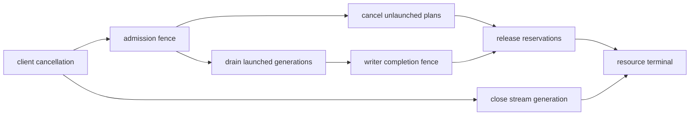

# 31장. 확정되지 않은 다음 step을 어떻게 소유하는가: async scheduling과 미래 상태

step 7의 GPU 계산이 token `x`를 만들었다. device-to-host 복사는 아직 끝나지 않았고 CPU는 `x`가 stop token인지, speculative 후보 중 몇 개가 accepted됐는지 모른다. 그런데 scheduler는 GPU가 쉬지 않도록 step 8을 이미 계획한다. 요청 R의 `num_computed_tokens`는 step 8 입력을 만들 수 있게 앞서 증가했고 KV block도 다음 write를 받을 준비를 한다. 바로 이때 client가 연결을 끊는다. R은 논리적으로 aborted지만 step 7 output과 step 8 plan, 두 세대의 KV write, 닫히는 output stream이 동시에 존재한다.

비동기 스케줄링의 어려움은 thread를 여러 개 쓰는 데 있지 않다. 아직 결과가 확정되지 않은 실행을 미래 상태에 반영하고, 결과가 돌아오면 그 추측을 commit하거나 고치는 데 있다. 동기 경로는 대체로 `schedule(t) → execute(t) → process(t) → schedule(t+1)` 순서를 따른다. 비동기 경로는 `execute(t)`와 `schedule(t+1)`을 겹친다. GPU idle gap을 줄이는 대신, request에는 확정 상태, in-flight 상태, 미래 계획이 함께 생긴다.

이 장은 대표 요청 R을 `S0 schedule → E0 launch → S1 future plan → E0 completion → H0 host commit` 순서로 따라간다. 그 사이 abort, error, shutdown을 끼워 넣어 어느 상태를 버리고 어느 resource를 fence 뒤에 반환해야 하는지 본다. vLLM 기준은 commit `6e448d0ea9bf3d88d898b65449ca6dc2aec170ac`, SGLang은 `71de97b264b04dcd514cf904003028aefe9775c8`, Transformers는 `550d7b3834670483a4df436541272c055dc364bf`다. 세 구현은 overlap을 만드는 단위와 future의 표현이 다르므로 같은 기능으로 등치하지 않는다.

## 31.1 동기 순서에서 무엇을 떼어 겹치는가

### 31.1.1 idle gap은 계산 사이의 host 구간에서 생긴다

GPU가 step `t`의 forward와 sampling을 끝내면 host는 output을 받아 request별 token을 붙이고 stop 조건을 검사한다. finished request를 제거하고 KV를 회수하며 다음 token budget과 batch membership을 계산한다. 입력 tensor와 metadata를 준비한 뒤에야 step `t+1`을 제출한다. 이 host 구간이 GPU work보다 짧아도 매 token 반복되면 device timeline에 작은 빈틈이 누적된다.

async scheduling은 이 구간 전체를 없애지 않는다. step `t` 결과가 없어도 결정 가능한 일부를 앞당긴다. R이 이번 step에 한 token을 계산했다고 낙관적으로 세고, 다음 step에도 살아 있을 것이라는 future membership을 만든다. host가 step `t` output을 처리하는 동안 device는 다음 work를 시작할 수 있다. 이득은 새 kernel이 빨라진 것이 아니라 host schedule·serialization과 device compute가 겹친 시간이다.

이 설명에는 즉시 한계가 따른다. step `t` token이 EOS라면 step `t+1`의 R row는 필요 없었다. speculative decode가 계획한 여러 token 가운데 일부를 reject하면 낙관적으로 증가한 computed count를 고쳐야 한다. abort가 오면 future plan을 무효화해야 한다. 따라서 overlap 폭이 클수록 미래 plan을 취소하고 reconcile하는 상태가 많아진다.

S0, E0, S1을 물리 시각으로 구별하자. S0는 scheduler가 R에 token 수와 block을 배정해 step 7 output을 만든 사건이다. E0는 worker가 그 계약을 받아 stream에 device work를 enqueue한 사건이다. S1은 E0 결과가 host에서 commit되기 전에 step 8 계약을 만드는 사건이다. E0 completion은 device write가 끝났다는 사실이고 H0는 token, finish reason, counter를 host request state에 반영하는 사건이다. completion과 host commit도 같은 순간이 아니다.

### 31.1.2 세 상태를 한 counter에 접지 않는다

R의 확정 상태에는 host가 이미 처리해 외부 contract와 scheduler decision에 반영한 output이 들어간다. in-flight 상태에는 제출됐으나 아직 host commit되지 않은 token 수와 KV write가 들어간다. future 상태에는 그 in-flight 결과가 정상일 것이라는 가정 아래 만든 다음 membership, block reservation, input metadata가 들어간다. 세 상태는 같은 request id를 공유하지만 rollback 가능성이 다르다.

vLLM `Request`는 이를 단일 enum으로 감추지 않는다. `_output_token_ids`는 확정 output 목록이고 `num_in_flight_tokens`는 output이 아직 처리되지 않은 step의 token 수다. `num_computed_tokens`는 async와 pipeline parallel 경로에서 이를 낙관적으로 포함할 수 있다.

`last_sched_seq`는 가장 최근 schedule 세대를 기억해 deferred block free의 fence가 된다. preemption 뒤 돌아올 output은 `num_stale_output_tokens`로 분리하고 특정 same-step reset에서는 `drop_stale_output`으로 폐기한다. [필드의 고정 좌표](https://github.com/vllm-project/vllm/blob/6e448d0ea9bf3d88d898b65449ca6dc2aec170ac/vllm/v1/request.py#L150-L177)는 상태를 왜 여러 값으로 나누는지 보여 준다.

`num_computed_tokens`라는 이름만 보고 확정 계산량으로 읽으면 오류가 생긴다. async schedule은 step 7을 제출한 뒤 결과 처리 전에 scheduled token 수만큼 이를 증가시킨다. 그래야 S1이 같은 request의 다음 position을 계획할 수 있다. 나중에 speculative rejection이나 invalid external KV load가 드러나면 host output 처리에서 조정한다. 즉 이 값은 다음 입력을 만들기 위한 낙관적 frontier이고, 외부에 확정된 output 길이와 같지 않다.

운영 snapshot도 세 열을 가져야 한다. step 7 H0까지 확정된 output position, 아직 처리하지 않은 submission별 token 수, step 8 future row와 block generation을 기록한다. status가 RUNNING이라는 한 열만 남기면 step 7 late output이 step 8 counter를 두 번 전진시킨 사건을 찾을 수 없다. future가 존재한다는 사실과 future가 commit 가능하다는 사실도 분리한다.

### 31.1.3 incident F31: future가 새 KV 세대를 덮는다

F31은 async mode에서만 나타나는 조용한 오답이다. 요청 R은 step 52에서 batch generation 52와 KV generation 18을 사용해 token 위치 106을 계산한다. GPU가 끝나기 전 scheduler는 위치 107을 위한 future generation 53을 만든다. 그때 client disconnect가 들어와 R을 abort하고 block 31을 반환 대상으로 넘긴다. 300µs 뒤 같은 외부 request id를 재사용한 새 attempt가 block 31을 KV generation 19로 얻는다. 이후 generation 53의 준비 callback이 완료되며 current request table에 page row를 기록한다.

겉으로는 모든 값이 유효하다. Page index 31은 범위 안이고 tensor shape도 맞다. CUDA error와 NaN도 없다. 그러나 generation 53이 예상한 owner는 R의 old attempt와 KV generation 18이고, callback이 mutate한 owner는 새 attempt와 generation 19다. 첫 오답 token은 여러 layer 뒤에 나타나지만 first divergence는 callback stash가 request 문자열만 key로 사용한 순간이다.

이 사건을 status snapshot으로 보면 ABORTED와 RUNNING이 번갈아 보여 race처럼만 보인다. Future ledger는 다르게 쓴다.

```text
52 schedule old-R  batch=52 kv=18 frontier=106→107
52 launch          writer=(old-R,18) block=31
53 future plan     assumes output(52), reserves position=107
abort commit       stream old-R closed, kv=18 delayed
new admission      new-R batch=55 kv=19 block=31
53 callback        consumer key=R, actual owner=(new-R,19)
```

관측 단계에서는 callback이 무엇을 썼는지부터 고정한다. Current block table, optimistic frontier, row map 중 하나라도 바뀌었다면 service correctness incident다. Future가 backend buffer에만 남고 current state를 건드리지 않았다면 cleanup residue일 수 있다. Branch는 네 갈래다. Old future의 생성 key가 약한가, invalidation은 되었지만 callback이 이를 확인하지 않는가, KV 재사용이 completion fence보다 빠른가, output route가 old/new stream을 혼동하는가다.

원인 판정에는 2×2 fixture를 쓴다. Request id를 재사용하지 않았을 때와 재사용했을 때, block 31 재할당을 old completion 전과 후로 나눈다. Id 재사용에서만 실패하면 future identity가 약하다. Completion 전 재할당에서만 실패하면 allocator fence가 약하다. 둘을 모두 해야 실패하면 weak key와 lifetime race가 결합한 것이다. Async를 끄면 사라진다는 사실은 이 가설 공간을 줄이지만 어느 branch도 단독 확정하지 않는다.

Verification은 token parity보다 먼저 generation invariant를 본다. Callback producer generation과 consumer request·batch·KV generation이 모두 일치할 때만 state mutation 권한을 얻어야 한다. Mismatch future는 stale terminal로 기록하되, 이미 enqueue된 writer completion accounting은 소비해야 한다. 이를 통째로 drop하면 delayed free가 영원히 풀리지 않을 수 있다.

Rollback은 hot flag 변경이 아니다. 새 future 생성을 막고, launch 전 generation 53은 취소하며, 이미 launch된 52를 terminal까지 drain한다. KV generation 18의 completion이 증명된 뒤 block을 pool에 반환하고, new attempt가 generation 19를 계속 쓸 수 있는지 integrity canary로 확인한다. Owner가 불명확하면 block 하나가 아니라 worker allocator generation 전체를 격리한다. Correctness가 회복돼도 oldest future age, deferred KV와 host commit lag가 baseline bound로 돌아오기 전에는 종료하지 않는다.

## 31.2 옵션 문자열이 실제 overlap 경로가 되기까지

### 31.2.1 vLLM의 요청값과 effective 값은 다르다

vLLM `SchedulerConfig.async_scheduling`은 `bool | None`이다. `False`는 명시적 비활성화이고 `True`는 명시적 활성화, `None`은 compatibility를 검사한 자동 선택이다. config field만 출력해 사용자가 무엇을 요청했는지 알 수는 있지만 실제 scheduler class와 downstream side effect를 증명하지는 못한다. [`SchedulerConfig.get_scheduler_cls()`](https://github.com/vllm-project/vllm/blob/6e448d0ea9bf3d88d898b65449ca6dc2aec170ac/vllm/config/scheduler.py#L174-L205)는 effective 값이 참이면 `AsyncScheduler`, 아니면 기본 `Scheduler`를 고른다.

명시적 `True`는 호환되지 않는 조합을 조용히 끄지 않고 validation error로 막는다. executor가 async scheduling을 지원하는지, speculative method가 허용 범위인지, padded drafter batch 비활성화와 충돌하는지 검사한다. `None` 자동 모드는 pooling runner, 일부 speculative 방식, 지원하지 않는 executor, 특정 ROCm DeepEP DBO 조합에서 false로 정규화한다. 그 밖에는 true가 된다. 근거는 [`VllmConfig`의 effective 선택](https://github.com/vllm-project/vllm/blob/6e448d0ea9bf3d88d898b65449ca6dc2aec170ac/vllm/config/vllm.py#L1057-L1147)에 있다.

옵션 감사 사슬은 `CLI/생성자 입력 → bool|None config → compatibility validation → effective bool → scheduler class → request in-flight 필드와 executor output handling`이다. 로그에 `--async-scheduling` 문자열이 있었다는 사실로 활성화를 단정하지 않는다. 자동 모드가 disable warning을 냈는지, executor class의 support predicate가 무엇이었는지, 최종 `get_scheduler_cls()`가 어떤 class를 반환했는지 확인한다.

effective async는 다른 설정에도 영향을 준다. data parallel synchronization에 NCCL을 쓸지의 기본 선택이 달라질 수 있고 async speculative decode와 맞지 않는 cascade attention을 끈다. 이는 “scheduler만 바뀐다”는 설명이 불충분하다는 뜻이다. option consumer를 class factory 하나에서 멈추지 말고 후속 config mutation까지 추적해야 실행 topology와 성능 차이를 설명할 수 있다.

명시적 true와 auto의 실패 방식이 다른 것은 운영상 중요하다. 배포 manifest가 async를 필수 성능 조건으로 요구한다면 true를 써서 incompatible executor가 조용히 sync로 내려가지 않게 할 수 있다. 반대로 여러 model·executor 조합을 한 설정으로 띄우는 환경은 auto가 가용성을 높일 수 있지만 instance마다 effective mode가 달라진다. 두 집단의 latency를 같은 실험군으로 합치면 옵션 효과가 희석된다. metric label은 요청 문자열보다 최종 bool과 scheduler class를 사용한다.

pooling runner에서 auto disable하는 branch는 async가 논리적으로 불가능해서가 아니라 현재 구현의 성능 효과가 부정적이라는 코드 판단이다. executor unsupported나 incompatible speculative method와 이유가 다르다. disable reason을 한 counter로 합치면 이후 버전에서 지원 경계가 바뀌었을 때 무엇을 재검증할지 알 수 없다. validation error, correctness incompatibility, performance-default를 구분해 기록한다.

async 활성화가 DP synchronization 기본값을 바꾸는 downstream mutation도 실험 해석을 흔든다. true/false 비교에서 scheduler overlap만 달라졌다고 가정하면 collective 경로 변화가 섞일 수 있다. cascade attention disable도 attention backend 선택과 memory behavior에 영향을 줄 수 있다. option A/B는 effective config 전체 diff를 저장하고, secondary mutation을 고정하거나 결과 설명에 포함한다.

custom scheduler class를 지정한 경우도 주의한다. class factory는 사용자 class가 `AsyncScheduler`가 아니라 기본 `Scheduler`를 상속한 형태면 async scheduling가 비활성화되어 성능이 낮아질 수 있다는 warning을 낸다. config bool만 true여도 custom class 구현이 필요한 interface와 future state를 제공하지 않으면 같은 path가 아니다. 실제 class MRO와 method consumer를 확인한다.

옵션을 껐다 켜는 rollback도 session boundary를 요구할 수 있다. scheduler class, request field interpretation, executor output handling이 이미 만들어진 engine 안에서 bool만 바꾸면 outstanding generation을 어느 state machine이 drain할지 모호해진다. source가 runtime mutation을 명시적으로 지원하지 않는다면 새 engine config로 재시작하는 옵션으로 본다. hot toggle을 추정해 운영 절차에 넣지 않는다.

측정에서는 먼저 sync baseline의 host gap을 분해한다. schedule CPU, input serialization, executor submission, output processing 가운데 무엇이 device idle과 겹칠 수 있는지 본다. async 후 GPU idle이 줄어도 output processing backlog와 processed-sequence lag가 늘면 pipeline이 일을 숨긴 것이 아니라 빚을 뒤로 미룬 것일 수 있다. steady state뿐 아니라 drain 구간까지 포함해 요청 완료 시간을 센다.

짧은 benchmark는 future debt가 남은 채 측정을 끝내 throughput을 부풀릴 수 있다. 마지막 request를 제출한 시점이 아니라 모든 host commit, collector close, deferred free가 끝난 시점을 종료로 잡는다. warm-up도 두 IO pair와 pipeline depth가 채워진 뒤 측정한다. sync는 한 step, async는 여러 outstanding step을 가진 상태에서 같은 iteration 수만 비교하지 않는다.

처리량 이득은 host gap과 workload에 달렸다. model step이 길고 host scheduling이 매우 짧으면 overlap해도 숨길 시간이 작다. decode batch가 작거나 Python·IPC overhead 비율이 크면 이득 여지가 커진다. 그러나 future reconcile, stale output bookkeeping, deferred free 때문에 host 작업 자체가 늘어난다. “async=true면 항상 빠르다”가 아니라 saved idle gap과 추가 정합성 비용의 차이를 측정해야 한다.

### 31.2.2 SGLang overlap은 event-loop dispatch까지 확인한다

SGLang의 overlap 경로는 이름이 비슷해도 vLLM `AsyncScheduler`와 동일한 상태 기계가 아니다. scheduler 초기화에서 overlap flag와 관련 runner 경계를 만들고, normal event loop와 overlap event loop가 schedule·forward·result processing 순서를 다르게 배치한다. 최종 dispatch는 normal, overlap, pipeline parallel, prefill/decode topology 조합에 따라 다른 loop를 고른다. 특정 함수에서 overlap 코드를 찾았다는 이유로 모든 deployment가 그 경로를 탄다고 일반화하지 않는다.

normal loop에서는 이전 forward result를 처리한 뒤 다음 batch를 구성하는 순서가 비교적 직선적이다. overlap loop는 future map에 아직 materialize되지 않은 결과를 보관하고 다음 iteration input을 relay한다. schedule stream이 만든 일반 tensor와 future tensor를 같은 방식으로 읽으면 안 된다. future는 producer work가 끝났음을 나타내는 event 또는 resolve 경계를 통과해야 host나 다른 stream이 안전하게 소비할 수 있다.

SGLang option 설명도 `입력 flag → topology validation → event-loop dispatch → future_map 생성·resolve → batch copy와 allocator fence`로 닫아야 한다. overlap flag가 참이어도 PP 또는 disaggregated 경로가 별도 loop를 선택할 수 있다. 성능 설명은 실제 dispatch된 loop를 기준으로 한다. normal path의 ordering을 overlap incident에 적용하거나 overlap future를 normal batch field로 해석하면 first divergence를 잘못 짚는다.

### 31.2.3 Transformers double buffer는 server scheduler와 같지 않다

Transformers continuous batching의 `InputOutputPair`는 previous와 current host-device IO를 보존하고 `swap_io_pairs()`로 역할을 바꾼다. 이전 output을 host가 회수하는 동안 다음 입력 쪽을 준비하는 double-buffer ordering이다. [`input_outputs.py`의 pair 전환](https://github.com/huggingface/transformers/blob/550d7b3834670483a4df436541272c055dc364bf/src/transformers/generation/continuous_batching/input_outputs.py#L745-L813)을 보면 previous output carry-over와 batch update 준비가 한 객체의 두 면으로 관리된다.

이를 vLLM async scheduling과 같은 기능이라고 부르면 안 된다. Transformers manager는 자기 continuous generation loop에서 IO pair와 future request state를 다루고, vLLM은 scheduler가 다음 token frontier와 KV allocator fence까지 관리한다. 겹치는 목적은 host-device pipeline의 빈틈을 줄이는 것이지만 future의 owner, 지원 topology, abort 경계가 다르다. 비교는 “double buffer가 있다”가 아니라 어떤 state가 어느 swap 전에 읽히고 어느 failure path에서 완료되는지로 해야 한다.

## 31.3 요청 R의 두 step을 겹쳐 본다

### 31.3.1 S0에서 낙관적 frontier를 만든다

step 7 시작 전 R의 확정 output은 다섯 token이고 computed frontier는 prompt를 포함해 105라고 하자. S0는 R에 decode 한 token과 block generation 14를 배정한다. scheduler output에는 request id, scheduled token 수, block ids와 runner metadata가 들어간다. 아직 token `x`는 없다.

`_update_after_schedule()`은 output을 반환하기 전에 scheduled 수를 `num_computed_tokens`와 `num_in_flight_tokens`에 더한다. [`_update_after_schedule()`](https://github.com/vllm-project/vllm/blob/6e448d0ea9bf3d88d898b65449ca6dc2aec170ac/vllm/v1/core/sched/scheduler.py#L1319-L1364)의 주석은 현재 scheduler output이 원래 frontier를 사용한 뒤, 다음 schedule을 위해 frontier를 앞당긴다고 설명한다.

이 mutation ordering이 바뀌면 현재 step input이 한 position 앞서거나 다음 schedule이 같은 position을 반복한다. scheduler output을 구성하기 전에 frontier를 증가시키면 step 7 input id와 position 계산이 미래 값을 볼 수 있다. 증가를 너무 늦춰 S1 뒤에 하면 step 8은 step 7과 같은 position을 다시 계획한다. 그러므로 “after schedule”은 임의의 함수 이름이 아니라 두 submission 사이 commit 경계다.

deferred free를 쓸 때 R의 `last_sched_seq`도 현재 non-empty step sequence로 갱신된다. 이는 R을 abort하거나 preempt해 논리 block table을 놓더라도 step 7 GPU write가 처리되기 전 pool 반환을 막는 증거다. future plan을 가능하게 하려고 frontier를 먼저 이동한 만큼 resource lifetime도 submission sequence와 묶어 길게 유지해야 한다.

### 31.3.2 E0와 S1은 서로 다른 사실을 말한다

E0에서 worker는 step 7을 device stream에 enqueue한다. enqueue 성공은 output token이 host에 확정됐다는 뜻이 아니다. GPU는 KV write와 sampling을 수행하고 D2H 또는 worker response 경계로 결과를 내보낸다. 그 사이 scheduler는 step 8 S1을 만들 수 있다. R은 논리 running이고 future batch member지만 step 7의 `x`가 EOS인지 아직 모른다.

S1은 “R이 step 7 뒤에도 살아 있다”는 조건부 계획이다. input placeholder 또는 runner-side mechanism이 아직 알 수 없는 token을 이어받고, block table은 다음 position을 위한 공간을 예약한다. 이 계획을 확정 상태처럼 output stream에 공개하면 안 된다. step 7 result가 도착해 token과 accepted count를 reconcile하기 전에는 S1의 일부가 취소될 수 있다.

동시에 여러 counter를 보는 이유가 여기 있다. 확정 output length는 5, in-flight는 1 이상, optimistic computed frontier는 106, future scheduled membership은 step 8에 참일 수 있다. token `x`가 EOS면 외부 확정 length가 정책에 따라 증가한 뒤 R은 finished되고 step 8 output은 stale이 된다. EOS가 아니면 step 8 plan이 정상 경로로 이어진다. snapshot 하나로 두 가능성을 미리 합치지 않는다.

### 31.3.3 E0 completion과 H0 commit도 갈라진다

device event가 E0 completion을 증명하면 block generation 14에 대한 step 7 write가 끝났다고 말할 수 있다. 그러나 host가 result queue에서 output을 꺼내 request token 목록, stop reason, logprob, usage에 반영하기 전에는 H0가 아니다. allocator fence는 device completion과 연결되고 protocol commit은 host processing과 연결된다. 두 경계를 같은 callback 하나로 가정하면 remote executor나 D2H 지연에서 틀린다.

vLLM `update_from_output()`은 scheduler output과 model runner output을 한 쌍으로 받아 token과 request state를 reconcile한다. deferred free 경로에서는 non-empty step output을 처리할 때 `processed_step_seq`를 증가시키고 `_drain_deferred_frees()`를 호출한다. [output 처리 시작과 fence 진행](https://github.com/vllm-project/vllm/blob/6e448d0ea9bf3d88d898b65449ca6dc2aec170ac/vllm/v1/core/sched/scheduler.py#L1680-L1718)은 “모든 earlier GPU write가 끝났다”는 전제 아래 pool 반환을 허용한다.

H0는 token `x`를 확정 목록에 넣고 in-flight share를 줄이며 필요하면 낙관적 frontier를 교정한다. speculative acceptance가 계획보다 작으면 미래 state의 token count와 position도 그 차이를 반영해야 한다. step 8이 이미 제출됐다면 단순히 Python counter만 줄이는 것으로 부족할 수 있다. 구현이 placeholder나 future relay를 통해 어떤 값을 worker에 전달했는지까지 확인한다.

### 31.3.4 수치 timeline에서 낙관적 debt를 계산한다

두 step이 겹친다는 말을 수치로 바꾸어 보자. Step 7의 host schedule은 180µs, input preparation은 70µs, device compute는 1.4ms, D2H와 output processing은 160µs다. 동기 경로는 device compute 뒤 230µs의 host 구간을 기다리고 step 8을 제출한다. Async 경로가 이 230µs를 compute tail과 겹치면 이론상 줄일 수 있는 gap은 230µs이지 1.4ms 전체가 아니다. 대신 step 8 future와 rollback 장부를 유지하는 비용이 추가된다.

R의 confirmed frontier는 105, step 7을 schedule한 직후 optimistic frontier는 106, in-flight debt는 1이다. Step 8까지 제출하면 frontier 107, debt 2다. Host가 step 7 output 한 개를 commit하면 confirmed는 106, debt는 1이 된다. 여기서 EOS가 확인되면 step 8의 debt는 정상 결과가 아니라 invalidated work다. Counter를 0으로 덮지 않고 generation 8의 terminal 종류를 `stale-after-finish`로 기록한다.

Speculative decode라면 scheduled 수와 accepted 수가 달라진다. Step 7이 네 후보를 계획해 optimistic frontier를 109로 만들었지만 두 개만 accepted됐다면 host commit frontier는 107이다. Future step 8이 position 109를 가정했다면 단순히 debt 2를 빼는 것으로 충분하지 않다. Its input positions, attention metadata와 reserved KV tail이 107 기준으로 다시 만들어져야 한다. 이미 launch됐다면 결과를 current에 적용하지 않고 completion 뒤 resource를 회수한다.

Pipeline 건강은 `scheduled_frontier - committed_frontier`만 보면 부족하다. 정상 depth가 2인 구성에서 lag 2는 예상 상태다. Oldest uncommitted generation의 age와 future count가 함께 전진하는지 본다. Generation 52의 age가 1.7ms, 53이 0.4ms였다가 다음 sample에서 52가 사라지고 54가 생기면 pipeline이 진행 중이다. 52 age만 계속 증가하면서 최신 generation이 추가되면 debt가 누적되고 있다.

Abort fixture는 여섯 event 순서를 바꾼다. `schedule52`, `launch52`, `plan53`, `abort`, `complete52`, `commit52`다. Abort가 launch 전이면 52와 53을 모두 launch하지 않고 reservation을 rollback할 수 있다. Launch 뒤 plan 전이면 52 completion은 받아 resource fence를 풀되 protocol commit은 닫힌 stream에 쓰지 않는다. Plan 뒤 abort면 53의 launch 여부에 따라 cancel 또는 stale terminal이 된다. Complete 뒤 host commit 전 abort면 output value는 존재하지만 공개 권한과 future commit 권한을 다시 판정한다.

각 permutation의 invariant는 같다. Submission generation마다 terminal event가 하나 있고, confirmed frontier는 client-visible policy에 맞게 단조 증가하며, in-flight debt는 drain 뒤 0이고, block generation은 completion 전에 재사용되지 않는다. Abort 응답이 빨랐다는 이유로 이 네 조건을 생략하지 않는다. 외부 latency와 내부 cleanup latency를 따로 측정해야 한다.

Overlap 성능 종료도 drain을 포함한다. 측정 창 마지막 submit 시각에서 throughput을 끊으면 async는 outstanding debt만큼 일을 미래로 밀어 성능이 좋아 보인다. 마지막 host commit, deferred free와 collector terminal까지 포함한 makespan을 쓴다. 동일 요청 수와 token 수, 동일 effective backend에서 GPU idle gap 감소가 rollback·reconcile CPU 증가보다 큰지 확인한다.

## 31.4 block을 free했지만 아직 재사용하면 안 되는 시간

### 31.4.1 request ownership과 write hazard는 따로 끝난다

S1을 만드는 도중 R이 preempt되거나 abort됐다고 하자. scheduler container에서 R을 제거하는 일은 앞으로 새 step에 넣지 않겠다는 논리 결정이다. KV manager에서 block table reference를 떼는 일은 request ownership 종료다. 그러나 E0 또는 이미 제출된 E1이 그 block을 참조한다면 allocator가 같은 block id를 새 요청 S에게 주어서는 안 된다. 과거 writer가 S의 KV를 덮는 use-after-free가 된다.

동기 scheduler는 output을 처리한 뒤 다음 schedule을 시작하므로 request cleanup 시점에 이전 device work completion을 암묵적으로 기대하기 쉽다. async scheduler에는 그 암묵적 순서가 없다. CPU가 미래 plan을 앞서 만들고 status를 바꿀 수 있으므로 block return에 별도 fence가 필요하다. vLLM의 `sched_step_seq`, `processed_step_seq`, request의 `last_sched_seq`는 이 간격을 sequence로 표현한다.

step 7 schedule이 non-empty이면 scheduler sequence가 전진한다. R이 그 step에 포함될 때 `last_sched_seq`가 기록된다. abort가 block을 free하려 해도 그 sequence가 아직 processed frontier보다 앞서 있지 않다면 즉시 pool에 넣지 않고 deferred owner에게 넘긴다. output processing가 해당 step까지 완료됐음을 확인한 뒤 drain한다. request map에서 R이 사라진 것과 block이 pool에 돌아간 것은 다른 사건이다.

이 설계의 불변식은 `block generation의 마지막 가능한 writer sequence ≤ processed sequence`일 때만 재사용한다는 것이다. 숫자 비교의 세부는 wraparound와 empty step 정책을 포함하지만 의미는 명확하다. empty schedule은 KV write를 만들지 않으므로 fence를 불필요하게 전진시키지 않는다. 실제 write 없는 step마다 sequence를 늘리면 delayed free가 존재하지 않는 completion을 기다리거나 bookkeeping이 어긋날 수 있다.

future plan이 두 step 앞서갈 수 있다면 block 하나가 여러 outstanding writer sequence에 걸릴 수 있다. 마지막 schedule만 기록하는 방식은 이전 writer도 그보다 먼저 완료된다는 단조 처리 전제를 이용한다. output이 순서대로 처리되지 않는 executor라면 단일 scalar가 충분하지 않을 수 있다. completion ordering이 보장되는지 executor response 경계에서 확인해야 한다. scheduler의 fence 자료구조만 보고 안전성을 단정하지 않는다.

### 31.4.2 SGLang의 `forward_done`은 storage reuse 경계다

SGLang overlap 경로도 future tensor를 만든 stream과 이를 소비하거나 storage를 재사용하는 쪽 사이에 ordering이 필요하다. `forward_done` event는 최신 forward가 끝나기 전에 allocator나 다음 mutation이 backing storage를 재사용하지 않도록 하는 fence다. event를 record했다는 사실만으로 consumer가 기다린 것은 아니다. 어느 stream에서 record하고 어느 stream이 wait하는지, event object가 어느 batch generation에 대응하는지 함께 읽어야 한다.

CUDA stream은 같은 stream 안의 enqueue 순서를 보존하지만 서로 다른 stream 사이의 happens-before를 자동으로 만들지 않는다. schedule stream에서 future-related copy를 만들고 compute stream이 곧바로 읽는다면 event wait 또는 명시적 synchronization가 필요하다. 반대로 compute가 쓴 result를 schedule stream이 host relay용 tensor로 재사용할 때도 producer completion을 기다려야 한다. default-stream 관습에 기대면 backend와 stream capture 조건에 따라 우연히만 안전할 수 있다.

event를 너무 넓게 기다리면 correctness는 지켜도 overlap 이득을 잃는다. 매 step device 전체를 synchronize하면 normal loop와 비슷한 idle gap이 돌아온다. event를 너무 좁게 걸면 tensor metadata는 준비됐지만 backing write가 끝나지 않은 상태를 읽는다. fence 대상은 “전체 forward”라는 이름보다 future가 참조하는 storage의 마지막 producer와 첫 consumer로 정한다.

SGLang은 overlap mutation 전에 batch state를 복사해야 하는 경계도 둔다. future processing가 이전 batch 객체를 보유한 동안 scheduler가 같은 mutable list와 tensor metadata를 다음 iteration용으로 바꾸면 future가 어느 세대의 row mapping을 보는지 사라진다. shallow copy가 tensor storage를 공유한다면 stream fence 없이 내용까지 독립되는 것은 아니다. Python object identity와 device storage lifetime을 각각 추적한다.

### 31.4.3 누수와 안전한 지연을 메트릭으로 가른다

async를 켠 뒤 free block 수가 늦게 회복된다고 곧바로 leak이라고 결론 내리지 않는다. 정상 deferred free는 outstanding step이 처리되면 유한 시간 안에 drain된다. 관측에는 logical release 시각, deferred queue 길이, 가장 오래된 `last_sched_seq`, `processed_step_seq`, 실제 allocator return 시각을 넣는다. queue가 늘어도 processed frontier가 따라오며 항목이 빠지면 pipeline depth 비용이다.

누수는 release condition이 충족됐는데도 owner가 남는 경우다. hang은 processed frontier 자체가 멈추고 future response도 오지 않는 경우다. unsafe early free는 queue가 짧고 allocator availability가 좋아 보이지만 다른 request의 KV corruption으로 드러난다. free-block gauge 하나는 세 상황을 정반대로 해석할 수 있다.

first divergence는 block corruption이 관측된 request S가 아니라, R의 generation을 pool에 반환한 sequence다. R의 마지막 scheduled step, worker completion, host processed frontier, S의 allocation을 시간순으로 맞춘다. S allocation이 fence 충족보다 앞서면 use-after-free다. fence는 충족됐지만 같은 generation이 두 번 pool에 들어갔다면 double free다. 반환이 없으면 delayed owner 등록과 drain predicate를 본다.

### 31.4.4 future invalidation과 allocator fence는 같은 작업이 아니다

Future generation 53을 invalid로 표시했다고 block 31을 반환할 수 있는 것은 아니다. 53이 아직 launch되지 않았다면 reservation만 취소하면 된다. 그러나 generation 52가 block 31에 writer를 enqueue했다면 52 completion이 allocator fence를 소유한다. Control-plane future의 유효성과 device resource의 재사용 가능성은 서로 다른 predicate다.

이 차이를 세 상태로 기록한다. `plan_state`는 planned, launched, invalidated, reconciled 중 하나다. `writer_state`는 not-submitted, in-flight, completed, unknown이다. `resource_state`는 reserved, delayed-free, reusable, quarantined다. `plan=invalidated`와 `writer=in-flight`이면 resource는 delayed-free여야 한다. `writer=unknown`인데 reusable이면 correctness bug다.

vLLM의 `last_sched_seq`와 processed sequence는 이 관계를 scalar frontier로 표현하는 경로다. 이 방법은 executor response가 schedule 순서대로 처리된다는 전제가 있을 수 있다. 여러 worker나 out-of-order completion이 가능한 경로라면 “processed 53”이 52 writer completion을 증명하는지 확인한다. 단순 max sequence가 hole을 숨긴다면 per-generation completion set이나 event가 필요하다.

SGLang overlap에서는 `forward_done` event와 future resolve, batch record reuse의 관계를 본다. Event record는 특정 stream에서 그 이전 work 완료를 나타내지만 future map entry가 올바른 batch generation을 가리킨다는 사실까지 보장하지 않는다. Ring slot을 재사용했다면 event object 또는 storage가 어느 iteration producer의 것인지 별 generation이 필요하다. 올바른 event를 기다리고도 잘못된 batch record를 읽을 수 있다.

Transformers IO pair reset에도 같은 분리가 있다. Current pair compute가 실패했을 때 pair object를 reset하는 것은 host 자료구조 정리다. Device output copy가 in-flight라면 backing tensor 재사용은 event 또는 future terminal 뒤에 해야 한다. Previous pair waiter에 exception을 set하지 않고 storage만 초기화하면 caller는 기다리고 새 batch는 같은 buffer를 덮는다.

수치 fixture에서 generation 52 writer는 stream A의 event e52를 5.20ms에 record한다. Abort는 5.00ms, future 53 invalidation은 5.02ms다. Allocator가 invalidation 시각 5.02ms에 block을 반환하면 180µs 앞선다. e52 wait가 5.21ms에 완료된 뒤 반환하면 안전하다. 단, 기다린 event가 e51이거나 ring slot 재사용으로 e54를 가리키면 시각만 정상이고 generation contract는 틀리다.

반증은 global synchronize로 시작할 수 있다. Synchronize에서 증상이 사라지면 ordering 가설이 강해지지만 future identity와 wrong buffer selection은 남을 수 있다. 정확한 e52를 기다리는 수정, generation mismatch guard, allocator uniqueness audit를 각각 적용해 어느 조건이 필요한지 분리한다. 모든 경로를 synchronize하는 수정은 overlap의 목적을 없애므로 최종안이 아니다.

Rollback 종료는 invalid future count 0만 보지 않는다. Launched generation마다 completion 또는 terminal unknown이 있고, delayed resource가 completion 뒤 반환되며, quarantined resource는 일반 pool과 분리되고, 새 batch generation이 old page row를 참조하지 않아야 한다. Unknown writer가 있는 worker는 새 admission을 멈추고 process-owned allocator를 폐기하는 편이 조용한 오답보다 안전하다.

## 31.5 abort와 late output을 미래 plan에 끼워 넣는다

### 31.5.1 abort는 이미 제출된 work를 지우지 않는다

R의 step 7 E0 뒤, S1 전에 abort가 도착하면 다음 plan에서 R을 제외할 수 있다. 그러나 E0 device work는 계속될 수 있고 output response도 도착한다. S1 뒤 abort가 오면 step 8 plan까지 취소하거나 stale로 분류해야 한다. step 8이 이미 E1 launch됐다면 두 output generation이 drain 대상이 된다. abort API가 반환했다는 사실만으로 in-flight count가 0이라고 가정하지 않는다.

future membership을 제거할 때 현재 request status만 바꾸면 부족하다. scheduler output 또는 future map에 복사된 R row가 있는지, worker input relay가 이미 소비했는지, block reservation이 어느 generation owner인지 확인한다. launch 전 future라면 plan에서 filter하고 reservation을 되돌린다. launch 뒤 future라면 결과를 기다려 stale 처리하고 resource fence를 유지한다. 같은 abort라도 launch boundary가 cleanup 방식을 바꾼다.

step 7 output `x`가 abort 뒤 도착하면 세 질문을 분리한다. 내부 counter를 전진시키는가, output stream에 공개하는가, block completion fence를 전진시키는가. stream은 닫혀 공개하지 않더라도 device completion은 resource safety를 위해 처리해야 한다. counter는 reset된 request를 오염시키지 않도록 stale share를 뺀다. “drop output”이 result message 자체를 버려 completion bookkeeping까지 잃는다는 뜻이어서는 안 된다.

vLLM preemption의 stale token 필드는 이 차이를 드러낸다. preemption 전에 in flight였던 token은 돌아오지만 reset된 counters를 mutate하지 않아야 한다. 특정 same-step preempt와 resume에서는 token 순서가 깨질 수 있어 아예 drop한다. 이 정책은 단순 status guard가 아니라 submission 세대와 reset 이유에 의존한다. PREEMPTED이면 모두 버리거나 모두 accept하는 구현은 한쪽 사건에서 틀린다.

### 31.5.2 stream close와 scheduler drain은 다른 약속이다

client disconnect를 감지한 frontend는 collector를 closing으로 바꾸고 core에 abort를 보낸다. 외부 stream은 더 이상 token을 공개하지 않을 수 있지만 scheduler는 outstanding future를 drain해야 한다. 반대로 scheduler가 R을 terminal로 만들었어도 final output과 sentinel이 collector에 도달하기 전 stream은 열려 있을 수 있다. async pipeline은 이 두 수명의 간격을 길게 만들 수 있다.

late output이 닫힌 collector에 도착했을 때 output router가 예외를 던져 전체 response loop를 멈추면 다른 request의 future까지 hang한다. request-local drop과 pipeline-global failure를 구분한다. 해당 request route가 없다는 사실이 정상 abort 결과인지, route map corruption인지 generation과 terminal reason으로 판단한다. 정상 stale이면 completion과 resource accounting는 처리하고 protocol publish만 생략한다.

natural finish도 future plan을 취소한다. step 7 token이 EOS라면 H0가 finish reason을 commit하고 S1의 R membership을 무효화한다. S1이 launch 전이면 row를 제거할 수 있지만 batch tensor permutation 전체를 맞춰야 한다. 이미 launch됐다면 E1 output은 stale이며 KV write completion까지 block을 보존한다. 마지막 정상 token snapshot과 stale E1 결과를 섞으면 usage가 하나 늘거나 EOS 뒤 token이 공개된다.

abort와 natural finish가 경쟁하면 terminal owner는 하나여야 한다. 먼저 commit된 terminal reason이 output 정책을 정하고 다른 경로는 cleanup 효과를 반복하지 않는다. 그러나 뒤 경로가 outstanding future 목록에서 자기 reference를 제거하는 일은 여전히 필요할 수 있다. idempotence를 “두 번째 함수가 아무것도 하지 않음”으로 구현하면 future waiter가 영원히 남을 수 있다. terminal effect와 waiter drain effect를 분리한다.

### 31.5.3 R의 여섯 순서를 바꿔 허용 상태를 계산한다

정상 순서는 S0, E0, S1, E0 completion, H0, E1 completion, H1이다. abort가 S0 전에 오면 request는 schedule되지 않아야 한다. S0 뒤 E0 전이면 scheduler output에서 취소하거나 executor에 넘기지 않은 reservation을 rollback한다. E0 뒤 S1 전이면 E0만 stale drain 대상이다. S1 뒤 E1 전이면 future plan과 E0를 각각 정리한다. E1 뒤라면 두 submission completion을 모두 기다린다.

각 위치에서 공통인 것은 외부 stream을 더 이상 공개하지 않는다는 정책뿐이다. resource 반환 시각과 in-flight count, future map entry 수는 다르다. abort latency는 collector close, scheduler membership 제거, last device completion, allocator return 네 구간으로 측정한다. 하나의 latency로 합치면 GPU forward가 긴 정상 drain과 waiter 누락 hang을 구별하지 못한다.

late output 사건의 first divergence는 대개 arrival 시각이 아니다. submission에 generation을 붙이지 않은 S0, future entry를 덮어쓴 S1, reset counter와 stale share를 분리하지 않은 abort cleanup 중 하나다. output handler가 마지막 방어선에서 drop해도 잘못된 owner handoff는 남는다. 사건 타임라인을 arrival에서 역으로 읽어 최초로 identity가 사라진 곳을 찾는다.

### 31.5.4 cancellation cleanup을 owner graph로 검증한다

Cancellation은 future 하나를 `cancel()`하는 호출이 아니다. R에는 API waiter, scheduler request, planned generation, launched generation, KV reservation, output collector가 있을 수 있다. 어느 owner가 새 work 생성을 막고, 어느 owner가 launched work를 drain하며, 누가 waiter와 stream을 terminal로 만드는지 graph로 적는다.



Abort가 먼저 admission fence를 세우지 않으면 cleanup 중 scheduler가 S2를 새로 만든다. Plan map을 먼저 clear하고 waiter를 깨우지 않으면 host task가 영원히 기다린다. Waiter를 실패시키고 backing storage를 즉시 재사용하면 device writer가 새 generation을 덮을 수 있다. 순서는 “모두 취소”가 아니라 owner별 terminal predicate의 dependency다.

vLLM에서는 output processor의 request state 제거와 core abort, scheduler finish/free, deferred block drain을 잇는다. API iterator가 취소됐다는 사실은 core에 abort가 도착했다는 증거가 아니다. Scheduler에서 request가 finished됐다는 사실도 processed sequence가 writer를 fence했다는 증거가 아니다. Collector가 닫혔다는 사실 역시 completion response를 버려도 된다는 뜻이 아니다. Protocol output은 drop해도 accounting은 소비한다.

SGLang은 overlap event loop의 future map과 batch owner를 함께 닫아야 한다. Producer failure가 map entry를 unresolved로 남기면 waiter hang이 된다. Entry를 먼저 삭제하면 waiter는 key가 다시 생기기를 기다릴 수 있다. Exception 또는 terminal marker를 publish해 waiter를 깨우고, backing batch/event generation은 in-flight completion 뒤 release한다. P/D topology라면 remote owner가 별도로 남는지 확인한다.

Transformers continuous manager에서는 request future에 exception을 set하는 것과 IO pair storage를 reset하는 것이 다르다. Previous output host update가 이미 commit됐는지, current pair가 submit됐는지, next update가 준비만 됐는지 분류한다. 같은 exception을 여러 request future에 전달할 수 있어도 cache block refcount를 여러 번 줄여서는 안 된다. Batch error와 request-local error의 cleanup 범위를 분리한다.

llama.cpp는 queue task와 active slot의 cancel owner가 다르다. Queue에서 move 중인 task를 main queue에서만 찾으면 놓치고, queue cleanup과 slot callback이 모두 release하면 double terminal이 된다. Task registry 또는 generation-bearing owner transition으로 현재 위치를 판정한다. Already submitted batch element는 slot release만으로 취소되지 않으므로 old completion을 terminal까지 소비한다.

Race fixture는 cancel을 네 지점에 둔다. Plan 전, plan 후 launch 전, launch 후 completion 전, completion 후 host commit 전이다. 첫 경우는 request와 stream만 terminal이다. 둘째는 reservation rollback이 추가된다. 셋째는 completion fence와 stale output reconciliation이 필요하다. 넷째는 value가 존재하지만 protocol publish 권한과 counter commit 권한을 별도로 판정한다. 모든 경우 terminal waiter 수는 request generation당 하나여야 한다.

Rollback 검증은 다음 질문으로 닫는다. Cancellation 뒤 새 future generation 수가 증가하지 않는가. Unlaunched reservation은 모두 owner에게 돌아갔는가. Launched generation은 success/stale/error/unknown 중 하나인가. Unknown resource는 quarantine인가. Collector와 waiter는 단 한 번 terminal인가. 같은 workload를 sync mode로 돌렸을 때도 외부 token semantics가 같은가. 이 중 하나라도 답할 evidence가 없으면 cleanup 완료를 선언하지 않는다.

## 31.6 세 구현의 future owner를 함수와 필드로 읽는다

### 31.6.1 vLLM은 scheduler가 낙관적 request frontier를 소유한다

vLLM scheduler는 `schedule()`이 만든 `SchedulerOutput`과 `update_from_output()`이 받는 `ModelRunnerOutput`을 세대별 한 쌍으로 다룬다. MRV1 경로의 `prev_step_scheduled_req_ids`는 이전 step membership을 기록한다. async executor가 output 처리를 겹칠 수 있어도 scheduler는 어느 request가 어떤 step에 있었는지 알아야 stale·finish·free를 결정한다. executor가 future-like response를 반환하는 것과 request state를 안전하게 commit하는 것은 다른 계약이다.

`_update_after_schedule()`의 낙관적 증가가 future planning을 열고 `update_from_output()`이 실제 token과 acceptance를 반영해 닫는다. request의 `num_in_flight_tokens`는 이 사이 debt다. debt가 0이 되기 전에 request를 재사용하거나 map에서 모든 bookkeeping을 지우면 late result를 reconcile할 owner가 없다. 반대로 output을 처리했는데 debt를 줄이지 않으면 finish와 free가 영원히 지연될 수 있다.

deferred free fence는 async option의 correctness cost를 allocator에 전달한다. option이 켜졌다는 로그만 보고 성능을 비교하지 않고 deferred queue depth와 block return delay를 함께 본다. async가 GPU gap을 줄여 throughput을 높이면서 KV availability를 늦춰 admission queue를 늘릴 수 있다. workload에 따라 한 metric은 좋아지고 TTFT tail은 나빠질 수 있다.

### 31.6.2 SGLang은 `future_map`과 event-loop ordering을 소유한다

SGLang overlap loop는 아직 resolve되지 않은 결과를 `future_map`에 stash하고 이후 publish·resolve 경계에서 실제 tensor 또는 host state로 바꾼다. map key가 request id 하나뿐이면 같은 request의 여러 outstanding generation이 덮어쓸 수 있다. 실제 key와 lifecycle을 읽어 어느 iteration 결과인지 구별하는지 확인한다. remove 시점이 너무 빠르면 consumer가 future를 못 찾고, 너무 늦으면 old future를 새 batch가 사용한다.

`forward_done` event는 future result의 값뿐 아니라 backing storage lifetime과 연결된다. event wait 전에 tensor shape와 pointer를 읽을 수 있어도 내용은 준비되지 않았을 수 있다. future tensor와 schedule stream에서 즉시 만든 non-future tensor를 구별하라는 주석은 모든 field를 같은 synchronization 정책으로 처리하면 안 된다는 뜻이다. 어떤 field가 producer event를 요구하는지 source에서 분류한다.

batch state copy도 future owner를 고정한다. overlap mutation 전에 이전 generation의 row mapping과 lengths를 보존하지 않으면 result processing가 새 batch 순서를 본다. copy를 언제 만들고 `future_map` entry가 어떤 copy를 참조하며 resolve 뒤 누가 release하는지 따라간다. Python garbage collection에 맡겼다는 사실은 CUDA storage가 안전하게 재사용된다는 증거가 아니다.

normal loop와 overlap loop를 비교할 때 함수 수나 thread 수를 세지 않는다. normal은 result processing 뒤 schedule하므로 어떤 mutation ordering을 암묵적으로 얻는지 표시한다. overlap은 그 ordering을 깨는 대신 future map, batch snapshot, event fence로 각각 무엇을 복구하는지 표시한다. 이 대응표가 있어야 누락된 fence가 왜 필요한지 설명할 수 있다.

SGLang의 실제 `run_batch()` 순서를 더 세밀하게 읽으면 이 추상화가 구체화된다. overlap generation 경로는 먼저 `future_map.resolve_seq_lens_cpu(batch)`로 이전 future가 약속한 sequence length를 CPU 관점에서 resolve한다. 그 뒤 forward stream이 schedule stream을 기다리고 `resolve_forward_inputs(batch, future_map)`이 staging input을 실제 forward input으로 바꾼다.

이 resolve는 isolation snapshot 밖에서 수행된다. snapshot 복원 때 이미 소비한 staging을 되살리면 같은 input을 두 번 쓰기 때문이다. [overlap forward 경계](https://github.com/sgl-project/sglang/blob/71de97b264b04dcd514cf904003028aefe9775c8/python/sglang/srt/managers/scheduler.py#L3624-L3688)는 mutation ordering이 성능용 장식이 아님을 보여 준다.

그 다음 `_forward_isolation()`은 batch field를 snapshot하고 sampling information을 forward 전용 copy로 바꾼다. speculative V2 worker가 forward 중 `forward_mode`, `input_ids`, `seq_lens`, `spec_info`를 rebind할 수 있기 때문이다. penalty buffer를 같은 scheduler object에서 두 번 누적하지 않도록 orchestrator를 떼어 낸 copy가 쓰인다. finally에서 scheduler가 다음 계획에 사용할 state를 복원한다. overlap은 단지 두 stream이 동시에 달리는 것이 아니라, forward가 mutable schedule object를 잠시 변형하는 transaction이다.

`record_batch_in_overlap()`은 batch와 모든 dataclass field snapshot을 두 칸 ring에 보존한다. 주석은 Python reference가 일찍 사라져 GPU tensor가 caching allocator에 반환되는 것을 막기 위한 임시 방편임을 명시한다. future tensor는 future map으로 읽되 schedule stream만 만든 non-future tensor는 forward 동안 reference를 유지해야 한다. 두 종류를 혼동하면 resolve 안 된 값을 읽거나 살아 있어야 할 storage가 재사용된다.

speculative 경로에서는 worker가 verify와 draft-extend 사이 `on_publish` callback으로 future를 publish할 수 있다. non-spec 경로는 worker return 뒤 scheduler가 `batch.seq_lens + 1`을 publish한다. 같은 `future_map.publish`라도 발생 시점이 다르다. grammar overlap 지원 경로는 이전 batch committed token을 resolve하는 barrier까지 worker에 전달한다. SGLang overlap을 한 개 publish 시각으로 설명하면 speculative·grammar 조합의 ordering을 놓친다.

forward 뒤 result가 보존해 달라고 요청한 `extra_keep_alive_refs`도 같은 ring slot에 추가된다. 이는 함수 return이 device consumer 종료와 같지 않다는 직접적인 증거다. unified memory allocator를 쓸 때는 forward stream에 새 `forward_done` event를 record하고 allocator에 latest event와 `out_cache_loc` write set을 넘긴다. allocator는 lazy compaction source를 재사용하기 전에 해당 forward를 기다릴 수 있다. 이 event는 output D2H 완료나 host commit을 뜻하지 않는다.

result D2H는 다시 갈린다. 일반 CUDA 경로는 copy stream이 forward stream을 기다린 뒤 `copy_to_cpu()`를 enqueue해 다음 forward와 복사를 겹친다. `copy_done` event는 이 leaf copy의 완료를 나타낸다. forward stream 자체는 copy를 기다리지 않는다. HIP 경로는 작은 D2H에 대한 cross-stream synchronization 비용을 피하려 다른 선택을 한다. “overlap이면 항상 별도 copy stream”이라고 일반화하지 않고 platform branch를 읽어야 한다.

마지막으로 `batch.input_ids = None`은 다음 iteration 입력이 future map relay를 통해 온다는 ownership handoff다. null을 데이터 손실로 해석하면 안 된다. 그러나 future publish 없이 null로 만들면 실제 손실이다. source audit에서는 publish 또는 relay와 null mutation 사이에 예외가 날 수 있는지, failure path가 waiter를 깨우는지 확인한다. 이 한 줄은 future owner가 scheduler batch field에서 map으로 이동했음을 표시한다.

### 31.6.3 Transformers는 previous/current IO pair를 교대한다

Transformers continuous batching의 double buffer는 current pair가 다음 compute 입력과 output destination을 제공하고 previous pair가 직전 결과의 host update를 지탱하도록 역할을 나눈다. `swap_io_pairs()`를 너무 일찍 호출하면 host update가 새 output buffer를 직전 결과로 읽는다. 너무 늦게 호출하면 model runner가 이전 buffer를 덮거나 다음 input preparation가 기다린다. swap은 단순 pointer exchange가 아니라 producer와 consumer 세대 전환이다.

`prepare_batch_update()`는 이전 output carry-over와 future request state를 host가 반영할 수 있게 준비한다. new token과 logprob를 어느 request row에 돌려줄지 previous mapping이 필요하다. current batch compaction이 먼저 일어나 row가 바뀌면 output이 다른 request에 붙는다. vLLM의 request frontier와 자료구조는 달라도 batch generation identity가 필요하다는 점은 같다.

Transformers의 pair 전환을 숫자로 펼쳐 보자. 시작에는 `current_pair=0`이고 pair 0 host input이 H2D stream으로 옮겨진다. `h2d_over` event를 compute stream이 기다린 뒤 model이 pair 0 output buffer에 쓴다. `retrieve_device_outputs()`는 compute stream에 `compute_over`를 record하고 D2H stream이 이를 기다리게 한다. pair 0 output copy를 enqueue하고 `d2h_over`를 record한 즉시 `current_pair`를 1로 바꾼다. pair 0 D2H가 host에서 완전히 소비되기 전 pair 1의 다음 compute 준비를 시작할 수 있다.

다음 `prepare_batch_update()`가 현재 pair를 그대로 읽는다는 사실은 처음엔 이상해 보인다. swap 뒤 current는 pair 1이다. 그러나 두 번의 호출 cadence와 pair 역할을 함께 읽어야 한다.

method는 해당 pair의 `d2h_over.synchronize()`로 host output 준비를 확인한 뒤 그 pair가 보존한 `FutureRequestState`, new token, logprob를 돌려준다. pair index만 한 시점에서 떼어 보지 않고 generation loop가 언제 retrieve와 update를 교대하는지 추적한다. [D2H와 swap 순서](https://github.com/huggingface/transformers/blob/550d7b3834670483a4df436541272c055dc364bf/src/transformers/generation/continuous_batching/input_outputs.py#L784-L813)는 event가 pair-local임을 보여 준다.

`get_cb_kwargs()`는 current pair의 carry-over mask, previous pair의 output ids, current pair의 output ids를 함께 model-side generation step에 제공한다. 이전 batch가 방금 예측한 token을 다음 batch input으로 옮겨야 하지만 host round trip을 기다리지 않기 위해 device buffer 사이에서 carry-over한다. `carry_over_tokens()`는 mask가 `-1`이 아닌 위치만 previous output으로 덮는다. 이것은 scheduler가 token 값을 host에서 확정하기 전 다음 compute input에 relay하는 Transformers식 미래 상태다.

pair swap 오류는 단순히 오래된 output을 읽는 데 그치지 않는다. wrong previous buffer를 carry-over하면 다음 input token 자체가 달라지고 그 결과가 다시 current output에 쓰인다. 이후 host update에서 row mapping이 맞아 보여도 이미 forward context가 오염됐다. first divergence는 output delivery가 아니라 `current_pair`와 carry-over ids가 다른 generation을 가리킨 순간이다.

continuous API `update_batch()`는 `FutureRequestState`를 통해 schedule 당시 request state와 complete block 정보를 읽는다. async 사이에 request가 FINISHED 또는 PENDING으로 바뀌었으면 token slot을 소비해 logits index는 맞추되 state update는 건너뛴다. index를 증가시키지 않으면 뒤 request들이 한 칸씩 잘못된 token을 받는다.

상태 guard만 보고 `continue`하기 전에 row payload consumption을 완료해야 하는 이유다. [future state host update](https://github.com/huggingface/transformers/blob/550d7b3834670483a4df436541272c055dc364bf/src/transformers/generation/continuous_batching/continuous_api.py#L422-L469)에 이 ordering이 보인다.

request가 살아 있으면 new token으로 `update_and_check_completion()`을 호출하고 complete block을 shareable로 표시한다. finish면 scheduler에서 제거하고 streaming 또는 terminal output을 router에 모은다. block complete 표식과 request finish, protocol delivery는 같은 effect가 아니다. future state가 가진 `complete_blocks`는 schedule generation의 결과이므로 다른 pair state와 섞으면 cache sharing correctness도 무너진다.

batch error 경로의 `handle_batch_error()`는 먼저 `prepare_batch_update()`로 실패한 pair의 future states를 회수하고 각 request에 error를 전달한 뒤 scheduler finish를 호출한다. `fail_all_requests()`는 active뿐 아니라 waiting queue와 CPU-offloaded cache, waiting order까지 정리한다. 현재 compute exception만 던지고 이 두 경로를 건너뛰면 output future와 scheduler owner가 남는다. 오류 drain은 double buffer의 양쪽에 어느 state가 있었는지 아는 manager 책임이다.

`reset()`은 pair index를 0으로 돌리고 각 pair를 reset한 뒤 H2D, D2H, compute stream을 synchronize한다. session 사이 persistent buffer 재사용 경계이므로 outstanding work가 없다는 증명이 필요하다. hot path에서 이런 전체 synchronize를 쓰면 overlap을 잃지만 session reset에서는 stale work가 다음 session static buffer를 건드리지 않게 하는 명확한 경계가 된다. synchronization의 적절성은 호출 빈도와 lifetime 경계에 따라 달라진다.

continuous API의 오류 경로는 남은 future state를 실패시켜 waiter를 깨워야 한다. model runner 예외 하나가 현재 pair만 중단하고 previous request futures를 unresolved로 남기면 API caller는 영원히 기다린다. 오류를 다시 던지는 것만으로 cleanup이 끝나지 않는다. 어느 pair가 submitted됐고 어느 pair가 host commit됐는지 장부를 보고 그 사이 future 모두에 terminal exception을 전달한다.

이 구조에는 vLLM의 scheduler-level preemption과 block pool fence가 그대로 존재하지 않는다. Transformers cache와 manager lifecycle에 맞는 cleanup을 읽어야 한다. 같은 “async”라는 단어를 이유로 `last_sched_seq`와 `swap_io_pairs()`를 대응 필드라고 부르지 않는다. 전자는 resource writer completion fence이고 후자는 IO generation 역할 전환이다. 공통점은 미래 owner를 현재 owner와 분리한다는 설계 원리다.

### 31.6.4 llama.cpp에는 같은 scheduler future가 없지만 slot generation race가 있다

llama.cpp를 vLLM async scheduler와 같은 기능으로 설명하면 안 된다. Server task는 queue에서 slot로 이동하고, 여러 slot의 token 작업은 ggml batch와 backend graph로 제출된다. CPU는 slot별 prompt·sampler·output state를 관리하고 backend completion 뒤 결과를 라우팅한다. 여기서 future에 해당하는 위험은 “다음 scheduler step object”보다 이미 제출한 batch element와 재사용 가능한 slot state 사이에 있다.

Slot 2 generation 31이 task A의 token을 ggml batch 90에 넣었다고 하자. Client cancel로 slot이 release되고 generation 32에서 task B를 받는다. Batch 90의 backend work나 결과 routing이 끝나기 전이라면 slot 번호 2만으로 callback 대상을 찾을 수 없다. A의 logits나 sampled token이 B의 sampler와 generated buffer를 전진시킨다. 이는 미래 계획이 새 request를 덮는 F31과 같은 owner 문제지만, 구현상 future map이 존재한다고 써서는 안 된다.

소스를 따라가는 작업은 HTTP route나 slot enum에서 멈추지 않는다. Task가 main/deferred queue에서 slot로 move되는 지점, slot task id와 state가 바뀌는 mutation, server batch가 slot을 element로 넣는 지점, backend graph compute와 결과 처리, final response queue와 slot release를 연결한다. Graph node와 kernel을 1:1로 맞추는 것이 목적이 아니라 batch 90 completion이 어느 slot generation을 소비해야 하는지 찾는 것이다.

llama.cpp fixture는 slot reuse를 100µs씩 앞당긴다. Baseline에서는 completion 4.2ms 뒤 release 4.3ms, 새 claim 4.4ms다. Race case에서는 release 4.0ms, 새 claim 4.05ms, old completion 4.2ms다. Callback payload가 `(task A, slot 2, generation 31, batch 90)`을 보존하고 current generation 32와 mismatch를 거부해야 한다. Old completion은 backend bookkeeping을 닫되 B의 state를 mutate하지 않는다.

Deferred task도 구별한다. Slot을 아직 얻지 못한 task는 실행 후 preempt되어 resume되는 future가 아니다. Queue에서 기다리다 slot release notification 뒤 admission을 다시 시도한다. Deferred task를 speculative next batch라고 부르면 old KV와 writer completion을 상상하게 된다. 반대로 active slot이 batch에 이미 제출된 뒤 cancel됐다면 queue cleanup만으로는 충분하지 않다. Batch element terminal을 기다려야 한다.

Exception cleanup에서는 batch-level failure와 task-level response를 나눈다. Backend graph 실행이 실패하면 batch에 들어간 모든 task generation에 terminal error를 전달하되 slot release는 각각 한 번 수행한다. Response queue publish가 실패했다고 backend work를 미완료로 되돌리지 않는다. Final payload owner가 response queue로 넘어갔는지, slot buffer에 남았는지를 확인한 뒤 회수한다.

Transformers와 llama.cpp 비교도 경계를 선명하게 한다. Transformers continuous manager의 previous/current IO pair는 명시적 double buffer이며 pair swap이 owner transition이다. llama.cpp slot/batch는 여러 task를 backend graph에 모으는 실행 수명이다. 둘 다 old buffer가 current object를 덮을 수 있지만 key, completion과 rollback owner가 다르다. 공통 검사는 producer generation과 consumer generation의 일치이지 class 이름의 유사성이 아니다.

llama.cpp 경로의 종료 조건은 old batch element가 terminal이고, slot generation 31의 callback이 generation 32를 mutate하지 않으며, task A response가 terminal 또는 명시적 discard이고, slot 2의 sampler·KV·generated buffer가 B generation 하나만 소유하는 것이다. 전체 backend synchronize로 race를 숨겼다면 correctness 진단에는 쓸 수 있어도 최종 성능 수정으로 받아들이지 않는다.

## 31.7 stream과 event는 무엇의 순서를 보장하는가

### 31.7.1 enqueue 순서와 host 관측 순서는 다르다

CUDA stream에 kernel A, copy B, event record C를 차례로 enqueue하면 같은 stream에서 A→B→C 실행 순서를 얻는다. CPU가 C를 enqueue한 직후에는 셋이 완료됐다는 뜻이 아니다. 다른 stream D가 B 결과를 읽으려면 C를 기다리거나 producer와 consumer 사이의 다른 dependency가 있어야 한다. host future가 resolve됐다는 표식도 어떤 event까지 기다렸는지에 따라 의미가 달라진다.

async scheduler source에서 `await`, callback, future라는 단어를 찾았다고 device ordering이 증명되지는 않는다. Python future는 worker response가 준비되는 비동기 제어 흐름을 나타낼 수 있고 CUDA event는 특정 stream의 device work completion을 나타낸다. IPC future가 resolve되었어도 worker가 nonblocking D2H를 끝내기 전일 수 있는지, 반대로 device event가 완료됐어도 host output processor가 아직 token을 commit하지 않았는지 경계를 확인한다.

대표 R에서 E0 launch는 compute stream에 attention, KV write, sampling을 enqueue한다. output copy가 별도 stream이라면 sampling 결과 producer event 뒤 copy stream wait가 필요하다. S1 input preparation가 schedule stream에서 placeholder와 metadata를 만들고 compute stream E1이 이를 읽는다면 또 다른 dependency가 필요하다. 모든 일이 “GPU에서 일어남”은 ordering 설명이 아니다.

event object 재사용도 세대 문제를 만든다. 같은 `forward_done` instance를 매 iteration record할 때 waiter가 어느 record를 기다리는지 CUDA event semantics와 호출 순서로 보장되어야 한다. old batch future가 새 record를 자기 completion으로 오인하거나, event가 재-record되기 전에 waiter 등록이 끝나지 않으면 세대가 섞인다. 코드가 event pool 또는 ring을 쓴다면 pipeline depth와 재사용 cadence를 맞춘다.

CUDA graph replay가 끼면 host-visible object 주소가 고정되어도 logical generation은 바뀐다. static input buffer row 2가 step 7에는 R, step 8에는 S일 수 있다. event는 buffer write 완료를 보장하지만 row owner가 맞다는 것은 scheduler metadata가 보장한다. stream fence와 request identity fence를 서로 대신할 수 없다. 값이 준비됐지만 잘못된 request에 붙는 오류는 synchronization tool만으로 잡히지 않는다.

### 31.7.2 최소 happens-before graph를 그린다

R의 정상 두 step에는 다음 관계가 필요하다. S0이 E0 input metadata를 완성한 뒤 E0가 읽는다. E0 KV write가 끝난 뒤 같은 block 위치를 의존하는 E1이 읽거나 쓴다. E0 output copy가 끝난 뒤 H0가 token을 읽는다. S1이 낙관적 frontier를 만들려면 S0 schedule commit은 봐야 하지만 H0 token value까지 반드시 기다리지는 않는 것이 overlap의 핵심이다. H0 correction은 그 뒤 future state와 일관되게 합쳐져야 한다.

이 graph에서 제거한 edge가 성능 이득을 만든다. 동기 경로의 `H0 → S1` 전체 edge를 없애고 필요한 작은 dependency만 남긴다. 대신 placeholder, optimistic counter, future map 같은 대체 상태가 생긴다. 설계를 읽을 때 “무엇을 병렬화했는가”보다 “원래 어떤 edge를 제거했고 무엇으로 correctness를 복구했는가”라고 묻는 편이 정확하다.

abort는 graph에 terminal edge를 더한다. abort commit 뒤 새 schedule S2가 R을 포함해서는 안 된다. 그러나 이미 존재하는 E0/E1→completion edge는 사라지지 않는다. completion 뒤 block return과 future failure가 이어진다. collector close는 late result의 protocol publish를 막지만 allocator drain edge를 막으면 안 된다. cancellation이 computation을 시간에서 지우지 않는다는 사실을 graph가 보여 준다.

error도 비슷하다. E0가 실패하면 H0 success commit은 없고 error commit이 생긴다. S1이 이미 만들어졌다면 그것도 실행 금지 또는 실패 처리 대상이다. E1이 이미 launch됐다면 executor 정책에 따라 completion/drain을 기다리되 그 결과를 success로 공개하지 않는다. one-step error handler가 future pipeline 전체를 모르면 downstream waiter가 남는다.

실제 source audit에서는 각 edge 옆에 증거를 쓴다. Python call order, queue put/get, lock 또는 condition, CUDA stream wait event, worker response sequence, request generation predicate 가운데 무엇이 edge를 만든다. “아마 같은 stream” 또는 “future니까 기다릴 것”은 증거가 아니다. stream handle을 전달하는 호출과 event record/wait 위치까지 내려간다.

### 31.7.3 과도한 동기화도 결함이다

correctness 사고를 막으려고 output 처리마다 device synchronize를 넣으면 pipeline은 안전해 보일 수 있다. 그러나 async option이 제거하려던 host-device gap이 다시 생긴다. 더 나쁜 경우 모든 request가 가장 느린 stream을 기다려 head-of-line blocking이 커진다. 이 수정은 테스트를 통과해도 설계 목적을 훼손한다.

필요한 것은 정확한 producer-consumer edge다. block generation 14를 쓰는 E0 completion만 기다리면 되는데 device 전체를 기다리지 않는다. future tensor 하나의 copy completion만 필요하면 그 event를 consumer stream에 연결한다. host가 token scalar를 읽기 위해 D2H event를 기다리더라도 독립적인 다음 batch metadata 준비는 계속할 수 있다. synchronization 범위를 좁히는 것이 성능과 correctness를 함께 지키는 핵심이다.

반대로 event 수를 줄이려고 하나의 global event로 여러 storage lifetime을 대표하면 unrelated work가 묶인다. event가 가장 늦은 producer를 나타내 안전할 수는 있지만 block return 지연이 커지고 allocator pressure가 높아진다. workload가 작을 때는 차이가 안 보이고 긴 prefill과 짧은 decode가 섞일 때 tail이 튄다. event granularity도 resource cost model의 일부다.

관측에는 CPU timestamp만으로 부족하다. scheduler step sequence, stream/event id, enqueue 시각, device completion 또는 response arrival, host commit, block pool return을 연결한다. Nsight 같은 runtime 도구는 이 책의 현재 정적 감사에서는 실행하지 않지만, 운영 실험 설계에서는 어떤 event gap을 측정할지 미리 정할 수 있다. 소스에서 edge를 찾지 못한 상태로 timeline trace를 보면 상관관계를 dependency로 오인한다.

### 31.7.4 event가 증명하지 않는 것을 숫자로 남긴다

Event wait가 성공했다는 로그를 “future가 유효하다”로 번역하지 않는다. CUDA event는 특정 stream에서 record 이전 work가 완료됐다는 ordering evidence다. Request가 아직 current인지, callback key가 올바른지, page-table content generation이 기대값인지, output stream이 열려 있는지는 증명하지 않는다. 각 predicate는 자기 owner의 evidence가 필요하다.

F31에서 compute stream은 e52를 6.40ms에 record하고 schedule stream은 6.41ms에 wait를 통과한다. 이로써 generation 52의 해당 stream work가 schedule stream 소비보다 앞선다는 사실은 얻는다. 그러나 schedule stream의 buffer pointer가 ring slot 3이고 slot 3이 generation 54 content로 덮였다면 올바른 순서로 잘못된 데이터를 읽는다. Event generation과 storage generation을 함께 기록해야 한다.

반대로 event 없이도 같은 stream의 enqueue order가 충분한 경우가 있다. Producer와 consumer가 동일 stream이고 중간에 다른 owner가 storage를 재사용하지 않으면 stream order가 happens-before를 준다. 불필요한 cross-stream synchronize를 추가하면 correctness는 유지돼도 overlap을 없앤다. Source walk에서 실제 producer stream, consumer stream과 storage owner를 확인한 뒤 최소 edge만 둔다.

Host future resolve도 device completion과 다르다. Worker response future가 resolved됐어도 D2H buffer가 어느 event 뒤 host에서 읽기 가능한지 framework가 보장하는 경계를 확인한다. Host commit callback이 실행됐다고 protocol stream publish가 성공한 것도 아니다. Bounded output queue가 막히거나 client가 사라질 수 있다. Device, host state, protocol의 세 commit을 별 timestamp로 남긴다.

Timeline renderer는 확정 edge와 추론 edge를 다른 선으로 그린다. `launch52→event52`는 stream-local edge, `event52→wait52`는 event edge, `wait52→host commit52`는 callback/queue edge, `commit52→stream token`은 protocol publish edge다. Wall-clock 순서만으로 그린 선은 uncertainty를 붙인다. 이 구분이 있어야 200µs 공백을 device stall, host backlog 또는 output backpressure로 나눈다.

잘못된 event fixture는 e51, e52, e53을 ring 두 칸에 재사용한다. Generation 53 consumer가 slot index만 보고 e51 또는 새로 record된 e53을 기다리게 만든다. Wait는 정상 반환할 수 있다. `(event slot, event generation, producer batch, storage generation)` assertion이 mismatch를 잡아야 한다. 전체 synchronize에서만 증상이 사라지는지보다 정확한 event identity에서 사라지는지가 더 강한 반증이다.

성능 종료 조건은 최소 edge를 복원한 뒤 측정한다. Sync baseline보다 GPU idle gap이 줄고, event wait age와 host commit lag가 bound 안이며, oldest unresolved generation이 계속 이동해야 한다. Correctness matrix가 같아도 event를 과도하게 직렬화해 throughput·ITL이 악화되면 safe fallback일 뿐 최종 overlap 구현은 아니다.

## 31.8 오류와 shutdown은 pipeline 전체를 drain해야 한다

### 31.8.1 한 step의 예외가 몇 개의 future를 소유하는가

동기 loop는 execute가 예외를 던지면 현재 호출 stack을 풀고 request를 실패시키기 쉽다. async loop에서는 current execute, previous output handler, next plan future가 서로 다른 task나 queue에 있을 수 있다. 한 곳에서 예외를 다시 던지는 것만으로 나머지 waiter가 깨어나지 않는다. 오류 handler는 pipeline ledger를 읽어 submitted-but-uncommitted generation을 모두 terminal로 만들어야 한다.

R의 E0 worker가 예외 response를 보냈을 때 S1 plan이 이미 존재한다고 하자. S1이 E0 token을 placeholder로 기대한다면 정상 실행할 수 없다. launch 전이면 cancel하고 reservation을 rollback한다. 이미 launch됐다면 결과를 success로 쓰지 않고 drain한다. R의 output collector에는 하나의 terminal error를 보낸다. block generation 14와 S1 generation 15는 각 마지막 writer completion 뒤 반환한다.

여러 request를 묶은 batch error는 범위가 더 넓다. runner output이 batch 전체에 없으면 R만 실패시키고 다른 row future를 기다리게 둘 수 없다. 어떤 request가 부분 성공했는지 backend가 명시적으로 보장하지 않는다면 batch generation 전체를 실패 처리한다. partial output object가 있다면 row mapping과 validity mask가 source contract에 있는지 확인한다. 추정으로 일부 token을 공개하지 않는다.

Transformers continuous manager의 future request state도 이 원칙을 따른다. current compute에서 오류가 나면 previous IO pair의 host update가 이미 성공했는지, current pair가 submit됐는지, next request future가 어느 queue에 있는지 장부로 구분한다. 남은 future에 exception을 set하지 않으면 caller가 timeout까지 기다린다. 같은 exception을 여러 future에 전달하는 것과 cleanup resource를 여러 번 free하는 것은 다르다.

SGLang `future_map`에서는 producer task failure가 map entry를 unresolved 상태로 남기지 않아야 한다. resolve waiter에게 exception 또는 terminal marker를 publish하고 entry를 제거한다. map을 먼저 clear하면 waiter는 key가 생길 때까지 영원히 기다릴 수 있다. waiter를 먼저 깨우되 backing storage가 in-flight면 event fence 뒤 release한다. control future와 device resource lifetime을 한 번에 폐기하지 않는다.

### 31.8.2 shutdown은 새 plan을 막고 오래된 plan을 거둔다

graceful shutdown에는 네 단계가 있다. 먼저 admission과 새 future plan 생성을 막는다. 다음으로 이미 scheduled됐지만 launch되지 않은 plan을 취소한다. 이미 launch된 work와 response를 drain한다. 마지막으로 waiter와 collector를 terminal로 만들고 executor·stream·allocator를 해제한다. 순서를 뒤집어 executor부터 닫으면 completion이 오지 않아 deferred block과 output future가 남는다.

shutdown flag를 event loop 맨 위에서만 확인하는 구현은 overlap loop 내부에서 한 step 더 S1을 만들 수 있다. flag 관측 뒤 schedule call까지 다른 task가 shutdown을 commit할 수 있기 때문이다. 새 future 생성과 shutdown 전환 사이에 명확한 serialization point가 필요하다. lock, queue sentinel, task group cancellation 정책 가운데 실제 구현이 무엇을 쓰는지 본다.

강제 종료는 graceful drain을 끝까지 보장하지 않을 수 있다. process가 사라지면 device context가 resource를 회수하겠지만 client future와 upstream router는 별도 failure signal이 필요하다. 책에서 “shutdown이 모두 free한다”고 뭉뚱그리지 않고 정상 drain과 crash recovery를 나눈다. distributed executor라면 worker 한 곳 failure가 coordinator pending response를 어떻게 깨우는지도 포함한다.

pipeline parallel이나 P/D 분리에서는 shutdown owner가 여러 process에 퍼진다. 이 장은 topology 정책 자체를 반복하지 않지만, local future만 비웠다고 전체 request가 끝난 것은 아니라는 경계는 중요하다. KV transfer future, remote decode admission, frontend stream 가운데 남은 owner가 있는지 generation id로 추적한다. SGLang dispatch가 topology별 loop를 따로 고르는 이유 중 하나도 cleanup graph가 같지 않기 때문이다.

shutdown 완료 조건은 thread가 종료됐다는 로그가 아니다. new schedule count가 0이고 submitted generation마다 success 또는 terminal failure가 있으며 unresolved future가 0이고 deferred resource owner가 없고 collector가 닫혀야 한다. timeout으로 drain을 포기했다면 어느 generation과 resource를 process teardown에 맡겼는지 기록한다. 그래야 다음 startup에서 외부 caller의 retry와 중복 response를 관리할 수 있다.

오류가 shutdown을 촉발하는 경우에는 root exception과 drain exception을 분리한다. E0의 model error가 최초 원인인데 뒤의 future waiter가 cancellation exception을 내고, stream teardown이 또 timeout을 낼 수 있다. 마지막 exception만 로그에 남기면 model error가 shutdown hang처럼 보인다. generation ledger에 primary failure를 고정하고 후속 cleanup failure를 causal child로 연결한다.

drain 도중 output router가 막히는 경우도 있다. client가 읽지 않는 bounded queue에 terminal message를 넣으려다 event loop 전체가 멈추면 completion 처리가 뒤에 쌓인다. protocol delivery는 request-local timeout 또는 nonblocking terminal path를 가져야 pipeline-global resource drain을 막지 않는다. 그렇다고 terminal을 조용히 버리고 waiter를 남기면 안 된다. collector state를 failed로 만들고 producer가 더 이상 기다리지 않게 한다.

executor shutdown 전에 pending response count가 0이 되지 않는다면 어느 worker가 generation을 소유하는지 묻는다. worker가 살아 있고 work가 진행 중이면 grace period를 줄 수 있다. worker heartbeat가 끊겼다면 completion을 기다리는 대신 그 worker generation을 terminal unknown으로 만들고 process-owned allocator를 폐기한다. coordinator가 remote device completion을 증명하지 못한 채 block metadata만 재사용해서는 안 된다.

### 31.8.3 hang은 가장 오래된 unresolved edge에서 찾는다

async hang의 표면은 다양하다. GPU utilization은 0인데 API future가 안 끝나거나, GPU는 계속 돌지만 processed frontier가 멈추거나, scheduler는 step을 만들지만 worker response queue가 비어 있을 수 있다. 공통 조사법은 pipeline에서 가장 오래된 submitted-but-uncommitted generation을 찾는 것이다. 최신 로그를 보는 것보다 progress frontier 바로 다음 edge를 본다.

oldest generation이 worker queue에 전달되지 않았다면 executor submission 문제다. 전달됐고 device launch 기록이 없으면 worker input 또는 validation 경계다. launch됐지만 completion이 없으면 device/collective 또는 stream dependency다. completion은 있지만 response가 없으면 D2H·serialization·IPC다. response는 있지만 H0가 없으면 output handler 또는 event loop task다. H0는 됐지만 waiter가 남으면 future publish/route cleanup이다.

processed sequence를 metric으로 내보낼 때 scheduler sequence와 차이만 보면 pipeline depth와 hang을 구별할 threshold가 필요하다. 정상 overlap depth 안에서 일정하게 이동하면 문제없다. 차이가 계속 커지거나 oldest age가 SLO를 넘으면 stall이다. 요청 길이와 batch compute time에 따라 정상 age가 달라지므로 고정 millisecond 하나보다 submission count와 wall time을 함께 본다.

deadlock을 피하려고 timeout 후 future를 drop할 때 resource fence를 잊지 않는다. control waiter를 깨워 client 오류를 반환하는 것과 device writer가 끝났다고 선언하는 것은 다르다. worker 상태를 증명할 수 없다면 해당 executor나 process를 격리하고 allocator state를 재사용하지 않는다. 불명확한 block을 pool에 돌려 availability를 회복하는 것은 correctness를 희생한 복구다.

## 31.9 세 가지 사고를 first divergence에서 닫는다

### 31.9.1 stale future: 오래된 계획이 새 세대를 덮는다

증상은 R이 finish 또는 abort된 뒤 다시 batch에 나타나거나, resume한 R이 과거 row와 token position을 사용하고, 다른 request의 output을 받는 것이다. 흔한 원인은 future key가 request id만 가져 generation을 구별하지 못하거나 batch snapshot이 mutable current object를 가리키는 데 있다. resolve 시 현재 status만 확인하는 guard는 이미 잘못 예약된 block과 row mutation을 되돌리지 못한다.

대표 timeline에서 S0 generation 40이 R row 3을 만들고 S1 generation 41 future를 map에 넣는다. R이 abort된 뒤 같은 외부 id로 새 요청이 들어와 generation 43을 얻는다. future map key가 문자열 R이면 generation 41 completion이 generation 43 entry를 resolve한다. token position과 sampler state가 유효해 보여 조용히 오염된다. first divergence는 late completion이 아니라 generation 없는 stash다.

관측은 future 생성 generation, producer submission, batch row mapping, resolve consumer generation, terminal status를 묶는다. 수정은 key와 payload에 generation identity를 넣고 mismatch를 terminal stale로 처리하는 것이다. 단순히 resolve 직전 request object identity를 비교하는 것은 object reuse나 wrapper copy에서 약할 수 있다. scheduler가 정의한 submission identity를 사용한다.

반증은 정상적인 previous/current pair 전환이다. previous buffer가 old generation을 가리키는 것은 host update를 위해 의도된 상태일 수 있다. old라는 이유만으로 stale이 아니다. 그 buffer를 읽는 consumer도 previous generation을 기대하는지 확인한다. stale future는 producer와 consumer 세대 계약이 어긋난 경우다.

### 31.9.2 use-after-free: 완료되지 않은 writer보다 allocator가 앞선다

증상은 async 활성화 때만 드문 token corruption, block pool assertion, unrelated request의 KV mismatch가 나타나는 것이다. R cleanup은 정상처럼 보이고 오류는 나중에 block id를 재사용한 S에서 보인다. current owner S만 조사하면 model 또는 sampler 문제로 오진한다.

R의 last scheduled sequence, deferred registration, worker completion, processed frontier, pool return, S allocation을 연결한다. pool return이 completion 증거보다 앞선 첫 줄이 divergence다. event record가 있었어도 drain 함수가 wrong stream event를 기다렸다면 안전하지 않다. sequence가 앞섰어도 executor가 response를 out-of-order로 처리할 수 있다면 scalar frontier 전제가 깨진다.

수정 후에는 block availability만 보지 않고 overwrite 반증을 설계한다. generation별 owner uniqueness와 last-writer sequence를 debug sampling으로 검증한다. 전체 synchronize를 임시 진단으로 넣어 증상이 사라지는 것은 ordering 가설을 강화하지만 최종 수정은 아니다. 정확한 event 또는 processed fence를 복원한다.

### 31.9.3 double commit과 hang: 한 결과를 두 번 쓰거나 아무도 끝내지 않는다

double commit은 같은 generation output을 callback과 polling loop가 모두 처리하거나 retry response가 중복 전달될 때 생긴다. output token과 usage가 두 번 증가하고 in-flight debt는 음수가 되거나 finish hook이 반복된다. request id와 token value만 비교해 중복을 막으면 같은 token이 정상적으로 연속 생성되는 모델에서 틀린다. submission generation과 output ordinal로 exactly-once commit을 판정한다.

first divergence는 두 consumer가 같은 future ownership을 얻은 지점이다. future resolve가 값을 반환하면서 map에서도 원자적으로 제거되는지, callback 등록과 explicit await가 동시에 가능한지 확인한다. commit marker를 output append 뒤 세우면 두 consumer가 모두 marker 이전을 통과할 수 있다. 먼저 generation commit 권한을 획득한 뒤 state mutation을 수행해야 한다.

hang은 반대로 owner가 0이 된 상태다. future map entry를 clear했지만 waiter exception을 set하지 않았거나, shutdown이 worker를 닫았지만 response processor는 completion을 기다린다. 또는 event wait cycle이 생겨 compute stream이 schedule stream을 기다리고 schedule stream이 compute result future를 기다릴 수 있다. oldest unresolved generation의 producer와 consumer edge를 그리면 owner 공백과 cycle이 드러난다.

복구 범위는 resource 확실성에 따라 정한다. double commit이 host counter와 stream에만 국한되고 KV generation이 일관되면 request를 오류 종료하고 해당 route를 닫을 수 있다. block writer completion이나 allocator ownership을 증명할 수 없으면 worker를 격리한다. hang timeout으로 control future를 실패시켜도 in-flight GPU state를 같은 pool에서 즉시 재사용하지 않는다.

사후 수정이 first divergence를 닫는지 확인한다. stale future를 모두 drop하면 hang은 줄어도 정상 previous output까지 잃을 수 있다. double commit을 token deduplication으로 가리면 usage와 KV frontier는 계속 두 번 전진한다. timeout을 짧게 하면 waiter 수는 줄지만 device work는 남는다. generation ownership, atomic commit, completion fence라는 원래 불변식에 수정이 닿아야 한다.

### 31.9.4 F31을 observation에서 rollback까지 닫는다

Observation은 “async에서 token이 다르다”보다 구체적이다. Old attempt R이 abort된 뒤 new attempt R의 computed frontier가 106에서 108로 두 번 증가했고, block 31의 current generation은 19인데 callback payload는 18이었다. Output stream에는 중복 token이 없었지만 KV hash는 layer 12부터 reference와 달랐다. 이 조합은 protocol duplicate보다 host/KV state contamination을 우선 의심하게 한다.

Branch 표는 한 evidence를 여러 원인에 재사용하지 않는다.

| 가설 | 예측 | 반증 |
|---|---|---|
| weak future key | id 재사용에서만 old callback이 new owner를 찾음 | 내부 incarnation key에서도 재현 |
| early KV reuse | old completion 전 재할당에서만 corruption | completion 후 재할당에서도 동일 |
| double host commit | frontier·usage가 두 번 증가 | commit generation set이 유일 |
| stream duplication | client token ordinal 중복 | stream commit은 유일하고 KV만 divergence |
| wrong event/storage | wait 성공 뒤 content generation mismatch | event·storage generation 모두 일치 |

Cause는 두 결함의 결합일 수 있다. F31에서는 future map이 request 문자열을 key로 썼고 block pool이 control future invalidation을 writer completion으로 오인했다. Weak key만 고치면 block이 다른 request id에 재사용되는 case는 남는다. Fence만 고치면 id 재사용 뒤 old callback이 new non-KV counter를 mutate할 수 있다. First divergence는 각각 future stash와 allocator return에 있으며 공동 수정이 필요하다.

Verification은 graph/eager나 async on/off 두 칸으로 끝내지 않는다. Id reuse yes/no, reuse before/after completion, callback before/after abort, sync/async의 2×2×2×2 matrix에서 generation invariant를 검사한다. Token parity는 그 뒤다. 한 case에서 mismatch guard가 stale callback을 잡았다는 이유로 성공 처리하지 않고 completion accounting와 resource return이 끝나는지도 본다.

Rollback은 가장 좁은 안전 범위에서 시작한다. Affected request를 terminal error로 닫고 new future 생성을 막는다. Old writer가 확인되면 generation 18만 delayed-free로 두고 나머지 allocator는 유지할 수 있다. Writer와 block owner를 증명할 수 없으면 worker admission을 fence하고 process allocator를 폐기한다. Async를 전체 비활성화하는 것은 안전 fallback이지만 effective config의 secondary mutation과 성능 비용을 함께 기록한다.

수정 뒤 90분 soak에는 같은 id 재사용, cancellation burst와 slot/block reuse를 포함한다. `outstanding_future`, oldest age, committed frontier lag, delayed block, generation mismatch reject, duplicate terminal을 측정한다. Reject가 계속 발생하면 guard가 corruption을 막을 뿐 upstream invalidation 결함은 남아 있다. Steady-state mismatch reject가 0이고 injected stale fixture만 정확히 reject되어야 한다.

Service 종료와 telemetry 종료도 나눈다. Correct output과 latency가 회복되어도 generation field가 없는 callback이 남아 있으면 다음 사건을 증명할 수 없다. 반대로 계측이 완전해도 safe fallback이 17% 성능 예산을 넘으면 임시 복구다. Correctness parity, resource terminal, bounded future debt, performance budget과 rollback availability를 모두 확인한다.

## 31.10 정적 소스 감사와 운영 검증을 연결한다

### 31.10.1 옵션에서 마지막 consumer까지 한 줄로 잇는다

vLLM에서는 config field의 세 값부터 시작한다. 명시적 true의 hard validation과 auto mode의 disable branch를 구분하고 effective bool을 기록한다. scheduler class 선택, executor support predicate, `_update_after_schedule()`의 optimistic mutation, `update_from_output()` reconcile, deferred-free drain까지 이어 간다. 중간 하나를 확인하지 않으면 사용자가 켠 옵션과 실제 state machine이 다를 수 있다.

SGLang에서는 overlap 입력과 topology를 확인하고 최종 event-loop dispatch를 찾는다. loop 안에서 future stash, batch snapshot, forward launch, `forward_done` record/wait, result resolve, map cleanup 순서를 표시한다. normal loop와 나란히 놓아 제거된 ordering edge와 추가된 fence를 찾는다. 모든 topology에 같은 dispatch를 가정하지 않는다.

Transformers에서는 continuous manager가 만든 IO pair의 초기 owner를 찾고 model runner가 current pair를 소비하는 지점, previous output을 host update가 읽는 지점, `swap_io_pairs()`와 `prepare_batch_update()` ordering을 잇는다. error path가 어느 request future를 terminal로 만드는지 확인한다. classic `generate()`의 streamer와 혼동하지 않는다.

고정 링크는 함수 이름 검색의 끝이 아니라 재현 좌표다. line range가 보여 주는 mutation 전후 context를 읽고 해당 commit 이후 변경을 현재 책의 사실처럼 섞지 않는다. 코드 주석이 의도를 밝히면 인용할 수 있지만, 주석이 없는 성능 이유는 “host와 device work가 겹치는 효과”처럼 관찰 가능한 인과로 제한한다.

### 31.10.2 관측값은 pipeline frontier를 보여 줘야 한다

운영 대시보드에는 requested/effective async mode, scheduler sequence, processed sequence, outstanding generation 수, oldest age, deferred block 수, future map 또는 pending IO pair 수를 둔다. request별 표본 trace에는 confirmed output position, optimistic computed frontier, in-flight token 수, last schedule generation, terminal generation, collector openness를 넣는다.

성능은 throughput 하나로 판단하지 않는다. GPU idle gap, schedule CPU time, output processing time, TTFT, ITL, queue time, deferred-free delay와 KV availability를 함께 본다. overlap이 GPU utilization을 높였지만 allocator 반환 지연으로 새 request admission을 늦추면 throughput과 TTFT가 반대 방향으로 움직일 수 있다. workload의 prompt/decode 길이와 concurrency도 기록한다.

correctness 관측은 count보다 identity가 중요하다. pending future가 10개라는 값은 어느 request와 generation인지 말하지 않는다. oldest entry의 producer step, expected consumer, block generation, event id를 drill-down할 수 있어야 한다. 모든 request를 상세 로깅하면 overhead가 크므로 오류·장기 pending과 표본 request에 집중한다.

request R의 한 줄 trace는 다음처럼 구체적이어야 한다. “scheduler generation 52에서 확정 position 105를 기준으로 한 token을 제출했고 optimistic frontier 106, in-flight 1, block generation 18이 됐다. generation 53 future는 row 4와 position 106을 예약했다. generation 52 copy event가 완료된 뒤 H0가 token 7을 commit했고 in-flight가 0이 됐다.” 이 기록이면 정상 overlap을 status 두 줄보다 잘 설명한다.

abort가 끼면 “terminal generation 52가 protocol publish를 닫았고 generation 53은 launch 전 취소, generation 52 block은 processed frontier 52 뒤 pool 반환”을 덧붙인다. late output이 있었다면 commit 권한을 얻지 못해 stale로 분류됐지만 completion accounting는 수행됐음을 남긴다. drop이라는 단어만 쓰면 protocol token과 control response 중 무엇을 버렸는지 모른다.

Transformers pair trace는 request generation뿐 아니라 pair index와 event를 기록한다. pair 0 compute, pair 0 D2H, swap 후 current pair 1, pair 0 host update라는 역할 변화를 써야 한다. SGLang trace는 batch forward iteration, future indices, publish·resolve, forward/copy event, batch-record ring slot을 묶는다. 공통 schema를 강요하기보다 각 implementation에서 future owner를 잃지 않는 최소 identity를 보존한다.

sampling overhead를 줄이려면 모든 tensor를 dump하지 않는다. shape, storage generation 또는 data pointer hash, row owner hash와 event sequence만으로 ordering을 확인할 수 있다. token value와 prompt는 개인정보가 될 수 있으므로 correctness에 필요한 ordinal과 request pseudonym을 우선한다. 장애 때 detail level을 올리더라도 retention과 접근 통제를 함께 설계한다.

메트릭과 trace가 서로 모순될 때 trace 한 건으로 전체 workload를 일반화하지 않는다. processed lag histogram이 정상인데 한 request가 오래됐다면 request-local future route를 본다. 전체 oldest age와 deferred queue가 함께 늘면 pipeline-global stall을 본다. GPU idle만 늘고 pending은 없다면 overlap이 effective하지 않거나 host scheduling 이전 경계가 병목일 수 있다.

로그 순서를 벽시계만으로 해석하지 않는다. process clock과 buffer flush가 달라 output arrival가 schedule보다 앞서 보일 수 있다. scheduler submission id, executor request id, worker response id, host commit id를 causal chain으로 연결한다. timestamp는 각 edge latency를 재는 데 쓰고 identity는 ordering을 증명하는 데 쓴다.

### 31.10.3 반증 가능한 실험 설계는 실행 전에도 만들 수 있다

이 책의 현재 감사에서는 model·server·CUDA runtime을 실행하지 않는다. 그래도 source에서 관측 지점과 예상 분기를 정할 수 있다. 같은 workload에서 명시적 false와 auto mode의 effective 값을 비교하고, 지원하지 않는 executor 조합이 hard fail인지 auto disable인지 예상한다. 실제 운영자가 실행할 때 config log와 scheduler class를 먼저 확인하게 한다.

stale future 가설은 abort를 서로 다른 boundary에 넣어 구분한다. launch 전 abort는 future row와 reservation이 사라져야 하고, launch 뒤 abort는 outstanding generation이 completion까지 남되 protocol output은 공개되지 않아야 한다. 두 경우 모두 collector가 한 번 닫히고 block은 마지막 writer 뒤 반환돼야 한다. 이 예상표가 있으면 단순히 “취소 성공”만 보지 않는다.

use-after-free 가설은 artificial delay로 completion과 cleanup 간격을 넓혔을 때 generation owner를 관찰한다. runtime 실행 지시가 아니라 검증 설계다. early allocator return이 보이면 fence 결함이고 delayed queue가 정상적으로 늘었다 줄면 안전한 지연이다. 전체 synchronize에서만 증상이 사라지면 stream ordering 가설을 강화하지만 정확한 dependency를 더 찾아야 한다.

hang 가설은 worker error, output handler error, shutdown을 각각 넣어 unresolved future가 terminal exception을 받는지 본다. current generation뿐 아니라 previous/current buffer와 next plan을 모두 센다. timeout 뒤 allocator reuse가 일어나는지도 확인한다. waiter가 깨어났다는 사실만으로 device resource cleanup을 통과 처리하지 않는다.

### 31.10.4 네 구현의 완료 조건을 같은 worksheet로 읽는다

같은 worksheet를 쓰되 구현에 없는 field를 억지로 채우지 않는다. 공통 열은 producer identity, speculative mutation, invalidation predicate, completion evidence, resource owner와 protocol terminal이다. vLLM에는 scheduler sequence와 in-flight token, SGLang에는 overlap iteration과 future/event record, Transformers에는 IO pair generation, llama.cpp에는 task·slot·backend batch generation을 넣는다.

vLLM 행은 config에서 시작하지만 runtime instance까지 내려간다. Requested async 값, effective bool, scheduler class, request의 optimistic mutation, output reconcile, processed sequence와 deferred free를 한 줄로 잇는다. Custom scheduler가 지정됐다면 bool만 true인 상태를 async 구현 증거로 쓰지 않는다. 실제 class와 future-related method가 선택됐는지 확인한다.

SGLang 행은 stable server topology와 선택 event loop를 먼저 고정한다. Overlap flag가 있어도 PP나 P/D topology가 다른 loop를 고르면 future owner도 달라진다. `future_map` put/resolve, `forward_done` record/wait와 batch record reuse를 같은 iteration identity로 묶는다. Abstract helper나 experimental router를 실제 selected loop처럼 합치지 않는다.

Transformers 행은 continuous manager revision에서 previous/current pair의 owner를 기록한다. Pair swap 전 어떤 output이 host update됐고, current input이 어느 request table snapshot에서 만들어졌으며, error path가 어느 future에 exception을 전달하는지 본다. Classic `generate()`의 streamer 수명은 comparison point일 뿐 continuous manager scheduler라고 부르지 않는다.

llama.cpp 행은 slot task가 backend batch element가 되는 경계를 중심으로 한다. Queue admission, slot generation, ggml batch/graph submission, backend completion, response queue와 slot reset을 잇는다. CUDA graph update가 있더라도 이 장의 핵심은 kernel 선택이 아니라 old batch completion과 slot reuse의 owner 관계다. CPU-only path나 test helper가 검색됐으면 CUDA serving lane에서 제외한다.

Completed worksheet는 다음처럼 판정한다. Producer identity가 consumer까지 보존되면 exact join이다. Current object와 id 문자열로 추론하면 weak join이다. Event가 있지만 storage generation이 없으면 ordering은 강하고 content identity는 gap이다. Process exit로 resource가 회수됐지만 client future terminal을 모르면 service cleanup은 끝났어도 protocol outcome은 unknown이다. 빈칸을 정상값으로 바꾸지 않는다.

네 구현의 cross-check는 성능 순위를 내기 위한 것이 아니다. 한 구현에서 발견한 질문을 다른 구현에 던져 누락을 찾는다. vLLM의 processed fence를 보고 SGLang event generation을 묻고, Transformers pair swap을 보고 vLLM next-batch snapshot ownership을 묻고, llama.cpp slot reuse를 보고 모든 request-id-only callback을 감사한다. 답이 다르더라도 owner와 terminal을 증명하면 된다.

소스 노트에는 고정 commit과 의미가 완결된 line range를 남긴다. 함수가 async를 지원한다는 이름보다 predicate와 mutation을 포함한 범위를 고른다. 코드가 실제 runtime에서 해당 path를 탔다는 주장은 source만으로 하지 않는다. Effective config, selected class/loop와 request trace가 추가로 필요하다는 evidence gap을 본문에 유지한다.

## 31.11 다음 장에 넘기기 전에 확정할 것

이 장의 마지막 산출물은 `async=true`라는 설정 캡처가 아니라 future ownership dossier다. Incident F31의 confirmed frontier, outstanding submission, speculative next-batch, KV generation, stream terminal을 한 timeline에 둔다. 각 future에는 producer, expected consumer, invalidation predicate, completion evidence와 cleanup owner가 있어야 한다. 다음 장이 scheduler 정책을 비교할 때 이 소유권 차이를 처리량 차이로 오독하지 않게 한다.

복구 종료 worksheet는 네 묶음으로 닫는다. Correctness 묶음은 sync reference와 async output parity, generation mismatch의 정확한 reject, first divergent tensor 또는 state의 부재를 본다. Lifetime 묶음은 outstanding future와 delayed resource가 drain 뒤 0이고 old writer가 새 KV·slot generation을 mutate하지 않음을 본다. Protocol 묶음은 waiter와 stream terminal이 request generation당 하나인지 본다. Performance 묶음은 drain을 포함한 throughput·TTFT·ITL과 host/device gap이 budget 안인지 본다.

숫자로 마무리하면 F31 수정 전에는 90분 동안 cancel 10,000건 중 14건에서 old callback generation mismatch가 state mutation 뒤 발견됐고, block quarantine이 0이라 새 owner 오염 가능성이 있었다. Guard와 completion fence 수정 뒤 같은 fixture에서 14건은 mutation 전에 reject되고 old completion accounting 뒤 block이 반환된다. 정상 workload에서는 reject가 0이어야 한다. Injected race에서 reject 0이면 guard가 작동하지 않고, 정상 workload에서 계속 reject되면 upstream invalidation 결함이 남았다.

Soak 중 processed lag는 정상 overlap depth 2 안에서 움직이고 oldest age p99는 workload의 두 device step보다 작아야 한다. 특정 숫자를 모든 장비의 기준으로 복사하지 않는다. F31 fixture에서는 device step 1.4ms이므로 2.8ms를 초기 investigation bound로 쓰고 실제 tail 분포로 조정한다. Deferred KV age가 이 bound를 반복해서 넘으면 completion route 또는 drain backlog를 조사한다.

Rollback rehearsal도 종료 조건이다. Async admission을 닫고 new plan count가 0이 된 뒤 unlaunched plan을 취소하고 launched generation을 drain한다. 모든 future와 stream을 terminalize한 다음에만 sync scheduler를 가진 새 engine generation으로 traffic을 넘긴다. Runtime hot toggle을 source가 보장하지 않는다면 기존 engine의 bool을 바꾸지 않는다. Old engine의 KV와 callback이 new engine state에 합류하지 않는 canary를 수행한다.

F31의 first divergence는 최종 token이 아니었다. Generation 없는 future key와 completion보다 빠른 resource reuse가 만난 owner handoff였다. Observation에서 branch, cause, verification과 rollback까지 이 순서로 기록했기 때문에 “async를 끄니 해결”이라는 상관관계를 두 개의 수정 가능한 불변식으로 바꿀 수 있었다. 다음 장에서 네 scheduler를 비교할 때도 future depth 자체보다 누가 추측을 만들고, 어느 evidence로 commit하며, 실패하면 누가 debt와 resource를 거두는지를 비교해야 한다.

독자가 장을 덮기 전에 답할 질문은 일곱 개다. 현재 effective async path는 무엇인가. Oldest unresolved generation의 producer는 누구인가. Future가 mutate할 state와 generation은 무엇인가. Invalidation이 control future와 device writer를 각각 어떻게 닫는가. Exception과 cancellation이 waiter·stream·resource를 한 번씩 terminalize하는가. Safe fallback은 old generation을 drain하는가. 수정 뒤 correctness와 performance 종료를 동시에 증명했는가. 한 질문이라도 owner 없이 남으면 overlap은 아직 운영 가능한 기능이 아니다.

마지막으로 정상 경로의 반례를 보존한다. Previous generation buffer가 남아 있고 current generation과 숫자가 다르다는 사실만으로 stale은 아니다. Transformers previous IO pair는 host update를 위해 의도적으로 old output을 보유할 수 있고, vLLM in-flight counter도 host commit 전까지 정상적으로 양수다. SGLang future map과 llama.cpp old batch element 역시 기대 consumer가 old generation이면 유효하다. Stale 판정은 단순한 나이보다 producer와 consumer 계약의 불일치다.

이 반례가 중요한 이유는 공격적인 cleanup이 정상 overlap을 깨뜨리기 때문이다. Abort 때 모든 previous buffer를 즉시 zeroing하면 device copy나 host update가 빈 값을 읽는다. Current request table에서 old id가 없다는 이유로 completion response를 버리면 processed frontier와 deferred free가 멈춘다. Future count를 0으로 만들려고 waiter를 삭제하면 caller가 terminal exception을 받지 못한다. 수치가 깨끗해지는 것과 pipeline이 terminal이 되는 것은 다르다.

회귀 검증에서는 각 future에 expected consumer generation을 일부러 명시한다. 정상 previous pair는 expected old consumer와 일치해 commit되고, injected stale callback은 new consumer와 mismatch해 reject된다. 두 경로가 모두 있어야 guard가 “old면 무조건 drop”이 아니라 ownership 계약을 검사한다는 사실을 증명한다. Accepted와 rejected count만 보지 않고 각 결과가 completion accounting, resource return과 waiter terminal까지 도달했는지 확인한다.

Exception fixture도 단계별로 반복한다. Input preparation 실패는 launch가 없으므로 reservation rollback으로 끝나야 한다. Enqueue 뒤 device error는 writer outcome을 확인하거나 worker allocator를 quarantine해야 한다. Host reconciliation 예외는 device completion이 끝났어도 future commit과 stream publish를 실패시킨다. Output queue backpressure는 계산 성공을 취소하지 않지만 protocol terminal과 resource drain을 막지 않아야 한다. 하나의 `try/finally`가 이 네 단계의 동일한 rollback을 의미하지 않는다.

운영자는 조사 뒤 source에 최소 계측을 되돌려 준다. Future 생성·resolve에 generation, allocator return에 last writer, callback에 expected/current owner, stream terminal에 ordinal을 붙인다. 모든 tensor와 prompt를 로깅하지 않는다. 이 네 좌표만으로 다음 F31이 key collision인지, fence 누락인지, double commit인지, waiter 공백인지 훨씬 빨리 가를 수 있다. 계측도 retention과 sample budget을 갖고 정상 path 비용을 측정한다.

이렇게 닫힌 장부는 async scheduling을 위험한 마법이 아니라 조건부 speculation으로 보게 한다. Scheduler는 미래를 확정하는 것이 아니라 debt를 만든다. Runner와 event는 그 debt의 계산을 끝내고, host reconcile은 commit 또는 invalidation을 결정하며, cleanup owner는 남은 resource와 waiter를 terminal로 보낸다. 어느 한 단계라도 generation을 잃으면 성능 최적화가 stale state 전파 경로가 된다.

배포 승인 기록에는 sync baseline과 async candidate의 동일 workload 결과를 함께 남긴다. Prompt·output 길이, 동시성, model과 backend를 고정하고 warm-up 뒤 steady state와 drain을 모두 측정한다. Candidate는 token parity, terminal count와 allocator generation invariant를 먼저 통과해야 한다. 그 다음 GPU idle, schedule CPU, output backlog, TTFT와 ITL을 비교한다. 처리량이 늘어도 oldest future age가 계속 커지거나 drain 시간이 길어지면 안정된 overlap이 아니라 미처리 debt의 축적이다.

롤백 가능성도 실험으로 증명한다. 부하 중 candidate의 새 admission을 닫고, outstanding generation이 terminal이 되는 동안 sync lane으로 신규 요청을 보낸다. Old callback이 sync lane request나 allocator를 mutate하지 않고, client retry가 두 stream에 commit되지 않으며, candidate worker residue가 bound 안으로 돌아와야 한다. 이 rehearsal 없이 “필요하면 async를 끈다”는 문장은 실행 가능한 복구 계획이 아니다.

마지막 evidence packet은 확정 사실과 추론을 나눈다. Source는 어떤 field와 mutation이 존재하는지 보여 주고, trace는 해당 deployment가 그 path를 탔는지 보여 주며, fixture는 ordering을 바꿨을 때 invariant가 유지되는지 보여 준다. Async에서만 재현됐다는 상관관계는 branch input일 뿐 원인 증거가 아니다. Generation mismatch와 first unauthorized mutation이 연결될 때 비로소 수정 위치를 확정한다.

async scheduling은 미래를 맞히는 기능이 아니다. 결과가 아직 오지 않았다는 사실을 보존한 채, 맞을 가능성이 높은 다음 일을 조건부로 준비하는 기능이다. 성능 이득은 H0와 S1 사이의 불필요한 대기를 제거한 데서 나온다. correctness 비용은 확정·in-flight·future state를 분리하고 submission generation, event ordering, deferred resource owner, terminal drain을 추가하는 데서 나온다.

이 관점이 없으면 빠른 정상 경로만 benchmark하고 pipeline 안에 남은 빚을 보지 못한다. 반대로 모든 future를 위험하다고 보고 매번 synchronize하면 이름만 async인 동기 엔진이 된다. 목표는 기다림을 무조건 없애는 것이 아니라, 제거한 ordering edge마다 더 좁고 검증 가능한 generation·event·owner 계약을 세우는 것이다.

vLLM은 scheduler request frontier를 낙관적으로 전진시키고 output 처리에서 reconcile하며 step sequence로 block free를 fence한다. SGLang overlap loop는 future map, batch snapshot, `forward_done` event와 topology별 dispatch를 쓴다. Transformers continuous manager는 previous/current IO pair를 교대하고 host update와 다음 compute를 겹친다. 세 구현은 공통 목적을 가지지만 future의 범위와 owner가 다르다.

R의 상태를 한 문장으로 쓰면 이 장의 함정이 드러난다. “R은 aborted다. step 7과 step 8 work는 in flight이고, output은 공개되지 않지만 두 block generation은 completion까지 deferred owner에게 있으며, 두 result는 stale로 drain된 뒤 collector와 allocator가 각각 끝난다.” 이것은 모순이 아니다. 논리 terminal과 실행 completion, protocol close, resource reuse가 직교하기 때문이다.

31장의 source walk가 닫히는 기준은 옵션이 켜졌다는 확인이 아니다. effective mode가 어떤 loop와 class를 골랐는지, schedule이 어느 낙관적 state를 만들었는지, producer와 consumer를 어떤 event가 연결하는지, output이 어떻게 exactly-once commit되는지, abort·error·shutdown이 모든 future를 어떻게 terminal로 만드는지 설명할 수 있어야 한다.

32장에서는 여러 scheduler 전략의 종합 비교로 넘어간다. 여기서 fairness 정책과 chunk priority를 다시 펼치지 않는다. 대신 비교에 넘길 네 축만 고정한다. 숨긴 host idle time, 유지해야 할 outstanding depth, future reconciliation 비용, resource reclamation 지연이다. 비동기라는 이름이 아니라 이 네 비용을 같은 workload에서 재야 서로 다른 엔진의 선택을 정직하게 비교할 수 있다.
