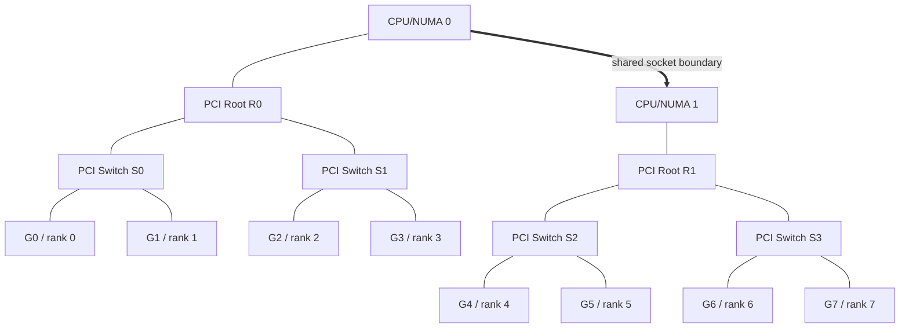
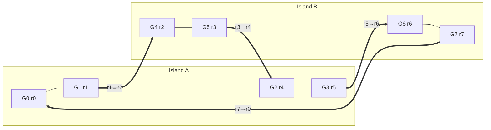
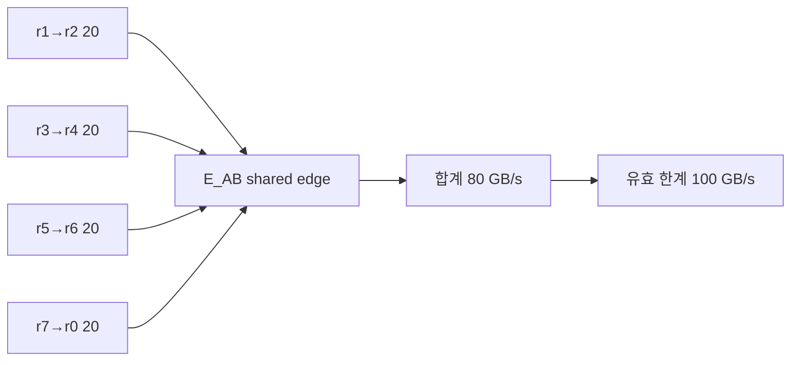

# 57장. 선은 보이는데 왜 느린가: PCIe·NVLink topology를 rank의 길로 읽기

GPU가 여덟 장 보이고 모두 정상이라고 하자. `nvidia-smi`에도 오류가 없고, 모델도 여덟 rank에 잘 올라갔다. 그런데 TP=8로 실행하면 네 GPU까지는 잘 늘던 처리량이 갑자기 꺾인다. 더 이상한 일도 있다. 같은 서버에서 GPU 0–3과 4–7로 나누어 TP=4 replica 두 개를 띄우면 각 replica는 더 짧은 지연을 낸다. 흔히 여기서 “NVLink가 느리다”, “NCCL이 잘못 골랐다”, “PCIe 병목이다”라는 말이 나온다. 세 문장 모두 가능하지만, 아직 어느 것도 진단은 아니다.

이 장에서는 선 하나를 끝까지 따라간다. 프로세스가 보는 device ordinal에서 출발해 UUID와 PCI BDF를 확인하고, PCI switch와 root complex를 거쳐 NVLink island를 그린다. 그 위에 rank와 TP group을 얹고, collective의 논리적 edge를 물리 경로에 투영한다. 마지막에는 여러 논리 edge가 같은 uplink를 공유하는지 확인한다. 이 흐름을 놓치지 않으면 topology matrix는 암호표가 아니라 원인 지도에 가까워진다.

## 57.1 ROUTE-57: NVLink 장비의 ring 두 edge가 SYS였던 사건

ROUTE-57은 “NVLink가 있다”는 inventory와 실제 collective route가 같지 않음을 보여 준다. GPU UUID·PCI BDF·NUMA, peer matrix, NCCL topology graph, rank placement, 선택된 ring edge와 edge별 counter를 한 시간선에 놓는다. 뒤 절의 PCI tree·XML·path 계산은 모두 두 SYS edge가 언제 후보가 되고 언제 실제 route로 확정됐는지를 찾는 조사 단계다.

### 57.1.1 “GPU 여덟 장”은 topology가 아니다

장애 티켓에는 보통 `8x GPU, TP=8, all-reduce slow`라고 적힌다. 이 정보로 알 수 있는 것은 장치 수와 병렬화 의도뿐이다. GPU 0과 GPU 1이 같은 PCIe switch 아래 있는지, GPU 3과 GPU 4 사이에 NVLink가 있는지, 두 rank의 traffic이 같은 root uplink를 공유하는지는 알 수 없다. 더구나 여기서 0과 1은 물리 슬롯 번호가 아니라 프로세스가 재배열한 ordinal일 수 있다.

그러므로 첫 기록은 성능 숫자가 아니라 identity다. 프로세스 ordinal, CUDA UUID, PCI domain:bus:device.function, physical GPU UUID, MIG instance UUID가 있다면 GI와 CI, NUMA node, rank를 한 행에 적는다. 이 행을 만들기 전에는 “rank 0이 첫 번째 GPU에 있다”는 표현을 사용하지 않는다.

### 57.1.2 반복해서 사용할 8-GPU fixture

이 장의 서버는 설명용 가상 장비다. GPU `G0..G3`은 island A, `G4..G7`은 island B에 있다. island 내부에는 충분한 NVLink/NVSwitch 경로가 있고, 두 island 사이에는 초당 100 GB의 유효 payload만 통과할 수 있는 공유 경계 `E_AB`가 있다고 가정한다. 이 숫자는 특정 NVIDIA 제품의 사양이 아니다. shared edge 계산을 손으로 할 수 있게 만든 실험 상수다.

각 TP collective round에서 인접 rank edge 하나가 20 GB/s의 payload를 요구한다고 하자. 동시에 경계를 건너는 논리 edge가 여섯 개면 요구량은 120 GB/s가 되고 `E_AB`에서 20 GB/s가 모자란다. 반면 각 island 안에서 끝나는 edge는 그 경계를 소비하지 않는다. 중요한 것은 matrix의 각 칸이 따로 100 GB/s를 받는다고 생각하지 않는 것이다. 여러 칸이 동일한 물리 선에 합쳐질 수 있다.

### 57.1.3 관찰 시계를 맞춘다

topology snapshot과 collective 측정의 시간이 다르면 존재하지 않는 인과를 만든다. hostname, boot ID, driver·CUDA·NCCL version, container ID, `CUDA_VISIBLE_DEVICES`, MIG mode, Fabric Manager 상태, UTC 시각을 측정 묶음에 붙인다. topology dump의 hash도 남긴다. 재부팅이나 MIG 재구성 뒤에는 같은 파일 이름이라도 내용의 시대가 다르다.

## 57.2 ordinal을 UUID와 PCI BDF에 묶는다

### 57.2.1 ordinal은 process-local 별명이다

`CUDA_VISIBLE_DEVICES=4,5,0,1`인 프로세스에서 CUDA device 0은 host의 네 번째 또는 물리 GPU 4를 가리킬 수 있다. container runtime이 UUID 목록을 전달하면 순서는 다시 달라진다. scheduler가 어제 저장한 ordinal을 오늘 재사용하면 rank placement 표는 멀쩡해 보이면서 실제 장치는 바뀐다.

안정적인 조인 키는 UUID와 PCI BDF다. CUDA runtime의 device property, NVML inventory, `nvidia-smi -L`, sysfs를 이 키로 결합한다. BDF는 `0000:65:00.0`처럼 domain까지 보존한다. bus 번호만 저장하면 multi-domain 시스템에서 충돌할 수 있다. UUID도 physical GPU UUID와 MIG UUID를 구분한다.

### 57.2.2 BDF가 알려 주는 것과 알려 주지 않는 것

BDF는 PCI hierarchy의 endpoint 위치를 찾는 열쇠다. `lspci -tv`와 `/sys/bus/pci/devices/<BDF>`를 통해 어느 bridge와 root complex 아래 있는지, 어느 NUMA node와 가까운지 확인할 수 있다. 그러나 BDF만으로 NVLink peer, 현재 link training 상태, CUDA P2P 허용 여부를 알 수는 없다. PCI 지도와 NVLink fabric 지도는 겹치지만 동일하지 않다.

따라서 원장은 다음처럼 채운다.

| process ordinal | CUDA UUID | PCI BDF | physical/MIG | PCI root | NVLink island | rank | group |
|---:|---|---|---|---|---|---:|---|
| 0 | GPU-a | 0000:21:00.0 | G0 | R0 | A | 0 | TP0 |
| 1 | GPU-b | 0000:22:00.0 | G1 | R0 | A | 1 | TP0 |
| 2 | GPU-c | 0000:41:00.0 | G4 | R1 | B | 2 | TP0 |

표의 세 번째 행처럼 ordinal 2가 G2라고 가정하지 않는 습관이 중요하다. 이후 모든 graph는 이 원장을 입력으로 다시 그릴 수 있어야 한다.

### 57.2.3 visibility와 reachability를 분리한다

장치가 CUDA에 보인다는 것은 커널을 실행할 수 있다는 뜻에 가깝다. 다른 GPU memory를 NVLink P2P로 읽을 수 있다는 뜻은 아니다. peer access capability, IOMMU와 virtualization 정책, MIG 지원 범위, fabric registration은 별도 조건이다. `nvidia-smi` inventory, CUDA peer query, NCCL 선택 결과를 서로 대신 쓰지 않는다.

## 57.3 PCI tree에서 공유되는 목을 찾는다

### 57.3.1 endpoint 사이의 길을 손으로 그린다

GPU 두 장이 같은 PCI switch에 붙으면 두 endpoint 사이 path는 짧아 보인다. 그러나 GPU 네 장이 동시에 host memory 또는 NIC로 나가면 switch uplink를 공유한다. pair별 matrix만 보면 모든 쌍이 좋게 표시될 수 있지만, 동시 traffic의 합은 하나의 uplink를 누른다.

이 그림은 NVLink를 아직 그리지 않았다. 일부러 그렇다. 먼저 PCI와 NUMA의 공유점을 찾아야 NVLink가 사용되지 않았을 때 traffic이 어디로 떨어지는지 설명할 수 있다.

### 57.3.2 link width와 generation은 capacity의 입력일 뿐이다

PCIe generation과 lane width로 theoretical line rate를 계산할 수 있다. 하지만 application payload는 encoding, transaction, protocol, direction, DMA engine, memory subsystem의 영향을 받는다. `x16`이라고 표시된 slot도 현재 negotiated width가 `x8`일 수 있다. capability와 현재 상태를 같은 열에 쓰지 않는다.

성능 분석 표에는 `maximum capability`, `negotiated speed/width`, `single-flow payload`, `concurrent aggregate payload`를 따로 둔다. 마지막 두 값이 없으면 공유 병목은 아직 가설이다.

### 57.3.3 root와 NUMA를 건너는 순간

서로 다른 root complex에 붙은 장치 사이 path는 CPU interconnect나 platform-specific route를 포함할 수 있다. `SYS`라는 기호 하나가 모든 서버에서 같은 latency를 뜻하지 않는다. socket topology, BIOS, ACS/IOMMU, peer routing 정책이 다르기 때문이다. 이 장에서는 기호의 서열보다 실제 bridge chain과 P2P 가능 여부를 우선한다.

## 57.4 topology matrix를 경로의 요약으로 읽는다

### 57.4.1 PIX·PXB·PHB·SYS·NVL은 제품 등급이 아니다

`nvidia-smi topo -m`의 표기는 관측된 두 endpoint 사이 경로를 요약한다. 일반적으로 PIX는 하나의 PCIe switch, PXB는 여러 PCIe bridge, PHB는 host bridge, SYS는 더 먼 CPU/NUMA 경계를 암시하고 NVL은 NVLink 연결을 나타낸다. 그러나 도구 version의 정의를 확인해야 하며, 이름이 비슷한 NCCL `PATH_*` 상수와 완전히 같은 public contract라고 가정하지 않는다.

matrix를 읽는 순서는 기호, BDF tree, 공유 uplink, peer capability, 동시 측정이다. `NVL4` 같은 표기가 있다면 link 수 또는 연결 표현의 정확한 도구 정의를 확인하고, 곧바로 “네 배의 실효 throughput”으로 바꾸지 않는다.

### 57.4.2 matrix의 한 칸은 전용 선이 아니다

G0–G4와 G1–G5가 모두 같은 종류의 경로로 표시되어도 두 pair가 동일한 `E_AB`를 공유할 수 있다. pair를 하나씩 측정하면 각각 80 GB/s가 나오지만 동시에 실행하면 합이 100 GB/s 근처에서 멈출 수 있다. 이때 각 pair의 장치나 kernel이 느려진 것이 아니라 공유 edge의 합산 제약이 드러난 것이다.

### 57.4.3 반례를 먼저 찾는다

matrix를 review할 때는 각 결론 옆에 관측 도구를 쓴다. “G0과 G1은 같은 PCI switch 아래 있다”는 BDF tree로 확인하고, “P2P가 허용된다”는 CUDA/NVML capability로 확인하며, “현재 NVLink가 정상 throughput을 낸다”는 link state와 측정으로 확인한다. 한 도구의 출력이 세 문장을 모두 증명한다고 쓰지 않는다.

도구끼리 모순될 때는 freshness와 scope를 비교한다. `lspci`는 host physical view, container의 CUDA query는 process-visible view, NCCL dump는 communicator init 시점 view일 수 있다. 모두 정확하면서 서로 다른 세계를 말할 수 있다. hostname과 namespace, process PID, timestamp와 generation을 붙이면 거짓 모순을 줄일 수 있다.

matrix screenshot만 티켓에 붙이는 관행도 개선한다. 텍스트 원본, command version과 timestamp를 보존해야 diff와 자동 조인이 가능하다. 표의 row/column label이 ordinal인지 physical index인지 명시하고 UUID/BDF mapping 파일을 함께 둔다. screenshot은 빠른 사람 검토용이지 machine-readable evidence가 아니다.

기호가 좋아 보이는데 성능이 나쁘면 곧바로 NCCL bug라고 하지 않는다. 첫째, negotiated link state와 health를 확인한다. 둘째, current graph가 그 path를 실제로 선택했는지 확인한다. 셋째, shared concurrent flow를 합산한다. 넷째, endpoint HBM/SM과 synchronization을 반증한다. 이 순서로 “좋은 adjacency, 나쁜 실행” 사이의 빈칸을 채운다.

반대로 `SYS` 경로가 있다고 항상 배치를 실패시키지 않는다. TP=8 model fit 때문에 경계가 필수이고 message가 작거나 compute가 지배적이면 SLO를 만족할 수 있다. topology risk는 실제 traffic frequency와 size를 곱해 평가한다. 존재하는 느린 path와 critical path인 느린 path는 다르다.

세대별 NVLink 숫자는 이 판단에 필요한 때만 가져온다. official 문서의 per-link 또는 aggregate, one-way 또는 bidirectional, 특정 form factor와 platform 조건을 그대로 적는다. 다른 GPU 세대나 PCIe card에 숫자를 이식하지 않는다. runtime effective bandwidth는 별도 측정 열에 둔다.

이 절의 최종 산출물은 matrix를 다시 그린 제품표가 아니다. 각 cell에서 실제 endpoint identity, path category, shared parent edge, current capability와 health로 이동할 수 있는 링크드 worksheet다. 독자는 “NVL”을 보고 멈추지 않고 “어느 port와 switch를 누구와 공유하며 지금도 정상인가”를 다음 질문으로 이어 간다.

이 질문에 답이 없으면 해당 cell은 성능 근거가 아니라 미확인 가설로 표시한다. 빈칸을 그럴듯한 세대 사양으로 채우지 않는 태도가 정확한 topology 분석의 출발점이다.

topology 가설이 맞다면 rank를 island 안으로 재배치했을 때 cross-edge traffic과 tail latency가 함께 줄어야 한다. 줄지 않는다면 HBM bandwidth, SM contention, kernel launch, protocol 선택, message size가 더 가까운 원인일 수 있다. topology는 강력한 설명이지만 모든 collective 문제의 만능 원인은 아니다.

## 57.5 NCCL topology XML은 어떻게 만들어지는가

### 57.5.1 입력 XML과 자동 탐지의 경계

이 절의 구현 좌표는 NCCL v2.30.7-1의 [`ncclTopoGetSystem`](https://github.com/NVIDIA/nccl/blob/73cf112295c33aee2b895f329f592f2a9b4b0f97/src/graph/topo.cc#L1765-L1933)이다.

함수의 순서는 운영자가 수집할 증거의 순서이기도 하다. 먼저 process environment에서 `NCCL_TOPO_FILE`의 존재와 실제 문자열 값을 가져온다. 다음에는 그 경로가 container mount 안에서 어느 inode와 content hash를 가리키는지 확인한다. host의 `/etc/nccl/topo.xml`과 container 안의 같은 경로가 같은 파일이라는 보장은 없다. symbolic link와 ConfigMap 갱신도 실제 process가 읽은 generation을 흐릴 수 있다.

파일이 없을 때 시도되는 virtual topology XML도 무시하지 않는다. topology daemon이 만든 파일이 존재한다면 “override를 설정하지 않았다”와 “오직 live sysfs만 자동 탐지했다”는 같은 뜻이 아니다. startup log와 입력 file hash를 함께 남겨 library가 어떤 선행 정보를 가졌는지 확정한다. file read failure가 warning인지 fallback인지도 current source와 log에서 확인한다.

그 뒤 current rank의 `peerInfo[rank].busId`가 중요한 조인점이 된다. 이 값이 앞서 만든 UUID/BDF 원장의 BDF와 같은 장치를 가리키는지 비교한다. NCCL은 process가 관리하는 GPU를 채우고 rank 속성을 붙이므로, launcher의 device 선택이 이미 틀렸다면 topology code는 그 잘못된 선택을 충실히 모델링할 수 있다. topology parser가 정확하다고 placement가 정확한 것은 아니다.

rank-local discovery와 XML fusion도 관찰 의미가 다르다. 각 rank가 자기 GPU 주변 정보를 채운 결과는 local view이고, all-gather 뒤 fusion된 XML은 communicator의 합성 view다. 일부 rank가 다른 mount namespace, driver state 또는 visibility를 가졌다면 local views가 비대칭일 수 있다. 최종 dump만 볼 때는 fusion 과정에서 어느 rank가 어떤 node를 기여했는지 추가 log가 필요할 수 있다.

정상 fixture에서는 여덟 rank의 UUID/BDF set과 fused XML의 GPU endpoint set이 일치해야 한다. set equality 외에도 rank attribute가 올바른 endpoint에 붙었는지 검사한다. 여덟 endpoint가 모두 있어도 rank 2와 rank 4가 뒤바뀌면 graph node 수 검사는 통과하지만 logical edge의 physical projection은 틀린다.

XML을 재사용해야 한다면 canonicalization이 필요하다. attribute 순서와 whitespace 때문에 hash가 달라지는 문제와 의미 있는 edge 변화는 구분한다. 원본 byte hash는 provenance용으로 보존하고, 구조적으로 정렬한 node/edge digest는 semantic comparison에 사용한다. canonicalizer version도 metadata에 남긴다.

source excerpt를 읽을 때는 함수 전체를 복사하지 않는다. 환경 변수 분기, bus ID 변환과 fill, local XML all-gather/fusion, dump와 system 변환의 네 부분만 짧게 보여 준다. 각 부분 뒤에는 “이 줄이 운영 원장의 어느 열을 만든다”는 해설을 붙인다. 코드가 독자에게 낯선 C++ macro의 벽이 아니라 관찰 순서의 근거가 되게 한다.

마지막으로 init 성공과 topology 적합성을 나눈다. XML parse, fusion과 graph search가 성공해 communicator가 만들어져도 서비스의 SLO에 맞는 placement라는 뜻은 아니다. 성공은 실행 가능한 후보를 찾았다는 증거에 가깝다. TP group이 island를 몇 번 가로지르는지와 shared-edge load는 serving layer가 별도로 평가해야 한다.

고정한 NCCL v2.30.7-1의 `ncclTopoGetSystem`은 먼저 `NCCL_TOPO_FILE`을 확인한다. 값이 있으면 그 XML을 읽고, 없으면 `/var/run/nvidia-topologyd/virtualTopology.xml`을 시도한다. 그 뒤 현재 rank의 peer info에 든 bus ID를 문자열 BDF로 바꾸고 `ncclTopoFillGpu`를 호출한다. 즉 override는 실행 뒤 결과에 덧칠하는 메모가 아니라 topology 구성의 선행 입력이다.

각 process는 자신이 관리하는 GPU를 채우고 `rank`와 `keep`을 표시한다. rank-local XML은 intra-node all-gather로 교환되고 `ncclTopoFuseXml`로 합쳐진다. 이 순서를 알면 stale XML의 위험이 선명해진다. 파일이 parse됐다는 사실과 현재 rank의 BDF, NVLink target, PCI parent가 올바르게 결합됐다는 사실은 다르다.

### 57.5.2 XML node가 in-memory graph가 되는 순간

자료 구조와 변환은 [`topo.h`](https://github.com/NVIDIA/nccl/blob/73cf112295c33aee2b895f329f592f2a9b4b0f97/src/graph/topo.h#L40-L115)와 [`ncclTopoGetSystemFromXml` 주변](https://github.com/NVIDIA/nccl/blob/73cf112295c33aee2b895f329f592f2a9b4b0f97/src/graph/topo.cc#L592-L975)을 함께 읽는다.

`ncclTopoGetSystemFromXml` 주변 코드는 XML의 GPU, PCI, NVS, CPU, NIC 정보를 `ncclTopoNode`와 `ncclTopoLink`로 바꾼다. link에는 type과 bandwidth, 반대편 node가 있다. CPU node는 소스 주석상 실제 NUMA domain의 역할을 한다. 이 detail은 “CPU를 지났다”는 문장을 socket/NUMA 관점에서 읽게 한다.

NVLink target이 physical GPU인지 NVSwitch인지에 따라 node와 link가 연결된다. XML에 이름이 있다는 것만으로 runtime P2P가 보장되지는 않는다. 이후 path computation에서 capability와 정책이 다시 적용된다.

### 57.5.3 dump를 증거로 보존한다

입력과 dump의 public contract는 [NCCL environment 공식 문서](https://docs.nvidia.com/deeplearning/nccl/user-guide/docs/env.html#nccl-topo-file)에 고정한다.

NCCL source도 사건의 순서로 읽어야 한다. 먼저 `ncclTopoGetSystem`이 어떤 입력 XML과 process bus ID를 보았는지 묻는다. 다음에는 rank-local XML이 무엇을 `keep`했고 fusion 뒤 어떤 endpoint가 남았는지 묻는다. 이어서 node/link 변환, path 계산, graph search를 차례로 본다. environment, discovery, path와 execution을 한 문장으로 뭉개면 first divergence를 놓친다.

이 답을 한 log level에서 모두 얻을 수 있다고 기대하지 않는다. startup environment, topology dump, NCCL graph log, UUID/BDF inventory를 결합한다. production에서 verbose log를 늘 켤 수 없다면 commissioning baseline과 재현 canary를 둔다. 장애 뒤 처음 debug를 켜면서 정상 상태가 사라졌음을 깨닫지 않도록 최소 identity와 dump hash는 평소에도 남긴다.

`NCCL_TOPO_DUMP_FILE`은 탐지된 XML을 파일로 남기는 관찰점이다. 원본 override와 dump를 둘 다 hash해 비교한다. multi-node NVLink domain에서는 공식 문서가 dump 범위와 load 파일 범위의 차이를 경고하므로, full-domain dump를 그대로 single-node override로 재사용하지 않는다. 파일 이름이 `topo-good.xml`이라는 사실은 provenance가 아니다.

## 57.6 path 계산은 가장 좁은 선을 기억한다

### 57.6.1 `bw=min(path, link)`의 직관

아래 설명은 [`ncclTopoSetPaths`](https://github.com/NVIDIA/nccl/blob/73cf112295c33aee2b895f329f592f2a9b4b0f97/src/graph/paths.cc#L48-L121)의 실제 갱신 조건을 따른다.

작은 graph로 갱신을 따라가 보자. G0에서 PCI switch S0까지 64, S0에서 root R0까지 48, R0에서 목적지 쪽 bridge까지 32라는 내부 bandwidth 후보가 있다고 하자. path가 link를 하나씩 붙일 때 병목값은 64, 48, 32로 내려간다. 마지막 endpoint link가 64여도 전체 path 후보는 32다. 빠른 마지막 선이 앞의 좁은 uplink를 복구하지 못한다.

같은 path type을 가진 다른 후보가 병목 40이라면 source의 비교 규칙상 40 후보가 앞선다. bandwidth도 같으면 hop 수가 더 짧은 후보가 선택될 수 있다. 그러므로 matrix category만 같아도 NCCL 내부 후보값과 hop이 다를 수 있다. 반대로 category가 더 가까워 보인다는 이유만으로 runtime에서 반드시 빠르다고 단정하지 않는다.

여기서 `min`은 직렬 path 하나의 bottleneck 근사다. G0→G4와 G1→G5가 같은 32 edge를 동시에 쓸 때 각각 32를 얻는다는 뜻이 아니다. 두 flow의 aggregate capacity와 arbitration은 path list 두 개를 별도로 본 뒤 shared edge에서 합산해야 드러난다. source path computation과 우리의 traffic projection이 서로 보완되는 지점이다.

path type 변화도 실제 node traversal에서 이해한다. 하나의 PCI switch 내부에서 끝나는 길, 여러 PCI node를 잇는 길, CPU/NUMA 경계를 포함하는 길은 다른 구조를 가진다. 기호를 외우기보다 reverse link까지 포함한 node sequence를 출력해 “왜 이 type이 되었는가”를 설명한다. source가 reverse path를 찾지 못하면 internal error를 내는 부분은 graph가 방향 없는 그림이 아니라 양쪽 link consistency를 요구함을 보여 준다.

path table을 운영 증거로 저장할 때 source와 destination identity를 ordinal로만 적지 않는다. UUID/BDF pair와 NCCL rank를 함께 둔다. `type=PHB,bw=...` 옆에 실제 node sequence와 generation hash가 있어야 다음 incident와 비교할 수 있다. source upgrade 뒤 type ordering이나 내부 상수가 달라질 수 있으므로 NCCL commit도 붙인다.

path computation 결과가 예상과 다르면 XML부터 되짚는다. parent PCI node가 잘못됐는지, NVLink target이 누락됐는지, P2P capability 때문에 route가 수정됐는지 순서대로 본다. graph search 환경을 먼저 강제하면 discovery 오류를 가릴 수 있다. 입력과 path가 정확하다는 증거 뒤에 graph 후보를 조정한다.

`ncclTopoSetPaths`는 기존 path와 새 link를 이어 후보를 만들 때 bandwidth를 둘 중 작은 값으로 둔다. 직렬로 이어진 길의 throughput이 가장 좁은 구간에 제한된다는 직관이다. 또한 PCI node가 연속되면 PXB, CPU 경계를 만나면 PHB처럼 path type을 조정한다.

후보 path는 더 나은 type, 같은 type이면 더 높은 bandwidth, 그것도 같으면 더 적은 hop을 기준으로 갱신된다. 이 규칙은 source가 graph를 어떻게 요약하는지 알려 준다. 다만 여러 collective flow가 한 edge에 동시에 몰리는 contention까지 `min` 한 줄이 계산해 주는 것은 아니다. 그것은 우리가 traffic matrix를 물리 edge에 투영해 별도로 계산해야 한다.

### 57.6.2 P2P 가능성은 adjacency보다 늦게 확정된다

전체 path 단계는 [`ncclTopoComputePaths`](https://github.com/NVIDIA/nccl/blob/73cf112295c33aee2b895f329f592f2a9b4b0f97/src/graph/paths.cc#L721-L866)에서 확인한다.

`ncclTopoComputePaths`는 direct path를 만든 뒤 GPU P2P와 GDR 조건, intermediate GPU/NVSwitch 경로 같은 제약을 반영한다. 따라서 “NVLink cable이 있다”와 “이 communicator가 그 path를 쓴다” 사이에는 driver capability와 policy 검증이 있다. CUDA peer query가 실패했는데 matrix 기호만 믿고 NVLink traffic이라고 결론 내리면 안 된다.

### 57.6.3 graph search와 path discovery를 섞지 않는다

graph 후보 탐색의 고정점은 [`ncclTopoCompute`](https://github.com/NVIDIA/nccl/blob/73cf112295c33aee2b895f329f592f2a9b4b0f97/src/graph/search.cc#L1074-L1144)다.

source의 node type은 graph가 장비 사진의 복사본이 아니라 route 결정을 위한 추상화임을 보여 준다. GPU, PCI, NVS, CPU, NIC와 network endpoint가 분리된다. CPU node를 NUMA domain으로 읽어야 하는 이유도 source 주석에 있다. 이 추상화의 목적을 이해하면 graph에 없는 chassis detail을 억지로 추론하지 않고, 필요한 parent edge도 생략하지 않는다.

link의 `bw`도 절대 진실의 측정값이 아니다. architecture와 link type에 따른 내부 기대값 또는 XML 속성이 graph cost에 쓰일 수 있다. degraded hardware, virtualization, concurrent traffic의 실효값은 달라진다. 내부 graph가 기대한 bandwidth와 runtime counter가 보인 throughput을 나란히 놓고, 둘의 차이를 진단 신호로 사용한다.

path type ordering도 비율표로 번역하지 않는다. source가 type, bandwidth와 hop count를 사용해 후보를 비교하는 것은 내부 선택 질서를 보여 준다. `PIX`가 `PXB`보다 모든 서버에서 정확히 몇 배 빠르다는 뜻은 아니다. 구조 category, 후보 bandwidth, concurrent contention은 서로 다른 열이다.

NVSwitch가 있는 경우 point-to-point cable 그림만으로 부족하다. 여러 endpoint pair가 잘 연결돼 보여도 access port와 internal route, trunk와 switch health를 공유할 수 있다. 하나의 access link failure는 특정 GPU의 fabric 참여를 바꾸고, switch 또는 trunk 정책은 더 넓은 partition에 영향을 줄 수 있다. failure domain을 pair 하나로만 모델링하지 않는다.

Fabric Manager의 초기화·routing·monitoring 책임은 platform generation과 ALI 지원에 따라 달라질 수 있다. 다른 장비의 “FM을 재시작하라”는 runbook을 복사하지 않는다. 자신의 platform support 범위와 official guidance를 먼저 확인한다. 재시작은 실행 중 CUDA job과 증거에 영향을 주는 상태 변경이다.

readiness는 정상 link 개수보다 required peer set으로 판단한다. TP group 네 rank가 요구하는 graph edge 중 하나가 사라지면, 사용하지 않는 다른 link 열 개가 정상이어도 group은 위험하다. current graph의 channel edge와 representative message size를 기준으로 required set을 만든다. ring neighbor만 검사하면 tree나 NVLS 선택에서 필요한 edge를 놓칠 수 있다.

운영 기록에는 `discovered topology`, `computed path`, `selected graph`를 세 artifact로 둔다. topology가 같아도 message size, capability와 environment 때문에 graph가 달라질 수 있고, graph 이름이 같아도 rank placement 때문에 physical edge가 달라질 수 있다. 세 artifact의 hash와 communicator ID를 연결하면 “NCCL이 같은 선택을 했다”는 문장을 검증할 수 있다. 강제 graph 실험은 current communicator를 새로 만들고, unsupported candidate의 fallback 여부를 startup log에서 확인한다. 환경 변수 문자열만으로 effective graph를 판정하지 않는다.

`ncclTopoCompute`는 계산된 path 범위, GPU compute capability, graph pattern과 환경 설정을 바탕으로 ring/tree/NVLS 등에 필요한 graph를 찾는다. `NCCL_GRAPH_FILE`이 있으면 graph XML도 별도 입력이 된다. topology node를 발견한 단계, source-destination path를 분류한 단계, channel graph를 선택한 단계는 서로 다른 관찰점이다.

## 57.7 rank placement를 topology 위에 얹는다

### 57.7.1 rank 번호순 배치가 locality를 보장하지 않는다

launcher는 visible device 순서로 local rank를 붙이는 경우가 많다. visible 순서가 BDF나 NVLink island 순서와 같다는 보장은 없다. `0,1,4,5,2,3,6,7`처럼 섞인 visibility에서는 연속 rank ring이 island 경계를 반복해서 건널 수 있다.

연속 rank만 보면 깔끔한 ring이지만 물리적으로는 경계를 네 번 지난다. placement 검토에서는 rank sequence를 BDF/island sequence로 번역한 그림이 필요하다.

### 57.7.2 group별 locality 목표가 다르다

TP는 token step마다 빈번한 collective가 있어 NVLink locality의 가치가 크다. DP replica는 주로 독립 request를 처리하므로 replica 내부 TP group을 island에 가두는 편이 유리할 수 있다. EP는 token dispatch pattern과 expert placement에 따라 traffic이 달라진다. “모든 연속 rank를 같은 island에”가 보편 규칙은 아니다. 가장 빈번하고 큰 collective의 group을 먼저 배치한다.

### 57.7.3 placement는 scheduler 상태이기도 하다

placement record에는 단순 rank list 대신 `plan_generation`, `topology_generation`, `worker_generation`을 둔다. scheduler가 만든 plan의 topology hash와 worker가 startup 때 보고한 hash가 다르면 ready를 보류한다. 같은 host에서 worker 하나만 재시작했어도 visibility와 override environment가 달라질 수 있기 때문이다.

재스케줄링은 locality와 안정성을 함께 본다. degraded GPU를 제외한 뒤 TP group을 여덟 장에 억지로 유지하면 남은 rank가 더 느린 경계를 반복해서 지날 수 있다. world size를 유지하는 것과 SLO를 유지하는 것은 별개다. model fit, healthy peer set과 expected shared-edge load를 다시 계산한다.

placement log는 결정 이유를 남긴다. “G0–G3을 TP group으로 선택”만 쓰지 말고 “weight fit 통과, required peers 모두 capable, island span 1, NIC distance cost 2, failure-domain policy 통과”처럼 predicate 결과를 저장한다. 나중에 topology가 변했을 때 어느 predicate가 처음 거짓이 됐는지 찾을 수 있다.

운영 중 request router도 placement의 일부다. 두 TP=4 replica가 물리적으로 잘 나뉘어도 모든 request가 한 replica에 몰리면 topology 이점이 queueing에 묻힌다. replica별 admission, cache affinity와 load shedding을 함께 관찰한다. GPU 배치만 바꾸고 router 상태를 고정하지 않은 A/B는 해석하기 어렵다.

마지막으로 rollback plan을 둔다. 새 placement canary가 latency나 correctness gate를 통과하지 못하면 이전 topology generation에서 검증된 plan으로 돌아간다. 단, 이전 plan이 degraded edge를 포함하면 그대로 복원하지 않는다. rollback도 current health predicate를 다시 평가하는 새 결정이다.

서빙 scheduler가 replica와 worker를 재시작할 때 동일한 rank→UUID 결합을 유지하는지 확인한다. 장애 대체 GPU가 들어오면 world size는 같아도 topology가 바뀐다. placement plan에는 topology snapshot hash와 generation을 넣고, 다른 generation에서 복원된 worker는 재검증 전 ready로 만들지 않는다.

## 57.8 TP=8과 두 TP=4를 손으로 비교한다

### 57.8.1 논리 traffic matrix를 만든다

단순화를 위해 ring 한 round의 directed edge를 `r0→r1, r1→r2, …, r7→r0`로 둔다. 각 edge traffic은 20 GB/s다. physical placement가 `r0..r3`은 A, `r4..r7`은 B라면 경계를 넘는 edge는 `r3→r4`와 `r7→r0` 두 개다. `E_AB` load는 `20+20=40 GB/s`다.

visibility가 섞여 rank island가 `A,A,B,B,A,A,B,B`가 되면 경계 edge는 `r1→r2`, `r3→r4`, `r5→r6`, `r7→r0` 네 개다. load는 80 GB/s다. 같은 TP=8, 같은 message, 같은 algorithm 이름인데 placement 하나로 공유 edge 요구량이 두 배가 됐다.

### 57.8.2 두 TP=4 replica 계산

replica P의 rank 0–3을 island A, replica Q의 rank 0–3을 island B에 둔다. 각 ring edge는 island 안에서 닫힌다. 이 fixture에서 TP collective가 `E_AB`에 주는 load는 0이다. 두 replica가 request를 독립 처리하면 cross-island TP bytes가 사라진다.

그러나 공짜가 아니다. 모델 weight가 두 번 복제되고, 각 replica에 KV cache 여유와 scheduler queue가 따로 필요하다. 모델이 네 GPU shard에 들어가지 않으면 이 배치는 불가능하다. 한 replica에 긴 prefill이 몰리고 다른 replica가 놀면 평균 capacity도 낭비한다. request router와 cache affinity가 새 병목이 될 수 있다.

### 57.8.3 무엇을 측정해야 결론이 되는가

수계산은 direction을 포함해야 한다. contiguous sequence `A,A,A,A,B,B,B,B`의 ring에서는 `r3→r4`가 A→B, `r7→r0`가 B→A다. 각 20 GB/s이므로 방향별 demand는 20 GB/s, 양방향 합은 40 GB/s다. 섞인 sequence `A,A,B,B,A,A,B,B`에서는 A→B 두 edge와 B→A 두 edge가 있어 방향별 40, 합 80 GB/s다. 완전 교차 `A,B,A,B,A,B,A,B`에서는 방향별 네 edge, 80 GB/s이고 합은 160 GB/s다.

이 값을 one-way capacity와 비교할 때는 방향별 값을 사용한다. 문서의 “aggregate 100 GB/s”가 양방향 합이라면 같은 기준으로 바꾸고, full-duplex 독립 자원인지도 확인한다. 방향 단위를 빠뜨리면 같은 측정을 두 배 빠르거나 두 배 느리게 해석한다. 표의 모든 bandwidth 열 이름에 `one-way`, `bidirectional sum`, `payload` 또는 `line rate`를 적는다.

ring edge 모델은 placement의 상대 비용을 보여 주는 근사다. 실제 NCCL은 chunk와 channel을 pipeline하고 message size와 topology에 따라 다른 graph를 선택할 수 있다. 그러므로 계산값은 observed link bytes와 반드시 같아야 하는 정답이 아니다. 대신 “완전 교차 배치는 contiguous보다 경계 요구 횟수가 네 배”라는 검증 가능한 예측을 준다.

측정이 예측과 다르면 assumption을 검사한다. effective graph가 ring인지, rank order가 예상과 같은지, edge당 payload가 20인지, channels가 다른 route로 분산됐는지 확인한다. link counter의 sampling window가 collective 구간과 맞는지도 본다. 모델을 무작정 복잡하게 만들기 전에 가장 큰 배율을 만든 assumption부터 고친다.

TP=4 두 replica의 `E_AB` TP demand가 0이라는 계산도 scope를 붙인다. request router, KV transfer, weight loading과 NIC traffic은 별도다. 분리 prefill/decode가 island를 건너 KV를 보내면 TP collective가 사라진 자리에 더 큰 cache traffic이 올 수 있다. traffic matrix는 class별로 나눠 합산한다.

memory feasibility를 함께 수치화한다. resident weight 200 GB, GPU당 usable HBM 75 GB, runtime reserve 10 GB라고 하자. TP=8이면 GPU당 weight 25 GB와 KV/activation budget 40 GB가 남는다. TP=4이면 GPU당 weight 50 GB와 budget 15 GB가 남는다. 두 replica가 link latency를 줄여도 aggregate KV capacity는 크게 감소할 수 있다.

resident weight가 280 GB라면 TP=4의 GPU당 70 GB가 usable 65 GB를 넘어 아예 실행할 수 없다. 이 경우 TP=8 cross-island cost를 받아들이거나 quantization/offload/model 변경을 검토해야 한다. topology optimizer가 model fit hard constraint를 먼저 적용해야 하는 이유다.

반대로 짧은 decode request가 많고 15 GB KV면 충분하며 router가 queue를 균형 있게 나누면 두 TP=4가 더 나을 수 있다. 한 replica에 cache affinity가 몰리면 다른 replica의 idle capacity를 쓰지 못한다. 따라서 비교에는 replica별 queue depth, batch size, cache hit, TTFT와 ITL을 넣는다.

측정 run은 동일 prompt mix와 arrival trace, warmup, clock/power 상태를 사용한다. TP size 변화가 NCCL algorithm/protocol/channel 선택을 바꿀 수 있으므로 startup effective log를 저장한다. 성능 차이가 island locality 때문인지 smaller communicator의 실행 변화인지 구분한다.

최종 결정표에는 세 층이 있다. feasibility 층은 model fit과 required context를 검증한다. topology 층은 group span, cross-edge demand와 health를 비교한다. service 층은 queueing, cache와 SLO를 비교한다. 세 층을 모두 통과한 배치만 production 후보가 된다.

비교표에는 model fit, replica당 weight bytes, KV capacity, batch shape, collective bytes/step, `E_AB` 추정 load, measured link payload, TTFT, ITL, throughput, p99를 함께 쓴다. 동일 prompt mix, warmup, clock/power 상태에서 비교한다. TP=4가 빨라졌다는 결과만 보고 원인을 topology로 확정하지 않는다. smaller group의 algorithm/channel 변화도 함께 기록한다.

## 57.9 shared edge로 논리 edge를 투영한다

### 57.9.1 식은 단순하지만 원장이 필요하다

rank pair `i,j`의 traffic을 `T[i,j]`, 그 pair가 physical edge `e`를 지나면 `R[i,j,e]=1`이라고 하자.

`load(e) = Σ(i,j) T[i,j] × R[i,j,e]`

계산은 한 줄이지만 `R`을 만들려면 rank→UUID→BDF→path가 정확해야 한다. ordinal이 한 칸 밀리면 예쁜 heatmap이 잘못된 장비를 설명한다.

### 57.9.2 utilization과 saturation을 구분한다

shared-edge heatmap은 평균보다 동시성을 보여 줘야 한다. 1분 평균 40%인 edge도 50밀리초 decode burst마다 100%에 닿아 ITL p99를 만들 수 있다. request와 collective timestamp를 작은 window로 bucket하고, 해당 window에 active했던 rank-pair route의 demand를 합산한다. metric 해상도보다 작은 현상은 trace sampling으로 보완한다.

utilization 상승과 latency 상승의 선후도 본다. link demand가 먼저 증가하고 queueing과 collective duration이 뒤따르면 capacity 가설이 강해진다. GPU kernel이 먼저 길어지고 link가 늦게 비는 경우에는 compute/HBM이 원인일 수 있다. 상관관계 한 장 대신 ordered event를 만든다.

동시 pair 실험에서는 G0→G4만 실행한 값, G1→G5만 실행한 값, 둘을 함께 실행한 각 flow와 aggregate를 모두 기록한다. 단독 70과 70, 동시 48과 48, aggregate 96이라면 약 100의 shared edge 가설이 자연스럽다. 동시에도 70과 70이라면 두 route가 생각과 달리 독립 edge를 쓰거나 capacity 추정이 틀렸다.

세 번째 pair를 추가해 aggregate가 계속 늘어나는지 보면 plateau를 더 선명하게 찾을 수 있다. 다만 sender/receiver의 HBM과 copy engine이 먼저 포화되지 않았는지 검사한다. endpoint 자체가 병목이면 서로 다른 physical edge를 써도 같은 감소가 생긴다. control 실험으로 한 endpoint를 공유하는 pair와 edge만 공유하는 pair를 나눈다.

serving workload에서는 synthetic copy와 collective를 번갈아 사용한다. copy test는 physical reachability와 capacity를 좁히고, collective는 NCCL graph와 synchronization을 포함하며, end-to-end request는 scheduler와 model kernel까지 포함한다. 아래 단계가 정상인데 위 단계만 나쁘면 원인 범위가 위로 좁혀진다. 처음부터 end-to-end 숫자만 보면 어느 layer가 갈라졌는지 알기 어렵다.

saturation 판정에는 recovery도 포함한다. concurrency를 절반으로 줄이거나 placement를 island-local로 바꿨을 때 per-flow throughput과 ITL이 회복돼야 한다. 회복하지 않으면 edge capacity만으로 설명할 수 없다. 이 negative result도 버리지 않고 가설 원장에 남긴다.

counter가 높다는 것은 traffic이 있다는 뜻이지 반드시 병목이라는 뜻은 아니다. demand가 capacity에 접근하고 queueing 또는 latency가 함께 증가하며 placement A/B에서 반응해야 saturation 가설이 강해진다. 반대로 link counter는 낮은데 collective가 느리면 P2P fallback, synchronization, kernel launch, HBM이 원인일 수 있다.

### 57.9.3 pair test와 collective test를 함께 한다

single pair test는 경로의 최대 가능성을 좁힌다. concurrent pair test는 공유 uplink를 드러낸다. collective test는 NCCL graph, protocol, channel과 application ordering까지 포함한다. 셋은 대체재가 아니다. single pair가 정상이고 concurrent pair만 무너지면 shared edge 가설이 강해진다.

## 57.10 degraded NVLink 사건

### 57.10.1 “연결됨”과 “정상 대역폭” 사이

degraded mode의 범위는 [NVIDIA Fabric Manager User Guide](https://docs.nvidia.com/datacenter/tesla/fabric-manager-user-guide/index.html)를 기준으로 제한한다.

어느 날 topology matrix는 여전히 NVLink path를 표시하지만 TP=8 p99가 두 배가 됐다고 하자. Fabric Manager 공식 문서는 access NVLink와 trunk NVLink failure, NVSwitch failure에 따라 GPU를 P2P fabric에서 제외하거나 일부 switch/link를 비활성화해 reduced bandwidth로 운용할 수 있음을 설명한다. GPU가 CUDA inventory에 계속 보이는 경우도 있다.

정적 adjacency, fabric registration, trained/enabled 상태, negotiated link 상태, error/recovery counter, utilization을 별도 열로 둔다. “보인다”는 상태가 “정상 full path에 참여한다”는 상태를 덮지 못하게 한다.

### 57.10.2 first divergence를 시간순으로 찾는다

baseline은 commissioning 때 미리 만든다. UUID/BDF map, PCI negotiated width, NVLink port state, Fabric Manager fabric state, pair bandwidth, concurrent-pair aggregate와 NCCL dump를 한 generation으로 묶는다. firmware, driver, BIOS 또는 GPU가 바뀌면 새 baseline을 만든다. 이전 값은 비교점이지 영원한 정상 범위가 아니다.

incident timeline에는 네 clock을 잇는다. fabric event 시각, NCCL communicator 생성 시각, serving latency가 처음 변한 시각, operator가 오류를 관찰한 시각이다. 초기 communicator가 degradation 뒤에도 살아 있으면 startup graph와 current health가 다른 시대를 설명한다. 새 communicator에서 graph 또는 latency가 바뀌는지 controlled canary로 확인한다.

link counter는 누적 byte인지 rate인지, port별인지 aggregate인지, reset과 wrap이 어떻게 보이는지 먼저 확인한다. scrape 실패가 이전 값을 반복해 안정 상태처럼 보일 수 있다. counter window와 request trace는 monotonic clock 또는 보정된 공통 시각으로 맞춘다. 1초 counter로 20밀리초 request 하나의 원인을 확정하지 않는다.

static adjacency, trained/enabled, fabric registered, P2P capable, healthy bandwidth를 boolean 하나로 합치지 않는다. GPU가 visible하지만 fabric participant가 아닐 수 있고, path가 enabled지만 reduced bandwidth일 수 있다. readiness는 required TP peers 모두의 현재 reachability와 작은 known-result collective를 단계적으로 확인한다.

placement swap은 강한 반증이다. 같은 workload를 다른 healthy island에 옮겼을 때 느림이 edge에 남는지 rank와 함께 이동하는지 본다. 단, CPU affinity, NIC locality, power state가 함께 바뀌지 않게 통제한다. 한 번에 여러 shared domain을 바꾸면 결과가 다시 모호해진다.

정상 snapshot hash `H0`, 장애 직전 FM/NVLink event, 장애 시점 snapshot `H1`, NCCL communicator 재생성 여부, 첫 latency 상승 시각을 정렬한다. startup 때 만든 communicator가 link degradation 뒤에도 오래 살아 있었다면 초기 graph와 현재 fabric health가 다를 수 있다. 재시작 후 graph가 달라지는지도 중요한 관찰이다.

### 57.10.3 복구보다 증거가 먼저다

Fabric Manager restart, link reset, host reboot는 상태를 바꾸고 증거를 지운다. 운영 승인을 받은 runbook 단계로 분리한다. 먼저 event log, topology dump, current UUID/BDF, link state와 counter, collective trace를 보존한다. degraded-mode 정책은 플랫폼 세대와 설정에 따라 다르므로 다른 DGX/HGX의 결과를 그대로 대입하지 않는다.

## 57.11 stale topology override 사건

### 57.11.1 성공적으로 읽힌 오래된 지도

BDF만 비교해도 충분하지 않은 사례가 있다. GPU를 같은 slot에서 교체하면 새 UUID가 같은 BDF를 차지한다. 반대로 BIOS enumeration 변화는 같은 GPU UUID에 새 bus 번호를 줄 수 있다. 그러므로 endpoint identity는 physical UUID와 BDF의 pair, inventory generation으로 비교한다.

semantic diff는 XML node 수가 아니라 canonical tuple을 사용한다. GPU마다 UUID를 얻을 수 있는 범위, busid, PCI parent chain, NVLink target과 width, rank binding을 정렬한다. current dump와 비교해 stale endpoint, missing endpoint, parent change, target change와 width change를 별도 category로 낸다. whitespace diff와 의미 변화가 섞이지 않게 canonicalizer version을 기록한다.

override에는 생성 이유, owner, 대상 host class, source inventory digest, NCCL version 범위와 expiry를 붙인다. 자동 탐지 bug의 임시 workaround였는지 virtual topology의 필수 입력인지 알아야 제거 A/B를 안전하게 설계할 수 있다. 해결된 workaround가 새 hardware에서 영구 미신이 되지 않게 한다.

GPU 교체 뒤에도 배포 이미지에 `NCCL_TOPO_FILE=/etc/nccl/topo.xml`이 남아 있다고 하자. NCCL log에는 파일을 성공적으로 loading했다고 나온다. 하지만 XML의 BDF와 NVLink target은 어제 장비를 설명할 수 있다. parser 성공은 현재성 검증이 아니다.

override path, SHA-256, mtime, image digest, 배포 주체를 기록한다. current auto-detected dump와 node 수, UUID/BDF, PCI parent, NVLink target, link width를 구조적으로 비교한다. 문자열 diff가 아니라 endpoint identity와 edge의 의미를 비교한다.

### 57.11.2 topology override와 graph override는 다른 위험이다

`NCCL_TOPO_FILE`은 node/link topology 입력이고 `NCCL_GRAPH_FILE`은 graph/channel 선택 입력이다. 두 파일을 “NCCL 설정” 하나로 묶으면 어느 단계에서 현실과 갈라졌는지 찾기 어렵다. 각각 provenance와 적용 log를 남긴다. graph XML의 channel endpoint가 current communicator membership과 맞는지도 확인한다.

### 57.11.3 안전한 A/B

override를 제거한 A/B는 동일한 process visibility와 workload에서 새 communicator로 수행한다. 살아 있는 communicator에 환경 변수만 바꾸고 결과가 바뀌길 기대하지 않는다. multi-node NVLink domain의 dump는 공식 NCCL 문서가 요구하는 load 범위와 다를 수 있으므로 그대로 재입력하지 않는다.

## 57.12 MIG와 visibility remap 사건

### 57.12.1 physical GPU와 MIG device를 한 번호로 세지 않는다

instance와 visibility의 지원 범위는 [NVIDIA MIG User Guide](https://docs.nvidia.com/datacenter/tesla/mig-user-guide/latest/index.html)를 기준으로 확인한다.

MIG는 physical GPU의 compute와 memory resource를 격리된 instance로 나눈다. process는 MIG UUID를 볼 수 있고 ordinal은 다시 매겨진다. parent physical GPU에 NVLink가 있다는 사실만으로 특정 MIG instance 사이 P2P가 가능하다고 결론 내리지 않는다. GPU 세대, driver와 MIG 지원표, CUDA/NVML peer query의 현재 결과를 확인한다.

### 57.12.2 remap이 만드는 조용한 placement 오류

worker readiness handshake에 scheduler가 기대한 UUID set과 worker가 실제 연 UUID set을 넣는다. count만 비교하지 않는다. 네 장이 보이더라도 다른 네 장이면 TP group은 전혀 다른 island에 있을 수 있다. worker는 ordinal, CUDA/MIG UUID, parent UUID와 BDF를 보고하고 control plane은 assignment generation과 대조한다.

MIG configuration digest가 바뀌면 ordinal cache뿐 아니라 communicator, memory reservation과 captured CUDA graph의 수명도 재검토한다. rank 수가 우연히 같다는 이유로 이전 object를 재사용하지 않는다. instance profile 변화는 compute와 memory capacity baseline도 바꾼다.

monitoring에서는 child instance metric을 parent GPU UUID와 BDF로 group할 수 있어야 한다. 여러 MIG instance alert가 하나의 parent link 또는 fatal error에서 왔는지 찾기 위해서다. 동시에 GI/CI label을 유지해 한 instance의 memory pressure를 parent fabric failure로 확대하지 않는다.

어제 `ordinal 0→GPU-a`였던 cache가 남아 있는데 오늘 container에는 `MIG-b/1/0`이 ordinal 0으로 보일 수 있다. launcher는 rank 0을 정상 생성하고 world size도 맞춘다. 그러나 topology 원장의 parent BDF와 island가 달라진다. 장애는 init failure가 아니라 예상 밖의 slow path로 나타날 수 있다.

원장은 `process ordinal→MIG UUID→GI/CI→parent GPU UUID→BDF→rank`를 기록한다. MIG reconfiguration generation이 바뀌면 scheduler placement cache와 NCCL communicator를 폐기하고 다시 검증한다.

### 57.12.3 격리와 장애 도메인의 차이

두 MIG instance가 compute/memory 면에서 격리돼도 같은 physical GPU, PCI endpoint, power/thermal domain을 공유할 수 있다. 이를 독립 physical failure domain 두 개로 세면 replica placement가 허술해진다. 성능 locality와 고가용성 anti-affinity를 별도 제약으로 표현한다.

## 57.13 현장에서 쓰는 topology 디깅 순서

### 57.13.1 identity부터 얼린다

첫째, workload를 죽이기 전에 process environment와 rank별 ordinal·UUID·BDF를 수집한다. 둘째, PCI tree와 NUMA, NVLink/NVSwitch fabric, peer capability를 snapshot한다. 셋째, NCCL log와 topology dump, override hash를 보존한다. 넷째, logical group과 collective edge를 그린다. 다섯째, physical shared edge에 traffic을 합산한다.

이 순서는 도구 목록이 아니라 의존성 순서다. identity가 틀리면 뒤의 모든 그래프가 틀리고, logical edge가 없으면 높은 counter의 의미를 설명할 수 없다.

### 57.13.2 최소 반증 세트

가설마다 반증 실험을 하나 둔다. shared island edge가 원인이라면 island-local placement에서 개선돼야 한다. stale override가 원인이라면 current auto-discovery와 새 communicator에서 graph 또는 성능이 달라져야 한다. degraded link가 원인이라면 event/counter와 성능 변화의 시간이 맞아야 한다. MIG remap이 원인이라면 UUID/BDF 조인이 예상 placement와 갈라져야 한다.

### 57.13.3 topology는 선이 아니라 공유 계약이다

실전에서는 이 순서를 작은 종이 한 장으로 먼저 연습하는 편이 좋다. 여덟 rank의 행을 만들고 각 행에 ordinal, UUID, BDF, island를 적는다. 다음에는 collective round의 edge를 한 줄씩 적는다. `r0→r1`이 어느 물리 GPU 쌍인지 번역하고, 그 쌍의 경로에 포함된 edge를 나열한다. 마지막 열에는 같은 edge를 쓰는 다른 rank pair를 적는다. 이 작업은 자동화할 수 있지만 처음 한 번은 손으로 해야 한다. 그래야 자동화가 잘못된 ordinal을 조인했을 때 이상함을 알아챌 수 있다.

fixture의 섞인 배치를 다시 계산해 보자. rank island sequence가 `A,A,B,B,A,A,B,B`이고 ring의 여덟 directed edge가 모두 20 GB/s라면 island 내부 edge는 `r0→r1`, `r2→r3`, `r4→r5`, `r6→r7` 네 개다. island 경계 edge는 나머지 네 개다. 경계가 양방향을 독립적으로 처리한다고 해도 방향별 합을 따로 계산해야 한다. `A→B`가 두 개, `B→A`가 두 개라면 각 방향 demand는 40 GB/s다. 앞서 말한 80 GB/s는 양방향 payload의 합이다. 장비 문서가 bidirectional aggregate를 제시했는지 one-way를 제시했는지 확인하지 않으면 여기서 두 배 오류가 생긴다.

collective가 ring이라고 해서 매 순간 여덟 edge가 같은 양을 동시에 보내는 단순 모델과 정확히 같지는 않다. chunk, channel, protocol과 pipeline stage가 시간을 나눈다. 이 계산은 “어느 경계를 얼마나 자주 요구하는가”를 비교하기 위한 상한 또는 근사다. 실제 검증에서는 NCCL trace와 link counter의 time bucket을 맞춰 peak overlap을 본다. 근사 모델의 목적은 완벽한 simulator가 아니라, 측정 전에 병목 후보와 반증 가능한 예측을 만드는 것이다.

TP=8의 contiguous 배치 `A,A,A,A,B,B,B,B`에서는 ring boundary가 두 번이다. 각 edge가 20 GB/s라면 aggregate cross demand는 40 GB/s, 방향별로는 20 GB/s가 된다. 섞인 배치의 절반이다. 만약 `E_AB`의 one-way effective limit가 30 GB/s라면 contiguous 배치는 방향별 한계 아래지만 섞인 배치는 40 GB/s로 넘는다. 이 경우 single pair test는 20 GB/s를 무리 없이 내므로 정상처럼 보인다. 두 cross pair를 동시에 실행하거나 실제 collective를 돌릴 때만 queue가 생긴다. 이것이 pair matrix만으로 shared bottleneck을 놓치는 전형적인 이유다.

두 TP=4 replica에서는 각 ring이 island 안에서 닫히므로 이 단순 모델의 `E_AB` TP demand는 0이다. 하지만 request router가 한 replica의 KV를 다른 replica로 이동하거나, 분리 serving에서 prefill 결과를 island 사이로 보내거나, 두 replica가 같은 NIC uplink를 사용하면 다른 traffic이 `E_AB` 또는 PCI root에 생긴다. “TP edge가 0”을 “서버의 cross-island traffic이 0”으로 확대하면 안 된다. topology 원장은 traffic class마다 색을 달리한다. TP collective, KV transfer, weight load, host staging, NIC DMA를 서로 다른 층으로 그린다.

모델 memory도 수치로 확인한다. 예를 들어 quantization과 runtime buffer를 포함한 resident weight가 280 GB이고 GPU당 안전한 weight budget이 60 GB라면 네 GPU 총 240 GB에는 들어가지 않는다. 두 TP=4 replica 선택지는 성능 비교 전에 탈락한다. weight가 200 GB라면 네 GPU에 50 GB씩 배치할 수 있지만, GPU당 남는 HBM이 줄어 KV cache capacity가 작아진다. TP=8 한 replica가 GPU당 weight 25 GB를 갖는 경우와 비교하면 concurrency와 maximum context가 달라진다.

가령 GPU당 usable HBM이 75 GB이고 runtime reserve가 10 GB라고 하자. TP=8에서 weight 25 GB를 빼면 KV와 activation에 40 GB가 남는다. TP=4 replica에서는 weight 50 GB를 빼면 15 GB가 남는다. 두 replica의 합산 KV가 `15×8=120 GB`, TP=8의 합산 KV가 `40×8=320 GB`가 된다. 실제 KV shard 방식과 metadata overhead에 따라 계산은 달라지지만, “replica 두 개이니 concurrency도 두 배”라는 직관이 틀릴 수 있음을 보여 준다.

반대로 latency-sensitive한 짧은 decode request가 많고 15 GB KV로 충분하며 `E_AB`가 실제 critical path라면 두 TP=4가 더 나을 수 있다. scheduler가 두 queue를 균등하게 채울 수 있어야 한다. cache affinity 때문에 사용자가 한 replica에 고정되면 Q 쪽이 비어 있어도 P의 queue를 돕지 못한다. 이때 관찰해야 할 값은 전체 GPU utilization 평균이 아니라 replica별 queue depth, batch composition, ITL과 link demand다.

placement optimizer를 설계할 때도 같은 제약을 쓴다. objective는 단순히 NVL edge 수를 최대화하는 것이 아니다. model fit을 hard constraint로 두고, TP collective의 cross-edge cost, DP failure-domain separation, EP token traffic, NIC locality를 weighted cost로 둔다. weight는 workload에서 측정한다. prefill 중심 workload와 decode 중심 workload는 collective message size와 빈도가 다르므로 같은 topology에서 다른 placement가 최적일 수 있다.

이제 stale override 사건을 worksheet에 대입해 보자. 교체 전 GPU-a의 BDF가 `0000:21:00.0`이고 교체 후 GPU-z가 같은 slot과 BDF를 차지했다면 BDF만 비교해서는 stale 상태를 놓칠 수 있다. UUID와 serial/inventory generation까지 비교해야 한다. 반대로 BIOS 변화로 bus enumeration만 바뀌었는데 physical wiring은 같을 수도 있다. 이 경우 UUID는 같고 BDF가 달라진다. 어느 경우든 XML의 endpoint identity와 current inventory를 재결합해야 한다.

XML 구조 diff는 node 수가 같다는 이유로 성공해서는 안 된다. GPU node마다 busid, parent PCI chain, NVLink target, width와 rank binding을 canonical tuple로 만든다. current dump에서도 같은 tuple을 만들고 set difference를 계산한다. `missing current endpoint`, `unknown stale endpoint`, `parent changed`, `link target changed`, `width changed`를 별도 category로 출력한다. diff 결과가 비어야 override가 안전하다고 단정하는 것도 이르다. runtime peer capability와 health는 XML 외부에서 다시 확인한다.

override가 필요한 이유도 기록한다. 자동 탐지 버그의 임시 우회인지, 특정 virtual topology를 제공하는 환경인지, graph search 실험인지가 없으면 파일은 영구 미신이 된다. owner, 생성 도구 version, 대상 host class, 만료 조건, 검증 fixture를 metadata로 둔다. NCCL upgrade 때 XML schema와 path logic이 바뀔 수 있으므로 commit 또는 release 범위를 명시한다. override를 모든 노드에 복사하는 행위는 topology가 정말 동형이라는 증명이 있을 때만 허용한다.

`NCCL_GRAPH_FILE`은 더 조심스럽다. topology가 현재와 맞더라도 이전 NCCL version의 channel graph가 현재 cost model과 capability를 반영하지 못할 수 있다. graph file을 사용했다면 startup log에서 실제 load와 channel 수를 확인하고, current auto-search 결과와 비교한다. 파일을 설정했지만 후보가 유효하지 않아 search로 돌아간 경우도 있으므로 환경 변수 존재를 effective selection으로 쓰지 않는다.

degraded link 사건에서는 정상 baseline이 중요하다. incident 뒤에 처음 수집한 topology만 있으면 원래부터 비대칭이었는지, link가 downtrained됐는지 알 수 없다. commissioning 시점에 UUID/BDF map, PCI negotiated width, NVLink state, Fabric Manager fabric state, pair/concurrent bandwidth와 NCCL dump를 저장한다. firmware, driver, BIOS, GPU 교체 뒤에는 baseline generation을 새로 만든다. baseline은 영원한 정답이 아니라 비교 가능한 이전 상태다.

link failure가 났을 때 application 증상은 정책에 따라 다르다. CUDA initialization이 준비되지 않았다는 오류로 곧바로 실패할 수도 있고, 특정 GPU가 NVLink P2P를 잃지만 CUDA device로는 남을 수도 있으며, fabric 일부가 reduced bandwidth로 동작할 수도 있다. 따라서 “프로세스가 살아 있다”는 health check는 부족하다. 서비스 readiness는 required TP group의 모든 pair가 요구된 reachability를 갖고, communicator warmup collective가 SLO 안에 끝나는지 확인해야 한다.

readiness를 지나치게 무겁게 만들 필요는 없다. identity generation 확인, Fabric Manager registered state, required peer capability, 작은 known-result collective를 단계로 나눌 수 있다. 첫 단계 실패는 배치 오류, 둘째는 fabric 상태, 셋째는 reachability, 넷째는 execution path 문제로 좁혀진다. health probe 자체가 production traffic과 경합하지 않도록 주기와 message size를 제한한다.

MIG에서는 `nvidia-smi -L` 한 줄을 문자열로 parsing해 ordinal을 저장하는 방식이 특히 위험하다. MIG UUID의 형태와 visibility 규칙은 driver/CUDA release에 따라 지원 범위를 공식 문서에서 확인해야 한다. 관리 plane은 parent GPU UUID, GI ID, CI ID와 instance UUID를 구조화된 field로 저장한다. data plane worker는 startup 때 자신이 실제로 연 device의 UUID를 보고하고, scheduler의 assignment와 일치해야 ready가 된다.

MIG reconfiguration은 단순한 device count 변화가 아니다. 같은 parent GPU 안에서 instance profile이 바뀌면 compute slice와 memory slice, cache resource가 달라지고 이전 performance baseline도 무효가 된다. topology generation에 MIG configuration digest를 포함한다. rank 수가 우연히 같더라도 instance identity와 resource profile이 달라지면 communicator와 CUDA graph, memory reservation을 재생성해야 한다.

가용성 설계에서 두 replica를 서로 다른 MIG instance에 두었다는 이유만으로 안전하다고 보지 않는다. 같은 parent GPU의 전원, thermal, PCI function, fatal error를 공유할 수 있다. anti-affinity에는 `parent_gpu_uuid`, `PCI_root`, `NVLink_island`, `host`처럼 여러 failure-domain label을 둔다. latency 최적화는 같은 island를 선호할 수 있지만 redundancy는 다른 parent나 host를 선호한다. 충돌하는 목표를 명시적으로 trade-off해야 한다.

관측 데이터의 해상도도 맞춰야 한다. link counter가 1초 간격이고 token ITL이 수십 밀리초라면 한 request spike와 정확히 대응시키기 어렵다. request trace에 rank와 communicator ID, collective sequence와 timestamp를 붙이고, counter window에는 monotonic clock 기준을 둔다. host별 wall clock만 비교하면 NTP 조정이나 clock skew가 first divergence를 흐린다.

counter의 단위와 reset semantics도 기록한다. 누적 byte인지 순간 rate인지, link별인지 port aggregate인지, read와 write가 분리되는지 확인한다. scrape가 실패해 이전 값을 반복한 것을 안정 상태로 오판하지 않는다. counter reset이나 wrap은 negative rate를 만들 수 있다. monitoring query는 이런 상태를 label과 annotation으로 드러내야 한다.

shared bottleneck의 반증은 placement swap으로 강해진다. 동일 rank pair를 다른 physical edge로 옮겼을 때 느림이 rank와 함께 움직이면 software 또는 workload 요인이 의심되고, 특정 edge에 남으면 topology/health 요인이 강해진다. 다만 swap 과정에서 NUMA CPU affinity, NIC locality, power state까지 함께 바뀌지 않도록 통제한다. 한 번에 하나의 독립 변수를 바꾸는 것이 핵심이다.

message size sweep도 필요하다. 작은 message에서 latency가 나쁘고 큰 message의 bandwidth는 정상이라면 link capacity보다 launch, synchronization, protocol threshold가 원인일 수 있다. 큰 message에서만 aggregate가 plateau를 만들면 shared capacity 가설이 강해진다. prefill과 decode는 message shape와 호출 빈도가 다르므로 synthetic 한 점만으로 serving SLO를 예측하지 않는다.

이 모든 기록을 한 문장으로 압축하면 다음과 같다. “2026-08-23T00:00Z에 container C의 rank 3은 ordinal 1, UUID GPU-z, BDF `0000:41:00.0`, island B였고, collective sequence 812의 `r3→r4` 20 GB/s traffic은 `E_AB`를 지나 같은 시각 세 edge와 합산됐으며, 해당 fabric은 baseline H0과 다른 degraded state H1이었다.” 이런 문장은 길지만 반증 가능하다. “NCCL이 느렸다”는 짧은 문장보다 훨씬 유용하다.

topology를 장비 그림으로만 보면 matrix 기호와 bandwidth 숫자를 외우게 된다. 서빙에서 필요한 topology는 identity, reachability, placement, traffic과 health의 계약이다. PCI BDF는 endpoint를 찾게 하고, NCCL XML은 library가 본 node와 link를 보여 주며, path와 graph는 후보 실행 길을 드러낸다. rank placement는 논리 collective를 그 길에 올리고, shared-edge 합산은 왜 동시에 실행할 때만 느려지는지를 설명한다.

따라서 마지막 질문은 “NVLink가 있나?”가 아니다. “이 시각 이 rank의 이 bytes가 어느 edge를 지나며, 누구와 그 edge를 공유했고, 그 edge는 당시 어떤 상태였나?”다. 이 질문에 한 행씩 답할 수 있을 때 TP=8과 두 TP=4의 선택은 취향이 아니라 검증 가능한 설계가 된다.

fixture에 완전 교차 배치 `A,B,A,B,A,B,A,B`를 추가해 보자. ring의 여덟 edge가 모두 `E_AB`를 건넌다. edge당 demand가 20 GB/s면 양방향 aggregate는 160 GB/s, 방향별 demand는 각각 80 GB/s다. `E_AB`의 one-way 유효 limit가 50 GB/s라면 demand/capacity ratio는 1.6이다. contiguous 배치의 방향별 20 GB/s, ratio 0.4와 뚜렷이 다르다.

이 계산은 구체적인 예측을 준다. 다른 조건이 같다면 완전 교차 배치의 collective tail이 길어야 한다. 측정 차이가 없다면 실제 graph가 가정한 ring과 다르거나, edge demand가 20보다 낮거나, 다른 단계가 이미 critical path라는 뜻이다. 계산을 숨기지 않고 assumption을 하나씩 고친다.

full-duplex 숫자를 합산할 때도 주의한다. 제품 문서의 aggregate가 양방향 합인지 one-way인지, counter가 transmit과 receive를 분리하는지 확인한다. `A→B` 40과 `B→A` 40을 단방향 capacity 50과 비교하면 각각 여유가 있지만, 둘을 80으로 합쳐 50과 비교하면 잘못된 saturation 결론이 나온다. 반대로 shared internal resource가 양방향 합을 제한한다면 방향별 독립 가정도 틀릴 수 있다.

collective bytes는 tensor logical bytes와 동일하지 않다. BF16 element 수에서 application input bytes를 계산하고, algorithm의 chunk volume, protocol transaction과 HBM read/write를 구분한다. topology 장에서는 어느 logical traffic이 어느 shared edge에 투영되는지를 책임지고, ring 단계와 channel의 정확한 volume은 56장의 실행 설명과 연결한다.

rank당 logical partial이 64 MiB여도 link counter가 정확히 64 MiB 증가하리라 기대하지 않는다. reduction algorithm은 여러 단계와 chunk를 쓰며 protocol overhead와 padding이 있다. application bytes, estimated collective payload, observed link bytes를 세 열로 둔다. 차이가 생겼을 때 어느 변환에서 나온 것인지 설명한다.

PCIe shared bottleneck은 steady collective에만 나타나지 않는다. 여러 worker가 동시에 weight shard를 읽고 H2D copy를 하면 같은 switch uplink를 누른다. startup만 느린 사건과 decode가 지속적으로 느린 사건을 분리한다. model load 시점 PCIe counter가 높다는 이유로 token-step all-reduce도 PCIe를 탄다고 결론 내리지 않는다.

NUMA affinity도 기록한다. control/proxy thread와 pinned host memory가 먼 NUMA node에 있으면 GPU 또는 NIC까지의 host path가 길어진다. rank placement A/B에서 CPU binding이 함께 바뀌면 GPU topology 효과와 섞인다. 한 번에 하나를 바꾸거나 matrix에 CPU affinity를 명시한다.

NIC locality는 다음 장에서 더 깊게 다루지만 node-local placement에 이미 영향을 준다. TP group을 한 island에 묶어도 remote NIC를 사용하면 multi-node collective가 root 또는 shared fabric을 건널 수 있다. placement objective에 TP edge와 NIC edge를 함께 넣되, 이 장에서는 identity와 physical adjacency를 확정한다.

rolling update는 조용한 remap을 만든다. 새 image만 다른 `CUDA_VISIBLE_DEVICES` 순서나 topology override를 가질 수 있다. communicator world size는 맞지만 island grouping은 달라진다. deployment manifest가 의도한 환경과 process가 실제로 받은 환경을 비교하고, 모든 rank의 startup UUID/BDF를 중앙에서 조인한다.

heterogeneous GPU가 섞이면 topology와 compute imbalance가 겹친다. memory size, compute capability, NVLink generation과 PCI path가 다르면 graph predicate와 shard capacity가 동시에 달라진다. 가장 느린 rank의 kernel이 barrier를 지배할 수 있으므로 faster link가 남아도 collective step은 빨라지지 않는다. GPU model은 predicate와 capacity 검증 field로 기록한다.

power와 thermal throttling도 physical island에 붙는 성능 저하를 만든다. placement swap 뒤 느림이 같은 island에 남았다고 곧바로 link 문제라고 하지 않는다. GPU clock, power, temperature, kernel duration과 link counter를 함께 본다. cooling 또는 power domain이 island와 일치할 수 있다.

HBM도 마찬가지다. collective kernel은 device memory를 읽고 쓰므로 link capacity가 충분해도 HBM traffic과 concurrent model kernel이 제한할 수 있다. link utilization은 낮고 memory throughput이 높다면 placement보다 overlap과 stream scheduling이 중요한 가설이다. NVLink 여유는 성능 개선의 충분조건이 아니다.

좋은 설명은 counterfactual을 가진다. BDF mapping이 틀렸다면 UUID로 다시 조인했을 때 graph가 바뀌어야 한다. stale override가 원인이면 current discovery와 새 communicator에서 path 또는 성능이 달라져야 한다. shared edge가 병목이면 concurrency를 줄였을 때 per-flow throughput이 회복돼야 한다. HBM이 병목이면 link placement를 바꿔도 kernel duration이 유지될 수 있다.

dashboard도 identity에서 bottleneck으로 drill down하게 만든다. host에는 topology generation과 fabric health, replica에는 rank→UUID/BDF와 group island span, traffic에는 collective bytes와 shared-edge load 추정을 둔다. 모든 counter를 한 화면에 쌓기보다 서로 조인할 key와 timestamp를 제공한다.

`TP_GROUP_SPANS_ISLANDS=1`은 그 자체로 오류가 아니다. 모델이 네 GPU에 들어가지 않아 TP=8이 필수일 수 있다. 이 risk label을 link health, edge utilization과 p99 ITL에 결합한다. policy는 가능한 설계를 금지하는 단순 pass/fail이 아니라 비용과 SLO를 드러내는 제약이어야 한다.

commissioning baseline에는 pair별 P2P capability와 단독 bandwidth, 독립 pair를 동시에 실행한 aggregate, representative collective size sweep를 넣는다. 결과에는 UUID/BDF map, software version, clock/power condition이 붙는다. 장비 교체와 upgrade 뒤 baseline generation을 새로 만든다.

pair test도 warmup, direction과 fallback을 확인한다. 첫 context 생성과 memory allocation 비용을 제외하고 buffer가 의도한 device에 있는지 검사한다. P2P가 아니라 host staging으로 흘렀다면 숫자가 비슷해 보여도 경로 설명은 틀리다. 실행 조건과 path evidence 없이 bandwidth 숫자 하나만 저장하지 않는다.

NCCL test의 `algbw`와 `busbw`도 physical link line rate와 다르다. collective semantic과 rank 수를 반영한 보고 지표이며 특정 port counter가 아니다. 낮은 값은 topology 가설의 출발점일 뿐 어느 edge가 병목인지 말해 주지 않는다. aggregate metric이 좋아도 작은-message serving tail은 나쁠 수 있다.

stale override 예방은 파일 금지보다 수명 관리에 가깝다. 생성 pipeline은 inventory digest를 입력으로 받고 output metadata에 대상 host class, software version, owner와 expiry를 쓴다. worker startup은 current digest와 다르면 override를 거부하거나 canary로 자동 탐지한다. 임시 workaround가 영구 설정으로 굳지 않게 한다.

Fabric event, MIG reconfiguration, GPU reset과 hot replacement가 생기면 topology generation을 올린다. scheduler는 이전 generation에서 만든 placement와 communicator를 재검증한다. 모든 host를 무조건 내리지 않더라도 failed edge를 쓰는 rank pair, communicator와 replica를 graph traversal로 찾아 영향 범위를 좁힌다.

drain에서는 신규 admission, in-flight request, KV ownership과 communicator lifetime을 함께 본다. 즉시 kill이 correctness 위험을 막는 데 필요할 수도 있고, 안전하게 request를 완료한 뒤 교체할 수도 있다. error class와 official guidance가 결정한다. topology 최적화가 recovery 계약을 덮어서는 안 된다.

MIG parent failure는 모든 child instance에 공통 원인이 될 수 있다. instance UUID alert를 parent GPU UUID와 BDF로 group한다. 반대로 한 instance의 memory pressure를 parent fabric failure로 확대하지 않도록 GI/CI metric도 보존한다. 계층 identity는 common cause와 local cause를 모두 분리한다.

multi-tenant container가 보는 logical graph와 scheduler control plane의 physical graph는 다를 수 있다. 이것은 정상 격리일 수 있다. 계획된 UUID set과 worker-visible UUID set이 같은지, required peer capability가 있는지를 검사한다. device count equality만으로는 충분하지 않다.

세 필수 사건은 같은 구조다. degraded link는 physical health가 초기 graph assumption과 갈라진다. stale override는 topology input이 current inventory와 갈라진다. MIG remap은 process identity가 scheduler placement와 갈라진다. identity→input→path→graph→execution 순으로 first divergence를 찾는다.

이 순서를 거꾸로 시작하면 protocol과 channel을 바꾸고 library를 재설치해도 ordinal 오류가 남는다. low-level tuning 전에 identity와 topology generation을 확인하는 것은 절차주의가 아니다. 수많은 가능한 algorithm·hardware 가설 중 현실과 맞지 않는 가지를 먼저 자르는 가장 싼 최적화다.
## 57.14 ROUTE-57 상세 장부와 route 조건 참고표

fixture host에는 GPU0–GPU7 여덟 장이 있다. topology dump에서 GPU0–3은 fabric island A, GPU4–7은 island B에 속한다고 하자. island 내부 pair는 NVL-class path이고 islands 사이는 PCIe/root/socket 경로 SYS다. 정확한 link/fabric 구조는 current NVIDIA system official 자료와 dump로 고정한다.

rank mapping M_bad는 process-local ordinal을 섞어 `[GPU0,GPU4,GPU1,GPU5,GPU2,GPU6,GPU3,GPU7]` 순서로 ring rank 0–7에 배치했다. 인접 ring edge 대부분이 island 경계를 넘는다. 서버에 NVLink/NVSwitch가 있다는 inventory는 이 mapping이 NVLink path를 쓰게 하지 않는다.

M_good은 `[GPU0,GPU1,GPU2,GPU3,GPU4,GPU5,GPU6,GPU7]`처럼 island locality를 모은다. single TP8 ring이면 두 island-crossing edge는 남을 수 있지만 M_bad의 반복 crossing보다 적다. 두 TP4 replica로 나누면 각 group을 한 island 안에 둘 수 있다. 이는 model parallel requirement가 허용할 때의 placement 대안이지 topology만으로 TP degree를 바꾸라는 뜻은 아니다.

논리적 ring 트래픽은 1 GiB chunk per directed edge로 단순화한다. M_bad에서 eight crossing edges가 shared inter-socket/root bottleneck 32 GB/s에 투영되고 동시에 진행된다면 aggregate lower-bound time은 total 8GiB/32GB/s≈0.25s order다. 실제 ring protocol은 chunks/pipelines/directions가 다르므로 이 값은 contention intuition이며 NCCL plan/source와 measured timeline으로 교정한다.

M_good에서 island 내부 six edges가 fabric paths를 쓰고 cross edges two만 32 GB/s shared path를 쓴다면 cross traffic의 하한은 2GiB/32GB/s≈0.0625s다. link 하나의 peak를 collective bandwidth로 쓰지 않고 shared physical edge에 투영된 logical bytes 합을 분자로 둔다.

두 TP4 groups가 islands 안에 완전히 머물고 group별 all-reduce가 cross edge를 쓰지 않는다면 topology 병목은 달라진다. 그러나 DP synchronization, request routing, model memory capacity가 새 tradeoff를 만든다. 이 장은 physical rank-route 개선만 설명하고 parallel strategy 전체 손익은 55장에 맡긴다.

topo matrix를 읽을 때는 ordinal label부터 UUID/BDF로 resolve한다. `GPU0` 표시는 process visibility remap에 따라 physical GPU0가 아닐 수 있다. rank PID/container의 `CUDA_VISIBLE_DEVICES`, runtime ordinal→UUID, UUID→BDF, BDF→NUMA/root/fabric를 한 표로 잇는다.

rank0 ordinal0가 physical GPU4이고 rank1 ordinal1이 GPU0라면 application log의 `rank0 GPU0`은 오해를 만든다. topology 사건은 physical identity 기준으로 분석한다. MIG가 있으면 parent GPU/fabric links와 MIG isolation/reachability를 별도 표시한다.

NCCL topology dump/XML은 detected devices, links, paths를 current run에서 보존하는 evidence다. XML override가 있으면 input override path/hash와 generated/effective graph를 구분한다. dump가 successfully parsed됐다는 사실만으로 hardware current state와 일치한다고 가정하지 않는다.

path class `NVL`, `PIX`, `PXB`, `PHB`, `SYS`는 hop/path summary다. 정확한 bandwidth와 sharing은 device/system generation과 graph model에 따른다. `NVL` cell 하나를 dedicated full-bandwidth edge로 해석하지 않는다. 여러 logical pair가 같은 switch/fabric/uplink resource를 공유할 수 있다.

NVIDIA 공식 세대 자료를 읽을 때 product name, GPU generation, NVLink generation, per-GPU links/bandwidth convention, NVSwitch/fabric topology, PCIe generation, supported system configuration을 한 row로 둔다. GB/s가 aggregate bidirectional인지 per-direction인지 표시한다. 서로 다른 표기 분모를 직접 비교하지 않는다.

H100 SXM/DGX/HGX 계열과 PCIe add-in card, newer generation systems은 같은 “H100/Blackwell급” 이름 아래 topology가 다를 수 있다. 공식 system datasheet/block diagram의 exact SKU를 pin한다. GPU silicon capability와 chassis wiring을 분리한다.

소스를 따라가면 NCCL topology discovery가 PCI devices/links/NVML/fabric 정보를 graph nodes/edges로 만드는 경로에서 paths compute, P2P capability, graph/ring/channel search, rank mapping consumer까지 이어진다. all-reduce wrapper나 communicator lifecycle 일반론은 56장에 맡긴다.

NCCL이 schedule/graph selection으로 ring/tree/channel을 만들 때 effective physical paths가 어떻게 score/constraint에 반영되는지 pinned source에서 확인한다. “NCCL이 알아서 최적”이라는 문장으로 rank placement 오류를 숨기지 않는다. NCCL이 process placement 자체를 마음대로 바꾸지 못하는 경계가 있다.

ROUTE-57 사건의 최초 불일치는 collective launch가 아니다. orchestrator가 rank ordinals를 alternating islands로 배치하고 rank mapping manifest가 UUID/BDF/topology group을 검증하지 않은 순간이다. NCCL은 주어진 ranks에서 가능한 plan을 만들었지만 cross paths를 제거할 수 없었다.

반증 A는 ranks/collective payload/NCCL version을 고정하고 M_bad/M_good mapping만 바꾼다. topology dump, selected channels/rings, pair bandwidth, collective time를 비교한다. mapping 개선과 environment tuning을 동시에 바꾸지 않는다.

반증 B는 pair tests로 island internal과 cross pairs를 측정한다. pair peak가 좋다고 collective가 좋다고 결론내리지 않고 shared-edge simultaneous test를 추가한다. M_bad의 여러 cross pairs를 함께 실행해 aggregate bottleneck을 본다.

반증 C는 stale XML override on/off다. auto-detected graph와 override graph의 device UUID/BDF/link set을 diff한다. override가 old host wiring을 설명하면 격리한다. graph override 알고리즘 설정과 topology input override를 구분한다.

반증 D는 NUMA CPU binding을 바꾸되 GPU-GPU route는 고정한다. collective control/proxy path 영향과 actual GPU fabric path를 분리한다. 54장의 host byte path를 반복하지 않고 rank placement incident에서 CPU/root label consistency만 확인한다.

되돌리기는 M_good physical mapping allowlist로 영향받은 replica를 재배치한다. in-flight communicator를 rank만 hot-swap하지 않고 processes/communicators를 drain/recreate한다. effective topology dump와 ring/channel manifest가 expected cross-edge count를 만족한 뒤 traffic을 재개한다.

두 TP4로 바꾸는 되돌리기는 model/parallel semantics와 capacity 검토가 별도 승인됐을 때만 사용한다. topology가 나쁘다는 이유로 TP8 collective contract를 임의로 분할하지 않는다. 우선 같은 TP8에서 placement와 stale override를 고친다.

90분 soak에서 communicator restart, container ordinal remap, sibling traffic, degraded link simulation/health event를 섞는다. physical rank UUID/BDF mapping, cross-edge count, selected routes, collective p99, link errors/degrade state가 안정적이어야 한다.

종결 문장은 “NVLink가 느렸다”가 아니다. “M_bad가 island A/B를 번갈아 rank ring에 배치해 eight logical edges를 shared SYS path에 투영했다. UUID/BDF-aware M_good이 cross edges를 two로 줄였고 auto-detected topology/collective test가 이를 확인했다.” 이렇게 쓴다.

공식 SKU 원장은 제품 family 이름이 아니라 `system SKU`, `GPU form factor`, `GPU count`, `GPU generation`, `NVLink generation`, `NVSwitch/fabric structure`, `per-GPU link aggregate 표기`, `PCIe generation`, `CPU sockets/root layout`, `source revision` 열을 가진다. 빈 칸은 추정하지 않는다.

NVIDIA 자료가 “aggregate bandwidth”라고 쓸 때 bidirectional 합인지 one-way인지 확인한다. 다른 세대 자료가 방향당 수치를 쓰면 같은 convention으로 환산한 뒤 비교한다. GB/s와 Gb/s, decimal/binary units도 맞춘다. headline 숫자만 모아 세대 배율을 만들지 않는다.

SXM/HGX/DGX system의 NVSwitch fabric과 PCIe card 서버의 peer wiring은 다를 수 있다. 같은 GPU model silicon이 있어도 system topology가 같지 않다. exact baseboard/chassis block diagram과 `nvidia-smi topo -m`/fabric health를 current host evidence로 쓴다.

신세대 Blackwell 계열도 특정 product/platform마다 NVLink/NVSwitch domain과 scale-up configuration이 다를 수 있다. “Blackwell은 모두 완전 연결” 같은 문장을 피한다. 공식 datasheet의 해당 SKU와 deployed inventory serial/model을 연결한다.

공식 자료는 maximum supported topology를 말할 수 있고 current link가 degraded/down일 수 있다. runtime fabric/link health와 topology dump가 current effective graph를 말한다. datasheet와 dump가 다르면 software tuning 전에 health/wiring/firmware 상태를 조사한다.

topo dump 실습에서는 rows/columns의 physical identity table부터 만든다. GPU ordinal0–7을 UUID U0–U7과 BDF B0–B7에 묶는다. CPU affinity와 NUMA affinity column은 GPU-GPU path class와 별도다. NIC column이 있으면 GPUDirect locality를 보조하지만 이 장의 incident는 intra-node GPU group에 집중한다.

matrix에서 U0-U1=NVL, U0-U4=SYS라고 하자. NVL은 current tool의 path classification이고 U0/U1 사이 전용 cable이라는 뜻은 아니다. U0-U2/U3도 NVL이면 동일 switch fabric resources를 공유할 수 있다. matrix pair cells만으로 contention graph를 완전히 복원하지 못한다.

PCI tree/sysfs에서 BDF들의 least common ancestor를 찾는다. 같은 downstream switch면 PXB-like path, 같은 root complex면 PHB/PIX summary와 대응할 수 있다. sockets를 넘으면 SYS가 될 수 있다. tool version/path labels의 exact 의미는 documentation/source를 확인한다.

NVLink/NVSwitch 경로는 NVML/topology/fabric discovery source가 만드는 edge들에서 확인한다. link count/width/speed/health attributes가 graph에 어떻게 반영되는지 pinned NCCL source와 current dump를 연결한다. unavailable data가 default weight로 처리되는지도 확인한다.

rank mapping table에는 `(global_rank,local_rank,PID,container_ordinal,UUID,BDF,NUMA,island,TP/PP/DP/EP group)`이 들어간다. ordinal만 담은 launcher log로는 부족하다. communicator/group마다 ranks가 어떤 physical nodes를 잇는지 graph overlay를 만든다.

M_bad ring overlay에서 edge r0→r1은 U0→U4 SYS, r1→r2 U4→U1 SYS처럼 표기한다. closing edge r7→r0도 포함한다. ring path는 linear list 끝에서 멈추지 않는다. tree/other algorithm이면 parent-child/logical channel을 effective plan에서 추출한다.

collective의 논리 bytes는 algorithm과 protocol에 따라 계산한다. 단순 1GiB per edge fixture는 route comparison용이다. actual all-reduce ring은 reduce-scatter/all-gather phase와 chunk/channel을 가진다. NCCL plan과 trace counters로 physical edge 투영량을 보정한다.

edge load ledger에는 physical shared resource마다 simultaneous logical transfer를 모은다. `SYS_interconnect`, root0 uplink, fabric island A/B, switch ports를 rows로 둔다. 각 logical edge의 bytes/time interval과 direction을 더한다. 가장 좁은 shared edge가 lower bound를 만든다.

bandwidth 하한을 latency prediction으로 과장하지 않는다. startup latency, protocol efficiency, chunk pipeline, bidirectional contention, GPU memory path가 더해진다. 이 계산은 있을 수 없는 profiler 결과를 찾아내고 mapping 후보를 비교하는 도구다.

pair benchmark는 U0-U1 NVL과 U0-U4 SYS의 isolated ceiling을 보여 준다. simultaneous matrix는 U0↔U4, U1↔U5, U2↔U6, U3↔U7을 함께 실행해 shared inter-socket/root ceiling을 본다. isolated pair 네 개 수치를 더해 aggregate를 예측하지 않는다.

collective benchmark는 같은 message size, rank, algorithm/protocol environment에서 M_bad/M_good만 바꾼다. warmup, clock, other traffic을 고정한다. `NCCL_ALGO`/`PROTO`를 동시에 바꾸면 mapping 원인을 분리하지 못한다.

NCCL graph dump에서 selected ring/channel이 mapping overlay와 일치하는지 본다. topology graph가 expected islands를 알고도 communicator ranks가 alternating이면 cross edges가 많을 수 있다. planner가 channels로 load를 분산해도 shared bottleneck ceiling은 남을 수 있다.

stale topology XML은 current UUID/BDF inventory와 strict diff한다. old device ID를 tool이 position/order로 매칭해 parse 성공할 수 있는지 source behavior를 확인한다. unknown/missing links, speeds, CPU nodes를 fail 또는 warning policy로 다룬다.

override A/B는 replica/process restart와 communicator recreation을 포함한다. running communicator가 topology XML 변경을 hot reload한다고 가정하지 않는다. auto-detect baseline을 먼저 얻고 override는 exact reason과 versioned artifact가 있을 때만 적용한다.

rank 배치의 출처는 orchestrator/device plugin/launcher/environment까지 거슬러 올라간다. NCCL topology planner는 ranks가 이미 processes/devices에 bind된 뒤 동작한다. physical placement owner가 Kubernetes/device allocation, Slurm mapping, mpirun/local rank code 가운데 어디인지 찾는다.

container visibility remap은 host ordinal과 container ordinal을 바꾼다. UUID device specification을 지원하는 stack이면 stable identity를 사용하고, local rank→visible list index mapping을 manifest에 기록한다. ordinal0 local이라는 이유로 islandA라고 가정하지 않는다.

MIG configuration은 parent GPU의 physical fabric과 MIG device의 P2P/reachability limitation을 current support matrix로 확인한다. parent UUID와 MIG UUID를 연결하지만 full-GPU topology edge를 MIG instance에 자동 상속하지 않는다. unsupported communicator group을 model-ready 전에 거부한다.

NUMA affinity는 rank CPU/proxy placement의 보조 축이다. GPU-GPU NVLink path incident와 host proxy/control overhead를 분리하기 위해 GPU mapping을 고정하고 CPU binding만 A/B한다. 54장의 page/DMA 설명을 반복하지 않는다.

degraded link 사건은 topology class가 NVL로 남아도 effective bandwidth/error counters가 낮을 수 있다. link state/health, replay/errors, fabric manager status, pair bandwidth를 current run에서 본다. 제품 datasheet peak로 정상 판정하지 않는다.

degrade fixture는 U2-U3 link capacity를 낮게 가정하고 selected ring이 이 edge를 얼마나 쓰는지 본다. planner가 alternate fabric path를 선택할 수 있는지 effective graph에서 확인한다. hardware state를 software override로 정상이라고 속이지 않는다.

ROUTE-57 first-divergence table은 deployment event, rank manifest, NCCL init/dump, selected ring, collective trace, SLO regression 순서다. 가장 이른 불일치는 rank manifest가 alternating islands였던 순간이다. collective p99는 final symptom이다.

되돌리기 1단계는 affected replica에 새 admission을 막는다. 2단계에서 communicator/process를 drain한다. 3단계는 UUID/BDF-aware mapping으로 restart한다. 4단계는 generated topology/ring cross-edge invariant를 확인한다. 5단계는 pair/simultaneous/collective canary 뒤 traffic을 늘린다.

cross-edge invariant는 expected count만이 아니라 shared-edge load ceiling을 포함한다. M_good ring의 두 crossing이 서로 opposite direction/physical resource를 쓰는지 effective route에서 본다. count가 같아도 same bottleneck에 집중될 수 있다.

TP4 islands 전략은 55장 parallel semantics/traffic와 함께 승인해야 한다. 이 장에서는 physical graph가 group placement를 지원하는지 판정한다. PP stage, DP replica, EP group마다 required communication pattern이 달라 one mapping이 모두 최적이지 않을 수 있다.

placement optimizer는 우선순위를 명시한다. latency-critical TP dense group을 fabric-local에, EP all-to-all group을 broader fabric에, CPU-heavy proxy를 NUMA-local에 두는 식으로 objective를 정한다. 실제 application traffic matrix를 입력으로 쓰고 rank 번호 proximity를 objective로 쓰지 않는다.

telemetry에는 physical identities와 topology signature를 bounded하게 노출한다. full matrix는 startup artifact/trace에 두고 metrics에는 topology hash, degraded links, cross-edge count, collective group kind를 둔다. UUID per-request label로 cardinality를 폭발시키지 않는다.

startup health gate는 official expected SKU topology와 current detected graph의 required edges/health를 비교한다. optional link 차이와 fatal missing fabric을 구분한다. mismatch인데도 replica ready를 올리고 collective SLO로 뒤늦게 발견하지 않는다.

90분 soak에서 communicator recreate, process/container ordinal reorder, sibling collective, CPU binding change, one link degradation alert를 섞는다. topology hash가 expected event 없이 바뀌지 않고 mapping manifest와 ring graph가 일치해야 한다.

restart 시험은 cold auto-detection과 cached/override path가 동일 graph identity를 만드는지 본다. restart 뒤만 topology가 정상이고 hot deployment에서 stale XML을 쓰면 invalidation/override 관리가 문제다.

terminal report의 official table은 exact sources와 publication/retrieval date를 가진다. runtime table은 UUID/BDF/rank/island/path class/health다. calculation table은 logical bytes→shared physical edge→lower bound→measured다. 세 표를 하나의 marketing bandwidth 숫자로 합치지 않는다.

사후 문장은 M_bad/M_good mapping diff와 source owner를 포함한다. 누가 alternating visible-device list를 만들었고 왜 topology validation이 없었는지 적는다. NCCL이나 NVLink 일반 문제로 책임을 흐리지 않는다.

fix가 유지되려면 scheduler/launcher regression test가 fake eight-device topology에서 mapping invariant를 검사한다. 실제 hardware lab에서는 generated manifest/topo dump/collective threshold를 검증한다. unit test가 fabric bandwidth를 증명한다고 과장하지 않는다.

이 source drill을 완료하면 “8×H100 NVLink” 같은 inventory 문장은 조사 시작점일 뿐이다. exact SKU fabric, current health, rank UUID/BDF mapping, effective NCCL graph, shared-edge traffic이 collective 성능을 설명하는 실제 상태다.

workbook 첫 페이지는 immutable identity다. host serial/image, system SKU, baseboard/fabric SKU, GPU UUIDs, BDFs, driver, NCCL version, fabric manager/firmware, topology dump hash를 적는다. hostname과 ordinal만으로 다음 incident에서 동일 장비를 식별하지 않는다.

둘째 페이지는 expected graph다. 공식 block diagram에서 GPUs, NVSwitches, PCIe switches/roots, CPU sockets를 nodes로 옮긴다. published link bandwidth에는 direction/unit convention과 source footnote를 붙인다. internal/proprietary detail을 상상하지 않고 공식 diagram이 제공한 granularity만 표현한다.

셋째 페이지는 detected graph다. topo matrix cells, PCI tree, NVML/fabric health, NCCL topology XML/dump를 UUID/BDF nodes로 합친다. expected edge가 missing/degraded인지, unexpected path가 fallback인지 diff한다. tool끼리 label이 다르면 physical identities로 join한다.

넷째 페이지는 process graph다. ranks0–7의 PID/container/local ordinal/UUID/BDF/group membership을 적는다. 각 communicator마다 logical communication edge를 overlay한다. TP, DP, PP, EP groups를 한 ring으로 합치지 않는다.

M_bad process graph의 ranks는 U0,U4,U1,U5,U2,U6,U3,U7이다. ring directed edge는 U0→U4, U4→U1, U1→U5, U5→U2, U2→U6, U6→U3, U3→U7, U7→U0이다. fixture에서는 여덟 모두 island-crossing SYS class다.

M_good ranks U0,U1,U2,U3,U4,U5,U6,U7의 edge는 여섯 island-internal과 U3→U4, U7→U0 두 crossing이다. topology matrix에서 각 classification을 lookup해 expected count를 자동 검증한다. closing edge 누락은 count를 잘못 만든다.

다섯째 페이지는 physical shared-edge projection이다. 각 logical ring edge를 route nodes/links에 펼치고 shared inter-socket/root resource Rsys를 지나는 bytes를 더한다. M_bad 8GiB, M_good 2GiB fixture다. island fabric resources에도 internal bytes를 투영한다.

message가 1GiB여도 NCCL algorithm이 각 phase/chunk/channel에서 만드는 actual bytes는 단순 edge fixture와 다르다. selected plan의 channel/ring/protocol을 읽어 correction factor를 둔다. initial workbook은 mapping ratio 4×를 보여 주고 measured plan은 absolute estimate를 보완한다.

Rsys capacity가 32GB/s라면 lower bound는 250ms와 62.5ms다. measured M_bad가 260ms, M_good 75ms면 order가 설명된다. 둘 다 measured 40ms라면 assumed route/capacity/bytes가 틀렸다. profiler 숫자를 맞추기 위해 bandwidth를 임의 조정하지 않는다.

measured M_bad가 800ms라면 mapping bottleneck 외에 degraded link, protocol, rank skew, competing traffic가 있을 수 있다. 59장의 collective hang/imbalance 절차로 sequence/skew를 보고 이 장에서는 topology contribution만 분리한다.

NCCL topology source drill은 system discovery entry부터 시작해 PCI/fabric nodes와 edges를 만드는 functions, paths computation, P2P transport feasibility, graph/channel search, communicator selected plan으로 간다. 정확한 function name/line은 pinned NCCL commit claim으로 연결한다.

topology XML parser가 bandwidth/type/width attributes를 어떻게 해석하고 missing values를 어떻게 처리하는지 본다. units와 defaults가 override file producer와 맞아야 한다. parsed graph dump를 다시 내보내 input/effective 차이를 확인한다.

path computation은 endpoint pair 사이의 class/bandwidth/hops를 만든다. 여러 path가 있을 때 어느 path/aggregate behavior인지 source로 확인한다. generic shortest-path intuition을 NCCL implementation 사실로 쓰지 않는다.

P2P feasibility는 graph adjacency뿐 아니라 runtime/driver/device capability와 policy/env gates의 영향을 받을 수 있다. NVL-class path가 보여도 actual transport가 P2P인지 selected channel/transport logs로 확인한다. `NVL` label 하나로 payload route를 확정하지 않는다.

graph/channel search는 communicator ranks와 topology를 입력으로 algorithm candidate를 만든다. rank mapping이 physical node에 연결되는 지점을 pin한다. planner score가 좋은 plan을 골라도 original application rank placement constraints를 뒤집지 않는다는 경계를 확인한다.

selected plan evidence는 number of channels, rings/tree parents, transports/path classes, algorithm/protocol reason을 가능한 범위에서 기록한다. NCCL debug output format이 version마다 달라질 수 있어 parser artifact와 raw log hash를 보존한다.

official-source drill은 exact deployed system의 product page/datasheet와 architecture whitepaper 역할을 구분한다. product sheet는 configured system links/counts, architecture paper는 technology capability를 설명할 수 있다. technology maximum을 current chassis wiring으로 쓰지 않는다.

current_date 자료가 바뀌거나 datasheet revision이 갱신되면 retrieval date와 document revision을 기록한다. URL만 남기지 않는다. PDF/table footnotes의 bandwidth direction과 configuration condition을 요약한다. marketing prose를 과도하게 인용하지 않는다.

GPU generation 비교는 serving action으로 이어질 때만 포함한다. PCIe generation/link, scale-up fabric domain, per-GPU aggregate convention이 rank-group placement와 expected ceiling을 어떻게 바꾸는지 설명한다. 세대 역사 나열로 분량을 채우지 않는다.

예를 들어 fully connected/switch fabric system과 two-island fixture는 rank placement 민감도가 다르다. 하지만 fully connected logical reachability에서도 switch/link sharing과 degraded state는 남는다. “NVSwitch이므로 placement 무관”이라고 하지 않는다.

ROUTE-57 deploy fault는 orchestrator device list sort key가 BDF가 아니라 inventory arrival order였던 것으로 둔다. reboot/driver discovery 뒤 visible list가 U0,U4,U1,U5...로 바뀌었다. application local ranks는 list order를 그대로 사용했고 topology-aware validation이 없었다.

previous deployment에서는 우연히 U0,U1,U2... order여서 성능이 정상이었다. code/NCCL version이 같아 regression diff에 library 변화가 없었다. first divergence는 boot 뒤 device manifest ordering change다. ordinal 안정성을 가정한 deployment bug다.

NCCL init log에서는 topology를 정상 탐지했고 errors가 없었다. communicator도 성공했다. correctness output이 맞고 performance만 느렸다. 성공 로그를 topology optimality evidence로 읽지 않는다.

사건 관찰은 all-reduce duration p99 상승, SYS path counters/traffic 증가, NVLink aggregate utilization 감소, ranks mapping alternating을 시간순으로 잇는다. rank mapping snapshot을 startup에 보존하지 않았다면 current ordinal logs만으로 원인을 놓칠 수 있다.

재현은 fake scheduler/device list ordering unit test와 real host mapping A/B를 가진다. unit test는 group이 island-local objective를 만족하는지 검사한다. real test는 topology dump와 collective threshold를 검증한다. hardware behavior를 unit test가 증명한다고 하지 않는다.

placement algorithm은 GPU UUID/BDF/fabric group metadata를 input으로 받고 TP group objective를 적용한다. selected visible device list와 expected topology signature를 output manifest에 저장한다. local-rank launcher가 manifest order를 정확히 소비하는지 test한다.

manifest validation은 process startup에서 각 rank의 actual UUID/BDF를 all-gather해 expected mapping과 비교한다. mismatch면 communicator/model ready를 중단한다. rank0 하나만 검사해서 다른 rank의 remap을 놓치지 않는다.

auto-detected topology signature도 expected host/SKU template과 비교한다. exact dynamic values까지 고정하지 않고 required fabric groups/edges/health를 검사한다. hardware replacement나 valid topology change는 new manifest 승인 절차를 거친다.

stale override가 동시에 있었던 변형에서는 override hash가 old UUID/BDF set을 가리킨다. parse에 성공해도 strict identity validation이 fail해야 한다. emergency로 override를 삭제하고 auto-detect한 뒤 new dump를 baseline으로 검토한다.

degraded link 변형에서는 mapping M_good이어도 U1-U2 path bandwidth가 낮아 ring bottleneck이 남는다. rank mapping fix와 link health fix를 분리한다. pair/simultaneous test가 어느 physical edge가 최초 불일치인지 보여 준다.

MIG remap 변형에서는 여덟 visible device가 여덟 physical GPU가 아닐 수 있다. parent grouping과 P2P support matrix를 manifest validator가 확인한다. TP8 requirement가 full GPUs/fabric reachability를 요구하면 MIG instances group을 reject한다.

되돌리기 변경은 explicit physical device order를 deployment config에 pin하고 processes/communicators를 recreate한다. live communicator rank-device binding을 mutate하지 않는다. old replica drain과 new replica canary를 운영한다.

canary 1은 topology identity, expected/actual UUID/BDF/group equality다. canary 2는 selected ring cross-edge count/load다. canary 3은 internal/cross pair bandwidth다. canary 4는 representative all-reduce p50/p99다. canary 5는 model output/collective correctness다.

threshold는 official peak percentage 하나가 아니라 known-good same-host path baseline과 topology invariant를 조합한다. degraded but safe mode를 허용할지 policy로 정하되 unexplained SYS routing을 정상으로 승인하지 않는다.

traffic ramp 중 sibling workload를 켜 production contention을 본다. M_good isolated improvement가 mixed workload에서도 유지되는지 확인한다. shared root/NVSwitch fabric counters와 collective tail을 연결한다.

90분 soak에 process restart/device ordinal reorder를 의도적으로 포함한다. manifest가 UUID/BDF-aware라 mapping이 변하지 않아야 한다. ordinal number가 달라도 physical group과 cross-edge invariant가 동일하면 정상이다.

shutdown/rolling update는 communicator lifecycle detail을 56장에 맡기지만 topology 관점에서는 new process mapping/dump가 ready 전 검증됐는지 확인한다. old/new replicas가 서로 다른 expected topology signature를 쓸 수 있으면 rollout artifact에 명시한다.

incident terminal의 첫 문장은 “reboot 뒤 device enumeration order가 alternating islands로 바뀌었고 ordinal-based launcher가 M_bad를 만들었다”다. 둘째 문장은 “NCCL detected graph는 correct였으나 supplied rank placement의 여덟 SYS edge를 제거하지 못했다”다.

셋째 문장은 “UUID/BDF/fabric-aware manifest와 all-rank startup validation이 M_good two-crossing invariant를 만들었고 official/detected topology diff, pair/concurrent/collective soak가 통과했다”다. 이 세 문장이 blame과 fix를 정확히 분리한다.

terminal artifact에는 official expected table, detected graph/dump, M_bad/M_good overlay, shared-edge arithmetic, selected NCCL plan, benchmark matrix, deployment manifest diff, rollback/soak result가 있다. 하나라도 없으면 topology claim 범위를 낮춘다.

운영 runbook 첫 질문은 “NVLink가 있나”가 아니다. “이 communicator의 rank UUIDs 사이 selected logical edges가 어떤 current physical resources를 공유하는가”다. 그 답이 path bandwidth와 contention, placement action을 결정한다.

이 workbook은 exact SKU가 바뀌어도 재사용된다. official graph field와 measured ceiling은 갱신하지만 UUID/BDF identity, rank overlay, shared-edge projection, effective NCCL plan, deployment owner라는 질문은 유지된다.

실제 계산표는 channel도 포함한다. channel0/1이 같은 rank ring을 다른 chunk offset으로 사용하면 logical edge bytes가 두 channel에 분산되지만 physical Rsys에는 합쳐질 수 있다. channel 수 증가를 shared bottleneck bandwidth 증가로 계산하지 않는다. selected route가 독립 physical resource를 쓰는지 확인한다.

tree algorithm이면 parent-child edge를 rank overlay에 그린다. root rank가 islandA에 있고 children 대부분 islandB면 root-cross traffic이 집중될 수 있다. ring cross-edge count만으로 tree plan을 평가하지 않는다. effective algorithm별 logical traffic graph를 쓴다.

CollNet/NVLS 같은 다른 path/algorithm이 선택되면 해당 official/NCCL capability와 effective plan source를 확인한다. 이름을 보고 모든 systems에서 사용된다고 가정하지 않는다. unsupported/disabled/fallback reason을 기록한다.

NVSwitch fabric은 direct point-to-point cable graph와 다르게 switching resource를 가진다. endpoint reachability가 uniform해 보여도 port/link health와 aggregate contention이 있다. official system diagram과 fabric health counters 범위에서만 세부를 설명한다.

PCIe fallback이 선택된 pair는 P2P over PCIe인지 host staging인지 transport evidence를 본다. 이 장은 local path class와 rank route만 판정하고 host staging byte lifecycle은 54장으로 연결한다. path label만으로 transport 세부를 추정하지 않는다.

NIC/GPU topology가 collective에 개입하는 multi-node case는 network chapter와 59/71장으로 넘긴다. 여기서는 intra-node ranks가 NIC bootstrap/proxy locality에 주는 보조 영향만 inventory에 남긴다. NVLink와 InfiniBand를 하나의 bandwidth로 합치지 않는다.

TP group traffic matrix는 model layer마다 반복되는 all-reduce/all-gather/reduce-scatter bytes를 가진다. 이 장의 1GiB fixture를 actual tensor/sequence parallel bytes로 교체하려면55장 logical collective 원장에서 가져온다. topology는 그 bytes를 physical edge에 투영한다.

EP group은 all-to-all sparse traffic과 expert skew를 가진다. rank locality objective가 TP ring과 다를 수 있다. placement planner가 multiple group objective를 weighted traffic matrix로 받는 이유다. 단순 GPU index adjacency를 최적화하지 않는다.

PP group은 stage-boundary activation traffic이 pairwise일 수 있고 DP group은 lower-frequency synchronization을 가질 수 있다. workload cadence와 criticality를 반영한다. 모든 groups를 같은 link-priority로 두지 않는다.

rank placement가 최적이어도 process-to-GPU binding 오류가 있으면 manifest와 runtime이 다르다. CUDA context current device, NCCL rank device, model runner device를 startup에서 확인한다. visible list expected order만 보고 실제 context binding을 생략하지 않는다.

여러 communicator가 같은 GPUs에서 서로 다른 rank order를 가질 수 있다. communicator ID/group별 overlay를 보존한다. global rank mapping 하나로 모든 TP/EP subgroup을 설명하지 않는다. worst shared-edge simultaneous schedule을 production trace에서 본다.

topology signature는 sorted physical identities와 relevant links/health를 canonicalize해 hash한다. volatile ordinal/PID를 제외하고 current degraded state를 포함할지 목적별 signature를 나눌 수 있다. inventory signature와 health signature를 구분한다.

startup dump artifact는 secrets가 아니더라도 infrastructure identifier를 포함할 수 있어 access policy를 따른다. metrics에는 hash/summary만 두고 full UUID/BDF graph는 protected diagnostics에 보존한다. debugging usefulness와 노출 범위를 균형 잡는다.

link health alert가 발생하면 affected communicator group을 graph query로 찾는다. 모든 replica를 무조건 drain하지 않고 affected physical edge users를 식별한다. 그러나 mapping/current state가 불확실하면 broader isolation이 안전할 수 있다.

placement reoptimization은 active communicator를 in-place rearrange하지 않는다. new replica/process group을 desired mapping으로 만들고 state/model readiness 검증 뒤 traffic을 전환한다. communicator/rank identity는 lifecycle 동안 안정적이다.

hardware service 후 BDF가 바뀔 수 있으므로 UUID/serial/fabric identity와 BDF를 함께 쓴다. UUID만으로 root locality를 알 수 없고 BDF만으로 physical replacement identity를 알기 어렵다. manifest 재승인을 수행한다.

firmware/fabric manager upgrade 뒤 detected graph/health 의미가 바뀔 수 있다. official compatibility/release 자료와 topology diff를 검토한다. baseline threshold를 자동 갱신하지 않는다. source/runtime evidence가 변화 원인을 설명해야 한다.

NCCL version upgrade는 path weight/search behavior를 바꿀 수 있다. same physical mapping에서 old/new selected plan과 collective matrix를 비교한다. placement bug와 planner change를 동시에 묶지 않는다. rollback artifact에 NCCL commit/version을 포함한다.

environment variable로 algorithm/channel/P2P를 강제하면 effective plan이 topology optimum에서 벗어날 수 있다. current env snapshot을 source owner와 함께 본다. blind tuning knob을 제거한 auto-detect baseline을 먼저 측정한다.

NCCL debug logging은 overhead와 log volume이 있으므로 canary/startup/incident에 제한할 수 있다. topology dump와 selected plan summary를 bounded artifact로 남긴다. logging이 timing을 바꿔도 physical mapping identity는 보존된다.

pair benchmark의 direction을 양쪽으로 측정한다. asymmetric degrade나 direction convention을 잡는다. bidirectional simultaneous test는 one-way value 합과 다를 수 있다. official bidirectional headline과 unidirectional tool 결과를 직접 비교하지 않는다.

message size를 sweep할 때는 small latency-dominated와 large bandwidth-dominated regime을 나눈다. ROUTE-57의 1GiB는 bandwidth/contention fixture다. serving collective size가 작으면 mapping impact가 다른 형태로 나타날 수 있다. representative sizes를 terminal에 포함한다.

collective correctness는 performance와 별도로 확인한다. rank remap 이후 각 rank의 shard/group 배분이 launcher manifest와 일치해야 한다. physical reorder가 logical tensor rank assignment를 깨뜨리지 않도록 distributed initialization을 다시 수행한다.

model checkpoint shard나 RNG/sampling owner가 rank identity에 묶여 있으면 process restart/reload가 필요하다. placement만 바꾼다고 tensor를 old rank에서 자동 이전하지 않는다. 55장 logical ownership contract와 맞춘다.

ROUTE-57 canary는 model-level output과 collective sequence도 확인한다. topology 개선 후 NCCL plan이 faster여도 wrong group/rank mapping이면 correctness failure다. physical/logical manifest를 함께 version한다.

capacity planner는 degraded fallback ceiling으로 안전 traffic을 제한할 수 있다. link repair 전 service를 degraded로 운영할지 정책을 둔다. datasheet peak를 SLO promise로 쓰지 않고 current health/benchmark envelope를 사용한다.

사후 시간표는 reboot enumeration change, replica launch M_bad, topology dump, first collective regression, rank overlay discovery, M_good canary, traffic recovery 순서다. 최초 불일치와 detection gap을 보여 준다. startup validation이 왜 필요했는지 설명한다.

예방 조치는 ordinal-free identity, topology-aware placement, all-rank manifest validation, detected-vs-expected graph health gate, representative collective canary다. “NCCL 튜닝” 한 항목으로 끝내지 않는다.

마지막 audit 질문은 세 개다. official SKU가 기대하는 fabric은 무엇인가. current host가 실제로 탐지한 healthy graph는 무엇인가. current communicator의 논리 traffic이 그 graph의 어느 shared edge에 투영되는가. 세 답이 이어질 때만 collective topology를 이해했다고 말할 수 있다.

fault campaign은 manifest 생성, process binding, NCCL topology detection, plan selection, link degradation, communicator recreation 위치에 실패를 넣는다. manifest 일부 rank가 빠지면 model-ready를 금지한다. actual rank UUID가 expected와 다르면 communicator init 성공 여부와 무관하게 replica를 격리한다.

topology dump 생성 실패는 unknown graph로 취급한다. 이전 host dump를 자동 재사용하지 않는다. fallback auto-detection/source가 있다면 effective evidence를 새로 만들고 required health invariant를 확인한다. 관측 실패를 healthy로 표시하지 않는다.

plan selection 뒤 link가 degrade되면 async health/error와 collective performance가 영향을 받을 수 있다. 이 장은 communicator error lifecycle을 반복하지 않고 current topology signature/health가 selection 시점과 달라졌음을 기록한다. safe restart/replan 정책으로 넘긴다.

simultaneous test는 cross pair 네 개와 internal pair 네 개를 번갈아 실행한다. cross 합계가 32GB/s ceiling 근처이고 internal fabric 합계가 훨씬 높다면 M_bad projection 가설이 강화된다. 실제 숫자는 current SKU/system measurement로 대체한다.

M_good에서도 두 cross edge가 같은 phase에 겹치면 Rsys load는 2GiB다. selected channel이 crossing을 여러 번 복제하면 ledger를 업데이트한다. crossing 수 두 개를 최종 bytes로 고정하지 않는다. effective plan이 계산의 소유자다.

TP4 대안 둘은 각 island communicator dump에서 cross edge 0을 기대한다. DP/other group의 cross traffic은 별도 ledger에 남는다. end-to-end throughput이 좋아져도 model semantics/replica count 변화 효과를 topology 효과와 분리한다.

NCCL topology 소스 근거는 discovery/path/schedule/device 작업의 소비자를 잇는다. 공식 NVIDIA 자료는 hardware capability와 expected wiring을 제공한다. deployment manifest과 runtime dump는 current mapping/state를 제공한다. 세 evidence가 같은 UUID/BDF graph를 가리키는지 확인한다.

되돌리기 완료 뒤 M_bad artifact를 삭제하지 않고 failing manifest/dump/bench hash를 보존한다. M_good manifest와 diff를 남겨 enumeration order 하나가 physical group을 어떻게 바꿨는지 재현한다. forensic artifact 자체를 override로 재사용하지 않는다.

90분 soak에서 ordinal reorder event가 세 번 발생해도 physical group invariant가 유지돼야 한다. container restart마다 actual UUID/BDF all-gather와 topology signature가 expected다. collective p99가 known-good envelope 안이고 degraded health/error가 0이어야 한다.

terminal report 첫 그래프는 official expected, 둘째는 detected, 셋째는 rank overlay, 넷째는 shared-edge load다. 독자는 그래프 네 개를 순서대로 읽어 M_bad 최초 불일치와 M_good fix를 손으로 재계산할 수 있다.

최종 승인 문장은 “NVLink available”이 아니다. “SKU S의 expected fabric과 detected health graph가 일치하고, TP8 rank manifest M_good은 여섯 internal/두 cross edge이며 selected NCCL plan의 Rsys projected load와 collective canary가 approved envelope을 만족한다”다.

이 판정까지 갖추면 장비 세대가 바뀌어도 제품명에 기대지 않는다. exact official graph를 다시 고정하고 current dump와 rank traffic을 투영한다. topology 최적화는 마케팅 bandwidth가 아니라 검증 가능한 배치 계약이 된다.

운영 runbook은 증상에서 시작해도 identity로 즉시 내려간다. collective p99가 상승하면 affected communicator의 rank UUID/BDF manifest와 topology signature를 먼저 가져온다. 다음으로 selected plan overlay와 shared-edge counter를 본다. algorithm tuning은 mapping과 health가 정상임을 확인한 뒤다.

한 rank만 ordinal/UUID mismatch면 전체 group result를 신뢰하지 않는다. 여러 rank가 같은 logical operation에 참여하므로 일부만 올바른 placement로는 충분하지 않다. all-rank startup digest equality와 group overlay를 검증한다. 일치하지 않는 replica는 traffic 밖에서 recreate한다.

topology hash가 같지만 성능이 나쁘면 dynamic health/counter, sibling traffic, selected plan/version을 본다. inventory graph 일치만으로 runtime에 contention이 없음을 증명하지 않는다. 반대로 counter가 바빠도 current collective의 논리 edge가 그 resource를 쓰는지 overlay로 확인한다.

official document과 current dump가 다른 이유를 세 범주로 나눈다. exact SKU/config가 다른 경우, link/fabric가 degraded/down인 경우, tool/source 해석이 다른 경우다. 자료를 임의로 섞어 평균 topology를 만들지 않는다. deployed serial/config를 다시 확인한다.

rank mapping fix 뒤 NCCL env override를 원래 baseline으로 복원하고 A/B한다. 이전 incident 중 추가한 channel/algorithm knob이 효과를 혼합할 수 있다. topology-aware placement만의 contribution과 remaining planner tuning을 분리한다.

collective threshold 실패가 남으면 59/71장의 rank skew/network/hang evidence로 넘긴다. 이 장의 terminal은 physical intra-node topology contribution이 설명되고 mapping invariant가 복구됐는가다. 모든 collective 느림을 NVLink 문제로 소유하지 않는다.

재발 방지 test는 reboot, driver update, container visibility reorder, GPU replacement 시 manifest validation을 mandatory로 실행한다. expected topology 승인이 없으면 model replica를 ready로 만들지 않는다. ordinal mapping 변화가 조용한 performance regression이 되는 경로를 닫는다.

마지막으로 workbook의 계산을 다른 사람이 재현한다. M_bad/M_good edge list, Rsys projected bytes, capacity convention, measured interval을 독립 계산해 같은 order를 얻어야 한다. 계산과 source/dump가 일치할 때 ROUTE-57 postmortem을 최종 승인한다.

승인 artifact에는 실행 당시 공식 문서 revision과 NCCL source commit도 포함한다. 다음 release에서 path search나 topology label이 바뀌면 old 해석을 그대로 적용하지 않는다. 같은 physical host에서 generated dump와 selected plan을 다시 비교한다.

이 마지막 version pin이 있어야 topology workbook이 일회성 그림이 아니라 회귀 가능한 evidence가 된다. 장비 교체와 software upgrade 모두 expected→detected→rank overlay→shared load 순서로 최종 운영 배포 전에 다시 독립적으로 재검증하고 승인 기록을 남긴다.
