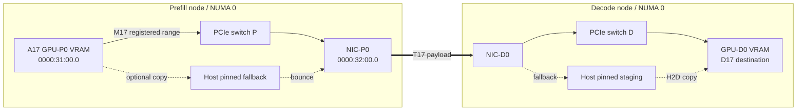
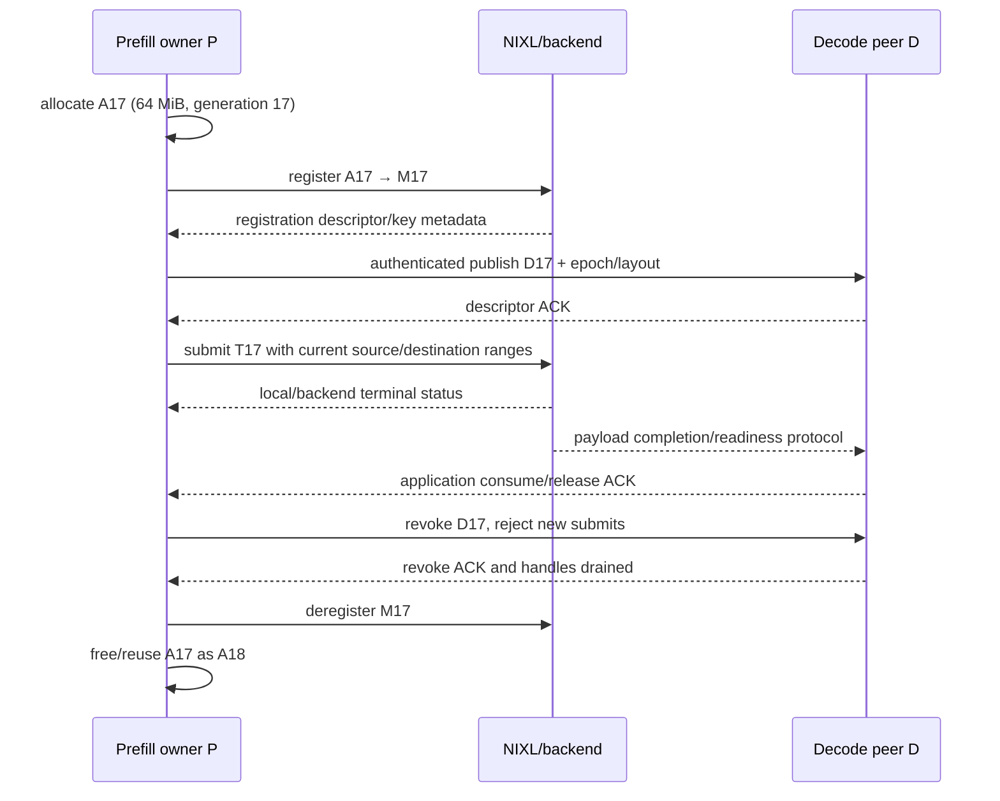

# 58장. 주소를 건넸는데 왜 전송되지 않는가: RDMA 등록과 GPU network lifetime

prefill 서버가 만든 KV cache를 decode 서버로 보내는 장면을 떠올려 보자. 두 서버에는 GPU와 RDMA NIC가 있고, NIXL backend도 정상적으로 초기화됐다. 첫 요청은 성공한다. 그런데 부하가 높아지면 어느 요청은 remote access error로 끝나고, 어느 요청은 전송 완료 뒤에도 이전 token의 KV를 읽는다. 재시작 직후에는 첫 요청만 유난히 느리며, GPU와 NIC가 서로 가까운 슬롯에 있는데도 host pinned memory가 갑자기 늘어난다. 이 네 증상을 모두 “RDMA 문제”라고 부르면 조사할 수 있는 정보가 거의 사라진다.

이 장은 64 MiB KV buffer 하나를 끝까지 따라간다. allocator가 만든 주소를 A17, memory registration을 M17, peer에게 보낸 descriptor를 D17, 실제 transfer를 T17이라고 부른다. A17이 page-backed range로 존재하고, M17이 그 범위를 transport에 등록하고, D17이 현재 세대의 접근 정보를 안전한 control plane으로 전달하고, T17이 정확한 source와 destination에 submit된다. completion과 quiescence가 확인된 뒤 D17을 폐기하고 M17을 deregister해야 마지막으로 A17을 재사용할 수 있다. 이 순서가 이 장의 문법이다.

RDMA, GPUDirect RDMA, NIXL, vLLM, SGLang과 Mooncake는 같은 추상화 층에 있지 않다. verbs는 memory region과 work request의 기본 계약을 제공한다. NVIDIA GPUDirect RDMA 문서는 제3자 device가 GPU memory에 접근할 때의 pinning, BAR mapping과 CUDA ordering 조건을 설명한다. NIXL은 여러 memory/storage backend 위에 descriptor와 transfer API를 둔다. serving framework는 KV layout과 request lifetime을 알고 그 API를 호출한다. 한 층의 성공을 다른 층의 성공으로 확대하지 않는 것이 첫 번째 원칙이다.

## 58.1 96 KiB를 register→descriptor→submit→complete→deregister한다

대표 fixture는 32 KiB 세 range, 합계 96 KiB다. 세 range를 각각 GPU allocation generation에 묶어 register하고, lkey/rkey와 NIXL descriptor generation을 만들고, 하나의 transfer로 submit한 뒤 completion을 확인하고, ACK 이후 descriptor revoke와 deregister를 수행한다. 주소가 같아도 generation이 다르면 다른 권한이다. 기존 64 MiB 예제는 pool 압력을 보는 stress reference로 남기고 수명 설명의 기준은 이 96 KiB fixture로 통일한다.

### 58.1.1 `RDMA error`는 결론이 아니라 마지막 표지다

오류 문자열부터 고치려 들면 driver, cable, firewall과 framework option을 한꺼번에 바꾸게 된다. 먼저 실패 요청의 세대 원장을 만든다. allocation A17의 base address, length, memory type과 allocator owner를 적는다. registration M17의 protection domain 또는 backend identity, access flags, local key와 remote key의 비식별 digest, 등록 시각과 state를 적는다. descriptor D17이 어느 peer에게 언제 publish됐는지, peer cache generation과 revoke 여부를 적는다. transfer T17은 source/destination descriptor, operation, submit handle, completion status와 마지막 progress 시각을 가진다.

이 원장에서 첫 모순을 찾는다. M17이 A17의 64 MiB 전체가 아니라 32 MiB만 포함할 수 있다. D17이 이미 폐기된 M16의 remote key를 담을 수 있다. T17이 submit된 뒤 request timeout handler가 M17을 먼저 deregister할 수 있다. completion은 성공했지만 decode stream이 NIC write와 GPU read 사이의 필요한 ordering을 닫지 않았을 수 있다. 같은 `remote access error`나 wrong answer라도 처음 달라진 칸은 전혀 다르다.

관측 시각도 구분한다. `register_memory`가 반환된 시각, descriptor를 control plane에 보낸 시각, transfer submit가 반환된 시각, backend가 terminal status를 보고한 시각, remote application이 KV를 읽어도 된다고 선언한 시각은 하나가 아니다. 장애 보고서에는 가장 늦게 보인 오류만 아니라 가장 먼저 모순된 generation과 edge를 쓴다.

### 58.1.2 64 MiB fixture는 pool 압력용 참고 실험이다

이 장의 payload는 `64 MiB=64×1,048,576=67,108,864 bytes`다. A17은 GPU 0의 연속된 가상 주소 범위를 소유하고 있다고 가정한다. 4 KiB 단위로 단순 환산하면 `67,108,864/4,096=16,384` pages다. NVIDIA GPUDirect RDMA 문서가 registration cache 설명에서 사용하는 64 KiB mapping boundary로 환산하면 `67,108,864/65,536=1,024` boundaries다. 두 숫자를 HCA MR entry 수라고 부르면 안 된다. 하나는 CPU page 크기를 가정한 산술이고 다른 하나는 GPU BAR mapping cache의 정렬 직관이다.

A17의 allocation generation은 주소와 별개다. allocator가 A17을 free한 뒤 같은 virtual address를 새 request에 주면 A18이다. M17은 A17을 등록한 세대이며 같은 address를 재등록한 M18과 다르다. D17은 M17의 접근 정보와 peer-visible layout을 담는다. T17은 D17을 사용한 특정 operation이다. 네 식별자를 분리하면 “pointer가 같으니 같은 buffer”라는 위험한 축약이 사라진다.

fixture의 source node P에는 GPU `GPU-P0`, NIC `NIC-P0`, process `prefill-0`이 있다. destination node D에는 GPU `GPU-D0`, NIC `NIC-D0`, process `decode-0`이 있다. 실제 제품 수치나 특정 rack을 암시하지 않는다. 모든 예제는 이 한 buffer와 두 node를 사용하고, shape나 memory kind를 바꿀 때는 명시적으로 새 fixture라고 알린다.

### 58.1.3 완료라는 단어를 네 번 나눈다

첫째는 host API return이다. 함수가 argument를 검사하고 work를 내부 queue에 넣은 뒤 돌아왔을 수 있다. 둘째는 local submit acceptance다. transport가 work request를 queue에 받아들였지만 NIC가 아직 byte를 읽지 않았을 수 있다. 셋째는 transport completion이다. completion queue나 backend handle이 terminal success 또는 error가 됐다. 넷째는 application readiness다. remote KV consumer가 correct generation을 읽을 수 있도록 protocol ACK와 GPU ordering까지 닫힌 상태다.

어느 completion이 source buffer 재사용을 허용하는지는 operation과 backend 계약에 달려 있다. [고정된 `ibv_post_send` manual](https://github.com/linux-rdma/rdma-core/blob/691953d8d502f54088f776c5ba2aeed0a5ac945d/libibverbs/man/ibv_post_send.3#L14-L158)의 posting과 [`ibv_poll_cq` manual](https://github.com/linux-rdma/rdma-core/blob/691953d8d502f54088f776c5ba2aeed0a5ac945d/libibverbs/man/ibv_poll_cq.3#L14-L76)의 work completion을 먼저 분리한다.

RDMA write의 local completion과 remote CPU가 새 data를 처리하기 시작해도 되는 조건을 무비판적으로 같다고 쓰지 않는다. NIXL wrapper의 status 이름도 verbs completion 의미와 동일하다고 추정하지 않는다. 구현 source와 backend 문서가 보장하는 범위까지만 연결하고, application-level ready marker가 있다면 별 edge로 둔다.

오류와 cancellation에서도 구분은 유지된다. request가 사용자 관점에서 cancelled가 됐어도 T17이 background progress thread에서 살아 있을 수 있다. Python future를 삭제하거나 Go context가 끝났다는 사실이 NIC quiescence를 만들지 않는다. owner 원장은 request terminal과 transport terminal을 각각 보존한다.

## 58.2 A17에서 M17까지: memory region은 권한이 붙은 범위다

### 58.2.1 allocation과 registration은 다른 소유권이다

allocator는 virtual address와 length를 제공하고 그 storage를 누가 free할지 정한다. registration은 transport가 그 범위를 DMA 대상으로 사용할 수 있게 translation과 protection 정보를 만든다. allocation 성공은 registration 성공이 아니고, registration 성공도 allocation owner를 transport에게 넘긴다는 뜻이 아니다. 두 owner가 같은 object에 들어 있어도 state를 분리해야 rollback 순서를 설명할 수 있다.

[rdma-core의 고정된 `ibv_reg_mr` manual](https://github.com/linux-rdma/rdma-core/blob/691953d8d502f54088f776c5ba2aeed0a5ac945d/libibverbs/man/ibv_reg_mr.3#L26-L175)이 정의하는 일반 계약은 protection domain, address, length와 access flags를 입력으로 받아 memory region을 만든다. 반환된 MR에는 local access에서 쓰는 lkey와 remote RDMA/atomic operation에서 쓰는 rkey가 있다. 여기서 key는 주소를 암호화한 별명이 아니라 특정 registration과 protection context에 묶인 capability다. remote peer는 address만 알아서는 접근할 수 없고 current rkey와 허용된 operation을 함께 가져야 한다.

GPU memory가 등록되는 구체적 경로는 backend와 platform에 따라 다를 수 있다. dma-buf registration, peer-memory module, UCX abstraction 또는 vendor plugin이 verbs 호출을 감출 수 있다. 그래서 application log에 `registered=True`가 있어도 `ibv_reg_mr`을 직접 호출했다고 단정하지 않는다. 하지만 범위, access, backend registration identity와 cleanup handle이 필요하다는 lifetime 질문은 남는다.

### 58.2.2 lkey와 rkey를 주소처럼 보관하지 않는다

local scatter/gather element는 보통 local MR의 lkey를 사용한다. remote read/write work request는 remote address와 rkey를 사용한다. 두 key의 방향을 바꾸거나 한쪽만 generation 원장에 넣으면 장애가 모호해진다. source side가 local read만 허용하고 destination side가 remote write를 허용하는지, operation 방향이 pull인지 push인지에 따라 필요한 access가 달라진다.

rkey를 장기적인 buffer ID로 쓰지 않는다. deregister 뒤 같은 숫자가 언젠가 재사용될 가능성을 application이 배제할 수 없고, 주소도 allocator가 재사용할 수 있다. 안정적인 identity는 `(process epoch, allocation generation, registration generation, range, peer)`처럼 application이 소유한 세대 tuple이다. rkey는 그 tuple에 속한 민감한 transport capability로 취급한다.

로그와 metric에는 raw rkey나 pointer를 싣지 않는다. 여러 tenant가 공유하는 dashboard에 capability 값이 노출되면 보안 경계가 흐려진다. process-local salt로 만든 digest나 opaque registration ID를 쓰고, 실제 값은 승인된 incident artifact에서만 최소 기간 보존한다. remote descriptor serialization도 인증된 control plane을 통해야 한다.

### 58.2.3 registration 실패는 부분 상태를 남길 수 있다

64 MiB 하나를 application이 한 range로 보더라도 middleware가 여러 chunk 또는 여러 backend에 등록할 수 있다. 첫 세 chunk가 성공하고 네 번째가 실패하면 전체 M17은 active가 아니다. 이미 성공한 subset을 rollback하지 않으면 pinned/BAR/HCA resource가 누수된다. 반대로 일부 descriptor를 먼저 peer에 publish했다면 rollback과 동시에 remote cache도 폐기해야 한다.

state는 `allocating→allocated→registering→active`만으로 충분하지 않다. `rollback_pending`, `deregistering`, `deregister_failed`, `revoking`을 둔다. registering 중 실패하면 성공 subset 목록을 고정하고 각 cleanup 결과를 기록한다. cleanup 하나가 실패했다고 allocator가 A17을 즉시 free하면 transport가 stale mapping을 가진 채 재사용된 storage를 볼 수 있다.

Mooncake의 고정 source는 이런 부분 성공을 구체적으로 보여 준다. 등록 loop가 성공한 base address를 모으고 하나가 실패하면 그 목록을 순회해 unregister한다. 이 구현은 좋은 사례지만 모든 backend가 원자적으로 rollback한다는 증거는 아니다. 독자는 자신이 사용하는 wrapper의 partial failure path를 직접 읽어야 한다.

### 58.2.4 deregister는 free의 부속 호출이 아니다

안전한 순서는 새 submit를 막고, M17을 참조하는 T17 계열 handle을 동결하고, 모두 terminal이며 backend가 quiescent인지 확인하고, peer의 D17을 revoke한 뒤, local M17을 deregister하고, 마지막으로 A17을 allocator에 반환하는 것이다. 이 순서에서 free는 가장 마지막이다. destructor가 호출되는 언어 수준 순서가 transport completion 순서를 대신하지 않는다.

`ibv_dereg_mr`이 성공하면 해당 MR registration은 끝난다. 그러나 application이 peer descriptor cache를 따로 운영한다면 remote D17의 폐기는 application 책임이다. 반대로 remote cache에서 먼저 지웠다고 local in-flight DMA가 끝난 것도 아니다. control-plane revoke와 data-plane quiescence가 만나야 한다.

shutdown도 같은 규칙을 따른다. process exit가 곧 모든 peer가 stale descriptor를 버렸다는 뜻은 아니다. process epoch를 descriptor에 넣고 reconnect 뒤 옛 epoch를 reject한다. graceful shutdown에서는 new transfer 금지, drain, revoke, deregister, free 순서를 기록하고, crash recovery에서는 lease/epoch와 remote invalidation policy를 별도로 둔다.

## 58.3 GPU memory pinning과 CUDA ordering을 좁게 읽는다

### 58.3.1 GPUDirect RDMA는 GPU P2P의 다른 이름이 아니다

GPU P2P는 같은 host의 GPU 사이 peer access와 copy를 포함할 수 있다. GPUDirect RDMA는 제3자 PCIe device인 NIC 등이 GPU memory와 DMA하는 경로다. NIC, GPU, PCIe topology, memory registration, peer-memory 지원과 ordering 조건이 추가된다. 57장의 NVLink adjacency가 좋다는 사실만으로 58장의 NIC path가 direct가 되지는 않는다.

GPUDirect라는 이름도 end-to-end application zero-copy를 자동 증명하지 않는다. source GPU에서 NIC가 직접 읽었더라도 remote node에서 host staging을 거쳐 destination GPU로 갈 수 있다. control metadata copy가 있다는 사실은 payload bounce와 다르고, payload가 VRAM으로 등록됐다는 사실도 selected rail이 그것을 실제 사용했다는 증거가 아니다.

따라서 path 원장은 source memory kind, source DMA path, network transport, destination DMA path와 application copy를 구간별로 기록한다. `VRAM→NIC`, `wire`, `NIC→VRAM`이 모두 관측돼야 full payload direct path라고 말할 수 있다. 하나라도 unknown이면 정확히 그 구간을 unknown으로 남긴다.

### 58.3.2 pinning 비용 때문에 registration cache가 생긴다

[NVIDIA GPUDirect RDMA 13.3 문서의 registration-cache 절](https://docs.nvidia.com/cuda/gpudirect-rdma/)은 매 transfer 전에 pin하고 완료 직후 unpin하는 가장 단순한 구현이 비용이 클 수 있다고 설명한다. communication middleware는 등록된 region을 cache하고 lazy unpin이나 LRU deregistration으로 반복 비용을 줄인다. GPU 환경에서는 pin 가능한 resource가 더 제한될 수 있어 cache identity와 eviction이 correctness와 capacity 모두에 영향을 준다.

문서는 GPU BAR mapping이 보통 64 KiB page 경계를 사용하므로 cache region을 그 경계로 round하는 편이 효율적이라고 설명한다. A17 64 MiB는 정확히 1,024개의 64 KiB boundary에 해당한다. 그러나 실제 mapping chunk, BAR consumption과 HCA entry는 driver/backend에 따라 다를 수 있다. 이 산술을 “M17은 MR 1,024개”로 바꾸지 않는다.

registration cache가 allocator deallocation을 알아야 하는 이유는 명확하다. A17이 free됐는데 cache가 M17을 valid로 남기면 같은 address의 A18을 옛 mapping identity로 오인할 수 있다. CUDA allocation/free를 intercept하거나 buffer ID tag check 같은 방법으로 generation 변화를 추적한다. cache key에 pointer와 length만 넣는 설계는 address reuse에 취약하다.

### 58.3.3 BAR1 숫자는 하나의 resource 관측이다

GPUDirect RDMA mapping은 GPU BAR space를 소비할 수 있고 `nvidia-smi -q` 또는 NVML의 BAR1 정보로 total, used, free를 볼 수 있다. 이 숫자는 중요하지만 등록 cache 전체 상태와 같지 않다. driver가 내부용으로 예약한 공간이 있고 고정 chunk 때문에 payload bytes와 used bytes가 다를 수 있다. NIC MR table, pinned host pages와 userspace metadata는 별 resource다.

registration failure를 만났을 때 BAR1 free가 낮으면 GPU mapping pressure 가설이 강해진다. 그렇다고 HCA MR exhaustion, memlock limit 또는 잘못된 access flag를 배제하지 않는다. resource ledger에는 GPU BAR1, backend cache entries/bytes, NIC/driver registration error, process pinned bytes와 OS limit을 따로 둔다.

cache eviction으로 BAR1 used가 줄어도 stale descriptor가 peer에 남아 있으면 correctness는 회복되지 않았다. capacity recovery와 capability revocation은 다른 완료 조건이다. eviction metric에는 region generation, peer publish count와 in-flight refcount가 직접 label이 아니더라도 trace로 연결돼야 한다.

### 58.3.4 `SYNC_MEMOPS`는 모든 protocol을 대신하지 않는다

[NVIDIA의 고정된 CUDA 12.9 ordering 설명](https://docs.nvidia.com/cuda/archive/12.9.0/gpudirect-rdma/index.html#synchronization-and-memory-ordering)은 GPUDirect RDMA와 CUDA의 relaxed memory model 사이에 ordering 주의가 필요하다고 설명한다. GPU memory BAR mapping에 대해 CUDA API consistency가 필요할 때 `CU_POINTER_ATTRIBUTE_SYNC_MEMOPS`를 설정하는 경로가 있다. 이 설정은 allocation 단위로 더 보수적인 CUDA API behavior를 만들 수 있고 성능에 영향을 줄 수 있다.

이 속성을 켰다는 사실을 remote application ACK로 확대하지 않는다. CUDA work submission/synchronization과 third-party device operation 사이의 memory ordering, NIC completion, remote protocol readiness는 각각 범위가 있다. producer kernel이 KV를 다 썼는지, NIC read가 그 뒤인지, destination NIC write가 끝났는지, decode kernel이 그 뒤인지 edge를 나열한다.

정확성 장애가 coarse device synchronization으로 사라지면 ordering 가설은 강해지지만 pointer generation이나 range 오류도 가려질 수 있다. 최종 수정은 producer event, transport submit, completion publication과 consumer wait를 필요한 범위로 좁혀야 한다. 동기화 양을 늘리는 것이 아니라 A17/M17/D17/T17의 실제 producer-consumer 관계와 맞추는 것이 목표다.

## 58.4 M17에서 D17로: NIXL descriptor와 metadata를 구별한다

### 58.4.1 registration descriptor와 transfer descriptor의 질문이 다르다

[NIXL의 고정된 backend descriptor guide](https://github.com/ai-dynamo/nixl/blob/8770b655a6b17b5cdf7d2b56b6e0be5392496df5/docs/BackendGuide.md#L200-L228)는 memory space와 descriptor list를 핵심 추상화로 둔다. registration descriptor는 address, length, device ID와 선택적 metadata를 이용해 backend에 region을 등록한다. transfer descriptor는 실제 operation에서 사용할 source 또는 destination의 부분 범위를 표현한다. 등록된 64 MiB 전체와 이번에 옮길 8 MiB slice를 같은 tuple로 뭉개면 range validation과 refcount를 설명하기 어렵다.

A17 전체를 M17로 preregister하고 T17은 offset 16 MiB부터 length 8 MiB만 전송할 수 있다. 이때 transfer range가 M17 안에 포함되는지 `base≤transfer_base`와 `transfer_end≤base+67,108,864`로 손검산한다. unsigned overflow도 피해야 한다. `transfer_base+length`를 계산하기 전 length와 maximum address를 검증한다. framework의 block list가 여러 non-contiguous range를 만들면 descriptor list의 각 element와 KV logical layout을 함께 보존한다.

memory type도 identity다. NIXL은 DRAM, VRAM과 storage type을 구분한다. 같은 numeric address가 다른 process나 device context에서 다른 의미를 가질 수 있으므로 device ID와 memory type을 빼지 않는다. SGLang source가 GPU KV를 VRAM으로, auxiliary tensor를 DRAM으로 등록하는 장면은 이 구분이 실제 serving code에 노출된다는 근거다.

### 58.4.2 metadata exchange는 data transfer가 아니다

[NIXL architecture 문서의 metadata exchange 계약](https://github.com/ai-dynamo/nixl/blob/8770b655a6b17b5cdf7d2b56b6e0be5392496df5/docs/nixl.md#L46-L90)은 agent와 backend의 connection information, remote segment identifier 같은 metadata를 control path에서 교환하도록 설명한다. initialization 때 memory를 등록하고 metadata를 한 번 교환하면 반복 transfer의 준비 비용을 줄일 수 있다. 그러나 metadata를 받았다는 사실은 connection이 이미 만들어졌거나 T17이 submit됐거나 byte가 도착했다는 뜻이 아니다.

D17은 단순 address JSON이라고 생각하지 않는다. backend별 opaque 정보, remote segment identity, process epoch, layout generation과 application owner가 결합된다. NIXL은 available backend에 맞춰 metadata 부분을 route할 수 있다. peer에 해당 backend가 없다면 관련 metadata를 무시할 수 있으므로 `deserialize success`와 `usable transfer path`를 구분한다.

control plane은 신뢰 경계다. descriptor에는 remote memory 접근에 필요한 capability가 포함될 수 있다. 인증되지 않은 peer가 임의의 address, length와 serialized bytes를 보내게 두지 않는다. peer identity, process epoch, model/KV layout generation, allowed range와 message integrity를 검증한다. raw Python serialization이나 opaque blob을 사용하더라도 untrusted input을 안전하다고 가정하지 않는다.

### 58.4.3 connection과 첫 transfer latency를 나눈다

remote metadata를 agent에 추가하는 operation이 반드시 connection을 즉시 만들지는 않는다. NIXL 문서는 선택적 connection API 또는 첫 transfer 준비 단계에서 연결될 수 있음을 설명한다. 따라서 cold T17 latency에는 metadata fetch, backend selection, connection establishment, registration miss와 module initialization이 섞일 수 있다.

timeline은 `metadata cache lookup→backend intersection→connection lookup/connect→local/remote descriptor validation→prepare→submit→progress→completion`으로 나눈다. 두 번째 동일 transfer가 빨라졌다면 어느 cache가 hit했는지 확인한다. connection cache hit인지, registration cache hit인지, route resolution인지, GPU module warmup인지 분리하지 않으면 preregistration 효과를 잘못 계산한다.

매 pod 첫 요청이 느릴 때 shared registration pool만 늘리는 수정은 connection setup이 원인이면 효과가 없다. 반대로 connection을 미리 맺어도 64 MiB를 요청마다 새 address에 allocate/register하면 pinning 비용은 남는다. cold-start budget에는 agent initialization, metadata exchange, connect, pool registration을 독립 항으로 둔다.

### 58.4.4 descriptor revoke에도 generation과 ACK가 필요하다

P가 M17을 deregister하기 전에 D가 D17을 더 이상 새 transfer에 쓰지 않도록 해야 한다. 단순 TTL은 유실된 revoke를 언젠가 정리하는 안전망일 수 있지만 현재 in-flight T17을 즉시 quiesce하지 않는다. control plane에 `active→revoking→revoked` state와 peer ACK를 두고, data plane에는 new submit fence와 handle drain을 둔다.

peer가 재시작해 cache를 잃었다면 P의 publish state도 새 process epoch와 다시 handshake해야 한다. 반대로 P가 재시작해 같은 agent name을 사용해도 이전 D17을 valid로 되살리지 않는다. process epoch가 descriptor identity에 포함돼야 한다. rolling deployment에서는 old와 new process가 잠시 공존할 수 있으므로 agent name만으로 owner를 판정하지 않는다.

[NIXL Python API의 고정된 registration wrapper](https://github.com/ai-dynamo/nixl/blob/8770b655a6b17b5cdf7d2b56b6e0be5392496df5/src/api/python/_api.py#L407-L446)는 `register_memory`가 돌려준 descriptor를 `deregister_memory` 입력으로 보존하는 API 경계를 보여 주지만, application epoch와 peer revoke는 상위 owner가 설계해야 한다.

revoke가 느리면 availability와 capacity가 충돌한다. M17을 오래 유지하면 resource가 묶이고, 너무 빨리 deregister하면 use-after-deregister가 된다. 해결은 timeout 하나를 줄이는 것이 아니라 peer membership, lease, in-flight refcount와 completion age를 관측해 owner protocol을 닫는 것이다.

## 58.5 세 구현을 같은 lifetime 표에 놓는다

### 58.5.1 vLLM은 KV layout을 NIXL descriptor로 번역한다

[vLLM v0.27.1의 고정된 NIXL worker](https://github.com/vllm-project/vllm/blob/6e448d0ea9bf3d88d898b65449ca6dc2aec170ac/vllm/distributed/kv_transfer/kv_connector/v1/nixl/base_worker.py#L985-L1010)는 KV cache tensor에서 address와 length descriptor를 준비하고 wrapper의 `register_memory`를 호출한다. 이 사실은 framework가 KV storage identity를 알고 registration lifecycle에 참여한다는 점을 보여 준다. NIXL 내부가 어떤 backend를 골랐는지, 그 backend가 verbs 또는 GPUDirect를 썼는지는 이 호출만으로 확정되지 않는다.

핵심 흐름을 저작권상 필요한 범위로 줄이면 다음과 같다.

```python
descs = self._get_kv_cache_descs(...)
self.nixl_wrapper.register_memory(descs, backends=self.nixl_backends)
```

두 줄의 중요한 질문은 함수 이름보다 descs의 provenance다. tensor base, layer별 stride, memory type, GPU ID와 registration owner가 current engine generation에 맞는지 본다. model reload나 KV cache 재생성 뒤 pointer가 바뀌면 이전 registration과 peer metadata를 재사용할 수 없다.

[같은 worker의 고정된 cleanup path](https://github.com/vllm-project/vllm/blob/6e448d0ea9bf3d88d898b65449ca6dc2aec170ac/vllm/distributed/kv_transfer/kv_connector/v1/nixl/base_worker.py#L2584-L2598)는 저장한 descriptor를 wrapper의 `deregister_memory`에 넘긴다. 이것은 deregistration 호출이 존재한다는 증거이지 모든 T17이 반드시 drain됐다는 독립 증거는 아니다. cleanup을 부르는 상위 lifecycle과 listener/progress thread 종료 순서를 함께 읽어야 한다. 예외 중 descriptor 일부만 남았을 때도 cleanup collection이 완전한지 본다.

**vLLM option에서 selected path까지 잇는다.**

NixlConnector를 config에 썼다는 사실은 첫 predicate다. connector factory가 구현을 만들고, worker가 memory layout을 준비하고, NIXL backend inventory와 peer metadata가 usable path를 만들고, request role과 direction이 push/pull operation을 정하고, completion이 scheduler state에 반영돼야 실제 path가 닫힌다.

option→effective connector/backend list→registration descriptors→peer metadata→prepared transfer key→submit handle→terminal status→KV ready라는 연쇄를 log와 trace에 둔다. `NIXL enabled=1`만 metric으로 내면 host bounce, fallback 또는 registration miss를 놓친다. selected backend, source/destination memory kind, bounded failure reason과 transfer bytes를 함께 본다.

vLLM 공식 recipe가 producer와 consumer role, proxy endpoint와 failure policy를 설명해도 그것은 deployment protocol의 근거다. 특정 NIC rail, rkey lifetime 또는 GPU BAR mapping을 보장하지 않는다. docs recipe claim과 source function claim, NVIDIA/verbs claim을 별 evidence로 유지한다.

### 58.5.2 SGLang은 VRAM·DRAM과 staging을 명시적으로 나눈다

[SGLang v0.5.18의 고정 NIXL connection source](https://github.com/sgl-project/sglang/blob/71de97b264b04dcd514cf904003028aefe9775c8/python/sglang/srt/disaggregation/nixl/conn.py#L562-L570)는 staging buffer를 VRAM으로 등록한다. KV tensor address도 memory kind에 따라 등록하고 auxiliary tensor는 DRAM으로 등록한다. 다음 짧은 형태가 독자의 시선을 memory type과 failure boundary에 둔다.

```python
descs = self.agent.register_memory(addrs, "VRAM")
if descs is None:
    raise RuntimeError("memory registration failed")
```

이 코드는 registration failure를 silent fallback으로 삼지 않는 한 경로를 보여 준다. 하지만 다른 option과 backend path가 항상 같은 policy를 가진다고 일반화하지 않는다. `addrs`가 staging pool 전체인지 request slice인지, 등록 결과가 어디에 보존되고 언제 deregister되는지를 상위 object lifetime과 함께 읽는다.

[SGLang source의 KV·aux registration 경로](https://github.com/sgl-project/sglang/blob/71de97b264b04dcd514cf904003028aefe9775c8/python/sglang/srt/disaggregation/nixl/conn.py#L1390-L1425)는 VRAM과 DRAM descriptor를 별도로 만든다. 또한 [release 앞 transfer quiescence 경로](https://github.com/sgl-project/sglang/blob/71de97b264b04dcd514cf904003028aefe9775c8/python/sglang/srt/disaggregation/nixl/conn.py#L2648-L2662)가 있어 A17 free보다 T17 drain이 앞서야 한다는 fixture와 직접 맞물린다.

그럼에도 quiescence predicate가 어떤 handle 집합을 포함하는지, error/cancel path도 포함하는지 검토해야 한다. 주석 한 줄을 전체 protocol proof로 만들지 않는다.

**SGLang staging은 direct path와 별개의 algorithm state다.**

heterogeneous TP에서 staging buffer를 두는 이유는 KV layout과 peer별 slice를 재배열하거나 전송 단위를 만들기 위해서일 수 있다. staging이 있다고 곧 host bounce는 아니다. GPU staging이면 VRAM→VRAM local operation 뒤 network transfer일 수 있다. 반대로 이름에 staging이 없어도 backend가 내부 host buffer를 사용할 수 있다.

canonical fixture에서 A17을 model KV owner, S17을 별도 64 MiB staging allocation이라고 하면 각각 registration generation이 필요하다. local pack kernel completion→S17 transport submit edge와 T17 completion→S17 reuse edge를 둔다. A17과 S17의 descriptor를 바꾸면 wrong-range transfer가 생기므로 role을 원장에 넣는다.

staging pool 크기도 concurrency와 residence time을 제한한다. 64 slots×64 MiB는 4 GiB다. request가 transport completion뿐 아니라 remote ACK까지 slot을 잡으면 residence time이 늘어난다. queue wait를 network bandwidth 문제로 오인하지 않도록 free slots, waiters, oldest owner와 transfer phase를 관측한다.

### 58.5.3 Mooncake는 exact range refcount와 rollback을 보여 준다

[Mooncake v0.3.12.post1의 고정된 `RegisteredMemory.Add`](https://github.com/kvcache-ai/Mooncake/blob/6041a609a8c3af35e778f70db344f145c2914980/mooncake-p2p-store/src/p2pstore/registered_memory.go#L39-L110)는 동일 address와 length가 이미 있으면 reference count를 올리고, 겹치지만 동일하지 않은 range는 거부한다. 이 선택에는 중요한 의도가 있다. 서로 부분적으로 겹치는 registration을 독립 owner처럼 관리하면 한쪽 deregistration이 다른 쪽의 유효 범위를 깨뜨릴 수 있다.

핵심 조건을 짧게 옮기면 다음과 같다.

```go
if entry.addr == addr && entry.length == length {
    entry.refCount++
    return nil
}
if addr < entryEnd && requestEnd > entry.addr {
    return ErrAddressOverlapped
}
```

64 MiB A17을 두 request가 공유하면 refcount 2가 될 수 있다. 첫 release가 M17을 실제 deregister해서는 안 되고 count만 1로 낮춰야 한다. 마지막 owner가 끝났을 때만 chunk deregistration이 진행돼야 한다. 이 refcount는 transport in-flight count와 같다고 가정하지 않는다. request owner와 submitted work owner가 각각 reference를 잡는지 상위 protocol을 확인한다.

**Mooncake source의 교훈과 한계를 함께 쓴다.**

Add는 max chunk size 단위로 여러 registration task를 만들고, 실패 시 성공한 base address를 unregister한다. [고정된 Remove 구현](https://github.com/kvcache-ai/Mooncake/blob/6041a609a8c3af35e778f70db344f145c2914980/mooncake-p2p-store/src/p2pstore/registered_memory.go#L113-L155)은 exact range를 찾고 refcount를 낮춘 뒤 chunk를 unregister한다. 여기서 source가 직접 증명하는 것은 해당 Go wrapper의 range policy와 cleanup 시도다. underlying engine이 어느 NIC와 transport를 선택했는지, unregister가 모든 remote descriptor를 revoke하는지는 별 계약이다.

부분 cleanup 중 unregister error가 나면 cascading error가 기록될 수 있다. 본문에서는 이를 단순 warning로 넘기지 않고 `rollback_pending` resource와 allocator quarantine로 연결한다. cleanup 실패 buffer를 free list에 돌려놓으면 address reuse가 stale mapping과 만난다. 운영자는 leaked registered bytes와 quarantined allocation bytes를 별 metric으로 본다.

Mooncake point-to-point connector와 shared store protocol도 구별한다. register/remove source 한 조각이 content-addressed store의 consistency 전체를 설명하지 않는다. 이 장에서는 network memory lifetime에 필요한 부분만 사용하고, routing·store ownership·lease는 후속 장으로 넘긴다.

## 58.6 GPU–NIC–NUMA locality를 BDF로 다시 그린다

### 58.6.1 ordinal 대신 두 endpoint BDF를 결합한다

process의 CUDA device 0과 `mlx5_0`이라는 이름은 영구적인 물리 위치가 아니다. container visibility, device plugin과 reboot 뒤 ordinal이 달라질 수 있다. GPU는 CUDA/NVML UUID와 PCI domain:bus:device.function을, RDMA port는 RDMA device→netdev→PCI BDF mapping을 기록한다.

fixture P에서 GPU BDF는 `0000:31:00.0`, 가까운 NIC-P0는 `0000:32:00.0`, 먼 NIC-P1은 `0000:b1:00.0`이다. 앞의 두 endpoint가 NUMA 0의 같은 downstream topology에 있고 NIC-P1은 NUMA 1이라고 가정한다. 이 주소는 교육용이며 특정 chassis의 보증이 아니다.

조인 표에는 process ordinal, GPU UUID/BDF, NIC name/port/BDF, PCI switch/root, NUMA node, link generation/width, IOMMU group과 selected NIXL backend/rail을 둔다. request trace에는 전체 BDF를 high-cardinality label로 넣기보다 topology class와 stable inventory ID를 연결한다.

### 58.6.2 locality는 가능성이고 selected route는 사실이다

GPU와 NIC가 같은 switch 아래 있으면 짧은 peer path의 후보가 된다. 그러나 ACS redirect, IOMMU mode, platform firmware, peer-memory module과 driver support가 direct access를 막을 수 있다. 같은 NUMA라는 정보도 CPU allocation locality에는 유용하지만 GPUDirect 가능성을 단독으로 보장하지 않는다.

반대로 다른 root나 NUMA에 있다고 무조건 host bounce라고 쓰지 않는다. platform이 peer route를 제공할 수 있고, backend가 다른 rail을 선택할 수 있다. source code의 topology predicate, runtime capability query와 실제 counter를 결합한다. `closest NIC` option을 설정했다면 effective mapping과 selected rail을 관측해야 한다.

route 선택은 startup 이후에도 달라질 수 있다. port down, congestion policy, process visibility 변경, device replacement와 backend reconnect가 다른 NIC를 고를 수 있다. topology inventory generation과 connection generation을 T17 trace에 넣어 startup snapshot을 사건 시점의 진실로 고정하지 않는다.

### 58.6.3 physical path와 software path를 겹쳐 그린다



실선은 기대한 direct candidate이고 점선은 fallback 후보다. 그림만으로 어느 길이 선택됐다고 선언하지 않는다. source/destination memory registration kind, NIC DMA counters, host pinned allocation/copy activity, backend selection과 request timing을 같은 T17에 맞춘다.

software path는 scheduler가 KV block ranges를 고르는 단계부터 시작한다. NIXL transfer descriptor가 만든 scatter/gather geometry, backend route, NIC queue, completion publication, destination unpack/consumer까지 이어진다. physical path가 짧아도 descriptor가 수천 개로 쪼개지거나 staging queue가 막히면 latency는 길 수 있다.

### 58.6.4 host bounce를 관측으로 증명한다

host pinned bytes가 증가했다는 사실 하나는 bounce 가설이다. framework가 unrelated CPU offload pool을 늘렸을 수 있고 control metadata buffer일 수도 있다. A17 payload 67,108,864 bytes와 시간·digest가 대응하는 host buffer generation H17을 찾는다. GPU copy engine trace에서 A17→H17 또는 H17→destination GPU copy가 있는지 본다.

selected memory kind가 DRAM이면 application이 처음부터 host path를 요청했을 수 있다. VRAM registration이 실패해 fallback했다면 rejection reason와 first divergence를 찾는다. GPUDirect path가 성공했지만 small tail만 host로 보냈다면 전체 64 MiB bounce로 계산하지 않는다. byte counter를 구간별로 합산한다.

수정 뒤에는 host pinned allocation이 줄었다는 것뿐 아니라 selected VRAM descriptors, direct NIC–GPU path, output correctness와 latency를 확인한다. direct path가 NUMA를 잘못 골라 더 느릴 수도 있다. zero-copy라는 표어보다 실제 byte journey를 기록한다.

## 58.7 eager registration과 pool을 숫자로 비교한다

### 58.7.1 eager 비용은 payload rate에서 cycle rate로 바꾼다

eager 전략은 request마다 A17을 allocate하고 M17을 register한 뒤 T17을 실행하고 곧바로 deregister/free한다. 단순하고 격리된 lifetime처럼 보이지만 초당 registration 횟수는 request rate보다 payload segmentation에 좌우된다. 논리 payload 처리량이 8 GiB/s이고 모든 transfer가 정확히 64 MiB라면 `8×1,073,741,824 / 67,108,864 = 128` registration cycles/s다.

registration 한 번의 host critical 비용을 `t_reg`, deregistration을 `t_dereg`라고 하면 초당 CPU service demand의 첫 근사는 `128×(t_reg+t_dereg)`다. 실제 latency 숫자는 측정 전까지 넣지 않는다. registration이 여러 backend나 chunk로 나뉘면 API cycle 한 번 안에 lower-level operation이 여러 개일 수 있다. cache hit이면 physical pinning이 생략될 수도 있다. 그래서 top-level call count, backend register count, cache miss와 actual pin count를 분리한다.

eager의 장점은 descriptor blast radius를 request lifetime에 가깝게 제한할 수 있다는 점이다. 하지만 cancellation 때 drain보다 deregister가 빨라지는 race가 반복되고, address churn이 registration cache를 오염시키며, first request latency가 매 request에 나타날 수 있다. 단순한 코드 모양이 안전한 protocol을 자동 만들지 않는다.

작은 payload에서는 registration 비용이 data transfer보다 클 수 있다. 반대로 64 MiB가 wire와 memory path를 오래 점유하면 registration이 겹쳐져 critical path가 아닐 수 있다. 평균 throughput만 보지 말고 `allocation→register return`, `register→submit`, `submit→completion`, `completion→deregister`, `deregister→reuse` 구간을 각각 측정한다. queue wait도 operation time에서 뺀 별 열로 둔다.

128 cycles/s라는 계산은 8 GiB/s가 실제 NIC payload라는 보장이 아니다. compression, duplicate KV skip, partial block과 retry가 있으면 logical KV bytes와 wire bytes가 다르다. fixture에는 logical requested bytes, registered range bytes, submitted bytes, completed payload bytes와 retransmission/fallback bytes를 모두 둔다.

### 58.7.2 preregistered pool은 memory와 concurrency를 맞바꾼다

pool 전략은 N개의 64 MiB slot을 startup에 allocate/register하고 request가 lease한다. `N=64`면 `64×64 MiB=4 GiB`, N=256이면 16 GiB, N=1024면 64 GiB의 payload capacity다. 이 합은 GPU allocation capacity이며 BAR1 used, HCA MR table과 registration cache metadata bytes가 같은 양이라는 뜻이 아니다.

pool slot에는 index만 아니라 allocation generation, registration generation, lease generation과 in-flight refcount를 둔다. slot 7의 address가 영구적이어도 request R1의 lease L17과 R2의 L18은 다르다. D17에는 lease 또는 content generation이 포함돼 remote가 이전 data를 새 request로 오인하지 않게 한다. static registration M7과 dynamic value generation V17을 분리하면 graph static buffer와 비슷한 lifetime 직관이 생긴다.

concurrency C와 slot residence time L이 있을 때 이상적인 service 후보는 `C/L transfers/s`다. C=64이고 평균 residence가 40 ms라면 산술상 1,600 transfers/s 후보지만, 이것은 network capacity, serialization, tail와 queue overhead를 무시한 상한이다. p99 residence가 400 ms인 request가 slots를 오래 잡으면 free pool이 급격히 줄 수 있다. average만으로 pool을 sizing하지 않는다.

Little의 법칙을 안정 구간의 손검산으로 쓸 수 있다. arrival rate λ=800 transfers/s, 평균 residence W=50 ms라면 평균 in-use `L=λW=40 slots`다. 64-slot pool은 평균 24개 여유가 있지만 burst와 p99에는 부족할 수 있다. cancellation drain이 2초 걸리는 incident가 20개 겹치면 평균 산술과 무관하게 20 slots가 quarantine된다.

preregistration은 startup budget도 요구한다. 256 slots를 여러 GPU와 backend에 등록하면 readiness 전에 상당한 work가 발생할 수 있다. readiness가 process listen과 pool active를 구분해야 한다. 일부 slot registration 실패 때 usable subset으로 traffic을 받을지 전체를 fail할지 policy를 명시하고, peer에 실제 active slot descriptor만 publish한다.

### 58.7.3 혼합 전략은 miss path까지 설계한다

현실적인 설계는 hot fixed-size slot을 preregister하고 oversized 또는 rare request를 eager로 처리할 수 있다. 예를 들어 64 MiB slots 64개로 4 GiB hot pool을 만들고, 128 MiB 요청은 두 slots를 묶거나 별 eager region을 만든다. 두 slots를 묶으면 completion과 release가 atomic group처럼 움직여야 한다. 하나만 먼저 free하면 remote descriptor list의 절반이 stale해진다.

pool miss가 wait, eager fallback 또는 request reject 중 어디로 가는지 option으로 명시한다. eager fallback은 availability를 높이지만 registration storm을 숨길 수 있다. metric에는 `selected_registration_mode={pool,eager,reject}`, bounded miss reason, requested/leased slots와 wait duration을 둔다. request ID를 label로 넣지 않는다.

registration cache와 application pool은 같은 것이 아니다. pool은 allocation과 lease를 소유하고 cache는 transport mapping을 재사용한다. eager application allocation도 address allocator가 같은 range를 돌려주면 cache hit할 수 있고, fixed pool도 driver invalidation 때문에 re-pin할 수 있다. 두 hit rate를 하나로 합치지 않는다.

혼합 전략의 correctness matrix는 pool→pool, pool→eager, eager→pool과 restart 전후를 포함한다. eager path가 pool address namespace를 우연히 재사용하거나 peer cache key가 mode를 구분하지 않으면 D17이 잘못 매칭될 수 있다. release bundle과 cache namespace에 deployment epoch, backend, memory type, device UUID와 source digest를 둔다.

비용 비교는 cold startup, cold first transfer, warm steady state, burst, cancellation storm과 rolling restart를 나눈다. preregistered pool이 warm p50를 줄여도 startup readiness와 idle pinned resource가 SLO에 맞지 않을 수 있다. eager가 memory를 아껴도 p99와 CPU compiler/driver work가 높을 수 있다. 정답은 workload와 failure policy에 달려 있다.

## 58.8 네 사고를 first divergence에서 분기한다

### 58.8.1 stale rkey와 use-after-deregister는 generation 사고다

사건 A에서 P는 D17을 peer D에 publish했고 T17을 성공시켰다. timeout cleanup가 M17을 deregister하고 A17을 pool에 반환한다. D의 descriptor cache는 revoke message를 받지 못했다. 다음 request가 같은 address를 A18/M18로 쓰는 동안 D가 옛 D17로 transfer를 submit한다. 최종 증상은 remote access error일 수도 있고 protection이 우연히 다른 형태로 재사용됐다면 더 위험한 결과일 수 있다.

첫 divergence는 NIC 오류가 아니라 `M17 revoked local, D17 active remote`라는 control-plane generation 모순이다. 주소가 같다는 사실은 이를 해결하지 않는다. 조사 표에는 local MR state, peer cache state, process epoch, last publish/revoke sequence와 ACK, new submit fence를 둔다. remote access error counter만으로 어느 descriptor가 stale였는지 알 수 없다.

사건 B는 더 직접적인 use-after-deregister다. T17 submit 반환 직후 request가 cancelled되고 cleanup가 M17을 deregister한다. backend progress thread는 아직 NIC work를 처리 중이다. A17이 A18로 재사용돼 새 KV가 써지고, 이전 NIC read가 그 중간 값을 읽는다. 이때 remote key stale가 없어도 local source lifetime이 깨졌다.

두 사건의 수정은 다르지만 공통 edge가 있다. 새 submit를 차단하고 모든 handle을 terminal/drained 상태로 만든 뒤 peer revoke와 deregister를 수행한다. cancellation은 work를 즉시 없애는 명령이 아니라 cancel request와 completion을 가진 protocol이다. backend가 cancellation을 지원하지 않으면 T17 완료까지 output만 discard하고 storage는 유지할 수 있다.

복구 fixture는 address reuse를 의도적으로 포함한다. 같은 slot을 generation 17→18로 넘기고 old descriptor submit가 명시적으로 reject되는지 확인한다. cancellation 직후 즉시 reuse하지 않고 drain event가 release condition을 만족할 때만 free list에 들어가는지 trace한다. error count가 0이라는 aggregate보다 generation transition 증거가 중요하다.

### 58.8.2 registration cache exhaustion은 세 resource를 가른다

부하가 늘며 register latency와 failure가 증가했다고 하자. 첫 가설은 BAR1 부족이다. `nvidia-smi`에서 BAR1 used가 높다면 유력하지만 충분하지 않다. userspace registration cache entry가 폭증했는지, NIC/HCA registration resource가 고갈됐는지, host memlock 또는 pinned page limit인지 나눈다.

A17 같은 64 MiB region이 매 request 새 address로 생성되고 cache가 lazy unpin하면 100개만 남아도 logical registered range 합은 6.25 GiB다. actual BAR mapping은 rounding과 driver policy 때문에 이 합과 다를 수 있다. 64 KiB 경계로는 region당 1,024 boundaries이므로 100 regions는 102,400 boundary identities 후보다. 이를 physical page table entry 수로 단정하지 않고 cache cardinality 직관에만 쓴다.

first divergence가 deallocation notification 누락일 수 있다. allocator는 A17을 free했는데 cache는 pointer/length entry를 valid로 둔다. address reuse tag check가 없다면 A18을 same buffer로 오인한다. 이 경우 capacity 문제와 stale mapping correctness 문제가 동시에 존재한다. eviction을 늘리는 것만으로 generation 검증이 복구되지 않는다.

관측은 register attempts/s, cache lookup hit/miss, cached region/rounded bytes, eviction/deregister latency와 error, BAR1 used/free, HCA/driver errno, quarantined ranges를 같은 time window에 둔다. cache key digest에 device UUID, address range와 allocation tag가 포함되는지 source에서 확인한다. process restart로 증상이 사라지면 cache lifetime 가설이 강해지지만 root cleanup 누락이 해결된 것은 아니다.

완화는 신규 registrations를 제한하고 validated pool로 traffic을 줄이거나, safe LRU eviction를 촉진하고, affected GPU/NIC pool을 격리하는 방식일 수 있다. driver reset이나 module unload는 파괴적이며 증거 보존과 운영 승인 없이 실행하지 않는다. 완료는 신규 M generation이 안정적으로 등록되고 old entries가 quiescent/revoked/deregistered되며 steady cache hit와 bounded resource가 확인되는 상태다.

### 58.8.3 host bounce와 locality 실패는 byte path 사고다

CUDA 13, RDMA NIC와 NIXL을 모두 사용하지만 latency가 기대보다 길다고 하자. `NIXL transfer success` log만 보고 network가 정상이라고 결론 내리기 쉽다. 그러나 source KV가 DRAM descriptor로 준비됐거나 VRAM registration이 실패해 host staging으로 fallback했을 수 있다. destination도 NIC→host→GPU copy를 수행할 수 있다.

first divergence는 expected path와 selected path가 갈라진 predicate다. GPU/NIC BDF distance가 예상과 달랐는지, chosen backend가 VRAM을 지원하지 않았는지, peer-memory/GDR capability query가 false였는지, registration error가 fallback으로 번역됐는지 본다. package 설치와 environment option은 가능성이고 per-request selected memory type과 rail이 사실이다.

64 MiB fixture에서 full bounce면 source D2H 64 MiB와 destination H2D 64 MiB라는 추가 local copy 후보가 생긴다. 이것을 무조건 wire bytes에 더해 192 MiB network traffic이라고 계산하면 틀린다. wire payload는 여전히 64 MiB일 수 있고 local bus/memory traffic이 양쪽에 추가된다. 구간별 bytes와 duration을 분리한다.

NUMA mismatch도 host staging 성능을 바꾼다. host buffer H17이 NUMA 1에 allocate됐는데 NIC-P0와 GPU-P0가 NUMA 0이면 CPU/PCI root 경계를 더 지날 수 있다. thread affinity와 page first-touch도 본다. 하지만 locality 개선 뒤에도 VRAM direct가 선택되지 않는다면 원인은 capability/backend gate에 남아 있다.

복구는 representative 64 MiB와 tail size에서 selected descriptors가 VRAM인지, GPU/NIC pair가 intended BDF인지, host pinned payload buffer가 사라졌는지, NIC/GPU copy counter와 output이 맞는지 확인한다. direct path가 p50만 좋아지고 p99가 registration miss로 나빠질 수 있으므로 cold/warm과 pool state도 함께 비교한다.

## 58.9 운영 workbook으로 lifetime을 복원한다

### 58.9.1 첫 15분에는 reset보다 세대 원장을 수집한다

사건 초기에 process, driver 또는 NIC를 재시작하면 stale descriptor와 cache state가 사라져 증거를 잃는다. 먼저 UTC time window, host boot ID, container/image digest, framework/NIXL/backend version, GPU UUID/BDF, NIC port/BDF, NUMA와 process epoch를 저장한다. config는 secret를 제거하고 effective connector/backend/memory kind만 보존한다.

요청 trace에서 A17 base의 pseudonymous ID, length 67,108,864, allocation generation, M17 state와 register duration, descriptor generation/publish peer, T17 operation/bytes/submit/completion, revoke/deregister/reuse 시각을 추출한다. raw prompt, token IDs, raw pointer와 rkey는 기본 수집 대상이 아니다. layout 검증에는 layer/page count, range digest와 sentinel로 충분한지 먼저 판단한다.

다음 표를 incident마다 한 행 이상 채운다.

| transfer | alloc gen | reg gen/state | bytes·kind | GPU BDF/NUMA | NIC BDF/port/NUMA | backend/route | desc gen | submit | terminal/completion | revoke·deregister·reuse |
|---|---|---|---|---|---|---|---|---|---|---|
| T17 | A17 | M17 active | 64 MiB VRAM | GPU-P0 / N0 | NIC-P0 / N0 | NIXL backend B | D17 | accepted | success at c17 | revoke ACK→dereg→A18 |

빈 칸을 추측으로 채우지 않는다. completion 의미가 backend source에서 확인되지 않았다면 `terminal=success, remote readiness unknown`이라고 쓴다. BDF mapping을 못 얻었다면 ordinal을 physical ID처럼 쓰지 않는다. unknown은 다음 bounded instrumentation을 정하는 작업 상태다.

system evidence는 `lspci -tv`, sysfs PCI NUMA/link, RDMA device/port와 netdev mapping, GPU UUID/BDF, BAR1, driver/firmware, IOMMU/ACS와 container visibility를 서로 다른 파일로 저장한다. 각 snapshot에 command, permission scope, UTC와 digest를 붙인다. 한 명령 출력이 전체 topology나 selected path를 대신하지 않는다.

### 58.9.2 metric·trace·log의 cardinality와 인과를 맞춘다

평상시 metric은 registered bytes/regions, register/deregister latency/error, cache hit/miss/eviction, pool free/in-use/quarantine, in-flight transfers, oldest completion age, selected memory kind/backend/route class, bounce bytes와 failure category를 제공한다. GPU UUID나 request ID를 무제한 label로 넣지 않고 bounded node pool/topology class를 사용한다.

trace는 request 표본에 allocation/reg/descriptor/transfer generation을 연결한다. span은 `allocate`, `register`, `publish metadata`, `prepare`, `submit`, `progress wait`, `complete`, `revoke`, `deregister`, `free`로 나눈다. 비동기 operation은 submit span 종료와 completion event를 분리한다. 서로 다른 process의 clock skew를 고려해 control sequence와 monotonic local time을 함께 둔다.

log는 state transition와 실패 이유를 담당한다. `deregister failed` 한 줄에는 backend, opaque MR ID, generation, in-flight count, allocator quarantine action이 필요하다. `fallback to host`에는 rejected source path와 reason, selected memory kind와 bytes가 필요하다. 성공 log도 모든 request에 상세 출력하지 않고 sampled trace 또는 state change에 제한한다.

Prometheus alert는 원인과 영향을 나눈다. registration failure rate와 oldest in-flight age는 protocol health이고, pool wait, TTFT/ITL와 host bounce bytes는 service 영향이다. BAR1 used가 높다는 하나의 threshold로 page를 만들기보다 cache eviction failure나 registration latency와 결합한다. 정상적으로 큰 preregistered pool은 BAR1을 오래 사용할 수 있다.

instrumentation 자체가 timing을 바꿀 수 있다. 모든 CQ poll과 descriptor를 동기 log로 찍으면 progress thread를 늦춰 timeout을 만든다. 평상시 bounded counters와 sampled generation trace를 유지하고, 작은 격리 fixture에서만 상세 event 기록을 켠다. instrumented와 baseline의 차이도 사건 기록에 남긴다.

### 58.9.3 회귀 matrix는 방향·세대·경로를 바꾼다

한 번의 64 MiB push 성공은 충분하지 않다. direction이 push/pull이면 각각 source와 destination access가 달라질 수 있다. active transfer size를 64 MiB→8 MiB tail→64 MiB로 바꿔 descriptor range refresh를 본다. pool slot generation을 17→18로 바꾸고 old D17 reject를 확인한다. process restart로 epoch를 바꾸고 peer metadata cache가 갱신되는지 본다.

registration mode matrix는 eager cold, eager warm-cache, preregistered pool hit, pool miss→eager, pool exhausted→reject/wait를 포함한다. locality matrix는 intended near NIC, alternate rail과 host fallback을 포함하되 production에서 강제 path 변경은 승인된 canary에서만 한다. cancellation matrix는 submit 전, submit 직후, progress 중과 completion 직후를 나눈다.

각 cell의 expected path를 미리 쓴다. 예를 들어 pool hit는 register API가 없어도 active M7을 lease할 수 있고, eager cold는 M17 생성이 있어야 한다. old descriptor cell은 explicit reject가 정상이다. host fallback가 policy상 허용된 cell은 output correctness와 fallback SLO를 검증하고 preferred path 성공으로 집계하지 않는다.

output 검증은 final token 하나만 보지 않는다. transferred KV block range의 digest, layer/page mapping, active bytes와 sentinel, destination consumer generation을 비교한다. stale tail이 attention에서 우연히 mask돼 final output가 맞을 수 있다. side effect인 KV allocator refcount와 pool release도 검사한다.

성능 결과에는 cold/warm, registration mode, selected route, concurrent transfers, payload size, GPU/NIC BDF와 clock/workload를 붙인다. source가 설명하는 mechanism을 측정값으로 둔갑시키지 않는다. 실제 숫자가 없으면 workbook cell을 비워 두고 필요한 benchmark를 TODO로 명시한다.

워크북을 실제 대화처럼 사용해 보자. 운영자는 “decode p99가 늘었고 NIXL transfer가 느리다”고 말한다. 첫 답은 backend를 교체하자는 제안이 아니라 T17 하나를 선택하는 것이다. 이 T17의 logical KV bytes가 정확히 64 MiB인지, source와 destination descriptor 합이 같은지 확인한다. registration metric에서 M17이 pool hit인지 eager miss인지 찾고, submit 이전 queue wait와 submit 이후 progress wait를 나눈다. p99의 대부분이 pool wait라면 NIC bandwidth를 올려도 slot owner가 release되지 않는 원인은 남는다.

두 번째 대화에서는 register call이 200 ms였다는 log가 나온다. 이 숫자를 곧바로 GPU pinning 비용이라고 부르지 않는다. 함수 안에서 backend initialization, connection, multiple region registration과 Python synchronization이 함께 일어났을 수 있다. wrapper span을 backend별 child span으로 나누고 cache lookup, lower-level registration count와 error/retry를 본다. 같은 address와 generation의 두 번째 call이 빨라졌다면 cache 가설이 강해지지만, 두 번째 request가 사실 다른 smaller range였는지도 확인한다.

세 번째 대화에서는 local completion이 success인데 destination KV digest가 다르다. network corruption부터 의심하기 전에 descriptor geometry와 producer ordering을 본다. source kernel이 A17의 마지막 layer를 아직 쓰는 동안 NIC read가 시작됐는지, D17 destination range가 active block table과 맞는지, tail bytes가 이전 generation으로 남았는지 확인한다. transport checksum이 맞아도 잘못된 source range를 정확히 전송할 수 있다. byte 전달의 정확성과 semantic KV 선택의 정확성을 분리한다.

네 번째 대화에서는 deregistration error가 한 번 있었지만 다음 요청이 성공했다. 단발성 warning로 닫지 않는다. 실패 M17이 backend에서 여전히 active인지, allocator가 A17을 재사용했는지, peer D17이 남았는지 확인한다. cleanup retry가 성공하기 전에는 buffer를 quarantine하고 usable pool capacity에서 뺀다. quarantine가 늘어 service capacity가 줄면 correctness 보호가 availability 문제로 드러난다. 두 metric을 연결해야 운영자가 unsafe reuse로 유혹받지 않는다.

다섯 번째 대화에서는 가까운 NIC를 선택했는데 host bounce가 계속된다. BDF 표가 맞는지부터 다시 결합한다. process가 보는 `mlx5_0`이 host inventory의 NIC-P0와 같은 port인지, container 안 netdev mapping이 바뀌지 않았는지 확인한다. 그다음 memory kind와 backend capability를 본다. topology가 최적이어도 DRAM descriptor를 넘겼다면 payload는 GPU-direct가 아니다. 반대로 VRAM descriptor라도 backend가 내부 fallback을 택했으면 runtime selected path 증거가 필요하다.

여섯 번째 대화에서는 pool을 64 slots에서 256 slots로 늘리자 p99가 좋아졌다. 이것이 registration 최적화라는 결론은 아직 이르다. 이전에는 free-slot wait가 critical path였고 단순 concurrency headroom이 늘었을 수 있다. registered bytes와 startup time, BAR1/cache resource, slot residence distribution, NIC throughput을 전후 비교한다. network가 이미 saturation인데 concurrency만 늘리면 queue와 tail가 다시 악화될 수 있다. 최적 pool은 최대 크기가 아니라 workload burst와 release protocol에 맞는 크기다.

일곱 번째 대화에서는 새 driver rollout 뒤 application image는 같지만 first request가 느려졌다. source commit이 같아도 driver-side mapping, peer-memory integration, cache namespace와 capability 결과가 달라질 수 있다. rollout 전후 GPU/NIC BDF는 같더라도 driver, firmware, loaded module과 NIXL plugin digest를 manifest에서 비교한다. cold registration과 warm transfer를 다시 canary한다. container digest unchanged를 transport contract unchanged로 번역하지 않는다.

여덟 번째 대화에서는 remote peer가 죽었다 살아난 뒤 old request만 hang한다. agent name은 같지만 process epoch가 달라졌다. local connection cache가 old backend object와 D17을 유지하고 새 peer metadata D18을 부분적으로 합쳤을 수 있다. peer removal이 disconnect와 cache invalidation을 어떻게 수행하는지 NIXL 및 wrapper source에서 확인한다. timeout을 줄이면 hang 시간은 줄어도 old handle drain과 descriptor generation 모순은 남는다.

이 대화들의 공통점은 최종 metric을 곧바로 root cause로 쓰지 않는 것이다. p99, register latency, completion error, BAR1 used와 host pinned bytes는 조사 입구다. A17/M17/D17/T17 원장에서 처음 다른 generation, range, owner 또는 edge를 찾아야 수정 대상이 구체적인 함수와 state transition으로 내려간다. source는 가능한 transition을 증명하고 trace는 사건 요청이 실제로 어느 transition을 지났는지 증명한다.

인계 문서도 이 순서를 따른다. 첫 문단은 사용자 영향과 affected operation key를 쓴다. 둘째는 first divergence와 근거를 쓴다. 셋째는 blast radius를 줄인 임시 조치를 쓰되 graph나 backend disable을 root fix로 부르지 않는다. 넷째는 exact code/config change와 generation invariant를 쓴다. 마지막은 regression matrix와 아직 unknown인 칸을 쓴다. “RDMA 불안정” 같은 넓은 label은 검색 tag로만 남기고 결론 문장에서는 제거한다.

예를 들어 완료 보고서는 이렇게 쓸 수 있다. “prefill epoch 9의 pool slot 7은 static registration M7을 유지했지만 lease V17 종료 전에 free list로 돌아갔다. decode T17의 completion이 아직 pending인 상태에서 V18이 같은 range를 덮었다. release predicate에 backend quiescence handle을 추가하고 cancellation drain을 owner refcount에 포함했다. 17→18 reuse, cancel-progress, peer restart matrix에서 old descriptor reject와 output digest 일치를 확인했다.” 이 문장은 수정의 이유와 검증을 함께 담는다.

성능 보고서는 다른 모양이다. “64-slot 4 GiB pool에서 λ=800/s, 평균 residence 50 ms로 평균 40 slots가 사용됐으나 p99 cancellation drain 1.8 s가 18 slots를 quarantine해 free-slot wait가 발생했다. pool을 무작정 늘리지 않고 cancellation progress publication을 고쳐 residence tail를 줄였으며, registered capacity와 BAR1 범위는 유지했다.” 숫자는 실제 측정이 있을 때만 채우지만 문장 구조는 인과를 강제한다.

보안 검토도 lifetime과 분리되지 않는다. D17은 remote memory capability를 담을 수 있어 누가 받고 언제 폐기하는지가 access control이다. authenticated peer, least privilege operation, range validation, process epoch와 revoke가 필요하다. raw descriptor를 debug ticket이나 public log에 붙이지 않는다. compromise나 peer identity 변경 시 active descriptors를 revoke하고 connection을 drain하는 절차를 deployment lifecycle에 포함한다.

multi-tenant serving에서는 model이 같아도 tenant buffer ownership을 섞지 않는다. shared preregistered pool을 쓰더라도 lease generation과 slot content를 이전 tenant가 읽을 수 없게 overwrite/readiness ordering을 둔다. remote peer가 허용된 request의 exact range만 사용하도록 scheduler metadata를 검증한다. rkey 하나가 pool 전체를 넓게 허용하는 설계라면 blast radius와 backend capability를 명시하고 더 좁은 segmentation의 비용과 비교한다.

마지막으로 실험은 안전 경계를 가진다. stale rkey와 use-after-deregister를 production traffic에서 의도적으로 만들지 않는다. 작은 격리 buffer와 승인된 canary, synthetic contents를 사용한다. NIC reset, driver module reload, IOMMU/ACS 변경과 cache directory 삭제는 shared node에 영향을 주므로 read-only evidence 수집과 change approval 뒤에 수행한다. 이 장은 실행 명령 모음이 아니라 어떤 증거와 불변식을 먼저 확보할지 알려 주는 책이다.

reader가 직접 계산할 마지막 연습은 두 pool을 비교하는 일이다. 배치 A는 64 MiB slots 64개라서 payload capacity가 4 GiB이고, 배치 B는 slots 256개라서 16 GiB다. arrival rate는 모두 초당 600 transfers이고 정상 residence 평균은 60 ms라고 하자. 평균 점유 후보는 `600×0.06=36 slots`이므로 두 배치 모두 평균만 보면 충분하다. 그러나 1% 요청이 cancellation 뒤 3초 동안 quarantine된다면 초당 여섯 slots가 새로 긴 tail에 들어갈 수 있다. steady state가 형성되기 전에도 짧은 burst가 배치 A의 여유 28 slots를 소진할 수 있다. 배치 B가 incident를 숨길 수는 있지만 release protocol을 고치지는 않는다.

이 산술에 network를 붙일 때도 단위를 섞지 않는다. 초당 600건이 모두 64 MiB라면 logical payload demand는 37.5 GiB/s다. 실제 wire capacity가 이보다 낮으면 queue가 생기는 것이 정상이고 slot residence에는 network wait가 포함된다. 일부 요청이 prefix hit로 transfer를 생략하면 logical requested bytes와 submitted bytes가 달라진다. compression이나 sparse transfer가 있다면 completed payload도 달라진다. request rate만으로 NIC saturation을 계산하지 않는다.

descriptor list가 여러 KV layer와 page로 쪼개질 때는 전체 합뿐 아니라 coverage를 검산한다. 각 range를 base offset 순서로 정렬하고 겹침, gap, out-of-bound와 total length를 본다. logical layer/page mapping이 중복 range를 의도적으로 재사용하는지 확인한다. total이 64 MiB로 맞아도 한 layer가 두 번 들어가고 다른 layer가 빠질 수 있다. geometry digest에는 ordered ranges와 semantic slot ID를 모두 포함한다.

pull과 push도 같은 화살표로 그리지 않는다. push에서는 producer가 remote destination으로 write를 initiate할 수 있고, pull에서는 consumer가 producer의 published source를 read할 수 있다. 어느 쪽이 local submitter인지에 따라 connection metadata, remote access flag, completion을 기다리는 process와 failure reporting 위치가 달라진다. A17/M17/D17/T17 이름은 유지하되 initiator role을 원장에 추가한다. option의 `producer`와 실제 RDMA initiator가 언제나 같다고 추정하지 않는다.

multi-rail에서는 D17 하나가 backend별 remote identifiers를 포함하거나 transfer가 여러 rail로 분할될 수 있다. T17을 rail child handles `T17.0`, `T17.1`로 나누고 parent terminal은 모든 required child의 결과를 집계한다. 한 rail success 뒤 다른 rail error가 났을 때 partial destination bytes를 consumer에게 공개하지 않는다. retry가 새 rail에서 실행되면 destination overwrite와 idempotence 계약을 확인한다. 총 completed bytes를 child 합으로 중복 집계하지 않는다.

registration이 여러 GPU에 걸친 tensor-parallel KV를 다룬다면 rank별 A17 계열을 분리한다. rank 0의 A17-0과 rank 1의 A17-1은 서로 다른 device UUID, address, registration과 completion을 가진다. coordinator가 전체 request ready를 선언하려면 required rank set이 모두 current generation이어야 한다. 한 rank fallback이나 timeout을 전체 success로 숨기지 않는다. heterogeneous TP staging은 layout slice 변환까지 포함하므로 bytes equality만으로 semantic readiness를 증명하지 못한다.

장애가 드물수록 last-known-good와 first-bad generation을 좁힌다. 모든 transfer를 무제한 dump하는 대신 state transition ring buffer를 process별로 유지할 수 있다. registration activate/revoke, descriptor publish/ACK, submit와 terminal event를 opaque ID로 보존하고 incident trigger에서 안전하게 snapshot한다. ring overwrite 정책과 clock source를 기록한다. 이 정도의 bounded history가 있으면 재현되지 않는 stale descriptor 사건도 두 process의 sequence gap에서 단서를 찾을 수 있다.

완료 판정은 임시 안전 조치와 root fix를 분리한다. connector를 host fallback으로 고정하면 wrong answer blast radius를 줄일 수 있고 pool 신규 lease를 막으면 stale reuse를 멈출 수 있다. 그러나 direct path predicate, revoke ACK 또는 cancellation drain을 복구한 것은 아니다. 안전 상태에서 evidence를 보존하고 exact edge를 수정한 뒤, 임시 serialization과 fallback을 제거한 canary에서 correctness와 resource bound를 다시 확인해야 사건이 닫힌다.

## 58.10 source에서 incident까지 한 줄로 닫는다

### 58.10.1 지원이라는 말을 operation key별로 쓴다

`NIXL 지원`, `RDMA 지원`, `GPUDirect 지원`은 너무 큰 문장이다. production operation key는 framework connector version, backend plugin, source/destination memory kind, GPU/NIC pair, operation direction, range geometry와 process epoch를 포함한다. 각 key가 preregistered direct, eager direct, validated host fallback, explicit reject 또는 unknown인지 표시한다.

vLLM source의 register call은 framework integration을 증명한다. SGLang의 VRAM/DRAM registration과 quiescence path는 구체적 memory kind와 release protocol을 증명한다. Mooncake range/refcount code는 그 wrapper의 exact-range policy를 증명한다. NIXL 문서는 descriptor와 metadata abstraction을 설명한다. rdma-core는 verbs MR/key/post/completion의 기본 의미를, NVIDIA 문서는 GPU pinning과 ordering 제약을 설명한다. 이 근거를 한 줄로 합쳐 “모든 NIXL transfer는 GPUDirect RDMA zero-copy”라고 만들지 않는다.

장애 보고서의 좋은 문장은 범위를 보존한다. “prefill P epoch 9의 A17 64 MiB VRAM은 M17로 backend B에 등록됐지만 decode D가 M16 descriptor를 cache했고 revoke sequence 41을 받지 못해 T17 remote access가 실패했다”라고 쓴다. 또는 “NIXL submit는 성공했으나 VRAM registration rejection 뒤 DRAM H17 path가 선택돼 양 node에 64 MiB local copy가 추가됐다”고 쓴다.

release manifest는 source commit, framework/backend versions, GPU/NIC inventory class, registered pool geometry, descriptor protocol epoch, supported operation matrix와 fallback policy를 가진다. image digest만 같아도 NIC firmware나 topology가 바뀌면 path를 다시 canary한다. application 변경이 없어도 driver/backend update가 registration과 ordering semantics를 바꿀 수 있다.

rollback도 wheel 하나를 내리는 일이 아니다. connector config, NIXL/plugin libraries, descriptor protocol epoch, pool/cache namespace와 peer rollout 순서를 함께 되돌린다. new epoch descriptor를 old process가 이해하지 못하면 traffic을 섞지 않는다. stale cache를 무조건 삭제하면 cold registration storm이 올 수 있으므로 drain과 capacity plan을 둔다.

### 58.10.2 마지막 손검산은 다섯 owner 질문이다

첫째, 누가 이 64 MiB storage를 소유하는가. allocator request, pool slot과 staging owner를 구분한다. 둘째, 어느 registration generation이 정확한 range와 memory kind를 권한화했는가. 셋째, 어느 peer가 어떤 descriptor generation을 받았고 revoke를 확인했는가. 넷째, 어떤 transfer handle이 이 region을 참조하며 terminal과 quiescence는 무엇으로 증명하는가. 다섯째, 어느 edge 뒤에 deregister와 reuse가 가능한가.

이 질문은 성능에도 그대로 적용된다. register가 반복되는 이유는 owner가 너무 짧기 때문일 수 있고, pool wait는 owner가 너무 오래 slot을 잡기 때문일 수 있다. cache exhaustion은 release edge가 누락됐거나 working set이 capacity보다 클 수 있다. host bounce는 requested memory kind와 selected path owner가 갈라졌다는 뜻일 수 있다.

canonical sequence를 Mermaid로 다시 닫는다.



실제 backend가 모든 message를 이 이름으로 제공한다는 뜻은 아니다. 구현의 state를 이 논리 edge에 매핑한다. ACK가 없다면 lease나 epoch로 어떤 안전성을 대신 제공하는지 source에서 확인한다. 어느 edge가 unknown인지 표시하면 필요한 instrumentation과 protocol 보강이 선명해진다.

## 58.11 대표 96 KiB fixture의 상세 수치 장부

이제 64 MiB 하나라는 큰 숫자를 더 작은 실제 좌표로 쪼갠다. GPU allocation A40의 base를 논리적으로 `0x100000`이라
하고 길이를 96 KiB, 즉 98,304 bytes로 둔다. KV layout은 header 4 KiB, layer0 payload 28 KiB, layer1 payload 60 KiB,
tail metadata 4 KiB다. 네 구간 합은 96 KiB다. Raw pointer 값 자체는 로그에 남기지 않고 allocation ID A40, base-relative
offset과 length를 사용한다.

Backend가 registration granularity64 KiB를 요구한다고 가정하면 logical range `[0,98304)`는 rounded registered range
`[0,131072)`가 될 수 있다. 이것은 실제 source에서 granularity를 확인한 fixture 가정이지 모든 RDMA 장치의 고정 page
size라는 주장이 아니다. 중요한 점은 logical transferable bytes96 KiB와 capability가 덮는 registered bytes128 KiB를
구분하는 것이다. Remote descriptor가128 KiB를 권한화해도 serving request는96 KiB 밖을 읽어서는 안 된다.

Transfer plan은 세 entries로 만든다. E0 header+layer0 `[0,32768)` 32 KiB, E1 layer1 앞부분 `[32768,65536)` 32 KiB,
E2 layer1 나머지+tail `[65536,98304)` 32 KiB다. 각 entry는 source allocation generation40, registration
generation12, descriptor epoch7과 semantic coverage를 가진다. Total submitted bytes는98,304이고 gap과 overlap이0이어야
한다.

Destination B40도96 KiB이며 세 remote ranges가 같은 offsets를 가리킨다고 하자. Push operation T40은 E0–E2를 queue에
submit한다. Backend가 세 work requests를 만들면 child ids T40.0–T40.2를 둔다. Parent success는 세 child가 모두
terminal success이고 destination readiness fence가 만족된 뒤다. Submit API가 세 handles를 받아들였다는 사실은 payload
completion이 아니다.

Byte ledger는 다섯 합을 가진다. Logical KV bytes98,304, registered coverage131,072, submitted bytes98,304,
completed unique destination bytes98,304, consumer-visible bytes98,304다. Retry가 E1을 한 번 더 보내면 wire/submitted attempt
bytes는131,072가 될 수 있지만 unique completed coverage는98,304다. 두 값을 하나의 `transferred_bytes` counter에 넣으면
retry amplification과 correctness coverage를 동시에 잃는다.

각 entry에 서로 다른 sentinel을 둔다. E0은 byte pattern `0x11`, E1은 `0x22`, E2는 `0x33`이며 tail 마지막16 bytes는
sequence40을 담는다. Destination digest가 전체만 맞는지 보지 않고 세 range와 tail sequence를 각각 확인한다. E1이 두 번
오고 E2가 빠졌는데 total completion count가96 KiB로 집계되는 구현도 per-range coverage가 잡는다.

NIXL Python registration API는 memory list를 agent에 등록하고 deregistration하는 integration 좌표다.
[NIXL Python registration](https://github.com/ai-dynamo/nixl/blob/8770b655a6b17b5cdf7d2b56b6e0be5392496df5/src/api/python/_api.py#L407-L446)

Backend guide의 descriptor/register contract는 backend가 memory registration과 descriptor를 연결하는 경계를 보여 준다.
[NIXL backend contract](https://github.com/ai-dynamo/nixl/blob/8770b655a6b17b5cdf7d2b56b6e0be5392496df5/docs/BackendGuide.md#L200-L228)
본문 fixture가 이 API의 모든 내부 구현을 대표한다고 확대하지 않고 caller-owned lifetime과 backend-owned handle 사이를
읽는 좌표로 쓴다.

vLLM connector에서는 framework가 KV buffers를 모아 NIXL registration으로 넘기는 곳과 deregistration 경계를 잇는다.
[vLLM NIXL registration](https://github.com/vllm-project/vllm/blob/6e448d0ea9bf3d88d898b65449ca6dc2aec170ac/vllm/distributed/kv_transfer/kv_connector/v1/nixl/base_worker.py#L985-L1010)

[vLLM NIXL deregistration](https://github.com/vllm-project/vllm/blob/6e448d0ea9bf3d88d898b65449ca6dc2aec170ac/vllm/distributed/kv_transfer/kv_connector/v1/nixl/base_worker.py#L2584-L2598)
등록 함수가 호출됐다는 사실과 모든 in-flight T40 refs가 끝났다는 사실 사이의 state owner를 찾아야 한다.

SGLang connector는 VRAM staging과 KV/aux registration, release 전 quiescence를 읽을 수 있는 고정점이다.
[SGLang VRAM registration](https://github.com/sgl-project/sglang/blob/71de97b264b04dcd514cf904003028aefe9775c8/python/sglang/srt/disaggregation/nixl/conn.py#L562-L570)
[SGLang KV registration](https://github.com/sgl-project/sglang/blob/71de97b264b04dcd514cf904003028aefe9775c8/python/sglang/srt/disaggregation/nixl/conn.py#L1390-L1425)

[SGLang release quiescence](https://github.com/sgl-project/sglang/blob/71de97b264b04dcd514cf904003028aefe9775c8/python/sglang/srt/disaggregation/nixl/conn.py#L2648-L2662)
VRAM과 DRAM branches, persistent pool과 request-local staging을 같은 lifetime으로 쓰지 않는다.

GPUDirect prerequisite 표는 설치 여부가 아니라 operation key별 관찰값이다. A40 memory type이 device VRAM인지, 해당 GPU
UUID/BDF와 NIC BDF가 backend capability에 포함되는지, registration result가 direct descriptor인지, selected transfer path가
host bounce인지, CUDA producer work가 NIC read 전에 visible한지, NIC write 뒤 GPU consumer가 적절한 ordering을 기다리는지
적는다. 각 predicate가 true여야 “이 T40은 direct path였다”고 말한다.

96 KiB payload가 host bounce를 썼다면 source device→host96 KiB, network96 KiB, destination host→device96 KiB 후보가
생긴다. Network bytes는 96 KiB이며 local PCIe/copy bytes가 양쪽에 96 KiB씩 추가된다. 총 288 KiB를 모두 network traffic이라고
부르지 않는다. Direct path에서도 NIC와 GPU memory path의 traffic은 존재하지만 CPU payload staging buffer가 빠지는 것이다.

Queue submission 원장은 operation id, three source/remote descriptors, offsets/lengths, access direction, connection/peer epoch,
queue/backend id와 submit return을 가진다. Completion 원장은 child status, completed range, backend error, local CQ/progress
observation과 application consume ACK를 가진다. Submit 원장의 마지막 시각과 completion 원장의 첫 시각 사이를 network
duration 하나로 뭉치지 않고 queue wait, progress와 consumer readiness를 나눈다.

Cancellation이 T40.1 progress 중 들어오면 T40.0 success, T40.1 unknown/in-flight, T40.2 not-submitted일 수 있다.
Parent는 failure/cancel-pending이고 B40은 partial bytes를 consumer에 공개하지 않는다. A40/M12를 deregister할 수 있는 시점은
T40.1이 terminal 또는 backend가 quiescence를 증명한 뒤다. T40.2가 submit되지 않았다는 사실이 T40.1의 DMA를 취소하지 않는다.

완료 뒤 release 순서는 new submit fence, peer descriptor revoke 또는 epoch exclusion, child handles drain, consumer release,
deregister, allocator reuse다. Backend가 explicit revoke ACK를 제공하지 않으면 connection epoch와 lease 만료가 어떤 동등한
안전성을 주는지 적는다. “API에 revoke가 없다”는 이유로 remote descriptor lifetime을 무한하거나 즉시 끝난 것으로
간주하지 않는다.

## 58.12 stale descriptor와 registration cache 사고를 두 세대로 재현한다

사건은 rolling restart 직후 시작한다. Producer P의 process epoch7에서 pool slot4 A40이 base-relative identity S4,
registration M12, remote descriptor D7:12를 가진다. Consumer C는 이 descriptor를 metadata cache key
`(producer_name,slot=4)`에 저장했다. T40은 성공했고 P는 C release를 기다린 뒤 slot을 반환했다고 믿었다.

P가 재시작해 epoch8이 된다. Allocator가 우연히 같은 virtual address와 slot4를 A41에 주고 backend는 M1을 새로 만든다.
새 descriptor는 D8:1이다. 하지만 C cache key에 process epoch와 registration generation이 없어 D7:12가 hit한다. Address와
length96 KiB, GPU ordinal과 slot index가 모두 같아서 superficial validation은 통과한다. 첫 new pull T41이 remote access
error 또는 timeout을 낸다.

관측은 decode p99 상승, remote-access failure 증가와 registration cache hit율 상승이다. 이 세 metric만으로 root cause를
선언하지 않는다. 첫 가설은 NIC congestion, 둘째는 GPU producer ordering, 셋째는 stale remote descriptor, 넷째는 local
registration cache의 invalidation 누락이다. 같은 payload를 host fallback으로 보내면 성공한다는 사실은 direct-path 문제를
좁히지만 stale key와 peer-memory capability를 구분하지 못한다.

반증 fixture는 D8:1을 cache bypass로 강제해 T41이 성공하는지 본다. 이어 old D7:12를 명시적으로 submit해 reject/error가
재현되는지 확인한다. New descriptor로도 실패하면 stale-cache 단일 원인은 반증된다. New 성공/old 실패와 local P inventory가
epoch8 M1 active라는 세 증거가 모이면 first divergence는 C metadata lookup에서 current epoch 대신 old cache entry를 고른
시점이다.

두 번째 문제는 producer registration cache다. Cache가 physical registration을 `(address,rounded_length,device)`로만 keying하고
allocation generation을 보지 않는다고 가정하자. P restart 없이 A40을 free한 뒤 allocator가 같은 address를 A41에 주면 old
M12 cache hit가 날 수 있다. Backend/driver contract가 allocation free notification과 cache invalidation을 제공한다면 안전할
수 있지만, wrapper가 그 notification 전에 entry를 active로 재사용하면 M12가 old allocation lifetime을 가리킨다.

Remote descriptor cache와 local registration cache는 다른 state다. Remote cache 오류는 C가 D7:12를 선택한 것이고, local
cache 오류는 P가 A41에 M12를 다시 붙인 것이다. 둘 다 address equality 때문에 보이지만 수정 owner가 다르다. Metric에도
`remote_metadata_cache_hit`와 `local_registration_cache_hit`를 분리하고, entry generation과 invalidation reason을 sampled
trace에 남긴다.

세 번째 race는 early deregistration이다. T42 submit 반환 직후 request abort가 오고 cleanup thread가 M1을 deregister한다.
Progress thread는 T42.1을 아직 처리 중이다. Deregister API가 즉시 성공, block, error 중 무엇을 보이는지는 backend contract에
따르며 어느 경우도 caller가 submit return을 completion으로 취급해도 된다는 뜻은 아니다. In-flight handle reference가
release predicate에 포함돼야 한다.

Race를 deterministic하게 만들기 위해 T42.0 completion 뒤 T42.1 progress를 barrier로 멈추고 abort를 주입한다. Expected는
new submit 차단, T42 parent cancel-pending, M1 active-but-retiring, A41 quarantine다. Barrier를 풀어 T42.1 terminal을 관찰하고
T42.2를 cancel/not-submitted로 정리한 뒤에만 M1 deregister와 A41 reuse가 가능하다. 임의 sleep은 timing에 따라 race를 놓친다.

Mooncake registered-memory source는 exact range, refcount와 rollback, removal/deregistration의 실제 ownership 경계를 읽는
근거다.
[Mooncake range/refcount](https://github.com/kvcache-ai/Mooncake/blob/6041a609a8c3af35e778f70db344f145c2914980/mooncake-p2p-store/src/p2pstore/registered_memory.go#L39-L110)

[Mooncake remove/deregister](https://github.com/kvcache-ai/Mooncake/blob/6041a609a8c3af35e778f70db344f145c2914980/mooncake-p2p-store/src/p2pstore/registered_memory.go#L113-L155)
Go wrapper 한 파일을 Mooncake 전체 transfer protocol로 확대하지 않고 registration collection의 add/remove/refcount invariant만
본문 사고에 연결한다.

Cache exhaustion incident도 같은 timeline에 붙는다. Stale entry를 막기 위해 process epoch마다 cache namespace를 새로 만들었지만
old namespace entries를 drain하지 않아 epochs5–8의 rounded128 KiB entries가 누적됐다. 초당2,000 unique96 KiB allocations,
entry residence 60초면 정상 steady 후보는 120,000 entries, rounded coverage 약 14.65 GiB다. 이 산술은 NIC MR table이나 BAR1
실제 사용량과 같다고 단정하지 않고 working-set 경고선으로 쓴다.

Cache capacity를50,000 entries로 정했다면 arrival2,000/s에서 residence25초만 넘어도 miss/eviction pressure가 증가한다.
Eviction이 in-flight refs를 기다리며 quarantine20,000을 만들면 usable entries는30,000이다. Register latency p99가 상승하고
pool miss가 host fallback을 유발한다. Cache를100,000으로 늘리면 증상을 늦출 수 있지만 old epoch cleanup 누락은 남는다.

원인 판정 표는 `entry active refs`, `retired refs`, `quarantine age`, `backend dereg pending`, `allocation live`, `peer descriptor
leases`를 epoch별로 합친다. Epoch5–7에 live requests0인데 cache entries와 backend registrations가 남으면 release chain이
끊겼다. Epoch8 active load 때문에 큰 registered bytes가 정상인 경우와 구분한다. BAR1 high 하나로 전부 leak이라 부르지 않는다.

수정은 cache key와 release protocol을 함께 바꾼다. Remote metadata key에 producer stable identity와 process epoch,
registration/descriptor generation, device UUID, range geometry와 protocol version을 포함한다. Local registration cache는 allocator
allocation tag 또는 backend가 보장하는 free callback을 사용한다. Old epoch는 new lookup에서 제외하고 peer leases와 in-flight
refs0 뒤 entries를 deregister한다.

Rollback은 새 epoch9 admission을 멈추고 affected peers의 descriptor publish를 차단한다. Epoch8 transfers를 drain하거나 실패로
닫고 C caches에서 D8 entries를 revoke/invalidate한다. P registration entries는 refs0와 backend quiescence 뒤 deregister한다.
Validated epoch7 known-good connector로 traffic을 돌리더라도 epoch8 descriptors를 epoch7 process에 넘기지 않는다. Host fallback은
temporary containment로 별 metric을 유지한다.

Terminal은 stale descriptor submits0, old epoch cache hits0, retired registrations refs0, dereg pending0, quarantine가 bounded age
내 해소, three-range digest와 consumer generation 일치다. Register latency, direct-path selection, pool wait와 service p99가
baseline guardrail로 돌아와야 한다. 모든 traffic을 host fallback으로 남긴 채 error0이 된 상태는 correctness containment이지
GPUDirect root fix 완료가 아니다.

## 58.13 운영자가 재현하고 롤백을 승인하는 마지막 원장

현장에서는 먼저 한 operation key를 고른다. `producer epoch8 / consumer epoch12 / GPU UUID class G0 / NIC rail R0 /
VRAM push / 96 KiB / three ranges / connector revision`처럼 쓴다. “NIXL이 느리다”는 전체 집합에서 이 한 행으로 내려와야
source predicate와 trace event를 맞출 수 있다. Peer identity와 raw key는 보안 처리된 opaque digest로 기록한다.

첫15분 수집 항목은 config dump보다 state다. A41 allocation generation과 live/quarantine state, M1 backend registration state,
D8:1 publish/ACK/revoke state, T41/T42 child handles, registration cache hit source, selected direct/fallback path와 destination consume
generation을 모은다. GPU/NIC BDF, NUMA와 backend/plugin digest는 operation key의 환경 증거다.

관측에서 반증으로 넘어가는 순서를 고정한다. New descriptor cache bypass 성공 여부, old descriptor explicit reject, host fallback
correctness, progress barrier에서 early dereg 방지, process epoch rotation 뒤 old cache miss, registration working set drain을
차례로 확인한다. 한 실험이 여러 변수를 동시에 바꾸지 않는다. Connector disable과 process restart를 동시에 하면 descriptor와
registration cache 중 어느 state가 원인이었는지 잃는다.

작은 reference는 세 ranges의 sentinels `11/22/33`, total98,304 bytes와 tail sequence41이다. Direct cold, direct warm cache,
host fallback, cancellation, retry와 peer restart에서 destination range digests를 비교한다. Retry cell은 attempt bytes가 늘어도
unique coverage가 정확해야 한다. Cancellation cell은 partial bytes가 consumer-visible 상태가 되지 않아야 한다.

Metric 판정은 cardinality를 통제한다. `registration_cache_entries`, `registered_rounded_bytes`, `registration_miss_total`,
`descriptor_epoch_mismatch_total`, `inflight_oldest_seconds`, `deregister_pending`, `quarantine_bytes`, `selected_path`,
`fallback_bytes`를 bounded backend/pool labels로 본다. Operation/descriptor digest는 trace에만 둔다. Raw rkey와 virtual address는
metric/log에 쓰지 않는다.

Alert는 remote access error보다 앞선 invariant도 본다. New epoch가 publish됐는데 old epoch lookup이 발생함, ref0가 아닌 MR에
deregister 요청, terminal operation 뒤 quarantine age 초과, peer revoke 뒤 new submit, registered working set과 live allocation
차이 증가를 경보로 만든다. Remote access error는 이미 protection failure가 표면화된 뒤일 수 있다.

성능 보고서는 register와 transfer를 분리한다. Cold registration, warm registration-cache hit, queue wait, submit-to-terminal,
consumer readiness, revoke/deregister와 pool wait의 p50/p95/p99를 둔다. Logical, rounded registered, attempt, unique completed,
fallback copy bytes를 같이 기록한다. Payload throughput 하나만으로 registration storm이나 tail quarantine을 설명하지 않는다.

Capacity fixture는 arrivals를 바꿔 검산한다. λ=1,000/s, mean residence40 ms면 평균 in-flight40이다. Pool64는 평균 여유24지만
20 requests가2초 quarantine되면 free4까지 줄 수 있다. λ=1,500/s라면 평균60이라 normal만으로도 pool64가 거의 찬다.
Pool을 키우기 전에 network queue가 residence를 늘리는지, cleanup 누락이 quarantine을 만드는지 분리한다.

GPUDirect readiness canary는 startup listen과 다르다. Active pool registrations 수가 target에 도달하고, intended GPU/NIC pair에서
VRAM direct three-range transfer가 성공하며, consumer digest와 ordering fence가 맞고, deregistration drill이 refs0로 닫혀야 ready다.
일부 registrations 실패를 degraded capacity로 허용한다면 advertised slots와 admission limit을 실제 usable subset에 맞춘다.

Rolling upgrade는 protocol epoch compatibility matrix를 가진다. Old producer/new consumer, new producer/old consumer, both new,
rollback 조합에서 descriptor decode, cache namespace와 revoke behavior를 시험한다. Incompatible pair는 explicit reject하고 host
fallback 여부를 policy로 정한다. Metadata parse 성공을 memory capability 호환으로 확대하지 않는다.

보안 terminal도 포함한다. Descriptor를 받은 authenticated peers 목록과 lease가 current request scope와 맞고, retired epoch keys가
새 submit에 사용되지 않으며 debug bundle에 raw capability가 노출되지 않아야 한다. Shared pool slot은 tenant generation이 바뀔 때
old content visibility가 없고 remote range가 exact request bounds를 넘지 않는지 확인한다.

코드 review 질문은 함수 이름보다 state owner를 겨냥한다. Allocation free notification을 누가 cache invalidation으로 바꾸는가,
registration ref를 submit handle이 언제 얻고 놓는가, descriptor metadata에 process epoch는 어디서 붙는가, peer cache는 disconnect와
revoke에서 어떻게 비워지는가, parent completion은 child ranges를 어떻게 합치는가, consumer readiness ACK 전 partial buffer를 누가
막는가를 묻는다.

소스 갱신에서는 NIXL register/deregister API shape만 비교하지 않는다. Backend descriptor fields, metadata exchange, async
status semantics, memory kind capability와 plugin selection이 바뀌었는지 본다. vLLM/SGLang connector가 registration lifetime을
pool/model lifetime에 묶는지 request lifetime에 묶는지, Mooncake range/refcount rollback이 어떻게 달라졌는지 pinned diff로
재검증한다.

최종 incident 보고서는 관측, 반증, first divergence, 원인, 수정과 terminal을 한 문단씩 가진다. 관측은 epoch8 remote access와
p99 상승, 반증은 D8 bypass 성공/D7 실패, divergence는 consumer cache key에서 epoch 누락, 원인은 stale descriptor 선택과 old
namespace cleanup 누락, 수정은 generation key와 ref-drain release, terminal은 old submits0/refs0/dereg pending0/direct digest pass다.

완료 승인 문장은 더 짧게 요약할 수 있다. “A41 96 KiB의 three ranges는 M1 epoch8로 등록되고 D8:1로 current consumer에
publish됐으며 T41 children 세 개가 98,304 unique bytes를 완성한 뒤 consumer sequence 41을 확인했다. Revoke와 refs 0 뒤 M1이
deregister되고 A42 reuse 전에 old descriptor submit가 reject됐다. Registration cache old epochs는 drain됐고 direct path와
latency guardrail이 복원됐다.” 이 문장에 빈 칸이 없을 때 lifetime이 닫힌다.

이제 실제 조사자가 마주칠 애매한 상태들을 하나씩 판정해 보자. 첫째, register API가 success를 반환했지만 descriptor export가
아직 준비되지 않은 경우다. Registration object active와 peer-publishable을 별 state로 둔다. Backend initialization이나 metadata
serialization이 비동기라면 peer에 D8:1을 보내는 barrier가 필요하다. Local MR handle이 non-null이라는 이유로 remote access가
가능하다고 선언하지 않는다.

둘째, descriptor publish는 성공했지만 peer ACK가 유실된 경우다. Producer는 C가 D8:1을 받았는지 모르고 consumer는 이미
cache에 저장했을 수 있다. Publish operation에 idempotency sequence를 두고 retry가 같은 descriptor generation을 중복 lease로
계산하지 않게 한다. ACK timeout 뒤 곧바로 deregister하면 consumer late submit와 race한다. Explicit revoke/epoch fencing 또는
lease expiry까지 안전 상태를 정의한다.

셋째, transfer terminal success가 local completion만 의미하는 경우다. Push writer의 local CQ completion이 remote application
consumer가 bytes를 읽어도 된다는 뜻인지 backend와 ordering contract를 확인한다. 별 readiness message/fence가 필요하면 T41
terminal과 B41 consumable을 분리한다. Destination GPU kernel이 NIC write와 다른 ordering domain에서 너무 일찍 읽는 문제를
network 완료로 숨기지 않는다.

넷째, pull에서 역할이 뒤집힌다. Consumer가 producer source descriptor로 read를 initiate하면 producer는 local submit handle을
갖지 않을 수 있다. Source M1 deregistration을 consumer release/lease와 연결해야 한다. Producer request가 끝났다는 이유로
source memory를 회수하면 remote read가 진행 중일 수 있다. Push runbook의 local completion predicate를 pull에 그대로 복사하지
않는다.

다섯째, one-sided operation error가 양쪽에 대칭적으로 보이지 않을 수 있다. Initiator는 remote-access error를 보고 source는
아무 completion record가 없을 수 있다. Incident correlation에 operation/descriptor generation과 peer epoch가 필요하다. 양쪽
로그에 같은 request id가 없더라도 metadata publish sequence와 opaque operation digest로 연결한다.

세 child 중 T41.1만 retry하는 경우도 계산한다. First attempt는 E0/E1 success, E2 timeout이고 second attempt는 E2만32 KiB
success라면 attempt bytes128 KiB, unique completed96 KiB다. Parent result는 E0/E1 first completion과 E2 retry completion을
한 coverage generation으로 합친다. Destination이 retry 전에 partial generation을 consumer에게 공개하지 않았다는 predicate가
필요하다.

반대로 entire transfer retry가 세 entries를 모두 다시 보내면 attempt bytes192 KiB, unique bytes96 KiB다. Writes가 동일
destination과 동일 content라면 byte-level idempotent일 수 있지만 consumer가 range completion counter나 checksum state를 누적한다면
논리적으로 중복될 수 있다. Retry policy는 data overwrite만 아니라 completion bookkeeping과 consume commit의 idempotence를
검증한다.

Descriptor geometry가 바뀌는 retry는 더 위험하다. First D8:1은 three32 KiB ranges, retry D8:2는 one96 KiB range라고 하자.
두 generation child completions을 섞어 parent coverage를 만들지 않는다. Geometry digest와 descriptor generation이 parent
operation에 고정돼야 한다. Old child late success가 new plan의 coverage bit를 채우지 못하게 operation generation을 검사한다.

Registration access flags도 identity 일부다. Remote read만 허용한 M1 descriptor를 push remote-write destination으로 사용하면
주소와 key가 current여도 operation capability가 맞지 않는다. Cache key에 range와 epoch만 넣고 access/direction을 빼면 read
descriptor가 write path에 재사용될 수 있다. Operation key에 direction과 required access를 넣고 prepare 단계에서 검증한다.

Memory kind 역시 같다. Host pinned H41과 GPU A41이 우연히 동일한 numeric virtual address를 서로 다른 address spaces에서
보일 가능성을 일반 pointer equality로 다루지 않는다. Descriptor에는 memory kind, device identity와 backend interpretation이
필요하다. Cache key에서 GPU ordinal0만 쓰면 container remapping 뒤 다른 physical GPU UUID를 가리킬 수 있다.

Multi-process GPU sharing에서는 CUDA context/allocation provenance도 고려한다. 같은 GPU UUID라도 다른 process allocation을 old
registration handle과 연결할 수 있는지는 backend/driver contract에 달렸다. IPC handle, exported allocation 또는 peer-memory
registration lifetime을 source에서 확인한다. “물리 GPU가 같다”는 사실은 process epoch를 생략할 근거가 아니다.

Registration rounding은 revoke 범위에도 영향을 준다. Logical A41 `[0,98304)`만 free했지만 cached MR가 rounded
`[0,131072)`를 덮고 인접 allocation의32 KiB까지 capability에 포함한다면 allocator packing과 access isolation을 검토한다.
Backend가 page granularity로 넓히는 것은 구현상 필요할 수 있으나 remote operation range validation은 logical bounds를 유지해야
한다. Shared tenant allocations을 같은 rounded region에 두는 설계는 blast radius를 명시한다.

Overlapping registrations도 장부에 넣는다. M1이 `[0,131072)`, M2가 `[65536,196608)`를 덮으면 가운데64 KiB는 두 keys로
접근 가능하다. M1 deregistration 뒤 M2가 남는 상황에서 allocator가 overlap portion을 재사용할 수 있는지 refcounts를 range
단위로 계산해야 한다. Registration count0/1만 allocation에 붙이면 overlapping backend handles 중 하나를 놓친다.

Interval ledger는 registered start/end, logical subranges, access, generation, active transfer refs와 peer leases를 가진다.
Deregister 후보 interval이 다른 active MR와 overlap해도 그것 자체가 항상 오류는 아니지만 allocator free eligibility와 remote
capabilities를 모두 검증한다. Mooncake range/refcount source를 읽을 때 exact range lookup과 overlap/rollback semantics를
이 질문으로 확인한다.

Registration cache eviction에는 두 단계가 있을 수 있다. Userspace entry를 lookup에서 제거한 시점과 backend/driver MR가 실제
deregister된 시점이다. Lookup miss가 됐다고 resource가 회수됐다고 집계하지 않는다. `evicted_pending_dereg` bytes와 age를
분리한다. Deregistration이 실패하면 entry를 silent drop하지 않고 quarantine와 retry/terminal error policy를 둔다.

Cache hit validation 비용도 측정한다. Allocation tag, epoch, device UUID, rounded range와 access flags를 비교하면 단순 pointer
lookup보다 비싸지만 stale reuse를 막는다. Hit latency와 miss registration latency를 따로 보고, 안전 필드를 제거해 microsecond를
줄이는 최적화는 negative fixture를 통과해야 한다. Correctness metadata를 성능 overhead 하나로만 보지 않는다.

Registration storm의 backpressure 위치를 정한다. Scheduler admission, connector prepare queue, registration worker pool 또는
backend call concurrency limit 중 누가 owner인지 적는다. 모든 request가 동시에 driver register에 들어가 timeout/OOM을 만드는
것보다 bounded queue와 explicit wait/reject가 낫다. 그러나 waiting request가 GPU KV slot을 이미 pin했다면 backpressure가
memory pressure를 옮길 뿐이다. Lease 획득 순서를 함께 본다.

96 KiB requests가 초당2,000이면 logical rate187.5 MiB/s다. Network capacity보다 낮아도 registrations2,000/s가 bottleneck일
수 있다. Pool reuse로 physical register10/s까지 낮출 수 있지만 descriptor/lease generations은 여전히2,000/s 바뀐다.
Registration rate와 transfer rate, lease rate를 분리해야 pool이 transport work를 줄였는지 control-plane work만 남겼는지 보인다.

반대로 64 MiB requests 128/s는 8 GiB/s다. Registration cycles는 낮지만 data path가 network를 포화시킬 수 있다. 두 workload의
requests/s만 비교하면 작은 request가 더 위험해 보이고 bytes/s만 비교하면 큰 request만 보인다. Reg cycles/s, descriptors/s,
entries/s, submitted bytes/s와 residence distribution을 함께 둔다.

GPU producer ordering fixture도 작은 값을 쓴다. CUDA kernel이 E0/E1/E2 sentinels를 순서대로 쓰고 completion event C40을
기록한다. NIC submit이 C40 dependency 이전이면 E2 old sequence39를 읽을 수 있다. Registration과 rkey는 모두 current다.
첫 divergence는 producer visibility edge다. Kernel completion을 device-wide synchronize로 숨기지 않고 connector가 사용하는
stream/event handoff를 검증한다.

Destination ordering은 NIC completion 뒤 GPU consumer kernel K41을 launch한다. K41이 다른 stream에서 readiness edge 없이
시작하면 E0/E1 new, E2 old 같은 partial observation이 가능할 수 있다. Exact memory ordering은 GPUDirect 문서와 backend
integration을 따르며, 단순 host CQ poll success를 모든 CUDA stream visibility로 확대하지 않는다. Fixture의 tail sequence가
이 race를 잡는다.

GPUDirect capability probe와 실제 selected path도 분리한다. Startup probe가 G0/R0 direct를 지원한다고 해도 runtime M1
registration이 resource exhaustion으로 실패해 H41 fallback을 선택할 수 있다. Metric은 `capable=true, selected=host,
reason=registration_resource`처럼 두 상태를 보존한다. Capability false와 transient path fallback을 같은 unsupported count에
넣지 않는다.

Topology change도 epoch를 바꾼다. NIC rail failover로 R0→R1이 되면 existing registration/connection descriptors가 R1 backend에
유효한지 확인한다. Multi-rail descriptor가 둘 다 포함할 수 있지만 single-rail key를 새 rail에 재사용하지 않는다. Route
generation과 peer connection generation을 operation key에 넣고 child handle별 rail을 기록한다.

Parent completion은 required rails policy를 따른다. Striping한 E0/E2가 R0, E1이 R1이면 두 rail 모두 성공해야96 KiB complete다.
Mirroring이라면 한 copy success로 데이터가 complete할 수 있지만 duplicate late write와 resource release를 처리해야 한다.
Backend strategy를 모른 채 child success count만으로 terminal을 정하지 않는다.

Peer restart fixture는 metadata service cache까지 포함한다. Producer가 D8:1을 metadata plane에 publish했는데 consumer agent cache,
connector cache와 transfer backend cache 세 층 중 하나만 invalidate될 수 있다. End-to-end lookup trace에 각 cache outcome과
returned descriptor epoch를 넣는다. “Metadata service에는 new value가 있다”는 사실이 consumer runtime 선택을 증명하지 않는다.

Disconnect handler가 peer를 제거할 때 outstanding transfer, descriptor leases와 cached connection을 어떤 순서로 닫는지 source를
따른다. Connection object만 delete하고 remote descriptors를 name key 아래 남기면 reconnect epoch8이 old D7을 물려받는다.
반대로 cache를 먼저 비우고 in-flight handle을 즉시 free하면 progress thread use-after-free가 날 수 있다. New submit fence와
drain이 먼저다.

프로세스가 crash해 graceful revoke를 못 보내는 경우 lease/epoch fencing이 중요하다. Consumer는 reconnect handshake에서 producer
epoch가 바뀌면 old descriptors를 inactive로 만들고 old operations을 실패시킨다. Time-based TTL만 쓰면 clock skew와 긴 transfer를
고려해야 한다. Epoch와 connection identity가 stronger fence가 될 수 있지만 구체 보장은 implementation source에 근거한다.

Crash recovery 뒤 allocator가 같은 virtual address를 고의로 재사용하는 test를 둔다. 주소가 달라지면 stale-key bug가 protection
error로 쉽게 보이거나 path가 달라져 재현되지 않을 수 있다. Same address/same length/same slot, different epoch/key가 핵심
negative fixture다. Raw production address를 노출하지 않고 allocator-controlled synthetic environment에서 수행한다.

Failure injection 결과는 네 종류로 분류한다. Explicit stale reject는 protocol success, remote access error는 protection이 잡은
failure, hang/timeout은 lifetime/participation failure, wrong digest는 silent correctness failure다. Error가 났다는 이유로 test가
실패한 것이 아니다. Old descriptor test의 expected는 reject이고 current descriptor test의 expected는 correct completion이다.

Rollback canary는 known-good epoch와 new epoch를 동시에 제한적으로 띄울 수 있다. Traffic key가 각 epoch pool로 명확히
partition되고 descriptor caches도 namespace가 분리돼야 한다. 한 request가 producer old와 consumer new를 섞는 pair가 compatibility
matrix에서 허용되지 않으면 admission에서 막는다. Load balancer health만으로 connector protocol compatibility를 결정하지 않는다.

Canary 승격 threshold는 error rate0만으로 부족하다. Old-epoch lookup0, unexpected fallback0 또는 budget 이내, register p99,
quarantine age, dereg pending, unique coverage mismatch0와 pool wait를 본다. Rare stale race를 잡기 위해 generation transition
횟수와 forced address-reuse test 횟수도 보고한다. Traffic volume이 적어 race opportunity가 없었던 canary를 성공으로 확대하지
않는다.

Root fix 후 cache warmup 계획을 둔다. Old namespace를 안전하게 drain하면 new cache가 cold라 registration burst가 생긴다.
Preregistered pool을 bounded concurrency로 warm하고 usable slots만 readiness에 publish한다. Warmup 실패 slot을 active capacity로
계산하지 않는다. Host fallback capacity와 service SLO를 함께 계획해 rollback 직후 second incident를 막는다.

Resource terminal은 backend별로 세어야 한다. Application pool free/in-use/quarantine, NIXL registered memory objects, plugin/verbs
MR handles, GPU pin/cache entries와 peer descriptor leases가 서로 다른 층이다. 한 counter가 0이라고 아래 층도 0이라 추정하지
않는다. 직접 관찰할 수 없는 층은 documented proxy와 bounded diagnostic을 쓰고 unknown을 명시한다.

Observability overhead budget도 terminal에 포함한다. Incident를 위해 enabled한 per-operation logging이 progress latency와 disk를
늘릴 수 있다. Root fix 검증 후 bounded sampled trace로 되돌리고 counters가 필요한 invariant를 계속 감시하는지 확인한다.
Instrumentation을 전부 끄면 다음 stale generation을 다시 사후 추측해야 한다.

Reader가 source line을 확인할 때는 register 함수 주변만 보지 않는다. Caller가 memory list를 만드는 곳, backend가 handle을
저장하는 owner, metadata exporter/importer, transfer prepare/submit/status, cleanup/deregister caller와 allocator release를 양방향으로
따라간다. Mooncake는 add 실패 rollback과 remove refcount, serving connector는 pool/model/request lifecycle과 cancellation을
연결한다.

함수 이름이 `deregister`라고 해서 synchronous quiescence를 의미한다고 추정하지 않는다. Return 전 어떤 refs/operations을
기다리는지, backend가 async cleanup을 남기는지 source와 fixture로 확인한다. 반대로 wrapper가 명시적 wait loop를 갖는다면
그 loop의 terminal predicate가 local handle인지 remote consumer까지 포함하는지 본다. 이름보다 state transition을 인용한다.

61–64장에서 다룰 endpoint protocol, KV lookup/promotion과 PD 배치 정책은 여기서 반복하지 않는다. 이 장의 경계는 protocol이
선택한 source/destination region이 transport capability가 되는 순간부터 마지막 handle이 놓여 deregister되는 순간까지다.
상위 protocol의 request identity는 input이고, destination consume ACK는 이 lifetime이 닫히는 외부 predicate로만 사용한다.

마지막 review table은 여섯 열이면 된다. `storage generation`, `registration generation/range/access`, `peer descriptor epoch`,
`operation children/coverage`, `consumer readiness`, `revoke-deregister-reuse terminal`이다. A41 행과 A42 행을 나란히 놓아 어떤
field도 old generation에서 new로 새어 들어가지 않는지 본다. Cache hit은 이 표의 fields가 모두 compatible할 때만 최적화다.

이제 장애를 다시 한 문장으로 읽을 수 있다. “같은 주소와 길이라는 이유로 epoch7 D7:12를 epoch8 A41/M1에 재사용했고,
submit completion 전에 cleanup이 deregistration을 시도했으며, old cache namespace가 resource를 계속 잡았다.” Stale descriptor,
early deregistration과 cache exhaustion은 별 증상처럼 보이지만 모두 capability lifetime의 시작·참조·종료 edge를 생략한 결과다.

설득력 있는 수정은 그 edge를 코드와 metric 양쪽에 만든다. Allocation/registration/descriptor/operation/consume generations을
연결하고, new submit fence→drain→revoke→deregister→reuse 순서를 강제하며, old epoch lookup과 pending resources를 관측한다.
96 KiB three-range canary가 current generation에서 correct digest를 내고 old descriptor를 reject하며 lifecycle counters가0으로
닫힐 때 비로소 direct GPU network path를 다시 신뢰할 수 있다.

승인 전에 마지막으로 descriptor table의 mutation 권한을 확인한다. Metadata receiver가 cache entry를 in-place 갱신하면서
진행 중 T41이 같은 object를 참조하면 fields 일부는 epoch8, 일부는 epoch9가 될 수 있다. Descriptor는 immutable generation
object로 만들고 new lookup만 새 object를 받게 하며 old operation ref가0이 된 뒤 retire한다. Lock 하나가 있다고 semantic
snapshot이 보장되는 것은 아니다. Prepare와 submit 사이에 object가 바뀌지 않는지를 본다.

Range list도 같은 원칙을 적용한다. Three entries 배열을 pool에서 재사용할 때 length만3으로 설정하고 이전 fourth entry가
consumer kernel에 남지 않는지, async backend가 caller list를 복사하는지 pointer를 보관하는지 확인한다. Backend가 submit
return 뒤에도 descriptor/list storage를 읽는다면 operation handle이 그 host/device metadata buffer reference를 갖는다. Payload
MR만 pin하고 submission metadata를 먼저 free하면 다른 형태의 use-after-free가 된다.

Completion queue polling owner가 죽거나 starvation되는 경우도 lifetime에 포함한다. NIC work는 끝났지만 progress thread가
completion을 publish하지 못하면 refs와 pool slots가 영원히 남을 수 있다. Oldest completion age, poll loop liveness와 queue
depth를 함께 본다. Poll thread 재시작이 가능한지, outstanding operation state를 새 owner가 안전하게 인계받는지 backend
contract를 확인한다. 단순 worker thread respawn이 completion을 유실할 수 있다.

Completion status를 소비한 뒤 CQ entry를 두 번 처리하는 duplicate path도 시험한다. T41.1 refcount가 두 번 감소하면 M1이
다른 child 진행 중인데 ref0가 돼 early deregistration을 촉발한다. Operation child terminal transition은 pending→success/error
한 번만 허용하고 duplicate completion은 idempotently 무시하거나 invariant violation으로 기록한다. Missing completion뿐 아니라
duplicate completion도 ref conservation test에 넣는다.

Ref conservation 식을 손으로 쓴다. M1 base owner1, three submitted children refs3, peer descriptor lease1이면 total5다. T41.0,
T41.1, T41.2가 끝나면2, peer revoke ACK 뒤1, cache retirement/deregister owner release 뒤0이다. 구현에서 ref 종류가 다르더라도
이 ledger가 negative가 되거나0인데 active operation이 남지 않아야 한다. Quarantine은 ref를 숨기는 쓰레기통이 아니라 owner와
release predicate를 가진 state다.

Rolling restart 중 old producer가 정상 종료하고 new producer가 같은 stable service name을 얻는 순간도 순서를 정한다. Old
endpoint는 new descriptor publish 전 new submit을 막고 leases를 drain한다. Metadata service는 service name 아래 value를 단순
overwrite하지 않고 epoch를 비교한다. Consumer는 new epoch를 관찰하면 old connection/descriptor lookup을 fence한다. DNS나
service discovery TTL만으로 memory capability revoke를 구현하지 않는다.

Network partition에서는 revoke ACK를 영원히 못 받을 수 있다. 무한 wait, forced quarantine, peer lease timeout 후 reclaim 중
어떤 policy인지 정하고 blast radius를 계산한다. Forced reclaim은 old peer가 다시 나타나 stale submit할 수 없다는 connection
epoch fence가 있어야 한다. Availability를 위해 안전 predicate를 생략하지 않고, 회수 불가능한 bytes가 capacity를 넘기기 전에
admission reject와 operator escalation을 둔다.

Capacity alert threshold는 absolute bytes와 growth를 함께 본다. 4 GiB preregistered pool의 registered bytes4 GiB는 정상일 수
있다. Retired epoch bytes가 분당512 MiB씩 늘고 refs0인데 dereg pending이라면 leak 신호다. Active, reusable cache, retiring,
quarantine와 leaked-suspect를 state별로 나눠 합이 backend inventory와 맞는지 검산한다. 분류 합이 맞지 않는 unknown bytes도
경보 대상이다.

마지막 canary report에는 pass뿐 아니라 의도된 failure를 남긴다. Current D8:1 three-range direct transfer pass, old D7:12
explicit reject pass, abort-progress에서 early dereg attempt0, duplicate completion에서 ref underflow0, peer partition에서
quarantine/admission policy pass, epoch drain 뒤 registered baseline 복원을 기록한다. 이런 negative evidence가 있어야 stale
key 방어가 단순히 운 좋게 address가 달라져서 통과한 것이 아님을 알 수 있다.

결국 registration cache는 “더 빠르게 다시 쓰기” 전에 “같은 capability를 다시 써도 되는가”를 답해야 한다. Address, rounded
length와 device가 같아도 allocation, process, access, backend, peer와 protocol generation이 다르면 miss가 맞다. Hit ratio를
높이는 목표는 이 compatibility predicate 안에서만 유효하다. 안전한 miss 비용을 pool과 bounded warmup으로 낮추되 identity를
지우지 않는다.

이 장의 마지막 질문은 단순하다. “지금 이 key가 유효한가?”에 yes/no로 답하지 말고 어느 allocation·registration·peer·operation
generation과 exact range/access에 유효한지 말한다. 이어 누가 ref를 들고 있으며 어떤 completion·revoke 뒤 무효가 되는지
말한다. 이 답이 source state와 trace에서 일치하면 performance tuning을 시작할 수 있다.

일치하지 않으면 connector를 빠르게 만드는 작업을 멈춘다. A41/M1/D8:1/T41 원장에서 최초 빈 edge를 instrumentation으로
채우고 synthetic same-address reuse와 cancellation barrier로 반증한다. 수정 뒤에는 current descriptor 성공뿐 아니라 old
descriptor reject, pending ref 보존과 cache capacity 회복을 함께 증명한다. 이 네 결과가 registration lifetime의 최소 회귀
계약이다.

그때 old capability는 거부되고 current bytes만 소비되며, 마지막 deregistration 뒤 다음 allocation이 안전하게 시작된다.

## 58.14 소스 노트: 근거의 범위를 다시 확인한다

### Registration 자체가 실패하거나 범위가 틀리는가

Pin/register 단계에서 실패하거나 base·length·access가 기대와 다를 때는 여기서 시작한다. GPUDirect의 pinning·ordering 계약과 verbs의 MR 생성·해제를 먼저 고정한다.

- [NVIDIA GPUDirect RDMA 13.3 — pinning, registration cache, BAR1 and synchronization](https://docs.nvidia.com/cuda/gpudirect-rdma/)
- [NVIDIA GPUDirect RDMA 12.9.0 — synchronization and memory ordering](https://docs.nvidia.com/cuda/archive/12.9.0/gpudirect-rdma/index.html#synchronization-and-memory-ordering)
- [rdma-core `ibv_reg_mr`/`ibv_dereg_mr` — commit 691953d](https://github.com/linux-rdma/rdma-core/blob/691953d8d502f54088f776c5ba2aeed0a5ac945d/libibverbs/man/ibv_reg_mr.3#L26-L175)

### Submit 뒤 transfer가 진행되거나 완료되지 않는가

MR은 유효하지만 submit 뒤 progress 또는 completion evidence가 없을 때는 여기서 시작한다. Send/CQ semantics와 NIXL metadata·descriptor contract를 operation identity로 잇는다.

- [rdma-core `ibv_post_send` — commit 691953d](https://github.com/linux-rdma/rdma-core/blob/691953d8d502f54088f776c5ba2aeed0a5ac945d/libibverbs/man/ibv_post_send.3#L14-L158)
- [rdma-core `ibv_poll_cq` — commit 691953d](https://github.com/linux-rdma/rdma-core/blob/691953d8d502f54088f776c5ba2aeed0a5ac945d/libibverbs/man/ibv_poll_cq.3#L14-L76)
- [NIXL architecture and metadata exchange — commit 8770b65](https://github.com/ai-dynamo/nixl/blob/8770b655a6b17b5cdf7d2b56b6e0be5392496df5/docs/nixl.md#L46-L90)
- [NIXL backend descriptor/register contract — commit 8770b65](https://github.com/ai-dynamo/nixl/blob/8770b655a6b17b5cdf7d2b56b6e0be5392496df5/docs/BackendGuide.md#L200-L228)

### Deregister·reuse 뒤 stale access가 남는가

Transfer 종료나 rollback 뒤에만 use-after-deregister, stale descriptor 또는 refcount residue가 나타날 때는 여기서 시작한다. Framework registration lifecycle과 quiescence, Mooncake rollback/remove 경계를 함께 읽는다.

- [NIXL Python registration API — commit 8770b65](https://github.com/ai-dynamo/nixl/blob/8770b655a6b17b5cdf7d2b56b6e0be5392496df5/src/api/python/_api.py#L407-L446)
- [vLLM v0.27.1 NIXL registration](https://github.com/vllm-project/vllm/blob/6e448d0ea9bf3d88d898b65449ca6dc2aec170ac/vllm/distributed/kv_transfer/kv_connector/v1/nixl/base_worker.py#L985-L1010)
- [vLLM v0.27.1 NIXL deregistration](https://github.com/vllm-project/vllm/blob/6e448d0ea9bf3d88d898b65449ca6dc2aec170ac/vllm/distributed/kv_transfer/kv_connector/v1/nixl/base_worker.py#L2584-L2598)
- [SGLang v0.5.18 NIXL VRAM staging registration](https://github.com/sgl-project/sglang/blob/71de97b264b04dcd514cf904003028aefe9775c8/python/sglang/srt/disaggregation/nixl/conn.py#L562-L570)
- [SGLang v0.5.18 KV/aux registration](https://github.com/sgl-project/sglang/blob/71de97b264b04dcd514cf904003028aefe9775c8/python/sglang/srt/disaggregation/nixl/conn.py#L1390-L1425)
- [SGLang v0.5.18 transfer quiescence before release](https://github.com/sgl-project/sglang/blob/71de97b264b04dcd514cf904003028aefe9775c8/python/sglang/srt/disaggregation/nixl/conn.py#L2648-L2662)
- [Mooncake v0.3.12.post1 range/refcount and rollback](https://github.com/kvcache-ai/Mooncake/blob/6041a609a8c3af35e778f70db344f145c2914980/mooncake-p2p-store/src/p2pstore/registered_memory.go#L39-L110)
- [Mooncake v0.3.12.post1 remove/deregister](https://github.com/kvcache-ai/Mooncake/blob/6041a609a8c3af35e778f70db344f145c2914980/mooncake-p2p-store/src/p2pstore/registered_memory.go#L113-L155)

### 현재까지의 판정: 빠른 길은 주소가 아니라 lifetime으로 열린다

64 MiB A17은 pointer 하나가 아니다. allocator가 소유한 storage generation이고, M17은 그 범위와 memory kind를 transport에 권한화한 registration generation이며, D17은 특정 peer와 process epoch에 공개된 descriptor generation이다. T17은 이 세 identity를 소비하는 비동기 operation이다. 이 네 세대를 한 행에 놓으면 stale rkey, partial registration, use-after-deregister와 wrong-range transfer가 서로 다른 최초 모순으로 보인다.

GPUDirect RDMA의 가치는 CPU payload staging을 피할 수 있는 data path에 있지만, 이름이나 option만으로 그 경로가 선택되지는 않는다. GPU와 NIC의 BDF/NUMA/PCIe 관계, VRAM registration, peer-memory와 backend capability, selected rail, CUDA–NIC ordering과 양쪽 completion을 함께 확인해야 한다. host bounce가 correctness fallback으로 서비스를 살릴 수 있어도 bytes와 latency가 달라지므로 관측하지 않으면 최적화를 설명할 수 없다.

preregistered pool과 eager registration의 선택도 같은 owner 문제다. eager는 짧은 capability lifetime 대신 반복 pinning과 cache churn을 지불한다. pool은 반복 비용 대신 startup, 장기 resource와 generation 관리 비용을 지불한다. 64 MiB×N 산술, arrival rate와 residence time, cache와 BAR/HCA resource를 함께 계산해야 pool 크기와 miss policy가 설명된다.

마지막 판단은 다섯 질문으로 돌아간다. 누가 bytes를 소유하는가, 어느 registration이 어느 범위를 권한화했는가, 어느 peer가 현재 descriptor를 가졌는가, 어떤 in-flight operation이 이를 참조하는가, 어느 completion과 revoke 뒤에 deregister·reuse할 수 있는가. source와 trace가 같은 답을 가리킬 때 비로소 주소는 안전한 network path가 된다.

독자가 이 장을 덮기 전에 A17 한 행을 직접 채워 보자. base와 length만 적지 말고 allocator epoch, M17 access와 backend, D17을 받은 peer epoch, T17의 submitter와 terminal evidence, revoke ACK와 allocator 반환 시각을 적는다. 어느 칸도 “아마 완료”라고 쓰지 않는다. 증거가 없으면 unknown으로 두고 필요한 source predicate, bounded trace 또는 canary를 지정한다. 이 한 행을 정확히 복원할 수 있다면 새로운 framework나 transport를 만나도 같은 질문으로 lifetime을 다시 계산할 수 있다.
