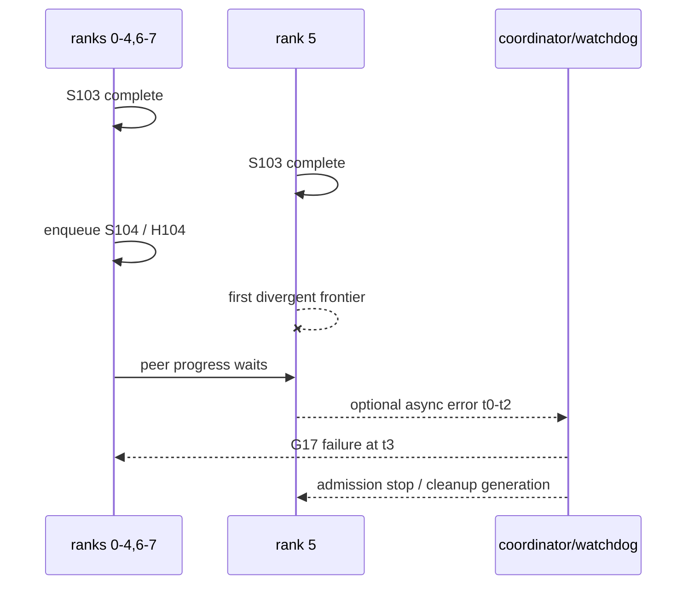
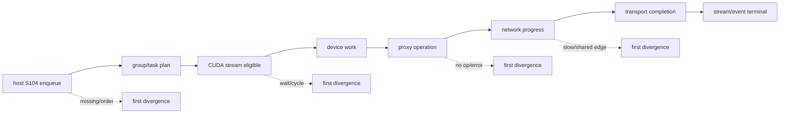
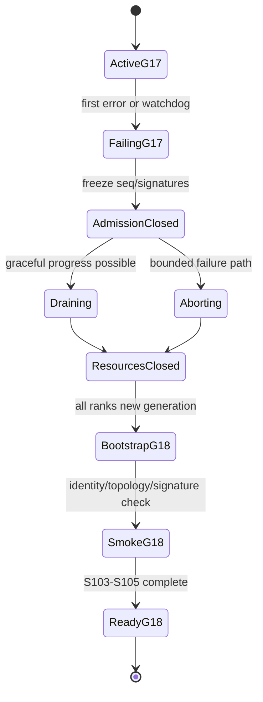

# 59장. 모두 멈춰 보일 때 누가 먼저 달라졌는가: collective hang과 rank imbalance

8개 GPU로 tensor parallel serving을 운영한다고 하자. rank 0의 watchdog이 “all-reduce timeout”을 남겼고 모든 worker가 응답하지 않는다. 운영자는 rank 0 log부터 읽으며 timeout을 늘릴지, NCCL algorithm을 강제할지, node를 재시작할지 고민한다. 하지만 rank 0은 오류를 먼저 만든 process가 아니라 기다림을 먼저 보고한 process일 수 있다. 실제 첫 모순은 rank 5가 collective를 enqueue하지 않은 시점, 다른 count를 사용한 시점, CUDA stream의 오래된 event를 기다린 시점 또는 proxy가 network error를 기록한 시점에 있을 수 있다.

이 장에서는 communicator G17의 sequence 104, 줄여서 S104 하나를 끝까지 추적한다. ranks 0–7은 BF16 sum all-reduce에 참여하고 각 rank의 logical input은 1,048,576 elements, 즉 2 MiB다. 정상이라면 모든 rank가 같은 collective signature를 enqueue하고 device·proxy·network progress를 거쳐 같은 failure 또는 success generation으로 끝난다. 사건에서는 ranks 0–4와 6–7이 S104를 enqueue했지만 rank 5의 마지막 확실한 completion은 S103이다.

“rank 5가 느리다”를 결론으로 쓰지 않는다. host enqueue order, collective signature, CUDA stream dependency, device/proxy/network progress, physical shared edge, compute/host straggler와 async error observation의 일곱 분기를 차례로 반증한다. 이 과정을 거치면 collective hang은 멈춘 화면이 아니라 rank별 frontier가 서로 어긋난 시간 지도에 가까워진다.

## 59.1 rank fingerprint로 first absent/present를 먼저 찾는다

rank 0의 timeout은 관측 지점일 뿐이다. 모든 rank의 collective signature와 frontier fingerprint를 같은 sequence에 맞추고, 어떤 사건이 마지막으로 **전 rank present**였는지와 다음 사건이 어디서 처음 **absent**인지 찾는다. 그 경계부터 device/proxy/network transport를 양방향으로 걷고, 실패 generation을 abort한 뒤 새 communicator smoke test로 rollback을 닫는다. 명령과 source 좌표의 긴 목록은 장말 참고 카탈로그로 보낸다.

### 59.1.1 symptom rank와 divergent rank를 나눈다

rank 0 watchdog은 t3에 30초 timeout을 기록했다. 이것은 rank 0이 root라는 증거가 아니다. rank 0의 framework가 coordinator 역할을 맡아 모든 rank의 future를 기다렸거나 log sink가 rank 0만 수집했을 수 있다. 첫 질문은 “누가 timeout을 말했는가”가 아니라 “마지막으로 모든 rank가 같은 상태였던 sequence는 무엇인가”다.

flight recorder를 정렬했더니 S103은 모든 rank에서 completion됐다. S104에서는 ranks 0–4, 6–7에 host enqueue와 group end가 있지만 rank 5에는 wrapper enter만 있고 enqueue return이 없다. 또는 rank 5에는 return이 있지만 signature digest가 다를 수 있다. 이 둘은 전혀 다른 사건이다. 전자는 host branch나 group path를, 후자는 request shape와 collective order를 본다.

symptom rank, first divergent rank, resource owner를 별 열로 둔다. rank 5가 첫 divergence라도 원인이 rank 5 GPU일 필요는 없다. rank 2가 다른 collective order를 만들면 rank 5 proxy가 먼저 wait에 들어갈 수 있다. shared NIC edge가 다른 workload에 포화돼 rank 5 flow가 먼저 느려질 수도 있다. “rank 5 fault”라는 표현은 evidence가 device/process 자체를 가리킬 때만 쓴다.

### 59.1.2 G17과 S104 identity를 고정한다

communicator identity는 world size 8 하나가 아니다. unique ID digest, process deployment epoch, rank membership/order, rank→GPU UUID/BDF, config와 communicator generation을 묶어 G17이라고 부른다. 일부 ranks가 timeout 뒤 G18을 만들고 다른 ranks가 G17을 이어 쓰면 같은 S104 숫자도 다른 collective universe에 속한다.

S104 signature는 `(G17, seq=104, all-reduce, count=1,048,576, dtype=bf16, op=sum, root=none, in-place=false, buffer generation B104-r, stream generation CS17-r)`다. buffer address를 metric에 원문으로 싣지 않고 allocator generation과 digest를 쓴다. stream도 pointer equality가 아니라 lifecycle generation을 둔다.

2 MiB는 application input bytes다. `1,048,576×2=2,097,152 bytes`라는 계산은 정확하지만 ring/tree가 이동하는 payload, protocol transaction, NVLink/NIC line bytes와 같다고 가정하지 않는다. physical edge load를 계산할 때 selected plan과 concurrent flows가 필요하다. logical bytes, transfer bytes와 counter bytes를 별 단위로 둔다.

### 59.1.3 멈춤과 극단적 느림을 last progress로 가른다

완전 hang은 관측 window에서 progress frontier가 변하지 않는 상태다. slow collective는 bytes, steps 또는 channel completion가 느리지만 증가한다. 30초 timeout은 두 상태를 동일한 user failure로 만들 수 있으나 원인은 다르다. rank별 last progress timestamp와 delta를 수집한다.

rank 5 proxy의 transmitted bytes가 5초마다 증가한다면 signature deadlock보다 congestion, degraded link 또는 straggler 후보가 강하다. rank 5 host enqueue 자체가 없으면 network counter가 조용한 것이 정상이다. device kernel은 launch됐지만 proxy op가 만들어지지 않았다면 plan/transport handoff를 본다. 같은 utilization 0이라도 frontier에 따라 의미가 다르다.

progress metric이 public API로 제공되지 않으면 source와 debug log, application recorder에서 가능한 bounded proxy를 쓴다. 관측이 없다고 “no progress”로 기록하지 않고 `progress unknown`이라고 쓴다. 다음 canary에서 필요한 event를 추가한다.

## 59.2 rank-aligned timeline을 만든다

### 59.2.1 wall clock보다 sequence와 monotonic time을 우선한다

여러 node의 wall clock은 skew와 jump가 있다. rank 5의 12:00:00.100 log가 rank 0의 12:00:00.090보다 실제로 먼저였다고 단정하지 않는다. process-local monotonic timestamp, S104 sequence, control-plane message sequence와 NTP/PTP uncertainty를 함께 둔다. cross-node ordering은 확실한 message edge가 있을 때만 확정한다.

timeline 행은 wrapper enter, NCCL API return, group end, CUDA event record/wait, device launch, proxy post/progress, transport completion, stream completion, async error observation, watchdog와 abort transition을 가진다. 모든 rank가 같은 schema를 써야 빈 칸이 의미가 있다. rank 5만 wrapper instrumentation이 꺼져 있으면 missing enqueue와 missing evidence를 구별할 수 없다.

log arrival order도 event order가 아니다. rank 5 local file가 늦게 upload되거나 buffer flush가 timeout 뒤 일어날 수 있다. 원본 monotonic timestamp와 process epoch, file offset/hash를 보존한다. collector receive time은 별 열이다.

### 59.2.2 한 표에서 일곱 frontier를 정렬한다

| rank | comm/epoch | seq·signature | host enqueue | stream frontier | device work | proxy/network | async error | terminal |
|---:|---|---|---|---|---|---|---|---|
| 0–4 | G17 | S104/H104 | returned | launch eligible | running | waiting peer | none at t2 | watchdog t3 |
| 5 | G17 | last S103 | enter only | unknown | absent | absent | candidate t0 | unknown |
| 6–7 | G17 | S104/H104 | returned | launch eligible | running | waiting peer | none at t2 | watchdog t3 |

이 표는 사건 초기에 가설을 강제한다. rank 5 host enqueue가 정말 없다면 CUDA와 network를 먼저 튜닝하지 않는다. rank 5 enqueue가 나중에 발견되면 stream/device 열로 이동한다. 각 새 증거가 어느 분기를 살리고 죽이는지 표를 갱신한다.

signature hash H104는 원문 pointer나 tensor contents를 포함하지 않는다. collective kind, count, dtype, op, root, in-place, communicator generation와 semantic buffer/stream generation을 canonical serialization한 digest다. 서로 다른 framework version이 serialization order를 달리하지 않도록 schema version을 둔다.



그림의 `first divergent frontier`를 빈 상자로 둔 이유가 있다. 조사 전에는 enqueue 누락, signature mismatch, stream wait, proxy error 또는 straggler 가운데 어느 것인지 모른다. 이후 evidence가 이 상자를 구체적인 event로 바꾼다.

### 59.2.3 first failure와 first observation을 분리한다

rank 5 transport가 t0에 error를 만들고 proxy가 t1에 async state를 갱신하며 framework poller가 t2에 읽고 rank 0 watchdog이 t3에 timeout을 말할 수 있다. `t3-t0`은 failure detection delay다. 예를 들어 t0=2.0초, t2=12.0초, t3=30.0초라면 async poll observation은 10초 늦었고 user timeout은 28초 늦었다.

이 계산은 transport root cause와 관측 policy를 분리한다. poll interval을 줄이면 t2를 앞당길 수 있지만 t0의 network/device failure를 고치지는 않는다. watchdog을 60초로 늘리면 t3만 늦어질 수 있다. 반대로 정상 shared-edge congestion이 35초 걸린다면 30초 watchdog은 false failure를 만든다. 정상 progress envelope를 측정해야 한다.

timeline에는 error source도 둔다. CUDA error, NCCL async error, proxy socket/verbs error, process signal, RAS unresponsive와 orchestrator timeout은 서로 다른 관측이다. 하나를 다른 이름으로 덮어쓰지 않는다.

## 59.3 host enqueue order와 collective signature를 먼저 반증한다

### 59.3.1 API wrapper의 짧은 코드를 의미 있게 읽는다

[고정된 NCCL v2.30.7 `ncclAllReduce`](https://github.com/NVIDIA/nccl/blob/73cf112295c33aee2b895f329f592f2a9b4b0f97/src/collectives.cc#L166-L177)는 send/recv pointer, count, datatype, reduction op, communicator와 stream을 `ncclInfo`에 담아 enqueue path로 넘긴다. 필요한 부분만 줄이면 다음 형태다.

```cpp
struct ncclInfo info = { ncclFuncAllReduce, "AllReduce",
  sendbuff, recvbuff, count, datatype, op, 0, comm, stream, ... };
return ncclEnqueueCheck(&info);
```

짧은 wrapper가 synchronous completion을 뜻하지 않는다. 오히려 rank-aligned signature의 입력이 한곳에 모인다는 점이 중요하다. framework wrapper enter만 있고 NCCL call event가 없으면 input preparation 또는 host branch에서 멈췄을 수 있다. NCCL return가 있어도 group accumulation 뒤 device work가 launch됐는지는 별 frontier다.

S104 recorder는 info 전체를 raw dump하지 않고 safe signature fields를 canonicalize한다. pointer는 generation digest로, stream은 CS17-r로 바꾼다. count가 rank 5만 1,048,575라면 한 element 차이라도 H104가 달라져야 한다.

### 59.3.2 call order mismatch는 valid API의 조합으로 생긴다

rank 0–4가 S104 all-reduce 뒤 S105 all-gather를 호출하고 rank 5가 S105를 먼저 호출하면 각 local API argument는 valid할 수 있다. 그러나 peers가 같은 collective phase를 만나지 않는다. final symptom은 network wait지만 first divergence는 application order다.

rank별 sequence는 framework request order와 NCCL communicator order를 모두 가진다. 서로 다른 model runner threads가 같은 communicator에 calls를 넣으면 host scheduling이 순서를 바꿀 수 있다. group start/end 경계와 lock/serialization owner를 기록한다. 동일 CUDA stream이라고 host threads의 enqueue order가 자동 합의되는 것은 아니다.

minimal fixture는 S103→S104→S105를 deterministic하게 반복한다. rank 5만 의도적으로 104/105 order를 바꾸는 것은 격리 test의 개념적 injection이며 production에서 하지 않는다. expected result는 silent hang이 아니라 application recorder 또는 validation이 mismatch를 빠르게 보여 주는 것이다.

### 59.3.3 group end와 device completion을 합치지 않는다

[NCCL group source](https://github.com/NVIDIA/nccl/blob/73cf112295c33aee2b895f329f592f2a9b4b0f97/src/group.cc#L27-L150)는 thread-local group state, jobs와 cleanup을 읽는 고정점이다. group end 성공은 accumulated calls가 launch/async path로 넘어갔다는 host 경계일 수 있지만 모든 GPU output가 ready라는 뜻이 아니다.

rank 5가 nested group depth를 잘못 닫지 못하면 다른 ranks가 group end 뒤 progress하고 rank 5는 host accumulation에 남을 수 있다. recorder에는 group depth, group generation, pending communicator tasks와 group end return/error를 넣는다. group 내부 두 번째 call validation이 실패했다면 첫 call이 launch됐는지 rollback됐는지 current source path를 확인한다.

timeout 뒤 group state를 억지로 reset하고 같은 communicator를 재사용하지 않는다. partial async jobs와 tasks가 남았을 수 있다. failure generation을 freeze하고 cleanup owner가 G17 전체를 일관되게 닫는다.

### 59.3.4 signature mismatch의 종료 증거

수정은 모든 ranks에 같은 tensor shape를 broadcast했다고 끝나지 않는다. request admission, finished sequence removal, padding/active rows와 TP shard shape가 rank별로 같은 시점에 반영되는지 본다. scheduler가 rank 5만 request 하나를 먼저 제거하면 count가 갈라질 수 있다.

종료 fixture는 count 1,048,576 정상, rank 5 count-1, dtype mismatch, S104/S105 order swap과 communicator generation mismatch를 포함한다. 정상 cell은 completion과 output digest가 같아야 하고 mismatch cells는 bounded fail-fast 또는 명시적 watchdog evidence를 가져야 한다. production을 hang시키는 injection은 사용하지 않는다.

복구 보고서는 “NCCL timeout 해결”보다 구체적이다. “rank 5 scheduler가 finished request를 한 step 먼저 제거해 S104 count가 1 작아졌고 H104가 다른 것이 first divergence였다. rank-synchronous batch descriptor generation을 추가하고 mismatch를 enqueue 전에 거부했다”라고 쓴다.

## 59.4 CUDA stream dependency에서 rank 5를 찾는다

### 59.4.1 host enqueue가 있어도 launch eligible이 아닐 수 있다

rank 5 `ncclEnqueueCheck`가 성공했는데 device kernel이 보이지 않는다면 stream CS17-5 앞 work를 본다. producer compute가 끝나지 않았거나 다른 stream의 event wait가 잘못된 generation을 기다릴 수 있다. ranks 0–4는 producer event E104를 publish했지만 rank 5만 E103 또는 존재하지 않는 E105를 기다릴 수 있다.

CUDA stream은 worker thread가 아니라 ordered work queue다. same stream이면 앞 work가 collective launch를 막고, cross-stream이면 explicit event dependency가 필요하다. host call return 순서는 device completion 순서가 아니다. 43장의 happens-before 원장을 재사용해 producer op→event record→collective stream wait→NCCL work를 그린다.

stream synchronize timeout은 root cause가 아니다. dependency cycle, long producer kernel, device error, collective peer wait 모두 stream tail을 미완료로 만든다. wait node와 event generation, last completed op를 기록한다.

### 59.4.2 dependency graph에서 cycle와 missing edge를 구별한다

cycle 사건은 rank 5 compute stream이 all-reduce completion event를 기다리고 all-reduce stream은 compute stream의 producer event를 기다리는 구조다. 둘 다 필요한 것처럼 보이지만 방향이 잘못됐다. directed graph에 operations와 event record/wait를 nodes/edges로 그려 cycle를 찾는다.

missing edge는 hang보다 stale data를 만들 수 있다. rank 5 producer가 끝나기 전에 collective가 B104-5를 읽으면 wrong value가 전파될 수 있다. 다른 ranks가 기다리며 hang하지 않아도 collective incident다. 그래서 이 장은 timeout만 아니라 output digest와 buffer generation도 본다.

event object 재사용에는 generation이 있다. E라는 같은 handle이 이전 step 103과 현재 104를 가리킬 수 있다. record frontier, wait enqueue 위치와 buffer generation을 tuple로 검증한다. event count metric만으로 correctness를 증명하지 않는다.

### 59.4.3 graph capture와 old communicator를 함께 재사용하지 않는다

CUDA Graph가 collective node를 capture했다면 graph executable은 communicator, buffer address, stream/capture context와 relevant NCCL state에 묶인다. G17 abort 뒤 G18을 만들고 old graph를 replay하면 pointer가 같아도 communicator generation이 다르다. graph cache key와 invalidation에 G generation을 포함한다.

rank 5만 graph miss로 eager path를 타고 다른 ranks가 captured sequence를 replay하면 host collective order가 갈릴 수 있다. graph selection predicate와 fallback를 rank-aligned timeline에 넣는다. 모든 ranks가 같은 graph mode여야 한다고 무조건 주장하지 않고 collective ordering가 어떻게 합의되는지 framework contract를 읽는다.

capture/replay 문제를 device synchronize로 가려도 최종 수정이 아니다. exact graph generation, event frontier와 communicator ownership을 복구하고 coarse sync를 제거한 상태에서 S103→104→105를 검증한다.

## 59.5 device·proxy·network progress를 서로 다른 owner로 본다

### 59.5.1 device work가 있다고 network work가 있는 것은 아니다

collective plan은 device kernel과 host proxy/network operation을 포함할 수 있다. channel과 transport에 따라 GPU가 local reduce/copy를 진행하고 proxy thread가 network sends/receives를 진행한다. GPU kernel name이 보였다는 사실만으로 NIC work request가 post됐다고 결론 내리지 않는다.

[NCCL v2.30.7 device work dispatch](https://github.com/NVIDIA/nccl/blob/73cf112295c33aee2b895f329f592f2a9b4b0f97/src/device/common.h#L380-L445)는 device-side work descriptor가 function을 선택해 실행하는 고정점이다. 다음처럼 핵심 질문만 남긴다.

```cpp
work = loadWork(...);
funcIndex = work.header.funcIndex;
ncclDevFuncTable[funcIndex]();
```

실제 code는 더 많은 state와 dispatch 조건을 가진다. 인용의 의도는 kernel launch와 collective 의미 사이에 work descriptor가 있다는 점을 보여 주는 것이다. rank 5의 S104 work가 device queue에 존재했는지, 어느 channel/function index와 generation인지 recorder에서 연결한다.

### 59.5.2 proxy last progress는 bytes와 step으로 남긴다

[고정된 `ncclProxyProgress`](https://github.com/NVIDIA/nccl/blob/73cf112295c33aee2b895f329f592f2a9b4b0f97/src/proxy.cc#L1123-L1235)는 proxy thread가 active operations를 진행하고 abort/stop state를 관찰하는 source 좌표다. application은 내부 field가 public metric이라고 가정하지 않지만, debug trace나 framework hooks로 last posted/progress/completed frontier를 얻을 수 있는지 검토한다.

S104 rank 5 proxy가 op를 받은 적이 없으면 device→proxy scheduling 또는 앞 단계가 의심된다. op가 있고 network post 전이면 connection/registration/resource를 본다. bytes가 증가하다 멈췄으면 last successful peer/channel과 error를 본다. completion까지 갔는데 stream이 미완료면 proxy→device notification 또는 CUDA dependency를 본다.

`proxy active=1`은 progress가 아니다. monotonic work step, byte delta와 last timestamp가 필요하다. polling loop가 CPU를 소비하면서 같은 state를 반복할 수 있다. thread utilization 100%를 throughput로 오해하지 않는다.



각 화살표는 source나 trace로 확인할 edge다. 앞 node가 있다는 사실이 다음 node의 existence나 completion를 자동 증명하지 않는다. rank 5가 마지막으로 도달한 node를 표시하면 조사 팀이 서로 다른 층을 동시에 튜닝하는 일을 줄일 수 있다.

### 59.5.3 RDMA registration과 descriptor generation을 이어 붙인다

network path가 GPU buffer registration을 요구한다면 58장의 M/D/T generation을 S104에 결합한다. rank 5의 B104-5는 registration M104-5, remote descriptor D104-peer와 transfer handles를 가진다. stale rkey, deregistration race 또는 registration cache exhaustion은 collective peer wait로 보일 수 있다.

host enqueue와 device work가 정상이고 proxy가 remote access error를 기록했다면 rank 5의 GPU/NIC BDF, selected rail, MR generation과 completion를 본다. 다른 ranks의 derivative waits를 각각 network failure로 세지 않는다. first transport error 하나와 그 이후 group impact를 분리한다.

retry가 있다면 동일 S104를 같은 buffer에 다시 쓰는 것이 idempotent한지 확인한다. partial RDMA write 뒤 retry와 collective protocol state가 겹치면 단순 재전송이 안전하지 않을 수 있다. NCCL/backend의 current recovery contract 바깥에서 application이 임의 retry하지 않는다.

### 59.5.4 progress 분기의 종료 증거

복구는 NIC counter가 다시 증가했다는 한 줄로 끝나지 않는다. rank 5 S104가 host enqueue, device work, proxy post/progress/completion, CUDA stream terminal을 모두 current generation으로 통과해야 한다. ranks 0–7의 output digest도 맞아야 한다. partial failure 뒤 old resource와 handles가 남지 않아야 한다.

network error 수정이라면 same topology와 representative sizes에서 cold/warm registration, connection와 progress를 본다. proxy scheduling 수정이면 CPU affinity와 thread lifecycle, abort/stop을 검증한다. device work 수정이면 exact work descriptor와 stream frontier를 확인한다.

관측 overhead도 기록한다. TRACE logging가 proxy polling을 늦출 수 있고 profiler가 GPU schedule을 바꿀 수 있다. 평상시 recorder와 상세 debug 결과가 다르면 둘을 같은 baseline으로 합치지 않는다.

progress 원장을 실제 S104에 채워 보자. rank 0 channel 0은 device work D104-0을 시작했고 proxy operation P104-0의 step이 3에서 멈췄다. rank 5에는 D104-5 자체가 없다. 이때 rank 0 proxy stall은 root가 아니라 missing peer의 파생 wait일 가능성이 크다. rank 0 network interface를 교체하기 전에 rank 5 host/stream frontier를 복원한다.

반대 표도 가능하다. rank 5 D104-5와 P104-5가 존재하고 network post까지 갔지만 completion status가 remote access error다. ranks 0–4의 proxy는 peer wait를 보인다. first divergence는 rank 5 registration/descriptor 또는 remote target generation이다. application signature가 맞아도 transport identity가 갈릴 수 있다. 58장의 M/D/T 원장을 S104 record에 붙인다.

세 번째 표에서는 모든 proxy steps가 증가하지만 rank 5 flow만 초당 delta가 작다. error는 없고 DCGM/NVML에도 fatal health가 없다. shared edge load와 negotiated link, competing traffic를 본다. 이때 watchdog은 정상보다 느린 progress를 hang으로 분류했을 수 있다. timeout을 바꾸기 전에 baseline envelope와 contention policy를 확인한다.

네 번째 표에서는 proxy completion가 모든 rank에서 보였는데 rank 5 stream terminal이 없다. network를 이미 통과했으므로 CUDA completion notification, stream dependency와 consumer edge로 돌아간다. proxy success를 application readiness로 바꾸지 않는다. device-side barrier나 event record가 끝나지 않을 수 있다.

다섯 번째 표에서는 rank 5 proxy error가 t0에 있었지만 async poller가 t2까지 읽지 않았다. other ranks는 20초 동안 derivative wait를 만들었다. transport error 수정과 detection latency 개선을 두 work item으로 나눈다. error poll interval, recorder trigger와 group failure propagation을 검증한다.

channel별 record를 aggregate 하나로 합치면 partial progress를 놓친다. channels 0–3 중 0–2가 완료되고 3만 멈출 수 있다. 전체 bytes가 조금 증가했다는 이유로 healthy라고 쓰지 않고 slowest required channel/peer frontier를 찾는다. 반대로 channel 수를 high-cardinality metric label로 무한 노출하지 않고 sampled trace에 둔다.

proxy thread가 여러 communicators를 진행한다면 unrelated G16/G18 traffic과 G17 S104를 구분한다. thread CPU가 높고 bytes가 움직여도 S104 op는 정지할 수 있다. operation generation과 communicator를 recorder에 넣는 이유다. thread-level aggregate는 service activity이고 request-level progress가 아니다.

connection setup과 steady progress도 분리한다. first S104가 lazy connection, memory registration와 proxy resource creation을 포함하면 오래 걸릴 수 있다. 같은 G17의 warm S105가 빠르면 cold path 가설이 강해진다. 그러나 S104가 never completes면 cold latency가 아니라 failure다. time-to-first-progress와 progress-to-completion를 나눈다.

registration cache exhaustion은 intermittent할 수 있다. rank 5만 새 buffer generation을 받아 M104-5 cache miss가 나고 other ranks는 pool hit일 수 있다. register error나 long pinning이 host enqueue 뒤 proxy work 전을 지연한다. framework가 registration을 NCCL call 이전에 한다면 host enqueue 자체가 늦을 수도 있다. source path로 frontier 위치를 확인한다.

progress 복구 fixture는 단순 all-reduce loop 이상이다. cold connection, warm operation, buffer generation reuse, cancellation/abort 뒤 새 communicator와 representative concurrent traffic을 포함한다. 한 번의 2 MiB success로 cache/resource cleanup와 G18 readiness를 덮지 않는다.

## 59.6 shared edge와 slow rank를 hang에서 분리한다

### 59.6.1 logical 2 MiB를 physical edge load로 투영한다

rank당 2 MiB input이라고 physical edge가 정확히 2 MiB만 운반한다고 쓰지 않는다. selected algorithm, channels, chunk와 peer routes가 traffic matrix를 만든다. rank pair traffic `T[i,j]`와 physical edge indicator `R[i,j,e]`를 두고 `load(e)=ΣT[i,j]R[i,j,e]`를 계산한다.

가상 edge E가 한 interval에 8 GiB/s payload capacity를 제공하고 S104 flows 합이 6 GiB/s, 동시에 다른 job이 4 GiB/s를 요구하면 aggregate demand는 10 GiB/s다. 이 수치는 교육 fixture이며 실제 line rate가 아니다. contention에서 S104 progress는 느려질 수 있지만 완전히 protocol-deadlock한 것은 아니다.

57장의 [고정된 topology path 계산](https://github.com/NVIDIA/nccl/blob/73cf112295c33aee2b895f329f592f2a9b4b0f97/src/graph/paths.cc#L721-L866)을 사용해 rank→GPU/NIC BDF와 candidate path를 연결한다. path type과 bottleneck bandwidth는 route 후보를 설명하지만 concurrent external traffic 전체를 자동 계산하지 않는다.

### 59.6.2 degraded link와 saturation을 counter 변화로 가른다

shared edge가 saturated되면 utilization/bytes가 높고 progress는 이어질 수 있다. degraded/downtrained link는 negotiated width/speed, replay/error와 attainable throughput가 baseline에서 달라질 수 있다. cable/port failure는 explicit error와 reconnect를 만들 수 있다. 모두 p99가 길어지지만 증거가 다르다.

rank 5 flow 하나만 느려 보일 때 같은 edge를 공유하는 다른 pair도 동시 window에서 느린지 본다. rank placement를 바꾼 approved canary에서 병목이 edge와 함께 이동하는지 본다. rank 5 GPU를 교체했는데 병목이 그대로 edge에 남으면 device straggler 가설이 약해진다.

line counter와 application latency의 clock window를 맞춘다. interval aggregate가 S104 한 건을 직접 식별하지 못할 수 있다. 주변 traffic, link direction와 duplex를 기록한다. 높은 counter라는 상관만으로 root를 확정하지 않는다.

### 59.6.3 rank 5 compute와 host scheduling도 본다

collective가 느린 이유가 collective 이전 producer일 수 있다. rank 5 compute kernel이 다른 ranks보다 늦어 S104 host enqueue 또는 stream eligibility가 늦어진다면 network는 기다릴 뿐이다. layer boundary별 ready event와 S104 enter를 비교한다.

host thread가 CPU deschedule, page fault, GIL/lock, allocator 또는 logging I/O에 막힐 수 있다. process CPU time, run queue, thread stack와 scheduler events를 가능한 낮은 overhead로 본다. rank 5 GPU utilization 0은 host enqueue 부재와 일치하지만 원인을 정하지 않는다.

GPU clocks, thermal/power throttle, ECC/Xid와 memory pressure도 본다. 그러나 throttle flag 하나가 S104 delay와 같은 window에 있고 rank-specific phase가 느려졌는지 확인한다. hardware telemetry는 source call order를 대신하지 않는다.

### 59.6.4 DCGM·NVML은 hardware scope로 제한한다

[DCGM Health Monitoring](https://docs.nvidia.com/datacenter/dcgm/latest/learn/modules/health-monitoring.html)은 ordinary operation에서 보존한 telemetry를 이용하는 passive health 관측이다. PCIe, GPU memory, thermal/power, NVLink/NVSwitch와 지원되는 ConnectX 상태를 좁히는 데 유용하다. S104 signature가 맞았는지 증명하지 않는다.

[DCGM profiling](https://docs.nvidia.com/datacenter/dcgm/latest/learn/modules/profiling.html)의 interval counters는 SM/memory/PCIe/NVLink 활동을 넓게 보여 주지만 kernel trace나 source line이 아니다. profiling resource가 developer profiler와 충돌할 수 있다는 공식 주의도 따른다. 사건 중 도구를 무차별 중첩하지 않는다.

[DCGM Diagnostics](https://docs.nvidia.com/datacenter/dcgm/latest/learn/modules/dcgm-diagnostics.html)은 active test다. serving workload가 살아 있는 순간에는 passive evidence를 먼저 모으고, drain된 node와 승인된 window에서 targeted diagnostic을 수행한다. diagnostics success는 hardware readiness의 일부이지 application G17/S104 protocol proof가 아니다.

rank imbalance를 숫자로 표현할 때 평균에서 빼는 방식만 쓰지 않는다. phase별 rank maximum, minimum, median과 rank 5 값을 함께 둔다. S104 producer-ready가 ranks 0–4,6–7에서 8 ms, rank 5에서 80 ms라면 collective duration에 rank 5의 upstream 72 ms gap이 포함된다. collective kernel만 profile하면 기다림의 origin을 놓친다.

반대로 producer-ready는 모두 8 ms인데 rank 5 proxy completion가 80 ms라면 communication phase imbalance다. selected route, bytes/progress와 error를 본다. rank 5 stream terminal만 80 ms면 proxy 이후 device notification/consumer edge다. `rank 5 total 80 ms`를 세 분기로 내려야 한다.

straggler score를 `rank duration / rank median`으로 둘 수 있다. rank 5가 80 ms, median 10 ms면 8×다. 그러나 duration이 서로 다른 clock domain과 phase boundary에서 측정되면 ratio가 무의미하다. 같은 recorder schema와 monotonic interval을 사용하고 missing events를 0으로 넣지 않는다.

shared-edge load 계산에는 overlapping window가 필요하다. S104가 edge E를 20 ms 쓰고 다른 job이 그중 5 ms만 겹치면 전체 20 ms 동안 합산 capacity를 적용하지 않는다. interval을 작은 bins로 나누거나 trace overlap을 계산한다. counter sample이 1초라면 20 ms burst가 평균에 희석될 수 있다는 한계를 쓴다.

topology matrix의 path label도 capacity 보증이 아니다. 같은 NVL/PIX 표기라도 negotiated state, concurrent flows와 direction이 다르다. startup topology dump와 incident-time health를 결합한다. static path는 가능성을, link counter와 progress는 사건 시점 상태를 말한다.

rank placement A/B는 한 요소만 바꾼다. rank 5를 다른 GPU로 옮기면 membership/BDF와 potentially algorithm plan이 달라질 수 있다. plan digest와 workload를 기록하고 병목이 physical edge와 함께 이동하는지 본다. 성능이 좋아졌다는 결과만으로 old GPU fault를 확정하지 않는다.

hardware error가 명확하면 passive evidence를 우선 보존한다. Xid, link error, PCIe replay와 thermal/power history, driver logs와 exact entity를 수집한다. active diagnostics는 node drain 뒤 실행한다. reset으로 counter를 지운 뒤 evidence를 모으는 순서를 피한다.

## 59.7 async error·RAS·watchdog의 시계를 나눈다

### 59.7.1 async error getter는 관측 경계다

[NCCL v2.30.7 `ncclCommGetAsyncError`](https://github.com/NVIDIA/nccl/blob/73cf112295c33aee2b895f329f592f2a9b4b0f97/src/init.cc#L3448-L3465)는 communicator의 asynchronous error를 host가 읽는 source 좌표다. getter 호출 시각은 error 발생 시각이 아니다. framework가 얼마나 자주, 어느 thread에서 poll하고 결과를 request/group state로 전파하는지 본다.

rank 5 t0 error가 t2 poll까지 10초 보이지 않으면 ranks 0–4와 6–7은 그 사이 S104 wait에 머물 수 있다. poll interval을 줄이는 것은 detection latency 개선이다. error가 생긴 network/device root와 구분한다. poll overhead와 false escalation도 측정한다.

error가 관측되면 new collective admission을 막아야 한다. 실패 G17에 S105를 계속 enqueue하면 derivative waits와 buffer ownership이 늘어난다. first error record를 immutable하게 보존하고 later errors가 덮어쓰지 않게 한다.

### 59.7.2 RAS는 outlier를 좁히는 별 network다

[NCCL 2.30.7 RAS 공식 문서](https://docs.nvidia.com/deeplearning/nccl/archives/nccl_2307/user-guide/docs/troubleshooting/ras.html)는 process별 RAS thread가 keepalive와 configuration state를 교환하고 running job의 global communicator view를 query할 수 있다고 설명한다. unresponsive process를 찾는 데 유용하지만 CUDA kernel, collective signature 또는 main RDMA root를 자동 판정하지 않는다.

RAS가 bootstrap/OOB TCP network를 사용하고 main collective RDMA traffic과 경로가 다를 수 있다는 범위를 보존한다. RAS peer가 unreachable이면 process crash/hang, OOB network 문제와 collector delay 후보가 있다. RAS healthy인데 main RDMA path가 실패할 수도 있다.

`STATUS`와 verbose query는 incident snapshot이다. large/hung job에서 aggregation 응답이 늦을 수 있으므로 query timeout을 application hang timer와 합치지 않는다. RAS query 자체를 이 staging에서 실행한 것이 아니며 운영 환경에서는 access/security 정책을 따른다.

### 59.7.3 timeout 여섯 개를 한 숫자로 맞추지 않는다

request SLO, framework collective watchdog, async poll interval, RAS query timeout, network retry/timeout와 orchestrator liveness는 다른 interval과 action을 가진다. 표에는 timer owner, start/end frontier, expiry effect, cleanup 권한과 상하 관계를 둔다.

request timeout은 user future를 fail할 수 있지만 CUDA/network work를 자동 취소하지 않는다. watchdog은 communicator failure escalation을 시작할 수 있지만 buffer safe-free를 자동 보장하지 않는다. RAS query timeout은 query가 답하지 않았다는 뜻이지 G17을 abort했다는 뜻이 아니다. orchestrator process kill은 더 넓은 recovery action이다.

timeout을 짧게 하면 hang detection은 빨라져도 정상 straggler를 failure로 만들 수 있다. 길게 하면 false positive는 줄지만 bad communicator가 더 많은 work와 resource를 붙잡는다. 정상 progress distribution, async observation delay와 abort capacity를 근거로 설정한다.

### 59.7.4 first error를 all ranks에 전파한다

rank 5 error를 rank 5 process만 알면 다른 ranks는 peer progress를 계속 기다린다. coordinator/control plane은 G17 failure generation을 모든 ranks에 전파하고 new admission을 닫으며 pending futures를 consistent failure로 만든다. delivery 자체에도 sequence, ACK와 timeout이 필요하다.

partial-rank retry를 하지 않는다. rank 5만 G18 communicator를 만들고 others가 G17이면 membership generation이 갈린다. all ranks가 old work를 drain/abort하고 new unique ID와 rank mapping을 합의해야 한다. old delayed failure message가 G18을 abort하지 않도록 generation을 검증한다.

first error가 unknown이면 불확실성을 남긴다. rank 5 last progress 뒤 process가 사라졌고 local logs가 없을 수 있다. 이때 “network error”를 확정하지 않고 flight recorder, RAS와 system journal에서 다음 incident에 필요한 bounded evidence를 추가한다.

error propagation message도 stale할 수 있다. G17 failure F17이 network delay 뒤 G18 ready 과정에 도착하면 receiver는 communicator generation을 확인해 old message로 분류한다. 단순히 “failure received”를 current group abort로 바꾸지 않는다. propagation ACK와 coordinator retry도 같은 generation을 가진다.

여러 ranks가 서로 다른 first error를 거의 동시에 기록할 수 있다. rank 5 remote access error와 rank 2 connection reset이 같은 failure chain의 양끝일 수 있다. monotonic time uncertainty, peer/channel와 causal edge를 비교하고 earliest log line만 root로 고르지 않는다. primary/secondary 또는 unresolved concurrent errors로 표시한다.

watchdog thread 자체가 deschedule되면 t3 observation가 늦을 수 있다. async poller, recorder trigger와 watchdog가 같은 overloaded CPU core나 lock을 공유하는지 본다. detection path의 health metric과 heartbeat를 둔다. 감시자가 늦다는 사실과 collective progress가 늦다는 사실을 분리한다.

RAS keepalive와 application recorder를 상호 보완적으로 쓴다. RAS는 rank 5 process가 unresponsive함을 보여 주고 peer record는 마지막 S104 frontier를 보여 줄 수 있다. 둘이 모순되면 timestamp와 network scope를 확인한다. RAS 응답 success가 process main thread나 CUDA progress health를 보장하지 않는다.

timeout incident가 반복되면 count만 세지 말고 first-divergence category를 집계한다. enqueue/signature, stream, proxy/network, shared-edge, straggler, async observation와 cleanup으로 bounded labels를 둔다. unknown 비율이 높으면 timeout 값을 바꾸기 전에 recorder coverage를 개선한다.

## 59.8 flight recorder를 항상 켤 수 있게 작게 만든다

### 59.8.1 event schema는 원인 분기에 맞춘다

flight recorder는 NCCL public guarantee가 아니라 application/framework 측 bounded ring buffer다. event에는 process epoch, comm generation, rank, sequence, signature digest, host/group frontier, buffer/stream/event generation, selected plan category, device/proxy frontier, async error와 cleanup state를 둔다.

raw unique ID, pointer, tensor contents, prompt와 tenant ID는 넣지 않는다. exact tensor name 대신 bounded operation class와 size bucket을 metric에 두고 detailed trace는 approved storage에 sample한다. schema version과 serialization order를 고정해 ranks의 digest를 비교할 수 있게 한다.

ring은 최근 N events 또는 byte budget을 가진다. overwrite 시 last error와 cleanup transition를 별 reserved slots에 보존할 수 있다. process crash에서도 가능한 flush mechanism과 file integrity를 설계하되 signal handler에서 async-signal-unsafe operation을 호출하지 않는다.

### 59.8.2 TRACE를 상시 recorder로 오해하지 않는다

NCCL debug logging는 subsystem과 verbosity를 통해 강력한 evidence를 제공하지만 TRACE를 항상 켜면 volume, I/O와 timing을 바꿀 수 있다. [NCCL 2.30.7 environment 공식 문서](https://docs.nvidia.com/deeplearning/nccl/archives/nccl_2307/user-guide/docs/env.html)에서 `NCCL_DEBUG`, `NCCL_DEBUG_SUBSYS`, `NCCL_DEBUG_FILE`의 versioned 의미를 확인한다.

평상시는 WARN과 low-overhead recorder/counters를 유지하고, 격리 minimal reproduction에서 CALL, COLL, GRAPH, NET 등 실제 archive가 지원하는 subsystem을 좁힌다. rank/host/PID별 file이 충돌하지 않게 하고 disk capacity, rotation과 retention을 둔다.

debug log가 없었다고 incident를 포기하지 않는다. sequence/signature, async error, process exit와 topology snapshot만으로 기각할 분기가 있다. 다음 재현에서 가장 정보 가치가 큰 subsystem을 선택한다.

### 59.8.3 rank-aligned snapshot을 사건 artifact로 만든다

trigger는 first async error, watchdog 임박, progress age threshold 또는 operator request일 수 있다. 모든 ranks에 snapshot generation F17을 보내고 local monotonic range, recorder buffer, effective NCCL config, comm/topology digest, GPU/NIC identity와 DCGM/NVML passive snapshot을 보존한다.

응답하지 않는 rank가 있어도 “missing rank 5 snapshot” 자체를 evidence로 남긴다. 다른 ranks의 views로 rank 5 last seen sequence와 peer progress를 복원한다. collector receive time과 local event time을 분리한다.

artifact에는 접근 권한, retention과 redaction이 필요하다. source address나 rkey 같은 capability를 포함하지 않도록 default schema를 설계한다. 상세 memory/stack dump가 필요하면 별 승인과 secure path를 쓴다.

recorder 용량을 손으로 계산한다. event 한 개를 고정 128 bytes로 제한하고 rank당 65,536 events를 보존하면 `128×65,536=8,388,608 bytes`, 즉 8 MiB다. 8 ranks 합은 64 MiB지만 process별 local memory이므로 한 process가 64 MiB를 쓰는 것은 아니다. variable string과 stack를 event 안에 넣으면 이 bound가 깨지므로 dictionary ID와 digest를 사용한다.

초당 rank당 20,000 events라면 65,536-slot ring은 약 3.28초만 보존한다. S104 watchdog가 30초라면 trigger가 늦어 first divergence가 overwrite될 수 있다. event rate를 측정하고 larger ring, lower sampling, error-reserved buffer 또는 watchdog-pretrigger를 선택한다. 무조건 큰 ring은 memory/cache와 flush 비용을 늘린다.

두 tier를 둘 수 있다. tier 1은 모든 collective의 enter/signature/terminal을 낮은 빈도로 오래 보존한다. tier 2는 current/slow sequence의 device/proxy steps를 짧고 자세하게 보존한다. first async error 또는 progress-age threshold에서 tier 2 snapshot을 freeze한다. 이렇게 하면 long history와 detailed frontier를 모두 bounded하게 유지할 수 있다.

rank-aligned snapshot에는 missingness bitmap이 필요하다. F17 trigger에 ranks 0–4,6–7만 응답하고 rank 5가 응답하지 않았다면 collector가 rank 5 empty file을 정상 zero events로 해석하지 않는다. `not_received`, `received_empty`, `corrupt`, `redacted`를 구분한다. peer record의 last-seen rank 5 sequence로 일부를 복원하되 추론이라고 표시한다.

clock calibration event를 주기적으로 넣을 수 있다. coordinator sequence C900을 각 rank가 받은 local monotonic time과 ACK time을 기록하면 cross-node interval의 범위를 추정할 수 있다. network delay가 비대칭일 수 있으므로 exact global ordering로 만들지 않는다. 확실한 causal message edge와 uncertainty window를 함께 표시한다.

signature digest schema는 deployment compatibility 문제다. version A는 root field를 생략하고 version B는 포함하면 같은 S104도 hash가 달라진다. recorder header에 schema version과 canonical field list digest를 둔다. rolling deployment에서 versions가 다르면 raw safe fields로 비교하거나 traffic을 격리한다.

plan digest도 결과 해석을 돕는다. algorithm/protocol/channel/transport 후보와 selected category를 bounded canonical string으로 만든다. plan digest mismatch가 곧 correctness mismatch는 아니지만 ranks가 incompatible plan/state를 가졌는지 조사할 좌표다. internal structures가 public contract가 아니므로 version pin과 source mapping을 남긴다.

privacy 검토에서는 size와 timing도 민감할 수 있음을 인정한다. exact tensor size histogram이 tenant workload를 드러낼 수 있다면 metric은 buckets를 쓰고 detailed recorder는 restricted retention을 적용한다. collective contents는 수집하지 않는다. buffer generation digest는 process-local salt로 만들어 cross-tenant 추적 가능성을 낮춘다.

recorder failure가 serving failure를 만들지 않도록 한다. ring allocation 실패, disk full과 collector unreachable이 collective critical path를 block하지 않게 policy를 정한다. 동시에 recorder가 조용히 꺼졌다면 health metric과 alert를 남긴다. evidence durability와 serving availability의 tradeoff를 명시한다.

snapshot 파일은 manifest와 묶는다. framework/NCCL/CUDA/driver versions, container digest, effective env, rank membership, GPU/NIC UUID/BDF와 topology dump hash가 있어야 events를 해석할 수 있다. config secret와 raw unique ID는 redaction한다. manifest 자체에도 generation과 checksum을 둔다.

사건 뒤 recorder를 회고한다. first divergence 이전 history가 충분했는지, event schema가 일곱 분기를 구분했는지, overhead와 dropped events가 있었는지 평가한다. “더 많이 로그하자”가 아니라 가장 가치 있는 missing edge를 추가하고 불필요한 events를 제거한다. recorder도 workload와 architecture에 맞춰 진화한다.

## 59.9 최소 재현과 fault injection을 안전하게 설계한다

### 59.9.1 model 전체보다 S103→S104→S105를 보존한다

최소 재현은 production model과 traffic을 모두 복제하는 일이 아니다. first divergence를 만드는 communicator membership, rank placement, collective order/signature, stream/progress edge와 size threshold를 보존하는 일이다. synthetic BF16 buffers를 사용하고 contents는 rank별 deterministic pattern으로 만든다. S104 전후 sequence를 포함해야 order drift와 cleanup residue를 볼 수 있다.

첫 fixture는 single node 또는 production과 같은 multi-node 8-rank topology 중 사건이 재현되는 가장 작은 범위를 찾는다. world size를 2로 줄였더니 사라지면 rank 5가 지나던 shared edge, algorithm threshold 또는 scheduling interaction가 빠졌을 수 있다. 곧바로 “재현 안 됨”으로 닫지 않고 제거한 조건을 기록한다.

message size는 2 MiB 중심으로 작은/큰 이웃을 sweep한다. 1 MiB, 2 MiB, 4 MiB가 서로 다른 algorithm/protocol/channel을 선택할 수 있으므로 selected plan digest를 보존한다. 정확한 threshold는 current source/config/runtime 관측으로 확인하고 임의로 일반화하지 않는다. 2 MiB에서만 failure가 나면 plan이나 buffer geometry 분기가 강해진다.

buffer는 guards와 digest를 가진다. rank r의 input을 단순한 constant 또는 deterministic sequence로 만들고 expected sum을 손계산한다. final output만 아니라 pre-collective input generation, active count와 guard region을 비교한다. out-of-bounds나 stale producer가 network hang처럼 보이는 것을 막는다.

### 59.9.2 fault injection은 일곱 분기를 하나씩 건드린다

개념적 injection A는 rank 5 S104 enqueue skip이다. expected evidence는 rank 5 recorder의 missing call과 peers의 S104 wait다. B는 rank 5 count-1 또는 S104/S105 order swap이다. expected evidence는 H104 mismatch다. C는 rank 5 producer event publication delay다. expected evidence는 host enqueue 뒤 CS17-5 stream frontier wait다.

D는 test hook에서 proxy progress를 bounded delay하는 개념이다. E는 격리 fabric에서 shared edge traffic을 추가하거나 shaping해 slow progress를 만든다. F는 rank 5 producer compute 또는 host thread에 known delay를 넣는다. G는 backend가 제공하는 supported mock/test hook으로 async failure를 만든다. 각 injection는 단 하나의 first-divergence field를 바꾸고 expected timeline을 미리 쓴다.

production에서 cable pull, NIC down, GPU reset, process kill, driver/module unload, firewall/IOMMU/ACS 변경을 즉석 실행하지 않는다. 이런 조치는 다른 workloads와 node stability에 영향을 주고 evidence를 파괴할 수 있다. 격리 cluster, synthetic data, 승인된 blast radius, 자동 rollback와 operator가 있을 때 별 runbook으로만 수행한다.

injection가 timing을 바꾼다는 사실도 결과다. debug sleep이 watchdog을 먼저 발동시키거나 logging가 proxy를 늦출 수 있다. injected condition 자체와 instrumentation overhead를 분리할 control run을 둔다. fault가 제거된 뒤 S103→105가 clean generation으로 돌아오는지도 확인한다.

### 59.9.3 사건별 반증 matrix를 작성한다

| 가설 | 필요한 evidence | 기각 evidence | 안전한 다음 관측 |
|---|---|---|---|
| rank 5 enqueue/order | rank별 sequence/signature | H104와 enqueue가 모두 일치 | group/stream frontier |
| stream dependency | CS17-5 wait/cycle | launch eligible와 device work 관측 | device/proxy frontier |
| proxy/network stall | op exists, no byte progress/error | proxy completion 존재 | stream completion edge |
| shared edge | ongoing slow progress와 edge load | zero progress/explicit error | async error·device state |
| straggler | producer/host phase rank max | producer ready가 동시 | collective internals |
| async error | t0 error와 delayed propagation | no error, successful progress | signature/topology 재검토 |

matrix는 조사 순서를 고정하지만 evidence에 따라 앞뒤로 이동할 수 있다. 중요한 것은 모든 가설을 동시에 튜닝하지 않는 것이다. algorithm 강제, timeout 증가, rank placement 변경과 driver update를 한 번에 하면 무엇이 first divergence를 바꿨는지 알 수 없다.

rank 5 enqueue가 없다는 증거가 나오면 그 전 scheduler/model runner state를 비교한다. active requests, tensor shape, finished removal, exception와 lock owner를 ranks와 맞춘다. count mismatch라면 byte padding으로 우회하지 않고 semantic tensor state가 왜 갈렸는지 고친다.

stream wait라면 coarse device synchronize를 잠시 진단 대조로 쓸 수 있으나 최종 수정은 exact event edge다. proxy stall이면 selected transport, connection/registration와 last error를 본다. shared-edge면 placement/traffic projection A/B를 하고 straggler면 compute/host phase를 분리한다. async error면 detection/propagation와 cleanup generation을 고친다.

minimal reproduction가 한 번 성공했다고 종료하지 않는다. 정상 조건 반복, injected condition의 deterministic evidence, injection 제거 뒤 recovery를 포함한다. nondeterministic event라면 seed, workload timing와 recorder coverage를 보존하고 confidence를 명시한다.

fixture acceptance 표에는 `expected first divergence`, `expected derivative waits`, `expected timeout/error`, `expected cleanup`을 둔다. enqueue skip에서 rank 5 network error를 기대하지 않고 peers의 wait를 기대한다. async injection에서는 first error와 all-rank failure propagation를 기대한다. 기대를 미리 쓰면 관측 뒤 이야기를 맞추는 편향이 줄어든다.

fault injection hook도 versioned source와 test-only build identity를 가진다. production binary에 잠재적 delay/error hook를 무심코 남기지 않는다. enable condition, authorization, audit log와 automatic disable을 둔다. test result에는 hook commit, parameter와 affected rank/sequence를 기록한다.

process kill 같은 coarse injection이 필요하더라도 이 장의 static 예제에는 명령을 싣지 않는다. 별 운영 runbook은 scheduler가 job을 격리하고 peer failure propagation, buffer cleanup와 replacement capacity를 보장할 때만 승인한다. goal은 chaos 자체가 아니라 특정 failure contract를 검증하는 것이다.

재현 환경의 topology가 production과 다르면 명시한다. single-node NVLink fixture로 multi-node RDMA error를 재현할 수 없고, 2-rank fixture로 8-rank shared edge contention를 보존하지 못할 수 있다. 줄인 차원과 남은 claim 범위를 표로 둔다.

deterministic contents는 wrong answer 조사에도 쓰인다. rank r input이 모두 r+1이고 sum all-reduce라면 output element는 `1+2+...+8=36`이다. BF16 표현 범위 안의 정수라 rounding ambiguity가 없다. count mismatch나 stale input가 있으면 checkpoint digest와 first bad index를 찾는다.

2 MiB buffer 전체를 매 event log에 dump하지 않는다. fixed sentinel positions, cryptographic digest와 guard region을 사용한다. mismatch escalation에서 approved synthetic buffer만 자세히 보존한다. production model activations와 tenant data는 기본 artifact에서 제외한다.

warmup와 measured iterations를 나눈다. first collective connection/registration cost가 사건이라면 cold run을 의도적으로 보존하고 cache/process epoch를 기록한다. steady hang이 사건이면 warmup 뒤 same generation을 반복한다. cold와 warm 평균을 합치지 않는다.

재현이 실패해도 source evidence는 남는다. rank 5 signature mismatch가 captured recorder에 명확하면 재현되지 않았다고 fact를 버리지 않는다. 대신 환경 차이와 confidence, regression validation가 대신할 범위를 적는다. 재현 성공을 진실의 유일한 기준으로 만들지 않는다.

실전 조사 대화도 matrix를 따른다. “NCCL이 멈췄다”는 말에 운영자는 먼저 last all-rank completed sequence를 묻는다. S103이라면 S104 signature 표를 요청한다. rank 5 H104가 없으면 network dashboard를 먼저 보지 않는다. H104가 맞고 device work가 없으면 stream graph를 본다. proxy bytes가 느리게 증가하면 timeout보다 topology와 load를 본다.

두 번째 대화에서 rank 5 GPU utilization이 0이라는 정보가 나온다. 이것은 enqueue 부재, stream wait 또는 device failure를 구분하지 못한다. host wrapper와 stream frontier를 요청한다. producer compute가 이미 끝났고 NCCL work가 launch되지 않았다면 event wait를 좁힌다. producer 자체가 시작되지 않았다면 upstream scheduler를 본다.

세 번째 대화에서 `NCCL_DEBUG=TRACE` log가 rank 5만 없다. process crash인지 file path collision/permission인지 debug config mismatch인지 확인한다. log absence를 missing enqueue로 바꾸지 않는다. application recorder와 RAS peer view, process journal을 사용한다. 다음 재현에서는 rank/host/PID가 들어간 file path와 disk budget을 검증한다.

네 번째 대화에서 timeout을 30초에서 120초로 늘리자 성공했다. last progress가 계속 증가했는지 본다. 그렇다면 정상보다 느린 path/straggler일 수 있고 30초 policy가 너무 짧았을 수 있다. progress가 90초 정지했다가 갑자기 재개됐다면 host deschedule, retry/backoff 또는 resource starvation을 본다. 성공 하나가 protocol 건강을 증명하지 않는다.

다섯 번째 대화에서 rank 5 node를 교체하자 문제가 사라졌다. hardware root 가능성은 강해지지만 새 node의 BDF topology, NIC rail, driver/firmware와 workload placement가 모두 바뀌었을 수 있다. old/new manifest diff를 만든다. passive health와 drained-node diagnostic을 활용하되 application signature와 stream evidence를 대체하지 않는다.

## 59.10 timeout 뒤 G17을 안전하게 닫고 G18을 연다

### 59.10.1 abort는 single owner의 state machine이다

[고정된 `ncclCommAbort`](https://github.com/NVIDIA/nccl/blob/73cf112295c33aee2b895f329f592f2a9b4b0f97/src/init.cc#L3024-L3055)는 abort path를 읽는 source 좌표다. abort, finalize, destroy와 process kill을 같은 “cleanup”으로 부르지 않는다. graceful path는 new admission을 막고 in-flight work를 drain할 수 있으며, abort는 failure 상태에서 communicator resources를 중단/정리하는 별 경로다.

G17 cleanup owner는 control plane에서 하나여야 한다. rank 0 watchdog, rank 5 async poller, orchestrator와 signal handler가 동시에 abort/destroy를 호출하면 double cleanup와 race가 생긴다. state는 `active→failing→admission_closed→draining_or_aborting→resources_closed→replaced`로 둔다. transition는 idempotent하고 generation을 검증한다.

timeout은 `failing` 전이를 촉발할 수 있지만 in-flight CUDA/network work를 즉시 사라지게 하지 않는다. buffer B104-r, registration, CUDA graph와 stream/context를 언제 free할 수 있는지 43·56·58장의 owner contract를 따른다. force process termination이 유일한 bounded exit라면 external orchestrator가 clean GPU/process generation을 만든다는 운영 계약을 명시한다.

request futures는 ranks마다 다른 결과로 오래 남지 않게 한다. first error와 G17 failure generation을 전파하고 S104 및 affected later requests를 consistent failure로 terminal 처리한다. output 일부를 publish하지 않는다. timeout된 user request의 buffer를 allocator에 즉시 반환하지 않는다.

abort latency와 cleanup phase를 metric으로 둔다. oldest in-flight sequence, proxy threads/ops, registrations, graph entries, stream waits와 process exit를 추적한다. bounded abort timeout 뒤 escalation action은 운영 환경과 failure domain에 맞춘다. 무한 wait와 즉시 kill 사이의 명시적 policy가 필요하다.

### 59.10.2 G18 ready는 all-rank smoke로 증명한다

G17이 실패하면 모든 ranks가 새 unique ID와 communicator generation G18을 합의한다. failed rank 5만 recreate하거나 healthy ranks가 G17을 재사용하지 않는다. deployment/process epoch, membership/order, rank→GPU UUID/BDF, effective config와 topology digest를 다시 결합한다.

old control messages와 descriptors를 reject한다. 늦게 도착한 G17 failure나 bootstrap message가 G18 state를 바꾸지 않게 generation을 확인한다. old CUDA graph cache와 buffer registration이 communicator identity를 포함했다면 invalidate/rebuild한다. process restart로 pointer가 우연히 같아도 generation이 다르다.

readiness는 init API return 한 번이 아니다. representative S103→S104→S105 signature가 all ranks에서 일치하고 host enqueue, device/proxy progress, stream completion와 output digest가 맞아야 한다. async error polling과 failure propagation path도 작은 supported fixture로 검증한다.

physical environment도 다시 확인한다. rank 5 replacement 뒤 UUID/BDF와 NIC rail, NVLink/NVSwitch fabric와 driver/firmware가 달라질 수 있다. topology override/cache가 새 generation을 반영하는지 본다. DCGM passive health가 clean하고 required active diagnostics가 승인된 drain window에서 통과했는지 운영 policy에 따라 기록한다.

traffic resume는 canary부터 한다. size buckets, graph/eager, representative TP phases와 concurrent load를 늘리며 progress envelope와 tail를 본다. timeout을 임시로 늘렸다면 root 수정 뒤 원래/새 근거 기반 policy로 되돌린다. debug TRACE도 제거하고 low-overhead recorder가 필요한 evidence를 계속 남기는지 확인한다.

복구 종료표는 일곱 분기마다 다르다. enqueue/signature 사건은 H104 all-rank 일치와 mismatch fail-fast, stream 사건은 producer→collective→consumer edge, proxy/network 사건은 current progress/completion와 resource cleanup, shared edge는 expected load/latency 변화, straggler는 rank phase 분포 회복, async error는 t0→t2 detection와 all-rank propagation, cleanup 사건은 single owner와 G18 smoke를 요구한다.

임시 안전 조치와 root fix를 구분한다. rank 5 traffic을 빼거나 TP group을 축소하면 service를 살릴 수 있지만 order/signature bug를 고치지 않는다. host fallback이나 다른 NIC rail은 network incident blast radius를 줄일 수 있지만 registration/topology root가 남을 수 있다. 안전 상태에서 evidence를 보존하고 exact frontier를 복구한 뒤 임시 serialization/fallback을 제거한 검증이 필요하다.



이 그림에서 `ResourcesClosed`는 한 함수 return이 아니다. communicator, device/proxy work, graph, registration, buffer와 process owner 가운데 해당 failure path가 요구하는 것들이 닫힌 상태다. 어떤 resource가 process termination에 의해 정리되는지도 명시한다.

복구 workbook의 첫 열은 admission이다. G17 failure가 선언된 시각 이후 어느 rank도 S105 이상의 new work를 받지 않았는지 확인한다. API wrapper enter, scheduler accepted sequence와 communicator task queue를 비교한다. rank 5만 admission을 막고 others가 계속 enqueue하면 cleanup해야 할 work가 늘고 group state가 더 갈린다.

둘째 열은 pending request다. S104를 기다리는 user futures, model scheduler state와 output publisher가 모두 같은 failure generation을 보는지 확인한다. 일부 ranks가 output buffer를 valid로 표시하면 stale/partial tensor가 다음 layer나 request에 소비될 수 있다. collective failure는 request state machine에 명시적 terminal reason으로 전달한다.

셋째 열은 buffer lease다. B104-r은 CUDA stream/device/proxy work가 참조할 수 있으므로 timeout 즉시 allocator free list로 가지 않는다. rank별 last progress와 abort/drain completion를 release condition으로 연결한다. process termination이 release를 대신한다면 새 process가 old device/context state와 분리된 generation인지 확인한다.

넷째 열은 registration과 network handles다. 58장의 MR/descriptor가 collective transport 아래 존재했다면 all handles terminal, descriptor revoke와 deregistration 또는 process-owned teardown이 필요하다. rank 5 remote access error 뒤 stale descriptor가 peer cache에 남아 G18 buffer를 가리키지 않게 epoch를 바꾼다.

다섯째 열은 CUDA graph다. G17 collective node를 담은 graph executable, static buffers와 stream capture context를 G18에서 재사용하지 않는다. cache invalidation가 communicator generation을 포함하는지 확인한다. graph disabled canary 성공 뒤 다시 enabled path를 검증해야 recovery가 완전하다.

여섯째 열은 proxy thread다. G17 operations가 active list에서 빠지고 abort/stop state가 일관되게 관찰됐는지 본다. thread object가 살아 있어도 old operations가 없어야 한다. 새 G18 proxy resources와 file descriptors가 old generation과 충돌하지 않는지 process/resource manifest로 확인한다.

일곱째 열은 control messages다. G17 bootstrap, failure propagation, revoke와 G18 unique ID messages에 generation을 넣는다. delayed G17 message가 G18 coordinator에 도착하면 명시적으로 reject하고 counter를 남긴다. message TTL만으로 ordering를 추정하지 않는다.

여덟째 열은 rank identity다. orchestrator가 rank 5 pod를 다른 node에 올리면 ordinal 5가 같은 physical GPU가 아니다. GPU UUID/BDF, NIC BDF/rail, NUMA, topology island와 driver/firmware를 다시 join한다. ranks 0–7 membership/order digest를 all-gather 또는 control-plane agreement로 고정한다.

아홉째 열은 config다. `NCCL_DEBUG` 같은 임시 diagnostics, forced algorithm/protocol, interface selection, timeout와 framework environment가 ranks에서 같은 intended generation인지 비교한다. incident 중 넣은 debug/tuning option이 G18 production path에 우연히 남지 않게 rollback manifest를 둔다.

열째 열은 readiness stage다. process listen, communicator init return, first device/proxy progress, S103–105 smoke와 traffic-ready를 별 state로 둔다. health endpoint가 listen만 확인하고 production traffic을 받지 않게 한다. first collective lazy connection/registration latency도 readiness budget에 포함하거나 warmup으로 명시한다.

S103 smoke는 이전 sequence residue를 찾는다. G18의 첫 sequence number를 꼭 103으로 만들 필요는 없지만 fixture label을 대응시킨다. small deterministic all-reduce가 all ranks에서 current signature와 output digest를 갖는지 본다. old G17 error나 graph가 나타나면 ready를 취소한다.

S104 smoke는 사건과 같은 2 MiB size와 placement를 사용한다. algorithm/protocol/channel과 transport category가 expected인지 관측한다. plan이 달라도 correctness가 맞을 수 있지만 사건 root가 size-specific path였다면 해당 path를 실제로 통과해야 regression가 의미 있다.

S105 smoke는 next-sequence ordering와 cleanup을 본다. S104 success 뒤 모든 ranks가 같은 next collective를 enqueue하고 previous buffer/event generation을 잘 닫는지 확인한다. 한 번의 success만으로 sequence advance를 증명하지 않는다.

canary traffic은 concurrency를 단계적으로 올린다. single request, representative batch, overlapping compute/collective, multi-tenant load와 shared-edge competition을 분리한다. each 단계에서 rank max latency, progress age와 async error를 본다. 평균 throughput가 좋아도 rank 5 tail가 다시 벌어지면 확대를 멈춘다.

timeout policy를 재검토한다. root가 signature deadlock이면 timeout 길이와 무관하게 fail-fast validation가 중요하다. root가 정상 shared-edge slow path면 progress-aware watchdog와 capacity가 중요하다. root가 async observation delay면 poll/propagation가 중요하다. 하나의 30초 숫자를 모든 사건의 교훈으로 남기지 않는다.

RAS integration도 복구 뒤 검증한다. G18 communicator가 RAS view에 current membership으로 나타나고 old G17이 사라지는지, query가 expected 시간 안에 응답하는지 본다. RAS healthy가 S104 completion proof는 아니므로 smoke와 함께 기록한다. RAS 주소/port와 보안 접근도 운영 manifest에 둔다.

DCGM/NVML baseline은 rank identity별로 갱신한다. replacement GPU/NIC의 clocks, health, link와 counters가 old node와 다를 수 있다. passive watches가 current entity를 추적하는지 확인한다. incident 중 active diagnostic 결과는 production workload result와 별 artifact로 보존한다.

rollback path도 실제 generation으로 검증한다. new framework/NCCL change가 root라면 old image로 돌아갈 수 있지만 communicator, recorder schema, config와 cache namespace가 호환되는지 본다. old image만 배포하고 new peer metadata나 graph/cache를 읽는 혼합 상태를 만들지 않는다.

복구 종료 승인자는 evidence gaps를 본다. rank 5 local recorder를 잃어 root가 `host enqueue 또는 process crash` 두 후보로 남을 수 있다. 이 경우 service recovery와 root-cause certainty를 구분한다. 다음 release에 missing recorder edge를 추가하고 unresolved hardware/network risk에 별 조치를 둔다.

incident 보고서 제목은 “rank 0 NCCL timeout”이 아니다. “G17 S104에서 rank 5 host enqueue가 누락돼 ranks 0–4,6–7이 peer wait에 들어감”처럼 first divergence를 쓴다. async 사건이면 “rank 5 proxy error t0, group observation t2=10초 지연”처럼 detection delay를 포함한다.

보고서의 causal chain은 `trigger→first divergence→derivative waits→user symptom→temporary mitigation→exact fix→regression evidence` 순서다. root가 확정되지 않은 칸은 hypothesis로 표시한다. source line은 가능한 transition을, recorder는 actual event를, DCGM/RAS는 주변 system state를 각각 지원한다.

운영자가 다음 사건에서 사용할 마지막 질문은 여섯 개다. 모든 ranks가 같은 G와 S를 말하는가. rank 5 host는 무엇을 enqueue했는가. CS17-5는 무엇을 기다리는가. device/proxy/network 중 마지막 움직인 owner는 누구인가. physical edge와 producer가 실제로 느리게 움직이는가. first error가 언제 모든 ranks에 보였는가.

이 질문에 답한 뒤에만 action을 고른다. signature bug에는 scheduler/order fix, stream cycle에는 exact event edge, proxy/network error에는 transport/resource fix, shared edge에는 placement/capacity, straggler에는 upstream phase fix, observation delay에는 polling/propagation, cleanup race에는 single owner state machine이 대응한다. 모든 hang에 timeout 증가와 process restart를 적용하지 않는다.

복구 중 새 failure가 나면 G18을 억지로 ready로 승격하지 않는다. G18 bootstrap, smoke 또는 canary 어느 단계에서 실패했는지 새 incident generation으로 남긴다. G17의 root와 G18의 별 configuration mistake를 합치지 않는다. 반복 replacement가 GPU/NIC와 registration resource를 누수하지 않는지도 본다.

readiness controller는 rank별 ACK를 수집한다. identity/topology validated, communicator initialized, recorder healthy, smoke sequences completed, async error clear와 resource baseline을 각각 bit로 둔다. rank 5 한 bit가 missing이면 group 전체 ready가 아니다. timeout으로 missing bit를 success로 채우지 않는다.

cleanup metric cardinality는 bounded해야 한다. communicator generation 원문을 persistent label로 계속 늘리지 않고 active/previous generation state를 trace에서 연결한다. rank는 world-size bounded label이 될 수 있지만 job/tenant ID는 metric에 그대로 넣지 않는다. exact correlation은 exemplar와 incident artifact가 담당한다.

G17 buffers가 quarantine에 남았다면 G18 capacity planning에 반영한다. process termination 전까지 HBM, registration 또는 host resource를 잡을 수 있다. replacement를 반복해 node memory를 고갈시키지 않게 quarantined bytes와 owners를 관측한다. safe cleanup가 끝나기 전 강제 reuse하지 않는다.

orchestrator liveness와 collective watchdog가 경쟁하지 않게 한다. application이 evidence snapshot과 bounded abort를 시작할 시간 전에 orchestrator가 process를 kill하면 root evidence와 graceful cleanup가 사라질 수 있다. 반대로 너무 긴 grace는 failed job이 capacity를 붙잡는다. timer ordering를 실제 worst-case snapshot/abort 측정으로 정한다.

cross-job shared edge 사건에서는 한 job만 restart해도 contention가 잠시 사라져 해결처럼 보일 수 있다. competing job이 돌아오면 재발한다. cluster scheduler와 topology-aware placement, bandwidth isolation 또는 admission policy까지 root scope를 확장한다. application timeout만 조정하지 않는다.

hardware replacement 사건에서는 old component의 evidence와 RMA 절차를 별 보존한다. DCGM online diagnostic가 comprehensive offline validation이나 RMA 판단을 대신하지 않는다는 공식 범위를 따른다. 책은 파괴적 진단 명령을 지시하지 않고 어떤 evidence bundle을 administrator에게 넘길지 설명한다.

최종 승인 문장은 조건부 사실을 담는다. “G18 ranks 0–7은 동일 membership/config와 H104를 사용했고 2 MiB S104에서 device/proxy/stream completion가 모두 관측됐다. injected count/order mismatch는 enqueue 전 거부됐고 rank 5 async failure는 500 ms 안에 all-rank admission stop과 single abort owner로 전파됐다”처럼 쓴다. 측정하지 않은 latency 숫자는 넣지 않는다.

## 59.11 first absent/present 판정의 상세 수치 장부

사건의 증상은 rank 0 watchdog이 기록한 30초 timeout이었다. 여덟 rank가 모두 멈춘 것처럼 보였고 rank 0의 stack은 application work future에서 기다리고 있었다. NIC aggregate counter는 timeout 직전까지 조금씩 증가했고 GPU utilization도 0이 아니었다. 이 세 관측만 보면 느린 network 또는 rank 0 wait 문제처럼 보인다. 그러나 sequence fingerprint를 정렬하자 최초 모순은 rank 5의 S104였다.

### 59.11.1 fingerprint를 결과 hash와 혼동하지 않는다

Collective fingerprint는 output checksum이 아니다. Rank가 어떤 collective universe에 들어가려 했는지를 표현한다. Schema version, communicator generation, sequence, collective kind, count, datatype, reduction op, root, in-place class, tensor semantic generation과 stream generation을 canonical byte sequence로 만든 뒤 digest한다. Raw pointer, user tensor contents와 arbitrary layer name은 제외한다.

Fixture의 정상 fingerprint 입력은 다음과 같다.

```text
schema=3
comm=G17
sequence=104
kind=all_reduce
count=1048576
dtype=bf16
op=sum
root=none
alias=out_of_place
tensor=batch_step_912.proj_out.generation_44
stream=collective_stream.generation_17
```

Ranks 0–4와 6–7의 digest는 `H104-A`였다. Rank 5의 recorder에는 wrapper entry가 있었지만 enqueue fingerprint가 없었다. Missing digest를 다른 digest로 취급하지 않는다. `ABSENT`, `UNKNOWN`, `PRESENT(H)`를 별 상태로 둔다. Instrumentation failure 때문에 unknown일 수 있기 때문이다.

같은 request를 diagnostic canary에서 재현하자 rank 5에 fingerprint가 나타났고 값은 `H104-B`였다. Canonical decoded fields를 비교하면 count, dtype, op와 generation은 같았지만 tensor semantic generation만 rank 5가 43이었다. Rank 5 scheduler가 cancelled request row를 제거하기 전의 stale batch descriptor를 사용했다. NCCL pointer와 allocation size는 valid했고 bytes도 2 MiB였지만 rank 5가 의미상 이전 tensor를 제출했다.

### 59.11.2 multi-rank 수치 timeline

각 process-local monotonic clock을 coordinator message edge로 정렬하고 uncertainty ±0.08 ms를 표시했다. 아래 수치는 사건 fixture이며 production 측정이라고 일반화하지 않는다.

| 상대 시각 | ranks 0–4,6–7 | rank 5 | 증거 해석 |
|---:|---|---|---|
| 0.000 ms | S103 event complete | S103 event complete | 마지막 all-rank 합의 |
| 0.420 ms | batch gen44 publish | stale gen43 retained | 최초 control divergence |
| 0.610 ms | fingerprint H104-A | recorder buffer flush 전 | 아직 unknown |
| 0.640 ms | NCCL enqueue return | wrapper enter | symptom 이전 |
| 0.730 ms | device work eligible | producer waits stale event E43 | stream divergence |
| 1.100 ms | proxy peer wait 시작 | no S104 proxy op | derivative wait |
| 12.0 ms | aggregate network bytes 증가 | unrelated G16 traffic | misleading counter |
| 2,010 ms | async poll success | async poll success | future health 보장 아님 |
| 30,000 ms | rank 0 watchdog | local work still pending | first observation 아님 |

재현 run에서 recorder flush를 강제하자 rank 5 H104-B가 0.625 ms에 보였다. 즉 original incident의 “fingerprint absent”는 call absence 확정이 아니라 evidence gap이었다. Diagnostic run이 보여 준 semantic generation mismatch와 stale event E43을 source/controller path로 다시 확인해 first divergence를 0.420 ms batch publish로 올렸다.

이 구분이 중요한 이유는 rank 5 NCCL enqueue를 고치는 패치가 너무 늦기 때문이다. Enqueue는 stale descriptor를 충실히 소비했다. 수정 owner는 rank-synchronous batch generation과 cancellation commit이었다. NCCL algorithm, protocol, timeout과 network 설정은 first divergence 이전 state를 바꾸지 않는다.

### 59.11.3 rank skew와 network counter를 분모부터 다시 읽는다

Rank 5 compute duration p99가 다른 rank보다 4 ms 길다는 dashboard가 있었다. 그러나 S104 incident 구간에서 rank 5는 current producer gen44를 실행하지 않고 E43을 기다렸다. Compute skew histogram의 denominator는 completed kernels였기 때문에 pending wait를 포함하지 않았다. “Rank 5 compute가 느리다”는 aggregate는 이번 sequence의 evidence가 아니었다.

Network bytes도 마찬가지였다. NIC port counter는 같은 interface의 G16 checkpoint traffic과 storage traffic을 합쳤다. G17/S104 operation에 귀속되지 않았다. Port가 바쁘다는 사실은 S104가 progress했다는 뜻이 아니다. Proxy operation generation과 peer/channel을 가진 trace에서 rank 5 S104 op가 없음을 확인했다.

Counter evidence를 네 층으로 나눈다. Process/communicator counter는 G17 traffic을 분리할 수 있는가. Operation/channel trace는 S104에 귀속되는가. Port counter는 physical edge 전체의 load/error를 보여 주는가. Fabric counter는 remote peer와 rail까지 연결되는가. 위층 aggregate로 아래층 operation progress를 대체하지 않는다.

Rank skew도 scheduled work, started work, completed work와 waiting work의 분모를 나눈다. Completed-only latency는 hang한 operation을 샘플에서 제거한다. In-flight age와 last frontier를 함께 보지 않으면 가장 느린 rank가 histogram에서 사라진다.

### 59.11.4 async error success를 반증으로 과대평가하지 않는다

Timeout 전 모든 rank의 async error poll이 success를 반환했다. 이것은 poll 시점에 보고된 communicator async error가 없다는 관측이다. Rank 5 application stream이 stale event를 기다리는 논리 오류를 NCCL이 반드시 error로 바꿔야 하는 것은 아니다. Peer ranks도 정상 signature counterpart를 만나지 못해 기다릴 수 있다.

따라서 `async_error=success`는 transport/device-reported failure 후보를 약하게 하지만 application call-order, signature, stream dependency와 progress absence를 기각하지 않는다. Poll interval과 last observation time도 기록한다. Timeout 후 error가 나타났다면 최초 occurrence와 poll observation을 나눈다.

반대로 rank 5 proxy가 remote access error를 먼저 보고했다면 그 positive evidence를 priority 있게 조사한다. 다른 ranks의 watchdog timeout은 파생 관측일 수 있다. Async error의 존재와 부재는 대칭적이지 않다. 구체적인 최초 error는 강한 단서지만 한 번의 success sample은 제한된 negative evidence다.

### 59.11.5 한 축씩 반증해 owner를 고정한다

첫 실험은 batch descriptor만 coordinator가 barrier commit하도록 바꾸고 network, NCCL와 stream 설정은 유지했다. H104가 all ranks에서 A로 일치했고 S104가 완료됐다. 둘째 실험은 descriptor bug를 유지하고 NCCL protocol만 바꿨다. Hang 시점은 달라졌지만 H104-B와 E43 wait는 남았다. Protocol은 root를 고치지 않았다.

셋째는 rank 5에 전역 device synchronize를 넣었다. Timing이 바뀌어 stale event가 incident window 전에 완료되면서 hang이 사라졌다. 이는 stream timing 후보를 지지하지만 production fix가 아니다. 전역 sync는 scheduler race와 recorder flush를 함께 바꾼다. Exact generation assertion 없이 유지하지 않는다.

넷째는 network traffic를 격리했다. Port utilization은 내려갔지만 generation mismatch가 있는 run은 여전히 끝나지 않았다. Shared-edge saturation을 기각했다. 다섯째는 recorder를 끄고 generation assertion만 유지했다. Assertion이 enqueue 전에 rank 5를 fail-fast해 profiler/log 없이도 원인을 포착했다.

종료 fixture는 normal gen44, rank 5 stale gen43, count-1, order swap과 missing producer event를 별 cell로 둔다. 각 invalid cell은 enqueue 전 bounded reason으로 실패하고, normal cell은 S103→S104→S105 completion과 expected output digest를 가진다. One fix가 모든 invalid cell을 같은 reason으로 덮지 않게 한다.

### 59.11.6 수정 후 incident terminal

Scheduler는 batch descriptor를 generation-tagged immutable snapshot으로 만들고 all ranks가 동일 digest에 합의한 뒤 local producers를 시작한다. Cancellation은 다음 generation에만 반영한다. Collective wrapper는 tensor semantic generation과 producer event generation이 current snapshot과 같은지 enqueue 전에 검사한다.

Flight recorder는 wrapper enter와 fingerprint append를 같은 thread-local transaction으로 기록해 “enter만 있고 digest 없음”의 의미를 좁혔다. Buffer가 가득 차면 silent drop 대신 dropped-count와 sequence range를 남긴다. Recorder failure가 collective call을 막지는 않되 evidence quality를 unknown으로 표시한다.

Rollback은 G17 admission을 닫고 all ranks의 pending S104 output을 폐기했다. G17 abort/cleanup 뒤 new communicator G18을 같은 batch generation contract로 만들었다. Old graph, selector와 recorder epochs를 invalidate했다. G18 smoke는 S103–S105 fingerprints, stream completion, output digest와 no-stale-callback을 통과했다.

최종 보고서는 이렇게 썼다. “Rank 0은 30초 timeout의 symptom owner였다. First control divergence는 rank 5가 0.420 ms에 stale batch gen43을 유지한 사건이고, first collective evidence는 H104-B와 E43 wait였다. Network aggregate 증가와 async-error success는 G17/S104 progress를 증명하지 못했다. Generation barrier/assertion과 G18 all-rank rollback 뒤 boundary fixtures가 완료됐다.”

## 59.12 application wait에서 transport까지 양방향으로 걷는다

Forward walk는 application future가 어떤 CUDA/NCCL work를 기다리는지 내려간다. Reverse walk는 proxy/transport의 마지막 event가 어떤 NCCL operation, stream과 application request에 속하는지 올라온다. 한 방향만 쓰면 동일 이름의 unrelated work를 root로 오인한다.

### 59.12.1 forward: wait object를 concrete frontier로 바꾼다

Application stack의 `wait()`는 의미가 불명확하다. CPU thread가 CUDA event를 polling하는지, stream wait를 삽입하는지, process-group future를 기다리는지, watchdog condition variable를 기다리는지 source에서 찾는다. Wait object에 request, model/communicator generation과 collective sequence가 있는지 확인한다.

Framework work object에서 NCCL collective를 enqueue한 CUDA stream으로 내려간다. Producer stream의 event record, collective stream wait, NCCL API call, group boundary와 completion event를 순서대로 기록한다. Same stream ordering과 cross-stream dependency를 구분한다. Host future done을 device completion으로 번역하지 않는다.

NCCL public [`ncclAllReduce`](https://github.com/NVIDIA/nccl/blob/73cf112295c33aee2b895f329f592f2a9b4b0f97/src/collectives.cc#L166-L177)에서 info tuple을 확인하고 [`ncclEnqueueCheck`](https://github.com/NVIDIA/nccl/blob/73cf112295c33aee2b895f329f592f2a9b4b0f97/src/enqueue.cc#L3124-L3170)로 들어간다. Info와 application fingerprint가 같은 count/dtype/op/comm/stream generation을 말하는지 연결한다.

Group을 사용한다면 [`group.cc`](https://github.com/NVIDIA/nccl/blob/73cf112295c33aee2b895f329f592f2a9b4b0f97/src/group.cc#L27-L150)의 task/job 경계에서 어느 calls가 함께 submission되는지 본다. Group end return 뒤 device completion가 남는다는 점은 56장에서 확립했으므로 여기서는 S104가 task list와 plan에 실제 존재하는지에만 집중한다.

### 59.12.2 reverse: proxy error를 request까지 귀속한다

Reverse walk는 NIC error counter가 아니라 구체적인 proxy operation에서 시작한다. [`ncclProxyProgress`](https://github.com/NVIDIA/nccl/blob/73cf112295c33aee2b895f329f592f2a9b4b0f97/src/proxy.cc#L1123-L1235)의 active operation/progress owner를 source 좌표로 삼는다. Trace에서 communicator generation, channel/peer, operation step과 last progress를 얻을 수 있는 범위를 확인한다.

Proxy op에서 plan/task로 올라가 S104와 연결한다. Device-side work는 [`common.h` work dispatch](https://github.com/NVIDIA/nccl/blob/73cf112295c33aee2b895f329f592f2a9b4b0f97/src/device/common.h#L380-L445)와 launch trace로 잇는다. Kernel symbol만으로 operation identity를 확정하지 않고 work descriptor/comm/sequence correlation을 사용한다.

Plan에서 enqueue info, stream과 application work object로 올라간다. Reverse chain 어느 지점에서 generation/sequence를 잃으면 “이 error가 S104에 속한다”는 주장을 보류한다. Same NIC와 proxy thread는 여러 communicator의 traffic을 처리할 수 있다.

Network port counter에서 시작할 수밖에 없다면 time/rail/peer 범위를 좁히고 proxy trace와 교차한다. Port error가 증가했지만 S104 proxy op가 생성되지 않았다면 error는 incident의 동시 현상일 수 있다. S104 op가 같은 시각 같은 rail에서 error terminal을 가졌다면 owner link가 강해진다.

### 59.12.3 두 방향이 만나는 checkpoint

Forward와 reverse는 다음 tuple에서 만나야 한다.

```text
(request_generation,
 communicator_generation,
 collective_sequence,
 task_or_plan_generation,
 channel_peer,
 buffer_generation,
 stream_generation)
```

모든 field를 NCCL public API가 제공한다고 주장하지 않는다. Framework/diagnostic recorder가 추가하는 correlation도 있다. Source evidence, instrumented execution evidence와 inference를 표에서 분리한다.

Forward가 device work에서 끝나고 reverse가 proxy op에서 시작하지만 같은 plan generation으로 연결되지 않는다면 device→proxy handoff가 조사 공백이다. Forward에 S104 device work가 없고 reverse에도 S104 proxy op가 없다면 더 위 host/stream frontier로 돌아간다. Reverse에 error가 있지만 다른 communicator라면 이번 wait의 root로 쓰지 않는다.

이 양방향 walk가 끝나면 “rank 5가 NCCL에서 멈췄다” 대신 “rank 5 application work W912는 E43 wait 때문에 S104 device work를 만들지 않았고, peer ranks의 G17/S104 proxy waits는 missing peer의 derivative state였다”라고 쓸 수 있다.

## 59.13 profiler와 logging이 원인을 가리는 반례와 rollback

Detailed profiler와 TRACE log는 관측 도구이면서 scheduling 입력이다. GPU profiler는 launch/replay를 serialize하거나 timing을 늘릴 수 있고, verbose log는 proxy/host thread의 CPU scheduling과 buffer flush를 바꿀 수 있다. Rare stream race나 recorder drop은 도구를 켜면 사라지거나 다른 rank로 이동할 수 있다.

### 59.13.1 profiler-on에서 정상화된 사건

Original incident에서 rank 5는 batch gen43을 stale하게 유지했다. Nsight Systems 수집 run에서는 instrumentation overhead 때문에 coordinator gen44 publish가 rank 5 producer 시작 전에 도착했고 H104가 일치했다. Hang은 재현되지 않았다. “Profiler에서 NCCL kernel이 정상”이라는 결과는 original timing의 반증이 아니었다.

팀은 profiler-off 경량 generation recorder를 primary evidence로 삼았다. Profiler-on/off에서 semantic inputs와 schedule intervals를 나란히 비교했다. On에서 publish→producer ordering이 0.31 ms 앞당겨졌고 off에서는 producer가 0.19 ms 먼저였다. Tool이 race window를 닫았다는 positive timing evidence였다.

Profiler를 원인 없이 반복 실행하지 않고 controlled delay로 ordering boundary를 sweep했다. Publish delay -0.5/0/+0.5 ms에서 generation assertion이 invalid state를 fail-fast하는지 확인했다. Correctness는 timing에 의존하지 않아야 한다. Assertion fix 뒤 profiler on/off 모두 같은 result를 냈다.

### 59.13.2 TRACE log가 proxy stall을 만든 반례

다른 fixture에서는 verbose NCCL logging을 모든 rank에 켜자 proxy progress가 느려져 watchdog이 먼저 발동했다. Original은 application order mismatch였지만 logging run은 CPU/log IO pressure라는 두 번째 failure를 추가했다. Log가 많아졌는데 오히려 first divergence가 바뀌었다.

CPU affinity, proxy last-progress delta와 log write latency를 함께 기록했다. Rank 5만 log filesystem가 느려 proxy/host scheduling skew가 커졌다. TRACE run의 30초 timeout을 original incident와 같은 sample로 합치지 않았다. Logging level/target을 실험 변수로 표시했다.

상시 recorder는 fixed-size binary events와 bounded fields를 사용하고 background export를 분리한다. Overflow는 dropped count/range를 남긴다. Incident trigger 뒤 상세 log를 켤 때 traffic canary와 limited ranks부터 적용한다. 모든 ranks 동시 verbose가 collective schedule을 얼마나 바꾸는지 별 fixture로 검증한다.

### 59.13.3 rollback terminal은 profiler-off에서 증명한다

Rollback은 G17을 abort하고 G18을 만든 것만으로 끝나지 않는다. Batch snapshot generation, graph/event generation, work/fingerprint recorder epoch와 network diagnostic session을 함께 갱신한다. Old G17 callback과 late log flush가 G18 recorder에 섞이지 않게 한다.

Primary terminal은 profiler off, normal logging에서 실행한다. Ranks 0–7의 S103/S104/S105 fingerprints, enqueue/device/proxy/stream completion, expected output digest와 async error state를 확인한다. Rank 5 delayed publish, stale event, count mismatch와 order swap injection은 enqueue 전 각각 구별된 reason으로 실패해야 한다.

다음으로 profiler on과 bounded TRACE에서 같은 semantic terminal을 확인한다. Timing과 latency는 달라질 수 있지만 fingerprint/owner chain과 output은 같아야 한다. Tool-on에서만 성공하거나 tool-off에서만 성공하면 race 또는 perturbation이 남아 있다.

SLO terminal은 profiling overhead를 제외한 baseline에서 측정한다. Rank max/p50 event latency, in-flight age, proxy progress gap과 timeout margin을 본다. Correctness terminal과 performance terminal을 분리하고 둘 다 닫힌 뒤 traffic을 확대한다.

**Counter를 first-divergence 판정표에 넣는 법.** GPU, proxy와 network counter는 모두 분모와 귀속 범위를 적는다. `GPU utilization=70%`는 device 전체이고 S104 kernel activity가 아닐 수 있다. `NIC bytes increasing`은 port 전체이고 G17 communicator traffic이 아닐 수 있다. `proxy active ops=12`도 S104 op의 progress를 뜻하지 않는다. Operation/sequence correlation이 없으면 환경 증거로만 쓴다.

Rank별 counter 표는 absolute 값보다 delta와 last change를 본다. Ranks 0–4,6–7의 S104 proxy step이 3에서 정지하고 rank 5에 S104 op가 없다면 일곱 ranks의 정지는 independent failures가 아니라 missing peer의 파생 wait일 가능성이 높다. Rank 5 op가 있고 bytes만 느리게 증가하면 congestion/straggler branch로 이동한다.

Network error counter가 rank 5 rail에서 증가했어도 timestamp와 operation mapping을 확인한다. Error가 S104 이전부터 baseline에 있었는지, incident window에서 새 delta가 생겼는지, 같은 peer/rail인지 본다. Cumulative lifetime counter를 current failure count로 읽지 않는다. Counter reset/restart generation도 manifest에 둔다.

Async error는 first positive observation을 보존한다. Later watchdog이 generic timeout으로 original code를 덮어쓰지 않게 한다. Rank 5 proxy error t0, poll t1, coordinator propagation t2와 all-rank abort t3를 별 event로 둔다. Root event와 recovery reaction을 같은 error timestamp로 합치지 않는다.

**Rank skew를 compute·enqueue·progress·completion으로 분해한다.** Compute skew는 producer-ready 시각 차이다. Enqueue skew는 fingerprint/API entry 차이다. Launch eligibility skew는 stream dependency completion 차이다. Progress skew는 device/proxy byte/step 변화율 차이다. Completion skew는 collective event terminal 차이다. “Rank 5가 4 ms 느리다” 대신 어느 interval인지 말한다.

각 interval은 predecessor가 닫힌 rank만 denominator에 넣는다. Producer가 ready하지 않은 rank를 proxy throughput denominator에 넣으면 안 되고, proxy op가 없는 rank를 zero bandwidth라 부르면 안 된다. 대신 frontier category와 in-flight age를 보여 준다. Missing prerequisite와 zero performance를 분리한다.

Straggler control fixture는 rank 5 producer에 known 5 ms delay를 넣되 fingerprint와 stream graph는 맞게 유지한다. Expected outcome은 enqueue/launch가 늦지만 모든 ranks completion과 output이 맞는 것이다. Hang fixture는 stale event 또는 order mismatch를 넣어 progress frontier가 멈춘다. 두 pattern을 counter/log classifier가 구별하는지 확인한다.

**Application wait stack을 반대로 검증한다.** Timeout stack에서 work future W912를 찾으면 W912가 기다리는 completion primitive를 식별한다. CUDA event E104인지 background condition인지 확인하고, E104가 어느 stream의 어느 위치에 record됐는지 본다. Event 앞에 실제 S104 NCCL call이 있는지 trace/source로 잇는다.

반대로 proxy P104를 발견하면 communicator G17, plan/task와 sequence 104로 올라간다. 그 task의 info가 H104 fingerprint와 맞고 framework work W912에 속하는지 확인한다. Forward와 reverse가 다른 work object에서 만나면 동일 timeout window의 unrelated traffic을 잘못 연결한 것이다.

Device kernel symbol은 중간 evidence다. NCCL kernel 하나가 여러 sequence/channel을 처리할 수 있고 profiler naming이 wrapper와 다를 수 있다. Work descriptor/launch correlation 없이 symbol 존재만으로 S104 launch를 확정하지 않는다. 반대로 symbol이 없으면 graph fusion, trace sampling과 profiler perturbation 가능성을 확인한다.

**Recorder 자체의 completeness를 수치화한다.** Rank별 expected event schema는 wrapper-enter, fingerprint, enqueue-return, stream-frontier, device/proxy frontier, completion/error terminal이다. 실제 captured count와 dropped range를 비교한다. 한 event가 없을 때 call absence, instrumentation disabled, buffer overflow와 process crash를 구별한다.

Fixed-size ring buffer가 4,096 events이고 timeout window에서 rank 5가 4,300 events를 만들었다면 oldest 204 events가 사라질 수 있다. S104 fingerprint absence를 call absence로 확정할 수 없다. Trigger 시점, write index, wrap generation과 dropped counter를 incident artifact에 넣는다.

Log collector arrival time은 ordering 근거가 아니다. Local monotonic timestamp, process epoch와 file/ring offset을 보존한다. Clock uncertainty보다 작은 rank 간 차이는 정확한 선후로 쓰지 않는다. Message send/receive, CUDA event dependency처럼 causal edge가 있는 경우만 cross-rank ordering을 확정한다.

**Profiler-off primary fixture를 자동화한다.** Lightweight recorder만 켠 상태에서 S103→S104→S105를 여러 번 실행하고 delayed publish boundary를 sweep한다. 모든 valid run은 동일 fingerprints/output을 만들고 invalid generation은 enqueue 전 fail-fast해야 한다. Hang을 expected failure로 두지 않는다.

Profiler-on fixture는 semantic equivalence를 확인하는 secondary test다. Scheduling duration이 달라도 selected communicator/sequence, fingerprint와 output terminal은 같아야 한다. TRACE fixture는 bounded rank/time window에서 수행하고 proxy scheduling overhead를 기록한다. Tool이 timeout을 새로 만들면 diagnostic configuration failure로 분리한다.

**Rollback의 정확한 트래픽 경계.** Coordinator가 G17을 failed로 표시한 시각 이후 new request가 G17 work object를 얻지 않아야 한다. 이미 snapshot을 가진 requests는 policy에 따라 drain 또는 fail하며 unknown collective output을 publish하지 않는다. G18 ready 이전 queue는 bounded backpressure를 받는다.

All ranks가 G17 abort/cleanup terminal을 보고하거나 process replacement로 제거된 뒤 G18 unique ID를 배포한다. 일부 rank만 G18을 만들지 않는다. G18 manifest에는 membership, device, engine/build, batch snapshot schema와 recorder epoch를 포함한다. Graph cache와 stale callbacks도 generation을 검사한다.

G18 smoke의 값은 단순 success가 아니다. S103/S104/S105 fingerprint equality, rank max completion, expected sum/output digest, no async error, no old-generation event와 proxy op를 확인한다. Then profiler-off production-like batch에서 TTFT/ITL과 in-flight age가 baseline envelope로 돌아오는지 본다.

최종 terminal 표에는 `first divergent rank=5`, `first divergent frontier=batch snapshot publish`, `symptom rank=0`, `resource owner=scheduler snapshot`, `derivative owner=peer proxy waits`, `detection delay=watchdog-observation minus publish divergence`, `fix generation=G18`을 기록한다. 이렇게 역할을 나누면 다음 사건에서 rank 5 NIC를 무조건 교체하는 식의 기억 오류를 막는다.

**Fingerprint schema를 변경할 때의 안전 규칙.** Digest algorithm보다 canonical input schema가 중요하다. Field order, integer width/endianness, enum mapping, absent/null 표현과 schema version을 고정한다. Rank마다 다른 engine version이 같은 의미를 다른 bytes로 serialize하면 false mismatch가 된다. Raw canonical fields를 sampled incident trace에 보존해 digest mismatch를 해석할 수 있게 한다.

Collision은 확률이 낮다고 무시하지 않고 진단 목적에 맞는 충분한 digest 길이를 쓰며, critical mismatch에서는 fields를 직접 비교한다. Digest equality는 포함된 fields의 equality만 뜻한다. Producer event generation이나 tensor semantic ID가 schema에 없다면 equality가 그 의미를 증명하지 않는다. Incident를 통해 새 causal field가 드러나면 schema version을 올린다.

Fingerprint를 all-reduce 자체로 매 step 비교하면 진단이 production collective order에 새 dependency를 추가한다. Out-of-band control plane, deterministic scheduler assertion 또는 sampled debug epoch를 사용한다. Compare mechanism이 실패했을 때 model collective까지 hang시키는지 policy를 명시한다. Always-on local record와 on-demand cross-rank comparison을 분리할 수 있다.

Security와 cardinality도 고려한다. Tensor contents, raw address와 user identifiers를 hash input에 넣지 않는다. Semantic generation은 bounded internal ID로 만든다. Metric에는 mismatch count/schema/reason을, exact sequence와 decoded fields는 restricted trace에 둔다. Hash를 익명화라고 과신하지 않는다.

**반증 matrix를 실제 rank pattern으로 채운다.** Call-order mismatch fixture는 rank 5만 S104/S105 semantic 순서를 바꾼다. Expected evidence는 H104 field mismatch와 no valid completion이다. Count mismatch는 rank 5 count를 one-element 줄여 H digest와 info count가 갈리게 한다. Stream fixture는 H가 같지만 rank 5 producer event generation이 다르다.

Proxy fixture는 H와 stream frontier를 맞춘 뒤 rank 5 transport operation에 isolated failure를 주입한다. Expected evidence는 device work 존재, proxy error positive observation과 peers의 derivative waits다. Congestion fixture는 error 없이 byte/step delta가 계속 증가하고 completion latency만 baseline을 넘는다. Timeout policy가 slow progress와 no progress를 구별하는지 본다.

Profiler perturbation fixture는 bug를 직접 재현하려는 것이 아니라 tool-on/off semantic invariant를 검사한다. Controlled delay sweep에서 fingerprint/owner assertion이 invalid state를 timing과 무관하게 차단해야 한다. Tool-on에서 race가 사라져도 invalid descriptor를 assertion 없이 통과시키면 수정되지 않았다.

Log perturbation fixture는 bounded recorder, debug log와 TRACE를 차례로 올린다. Proxy CPU scheduling, log queue delay, event drop과 collective completion을 비교한다. TRACE에서만 새 timeout이 생기면 원 사건의 evidence로 병합하지 않는다. Diagnostic mode의 safe operating envelope를 runbook에 기록한다.

**Network counter 반증의 종료 조건.** Shared-edge congestion을 기각하려면 port utilization이 낮다는 한 sample보다 S104 operation이 그 edge에 도달하지 않았다는 owner evidence가 강하다. Rank 5에 device/proxy op가 없다면 downstream counter가 조용한 것은 예상된다. Peer rank port traffic은 다른 operations 때문에 계속될 수 있다.

Degraded link 가설은 negotiated width/speed, correctable/uncorrectable error delta, retry/replay와 peer symmetry를 incident window에서 본다. Counter lifetime baseline과 reset generation을 함께 둔다. Hardware counter가 정상이어도 application/order bug를 증명하지 않으며, counter가 비정상이어도 S104 causal link가 없으면 별 incident일 수 있다.

Rank 5 host scheduling 가설은 wrapper-enter와 fingerprint/enqueue gap, thread runnable/off-CPU time, CPU affinity와 contention을 본다. Verbose logging가 gap을 늘릴 수 있다. Host delay가 있어도 eventual fingerprint가 H104-A이고 progress가 계속되면 straggler일 수 있다. Stale H104-B면 scheduling 속도보다 semantic snapshot이 먼저다.

GPU compute skew 가설은 producer kernel start/end와 event record를 본다. GPU utilization aggregate가 높아도 current producer가 실행됐는지 모른다. Event E43 wait처럼 old generation dependency면 compute kernel duration histogram을 튜닝하지 않는다. First ready frontier를 rank-aligned 표에 넣는다.

**Async error와 watchdog을 하나의 사건 그래프로 만든다.** Error node에는 occurrence-owner가 알려진 경우와 observation-only인 경우를 구분한다. Proxy source가 error를 생성한 line/return과 async state update, poller read, coordinator broadcast, watchdog timeout과 abort transition을 edges로 잇는다. Unknown occurrence를 poll timestamp로 위조하지 않는다.

Poll success samples는 observation intervals다. `success at t=2s` 뒤 `error at t=3s`라면 error가 (2,3] 사이 또는 deferred exposure로 나타났다는 정도만 말할 수 있다. Source semantics가 더 강한 보장을 줄 때만 좁힌다. Poller가 stalled했다면 missing sample을 success로 채우지 않는다.

Watchdog timeout은 cancellation 완료가 아니다. Timeout owner가 G17 failure transition을 시작하고 all-rank abort/cleanup terminal을 기다린다. User request deadline과 communicator watchdog, orchestrator kill timeout을 별 clock으로 둔다. Outer timeout이 먼저 process를 죽이면 cleanup observation은 truncated로 남는다.

**수정 review에서 owner를 한 줄로 고정한다.** 이번 사건의 code invariant는 “rank-synchronous immutable batch snapshot generation이 tensor semantic ID와 producer event generation을 함께 소유하고 collective enqueue 전에 local current generation과 일치한다”이다. NCCL wrapper는 이 invariant의 consumer/guard이며 snapshot을 고치는 owner는 scheduler다.

Flight recorder invariant는 “wrapper-enter 뒤 fingerprint append 또는 explicit recorder-drop marker가 같은 local transaction에 남는다”이다. Recorder가 causal state를 바꾸지 않게 lock/IO를 hot path에서 제한한다. Diagnostic export는 background owner이며 proxy CPU와 경쟁하지 않게 resource budget을 둔다.

Rollback invariant는 “G17 failed 이후 new admission 0, pending unknown output publication 0, G17 graphs/work/proxy callbacks가 G18 state를 mutate하는 횟수 0, G18 all-rank fingerprint mismatch 0”이다. 단지 processes가 ready라는 health check로 대체하지 않는다.

**운영 승인표.** 첫 행은 identity다. Engine/NCCL build, deployment epoch, communicator generation, membership/device digest와 recorder schema가 all ranks에서 expected relation을 가진다. 둘째는 sequence다. S103–S105 kind/count/dtype/op/tensor generation fingerprints가 같다.

셋째는 frontiers다. Producer ready, enqueue, device work, proxy/transport와 stream completion가 rank마다 causal order를 만족한다. 넷째는 results다. Expected output digest/tolerance와 no stale write를 확인한다. 다섯째는 failures다. Stale generation, count/order mismatch, missing event와 transport error가 구별된 terminal로 간다.

여섯째는 perturbation이다. Profiler off/on과 bounded logging에서 semantic result가 같고 TRACE overhead가 별도 표로 남는다. 일곱째는 recovery다. G17 leases/callbacks/graphs가 terminal이고 G18 smoke와 production-like canary가 완료된다. 여덟째는 SLO다. Tool-off rank-max completion와 detection delay가 approved envelope 안이다.

승인표의 어느 행도 “NCCL timeout 없음” 한 칸으로 축약하지 않는다. Timeout이 없는데 wrong tensor generation을 합산할 수 있고, timeout이 생겨도 valid slow progress를 policy가 너무 일찍 끊었을 수 있다. Correctness, progress와 timeout policy를 별 verdict로 둔다.

**처음 15분의 실제 명령 순서에 해당하는 질문.** 0–3분에는 G17 membership, process epoch와 rank-device mapping을 모은다. 각 rank의 last completed sequence와 current in-flight sequence를 정렬한다. S103이 공통 terminal이고 S104에서 갈렸다면 조사 범위를 고정한다. 최신 timeout line 전체를 시간순으로 읽는 것보다 먼저 한다.

3–6분에는 S104 fingerprint 상태를 비교한다. Present digest equality, mismatch와 absent/unknown을 구분한다. Mismatch면 canonical fields를 열고 count/dtype/op/order/tensor/stream generation 가운데 첫 차이를 찾는다. Unknown이면 recorder completeness와 drop range를 확인한다. Evidence absence를 call absence로 바꾸지 않는다.

6–9분에는 host/stream frontier를 본다. Wrapper enter, enqueue return, group end, producer event와 collective stream eligibility를 rank별로 놓는다. Rank 5가 E43을 기다리는데 others가 E44를 기다리면 CUDA kernel이나 network를 profile하기 전에 scheduler/event owner를 찾는다.

9–12분에는 device/proxy/transport를 양방향으로 잇는다. Rank 5 S104 work descriptor와 proxy op가 있는지, peer ranks의 waits가 어느 missing peer/channel을 가리키는지 본다. Port counter는 operation correlation 뒤에만 사용한다. Async error positive observation이 있으면 source operation과 최초 timestamp를 보존한다.

12–15분에는 containment을 결정한다. New enqueue를 닫고 output가 completed/failed/unknown인지 나눈다. Signature/order/generation mismatch면 timeout을 늘리지 않는다. Slow progress가 검증되고 output contract가 유지된다면 policy margin을 별도로 평가한다. G17을 재사용할 수 있는지 추측하지 않고 failure/abort contract를 따른다.

**Incident artifact의 최소 파일 세트.** Rank manifest에는 engine/NCCL/build/device와 communicator generation이 있다. Sequence snapshot에는 ranks 0–7의 S103–S105 fingerprints와 frontier가 있다. Stream graph에는 producer record, collective wait/work와 completion event가 있다. Proxy snapshot에는 operation generation, peer/channel, last step/bytes와 error가 있다.

Counter snapshot에는 수집 범위, reset generation와 denominator가 있다. Async-error timeline에는 occurrence/observation/propagation/timeout/abort가 있다. Perturbation matrix에는 recorder-only, profiler, debug log와 TRACE 조건이 있다. Recovery manifest에는 G17 terminal, G18 identity, fixture outputs와 SLO가 있다.

이 artifact들은 raw log archive를 대체하지 않지만 결론을 재현하는 index다. 각 claim이 어느 artifact row로 지지되는지 연결한다. Source line은 path가 존재함을, runtime trace는 실행됐음을, counter는 환경 상태를 증명한다. 서로 대신하지 않는다.

**재발 방지 test가 놓치기 쉬운 경우.** 모든 ranks가 동일하게 stale generation을 사용하면 cross-rank fingerprint는 같을 수 있다. Local current snapshot과 fingerprint generation을 비교해야 한다. 모든 ranks가 count를 bytes로 잘못 계산해도 digest는 같다. Tensor semantic numel과 NCCL count guard가 필요하다.

Fingerprint가 맞아도 missing producer edge는 남는다. Stream fixture가 필요하다. Stream graph가 맞아도 transport descriptor generation이 틀릴 수 있다. Proxy/registration fixture가 필요하다. 모든 technical fixture가 맞아도 watchdog이 valid slow progress를 너무 일찍 끊을 수 있다. Progress envelope fixture가 필요하다.

Graph replay도 별도로 다룬다. All ranks가 same graph key를 쓰는지뿐 아니라 captured communicator/tensor/event generations가 current snapshot과 맞는지 본다. Rank 5 graph miss와 eager fallback이 collective sequence를 바꾸지 않는지 확인한다. Profiler가 graph mode를 비활성화하면 original path를 검증하지 못할 수 있다.

Multi-communicator ordering은 G17 하나의 fingerprint로 부족할 수 있다. Application이 communicators A/B에 반대 순서로 waits를 만들면 각 local sequence는 내부적으로 맞아 보일 수 있다. Cross-communicator application dependency graph와 global step semantic을 추가한다. 이 장의 S104 fixture는 single communicator지만 방법의 경계를 명시한다.

**성능과 진단 비용을 함께 승인한다.** Always-on fingerprint recorder는 request hot path에서 allocation, formatting과 synchronous IO를 하지 않는다. Fixed record, preallocated ring과 sampled export를 사용한다. Event당 bytes, peak event rate와 wrap window를 계산해 timeout 이전 history가 남는지 본다.

예를 들어 rank당 초당 50,000 events, record 64 bytes면 raw write rate는 약 3.2 MB/s다. 4,096-entry ring은 약 82 ms history만 담아 30초 timeout 진단에 부족하다. 이 숫자는 설계 fixture다. 더 큰 ring, lower-rate milestones 또는 trigger 전 rolling aggregation을 선택한다. “Flight recorder가 있다”보다 보존 window가 중요하다.

Detailed payload를 늘리면 cache pressure와 CPU overhead도 늘어난다. Minimum schema와 on-demand extension을 나눈다. Proxy thread와 같은 CPU에 exporter를 pin하지 않는다. Dropped event가 0인지와 latency overhead를 baseline에서 측정한다. Overhead가 race window를 바꾸면 recorder 설계를 다시 줄인다.

Network counter sampling도 너무 촘촘하면 management path와 CPU를 방해할 수 있다. Port/fabric counter는 hardware evidence cadence로, sequence recorder는 event cadence로 수집한다. 두 timestamp를 correlation하되 동일 해상도를 요구하지 않는다. Counter read latency와 caching을 observation metadata에 둔다.

**최종 회고를 실행 문장으로 바꾼다.** Hang을 보았을 때 “NCCL이 멈췄다”가 아니라 “G17의 마지막 all-rank terminal은 S103이고 S104에서 rank 5 fingerprint/stream frontier가 처음 갈렸다”라고 시작한다. 이 문장은 조사 범위와 필요한 artifact를 동시에 정한다.

다음 문장은 “Ranks 0–4,6–7의 proxy waits는 rank 5 missing current-generation work의 derivative이며, port bytes와 async-error success는 S104 progress 증거가 아니다”이다. Counter와 error의 한계를 명시한다. 마지막 문장은 수정 owner, G18 rollback과 profiler-off terminal을 말한다.

이 세 문장을 source, trace와 fixture로 증명할 수 있으면 symptom rank, first divergent rank와 resource owner가 분리된다. 그렇지 않으면 timeout을 늘리거나 node를 교체하기 전에 unknown frontier를 채워야 한다. 진단의 목표는 모든 counter를 모으는 것이 아니라 최초로 rank들이 같은 사실을 잃은 경계를 찾는 것이다.

**Upgrade와 rollback diff.** NCCL 또는 framework upgrade에서는 fingerprint field consumer, collective sequence allocation, group scheduling, stream/event ownership, proxy trace correlation과 async-error propagation을 먼저 diff한다. Function 이름이 같아도 scheduler가 batch snapshot을 publish하는 시점이나 work future 완료 의미가 바뀌면 진단 frontier가 달라진다.

Old/new canary에는 같은 S103–S105 valid fixture와 invalid boundary cells를 실행한다. Auto-selected algorithm/protocol이 바뀌어 kernel symbols와 latency가 달라도 semantic fingerprint, output와 failure classification은 유지돼야 한다. New source가 progress trace field를 바꾸면 recorder adapter와 schema version을 함께 올린다.

Persisted diagnostic state도 세대를 가진다. Old G17 ring buffer를 G18 incident에 이어 붙이지 않고 process/communicator/recorder epoch로 분리한다. Collector가 늦게 도착한 G17 events를 event time에 따라 올바른 artifact에 넣는다. Receive time 때문에 G18 first divergence로 오인하지 않는다.

Rollback test는 new binary가 만든 graph, event pool과 work objects를 old binary가 재사용하지 않게 한다. Deployment generation이 바뀌면 communicator와 diagnostic cache를 invalidate한다. Canonical batch snapshot format이 호환되지 않으면 in-flight request를 drain/fail하고 mixed reader를 허용하지 않는다.

운영자가 protocol이나 timeout을 바꾸고 싶다면 fingerprint/owner terminal 뒤 별 experiment로 진행한다. Correctness incident containment과 performance tuning change를 한 rollout에 섞지 않는다. 그렇지 않으면 hang이 사라져도 scheduler fix, timing perturbation, protocol change 가운데 무엇이 효과였는지 알 수 없다.

최종 승인자는 profiler-off evidence를 primary로 읽고 profiler/log evidence를 perturbation annotation과 함께 읽는다. Recorder drop 0, clock uncertainty, rank coverage와 counter denominator를 확인한다. Evidence quality가 낮은 rank를 정상으로 추정하지 않고 canary를 반복하거나 instrumentation gap을 먼저 고친다.

이 기준으로 G18을 승인한 뒤에도 first-divergence detector 자체를 모니터링한다. Fingerprint mismatch count, unknown/absent evidence, oldest retained event age와 export drop을 본다. 진단 장치가 조용하다는 사실이 healthy collective를 뜻하지 않지만, 다음 사건에서 필요한 frontier를 잃지 않았는지는 알려 준다.

마지막으로 fault injection은 격리 환경에서만 수행한다. Production communicator의 order, count나 event generation을 일부러 어긋나게 하지 않는다. Test harness는 timeout 상한, process cleanup과 resource budget을 가진다. Expected failure가 hang이면 좋은 test가 아니라 fail-fast guard가 아직 부족하다는 신호다. 가능한 한 scheduler·wrapper 경계에서 invalid state를 launch 전에 거절한다.

Fixture 결과에는 성공/실패만 아니라 first observed frontier를 적는다. Stale generation은 snapshot guard, count mismatch는 signature guard, missing event는 stream guard, transport injection은 proxy error에서 끝나야 한다. 서로 다른 잘못이 모두 watchdog timeout으로만 끝난다면 instrumentation과 containment가 완성되지 않았다.

각 실패는 자신의 최초 경계에서 멈춰야 한다.

## 59.14 참고: 명령·source·관측 범위 카탈로그

**timeout 화면에서 첫 frontier를 고르는 역색인.**

모든 rank의 host signature가 처음부터 다르면 topology나 DCGM을 열기 전에 `ncclAllReduce`→enqueue check→group/task state를 읽는다. host signature는 같지만 device launch frontier가 갈리면 communicator task fields와 device work dispatch로 내려간다. proxy bytes·steps가 멈췄거나 transport error가 있으면 proxy progress와 topology paths를, hardware health 또는 장시간 interval 이상이 의심될 때만 RAS·DCGM 묶음을 연다.

이 순서의 이유는 watchdog timeout이 원인 좌표가 아니라 마지막 관측이기 때문이다. host enqueue 불일치를 network counter로 설명할 수 없고, async-error success는 current sequence의 전진을 증명하지 않으며, DCGM health pass도 collective count/order를 증명하지 않는다. 아래 링크는 `host signature→device work→proxy/network→hardware observation→abort/recovery`의 어느 빈칸을 채우는지 정한 뒤 선택한다.

**frontier별 명령·source·관측 좌표.**

- [NCCL v2.30.7 `ncclAllReduce`](https://github.com/NVIDIA/nccl/blob/73cf112295c33aee2b895f329f592f2a9b4b0f97/src/collectives.cc#L166-L177)
- [NCCL v2.30.7 `ncclEnqueueCheck`](https://github.com/NVIDIA/nccl/blob/73cf112295c33aee2b895f329f592f2a9b4b0f97/src/enqueue.cc#L3124-L3170)
- [NCCL v2.30.7 group state](https://github.com/NVIDIA/nccl/blob/73cf112295c33aee2b895f329f592f2a9b4b0f97/src/group.cc#L27-L150)
- [NCCL v2.30.7 communicator task fields](https://github.com/NVIDIA/nccl/blob/73cf112295c33aee2b895f329f592f2a9b4b0f97/src/include/comm.h#L410-L455)
- [NCCL v2.30.7 device work dispatch](https://github.com/NVIDIA/nccl/blob/73cf112295c33aee2b895f329f592f2a9b4b0f97/src/device/common.h#L380-L445)
- [NCCL v2.30.7 proxy progress](https://github.com/NVIDIA/nccl/blob/73cf112295c33aee2b895f329f592f2a9b4b0f97/src/proxy.cc#L1123-L1235)
- [NCCL v2.30.7 async error](https://github.com/NVIDIA/nccl/blob/73cf112295c33aee2b895f329f592f2a9b4b0f97/src/init.cc#L3448-L3465)
- [NCCL v2.30.7 abort](https://github.com/NVIDIA/nccl/blob/73cf112295c33aee2b895f329f592f2a9b4b0f97/src/init.cc#L3024-L3055)
- [NCCL v2.30.7 topology paths](https://github.com/NVIDIA/nccl/blob/73cf112295c33aee2b895f329f592f2a9b4b0f97/src/graph/paths.cc#L721-L866)
- [NCCL 2.30.7 RAS](https://docs.nvidia.com/deeplearning/nccl/archives/nccl_2307/user-guide/docs/troubleshooting/ras.html)
- [NCCL 2.30.7 troubleshooting](https://docs.nvidia.com/deeplearning/nccl/archives/nccl_2307/user-guide/docs/troubleshooting.html)
- [NCCL 2.30.7 environment variables](https://docs.nvidia.com/deeplearning/nccl/archives/nccl_2307/user-guide/docs/env.html)
- [DCGM Health Monitoring](https://docs.nvidia.com/datacenter/dcgm/latest/learn/modules/health-monitoring.html)
- [DCGM Profiling](https://docs.nvidia.com/datacenter/dcgm/latest/learn/modules/profiling.html)
- [DCGM Diagnostics](https://docs.nvidia.com/datacenter/dcgm/latest/learn/modules/dcgm-diagnostics.html)

**종합 회고: hang은 마지막 화면이 아니라 처음 갈라진 frontier다.**

G17/S104 사건의 user symptom은 rank 0 watchdog timeout이었지만 조사의 중심은 rank 5와 모든 rank의 마지막 일치 sequence다. host enqueue와 signature가 다르면 network를 고치지 않는다. host가 같아도 stream launch frontier, device work, proxy/network progress, physical edge와 async observation가 차례로 남는다. 각 칸을 건너뛰지 않을 때 “NCCL hang”이라는 넓은 말이 수정 가능한 state transition으로 바뀐다.

slow와 stop도 분리해야 한다. shared edge saturation, rank 5 producer straggler와 정상 progress tail은 bytes/step이 움직인다. signature deadlock, dependency cycle와 explicit device/network error는 다른 last-progress 모양을 가진다. timeout 하나는 모두를 user failure로 만들지만 root와 안전한 recovery를 대신하지 않는다.

RAS와 DCGM은 강력한 관측이지만 scope가 있다. RAS는 running job의 process/communicator outlier를 좁히고 DCGM health/profile은 hardware와 interval activity를 보여 준다. 어느 것도 S104 count/order나 exact CUDA event generation을 혼자 증명하지 않는다. application flight recorder, pinned source와 rank-aligned timeline에 결합해야 한다.

마지막으로 timeout은 cancellation가 아니다. G17 new admission을 막고 all-rank failure를 전파한 뒤 device/proxy/network와 buffer owners를 drain 또는 bounded abort로 닫아야 한다. 모든 ranks가 새 identity G18을 합의하고 S103→S105 smoke를 통과할 때 복구가 끝난다. 다음 incident에서도 첫 질문은 같다. “누가 timeout을 말했는가”가 아니라 “어느 rank의 어느 frontier가 가장 먼저 달라졌는가.”

이 습관은 성능과 correctness를 동시에 보호한다. 너무 좁은 timeout은 느리지만 전진하는 rank를 죽이고, 너무 넓은 timeout은 실제 deadlock의 blast radius를 키운다. recorder가 보여 주는 progress, signature와 owner lifetime에 맞춰 detection과 recovery를 설계할 때 collective는 설명 가능한 분산 state machine이 된다.

독자는 마지막으로 S104 표의 빈 칸을 스스로 채워 볼 수 있어야 한다. rank 5 host enqueue가 확인되지 않았다면 network root를 확정하지 않는다. enqueue와 H104가 맞지만 stream frontier가 없다면 device/proxy로 건너뛰지 않는다. proxy가 전진한다면 hang과 slow를 나누고, explicit error가 있다면 발생과 관측 시간을 나눈다. G17을 닫은 뒤에도 G18의 all-rank identity와 연속 sequence가 맞아야 한다. 이 순서가 지켜지면 다음 stack이나 hardware를 만나도 새로운 이름에 압도되지 않고 동일한 증거 질문으로 사건을 좁힐 수 있다.

좋은 운영 문화는 빠른 재시작만 칭찬하지 않는다. 사용자 영향을 줄인 임시 조치, root evidence를 보존한 조사, exact frontier를 고친 변경과 재발 조건을 담은 fixture를 각각 평가한다. 원인을 모르면 unknown으로 남기고 다음 recorder 개선을 약속한다. 확신을 꾸미는 보고서보다 검증 가능한 빈 칸이 다음 장애를 더 빨리 끝낸다.

Collective의 sequence와 progress를 닫았다고 P/D 전송 계약까지 닫힌 것은 아니다. 60장은 모든 rank가 함께 움직이는 collective byte와 prefill이 decode에 넘기는 KV object를 분리하고, 전송·재계산·대기의 break-even을 같은 요청의 byte와 시간 원장으로 비교한다.
