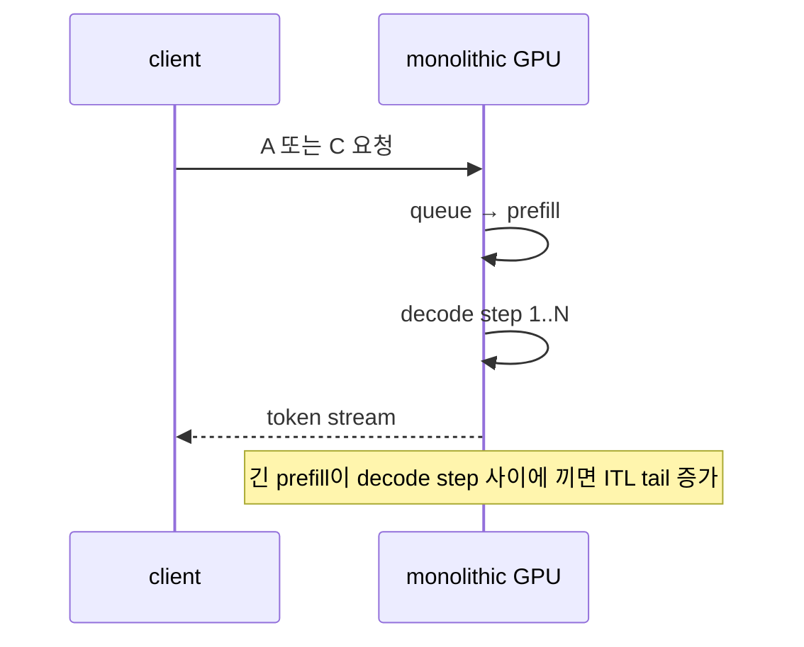
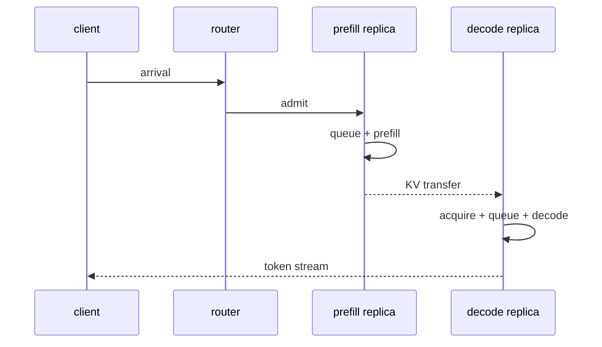
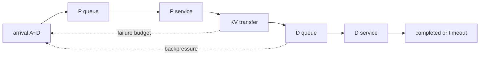

# 60장. GPU를 둘로 나누면 언제 이기는가: prefill/decode 분리의 손익분기

긴 prompt가 들어올 때마다 이미 생성 중인 요청의 token 간격이 튄다. 그래서 prefill 전용 GPU와 decode 전용 GPU를 두었더니 그래프의 평균 TTFT가 좋아졌다. 이 결과만으로 분리가 성공했다고 말할 수 있을까. GPU 수가 늘었거나, 전송 완료가 아니라 submit 시각을 재었거나, 긴 output 요청이 timeout되어 표본에서 사라졌다면 개선은 측정이 만든 환상이다.

이 장에서는 장애가 정리된 8-GPU generation G18에서 같은 요청 trace를 두 번 흘린다. 첫 배치는 각 replica가 prefill과 decode를 함께 수행하는 monolithic 구성이다. 두 번째는 같은 GPU 예산을 P와 D로 나눈 구성이다. 짧고 긴 prompt와 output을 A~D 네 종류로 고정하고, client arrival부터 마지막 token까지 같은 원장으로 잇는다. 목표는 “분리가 빠르다”가 아니라 어떤 부하·길이·전송 대역폭에서 간섭 감소가 routing과 KV 이동 비용보다 커지는지 찾는 것이다.

## 60.1 TAIL-60: 평균은 18ms 이겼지만 p99는 140ms 졌다

workload를 네 classes로 고정한다. A는 prompt128/output32 비중40%, B는 prompt2K/output64 비중30%, C는 prompt8K/output128 비중20%, D는 prompt32K/output256 비중10%다. 평균 prompt 하나로 줄이지 않는다. 각 class의 prefill compute, KV bytes, decode service와 arrival burst를 따로 둔다.

co-located baseline의 class별 TTFT/ITL SLO와 service를 fixture로 둔다. A prefill4ms, B35ms, C120ms, D480ms다. decode service는 active sequence/context 영향를 포함한 measured distributions로 두되 여기서는 one-request critical contribution을 A20, B45, C90, D180ms라고 단순화한다.

분리 path는 prefill queue+compute, KV handoff queue+transfer, decode queue+service로 나뉜다. protocol identity/commit/retry는61장에 맡기고 여기서는 completion latency와 queue occupancy만 입력으로 쓴다. transfer submit 시각을 ready로 쓰지 않는다.

logical KV가 token당512KiB인 large model fixture라면 B2K는1GiB, C8K는4GiB, D32K는16GiB다. A128은64MiB다. effective link payload40GB/s면 no-queue transfer lower bound는 A1.6ms, B25ms, C100ms, D400ms다. metadata/setup와 contention는 더해진다.

분리 compute 이득을 co-location interference 제거로 A2, B15, C70, D260ms라고 측정했다고 하자. transfer만 비교하면 A/B는 가능성이 있지만 C는70ms 이득보다100ms transfer가 크고 D는260ms보다400ms가 크다. 모든 requests를 분리하는 정책은 workload tail에서 손해다.

초기 benchmark는 class 비중 가중 평균으로 compute 이득 `0.4×2+0.3×15+0.2×70+0.1×260=45.3ms`를 보고했다. transfer lower bound 평균은 `0.4×1.6+0.3×25+0.2×100+0.1×400=68.14ms`다. queue가 없어도 이 fixture에서는 전체 평균조차 불리하다.

incident team은 KV bytes를 compressed/selected-layer estimate로 잘못12ms 평균이라 계산해 33ms 이득을 주장했다. 실제 connector consumer가 full required layers/blocks를 전송했고 measured completion 평균27ms만 보였다. completed survivors에서 D timeouts가 빠져 평균이 낮아졌다.

open-loop burst에서 transfer queue는 더 나빠졌다. 1초 동안 A20,B12,C8,D4 requests가 도착하면 bytes는 A1.25GiB+B12GiB+C32GiB+D64GiB, 총109.25GiB다. 40GB/s link가 1초에 약40GB를 처리하므로 queue는 약69GB 이상 늘어난다. 안정 조건이 깨졌다.

평균 arrival가 낮아도 C/D가 동시에 들어오는 burst는 head-of-line blocking를 만든다. FIFO transfer queue에서 D 16GiB 하나는 400ms service를 점유한다. 뒤 A64MiB가1.6ms work여도 wait400ms 가까이 생길 수 있다. class-aware scheduling/chunk fairness 여부가 tail를 바꾼다.

TAIL-60 rollout 결과 aggregate throughput는8% 올랐지만 A TTFT p99가65→205ms, C/D completion timeout가 늘었다. 평균 transfer completion는 survivors 기준 좋아 보였다. submit-only metric와 timeout exclusion가 false win을 만들었다.

first divergence는 protocol corruption가 아니다. admission/router가 request prompt length와 projected KV bytes, current transfer workload를 보지 않고 all-to-P/D policy를 적용한 순간이다. transfer queue service demand가 capacity를 넘는데 prefill admission가 계속됐다.

break-even inequality는 class i에 대해 `saved_interference_i > transfer_i + boundary_queue_i + extra_compute_i + failure/retry_expected_i`로 쓴다. queue는 고정 상수가 아니라 current workload state다. no-queue microbenchmark verdict를 overload에 적용하지 않는다.

P/D ratio도 devices count가 아니라 service rates로 본다. P queue가 빠르게 D/transfer보다 일을 생산하면 upstream utilization가 높아 보여도 boundary queue가 폭증한다. D backpressure가 P admission/router에 전파돼야 한다. queues를 독립 autoscale하지 않는다.

vLLM source walk는 P/D option/config normalization, connector selection, proxy/router example, prefill output/handoff initiation, decode consumer ready/requeue boundary를 잇는다. option declaration에서 멈추지 않고 actual request가 어느 lane을 탔고 completion timestamp가 어디서 기록되는지 본다.

tokenization reuse/double tokenization가 compute savings를 바꿀 수 있으므로 source path를 기록한다. 그러나 protocol payload semantics는61장으로 넘긴다. 이 장에서는 CPU/queue time가 comparison denominator에 포함되는지만 본다.

SGLang source walk는 prefill/decode scheduler processes, request routing, prefill completion frontier, transfer completion→decode ready, decode preallocation/requeue와 queue metrics를 잇는다. recipe의 process count를 production stability 증거로 쓰지 않는다.

connector가 multiple backends를 지원하면 effective bandwidth/queue behavior를 backend별로 측정한다. option 이름이 같아도 local NVLink, RDMA, host staging paths가 service distribution를 바꾼다. 57/58장의 physical evidence를 input으로 받고 여기서 queue economics를 계산한다.

반증 A는 arrival trace와 hardware를 고정하고 all-disaggregate vs class-conditioned routing를 비교한다. A/B만 분리하고 C/D를 co-locate하는 policy가 SLO goodput를 높이는지 본다. model/resource constraints가 허용하는 comparison만 한다.

반증 B는 no-queue replay와 open-loop burst를 비교한다. same request histogram인데 burst에서만 tail가 악화되면 queue stability/HoL 가설을 지지한다. average closed-loop benchmark만 사용하지 않는다.

반증 C는 transfer scheduler FIFO와 bounded fair/chunk policy를 비교한다. protocol를 바꾸지 않고 queue discipline만 바꾼다. D starvation와 A tail를 모두 보고 objective를 명시한다.

반증 D는 survivor-only와 all-arrivals denominator를 비교한다. timeouts/cancellations/retries를 goodput failure로 포함한다. completed request latency가 좋아도 offered-load SLO goodput가 떨어지면 승리가 아니다.

rollback는 all-disaggregate routing를 끄고 known-good co-located lane로 new admissions를 보낸다. in-flight P/D requests는 protocol-safe completion/abort path로 drain한다. queue entries를 단순 drop해 resources를 leak하지 않지만 protocol 세부는 61장에 맡긴다.

다음 단계는 class/queue-conditioned canary다. projected transfer bytes, current boundary workload seconds, D queue/service headroom가 threshold 안인 requests만 분리한다. threshold는 measured distributions와 sensitivity sheet에서 나온다. prompt length alone를 policy로 쓰지 않는다.

90분 soak는 A–D mixture, steady/burst, timeouts, P/D ratio, connector backend를 섞는다. per-class offered/completed/SLO-good requests, transfer queued bytes/age, P/D queue, TTFT/ITL p50/p99를 본다. aggregate 평균만으로 승인하지 않는다.

terminal 문장은 “분리 serving이 느렸다”가 아니다. “all-disaggregate admission가 1s burst109.25GiB를 40GB/s boundary에 넣어 queue를 불안정하게 했고 survivor 평균이 D timeouts를 숨겼다. class/queue-conditioned routing와 backpressure가 SLO goodput를 회복했다.” 이렇게 쓴다.

break-even workbook 첫 sheet는 request-class input이다. class, prompt/output histogram, arrival rate/burst, co-located P/D compute distributions, disaggregated P/D compute distributions, KV logical/physical transferred bytes, boundary service distribution, SLO를 columns로 둔다. 평균 prompt 한 cell로 축약하지 않는다.

physical transferred bytes는 logical KV estimate와 다를 수 있다. padding, page/block granularity, layer selection, compression, metadata/setup를 measured completion bytes와 함께 둔다. 어느 blocks를 전송해야 하는지는 connector/protocol contract의 입력이고 이 장은 actual bytes와 latency를 economics에 사용한다.

둘째 sheet는 no-queue critical path다. class i의 co-located latency `Lco_i`와 separated `Lsep0_i=Pqueue0+Pcompute+boundary0+Dqueue0+Dservice`를 계산한다. overlap가 있으면 max/critical intervals로 표현하고 단순 합에서 뺀다. submit timestamp가 아니라 completion dependency trace로 overlap를 증명한다.

fixture A는 compute saved2ms, transfer1.6ms라 boundary setup/queue가 작으면 positive0.4ms다. B는 saved15ms, transfer25ms로 already -10ms다. C -30ms, D -140ms다. 이 수치만 보면 A만 분리 후보이고 B도 다른 interference saving가 더 크다는 evidence가 있어야 한다.

셋째 sheet는 queues다. P, boundary, D 각각 arrival work와 service capacity를 같은 units로 둔다. boundary는 requests/s보다 bytes/s 또는 service seconds가 유용하다. A request1.6ms, D400ms는 같은 count1이 아니다. queue length requests 하나로 pressure를 측정하지 않는다.

boundary workload seconds는 queued bytes/effective bandwidth에 setup/copy concurrency model을 보정한다. 예를 들어 queued20GiB/40GB/s≈0.5s lower bound다. new A가 tail에 들어가면 FIFO wait0.5s가 될 수 있다. class-aware queue면 expected wait가 다르므로 scheduler discipline와 state를 기록한다.

D queue도 output length/active context에 따라 remaining work가 다르다. decode requests count10이 모두 short32 tokens인지 long256인지 구분한다. router는 P queue만 보고 destination lane를 고르지 않는다. boundary+D workload를 함께 본다.

넷째 sheet는 offered-load goodput다. arrivals N, SLO successes G, timeouts/cancels/retries F를 세고 `G/N`과 good tokens/cost를 계산한다. completed survivors만 denominator로 두지 않는다. retry는 new offered work와 resource cost를 포함한다.

TAIL-60 before 결과를 A arrivals1000/success900, B600/500, C400/260, D200/60이라고 하자. SLO successes1720/arrivals2200=78.2%다. survivor latency average가 좋아도 D success30%다. workload/SLO objective가 허용하는지 class별 본다.

class-conditioned after가 A950, B520, C320, D150 successes면1940/2200=88.2%다. average separated share가 낮아져도 SLO goodput는 높다. “disaggregation percentage”를 목표로 삼지 않는다.

다섯째 sheet는 cost envelope다. P/D nodes, co-located nodes, GPUs, link/NIC capacity, CPU/proxy resources, reserved headroom를 같은 budget로 맞춘다. separated run이 더 많은 GPUs/link를 써 throughput가 오른 것을 architecture 이득으로 쓰지 않는다.

idle capacity도 cost다. P:D ratio가 workload phase에 맞지 않으면 one side queues while other idles. autoscaling reaction delay와 cold/model state 준비 시간을 포함한다. instant perfect rebalancing를 가정하지 않는다.

여섯째 sheet는 sensitivity다. effective bandwidth20/40/80GB/s, KV bytes multiplier0.5/1/2, burst factor1/2/4, P:D ratios, queue discipline, output length distributions를 바꾼다. verdict가 flip하는 경계를 표시한다.

D 16GiB at80GB/s도200ms다. saved260ms라 no-queue margin60ms가 생길 수 있지만 burst queue가 더해지면 사라진다. link upgrade 하나로 universal yes가 되지 않는다. workload-conditioned region를 그린다.

KV compression0.5가 compute/decompression20ms를 추가한다면 D transfer200ms+20과 saved260으로 margin40ms다. C50+20 vs70은 zero margin다. compression ratio만 보고 승리하지 않고 extra compute와 kernel queue를 넣는다.

router policy는 predicted prompt/KV bytes와 actual current state를 사용한다. class thresholds를 static prompt length로만 두면 output/context/model layers/connector path 변화에 약하다. conservative estimated transfer service와 queue age를 둔다.

admission predicate 예시는 `estimated_boundary_finish + estimated_D_finish < class_deadline - safety_margin`다. estimate가 unknown이면 co-located safe lane 또는 reject/defer policy를 쓴다. queue capacity가 비어 보이는 request count보다 workload seconds를 본다.

backpressure는 D/boundary high watermark에서 new P work를 제한한다. 이미 P compute가 끝난 request는 KV bytes owner를 가져 queue를 더 늘린다. prefill admission 시 projected bytes reservation를 만들고 completion/abort 뒤 release한다. protocol reservation details가 아니라 queue accounting owner를 기록한다.

reservation 합과 actual bytes 차이를 보정한다. underestimated requests가 반복되면 estimator/safety margin를 갱신한다. overestimation은 utilization를 낮춘다. p50 error보다 tail underprediction를 본다.

vLLM source consumer 표는 config raw/effective, connector/P-D role, request routing/proxy, prefill runner completion, connector handoff future, decode ready queue, output completion를 rows로 둔다. 각 row의 timestamp와 queue mutation owner를 찾는다.

vLLM example proxy가 round-robin/static endpoints라면 queue-aware production policy가 구현돼 있다고 쓰지 않는다. example intent와 current code capability를 분리한다. missing backpressure는 unsupported gap로 기록하고 deployment router에서 보완하는지 source를 pin한다.

vLLM token reuse path가 tokenizer work를 줄이면 separated CPU cost에 반영한다. reuse가 optional/config-dependent라면 enabled state와 fallback를 기록한다. tokenization 차이를 GPU disaggregation 이득으로 혼합하지 않는다.

SGLang source consumer 표는 bootstrap/role args, tokenizer/router, prefill scheduler queue, forward completion, transfer task queue, decode preallocation/ready/requeue, output를 잇는다. request가 P에서 끝났다는 status와 D ready status를 구분한다.

SGLang decode preallocation가 transfer 전에 destination resources를 reserve하면 D headroom/queue cost에 포함한다. reservation가 오래 기다리면 capacity가 묶일 수 있다. completion/abort에서 release되는지 경제성 owner로 본다.

connector choice가 option normalization 뒤 실제 transfer backend와 endpoints를 어떻게 바꾸는지 확인한다. effective bandwidth distribution는 backend/current topology 측정으로 입력한다. option string을40GB/s assumption로 대체하지 않는다.

TAIL-60 source first divergence는 router predicate `disaggregate_enabled` 하나로 all requests를 P lane에 보낸 branch다. predicted bytes/queue workload/D headroom consumers가 없었다. selector가 configuration intent만 소비하고 runtime economics를 소비하지 않았다.

fix source path는 request estimator→boundary workload reservation→P admission→completion actual adjustment→D ready/backpressure→router feedback다. 각 mutation의 metric/trace를 연결한다. estimator implementation가 없다면 external controller/source를 명시한다.

fault test1은 D16GiB request를 FIFO head에 넣고 뒤 A를 보낸다. all policy에서 A tail≈400ms, fair/chunk/co-located route에서 SLO가 회복되는지 본다. protocol correctness를 바꾸지 않는다.

fault test2는 transfer completion를 늦추고 submit-only metric를 유지한다. correct controller는 queued/inflight workload를 줄이지 않아 backpressure가 걸린다. submit count를 service completion로 쓰면 queue가 폭증해 test가 실패한다.

fault test3은 D timeouts를 늘린다. all-arrivals goodput가 떨어지고 survivor average는 좋아질 수 있다. report gate가 goodput failure를 잡아야 한다. timeout request resources cleanup는61장 contract에 맡기되 accounting는 offered work에 남긴다.

fault test4는 bandwidth를40→20GB/s로 낮춘다. estimator가 service time를 update하거나 safety fallback로 전환해야 한다. fixed40 assumption로 admission을 계속하면 high watermark invariant가 실패한다.

fault test5는 P capacity를 늘리고 D/link를 고정한다. throughput가 아니라 boundary workload가 상승해 backpressure가 P utilization를 제한해야 정상이다. “P GPU idle”을 보고 더 admission하지 않는다.

rollback ladder1은 all-disaggregate flag/route를 co-located known-good로 돌린다. ladder2 A-only canary, ladder3 A+B when measured margins/queues permit, ladder4 dynamic estimator다. class expansion마다 SLO goodput/cost envelope를 재검증한다.

canary traffic는 open-loop original arrival trace를 replay한다. closed-loop client가 service slowdown에 맞춰 arrival를 줄이면 overload가 숨는다. offered load와 burst correlations를 보존한다. production shadow/live safety를 구분한다.

90분 terminal는 estimator prediction error, reserved/actual bytes, boundary workload seconds/age, P/D queues, class routing fractions, per-class SLO goodput, cost/GPU를 본다. p99 one metric만으로 모든 classes를 승인하지 않는다.

postmortem first sentence는 “link가 느렸다”가 아니다. actual transfer bytes/distribution와 service capacity에 비해 admission workload가 불안정했다는 것이다. second sentence는 survivor metric가 D failures를 제외했다는 것이다. third는 queue-conditioned router/backpressure fix다.

이 workbook이 있으면 model, link, workload가 바뀔 때 다시 계산할 수 있다. fixed “prompt N 이상 분리” recipe를 영구 법칙으로 만들지 않는다. measured class distributions와 current queues가 break-even verdict를 소유한다.

운영 estimator input은 request에서 확정된 값과 예측값을 구분한다. prompt tokens/model/layers/cache dtype는 비교적 확정적일 수 있고 output length, cache reuse, transfer compression, concurrent bandwidth는 예측이다. 각 estimate에 uncertainty/safety quantile를 붙인다.

KV logical bytes는 model cache shape에서 계산하되 actual connector bytes와 calibration한다. predicted4GiB, actual5GiB가 반복되면 multiplier1.25를 model/backend signature에 적용한다. average ratio보다 p95 underprediction를 admission safety에 쓴다.

effective bandwidth도 static40GB/s가 아니라 recent path distribution와 topology/connector health를 입력으로 쓴다. p50 40, p10 25라면 SLO admission는 conservative25 또는 risk budget를 사용할 수 있다. instantaneous noise로 route가 oscillate하지 않게 smoothing/hysteresis를 둔다.

boundary service estimate는 `bytes/bandwidth + setup + queued_work + contention_margin`이다. queued_work는 submitted but incomplete transfers를 포함한다. completion callback 전 reservation을 빼지 않는다. submit throughput가 queue를 empty로 보이게 하지 않는다.

D finish estimate는 current decode workload tokens/steps, scheduler policy, preallocated slots, expected output distribution를 반영한다. exact prediction는 불가능하므로 deadline slack와 fallback lane를 둔다. uncertainty가 큰 D request를 무조건 separated lane에 보내지 않는다.

P compute saved estimate는 co-located interference baseline와 current P lane service를 비교한다. historical fixed saving가 아니라 class/model/hardware signature별 distribution다. P lane itself overloaded면 separated prefill queue가 savings를 먹는다.

router score는 expected latency difference뿐 아니라 SLO success probability와 cost를 낸다. `P(SLO|sep)-P(SLO|co)`가 positive이고 cost envelope/queue reservations가 허용할 때 분리한다. 평균 milliseconds 하나로 tie-break하지 않는다.

reservation example은 B request predicted1GiB/25ms, C4GiB/100ms다. boundary workload0.2s 상태에서 C를 reserve하면0.3s, 다음 A predicted1.6ms는 FIFO라면 deadline를 놓칠 수 있다. scheduler discipline/co-located option를 score에 반영한다.

reservation에는 expiration와 owner가 있다. P admission 후 request cancel/precompute failure면 projected bytes를 release한다. actual transfer 시작 시 estimate reservation를 actual/inflight accounting로 handoff한다. duplicate release로 capacity가 음수가 되지 않는다.

accounting correctness는 protocol state machine 세부가 아니라 economic resource ledger다. request ID/generation, predicted bytes/service, admitted lane, actual bytes/completion, released reason를 기록한다. late completion가 new retry generation accounting를 바꾸지 않는다.

queue age는 oldest waiting와 class deadline slack를 함께 본다. bytes가 적어도 stalled transfer 하나가 old면 health 문제일 수 있다. high watermark bytes만으로 recovery를 선언하지 않는다. queue age SLO를 backpressure trigger에 넣는다.

fair scheduling가 A tail를 낮추면서 D starvation를 만들 수 있다. class weight/deadline와 maximum chunk preemption delay를 정한다. objective는 all-class SLO goodput이며 short-only tail가 아니다. D timeout도 denominator에 남는다.

P:D ratio sensitivity는 P service rate와 boundary/D service rate의 minimum pipeline capacity로 읽는다. P nodes를 늘려도 boundary가 bottleneck이면 throughput가 늘지 않고 queue만 생긴다. D nodes를 늘려도 link bytes ceiling가 남을 수 있다.

autoscaler는 queue growth 원인을 구분한다. P queue high/D idle이면 P scale candidate, boundary bytes/age high면 link/route/admission, D workload high면 D scale/backpressure다. 모든 queue 상승에 P/D replicas를 동시에 늘리지 않는다.

co-located lane도 무한 capacity가 아니다. fallback traffic가 몰리면 baseline SLO가 깨질 수 있다. router는 both lanes workload를 보고 reject/defer/load-shed policy를 포함한다. “안전 lane”은 correctness contract이지 free capacity가 아니다.

cost sheet에는 fallback surge capacity를 예약한다. optimized separated lane failure 시 co-located replicas가 얼마나 traffic를 받을 수 있는지 계산한다. rollback가 SLO를 완전히 보존하지 못하면 degraded limits를 명시한다.

TAIL-60 rollout는 first phase5% A only, second A+B only if B measured positive margin, third dynamic scoring이다. C/D는 sensitivity evidence가 positive일 때 별도 canary다. all traffic flag를 다시 사용하지 않는다.

phase gate는 per-class arrivals/success/timeouts, TTFT/ITL, transfer bytes/service/wait, P/D queue, GPU/link cost다. aggregate throughput8% improvement를 gate로 쓰지 않는다. any class SLO regression budget를 넘으면 rollback한다.

closed-loop load test는 user-perceived steady behavior를 볼 수 있지만 capacity stability를 숨길 수 있다. open-loop trace와 함께 실행한다. original burst correlations와 class mix를 versioned workload artifact로 남긴다.

synthetic workload가 connector compression/cache reuse를 실제 production처럼 만들지 못할 수 있다. production shadow/canary actual bytes distribution로 calibration한다. synthetic estimate를 universal physical truth로 쓰지 않는다.

vLLM fixed source evidence는 current role/connector config, example/proxy, token reuse, runner/connector boundary를 제공한다. external router/controller가 queue-aware economics를 구현한다면 그 source/config도 evidence에 포함한다. project source에 없는 policy를 vLLM 기능으로 쓰지 않는다.

SGLang fixed source evidence는 three-process roles, P completion frontier, D preallocation/requeue를 제공한다. current version recipe/options가 달라지면 commit pin을 갱신한다. queue-aware controller가 deployment layer라면 framework와 분리해 설명한다.

connector metrics가 submit/completion를 구분하지 않으면 controller에 필요한 observation gap를 명시한다. proxy metric로 추정할 때 uncertainty를 키우거나 safe fallback를 사용한다. missing data를0 queue로 해석하지 않는다.

clock synchronization/trace join는 P request ID와 D continuation identity를 잇는다. protocol identity 정의를 반복하지 않고 economic timeline에서 same request의 P queue/compute, boundary wait/service, D queue/service를 조인한다. unmatched survivors를 latency sample에서 버리지 않는다.

timeout가 P compute와 transfer resources를 이미 썼다면 failure cost에 포함한다. retry는 new resource demand다. user-level one success만 goodput numerator이고 attempts resources는 denominator/cost에 남는다. retry로 throughput counter를 부풀리지 않는다.

failure expectation term은 observed timeout/retry probability×wasted work로 계산할 수 있다. boundary health가 나빠질수록 expected cost가 올라 break-even route가 co-located로 기울어야 한다. static latency sheet에 failure0을 영구 가정하지 않는다.

post-rollout counterfactual는 same arrival trace를 co-located baseline와 matched-cost separated policy에 replay한다. hardware count, model/quant, tokenizer, batching knobs를 version한다. unmatched configs를 architecture verdict로 사용하지 않는다.

statistical confidence는 request independence를 과장하지 않는다. bursts/time periods를 blocks로 bootstrap하거나 repeated windows를 비교한다. one lucky interval의 p99를 승리로 승인하지 않는다. workload cells별 sample counts를 공개한다.

TAIL-60 fault campaign은 bandwidth degradation, D worker loss, P overscale, estimator underprediction, timeout survivor bias, queue metric loss를 한 축씩 넣는다. controller가 backpressure/fallback하고 correctness cleanup가 정상인지 본다. protocol fault injection 세부는 61장으로 연결한다.

bandwidth40→20 fault에서 admitted separated bytes rate가 service capacity 아래로 수렴해야 한다. high queue가 계속 증가하면 controller failure다. recovery 뒤 hysteresis 없이 traffic가 즉시 몰려 재발하지 않게 한다.

D worker loss fault는 D workload seconds/headroom를 갱신하고 P admission를 줄인다. P workers가 healthy하다는 이유로 P outputs를 계속 생산하지 않는다. in-flight boundary owners accounting를 유지한다.

metric loss fault는 last-known queue를0으로 reset하지 않는다. stale observation age가 threshold를 넘으면 conservative route/backpressure한다. observability availability도 economics capability다.

rollback terminal은 new admissions co-located, boundary/P queues drain, reservations0, orphan accounting0, class SLO baseline recovery다. in-flight protocol resources가 clean됐다는 evidence는61장 lifecycle를 참조한다. 여기서는 queue/cost state가 baseline로 돌아왔는지 본다.

fix terminal은 A/B/C/D per-class verdict와 applicable workload region를 적는다. A yes under queue<qA, B conditional, C/D no in current40GB/s fixture처럼 명시한다. future80GB/s or compression scenario는 sensitivity candidate이지 current approval가 아니다.

terminal source table은 option/config producer, normalized role/connector, request router consumer, P completion queue mutation, D ready/requeue, external controller/backpressure를 rows로 둔다. 각 row에 commit/source link와 runtime metric를 붙인다.

terminal numeric table은 class share, prompt/output quantiles, compute saving, actual KV bytes, transfer p50/p99, queue wait p50/p99, co/sep SLO successes, cost를 둔다. average-only column는 없다.

postmortem first divergence는 `all_disaggregate=true`가 runtime queue state 없이 router predicate 전체를 대체한 branch다. second divergence는 submit/survivor metrics가 completion/failures를 숨긴 observation design다. 두 fix를 별도 tests로 보존한다.

마지막 승인 문장은 다음과 같다. “40GB/s boundary에서 A–D burst109.25GiB는 unstable했고 all policy의 SLO goodput78.2%였다. completion-based workload reservation와 class/queue-conditioned routing가88.2%를 만들고 90분 open-loop에서 queue age와 all-class p99를 닫았다.”

이 판정은 분리 serving을 찬성하거나 반대하는 선언이 아니다. current model/cache/link/workload/queue 조건에서 어떤 requests가 비용 경계를 넘는지 계산한 결과다. 조건이 바뀌면 workbook를 다시 실행한다.

workbook 재실행 trigger는 model architecture/cache dtype/layers, connector/backend, link/topology, P:D hardware ratio, scheduler policy, SLO/workload histogram 변화다. minor release라도 actual bytes/queue semantics가 달라지면 calibration를 확인한다. calendar 주기만 기다리지 않는다.

model change는 token당 KV bytes와 prefill/decode compute balance를 함께 바꾼다. GQA/MLA/hybrid state를 generic KV formula 하나로 처리하지 않는다. 33/52장의 exact state bytes를 input으로 가져온다. 이 장은 그 bytes의 transfer economics만 계산한다.

quantization change가 weight compute를 줄여 P/D service를 바꿔도 KV dtype/bytes는 별도일 수 있다. faster prefill이 boundary를 더 빨리 생산해 queue를 악화할 수도 있다. model throughput 향상을 P/D pipeline 안정성으로 자동 해석하지 않는다.

chunked prefill는 P service와 handoff cadence를 바꾼다. 하나의 long request KV가 multiple chunks로 boundary에 들어오는지 final-only인지 current connector consumer를 확인한다. protocol semantics를 반복하지 않고 actual queue arrivals/bytes를 측정한다.

prefix/cache hit는 required P compute와 transfer bytes를 동시에 또는 다르게 바꿀 수 있다. cache hit율 average가 아니라 class별 actual transferred bytes/completion를 workbook에 넣는다. hit가 P에서만 있고 D에 state가 없다면 boundary cost가 남는다.

decode output uncertainty는 D workload tail를 만든다. requested max_tokens보다 actual distribution를 쓰되 safety quantile를 둔다. stop-heavy workload와 long generation workload를 같은 average로 합치지 않는다. class cell을 더 나눌 수 있다.

multi-tenant priority가 있으면 deadline/value weights를 scheduler objective에 반영한다. low-priority D가 boundary를 오래 점유해 high-priority A를 막는 HoL를 본다. fairness와 priority starvation limits를 명시한다.

admission reservation가 너무 conservative하면 separated capacity가 idle할 수 있다. prediction error calibration와 safety margin sensitivity로 goodput/cost를 비교한다. utilization 최대화가 correctness/SLO objective를 대신하지 않는다.

controller oscillation test는 queue high→co-located shift→queue low→all separated shift 반복을 유도한다. hysteresis/min dwell/reservation drain가 안정화하는지 본다. traffic route churn 자체의 cache/state cost도 측정한다.

multiple P/D pools가 있으면 pool별 boundary path/service와 D headroom를 따로 둔다. global average queue로 hot pool를 숨기지 않는다. router가 request compatibility와 local queue를 함께 본다.

failure domain도 cost envelope에 포함한다. P/D split가 more services/link dependencies를 만들어 availability를 바꿀 수 있다. observed failures/wasted work를 expected term에 넣는다. protocol recovery mechanics는61/65장에 맡긴다.

co-located baseline도 충분히 tune한다. batching/chunking/preemption/cache/backend knobs가 suboptimal이면 separated 이득이 과장된다. matched release/model/hardware budget에서 best reasonable baselines를 비교하고 config digest를 남긴다.

separated system도 P/D components만 합산해 latency를 예측하지 않는다. queues와 correlations, simultaneous resource contention를 trace로 본다. independent p99들을 단순 더하거나 average components로 p99를 만들지 않는다.

workload replay는 time order를 보존한다. histogram만 shuffle하면 bursts/long request clustering가 사라져 boundary queue tail가 낮아진다. privacy-safe class/bytes/timestamp trace를 version한다.

router evaluation에는 counterfactual labels가 필요할 수 있다. canary lanes/shadow estimates로 co/sep outcomes를 비교하되 same request를 두 번 실제 실행한 비용을 accounting한다. sampled experiment로 제한한다.

manual threshold와 learned estimator 모두 safety guards를 가진다. model가 queue saturation outside training range에서 aggressive route하지 않게 bounds/fallback를 둔다. explainable input snapshot를 trace에 남긴다.

SLO goodput target가 TTFT와 ITL 둘을 포함하면 request success predicate를 명시한다. TTFT만 좋아지고 long output ITL가 나쁘면 success가 아닐 수 있다. class별 deadlines와 output length를 사용한다.

tokens/s goodput는 request goodput와 다른 목적이다. many long outputs가 token count를 높여 short request failures를 숨길 수 있다. both를 보고 service product objective를 선택한다. denominator/cost를 공개한다.

GPU utilization는 pipeline queue 불안정에서도 높을 수 있다. P가 boundary를 과생산하고 D가 포화면 total utilization가 좋아 보인다. queued work age와 SLO failures가 decisive다. idle P via backpressure가 correct stable behavior일 수 있다.

link utilization가 낮아도 setup/small chunk/serialization가 service rate를 제한할 수 있다. bytes/bandwidth lower bound와 measured completion distribution 차이를 setup/queue fields로 보정한다. utilization 하나로 headroom를 계산하지 않는다.

link utilization가100%면 adding P work가 throughput를 늘리지 않는다. compression/path upgrade/class routing candidates를 sensitivity에서 비교한다. current rollout rollback와 future architecture improvement를 분리한다.

production incident 동안 temporary co-located rollback가 cache warmup/placement 차이를 만들 수 있다. baseline recovery time를 고려하고 immediate first minutes를 final comparison로 쓰지 않는다. steady and recovery windows를 구분한다.

postmortem action owner는 framework option, connector observation, external router, autoscaler, benchmark/reporting로 나눈다. “P/D 팀” 하나에 몰지 않는다. first divergence branch와 missing metric의 owners를 각각 지정한다.

regression suite는 numeric fixture A–D와 workload trace를 CI/offline에 보존한다. source change가 option normalization/queue mutation를 바꾸면 expected routing/goodput calculation를 재검토한다. latency golden만 blind update하지 않는다.

release note는 verified region를 적는다. 예를 들어 model M, connector C, 40GB/s path, A/B mix와 queue workload<0.1s에서 P/D enabled; C/D or degraded path는 co-located. 독자는 자신의 workload가 범위 밖인지 알 수 있다.

최종 runbook 질문은 네 개다. 이 request가 co-location에서 절약할 compute interference는 얼마인가. 전송할 actual bytes와 completion service는 얼마인가. boundary/D queue가 deadline에 더할 wait는 얼마인가. same cost envelope에서 SLO success가 실제 높아지는가.

네 답을 completion-based source metrics와 class histogram로 채우지 못하면 분리 여부를 승인하지 않는다. 평균 compute 이득이나 `disaggregated=true` option은 답이 아니다. TAIL-60은 이 gate가 없을 때 벌어진 사건이다.

최종 fault 위치별 expected state도 남긴다. router admission 전 실패면 reservation0이다. P admission 뒤 compute 실패면 reserved boundary work를 release한다. P complete 뒤 transfer queue에 있으면 queued/inflight accounting가 남고 co-located retry를 별도 attempt로 센다. D ready 뒤 failure는 already consumed boundary/P cost를 denominator에 남긴다.

queue metric restart/reset는 outstanding owners에서 재구성되거나 conservative unknown 상태로 간다. process restart 뒤 gauge0을 empty evidence로 쓰지 않는다. controller가 current in-flight work를 모르면 separated admission를 잠시 막고 reconciliation를 수행한다.

multiple controller replicas가 reservations를 분산 관리하면 consistent/shared accounting 또는 sharded ownership가 필요하다. 각 replica가 full link capacity40GB/s를 독립적으로 예약하면 aggregate oversubscription가 생긴다. routing control plane의 capacity owner를 명시한다.

clock skew가 P/D timestamps를 왜곡할 수 있으므로 queue wait는 local monotonic spans와 request causal events로 조인한다. wall clocks만 빼 negative/false wait를 만들지 않는다. economics sheet의 p99가 observation error가 아닌지 검증한다.

timeout policy를 바꾸면 survivor population와 offered goodput가 바뀐다. old/new timeout 값을 config digest에 넣는다. longer timeout로 completion rate가 올라 보여도 SLO failure는 그대로일 수 있다. success predicate를 고정한다.

retry policy도 matched baseline 조건이다. separated run만 aggressive retry하면 resource demand와 survivor latency가 달라진다. attempt counts/bytes/GPU cost를 포함한다. one user success 뒤 여러 failed attempts를 지우지 않는다.

final canary는 all-disaggregate flag가 accidentally re-enabled돼도 runtime queue guard가 reject/fallback하는 defense-in-depth를 본다. config intent와 economic admission predicate를 분리한다. unknown/overloaded state에서 permissive default를 쓰지 않는다.

terminal artifact는 workload trace/hash, A–D workbook, source consumer map, config/cost digest, open-loop results, fault campaign, rollback timestamps를 포함한다. 다음 운영자가 40→80GB/s path나 model change를 넣어 sensitivity를 재계산할 수 있어야 한다.

승인 뒤 controller thresholds와 estimator version을 배포 artifact로 pin한다. metrics/dashboard가 같은 version/dimensions를 말하는지 확인한다. code만 rollback하고 controller model/threshold가 남아 mixed policy가 되지 않게 한다.

마지막으로 class-conditioned policy가 unfair access를 만들지 않는지 product 요구와 함께 검토한다. C/D를 항상 co-located로 보내 capacity가 부족하면 reject/scale plan를 명시한다. 경제성 판정은 사용자 중요도를 숨긴 자동 차별 규칙이 아니라 공개된 SLO/cost policy다.

이 terminal까지 닫히면 분리 serving의 “왜”가 명확해진다. P/D 간섭을 줄여 얻는 compute 이득이 boundary와 queue 비용을 넘는 요청만 분리하고, 그렇지 않은 요청은 더 짧고 안정적인 경로를 쓴다. workload와 state가 바뀌면 verdict도 함께 바뀐다.

운영 승인자는 마지막으로 burst window 하나를 골라 모든 arrivals를 재분류한다. 각 request의 estimated/actual bytes, admitted lane, boundary wait, D wait, SLO outcome을 합쳐 workbook 예측과 비교한다. timeouts와 cancels도 행에서 제거하지 않는다. aggregate reservations와 actual in-flight bytes가 link capacity 원장과 맞아야 한다.

예측이 틀린 행은 estimator, observation, scheduler 중 first divergence로 분류한다. bytes가 틀리면 model/cache estimator, service가 틀리면 bandwidth/contention calibration, queue wait가 틀리면 discipline/accounting, outcome만 틀리면 deadline/D model을 본다. threshold를 무작정 보수적으로 낮추지 않는다.

한 시간 평균은 정상인데 1초 burst windows가 반복 실패하면 stable average로 승인하지 않는다. maximum sustainable burst와 recovery drain 시간을 release 조건에 둔다. backpressure 뒤 queue가 유한 시간에 low watermark로 돌아와야 한다.

controller가 separated fraction를 낮춰 goodput를 회복했으면 그것이 실패가 아니다. 목표는 분리 비율이 아니라 same-cost SLO work다. utilization dashboard도 이 objective를 설명하도록 수정한다.

마지막 재현 문장은 “A/B/C/D trace를 40GB/s boundary에 open-loop replay했을 때 all policy는 queue+69GB와 goodput78.2%, conditioned policy는 bounded age와88.2%를 보였다”다. source map과 fault campaign가 같은 결과를 설명해야 최종 승인한다.

decision record에는 현재 승인 영역과 금지 영역을 함께 쓴다. A는 boundary workload와 D slack 조건 아래 분리, B는 canary evidence가 positive일 때만 분리, C/D는 current path에서 co-located다. observation stale, bandwidth degraded, reservation 불일치에는 safe fallback한다.

이 record의 estimator·controller·config versions와 cost envelope를 pin한다. 다음 release가 어느 condition를 바꾸었는지 diff할 수 있어야 한다. 조건 없는 “P/D enabled” 표시는 다시 허용하지 않는다.

운영자는 매 rollout 뒤 all-class offered-load goodput와 queue recovery를 재확인한다. approved region 밖 traffic가 들어오면 자동 확대하지 않고 sensitivity workbook를 다시 실행한다. 이것이 TAIL-60 재발을 막는 최종 경제성 gate다.
## 60.2 TAIL-60에서 승리의 평균·tail 정의를 고친다

### 60.2.1 throughput보다 SLO goodput를 본다

초당 완료 요청 수는 사용자가 기다릴 수 있는 시간 안에 끝났는지 말하지 않는다. 이 장의 goodput는 TTFT, ITL, end-to-end deadline을 모두 만족한 요청 수다. 100 req/s를 끝냈어도 40개가 deadline을 넘었다면 goodput는 60 req/s다. timeout된 요청을 완료 분모에서 빼면 시스템이 과부하일수록 더 좋아 보이므로 submitted request를 분모로 유지한다.

기본 경계는 TTFT p99 2.5초, ITL p99 80ms다. 요청 deadline은 `min(60초, 3초+0.12초×output tokens)`로 둔다. 이 숫자가 보편 법칙은 아니다. 동일 raw ledger에 여러 SLO threshold를 적용해 교차점을 보여 주기 위한 기준선이다. 평균, p95, p99와 실패율을 함께 내고 tenant와 길이 cell별 tail을 숨기지 않는다.

30분 동안 10,800개를 제출하고 10,200개를 완료했다고 하자. TTFT 위반 240, ITL 위반 180, 둘 다 위반 60, deadline만 위반 120이면 단순 합으로 빼서는 안 된다. request별 boolean union을 구한다. unique violation이 480이면 good requests는 9,720, goodput는 5.4 req/s다. completed rate 5.67 req/s와 구분한다.

ITL도 모든 token gap을 한 pool에 넣으면 긴 output B/D가 표본 수로 지배한다. 사용자 계약이 request 단위라면 request마다 tail gap을 판정하고 request distribution을 낸다. fleet 진단용 pooled gap은 별 이름으로 둔다. 둘을 같은 `ITL p99` label로 내보내지 않는다.

goodput가 같은 구성도 경험과 비용이 다르다. PD가 A를 15ms 늦추는 대신 D의 400ms stall을 없앨 수 있다. 반대로 모든 cell이 SLO 아래인데 자원과 failure surface만 늘 수 있다. verdict는 scalar ranking이 아니라 capacity, cell guardrail과 운영 비용을 함께 가진다.

### 60.2.2 같은 비용 봉투에서 비교한다

monolithic 2 GPU와 P2+D2 네 GPU를 비교하는 것은 architecture 비교가 아니라 자원 증설 실험이다. 총 GPU 수, SKU, power envelope, TP 크기와 물리 topology를 맞춘다. 모델 revision, dtype, quantization, attention backend, CUDA와 driver도 digest로 묶는다. P/D 후보는 같은 8 GPU를 4:4, 2:6, 6:2로 나눠 어느 queue가 먼저 발산하는지 본다.

baseline도 합리적으로 튜닝한다. chunked prefill과 prefix cache를 P/D에만 켜지 않는다. tokenizer, chat template, sampling과 output 길이도 같다. warm cache 실험과 cold cache 실험은 별 행이다. 이 공정성 조건을 만족하지 못한 결과는 흥미로운 관측일 수는 있어도 손익분기 증거는 아니다.

8 GPU가 한 NVSwitch domain인지 두 node의 4+4인지도 봉투의 일부다. M은 node-local인데 P/D만 cross-node라면 transfer penalty가 architecture의 필연인지 placement 선택인지 분리한다. 반대로 P/D만 빠른 NVLink pair에 놓여도 편향이다. configuration마다 rank/BDF/NIC mapping을 보존한다.

TP가 달라지면 collective, weight memory와 replica 수도 달라진다. P TP4/D TP2와 M TP2 비교의 end-to-end 결과는 배포 후보로 유효하지만 “분리만의 효과”에는 동일 TP ablation이 필요하다. power cap 합이 같아도 P compute peak와 D bandwidth peak가 겹쳐 throttle될 수 있으므로 시간별 clocks와 throttle reason도 본다.

### 60.2.3 G18에서 출발한다

이전 장의 collective 장애가 끝났다는 조건도 비용 봉투의 일부다. 모든 rank가 새 communicator G18을 합의했고 rank→GPU UUID/BDF→NIC mapping과 registration generation이 일치해야 한다. 실패한 G17의 KV descriptor나 미완료 transfer가 남아 있으면 첫 run의 queue와 memory pressure가 오염된다.

실험 시작 snapshot에는 clocks, power, link health, allocator usage와 process epoch를 넣는다. run 사이에는 동일 reset/warm-up 규칙을 적용한다. 재시작 자체가 cache를 지우거나 compilation을 다시 일으키므로 “깨끗하게 시작했다”는 문장 대신 어떤 상태를 보존하고 지웠는지 적는다.

이 원칙을 실제 사건에 적용해 보자. 월요일 run M0의 제출 수는 10,800개였고 P/D run D0도 같은 trace hash를 가졌다. 그런데 D0의 첫 6분에서만 C cell TTFT가 유난히 길었다. 분리 자체를 의심하기 전에 시작 snapshot을 비교했더니 M0은 graph와 kernel compilation warm-up을 끝낸 뒤 측정을 시작했고 D0은 P process만 warm-up을 마쳤다. D process의 첫 요청들은 compilation과 allocator 확장을 함께 부담했다. 이 구간을 임의로 삭제하면 D0를 구할 수 있지만 공정하지 않다. 두 구성을 동일한 “모든 실행 역할이 N회 representative shape를 완료”라는 warm-up 종료 조건으로 다시 측정해야 한다.

반대 방향의 오염도 있다. D1을 먼저 실행한 뒤 process를 내리지 않고 D2의 ratio만 바꾸면 remote KV와 prefix entry가 남아 D2의 C cell 계산량이 줄 수 있다. cache hit가 실제 운영 특성이라면 보존한 상태를 workload의 일부로 선언한다. cold 비교라면 key namespace와 allocator generation이 새롭다는 증거가 필요하다. 단순히 GPU memory used가 낮아졌다는 관측은 stale descriptor가 없다는 증거가 아니다.

이렇게 보면 “동일 GPU”는 필요한 조건일 뿐 충분한 조건은 아니다. 시간에 따라 바뀌는 compilation, cache, clock, thermal과 link state까지 실험 봉투에 들어간다. 판정표의 첫 열은 architecture가 아니라 `workload_hash + state_epoch + configuration_digest`다. 이 셋 가운데 하나라도 다르면 같은 점의 재측정이 아니라 다른 점이다.

## 60.3 두 실행 경로의 cost와 queue timestamp를 겹친다

### 60.3.1 monolithic에서는 간섭이 내부에 숨는다

monolithic worker는 prompt를 읽어 KV를 만든 뒤 같은 cache를 사용해 token을 생성한다. 별도 network handoff가 없다는 장점이 있다. 그러나 긴 prefill batch가 decode iteration 사이에 들어오면 이미 streaming 중인 요청의 다음 token이 늦어진다. chunked prefill은 이 점유를 작은 조각으로 나누지만 chunk 크기와 scheduler policy에 따라 tail이 달라진다.

따라서 baseline에서 `prefill service`와 `decode step` 시간을 분리해 기록한다. 단지 GPU utilization이 높았다는 사실로 compute efficiency를 결론내리지 않는다. 높은 utilization이 deadline을 넘긴 긴 batch를 뜻할 수도 있다.

M-burst-3에서 B-31이 43번째 token을 낸 뒤 C-88의 8K prefill chunk가 들어오고 다음 token까지 126ms가 비었다고 하자. B-31의 평상시 gap 42~55ms보다 큰 71ms를 interference 후보로 표시한다. 같은 interval의 collective, allocator와 host scheduling을 확인하기 전 C-88을 root cause로 확정하지 않는다.

chunk size를 512에서 256으로 줄이면 worst gap이 91ms로 내려가지만 scheduler 호출과 작은 batch가 늘어 output tokens/s가 4% 줄 수 있다. chunking도 isolation과 efficiency의 교환이다. M frontier에는 chunk별 TTFT, ITL, goodput와 batch mixture가 있어야 한다.

prompt 8K인 C-89가 7.5K prefix hit라면 scheduled prefill은 512 tokens뿐이어서 간섭이 작다. original prompt가 아니라 computed tokens를 사용한다. scheduler batch마다 prefill tokens, decode sequences와 duration을 남기면 어느 mixture가 tail gap을 만들었는지 matched cohort로 비교할 수 있다.

### 60.3.2 분리하면 간섭 대신 경계 비용이 생긴다

P/D에서는 P worker가 prompt KV를 만들고 D worker가 이를 획득한 뒤 생성한다. P와 D의 parallel strategy와 replica 수를 따로 정할 수 있고, 긴 prefill이 D의 iteration에 직접 끼지 않는다. 대신 router hop, KV publication, byte transfer, D-side allocation과 requeue가 생긴다.

분리가 이기는 가장 단순한 조건은 `제거된 간섭 > 추가 routing + 겹치지 못한 transfer + D 재대기 + 기대 실패 비용`이다. 전송이 비동기라는 말만으로 왼쪽이 커지지 않는다. decode가 KV completion 전에 시작할 수 없다면 critical path에 남은 부분을 직접 재야 한다.

P/D-burst-3에서는 B-31에 대응하는 decode request가 C-88의 P compute와 다른 GPU에서 진행돼 gap이 58ms로 유지될 수 있다. 대신 C-88은 P 310ms 뒤 1GiB transfer 32ms와 D wait 24ms를 낸다. 분리는 B-31에서 68ms를 절약하고 C-88에 56ms 경계 비용을 더한 셈이다. 두 요청의 deadline과 cell 비중이 최종 goodput를 정한다.

P와 D utilization을 더해 “전체 160%”처럼 읽지 않는다. 서로 다른 역할과 denominator다. P idle은 D overload 상황에서 낭비일 수 있고, D headroom은 burst isolation을 위한 reservation일 수 있다. idle 원인이 ratio, admission backpressure, transfer stall인지 timeline으로 나눈다.

### 60.3.3 timestamp는 하나의 요청으로 이어야 한다

필수 시각은 arrival, router admit, P queue/start/end, KV publish, D acquire/queue, first token, 각 token과 terminal이다. transfer submit과 completion은 다른 사건이다. 서로 다른 host의 monotonic clock은 직접 비교할 수 없으므로 clock offset과 uncertainty 또는 causal message edge를 함께 둔다.

P가 반환한 응답과 D가 받은 요청의 identity가 끊기면 두 개의 빠른 요청처럼 보일 수 있다. 이 장에서는 동일 request로 join할 관측이 필요하다고만 말한다. identity publication과 retry의 정확한 상태 순서는 다음 장에서 다룬다.

사건 C-1842를 숫자로 쓰면 경계의 가치가 선명하다. client arrival 뒤 router 3ms, P queue 41ms, prefill 312ms, publish 준비 2ms, transfer submit에서 complete까지 18ms, D queue 27ms, 첫 decode step 14ms가 걸렸다. 단순 합은 417ms인데 실제 TTFT가 398ms라면 19ms가 겹쳤거나 clock 오차가 섞였다. “전송은 18ms이므로 모두 더한다”도, “비동기이므로 0ms다”도 결론이 아니다. causal edge와 synchronized trace에서 critical path에 남은 부분을 구한다.

같은 shape의 monolithic 요청이 430ms였다고 해도 한 요청의 32ms 승리는 population goodput를 말하지 않는다. monolithic 요청은 긴 prefill과 겹쳤고 P/D 요청은 빈 D에 도착했을 수 있다. paired trace는 shape를 맞추지만 scheduler가 만든 환경까지 같게 만들지는 않는다. arrival cohort와 queue-state 구간별 분포를 함께 비교한다.

token 시각도 first와 last만 남기지 않는다. 인접 token 간격의 분포가 있어야 중간의 400ms stall을 평균 ITL이 숨기지 않는다. client socket 수신 시각과 server token-ready 시각을 가능하면 나눈다. 둘의 차이가 커지면 P/D scheduler가 아니라 gateway나 client backpressure를 먼저 조사한다.

## 60.4 평균 길이를 버리고 A~D histogram을 고정한다

### 60.4.1 네 cell은 서로 다른 병목을 만든다

| cell | 비중 | prompt p50/p95 | output p50/p95 | 예상 압력 |
|---|---:|---:|---:|---|
| A 짧/짧 | 50% | 256/512 | 64/128 | routing·전송 고정비 |
| B 짧/긴 | 20% | 256/512 | 1,024/2,048 | D residency와 imbalance |
| C 긴/짧 | 20% | 8,192/16,384 | 64/128 | P compute와 큰 KV 이동 |
| D 긴/긴 | 10% | 8,192/16,384 | 1,024/2,048 | 두 queue 동시 압력 |

A는 전송할 bytes가 작아도 hop의 고정 latency가 service time에 비해 크다. B는 P를 빨리 빠져나가지만 D slot을 오래 쓴다. C는 decode tail을 보호할 가능성이 가장 크지만 KV bytes도 크다. D는 P와 D 양쪽에서 긴 작업이어서 단순 least-request routing을 쉽게 속인다.

네 cell은 설명용 이름이면서 stratification key다. A 결과를 B에 일반화하지 않고 C의 TTFT 이득으로 D의 ITL을 예측하지 않는다. p50과 p95 사이 길이도 버리지 않고 원 histogram을 저장한다. 표의 대표점은 손계산에 쓰고 실제 aggregate는 request별 tokens를 쓴다.

A-101은 prompt 240/output 72, B-202는 300/1,800, C-303은 9,000/80, D-404는 12,000/1,500인 대표 사건이다. 네 요청이 동시에 도착하면 M scheduler는 prefill/decode work를 한 capacity에서 조정한다. P/D는 A/C/D의 prompt가 P queue를, B/D output이 D residency를 만든다. 어느 구조든 D-404가 두 단계에서 heavy라는 사실은 사라지지 않는다.

cell 비율은 token work 비율이 아니다. D는 요청의 10%지만 prompt와 output 양쪽 work에서 훨씬 큰 몫을 차지한다. request goodput와 token goodput가 다른 이유다. capacity planner는 각 cell의 `arrival_rate×expected_service_work`를 계산해 P와 D offered load를 따로 추정한다.

output은 사전에 완전히 알려지지 않는다. captured trace에서는 재현을 위해 길이를 고정하지만 production router는 prediction을 사용한다. 실험의 actual histogram과 router가 본 predicted bucket을 모두 남겨 misclassification 비용을 측정한다.

### 60.4.2 open-loop arrival로 overload를 보존한다

base arrival은 6 req/s, 10분 warm-up 뒤 30분 측정한다. 매 5분마다 30초 동안 18 req/s burst를 넣는다. client가 응답을 기다린 뒤 다음 요청을 보내는 closed-loop 방식은 server가 느려질수록 offered load를 낮춰 과부하를 감춘다. 그래서 미리 정한 arrival 시각대로 제출하고 reject와 timeout도 기록한다.

각 cell 내부의 실제 histogram과 ordering을 replay한다. 평균 2,000-token prompt를 매번 생성하는 것은 256과 8,192가 섞인 workload와 다르다. output도 동일 captured length 또는 고정 token budget을 사용해 한 구성이 조기 종료된 덕분에 빨라지는 일을 막는다.

open-loop generator 자체가 deadline 전에 요청을 포기하지 않도록 submission과 response collection을 분리한다. client connection pool이나 CPU가 18 req/s burst를 못 내면 measured offered load가 달라진다. planned arrival와 actual socket write의 차이를 `client_lag`로 기록하고 lag가 정한 tolerance를 넘은 run은 server capacity 판정에서 제외한다.

trace ordering도 중요하다. C/D가 burst 첫 2초에 몰린 trace와 고르게 섞인 trace는 같은 histogram이지만 queue trajectory가 다르다. canonical ordering을 본 실험 뒤 adversarial clustered ordering을 sensitivity로 추가한다. random seed 평균 하나가 locality와 burst correlation을 지워서는 안 된다.

closed-loop 결과가 쓸모없는 것은 아니다. 실제 interactive client concurrency가 고정된 제품이라면 사용자 체감 실험으로 병기할 수 있다. 다만 sustainable capacity와 분리 손익분기의 주 대조는 offered load가 server latency에 의해 줄지 않는 open-loop다. 두 결과에 다른 이름을 붙인다.

### 60.4.3 burst와 정상 구간을 섞지 않는다

전체 p99만 보면 30초 burst 뒤 쌓인 backlog의 회복 시간이 사라진다. steady, burst, recovery window를 나누고 queue age가 원래 수준으로 돌아오는 시간을 잰다. cell별 arrival와 completion cohort도 구분한다. 측정 window 끝에 아직 실행 중인 요청은 성공 표본에서 빠지는 것이 아니라 censored/in-flight로 남는다.

세 번째 burst에 540개가 제출된다면 A 270, B 108, C 108, D 54의 순서까지 고정해 replay한다. router가 거절한 요청도 원래 cell과 deadline을 유지한다. 그렇지 않으면 어려운 D를 먼저 거절한 구성이 더 쉬운 completion population만 남겨 스스로 승리할 수 있다.

P queue는 burst 뒤 12초 만에 비어도 D queue가 94초 동안 B/D를 품을 수 있다. `recovery_time_P`, `recovery_time_D`, oldest age와 SLO-goodput가 steady band로 돌아온 시각을 따로 잰다. 반복 burst 사이에 D backlog가 회복되지 않으면 다음 burst는 같은 초기 상태가 아니다.

cache hit도 prompt 길이와 분리한다. 8,192-token C가 7,680-token prefix를 재사용하면 새 compute와 이동은 512 tokens일 수 있다. original, matched, computed, transferred tokens가 있어야 long-prompt sensitivity가 실제 byte work와 연결된다.

## 60.5 공정한 baseline은 하나가 아니다

### 60.5.1 monolithic tuning envelope

monolithic에는 chunked prefill on/off, 합리적인 chunk size와 동일 prefix-cache 정책을 적용한다. 분리의 경쟁자는 아무 최적화도 하지 않은 서버가 아니다. vLLM 공식 문서도 분리가 throughput을 자동 개선한다고 하지 않으며, chunked prefill 역시 tail ITL을 통제할 수 있다고 설명한다.

각 tuning point의 scheduler overhead와 batch composition을 기록한다. 가장 좋은 평균점이 아니라 같은 SLO에서 가장 높은 goodput를 내는 point를 baseline frontier로 삼는다. 후보를 많이 탐색했다면 P/D에도 동등한 tuning budget을 준다.

chunk size 128/256/512/1024와 disabled를 모두 무차별 조합하면 tuning 비용과 multiple-comparison bias가 커진다. 사전 pilot에서 안전·memory 조건을 만족한 범위를 정하고 main trace에는 후보를 고정한다. 최종 trace 결과를 본 뒤 유리한 한 점만 고르면 holdout trace로 재확인한다.

M-chunk256이 낮은 load에서는 overhead 때문에 M-chunk512보다 느리지만 burst에서는 ITL을 보호할 수 있다. baseline frontier는 모든 load에 같은 config 하나일 필요가 없다. 실제 운영이 load-aware config 전환을 할 수 있다면 transition 비용을 포함하고, 그렇지 않으면 deployable static config끼리 비교한다.

prefix caching은 hit lookup과 eviction을 가져온다. P/D만 remote cache hit를 쓰고 M은 cold라면 cache architecture 비교가 섞인다. 동일 prefix population과 warm-up requests를 주고 matched/computed tokens를 검증한다. hit correctness failure는 속도와 무관하게 run을 기각한다.

### 60.5.2 P:D ratio는 queue 안정성 문제다

4:4가 대칭이라서 정답인 것은 아니다. C가 많으면 P queue가, B가 많으면 D queue가 먼저 발산한다. 요청 수 대신 남은 prompt/decode tokens와 관측 service rate로 offered work를 환산한다. P idle과 D overload가 동시에 보이면 connector를 빠르게 하는 것만으로 해결되지 않는다.

간단한 capacity estimate를 해 보자. P 한 GPU가 평균 20K prompt tokens/s, D 한 GPU가 workload mix에서 800 output tokens/s를 안정적으로 처리한다고 가정한다. base workload의 prompt offered tokens가 11K/s, output이 4K/s라면 최소 연속 자원은 P 0.55 GPU, D 5 GPU다. 실제 deployment는 replica/TP 단위로 반올림하고 burst headroom을 더한다. 대칭 4:4가 D 부족인 이유가 드러난다.

그러나 이 평균식은 C/D burst와 memory residency를 숨긴다. P 1개가 평균을 감당해도 16K prompt 두 개가 동시에 들어오면 TTFT queue가 열린다. D 5개가 token rate를 감당해도 long context KV가 capacity를 채울 수 있다. service-rate estimate, tail queue와 memory constraint를 모두 만족하는 ratio만 후보로 둔다.

queue 안정성은 관측 window 끝 backlog가 시작보다 커지지 않는다는 최소 조건을 가진다. `arrival work < service work` 평균만 맞아도 variance가 큰 D에서는 deadline miss가 생긴다. load별 oldest age, drain time와 utilization을 같이 본다. 100% utilization을 목표로 하면 burst 흡수 headroom이 사라진다.

### 60.5.3 configuration digest가 비교의 열쇠다

command line만 저장해서는 부족하다. model/tokenizer revision, template hash, container, environment, kernel backend, GPU topology, cache warmness와 router policy를 포함한다. 동적으로 바뀐 replica membership과 health도 epoch로 남긴다. 두 run의 digest 차이를 표로 보여 주면 숨은 변수가 드러난다.

workbook은 `M-chunk256`, `M-chunk512`, `PD-2:6`, `PD-4:4`, `PD-6:2`를 행으로 두고 P/D TP, max batch tokens, max sequences, memory utilization, cache block와 backend를 열로 둔다. 한 행에서 여러 변수를 바꾸면 원인 분해용 ablation 행을 만든다.

ratio를 바꾸며 placement도 달라질 수 있다. P 2개가 같은 PCIe root와 NIC rail을 공유하면 2:6 결과에는 ratio와 topology가 함께 들어간다. logical ratio와 placement ID를 verdict key에 모두 넣는다. 연속 run을 독립 표본처럼 세지 않고 burst phase, thermal과 background traffic을 run block으로 보존한다.

## 60.6 vLLM에서 분리의 의도를 코드 경계로 읽는다

### 60.6.1 공식 문서가 약속하는 것과 하지 않는 것

vLLM v0.27.1의 [공식 설명](https://github.com/vllm-project/vllm/blob/6e448d0ea9bf3d88d898b65449ca6dc2aec170ac/docs/features/disagg_prefill.md#L8-L17)은 TTFT와 ITL을 별도 parallel strategy로 조절하고 tail ITL을 통제하는 것을 이유로 든다. 바로 이어 “throughput을 개선하지 않는다”고 경고한다. 그러므로 이 장의 가설은 throughput 승리가 아니라 interference isolation이 SLO goodput를 올리는 조건이다.

두 instance와 connector라는 [개발 경계](https://github.com/vllm-project/vllm/blob/6e448d0ea9bf3d88d898b65449ca6dc2aec170ac/docs/features/disagg_prefill.md#L80-L90), scheduler connector와 worker connector의 [책임 분리](https://github.com/vllm-project/vllm/blob/6e448d0ea9bf3d88d898b65449ca6dc2aec170ac/docs/features/disagg_prefill.md#L99-L116)는 어느 timestamp를 어느 process에서 수집할지 알려 준다. 문서의 diagram을 latency 보장으로 확대하지 않는다.

문서의 두 이유를 운영 질문으로 번역하면 서로 다른 실험이 된다. “TTFT와 ITL을 따로 조정한다”는 말은 P와 D의 parallelism·batch limit를 독립 변수로 둘 수 있다는 뜻이지 두 지표가 동시에 좋아진다는 뜻이 아니다. P에 더 많은 GPU를 주면 C의 TTFT는 내려가지만 B/D가 머무는 D의 ITL은 악화될 수 있다. “tail ITL을 통제한다”는 말도 P/D 구성의 D가 deadline을 넘긴 요청을 조용히 버리는 경우에는 성립하지 않는다. submitted cohort의 D-side token gaps를 보아야 한다.

M-chunk512에서 세 번째 burst의 C prefill이 decode iteration을 11번 밀어 ITL p99가 124ms가 됐다고 하자. PD-4:4에서는 같은 C가 P에서 처리되어 D ITL p99가 67ms로 내려갔다. 대신 C TTFT는 1 GiB KV 이동과 D queue 때문에 1.72초에서 1.89초로 늘었다. 두 값 모두 기본 SLO 안이라면 C는 good request로 남고 이미 streaming 중인 B/D가 더 많이 SLO를 만족해 overall goodput가 증가할 수 있다. 이것이 문서의 의도를 숫자로 시험하는 방식이다.

반대로 load 0.25×에서는 M의 decode 간섭이 거의 없고 A 요청 TTFT가 42ms라고 하자. P/D의 router 3ms, bootstrap 2ms, transfer 1ms, D requeue 5ms가 추가되어 53ms가 된다. 둘 다 SLO를 넉넉히 만족하므로 goodput는 같고 latency만 11ms 악화된다. 이 점에서 분리는 “패배”라기보다 이득이 없는 추가 복잡성이다. 운영 정책은 낮은 load에서 monolithic lane을 유지할 근거를 얻는다.

소스 설명과 측정 주장을 구분하는 습관이 중요하다. 공식 문서는 기능의 의도와 추상 경계를 말한다. 현재 cluster에서 어느 ratio가 이기는지는 문서가 아니라 trace가 답한다. 문서의 throughput 경고를 무시한 채 높은 token/s 한 점을 홍보하는 것도, 경고를 “절대 throughput이 늘 수 없다”는 수학 법칙으로 읽는 것도 잘못이다. workload와 SLO 아래에서 관측한 결과의 적용 범위를 정확히 적는다.

### 60.6.2 proxy example은 출발점이지 production 판정기가 아니다

[`disagg_proxy_demo.py`](https://github.com/vllm-project/vllm/blob/6e448d0ea9bf3d88d898b65449ca6dc2aec170ac/examples/disaggregated/disaggregated_serving/disagg_proxy_demo.py#L250-L325)는 prefill과 decode 요청을 연결하는 흐름을 보여 준다. 그러나 round-robin example이 token-aware admission, deadline fairness와 connector circuit breaker를 자동 제공한다고 볼 수 없다.

독자는 example에서 request body가 어느 시점에 바뀌고 response가 어떻게 전달되는지 읽은 뒤, production router에 빠진 queue work·health·retry 관측을 목록화해야 한다. 실행 예제를 그대로 배포 recipe로 복사하는 대신 그것이 의도적으로 생략한 정책을 찾는 연습이다.

source walk는 route decorator부터 시작하지 않고 한 요청의 `create_completion` 또는 `create_chat_completion`에서 시작한다. prefill endpoint 선택, 첫 stage forwarding, 반환된 transfer parameter, decode endpoint 선택과 streaming response 반환의 순서에 표시한다. 각 network call 전후에 request ID, selected replica와 local monotonic time이 없다면 어느 대기가 router 내부인지 upstream인지 알 수 없다. 예제에 metric이 없다는 사실은 기능 결함이라는 뜻이 아니라 production 관측 책임이 별도라는 뜻이다.

round-robin은 A와 D를 같은 한 표로 센다. P0가 D 요청의 16K prompt를 처리하는 동안 P1이 A 여러 개를 비웠어도 다음 선택은 token work를 반영하지 않을 수 있다. decode도 B의 예상 2,048 tokens와 A의 64 tokens를 같은 request 하나로 본다. 실험에서는 example policy 그대로인 행과 token-work-aware policy 행을 분리한다. 후자가 좋아져도 connector가 좋아졌다고 쓰지 않고 routing policy 효과라고 쓴다.

instance health check 역시 성공/실패 boolean만으로 충분하지 않다. endpoint가 HTTP에 응답해도 queue age가 deadline보다 길거나 transfer path가 degraded될 수 있다. 반대로 일시적 health probe 실패가 in-flight KV 소유권을 즉시 무효로 만들지는 않는다. 60장은 health, queue와 path capacity가 admission 입력이어야 한다는 결과만 낸다. endpoint removal 중 진행 요청의 상태 전이는 다음 장의 책임이다.

### 60.6.3 double tokenization을 숨은 변수로 남기지 않는다

분리된 두 stage가 chat template와 tokenization을 각각 수행하면 routing overhead에 CPU preprocessing까지 섞인다. v0.27.1 문서는 prefill token IDs를 decode 요청의 `kv_transfer_params`로 재사용하는 [경로](https://github.com/vllm-project/vllm/blob/6e448d0ea9bf3d88d898b65449ca6dc2aec170ac/docs/features/disagg_prefill.md#L52-L78)를 설명한다. serving code도 [`do_remote_prefill` 분기](https://github.com/vllm-project/vllm/blob/6e448d0ea9bf3d88d898b65449ca6dc2aec170ac/vllm/entrypoints/generate/base/serving.py#L219-L249)를 둔다.

비교표에는 tokenizer CPU time, reused token IDs 여부와 template hash를 넣는다. 재사용은 성능 변수일 뿐 아니라 두 stage가 같은 prompt identity를 사용한다는 정확성 조건이다. 구체적인 검증 순서는 다음 장의 protocol 문제다.

A cell의 GPU service가 짧을수록 이 CPU 경로는 크게 보인다. prefill에서 template 0.7ms와 tokenization 0.8ms, decode에서 같은 일을 다시 1.5ms 했다면 P/D 고정비 가운데 1.5ms는 필수가 아니다. token IDs 재사용 행에서 이 비용이 사라지는지 측정한다. 반면 C의 16K prompt에서는 tokenizer 시간이 더 커질 수 있어 router CPU saturation과 GPU transfer를 동시에 보아야 한다.

동일 token count만 확인해서도 안 된다. 서로 다른 template revision이 우연히 같은 길이를 만들 수 있다. prompt token digest, tokenizer/template revision과 special-token policy를 configuration에 넣는다. raw prompt나 tenant content를 metric label에 넣지 않고 bounded digest와 length를 쓴다. digest mismatch request는 latency sample에서 조용히 빼지 말고 correctness failure로 terminal 처리한다.

reuse가 켜진 run과 꺼진 run을 합치면 P/D 분리와 preprocessing 최적화의 효과가 섞인다. 네 개의 비교, 즉 M 기본, M renderer 최적화, PD double-tokenize, PD reuse를 두면 차이를 분해할 수 있다. monolithic에 동일 최적화가 적용 불가능하면 그 이유를 적고 사용자 경로 전체의 결과와 architecture 고유 비용을 별 열로 둔다.

## 60.7 SGLang에서 두 scheduler의 queue를 읽는다

### 60.7.1 공식 recipe의 세 process

SGLang v0.5.18의 [PD recipe](https://github.com/sgl-project/sglang/blob/71de97b264b04dcd514cf904003028aefe9775c8/docs/docs/advanced_features/pd_disaggregation.mdx#L35-L127)는 prefill server, decode server와 router를 별 process로 띄운다. 이것은 측정 시작 구성이지 최적 ratio나 transport의 우월성을 증명하지 않는다. backend가 달라지면 별 configuration으로 취급한다.

각 process의 queue와 service timestamp를 따로 가져와 request ID로 join한다. router에서 본 짧은 대기와 decode 내부의 긴 preallocation 대기를 하나로 합치지 않는다. profiler도 P와 D를 별도로 수집한 뒤 client timeline에 맞춘다.

recipe를 실행 명령 모음으로만 읽으면 `--disaggregation-mode`가 바꾼 scheduler 역할을 놓친다. prefill process는 token stream을 끝까지 생성하는 일반 replica가 아니고 decode process는 원 prompt를 처음부터 계산하는 일반 replica가 아니다. 따라서 두 process의 “requests running” metric은 같은 단위를 뜻하지 않는다. P는 prompt tokens와 transfer in-flight를, D는 resident sequences와 remaining output work를 함께 보아야 한다.

관측 workbook에서 router, P, D의 process epoch를 저장하는 이유도 여기에 있다. P1이 측정 중 재시작하면 새 epoch의 queue counter가 0으로 돌아간다. 이를 동일 cumulative series로 이어 붙이면 apparent service rate가 비정상적으로 커질 수 있다. request ledger에서는 old epoch의 in-flight를 terminal/fallback/unknown으로 남기고 새 epoch admission을 분리한다.

recipe의 backend 옵션도 category label이 아니라 configuration이다. NIXL run과 Mooncake run의 bytes, setup, registration과 failure surface가 다를 수 있다. 이 장은 어느 구현이 내부에서 어떻게 전송하는지 설명하지 않지만, 적어도 backend name/version/config digest와 path BDF를 verdict key에 포함한다. 서로 다른 backend 결과를 “SGLang P/D” 평균 하나로 합치지 않는다.

### 60.7.2 prefill은 계산이 끝났다고 끝난 것이 아니다

[`PrefillBootstrapQueue`](https://github.com/sgl-project/sglang/blob/71de97b264b04dcd514cf904003028aefe9775c8/python/sglang/srt/disaggregation/prefill.py#L119-L191)는 bootstrap을 별 queue/lifecycle로 드러낸다. [`process_disagg_prefill_inflight_queue`](https://github.com/sgl-project/sglang/blob/71de97b264b04dcd514cf904003028aefe9775c8/python/sglang/srt/disaggregation/prefill.py#L830-L936)는 계산 뒤에도 in-flight transfer progress가 남는다는 관측점을 제공한다.

따라서 P service end, transfer submit과 handoff ready를 분리한다. P GPU가 idle해졌다는 이유로 요청이 D에서 실행 가능하다고 기록하지 않는다. transfer 실패 처리의 내부 순서는 여기서 재구성하지 않고 failure count와 wasted work만 비용식에 넣는다.

사건 SG-C77은 P kernel end가 410ms, transfer submit이 412ms, first progress가 419ms, complete가 447ms다. P utilization graph만 보면 410ms에 요청이 끝났지만 D가 사용할 수 있는 가장 이른 시각은 447ms 이후다. 37ms를 `P idle`로 지우면 TTFT accounting이 틀린다. 반대로 P가 다음 요청을 411ms에 계산했다면 36ms의 일부는 cluster throughput 관점에서 overlap됐지만 SG-C77의 latency critical path에는 남는다.

in-flight queue age와 count를 함께 본다. count 4가 모두 A라면 bytes는 작지만 bootstrap latency가 문제일 수 있고, count 1이 C 16K라면 2 GiB에 가까운 logical KV가 path를 차지한다. queue metric label에 request ID를 넣지 않고 cell, size bucket, backend와 replica epoch를 쓴다. 상세 join은 trace에 둔다.

실패 비용도 완료 request에만 배분하지 않는다. SG-C77이 430ms까지 compute하고 1.8GiB를 보낸 뒤 실패해 retry됐다면 두 번째 성공 latency 외에 첫 compute와 bytes가 capacity를 소비했다. `wasted_prefill_ms`, `retry_physical_bytes`, final outcome을 goodput sheet에 넣는다. 실패 요청을 새 request ID로 세면 submitted denominator와 p_fail이 모두 왜곡된다.

### 60.7.3 decode preallocation도 queue 비용이다

decode 쪽 [`DecodePreallocQueue`](https://github.com/sgl-project/sglang/blob/71de97b264b04dcd514cf904003028aefe9775c8/python/sglang/srt/disaggregation/decode.py#L295-L379)는 KV 도착 전후의 capacity reservation이 단순 network wait와 다름을 보여 준다. [`process_prebuilt`](https://github.com/sgl-project/sglang/blob/71de97b264b04dcd514cf904003028aefe9775c8/python/sglang/srt/disaggregation/decode_schedule_batch_mixin.py#L113-L158)는 준비된 요청이 decode batch로 들어가는 scheduler 경계를 찾는 anchor다.

D acquire가 빨라도 batch admission이 늦을 수 있다. `transfer complete→D scheduled`를 D requeue로 별도 계측해야 connector 성능과 scheduler capacity를 혼동하지 않는다.

사건 SG-B91에서 transfer complete는 88ms인데 first decode schedule은 146ms다. connector만 보면 88ms에 성공했지만 58ms는 D capacity와 batching 경계에서 생겼다. D KV pool의 available blocks가 부족했는지, 더 오래 기다린 request가 우선됐는지, batch token limit에 걸렸는지를 scheduler counter와 맞춘다. 여기서 connector timeout을 늘리면 58ms queue는 줄지 않는다.

preallocation은 미래 output 전체 길이를 정확히 아는 예약과 같지 않다. predicted output이 실제보다 크면 D가 과잉 보수적으로 admission을 늦출 수 있고, 작으면 later growth/retraction 압력이 생길 수 있다. B/D의 predicted와 actual output histogram, reserved tokens, retraction 또는 allocation wait를 남긴다. 이 차이는 P:D ratio sensitivity에서 D service capacity의 uncertainty로 들어간다.

P와 D queue의 skew를 단순 길이 차 `len(P)-len(D)`로 쓰지 않는다. `queued_prompt_token_ms`, `queued_predicted_decode_token_ms`처럼 work 단위와 oldest age를 함께 사용한다. 서로 단위가 다른 두 queue를 하나의 숫자로 빼는 대신 각 queue의 예상 drain time을 service-rate estimate로 환산해 비교한다.

## 60.8 KV bytes가 이득을 삼키는 지점을 계산한다

### 60.8.1 token당 logical KV를 손으로 계산한다

dense attention의 단순 bound는 `prompt tokens×layers×2(K,V)×kv heads×head dim×element bytes`다. 32 layers, 8 KV heads, head dimension 128, BF16이면 token당 `32×2×8×128×2=131,072 bytes`, 정확히 128 KiB다. 8,192-token C prompt는 `128 KiB×8,192=1 GiB`다.

이는 logical payload다. block padding, metadata, fragmentation, replication, retransmission과 protocol bytes는 포함하지 않는다. 그래서 request별 logical bytes와 physical submitted/completed bytes를 모두 기록한다. 둘의 비율이 갑자기 변하면 cache policy나 retry가 숨어 있을 수 있다.

A의 p50 256 tokens는 같은 모델에서 32 MiB, C의 p50 8,192 tokens는 1 GiB다. p95 16,384 tokens는 2 GiB다. base 6 req/s에서 C와 D의 합이 30%이고 모두 p50 long prompt라고 단순화하면 long-prompt logical offered rate만 `6×0.3×1 GiB=1.8 GiB/s`다. 18 req/s burst에서는 5.4 GiB/s다. 이 값은 link가 감당할 수 있다는 결론이 아니라 sanity lower bound다.

B와 A도 256-token prompt라면 각각 32 MiB를 이동한다. 전체 mix의 p50-based 평균은 `0.5×32+0.2×32+0.2×1024+0.1×1024=329.6 MiB/request`다. base logical rate는 약 1.93 GiB/s, burst는 약 5.79 GiB/s다. p95를 모두 동시에 적용한 극단값은 workload percentile의 결합이 아니므로 capacity upper scenario로만 표시한다.

GQA가 아닌 MHA 모델, layer 수가 다른 모델, FP8 KV 또는 sliding-window attention에서는 token당 값이 바뀐다. formula 입력을 model config에서 가져오고 실제 allocator block shape와 대조한다. 일부 layer만 local window를 보관하거나 head dimension padding이 있다면 단순 dense 식을 “예상 bound”로 표시한다. measured logical blocks와 차이가 나는 이유를 설명하지 못한 채 BW를 계산하지 않는다.

prefix hit가 있는 C-1842는 original 8,192, matched 6,144, newly computed 2,048 tokens일 수 있다. connector가 새 suffix만 보내는지 full assembled KV를 보내는지에 따라 logical transfer가 256 MiB 또는 1 GiB가 된다. 이 선택의 내부 구현은 뒤 장에서 보더라도, 60장의 실험은 실제 transferred token range를 기록해야 한다. prompt length만으로 bytes를 추정하면 cache hit sensitivity를 거꾸로 읽을 수 있다.

### 60.8.2 bandwidth를 latency로 바꿀 때의 함정

1 GiB를 effective 100 GB/s로 옮기는 이상적 하한은 약 10.7ms다. 25 GB/s라면 약 42.9ms다. 여기에는 setup, queue와 synchronization이 없다. 관측 submit→complete p99가 70ms라면 “100 GB/s link니까 10ms”라고 비용식에 넣어서는 안 된다.

effective bandwidth는 completed physical bytes를 active transfer interval로 나눈 값과 request critical-path interval을 함께 제시한다. 여러 transfer가 overlap하면 개별 BW 합이 line rate를 넘을 수 있으므로 shared edge counter와 혼동하지 않는다.

단위부터 고정한다. 1 GiB는 1,073,741,824 bytes이고 100 GB/s는 초당 100,000,000,000 bytes다. 따라서 decimal line-rate 표현을 쓰면 10.74ms다. 100 GiB/s라면 정확히 10ms다. 보고서에서 GB와 GiB를 바꾸면 약 7.4% 차이가 생긴다. payload bytes, counter 단위와 시간 구간을 표 머리에 쓴다.

SG-C77의 physical bytes가 1.12GiB, submit→complete 35ms라면 request-level rate는 약 32GiB/s다. NIC counter가 같은 구간 70GiB/s를 보일 수 있다. 다른 요청과 protocol traffic이 공유 edge에 있었기 때문이다. 반대로 GPU staging copy와 network가 pipeline되면 NIC active interval과 end-to-end interval이 다르다. 두 수치를 모순으로 보지 않고 numerator와 owner를 확인한다.

transfer p50 12ms, p99 80ms인 path를 평균 15ms 하나로 비용식에 넣으면 tail SLO를 과대평가한다. size bucket별 setup intercept와 slope를 추정한다. 대략 `T(size)=α+size/β`로 맞추되 residual이 load와 replica pair에 따라 체계적으로 달라지는지 본다. α가 A를, β와 queue가 C/D를 지배한다. 이 모델은 설명 도구이지 retry와 congestion을 자동 예측하는 보장은 아니다.

### 60.8.3 overlap은 completion edge로 증명한다

P의 마지막 layer 계산과 앞선 layer KV 전송이 겹칠 수 있어도 D가 첫 token을 만들기 전에 필요한 KV가 모두 준비돼야 한다. `T_transfer_nonoverlap`은 전체 transfer 시간이 아니라 critical path에 남은 부분이다. profiler bar가 겹쳐 보이는 것보다 D consumer가 기다린 completion edge가 직접 증거다.

prefill 300ms와 transfer 40ms가 timeline에서 25ms 겹쳤다면 non-overlap은 적어도 15ms다. 그러나 D allocation이 transfer와 동시에 10ms 진행됐다면 client critical path에 추가된 값은 5ms일 수 있다. 반대로 completion notification이 8ms 늦게 scheduler에 전달되면 23ms가 된다. `data complete`, `notification observed`, `D eligible`, `D scheduled`를 별 사건으로 둔다.

CUDA event나 host callback 하나의 timestamp는 모든 layer와 모든 rank의 readiness를 대표하지 않을 수 있다. TP ranks 가운데 마지막 completion가 consumer eligibility를 정한다면 rank max를 써야 한다. 평균 rank가 14ms이고 한 rank가 31ms이면 14ms를 비용식에 넣지 않는다. 59장의 rank imbalance가 정리됐더라도 runtime contention은 매 run 다시 관측한다.

overlap ratio를 높인 최적화가 goodput를 낮추는 경우도 있다. transfer가 P compute와 같은 copy engine, memory bandwidth 또는 PCIe edge를 다투어 prefill service를 늘릴 수 있다. overlap 전후 P kernel duration, HBM/copy-engine activity와 physical edge load를 비교한다. “겹침 비율 80%”는 자원 contention 비용을 빼기 전의 기하학적 지표다.

## 60.9 TAIL-60의 cost·queue·break-even sheet를 닫는다

### 60.9.1 cell 가중 goodput

각 cell c와 load λ에서 `G_mono(c,λ)`와 `G_pd(c,λ,r)`를 계산한다. 전체 차이는 A 0.5, B 0.2, C 0.2, D 0.1의 실제 비중으로 가중한다. P/D win은 ΔG가 양수이고 GPU/power가 같으며 어느 cell도 정한 p99 guardrail을 넘지 않고 connector failure budget을 만족할 때만 선언한다.

한 total goodput가 양수라도 A tenant가 심각하게 퇴행할 수 있다. 그래서 guardrail과 per-tenant fairness를 별 열에 둔다. business mix가 바뀌면 가중치도 바뀌므로 verdict key에 workload hash를 포함한다.

가상의 base-load 결과를 채워 보자. M은 A/B/C/D에서 2.95/1.10/0.82/0.40 good req/s, 합 5.27이다. PD-4:4는 2.88/1.14/1.02/0.46, 합 5.50이다. 전체 ΔG는 +0.23 req/s지만 A는 -0.07이다. A p99 TTFT guardrail이 “baseline 대비 15% 이내”이고 44ms에서 54ms로 22.7% 늘었다면 overall gain에도 verdict는 `conditional fail`이다.

반면 절대 SLO만 적용하면 A는 2.5초보다 훨씬 빨라 통과한다. 어느 guardrail을 쓸지는 결과를 본 뒤 고르지 않는다. 사용자 계약, fairness와 운영 비용에 따라 실험 전에 고정한다. 절대 SLO verdict와 relative-regression verdict를 함께 보여 주면 독자가 trade-off를 판단할 수 있다.

output goodput도 병기한다. 두 구성 모두 5.5 good req/s지만 하나가 B/D를 더 많이 완료하면 useful output tokens/s가 다르다. request goodput, prompt tokens admitted, output tokens meeting token-level ITL을 별 지표로 둔다. 어느 하나를 “진짜 throughput”이라 부르지 않고 사용 목적을 적는다.

load sweep에서 M은 0.75×까지, PD는 0.9×까지 SLO를 지킬 수 있다. 그러나 1.05×에서 둘 다 queue가 무한히 늘어난다면 30분 window의 completed rate를 capacity라 부르지 않는다. oldest age와 end backlog가 안정된 점만 sustainable goodput frontier에 넣는다.

### 60.9.2 latency 부등식

`ΔT_interference > T_route_extra + T_transfer_nonoverlap + T_D_requeue + T_failure_expected`를 요청 cell별로 계산한다. 실패 기대 비용은 `p_fail×(retry latency+wasted P compute+wasted bytes)`다. 평균값을 넣은 낙관식과 p99를 넣은 보수식을 나란히 보여 준다.

C에서는 제거한 prefill 간섭이 클 수 있지만 1 GiB 이동이 오른쪽을 키운다. A에서는 bytes가 작아도 route/setup 고정비가 원래 service time에 비해 크다. 따라서 “long prompt면 항상 분리” 같은 규칙은 transfer path와 queue를 보지 않은 축약이다.

C burst 요청에서 M의 interference penalty를 paired/no-interference counterfactual로 92ms 추정했다고 하자. PD의 route 3ms, non-overlap transfer 22ms, D requeue 28ms, failure expected 2ms면 오른쪽은 55ms이고 margin은 +37ms다. 같은 요청이 degraded path에서 transfer 74ms, requeue 35ms가 되면 오른쪽은 114ms, margin은 -22ms로 뒤집힌다. prompt 길이만으로 lane을 고르면 이 전환을 놓친다.

failure expected 2ms의 내용도 펼친다. failure 0.1%, retry가 600ms이고 wasted work 환산이 1,400ms라면 `0.001×2,000ms=2ms`다. 평균에는 작아 보여도 failure가 특정 replica나 D cell에 몰리면 p99와 fairness는 크게 훼손된다. 독립 확률 가정과 burst-correlated failure scenario를 따로 계산한다.

interference 절감은 직접 counter가 아니다. monolithic trace에서 긴 prefill과 겹친 decode token gap을 표시하고, chunk size와 queue state가 비슷한 비겹침 cohort를 대조한다. scheduler를 바꾸면 counterfactual 자체가 바뀐다. 추정 방법과 confidence interval을 sheet에 적고 92ms를 hardware 상수처럼 재사용하지 않는다.

비용 항끼리 겹치면 단순 합이 상한일 수 있다. route 중 D reservation이 시작되거나 transfer와 D queue wait가 겹친다면 critical-path DAG에서 longest path를 계산한다. 합계식은 감사 가능한 1차 근사, timestamp DAG는 실제 판정으로 사용한다. 두 값의 차이가 크면 계측 정의를 다시 점검한다.

### 60.9.3 sensitivity가 verdict의 적용 범위를 만든다

load를 mono saturation의 0.25/0.5/0.75/0.9/1.05배, long-prompt와 long-output 비중을 0~70%, effective BW를 25/50/100/200 GB/s로 바꾼다. connector latency는 p50/p95/p99와 +0.1/+1/+10ms, failure는 0/0.01/0.1/1%를 본다.

한 축 sweep 뒤 긴 prompt burst와 낮은 cache hit, 느린 D replica가 겹친 scenario도 둔다. 현실의 변수는 독립이 아니기 때문이다. saturation을 넘긴 점에서는 drop, timeout과 in-flight를 포함하지 않은 평균을 폐기한다.

| scenario | long prompt | long output | BW | cache hit | D capacity | 예상 first divergence |
|---|---:|---:|---:|---:|---:|---|
| S0 chat-light | 10% | 10% | 100 GB/s | 50% | 정상 | A 고정비 때문에 mono 우세 가능 |
| S1 prompt burst | 70% | 10% | 100 GB/s | 0% | 정상 | P queue 또는 shared transfer edge |
| S2 generation heavy | 10% | 70% | 100 GB/s | 50% | 정상 | D residency와 replica skew |
| S3 degraded pair | 40% | 40% | 25 GB/s | 0% | 0.8× | transfer와 D queue 동시 발산 |

S1에서 P queue가 먼저 늘면 P:D 6:2가 좋아 보이지만 long output 비중이 조금만 오르면 D가 무너질 수 있다. S2에서 D를 늘리면 P에서 생성한 KV가 더 많은 replica/path로 퍼져 cache affinity와 locality가 달라질 수 있다. ratio sweep은 resource count뿐 아니라 placement와 routing entropy 변화를 기록한다.

BW sweep은 traffic shaper 숫자를 그대로 effective BW라 부르지 않는다. 실제 request bytes/completion로 달성률을 재고 shared edge의 다른 traffic을 기록한다. connector latency +10ms sweep도 sleep을 어디에 넣었는지에 따라 의미가 다르다. submit 전, network progress, completion notification 지연을 별 scenario로 이름 붙인다.

민감도 표의 최종 출력은 단일 heatmap 색이 아니다. 각 cell에 ΔG, TTFT/ITL guardrail, dominant queue, transfer p99와 failure budget을 tooltip 또는 companion table로 둔다. 경계 부근의 측정 오차가 verdict margin보다 크면 `indeterminate`라고 쓴다.

## 60.10 좋아 보이지만 틀린 세 번의 승리

### 60.10.1 GPU 수를 늘린 승리

mono 2 GPU보다 P2+D2가 빠른 것은 놀랍지 않다. 같은 네 GPU mono frontier와 비교하고 power·TP도 맞춘다. cost-normalized goodput가 아니면 “분리 효과”라는 제목을 붙이지 않는다.

실제 검토표에서 자주 보이는 형태는 `M: 4×H100, PD: P4×H100 + D4×H100`다. PD가 goodput를 1.6배 올려도 GPU는 2배다. GPU당 goodput는 오히려 20% 낮다. 더구나 P와 D가 서로 다른 TP를 써 replica 수가 달라졌다면 parallelism 효과도 섞였다. 동일 8 GPU의 M8, M의 best replica partition, PD의 여러 ratio를 모두 frontier에 놓는다.

GPU 수만 같고 power cap이 다를 수도 있다. P/D run에서 clocks가 높거나 monolithic run이 thermal throttle을 겪으면 architecture 비교가 아니다. GPU-seconds/good request, joules/good output token과 peak memory headroom을 보조 비용으로 둔다. cloud price가 바뀌는 시점에는 금액보다 physical resource 단위를 먼저 보존한다.

일부 P GPU가 idle하다는 이유로 비용에서 빼서도 안 된다. dedicated capacity로 예약돼 다른 workload가 쓰지 못했다면 비용이다. 실제로 elastic하게 반환하고 다시 확보할 수 있다면 scale transition latency와 cold state를 포함한 별 실험이다. 이상적인 fractional GPU 계산을 배포 가능한 replica 수로 반올림하기 전후 모두 보여 준다.

### 60.10.2 평균과 survivor만 남긴 승리

warm steady window의 평균 TTFT는 좋아졌지만 burst의 C/D p99와 D queue가 악화될 수 있다. timeout된 긴 요청을 빼면 남은 짧은 요청 평균은 더 좋아진다. submitted cohort와 cell별 tail, backlog 회복 시간이 없으면 기각한다.

D0 run은 평균 TTFT가 310ms에서 270ms로 좋아졌지만 D cell 54개 가운데 14개가 deadline 전에 거절됐다고 하자. completed-only 평균에는 어려운 요청이 없다. 거절을 무한 latency로 바꿔 평균내는 것도 해석이 어렵다. goodput 분자에는 성공만, submitted 분모에는 모두 넣고 reject/timeout reason을 별 count로 둔다.

streaming disconnect도 survivor bias를 만든다. client가 느린 ITL 때문에 중간에 끊으면 server는 cancellation 뒤 slot을 빨리 비워 이후 요청을 돕는다. disconnect request를 짧은 성공처럼 세지 않는다. client-aborted, server-timeout, router-rejected와 connector-failed를 terminal taxonomy로 둔다. cancellation 이후 wasted decode tokens도 capacity 비용이다.

sampling output이 구성마다 달라진 경우 B/D survivor population은 더 미묘하다. 동일 seed라도 batching과 kernel 차이가 bitwise 결과를 보장하지 않을 수 있다. 이 장의 capacity 비교에서는 captured output length 또는 ignore-EOS token budget을 사용하고, 실제 품질 경로는 별 correctness run으로 둔다. 품질을 희생한 짧은 output을 latency 승리로 인정하지 않는다.

### 60.10.3 submit을 completion으로 바꾼 승리

P end 또는 async transfer submit을 TTFT 출발점으로 잡으면 router, byte 이동과 D requeue가 사라진다. client arrival에서 terminal까지 join되지 않은 그래프는 component microbenchmark이지 사용자 손익분기표가 아니다.

한 dashboard가 `prefill_latency=312ms`, `decode_first_step=14ms`를 더해 326ms를 표시했지만 client TTFT는 398ms였다. 누락된 72ms는 P queue 20ms, transfer critical path 17ms, D queue 27ms와 clock/serialization 8ms였다. component 합과 client trace의 reconciliation 열을 두고 오차가 clock uncertainty보다 크면 run을 판정에서 제외한다.

physical bytes도 submit bytes만 합하면 retry와 partial completion를 잘못 셀 수 있다. attempt별 submitted, progressed, completed와 request terminal을 분리한다. 1GiB attempt가 700MiB에서 실패하고 1GiB retry가 성공했다면 logical useful bytes는 1GiB, physical progressed는 최소 1.684GiB다. success attempt만 보면 path 비용을 40% 이상 낮춰 잡는다.

async API return은 buffer를 재사용해도 된다는 뜻과 같지 않을 수 있다. 이 장에서는 completion 관측 전 reuse가 정확성 위험이라는 guardrail만 둔다. 정확한 ownership과 release edge는 다음 장에서 정한다. performance sheet가 lifecycle 안전성을 우회하는 tuning 조언을 만들지 않도록 correctness failure는 어떤 latency gain보다 먼저 기각한다.

## 60.11 결과를 admission과 router 정책으로 돌려준다

### 60.11.1 request count 대신 남은 일을 본다

router는 prompt-token estimate, predicted output, cache affinity, P/D queue work, replica health와 path capacity를 본다. D에 요청이 두 개뿐이어도 둘 다 B/D long-output이면 빈 replica가 아니다. queue length와 token work를 함께 둔다.

P0에는 C 1개 16K tokens, P1에는 A 8개 각 256 tokens가 대기한다고 하자. request count는 P0=1, P1=8이라 P0를 고르지만 prompt work는 16K 대 2K다. service-rate estimate가 같다면 P1이 더 빨리 비울 수 있다. 반대로 prefix hit로 C의 computed tokens가 512라면 P0가 맞다. original length가 아니라 cache-aware remaining work가 필요하다.

D0에는 B 두 개가 각각 1,800 tokens 남았고 D1에는 A 여섯 개가 각각 40 tokens 남았다. least-request는 D0, remaining work는 D1을 고른다. 하지만 D1의 KV capacity가 거의 찼다면 새 long context를 못 받을 수 있다. estimated drain, free blocks, oldest deadline과 transfer path를 함께 score하고 각 항의 snapshot을 routing decision trace에 남긴다.

prediction error도 정책 비용이다. output predictor가 B를 A로 오분류하면 D replica skew가 누적된다. predicted/actual ratio를 cell과 model별로 교정하고 p95 underprediction margin을 둔다. margin을 너무 키우면 admission이 보수적으로 변해 GPU가 idle해진다. accuracy와 utilization의 교차점도 sensitivity sheet에 포함한다.

### 60.11.2 workload-conditioned lane을 만든다

A는 monolithic lane, C는 P/D lane이 이길 수 있다. 하지만 load와 cache hit, path health가 바뀌면 선택도 바뀐다. 결과는 global enable이 아니라 `(cell, load, cache, path health)→lane/P replica/D replica/admit` 표다. 미확실한 output prediction에는 safety margin을 둔다.

정책 예시는 규칙의 적용 범위를 드러내야 한다. load 0.5×, prompt<1K, mono queue<20ms이면 A를 mono로 보낸다. long prompt이고 P drain<200ms, transfer p99<40ms, D reserved capacity가 있으면 P/D로 보낸다. 어느 조건도 신뢰할 수 없으면 더 단순하고 lifecycle surface가 작은 mono를 안전 fallback으로 택한다. 이 숫자는 canonical fixture에서 도출한 예이지 다른 모델의 default가 아니다.

cache affinity가 queue 최솟값과 충돌할 수 있다. prefix가 P0에 있어 7,680 tokens를 절약하지만 P0 queue가 300ms라면 P1 cold compute 8,192 tokens와 비교한다. 예상 `queue+compute+transfer+D wait`를 두 경로로 계산한다. hit ratio 하나로 affinity를 무조건 우선하지 않는다. cache lookup uncertainty와 stale health도 비용에 넣는다.

tenant fairness는 인기 prefix tenant가 특정 P/D pair를 독점하지 않게 한다. per-tenant admitted work, queue age와 SLO miss budget을 둔다. 전체 goodput를 조금 낮추더라도 starvation guardrail을 지키는 정책을 선택할 수 있다. 이 trade-off를 숨기지 않고 Pareto frontier로 보여 준다.

### 60.11.3 D backpressure를 P admission에 전파한다

D queue가 발산하는데 P가 계속 받아 계산하면 완료 불가능 KV와 wasted work가 쌓인다. maximum in-flight handoffs, D capacity reservation, queue-age deadline, circuit breaker와 tenant fairness가 필요하다. 정확히 어떤 상태에서 retry하거나 descriptor를 폐기하는지는 다음 장에서 다룬다.

D oldest age가 1.8초이고 TTFT budget이 2.5초인데 예상 P+transfer가 0.9초라면 새 요청은 시작하기 전부터 budget을 넘는다. P가 idle해도 admission을 늦추거나 mono/fallback lane으로 보낸다. utilization을 높이기 위해 불가능한 work를 만드는 것은 goodput 최적화가 아니다.

maximum in-flight를 request count로만 정하면 C/D의 bytes 변동을 못 잡는다. `inflight_logical_bytes`, expected completion time과 D reserved blocks의 세 budget을 둔다. 32MiB A 열 개와 2GiB C 열 개는 같은 count 10이 아니다. shared path congestion에서 physical retry bytes가 늘면 logical budget이 정상이어도 circuit breaker 조건에 닿을 수 있다.

backpressure 신호가 늦으면 oscillation이 생긴다. router가 D overload를 보고 P admission을 줄인 뒤 D가 비면 한꺼번에 다시 열어 burst를 만든다. hysteresis, minimum hold time와 smoothed drain estimate를 실험한다. smoothing이 실제 failure를 늦게 감추지 않도록 hard health/error 신호는 별 fast path로 둔다.

P/D pair 하나의 connector failure를 전체 cluster disable로 확대할 필요는 없지만, unhealthy pair로 새 handoff를 보내서도 안 된다. pair/path health와 replica health를 분리하고 reroute가 새 bytes와 queue를 만드는 비용을 센다. 기존 in-flight 처리 순서는 여기서 추측하지 않고 다음 장에 넘긴다.

## 60.12 한 장짜리 판정표로 돌아본다

### 60.12.1 제출 전에 고정할 것

workload/arrival hash, model과 tokenizer/template digest, output policy, GPU/topology/G18 health, mono/P:D configs, cache reset, clock uncertainty와 SLO를 고정한다. 바뀐 항목은 새 experiment key다.

제출 manifest는 사람이 읽을 summary와 machine-readable digest를 함께 가진다. trace의 각 요청에는 cell, arrival offset, prompt tokens, matched tokens 예상, output budget, deadline class와 tenant pseudonym이 있다. manifest에는 random seed만 남기고 trace를 재생성하는 방식보다 실제 ordered trace hash를 우선한다. generator version이 같아도 library 변경으로 순서가 달라질 수 있기 때문이다.

configuration에는 secret을 넣지 않는다. endpoint credential, raw prompt와 unique connector key는 별 안전 저장소에 두고 artifact에는 redacted reference를 쓴다. 재현 가능성과 민감정보 최소화를 동시에 지킨다. source revision과 option value는 남기되 ephemeral pointer와 process-local address를 비교 identity로 사용하지 않는다.

run acceptance checklist는 clock uncertainty가 가장 작은 metric bucket보다 작고, required event coverage가 99.9% 이상이며, G18 health와 topology가 시작·끝에 동일한지 확인한다. 중간 replica restart가 있으면 failure scenario로 이름 붙이지 않은 normal run과 합치지 않는다. telemetry drop이 특정 overload 구간에 몰리면 보간하지 않고 invalid/partial로 표시한다.

### 60.12.2 run 뒤 반드시 남길 것

offered/completed/SLO goodput, A~D TTFT·ITL·E2E, P/D wait와 skew, logical/physical KV bytes, transfer latency/BW, replica imbalance, lookup/submit/transfer/timeout/retry/orphan을 남긴다. 0 denominator와 telemetry loss도 값이다.

요약 한 줄은 원본을 대체하지 않는다. verdict key, raw ledger content hash, aggregation query/version, excluded count와 이유를 함께 둔다. 같은 ledger에 SLO를 다시 적용할 수 있도록 raw timestamps와 terminal outcome을 보존한다. histogram bucket만 남기면 request-level queue와 transfer correlation을 다시 계산할 수 없다.

replica imbalance는 arrivals, prompt/computed/transferred tokens, output tokens, busy time와 queue age의 CV와 max/min을 낸다. CV는 평균이 0에 가까울 때 불안정하므로 raw values도 둔다. worst replica가 매 burst 바뀌는지 항상 같은 BDF/path인지 확인한다. 후자는 placement 또는 hardware edge 가설을 만든다.

failure 표는 lookup, bootstrap, submit, progress timeout, completion error, D allocation, client timeout과 cleanup 관측을 나눈다. “connector error 17” 하나로 합치면 어느 비용 항이 커졌는지 모른다. orphan count 0도 관측 coverage와 cleanup window가 있을 때만 의미가 있다.

마지막으로 결과를 세 독자에게 다르게 제공한다. capacity planner는 sustainable goodput와 GPU/power frontier를, router 개발자는 workload-conditioned decision table과 prediction error를, incident responder는 request timeline·pair health·first divergent queue를 본다. 같은 raw artifact에서 파생되므로 세 보고서의 숫자가 모순되지 않는다.

최종 workbook의 첫 sheet는 `runs`다. 각 행에 M 또는 PD, ratio, placement, backend, load, repetition, start/end epoch와 acceptance를 둔다. 두 번째 `requests`는 A~D cell, phase timestamps, token/byte counts, selected replicas와 terminal을 가진다. 세 번째 `aggregates`는 사전 등록한 query로 p50/p95/p99와 goodput를 만든다. 네 번째 `break_even`은 interference와 route/transfer/requeue/failure 항, margin과 guardrail을 가진다. 다섯 번째 `audit`는 누락 event, clock reconciliation, excluded run과 false-win 검사를 남긴다.

다음은 base load의 축약 판정 예다.

| config | good req/s | A TTFT p99 | D ITL p99 | transfer p99 | end backlog | verdict |
|---|---:|---:|---:|---:|---:|---|
| M-chunk512 | 5.27 | 44ms | 124ms | 없음 | 0 | ITL SLO 실패 |
| M-chunk256 | 5.38 | 47ms | 88ms | 없음 | 0 | ITL 경계 실패 |
| PD-2:6 | 5.44 | 55ms | 63ms | 47ms | P 증가 | 지속 불가 |
| PD-4:4 | 5.50 | 54ms | 67ms | 39ms | 0 | 절대 SLO 통과, A 상대 guardrail 검토 |
| PD-6:2 | 4.91 | 53ms | 142ms | 38ms | D 증가 | D capacity 실패 |

표는 PD-4:4가 무조건 정답이라고 말하지 않는다. M-chunk256의 ITL 88ms가 SLO 80ms를 넘었는지, measurement uncertainty와 threshold sweep에서 어떻게 바뀌는지 본다. PD-4:4의 A 54ms는 절대 SLO에는 넉넉하지만 relative guardrail에는 실패할 수 있다. workload mix에서 A latency가 중요한 정도에 따라 mono/PD dual lane이 다음 후보가 된다.

논문은 이 workbook의 질문을 날카롭게 하지만 답을 대신하지 않는다. [DistServe v3](https://arxiv.org/abs/2401.09670v3)는 goodput 중심의 phase resource allocation과 bandwidth-aware placement를 비교 기준으로 제공한다. [Splitwise v2](https://arxiv.org/abs/2311.18677v2)와 [DéjàVu v1](https://arxiv.org/abs/2406.12787v1)는 phase 분리와 KV 이동을 다른 system assumption에서 탐색한다. 논문마다 model, GPU, arrival, SLO와 network가 다르므로 현재 37ms margin의 근거로 숫자를 복사하지 않는다.

[Mooncake v4](https://arxiv.org/abs/2407.00079v4)는 KVCache 중심 architecture와 bandwidth-aware scheduling을, [MemServe v3](https://arxiv.org/abs/2406.17565v3)는 context caching과 elastic memory pool을 제안한다. 이들은 cache hit와 transfer capacity를 sensitivity 축에 넣어야 하는 이유를 준다. 하지만 현재 connector tag의 timeout, allocator ownership 또는 retry 보장을 논문에서 추론하지 않는다. 제품 내부와 protocol의 정확한 설명은 이어지는 장들의 source가 담당한다.

논문 결과를 가져올 때는 `paper version, figure/table, model, hardware, workload, baseline, metric definition` 일곱 열을 채운다. 현재 fixture와 다른 열은 gap으로 표시한다. 방향이 일치하면 외적 타당성을 강화하지만, 다르면 곧바로 어느 한쪽이 틀렸다고 하지 않는다. workload와 implementation 차이가 새 sensitivity 가설이 된다.

### 출처 메모

구현 설명은 vLLM v0.27.1 commit `6e448d0e`와 SGLang v0.5.18 commit `71de97b2`의 위 immutable links에 고정했다. 설계 배경은 DistServe v3, Splitwise v2, DéjàVu v1, Mooncake v4, MemServe v3를 비교하되 각 논문의 hardware·workload·SLO가 현재 fixture와 다름을 전제로 했다. 논문 수치를 현재 구현의 보장으로 옮기지 않았다.

### 60.12.3 마지막 질문

분리는 GPU를 역할별로 전문화해 간섭을 줄이는 대신 새 queue와 byte boundary를 산다. 그러므로 답은 제품 이름이 아니라 workload-conditioned inequality다. 같은 비용과 같은 요청에서 제거한 tail 간섭이 routing·전송·재대기·실패 비용을 넘고, 모든 중요한 cell의 guardrail을 지킬 때만 이긴다. 이 원장을 갖추면 다음 장에서는 숫자를 흐리지 않은 채 request와 KV가 경계를 건너는 정확한 protocol을 물을 수 있다.

운영자가 이 장을 읽고 남겨야 할 답은 세 문장이다. 첫째, 어느 A~D mix와 load 구간에서 어떤 mono 또는 P:D configuration이 sustainable goodput frontier였는가. 둘째, 그 승리를 뒤집는 transfer BW, queue skew, cache hit와 failure threshold는 어디인가. 셋째, router가 그 적용 범위를 벗어났음을 어떤 signal로 알아채고 어느 lane으로 admission을 바꿀 것인가.

이 세 문장에 raw ledger와 계산 항을 연결할 수 없다면 결론은 아직 직관이다. 연결할 수 있다면 분리는 유행하는 topology가 아니라 검증 가능한 경제적 선택이 된다. 다음 장은 바로 그 선택이 의존하는 request identity, publication, completion과 failure transition을 다룬다. 경제성 verdict와 protocol correctness를 섞지 않되, correctness guardrail을 통과하지 못한 빠른 run은 경제성 후보에서 제거한다.

마지막으로 판정 회의를 가정해 보자. capacity 담당자는 PD-4:4가 base trace에서 +0.23 good req/s였다고 말한다. latency 담당자는 A relative guardrail이 22.7% 악화됐다고 지적한다. network 담당자는 39ms transfer p99가 25GB/s degraded scenario에서 110ms로 뛴다고 말한다. scheduler 담당자는 D predicted-output 오차가 커지면 4:4도 burst에서 backlog를 남긴다고 덧붙인다. 네 진술은 서로 반박이 아니라 같은 verdict의 조건이다.

회의의 잘못된 결론은 “평균적으로 PD가 4% 빠르므로 전면 전환”이다. 더 나은 결론은 “G18의 canonical mix, 정상 path, base~0.9× load에서는 PD-4:4가 D tail을 보호한다. A는 mono lane에 남기고, transfer p99 60ms 또는 predicted D drain 1.2초를 넘으면 새 P/D admission을 닫는다. 40% long-output scenario는 D 6개 후보를 재측정한다”다. 숫자마다 source run과 sensitivity cell이 연결된다.

배포 뒤에도 break-even sheet는 끝난 문서가 아니다. workload histogram이 바뀌면 verdict key가 달라진다. 모델 revision이 layers, KV heads 또는 dtype을 바꾸면 token당 bytes를 다시 계산한다. CUDA/driver, connector와 scheduler revision이 바뀌면 source behavior와 latency intercept를 다시 측정한다. GPU 추가나 topology 이동도 새 cost envelope다.

모니터링은 실험의 축약판을 운영에 유지한다. A~D 또는 더 세밀한 length buckets, phase queue age, computed/transferred tokens, transfer p99, D drain estimate, SLO goodput와 terminal failures를 low-cardinality metric으로 둔다. request-level join은 sampled trace와 incident ledger에 둔다. raw tenant ID와 request ID를 Prometheus label로 넣어 cardinality와 정보 노출을 만들지 않는다.

운영 관측값이 sensitivity surface의 경계에 접근하면 즉시 architecture를 재배포하기보다 admission threshold를 조정하고 canary trace를 수집한다. transfer p99가 일시적으로 65ms가 된 것과 persistent path degradation을 구분한다. queue의 absolute length뿐 아니라 oldest age와 drain slope를 본다. circuit breaker가 닫힌 동안 실패한 request를 통계에서 지우지 않는다.

분리가 맞지 않는다는 결론도 가치가 있다. A 중심 workload, 낮은 load, 작은 interference와 비싼 network에서는 monolithic이 단순하고 빠르다. 그 결과는 기술적 후퇴가 아니라 불필요한 router, connector와 failure surface를 사지 않는 최적화다. 반대로 C/D burst와 엄격한 ITL에서 분리가 이기면 어떤 비용을 치르고 무엇을 보호했는지 설명할 수 있다.

결국 손익분기 분석의 핵심은 평균 숫자를 더 많이 수집하는 것이 아니다. request 하나의 causal timeline, workload 전체의 unbiased denominator, 같은 비용의 대조군, byte-accurate transfer와 queue-stability 조건을 동시에 만족하는 것이다. 이 네 축이 닫힐 때 “왜 분리하는가”는 긴 prompt가 느리다는 직감에서 SLO를 지키기 위한 검증 가능한 scheduler·network 선택으로 바뀐다.

독자가 자신의 cluster에 이 절차를 옮길 때 canonical 숫자를 default로 복사해서는 안 된다. 먼저 일주일 이상의 production trace에서 prompt, matched/computed tokens, output, arrival burst와 deadline histogram을 익명화해 만든다. 다음으로 현재 monolithic frontier를 찾고, 같은 GPU/topology에서 가능한 P:D integer partitions를 열거한다. model config로 logical KV bound를 계산한 뒤 실제 physical bytes와 차이를 확인한다. 이 순서 없이 유명 논문의 ratio나 다른 회사의 4:4를 가져오면 문제를 풀기 전에 답을 정한 셈이다.

측정 중 예상과 다른 결과가 나오면 가장 먼저 denominator와 causal join을 감사한다. goodput가 갑자기 늘었는데 submitted 수가 줄었는지, TTFT가 줄었는데 timeout D가 빠졌는지, transfer가 빨라졌는데 submit 시각으로 바뀌었는지, queue가 줄었는데 replica epoch가 reset됐는지를 본다. 그 다음 configuration과 topology 차이를 확인하고 마지막에 scheduler나 kernel 가설로 내려간다. 이 순서는 눈에 띄는 GPU graph만 따라가다 실험 설계 오류를 놓치는 일을 줄인다.

반증 가능성도 결과물의 일부다. “PD-4:4가 이긴다” 옆에는 “long-output 40%, transfer p99 60ms, D drain 1.2초 가운데 하나를 넘으면 재검증한다”를 쓴다. 운영자는 성공 조건뿐 아니라 결론이 만료되는 조건을 알아야 한다. threshold는 alert, router guard와 다음 benchmark trigger로 각각 연결된다.

마지막 산출물은 설치 명령이 아니라 의사결정의 기억이다. 왜 M-chunk256을 baseline으로 골랐는지, 왜 C를 P/D로 보냈는지, 어느 false win을 기각했는지, 어떤 uncertainty 때문에 한 cell을 indeterminate로 남겼는지가 보존된다. 몇 달 뒤 model과 traffic이 바뀌어도 같은 질문을 다시 계산할 수 있다. 그것이 특정 connector recipe보다 오래 남는 prefill/decode 분리의 실용 지식이다.

재검토자는 한 요청에서 시작해 aggregate로 올라간다. C-1842의 arrival부터 terminal까지 사건이 닫히는지, logical 1GiB와 physical bytes가 설명되는지, 이 요청이 속한 C cohort의 tail과 failure가 submitted denominator에 남는지 확인한다. 그다음 동일 GPU M/PD 대조와 sensitivity 경계를 본다. 반대로 dashboard 평균에서 출발해 마음에 드는 trace 하나를 고르지 않는다.

이 순서를 지키면 성능 회귀도 더 빨리 좁힌다. TTFT 악화가 P compute, transfer, D requeue 중 어디서 시작됐는지 먼저 나누고, 해당 owner의 source와 metric으로 내려간다. ITL 악화는 D batch, replica skew와 client backpressure를 분리한다. goodput 하락은 latency 분포뿐 아니라 admission, timeout과 failure union을 감사한다. 분리라는 큰 이름을 원인으로 쓰지 않고 처음 달라진 비용 항을 찾는다.

판정에는 만료 시각과 책임자도 붙인다. workload drift, model 교체, connector revision, topology 이동 중 하나가 발생하면 기존 결론을 자동 재검토 대상으로 바꾼다. 아무 변화가 없어도 분기별 canonical trace를 replay해 sensitivity 경계가 이동하지 않았는지 확인한다. 재검증 전에는 과거 margin을 새 capacity 약속으로 확대하지 않는다.
