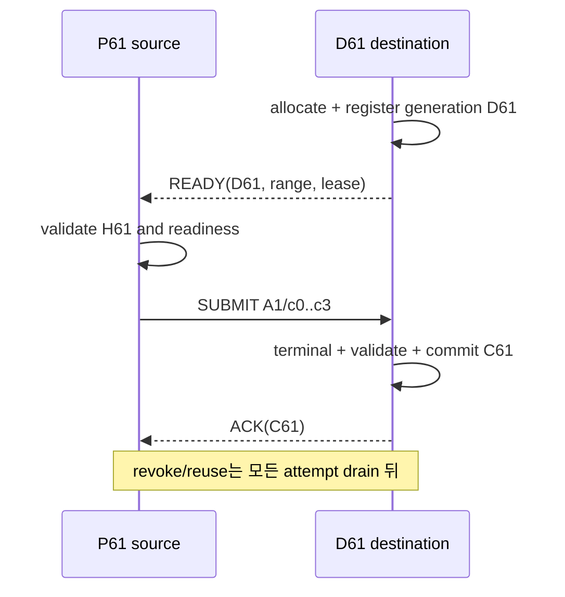
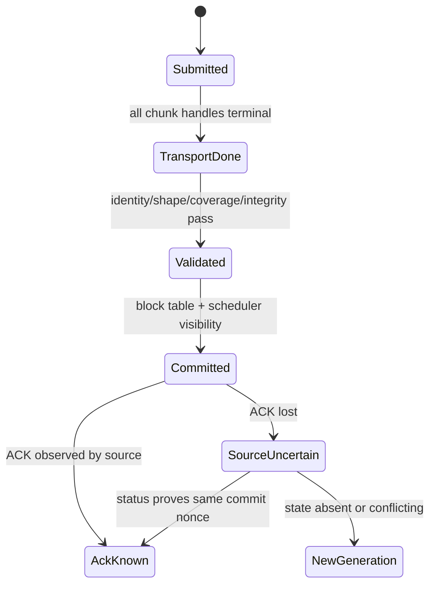

# 61장. prefill의 기억을 decode에 안전하게 넘기는 법

prefill은 끝났고 KV도 모두 계산됐다. 그런데 decode는 첫 token을 만들지 못한다. 전송 로그에는 성공이 찍혀 있다. 운영자는 네트워크를 의심하지만, 실제 문제는 성공이라는 단어가 가리키는 사건이 서로 달랐다는 데 있다. Source는 전송 요청이 접수됐다고 말했고, destination은 아직 마지막 chunk를 검증하지 않았으며, scheduler는 request가 decode 가능하다고 표시했다. 세 주체가 서로 다른 완료를 하나의 boolean으로 압축했다.

이 장은 이 틈을 닫는다. 경제적으로 prefill/decode를 나눌지 판단하는 일은 앞 장에서 끝났다. 여기서는 나누기로 한 요청 하나가 어떤 handshake와 metadata를 거쳐, 어느 buffer에 어떤 byte를 쓰고, 어느 확인 뒤 decode에 소비될 수 있는지를 추적한다. 특정 cache 제품의 설치법이나 설정 recipe는 다루지 않는다. 구현 이름이 바뀌어도 남는 request identity, generation, completion과 commit의 의미를 붙잡는다.

## 61.1 전송 성공인데 decode가 시작되지 않은 사건

기준 요청 R61은 8,192-token prompt를 가진다. 32 layers, 8 KV heads, head dimension 128, BF16이면 token당 KV는 `32×2×8×128×2=131,072 bytes`, 전체는 1 GiB다. 16-token page라면 512 pages이며, 이를 128-page chunk 네 개 `c0..c3`로 보낸다. KV generation은 K61, destination registration은 D61, 첫 attempt는 A1이다. 이 숫자는 설명용 fixture이며 실행 측정값이 아니다.

조사 원장은 다음 사건을 분리한다.

```text
R61 admission → H61 handshake → D61 ready → M61 metadata publish
→ A1 submit → c0..c3 transport terminal → destination validation
→ C61 commit/ACK → first decode consume → revoke/reuse
```

첫 질문은 “전송됐는가”가 아니라 “어느 사건까지 관측됐는가”다. Submit 반환은 queue 접수일 수 있다. Transport `DONE`은 handle의 완료일 뿐 모든 chunk bundle이 유효하다는 뜻이 아닐 수 있다. Notification 수신도 request generation과 payload를 검증했다는 뜻은 아니다. Decode가 읽어도 된다는 최종 판단은 application commit이 소유한다.

### 양쪽 timestamp를 한 원장에 합치는 법

Prefill과 decode process의 wall clock을 그대로 빼면 clock skew가 protocol latency로 섞인다. 각 process는 monotonic timestamp로 내부 구간을 재고, control-plane에서 추정한 offset과 uncertainty를 별도 필드로 보존한다. 같은 process의 `submit→local terminal`과 `validate→commit`은 직접 계산할 수 있지만 P의 submit과 D의 first progress 사이에는 동기화 오차가 붙는다.

R61 원장은 다음 열을 갖는다.

| 사건 | 주체 | identity | 시간과 불확실성 | 상태 변화 |
|---|---|---|---|---|
| handshake selected | P/D control | session H61, peer incarnations | 양쪽 monotonic+offset | compatible·authorized |
| destination ready | D allocator/transport | D61, range digest | D clock | credit consumed |
| chunk submit | P connector | A1/c0..c3, K61/D61 | P clock | queued/in-flight |
| chunk terminal | transport owner | operation handle | local completion clock | DONE/ERR/PROC |
| bundle validate | D connector | K61 coverage/digest | D clock | valid/conflict |
| application commit | D scheduler/cache | C61 nonce | D clock | consumer visible |
| ACK observed | P connector | C61 nonce | P clock | source knowledge |
| first consume | D model runner | K61/block table | GPU/host correlated | KV read allowed |
| revoke/reuse | D owner | D61 generation | D clock | credit returned |

행이 없다는 사실도 관측이다. `chunk terminal`은 있는데 `bundle validate`가 없으면 validation worker가 멈췄는지, event 전달이 누락됐는지 분기한다. `commit`은 있는데 `ACK observed`가 없으면 사건 A로 간다. `first consume`가 commit보다 앞선 것처럼 보이면 실제 ordering bug인지 clock correlation 오류인지 먼저 가른다.

### 바이트와 page coverage를 서로 검산한다

R61의 logical 1 GiB는 512 pages, chunk 네 개, chunk당 128 pages다. 16-token page 하나는 이 fixture에서 `16×128 KiB=2 MiB`, chunk 하나는 256 MiB다. 이 산술은 세 가지 telemetry를 교차 검산한다.

```text
expected logical bytes = 1,073,741,824
expected pages         = 512
expected chunks        = 4 × 268,435,456 bytes
```

관측 physical bytes가 1.25 GiB라면 무조건 overhead라고 쓰지 않는다. Retry/duplicate 256 MiB인지, padding·alignment인지, metadata/aux state인지 항목별로 분해한다. Pages는 512인데 coverage byte가 작으면 compressed/quantized representation인지 truncated transfer인지 확인한다. Bytes는 맞는데 page count가 511이면 overlapping range나 잘못된 block table mapping을 의심한다.

Physical bytes가 logical보다 작은 것도 자동 승리가 아니다. Prefix 일부가 destination에 이미 있었는지, deduplication을 했는지, telemetry가 submit된 마지막 attempt만 세었는지 확인한다. 계산식의 목적은 정확한 구현 byte를 미리 맞히는 것이 아니라 누락된 회계 항을 찾는 것이다.

### 조사자가 제출할 protocol record

장애 분석을 끝냈다는 표시는 서술형 결론이 아니라 다음 최소 record가 채워졌다는 뜻이다.

```yaml
session:
  id: H61
  peers: {prefill_incarnation: null, decode_incarnation: null}
  protocol: {offered: [], selected: null, required_features: []}
  compatibility: {model: null, layout: null, authorization: null}
request:
  id: R61
  incarnation: null
  kv_generation: K61
  destination_registration: D61
  expected: {tokens: 8192, pages: 512, chunks: 4, logical_bytes: 1073741824}
attempts:
  - id: A1
    chunks: []
    physical_bytes: 0
commit:
  state: null
  nonce: C61
  validated_coverage: null
  source_ack_known: false
cleanup:
  terminal_handles: []
  descriptor_revoked: false
  consumer_refs_zero: false
  buffer_reusable: false
```

Null을 임의의 성공값으로 채우지 않는다. Authorization 근거가 source에 없으면 `unknown`과 필요한 배포 증거를 기록한다. Buffer reusable은 request가 실패했다는 사실이 아니라 terminal handle, descriptor revoke와 reference condition으로 계산한다. 이 record를 62~64장의 제품별 lifecycle에 그대로 대입하면 이름이 다른 state를 같은 질문으로 비교할 수 있다.

Record의 내부 일관성 규칙도 자동 검사한다. `commit.state=COMMITTED`라면 validated coverage가 512 pages이고 commit nonce가 있어야 한다. `handoff_to_decode=true`라면 first consume generation이 K61이어야 한다. `buffer_reusable=true`라면 active attempts가 없고 D61 revoke 또는 backend가 요구하는 equivalent fence, consumer refs zero가 있어야 한다. 필드 하나를 독립 boolean으로 바꾸지 않는다.

A1의 chunks 배열에는 submitted/terminal timestamps, logical page interval, physical bytes, handle digest와 terminal reason이 들어간다. Physical sum 1GiB인데 expected page union이 384라면 record validation이 실패한다. Attempts A1/A2 합이 1.25GiB이고 useful union이 1GiB면 retry/duplicate overhead 256MiB를 계산한다. Metadata/control bytes는 별 category다.

Protocol record를 metric에서 그대로 복제하지 않는다. Request incarnation과 descriptor digest는 높은 cardinality라 sampled trace/incident store에 둔다. Fleet metric은 phase, bounded failure reason, size bucket, peer/backend class와 generation-mismatch count를 가진다. Incident responder는 exemplar나 secure lookup으로 상세 record를 찾는다.

Clock reconciliation rule은 source와 destination event 차이가 uncertainty band 안에서 역전되면 `order unknown`으로 표시한다. Causal nonce receipt가 ordering을 증명하면 wall-clock 차이 대신 message edge를 쓴다. Commit이 first consume보다 2ms 늦게 보이지만 clocks uncertainty가 ±5ms라면 즉시 corruption으로 세지 않는다. Same-process scheduler trace가 실제 order를 결정한다.

Artifact 제출자는 각 null에 owner와 next evidence를 붙인다. `authorization: unknown`이면 security/deployment owner와 credential/config artifact, `validated_digest: null`이면 connector validation owner와 source/runtime hook을 적는다. Unknown을 오래 방치하는 것과 정직하게 기록하는 것을 구분하려면 due condition과 blocking severity가 필요하다.

R61 fixture 산술도 schema validation에 넣는다. 8,192 tokens÷16 tokens/page=512 pages, 512÷4=128 pages/chunk, page 2MiB, chunk 256MiB, total 1GiB다. 어느 제품의 block size가 다르면 fixture parameter를 바꾸고 모든 derived field를 다시 계산한다. 16-token page 숫자만 복사해 구현 block table과 불일치시키지 않는다.

## 61.2 handshake는 연결 인사가 아니라 해석 규칙의 합의다

두 process가 서로의 주소를 알았다고 KV를 교환할 수 있는 것은 아니다. Model revision, KV layout, dtype, page size, layer 집합과 TP/PP mapping이 다르면 같은 byte가 다른 tensor를 뜻한다. Handshake H61은 protocol version과 required feature, model/layout digest, transport capability, peer identity를 함께 비교한다.

vLLM의 고정 소스에서 `NixlHandshakePayload`와 compatibility hash는 이 합의가 단순 socket 연결보다 넓다는 단서를 준다. 짧게 옮기면 핵심은 “양쪽 metadata에서 호환성 값을 계산하고 맞지 않으면 transfer 준비로 가지 않는다”이다. 그러나 hash equality는 인증이 아니다. 같은 schema를 말하는 공격자도 같은 hash를 만들 수 있다. Compatibility와 peer authorization을 별도 상태로 둬야 한다.

Version 협상은 숫자가 큰 쪽을 고르는 과정도 아니다. Sender가 aux-state atomic commit을 required feature로 제시했는데 receiver가 모르면 KV만 조용히 보내서는 안 된다. Parser가 필드를 읽을 수 있는가, 그 의미를 동일하게 구현하는가, required feature를 수행할 수 있는가를 나눈다. 실패하면 request는 `NEGOTIATION_FAILED`로 끝나며 destination slot과 descriptor가 만들어졌다면 함께 회수한다.

H61의 협상표를 실제로 채워 보자. P61은 protocol versions `[3,2]`, D61은 `[2,1]`을 제공하고 공통 version은 2다. P61 required feature가 `{chunk-coverage-v2, aux-atomic}`, D61 feature가 `{chunk-coverage-v2}`라면 parser 공통 버전이 있어도 결과는 거절이다. `aux-atomic`을 optional로 내릴 권한은 runtime handshake가 아니라 model/serving configuration owner에게 있다. 전송 코드가 성능을 위해 임의로 의미를 약화시키지 않는다.

협상 latency도 한 숫자로 압축하지 않는다. `first offer→peer response`, compatibility 계산, authorization lookup과 required-feature decision을 나눈다. 첫 요청이 handshake를 일으키면 R61 TTFT에 cold 24ms가 붙고 이후 session reuse에서는 0.4ms일 수 있다. 평균 0.5ms만 보면 cold-start SLO를 놓친다. session age, peer process incarnation과 cache hit/miss를 trace에 남긴다.

관측 분기는 세 갈래다. 응답이 없으면 control path/peer liveness, 응답은 있으나 hash가 다르면 model/layout deployment, hash는 같으나 feature가 없으면 rolling-version policy를 본다. 인증 실패는 네 번째 독립 갈래다. 모든 실패를 `handshake_error`로 합치면 재시작, rollback, credential repair 가운데 무엇이 필요한지 알 수 없다.

반증 기준도 명시한다. “version skew가 원인”이라는 가설은 양쪽 selected version과 feature set이 같고 같은 peer incarnation의 authorization이 성공했다면 약해진다. 반대로 version 문자열만 같다는 것은 가설을 반증하지 않는다. Semantic digest, required behavior와 parser disposition까지 같아야 한다. Old-P/new-D와 new-P/old-D canary가 unknown required feature를 모두 fail-closed하고 slot residue가 0일 때 협상 회귀 검증이 끝난다.

Handshake session을 오래 cache하면 매 요청 비용을 줄이지만 peer 재시작을 놓칠 수 있다. Cache key에는 endpoint 문자열뿐 아니라 peer process incarnation, protocol selection과 model/layout digest를 둔다. Heartbeat가 새 incarnation을 알리면 old H61로 새 D62 descriptor를 해석하지 않는다. Cache eviction 횟수, stale-session reject와 cold-handshake latency를 함께 본다.

## 61.3 metadata는 주소 목록이 아니라 제한된 권한이다

M61에는 logical token interval, physical block list, byte range, memory kind와 device, source/destination generation, expiry와 validation policy가 필요하다. Raw pointer나 remote key는 단순 위치가 아니라 쓸 수 있는 권한이므로 로그 label에 노출하지 않는다. 운영 trace에는 digest와 generation만 남긴다.

주소가 같아도 generation이 다르면 다른 객체다. D61을 폐기한 뒤 allocator가 같은 virtual address를 D62에 주었다면, 오래된 M61은 D62를 가리킬 권한이 없다. Receiver는 address range만 검사하지 않고 registration generation과 request incarnation을 함께 비교해야 한다.

M61을 capability로 읽으면 필수 제한이 구체화된다. `peer=P61`, `request incarnation=R61-i7`, `destination=D61`, `offset=0`, `length=1GiB`, `operation=WRITE`, `expires=t+2s`가 예다. 이 metadata로 D61 바깥에 쓰거나 READ를 수행하거나 expiry 뒤 새 attempt를 시작할 수 없어야 한다. Descriptor가 backend상 더 넓은 region을 가리키더라도 application validation은 요청에 허용된 subrange를 강제한다.

네 chunk의 metadata range를 계산하면 `c0=[0,256MiB)`, `c1=[256,512MiB)`, `c2=[512,768MiB)`, `c3=[768MiB,1GiB)`다. `c2` length가 255MiB이고 `c3`가 767MiB에서 시작하면 총 bytes 합이 거의 맞아도 1MiB hole과 1MiB overlap이 생긴다. 단순 byte sum이 아니라 sorted interval union으로 coverage를 검증한다. Page 기준 `[0,128)`, `[128,256)`, `[256,384)`, `[384,512)`도 함께 대조한다.

Metadata publication 시각과 expiry는 clock skew를 고려한다. P의 wall clock `t+2s`를 D가 그대로 비교하면 offset 150ms가 lease를 늘리거나 줄인다. 상대 timestamp 대신 duration과 receipt-local deadline을 사용하거나 signed epoch와 uncertainty를 명시한다. Expiry는 in-flight DMA를 자동 취소하지 않는다. 새 submit을 막는 정책과 old handle drain은 별 상태다.

관측에는 raw pointer/rkey 대신 descriptor digest, registration generation, allowed bytes/pages, expiry bucket와 validation result를 둔다. High-cardinality digest는 sampled trace에 두고 metric에는 `reject_reason={stale_generation,range,operation,expiry,identity}`를 둔다. Metadata parse success와 capability validation success를 별 counter로 센다.

Stale metadata 가설의 반증은 address가 다르다는 사실이 아니다. 같은 address를 재사용하도록 allocator fixture를 만들었을 때 D61 generation이 submit 전에 거절되고 D62만 commit되는지를 본다. Runtime fault injection을 실행하지 않더라도 state-machine/unit fixture에서 generation comparison과 expiry를 검증할 수 있다. 주소를 매번 우연히 다르게 할당한 성공 test는 stale-reuse branch를 덮지 못한다.

## 61.4 destination readiness가 source submit보다 먼저다

Destination은 buffer allocation, registration과 descriptor publication을 끝낸 뒤 `DEST_READY`를 보낸다. NIXL Python API의 `register_memory`는 등록에 사용한 descriptor를 반환하고, 같은 identity가 `deregister_memory`에 다시 들어간다. 이 짧은 API 모양은 registration이 일회성 boolean이 아니라 cleanup까지 이어지는 수명 객체임을 보여 준다.

Readiness 이전 submit은 destination이 아직 소유하지 않은 range를 쓰게 할 수 있다. 반대로 ACK 전에 destination slot을 pool로 돌리면 늦은 DMA가 다음 request를 덮을 수 있다. Credit은 allocation 시 소비하고 terminal drain과 revoke 뒤 반환한다.

D61 readiness는 최소 `(registration generation, descriptor digest, allowed ranges, memory kind/device, credit lease, peer/session)`를 묶는다. Allocate 성공 뒤 register 실패라면 ready를 publish하지 않고 allocation을 rollback한다. Register 성공 뒤 control message 전송 실패라면 descriptor를 무기한 남기지 않고 bounded lease로 revoke한다. Readiness boolean 하나에 partial setup을 숨기지 않는다.

R61의 destination 준비를 손으로 회계하면 KV 1GiB, page table/metadata와 aux reserve가 추가된다. D pool free가 1.5GiB여도 contiguous/segment 조건, registered-byte limit 또는 block count가 부족할 수 있다. `free_bytes` 하나 대신 free pages, largest/compatible region, registered bytes, descriptor slots와 decode reservation을 본다. Readiness latency를 allocate, register, descriptor prepare, publish로 나눈다.

Two-sided ordering은 다음과 같다.



관측상 source submit이 D ready보다 3ms 앞서 보이면 즉시 ordering bug로 확정하지 않는다. Host clock uncertainty가 ±4ms라면 causal message ID로 source가 어떤 readiness nonce를 소비했는지 본다. Nonce가 없거나 old D60 readiness를 사용했다면 실제 protocol violation이다. 같은-process causal log가 ready receipt→submit을 보이면 wall-clock 역전은 correlation 문제다.

Readiness timeout의 반증 분기는 destination allocator가 아예 요청을 못 받았는지, allocation이 실패했는지, register가 지연됐는지, ready message가 유실됐는지다. Source timeout 하나로 network transfer failure를 세지 않는다. `ready_wait_age`, D setup stage와 outstanding readiness lease를 맞춘다.

Cleanup 회귀 test는 성공만 보지 않는다. Allocate 뒤 register 실패, register 뒤 publish 실패, publish 뒤 source cancel, submit 뒤 destination cancel의 네 경계에서 D61 credit이 언제 돌아오는지 검증한다. Credit이 submit 반환 때 돌아오면 아직 write될 range를 재판매하는 위험이 있다. 너무 늦게 돌아오면 safe하지만 zombie capacity가 쌓인다. Terminal drain/revoke/refcount 조건과 실제 return timestamp의 차이를 metric으로 둔다.

## 61.5 transport DONE과 decode 가능 사이에는 검증 장벽이 있다

이제 A1이 네 chunk를 제출했다고 하자. Source의 전송 라이브러리는 각각에 operation handle을 돌려준다. 이때 원장에는 `submit_ts`, backend, source/destination descriptor generation, logical offset과 length를 기록한다. 한 handle이 `DONE`이 됐다는 사실은 그 handle에 속한 byte operation이 transport 관점에서 terminal이라는 뜻이다. 그것만으로 K61 전체가 완성됐다고 판단하면 안 된다.

### 네 chunk의 완료는 bundle 완료와 다르다

`c0`, `c1`, `c3`가 끝났는데 `c2`가 지연됐다고 해 보자. Destination memory의 75%에는 새 KV가 있고 나머지에는 이전 세대의 byte가 남을 수 있다. Page table을 먼저 publish했다면 attention kernel은 새것과 오래된 것을 한 요청의 KV로 읽는다. 대부분의 값이 그럴듯한 부동소수점이므로 즉시 crash하지 않고 드문 출력 오염으로 나타날 가능성이 더 위험하다.

따라서 bundle에는 expected chunk set과 received terminal set이 필요하다.

```text
bundle_complete(K61) =
  every expected chunk has exactly one accepted terminal result
  and no accepted range overlaps or leaves a hole
  and every result names K61 and D61
```

여기서 `exactly one`은 wire packet이 한 번만 도착해야 한다는 뜻이 아니다. Retry 때문에 같은 payload가 두 번 올 수 있다. Receiver가 같은 attempt identity와 range를 같은 효과 한 번으로 접을 수 있어야 한다는 뜻이다. 서로 다른 payload digest가 같은 `(K61, chunk=2)`를 주장하면 마지막 write를 이긴 것으로 간주하지 않고 conflict로 격리한다.

Coverage ledger의 행은 `(K61,D61,c2,pages 256..383,offset 512MiB,length 256MiB,payload digest,attempt A1,status)`를 가진다. A2가 같은 c2를 보냈을 때 intent가 같으면 accepted effect 하나로 접는다. Digest가 다르면 먼저 끝난 write를 고르지 않고 K61 전체를 conflict로 막는다.

`done_count==4`만 보면 duplicate c1 네 개도 성공한다. Expected-chunk bitset과 sorted interval union으로 unique coverage를 확인한다. Expected 4, terminal events 5, unique valid 4, duplicate 1처럼 기록하면 duplicate physical 256MiB도 회계된다.

“c2 hole 때문에 decode가 멈췄다”는 가설은 coverage가 512/512 pages이고 모든 range generation/digest가 일치하며 validation→commit event가 있을 때 반증된다. Bytes 1GiB와 handles DONE 네 개만으로는 hole을 반증하지 못한다.

### 검증은 checksum 하나보다 넓다

Destination validation은 최소 네 층을 지난다.

1. **Identity**: request incarnation, model/layout digest, KV generation과 destination registration generation이 일치한다.
2. **Shape**: layer, token interval, block/page 수, dtype, element stride와 byte length가 합의와 같다.
3. **Coverage**: chunk range가 겹치거나 비지 않고 expected logical interval을 정확히 덮는다.
4. **Integrity**: 선택한 checksum 또는 authenticated integrity 값이 payload와 일치한다.

Checksum이 맞아도 잘못된 model revision의 KV일 수 있고, shape가 맞아도 다른 tenant의 key일 수 있다. 반대로 모든 byte를 매번 host로 복사해 checksum을 계산하면 correctness를 얻는 대신 전송 이점을 지울 수 있다. 그래서 검증 정책은 위험도에 따라 header와 generation의 상시 검증, device-side 또는 sampled payload integrity, rollout·오류 이후의 강화 검증으로 나눈다. 어떤 정책을 썼는지는 결과와 함께 기록한다. “검증 성공”이라는 말만 남기면 서로 다른 강도의 run을 비교할 수 없다.

Validation을 identity 20µs, shape/coverage 35µs, device integrity 0.8ms, commit preparation 0.2ms처럼 단계별로 기록한다. 이는 측정 예시이며 고정 수치가 아니다. `validate_total=1.055ms`만 남기지 않으면 어느 정책이 TTFT를 차지했는지 보인다. Sampling 1% run과 full-integrity canary를 같은 latency population에 합치지 않는다.

Integrity failure가 c2에서 났더라도 partial retry는 나머지 chunks가 같은 source generation에 immutable하게 pinned됐을 때만 가능하다. Model/layout identity mismatch는 bytes 재전송으로 고쳐지지 않는다. 새 deployment digest와 handshake가 성공해야 반증된다.

Wrong-answer 조사에서는 sampled validation coverage와 first attention consume page를 맞춘다. “checksum enabled” boolean은 모든 pages의 integrity를 증명하지 않는다. 미검사 page 가능성을 policy와 sample rate로 명시한다.

### application commit이 page table visibility를 연다

검증을 통과한 뒤에야 C61을 만든다. Commit은 단순 log line이 아니라 다음 상태 변화를 하나의 판단 단위로 묶는다.

- K61의 모든 page를 request R61의 logical block table에 연결한다.
- Scheduler가 remote-KV wait를 해제하고 decode admission 후보로 옮긴다.
- Destination buffer의 pin/refcount를 consumer lifetime으로 전환한다.
- Source에 보낼 ACK에 committed generation과 accepted chunk digest를 넣는다.

이 중 page table만 먼저 바꾸고 scheduler flag 변경 전에 process가 죽으면 recovery가 half-commit을 보게 된다. 구현이 진짜 원자적 transaction을 제공하지 않는다면 write-ahead state와 replay 규칙으로 같은 효과를 만들어야 한다. Recovery는 `PREPARED` descriptor가 있는지, commit record가 있는지, scheduler가 그 generation을 소비했는지를 순서대로 대조한다.

Transport 18ms, commit queue 4ms라면 network만 최적화해도 TTFT에는 최소 4ms가 남는다. Commit record 생성과 scheduler wakeup을 나눈다. C61 write가 0.1ms인데 next scheduler iteration이 12ms 뒤라면 application boundary는 12.1ms다.

First token만으로 K61 consumption을 증명하지 않는다. Model runner가 참조한 block-table generation이 K61인지 trace한다. Local-prefix fallback이나 recompute가 token을 만들었을 수 있다. `first_consume(K61)`이 commit보다 앞서지 않는지가 falsifier다.

Crash fixture는 PREPARED 전, VALIDATED 뒤 commit 전, commit record 뒤 scheduler visibility 전, consumer 시작 뒤 ACK 전의 네 지점이다. 각 restart가 replay/recompute/abort 가운데 하나로 수렴하고 D61을 이중 소비하지 않아야 한다.

## 61.6 ACK는 완료를 만들지 않고 완료 지식을 전달한다

C61이 끝난 뒤 destination이 ACK를 보냈지만 packet이 사라졌다고 하자. Destination은 이미 decode를 시작했고 source는 timeout을 보고 A2를 준비한다. 이 사건에서 “ACK가 없으니 실패”라고 말하면 두 주체의 진실을 하나로 압축한다. 실제 상태는 `destination committed, source uncertain`이다.

### ACK loss와 transfer failure는 다른 복구를 요구한다

Source가 즉시 같은 destination range에 전체 1 GiB를 다시 쓰면 이미 소비 중인 KV와 경쟁할 수 있다. 먼저 status/query를 통해 `(R61, K61, commit nonce)`가 destination에 committed됐는지 묻는다. Destination이 C61을 증명하면 source는 재전송 없이 local pin을 해제하고 ACK 지식만 복구한다. Destination이 `PREPARED`라고 답하면 missing chunk만 보낼 수 있는지와 기존 range가 아직 write-exclusive인지 확인한다. 상태를 모르면 오래된 D61을 재사용하지 않고 새 generation으로 recompute하거나 새 slot에 다시 전송한다.



이 그림에서 ACK는 `Committed`를 만드는 화살표가 아니다. 이미 일어난 commit을 source가 알게 되는 화살표다. 이 구분이 있어야 ACK retry가 data retry로 확대되지 않는다.

ACK loss의 바이트 차이는 크다. R61 full retransmit은 1GiB, 100건이면 100GiB duplicate traffic이다. 인증된 1KiB commit lookup response라면 100건이 약 100KiB control traffic으로 끝난다. Query가 C61 nonce, peer incarnation과 generation을 검증할 때만 이 절약이 안전하다.

Destination commit 뒤 ACK가 유실되면 user request는 성공해도 source pin 1GiB가 남을 수 있다. Client success와 `source_uncertain_bytes`를 별 metric으로 둔다. Lease expiry 전에 terminal knowledge를 회복하지 못하면 resource incident다.

ACK-path 가설은 destination에 C61과 same-generation first consume가 있고 data handles가 terminal일 때 강해진다. Commit record가 없거나 generation이 다르면 ACK loss가 아니다. Source가 wrong peer/session에 query한 경우도 배제한다.

### terminal response에도 세대와 원인을 넣는다

성공 응답은 `(request incarnation, KV generation, destination generation, commit nonce)`를 되돌려준다. 실패 응답은 최소한 retry 가능 여부와 residue class를 가진다. 예를 들어 `SCHEMA_MISMATCH`는 같은 byte의 즉시 retry로 고쳐지지 않지만, `TRANSIENT_PATH`는 새 handle로 가능할 수 있다. `STALE_DESCRIPTOR`는 새 metadata와 registration readiness가 선행돼야 한다. `INTEGRITY_CONFLICT`는 destination 격리와 source recompute 없이는 같은 payload를 반복해도 위험하다.

Timeout은 원인이 아니라 관측의 부재다. Timeout 하나를 `TRANSFER_FAILED`로 바꾸는 순간, 이미 committed된 요청과 전혀 제출되지 않은 요청을 같은 retry branch에 넣게 된다. 운영 metric도 `timeout_stage={handshake,ready,submit,progress,commit_ack}`처럼 bounded stage를 가져야 한다.

종료 reason에는 residue를 붙인다. `TRANSIENT_PATH, handles_drained=false, destination_prepared=true`와 `SCHEMA_MISMATCH, handles=none, destination_revoked=true`는 cleanup owner가 다르다. Source가 client failure를 보낸 뒤 destination이 commit할 수도 있으므로 old request cleanup과 새 client retry incarnation을 별 ledger로 둔다.

Timeout 가설의 최소 관측은 stage entry, last progress, owner heartbeat와 deadline이다. Handshake에 들어가지도 않은 요청을 transport timeout으로 세지 않는다. Progress가 계속 증가한다면 hard hang보다 slow path이고, timeout을 늘리는 실험은 원인 수정이 아니라 SLO 정책 변경이다.

## 61.7 재시도는 같은 의도를 같은 효과로 접는 설계다

Idempotency를 “같은 API를 두 번 호출해도 괜찮다”는 문장으로 끝내면 byte range와 lifecycle의 어려움이 사라진다. R61의 재시도 키는 논리 요청 ID 하나가 아니라 다음 tuple에 가깝다.

```text
intent = (request_incarnation, kv_generation, chunk_id,
          source_generation, destination_generation, payload_digest)
```

Receiver는 같은 intent가 이미 committed bundle에 속하면 새 write 없이 기존 결과를 돌려줄 수 있다. 같은 request와 chunk ID인데 payload digest나 generation이 다르면 duplicate가 아니라 conflict다. 다른 attempt ID라도 intent가 같으면 효과를 접을 수 있고, 같은 attempt ID라도 내용이 다르면 거부해야 한다.

Idempotency record retention은 무한하지 않다. C61을 너무 빨리 지우면 늦은 ACK query가 unknown이 되어 1GiB를 재전송한다. 너무 오래 두면 tenant metadata가 쌓인다. Maximum retry/ACK uncertainty, descriptor expiry와 보안 retention으로 lease를 정하고 expiry 뒤 lookup miss를 별 outcome으로 둔다.

1,000 requests에서 failure 1%, 그중 ACK loss 6건과 single-chunk error 4건이라고 하자. 전부 full retry하면 10GiB다. Commit query와 256MiB partial retry를 쓰면 약 1GiB+control bytes다. Retry count 10은 같지만 physical cost는 열 배다.

Conflict 0만으로 idempotency를 증명하지 않는다. Same key/different payload가 reject되는 safety test와 same payload/new attempt가 write 없이 prior result를 돌려주는 efficiency test가 모두 필요하다.

### partial retry는 coverage ledger를 기준으로 한다

A1에서 `c0`, `c1`, `c3`가 검증됐고 `c2`만 path error라면 A2는 c2만 보내는 것이 바이트 면에서 유리하다. 그러나 세 조건을 확인해야 한다.

- A1의 성공 chunk가 D61에서 여전히 pinned되고 immutable하다.
- Their validation result가 K61과 같은 commit 후보에 속한다.
- A2가 끝날 때 bundle coverage를 다시 계산하며 A1/A2 순서를 성공 순서로 해석하지 않는다.

Destination이 memory pressure 때문에 A1의 partial range를 회수했다면 partial retry 계획은 폐기한다. Source가 가진 “세 chunk 성공” 로그는 destination ownership을 연장하는 lease가 아니다. Status response에 retained range와 expiry/generation을 포함하거나 새 slot으로 full retry한다.

### late completion은 timeout 뒤에도 state를 바꿀 수 있다

A1을 timeout 처리한 직후 c2의 DMA completion이 늦게 도착할 수 있다. D61을 D62에 재할당했다면 늦은 write는 다음 요청을 손상시킨다. 그래서 cancel 호출의 반환과 device/transport work의 terminal drain을 구분한다. Cancel이 future notification만 막는지, 실제 operation을 중지시키는지, 이미 진행 중인 DMA가 언제 끝나는지를 backend 계약에서 확인한다.

안전한 reuse 조건은 `all handles terminal or fenced`, `late notification drained`, `registration generation revoked`, `consumer refs zero`의 교집합이다. 이 조건이 확인되기 전에는 address가 allocator free list에 있어도 재사용 가능하다고 보지 않는다. 실패 cleanup이 지연되면 capacity가 줄어드는 이유도 여기 있다. 안전을 지키는 zombie slot이 늘어 D61 credit을 돌려주지 못하기 때문이다.

재시도 metric은 request 성공률만으로 부족하다. logical bytes, first-attempt physical bytes, duplicate/retry bytes, recovered-without-data-retry 수, conflict 수와 zombie-slot age를 함께 본다. Retry가 성공률을 올리면서 network와 destination credit을 고갈시키는지 그래야 드러난다.

c2 256MiB를 25GiB/s로 다시 보내는 이상적 하한은 약 10ms다. 그러나 A1 drain 80ms, retained lease 40ms라면 partial plan은 만료된다. 새 D62에 full 1GiB는 약 40ms 하한과 setup을 요구한다. 안전 조건을 먼저 통과한 후보의 `drain+transfer+commit`을 deadline slack과 비교한다.

Late completion은 timeout 뒤 active map에서 request를 지웠다고 사라지지 않는다. Attempt/generation과 cleanup owner를 가진 tombstone을 bounded window 동안 보존해 unknown handle로 버리지 않는다. `late_terminal_age`, fenced/reused 여부가 stale write 가설의 관측이다.

## 61.8 backpressure는 네 queue의 보존 법칙이다

분리 서빙의 queue를 prefill과 decode 두 개로만 그리면 handoff가 공짜인 것처럼 보인다. 실제로는 적어도 네 종류의 미완료 work가 있다.

1. Prefill compute를 기다리는 요청
2. 계산은 끝났지만 destination credit·descriptor를 기다리는 handoff
3. 제출됐지만 transport 또는 validation이 끝나지 않은 byte work
4. KV는 committed됐지만 decode compute를 기다리는 요청

각 queue의 단위도 다르다. 첫째와 넷째는 remaining token work로 보는 편이 낫고, 둘째는 KV logical bytes와 deadline, 셋째는 physical in-flight bytes·operation handles·registered ranges로 본다. 네 queue를 request count 하나로 합치면 1 GiB R61 하나와 짧은 prompt 수십 개가 같은 weight가 된다.

### credit은 destination의 미래 약속이다

Destination credit 하나는 단지 free byte 수가 아니다. Slot allocation, registration, validation workspace, expected transfer bandwidth와 decode가 KV를 붙잡을 residency를 함께 예약한다. Decode queue가 발산하는데 prefill이 계속 credit을 받으면 전송 완료 KV가 destination에 쌓여 더 오래 memory를 점유한다. Source의 GPU utilization은 높아 보이지만 시스템 goodput은 떨어진다.

Admission은 다음 보수식으로 시작할 수 있다.

```text
admit handoff only if
  destination_free_registered_bytes >= expected_KV_bytes + safety_margin
  and inflight_physical_bytes + expected_KV_bytes <= path_credit
  and predicted_decode_work <= decode_deadline_capacity
  and oldest_handoff_age < circuit_breaker_threshold
```

이 식은 완성된 scheduler가 아니라 빠뜨리면 안 되는 자원 축의 checklist다. Prefix cache hit가 있으면 계산·전송 token을 다시 산정하고, quantized KV나 hybrid layer는 layer별 physical bytes를 합한다. Average effective bandwidth 대신 burst window의 하위 분위수와 setup latency를 써야 credit이 낙관적으로 발행되지 않는다.

숫자를 넣어 보자. D에는 registered free 6GiB, path credit 4GiB, in-flight 3GiB가 있고 R61 expected 1GiB다. Byte 조건은 경계에서 통과하지만 safety margin 512MiB를 요구하면 거절된다. D predicted work가 deadline capacity의 95%라면 memory가 남아도 decode credit은 없다. 어느 조건이 false였는지 reason을 남긴다.

Four-queue sheet에서 arrival/departure를 10초 window로 센다. Handoff-ready는 초당 8GiB가 들어오고 6GiB가 나가면 매초 2GiB backlog가 늘어난다. 20GiB headroom은 10초 만에 찬다. Queue length가 아직 낮다는 snapshot보다 slope와 exhaustion time이 조기 경보다.

Credit over-issuance 가설은 destination free/reserved ledger와 issued credits 합이 capacity를 넘을 때 강하다. 합은 맞는데 committed-waiting-decode만 발산하면 decode service prediction을 본다. Transfer queue만 발산하고 path progress rate가 낮으면 network/path owner다. “D가 느리다” 하나로 네 분기를 합치지 않는다.

R61 하나의 credit은 성공 뒤에도 모두 동시에 반환되지 않는다. Path/handle credit은 transfer drain에서, validation workspace는 commit/abort에서, destination KV bytes는 consumer refs zero에서, idempotency record는 retention expiry에서 돌아온다. Resource별 return frontier를 두어 memory leak과 early reuse를 함께 찾는다.

### credit 반환은 terminal drain 뒤에 일어난다

성공 경로에서는 commit이 transfer credit을 반환할 수 있지만 destination memory credit은 decode consumer가 ref를 놓을 때까지 남는다. 실패 경로에서는 timeout 시점이 아니라 handle drain, partial range 폐기, registration revoke와 metadata tombstone 뒤에 반환한다. 이 둘을 같은 `finished` callback으로 처리하면 어느 자원을 너무 일찍 또는 너무 늦게 돌려준다.

관측 화면에는 queue별 arrival/departure rate, work unit, oldest age와 credit utilization을 같은 시간축에 놓는다. `P queue↓`와 `transfer queue↑`가 동시에 일어나면 prefill 최적화 성공이 아니라 병목 이동일 수 있다. `transfer queue↓`인데 `committed-waiting-decode↑`라면 network를 더 빠르게 해도 ITL과 goodput가 회복되지 않는다.

실패 cleanup이 2초 걸리고 초당 한 건 실패하며 각 slot이 1GiB라면 steady zombie bytes는 대략 2GiB다. Cleanup이 20초로 늘면 20GiB가 된다. Failure rate가 같아도 drain latency가 capacity collapse를 만든다. `zombie_bytes`, `oldest_cleanup_age`와 credit return rate를 같이 alert한다.

Credit 반환의 회귀 test는 duplicate terminal callback도 포함한다. 같은 handle completion이 두 번 관측돼 credit을 두 번 더하면 issued 총량이 physical capacity를 넘는다. Return operation은 resource generation과 terminal nonce로 idempotent해야 한다. Counter가 음수가 아니라고 double-return을 반증할 수 없으므로 inventory sum을 대조한다.

## 61.9 rolling version과 보안도 같은 state machine에 들어간다

배포 중에는 prefill fleet와 decode fleet가 동시에 바뀌지 않는다. Old sender가 new receiver에 붙거나 반대 조합이 생긴다. “양쪽이 JSON을 읽는다”는 수준의 compatibility로는 layout과 completion 의미의 차이를 잡지 못한다.

### optional field와 required behavior를 구분한다

Handshake schema에는 protocol major/minor, supported feature와 required feature를 나눈다. 모르는 optional telemetry field는 무시할 수 있다. 하지만 sender가 `chunk_integrity_v2`나 `atomic_aux_state`를 required로 표시했는데 receiver가 수행하지 못하면 fail closed한다. Default 값으로 조용히 진행하면 rollout 중 일부 요청만 다른 correctness 계약을 적용한다.

Canary matrix는 `old→old`, `old→new`, `new→old`, `new→new` 네 방향을 모두 검사한다. 각 조합에서 handshake verdict뿐 아니라 canonical R61의 descriptor, bytes, validation, commit과 cleanup residue를 대조한다. Rollback도 code image만 되돌리는 문제가 아니다. New generation descriptor와 prepared object를 old process가 어떻게 식별하고 폐기하는지 확인해야 한다.

Matrix 결과를 `parse, semantic, required feature, data commit, cleanup` 다섯 열로 나눈다. New→old가 parse success지만 required-feature reject라면 정상 fail-closed다. Old→new가 commit하지만 cleanup residue 1GiB를 남기면 compatibility 성공이 아니다. Rollout controller는 request success뿐 아니라 residue guardrail을 본다.

Optional field를 receiver가 버려도 sender가 그 field를 required behavior 계산에 사용했다면 실제로 optional이 아니다. Wire schema의 optional과 serving semantics의 optional을 구분한다. Unknown field disposition을 ACK에 넣거나 selected feature set으로 명시해 양쪽이 같은 해석을 했음을 확인한다.

Version-skew 가설은 selected protocol, model/layout digest와 required features가 모두 같고 양방향 canary가 동일 commit/cleanup을 보이면 약해진다. 단지 package version을 맞췄다는 것은 충분하지 않다. Build flags나 backend plugin이 feature set을 바꿀 수 있다.

### compatibility hash는 authorization이 아니다

Remote memory descriptor는 address, length와 access material을 포함할 수 있는 capability다. 이를 평문 log, metric label, client-visible error에 넣지 않는다. Control plane은 peer workload identity와 tenant/model namespace 권한을 인증하고, data plane descriptor에는 짧은 expiry와 request/generation binding을 둔다. 한 tenant가 다른 tenant의 prefix key를 안다고 KV를 읽을 수 없어야 한다.

Replay 공격과 정상 retry는 wire 모습이 비슷하다. 둘 다 같은 message가 다시 온다. 차이는 유효한 request incarnation, nonce, expiry와 이미 기록된 intent ledger다. 유효 기간 안의 동일 intent retry는 기존 terminal 결과로 접을 수 있지만, revoke 뒤의 descriptor나 다른 connection identity가 보낸 message는 거부한다. Integrity 보호가 payload만 덮고 metadata의 destination generation을 덮지 않으면 공격자가 byte는 그대로 둔 채 잘못된 slot으로 redirect할 수 있다.

Security validation 순서는 expensive registration 전에 가능한 검사를 앞에 둔다. Peer authentication, namespace authorization, message integrity/replay, schema/capability range를 통과한 뒤 destination credit을 소비한다. 공격자가 valid-looking metadata로 1GiB slot을 반복 예약하게 두면 data access가 막혀도 capacity denial은 성공한다.

Metric에는 raw credential과 descriptor를 넣지 않고 bounded `authn`, `authz`, `integrity`, `replay`, `expired` reason과 peer workload class를 둔다. Sampled secure trace에는 access decision ID와 descriptor digest를 남긴다. Compatibility success/authz failure가 동시에 나타나는 것이 정상적으로 가능한 schema임을 dashboard도 표현한다.

Spoof 가설은 trusted peer identity, allowed tenant/model namespace, nonce freshness와 integrity scope가 모두 검증됐을 때 약해진다. TLS connection 존재만으로 application descriptor authorization을 반증하지 않는다. Trust boundary와 credential provenance가 배포 evidence에 있어야 한다.

### 실패를 숨기는 fallback은 별도 policy다

Handshake 또는 authorization 실패 뒤 monolithic recompute로 fallback할 수 있다. 이는 protocol 실패가 성공으로 바뀐 것이 아니라 다른 serving lane에서 요청을 구한 것이다. Metric에는 original lane, failure stage, fallback lane, 추가 compute와 deadline 결과를 남긴다. Fallback 성공률이 높아도 attacker-triggered recompute가 capacity denial로 이어질 수 있으므로 tenant budget과 circuit breaker를 적용한다.

Security incident의 종료 조건은 error rate가 내려간 것만이 아니다. 노출 가능했던 descriptor를 revoke하고, affected generation과 access log 범위를 확정하며, partial destination을 폐기하고, 새 identity로 canary를 통과해야 한다. Correctness와 보안이 같은 generation/commit state를 공유하는 이유가 여기에 있다.

## 61.10 일곱 사건에서 최초로 어긋난 상태를 찾는다

이 절의 목적은 장애 이름을 맞히는 것이 아니다. 양쪽 원장을 같은 request incarnation과 generation으로 정렬하고, 두 주체가 마지막으로 합의한 상태 다음의 첫 불일치를 찾는 것이다. 각 사건은 R61 fixture를 한 축만 바꾼다. 실행 결과가 아니라 source contract로부터 만든 정적 investigation workbook이다.

### 사건 A: ACK가 사라졌지만 decode는 이미 시작했다

증상은 source의 `commit_ack_timeout`과 destination의 정상 첫 token이 동시에 보이는 것이다. 먼저 client timestamp, P/D process incarnation, K61/D61과 commit nonce C61을 한 줄에 놓는다. 첫 분기는 destination에 C61의 durable 또는 queryable record가 있는지다.

- C61이 있고 first-consume가 같은 generation을 가리키면 data transfer는 성공했다. ACK 지식만 복구한다.
- `PREPARED`만 있고 consumer가 없다면 retained chunks와 lease를 확인해 resume 또는 abort한다.
- C61도 prepared state도 없으면 A1 handle의 terminal drain을 확인한 뒤 새 generation으로 retry한다.

검증은 source가 data를 다시 보내지 않고도 같은 commit nonce를 받아 local pin을 해제하는 canary다. Recovery 뒤 duplicate physical bytes가 0인지 함께 본다. “요청 성공”만 보면 불필요한 1 GiB 재전송을 놓친다.

수치 worksheet에는 `commit at D=420ms`, `ACK timeout at P=500ms`, `status reply=508ms`, `source pin release=509ms`를 넣는다. 재전송 branch라면 1GiB가 늘지만 query branch는 control bytes만 늘어난다. ACK-loss 가설은 C61 record와 K61 first-consume가 없으면 반증된다. 이때는 commit 이전 실패로 돌아간다.

### 사건 B: c2가 실패하고 c3는 아직 진행 중이다

증상은 bundle coverage가 384 pages에서 멈추거나, transport queue age가 늘면서 destination credit이 반환되지 않는 것이다. c0/c1의 terminal success, c2의 error와 c3의 실제 handle state를 각각 읽는다. Error 하나를 봤다고 c3를 취소 완료로 간주하지 않는다.

첫 분기는 backend cancel이 in-flight DMA를 멈추는지, notification만 억제하는지다. c3가 terminal drain될 때까지 D61을 fence한다. 그 뒤 valid partial range가 immutable/pinned돼 있으면 c2만 새 attempt로 보낼 수 있다. Retention을 증명할 수 없으면 bundle 전체를 폐기하고 D62로 다시 준비한다. 회귀 검증은 injected chunk failure 없이도 unit/state-machine test에서 partial→drain→retry ordering을 재현하는 것이다. 런타임 fault injection은 이 책의 정적 감사 범위 밖이므로 실행 명령을 결과처럼 쓰지 않는다.

Coverage가 c0/c1 256 pages, c2 ERR, c3 PROC라면 accepted는 256/512이지 384가 아니다. PROC를 성공으로 세지 않는다. c3가 늦게 DONE이면 384/512가 되고 c2 retry 뒤 512가 된다. Partial-error 가설은 처음부터 unique valid coverage 512이고 commit이 있었다면 반증된다. 그때 status delivery를 조사한다.

### 사건 C: 같은 주소가 새 registration에 재사용됐다

Source metadata에는 D61, destination registry에는 D62가 있고 virtual address와 length만 같다. 증상은 드문 checksum mismatch, 다른 요청의 출력 오염 또는 protection error일 수 있다. 첫 관측은 raw address가 아니라 descriptor digest와 registration generation이다.

D61 revoke가 source에 전달되기 전에 allocator가 주소를 재사용했는지, source metadata cache가 expiry를 넘겼는지, transfer submission이 generation을 검증했는지를 분기한다. 복구는 D61 관련 handle을 drain하고 descriptor를 invalidate한 뒤 D62 readiness를 새로 받는 것이다. 종료 조건은 같은 address reuse를 허용한 상태에서도 stale D61이 submission 전 거절되고 D62 payload만 commit되는 것다.

Address `0xX`, length 1GiB가 같아도 registry lookup `(address,length,generation)`이 D62를 돌려주고 M61이 D61을 주장하면 `stale_generation`이다. Raw pointer equality는 관측에 쓰지 않고 digests를 맞춘다. Stale 가설은 M61이 D62를 명시하고 expiry 안이며 registry/revoke ledger에 D61 late handle이 없을 때 약해진다.

### 사건 D: 문자열 request ID가 같은 두 요청이 충돌한다

Gateway retry나 client reconnect가 외형상 같은 request ID를 재사용했다. Old request는 K61/C61, new request는 K62를 가져야 하는데 receiver가 문자열 ID 하나로 dedupe하면 old ACK가 new request를 완료시킨다. 증상은 transfer byte가 없는데 remote hit/commit으로 처리되거나, prompt가 달라졌는데 즉시 decode가 시작되는 것이다.

Rendered token digest, model/layout revision과 process-issued incarnation을 대조한다. 같은 client ID여도 incarnation이 다르면 다른 intent다. 반대로 network retry로 attempt만 바뀌고 payload/generation이 같으면 같은 효과로 접는다. 복구는 ambiguous namespace의 prepared/committed entry를 격리하고 새로운 server-side incarnation으로 recompute하는 것이다. 회귀 증거는 같은 client ID·다른 prompt와 다른 client ID·같은 transport retry를 나란히 넣은 dedupe test다.

두 요청이 문자열 `abc`, prompt digests P1/P2, incarnations i7/i8이라면 commit key는 달라야 한다. Old C61 lookup hit를 i8에 반환하면 cross-incarnation hit counter가 오른다. Duplicate-ID 가설은 server incarnation과 payload digest가 같고 오직 attempt만 다른 경우에는 반증된다. 그 경우 정상 idempotent retry다.

### 사건 E: decode credit은 없는데 prefill이 계속 handoff한다

Prefill GPU는 바쁘고 transfer throughput도 높지만 TTFT timeout과 registered zombie bytes가 함께 오른다. 네 queue를 그리면 prefill queue는 줄고 handoff-ready·transport·committed-waiting-decode 중 하나가 발산한다. 첫 분기는 path bandwidth 부족과 decode service 부족이다.

Transfer submit→DONE은 안정적인데 committed-waiting-decode age가 오르면 network가 owner가 아니다. D admission credit과 predicted decode tokens를 줄이고, 긴 output class의 reservation을 별도로 둔다. Submit→progress부터 느려지고 physical in-flight bytes가 path credit을 채우면 transfer admission과 chunk concurrency를 조정한다. 종료 조건은 offered load를 다시 올렸을 때 모든 queue가 bounded age로 회복하고 SLO-goodput가 증가하는 것이다. Queue 하나를 줄이는 것을 성공으로 삼지 않는다.

10초 window에 handoff 80GiB가 들어오고 60GiB가 나가면 +2GiB/s다. Registered headroom 20GiB는 10초 뒤 소진된다. Backpressure-collapse 가설은 모든 네 queue의 departure가 arrival 이상이고 oldest age가 안정적인데도 timeout이 난다면 약해진다. 그때 client/gateway deadline 또는 clock accounting을 본다.

### 사건 F: 새 sender가 요구한 aux-state를 old receiver가 모른다

Handshake parser는 message를 읽었고 KV layout hash도 같다. 하지만 새 sender는 KV와 함께 auxiliary state를 같은 commit에 포함해야 correctness가 유지되는 모델/기능을 사용한다. Old receiver가 unknown field를 버리고 KV-only 성공을 보내면 protocol은 빠르지만 틀렸다.

Required feature set과 selected feature set의 차이가 최초 불일치다. 즉시 retry나 다른 transport로 바꾸지 말고 compatible receiver로 route하거나 해당 feature를 사용하지 않는 배포 조합으로 rollback한다. Old→new, new→old canary가 모두 fail-closed하는지와 cleanup residue가 없는지가 종료 증거다. 단순히 version number가 같아졌다는 사실은 semantic compatibility 증명이 아니다.

표에는 P required `{kv,aux-atomic}`, D selected `{kv}`를 그대로 남긴다. Silent fallback은 logical KV 1GiB를 모두 보내고도 correctness를 잃으므로 bytes 성공률로 잡히지 않는다. Version-skew 가설은 D가 aux-atomic을 선택했고 canonical aux digest까지 같은 commit에 검증됐을 때 반증된다.

### 사건 G: 형식은 맞는 metadata를 권한 없는 peer가 보냈다

Compatibility hash와 schema validation이 통과했지만 peer workload identity가 허용된 tenant/model namespace와 다르다. 이 경우 descriptor를 열어 본 뒤 거절하는 것보다 control-plane authorization에서 차단해야 한다. Raw rkey나 address가 log에 남았다면 단순 실패가 아니라 capability 노출 사건이다.

인증 실패, authorization 실패, integrity/replay 실패를 다른 bounded reason으로 기록한다. 관련 descriptor를 revoke하고 metadata cache와 in-flight notification을 비우며 affected access log 범위를 확정한다. 새 credential과 generation으로 canary를 통과하고 old message replay가 거절돼야 종료한다. Fallback recompute를 허용했다면 공격자가 이를 반복해 capacity를 소진하지 못하도록 별도 budget이 작동하는지도 확인한다.

공격 message 100개가 validation 전에 각 1GiB credit을 예약한다면 access가 최종 거절돼도 100GiB reservation pressure를 만들 수 있다. Authn/authz를 allocation 앞에 두는 이유다. Spoof 가설은 trusted identity와 namespace grant, fresh nonce와 generation-bound integrity가 모두 검증된 trace가 있으면 약해진다. Schema hash만으로는 반증되지 않는다.

### 일곱 사건을 한 표에 닫는다

| 사건 | 최초 불일치 | 하지 말아야 할 반응 | 소유자 | 종료 증거 |
|---|---|---|---|---|
| A ACK 유실 | destination committed/source uncertain | 1 GiB 즉시 재전송 | commit/ACK protocol | nonce query, duplicate bytes 0 |
| B partial | chunk terminal set 불완전 | D61 즉시 reuse | transport+bundle owner | drain, coverage 재검증 |
| C stale descriptor | D61 metadata/D62 registry | address equality 수락 | registration owner | stale generation pre-submit reject |
| D duplicate ID | client ID 같고 incarnation 다름 | 문자열 ID dedupe | request identity owner | cross-incarnation test |
| E backpressure | downstream work departure<arrival | P utilization 유지 | admission/router | 모든 queue bounded, goodput 회복 |
| F version skew | required feature 미선택 | KV-only silent fallback | rollout/protocol owner | 양방향 canary fail-closed |
| G spoof | schema valid/peer unauthorized | compatibility를 인증으로 간주 | security/control plane | revoke·replay rejection·new canary |

이 표의 owner는 특정 팀 이름이 아니다. 어떤 state transition을 쓸 권한과 cleanup 책임을 가진 component인지를 뜻한다. 조직도보다 이 owner를 먼저 찾으면 “네트워크 팀과 scheduler 팀이 서로 정상이라고 한다”는 교착을 줄일 수 있다.

## 61.11 고정 소스에서 protocol의 실제 소유자를 찾는다

지금까지의 상태 기계가 구현과 맞물리는지 vLLM, SGLang과 NIXL의 고정 revision에서 확인한다. 세 구현의 이름을 억지로 통일하지 않는다. 같은 질문을 던지고 각 코드가 실제로 답하는 범위만 기록한다.

### vLLM: scheduler metadata와 worker transfer를 분리해 읽는다

vLLM v0.27.1의 [`NixlAgentMetadata`와 handshake payload](https://github.com/vllm-project/vllm/blob/6e448d0ea9bf3d88d898b65449ca6dc2aec170ac/vllm/distributed/kv_transfer/kv_connector/v1/nixl/metadata.py#L49-L143)는 agent identity, NIXL metadata와 compatibility 정보를 직렬화하는 control-plane vocabulary를 보여 준다. 이 범위가 증명하는 것은 양쪽이 교환하고 비교할 구조이지, 상대의 조직 identity가 암호학적으로 인증된다는 보장이 아니다.

같은 파일의 [`RemoteMeta`, `ReqMeta`와 request metadata 축적](https://github.com/vllm-project/vllm/blob/6e448d0ea9bf3d88d898b65449ca6dc2aec170ac/vllm/distributed/kv_transfer/kv_connector/v1/nixl/metadata.py#L145-L233)은 remote engine, block IDs와 request별 save/receive intent가 worker로 넘어가기 전에 어떤 모양을 갖는지 찾는 시작점이다. Scheduler가 선택한 block과 worker가 실제 전송한 range가 다르면 이 경계 전후를 대조한다.

역할별 고정 좌표와 판정 범위는 다음과 같다.

- Scheduler 쪽 [`set_xfer_handshake_metadata`](https://github.com/vllm-project/vllm/blob/6e448d0ea9bf3d88d898b65449ca6dc2aec170ac/vllm/distributed/kv_transfer/kv_connector/v1/nixl/base_scheduler.py#L281-L365)는 handshake metadata를 받는 control-plane owner를 찾는 anchor다.
- [`_build_save_meta`와 `build_connector_meta`](https://github.com/vllm-project/vllm/blob/6e448d0ea9bf3d88d898b65449ca6dc2aec170ac/vllm/distributed/kv_transfer/kv_connector/v1/nixl/base_scheduler.py#L400-L477)는 scheduling decision을 worker가 소비할 metadata로 freeze한다.
- 이 반환을 byte completion이라 읽어서는 안 된다.

- Worker 쪽 [`_nixl_handshake`](https://github.com/vllm-project/vllm/blob/6e448d0ea9bf3d88d898b65449ca6dc2aec170ac/vllm/distributed/kv_transfer/kv_connector/v1/nixl/base_worker.py#L577-L725)는 remote agent metadata와 compatibility 교환을 수행하는 영역이다.
- [`_ensure_handshake`와 background handshake](https://github.com/vllm-project/vllm/blob/6e448d0ea9bf3d88d898b65449ca6dc2aec170ac/vllm/distributed/kv_transfer/kv_connector/v1/nixl/base_worker.py#L803-L942)는 request가 도착한 시점과 peer readiness가 어긋날 때 failure가 어디로 전달되는지 읽게 한다.

KV cache registration은 [`base_worker.py`의 registration 구간](https://github.com/vllm-project/vllm/blob/6e448d0ea9bf3d88d898b65449ca6dc2aec170ac/vllm/distributed/kv_transfer/kv_connector/v1/nixl/base_worker.py#L943-L1075)에 있다. 여기서 cache tensor/layout을 NIXL이 접근할 memory descriptor로 바꾸는 순간과 shutdown cleanup을 연결해 본다.

완료 쪽은 [`get_finished`, notification polling과 failure 처리](https://github.com/vllm-project/vllm/blob/6e448d0ea9bf3d88d898b65449ca6dc2aec170ac/vllm/distributed/kv_transfer/kv_connector/v1/nixl/base_worker.py#L2044-L2299)를 읽는다. Transport notification, connector output과 scheduler-visible finished set이 어떤 순서로 갱신되는지가 핵심이다.

마지막으로 [`stale engine cleanup과 shutdown`](https://github.com/vllm-project/vllm/blob/6e448d0ea9bf3d88d898b65449ca6dc2aec170ac/vllm/distributed/kv_transfer/kv_connector/v1/nixl/base_worker.py#L2513-L2598)을 timeout 이후 address reuse 질문과 연결한다.

Push worker는 별도 상태 기계를 가지므로 pull 설명을 그대로 복사하지 않는다. [`push_worker.py`의 등록·matching 시작](https://github.com/vllm-project/vllm/blob/6e448d0ea9bf3d88d898b65449ca6dc2aec170ac/vllm/distributed/kv_transfer/kv_connector/v1/nixl/push_worker.py#L274-L487)과 [`block transfer·finished 처리`](https://github.com/vllm-project/vllm/blob/6e448d0ea9bf3d88d898b65449ca6dc2aec170ac/vllm/distributed/kv_transfer/kv_connector/v1/nixl/push_worker.py#L499-L752)의 notification 방향과 owner를 따로 그린다.

이 source walk를 R61 원장에 대입하면 scheduler metadata build는 M61 freeze 후보, worker handshake는 H61 peer/session 후보, registration 구간은 D61 descriptor lifetime 후보, finished polling은 A1 handle terminal 후보가 된다. 후보라고 부르는 이유는 함수 이름이 application commit 의미를 자동 증명하지 않기 때문이다. Caller가 finished set을 받아 block table과 scheduler visibility를 언제 여는지 이어 읽는다.

관측 breakpoint도 owner별로 둔다. Scheduler에는 request incarnation, save/recv intent와 selected blocks, worker에는 peer incarnation, descriptor digest, attempt/chunk와 handle state, upper engine에는 remote-KV wait 해제와 first consume를 기록한다. 세 log를 request ID 문자열 하나로 join하지 않고 generation tuple로 잇는다.

vLLM에서 pull과 push를 비교할 때 notification 방향이 다르면 ACK 의미도 달라질 수 있다. 한쪽의 “finished”가 source write completion이고 다른 쪽은 receiver notification일 수 있다. 동일 metric name으로 합치기 전에 source function, owner와 transition을 표로 만든다. 차이가 설명되지 않으면 generic `transport_terminal`보다 구체적인 backend-state label을 쓴다.

### SGLang: room, chunk queue와 sticky failure를 잇는다

SGLang v0.5.18의 NIXL connection은 [`conn.py` 초기화·registration·queue 구성](https://github.com/sgl-project/sglang/blob/71de97b264b04dcd514cf904003028aefe9775c8/python/sglang/srt/disaggregation/nixl/conn.py#L430-L570)에서 backend, registered staging memory, bounded transfer queue와 outstanding count를 만든다. 이 구간을 보면 backpressure가 추상 원리가 아니라 queue capacity와 worker lifetime에 걸린다는 사실을 확인할 수 있다.

[`bootstrap, prefetch와 status 갱신`](https://github.com/sgl-project/sglang/blob/71de97b264b04dcd514cf904003028aefe9775c8/python/sglang/srt/disaggregation/nixl/conn.py#L582-L692)은 같은 room에 대한 중복 control message와 failure state가 어떻게 보이는지 읽는 anchor다. 여기서 room이라는 필드가 보인다고 그것을 모든 제품에 통용되는 globally unique request ID라고 부르지 않는다. 생성자와 caller가 보장하는 uniqueness 범위만 적용한다.

Descriptor geometry와 peer 정보는 [`conn.py`의 local/remote preparation](https://github.com/sgl-project/sglang/blob/71de97b264b04dcd514cf904003028aefe9775c8/python/sglang/srt/disaggregation/nixl/conn.py#L694-L1110)에 모인다. TP mismatch나 segment shape 오류가 transport submit 이전에 잡히는지 살핀다.

Transfer worker의 [`dequeue·defer·notification·handle polling`](https://github.com/sgl-project/sglang/blob/71de97b264b04dcd514cf904003028aefe9775c8/python/sglang/srt/disaggregation/nixl/conn.py#L1111-L1327)과 [`completion·status·cleanup`](https://github.com/sgl-project/sglang/blob/71de97b264b04dcd514cf904003028aefe9775c8/python/sglang/srt/disaggregation/nixl/conn.py#L1328-L1385)을 나눠 읽으면 submit, backend terminal과 room status가 한 사건이 아님을 볼 수 있다.

`KVPoll.Success` 같은 이름도 caller가 decode-visible commit으로 해석하는 범위를 확인하기 전에는 “application ACK”라고 단정하지 않는다. 코드에서 보이는 terminal state와 이 장이 요구하는 integrity·authorization은 다른 증거다. 구현에 암호화나 peer authorization 근거가 없다면 배포 계층의 미해결 요구로 남긴다.

SGLang의 bounded transfer queue와 outstanding count는 four-queue sheet 가운데 transport owner를 보여 준다. Queue full에서 defer/re-enqueue가 일어나면 arrival, deferred, dequeued와 oldest age를 따로 센다. Outstanding가 0이어도 handoff-ready나 committed-waiting-decode가 남을 수 있으므로 전체 protocol idle이라고 결론내리지 않는다.

Room status가 sticky `Failed`라면 뒤늦은 success notification이 이를 되돌리는지 caller까지 확인한다. 안전한 기본 요구는 terminal failure generation을 late success가 덮지 않는 것이다. Source가 실제로 어떤 precedence를 구현하는지 exact branch에서 확인하고, 보이지 않는 경우 canonical B fixture의 test requirement로 남긴다.

TP mismatch와 segment validation은 submit 전 falsifier다. Geometry가 거절됐는데 physical bytes가 증가했다면 validation ordering이나 metric owner가 예상과 다르다. 반대로 submit 0 bytes와 bounded mismatch reason이면 network failure가 아니다. Deployment/model layout을 고친 새 handshake가 회귀 증거다.

### NIXL: memory, descriptor와 operation handle의 수명을 확인한다

NIXL commit `8770b655...`의 [`register_memory`와 `deregister_memory`](https://github.com/ai-dynamo/nixl/blob/8770b655a6b17b5cdf7d2b56b6e0be5392496df5/src/api/python/_api.py#L407-L447)는 registration descriptor가 cleanup까지 이어지는 객체임을 보여 준다. [`make_connection`과 transfer descriptor list 준비](https://github.com/ai-dynamo/nixl/blob/8770b655a6b17b5cdf7d2b56b6e0be5392496df5/src/api/python/_api.py#L471-L532)는 peer 연결·local/remote descriptor 준비를 실제 operation과 분리한다.

[`make_prepped_xfer`와 `initialize_xfer`](https://github.com/ai-dynamo/nixl/blob/8770b655a6b17b5cdf7d2b56b6e0be5392496df5/src/api/python/_api.py#L551-L637)는 notification payload와 opaque transfer handle을 준비한다. 이어지는 [`transfer`와 `check_xfer_state`](https://github.com/ai-dynamo/nixl/blob/8770b655a6b17b5cdf7d2b56b6e0be5392496df5/src/api/python/_api.py#L638-L690)가 backend operation state를 돌려준다. 그 state를 K61의 coverage·identity·integrity 검증과 C61 commit으로 확장하는 책임은 connector와 serving engine에 남는다.

Operation handle의 [`release` 수명](https://github.com/ai-dynamo/nixl/blob/8770b655a6b17b5cdf7d2b56b6e0be5392496df5/src/api/python/_api.py#L89-L136)은 request timeout과 transport quiescence를 구분해야 하는 근거다. Python 객체를 더 이상 참조하지 않는 것과 backend operation이 destination memory에 write할 가능성이 사라진 것은 같은 문장이 아니다. 구현·backend 문서가 cancel/drain을 어디까지 보장하는지 확인한 뒤 reuse fence를 세운다.

NIXL API 단계는 connection, descriptor preparation, handle initialization, transfer/check와 release로 나뉜다. 각 단계의 exception을 같은 retry branch에 넣지 않는다. Descriptor preparation mismatch는 동일 handle retry로 고쳐지지 않고, transfer `PROC`는 error가 아니며, release 호출은 remote application validation을 뜻하지 않는다.

R61의 네 chunks가 네 handles인지 하나의 combined handle인지는 connector 선택에 달려 있다. Ledger schema는 둘 다 표현해야 한다. Combined handle DONE이어도 connector가 expected ranges를 어떻게 묶었는지 검증하고, per-chunk handles라면 unique terminal set을 계산한다. API shape를 protocol bundle 의미와 동일시하지 않는다.

Handle leak 가설은 Python reference count만으로 반증되지 않는다. Backend operation inventory, terminal state와 registered range cleanup이 함께 0으로 수렴해야 한다. 반대로 handle object가 남아도 terminal 결과 audit를 위해 tombstone으로 보존된 것이라면 active leak가 아닐 수 있다. Active operation과 retained record를 다른 gauge로 둔다.

### 소스가 말하지 않는 것은 요구사항으로 남긴다

위 source walk는 구조와 state owner를 찾는 근거다. 특정 backend의 latency, retry가 exactly-once라는 보장, control-plane 암호화, tenant authorization과 payload integrity를 자동으로 증명하지 않는다. 다음 항목은 배포 evidence가 없으면 빈 칸으로 남긴다.

- Peer identity가 어떤 credential과 trust root로 인증되는가
- Descriptor가 transit와 log에서 어떻게 보호되는가
- Backend `DONE` 이후 device visibility fence가 어디에 있는가
- Process crash 뒤 prepared/committed record가 어디까지 남는가
- Retry ledger와 descriptor revoke가 어떤 durability를 갖는가

빈 칸은 책의 약점이 아니라 사고를 막는 경계다. “NIXL을 썼으니 된다”거나 “호환성 hash가 있으니 안전하다”는 추론 대신, 필요한 source/config/runtime evidence를 다음 감사 작업으로 명시한다.

### 소스 범위와 판독 한계

이 장의 구현 링크는 vLLM v0.27.1 commit `6e448d0e`, SGLang v0.5.18 commit `71de97b2`, NIXL commit `8770b655`에 고정했다. Line range는 구조와 owner를 가리키며 runtime latency 숫자를 제공하지 않는다. R61의 1GiB, 네 256MiB chunks와 시간 예시는 formula와 workbook fixture다.

소스 claim, derived invariant, security requirement와 runtime observation을 구분한다. `register_memory`가 descriptor를 돌려주는 것은 source fact다. D61 generation이 ACK/drain 전 재사용되면 안 된다는 것은 source와 memory safety를 결합한 invariant다. Peer authentication과 tenant authorization은 source에서 증명되지 않으면 deployment requirement다. 실제 ACK loss율이나 transfer p99는 실행 관측 없이는 빈 칸이다.

논리 상태명을 제품 enum과 동일시하지 않는다. 이 장의 `COMMITTED`는 destination validation과 consumer visibility가 닫힌 application 의미다. 구현의 `Success`, `DONE`, `finished`가 그 전부를 포함하는지는 caller chain으로 증명해야 한다. 증명하지 못한 mapping은 gap이지 이름 유사성으로 채울 칸이 아니다.

독자는 source 링크가 바뀐 새 revision에서 symbol과 line range를 다시 찾고 semantic diff를 검토한다. Mutable main link를 근거로 쓰지 않고 commit pin을 유지한다. Backend, build flag나 deployment security가 source repository 밖에 있으면 해당 artifact/version을 별 증거로 요청한다.

### 현재까지의 판정: byte가 아니라 기억의 소유권을 넘긴다

Prefill/decode 분리에서 가장 위험한 문장은 “KV 전송이 성공했다”다. 이 문장은 handshake가 맞았는지, destination이 준비됐는지, 모든 chunk가 terminal인지, payload가 유효한지, block table이 commit됐는지, source가 그 사실을 아는지 말하지 않는다.

안전한 handoff는 다음 질문을 순서대로 답한다.

1. 양쪽이 같은 model·layout·feature 의미를 합의했는가.
2. Descriptor가 올바른 generation과 권한을 가졌는가.
3. Destination range가 등록되고 reuse로부터 보호됐는가.
4. 모든 chunk가 hole·overlap 없이 terminal이고 검증됐는가.
5. Application commit이 consumer visibility와 refcount를 열었는가.
6. ACK 유실과 data failure를 구분해 같은 intent를 같은 효과로 접는가.
7. 성공·실패 모두 handle drain, revoke와 credit 반환까지 닫혔는가.

각 질문은 관측과 falsifier를 가진다. Handshake는 selected schema/feature와 mismatch reason, capability는 generation/range/expiry validation, readiness는 allocation-registration nonce, completion은 unique coverage와 handles, commit은 block-table generation과 first consume, retry는 intent conflict/duplicate bytes, cleanup은 inventory와 credit sum으로 본다. “로그에 error 없음”은 어느 질문도 단독으로 반증하지 못한다.

R61 정상 canary의 기대 sequence는 H61 compatible+authorized, D61 ready, A1 네 chunks unique terminal, 512-page validation, C61 commit, source ACK knowledge, K61 first consume, consumer release와 D61 revoke다. Expected physical data는 backend overhead를 빼면 logical 1GiB이고 duplicate bytes 0이다. 실제 backend packaging이 다르면 useful/physical category를 설명한다.

ACK-loss canary는 정상 sequence에서 source ACK knowledge만 지연시키며 destination commit/consume를 되돌리지 않는다. Partial canary는 c2 error와 c3 drain을 보존하고 commit을 막는다. Stale canary는 같은 address D62에서 D61을 reject한다. 이 세 test만으로 version/auth/backpressure를 덮었다고 하지 않고 나머지 네 사건도 독립 fixture로 둔다.

이 일곱 질문을 원장으로 남기면 네트워크, connector와 scheduler가 각자 “정상”이라고 말하는 상황에서도 최초 불일치를 찾을 수 있다. 다음 장부터는 이 공통 좌표를 LMCache, Mooncake와 HiCache/NIXL 조합에 대입한다. 제품 이름은 달라도 key, descriptor, registration, completion, commit과 cleanup을 묻는 순서는 바뀌지 않는다.

최종 제출물은 R61 sequence ledger, H61 schema/version table, idempotency conflict table, four-queue credit sheet와 seven-incident report다. 다섯 artifact가 같은 `(request incarnation,K61,D61,A1,C61)` tuple을 사용해야 한다. 하나가 generation 없이 request 문자열만 쓰면 cross-document join이 안전하지 않다.

운영 중 “전송 성공인데 decode가 멈췄다”는 경보가 오면 이 장의 순서를 거꾸로 뛰지 않는다. 먼저 first consume와 commit, validation, unique chunk coverage, handle terminal, readiness, metadata capability와 handshake로 뒤집어 올라간다. 처음 없는 행 또는 generation mismatch가 first divergence다. 곧바로 timeout 증가나 full retry를 하지 않는다.

성공 종료도 request response 하나가 아니다. Source uncertain bytes 0, active handles terminal, destination partial ranges 0, revoked descriptor와 consumer ref/credit 회계가 닫혀야 한다. Failure 종료도 같은 조건을 요구한다. 이 대칭성이 있어야 오류가 많아질수록 zombie capacity가 쌓이는 역설을 막는다.

61장의 결과는 특정 connector가 우월하다는 표가 아니다. 다음 제품 장들이 서로 다른 이름과 data path를 사용해도 handshake, capability, readiness, terminal, validation, commit, retry와 cleanup 질문에 답하게 하는 conformance 좌표다. 제품이 명시적 ACK를 쓰지 않으면 어떤 사건이 같은 commit 지식을 제공하는지 보여야 하고, 제공하지 못하면 보장 공백으로 남는다.

Conformance 표의 행은 protocol invariant, 열은 vLLM/SGLang/NIXL source, deployment config, runtime trace다. 한 source cell이 비어도 다른 열이 의미를 대신 발명하지 않는다. 예를 들어 NIXL `DONE` source가 operation terminal을 보여도 application commit 열은 connector caller evidence가 필요하다. TLS config가 있어도 range generation validation source를 대신하지 않는다.

성능 담당자는 이 표를 overhead 목록으로만 읽기 쉽다. Handshake, validation, ACK와 tombstone은 latency와 memory를 소비한다. 그러나 이를 제거해 얻은 microsecond가 stale write나 duplicate GiB를 만들면 goodput 계산의 전제가 무너진다. 최적화는 invariant를 없애는 것이 아니라 session reuse, device-side validation, commit lookup과 bounded retention으로 같은 의미를 더 싸게 구현하는 일이다.

반대로 안전 요구를 무한 보존으로 구현해서도 안 된다. Descriptor와 idempotency record를 영원히 pin하면 failure는 없지만 capacity가 사라진다. Lease, expiry, terminal drain과 garbage collection을 state machine 안에 두고 maximum uncertainty window를 근거로 계산한다. Cleanup p99가 admission headroom을 정한다.

모니터링에서는 정상 path의 absence도 감지한다. Transfer DONE rate만 있고 validation/commit rate가 따라오지 않으면 gap이 열린다. Commit rate는 정상인데 ACK-known rate가 뒤처지면 source uncertain bytes가 쌓인다. Revoke rate가 terminal request rate보다 낮으면 descriptor lifetime leak다. 각 delta의 oldest age를 함께 본다.

디버깅은 owner frontier에서 멈춘다. Handshake mismatch를 발견하면 CUDA kernel을 profiling하지 않고, unique coverage가 비었으면 decode scheduler tuning으로 넘어가지 않는다. Coverage와 commit이 닫혔는데 first consume만 없을 때 scheduler/block-table owner를 본다. 이 순서가 넓은 system에서 탐색 공간을 줄인다.

마지막으로 이 장의 protocol은 exactly-once network delivery를 요구하지 않는다. Network와 control message는 duplicate·loss·reorder될 수 있다고 두고, generation, intent ledger, validation과 commit으로 application effect를 한 번으로 접는다. “한 번만 보냈다”보다 “여러 번 관측돼도 한 generation만 소비됐다”가 더 강하고 검증 가능한 주장이다.

운영 runbook의 첫 화면은 session, request, attempt, chunk, commit과 resource 세대를 한 줄로 보여 준다. 다음 화면은 four-queue work와 credit inventory, 마지막 화면은 security/version decision과 cleanup residue다. 사용자가 본 TTFT는 첫 화면의 끝에 붙지만 원인은 세 화면 어디든 있을 수 있다. Dashboard를 service별로 갈라 request join을 잃지 않는다.

경보 threshold는 fixture 숫자를 그대로 production default로 쓰지 않는다. `oldest_commit_age`, `source_uncertain_bytes`, `zombie_registered_bytes`, `late_completion`과 `generation_conflict`의 정상 분포와 deadline을 근거로 둔다. Generation conflict와 unauthorized descriptor는 빈도가 낮아도 correctness/security 경보다. Queue age는 workload와 SLO에 따라 threshold가 달라진다.

회귀가 생기면 최근 source revision, protocol feature selection, backend plugin, model/layout digest와 topology generation을 동시에 freeze한다. Runtime trace만 저장하고 build pin을 잃으면 `DONE`이나 `Success` 의미가 바뀌었는지 알 수 없다. 반대로 source diff만 읽고 live queue/attempt를 보지 않으면 어느 branch가 실행됐는지 모른다.

제품 비교도 기능 표의 체크 표시를 넘는다. Handshake가 있는가보다 어떤 semantics를 협상하는지, retry가 있는가보다 intent conflict를 어떻게 막는지, async인가보다 terminal과 commit을 어떻게 구분하는지, security 옵션이 있는가보다 descriptor 권한 범위와 replay가 어떻게 닫히는지를 묻는다. 이 질문에 source와 artifact로 답한 범위만 supported라고 쓴다.

이 좌표가 있으면 다음 장의 cache hit, promotion, eviction도 protocol과 섞이지 않는다. Cache 제품은 key와 placement 정책을 제공할 수 있지만 R61이 올바른 D61에 commit되고 늦은 A1이 D62를 덮지 않는 조건은 그대로 남는다. 경제성, protocol correctness와 제품 policy를 분리해 읽는 것이 세 장을 연결하는 방법이다.

인수인계 checklist는 짧다. 선택된 protocol/session, peer incarnations, request/KV/destination generations, expected/accepted coverage, active attempts, commit/ACK knowledge, consumer reference와 cleanup credit을 모두 채운다. 이어지는 제품 장은 이 필드를 어느 object와 함수가 소유하는지 답한다. 필드가 구현에 없으면 유사한 이름을 억지로 매핑하지 않고 equivalent invariant 또는 gap을 제시한다.

이렇게 protocol을 먼저 고정하면 cache hit가 빨랐다는 관측과 stale generation을 수락했다는 오류를 동시에 볼 수 있다. 성능 결과가 correctness failure를 덮지 않고, 강한 안전 조건이 어느 queue와 memory 비용을 만드는지도 숨기지 않는다. 결국 안전한 분리 서빙은 byte copy primitive가 아니라 여러 비동기 소유자가 같은 기억의 세대와 완료 의미에 합의하는 과정이다.

그 합의는 정상 응답에서만 시험되지 않는다. ACK가 사라지고 chunk가 일부 끝나며 주소와 request 문자열이 재사용되고 downstream credit, version과 authorization이 어긋날 때에도 한 generation만 소비되고 모든 residue가 닫혀야 한다. 실패 경로가 이 조건을 만족할 때 정상 경로의 “성공”도 비로소 신뢰할 수 있다.

## 61.12 16-page object를 prepare·commit·visibility까지 손으로 추적한다

상위 제품 이름을 지우고 object 하나만 둔다. Request incarnation은 R7, logical KV object는 K7, destination allocation은
D12, transfer attempt는 A3, commit nonce는 C9다. K7은 16 pages이고 page당16 KiB이므로 logical payload는256 KiB,
즉262,144 bytes다. 네 chunks가 각4 pages, 64 KiB를 담당한다. 이 수치는 transport가 RDMA인지 TCP인지 말하지 않는다.

Object identity는 request 문자열보다 넓다. `(tenant scope, model revision, KV layout, rendered-token digest, request
incarnation, layer/page coverage)`를 canonical digest로 만든다. R7의 client id가 `abc`라도 reconnect가 다른 prompt를 만들면
R8/K8이다. 반대로 같은 K7을 보내는 network retry는 A3→A4로 attempt만 바뀐다. Intent와 attempt를 분리해야 idempotency가
correct object를 보호한다.

Metadata prepare request P7은 K7 identity, expected16 pages, four ordered chunks, source generation, destination requirements,
feature set과 deadline budget을 가진다. Destination은 D12를 allocate하고 geometry, capacity lease와 prepare nonce N12를
반환한다. 이 순간 state는 PREPARED이지 COMMITTED가 아니다. Decode scheduler가 block table을 열어서는 안 된다.

Chunk table은 `c0 pages0:4`, `c1 4:8`, `c2 8:12`, `c3 12:16`이다. 각 length65,536, total262,144다.
Received coverage는 bitset16 bits 또는 equivalent range set으로 표현할 수 있다. Chunk completion count4만 보면 duplicate c1과
missing c3을 구분하지 못한다. Unique page coverage가0–15를 exactly once 포함하는지 검증한다.

Attempt A3에서 arrival 순서가 c2,c0,c1,c3이라고 하자. Completion order는 object semantic order가 아니다. Destination은
각 chunk가 terminal하고 digest/layout validation을 통과한 뒤 coverage를 갱신한다. c2가 먼저 왔다고 pages0:4처럼 저장하지
않는다. Chunk id→destination offset mapping은 prepare generation N12에 고정한다.

네 chunks가 terminal success여도 commit 전 validation이 남는다. Expected object digest, page count16, model/layout generation,
required auxiliary state와 destination buffer generation이 맞는지 확인한다. Validation success 뒤 atomic commit C9가 D12의
block-table/object registry를 K7에 연결한다. Partial mapping을 consumer에게 먼저 publish한 뒤 나머지를 채우지 않는다.

Commit은 세 관점을 가진다. Destination durable/queryable record `C9=COMMITTED`, scheduler-visible object mapping, source가 ACK로
아는 commit knowledge다. 이 셋의 시각은 다를 수 있다. Destination commit at420ms, scheduler visibility at423ms, source ACK
at430ms라고 하자. Decode는 visibility와 required memory fence 뒤 시작할 수 있지만 source pin release는 ACK/lease protocol을
따른다.

Consumer visibility는 단순 notification 수신이 아니다. Decode request R7이 scheduler waiting set에서 runnable로 바뀌고,
model runner가 D12 generation을 block table에서 읽으며 first consume가 K7/C9를 기록해야 한다. `transfer_done=1`인데
`commit_visible=0`이면 decode가 시작하지 않는 것이 맞다. Done과 runnable을 하나 metric으로 합치지 않는다.

정상 timeline을 수치로 쓴다. t0=0ms metadata received, t1=2ms D12 prepared, t2=5ms A3 submit, c2=11ms,
c0=12ms, c1=14ms, c3=18ms terminal, t3=19ms coverage16/16, t4=20ms validation pass, t5=21ms C9 commit,
t6=22ms scheduler visible, t7=23ms source ACK, t8=25ms first decode consume다. TTFT 관측은 이 구간 뒤 model compute를 더한다.

각 delta의 owner가 다르다. Metadata→prepare는 destination allocator/admission, submit→terminal은 connector/backend, coverage→validation은
object assembler, commit→visibility는 registry/scheduler bridge, visibility→consume는 decode scheduler/model runner다. Transfer
latency 하나에 모두 넣으면 t5→t8 stall을 network 문제로 오진한다.

이 구분을 소스 좌표에 내려놓으면 다음과 같다.

- vLLM scheduler가 handshake와 connector metadata를 freeze하는 source를 control-plane producer로 읽는다.
- [vLLM scheduler metadata](https://github.com/vllm-project/vllm/blob/6e448d0ea9bf3d88d898b65449ca6dc2aec170ac/vllm/distributed/kv_transfer/kv_connector/v1/nixl/base_scheduler.py#L281-L477) Worker의 finished polling과 notification은 transport/connector terminal 후보를 보여 준다.
- [vLLM finished polling](https://github.com/vllm-project/vllm/blob/6e448d0ea9bf3d88d898b65449ca6dc2aec170ac/vllm/distributed/kv_transfer/kv_connector/v1/nixl/base_worker.py#L2044-L2299) Finished set을 C9 application commit이라고 자동 번역하지 않고 caller가 scheduler visibility를 여는 곳까지 잇는다.

- SGLang local/remote preparation과 worker dequeue/status 경계도 같은 표에 놓는다.
- [SGLang descriptor preparation](https://github.com/sgl-project/sglang/blob/71de97b264b04dcd514cf904003028aefe9775c8/python/sglang/srt/disaggregation/nixl/conn.py#L694-L1110) [SGLang transfer status](https://github.com/sgl-project/sglang/blob/71de97b264b04dcd514cf904003028aefe9775c8/python/sglang/srt/disaggregation/nixl/conn.py#L1111-L1385) Room/status 이름을 generic object incarnation과 같다고 단정하지 않고 실제 caller uniqueness와 late-event precedence를 확인한다.

Transfer success인데 decode가 시작되지 않는 사건은 t4 이후를 본다. Observed terminal four chunks, coverage16/16, validation pass,
C9 registry record까지 있는데 scheduler-visible generation이 C8에 머문다. Network retransmit는 반증된다. First divergence는 commit
publisher가 scheduler notification을 잃었거나 consumer가 wrong generation을 기다리는 경계다.

반증은 destination status query로 C9를 확인하고 object digest/coverage를 다시 검증한 뒤 scheduler wait key를 본다. Wait key가
`client_id=abc`이고 commit key가 `(R7,K7,C9)`이면 join schema mismatch다. 같은 C9 notification을 idempotently 재발행해
decode가 시작하고 duplicate bytes0이면 data path 원인은 배제된다.

Fix는 committed record와 scheduler visibility event에 동일 immutable object/commit identity를 넣는다. Event loss 뒤 query/replay가
가능하며 duplicate publish는 same effect로 접는다. Scheduler가 이미 D12/K7을 visible로 만들었다면 second event가 refcount를
두 번 올리지 않는다. Visibility ACK와 first-consume를 별로 기록한다.

## 61.13 retry가 다른 object를 publish하는 generation 사고를 추적한다

두 번째 사건은 더 위험하다. R7/K7 A3가 c0–c2까지 보내고 c3 timeout으로 실패한다. Gateway가 client request를 retry하면서
같은 문자열 `abc`지만 prompt suffix가 달라져 R8/K8을 만든다. Connector는 attempt 번호만 4로 올리고 destination D12를
재사용한다. Old A3 c3 late completion과 new A4 chunks가 같은 prepared object에 섞인다.

K7 pages에는 marker70–85, K8 pages에는 marker80–95를 넣는다. Late K7 c3은 pages12:16 markers82–85이고 K8 c0–c2는
markers80–91이다. Naive coverage는16/16이라 commit 가능해 보이지만 K8 expected digest와 맞지 않는다. Chunk header에 object
identity와 attempt generation이 없거나 validation을 skip하면 mixed D12가 K8로 publish된다.

관측은 physical bytes 정상, four completions, decode 시작과 wrong output이다. Transport success율과 coverage metric은 모두100%다.
첫 가설은 corrupted network data, 둘째는 late A3 generation acceptance, 셋째는 duplicate client ID dedupe, 넷째는 destination
buffer reuse ordering이다. Per-page markers와 completion ledger가 c3만 `(K7,A3)`임을 보이면 first divergence는 assembler가
current `(K8,A4)`에 old event를 받아들인 순간이다.

Retry state는 intent ledger로 판정한다. Key `(tenant,server incarnation,object identity)` 아래 active/prepared/committed attempt를
둔다. Same K7 A3→A4 retry는 existing D12를 resume할 수 있지만 accepted coverage와 immutability를 증명해야 한다. Different K8은
new D13/prepare generation을 받아야 한다. Client 문자열이 같아도 payload digest conflict면 explicit conflict다.

Attempt retry가 same object라도 late events를 구분한다. A3이 failed/cancel-pending이고 A4가 current라면 A3 c3 success를 accepted
coverage에 포함할지 protocol policy가 필요하다. Immutable same K7 range이고 no overwrite conflict를 증명하면 reuse 가능할 수
있지만, 단순함을 위해 old attempt events를 discard하고 A4가 missing c3을 다시 보낼 수도 있다. 어느 쪽이든 결정적이어야 한다.

Idempotency는 physical exactly-once를 요구하지 않는다. A4가 c2/c3을 다시 보내 submitted bytes128 KiB가 늘어도 C9 effect는
한 번이다. Duplicate c2 arrival는 동일 digest/range면 accepted coverage를 늘리지 않고 audit counter만 올린다. Same chunk id와
different digest는 conflict로 object를 fail한다. Last writer wins로 commit하지 않는다.

Commit nonce도 intent에 묶는다. K7 C9와 K8 C10은 다르다. Old C9 ACK가 늦게 와도 K8 source cleanup을 완료시키지 않는다.
Status query가 client id만 받으면 old record를 반환할 수 있으므로 object identity와 commit nonce를 요구한다. Tombstone retention은
maximum retry/late-event window와 capacity budget으로 계산한다.

Timeline을 고정한다. t0 K7/N12 prepare, t10 c0–c2 accepted12 pages, t20 c3 timeout, t22 abort request, t24 K8 retry arrives,
t25 D13/N13 prepare, t27 A4 submit, t30 old A3 c3 late success, t31 generation mismatch discard, t35 K8 coverage16,
t36 validation, t37 C10 commit, t38 visibility, t40 first consume다. D12는 A3 drain 뒤 reclaim하고 D13만 K8 consumer에 공개한다.

Rollback은 new admission을 막고 ambiguous D12를 FENCED로 만든다. A3/A4 handles와 late notifications을 generation별로 drain한다.
K7 commit이 없으면 D12 partial coverage를 폐기하고 block table mapping이 없는지 확인한다. 이미 wrong K8 commit이 있었다면
consumer를 abort하고 해당 KV/output을 invalidation하며 known-good recompute로 전환한다. Wrong generation을 continuation하지 않는다.

소스 owner cleanup도 확인한다. K7 source pins는 A3 terminal/abort knowledge와 destination reclaim protocol 뒤 놓고, K8 source는
C10 ACK/lease까지 유지한다. Source가 client id 하나로 ref를 관리하면 K7 cleanup이 K8 pin을 감소시킬 수 있다. Refcount key도
object/attempt generation을 보존한다.

Destination credit conservation 식을 쓴다. Initial free buffers F=8, D12 prepare 뒤7, D13 뒤6이다. A3 drain/reclaim 뒤7,
C10 consumer active 동안7, consumer release 뒤8이어야 한다. Rollback 후 free8이 아니면 prepared leak, double free 또는 active
consumer ref 누락이다. Queue length만0이어도 credit가 돌아오지 않을 수 있다.

Late event counter는 정상적으로 0만 기대하지 않는다. Fault fixture에서는 late A3 c3가 1이고 `discard_generation_mismatch=1`이
정상이다. 중요한 것은 accepted old events0, current coverage/digest correct와 resource convergence다. 경보는 late-event rate와
oldest age, accepted-conflict0을 분리한다.

Abort state는 REQUESTED, DRAINING, RECLAIMABLE, RECLAIMED로 나눈다. API timeout이 REQUESTED를 만들고 connector handles terminal이
DRAINING을 끝내며, visibility/consumer refs0가 RECLAIMABLE을 허용하고 allocator credit 반환이 RECLAIMED다. Request dictionary
delete는 어느 terminal도 자동 증명하지 않는다.

**왜 prepare와 commit을 나누는가.** KV bytes가 도착했다는 사실만으로 decode가 읽어도 된다고 하면 부분 object, stale generation과 잘못된 position metadata가 보일 수 있다. prepare는 identity·size·destination을 예약하고 transfer completion은 byte 도착을, commit은 모든 child와 metadata가 같은 generation으로 검증됐음을 뜻한다. 왜 retry가 새 object ID를 가져야 하는지도 old completion이 새 attempt를 publish하지 못하게 하기 위해서다.

## 61.14 connector conformance와 rollback을 운영 계약으로 만든다

### 61.14.1 실행 가능한 transition rows

Connector-independent conformance 표에는 여섯 transition이 있다. `identify`는 immutable object/incarnation, `prepare`는 destination
generation과 capacity, `transfer-terminal`은 unique ranges와 attempts, `commit-visible`은 validated mapping과 consumer fence,
`retry`는 same-intent dedupe/conflict, `abort-reclaim`은 late-event fencing과 credit conservation이다. 각 connector의 actual fields와
functions를 이 열에 매핑한다.

vLLM에서 scheduler metadata와 worker finished를 찾았다고 identify→commit 전체가 증명되지는 않는다. Scheduler가 selected blocks와
remote intent를 freeze하는 producer, worker가 handle/notification을 소비하는 boundary, upper caller가 remote KV ready와 request
runnable을 여는 consumer를 함께 읽는다. Push/pull worker가 다르면 각 방향의 terminal/notification semantics를 따로 기록한다.

SGLang에서는 room/bootstrap, local/remote descriptors, bounded queue, outstanding handles, status와 cleanup을 같은 object row로
잇는다. Sticky failure를 late success가 덮는지, room 재사용 범위가 process epoch를 넘는지, Success status가 destination consume
visibility까지 포함하는지 caller chain으로 확인한다. 보이지 않는 security/durability 보장은 deployment gap으로 남긴다.

### 61.14.2 Negative fixtures

Conformance fixture는 정상, ACK/event loss, partial chunk, same-object retry, different-object same-client-id, abort-late-completion,
destination exhaustion과 consumer stall을 포함한다. 각 cell은 expected physical bytes, unique coverage, commit count, first consume,
late-event disposition과 final credits를 미리 쓴다. Runtime 결과가 exception 없음만 말하게 하지 않는다.

정상 K7은 submitted256 KiB, unique256 KiB, commits1, consumes1, duplicate0, final free8이다. Same-object retry가 c2/c3을
재전송하면 submitted384 KiB, unique256 KiB, commits1, consumes1, duplicate accepted effect0이다. Different K8은 새 D13/C10으로
commits1이며 K7 partial은 commits0/reclaimed다. 이 숫자가 idempotency를 눈에 보이게 한다.

전송 성공·decode stall fixture의 expected는 transport terminal4, unique16 pages, commit1, visibility event initially lost,
consume 0이다. Status query/replay 뒤 bytes 추가 0, visibility 1, consume 1이 된다. Full retransmit로 해결해도 output은 나올 수 있지만
duplicate bytes256 KiB와 root event gap을 숨기므로 승인하지 않는다.

Monitoring은 stage deltas를 가진다. `prepared_minus_terminal`, `terminal_minus_validated`, `validated_minus_committed`,
`committed_minus_visible`, `visible_minus_consumed`, `terminal_minus_reclaimed` count/bytes와 oldest age를 본다. 전송 throughput 하나는
어느 frontier가 막혔는지 말하지 못한다. Object identity는 trace에, bounded stage/reason은 metric label에 둔다.

Alert triage는 가장 뒤 consumer에서 역방향으로 간다. First consume0이면 visible generation, commit record, validation/coverage,
attempt terminal, prepare/metadata 순서로 본다. 각 단계가 증명되면 더 아래 transport를 다시 실행하지 않는다. Visibility만
없다면 commit replay가 bounded recovery다. Coverage가 비면 selective retry 또는 abort policy로 간다.

Retry budget은 bytes와 deadline을 함께 센다.256 KiB fixture에서 full retry 하나는 additional256 KiB다. Production 1 GiB에서
같은 정책은 큰 network/capacity cost다. Same-object status query, retained coverage resume, selective chunk retry, full new-generation
retry 순으로 안전 predicate를 만족하는 가장 작은 work를 선택한다. Cost 때문에 different object를 old buffer에 합치지는 않는다.

Tombstone/idempotency retention도 수치화한다. Peak commits2,000/s, late window60s면120,000 records working-set 후보다. Record당
256 bytes라면 약29.3 MiB지만 index/allocator overhead는 별도다. Retention을5초로 줄이면 capacity는 줄어도 30초 late ACK를
new request에 오인할 수 있다. Actual window와 conflict risk를 측정해 정한다.

Abort storm에서 destination buffers가 bottleneck이 될 수 있다. Arrival500/s, abort10%, mean drain2s면 평균100 buffers가
draining이다. Pool128이면 정상 active headroom이28밖에 남는다. Timeout을 줄여 abort를 늘리면 surface latency는 짧아져도
resource pressure가 커질 수 있다. Drain latency와 admission capacity를 함께 본다.

### 61.14.3 Rollback 승인 조건

Rollback은 protocol generation을 단위로 한다. New feature/session generation G8 admission을 막고 G8 requests와 attempts를
drain한다. Prepared/committed records, visibility events, block mappings, source pins와 destination credits를 G8 tuple로 inventory한다.
Known-good G7로 routing을 돌려도 G8 metadata/event를 G7 consumer가 읽지 못하게 namespace를 fence한다.

Partial rollout에서 G7 sender/G8 receiver와 반대 조합을 compatibility matrix로 검증한다. Required fields를 old peer가 모르면
fail-closed 또는 explicit recompute fallback을 선택한다. Unknown metadata를 버리고 Success를 반환하지 않는다. Rollback 뒤 old/new
sessions, descriptor caches와 idempotency records가 의도한 retention만 남는지 확인한다.

Terminal은 active attempts0, prepared-without-owner0, ambiguous commits0, committed-not-visible oldest0, visible-not-consumed가 policy
범위, late accepted generation0, source uncertain bytes0, destination partial bytes0, credits baseline이다. Reclaimed tombstones는
active resource가 아니라 bounded audit state로 별 집계한다. 모두0으로 지워 evidence까지 잃지 않는다.

Correctness canary는 markers와 generations을 사용한다. K7 pages70–85, K8 pages80–95, D12/D13, C9/C10을 trace한다. Same client
id fixture와 same object retry fixture를 나란히 둬 dedupe가 intent를 구분하는지 확인한다. Final token만 비교하면 wrong KV가
우연히 같은 출력으로 mask될 수 있어 page digest/coverage와 first-consume generation을 직접 본다.

Security terminal도 protocol row에 붙는다. Peer/workload identity와 tenant/model authorization이 metadata prepare 전에 검증되고,
descriptor/object capability가 exact scope와 expiry를 가지며 replayed old generation이 거절돼야 한다. Failure fallback이 compute
DoS를 만들지 않도록 tenant retry/recompute budget을 둔다. Schema compatibility를 authorization으로 오해하지 않는다.

소스 갱신 review는 enum 이름보다 transition ownership을 diff한다. Scheduler metadata freeze 시점, worker terminal definition,
status precedence, retry key, cleanup caller와 consumer readiness bridge가 바뀌었는지 본다. Pinned link가 이동하면 새 commit에서
producer-consumer chain을 다시 anchor하고 16-page conformance fixture를 실행한다.

61장의 범위는 여기서 끝난다. 58장의 registration/rkey/queue transport lifetime을 반복하지 않고, 62–64장의 cache product
lookup·promotion·store policy를 설명하지 않는다. 이 장은 어떤 transport와 cache를 선택해도 object identity가 application
consumer visibility와 reclaim까지 한 generation으로 닫히는지 묻는 protocol contract다.

최종 incident 보고서는 이렇게 쓴다. “A3의 physical transfer four chunks와 K7 validation/C9 commit은 완료됐지만 visibility
publisher가 client-id key를 사용해 R7 generation event를 잃었다. C9 query와 idempotent replay로 추가 data0 bytes에서 decode를
시작했다. 별 retry incident에서는 old A3 c3가 K8/A4 D13에 도착했으나 object-generation check로 discard됐고 K8 markers80–95만
C10으로 commit됐다. Rollback 뒤 attempts/partials/uncertain bytes0, credits8이었다.”

이 문장은 network success, protocol commit과 consumer progress가 서로 다른 증거임을 보여 준다. 동시에 retry는 request 문자열이나
address가 아니라 immutable object intent를 기준으로 접혀야 한다는 점을 보여 준다. 마지막 handle과 consumer ref가 닫혀 credit가
돌아올 때까지 성공과 실패 모두 terminal이 아니다.

운영자가 이 contract를 실제 dashboard로 옮길 때는 object 한 행의 상태를 덮어쓰지 않는다. PREPARING, PREPARED,
TRANSFERRING, VALIDATING, COMMITTED, VISIBLE, CONSUMING, RECLAIMING과 TERMINAL transition을 append-only event로 남기고 current
projection을 만든다. Current state만 저장하면 late A3 event가 언제 K8 row에 들어왔는지 복원하기 어렵다. Event에는 object,
destination, attempt, commit과 owner generation을 포함한다.

상태 transition은 monotonic이라고 단정하지 않는다. Retry가 새 attempt를 만들거나 visibility publish가 재실행될 수 있지만
application effect는 monotonic해야 한다. C9 COMMITTED가 다시 PREPARED로 돌아가지 않고, duplicate visibility가 consumer ref를
두 번 늘리지 않으며, FAILED/ABORTED generation을 late success가 current로 되살리지 않는다. 새 시도는 A4라는 별 child state로
표현한다.

Transition guard를 표로 쓴다. PREPARED→TRANSFERRING에는 matching K7/N12와 destination lease, TRANSFERRING→VALIDATING에는
required attempts terminal과 unique coverage16, VALIDATING→COMMITTED에는 digest/layout/aux-state pass, COMMITTED→VISIBLE에는
block mapping publish, VISIBLE→CONSUMING에는 scheduler admission과 device readiness, terminal reclaim에는 all refs0가 필요하다.
Guard 없는 직접 jump는 metric과 trace에서 잡는다.

Commit 저장소가 process memory뿐이면 crash 뒤 ACK-loss status query가 불가능할 수 있다. 이 경우 source uncertain request를
무조건 same-effect로 복구할 수 없음을 명시한다. Destination restart가 committed mapping/KV를 잃었다면 new generation recompute가
맞을 수 있다. Durable commit을 요구할지, crash 시 prepared/committed를 폐기할지는 제품/deployment tradeoff지만 protocol은 결과를
모호하게 성공 처리하지 않는다.

Destination crash 뒤 source가 C9 ACK를 이미 받았지만 consumer가 D12를 잃은 경우도 있다. Source success knowledge가 future
decode availability를 영구 보장하지 않는다. Failure domain과 lease를 commit record에 붙이고, decode admission 시 object owner가
살아 있는지 확인한다. Replication/restore가 없다면 request를 retry/recompute한다. ACK semantics를 영구 storage durability로
확대하지 않는다.

Consumer crash는 source/destination cleanup을 막을 수 있다. First consume 뒤 decode worker가 죽고 release ACK가 없으면 D12 ref가
남는다. Session/consumer lease expiry 또는 coordinator failure detection이 reclaim을 허용하되, old consumer가 다시 접근하지 못하는
epoch fence가 필요하다. Time-based reclaim만으로 stale process access를 막는다고 추정하지 않는다.

Commit과 source release 사이 bytes pressure를 계산한다. 1 GiB objects가 초당20건 commit되고 source ACK/release가 평균500ms면
source uncertain/pinned working set은 약10 GiB다. ACK path가5초로 늘면100 GiB다. Network data path가 정상이어도 control-plane
knowledge 지연만으로 prefill capacity가 고갈될 수 있다. `committed_not_acknowledged_bytes`와 oldest age를 본다.

Destination visibility 지연도 같은 식이다. Commit20/s, visible→consume 포함 wait2s면 평균40 GiB가 destination에 committed but
not reclaimed 상태로 존재할 수 있다. Buffer capacity64 GiB라면 작은 tail 증가가 admission을 막는다. Transfer bandwidth를
늘려 arrival만 높이면 오히려 queue를 악화시킬 수 있다. Credit는 commit/consume service rate에 맞춰야 한다.

Four-queue model에 protocol frontier를 대응한다. Metadata/prepare queue, physical transfer queue, validation/commit queue,
committed-waiting-consumer queue다. Arrival/departure와 bytes, oldest age를 각각 센다. Queue count가 낮아도 object size가 크면 bytes
pressure가 높고, bytes가 작아도 one old object가 deadline을 깨뜨릴 수 있다. Count/bytes/age를 함께 둔다.

Backpressure owner는 가장 downstream bounded credit을 upstream admission에 반영한다. Decode credits0인데 prefill이 계속 K objects를
prepare하면 committed queue가 쌓인다. Transfer slots만 보고 admit하지 않는다. Predicted output/decode residence가 길면 같은
KV bytes라도 credit hold가 길다. Scheduler optimization은 protocol ownership을 보존한 채 offered load를 조절해야 한다.

Priority requests도 generation rules를 우회하지 않는다. High-priority R8이 D12를 빼앗으려면 K7/A3가 terminal abort/reclaim을
완료해야 한다. Priority preemption이 buffer overwrite permission은 아니다. D13을 별 reserve에서 할당하거나 K7 drain 뒤 reuse한다.
Latency SLO 때문에 late-write fence를 생략하지 않는다.

Chunk size 변경 retry를 검증한다. A3 four64 KiB chunks에서 A4 two128 KiB chunks로 바꾸면 page coverage는 같을 수 있지만
attempt geometry가 다르다. D12 prepare N12가 range-level writes를 허용하는지, old c3 late event와 new chunk1 overlap을 어떻게
처리하는지 본다. 가장 단순한 contract는 new geometry를 새 prepare generation N13/D13에 묶는 것이다.

Compression이나 serialization이 있으면 logical page coverage와 physical byte coverage를 분리한다. K7 logical256 KiB가 physical
128 KiB여도 commit validation은 decompressed logical object identity를 확인해야 한다. Physical checksum pass만으로 KV layout을
증명하지 않는다. Retry가 compression version을 바꾸면 feature negotiation과 object digest convention을 새 generation으로 처리한다.

Auxiliary state가 있는 object는 atomic bundle을 만든다. KV16 pages와 scale/position metadata2 pages가 모두 required라면 coverage
16/16만으로 commit하지 않는다. Required components bitset을 두고 KV/aux canonical digest를 같은 C9에 검증한다. Old receiver가
aux를 무시할 때 bytes success인데 wrong decode가 되는 사건을 fail-closed fixture로 잡는다.

Multi-rank KV는 component owner가 늘어난다. TP ranks0/1이 각각 K7.0/K7.1 eight pages를 보내고 decode가 둘 다 필요하면 parent
K7 commit은 child commits 둘의 same model/layout generation을 요구한다. Rank0 success만 scheduler-visible로 만들지 않는다.
Rank1 retry가 K8.1을 publish하면 parent object identity conflict다. Per-rank success율이 아니라 required rank set을 검증한다.

PP 또는 layer-partitioned cache도 같다. Layer ranges가 disjoint라도 request consumer가 필요한 complete layer set을 manifest에
둔다. Total pages16이 맞아도 layer0을 두 번 받고 layer1이 빠질 수 있다. Coverage coordinate는 byte/page뿐 아니라 semantic
layer/head/layout을 포함한다. Geometry digest는 ordered component identities를 보존한다.

Notification reorder fixture를 둔다. C9 commit notification이 c3 terminal notification보다 source에 먼저 도착할 수 있다.
Source는 destination C9 query가 authoritative하고 object identity/coverage를 증명하면 commit knowledge를 받아들일 수 있지만,
자기 local A3 handle refs는 별도로 drain한다. Commit ACK가 왔다고 in-flight source buffer를 즉시 free하지 않는다.

반대로 abort notification 뒤 commit이 늦게 오면 generation terminal precedence를 확인한다. Destination이 abort 전에 이미 C9를
atomic commit했고 abort가 consumer cancellation을 뜻한다면 C9 record는 존재할 수 있다. Source cleanup은 status를 query하고
consumer policy에 따라 revoke/reclaim한다. 단순 last message wins로 SUCCESS/FAILED를 뒤집지 않는다.

Status API는 query key와 response evidence를 명시한다. `(peer session,R7,K7,C9)`를 받아 UNKNOWN, PREPARED with coverage,
COMMITTED with mapping generation, ABORTED/RECLAIMED와 terminal epoch를 반환한다. UNKNOWN을 failure와 같게 보지 않는다. Query
timeout은 더 큰 uncertainty이며 new-generation retry 전 old handles/leases fencing이 필요하다.

Idempotency conflict response는 관찰 가능해야 한다. Same key/different payload가 오면 generic internal error가 아니라 bounded
`intent_conflict`를 기록하고 양 object를 자동 merge하지 않는다. Security 관점에서는 tenant/session authorization을 먼저 검사해
공격자가 다른 tenant key 존재 여부를 oracle로 배우지 않게 한다. Detailed digest는 privileged trace에만 둔다.

Reclaim garbage collector는 active request path와 별 owner일 수 있다. Scan cursor, generation predicate, refs/lease check,
reclaim attempt와 failure/backoff를 metric으로 둔다. GC가 멈춰도 serving success율은 잠시 정상이라 zombie bytes가 조용히 쌓인다.
Oldest reclaimable age와 free-credit delta를 alert한다.

GC retry도 idempotent해야 한다. D12 remove가 성공했지만 ACK/record update 전 crash하면 next scan이 remove를 다시 호출할 수 있다.
Already-reclaimed를 success-equivalent로 처리하되 D12 address가 D13으로 재사용됐다면 generation mismatch로 old GC가 new buffer를
free하지 못하게 한다. Allocator handle과 generation을 reclaim token에 넣는다.

Reference conservation은 source pin, destination prepare lease, transfer handles, committed registry, scheduler visibility, consumer와
audit tombstone을 분리한다. Tombstone은 buffer ref를 갖지 않아야 한다. Current state count와 resource refcount가 다른 이유를
표로 설명한다. `record exists`를 `memory pinned`로 집계하면 capacity를 과대평가하고 반대면 use-after-free 위험이 있다.

Conformance test instrumentation이 ordering을 바꾸지 않는지도 본다. 모든 transition에 synchronous log/fsync를 넣으면 event-loss
race가 사라지거나 queue가 느려질 수 있다. Production에는 bounded counters와 sampled event ledger를 사용하고 deterministic test
barriers로 late notification을 만든다. Debug mode의 state semantics가 production과 같은지 기록한다.

Fault injection은 transport byte corruption만이 아니다. Visibility event drop, status query timeout, duplicate commit notification,
old-attempt late success, GC duplicate reclaim, consumer crash와 source ACK loss를 각각 한 경계에 주입한다. Expected object/credit
terminal을 미리 쓴다. 여러 faults를 한 번에 넣기 전 single-boundary fixture가 원인을 제대로 보고하는지 확인한다.

Canary 승격은 opportunity count를 가진다. Same-client different-object100 cases, same-object retry100, late-event100,
visibility-drop100에서 conflict acceptance0, duplicate commit effect0, bytes mismatch0와 credits baseline을 요구한다. 정상 request
수만 많고 generation transition이 한 번도 없었다면 race 방어를 검증한 것이 아니다.

성능 canary는 protocol work를 보여 준다. Metadata/prepare latency, bytes transfer, validation, commit publish, scheduler wake,
first-consume와 cleanup을 분리한다. Optimization이 commit batching으로 throughput을 높이면 visibility wait tail과 destination credit
residence가 어떻게 바뀌는지 본다. 평균 TTFT만 줄고 oldest committed wait가 늘면 overload에서 위험하다.

Session reuse는 handshake 비용을 줄이지만 peer incarnation을 숨기지 않아야 한다. Connection이 살아 있어도 remote model/layout
generation이나 required feature가 바뀌면 new negotiation이 필요할 수 있다. Cached session key에 peer incarnation과 negotiated
semantic digest를 넣는다. TCP/NIXL connection object가 같다는 이유로 protocol compatibility를 영구 캐시하지 않는다.

Deployment rollback drill은 status store와 visibility queue도 포함한다. Binary만 G7로 내리고 G8 commit records/events가 남으면
old code가 schema를 잘못 해석할 수 있다. Compatibility migration 또는 G8 drain/namespace fence를 한다. Cache directory를
무조건 지우면 source uncertain objects가 full retry돼 storm을 만들 수 있어 capacity 계획이 필요하다.

Incident terminal 뒤에는 regression narrative를 남긴다. 관측 `transfer_terminal=4, decode_wait_age↑`, 반증 `C9 query committed,
additional bytes0 replay`, 원인 `visibility join key client-id`, 수정 `object/commit generation event`, 검증 `consume K7/C9`, cleanup
`uncertain/partial0 credits8` 순이다. Retry 사고는 separate narrative로 K7/K8 conflict와 old event discard를 남긴다.

두 narrative를 하나의 “NIXL timeout”으로 합치지 않는다. 첫 사건은 data complete 후 control visibility loss, 둘째는 intent
identity/late event 문제다. Connector source가 같아도 다른 owner와 fix를 가진다. 공통점은 transfer result를 application commit과
동일시한 관측 모델이 부족했다는 것이다.

마지막 승인 checklist는 질문형이 좋다. 이 event가 어느 object/incarnation인가, 어느 destination/prepare generation인가, 어느
attempt/chunk coverage인가, validation은 무엇을 포함했는가, commit을 누가 query할 수 있는가, scheduler와 first consumer가 같은
generation을 봤는가, retry conflict는 어떻게 거절됐는가, abort 뒤 어떤 refs와 credits가0인가를 묻는다.

모든 답이 채워지면 connector implementation 차이는 비교 가능해진다. Explicit ACK가 없어도 queryable commit/lease가 equivalent
knowledge를 제공할 수 있고, chunk abstraction이 없어도 range coverage로 표현할 수 있다. Equivalent invariant가 없다면 gap이다.
제품 이름이나 `Success` enum으로 빈칸을 채우지 않는다.

이 protocol 관점이 주는 가장 큰 이점은 장애 탐색 순서다. Bytes terminal이면 아래 transport를 멈추고 validation/commit을,
commit이면 visibility/scheduler를, visibility면 consumer admission/state를 본다. Different object가 섞였으면 성능 분석을 멈추고
identity/attempt/reclaim을 본다. First divergence owner에서만 수정하고 나머지는 회귀 evidence로 사용한다.

최종 terminal 한 줄은 `K7/C9 consumed exactly once; K8/C10 separate; A3/A4 terminal; D12 reclaimed; D13 released;
source uncertain bytes=0; partial bytes=0; credits=8`이다. 이 상태를 source owner와 runtime trace가 함께 증명할 때 분리 서빙
handoff가 닫힌다. Response가 나왔다는 사실이나 transfer queue가 비었다는 사실 하나로 대신하지 않는다.

Scheduler가 visibility event를 받고 runnable queue에 R7을 넣었지만 deadline이 지나 즉시 abort될 수도 있다. 이 경우
visibility와 consume 사이 cancellation이다. C9 commit은 데이터 관점에서 성공했으나 consumer effect는0이며 cleanup이 필요하다.
`visible_not_consumed`를 무조건 장애로 세지 않고 terminal cancel/reclaim reason과 age를 연결한다. Deadline expiry가 D12 leak를
정당화하지는 않는다.

Visibility event replay 두 번이 R7을 runnable queue에 두 번 넣으면 같은 D12를 두 runner step이 consume할 수 있다. Queue
insertion idempotency key에 R7/K7/C9를 쓰고 already runnable/consuming/terminal이면 effect를 늘리지 않는다. Duplicate event
counter는 증가해도 scheduler entries와 consumer refs는1이어야 한다.

First-consume 기록은 model runner가 실제 block mapping을 bind한 순간에 둔다. Scheduler dequeue만으로 consumer visibility를
증명하면 queue→runner 사이 abort나 generation swap을 놓친다. 반대로 kernel completion까지 visible을 미루면 admission stall과
compute failure를 섞는다. `scheduler_visible`, `runner_bound`, `first_kernel_consume`를 필요한 정밀도로 분리한다.

CUDA graph가 block-table address를 capture했다면 mapping generation도 consumer state에 들어간다. D12 pointer가 같은데
K7→K8로 content owner가 바뀌면 address validation은 통과한다. Replay 전에 object/block-table generation을 current request와
맞추고 old graph work terminal 뒤 D12를 reclaim한다. Protocol은 graph 내부를 소유하지 않지만 consumer release predicate에
그 ref가 포함된다.

Prefix cache가 K7을 보존한다면 request R7 release와 object K7 release를 분리한다. Consumer request ref0라도 cache ref가
있으면 D12를 바로 reclaim하지 않는다. 반대로 cache metadata만 남고 payload가 evict됐다면 new decode가 hit로 처리해서는 안
된다. 62장의 policy를 반복하지 않고 protocol에는 payload owner ref와 visibility generation만 요구한다.

Validation 뒤 corruption이 발견되면 invalidate transition이 필요하다. K7/C9 new admission을 막고 current consumers를 abort하며
C9를 INVALIDATED로 표시한다. Late duplicate visibility와 status query가 COMMITTED success를 되살리지 않게 terminal precedence를
정한다. Source ACK가 이미 갔더라도 recovery는 new generation recompute가 될 수 있다.

Repeated invalidate C9는 refs를 두 번 줄이지 않고 C10 new object를 old invalidation이 건드리지 않는다. Rollback에서 block
mapping, cache refs, scheduler entries와 destination payload를 C9 tuple로 inventory한다. Dictionary key 하나 삭제하고 완료라
하지 않는다.

Metrics reconciliation도 필요하다. Prepared credits + free credits + quarantine credits 합이 pool total8과 맞는지, source
pinned bytes가 active attempts + committed-unacknowledged leases와 맞는지, visible objects가 scheduler/consumer refs와 맞는지
검산한다. Conservation mismatch는 lost transition을 조기에 드러내는 correctness·capacity 경보다.

마지막 negative test는 same K7이지만 model revision만 다른 경우다. Token digest와 page count가 같아도 KV 의미는 model
weights/layout에 의존한다. Canonical identity가 model revision을 포함해 conflict를 내야 한다. Shape와 bytes equality를
idempotent same intent로 오인하지 않는다. Adapter·quantization·layout generation도 의미를 바꾸면 같은 원칙이다.

이 경계까지 포함하면 commit은 끝이 아니라 안전한 소비의 관문이다. Visibility replay, deadline abort, graph/cache ref와
invalidation을 거쳐도 한 object generation만 소비되고 credit가 보존돼야 한다. Connector conformance는 happy-path transfer가
아니라 lifecycle 전체에서 identity와 effect가 흐트러지지 않는지를 판정한다.

승인자는 마지막으로 recovery action의 범위를 확인한다. Visibility event만 잃었는데 transport와 destination allocation을 다시
만들면 불필요한 bytes와 capacity pressure가 생긴다. Object identity conflict인데 notification만 replay하면 wrong object를
더 빨리 publish한다. First divergence가 prepare, terminal, validation, commit, visibility, consume 또는 reclaim 중 어디인지에
따라 가장 작은 안전 조치를 선택한다.

Runbook에는 이 선택을 decision table로 남긴다. Commit query hit·digest pass면 data retransmit 없이 visibility replay,
retained same-object partial이면 missing coverage retry, identity conflict면 new destination generation, consumer generation mismatch면
admission fence와 mapping rebuild, late handle이면 drain/quarantine다. Unknown 상태는 success로 추정하지 않고 old generation을
fence한 뒤 bounded status query 또는 new-generation recompute로 간다.

최종 evidence bundle은 K7/K8 canonical digests, N12/N13 destination inventories, A3/A4 chunk ledgers, C9/C10 commit records,
visibility/first-consume events와 final credit reconciliation을 포함한다. 이 자료만으로 추가 payload 실행 없이 장애 sequence와
rollback terminal을 재구성할 수 있어야 한다. 그래야 release upgrade에서 같은 protocol class를 deterministic fixture로 다시
검증할 수 있다.

그 증거가 connector 교체 뒤에도 같은 protocol 질문으로 남는다.
