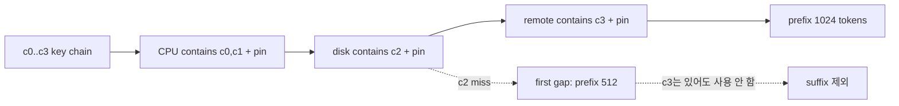
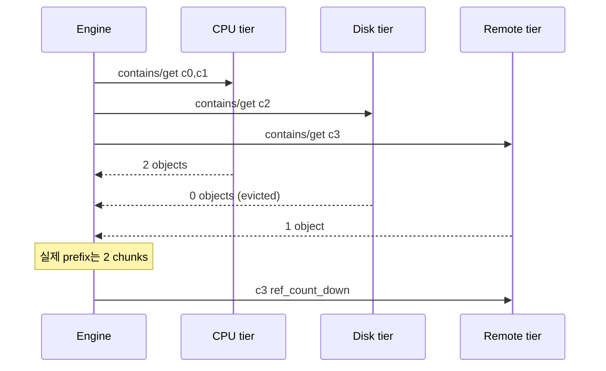
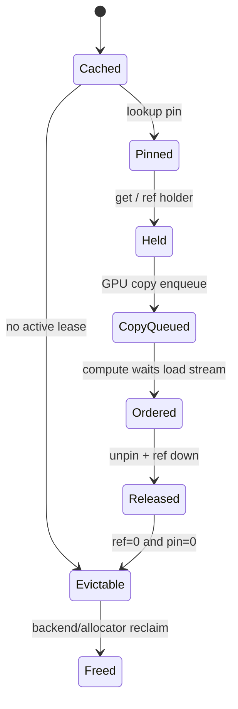

# 62장. 캐시 적중에서 GPU가 읽기까지: LMCache 객체의 일생

38.10은 계층형 cache 전반에 필요한 readiness frontier만 preview했다. 이 장은 그 추상 경계를 LMCache의 chunk key, lookup ID, storage tier, promotion·eviction과 connector completion의 실제 owner에 붙여 제품별 lifecycle을 닫는다. 따라서 `host ready`와 `GPU ready`가 다시 등장해도 CPU offload 일반론의 반복이 아니라 구체 state transition 검증이다.

## 62.1 lookup 1,024에서 consumer-ready 512로 줄어든 도입 사건

캐시 대시보드에는 적중이라고 찍혔다. 스케줄러도 1,024개 토큰을 계산하지 않아도 된다고 판단했다. 그런데 첫 토큰은 늦었고 CPU 메모리는 줄지 않았으며, 잠시 뒤 같은 요청은 캐시가 없을 때보다 더 느려졌다. 이런 사건에서 “LMCache가 느리다”는 진술은 거의 쓸모가 없다. 키를 찾은 순간, 저장소에서 실제 객체를 얻은 순간, GPU 복사를 예약한 순간, 계산 스트림이 그 복사를 기다리게 된 순간은 서로 다르기 때문이다. 그 사이에는 승격, 고정, 참조권, eviction 경쟁이 있다.

여기서 `lookup`은 key로 저장 후보를 찾는 일이며, 아직 GPU가 읽어도 된다는 뜻은 아니다. `consumer-ready`는 필요한 연속 prefix가 destination에 도착하고 계산 stream의 ordering까지 성립한 상태다. `key`는 model·layer·chunk 등 같은 KV 내용을 다시 찾는 논리 identity이고, `owner`는 그 key가 가리키는 실제 object의 reference·pin·generation을 끝까지 책임지는 주체다. Lookup은 key에서 시작하지만 consumer-ready 판정은 owner가 object와 복사 terminal을 확인한 뒤에만 나온다.

이 장은 객체 하나를 놓치지 않고 따라간다. 기준 요청 `req-62-A`의 prompt는 1,152 tokens다. chunk 크기는 256이므로 완전한 네 chunk와 128-token 꼬리가 생긴다. model은 `M`, tensor parallel world size는 2, 현재 worker는 0, KV dtype은 BF16, layer는 32개다. 처음 두 chunk는 CPU tier, 셋째는 disk tier, 넷째는 remote tier에 있고 불완전 꼬리는 없다. 숫자는 설명을 고정하기 위한 fixture이지 성능 측정값이 아니다.

앞 장에서 세운 전송 protocol은 전제로 삼는다. 여기서는 LMCache가 key, tier, `MemoryObj`, pin과 reference count로 그 원칙을 어떻게 구현하는지만 본다. 다음 장의 원격 저장소 내부 배치나 그 다음 장의 connector 제품 비교는 건드리지 않는다. 우리의 질문은 한 가지다. **“있다”던 KV가 어떤 증거를 거쳐 “지금 이 GPU가 안전하게 읽을 수 있다”가 되는가?**

**도입 사건: lookup 1,024에서 실제 consumer-ready 512까지.**

첫 사건은 dashboard hit 1,024와 scheduler external hit 1,024가 찍혔지만 worker가 512 tokens만 회수한 경우다. Disk c2가 contains 뒤 eviction됐고 remote c3은 성공했다. Actual callback은 연속 prefix를 512로 줄였지만 connector notification race로 scheduler는 이미 1,024 computed tokens를 commit했다.

**lookup hit가 consumer-ready가 아니었던 수치 timeline**

| 상대 시각 | 상태 | token/chunk | ownership evidence |
|---:|---|---|---|
| 0.00 ms | lookup planned/pinned | 1,024 / c0–c3 | L62-17, P62-17 |
| 0.18 ms | local blocks reserved | 1,024 | dest G91 |
| 0.25 ms | scheduler provisional skip | 1,024 | 아직 commit 아님이어야 함 |
| 0.41 ms | disk c2 evicted before get | gap at 512 | victim gen E55 |
| 1.20 ms | CPU c0,c1 get complete | 512 | objects O0,O1 |
| 4.90 ms | remote c3 get complete | suffix only | O3 ref cleanup 대상 |
| 5.10 ms | actual prefix callback | 512 | expected/actual mismatch |
| 5.30 ms | GPU copy ordered | 512 | loaded mask M512 |
| 5.32 ms | buggy scheduler commit | 1,024 | first consumer contract mismatch |

Attention은 positions 512–1,023의 KV가 채워졌다고 믿고 계산을 건너뛸 수 있다. Destination pages는 예약됐으므로 address는 valid할 수 있고, 이전 allocation 값이나 zero가 남아 finite wrong output을 만든다. Crash가 없다는 사실이 readiness 증거가 아니다.

첫 divergence를 c2 eviction이라고만 쓰면 부족하다. Eviction은 lookup 계획을 실행 중 무효화한 정상 경쟁일 수 있고 callback이 512로 줄였다. Correctness bug는 provisional 1,024를 actual mask commit 전에 computed tokens로 승격한 scheduler/connector 경계다.

**반증과 수정**

Promotion을 끄거나 remote tier를 끄자 증상이 달라져도 scheduler early commit은 남을 수 있다. 모든 chunks를 CPU에 고정하면 race window가 사라지지만 contract를 고치지 않는다. Disk c2 get에 controlled miss를 주입하고 actual mask를 512로 만드는 fixture가 직접적이다.

수정은 external hit를 `PROVISIONAL_EXPECTED`로 유지하고 worker load terminal의 contiguous actual mask만 `COMMITTED`로 바꾼다. Scheduler allocation은 provisional 수치로 capacity를 reserve할 수 있지만 compute skip/admission publication은 commit result를 따른다. Expected와 actual 차이는 miss/recompute 또는 명시적 request failure 정책으로 보낸다.

Destination G91의 unloaded suffix pages는 계산 경로가 정상적으로 채우거나 release돼야 한다. Partial loaded prefix와 recompute suffix의 position/block table을 검증한다. Suffix remote object O3는 prefix gap 뒤 사용하지 않으므로 reference와 pin을 정확히 회수한다.

**promotion과 eviction이 같은 key에서 교차한 사건**

두 번째 사건은 remote c3를 LocalCPU tier로 promotion하는 동안 기존 LocalCPU c3 entry가 eviction victim으로 선택된 경우다. 두 entry는 같은 logical key digest를 가졌지만 payload generation과 object allocation은 달랐다. Old resident는 `C3-G70/O-old`, promotion destination은 `C3-G71/O-new`였다. Backend index가 key 하나에 generation을 저장하지 않고 단순 overwrite/remove를 수행하면 late eviction completion이 new promotion entry를 지울 수 있다.

사건 전 CPU pool은 1,024 MiB capacity 중 960 MiB를 사용했다. c3 payload는 fixture상 64 MiB다. Promotion은 64 MiB destination을 reserve해 pool을 capacity까지 채웠다. 동시에 다른 request가 128 MiB를 요구해 eviction policy가 old c3와 다른 victim을 골랐다. Old c3 mapping removal이 비동기 cleanup으로 이어지는 동안 promotion put이 같은 key를 publish했다.

| 상대 시각 | promotion G71 | eviction G70 | index/key 관측 |
|---:|---|---|---|
| 0.00 ms | reserve 64 MiB, O-new ref=1 | old O-old resident | key→G70 |
| 0.20 ms | remote→O-new copy submit | victim G70 selected | key→G70 |
| 0.35 ms | put transaction pending | index remove intent 생성 | key ambiguous |
| 1.40 ms | O-new payload complete | O-old pin=0/ref=0 | publish 가능 |
| 1.45 ms | key→G71 publish | old cleanup pending | key→G71 |
| 1.62 ms | commit callback success | late remove by key only | key deleted |
| 1.70 ms | promotion metric success | allocator frees O-old | lookup miss |

이 version에서는 wrong output보다 false miss와 promotion 효과 부재가 먼저 보인다. 더 위험한 variant는 late eviction이 key만 삭제하는 것이 아니라 allocator handle을 잘못 재사용해 O-new storage를 free하는 경우다. 다음 lookup이 stale index나 external handle로 O-new를 얻으면 ref/pin shape는 정상이어도 payload가 다른 allocation에 덮일 수 있다.

최초 불일치는 eviction을 했다는 사실이 아니다. Capacity pressure에서 old unpinned entry를 evict하는 것은 정상이다. Generation-conditional remove 없이 `remove(key)`가 G71 mapping까지 제거한 1.62 ms가 첫 state violation이다. Promotion commit success metric은 1.45 ms transaction만 보았고 이후 late cleanup을 추적하지 못했다.

**generation-conditional publish·remove·free**

Backend index mutation은 `(key, expected_generation, new_generation)` compare-and-swap 의미를 가져야 한다. Promotion publish는 reservation G71이 아직 current transaction인지 확인한다. Eviction remove는 key가 여전히 victim G70을 가리킬 때만 mapping을 지운다. 실패하면 stale cleanup으로 분류하고 new entry를 건드리지 않는다.

Allocator free도 object identity를 확인한다. Key digest가 같아도 O-old allocation generation과 O-new generation은 다르다. Eviction owner는 자신이 pin/ref terminal을 확인한 O-old만 반환한다. Mapping ownership과 storage ownership을 한 key boolean으로 합치지 않는다.

Promotion transaction은 다음 상태를 가진다.

```text
PENDING_RESERVATION(G71)
→ SOURCE_READY(remote c3)
→ DEST_COPY_PENDING(O-new)
→ DEST_COMPLETE
→ INDEX_PUBLISHED(key→G71)
→ COMMITTED
```

어느 단계에서 cancellation/eviction pressure가 생기면 아직 publish되지 않은 O-new를 rollback하고 source reference를 낮춘다. `INDEX_PUBLISHED` 뒤에는 old cleanup이 generation-conditional이어야 한다. `COMMITTED`는 next lookup이 같은 mapping을 관찰할 수 있다는 index terminal이며 GPU consumer readiness와는 다른 상태다.

Eviction은 `CANDIDATE(G70)→LEASE_RECHECK→INDEX_REMOVE_IF_G70→STORAGE_RELEASE(O-old)`로 기록한다. Candidate 선택과 remove 사이에 pin/ref 또는 current mapping이 바뀔 수 있어 recheck가 필요하다. Remove CAS가 실패하면 storage owner가 O-old를 별도로 release할 수 있는지 current backend contract를 확인한다. New mapping O-new를 free하지 않는다.

**vLLM connector consumer 좌표를 실제 함수 역할로 읽는다**

고정 vLLM v0.27.1의 [`lmcache_connector.py` 136–334행](https://github.com/vllm-project/vllm/blob/6e448d0ea9bf3d88d898b65449ca6dc2aec170ac/vllm/distributed/kv_transfer/kv_connector/v1/lmcache_connector.py#L136-L334)에서 scheduler-side connector와 worker-side connector가 어떤 metadata/result를 주고받는지 역할별로 찾는다. `get_num_new_matched_tokens`, request metadata 작성, worker load 시작/완료, finished request notification에 해당하는 current definitions와 call sites를 고정한다.

로컬 source audit에서는 먼저 class/method inventory를 만든다. Scheduler가 외부 cache에서 일치한다고 예상한 tokens를 반환하는 함수, local KV block allocation 뒤 worker에게 넘길 metadata를 만드는 함수, worker가 LMCache load를 시작하는 함수, actual loaded 상태를 scheduler/runner에 전달하는 callback과 request 종료 cleanup을 각각 owner로 둔다. 이름이 버전에서 달라져도 state role은 유지한다.

[`vllm_v1_adapter.py` 798–970행](https://github.com/vllm-project/vllm/blob/6e448d0ea9bf3d88d898b65449ca6dc2aec170ac/vllm/distributed/kv_transfer/kv_connector/v1/lmcache_integration/vllm_v1_adapter.py#L798-L970)은 vLLM request/block metadata를 LMCache token/mask/load 호출로 번역하는 경계다. Token IDs, slot mapping/block IDs, request ID, skip-existing와 load mask가 어느 tensor/device로 만들어지는지 확인한다. Scheduler token count와 worker mask length가 같다는 것만으로 contiguous readiness를 증명하지 않는다.

Connector ledger는 다음 열을 가진다.

| 경계 | 예정 값 | 실행 값 | commit guard |
|---|---:|---:|---|
| scheduler lookup | 1,024 tokens | provisional | key/snapshot generation |
| local block reserve | 1,024 | block IDs/G91 | allocation generation |
| LMCache actual get | 1,024 expected | 512 actual | first-gap prefix |
| worker load mask | 1,024 slots | 512 true | destination G91 |
| stream ordering | 32 layers | 32×512 complete | final generator/wait |
| scheduler computed commit | provisional 1,024 | 512 | actual contiguous mask |

Connector가 actual mask를 worker-local optimization으로만 사용하고 scheduler computed tokens가 provisional 값에 머무르면 split-brain이다. Scheduler는 future scheduling에서 1,024가 cached라고 생각하고 worker는 512만 loaded했다고 안다. 두 state를 request generation과 acknowledgement로 합친다.

Finished request cleanup은 lookup ID pin leases, storage object refs, destination block ownership과 pending promotion tasks를 각각 닫는다. Request ID만으로 global remove를 호출해 newer retry generation의 lease를 해제하지 않는다. `(request_id, attempt_generation, lookup_id)`를 owner tuple로 둔다.

**반증 matrix로 cache·connector·CUDA 후보를 가른다**

Hit-not-ready 사건에서 첫 intervention은 disk c2 get을 deterministic miss로 만든다. Expected lookup 1,024, actual 512, loaded mask 512와 scheduler commit 512가 나와야 한다. 이 fixture가 1,024를 commit하면 connector contract bug다. GPU copy를 동기화해도 token commit가 틀리면 CUDA ordering은 root가 아니다.

둘째 intervention은 contains/get 사이 eviction을 금지해 actual 1,024를 만든다. 증상이 사라져도 pin/eviction race 가능성을 지지할 뿐 early commit fix가 되지는 않는다. Pin을 무한히 유지하는 workaround는 pool capacity를 파괴한다. Controlled miss에서도 정확히 downgrade해야 한다.

셋째는 GPU load stream에 delay를 넣는다. Actual objects 1,024가 돌아와도 final stream dependency 전 consumer가 시작하면 stale page가 보인다. Scheduler commit가 1,024라도 `consumer-ready` terminal이 늦다. Object completeness와 CUDA ordering을 별 fixture로 검사한다.

Promotion/eviction 사건에서는 same key G70/G71을 사용해 eviction remove가 old generation에만 성공하는지 본다. Publish-before-remove, remove-before-publish, simultaneous completion과 cancellation을 deterministic barriers로 배열한다. 모든 순서에서 final mapping은 policy가 승인한 한 generation이고 freed object는 mapping current object가 아니어야 한다.

Promotion을 끄면 false miss가 사라지는 것은 transaction branch를 좁히지만 eviction 자체나 consumer readiness를 증명하지 않는다. Eviction을 끄면 memory pressure가 사라져 race가 닫히므로 timing evidence다. Generation assertion을 유지한 채 양쪽 기능을 켠 fixture가 최종 proof다.

Ref/pin counter는 negative와 leak 두 방향을 본다. Double unpin/ref-down은 current code가 warning/보정할 수 있지만 correctness가 보장됐다는 뜻이 아니다. Request terminal 뒤 expected zero, active promotion holder count와 backend cache lease count를 객체 generation별로 비교한다.

**rollback terminal과 재승인**

Incident containment은 해당 cache generation의 new lookup commit를 중단한다. 이미 provisional hit를 받은 requests는 actual mask acknowledgement를 기다리거나 external skip을 0으로 되돌려 recompute한다. Unknown pages를 consumer-ready로 publish하지 않는다. Cache 전체를 무조건 지우기 전에 affected key/schema/generation 범위를 계산하지만 correctness가 불확실하면 broader invalidation을 택한다.

Promotion worker를 멈출 때 pending transactions를 `COMMITTED`, `ROLLED_BACK`, `UNKNOWN`으로 나눈다. Unknown destination은 index에서 publish하지 않고 allocator reclaim 전에 in-flight copy/put terminal을 확인한다. Eviction queue의 old G70 jobs가 new generation index를 mutate하지 않게 drain하거나 generation guard로 무효화한다.

Rollback generation `C90`을 새로 열고 old index entries, promotion reservations, lookup pin maps와 timeout cleanup queue를 분리한다. vLLM connector request attempts도 new generation을 snapshot한다. Old callbacks가 new request actual mask나 cleanup을 건드리지 않도록 generation/token check를 한다.

재승인 fixture는 네 단계다. 첫째 normal four-chunk hit가 actual mask 1,024와 stream-ready 32 layers를 만들고 output reference와 맞는다. 둘째 c2 miss가 expected 1,024를 actual/commit 512로 낮추고 suffix recompute가 맞다. 셋째 G70 eviction과 G71 promotion의 모든 ordering에서 final index/object가 일관된다. 넷째 abort/retry가 pin/ref/promotion/destination leases를 attempt별로 0에 수렴시킨다.

SLO는 correctness 뒤 평가한다. Lookup latency, actual retrieve bytes, promotion queue/commit, CPU resident/reuse와 GPU load completion을 분리한다. 38장의 host 비용 모델을 반복하지 않고 이번 incident에서는 generation guard/acknowledgement가 TTFT와 capacity에 추가한 overhead만 비교한다.

최종 보고서는 이렇게 닫힌다. “Lookup L62-17은 1,024 tokens를 계획했지만 disk c2 eviction 뒤 actual prefix는 512였다. Worker M512를 반환하기 전 scheduler가 provisional 1,024를 commit한 것이 first consumer divergence였다. 별 사건에서는 G70 late remove가 G71 promotion mapping을 삭제했다. Actual-mask commit와 generation-conditional publish/remove/free를 도입하고 C90에서 partial-hit, ordering, abort fixtures를 통과했다.”

역할별 고정 좌표와 판정 범위는 다음과 같다.

- **vLLM adapter의 함수 좌표를 상태 장부에 고정한다.** 고정 source에서 scheduler 예상 적중을 계산하는 [`get_num_new_matched_tokens` 1141–1230행](https://github.com/vllm-project/vllm/blob/6e448d0ea9bf3d88d898b65449ca6dc2aec170ac/vllm/distributed/kv_transfer/kv_connector/v1/lmcache_integration/vllm_v1_adapter.py#L1141-L1230)과 allocation 뒤 request state를 만드는 [`update_state_after_alloc` 1231–1409행](https://github.com/vllm-project/vllm/blob/6e448d0ea9bf3d88d898b65449ca6dc2aec170ac/vllm/distributed/kv_transfer/kv_connector/v1/lmcache_integration/vllm_v1_adapter.py#L1231-L1409)을 나란히 읽는다.
- 첫 함수의 token 수가 두 번째 함수에서 block/slot metadata로 어떻게 이어지는지 확인한다.

Worker load entry인 [`start_load_kv` 798–907행](https://github.com/vllm-project/vllm/blob/6e448d0ea9bf3d88d898b65449ca6dc2aec170ac/vllm/distributed/kv_transfer/kv_connector/v1/lmcache_integration/vllm_v1_adapter.py#L798-L907)은 forward context와 request metadata에서 실제 load를 시작한다.

Layer consumer wait 경계는 [`wait_for_layer_load` 908행 이후](https://github.com/vllm-project/vllm/blob/6e448d0ea9bf3d88d898b65449ca6dc2aec170ac/vllm/distributed/kv_transfer/kv_connector/v1/lmcache_integration/vllm_v1_adapter.py#L908-L970)에서 확인한다. Start 함수가 반환했다고 모든 layer가 ready라고 쓰지 않는다.

Completion/cleanup은 [`get_finished` 1131–1140행](https://github.com/vllm-project/vllm/blob/6e448d0ea9bf3d88d898b65449ca6dc2aec170ac/vllm/distributed/kv_transfer/kv_connector/v1/lmcache_integration/vllm_v1_adapter.py#L1131-L1140)과 [`request_finished` 1410행 이후](https://github.com/vllm-project/vllm/blob/6e448d0ea9bf3d88d898b65449ca6dc2aec170ac/vllm/distributed/kv_transfer/kv_connector/v1/lmcache_integration/vllm_v1_adapter.py#L1410-L1429)을 request/attempt generation과 함께 읽는다.

Finished라는 이름이 lookup pin, staging refs, promotion future와 destination block 모두를 자동으로 닫는다고 가정하지 않고 실제 cleanup calls를 추적한다.

외부 wrapper의 같은 이름 methods는 [`lmcache_connector.py` 136–334행](https://github.com/vllm-project/vllm/blob/6e448d0ea9bf3d88d898b65449ca6dc2aec170ac/vllm/distributed/kv_transfer/kv_connector/v1/lmcache_connector.py#L136-L334)에서 adapter로 위임된다. Wrapper log에 함수가 호출됐다는 사실과 adapter/LMCache operation이 성공했다는 사실을 분리한다. Instrumentation을 어느 층에 넣었는지 source coordinate를 함께 남긴다.

- **LMCache source 좌표를 계획·실행·cleanup으로 나눈다.** Lookup 계획은 [`cache_engine.py` 1130–1249행](https://github.com/LMCache/LMCache/blob/3e11b8ed191631e6f098b8038235823f1a410b24/lmcache/v1/cache_engine.py#L1130-L1249), async 계획/작업 생성은 [`storage_manager.py` 655–788행](https://github.com/LMCache/LMCache/blob/3e11b8ed191631e6f098b8038235823f1a410b24/lmcache/v1/storage_backend/storage_manager.py#L655-L788), actual 결과 commit은 [`prefetch_all_done_callback` 557–654행](https://github.com/LMCache/LMCache/blob/3e11b8ed191631e6f098b8038235823f1a410b24/lmcache/v1/storage_backend/storage_manager.py#L557-L654)이다.
- 세 함수의 token/object 수를 같은 metric에 덮어쓰지 않는다.

Actual object를 layerwise consumer에 넘기는 경계는 [`retrieve_layer` 974–1114행](https://github.com/LMCache/LMCache/blob/3e11b8ed191631e6f098b8038235823f1a410b24/lmcache/v1/cache_engine.py#L974-L1114)이고 lookup pin 정리는 [`lookup_unpin` 1544행 이후](https://github.com/LMCache/LMCache/blob/3e11b8ed191631e6f098b8038235823f1a410b24/lmcache/v1/cache_engine.py#L1544-L1573)다. Generator early exit와 exception에서 unpin/ref cleanup가 어느 path로 실행되는지 fixture로 확인한다.

Promotion은 storage get의 local put submission에서 시작하므로 current request retrieve와 background resident commit를 같은 completion으로 쓰지 않는다. Source가 explicit promotion generation을 제공하지 않는다면 application/diagnostic layer가 transaction token을 추가하되 구현 사실과 제안 invariant를 구별해 쓴다.

**Cache ledger의 수치 보존식을 확인한다.** `planned_chunks=4`, `actual_chunks=2`, `loaded_chunks=2`, `committed_chunks=2`, `recomputed_chunks=2`, `unused_suffix_objects=1`이다. 완전 prompt 1,152 중 tail 128은 처음부터 miss였고 c2/c3 512도 recompute되므로 external commit 512와 newly computed 640이 합쳐져 1,152 positions를 덮는다.

Layerwise 32 layers라면 actual object count는 64, consumer copy operations는 implementation batching에 따라 다를 수 있다. Raw objects 64를 chunks 64로 세지 않는다. Unused c3가 32 layer objects라면 ref-down/unpin도 32개 coverage를 가져야 한다. Expected cleanup count와 actual을 비교한다.

CPU capacity ledger는 resident old G70 64 MiB, promotion reservation G71 64 MiB, other resident 896 MiB로 peak 1,024 MiB다. Eviction G70이 mapping만 제거하고 storage release 전이라면 physical bytes가 잠시 겹칠 수 있다. Logical index bytes와 allocated bytes를 분리한다. 이 수치는 비용 모델이 아니라 generation race의 overlap window를 증명한다.

Pin ledger는 L62-17이 c0–c3에 건 expected leases, actual prefix c0,c1의 consumer leases, unused suffix c3의 release와 c2 miss cleanup을 기록한다. Request terminal에서 lookup map entry가 사라지고 object별 pin/ref가 expected owner count로 돌아오는지 본다. Global pin total 0만으로 다른 request lease를 잘못 내린 사실을 숨길 수 있다.

**관측 metric을 owner 상태에 맞춘다.** Lookup planned tokens, actual retrieved tokens, GPU loaded/ordered tokens와 scheduler committed external tokens를 네 metric/trace fields로 둔다. Hit rate 하나로 합치지 않는다. Difference counters는 `planned-actual`, `actual-loaded`, `loaded-committed` 경계별로 만든다.

Promotion metric은 submitted, committed, obsolete/stale-cleanup와 failed를 나눈다. Committed 뒤 next lookup CPU hit가 있었는지는 reuse metric이다. Eviction metric은 candidate, generation-CAS success/failure, mapping removal과 storage release를 구분한다. CAS failure가 많으면 단순 error라기보다 hot-key race/load signal일 수 있다.

Pin/ref metric은 bounded pool/tier totals와 age histogram을 사용한다. Exact key와 request는 sampled trace에 둔다. Negative correction warning, timeout unpin과 request-normal unpin을 reason별로 나눈다. Timeout cleanup 비율이 늘면 정상 ownership leak를 의심한다.

GPU readiness는 load start, layer waits/final wait, actual mask acknowledgement와 consumer start timestamps를 잇는다. Device-wide synchronize를 metric으로 정상화하지 않는다. Same-stream/cross-stream dependency가 올바른지 event/source trace로 검증한다.

**Rollback 실패 반례를 미리 검증한다.** Cache index만 clear하고 pending promotion worker를 그대로 두면 G71 late completion이 C90 index에 old entry를 다시 publish할 수 있다. Clear는 generation barrier가 아니다. Worker cancellation/join 또는 publish token rejection이 필요하다.

vLLM scheduler state만 되돌리고 worker destination pages를 그대로 재사용하면 late GPU copy가 retry attempt pages를 덮을 수 있다. Attempt generation과 destination block generation을 copy completion까지 검사한다. Old load stream work가 terminal인지 확인하고 graph/event cache를 invalidate한다.

LMCache process를 재시작해도 vLLM connector가 old provisional tokens나 finished maps를 보유할 수 있다. 양쪽 generation을 함께 갱신한다. Distributed/multi-process adapter가 있으면 all participants가 same cache epoch을 확인한 뒤 admission을 연다.

반대로 모든 cache를 지우고 service를 재시작하는 broad rollback은 correctness를 회복할 수 있지만 원인 증거와 warm capacity를 잃는다. Incident 중에는 affected artifacts를 snapshot하고, 재승인은 empty-cache miss, partial hit, full hit와 race fixtures를 모두 통과시킨다.

**최종 승인 질문.** Lookup 결과가 어느 snapshot의 provisional token 수인가. 실제 objects는 first gap 뒤 몇 chunk인가. Layerwise set은 완전한가. Destination pages는 어느 generation인가. GPU load final wait가 설치됐는가. Scheduler commit는 actual contiguous mask와 같은가.

Promotion은 source/destination refs와 index generation을 가지고 있는가. Old eviction remove/free가 new mapping/object를 건드리지 않는가. Request abort/retry가 lookup pin, staging, promotion, destination과 connector maps를 attempt별로 닫는가. 이 질문 모두에 source/trace/fixture 답이 있어야 hit를 consumer-ready라고 부를 수 있다.

**20분 incident 조사 순서.** 첫 3분에는 request/attempt, lookup ID, cache epoch, key schema와 expected token/chunk를 고정한다. Dashboard hit 수치만 복사하지 않고 scheduler가 어느 function result로 provisional tokens를 만들었는지 찾는다. Same prompt라도 model/TP worker/dtype/tag가 다른 key인지 확인한다.

다음 4분에는 tier plan과 actual을 비교한다. CPU/disk/remote별 expected keys, get future terminal, returned object count와 first gap을 표로 만든다. Layerwise면 keys-per-chunk로 완전 chunk를 환산한다. Suffix objects가 returned list에 있어도 first gap 뒤 consumer 대상에서 제외됐는지와 refs cleanup을 본다.

다음 4분에는 destination과 GPU ordering을 본다. Reserved block IDs와 allocation generation, load stream copy, layer waits/final wait, actual mask와 consumer start를 잇는다. Host function return이나 object list completion을 GPU ready로 쓰지 않는다. Destination generation mismatch나 final wait 누락이 있으면 scheduler token 수보다 먼저 차단한다.

다음 4분에는 promotion과 eviction queue를 연다. Same key의 current mapping generation, promotion reservation/publish, eviction candidate/remove/free와 pin/ref를 시간순으로 둔다. Key만 같은 late callback을 current owner로 승인하지 않는다. Promotion success와 next lookup resident hit를 분리한다.

마지막 5분에는 containment과 terminal을 정한다. Provisional/actual/loaded/committed 가운데 first divergence를 찾고 그 이후 output을 publish하지 않는다. Old callbacks/workers/copies를 drain 또는 generation-reject하고 new cache/attempt epoch에서 partial/full/miss fixtures를 실행한다. Pin/ref/destination/reservation이 expected terminal로 돌아오는지 확인한다.

**두 사건을 같은 “cache race”로 합치지 않는다.** Hit-not-ready 사건의 first invalid transition은 scheduler가 provisional tokens를 actual mask 전에 commit한 것이다. Promotion/eviction 사건의 first invalid transition은 old generation removal이 new mapping에 적용된 것이다. 전자는 request computation correctness, 후자는 cache residency/ownership correctness가 중심이다. 한 patch가 둘 다 해결한다고 주장하려면 각각의 invariant와 fixture를 통과해야 한다.

Hit-not-ready의 strongest evidence는 lookup 1,024, actual callback 512, loaded mask 512인데 committed computed tokens가 1,024인 같은 request timeline이다. Promotion race의 strongest evidence는 publish key→G71 뒤 remove intent G70이 key mapping을 삭제하거나 O-new를 잘못 free한 generation timeline이다. Aggregate miss/hit와 pool usage만으로 두 결론을 만들지 않는다.

**Failure injection의 안전 범위.** Production cache에서 실제 payload를 지우거나 pin을 조작하지 않는다. Isolated backend fixture에 deterministic barrier를 두고 contains 뒤 c2 miss, G70 remove와 G71 publish ordering, final generator early exit와 cancellation을 재현한다. Test timeout과 cleanup owner를 둔다.

Wrong-output fixture는 식별 가능한 KV/page pattern 또는 small reference model을 사용하되 실제 user content를 기록하지 않는다. Empty/zero pages는 stale read가 우연히 정상처럼 보일 수 있어 generation별 다른 pattern을 둔다. Output mismatch가 생기기 전에 generation/mask guard가 fail-fast하는 것이 expected terminal이다.

Capacity fixture는 pool을 실제 OOM까지 몰지 않고 reservation accounting으로 boundary를 만든다. Old/new 64 MiB overlap과 victim selection을 controlled objects로 재현한다. Memory pressure가 scheduler timing까지 바꿀 수 있으므로 race ordering barrier와 capacity 변수를 별 실험으로 둔다.

**Upgrade diff에서 다시 볼 함수.** LMCache upgrade에서는 token/key schema, lookup prefix semantics, storage manager expected/actual callback, MemoryObj ref/pin/free, promotion put ownership과 retrieve generator cleanup을 비교한다. vLLM upgrade에서는 matched-token calculation, allocation metadata, load start/wait, finished notification과 request cleanup을 비교한다.

Function 이름 이동보다 반환 의미가 바뀌었는지 본다. Matched tokens가 provisional인지 committed인지, load mask가 actual or expected인지, finished가 GPU ready or task done인지 문서/source/test로 고정한다. New async path가 추가되면 contains/get/copy/commit 사이 race window를 다시 그린다.

Persisted promotion/cache artifact가 있다면 schema/generation 호환을 확인한다. Old version pending task가 new process index에 publish하지 않게 epoch을 key에 넣는다. Connector와 LMCache가 rolling upgrade로 다른 versions라면 result/mask protocol compatibility를 canary로 검증한다.

**최종 runbook 문장.** “Hit 1,024”라고 쓰지 않고 “L62-17은 G88에서 1,024를 provisional lookup했으며 actual get·loaded·committed contiguous prefix는 각각 512였다”라고 쓴다. “Promotion이 실패했다” 대신 “G71 publish 뒤 G70 late remove가 current mapping을 삭제했다”라고 쓴다.

Recovery는 “cache clear”가 아니라 “C90 epoch에서 old promotion/eviction/load callbacks가 rejected되고 provisional→actual→loaded→committed ledger가 일치하며 pin/ref/reservation/destination leases가 attempt별 terminal에 도달했다”라고 쓴다. 이 문장을 증명할 수 있을 때 cache hit와 consumer readiness가 같은 request에서 다시 연결된다.

**관측 공백도 명시적 상태다.** Backend가 promotion put completion을 노출하지 않으면 `submitted`에서 곧바로 `committed`로 추정하지 않는다. `completion_unknown`으로 두고 다음 lookup의 CPU mapping, put future나 backend event처럼 현재 source가 제공하는 strongest evidence를 찾는다. 관측을 추가할 수 없다면 promotion 효과와 rollback 보장을 제한해서 쓴다.

Actual mask가 worker 내부에만 있고 scheduler acknowledgement가 없다면 connector contract gap이다. Log에 mask length를 찍는 것만으로 state split이 해결되지 않는다. Scheduler가 compute skip을 commit하기 전에 attempt/generation과 contiguous mask result를 소비하도록 protocol을 바꾼다. Timeout 시 provisional state를 success로 승격하지 않는다.

Pin/ref 값을 직접 읽을 수 없는 remote backend도 있다. 이 경우 local handle/lease와 backend request terminal을 추적하며 storage reclaim guarantee를 API/source 범위에서만 주장한다. LocalCPU `MemoryObj` 규칙을 remote store 전체에 복사하지 않는다. Tier별 owner와 completion evidence를 구분한다.

Promotion과 eviction metrics가 서로 다른 clocks를 쓰면 ordering을 절대 timestamp로 확정하지 않는다. Process-local monotonic time, transaction messages와 index CAS result로 causal order를 만든다. Collector receive order와 wall clock skew는 annotation으로 남긴다.

성능 검토에서는 guard가 추가한 lookup/commit 왕복과 CAS retry를 측정한다. 하지만 이를 줄이려고 provisional token을 다시 computed로 선반영하지 않는다. Batching acknowledgement, local fast path와 immutable snapshot으로 비용을 줄이되 invariant를 유지한다. Correctness가 없는 빠른 hit는 절약이 아니다.

최종적으로 cache ledger는 request row와 object row를 함께 가진다. Request row는 expected/actual/loaded/committed tokens와 destination/attempt generation을, object row는 key/tier/allocation/ref/pin/promotion/eviction generation과 terminal을 가진다. 두 row를 lookup ID와 generation으로 연결해야 scheduler 결과와 memory leak/race를 같은 사건에서 설명할 수 있다.

운영 review에서는 네 숫자가 단조롭게 줄어드는지 확인한다. `planned ≥ actual ≥ loaded ≥ committed`가 기본 안전 방향이다. 일부 구현에서 재조회나 recompute로 값이 다시 늘 수 있다면 새 generation/transition으로 기록한다. 같은 generation에서 committed가 loaded보다 크면 즉시 차단한다.

Object ledger도 owner conservation을 본다. Promotion과 GPU load가 source object를 공유하면 reference holders의 합이 실제 consumers와 맞아야 한다. Eviction candidate가 생겼다고 pin/ref holder를 빼지 않는다. Terminal 뒤 남은 holder는 leak이거나 아직 관측하지 못한 owner다.

이 보존식은 구현 세부가 바뀌어도 유지되는 독서 도구다. 처음 보는 tier나 connector가 추가돼도 계획, actual object, device readiness, consumer commit와 release라는 경계에서 같은 질문을 던질 수 있다.

경계마다 owner와 generation이 있어야 안전한 cache hit가 완성된다.

그 terminal은 실제 consumer까지 이어져야 한다.

그리고 모든 lease가 정확히 회수돼야 한다.

## 62.2 적중은 상태가 아니라 약속의 시작이다

### 존재, 회수, 소비 가능성을 분리하라

캐시 적중은 보통 boolean으로 보인다. 그러나 실제 조사 원장에는 적어도 네 칸이 필요하다. `contains`는 key가 어느 tier의 index에 보였다는 관측이다. `get complete`는 payload를 담은 객체가 실제로 돌아왔다는 관측이다. `copy ordered`는 그 객체에서 GPU KV page로 가는 복사와 계산 사이에 stream dependency가 생겼다는 관측이다. `consumer safe`는 attention kernel이 해당 page를 읽어도 된다는 상위 판단이다.

이 네 칸을 합치면 흔한 역설이 생긴다. contains 때는 있던 객체가 get 전에 eviction될 수 있다. get future는 끝났지만 32개 layer 중 31개만 돌아올 수 있다. host에서 GPU로 비동기 복사를 enqueue한 직후 source buffer를 재사용하면 복사가 끝나기 전에 내용이 바뀔 수 있다. 그래서 hit rate가 높으면서도 TTFT가 나쁘고, 때로는 잘못된 결과가 나오는 일이 논리적으로 가능하다.

기준 요청의 원장은 다음 순서로 열린다.

```text
token chunks 생성 → CacheEngineKey 생성 → tier별 contains(+pin)
→ 실제 get/prefetch → host staging → 선택적 CPU 승격
→ GPU copy enqueue → compute stream dependency → attention consume
→ unpin/ref-down → evictable 또는 allocator 반환
```

각 화살표에는 owner가 있다. token database는 key identity를 만든다. storage manager는 검색 순서와 tier별 결과를 묶는다. memory object는 수명 숫자를 보유한다. GPU connector는 copy ordering을 건다. engine과 adapter는 요청 종료 때 lease를 회수한다. owner가 없는 화살표는 장애 때 아무도 마무리하지 않는 화살표다.

**기준 원장을 먼저 채운다.**

`req-62-A`의 lookup ID를 `lm-62-A-1`로 둔다. 처음부터 요청 ID와 lookup ID를 같은 것으로 가정하지 않는다. 동기 lookup에서는 adapter가 임시 UUID를 만들 수 있고 비동기 loading에서는 request ID를 쓸 수 있기 때문이다. 운영 trace는 둘을 별도 column으로 보존하고 연결한다.

| chunk | token 범위 | 예상 tier | contains | 실제 get | 최종 사용 |
|---|---:|---|---|---|---|
| c0 | `[0,256)` | CPU | 미정 | 미정 | 미정 |
| c1 | `[256,512)` | CPU | 미정 | 미정 | 미정 |
| c2 | `[512,768)` | disk | 미정 | 미정 | 미정 |
| c3 | `[768,1024)` | remote | 미정 | 미정 | 미정 |
| tail | `[1024,1152)` | 없음 | miss | 없음 | recompute |

여기서 `예상 tier`는 진실이 아니라 실험 입력이다. 실제 lookup 결과와 다르면 cache 자체보다 key identity, tier bypass, eviction 또는 오래된 metadata를 먼저 의심한다. `최종 사용`은 contains 값으로 미리 채우지 않는다. 실제 객체 수와 GPU ordering까지 통과해야 채운다.

## 62.3 key는 token hash 하나가 아니다

### 같은 문장도 다른 KV일 수 있다

LMCache v0.5.4의 [`CacheEngineKey`](https://github.com/LMCache/LMCache/blob/3e11b8ed191631e6f098b8038235823f1a410b24/lmcache/utils.py#L400-L456)는 model name, world size, worker ID, chunk hash, dtype과 선택적 tags를 묶는다. 이 tuple은 장식이 아니다. 같은 token sequence라도 model revision이나 dtype, sharding 위치가 다르면 byte의 의미와 shape가 달라질 수 있다. 반대로 호환되는 배치를 불필요하게 다른 key로 만들면 안전 문제는 없더라도 재사용률이 무너진다.

따라서 false miss 조사에서는 “hash가 같나?”보다 다음 질문을 순서대로 묻는다.

1. tokenization과 chat template 결과가 byte-for-byte 같은 token IDs인가.
2. model 식별자가 실제 weight와 KV layout revision을 충분히 구분하는가.
3. world size와 worker ID가 producer와 consumer의 shard 의미에 맞는가.
4. dtype 문자열이 실제 저장 payload와 같은가.
5. request config에서 `lmcache.tag.*`가 추가되거나 누락되지 않았는가.
6. layerwise key라면 layer ID까지 같은가.

[`to_string`과 `from_string`](https://github.com/LMCache/LMCache/blob/3e11b8ed191631e6f098b8038235823f1a410b24/lmcache/utils.py#L442-L502)을 보면 이 필드들이 `@`로 직렬화된다. 로그에 전체 key를 무작정 남기라는 뜻은 아니다. 긴 hash와 tenant tag는 민감할 수 있으므로 운영 로그에는 key digest와 별도의 model/layout digest를 둔다. 중요한 것은 producer와 consumer가 어떤 tuple을 비교했는지 사후에 재구성할 수 있다는 점이다.

### rolling prefix가 chunk의 문맥을 만든다

chunk hash는 해당 256 tokens만 독립적으로 요약한 값이라고 생각하기 쉽다. 그러나 transformer KV는 앞 문맥의 영향을 받는다. 똑같은 “서울의 날씨” token chunk가 서로 다른 앞 문맥 뒤에 놓이면 hidden state와 KV가 달라진다. [`_hash_tokens`](https://github.com/LMCache/LMCache/blob/3e11b8ed191631e6f098b8038235823f1a410b24/lmcache/v1/token_database.py#L256-L299)는 prefix hash, 현재 tokens tuple과 extra keys를 canonical tuple로 만들어 hash한다. 앞 chunk의 정체성을 다음 chunk에 잇는 이유가 여기에 있다.

기준 요청의 key chain을 `h0=H(none,c0)`, `h1=H(h0,c1)`, `h2=H(h1,c2)`, `h3=H(h2,c3)`로 적자. c2의 tokens가 우연히 다른 요청과 같아도 h1이 다르면 h2가 다르다. 이것은 cache 재사용 범위를 줄이는 낭비가 아니라 문맥 의존적인 KV를 잘못 공유하지 않게 하는 안전 조건이다.

다만 hash equality 자체가 payload 검증이나 암호학적 인증은 아니다. 운영에서 wrong-answer를 조사할 때 key digest가 같다는 사실은 “같은 lookup identity로 분류됐다”는 증거일 뿐이다. tokenizer/model/layout digest, 저장 시점과 payload shape를 함께 확인해야 한다. Python hash 일관성 같은 환경 의존성도 별도의 configuration evidence로 남긴다.

### layerwise key는 완전한 묶음이어야 한다

일반 key 하나를 32개 layer key로 나누면 저장과 전송을 layer pipeline으로 겹칠 수 있다. 대신 readiness 조건이 강해진다. c2의 layer 0~31 중 layer 17만 사라졌다면 31/32를 성공으로 평균내서는 안 된다. attention은 한 layer라도 과거 KV가 없으면 그 지점부터 동일한 forward를 재현할 수 없다.

동기 [`lookup`](https://github.com/LMCache/LMCache/blob/3e11b8ed191631e6f098b8038235823f1a410b24/lmcache/v1/cache_engine.py#L1130-L1249)은 한 chunk의 모든 layer가 hit이고 그 mapping이 정확히 한 location일 때만 hit로 인정한다. 이 조건은 두 종류의 위험을 막는다. 일부 layer 누락은 계산 불완전성을, 여러 location으로 갈라진 결과는 뒤따르는 layerwise retrieve가 어느 backend generator를 사용해야 하는지의 모호성을 뜻한다.

## 62.4 prefix lookup은 첫 구멍에서 멈춘다

### 왜 전체 hit 개수를 더하면 안 되는가

기준 요청에서 CPU가 c0,c1을 갖고 disk가 c2를 가지며 remote가 c3을 가진다면 네 chunk는 연속 prefix를 이룬다. 그러나 disk의 c2가 사라지고 remote c3만 남았다면 재사용 가능한 prefix는 c0,c1, 즉 512 tokens다. c3은 내용이 있어도 c2가 없으므로 그 자체로 768~1024 구간을 바로 소비할 수 없다. 일반적인 causal forward에서 c3의 KV를 쓰려면 그 앞 위치까지 일관된 cache와 위치 좌표가 있어야 하기 때문이다.

[`StorageManager.batched_contains`](https://github.com/LMCache/LMCache/blob/3e11b8ed191631e6f098b8038235823f1a410b24/lmcache/v1/storage_backend/storage_manager.py#L972-L1012)는 첫 backend가 맞힌 앞부분을 mapping에 넣고, 그만큼 key list의 앞을 잘라 다음 backend로 넘긴다. 모든 tier의 임의 hit 집합을 union하지 않는다. `LMCacheEngine.lookup`도 chunk 순서를 따라 hit 개수보다 앞선 chunk의 end offset만 결과로 갱신한다.

이 구현을 읽을 때 “hit chunks”라는 변수명을 임의 적중 수로 번역하면 안 된다. 이 문맥의 값은 현재 남은 key sequence에서 연속으로 맞은 수다. 반환되는 token 수 역시 chunk 수×256으로만 계산하지 않는다. 마지막 완전 chunk가 아닐 수 있는 일반 경우를 위해 token database가 준 exclusive end offset을 사용한다.

### pin=True는 조회 결과에 lease를 건다

vLLM 연동 lookup은 찾은 key가 실제 load되기 전에 eviction되는 창을 줄이기 위해 pin을 요청할 수 있다. 동기 경로는 `lookup_id`별로 location과 key 목록을 기록한다. 이제 “이 key가 있다”는 index 관측에 “이 lookup이 끝날 때까지 victim으로 고르지 말라”는 lease가 더해진다.

pin은 payload를 복사하거나 참조권을 얻는 동작이 아니다. 그렇기 때문에 pin된 key를 찾았다는 로그만으로 get이 완료됐다고 쓸 수 없다. 또한 lookup ID를 잃으면 누가 unpin해야 하는지 잃는다. 요청 종료 시 ID mapping과 pin count가 맞지 않는 사건은 단순 metric 누락이 아니라 pool 고갈로 이어지는 ownership 장애다.



### 동기 lookup과 비동기 prefetch의 약속 차이

동기 lookup은 현재 존재성 결과를 즉시 token count로 돌려준다. 비동기 경로는 lookup과 실제 loading을 겹치며 future를 만든다. 둘 다 prefix 의미를 지켜야 하지만 failure surface는 다르다. 비동기에서는 contains 결과가 scheduler에 도착하는 동안 객체가 사라질 수 있고, 여러 tier future의 완료 순서가 key 순서와 다를 수 있다.

그래서 “async가 sync보다 빠르다”는 설명보다 “어느 시점의 결과를 누가 다시 검증하는가”가 중요하다. async lookup ID, tier별 expected chunks, future 상태, 실제 returned objects를 한 trace로 묶지 못하면 높은 lookup hit와 낮은 retrieve hit 사이의 손실 위치를 찾을 수 없다.

## 62.5 여러 tier에서 실제 객체를 회수한다

### 예상 적중과 실제 회수 사이의 경쟁

[`async_lookup_and_prefetch`](https://github.com/LMCache/LMCache/blob/3e11b8ed191631e6f098b8038235823f1a410b24/lmcache/v1/storage_backend/storage_manager.py#L655-L788)는 backend별로 아직 남은 prefix를 묻고 hit 구간에 대해 get task를 만든다. 기준 요청에서는 CPU task가 c0,c1, disk task가 c2, remote task가 c3을 담당한다. 이 배치는 “각 tier가 어디까지 책임진다고 말했는가”를 보존한다.

contains 뒤 disk eviction이 발생해 c2 get이 빈 결과를 돌려준다고 하자. remote task가 c3을 성공적으로 가져왔더라도 최종 prefix는 c0,c1에서 멈춰야 한다. [`prefetch_all_done_callback`](https://github.com/LMCache/LMCache/blob/3e11b8ed191631e6f098b8038235823f1a410b24/lmcache/v1/storage_backend/storage_manager.py#L566-L653)은 tier별 실제 결과 수를 expected count와 비교하고, 짧아진 첫 tier에서 계산을 멈춘다. 이후 tier 객체는 사용할 prefix 밖이므로 reference를 낮춘다.

이 재검사는 contains를 무의미하게 만들지 않는다. contains는 불필요한 get을 줄이고 작업을 배치하는 계획 단계다. 완료 callback은 그 계획이 실행 중에도 유효했는지 확인하는 commit 전 검증이다. 둘을 하나로 합치면 race가 사라지는 것이 아니라 관측되지 않게 된다.

### layerwise 결과는 key 수를 chunk 수로 환산한다

32-layer mode에서 backend가 반환하는 raw key 수 63은 “거의 두 chunk”가 아니다. 완전한 한 chunk와 31-layer 꼬리다. 코드는 `actual_chunks = len(tier_result) // keys_per_chunk`처럼 내림해 완전 chunk만 센다. 나머지 object는 결과 목록에 존재하므로 reference를 정확히 한 번 낮춰야 한다.

lookup 단계에서도 backend가 63개 key를 pin했다면 완전 chunk에 쓰지 않을 31개 key를 즉시 unpin해야 한다. 이 꼬리 cleanup이 빠지면 요청은 256 tokens만 재사용하면서 31개 객체의 eviction을 계속 막는다. 기능 테스트는 정답을 통과해도 장기 부하에서 pool이 마르는 이유다.

**object count를 token count로 바꾸는 경계.**

관측 schema는 raw keys, complete chunks, token end를 따로 저장한다. `63 keys → 1 complete chunk → 256 tokens`처럼 변환식을 로그나 trace attribute로 재현할 수 있어야 한다. 서로 다른 layer 수나 마지막 chunk 길이를 섞는 환경에서 `objects × chunk_size`만 쓰면 hit metric이 부풀 수 있다.



## 62.6 MemoryObj에는 두 개의 수명 숫자가 있다

### reference count는 현재 사용권을 센다

`MemoryObj`를 받은 consumer는 객체가 사라지지 않을 참조권을 가져야 한다. reference count를 올리고 내리는 이유는 allocator가 아직 사용 중인 storage를 재활용하지 못하게 하기 위해서다. reference를 내린다는 말은 “payload를 지운다”가 아니라 현재 holder가 자신의 사용권을 반납한다는 뜻이다.

기준 c2가 disk에서 CPU staging object로 올라왔다고 하자. get result list가 한 reference를 보유하고 GPU connector에 객체를 넘긴다. connector가 source에서 copy를 예약한 뒤 engine은 자신이 가진 reference를 반납할 수 있다. 단, copy가 source를 읽는 동안 객체를 보호하는 다른 수명 조건과 ordering이 있어야 한다. 그래서 ref count 한 숫자만 보고 안전을 판정할 수 없다.

### pin count는 eviction 금지 lease를 센다

pin은 cache policy가 객체를 victim으로 선택하지 못하게 한다. 여러 lookup이 같은 object를 동시에 pin할 수 있으므로 boolean보다 count가 필요하다. 첫 lookup이 끝났다고 count를 0으로 덮으면 두 번째 lookup이 사용 중인데 eviction될 수 있다. 반대로 요청마다 unpin이 빠지면 count가 영원히 양수로 남는다.

[`TensorMemoryObj`](https://github.com/LMCache/LMCache/blob/3e11b8ed191631e6f098b8038235823f1a410b24/lmcache/v1/memory_management.py#L754-L815)는 ref와 pin을 독립적으로 관리한다. `ref_count_down` 뒤 ref가 0이고 pin도 0이면 parent allocator로 반환한다. `unpin` 역시 두 값이 모두 비양수일 때 free를 고려한다. 음수가 나오면 경고하고 0으로 보정하지만, 보정은 double release 버그가 없었다는 뜻이 아니다. 경고 count와 stack/context를 incident evidence로 보존해야 한다.

**네 상태로 보면 free 조건이 선명하다.**

| ref | pin | 의미 | 허용되는 일 |
|---:|---:|---|---|
| `>0` | `>0` | active holder와 eviction lease 모두 있음 | 사용, 추가 참조; free 금지 |
| `>0` | `0` | holder는 있으나 cache pin은 없음 | holder 완료 전 free 금지 |
| `0` | `>0` | 직접 holder는 없지만 lookup lease가 보존 | eviction/free 금지 |
| `0` | `0` | owner와 lease가 없음 | allocator 반환 가능 |

eviction eligibility는 allocator 반환과 완전히 같은 말도 아니다. backend map에서 victim을 떼고 storage를 회수하는 정책 단계가 있을 수 있다. [`can_evict`](https://github.com/LMCache/LMCache/blob/3e11b8ed191631e6f098b8038235823f1a410b24/lmcache/v1/memory_management.py#L894-L903)의 조건을 읽되, 실제 victim 선택과 backend 제거 시점은 trace에서 구분한다.



## 62.7 load와 promotion은 같은 이동이 아니다

### staging은 현재 요청을 위한 임시 다리다

disk나 remote payload를 GPU paged KV에 넣으려면 흔히 CPU 또는 GPU 임시 buffer가 필요하다. 이 staging object는 현재 요청의 transfer source다. 그것이 이후 요청을 위한 local cache entry로 남는지는 별도 정책과 put completion에 달려 있다. “remote에서 CPU로 읽었다”를 곧 “CPU tier로 승격됐다”고 표현하면 resident cache와 일회성 buffer를 혼동한다.

[`StorageManager.get`과 `batched_get`](https://github.com/LMCache/LMCache/blob/3e11b8ed191631e6f098b8038235823f1a410b24/lmcache/v1/storage_backend/storage_manager.py#L431-L537)은 특정 remote backend 결과가 완전할 때 LocalCPU backend에 put task를 제출하는 경로를 보여 준다. 여기서 확실한 사건은 submit이다. put task가 durable하게 완료됐는지, 다음 lookup이 CPU에서 맞는지는 추가 관측이 필요하다.

### promotion의 효과를 byte 원장으로 증명한다

promotion의 목적은 다음 요청이 느린 tier를 다시 읽지 않게 하는 것이다. 따라서 효과는 첫 요청의 remote get latency만으로 평가하지 않는다. 같은 key의 후속 lookup tier, LocalCPU resident bytes, put completion, eviction 전 체류 시간과 재사용 횟수를 묶는다.

예를 들어 c3가 64 MiB라고 가정하자. 첫 요청은 remote→CPU 64 MiB와 CPU→GPU 64 MiB를 지불한다. CPU promotion copy가 별도로 필요하면 물리 이동은 더 늘 수 있다. 다음 요청이 CPU에서 hit하면 remote 왕복을 피하지만, 재사용 전에 eviction되면 promotion은 bandwidth와 CPU 용량만 소비했다. 따라서 유용성은 대략 `회피한 느린-tier bytes/latency - promotion bytes/queue/eviction cost`로 해석하되 실제 값은 측정으로 채운다.

### store fan-out의 reference를 추적한다

새로 계산한 KV를 여러 backend에 저장할 때 allocator 형식이 같지 않으면 각 allocator용 object를 만들고 copy할 수 있다. [`batched_put`](https://github.com/LMCache/LMCache/blob/3e11b8ed191631e6f098b8038235823f1a410b24/lmcache/v1/storage_backend/storage_manager.py#L386-L430)은 backend별 allocator class에 맞춘 객체 묶음을 만들고 put task를 제출한 뒤 local references를 내린다.

이 구조의 핵심은 “한 put 호출=한 payload copy”가 아니라는 점이다. logical KV bytes와 physical copy bytes를 따로 세야 한다. backend가 object ownership을 인수하는 지점이 불명확하면 submit 직후 ref-down이 조기 free인지 정상 handoff인지 판정할 수 없다. 본문은 API 이름을 외우게 하지 않고 각 put task가 reference를 언제 얻고 terminal 때 언제 반납하는지 원장으로 확인하게 한다.

## 62.8 GPU 완료는 stream 사이의 순서다

### enqueue는 복사 완료가 아니다

CUDA 비동기 copy 호출이 반환됐다는 것은 host thread가 작업을 stream에 넣었다는 뜻일 수 있다. source staging buffer를 즉시 free하거나 compute stream이 기다리지 않고 KV page를 읽으면 race가 생긴다. 반대로 매 layer마다 device 전체를 synchronize하면 안전해 보이지만 overlap을 지우고 latency를 늘린다.

LMCache layerwise connector는 별도의 load stream에서 객체를 GPU buffer 또는 paged KV로 복사한다. [`VLLMPagedMemLayerwiseGPUConnector.batched_to_gpu`](https://github.com/LMCache/LMCache/blob/3e11b8ed191631e6f098b8038235823f1a410b24/lmcache/v1/gpu_connector/gpu_connectors.py#L1247-L1304)의 sync 경로는 current compute stream이 load stream을 기다리도록 dependency를 enqueue한다. 마지막 layer 뒤에도 wait를 건다. 이것은 `cudaDeviceSynchronize`가 아니라 필요한 두 stream의 happens-before다.

### generator advance가 protocol 사건이다

layerwise retrieve는 generator를 통해 layer마다 object를 넘기고 connector를 진행시킨다. [`retrieve_layer`](https://github.com/LMCache/LMCache/blob/3e11b8ed191631e6f098b8038235823f1a410b24/lmcache/v1/cache_engine.py#L974-L1114)는 각 layer object를 connector에 전달한 뒤 reference를 낮추고, consumer를 마지막으로 한 번 더 진행해 최종 stream dependency를 enqueue한 다음 pinned staging object를 unpin한다.

따라서 generator의 마지막 `next`는 단순 Python 반복 종료가 아니다. 마지막 layer의 ordering을 설치하는 protocol step일 수 있다. caller가 조기 종료하거나 예외로 그 advance를 건너뛰면 “모든 layer object를 받았다”와 “compute가 안전하게 읽는다” 사이가 열린다. trace에는 layer index, copy enqueue, wait enqueue, generator terminal을 각각 남긴다.

### 네 단계 completion 표

| 단계 | 증거 | 아직 보장하지 않는 것 |
|---|---|---|
| backend future done | future terminal과 actual object list | GPU 배치, object 완전성 |
| object count valid | complete chunk/layer set 검증 | copy 완료 |
| stream dependency enqueued | compute waits load stream | host 전체 동기화, kernel 성공 |
| consumer safe | scheduler/worker가 해당 KV 사용 허용 | 이후 request 종료와 cache 보존 |

비-layerwise [`retrieve`](https://github.com/LMCache/LMCache/blob/3e11b8ed191631e6f098b8038235823f1a410b24/lmcache/v1/cache_engine.py#L780-L938)는 `batched_to_gpu` 뒤 original object를 unpin/ref-down한다. 그러나 정적 제어 흐름을 보면 GPU 전달 함수가 예외를 던질 때 leader substitute를 비우는 `finally`와 original object의 후속 cleanup loop가 동일 보호 범위가 아니다. 이것은 실제 leak이 재현됐다는 결론이 아니라 반드시 fault injection으로 확인할 lifecycle gap이다.

**timeline을 읽는 연습.**

운영 trace에 다음과 같은 다섯 span이 있다고 하자. lookup은 2 ms, CPU get은 1 ms, disk get은 14 ms,
remote get은 9 ms, GPU load는 6 ms다. 이를 단순히 더해 32 ms라고 보고하면 틀릴 수 있다. 세 get이 동시에
시작됐다면 critical path는 가장 늦게 끝난 disk 쪽일 수 있고, GPU load가 앞서 도착한 CPU chunk부터
layerwise로 시작됐다면 일부가 겹칠 수 있다. 반대로 callback이 모든 tier future를 모을 때까지 GPU load를
시작하지 않는 경로라면 최대 get 시간 뒤에 6 ms가 붙는다. 필요한 것은 span 합계가 아니라 dependency graph다.

먼저 각 span에 parent를 붙인다. `contains`가 `get submit`보다 앞서는지, `get complete`가 해당 source를 쓰는
copy보다 앞서는지, `wait enqueue`가 attention kernel보다 앞서는지 확인한다. host timestamp가 다른 process에서
왔다면 clock uncertainty도 적는다. CUDA event timestamp와 host monotonic clock을 직접 뺄 수 있다고 가정하지
않는다. 같은 stream의 순서는 enqueue order로 설명하고, 서로 다른 stream은 event 또는 wait edge로 연결한다.

두 번째로 “반환”이라는 단어를 없앤다. Python 호출 반환, future result, backend payload 완성, CUDA API host
return, device work completion을 각각 고유 event name으로 쓴다. 예를 들어 `gpu_copy_api_return`은
`gpu_copy_device_done`과 다르다. 전자만 있는 trace에서 후자를 추정하면 source buffer release가 정상인지
판정할 수 없다.

세 번째로 object 단위와 request 단위를 연결한다. request span이 성공이어도 c0~c3 가운데 하나가 suffix로
폐기됐을 수 있다. object span에는 `adopted_into_prefix=true/false`와 exclusion reason을 둔다. 폐기된 object의
latency와 bytes도 비용에서 빼지 않는다. 사용자에게 쓰이지 않은 remote c3가 64 MiB를 옮겼다면 goodput에는
기여하지 않았지만 network와 allocator에는 실제 부담을 줬다.

네 번째로 overlap을 과장하지 않는다. disk get 14 ms와 remote get 9 ms가 겹쳤다는 사실은 둘이 공짜가
됐다는 뜻이 아니다. 같은 CPU memory bandwidth, serialization thread, PCIe root complex 또는 staging pool을
경쟁했을 수 있다. 이 장은 장치 topology를 다시 설명하지 않지만, object ledger에 queue wait와 service를
나누어 남기도록 요구한다. service가 그대로인데 queue가 늘면 shared worker나 admission 문제이고, service
자체가 늘면 bandwidth 또는 backend 내부 문제라는 다음 조사 가설을 세울 수 있다.

마지막으로 정상 요청 하나와 장애 요청 하나를 같은 그림에 겹치지 않는다. 정상 baseline에서 lifecycle edge를
먼저 완성하고, 장애 run에는 first divergence를 표시한다. 여러 race를 한 번에 주입하면 어떤 cleanup branch가
원인이었는지 알 수 없다. 재현은 한 번에 한 edge를 끊는 것에서 시작한다.

## 62.9 eviction, abort와 timeout은 서로 다른 종료다

### 정상 종료는 명시적 unpin으로 닫힌다

동기 lookup에서 기록한 pin은 요청이 load/save 단계를 마칠 때 [`lookup_unpin`](https://github.com/LMCache/LMCache/blob/3e11b8ed191631e6f098b8038235823f1a410b24/lmcache/v1/cache_engine.py#L1544-L1555)으로 location별 해제된다. 비동기 loading event가 있으면 cleanup 경로로 분기한다. 정상 원장에는 lookup ID별 `pins_acquired == pins_released`가 보여야 한다.

vLLM adapter의 [`wait_for_save`](https://github.com/vllm-project/vllm/blob/6e448d0ea9bf3d88d898b65449ca6dc2aec170ac/vllm/distributed/kv_transfer/kv_connector/v1/lmcache_integration/vllm_v1_adapter.py#L1033-L1052)는 layerwise storer 진행과 lookup unpin을 잇는다. 이름만 보고 모든 backend 저장의 durability fence라고 확대하지 않는다. 이 장에서 필요한 증거는 adapter가 어떤 lookup ID들을 언제 engine의 release 경로로 넘겼는가다.

### abort cleanup은 완료된 결과의 후처리다

비동기 prefetch 중 scheduler가 더 이상 그 요청을 쓰지 않기로 할 수 있다. [`cleanup_memory_objs`](https://github.com/LMCache/LMCache/blob/3e11b8ed191631e6f098b8038235823f1a410b24/lmcache/v1/cache_engine.py#L1380-L1418)는 loading event가 `DONE`인 경우 future 결과를 꺼내 모든 tier object를 unpin하고 reference를 낮춘다. 이것은 실행 중 native I/O를 취소하는 일반 cancel primitive가 아니다. 이미 끝나서 도착한 결과를 소비하지 않을 때 정리하는 후처리다.

더 날카로운 경계가 있다. cleanup이 loading `DONE` 전에 오면 이 함수는 즉시 반환한다. 함수 내부에서 cleanup 의도를 보존하거나 완료 callback에 다시 등록하는 동작은 보이지 않는다. 상위 계층이 반드시 재호출한다는 별도 증거가 없다면 “조기 cleanup도 언젠가 처리된다”고 단정할 수 없다.

### timeout monitor는 누수 차단막이다

[`PinMonitor`](https://github.com/LMCache/LMCache/blob/3e11b8ed191631e6f098b8038235823f1a410b24/lmcache/v1/pin_monitor.py#L120-L192)는 제한 시간을 넘긴 object를 찾아 lock 밖에서 pin count가 0이 될 때까지 unpin한다. 빠진 release 때문에 cache 전체가 영구 고정되는 것을 막는 안전망이다. 하지만 timeout은 GPU copy가 끝났다는 event가 아니다. consumer가 여전히 source를 읽고 있는데 monitor가 pin을 풀면 정상 protocol이 이미 깨진 상태다.

그러므로 timeout 값을 짧게 줄여 메모리 문제를 “고치는” 것은 위험하다. pin age histogram, lookup ID owner, loading future와 stream completion을 먼저 연결한다. timeout recovery count가 증가하면 성공적인 자동 치유율로 자랑할 것이 아니라 release protocol 누락의 선행 지표로 다룬다.

## 62.10 vLLM scheduler의 약속을 worker가 검증한다

### external hit token은 allocation 입력이다

vLLM scheduler 측 [`get_num_new_matched_tokens`](https://github.com/vllm-project/vllm/blob/6e448d0ea9bf3d88d898b65449ca6dc2aec170ac/vllm/distributed/kv_transfer/kv_connector/v1/lmcache_integration/vllm_v1_adapter.py#L1141-L1229)는 prompt token IDs와 request config로 lookup하고, 이미 로컬에서 계산한 token 수를 뺀 추가 적중량을 반환한다. LMCache가 prompt 전체를 맞혔더라도 마지막 token 하나를 다시 계산하도록 보정하는 branch가 있다. 그래서 `requested=1152, LMCache hit=1152, allocated load=1151` 같은 기록은 자동으로 false miss가 아니다.

이 숫자는 scheduler가 GPU block을 얼마나 마련할지 정하는 약속이다. 아직 worker가 payload를 얻었다는 뜻은 아니다. scheduler trace에는 `vllm_cached_tokens`, `lmcache_cached_tokens`, `need_to_allocate`를 함께 남겨야 한다. 하나만 남기면 local prefix cache와 external cache의 기여를 섞는다.

### worker load가 실제 token mask를 돌려준다

worker의 [`start_load_kv`와 wait_for_layer_load`](https://github.com/vllm-project/vllm/blob/6e448d0ea9bf3d88d898b65449ca6dc2aec170ac/vllm/distributed/kv_transfer/kv_connector/v1/lmcache_integration/vllm_v1_adapter.py#L798-L931)는 engine retrieve를 시작하고 실제 retrieved token mask를 확인한다. 예상 token보다 적으면 경고할 수 있다. 이것이 scheduler의 존재성 약속과 worker의 물리적 회수 사이를 관측할 지점이다.

요청 ID를 중심으로 다음 식을 기록한다.

```text
external promised tokens
- actual retrieved tokens
= lookup/load divergence tokens

actual retrieved tokens
- stream-ordered consumable tokens
= GPU-ordering pending tokens
```

첫 차이는 eviction, partial layer, tier failure를 가리킨다. 둘째 차이는 GPU copy backlog나 generator 진행 문제를 가리킨다. 둘을 합쳐 “cache miss”로 세면 어느 팀이 고쳐야 할지 알 수 없다.

### 운영 dashboard는 요청과 객체를 함께 본다

요청 수준에는 TTFT, promised/retrieved/consumable tokens가 있다. 객체 수준에는 key digest, tier, bytes, pin/ref, future와 stream 사건이 있다. 두 수준을 `request_id`, `lookup_id`, chunk/layer index로 join해야 한다. label cardinality 때문에 Prometheus에 raw request ID를 넣기 어렵다면 trace/log에는 ID를, metric에는 outcome/tier/reason 집계를 둔다.

필수 histogram은 tier별 contains/get latency, promotion submit-to-complete, H2D copy와 wait, pin age, eviction age다. counter는 partial-layer tail, contains/get shortfall, cleanup-before-DONE, forced unpin, double unpin/ref, GPU load exception을 가진다. gauge는 tier resident/allocated/pinned bytes와 in-flight lookup 수를 가진다. 분모가 0이거나 telemetry가 누락된 window는 정상 0%로 채우지 않는다.

**metric을 경보가 아닌 반증 도구로 쓴다.**

좋은 dashboard는 미리 정한 가설을 반박할 수 있어야 한다. “remote tier가 느리다”는 가설에는 remote get
latency뿐 아니라 remote queue wait, payload bytes, 동시에 진행한 request 수와 CPU staging wait가 필요하다.
remote service는 안정적인데 staging allocation만 길다면 가설은 기각된다. “eviction이 너무 공격적이다”는
가설에는 victim age와 재사용 거리, pin/ref 상태, contains/get shortfall이 필요하다. victim이 충분히 오래됐고
재사용되지 않았다면 단순 miss 증가는 정책 실패의 증거가 아니다.

counter 이름도 상태 기계를 보존해야 한다. `lmcache_hit_total` 하나보다 `lookup_prefix_tokens`,
`retrieve_prefix_tokens`, `stream_ordered_tokens` 세 누적량이 낫다. 세 값의 차이는 서로 다른 queue다.
`lookup-retrieve` 차이는 존재성 경쟁과 부분 결과, `retrieve-ordered` 차이는 GPU load backlog다. 단, counter를
직접 빼려면 같은 request population, reset 시점과 sampling coverage라는 조건이 맞아야 한다. 그렇지 않으면
request trace에서 차이를 계산한다.

histogram bucket도 workload에 맞춘다. CPU lookup은 microsecond~millisecond, remote get은 millisecond~second,
pin age는 request lifetime~timeout 범위를 가질 수 있다. 하나의 선형 bucket으로 세 분포를 담으면 대부분이
첫 칸이나 마지막 칸에 몰린다. 이 장에서는 특정 bucket 값을 처방하지 않고, baseline p50/p95/p99와 SLO
경계 주변을 분해할 수 있게 설계하라고 요구한다.

label cardinality에는 현실적 제약이 있다. `request_id`, 전체 key, chunk hash를 Prometheus label로 넣으면
시계열 수가 폭발한다. aggregate metric에는 tier, outcome, reason, mode(layerwise 여부)처럼 제한된 label만
둔다. 고유 ID와 key digest, layer 목록은 sampled trace나 구조화 log로 보낸다. exemplar나 trace ID를 통해
집계 spike에서 개별 원장으로 이동한다. tenant와 model label도 cardinality와 정보 노출 정책을 검토한다.

metric 누락은 별도 상태다. exporter restart 동안 `forced_unpin_total`이 0이었다고 정상으로 보지 않는다.
scrape success, process start time, dropped trace count와 sampling rule을 결과에 붙인다. rate 계산 window가
request lifetime보다 짧으면 시작만 보고 종료를 놓칠 수 있으므로 cohort를 arrival time 또는 terminal time 중
하나로 고정한다.

다음 세 invariant는 dashboard에서 지속적으로 검사할 만하다.

```text
0 <= stream_ordered_tokens <= retrieved_prefix_tokens <= lookup_prefix_tokens
pins_released + active_pins + explicitly_orphaned == pins_acquired
promotion_reused_bytes <= promotion_completed_bytes <= promotion_submitted_bytes
```

첫 식이 깨지면 계측 join 또는 lifecycle 자체가 잘못됐다. 둘째 식의 `explicitly_orphaned`는 누수를 정상화하는
항목이 아니라 incident budget이다. 셋째 식은 submitted promotion을 실제 이득으로 부풀리는 오류를 잡는다.
counter reset과 sampling이 있으면 request-level reconciliation로 확인한다.

### byte 회계로 숨은 복사를 찾는다

KV 한 chunk의 논리 크기는 model의 layer, K/V, KV heads, head dimension, dtype과 chunk tokens에서 계산한다.
기준 fixture는 모델 shape 숫자를 일부러 고정하지 않았으므로 64 MiB 같은 예시는 측정값으로 승격하지 않는다.
실제 configuration digest에서 shape를 읽어 `logical_chunk_bytes`를 만든다. layerwise라면 layer 하나의 bytes와
32-layer 합이 일치하는지 확인한다.

물리 bytes는 logical bytes보다 클 수도 작을 수도 있다. padding과 alignment, metadata, serialization,
replication, retry가 더한다. compression이나 quantization은 줄인다. remote→CPU staging 뒤 CPU→GPU copy가
있으면 같은 logical payload가 두 link를 지난다. promotion용 별도 copy까지 있으면 세 번째 이동이 생길 수
있다. 따라서 request에 `logical_hit_bytes` 하나만 두지 말고 edge별 `physical_bytes`를 기록한다.

사용된 bytes와 버린 bytes도 나눈다. c2 gap 뒤 c3가 도착해 폐기되면 `retrieved_physical_bytes`에는 포함되고
`consumed_logical_bytes`에는 포함되지 않는다. 둘의 차이는 race와 speculative prefetch의 낭비를 보여준다.
이 낭비가 높으면 bandwidth만 늘리는 것보다 contains/get window, pin 정책 또는 cancellation ordering을 먼저
고칠 이유가 생긴다.

allocator 회계에서는 resident와 live를 구분한다. backend map에 등록된 resident object, in-flight future가
보유한 object, GPU copy source, eviction victim이지만 아직 reclaim되지 않은 object를 각각 센다. process RSS나
pinned host bytes 한 값만 보면 fragmentation과 ownership leak을 구분하지 못한다. `allocated - sum(live object
physical sizes)`가 커지면 allocator metadata, slab fragmentation 또는 계측 누락을 별도로 조사한다.

**최소 trace schema.**

한 request를 재구성할 최소 event는 다음과 같다. 모든 event는 `request_id`, `lookup_id`, `key_digest`, chunk,
layer 또는 layer-set, tier와 attempt를 공통 field로 가진다.

| event | 추가 field | terminal 조건 |
|---|---|---|
| `key_created` | identity/config digest, token range | key tuple 직렬화 완료 |
| `contains_result` | hit keys, pinned keys, backend | 현재 lookup 응답 완료 |
| `get_submitted` | expected keys/chunks, future ID | backend가 task 인수 |
| `get_completed` | actual keys, bytes, error | future terminal |
| `prefix_validated` | first gap, adopted keys | 실제 연속 prefix 결정 |
| `promotion_submitted` | src/dst, object ID | destination task 인수 |
| `promotion_completed` | visible/durable 범위, error | backend가 정의한 terminal |
| `gpu_copy_enqueued` | load stream, destination slots | copy op enqueue |
| `gpu_wait_enqueued` | compute stream, layer | dependency enqueue |
| `object_released` | ref/pin delta, reason | 해당 owner의 release 완료 |
| `eviction_terminal` | victim/reclaim result | map/storage transition 완료 |

`visible/durable 범위`는 backend가 제공하는 증거까지만 기록한다. 알 수 없으면 `unknown`이지 `true`가 아니다.
같은 object가 여러 tier에 복제되면 object ID와 replica ID를 분리한다. key가 같다는 이유로 두 allocation을
한 객체로 합치면 reference와 physical bytes가 맞지 않는다.

trace 검증기는 event 순서를 무조건 total order로 만들 필요가 없다. 서로 독립적인 CPU와 remote get은
동시일 수 있다. 대신 필요한 partial order를 검사한다. `get_completed → prefix_validated`, adopted object에
대해 `prefix_validated → gpu_copy_enqueued`, source release에 대해 `gpu_wait_enqueued → object_released` 같은
edge를 요구한다. 사용하지 않은 suffix object에는 GPU copy 대신 discard release가 있어야 한다.

## 62.11 여덟 사건으로 수명주기를 디버깅한다

다음 사건들은 서로 다른 첫 divergence를 갖는다. 공통 절차는 증상에서 거꾸로 추측하는 대신 기준 상태 기계의 앞에서부터 `expected`와 `observed`가 처음 갈라지는 지점을 찾는 것이다.

### 사건 1: hit인데 TTFT가 느리다

대시보드 hit rate가 95%인데 TTFT p99가 악화됐다. 먼저 hit의 정의를 확인한다. contains token만 분자라면 disk와 remote get, CPU staging, H2D copy가 모두 뒤에 숨어 있다. `req-62-A`에서 c0,c1은 CPU지만 c2,c3은 느린 tier다. 네 chunk 모두 맞아도 1,024 tokens의 물리 이동이 critical path에 남을 수 있다.

원장을 key lookup, tier별 actual get, movement bytes, GPU wait 순서로 연다. 첫 divergence가 contains가 아니라 remote get latency라면 cache identity를 바꿀 이유가 없다. safe containment는 느린 tier timeout과 fallback budget, in-flight 제한 또는 workload별 admission을 적용하는 것이다. promotion이 도움이 될지는 후속 재사용과 CPU capacity 증거가 있어야 한다. 정적 source만으로 어느 tier가 실제 TTFT를 지배하는지는 알 수 없으므로 trace와 fault-free baseline이 필요하다.

### 사건 2: lookup 1,024 tokens, retrieve 512 tokens

이 경우 scheduler의 약속과 worker 실물이 갈라졌다. tier expected/actual 표를 펼치면 CPU 2/2, disk 1/0, remote 1/1일 수 있다. 첫 divergence는 disk get이다. remote c3 성공은 gap 뒤 suffix라서 사용하지 않는다. c3 object의 reference가 내려갔는지도 함께 확인한다.

원인은 contains/get 사이 eviction일 수 있고, layerwise라면 c2의 일부 layer 누락일 수 있다. containment는 실제 512 tokens까지만 load하고 나머지를 recompute하는 것이다. c3을 억지로 붙이면 위치가 연속이라는 불변식을 깨뜨린다. 재현은 contains 직후 특정 key를 제거하고 callback의 actual count, suffix cleanup과 scheduler 응답을 관측하는 failure injection으로 한다.

### 사건 3: 트래픽 후 CPU pool이 회복되지 않는다

resident bytes보다 pinned bytes가 오래 유지되고 allocator free가 늘지 않는다. 첫 질문은 “eviction이 약한가”가 아니라 pin과 ref 중 어느 축이 0이 아닌가다. lookup ID별 acquire/release 차이, partial layer 꼬리, abort cleanup 시점, generator terminal을 검사한다.

pin만 남으면 명시적 unpin 누락을, ref만 남으면 result list나 copy holder의 release 누락을 의심한다. 둘 다 남으면 request lifecycle이 중간에서 끊겼을 가능성이 높다. PinMonitor 강제 회수는 일시적으로 용량을 되돌릴 수 있으나 근본 해결로 분류하지 않는다. 안전한 containment는 새 cache admission을 줄이고 오래된 lookup owner를 격리하며, active GPU copy 여부를 확인한 뒤에만 회수하는 것이다.

### 사건 4: eviction 직후 출력이 달라진다

단순 cache miss라면 계산량은 늘어도 정답 의미가 바뀌어서는 안 된다. 출력 divergence가 생겼다면 stale/wrong payload나 조기 reuse를 의심한다. key tuple 전체, rolling prefix chain, model/tokenizer/layout digest, layer와 worker shard를 비교한다. 이어 eviction 시점에 ref/pin이 정말 0이었는지, 같은 address가 새 객체에 재할당됐는지 본다.

첫 divergence가 key 생성이면 cache를 우회하고 서로 다른 configuration namespace를 분리한다. key는 맞지만 source buffer가 copy 완료 전 재사용됐다면 stream dependency와 release 순서를 고친다. hash equality만으로 payload 정합성을 선언하지 않는다. 재현에는 동일 tokens/다른 prefix, 동일 model name/다른 revision, eviction 직후 allocator address reuse를 각각 분리한 시험이 필요하다.

### 사건 5: promotion을 켰는데 remote traffic이 줄지 않는다

remote get 로그 뒤 LocalCPU put submit이 보여서 승격 성공으로 판단했지만 다음 요청도 remote를 읽는다. first divergence는 promotion submit과 complete 사이, 또는 complete와 다음 lookup visibility 사이에 있다. put queue 실패, 너무 이른 eviction, allocator 형식 copy 실패, 서로 다른 key tuple을 확인한다.

관측값은 key별 promotion bytes, submit/complete timestamp, CPU resident insertion, 다음 lookup tier와 reuse-before-eviction이다. 안전한 containment는 CPU 용량이 부족할 때 promotion fan-out을 제한하고, completion이 불명확한 객체를 hit로 광고하지 않는 것이다. 실제 backend별 durability와 정책은 이 장이 추론하지 않는다. 여기서는 LMCache 내부에서 submit을 완료로 오해하지 않는 데 그친다.

### 사건 6: GPU load 예외 뒤 staging object가 샌다

GPU connector가 세 번째 chunk에서 예외를 던졌고 이후 pinned/ref bytes가 남는다. 정적 제어 흐름상 비-layerwise retrieve의 original-object cleanup loop는 `batched_to_gpu` 예외가 발생하면 도달하지 않을 수 있다. 첫 divergence는 copy exception이고, 그 뒤 기대했던 unpin/ref-down 사건이 없다.

운영에서는 해당 request를 실패 처리하되 같은 object를 즉시 강제 free하지 않는다. CUDA 작업이 일부 enqueue됐는지 먼저 확인한다. fault injection은 첫 copy 전, 일부 copy 뒤, 마지막 copy 뒤 예외를 따로 넣어 object별 counter와 stream 상태를 기록해야 한다. source audit은 위험 경로를 찾았을 뿐 실제 allocator leak과 장치 작업 상태를 증명하지 않는다.

### 사건 7: abort했는데 pin이 timeout까지 남는다

scheduler cleanup message가 loading future 완료 전에 도착했다. cleanup 함수는 DONE이 아니어서 반환했고, 나중에 future는 결과를 만들었다. 상위 계층의 재호출이 없다면 결과 object는 명시적 정리를 만나지 못할 수 있다. 첫 divergence는 cleanup 요청 시각과 loading DONE 시각의 순서다.

trace에는 cleanup received, event status, future done, retry/re-registration 여부를 남긴다. containment는 완료 callback에 cleanup intent를 결합하거나 상위에서 terminal까지 재호출하는 명시적 protocol을 두는 것이지만, 구체적 수정은 별도 구현 작업이다. timeout monitor가 결국 pin을 내렸다는 사실은 정상 cleanup 성공으로 세지 않는다.

### 사건 8: full prompt hit인데 한 token을 다시 계산한다

요청 전체 1,152 tokens가 external cache에 있는데 scheduler는 1,151만 load하도록 잡았다. 앞의 일곱 사건과 달리 이것은 의도된 adapter 보정일 수 있다. full-prompt-hit에서 마지막 token을 recompute하는 branch를 확인하고 `lmcache_cached_tokens`, `num_computed_tokens`, `need_to_allocate`를 비교한다.

첫 divergence가 없고 source branch와 숫자가 맞으면 false miss alert를 닫는다. 반면 actual retrieve가 1,150으로 더 짧다면 그 한 token 보정과 별도의 load shortfall을 구분한다. metric은 recompute adjustment를 reason label로 따로 세어 cache 정확도와 scheduler 호환 동작을 섞지 않는다.

## 62.12 재현 실험과 변경 리뷰

여덟 사건을 실제로 검증할 때는 먼저 변하지 않을 조건을 봉투에 넣는다.
LMCache와 vLLM revision, model weight와 tokenizer/template digest, dtype, TP world/worker mapping, chunk size,
layerwise 여부, tier 순서와 각 tier 용량, CUDA/driver/GPU, request tokens와 lookup ID 생성 규칙을 고정한다.
warm-up 방법과 cache 초기 상태도 기록한다. 같은 key를 반복한다고 하면서 첫 run의 promotion이 다음 run의
초기 상태를 바꾸면 대조 실험이 아니다. 각 run 전에 무엇을 비우고 무엇을 남기는지 명시한다.

정상 대조군은 c0~c3가 계약한 tier에서 발견되고 실제로 회수되며, 네 chunk가 GPU에 배치되고, 모든 pin과
reference가 terminal에서 균형을 이루는 run이다. tail 128 tokens는 cache 결과에 포함하지 않는다. 이 baseline이
안정적으로 재현되지 않으면 장애 주입을 시작하지 않는다. 불안정한 baseline 위에 eviction을 추가하면 기존
race와 주입 효과를 분리할 수 없다.

contains/get race는 c2 contains가 성공했다는 event를 받은 직후, disk get이 payload를 잡기 전에 그 key를
victim으로 만드는 방식으로 설계한다. 정확한 hook이 없다면 backend 지연과 용량 압박을 조절하되 결과를
결정론적이라고 쓰지 않는다. 기대 결과는 lookup expected 4 chunks, actual prefix 2 chunks, c3 suffix release다.
검사는 반환 token 512만 하지 않는다. c3 ref delta, c2 pin delta, event terminal과 다음 요청에서 allocator가
회복됐는지까지 본다.

partial-layer 실험은 c2의 32 keys 중 layer 17 하나만 제거한다. lookup 전에 제거하는 run과 contains 뒤
제거하는 run을 나눈다. 전자는 lookup readiness branch를, 후자는 completion 재검사를 시험한다. 기대 결과는
모두 c2를 완전 hit로 채택하지 않는 것이지만 cleanup 경로는 다르다. lookup이 pin한 31-key tail과 get이
반환한 31 objects가 각각 어디서 해제되는지 구별한다. 같은 counter를 두 번 낮추지 않는다.

GPU exception은 세 위치에 둔다. 첫 object copy 전에 실패하면 어떤 payload도 device 작업에 들어가지 않았다.
두 object 뒤 실패하면 일부 DMA가 이미 enqueue됐을 수 있다. 마지막 copy enqueue 뒤 host 함수가 실패하면
payload 작업과 error 보고의 순서가 더 까다롭다. 세 run에서 original/substitute objects, load/compute streams,
wait edge와 cleanup을 비교한다. CUDA OOM, invalid argument, artificial Python exception을 한 결과로 합치지
않는다. 각 오류는 device 작업 제출 여부가 다를 수 있다.

async abort는 prefetch submit 전, 첫 tier 완료 뒤, 모든 future done 직전, DONE 직후 네 시점으로 나눈다.
조기 cleanup이 pending intent로 보존되는지, callback과 경합해 event를 누가 pop하는지, 결과 object를 누가
release하는지 확인한다. timeout보다 실험 window가 짧으면 pin leak이 뒤늦게 가려질 수 있으므로 정상 cleanup
판정은 timeout monitor 개입 전후를 분리한다.

promotion 실험은 동일 key 두 요청을 쓴다. 첫 요청에서는 remote get과 LocalCPU put을 관찰하고, 둘째 요청은
충분히 짧은 간격 뒤 제출한다. destination capacity가 넉넉한 run, 압박된 run, put failure run을 나눈다.
첫 request TTFT 개선보다 둘째 request의 실제 lookup tier와 remote avoided bytes가 핵심이다. promotion task가
완료되기 전에 둘째 요청이 도착한 run은 visibility race로 별도 분류한다.

wrong-answer 실험은 correctness 위험이 있으므로 production traffic에서 하지 않는다. 격리 환경에서 동일
tokens/다른 prefix, 동일 표면 model name/다른 revision, 동일 address 재사용을 각각 시험한다. output 비교는
sampling randomness을 없애거나 logits/KV checksum 같은 결정적 좌표를 쓴다. key mismatch가 예상대로 miss를
만드는지 검증하고, 의심 payload가 hit로 채택되면 즉시 실험을 중단해 artifact를 보존한다.

full-hit 보정 실험은 1,152-token fixture와 1,024-token 완전-chunk fixture를 구분한다. 전자는 tail 때문에
prompt 전체 hit가 아니다. 후자에서만 adapter의 one-token recompute branch를 정확히 관찰할 수 있다. local
computed tokens가 0인 run과 일부 local prefix가 있는 run을 나누어 external match에서 allocation까지의 산술을
검증한다.

**실패 판정표.** 모든 run은 pass/fail 대신 네 결과를 낸다. `SAFE_FALLBACK`은 첫 gap부터 재계산하고 모든
불사용 object를 정리했다. `SAFE_RETRY_REQUIRED`는 payload를 소비하지 않았고 재시도 identity가 명확하다.
`UNKNOWN_OUTCOME`은 put/copy가 일부 진행됐는지 또는 cleanup owner가 누구인지 증명되지 않는다.
`UNSAFE_CONSUME_OR_REUSE`는 불완전/stale payload를 읽었거나 active source를 재사용했다. unknown을 success나
miss로 억지 변환하지 않는다.

판정에는 최초 divergence의 event ID와 이전 정상 event, source anchor, metric/trace evidence, containment,
남은 runtime gap을 붙인다. “OOM으로 실패”는 최초 divergence가 아닐 수 있다. allocator pin leak 때문에
용량이 줄어 OOM이 났다면 최초 divergence는 더 앞선 missing release다. 반대로 정상 release인데 workload가
capacity를 넘었다면 OOM이 첫 relevant failure다. timeline을 앞에서부터 비교해야 둘을 구분한다.

**현장 질의 1—이 객체는 왜 아직 못 지우는가.** object ID를 알고 있다면 backend map 존재 여부보다
`ref_count`, `pin_count`, 각 owner와 마지막 변화 시각을 먼저 묻는다. ref owner가 get future인지 result list인지
GPU connector인지 표시한다. pin owner는 lookup ID 목록과 acquire 시각을 가진다. count가 1이어도 owner가
없으면 orphan이고, count가 3이어도 세 active lookup이 증명되면 정상일 수 있다.

그 다음 eviction policy가 해당 object를 후보로 보았는지, victim으로 골랐는지, map에서 제거했는지,
allocator가 reclaim했는지를 확인한다. `can_evict=false`는 정책이 약해서가 아니라 수명 lease가 남아서일 수
있다. 반대로 `can_evict=true`인데 resident bytes가 줄지 않으면 victim scan, backend removal, allocator
fragmentation을 조사한다. 이 장의 owner ledger가 다음 단계의 출발점을 준다.

**현장 질의 2—어느 hit 수를 SLO 분석에 넣는가.** lookup prefix는 재사용 가능성을, retrieved prefix는
backend 실행 결과를, stream-ordered prefix는 이번 forward가 사용할 수 있는 범위를 뜻한다. TTFT 절감과
직접 연결할 때는 마지막 값을 사용한다. cache policy의 검색 품질에는 첫 값을, backend 신뢰성에는 첫째와
둘째 차이를 쓴다. 서로 다른 목적의 분자를 하나의 hit rate로 만들지 않는다.

byte hit rate도 같은 원칙을 따른다. token 하나의 KV bytes가 model/layer group마다 같지 않을 수 있고 hybrid
attention에서는 layer별 cache shape가 다를 수 있다. 이 장의 fixture는 dense 32-layer 묶음으로 lifecycle을
설명하지만 운영 계산은 실제 object physical size를 쓴다. token hit와 byte hit가 반대 방향으로 움직일 수
있음을 dashboard에 드러낸다.

**현장 질의 3—promotion과 prefetch 중 무엇이 문제인가.** prefetch는 현재 또는 곧 올 consumer를 위해
느린 tier에서 payload를 앞당겨 회수한다. promotion은 후속 lookup이 더 빠른 tier에서 재사용하도록 복제본을
남긴다. 하나의 remote get이 두 목적을 동시에 수행할 수 있지만 completion과 성공 조건은 다르다. 현재 GPU
load가 성공하고 LocalCPU put이 실패하면 prefetch는 성공, promotion은 실패다. 반대 방향으로 local copy가
남았지만 현재 request가 취소됐다면 promotion artifact는 있을 수 있어도 current consumer success는 아니다.

따라서 trace outcome을 `current_load`, `promotion`, `request_terminal` 세 축으로 기록한다. request 취소 뒤
promotion을 유지할지 버릴지는 policy 결정이며 이 장에서 정답을 강요하지 않는다. 다만 object ownership과
tenant isolation, 불필요 bytes를 계산할 수 있어야 한다.

**현장 질의 4—강제 unpin을 성공으로 세도 되는가.** 답은 아니다. 강제 unpin은 정상 owner가 completion을
증명하고 lease를 반납한 사건이 아니라 timeout이 누수 확산을 막은 사건이다. `forced_unpin_total`이 늘면서
available bytes가 회복됐더라도 동시에 GPU error나 wrong answer가 없는지 확인한다. source read가 끝났다는
fence가 없다면 회수 시점의 안전성은 별도 검증 대상이다.

PinMonitor가 반복적으로 한 object를 unpin해 count를 0으로 만드는 형태라면 acquire/release cardinality가
이미 깨진 것이다. 어느 lookup이 빠졌는지 찾기 위해 pin owner를 count와 함께 기록해야 한다. owner 없는
integer만 남기면 timeout 뒤 원인을 재구성할 수 없다.

**현장 질의 5—로그 한 줄만 추가한다면 무엇을 남기는가.** `cache hit`보다 상태 전이 한 행이 낫다.
`lookup_id, key_digest, chunk/layer, tier, from_state, to_state, actual_count, ref_delta, pin_delta, reason`을 남긴다.
payload나 raw pointer는 남기지 않는다. timestamp와 process/rank도 포함한다. 이 행이면 expected/actual prefix,
owner balance와 first divergence를 상당 부분 복원할 수 있다.

한 줄로 부족한 GPU ordering은 trace event로 보강한다. load stream ID, compute stream ID, copy enqueue와 wait
enqueue를 연결한다. stream ID 문자열만 같다고 동기화가 증명되는 것은 아니며, 어떤 layer/object dependency를
위한 wait인지 correlation을 둔다.

**검토 회의에서 버릴 문장.** “캐시에 있으므로 바로 쓴다”는 contains와 consume 사이를 삭제한다. “pin했으니
안전하다”는 reference와 stream ordering을 삭제한다. “future가 끝났으니 GPU copy도 끝났다”는 backend와
device completion을 합친다. “promotion을 요청했으니 다음 요청은 CPU hit다”는 submit과 visibility를 합친다.
“timeout이 정리했다”는 정상 owner protocol이 빠진 사실을 숨긴다.

대신 사건을 주어와 시점까지 적는다. “CPU backend contains가 c0,c1을 pin과 함께 보고했다”, “disk future가
c2의 31/32 layer objects로 terminal했다”, “completion callback이 c2를 0 complete chunks로 내리고 remote c3
reference를 반납했다”, “compute stream wait가 마지막 load stream copy 뒤에 enqueue됐다”처럼 쓴다. 문장은
길어지지만 누가 무엇을 보장했는지 분명해진다.

**배포 전 tabletop.** 담당자 네 명에게 scheduler, engine/storage manager, GPU connector, allocator 역할을
준다. 종이에 c0~c3 카드를 놓고 각 카드 뒤에 key, tier, ref, pin을 적는다. 정상 사건을 진행할 때마다 카드의
숫자와 owner를 바꾼다. 중간에 c2를 제거하면 suffix 카드가 어디로 가는지, GPU copy 중 abort하면 누가
cleanup을 보류하는지 말하게 한다.

이 연습의 목적은 사람에게 구현 이름을 암기시키는 것이 아니다. “내 함수가 반환했으니 내 책임은 끝났다”는
빈틈을 찾는 것이다. storage manager가 future 결과를 넘겼다면 engine이 reference를 인수했는지, connector가
copy를 enqueue했다면 source lease를 언제 반환해도 되는지, scheduler가 request를 취소했다면 완료 뒤 cleanup
owner가 남아 있는지 확인한다.

tabletop 종료 조건은 모든 카드가 consumer가 사용한 GPU page, reusable cache entry, 또는 freed staging 중
하나의 terminal에 도달하는 것이다. 어느 owner의 책상에도 출처 모를 카드가 남으면 수명주기가 열린 것이다.
반대로 같은 카드를 두 사람이 free했다면 double release다. 실제 장애 전에 이 모순을 언어로 발견하는 것이
가장 값싼 fault injection이다.

**코드 리뷰에서 상태 전이를 찾는 법.** 처음부터 repository 전체를 읽지 않는다. 독자 원장의 빈칸 하나를
고르고 그 값을 쓰는 지점과 읽는 지점을 찾는다. 예를 들어 `lookup_id`가 pin owner라면 ID가 만들어지는 adapter,
engine에 전달되는 lookup, pin mapping에 저장되는 branch, unpin에 되돌아오는 지점을 잇는다. 그 다음 happy
path를 벗어나는 return, exception, cancel과 timeout을 찾는다. 이렇게 읽으면 함수 목록이 아니라 한 값의
생애가 보인다.

count를 발견하면 단위부터 적는다. `hit_chunks`가 logical chunks인지 raw layer keys인지, `res`가 count인지
exclusive token offset인지, `ref_count`가 backend map의 소유권을 포함하는지 확인한다. 같은 변수명이 branch에
따라 다른 단위로 바뀌면 conversion line을 anchor로 잡는다. `// keys_per_chunk` 같은 내림은 사소한 산술이
아니라 partial layer를 버리는 correctness boundary다.

collection을 발견하면 ordering을 적는다. key list가 token-major인지 layer-major인지, tier를 지나며 앞이
잘리는지, callback result가 submit order를 유지하는지 본다. prefix algorithm에서 list order는 의미다.
set으로 바꾸거나 backend 결과를 임의 union하면 같은 keys를 가지고도 다른 재사용 범위가 된다. 성능을 위해
batching할 때도 logical order를 복원할 metadata가 필요하다.

future와 callback을 발견하면 세 질문을 한다. callback은 성공과 exception을 모두 처리하는가. callback이
실패하면 누가 object를 release하는가. cancel request가 future를 실제 취소하는가 아니면 완료 결과만 버리는가.
`task.result()`는 exception을 다시 던질 수 있으므로 그 아래 cleanup이 실행된다고 자동 가정하지 않는다.
정적 gap을 찾으면 실제 상위 caller의 try/finally까지 올라가되, 증거 없이 leak을 확정하지 않는다.

generator는 함수처럼 보이지만 여러 번의 protocol boundary를 가진다. 첫 `next` 전에는 body가 실행되지 않을
수 있고, 각 yield 뒤에는 caller가 다시 진행시켜야 하며, 조기 close/exception 때 `finally`만 실행된다. layerwise
load/store의 마지막 advance가 ordering이나 release를 수행한다면 caller의 loop 구조까지 읽는다. “generator를
만들었다”는 “load를 시작했다”와 다를 수 있다.

lock을 발견하면 보호하는 invariant를 적는다. ref와 pin을 같은 lock 아래 바꾸는 것은 둘의 free 조건을
원자적으로 검사하려는 이유가 있다. 그러나 monitor callback이나 allocator free가 lock 안팎 어디서 실행되는지에
따라 deadlock과 재진입 가능성이 달라진다. 이 장은 lock 구현을 깊이 파지 않지만, incident trace에서 count가
불가능한 조합을 보이면 단순 scrape race인지 실제 state corruption인지 source critical section과 대조한다.

`finally`를 발견하면 무엇만 보호하는지 정확히 표시한다. try block 안의 substitute cleanup이 뒤따르는 original
object loop까지 보호한다고 착각하지 않는다. 반대로 넓은 finally가 모든 branch에서 같은 object를 release하면
정상 경로의 명시적 release와 double 처리되지 않는지 본다. cleanup은 존재 여부보다 적용 범위가 중요하다.

로그 메시지는 보조 evidence다. “loaded”, “stored”, “cleanup” 같은 동사가 어느 line 앞뒤에 있는지 확인한다.
작업 submit 직후 찍힌 “stored”는 durable completion을 뜻하지 않을 수 있다. source branch가 실제로 검사한
return code, object count와 future state를 함께 본다. 운영 용어는 이 코드 의미에 맞춰 고치거나 event 이름을
더 제한적으로 정한다.

**고정 근거와 검증 범위.**

이 장의 구현 설명은 LMCache tag `v0.5.4`, commit `3e11b8ed191631e6f098b8038235823f1a410b24`와 vLLM tag `v0.27.1`, commit `6e448d0ea9bf3d88d898b65449ca6dc2aec170ac`에 고정했다. 소스에서 확인한 것은 제어 흐름과 상태 변화다. latency, race 발생 빈도, CUDA 장치 완료와 backend durability는 실행 없이 단정하지 않았다.

링크의 line range는 함수 전체를 권위로 삼기 위한 것이 아니라 해당 조건과 상태 변화의 주변 문맥을 보존하기
위한 것이다. reader는 mutable `main`이나 최신 문서의 같은 함수명과 섞지 않는다. 이후 revision에서 cleanup,
key identity 또는 adapter 보정이 바뀌면 기존 설명을 조용히 현재형으로 유지하지 않고 revision별 delta를 만든다.
이 책의 문장은 고정 소스에서 관찰한 사실, 그 사실에서 도출한 invariant, 실제 실행으로만 확인할 수 있는
가설을 구분한다.

실행하지 않았다는 제한은 약점 숨기기가 아니다. contains/get race 빈도, copy exception 뒤 allocator 상태,
early cleanup의 상위 재호출, promotion visibility와 효과는 이 source walk만으로 결정할 수 없다. 본문에 제시한
fault injection과 trace schema는 바로 이 공백을 닫기 위한 실험 계약이다. 결과가 나오면 환경 digest와 raw
ledger를 함께 보존하고, source claim 자체와 측정 결과를 같은 문장으로 합치지 않는다.

이 장에는 원격 backend의 내부 배치, replica, network registration을 설명하는 근거를 의도적으로 넣지 않았다.
LMCache가 caller-provided object를 어느 lifecycle slot에서 다루는지는 여기의 범위지만, 그 아래 제품이 어떤
durability와 failure semantics를 제공하는지는 다음 장의 근거가 필요하다. 마찬가지로 여러 connector의 우열은
같은 fixture와 metric을 적용한 뒤 별도 비교에서 판단한다.

**구성 변경 리뷰.** chunk size를 바꾸면 key chain의 경계, contains 호출 수, metadata overhead, partial tail,
한 번의 miss가 잃는 token 범위와 object bytes가 동시에 바뀐다. 큰 chunk는 key와 lookup overhead를 줄이지만
작은 prefix 차이도 큰 miss로 만들 수 있고, object 하나의 이동과 pin footprint를 키운다. 작은 chunk는 sharing
granularity를 높이지만 key/backend operations와 mapping 수를 늘린다. 평균 hit rate 하나로 선택하지 않는다.

layerwise mode를 켜면 layer pipeline overlap 가능성이 생기지만 key 수가 layer 배수로 늘고 readiness와 cleanup
조건이 복잡해진다. 일부 layer tail, generator advance, per-layer stream wait 관측이 준비되지 않았다면 성능
옵션 하나가 correctness blind spot을 만든다. 전환 전후에 complete chunks, raw keys, trace volume과 pinned
objects를 함께 비교한다.

tier order를 바꾸면 가장 빠른 저장소를 먼저 찾는다는 단순 효과만 생기지 않는다. prefix의 어느 구간을 어느
tier가 소유하게 되는지, pin을 어디서 잡는지, 후속 tier가 보는 remaining keys가 달라진다. 같은 key가 여러
tier에 있을 때 먼저 선택된 replica가 request latency와 promotion 행동을 정한다. 변경 전에는 canonical
fixture를 각 tier에 의도적으로 중복 배치해 실제 선택과 fallback을 확인한다.

cache 용량이나 eviction parameter를 늘리면 miss가 줄 수 있지만 pinned/ref leak은 가려질 수 있다. 큰 pool에서
문제가 늦게 나타난다고 수명주기가 고쳐진 것은 아니다. 장기 soak에서는 requests가 끝난 뒤 active owner와
resident policy가 설명하지 못하는 bytes가 시간에 따라 누적되는지 본다. 용량 증설 전후를 절대 bytes뿐 아니라
object lifecycle balance로 비교한다.

async loading을 켜면 scheduler wait와 backend I/O를 겹칠 수 있지만 cleanup race와 future backlog가 새로
생긴다. throughput이 좋아져도 abort 비율이 높은 workload에서는 사용되지 않은 payload bytes와 pinned age가
늘 수 있다. `lookup returned None` 같은 pending 표현, later response와 allocation state를 요청 trace에 보존한다.
동기/비동기 결과를 같은 latency histogram에 섞지 않는다.

pin timeout을 줄이는 변경은 recovery policy 변경이다. 정상 request p99 lifetime, remote stall, GPU queue와
abort cleanup 지연보다 짧으면 active source의 eviction 가능성을 열 수 있다. 늘리면 누수가 pool을 더 오래
점유한다. 값 선택 전에 정상 pin age와 orphan pin age가 분리되는지 확인한다. 분포가 겹치면 timeout 숫자로
correctness를 해결할 수 없다.

promotion을 늘리는 변경은 CPU capacity와 memory bandwidth를 소비한다. remote hit가 많다는 이유만으로 모두
승격하면 한번만 쓰는 chunks가 hot CPU entries를 밀어낼 수 있다. reuse distance, completed promotion bytes,
evicted-before-reuse와 avoided remote bytes를 cohort별로 본다. admission은 current request priority와 후속 reuse
예측이 달라도 될 수 있으므로 하나의 global boolean으로 설명하지 않는다.

**리뷰 승인표.** 변경자는 정상 fixture와 영향을 받는 incident를 지정한다. key 관련 변경이면 incident 4,
lookup/tier 변경이면 1·2, allocator/pin 변경이면 3·6·7, adapter token 계산이면 8을 최소 회귀 세트로 둔다.
promotion 변경은 5와 byte ledger를 포함한다. 각 시험은 expected first divergence가 없거나 의도한 곳에만
있음을 증명한다.

reviewer는 새 비동기 경로의 terminal을 찾는다. success, empty/short result, exception, cancellation, timeout마다
object와 pin owner가 terminal에 도달하는지 본다. 새로운 counter나 flag가 있으면 생성, 전달, consume, cleanup을
잇는다. 한 branch에서만 mapping에 넣고 다른 branch에서 꺼내지 않으면 장기 leak 후보다.

성능 결과에는 workload와 cache state를 붙인다. warm cache에서 TTFT가 줄었어도 physical bytes, CPU pressure,
tail latency와 aborted work가 늘었는지 본다. correctness 결과에는 deterministic output과 key/config digest를
붙인다. “테스트 통과”라는 말 대신 어떤 lifecycle edge와 incident를 반증했는지 적는다.

배포 후에는 canary의 lookup→retrieve divergence, forced unpin, double release warning, promotion reuse와 GPU load
exception을 이전 revision과 비교한다. 값이 악화되면 cache를 우회하는 안전한 fallback과 rollback 기준을
미리 둔다. wrong-answer 신호는 latency 회귀보다 낮은 threshold로 다룬다. cache는 최적화이므로 의심 payload를
사용하지 않고 재계산하는 편이 느리지만 안전하다.

**독자가 완성할 최종 artifact.** 첫 sheet에는 configuration과 key chain이 있다. 둘째에는 c0~c3의 tier별
expected/actual prefix가 있다. 셋째에는 object마다 ref/pin owner timeline이 있다. 넷째에는 logical/physical
byte movement와 promotion visibility가 있다. 다섯째에는 backend future, object validation, stream dependency,
consumer-safe 네 completion 칸이 있다. 여섯째에는 사고별 first divergence와 containment가 있다.

이 artifact를 다른 사람이 받아 `req-62-A`를 설명할 수 있어야 한다. “LMCache 내부에서 알아서 한다”거나
“connector가 성공했다”는 빈칸이 남으면 완료가 아니다. 반대로 모든 backend 구현 세부를 복사할 필요도 없다.
이 장이 소유하는 것은 LMCache key, tier 선택, object 수명과 GPU handoff의 경계다. 원격 제품 내부와 일반
전송 protocol은 인접 장의 artifact를 참조한다.

## 62.13 한 장의 lifecycle 원장으로 commit과 recovery를 닫는다

마지막으로 artifact 자체의 일관성을 검사한다. key sheet의 chunk 수와 prefix sheet의 requested chunks가
같아야 하고, actual complete chunks와 retrieved token end가 맞아야 한다. adopted object들의 bytes 합은 GPU
movement ledger의 source bytes와 비교 가능해야 한다. 모든 pin/ref 증감은 terminal snapshot과 reconcile돼야
한다. stream-ordered로 표시한 layer에는 반드시 wait edge가 있어야 한다. promotion reused로 센 key는 그보다
앞선 completed와 후속 local lookup evidence를 가져야 한다.

불일치가 발견되면 가장 그럴듯한 숫자로 맞추지 않는다. 단위를 적고 최초 producer로 돌아간다. raw layer key와
logical chunk를 섞었는지, exclusive end와 count를 섞었는지, logical bytes와 physical edge bytes를 섞었는지,
동일 key의 replica를 한 object로 합쳤는지 확인한다. 계측 오류도 lifecycle incident다. 잘못된 hit metric은
잘못된 capacity와 eviction 결정을 만들기 때문이다.

artifact에는 `unknown`을 허용한다. backend put durability나 device completion을 관측하지 못했다면 false로
단정하는 대신 어떤 probe가 빠졌는지 쓴다. 다만 unknown object를 consumer-safe나 freed로 승격하지 않는다.
다음 실험은 unknown을 줄이는 가장 작은 관측점을 추가한다. 이렇게 해야 source에서 확인한 제어 흐름과
runtime에서 측정한 결과의 경계가 유지된다.

캐시는 공간을 빌려 시간을 사는 장치다. 그래서 lookup만 보면 절반만 본다. 어떤 key가 어느 tier에 있었다는 사실은 시작점이고, 실제 객체가 완전한 prefix로 회수됐는지, 임시 staging과 resident promotion이 구분됐는지, pin과 reference의 owner가 누구인지, GPU stream 사이의 순서가 생겼는지, 마지막에 eviction 가능한 상태로 돌아왔는지가 한 생애다.

이 생애를 세 축으로 다시 접어 보자. 첫째는 **의미의 축**이다. token sequence와 rolling prefix, model과
sharding/dtype이 합쳐져 key가 된다. 이 축이 틀리면 빠르게 읽어도 잘못된 KV다. 둘째는 **물질의 축**이다.
index의 key가 실제 CPU/disk/remote object가 되고, staging을 거쳐 GPU page의 byte가 된다. 이 축이 끊기면
높은 contains hit가 TTFT를 줄이지 못한다. 셋째는 **시간과 소유의 축**이다. pin, reference, future와 stream
dependency가 object를 언제까지 보존하고 언제 release할지 결정한다. 이 축이 틀리면 누수, 조기 eviction,
use-after-reuse가 생긴다.

세 축 가운데 하나만 고치는 최적화는 나머지를 악화시킬 수 있다. 더 큰 chunk는 lookup metadata를 줄이지만
miss 손실과 pin footprint를 키운다. aggressive prefetch는 backend latency를 겹치지만 gap 뒤 suffix bytes와
abort cleanup을 늘린다. promotion은 후속 remote read를 피할 수 있지만 CPU bandwidth와 eviction pressure를
쓴다. timeout unpin은 고갈을 늦추지만 정상 completion을 대신하지 못한다. 그러므로 옵션의 효과는 “켜면
빨라진다”가 아니라 어느 lifecycle edge의 시간·공간·위험을 다른 edge로 옮기는지 설명해야 한다.

운영자가 처음 볼 화면도 이 구조를 따라야 한다. 첫 줄은 request 결과다. promised, retrieved,
stream-ordered tokens와 TTFT를 보여 준다. 둘째 줄은 tier와 bytes다. 어디서 몇 bytes를 실제로 가져왔고 얼마를
버렸으며 promotion이 재사용됐는지 보여 준다. 셋째 줄은 수명 balance다. active/orphan pin과 ref, cleanup과
forced recovery를 보여 준다. 넷째 줄은 first divergence가 있는 trace로 연결한다. dashboard가 class 이름과
함수 호출 수만 보여 주면 독자는 증상에서 원인으로 이동하지 못한다.

장애 대응도 같은 네 줄에서 시작한다. 사용 가능 token이 expected보다 짧으면 첫 gap을 찾고 안전하게
recompute한다. bytes가 늦으면 tier queue와 staging/GPU edge를 분리한다. memory가 돌아오지 않으면 count 자체보다
owner를 찾는다. 출력이 달라지면 성능 경보를 잠시 내려놓고 key identity와 source lifetime을 우선한다. 어떤
경우에도 unknown payload를 성능을 위해 소비하지 않는다. cache는 계산을 생략하는 최적화이므로 의심될 때
계산으로 돌아갈 수 있어야 한다.

여기서 “안전한 fallback”은 단순히 cache flag를 끄는 명령이 아니다. 이미 제출된 get/copy가 terminal로
drain되는지, pinned object가 owner를 잃지 않는지, scheduler가 생략하려던 token을 다시 계산하도록 allocation을
수정했는지 확인해야 한다. 현재 request가 fallback했다고 in-flight object가 자동으로 사라지지 않는다. 실패
원장에는 사용자 결과와 background cleanup의 terminal을 둘 다 남긴다.

재시도 역시 miss와 다르다. contains가 miss면 계산으로 진행하면 된다. get timeout이나 put unknown outcome은
작업이 일부 진행됐을 수 있다. 같은 lookup ID와 object를 재사용할지 새 attempt를 만들지, 이전 future 결과를
누가 버릴지 명시해야 한다. 일반 retry protocol 자체는 앞 장의 소유지만, LMCache 안에서는 새 attempt가 같은
pin/ref owner로 합쳐져 double release되지 않는지 확인한다.

성능 회의에서는 hit rate를 목표로 두지 않는다. consumable prefix가 줄인 forward work, 그 대가로 지불한
physical movement와 queue, CPU/GPU memory residency, 실패·abort waste를 한 request cohort에서 비교한다. 높은
lookup hit가 낮은 consumable hit로 이어진다면 policy보다 lifecycle 신뢰성을 먼저 고친다. consumable hit는
높지만 TTFT가 줄지 않으면 tier와 GPU load critical path를 고친다. TTFT는 좋지만 pinned bytes가 누적되면 짧은
benchmark가 수명 leak을 가린 것이다.

코드 리뷰에서는 “어디서 copy하는가”와 함께 “누가 source를 언제 놓는가”를 묻는다. 새로운 backend는 key
contains와 get API만 구현했다고 integration이 끝난 것이 아니다. short result, exception, cancel과 timeout에서
object count와 ownership이 어떻게 terminal로 가는지 필요하다. 새로운 GPU path는 kernel이나 copy throughput만
볼 것이 아니라 마지막 dependency와 source release 순서를 증명해야 한다. 새로운 promotion policy는 submit
수가 아니라 visibility와 reuse를 증명해야 한다.

책을 읽고 source를 파는 독자는 다음 순서를 재사용할 수 있다. 먼저 canonical request와 object를 고른다.
그 다음 key와 token range를 고정한다. contains부터 consumer까지 상태를 적고 각 상태를 쓰는 source branch를
찾는다. count의 단위와 collection order를 기록한다. 정상 terminal을 만든 뒤 return/exception/cancel/timeout을
하나씩 끊는다. 관측할 수 없는 edge는 runtime gap으로 남기고 가장 작은 probe 또는 fault injection을 설계한다.
이 방법은 함수가 재배치돼도 유지된다.

원장에는 확신 수준도 있다. pinned source line이 직접 보여 준 조건은 source-observed다. 여러 조건에서 논리적으로
따라오는 “partial layer를 complete chunk로 쓰면 안 된다”는 derived invariant다. 실제 latency와 race 빈도는
runtime-measured가 필요하다. 문서가 말하는 추천 구성은 documented contract다. 네 등급을 섞지 않으면 소스가
바뀌거나 측정이 반대 결과를 낼 때 어느 문장을 수정해야 하는지 선명하다.

마지막으로 한 객체의 terminal을 사람 말로 설명할 수 있어야 한다. “c2는 disk에서 찾았고 lookup lease로
pin됐다. get이 complete 32-layer object를 돌려주어 prefix에 채택됐다. host object가 load stream copy source가
됐고 compute stream wait가 enqueue된 뒤 engine reference와 lookup pin이 반납됐다. promotion replica의 완료는
별도 기록이며, source object는 ref와 pin이 모두 0이어서 eviction 후보가 됐다.” 이 문장에 성공이라는 모호한
단어는 한 번도 필요하지 않다.

`req-62-A`의 정상 결말을 다시 적어 보자. c0,c1은 CPU, c2는 disk, c3은 remote에서 연속으로 발견된다. contains 때 잡은 pin은 lookup ID에 귀속된다. 실제 get 결과가 네 complete chunks임을 다시 확인한다. 느린 tier 객체는 host staging을 거쳐 GPU page로 복사되고, promotion을 했다면 local put 완료를 별도로 기록한다. compute stream은 load stream을 기다린다. 마지막 dependency 뒤 engine holder가 reference를 반납하고 lookup pin도 해제한다. ref와 pin이 모두 0인 객체만 eviction 또는 allocator 반환 후보가 된다. tail 128 tokens와 full-hit 보정 token은 scheduler가 계산한다.

이 원장의 값은 다음 장으로 제품 내부 추측을 넘기지 않는다. 원격 backend에는 key/object byte envelope와 caller buffer, timeout outcome 질문만 전달한다. connector 비교에는 동일한 lifecycle slot과 evidence gap만 전달한다. 그리고 앞의 경제성 판단에는 tier별 get/promotion latency, physical bytes, aborted/retry work, 실제 consumable hit가 TTFT를 얼마나 바꿨는지만 돌려준다.

실무 체크리스트는 짧다.

- key tuple과 rolling prefix를 재현할 수 있는가.
- contains prefix와 actual retrieved prefix를 따로 기록하는가.
- partial layer와 첫 gap 이후 suffix를 버리며 정확히 한 번 release하는가.
- staging과 promotion, submit과 complete를 구분하는가.
- ref와 pin owner를 lookup ID까지 역추적할 수 있는가.
- backend done, object validation, stream ordering, consumer-safe를 네 사건으로 기록하는가.
- abort, 예외와 timeout의 cleanup 의미를 섞지 않는가.
- eviction 뒤 wrong answer라면 miss가 아니라 identity와 lifetime부터 조사하는가.

이 여덟 질문에 답할 수 있다면 “LMCache가 적중했다”는 건조한 한 줄이 실제 디버깅 가능한 설명으로 바뀐다. 답할 수 없다면 더 높은 hit rate나 더 큰 CPU cache를 시도하기 전에 관측 원장부터 고쳐야 한다.
## 62.14 Reference — lookup·reserve·load·promote·pin·evict source catalog

기존 절에서 각 함수의 역할을 나눠 읽었다. 이제 한 요청을 실제 호출 순서로 다시 묶는다. 목적은 함수 이름 암기가 아니라 key 계획, storage reservation, object ownership, GPU copy와 scheduler commit 사이에서 같은 token prefix가 유지되는지 증명하는 것이다. `req-62-A`는 1,152 tokens이고 완전 chunk c0–c3의 1,024 tokens를 lookup 대상으로 삼는다.

**lookup은 계획을 만들 뿐 page를 채우지 않는다**

LMCache v0.5.4 고정 source에서 [`LMCacheEngine.lookup`](https://github.com/LMCache/LMCache/blob/3e11b8ed191631e6f098b8038235823f1a410b24/lmcache/v1/cache_engine.py#L1130-L1249)은 token database가 만든 ordered keys를 storage manager에 묻고 연속 prefix end를 계산한다. Layerwise mode에서는 한 chunk의 모든 layer key와 단일 location 조건을 확인한다. 이 결과는 “이 prefix를 회수할 계획이 성립했다”는 상태다.

Lookup record는 `L62-17`이라 하자. 다음 tuple을 가진다.

```text
request=req-62-A
lookup=L62-17
key_schema=K5
ordered_chunks=[c0,c1,c2,c3]
expected_tokens=1024
expected_locations=[cpu,cpu,disk,remote]
pin_lease=P62-17
snapshot_generation=G88
```

여기에는 GPU block address, actual objects와 stream event가 없다. 그러므로 scheduler가 `expected_tokens=1024`를 곧바로 computed tokens로 commit하면 안 된다. Lookup 결과는 reservation/admission input이고 worker load 결과가 commit evidence다.

`pin=True`라면 storage locations별 keys와 lookup ID가 unpin owner를 만든다. Pin은 contains→get 경쟁에서 victim 선택을 막지만 object를 GPU에 복사하지 않는다. Pin이 성공해도 backend get failure, partial layer set와 consumer copy failure가 남는다. `PINNED`를 `READY`의 동의어로 쓰지 않는다.

**reserve와 allocate를 logical/physical로 분리한다**

vLLM scheduler는 외부 cache prefix를 믿고 그만큼 계산을 건너뛸 후보를 만든다. 동시에 local paged-KV blocks를 확보해야 한다. 이 단계의 reserve는 logical token/page range를 다른 request와 충돌하지 않게 잡는 scheduling state다. LMCache storage 또는 connector가 staging/GPU destination memory object를 allocate하는 물리 state와 구분한다.

원장에는 `reserved_tokens`, `local_block_ids`, `destination_generation`, `staging_object_ids`를 별도 칸으로 둔다. 1,024 tokens가 external hit여도 local allocator가 1,024 tokens에 대응하는 pages를 확보하지 못하면 request는 아직 consumer-ready가 아니다. 반대로 pages가 확보돼도 payload가 load되지 않았다면 빈 destination이다.

Logical reserve와 physical allocation을 하나의 `allocated=true`로 합치면 cleanup owner가 모호해진다. Scheduler cancellation은 reserved blocks를 반납하고, connector load failure는 staging objects, pin leases와 부분 copy state를 회수해야 한다. 둘의 terminal이 서로를 자동으로 보장하지 않는다.

Destination page generation을 기록한다. Block ID 27이 이전 request에서 재사용될 수 있으므로 integer block number만으로 identity를 만들지 않는다. Connector가 load를 시작할 때 expected destination generation과 completion 때 current generation을 비교한다. Late copy가 recycled page에 쓰지 않게 한다.

**storage get은 expected와 actual을 재검증한다**

- [`StorageManager.async_lookup_and_prefetch`](https://github.com/LMCache/LMCache/blob/3e11b8ed191631e6f098b8038235823f1a410b24/lmcache/v1/storage_backend/storage_manager.py#L655-L788)는 remaining ordered prefix를 tier별로 나누고 get tasks를 만든다.
- [`prefetch_all_done_callback`](https://github.com/LMCache/LMCache/blob/3e11b8ed191631e6f098b8038235823f1a410b24/lmcache/v1/storage_backend/storage_manager.py#L566-L653)은 각 tier의 actual result count가 expected count에 미치지 못하면 첫 gap에서 prefix를 줄이고 suffix objects의 references를 정리한다.

따라서 상태는 `LOOKUP_PLANNED(4 chunks)→GET_SUBMITTED(2+1+1)→GET_ACTUAL(n)`이다. c2가 eviction돼 disk result가 0이면 c3 remote get이 성공해도 `GET_ACTUAL=2 chunks`다. Token commit 후보는 512로 줄어야 한다. 1,024 lookup metric은 계획 hit이고 512 retrieve metric은 실행 hit다.

Layerwise mode에서는 result key count를 layers per chunk로 나눈 완전 chunk만 인정한다. 32 layers에서 63 objects는 1 chunk다. 31-object tail은 consumer에게 전달하지 않고 ref/pin cleanup한다. Raw object count를 tokens로 직접 곱하지 않는다.

Get result object마다 allocation/MemoryObj generation, ref count, pin count, backend location과 expected key를 연결한다. List order만 믿지 않고 key/order contract를 source에서 확인한다. 다른 tier futures가 완료된 wall-clock 순서로 result를 이어 붙이면 logical prefix 순서가 깨질 수 있다.

**promotion은 별도 write transaction이다**

Remote/disk object가 CPU staging에 도착한 것은 현재 request load state다. LocalCPU cache에 다음 request용 entry를 만드는 promotion은 별도 put transaction이다. [`StorageManager.get/batched_get`](https://github.com/LMCache/LMCache/blob/3e11b8ed191631e6f098b8038235823f1a410b24/lmcache/v1/storage_backend/storage_manager.py#L431-L537)의 local promotion submit을 읽을 때 source object, destination object, put future와 key generation을 나눈다.

Promotion ledger는 `PROMOTION_RESERVED`, `COPY/PUT_SUBMITTED`, `COMMITTED`, `FAILED`, `OBSOLETE`를 가진다. Submit success를 local resident hit로 세지 않는다. Next lookup이 CPU index에서 same key/payload generation을 찾을 수 있는 상태가 commit이다. Promotion 중 key가 invalidated되거나 newer generation이 생기면 old completion을 publish하지 않는다.

현재 request는 promotion completion을 반드시 기다릴 필요가 없을 수 있다. Staging object로 GPU load가 가능하다면 promotion은 background optimization이다. 하지만 두 consumers가 같은 source object를 공유하므로 ref ownership을 나눈다. GPU copy가 끝났다고 promotion reference를 내리거나 promotion이 끝났다고 GPU source lease를 해제하지 않는다.

**GPU load와 vLLM commit은 mask로 합의한다**

- LMCache connector가 actual objects를 GPU paged KV에 복사할 때 destination token/page mask를 만든다.
- [`VLLMPagedMemLayerwiseGPUConnector.batched_to_gpu`](https://github.com/LMCache/LMCache/blob/3e11b8ed191631e6f098b8038235823f1a410b24/lmcache/v1/gpu_connector/gpu_connectors.py#L1247-L1304)는 load stream과 compute stream dependency를 읽는 고정점이다.
- [`retrieve_layer`](https://github.com/LMCache/LMCache/blob/3e11b8ed191631e6f098b8038235823f1a410b24/lmcache/v1/cache_engine.py#L974-L1114)의 generator terminal은 마지막 ordering과 pin/ref cleanup에 관여한다.

- vLLM connector consumer는 scheduler의 expected hit tokens와 worker가 실제로 loaded한 token mask를 구분해야 한다.
- 고정 vLLM source의 [`lmcache_connector.py` 136–334행](https://github.com/vllm-project/vllm/blob/6e448d0ea9bf3d88d898b65449ca6dc2aec170ac/vllm/distributed/kv_transfer/kv_connector/v1/lmcache_connector.py#L136-L334)과 [`vllm_v1_adapter.py` 798–970행](https://github.com/vllm-project/vllm/blob/6e448d0ea9bf3d88d898b65449ca6dc2aec170ac/vllm/distributed/kv_transfer/kv_connector/v1/lmcache_integration/vllm_v1_adapter.py#L798-L970)에서 request metadata, load entry, actual mask/result와 completion notification consumer를 연결한다.
- 이후 정확한 function/line source note와 함께 읽는다.

Commit invariant는 다음과 같다.

```text
committed_external_tokens
  = contiguous(actual_loaded_mask
               ∩ current_destination_generation
               ∩ stream_ordered_layers)
```

Lookup expected 1,024, actual get 512, GPU loaded mask 512라면 scheduler commit은 512다. Lookup 1,024와 get 1,024라도 layer 17 copy가 실패하면 complete layerwise prefix가 줄거나 request가 fail해야 한다. Mask shape가 맞다는 이유로 copy contents와 stream readiness를 승인하지 않는다.

**pin과 eviction terminal을 consumer 뒤에 둔다**

Pin lease는 lookup→get 경쟁을 막고, ref는 actual holder를 보호하며, CUDA stream dependency/source lease는 비동기 copy를 보호한다. 세 lifetime은 겹치지만 같은 counter가 아니다. Consumer-ready terminal 뒤 engine/adapter가 lookup ID를 unpin하고 object holders가 ref를 낮춘다.

Eviction은 `can_evict` 판정, backend mapping removal, allocator reclaim을 분리한다. Pin/ref가 0이어도 backend policy가 victim으로 고르기 전까지 resident일 수 있다. 반대로 index에서 key를 제거했어도 in-flight holder가 object를 읽는 동안 storage bytes를 재사용하면 안 된다.

Timeout cleanup은 leaked pin을 회수하는 최후 방어선이지 정상 lifecycle이 아니다. 정상 request가 매번 timeout unpin에 의존하면 eviction latency와 pool pressure가 누적된다. Lookup ID별 expected/actual unpin, ref terminal과 destination page release를 request completion/abort에서 명시한다.
