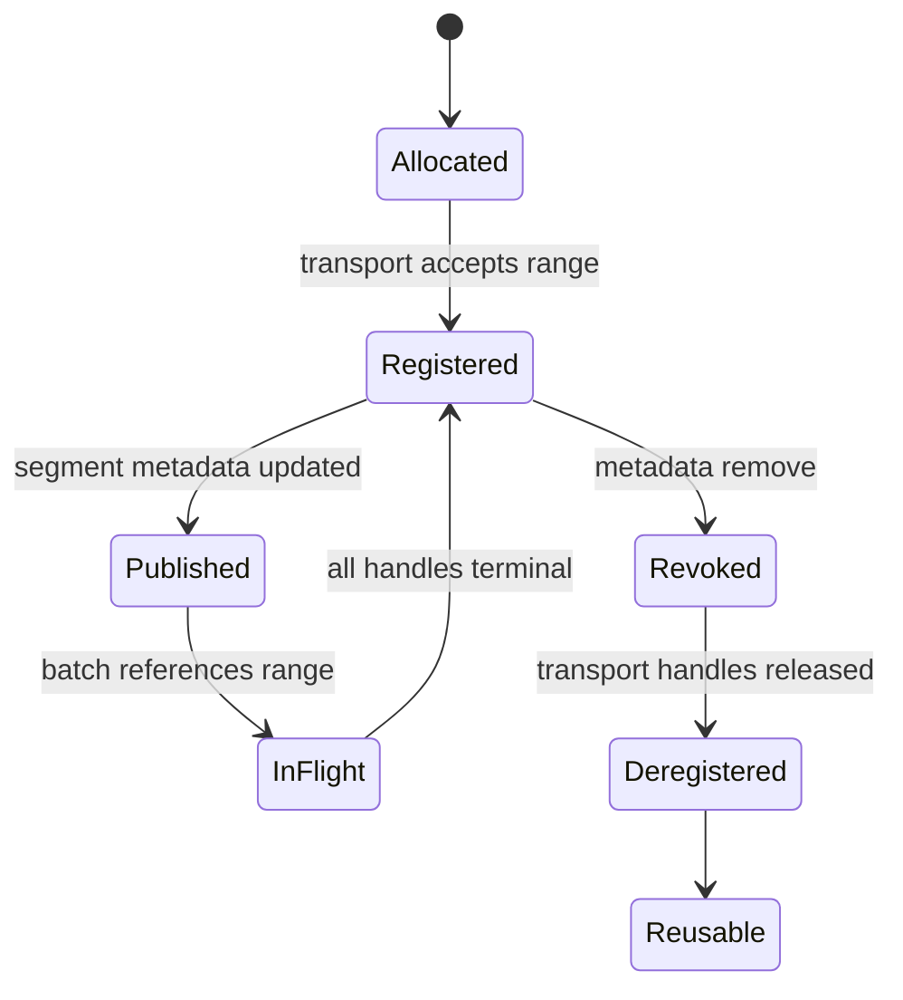
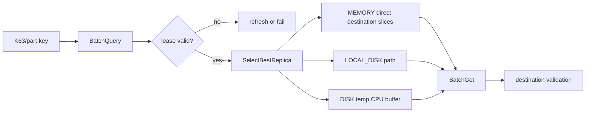
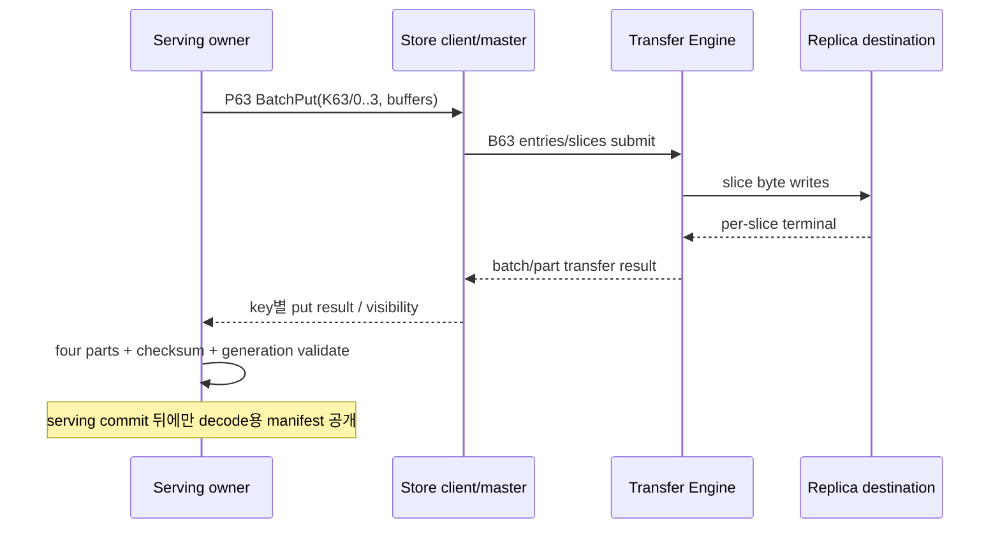
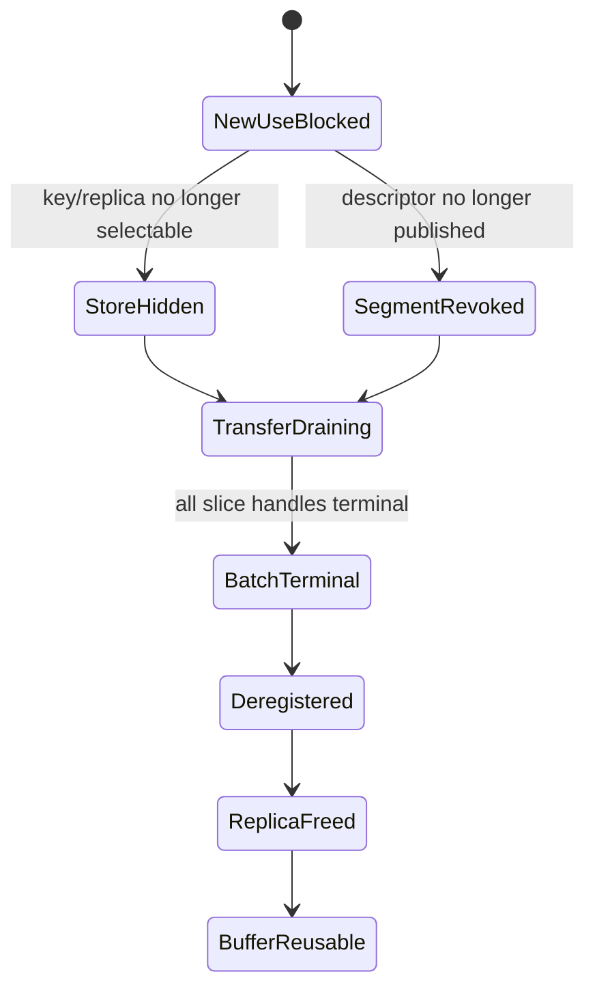

# 63장. Mooncake에서 byte 이동과 객체 저장을 구분하는 법

## 63.1 STALE-63: transfer 완료와 object publish가 갈린 도입 사건

Decode 쪽 로그에는 `query hit`가 찍혔다. 그런데 KV는 오지 않는다. 잠시 뒤 network dashboard에는 같은 크기의
RDMA traffic이 보이고, 운영자는 “Mooncake가 느리다”고 결론 낸다. 이 문장에는 서로 다른 두 시스템이 한
이름으로 뭉쳐 있다. Transfer Engine은 등록된 memory range 사이에서 byte를 옮긴다. Mooncake Store는 key,
replica, slice와 lease를 관리한다. Store가 key를 안다는 사실은 destination buffer에 byte가 도착했다는 뜻이
아니고, Transfer Engine batch가 끝났다는 사실은 Store object가 publish됐다는 뜻이 아니다.

이 장은 두 장부를 끝까지 분리한다. 앞 장에서 만든 제품 독립적인 key→descriptor→completion 질문을
Mooncake v0.3.12.post1 commit `6041a609a8c3af35e778f70db344f145c2914980`에 대입한다. 설치법이나
benchmark 숫자를 나열하지 않는다. Segment metadata, memory registration, batch와 slice, Store query와
replica lease, put/get와 cleanup이 어느 함수에서 상태를 바꾸는지 읽는다. 서버·RDMA·CUDA는 실행하지 않았고,
성능과 장애 빈도는 정적 소스가 증명하는 범위를 넘겨 쓰지 않는다.

**STALE-63 도입 사건: transfer 4/4 완료가 object generation 18 publish로 잘못 승격됐다.**

fixture object key는 `kv/R63/layer0-3`, Store generation18, slices 네 개다. caller source buffer B18은 4×16MiB 총64MiB이고 Transfer Engine batch T18이 remote replica memory ranges로 네 slices를 보낸다. Store metadata object O18은 key, length, slice layout, replica lease와 publish state를 소유한다.

owner를 세 개로 나눈다. Transfer owner는 registered source/destination ranges와 batch/slice completion를 가진다. Store owner는 key/object generation, replicas/lease, put/get result를 가진다. serving owner는 decode request가 어느 complete object generation을 읽을 수 있는지 결정한다. 한 owner의 success bool을 다른 owner commit으로 복사하지 않는다.

`t0=0ms`에 caller가 Store batch put를 시작하고 RealClient가 keys/lengths/buffers cardinality를 검증한다. `t1=2ms`에 O18 metadata는 PREPARING이며 replica lease L18이 잡힌다. `t2=4ms`에 Transfer Engine T18 네 slice descriptors가 submit된다. submit는 completion가 아니다.

`t3=8ms` slice0/1, `t4=10ms` slice2, `t5=12ms` slice3가 terminal success다. 이때 physical transfer coverage 4/4는 닫혔다. 그러나 Store side validation/result/metadata publish가 끝났다는 뜻은 아니다. object O18은 여전히 PREPARING일 수 있다.

버그 난 adapter는 T18 completion callback에서 query-visible map에 key→generation18을 먼저 썼다. `t6=13ms` decode get이 query hit O18을 받고 destination buffer를 할당했다. `t7=14ms` Store put validation가 slice2 checksum/length metadata mismatch를 발견해 O18을 abort했다. 이미 decode가 stale/invalid O18을 읽기 시작했다.

retry R19는 같은 key와 buffers를 다시 사용했지만 generation identity를 key string만으로 표현했다. late T18 notify가 `t8=16ms`에 도착해 R19 PREPARING entry를 complete로 바꿨다. transfer가 성공했다는 사실은 true였지만 wrong transaction generation의 Store publish를 발생시켰다.

first divergence는 RDMA write나 registration가 아니다. Transfer callback consumer가 `(key,generation,put_tx)`를 확인하지 않고 Store visible map을 mutate한 순간이다. Transfer batch terminal과 Store object commit 사이 owner handoff predicate가 없었다.

Mooncake source walk는 public Store/C facade에서 RealClient batch put/get로 들어가는 cardinality validation, object/slice preparation, Transfer Engine submit/batch tracking, per-key result, metadata/replica publish, query/get consumer를 함수 순서로 잇는다. 일반 RDMA verbs 설명은 58장에 맡긴다.

Transfer Engine source에서는 segment registration/metadata cache/backend selection와 batch/slice status를 본다. segment는 remote address capability이고 Store object key/generation이 아니다. descriptor freshness와 Store replica lease를 같은 cache로 보지 않는다.

Store source에서는 key query가 반환하는 replica/lease, batch put result cardinality, get destination path, notify/cleanup를 본다. query hit는 object location 후보이며 serving-ready completion와 별도일 수 있다. current code가 실제 제공하는 result/state만 claim한다.

fixed handoff는 T18 coverage success 뒤 Store validation가 O18 transaction identity를 확인하고 atomic publish한다. query-visible generation는 publish consumer만 바꾼다. T18 callback는 transfer evidence를 전달할 뿐 visible map를 직접 mutate하지 않는다.

retry R19는 new put transaction/object generation를 가진다. late T18 callbacks는 O18 aborted/closed record만 terminalize하고 O19를 바꾸지 못한다. same key string과 reused pointer가 generation identity를 대신하지 않는다.

반증 A는 slice4/4 성공 뒤 Store validation를 gate로 막는다. query가 generation18 hit를 반환하면 실패다. gate를 열고 publish commit 뒤에만 hit가 보여야 한다. transfer bytes/completion metrics는 gate 전에도 true일 수 있다.

반증 B는 O18 abort 뒤 R19를 시작하고 late T18 notify를 전달한다. O19 state/replica map는 변하지 않아야 한다. stale callback counter는 증가할 수 있다. T19 current completion+validation만 O19를 publish한다.

반증 C는 slices3/4 success, one timeout/unknown으로 둔다. partial coverage object를 visible로 만들지 않는다. retry가 missing slice만 전송할 수 있는지는 current Store contract에 따르되 final publish는 current generation complete coverage/validation를 요구한다.

rollback는 query-visible O18을 revoke하고 affected decode consumers를 fail/retry policy로 격리한다. physical remote bytes가 남아도 Store object로 광고하지 않는다. replica lease/transfer ranges는 in-flight/late completions를 drain한 뒤 current owner 규칙으로 cleanup한다.

known-good fix 배포 전 stale visible objects를 generation/transaction ledger로 audit한다. key-only entries를 그대로 신뢰하지 않고 metadata/coverage/replica consistency를 재검증하거나 namespace epoch를 바꾼다. retry storm 중 old callbacks를 차단한다.

90분 soak는 put/get, four-slice partials, validation delay/failure, timeout unknown, retry same key, late notify, restart를 섞는다. transfer success, Store publish, query hit, serving visibility timestamps를 모두 따로 본다. stale generation hit와 partial publish가0이어야 한다.

terminal 문장은 “Mooncake transfer가 실패했다”가 아니다. “T18 four slices는 성공했지만 callback가 O18 Store validation 전 query map을 publish했고 late T18 notify가 retry O19를 commit했다. generation-bound Store publish owner와 stale callback isolation로 두 경계를 닫았다.” 이렇게 쓴다.

함수 원장 첫 행은 Store public put/batch-put facade다. caller가 keys, source buffers, lengths를 넘기고 API return/result를 받는다. 이 행은 request intent와 caller-buffer lease를 만든다. facade return가 object query-visible을 뜻하는지 current contract를 source로 확인하고 이름에서 추측하지 않는다.

둘째 행은 C/API binding에서 RealClient로 넘어가는 cardinality 검증이다. keys K개, buffers K개, lengths K개 또는 해당 API의 exact arrays가 일치하는지 본다. mismatch를 partial operation으로 진행하지 않는다. per-key result array length가 input key cardinality와 맞는지 확인한다.

fixture는 keys `[K0,K1]`, each64MiB, each four16MiB slices다. batch-level success bool 하나보다 K0/K1 per-key states를 본다. K0 complete/O18 publish, K1 slice timeout/O19 abort가 동시에 가능하다. batch aggregate가 두 keys를 모두 visible로 만들지 않는다.

셋째 행은 Store object preparation다. key, object/put transaction generation, total length, slice layout, replica candidates/lease, initial PREPARING state를 기록한다. source buffer pointer/segment descriptor와 key identity를 분리한다. same buffer range가 다른 key generation에 재사용될 수 있다.

넷째 행은 Transfer Engine segment/metadata resolution다. local registered segment generation와 remote segment descriptors/backend path를 얻는다. metadata cache hit가 Store object query hit가 아니다. descriptor freshness/revocation owner는 Transfer layer이고 object publish owner는 Store다.

다섯째 행은 slice descriptor 생성다. K0 total64MiB를 offsets `[0,16,32,48]MiB`, lengths16MiB로 만든다. coverage union가 `[0,64)`이고 overlap/gap가 없는지 본다. slice count/cardinality telemetry가 object metadata와 맞아야 한다.

여섯째 행은 Transfer submit다. batch ID T18, backend path, source/destination addresses, operations를 queue한다. submit return/allocated task는 completion가 아니다. per-slice status와 batch terminal consumer를 찾는다. 일반 RDMA queue/key 설명은 58장으로 넘긴다.

일곱째 행은 Transfer completion aggregation다. four slice terminal results를 coverage와 generation tuple에 묶는다. success4/4라도 Store validation/publish input evidence일 뿐이다. unknown/timeout가 있으면 callback arrival later 가능성을 보존한다.

여덟째 행은 Store validation/commit다. current put transaction가 still PREPARING인지, per-key coverage/results, replica lease/current metadata, optional integrity/length conditions를 확인하고 object state를 query-visible로 atomic transition한다. 실제 source가 제공하는 validations만 주장한다.

아홉째 행은 query/get consumer다. query result가 key와 replica candidates/lease를 반환하고 get이 destination buffer/path를 준비한다. query hit, transfer completion, destination write completion, serving visibility가 어디서 갈리는지 existing chapter ledger로 확인한다. 61장 protocol을 다시 정의하지 않는다.

열째 행은 cleanup/revoke다. put abort, get timeout, object delete/lease expiry, segment unregister/restart에서 which owner가 metadata, replica bytes, registered ranges를 정리하는지 본다. Store cleanup가 Transfer in-flight descriptor를 즉시 무효화한다고 가정하지 않는다.

STALE-63 source drill은 commit hash에서 actual public/RealClient functions와 transfer calls, result handling, query/get functions를 pin한다. comments/example보다 executable branch를 우선한다. source에 없는 atomicity를 이상 설계로 써 넣지 않고 observed gap로 표시한다.

Transfer Engine와 Store가 separate repos/components/clients일 수 있으므로 source versions를 함께 pin한다. header/client ABI와 server/store behavior가 compatible한지 release manifest에 둔다. one component upgrade가 callback/result semantics를 바꾸면 integration fixture를 재실행한다.

metadata owner도 둘로 나뉜다. Transfer metadata cache는 remote segment/address/transport capability freshness를 돕고 Store metadata는 object key/replica/lease/visibility를 표현한다. cache invalidate 하나가 다른 metadata를 자동 revoke한다고 쓰지 않는다.

replica lease L18은 query와 transfer 사이 candidate freshness를 제한할 수 있지만 object validation/publish와 exact relation는 current code contract로 확인한다. lease가 valid해도 O18 PREPARING일 수 있고, object published 뒤 replica가 degraded될 수도 있다. one timestamp로 합치지 않는다.

retry consistency table은 original put P18, retry P19, key K0, source buffer generations B18/B19, Transfer batches T18/T19, Store objects O18/O19, leases L18/L19를 columns로 둔다. same key 이외 identities가 모두 independent다.

P18 timeout outcome unknown이면 immediately same object generation를 overwrite하지 않는다. current API가 idempotency/generation token를 지원하는지 확인한다. 지원하지 않으면 namespace/versioned key 또는 higher-level epoch로 stale result를 격리한다. 이상적인 token을 project feature로 허위 주장하지 않는다.

late T18 slice/completion는 P18 ledger만 닫는다. callback consumer가 key lookup로 current O19을 찾지 않고 captured/current transaction identity를 비교해야 한다. key-only map API라면 adapter가 epoch namespace와 closed attempts를 관리한다.

source buffer B18 lease도 timeout return와 동시에 풀리지 않을 수 있다. Transfer operation terminal/unknown resolution 뒤 reuse/unregister한다. store retry가 B19 same pointer를 할당해도 generation를 구분한다. 58장의 registration mechanics 대신 owner relation만 기록한다.

destination remote ranges도 stale T18 write가 T19 object bytes를 덮지 않도록 allocation/lease generation가 필요하다. Transfer descriptor currentness와 Store object identity가 맞물리는 integration boundary다. physical address equality를 object equality로 쓰지 않는다.

partial object bytes가 remote replica에 남아도 query-visible metadata가 없으면 serving object가 아니다. cleanup/GC가 나중에 bytes를 회수할 수 있다. leaked capacity와 consistency를 분리해 관측한다. orphan bytes count는 performance/resource issue이고 stale publish는 correctness issue다.

restart fixture는 Store metadata service/repository restart, client retry, Transfer engine still running/late callback를 교차한다. durable/ephemeral state의 actual source contract를 확인한다. client in-memory closed attempts가 restart로 사라지면 epoch namespace 또는 reconciliation가 필요할 수 있다.

Transfer engine restart와 Store object PREPARING도 반대 경우다. in-flight batches outcome unknown, Store should not publish based solely on old submit. recovery가 query/reconcile/abort 중 어느 path인지 source와 deployment policy로 기록한다.

per-key batch result fixture는 K0 success, K1 failure, K2 timeout를 만든다. caller가 result array를 key order와 correctly join하는지 본다. sorted/async completion order를 input order로 착각하지 않는다. result key identity가 있으면 그 contract를 사용한다.

lengths/slices mismatch fixture는 K0 declared64MiB but coverage48MiB를 만든다. Transfer completed3 slices success라도 Store visible 금지다. fourth zero-length/missing slice handling를 current validation로 확인한다. bytes metric만 보고 complete라 하지 않는다.

overlap fixture는 slices `[0,32)`, `[16,48)`, `[48,64)`처럼 total transferred80MiB지만 union64MiB와 overlap16MiB다. bytes>=length 검사는 통과한다. interval coverage/expected slice map가 필요하다. current Store adapter가 무엇을 검증하는지 source로 pin한다.

checksum/semantic integrity가 project contract에 없다면 length/coverage만으로 content correctness 전체를 보장한다고 쓰지 않는다. serving layer deterministic sentinel/reference를 추가할 수 있다. project Store guarantee와 application validation를 분리한다.

query cache가 있다면 stale O18 entry invalidation/update ordering를 본다. Store publish source와 client query cache generation가 일치해야 한다. invalidate message loss/유효시간 만료 동작이 있다면 retry stale exposure window를 measurement에 포함한다.

get path는 selected replica가 current object generation를 제공하는지 destination/result metadata로 검증한다. query hit만 보고 old replica bytes를 serving-ready로 publish하지 않는다. actual Store API result fields로 가능한 checks를 사용한다.

disk staging path와 direct memory path가 다른 completion semantics/latency를 가질 수 있다. 이 장의 owner table에 destination path를 넣되 storage internals는 반복하지 않는다. path-specific terminal을 serving visibility와 연결한다.

notify callback는 application commit가 아닐 수 있다. which layer/event it represents를 source에서 확인한다. Transfer notify, Store put result, get completion, serving publish callbacks를 event name 하나로 합치지 않는다.

observability에는 `transfer_submitted`, `slices_terminal`, `store_validation`, `object_published`, `query_hit`, `get_complete`, `serving_visible` timestamps를 둔다. key hash/object generation/put transaction로 join한다. key raw value cardinality/secrets를 bounded hash/trace로 관리한다.

metrics는 transfer bytes/success, Store per-key results, PREPARING age, aborted/orphan objects, stale callback, query generation mismatch, serving stale hit를 분리한다. transfer success율 상승이 Store consistency success를 대신하지 않는다.

TAIL age는 PREPARING objects와 unknown batches를 찾는다. 오래됐다고 blindly publish/delete하지 않고 owner outcome를 reconcile/abort한다. timeout threshold는 recovery trigger이지 truth 판정이 아니다.

STALE-63 fault1은 validation delay, fault2 late completion, fault3 Store restart, fault4 query cache stale, fault5 batch mixed per-key, fault6 descriptor revoke를 한 축씩 주입한다. 각 owner expected state table를 비교한다.

rollback ladder1은 affected key namespace의 new query visibility를 차단한다. ladder2 suspect generations/replicas를 revoke/quarantine한다. ladder3 in-flight Transfer batches와 callbacks를 drain/isolate한다. ladder4 new epoch clients/store namespace로 clean retry한다.

rollback 중 transfer bytes가 성공한 replicas를 reuse할지 current integrity/reconciliation contract가 명확할 때만 결정한다. 모르면 abort/rewrite한다. performance를 위해 unknown bytes를 committed object로 승격하지 않는다.

90분 soak는 same-key rapid retries, mixed keys, four/many slices, memory/disk destination, client/store/engine restart, late callbacks를 섞는다. object generation monotonicity, visible complete coverage, stale hits0, owner cleanup convergence를 본다.

terminal source table은 facade, RealClient validation, object preparation, Transfer submit/status, Store result/publish, query/get, cleanup functions를 rows로 둔다. actual pinned lines와 fixture events를 join한다. component마다 source commit를 명시한다.

terminal decision record는 P18/O18 aborted, late T18 isolated, P19/O19 current validation/publish, affected consumers outcome, orphan cleanup를 적는다. “retry succeeded” 한 줄로 previous attempt ownership를 지우지 않는다.

이 owner drill이 있으면 Transfer Engine가 bytes를 잘 옮겼다는 사실과 Store가 일관된 key object를 제공한다는 사실을 함께 보되 혼동하지 않는다. success는 두 owner handoff와 serving consumer visibility가 같은 generation에서 닫힐 때만 성립한다.

여기서 함수 추적을 실제 조사 순서로 한 번 더 고정한다. 첫 breakpoint는 facade return가 아니라 입력 cardinality를
검사한 직후다. `keys`, `values` 또는 buffer vectors, lengths와 results의 index가 어느 함수에서 결합되는지 적는다.
둘째 breakpoint는 object preparation이 P18과 O18을 만든 지점이다. 셋째는 Transfer Engine 호출에 T18과 네 operation이
전달된 지점, 넷째는 각 operation terminal을 모으는 지점, 다섯째는 Store per-key result와 visibility를 결정하는
지점이다. 마지막은 query/get 결과가 serving destination과 연결되는 지점이다. 이 여섯 지점을 같은 trace ID만으로
잇지 말고 각자의 transaction과 generation을 함께 기록한다.

함수 추적표의 각 행에는 `입력 소유자`, `입력 수명`, `반환값 의미`, `비동기 잔여 작업`, `다음 상태를 바꿀 권한`,
`실패 뒤 정리 주체` 여섯 열을 둔다. 예컨대 Transfer submit 함수의 반환값이 acceptance라면 비동기 잔여 작업은 네
slice이고, 다음 Store visibility를 바꿀 권한은 없다. Store commit 함수는 complete per-key evidence를 입력받고
query-visible generation을 바꿀 수 있지만 registered range를 해제할 권한은 없다. 이 권한표가 callback 한 줄의
잘못된 side effect를 눈에 띄게 만든다.

K0, K1, K2 mixed batch를 수치로 검산해 보자. K0는 예상 `[0,64MiB)` 네 구간이 모두 성공하고 validation도 통과한다.
K1은 앞의 세 구간만 성공하고 마지막 구간은 timeout 뒤 unknown이다. K2는 네 구간이 성공했지만 declared length가
실제 manifest와 다르다. aggregate에서는 열한 slice success와 한 slice unknown처럼 보일 수 있다. 그러나 결과는
K0만 PUBLISHED, K1은 PREPARING 또는 ABORT 판정 대기, K2는 ABORTED여야 한다. 성공 slice 비율 91.7%를 object
성공률로 변환해서는 안 된다.

이 fixture의 per-key 결과 배열도 별도 검증한다. 입력 순서가 `[K0,K1,K2]`인데 completion 순서는 `[K2,K0,K1]`일
수 있다. callback 순서로 result slot을 채우면 K2의 length failure가 K0에 붙고 K0 성공이 K1을 publish할 수 있다.
API가 index 기반이면 captured input index를, key 기반이면 key와 put transaction을 함께 사용한다. key만 사용하면
동일 key retry P19가 도착한 뒤 P18 result가 새 slot을 오염시킨다.

P18 상태 전이는 `NEW→PREPARING→TRANSFERRING→VALIDATING→PUBLISHED` 또는 어느 중간 단계에서
`ABORTING→ABORTED`로 간다. Timeout은 곧 ABORTED가 아니라 관측자가 terminal을 모르는 `OUTCOME_UNKNOWN`일 수
있다. 이 상태에서 P19를 허용한다면 P18의 late events가 P19에 영향을 주지 않는 isolation 조건과 destination
range 분리가 먼저 필요하다. 그렇지 않으면 retry를 지연시키고 P18을 reconcile한다.

T18은 Store 상태와 다른 전이를 가진다. `ALLOCATED→SUBMITTED→PARTIAL→TERMINAL_SUCCESS`,
`TERMINAL_FAILED`, 또는 caller deadline 뒤에도 진행 중인 `UNKNOWN_TO_CALLER`다. Caller가 timeout을 받았다고
Transfer Engine 내부 operation이 취소됐다고 가정하지 않는다. 취소 API가 있더라도 cancellation request와 모든
remote write의 정지를 동일시하지 않는다. Status/handle drain과 destination fencing이 reuse 조건을 닫아야 한다.

O18은 `ABSENT→PREPARING→VISIBLE` 또는 `PREPARING→REVOKED/ABORTED`로 본다. 실제 구현의 enum 이름이 다르면
source 이름을 그대로 쓰고 이 모델과 대응시킨다. 중요한 불변식은 VISIBLE O18을 만든 Store decision이 P18과 T18의
current evidence를 소비했다는 점이다. T18 terminal callback 자체가 O18 상태 전이를 수행하면 권한 경계가 무너진다.

재시도 표에서 P19/T19/O19는 모두 새 identity다. O18이 ABORTED인데 T18의 늦은 success가 오면 T18 ledger의
terminal evidence는 보존하되 O19 state machine에는 입력하지 않는다. P19가 같은 bytes를 재사용해도 B19 lease와
destination generation을 새로 잡는다. Deduplication을 하고 싶다면 payload digest와 검증된 interval을 명시적으로
재사용하는 별도 경로가 필요하다. Pointer equality나 key equality는 deduplication proof가 아니다.

늦은 callback을 무조건 버리는 것도 관측성을 해친다. `(component incarnation, batch, operation, put transaction,
object generation)`으로 closed-attempt table을 조회하고 `late_valid_old`, `duplicate_terminal`, `unknown_batch`,
`generation_mismatch`로 분류한다. O18을 바꾸지는 않지만 T18 drain 완료와 orphan range 회수 판단에는 사용한다.
따라서 isolation은 event 손실이 아니라 side effect 권한 제한이다.

Store process가 t9에 재시작되는 경우를 넣자. Durable metadata가 O18 PREPARING을 보존하는지, 아니면 재시작 뒤
사라지는지는 실제 배포 설정과 source path로 확인한다. 어느 경우든 Transfer client의 T18 callback은 새 Store
incarnation의 same key lookup만으로 publish해서는 안 된다. Persisted transaction token을 대조하거나 namespace
epoch가 달라 old callback을 거절해야 한다. 둘 다 없다면 integration adapter가 안전한 재조정 계층을 제공해야 한다.

반대로 Transfer Engine만 재시작되면 Store에 P18 PREPARING이 남을 수 있다. 새 engine은 old batch handle을 모를
수 있으므로 submit 성공 log만으로 PUBLISHED로 진행하지 않는다. Destination content를 신뢰할 수 있는 검증과
complete manifest가 있으면 reconcile하고, 없으면 P18을 abort한 뒤 새 destination generation에 P19를 쓴다.
재시작은 성공이나 실패가 아니라 이전 evidence의 접근 가능성을 바꾸는 사건이다.

Query cache 장애에서는 t6의 O18 hit가 어디에서 만들어졌는지 분리한다. Store authoritative map이 너무 일찍
VISIBLE이 됐는지, 올바르게 revoke했지만 client cache가 old lease 동안 반환했는지, get consumer가 generation을
검사하지 않았는지 세 원인은 조치가 다르다. Trace에는 `query_source=remote|cache`, observed generation, lease
remaining, authoritative refresh result를 넣는다. Cache hit만 기록하면 최초 divergence가 가려진다.

Lease가 40ms 남았고 transfer 예상 p99가 60ms라면 replica 후보가 지금 보인다는 이유만으로 시작하지 않는다.
갱신하거나 더 긴 후보를 선택하거나 deadline을 줄이는 정책이 필요하다. 다만 lease가 transfer의 물리 write를
자동 취소한다고 주장하지 않는다. Lease는 metadata freshness 계약이고 registered range와 in-flight operation의
수명은 Transfer owner가 닫는다. 두 수명 중 짧은 쪽을 operation safety budget에 반영한다.

Memory destination과 disk staging destination도 동일한 `get complete`로 뭉개지 않는다. Memory direct path에서는
remote write terminal과 destination visibility ordering을 확인한다. Disk path에서는 read/staging copy와 최종
destination copy가 추가될 수 있다. Query replica type, selected path, path-specific terminal, bytes returned와
serving validation을 함께 기록해야 같은 이름의 get latency를 비교할 수 있다.

부분 전송 회수 정책에는 안전성과 용량을 따로 둔다. K1의 48MiB가 remote replica에 남아도 metadata가 invisible이면
decode correctness는 지킬 수 있다. 그러나 반복되면 orphan capacity가 차서 정상 put를 밀어낸다. `orphan_bytes`,
`oldest_orphan_age`, `reclaim_blocked_by_batches`, `reclaim_success`를 본다. Correctness gate를 낮추지 않고 cleanup
backlog를 별도 SLO로 운영한다.

부하가 높을 때 PREPARING age p99만 보면 큰 object와 작은 object가 섞인다. Age를 object bytes, slice count,
destination type과 stage별로 나눈다. `time_to_first_slice`, `last_minus_first_terminal`, `validation_delay`,
`publish_delay`를 분리하면 network straggler인지 Store commit queue인지 보인다. 전체 put latency 하나로는 어느
owner를 확장해야 하는지 결정할 수 없다.

오류 예산도 owner별이다. Transfer는 operation failure와 retried physical bytes, Store는 per-key abort와 stale
query result, serving은 validation rejection과 unsafe visibility 차단을 가진다. Serving rejection 증가가 Store
오류처럼 보일 수 있지만 실제로는 이전에 숨었던 corrupt/incomplete candidate를 안전하게 발견한 것일 수 있다.
분모와 탐지 지점을 적어 지표 개선이 검증 생략에서 오지 않았는지 확인한다.

배포 전 반증 실험은 여섯 단계로 실행한다. 첫째 validation을 200ms 지연하고 그 사이 query가 miss인지 확인한다.
둘째 마지막 slice를 unknown으로 두어 visibility를 막는다. 셋째 P18 abort 직후 같은 key P19를 시작하고 T18 late
callback을 주입한다. 넷째 Store를 재시작하고 old callback을 보낸다. 다섯째 query cache에 O18을 남기고 authoritative
revoke를 수행한다. 여섯째 각 단계 뒤 ranges와 objects가 bounded time 안에 회수되는지 본다.

각 실험의 판정은 모호한 `PASS` 대신 상태 tuple로 남긴다. 예를 들어 세 번째 실험의 기대값은
`T18=TERMINAL_SUCCESS, P18=ABORTED, O18=INVISIBLE, T19=TERMINAL_SUCCESS, P19=PUBLISHED,
O19=VISIBLE, stale_callback_effect=0`이다. Query는 O19만 반환하고 affected O18 consumer는 fail 또는 정책에 따른
clean retry로 끝나야 한다. Cleanup 후 O18 ranges가 free이고 T18 handle이 terminal인지도 포함한다.

네 번째 재시작 실험의 기대값은 새 incarnation이 old P18을 current로 오인하지 않는 것이다. Durable record를
복구했다면 명시적으로 reconcile/abort하고, 복구하지 않았다면 old epoch callback을 reject한다. `process alive`,
`health endpoint OK`는 이 조건을 증명하지 않는다. Restart 직후 same-key traffic을 넣어 namespace collision도
확인한다.

여섯 번째 cleanup 실험은 순서를 검사한다. 새 reader 차단 또는 object revoke가 먼저이고, in-flight/unknown
operations drain이나 quarantine가 그다음이며, segment unregister와 allocator reuse가 마지막이다. Reclaim 속도를
높이려고 range를 먼저 재사용하면 late T18 write가 O19 payload를 손상시킬 수 있다. Cleanup latency는 이 순서를
지킨 상태에서 최적화한다.

운영 중 STALE-63 경보가 울리면 첫 5분에는 새 publish를 제한하고 trace tuple을 보존한다. 다음 10분에는 query
source, visible generation, P/T/O states와 destination generation을 모은다. 그 뒤 affected namespace 범위를
계산해 revoke/quarantine한다. 원인을 찾기 전에 daemon을 반복 재시작하면 in-memory attempt ledger가 사라지고
late callback 재현이 어려워진다.

복구 후에는 false recovery를 막는다. Error rate가 내려갔다는 이유로 종료하지 않고 old generation query hit 0,
partial visible 0, closed-attempt side effect 0, orphan age convergence, current retry success를 함께 본다. 적어도
lease 최대치와 late callback 상한을 덮는 관측 창을 둔다. 상한을 모르면 90분 soak 결과와 실제 tail을 근거로
보수적인 창을 정한다.

소스 검토 결과는 세 등급으로 기록한다. 함수와 branch에서 직접 확인한 것은 source-confirmed, header/comment만
보인 것은 interface-indicated, fault injection으로 확인한 것은 runtime-observed다. 이상적인 generation-bound
commit이 현재 source에 없으면 required invariant 또는 gap으로 쓴다. 책의 설명을 깔끔하게 만들려고 구현하지
않은 보장을 제품 기능으로 승격하지 않는다.

라인 번호는 revision과 함께 남긴다. Upstream 변경으로 줄이 이동해도 function symbol, file path, commit hash와
짧은 semantic note가 있으면 다시 찾을 수 있다. Public facade, RealClient internal, Transfer submit/status,
query/get, cleanup의 각 anchor는 실제 실행 branch를 가리킨다. Example은 call shape를 설명하는 보조 자료이고
failure/atomicity 보장의 최종 근거로 쓰지 않는다.

버전 호환성 표에는 Store client, Store service, Transfer Engine, CUDA/runtime와 connector adapter revision을 각각
쓴다. Protocol/ABI가 맞아 process가 시작됐다는 사실과 callback/result semantic이 통합 설계와 맞는지는 별도다.
Canary는 mixed-result와 late-callback fixture를 포함한다. 단순 put/get happy path만 통과한 조합을 production-safe로
표시하지 않는다.

최종 retry 일관성 불변식은 다음처럼 읽는다. 어떤 event E가 Store object O를 바꾸려면 E가 참조하는 put
transaction, object generation, component incarnation과 key가 O의 current tuple과 모두 같아야 한다. Transfer
coverage가 complete하고 Store validation가 통과해야 하며 O가 PREPARING이어야 한다. 하나라도 다르면 E는 audit와
cleanup evidence가 될 수 있지만 publish 권한은 없다.

이 불변식을 P18에 대입하면 T18 late success는 P18/O18 기록을 닫을 뿐이다. 이미 O18이 ABORTED라 publish predicate가
거짓이다. P19/O19에는 transaction과 generation이 다르므로 더 명백히 거짓이다. T19의 complete coverage와 P19
validation만 O19를 VISIBLE로 바꾼다. 이 판정은 callback 도착 순서, 동일 key, 동일 pointer와 무관하다.

독자는 이 장을 덮기 전에 한 장짜리 증거 묶음을 만들 수 있어야 한다. 위쪽에는 세 owner와 P/T/O 상태 전이,
가운데에는 함수 여섯 지점과 source anchors, 아래에는 mixed batch 결과와 fault injection tuple을 둔다. 옆에는
query lease, registered range와 cleanup 순서를 적는다. 이 묶음만으로 “네 조각이 다 갔으니 object도 준비됐다”는
추론이 어느 경계에서 틀렸는지 제3자가 재검산할 수 있어야 한다.

STALE-63의 최종 terminal은 구체적이다. T18의 네 slice는 실제로 terminal success였고 그 evidence는 폐기하지
않는다. 그러나 P18 validation 실패로 O18은 ABORTED이며 query-visible이 아니다. 늦은 T18 event는 closed P18의
drain과 회수만 돕고 P19/O19를 변경하지 않는다. T19 complete, P19 validation와 current Store commit 뒤 O19만
VISIBLE이 된다. Query/get과 serving validation가 O19 generation을 확인하고 affected O18 consumers가 정리되며,
old ranges가 drain 뒤 회수됐을 때 이 incident가 끝난다.

마지막으로 이 판정을 실제 당직 인계 형식으로 압축해 본다. 사건 식별자는 STALE-63이고 영향 key namespace,
최초 노출 시각, 마지막 의심 query 시각, Store와 Transfer incarnation을 첫 줄에 쓴다. 둘째 줄에는 P18/O18의
abort 근거와 T18의 terminal 근거를 나란히 둔다. 셋째 줄에는 P19/T19/O19가 새 identity였다는 증거와 O19 publish
시각을 둔다. 넷째 줄에는 affected consumers 수, 재시도 결과, old replica/range 회수 상태를 둔다. 이 네 줄이
없으면 서비스가 다시 정상처럼 보여도 incident를 닫지 않는다.

당직자는 우선 `query hit` 시각과 `object published` 시각을 비교한다. Hit가 publish보다 빠르면 clock alignment
오류인지 cache/visibility 오류인지 나눈다. 각 process clock offset을 trace collector 기준으로 보정하고도 순서가
뒤집히면 authoritative map mutation과 cache insertion branch를 찾는다. Timestamp 정밀도가 낮으면 동일 bucket을
순서 증거로 쓰지 않고 sequence number 또는 transaction log position을 추가한다.

그다음 네 slice의 terminal도 단일 timestamp로 합치지 않는다. Operation별 submit, first progress, terminal status,
callback dispatch와 callback consume 시각을 둔다. 마지막 operation terminal은 12ms였지만 callback consume가
16ms일 수 있다. Store validation가 14ms에 abort했다면 16ms callback은 늦었다는 사실이 명확하다. 단순히 log
출력 순서만 보면 thread buffering 때문에 반대로 보일 수 있으므로 batch/operation sequence를 함께 사용한다.

소스 buffer lease의 증거는 allocator allocation ID, address range, registration generation, last referencing batch를
묶는다. `0x...` 주소 하나로는 B18과 B19를 구분할 수 없다. Destination도 replica allocation ID와 generation을
붙인다. 동일 주소 재사용이 정상인 allocator에서도 old T18이 last reference라면 그 terminal/drain보다 앞선
reuse는 불변식 위반이다. 이 표가 network corruption처럼 보이는 allocator lifetime 오류를 분리한다.

Store 결과에는 batch aggregate와 per-key를 모두 보존한다. Aggregate failure여도 K0가 이미 올바르게 published됐을
수 있고, aggregate success처럼 보이는 wrapper가 K1의 개별 failure를 숨길 수도 있다. Caller가 어느 결과를 소비해
retry set을 구성했는지 trace한다. 실패한 K1만 재시도해야 하는데 전체 batch를 같은 key로 다시 넣었다면 duplicate
traffic과 old callback surface가 커진다. Correctness를 닫은 뒤 retry granularity를 최적화한다.

성능 실험에서는 generation guard 비용도 측정한다. Callback마다 tuple lookup과 closed-attempt 검사가 추가되면
CPU cost와 contention이 생길 수 있다. 그러나 guard를 생략한 baseline은 비교 가능한 correct implementation이
아니다. 안전한 두 설계 사이에서 sharded ledger, immutable captured token, batched completion validation을 비교한다.
Throughput만 아니라 publish latency, stale rejection cost와 cleanup convergence를 함께 측정한다.

Cardinality가 커질수록 모든 slice event를 장기 보존하기 어렵다. Hot window에는 operation-level record를 두고,
terminal 뒤에는 expected/actual interval digest, failure set과 timing summary로 압축한다. Incident가 열린 attempt와
outcome unknown batch는 압축하거나 삭제하지 않는다. Sampling도 success path에만 적용하고 stale mismatch,
partial coverage, restart crossing은 항상 남긴다. 관측 비용 절감이 최초 divergence를 지우지 않게 한다.

보안과 개인정보 경계도 있다. Raw key가 tenant나 prompt identity를 포함하면 log에 그대로 남기지 않는다. Stable
bounded hash와 별도 접근 통제된 lookup을 쓰고, buffer content는 기본 수집하지 않는다. Integrity 검증은 digest와
length/layout evidence로 수행한다. Payload dump가 꼭 필요하면 최소 재현 fixture로 제한한다. 디버깅 가능성과
민감 데이터 노출을 같은 선택지로 만들 필요는 없다.

멀티테넌트 환경에서는 key hash뿐 아니라 tenant namespace가 authorization과 cache isolation에 참여한다. P18의
late callback가 같은 textual key를 쓰는 다른 tenant O19에 닿아서는 안 된다. Tuple predicate에 namespace/tenant와
deployment epoch를 포함하고, metrics label에는 raw tenant를 무제한 넣지 않는다. Tenant별 상세 조사는 trace나
bounded top-k view로 이동한다.

최종 승인 회의에서는 세 질문만 통과시키면 된다. 첫째 어떤 정확한 function branch가 T18 evidence를 만들고 어느
branch가 O18 visibility를 바꿨는가. 둘째 late T18이 P19/O19를 변경할 수 없다는 반증 실험이 restart와 cache까지
포함해 통과했는가. 셋째 rollback 뒤 affected consumers와 orphan resources가 bounded time 안에 terminal이 됐는가.
한 질문이라도 source anchor나 runtime artifact가 없으면 수정은 완료가 아니라 유력한 가설이다.

이렇게 닫으면 STALE-63은 특정 제품을 비난하는 일화가 아니라 재사용 가능한 조사법이 된다. Byte transport,
object visibility와 serving consumption은 서로 필요한 이웃이지만 동일한 commit이 아니다. 각 함수의 반환값과
side effect 권한, 각 identity의 수명, 재시도와 재시작을 가로지르는 stale event를 차례로 검산하면 “전송 4/4”와
“읽어도 되는 generation” 사이의 숨은 경계가 드러난다.

따라서 정상 경로의 마지막 assertion도 세 개다. Current T19가 요구 구간을 모두 끝냈는가, current P19가 Store
검증을 통과해 O19만 publish했는가, serving consumer가 O19 generation과 destination layout을 확인했는가. 세
assertion은 같은 trace에서 인접하지만 각각 독립적으로 실패할 수 있다. 성공 log는 어느 assertion을 통과했는지
이름으로 드러내고, 아직 통과하지 않은 다음 단계를 대신 약속하지 않는다.

Cleanup assertion도 대칭이다. O18이 더 이상 query되지 않고, T18의 늦은 작업이 격리 또는 terminal이며, B18과
remote allocation이 last reference 이후에만 회수됐는지 확인한다. 이 종결 조건이 충족되면 stale correctness와
resource leak을 함께 닫되 두 현상의 지표와 owner는 끝까지 분리한다. 그때 비로소 P19 성공이 P18의 흔적을 가린
것이 아니라, 두 attempt가 각자의 정확한 결말에 도달했다고 말할 수 있다.

## 63.2 STALE-63의 store·transfer·object generation을 시간축으로 가른다

기준 요청 M63은 8,192-token prompt의 1 GiB logical KV를 네 개의 256 MiB object part로 다룬다. 이 숫자는
61장의 fixture와 같아 protocol 비교가 가능하다. Store key generation은 `K63`, destination memory
registration은 `R63`, Transfer Engine batch는 `B63`, Store put attempt는 `P63`이다. 서로 이름을 바꿔 쓸 수
없는 네 identity다.

**두 개의 성공을 한 timeline에 놓는다.**

```text
Store lane:
K63 query → replica/lease selection → slice plan → put/get task → object visible/remove

Transfer lane:
segment discovery → R63 registration → remote descriptor → B63 submit
→ per-slice terminal → batch terminal → unregister

Serving lane:
request identity → destination buffer ownership → payload validation
→ block-table install → decode consume → request cleanup
```

세 lane은 교차하지만 합쳐지지 않는다. Store get은 Transfer Engine을 사용해 byte를 옮길 수 있지만 Store key가
transport batch ID가 되는 것은 아니다. Serving engine은 Store 또는 transfer가 성공했다고 말한 뒤에도 model,
layout, token interval과 generation을 검증하고 KV를 block table에 연결해야 한다.

### 첫 조사는 owner를 세 칸으로 나눈다

`query hit, transfer 없음`이면 Store query 결과의 replica descriptor와 lease가 유효한지, client가 어느
replica를 선택했는지 먼저 본다. `transfer 완료, Store miss`이면 전송이 Store publish보다 먼저 끝났거나
다른 key namespace로 put했을 수 있다. `둘 다 성공, decode wait`이면 serving engine의 validation·commit과
consumer stream ordering이 owner다.

이 분기 없이 RDMA bandwidth부터 보면 metadata miss를 network 문제로, block-table commit 누락을 Store
문제로 돌리기 쉽다. 관측에는 `store_query`, `replica_selected`, `registration_ready`, `batch_submit`,
`slice_terminal`, `store_publish`, `application_commit` timestamp를 같은 request trace에 넣는다.

## 63.3 Transfer Engine의 segment는 Store object가 아니다

Transfer Engine은 peer가 가진 memory를 segment descriptor로 발견한다. Segment에는 peer와 device, buffer
address/length와 transport가 사용할 정보가 들어간다. Store object는 content key와 replica/slice placement,
lease를 가진다. 한 segment 안에 여러 Store object가 놓일 수 있고, 한 object가 여러 buffer slice로 나뉠 수
있다.

### metadata cache와 descriptor freshness를 분리한다

고정 소스의 [`TransferMetadata::getSegmentDesc`](https://github.com/kvcache-ai/Mooncake/blob/6041a609a8c3af35e778f70db344f145c2914980/mooncake-transfer-engine/src/transfer_metadata.cpp#L979-L1038)는 local cache,
handshake 또는 metadata storage를 거쳐 peer segment를 얻는다. 이 함수가 descriptor를 반환했다는 사실은 그
안의 모든 buffer가 현재 request 동안 계속 등록돼 있다는 lease가 아니다. Cache age, segment generation,
buffer range와 peer incarnation을 함께 보존해야 한다.

Descriptor lookup latency가 튀었을 때도 network data path와 바로 묶지 않는다. Handshake daemon, metadata
storage 접근, cache refresh 또는 peer publication 지연이 control path의 후보이고, 실제 RDMA/TCP copy는 아직
시작되지 않았을 수 있다. `descriptor_source={cache,handshake,storage}`와 refresh result를 bounded label로
남기고 segment name 전체를 metric label로 넣지 않는다.

**Local buffer publication도 별도 상태다.**

[`addLocalMemoryBuffer`와 remove](https://github.com/kvcache-ai/Mooncake/blob/6041a609a8c3af35e778f70db344f145c2914980/mooncake-transfer-engine/src/transfer_metadata.cpp#L1260-L1297)는
local segment metadata가 buffer descriptor를 추가하고 제거하는 지점이다. Allocation, transport registration,
metadata publication은 세 사건이다.



실제 구현의 함수가 이 모든 상태를 원자적으로 제공한다는 그림이 아니다. 운영자가 확인해야 할 happens-before
목록이다. Metadata에서 range를 먼저 지워 새 transfer를 막고, 기존 handle을 drain한 뒤 deregister와 allocator
reuse로 가는 순서가 필요하다. 어느 단계가 구현 바깥 owner인지 명시한다.

## 63.4 registration은 address를 원격 접근 capability로 바꾼다

메모리를 할당했다고 Transfer Engine이 그 range를 쓸 수 있는 것은 아니다. Registration은 backend가 address와
length, memory location을 해석하고 필요한 handle을 만들며, 선택적으로 peer가 접근할 수 있는 descriptor를
발행하는 수명 사건이다.

### public facade와 실제 backend 선택을 나눈다

[`TransferEngine::registerLocalMemory`](https://github.com/kvcache-ai/Mooncake/blob/6041a609a8c3af35e778f70db344f145c2914980/mooncake-transfer-engine/src/transfer_engine.cpp#L543-L592)는
address, length와 location을 구현에 넘긴다. 반환 성공이 Store replica 생성이나 payload durability를 뜻하지
않는다. 이 함수의 cleanup 짝인 unregister가 어느 시점에 호출되는지까지 읽어야 lifetime claim이 닫힌다.

같은 process가 CUDA 12 wheel을 썼는지 CUDA 13 wheel을 썼는지도 registration 성공을 자동 보장하지 않는다.
고정 artifact에서 `mooncake-transfer-engine`은 `libcudart.so.12`, 별도 distribution인
`mooncake-transfer-engine-cuda13`은 `libcudart.so.13`을 필요로 했다. 이는 loader contract의 정적 증거다.
GPU Direct 활성화, NIC peer memory 지원, 선택 transport와 성능은 package 이름으로 추론할 수 없다.

### 등록 세대가 stale descriptor를 막는다

M63이 사용한 R63 range를 unregister한 뒤 allocator가 같은 virtual address를 R64에 줄 수 있다. Old peer가
address와 length만 cache했다면 새 request buffer에 늦은 write를 보낸다. Segment/buffer identity에 process
incarnation과 registration generation을 붙이고, batch submit 직전에 local registry와 대조해야 한다.

관측해야 할 값은 registered bytes, region 수, register/deregister latency, generation mismatch, in-flight
reference가 남아 revoke가 지연된 시간이다. Raw address와 transport key는 secret/capability일 수 있으므로
trace에는 salted digest와 bounded memory kind만 둔다.

Registration ledger의 한 행은 `R63`, process/segment incarnation, address digest, offset/length, memory kind/device,
requested transports, successful handles, publication generation, first/last referencing batch와 terminal을 가진다.
단순 registered bytes gauge는 어떤 request가 range를 잡고 있는지 알려주지 못한다. Oldest registration age와
owner 없는 ranges를 별도로 찾는다.

Batch registration이 여러 ranges를 받는 경우 all-or-nothing인지 partial result인지 확인한다. Public 함수가 error를
돌려도 앞 ranges가 backend에 남을 가능성을 source의 rollback path까지 읽지 않고 배제하지 않는다. 실패 주입은
첫 range, middle backend와 metadata publication 단계로 나눠 registered bytes와 buffer list가 baseline으로
돌아오는지 본다.

Memory allocator와 registration cache를 혼동하지 않는다. Allocator가 buffer를 live로 보존해도 descriptor가 revoke돼
remote access가 막힐 수 있고, metadata가 남았지만 transport handle이 사라져 접근 불가능할 수 있다. 정상 ready는
allocation, backend registration과 current publication 세 evidence의 교집합이다.

Topology 변경도 generation 문제다. NIC/path가 바뀌거나 peer가 restart하면 address가 같아도 old transport metadata를
새 B63에 쓰지 않는다. Descriptor refresh counter와 selected path generation을 남긴다. 실제 path selection algorithm과
NIC 성능은 이 절의 정적 evidence로 단정하지 않는다.

Registration pool pressure를 줄이려고 ranges를 오래 cache하면 register latency는 줄 수 있지만 stale capability와
pinned bytes가 늘어난다. 매 request register하면 setup cost와 handle churn이 늘 수 있다. 어느 쪽이 좋은지는
reuse distance, registered bytes, generation invalidation과 register latency를 같은 cohort에서 측정한다.

## 63.5 batch와 slice는 object 경계를 그대로 따르지 않는다

1 GiB KV object를 Store에서 네 part로 나눴다고 Transfer Engine도 네 operation을 만든다고 가정할 수 없다.
Transport는 backend와 maximum transfer size, source/destination segment에 따라 더 작은 slice/task로 분해할 수
있다. 반대로 여러 작은 entry를 한 batch handle 아래 묶을 수도 있다.

### allocate, submit과 terminal을 서로 다른 사건으로 기록한다

[`allocateBatchID`와 `submitTransfer`](https://github.com/kvcache-ai/Mooncake/blob/6041a609a8c3af35e778f70db344f145c2914980/mooncake-transfer-engine/src/transfer_engine.cpp#L596-L637)는
batch state를 만들고 transfer entry를 제출한다. Submit 반환은 queue acceptance 또는 초기 validation의
성공일 수 있으며 remote visibility의 증거가 아니다.

[`MultiTransport::submitTransfer`](https://github.com/kvcache-ai/Mooncake/blob/6041a609a8c3af35e778f70db344f145c2914980/mooncake-transfer-engine/src/multi_transport.cpp#L115-L154)는
entry를 실제 transport task로 보낸다. 조사 원장에는 object key/part, Transfer Engine batch ID, entry index,
transport, slice range와 operation terminal state를 별 열로 둔다. 그래야 “Store object 하나가 실패했다”는
상위 증상을 어느 transport slice의 첫 실패로 좁힐 수 있다.

### slice 산술로 telemetry 누락을 찾는다

M63의 logical 1 GiB가 네 Store parts이고 transport가 각 256 MiB part를 64 MiB slice 네 개로 나눈다면 expected
slice는 16개다. Retry가 slice 두 개를 한 번 더 보냈다면 physical bytes의 하한은 1.125 GiB다.

```text
logical bytes  = 16 × 64 MiB = 1,024 MiB
retry bytes    =  2 × 64 MiB =   128 MiB
physical lower = 1,152 MiB = 1.125 GiB
```

Dashboard가 1.0 GiB만 보고하면 retry가 다른 counter에 있거나 failed attempt byte가 누락됐을 수 있다.
1.2 GiB라면 나머지를 metadata라고 뭉개지 않고 alignment, protocol header, duplicated range와 다른 traffic을
분리한다. Object cardinality와 slice cardinality를 같게 세는 metric은 이 검산을 할 수 없다.

Slice interval ledger는 cardinality보다 강하다. Expected destination `[0,1GiB)`를 각 successful terminal interval로
덮고 union에 hole이 없는지, overlap은 어떤 attempt/generation인지 확인한다. Slice 16개가 모두 success여도
offset 하나가 중복되고 다른 offset이 비면 object는 incomplete다. Count와 interval coverage를 함께 검사한다.

```text
coverage = union(success intervals for required generation)
complete iff coverage == expected object intervals
          and every overlap is identical or explicitly fenced
          and no required interval remains unknown
```

이 식은 Store가 자동 수행한다고 주장하는 code quotation이 아니라 serving validation artifact다. Transport가
per-entry status와 range를 제공하면 application이 bundle completeness를 계산할 수 있다. Range telemetry가 없다면
count만으로 완전성을 증명할 수 없다는 gap을 남긴다.

Multipath submit은 같은 entry를 여러 path에 stripe/복제할 수 있는 가능성을 별도로 관측하게 한다. Fixed source의
[`MultiTransport::mp_submitTransfer`](https://github.com/kvcache-ai/Mooncake/blob/6041a609a8c3af35e778f70db344f145c2914980/mooncake-transfer-engine/src/multi_transport.cpp#L157-L198)을
근거로 path/task cardinality가 object count와 다를 수 있음을 확인한다. 실제 routing policy, redundancy와 retry
semantics는 runtime topology/config와 더 좁은 source walk가 필요하다.

Throughput은 completed logical bytes/time, wire cost는 physical bytes/time으로 분리한다. Failed/duplicate bytes를
분자에서 빼면 user value는 보이지만 network saturation 원인을 잃는다. 반대로 physical throughput만 높으면
retry storm을 성능 향상으로 오해한다. `useful_byte_ratio = committed logical bytes / physical attempted bytes`를
sanity metric으로 두되 compression이 있으면 정의를 조정한다.

Per-slice latency를 batch p99와 함께 본다. Batch terminal이 느린 원인은 한 straggler slice일 수 있다. Slice
latency distribution, first/last terminal spread, transport/path와 size를 기록한다. 작은 control task와 64 MiB data
slice를 같은 histogram에 섞지 않는다.

Retry budget은 attempts뿐 아니라 bytes와 destination exposure를 제한한다. 같은 failing range를 무한히 보내면
queue와 bandwidth를 채운다. Max retry bytes, deadline, old attempt drain/fence와 Store publish guard를 둔다. Budget
소진은 safe reject/quarantine로 끝내고 incomplete object를 visible하게 만들어 성공률을 맞추지 않는다.

## 63.6 Store의 key, query와 replica lease

Transfer Engine의 segment descriptor가 “어느 process의 어느 range에 접근할 수 있는가”를 답한다면 Store query는
“K63이라는 object가 어느 replica들로 존재한다고 metadata가 말하는가”를 답한다. 둘 다 descriptor를 돌려주지만
namespace와 수명이 다르다. Segment cache hit를 Store key hit로 세거나 Store lease expiry를 memory registration
expiry로 해석하면 cleanup owner가 사라진다.

### key가 object를 묶는 방식

Store key는 serving request ID도 Transfer Engine batch ID도 아니다. 같은 object를 다시 찾기 위한 content/application
namespace다. M63에서 `K63`은 네 256 MiB part를 어떤 key 배열로 표현했는지까지 manifest에 남긴다. 하나의
1 GiB key인지 part별 네 key인지에 따라 BatchQuery 결과 cardinality와 부분 실패 의미가 달라진다. 이 장에서는
네 part key `K63/0..3`을 사용하고, transport slice 16개와 의도적으로 다른 단위를 유지한다.

Key 문자열만 같아도 payload 의미가 같다는 보장은 serving layer가 닫아야 한다. Model/layout/token interval과
generation digest를 key 또는 인접 manifest에서 검증한다. Store는 주어진 key의 replica를 관리하지만 그 byte가
현재 decode가 기대한 KV tensor인지 모델 수준에서 판정하지 않는다. 따라서 query success는 metadata의 존재
증거이고 application compatibility는 serving commit 전의 별도 검사다.

**QueryResult는 replica 후보와 시간 제한을 준다.**

[`GetReplicaListResponse`](https://github.com/kvcache-ai/Mooncake/blob/6041a609a8c3af35e778f70db344f145c2914980/mooncake-store/include/rpc_types.h#L30-L55)는 replica descriptor 배열과
`lease_ttl_ms`를 가진다. 이 모양만으로 lease 갱신 algorithm이나 강한 일관성을 과장하지 않는다. 확실한 것은
client가 “replica 목록”과 “그 결과를 얼마나 오래 믿을지에 쓰이는 시간 정보”를 함께 받는다는 사실이다.

Query cache를 사용할 때는 `query_observed_at`, `lease_timeout`, client clock과 refresh 결과를 기록한다. Expiry가
남았다는 사실은 replica process가 살아 있고 모든 slice가 읽힌다는 proof가 아니다. 반대로 lease가 지났다고
payload가 물리적으로 즉시 사라지는 것도 아니다. Expiry는 cached metadata를 재사용하지 말고 다시 query할
경계다.

### replica 선택은 query와 transfer 사이의 정책이다

[`batch_get_into_internal`](https://github.com/kvcache-ai/Mooncake/blob/6041a609a8c3af35e778f70db344f145c2914980/mooncake-store/src/real_client.cpp#L4574-L4677)은 BatchQuery 뒤 replica list가
비었는지 검사하고 local MEMORY, 다른 MEMORY, LOCAL_DISK, DISK 순으로 usable replica를 고른다. 이 순서는
“가장 빠른 replica가 늘 선택된다”는 성능 보장이 아니라 이 함수의 preference다. Queue, topology와 실제 device
path는 실행 관측이 필요하다.

선택된 replica를 filtered QueryResult로 만들 이유도 중요하다. 이후 BatchGet이 원래 목록에서 다른 type을 다시
고르면 destination allocation과 transfer path의 전제가 달라질 수 있다. Query는 후보를 제공하고 selection은
한 후보를 현재 operation에 bind한다. Trace에는 query replica count/type, selected replica digest와 selection
reason을 남긴다.



### query metric은 bounded dimension으로 만든다

`query_total{outcome=found|not_found|not_ready|error}`, `replicas_per_query`, lease age/remaining, selection type과
refresh latency를 둔다. Key, endpoint와 raw descriptor를 Prometheus label로 넣지 않는다. Trace/log에 salted
digest를 두고 metric exemplar로 연결한다. Query hit 뒤 get failure를 같은 hit counter에서 빼 버리면 metadata
품질과 data path 신뢰성을 동시에 잃는다.

Query cache를 감사하는 worksheet에는 `key_digest`, client incarnation, query attempt, observed replicas,
lease issued/received/expiry 시각, selected replica, refresh reason과 subsequent get ID를 둔다. Clock이 서로 다른
process에서 왔다면 absolute expiry 비교에 clock uncertainty를 붙인다. Lease 유효시간 5초라는 숫자만 기록하고 query에서
submit까지 4.9초가 흘렀다는 사실을 잃으면 hit ratio는 높아도 실제 transfer window는 거의 남지 않는다.

Lease의 유용 시간을 `remaining_at_submit = expiry - submit_time - clock_uncertainty`로 계산한다. 이것은 source가
보장하는 공식이 아니라 운영 sanity check다. Expected transfer p99와 validation budget보다 remaining이 작으면
cached result를 쓰는 대신 refresh하는 policy를 검토한다. 단, refresh가 항상 빠르거나 최신 replica를 보장한다고
추정하지 않는다. Refresh latency와 결과 generation을 실제로 측정한다.

Replica 목록은 availability 숫자이자 선택 공간이다. 세 replicas가 있어도 모두 같은 failed endpoint나 같은
disk device를 가리키면 독립 fault domain 세 개가 아니다. 이 장은 hardware topology를 재강의하지 않지만
descriptor에서 bounded location/type을 추출해 selection trace에 남긴다. Endpoint raw value는 log access policy
아래 digest로 보존한다.

Query miss도 네 종류로 나눈다. Object가 정말 없는 `OBJECT_NOT_FOUND`, replica가 아직 ready가 아닌 상태,
empty/invalid replica list와 RPC/control-plane error다. 첫 둘은 application 정책에 따라 wait/recompute가 가능하고,
후자는 metadata 건강 문제다. 모두 `miss`로 합치면 store population과 control-plane 장애를 구분하지 못한다.

Tabletop에서는 K63/2 query가 lease 100 ms인 remote MEMORY와 lease 3초인 DISK를 반환했다고 가정한다. Preference가
MEMORY를 고르더라도 100 ms가 transfer/validation window를 덮는지는 별 질문이다. 실제 source의 selection을
존중해 관측하되, 결과가 timeout이면 “locality preference=항상 최적”이라는 가설을 반증한다. Policy 변경은
runtime measurement 뒤에 한다.

## 63.7 batch put은 caller buffer를 Store slices로 바꾼다

Put은 “K63을 저장해 달라”는 한 문장이지만 실제 입력은 key 배열, buffer 배열, size 배열과 replication config다.
각 배열의 index가 object part identity를 만든다. 순서나 cardinality가 어긋나면 올바른 byte를 잘못된 key에
publish할 수 있으므로 network 전의 validation이 correctness boundary다.

### C facade에서 RealClient로 넘어가는 ownership

C API의 [`mooncake_store_batch_put_from`](https://github.com/kvcache-ai/Mooncake/blob/6041a609a8c3af35e778f70db344f145c2914980/mooncake-store/src/store_c.cpp#L172-L198)은 caller가 준 keys, buffers와 sizes를
RealClient 호출로 넘긴다. C 호출 반환 시 buffer를 즉시 재사용해도 되는지는 아래 operation이 동기적으로
terminal했는지와 API contract를 함께 읽어야 한다. “from”이라는 이름이나 zero-copy 홍보 문구만으로 lifetime을
결정하지 않는다.

M63의 submitted manifest는 각 part에 `key`, source address digest, 256 MiB size, checksum과 caller owner를 둔다.
P63이 terminal하기 전 owner가 buffer를 바꾸면 transport는 같은 address에서 다른 byte를 읽을 수 있다. 따라서
put trace에는 caller release 가능 event가 필요하다. 그것이 없으면 API return과 application release 사이를
unknown으로 둔다.

### 세 배열 검증 뒤 slice가 생긴다

[`RealClient::batch_put_from_internal`](https://github.com/kvcache-ai/Mooncake/blob/6041a609a8c3af35e778f70db344f145c2914980/mooncake-store/src/real_client.cpp#L3819-L3865)은 client 초기화와
keys/buffers/sizes cardinality를 검사한다. 이어 각 user buffer를 `split_into_slices`로 나누고, unordered map에
모은 slices를 원래 key 순서의 vector로 다시 만든 뒤 `BatchPut`에 넘긴다.

Map을 쓴다는 이유로 order가 사라진다고 단정하면 안 된다. 코드가 original keys를 다시 순회해 ordered vector를
만든다. 반대로 duplicate key가 입력되면 map entry가 덮이는지, API가 duplicate를 금지하는지는 별도 검증
질문이다. 이 장의 안전한 fixture는 unique part keys를 쓴다. Production ingestion은 duplicate key와 empty size를
명시적으로 시험해야 한다.

**Store slice와 transport slice를 다시 나눈다.**

`split_into_slices`가 만든 Store slice는 replica allocation과 object layout을 위한 단위다. Transfer Engine의
backend가 그 slice를 다시 task로 쪼갤 수 있다. 따라서 P63 ledger에는 다음 관계가 필요하다.

```text
K63/0 object part
  └─ Store slice s0 (address, length, replica placement)
       ├─ B63 entry e0 / transport task t0
       ├─ B63 entry e1 / transport task t1
       ├─ B63 entry e2 / transport task t2
       └─ B63 entry e3 / transport task t3
```

한 transport task가 실패해도 Store slice 전체가 ready인지, retry가 같은 destination range를 덮는지 판단해야
한다. Idempotent overwrite 가능성은 byte range와 generation이 같고 다른 writer가 없다는 조건에 의존한다.
그 조건이 없으면 단순 retry가 아니라 새 replica attempt와 cleanup이 필요하다.

### BatchPut 결과는 key별로 읽는다

함수는 `vector<expected<void, ErrorCode>>`를 직접 반환한다. Batch 호출 하나가 성공 boolean 하나가 아니라 key별
결과를 갖는 이유다. 네 part 중 세 개만 성공하면 1 GiB object 전체를 visible로 광고해선 안 된다. Application
manifest가 four-of-four를 요구한다면 Store part 결과를 모은 뒤 별도의 bundle commit을 해야 한다.

이 source span은 serving bundle commit을 구현한다고 증명하지 않는다. 오히려 Store key별 terminal과 상위
object visibility를 구분할 이유를 준다. `put_part_terminal{key,outcome}`, expected/succeeded parts, slice terminal,
retry bytes와 publish decision을 같은 ledger에 둔다.

Put ledger는 buffer lifetime도 계산한다. Caller가 P63을 제출한 시각, 각 Store part가 source를 더 읽지 않게 된
시각과 caller release를 기록한다. 네 parts 중 K63/3만 늦으면 전체 1 GiB source allocation을 묶어 둘지 part별로
놓을지 ownership contract가 필요하다. Source에서 part별 release를 증명하지 못하면 전체 terminal까지 buffer를
보존하는 보수적 결정을 쓴다.

Backpressure도 key count만으로 정하지 않는다. Four keys가 1 KiB인 batch와 256 MiB인 batch는 registered bytes와
slice tasks가 다르다. Admission ledger에는 in-flight parts, logical/physical submitted bytes, source-pinned bytes와
expected slices를 둔다. Queue가 10 batches라는 숫자만으로 큰 M63 하나와 작은 batches 아홉 개의 비용을 설명할
수 없다.

Partial retry는 original part index를 보존한다. K63/1만 실패해 compact retry vector에서 index 0이 됐다고
application part 0으로 해석하면 다른 key를 덮는다. Retry manifest는 original part, key digest, source range,
destination replica generation과 prior attempt를 가진다. Transport entry index는 새 B64에서 바뀔 수 있으므로
application identity로 쓰지 않는다.

Duplicate key와 empty size도 별 fault case다. Map에서 same key가 덮이는지, BatchPut이 reject하는지 더 좁은
source 또는 실행 evidence가 필요하다. Safe caller는 unique keys와 nonzero expected sizes를 submit 전에 검증한다.
Zero-byte metadata object가 필요하면 application semantics를 별도로 정의한다.

Part success 분모와 bundle success를 나눈다. `3/4=75% part success`는 M63 object가 75% commit됐다는 뜻이
아니다. Object는 required parts가 모두 검증돼 commit됐거나 아니며 incomplete generation은 reader에게 숨긴다.
Dashboard에는 key별 result와 bundle decision을 모두 둔다.

### put의 성공을 세 층으로 기록한다

첫 층은 Transfer Engine tasks terminal이다. 둘째는 Store가 key/replica를 query 가능한 상태로 만든 사건이다.
셋째는 serving manifest가 네 parts checksum과 generation을 검증해 consumer에게 공개한 사건이다. 구현에 따라
둘째와 Store BatchPut 반환이 가까울 수 있어도, 첫째나 셋째와 같은 identity로 합치지 않는다.



## 63.8 get은 destination buffer와 visibility를 연결한다

Query가 replica를 골라도 byte가 들어갈 destination이 없으면 get은 시작할 수 없다. Caller buffer의 address,
capacity, memory kind와 registration generation은 source replica metadata와 별도 capability다. 특히 GPU destination은
loader와 registration이 맞아도 선택 path가 직접 쓰기를 지원하는지 확인해야 한다.

**Capacity 검증이 transfer보다 먼저다.**

`batch_get_into_internal`은 selected replica의 handles로 total size를 계산하고 caller가 준 `sizes[i]`와 비교한다.
작으면 `INVALID_PARAMS`로 끝내고 transfer plan에 넣지 않는다. 이 validation을 생략해 일부 prefix만 쓰고 성공
byte를 돌려주면 adjacent GPU/CPU memory를 덮을 수 있다.

M63의 각 part destination은 정확히 256 MiB 이상이어야 한다. Padding이나 storage physical size가 logical KV
size와 다를 수 있으므로 manifest에 required bytes와 allocated capacity를 둘 다 둔다. Query 결과의 total size,
caller capacity와 final returned bytes가 맞지 않으면 application commit을 금지한다.

### MEMORY, LOCAL_DISK와 DISK의 destination path가 다르다

MEMORY replica는 destination caller buffer에 맞춘 slices를 만들고 filtered replica query와 함께 BatchGet에
넘긴다. Comment는 RDMA direct-to-user-buffer 의도를 드러낸다. 이것을 storage에서 final serving HBM까지
end-to-end zero-copy라고 확대하지 않는다. Caller buffer가 CPU라면 이후 H2D가 있고, GPU라도 serving block-table
install과 stream ordering이 남는다.

LOCAL_DISK는 local disk operation 묶음으로, DISK는 file I/O가 user GPU buffer에 직접 쓰지 못한다는 조건 때문에
CPU temporary buffer를 allocate한 뒤 BatchGet과 scatter를 수행한다. 같은 Store query hit가 destination type에
따라 전혀 다른 byte path를 가진다. `selected_replica=DISK`인데 GPU destination이라고 physical bytes를 한 edge로
세면 temp allocation과 scatter를 숨긴다.

**Result를 미리 채우는 line과 실제 failure를 함께 읽는다.**

코드는 valid operation을 만들 때 expected total size를 result에 넣고, 뒤의 BatchGet result가 실패하면 해당
original index를 error로 덮는다. 중간 line만 인용해 “query와 capacity 검증 뒤 bytes transferred를 반환한다”고
쓰면 실제 transfer failure branch를 놓친다. Function 전체의 terminal path에서 각 result를 판정해야 한다.

BatchGet 배열과 valid operation 배열의 index mapping도 보존한다. Query가 실패한 key는 batch에서 제외되므로
original request index와 compact batch index가 다르다. Error를 잘못된 key에 돌려주면 cleanup과 retry 대상이
바뀐다. Ledger에 `original_index`, `batch_index`, key와 chosen replica를 함께 둔다.

### destination write는 serving visibility가 아니다

네 destination part에 byte가 들어왔어도 model/layout digest, exact byte count, checksum 또는 generation을
검증하고 block table에 연결해야 한다. GPU 비동기 path라면 copy/transport가 쓰는 stream과 attention consumer의
ordering도 필요하다. Store get 성공은 이 application commit을 대신하지 않는다.

Safe sequence는 `query → select → capacity validate → destination registration ready → transfer terminal → byte
count/checksum → block-table install → consumer stream release`다. Store API가 뒤 네 단계 모두를 소유한다고
쓰지 않는다. Serving integration이 어느 단계를 구현하는지 source가 없으면 runtime-unverified gap으로 남긴다.

### get ledger로 direct와 staged를 비교한다

| part | selected replica | destination | intermediate | returned bytes | validation | committed |
|---|---|---|---|---:|---|---|
| K63/0 | MEMORY | GPU/CPU caller | path-dependent | 256 MiB | pending | no |
| K63/1 | MEMORY | caller | none claimed only if proven | 256 MiB | pending | no |
| K63/2 | LOCAL_DISK | caller | local disk path | 256 MiB | pending | no |
| K63/3 | DISK | GPU caller | CPU temp + scatter | 256 MiB | pending | no |

이 표의 `returned bytes`는 예시 기대값이고 실행 결과가 아니다. 실제 result와 physical edge bytes를 채워야 한다.
Intermediate가 unknown이면 none으로 쓰지 않는다. Direct는 특정 API boundary에서만 주장한다.

Get의 request-level timeout은 part별 progress를 지울 수 있다. K63/0과 K63/1이 destination에 도착하고 K63/2가
disk queue에서 멈췄다면 전체 get timeout 뒤 앞 두 buffers를 곧바로 다른 요청에 주어서는 안 된다. 각 compact
operation의 terminal, destination range와 serving adoption 여부를 reconcile한다. 사용하지 않을 successful part도
Transfer Engine handle과 Store result를 닫은 뒤 release한다.

Destination이 GPU인지 CPU인지 configuration 문자열만 보지 않는다. Pointer kind detection, actual allocated
device, registration result와 chosen replica path를 같은 row에 둔다. CPU pointer를 GPU라고 잘못 분류하면 direct
path 가정과 stream ordering이 틀리고, GPU pointer를 disk direct 대상으로 넘기면 temp/scatter requirement를
놓칠 수 있다. Source의 branch가 선택한 path를 runtime trace에서 확인한다.

Checksum은 전송 전 source, destination transfer terminal 뒤, serving layout 변환 뒤 좌표를 분리한다. 전체 256
MiB hash가 비싸면 deterministic sampled pages와 byte count를 쓰되 검출 범위를 명시한다. Compression이나 format
conversion이 있다면 raw source checksum과 final tensor checksum은 직접 같지 않을 수 있으므로 canonical stage를
정한다.

Visibility race 시험은 Query와 get 사이에 selected replica를 remove하거나 lease를 만료시킨다. 기대 결과는
stale metadata를 current payload처럼 commit하지 않는 것이다. Get이 다른 replica로 자동 fallback하는지는 source
evidence로 확인하고, 없다면 retry policy를 추정하지 않는다. Fault run은 query result, selection, refresh와 final
destination owner를 보존한다.

Buffer-too-small 시험은 required size보다 1 byte 작은 destination, 정확한 size, alignment padding을 포함한 size를
나눈다. 첫 run이 transfer submit 전에 `INVALID_PARAMS`로 끝나는지, registered range나 temp allocation residue가
없는지 확인한다. Exact-size run은 expected bytes와 result가 일치해야 하지만 serving commit은 checksum과 layout
검증 뒤다.

Disk temp allocation failure도 network failure가 아니다. `NO_AVAILABLE_HANDLE`이면 destination caller buffer에
부분 scatter가 있었는지, already allocated handles가 RAII로 정리됐는지 관측한다. Capacity pressure를 Store query
miss로 세지 않고 staging allocator outcome으로 분류한다.

## 63.9 completion과 cleanup을 한 owner에게 몰지 않는다

성공 path보다 중요한 것은 일부 상태만 만들어진 뒤 누가 되돌리는가다. Transfer Engine은 batch/slice와 registered
range를, Store는 key/replica/lease와 allocation을, serving은 destination page와 request manifest를 각각 닫는다.
한 계층의 timeout이 다른 계층의 작업을 자동 취소하거나 rollback한다고 가정하지 않는다.

**Completion matrix를 먼저 만든다.**

| 관측 | transport bytes | Store key visibility | serving consume | cleanup 가능성 |
|---|---|---|---|---|
| submit accepted | 0 또는 진행 전 | 없음/기존 상태 | 금지 | batch cancel/drain 필요 |
| 일부 slice terminal | 부분 | publish 금지 | 금지 | completed/failed slice 구분 |
| batch terminal success | destination bytes 기대 | 아직 별도 | 금지 | validation 전 range 보존 |
| Store put success/query visible | replica metadata 존재 | yes | 아직 금지 | lease/object owner 존재 |
| serving commit | 검증 완료 전제 | compatible manifest | 허용 | request 종료 뒤 해제 |

`batch terminal success`의 destination bytes도 checksum과 generation validation 전에는 기대 상태다. Device-visible
ordering이나 CPU cache coherence 같은 환경 세부는 path에 따라 추가된다. 이 장은 transport status 하나로
application correctness를 선언하지 않는다.

### notify도 application commit이 아니다

[`submitTransferWithNotify`](https://github.com/kvcache-ai/Mooncake/blob/6041a609a8c3af35e778f70db344f145c2914980/mooncake-transfer-engine/src/transfer_engine.cpp#L641-L699)는 transfer와 notification을
잇고 notification polling/get API를 제공한다. Notification은 peer에게 진행 사실을 전달하는 protocol primitive다.
Payload가 current K63 generation인지, 모든 parts가 맞는지, serving block table이 설치됐는지는 receiver가 확인해야
한다.

Notify가 먼저 관측되고 late slice error가 생길 수 있는지, notify가 어떤 terminal에 묶이는지는 해당 implementation
contract를 더 읽어야 한다. Source가 증명하지 않는 ordering은 dashboard event 이름에 넣지 않는다. `notify_received`
를 `serving_committed`로 rename하지 않는다.

### cleanup 순서는 새 작업 차단에서 시작한다

Range R63을 없앨 때 metadata publication을 revoke해 새 batch가 stale descriptor를 얻지 않게 한다. 이미 R63을
reference한 B63 handles가 terminal인지 확인한다. 그 뒤 transport deregistration과 allocator reuse로 간다.
Store에서는 새 query/put이 object를 선택하지 않게 remove/lease 상태를 바꾸고 replica allocation을 회수한다.
Serving은 block table reference와 destination owner를 먼저 끊는다.



실제 Store와 Transfer Engine cleanup이 이 하나의 atomic transaction으로 구현됐다는 뜻은 아니다. 필요한 owner
checklist다. 어느 lane이 먼저 끝나도 다른 lane terminal을 확인한다. Restart recovery는 durable metadata/lease와
process-local registration record를 따로 sweep한다.

### timeout은 outcome을 unknown으로 만들 수 있다

Caller가 timeout을 받았을 때 native transfer나 Store RPC가 실제 중단됐는지 알 수 없으면 attempt는 unknown이다.
같은 K63에 즉시 새 P64를 넣으면 이전 write와 겹칠 수 있다. 먼저 query와 attempt/generation을 확인하고 stale
replica를 remove하거나 새 unique key/generation으로 retry한다. 구체적인 idempotency policy는 application contract가
정한다.

Timeout metric에는 phase(query, registration, submit, transfer, publish, validation), attempt와 last observed
state를 둔다. 단순 `mooncake_timeout_total`은 owner를 찾지 못한다. Recovery 종료는 “client가 포기했다”가 아니라
in-flight handle, Store residue와 destination buffer가 모두 terminal로 reconcile된 때다.

Cleanup ledger는 resource마다 `created_by`, `last_referenced_by`, `must_release_by`, terminal evidence와 retryable
cleanup ID를 둔다. Store replica remove가 실패해도 R63 unregister를 무조건 막아야 하는지는 operation 관계에
달렸다. 반대로 R63을 먼저 없애면 Store가 여전히 그 replica를 reader에게 내줄 위험이 있다. New selection을
차단하고 data path를 drain하는 순서는 공통이지만 구체적 atomicity는 증거 범위 안에서만 쓴다.

Partial registration rollback도 확인한다. Multi-transport 환경에서 한 backend registration은 성공하고 다음은
실패할 수 있다면 성공 handles를 누가 되돌리는지 필요하다. Public facade의 error 하나만으로 모든 backend가
깨끗하다고 가정하지 않는다. Registered bytes가 실패 전 baseline으로 돌아왔는지, metadata buffer publication이
남지 않았는지 본다.

Batch cleanup에는 allocate만 된 B63, submit 중 validation 실패, 일부 entries terminal, notify pending과 complete
batch가 있다. 각 state에서 batch ID를 release하는 조건과 per-entry task owner를 구분한다. Batch ID map entry가
사라졌다는 로그만으로 device/network work가 drain됐다고 결론내리지 않는다.

Store cleanup은 remove request와 실제 query invisibility, replica allocation reclaim을 나눈다. Force remove가
있다고 무조건 쓰지 않는다. Active reader lease와 in-flight get을 어떻게 다루는지 확인하고, 안전한 test에서
remove 중 get race를 주입한다. Reader가 이미 descriptor를 얻었다면 metadata invisibility만으로 destination write가
중단되지 않을 수 있다.

Serving cleanup은 가장 위에서 consumption을 막는다. Block table entry를 publish하지 않았더라도 destination
GPU page가 pending transfer source/destination이면 allocator free를 늦춘다. Timeout request를 scheduler에서 지운
사건과 CUDA/network writer가 range를 놓은 사건을 따로 기록한다. 이 원칙은 61장의 일반 protocol을 반복하기보다
Mooncake의 R63/B63 identity에 적용한 것이다.

Soak test의 종료 판정은 `registered_bytes`, batch map, Store replicas와 serving quarantined buffers가 baseline 또는
의도한 resident set으로 돌아오는지 본다. 평균만 보지 않고 oldest age와 incarnation별 residue를 본다. 새 traffic이
계속 들어오면 cohort별 created/terminal balance로 누수를 식별한다.

## 63.10 CUDA 12와 13의 경계는 loader에서 시작한다

Mooncake의 CUDA 12/13 차이를 kernel 성능 비교로 시작하면 증거를 넘는다. 이 revision에서 확인한 binary artifact는
distribution name과 dynamic loader dependency다. 먼저 import/load가 어떤 SONAME과 search path를 요구하는지
검증하고, 그 다음 registration과 transport를 본다.

### 두 distribution은 같은 이름의 wheel 변형이 아니다

고정 manifest에서 CUDA 12 계열은 `mooncake-transfer-engine`, CUDA 13 계열은
`mooncake-transfer-engine-cuda13`이라는 별도 distribution이었다. ELF NEEDED에는 각각 `libcudart.so.12`와
`libcudart.so.13`이 관측됐다. Package resolver, import module name과 native library filename을 구분한다.

이 증거는 “CUDA 13 wheel이 더 빠르다”거나 “CUDA 13에서 RDMA가 자동 활성화된다”를 말하지 않는다. CUDART
major가 맞아 native object를 load할 수 있는 최소 loader contract를 말한다. Driver compatibility, torch가 가져온
CUDA libraries, GLIBC/GLIBCXX와 NIC plugin은 별도 dependency다.

**Loader 실패를 transport failure와 섞지 않는다.**

Import 이전 실패라면 `ldd/readelf` 수준의 NEEDED, RPATH/RUNPATH, loader search order, container library mount와
architecture를 본다. Import는 되지만 Transfer Engine construction이 실패하면 symbol resolution과 initialization
log를 본다. Registration에서 실패하면 address memory kind와 backend handles를 본다. Submit 뒤 실패하면 topology,
descriptor와 transport state를 본다.

```text
wheel resolution
→ Python module import
→ native ELF load / symbols
→ Transfer Engine initialize
→ CUDA pointer kind detect
→ register R63
→ discover peer descriptor
→ submit B63
→ slice terminal
```

첫 실패보다 뒤 단계의 tuning을 바꾸지 않는다. `libcudart.so.13 not found`인데 NIC, RDMA queue와 Store lease를
조정해도 loader는 고쳐지지 않는다. 반대로 import가 성공했다는 사실만으로 GPU memory registration과 data path가
성공했다고 쓰지 않는다.

**Artifact digest가 재현 봉투를 닫는다.**

Wheel filename만 기록하면 같은 version 재업로드나 local modification을 구분하지 못한다. Manifest에 distribution,
version, wheel SHA-256, unpacked native ELF SHA-256, NEEDED, RPATH/RUNPATH, Python/architecture와 container digest를
둔다. Runtime 실행 없이 얻은 정적 관측은 `binary-observed`로 표시한다.

CUDA 12와 13 run을 나중에 비교하려면 Mooncake package만 바꾸고 model/workload/topology를 고정해야 한다.
하지만 이 장은 benchmark를 수행하지 않았다. 따라서 loader matrix는 compatibility evidence이고 performance 표가
아니다. 다음 비교 장에도 이 한계를 그대로 넘긴다.

### loader에서 Store까지 이어지는 실패 원장

| frontier | success evidence | failure residue | 다음 owner |
|---|---|---|---|
| wheel resolved | exact digest installed | wrong distribution/cache | packaging |
| ELF loaded | required SONAME/symbol resolved | partial process init | runtime image |
| engine initialized | local segment/topology ready | daemon/thread residue | Transfer Engine |
| registration | R63 handle + metadata publication | pinned/partial range | registration owner |
| transport | B63 slices terminal | partial destination bytes | transport owner |
| Store | K63 parts query visible | replica/lease residue | Store owner |
| serving | checksum/layout/block table committed | isolated destination | serving owner |

이 표로 CUDA 13 전환 사고를 “Mooncake 전체 실패”에서 첫 divergence로 줄인다. Loader가 원인이면 Store object를
건드리지 않고 image를 rollback한다. Registration 이후라면 process 종료 전에 cleanup 가능성을 보고, 강제 종료
후에는 Store lease와 process-local record를 별도로 감사한다.

Loader matrix는 최소 네 cell이다. CUDA 12 distribution+CUDA 12 image, CUDA 13 distribution+CUDA 13 image가
intended cells이고 cross-major 두 cell은 명확한 failure 또는 지원 contract가 있는지 확인하는 negative controls다.
Host driver, container runtime과 mounted libraries를 함께 기록한다. Machine에 우연히 설치된 library가 image
누락을 가려 통과하면 다른 node에서 재현되지 않는다.

`LD_LIBRARY_PATH`만 dump하지 않는다. ELF loader가 실제 선택한 absolute object와 build ID를 기록한다. 같은
SONAME 파일이 여러 directory에 있으면 search order에 따라 다른 binary가 열린다. RPATH와 RUNPATH의 차이,
dependent object의 search도 고려하되 이 장은 loader 교과서를 반복하지 않는다. 필요한 결과는 “어느 extension이
어느 libcudart를 열었는가”다.

Torch와 Mooncake가 서로 다른 CUDA major runtime을 process에 끌어오는 경우 symbol 충돌 가능성을 source 없이
단정하지 않는다. 대신 loaded-object map과 error frontier를 보존한다. Import가 됐지만 pointer query에서 실패한
경우 loader success와 runtime ABI/interop 문제를 분리한다. Error 문자열 하나를 모든 환경에 일반화하지 않는다.

Pointer kind detection은 [`cudaPointerGetAttributes`](https://github.com/kvcache-ai/Mooncake/blob/6041a609a8c3af35e778f70db344f145c2914980/mooncake-transfer-engine/src/memory_location.cpp#L34-L63)의
고정 source에서 확인한다. 이 호출이 success로 CUDA memory라고 분류한 사실은 NIC가 그 memory를 직접 접근할
수 있다는 뜻이 아니다. Registration backend, peer-memory capability와 chosen transport가 뒤따른다.

Negative fixture에는 host malloc pointer, pinned host pointer, current GPU pointer, wrong-device/stale pointer를
둔다. 각 pointer의 detection result, register result와 cleanup을 기록한다. Invalid pointer 시험은 격리된 process에서
해야 하며 이 장에서는 실행하지 않았다. 목적은 CUDA major 문제와 address lifetime 문제를 같은 `register failed`
bucket에서 분리하는 것이다.

CUDA 12→13 rollback은 package만 되돌리고 process를 계속 쓰는 방식이 아니다. 이미 다른 native objects가 load된
process state를 재사용하면 loader 결과가 섞인다. 새 immutable image/process에서 artifact digest를 확인하고
Store/registration residue는 old incarnation owner로 정리한다. Rollback health가 Store query만 통과했다는 이유로
data path 검증을 생략하지 않는다.

## 63.11 여섯 사고를 세 개의 commit 경계로 자르는 법

다음 여섯 사고는 실제 장애 발생률이나 특정 transport의 성능을 주장하지 않는다. 모두 M63을 고정 소스의 상태
경계에 대입한 조사 연습이다. 조사자는 `B63`의 slice terminal, `K63`의 Store visibility, destination을 검증해
consumer에게 여는 serving commit을 세 성공으로 나눈다. 첫 성공은 둘째를 포함하지 않고 둘째도 셋째를
포함하지 않는다. 모든 기록에는 M63, K63, R63, B63, P63을 함께 쓰되 서로 대체하지 않는다.

### Store는 miss인데 transfer byte가 보인다

증상은 prefill 쪽에서 1 GiB와 비슷한 traffic이 관측됐지만 decode의 K63 query는 miss인 경우다. Traffic은 K63의
존재를 증명하지 않는다. 다른 batch, 실패 뒤 retry slice, publish 전 payload도 byte를 만든다. 첫 관측은 writer와
reader의 canonical key, namespace, generation과 part cardinality다. 이어 P63의 네 key/buffer/size와 B63의
entry/slice ledger를 나란히 둔다.

첫 분기는 key 불일치와 publish 이전 전송이다. Writer가 K63-w, reader가 K63-r을 조회했다면 transport가 정상이어도
miss가 옳다. Digest가 같으면 P63이 어느 단계까지 갔는지 본다. B63이 terminal이어도 Store put 결과와 replica
metadata가 확정되지 않았다면 payload만 이동했을 수 있다. Store put 성공 기록이 있다면 동일 attempt인지,
lease가 정리됐는지, query가 같은 metadata view로 갔는지 확인한다.

Key 불일치 가설은 canonical bytes와 part ordering이 같으면 기각한다. Publish 실패 가설은 같은 P63에 대해
Store가 success를 반환하고 그 직후 K63 replica가 같은 control-plane view에서 조회되면 약해진다. Network byte
counter는 어느 가설도 확정하지 못한다. Key mapping은 serving owner, B63은 Transfer Engine owner, replica
visibility는 Store owner다.

복구는 outcome 판별부터 한다. 불일치 key는 새 canonical key로 만들되 기존 payload를 임의 publish하지 않는다.
Publish가 불명확하면 같은 generation을 query한다. 실패가 확인됐을 때만 새 attempt를 만들고 이미 보이는
replica가 있으면 중복 publish를 피한다. 종료 조건은 네 parts가 동일 generation 아래 보이고 size 합과 checksum이
맞는 것이다. 그 뒤 serving validation을 통과해야 한다.

### query hit인데 get이 timeout된다

K63 query가 replica와 lease를 반환했지만 destination에 완전한 KV가 오지 않는다. 첫 관측은 selected replica,
lease expiry와 slices다. 다음으로 segment descriptor가 cache, handshake, storage 중 어디서 왔는지와 refresh를
기록한다. Destination R63의 range/location/generation을 local registry에서 확인하고, B63이 allocate, submit,
per-entry terminal 중 어디까지 갔는지 본다.

분기는 Store metadata와 transfer path다. Lease가 만료됐거나 replica가 사라졌다면 오래된 placement다. Lease가
유효하면 peer restart 뒤 cached descriptor가 이전 incarnation인지, R63이 submit 때 등록돼 있었는지 확인한다.
Descriptor와 registration도 맞으면 dispatch 전 실패, slice 정체 또는 caller timeout이 completion보다 먼저 온
경우로 내려간다.

Stale lease 가설은 query와 submit 모두에서 같은 replica가 유효하고 Store가 계속 반환하면 기각한다. Stale
descriptor는 peer incarnation, segment generation과 range가 current publication과 같고 refresh도 같으면
기각한다. Path failure는 모든 slice가 success terminal이고 destination checksum이 맞으면 기각한다. Submit
success는 반증이 아니다.

만료 replica는 다시 query하고 stale descriptor는 refresh 뒤 새 B63으로 낸다. Timeout outcome이 불명확하면
기존 destination을 allocator로 즉시 돌리지 않는다. Batch를 drain/cancel/격리할 evidence 뒤 새 generation을
등록한다. 종료는 lease가 transfer window를 덮고 descriptor/R63 generation이 맞으며 모든 slices와 checksum,
serving commit이 완료된 때다.

### 일부 slice만 완료됐는데 object가 보인다

16 expected slices 중 14만 success인데 K63 query가 object를 반환하거나 reader checksum이 틀린다. P63의 four
parts와 B63 interval을 펼쳐 source/destination offset, length, attempt, transport와 terminal을 적는다. Logical,
physical, retry bytes를 다시 계산하고 Store visibility와 serving commit 시각을 별 열로 둔다.

첫 분기는 조기 visibility와 telemetry 누락이다. Metadata가 필수 slices보다 먼저 visible이면 publish boundary
문제다. Metric이 일부 transport/retry를 빠뜨렸다면 payload는 완전할 수 있다. 다음 분기는 incomplete payload와
overlap write다. 실패 ranges만 초기값이면 incomplete, 성공 ranges도 다른 attempt와 겹쳐 바뀌면 retry fencing을
의심한다.

Visibility가 모든 필수 terminal 뒤이고 동일 P63이면 조기 publish 가설을 기각한다. Transfer Engine batch와
entry에도 두 slice error가 남으면 telemetry 누락 가설을 기각한다. Attempt intervals가 겹치지 않거나 동일
generation/bytes라는 증거가 있으면 harmful overlap 가능성이 낮다.

복구할 때 serving commit을 중단하고 destination을 격리한다. Incomplete generation을 새 query가 선택하지 못하게
remove/표시한다. Retry는 기존 attempt가 더 쓰지 못한다는 fencing 뒤 실패 interval 또는 새 generation 전체를
보낸다. 종료는 expected interval coverage, terminal success, overlap generation과 checksum이 모두 설명되고
Store visibility와 serving commit이 순서대로 확인된 때다.

### unregister 뒤 드물게 corruption이 난다

M63 정리 뒤 같은 virtual address를 새 요청이 재사용했고 KV 일부가 바뀐다. 질문은 R63을 참조한 모든 handle이
terminal되기 전에 revoke, unregister 또는 reuse가 일어났는가다. R63 generation/range, add/remove publication,
register/unregister와 in-flight count를 모으고 새 allocation 시각과 B63의 마지막 progress/terminal을 잇는다.

첫 분기는 completion-before-unregister 위반과 stale descriptor reuse다. 어떤 slice라도 terminal 전에 reuse가
시작됐다면 lifetime ordering 위반이다. 모두 terminal이었다면 peer가 old descriptor로 새 generation에 접근했는지
본다. Address와 length가 같아도 incarnation/generation이 다르면 같은 capability가 아니다. Transport lifetime은
닫혔지만 serving destination owner가 commit 전 바뀐 경우도 분리한다.

모든 handles가 unregister보다 앞서 terminal이고 ref가 0이면 early unregister를 기각한다. Submit 직전 current
generation 검증과 mismatch reject evidence가 있으면 stale descriptor 가능성이 낮다. Corrupted range가 어떤
submitted interval과도 겹치지 않으면 network write 가설의 우선순위를 낮춘다.

Range를 pool에서 격리하고 old batch를 drain한다. Old publication을 revoke하고 peer cache를 refresh하며 새
generation만 등록한다. Corrupted destination은 부분 보수하지 않고 새 buffer에서 전체 검증한다. 종료 invariant는
`last terminal < revoke < unregister complete < allocator reuse`다. 이후 corruption이 안 보인다는 사실만이
아니라 이 순서를 자동 검사해야 한다.

### CUDA 13 wheel 전환 뒤 import가 실패한다

Distribution을 CUDA 13 variant로 바꾼 뒤 import/dynamic load에서 죽었다면 segment, R63, B63과 Store operation은
아직 시작되지 않았다. 첫 관측은 distribution/wheel digest, ELF NEEDED, RPATH/RUNPATH와 실제 resolved CUDA
runtime path다. 고정 artifact의 `.so.13` dependency를 GPU Direct나 performance 주장으로 확대하지 않는다.

분기는 SONAME 부재/search path와 ABI/symbol 문제다. Loader가 libcudart를 찾지 못하면 transport 설정을 볼
단계가 아니다. Library는 열었지만 undefined symbol/initialization error면 실제 path와 extension build identity를
비교한다. Import가 성공한 뒤에만 device detection과 registration으로 간다. Store가 다른 process에서 query된다는
사실은 이 process의 loader 실패를 반증하지 않는다.

Loader trace가 기대 SONAME과 symbols를 resolve하고 더 늦게 실패하면 SONAME 가설을 기각한다. Import 전에
종료됐다면 runtime transport 가설은 기각한다. 임의 symlink로 major를 속이지 않고 고정 wheel/container 조합을
선택해 digest를 남긴다. 종료는 distribution, SONAME, resolved absolute library와 extension ABI가 일치하고
import/initialize gate가 통과한 때다. Registration과 transfer는 여전히 별 gate다.

### restart 뒤 orphan이 쌓인다

Restart 후 Store replica/object residue와 registered-memory/pinned-buffer residue가 함께 보인다. 같은 시간에
늘어도 하나의 GC가 모두 소유하지 않는다. Restart 전후 incarnation, 마지막 heartbeat/lease를 고정한다. Store의
K63/replica/lease/P63/remove, Transfer의 segment/R63/B63/unregister, serving의 destination commit/cleanup owner를
각각 모은다.

분기는 Store orphan만, registration residue만, 둘 다인 경우다. Store replica가 남아도 process-local registration은
사라졌을 수 있고, Store lease cleanup 뒤에도 pinned range는 남을 수 있다. 둘 다면 restart가 어느 callback
사이였는지 찾는다. Master failover나 lease 경과가 object visibility를 바꿔도 transport handle unregister를
뜻하지 않는다.

Replica가 live owner와 유효 lease 아래 의도적으로 유지되면 Store orphan 가설을 기각한다. 새 process registry에
old ranges가 없고 registered bytes가 baseline이면 registration leak 가능성이 낮다. Application map entry 제거만은
backend resource 해제의 증거가 아니다.

Old incarnation Store objects는 lease/generation으로 식별해 remove하고, transfer 쪽은 새 submit을 막은 뒤 old
batches를 판별해 revoke/unregister한다. Unknown destination은 즉시 reuse하지 않는다. 종료는 old replicas와
registrations가 각각 기대치로 돌아오고 batches terminal과 buffer 격리가 증명된 때다. 새 health check 성공만으로
닫지 않는다.

### 여섯 사고를 재현하는 공통 봉투

Fault injection 전에 정상 M63을 세 번 이상 같은 initial state에서 완주해 ledger가 닫히는지 확인한다. 네 Store
parts, expected Store slices와 16 transport slices의 cardinality, logical 1 GiB와 physical bytes, query/lease,
R63 generation, B63/P63 terminal, serving checksum과 cleanup이 모두 reconcile돼야 한다. Baseline 자체가 흔들리면
fault 결과와 기존 race를 분리할 수 없다.

Immutable envelope에는 repository commit, wheel/ELF/container digests, CUDA/driver/GPU, node/segment/topology,
Store master endpoints와 namespace, replication config, object manifest, timeouts와 clock uncertainty가 들어간다.
Runtime 값을 비밀 없이 재현할 수 있게 endpoint와 address는 salted digest로 남긴다. Salt와 raw artifact 접근은
restricted incident bundle에 둔다.

각 fault는 한 frontier만 끊는다. Publish failure는 all slices terminal 뒤 Store visibility만 막는다. Stale lease는
query result를 얻은 뒤 submit까지 지연시킨다. Partial slice는 특정 interval의 terminal을 error/unknown으로 만든다.
Early unregister는 last handle 전 revoke/reuse 순서를 시험한다. Loader fault는 process import 전에서 멈춘다.
Restart fault는 query, batch, cleanup 중 하나의 정확한 event 뒤 process incarnation을 바꾼다.

Fault마다 expected first divergence와 forbidden event를 먼저 적는다. Partial slice라면 expected divergence는
`slice_terminal(error)`이고 forbidden event는 `serving_commit`. Loader failure라면 forbidden events는 R63 register,
B63 submit과 Store put이다. Forbidden event가 관측되면 cleanup뿐 아니라 계측 correlation이나 test isolation도
잘못된 것이다.

Outcome은 `SAFE_REJECT`, `SAFE_RETRY`, `UNKNOWN_QUARANTINED`, `UNSAFE_VISIBLE`, `UNSAFE_REUSED`로 제한한다.
Safe reject는 payload를 publish/consume하지 않고 모든 resource가 terminal이다. Safe retry는 old attempt fencing과
new generation이 증명됐다. Unknown quarantined는 결과를 판별하지 못했지만 destination과 key가 consumer에서
격리됐다. Unsafe visible은 incomplete/stale object가 query되고, unsafe reused는 active range가 allocator에
돌아갔다.

관측 누락은 fault success로 세지 않는다. Slice two errors를 주입했는데 per-entry telemetry가 없으면 application
checksum이 실패했더라도 first divergence를 transport로 확정할 수 없다. Missing span/counter를 evidence gap으로
기록하고 가장 작은 probe를 추가해 다시 실행한다.

### 운영 dashboard와 trace join

Dashboard 첫 줄은 Store다. Query outcomes, replica count/type, lease remaining, put/get/remove latency와 part/bundle
outcome을 보여 준다. 둘째는 Transfer Engine이다. Descriptor source/refresh, registered bytes/ranges, batches,
entries/slices, terminal outcome와 logical/physical/retry bytes가 있다. 셋째는 serving이다. Destination capacity,
checksum/layout validation, commit, quarantine와 allocator reuse가 있다.

세 줄의 집계는 request trace로 join해야 한다. Prometheus label에는 request ID, K63과 raw address를 넣지 않는다.
Bounded labels는 phase, outcome, transport, memory/replica type, reason과 CUDA distribution major다. Trace/log에는
M63 correlation, key/range digests와 attempts를 둔다. Exemplar로 spike에서 한 ledger로 이동한다.

유용한 invariant는 다음과 같다.

```text
serving_committed_parts <= store_visible_valid_parts <= transport_complete_required_parts
physical_bytes >= logical_completed_bytes
allocator_reused(R63) => all_referencing_batches_terminal(R63)
store_visible(K63,g) => bundle_required_parts_terminal_or_explicitly_validated(K63,g)
```

둘째 식은 compression이나 sparse representation이 있으면 정의를 조정한다. Fixture처럼 raw copy인 조건에서만
그대로 쓴다. 넷째 식의 Store visibility가 실제 implementation에서 payload completion보다 앞설 수 있다면
`serving_committed`를 막는 application validation이 반드시 있어야 한다. Invariant violation은 metric join 오류와
실제 protocol 오류를 둘 다 후보로 둔다.

Alert는 symptom이 아니라 owner frontier로 route한다. Query not-ready/empty replica와 lease refresh error는 Store,
descriptor generation mismatch/register error는 Transfer control, slice terminal/timeout은 transport, checksum과
block-table wait는 serving, `.so` resolution은 packaging/platform에 먼저 간다. Cross-lane incident commander는
M63 ledger를 보존한다.

Capacity alert는 object count가 아니라 bytes와 age를 본다. Registered bytes, Store replica bytes, quarantined
destination bytes가 모두 커지면 restart/cleanup incident를 의심한다. Store bytes만 크면 retention/lease/remove,
registration만 크면 range owner, quarantine만 크면 serving validation/unknown outcome을 조사한다.

### 종료 보고서가 증명해야 할 것

사고 보고서는 증상, first divergence, source branch, runtime evidence, rejected hypotheses, containment, cleanup
terminal과 recurrence guard를 가진다. “service restart로 해결”은 cleanup과 fencing을 증명하지 못하므로 종료
조건이 아니다. Old incarnation의 object/range/batch를 검색해 residue가 없거나 의도적으로 격리됐음을 보인다.

Correctness 사고에는 corrupted/incomplete payload를 재사용하지 않았다는 evidence와 affected generation 범위를
붙인다. Performance 사고에는 workload, logical/physical bytes, queue/service와 chosen path를 붙인다. Loader 사고에는
wheel/ELF/resolved library digest를 붙인다. 서로 다른 evidence를 같은 screenshot 하나로 대체하지 않는다.

Recurrence guard는 invariant에 가깝게 둔다. Duplicate metrics를 하나 더 만드는 것보다 submit 전 generation check,
all-required-parts validation, completion-before-reuse assertion과 startup artifact check가 강하다. Assertion이
production availability에 미치는 영향은 별도로 설계하지만 silent wrong answer보다 안전한 fallback을 우선한다.

## 63.12 “Mooncake가 성공했다”를 owner별로 다시 검산한다

출발점은 query hit인데 decode가 기다리는 상황이었다. 답은 특정 daemon이나 transport가 아니다. Store가 K63을
알고 있는가, B63의 모든 필요한 slices가 terminal인가, serving engine이 검증된 payload를 consumer에게 commit했는가.
세 질문에 각각 답하지 못하면 “Mooncake 성공”은 정보가 아니라 모호성이다.

M63은 하나의 요청이지만 K63 content key, R63 memory capability, B63 transfer progress와 P63 put attempt로 갈라진다.
같은 trace에 있어야 하지만 같은 값이어서는 안 된다. Query miss와 network byte가 함께 보여도 모순이 아니다.
Byte는 움직였지만 publish되지 않았거나 다른 key/attempt traffic일 수 있다.

Segment descriptor는 peer memory의 control-plane 정보를 얻었다는 뜻이다. Buffer가 current generation에도 등록돼
있고 request 끝까지 유지된다는 보장은 따로 확인한다. Store query의 replica/lease도 읽을 후보를 찾았다는 뜻이다.
Destination write, checksum과 block-table install을 뜻하지 않는다. 반대로 모든 slices가 terminal이어도 key가
visible하다는 결론은 나오지 않는다.

### submit, completion과 cleanup을 잇는다

Batch ID allocation, submit acceptance, transport별 task, slice terminal은 서로 다르다. Four Store parts가 transport
네 operations라는 보장도 없다. Fixture의 16 slices는 성능 예측이 아니라 관측 completeness를 검사하는 도구다.
Logical/physical/retry bytes와 interval coverage가 맞지 않으면 ledger부터 고친다.

Cleanup에서는 새 submit 차단, metadata revoke, old batches drain, unregister, allocator reuse의 순서를 확인한다.
Address/length가 같아도 incarnation/generation이 다르면 같은 memory가 아니다. Store lease 만료는 registration을
닫지 않고 restart도 두 resource를 함께 정리했다는 보장이 아니다.

### timeout과 loader의 경계를 보존한다

Caller deadline 뒤 remote write나 put 반영 여부가 unknown일 수 있다. 같은 destination을 재사용하거나 generation을
무조건 재publish하지 않는다. Query와 batch terminal로 판별하고 불가능하면 old attempt를 fence한 뒤 새 generation을
쓴다. Retry count보다 interval/attempt와 fencing 시각이 중요하다.

CUDA 12/13 dependency는 loader contract다. Import 전 `.so.13`을 못 찾아 죽었다면 R63/B63은 없다. Import 성공도
registration, topology, transfer와 Store visibility를 증명하지 않는다. 각 gate는 관측 범위까지만 성공을 말한다.

### 교차 ledger가 다음 비교의 입력이다

최종 artifact 왼쪽에는 K63 query, replica, lease, P63과 Store visibility가 있다. 가운데에는 segment generation,
R63, B63, slices와 terminal이 있다. 오른쪽에는 destination ownership, checksum, serving commit과 cleanup이 있다.
각 행에는 revision, timestamp, attempt와 residue가 붙는다. 최초로 어긋난 행이 막연한 장애를 조사 가능한 가설로
바꾼다.

다음 장에서도 이 좌표를 유지한다. 제품마다 descriptor와 lifetime 표현은 달라도 key identity, registered lifetime,
submitted work, terminal completion, metadata visibility, consumer commit과 cleanup을 묻는 순서는 남는다. 기능표를
만들기 전에 각 제품이 이 질문에 어떤 artifact로 답하는지 확인한다.

실무자는 장애 첫 10분에 세 줄만 채워도 방향을 바꿀 수 있다. Store 줄에는 K63 query, chosen replica, lease와
P63 visibility를 적는다. Transfer 줄에는 segment/R63 generation, B63 submit과 incomplete slices를 적는다.
Serving 줄에는 destination capacity/checksum, block-table commit과 allocator state를 적는다. 빈칸을 성공으로
채우지 않는다.

Query hit와 no transfer가 함께면 lease/selection에서 descriptor/registration으로 내려간다. Transfer terminal과
Store miss가 함께면 key namespace, put result와 publish를 본다. 둘 다 success인데 decode가 기다리면 destination
validation과 consumer ordering을 본다. 이 분기만으로 network, metadata와 serving owner를 무작위 호출하는 시간을
줄인다.

최적화도 같은 좌표에서 평가한다. Larger slice는 task overhead를 줄일 수 있지만 retry waste와 straggler 단위를
키운다. Longer descriptor cache는 control latency를 줄일 수 있지만 stale generation window를 늘린다. Direct GPU
destination은 staging을 피할 수 있지만 registration/path capability와 ordering evidence를 더 요구한다. Replica
preference는 locality 대신 lease remaining이나 queue를 놓칠 수 있다.

안전한 시스템은 failure residue의 owner가 분명해서 회복한다. P63이 incomplete면 Store가 새 reader 선택을 막고,
B63이 unknown이면 Transfer owner가 destination을 drain/quarantine하며, serving은 검증 전 block table을 publish하지
않는다. Restart supervisor는 세 결과를 incarnation으로 join한다. 다른 layer가 알아서 rollback했다고 추정하지
않는다.

M63의 정상 terminal을 한 문장으로 닫자. K63/0..3은 valid lease의 replicas로 query됐고 R63은 current generation으로
등록·publish됐으며 B63 expected intervals가 모두 terminal했다. P63 key results와 Store visibility가 bundle manifest에
모였다. Destination size/checksum/layout 검증 뒤 serving commit이 consumer를 열었다. Cleanup은 새 use를 차단하고
Store와 segment visibility를 revoke한 뒤 batches drain, unregister와 allocator reuse로 갔다. 이 문장에는 하나의
모호한 “Mooncake success”가 없다.

이제 독자가 제출할 artifact를 다시 점검한다. 첫 sheet는 identity다. M63 request, K63 part keys, R63 registration,
B63 batch와 P63 put attempt가 각각 어떤 generation과 owner를 갖는지 적는다. 둘째는 interval이다. Four Store parts와
expected transport slices, actual terminal ranges, retry overlap과 logical/physical bytes를 적는다. 셋째는 time이다.
Query/lease, descriptor refresh, registration, submit, terminal, Store visibility와 serving commit을 partial order로
잇는다. 넷째는 cleanup이다. Remove/revoke/drain/unregister/reuse와 restart incarnation을 적는다.

Artifact의 숫자는 서로 검산돼야 한다. Key별 sizes 합은 logical object size와 같고, required terminal interval
union은 expected range를 덮어야 한다. Physical attempted bytes는 raw-copy fixture에서 committed logical bytes보다
작을 수 없다. Store visible generation은 serving manifest generation과 같아야 한다. Reused range는 자신을
reference한 모든 batches보다 늦은 terminal을 가져야 한다. 불일치는 그럴듯한 평균으로 보정하지 않고 최초
producer로 돌아간다.

관측할 수 없는 칸에는 unknown을 쓴다. Put timeout 뒤 publish 여부, notification과 last slice ordering, restart
뒤 native handle release를 보지 못했다면 false success나 false failure로 채우지 않는다. Unknown object/range는
quarantine하고 가장 작은 query, status poll, checksum 또는 registry probe를 추가한다. 이 원칙이 성능 저하를
일으킬 수 있어도 stale/incomplete KV를 decode에 넣는 것보다 안전하다.

운영 checklist는 여덟 질문으로 줄어든다. Writer와 reader key가 같은가. Replica lease가 transfer window를 덮는가.
Segment/registration generation이 current인가. Destination capacity와 memory kind가 path와 맞는가. Required slice
interval이 모두 terminal인가. Store visibility가 complete generation을 가리키는가. Serving checksum/layout과
consumer ordering이 닫혔는가. Cleanup이 old generation을 새 use에서 막고 allocator reuse까지 갔는가. 이 질문
하나마다 owner와 evidence가 있다.

반대로 지워야 할 dashboard 문장도 있다. `query hit=KV ready`, `submit OK=transfer complete`, `batch complete=Store
published`, `Store get OK=decode safe`, `lease expired=registration freed`, `process restarted=orphan cleaned`, `CUDA 13
wheel installed=GPU Direct active`는 모두 서로 다른 경계를 합친다. 각 등호를 trace edge와 validation으로
바꾼다.

이 장의 가치는 Mooncake를 복잡하게 보이게 하는 데 있지 않다. 복잡성을 올바른 owner에게 되돌려 조사 범위를
줄이는 데 있다. Query가 문제라면 Store metadata와 lease에서 시작하고, descriptor/register가 문제라면 Transfer
control path로, slice가 문제라면 data path로, checksum/block table이 문제라면 serving으로 간다. Loader 전에
실패했다면 이 모든 runtime lane을 조사하지 않는다.

다음 장의 횡단 비교에는 구현 이름 대신 이 artifact columns를 넘긴다. 다른 제품이 Store와 transport를 하나의
process에 넣어도 key visibility와 byte terminal은 논리적으로 구분할 수 있다. 다른 connector가 lease를 쓰지
않아도 metadata freshness와 resource lifetime에 답해야 한다. 제품별 feature 수보다 각 경계에서 어떤 증거를
제공하고 failure residue를 누가 정리하는지가 실제 선택에 더 유용하다.

마지막 독해 연습은 log 한 줄을 다시 쓰는 것이다. `Mooncake get success`를 보면 key/query, chosen replica와
lease, destination registration, expected/actual slices, returned bytes, validation과 serving commit 중 무엇을
관측했는지 묻는다. 답이 BatchGet return뿐이면 event 이름도 `store_batch_get_return`으로 제한한다. 이 정직한
이름이 이후 layer가 자기 gate를 생략하지 않게 한다.

`Mooncake cleanup complete`도 같은 방식으로 분해한다. Store key가 query에서 숨겨졌는가, replica allocation이
회수됐는가, segment publication이 revoke됐는가, B63 handles가 terminal인가, R63이 deregister됐는가, serving
allocator가 range를 재사용했는가. 일부만 끝났다면 완료가 아니라 progress다. Progress를 보존하되 전체 terminal을
거짓으로 선언하지 않는다.

결국 한 시스템을 깊게 이해한다는 것은 모든 함수 이름을 외우는 일이 아니다. 서로 다른 성공과 수명 identity를
정확히 연결하고, source가 보장하지 않는 칸을 runtime evidence로 남기는 일이다. 그 습관이 query hit인데 decode가
멈춘 최초 장면을 재현 가능한 diagnosis와 안전한 recovery로 바꾼다.

이 기준은 정상 운영에도 쓴다. 새 release를 canary에 올릴 때 query→transfer→Store visibility→serving commit의
각 frontier latency와 outcome을 이전 pinned revision과 비교한다. 한 frontier가 빨라졌어도 retry physical bytes,
orphan age나 checksum rejection이 늘면 전체 개선으로 승인하지 않는다. 반대로 보수적 validation 때문에 약간의
latency가 늘었더라도 unsafe visibility를 차단했다면 correctness 효과를 별도로 인정한다.

회고의 마지막 문장은 그래서 간단하다. Byte를 옮긴 주체, object를 보이게 한 주체, 그 byte를 KV로 믿은 주체를
각각 말할 수 있어야 한다. 세 주체와 terminal evidence가 한 ledger에서 만날 때만 M63은 끝난다.

### 소스 노트

이 장은 Mooncake tag `v0.3.12.post1`, commit `6041a609a8c3af35e778f70db344f145c2914980`에 고정했다.
소스 범위는 Transfer Engine metadata·registration·batch/transport와 Store RealClient의 put/get/query boundary를
관찰한 증거다. 주석의 의도, API return과 runtime durability를 같은 등급으로 합치지 않았다.

Binary 설명은 pinned wheel manifest와 unpacked ELF에서 관측한 distribution, SHA-256, NEEDED와 RPATH/RUNPATH
범위다. CUDA 12/13 performance, chosen transport와 GPU Direct를 이 정적 artifact로 주장하지 않는다. 실행
결과가 추가되면 source-observed, binary-observed와 runtime-measured evidence를 분리한다.

Store consistency, lease cleanup 시간과 restart recovery, Transfer completion 뒤 serving visibility는 source walk가
보편 증명하지 않는다. 본문의 fault envelope가 이 unknown을 runtime에서 닫는 계약이다. 제품 비교와 일반 retry,
LMCache tier policy는 인접 장에 남기고 여기서는 Mooncake 내부 owner mapping만 닫았다.

