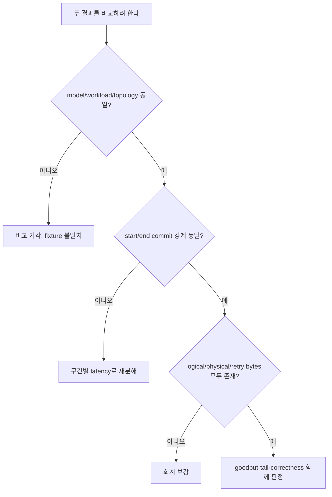
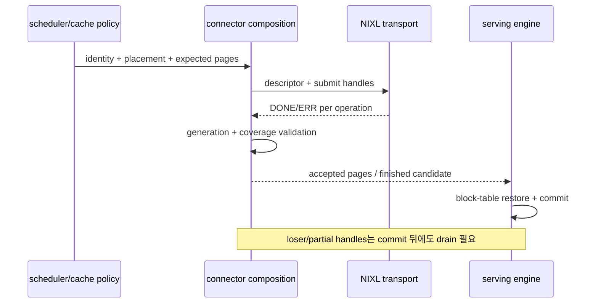
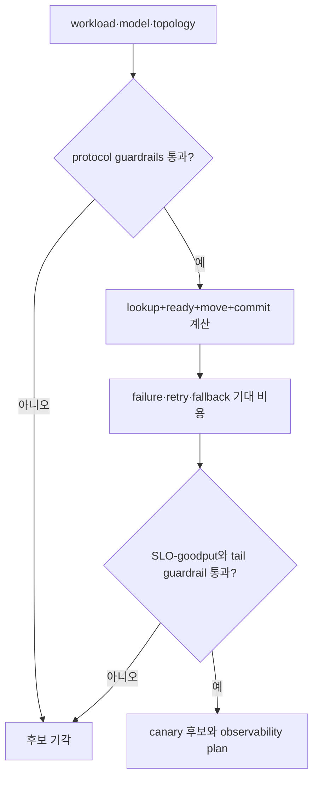

# 64장. connector를 같은 protocol 좌표에서 비교하는 법

팀 A는 NIXL connector가 빠르다고 말한다. 팀 B는 HiCache가 hit를 더 많이 만든다고 말하고, 팀 C는
MultiConnector로 둘을 묶으면 장점을 모두 얻는다고 말한다. 세 문장은 비교 축이 다르다. NIXL은 memory와
transfer handle을 다루는 층이고, HiCache는 cache tier와 restore lifecycle을 가진다. MultiConnector는 여러
child connector의 hit·load·finish를 합성한다. 서로 다른 질문의 답을 throughput 숫자 하나로 겨루면 어떤
비용과 failure surface가 바뀌었는지 알 수 없다.

이 장은 앞 세 장의 산출물을 한 표에 놓는다. 61장의 key·descriptor·registration·submit·completion·commit
protocol, 62장의 LMCache tier 수명, 63장의 Mooncake Transfer Engine/Store 두 장부를 기준선으로 삼는다.
여기에 vLLM v0.27.1의 MultiConnector/NixlConnector, SGLang v0.5.18의 HiCache/HiCacheNixl, NIXL commit
`8770b655...`의 API를 매핑한다. 제품 내부 설명을 반복하지 않고, 같은 조건에서 비교 가능한 것과 애초에
다른 층이라 비교할 수 없는 것을 구분한다.

처음 읽는 독자는 제품 이름을 외울 필요가 없다. 64.1~64.2에서 비교의 시작·끝과 열 개 protocol 행을
이해한 뒤, 64.6의 같은 1GiB fixture와 64.8의 여섯 반례를 읽으면 이 장의 tutorial은 완결된다.
64.3~64.5는 각 구현이 어느 행을 소유하는지 확인할 때, 64.9~64.10은 실제 후보 선택과 관측을 설계할
때 돌아오는 응용편이다. 64.13은 revision을 갱신할 때 쓰는 reference/source note이므로 첫 독서에서는
건너뛰어도 된다. 이 독서 경로를 나누는 이유는 구현 식별자가 “왜 DONE과 commit을 나눠야 하는가”라는
mental model보다 먼저 기억되는 일을 막기 위해서다.

## 64.1 더 빠른 connector라는 질문이 불완전한 이유

같은 1 GiB KV를 옮겼다고 해도 측정 시작점이 다를 수 있다. 한 실험은 key lookup과 destination allocation을
포함하고, 다른 실험은 preregistered descriptor를 받아 `transfer()` 호출부터 잰다. 한쪽은 application commit
뒤 종료하고, 다른 쪽은 transport `DONE`에서 멈춘다. 전자는 cache/serving latency이고 후자는 data movement
latency다.

### 비교 대상의 시작과 끝을 먼저 고정한다

Canonical request C64는 8,192-token, logical KV 1 GiB, 16-token page 512개를 가진다. 동일 model/layout/dtype,
동일 source/destination GPU와 topology, 같은 warm registration 조건을 쓴다. 다음 timestamp 중 어느 구간을
비교하는지 명시한다.

```text
T_lookup: key query start → usable descriptor/placement selected
T_ready:  destination allocation start → registered/ready
T_move:   transfer submit → all operation handles terminal
T_commit: terminal → validated and serving-visible
T_total:  request handoff start → decode may consume
```

`T_move`가 짧아도 `T_lookup+T_ready`가 크거나 commit failure가 많으면 TTFT와 goodput는 좋아지지 않는다.
반대로 tier hit로 transfer bytes가 줄었다면 connector가 같은 byte를 더 빨리 옮긴 것이 아니라 workload가
달라진 것이다. logical requested bytes, avoided compute tokens, physical/retry bytes를 모두 보고한다.

같은 C64에서 세 측정이 있다고 하자. NIXL microbenchmark는 preregistered descriptor를 받아 submit→DONE
12ms만 잰다. vLLM serving trace는 scheduler match 2ms, ready 3ms, move 12ms, reconcile/commit 4ms로 21ms다.
HiCache trace는 exists/query 7ms, host-pool ready 5ms, move 20ms, postprocess/restore 10ms로 42ms다. “12 대
42”는 connector speed 비교가 아니라 서로 다른 start/end와 memory path 비교다.

구간을 맞추면 질문이 달라진다. `T_move`만 비교할 때는 memory kind, bytes와 concurrency를 같게 한다.
`T_total`은 lookup과 cache hit가 workload를 바꾸는 효과를 포함한다. 둘 다 유용하지만 같은 열에 넣지 않는다.
Microbenchmark가 commit을 측정하지 않은 것을 결함이라 부르지 않고 serving total 근거로 확대하지도 않는다.

Client deadline slack이 50ms라면 42ms 평균 path도 cold setup 15ms가 붙는 request는 실패한다. Component p50을
합한 값은 request p99가 아니다. End-to-end percentile은 request trace로 구하고 component distribution은
first divergence를 찾는 데 쓴다.

### capability와 policy를 나눈다

NIXL backend가 어떤 memory type과 transport를 지원하는지는 capability다. 어느 prefix를 hit로 인정하고 어떤
tier/replica를 고르며 deadline이 짧을 때 recompute할지는 cache·scheduler policy다. MultiConnector의 child
순서와 hit aggregation은 composition policy다. 이 셋을 한 `backend=nixl` label로 합치면 원인을 찾을 수 없다.

Capability가 GPU registration을 지원해도 현재 pool이 등록됐다는 뜻은 아니다. Policy가 remote tier를 골라도
registration generation이 stale하면 submit할 수 없다. Composition이 NIXL child를 선택해도 다른 child가
required metadata를 소유하면 commit은 기다린다. `supported`, `selected`, `ready`, `terminal`, `committed`를
다른 상태로 둔다.

Capability lookup 100%, policy remote selection 60%, readiness 58%, transport DONE 57%, serving commit 55%라면
단계별 감소를 본다. 이를 “NIXL success 55%”로 쓰면 선택에서 제외된 40%와 실제 failure를 섞는다. Remote
selection이 낮다는 사실은 transport가 느리다는 가설을 지지하지 않는다.

## 64.2 lookup→readiness→move→commit→recovery를 한 번만 비교한다

제품을 열로 놓기 전에 모든 구현에 물을 열 개의 행을 고정한다.

| protocol 행 | 확인할 질문 | 필요한 증거 |
|---|---|---|
| identity | token/model/layout/revision 중 무엇이 key인가 | key constructor와 digest |
| discovery | endpoint/object 존재를 누가 찾는가 | lookup/metadata source |
| descriptor | address·length·device·generation의 owner는 누구인가 | descriptor type/serializer |
| registration | 어느 range를 언제 등록·해제하는가 | register/deregister lifetime |
| placement | tier/source/destination/replica를 누가 고르는가 | selection function·input |
| submit | work가 어느 queue/handle에 들어가는가 | submit return semantics |
| completion | DONE·visibility·commit 순서는 무엇인가 | polling/callback/caller |
| retry | partial·duplicate·stale를 어떻게 접는가 | identity와 cleanup branch |
| composition | 여러 child 결과를 어떻게 합치는가 | aggregation rule |
| observability | owner가 드러나는 bounded 지표는 무엇인가 | metrics/trace schema |

기능이 없으면 빈 칸이 아니라 `not owned here` 또는 `unsupported`라고 쓴다. Evidence를 찾지 못했다면
`unverified`다. 세 표현은 다르다. NIXL이 prefix key를 정의하지 않는 것은 결함이 아니라 상위 connector의
책임이고, 특정 connector가 stale generation을 검사하는지 확인하지 못한 것은 검증 공백이다.

표의 cell에는 `owner, input identity, output state, source anchor, runtime observation, falsifier`가 들어간다.
NIXL completion cell의 input은 prepared dlist/handle, output은 backend state다. Application commit cell은
`not owned here`이며 vLLM/SGLang caller evidence가 필요하다.

Identity 행부터 쓰는 이유는 뒤 행의 성공을 해석하기 위해서다. 같은 1GiB라도 model/layout generation이
다르면 bandwidth 측정은 가능하지만 serving correctness 후보가 아니다. Registration 행이 비면 stale
descriptor cleanup owner를 찾을 수 없다.

함수가 child 순서를 보존한다는 것은 source fact, 그 순서가 workload 최적이라는 것은 runtime hypothesis다.
DONE이 operation terminal이라는 source fact와 GPU consumer safety 주장도 다르다. 후자에 visibility/commit
evidence가 없으면 unverified다.

### 비교 불가능 조건을 먼저 기각한다

GPU 수·SKU·topology, prompt histogram, source/destination memory kind, registration reuse, transfer direction,
page/chunk 크기, concurrency, timeout/retry, cache warmness와 correctness 검증이 다르면 성능 숫자를 직접
합치지 않는다. 특히 pull과 push, GPU↔GPU와 CPU staging, preregistered steady state와 first request를 별 cell로
둔다.

기각표에는 영향 경로를 쓴다. Topology는 bandwidth/registration path를, chunk size는 setup 횟수와 retry
단위를, cache warmness는 transferred bytes와 avoided compute를 바꾼다. Timeout은 survivor와 retry bytes,
validation 정책은 commit latency와 good-request denominator를 바꾼다.

Page size 16/32 tokens이면 C64는 512/256 pages다. Logical 1GiB는 같아도 metadata entries와 coverage cost가
다르다. Page size를 맞추거나 overhead를 별 항으로 모델링한다. Preregister 100ms를 10,000 transfers에
나누면 0.01ms지만 pool이 100 requests마다 churn하면 1ms다. Pool lifetime과 cold p99 없이 steady result를
배포 TTFT로 옮기지 않는다.



**같은 lookup·readiness·move·commit·recovery 좌표에 네 후보를 놓는다.**

61장의 protocol을 반복하지 않고 비교 좌표만 가져온다. 열은 identity, transport readiness, application commit, retry/recovery,
observability 다섯 개다. 행은 LMCache integration, Mooncake store/transfer boundary, SGLang HiCache+NIXL path, vLLM NIXL 또는
MultiConnector 조합이다. 한 cell이 제품 전체를 대표하지 않고 pinned source에서 확인한 exact owner와 deployment gap을 쓴다.

Identity 열은 key 문자열 존재가 아니라 model/layout/token/object generation을 누가 만든고 검증하는지 본다. LMCache는 engine과
cache connector 사이 request/chunk identity를, Mooncake는 store object와 transfer metadata를, HiCache는 tier lookup key와 restore
request를, NIXL은 caller가 제공한 descriptor/operation identity를 소비한다. NIXL library 자체가 prefix semantic identity를
소유한다고 쓰지 않는다.

Transport 열은 move primitive 이름이 아니라 source/destination memory kind, registration/descriptor readiness, submit와 terminal
owner를 적는다. Mooncake가 transfer engine을 포함해도 store commit과 같은 행으로 합치지 않는다. HiCache가 NIXL backend를
사용해도 tier exists와 VRAM consumer readiness를 같은 success로 쓰지 않는다. MultiConnector가 child를 호출해도 child terminal
algebra와 final engine commit은 별 cell이다.

Commit 열은 decode가 어떤 generation을 소비할 수 있게 되는지를 본다. LMCache lookup result, Mooncake get success, HiCache
postprocess, NIXL DONE 모두 이름만으로 application commit이 아니다. Caller가 accepted pages를 block mapping과 scheduler runnable로
연결하고 first consume하는 source/trace가 필요하다. Source가 transport terminal까지만 보이면 commit cell은 `owned by caller`다.

Retry 열은 같은 intent를 접는 key, partial retention, late completion fence, abort와 resource reclaim을 본다. Cache lookup retry,
store retry, transfer handle retry는 다른 effect를 가진다. 다른 object를 같은 request name으로 overwrite하거나 failed child의 late
success가 new generation을 complete하게 만들면 불합격이다. Exactly-once marketing 문구보다 generation conflict fixture를 쓴다.

Observability 열은 lookup, ready, move, commit, consume와 cleanup을 join할 수 있는지 본다. Product metrics가 풍부해도 common
object generation이 없으면 first divergence를 찾기 어렵다. 반대로 내부 metric이 적어도 connector boundary에서 canonical trace를
추가할 수 있다. `unobserved`를 zero나 success로 채우지 않는다.

작은 workload W1은1 GiB object100건, prefix reuse80%, decode deadline100ms다. 후보 A의 lookup2ms, ready8ms, move12ms,
commit4ms라면 hit total26ms다. Miss recompute80ms를 포함한 기대 시간은 `.8×26+.2×80=36.8ms`다. 이 계산은 fixture이며
실측 기본값이 아니다. Failure와 queue를 넣기 전 평균이다.

후보 B는 lookup1ms, ready25ms, move10ms, commit4ms로 hit40ms다. Hit95%여도 miss80ms면 기대42ms다. 높은 hit가 ready
비용을 자동 이기지 않는다. 후보 C direct move8ms지만 discovery/ready unknown이면 성능 점수를 계산하지 않는다. Required
identity/commit cell이 unverified인 후보는 먼저 기각한다.

W2는 reuse10%, object64 MiB, deadline40ms다. Remote cache lookup/restore overhead가 recompute15ms보다 크면 cache candidate가
불리할 수 있다. NIXL direct move가 빠르더라도 connection/registration cold path가 deadline을 넘을 수 있다. Workload bucket은
object size, reuse probability, cold/warm state, concurrency, deadline과 failure cost를 가진다.

W3는1 GiB, reuse90%지만 destination GPU pool pressure가 높다. HiCache host tier hit가 많아도 restore-ready queue30ms와 H2D
copy가 붙으면 end-to-end가 느리다. Mooncake remote object hit와 direct transfer candidate도 destination credit가0이면 commit하지
못한다. Lookup hit와 runnable success를 분리한다.

소스 anchor는 제품별 책임을 제한한다. vLLM MultiConnector의 child aggregation과 NIXL worker의 finished boundary, SGLang
HiCache storage/restore와 NIXL postprocess, LMCache lookup/promotion lifecycle, Mooncake registered/store/transfer boundary를 caller와
consumer까지 잇는다. 62·63장의 내부 알고리즘을 여기서 반복하지 않고 비교 표의 owner와 state 이름만 참조한다.

Canonical row 예시는 `identity=engine K7/layout9`, `transport=NIXL handle A3`, `commit=connector accepted→engine block generation12`,
`recovery=late A3 fenced/new A4`, `observe=lookup/ready/move/commit/consume joined`다. 한 row에 LMCache object key와 Mooncake
descriptor를 동시에 넣으려면 explicit composition mapping이 필요하다. 이름 유사성으로 join하지 않는다.

Composition은 AND/OR algebra를 명시한다. AND child set이면 모두 current generation terminal/accepted여야 commit한다. OR race면
winner 한 명만 effect를 commit하고 loser는 drain/reclaim한다. Fallback은 original failure를 지우지 않고 별 attempt/lane을 만든다.
Multi가 지원된다는 사실은 이 algebra가 안전하다는 자동 증명이 아니다.

## 64.3 MultiConnector는 child의 장점을 자동 합산하지 않는다

vLLM의 MultiConnector는 여러 child를 같은 engine lifecycle에 연결한다. 중요한 질문은 “여러 connector를
지원하는가”가 아니라 hit, metadata, load, finish와 cleanup을 어떤 규칙으로 합치는가다.

### child 구성과 순서는 policy가 된다

고정 소스의 [`MultiConnector.__init__`와 child config 구성](https://github.com/vllm-project/vllm/blob/6e448d0ea9bf3d88d898b65449ca6dc2aec170ac/vllm/distributed/kv_transfer/kv_connector/v1/multi_connector.py#L128-L241)은
child class와 config를 만들고 공통 interface 뒤에 둔다. 이것은 workload에 따라 최적 child를 학습하는
auto-tuner라는 증거가 아니다. 순서, 지원 capability와 각 child의 role이 실제 policy input이다.

두 child가 같은 token range를 hit로 보고해도 payload identity와 completion을 임의로 섞을 수 없다. Child A의
앞 256 pages와 child B의 뒤 256 pages를 합칠 수 있는지는 layout, generation, contiguous-prefix 규칙과
allocation owner가 결정한다. “총 hit가 512 pages”라는 덧셈만으로 consumer-safe bundle이 되지 않는다.

[`get_num_new_matched_tokens`와 allocation state](https://github.com/vllm-project/vllm/blob/6e448d0ea9bf3d88d898b65449ca6dc2aec170ac/vllm/distributed/kv_transfer/kv_connector/v1/multi_connector.py#L385-L434)는
child 결과가 scheduler-visible match/allocation과 만나는 anchor다. Child별 proposed tokens, final accepted
tokens, allocation owner와 metadata digest를 기록한다. 감소 이유가 overlap, contiguous-prefix constraint,
unsupported composition 중 무엇인지 남긴다.

A가 pages 0..383, B가 256..511을 제안하면 단순 합은 640 pages지만 unique union은 512, overlap은 128이다.
둘 다 load하면 useful 1GiB 외 최소 256MiB overlap traffic이 생길 수 있다. Scheduler가 한 child를 선택했는지,
ranges를 partition했는지 source와 trace로 확인한다.

순서를 바꾼 canary에서 selected child와 bytes가 예상대로 바뀌면 order-policy 가설이 강해진다. 순서가 바뀌어도
선택이 같으면 capability filter나 caller aggregation이 owner일 수 있다. Constructor order가 곧 winner라고
단정하지 않는다.

### load fan-out과 finish aggregation을 분리한다

[`start_load_kv`부터 `get_finished`](https://github.com/vllm-project/vllm/blob/6e448d0ea9bf3d88d898b65449ca6dc2aec170ac/vllm/distributed/kv_transfer/kv_connector/v1/multi_connector.py#L293-L341)는
child load를 시작하고 finished 결과를 모으는 구간이다. 한 child가 빨리 성공했을 때 다른 child의 pending
work를 취소하는지, 두 child가 같은 destination block을 쓸 가능성이 없는지, error가 전체 request에 어떻게
전파되는지를 caller까지 따라간다.

[`request_finished` aggregation](https://github.com/vllm-project/vllm/blob/6e448d0ea9bf3d88d898b65449ca6dc2aec170ac/vllm/distributed/kv_transfer/kv_connector/v1/multi_connector.py#L483-L542)은
성공 경로보다 cleanup 비교에서 더 중요하다. Child 하나가 remote object lease를 놓고 다른 child가 host
staging reference를 놓는다면 request finish 한 번이 두 owner에게 정확히 전달돼야 한다. Aggregated boolean
하나만 metric으로 남기지 않고 child별 pending, success, error, cleanup latency와 최종 serving commit을 잇는다.

Fan-out 시각이 같아도 child queues가 다르다. A submit 0ms/DONE 12ms, B submit 3ms/PROC 20ms/timeout 50ms라
하자. A만으로 consumer-safe면 commit 15ms 뒤 B를 drain할 수 있다. B가 required component면 50ms까지 성공할
수 없다. Composition rule이 TTFT와 cleanup cost를 결정한다.

Required-child ledger가 모두 terminal이고 refs도 0인데 commit이 없으면 aggregation/caller를 본다. 한 required
child가 PROC면 wait는 정상이다. Request response 뒤 child cleanup이 200ms 늦으면 client success와 별도로
registered/pinned residue가 capacity를 차지한다.

## 64.4 NixlConnector에서 transport API와 serving commit을 나눈다

vLLM의 NixlConnector는 scheduler와 worker 경계를 가진다. Scheduler는 어느 token/block이 remote에서 올 수
있는지 판단하고 metadata를 만든다. Worker는 KV cache tensor를 등록하고 transfer를 시작하며 completion을
보고한다. NIXL library는 memory descriptor와 operation handle을 제공한다. 세 층을 하나의 connector 함수로
축약하지 않는다.

### layout 요구가 transfer 이전에 shape를 제한한다

[`NixlBaseConnector`의 layout과 scheduler delegation](https://github.com/vllm-project/vllm/blob/6e448d0ea9bf3d88d898b65449ca6dc2aec170ac/vllm/distributed/kv_transfer/kv_connector/v1/nixl/connector.py#L79-L225)은
required KV layout, matched-token 계산과 connector metadata 구성을 worker copy보다 앞에 둔다. 이는 layout이
성능 tuning 문자열이 아니라 source/destination이 같은 byte 좌표를 해석하기 위한 protocol 조건임을 보여 준다.

TP/PP mapping이나 layer group이 다르면 NIXL operation이 byte를 정확히 옮겨도 serving 결과는 틀릴 수 있다.
따라서 비교 표의 compatibility 행에는 model digest뿐 아니라 KV layout name, layer→buffer mapping, block/page
size와 rank mapping을 넣는다. “양쪽 모두 1 GiB”는 semantic compatibility가 아니다.

Producer TP4가 layers의 KV를 네 rank에 나누고 consumer TP2가 두 rank에 재배치한다면 descriptor count와
range mapping이 달라진다. Rank별 expected bytes 합이 1GiB여도 slice-to-destination mapping이 틀릴 수 있다.
Submit 전 mapping validation과 rank max completion, commit coverage를 별로 본다.

Layout mismatch 가설은 exact model/layout/rank digest가 같고 모든 expected slices가 same-generation block에
accepted됐을 때 약해진다. Byte count와 DONE만으로 반증하지 않는다. Mismatch fixture가 transfer 전 bounded
reason으로 fail-closed하는지도 확인한다.

### registration과 load completion의 owner를 잇는다

[`register_kv_caches`, finished와 error 조회](https://github.com/vllm-project/vllm/blob/6e448d0ea9bf3d88d898b65449ca6dc2aec170ac/vllm/distributed/kv_transfer/kv_connector/v1/nixl/connector.py#L226-L307)는
runner의 KV tensor가 connector worker에 등록되고, load/save 완료와 block error가 위로 전달되는 facade다.
이 facade에서 반환되는 finished request set을 NIXL `DONE`과 동일시하지 않고 worker의 polling·notification,
block validation과 scheduler reconciliation을 따라간다.

Pull variant의 [`start_load_kv`](https://github.com/vllm-project/vllm/blob/6e448d0ea9bf3d88d898b65449ca6dc2aec170ac/vllm/distributed/kv_transfer/kv_connector/v1/nixl/connector.py#L322-L349)는
decode worker가 remote KV를 당기는 방향이다. Push는 sender가 destination 쪽 준비 정보와 notification을 받아
보내므로 readiness, retry와 ACK owner가 다르다. 같은 fixture에서 direction을 바꾸면 “connector만 바꾼”
실험이 아니다. Control message 수, destination credit, failure residue가 달라지는 별 configuration이다.

Pull에서는 decode가 source descriptor를 받아 read를 시작하는 시각, push에서는 destination readiness와 sender
write submit 시각을 기록한다. Pull 12ms와 push 10ms를 비교할 때 handshake/readiness control cost를 포함한
`T_total`도 함께 낸다. Direction별 timeout residue와 loser handle owner가 다를 수 있다.

Facade finished가 request 100개, underlying DONE 102 handles라면 multi-handle/duplicate mapping을 설명한다.
반대로 handles terminal 100인데 finished 98이면 validation/reconciliation pending 두 건을 찾는다. Count equality는
identity equality가 아니므로 request-generation join을 사용한다.

### NIXL API의 DONE 뒤에도 serving 검증이 남는다

역할별 고정 좌표와 판정 범위는 다음과 같다.

- NIXL 고정 소스의 [`register_memory`와 `deregister_memory`](https://github.com/ai-dynamo/nixl/blob/8770b655a6b17b5cdf7d2b56b6e0be5392496df5/src/api/python/_api.py#L407-L447)는 memory registration descriptor의 lifecycle을 보여 준다.
- [`prep_xfer_dlist`](https://github.com/ai-dynamo/nixl/blob/8770b655a6b17b5cdf7d2b56b6e0be5392496df5/src/api/python/_api.py#L488-L532)는 local/remote descriptor list를 준비하고, [`transfer`와 `check_xfer_state`](https://github.com/ai-dynamo/nixl/blob/8770b655a6b17b5cdf7d2b56b6e0be5392496df5/src/api/python/_api.py#L638-L676)는 operation handle의 진행 상태를 다룬다.

이 API가 token key, contiguous prefix, block-table install과 decode admission을 정의하지 않는 것은 정상이다.
NIXL state가 `DONE`이면 transport 행을 채울 수 있지만 application commit 행은 connector/engine evidence가
필요하다. 비교 실험이 NIXL microbenchmark라면 `T_move`만 주장하고, serving benchmark라면 `T_total`과
correctness·failure denominator까지 측정한다.

API 단계별 failure도 구분한다. `register_memory` 실패는 pool/readiness, `prep_xfer_dlist` 실패는 descriptor
geometry, `transfer` submit error는 operation creation, `PROC` 고착은 progress, `DONE` 뒤 reject는 application
validation owner다. 하나의 `nixl_error`로 합치지 않는다.

Handle DONE이 12ms, serving commit 17ms면 5ms gap을 block validation, callback delivery와 scheduler iteration으로
나눈다. NIXL backend를 더 빠르게 해도 이 5ms는 그대로다. DONE→commit gap이 0처럼 보이면 실제 event가
같은 timestamp source를 쓰는지, DONE을 commit으로 잘못 alias했는지 감사한다.

## 64.5 HiCache는 tier lookup과 restore를 serving lifecycle에 붙인다

SGLang HiCache를 단순한 NIXL wrapper라고 부르면 cache policy와 decode restore ordering을 잃는다. Storage
interface는 object 존재, get/set과 pool transfer를 정의하고, HiCacheNixl은 그 storage operation에 NIXL
descriptor와 transfer를 연결한다. Decode mixin은 실제 request가 어느 prefix를 local restore하고 언제
commit하는지 결정한다.

### storage interface가 결과 단위를 정한다

[`HiCacheStorage` protocol](https://github.com/sgl-project/sglang/blob/71de97b264b04dcd514cf904003028aefe9775c8/python/sglang/srt/mem_cache/hicache_storage.py#L95-L325)은
pool transfer result, `exists/get/set`과 v1/v2 batch method를 정의한다. 여기서 hit 결과의 단위, host pool
index와 extra pool 결과가 serving layer에 어떤 모양으로 돌아가는지 본다. Backend가 NIXL인지 file인지보다
상위 interface가 어떤 partial result와 failure를 표현할 수 있는지가 먼저다.

Exists가 참이라는 사실은 destination host page에 payload가 있다는 뜻이 아닐 수 있다. Metadata cache가
존재를 기억하고 실제 get에서 object가 사라질 수 있으며, batch 일부만 돌아올 수 있다. 62장에서 본
`contains→actual object→consumer safe` 분리를 HiCache에도 적용한다.

Exists 512 pages, get returned 480, postprocess accepted 448, decode committed 448이라고 하자. 감소는 한 번에
64 pages가 아니다. Query stale/missing 32, shape/generation reject 32처럼 단계별 이유가 필요하다. Engine이
contiguous prefix만 받을 수 있어 page 100에 hole이 나면 뒤 348 pages를 버릴 수도 있다. 단순 accepted sum은
prefix usability를 설명하지 못한다.

Storage v1/v2 batch method를 같은 latency population에 섞지 않는다. Batch 크기, result unit과 error 표현이
다르면 setup amortization과 partial failure가 달라진다. Configuration digest에 interface path와 batch size를
넣고 source caller가 어느 method를 선택했는지 trace한다.

Exists-stale 가설은 query epoch와 object generation이 get/postprocess 시점까지 같고 all expected pages가
returned됐으면 약해진다. 그때 accepted 감소는 prefix/layout policy를 본다. Exists hit rate 하나로 discovery
정확성을 반증하지 않는다.

### HiCacheNixl은 key metadata와 registered pool을 연결한다

[`_xfer_and_wait`와 pre-registered 경로](https://github.com/sgl-project/sglang/blob/71de97b264b04dcd514cf904003028aefe9775c8/python/sglang/srt/mem_cache/storage/nixl/hicache_nixl.py#L221-L300)는
key query 결과를 source/destination descriptor와 transfer에 연결한다. Wait가 반환한 성공이 어느 NIXL state와
range를 뜻하는지, timeout 뒤 handle과 bounce slot이 어떻게 정리되는지까지 읽어야 한다.

Wait 35ms를 owner별로 나누면 queue 5ms, descriptor prep 2ms, transfer progress 25ms, poll interval/notification
3ms일 수 있다. Busy polling이면 CPU cost와 poll cadence가 observed completion latency를 바꾼다. 동일 backend
비교에서 polling 설정이 다르면 `T_move`도 직접 비교하지 않는다.

Timeout 40ms 뒤 operation이 43ms에 DONE이 될 수 있다. Fallback restore/recompute가 이미 같은 destination을
사용한다면 late handle을 fence해야 한다. `_xfer_and_wait` return failure를 backend quiescence로 읽지 않고
active handle, slot generation과 cleanup timestamp를 잇는다.

[`register_mem_pool_host`](https://github.com/sgl-project/sglang/blob/71de97b264b04dcd514cf904003028aefe9775c8/python/sglang/srt/mem_cache/storage/nixl/hicache_nixl.py#L335-L452)는
host pool 전체 또는 component를 등록하는 lifecycle의 anchor다. Pool 재생성·resize 뒤 같은 address가 다시
나올 수 있으므로 pool name, process incarnation과 registration generation을 descriptor cache와 함께 추적한다.

Host pool 64GiB 등록이 120ms이고 lifetime 동안 60,000 transfers를 처리하면 평균 registration cost는 0.002ms다.
하지만 resize가 매 600 transfers마다 일어나면 0.2ms이고, resize 직후 request tail은 120ms까지 볼 수 있다.
`registration_amortized`와 `cold_ready_p99`를 함께 보고 pool churn rate를 보존한다.

등록된 pool 전체 range가 capability라고 해서 object 하나가 전체 64GiB를 쓸 권한을 가져서는 안 된다.
Key/object metadata가 허용하는 host indices와 byte length를 검증한다. Pool generation mismatch는 transfer submit
전에 거절하는 것이 cleanup과 보안 면에서 싸다.

Batch path의 [`preprocess→xfer→postprocess`](https://github.com/sgl-project/sglang/blob/71de97b264b04dcd514cf904003028aefe9775c8/python/sglang/srt/mem_cache/storage/nixl/hicache_nixl.py#L698-L817)는
key metadata, host indices, buffer/page 결과와 transfer stats가 만나는 지점이다. Preprocess success count,
operation terminal과 postprocess가 채택한 pages를 별 지표로 둔다. 물리 전송 성공 pages가 prefix 정책에서
버려질 수 있기 때문이다.

Batch 32 objects 가운데 preprocess 30, xfer DONE 29, postprocess accepted 28이면 stage ratios의 denominator를
각각 표시한다. 30/32, 29/30, 28/29다. 최종 87.5%만 보면 key parse, transport와 postprocess 실패가 섞인다.
Object sizes가 다르면 count와 bytes 양쪽을 낸다.

Preprocess failure인데 physical bytes가 증가하면 work submission ordering을 다시 본다. Postprocess reject가
있는데 accepted pages metric이 transfer pages와 같다면 metric alias 가능성이 있다. Source state와 runtime
counter가 같은 의미인지 canary로 검증한다.

### decode restore commit이 최종 소비 경계다

[`DecodePrefixMatch`와 prefetch 시작](https://github.com/sgl-project/sglang/blob/71de97b264b04dcd514cf904003028aefe9775c8/python/sglang/srt/disaggregation/decode_hicache_mixin.py#L24-L140)은
L1 prefix와 decode 쪽 restore 필요량을 계산한다. [`local restore 처리와 request commit`](https://github.com/sgl-project/sglang/blob/71de97b264b04dcd514cf904003028aefe9775c8/python/sglang/srt/disaggregation/decode_hicache_mixin.py#L242-L304)은
restore 결과를 request state에 반영하는 상위 경계다.

따라서 HiCache 비교에는 `exists hits`, `xfer pages`, `restore accepted pages`, `decode committed tokens` 네
숫자가 필요하다. 이들이 다르면 바로 버그라고 단정하지 않는다. Incomplete component, prefix gap, L1 overlap,
deadline fallback이 정당하게 숫자를 줄일 수 있다. 다만 감소 이유와 discarded object cleanup이 원장에 있어야
한다.

Decode에는 L1에 이미 128 pages가 있고 remote가 512 pages를 제안할 수 있다. Remote pages 0..511을 그대로
덮는지, missing suffix 128..511만 restore하는지에 따라 useful bytes가 1GiB 또는 768MiB다. L1 overlap을
physical duplicate로 분리하고 final contiguous committed prefix를 센다.

Prefetch가 42ms 걸렸지만 decode scheduler가 20ms 동안 다른 request를 실행해 15ms만 critical path에 남을 수
있다. 반대로 restore complete 뒤 scheduler iteration 12ms가 추가될 수 있다. `prefetch wall`, `non-overlap`,
`restore→commit`을 나눠 connector와 scheduler 효과를 혼동하지 않는다.

Restore-commit 가설은 accepted pages와 request block table generation, committed tokens와 first consume가
일치할 때 지지된다. Output이 나왔다는 사실만으로 remote pages를 소비했다고 하지 않는다. Deadline fallback
recompute가 output을 만들었을 수 있다.

## 64.6 같은 fixture에서 byte·시간·정확성을 함께 계산한다

C64에서 connector A는 1 GiB를 preregistered GPU↔GPU로 옮기고, connector B는 cache hit 50%를 찾아 나머지
512 MiB만 CPU staging을 거쳐 옮겼다고 하자. B의 physical bytes가 작다고 data path가 빠르다고 결론낼 수
없고, A의 bandwidth가 높다고 TTFT가 짧다고 결론낼 수도 없다.

### 구간별 ledger를 채운다

| 항목 | A | B | 해석 |
|---|---:|---:|---|
| logical requested KV | 1,024 MiB | 1,024 MiB | 같은 workload |
| cache-avoided transfer | 0 | 512 MiB | B의 policy 효과 |
| physical first-attempt | 1,024 MiB | 512 MiB | data path 입력 다름 |
| retry bytes | 0 | 64 MiB | 실패 비용 |
| lookup+ready | 2 ms | 18 ms | B의 metadata/staging 비용 |
| move | 12 ms | 20 ms | 서로 다른 memory path |
| validate+commit | 3 ms | 4 ms | serving 경계 |
| total handoff | 17 ms | 42 ms | request-visible 구간 |

B는 transfer bytes를 절반 줄였지만 이 fixture에서는 lookup과 CPU path 때문에 느리다. 다른 request가 같은
promoted prefix를 재사용하면 후속 total은 달라질 수 있다. 그러므로 첫 hit와 amortized N번째 hit를 분리한다.
Promotion 비용을 첫 요청에서 숨기거나 다음 요청의 절약을 첫 요청 성능으로 가져오지 않는다.

Promotion 80ms 뒤 후속 hit가 매번 20ms를 절약한다면 단순 break-even reuse는 4회다. Lookup/eviction과 failure
확률을 넣으면 더 커진다. 실제 reuse가 2회면 promotion은 손해다. C64 한 요청 결과와 prefix cohort lifetime
결과를 별로 보고한다.

A path가 1GiB/12ms면 약 83.3GiB/s, B가 512MiB/20ms면 25GiB/s다. 그러나 B는 512MiB transfer를 피했다.
Application total은 A 17ms, B 42ms다. Bandwidth, avoided bytes와 total latency는 서로 다른 질문에 답하므로
한 ranking으로 합치지 않는다.

Retry 64MiB가 partial object 하나인지 protocol duplicate인지 분류한다. Useful accepted bytes가 512MiB이고
physical 576MiB면 amplification은 1.125×다. A amplification은 1.0×다. Failure 없는 p50만 비교하면 이 비용이
사라진다.

### goodput 판정에는 failure denominator가 남아야 한다

Connector 비교의 최종 값은 successful transfer bandwidth가 아니다. 같은 offered request에서 deadline과
correctness guardrail을 만족한 request rate다. Lookup timeout 뒤 recompute fallback이 성공했다면 request는
살았지만 connector attempt failure, 추가 compute와 latency는 그대로 센다. Partial transfer 후 잘못된 KV를
commit한 run은 아무리 빠르더라도 good request가 아니다.

```text
connector-adjusted goodput =
  requests meeting TTFT/ITL/deadline and correctness
  / measurement window
```

분모에는 rejected, timed-out, fallback, cancelled와 telemetry-lost request가 남는다. 제품별 metric 이름은
canonical trace field로 변환하되 원본 counter도 보존한다. 변환 과정에서 `DONE`을 `COMMITTED`로 승격하지
않는다.

30분에 10,800 requests를 제출하고 direct path가 10,400 commit, 그중 SLO+correctness 10,200이라고 하자.
Goodput는 5.67 req/s다. HiCache path가 10,500 client success지만 fallback 600건 중 400이 deadline을 넘고
wrong-generation reject 20건이 있다면 good requests를 unique request union으로 센다. Client success 10,500이
곧 goodput가 아니다.

Fallback의 final success와 original connector attempt failure를 둘 다 보존한다. Request outcome dimension은
`final_success`, attempt dimension은 `remote_timeout→local_recompute`다. 두 테이블을 request incarnation으로
join한다. Attempt success rate와 final user goodput가 다른 이유를 설명할 수 있다.

Correctness guardrail은 평균 latency와 독립이다. Wrong KV commit 1건이 있다면 해당 candidate를 performance
frontier에서 제외하고 generation/validation incident로 다룬다. Reject가 fail-closed되어 fallback한 경우는
safe failure이며 latency/goodput 비용으로 남긴다.

Telemetry loss 1%가 overload window에 몰리면 나머지 p99가 낙관적이다. Unknown requests를 성공도 실패도 아닌
별 outcome으로 내고 acceptance threshold를 넘으면 run을 판정하지 않는다. Product별 telemetry coverage 차이를
성능 차이로 오인하지 않는다.

비용 정규화도 유지한다. Host pool 64GiB, GPU destination headroom, extra Multi child와 CPU polling core를
resource sheet에 넣는다. 같은 goodput여도 reserved memory/CPU/network가 다르면 deployment choice가 달라진다.
단, resource 추가를 connector 고유 비용과 policy choice로 분리한다.

## 64.7 조합의 성공과 실패는 행별로 합성한다

Connector chain을 쓰면 하나의 성공 boolean이 아니라 여러 owner의 전이가 한 request에 겹친다. C64-M은 vLLM MultiConnector child A가 matched tokens를 제안하고 child B가 load metadata를 가진 경우다. C64-H는 SGLang HiCache가 object existence를 찾고 HiCacheNixl이 registered host pool로 옮긴 뒤 decode restore가 pages를 채택하는 경우다. 둘은 같은 composition이 아니다. 하지만 identity, discovery, descriptor, registration, placement, submit, completion, retry, composition과 observability라는 같은 행으로 물을 수 있다.

### composition table에서 owner와 AND/OR 규칙을 쓴다

| protocol 행 | vLLM Multi+Nixl | SGLang HiCache+Nixl | NIXL API | 성공 합성 질문 |
|---|---|---|---|---|
| identity | scheduler/child matched-token metadata | storage key+decode prefix match | 소유하지 않음 | 같은 model/layout/generation인가 |
| discovery | child별 remote match | storage exists/query | agent/backend metadata만 | stale positive를 누가 재검증하는가 |
| descriptor | NIXL connector worker metadata | HiCacheNixl key/host index | local/remote dlist | range와 generation owner는 누구인가 |
| registration | worker KV cache registration | host pool registration | register/deregister primitive | pool incarnation과 lifetime이 닫히는가 |
| placement | child order/scheduler decision | tier/storage/decode policy | backend/path capability | policy와 capability가 섞이지 않는가 |
| submit | child load fan-out | batch xfer | transfer handle | submit 반환을 DONE으로 세지 않는가 |
| completion | child finished→engine reconciliation | xfer→postprocess→restore commit | handle state | consumer-visible commit은 어디인가 |
| retry | child별 error/finish cleanup | timeout/fallback와 pool cleanup | 새/기존 handle | stale/duplicate range를 fence하는가 |
| composition | child result aggregation | exists+xfer+restore chain | 소유하지 않음 | AND, OR, 우선순위가 명시됐는가 |

Multi child가 독립 ranges를 제공하고 모두 필요한 bundle이면 성공은 AND다. 같은 range의 대체 source들이라면 first valid commit을 택하는 OR일 수 있지만 loser handle을 drain해야 한다. HiCache에서는 exists, xfer terminal, postprocess accepted pages와 restore commit이 순차 AND다. NIXL DONE은 그중 transport cell만 채운다.



AND/OR는 request 전체에 하나만 적용되지 않을 수 있다. Identity/layout은 모든 participating child가 AND로
일치해야 한다. Alternative source selection은 OR이고, selected payload의 chunks는 AND coverage다. Cleanup은
시작한 모든 child에 AND로 적용한다. “load는 OR, cleanup은 ALL”처럼 row별 algebra를 쓴다.

Child A success probability 0.98, B 0.97이라도 독립 required AND라면 둘의 성공은 약 0.9506이다. Alternative
OR이고 둘이 독립이라면 둘 다 실패할 확률 0.0006, 성공 0.9994다. 실제 failure는 shared path 때문에 독립이
아니므로 observed joint distribution을 쓴다. Algebra는 어떤 correlation을 측정할지 보여 준다.

OR race는 tail을 줄일 수 있지만 physical cost를 늘린다. A/B가 각각 1GiB를 시작해 A가 먼저 commit하면 최대
2GiB progress가 생긴다. Stagger 5ms를 두면 A가 빨리 끝나는 경우 B submit을 피할 수 있지만 A tail에서는
5ms가 추가된다. Stagger sensitivity와 loser bytes를 함께 본다.

### failure matrix는 first divergence를 보존한다

| 최초 어긋난 행 | 보이는 증상 | 최소 관측 | 반증 |
|---|---|---|---|
| identity | hit인데 출력 오염/commit reject | token/layout/generation digest | digests와 accepted pages가 동일 |
| discovery | exists 뒤 miss | query epoch, object version | object가 같은 generation으로 반환 |
| registration | protection error/stale write | pool incarnation, registration gen | submit이 current gen만 사용 |
| submit/progress | queue age와 PROC 고착 | handle state, bytes delta | handles terminal이고 progress 안정 |
| completion | DONE인데 decode wait | accepted/committed pages | same generation first consume 존재 |
| composition | 한 child 끝나도 request 미완료 | child pending/error/cleanup | required children 모두 terminal |

표는 error name을 owner로 삼지 않는다. `timeout`은 discovery, ready, submit, progress, restore 어느 행에서도 날 수 있다. 마지막 합의 행 다음의 first divergence를 찾는다.

C64 trace에서 discovery와 descriptor는 5ms에 끝나고 registration ready가 40ms까지 없으면 first divergence는
ready다. `transfer timeout` alert가 50ms에 울려도 network operation은 아직 제출되지 않았을 수 있다. Handle
ID 존재 여부와 physical bytes 0이 falsifier다.

DONE 12ms 뒤 accepted pages가 0이면 transport owner가 아니라 validation row다. Accepted 512인데 commit이
없으면 engine restore/reconciliation이다. Commit이 있는데 client TTFT가 늦으면 decode queue다. 같은 “remote
load slow” symptom을 행별로 좁힌다.

Matrix의 cleanup 열도 필요하다. Identity reject는 handle 0, registration reject는 allocated/registered residue,
progress failure는 active handle/partial bytes, commit failure는 valid pages와 consumer refs를 남길 수 있다.
Failure stage별 inventory가 0으로 돌아오는 종료 조건을 쓴다.

Matrix를 채우는 실제 순서는 왼쪽에서 오른쪽이 아니다. Request symptom에서 last observed commit/consume를 먼저
확인하고, 없다면 accepted pages, handles terminal, submit, readiness, descriptor와 discovery로 거슬러 올라간다.
첫 missing/mismatch row에서 멈춰 owner evidence를 수집한다. 모든 earlier row를 매번 상세 profiling하지 않는다.

예를 들어 C64-T1은 lookup 4ms, ready 6ms, four handles DONE 14ms, accepted pages 512, commit event 없음이다.
처음 갈라지는 지점은 completion→commit이다. C64-T2는 lookup 4ms, ready event 없음, handles 0이다. 첫 divergence는
readiness다. 두 요청 모두 client에는 remote-load timeout이지만 network tuning의 우선순위가 다르다.

Falsifier column은 investigation을 종료하거나 다음 row로 이동하게 한다. “Network가 느리다”는 가설은 handle이
없으면 반증된다. “HiCache object가 없다”는 가설은 same-generation object와 all pages return이면 반증된다.
“Multi child가 pending”은 required set 모두 terminal이면 반증된다. Falsifier 없는 matrix는 원인 이름 목록일
뿐이다.

Owner column은 library 이름보다 state mutation 권한이다. NIXL API가 handle을 terminal로 만들고 connector가
accepted pages를 쓰며 engine이 block table/commit을 연다. Team boundary가 다르더라도 이 owner sequence를
유지하면 “각자 정상”이라는 교착을 풀 수 있다.

Cleanup matrix에는 `allocated bytes`, `registered bytes`, `active/prepared handles`, `partial pages`, `child refs`,
`consumer refs`, `idempotency/tombstone`을 둔다. Success와 failure 모두 expected terminal inventory를 가진다.
Client response가 끝났다는 이유로 cleanup column을 생략하지 않는다.

### loser와 partial result도 cleanup 대상이다

두 child가 같은 1GiB range를 race해 A가 12ms에 valid complete, B가 20ms에 600MiB progress라면 A를 commit해도 B가 사라지지 않는다. B handle을 fence/drain하고 destination range와 충돌하지 않는지 증명해야 한다. OR composition이 latency를 줄이는 대신 duplicate physical bytes와 loser cleanup residence를 만든다.

Partial ranges를 합칠 때 page union이 512여도 generations가 다르면 commit하지 않는다. Child A 256 pages K64-a와 B 256 pages K64-b를 덧셈하지 않는다. Same layout, request incarnation, payload policy와 destination generation을 검증한다.

Loser cleanup이 늦으면 다음 composition의 credit을 잠식한다. 초당 2 races, loser 600MiB, drain 500ms면 평균
약 600MiB가 zombie in-flight로 남는다. Drain이 5초로 늘면 약 6GiB다. `loser_bytes`, `oldest_loser_age`, handle
terminal과 registration refs를 관측한다.

Cancellation API 반환을 handle quiescence로 간주하지 않는다. Late completion이 selected commit range를
덮을 수 있으면 separate destination generation/range를 사용하거나 transport fence가 필요하다. Same-range
race가 안전하다는 source evidence가 없으면 composition 후보에서 기각한다.

## 64.8 여섯 사건으로 비교표를 반증한다

### 사건 1: 한 child hit 뒤 다른 child가 finish를 막는다

증상은 matched tokens 8,192와 child A load success가 있지만 request가 finished set에 들어오지 않는 것이다. Child별 `start_load`, pending, error, `get_finished`, `request_finished`와 cleanup time을 같은 request generation으로 잇는다. A가 필수 bundle 전체를 제공했는지, B가 보조 save/cleanup 역할인지가 첫 분기다.

A만으로 consumer-safe라면 B loser work를 drain한 뒤 commit할 수 있다. 두 child가 서로 다른 required components를 소유하면 B 없이 성공할 수 없다. “child 하나 성공이면 전체 성공”과 “모두 성공해야 한다”를 configuration마다 명시한다. 반증은 required-child set이 모두 terminal이고 engine commit도 있는데 request가 기다릴 때 scheduler admission으로 이동하는 것이다.

계산 fixture에서 A는 full 512 pages를 14ms에, B는 auxiliary metadata를 8ms에 제공한다. 둘 다 required라면
completion max는 14ms이고 commit 3ms를 더해 17ms다. B를 optional로 잘못 표시하면 aux가 없는 wrong-answer
가능성이 있다. A가 full data를 제공한다는 이유로 semantic component를 생략하지 않는다.

최소 관측은 child role/required bit, proposed/accepted pages, child terminal, aggregate finished와 engine commit이다.
Child-stall 가설은 required set이 비어 있거나 모두 terminal이고 aggregate result가 이미 전달됐으면 약해진다.
그때 caller/scheduler queue를 본다. Cleanup은 stalled child의 handles와 refs가 terminal인 뒤 끝난다.

### 사건 2: NIXL DONE인데 block generation 검증이 실패한다

1GiB handle은 12ms에 DONE이지만 descriptor는 destination generation D63, 현재 block table은 D64다. Physical transfer bandwidth는 성공했어도 serving commit은 reject한다. 최소 관측은 handle/dlist digest, source/destination registration generation, expected block IDs와 validation reason이다.

복구는 DONE을 재사용하지 않고 D63 handle을 drain/revoke한 뒤 D64 readiness로 새 attempt를 만든다. 같은 address라는 이유로 승격하지 않는다. 반증은 handle과 validation이 모두 D64이고 same-generation first consume가 존재하는 경우다.

D63 transfer 1GiB가 이미 physical path를 소비했으므로 retry D64까지 총 2GiB, amplification 2×다. Goodput에는 첫
attempt failure와 retry latency를 남긴다. `DONE success rate`만 보면 두 attempts 모두 성공처럼 보일 수 있다.

최초 불일치는 current destination generation과 prepared dlist generation comparison이다. NIXL handle이
ERR가 아니므로 backend replacement은 우선순위가 아니다. Descriptor cache invalidation과 pool/engine epoch를
고친 canary에서 D63이 pre-submit reject되고 D64 only commit되는지 본다.

### 사건 3: HiCache exists가 참이지만 restore가 recompute보다 늦다

Exists 1ms, descriptor/ready 8ms, transfer 35ms, postprocess/restore 18ms면 total 62ms다. 같은 missing prefix recompute가 queue 포함 45ms라면 hit가 latency loss다. Exists hit rate만 보면 이 패배를 찾지 못한다. Lookup 당시 deadline slack, predicted restore total과 recompute estimate가 placement policy 입력이어야 한다.

Restore가 늦다는 가설은 accepted pages가 즉시 commit되고 total이 recompute estimate보다 작을 때 반증된다. Cache object existence 자체를 실패로 지우지 않고 `hit_but_bypassed` 또는 `fallback_after_hit`로 기록한다.

Prediction 오차도 잰다. Restore estimate 30ms였으나 actual 62ms, recompute estimate 45ms/actual 48ms라면
selector가 잘못 골랐다. Lookup, queue, move와 postprocess 중 32ms error가 어디서 났는지 owner별 calibration을
한다. Object hit는 정확했으므로 storage correctness incident가 아니다.

Deadline slack 50ms에서 restore를 20ms 진행한 뒤 fallback하면 total이 20+48=68ms가 되어 처음부터 recompute보다
나쁘다. Hedging을 쓴다면 duplicate compute/bytes와 cancellation safety를 포함한다. Cleanup은 abandoned transfer
handle과 host indices를 반환해야 끝난다.

### 사건 4: host pool 재생성 뒤 stale descriptor가 남는다

Process epoch P7의 host pool D7을 해제하고 P8이 같은 virtual address에 D8을 등록했다. Metadata cache의 old descriptor가 address/length만 비교해 통과하면 late write가 새 pool을 오염시킨다. Pool name, process incarnation, registration generation과 descriptor expiry를 함께 본다.

Old handles terminal, D7 deregister, cache invalidation 뒤 D8을 publish한다. 종료 증거는 forced same-address fixture에서도 D7이 submit 전에 reject되고 D8만 postprocess/restore commit되는 것이다. 주소가 우연히 달랐던 성공은 stale branch를 반증하지 않는다.

Pool inventory를 숫자로 맞춘다. P7/D7은 64GiB registered, active handles 2, descriptor-cache entries 120이다.
Resize 요청이 오면 새 allocation을 먼저 만들 수는 있지만 D7을 즉시 free list에 넣지 않는다. 두 handles terminal,
cache entries invalidated/expired, consumer refs zero와 deregistration success 뒤에 registered bytes가 0이 된다.
P8/D8 80GiB publish는 이 fence 이후 새 generation으로 보인다.

Address가 같고 digest가 다른 경우만 보는 것도 부족하다. Descriptor digest가 serialization bug로 같게 계산될 수
있으므로 process incarnation, pool UUID/generation과 allowed range를 구조 필드로 비교한다. Digest는 log join을
돕는 요약이지 identity의 유일한 원천이 아니다.

처음 어긋나는 지점은 source metadata `pool_generation=D7`과 destination registry current `D8`의 비교다. Protection
error는 나중 symptom이다. Submit 전 reject counter가 오르고 physical bytes는 0이어야 바람직하다. Physical
progress가 있으면 validation ordering이 늦다. 복구 뒤 stale metadata replay 100회가 모두 pre-submit reject되고
D8 정상 request의 latency/goodput가 회복되는지 본다.

Cleanup leak 가설은 D7 registered bytes 또는 descriptor cache가 bounded expiry 뒤 남을 때 강하다. Virtual
address가 새 값이라는 사실로 반증하지 않는다. 다음 resize에서도 generation inventory 합과 actual registered
pool 합이 일치해야 한다.

### 사건 5: 방향 또는 TP layout이 달라 일부 rank만 끝난다

Push/Pull readiness owner를 혼동하거나 producer TP4와 consumer TP2 mapping이 잘못되면 ranks 일부의 handles만 DONE일 수 있다. Rank max completion, expected layer/block slices와 per-rank descriptor geometry를 본다. 평균 completion rate가 75%라는 값보다 어느 slice가 비었는지가 중요하다.

모든 rank transport DONE이어도 layout mapping이 다르면 validation에서 막아야 한다. 반대로 mapping과 coverage가 맞고 한 rank만 PROC라면 path/progress owner다. 종료 조건은 exact TP mapping fixture가 all-rank coverage와 single engine commit을 만들고 mismatch fixture가 submit 전 fail-closed하는 것이다.

C64 1GiB를 producer TP4가 rank당 256MiB, consumer TP2가 rank당 512MiB로 가져간다고 하자. Mapping plan은 각
consumer가 producer 두 ranks의 정확한 layer/head slices를 받아야 한다. Handles 네 개 DONE의 byte sum 1GiB만
확인하면 consumer0에 768MiB, consumer1에 256MiB가 잘못 배치돼도 놓칠 수 있다. Destination slice union을
rank·layer·head 좌표로 검증한다.

관측표에는 producer rank, consumer rank, source/destination descriptor generation, logical slice, submitted/
terminal bytes와 validation result를 둔다. Rank0/1 DONE, rank2 PROC, rank3 ERR라면 평균 50% success가 아니라
missing slices가 어느 consumer commit을 막는지 그린다. One consumer가 complete해도 request-wide model state가
둘 다 필요하면 partial decode를 시작하지 않는다.

Direction mismatch는 control plane에서 드러날 수 있다. Pull receiver가 source-ready notification을 기다리는데
push sender도 destination-ready를 기다리면 handles가 0이고 bytes도 0이다. 이를 low bandwidth로 오인하지
않는다. Session role, expected initiator와 last control message가 first divergence다.

Falsifier는 exact TP/layout digest와 mapping table이 일치하고 all expected destination slices가 validated됐는데
commit이 없을 때다. 그때 composition/engine을 본다. Cleanup은 successful ranks의 partial destination refs와
failed/PROC handles를 모두 drain한 뒤 generation을 폐기한다.

### 사건 6: fallback 성공이 goodput를 낮춘다

Remote load timeout 뒤 recompute하면 client success율은 오를 수 있다. 하지만 1GiB partial transfer와 full prefill compute가 중복되고 fallback queue age가 늘어난다. Original attempt, duplicate physical bytes, wasted compute tokens, fallback TTFT와 final SLO outcome을 같은 submitted request에 남긴다.

1,000 requests 중 50건 fallback, 각 512MiB partial과 8,192-token recompute라면 25GiB network와 409,600K prompt-token compute가 실패 비용이다. Fallback 승리 가설은 submitted SLO-goodput가 baseline보다 낮거나 queue가 발산하면 반증된다. Success count만으로 선택하지 않는다.

`409,600K` 표기는 409,600 prompt tokens, 즉 약 0.41M tokens임을 명확히 한다. 50×8,192=409,600이다. Partial
network는 50×512MiB=25GiB다. Fallback request가 평균 70ms의 failed wait 뒤 recompute 180ms를 썼다면 추가
latency는 단순 경로보다 적어도 70ms다. Queue interference까지 request trace로 잰다.

이 fallback policy에는 시작 조건과 취소 조건이 있다. Remote progress가 전혀 없을 때 20ms에 recompute, progress가
있으면 50ms까지 기다리는 식이다. 너무 빠르면 duplicate compute, 너무 늦으면 deadline을 잃는다. Threshold
sweep에서 SLO-goodput, wasted compute, partial bytes와 remote handle residue를 함께 본다.

Original handle이 fallback 성공 뒤 늦게 DONE이면 destination generation을 덮지 않게 fence한다. Recompute가
local block table을 commit한 뒤 remote restore callback이 old plan을 적용해서는 안 된다. `winner=local`, loser
generation, drain terminal과 discarded pages를 기록한다.

최초 불일치는 remote failure 자체가 아니라 fallback cost를 성공 통계에서 누락한 aggregation일 수 있다.
Submitted denominator와 original/final lane이 보존되면 false win을 반증한다. Cleanup 종료는 loser active bytes 0,
host/GPU refs 반환, request에는 한 commit generation만 남는 것이다.

여섯 사건을 한 request state로 합치면 조사 순서가 보인다. Child-stall은 composition required set, DONE/reject는
transport→validation, slow hit는 discovery→restore economics, stale pool은 registration generation, partial rank는
layout/coverage, fallback false win은 attempt→final aggregation에서 처음 달라진다. 모두 “connector timeout”으로
보일 수 있지만 last common row가 다르다.

사건별 최소 artifact도 다르다. 사건 1은 child role/pending ledger, 2는 handle과 block generation, 3은
exists/xfer/restore/recompute timeline, 4는 pool inventory, 5는 rank slice map, 6은 original/fallback attempt와
submitted outcome이다. Generic request log 하나로 여섯 가지를 모두 증명하려 하지 않는다.

복구 우선순위는 correctness fence, residue drain, capacity 회복, traffic resume다. Latency를 먼저 정상화하려고
stale descriptor를 허용하거나 loser cleanup을 생략하지 않는다. Canary는 오류 branch가 fail-closed하는지와
정상 C64가 single-generation commit되는지를 함께 본다.

## 64.9 connector 선택은 workload에서 protocol 행으로 내려간다

### 먼저 기각하고 그다음 점수를 매긴다

Correctness, model/layout compatibility, memory type, topology와 registration lifetime을 만족하지 못한 후보는 latency 점수를 매기지 않는다. 다음으로 canonical A~D workload의 logical/physical bytes, cache hit와 reuse distance, deadline, concurrency와 failure budget을 넣는다.

Guardrail sheet의 첫 열은 후보, 다음 열은 identity/layout, supported memory/direction, registration generation,
consumer commit evidence, cleanup fence와 security deployment다. `unverified` 하나라도 correctness-critical이면
reject다. Performance-critical unverified는 canary requirement로 남길 수 있지만 production default로 승격하지
않는다.

예를 들어 후보 V-NIXL-pull은 GPU↔GPU, TP mapping, current registration과 commit evidence가 모두 있고 통과한다.
H-HiCache-host는 host pool generation은 있으나 tenant namespace authorization evidence가 없으면 보안 guardrail에서
멈춘다. Multi-race는 same-range loser fence가 증명되지 않으면 평균 10ms 이득을 계산하기 전에 기각한다.

비교 기각 이유를 `제품 미지원`으로 합치지 않는다. `unsupported_memory`, `layout_incompatible`,
`registration_lifetime_unverified`, `commit_mapping_unverified`, `cleanup_unsafe`, `security_gap`으로 bounded하게
남긴다. Evidence가 보강되면 같은 candidate key로 재평가한다.



### amortization과 tail을 같이 계산한다

Registration/setup 100ms를 pool lifetime 10,000 transfers에 나누면 평균 0.01ms지만 pool churn 직후 첫 request는 100ms를 부담할 수 있다. Average와 cold p99를 함께 본다. HiCache promotion 비용도 expected future reuse 수로 나누되 실제 reuse가 없으면 첫 요청에 전액 남긴다.

선택식은 `expected total = lookup + ready_amortized + move + validate/commit + failure_expected`다. Failure expected에는 retry bytes, recompute, zombie credit와 deadline miss를 포함한다. 평균이 작은 후보가 p99와 correctness guardrail을 넘으면 선택하지 않는다.

세 후보의 sheet를 채워 보자.

| 후보 | lookup | ready 평균/cold p99 | move | commit | failure expected | 정상 total | 주요 tail |
|---|---:|---:|---:|---:|---:|---:|---|
| direct NIXL | 2ms | 0.01/100ms | 12ms | 4ms | 1ms | 19.01ms | pool churn |
| HiCache host | 7ms | 0.2/120ms | 20ms | 10ms | 3ms | 40.2ms | stale hit/restore |
| Multi hedge | 3ms | 0.02/100ms | 10ms | 5ms | 8ms | 26.02ms | loser drain/bytes |

정상 평균은 direct가 이기지만 50ms deadline의 cold request에는 세 후보 모두 다른 판단이 필요하다. Existing
warm generation인지 admission 시점에 확인하거나 cold lane을 recompute/local로 보낸다. Multi의 move가
10ms여도 failure expected 8ms와 duplicate bytes가 총비용을 올린다.

Failure expected를 latency만으로 환산하지 않는다. 1% stale descriptor가 request를 correctness failure로 만들면
평균 0.01×retry time으로 희석할 수 없다. Correctness guardrail에서 reject한다. Transient miss/fallback처럼
안전한 failure만 기대 비용으로 계산한다.

Reuse distance distribution도 평균을 피한다. Promotion break-even 4회인데 prefixes의 70%가 1회, 20%가 3회,
10%가 20회 재사용된다면 인기 10%에만 promotion을 적용할 수 있다. Predictor 오차와 eviction pressure를
sensitivity에 넣는다.

### 결과는 전역 backend 이름이 아니라 조건부 정책이다

GPU-local preregistered, long prompt, stable peer에서는 direct NIXL path가 적합할 수 있다. Reused prefix와 충분한 deadline, registered host pool에서는 HiCache restore가 이길 수 있다. Multi composition은 child 역할과 cleanup을 증명할 때만 선택한다. 결과는 `(workload cell, hit/reuse, memory path, topology health, queue age)→candidate/fallback` 표다.

정책 예시는 `C/D, GPU peer healthy, current gen, predicted direct total<deadline slack`이면 direct NIXL,
`reuse≥4, host pool warm, restore estimate<recompute`이면 HiCache, 서로 독립 source와 safe loser ranges가 있고 tail
guard가 필요할 때만 Multi hedge다. 어느 조건도 신뢰할 수 없으면 local recompute 또는 reject를 명시한다.

Policy decision trace에는 입력 estimate와 선택/기각 이유가 있어야 한다. Candidate가 실패한 뒤 fallback했을 때
원래 선택이 당시 정보로 합리적이었는지 calibration할 수 있다. 결과만 보면 모든 실패 선택을 나쁜 policy로
오인한다.

Canary manifest는 workload/config hash, source pins, connector chain/order, memory path, pool/registration generation,
TP layout, warm/cold state, timeout/retry/fallback와 validation policy를 가진다. Candidate별 동일 arrival trace와
submitted denominator를 사용한다. Runtime fault injection은 이 장에서 실행하지 않으며 state/unit fixture와
passive trace 요구만 정의한다.

선택 결과의 expiry도 둔다. Model/layout revision, pool recreation, backend/plugin, topology, workload histogram 또는
SLO가 바뀌면 verdict를 재검토한다. 과거 direct 19ms를 새 GPU/path의 약속으로 사용하지 않는다.

Selection workbook은 각 request class가 아니라 stable policy bucket을 만든다. A-short, C-long, warm/cold pool,
high/low reuse, healthy/degraded path와 queue-age bucket을 조합하되 관측 가능한 feature만 사용한다. 미래 실제
output이나 hit를 oracle처럼 쓰지 않는다. Prediction과 actual을 둘 다 저장해 calibration한다.

Canary 결과 예시는 다음과 같다. Direct는 C warm에서 total p99 28ms/goodput 5.8, cold p99 130ms/goodput 5.1이다.
HiCache는 reuse≥4에서 35ms/5.7, reuse=1에서 70ms/5.0이다. Multi hedge는 tail 24ms지만 duplicate amplification
1.7×와 cleanup p99 400ms다. 전역 winner는 없고 policy bucket별 guardrail이 생긴다.

Queue interaction도 selection input이다. Direct path가 빠르지만 in-flight bytes credit 90%와 oldest age 45ms라면
새 C64를 HiCache warm host 또는 recompute lane으로 돌릴 수 있다. HiCache pool registered headroom이 낮거나
restore queue가 deadline을 넘으면 hit가 있어도 기각한다. Static priority보다 predicted total과 safety
inventory를 본다.

Hysteresis 없이 threshold 50ms 근처에서 direct/HiCache가 매 request 바뀌면 cache locality와 queue가 흔들린다.
Enter/exit threshold, minimum hold와 health hard-fail을 구분한다. Policy oscillation 횟수, wrong-lane regret와
handoff cost를 관측한다.

Fallback은 selected candidate의 숨은 child가 아니라 명시적 lane이다. Original candidate, failure stage, fallback
start, duplicate work와 final outcome을 기록한다. Fallback 성공률이 candidate failure율을 숨기지 않는다.

Production promotion 조건은 canary SLO/correctness, residue inventory, telemetry coverage와 rollback plan이다.
Rollback도 새 pool/descriptor generation을 old connector가 어떻게 폐기하는지 검증한다. Image를 되돌렸다고
in-flight new-generation handles가 사라지는 것은 아니다.

## 64.10 관측은 owner별 원장을 다시 조립한다

### bounded metrics와 sampled trace를 나눈다

Fleet metric은 lookup result/reason, ready latency, registered bytes/generation churn, submit/progress/DONE, accepted/committed pages, child pending/error, retry/fallback bytes, cleanup age와 SLO outcome을 bounded labels로 가진다. Raw key, address, rkey, request/tenant ID는 label에 넣지 않는다.

권장 metric group은 `lookup_total{result,backend}`, `ready_seconds{memory_kind,cold}`, `registered_bytes{pool_class}`,
`transfer_bytes_total{attempt_kind}`, `handles{state}`, `pages_total{stage}`, `commit_seconds{result}`,
`child_requests{child,state}`, `fallback_total{reason}`와 `cleanup_age_seconds{resource}`다. 실제 제품 metric 이름을
무시하지 않고 canonical group과 원본 name/version mapping을 보존한다.

Metric cardinality budget을 사전에 계산한다. Backend 3×result 6×memory 3×size bucket 6 정도는 bounded지만 child
instance/request ID를 넣으면 폭발한다. Replica/peer 상세는 sampled trace나 inventory에 두고 fleet metric은
role/topology class로 제한한다. Generation conflict count는 상세 digest 없이도 alert할 수 있다.

Counter reset은 process epoch로 나눈다. Pool recreation 뒤 registered bytes가 0→80GiB가 된 것을 80GiB leak로
읽지 않는다. Epoch 간 inventory snapshot과 active handle/request를 연결해 old generation residue만 센다.

Sampled trace는 pseudonymous request incarnation, connector chain/order, key/layout digest, descriptor generation, handle IDs digest, page coverage와 first consume를 잇는다. Metric anomaly에서 exemplar로 trace를 찾되 credential/capability는 redaction한다.

Trace span은 `lookup`, `ready.allocate/register`, `child.start`, `nixl.prep/submit/progress/terminal`,
`postprocess.validate`, `engine.commit/first_consume`, `loser.cleanup`으로 구성한다. Span 종료가 semantic state와
같은지 명시한다. `nixl.terminal` span success를 `engine.commit`으로 alias하지 않는다.

Clock이 다른 hosts에서는 local monotonic duration과 causal message/nonce를 사용한다. P submit과 D first consume
차이에 synchronization uncertainty를 붙인다. ±5ms uncertainty에서 2ms 순서 역전을 protocol bug로 확정하지
않고 same-process event와 generation edge를 찾는다.

Trace sampling이 success 0.1%, failure 100%라면 aggregate latency에서 가중치를 사용하지 않고 용도를 분리한다.
Failure trace는 diagnosis, metric histogram은 fleet distribution이다. Telemetry-lost requests는 goodput
denominator에서 사라지지 않고 unknown outcome으로 남는다.

### dashboard는 네 latency와 세 byte를 동시에 보인다

`lookup`, `ready`, `move`, `commit` latency, logical requested, physical first-attempt, retry/duplicate bytes를 한 화면에 둔다. Exists hit가 올랐는데 total이 늘면 restore/ready를 보고, move가 줄었는데 goodput가 줄면 failure/fallback과 commit queue를 본다.

Dashboard 첫 행은 submitted/SLO-goodput와 correctness failures, 둘째는 네 latency와 queue oldest age, 셋째는
세 byte와 accepted/committed pages, 넷째는 pool/handle/child cleanup inventory다. Top row 개선이 bottom residue
증가와 함께 나타나면 false win을 의심한다.

`exists hits=900`, `xfer objects=850`, `accepted=820`, `committed=800`이라면 각 delta를 reason과 owner로 drill-down
한다. `DONE handles=900`과 committed 800 차이를 transport failure로 세지 않는다. Duplicate handles와 objects,
partial validation과 fallback을 request-generation으로 reconcile한다.

Topology/path health와 deployment/source revision annotation을 함께 둔다. 14:00 pool recreation 뒤 cold ready p99,
14:05 plugin rollout 뒤 PROC age가 올랐다면 change point를 source/config와 연결한다. 상관을 root cause로 확정하지
않고 canonical incident fixture로 반증한다.

Child aggregate success 아래 child별 pending과 cleanup을, NIXL DONE 아래 accepted/committed pages를 둔다. Layer가 다르므로 그래프도 겹쳐 보여야 한다. Owner epoch와 source/config digest 변화에 annotation을 넣는다.

### alert는 first divergence와 종료 조건을 가진다

Generation conflict, unauthorized descriptor와 wrong-layout는 빈도가 낮아도 correctness alert다. Queue/latency는 workload SLO와 normal band로 threshold를 정한다. Alert runbook은 last common row, first divergent owner, falsifier, cleanup residue와 canary 종료 조건을 요구한다.

Alert 예시는 `DONE rate 정상, committed-page rate 하락`이다. Runbook은 transport 교체보다 validation reject reason,
pool/layout generation과 engine reconciliation을 먼저 본다. `exists 상승, T_total 악화`는 stale hits, host pool
ready, restore/recompute selector calibration을 본다. `client success 정상, loser bytes/cleanup age 상승`은 Multi
race 또는 fallback false win이다.

종료 조건은 graph가 정상으로 돌아온 것만이 아니다. Stale generation pre-submit reject, all expected pages
single-generation commit, active loser handles 0, registered inventory 일치, submitted SLO-goodput 회복과 no new
correctness failures를 요구한다. Cleanup window가 끝나기 전에 incident를 닫지 않는다.

관측 workbook의 첫 sheet `requests`는 arrival, workload bucket, selected candidate/reason, lookup/ready/move/commit,
logical/physical/retry bytes, proposed/accepted/committed pages, final lane/outcome을 가진다. `resources`는 pool
generation, registered bytes, active handles, child/consumer refs와 cleanup age다. `changes`는 source/config/topology
epoch, `incidents`는 first divergence/falsifier/owner/termination evidence를 가진다.

Aggregate query도 version을 저장한다. `committed pages` 정의를 postprocess accepted로 바꾸면 과거 dashboard와
이어 붙이지 않는다. Canonical field mapping에 original product metric, transformation과 semantic caveat를 남긴다.
Metric rename이 protocol meaning change인지 단순 naming diff인지 source revision에서 확인한다.

세 가지 reconciliation invariant를 자동 검사한다. 첫째, committed pages는 accepted unique pages보다 클 수 없다.
둘째, useful committed bytes+discarded/partial reason이 physical progress와 설명 가능한 관계를 가져야 한다. 셋째,
terminal requests와 active/cleanup inventories는 bounded window 뒤 수렴해야 한다. Compression, overlap과 metadata가
있으면 명시적 category로 차이를 설명한다.

Multi child에서는 child terminal 합이 request count와 같지 않을 수 있다. Child events를 request-generation과
role로 group한 뒤 required set을 계산한다. HiCache에서는 exists objects와 restore pages의 단위가 다르므로
object/page/token을 무리하게 더하지 않는다. NIXL handles와 connector requests도 cardinality가 다르다.

Alert triage 예를 하나 더 보자. 14:10부터 `move p99`는 12ms로 정상인데 `T_total`이 80ms, accepted→committed
gap이 50ms다. Network backend를 재시작하기 전에 engine commit queue, child finish aggregation과 restore
scheduler를 본다. 반대로 commit gap 3ms인데 move PROC age가 증가하고 path bytes credit이 100%라면 transport/
topology를 본다.

관측 자체의 비용도 기록한다. Full payload checksum, per-request spans와 busy poll은 latency/CPU를 바꿀 수 있다.
상시 identity/generation/coverage validation, bounded metrics, sampled payload integrity와 incident-on-demand trace를
구분한다. 서로 다른 observation policy run을 같은 성능 population에 합치지 않는다.

Privacy와 security audit는 raw key/prompt, remote address/rkey와 tenant ID가 label/log에 없는지 검사한다.
Incident store의 descriptor digest와 pseudonymous request에도 retention/access policy를 둔다. Debug 편의를 위해
capability material을 노출하면 connector 비교가 security guardrail을 스스로 깨뜨린다.

마지막으로 alert fatigue를 막기 위해 symptom과 invariant violation을 구분한다. Queue age는 warning/traffic
policy 입력이고 generation conflict, wrong-layout commit, unauthorized descriptor는 correctness/security hard
failure다. 둘을 같은 severity와 auto-retry로 처리하지 않는다. Hard failure는 affected generation을 격리하고
cleanup/canary 증거 뒤 resume한다.

## 64.11 incompatible readiness와 retry를 고른 incident를 재현한다

배포 controller가 throughput benchmark만 보고 candidate B를 선택했다. Benchmark는 warm transport move8ms와1 GiB/samples만
측정했고 identity, cold ready, commit visibility와 abort cleanup은 제외했다. Production은 rolling restart 중 pool generation이
바뀌고 retry가 흔했다. 첫 증상은 transfer DONE 증가, decode runnable 감소와 registered bytes 증가다.

Request R7/K7은 old pool generation20에서 descriptor D20을 lookup했다. New destination process는 pool generation21이며 같은
slot index7과 length를 가진 D21을 준비했다. Selector는 `exists=true`와 move backend available만 보고 B를 선택했다. Identity
cell에서 pool generation compatibility를 검사하지 않았다.

Move attempt A1은 old D20으로 terminal error가 났다. Fallback child A2는 host restore를 시작했고 new D21에 성공했다. 그런데
Multi OR aggregation이 first terminal notification을 winner로 처리해 A1 failure 뒤 request를 retry하고, 늦은 A2 success는 new
attempt R7/A3에 연결됐다. Retry key가 client request id뿐이라 different destination generation이 섞였다.

수치 timeline은 t0 lookup hit D20, t2 select fast path, t5 A1 submit, t13 DONE/error, t14 fallback A2, t30 controller retry A3,
t35 A2 success D21, t36 old aggregation publishes A3 complete, t38 engine validation rejects generation, t100 deadline이다.
Physical bytes는 fallback1 GiB가 이동했지만 committed bytes0, decode consume0이다.

관측은 throughput dashboard상 move bytes1 GiB와 terminal count2다. Service는 timeout이다. 첫 가설은 network bandwidth, 둘째는
commit queue, 셋째는 incompatible readiness generation, 넷째는 retry/winner identity다. D20/D21, A1/A2/A3와 accepted/commit
ledger를 한 줄에 놓으면 first divergence는 selector가 readiness를 boolean exists로 축약한 t2다.

Network 반증은 A2 physical move가 정상 시간에 완료되고 destination digest가 D21과 맞는 사실이다. Commit-queue 단독 가설은
engine validation reject reason `pool_generation_mismatch`와 A2 event가 A3 key로 join된 사실이 반증한다. Root cause는 selection
contract와 retry aggregation 두 곳이다. 하나만 고치면 다른 race가 남는다.

수정은 candidate eligibility에 identity/layout/pool generation과 destination credit를 넣는다. Exists는 candidate discovery일 뿐
readiness가 아니다. Selected descriptor가 current destination generation과 맞고 registration/lease가 active일 때만 submit한다.
OR child 결과는 `(request incarnation,object,destination generation,attempt,role)`로 join한다.

Winner는 first notification이 아니라 first validated commit candidate다. A1 error는 loser/failure, A2 success는 R7/D21 object
candidate이며 controller retry A3가 different intent라면 섞지 않는다. Same intent라면 idempotency ledger가 existing A2 status를
query해 duplicate1 GiB를 막는다. Loser handles는 terminal drain 뒤 resource ref0가 된다.

Rollback은 new selector admission을 막고 candidate B generation을 격리한다. Active A1/A2/A3 handles, old/new descriptors,
accepted/committed pages, engine mappings과 consumer refs를 inventory한다. Ambiguous object는 commit하지 않고 validated recompute
lane으로 보낸다. Old pool D20 metadata를 invalidate하고 D21 active leases만 유지한다.

Known-good candidate A로 돌아갈 때 cache/store namespaces와 connector protocol generation을 함께 돌린다. Binary만 rollback하고
new D21 events를 old aggregator가 읽지 못하게 fence한다. Fallback traffic budget과 destination capacity를 확인해 rollback storm을
막는다. Retry records는 late-event window 동안 tombstone으로 남기되 payload refs는0이어야 한다.

Terminal은 old-generation submits0, cross-attempt joins0, transport-success-but-uncommitted oldest0, ambiguous accepted pages0,
active loser handles0, pool inventory 일치와 consumer first-generation match다. W1/W2/W3 canary에서 identity/ready/commit rows가
모두 supported이고 service goodput와 cleanup guardrail이 복원돼야 한다.

Negative fixture는 같은 slot/length 다른 generation, same request id different object, same object duplicate retry, fallback success
after original timeout과 commit event loss를 포함한다. Expected physical/committed bytes와 winner role을 미리 쓴다. Error0만
검사하면 stale candidate가 우연히 fallback돼 숨을 수 있다.

## 64.12 조건부 verdict를 내리고 rollback 범위를 남긴다

판정 table의 첫 gate는 correctness/security다. Identity/layout generation verified, descriptor scope authorized, destination
readiness current, terminal→commit mapping known, retry/abort reclaim tested인 후보만 성능 비교로 간다. 하나라도 unverified면
benchmark 우승과 무관하게 canary-only 또는 reject다.

둘째 gate는 workload fit이다. High reuse/large object/warm pool은 remote cache+fast transport 후보에 유리할 수 있다. Low reuse/small
object/tight deadline은 recompute 또는 local tier가 유리할 수 있다. Destination pressure가 높으면 hit가 있어도 restore credit가
없다. Multi path는 failure resilience와 loser cost가 workload budget에 맞을 때만 선택한다.

셋째는 total cost다. `T_total=lookup+ready+queue+move+validate+commit+consumer_wait`를 쓰고 failure probability와 fallback cost를
더한다. Bytes는 logical, first attempt, retry, loser, staging copy를 분리한다. Throughput denominator는 submitted가 아니라 SLO
내 correct consumer commits다. Unknown telemetry를 성공에서 빼지 않고 unknown outcome으로 남긴다.

예를 들어 W1 후보 A expected36.8ms, failure1% full fallback80ms면 단순 기대 약37.6ms다. 후보 B expected42ms지만 failure0.1%
라면 tail/SLO에서 더 나을 수 있다. 평균 하나로 고르지 않고 p95/p99, failure blast radius, cleanup residence와 capacity를 본다.
Fixture 숫자를 제품 기본값으로 인용하지 않는다.

Conditional verdict는 `W1, warm generation stable, destination credit>20%, error budget healthy`일 때 A; `cold restart or generation
transition`이면 validated fallback; `W2 low reuse`면 recompute; `identity/commit unverified`면 reject처럼 쓴다. Verdict에는 source/config
digest, expiry와 재검토 trigger가 붙는다.

Trigger는 pool recreation, model/layout revision, connector/library upgrade, topology/memory kind 변화, retry/late-event 증가, telemetry
coverage 하락이다. Trigger 발생 뒤 과거 throughput verdict를 자동 적용하지 않는다. Small conformance canary로 다섯 좌표를 다시
채운다. Owner/semantics source diff와 workload-only change를 구분한다.

Observability minimum은 request/object/destination/attempt/commit generations, selected candidate/reason, lookup/ready/move/commit/consume
timestamps, logical/physical/retry/loser bytes, child states와 cleanup refs다. Metrics에는 bounded candidate/workload/reason을, exact
identity는 sampled trace에 둔다. Raw descriptor나 tenant prompt는 노출하지 않는다.

Dashboard는 candidate ranking보다 frontier를 보여 준다. Exists→ready, ready→terminal, terminal→accepted, accepted→committed,
committed→consumed와 terminal→reclaimed gaps의 count/bytes/age다. Candidate별 동일 semantic metric이 없으면 adapter mapping을
문서화한다. Product-specific Success를 억지로 commit row에 넣지 않는다.

Alert runbook은 first divergence를 찾는다. Generation reject면 selector/readiness, move PROC age면 transport, terminal-success commit
gap이면 validation/engine bridge, consume gap이면 scheduler, loser residue면 aggregation/cleanup을 본다. 모든 것을 backend restart로
처리하지 않는다. Correctness hard failure는 affected generation admission을 즉시 fence한다.

Rollback drill은 selection policy만 되돌리지 않는다. Active generation, connector objects, pool/store descriptors, child attempts,
commit mappings, cache references와 metrics namespace를 같이 inventory한다. New admission fence→attempt drain→ambiguous mapping invalidate
→consumer release→resource reclaim→known-good canary 순이다. Restart로 지웠다면 graceful cleanup 검증과 분리한다.

Capacity terminal은 pool/registered bytes, outstanding handles, restore queue, committed-waiting-consumer bytes, loser/quarantine와 cache
refs가 budget으로 수렴한 상태다. Correctness terminal은 wrong-generation accepted/commit0, cross-object retry0와 canary digest pass다.
Service terminal은 SLO-goodput, tail와 fallback rate 복원이다. 세 terminal을 모두 만족해야 incident를 닫는다.

최종 비교 artifact는 제품 점수표가 아니다. 각 candidate가 다섯 좌표 중 무엇을 소유하고 무엇을 caller에 맡기는지, source
evidence와 runtime observation이 무엇인지, workload 조건과 failure/rollback 비용이 무엇인지 보여 주는 계약이다. `not owned`,
`unsupported`, `unverified`를 구분해 빈칸의 다음 행동을 정한다.

마지막 승인 문장은 이렇게 쓴다. “W1에서 candidate A는 K7/layout9와 pool21 readiness를 검증하고 A2 terminal을 engine C9
commit/first consume로 연결했다. Same-id K8 retry와 D20 stale descriptor를 거절했고 loser refs0, registered inventory baseline,
SLO-goodput guardrail을 만족했다. Verdict는 warm pool·credit 조건에서만 유효하며 recreation/upgrade 때 만료된다.”

이 정도로 구체적이면 LMCache, Mooncake, HiCache와 NIXL이라는 이름을 하나의 빠르기 순위로 오해하지 않는다. Identity와 policy,
move capability, commit owner와 recovery가 서로 다른 component에 놓인다는 사실을 보존한다. 선택은 모든 required state가 같은
object generation으로 닫힌 경로 가운데 workload에 맞는 것을 고르는 일이다.

비교를 실제 review sheet로 만들기 위해 후보별 질문을 더 촘촘히 적는다. LMCache 후보에는 lookup key를 누가 canonical하게 만들고,
hit가 어느 layer/page coverage를 의미하며, engine이 promotion/load 결과를 언제 current block mapping으로 받는지 묻는다. Cache
내부 eviction 정책은 62장에 남겨 두고 여기서는 identity input, ready output, commit consumer와 failure residue만 기록한다.

Mooncake 후보에는 store object identity와 transfer identity가 같은 generation으로 연결되는지, put/get success가 metadata publication,
payload persistence와 consumer readiness 중 어디까지 뜻하는지 묻는다. 63장의 store 내부를 다시 풀지 않고 source caller/return과
serving connector가 commit을 해석하는 boundary만 비교한다. Store hit와 decode runnable 사이 gap을 보존한다.

HiCache 후보에는 GPU/host/remote tier discovery 결과, selected restore source, host pool readiness와 final GPU consumer generation을
묻는다. Tier hit가 여러 개면 selector가 어느 cost/freshness를 사용하고 loser work를 취소하는지 기록한다. Internal cache line과
promotion 알고리즘은 반복하지 않고 end-to-end decision effect만 센다.

NIXL 후보에는 caller-provided local/remote descriptors, memory kind, prepared handle, submit/state check와 release owner를 묻는다.
Prefix key와 store placement가 없다는 점을 결함처럼 점수화하지 않고 `not owned`로 둔다. Composition에서 상위 identity/commit
owner가 연결됐을 때만 complete candidate가 된다.

MultiConnector 후보에는 child roles와 required algebra를 묻는다. Child0 cache discovery, child1 transfer처럼 pipeline인지, 두
storage를 race하는 OR인지, 두 component가 모두 필요한 AND인지 구분한다. Config list 순서만 보고 semantic role을 추정하지 않고
load/finished/request-finish caller에서 실제 aggregation과 cleanup을 확인한다.

Comparison table의 evidence strength도 나눈다. Pinned source에서 직접 보이는 state transition은 source fact, 여러 source를 이어
만든 commit invariant는 derived claim, production latency/error는 runtime observation이다. Fixture의36.8ms를 observed p50처럼
쓰지 않는다. 각 cell에 evidence type과 revision을 붙여 source upgrade와 workload change를 따로 만료시킨다.

Candidate eligibility test는 deterministic values를 사용한다. Object K7은 pages0–15 marker70–85, layout9, destination pool21
slot7이다. Old pool20 descriptor와 same slot/length를 주면 pre-submit reject, current pool21은 accepted여야 한다. Same K7 retry는
commit one, different K8 same client id는 distinct destination/commit이어야 한다.

Transport terminal test는 physical completion과 accepted coverage를 분리한다. Four chunks 중 c2 duplicate/c3 missing이면 DONE4여도
accepted12 pages다. Candidate가 DONE count만 제공하면 canonical adapter가 range evidence를 어디서 얻는지 찾는다. 얻을 수 없으면
commit correctness cell은 unverified이고 production default로 승격하지 않는다.

Commit test는 destination registry record, engine mapping, scheduler visibility와 first consume를 확인한다. Product Success가 registry
record까지만 뜻하면 upper caller evidence를 붙인다. Notification loss 뒤 query/replay로 extra data0에서 consume되는지도 본다.
Full retry만 지원한다면 correctness는 가능해도 retry bytes와 capacity cost를 verdict에 넣는다.

Recovery test는 timeout 직후 active handle과 destination ref를 센다. Cancellation API return이 quiescence인지, late success가 old
generation으로 discard되는지, source/destination credits가 baseline으로 돌아오는지 본다. Process restart로 residue가 사라진 결과는
graceful recovery support와 별 등급이다.

Observability test는 하나의 trace에서 selection reason, object identity, descriptor/pool generation, child attempts, accepted pages,
commit/consume와 cleanup을 join할 수 있는지 본다. Product dashboard가 여러 개 있어도 request join이 없으면 incident diagnostics는
unverified다. Canonical adapter instrumentation을 추가할 비용도 selection cost다.

W1 외에 burst workload를 둔다. 평상시100 objects/s, burst500/s 10초, destination credits128이고 mean residence200ms라면 평상시
평균20 credits, burst100이다. p99 cleanup2s인 losers20개가 겹치면 headroom8만 남는다. Multi race가 latency를 줄여도 loser drain이
credits를 잠식하면 burst 후 collapse할 수 있다.

Small-object W2에서 metadata 고정비를 계산한다.64 KiB object, lookup2ms, ready5ms, move1ms, commit3ms면 total11ms다. Local
recompute6ms라면 hit100%여도 remote candidate가 느리다. Batching으로 move efficiency를 높여도 deadline wait가 붙는다. Object size와
reuse만으로 selector threshold를 설명하지 않고 queue/commit fixed cost를 포함한다.

Large-object W4는4 GiB, deadline500ms다. Fast move8 GiB/s라면 ideal payload time500ms로 이미 deadline과 같다. Lookup/ready/commit,
contention과 retry를 더하면 불가능하다. Compression, parallel rails 또는 pre-positioning이 없다면 candidate를 reject/fallback한다.
Peak throughput benchmark가 deadline feasibility를 보장하지 않는다.

Skewed reuse W5는 tenants A/B가 각각95%/5% hit다. Aggregate50%로 하나 policy를 적용하면 A cache path와 B recompute 모두 손해볼
수 있다. Tenant identity를 metric label로 폭발시키지 않고 bounded workload classes와 policy authorization을 사용한다. Cross-tenant
object sharing은 mathematical equality와 security policy를 별 gate로 둔다.

Cold-start W6는 pool/connection/cache가 비어 있다. Warm benchmark verdict를 적용하지 않고 initialization/readiness, preregistration,
metadata sync와 first object cost를 측정한다. Readiness endpoint가 listen만 뜻하면 traffic을 너무 일찍 받는다. Minimum active
capacity와 current generation canary를 deployment readiness에 넣는다.

Degraded-path W7은 direct GPU move가 unavailable하고 host staging만 가능하다. Candidate가 correctness fallback을 제공하면 selected
memory kind와 additional local copy bytes를 드러낸다. Host fallback success를 direct candidate success율에 넣지 않는다. Deadline과
CPU/PCIe capacity가 맞지 않으면 explicit reject/recompute가 나을 수 있다.

Failure probability는 독립이라고 함부로 가정하지 않는다. Pool recreation은 readiness mismatch와 cache cold miss, registration
storm과 fallback을 동시에 만든다. Expected cost 식의 단순 weighted average 옆에 correlated incident fixture를 둔다. One change가
여러 cells를 흔들 때 rollback이 config/library/cache namespace를 함께 되돌려야 한다.

Selector 자체도 versioned artifact다. Inputs, normalization, required gates, score formula, tie-break, fallback와 expiry를 digest한다.
두 replicas가 다른 selector generation을 쓰면 같은 object가 다른 candidate로 가고 cache locality/commit protocol이 갈릴 수 있다.
Admission trace에 selector generation을 넣고 rolling rollout에서 mixed policy를 의도적으로 관리한다.

Tie-break는 deterministic해야 한다. 두 candidates total estimate가 같으면 verified recovery, lower loser bytes 또는 warm readiness를
우선할 수 있다. Random race를 쓰면 request-local winner/cleanup을 기록한다. Determinism을 위해 stale candidate를 선호하지 않게
generation freshness를 hard gate로 유지한다.

Estimates에는 uncertainty가 있다. Lookup p95 표본이 적거나 commit telemetry coverage90%라면 confidence를 낮춘다. Unknown commit
tail을 zero로 넣어 fast path를 선택하지 않는다. Conservative bound 또는 canary-only verdict를 사용한다. Telemetry coverage가
threshold 아래면 past verdict를 만료시킨다.

연쇄 fallback에는 최대 깊이와 deadline budget이 있다. HiCache remote→host→recompute처럼 세 lanes를 순차 시도하면 각 timeout이
deadline을 소진할 수 있다. Per-stage budget, cancel/drain과 remaining deadline을 selector가 본다. Original failure reason과 fallback
outcome을 보존해 fallback 성공이 root candidate quality를 덮지 않게 한다.

Parallel race는 deadline을 줄일 수 있지만 physical work를 늘린다. Remote transfer1 GiB와 recompute가 동시에 시작해 transfer가
10ms 먼저 이겨도 recompute GPU work가 drain까지 계속될 수 있다. Winner commit one, loser outputs not visible, resources terminal과
incremental cost를 측정한다. Goodput denominator에서 loser compute/bytes를 비용으로 포함한다.

AND composition은 partial success를 commit하지 않는다. KV child와 auxiliary-state child가 필요한데 KV만 Success면 fail/pending이다.
Required child set과 generation을 manifest에 둔다. Optional observability child failure가 data commit을 막아야 하는지는 role policy로
명시한다. Child count만으로 required semantics를 추정하지 않는다.

Pipeline composition은 backpressure를 stage별로 가진다. Cache lookup output이 transfer prepare input이고 transfer accepted가 engine
commit input이면 각 queue credit와 generation handoff를 추적한다. Upstream hit rate를 높여 downstream transfer/commit capacity를
넘기지 않는다. Oldest age와 bytes delta가 selector admission에 피드백된다.

Incident 대응 첫15분에는 후보를 강제 변경하기 전에 request 하나의 five-coordinate row를 수집한다. K7 identity, selected candidate
and reason, readiness/pool generation, child attempts/terminal, accepted/commit/consume와 cleanup refs를 모은다. Aggregate throughput만
보고 backend를 바꾸면 first divergence와 residue를 잃는다.

반증 순서는 cheaper control evidence부터다. Current generation mismatch, required feature/layout, credit/readiness, terminal handle,
accepted coverage, commit record와 consumer wait key를 확인한다. Current commit이 있는데 event만 없으면 replay, coverage가 missing이면
selective retry, identity conflict면 new generation이다. Candidate 전체 재시작은 마지막 containment다.

Incident report에는 선택 실패도 root cause로 쓴다. Backend error가 직접 원인이어도 selector가 known incompatible pool generation을
eligible로 둔 이유, fallback aggregation이 late event를 wrong attempt에 붙인 이유를 분리한다. Error handling만 고치고 eligibility를
남기면 반복된다.

Rollback 후 warmed state를 복구할 때 capacity를 제한한다. Cache/store metadata와 registrations를 한꺼번에 rebuild하면 cold storm이
난다. Bounded warmup, usable capacity publication과 fallback budget을 둔다. Canaries가 identity/commit/recovery를 통과한 slots만
eligible로 만든다.

소스 review에서 LMCache connector의 lookup/result owner, Mooncake integration의 object/transfer/store boundary, SGLang HiCacheNixl의
query/xfer/postprocess, vLLM Multi/Nixl finished aggregation을 같은 표에 anchor한다. Internal details는 62/63 링크로 넘기고 이 장은
cross-boundary meaning만 인용한다.

NIXL API source는 register/descriptor/handle state를 제공하지만 candidate discovery나 application commit은 caller-owned다. 이
negative scope가 비교에 중요하다. Transport library throughput을 end-to-end cache solution 점수로 직접 쓰지 않는다. 반대로 cache
제품 hit율을 GPU-ready move/commit 점수로 쓰지 않는다.

LMCache와 Mooncake를 경쟁 제품 한 축에 놓을 때 deployment composition을 먼저 확인한다. 서로 다른 layer에 함께 쓰일 수도 있고
대체 후보일 수도 있다. Architecture가 다른데 feature names만으로 winner를 정하지 않는다. Request path에서 actual owner graph와
mutually exclusive/required roles를 확인한다.

HiCache 역시 tier policy와 NIXL move가 결합된 path다. `HiCache vs NIXL`처럼 policy layer와 transport capability를 단순 대결시키지
않는다. Candidate는 `HiCache selection + particular backend/memory path + engine commit`의 versioned bundle이다. 구성 일부가 바뀌면
verdict를 만료시킨다.

Release diff checklist는 key schema, generation fields, child aggregation, status precedence, fallback defaults, pool creation, commit
callback, metrics definitions과 cleanup owner다. Option 이름이 그대로여도 default backend나 terminal interpretation이 바뀔 수 있다.
Pinned source와 small fixtures로 semantic diff를 확인한다.

Metric 정의도 versioned mapping을 가진다. Product `hit`, `success`, `done`, `restored`를 canonical discovery/terminal/accepted/committed로
어디에 놓는지 근거를 쓴다. Mapping 변경 전후 timeseries를 이어 비교하지 않는다. Unknown/partial/error가 denominator에서 빠지지
않게 한다.

Fleet dashboard에서는 workload bucket과 candidate/selector generation별 SLO-goodput, total latency, physical/useful ratio, fallback,
generation conflict와 residue를 본다. High-cardinality object IDs는 trace로 보낸다. Topology/source/config annotations로 change point를
찾되 causal fixture로 반증한다.

Hard guardrail은 wrong-layout commit, cross-object acceptance, unauthorized descriptor, old-generation submit와 ref underflow다. 한 건도
affected generation을 fence하고 investigation한다. Soft guardrail은 queue age, fallback rate, loser ratio와 readiness cold tail이며
traffic shaping/selector input이다. 둘을 같은 auto-retry로 처리하지 않는다.

Correctness sampling은 payload 전체 dump 대신 page markers/digests와 first-consume generation을 사용한다. Production sensitive KV를
보존하지 않고 synthetic canary로 negative cases를 지속 검증한다. Full trace는 access-controlled short retention을 둔다. Descriptor
capability material을 dashboard/log에 노출하지 않는다.

판정 artifact review자는 세 반례를 요구한다. Exists hit지만 stale generation, transport DONE지만 commit reject, fallback success지만
loser resource leak다. Candidate 설명이 세 반례에서 올바른 owner와 terminal을 제시하지 못하면 incomplete다. Happy path chart만으로
승인하지 않는다.

또 세 성능 반례를 요구한다. Higher hit but slower ready, faster move but worse commit queue, lower p50 but larger retry/loser bytes다.
End-to-end total과 goodput/resource cost가 이 반례를 설명해야 한다. Marketing throughput과 microbenchmark를 input evidence로는 쓸
수 있지만 final verdict로 쓰지 않는다.

마지막 rollback drill은 current candidate를 의도적으로 unavailable하게 만들고 selector가 compatible fallback만 고르는지 본다.
Original handles가 drain되고 fallback commit one, old events rejected, credits/resources baseline으로 돌아와야 한다. Drill 뒤 selector
forced override가 남지 않고 normal conditional policy로 복귀하는지도 확인한다.

Evidence terminal은 source links pinned, runtime coverage threshold 충족, unknown required cells0 또는 explicit reject, incident fixture
pass와 ledger reconciliation이다. Performance terminal은 representative W1–W7에서 SLO-goodput/bytes/capacity guardrail이다. Verdict
expiry와 owner가 설정돼야 문서가 오래된 default로 굳지 않는다.

결국 공정한 비교는 모든 후보를 같은 모양으로 만드는 일이 아니다. 각 제품과 library가 소유하는 층이 다름을 인정하고, 빈
경계를 caller/deployment evidence로 연결하며, required path가 닫힌 후보만 workload cost로 비교하는 일이다. 차이를 지우지
않아야 조합 가능성과 incompatibility가 동시에 보인다.

최종 terminal 표에는 current object commits/consumes, old generation rejects, retry conflicts, active/loser handles, partial objects,
registered/pool inventory, committed-waiting age, fallback and SLO-goodput가 있다. 모든 수치가 expected state로 돌아온 뒤 selector
verdict를 다시 연다. Error graph 하나가 정상으로 돌아온 시각을 incident 종료로 쓰지 않는다.

최종적으로 선택 결과는 세 종류로만 납작하게 만들지 않는다. `selected`, `rejected`, `fallback` 외에 `canary-only`,
`unverified-required-cell`, `temporarily-degraded`, `expired-verdict`를 둔다. 운영자는 왜 production traffic을 받지 못하는지와
어떤 evidence가 있어야 승격되는지 알 수 있다. Unknown을 rejected performance로 오해하지 않고 다음 조사 작업으로 남긴다.

승격 evidence는 source owner mapping, synthetic generation fixture, representative workload observation과 rollback drill 네 묶음이다.
Source만 맞아도 deployment config가 다를 수 있고 benchmark만 좋아도 retry/cleanup이 깨질 수 있다. Rollback drill만 성공해도
normal commit correctness를 증명하지 않는다. 네 묶음이 같은 candidate/configuration digest를 사용해야 한다.

W1 verdict가 유효해도 W2로 자동 확장하지 않는다. Object size와 reuse, cold/warm, deadline, concurrency, destination credit,
failure domain 중 하나가 policy bucket 경계를 넘으면 새 estimate와 canary가 필요하다. Bucket 수를 지나치게 늘리지 않고 실제
decision을 바꾸는 dimensions만 유지한다. Mapping되지 않는 요청은 conservative default나 explicit reject로 보낸다.

Selector decision trace는 chosen candidate뿐 아니라 rejected candidates와 bounded reasons를 표본으로 남긴다. 그러면 특정 path가
느려 선택되지 않은 것인지 generation gate에 걸린 것인지 구분할 수 있다. 모든 후보의 raw score와 descriptor를 metric label로
노출하지 않고 privileged trace에 제한한다.

사건 뒤 회고에서는 “더 빠른 backend로 교체”를 action item으로 쓰지 않는다. Eligibility generation check, winner validation,
retry join key, loser drain, commit visibility와 evidence expiry 중 어떤 contract를 수정했는지 쓴다. Performance tuning은 이
correctness change를 통과한 뒤 별 experiment로 기록한다.

마지막으로 제품이 하나만 남아 선택지가 없어도 비교 좌표는 유효하다. Current path의 owned/not-owned/unverified cells와 fallback
부재, failure blast radius를 드러내고 admission/recompute policy를 설계할 수 있다. 비교는 반드시 여러 vendor를 순위 매기는
작업이 아니라 한 request path의 계약이 끝까지 닫혔는지 감사하는 방법이다.

승인 시점에는 canonical canary의 raw 결과도 보존한다. K7 current commit/consume, K8 conflict reject, D20 stale reject,
D21 success, fallback winner one, loser refs zero와 credit baseline을 selector/config digest에 묶는다. 요약 dashboard만 남기면
다음 revision에서 metric 정의가 바뀌었을 때 과거 verdict를 재검증하기 어렵다.

이 evidence가 없거나 만료됐다면 안전한 결론은 “느리다”나 “빠르다”가 아니라 “현재 조건에서 검증되지 않았다”이다. 새
source mapping과 bounded canary로 빈 cell을 채운 뒤 workload score를 다시 계산한다. 불확실성을 숨기지 않는 것이 잘못된
connector 조합을 production default로 굳히지 않는 마지막 방어선이다.

선택 정책을 코드로 구현할 때 hard gate와 score를 분리한다. Hard gate는 identity/layout/current generation, authorization,
destination credit, supported memory path, known commit/recovery contract다. Score는 expected total latency, tail, useful/physical bytes,
failure/fallback와 resource residence다. Score가 아무리 좋아도 hard gate false를 뒤집지 못한다. Boolean과 weighted score를 한
식에 섞으면 큰 throughput 값이 correctness penalty를 상쇄할 수 있다.

Score 입력은 동일 시간 window와 workload를 사용한다. Candidate A warm p50와 B cold p99를 비교하지 않고 cold/warm population을
각각 둔다. Queue depth와 concurrency, object size/reuse, topology/memory kind를 맞춘다. Telemetry loss가 candidate마다 다르면
observed success만 비교하지 않고 unknown outcomes를 denominator에 넣는다.

Selector shadow mode는 안전한 도구다. 실제 path는 known-good로 유지하고 new policy가 고를 candidate와 reason, predicted cost를
기록한다. 그러나 shadow에는 실제 contention/failure가 없으므로 readiness와 cleanup correctness를 증명하지 못한다. Static
conformance→shadow→small active canary→bounded rollout 순으로 evidence를 확장한다.

Active canary는 distinct namespace와 credits를 사용해 production object와 generation을 섞지 않는다. Synthetic K7/K8 marker,
same-slot pool20/21, duplicate retry와 visibility loss를 실행한다. Canary result가 product metric이 아니라 canonical five-coordinate
ledger에 들어와야 selector implementation까지 검증된다.

Workload policy가 바뀔 때 fairness도 본다. Large high-reuse objects가 remote path credits를 모두 점유하면 small deadline requests가
기다릴 수 있다. Candidate별 byte/token/request credits와 oldest age를 보고 class reservation 또는 bounded wait를 둔다. Fairness를
높이려고 incompatible fallback을 허용하지 않는다.

Cost accounting에는 cache warm value도 있다. Candidate를 자주 바꾸면 locality가 깨지고 cold lookup/registration이 늘 수 있다.
Hysteresis와 minimum residence를 둘 수 있지만 generation conflict나 security hard failure에는 즉시 fence한다. Performance churn과
correctness invalidation trigger를 같은 debounce로 처리하지 않는다.

Failure domain도 verdict 조건이다. Same node host tier, remote store, direct peer transfer와 recompute는 장애 상관관계가 다르다.
Two candidates가 같은 NIC/pool/plugin을 공유하면 OR race가 redundancy를 주지 않을 수 있다. Owner graph에 shared dependencies를
표시하고 correlated failure fixture를 둔다.

Recovery time objective는 cleanup을 포함한다. Traffic을 fallback으로 옮긴 시간만 재지 않고 old handles/descriptors/partials가
terminal하고 normal candidate를 다시 안전하게 열 때까지 측정한다. Fast containment와 slow residue cleanup을 별 phase로 보고
capacity가 버틸 수 있는지 계산한다.

Audit trail에는 누가 override를 걸었고 언제 만료되는지 남긴다. Emergency `force_host`나 `disable_cache`가 incident 뒤 영구 default로
남으면 비교 verdict와 실제 path가 달라진다. Effective selector/config digest와 per-request selected path를 reconcile한다.

제품별 source가 제공하지 않는 보장은 명확히 요청한다. Peer authentication, descriptor protection, commit durability, crash recovery,
exactly-once effect와 telemetry retention은 deployment artifact가 필요할 수 있다. Source absence를 unsupported로 단정하지 않되
unverified 상태에서 production eligibility를 주지 않는다.

판정 review의 마지막 표에는 candidate, hard gates, workload bucket, total/failure estimates, shared dependencies, rollback path,
observability coverage, evidence revision과 expiry가 있다. 한 행이 너무 넓어도 기능 목록보다 유용하다. 왜 선택했고 어떤 변화가
그 결론을 무효화하는지가 한눈에 보이기 때문이다.

Incident 재발 여부는 stale D20 reject만으로 끝나지 않는다. Current D21 success, K7/K8 separation, fallback winner commit one,
loser ref0, no extra retry bytes where status query suffices, destination credits baseline과 W1 service guardrail을 모두 확인한다.
Negative/positive/resource/performance evidence가 한 terminal을 이룬다.

이 비교법을 지키면 “LMCache를 쓸까 Mooncake를 쓸까”, “HiCache와 NIXL 중 무엇이 빠른가”라는 질문을 더 정확하게 바꿀 수 있다.
어느 workload에서 어떤 identity/policy owner와 transport/commit owner를 조합하며, 실패할 때 어느 generation을 fence하고 어떤
cost로 복구할 것인가를 묻게 된다. 그 질문에 답한 구성만 후보가 된다.

## 64.13 Reference/source note — 소스가 증명한 범위에서만 선택한다

### 출처와 증거 경계

이 절은 앞의 판단을 새 revision에서 재현하기 위한 좌표 모음이다. 여기 나온 symbol과 commit은 제품
순위를 정하는 지식이 아니라, identity·registration·terminal·commit 중 어느 경계가 바뀌었는지 찾는
재검색 시작점이다. 따라서 좌표를 선형으로 암기하지 말고, 앞 절의 경쟁 가설이 갈리는 대표 owner만
고른 뒤 caller와 consumer 방향으로 확장한다.

vLLM은 v0.27.1 commit `6e448d0e`, SGLang은 v0.5.18 commit `71de97b2`, NIXL은 commit `8770b655`의 위 immutable links에 고정했다. Source는 child aggregation, connector/storage boundaries, registration과 handle state를 보여 주지만 runtime latency, security deployment와 exactly-once application commit을 자동 보장하지 않는다.

vLLM source에서 직접 주장할 수 있는 것은 MultiConnector가 child config/order와 common interface를 구성하고,
load/finished/request-finish 경계를 aggregate하며, NixlConnector facade가 layout/scheduler/worker registration과
finished/error를 잇는다는 범위다. 어느 child 순서가 C64 workload에서 최적이라는 결론, Multi race의 loser가
항상 안전하게 cancel된다는 보장과 commit p99는 runtime/caller evidence가 필요하다.

SGLang source에서 직접 볼 수 있는 것은 HiCacheStorage interface의 exists/get/set/batch result 모양,
HiCacheNixl의 query·registered host pool·batch xfer/postprocess와 decode mixin의 prefix/restore 경계다. Exists가
항상 valid payload를 뜻하거나 `_xfer_and_wait` 성공이 model runner commit과 동일하다는 주장은 caller/trace로
확인한다. Pool generation authorization과 deployment transport security도 별 증거다.

NIXL API source는 register/deregister, local/remote descriptor preparation, transfer handle과 state check를
증명한다. Prefix key, cache placement, contiguous-token policy, block table commit과 scheduler admission은
`not owned here`다. Backend별 memory kind, progress와 cancel semantics가 다를 수 있으므로 API 이름이 같다는
이유로 UCX/GDS 등 결과를 합치지 않는다.

소스 범위을 읽을 때 함수 entry/return만 보지 않고 caller가 반환값을 어떻게 소비하고 cleanup하는지 잇는다.
`get_finished`, `Success`, `DONE`처럼 비슷한 이름이 같은 protocol row인지 확인한다. Exact source state가
transport terminal이면 canonical mapping도 terminal에 멈추고 application commit으로 승격하지 않는다.

Runtime claim은 configuration/source pin, workload hash, memory/topology, start/end boundary와 telemetry coverage를
가져야 한다. 이 장의 12ms, 42ms, pool 64GiB와 failure 숫자는 비교 산술을 보여 주는 fixture다. 실측값이나
제품 기본 성능으로 인용하지 않는다.

Security는 source absence를 guarantee로 바꾸지 않는다. Descriptor redaction, peer authentication/authorization,
integrity/replay와 tenant namespace는 deployment artifact가 있어야 supported다. Compatibility 또는 layout hash는
인증을 대신하지 않는다. Correctness/security cell이 unverified면 candidate selection에서 performance score를
계산하지 않는다.

새 revision을 비교할 때는 immutable line range의 symbol과 semantic diff를 다시 확인한다. Main branch URL로
조용히 교체하지 않는다. Child aggregation rule, descriptor generation, terminal/commit mapping과 cleanup owner가
바뀌면 6 incidents와 selection surface를 다시 평가한다.

이 장의 C64 숫자와 incident timings는 계산 fixture다. 실제 결과처럼 인용하지 않는다. 62/63장의 lifecycle 결과는 비교 열로만 가져오고 내부 allocator/policy를 다시 설명하지 않았다. 배포 controller와 automated recovery는 다음 장의 책임이다.

최종 comparison artifact에는 canonical ten rows, candidate별 supported/not-owned/unsupported/unverified, source
anchor, runtime metric/trace, first-divergence incidents와 cleanup condition이 들어간다. Selection artifact에는
기각 이유, matched fixture, latency/byte/failure workbook, policy condition, canary와 expiry trigger가 들어간다.
두 artifact가 같은 C64 generation과 configuration digest를 사용해야 한다.

완성된 artifact의 한 행은 다음처럼 읽힌다. `candidate=direct-nixl-pull`, identity/layout supported, discovery는
scheduler remote metadata, descriptor/registration은 connector worker+NIXL, placement는 scheduler policy,
submit/terminal은 NIXL handle, commit은 engine reconciliation, retry는 generation-fenced 새 attempt, composition은
single child, observability coverage 99.9%다. 각 cell에 immutable source와 runtime field가 있다.

HiCache 행은 discovery/placement가 storage/tier policy, descriptor/registration이 HiCacheNixl host pool,
completion이 NIXL terminal→postprocess accepted→decode restore commit으로 세 단계다. Multi 행은 child roles,
range/required algebra와 loser cleanup이 추가된다. NIXL-only 열의 identity/placement/commit은 `not owned here`다.
이 차이가 제품 ranking보다 중요한 결과다.

Cross-source mapping에는 방향도 기록한다. vLLM pull과 push, SGLang host-pool get/set, NIXL READ/WRITE는 initiator,
readiness와 notification owner가 다르다. 함수가 같은 transfer library를 호출한다는 이유로 protocol direction을
지우지 않는다. Direction별 descriptor access, credit과 retry residue가 selection 조건에 들어간다.

Memory kind도 mapping의 일부다. GPU↔GPU와 GPU↔host, preregistered pool과 per-object 준비는 registration amortization,
copy engine/PCIe/network path와 consumer visibility를 바꾼다. `backend=nixl` 하나로 합치지 않고 source/destination
kind와 backend/plugin pin을 configuration digest에 넣는다.

Claims는 source fact, derived comparison과 runtime observation을 구분한다. C64의 `1GiB/12ms≈83.3GiB/s`는 fixture
calculation, `transfer()`가 handle state를 제공하는 것은 source fact, production p99는 실행 observation이다.
한 evidence grade로 합치지 않는다.

검증 가능한 비교는 값이 비어 있는 cell도 보존한다. `unverified commit`, `not owned placement`, `unsupported
memory`는 서로 다른 다음 행동을 만든다. Caller source를 더 읽을지, 상위 policy owner를 연결할지, 후보를
기각할지가 분명해진다. 빈 칸을 제품 marketing 문구로 채우지 않는다.

Runtime 전에는 source와 static fixture로 schema, generation, range, AND/OR algebra와 cleanup condition을 검사한다.
Runtime 후에는 같은 artifact에 actual timestamps, bytes, outcomes와 resource inventory를 채운다. 정적 요구와
관측 결과가 같은 field를 쓰되, 관측하지 않은 수치를 0으로 쓰지 않는다.

이 evidence boundary를 지키면 다음 revision에서 비교를 다시 수행할 수 있다. Source diff가 owner/semantics를
바꾸면 mapping을 갱신하고, workload/topology만 바뀌면 runtime selection surface를 갱신한다. 어느 변화가
결론을 만료시켰는지 추적할 수 있다.

비교 결과에는 재검토 trigger와 owner가 붙는다. 만료된 verdict는 자동 default가 아니라 새 canary 후보로 내려간다. Evidence gap이 닫히기 전에는 과거 성능 margin으로 안전 조건을 대신하지 않는다.

검토자는 artifact에서 세 질문을 한다. 동일 C64와 start/end인가, each success state가 다음 owner에 어떻게
승격되는가, 실패와 loser의 resource가 언제 0으로 수렴하는가. 하나라도 답이 없으면 성능 숫자를 후보 선택에
사용하지 않는다. Missing source와 missing runtime observation을 서로 다른 gap으로 표시한다.

Artifact validation은 canonical incident를 역으로 대입한다. Child-stall 행에 required set이 없으면 incident 1을
진단할 수 없다. DONE/reject에 generation field가 없으면 incident 2/4를, restore/recompute estimates가 없으면
incident 3을, rank slice가 없으면 incident 5를, original/fallback attempt가 없으면 incident 6을 닫지 못한다.

Outgoing selection table은 candidate 하나를 영구 default로 선포하지 않는다. Workload bucket, memory/topology
health, pool generation, reuse/deadline/queue condition, expected total/failure, reject/fallback과 verdict expiry를
가진다. 다음 배포 장은 이 표를 rollout/rollback 입력으로 사용할 수 있지만 64장은 실제 external state를
변경하지 않는다.

이렇게 source, calculation과 observation을 같은 행에 두면 “HiCache hit가 높다”, “NIXL bandwidth가 빠르다”,
“Multi가 둘을 지원한다”가 서로 경쟁하는 slogan이 아니게 된다. 각각 discovery/policy, move capability,
composition이라는 다른 cell의 사실이며, end-to-end 선택은 모든 required cells와 cleanup이 닫힐 때만 가능하다.

### 현재까지의 판정: 더 빠른 이름이 아니라 더 닫힌 경로를 고른다

Connector 비교의 답은 NIXL, HiCache 또는 MultiConnector라는 단어 하나가 아니다. 같은 request에서 identity와 discovery, descriptor와 registration, placement, submit, transport completion, serving commit, retry와 cleanup이 어느 owner에 의해 닫히는지다.

빠른 `T_move`가 긴 lookup/ready를 숨기거나 DONE이 commit을 대신하면 비교는 틀렸다. 높은 hit가 느린 restore와 fallback 비용을 숨겨도 틀렸다. 여러 child가 각각 성공해도 generation이 다르거나 loser cleanup이 남으면 composition은 실패다.

따라서 먼저 protocol guardrail로 후보를 기각하고, 같은 workload/topology에서 `T_total`, physical/retry bytes, SLO-goodput와 correctness를 비교한다. 결과를 조건부 routing policy와 관측 plan으로 남긴다. 이 방식이면 제품 이름이 바뀌어도 같은 열 행에서 새 구현의 책임과 공백을 찾을 수 있다.
