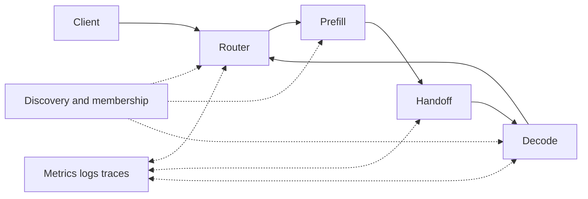
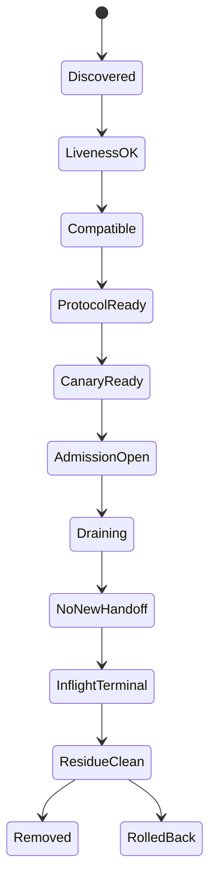
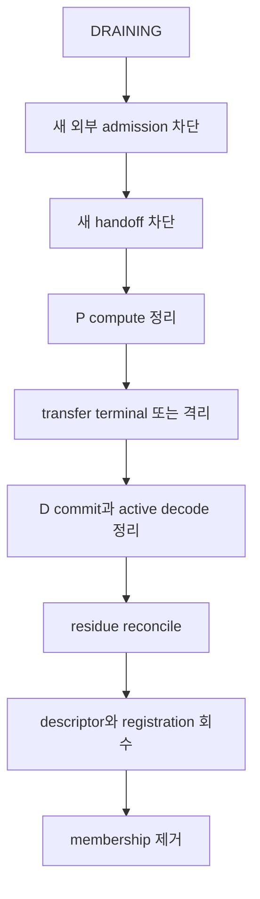

# 65장. 분리 서빙을 실제 서비스로 만드는 법: 배포, 실패, 복구

새벽 두 시, 신규 decode worker 두 대가 배포되었다. Kubernetes는 두 Pod를 `Ready`로 표시했고 router에도 주소가 나타났다. 트래픽을 10% 열자 일부 요청의 TTFT가 수십 초로 늘었다. GPU 사용률은 낮았고, 로그에는 전송 성공과 decode 대기라는 말이 함께 찍혔다. 원인은 HTTP endpoint가 아니라 배포의 의미였다. 새 worker의 model·KV layout generation이 P와 달랐고 목적지 메모리 등록도 끝나지 않았다. control plane은 주소를 발견했지만 data plane은 KV를 안전하게 인수할 준비가 없었다.

이 장은 이 실패에서 출발한다. “프로세스가 떴는가?”가 아니라 “어떤 세대의 어떤 역할이, 누구의 자원을 사용해, 어디까지 준비되었으며, 실패하면 무엇을 남기는가?”를 묻는다. 60장의 경제성, 61장의 전송 상태 기계, 62~64장의 connector 선택을 실제 배포와 복구 절차로 묶는다.

사건을 수치로 고정해 보자. DG66 decode rollout에서 Kubernetes는 decode-09의 process readiness probe가 HTTP 200을 반환하자 EndpointSlice에 ready endpoint로 게시했고 router는 10% weight를 부여했다. 그러나 model revision만 맞았을 뿐 KV layout metadata는 여전히 generation 65였고, GPU destination registration은 12 ranges 중 9개만 끝난 상태였다.

| 상대 시각 | Kubernetes/control plane | serving/data plane | 판정 |
|---:|---|---|---|
| 0 s | Pod scheduled zB/n7 | GPU/NIC inventory 확인 | 정상 |
| 4 s | container live | model load 시작 | admission 불가 |
| 87 s | readiness HTTP 200 | model loaded, registration 9/12 | 잘못된 Ready |
| 88 s | EndpointSlice ready | metadata generation old 65 | discovery only |
| 89 s | router weight 10% | no canary terminal | first admission divergence |
| 91 s | req-910 P compute complete | handle h-91 submit | request accepted |
| 92 s | connector local submit success | destination range missing | completion 아님 |
| 99 s | client deadline | D waiting KV | symptom |

첫 invalid transition은 87초의 process health를 serving readiness로 승격한 순간이고, first traffic divergence는 89초의 router admission이다. Connector submit success는 local operation 접수이지 destination commit가 아니다. Timeout을 늘리면 registration이 우연히 끝난 요청은 성공할 수 있지만 gate violation은 남는다. 이 장은 이 시간축을 discovery→admission→topology→autoscaling→drain→rollback 순서로 되짚는다.

## 65.1 Ready라는 한 단어를 해체한다

### 65.1.1 네 종류의 준비 상태

Liveness는 process와 event loop가 진행된다는 뜻이다. Compatibility는 model revision, tokenizer, chat template, KV dtype·layout, engine과 connector protocol이 짝을 이룬다는 뜻이다. Protocol readiness는 handshake, destination registration, metadata publish와 usable path가 준비됐다는 뜻이다. Serving readiness는 실제 canary가 P compute, KV handoff, D decode, first token, terminal cleanup까지 닫았다는 뜻이다.

이 네 사실은 서로를 대신하지 않는다. TCP port가 열렸다고 KV layout이 맞는 것은 아니고, handshake가 성공했다고 목적지 slot이 충분한 것도 아니다. 첫 token이 나왔다고 취소된 request의 handle과 descriptor가 정리됐다는 보장도 없다. 따라서 하나의 `/ready` endpoint를 쓰더라도 내부 판정과 실패 이유는 네 gate로 분리해야 한다.

### 65.1.2 DG65는 image tag가 아니다

이 장의 고정 사례 `DG65`는 model·tokenizer·template·KV layout digest, engine·CUDA·driver·connector revision, GPU/NIC/NUMA topology, P/D/router membership, protocol feature, capacity와 limit를 묶은 deployment generation이다. 필드 하나가 달라지면 같은 image의 replica가 아니라 새 compatibility 후보다.

```yaml
deployment_generation:
  id: DG65
  model: {revision: null, tokenizer: null, template: null, kv_layout: null}
  binaries: {engine: null, cuda: null, driver: null, connector: null}
  topology: {nodes: [], gpu_uuid_bdf: {}, nic: {}, numa: {}, fabric: {}}
  roles: {router: [], prefill: [], decode: []}
  protocol: {version: null, required_features: [], security_policy: null}
  capacity: {p_tokens_s: null, d_tokens_s: null, transfer_bytes_s: null}
  limits: {p_queue: null, handoff_bytes: null, d_work: null, deadline: null}
```

**이 장을 읽은 뒤 답할 질문.**

배포가 실패했을 때 어느 generation과 request incarnation이 영향을 받았는가, 새 admission을 어디서 막는가, P compute·전송·D commit·active decode 가운데 무엇이 남았는가, 누가 residue를 회수하는가, 무엇을 증명해야 rollback 또는 복구가 끝나는가를 답할 수 있어야 한다.

DG65 manifest가 왜 필요한지 최초 사건을 더 천천히 재생해 보자. `01:56`에 decode-07 process가 시작되었다. `01:57:18`에 model load가 끝났고 HTTP health가 성공했다. Orchestrator는 endpoint를 registry에 넣었다. 그러나 connector는 아직 GPU memory range를 등록 중이었고 metadata consumer에는 이전 attempt의 descriptor cache가 남아 있었다. `01:57:22`에 router-02가 새 endpoint를 선택했다. P는 prompt compute를 마치고 handoff를 submit했지만 D는 해당 generation의 destination descriptor를 찾지 못했다. Client deadline은 `01:57:30`이었다.

이때 운영자가 보는 첫 화면에는 `HTTP 200`, `GPU util 12%`, `transfer submit success`, `request timeout`이 함께 나타난다. 건조한 체크리스트는 네 줄 가운데 빨간 timeout만 따라가게 만든다. 그러나 상태 기계로 보면 문제는 success라는 단어의 범위다. HTTP 200은 liveness transition을, submit success는 handle 생성 transition을 증명할 뿐 destination commit이나 serving completion을 증명하지 않는다. 같은 용어가 다른 owner의 국소 성공을 나타낸다는 사실을 먼저 해체해야 한다.

DG65 ledger의 사건 전 상태는 `router_generation=41`, `decode-07=DISCOVERED`, `registration_progress=7/12`, `metadata_generation=40`, `admission_weight=0`이어야 했다. 실제로는 admission controller가 process health를 읽어 weight를 10으로 바꿨다. 즉 잘못된 전이는 `LivenessOK→AdmissionOpen`이며, 사이에 `Compatible`, `ProtocolReady`, `CanaryReady`가 생략되었다. 근본 원인은 timeout 값이 짧아서가 아니라 readiness dependency graph가 잘못 연결된 것이다.

첫 대응은 decode-07 process를 죽이는 일이 아니다. Router generation 42를 발행해 해당 worker와 pair의 신규 admission을 fence한다. 이때 이미 generation 41로 선택된 request를 ledger에서 찾는다. `req-8421/a1`은 P compute 완료, handle submitted, D commit 미확정이다. `req-8422/a1`은 destination 선택만 되었고 transfer 전이다. 두 요청을 같은 방식으로 취소하지 않는다. 두 번째는 compatible D로 재선택할 수 있지만, 첫 번째는 old handle outcome을 먼저 판정하거나 quarantine해야 한다.

다음에는 증거를 보존한다. Router decision record에서 worker selection 시 사용한 membership과 policy generation을 저장한다. P에서 source KV allocation과 handle identity를, connector에서 submit와 completion view를, D에서 reserved slot과 commit marker를 수집한다. 각각의 wall-clock timestamp가 정확히 맞는다고 가정하지 않고 process-local sequence와 identity edge를 이용한다. Debug log를 무제한으로 켜는 대신 이 request와 generation에 필요한 bounded event를 추출한다.

원인이 registration 미완료로 확인되면 decode-07을 곧바로 ready로 되돌리지 않는다. 남은 range 등록, metadata publish, consumer-side generation 확인을 끝내고 protocol readiness를 새로 계산한다. 그 다음 긴 prompt와 cancel을 포함한 canary를 전용 pair로 보낸다. Canary가 first token을 만들었다면 handle, slot과 request object가 terminal 뒤 기대 baseline으로 돌아오는지 확인한다. 이 모든 증거가 generation 42 또는 그 이후 policy에 묶여 있어야 stale router view가 우연히 성공한 일을 배제할 수 있다.

Failure injection의 expected path도 이 timeline에서 나온다. Registration을 `7/12`에서 멈추면 worker는 `Compatible`에 남고 admission weight는 0이어야 한다. Metadata generation을 한 단계 늦추면 consumer가 stale descriptor를 사용하지 않고 readiness를 닫아야 한다. Router-02만 policy generation 41에 머물게 하면 rollout controller는 population 불일치를 보고 다음 단계 승격을 중지해야 한다. 어느 경우든 real request가 decode-07로 선택되면 명백한 falsifier다.

복구 종료 때는 최초 화면의 timeout rate가 0으로 내려온 것만 보지 않는다. Router 전부가 새 policy generation을 보았는지, generation 41에서 시작된 request가 terminal 또는 quarantine인지, old descriptor acceptance가 0인지, registration과 reserved slot inventory가 설명되는지, canary가 correctness와 cleanup을 통과했는지 확인한다. Timeout rate는 traffic을 우회하면 즉시 낮아질 수 있지만 residue와 stale capability는 남을 수 있다.

이 사건은 “readiness probe를 잘 설정하라”는 교훈보다 넓다. 배포의 각 단계가 어떤 상태를 만들고, 그 상태를 어느 owner가 증명하며, 다음 단계가 어떤 증거를 소비하는지를 명시해야 한다. 단계 하나가 빠졌을 때 자동화가 멈추고 인간이 원인을 찾을 수 있어야 한다. 반대로 모든 상태를 하나의 boolean과 하나의 timeout에 넣으면 빠른 정상 경로는 간단해 보이지만 실패 경로에서 무엇을 되돌려야 하는지 알 수 없다.

DG65는 이 인과를 반복 가능하게 만든다. 동일 image를 다시 배포했다는 말 대신 “model·layout은 같고 connector revision과 topology만 달라진 generation 43”이라고 말할 수 있다. 그러면 compatibility test 범위를 줄이되 바뀐 registration, path routing과 cleanup을 집중 검증할 수 있다. Immutable generation은 변화 자체를 막는 장치가 아니라 변화의 영향 범위를 설명하는 장치다.

운영자는 이 ledger로 두 종류의 질문에 답한다. 실시간 질문은 지금 admission을 닫아야 하는가, 어느 failure domain만 격리할 수 있는가, already accepted work를 기다릴지 재계산할지다. 사후 질문은 어떤 gate가 우회되었는가, 어떤 관측이 더 일찍 falsifier를 보여 주었는가, rollout controller와 runbook을 어떻게 바꿀 것인가다. 두 질문에 같은 identity와 generation을 사용해야 incident 당시의 임시 판단이 다음 배포의 검증 규칙으로 이어진다.

## 65.2 주소 발견에서 안전한 rendezvous까지

### 65.2.1 control plane과 data plane



registry에서 endpoint를 지우는 것은 control-plane 변화다. 이미 P가 받은 destination descriptor, 진행 중 DMA, D가 인수한 slot까지 취소하지 않는다. 이 차이를 놓치면 “worker를 제거했으니 안전하다”는 성급한 결론에 도달한다.

### 65.2.2 discovery와 rendezvous

Discovery는 주소를 찾는다. Rendezvous는 만난 참여자가 role, generation, protocol feature, destination resource를 합의한다. 주소만으로는 worker가 P인지 D인지, drain 중인지, 어느 layout인지, 몇 개의 handoff credit이 남았는지 알 수 없다. 반대로 빠르게 변하는 queue depth까지 registry에 넣으면 registry가 불완전한 scheduler가 된다. membership identity와 실시간 load signal은 수명과 일관성 요구가 다르므로 분리한다.

### 65.2.3 owner를 먼저 적는다

Router는 외부 request와 내부 incarnation, routing generation, client-visible commit을 소유한다. P는 prompt compute와 생성 KV의 수명을, connector는 descriptor·registration·transfer handle과 completion을, D는 destination slot과 decode state를 소유한다. 로그를 남기는 component가 owner인 것은 아니다. 상태를 바꿀 권한과 terminal 판정 책임으로 owner를 정한다.

### 65.2.4 topology는 admission 앞의 hard gate다

Decode-09는 zB의 GPU에 배치됐지만 nearest intended NIC label이 stale해 remote NUMA NIC를 사용했다. Registration 9/12가 느려졌고 path latency도 DG65 pair보다 컸다. 이것은 readiness bug의 timing window를 넓혔지만 first cause와 동일하지 않다. Correct topology였어도 9/12에서 admission을 열면 contract 위반이다.

Zone-aware router는 zB D를 zB P와 선호했지만 DG66 P가 아직 없어서 DG65 P와 mixed pair를 만들었다. Compatibility matrix가 `P65→D66`을 canary-only로 표시했어야 한다. Topology score가 compatibility gate보다 먼저 적용돼 incompatible candidate가 선택됐다. Selection 순서를 compatibility hard gate→protocol readiness→capacity/path score로 고쳤다.

Incident 반증은 topology와 gate를 한 축씩 바꿨다. Same bad placement에서 admission gate를 완전하게 하면 real traffic은 0이고 canary만 실패했다. Same early Ready에서 optimal NIC placement를 쓰면 실패 빈도는 줄었지만 9/12 race가 남았다. 따라서 placement 수정과 readiness 수정은 별 work item이다. 이 hard gate를 통과한 population만 뒤의 autoscaling capacity에 포함한다.

DG65의 첫 실패를 소유권 표에 올리면 모순처럼 보였던 기록이 풀린다. Router의 `decode selected`는 목적지를 골랐다는 뜻이고, connector의 `submit accepted`는 전송 작업을 접수했다는 뜻이며, D의 `waiting for KV`는 decode 전제조건을 얻지 못했다는 뜻이다. 세 문장은 서로 다른 상태를 말하므로 동시에 참일 수 있다. 이들을 모두 “성공” 또는 “실패” 한 칸에 넣으면 unknown outcome이 사라진 것처럼 보인다.

따라서 ledger는 외부 request `req-8421`, 내부 attempt `a1`, P work `p-19`, transfer handle `h-77`, D slot `d7/s408`을 분리한다. 각 identity에는 생성 owner, generation, terminal 여부와 마지막 전이 시각이 붙는다. P가 KV 생산을 끝냈지만 handle completion이 없다면 P work는 `HANDOFF_WAIT`, handle은 `SUBMITTED`, D slot은 `RESERVED`다. Registry에서 D를 지운 사실은 어느 상태도 자동으로 terminal로 만들지 않는다.

운영자는 같은 incarnation의 owner별 상태가 시간순으로 이어지는지, terminal 선언 뒤 다른 owner가 자원을 참조하지 않는지 본다. Router에는 완료인데 D commit 기록이 없거나, slot 해제 뒤 completion이 그 주소를 성공 대상으로 보고하면 계약이 깨진 것이다. 복구는 재시작이 아니라 generation fencing, handle quarantine, slot 재사용 중지 순으로 진행한다. Architecture 그림에도 화살표 위에 넘기는 identity와 양쪽 commit point를 써야 “목록 제거가 전송 취소도 뜻하는가?” 같은 숨은 질문이 드러난다.

## 65.3 준비 gate가 traffic admission으로 이어지는 경로

### 65.3.1 단계별 상태 기계



뒤 gate는 앞 gate의 실패를 덮지 못한다. canary가 우연히 기존 healthy D로 갔다면 신규 D 검증도 아니다. Router는 canary가 의도한 P/D pair와 connector path를 통과했음을 기록해야 한다.

### 65.3.2 compatibility는 이름 비교가 아니다

Model repository 이름이 같아도 weight revision, tokenizer, chat template, KV block size, dtype, positional encoding 처리나 layer mapping이 다를 수 있다. Compatibility matrix가 허용하지 않은 조합은 fail closed한다. 잘못된 KV는 crash보다 위험하다. 요청이 성공처럼 보이면서 출력 의미만 틀릴 수 있기 때문이다.

### 65.3.3 canary가 cleanup까지 봐야 하는 이유

Canary는 짧은 prompt뿐 아니라 긴 prompt, 여러 decode step, cancel, client disconnect와 deadline을 포함한다. Token correctness와 first-token 진행을 확인한 뒤 request, slot, descriptor, handle이 기대 상태로 돌아오는지도 본다. 정답만 보면 leak을 놓치고, cleanup만 보면 의미 오류를 놓친다.

DG65의 첫 canary는 짧은 문장 하나만 생성해 작은 KV와 이미 준비된 path만 사용했다. 그래서 신규 D의 일부 registration 누락을 드러내지 못했다. 긴 prompt를 사용한 두 번째 canary가 여러 KV block과 실제 destination allocation을 강제하자, `ProtocolReady`가 열려 있는데 특정 range가 metadata에 없다는 사실이 나타났다. Canary 입력을 다양화하는 이유는 성능 대표성뿐 아니라 준비 상태의 서로 다른 가지를 실행하기 위해서다.

Gate마다 통과 증거와 반증을 쌍으로 둔다. Liveness의 증거는 event-loop progress이고 counter 정지는 반증이다. Compatibility는 DG65 digest의 완전 일치가 증거이며 누락 필드를 wildcard로 취급하면 실패다. Protocol readiness는 handshake 하나가 아니라 registration 수, descriptor generation, usable path와 credit이 모두 기대값에 도달한 상태다. Serving readiness는 request timeline과 cleanup ledger가 함께 terminal인 상태다.

`ready_workers=4` 같은 aggregate 대신 `liveness_ok=4`, `compatible=3`, `protocol_ready=2`, `canary_ready=2`, `admission_open=2`를 보면 막힌 gate가 드러난다. 상세 identity는 trace와 event ledger에서 찾고 metric은 단계별 수와 age distribution을 보여 준다. Failure injection에서는 Compatible까지만 통과한 D를 registry에 게시한다. Discovery에는 보이되 real request 후보에서는 제외되어야 한다. 한 건이라도 선택되면 gate 결합이 실패한 것이다. Cleanup을 지연했는데 live handle과 reserved slot이 baseline으로 돌아오기 전에 admission이 열리는지도 확인한다.

## 65.4 실행 순서는 dependency graph다

### 65.4.1 launch order

먼저 immutable manifest와 secret을 배치하고 GPU/NIC topology를 검증한다. D가 model과 destination resource를 준비하고 registration과 metadata publish를 끝낸 뒤 P의 handoff를 연다. Router에는 worker를 발견시키되 admission은 닫아 둔다. 마지막으로 end-to-end canary와 cleanup을 확인하고 작은 비중부터 traffic을 연다.

D를 먼저 띄우라는 문장을 기계적으로 외울 필요는 없다. Pull 방식에서는 세부 순서가 달라질 수 있다. 불변식은 producer가 새 work를 발행하기 전에 consumer의 수신 자원과 protocol identity가 준비되어야 한다는 것이다.

### 65.4.2 option은 상태 변경 명령이다

Heartbeat timeout은 단순 안정화 숫자가 아니라 관측 실패를 membership suspicion으로 승격하는 시간이다. Cleanup timeout은 느린 요청 허용치가 아니라 abandoned work의 회수 시점을 바꾼다. Transfer limit은 bytes와 handle의 동시 점유량을 바꾼다. 따라서 option 문서는 기본값 목록이 아니라 `변경 상태→owner→너무 작을 때→너무 클 때→검증 실험`으로 읽는다.

### 65.4.3 bootstrap 실패를 위치시킨다

`MODEL_OK`, `TOPOLOGY_OK`, `CONNECTOR_INIT_OK`, `REGISTRATION_OK`, `METADATA_PUBLISHED`, `CANARY_OK`를 구분한다. 마지막 오류 한 줄보다 어느 dependency까지 성립했는지가 복구에 유용하다. Model load 성공 뒤 registration이 실패한 process를 무한 재시작하면 원인은 가려지고 registration churn만 커질 수 있다.

DG65의 decode-07이 model load 83초, topology 확인 2초, registration 11초를 썼다고 가정하자. 이는 제품 보장값이 아니라 사고 기록을 읽는 예다. Readiness가 process 시작 5초 뒤 열리면 91초 동안 미준비 endpoint가 선택된다. Initial delay를 120초로 늘리면 빠른 worker도 기다리고, 120초 뒤 registration 실패는 여전히 통과한다. 시간 지연이 아니라 실제 단계 완료를 gate로 써야 하는 이유다.

vLLM proxy demo의 lifecycle과 P→D 경로는 최소 orchestration을 찾는 source walk다. 그 가치는 production 기능이 완성됐음을 증명하는 데 있지 않다. Process-local instance 상태와 durable membership 사이의 빈틈을 찾게 한다. Instance 제거와 validation이 보이더라도 외부 registry consensus, 이미 발행된 descriptor revoke, zero-loss drain까지 보장한다고 읽으면 안 된다.

SGLang launch recipe 역시 명령을 복사하지 않고 dependency로 다시 그린다. Router 주소 option은 discovery 연결을, role option은 후보군을, heartbeat와 cleanup option은 suspicion과 회수 시간 경계를 바꾼다. 문서와 experimental `WorkerRegistry`, worker mode·breaker state를 나란히 읽으면 “목록에 있음”, “healthy filtering 통과”, “breaker 닫힘”이 별도 판정임을 알 수 있다. Registration을 일부러 실패시킨 뒤에도 canary가 통과하면 dependency edge가 빠진 것이다. Metadata publish만 늦췄는데 P가 handoff를 시작해도 동일한 실패다.

## 65.5 admission은 P, 전송, D의 공동 예산이다

### 65.5.1 가장 좁은 파이프가 전체를 제한한다

안전한 admission은 P의 남은 prompt token budget, connector의 handoff bytes와 operation credit, D의 predicted remaining output work, destination KV budget 가운데 최솟값에 묶인다. P queue가 짧아도 transfer가 막히면 계산된 KV가 쌓인다. D utilization이 낮아도 completion을 기다리는 중이라면 scale-in 근거가 아니다.

### 65.5.2 요청 수보다 남은 일을 본다

Queue 20개가 모두 같은 부하는 아니다. P에서는 remaining input token, D에서는 predicted output token, connector에서는 bytes-in-flight와 path credit을 본다. 예측에는 오차 범위를 두고 실제 종료 분포로 보정한다. 평균만 보면 긴 prompt와 긴 output이 만드는 tail을 숨긴다.

**Credit owner를 하나로 정한다.**

P, connector, D가 credit을 각각 추정하면 oversubscription이 생긴다. Authoritative owner와 cached view를 구분하고, credit 소비·반환에 request incarnation과 transfer generation을 붙인다. Timeout만으로 credit을 반환하면 실제 전송이 계속되는 동안 같은 자원이 중복 할당될 수 있다. 성공 인수, terminal 실패, 확인된 취소, 또는 격리된 unknown outcome만 반환 근거가 된다.

DG65에서 P에는 prompt 12만 token이 대기하고 compute capacity는 초당 4만 token이라고 하자. Connector에는 18GB handoff가 진행 중이고 안전 상한은 24GB다. D slot은 남았지만 predicted output work가 deadline budget에 근접했다. P utilization만 보면 scale-out하고 싶지만 새 P는 남은 6GB transfer budget을 소진해 `HANDOFF_READY` residue만 늘린다. 이때는 admission을 줄이고 D 또는 path 병목을 확인해야 한다.

이 숫자는 recipe가 아니다. KV bytes는 layer 수, head 구성, dtype, token 수와 connector 표현에 따라 달라지므로 workload bucket별 분포를 관찰한다. D의 남은 일도 active sequence 수가 아니라 생성 token, output limit과 종료 확률의 추정치로 본다. 예측 오차는 queue age와 deadline miss로 보정한다.

Backpressure 검증에서는 connector credit을 단계적으로 줄인다. 기대 결과는 P admission이 먼저 완만해지고 `handoff_ready_age`가 제한 안에 머무는 것이다. P throughput만 유지된 채 대기 KV bytes와 age가 계속 커지면 실패다. Timeout 직후 같은 slot을 새 요청에 배정하고 늦은 completion을 주입하는 실험도 필요하다. Old handle은 quarantine되거나 slot generation mismatch로 거부되어야 한다. 늦은 completion이 새 slot을 성공 처리하면 memory 문제를 넘어 request correctness failure다.

Admission decision을 실제 timeline으로 남기면 사후 분석의 질이 달라진다. `10:02:11`에 req-8421이 들어왔을 때 router가 본 P queue age, 예상 prompt work, connector available credit, 선택 D의 predicted work와 KV free bytes를 decision record에 저장한다. 다만 매 request 전체 값을 metric label로 만들지는 않는다. Sampling된 decision trace와 bucket metric을 조합한다. 나중에 “왜 이 요청을 받았는가?”에 답할 수 없다면 backpressure는 구현되어 있어도 검증할 수 없다.

한계값 부근에서 admission이 열렸다 닫히는 진동도 관찰한다. Credit 한 개가 반환될 때마다 새 대형 prompt를 받으면 handoff queue는 좀처럼 비워지지 않는다. 작은 hysteresis window 또는 workload-aware reservation을 두어 이미 받은 요청이 빠져나갈 공간을 확보한다. 이 reservation은 무조건 일정 비율을 비우는 방식보다, in-flight P work가 곧 만들 KV bytes를 예측해 잡는 편이 인과적으로 맞다. 예측 오차가 클 때는 보수 계수와 maximum queue age가 안전망이 된다.

취소도 capacity 반환 사건이다. Client가 prompt compute 도중 취소했는지, transfer submit 뒤인지, D commit 뒤인지에 따라 회수 owner가 달라진다. P 단계 취소는 아직 만들어지지 않은 handoff credit을 반환하지만, submit 뒤 취소는 completion을 확인하기 전까지 bytes와 destination slot을 즉시 free로 세면 안 된다. D commit 뒤에는 output stream의 client-visible 상태도 판정해야 한다. 같은 `cancelled_requests_total` 하나로는 이 차이가 보이지 않는다.

DG65의 admission falsifier는 세 가지다. 첫째, authoritative credit보다 더 많은 outstanding handle이 생긴다. 둘째, admission을 닫았는데 새 P work ID가 계속 발급된다. 셋째, timeout된 old handle의 credit으로 시작한 새 요청과 늦은 old completion이 같은 slot generation을 공유한다. 하나라도 관측되면 threshold 조정보다 identity와 atomic transition을 먼저 고친다. 숫자를 낮추면 발생 빈도는 줄어도 계약 위반은 남는다.

운영 판단에는 SLO와 자원 안정성을 함께 둔다. Admission을 지나치게 닫으면 queue 밖에서 거부율이 늘고, 지나치게 열면 내부 queue age와 memory residue가 는다. 목표는 GPU utilization 최대화가 아니라 accepted request가 deadline 안에 terminal outcome에 도달하도록 제한하는 것이다. 이 관점에서 backpressure는 성능을 포기하는 장치가 아니라 이미 수락한 요청의 약속을 지키는 장치다.

## 65.6 autoscaling은 늘어난 Pod 수가 아니다

### 65.6.1 새 replica의 비가용 시간

```mermaid
gantt
  title Scale-out 중 아직 capacity가 아닌 구간
  dateFormat X
  axisFormat %s
  section Worker
  Process start :a1, 0, 2
  Model load :a2, after a1, 6
  Registration :a3, after a2, 3
  Metadata propagation :a4, after a3, 2
  Canary warm-up :a5, after a4, 3
  Admission-capable :milestone, after a5, 0
```



마지막 milestone 이전 replica를 capacity로 세면 router가 미준비 endpoint를 선택한다. 반대로 scale-in worker는 admission을 닫은 뒤에도 active decode, transfer, registration memory를 소비한다.

### 65.6.2 어느 축을 늘릴 것인가

P remaining work가 쌓이되 handoff와 D에 여유가 있으면 P를 늘린다. Handoff bytes와 path queue가 병목이면 P 추가가 악화시킨다. D remaining work와 queue age가 커지고 KV budget이 충분하면 D를 늘린다. 특정 pair만 혼잡하면 replica 전체보다 routing imbalance나 topology 문제를 먼저 의심한다.

### 65.6.3 hysteresis의 근거

Cooldown은 관습적인 5분이 아니다. Replica startup p95, queue drain time, 정상적인 가장 긴 decode, burst 지속 시간, registration churn 비용으로 정한다. Burst마다 worker를 만들고 지우며 실제 요청보다 model load와 registration에 더 많은 자원을 쓰는 상태를 scaling 성공이라 부르면 안 된다.

DG65 scale-out에서 Pod count는 6에서 8로 즉시 바뀌지만 admission-capable count는 한동안 6이다. 이 둘을 같은 dashboard 선으로 그리면 controller가 이미 늘어난 capacity를 다시 요구하거나, router가 warming worker를 선택한다. `desired`, `process_live`, `model_loaded`, `protocol_ready`, `admission_capable`, `draining` population을 나눠야 변화의 이유를 읽을 수 있다.

Scale-in은 더 까다롭다. Decode-07의 GPU utilization이 낮아 제거 대상으로 골라졌지만, 긴 output 다섯 건과 P가 이미 준비한 handoff 두 건이 남았다고 하자. Utilization은 현재 실행률만 말하고 future obligation은 말하지 않는다. Router가 D remaining work와 outstanding destination reservation을 보지 않으면 low-utilization worker를 제거하며 오히려 재계산과 tail latency를 늘린다.

검증은 burst를 넣고 controller의 결정 시간축을 재생한다. 기대값은 queue age 상승, scale request, bootstrap 단계, serving-ready, queue drain, cooldown이 순서대로 나타나는 것이다. 새 replica가 ready되기 전에 queue가 줄었다면 부하가 자연히 사라진 것인지 구분한다. Scale-out 직후 다시 scale-in이 발생하면 startup distribution보다 hysteresis가 짧거나 capacity accounting이 process count를 잘못 사용한 것이다. Owner는 autoscaler만이 아니다. Router는 admission-capable population, worker는 readiness stage, connector는 registration 비용을 각각 제공해야 한다.

Autoscaler 입력의 시간창도 인과를 바꾼다. 10초 GPU utilization은 순간 burst에 빠르게 반응하지만 model load가 90초 걸리는 DG65에서는 replica가 준비될 때 부하가 사라질 수 있다. 반대로 10분 평균만 보면 queue deadline이 먼저 무너진다. 빠른 admission control이 즉시 overload를 제한하고, autoscaling은 더 느린 지속 부하를 처리한다. 서로 다른 제어 루프가 같은 신호로 같은 시간척도에서 움직이면 진동하기 쉽다.

P와 D의 scale ratio는 평균 input/output 길이 하나로 정하지 않는다. 짧은 질의·긴 답변 bucket은 D를 오래 점유하고, 긴 문서·짧은 답변 bucket은 P와 transfer를 압박한다. 시간대별 workload mix가 달라지면 동일 QPS에서도 필요한 비율이 바뀐다. Runbook에는 bucket별 arrival rate, P service demand, KV bytes, D service demand와 오차 범위를 기록하고 어느 항이 bottleneck인지 설명한다.

Topology도 capacity 식에 들어간다. D replica 한 대가 추가되어도 선택 가능한 NIC path가 기존 병목 링크를 공유한다면 transfer capacity는 늘지 않는다. GPU 수만 보고 scale-out하면 같은 root complex나 NIC queue에 traffic을 집중할 수 있다. 새 worker가 protocol-ready가 된 뒤 pair별 path latency와 outstanding bytes가 균등하게 변하는지 관찰한다. 특정 pair만 악화하면 engine capacity가 아니라 placement나 routing 문제다.

Scale-in 실험에서는 worker를 `DRAINING`으로 바꾼 시각과 autoscaler가 usable capacity에서 제외한 시각을 구분한다. 너무 일찍 빼면 controller가 대체 replica를 과도하게 만들 수 있지만, 너무 늦게 빼면 router가 실제보다 많은 신규 capacity를 본다. 보통 admission capacity에서는 즉시 제외하고, resource accounting에서는 drain이 끝날 때까지 포함한다. 하나의 `replicas_current`로 두 의미를 표현하지 않는다.

DG65에서 scale decision이 실패했다면 “threshold를 70에서 80으로” 바꾸기 전에 예측과 실제를 비교한다. 예상 startup 60초가 실제 p95 110초였는지, D output work 추정이 긴 응답을 과소평가했는지, connector bytes가 압축 또는 layout 차이로 달랐는지 찾는다. Falsifier는 scale-out 이후 admission-capable capacity가 예상 시각까지 늘지 않거나, 늘었는데도 병목 queue가 줄지 않는 것이다. 첫 경우는 bootstrap 문제, 둘째는 축을 잘못 선택한 문제다.

## 65.7 rollout은 generation 전환이다

### 65.7.1 old/new 조합을 분리한다

`old-P/old-D`, `new-P/old-D`, `old-P/new-D`, `new-P/new-D`를 구분한다. Protocol이 양방향 호환을 명시하지 않으면 혼합 pair를 traffic에 노출하지 않는다. P와 D를 동시에 교체하면 어느 쪽 변경이 오류를 만들었는지, rollback 때 어떤 descriptor를 받아야 하는지 알기 어렵다.

### 65.7.2 rollout trigger와 rollback trigger

Canary correctness 불일치, protocol readiness 실패, unknown outcome 증가, queue age와 SLO 악화, handle·slot residue의 단조 증가가 rollback 후보다. 기준과 결정 owner는 배포 전에 정한다. Rollback은 image tag뿐 아니라 router membership, protocol feature, connector generation과 descriptor acceptance를 되돌리는 작업이다.

### 65.7.3 fallback도 실제 capacity여야 한다

Monolithic lane을 fallback이라 적어 두고 평소 capacity를 모두 빼면 rollback 경로가 아니다. 예상 전환 시간과 처리 가능한 workload bucket을 검증한다. P/D 경제성이 무너졌을 때 active request를 drain하면서 신규 요청을 fallback으로 보낼 수 있어야 한다.

DG65-new를 5% canary로 열었을 때 단순 성공률은 정상인데 `transfer_unknown_age`가 조금씩 길어졌다고 하자. 평균 latency가 아직 SLO 안이라는 이유로 50%까지 올리면 unknown handle과 reserved slot이 누적돼 한계점에서 급격히 무너질 수 있다. Rollout 판단에는 rate뿐 아니라 residue의 기울기와 가장 오래된 age가 필요하다. 안정된 시스템이라면 생성과 회수가 균형을 이루어 long-lived unknown population이 단조 증가하지 않는다.

Old/new matrix는 네 번의 smoke test가 아니다. 각 조합에서 negotiated protocol feature, descriptor generation acceptance, cancel과 timeout 의미가 같아야 한다. New P가 old D가 모르는 필드를 optional로 보낼 수는 있어도, old D가 이를 무시했을 때 correctness가 유지되는지 확인해야 한다. 알 수 없는 조합을 시험 없이 “backward compatible”이라 부르지 않는다.

Rollback rehearsal에서는 new generation admission을 닫고 old lane을 다시 연 뒤, new에서 시작된 요청이 어느 lane에서 terminal되는지 추적한다. 이미 D commit 이후인 요청을 무조건 old에서 재계산하면 중복 stream 위험이 있다. 반대로 commit 전 요청을 new worker와 함께 죽이면 불필요한 실패가 된다. Request state별 정책표가 실제 router decision과 일치하는지가 반증 가능한 조건이다.

Rollout의 routing weight는 배포 진행률이 아니라 위험 노출량이다. 요청 5%라도 긴 prompt만 new P에 몰리면 KV bytes 기준 노출은 훨씬 크다. 반대로 짧은 health canary 수백 건은 실제 workload 한 건보다 적은 상태 공간을 실행할 수 있다. Traffic 비중을 request count, prompt tokens, handoff bytes, decode tokens와 tenant 중요도로 함께 표현해야 한다.

DG65-new의 first stage에서는 내부 canary만 허용한다. 두 번째에는 재시도 가능한 낮은 위험 tenant의 짧은 요청을 넣되 긴 prompt bucket도 소량 포함한다. 세 번째에는 정상 workload 분포를 제한된 capacity에서 재현한다. 각 단계 승격은 일정 시간이 아니라 충분한 terminal sample, residue 안정성, worst-age bound와 old baseline 비교로 결정한다. Sample이 적어 오류가 없었던 것을 성공으로 오인하지 않는다.

Compatibility 검증은 serialization round trip으로 구체화한다. New P가 만든 descriptor와 request metadata를 old D가 읽고, 이해하지 못한 optional field를 무시한 뒤 동일한 KV interpretation을 만드는지 본다. 반대 방향도 실행한다. Parse 성공만으로는 부족하다. Layer 수, block mapping, token position과 dtype가 실제 consumer view에서 일치해야 한다. 작은 tensor fingerprint나 deterministic canary 결과를 이용할 수 있지만 그것이 전체 workload correctness를 증명한다고 과장하지 않는다.

Rollout 중 router generation이 여러 replica에 전파되는 시간도 기록한다. 일부 router는 weight 0을 보고 일부는 10%를 보면 같은 request retry가 서로 다른 policy를 탈 수 있다. Routing decision에 policy generation을 넣으면 어떤 router view가 선택했는지 추적할 수 있다. Policy propagation이 완료되기 전에는 다음 rollout stage로 가지 않는다. 가장 늦은 router의 generation age가 bound를 넘으면 control-plane 문제로 중지한다.

Rollback 뒤에는 성능 회복뿐 아니라 new residue 감소를 본다. `new_admission=0`인데 new request incarnation이 생기면 fencing 실패다. New handle count가 줄지 않으면 drain 또는 completion owner가 사라졌다. New descriptor acceptance가 0이 아니면 consumer revoke 전파가 실패했다. Old lane SLO가 회복되어도 이 세 조건이 남아 있으면 rollback은 트래픽 우회일 뿐 배포 종료가 아니다.

## 65.8 drain은 삭제가 아니라 닫힘의 증명이다

### 65.8.1 새 admission부터 막는다



Registry 제거는 첫 단계가 아니라 뒤쪽 단계다. P가 이미 받은 destination descriptor와 진행 중 전송은 endpoint 목록 삭제로 사라지지 않는다.

### 65.8.2 drain ledger를 읽는다

Worker별로 `p_compute_active`, `handoff_ready`, `transfer_inflight`, `transfer_unknown`, `d_committed_waiting`, `active_decode`, `registered_ranges`, `live_descriptors`, cache lease를 센다. 모두 무조건 0이어야 하는 것은 아니다. 재사용 registration이나 장기 cache처럼 기대 steady-state가 다르므로 owner별 terminal 조건을 적는다.

### 65.8.3 deadline 뒤 선택

정상적인 긴 decode이고 여유가 있으면 기다린다. Client-visible commit이 없고 이전 attempt를 fence할 수 있으면 재계산한다. Outcome을 증명하지 못하면 실패시키거나 quarantine한다. “timeout이면 retry”는 중복 token, 이중 slot 소유와 use-after-deregister를 만들 수 있다.

Drain을 시작한 decode-07에서 `active_decode=5`가 줄어드는 동안 `transfer_inflight=2`가 그대로라면 단순히 기다릴 일이 아니다. 두 handle의 deadline, transport progress, destination generation을 조회한다. Progress가 있고 deadline 안이면 기다릴 수 있지만, completion owner가 사라졌다면 quarantine으로 보내야 한다. 숫자가 0이 되는 것보다 각 항목이 왜 줄거나 남는지 설명되는 것이 중요하다.

Failure injection은 제거 순서를 일부러 뒤집는다. Membership을 먼저 삭제하고 descriptor revoke를 늦춘다. 기대 결과는 routing generation fence가 이미 새 선택을 막고, 기존 handle ledger가 여전히 조회 가능해 안전하게 종료되는 것이다. Ledger 자체가 membership과 함께 사라진다면 runbook은 outcome을 판정할 근거를 잃는다. 또 registration 해제를 active transfer 앞에 실행해 구현이 이를 거부하는지 확인한다. 조용히 성공하면 use-after-deregister 가능성을 별도로 조사해야 한다.

Deadline 정책도 workload에 따라 갈린다. 이미 여러 token이 client에 전달된 streaming request는 다른 D에서 처음부터 재계산해 이어 붙일 수 없다. 반면 client commit 전의 prefill은 compatible lane에서 recompute할 수 있다. 따라서 drain report에는 단순 timeout 수가 아니라 `waited`, `recomputed`, `failed`, `quarantined`와 그 결정 근거가 남아야 한다. 모든 old in-flight가 이 네 terminal bucket 중 하나에 들어갈 때 다음 회수 단계로 간다.

Drain ledger는 순간 snapshot보다 transition journal로 남긴다. `active_decode`가 5에서 4로 줄었을 때 어느 request가 client terminal이 되었고 어느 slot과 cache reference가 반환됐는지 연결한다. Aggregate만 줄고 identity가 맞지 않으면 다른 신규 요청이 들어와 숫자가 우연히 유지되거나, count는 0인데 orphan object가 남는 일을 놓친다. 모든 request를 장기 metric으로 남길 필요는 없지만 drain 기간의 bounded ledger는 정확성이 우선이다.

P worker drain도 D와 다르다. P compute가 끝나지 않은 요청은 compatible P에서 재계산할 수 있지만, 이미 생성한 KV를 handoff-ready로 보유한 요청은 destination과 credit 의무가 있다. P process를 먼저 죽이면 D reserved slot과 metadata만 남을 수 있다. 따라서 P drain은 새 prompt admission 차단, active compute 종료 또는 취소, handoff-ready 해결, source KV release 순으로 닫는다. D drain은 destination reservation 차단, committed waiting과 active decode 종료, slot·registration 회수에 초점을 둔다.

Router drain은 더욱 조심스럽다. Stateless proxy처럼 보여도 streaming connection, request incarnation과 commit authority가 process-local할 수 있다. vLLM demo의 proxy lifecycle을 읽을 때 production router가 동일하다고 가정하지 말고 실제 상태 저장 위치를 확인한다. Router restart failure injection에서 client connection이 끊긴 뒤 backend request가 계속되는지, 새 router가 outcome lookup 없이 retry하는지 본다. Backend가 계속되는데 retry도 시작되면 이중 실행을 fence할 durable identity가 필요하다.

Deadline이 가까워질 때 운영자는 residue를 없애기 위해 무리하게 cancel하고 싶어진다. 그러나 cleanup 속도가 correctness보다 앞서면 안 된다. Transport가 cancel acknowledgement를 제공하지 않는 경우 handle memory를 즉시 재사용하지 않고 quarantine pool로 옮긴다. Quarantine은 공짜가 아니므로 bytes, count, oldest age에 상한을 두고 넘으면 해당 path admission을 닫는다. 이것이 unknown outcome을 숨기지 않으면서 서비스 전체를 보호하는 방법이다.

Drain 완료의 falsifier는 제거된 worker를 가리키는 새 routing decision, revoke 뒤 수락된 descriptor, terminal request가 참조하는 live slot, 해제 range를 대상으로 한 늦은 completion이다. 각각 router, metadata consumer, request owner, transport owner의 실패를 가리킨다. “Pod가 없어졌다”는 이 네 반증 가운데 아무것도 검사하지 않는다.

## 65.9 부분 실패를 stage와 residue로 진단한다

### 65.9.1 실패 행렬

Discovery/role mismatch는 pair admission을 막고 stale registry를 교정한다. Model/layout mismatch는 transfer 전에 닫고 예약 slot과 descriptor를 회수한다. Destination not ready는 P handoff credit을 막는다. Partial 또는 unknown transfer는 path breaker를 열고 handle을 terminal 또는 quarantine한다. D crash after commit은 client-visible commit 여부를 먼저 찾는다. Router crash는 request incarnation을 reconcile해 duplicate attempt를 막는다.

### 65.9.2 heartbeat는 죽음의 증거가 아니다

Heartbeat 실패는 network partition이나 event-loop stall일 수도 있다. 그러나 신규 admission을 막을 충분한 suspicion은 된다. Admission fencing과 resource reclamation을 분리한다. Timeout 직후 registration을 해제하면 data plane의 DMA가 아직 진행 중일 수 있다.

### 65.9.3 breaker 범위를 failure domain에 맞춘다

Worker, P-D pair, connector path/NIC, protocol generation, 전체 P/D lane breaker는 범위가 다르다. 한 NIC 오류로 전체 D를 닫으면 가용성을 잃고, worker breaker만 두면 잘못된 generation이 다른 worker로 확산될 수 있다. Breaker key는 관측된 실패 domain과 맞아야 한다.

DG65 사고에서 heartbeat가 세 번 누락되자 router는 decode-07 breaker를 열었다. 이 조치는 신규 선택을 막는 데는 맞지만 process 사망을 증명하지 않는다. 실제 원인이 control-plane packet loss라면 data-plane transfer와 decode는 계속될 수 있다. 따라서 breaker event 뒤 즉시 GPU memory를 회수하지 않고, worker-local progress와 transport completion, lease generation을 추가로 확인한다.

Stage별 incident branch는 관측 순서를 바꾼다. Model/layout mismatch라면 bytes가 움직이기 전에 막혀야 하므로 transfer handle 존재 자체가 반증이다. Partial transfer라면 source와 destination의 bytes·completion view가 다를 수 있으므로 request 재시도보다 handle fencing이 먼저다. D crash after commit이라면 P compute 로그보다 client-visible output ledger가 중요하다. Router crash라면 새 router가 동일 logical request에 두 commit 권한을 발급했는지가 핵심이다.

Pair breaker도 실험한다. 특정 P-D 경로에만 packet loss를 주입했을 때 해당 pair 또는 path가 제외되고 다른 healthy path는 남아야 한다. 전체 lane이 닫히면 failure domain보다 breaker 범위가 넓다. 반대로 동일한 잘못된 protocol generation의 여러 worker가 차례로 선택되면 범위가 좁다. 기대 상태와 실제 exclusion set의 차이는 routing 정책 오류를 구체적으로 보여 준다.

장애 triage의 첫 질문을 “어느 service가 죽었는가?”에서 “마지막으로 확정된 상태 전이는 무엇인가?”로 바꾼다. Req-8421의 P compute 완료가 확정됐고 transfer submit만 보인다면 bytes가 전혀 가지 않았는지 일부 갔는지 알 수 없다. D commit이 확정됐지만 client output 기록이 없다면 decode 결과가 외부로 나갔는지가 미정이다. 같은 timeout도 이 위치에 따라 재계산, outcome lookup, 격리 중 다른 행동을 요구한다.

시간축은 router, P, connector, D clock 차이를 포함한다. 단순 timestamp 정렬만 믿으면 D commit이 transfer completion보다 먼저 보일 수 있다. Trace span parentage, monotonic local sequence, request incarnation과 handle generation을 이용해 partial order를 만든다. Clock skew가 bound를 넘으면 정확한 선후를 주장하지 않고 `concurrent/unknown`으로 남긴다. 허위로 완전한 timeline을 만드는 것보다 불확실성을 표시하는 편이 안전하다.

Discovery mismatch 사고를 보자. Decode worker가 잘못 P role로 등록되면 router는 prompt를 보낼 수 있다. Compatible model이라 초기 RPC는 성공할 수도 있어 단순 health check가 놓친다. 기대되는 방어는 registry record의 role과 worker introspection 결과, DG65 manifest의 intended role을 세 방향으로 비교하는 것이다. 하나라도 다르면 pair admission을 열지 않는다. 수정 뒤에는 stale registry generation이 모든 router view에서 사라졌는지 확인한다.

Layout mismatch에서는 transfer를 아예 시작하지 않아야 한다. Descriptor publish 전 compatibility gate가 막고, 예약된 destination slot이 있다면 회수한다. `layout_mismatch`와 함께 nonzero transferred bytes가 관측되면 detection이 너무 늦다. 이 반증은 error message가 친절한지보다 중요하다. 잘못된 KV가 consumer에 도달한 뒤 검출하면 memory bandwidth와 slot을 낭비할 뿐 아니라 validation이 불완전한 path에서는 오답으로 이어진다.

Partial transfer에서는 retry 범위를 구분한다. Transport operation만 idempotent하게 재개할 수 있는지, 전체 KV를 새 slot에 다시 보낼지, prompt부터 재계산할지 connector 계약에 따라 다르다. 목적지 partial bytes를 valid KV로 노출하지 않는 fencing bit 또는 commit marker가 필요하다. Completion이 없는데 D가 decode를 시작하는 failure injection은 즉시 correctness falsifier다. 반대로 transfer 성공 뒤 commit acknowledgement만 잃었다면 무조건 재전송하기보다 D outcome lookup이 우선이다.

D crash after commit 사건은 client stream을 중심으로 본다. First token이 router buffer에만 있었는지, socket에 write되었는지, client가 받았는지는 서로 다를 수 있다. Application protocol이 acknowledgement를 제공하지 않으면 일부 상태는 본질적으로 unknown이다. Runbook은 불가능한 exactly-once를 약속하지 않고, 중복 가능성과 재시도 조건을 API 계약에 드러낸다. 내부적으로는 한 logical request의 commit authority를 한 attempt에만 주어 통제 가능한 중복부터 막는다.

Router crash에서는 durable state의 최소 범위를 결정해야 한다. 모든 token을 consensus storage에 쓸 필요는 없을 수 있지만 logical request, active attempt, selected P/D generation, client-visible commit 경계는 복구에 필요하다. 비용 때문에 이를 저장하지 않는다면 crash 시 어떤 요청을 fail시키고 어떤 요청만 retry할 수 있는지 명시한다. 상태가 없는데 안전한 투명 retry를 주장하는 것은 설계가 아니라 희망이다.

Incident commander는 failure domain을 좁힌 뒤 healthy lane을 보존한다. 한 pair가 실패했을 때 전체 P/D를 재시작하면 증거와 가용성을 동시에 잃는다. 먼저 해당 worker·pair·path·generation breaker를 선택하고, 다른 lane의 error와 queue가 독립적으로 안정적인지 본다. 실패가 공유 metadata나 protocol generation으로 확산되면 범위를 넓힌다. 이 단계적 격리는 “작게 시작하고 증거로 확대한다”는 원칙을 따른다.

### 65.9.4 residue를 닫아야 복구가 끝난다

**무엇이 남는가.**

P의 KV block, D의 예약 slot, 등록 memory range, publish descriptor, transfer handle, cache object·lease, request incarnation과 output buffer가 남을 수 있다. GPU bytes가 일정하다고 안전한 것도 아니다. 같은 용량 안에서 unreachable slot이 늘 수 있으므로 bytes, object count, age와 generation을 함께 본다.

**Stale generation fencing.**

Rollback 뒤 새 generation descriptor가 구 worker에서 받아들여져서는 안 된다. 먼저 admission을 닫고 generation을 revoke한다. Producer가 발급을 멈췄는지 확인하고, in-flight handle을 terminal 또는 quarantine한 뒤 consumer reference가 없을 때 descriptor와 registration을 해제한다.

**종료 조건.**

신규 요청이 안전한 generation으로만 가고, 이전 work가 terminal 또는 격리되며, old descriptor가 거부되고, residue가 bound 안이며, canary correctness·SLO·cleanup이 통과하고, rollback 경로가 남아 있어야 한다. “마지막 오류 뒤 10분”은 보조 신호일 뿐 상태 증명을 대신하지 않는다.

Memory graph로 residue를 보면 단순 byte counter보다 원인이 선명하다. `req-8421 → h-77 → descriptor-31 → range-4 → slot-408`의 edge 가운데 request는 terminal인데 handle이 descriptor를 참조한다면 range를 해제할 수 없다. Handle은 terminal인데 descriptor lease가 남았다면 metadata cleanup 문제다. 모든 object에 generation과 owner, last-reference age가 있어야 이 그래프를 재구성할 수 있다.

DG65-new rollback에서 old descriptor acceptance counter가 0인지 확인한다. 일부 D가 configuration propagation을 받지 못해 new descriptor를 계속 받아들이면 전체 error rate는 낮아도 fence는 실패한 것이다. 이때 모든 worker 재시작부터 하지 않는다. 어느 membership generation이 revoke를 놓쳤는지 찾고 해당 pair admission을 닫는다. 이미 수락된 handle은 outcome을 판정한 뒤 격리 또는 회수한다.

Recovery termination failure injection은 일부러 하나의 stale lease를 남겨 둔 채 “복구 완료” 자동화를 실행한다. 기대 결과는 residue bound 또는 maximum age 조건이 종료를 막는 것이다. 반대로 allocator reserved bytes가 baseline보다 높다는 이유만으로 영원히 막혀도 설계가 잘못됐다. Reusable reserve와 unreachable allocation을 owner graph로 구분해야 한다. 종료 보고서는 각 old-generation population의 수, oldest age, terminal 또는 quarantine 근거를 포함한다.

Residue inventory에는 기대 수명도 기록한다. Request object는 terminal 직후 사라질 수 있고, transfer handle은 completion 소비 뒤 사라져야 하며, registration은 worker lifetime 동안 재사용될 수 있고, cache object는 eviction policy까지 남을 수 있다. 서로 다른 수명을 모두 즉시 0으로 만들려 하면 정상 cache와 registration을 leak으로 오판한다. 반대로 process lifetime object라는 이유로 old generation reference를 무기한 허용해서도 안 된다.

소유권 graph를 만드는 실용적인 방법은 생성과 참조 변화를 event로 남기는 것이다. `slot_reserved(req, generation)`, `handle_submitted(slot, descriptor)`, `handle_terminal(status)`, `slot_released(reason)`처럼 bounded schema를 사용한다. 모든 pointer 접근을 기록할 필요는 없다. 회수 안전성을 판정하는 중요한 edge만 남긴다. Event가 유실될 수 있다면 periodic inventory snapshot과 대조해 gap을 찾는다.

DG65 rollback 후 GPU allocated bytes가 2GB 높게 남았다고 하자. 이를 곧바로 leak으로 부르지 않는다. Allocator reserve 1.5GB, reusable registration 400MB, owner 없는 slot 100MB로 나누면 마지막 100MB가 실제 residue 후보다. 반대로 bytes가 baseline이어도 descriptor가 해제된 주소를 가리키면 위험하다. Capacity metric과 referential integrity 검사는 서로 대신할 수 없다.

Generation fencing은 ABA 문제도 막아야 한다. 같은 virtual address나 slot number가 해제 뒤 새 request에 재사용될 수 있다. 주소와 slot ID만 비교하면 늦은 completion이 새 객체를 old 객체로 착각한다. Monotonically increasing incarnation 또는 충분히 강한 unique generation을 descriptor와 completion에 넣고 consumer가 함께 검사한다. `address equal`이 아니라 `address + allocation generation equal`이어야 같은 대상이다.

Quarantine은 실패를 해결한 척 숨기는 창고가 아니다. 들어간 reason, bytes, owner, oldest age, 재검사 시점과 최종 처분이 있어야 한다. Quarantine이 상한을 넘으면 신규 admission 또는 해당 connector path를 닫는다. 운영자가 강제 삭제를 선택한다면 transport가 더는 접근하지 않는다는 추가 증거와 영향 범위를 기록한다. 증거 없이 memory pressure를 이유로 재사용하면 rare corruption을 만든다.

Canary cleanup baseline은 정상적인 reserve와 cache를 고려해 정의한다. 동일한 canary를 여러 번 반복했을 때 live request와 handle은 매번 0으로 돌아오고, reusable pool은 일정 범위에 수렴해야 한다. 반복할수록 slot count나 descriptor age가 증가하면 누수 가능성이 있다. 한 번의 전후 snapshot보다 여러 cycle의 기울기가 유용하다. 이 검사는 rollout 전후뿐 아니라 connector option 변경 뒤에도 수행한다.

복구 종료 보고서는 각 조건의 증거 링크를 가진다. Safe admission은 router policy generation과 sample decision으로, old work terminal은 ledger aggregate와 oldest record로, descriptor revoke는 consumer rejection test로, residue bound는 inventory diff로, canary는 correctness와 cleanup 결과로 증명한다. “담당자가 확인함”이라는 문장만으로 종료하지 않는다. 다음 교대자가 같은 자료로 결론을 재현할 수 있어야 한다.

## 65.10 보안도 readiness의 일부다

### 65.10.1 descriptor를 비밀처럼 다룬다

원격 메모리 descriptor나 object key는 구현에 따라 읽기·쓰기 capability가 된다. Log, metric label, trace baggage에 원문을 넣지 않는다. Worker identity와 role을 인증하고 descriptor를 tenant와 generation에 묶으며 stale capability를 revoke한다.

### 65.10.2 fail open이 correctness를 무너뜨린다

Metadata server 장애 때 마지막 descriptor를 무기한 쓰면 교체된 worker의 오래된 주소에 접근할 수 있다. Stale 사용은 lease, generation, maximum age로 제한한다. Compatibility를 확인할 수 없을 때도 fail closed한다.

**Retry identity.**

내부 identity는 `tenant/deployment-generation/logical-request/attempt`를 구분한다. Retry 때 logical request는 유지하되 attempt를 바꾸고, router가 client-visible commit 권한을 하나에만 준다. 이전 attempt를 fence하지 않은 채 새 attempt를 열면 두 D가 동시에 token을 만들 수 있다.

운영 편의를 위해 descriptor 원문을 debug log에 남기면 사고 분석은 쉬워 보인다. 그러나 그 값이 remote memory capability라면 log reader가 data-plane 권한을 얻게 된다. DG65에서는 로그에 descriptor digest와 generation만 남기고 원문은 접근 통제된 짧은 수명의 incident artifact로 분리한다. Metric label에는 worker와 bounded status만 두어 secret 노출과 cardinality 폭증을 함께 피한다.

Network partition 실험에서는 metadata 갱신을 막고 cached descriptor가 언제 거부되는지 본다. 기대 결과는 lease와 maximum age 안에서만 사용되고 generation revoke 뒤에는 즉시 거부되는 것이다. Availability를 위해 무기한 fail open하면 교체된 worker의 재사용 주소로 쓸 수 있다. 반대로 짧은 control-plane hiccup마다 모든 active transfer를 죽이면 availability 경계가 지나치게 좁다. Security policy는 stale 사용의 조건과 owner를 명시해야 한다.

Tenant 격리는 request identity에서도 검증한다. 두 tenant가 같은 외부 request ID를 보내고 하나를 retry시켜도 내부 incarnation과 commit 권한이 충돌하지 않아야 한다. 이전 attempt의 늦은 token을 주입했을 때 router는 logical request와 attempt generation을 보고 폐기해야 한다. 잘못 수락되면 단순 중복 과금이 아니라 다른 tenant 또는 다른 대화의 출력이 섞일 수 있으므로 correctness와 security incident로 함께 분류한다.

Security readiness를 별도 마지막 audit로 미루면 rollout과 충돌한다. Worker identity 인증이 bootstrap 뒤에 붙으면 미인증 endpoint가 잠시 discovery 후보가 될 수 있다. 따라서 identity, role authorization, protocol version negotiation과 descriptor namespace 확인은 `ProtocolReady` 이전 dependency다. Security gate 실패는 성능 저하가 아니라 admission fail-closed로 이어진다.

DG65의 P는 자신이 연결한 D가 같은 cluster 이름을 주장한다는 이유만으로 신뢰하지 않는다. 인증된 workload identity와 DG65 membership generation을 확인하고, 허용된 tenant namespace와 connector feature를 협상한다. D도 P가 유효한 producer인지 확인한다. 양방향 검증이 없으면 공격자나 잘못 배치된 process가 destination registration 정보를 얻거나 임의 KV를 주입할 수 있다.

Metadata와 descriptor의 관측 가능성은 최소 권한을 따른다. 운영 dashboard에는 성공/실패, generation, path와 age가 필요하지만 remote key 원문이나 주소는 대개 필요하지 않다. Incident 때 상세값이 필요하면 감사 가능한 break-glass 경로로 짧게 접근한다. Debug log level을 올리는 것만으로 secret이 평문 저장되지 않도록 serialization 단계에서 redaction한다.

Tenant 간 capacity 격리도 보안과 가용성의 접점이다. 한 tenant의 긴 prompt가 모든 handoff credit과 destination KV를 점유하면 다른 tenant 요청이 굶는다. Global backpressure 안에 tenant 또는 class별 budget을 두되, 지나치게 잘게 나눠 유휴 capacity를 버리지 않도록 borrow와 reclaim 규칙을 명시한다. Borrowed credit은 우선순위가 높은 workload가 돌아왔을 때 bounded time 안에 반환되어야 한다.

Replay 실험에서는 과거 generation의 유효했던 descriptor와 request metadata를 다시 보낸다. Consumer는 expiry만이 아니라 revoked generation과 request incarnation을 확인해 거부해야 한다. Timestamp가 아직 유효하더라도 rollout으로 generation이 닫혔다면 실패다. 반대로 동일 logical request의 합법적 retry는 새 attempt identity와 commit authority를 받아야 한다. Replay 방어가 retry까지 막지 않도록 두 경우를 분리한다.

Network policy도 diagram과 실제 path를 대조한다. Control plane만 허용하려 했는데 worker 간 data port가 모든 namespace에 열려 있거나, router가 불필요하게 memory transfer endpoint에 접근할 수 있다면 owner boundary가 network에 반영되지 않은 것이다. P, D, router, metadata 역할별 최소 연결 matrix를 만들고 거부 테스트를 수행한다. 허용 테스트만으로는 과도한 권한을 찾을 수 없다.

Credential rotation은 rollout과 같은 generation 문제다. Old와 new credential이 겹치는 window, active transfer가 사용하는 session, revoke 시점과 rollback 가능성을 정한다. P와 D credential을 동시에 바꿔 handshake를 모두 끊지 않는다. Old session을 언제까지 허용하는지 lease와 drain ledger에 나타낸다. Rotation 완료는 새 연결 성공뿐 아니라 old credential로 신규 rendezvous가 거부되고 old session이 terminal된 상태다.

## 65.11 Kubernetes manifest에서 discovery·topology gate를 검증한다

Kubernetes는 process lifecycle, label/selector, EndpointSlice와 traffic readiness를 제공하지만 P/D serving의 KV compatibility와 connector resource까지 자동으로 이해하지 않는다. 반대로 serving controller가 model generation을 알아도 node zone, GPU/NIC locality와 Pod termination lifecycle을 무시하면 실제 traffic path가 의도와 달라진다. 두 제어면을 하나의 generation ledger에서 만나게 해야 한다.

### 65.11.1 Pod Ready와 serving admission을 분리한다

Pod condition `Ready=True`는 kubelet/readiness probe와 Pod lifecycle의 결과다. Service/EndpointSlice controller는 이 condition과 terminating/serving state를 바탕으로 endpoint를 노출할 수 있다. 그러나 probe가 HTTP process health만 검사하면 DG65의 `Compatible`, `ProtocolReady`, `CanaryReady`를 증명하지 못한다.

내부 serving controller는 다음 상태를 별도 보존한다.

```text
PodScheduled
→ ContainersReady
→ ModelLoaded
→ GenerationCompatible
→ ConnectorInitialized
→ DestinationRegistered
→ MetadataObservedByPeers
→ CanaryTerminal
→ AdmissionWeight>0
```

Kubernetes readiness probe가 마지막 serving gate를 읽도록 설계할 수 있지만, 그 경우에도 내부 reason과 generation을 잃지 않는다. 하나의 boolean endpoint 뒤에서 어느 prerequisite가 false인지 bounded status로 제공한다. Liveness probe는 긴 model load나 connector registration 실패 때문에 process를 무한 재시작하지 않도록 역할을 분리한다.

Endpoint discovery에도 generation이 필요하다. Router가 EndpointSlice watch event를 받아 address를 알았다고 즉시 P/D 후보로 넣지 않는다. Pod UID, role, deployment generation, model/KV/connector digests, node/GPU/NIC topology와 serving gate를 membership record로 만든다. Pod name과 IP는 재사용될 수 있으므로 identity가 아니다.

Watch는 snapshot과 event 사이 race를 가진다. Router-02가 old EndpointSlice resourceVersion으로 decode-07을 ready라고 보고, controller는 이미 drain generation을 publish했을 수 있다. Routing decision에는 membership/resource generation을 기록하고 stale view의 maximum age를 admission guard로 둔다. Registry에서 주소가 사라진 사실은 이미 전달된 KV descriptor와 in-flight handle을 취소하지 않는다.

### 65.11.2 실제 manifest에서 gate를 분리한다

개념적 Kubernetes manifest는 process health와 serving readiness를 다른 endpoint로 둔다. 숫자는 환경에 맞춰 측정하며 예시를 제품 기본값처럼 쓰지 않는다.

```yaml
readinessProbe:
  httpGet: {path: /serving-ready, port: 8080}
  periodSeconds: 2
livenessProbe:
  httpGet: {path: /live, port: 8080}
  periodSeconds: 10
startupProbe:
  httpGet: {path: /startup, port: 8080}
  failureThreshold: 90
  periodSeconds: 2
terminationGracePeriodSeconds: 180
lifecycle:
  preStop:
    httpGet: {path: /drain, port: 8080}
```

`/startup`은 model/load bootstrap가 진행 중인 process를 liveness kill에서 보호한다. `/serving-ready`는 generation compatibility, registration/metadata와 canary terminal을 소비한다. `/drain`은 new admission을 닫는 trigger이지 active transfer/decode completion 증거가 아니다. Grace period는 최장 정상 drain, cancellation/abort와 cleanup 시간을 근거로 정한다.

PreStop hook 호출과 EndpointSlice removal 순서/전파 지연을 완벽한 barrier로 가정하지 않는다. Application admission fence를 먼저 닫고 router generation을 갱신한다. Load balancer가 stale endpoint로 보내는 요청은 server가 generation/draining 상태로 reject 또는 safe redirect해야 한다.

PodDisruptionBudget는 동시 voluntary disruption 수를 제한할 수 있지만 P/D pair compatibility를 자동 보장하지 않는다. D 두 개가 서로 다른 zones에 있어도 같은 generation pair capacity가 하나뿐이면 eviction 하나가 service를 무너뜨릴 수 있다. PDB denominator를 role, generation과 failure domain capacity와 함께 해석한다.

### 65.11.3 zone에서 GPU/NIC까지 placement 좌표를 만든다

Topology key를 `zone→node→NUMA→PCIe root→GPU UUID/BDF→NVLink/NVSwitch island→NIC/rail`로 펼친다. Kubernetes zone/node labels와 NVIDIA device plugin이 배정한 GPU resource는 출발점이다. 실제 GPU/NIC affinity와 NVLink topology는 node inventory에서 검증한다. `nvidia.com/gpu: 1`만으로 어떤 GPU가 어떤 NIC에 가까운지 알 수 없다.

P와 D placement에는 두 종류의 locality가 있다. P의 tensor-parallel ranks 내부는 NVLink/NVSwitch와 collective topology가 중요하다. P→D KV handoff는 GPU→NIC/rail→network→NIC→GPU path가 중요하다. 같은 node가 항상 최선이라고 쓰지 않고 workload/connector가 요구하는 path와 failure domain을 manifest로 표현한다.

예시 placement ledger는 다음과 같다.

| role | zone/node | GPU island | nearest NIC/NUMA | serving generation | 상태 |
|---|---|---|---|---|---|
| P0 | zA/n1 | NVSwitch-I0 | nic0/NUMA0 | DG65 | admitted |
| P1 | zA/n2 | NVLink-I1 | nic1/NUMA1 | DG65 | admitted |
| D0 | zA/n3 | NVSwitch-I0 | nic0/NUMA0 | DG65 | admitted |
| D1 | zB/n7 | NVLink-I0 | nic1/NUMA1 | DG66 | canary only |

Router는 zone distance 하나로 pair를 선택하지 않는다. Compatibility generation, destination credits, path health와 topology cost를 순서대로 적용한다. Incompatible D1이 같은 zone에 있어도 후보가 아니다. Compatible remote-zone D가 local overloaded D보다 deadline을 잘 지킬 수 있으므로 topology는 hard/soft constraints로 구분한다.

Kubernetes `nodeAffinity`, topology spread constraints와 pod anti-affinity는 후보 배치를 제어한다. Hard required rule로 특정 label을 강제하면 capacity 부족 때 Pod가 Pending에 머물 수 있다. Preferred rule은 잘못된 GPU/NIC locality에 배치될 수 있다. Scheduler result를 accepted serving topology로 다시 검증하고 실패하면 Pod Ready를 열지 않는다.

GPU UUID/BDF와 NIC BDF를 Pod 내부에서 관측한 값으로 manifest와 대조한다. Node label이 오래됐거나 device allocation이 예상과 다를 수 있다. NUMA CPU/memory pinning, hugepage/registered memory와 process affinity도 connector initialization 결과에 들어간다. 이 장은 54/57/58의 하드웨어 동작을 반복하지 않고 배포 gate가 그 inventory를 어떻게 소비하는지만 다룬다.

### 65.11.4 autoscaler는 warming과 topology-feasible capacity를 세지 않는다

Desired Pod 8, process live 8이어도 model loaded 7, protocol-ready 6, compatible topology 5, admission-capable 5일 수 있다. Autoscaler가 live count를 capacity로 사용하면 queue가 남는데 scale-out을 멈춘다. 반대로 terminating/draining Pod를 admission capacity로 계속 세면 router가 phantom capacity를 본다.

Scale-up decision은 P/D role별 remaining work와 handoff pressure를 사용하되 새 replica startup delay, topology feasibility와 generation rollout 상태를 함께 본다. Zone zA에 GPU는 남았지만 compatible NIC/rail capacity가 없으면 D Pod 추가가 handoff bottleneck을 해결하지 않는다. Pending/unschedulable reason을 capacity plan에 반영한다.

Scale-down candidate는 GPU utilization 최솟값만으로 고르지 않는다. Active decode remaining work, reserved destination slots, in-flight handles, graph/cache generation과 topology redundancy를 본다. 특정 NVLink island/zone의 마지막 compatible replica를 제거하면 failure domain resilience가 사라질 수 있다.

Autoscaler와 rollout controller가 동시에 population을 바꾸면 ownership을 정한다. DG66 canary가 warming 중인데 HPA가 DG65를 줄이지 않도록 minimum old compatible capacity와 surge/unavailable budget을 generation별로 둔다. Desired count 하나로 두 controllers의 의도를 합치지 않는다.

## 65.12 mixed-generation rollout에서 drain·rollback까지 닫는다

### 65.12.1 mixed-generation rollout을 compatibility graph로 제한한다

Rolling upgrade는 한 순간에 DG65를 DG66으로 바꾸지 않는다. Router, P, D, connector metadata와 workload가 서로 다른 generation으로 공존한다. 안전한 조합을 compatibility graph로 선언한다. 예를 들어 `R66→P65→D65`와 `R66→P66→D66`은 허용하지만 `P65→D66`은 canary-only일 수 있다. “신버전은 구버전과 호환”이라는 한 boolean보다 pair와 feature 조건을 쓴다.

Rollout population은 다음처럼 분리한다.

| 시각 | router policy | P admitted | D admitted | D canary | 금지 edge |
|---:|---|---:|---:|---:|---|
| t0 | R65 | P65=4 | D65=8 | 없음 | 모든 mixed edge |
| t1 | R66 | P65=4 | D65=8 | D66=1 | P65→D66 real traffic |
| t2 | R66 | P65=4,P66=1 canary | D65=8,D66=1 canary | pair canary | mixed unvalidated |
| t3 | R66 | P66=1 weighted | D66=2 weighted | 확대 | stale metadata G65 |
| t4 | R66 | P66 target | D66 target | 완료 | DG65 new admission |

Kubernetes Deployment의 desired/updated/available replica 수만으로 이 표를 만들 수 없다. Pod image generation과 serving generation, compatibility gate, protocol metadata propagation과 router policy가 추가된다. `availableReplicas`가 늘었다고 validated P/D edge가 늘었다고 세지 않는다.

Canary는 특정 Pod 한 개가 아니라 pair와 path를 고정한다. Router가 healthy DG65 D로 우회하면 DG66 canary가 성공한 것이 아니다. Request trace에 selected P/D Pod UID, generation, topology path와 connector mode를 남긴다. Long prompt, multiple decode steps, cancellation과 cleanup을 실행한다.

Rollout controller는 success rate 외에 pair coverage를 본다. Required compatibility edges마다 request count, correctness, handoff completion, cleanup와 SLO를 확인한다. Traffic가 적어 검증되지 않은 edge를 success=0 error로 통과시키지 않는다. Evidence 부족은 unknown이다.

DG66 weight를 늘릴 때 old/new router populations도 확인한다. 일부 router가 R65 policy를 cache하면 D66 endpoints를 모르거나 drain된 D65를 계속 선택할 수 있다. Policy generation distribution과 maximum stale age를 rollout gate로 둔다. Router restart만이 아니라 watch/reload acknowledgement를 사용한다.

### 65.12.2 drain은 control-plane 제거 뒤의 data-plane obligation을 센다

Decode-09를 drain한다고 하자. 첫 transition은 `AdmissionOpen→Draining`이며 new destination selection을 막는다. EndpointSlice ready를 false로 바꾸거나 routing weight를 0으로 만드는 것은 이 전이를 전파하는 방법이다. 이미 P에 전달한 destination descriptors, reserved D slots, submitted transfers와 active decode는 남는다.

Drain ledger는 다음 수치를 가진다.

```text
new_admission=0
selected_not_submitted=2
transfer_submitted=3
destination_committed=2
active_decode=5
client_streaming=4
cancel_or_unknown=1
registered_ranges=12
published_descriptors=12
```

`selected_not_submitted`는 compatible D로 reroute할 수 있다. `transfer_submitted`는 connector outcome을 확인하거나 quarantine해야 한다. `destination_committed`는 D가 slot을 소유하므로 retry가 duplicate decode를 만들지 않게 request incarnation을 판정한다. Active/client streaming은 정상 completion, client cancellation와 deadline policy를 따른다.

Kubernetes `preStop`이 호출됐다고 new admission이 즉시 0이 되는지 검증한다. Router watch propagation 전 stale selection이 들어올 수 있다. Server-side draining generation guard가 request를 fail-fast하거나 reroute hint를 제공한다. Hook가 실패하거나 SIGTERM이 먼저 와도 shutdown handler가 같은 state machine을 소유해야 한다.

Termination grace deadline이 다가오면 모든 work를 성공으로 표시하지 않는다. Completed, safely reroutable, recompute-required와 unknown/quarantined로 나눈다. Unknown transfer의 destination slot을 즉시 새 request에 재사용하지 않는다. Late completion가 slot generation mismatch로 거절되거나 connector abort terminal을 확인한다.

Drain terminal은 active request 0 하나가 아니다. New admission 0, selected descriptors 0, submitted handle terminal/ quarantine, active decode/client stream terminal, reserved slot/credit/ref baseline, old graph/cache/descriptor acceptance 0과 worker registration cleanup가 필요하다. Long-lived client 때문에 policy가 force-close를 허용한다면 client-visible outcome과 residue를 기록한다.

### 65.12.3 partial failure를 failure domain과 generation으로 격리한다

DG66 D1의 NIC rail 하나가 degraded됐다고 모든 P/D serving을 중단할 필요는 없다. 반대로 Pod liveness가 살아 있다고 그 pair를 계속 사용해서도 안 된다. Failure domain은 Pod, GPU island, node, NIC/rail, zone, connector generation과 compatibility edge 가운데 evidence가 가리키는 최소 안전 범위다.

Membership state는 `HEALTHY`, `SUSPECT`, `DRAINING`, `FAILED`, `QUARANTINED`, `RETIRED`를 가진다. Heartbeat miss는 suspect evidence이고 immediate death proof가 아니다. Data-plane completion/error, node condition와 GPU/NIC health를 결합한다. 하지만 consumer readiness가 불확실하면 safety를 위해 admission을 닫을 수 있다. Diagnosis certainty와 containment conservatism을 구분한다.

Partial failure 예시에서 zB/n7의 D1 rail1 error가 발생했다. Same node rail0 path는 alive였지만 registration metadata는 rail1 descriptors를 포함했다. Router가 path-level fallback을 지원하더라도 in-flight handles가 어느 rail generation인지 확인한다. New work만 rail0으로 보내고 old rail1 work는 outcome을 판정한다. Descriptor를 그대로 다른 rail consumer에 넘기지 않는다.

Zone failure에서는 topology spread가 실제 redundancy를 제공했는지 본다. 모든 compatible DG66 P가 zA, 모든 D가 zB라면 zone link failure가 전체 generation을 끊는다. Pod가 zones에 분산됐다는 숫자보다 compatible end-to-end pairs와 independent paths를 계산한다.

Autoscaler가 failure로 줄어든 admission capacity를 보고 same failed zone에 replicas를 계속 만들지 않게 한다. Scheduler unschedulable/failure-domain signal과 topology constraints를 반영한다. Broad blacklist는 healthy capacity를 버릴 수 있으므로 expiry, health revalidation과 generation을 둔다.

### 65.12.4 DG66 rollback을 new generation transaction으로 닫는다

Rollback은 Deployment image를 DG65 tag로 되돌리는 것만이 아니다. R66 policy, P/D memberships, connector metadata, registrations, destination slots, graph/cache와 in-flight request generations가 이미 바뀌었다. “old image available”과 “old serving generation safe”를 분리한다.

첫 단계는 DG66 new admission을 0으로 만든다. Router policy `R67-rollback`을 발행해 validated DG65 pairs만 신규 후보로 둔다. 모든 routers의 acknowledgement/maximum stale age를 확인한다. DG66 in-flight는 drain ledger에 넣고 stage별로 complete/reroute/recompute/quarantine한다.

둘째는 old DG66 capability를 fence한다. Connector metadata generation 66 descriptors를 new DG65 requests가 소비하지 않게 한다. Destination slot과 transfer handle에 generation을 검사하고 late completion은 old owner에게 귀속한다. DG66 graph/cache key도 DG65 workers가 재사용하지 않는다.

셋째는 topology-compatible DG65 capacity를 재구성한다. Old replicas가 살아 있어도 node/GPU/NIC inventory와 registration을 다시 검증한다. Rollout 중 autoscaler가 old topology를 축소했을 수 있다. Desired Pod count가 아니라 `Compatible→ProtocolReady→CanaryReady→AdmissionOpen` population을 채운다.

넷째는 rollback canary다. Fixed DG65 P/D pair와 intended GPU/NIC path를 선택하고 short/long prompts, decode, cancellation와 cleanup을 실행한다. Model/output correctness, KV handoff completion, slot/handle/registration baseline과 routing generation을 확인한다. Canary가 DG66 endpoint로 우회하지 않았음을 trace로 증명한다.

다섯째는 traffic ramp다. 1%, 10%, 50%, 100% 같은 숫자는 예시이며 request volume과 confidence/SLO에 맞춘다. 각 단계에서 pair coverage, error, TTFT/ITL, queue/credit, residue와 stale-generation reject를 본다. Timeout rate만 낮아졌다고 다음 단계로 가지 않는다.

Rollback terminal은 다음과 같다.

```text
routers_at_policy=R67 all
DG66_new_admission=0
DG66_inflight_terminal_or_quarantined=all
DG66_descriptor_acceptance=0
DG66_slot_late_write=0
DG65_topology_validated_population>=required
DG65_canary_correct_and_clean=true
old_generation_residue=explained_or_zero
```

DG66 resources를 즉시 모두 삭제하면 late callback evidence와 cleanup owner를 잃을 수 있다. Quarantine/tombstone을 유지하고 expiry 뒤 reclaim한다. Security credential/descriptor도 revoke terminal을 확인한다. Rollback 완료 후 DG66 incident artifacts를 보존하되 live secret은 노출하지 않는다.

최종 보고서는 이렇게 쓴다. “Decode-09는 Kubernetes Ready였지만 registration 9/12, metadata G65, no canary 상태였다. EndpointSlice publish 뒤 R66이 10% admission을 열어 first invalid routing이 발생했다. Stale NIC label은 window를 늘렸지만 readiness gate가 root였다. Serving-ready probe, compatibility-first routing, generation-guarded drain과 R67 rollback을 도입하고 topology-fixed canary와 residue terminal을 통과했다.”

**Discovery event를 routing fact로 승격하는 규칙.** EndpointSlice event에는 address, readiness/serving/terminating condition, target Pod와 resource version이 있을 수 있다. Serving controller는 이 event를 그대로 weighted candidate로 만들지 않는다. Pod UID를 DG manifest에서 찾고 role/generation/compatibility와 internal serving gate를 join한다. Join이 incomplete면 discovered-but-ineligible다.

Router snapshot은 membership generation과 policy generation을 함께 가진다. Membership은 “누가 존재하는가”, policy는 “어떤 pair/weight가 허용되는가”다. Endpoint가 추가돼도 policy가 canary-only면 real weight 0이다. Policy update가 있어도 membership에서 Pod가 terminating이면 새 selection을 금지한다.

Router가 여러 replicas로 분산돼 있으면 acknowledged generation distribution을 본다. R66을 10개 router 중 9개만 봤다면 10% old decisions가 남을 수 있다. Mean version이 아니라 minimum/lagging identities와 maximum age를 rollout gate로 사용한다. Ack가 없는 router를 traffic에서 빼거나 rollout을 멈춘다.

Stale discovery request가 draining D에 도착하면 D server가 local generation/admission fence로 거절해야 한다. HTTP 200 health와 request admission response를 구분한다. Retry는 same request incarnation을 duplicate로 만들지 않도록 router idempotency와 D commit state를 확인한다.

**Topology placement의 hard invariant.** Pod가 어떤 node에 schedule됐는지와 container에서 실제 visible GPU가 무엇인지 일치해야 한다. GPU UUID/BDF, NVLink/NVSwitch island, closest NIC/NUMA와 connector-selected device를 startup manifest에 기록한다. Label은 expected, runtime inventory는 observed다. 불일치면 topology-ready를 열지 않는다.

Tensor-parallel ranks는 rank→GPU mapping과 peer connectivity를 검증한다. P/D handoff path는 selected NIC/rail과 registered memory device를 검증한다. 같은 node label을 가진 두 replicas가 MIG/device allocation 차이로 다른 capability를 가질 수 있다. Product family 이름만 비교하지 않는다.

Hard rule은 correctness/required capability를 지킨다. 예를 들어 connector가 GPU-direct path를 요구하지만 selected device/NIC relation이 지원되지 않으면 admission을 금지한다. Soft score는 latency/cost를 최적화한다. Preferred zone나 NUMA가 충족되지 않아도 compatible fallback path가 있다면 낮은 weight로 허용할 수 있다. Hard와 soft를 한 affinity 점수로 합치지 않는다.

Topology spread는 replicas count보다 compatible pair/path count를 기준으로 review한다. Zone마다 D가 하나씩 있어도 P와 generation이 호환되지 않거나 동일 physical rail bottleneck을 공유하면 redundancy가 아니다. Failure injection으로 node/rail/zone 하나를 unavailable하게 만들고 remaining admitted pairs와 queue stability를 확인한다.

**Autoscaling control loop의 state transition.** Queue/remaining work가 scale signal을 만들고 controller가 desired replicas를 바꾼다. Kubernetes scheduler가 topology-feasible Pod를 배치한다. Container/model/connector가 bootstrap하고 serving controller가 canary를 통과시킨다. 그 뒤 admission-capable count가 증가한다. HPA desired change를 즉시 serving capacity 증가로 기록하지 않는다.

Scale-up latency는 schedule pending, image pull, process start, model load, registration, metadata, canary로 분해한다. 특정 zone의 topology constraint 때문에 Pending이 길면 model load tuning으로 해결되지 않는다. Registration이 길면 Pod startup probe는 살려 두되 admission을 닫는다. Canary가 실패하면 live replica 수는 늘어도 usable capacity는 그대로다.

Scale-down은 반대 순서를 따른다. Admission capacity에서 즉시 제외하고 new selection을 막는다. In-flight obligations를 drain한다. Graph/cache/descriptors와 registrations를 회수한다. Pod/resource capacity는 terminal 뒤 감소한다. Autoscaler metric은 admission capacity와 resource-occupied population을 별 series로 둔다.

Partial failure 중 autoscaler가 failed replicas를 보충할 때 same rollout generation과 compatibility budget을 지킨다. DG66이 rollback 중이면 새 DG66 Pods를 계속 만들지 않는다. Rollout controller가 desired generation source of truth이고 autoscaler는 role별 count를 그 generation 안에서 조절하도록 owner precedence를 둔다.

**Rollout budget을 serving 의미로 번역한다.** `maxSurge`는 동시에 추가 가능한 Pods지만 model/registration peak GPU/host memory와 NIC connection churn을 만든다. `maxUnavailable`은 Kubernetes available 수가 아니라 compatible admission capacity 손실로 환산한다. P/D 한쪽의 surge가 다른 쪽 queue를 압박하지 않는지 본다.

예를 들어 D target 8, maxUnavailable 1이라도 DG65/DG66 compatibility가 분리돼 validated DG66이 0이면 old D 하나를 내리는 순간 canary path 외 capacity가 7이 된다. Desired request SLO가 8을 요구하면 rollout을 멈춰야 한다. Pod rollout budget만 통과했다고 serving budget이 안전한 것은 아니다.

Mixed population의 cache/graph도 세대별이다. Router가 P65/D65 pair를 선택했는데 shared cache metadata는 DG66이 overwrite했다면 image pair compatibility만으로 부족하다. Model/KV/connector/cache generation을 request snapshot에 포함하고 cross-generation reuse matrix를 명시한다.

**Drain deadline을 수치로 검증한다.** Deadline은 가장 긴 허용 decode, transfer completion/abort, client stream close와 cleanup p99에 margin을 더해 정한다. Arbitrary 30초를 넣지 않는다. 그러나 무한 wait도 허용하지 않는다. Deadline 뒤 outcome policy와 quarantine capacity를 준비한다.

Drain age histogram은 active requests만 세지 않고 submitted transfers, reserved slots, client streams와 cleanup tasks를 포함한다. Count는 줄지만 oldest age가 계속 늘면 stuck residue가 있다. Latest completion가 들어온다고 전체 drain이 healthy한 것은 아니다.

SIGTERM까지 남은 grace와 application drain deadline을 비교한다. Kubelet이 process를 죽이기 전에 application이 abort/ledger flush를 끝낼 시간이 있어야 한다. PreStop execution time도 grace 안에 포함되는 lifecycle을 고려한다. Exact platform behavior는 deployment version에서 검증한다.

Force termination은 cleanup success가 아니다. Process death로 device resources가 회수돼도 remote descriptors, router membership, source P handles와 client outcome가 남을 수 있다. Control-plane tombstone과 peer cleanup를 확인한다. New Pod가 same IP/name/slot을 얻어 old completion을 받지 않게 generation을 검사한다.

**Ready-only incident의 반증 matrix.** Probe path만 `/live`에서 `/serving-ready`로 바꾸고 topology를 유지한다. Expected는 registration 9/12에서 Endpoint는 eligible하지 않고 real traffic 0이다. Topology label만 고치고 old probe를 유지하면 registration window는 짧아져도 early admission이 가능하므로 contract test는 실패해야 한다.

Metadata publish를 한 generation 늦추면 Pod는 model-loaded/connector-initialized지만 protocol-ready가 아니다. Router는 discovered count에는 포함하고 admission count에는 제외한다. Canary가 healthy DG65 D로 fallback하지 않도록 fixed target를 사용한다. Fixed target가 unavailable이면 canary unknown/fail이지 success가 아니다.

Router 하나만 old policy로 유지하는 fixture에서는 stale decision가 D local fence에 의해 거절되고 controller가 rollout을 멈춰야 한다. Request가 다른 D로 retry될 때 original P/handle가 duplicate submit되지 않는지 확인한다. Retry latency와 client deadline도 기록하지만 correctness가 우선이다.

Drain fixture는 selected-not-submitted, transfer-submitted, destination-committed, active-decode와 client-streaming 각각 하나를 둔다. Admission close 뒤 각 state가 prescribed owner/terminal로 이동하는지 확인한다. All requests completed 한 boolean으로 intermediate leaks를 숨기지 않는다.

Topology fixture는 intended NIC label stale, insufficient GPU island, zone failure와 preferred-rule fallback을 한 축씩 바꾼다. Expected hard rejection과 soft down-weight를 구별한다. Pod Pending, live-but-ineligible와 admitted 상태를 dashboard에서 다른 population으로 본다.

**Rollback residue ledger.** DG66 Pod, router policy, P work, transfer handles, D slots, registrations, descriptors, graphs/caches, credentials와 monitoring epochs를 행으로 둔다. 각 행에는 owner, generation, count/bytes, terminal, quarantine expiry와 evidence가 있다. Pod count 0이어도 remote descriptor count가 남을 수 있다.

Late completion를 일부러 주입해 DG66 handle이 DG65 reused slot을 commit하지 못하는지 본다. Slot generation mismatch는 output mutation 전에 fail해야 한다. Old router event가 도착해도 R67 membership을 되돌리지 않는다. Old canary result도 current readiness를 열지 않는다.

Credential revoke가 필요한 connector path라면 DG66 secrets/authorization generation을 닫되 DG65 traffic을 깨지 않는지 확인한다. Secret rotation과 Pod restart를 동의어로 쓰지 않는다. Mount/cache propagation과 process reload acknowledgement를 generation ledger에 둔다.

Monitoring도 generation을 가진다. Old Pods의 late metrics가 DG65 current capacity에 합쳐지지 않게 Pod UID/deployment generation을 sample identity로 사용한다. Prometheus stale series와 scrape lag를 고려해 rollout controller가 metrics absence를 즉시 capacity 0 또는 healthy로 해석하지 않는다.

**최종 승인표.** Discovery에는 EndpointSlice membership과 Pod UID가 있다. Compatibility에는 model/KV/engine/connector digests가 있다. Topology에는 observed GPU/NIC/NUMA/path가 있다. Protocol에는 registrations, metadata and credits가 있다. Canary에는 fixed pair/path, correctness, completion와 cleanup가 있다.

**사고 당직자가 처음 10분에 읽는 세 개의 시계.** 첫째 시계는 Kubernetes가 기록한 resource version과 condition transition time이다. 어느 Pod가 언제 생성되고 Ready가 되었으며 EndpointSlice에 언제 실렸는지 초 단위로 정렬한다. 둘째 시계는 serving controller의 generation과 registration transition이다. 같은 시점에 model load, connector initialization, peer registration, metadata publish와 canary가 어느 상태였는지 붙인다. 셋째 시계는 request trace다. Router가 어떤 policy generation으로 어느 P/D pair를 골랐고 transfer와 decode가 어디까지 갔는지 잇는다.

세 시계를 한 timeline에 놓지 않으면 “Ready 직후 오류가 났다”는 상관관계를 원인으로 오인하기 쉽다.

예를 들어 14:03:07에 `Ready=True`, 14:03:08에 EndpointSlice publish, 14:03:09에 R66 router가 weight 0.1을 적용했고 첫 timeout이 14:03:10에 나타났다고 하자. Serving log에서 registration이 9/12였고 metadata generation이 G65라면 가장 작은 충분 원인은 topology 자체가 아니라 premature admission이다. NIC label 교정 뒤 registration이 빨라지는 관측은 두 번째 증거다. 그것은 사고 창을 늘린 증폭 요인을 설명하지만, incomplete registration을 traffic에서 막지 못한 첫 번째 결함을 제거하지 않는다.

**명령 출력도 상태 계약에 맞춰 읽는다.** `kubectl get pods`의 READY 열은 container readiness 결과다. 이를 “KV를 받을 수 있다”로 번역하지 않는다. EndpointSlice에서는 해당 Pod UID의 conditions와 resource version을 확인한다. Serving registry에서는 동일 UID와 DG, role, registered peers, metadata digest를 찾는다. Router dump에서는 그 endpoint가 포함된 membership generation, effective weight와 policy acknowledgement를 찾는다. 마지막으로 GPU UUID, PCI BDF, NIC와 NUMA inventory를 runtime manifest와 대조한다. 이름이 비슷한 객체가 아니라 UID와 generation으로 join해야 재생성된 Pod를 과거 기록과 섞지 않는다.

한 단계에서 join key가 없다면 그것 자체가 관측성 결함이다. 운영자가 hostname과 timestamp를 눈대중으로 맞추게 두지 않는다. Pod UID, deployment generation, request incarnation, transfer handle과 destination slot generation을 structured log와 metric label에 남긴다. 다만 request ID나 handle을 무제한 label cardinality로 Prometheus에 넣지는 않는다. 집계 metric에는 role/generation/state 같은 제한된 차원을 사용하고, 고카디널리티 식별자는 trace와 searchable log에 둔다.

**복구 재개는 오류율이 아니라 닫힌 가설로 결정한다.** Probe를 serving-aware gate로 바꾼 뒤 registration 9/12 fixture에서 real weight가 0인지 먼저 확인한다. Stale router fixture에서 local generation fence가 요청을 mutation 전에 거절하는지 확인한다. 잘못된 NIC/NUMA fixture에서는 hard-incompatible Pod가 EndpointSlice에 존재해도 admission population에 들어오지 않는지 확인한다. Drain fixture에서는 request count가 0이 된 뒤에도 handle, slot, descriptor와 registration residue가 terminal에 도달하는지 확인한다.

그 다음 canary를 1%로 열기 전에 required compatible capacity가 이미 존재하는지 본다. Canary traffic으로 capacity bootstrap을 대신하지 않는다. 단계별 관측 창은 최소한 queue가 한 번 밀리고 해소되는 주기, long decode와 cleanup tail을 볼 만큼 길어야 한다. 각 단계에서 correctness, TTFT/ITL, queue age, credit, stale-generation rejection과 residue가 함께 안정적이어야 한다. 경보가 조용하다는 사실은 metric scrape가 끊긴 경우와 구별한다.

재개 승인을 두 사람이 읽을 수 있는 한 문장으로 고정한다. “DG65 compatible D 8개와 P 4개가 두 failure domain에 분산돼 있고, 모든 router가 R67을 확인했으며, 20분 관측 창 동안 stale write 0, unexplained residue 0, canary correctness 100%였다.” 반대로 “대시보드가 녹색이다”는 승인 문장이 아니다. 분모, generation, 관측 창과 terminal이 빠졌기 때문이다. 이 문장은 다음 당직자가 같은 판단을 재현할 수 있어야 한다.

롤백 뒤에도 재발 방지 항목을 단순한 “readiness 개선”으로 닫지 않는다. Probe producer, serving-state aggregator, EndpointSlice consumer, router admission과 worker local fence의 owner를 각각 지정한다. Contract test는 CI에서 mixed generation과 incomplete registration을 만들고, 배포 전 staging에서는 topology mismatch와 drain deadline을 재현한다. Production에서는 generation별 population과 oldest obligation age를 상시 관측한다. 한 계층의 수정이 다른 계층의 방어를 없애지 않게 독립된 두 개 이상의 fence를 유지한다.

마지막으로 incident 종료와 자원 삭제를 분리한다. Client impact가 멈췄더라도 quarantined descriptor와 transfer handle의 expiry가 남아 있으면 복구는 안정화 단계다. Evidence snapshot, owner acknowledgement와 안전한 reclaim이 끝난 뒤에만 terminal로 바꾼다. 이 구분 덕분에 빠른 traffic 복구와 느리지만 정확한 잔여물 청소를 동시에 달성할 수 있다.

이 절차의 핵심은 특정 orchestrator를 더 믿는 데 있지 않다. 각 제어면이 증명할 수 있는 사실의 범위를 제한하고, 그 사실들을 request admission 직전에 다시 결합하는 데 있다. Kubernetes는 실행 단위와 endpoint publication을, GPU runtime은 실제 장치 배치를, connector는 등록과 전송 준비를, router는 현재 policy를 증명한다. 어느 하나도 혼자서 end-to-end serving readiness를 선언하지 않는다. 그래서 부분 실패가 와도 “전체가 건강한가”를 묻는 대신 어느 증명이 끊겼고 어느 admission만 닫아야 하는지를 정확히 말할 수 있다.

이 경계는 사후 회고의 문장도 바꾼다. “Pod가 죽었다” 대신 “DG66 D의 registration 증명이 끊겨 해당 pair admission을 닫았고, 다른 zone의 DG65 pair는 계속 처리했다”고 쓴다. 원인, 격리 범위와 계속 안전했던 경로가 한 문장에 함께 남으므로 다음 설계 변경의 범위도 과도하게 넓어지지 않는다.

**구현 근거를 manifest까지 내린다.** vLLM의 Kubernetes 문서는 HTTP probe 예시에서 liveness와 readiness를 모두 `/health`에 연결한다. 이는 기본적인 process/server health 출발점이지 이 장에서 정의한 P/D generation 호환성과 connector registration을 자동으로 증명하는 계약은 아니다. 따라서 [vLLM Kubernetes probe 예시](https://github.com/vllm-project/vllm/blob/6e448d0ea9bf3d88d898b65449ca6dc2aec170ac/docs/deployment/k8s.md#L238-L256)를 그대로 복사했다면, serving-aware controller나 별도 readiness endpoint가 어떤 추가 상태를 합성하는지 배포 저장소에 명시한다.

Helm template의 [probe 렌더링 경계](https://github.com/vllm-project/vllm/blob/6e448d0ea9bf3d88d898b65449ca6dc2aec170ac/examples/deployment/chart-helm/templates/_helpers.tpl#L78-L94)와 [node affinity 배치 지점](https://github.com/vllm-project/vllm/blob/6e448d0ea9bf3d88d898b65449ca6dc2aec170ac/examples/deployment/chart-helm/templates/deployment.yaml#L113-L128)도 각각 health wiring과 expected placement일 뿐, runtime GPU/NIC 검증을 대신하지 않는다는 경계를 코드 리뷰에 남긴다.

Admission에는 all-router policy acknowledgement와 nonzero weights가 있다. Autoscaling에는 admission-capable/occupied/warming/draining population이 있다. Drain에는 all stage obligations와 residue terminal이 있다. Rollback에는 old-generation acceptance 0, late-write 0와 restored compatible capacity/SLO가 있다.

이 표를 통과하면 Kubernetes Ready는 필요한 관측 중 하나로 돌아간다. 더 이상 서비스 전체의 진실을 혼자 대표하지 않는다. Deployment lifecycle의 진실은 generation, compatibility, topology, protocol completion와 cleanup을 소비한 admission decision에 있다.

## 65.13 DG65 운영 워크북

### 65.13.1 배포 전과 사고 중에 확인할 것

요청 `R65`가 router에서 P로 선택되고 prefill을 마쳤지만 transfer handle은 `submitted`에 머문 채 D의 commit이 나타나지 않았다고 하자. 먼저 이 요청의 membership generation, P handoff generation과 destination registration generation을 고정한다. Client-visible token은 아직 없으므로 의심 P-D pair의 신규 admission을 막고, P compute 완료→transfer submit→completion 부재→D commit 부재라는 마지막 양성 evidence를 보존한다. 이 한 경로를 기준으로 배포 전에 막을 조건과 사고 뒤에 분기할 조건을 나눈다.

#### Preflight — 요청이 들어오기 전에 닫을 계약

배포 전에는 digest와 topology가 고정됐는지, discovery와 admission이 분리됐는지, D registration 전에 P handoff가 열리지 않는지, old/new matrix와 rollback trigger가 있는지 확인한다. 사고가 나면 먼저 generation과 request 범위를 고정하고 client-visible commit을 찾는다. 의심 pair의 admission을 fence하고, P compute·transfer·D commit·decode를 분리 집계한다. Unknown outcome은 일반 pool에서 격리하고 stale descriptor를 막은 뒤 canary로 정답과 cleanup을 함께 검증한다.

Preflight manifest를 채우는 일은 빈 칸을 없애는 행정 절차가 아니다. 각 digest가 어느 단계의 비교에 사용되는지까지 적는다. Tokenizer와 chat template digest는 router 또는 API tier에서 만들어진 token sequence가 P가 기대한 것과 같은지 확인하는 데 쓰인다. KV layout digest는 P와 D handshake에서 fail-closed 조건이 된다. GPU UUID-BDF와 NIC/NUMA mapping은 worker가 의도한 fabric path에 놓였는지 설명한다. 값은 있는데 소비하는 gate가 없다면 manifest는 장식이다.

Startup dependency graph는 자동화 job 순서와 일치해야 한다. D가 `REGISTRATION_OK`를 선언하기 전에 metadata publish job이 실행될 수 없는지, metadata publish 뒤 consumer가 실제로 조회할 때까지 propagation gate가 있는지 확인한다. CI에서 manifest schema만 검사하고 runtime bootstrap은 별도 script가 암묵적으로 수행하면 두 세계가 어긋난다. 각 node의 성공 event와 실패 terminal reason을 deployment controller가 읽을 수 있어야 한다.

DG65 workbook의 첫 표는 readiness population이다. 시간축마다 discovered, live, compatible, protocol-ready, canary-ready, admission-open 수와 가장 오래 머문 worker를 기록한다. 정상 rollout은 population이 오른쪽으로 이동한다. `compatible`에 오래 머물면 registration 또는 negotiation을 조사하고, `protocol-ready`에서 멈추면 canary path나 cleanup을 조사한다. 모든 수가 같아졌다는 것뿐 아니라 worker별 generation이 목표와 일치하는지 확인한다.

두 번째 표는 capacity ledger다. P remaining tokens와 oldest queue age, handoff ready/inflight bytes, path credit과 oldest handle age, D predicted work와 oldest decode age, KV free/registered/reserved bytes를 같은 시각에 놓는다. 서로 다른 scrape 시각의 값을 억지로 한 순간 상태처럼 비교하지 않는다. 관측 window와 timestamp 차이를 표시한다. P queue가 증가한 직후 handoff queue가 증가하고 D queue가 뒤따르는지, 아니면 특정 단계만 독립적으로 증가하는지 causal hypothesis를 세운다.

세 번째 표는 rollout compatibility다. 각 old/new P-D 조합에 handshake 결과, negotiated feature, descriptor parse, deterministic canary, cancel, timeout, cleanup 결과를 기록한다. `not tested`와 `failed`를 구분한다. 시험하지 않은 조합은 traffic에 허용하지 않는다. 지원하지 않을 조합이라면 명시적으로 reject되는지를 시험한다. 조용히 연결된 뒤 뒤늦게 실패하는 것보다 초기 handshake에서 명확히 거부되는 편이 안전하다.

네 번째 표는 drain ledger다. Worker를 drain할 때 시작 시각, admission fence generation, P compute, handoff ready, transfer inflight/unknown, D committed waiting, active decode, descriptor, registration, cache lease와 oldest age를 남긴다. 각 population 옆에는 owner와 terminal 정책을 적는다. Deadline에 도달하면 자동으로 모두 cancel하는 대신 상태별 `wait/recompute/fail/quarantine` 분기를 실행한다. 분기 결과의 합이 시작 population과 맞는지 reconcile한다.

사고 훈련 1은 role mismatch다. Decode-07을 의도적으로 P role record로 게시한다. 기대 결과는 discovery count에는 포함되지만 compatibility 또는 introspection 비교에서 차단되는 것이다. 실제 prompt RPC가 한 건이라도 전송되면 falsifier다. 복구는 record 수정만으로 끝나지 않는다. 모든 router가 새 membership generation을 봤고 잘못된 후보를 선택한 decision이 더는 없음을 확인한다.

훈련 2는 KV layout mismatch다. Model 이름과 weight revision은 같게 두고 layout digest만 다르게 한다. 기대 결과는 destination slot 예약 또는 transfer submit 전에 거부되는 것이다. Nonzero transfer bytes, D의 partial KV view, 또는 canary decode 시작은 falsifier다. 남은 slot과 descriptor가 회수되었는지 확인하고, 오류가 client에는 retry 가능한 배포 오류로 표현되는지 본다.

훈련 3은 registration 지연이다. HTTP liveness와 model load는 성공시키고 destination registration을 늦춘다. Worker는 discovered와 compatible에 머물 수 있지만 protocol-ready와 admission-open에는 들어가면 안 된다. Router가 endpoint 수만 보고 선택하면 실패다. 지연을 해제한 뒤 metadata propagation과 canary를 거쳐 자연스럽게 승격되는지도 본다. 불필요한 process restart가 필요하다면 bootstrap 재개 설계를 검토한다.

훈련 4는 partial transfer와 late completion이다. Handoff 중 path를 끊어 timeout을 만들고, slot을 재사용하려는 압력을 준 뒤 늦은 completion을 주입한다. 기대 결과는 handle이 unknown 또는 terminal failure로 분류되고 slot은 quarantine되거나 allocation generation 검사로 보호되는 것이다. 새 request가 old completion을 성공으로 받아 decode하면 즉시 correctness failure다. 회수 뒤 live handle과 reserved slot이 baseline으로 수렴하는지 반복 실행한다.

훈련 5는 D crash after commit이다. KV 인수 직후, 첫 token 생성 뒤, router write 뒤의 세 지점에서 각각 중지한다. 세 경우의 retry 정책이 같다면 commit 경계가 충분히 모델링되지 않은 것이다. Client-visible commit 전에는 fenced recompute가 가능할 수 있지만, stream 일부 전달 뒤에는 transparent restart가 다른 출력을 섞을 수 있다. Outcome lookup과 API 오류 의미를 함께 검증한다.

훈련 6은 router restart다. 여러 streaming request가 있을 때 router를 교체한다. Backend 작업이 계속되는지, 새 router가 동일 logical request를 새 attempt로 시작하는지, 어느 attempt가 commit authority를 갖는지 추적한다. 두 attempt의 token이 client에 보이거나 orphan backend가 deadline 뒤에도 남으면 falsifier다. Durable state를 최소화한 설계라면 안전하게 복구할 수 없는 상태를 명시적으로 fail시키는지도 본다.

훈련 7은 scale-in race다. P가 decode-07을 대상으로 이미 두 handoff를 준비한 순간 D를 축소 대상으로 만든다. 기대 결과는 admission fence 뒤 outstanding destination obligation이 drain ledger에 남고 membership 제거를 막는 것이다. D가 사라진 뒤 P가 stale descriptor로 submit하거나, P request가 아무 terminal bucket에도 들어가지 않으면 실패다. Controller와 router가 서로 다른 worker state를 보는 시간창도 측정한다.

훈련 8은 stale descriptor replay다. Rollback 완료 뒤 new generation descriptor를 old D와 교체된 주소에 보낸다. Consumer는 generation 또는 lease로 거부해야 한다. 단순 connection error가 아니라 명시적 stale rejection을 관찰할 수 있으면 진단이 쉽다. 수락되거나 다른 request memory에 쓰이면 severity가 높은 correctness·security 사고다.

훈련 9는 heartbeat 지연이다. Worker data plane은 진행시키되 control plane heartbeat만 늦춘다. Router는 신규 admission을 fence해야 하지만 active registration을 즉시 해제해서는 안 된다. Heartbeat가 회복되었을 때 자동 복귀가 canary 없이 이루어지는지도 본다. 긴 stall 동안 process 내부 상태가 변했을 수 있으므로 compatibility와 protocol readiness를 재확인하는 정책이 필요하다.

훈련 10은 경제성 rollback이다. Transfer path capacity를 제한해 P/D lane의 queue age와 cost가 monolithic baseline보다 나빠지게 한다. 기대 결과는 threshold에 따라 신규 P/D admission이 점진적으로 줄고, active request는 drain되며, 검증된 fallback capacity가 신규 요청을 받는 것이다. 모든 P/D process를 즉시 죽이거나 fallback이 warming 상태라 요청을 받지 못하면 runbook이 실제 rollback 경로를 갖지 못한 것이다.

각 훈련의 기록은 fault 이름보다 expected transition과 falsifier가 중심이다. 예를 들어 `destination not ready`는 `Compatible→ProtocolReady` 전이가 멈추고 admission이 0이어야 한다. Falsifier는 실제 request selection이다. Residue는 registration, metadata, reserved slot이며 owner는 D와 connector다. Recovery termination은 새 generation canary, old descriptor rejection, residue bound로 증명한다. 이 형식이면 같은 fault를 connector 구현이 바뀐 뒤에도 다시 적용할 수 있다.

#### Incident — 마지막 양성 evidence에서 terminal까지

Incident branch는 증거 보존과 서비스 보호를 함께 한다. 먼저 영향 generation과 request 범위를 고정하고 해당 failure domain의 admission을 fence한다. 그 뒤 healthy lane capacity를 확인해 전체 재시작을 피한다. 로그 수집을 위해 debug mode를 무작정 켜 descriptor나 tenant 데이터를 노출하지 않는다. 필요한 identity와 event ledger를 snapshot하고 clock offset과 configuration generation도 함께 저장한다.

복구 결정 회의에서는 세 질문을 순서대로 묻는다. 첫째, client-visible commit을 확정할 수 있는가. 둘째, old attempt와 resource access를 fence할 수 있는가. 셋째, compatible destination과 capacity가 있는가. 세 답이 모두 긍정이면 retry 또는 recompute를 고려한다. 하나라도 불확실하면 격리 또는 명시적 실패가 더 안전할 수 있다. GPU가 놀고 있다는 이유는 correctness 조건을 대신하지 않는다.

마지막 termination report는 신규 admission sample, 모든 old in-flight의 terminal bucket, old descriptor rejection test, registration·slot·handle inventory diff, canary correctness와 SLO, fallback availability를 모은다. 보고서의 각 결론에는 query나 artifact 위치가 붙는다. 복구 완료 선언 뒤에도 quarantine이 있다면 owner, 상한, 최종 처분 시각을 남긴다. 그래야 “서비스는 돌아왔지만 다음 rollout 때 같은 residue가 폭발하는” 일을 막는다.

Runbook 자체도 failure injection 대상이다. 주 담당자가 없는 교대 시간에 다른 운영자가 artifact만 보고 같은 결론에 도달할 수 있는지 tabletop exercise를 한다. `transfer timeout`이라는 경보만 주지 않고 DG65 manifest, request timeline, readiness population과 drain ledger를 제공한다. 참가자가 즉시 전체 cluster 재시작을 택한다면 failure-domain 판별 근거가 부족하거나 runbook의 분기 순서가 불명확한 것이다. 반대로 증거를 끝없이 요구하며 admission fence를 늦춘다면 서비스 보호를 위한 초기 조치가 약한 것이다.

자동화가 수행할 일과 인간 승인이 필요한 일도 나눈다. Generation mismatch, revoked descriptor 수락, authoritative credit 초과처럼 correctness 불변식이 깨지면 해당 pair admission은 자동으로 닫을 수 있다. Client-visible commit이 불명확한 streaming request의 재시도, quarantine 강제 회수, 전체 monolithic rollback은 영향과 증거를 보고 사람이 결정할 수 있다. 자동화는 결정을 숨기지 않고 사용한 generation, threshold, observation과 생성한 residue를 event로 남긴다.

배포 후 회고에서는 경보를 더 많이 만드는 데 집중하지 않는다. 최초 이상과 admission fence 사이의 시간, unknown outcome을 terminal 또는 quarantine으로 분류하는 시간, residue가 bound로 돌아오는 시간, rollback lane이 실제 traffic을 받기까지의 시간을 측정한다. 시간이 길었던 단계에 owner와 필요한 evidence가 있었는지 살핀다. Metric이 없어서 늦었는지, 있었지만 의미가 모호했는지, 권한이 없어 조치가 늦었는지는 해결책이 다르다.

DG65 artifact는 다음 배포에서 그대로 복사하지 않는다. Workload mix, topology, engine 또는 connector revision이 달라지면 capacity와 compatibility 가정도 다시 검토한다. 다만 state names, identity 관계, falsifier와 terminal proof의 형식은 재사용할 수 있다. 이 구분 덕분에 runbook은 특정 명령어 모음에서 벗어나 구현이 바뀌어도 질문할 수 있는 운영 계약이 된다.

마지막으로 성공한 failure injection도 cleanup한다. Test용 stale descriptor, 차단된 path, 임시 breaker, 낮춘 credit과 debug sampling이 production configuration에 남지 않았는지 DG65 digest와 비교한다. 시험 요청과 quarantine object가 terminal인지 확인한다. 장애를 잘 주입하고도 실험 residue 때문에 다음 canary가 실패한다면 검증 체계가 스스로 새로운 failure source가 된 것이다.

마지막 승인자는 “모든 검사가 초록색인가?”보다 각 검사가 어느 위험을 닫는지 묻는다. Compatibility 검사는 오답 가능성을, protocol canary는 진행 불능을, drain ledger는 orphan resource를, stale replay는 generation 혼입을, fallback rehearsal은 복구 불능을 반증한다. 검사 하나가 여러 위험을 막는다고 막연히 믿지 않는다. 반대로 같은 boolean을 여러 이름으로 반복해 검사 수도 부풀리지 않는다. DG65 종료표에는 위험, falsifier, 관측 위치, owner, 조치와 terminal proof가 한 행으로 연결되어야 한다. 이 연결을 설명할 수 없는 검사는 삭제하거나 목적에 맞게 다시 설계한다. 그래야 긴 runbook이 판단을 방해하는 카탈로그가 아니라 사고 중 다음 질문을 안내하는 지도 역할을 한다.

### 65.13.2 source note

vLLM 쪽 고정 좌표와 판정 범위는 다음과 같다.

- 이 장의 구현 근거는 vLLM v0.27.1 commit `6e448d0ea9bf3d88d898b65449ca6dc2aec170ac`와 SGLang v0.5.18 commit `71de97b264b04dcd514cf904003028aefe9775c8`에 고정했다.
- vLLM의 [분리 prefill 문서](https://github.com/vllm-project/vllm/blob/6e448d0ea9bf3d88d898b65449ca6dc2aec170ac/docs/features/disagg_prefill.md#L80-L116), [proxy lifecycle](https://github.com/vllm-project/vllm/blob/6e448d0ea9bf3d88d898b65449ca6dc2aec170ac/examples/disaggregated/disaggregated_serving/disagg_proxy_demo.py#L45-L135), [P→D request path](https://github.com/vllm-project/vllm/blob/6e448d0ea9bf3d88d898b65449ca6dc2aec170ac/examples/disaggregated/disaggregated_serving/disagg_proxy_demo.py#L250-L321), [instance 제거와 validation](https://github.com/vllm-project/vllm/blob/6e448d0ea9bf3d88d898b65449ca6dc2aec170ac/examples/disaggregated/disaggregated_serving/disagg_proxy_demo.py#L328-L375)을 읽었다.
- Demo를 production discovery, durable retry, security나 zero-loss drain 보장으로 확대하지 않았다.

SGLang 좌표는 별도로 고정한다.

- SGLang은 [router 경계](https://github.com/sgl-project/sglang/blob/71de97b264b04dcd514cf904003028aefe9775c8/docs/docs/advanced_features/pd_disaggregation.mdx#L23-L31), [P/D launch recipe](https://github.com/sgl-project/sglang/blob/71de97b264b04dcd514cf904003028aefe9775c8/docs/docs/advanced_features/pd_disaggregation.mdx#L49-L138), [cleanup·heartbeat option](https://github.com/sgl-project/sglang/blob/71de97b264b04dcd514cf904003028aefe9775c8/docs/docs/advanced_features/pd_disaggregation.mdx#L138-L231), [WorkerRegistry](https://github.com/sgl-project/sglang/blob/71de97b264b04dcd514cf904003028aefe9775c8/experimental/sgl-router/src/workers/registry.rs#L36-L211), [worker mode와 breaker](https://github.com/sgl-project/sglang/blob/71de97b264b04dcd514cf904003028aefe9775c8/experimental/sgl-router/src/workers/worker.rs#L90-L168)를 근거로 삼았다.
- Experimental 경로는 안정 API로 승격하지 않았고 문서의 성능 수치를 현재 cluster 보장으로 사용하지 않았다.
- 이 장에는 runtime benchmark 결과를 주장하지 않는다.

### 65.13.3 최종 회고

분리 서빙에서 가장 위험한 문장은 “서버는 살아 있다”다. 어느 generation의 어느 role인지, 어떤 protocol과 destination memory가 준비됐는지, 신규 요청을 받을 수 있는지와 기존 요청을 끝낼 수 있는지가 빠져 있기 때문이다.

좋은 배포는 liveness, compatibility, protocol readiness, serving readiness를 분리한다. Capacity는 P GPU utilization 하나가 아니라 prompt work, handoff bytes, D remaining work와 KV budget을 함께 본다. Rollout은 image 교체가 아니라 generation 전환이며, drain은 registry 삭제가 아니라 모든 in-flight work와 residue를 terminal 상태로 보내는 과정이다.

복구의 마지막 질문도 오류율이 아니다. 새 요청이 안전한 generation으로만 가는가, 이전 work는 terminal 또는 격리되었는가, stale descriptor는 거부되는가, residue는 bound 안인가, canary가 정답·진행·cleanup을 증명하는가를 묻는다. 이 질문에 모두 답할 때 복구가 끝난다.

좋은 운영 체계는 장애가 없다고 약속하지 않는다. 대신 장애가 어느 stage에서 생겼고 누가 상태를 소유하며 무엇이 남았는지, 어떤 증거로 다음 상태로 넘어갈지를 설명한다. 그 설명 가능성이 안전한 rollout과 제한된 실패 반경, 예측 가능한 rollback의 기반이다.

그 설명을 지속적으로 검증하려면 숫자의 타입과 identity부터 맞아야 한다. 66장은 이 장의 generation, role, queue와 terminal event를 counter·gauge·histogram 및 bounded label 계약으로 옮겨, 재시작과 불완전한 producer coverage를 실제 상태 변화로 오인하지 않게 한다.
