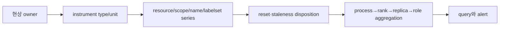
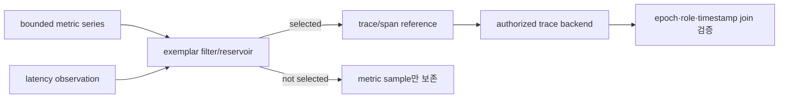
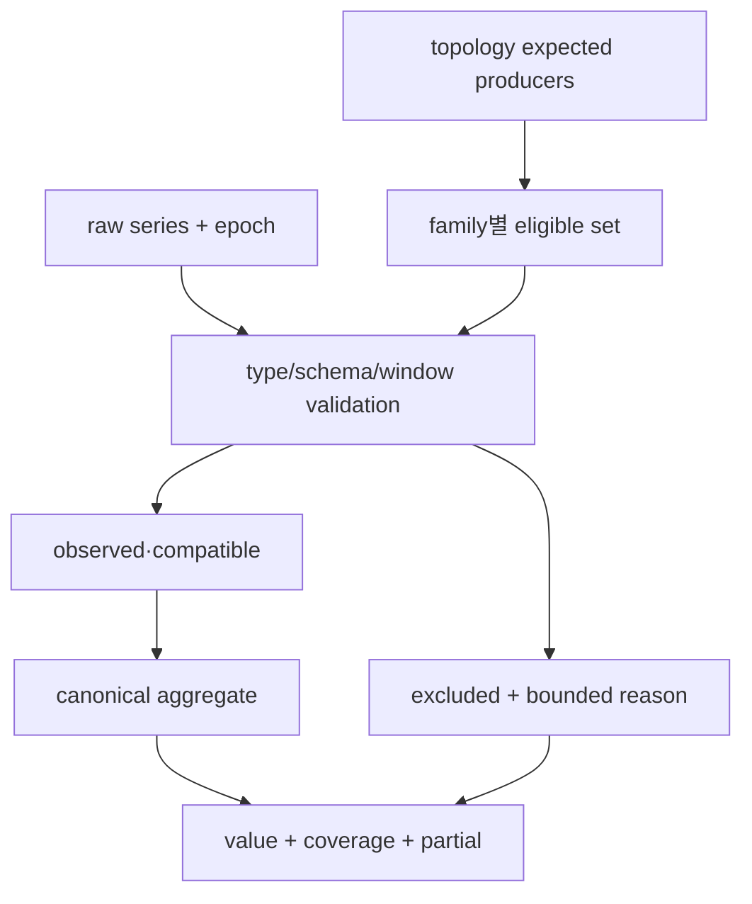
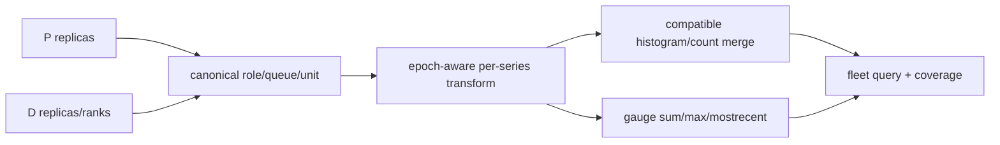

# 66장. 숫자가 맞아도 뜻이 틀릴 수 있다: metric 타입·label·cardinality

## 66.1 OBS-66: metric 의미가 깨진 도입 사건

Decode replica D2가 재시작한 뒤 dashboard의 throughput이 음수가 됐다. Queue는 실제로 2개인데 20개로 보이고,
debug를 위해 request ID label을 붙인 순간 새 series가 분당 30,000개 생겼다. 세 증상은 model이나 CUDA가 아니라
metric 의미가 깨진 사건이다. Counter reset을 raw subtraction했고, old process gauge와 new process gauge를
동시에 합쳤으며, request identity를 time-series identity로 바꿨다.

이 장에서는 P replicas 2개, D replicas 4개인 M66 deployment를 끝까지 추적한다. 10:03에 D2 epoch E7이
재시작해 E8이 된다. E7 `requests_total=120,000`, E8 첫 값은 40이다. E7 queue gauge 18이 stale로 남고 E8은
2를 보고한다. 동시에 request label 30,000개가 유입된다. 목적은 metric을 많이 만드는 것이 아니라 현상을
타입·label set·reset domain·aggregation으로 정확하게 보존하는 것이다.

**OBS-66 도입 사건: 잘못된 metric query를 type·reset·histogram·cardinality 순서로 고친다.**

M66 운영자는 다섯 stack을 한 화면에서 본다. LiteLLM은 API request와 upstream route를, vLLM과 SGLang은 admission,
scheduler와 token production을, cache 계층은 lookup·hit·promotion·eviction을, NCCL은 rank가 참여하는 collective
work를 관측한다. 이 값들을 `serving_health` 하나로 더하지 않는다. 먼저 사용자 질문을 쓰고, 그 질문에 답할 수
있는 owner event와 metric type을 고른다.

첫 질문은 “유효 요청이 성공적으로 끝나는 비율은 얼마인가”다. LiteLLM ingress counter는 accepted, success,
failure와 retry attempt를 구분해야 한다. Logical request success SLO의 분모에 upstream attempt를 넣으면 retry가
많은 날 traffic이 부풀고 성공률도 바뀐다. `logical_requests_total`은 한 client request의 terminal을 세며,
`upstream_attempts_total`은 provider/backend 시도 횟수를 센다. 두 counter는 함께 유용하지만 같은 population이
아니다.

둘째 질문은 “사용자가 기다리는 동안 어느 owner queue에 시간이 쌓이는가”다. vLLM과 SGLang의 scheduler queue
gauge는 현재 backlog를 답하고 enqueue/dequeue counters는 flow를 답한다. Queue gauge에 `rate()`를 적용해 arrival을
추정하지 않는다. API gateway pending, engine waiting, prefill bootstrap, decode preallocation과 KV transfer는
서로 다른 queue kind다. 각각 enqueue와 terminal event, capacity owner가 다르므로 bounded `queue_kind`를 보존한다.

셋째 질문은 “생성된 유효 output token당 비용과 지연은 얼마인가”다. Prompt/generated token counters와 request
latency, time-to-first-token, inter-token interval histograms를 연결한다. Counter는 reset-aware rate 뒤 합산하고,
histogram은 동일 event boundary·unit·bucket revision일 때만 bucket을 합친다. 평균 latency를 p99로 부르거나 각
replica p99를 평균내지 않는다. Cancelled request의 partial output tokens를 goodput 분자에 포함할지도 SLO contract에
명시한다.

넷째 질문은 “캐시가 실제로 피한 계산량은 얼마인가”다. Cache `hits_total` 하나로는 부족하다. Lookup, hit, miss,
bytes requested, bytes served, promoted, evicted와 rejected reason을 owner event로 나눈다. Request hit ratio와 byte
hit ratio는 다르다. 1MiB hit 아홉 건과 1GiB miss 한 건이면 request hit ratio는 90%지만 byte hit ratio는 약
0.87%다. Scheduler가 절약한 prefill tokens를 묻는다면 compatible tokens counter가 별도로 필요하다.

다섯째 질문은 “분산 실행이 모든 rank에서 앞으로 가는가”다. NCCL 관련 관측은 collective submit count,
completion 또는 watchdog progress, error/timeout, communicator/rank inventory와 operation duration을 구분한다.
한 rank가 `all_reduce`를 submit했다는 counter는 collective가 완료됐다는 증거가 아니다. Rank별 local counter를
fleet sum하면 하나의 logical collective를 world size만큼 셀 수 있다. SLO는 logical operation인지 rank work인지
분모를 먼저 정한다.

이 다섯 질문을 owner 행렬로 고정한다. LiteLLM은 logical request와 routing attempt owner, engine ingress는 admitted
request owner, scheduler는 waiting/running sequence와 token budget owner, cache manager는 lookup/object/byte
lifecycle owner, NCCL communicator와 watchdog은 rank-local progress owner다. Prometheus와 collector는 이 상태의
저장·전달 owner이지 request, queue, cache object나 collective의 terminal을 결정하는 owner가 아니다.

Metric catalog 한 행은 `SLO 질문`, `logical population`, `producer event`, `owner state`, `type`, `unit`, `reset
domain`, `bounded labels`, `허용 aggregate`, `coverage`, `source anchor`를 가진다. 예를 들어 generated tokens는
counter·tokens·engine epoch이고 per-series rate 뒤 role/model sum이 허용된다. Scheduler waiting은 gauge·requests이며
live replica sum과 worst-replica max를 별도 이름으로 만든다. Cache hit ratio는 hits/lookups 두 counter rate의
비율이고 gauge 평균은 금지한다.

LiteLLM 쪽 bounded labels는 deployment, route group, model alias, terminal outcome과 제한된 error class 정도다.
API key, user ID, request ID, raw exception, provider response text와 URL은 label에 두지 않는다. Model string도
caller가 임의 생성할 수 있으면 canonical alias allowlist로 번역하고 unknown은 bounded `other`로 보낸다. `other`
비율이 커지면 taxonomy drift alert를 내되 raw 값을 label로 되살리지 않는다.

Logical request와 attempt를 계산해 보자. 5분 동안 client requests 120,000건, 처음 시도 성공 116,000건, retry
4,000건 중 3,000건 성공, 1,000건 최종 실패라면 logical success는 119,000/120,000=99.167%다. Upstream attempts는
124,000이고 attempt success는 119,000/124,000=95.968%다. 두 비율은 모두 맞지만 첫째만 client terminal SLO에
답한다. Retry를 감추지 않도록 attempts per logical request 1.033도 함께 본다.

vLLM과 SGLang metric은 이름의 유사성보다 update boundary를 대응시킨다. `waiting`, `running`, `swapped`, prefill,
decode처럼 보이는 family가 실제 sequence count인지 request count인지, rank0 local인지 global-reduced인지 source
caller까지 확인한다. Token counters도 scheduled tokens, computed tokens, emitted tokens가 다르다. SLO 분자에
scheduled tokens를 넣으면 preemption과 cancel 뒤 버려진 work를 goodput으로 오인한다.

M66 engine fixture는 vLLM replicas V0,V1과 SGLang replicas S0,S1을 둔다. 각 replica의 1분 emitted tokens가
`[60k,40k,55k,45k]`, scheduled tokens가 `[66k,48k,61k,50k]`라면 emitted goodput은 200k tokens/min이고 scheduled
work는 225k tokens/min이다. 단순 efficiency는 88.9%지만 두 counter의 event population과 reset coverage가 같을
때만 이 비율을 사용한다. 한 replica가 missing이면 fleet 비율을 확정하지 않는다.

Queue 질문은 합과 최댓값을 함께 계산한다. V0,V1,S0,S1 waiting이 `[2,3,1,24]`라면 total waiting은 30이고
worst replica는 S1의 24다. 평균 7.5만 보면 심한 imbalance를 숨긴다. 반대로 max 24만으로 fleet capacity 부족을
선언하면 안 된다. Arrival/service counters와 oldest age를 결합해 S1 locality, routing 또는 cache/collective
stall 가설을 세우되 구체 사건 분석은 68장으로 넘긴다.

Cache fixture에는 LMCache 또는 connector cache C0,C1의 lookups `[90k,10k]`, hits `[81k,2k]`를 둔다. Replica별
hit ratios는 90%와 20%다. 단순 평균은 55%지만 fleet traffic-weighted ratio는 83k/100k=83%다. Byte counters가
requested `[90GiB,100GiB]`, served `[72GiB,5GiB]`라면 byte hit ratio는 77/190=40.5%다. “캐시 적중률 83%”라는
panel 제목이 어느 population인지 쓰지 않으면 최적화 판단이 어긋난다.

Cache labels에는 tier, operation, bounded outcome/reason, model revision과 cache namespace revision을 고려한다.
Cache key, prompt hash 전체, block hash, object ID와 request ID는 hot family label로 두지 않는다. Tier는 GPU,
CPU, local disk, remote처럼 bounded enum일 때 유용하다. Endpoint hostname이나 remote object path가 동적으로
증가하면 canonical location class로 바꾸고 상세 identity는 trace/log에 둔다.

Eviction counter도 “나쁨”으로 바로 해석하지 않는다. Capacity-driven eviction, explicit invalidation, stale generation,
checksum rejection과 admission reject를 bounded reason으로 나눈다. Evicted bytes와 objects는 workload 크기에 따라
다른 질문을 답한다. Current cache occupancy는 gauge이고, allocated/used/free를 무조건 합치기 전에 mutually exclusive한
상태인지 확인한다. Replicated bytes를 logical cache bytes로 sum하면 복제 계수만큼 부풀 수 있다.

NCCL fixture는 tensor-parallel world size 8, logical all-reduce 1,000회를 사용한다. 각 rank가 local submit counter를
1,000씩 올리면 rank-work 합은 8,000이고 logical operations는 1,000이다. `sum without(rank)`을 곧바로 logical
collectives라 부르면 8배다. 모든 rank가 정확히 한 번 참여한다는 contract가 있으면 rank-work/world-size를 검산에
쓸 수 있지만 missing/duplicate rank와 elastic membership에서 단순 나눗셈은 fail-closed해야 한다.

Rank별 progress gauge가 `[1000,1000,1000,999,1000,1000,1000,1000]`이면 sum 7,999보다 min/max spread 1이
hang 전조 질문에 유용하다. Gauge value가 sequence number인지 in-flight count인지 source를 확인한다. Sequence
number는 max나 min과 spread를 보고, in-flight independent work는 topology에 따라 sum할 수 있다. 이름이
`progress`라는 이유만으로 aggregate를 정하지 않는다.

Communicator ID는 수명이 길고 bounded한지 검토한다. 매 request마다 communicator가 생기거나 opaque unique ID가
label로 노출되면 cardinality가 폭발한다. Deployment role, parallel group kind, bounded world size, rank 정도를
metric에 두고 exact communicator identity는 diagnostic artifact로 옮긴다. Rank label 자체도 GPU 수와 replicas,
models, families에 곱해지므로 budget에 포함한다.

이제 M66 production budget을 손으로 계산한다. Replicas 24, roles 2, model revisions 4, outcome 6인 counter family
하나는 최악 24×2×4×6=1,152 series다. 같은 dimensions에 classic histogram 12 finite buckets가 있으면 `+Inf`,
`_sum`, `_count`를 포함해 observation당 family components를 15로 보고 17,280 series다. Histogram families가
8개면 138,240 series다. 실제 reachable combinations와 scrape payload까지 측정해 theoretical 상한과 비교한다.

여기에 NCCL rank 8과 group kind 3을 모든 engine family에 무심코 붙이면 24×4×8×3=2,304 base identities가 되고,
15-component histogram 하나가 34,560 series다. Rank가 의미 없는 API latency에도 공통 resource label로 전파되면
비용만 늘어난다. Resource attribute가 exporter에서 모든 datapoint label이 되는지 translation을 확인하고 family별
필요 dimension만 허용한다.

Request ID 30,000개/분을 outcome 6, replica 24와 곱하면 이론상 4,320,000 identities/분이지만 실제 request는
보통 한 replica와 한 outcome을 가지므로 reachable churn은 최소 30,000 new series/분이다. 2시간 head retention만
잡아도 3.6M 최근 identities가 남을 수 있다. Remote write와 장기 storage에서는 더 오래 누적된다. Theoretical
Cartesian product와 reachable event rate를 둘 다 써야 예산이 과장도 축소도 되지 않는다.

OBS-66 incident는 10:03 D2 restart와 10:04 debug rollout에서 시작한다. Metric names와 dashboard panels는 변경되지
않았다. 10:03 counter rule은 `rate(sum without(engine)(requests_total)[5m:])`처럼 epoch를 먼저 지워 reset을 fleet
series 안에 숨겼다. 일부 evaluation에서는 급락, 다른 구간에서는 0 clamp가 나타났다. 10:04 old E7 gauge file이
남아 E8 queue2와 E7 queue18이 합쳐져 queue20이 됐다.

동시에 operator는 원인을 찾으려고 LiteLLM과 engine error counter에 `request_id`와 raw `model` label을 추가했다.
분당 30,000 new series가 생성되고 scrape payload와 remote-write queue가 늘었다. 10:08부터 일부 targets scrape가
deadline을 넘겨 histogram samples가 간헐적으로 빠졌다. Alert query는 missing bucket series를 0으로 채웠고,
겉보기 p99가 개선됐다. 이름은 모두 맞았지만 counter는 reset, gauge는 stale owner, histogram은 불완전 population,
labels는 churn을 품었다.

10:11 API success SLO는 실제 logical success 98.7%였으나 attempt counter를 분모로 쓴 panel은 96.1%를 보여 false
page를 냈다. 반면 token latency histogram alert는 missing high-latency replicas와 boundary revision 혼합 때문에
정상처럼 보여 real page를 놓쳤다. 같은 incident에서 false positive와 false negative가 동시에 발생했다. “관측
시스템이 느렸다”가 아니라 family별 semantic failure를 분리해야 한다.

첫 divergence는 10:03 rule 배포 한 점이 아니다. Counter lane은 rate 전에 reset identity를 삭제한 rule,
gauge lane은 run-scoped multiprocess state를 재사용한 lifecycle, cardinality lane은 unbounded identifiers를 producer
schema에 허용한 change review, histogram lane은 coverage/schema mismatch를 0으로 대체한 query가 각각 최초
divergence다. 하나를 고쳐 전체 incident가 끝났다고 선언하지 않는다.

Containment 1은 unbounded label이 추가된 release를 즉시 중단하고 producer schema를 이전 revision으로 되돌리는
것이다. Backend relabel drop도 병행해 storage 유입을 막지만 exporter payload와 privacy exposure를 해결하지
못하므로 영구 수정으로 부르지 않는다. Remote write destinations와 recording rules를 inventory해 raw identifier가
이미 복제된 범위를 확인한다.

Containment 2는 counter rule을 epoch별 `rate` 뒤 bounded fleet sum으로 되돌린다. Old/new rule을 동시에 계산해
M66 sentinel 20 req/s와 logical request hand calculation이 맞는지 본다. Negative를 0으로 clamp하는 rule은 제거한다.
Reset count와 eligible sample coverage를 alert annotation에 붙인다. Counter가 monotonic이어도 process/collector
epoch가 바뀌면 새 reset domain이라는 계약을 유지한다.

Containment 3은 D2 multiprocess directory를 run-scoped fresh identity로 교체한다. Shared directory를 운영 중
무차별 삭제하지 않고 대상 pod/epoch 소유를 확인한다. E7 file을 quarantine해 증거를 보존하고 E8 raw exposition이
queue2만 내는지 확인한다. Forced kill, OOM과 graceful shutdown 세 fixture에서 dead producer disposition을 검증한다.

Containment 4는 histogram panel을 `unknown/partial`로 fail-closed한다. Compatible boundary revision과 expected
producer coverage가 기준에 못 미치면 p99 수치를 숨기거나 명확히 partial로 표시한다. Missing bucket을 0으로
채우지 않는다. Old/new schema는 별 family/revision으로 dual publish하고 같은 schema끼리 bucket을 합친 뒤 quantile을
계산한다.

Rollback의 순서도 중요하다. 먼저 새 identifier 유입을 막아 TSDB와 remote queue 증가율을 낮춘다. 다음 raw
scrape 안정성을 회복해 metric population을 다시 관측 가능하게 만든다. 그 뒤 counter/gauge/histogram rules를
known-good revision으로 되돌리고 alerts를 재활성화한다. Storage pressure 때문에 retention data를 삭제하는
파괴적 조치는 incident 범위와 보존 의무를 확인한 별도 승인 없이는 하지 않는다.

30분 검산에서 new-series slope는 정상 bounded baseline으로 내려가야 한다. 그러나 active series는 stale retention
때문에 즉시 줄지 않을 수 있다. Slope 정상화를 active count 정상화로 오인하지 않는다. Scrape duration, samples,
remote-write queue와 rejected samples가 회복되고 raw schema에 forbidden labels가 없는지 확인한다. Cache와 NCCL
families도 공통 resource label 전파로 오염되지 않았는지 전수 검사한다.

Counter 종료 조건은 E7/E8 reset fixture, one-replica reset, collector reset과 scrape loss에서 expected rate 오차가
허용 범위 안이고 negative/clamp가 0인 것이다. Gauge 종료 조건은 live inventory와 raw exposition이 일치하고 dead
epoch가 bounded time 안 제외되는 것이다. Histogram 종료 조건은 compatible population만 merge되고 insufficient
coverage가 숫자 대신 partial을 낸다는 것이다. Label 종료 조건은 producer schema와 모든 remote destination에서
unbounded keys 신규 유입이 0인 것이다.

다섯 stack SLO matrix도 회귀한다. LiteLLM logical success와 attempts가 각각 99.167%, 95.968%로 손계산과 맞아야
한다. Engine emitted/scheduled token 비율은 동일 coverage에서 88.9%다. Cache request hit 83%와 byte hit 40.5%가
서로 다른 제목으로 보인다. NCCL logical 1,000과 rank-work 8,000을 별 family로 유지하고 rank progress spread 1을
보존한다. 하나의 generic success나 throughput으로 합치지 않는다.

이 incident의 안전한 terminal 문장은 다음과 같다. “E7/E8 counter reset identity를 rate 전 보존했고, E7 gauge
state를 E8 registry에서 제거했으며, request/model identifiers를 bounded schema 밖으로 이동했다. Compatible complete
histogram population만 합산한다. LiteLLM logical request, engine queue/token, cache object/byte와 NCCL rank/logical
work SLO가 owner별 fixture 계산과 일치하고 30분 동안 새 churn·stale queue·false p99가 재발하지 않았다.”

이 절은 다음 장의 Prometheus·trace·log 연결법을 미리 수행하지 않는다. Exact request를 찾아가는 correlation은
67장의 책임이다. 또한 queue 증가의 scheduler 원인을 판정하는 사건 분석은 68장으로 넘긴다. 여기서 닫는 것은
metric point가 가진 type, identity, population, owner와 합산 가능성이다. 그 의미가 맞아야 다음 도구와 사건이
신뢰할 입력을 얻는다.

실제 catalog review는 stack 이름별 회의가 아니라 SLO 질문별 회의로 진행한다. 요청 성공 질문에는 LiteLLM logical
terminal과 engine admission/rejection이 참여하고, throughput 질문에는 emitted token과 completed request가 참여한다.
Cache 질문에는 lookup population과 avoided work가, distributed progress 질문에는 expected rank set과 collective
terminal observer가 참여한다. 같은 family가 두 질문에 쓰이면 각 질문의 허용 aggregate와 denominator를 별도로
쓴다. Dashboard에서 재사용된다는 사실이 semantic 재사용을 정당화하지 않는다.

API request counter의 source walk는 public handler 진입, authentication/rate-limit 뒤 accepted, router selection,
각 upstream attempt, logical terminal의 다섯 event를 찾는다. Streaming은 첫 chunk가 success terminal인지 stream
끝이 terminal인지 계약을 확인한다. Client disconnect, timeout, fallback success와 double callback이 logical
counter를 몇 번 갱신하는지 fixture로 센다. Middleware 이름만 보고 “요청 수”를 추정하지 않는다.

Engine counter의 source walk는 request enqueue, scheduler admission, token scheduling, model execution return,
output emission, request terminal을 분리한다. vLLM과 SGLang이 같은 `tokens_total` 비슷한 이름을 내더라도 어느
event에서 몇 token을 더하는지 확인한다. Speculative decoding에서는 proposed, accepted와 emitted tokens가 다르고,
chunked prefill에서는 scheduled prompt tokens가 여러 iteration에 나뉜다. SLO가 읽고 싶은 population을 정확한
producer event에 연결한다.

Cache source walk는 lookup call, key validation, tier selection, read completion, promotion commit, eviction과 object
release를 잇는다. Lookup call이 hit counter를 올린 뒤 checksum/layout validation에서 거절되면 usable hit가 아니다.
따라서 metadata candidate hit, byte read success와 serving-compatible hit를 별 family 또는 bounded stage로 구분한다.
Stage를 label로 둘 때 값 집합을 고정하고 모든 단계가 한 request마다 중복 count된다는 사실을 합산 계약에 쓴다.

NCCL source walk는 host wrapper, enqueue/check, task preparation, plan scheduling, device dispatch와 proxy progress를
잇되 56장의 실행 설명을 반복하지 않는다. 여기서는 각 지점이 어떤 관측 event를 만들 수 있는지만 본다. Host
enqueue count와 device/proxy completion observation을 같은 `collectives_total`로 합치면 submit 뒤 hang을 성공으로
센다. Completion observer가 없으면 completed SLO를 만들지 않고 submitted와 watchdog timeout까지만 정직하게 낸다.

Histogram series 예산을 scrape 비용으로도 바꿔 보자. 138,240 series가 scrape마다 평균 label/sample text 180
bytes를 만든다고 단순 가정하면 한 scrape는 약 24.9MB다. 15초 interval이면 exporter에서 약 1.66MB/s이고 하루
raw exposition 전송량은 약 143GB다. Compression과 protocol 때문에 실제 값은 달라지므로 이 계산은 capacity
fixture다. 실제 payload bytes와 duration을 측정해 예산 상수를 교체한다.

Head series budget은 steady count와 churn을 분리한다. 정상 bounded deployment가 active 200k, rollout overlap 상한
300k라면 30k new series/min debug schema는 10분 만에 overlap 여유를 소모한다. 그러나 old series retention 때문에
rollback 직후 active가 200k로 떨어지지는 않는다. Release gate는 `new_series_per_min`, scrape sample count,
payload bytes, remote queue slope를 함께 사용한다. Active count 하나는 늦은 지표다.

Label별 budget 표에는 allowed value count뿐 아니라 creation owner와 retirement trigger를 둔다. `model_revision=4`는
새 rollout이 만들고 old revision drain이 없애며 일시 overlap 2를 허용할 수 있다. `replica=24`는 autoscaler가
만들고 scale-down 뒤 stale retention을 가진다. `outcome=6`은 source enum이 제한한다. Request ID는 value count를
증명할 수 없고 retirement가 request rate에 종속되므로 metric label 심사에서 거절한다.

Histogram boundary revision도 identity budget이다. Old 12-bucket과 new 16-bucket을 같은 rollout에서 dual publish하면
components는 각각 15와 19다. Base identities 1,152라면 일시 series는 1,152×34=39,168이다. 이를 16-bucket 하나의
21,888로 잘못 계산하면 migration headroom이 부족하다. Cutover 뒤 old rules와 series의 retirement 시점을 장부에
남긴다.

Alert evaluation도 손으로 재현한다. Logical success threshold 99.0%, minimum coverage 95%, evaluation 5분이라고
하자. Success 119,000/120,000이면 99.167%로 통과한다. 그런데 eligible logical terminals가 expected의 90%뿐이면
비율이 높아도 SLO 판정을 unknown으로 둔다. Attempt ratio 95.968%는 별 retry-pressure alert 입력이지 success
page 입력이 아니다. Query가 반환한 scalar만으로 population coverage를 잃지 않는다.

Latency alert는 compatible histogram count가 logical terminal count와 어느 정도 맞는지 검산한다. Streaming,
cancel과 sampling policy 때문에 정확히 같지 않을 수 있으므로 expected relation을 contract에 쓴다. 갑자기 histogram
count coverage만 70%가 되고 p99가 좋아지면 성능 개선보다 missing slow producers를 먼저 의심한다. Count와 eligible
replica를 p99 옆에 보이는 이유다.

Queue alert는 total 30과 worst 24에서 두 조건을 구분한다. Fleet total capacity alert는 sum, imbalance alert는
max와 median 또는 per-replica distribution을 쓴다. Stale E7 18이 S1 24와 함께 섞이면 total과 max가 모두 왜곡될
수 있다. Live epoch selector와 inventory coverage를 먼저 적용하고, gauge가 사라진 replica를 0으로 채우지 않는다.

Cache alert는 request hit 83%가 threshold 80%를 통과해도 byte hit 40.5%와 avoided prefill token ratio가 낮을 수
있음을 보인다. 어느 자원이 병목인지에 따라 SLO 질문을 선택한다. Remote bandwidth를 줄이려면 served bytes,
compute를 줄이려면 compatible cached tokens, lookup overhead를 보려면 request population이 더 가깝다. “hit ratio”
하나로 세 최적화를 승인하지 않는다.

NCCL alert는 rank-work sum 8,000이 기대값과 같아도 rank 하나가 sequence 999라면 progress 불일치를 놓치지 않는다.
Expected membership 8/8, min/max sequence, timeout/error와 completion coverage를 함께 본다. Elastic scale이나
communicator recreate 시 sequence reset domain을 새 incarnation으로 나눈다. Old/new communicator sequence를
이어 붙여 negative progress나 false spread를 만들지 않는다.

OBS-66 rollback 뒤 90분 soak에는 정상 traffic, D2 restart, forced kill, model revision rollout, cache tier miss burst와
한 rank delayed fixture를 순차 주입한다. 목표는 모든 alert를 조용하게 만드는 것이 아니다. 의도한 reset은 reset
annotation과 정상 rate를, stale gauge는 coverage change를, delayed rank는 distributed-progress alert를 정확히
만들어야 한다. 진짜 신호까지 사라졌다면 rollback이 관측 기능을 훼손한 것이다.

Soak 결과표는 family별 `expected value`, `observed value`, `coverage`, `reset count`, `series created`, `alert decision`,
`falsifier`를 둔다. Stack별 screenshot 다섯 장으로 흩뜨리지 않는다. Logical request에서 cache와 NCCL로 내려갈수록
population 단위가 달라진다는 사실을 표에 유지한다. Cross-stack 수치는 request/model/revision/role처럼 검증된
bounded dimensions에서만 비교한다.

최종 rollback record에는 code/image만 아니라 metric schema revision, collector translation, recording rules,
dashboard와 alert revision, multiprocess directory policy, remote-write relabel을 포함한다. Producer만 되돌리고
new query를 남기거나 query만 되돌리고 unbounded producer를 남기면 반쪽 rollback이다. 각 artifact의 known-good
checksum과 적용 시각을 남겨 old/new semantics가 섞인 구간을 이후 SLO 보고서에서 표시한다.

OBS-66이 닫힌 뒤에도 역사 데이터의 잘못된 27분은 자동으로 참이 되지 않는다. 해당 window를 semantic-invalid 또는
partial로 표시하고 외부 SLO 계산이 사용했다면 재계산한다. Raw identifier가 저장됐다면 접근·retention 정책에 따라
후속 조치한다. 그래프가 현재 정상이라는 사실로 과거 false page와 missed page의 영향을 지우지 않는다.

재발 방지 gate는 schema diff를 사람이 눈으로만 보는 데서 끝나지 않는다. Fixture exporter에 bounded values와
30,000 unique identifiers를 각각 주입하고 family별 unique label sets, histogram components와 payload 증가를
계산한다. 새 label key가 allowlist 밖이면 빌드를 막고, allowed key도 reachable values와 rollout overlap을 합친
budget을 넘으면 승인을 요구한다. Metric name이 그대로라는 이유로 semantic diff 검사를 건너뛰지 않는다.

Query lint는 counter에 rate-before-sum, gauge의 explicit live selector와 aggregate question, histogram의 boundary
revision·coverage guard, ratio의 numerator/denominator population join을 검사한다. 모든 오류를 정적으로 증명할 수는
없으므로 M66 numeric oracle로 rule evaluator 결과를 비교한다. `119000/120000`, `83000/100000`, `770/1900`
같은 sentinel이 의도한 단위와 맞는지 소수점 표시까지 확인한다.

소유권 승인도 순차적이다. LiteLLM owner는 logical/attempt terminal을, engine owner는 queue/token update event를,
cache owner는 usable hit와 byte/token population을, distributed runtime owner는 rank/logical collective coverage를
승인한다. Platform owner는 reset·staleness·translation과 cardinality를 승인하고 SLO owner는 질문과 denominator를
승인한다. 어느 한 팀도 다른 owner state를 이름만 보고 대신 정의하지 않는다.

마지막 표의 각 수치는 action으로 이어져야 한다. Logical failure 증가는 routing/retry policy owner에게, scheduled와
emitted token gap은 scheduler/execution owner에게, low byte hit는 placement/tier owner에게, rank progress spread는
communicator/runtime owner에게 간다. Coverage 부족은 먼저 관측 pipeline owner에게 간다. 숫자 threshold가 같아도
조치 주체가 다르면 같은 alert family로 뭉치지 않는다.

이로써 OBS-66의 terminal은 단순한 dashboard 복구가 아니다. 다섯 stack의 metric이 각자 어떤 event를 세고 어떤
state를 snapshot하며 어느 labels와 epoch에서만 합산 가능한지 재현할 수 있다. Reset, stale producer, incomplete
histogram과 label churn을 다시 주입했을 때 false scalar 대신 올바른 값 또는 명시적 unknown이 나온다. 그 상태가
유지되어야 SLO가 시스템의 사실을 말한다고 승인한다.

승인 뒤 첫 정기 점검에서도 같은 fixture와 budget을 다시 계산한다. 값만 정상이고 schema·coverage·owner가 달라졌다면
새 semantic revision으로 열어야 하며, 과거 승인을 현재 release에 자동 상속하지 않는다.

## 66.2 M66에서 숫자보다 먼저 의미를 복구한다

### 66.2.1 세 증상을 세 owner로 나눈다

Negative throughput은 counter query, queue 20은 gauge/multiprocess staleness, series 폭증은 label schema 문제다.
세 증상을 “Prometheus 장애”로 묶지 않는다. Producer가 무엇을 기록했고 exporter/registry가 어떻게 합쳤으며
query가 어떤 label을 지웠는지 순서대로 본다.

10:02:45 E7의 마지막 scrape와 10:03:00 E8의 첫 scrape를 한 table에 둔다. `requests_total`은 120,000→40,
`decode_queue`는 E7 18/E8 2, scrape target은 old down/new up다. 10:03 이후 `request_id` label이 있는 debug
family의 `scrape_samples_post_metric_relabeling`과 head series creation slope가 뛴다. 세 값이 같은 시각에
변했지만 causal owner는 다르다.

Counter query owner는 recording/PromQL, gauge owner는 producer multiprocess registry와 target inventory,
label owner는 instrumentation schema다. Storage pressure는 request-label 실수의 downstream symptom이다.
Prometheus process를 재시작하면 잠시 graph가 깨끗해질 수 있지만 schema는 그대로여서 series 폭증이 반복된다.

최소 관측은 raw exposition/OTLP point, target/process epoch, effective scrape/relabel, recording rule와 query다.
Dashboard panel JSON만 보면 producer type과 reset domain을 잃을 수 있다. 반증은 각 owner를 독립적으로 고친
canary에서 negative rate, stale queue, creation slope가 각각 예상대로 변하는지 확인하는 것이다.

### 66.2.2 M66의 process·series identity를 고정한다

Series identity에는 service, model revision, engine/process epoch, role, replica/rank, metric family와 bounded
label set을 둔다. E7과 E8은 endpoint가 같아도 다른 reset domain이다. `role=decode, replica=D2`만 남기는
recording rule은 rate 계산 뒤에 적용한다.

Prometheus series는 metric name과 complete label set으로 구분된다. Target labels와 exporter labels가 relabel
뒤 어떻게 합쳐졌는지 본다. OTel에서는 resource와 instrumentation scope, data point attributes가 exporter에서
labels/name으로 번역될 수 있다. 같은 semantic stream이 duplicate labels로 둘이 되거나 다른 streams가 collision할
수 있다.

M66 canonical raw identity는 `(service=serve, model_rev=M9, engine=E7|E8, role=D, replica=D2,
rank=0, family=requests_total, reason=none)`다. Fleet query가 engine/replica를 지우기 전에 E7/E8 reset-aware
transform을 수행한다. Rank label이 실제 producer coverage가 아니라 logical grouping이면 이름을 바꾼다.

Identity mismatch 가설은 raw target/exposition과 OTel resource/scope를 펼쳤을 때 E7/E8가 명확히 분리되고
recording rule도 rate 이전에 이를 유지하면 약해진다. 그때 negative 값은 function/window나 sample ordering을
본다. Metric name equality만으로는 반증되지 않는다.

### 66.2.3 제출할 metric contract

각 family는 owner, unit, type, monotonicity/temporality, reset epoch, labels/privacy, histogram schema,
aggregation, staleness, budget와 evidence를 가진다. Null을 0으로 채우지 않는다. Unknown aggregation은 query
사용을 막는 gap이다.

이 계약을 문서 표에만 두지 않고 세 개 fixture로 검사한다. 첫 fixture는 정상 steady state다. P2와 D4가 모두 live이고, counters는 15초마다 예상 증가량을 내며, queue gauges는 inventory와 같고, histogram counts는 request event counts와 일치한다. 둘째는 D2 E7→E8 restart다. Counter reset, old gauge disposition, process directory와 coverage가 동시에 검증된다. 셋째는 schema 공격 fixture다. 30,000 request IDs, arbitrary exception strings, bucket revision mismatch를 넣었을 때 forbidden labels가 producer boundary에서 거부되고 mismatch aggregate가 fail-closed해야 한다.

정상 fixture만 통과한 contract는 lifecycle과 hostile input을 검증하지 못한다.

각 fixture의 입력은 topology snapshot, raw metric points/exposition, scrape timestamps와 effective configuration이다.
기대 출력은 canonical per-series transforms, aggregation results, coverage, excluded reasons와 alert state다. Dashboard
screenshot은 결과 확인에는 유용하지만 input artifact가 아니다. 숫자가 왜 그렇게 되었는지 재계산할 수 있도록
sample table과 query expression을 text로 보존한다. M66의 E7 `120000`, E8 `40`, gauges `18`과 `2`, request IDs
`30000`은 이 회귀 fixture의 고정 sentinel이다.

Validation ordering도 type contract의 일부다. 먼저 resource/process epoch와 complete label set으로 series를 분리한다.
그다음 counter rate, gauge live-selection, histogram schema compatibility 같은 temporal/type transform을 수행한다.
그 뒤에만 replica/rank/role labels를 지워 spatial aggregate를 만든다. 마지막으로 coverage와 query/alert threshold를
적용한다. `label drop → sum → rate`처럼 순서를 바꾸면 reset을 숨기므로, recording rule DAG 자체를 review 대상에
넣는다.

Metric family의 change classification은 네 단계로 나눈다. Description text만 고친 compatible change, 새 bounded label
value처럼 budget/query를 바꾸는 additive change, type/unit/boundary/temporality를 바꾸는 semantic change, metric을
없애는 removal이다. Semantic change는 같은 name으로 이어 쓰지 않는 것을 기본으로 한다. New family 또는 revision
identity, dual publishing 기간, recording rule와 alert migration, old series retirement를 계획한다. “값이 숫자라서
dashboard가 계속 그려진다”는 compatibility 증거가 아니다.

Contract review 질문은 구현자에게 구체적이어야 한다. 이 값은 어느 함수의 어느 event에서 update되는가, 실패와
cancel 경로도 update되는가, 한 logical event를 몇 process가 관측하는가, process crash 뒤 값은 누가 제거하는가,
collector가 temporality를 바꾸는가, label value는 어디에서 검증되는가, bucket boundaries의 source unit은 무엇인가,
어느 queries가 labels를 지우는가를 묻는다. 답이 source와 fixture로 연결되지 않으면 `unknown`으로 남기고 SLO alert의
근거로 승격하지 않는다.

M66에서 contract 완료를 판정하는 artifact는 네 장이다. Metric catalog는 producer 의미와 type을, aggregation matrix는
type별 허용 spatial operation을, cardinality workbook은 identities와 churn budget을, incident replay는 E7/E8의
expected 계산을 가진다. 네 artifact가 서로 같은 family ID와 schema revision을 사용해야 한다. Catalog는 counter인데
query matrix가 gauge sum을 쓰거나, budget sheet에서 histogram multiplier를 잊으면 cross-check가 실패한다.

Contract validation은 type별 필수 fields를 검사한다. Counter는 monotonic/reset domain, gauge는 aggregation
question, histogram은 boundaries/schema/temporality, summary는 quantile producer/window, exemplar는 filter와
access policy가 필요하다. Label마다 bounded values와 privacy가 없다면 production catalog에 승격하지 않는다.

Owner가 “dashboard 팀”이라고 쓰는 것은 부족하다. Instrument update owner, exporter aggregation owner,
recording rule owner와 alert consumer를 구분한다. Unit conversion은 canonicalization owner가 맡고 raw producer
unit을 보존한다. Contract diff가 query/alert에 어떤 영향을 주는지도 change review에 넣는다.

## 66.3 metric stream identity는 이름보다 넓다

### 66.3.1 Prometheus label set이 series를 만든다

Metric name이 같아도 label value 하나가 다르면 다른 series다. Vector matching과 grouping은 어느 labels를
남기거나 지우는지 결정한다. Request ID를 label에 넣는 순간 request마다 새 series가 된다.

Prometheus의 고정 [metric type·series 기본 의미](https://github.com/prometheus/prometheus/blob/d7598b7141418fa35be2b5ec5d0fefb634199610/docs/querying/basics.md#L15-L63)와
[vector label matching 규칙](https://github.com/prometheus/prometheus/blob/d7598b7141418fa35be2b5ec5d0fefb634199610/docs/querying/operators.md#L217-L266)을
source anchor로 사용한다. 문서의 개념을 M66에 적용할 때는 metric name과 완전한 labels를 실제 query input에서
열거한다. `sum by(model)` 결과 몇 줄만 보며 원래 engine/replica cardinality를 추정하지 않는다.

`sum by(model)(rate(requests_total[5m]))`는 replica/reason을 지우고 model별 값을 만든다. 이 삭제가 의도인지
확인한다. Failure reason을 먼저 sum하면 total throughput에는 맞지만 reason별 alert에는 복구할 수 없다. Binary
vector join에서 `on(model)`만 쓰면 여러 engine series가 many-to-many가 될 수 있다.

Target label `instance`가 pod restart 뒤 동일하고 producer label `engine=E7/E8`이 다르면 engine이 reset identity를
보존한다. Recording rule에서 engine을 지운 raw gauge sum은 stale duplication을 만든다. Counter는 rate 이후
지울 수 있다. Type이 label-drop ordering을 결정한다.

Label-set 가설의 falsifier는 query input series count와 expected process inventory가 일치하고 vector matching이
one-to-one이며 output grouping이 contract와 같을 때다. 그때 값 오차는 producer/type로 이동한다. Query output
label만 보고 input collision을 반증하지 않는다.

### 66.3.2 OTel resource·scope·attributes도 identity다

OTel stream은 resource, instrumentation scope, name, data-point type, unit, temporality와 attributes를 함께 본다.
Exporter가 resource attribute를 Prometheus label로 펼치면 collision과 cardinality가 달라질 수 있다.

이 해석은 OTel의 고정 [metric stream identity와 reaggregation model](https://github.com/open-telemetry/opentelemetry-specification/blob/29ae8c7710d2ea52e21a5ff81fb1cd657bcd3306/specification/metrics/data-model.md#L91-L163)과 [stream identity fields](https://github.com/open-telemetry/opentelemetry-specification/blob/29ae8c7710d2ea52e21a5ff81fb1cd657bcd3306/specification/metrics/data-model.md#L276-L320)에 근거한다. Spec의 abstract identity와 exporter의 concrete Prometheus labels 사이 translation table을 반드시 둔다.

같은 용어를 쓴다는 이유로 resource와 point attributes가 자동 보존된다고 가정하지 않는다.

OTel data model은 같은 name이라도 Resource/Scope와 type/unit 등 identity가 충돌하면 semantic error 가능성을
드러낸다. Service instance ID를 resource로 둘지 point attribute로 둘지는 exporter의 label mapping과 reset
domain에 영향을 준다. M66 E7/E8 resource instance가 사라지면 cumulative Sum이 하나로 이어진 것처럼 보인다.

Exporter translation artifact에는 source resource/scope/attributes, target metric/labels, dropped/renamed keys,
temporality conversion과 collision policy를 둔다. `service.name`과 producer `service`가 같은 target label을 만들면
어느 값을 보존하는지 확인한다. 변경 전후 series count와 query result를 정적 fixture로 비교한다.

OTel identity 가설은 raw OTLP points에 E7/E8 start time/resource가 있고 target series에도 reset-safe identity가
있으면 약해진다. Collector가 delta→cumulative를 수행한다면 conversion state와 restart behavior를 별로 본다.

### 66.3.3 reaggregation은 정보 삭제 계약이다

Replica label을 지워 sum하는 것은 단순 display가 아니라 spatial reaggregation이다. Gauge last value를 sum할지,
histogram buckets를 merge할지 type에 따라 다르다. 지운 attribute를 나중에 복원할 수 없다.

M66에서 per-replica request rate는 sum 가능하지만 cache hit ratio gauge의 단순 평균은 traffic weight를 무시한다.
Hit/miss counters로 fleet ratio를 다시 계산하거나 numerator/denominator를 보존한다. Queue sum은 total queued work,
max는 worst replica, average는 load balance를 묻는다. 하나를 `fleet_queue`라는 모호한 이름으로 쓰지 않는다.

Spatial reaggregation 전 temporal normalization도 필요하다. E7/E8 counter를 각 epoch/window에서 rate로 바꾼 뒤
sum한다. Histograms는 same boundaries/schema와 time interval을 확인한 뒤 bucket counts를 합친다. Summary p99는
원 population을 복구할 수 없어 합산 대상에서 제외한다.

Reaggregation 검증은 raw per-series aggregate와 canonical query 결과를 작은 fixture에서 손계산한다. Labels를
지운 뒤 result가 기대 값과 다르면 query를 고치고, 맞더라도 information-loss note와 downstream allowed uses를
contract에 남긴다.

## 66.4 Counter는 누계이며 reset domain을 가진다

### 66.4.1 raw subtraction이 음수 throughput을 만든다

E7 120,000에서 E8 40을 빼면 -119,960이지만 traffic이 역류한 것이 아니다. Epoch별 samples에서 reset-aware
rate/increase를 계산한 뒤 D replicas로 sum한다. Old/new 값을 직접 이어 붙이지 않는다.

15초 scrape에서 E7 마지막 두 points가 119,700→120,000이면 interval increase 300, 20 req/s다. E8 첫 두
points가 40→340이면 역시 300, 20 req/s다. Reset-aware 두 intervals를 각각 처리하면 정상이다. 120,000→40을
하나의 interval로 subtract하면 -7,997 req/s라는 무의미한 값이 생긴다.

Prometheus counter query는 reset detection을 포함하는 rate/increase를 사용하되 scrape gap과 window points를
확인한다. `sum(rate(...))`와 `rate(sum(...))`는 reset detection ordering이 다르다. 일반적으로 per-series rate
뒤 sum해야 한 replica reset이 fleet sum에 묻히지 않는다.

OTel의 [Sum과 Gauge data model](https://github.com/open-telemetry/opentelemetry-specification/blob/29ae8c7710d2ea52e21a5ff81fb1cd657bcd3306/specification/metrics/data-model.md#L368-L477)은
monotonicity와 aggregation temporality를 확인하는 기준이다. 이를 PromQL 함수 동작과 섞지 않는다. Producer point가
cumulative Sum이라는 사실, exporter가 counter syntax로 번역했다는 사실, query가 reset-aware rate를 계산했다는
사실은 세 층의 서로 다른 증거다. 각 층의 시작 timestamp와 process/collector restart를 이어야 한다.

Counter reset counter와 process start time, target up을 같은 dashboard에 둔다. Reset이 rollout과 일치하면 정상
lifecycle일 수 있고, 반복 reset은 crash loop signal이다. Negative raw delta를 0으로 clamp하면 원인도 traffic도
왜곡할 수 있다.

### 66.4.2 monotonic Sum과 temporality를 확인한다

OTel Sum은 monotonic 여부와 cumulative/delta temporality를 가진다. Delta를 cumulative로 변환하거나 반대
방향으로 보낼 때 start timestamp와 reset detection이 필요하다. Exporter 변환을 producer 의미로 오인하지 않는다.

Cumulative E7 point는 start=09:00/end=10:03/value=120,000, E8은 start=10:03/end=10:03:15/value=40처럼
표현될 수 있다. Delta producer라면 interval value 자체가 40일 수 있다. 두 temporality를 같은 Prometheus
counter로 번역할 때 collector state와 start timestamp가 핵심이다.

Collector restart가 delta→cumulative state를 잃으면 target counter가 reset될 수 있다. Producer process는
살아 있어도 exporter/collector epoch가 reset domain이 된다. Contract에 conversion component와 state durability를
넣는다. Feature flag나 processor version이 바뀌면 source stream과 target semantics를 재검증한다.

### 66.4.3 counter falsifier와 종료 조건

Negative rate 가설은 동일 E8 epoch 안에서도 raw counter가 감소하고 scrape loss/duplicate가 설명하지 못할 때
producer bug 쪽으로 이동한다. M66 종료는 E7/E8 분리 rate가 연속 scrapes에서 정상이고 recording rule이
epoch를 rate 이전에 지우지 않는 것이다.

회귀 fixture는 두 replicas 중 하나만 reset하는 경우, 둘 다 reset하는 경우, scrape 한 번 유실과 out-of-order
point를 포함한다. Fleet rate가 non-negative라는 것만 보지 않고 expected 40 req/s를 근사하는지 본다. Clamp가
오류를 숨기지 않았는지 raw query와 비교한다.

Alert는 raw counter value가 작아졌다는 조건보다 `resets()`와 process/collector epoch, rate coverage를 사용한다.
Counter contract가 없는 family는 throughput alert에서 제외한다. 이름이 `_total`이어도 producer가 monotonic을
지키는지 source와 observation을 확인한다.

Counter query worksheet에는 selector가 잡은 raw series 수, 각 series의 first/last sample과 epoch, window 안 sample
수, detected reset 수, per-series rate, aggregate 뒤 남은 labels를 한 행씩 둔다. D2 E7과 E8은 서로 다른 행이고,
두 행의 contribution이 어떤 evaluation timestamp에서 유효한지 표시한다. Fleet 값 하나만 저장하면 scrape gap과
reset correction이 어느 replica에서 발생했는지 잃는다. Recording rule도 동일한 intermediate 결과를 fixture에서
노출하거나 offline evaluator가 계산할 수 있어야 한다.

Window 선택은 그래프 smoothing 취향만이 아니다. 15초 scrape에서 30초 range는 정상 상황에서도 points가 부족할 수
있고 한 번의 scrape loss에 취약하다. 5분 range는 안정적이지만 rollout 직후 old/new epochs의 기여와 burst를 오래
섞을 수 있다. Expected scrape interval, tolerated losses, alert reaction time을 근거로 window를 고르고 최소 sample
coverage를 확인한다. Window를 늘려 negative spike가 안 보이게 하는 것은 reset semantics 수정이 아니다.

Counter를 ratio로 만들 때도 numerator와 denominator를 각자 reset-aware rate로 바꾼 뒤 나눈다. Cache hits와 total
lookups가 같은 event population과 labels를 갖는지, denominator가 0이거나 coverage가 다른지 확인한다. Replica별 hit
ratio의 평균은 traffic weighting을 잃는다. `sum(rate(hits_total)) / sum(rate(lookups_total))` 형태가 맞더라도 두
selectors의 model/role/revision coverage가 같은지 join한다. 분모 missing을 0으로 채워 infinite/empty를 숨기지 않는다.

M66에 cache counters를 추가해 D0 hits/total=90/100, D1=1/10이라고 하자. Replica ratio 평균은 `(0.9+0.1)/2=0.5`,
fleet event ratio는 `91/110≈0.827`이다. 둘은 각각 “typical replica”와 “전체 lookup 성공 비율”이라는 다른 질문을
답한다. Scheduler imbalance 진단에는 per-replica distribution이, capacity/SLO에는 event-weighted fleet ratio가
유용하다. Panel name에서 질문을 명시하고 하나를 다른 것의 근거로 쓰지 않는다.

Counter가 bytes를 세면 rate unit은 bytes/second이고, request counter면 requests/second다. PromQL expression에 `8`
또는 `1024` divisor를 넣는 순간 canonical unit conversion이 된다. Source counter가 compressed bytes인지 payload
bytes인지 확인하지 않으면 network utilization과 KV transfer efficiency가 달라진다. Unit metadata와 description만
믿지 않고 update caller의 increment argument를 찾는다. Counter type이 올바르더라도 event 경계와 unit이 틀리면
정확한 rate가 잘못된 현상을 측정한다.

Overflow와 precision도 장기 누계의 수명 문제다. Client/library numeric representation, exporter serialization과
backend sample type 때문에 매우 큰 counter에서 작은 increments가 표현되지 않을 수 있다. 실제 vLLM/SGLang family에
문제가 있다고 단정하지 않고 expected maximum rate×process lifetime으로 magnitude를 계산한 뒤 fixture tolerance를
정한다. Process rotation이 이 위험을 줄여도 reset 빈도를 늘리므로 query contract는 여전히 필요하다.

최종 counter evidence chain은 source update call, raw point/exposition, exporter type, scrape samples, reset-aware query,
recording aggregate, dashboard/alert를 순서대로 연결한다. 어느 한 단계의 이름만 `_total`이라고 해서 앞뒤 의미를
추론하지 않는다. E7/E8 incident가 재현되고 same-epoch decrease fixture가 producer bug로 분기되며 partial coverage가
표시되면 counter 경로를 닫는다.

## 66.5 Gauge는 현재값이지만 합계가 아닐 수 있다

### 66.5.1 E7 18과 E8 2가 동시에 보이는 이유

Gauge는 sampled current value다. Old process series가 stale 처리되기 전 new process와 함께 있으면 naive sum은
20이다. Missing series도 0과 같지 않다. Scrape failure인지 queue 0인지 구분한다.

E7 queue 18은 10:02:45 마지막 sample, E8 queue 2는 10:03:00 sample이다. Query time 10:03:05의 instant vector가
lookback 안 old E7을 포함하고 engine label을 지워 sum하면 20이다. 실제 inventory는 E8만 live다. `up=0`을
곱해 old value를 지우는 임시 query도 target/label matching과 scrape timing을 검토해야 한다.

Exporter multiprocess collector가 dead PID file을 아직 포함하는지, Prometheus TSDB staleness marker가 언제
생겼는지, recording rule이 어떤 labels를 지웠는지 세 층을 나눈다. Producer queue가 20이라고 보고한 것이
아닐 수 있다. Raw exposition이 E7/E8 둘을 내면 exporter, raw는 E8만인데 query가 20이면 storage/query다.

Stale-gauge 가설은 raw live inventory와 query input에 E7이 없고 E8 value도 2인데 output 20이면 반증된다.
그때 다른 replicas/grouping을 본다. E7이 존재하면 queue producer를 tuning하기 전에 lifecycle cleanup을 고친다.

### 66.5.2 sum·max·most-recent는 다른 질문이다

Fleet queued requests는 live replicas sum, worst replica pressure는 max, 한 logical owner의 multiprocess gauge는
most-recent일 수 있다. Producer가 `mostrecent` mode를 택했다고 fleet aggregation까지 자동 결정되지는 않는다.

D0=4,D1=6,D2=2,D3=8이면 total queue 20, worst 8, average 5다. 세 값은 모두 맞지만 질문이 다르다. Capacity
backlog는 sum, imbalance/alert는 max와 max/min 또는 CV, scheduling owner의 current snapshot은 per-replica를
본다. Gauge name과 aggregation suffix를 명확히 한다.

Free KV tokens gauge는 replicas가 독립 pool이면 sum이 fleet capacity지만 shared pool을 여러 ranks가 중복
보고하면 sum은 과대평가다. Ownership topology가 aggregation rule을 결정한다. “rank label이 있으니 모두 sum”
하지 않는다. Producer coverage와 resource identity를 catalog에 넣는다.

Most-recent는 여러 process가 같은 logical gauge를 갱신하는 경우 한 mode다. Clock skew와 stale process가 더 늦은
timestamp를 내면 잘못 선택될 수 있다. Process epoch, dead marker와 sample timestamp policy를 확인한다.

### 66.5.3 staleness와 inventory를 함께 본다

Prometheus lookback/staleness와 process inventory를 연결한다. E7 dead marker/series disposition, E8 epoch와 scrape
health를 보존한다. `or vector(0)` 같은 query가 missing을 정상 0으로 숨기지 않는지 감사한다.

고정 [query API의 lookback/staleness surface](https://github.com/prometheus/prometheus/blob/d7598b7141418fa35be2b5ec5d0fefb634199610/docs/querying/api.md#L90-L108)와 [scrape timestamp staleness configuration](https://github.com/prometheus/prometheus/blob/d7598b7141418fa35be2b5ec5d0fefb634199610/docs/configuration/configuration.md#L365-L384)을 effective server flags/config와 대조한다. 문서 default 하나를 모든 deployment에 적용하지 않는다.

Query evaluation time, lookback parameter, target timestamps와 marker 발생 경로를 artifact에 같이 남긴다.

Missing은 target down, relabel drop, no observation, exporter exception 또는 genuinely absent resource일 수 있다.
Queue 0은 live producer가 0을 관측한 적극적 값이다. Dashboard는 `value`, `coverage/live_expected`, `up`을 함께
보여 준다. Coverage 5/6이면 fleet queue sum도 partial flag를 가진다.

M66 종료 fixture는 E7 mark-dead와 directory cleanup 뒤 old exposition/series가 bounded lookback 후 사라지고,
E8 queue 2가 live D2 value로 남는 것이다. Rolling restart 중 E7/E8 overlap을 의도적으로 허용한다면 double-count
방지 identity/query를 증명한다.

종료 직전에는 instant query만 보지 않고 두 lookback 길이 동안 range query를 다시 검사한다. E7이 새 sample을
만들지 않고 E8만 갱신되며 coverage가 정상으로 복귀해야 lifecycle cleanup이 일시적 화면 효과가 아니라는 점을
확인할 수 있다. 재등장한 E7은 PID file, stale target 또는 recording rule 중 어느 경로인지 다시 분기한다.

Staleness 설정은 scrape timestamps와 lookback/query option에 따라 달라질 수 있다. Current docs/source pin을
근거로 effective config를 artifact에 넣고 다른 Prometheus version의 default를 추정하지 않는다.

## 66.6 Classic histogram은 bucket을 합친 뒤 quantile을 구한다

### 66.6.1 bucket·sum·count의 의미

Classic histogram은 cumulative `le` buckets와 sum/count series를 만든다. 같은 boundaries와 label grouping에서
bucket counts를 sum한 뒤 `histogram_quantile`을 적용한다. Replica별 p99 평균은 fleet p99가 아니다.

Prometheus의 고정 [classic/native histogram 함수 의미](https://github.com/prometheus/prometheus/blob/d7598b7141418fa35be2b5ec5d0fefb634199610/docs/querying/functions.md#L310-L445)를
query authority로 사용한다. Source walk에서는 함수 이름만 인용하지 않고 input vector가 classic bucket series인지
native samples인지, `by(le,...)` grouping이 유지되는지, mixed input과 invalid bucket ordering을 어떻게 처리하는지
확인한다. 장의 손계산은 이 query 전제를 사람이 검증할 수 있게 만든 작은 oracle이다.

D0 latency observations가 90개 10ms, 10개 100ms이고 D1이 100개 50ms라고 하자. 각 replica p99는 대략
100ms와 50ms, 평균 75ms다. Fleet 200개 중 상위 1%는 D0 tail에 있어 fleet p99는 75ms가 아니다. Common bucket
counts를 합쳐 population quantile을 구해야 한다.

Cumulative buckets는 `le=0.1`이 0.1 이하 observations 모두를 포함한다. Non-cumulative heatmap bucket과 다르다.
`rate(metric_bucket[5m])`을 `sum by(le,role)`한 뒤 quantile을 구하고, bucket boundaries와 unit seconds를
확인한다. Sum/count는 평균과 count audit에 사용한다.

Histogram observation producer가 한 request를 P와 D 양쪽에서 기록하면 fleet count가 submitted requests의 두
배가 될 수 있다. Phase latency라면 정상이고 end-to-end라면 중복이다. Observation owner와 event boundary를
catalog에 둔다.

### 66.6.2 M66의 series 수를 손으로 계산한다

`role 2×model 4×engine 8×reason 6=384` label sets다. 12 finite buckets와 `+Inf`, sum, count를 15 series로
단순화하면 family 하나에 `384×15=5,760` series다. Replica 6이 identity에 남으면 34,560이다.

15초 scrape면 series 하나에 하루 5,760 samples다. 34,560 series는 raw sample count만 약 199,065,600/day다.
Bytes/sample, index/WAL/chunk overhead와 remote-write replicas를 곱하면 실제 storage/network budget이 된다.
이 계산은 모든 combinations reachable이라는 upper bound이고 actual head series와 비교한다.

Reason values가 6에서 arbitrary exception text 10,000으로 바뀌면 6 대신 10,000을 곱한다. Bucket family만
수천만 series 잠재력이 생긴다. Unknown exception은 bounded `other`와 secure log detail로 보낸다. `other` 비율이
높으면 taxonomy 개선 signal이다.

Buckets를 줄이는 것은 series를 줄이지만 SLO 경계 정밀도를 바꾼다. 80ms SLO 주변에 50ms와 100ms bucket만
있으면 p99 interpolation uncertainty가 크다. Cardinality와 decision error를 함께 review한다.

### 66.6.3 boundary mismatch를 fail-closed한다

P가 `[0.01,0.1,1]`, D가 `[0.02,0.2,2]` boundaries라면 bucket labels를 단순 sum하지 않는다. Common rebucket이
정확히 가능한지, 별 role quantile로 둘지 결정한다. Schema mismatch를 0 bucket으로 채우지 않는다.

Cumulative fine buckets를 coarser common boundaries로 합칠 수 있는 경우와 경계가 교차해 정확한 변환이 불가능한
경우를 나눈다. Raw observations가 없으면 arbitrary splitting을 하지 않는다. P/D를 separate panels/alerts로
유지하거나 producer schema를 migration한다.

Rolling migration에서 old/new bucket families가 동시에 존재하면 schema/revision label 또는 metric rename으로
분리한다. Mixed query가 경고 없이 합쳐지는지 테스트한다. Migration 완료 뒤 old series staleness와 recording
rules를 정리한다.

Boundary mismatch 가설은 all input series가 same ordered boundaries/unit/temporality를 갖고 bucket count monotonicity가
valid하면 약해진다. 그때 quantile 이상은 sparse observations, reset 또는 query grouping을 본다.

## 66.7 Native·Exponential histogram은 압축 방식과 schema를 가진다

### 66.7.1 Native histogram을 classic의 무료 대체로 보지 않는다

Native histogram은 한 sample 안에 bucket population을 표현하지만 schema/resolution, ingestion/remote-write와
query compatibility를 가진다. Classic/native mixed series와 feature/config path를 기록한다.

Prometheus v3.14.0 scrape config는 native histogram recognition/conversion behavior를 제어한다. Target가 classic과
native를 함께 내는지, server가 classic→native conversion을 하는지, remote write가 native를 보내는지 effective
config를 남긴다. Query/API가 mixed samples를 어떻게 다루는지도 pinned docs에서 확인한다.

구체 control surface는 고정 [native histogram scrape·translation 설정](https://github.com/prometheus/prometheus/blob/d7598b7141418fa35be2b5ec5d0fefb634199610/docs/configuration/configuration.md#L140-L202)과 [remote-write native/exemplar 설정](https://github.com/prometheus/prometheus/blob/d7598b7141418fa35be2b5ec5d0fefb634199610/docs/configuration/configuration.md#L3908-L3926)에서 확인한다. Feature가 server에서 enabled여도 remote destination이 수용한다는 뜻은 아니다.

Scrape, ingestion, WAL, remote queue, receiver, query frontend의 compatibility를 hop별 matrix로 만든다.

Native는 label-series expansion을 줄일 수 있어도 sample payload와 bucket population, schema changes, storage
feature가 공짜가 아니다. Head/WAL/remote destination compatibility를 측정 항목으로 둔다. Unsupported downstream이
drop/conversion하면 quantile 의미와 exemplars가 달라질 수 있다.

Migration false win은 classic series count만 감소하고 remote-write bytes나 query errors가 증가하는 경우다.
End-to-end storage/query/alert compatibility와 SLO accuracy를 함께 판정한다.

### 66.7.2 OTel ExponentialHistogram의 merge 조건

Scale이 resolution을 정하고 낮은 scale로 exact downscale 가능한 성질이 있다. Zero threshold와 invalid data
조건을 확인한다. Exporter가 native histogram으로 번역했다면 source/target schema와 loss를 artifact에 둔다.

OTel ExponentialHistogram points는 positive/negative ranges, zero count/threshold, count/sum/min/max와 exemplars를
가질 수 있다. Latency는 음수가 없어야 하지만 generic data model은 negative range를 표현한다. Producer unit와
valid domain을 별로 검증한다.

OTel [Histogram](https://github.com/open-telemetry/opentelemetry-specification/blob/29ae8c7710d2ea52e21a5ff81fb1cd657bcd3306/specification/metrics/data-model.md#L480-L539)과 [ExponentialHistogram](https://github.com/open-telemetry/opentelemetry-specification/blob/29ae8c7710d2ea52e21a5ff81fb1cd657bcd3306/specification/metrics/data-model.md#L541-L680)의 fields와 merge/downscale 조건을 source authority로 사용한다.

Python SDK의 고정 [point data classes](https://github.com/open-telemetry/opentelemetry-python/blob/53a5a40c9604583c501bcf13970a635f00e62df4/opentelemetry-sdk/src/opentelemetry/sdk/metrics/_internal/point.py#L23-L171)는 spec fields가 concrete objects에서 어떤 이름과 optionality로 나타나는지 확인하는 구현 anchor다.

소스 walk는 `scale`만 읽고 끝내지 않는다. Positive/negative offset과 bucket counts가 index range를 어떻게 표현하는지,
zero count와 threshold가 어떤 observations를 중앙 영역으로 모으는지, count가 bucket/zero population과 일관적인지,
sum/min/max가 absent일 수 있는지를 checklist로 만든다. Latency producer에서 negative population이 보이면 generic
type이 허용한다고 정상 처리하지 않고 observation/unit bug를 연다.

Schema 변경을 runtime adaptive behavior로 허용할 때도 point별 scale을 보존한다. 한 process가 range 확대 때문에
scale을 낮추고 다른 process는 높은 scale을 유지할 수 있다. Aggregator는 compatible downscale을 선택하고 그 결과의
effective resolution을 output metadata에 남긴다. Dashboard가 resolution 변화를 latency 분포 변화로 오독하지 않게
schema-change counter 또는 annotation을 둔다. Exact merge가 가능하다는 성질과 tail decision accuracy가 유지된다는
주장은 별도다.

Replicas scale 8과 6을 합칠 때 coarser scale로 맞출 수 있어도 zero threshold 차이와 temporality/window를
확인한다. Exporter가 Prometheus native schema로 변환할 때 scale mapping과 dropped min/max/exemplar를 기록한다.
Same word “exponential”만으로 lossless를 가정하지 않는다.

Schema 가설의 falsifier는 source points와 target native samples의 count/sum, compatible resolution과 chosen query
result가 tolerance 안에서 일치할 때다. Count만 맞고 bucket shape가 다르면 quantile은 달라질 수 있다.

### 66.7.3 quantile 정확도와 비용의 교환

더 많은 buckets는 더 많은 series/classic 비용 또는 native sample 비용과 정밀도를 바꾼다. SLO 80ms 주변에
boundary가 없는 histogram은 p99 판단이 거칠다. Budget 때문에 resolution을 낮췄다면 error bound를 명시한다.

Boundary `[50,75,100]ms`에서 p99가 75~100ms bucket에 있으면 80ms SLO 통과 여부가 interpolation assumption에
민감하다. 80ms boundary를 추가하거나 native resolution을 높이는 이유는 dashboard 미관이 아니라 decision
오차를 줄이는 것이다. Tail sample 수가 적으면 statistical uncertainty도 함께 표시한다.

Resolution 선택 workbook은 target relative error, observed range, SLO boundaries, labelsets, per-sample/series cost,
retention과 downstream compatibility를 가진다. 하나의 global bucket schema가 TTFT seconds와 transfer GB/s 모두에
맞지 않는다. Metric family별 decision을 한다.

## 66.8 Summary와 exemplar는 서로 다른 문제를 푼다

### 66.8.1 Summary quantile은 일반적으로 합산하지 않는다

Client-side quantile은 producer/window에 종속된다. D0 p99 50ms와 D1 p99 150ms의 평균 100ms는 fleet p99가
아니다. Sum/count는 합칠 수 있어도 quantile series 자체는 fleet quantile 원료가 아니다.

이 차이를 M66의 decode latency로 손계산한다. D0은 1,000건 중 990건이 50ms 이하이고 마지막 10건이 500ms,
D1은 9,000건 모두가 60ms라고 하자. D0의 p99는 구현의 rank 선택에 따라 50ms 부근이고 D1의 p99는 60ms다.
두 p99의 단순 평균은 55ms, request 수로 가중한 평균은 59ms 부근이다. 그러나 fleet 10,000건의 99번째 백분위는
60ms다. 이번에는 두 계산이 가까워 보이지만 D0 tail을 500건으로 늘리거나 D0 traffic 비중을 바꾸면 차이가
급격히 벌어진다. 이미 계산된 quantile 두 개에는 각 분포의 rank별 관측 수가 없어서 fleet order statistic을
복원할 수 없다. 값이 우연히 가까운 것은 aggregation의 정당성이 아니다.

Summary의 `sum`과 `count`는 같은 event boundary, unit, window 의미를 만족하면 합쳐 평균을 다시 계산할 수 있다.
Quantile label이 붙은 series는 client가 설정한 objective, error tolerance, age bucket과 sliding window에 묶인다.
서로 다른 process가 같은 `quantile="0.99"`를 내더라도 같은 population을 표현하지 않는다. Rolling restart로 E7과
E8의 client window가 겹치면 old process summary가 살아 있는 동안 quantile을 더하거나 평균내는 오류가 gauge
staleness 문제와 결합한다. Summary 계약에는 objective 목록, tolerated error, max age, age buckets, reset epoch,
producer coverage를 적는다.

M66의 판단 절차는 명확하다. Raw exposition에서 `_sum`, `_count`, `quantile` labels를 분리하고, dashboard query가
quantile series를 `avg` 또는 `sum`하는지 찾는다. Fleet tail이 필요하면 server-side histogram으로 계측하거나 원
observations를 분석 backend로 보낸다. 기존 summary를 급히 histogram처럼 해석하지 않는다. 관측 artifact는 D0/D1의
request count, window start/end, client configuration, query expression과 expected use를 한 묶음으로 보존한다.

Owner도 나눈다. Client objective와 observation boundary는 instrumentation owner, library의 sliding-window 구현은
SDK owner, process 간 aggregation 차단은 recording-rule owner, fleet SLO 선택은 service owner 책임이다. 반증은
panel이 per-process 진단만을 목적으로 하고 어떠한 fleet aggregation도 하지 않으며 window/coverage를 명시하는
경우다. 그때 summary quantile 자체는 오류가 아니지만 fleet SLO의 근거로 재사용할 수는 없다.

### 66.8.2 exemplar는 series가 아니라 대표 관측 연결이다

Exemplar는 histogram/counter 관측 일부를 trace/span context와 잇는다. Request ID를 label로 넣는 대신 bounded
series에 sampled exemplar를 둔다. Reservoir/filter 때문에 모든 request가 exemplar가 되는 것은 아니다.

Series label과 exemplar attribute는 저장 생명주기가 다르다. Label은 매 scrape마다 time-series identity를 만들고
모든 sample의 index 경로에 참여한다. Exemplar는 이미 존재하는 series의 특정 observation에 선택적으로 붙는다.
따라서 `request_id` 30,000개를 label로 추가하면 최소 30,000개의 identities가 생기지만, exemplar reservoir가
family/interval당 한정된 수만 보존하면 series 수는 늘지 않는다. 그렇다고 exemplar가 공짜이거나 완전한 감사
로그라는 뜻은 아니다. 선택되지 않은 요청은 보이지 않으며 storage와 remote-write가 exemplar를 지원해야 한다.

OTel Python의 exemplar filter는 always-on, always-off, trace-based 같은 선택 지점을 제공한다. 이 장의 source pin에서
filter의 실제 predicate와 reservoir 연결을 확인하고, 환경 변수 이름만 보고 동작을 추정하지 않는다. Trace-based
선택이라면 recording span context가 있는 measurement만 후보가 된다. Head sampling에서 탈락한 trace는 exemplar도
사라질 수 있고, tail sampling은 metric export 이후 결정될 수 있다. “오류 요청은 반드시 exemplar가 있다”는
가설은 이 순서 때문에 성립하지 않을 수 있다.

역할별 고정 좌표와 판정 범위는 다음과 같다.

- 고정 OTel [exemplar data model](https://github.com/open-telemetry/opentelemetry-specification/blob/29ae8c7710d2ea52e21a5ff81fb1cd657bcd3306/specification/metrics/data-model.md#L973-L1038), Python SDK [exemplar filters](https://github.com/open-telemetry/opentelemetry-python/blob/53a5a40c9604583c501bcf13970a635f00e62df4/opentelemetry-sdk/src/opentelemetry/sdk/metrics/_internal/exemplar/exemplar_filter.py#L12-L118)와 [view·reservoir selection](https://github.com/open-telemetry/opentelemetry-python/blob/53a5a40c9604583c501bcf13970a635f00e62df4/opentelemetry-sdk/src/opentelemetry/sdk/metrics/_internal/view.py#L24-L68)을 각각 semantic, filter implementation, aggregation/reservoir 연결의 근거로 구분한다.

M66에서는 latency 500ms observation에 trace ID `T42`가 선택됐다고 가정한다. Panel에서 exemplar를 눌러 trace로
이동했을 때 model revision M9, role D, replica D0와 event timestamp가 metric point의 resource와 일치해야 한다.
Trace가 다른 epoch E7을 가리키거나 timestamp가 window 밖이면 context propagation/exporter translation을 의심한다.
반대로 exemplar가 없다는 사실만으로 latency가 없었다고 결론내리지 않는다. Filter, reservoir overwrite, backend
drop, remote-write compatibility를 순서대로 확인한다.

운영 artifact는 exemplar-enabled families, filter, reservoir capacity, sampled/eligible/attached counts, trace backend
link template와 join failure count를 가진다. Query owner는 exemplar를 평균이나 quantile 계산에 넣지 않는다. Trace
owner는 sampled 사건의 상세 원인을 조사하고, metric owner는 exemplar coverage가 진단 목적에 충분한지 측정한다.
이 경계가 있어야 request identity를 metric label에서 제거하면서도 디깅 경로를 잃지 않는다.

### 66.8.3 privacy와 access policy도 계측 설계다

Trace ID도 접근 가능한 식별자다. Sampling/filter, retention, remote-write와 trace backend authorization을
기록한다. Raw prompt, tenant, descriptor/rkey를 exemplar attribute로 옮겨 label 문제를 숨기지 않는다.

식별자를 label에서 exemplar로 옮기는 것은 privacy 검토를 면제하지 않는다. Trace ID 자체가 backend의 request
내용, user metadata, prompt fragment로 이동하는 capability가 될 수 있다. Metric dashboard 열람자는 많고 trace
backend 열람자는 제한될 수 있으므로, deep link가 권한 경계를 우회하지 않는지 확인한다. URL에 raw trace ID가
노출되고 access log나 browser history로 복제되는 경로도 data-flow diagram에 넣는다.

Allowed exemplar attributes는 trace/span ID와 제한된 bounded diagnostic class 정도로 시작한다. Prompt, response,
API key, tenant natural name, IP, peer address, arbitrary exception text는 넣지 않는다. Tenant별 SLO가 필요하면 승인된
pseudonymous bounded tenant class를 별도 metric으로 설계하고 cardinality budget과 access policy를 함께 검토한다.
Hash는 값 공간이 여전히 unbounded하면 cardinality를 해결하지 않고, dictionary attack 가능성 때문에 privacy도
자동 해결하지 않는다.

M66의 privacy 관측은 instrumentation source에서 attribute 생성 지점, collector processor의 drop/redaction,
Prometheus exemplar payload, remote destination과 dashboard link까지 흐름을 따라간다. `request_id`를 producer에서
지웠어도 collector가 resource attribute로 다시 label화할 수 있다. 반증은 raw exposition 한 곳만 깨끗한 것이
아니라 모든 export path에서 forbidden keys가 없고 synthetic canary identifier가 backend/index/query 결과에
나타나지 않는 것이다.

Incident owner는 schema를 고치는 instrumentation 팀, historical sensitive series의 retention/delete를 판단하는
security/data owner, remote replicas를 확인하는 platform 팀으로 분리한다. 삭제는 별 승인 작업이며 이 장에서는
실행하지 않는다. 대신 affected time range, destinations, retention과 access containment를 artifact로 남긴다.

## 66.9 Cardinality budget은 곱셈과 수명 계산이다

### 66.9.1 theoretical과 reachable series를 나눈다

Label values의 Cartesian product는 upper bound다. 실제 가능한 조합과 live process generations, histogram
expansion을 계산한다. Theoretical이 크고 reachable이 작아도 arbitrary request value가 들어오면 즉시 폭발한다.

계산 단위는 metric family가 아니라 생성되는 series다. Counter/Gauge family는 label-set 조합당 대개 한 series지만
classic histogram은 각 `le` bucket과 `_sum`, `_count`로 펼쳐진다. Native histogram은 label identity 수가 같아도
sample payload와 bucket population 비용이 달라진다. Scrape target의 자동 labels, resource-to-label 변환, HA
replica external labels까지 곱에 들어간다. Catalog에 보이는 application labels만 세면 항상 작게 나온다.

M66 histogram의 theoretical 34,560은 `role 2 × model 4 × engine 8 × reason 6 × replica 6 × 15`다. 그러나
Prefill replica는 decode reason을 만들지 않고 engine은 replica당 한 epoch만 live라면 reachable 동시 조합은 더
작다. Reachability table에서 mutually exclusive 조건을 명시해 2,000이라고 계산할 수 있다. 여기에 rolling restart
overlap 2 generations, two Prometheus HA replicas와 remote-write external label을 고려하면 저장 backend가 보는
동시/누적 identities는 다시 달라진다. “현재 head가 2,000이니 budget 2,000”이라고 정하지 않는다.

수명은 instant live series와 churn을 나눈다. 매분 30,000개의 새 request label이 생성되고 각 request가 한 번만
나타나면 live head는 retention/staleness 구현에 따라 일정 시점 뒤 줄 수 있지만, WAL·index·remote backend에는
새 identities가 계속 축적된다. `created/hour`, `removed/hour`, active head, postings/index growth와 remote accepted
samples를 함께 본다. 낮은 active series가 낮은 churn을 뜻하지 않는다.

Theoretical 계산 owner는 instrumentation 설계자, reachable 조건은 service topology owner, observed churn/cost는
metrics platform owner다. 반증은 모든 label이 bounded registry에서 검증되고 unknown이 거부/`other`로 매핑되며,
upper-bound와 rollout overlap을 포함해 budget 이내이고 실제 created slope도 일치하는 경우다. 단 하루의 평온한
traffic은 arbitrary error path가 아직 발생하지 않았을 수 있어 반증이 아니다.

### 66.9.2 request ID 30,000개가 만든 비용

위 histogram family 34,560에 request IDs 30,000을 곱하는 설계는 10억 단위 잠재 series다. 실제로 60초에
30,000만 생성돼도 head/WAL/remote-write/index와 privacy 부담이 생긴다. Metric label를 제거하고 secure trace로
이동한다.

정확한 상한은 34,560×30,000=1,036,800,000 series다. 모든 request가 모든 기존 label 조합을 밟는다는 극단적
상한이므로 예상치로 쓰지는 않지만 schema가 허용하는 위험 크기를 보여 준다. 더 현실적인 M66 fixture에서는 한
request가 role/model/engine/replica/reason 한 조합과 15 histogram components를 만든다. 30,000 unique IDs면 한
분에 최대 450,000 new series다. 15초 scrape에서 request가 scrape 사이 생성·소멸해도 client registry에 label
child가 남으면 이후 scrape마다 노출될 수 있다.

하루 동안 매분 같은 속도라면 unique request identities가 43.2 million이고 histogram expansion 전에 이미 그만큼의
index keys다. 실제 memory byte 값을 source 없이 단정하지 않는다. 대신 canary에서 `series_created`, head series,
WAL bytes, scrape body bytes, scrape duration, remote-write queue/bytes와 query latency의 기울기를 수집한다. Per-series
memory 경험칙 하나를 곱해 capacity를 약속하는 대신 측정된 slope와 안전 margin으로 admission threshold를 정한다.

M66 초기 대응은 dashboard query에서 label을 지우는 것이 아니다. Producer가 이미 high-cardinality children을
생성하면 `sum without(request_id)`는 output만 줄이고 ingestion 비용은 그대로다. Scrape metric relabel로 drop하면
Prometheus ingestion은 막을 수 있지만 exporter registry와 exposition 비용, 다른 collectors 경로는 남는다. 근본
수정은 instrumentation에서 label을 제거하고 process를 안전하게 재시작해 registry를 새 schema로 만든 뒤 old
series 수명을 확인하는 것이다.

긴급 containment와 영구 수정의 owner를 구분한다. Platform은 offending family drop과 remote queue 보호를 할 수
있고, service는 request label 제거 release를 만든다. Security는 identifier exposure scope를 평가한다. 종료 조건은
new-series slope가 baseline으로 복귀하고 forbidden label이 raw exporter와 backend metadata 양쪽에서 사라지며,
latency 디깅은 exemplar/trace 경로로 대체된 것이다. 단순히 Prometheus pod를 재시작해 head를 비우는 것은 종료가
아니다.

### 66.9.3 label review와 budget artifact

각 label은 allowed bounded values, identity 필요성, privacy, theoretical/reachable series, samples/day, retention과
remote-write fan-out을 가진다. Exception text, peer address, raw adapter/tenant를 bounded reason/class로 바꾼다.

Review sheet 한 행은 `family`, `label`, `producer source`, `semantic question`, `allowed set`, `unknown policy`,
`privacy class`, `live cardinality`, `churn/day`, `histogram multiplier`, `owner`, `removal migration`을 가진다. 예를
들어 `finish_reason`은 `{stop,length,error,cancelled,other}`처럼 bounded taxonomy를 사용한다. Exception class를
추가할 때는 값 하나가 아니라 모든 다른 labels와 bucket components에 곱해지는 증가량을 계산한다.

Budget은 service 전체 한 숫자보다 tier로 나눈다. 항상 켜지는 core SLO families, 제한된 diagnostic families,
일시적 canary-only families에 각 quota와 expiry를 둔다. Debug family에 owner/expiry가 없으면 production rollout을
막는다. Cardinality limit을 넘겼을 때 silently drop하면 coverage가 깨지므로 dropped measurement/series와 reason을
bounded self-metric로 낸다. 그 self-metric에 원래 arbitrary label을 다시 붙이지 않는다.

Changeset 검토는 before/after 식으로 한다. Label 추가 전 예상 series와 samples/day, histogram/native payload,
remote fan-out을 계산하고 fixture exposition의 unique label sets를 센다. Rollout 1%, 10%, 100%에서 creation slope와
scrape/remote queue를 비교한다. 값 공간이 traffic에 비례하면 percentage rollout도 burst를 가릴 수 있어 synthetic
worst-case와 error path를 포함한다. Rollback 때 old/new epochs가 겹치는 비용도 예산에 포함한다.

유용한 label을 무조건 제거하는 것도 답이 아니다. `role`, bounded `model_revision`, `finish_reason`은 장애 분리를
가능하게 한다. 대신 query에서 실제 의사결정에 사용되는지, log/trace join으로 대체 가능한지, aggregation 전에
보존해야 하는지를 증명한다. Budget은 관측 가능성을 줄이는 벌점이 아니라 어떤 정보를 metrics에 두고 어떤 정보를
event stream으로 보낼지 결정하는 설계 제약이다.

M66 budget artifact의 승인자는 service owner와 platform owner이며 privacy label은 security owner가 추가 승인한다.
월간 audit은 실제 top families, churn, unused labels와 contract drift를 비교한다. 허용 값이 source enum과 달라졌거나
`other` 비율이 급증하면 taxonomy 또는 instrumentation regression으로 연다.

## 66.10 P/D metric을 canonical schema로 옮긴다

### 66.10.1 queue 이름을 generic queue 하나로 합치지 않는다

Prefill bootstrap/inflight, decode prealloc/transfer queue는 owner와 terminal 조건이 다르다. Canonical labels는
`role`과 bounded `queue_kind`를 가진다. Sum과 oldest/max 질문을 별 query로 만든다.

Generic `queue_size` 하나로 합치면 숫자는 간단하지만 action이 사라진다. Prefill bootstrap queue는 KV bootstrap이나
remote transfer 준비를 기다리는 requests, inflight queue는 이미 시작된 작업, decode prealloc queue는 KV block
확보를 기다리는 작업일 수 있다. 각 queue의 enqueue/dequeue/drop terminal event와 ownership이 다르다. Queue 20을
보아도 network를 늘릴지 KV capacity를 늘릴지 admission을 조절할지 결정할 수 없다.

Canonical `queue_kind` allowed set은 source에 존재하는 concrete queues에서 유도하고 임의로 이름을 만든 뒤 source를
끼워 맞추지 않는다. Proposed values마다 original metric, update function/caller, role, unit `requests`, snapshot
semantics, terminal events와 tuning owner를 기록한다. Old/new version에서 queue가 split/merge되면 mapping revision을
올리고 같은 canonical series로 조용히 이어 붙이지 않는다.

M66 fixture에서 P bootstrap=7, P inflight=3, D prealloc=4, D transfer=6이면 total work inventory 질문의 sum은 20이다.
하지만 transfer bottleneck alert는 D transfer 6과 oldest age, transfer throughput을 본다. Prefill admission alert는
bootstrap 7의 growth와 request arrival/serve rates를 본다. `max by(queue_kind)`는 worst replica를, `sum by(queue_kind)`는
fleet backlog를 답한다. Panel title과 alert runbook에 질문을 그대로 쓴다.

Age가 없는 size gauge는 정체와 burst를 구분하기 어렵다. Bounded queue kind별 oldest age gauge 또는 enqueue/dequeue
counters를 함께 설계하면 Little's-law 관점의 consistency check가 가능하다. 다만 request ID를 label로 넣지 않는다.
Queue size 6인데 dequeue rate 0, oldest age 증가면 stuck 가설이 강해진다. Size 6이 빠르게 교체되고 throughput이
정상이면 burst/backpressure policy를 본다.

반증은 canonical mapping이 각 source update boundary와 일치하고 synthetic lifecycle에서 enqueue/dequeue/drop 뒤
expected size가 손계산과 같으며, generic sum이 action 판단에 쓰이지 않는 경우다. Owner는 canonical schema가 아니라
각 queue를 실제로 drain할 수 있는 subsystem이다.

### 66.10.2 transfer histogram의 unit과 boundary를 확인한다

SGLang transfer speed GB/s와 latency ms Histogram, vLLM KV connector metrics를 canonical unit으로 변환하되 원본
name/buckets를 보존한다. GB/GiB와 ms/s를 혼합하지 않는다. P와 D가 같은 transfer를 중복 관측하는지도 본다.

단위 변환은 이름 치환이 아니라 값과 bucket boundaries를 함께 바꾸는 계약이다. 80ms는 0.08s이고 모든 classic
`le` values, `_sum`, exemplar observation value도 같은 factor로 변환해야 한다. Count는 변하지 않는다. Speed가
decimal GB/s인지 binary GiB/s인지 source 계산식의 numerator bytes와 divisor를 확인한다. 10 GB/s와 10 GiB/s는
같은 값이 아니며 dashboard label만 바꾸면 약 7.4% 차이를 숨긴다.

Transfer event boundary도 고정한다. Sender가 DMA 제출부터 completion ack까지 재고 receiver가 first byte부터 KV
ready까지 재면 둘 다 “transfer latency”지만 포함 구간이 다르다. 둘을 같은 histogram으로 merge하지 않고
`observation_side` 또는 서로 다른 canonical family로 둔다. 같은 logical transfer를 P와 D가 각각 count하면 fleet
event count가 두 배가 된다. Sender/receiver correlation은 trace/log에서 하고 metric identity에 transfer ID를
넣지 않는다.

M66 hand calculation은 payload 8 GiB를 0.8s에 전송한 경우다. Binary throughput은 10 GiB/s이고 decimal 표기는
약 10.737 GB/s다. Source가 `bytes / 1024**3 / seconds`를 사용하면 canonical unit을 `GiBy/s`로 기록한다. 이름에
GB/s가 적혀 있어도 계산식을 우선하며, rename migration과 backward-compatible query를 계획한다. Source가 이미
precomputed value를 collector에 넘기면 caller까지 따라가 divisor를 찾는다.

Histogram boundaries가 source unit ms인데 canonical seconds로 바뀌면 `[10,50,100]`은 `[0.01,0.05,0.1]`이다.
Rolling migration에서 old/new unit series를 같은 name/labels로 이어 쓰면 과거와 현재 bucket identity가 충돌한다.
Metric rename 또는 unit/schema revision을 사용하고 recording rules를 dual-read하는 명시적 기간을 둔다. 반증은
count/sum/buckets와 sample fixtures가 변환 factor에 맞고 P/D event counts가 expected logical transfers와 일치할 때다.

### 66.10.3 coverage가 aggregation의 전제다

Expected replicas/ranks, live epochs, scraped producers와 missing disposition을 metric과 함께 낸다. P2+D4 중 D2가
stale/unknown이면 fleet sum을 완전한 값으로 표시하지 않는다. Coverage ratio와 partial flag를 둔다.

Coverage denominator는 static replica desired count 하나가 아니다. Deployment가 P2+D4를 원해도 rollout 중 old/new
epochs가 겹치고 일부 stats가 rank0-only일 수 있다. Metric family별 expected producers를 topology inventory와
contract에서 계산한다. Replica gauge는 expected live replicas 6, per-rank local counter는 각 replica의 expected
ranks 합, global-reduced metric은 logical owners 6처럼 denominator가 다르다.

M66에서 D2 scrape가 missing이면 replica-level queue coverage는 5/6이다. Observed queues 합이 18이어도 “fleet total
18”이 아니라 “observed total 18, coverage 5/6, D2 unknown”이다. D2의 마지막 18을 carry-forward해 36으로 만드는
것도, 0으로 채워 18을 확정하는 것도 근거가 없다. Upper/lower bound가 필요하면 queue capacity 같은 검증된 bound와
missing disposition을 사용한다.

Counter rate coverage는 window 안 충분한 samples가 있는 series를 센다. Target `up=1`이어도 rollout 직후 두 points가
없어 rate를 계산할 수 없을 수 있다. Histogram coverage는 bucket schema가 compatible한 producers만 numerator에
포함한다. Summary quantile은 coverage가 6/6이어도 fleet aggregation 불가다. Coverage는 type 오류를 면제하지 않는다.

Canonical pipeline은 raw producer count, eligible count, observed count, excluded reasons를 bounded fields로 낸다.
Excluded reasons는 `missing`, `stale_epoch`, `schema_mismatch`, `insufficient_window`, `translation_error`처럼 제한한다.
Replica/pod ID를 self-metric label로 무제한 노출하지 않고 상세 목록은 inventory/log artifact에서 본다. Alert는 value
threshold와 minimum coverage를 결합하며 coverage 자체의 급락도 별 alert로 다룬다.

종료 조건은 P2+D4 정상 fixture에서 6/6, D2 missing에서 5/6, E7 stale와 E8 live가 겹칠 때 E8만 eligible, histogram
schema mismatch 때 해당 producer excluded로 계산되는 것이다. 이 matrix를 recording-rule fixture와 dashboard panel
acceptance에 사용한다. 다음 장의 time join은 coverage artifact를 받아 trace/log가 없는 이유를 구분하지만, 여기서는
metric 집합의 완전성까지만 책임진다.

M66을 실제 incident review에서 재현할 때는 다음 순서로 evidence packet을 읽는다. 첫째, 배포 inventory에서 10:02:30, 10:03:00, 10:03:30의 expected P/D replicas, ranks, process epochs와 start times를 고정한다. 둘째, 각 target의 raw exposition을 family별로 분리하고 complete labels, type syntax, bucket boundaries를 보존한다. 셋째, effective scrape와 metric relabel configuration을 적용해 target series가 어떻게 되었는지 기록한다. 넷째, recording rule DAG의 중간 결과를 per-series transform, label drop, fleet aggregate 순으로 계산한다.

다섯째, dashboard/alert가 어느 intermediate series를 읽었는지 연결한다. 이 packet이 있어야 “Prometheus가 20을 만들었다” 같은 모호한 결론을 owner별 action으로 바꿀 수 있다.

10:02:45 raw table에는 D2 E7 counter 120,000, queue 18, `up=1`, process start 09:00을 둔다. 10:03:00에는 E8
counter 40, queue 2, start 10:03과 E7 target/down 또는 registry 잔존 상태를 각각 표현한다. 10:03:15에는 E8 counter
340을 둬 20 req/s 계산을 가능하게 한다. 다른 D replicas의 rate를 더해 fleet expected를 만든다. 이때 table cell에
값이 없으면 `0`이 아니라 `not scraped`, `not exported`, `stale`, `not eligible` 중 disposition을 쓴다.

Counter replay의 pass condition은 E7 마지막 interval과 E8 첫 complete interval에서 각각 reset-aware rate가 20
req/s이고, fleet aggregate가 다른 replicas의 rates와 합쳐진 값이라는 것이다. Fail condition은 raw subtraction
-119,960 또는 -7,997 req/s, `clamp_min`으로 가린 0, rate 전 engine label 삭제다. Observation은 query intermediate
vectors이고, falsifier는 같은 E8 epoch 안의 monotonic decrease다. 그 경우 reset query 가설을 닫고 producer update
race 또는 incorrect counter use를 연다.

Gauge replay의 pass condition은 live E8 queue 2와 D fleet의 live sum/max가 inventory 질문에 맞는 것이다. E7 18이
raw exporter에 남으면 multiprocess cleanup owner, raw에서 사라졌으나 instant query에 남으면 TSDB staleness/query
owner, E7이 없는데도 20이면 다른 replica grouping owner다. Forced termination fixture는 shutdown hook이 없는 경우를
포함한다. Falsifier는 fresh directory와 exact live labels에서도 exporter가 20을 내는 경우이며 그때 producer update나
logical gauge ownership을 다시 찾는다.

Cardinality replay의 입력은 정상 bounded reason 6개와 공격성 `request_id` 30,000개다. Producer release 전에는 raw exposition의 unique label sets, payload bytes와 scrape duration이 증가한다. Scrape relabel containment 뒤 backend의 new-series slope는 낮아질 수 있지만 exporter payload는 남는다. Producer fix 뒤에는 forbidden label key 자체가 family schema에서 사라지고 exemplar eligible/selected counters와 trace join success가 진단 대체 경로를 증명한다.

Pass는 head series가 한 번 내려간 상태가 아니라 new identity slope, raw schema, remote destinations와 privacy scan이 모두 정상인 상태다.

Histogram replay는 classic, native, ExponentialHistogram과 GaugeHistogram을 한 fixture에서 이름으로 분류하지 않는다.
Classic은 cumulative `le` monotonicity와 common boundaries, native는 schema/sample compatibility, exponential은
scale/zero threshold/temporality, GaugeHistogram은 non-cumulative disjoint ranges를 검사한다. `count=100`이라는 한
필드가 같아도 merge algorithm은 다르다. Wrong-type query가 결과를 반환했다는 이유로 pass하지 않고 손계산 oracle과
population/event boundary가 맞아야 한다.

Summary replay는 per-process p99 두 값을 평균낸 query를 의도적으로 fail시킨다. `_sum/_count`로 평균을 재구성할 수
있는 경우와 fleet p99가 필요한 경우를 분리한다. Fleet p99 consumer는 compatible histogram으로 migration하기 전
unknown 상태를 받아들여야 한다. 임의의 “보정 계수”나 traffic-weighted p99 평균을 사용하지 않는다. Exemplar replay는
selected trace가 metric resource/epoch/time과 일치하는지 검증하되, selection되지 않은 observation을 loss로 판정하지
않는다.

운영 dashboard는 값과 건강도를 같은 panel에 억지로 겹치지 않아도 되지만 가까이 배치한다. Throughput 옆에 reset
count와 eligible replicas, queue 옆에 live/expected와 oldest age, p99 옆에 histogram schema revision과 observation
count, storage panel에 active series와 created slope를 둔다. 사용자가 먼저 숫자를 보고 나중에 별 화면에서 coverage를
찾아야 하면 partial 값을 확정값으로 오독한다. Alert annotation에는 family contract revision과 runbook anchor를 넣어
rollout 중 schema drift를 확인한다.

Runbook의 첫 질문은 “그래프가 왜 이상한가”가 아니라 “이 값의 type과 reset/staleness domain은 무엇인가”다. 두 번째는
“완전한 label set과 expected producers는 무엇인가”, 세 번째는 “어느 transform 뒤 labels가 사라졌는가”, 네 번째는
“source update boundary와 event count가 일치하는가”다. 이 네 질문으로 counter, gauge, histogram, cardinality 사건의
탐색 공간을 빠르게 나눈다. CUDA kernel이나 scheduler 성능을 조정하는 것은 metric semantics가 검증된 다음이다.

Change review에서는 source commit, metric schema revision과 query fixture revision을 함께 올린다. vLLM 또는 SGLang
upgrade가 family name을 유지해도 labels, multiprocess mode, bucket boundaries, producer rank가 달라질 수 있다. Diff는
선언부뿐 아니라 update caller와 lifecycle cleanup을 포함한다. Upgrade canary에서 old/new exporter를 같은 backend에
보낼 때 revision collision을 막고, dual query 결과와 coverage를 비교한 뒤 cutover한다.

이 장의 최종 done 정의는 분량이나 family 수가 아니다. M66의 세 증상 각각에 raw observation, source-derived meaning,
손계산 expected result, falsifier, owner, containment, permanent fix와 종료 조건이 있어야 한다. Counter fix가 gauge를
우연히 숨기거나, cardinality containment가 privacy remote copy를 남기면 incident는 닫히지 않는다. 모든 artifacts가
E7/E8와 schema revision을 공통 identity로 사용하고 정상·restart·attack fixtures를 통과할 때 metric contract를
다음 시간축 장으로 넘긴다.

인수인계 표에는 claim의 confidence를 둔다. Pinned specification이나 source에서 직접 확인한 type·field·option은
source-derived, M66 수치에서 계산한 rate·series 상한은 fixture-derived, 실제 deployment에서만 확인 가능한 directory
잔존·remote compatibility·scrape timing은 observation-required로 표시한다. Source-derived 사실을 runtime 성공처럼
쓰지 않고 실행하지 않은 검증은 owner와 관측 절차가 있는 열린 항목으로 남긴다. 반대로 runtime graph 하나가 type
semantics를 바꾸지도 않는다. 서로 다른 evidence grade를 한 문장으로 뭉치지 않는 것이 정확성의 조건이다.

릴리스 gate는 schema lint, source anchor 검증, static fixture 계산, canary observation, rollout budget 순서다. Schema
lint는 forbidden/unbounded labels와 type 필수 fields를 막는다. Source anchor는 commit과 line range가 실제 구현을
가리키는지 본다. Static fixture는 E7/E8와 histogram 손계산을 수행한다. Canary는 multiprocess lifecycle, scrape,
remote-write와 query를 관측한다. Budget gate는 active series뿐 아니라 creation slope와 bytes path를 본다. 앞 gate가
실패하면 뒤 단계의 정상 dashboard로 override하지 않는다.

Catalog consumer에게는 허용 사용과 금지 사용을 함께 준다. Queue gauge는 live total/max 진단에 허용되지만 arrival
rate 대용으로 금지한다. Summary quantile은 process-local 진단에 허용되지만 fleet p99 aggregation에 금지한다.
GaugeHistogram은 snapshot range count에 허용되지만 `rate`나 classic quantile input으로 금지한다. Exemplar는 sampled
trace 진입점에 허용되지만 complete request audit에 금지한다. 이 negative contract가 있어야 미래 작성자가 이름만
보고 같은 오류를 반복하지 않는다.

소유권 handoff는 사람 이름이 아니라 팀 역할, repository path, alert/runbook과 response SLO를 연결한다. Instrumentation
owner가 schema를 고쳐도 platform owner가 old remote series와 recording rule을 정리하지 않으면 migration은
미완성이다. Service owner가 alert를 승인해도 security owner의 identifier containment가 남으면 incident는 미종결이다.
M66 packet의 모든 owner가 자신의 falsifier와 종료 관측을 승인한 시점이 operational done이다.

승인 기록에는 날짜만 남기지 않는다. 검증한 commit, deployment revision, topology snapshot, Prometheus configuration,
recording-rule revision과 fixture checksum을 함께 둔다. 이후 어느 하나가 바뀌면 전체 incident를 다시 쓰는 대신 영향받는
contract와 gate만 재실행한다. 다만 type, unit, bucket schema, producer coverage처럼 aggregation 결과를 바꾸는 변경은
semantic review를 생략할 수 없다. 재현 가능한 입력과 기대 결과가 있어야 회고가 다음 upgrade의 예방 장치가 된다.

## 66.11 Reference — exporter inventory와 metric contract

### 출처 메모

Prometheus v3.14.0 commit `d7598b7`, OTel spec v1.60.0 `29ae8c7`, OTel Python v1.44.0 `53a5a40`,
vLLM v0.27.1 `6e448d0`, SGLang v0.5.18 `71de97b`의 고정 source를 사용한다. Spec/source 의미와 M66 계산
fixture, 실행 관측을 구분한다. 이 장에서는 runtime을 실행하지 않았다.

### 최종 회고: metric은 숫자가 아니라 합산 계약이다

Counter, gauge, histogram과 summary는 저장 모양이 아니라 어떤 합산이 유효한지를 정한다. Label은 설명 문자열이
아니라 series identity이며, process reset과 staleness는 값의 수명이다. M66의 세 오류는 이 계약을 무시해
생겼다.

Counter는 epoch별 rate 뒤 합산하고, gauge는 질문에 따라 sum/max/most-recent와 live inventory를 쓴다. Histogram은
compatible buckets/schema를 merge한 뒤 quantile을 구하며 summary quantile을 평균내지 않는다. Request ID는
label이 아니라 sampled secure trace/exemplar로 보낸다.

이 계약을 metric catalog, label schema, aggregation matrix, histogram sheet와 cardinality budget으로 남긴다.
다음 장은 canonical identity와 exemplar를 log/trace 시간축에 연결한다. 여기서는 clock join이나 구체 incident
원인을 미리 설명하지 않는다.

**Exporter inventory: Multiprocess와 rank aggregation은 producer 수명을 포함한다**

**vLLM registry와 dead process cleanup**

vLLM v0.27.1의 multiprocess setup은 directory와 registry를 만들고 shutdown에서 process dead marker를 다룬다.
사용자 지정 directory를 run 사이 지우지 않으면 부정확한 metrics 위험을 source가 경고한다.

역할별 고정 좌표와 판정 범위는 다음과 같다.

- 이 판단의 고정 구현 anchor는 vLLM의 [`setup_multiprocess_prometheus`·registry·cleanup](https://github.com/vllm-project/vllm/blob/6e448d0ea9bf3d88d898b65449ca6dc2aec170ac/vllm/v1/metrics/prometheus.py#L13-L82), [`PrometheusStatLogger` type·label construction](https://github.com/vllm-project/vllm/blob/6e448d0ea9bf3d88d898b65449ca6dc2aec170ac/vllm/v1/metrics/loggers.py#L450-L787), 그리고 [multiprocess wrapper aggregation](https://github.com/vllm-project/vllm/blob/6e448d0ea9bf3d88d898b65449ca6dc2aec170ac/vllm/v1/metrics/loggers.py#L1048-L1102)이다.
- Setup lifecycle, family definition, aggregation wrapper를 같은 “vLLM metric 코드”로 뭉개지 않고 호출/소유 경계를 따라 읽는다.

고정 source의 `setup_multiprocess_prometheus`는 multiprocess directory를 준비하고 Python Prometheus client가 그
위치에서 process별 files를 읽도록 한다. 같은 source의 경고는 사용자가 지정한 directory를 실행 사이 정리하지
않으면 과거 run의 값 때문에 metrics가 부정확할 수 있음을 명시한다. 이 문장은 단순 설치 팁이 아니라 gauge 20
사건의 수명 계약이다. PID가 재사용되거나 동일 pod volume이 다음 run에 남을 때 endpoint identity만으로 old/new
producer를 구분할 수 없다.

M66에서 D2 E7 process file이 queue=18을 남기고 E8이 queue=2를 기록하면 collector가 둘을 어떤 mode로 합치는지
확인한다. Raw `/metrics`에 20이 이미 보이면 PromQL 이전의 registry/collector owner다. Raw endpoint에는 2만 있고
TSDB query에 20이면 scrape staleness와 label drop owner다. 이 한 번의 비교로 tuning 대상 scheduler를 잘못
지목하는 일을 피한다. Evidence에는 directory listing metadata, process start/stop epoch, raw exposition과 query
input series를 민감 정보 없이 보존한다.

Shutdown 경로의 dead-process marking은 graceful lifecycle에서 동작하지만 SIGKILL, OOM, node loss에서는 cleanup
hook가 실행되지 않을 수 있다. 따라서 정상 종료 source가 있다는 사실로 crash cleanup을 가정하지 않는다. Pod
startup에서 run-scoped directory를 새로 만들거나 검증된 lifecycle cleanup을 두고, shared directory를 여러
instances가 동시에 지우지 않게 ownership을 명확히 한다. Directory path가 host-wide인지 pod-scoped인지도 deployment
manifest에서 확인한다.

반증은 fresh run-scoped directory, live process inventory와 raw exposition이 E8 queue=2만 포함하고 query grouping도
engine을 안전하게 처리하는 경우다. 종료 조건은 graceful와 forced-kill fixtures 모두에서 dead producer가 정해진
시간 안 aggregation에서 제외되고 coverage가 이를 표시하는 것이다. 이 장에서는 process를 실행하지 않았으므로
source-derived contract와 향후 runtime fixture를 구분한다.

**SGLang mostrecent와 stats rank**

SGLang scheduler gauges는 `mostrecent` mode를 사용하며 producer는 decode-rank label 추가의 cardinality 폭발을
피하는 의도를 남긴다. Stats logging rank 하나의 값인지 all-rank sum인지 metric별 coverage를 확인한다.

고정 [`SchedulerMetricsCollector` construction](https://github.com/sgl-project/sglang/blob/71de97b264b04dcd514cf904003028aefe9775c8/python/sglang/srt/observability/metrics_collector.py#L231-L520)과
[rank label cardinality comment](https://github.com/sgl-project/sglang/blob/71de97b264b04dcd514cf904003028aefe9775c8/python/sglang/srt/observability/metrics_collector.py#L160-L188)를
family 선언과 설계 의도의 별도 evidence로 쓴다. Comment는 실제 runtime coverage를 증명하지 않으므로 update caller와
fixture 관측이 추가로 필요하다.

SGLang v0.5.18의 metric collector source에서 scheduler gauges 생성 시 `multiprocess_mode="mostrecent"`가 사용된다.
이는 여러 worker 값을 무조건 더하라는 뜻이 아니라 동일 logical gauge에서 최근 값을 선택하려는 producer-side
aggregation 선택이다. Fleet query가 그 결과를 replica 수만큼 다시 sum하면 logical resource가 중복될 수 있다.
반대로 각 replica가 독립 scheduler를 소유하면 replica별 most-recent 결과의 sum이 total backlog 질문에는 맞다.
소스 option 하나가 topology를 대신하지 않는다.

소스 comment가 `num_decode_ranks` 같은 dimension을 label에 직접 추가할 때 cardinality explosion을 피하려는 의도를
남긴 것도 중요하다. Config 값이 bounded처럼 보여도 model, role, replica, engine, queue kind, histogram components와
곱해진다. 이 값이 measurement인지 deployment metadata인지 판단한다. 배포 단위 metadata라면 resource/inventory
catalog나 info metric의 제한된 사용이 더 적절할 수 있다. Query가 rank count로 group해야 하는 실제 사례가 없다면
hot family label로 만들지 않는다.

Stats rank가 하나만 export한다면 그 값이 global reduce 뒤의 값인지 local rank 값인지 source update path를 따라간다.
예를 들어 rank 0이 모든 ranks의 queue를 알고 global sum을 내면 `rank=0`은 coverage가 1/N이라는 뜻이 아니다.
반대로 rank 0 local counter만 내는데 fleet total로 표시하면 undercount다. Metric contract의 `producer_count`,
`resource_coverage`, `pre-aggregation` fields로 구분한다.

M66 fixture는 rank0=3, rank1=5인 독립 queues와 rank0이 global=8을 내는 두 producer designs를 각각 둔다. 첫 설계는
per-rank sum이 8, 둘째는 rank0 8 하나가 정답이다. 두 설계를 같은 label schema로 표현하면 query만으로 구분할 수
없다. Source walk에서 update caller와 reduce boundary를 찾아 contract에 고정한다. 반증은 expected ranks, observed
exporters, pre-aggregation 의미가 모두 일치하고 canary 손계산 결과가 query와 같은 경우다.

**non-cumulative GaugeHistogram을 구분한다**

SGLang `GaugeHistogram`은 `gt/le` non-cumulative buckets를 Gauge로 설정한다. Prometheus classic cumulative
Histogram과 같은 query를 쓰지 않는다. Boundary별 current counts와 process aggregation semantics를 별로 둔다.

구현 근거는 고정 [`GaugeHistogram`](https://github.com/sgl-project/sglang/blob/71de97b264b04dcd514cf904003028aefe9775c8/python/sglang/srt/utils/gauge_histogram.py#L1-L76) source다.

고정 source의 구현은 입력 bucket ranges를 순회해 `gt`와 `le` labels를 가진 Gauge children을 만들고 current
counts를 `set`한다. Classic histogram의 `le=100ms`가 100ms 이하 누적 observations라는 규칙과 다르다. 여기서는
`gt=50, le=100` bucket이 그 구간의 현재 count를 나타낸다. 그러므로 classic용 `histogram_quantile`에 이름만
맞춰 넣거나 인접 bucket을 누적 bucket처럼 해석하면 틀린다.

구간 counts `[0,50]=90`, `(50,100]=8`, `(100,+Inf]=2`라면 total 100은 세 gauges의 합이다. Classic cumulative로
바꾸려면 ordered, non-overlapping, gap-free boundaries라는 전제를 확인한 뒤 prefix sum `[90,98,100]`을 만든다.
경계가 겹치거나 open/closed semantics가 다르면 변환하지 않는다. Gauge snapshot이므로 counter histogram처럼
`rate()`를 적용해서 observation frequency를 얻을 수도 없다. 두 scrapes의 count 차이는 distribution state 변화이지
새 observations 수가 아니다.

Multiprocess `mostrecent`와 결합하면 각 bucket의 sample timestamp가 서로 다른 process에서 선택될 가능성도 검토한다.
한 logical snapshot의 buckets가 원자적으로 갱신되지 않으면 합계가 순간적으로 흔들릴 수 있다. Export/update caller가
전체 배열을 어떤 순서로 set하는지, scrape가 중간 상태를 볼 수 있는지 source에서 확인한다. 필요하면 snapshot epoch
또는 producer-side lock/atomic publication 설계를 요청한다.

Owner는 bucket population 계산을 하는 scheduler, Gauge publication을 하는 metrics collector, classic 변환 여부를
정하는 canonicalizer다. 종료 artifact는 raw `gt/le` exposition, ordered range table, expected total, chosen query와
“non-cumulative snapshot” type tag를 포함한다. 이것이 없으면 generic histogram catalog로 승격하지 않는다.

