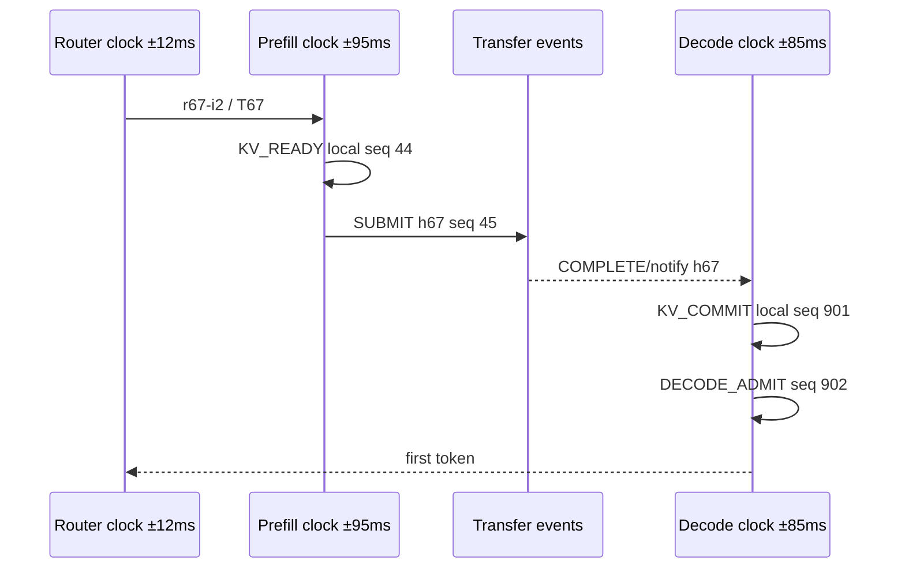
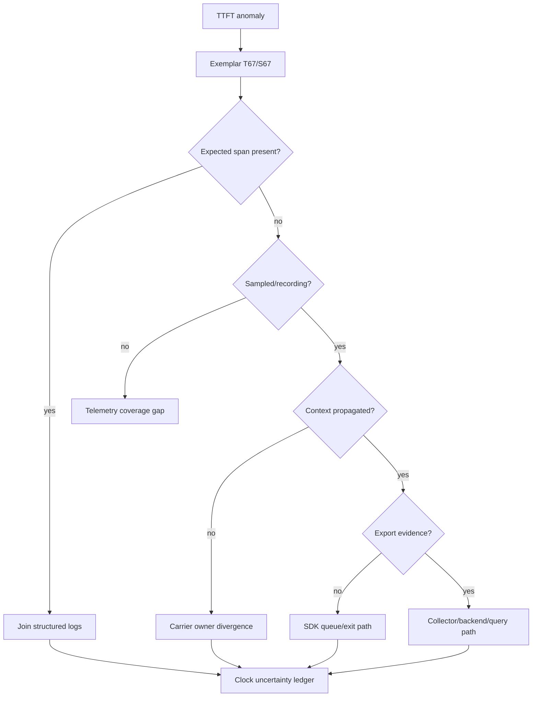
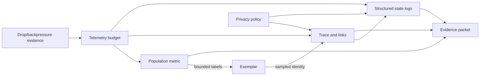
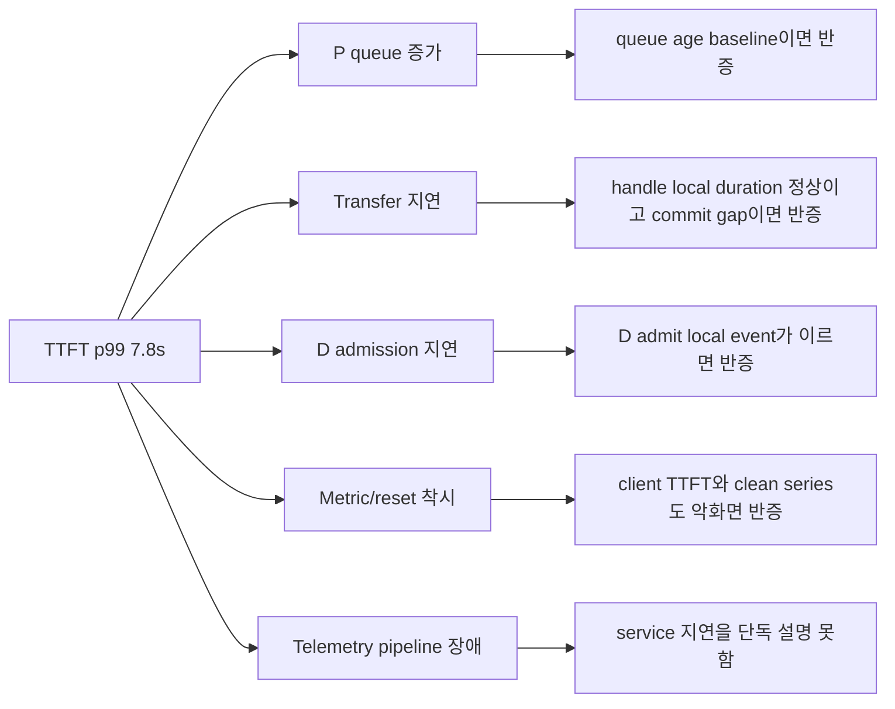

# 67장. Prometheus·trace·log를 한 사건의 시간축으로 엮는 법

15시 3분, TTFT p99가 2.4초에서 7.8초로 뛰었다. Histogram의 느린 bucket에는 trace `T67`, span `S67` exemplar가 붙어 있었다. 그러나 trace backend에서 `T67`을 열자 root와 router span만 보이고 scheduler, prefill, transfer, decode span은 없었다. Decode log에는 같은 request 문자열이 있었지만 P process가 재시작한 뒤 문자열이 재사용되었다. 더구나 P와 D wall clock은 180ms 어긋났고 Prometheus에는 재시작 전 stale series와 새 series가 겹쳤다.

이 사건을 `R67`이라 부른다. 목표는 예쁜 dashboard를 만드는 것이 아니다. Aggregate metric에서 출발해 exemplar, trace context, 비동기 P/D handoff, structured log, 서로 다른 clock과 누락된 telemetry를 지나 “처음 늦거나 사라진 상태의 owner”를 증명하는 것이다. 66장의 metric 의미를 입력으로 받고, 이 장에서 만든 evidence packet을 68~71장의 latency·memory·kernel·distributed 조사에 넘긴다.

## 67.1 한 요청의 metric→trace→log→CUDA/NCCL join tutorial

Request incarnation R7, trace T7을 고정한다. Router host A의 monotonic origin과 wall clock, scheduler host B, GPU worker host C를
분리한다. A의 NTP offset estimate는 +4ms±3ms, B는 -18ms±8ms, C는 +31ms±12ms다. Raw wall timestamp를 정렬하면
C의 CUDA launch가 B scheduling decision보다 앞서 보일 수 있다. Offset interval을 적용하기 전에는 음수 latency를 주장하지
않는다.

API span은 A local monotonic0–6ms, scheduler enqueue event는 B local100ms, select120ms, worker dispatch125ms다. C는 request
receive local500ms, H2D metadata510ms, CUDA launch514ms, event complete526ms, NCCL enqueue530ms, completion548ms, output-ready552ms다.
Local durations는 API6, queue20, CUDA12, NCCL18, worker receive→ready52ms다. Host 간 absolute gaps는 uncertainty interval로 둔다.

Correlation tuple은 `(trace_id, server request incarnation, scheduler generation, worker process generation, batch step,
CUDA launch id, communicator generation/sequence)`다. TraceId만 있으면 sampled trace가 없는 요청을 join하지 못하고 request
문자열만 있으면 retry/incarnation이 충돌한다. CUDA/NCCL에는 trace context를 직접 넣기 어렵다면 host enqueue event와 opaque
operation id를 bridge로 사용한다.

Prometheus exemplar는 histogram bucket 또는 datapoint에서 T7/S7로 건너가는 sampled association이다. Exemplar value7.71이
p99 전체를 대표하지 않으며 observation timestamp와 metric labelset을 보존한다. Exact series의 deployment/role/model bounded
labels가 trace의 resource attributes와 맞는지 확인한다. 다른 replica population의 trace를 선택하지 않는다.

OpenTelemetry trace는 parent-child만으로 모든 async 인과를 표현하지 못한다. Router→scheduler는 propagation parent, scheduler가
batch를 구성해 여러 requests를 worker operation 하나에 넣으면 span links 또는 explicit batch membership event가 필요할 수 있다.
NCCL collective는 여러 rank spans를 한 parent 아래 강제로 넣기보다 communicator generation/sequence와 links로 참여 관계를
보존한다.

Structured log event는 `REQUEST_ACCEPTED`, `SCHED_ENQUEUE`, `BATCH_SELECTED`, `CUDA_SUBMIT`, `CUDA_COMPLETE`, `NCCL_ENQUEUE`,
`NCCL_COMPLETE`, `OUTPUT_READY`처럼 state transition을 쓴다. 각 event는 local monotonic timestamp, observed wall timestamp,
process generation과 correlation tuple의 available fields를 가진다. Free-form “done” 문자열은 어느 owner의 terminal인지 알 수 없다.

OpenTelemetry specification의 exemplar·trace·log data model은 identity와 timestamp vocabulary의 근거다. 실제 engine이 모든 field를
emit한다는 증거는 아니다. vLLM observability config와 tracer initialization, start_span/context injection은 runtime instrumentation
경계다. SGLang trace/context rebuild와 async replay/flush는 event→span lifecycle을 읽는 source다. Source call 존재와 live export
성공을 분리한다.

CUDA event duration은 same device clock domain에서 start/end event 관계를 측정할 수 있지만 API request wall-clock timestamp와
직접 빼지 않는다. Host enqueue와 CUDA completion 사이에는 queue/stream dependencies가 있다. GPU kernel span attribute에는
device, stream class, launch generation, batch step과 event duration을 넣고 raw pointer나 prompt를 넣지 않는다.

NCCL host API return, enqueue와 device/network completion도 분리한다. Host span은 enqueue call duration, async completion evidence는
communicator/sequence record와 event를 가진다. 모든 ranks가 같은 collective identity를 보고하는지 확인한다. 한 rank log만으로
collective global terminal을 선언하지 않는다.

Timeline join algorithm은 wall time sort부터 하지 않는다. 먼저 exact identity와 process generation으로 events를 partition하고,
각 process 안에서 monotonic sequence를 정렬한다. Propagation/link, queue producer-consumer, CUDA event와 NCCL sequence가 제공하는
happens-before edges를 추가한다. 마지막에 wall-offset intervals로 가능한 cross-host bounds를 계산한다.

예를 들어 B dispatch wall 12:00:00.120, C receive wall12:00:00.110처럼 C가 10ms 먼저 보이더라도 B uncertainty±8, C±12라면
interval이 겹친다. Negative network latency로 고치기 위해 timestamp를 임의 이동하지 않는다. Protocol edge dispatch→receive가
순서를 증명하고 exact gap은 unknown/interval로 남긴다.

Metric window는 scrape timestamp, datapoint time과 request event time을 구분한다. Histogram p99 spike가 12:01 scrape에 보였다고
T7이 12:01에 실행됐다고 단정하지 않는다. Exemplar timestamp와 exporter/collector ingest delay를 확인한다. Counter reset과 stale
series는 66장의 의미를 반복하지 않고 packet의 series boundary field로만 참조한다.

이 수치 fixture의 expected result는 `API6ms`, `scheduler local queue20ms`, `CUDA12ms`, `NCCL18ms`이며 cross-host handoff gaps는
offset uncertainty 때문에 interval이다. Total client latency는 별 ingress/egress observation과 연결한다. Known local durations 합을
total에서 빼 남은 값을 무조건 network로 배정하지 않는다. Parallel/overlap과 unobserved gaps가 있기 때문이다.

## 67.2 그래프의 봉우리를 사건으로 바꾸기

### 67.2.1 p99 하나가 말하지 않는 것

`TTFT p99=7.8s`는 관측 window의 분포가 변했다는 사실만 말한다. 어느 요청이 느렸는지, router queue인지 P compute인지 transfer인지 D admission인지 알려 주지 않는다. 먼저 query의 metric 이름, exact labelset, range function, evaluation time과 window를 고정한다. 같은 이름의 stale series나 다른 generation을 합치면 존재하지 않았던 분포를 만든다.

R67에서는 `instance` restart 시계와 deployment generation을 함께 표시한다. 15:05에 P가 재시작했다면 15:03~15:08 범위에는 두 process incarnation이 있다. Counter reset을 증가율로 잘못 읽거나 histogram bucket을 세대 구분 없이 합치면 재시작 자체가 latency 변화처럼 보일 수 있다. 첫 artifact는 screenshot이 아니라 query와 series identity다.

### 67.2.2 anomaly window를 닫는다

조사 window는 봉우리 앞 baseline, 상승, 회복을 포함한다. R67은 14:58~15:13을 넓은 창으로 두고 15:03~15:08을 anomaly로 표시한다. Scrape interval, evaluation interval, missing scrape와 staleness marker도 적는다. Metric sample timestamp와 query 실행 시각을 혼동하지 않는다.

경쟁 가설은 세 개로 시작한다. H1은 P queue 증가, H2는 P→D transfer 지연, H3는 telemetry pipeline 누락이 실제 서비스 지연처럼 보인 경우다. 각 가설은 반증을 가진다. P queue age가 baseline이면 H1은 약해지고, transfer handle duration이 정상이며 D admission만 늦으면 H2는 약해진다. Client 관측 TTFT도 함께 악화됐다면 H3만으로 전체 현상을 설명할 수 없다.

### 67.2.3 R67 correlation ledger

```yaml
incident: R67
anomaly:
  metric: request_ttft_seconds
  labelset: {deployment: DG67, role: router, route: generate}
  window: {baseline: 14:58-15:03, anomaly: 15:03-15:08}
  restart: {prefill_process: P67b, at: 15:05:12}
exemplar: {value: 7.71, trace_id: T67, span_id: S67}
identity:
  external_request: req-77
  incarnation: r67-i2
  router_process: R67a
  prefill_process: P67b
  decode_process: D67a
clock_uncertainty: {router: 12ms, prefill: 95ms, decode: 85ms}
```

이 ledger의 null은 모르는 사실이지 0이 아니다. 조사 과정에서 evidence와 함께 채우며, 추론으로 채운 값은 관측값과 구분한다.

R67의 첫 10분에서 조사자가 가장 먼저 버려야 할 습관은 dashboard panel의 모양을 사건 자체로 취급하는 것이다. P99 선이 15:03에 수직으로 올랐어도 실제 request observation은 scrape와 evaluation window 안에 퍼져 있다. Histogram이 cumulative bucket이라면 한 sample의 값이 그 순간 들어온 요청 수가 아니며, range function은 window 양끝의 차이와 reset 처리에 의존한다. 66장에서 만든 metric contract를 다시 열어야 하는 이유다.

Exact query를 incident record에 복사하고 evaluation timestamp를 고정한 뒤, selector가 어떤 target과 generation을 포함했는지 펼친다. `instance`만 identity로 사용했다면 Pod IP 재사용 또는 process restart를 구분할 resource label이나 deployment ledger가 필요하다. R67에서는 P67a와 P67b가 같은 endpoint 아래 나타났다고 가정한다. 두 histogram의 monotonicity와 start time을 따로 검사하지 않고 합치면 reset 직후 bucket delta가 부정확해질 수 있다.

관측된 client TTFT와 server histogram의 분모도 맞춘다. Client는 timeout과 network 시간을 포함하는데 server metric은 admission 뒤부터 셀 수 있다. 둘이 함께 악화되면 순수 metric 착시 가설은 약해지지만, 값 차이는 곧 instrumentation 오류가 아니다. Metric 정의의 시작·종료 사건을 source 또는 contract에서 찾아 공통 구간과 바깥 구간을 그린다. “TTFT”라는 같은 이름보다 timestamp predicate가 중요하다.

Baseline 비교는 같은 시간대 평균 하나로 끝내지 않는다. Request input length, cache hit, route, P/D generation처럼 이미 bounded하게 계측된 workload 축에서 anomaly population이 달라졌는지 본다. 단, 조사 중 임시로 request ID label을 추가하지 않는다. 분포 차이가 특정 bucket에 집중되면 exemplar와 sampled trace 선택을 그 bucket에 맞춘다.

Metric 단계의 terminal condition은 원인 규명이 아니다. Anomaly가 실제인지, 정확히 어느 series와 population인지, reset·staleness·query artifact로 설명되지 않는지를 닫는 것이다. 이 단계의 owner는 metric producer와 query 작성자다. Evidence는 raw point, scrape target metadata, restart marker와 query evaluation이다. 다음 단계로 넘길 때 “15:03쯤 느렸다”가 아니라 bounded window와 exact labelset을 준다.

R67 조사자가 실제로 실행할 첫 비교는 aggregation level을 한 단계씩 낮추는 것이다. 전체 deployment p99에서 role별, route별, process generation별 histogram으로 내려간다. 단, label을 계속 추가해 한 request를 찾는 방식은 피한다. 이미 존재하는 bounded label로 population을 좁힌 뒤 exemplar를 사용한다. 이 순서를 지키면 cardinality를 늘리지 않고도 aggregate에서 사례로 이동할 수 있다.

Range query와 instant query의 결과가 다를 때 UI cache나 panel resolution부터 의심하기 쉽지만, query step과 range function evaluation이 달라질 수 있다. Incident packet에는 panel JSON 전체 대신 실제 PromQL, start/end/step과 서버가 반환한 sample timestamp를 남긴다. 같은 query를 나중에 실행했을 때 retention이나 recording rule 변경으로 값이 달라질 수 있으므로 원시 evidence digest도 필요하다.

Staleness를 빈 값과 0으로 구분한다. P67a가 사라진 뒤 series가 stale이면 capacity나 latency population에서 제외되어야 하지만, `or 0` 같은 query가 이를 0 latency process로 바꿀 수 있다. 반대로 missing scrape를 error 0으로 보면 장애를 정상으로 위장한다. Query가 absence를 어떤 의미로 정규화하는지 66장의 contract와 대조한다.

Histogram bucket boundary도 조사 해상도를 제한한다. 5초와 10초 bucket 사이에 요청이 몰렸다면 p99 추정은 실제 개별 값을 제공하지 않는다. Exemplar 7.71초는 구체적 sample이지만 bucket population 전체의 분포를 복원하지 않는다. 더 촘촘한 bucket을 즉석에서 추가하면 새 series와 memory 비용이 생기며 과거 사건에는 소급되지 않는다. 필요한 해상도는 다음 배포의 metric design 변경으로 넘긴다.

이상 window의 request volume이 낮으면 quantile이 불안정할 수 있다. Observation count와 bucket delta를 함께 본다. P99 선만 상승했지만 해당 window 요청이 몇 건뿐이라면 단일 outlier의 영향이 크다. 그렇다고 outlier를 무시하지 않는다. SLO가 tail 요청도 포함한다면 사례는 중요하지만 population 일반화의 certainty를 낮춘다.

R67의 첫 divergence를 찾는 동안 query를 여러 번 바꾸게 된다. 각 변경은 hypothesis와 함께 기록한다. Label filter를 추가한 뒤 anomaly가 사라졌다면 제외된 population이 무엇인지 설명한다. 원하는 모양이 나올 때까지 query를 조정하고 마지막 것만 남기면 confirmation bias를 숨긴다. Query notebook은 시도한 분기와 반증을 짧게 보존한다.

Metric 단계의 recovery는 recording rule이나 dashboard 수정만으로 끝나지 않는다. Restart generation이 정확히 분리되고 stale series가 의도대로 사라지며, canary counter reset이 rate calculation에서 spike를 만들지 않는지 확인한다. Service 원인이 아직 미정이어도 metric artifact를 닫을 수 있다. 이 분리는 관측 오류 수정이 실제 latency 복구로 오인되는 것을 막는다.

## 67.3 metric point에서 exemplar로 건너가기

### 67.3.1 exemplar의 정확한 의미

역할별 고정 좌표와 판정 범위는 다음과 같다.

- OpenTelemetry Specification v1.60.0의 [metric datapoint timestamp 계약](https://github.com/open-telemetry/opentelemetry-specification/blob/29ae8c7710d2ea52e21a5ff81fb1cd657bcd3306/specification/metrics/data-model.md#L135-L160)은 point가 어느 시간 구간을 표현하는지 해석할 기준을 준다.
- [Exemplar와 trace/span association](https://github.com/open-telemetry/opentelemetry-specification/blob/29ae8c7710d2ea52e21a5ff81fb1cd657bcd3306/specification/metrics/data-model.md#L993-L1013)은 bounded metric aggregation에서 고-cardinality context로 건너가는 연결이다.

Exemplar는 histogram count 바깥에 추가된 요청이 아니다. 이미 측정에 기여한 관측 가운데 context가 보존된 표본이다. 따라서 exemplar 값 하나를 p99 자체라고 부르거나 전체 bucket의 대표값이라고 부르면 안 된다. R67의 7.71초 표본은 느린 요청 하나를 찾는 출발점이지 모든 느린 요청의 원인을 증명하지 않는다.

### 67.3.2 labelset을 잃지 않는다

Exemplar를 클릭하기 전에 어느 series와 point에 붙었는지 저장한다. Model, deployment, route처럼 bounded label은 incident scope를 좁힌다. Request ID, trace ID를 Prometheus label로 넣으면 cardinality와 memory 비용이 요청 수에 비례한다. Exemplar가 이 두 세계 사이의 의도된 다리다.

R67에서는 restart 전후 series를 process generation으로 분리해 각각의 bucket delta를 계산한다. Stale series가 query에 섞였는지, exemplar timestamp가 어느 incarnation interval 안인지 본다. Timestamp가 restart boundary와 uncertainty 안에서 겹치면 process를 단정하지 않고 후보 둘을 유지한다.

### 67.3.3 exemplar가 없을 때의 분기

Exemplar 부재는 요청이 없었다는 뜻이 아니다. SDK가 exemplar를 선택하지 않았거나 context가 없었거나 exporter·storage가 보존하지 않았을 수 있다. 먼저 metric sample 자체, exemplar reservoir 설정과 trace context 존재를 분리한다. 이후 같은 labelset과 window에서 sampled trace를 검색하되, 검색 결과가 없음을 service path 미실행 증거로 승격하지 않는다.

Failure injection에서는 느린 요청을 만들고 metric count 증가, exemplar 선택, trace backend 보존을 각각 관찰한다. Count는 증가하지만 exemplar가 없으면 metric 측정과 exemplar pipeline 사이 문제다. Exemplar는 있으나 trace가 없으면 sampling, propagation, export, backend query로 다음 분기를 옮긴다.

R67 exemplar의 timestamp가 15:05:12.040이고 P restart marker가 15:05:12.000±80ms라면 어느 process가 exemplar observation을 만들었는지 wall time만으로 확정할 수 없다. 그러나 exemplar가 router histogram에 붙었고 router process는 재시작하지 않았다면 observation owner는 R67a로 좁혀진다. 이와 별개로 느린 구간의 downstream P incarnation은 trace carrier와 routing decision에서 찾아야 한다. Exemplar span ID가 모든 downstream 작업 owner를 뜻하지 않는다.

Exemplar value도 metric observation predicate에 따라 해석한다. 요청 완료 때 TTFT를 observe했다면 exemplar timestamp는 first token 시각 부근일 수 있고, 요청 시작 시각이 아니다. Anomaly 시작을 exemplar timestamp에서 7.71초 단순 차감하려면 duration이 같은 monotonic clock으로 계산됐는지 확인해야 한다. SDK가 explicit timestamp를 받았는지, collection 시각을 사용했는지도 specification과 implementation을 구분해 조사한다.

한 exemplar가 bucket의 인과를 대표하는지도 반증한다. 같은 labelset과 anomaly window에서 여러 exemplar 또는 sampled trace를 비교한다. T67만 P restart를 걸쳤고 나머지 느린 요청은 D queue 증가라면 단일 원인이 아니다. 반대로 서로 다른 request가 같은 transfer path에서 첫 divergence를 보이면 path hypothesis가 강해진다. Exemplar는 사례 선택 편향이 있으므로 population metric과 왕복하며 결론을 검증한다.

Storage가 exemplar를 downsample하거나 retention을 다르게 적용할 수도 있다. Prometheus query 결과에 trace ID가 보인다는 사실, remote storage에 보존됐다는 사실, UI가 clickable link를 만들었다는 사실은 각기 다르다. Evidence packet에는 UI screenshot 대신 exemplar value·timestamp·trace/span ID와 source series labelset을 텍스트로 저장한다. UI 설정이 바뀌어도 join을 재현할 수 있어야 한다.

Exemplar 단계의 falsifier는 trace ID가 해당 metric observation context와 무관하거나, exemplar timestamp가 point interval 밖이며 설명이 없거나, restart 경계 때문에 series owner를 판정할 수 없는데 단일 process로 확정하는 것이다. Terminal은 T67이 어느 bounded metric observation에서 선택되었고 무엇을 대표하지 않는지까지 명시한 상태다.

Exemplar sampling과 trace sampling의 상호작용도 packet에 남긴다. Exemplar가 trace context를 가리키더라도 trace backend가 해당 trace를 저장하지 않았다면 링크는 끊긴다. Metric SDK가 exemplar를 선택한 시점의 sampling decision, trace SDK recording decision과 backend retention은 같은 설정 하나가 아닐 수 있다. “클릭했는데 trace가 없다”는 증상은 이 경계들을 따라 분해한다.

R67에서 T67 root가 있으므로 trace 전체가 unsampled였다는 가설은 약해 보인다. 그러나 downstream process가 sampling flag를 전달받지 못했거나 새 root를 만들고 drop했을 수 있다. Root 존재를 child recording의 충분조건으로 취급하지 않는다. Trace state와 flags가 carrier에 들어갔는지 source와 test payload로 확인한다.

Exemplar timestamp 주변 ±몇 분을 무작정 검색하면 같은 request 문자열의 다른 trace가 잡힐 수 있다. 먼저 exact TraceId로 찾고, 실패하면 backend tenant와 ingest/event time window를 검사한다. 그 다음에야 incarnation 또는 bounded attributes로 대체 검색한다. 대체 검색 결과는 exact join보다 낮은 certainty를 갖는다.

UI가 span ID까지 제공한다면 그 span이 observation을 수행한 active span인지 확인한다. Metric observation이 비동기 callback에서 이루어져 request span context가 없으면 trace ID만 있거나 다른 span과 연결될 수 있다. Specification의 association 가능성과 instrumentation의 실제 active context를 구분한다. Span ID가 root나 router라고 해서 latency가 그 span 내부에서 발생했다고 단정하지 않는다.

Exemplar selection failure injection은 동일 labelset에 정상 요청과 느린 요청을 섞고 reservoir가 어느 sample을 남기는지 관찰한다. 목적은 특정 알고리즘의 확률을 성능 보장으로 제시하는 것이 아니라, exemplar가 항상 최악값을 고른다는 잘못된 가정을 반증하는 것이다. Tail 조사에는 exemplar와 별도의 tail sampling 또는 structured slow-event가 필요할 수 있다.

Metric backend와 trace backend의 retention이 다르면 오래된 incident에서 exemplar만 남을 수 있다. Evidence packet 생성 자동화는 incident 중 trace와 필요한 log를 privacy policy 안에서 snapshot한다. 그렇다고 raw telemetry 전체를 영구 보존하지 않는다. Trace identity, 필요한 span/event와 redaction된 digest를 bounded artifact로 만든다.

Exemplar 단계의 owner는 metric instrumentation, SDK reservoir, Prometheus storage, UI link template와 trace backend로 나뉜다. 링크가 깨졌을 때 모두를 “Prometheus 문제”로 부르면 복구가 느리다. Last positive evidence가 SDK export인지 Prometheus query인지에 따라 다음 owner를 정한다.

## 67.4 TraceId는 요청 문자열이 아니다

### 67.4.1 identity 층을 분리한다

OTel Trace API의 [`TraceId`와 `SpanId`](https://github.com/open-telemetry/opentelemetry-specification/blob/29ae8c7710d2ea52e21a5ff81fb1cd657bcd3306/specification/trace/api.md#L226-L263)는 trace와 그 안의 작업 단위를 식별한다. 외부 request 문자열, server-issued incarnation, trace ID, protocol request generation은 수명과 재사용 규칙이 다르다.

R67에서 `req-77`은 P restart 전후 재사용되었다. 문자열만 join하면 old P log와 new P trace가 한 요청처럼 합쳐진다. `DG67/r67-i2/P67b/T67`처럼 generation과 incarnation을 유지하면 두 실행을 분리할 수 있다. Trace sampling이 없어도 incarnation은 서비스 correctness ledger에 남아야 한다.

### 67.4.2 parent와 link를 구분한다

동기 RPC는 흔히 caller span을 remote parent로 전달한다. 그러나 queue, batch, transfer처럼 한 작업이 나중에 다른 worker에서 소비되거나 여러 원인과 연결되면 단순한 중첩 tree가 실제 인과를 왜곡할 수 있다. Specification의 [producer/consumer relationship](https://github.com/open-telemetry/opentelemetry-specification/blob/29ae8c7710d2ea52e21a5ff81fb1cd657bcd3306/specification/trace/api.md#L741-L787)을 근거로 parent와 link 가운데 어떤 관계가 맞는지 판단한다.

P가 KV handoff를 발행하고 D가 나중에 받는 R67에서는 producer span 종료와 consumer span 시작이 겹치지 않을 수 있다. Batch 하나가 여러 request를 품으면 batch span의 parent를 한 request로 정하기도 어렵다. Request span은 batch work에 link하고, batch에서 각 request completion으로 다시 연결하는 편이 인과를 더 정확히 보존할 수 있다.

### 67.4.3 propagation contract

각 hop에 carrier 필드를 적는다. Router→P 요청 header, P scheduler 내부 객체, P→transfer descriptor, transfer→D notification, D scheduler request가 trace context와 request incarnation을 어떻게 옮기는지 추적한다. Serialization은 trace ID만 보존하고 sampling flag나 trace state를 잃을 수 있다.

Falsifier는 router child만 있고 P가 다른 root trace를 만드는 경우, 같은 request incarnation에 두 trace ID가 이유 없이 생기는 경우, D가 old attempt context를 받는 경우다. Context 누락은 latency 원인과 별개인 observability defect지만, 최초 지연 owner를 찾지 못하게 하므로 incident severity에 포함한다.

R67의 identity table을 실제 join 순서로 사용한다. 외부 `req-77`을 찾은 뒤 곧바로 모든 log를 합치지 않는다. Router가 발급한 `r67-i2`와 attempt generation을 먼저 찾고, routing decision의 P67b·D67a를 연결한다. 그 다음 T67의 trace context가 각 carrier에 있었는지 본다. 이 순서를 따르면 restart 전 `req-77/r67-i1/P67a` log가 섞이는 것을 막는다.

Retry는 trace identity를 더 어렵게 한다. Gateway가 동일 logical request를 새 attempt로 보낼 때 trace를 이어갈지 새 trace를 만들지는 정책일 수 있다. 중요한 것은 두 attempt가 indistinguishable하지 않은 것이다. 새 trace라면 logical request correlation link를 두고, 같은 trace라면 attempt span과 request incarnation을 별 attribute로 둔다. Client-visible commit authority는 trace ID가 아니라 서비스 ledger가 소유한다.

Async handoff에서는 context carrier 자체가 업무 payload와 다른 lifetime을 가질 수 있다. KV descriptor는 재사용 또는 cache될 수 있지만 trace context는 특정 request attempt에 묶인다. Descriptor에 trace ID를 영구 속성처럼 붙이면 다음 request가 오래된 context를 물려받을 수 있다. Transfer operation 또는 notification 단위 carrier로 제한하고 destination이 request generation을 함께 검증한다.

Propagation failure injection은 hop마다 context 한 필드를 제거한다. Trace ID가 빠지면 새 root가 생기는지, sampling flag만 빠지면 child recording decision이 달라지는지, request incarnation이 빠지면 log join이 문자열로 fallback하는지 본다. 기대 결과는 최소한 correlation gap이 명시적으로 관측되고 다른 request와 조용히 합쳐지지 않는 것이다.

Privacy 때문에 trace ID를 hash해 log에 넣는다면 모든 component가 같은 key와 rotation generation을 쓰는지 확인한다. 서로 다른 hash는 join을 끊고, 너무 오래 고정된 hash는 retention 경계를 넘어 correlation 가능성을 키운다. 표준 TraceId field를 접근 통제된 backend에서 사용하고 일반 log에는 제한된 pseudonym을 쓰는 등 사용 층을 나눈다.

Identity 단계의 terminal condition은 `T67`이라는 문자열을 많이 찾은 상태가 아니다. External request, server incarnation, attempt, protocol generation, process generations, trace와 span 관계가 충돌 없이 연결되고, 재사용된 `req-77/r67-i1`이 명시적으로 제외된 상태다.

Identity collision을 눈으로 확인하는 표를 만든다. `req-77`은 두 행에 나타나지만 `r67-i1/P67a/T66`과 `r67-i2/P67b/T67`은 다르다. Decode log가 `req-77`만 가졌다면 두 행 모두 후보로 표시한다. 시간상 가까운 행을 자동 선택하지 않는다. 180ms clock 오차와 buffer delay가 있으므로 잘못된 join 가능성이 남는다.

Server-issued incarnation은 ingress에서 한 번 발급되고 retry policy에 따라 logical request와 attempt를 분리해야 한다. Gateway가 retry할 때 같은 incarnation을 재사용하면 중복 실행을 구분하지 못한다. 완전히 새 logical identity를 만들면 사용자 수준 한 요청의 재시도를 묶기 어렵다. `logical_request`와 `attempt_incarnation` 두 층을 두는 이유다.

Protocol request generation은 memory와 transfer correctness에 더 가깝다. 같은 logical attempt라도 destination 재선택이나 descriptor 재발급 때 generation이 바뀔 수 있다. Trace span은 이 전이를 event로 기록하되 protocol ledger의 authority를 대체하지 않는다. Telemetry가 drop되어도 stale completion을 거부할 수 있어야 한다.

Process generation은 restart뿐 아니라 worker replacement를 구분한다. Kubernetes Pod 이름이 같아도 container restart count가 다를 수 있고, PID가 같아도 다른 node일 수 있다. Deployment generation, workload UID 또는 관리되는 process incarnation 가운데 실제 환경에서 안정된 조합을 선택한다. Raw hostname처럼 재사용 가능한 값 하나에 의존하지 않는다.

Trace ID는 전역 join에 유용하지만 sampling과 retention에 종속된다. Service의 request outcome reconciliation이 trace backend를 조회해야만 가능하다면 observability outage가 correctness outage가 된다. Commit authority와 idempotency identity는 service data plane에 남기고 trace는 이를 조사 가능한 방식으로 참조한다.

Propagation canary는 알려진 identity 관계를 예상 artifact와 비교한다. Router root, P consumer, transfer producer, D consumer span이 parent 또는 link contract에 맞는지, log에 동일 process generation이 있는지 본다. Span 이름 문자열만 비교하지 않고 TraceId, SpanId, link와 request incarnation을 검사한다.

Identity 단계의 recovery terminal은 새 canary가 hop마다 context를 보존하고, retry가 distinct attempt를 만들며, restart 전후 process가 query에서 분리되고, ambiguous legacy log가 더 이상 새로 생성되지 않는 상태다. 과거 R67의 ambiguous record는 억지로 고치지 않고 evidence gap으로 남긴다.

## 67.5 vLLM에서 span이 생기고 사라지는 경계

### 67.5.1 configuration은 export 성공이 아니다

vLLM v0.27.1의 [`ObservabilityConfig`](https://github.com/vllm-project/vllm/blob/6e448d0ea9bf3d88d898b65449ca6dc2aec170ac/vllm/config/observability.py#L24-L159)는 endpoint와 detailed trace 조건을 검증한다. 이 코드를 읽을 때 option 이름을 옮기는 데 그치지 않는다. 입력 configuration이 어떤 validation을 통과하고 어느 tracing path를 활성화하는지, detailed trace가 추가 비용을 여는 조건인지 본다.

Configuration 성공은 span 보존 증거가 아니다. Endpoint 문자열이 유효하고 tracer가 초기화되어도 queue full, exporter timeout, process exit, collector rejection과 backend retention은 별 경계다. R67에서 root와 router span만 보인 이유를 “detailed trace가 꺼졌다” 하나로 단정하지 않는다.

### 67.5.2 tracer 초기화 source walk

[`init_otel_tracer`와 exporter 선택](https://github.com/vllm-project/vllm/blob/6e448d0ea9bf3d88d898b65449ca6dc2aec170ac/vllm/tracing/otel.py#L62-L124)은 provider, resource와 batch processor가 만들어지는 경계다. 여기서 resource의 service/process identity가 query join에 충분한지, exporter가 동기인지 batch인지, shutdown과 flush owner가 누구인지 읽는다.

R67의 P restart가 15:05:12라면 exit 직전 batch queue에 있던 span이 flush되었는지 별 evidence가 필요하다. Process가 span end를 호출했다는 log는 exporter가 collector에 전달했다는 뜻이 아니다. Collector acceptance도 backend index 완료와 다르다. 각 경계의 counter나 log를 evidence packet에 따로 둔다.

### 67.5.3 start_span과 context injection

[`start_span`과 context injection](https://github.com/vllm-project/vllm/blob/6e448d0ea9bf3d88d898b65449ca6dc2aec170ac/vllm/tracing/otel.py#L145-L229)은 request carrier와 worker span lifetime을 연결한다. 부분 코드를 읽을 때 호출자가 어떤 carrier를 넘기고 context가 없을 때 어떤 root가 만들어지는지, span end가 정상·예외·취소 경로에서 모두 호출되는지 확인한다.

Failure injection은 P가 span을 시작한 뒤 강제 종료한다. 기대 결과를 “backend에 span이 반드시 있다”로 두면 batch exporter 의미를 무시한다. 대신 start counter 또는 local event, queue enqueue, flush attempt, collector receive 가운데 어디까지 증거가 있는지 분류한다. 이 실험으로 missing span decision tree의 실제 관측 가능 지점을 찾는다.

`ObservabilityConfig` source walk에서는 validation failure도 읽는다. Endpoint가 없는데 detailed tracing만 요구하는 조합, 지원되지 않는 값이 들어오는 경우처럼 configuration predicate가 downstream object 생성을 막는 지점을 찾는다. 실제 branch와 exception을 근거로 “이 옵션이 켜지면 span이 생긴다”를 “유효한 구성일 때 tracer initialization 경로가 선택된다”로 정확히 고쳐 말한다.

`init_otel_tracer`에서는 resource와 provider의 lifetime을 process generation에 연결한다. Service name만 같으면 P67a와 P67b span이 같은 resource로 보일 수 있다. Process start time이나 incarnation을 query 가능한 bounded resource attribute로 두어 restart 경계를 찾는다. PID만으로는 container 재사용과 host 차이를 안정적으로 구분하지 못할 수 있다.

Batch processor는 service hot path와 export latency를 분리하지만 buffer를 만든다. Span end 뒤 backend 도착까지 지연이 있고 abrupt exit 때 queue가 남을 수 있다. R67은 restart 직전 missing span이므로 queue depth, dropped span, shutdown/force-flush 호출과 collector receive를 조사한다. 이 evidence가 없다면 “exporter가 drop했다”도 가설일 뿐이다.

`start_span` 호출을 찾은 다음 모든 expected span의 호출자를 표로 만든다. Router request, scheduler wait, model execution, transfer 같은 이름이 실제 어떤 lifecycle 경계를 감싸는지 확인한다. Span start가 함수 입구이고 end가 callback이라면 예외와 cancel이 callback을 건너뛰는지 본다. Context manager나 `finally`가 있으면 종료 보장은 그 구간에 한정해 설명한다.

부분 코드 인용은 다음 질문에 답할 최소 행만 사용한다. Carrier에서 context를 추출하는 predicate는 무엇인가, 새 span의 parent는 어떻게 선택되는가, attribute는 언제 붙는가, exception과 status는 어떻게 기록되는가, context는 어디에 inject되는가. 코드가 collector acceptance를 호출하지 않는다면 그 보장을 인용문 밖으로 확장하지 않는다.

R67의 falsifier는 P67b local tracing initialization 성공과 span enqueue evidence가 있는데 “instrumentation disabled”를 원인으로 결론내리는 것이다. 반대로 initialization log만 있고 start-span evidence가 없으면 exporter부터 조사하는 것도 순서가 틀렸다. Source walk는 가능한 경계를 지도에 놓고 runtime evidence가 어느 경계를 통과했는지 판정하게 한다.

고정 source를 읽는 조사 notebook에는 `configuration accepted`, `tracer object created`, `span object started`, `span ended`, `processor accepted`, `export attempted`를 별 행으로 둔다. 함수가 호출된다는 정적 사실과 R67에서 호출됐다는 runtime 사실을 같은 체크 표시로 만들지 않는다. 정적 source는 관측할 지점과 가능한 branch를 알려 주며, runtime event가 그 branch를 선택했음을 증명한다.

`ObservabilityConfig`의 detailed trace 조건이 false라면 모든 tracing이 꺼지는지, 세부 model execution span만 줄어드는지 정확히 분기 predicate를 읽는다. Option 이름만 보고 “trace off”라고 결론내리면 root/router span은 있는데 scheduler span이 없는 R67을 잘못 설명할 수 있다. 어떤 span family가 conditional인지 호출자까지 따라간다.

Tracer initialization에서 resource attribute를 붙이는 시점도 중요하다. Provider가 process 시작 때 한 번 만들어진다면 deployment 변경을 runtime attribute mutation으로 반영하지 못할 수 있다. R67 P67b가 old resource generation을 사용하면 trace query가 잘못된 deployment로 분류할 수 있다. Resource identity와 실제 process manifest를 canary에서 비교한다.

Batch span processor가 선택됐다는 코드는 buffering이 존재함을 보여 주지만 queue size, delay, export timeout의 effective 값은 configuration과 library version에 달려 있다. 이 장의 pinned vLLM source와 OTel Python v1.44.0 revision을 기준으로 실제 consumer를 더 읽어야 숫자를 말할 수 있다. 근거 없이 기본값을 현재 배포의 값으로 쓰지 않는다.

`start_span` 주변 context injection은 다음 worker로 무엇을 넘기는지 보여 준다. Carrier mutation이 in-place인지 새 객체인지, 기존 header를 덮는지, invalid parent에서 어떤 context가 생기는지는 retry와 proxy chain에서 중요하다. 원본 carrier가 여러 request 사이에 재사용된다면 stale context 위험도 검토한다. 코드는 실제 object lifetime을 따라 해석한다.

예외 경로에서 span status와 exception event가 기록되더라도 application request terminal과 같지는 않다. Span은 error로 끝났지만 backend request가 retry될 수 있고, span은 정상 종료됐지만 client response가 뒤에서 실패할 수 있다. Trace status를 service outcome으로 직접 사용하지 않고 request ledger와 join한다.

R67에서 P restart 직전 graceful shutdown evidence가 없다면 force flush 성공을 가정하지 않는다. 반대로 abrupt exit가 명확해도 모든 missing child를 export loss로 돌리지 않는다. Restart보다 훨씬 전 끝난 scheduler span도 없다면 propagation 또는 configuration 가설이 남는다. Missing span의 expected end time을 restart와 비교한다.

소스 walk 결과는 독자가 재현할 수 있는 질문으로 닫는다. 어느 configuration field가 tracer initialization을 선택하는가, 어느 object가 provider와 processor를 소유하는가, request carrier에서 parent를 어떻게 얻는가, span lifetime을 누가 끝내는가, process exit 때 flush를 누가 호출하는가다. 각 질문의 답을 고정 행 link와 runtime evidence에 연결한다.

## 67.6 SGLang의 process 경계를 따라 context 복원하기

### 67.6.1 ingress extraction과 process init

SGLang v0.5.18의 [`extract_trace_headers`와 process init](https://github.com/sgl-project/sglang/blob/71de97b264b04dcd514cf904003028aefe9775c8/python/sglang/srt/observability/trace.py#L73-L287)은 외부 context가 process-local tracing 상태로 들어오는 경계다. Header가 없거나 잘못됐을 때의 분기, sampler decision과 resource identity가 어디서 정해지는지 읽는다.

R67에서는 router context가 P에 도착했는지 먼저 header capture가 아니라 추출 결과와 생성 span identity로 확인한다. Raw header를 무기한 log에 남기면 tenant와 correlation 정보가 노출될 수 있다. Debug artifact는 redaction과 짧은 retention을 갖는다.

### 67.6.2 TraceReqContext의 serialize와 rebuild

[`TraceReqContext` serialization과 rebuild](https://github.com/sgl-project/sglang/blob/71de97b264b04dcd514cf904003028aefe9775c8/python/sglang/srt/observability/trace.py#L313-L535)은 process 또는 thread 경계를 지날 때 어떤 field가 살아남는지 보여 준다. 객체가 Python memory에서 그대로 전달된다고 가정하지 말고 serialize된 identity, timestamp, event state를 확인한다.

부분 코드의 핵심은 클래스 이름이 아니라 mutation이다. 어느 method가 context를 직렬화하고, consumer가 어떤 field로 다시 만들며, 누락 시 새 root를 만드는지 또는 tracing을 포기하는지 본다. R67의 P restart 전 문자열 재사용은 request 문자열만 보존한 구현에서 특히 위험하다.

### 67.6.3 request·slice·event·abort lifetime

[`request, slice, event, abort 경로`](https://github.com/sgl-project/sglang/blob/71de97b264b04dcd514cf904003028aefe9775c8/python/sglang/srt/observability/trace.py#L535-L825)는 한 request가 scheduler slice와 event로 나뉘고 취소될 때 lifetime이 어떻게 닫히는지 읽는 자리다. 정상 finish만 추적하면 abort 뒤 열린 span과 잘못된 duration을 놓친다.

R67에서는 scheduler/P/D span이 모두 없으므로 먼저 context rebuild까지 도달했는지, request event가 생성됐는지, abort가 cleanup했는지 나눈다. Local log에 event sequence가 있는데 backend span이 없다면 실행 경로 부재 가설은 반증된다. 다음 조사는 async export로 이동한다.

SGLang source walk에서는 synchronous와 asynchronous tracing path를 섞지 않는다. `TraceReqContext`가 event를 local하게 만들고 async context가 이를 buffer·replay한다면 backend span timestamp가 원 event 생성 시각인지 replay 시각인지 확인한다. Specification이 custom timestamp를 허용해도 구현이 실제 값을 전달하는지는 코드에서 확인해야 한다.

Serialization payload의 version과 optional field도 deployment generation에 포함할 후보가 된다. New producer가 old consumer가 모르는 trace field를 보내는 경우 service payload는 정상이어도 observability context만 끊길 수 있다. 이때 요청 성공률은 정상이고 correlation coverage만 낮아진다. Rollout canary가 correctness만 보면 발견하지 못하므로 trace-continuity canary를 별도로 둔다.

`request/slice/event/abort` 경로를 읽으며 local sequence의 근원을 찾는다. Sequence가 process-local counter인지 request-local ordering인지에 따라 restart와 merge 해석이 다르다. Counter가 restart 때 0으로 돌아가면 process generation과 함께 사용한다. Slice event가 여러 scheduler iteration에 걸쳐 생기면 단일 긴 span보다 event series가 queue와 execution 교대를 더 잘 보여 줄 수 있다.

Async replay는 늦게 도착한 event를 원래 timestamp로 span에 붙일 수 있다. Backend ingest 순서와 event-time 순서가 달라지는 정상 사례다. R67에서 15:06에 관측된 P event가 15:04 timestamp를 가졌다고 이를 clock 오류로 단정하지 않는다. Observed time, buffer age와 replay marker를 같이 본다.

Stale cleanup은 telemetry memory residue를 막지만 늦은 event를 버릴 수 있다. Cleanup threshold가 정상 장기 request보다 짧다면 service는 성공해도 trace가 잘린다. 반대로 너무 길면 dead request context가 memory를 점유한다. Option이 있다면 기본값을 나열하기보다 request duration distribution, abort path와 cleanup predicate의 충돌을 검토한다.

강제 abort 실험에서는 local event 생성, async queue, flush/finish/abort 호출, replay span과 stale cleanup을 순서대로 관찰한다. 기대 결과는 abort가 request context를 terminal로 만들고 buffer가 bounded하게 회수되는 것이다. Backend span 부재만으로 어느 단계가 실패했는지 결론내리지 않는다.

## 67.7 비동기 P/D handoff를 한 trace에 억지로 접지 않는다

### 67.7.1 P와 D 사이의 빈 시간

P span이 15:04:01.100에 끝나고 D span이 15:04:01.050에 시작한 것처럼 보인다고 -50ms network latency를 계산하면 안 된다. 두 host wall clock offset uncertainty가 각각 존재한다. 같은 process의 monotonic duration과 cross-host wall time을 구분한다.

P는 `KV_READY`, transfer는 `SUBMITTED/COMPLETED`, D는 `KV_COMMITTED/DECODE_ADMITTED`라는 local state를 가진다. Cross-host timestamp가 겹쳐도 source-local sequence와 protocol identity는 이 순서를 제한한다. Timeline은 단일 정확한 선보다 가능한 ordering interval을 표현해야 한다.

### 67.7.2 batch가 request tree를 깨뜨리는 방식

Scheduler batch는 여러 request를 모으고 다음 iteration에서 다시 나눈다. Batch span 하나를 첫 request의 child로 두면 다른 request의 인과가 사라진다. 반대로 모든 scheduler 내부 동작을 request마다 복제하면 telemetry 비용과 왜곡이 커진다. Batch span에 request links를 두고 per-request queue/admission event를 유지하는 절충을 검토한다.

R67에서 scheduler span 누락을 조사할 때 “root 아래 child가 없다”만 보지 않는다. Link로 연결된 span, 다른 trace의 batch span, event-only instrumentation을 검색한다. Data model 선택을 tree 검색 습관으로 오판하지 않는다.

### 67.7.3 handoff clock ledger



Ledger에는 wall timestamp, monotonic delta, offset estimate, uncertainty, local sequence와 identity를 함께 둔다. 두 interval이 겹치면 선후 미확정으로 남긴다. Protocol state가 보장하는 partial order만 확정한다.

R67 handoff ledger를 수치로 채워 보자. Router는 request를 15:04:00.920에 P67b로 보냈고 offset uncertainty는 ±12ms다. P의 local monotonic clock에서 ingress→KV_READY는 2.31초, KV_READY→SUBMIT은 4ms다. P wall timestamp로 SUBMIT은 15:04:03.146±95ms다. D의 COMMIT은 15:04:03.080±85ms, DECODE_ADMIT은 local 37ms 뒤다. Wall 값만 빼면 D commit이 submit보다 66ms 빠르지만 두 uncertainty interval은 넓게 겹친다.

확정할 수 있는 것은 P local `KV_READY seq44→SUBMIT seq45`, transfer handle state `SUBMITTED→COMPLETED`, D local `COMMIT seq901→ADMIT seq902`다. Transfer completion event가 어느 clock domain인지도 적어야 한다. P가 polling해 기록했다면 source completion 시각이고, D notification이면 destination observation 시각이다. 이름이 같은 `transfer_done`이라도 predicate가 다르다.

P/D async 관계를 하나의 parent-child tree로 접으면 P span이 종료된 뒤 D child가 시작되어 보기에는 자연스럽다. 그러나 P span이 request compute를 나타내고 transfer가 독립 producer operation이라면 D consumer는 P의 direct child보다 transfer context link가 적절할 수 있다. OTel producer/consumer semantic을 적용할 때 library가 자동으로 이 관계를 만들어 준다고 가정하지 않는다. Instrumentation이 실제 parent 또는 link를 생성하는지 확인한다.

Batch 경계에서는 세 시간 축을 분리한다. Request가 scheduler queue에 들어온 시간, batch가 만들어진 시간, GPU work가 실행된 시간이다. 한 request의 queue event를 batch span 시작으로 대체하면 batch가 모이기를 기다린 시간이 사라진다. 반대로 GPU batch duration을 각 request span에 복제하면 동일 compute cost를 여러 번 센다. Request에는 queue/admission event를, batch에는 shared execution duration을 두고 link로 연결한다.

Transfer가 여러 KV slice로 나뉘면 single completion도 다시 정의해야 한다. 첫 slice 도착, 모든 bytes 도착, destination visibility와 D commit은 다른 사건이다. D가 decode를 시작하는 predicate가 “모든 필요한 slice가 visible”이라면 그 commit marker를 timeline anchor로 삼는다. 단순 network send completion은 consumer readiness 증거가 아니다.

Failure injection은 P와 D clock을 의도적으로 어긋나게 하고 동일 handle의 state event를 수집한다. Timeline renderer가 음수 latency를 표시하면 실패다. Offset uncertainty를 적용한 interval 또는 `ordering unresolved`로 보여야 한다. 이어서 trace parent를 일부 제거하고 link 검색이 request를 찾는지 본다. Tree-only UI가 누락처럼 보일 수 있으므로 raw trace query와 data model을 함께 확인한다.

이 단계의 owner는 P/D instrumentation만이 아니다. Protocol owner는 state transition과 handle identity를 제공하고, time synchronization owner는 offset estimate를 제공하며, trace backend는 link query를 보존해야 한다. Terminal은 모든 cross-host duration이 억지 단일값이 아니라 bound 또는 unresolved로 표현되고, first divergence 후보가 clock artifact만으로 선택되지 않은 상태다.

## 67.8 structured log를 trace의 값싼 복제품으로 만들지 않는다

### 67.8.1 event time과 observed time

OTel log data model의 [`Timestamp`와 `ObservedTimestamp`](https://github.com/open-telemetry/opentelemetry-specification/blob/29ae8c7710d2ea52e21a5ff81fb1cd657bcd3306/specification/logs/data-model.md#L160-L205)는 사건이 발생한 시각과 collector가 관측한 시각을 구분한다. Buffer와 network queue 때문에 늦게 도착한 log를 실제 발생 순서로 정렬하면 잘못된 원인을 만든다.

R67의 D log가 P log보다 먼저 backend에 나타났더라도 observed time 차이일 수 있다. Event timestamp, process incarnation, local sequence를 보존한다. Timestamp가 없는 log는 observed time만으로 cross-host ordering을 주장하지 않는다.

### 67.8.2 log의 TraceId와 SpanId

[`LogRecord의 TraceId/SpanId`](https://github.com/open-telemetry/opentelemetry-specification/blob/29ae8c7710d2ea52e21a5ff81fb1cd657bcd3306/specification/logs/data-model.md#L208-L224)는 log를 active span context와 join하는 표준 필드다. Message 문자열에서 request ID를 regex로 뽑는 것보다 안정적이지만, 실제 library가 field를 채웠는지는 구현 evidence로 확인해야 한다.

Structured log에는 event name, state before/after, owner, process generation, request incarnation과 bounded reason을 둔다. Raw prompt, token 전체, remote address는 기본으로 넣지 않는다. Message는 사람 설명이고 join key는 별 field다.

### 67.8.3 최초 불일치를 찾는 log 비교

R67 timeline에서 router는 `P_SELECTED`, P는 `KV_READY`, connector는 `SUBMIT`을 남겼지만 D의 `KV_COMMIT`이 없다면 최초 빈 edge는 transfer completion→D commit이다. 그러나 D log pipeline이 drop됐을 수도 있다. D의 decode counter나 output 존재가 있으면 “D가 실행되지 않았다”는 가설은 반증된다.



좋은 structured log event는 사람이 읽는 문장보다 먼저 machine predicate를 가진다. 예를 들어 `handoff.submit`은 `state_before=KV_READY`, `state_after=SUBMITTED`, `handle=h67`, `request_incarnation=r67-i2`, `process_generation=P67b`를 담는다. `message="transfer started"`는 보조 설명이다. 상태 필드가 없으면 locale이나 문구 변경 때 join과 분기가 깨진다.

Reason code도 bounded vocabulary를 쓴다. 예외 전체 문자열을 label처럼 쓰지 않고 `timeout`, `generation_mismatch`, `queue_full`, `cancelled` 같은 stable code와 redacted detail을 분리한다. 다만 너무 넓은 `internal_error` 하나로 모든 원인을 숨기지 않는다. State machine의 recovery branch를 바꾸는 정도의 구분이 적절하다.

R67에서 D log에 `req-77`만 있고 incarnation이 없다면 그 log는 후보 evidence다. P67a와 P67b 가운데 어느 request와 연결되는지 process generation, local slot, handle 또는 시간 interval로 추가 확인한다. 끝내 구분할 수 없다면 packet에 ambiguous라고 남긴다. 불확실한 log를 T67의 확정 evidence로 사용하지 않는다.

Log severity는 state 의미와 다르다. `ERROR`가 없어도 `KV_COMMIT` event가 누락될 수 있고, 정상 cleanup log가 `INFO`라 retention에서 먼저 사라질 수 있다. Incident에 필요한 event schema와 retention을 severity filter에만 의존시키지 않는다. 특히 abort와 drop reason은 낮은 빈도지만 복구에 중요하다.

ObservedTimestamp와 Timestamp 차이를 `ingest_delay`로 계산해 pipeline 상태를 본다. R67 anomaly 중 D log ingest delay가 평소 20ms에서 4초로 늘었다면 backend에서 log가 늦게 보인 이유가 된다. 그러나 service TTFT 7.8초의 원인을 곧 log pipeline으로 돌릴 수는 없다. Service local monotonic duration과 client observation이 별도로 악화됐는지 확인한다.

Missing log failure injection에서는 collector network를 차단하고 local bounded journal이 남는지 본다. Service가 정상인데 backend log만 사라진다면 telemetry failure다. Service thread가 log export 때문에 block되면 instrumentation이 latency에 기여한다. Expected result와 falsifier를 두 incident로 나눠 기록한다.

Log join의 terminal은 모든 message를 한 화면에 정렬한 상태가 아니다. First divergence 주변의 state events가 identity, event/observed time, owner와 generation을 갖고 있으며 ambiguous record가 명시적으로 분리된 상태다. Trace가 없는 구간에서 log가 실행 evidence를 보완하되, log 부재가 곧 미실행이라는 단정은 하지 않는다.

## 67.9 서로 다른 시계로 거짓 인과를 만들지 않기

### 67.9.1 wall clock과 monotonic clock

Wall clock은 host 간 대략적 정렬과 사람의 사건 시각에 필요하다. Monotonic clock은 같은 process 안의 duration에 적합하다. NTP correction으로 wall clock이 움직여도 monotonic duration은 안정적이다. Span event custom timestamp는 root span 경계 밖처럼 보일 수도 있으므로 API의 [timestamp와 out-of-order 가능성](https://github.com/open-telemetry/opentelemetry-specification/blob/29ae8c7710d2ea52e21a5ff81fb1cd657bcd3306/specification/trace/api.md#L526-L550)을 고려한다.

R67에서 queue wait는 P local monotonic으로, P→D cross-host 구간은 offset uncertainty를 포함한 interval로 기록한다. 두 종류를 더해 소수점까지 정확한 end-to-end breakdown을 만들지 않는다.

### 67.9.2 수치 clock ledger

P event wall time이 10.100초, uncertainty ±95ms이고 D event가 10.050초, uncertainty ±85ms라면 가능한 interval은 각각 `[10.005,10.195]`, `[9.965,10.135]`다. 두 interval이 겹치므로 D가 P보다 먼저였다고 증명할 수 없다. Protocol local sequence가 `SUBMIT→COMPLETE→COMMIT`을 보장한다면 그 partial order를 사용한다.

Offset estimate에도 측정 시각과 age를 붙인다. Incident 뒤 한 시간 후의 NTP 상태를 당시 offset으로 소급하면 안 된다. Clock step, process suspend와 VM migration marker가 있으면 uncertainty를 넓힌다.

### 67.9.3 ordering falsifier

같은 process의 monotonic sequence가 역전되거나 동일 handle에서 `COMMIT`이 `SUBMIT`보다 먼저 기록되면 instrumentation 또는 identity join 오류다. Cross-host wall time 역전만으로 protocol 오류를 선언하지 않는다. 반대로 uncertainty를 무한히 크게 잡아 어떤 순서도 판단하지 못하게 해서는 안 된다. Clock sync 품질 자체를 SLO와 evidence gap으로 관리한다.

Clock ledger에는 offset 숫자의 출처가 필요하다. NTP daemon의 당시 측정인지, PTP hardware timestamp인지, incident 뒤 수동 비교인지에 따라 신뢰가 다르다. `offset=20ms`만 적지 않고 `estimate_time`, `source`, `uncertainty`, `last_step`을 둔다. Process가 suspend되었거나 clock step이 있었다면 해당 interval을 분리한다.

같은 host라도 process별 timestamp 생성 경로가 다를 수 있다. Application은 realtime clock, SDK는 epoch nanoseconds, CUDA event는 device-relative time, network device는 PTP domain을 사용할 수 있다. 이 값들을 공통 wall clock으로 바꾸는 calibration과 uncertainty가 없으면 직접 빼지 않는다. CUDA kernel duration 같은 device-local 값은 해당 domain에서만 강한 evidence다.

R67 breakdown을 작성할 때 확정값과 bound를 구분한다. Router local queue 41ms, P local compute 2.31s, D local admit→first token 620ms는 monotonic evidence일 수 있다. P submit→D commit은 `[0,176ms]` 같은 conservative bound 또는 unresolved로 남을 수 있다. End-to-end 7.71초에서 확정 local duration을 빼고 남은 값을 곧 network time이라고 부르지 않는다. 그 remainder에는 cross-host gaps, instrumentation holes와 queue가 함께 있다.

Negative duration이 보이면 네 가설을 순서대로 본다. Identity를 잘못 join했는가, process generation이 섞였는가, wall clock offset인가, event timestamp가 replay 시 원 시각을 사용했는가. 실제 state machine violation은 이들을 반증한 뒤에 남는 가설이다. 이 순서는 clock 탓으로 모든 오류를 덮는 것도 막는다.

소스 내부 sequence는 wrap하거나 restart 때 재설정될 수 있다. Sequence만으로 global order를 만들지 않고 process incarnation과 함께 쓴다. 동일 process 안에서 sequence gap이 있으면 dropped event인지 instrumentation이 일부 상태만 기록하는지 확인한다. Gap 자체는 service state 누락과 telemetry 누락 두 가능성을 갖는다.

Clock quality failure injection은 한 host wall clock을 step시키고 monotonic duration과 trace UI가 어떻게 보이는지 관찰한다. Expected result는 local duration이 유지되고 cross-host order uncertainty가 증가하는 것이다. UI가 span을 버리거나 음수 duration을 0으로 잘라 버리면 raw export와 backend normalization을 조사한다.

Clock 단계의 terminal은 모든 event에 정확한 global 순번을 붙이는 것이 아니다. 증명 가능한 local order, bound가 있는 cross-host relation, unresolved relation이 분류되고, 최초 divergence가 uncertainty보다 충분히 큰 차이 또는 protocol predicate로 지지되는 상태다.

## 67.10 span이 없다는 사실을 여섯 갈래로 나눈다

### 67.10.1 sampled, recorded, exported는 다르다

Sampling decision이 trace를 선택했는지, span이 recording되었는지, end되었는지, exporter queue에 들어갔는지, collector가 받았는지, backend가 저장·index했는지는 별 상태다. Root가 있다는 이유로 모든 child가 같은 결정을 따랐다고 가정하지 않는다. Propagation에서 sampling flag가 사라지거나 process별 sampler가 다를 수 있다.

R67 evidence packet에는 각 missing expected span마다 마지막 양성 증거를 적는다. `P request event log 있음`, `span start counter 있음`, `export queue enqueue 미확인`이라면 실행은 증명되지만 보존은 미확정이다.

### 67.10.2 async exporter의 replay와 cleanup

SGLang의 async exporter [replay와 stale cleanup](https://github.com/sgl-project/sglang/blob/71de97b264b04dcd514cf904003028aefe9775c8/python/sglang/srt/observability/trace_async.py#L367-L532)은 비동기 event가 나중에 span으로 재생되고 오래된 context가 정리되는 경계를 보여 준다. Event를 만들려 한 것과 backend span이 즉시 존재하는 것은 다르다.

[`TraceReqContextAsync`의 flush·finish·abort](https://github.com/sgl-project/sglang/blob/71de97b264b04dcd514cf904003028aefe9775c8/python/sglang/srt/observability/trace_async.py#L534-L906)은 정상 종료와 abort가 buffer를 어떻게 닫는지 읽는 source walk다. Process restart 직전 flush가 호출됐는지, 호출돼도 exporter가 전달했는지는 별 증거다.

### 67.10.3 missing telemetry decision tree

순서는 sampling, carrier propagation, span start/end·abort, SDK/export queue, collector/backend, query scope다. 각 단계에서 다음으로 넘어갈 반증을 정한다. 예를 들어 P local span-start event가 있으면 “코드 미실행”은 반증된다. Collector receive counter가 있으면 SDK drop 가설은 약해지고 storage/index/query로 간다.

Telemetry pipeline 장애와 service 장애가 동시에 발생할 수 있다. P restart가 latency와 span loss를 모두 만들었다면 둘을 한 원인이라고 뭉개지 않는다. Service recovery와 observability recovery의 owner와 terminal condition을 별도로 둔다.

Missing span 표를 `expected span`, `instrumentation source`, `sampling`, `carrier`, `start`, `end/abort`, `enqueue`, `collector receive`, `backend query` 열로 만든다. R67의 scheduler span과 P span을 같은 “missing” 행에 넣지 않는다. Scheduler는 instrumentation 자체가 conditional일 수 있고, P는 restart로 export가 끊겼을 수 있다. 마지막 양성 증거가 다르면 owner와 복구도 다르다.

Sampling은 head와 tail 방식의 차이도 고려한다. Head decision이 ingress에서 내려지면 downstream이 flag를 보존해야 한다. Tail sampling은 collector가 완성된 trace를 보고 결정하므로 일부 span이 collector에 도착하지 않으면 trace 전체 판단이 달라질 수 있다. 현재 deployment가 어느 방식을 쓰는지 evidence 없이 일반론을 적용하지 않는다.

Context propagation은 payload serialization test로 확인한다. Known TraceId/SpanId와 sampling state를 가진 carrier를 router, P, transfer, D 경로에 통과시키고 각 boundary의 rebuild 결과를 검사한다. Production request payload 전체를 log에 덤프하지 않고 test identity로 한다. 한 hop에서 새 root가 생기면 해당 serializer/deserializer가 first telemetry divergence다.

Span start/end 검사는 source anchor와 local counter를 결합한다. Code path에 호출이 있어도 runtime branch가 실행되지 않을 수 있다. Start counter가 증가했는데 end와 abort가 모두 없으면 lifecycle leak 후보다. End까지 있는데 enqueue가 없으면 processor boundary, enqueue는 있는데 collector receive가 없으면 exporter/network boundary다.

Process exit 실험은 graceful shutdown과 abrupt kill을 나눈다. Graceful path에서는 force flush와 shutdown 결과를 관찰하고, abrupt kill에서는 buffered span 손실이 허용된 failure model인지 확인한다. 둘을 같은 보장으로 설명하지 않는다. R67이 abrupt restart라면 missing span은 예상 가능한 telemetry loss일 수 있지만, correlation coverage가 낮아지는 운영 위험은 남는다.

Collector receive 이후에도 tenant routing, storage retention, indexing delay와 query time window가 남는다. Backend UI 기본 창이 event time이 아니라 ingest time을 사용하면 replay된 span을 놓칠 수 있다. Trace ID exact query, tenant namespace와 raw receive evidence를 비교한다. Query 수정으로 찾은 span을 “나중에 생성됐다”고 오해하지 않는다.

Missing telemetry 복구 종료는 span이 한 번 다시 보인다는 뜻이 아니다. Propagated canary가 모든 expected boundary를 지나고, drop/queue가 bound 안이며, graceful/abort path가 terminal되고, query가 event·ingest time 모두에서 재현되는 상태다. Service incident가 별도로 남아 있다면 두 owner의 종료를 각각 기록한다.

## 67.11 privacy와 비용을 correlation 설계 안에 넣기

### 67.11.1 모든 ID를 metric label로 넣지 않는다

Request, trace, span ID를 label로 넣으면 active series가 요청과 함께 증가한다. 66장의 cardinality budget을 지키면서 exemplar와 sampled trace로 고-cardinality 문맥에 접근한다. Metric은 population과 분포, trace는 표본의 인과, log는 명시적 state event를 맡는다.

Correlation이 어렵다는 이유로 raw request 문자열을 모든 곳에 복제하지 않는다. Server-issued pseudonymous incarnation과 bounded deployment/process generation을 사용한다. Join 가능성과 privacy는 대립만 하는 것이 아니라 올바른 identity schema로 함께 개선된다.

### 67.11.2 수집하지 않을 값

Raw prompt, token ID 전체, tenant/user 원문, remote descriptor와 address는 기본 telemetry에서 제외한다. Model과 deployment는 관리되는 bounded ID로, request는 pseudonymous sampled ID로 기록한다. 필요한 debug field는 승인된 sampling window, retention, access와 redaction owner를 갖는다.

R67에서 sampling을 1%에서 100%로 올리면 trace volume만 늘지 않는다. Prompt attribute가 있다면 민감정보 노출도 100배 가까이 늘 수 있다. 비용과 privacy budget을 같은 change record에서 승인한다.

### 67.11.3 telemetry도 backpressure를 가진다

Exporter queue가 full일 때 service thread를 block하는지 span을 drop하는지 구현에 따라 영향이 다르다. Detailed tracing이 scheduler hot path에 serialization과 allocation을 더할 수 있다. “관측이 공짜”라고 가정하지 않고 queue depth, dropped items, export latency와 CPU·memory를 본다.

Failure injection은 collector를 느리게 해 service latency와 telemetry loss를 함께 관찰한다. Service SLO가 무너지면 instrumentation isolation 문제이고, span만 drop되면 evidence coverage 문제다. 두 결과 모두 owner와 안전한 degradation policy가 필요하다.

R67의 telemetry budget을 요청당 bytes로만 보지 않는다. Span 수, event 수, attribute 크기, exporter queue 체류 시간, collector CPU, backend index cardinality와 retention을 함께 본다. Detailed tracing이 scheduler slice마다 event를 만들면 긴 decode의 비용은 request 수보다 iteration 수에 비례한다. Workload의 output length 분포가 바뀌면 같은 sampling ratio에서도 volume이 달라진다.

Budget table은 정상, incident-debug, emergency 세 mode를 가진다. 정상 mode는 bounded attribute와 낮은 sampling으로 population health를 유지한다. Incident mode는 특정 deployment, role 또는 trace decision에 sampling을 집중한다. Emergency mode는 짧은 시간 full capture를 허용할 수 있지만 approval, 자동 만료, storage quota와 민감 field redaction이 필요하다. Debug flag가 수동으로 영원히 남지 않게 generation과 expiry를 둔다.

Sampling을 특정 error나 latency tail에 집중하면 조사 효율이 좋아지지만 selection bias가 생긴다. Tail sample만 보고 전체 요청이 같은 path를 탔다고 결론내리지 않는다. Metric population과 sampled subset의 selection policy를 packet에 기록한다. R67 T67은 느린 exemplar이므로 정상 request와 차이를 비교할 control trace도 필요하다.

Raw prompt를 수집하지 않고도 input workload를 구분할 수 있다. Token length bucket, multimodal 여부, cache-hit class, managed model ID처럼 bounded feature를 사용한다. Token ID 전체나 prompt hash도 안전하다고 자동 가정하지 않는다. 반복 prompt를 연결하거나 사전 공격으로 민감 내용을 추론할 수 있으므로 필요성과 retention을 검토한다.

Tenant ID가 운영 분리에 필요하면 원문 대신 access-controlled stable pseudonym을 쓰고 rotation 정책을 둔다. Rotation window를 넘는 사건 join이 필요한지, incident 보존 예외는 누가 승인하는지 정한다. 모든 backend와 log export가 같은 redaction을 적용하는지 failure injection으로 확인한다. 한 component가 raw tenant를 message에 넣으면 schema 수준 보호가 무너진다.

Remote descriptor, GPU address와 network endpoint는 source walk에서 유용하지만 일반 trace attribute로 남길 이유는 적다. Generation, path class, registration status와 bounded error reason으로 대부분의 분기를 할 수 있다. 실제 주소가 필요한 memory corruption 사건은 제한된 artifact로 수집하고 평상시 retention과 분리한다.

Telemetry backpressure policy를 code path에서 확인한다. Queue full 때 drop-oldest인지 drop-newest인지, caller가 block하는지, exception을 삼키는지에 따라 service 영향과 missing evidence 형태가 달라진다. 문서에 “batch exporter”라고 적힌 것만으로 policy를 추정하지 않는다. Exporter와 processor의 실제 설정, counter와 warning을 고정 revision에서 읽는다.

Collector slowdown 실험에서는 네 곡선을 같은 timeline에 둔다. Service TTFT/ITL, application CPU, exporter queue/drop, collector receive latency다. Queue가 차면서 application CPU와 TTFT가 오르면 instrumentation feedback 가설이 강해진다. Service는 정상인데 drop만 늘면 isolation은 작동하지만 evidence coverage가 낮아진다. Collector도 정상인데 backend query만 늦으면 storage/index 영역이다.

관측이 service를 바꾸는 효과를 control과 비교한다. 동일 workload에서 tracing off, normal sample, incident sample을 실행하되 model warm-up, concurrency와 length distribution을 맞춘다. 이 장은 runtime 수치를 제시하지 않지만 독자가 측정할 predicate를 정의한다. 차이가 noise 범위를 넘는지, 어느 resource가 변했는지 본다. Overhead가 있다는 일반론만으로 sampling 값을 정하지 않는다.

Privacy incident와 service incident의 우선순위가 충돌할 수도 있다. Prompt가 trace에 유출되고 동시에 latency가 악화됐다면 capture를 더 높이는 행동은 피해를 키운다. 먼저 민감 field export를 fence하고 이미 저장된 data의 access와 retention을 통제한다. 제한된 safe schema로 service 조사를 계속한다. Evidence 보존이 무조건 모든 원문 보존을 뜻하지 않는다.



이 그림의 핵심은 metric, trace와 log를 모두 최대 수집하는 것이 아니다. Population에서 bounded sample로 내려가고, 필요한 state event만 합쳐 packet을 만든다. Budget과 privacy가 사후 삭제 단계가 아니라 수집 경로의 입력이다.

이 단계의 falsifier는 incident mode가 켜진 뒤 active series cardinality가 request 수와 함께 증가하거나, raw prompt가 일반 log에 남거나, collector failure가 service thread를 block하는 것이다. Terminal은 sampling mode가 자동 만료되고, drop과 overhead가 bound 안이며, 수집 field·retention·access owner가 packet에 기록된 상태다.

## 67.12 clock·sampling·cardinality가 다른 요청의 봉우리를 훔친 사고

Incident에서 metric p99가 7.8s로 상승했고 exemplar가 T7을 가리켰다. 운영자는 trace UI에서 request string `req-77`을 검색해
GPU worker D의 6.9s NCCL span을 발견하고 T7 원인으로 판정했다. 그러나 D log에는 trace_id가 없고 `req-77` 문자열과 wall-clock
근접성만 있었다. Gateway reconnect가 같은 문자열로 R8을 만들었고 D span은 R8이었다.

Sampling도 불균형했다. Router는 tail requests를 100% sample했지만 scheduler/worker propagation에서 sampled flag가 누락돼 T7
downstream spans가 없었다. 별 R8은 worker-local always-on debug sampler로 root span을 새로 만들었다. UI 검색은 두 trace를
request 문자열로 묶었다. Cardinality를 피한다며 logs에서는 server incarnation/process generation을 제거한 것이 collision을
숨겼다.

Clock skew가 오귀속을 강화했다. D wall clock이 A보다-420ms였고 collector ingest가 incident 중 2s 지연됐다. UI는 ingest order로
D span을 metric exemplar 근처에 표시했다. Event time, observed time과 offset uncertainty를 구분하지 않은 채 “바로 다음 span”으로
읽었다. 실제 R8은 T7보다 3초 뒤 시작했다.

관측은 p99 spike, exemplar T7, missing downstream T7 spans, D slow span T8, logs의 duplicate `req-77`, exporter drop 증가다.
가설은 H1 T7 NCCL slow, H2 R8 slow span misjoin, H3 T7 telemetry loss, H4 metric/exemplar population mismatch다. Exact identities와
local sequences로 반증한다.

H1은 D span trace T8, process generation D12이고 T7 carrier와 다르며 server incarnations R8/R7임이 확인돼 반증된다. H2는
gateway incarnation ledger와 T8 root start가 지지한다. H3는 router sampled decision은 true, scheduler carrier rebuild 후 false,
local span-start counter0이므로 propagation boundary가 first telemetry divergence다. H4는 exemplar labelset과 T7 router resource가
같아 약해진다.

T7 service 원인은 아직 network인지 scheduler인지 확정되지 않는다. Last positive service evidence는 B `BATCH_SELECTED R7`, 다음
expected C receive/submit이 missing이다. Telemetry loss가 client latency를 설명하지 않으므로 “관측 장애가 root cause”라고 하지
않는다. First confirmed incident는 wrong attribution이고 domain cause는 bounded gap으로 남긴다.

수정은 metric label에 request ID를 추가하는 것이 아니다. Exemplar는 sampled trace ID를 유지하고, structured logs에는 pseudonymous
server incarnation, process generation과 operation ID를 넣는다. Trace carrier serializer가 trace/span/sampling state를 보존하게
고친다. Worker-local orphan trace는 linkable origin field와 `new_root_reason`을 남긴다.

Cardinality budget은 bounded resource labels와 high-cardinality event fields를 분리한다. Metric series는 deployment/role/model class,
trace/log storage는 sampled T7/R7을 가진다. Every request를 Prometheus label로 만들지 않는다. Log backend index도 모든 correlation
field를 indexed label로 강제하지 않고 stored field/exact query policy를 사용한다.

Clock 보정은 host offset estimate source, age와 uncertainty를 event packet에 넣는다. NTP step이 있었으면 before/after process clock
generation을 나누고 step interval의 exact cross-host duration을 계산하지 않는다. Local monotonic timestamps는 process restart를
넘어 비교하지 않는다. Restart generation과 boot ID를 함께 기록한다.

Sampling gap 보정은 missing trace를 합성해 채우는 일이 아니다. Metric population에서 T7이 sampled됐다는 decision, hop별 carrier,
local instrumentation counters, exporter queue/collector receive를 기록한다. Downstream span이 없으면 last positive boundary 이후를
unknown으로 남기고 structured state event로 가능한 partial order만 복원한다.

회귀 fixture는 same request string의 R7/R8, different TraceIds, one sampled/one orphan, clock offsets±500ms와 ingest reorder를 만든다.
Expected는 exemplar T7가 R7 packet만 선택하고 T8 slow span을 join하지 않는 것이다. Propagated canary는 API→scheduler→worker spans와
CUDA/NCCL operation links를 보존한다. Request 문자열 검색 결과는 candidate이지 proof가 아니다.

Rollback은 new instrumentation schema admission을 중단하는 것이 아니라 exporter/collector compatibility를 고려한다. New fields를
old collector가 drop하면 correlation이 다시 깨질 수 있다. Schema generation을 resource에 넣고 mixed rollout에서 old/new mapping을
지원하거나 canary를 격리한다. Bad sampling change를 되돌리되 buffered spans와 logs의 schema를 구분한다.

Incident terminal은 cross-incarnation joins0, propagated canary coverage expected, orphan rate bounded/reasoned, clock offset evidence current,
exemplar→trace resource match와 no high-cardinality metric explosion이다. Service T7 root cause는 별 owner가 completion evidence를
보강해 닫아야 한다. Attribution fix와 service recovery를 같은 완료로 합치지 않는다.

## 67.13 유일한 evidence contract로 보정·반증·rollback을 닫는다

### 67.13.1 R67의 competing hypothesis



R67의 결론을 성급히 정하지 않는다. Evidence packet은 metric anomaly와 reset 경계, exemplar, trace sampling과 missing span, log event/observed time, process generation, clock uncertainty를 함께 담는다. 최초 divergence는 `state`, `owner`, 양성 evidence와 falsifier로 쓴다.

H2→F2 경로 하나를 실제 행으로 옮겨 보자. Metric `TTFT p99=7.8s`의 같은 window에서 exemplar `value=7.71`이 trace `T67`, span `S67`을 가리킨다. T67에는 router와 P `SUBMIT` span이 있지만 transfer completion과 D `COMMIT` span이 없다. Structured log의 `P_SELECTED→KV_READY→SUBMIT`은 handle `h67`과 process generation으로 join되지만 D의 `req-77` log는 generation이 없어 확정 join하지 않는다. 이 행은 H2를 증명하지 않고 `handoff completion/consumer commit evidence gap`을 첫 불일치로 남기며, H2와 H3를 아직 구분하지 못한다는 falsifier 상태까지 packet에 싣는다.

### 67.13.2 독자가 제출할 packet

```yaml
anomaly: {metric: null, labelset: {}, window: {}, reset_or_stale: null}
exemplar: {value: null, timestamp: null, trace_id: null, span_id: null}
trace:
  sampling: null
  root: null
  missing_expected_spans: []
  exporter_evidence: {}
logs: {event_time: [], observed_time: [], process_generation: []}
clock: {host_offsets: {}, uncertainty: {}}
first_divergence: {state: null, owner: null, evidence: [], falsifiers: []}
privacy: {fields_collected: [], retention: null, access: null}
```

Packet은 모든 로그를 압축한 archive가 아니다. 다른 조사자가 같은 결론을 반증하거나 재현하는 데 필요한 bounded evidence다. 68장은 queue/TTFT, 69장은 memory, 70장은 kernel correctness, 71장은 distributed progress의 domain evidence를 여기에 보탠다.

R67 packet을 실제로 채울 때 anomaly section부터 결론을 쓰지 않는다. Metric은 DG67 router series에서 client-observed 악화와 같은 window에 증가했고, P67a stale series를 제외해도 남았다고 기록한다. 따라서 “reset 착시만으로 설명된다”는 H4는 반증된다. 다만 histogram이 어떤 내부 구간을 재는지에 따라 end-to-end와 값 차이가 있다는 limitation을 남긴다.

Exemplar section에는 `7.71`, observation timestamp, T67/S67과 source labelset을 넣는다. 이 값이 p99 자체나 모든 tail의 대표가 아님을 명시한다. 같은 window의 control exemplar 두 개가 정상 path를 보였다면 selection context로 붙인다. Exemplar가 restart uncertainty interval과 겹치지만 router-owned observation이라 downstream process 판정에는 사용하지 않았다는 설명도 남긴다.

Trace section은 root와 router span이 존재하고 scheduler/P/D span이 expected였지만 backend에 없다고 쓴다. Expected라는 말은 source instrumentation과 configuration으로 지지해야 한다. P67b local event에서 context rebuild와 span-start가 확인되고 exporter enqueue는 미확정이라면 P 실행 부재는 반증되지만 SDK/export 경계는 열려 있다. D는 log의 incarnation이 ambiguous하다면 더 약한 evidence 등급으로 둔다.

Log section에서는 event time과 observed time을 나란히 놓는다. Router `P_SELECTED`, P `KV_READY`, connector `SUBMIT`은 incarnation과 handle로 join된다. D의 `req-77` 문자열 log는 generation이 없어 T67에 확정 join하지 않는다. Collector ingest delay가 anomaly 중 증가했다면 log 도착 순서가 실행 순서를 대표하지 않는다고 적는다.

Clock section은 Router ±12ms, P ±95ms, D ±85ms와 estimate source·age를 포함한다. P submit과 D commit wall timestamp interval이 겹쳐 negative transfer latency 계산을 폐기한다. 대신 P local seq와 handle state, D local seq로 partial order를 세운다. Transfer completion evidence가 없으면 submit→commit 구간의 정확한 breakdown은 explicit gap이다.

최초 불일치에는 “network가 느렸다”처럼 domain 원인을 앞질러 쓰지 않는다. R67에서 확정 evidence가 P `SUBMIT`까지 있고 D `COMMIT`은 ambiguous하며 expected transfer/P/D spans가 export되지 않았다면, 첫 관측 불일치는 `handoff completion/consumer commit evidence gap`이다. Owner 후보는 connector completion instrumentation, D identity logging과 telemetry export다. 다음 장에서 실제 latency 원인을 밝힐 때 이 gap을 입력으로 사용한다.

Competing hypothesis 표에는 살아남은 가설도 쓴다. H1 P queue는 local queue duration이 baseline이면 반증된다. H4 reset 착시는 clean series와 client signal로 반증된다. H5 telemetry failure는 missing spans와 ingest delay를 설명하지만 client TTFT를 단독 설명하지 못한다. H2 transfer 지연과 H3 D admission 지연은 completion/commit evidence가 없어 아직 구분되지 않는다. “미결”은 조사 실패가 아니라 다음 실험의 정확한 범위다.

다음 실험은 handle h67과 동일 path를 쓰는 canary에 source/destination local monotonic event를 추가하고, context propagation test identity를 보낸다. Transfer local duration이 정상인데 D commit이 늦으면 H2가 약해진다. Completion 자체가 늦으면 H3가 약해진다. 동시에 exporter receive를 관찰해 service와 telemetry gap을 분리한다. 변수 두 개를 한꺼번에 바꾸지 않는다.

소유권 assignment도 component 이름만 적지 않는다. Metric producer는 series/reset semantics, router는 incarnation과 selection, P/D는 local state event, connector는 handle transition, telemetry platform은 queue/collector/backend, time owner는 offset evidence, privacy owner는 field와 retention을 책임진다. Recovery terminal은 각 owner가 닫아야 할 predicate로 쓴다.

Service terminal은 TTFT가 baseline bound로 돌아오고 affected request가 terminal이며 regression canary가 통과하는 것이다. Telemetry terminal은 expected context가 router→P→transfer→D를 지나고 missing span 분기가 재현 가능하며 queue/drop이 bound 안인 것이다. Clock terminal은 offset evidence가 current하고 unexplained reversal이 없는 것이다. Privacy terminal은 debug mode가 만료되고 민감 field가 저장되지 않았거나 정해진 절차로 삭제·격리된 상태다.

Packet의 evidence에는 출처와 불확실성을 붙인다. Specification claim, fixed-source implementation observation, runtime observation, derived interval과 inference를 한 문장에 섞지 않는다. “OTel은 TraceId field를 정의한다”는 specification 사실이고, “이 SGLang path가 context를 rebuild한다”는 source 사실이며, “R67 D log에 field가 없었다”는 runtime 관측이다. “Propagation에서 유실됐다”는 앞 증거가 지지해야 할 추론이다.

Packet review에서는 반대 역할의 조사자가 각 결론을 공격한다. Reset series가 정말 제외됐는가, exemplar가 다른 population인가, missing span이 query window 밖인가, wall clock ordering을 과신했는가, request 문자열 재사용을 놓쳤는가를 묻는다. 반증 질문에 답할 artifact가 없으면 결론의 certainty를 낮추거나 추가 실험을 계획한다.

최종 packet은 시간순 사건표와 hypothesis matrix 두 관점을 모두 가진다. 사건표는 무엇이 언제 관측됐는지 보여 주고, matrix는 같은 evidence가 어느 가설을 지지하거나 반증하는지 보여 준다. Timeline만 있으면 상관관계를 원인으로 읽기 쉽고, hypothesis만 있으면 owner state의 실제 순서를 잃기 쉽다.

장애가 끝난 뒤 packet을 dashboard screenshot 묶음으로 보관하지 않는다. Query, exact labelset, trace ID, structured event export, clock ledger, source revision과 redaction된 artifact digest를 남긴다. Retention 만료 뒤에도 결론과 falsifier, schema는 남기되 민감 raw data는 정책에 따라 제거한다.

이 packet이 68~71장으로 넘어갈 때 R67의 domain cause를 미리 확정하지 않는다. 68장은 P queue와 D admission의 latency ledger를, 69장은 telemetry pressure와 service memory의 관계를, 70장은 trace가 가리킨 effective kernel path를, 71장은 handoff와 distributed progress를 더 깊게 볼 수 있다. 공통 identity와 clock uncertainty를 유지해야 각 장의 결과를 다시 합칠 수 있다.

Evidence packet을 인계하기 전 마지막으로 unknown을 삭제하지 않았는지 검사한다. `D commit timestamp=null`을 0이나 router timeout 시각으로 대체하지 않고, `exporter enqueue=unobserved`를 false로 바꾸지 않는다. 값이 없다는 사실과 사건이 없었다는 주장은 다르다. Null마다 다음에 확인할 owner와, 더는 확인할 수 없다면 결론에 주는 제한을 적는다.

Packet digest도 생성해 조사 중 artifact가 바뀌지 않았음을 확인한다. 다만 digest는 내용의 진실성을 증명하지 않는다. Query가 잘못됐거나 clock 가정이 틀리면 잘못된 artifact도 완전하게 고정될 수 있다. 그래서 source provenance, collection time, query와 hypothesis review가 함께 필요하다.

인계 회의에서는 다음 장의 담당자가 packet만으로 R67 timeline을 다시 그려 본다. Metric point에서 T67로 건너가고, identity collision을 배제하며, P/D partial order와 missing telemetry branch를 재현하지 못하면 artifact가 충분하지 않다. 반대로 raw log access 없이도 같은 first divergence와 남은 두 가설에 도달하면 bounded packet의 목적을 달성한 것이다.

마지막 sanity check는 timeline의 모든 화살표에 evidence type을 붙이는 것이다. Metric correlation, exact identity join, local monotonic order, protocol-guaranteed order, uncertainty를 포함한 wall-clock inference를 서로 다른 표식으로 그린다. 단순히 선이 연결됐다는 이유로 같은 강도의 인과로 읽지 않는다. First divergence를 지지하는 화살표가 오직 불확실한 wall-clock inference뿐이면 결론을 낮추고 추가 실험으로 넘긴다. Local state와 handle identity가 같은 결론을 지지하면 certainty를 높인다.

이 표식은 회고에도 남는다. 이후 instrumentation을 추가할 때 가장 약한 edge를 목표로 삼는다. 모든 함수에 span을 더하는 대신, R67에서 submit과 commit 사이를 구분하지 못하게 만든 completion identity와 local timestamp를 우선 보강한다. 관측 비용은 적게 늘면서 다음 실제 사건의 hypothesis 공간은 크게 줄어든다.

### 67.13.3 source note

OpenTelemetry Specification v1.60.0, commit `29ae8c7710d2ea52e21a5ff81fb1cd657bcd3306` — metrics data model의 datapoint timestamp와 exemplar association, trace API의 identity·timestamp·producer/consumer 관계, logs data model의 event/observed timestamp와 trace correlation을 사용했다. Specification은 실제 engine이 모든 field를 emit하거나 exporter가 보존한다는 증거가 아니다.

vLLM v0.27.1, commit `6e448d0ea9bf3d88d898b65449ca6dc2aec170ac` — `vllm/config/observability.py:24-164`의 `ObservabilityConfig`, `vllm/tracing/otel.py:62-124`의 `init_otel_tracer`, 같은 파일 `145-229`의 `start_span`과 context injection을 읽었다. SGLang v0.5.18, commit `71de97b264b04dcd514cf904003028aefe9775c8` — `trace.py:73-287`, `313-535`, `535-825`와 `trace_async.py:367-532`, `534-906`을 읽었다. 런타임 성능이나 실제 배포의 field emission은 주장하지 않는다.

### 67.13.4 현재까지의 판정

Metric은 이상이 발생한 population과 시간을 알려 주지만 한 요청의 인과를 말하지 않는다. Exemplar는 그 분포에서 trace로 건너가는 다리이고, trace는 process와 비동기 경계를 잇는다. Structured log는 span이 담기 어려운 명시적 state transition과 reason을 보완한다. 셋 가운데 하나를 나머지의 값싼 복제품으로 만들면 cardinality, 비용 또는 의미가 무너진다.

R67의 핵심은 빈 span을 곧 실행되지 않은 코드로 읽지 않는 것이다. Sampling, propagation, recording, export, collection, storage와 query가 모두 별 경계다. Wall clock 역전도 곧 음수 latency가 아니다. Monotonic local duration, offset uncertainty, local sequence와 protocol partial order를 함께 써야 한다.

좋은 evidence packet은 자료가 많은 packet이 아니다. Exact labelset과 reset 경계, exemplar identity, missing telemetry의 마지막 양성 증거, event와 observed time, process generation, clock uncertainty, competing hypothesis와 falsifier가 연결된 packet이다. 이 연결이 있을 때 다음 장들은 추측이 아니라 최초 불일치에서 domain 원인을 파고들 수 있다.

**Evidence contract terminal: 보정·반증·rollback을 evidence contract로 닫는다**

Evidence contract의 첫 표는 identity다. TraceId/SpanId, server request incarnation, process generation, scheduler/batch step,
CUDA launch와 NCCL communicator/sequence 중 각 component가 무엇을 생성·전파·소비하는지 쓴다. Field가 없는 hop은 fallback join
predicate와 collision risk를 명시한다. Human-readable request id는 display field이지 canonical join key가 아니다.

둘째 표는 time domain이다. Event time, observed/ingest time, local monotonic, CUDA event duration, clock offset estimate/uncertainty와
source age를 가진다. 서로 뺄 수 있는 timestamp pair를 표시한다. Incompatible clocks의 차이를 latency metric으로 만들지 않는다.
Protocol order는 duration이 아니라 happens-before edge로 사용한다.

셋째 표는 telemetry fate다. Sampling decision, carrier propagation, recording start/end/abort, processor/export queue, collector receive,
storage/index와 query scope를 span마다 기록한다. Missing은 한 값이 아니라 last positive stage다. Source instrumentation이 conditional이면
expected predicate도 넣는다.

Prometheus exemplar canary는 histogram observation에 known T7/S7을 연결하고 exact labelset/resource mapping을 검증한다. Exemplar
retention과 query가 sampling policy에 따라 보이는지 확인한다. Exemplar가 없다고 anomaly request가 없었다고 결론내리지 않는다.
Population metric은 계속 독립적으로 유효해야 한다.

Trace canary는 sync parent, async link, batch membership, process propagation과 orphan reason을 검증한다. CUDA/NCCL host events는
operation identity로 trace에 연결하고 device completion과 application state를 구분한다. Full device kernel마다 span을 만들어 hot
path를 압도하지 않고 representative/aggregated events와 sampled detail을 사용한다.

Log canary는 JSON schema, event name, correlation fields, event/observed/local time, process/schema generation과 bounded reason을 검증한다.
Raw prompt, token list, pointer/rkey와 tenant 원문이 없는지 본다. Same request display ID 두 incarnations을 query해 별 rows로 남는지
확인한다.

Cardinality terminal은 active Prometheus series가 request volume과 선형 증가하지 않고 exemplar/trace/log volume이 sampling/debug
budget 안인 상태다. Log index field cardinality, exporter queue, collector CPU/storage와 retention을 함께 본다. Privacy terminal은
incident sampling 자동 만료와 debug data access/retention 처리가 완료된 상태다.

Clock terminal은 all hosts offset evidence fresh, step/restart generations known, local reversal0와 cross-host impossible order0 또는
explained uncertainty다. 정확한 sub-millisecond alignment가 항상 필요한 것은 아니다. Competing hypotheses를 가를 만큼 interval이
좁거나 protocol/local evidence가 순서를 대신하면 된다.

반증 matrix는 request attribution, service cause와 telemetry cause를 분리한다. T8/R8 identity가 H1을 반증하고 T7 carrier loss가
H3를 지지해도 T7 latency 원인을 증명하지 않는다. 한 evidence가 설명하는 claim 범위를 표에 적는다. Telemetry recovery 후 service
canary가 느리면 application incident는 남아 있다.

Rollback drill은 sampling config, propagator/schema, exporter와 collector를 versioned bundle로 다룬다. New propagator만 내리고 old
consumer가 fields를 잃지 않는지, rollback 후 buffered new-schema items가 처리되는지, duplicate export가 trace effect를 왜곡하지
않는지 본다. Collector restart로 queue를 지웠다면 graceful drain 검증과 분리한다.

운영 dashboard에는 p99/exemplar jump, trace coverage by boundary, orphan/new-root reason, exporter drop/queue, log correlation collision,
clock uncertainty와 service stage evidence gaps를 둔다. Request ID를 label로 넣지 않고 bounded deployment/role/schema generation을
쓴다. Exact T7은 exemplar/trace drill-down이다.

Alert는 `exemplar trace resource mismatch`, `cross-incarnation log join`, `propagation coverage drop`, `clock uncertainty threshold`,
`export queue saturation`과 privacy/cardinality budget violation을 구분한다. 하나의 “tracing broken” alert로 합치지 않는다. Owner와
safe degradation policy가 다르다.

최종 packet은 anomaly series query, exemplar T7, trace/link graph, structured events, time-domain ledger, telemetry-fate matrix,
hypothesis/falsifier와 cleanup/rollback evidence를 포함한다. Raw dashboard screenshot이 아니라 재실행 가능한 query, source/config pins와
redacted artifact digest를 보존한다.

좋은 terminal 문장은 이렇게 쓴다. “Exemplar T7은 R7 resource와 일치했고 duplicate display ID R8/T8 slow NCCL span은 process/request
generation mismatch로 제외됐다. Router→scheduler sampling carrier loss를 수정해 API·scheduler·worker와 CUDA/NCCL operation links가
canary에서 보존됐다. Host offset uncertainty로 wall-clock 역전을 interval 처리했고 active series/cardinality와 exporter drop이 budget으로
복원됐다. T7 service cause는 completion evidence gap으로 별 조사에 인계했다.”

이렇게 닫으면 timeline은 예쁜 waterfall이 아니라 반증 가능한 evidence graph가 된다. Metric은 population, exemplar는 sampled bridge,
trace는 causal/context graph, log는 state transition, clock ledger는 비교 가능 범위를 제공한다. 어느 하나의 빈칸도 다른 도구의
추측으로 채우지 않는다.

실제 source review 순서도 evidence graph를 따른다. vLLM `ObservabilityConfig`에서 endpoint와 detailed trace option이 effective
runtime config로 어떻게 전달되는지 보고, tracer initialization이 processor/exporter를 어떻게 구성하는지, `start_span` caller가
어떤 attributes와 parent context를 주는지 읽는다. Configuration에 endpoint가 있다는 사실을 span delivery 성공으로 확대하지
않는다.

vLLM carrier injection/extraction은 API/router와 downstream request metadata의 context owner를 찾는 좌표다. Serializer가 sampling
flag, trace state와 baggage 중 무엇을 보존하는지 확인한다. Baggage에 request 원문을 넣지 않는다. Async engine boundary에서 context를
copy하지 않고 current thread-local만 읽으면 unrelated request parent를 잡을 수 있어 concurrency fixture를 둔다.

SGLang synchronous trace source에서는 request context creation, span/event emission과 finish/abort를 잇는다. Async trace source에서는
event buffer, replay, stale cleanup와 exporter span construction을 잇는다. Replay timestamp가 event 발생 시각인지 replay 시각인지
확인한다. Observed/ingest time으로 실행 순서를 대신하지 않는다.

Prometheus client/exposition 쪽에서는 exemplar가 실제 histogram observation에 붙는지, exporter/backend가 exemplar를 보존하는지 본다.
Instrumentation source가 exemplar argument를 지원해도 scrape format, remote write와 query UI가 drop할 수 있다. Local exposition,
collector receive, backend query를 단계별로 canary한다.

OpenTelemetry SDK sampling decision은 ParentBased/ratio/tail pipeline 설정에 따라 달라질 수 있다. Specification default를 deployment
설정으로 추정하지 않는다. Head sampler가 drop한 span은 exporter queue에 나타나지 않는 것이 정상이다. Tail sampler는 collector
buffer와 decision wait가 있어 observed delay를 service latency로 읽지 않는다.

Batch span processor는 queue size, batch delay와 export timeout을 가진다. Queue full drop policy와 counters/warnings을 확인한다.
Incident sampling을 올리기 전에 estimated spans/s×bytes×retention과 queue capacity를 계산한다. Sampling increase가 exporter
backpressure로 service path를 느리게 만들어 원 사건을 변형할 수 있다.

수치 예를 둔다. Normal100 requests/s, request당 8 spans, sample5%면 약 40 spans/s다. Incident100%면 800 spans/s다. Span average2KiB면
약 1.56MiB/s이고 10분 raw 약 937.5MiB 후보이며 index overhead는 별도다. Decode iteration event가 request당 100개 추가되면 volume은
훨씬 커진다. Request rate만으로 budget을 정하지 않는다.

Exporter queue2048 spans에 arrival800/s, service400/s면 net growth400/s라 약 5.12초에 찬다. Drop이 시작되면 tail incident traces가
fragment된다. Sampling을 100%로 올린 뒤 missing spans가 늘었다고 instrumentation branch가 실행되지 않았다고 결론내리지 않는다.
Queue/drop curve와 local event count를 본다.

Cardinality 사고도 숫자로 본다. Request ID label을 붙여 100 req/s, 10분 retention에서 다른 labels 조합이 고정이라도 60,000 series
후보다. Replica/model/status 조합이 곱해지면 더 커진다. Exemplar/trace field로 옮기면 metric series는 bounded하면서 sampled request로
drill-down할 수 있다. Log index 역시 unbounded field를 모두 index하지 않는다.

Correlation collision probability를 hash 길이만으로 단정하지 않는다. Random trace IDs가 충분해도 application이 `req-77`을 join
key로 사용하면 결정적으로 충돌한다. Server incarnation allocator와 process generation, retry semantics를 schema에 넣는다. Pseudonym
rotation이 incident window 중 바뀌면 join mapping을 access-controlled artifact로 보존하거나 window를 나눈다.

Batching은 one request→one CUDA span 가정을 깨뜨린다. Batch step B12에 R7,R9,R10 token rows가 있으면 CUDA launch L44는 batch span에
속하고 request spans는 link로 연결한다. GPU duration12ms를 각 request에 12ms씩 합산해 fleet compute36ms라고 하지 않는다.
Attribution은 shared cost allocation과 causal membership을 분리한다.

NCCL collective도 ranks4개가 같은 sequence를 가진다. 각 rank local enqueue/completion과 group operation H20을 연결한다. Rank0
duration18ms를 global duration 합 72ms로 쓰지 않는다. Critical completion은 required ranks 중 latest terminal이며 clock domains이
다르면 local/protocol evidence와 synchronized GPU/host bounds를 쓴다.

CUDA graph replay에서는 Python layer span이 매 kernel launch에 없을 수 있다. Graph replay host event, graph generation과 device
markers를 연결한다. Missing individual kernel spans를 code 미실행으로 읽지 않는다. Eager/graph paths의 expected telemetry schema가
다르면 path attribute와 conformance fixture를 둔다.

Async scheduler에서 request event가 future/callback을 지나면 parent context lifetime과 cancellation을 본다. Request abort 뒤 callback이
reused context에 event를 쓰지 않게 generation을 확인한다. Late log가 current R8에 붙는 사고는 telemetry-level stale completion이다.
Application state와 같은 identity discipline이 필요하다.

Log ordering은 append destination마다 다르다. Process stdout, journald, collector와 backend가 buffering/retry로 reorder할 수 있다.
Local sequence number와 process generation을 먼저 사용한다. Duplicate delivery가 있을 수 있어 event ID로 dedupe하되 same name의
distinct transitions을 지우지 않는다.

Trace backend query가 partial trace를 incremental하게 보여 줄 수도 있다. UI를 처음 열었을 때 없는 span이 나중에 ingest돼 나타날
수 있다. Evidence packet은 query time, backend watermark/index delay와 final query를 기록한다. Screenshot 시각만으로 span 생성 순서를
판정하지 않는다.

Clock offset source가 chrony/PTP인지 application ping estimate인지, 어느 interface/path와 시각에 측정됐는지 기록한다. Offset age가
incident보다 오래됐으면 uncertainty를 키운다. VM/container는 host clock을 공유할 수 있지만 process monotonic origin은 restart마다
다르다. GPU clock correlation도 calibration scope를 확인한다.

Clock step fixture는 incident 중 A wall clock이+700ms 조정되는 경우다. Event wall timestamps가 역전해도 local monotonic sequence는
계속 증가한다. Schema에 clock generation/step event를 남기고 affected interval의 wall duration을 폐기한다. Offset 보정 후에도
uncertainty보다 작은 차이는 exact ordering으로 승격하지 않는다.

Sampling bias 분석에는 population control이 필요하다. Error/tail traces100%, normal1%라면 sampled latency distribution을 fleet
distribution으로 쓰지 않는다. Metric population과 sampling policy를 함께 제시한다. Exemplar는 anomaly point의 example이지 random
representative가 아닐 수 있다.

Trace absence alert의 denominator는 expected sampled requests다. Total requests 중 missing span 비율을 쓰면 head sampler drop을 오류로
센다. Propagated sampling decision true이고 source predicate가 실행된 requests에서 boundary coverage를 계산한다. Conditional feature/path가
span을 기대하지 않는 경우도 denominator에서 분리한다.

Structured log coverage는 sampling과 다를 수 있다. Critical state logs는 모든 requests에 bounded하게 남고 verbose debug logs만
sample될 수 있다. Which policy인지 field/schema generation으로 기록한다. Trace missing을 full logs 존재로 완전히 대체하지 않고 state
partial order와 correlation evidence로만 사용한다.

Rollback에서 schema field 제거는 query/dashboard compatibility를 깨뜨릴 수 있다. Old/new schemas를 dual-read하는 window 또는 versioned
queries를 둔다. Cardinality 사고 때문에 offending label을 제거해도 stale series가 retention 동안 남을 수 있다. New series bound와
old expiry를 별 terminal로 본다.

Sampling config rollback은 collector tail policy와 application head policy를 함께 본다. 한쪽만 되돌리면 sample flag true traces가
collector에서 drop되거나 unsampled requests가 orphan debug roots로 쌓일 수 있다. Effective config digest를 resource attributes와
change annotations에 둔다.

Privacy rollback은 유출 field export를 즉시 fence하고 storage access/retention을 처리한다. Schema를 고친 뒤 새 trace가 안전한지만
보면 과거 data가 남는다. Incident evidence에 필요한 최소 redacted copy를 보존하고 raw sensitive field는 policy owner가 삭제/격리한다.
Service 조사 때문에 privacy terminal을 미루지 않는다.

Regression matrix는 normal sampled, tail sampled, unsampled, exporter queue full, collector delay, process restart, clock step, duplicate
request string, batch shared CUDA와 multi-rank NCCL을 포함한다. 각 cell의 expected spans/log events, joins, missing reason과 service
overhead bound를 미리 쓴다.

Conformance canary가 통과해도 production T7 root cause는 자동 해결되지 않는다. Canary는 attribution pipeline이 다음 사건을 올바르게
보게 한다. T7 service gap은 new completion/commit instrumentation으로 별 재현하거나 domain chapters evidence로 닫는다. Observability
fix의 가치를 원인 수정으로 과장하지 않는다.

반대로 service가 recovery돼도 telemetry gap이 남으면 incident를 완전히 닫지 않는다. 다음 recurrence에서 wrong attribution을 반복할
수 있다. Service terminal과 evidence terminal, privacy/cardinality terminal을 checklist에서 별 rows로 둔다. Owner와 deadline도 다르다.

Evidence certainty는 exact identity+local monotonic+source state가 가장 강하고, synchronized time interval과 protocol edge가 뒤를 잇고,
display ID+wall proximity는 약한 후보다. UI waterfall 시각적 인접성을 proof로 쓰지 않는다. Packet의 각 edge에 certainty/evidence
type을 표시한다.

마지막 review 질문은 짧다. 이 peak와 exemplar가 같은 series population인가, trace가 같은 request incarnation인가, missing span의
last positive stage는 어디인가, clocks를 뺄 수 있는가, shared batch/collective cost를 중복 귀속했는가, logs가 collision-free인가,
instrumentation이 service를 바꿨는가, rollback 뒤 schema/queues/privacy가 terminal인가를 묻는다.

모두 답할 수 있을 때 API→scheduler→CUDA/NCCL timeline은 조사 도구가 된다. 답할 수 없는 edge는 화려한 waterfall 안에서도 gap이다.
Gap을 unknown으로 보존하고 가장 작은 instrumentation/falsifier를 추가하는 것이 임의의 request에 봉우리를 붙이는 것보다 정확하다.

최종 회귀에서는 trace가 완전한 정상 case만 통과시키지 않는다. Scheduler span drop, worker orphan root, collector replay와 clock
step을 각각 넣어 packet이 정확한 last-positive stage와 uncertainty를 보고하는지 확인한다. Missing을 자동 보간하거나 display ID로
다른 trace를 끌어오면 test가 실패해야 한다.

API→GPU timeline의 completion도 두 종류다. CUDA/NCCL operation terminal은 device/distributed work 증거이고 OUTPUT_READY는 engine
state, client write는 API effect다. 앞 terminal을 뒤 effect로 승격하는 bridge와 generation을 trace/log에서 확인한다. 68장의
latency 원인을 반복하지 않고 correlation boundary만 보존한다.

Evidence packet rollback 후에는 debug sampling과 extra attributes가 자동 만료되고 base instrumentation이 계속 exemplar bridge와
critical state logs를 제공하는지 본다. 모든 tracing을 꺼서 overhead를 없애면 다음 incident의 attribution terminal을 잃는다.
Normal mode budget 안에서 최소 identity·fate·clock evidence를 유지한다.

독자가 새 engine을 검토할 때도 같은 순서를 사용한다. Metric observation에서 exemplar를 찾고, carrier와 async links를 따라가며,
structured state events와 device/collective operation IDs를 연결하고, time-domain compatibility를 판정한다. Source가 제공하지 않는
edge는 runtime instrumentation requirement로 남긴다.

결국 봉우리를 특정 request에 귀속하려면 값의 크기나 시간 근접성이 아니라 population match, collision-free identity와 causal
edge가 필요하다. 셋 중 하나라도 없으면 candidate correlation이다. Incident 보고서는 candidate를 proof로 승격한 근거와 반증을
명시해야 한다.

최종 승인에서는 같은 fixture를 instrumentation normal mode에서도 실행한다. Debug mode에서만 correlation이 성공하면 평상시 사고에는
쓸 수 없다. Normal sampling에서 exemplar가 선택된 요청은 필요한 identity와 critical state edge를 유지하고, 선택되지 않은 요청은
bounded population metric과 structured terminal counter에 남아야 한다. 이 최소 보장이 운영 가능한 evidence contract다.
