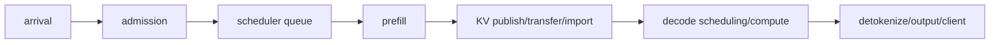
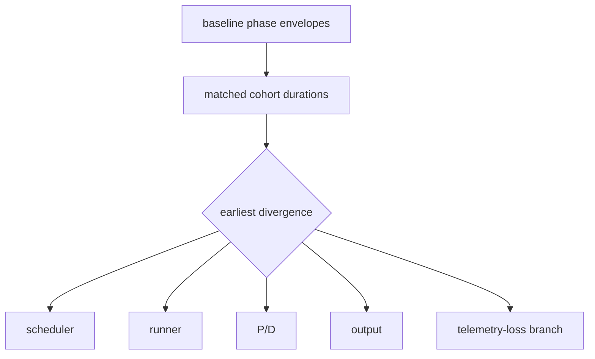
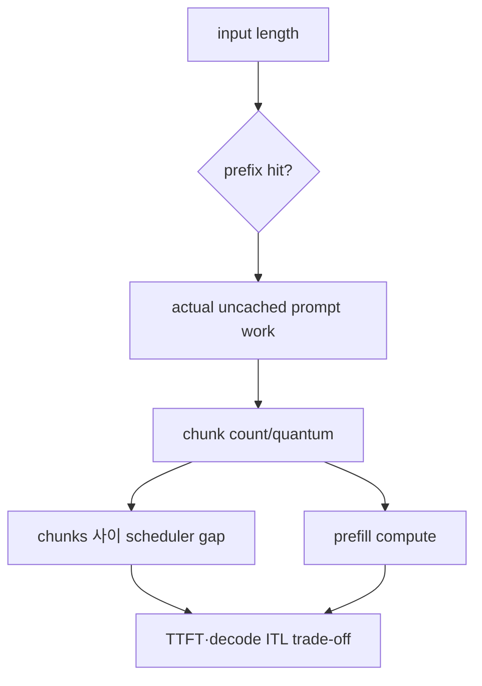
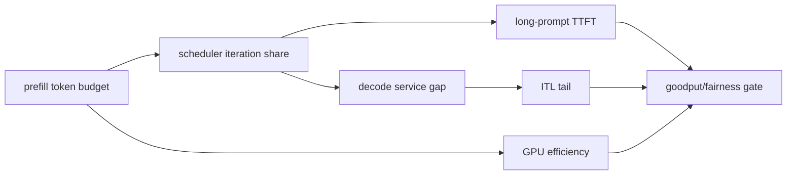
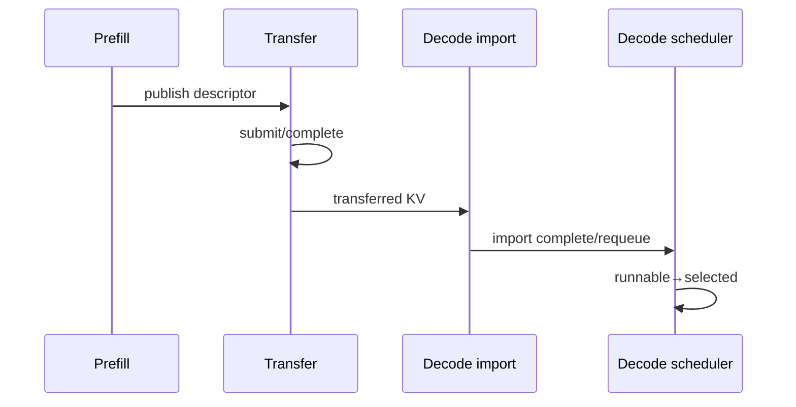

# 68장. 느려진 첫 순간을 붙잡아라: TTFT·ITL·queue 장애 사건집

배포 직후 요청률은 그대로이고 GPU utilization도 88%인데 TTFT p99가 1.9초에서 7.1초로 뛰었다. ITL p99는
42ms에서 57ms로 조금만 나빠졌다. Waiting count는 18~24로 평평하지만 가장 오래 기다린 요청의 age는 0.8초에서
6.4초로 자란다. 긴 prompt와 grammar 요청이 함께 들어왔고 P/D decode queue도 잠깐 솟았다. 이것이 L68 사건이다.

“GPU가 부족하다”는 말은 아직 원인이 아니다. 이 장은 66장에서 검증한 metric과 67장에서 연결한 trace packet을
받아 admission, scheduler queue, prefill, KV transfer, decode, delivery 중 처음 정상 범위를 벗어난 전이를 찾는다.
각 사건은 같은 checklist를 반복하지 않고 그 사건에서만 유효한 반증과 종료 조건을 만든다.

## 68.1 L68 단일 phase timeline에서 first divergence를 찾는다

### 68.1.1 같은 p99 모집단부터 증명한다

첫 비교 대상은 값이 아니라 모집단이다. 배포 전후 model revision, prompt/output length, streaming, priority,
grammar, adapter, prefix-hit, P/D route를 cohort로 나눈다. 완료 요청만 histogram에 들어간다면 아직 queue에 남은
느린 요청은 p99에서 빠진다. 배포 후 10분 window의 p99가 좋아 보여도 backlog가 끝나며 뒤늦게 악화될 수 있다.

L68 packet에는 10:00~10:10 baseline과 10:20~10:30 new generation을 둔다. 요청률 100 req/s가 같더라도 baseline
긴 prompt 비중 5%, new 25%라면 raw p99 비교는 배포 효과와 workload mix를 섞는다. 동일 length bucket과 feature
cohort에서 다시 비교하고 전체 traffic 결과도 별로 보존한다. Cohort를 잘게 쪼개 표본이 100건뿐이면 p99 한 건이
결정하므로 count와 confidence를 함께 낸다.

Deployment generation은 binary old/new보다 넓다. Router, tokenizer/template, scheduler config, engine binary,
model/cache와 P/D topology가 서로 다른 시점에 바뀔 수 있다. L68 window에 router-new→engine-old 조합이 섞이면
`after` cohort 하나가 아니다. Desired state가 아니라 request가 실제 통과한 generations와 route를 붙인다.

Retry도 population을 바꾼다. Client가 3초 후 재시도해 first attempt는 cancel되고 second가 성공하면 completed TTFT에는
second만 들어갈 수 있다. Logical request와 attempt counts, first admission부터 committed first token, cancellation을
분리한다. Retry arrival amplification이 queue를 악화할 수 있다.

TTFT 7초 request가 window 끝에 도착해 다음 window에 observe되면 arrival/completion 귀속이 다르다. 어떤 기준을 썼는지
적고 active backlog의 age censoring을 별로 본다. Rollout 직후 completion histogram에 tail이 없다는 사실은 아직
끝나지 않은 느린 request를 반증하지 않는다.

vLLM v0.27.1의 고정 [`Stats.update_from_output`](https://github.com/vllm-project/vllm/blob/6e448d0ea9bf3d88d898b65449ca6dc2aec170ac/vllm/v1/metrics/stats.py#L360-L424)과 [TTFT histogram 등록](https://github.com/vllm-project/vllm/blob/6e448d0ea9bf3d88d898b65449ca6dc2aec170ac/vllm/v1/metrics/loggers.py#L796-L826)을 연결해 어떤 timestamp 차이가 어느 요청을 언제 표본에 넣는지 확인한다. Client network까지 포함한다고 확대하지 않는다.

SGLang도 [histogram family](https://github.com/sgl-project/sglang/blob/71de97b264b04dcd514cf904003028aefe9775c8/python/sglang/srt/observability/metrics_collector.py#L1623-L1715)와 [observe call](https://github.com/sgl-project/sglang/blob/71de97b264b04dcd514cf904003028aefe9775c8/python/sglang/srt/observability/metrics_collector.py#L1789-L1807)을 붙여 completed/active population을 확인한다.

### 68.1.2 TTFT와 ITL을 owner 구간으로 자른다

조사 ledger에서 TTFT는 admission wait, scheduler wait, prefill compute, P/D KV publish·transfer·import·requeue,
first-token delivery의 합이다. ITL 각 구간은 decode scheduling wait, batch residence, decode compute, detokenize/output
queue와 client delivery로 자른다. 구현이 모든 항을 직접 준다는 주장이 아니라 두 timestamp 사이의 미관측 구간을
명시하는 장부다.

Request R68의 server arrival 0ms, admission 20ms, scheduler enter 25ms, selected 3,025ms, prefill done 3,825ms,
KV ready 4,125ms, first token emitted 4,225ms, client received 4,325ms라면 TTFT 4.325s다. Scheduler wait 3.0s가
가장 크고 prefill 0.8s, P/D 0.3s, delivery 0.1s다. GPU utilization 88%는 어느 구간이 늘었는지 말하지 않는다.

각 timestamp의 clock/process를 기록하고 음수나 overlap을 억지로 0으로 만들지 않는다. 같은 clock이 아니면 67장의
offset/uncertainty를 적용한다. First divergence는 가장 긴 구간이 아니라 baseline envelope를 처음 벗어난 전이다.
Prefill 0.8s가 절대 가장 길어도 baseline 0.8s와 같고 scheduler wait가 0.4→3.0s면 owner는 scheduler 앞이다.

### 68.1.3 incident card와 종료 조건을 먼저 비운다

Card에는 symptom/SLO, competing hypotheses, minimum observations, first divergence, recovery/regression을 순서대로
둔다. 원인 칸에 “queue가 길다”나 “GPU가 높다”를 쓰지 않는다. `scheduler eligible→selected 전이가 2.6초 늦음,
grammar cohort만 발생, unschedulable head가 뒤 요청을 막음`처럼 state, timestamp, owner와 evidence를 쓴다.

가설은 예측을 내야 한다. “긴 prompt 때문”이면 prompt-token matched cohort에서 차이가 사라지고 prefill work 또는
queue residence가 길어야 한다. “P/D network”면 publish 이후 import 이전이 먼저 늘고 bypass cohort에서 회복해야
한다. “decode 부족”이면 transfer 완료 후 runnable D requests와 decode scheduling wait, ITL이 함께 악화해야 한다.

완화 성공은 p50 하나로 닫지 않는다. L68은 TTFT p99≤기준 envelope, ITL p99, throughput, oldest age, priority
fairness, cancellation residue와 P/D queue가 두 회귀 window 동안 회복해야 한다. Workload를 줄여 숫자를 좋게 만든
경우 collateral cost와 admitted goodput을 기록한다.

L68 hypothesis table은 long-prompt work, grammar dependency, P/D transfer, D scheduling, output delivery를 동시에 연다.
Overall correlation로 하나를 고르지 않는다. Work-matched, grammar-off, P/D-bypass, imported-runnable wait와 server/client
gap이 각각 예측을 낸다. Rejected rows도 보존해 같은 graph만 보고 폐기한 가설을 되살리지 않는다.

Grammar-off와 P/D-bypass 둘 다 회복하면 grammar requests가 P/D에만 routed된 confounder를 본다. 가능하면 grammar
on/off×P/D/bypass 네 cells를 비교하고, 불가능하면 route를 matching해 unknown을 남긴다. Canary 개선 하나는 필요
조건과 충분 조건을 구분하지 못한다.

Mitigation은 reversible containment, causal change, cleanup으로 나눈다. Admission cap으로 oldest 증가를 멈추고 lost
wake-up이나 chunk policy를 수정한 뒤 old queue/transfer/output residue를 drain한다. Cleanup graph는 new arrivals와
inherited backlog를 나눠 판정한다.

**L68의 세 dashboard 증상을 하나의 phase timeline에 겹친다.**

TRIAD-68 fixture는 배포 세대 G17, 요청률 120 req/s, streaming 80%, prompt cohort S/L 각각 85%/15%, grammar
10%, prefix-hit 60%, P/D route 50%를 고정한다. Prefill replicas P0/P1, decode replicas D0/D1을 사용하고 scheduler
tick은 10ms다. Baseline 12분과 incident 12분을 같은 arrival seed로 재생한다. 세 사건은 dashboard 첫 화면이
비슷하지만 주입 축은 한 번에 하나만 바꾼다.

Clock ledger에는 gateway monotonic G, engine host monotonic E, GPU event clock C를 둔다. 각 duration은 가능한 한
같은 clock 안에서 계산하고, process를 건너는 edge에는 offset과 uncertainty를 붙인다. `gateway_arrival→engine_receive`
같은 cross-clock 구간이 ±8ms uncertainty라면 4ms 차이를 first divergence로 선언하지 않는다. Scheduler enqueue,
eligible, selected와 first-token/subsequent-token emission은 engine monotonic으로 우선 비교한다.

Cohort ledger는 `(generation, engine, prompt_work_band, grammar, prefix_reuse_band, P/D route, priority, streaming,
output_band)`를 가진다. Raw prompt length 대신 accepted cached tokens를 뺀 scheduled prefill work를 함께 둔다.
Request ID는 metric label이 아니라 pseudonymous incident join key다. 각 cell에는 arrivals, completions, active/cancelled,
TTFT/ITL samples와 scheduler-state coverage를 기록한다.

Phase ledger의 공통 열은 arrival, engine receive, scheduler enqueue, dependency ready, eligible, selected, first prefill
start/end, KV publish/import, first decode schedule/end, server first emit, 이후 token별 selected/compute/emit이다.
모든 구현이 모든 timestamp를 제공한다고 가정하지 않는다. vLLM `Stats.update_from_output`이 만드는 request timing
sample과 running/waiting snapshots, SGLang `ReqTimeStats`의 queue/phase timestamps를 이 공통 열에 대응시키고 없는
열은 unknown으로 둔다.

Dashboard entry packet은 TTFT p99, ITL p99, waiting count, oldest age, queued work, admitted/generated token rates,
prefill/decode batch sizes와 cohort coverage다. 이 packet은 원인 판정이 아니라 조사 입구다. 다음 단계에서 raw
request state와 scheduler iteration을 읽는다. GPU utilization이나 queue count 하나로 branch를 닫지 않는다.

첫 사건 Q68은 waiting count 20±3, TTFT p99 6.8s, ITL p99 51ms다. Baseline은 waiting 18±4, TTFT 2.0s,
ITL 49ms라 첫 화면만 보면 전체 capacity가 조금 부족해 보인다. 그러나 oldest age는 0.7→9.2s, queued work는
5k→31k tokens로 뛰고, tail requests의 92%가 grammar-on low-priority cohort다.

Q68 request H17은 t=1.000s enqueue, t=1.040s grammar dependency ready, 그 뒤 812 scheduler ticks 동안 eligible=true다.
각 tick에서 high-priority short requests가 먼저 budget을 소진하며 H17은 candidate지만 selected=false다. Prefill
compute와 P/D transfer는 시작되지 않았으므로 TTFT의 first divergence는 eligible→selected wait다. ITL은 이미
decode 중인 requests에서 baseline이므로 runner나 network를 먼저 고칠 근거가 없다.

vLLM lane에서는 iteration snapshot의 waiting/running, scheduled prompt/decode tokens와 request timing sample을
같은 표본으로 오인하지 않는다. H17이 waiting snapshot에 반복 포함되지만 queue-time histogram에는 first schedule
시점까지 나타나지 않을 수 있다. SGLang lane에서도 `ReqTimeStats` queue entry/observation event와 scheduler gauges를
분리한다. Histogram p99가 아직 조용해도 oldest active age가 자라는 이유다.

Q68 경쟁 가설 1은 dependency lost wake-up이다. 그러나 H17의 dependency ready가 t=1.040s이고 이후 매 tick
eligible=true라 반증된다. 가설 2는 head-of-line blocking이다. H17 뒤 short requests가 계속 selected되므로 global
HOL은 아니다. 가설 3은 P/D import stall이다. H17은 prefill도 시작하지 않았고 bypass cohort도 같은 priority
starvation을 보여 반증된다. 남는 것은 service-share 없는 priority ordering이다.

Q68 containment는 low-priority admission을 전부 차단하는 것이 아니다. Max wait 2s 이후 aging credit를 주는
canary를 10% replica에 적용한다. H17-like cohort의 eligible→selected p99는 7.9→1.4s로 줄고 high-priority TTFT
p99는 1.3→1.38s로 6.2% 증가한다. 이 collateral cost를 숨기지 않고 priority SLO budget 안인지 판정한다.

Q68 rollback gate는 high-priority deadline miss가 baseline 대비 10% 이상 증가하거나 emitted token goodput이 5%
이상 감소하면 old ordering으로 되돌리는 것이다. Rollback해도 이미 aging lane으로 이동한 requests의 queue nodes와
dependency subscriptions를 drain한다. Queue purge로 숫자만 낮추지 않는다. Permanent fix는 bounded service share와
cancel/removal conservation을 scheduler source consumer에 연결한다.

Q68 terminal은 같은 arrival seed 30분에서 low-priority max eligible wait≤2s, oldest age p99≤1.5s, high-priority
TTFT p99 regression≤8%, generated-token goodput regression≤3%, cancelled residue=0이다. Waiting count가 baseline과
같다는 조건만으로 닫지 않는다. H17 state history에 every transition이 정확히 한 terminal을 갖는지 확인한다.

둘째 사건 T68은 waiting count 21±4, TTFT p99 7.0s, ITL p99 55ms로 Q68과 매우 비슷하다. Oldest age도 6.8s라
dashboard만 보면 같은 fairness fix를 적용하고 싶다. 그러나 tail requests의 eligible→selected p99는 baseline
0.42s와 같은 0.45s이고, selected 뒤 first-prefill-done이 0.8→4.9s로 뛴다. First divergence는 scheduler가 아니라
prefill work/runner 구간이다.

T68 long cohort raw input은 baseline과 incident 모두 median 16k tokens다. Baseline accepted prefix reuse는 12k,
scheduled prefill work는 4k였지만 incident G17 cache namespace mismatch 뒤 reuse는 2k, work는 14k다. Raw prompt
length matched dashboard는 변화가 없지만 work ledger는 3.5배다. Scheduler queue age 증가는 runner service time
증가가 upstream에 만든 결과다.

T68에서 vLLM request timing의 queue sample과 prompt token/cache metrics를 request cohort로 결합한다. Metric label에
request를 넣지 않고 bounded work band와 trace packet에서 재검산한다. SGLang `ReqTimeStats` selected/phase timestamps와
scheduled token counts도 같은 common phase로 옮긴다. 두 구현의 field 이름이 다르더라도 selected→prefill-done
duration과 accepted reuse/work population을 비교한다.

T68 오진 반례 1은 Q68 aging fix다. Aging canary는 long requests를 조금 빨리 select하지만 selected→prefill-done
4.9s가 그대로라 TTFT p99는 6.8s다. High-priority short traffic만 손해를 보므로 원인 fix가 아니다. 반례 2는
GPU replicas 증설이다. Capacity로 증상을 완화할 수 있지만 cache namespace mismatch가 남아 per-request work와
비용이 3.5배다. 증설 성공을 root-cause 검증으로 쓰지 않는다.

T68 경쟁 가설 1은 chunk size regression이다. Same scheduled work 14k cohort에서 old/new chunk policy를 맞추면
prefill compute 합과 inter-chunk gap 차이가 작아 반증된다. 가설 2는 P/D transfer다. KV publish→import duration은
0.29→0.31s이고 bypass에서도 prefill 증가가 같아 약해진다. Cache namespace를 G17과 맞춘 canary에서 accepted
reuse 12k와 prefill 0.83s가 회복되어 원인이 강화된다.

T68 containment는 mismatched cache namespace의 hit를 무조건 신뢰하는 것이 아니다. Writer/reader model, layout,
tokenizer/template와 generation compatibility를 확인한 뒤 known-good namespace로 route한다. 의심 cache entries는
quarantine하고 miss로 재계산한다. Stale bytes를 성능을 위해 publish하지 않는다. Cache warm-up 동안 long cohort
admission cap으로 queue age 증가를 제한한다.

T68 rollback은 engine binary만 내리는 것이 아니라 cache namespace mapping과 router generation을 G16 known-good
set으로 함께 되돌린다. 이미 G17 key로 생성한 entries를 G16 reader에게 섞지 않는다. Rollback 후 old/new cache
objects, in-flight prefill requests와 P/D transfers가 각 generation에서 terminal인지 확인한다. Warm cache 회복을
기다리지 않고 raw TTFT만 비교하면 false regression을 낼 수 있다.

T68 terminal은 work-matched selected→prefill-done p99가 baseline ±10%, accepted prefix reuse distribution 회복,
long-cohort TTFT p99≤2.3s, short-cohort ITL regression≤5%, stale-generation hit=0, quarantined entries 회수 완료다.
Queue count와 oldest도 회복해야 하지만 이는 downstream 결과다. 원인 검증은 cache generation과 actual scheduled
work를 직접 본다.

셋째 사건 I68은 TTFT p99 2.2s, waiting 19±4로 거의 정상인데 ITL p99가 48→132ms로 뛴다. 400ms 주기의 톱니
모양이 D1에서만 보이고 D0는 51ms다. Raw GPU utilization은 둘 다 90% 부근이다. Queue 사건이나 long prefill
사건에 쓰던 전체 capacity와 prefix 가설을 그대로 적용하면 오진한다.

I68 token ledger에서 D1 request들의 token n→n+1 interval을 decode-selected wait, decode compute와 server emit
gap으로 자른다. Baseline은 8/34/6ms, spike는 86/35/7ms다. Compute와 delivery는 안정적이고 decode scheduler wait만
78ms 늘었다. Spike ticks에서 runnable decode requests가 있는데 P/D imported request admission이 큰 prefill-like
batch로 budget을 점유한다.

I68의 clock ledger는 GPU event duration 35ms와 host scheduler wait 86ms를 더할 때 서로 다른 clock을 섞지 않는다.
각 duration은 내부 clock에서 계산하고 iteration ID로 순서를 잇는다. GPU kernel timestamp가 정상이라는 사실은
token gap 전체가 정상이라는 뜻이 아니다. Host selected 간격이 먼저 벌어졌으므로 kernel 최적화를 root fix로
선택하지 않는다.

I68에서 vLLM scheduled prompt/decode token snapshots와 request subsequent-token timing을 iteration별로 연결한다.
SGLang lane도 running/waiting gauges가 아니라 decode request의 phase/token observations와 batch composition을 본다.
한 iteration의 snapshot이 request ITL histogram 한 표본과 일대일이라는 가정을 버린다. Metric은 affected D1과
cohort를 찾고 scheduler trace가 prompt/decode budget 경쟁을 판정한다.

I68 오진 반례 1은 network/P/D stall이다. KV publish→import는 0.30s로 baseline이고 imported request는 ready다.
Transfer를 bypass해도 D1 spike가 남지만 imported batch admission을 제한하면 사라진다. 반례 2는 slow client다.
Server emit interval 자체가 132ms이고 output queue/flush gap은 7ms라 delivery가 아니다. 반례 3은 decode kernel
regression이다. GPU event 35ms와 batch-shape-matched kernel duration이 baseline이다.

I68 first divergence는 imported runnable batch를 scheduler가 한 tick에 크게 받아들이면서 existing decode requests의
selected cadence가 깨진 지점이다. P/D network는 upstream trigger가 아니라 정상 data supplier였고, scheduler의
admission/interleaving policy가 owner다. “P/D를 켠 뒤 느려졌다”는 상관을 network 장애로 번역하지 않는다.

I68 containment는 imported work per iteration을 bounded quota로 제한하고 active decode minimum budget을 보장하는
canary다. ITL p99는 132→58ms, TTFT p99는 2.2→2.5s로 13.6% 악화된다. Decode만 좋게 만들고 prefill TTFT를
무시하지 않는다. Workload mix별 Pareto table에서 ITL SLO와 TTFT rollback threshold를 동시에 승인한다.

I68 rollback gate는 TTFT p99가 20% 이상 악화하거나 P/D import queue oldest가 2s를 넘거나 goodput이 5% 감소하면
quota를 known-good로 되돌리는 것이다. Rollback 뒤 partially admitted imported requests, KV block reservations와
requeue nodes가 중복되지 않는지 conservation을 본다. Policy flag만 되돌리고 duplicated state가 남으면 다음 burst가
다시 queue를 오염시킨다.

I68 terminal은 D0/D1 모두 ITL p99≤60ms, periodic spike amplitude≤15ms, decode-selected wait p99≤20ms, TTFT
p99≤2.6s, P/D import oldest≤1s, token goodput baseline ±3%, requeue/reservation residue=0이다. Average ITL이
좋아졌거나 D1 traffic을 D0로 우회한 상태는 terminal이 아니다. Affected owner에서 동일 seed를 처리해야 한다.

세 incident를 같은 표에 놓으면 오진 지점이 선명하다. Q68은 eligible→selected가 먼저 깨지고 prefill/decode
compute는 정상이다. T68은 selected까지 정상이고 scheduled prefill work와 runner duration이 먼저 깨진다. I68은
first token까지 정상에 가깝고 subsequent decode-selected cadence가 먼저 깨진다. TTFT와 queue가 비슷한 Q68/T68도
phase 순서가 다르고, GPU utilization은 세 사건을 구분하지 못한다.

동일 fixture의 counterfactual matrix는 한 사건의 fix를 다른 사건에 적용한다. Aging을 T68에 적용하면 tail work가
남고, cache namespace를 Q68에 고쳐도 eligible starvation이 남으며, decode quota를 Q68/T68에 적용하면 prefill
capacity만 줄 수 있다. 반대로 각 causal fix는 자기 first-divergence duration을 직접 회복한다. 이 교차 반증을
통과해야 단순한 상관이 아니라 owner fix로 승인한다.

초동 분기표는 dashboard threshold보다 transition을 묻는다. TTFT가 높으면 active tail의 arrival→eligible,
eligible→selected, selected→prefill-done, KV-ready와 first-emit durations를 순서대로 채운다. ITL이 높으면 subsequent
token의 selected wait, compute, emit/delivery를 채운다. Queue count가 높거나 평평하면 oldest age, queued work,
eligible/blocked와 selection share를 채운다. 첫 empty column은 관측 gap이고, 첫 baseline envelope 이탈 column은
후보 owner다.

Q68 source consumer 추적은 scheduler가 waiting collection을 어떤 ordering key로 읽고 token budget 안에서 candidate를
accept/reject하는 branch까지 간다. Metric logger의 waiting gauge update는 symptom producer일 뿐이다. Request timing
queue observation도 selection 뒤 만들어질 수 있어 아직 selected되지 않은 H17의 starvation을 직접 세지 못한다.
따라서 scheduler iteration의 candidate order와 rejection/skip reason이 causal evidence다.

vLLM fixture에서는 iteration마다 scheduler output의 scheduled request/token set과 Stats snapshot을 함께 보존한다.
H17 request state의 enqueue/first-scheduled timestamps가 output timing update로 넘어가는 시점을 확인한다. SGLang
fixture에서는 ReqTimeStats의 queue entry timestamp와 scheduler request state의 ready/selected mutation을 연결한다.
어느 stack에서도 gauge 20을 request trace 20개와 등식으로 놓지 않는다.

Q68의 잘못된 조사 순서는 GPU utilization 88%→GPU 부족→replica 증설이다. Replica를 하나 늘리면 high-priority
arrivals가 흡수돼 H17도 우연히 선택될 수 있지만 priority load가 다시 capacity에 접근하면 starvation이 재발한다.
반증 실험은 capacity를 그대로 두고 bounded share만 바꿔 eligible wait가 직접 회복되는지 본다. 증설은 containment일
수 있지만 scheduler fairness root fix가 아니다.

Q68 rollback 뒤 inherited backlog를 두 cohort로 나눈다. Fix 전 enqueue된 requests는 `inherited=true`, fix 뒤는
false다. 새 cohort max wait가 회복됐는데 inherited H17 nodes가 남으면 cleanup 미완료다. Dependency-ready queue,
scheduler waiting set과 allocator reservation에서 같은 terminal count를 검산한다. Cancelled H17을 success로
재분류해 tail을 낮추지 않는다.

T68 source consumer 추적은 cache lookup 숫자에서 멈추지 않고 scheduler가 실제 accepted cached tokens를 request
metadata에 반영하고 remaining prompt tokens를 chunk scheduling에 넘기는 지점으로 간다. Lookup candidate 12k와
accepted 2k가 다르면 cache metric이 높아도 prefill work는 14k다. Runner는 전달받은 scheduled tokens를 계산했을
뿐이므로 compute time 증가를 kernel regression으로 부르지 않는다.

vLLM lane에서는 prompt/cache token statistics가 request completion timing과 어떤 population에서 보고되는지 확인하고,
SGLang lane에서는 prefix reuse와 scheduled prefill token update caller를 phase ledger에 대응시킨다. Source에
request-level accepted reuse가 없으면 trace instrumentation gap으로 남기고 fleet hit ratio로 대신 채우지 않는다.
Instrumentation canary는 bounded work bands를 내며 cache key나 prompt를 metric label로 만들지 않는다.

T68의 잘못된 조사 순서는 TTFT 7s→prefill kernel 느림→CUDA kernel 교체다. Work-matched 14k cohort의 per-token
compute와 kernel duration이 baseline이면 runner는 늘어난 work를 정상 처리한 것이다. 4k baseline과 14k incident의
absolute duration 비교는 입력을 통제하지 않았다. Same-work kernel benchmark와 accepted reuse canary가 각각 kernel과
cache 가설을 분리한다.

Cache namespace fix 검증은 hit ratio 상승 한 줄이 아니다. Writer generation과 reader generation, model/layout,
token/template compatibility가 맞고 accepted reuse가 lookup result와 기대 관계를 갖는지 본다. Corrupt/stale reject가
0인지, miss fallback이 correct output을 만드는지 확인한다. TTFT 개선을 위해 incompatible prefix를 받아들이면
correctness를 잃으므로 즉시 rollback한다.

T68 rollback 후 cache warm state가 달라 baseline 비교가 왜곡될 수 있다. Cold, warming, steady 세 window를 나누고
동일 accepted-reuse band에서 phase duration을 비교한다. Known-good namespace로 돌아간 직후 miss가 많아 TTFT가 잠깐
높아도 root fix 실패로 단정하지 않는다. 반대로 steady window에서도 reuse가 2k라면 rollback mapping이 실제 request
consumer까지 도달하지 않은 것이다.

I68 source consumer 추적은 P/D import 완료 callback가 request를 runnable queue에 넣고 scheduler가 prompt/decode
budget을 배분하는 branch를 찾는다. Transfer latency metric과 import queue gauge는 upstream evidence다. First
divergence는 ready 이후 batch admission에서 나타났으므로 connector를 튜닝하기 전에 scheduler policy consumer를
본다. Same import arrival을 고정하고 quota만 바꾼 counterfactual이 핵심이다.

vLLM lane의 scheduled prompt/decode token snapshots가 한 iteration의 work mix를 주고 output timing은 subsequent
tokens의 ITL samples를 준다. SGLang lane도 scheduler batch composition과 ReqTimeStats token phases를 결합한다.
두 stack의 metric family 이름을 통일하려 하지 않고 common event `runnable`, `selected`, `decode compute done`,
`server emit`에 대응한다. Missing field는 broader interval로 남긴다.

I68의 잘못된 조사 순서는 400ms 톱니→NCCL 또는 CUDA periodic stall이다. GPU event duration과 collective progress가
spike tick에서도 정상이고 host selected wait가 먼저 벌어지면 이 가설은 약하다. CPU scheduler pause도 competing
가설이므로 process-wide pause와 모든 cohorts 동시 지연을 본다. D1 imported cohort tick에서만 기존 decode selected가
밀리면 policy contention 예측이 더 잘 맞는다.

I68 quota canary는 max imported tokens뿐 아니라 active decode minimum, batch shape와 queue oldest를 기록한다. Quota를
너무 낮추면 decode ITL은 좋아져도 import queue가 계속 자라 eventual TTFT와 memory lease를 악화시킨다. Quota를
너무 높이면 톱니가 돌아온다. Traffic mixes 25/50/75% P/D에서 Pareto envelope를 만들고 한 fixture에 과적합하지
않는다.

I68 rollback cleanup에서는 imported request가 quota 변경 전후 두 queues에 중복 삽입되지 않았는지 본다. Request
state generation, KV block reservation과 scheduler node cardinality를 join한다. Terminal requests, cancelled requests,
active requests와 released reservations의 conservation이 맞아야 한다. ITL graph가 좋아도 leaked reservations가
다음 incident를 만들 수 있다.

세 사건의 최소 증거량도 다르다. Q68은 적어도 한 starvation request의 수백 scheduler ticks가 필요하다. T68은
work/reuse matched long requests와 cold/warm cache windows가 필요하다. I68은 여러 톱니 주기와 batch composition,
token-by-token intervals가 필요하다. 모든 사건에 고정 “trace 10개”를 적용하지 않고 tail 현상의 반복 주기와
cohort count로 sample target을 정한다.

Clock sanity fixture는 세 요청에 인위적 process offset +20ms, -15ms를 넣는다. Cross-process absolute timestamp만
정렬하면 KV import가 publish보다 빠르거나 first emit이 compute done보다 빨라질 수 있다. Same-process durations와
causal sequence가 유지되는지 확인하고 uncertainty보다 작은 divergence는 unknown으로 둔다. Offset 보정으로 원인이
바뀌면 incident confidence를 낮춘다.

Cohort sanity fixture는 traffic mix만 long prompt 15→35%로 바꾸고 code/config는 고정한다. Overall TTFT p99가
악화돼도 work-matched cells가 baseline이면 deployment regression으로 page하지 않는다. 반대로 T68처럼 각 long
cell에서 accepted reuse와 phase duration이 바뀌면 mix 보정 뒤에도 incident다. Overall과 matched views를 모두
보존해 Simpson reversal을 찾는다.

Completion censoring fixture는 12분 window 끝에 tail requests 200건을 active로 남긴다. Completed-only TTFT p99는
좋아질 수 있지만 oldest active age와 arrivals-minus-terminals가 증가한다. Window 다음 5분에 tail이 완료되며 p99가
뒤늦게 뛰는지 재생한다. Q68/T68 초동에서 completion histogram만 보고 정상 선언하지 않는 이유다.

Rollback 승인표는 causal phase, collateral phase와 cleanup을 한 행에 둔다. Q68은 eligible wait 회복과 high-priority
TTFT 비용, T68은 prefill work 회복과 cache correctness, I68은 decode selected cadence와 prefill/import cost다.
각 행에 trigger threshold, known-good value, state migration, inherited residue와 observation window가 있어야 한다.
Feature flag off 한 줄은 rollback plan이 아니다.

관측→분기→원인→검증→rollback 순서도 세 사건마다 동일한 모양만 갖고 내용은 다르다. 관측은 metric/cohort로
affected population을 찾는다. 분기는 earliest phase와 request state로 owner를 좁힌다. 원인은 source consumer
branch와 counterfactual이 함께 지지한다. 검증은 그 phase를 직접 회복하고 경쟁 가설 예측은 실패시킨다. Rollback은
policy뿐 아니라 이미 생성된 queue/cache/reservation state를 terminal로 만든다.

TRIAD-68 artifact는 세 개의 incident card, 하나의 common fixture manifest, clock/cohort/phase ledger, source-consumer
anchors, counterfactual matrix와 rollback conservation sheet다. Dashboard screenshot은 입구 증거로 첨부하지만
terminal 근거를 대신하지 않는다. 다른 운영자가 동일 seed를 재생해 Q/T/I 판정을 같은 순서로 얻을 수 있어야 한다.

최종 종결문도 세 줄이다. “Q68은 eligible request service share 부재였고 bounded aging으로 fairness와 cleanup을
회복했다.” “T68은 G17 cache namespace mismatch가 accepted reuse를 줄여 actual prefill work를 3.5배 만들었고
compatible namespace와 generation cleanup으로 닫았다.” “I68은 imported runnable work의 batch admission이 decode
cadence를 깨뜨렸고 bounded quota와 reservation conservation으로 TTFT/ITL envelope를 함께 회복했다.”

당직 인계의 첫 표에는 세 사건을 섞지 않는 식별자가 필요하다. Q68은 scheduler generation과 ordering policy,
T68은 cache writer/reader namespace generation, I68은 P/D import policy와 decode scheduler generation을 쓴다.
단순 deployment G17 하나만 남기면 rollback 대상이 과도하게 넓어지거나 실제로 바뀐 component를 놓친다. Request마다
실제로 소비한 generation을 ledger에 기록한다.

초동 10분에는 tuning하지 않는다. 0~2분에 모집단·coverage와 active backlog를 고정하고, 2~5분에 affected request
세 개의 phase ledger를 채우며, 5~10분에 scheduler state와 source consumer branch를 찾는다. 안전 문제가 없다면
이 증거를 보존한 뒤 가장 작은 reversible containment를 건다. 여러 option을 동시에 바꾸면 Q/T/I counterfactual을
잃는다.

Q68의 page annotation은 `waiting count 20`이 아니라 `eligible oldest 9.2s, service share 0 over 812 ticks`다.
T68은 `long work band 14k, accepted reuse 2k, selected→prefill 4.9s`다. I68은 `D1 subsequent selected wait
86ms, compute 35ms, imported admission tick periodicity 400ms`다. 이 annotation만으로 다음 당직자가 같은 branch에서
조사를 이어갈 수 있다.

반증 결과는 성공한 가설만큼 중요하다. Q68에서 dependency-ready와 bypass, T68에서 chunk/P-D duration, I68에서
network/client/kernel duration이 정상이라는 evidence를 incident card에 남긴다. 이후 그래프가 다시 흔들릴 때 이미
반증한 가설을 무비판적으로 되살리지 않되, generation이나 workload가 바뀌었다면 해당 반증의 적용 범위를 다시
검토한다.

Rollback 후 두 window는 서로 다른 목적이다. 첫 window는 new arrivals가 known-good policy에서 정상 phase를
갖는지 본다. 둘째 window는 inherited requests와 resources가 terminal로 수렴하는지 본다. 새 요청 p99가 회복돼도
old queue node, cache generation 또는 KV reservation이 남으면 rollback은 미완성이다. 반대로 inherited tail 때문에
첫 전체 p99가 높아도 new cohort가 정상일 수 있으므로 두 모집단을 합치지 않는다.

Capacity 변경은 마지막 비교축이다. Replica 추가, admission 감소나 traffic 우회가 SLO를 회복시킬 수 있지만 phase당
service demand와 policy bug가 그대로인지 계산한다. Q68 fairness, T68 inflated work, I68 interleaving이 부하가 낮아져
가려졌다면 원인은 제거되지 않았다. 원래 부하의 동일 seed 회귀를 통과해야 permanent close로 승인한다.

세 사건 공통 안전 gate는 output correctness, cancellation terminal과 resource conservation이다. Latency fix가 stale
cache를 허용하거나 cancelled request를 계속 실행하거나 KV block을 누수하면 즉시 되돌린다. Performance incident라
해도 rollback 과정에서 correctness invariant를 낮추지 않는다. 이 gate는 p99 개선률보다 우선한다.

TRIAD-68의 최종 review는 “무엇이 느렸나”보다 “어떤 정상 transition이 언제 처음 달라졌나”를 묻는다. Q68은 선택
전, T68은 선택 후 prefill, I68은 첫 token 뒤 decode cadence다. 이 좌표가 있으면 비슷한 dashboard 모양에서도
scheduler ordering, cache/work와 interleaving owner에게 정확히 수정 권한과 회귀 책임을 돌려줄 수 있다.

마지막 회귀는 세 원인을 동시에 주입하지 않는다. Q68, T68, I68 단독 replay가 각각 기대 branch와 alert를 만든 뒤
두 축 조합을 추가해 우선순위를 확인한다. 예를 들어 cache work 증가와 decode interleaving이 함께 있으면 first-token
전에는 T68, subsequent token에는 I68 divergence가 동시에 존재할 수 있다. 하나의 root cause로 억지로 축약하지
않고 요청 phase별 owner를 둘 다 연다.

조합 fixture에서도 rollback은 독립적으로 가능해야 한다. Cache namespace만 되돌렸을 때 prefill duration은 회복하지만
ITL 톱니는 남고, decode quota만 되돌렸을 때 반대 결과가 나와야 한다. 두 변화가 서로의 state를 소유한다면 그
dependency를 rollback graph에 명시한다. 독립성 예상과 다른 결과가 나오면 숨은 coupling을 새 가설로 연다.

이 재현성까지 통과하면 dashboard 신호, scheduler trace와 request state가 단순히 한 화면에 모인 것이 아니라
인과 판정을 수행하는 dossier가 된다. 이후 release에서도 동일 seed, cohort와 phase oracle을 실행해 느린 결과가
사용자에게 도달하기 전에 earliest divergence를 검출한다.

## 68.2 정상 경로의 source walk는 timestamp 생산자를 찾는다

### 68.2.1 vLLM Stats에서 snapshot과 request sample을 분리한다

vLLM의 고정 [`Stats` fields](https://github.com/vllm-project/vllm/blob/6e448d0ea9bf3d88d898b65449ca6dc2aec170ac/vllm/v1/metrics/stats.py#L191-L209)는
한 iteration의 waiting/running snapshot과 request timing samples가 같은 객체에 모일 수 있음을 보여 준다. 이것이
waiting gauge 20이 TTFT 표본 20개와 동일하다는 뜻은 아니다. Snapshot은 그 순간 상태이고 timing histogram은
조건을 만족한 request event가 observe될 때 추가된다.

[running/waiting gauge 등록](https://github.com/vllm-project/vllm/blob/6e448d0ea9bf3d88d898b65449ca6dc2aec170ac/vllm/v1/metrics/loggers.py#L494-L532), [queue histogram observe](https://github.com/vllm-project/vllm/blob/6e448d0ea9bf3d88d898b65449ca6dc2aec170ac/vllm/v1/metrics/loggers.py#L1216-L1228)와 [queue family 정의](https://github.com/vllm-project/vllm/blob/6e448d0ea9bf3d88d898b65449ca6dc2aec170ac/vllm/v1/metrics/loggers.py#L922-L929)를 역으로 읽는다.

등록 description에서 멈추지 않고 observe 인자가 어느 timestamp 차이인지, 완료/첫 schedule/iteration 중 언제 호출되는지 확인한다. Source가 말하는 범위만 사용하며 client-visible latency로 확장하지 않는다.

Call-site walk는 output의 request timing object, first/subsequent token branch와 읽는 fields를 확인한다. Subtraction
endpoint는 source로 확정할 수 있지만 timestamp mutation은 upstream caller까지 가야 한다. `arrival_time`이라는 이름만
보고 proxy/API ingress clock으로 단정하지 않는다.

Histogram은 event 발생 때 population에 추가되므로 waiting snapshot과 denominator가 다르다. Snapshot 20과 queue-time
count 증가 5가 같은 scrape에 있어도 15건 누락이 아니다. Request transitions와 observation time을 join한다. 필요한
candidate/rejection field가 source에 없으면 존재하지 않는 metric을 만들지 말고 bounded instrumentation plan으로 남긴다.

관측 packet은 iteration ID, scheduler waiting/running counts, selected request IDs의 pseudonymous join key, scheduled
prompt/decode tokens와 request phase timestamps를 가진다. Request ID를 metric label로 만들지 않고 trace/log에서
join한다. Snapshot count가 평평한데 completed queue-time histogram이 뒤늦게 솟는 것은 모순이 아니라 표본 시점 차이다.

### 68.2.2 SGLang ReqTimeStats를 phase vocabulary로 읽는다

역할별 고정 좌표와 판정 범위는 다음과 같다.

- SGLang의 고정 [`ReqTimeStats` phase vocabulary](https://github.com/sgl-project/sglang/blob/71de97b264b04dcd514cf904003028aefe9775c8/python/sglang/srt/observability/req_time_stats.py#L129-L205), [timestamp fields](https://github.com/sgl-project/sglang/blob/71de97b264b04dcd514cf904003028aefe9775c8/python/sglang/srt/observability/req_time_stats.py#L607-L619), [queue entry·observation](https://github.com/sgl-project/sglang/blob/71de97b264b04dcd514cf904003028aefe9775c8/python/sglang/srt/observability/req_time_stats.py#L738-L773)을 순서대로 읽는다.
- 이름이 vLLM queue time과 비슷해도 시작/끝 event가 같은지 증명하기 전에는 비교하지 않는다.

[running/waiting gauges](https://github.com/sgl-project/sglang/blob/71de97b264b04dcd514cf904003028aefe9775c8/python/sglang/srt/observability/metrics_collector.py#L268-L276)와 [queue histogram 등록](https://github.com/sgl-project/sglang/blob/71de97b264b04dcd514cf904003028aefe9775c8/python/sglang/srt/observability/metrics_collector.py#L686-L688)도 snapshot과 completed observation으로 분리한다.

소스 walk의 산출물은 metric 이름표가 아니라 timestamp producer, mutation event, clock, observation population과 missing path 표다.

Phase object가 process를 건널 때 timestamp field가 보존되는지, default zero/None이 event 부재와 어떻게 구별되는지
본다. 같은 이름이 모든 request modes에서 mutation되는지도 caller branches를 찾는다. Grammar, P/D, multimodal path가
일반 path의 field를 건너뛰면 cohort coverage가 다르다.

Queue histogram이 dequeue, first schedule, completion 중 언제 observe되는지 source와 caller로 적는다. Snapshot gauge의
process aggregation과 request event sum을 등식으로 놓지 않는다. 여기서는 metric 정의를 반복하지 않고 population
차이가 first divergence 판정을 어떻게 바꾸는지만 사용한다.

### 68.2.3 first divergence는 두 구현의 공통 phase로만 비교한다

Cross-stack 비교는 `queue_time` name equality가 아니라 arrival→eligible, eligible→selected, selected→prefill done,
transfer ready, decode step, server emit 같은 공통 event로 정규화한다. 어느 구현이 eligibility timestamp를 내지 않으면
그 구간은 arrival→selected로 넓게 남기고 더 정밀한 구현과 같은 정확도인 척하지 않는다.

첫 divergence algorithm은 각 cohort의 phase duration을 baseline distribution과 비교하고 시간순으로 최초 envelope
이탈을 고른다. 뒤 단계는 앞 단계 지연을 상속할 수 있으므로 absolute timestamp가 늦다는 사실만으로 owner가 아니다.
Duration과 state transition을 본다. Observation gap이 최초라면 원인 state와 telemetry-loss state를 분리한다.

Envelope는 phase마다 다르다. Scheduler wait는 burst heavy tail이고 fixed work compute는 좁을 수 있다. Baseline
p50/p95/p99, count와 workload covariates를 둔다. Observed 800ms와 baseline p99 750ms가 uncertainty 안이면 확정
divergence로 쓰지 않고 matched requests와 연속 bins에서 재현한다.

Baseline queue/prefill/transfer가 0.5/0.8/0.3s이고 incident가 3.0/0.8/0.3s면 first token은 2.5s 늦지만 downstream
두 owners는 정상이다. 0.5/2.0/0.3s면 runner handoff다. Parallel grammar preparation과 admission wait가 겹치면 durations를
더해 wall time을 이중 계산하지 않고 critical path에서 최초 이탈을 고른다.

## 68.3 사건 1 — count는 평평한데 oldest age가 자란다

### 68.3.1 평평한 20건은 정상 queue를 뜻하지 않는다

L68 waiting count는 매 scrape 18~24다. Arrival과 dequeue가 비슷하면 count는 평평하지만 특정 요청은 계속 뒤로 밀릴
수 있다. 새 짧은 요청 20건이 매초 들어와 처리되고 request H 하나만 6.4초 남아도 snapshot count는 안정적이다.
Count는 inventory이며 work, age, schedulability와 fairness를 담지 않는다.

운영자는 세 시계열을 같은 축에만 그리지 않고 request-age distribution을 복원한다. 10:00의 waiting 20건을 age
bucket `<1s=20, 1~5s=0, >5s=0`로, 10:05를 `<1s=20, 1~5s=0, >5s=1`로 쓰면 한 요청의 starvation이
드러난다. 평균 age는 21건 때문에 희석될 수 있다. Oldest 하나도 clock 오류나 zombie request일 수 있으므로 해당
request의 state generation, last transition과 cancellation status를 trace/log에서 확인한다.

Queued work는 prompt tokens 하나로 끝나지 않는다. Cached prefix를 뺀 uncached tokens, multimodal expansion,
anticipated output reservation, feature preparation과 KV availability가 selection cost를 바꾼다. 정확한 compute estimate가
없어도 raw prompt, cached, remaining prefill, blocked reason을 분리하면 count보다 나은 evidence가 된다.

수치 ledger에서 10:00 queue 20건의 prompt work가 4,000 tokens, oldest 0.8s였고 10:05에는 21건, 28,000 tokens,
oldest 6.4s라고 하자. Count는 5% 늘었지만 work는 7배, oldest는 8배다. 요청 수만 보고 capacity가 같다고 결론내리면
긴 prompt가 만든 service demand와 head-of-line을 놓친다.

### 68.3.2 starvation·unschedulable·HOL을 반증한다

경쟁 가설은 세 개다. Priority starvation이면 낮은 priority H가 eligible인데 높은 priority arrivals가 계속 먼저
selected된다. Unschedulable이면 H가 adapter/grammar/KV 조건 때문에 eligible하지 않고 reason state가 유지된다.
Head-of-line blocking이면 H가 queue ordering 앞에서 선택 실패하며 뒤의 실행 가능한 요청도 selection을 못 한다.

Iteration table은 `iter`, `candidate_order`, `eligible`, `rejection_reason`, `selected_tokens`, `queue_age_before/after`를
가진다. H가 매 iteration 첫 candidate이고 `adapter_not_ready`로 거절된 뒤 scan이 중단되면 HOL이다. Scheduler가 H를
건너뛰어 뒤 requests를 선택한다면 H의 starvation은 남지만 global HOL은 반증된다. 두 현상을 같은 queue 문제로
합치면 완화가 달라진다.

Priority starvation은 arrival와 service share로 계산한다. 100 req/s capacity에서 high arrivals 99 req/s, low 5
req/s면 low backlog는 매초 4건 늘 수 있다. Aging 후 low가 selected되지만 high deadline miss가 증가하면 policy
trade-off를 수치로 남긴다. 전체 p99만 보면 어느 class가 비용을 냈는지 보이지 않는다.

최소 관측은 enqueue age, queued prompt tokens, eligibility/rejection reason, priority/deadline, scheduler iteration별
candidates와 selected set이다. H를 제거한 canary에서 뒤 requests의 wait가 즉시 줄면 HOL 가설이 강해진다. Priority를
같게 해도 H가 남으면 순수 priority starvation은 약해진다. 필요한 resource를 준비한 뒤 eligible이 되면 blocked
dependency owner다.

### 68.3.3 완화는 queue를 비우는 것이 아니라 fairness를 회복한다

HOL이면 unschedulable request를 deferred lane으로 옮기고 dependency-ready event에서 재삽입한다. Starvation이면 aging,
deadline budget 또는 bounded service share를 검토한다. 긴 request를 무조건 거부하면 tail은 좋아지지만 product
coverage와 fairness를 희생하므로 collateral cost를 기록한다.

Owner는 scheduler ordering, dependency manager, admission policy로 나눈다. 종료 조건은 oldest p99가 baseline으로
회복하고 low-priority maximum wait가 bound 안이며 throughput/TTFT p99와 cancellation residue가 두 window 동안
정상인 것이다. Queue를 purge해 H를 없앤 직후 한 번 좋아진 것은 회귀 통과가 아니다.

Cancellation도 보존한다. Client가 H를 취소했는데 dependency waiter나 scheduler node가 남아 oldest를 계속 올리면
계측 zombie일 수도 있고 실제 scan 비용을 만들 수도 있다. Cancel→scheduler removal→dependency unsubscribe→resource
release acknowledgement를 보고 terminal conservation이 맞는지 확인한다. Dashboard에서 cancelled cohort를 filter해
숨기지 않는다.

회귀 workload는 low-priority runnable, 영구 unschedulable, 늦게 ready가 되는 request를 함께 넣는다. Runnable 뒤
요청은 진행하고 blocked request는 ready 후 bounded 시간 내 재진입하며 cancelled request는 oldest denominator에서
제거돼야 한다. 세 조건이 모두 맞아야 fairness와 cleanup을 고쳤다.

## 68.4 사건 2 — 긴 prompt cohort에서만 TTFT tail이 뛴다

### 68.4.1 prompt 길이와 실제 prefill work를 구분한다

긴 prompt가 느리다는 직관은 방향은 맞지만 root cause로는 부족하다. Prefix cache hit가 크면 input 16k라도 실제
prefill은 1k일 수 있고, 4k prompt가 cache miss와 multimodal expansion으로 더 많은 work를 만들 수 있다. Source
request length, cached tokens, scheduled uncached tokens, chunk count를 함께 본다.

Baseline long cohort 200건의 input median 16k, cached 12k, scheduled prefill 4k, TTFT p99 2.1s였다고 하자. New
generation은 input도 16k지만 cached 2k, work 14k, p99 7.0s다. Input length matched 비교만 하면 deployment regression,
work matched 비교는 prefix hit loss를 드러낸다. `14k/4k=3.5`배 work와 3.3배 TTFT가 가까워도 causality는 cache
hit canary와 phase duration으로 확인한다.

Cache-hit 분모도 감사한다. Lookup이 12k를 반환했어도 alignment, block completeness 또는 model revision 때문에
scheduler가 2k만 재사용한다면 reported hit와 admitted cached tokens가 다르다. Lookup result, accepted prefix와
scheduled compute를 단계별로 둔다. Fleet hit ratio는 긴 cohort의 useful hit loss를 숨길 수 있다.

Length bucket을 8k 미만/이상 둘로 자르면 8,191과 65k prompts가 같은 long cohort다. Input length, accepted cached
tokens와 actual scheduled work의 bounded bands를 쓴다. 작은 tail 표본은 individual phase ledger를 병행한다. Prompt
원문 없이 counts와 feature flags로 분해할 수 있다.

### 68.4.2 chunked prefill interleaving의 첫 이탈을 찾는다

긴 prompt가 chunks로 나뉘면 첫 chunk admission, subsequent chunk requeue와 decode interleaving을 iteration trace에서
본다. First divergence가 initial scheduler wait인지, chunks 사이 residence인지, GPU prefill compute인지 분리한다.
Chunk count만 늘고 per-chunk compute와 gaps가 baseline이면 총 work 증가다. Gap이 커지면 policy contention이다.

긴 prompt를 제거한 cohort에서 fleet TTFT가 회복해도 원인이 compute인지 HOL인지 결정되지 않는다. 동일 total
prefill tokens를 여러 짧은 requests로 만든 canary, prefix hit를 고정한 canary, chunk size만 바꾼 canary가 각각
work, request ordering, chunk policy를 반증한다. 한 번에 여러 축을 바꾸지 않는다.

Iteration 10~16에 2k chunks가 schedule되고 compute 90ms, residence gaps가 20,20,180,20,20,20ms라면 총 compute
630ms보다 비정상 gap 하나가 tail을 만든다. 그 iteration의 decode reservation, priority arrival 또는 graph recapture를
확인한다. Gaps가 모두 20ms인데 compute가 90→250ms면 scheduler가 아니라 runner로 handoff한다.

Prefix miss를 warmer로 가리기 전에 generation 배포에서 hit가 사라진 이유를 본다. Tokenizer/template/model revision,
routing change, cache generation retirement는 owner가 다르다. Accepted prefix hash 입력과 generation을 artifact에
남기되 prompt 원문은 보존하지 않는다.

### 68.4.3 완화의 decode collateral cost를 계산한다

Chunk를 작게 하면 decode가 더 자주 끼어 ITL tail이 좋아질 수 있지만 긴 prompt completion은 늦고 launch/scheduling
overhead가 늘 수 있다. 크게 하면 prefill 효율은 좋아져도 decode service gap이 길어진다. 예를 들어 14k work를 2k
chunks 7개로 처리하고 chunk 사이 20ms scheduling gap이면 gap cost만 120ms다. 7k chunks 2개는 gap은 작지만 한
prefill quantum 동안 decode가 오래 기다릴 수 있다.

Owner는 prefix cache eligibility, scheduler chunk policy, prefill runner로 분리한다. 종료는 length/work/cache-hit
cohorts별 TTFT p99, ITL p99, throughput, fairness가 회복하고 prefix hit loss 원인이 수정된 상태다. Workload에서 긴
prompt를 빼 p99를 낮추는 것은 정책 결정일 수 있으나 regression fix로 기록하지 않는다.

Rollback 시작 직후 p99 한 점을 평가하지 않는다. Cache refill과 backlog drain 때문에 old/new policy 효과가 섞인다.
Rollback config 적용, scheduler read, new arrivals와 pre-existing queue를 나눠 본다. 동일 work인데 compute span이
길면 runner shape/kernel handoff를, work가 3.5배이고 per-token span이 같으면 cache/routing owner를 우선한다.

## 68.5 사건 3 — ITL이 주기적으로 톱니 모양으로 뛴다

### 68.5.1 세 clock을 겹쳐 원인을 단정하지 않는다

ITL spike가 2초마다 반복되면 scheduler cadence, decode batch churn, output flush가 모두 후보다. Client token gap만
보면 server compute와 delivery를 섞는다. Scheduler iteration start/end, GPU decode span, server token emit과 client
receive clock을 같은 uncertainty ledger에 놓는다.

R68-D의 20 token gaps가 `[42,43,41,180]ms` 패턴을 다섯 번 반복한다고 하자. GPU decode spans는 모두 35~38ms인데
server emit이 네 번째마다 170ms 늦으면 output batching/flush 후보가 강하다. GPU span도 네 번째에 160ms라면 batch
composition이나 prefill interference를 본다. Server emit은 정상인데 client receive만 늦으면 delivery로 넘긴다.

Batch churn ledger는 `running rows`, `new admissions`, `finishes`, `prefill/decode tokens`, `preemptions`, `runner
shape`, `graph/eager path`를 iteration별로 놓는다. Rows가 32로 같아도 매번 8건이 끝나고 들어오면 metadata와 output
work가 바뀐다. Batch size가 평평하다는 사실로 churn을 반증하지 않는다. Scheduler와 proxy period가 둘 다 100ms면
alias되므로 flush를 120ms로 옮긴 canary에서 client spike만 이동하는지 본다.

### 68.5.2 batch churn과 prefill interference를 반증한다

Iteration마다 running rows, admitted/finished rows, scheduled decode/prefill tokens와 preemption/requeue를 기록한다.
Spike 직전 finished rows가 몰리고 새 rows가 들어와 runner shape 또는 graph path가 바뀌면 batch churn 가설을 세운다.
Prefill tokens가 같은 iteration에 크면 service quantum interference다. 둘 다 없으면 scheduler timer와 output path를
본다.

Fixed batch synthetic cohort에서 톱니가 사라지면 churn이 필요 조건일 수 있다. Prefill을 별 role로 우회해도 남으면
prefill interference는 약해진다. Output flush interval을 바꿨을 때 client와 server emit pattern만 이동하면 delivery
owner다. 이 실험은 설정 변경의 다른 효과를 기록하며 production 수치로 일반화하지 않는다.

Preemption이 원인이라면 spike 전에 victim selection, KV release/recompute debt와 requeue가 나타나야 한다. Counter
증가만으로 request gap과 연결되지 않는다. Preempted/non-preempted rows를 비교한다. Output queue는 depth와 oldest
age, drain rate를 함께 본다. Depth가 낮고 serialization span이 길면 CPU work, depth가 쌓이고 writes가 blocked면
backpressure다.

### 68.5.3 평균 ITL 개선으로 tail 사건을 닫지 않는다

Flush를 크게 묶으면 CPU/serialization 효율은 좋아져 평균 server overhead가 줄 수 있지만 client gaps는 burst가 된다.
Batch 안정화를 위해 admission을 늦추면 ITL은 좋아지고 TTFT가 나빠질 수 있다. 완화 선택은 어느 SLO와 cohort를
보호하는지 명시한다.

종료 조건은 톱니 주기와 scheduler/output clock의 결합이 사라지고 ITL p99뿐 아니라 max gap, TTFT, throughput과
buffer backlog가 정상인 것이다. Owner는 scheduler batch mutation, runner dispatch, detokenizer/output loop 중 first
divergence를 가진 팀이다.

회귀는 fixed batch만 사용하지 않는다. Staggered completions, prompt burst, slow consumer에서 periodicity trigger를
찾는다. Tail이 없어졌지만 CPU 상승이나 throughput 감소가 있으면 flush 비용을 기록하고 사용자 체감과 resource
cost를 함께 승인한다.

## 68.6 사건 4 — chunked prefill 뒤 평균 TTFT는 좋아지고 ITL tail은 악화된다

### 68.6.1 평균의 승리가 cohort 손실을 숨긴다

정책 변경 전 짧은 prompt 900건 TTFT 1s, 긴 prompt 100건 8s라면 평균 1.7s다. 변경 뒤 짧은 요청 0.8s, 긴 요청
5s면 평균 1.22s로 좋아진다. 그러나 decode 중인 200건의 ITL p99가 45→110ms라면 이미 streaming user가 비용을
낸다. 하나의 평균으로 정책을 승인하지 않는다.

수치 ledger는 prefill chunk quantum, iteration별 prefill/decode scheduled tokens, active decode rows와 service gap을
둔다. 100ms iteration budget에서 prefill이 80ms를 차지하고 decode가 다음 iteration으로 밀리면 decode row는 기존
45ms 대신 100ms 이상 기다릴 수 있다. GPU utilization 상승은 fairness 개선이 아니다.

Active decode 200 rows가 50ms 안에 service를 받아야 하는데 prefill이 80ms를 연속 점유하면 kernel 효율과 무관하게
ITL budget을 넘는다. Prefill kernel뿐 아니라 host scheduling, collective와 decode launch까지 service gap에 넣는다.
평균은 cancellation survivor bias도 받으므로 submitted, admitted, first-token, cancelled funnel을 cohort별로 맞춘다.

### 68.6.2 policy trade-off를 workload mix와 함께 반증한다

경쟁 가설은 chunk quantum이 너무 큼, admission burst가 커짐, runner/kernel path가 바뀜이다. Same runner shape에서
prefill fraction만 낮춘 canary로 policy를, fixed policy에서 workload mix만 바꿔 arrival effect를, 동일 scheduled
tokens에서 kernel spans를 비교해 execution regression을 분리한다.

Canary A는 replay에서 chunk budget만, B는 policy를 고정하고 long-prompt 비중을 10→30%로 바꾼다. A에서 selection
gap이 움직이면 policy sensitivity, B에서만 움직이면 workload interaction이다. Runner handoff에는 iteration, selected
tokens, rows, contexts, path와 device span을 넣는다. 동일 shape에서 span이 달라야 backend regression 가설이 성립한다.

첫 divergence가 scheduler가 decode row를 한 iteration 늦게 선택한 순간이면 kernel 최적화가 첫 owner가 아니다.
Selection은 같고 decode span만 늘면 runner/backend로 넘긴다. L68에서는 최종 kernel 원인을 확정하지 않고 69~71장에
필요 shape/span artifact를 전달한다.

### 68.6.3 완화와 rollback gate를 함께 설계한다

Chunk quantum, prefill token budget, decode reservation을 조정할 수 있지만 옵션 이름을 처방으로 쓰지 않는다. 변경이
iteration selection과 runner work를 어떻게 바꾸는지 확인한다. Decode minimum share가 starvation을 막아도 prefill
queue age와 long-prompt TTFT가 악화할 수 있다.

종료 matrix는 short/long prompt와 active-decode 유무 네 cohort의 TTFT p50/p99, ITL p99, token throughput,
oldest age, cancellation을 본다. Tail gate가 실패하거나 long prompt starvation bound를 넘으면 rollback한다. 평균
TTFT만 좋아진 rollout은 미완료다.

Fairness gate는 cohort별 maximum service gap과 deadline goodput을 포함한다. Decode reservation 20%라는 이름이 아니라
실제 selected tokens로 share를 검증한다. Rollback config 원복, scheduler read, old inflight 종료 시점을 나누고 두
policies가 섞인 window를 결과로 쓰지 않는다. 정상·burst mix에서 backlog debt까지 사라져야 닫는다.

## 68.7 사건 5 — P/D 전환 뒤 decode queue가 늦게 솟는다

### 68.7.1 하나의 network time이 네 commit을 숨긴다

Prefill이 끝났다는 사실은 decode가 실행 가능하다는 뜻이 아니다. KV가 publish되고, receiver가 descriptor를 받아
transfer를 완료하고, local KV layout에 import한 뒤 scheduler에 runnable로 재등록돼야 한다. L68에서 D queue가
prefill spike보다 400ms 늦게 솟았다는 관측만으로 network bandwidth를 원인으로 잡지 않는다. Queue가 transfer 대기
요청을 세는지 import 완료 후 runnable 요청을 세는지도 먼저 확인한다.

Request P68의 ledger를 prefill done 1,000ms, publish 1,030ms, transfer submit 1,060ms, transport complete 1,260ms,
import complete 1,340ms, D enqueue 1,350ms, first decode selection 1,600ms로 둔다. Publish 준비 30ms, descriptor/submit
30ms, transport 200ms, import 80ms, D scheduler wait 250ms다. “P/D 600ms” 하나로 합치면 transport와 D capacity가
동시에 후보가 되어 아무 owner도 행동할 수 없다.

여러 requests의 absolute timestamps가 함께 늦어도 첫 duration divergence를 찾는다. Baseline transport 190~220ms라면
200ms는 정상이고 D wait 30→250ms가 최초 이탈이다. Network utilization spike가 같은 시각에 있어도 이 request의
transport span이 정상이라면 direct cause가 아니다. 반대로 D enqueue 이후 즉시 selected되지만 submit→complete가
800ms면 transfer owner로 간다.

Stage ledger는 request count와 byte count를 함께 둔다. 100 requests가 publish됐지만 80개만 transfer submit되고
published 800GiB, submitted 640GiB라면 20건은 network 이전 descriptor/credit에서 막혔다. Requests는 100으로 같아도
retry 때문에 physical bytes가 960GiB라면 path가 extra work를 냈다. Logical count로 partial transfer를 숨기지 않는다.

D queue metric이 import 전에 increment되면 rise는 transfer backlog를 포함하고, import 후 increment되면 late rise는
upstream work가 runnable이 된 결과다. Source update caller가 enqueue하는 state와 predecessor event를 적는다. Clock
uncertainty 20ms에서 30ms 차이를 정밀 순위로 쓰지 않고 same-process durations를 우선한다.

### 68.7.2 burst·transfer·requeue 가설을 cohort로 지운다

경쟁 가설은 P가 한꺼번에 publish해 D admission burst를 만든 경우, transport tail, import/registration 지연,
decode scheduling 부족이다. P/D bypass cohort가 monolithic path에서 정상이라면 P/D 경계가 필요 조건이지만 어느
단계인지는 아직 모른다. Payload byte-matched transfer spans, import spans, D enqueue-to-select를 각각 비교한다.

Publish burst 가설은 100 requests가 50ms 안에 D로 도착하고 arrival service demand가 D capacity를 넘을 것을 예측한다.
Publish pacing canary에서 oldest D age와 TTFT tail이 줄고 total transport spans가 같으면 강해진다. Transport 가설은
payload/network path별 completion tail과 retry/partial bytes가 먼저 늘어야 한다. D capacity 가설은 이미 imported
runnable work와 selection wait가 늘고 ITL 또는 running occupancy에도 흔적을 남겨야 한다.

Requeue 실패는 queue size가 오르지 않을 수도 있다. Import complete인데 scheduler ownership으로 넘기지 못한 요청은
transfer queue에도 runnable queue에도 없을 수 있다. 따라서 stage counts의 보존식을 쓴다. `published = transfer_inflight
+ import_pending + runnable + terminal_failed`가 request window에서 맞는지 확인한다. Count 차이는 missing transition
owner를 가리키며 network throughput graph가 이를 반증하지 못한다.

Burst는 1초 평균으로 숨을 수 있다. 50ms에 50건이면 instantaneous 1,000 req/s다. D가 200 req/s를 처리하면 이상적
drain 최소 시간은 약 250ms이며 실제 400ms면 import/scheduling overhead를 찾는다. Payload matching은 bytes뿐 아니라
segment count, rank layout과 path를 맞춘다. Transport 내부 결론은 다음 장에 physical bytes/retry/span과 함께 넘긴다.

### 68.7.3 owner별 완화 뒤 generation cleanup을 확인한다

Publish burst면 bounded pacing 또는 D credit를, transport면 path/registration/retry policy를, import면 layout/copy
pipeline을, D scheduler면 admission/service share를 검토한다. Queue limit을 늘려 burst를 저장하면 drop은 줄 수 있지만
TTFT와 cancellation residue가 늘어난다. P/D bypass는 containment이며 topology/cost 변화와 lost cache reuse를 쓴다.

Rollback 중 old/new P와 D generations가 섞이면 완료된 KV가 잘못된 receiver generation으로 갈 수 있다. 이 장은
correctness protocol을 다시 설명하지 않지만 latency incident closure에는 orphan inflight, rejected generation,
requeue residue가 0이 되는 조건을 넣는다. 완화 뒤 p50만 좋아지고 late transfer가 계속 도착하면 incident debt가 남는다.

종료는 publish, transfer, import, D enqueue, first selection의 p99가 각 baseline envelope에 돌아오고 stage conservation,
TTFT/ITL, throughput, cancellation과 fairness가 두 workload mixes에서 통과하는 것이다. First divergence owner가 자신의
span과 queue를 승인하고 downstream D 팀은 inherited delay를 원인으로 떠안지 않는다.

회귀는 receiver restart, one slow transfer, publish burst, D scale transition을 포함한다. Cancelled request의 KV와
credit residue가 없어야 한다. Transport p99 210ms, D wait 35ms로 회복해도 throughput이 15% 떨어지면 pacing 비용을
재검토한다. Latency, goodput, physical bytes와 generation cleanup을 동시에 승인한다.

## 68.8 사건 6 — server ITL은 정상인데 client token gap만 길다

### 68.8.1 server emit과 client receive 사이를 빈칸으로 두지 않는다

Server histogram의 ITL이 42ms인데 사용자는 300ms마다 여러 tokens를 한꺼번에 받는다. 이것은 server metric이 틀렸다는
뜻도 GPU가 정상이라는 완전한 증거도 아니다. Metric timestamp가 scheduler output 생성, detokenize 완료, application
yield, socket write 중 어디인지 source에서 고정하고 client receive timestamp까지 serialization, event loop, proxy,
socket buffer와 consumer 구간을 만든다.

Server-side ITL이 모든 adjacent tokens인지, first token 제외인지, completed-request samples인지 확인한다. vLLM의 고정
[ITL histogram 정의](https://github.com/vllm-project/vllm/blob/6e448d0ea9bf3d88d898b65449ca6dc2aec170ac/vllm/v1/metrics/loggers.py#L829-L856)를
timestamp producer와 연결한다. Streaming chunk가 여러 tokens를 담으면 client는 individual receive를 알 수 없으므로
chunk gap과 token ITL을 구분하고 maximum batching delay를 별 계약한다.

수치 ledger에서 token 10~13의 decode done은 1000,1042,1084,1126ms, server application emit도 1005,1047,1089,
1131ms다. Socket writes가 1010과 1140ms 두 번이고 client receives가 1150ms에 네 개라면 GPU decode gap은 42ms,
application→write batching이 최대 130ms, network/client delivery가 10ms다. Client gap 140ms를 ITL histogram bucket과
직접 비교하면 서로 다른 endpoints를 비교한다.

반대로 server emit timestamp가 output object가 queue에 들어간 때라면 실제 serialization/write가 빠져 있다. Source
call site에서 timestamp mutation과 output queue ownership을 찾는다. Client instrumentation clock offset이 커도 adjacent
receive gaps는 한 clock에서 계산할 수 있지만 server-client one-way decomposition에는 uncertainty가 필요하다.

### 68.8.2 slow consumer와 server backpressure를 양방향으로 본다

경쟁 가설은 detokenizer/serialization stall, event-loop scheduling, proxy buffering, socket backpressure, client read
cadence다. Server output queue depth/oldest age, serialization span, write call/bytes, blocked or partial writes, proxy
flush와 client read timestamps를 최소 packet으로 둔다. Raw token text나 prompt는 필요하지 않다.

Local loopback client에서도 gap이 남고 server output age가 자라면 proxy/network 가설은 약하다. 같은 server stream을
fast consumer와 deliberately slow consumer로 읽을 때 slow stream만 악화하면 client/backpressure가 강하다. 모든
streams가 함께 멈추면 shared event loop 또는 global serialization lock을 본다. Streaming을 끈 cohort는 token gap을
관측할 수 없으므로 반증 cohort가 아니다.

Slow consumer가 connection-local buffer만 채우면 다른 requests와 GPU는 정상일 수 있다. Shared output worker를 막으면
다른 streams의 server emit→write도 늘고 결국 cancellation이 늦어져 GPU가 쓸모없는 decode를 계속할 수 있다. 따라서
delivery 장애가 나중에 compute capacity 문제를 만들 수 있지만 first divergence는 output path다.

Socket packet은 requested/accepted bytes, partial write, EAGAIN, buffer occupancy와 write-ready wake를 가진다. 64KiB를
요청해 4KiB만 accepted되고 120ms 뒤 재시도하면 serialization 이후 delivery queue가 쌓인다. Proxy가 upstream을
빨리 읽고 downstream에서 buffer하면 server socket은 정상처럼 보여 proxy timing이 필요하다.

Fast 100개, slow 1+fast 99개, slow 20+fast 80개를 비교해 connection-local isolation과 shared saturation을 찾는다.
Slow streams를 끊어 숫자만 좋게 만들면 cancellation propagation과 generated-but-undelivered tokens가 늘 수 있다.

### 68.8.3 flush 완화의 효율과 체감 지연을 함께 판정한다

더 자주 flush하면 client gap은 줄지만 syscall, TLS record, proxy overhead가 늘 수 있다. Token 여러 개를 묶으면 byte
효율은 좋아지지만 interactive ITL tail이 악화한다. Watermark와 maximum flush delay를 함께 설계하고 connection별
backpressure가 shared worker를 점유하지 않게 한다. Slow client cancellation이 upstream scheduler까지 전달되는 시간도
측정한다.

Owner는 server output producer, serialization/event loop, proxy, client SDK로 나눈다. 종료 조건은 server decode gap,
emit→write, write→receive 세 구간의 p99와 output queue age, bytes/write, CPU cost, cross-stream fairness가 baseline 또는
승인 envelope를 만족하는 것이다. Fast client만 통과하고 slow consumer가 다른 tenant를 막으면 종료하지 않는다.

## 68.9 사건 7 — LoRA·grammar·multimodal 준비 요청만 기다린다

### 68.9.1 waiting을 runnable과 blocked로 분리한다

일반 waiting gauge에 LoRA loading, grammar compile, multimodal preprocessing을 기다리는 requests가 함께 있으면 GPU
queue처럼 보인다. 그러나 dependency가 준비되지 않은 요청은 scheduler가 선택해도 실행할 수 없다. Runnable work와
deferred/blocked work를 분리하고 blocked reason은 bounded taxonomy로 기록한다.

L68에서 20 waiting 중 plain 12건은 age 0.2s, grammar 5건은 6.4s, LoRA 2건은 4.0s, multimodal 1건은 3.2s라고
하자. Count panel은 20 하나지만 oldest는 grammar owner다. Plain cohort TTFT가 정상이라면 global GPU shortage 가설은
약해진다. Grammar 요청을 제거해 전체 p99가 회복하는 것은 cohort mix 효과를 증명하지만 compile stall 원인을 아직
설명하지 않는다.

Feature cohort를 제거하는 실험은 두 단계로 읽는다. Grammar를 끄자 overall p99가 7.1→2.0s로 돌아왔지만 plain
cohort가 전후 모두 1.9s였다면 fleet 변화는 mix와 blocked tail 제거로 설명된다. Grammar-on에서 cached grammar는
2.1s, cold grammar는 7.0s라면 compile/cache가 후보가 된다. Grammar 자체가 GPU decode를 느리게 한다는 가설은
ready 이후 decode spans와 ITL도 나빠져야 성립한다.

LoRA도 adapter name을 metric label로 펼치지 않는다. Bounded feature class와 secure request join으로 cold/warm,
loaded generation, wait duration을 본다. Multimodal은 raw media size가 아니라 processor output tokens/work와 preparation
span을 쓴다. 세 feature를 `special=true` 하나로 묶으면 owner가 다시 사라진다.

### 68.9.2 dependency state machine의 잃어버린 wake-up을 찾는다

각 feature는 requested→loading/compiling→ready 또는 failed/cancelled→scheduler wake/requeue 전이를 가진다. Artifact에는
dependency key의 pseudonymous bounded class, generation, start/end, waiter count와 wake event를 둔다. Ready timestamp가
있는데 request가 blocked로 남으면 lost wake-up 또는 generation mismatch다. Ready가 없으면 loader/compiler/preprocessor
owner다.

경쟁 가설은 cold preparation 비용, cache eviction/thrash, concurrency limit, failed future가 waiter에게 전달되지 않음,
cancelled request residue다. Warm-cache canary에서 회복하면 cold path가 필요 조건이다. 동일 adapter/grammar를 동시에
요청할 때 준비 작업이 하나로 deduplicate되지 않고 N개 실행되면 stampede다. Preparation complete 이후에도 age가
늘면 scheduler handoff를 본다.

소스 walk는 metric family보다 request state mutation caller와 future/callback ownership을 찾는다. 이 계약에 고정된
SGLang `ReqTimeStats` phase vocabulary가 준비 구간을 어떻게 이름 붙이는지 확인하되, LoRA나 grammar 내부 상태가 모두
직접 관측된다고 가정하지 않는다. Missing span을 explicit dependency interval로 남기고 bounded logs를 추가할 owner를
지정한다.

상태 conservation은 `requested = preparing + ready_waiting + runnable + failed + cancelled`로 둔다. 시점이 다른
snapshots를 단순 합하지 않고 event ledger의 request generation을 사용한다. Requested 100, preparing 5, runnable 80,
failed 5, cancelled 5라면 5건이 사라졌다. Ready callback가 발생했지만 requeue가 없는지, duplicate terminal로 두 번
센 것인지 찾는다.

Stampede ledger는 same dependency key에 waiter 50, preparation tasks 50인지 1인지 센다. 50 compiles가 각 200ms CPU를
쓰면 logical 준비 work 200ms가 physical 10s CPU work로 증폭된다. Dedup future 하나가 실패했을 때 모든 waiters가
terminal notification을 받는지도 본다. Success dedup만 검증하면 failure hang을 놓친다.

Eviction/thrash 가설은 ready cache capacity, entry generation, hit/eviction/reload sequence와 memory pressure를 예측한다.
동일 adapter가 1분에 20번 load/evict되면 cold latency를 timeout만 늘려 숨기지 않는다. Working set과 capacity를 맞춘
canary에서 thrash가 사라지는지 보고 KV capacity collateral cost를 계산한다.

### 68.9.3 timeout·격리·cache 완화의 collateral cost를 계산한다

준비 queue를 runnable queue와 분리하면 HOL을 막지만 deferred requests가 영원히 잊히지 않도록 timeout, failure
propagation과 wake retry가 필요하다. Warm cache를 크게 하면 memory를 소비하고 model KV capacity와 충돌할 수 있다.
Concurrency를 늘리면 compile/load storm이 CPU, I/O, GPU memory를 압박한다. Admission reject는 빠르지만 기능 가용성을
낮춘다.

Timeout은 preparation을 취소하는지 waiter만 terminal로 만드는지 구분한다. Waiter가 모두 떠난 뒤 compile가 계속 CPU를
쓰면 orphan work다. 반대로 shared preparation을 첫 waiter cancel이 취소해 다른 49 waiters가 실패하면 ownership이
잘못됐다. Reference/waiter count와 cancellation policy를 state machine에 넣는다.

Isolation lane도 무제한 buffer가 아니다. Blocked admission quota, oldest age, per-tenant fairness와 dependency concurrency를
둔다. Ready flood가 한꺼번에 runnable로 들어와 일반 queue를 다시 막을 수 있어 wake pacing을 검토한다. P/D publish
burst와 같은 모양이지만 producer owner가 dependency cache라는 차이를 보존한다.

종료 fixture는 cold/warm, concurrent same-key, failed preparation, cancellation during preparation, generation rollover를
포함한다. 모든 waiter가 ready 후 bounded 시간 안 runnable 또는 terminal로 이동하고 orphan preparation과 blocked age가
0으로 수렴해야 한다. Plain cohort TTFT/ITL과 cache/KV memory, feature cohort success/fairness를 함께 통과한다.

Owner는 dependency별 loader/compiler/preprocessor, shared preparation cache와 scheduler wake path다. “waiting 감소”가
아니라 first blocked transition과 terminal conservation이 수정됐을 때 닫는다.

회귀 결과는 plain, grammar cached/cold, LoRA cached/cold, multimodal small/large rows로 제출한다. 각 row에 preparation
p99, ready→runnable, TTFT, success/cancel, CPU/I/O/memory와 plain cohort collateral을 둔다. 모든 feature를 미리 warm해
cold path를 없앤 실험만으로 production을 승인하지 않는다.

## 68.10 사건 8 — metric에는 spike가 있으나 trace가 없다

### 68.10.1 telemetry loss를 latency 원인으로 바꾸지 않는다

TTFT histogram p99가 7.1s인데 해당 exemplar trace가 없다. Trace가 없다는 사실은 request가 없었다거나 network가
원인이라는 뜻이 아니다. Sampling filter, reservoir overwrite, context propagation, exporter queue/drop, backend ingest,
query join을 67장의 loss tree로 분리한다. 이 장은 그 tree를 재강의하지 않고 L68 incident card에 관측 실패 branch를
병렬로 둔다.

Metric observation count 10,000, exemplar eligible 500, selected 50, exported 48, backend 47이라고 하자. 특정 p99
request가 selected되지 않았을 확률은 높다. “모든 tail에 trace”라는 기대가 sampling contract에 없으면 missing은
정상이다. 반대로 selected count와 exported count 차이가 배포 직후 2→200으로 뛰면 telemetry regression이 있으며
latency 원인 조사와 별 owner로 고친다.

표본 확률도 오독하지 않는다. 10,000 observations 중 selected 50이면 단순 selection rate는 0.5%다. Tail-aware filter가
아니라면 p99 상위 100건 가운데 기대 selected는 평균 0.5건 정도이므로 tail exemplar 부재가 놀랍지 않다. 이것은
독립 균등 선택이라는 설명용 근사이며 실제 reservoir/filter 동작은 67장 contract와 source로 확인한다.

반대로 trace ID는 있는데 backend query가 못 찾으면 context propagation보다 retention, tenant routing, ingest delay와
query time range를 먼저 본다. Trace가 늦게 도착할 수 있으므로 metric evaluation 즉시 missing과 final missing을
분리한다. Incident window가 끝난 뒤 bounded wait에도 없을 때 drop으로 판정한다.

### 68.10.2 aggregate packet으로 first divergence를 좁힌다

개별 trace가 없어도 cohort histograms, scheduler iteration logs, queue age/work, P/D stage counts와 output queue를
같은 window/generation에서 사용할 수 있다. L68 tail window에 grammar blocked age만 먼저 늘고 plain cohort는 정상이라면
request trace 없이도 dependency 가설을 좁힐 수 있다. 다만 한 request의 exact causal chain을 본 것처럼 쓰지 않는다.

Aggregate first divergence는 bins의 population을 맞춘다. 10초 bins에서 grammar blocked oldest가 10:02:10에,
overall TTFT completed histogram이 10:02:40에 오를 수 있다. Histogram이 늦게 보이는 이유는 느린 요청이 first token을
받은 뒤 observe되기 때문이다. Observation time과 causal transition time을 구분하면 metric spike가 늦게 나타난 것을
downstream cause로 오인하지 않는다.

Scheduler logs도 sampling될 수 있다. Iteration coverage 60%에서 “preemption이 없었다”는 결론을 내리지 않고 observed
0, missing 40%로 쓴다. Queue conservation과 counters로 upper/lower bound를 만들 수 있지만 unknown request chain을
fabricate하지 않는다. Evidence가 부족하면 가장 안전한 containment를 선택하고 원인 판정은 보류한다.

경쟁 가설별 필요한 evidence와 absent evidence를 표시한다. P/D network 가설은 transfer span/bytes가 없으면 unknown,
D capacity 가설은 imported runnable count와 select wait로 반증 가능, client delivery 가설은 server/client join이
없으면 보류다. Unknown을 0이나 정상으로 채우지 않는다. 임시 high sampling은 privacy, overhead와 tail bias를 검토하고
bounded window/cohort에만 쓴다.

High sampling canary는 exact generation, duration, tenant allowlist와 automatic expiry를 가진다. Export queue pressure,
CPU, network bytes와 service TTFT/ITL을 전후 비교한다. Sampling 때문에 latency가 5% 늘면 captured trace spans도
instrumentation-altered workload에서 나온 것임을 표시한다. Raw prompt/response를 추가 수집하지 않는다.

가설을 reject할 때 사용한 aggregate도 card에 남긴다. 예를 들어 transport spans coverage 98%와 baseline equality가
P/D network를 약화했지만 missing 2%에 all tails가 몰릴 가능성은 있는지 본다. Tail-correlated sampling/drop이면 random
missing assumption이 깨진다. Export queue drop reason과 span size cohort를 확인한다.

### 68.10.3 원인 복구와 telemetry 복구를 별 gate로 검증한다

Latency mitigation 뒤 TTFT가 회복해도 exporter drops가 남으면 observability incident는 열려 있다. Trace pipeline을
고쳐도 TTFT 7.1s가 남으면 service incident는 열려 있다. Incident card에 `latency_state`와 `telemetry_state`를 별로
두고 두 owner가 각 falsifier와 종료 조건을 승인한다.

Telemetry 종료는 eligible/selected/exported/ingested counts, join success, clock/generation fields와 privacy budget이
정상인 것이다. Latency 종료는 trace 유무와 관계없이 phase/cohort tail, throughput, fairness, residue가 회복한 것이다.
Sampling을 100%로 올려 trace를 얻은 뒤 비용 때문에 service latency가 더 나빠지면 관측 실험이 workload를 바꾼
것이므로 production result와 분리한다.

Telemetry rollback은 sampling config만 되돌리는 것과 collector/backend backlog drain을 나눈다. Config 복구 뒤 delayed
spans가 ingest되며 join success가 천천히 회복할 수 있다. Old queue를 버리면 privacy/retention은 단순하지만 incident
evidence를 잃고, drain하면 resource pressure가 지속된다. 선택과 승인 owner를 기록한다.

두-state closure 표는 latency `open/mitigated/closed`, telemetry `open/contained/closed`의 Cartesian 상태를 허용한다.
Latency closed·telemetry open이면 service는 안정적이지만 future detection risk가 남는다. Telemetry closed·latency open이면
이제 더 좋은 evidence로 조사를 계속한다. 하나의 green incident banner로 둘을 합치지 않는다.

## 68.11 L68 사건 카드를 회귀 가능한 dossier로 만든다

### 68.11.1 최소 증거 packet과 경쟁 가설 표

제출 packet은 incident window/generation/workload cohorts, TTFT·ITL·queue count/work/age, admission부터 delivery까지
phase timeline, first divergence, competing hypotheses, mitigation과 closure를 가진다. Raw identifier나 prompt를 넣지
않고 join 가능한 pseudonymous key와 bounded classes를 쓴다. 각 timestamp에는 producer, clock과 uncertainty를 붙인다.

가설 표의 한 행은 claim, predicts, minimum observations, falsifier, result, owner다. “Network 같다”는 행은 실패다.
`transfer submit→complete p99가 payload-matched baseline의 3배이며 bypass에서 사라질 것`처럼 예측해야 한다. Result는
supported/rejected/unknown이고 unknown에는 다음 관측 owner와 expiry를 둔다.

Packet의 phase row는 `event`, `producer`, `timestamp`, `clock_domain`, `uncertainty`, `state_before/after`, `work`,
`generation`, `evidence`를 가진다. 동일 event가 log와 trace에 있으면 canonical producer를 고르고 차이를 검사한다.
Missing event는 predecessor/successor interval bound로 표시하며 두 timestamps를 평균내 만들어내지 않는다.

첫 divergence에는 baseline envelope, observed duration과 cohort count를 쓴다. `eligible→selected baseline p99 0.6s,
observed 3.0s, grammar-cold 480 requests`처럼 재계산 가능해야 한다. Owner는 dashboard 팀이 아니라 그 transition을
수행하는 scheduler/dependency/transfer/output subsystem이다.

Mitigation은 mutation된 state/policy, expected effect, collateral predictions와 rollback trigger를 가진다. Chunk budget을
줄이면 decode gap 감소뿐 아니라 long-prefill progress 저하를 예측한다. 예측하지 않은 부작용이 나타나면 green으로
강행하지 않고 causal model을 갱신한다.

Incident의 시간축은 detect, contain, mitigate, recover, regress-verify를 나눈다. Containment로 grammar requests를
거부해 p99가 회복돼도 product coverage가 줄었으므로 mitigated가 아니다. Permanent fix 뒤 기존 backlog와 orphan work가
drain된 recover 시점, 두 workload windows가 통과한 closed 시점을 별로 둔다.

Evidence link는 dashboard screenshot보다 raw/reproducible artifact를 가리킨다. Query expression, evaluation time,
cohort selector, source commit과 timeline rows가 있어야 다른 사람이 같은 first divergence를 계산한다. Sensitive payload는
넣지 않고 bounded feature와 pseudonymous joins를 쓴다.

Packet의 phase rows는 `event`, `producer`, `timestamp`, `clock_domain`, `uncertainty`, `state_before/after`, `work`,
`generation`, `evidence_link`를 가진다. 동일 event가 log와 trace에 있으면 어느 것이 canonical인지 고르고 차이를
검사한다. Timestamp 하나를 두 sources에서 평균내지 않는다. Missing event는 predecessor/successor interval bound로
표시한다.

첫 divergence row에는 baseline envelope와 observed duration, cohort count가 들어간다. `eligible→selected baseline
p99 0.6s, observed 3.0s, grammar-cold 480 requests`처럼 재계산 가능해야 한다. Owner는 dashboard 팀이 아니라 그
state transition을 수행하는 scheduler/dependency/transfer/output subsystem이다.

Mitigation row는 mutation된 policy/state, expected causal effect, collateral predictions와 rollback trigger를 가진다.
Chunk budget을 줄이면 decode gap 감소뿐 아니라 long-prefill progress 저하를 예측한다. 예측하지 않은 부작용이 나오면
success로 강행하지 않고 hypothesis model을 갱신한다.

### 68.11.2 회귀 matrix는 tail·처리량·공정성·잔여물을 함께 본다

Matrix rows는 short/long prompt, grammar on/off, prefix hit/miss, P/D/bypass, fast/slow consumer다. Columns는 TTFT
p50/p99, ITL p99/max gap, request/token throughput, oldest age, scheduled work, cancellation/preemption residue와 coverage다.
완화가 특정 cohort를 배제했다면 traffic share와 reject rate가 드러나야 한다.

예시 closure에서 short/plain TTFT p99 1.8s, long/hit 2.2s, long/miss 5.8s, grammar-cold 6.0s라고 하자. Overall p99
2.0s만 보면 low-volume tail cohorts를 버린다. Product SLO 또는 fairness bound와 minimum sample을 row별로 정하고 overall은
capacity 결과로 본다. Low count p99는 maximum과 individual ledgers를 병행한다.

Throughput은 offered가 아니라 admitted/completed useful requests와 useful tokens를 본다. Aggressive rejection은 queue와
TTFT를 개선할 수 있다. Cancelled-after-work tokens, blocked waiters, orphan transfers와 output items를 residue로 센다.
Drain window 뒤 zero 또는 approved bound가 아니면 cleanup owner가 남는다.

Normal mix, peak burst, rollout overlap 외에 rollback과 dependency failure를 matrix에 넣는다. Warm-up 완료 기준, measurement
duration과 expected requests를 고정한다. Baseline/new가 같은 model/hardware라도 cache warmth와 route가 다르면 matching
column에서 드러난다.

Gate 간 우선순위는 correctness/terminal conservation, coverage, tail latency, fairness, throughput, resource cost다.
Throughput이 높아도 cancelled result가 commit되거나 orphan KV가 남으면 실패다. Coverage가 낮은 tail을 green으로 쓰지
않는다. Tail/fairness를 통과한 뒤에 효율 trade-off를 승인한다.

예시 closure table에서 short/plain은 TTFT p99 1.8s, long/cache-hit 2.2s, long/miss 5.8s, grammar-cold 6.0s라고 하자.
Overall p99 2.0s만 보고 통과하면 low-volume long/grammar SLO를 버린다. 각 cohort의 product SLO와 최소 sample을 먼저
정하고 overall은 capacity 결과로 별도 본다. Cohort SLO가 없으면 fairness bound와 change budget을 명시한다.

Throughput gate는 offered가 아니라 admitted/completed useful requests와 tokens를 본다. Aggressive admission reject가
queue age와 TTFT를 개선할 수 있기 때문이다. Cancellation residue는 cancelled-after-work tokens, blocked waiter,
orphan transfer/output items로 owner별 보존한다. Residue가 drain window 이후 0 또는 approved bound여야 한다.

Regression window는 warm-up 뒤 정상 mix, peak burst, rollout overlap을 포함한다. 두 연속 windows를 통과하고 first
divergence duration이 baseline envelope에 있어야 한다. Average improvement가 tail/fairness gate 실패를 override하지
않는다. 실행하지 않은 이 장의 수치 fixtures는 expected oracle이며 production benchmark 주장으로 쓰지 않는다.

소스 note는 vLLM `6e448d0...`, SGLang `71de97b...`의 고정 links를 쓴다. Source에서 확인한 timestamp/observe call,
hand calculation, future runtime observation을 구분한다. 이 장에서는 server, GPU, network를 실행하지 않았으므로 L68
수치는 teaching fixture이며 production 성능 주장으로 쓰지 않는다.

최종 dossier checksum은 workload manifest, deployment generation, query/rule revision, packet schema와 mitigation config를
묶는다. 72장 experiment가 동일 입력과 expected first divergence를 재생할 수 있어야 한다. Raw prompt가 아니라 counts,
bounded features, pseudonymous joins와 state transitions로 재현성을 만든다.

회귀 실행 순서는 baseline replay, single-factor failure, mitigation canary, rollback, mixed peak다. Baseline에서 expected
phase envelope와 conservation이 맞지 않으면 failure injection을 시작하지 않는다. Single-factor run은 long work, grammar
cold, transfer burst, slow consumer 중 하나만 바꾼다. Mitigation run은 같은 seed/order를 최대한 유지한다. Rollback은
config 적용과 effective scheduler generation을 구분한다. Mixed peak는 개별 fixes가 함께 있을 때 새 starvation을 만들지
보는 마지막 단계다.

Arrival schedule은 단순 평균 rate가 아니라 timestamp list 또는 burst distribution으로 고정한다. 100 req/s steady와
50ms에 50건이 몰리는 평균 100 req/s는 queue tail이 다르다. Prompt work bands, output length, priority, prefix state와
feature flags의 joint distribution을 manifest에 둔다. Request payload는 저장하지 않아도 deterministic token/work counts와
dependency keys의 synthetic classes로 replay할 수 있다.

Baseline envelope는 한 번의 run에서 만들지 않는다. Warm-up, cache state, GPU clock/power와 background tenant를 기록하고
반복 간 변동을 본다. 이 장은 runtime 값을 제시하지 않지만 실행자는 p99 하나와 baseline p99 하나의 차이를 확정적
원인으로 쓰지 않는다. Phase distribution, count와 run-to-run variance가 mitigation effect보다 작아야 한다.

Queue conservation fixture는 매 request의 enqueue, deferred, runnable, selected, terminal events를 생성한다. 한 request가
동시에 두 active states에 있거나 terminal 뒤 재등장하면 correctness fail이다. Snapshot sampling 때문에 합이 순간적으로
어긋날 수 있으면 event ledger에서 재구성하고 allowed observation lag를 명시한다. Missing을 queue 0으로 채우지 않는다.

Scheduler fairness fixture는 high arrivals 99 req/s와 low 5 req/s, nominal service 100 req/s를 사용한다. Strict priority면
low backlog growth 약 4 req/s를 expected로 두고 aging/share 완화가 low maximum wait를 bound하는지 본다. High deadline
goodput 손실, total throughput과 context-switch/scheduling overhead가 collateral columns다. Low traffic을 제거해 pass하지
않는다.

Long-prompt fixture는 raw input 16k를 고정하고 accepted prefix 12k와 2k 두 cases를 만든다. Actual work 4k와 14k의
TTFT, chunk count, chunk gaps, prefill spans를 비교한다. Cache report가 12k인데 accepted가 2k인 mismatch case도 넣어
lookup과 scheduler acceptance 경계를 검사한다. Chunk policy run은 work를 같게 해야 cache effect와 섞이지 않는다.

Periodic-ITL fixture는 fixed rows, staggered finish, prefill interference와 output flush를 별 runs로 만든다. Token sequence와
server emit, socket write, client receive를 join한다. Flush interval을 100→120ms로 바꿔 client period만 이동하는지,
fixed batch에서 graph/eager path가 같은지 본다. Profiler를 붙인 run은 instrumentation overhead 때문에 production latency
run과 분리한다.

Chunk trade-off fixture는 short/long×active-decode 네 cells를 사용한다. Prefill budget을 바꿀 때 selected prompt/decode
tokens, maximum decode service gap과 long prompt progress rate를 기록한다. GPU utilization과 total tokens/s가 좋아도
ITL tail 또는 long starvation이 bound를 넘으면 fail이다. Rollback 뒤 old backlog가 drain될 때까지 new arrivals를
별 cohort로 본다.

P/D fixture는 publish burst 50건/50ms, one slow transfer, receiver restart와 generation rollover를 각각 넣는다.
Published/submitted/completed/imported/runnable/terminal counts와 logical/physical bytes, credit conservation을 검사한다.
Bypass는 P/D boundary 필요 조건을 보는 control일 뿐 동일 topology 성능 baseline이 아니다. Payload bytes, segments,
rank layout과 path가 matching되지 않으면 transport comparison을 보류한다.

Output fixture는 fast 100, slow1+fast99, slow20+fast80 streams를 사용한다. Decode done, application emit, response chunk,
write requested/accepted와 receive sequence를 기록한다. Slow connection 하나가 shared output oldest age를 올리거나 fast
client p99를 악화하면 isolation fail이다. Slow를 disconnect한 run은 cancellation acknowledgement와 generated-but-undelivered
tokens가 drain돼야 pass다.

Dependency fixture는 cold/warm, same-key 50 waiters, preparation failure, first waiter cancel과 generation rollover다.
Preparation task가 deduplicate되는지, shared failure가 모든 waiters에게 전달되는지, ready 후 runnable latency와 orphan
task가 bounded인지 본다. Cache를 크게 만든 완화는 CPU/I/O뿐 아니라 memory와 KV capacity collateral을 기록한다.

Telemetry fixture는 normal sampling, exporter saturation, delayed backend ingest와 join mismatch를 분리한다. Eligible,
selected, exported, ingested counts가 각 boundary에서 보존되는지 본다. Tail requests의 spans가 더 커 drop-biased인지
serialized size bands를 비교한다. Sampling 100% run은 privacy approval, automatic expiry와 service overhead가 있어야 하며
그 run의 latency를 정상 workload와 합치지 않는다.

각 run의 verdict는 pass/fail만 두지 않는다. `supported`, `rejected`, `unknown`, `invalid-run`을 사용한다. Workload mismatch,
coverage 부족, clock uncertainty, mixed generations이면 invalid 또는 unknown이다. 실패한 실험도 가설을 반증할 수 있는
artifact로 남기되 production 성능 숫자로 홍보하지 않는다.

첫 divergence review는 두 사람이 raw timeline에서 독립적으로 state를 고르고 차이를 조정한다. 합의가 안 되면 더
상위 composite interval로 남기고 필요한 timestamp owner를 지정한다. 정밀하지 않은 evidence를 정밀한 결론으로 만드는
것보다 investigation boundary가 넓은 편이 안전하다. 69~71장 handoff도 이 uncertainty를 보존한다.

Closure approval은 scheduler/service, feature dependency, P/D, output, telemetry owners 중 실제 first divergence와 cleanup에
관련된 팀이 맡는다. 모든 팀이 모든 사건을 승인할 필요는 없지만 downstream inherited delay owner만 승인해 사건을
닫을 수는 없다. Security는 sampling/identifier change, platform은 remote/collector residue를 승인한다.

장기 재발 gate는 다음 rollout과 workload peak에서 동일 card query를 다시 평가한다. One-time canary 통과 후 metric이나
trace schema가 바뀌면 source anchor와 packet revision을 갱신한다. Old query가 계속 숫자를 내도 population/endpoints가
달라졌다면 regression 비교를 중단한다. Contract drift가 없는지 release diff에 포함한다.

독자가 최종 제출하는 것은 화려한 dashboard가 아니다. L68의 같은 cohort, six-phase timeline, earliest divergent
transition, rejected alternatives, owner-specific mitigation, collateral cost, residue와 two-window closure가 한 packet에서
서로 참조돼야 한다. 어느 항목도 “GPU가 높다”나 “network가 느리다”라는 관찰로 대체할 수 없다.

Upgrade diff에서는 metric declaration만 보지 않는다. vLLM `Stats` timing field의 producer, `update_from_output` branch,
logger observe call과 scheduler output construction을 하나의 chain으로 비교한다. SGLang도 `ReqTimeStats` field mutation,
queue observation과 collector observe call을 연결한다. Name이 그대로여도 endpoint나 eligible population이 달라지면
incident card schema revision을 올린다.

Diff 결과는 `unchanged`, `renamed`, `endpoint-changed`, `population-changed`, `removed`, `unknown`으로 분류한다. Renamed는
canonical event가 같을 때만 mapping하고, endpoint-changed는 old/new durations를 한 series로 이어 비교하지 않는다.
Unknown은 source caller를 더 읽거나 runtime marker를 추가할 때까지 first divergence input에서 제외한다.

Canary marker는 request payload가 아니라 deployment generation과 bounded experiment cohort를 전파한다. Marker가 API에서
scheduler, P/D, output까지 보존되는지 확인하고 누락된 hop 이후 durations를 cross-generation 비교하지 않는다. Marker
자체를 high-cardinality metric label로 만들지 않고 trace/log packet에 둔다.

Query validation은 known small timeline으로 수행한다. Three requests가 queue waits 0.1,0.2,3.0s이고 마지막이 아직
active라면 completion-only query가 앞의 두 건 p99만 보일 수 있다. Active oldest/work와 함께 볼 때 hidden tail을
발견해야 한다. Last request가 first token을 받은 뒤 histogram count와 tail이 언제 바뀌는지 expected observation
delay를 기록한다.

Incident notification에는 현재 first divergence confidence를 적는다. `scheduler queue supported, medium confidence,
grammar-cold only; P/D rejected for 98% covered transfers; output unknown due client join gap`처럼 쓴다. Root cause 확정 전
단정적 제목으로 조직의 실험을 한쪽에 몰지 않는다. Confidence가 바뀌면 어떤 evidence가 추가됐는지 change log를 남긴다.

완화 배포 중에는 state ownership이 old/new code 사이에서 달라질 수 있다. Old scheduler queue에 있던 request를 new
scheduler가 이어받는지, dependency callbacks와 P/D transfer completion이 어느 generation으로 돌아오는지 확인한다.
Mixed code가 지원되지 않으면 drain/route isolation을 deployment prerequisite로 둔다. Latency graph가 좋아도 dropped
inflight가 있으면 rollback success가 아니다.

종료 후에는 temporary instrumentation과 high sampling의 removal을 검증한다. Debug spans가 계속 남으면 overhead와
privacy budget을 소비하고, 임시 labels가 남으면 cardinality를 늘린다. Removal 뒤에도 canonical packet의 required
coverage가 유지돼야 한다. 관측을 모두 제거해 다음 사건을 다시 blind하게 만드는 것도 종료가 아니다.

72장으로 넘기는 experiment question은 한 번에 하나의 causal edge를 가진다. `chunk budget 감소가 동일 work에서
decode selection gap을 줄이는가`, `grammar ready callback가 generation-matched waiter를 bounded 시간 안 requeue하는가`,
`publish pacing이 같은 physical bytes에서 D oldest를 줄이는가`처럼 쓴다. “TTFT를 개선하라”는 experiment question이
아니다.

69~71장 handoff는 latency 원인이라고 미리 결론내리지 않는다. Same scheduled shape에서 runner span divergence가 남으면
memory/kernel investigation, transfer/collective completion이 first면 distributed investigation으로 보낸다. Upstream
selection이 이미 늦으면 expensive profiler부터 돌리지 않는다. Handoff packet의 first divergence가 다음 장의 탐색
시작점이다.

최종 audit은 모든 사건에 상황, 틀릴 수 있는 첫 인상, source/producer boundary, minimum observation, competing
hypotheses와 falsifier, transition owner, mitigation cost, regression termination이 있는지 확인한다. 어느 사건이
“metric을 보라”에서 끝나거나 완화 뒤 p50만 제시하면 장 전체를 완료로 표시하지 않는다.

Audit reviewer는 각 사건의 rejected hypothesis를 하나 골라 evidence 없이 다시 주장해 본다. Card의 falsifier와 source
boundary만으로 왜 거절됐는지 설명할 수 없다면 근거가 부족하다. 반대로 supported hypothesis도 counterexample cohort를
통과해야 한다. Grammar-cold에서만 queue wait가 길다는 결과가 plain cohort나 P/D route와 confounded되지 않았는지
검토한다.

수치 ledger의 산술도 독립 재계산한다. Queue work 4k→28k는 7배, oldest 0.8→6.4s는 8배이고 count 20→21은 5%
증가다. P/D request의 phase durations 합과 overlap, output token sequence gaps, cardinal conservation을 spreadsheet나
작은 fixture로 확인한다. 설명과 table이 다른 분모를 쓰면 source investigation 전에 고친다.

회복 window에서 absent traffic을 정상으로 오인하지 않는다. Grammar-cold requests가 0건이거나 long prompt가 사라진
window는 해당 cohort gate를 평가할 수 없다. `pass`가 아니라 `not exercised`로 두고 synthetic 또는 다음 peak window를
기다린다. Coverage ratio는 latency value와 함께 승인된다.

소유권 response도 관측 가능해야 한다. Scheduler fix는 selected-set transition, dependency fix는 ready→requeue와 terminal,
P/D fix는 stage/credit conservation, output fix는 emit→write→receive를 바꿔야 한다. Code change가 이 predicted state를
바꾸지 않으면 우연한 traffic 변화로 graph가 좋아졌을 가능성을 남긴다.

마지막으로 incident packet의 retention과 access를 정한다. Pseudonymous joins도 trace backend로 이동하는 capability가
될 수 있다. 필요한 regression 기간 뒤 expiry를 적용하고 source excerpts와 aggregate ledgers는 장기 보존한다. 재현성과
privacy를 둘 중 하나로 고르지 않고 raw identity 없이 causal transitions를 남긴다.

L68 closure의 마지막 falsifier는 배포 코드를 원복하지 않은 matched replay다. Grammar-cold와 long-work 비중, P/D route,
arrival burst를 baseline과 같게 만들었는데 scheduler wait가 다시 3초로 늘면 traffic mix 설명은 거절되고 code/config
generation 가설이 남는다. 반대로 old generation에서도 같은 mix로 3초가 재현되면 rollout 자체보다 capacity/workload
interaction을 우선한다. 이 교차 실험 없이 “rollback으로 나았다”는 시간 상관만 원인으로 쓰지 않는다.

Owner가 여러 hop에 걸치면 primary와 contributing을 나눈다. Scheduler의 burst admission이 first divergence이고 output
backpressure가 drain을 늦췄다면 primary mitigation은 admission transition, contributing mitigation은 output isolation이다.
두 팀의 변경을 한 번에 배포하면 어느 causal edge가 회복을 만들었는지 잃으므로 안전한 범위에서 순차 canary를 쓴다.

Collateral regression에는 비용만 아니라 의미 변화도 포함한다. Streaming flush 변경이 chunk boundary를 바꾸거나
admission reject가 retry behavior를 바꾸면 client contract와 offered load가 달라진다. Latency가 좋아도 response ordering,
cancellation acknowledgement, logical success와 retry amplification이 기존 계약을 지키는지 확인한다.

소스 note는 vLLM `6e448d0...`, SGLang `71de97b...`의 고정 links를 사용한다. Source에서 확인한 timestamp field와
observe call, 이 장의 hand calculation, future runtime observation을 구분한다. 이 장에서는 server/GPU/network를
실행하지 않았으므로 L68 수치는 teaching fixture다. Production result처럼 hardware/model 표를 붙이지 않는다.

최종 dossier checksum은 workload manifest, deployment generation, query/rule revision, trace/log packet schema와
mitigation config를 묶는다. 이후 72장 experiment가 같은 입력을 재생할 수 있어야 한다. 개인정보가 있는 payload가
아니라 counts, bounded features, pseudonymous joins와 state transitions로 충분해야 한다.

## 68.12 마지막 회고: 느린 곳이 아니라 처음 달라진 곳을 고친다

### 68.12.1 L68을 닫는 한 문장

L68의 높은 GPU utilization, 평평한 waiting count와 늦게 솟은 D queue는 모두 관찰이지 원인이 아니다. 동일 cohort의
phase ledger에서 oldest age와 scheduler eligibility/selection이 처음 벗어났는지, 긴 prompt work·grammar dependency·P/D
transfer 중 어느 전이가 먼저 달라졌는지를 반증으로 결정한다.

Count 대신 work와 age, server latency 대신 client delivery까지 보되 모든 숫자를 한 owner에게 몰지 않는다. 완화는
TTFT p99, ITL tail, throughput, fairness와 cancellation residue를 함께 회복해야 한다. 이 dossier는 69~71장의 memory,
kernel과 distributed investigation에 정확한 shape·span·generation을 넘기며, first divergence 이전 층을 다시 파지
않게 한다.

종료 판정은 평균 latency 회복만으로 내리지 않는다. 같은 cohort에서 oldest age가 다시 bounded되고, scheduler 선택과 client delivery가 함께 회복되며, 취소된 request의 work가 다음 window에 남지 않는지 확인한다.
