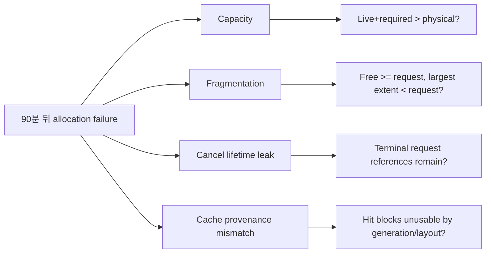
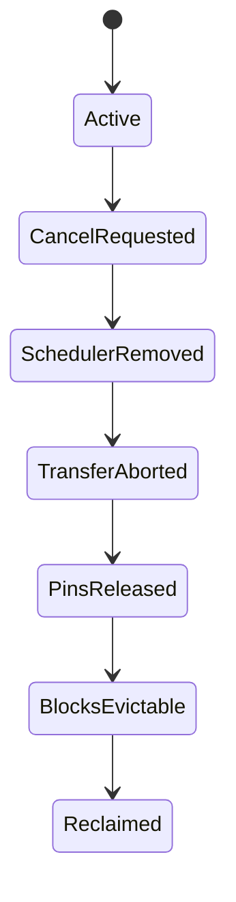
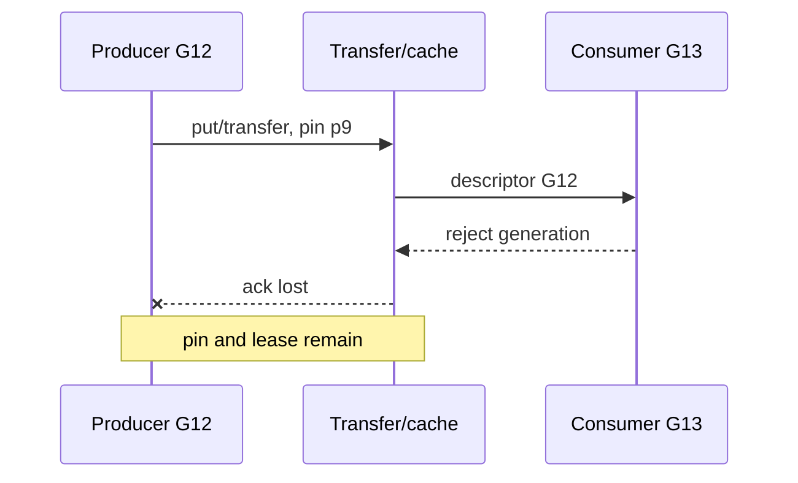
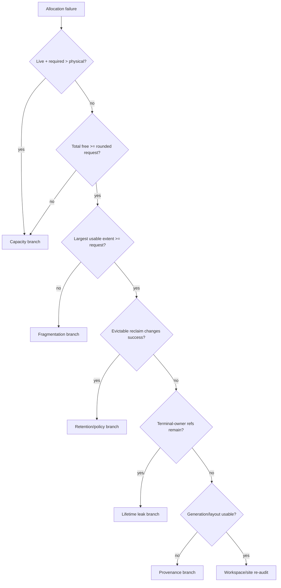

# 69장. OOM·fragmentation·cache 장애를 같은 말로 부르지 않는 법

같은 모델과 같은 동시성인데 process를 시작한 직후에는 정상이고 90분 뒤에만 allocation failure가 발생한다. KV usage는 82%, prefix hit rate는 높다. 취소가 많은 tenant를 빼면 재현이 사라진다. Process restart는 즉시 회복시키지만 cache reset은 일부만 회복시킨다. 운영자는 “KV cache를 줄이자”, “fragmentation이다”, “cancel leak이다”를 동시에 말한다. 세 문장은 모두 가능하지만 아직 어느 것도 결론이 아니다.

이 사건을 `M69`라 부른다. 이 장은 free bytes 하나를 보는 대신 어느 allocator·pool·cache owner가 어떤 extent와 lifetime의 요청을 처음 만족시키지 못했는지 찾는다. Capacity 부족, contiguous extent 부족, reclaim 가능한 retention, lifetime leak과 잘못된 provenance를 일곱 사건으로 분리한다.

첫 독서에서는 `M69`와 뒤의 generation 이름을 외우지 않는다. 69.1~69.3에서 “요청한 extent를 어느
owner가 왜 주지 못했는가”를 잡고, 69.4~69.9는 같은 질문을 cancel·prefix·P/D·hybrid state에 대입한
반례 모음으로 읽는다. 실제 장애를 조사할 때는 69.10의 reclaim 실험과 69.12의 soak로 바로 이동하고,
69.13의 source note와 제출 양식은 마지막에 참고한다. 이렇게 길을 나누면 명령문의 나열이 아니라
capacity·fragmentation·retention·leak·provenance라는 경쟁 가설이 어떤 관측에서 갈리는지가 먼저 보인다.

## 69.1 M69에서 “메모리가 부족하다”를 금지하기

### 69.1.1 최초 실패 전이

Allocation error 문자열은 결과다. 먼저 실패한 전이를 `REQUEST_EXTENT→ALLOCATED`, `CACHE_MATCH→USABLE_BLOCKS`, `CANCEL→REFERENCE_RELEASED`처럼 쓴다. M69에서는 어느 전이가 최초인지 아직 모른다. 큰 KV extent 요청이 실패했는지, 취소 request가 reference를 놓지 않았는지, external cache lease가 old generation을 붙잡았는지 경쟁시킨다.

### 69.1.2 다섯 분류

Capacity는 live와 필수 reserve가 physical budget을 실제로 넘는 경우다. Fragmentation은 총 free가 있어도 alignment를 만족하는 largest usable extent가 요청보다 작은 경우다. Retention은 evictable하지만 아직 정책상 남긴 memory다. Leak은 owner가 terminal인데 reference나 allocation이 회수되지 않는 lifetime 위반이다. Provenance mismatch는 hit나 free가 다른 generation·pool·layout에 속해 현재 요청이 사용할 수 없는 경우다.

### 69.1.3 M69의 첫 가설표



Restart 회복은 네 가설 모두와 양립한다. Cache reset의 부분 회복은 cache가 일부 pressure를 소유함을 말하지만 leak이나 private pool까지 닫지는 않는다.

M69의 첫 대응에서 운영자는 cache reset을 실행했다. KV usage는 82%에서 61%로 내려갔지만 25분 뒤 다시 실패했다. 이 결과를 “cache가 원인”이라 읽으면 너무 빠르다. Reset은 evictable block뿐 아니라 provenance index와 일부 reference graph도 건드릴 수 있고, 다른 private pool에는 손대지 않을 수 있다. 21%p 회복은 어느 pool에서 몇 bytes가 반환됐는지 없이는 분류 evidence가 아니다.

Process restart는 더 넓은 intervention이다. Allocator reserve, graph pool, runtime workspace, KV cache, connector session과 Python/C++ object lifetime을 한꺼번에 끝낸다. 즉 restart recovery는 hardware capacity가 충분하다는 약한 증거일 수 있지만 fragmentation과 leak, retention, stale generation을 구분하지 못한다. Incident 중 restart가 필요하다면 실행 전 ledger snapshot과 owner inventory를 남기고, 이후 제한된 재현 실험으로 원인을 분리한다.

취소 tenant를 제외했을 때 재현이 사라진 사실도 traffic volume 효과와 lifetime 효과로 나눈다. 그 tenant가 전체 token work의 35%였다면 단순 pressure 감소일 수 있다. 동일 admitted tokens와 prompt/output distribution을 유지하면서 cancel rate만 바꾸는 control이 필요하다. Cancel cohort당 terminal reference count와 locked bytes 기울기를 비교하면 lifetime 가설을 직접 검증할 수 있다.

첫 15분에는 원인명을 붙이지 않고 네 질문만 채운다. 실패 allocation site와 requested extent는 무엇인가, 그 pool의 실제 owner는 누구인가, 요청 직전 largest usable extent와 locked/evictable은 얼마인가, 어떤 request·generation이 reference를 보유하는가다. 이 네 값이 없으면 “OOM”은 investigation label일 뿐 diagnosis가 아니다.

M69 evidence packet은 67장의 timeline identity를 이어받는다. Allocation failure event에 process generation `P69b`, deployment `DG69`, request incarnation `m69-r882/a2`, pool `kv-full-0`, allocator generation을 붙인다. 같은 request 문자열이 재사용되거나 restart 전 object가 섞이는 것을 막는다. Metric anomaly와 object ledger가 다른 process generation이면 인과를 주장하지 않는다.

분류는 사건 종료 때까지 다중 상태로 둔다. 예를 들어 cancel leak이 locked blocks를 늘리고, 그 사이 free extent가 잘게 나뉘어 큰 workspace 요청이 실패할 수 있다. 최초 위반은 lifetime release이고 직접 실패 모양은 fragmentation일 수 있다. Root cause와 failure mechanism을 한 단어로 압축하지 않는다.

## 69.2 한 장의 memory ledger로 pool을 섞지 않기

### 69.2.1 물리 용량의 분해

```text
device physical
= model/static + runtime workspace + graph/private pools
+ active KV/state + evictable cached KV
+ allocator free/reserved residue + other-process ownership
```

서로 다른 계층의 free를 더하지 않는다. CUDA allocator reserved-free와 KV manager free blocks는 같은 bytes의 다른 view일 수 있다. External cache의 free는 GPU allocation 가능 bytes가 아닐 수 있다.

### 69.2.2 extent와 alignment

Ledger에는 requested bytes/tokens, alignment, pool, allocation site, owner와 generation을 넣는다. Live, reserved, allocator-free, evictable, locked와 largest usable extent를 같은 시각에 기록한다. Total free가 6GiB여도 2GiB 연속 extent가 없으면 2GiB 요청은 실패할 수 있다.

### 69.2.3 owner·lifetime·generation

```yaml
failure: {allocation_site: null, requested: null, alignment: null, pool: null, owner: null, generation: null}
ledger:
  physical: null
  live: {model: null, workspace: null, graph: null, kv: null}
  reserved: {}
  free: {}
  evictable: {}
  locked: {}
  largest_extent: null
```

Request가 terminal이면 그 request가 소유한 pin과 handle은 정해진 시간 안에 풀려야 한다. Generation이 바뀌면 old lease와 descriptor가 새 요청의 usable capacity로 세어져서는 안 된다.

Ledger snapshot은 가능한 한 같은 barrier 또는 짧은 bounded interval에서 수집한다. GPU physical free를 10:00:00에, KV free blocks를 10:00:20에 읽으면 사이에 batch가 끝나 두 값을 합친 그림이 실제 어느 순간에도 존재하지 않을 수 있다. 각 sample timestamp, collection duration과 in-flight allocation count를 남긴다.

Bytes 단위도 통일한다. GiB와 GB, logical token capacity와 physical bytes를 혼용하면 수% 오차가 생기고 큰 pool에서는 수 GiB 차이가 난다. KV token을 bytes로 바꿀 때 layer 수, KV head, head dimension, dtype bytes와 block rounding을 사용한다. Replication과 shard ownership을 반영하지 않은 global 계산을 rank-local physical과 비교하지 않는다.

Reserved의 의미는 owner마다 다르다. CUDA allocator reserved는 runtime이 driver에서 확보했지만 active tensor가 쓰지 않는 segment를 포함할 수 있다. Graph private pool은 replay pointer stability를 위해 일반 pool로 즉시 돌려줄 수 없을 수 있다. KV free blocks는 KV manager가 새 sequence에 할당할 수 있는 capacity지만 workspace 요청이 사용할 일반 allocator extent는 아닐 수 있다.

Evictable도 “즉시 free”와 같지 않다. Reference lock이 0이고 policy candidate여도 eviction callback, external writeback, asynchronous completion 또는 allocator release가 남을 수 있다. Ledger에는 evictable logical bytes와 reclaim 후 allocator-visible bytes를 나눈다. 둘의 차이가 오래 지속되면 cache와 allocator boundary를 조사한다.

Largest extent를 직접 제공하지 않는 allocator에서는 제한된 probe allocation 또는 segment map으로 추론할 수 있다. Probe는 production pressure를 바꾸므로 크기를 단계적으로 올리고 즉시 안전하게 회수한다. Probe 성공이 future allocation 보장은 아니며 concurrent request를 통제한 재현 환경에서 주로 사용한다. Runtime 실행이 허용되지 않은 이 원고에서는 필요한 측정 predicate만 정의한다.

소유권 graph에는 allocation만 아니라 reference edge를 기록한다. KV block은 active request, prefix node, transfer pin과 cache lease가 동시에 참조할 수 있다. 한 edge라도 남으면 free candidate가 아니다. Reference count 총합만 보고 어느 owner가 남았는지 모르면 cancel path를 고칠 수 없으므로 bounded owner class와 generation별 count를 둔다.

## 69.3 canonical branch 1 — cold capacity OOM

### 69.3.1 상황과 직관의 함정

80GiB GPU에서 weight 46GiB, graph/private pool 8GiB, workspace peak 5GiB, KV target 24GiB를 동시에 요구하면 합은 83GiB다. “KV가 30%뿐”이라는 비율은 다른 pool을 숨긴다. 다른 process가 3GiB를 점유한다면 실패는 fragmentation을 논하기 전 capacity 산술로 설명된다.

### 69.3.2 숫자 ledger와 반증

이 표의 비교 축은 “80GiB 중 몇 퍼센트를 썼는가”가 아니라 같은 peak interval에 동시에 살아 있는
owner별 bytes다. 대표 행은 requested KV target 24GiB다. 이 값을 단독으로 줄이기 전에 model/static,
graph/private, workspace와 다른 process가 실제로 같은 시간에 겹치는지 확인해야 capacity 가설과
fragmentation 가설이 갈린다. 전자가 맞으면 live+required 합이 이미 physical을 넘고, 후자가 맞으면
합에는 여유가 있어도 요청보다 큰 usable extent가 없다.

| 항목 | GiB |
|---|---:|
| physical | 80 |
| other process | 3 |
| model/static | 46 |
| graph/private | 8 |
| workspace peak | 5 |
| requested KV target | 24 |
| 합계 | 86 |

Graph를 끄고 8GiB가 실제로 반환되어 cold start가 성공하면 graph/private capacity 가설이 강해진다. Largest extent가 충분한데 live+required가 physical을 넘으면 fragmentation 가설은 반증된다.

### 69.3.3 rollback과 terminal

KV target, graph capture shape, workspace 경로 또는 다른 process 가운데 owner가 명확한 항을 조정한다. 무조건 KV를 줄이지 않는다. Rollback 뒤 동일 model load와 capture를 반복하고 peak 이후 stable reserve, usable KV blocks와 first request 성공을 확인한다.

Cold start 계산에서 46+8+5+24+3=86GiB는 peak가 모두 동시에 겹친다는 보수적 가정이다. Model load workspace가 capture 전에 해제된다면 5GiB를 중복 peak로 세면 과대평가다. 반대로 capture 중 model static과 KV reservation이 이미 존재한다면 겹친다. Timeline에 각 pool의 allocate/free interval을 그려 실제 peak 동시성을 계산한다.

예를 들어 model load 임시 workspace 5GiB가 t=40s에 해제되고 graph capture 8GiB가 t=50s에 시작한다면 steady requirement는 other 3+model 46+graph 8+KV 24=81GiB다. 여전히 80GiB를 넘지만 86GiB보다 원인이 명확하다. KV target을 22GiB로 줄이면 79GiB가 되어 1GiB headroom만 남는다. Driver·library overhead와 transient request workspace가 1GiB를 넘을 수 있으므로 단순 합계 equality를 안전으로 보지 않는다.

경쟁 가설 표에는 expected observation을 쓴다. Static capacity라면 첫 동일 bootstrap에서 재현되고 workload duration과 무관하다. Fragmentation이라면 fresh process의 큰 contiguous extent 상태에 따라 달라질 수 있으나 cold start에서는 이전 request churn이 없다. 다른 process 점유라면 해당 PID/namespace를 제거했을 때 동일 config가 성공한다. Graph capture라면 capture-disabled 경로가 성공하고 graph pool allocation 시점과 failure가 맞는다.

| 가설 | 기대 관측 | 반증 |
|---|---|---|
| static capacity | live+required가 physical 초과 | peak interval 합이 충분한 headroom |
| graph/private pool | capture 시점에 실패 | graph off에서도 동일 site 실패 |
| other process | 외부 3GiB 제거 시 성공 | 외부 점유 0에서도 동일 |
| fragmentation | total free≥request, extent 부족 | fresh largest extent≥request |

Allocation site도 중요하다. KV initialization에서 실패했는지 graph capture workspace에서 실패했는지에 따라 줄여야 할 owner가 다르다. Error가 최종 allocator에서 동일하게 보이더라도 호출 stack과 requested bytes를 packet에 보존한다. “CUDA OOM” 문자열만 남으면 첫 실패 site를 잃는다.

Rollback은 서비스 목표와 맞춘다. Graph를 꺼 성능 경로가 달라지는 경우 correctness와 latency canary를 다시 한다. KV target을 줄이면 concurrency와 preemption tail이 바뀐다. 다른 process를 제거한다면 scheduling isolation을 고쳐 재발을 막는다. Bootstrap 성공 하나가 terminal이 아니라 목표 workload의 first batch와 steady headroom까지 확인한다.

## 69.4 canonical branch 2 — fragmentation과 largest extent 실패

### 69.4.1 total free와 largest extent

Allocator가 8GiB free를 보고해도 extent가 `1.5+1.0+1.5+1.0+1.0+2.0GiB`로 흩어져 있고 요청이 alignment 포함 2.5GiB라면 실패한다. Capacity는 남았지만 contiguous allocability가 없다. 단, allocator가 virtual remapping이나 segmented allocation을 지원한다면 이 단순 모델을 그대로 적용하지 않는다.

### 69.4.2 계산과 경쟁 가설

| 관측 | 값 | 해석 |
|---|---:|---|
| requested extent | 2.5GiB | alignment 반영 필요 |
| total allocator free | 8GiB | capacity만 보면 충분 |
| largest usable extent | 2.0GiB | 요청보다 작음 |
| evictable KV | 3GiB | 회수 뒤 배치가 중요 |
| locked KV | 6GiB | 즉시 회수 불가 |

작은 1GiB allocation 두 개가 성공하고 2.5GiB만 실패하면 extent 가설이 강해진다. Eviction 뒤 largest extent가 4GiB가 되고 restart 없이 성공하면 lifetime leak 가설은 약해진다.

### 69.4.3 reclaim의 위험

Cache를 많이 지우는 것과 큰 extent를 만드는 것은 같지 않다. 어떤 pool에서 어떤 순서로 free되는지 관찰한다. Active transfer나 graph pointer가 남은 block을 강제 회수하지 않는다. Reclaim terminal은 total free 증가가 아니라 요청 alignment를 만족하는 extent와 owner reference 0이다.

Fragmentation 사건에서 `reserved=20GiB, allocated=12GiB`라는 차이 8GiB를 free라고 부르면 안 된다. Reserved segment 안의 inactive block이 allocator request shape와 alignment를 만족해야 재사용 가능하다. 일부 segment가 graph-private이거나 다른 stream lifetime에 묶이면 일반 request에 보이지 않는다. Pool별 segment map을 분리한다.

Alignment가 요청을 키우는 계산도 기록한다. Payload가 2.30GiB이고 256MiB 단위 extent를 요구하면 ceil(2.30/0.25)×0.25=2.50GiB가 필요하다. Largest raw hole이 2.40GiB여도 실패한다. Ledger의 `requested`에는 logical payload와 rounded extent를 둘 다 둔다. Error message가 logical bytes만 보여 주면 allocator rounding source를 확인한다.

Free extent가 여섯 조각일 때 eviction 순서가 결과를 바꾼다. 서로 인접한 1.0GiB와 1.5GiB allocation을 함께 회수하면 2.5GiB extent가 생길 수 있지만 멀리 떨어진 3GiB를 지워도 largest는 2GiB로 남을 수 있다. LRU eviction은 reuse 가치에는 합리적이어도 extent coalescing 목표와 일치하지 않을 수 있다. 그래서 evicted total보다 post-reclaim largest extent를 본다.

| 실험 | total free | largest extent | 2.5GiB 요청 |
|---|---:|---:|---|
| reclaim 전 | 8.0GiB | 2.0GiB | 실패 |
| 비인접 3GiB eviction | 11.0GiB | 2.0GiB | 실패 |
| 인접 owner drain | 10.5GiB | 4.0GiB | 성공 |
| fresh restart | 13.0GiB | 9.0GiB | 성공 |

이 결과는 contiguous allocator 모델에서 fragmentation을 지지한다. 그러나 paging, virtual remap이나 여러 segment를 묶는 allocator라면 physical contiguous extent가 predicate가 아닐 수 있다. Allocation site가 요구하는 실제 contiguity와 alignment를 source에서 확인한 뒤 표를 해석한다.

작은 allocation 성공 실험도 concurrent state를 통제한다. 1GiB 두 개를 먼저 할당하면 이후 extent를 더 쪼개 큰 요청 실패를 강화할 수 있다. 별 snapshot 또는 fresh generation에서 probe 크기를 독립 실행한다. Probe가 free될 때 allocator cache에 남는 방식도 기록한다.

Reclaim 이후 allocation 성공만으로 영구 수정이 되지 않는다. Workload가 다시 같은 allocation/free 크기 패턴을 만들면 extent distribution이 재악화할 수 있다. Soak 중 total free와 largest extent의 비율, failed requested-size histogram과 segment age를 본다. Largest extent가 시간에 따라 계속 감소하면 allocator policy 또는 workload shaping 개선이 필요하다.

## 69.5 canonical branch 3 — lifetime leak와 cancel residue

### 69.5.1 90분의 기울기

M69은 5분마다 terminal request 수, active KV, evictable, locked, allocator reserved와 owner 없는 object를 기록한다. QPS가 일정한데 locked bytes가 분당 64MiB씩 늘면 90분에 5.625GiB다. Restart 회복과 cancel-heavy tenant 상관은 lifetime leak 가설을 강화하지만 인과를 증명하지 않는다.

### 69.5.2 cancel 전이 감사



어느 단계가 생략됐는지 request incarnation으로 추적한다. Scheduler에서 사라졌다는 사실은 connector handle, cache pin과 block reference가 모두 풀렸다는 뜻이 아니다.

### 69.5.3 falsifier와 soak

Cancel 비율을 높이되 admitted tokens와 output distribution을 맞춘 실험을 한다. Terminal request당 locked delta가 0으로 수렴하면 leak 가설이 약해진다. Cancel path에서만 reference age가 soak window를 넘어 증가하고 cache reset으로 풀리지 않으면 lifetime owner를 찾는다. 수정 뒤 restart 없이 같은 90분 이상 기울기 gate를 통과해야 한다.

90분 기울기를 분석할 때 process RSS나 GPU allocated bytes만 보지 않는다. Active workload가 달라지면 정상 live bytes도 움직인다. Terminal request cohort를 기준으로 `bytes still referenced 1m/5m/15m after terminal`을 측정한다. 정상 cleanup이 비동기라면 짧은 지연은 허용되지만 oldest age와 population은 일정 범위에 수렴해야 한다.

Cancel path의 branch는 client disconnect, explicit cancel, deadline, scheduler retract와 worker failure를 구분한다. 모두 최종 request status가 cancelled로 보일 수 있지만 cleanup 호출 경로가 다르다. M69이 특정 tenant의 client disconnect에서만 재현된다면 explicit cancel test로 일반화하지 않는다. 각 branch에 동일 owner release invariant가 있는지 source에서 확인한다.

수치 예로 10분마다 cancel 600건, 건당 평균 locked residue 6MiB가 남고 그중 85%가 뒤늦게 회수된다고 하자. 순잔류는 600×6×0.15=540MiB/10분, 즉 90분에 4.75GiB다. 관측 slope 5.6GiB와 근접하지만 이것만으로 leak을 확정하지 않는다. Request별 reference sample로 15% 잔류와 bytes를 검증하고 다른 pool 증가를 뺀다.

| 항목 | 정상 cohort | cancel cohort |
|---|---:|---:|
| terminal requests/10m | 600 | 600 |
| 5m 뒤 live refs | 3 | 91 |
| locked bytes slope | +8MiB/10m | +540MiB/10m |
| cache reset 회수 | 대부분 | 42% |
| restart 회수 | 전부 | 전부 |

이 표에서 cache reset이 42%만 회수한다면 나머지는 active pin, connector handle 또는 allocator/private object일 수 있다. Cache 구현을 곧바로 leak owner로 정하지 않는다. Terminal request→pin→handle→block edge를 따라 first unreleased reference를 찾는다.

Falsifier는 cancel rate를 높여도 generation별 terminal residue slope가 baseline과 같거나, slope가 request 수가 아니라 graph shape 전환과 연동되는 경우다. Tenant 제거 효과가 단순 workload 감소라면 admitted token을 맞춘 control에서 다시 발생한다. 이 실험들이 lifetime leak과 capacity pressure를 가른다.

Fix가 release callback 추가라면 double release와 late completion도 시험한다. Cancel이 pin을 풀고 늦은 transfer completion이 다시 decrement하면 refcount underflow 또는 다른 owner block 회수가 생길 수 있다. Idempotent terminal transition과 generation check를 확인한다. Soak는 memory slope 0뿐 아니라 correctness, cache hit와 tail regression을 함께 본다.

## 69.6 사건 4 — KV usage는 낮지만 preemption이 폭증한다

### 69.6.1 평균 usage의 함정

Full KV pool usage 55%만 보고 여유롭다고 판단했지만 SWA pool은 96%, Mamba state pool은 91%일 수 있다. 현재 request shape가 SWA와 state를 함께 요구하면 full pool의 free blocks는 사용할 수 없다. 전체 평균은 unschedulable shape를 숨긴다.

### 69.6.2 vLLM pressure 신호 읽기

vLLM v0.27.1의 [`SchedulerStats` KV usage·prefix·eviction fields](https://github.com/vllm-project/vllm/blob/6e448d0ea9bf3d88d898b65449ca6dc2aec170ac/vllm/v1/metrics/stats.py#L191-L205)와 [preemption 누적 경로](https://github.com/vllm-project/vllm/blob/6e448d0ea9bf3d88d898b65449ca6dc2aec170ac/vllm/v1/metrics/stats.py#L440-L454)는 pressure 결과를 보여 준다. Preemption 증가는 allocator 원인을 자동 증명하지 않는다.

[`kv_cache_usage_perc`](https://github.com/vllm-project/vllm/blob/6e448d0ea9bf3d88d898b65449ca6dc2aec170ac/vllm/v1/metrics/loggers.py#L561-L568)와 [preemption counter](https://github.com/vllm-project/vllm/blob/6e448d0ea9bf3d88d898b65449ca6dc2aec170ac/vllm/v1/metrics/loggers.py#L661-L667)의 producer와 aggregation 범위를 확인한다.

### 69.6.3 shape ledger

요청은 full 4 blocks, SWA 12 blocks, state 1 slot이 필요한데 available이 각각 100, 8, 3이라면 total blocks가 많아도 admission 불가다. Request shape를 줄였을 때 retraction이 사라지고 full pool usage가 그대로면 global capacity 가설은 반증된다.

vLLM source의 `SchedulerStats`는 scheduler가 계산한 KV usage와 prefix·eviction 관련 통계를 전달하는 data object다. 이 field를 읽을 때 metric 값이 CUDA allocator physical free를 직접 읽은 것인지 KV block manager 상태인지 구분한다. `kv_cache_usage_perc` logger는 그 producer 값을 metric으로 내보내므로 이름에 GPU가 없다고 전체 device pressure로 확대하지 않는다.

Preemption 누적은 scheduler가 work를 뒤로 물린 결과다. Allocation 실패가 직접 원인일 수 있지만 token budget, scheduling policy 또는 unschedulable shape도 같은 결과를 낼 수 있다. Preemption spike 시점에 requested block shape, pool별 available/locked와 allocation outcome을 join한다. Counter 증가만 보고 cache size부터 바꾸면 다른 pool 병목을 숨긴다.

SGLang의 pool accounting invariant는 available, evictable, used가 어느 pool 기준인지 확인하게 한다. Full KV, SWA와 Mamba state gauge가 각각 있다면 합산 비율보다 request가 동시에 요구하는 vector를 만든다. 예를 들어 physical token capacity처럼 단일 축으로 정규화해도 state slot은 KV block으로 대체할 수 없으므로 admission predicate를 보존한다.

수치 ledger를 확장해 보자.

| pool | request 필요 | available | evictable | locked | 판정 |
|---|---:|---:|---:|---:|---|
| full KV | 4 blocks | 100 | 20 | 80 | 충족 |
| SWA | 12 blocks | 8 | 40 | 152 | 즉시 불충족 |
| Mamba state | 1 slot | 3 | 0 | 61 | 충족 |

전체 available은 111 units지만 units 자체가 교환 가능하지 않다. SWA에서 4 blocks가 모자라 request는 unschedulable하다. Evictable 40이 있어도 lock transition과 eviction latency가 deadline 안에 수행되는지 봐야 한다. `available+evictable`을 즉시 capacity로 더하지 않는다.

Failure injection은 SWA 요구가 작은 request와 큰 request를 동일 total tokens로 섞는다. 큰 shape에서만 retraction이 발생하고 full pool usage는 동일하면 global KV percentage 가설이 반증된다. SWA eviction을 수행해 available이 12 이상이 된 뒤 restart 없이 admission이 회복되면 pool-specific reclaim 가설이 강해진다.

Retracted request metric은 결과 population을 보여 준다. 동일 request가 여러 번 retract되면 counter가 unique request 수인지 event 수인지 producer에서 확인한다. Event 수를 request 비율로 오인하면 압력 규모를 과대평가할 수 있다. Request incarnation별 retract count와 queue age를 sampled ledger에서 보완한다.

Fix는 pool ratio를 무조건 늘리는 것이 아니다. Full pool에서 memory를 빼 SWA에 주면 다른 workload가 악화될 수 있다. Workload shape distribution과 per-pool blocking probability를 측정해 sizing하거나 admission을 shape-aware하게 만든다. Terminal은 낮은 평균 usage가 아니라 target workload의 request vector가 bounded wait 안에 충족되고 retraction tail이 baseline 안인 상태다.

Metric producer의 aggregation interval도 pressure timeline과 맞춘다. Scheduler iteration마다 stats가 만들어지고 logger가 더 느린 interval로 export한다면 짧은 pool exhaustion과 retraction burst가 평균 usage에 희석될 수 있다. “Usage 55%인데 retract”라는 모순은 실제로 peak와 average 시각 불일치일 수 있다. Sample timestamp와 max/instant semantics를 확인한다.

vLLM의 eviction event 관측도 scheduler stats와 같은 request generation으로 join할 수 있는지 본다. Event가 cache block ID를 담지 않거나 aggregate count만 제공하면 exact allocation lifecycle을 복원할 수 없다. 그 경우 sampled block ledger나 debug event를 bounded window에 추가한다. Metric이 제공하지 않는 identity를 상상으로 채우지 않는다.

SGLang의 [KV/SWA/Mamba evictable gauges](https://github.com/sgl-project/sglang/blob/71de97b264b04dcd514cf904003028aefe9775c8/python/sglang/srt/observability/metrics_collector.py#L340-L392)는 각 pool의 reclaimable view를 비교하게 한다. 그러나 gauge update 코드가 읽은 source object와 lock mutation 사이 race가 있을 수 있으므로 exact invariant가 필요한 incident에서는 scheduler-local snapshot과 대조한다. Gauge는 population 신호이고 allocator transaction log가 아니다.

[Retracted request metrics](https://github.com/sgl-project/sglang/blob/71de97b264b04dcd514cf904003028aefe9775c8/python/sglang/srt/observability/metrics_collector.py#L456-L475)는 scheduling consequence를 보여 준다. Retraction이 발생한 request의 필요 pool vector가 없으면 원인 분류는 못 한다. Sampled request ledger에 full/SWA/state need, available at decision과 chosen reclaim action을 붙인다.

Pressure 사건의 first divergence는 metric spike보다 scheduler allocation predicate가 false가 된 순간이다. `full available=100`이라는 aggregate와 `SWA need12, available8`을 함께 저장한다. 다음 retraction event는 결과다. Reclaim 후 `available12`가 되었는데도 predicate가 false면 locked, alignment 또는 다른 state pool을 다시 본다.

Failure injection에서 metric scrape interval보다 짧은 2초 SWA exhaustion을 만든다. Request retraction은 증가하지만 usage gauge가 peak를 놓치는지 확인한다. Peak를 못 본다고 metric이 틀렸다고 단정하지 않고 contract의 sampling 해상도 한계로 기록한다. 운영 경보가 이 burst를 잡아야 한다면 max-over-window 또는 event counter를 설계하되 cardinality budget을 지킨다.

Fix 뒤에는 retraction counter가 줄었다는 것만 보지 않는다. Request가 무한 대기하거나 admission에서 먼저 거부되어 counter가 줄 수도 있다. Accepted rate, queue age, pool allocation success와 terminal output을 함께 본다. Pressure를 다른 stage로 옮긴 것을 recovery로 부르지 않는다.

## 69.7 사건 5 — prefix hit가 높은데 TTFT가 나빠진다

### 69.7.1 hit와 usable capacity

Prefix hit는 key가 발견됐다는 사실일 수 있지만 현재 generation과 layout에서 즉시 사용할 수 있는 block 수와 같지 않다. Hit block이 locked, remote-only, 부분 prefix이거나 promotion을 기다리면 TTFT는 악화될 수 있다.

### 69.7.2 hit·eviction source walk

vLLM의 [prefix query/hit counters](https://github.com/vllm-project/vllm/blob/6e448d0ea9bf3d88d898b65449ca6dc2aec170ac/vllm/v1/metrics/loggers.py#L584-L629)는 counter producer와 aggregation 범위를 읽어야 한다. [KV eviction event 관측](https://github.com/vllm-project/vllm/blob/6e448d0ea9bf3d88d898b65449ca6dc2aec170ac/vllm/v1/metrics/loggers.py#L1154-L1168)은 eviction decision의 완전한 allocator trace가 아니다.

### 69.7.3 provenance와 churn 계산

1,000 query 중 hit 900이어도 usable local hit가 400, remote promotion 300, stale generation reject 200이면 단순 hit rate 90%가 TTFT 절약을 뜻하지 않는다. 같은 block이 짧은 시간에 promotion과 eviction을 반복하는 churn을 owner·generation으로 센다.

Prefix counter source walk에서는 query와 hit의 increment 위치를 본다. Full prefix만 hit로 세는지 token/block 단위 hit인지, 요청 한 건이 여러 query를 만드는지 알아야 90%의 분모를 해석할 수 있다. Counter reset과 process generation도 67장의 방식으로 처리한다. Hit ratio만 dashboard에서 읽고 usable token 절약량으로 바꾸지 않는다.

R69-5에서는 1,000 query, 900 hit라는 표면 아래를 다음처럼 나눈다.

| provenance 결과 | queries | 즉시 절약 token | 추가 비용 |
|---|---:|---:|---|
| usable local | 400 | 높음 | lookup |
| remote-only | 300 | 전송 뒤 가능 | promotion/transfer |
| stale generation reject | 120 | 0 | lookup+reject+recompute |
| partial/misaligned | 80 | 일부 | boundary recompute |
| miss | 100 | 0 | full prefill |

단순 hit는 900이지만 현재 generation의 즉시 usable local은 400이다. Remote promotion 300건이 fabric과 destination blocks를 압박하면 hit가 높을수록 오히려 transfer queue가 늘 수 있다. 이는 cache가 해롭다는 일반 결론이 아니라 현재 workload와 tier policy에서 hit의 비용 경로가 달라졌다는 뜻이다.

Eviction event metric은 cache가 무엇인가를 내보낸 결과이지 모든 block lifecycle trace가 아니다. 한 event가 몇 block/bytes인지, locked candidate는 event 전에 제외되는지, eviction 뒤 allocator-visible free가 언제 늘어나는지 source와 sampled ledger로 보완한다. Event count만으로 churn bytes를 계산하지 않는다.

Churn은 동일 provenance key/generation이 짧은 window에 promote→evict→promote되는 횟수로 정의한다. 예를 들어 4GiB prefix가 10분에 12회 왕복하면 48GiB transfer와 반복 allocation이 생긴다. Hit counter는 매번 증가할 수 있지만 TTFT와 extent distribution은 악화된다. Key 원문은 privacy 때문에 저장하지 않고 bounded pseudonymous cache identity를 쓴다.

Competing hypothesis는 prefix lookup 자체 CPU overhead, remote transfer, unusable hit recompute, eviction fragmentation과 unrelated P queue다. Local usable hit cohort와 remote/stale cohort의 TTFT breakdown을 비교한다. Transfer bytes와 promotion wait가 baseline인데 TTFT가 나쁘면 remote 가설은 약하다. Hit를 끄자 P queue가 더 악화되면 cache 전체 비활성화는 rollback이 아니다.

Reclaim은 stale generation entry와 churn-heavy remote promotion을 제한하는 식으로 범위를 좁힌다. Active shared prefix를 무조건 purge하면 compute pressure가 커질 수 있다. Terminal은 hit rate 회복이 아니라 usable-hit 비율, promotion queue, eviction bytes, largest extent와 TTFT tail이 함께 안정되는 상태다.

Prefix provenance key에는 model revision, tokenizer/template 영향이 반영된 token sequence, adapter, KV layout/dtype, layer topology와 cache protocol generation 가운데 reuse correctness에 필요한 축이 포함되어야 한다. 이 장은 key 설계를 반복하지 않지만 hit를 usable로 승격할 때 동일성 predicate를 확인한다. Key collision이나 빠진 generation은 memory보다 오답 사건으로 이어질 수 있으므로 fail closed한다.

Partial prefix는 절약 token 수로 평가한다. 8,192-token prompt에서 512-token prefix hit는 query hit 한 건이지만 6.25%만 재사용한다. 7,680-token remote hit는 전송 비용이 있어도 compute를 크게 줄일 수 있다. Query hit rate 대신 reusable tokens, local usable tokens, promotion bytes와 recomputed tokens를 함께 보면 TTFT 인과가 선명해진다.

수치 예로 1,000 request의 평균 prompt가 8,000 tokens라고 하자. Local usable 400건이 평균 6,000 tokens, remote 300건이 7,000, stale/partial 200건이 500, miss 100건이 0을 제공한다면 raw matched tokens는 4.6M이지만 즉시 local usable은 2.4M이다. Remote 2.1M token KV 전송 wait와 stale recompute를 무시한 90% hit는 비용 모델을 왜곡한다.

Cache churn 계산에는 unique key 수와 bytes를 함께 둔다. 같은 100개 large prefix가 12회 왕복한 경우 event 1,200건과 48GiB traffic일 수 있다. 작은 prefix 1,200개 eviction과 event 수는 같아도 memory와 transfer 영향이 다르다. Eviction metric producer가 bytes를 제공하지 않으면 block size와 event payload를 근거로 계산하되 uncertainty를 남긴다.

TTFT breakdown에서는 lookup, provenance validation, local attach, remote fetch, destination allocation, recompute queue를 분리한다. 모든 span이 없다면 structured state event와 local monotonic duration을 사용한다. Cross-host promotion은 67장의 clock uncertainty 원칙을 따른다. Wall timestamp 차이로 음수 transfer를 만들지 않는다.

Failure injection은 G12 stale entry를 일부러 G13 query에 노출한다. 기대 결과는 hit counter 정의에 따라 query match로 셀 수 있어도 usable attach 전에 reject되고 correctness가 보존되는 것이다. 운영 metric은 raw hit와 usable/rejected를 구분해야 원인을 찾을 수 있다. Reject가 없이 attach되면 latency 사건이 아니라 correctness severity로 승격한다.

또한 promotion bandwidth를 제한해 high-hit workload에서 TTFT가 어떻게 변하는지 본다. Local usable cohort는 안정적이고 remote cohort만 악화되면 transfer hypothesis가 강하다. 전체 P queue가 함께 악화되면 promotion이 shared resource를 잠식하는지 조사한다. Hit를 완전히 끄는 실험은 compute load를 크게 바꾸므로 좁은 falsifier가 아니다.

Recovery terminal은 raw hit 목표가 아니다. Usable token ratio, rejected provenance, remote promotion oldest age, eviction/promotion bytes, allocator extent와 TTFT tail이 workload-normalized bound 안이다. Cache가 덜 hit하더라도 전체 service가 더 안정적일 수 있고, 반대로 hit가 높아도 provenance와 churn이 나쁘면 미완료다.

## 69.8 사건 6 — P/D·외부 cache 뒤에만 memory가 증가한다

### 69.8.1 producer와 consumer의 서로 다른 완료

P가 transfer submit을 끝낸 것, D가 KV를 commit한 것, external cache가 object lease를 인수한 것은 별 사건이다. Producer가 성공으로 끝났지만 consumer acknowledgement가 유실되면 양쪽이 pin을 유지할 수 있다.

### 69.8.2 generation과 lease ledger



Request terminal, producer pin, transfer handle, object lease, consumer reference와 expiry를 한 행에 둔다. Cache free bytes와 GPU usable bytes를 합산하지 않는다.

### 69.8.3 reclaim과 rollback

Old generation 신규 admission을 fence하고 in-flight outcome을 판정한 뒤 lease와 pin을 회수한다. External cache를 끄고 증가가 멈춰도 이미 남은 producer reference가 줄지 않으면 단일 원인이 아니다. Rollback terminal은 old descriptor 거부와 owner 없는 lease 0이다.

P/D와 external cache를 켠 뒤 memory가 늘면 각 side가 자신의 완료를 어떻게 정의하는지 표로 만든다. Producer `submit accepted`, transport `completion`, store `lease created`, consumer `KV committed`, scheduler `request terminal`은 서로 다른 predicate다. 한 단계 timeout이 위아래 owner에게 어떻게 전달되는지 확인한다.

M69-6의 수치 예는 다음과 같다. 매분 240 handoff, 평균 32MiB, acknowledgement loss 0.5%, lost case당 producer pin과 external lease가 각각 남는다고 하자. 분당 1.2건×32MiB=38.4MiB, 90분이면 약 3.375GiB가 각 owner view에 남을 수 있다. 같은 payload를 producer와 store가 모두 count하면 physical 중복인지 같은 remote object의 두 논리 reference인지 구분한다.

| owner | live | terminal 뒤 잔류 | oldest | generation |
|---|---:|---:|---:|---|
| producer pins | 7.5GiB | 3.4GiB | 88m | G12 |
| transfer handles | 0.3GiB | 144 objects | 87m | G12 |
| external leases | 3.4GiB logical | 108 leases | 89m | G12 |
| consumer blocks | 11GiB | 0.2GiB | 4m | G13 |

G12 producer가 G13 consumer로 descriptor를 보냈고 reject acknowledgement가 사라졌다면 provenance와 lifetime 문제가 결합한다. Consumer가 실제 bytes를 쓰지 않았으므로 D capacity보다 producer pins와 lease가 first divergence다. External cache hit/free metric만 보면 G12 object가 usable하다고 잘못 셀 수 있다.

Failure injection은 generation mismatch, acknowledgement loss와 consumer crash를 각각 독립시킨다. Mismatch가 정상 전달되면 producer pin이 풀려야 한다. Ack만 잃으면 outcome lookup이나 lease expiry가 bounded recovery를 제공해야 한다. Consumer crash에서 lease가 계속 유효하다면 owner transfer 정책을 확인한다. 세 fault를 동시에 주입하면 어느 branch가 실패했는지 알기 어렵다.

Cache disable 실험도 신규 admission만 끄고 old in-flight와 lease를 관찰한다. 증가가 즉시 멈추지만 old G12 residue가 남으면 ongoing source는 차단됐으나 회수는 미완료다. Process restart 없이 generation fence, handle terminal 판정, lease revoke와 unpin 순서로 닫을 수 있어야 한다.

Late completion은 회수 안전성의 반증이다. G12 pin을 강제 해제하고 같은 memory를 G14 request에 재사용한 뒤 old completion이 도착하면 generation mismatch로 거부되어야 한다. 주소만 같다고 성공 처리하면 corruption 위험이다. Reclaim은 bytes 회복과 stale operation fencing을 함께 terminal로 가져가야 한다.

## 69.9 사건 7 — SWA·Mamba 혼합 모델에서만 drift한다

### 69.9.1 세 pool의 불변식

SGLang v0.5.18의 [`SchedulerStats` pool accounting invariant](https://github.com/sgl-project/sglang/blob/71de97b264b04dcd514cf904003028aefe9775c8/python/sglang/srt/observability/metrics_collector.py#L74-L105)은 available, evictable, used를 pool별로 읽는 근거다. Full KV, SWA와 Mamba state를 자동 합산하지 않는다.

### 69.9.2 eviction과 tombstone

[`SWARadixCache.evict`](https://github.com/sgl-project/sglang/blob/71de97b264b04dcd514cf904003028aefe9775c8/python/sglang/srt/mem_cache/swa_radix_cache.py#L593-L697)를 따라 full/SWA LRU, lock reference와 tombstone transition을 본다. [Available/evictable 진단](https://github.com/sgl-project/sglang/blob/71de97b264b04dcd514cf904003028aefe9775c8/python/sglang/srt/mem_cache/swa_radix_cache.py#L852-L895)은 진단 문자열의 값이 어느 invariant에서 나오는지 확인한다.

### 69.9.3 수치 drift 반증

Full used는 40→40GiB, SWA used는 8→11GiB, state는 2→4GiB, evictable은 3GiB인데 locked tombstone이 0→2GiB라면 full KV leak 가설은 약하다. Mixed request를 제거했을 때 drift가 멈추고 reference audit가 SWA tombstone을 가리키면 owner가 좁혀진다.

SWA mixed model 사건은 한 pool의 숫자를 다른 pool 단위로 환산하면서 자주 왜곡된다. Full KV block은 전체 attention layer에 대한 storage일 수 있고 SWA block은 windowed layer subset, Mamba state slot은 recurrent state를 담는다. Logical token 하나당 bytes가 서로 다르고 allocation granularity도 다르므로 `used percentage` 평균은 물리와 schedulability 모두를 잃는다.

SGLang `SchedulerStats`의 invariant를 읽을 때 field naming만 가져오지 않는다. Available, evictable, used가 어떤 underlying pool object에서 계산되고 언제 snapshot되는지 본다. Full/SWA/state collector update가 같은 scheduler iteration인지도 확인한다. 서로 다른 시점이면 합이 순간 invariant를 만족하지 않을 수 있다. Incident ledger에는 collection iteration 또는 timestamp를 둔다.

Evictable gauge는 eviction 성공 bytes가 아니다. LRU candidate가 reference lock 때문에 건너뛰어질 수 있고 tombstone node가 tree에는 남되 payload는 일부 해제됐을 수 있다. `SWARadixCache.evict` source walk에서는 candidate 선택, full/SWA 양쪽 처리, lock predicate, tombstone mutation과 반환 값이 무엇을 세는지 따라간다. 진단 문자열은 이 internal state의 한 view이지 independent truth가 아니다.

수치 drift를 더 세분한다.

| 시각 | full used | SWA used | state used | evictable | locked tombstone | mixed active |
|---|---:|---:|---:|---:|---:|---:|
| 0m | 40GiB | 8GiB | 2GiB | 3GiB | 0 | 12 |
| 30m | 40GiB | 9GiB | 2.7GiB | 3.1GiB | 0.7GiB | 13 |
| 60m | 40GiB | 10GiB | 3.4GiB | 3.0GiB | 1.4GiB | 11 |
| 90m | 40GiB | 11GiB | 4GiB | 3GiB | 2GiB | 12 |

Active mixed request가 안정적인데 SWA/state와 locked tombstone이 선형 증가한다. Full pool은 평평하므로 global request volume이나 full KV leak은 약하다. 그러나 tombstone이 원인인지 결과인지 아직 모른다. Reference가 해제되지 않아 tombstone이 reclaim되지 않는지, tombstone transition 자체가 reference를 남기는지 source event를 따라간다.

Request lifecycle sample에는 full node ref, SWA node ref, state slot owner를 같이 둔다. 정상 finish, prefix cache retention, cancel, retract마다 어떤 ref가 감소하는지 비교한다. Full ref는 0인데 SWA ref만 1로 남는 cancel cohort가 있다면 branch-specific invariant 위반이다. State slot도 같은 request incarnation에 남으면 shared cleanup callback 문제일 수 있다.

Eviction failure injection은 unlocked leaf, locked leaf, mixed full/SWA node와 tombstone을 각각 만든다. 기대 결과는 unlocked payload만 회수되고 locked owner는 보존되며 반환 count가 실제 회수와 일치하는 것이다. Tombstone이 다시 candidate queue에 무한히 들어가 event churn만 만들면 eviction metric과 usable capacity가 어긋난다.

Mixed model을 제거했을 때 drift가 멈추는 것은 필요하지만 충분하지 않다. Workload bytes와 cancel/retract 비율이 함께 줄 수 있다. Full-only control에 동일 request lifetime stress를 주고, mixed path에서만 residual ref가 생기는지 본다. 반대로 mixed path에서도 cancel을 없애면 안정적이라면 model architecture보다 cancel branch가 더 가까운 원인이다.

Reclaim은 pool 순서를 보존한다. State와 SWA reference가 남아 있는데 full prefix node만 강제 제거하면 cross-pool pointer invariant가 깨질 수 있다. Source가 정의한 lock과 tombstone transition을 통해 owner를 terminal로 만든 뒤 eviction한다. Restart 없이 recovery할 수 없다면 어떤 reference graph가 introspection되지 않는지 evidence gap으로 남긴다.

종료 soak에서는 세 pool 각각의 used, evictable, locked, oldest tombstone과 request cohort residue slope를 본다. 합계가 평평해도 한 pool 증가를 다른 pool 감소가 가릴 수 있다. Target mixed workload와 cancel/retract 비율로 120분 이상 실행해 각 slope와 tail이 bound 안인지 판정한다.

이 사건에서 source와 runtime evidence의 역할을 엄격히 나눈다. `metrics_collector.py`의 pool accounting은 어떤 값이 available, evictable, used로 계산되는지 알려 주지만 M69에서 그 값이 11GiB였다는 사실은 runtime snapshot이 증명한다. `SWARadixCache.evict`의 lock과 tombstone branch는 가능한 회수 경로를 보여 주지만 실제 cancel request가 어느 branch를 탔는지는 request incarnation event가 증명한다.

진단 문자열에 available과 evictable이 함께 찍혀도 두 값의 합을 allocation success로 바꾸지 않는다. Eviction predicate가 locked node를 건너뛰고 full/SWA 양쪽 invariant를 유지해야 하며, 회수 뒤 allocator 또는 token pool view가 갱신되어야 한다. Source 반환 값과 metric gauge의 단위가 block, token 또는 bytes 중 무엇인지 확인한다.

Mixed drift의 first divergence를 정할 때 tombstone count 증가보다 먼저 reference release 누락이 있었는지 본다. Request terminal seq 188, SWA ref decrement 없음, tombstone 생성 seq 190이라면 release 누락이 앞선다. Tombstone 자체가 ref를 보존하도록 설계된 정상 state라면 cleanup deadline과 다음 eviction transition을 확인한다. 이름이 “tombstone”이라는 이유로 leak이라 부르지 않는다.

수정 후 source path에는 세 predicate가 있어야 한다. Terminal callback은 full/SWA/state owner reference를 정확히 한 번 release하고, eviction은 lock이 0인 candidate만 payload 회수하며, late completion은 request와 allocation generation이 맞을 때만 mutation한다. 실제 구현이 이를 하나의 함수에서 수행할 필요는 없지만 ledger에서 원자적 terminal outcome으로 관찰되어야 한다.

Fault injection은 mixed request가 scheduler retract된 직후 cancel되는 race를 만든다. 두 cleanup branch가 모두 실행돼도 reference가 두 번 줄지 않고, 어느 branch도 실행되지 않아 남지 않아야 한다. 기대 결과는 terminal reason 하나가 authority를 얻고 다른 callback은 already-terminal을 관찰하는 것이다. Negative refcount, freed block attach 또는 oldest tombstone 증가가 falsifier다.

이 검증을 full-only 모델에서만 실행하면 SWA/state cross-reference branch를 놓친다. Mixed layer 구성, prefix share, retract와 cancel을 함께 포함하되 한 번에는 race 변수 하나만 조절한다. Reproduction seed와 request generation을 packet에 남겨 수정 전후 같은 transition을 비교한다.

Recovery terminal은 `used` 합계가 같아졌다는 문장이 아니다. Full, SWA, state 각각에서 accounting invariant가 맞고 terminal owner reference age가 bound 안이며, eviction 반환과 available 증가가 일치하고, target request shape가 restart 없이 admission되는 상태다. 이 네 증거가 함께 있어야 drift 사건을 닫는다.

## 69.10 경쟁 가설을 reclaim 실험으로 가르기

### 69.10.1 restart는 강하지만 거친 실험이다

Restart는 allocator, graph pool, cache, reference와 external session을 함께 초기화한다. 회복해도 어느 owner였는지 모른다. 먼저 cache eviction, request drain, graph pool 해제, external lease revoke처럼 범위를 제한한 reclaim을 순서대로 적용한다.

### 69.10.2 reclaim 전후 ledger

Reclaim 전후 physical free 하나만 비교하지 않는다. Live/reserved/evictable/locked, largest extent, allocation success와 request tail을 같은 시각에 둔다. Evictable 6GiB를 지웠는데 reserved만 늘고 largest extent가 그대로면 큰 allocation 문제는 닫히지 않았다.

### 69.10.3 rollback decision

Correctness를 증명하지 못한 force-unpin은 금지한다. Old generation을 fence하고 reference owner가 terminal임을 확인한 뒤 회수한다. Memory가 즉시 좋아져도 stale descriptor나 late completion이 남으면 rollback은 끝나지 않았다.

Reclaim ladder는 가장 정보가 많은 작은 intervention부터 시작한다. 신규 admission fence만으로 증가 기울기가 0이 되는지 보고, 특정 generation cache eviction, request drain, connector lease revoke, graph/private pool release, 마지막으로 process restart 순으로 넓힌다. 각 단계 전후 snapshot을 남기고 동시에 둘 이상 바꾸지 않는다.

Capacity 가설은 reclaim 없이 workload peak를 낮추거나 pool sizing을 바꿨을 때 예측 가능한 임계점 이동을 보여야 한다. Requested peak를 2GiB 줄이면 failure time이 사라지고 largest extent는 항상 충분하다면 capacity가 강하다. Workload가 같은데 시간에 따라 free extent가 줄면 fragmentation 또는 leak이 남는다.

Fragmentation 가설은 total free보다 extent distribution이 allocation outcome을 설명해야 한다. 같은 requested size를 fresh와 churned process에서 비교하고, coalescing 가능한 owner drain 뒤 restart 없이 성공하는지 본다. Total free가 요청보다 작다면 extent를 측정해도 capacity insufficiency가 먼저다. 두 분류의 predicate 순서를 지킨다.

Retention 가설은 evictable reclaim 뒤 owner invariant를 깨지 않고 capacity가 돌아와야 한다. Reclaim한 cache가 곧 다시 채워지고 workload benefit이 크다면 policy sizing 문제일 수 있다. Reclaim해도 locked와 allocator reserved가 그대로이고 failure가 계속되면 retention만으로 설명되지 않는다.

Leak 가설은 terminal cohort와 memory slope를 연결한다. Request 수가 멈춘 뒤에도 owner 없는 live object가 남고 정상 유효시간·async cleanup bound를 넘으며 제한된 cache eviction으로 회수되지 않는다면 강해진다. 하지만 allocator가 performance를 위해 reserve한 bytes는 owner 없는 tensor leak과 다르다. New allocation이 reserve를 재사용하는지 probe한다.

Provenance 가설은 hit/free object가 현재 generation, layout, tenant 또는 device에서 사용할 수 없는지를 본다. Reject counter와 recompute, promotion wait, stale lease를 연결한다. Cache를 끄면 성능은 달라지지만 mismatch가 사라질 수 있으므로, 올바른 generation validation을 켠 채 stale entry만 제거하는 더 좁은 실험이 좋다.



이 tree는 단번에 단일 label을 주는 classifier가 아니다. 각 질문에 같은 timestamp와 pool의 evidence를 넣어야 한다. Capacity branch가 참이면서 leak이 그 capacity를 먹었을 수도 있다. Classification에는 immediate failure mechanism과 upstream first divergence를 둘 다 쓴다.

Reclaim 전후 표는 다음 형태가 유용하다.

| intervention | live | reserved | evictable | locked | largest | allocation | tail |
|---|---:|---:|---:|---:|---:|---|---|
| baseline | 68GiB | 9GiB | 6GiB | 5GiB | 1.8GiB | 2.5GiB 실패 | 악화 |
| cache evict | 64GiB | 13GiB | 1GiB | 5GiB | 1.9GiB | 실패 | miss 증가 |
| owner drain | 61GiB | 10GiB | 1GiB | 1GiB | 4.2GiB | 성공 | 회복 |

Cache eviction은 logical live를 줄였지만 reserved와 largest extent를 개선하지 못했다. Owner drain은 locked를 줄이고 coalescing을 가능하게 했다. 이 결과는 retention 단독보다 locked lifetime과 fragmentation 결합을 지지한다. Tail이 회복됐는지도 함께 봐 reclaim이 service를 파괴하지 않았음을 확인한다.

Force reclaim은 recovery가 아니라 위험한 실험일 수 있다. Late kernel, transfer 또는 graph replay가 pointer를 참조하면 use-after-free가 된다. Generation fence, stream/event completion과 ref owner terminal evidence가 없으면 일반 pool로 반환하지 않는다. Memory pressure 때문에 correctness invariant를 낮추지 않는다.

Rollback decision에는 restart-required 여부와 이유를 쓴다. Introspection되지 않는 allocator state 때문에 restart만 안전하다면 그렇게 하되, 다음 revision에는 owner ledger 또는 bounded cleanup path를 추가한다. Restart가 성공했다는 사실로 underlying defect를 closed 처리하지 않는다.

## 69.11 세 OOM을 80 GiB 장부 하나로 구분한다

GPU physical capacity를 80 GiB로 고정한다. `nvidia-smi` used가 76 GiB라는 한 줄은 세 사건에서 모두 같게 만든다. Cold-start
OOM, steady-state fragmentation, cache lifetime leak가 같은 total을 보여도 owner와 largest extent, age가 다르다는 반례다. 첫
snapshot은 process generation과 allocation phase까지 함께 기록한다.

Cold-start C1은 model weights44 GiB, quant scales2 GiB, CUDA graph/private pools8 GiB, initial KV reservation18 GiB,
loader/workspace6 GiB, allocator metadata/reserved-free2 GiB로 총 80 GiB다. Startup이 추가 2.5 GiB temporary workspace를 요구하면
live+required가 physical을 넘는다. Largest extent를 논하기 전 capacity equation이 실패한다.

이 사건에서 `reserved-free=2 GiB`를 NVML free처럼 더해 82 GiB headroom이라고 계산하지 않는다. Reserved-free는 이미 process가
잡은 segment 안의 allocator view일 수 있다. Weight, graph와 KV pool이 서로 다른 allocators/private pools라면 각 producer scope와
중복을 대조한다. nvidia-smi used76 GiB snapshot 시각이 loader peak와 다르면 같은 행에 넣지 않는다.

Cold-start first divergence는 runtime leak가 아니다. Effective config가 model/graph/KV reservation과 loader peak의 동시 최대를
80 GiB 안에 넣지 못한 admission/planning 경계다. Graph shape 축소, initial KV capacity 조정, loader streaming 또는 더 큰 GPU가
해결 후보지만 무엇을 바꾸든 required serving capacity와 SLO를 다시 검증한다. Restart 반복은 같은 peak를 재현할 뿐이다.

Steady fragmentation F1은 weights46 GiB, active KV12 GiB, evictable KV4 GiB, adapters2 GiB, graphs5 GiB, workspace3 GiB,
allocator reserved-free4 GiB로 nvidia-smi used76 GiB다. Requested rounded extent2.5 GiB, total allocator free4 GiB지만 largest
usable extent1.4 GiB다. Immediate mechanism은 contiguous/usable extent 부족이다.

Fragmentation evidence는 total free와 largest extent, segment/block histogram, allocation request alignment와 pool domain을 같은 시각에
요구한다. Free chunks가 `[1.4,1.0,.8,.5,.3] GiB`면 합 4지만 2.5 request를 만족하지 못한다. 다른 allocator pool의 2.8 GiB
free는 요청 site에서 사용할 수 없을 수 있다. Global total로 합치지 않는다.

Limited intervention은 evictable4 GiB를 모두 지우는 것보다 allocation pattern과 locked owners를 본다. Eviction 뒤 free chunks가
`[1.8,1.2,1.0,1.0,1.0]`이면 total6이나 largest1.8로 여전히 실패다. Synchronize/restart로 coalesce하면 성공할 수 있지만
which lifetime prevented coalescing인지 증명하지 않는다. Owner drain과 generation-safe release가 largest extent를 바꾸는지 본다.

Leak L1도 total76 GiB다. Weights46, active KV8, useful cache6, adapters2, graphs5, workspace2, terminal-request locked pins5,
allocator reserved-free2다. Warm-up 뒤 locked pins가 10분마다 600 MiB 증가하고 oldest90분이다. Current active requests와 cache
benefit으로 설명되지 않는다. Lifetime ledger가 first divergence를 찾는다.

Request R9 client disconnect t0, scheduler removed t1, connector abort requested t2, transport terminal ACK missing, cache unpin absent,
allocation generation remains locked가 sequence다. Normal finish는 terminal→unpin을 통과하고 disconnect branch만 누락된다. Source에서
cancel/finished producer와 cache/pool reference consumer를 함께 읽는다. Callback 이름만으로 원인을 확정하지 않는다.

Leak가 fragmentation을 만든다. Five GiB pins가 다양한 sizes/addresses에서 남아 allocator free extents 사이를 가르면 total headroom이
있어도 largest가 줄 수 있다. 그래서 incident classification은 `upstream=lifetime leak`, `immediate=fragmentation OOM` 두 칸이다.
하나만 고르지 않는다. Cache reset이 useful/evictable만 지우고 locked pin을 남기는 반례가 이를 지지한다.

소유권 원장에는 `model/static`, `KV active`, `KV evictable`, `KV locked`, `adapter resident/pinned`, `workspace`, `graph private`,
`allocator active`, `allocator inactive/reserved`, `external transfer/cache`를 가진다. 각 row에 bytes, allocation count, generation,
oldest age, reclaim predicate, producer와 observation timestamp를 넣는다. Rows가 겹치는 view면 `contained_in` 관계를 표시한다.

PyTorch/CUDA allocator의 allocated/reserved 개념과 vLLM/SGLang pool counters를 동일 숫자로 합하지 않는다. Framework reserved는
driver physical used의 subset/view이고 KV block free는 preallocated pool 내부 logical capacity일 수 있다. CUDA graph private pool도
일반 allocator에서 즉시 사용할 수 없을 수 있다. 계층별 conservation을 따로 계산한다.

Evidence ladder 첫 단계는 failure allocation site와 requested logical/rounded bytes다. 둘째는 process/device physical ownership,
셋째는 allocator active/reserved/free/extent, 넷째는 subsystem owner bytes, 다섯째는 object/reference generation과 age, 여섯째는
bounded intervention/falsifier다. 위 단계가 없는데 아래 metric correlation로 root cause를 선언하지 않는다.

vLLM pinned source의 stats/loggers는 KV cache usage와 scheduler events가 어디서 snapshot/export되는지 읽는 anchor다. Source metric이
`gpu_cache_usage`를 제공해도 allocator reserved, adapter, graph와 workspace를 포함한다고 확대하지 않는다. Metric producer가 읽는
cache manager/pool과 actual failed allocation site를 연결한다.

SGLang metrics collector와 SWA radix cache source도 pool/eviction/lock state의 producer-consumer를 확인하는 좌표다. Evict 함수가
logical entry를 제거해도 CUDA allocation extent가 즉시 돌아오는지 별 경계다. Lock/refcount 때문에 candidate가 제외되는 조건과
generation을 caller까지 따라간다.

CUDA graph capture는 shape별 private/reusable pool과 긴 수명을 만들 수 있다. Graph memory가 5 GiB로 안정됐다고 해서 leak은 아니지만
새 shape를 capture할 때마다 증가하고 이전 graph generation이 retire되지 않으면 의심해야 한다. Graph count/shape generation, active replay refs와
pool bytes를 둔다. Graph disable로 OOM이 사라져도 root가 overcapture인지 merely capacity relief인지 반증한다.

Adapter pool도 resident와 active/pinned를 분리한다. Adapter 여덟 개가 resident이고 그중 두 개만 active여도 eviction policy와 running refs가
나머지를 evictable로 만들 수 있다. Hot reload old generation이 drain되지 않으면 pinned bytes가 늘어난다. Adapter unload success
API와 GPU work/ref0 사이를 51장의 lifetime으로 연결하되 내용을 반복하지 않는다.

Workspace는 static label이 아니다. Attention/backend/quant kernel, batch tokens, graph/eager path와 collective temporary가 peak를 바꾼다.
실패한 요청의 effective batch/shape, selected backend와 requested extent를 기록한다. 평균 workspace가 3 GiB인 상태에서 2.5 GiB 요청이
왜 실패했는지 largest extent와 concurrent allocations을 본다.

nvidia-smi 반례를 명시한다. 운영자는 total 76/80을 보고 “4 GiB의 여유가 있으므로 2.5 GiB allocation은 가능하다”고 결론냈다. 그러나
NVML free와 allocator reserved-free, private pool은 서로 다른 memory domain에 속했고 largest extent는 1.4 GiB였다. 반대로 used가 79 GiB여도 preallocated
KV pool 내부 free blocks가 요청을 만족해 new driver allocation 없이 성공할 수 있다. Total은 triage 입구일 뿐이다.

최초 불일치 판정은 개입으로 강화한다. Cache eviction, adapter drain, graph retire, cancel-owner reconcile와 process restart를
한 번에 적용하지 않는다. 각 단계 전후의 owner bytes, largest extent, allocation probe와 service tail을 기록한다. 여러 knob를 동시에
바꾸면 회복 여부는 보여도 원인을 잃는다.

## 69.12 한 soak approval 표로 수정·rollback terminal을 닫는다

이 장에서 soak 승인을 내리는 표는 다음 하나다. 다른 수치표는 사건 진단용 관측값이며, 아래 표만 배포 지속·중단·rollback을 결정한다.

먼저 세 관측을 구분한다. Total free 자체가 부족하면 `cold capacity`, total free는 충분하지만 largest extent가 요구량보다 작으면 `fragmentation`, terminal residue와 oldest age가 계속 늘면 `lifetime leak` 행부터 읽는다. 두 관측이 겹치면 최초 위반 행을 먼저 판정하고 나머지는 결과로 기록한다.

| canonical branch | 120분 동안 고정할 workload | 승인 gate | 실패 시 disposition |
|---|---|---|---|
| cold capacity | 최대 model·KV·workspace 조합과 startup generation | peak가 budget 안이고 admission estimate와 실제 allocation 합의 | capacity/config rollback 또는 admission 축소 |
| fragmentation | boundary shape와 큰 contiguous allocation 반복 | largest extent가 요구량 이상이고 reclaim 뒤 tail·miss 예산 유지 | allocator generation 격리와 known-good policy 복귀 |
| lifetime leak | natural finish·cancel·timeout·late completion 혼합 | owner별 slope 0, oldest bounded, terminal residue 0 | 새 admission 중단, generation drain, 누락 inverse mutation rollback |

승인은 세 행을 평균으로 합치지 않는다. Cold capacity가 통과해도 cancel pin slope가 남으면 leak 행은 실패이고, total free가 충분해도 largest extent가 부족하면 fragmentation 행은 실패다. 세 행이 모두 닫힌 뒤에만 120분 soak를 승인한다.

### 69.12.1 workload를 맞춘다

M69 재현에는 cancel 비율, prompt/output 길이, prefix reuse, P/D 경로, mixed model state와 concurrency를 포함한다. 단순 QPS만 같게 맞추면 lifetime distribution이 달라져 leak이 숨을 수 있다.

### 69.12.2 slope와 tail gate

Warm-up 뒤 live owner bytes는 workload에 따라 움직일 수 있지만 terminal owner residue와 locked age는 bounded해야 한다. 90분만 재현되던 사건은 최소 같은 window와 margin을 둔다. Allocation failure 0뿐 아니라 largest extent, preemption/retraction과 TTFT tail이 안정적인지 본다.

### 69.12.3 closure packet

```yaml
classification: {capacity: false, fragmentation: false, leak: true, provenance: false}
first_divergence: {transition: cancel_to_pin_release, owner: connector_cache}
recovery: {reclaim: generation_fenced_unpin, restart_required: false}
closure: {soak_window: 120m, memory_slope_gate: bounded, tail_gate: passed}
```

분류는 상호배타적이지 않을 수 있다. Leak이 fragmentation을 유발할 수 있으므로 최초 위반과 결과를 구분한다.

Soak의 시작점은 process start가 아니라 warm-up 종료다. Model load, graph capture, allocator reserve와 prefix population이 안정되기 전 구간은 정상적인 상승을 포함한다. Warm-up terminal을 graph shapes captured, target cache working set 도달, request latency와 reserved pool 변화가 bounded해진 상태로 정의한다. 임의로 첫 10분을 버리지 않는다.

M69은 90분 뒤 재현됐으므로 수정 검증은 최소 120분처럼 원 window와 margin을 포함한다. 하지만 시간만 길게 돌려서는 부족하다. 원 사건의 cancel-heavy tenant 비율, input/output length, prefix reuse, remote cache 경로, mixed state request와 concurrency를 재현한다. 각 축의 실제 분포를 baseline incident와 비교한다.

Memory slope는 total allocated 하나가 아니라 owner class별로 계산한다. Warm-up 뒤 20분 window마다 active request bytes, terminal residue, locked, evictable, allocator reserved와 largest extent의 robust trend를 구한다. Cache working set은 증가하다 plateau할 수 있으므로 단기 양의 slope만 leak으로 부르지 않는다. Terminal-owner residue와 oldest age가 계속 증가하는지가 더 직접적이다.

예를 들어 수정 전 terminal residue가 +540MiB/10m, 수정 뒤 첫 30분 +40MiB/10m였다가 plateau 160MiB에 수렴했다고 하자. Async cleanup bound가 5분이고 oldest residue가 4분 이내라면 정상 buffer일 수 있다. 수정 뒤 slope가 작아졌다는 이유만으로 terminal을 선언하지 않고 plateau, age와 workload-normalized rate를 확인한다.

Largest extent gate는 workload의 최대 rounded request보다 margin을 가져야 한다. 최대 요청 2.5GiB이고 soak 최저 largest extent가 2.55GiB라면 작은 변동에 다시 실패한다. Transient workspace와 concurrent allocation을 반영한 safety margin을 정한다. Margin 값은 allocator와 workload 측정에서 나오며 일반적인 10% 같은 고정 recipe로 두지 않는다.

Preemption과 retraction tail은 memory fix가 scheduler에 준 부작용을 보여 준다. Cache를 줄여 extent를 확보했지만 preemption p99와 TTFT가 악화될 수 있다. Allocation failure 0, correctness canary, preemption/retraction rate, prefix usable hit, TTFT/ITL을 함께 gate로 둔다. 하나를 고치며 다른 SLO를 무너뜨린 수정은 production terminal이 아니다.

Soak control은 동일 revision의 미수정 lane 또는 사건 baseline replay다. Live traffic만 비교하면 workload가 변해 자연 회복을 수정 효과로 오인한다. 두 lane의 hardware topology와 background process 점유도 맞춘다. 완전히 동일한 control이 불가능하면 차이를 packet의 limitation으로 남긴다.

Fault injection은 soak 중에도 포함한다. Cancel burst, external cache acknowledgement loss, generation rollover와 mixed request retract를 bounded하게 주입한다. 수정 경로가 정상 steady state에서만 작동하고 abort에서 다시 residue를 남기지 않는지 본다. Fault 뒤 memory가 이전 plateau로 돌아오는 recovery time을 측정한다.

기준 invariant에는 double-free 반증도 있다. Leak을 고치기 위해 release를 추가했지만 정상 finish와 cancel race가 둘 다 실행되면 refcount가 음수가 되거나 reused block을 회수할 수 있다. Late completion과 cancel을 경쟁시키고 allocation generation, refcount floor, output correctness를 검사한다. Memory slope가 좋아졌다는 사실은 double-free 안전성을 증명하지 않는다.

Generation rollover soak에서는 G12 request가 남아 있는 동안 G13 admission을 열고 old descriptor와 lease가 bounded drain 뒤 사라지는지 본다. New request가 old cache provenance를 hit로 세지 않는지, G12 late completion이 G13 allocation을 건드리지 않는지 확인한다. P/D와 external cache 사건 수정에는 필수다.

Pool별 closure는 다음처럼 쓴다. Full KV used는 workload-normalized range 안, SWA/state locked tombstone oldest는 cleanup bound 이하, external lease는 owner terminal 뒤 expiry 안에 0, allocator largest extent는 maximum rounded request+margin 이상, graph pool은 known shapes에 bounded한다. Total GPU usage 한 줄로 압축하지 않는다.

Soak가 실패하면 시간을 더 늘리기 전에 first diverging ledger를 찾는다. Cancel burst 직후 locked slope가 다시 생겼는지, rollover 뒤 stale lease가 남았는지, cache warm-up 뒤 extent가 단조 감소했는지 본다. 원인 축이 드러나면 해당 branch 수정으로 돌아간다. 무작정 restart 후 다시 시간을 재면 evidence를 지운다.

Recovery terminal은 restart 없이 성공해야 한다는 절대 규칙은 아니다. Corrupted allocator state나 unsafe stale handle 때문에 restart가 필요한 incident도 있다. 다만 code fix 검증은 새 process에서 재발하지 않는 것뿐 아니라 가능한 failure branch에서 bounded cleanup 또는 명시적 fail-closed를 보여야 한다. Restart-required 조건과 service impact를 runbook에 적는다.

Closure packet에는 soak workload manifest, start/warm-up/steady interval, injected faults, owner slopes, oldest ages, largest extent minimum, allocation outcomes와 tail gate를 넣는다. 그래프 그림만 남기지 않고 query와 object inventory snapshot을 보존한다. 다음 revision regression test가 같은 predicate를 평가할 수 있어야 한다.

이제 M69을 끝까지 닫아 보자. 첫 snapshot에서 physical 80GiB, model/static 44GiB, graph/private 6GiB, runtime workspace 3GiB, active KV 10GiB, evictable KV 5GiB, allocator reserved-free 6GiB가 보였다고 하자. 합을 단순 더하면 74GiB지만 일부 값은 같은 reserved segment의 다른 view다. Pool producer를 대조해 중복을 제거한 physical ownership은 72GiB였다.

실패 요청은 logical 1.84GiB workspace였고 alignment와 allocator rounding 뒤 2.0GiB extent를 요구했다. Total allocator-visible free는 3.1GiB였지만 largest usable extent는 1.35GiB였다. 이 snapshot은 immediate mechanism으로 fragmentation을 지지한다. 그러나 왜 90분 뒤 extent가 쪼개졌는지 아직 설명하지 못한다.

소유권·age ledger를 보니 terminal request가 소유한 locked KV와 transfer pin이 warm-up 뒤 분당 38~46MiB 증가했다. 증가의 87%가 cancel-heavy tenant cohort였고 oldest는 84분이었다. Normal-finish cohort의 5분 뒤 residual reference는 0.3%였지만 client-disconnect cohort는 14.8%였다. Leak 가설이 upstream first divergence 후보가 된다.

Cache reset은 evictable 5GiB 가운데 4.2GiB를 logical하게 제거했지만 terminal transfer pin 3.6GiB에는 손대지 않았다. Allocator reserved-free는 늘었으나 largest extent는 1.7GiB에 그쳐 2.0GiB probe가 계속 실패했다. “Cache reset이 일부 회복”이라는 최초 관측은 이 결과와 맞지만 cache retention 단독 가설은 반증된다.

Old generation 신규 admission을 fence하고 cancel cohort의 handle outcome을 reconcile한 뒤 pin release를 수행했다. Locked는 4.1GiB에서 0.6GiB로 줄고, coalescing 뒤 largest extent는 4.8GiB가 되었다. 동일 2.0GiB workspace allocation이 restart 없이 성공했다. 이 intervention은 leak→fragmentation 사슬을 지지한다.

그렇다고 source callback 하나를 즉시 범인으로 단정하지 않는다. Request ledger에서 first missing transition은 `client_disconnect→scheduler_removed` 다음 `transfer_abort_terminal`이 없는 branch였다. Cache block은 connector pin 때문에 eviction 불가였다. Owner는 scheduler의 cancel 전달과 connector abort lifecycle 사이 경계다. 정확한 수정은 고정 source의 실제 호출자·예외·idempotency를 따라 별 patch에서 검증해야 한다.

Competing hypothesis를 최종 표로 닫는다.

| 분류 | M69 evidence | falsifier 결과 | 판정 |
|---|---|---|---|
| static capacity | fresh process headroom, 90분 뒤만 실패 | 동일 peak cold start 성공 | 주원인 아님 |
| fragmentation | free 3.1GiB, largest 1.35GiB, request 2.0GiB | owner drain 뒤 largest 4.8GiB·성공 | 직접 mechanism |
| retention | evictable cache 5GiB | cache reset만으로 큰 요청 계속 실패 | 단독 원인 아님 |
| lifetime leak | cancel terminal pin slope, oldest 84m | bounded unpin 뒤 restart 없이 회복 | first divergence |
| provenance | generation mismatch reject 없음 | G rollover test 정상 | 현재 사건에서 약함 |

수정 후보는 cancel과 disconnect가 동일 terminalization helper를 통과하고, transfer abort가 already-complete와 in-flight에서 idempotent하게 동작하며, late completion이 allocation generation을 검증하도록 한다. Scheduler request 제거만으로 pin을 직접 free하지 않는다. Connector가 terminal outcome을 선언한 뒤 cache reference owner가 release한다. 이 순서는 double-free와 use-after-free를 함께 막는다.

120분 soak는 원 cancel ratio 28%, 평균 prompt 6,200 tokens, p95 output 1,400 tokens, concurrency 96, prefix reuse 62%, P/D path 비율을 재현한다. 30분마다 generation rollover를 넣고 45분에 acknowledgement loss burst를 주입한다. Warm-up 20분 뒤 terminal locked slope는 통계적 noise bound 안, oldest는 cleanup deadline 이하, largest extent minimum은 3.4GiB로 유지되어야 한다.

Tail gate도 함께 본다. Fix가 abort completion을 기다리느라 cancel request cleanup queue를 block하면 memory는 안정적이어도 정상 request TTFT가 악화될 수 있다. Abort work를 bounded queue와 generation별 credit로 제한하고 queue oldest age를 관찰한다. Preemption/retraction, usable prefix hit와 allocation latency가 incident 전 baseline 범위인지 확인한다.

Late completion injection에서는 cancel된 G12 handle이 G13에서 재사용된 동일 주소로 도착한다. 기대 결과는 allocation generation mismatch로 폐기되고 refcount에 두 번째 mutation을 하지 않는 것이다. 이 test가 실패하면 memory slope soak가 통과해도 correctness terminal은 아니다. 잘못된 block을 free하거나 attach할 수 있기 때문이다.

Closure packet은 first divergence를 `client disconnect branch에서 transfer terminal acknowledgement 누락, connector pin release 미실행`으로 기록하고 immediate mechanism을 `2.0GiB rounded workspace보다 largest extent가 작아진 fragmentation`으로 분리한다. Recovery는 generation fence와 bounded reconcile/unpin이며, emergency restart는 필요하지 않았다고 쓴다. 이처럼 최초 원인과 최종 allocator 실패를 둘 다 보존해야 다음 revision regression이 정확한 branch를 때린다.

M69이 이렇게 닫히면 “fragmentation이었다”와 “cancel leak이었다” 가운데 하나를 고를 필요가 없다. Cancel lifetime 위반이 locked allocation을 장기화했고, allocation/free pattern이 largest extent를 줄여 큰 workspace 요청을 실패시켰다. Cache reset은 evictable 일부만 치워 잠시 pressure를 낮췄지만 owner pin을 회수하지 못했다. Restart는 모두 초기화해 증상을 지웠지만 이 인과를 설명하지 못했다.

**120분 soak와 source-owner terminal: rollback과 120분 soak를 source owner별 terminal로 닫는다**

Incident timeline은 관측→가설→반증→수정으로 쓴다. t0 warm-up terminal, t30 nvidia-smi76 GiB, t70 locked slope, t92 first2.5 GiB
allocation fail, t94 cache reset, t96 still fail/largest1.8, t100 cancel owner reconcile, t102 locked5→.6 GiB, largest4.8,
t103 probe success다. Restart 없이 회복한 bounded intervention이 leak→fragmentation chain을 지지한다.

Competing hypotheses는 cold capacity, fragmentation, useful cache retention, lifetime leak, graph growth와 metric scope error다. Cold
capacity는 same config fresh process가 peak를 통과하고 time-dependent slope가 있어 약해진다. Fragmentation은 largest/request로
지지된다. Useful cache 단독은 reset 뒤 failure로 반증된다. Lifetime leak는 disconnect cohort refs/age와 reconcile recovery로 강해진다.

Metric scope error도 별 사건이다. Cache usage gauge가 80%이고 NVML used95%인 차이를 cache leak으로 부르지 않는다. Metric producer가
logical blocks만 세고 graphs/adapters/workspace를 제외한다면 차이는 정상 scope다. Source와 owner ledger 합이 설명하지 못하는 residual만
instrumentation/unknown으로 남긴다.

수정 contract는 disconnect/cancel/normal finish가 동일 terminalization state machine을 지나게 한다. Scheduler removes admission/queue
owner, connector aborts/drains transfer, cache/pool releases pin after terminal, allocator receives generation-checked free다. Duplicate finish와
cancel이 ref를 두 번 줄이지 않고 late completion이 reused generation을 건드리지 않는다.

Emergency rollback은 new admissions을 fence하고 affected generation requests를 drain한다. Evictable cache는 policy에 따라 줄일 수 있지만
locked refs를 force free하지 않는다. Graph/adapters도 active refs0 뒤 retire한다. Bounded reconcile이 불가능하거나 allocator state가
unsafe하면 process restart를 선택하고 reason/evidence loss를 기록한다.

Rollback terminal은 active requests0 for old generation, transfer/connector handles0, locked terminal pins0 or bounded cleanup set,
adapter/graph retired refs0, cache ownership consistent, allocator probe success와 largest extent margin이다. NVML total이 낮아진 것만으로
완료하지 않는다. Wrong-free/double-free canary도 통과해야 한다.

Soak workload는 original cancel28%, concurrency96, prompt/output distribution, prefix reuse62%, adapter mix, graph shapes와 P/D path를
재현한다. Warm-up은 target cache working set과 graph captures 안정, reserved/latency slopes bounded 시점으로 정의한다. 그 뒤 120분을
steady window로 측정한다.

소유권 slopes는 10분 또는 20분 windows로 계산한다. Active KV는 workload와 함께 변할 수 있고 useful cache는 plateau한다. Terminal
locked/pin bytes와 oldest age가 cleanup bound 밖에서 계속 증가하면 실패다. Allocator reserved는 high watermark로 남을 수 있으므로
reserved 자체 slope보다 active owner reconciliation과 largest extent를 같이 본다.

수정 전 locked +600 MiB/10m, 수정 뒤 early warm-up +80에서 plateau160 MiB, oldest<4m, cleanup bound5m라고 하자. This is
compatible with bounded async cleanup. 하지만 workload-normalized cancel당 residual ref가 증가하거나 fault burst 뒤 baseline으로
돌아오지 않으면 leak가 남았다. Absolute slope 하나만 gate로 쓰지 않는다.

Largest extent minimum은 maximum rounded request2.5 GiB와 concurrent margin을 넘겨야 한다. Soak min3.4 GiB, total free fluctuation과
allocation probe success를 기록한다. Graph capture burst 직후 temporary dip가 expected면 duration/consumer behavior를 명시한다.
Dip 동안 admission이 safe wait/reject하는지도 본다.

Fault injections은 cancel burst, disconnect, transfer ACK loss, adapter hot reload, graph shape rollover와 cache eviction pressure다.
각 fault 후 old generation refs, locked bytes와 extent가 recovery deadline 안 baseline으로 돌아오는지 본다. Multiple faults 전 single
branch terminal을 검증한다. Production traffic에서 destructive memory corruption을 유발하지 않고 synthetic canary를 쓴다.

Double-free fixture는 same request normal completion과 cancel callback을 race한다. Expected ref decrement one, free generation one,
late callback ignored/idempotent, reused block output correct다. Memory usage가 더 빨리 감소하는 것은 pass가 아니다. Ref underflow,
allocator corruption과 wrong output0이 필요하다.

Use-after-free fixture는 old CUDA/transfer completion을 delay하고 same address new generation을 할당한다. Old completion이 new owner ref를
release하거나 data를 mutate하지 못하게 generation/event fence를 검증한다. Device-wide synchronize로 race를 숨기지 않고 actual stream/
handle completion edge를 사용한다.

Graph soak에서는 graph generation별 captures, active replay refs, private pool bytes와 retire를 본다. Stable workload에서 graph count가
무한 증가하지 않고 new revision/shape 뒤 old pools가 bounded drain된다. Graph disable lane은 capacity control일 뿐 exact root fix
evidence가 아니다.

Adapter soak에서는 resident, pinned/in-flight, provisional load와 retired generation bytes를 나눈다. Hot reload coexistence peak를 capacity
budget에 포함하고 old refs0 뒤 bytes가 돌아오는지 본다. Adapter count만 비교하지 않는다. Rank/dtype/targets에 따라 bytes가 다르다.

Cache soak에서는 usable hits, evictable, locked, tombstone, external leases와 provenance reject를 본다. Hit율을 높여 locked working set을
무한히 만들지 않는다. Eviction 뒤 physical allocator benefit가 없는 것이 design상 pool reuse인지 leak인지 source/ledger로 설명한다.

Service guardrail은 allocation failure0, preemption/retraction, TTFT/ITL, goodput, cache usable hit와 fallback rate다. Memory fix 때문에
cache를 영구 disable하거나 concurrency를 크게 낮춘 결과는 containment일 수 있으나 final terminal은 아니다. Original SLO/load에
가까운 canary로 복원한다.

Observability coverage도 soak gate다. Snapshot/query gaps를 0으로 채우지 않는다. Owner telemetry missing interval은 slope 판정 제외 또는
uncertainty로 표시하고 재실행한다. Instrumentation cardinality/overhead가 workload를 바꾸지 않는지 67장의 evidence contract를 적용한다.

Closure packet에는 exact failure allocation site, logical/rounded extent, owner/pool/generation snapshot, physical/allocator/subsystem ledgers,
largest extent histogram, competing hypotheses/falsifiers, intervention timeline, rollback resources와 soak manifest/results가 있다.
Screenshot 하나나 nvidia-smi dump는 packet의 한 행일 뿐이다.

최종 판정 문장은 이렇게 쓴다. “80 GiB G0에서 used76 GiB였지만 request site total free3.1 GiB, largest1.35 GiB라 rounded2.0 GiB
workspace가 실패했다. Disconnect branch의 missing transfer terminal ACK로 pins가 +40MiB/min 증가해 fragmentation을 만들었다. Generation-
fenced reconcile 뒤 locked4.1→.6 GiB, largest4.8 GiB와 probe success를 얻었고 120분 cancel/rollover soak에서 slopes/age/tail이
bounded했다.”

이 정도로 구체적이면 cold capacity, fragmentation과 leak를 한 OOM label로 합치지 않는다. Total memory는 결과이고 first divergence는
owner transition에 있다. Rollback은 bytes를 지우는 행동이 아니라 old operations을 terminal하고 safe generation만 allocator에
돌려주는 protocol이다.

Evidence ladder를 구현할 때 allocation interceptor를 무조건 넣지 않는다. 먼저 existing allocator snapshot, framework metrics와
subsystem inventory로 질문을 좁힌다. 필요한 allocation site만 sampled trace에 logical/rounded bytes, pool, stream과 request generation을
추가한다. 모든 cudaMalloc/free를 synchronous log로 남기면 timing과 fragmentation pattern 자체를 바꿀 수 있다.

Allocator snapshot은 incident 시각과 가까워야 한다. Failure 뒤 emergency eviction/retry가 이미 state를 바꾸면 largest extent와
owners가 달라진다. Failure hook에서 bounded snapshot generation을 찍고 heavy dump는 async/controlled하게 수집한다. Dump가 실패하면
unknown으로 두고 다음 canary에 instrumentation을 보강한다.

Memory address 자체를 correlation key로 쓰지 않는다. Allocator block ID와 allocation generation, pool/segment, logical owner ID를
사용한다. Same address reuse는 normal이며 old log와 new object를 섞을 수 있다. Security/privacy 관점에서도 raw GPU pointer를 일반
logs/metrics에 남기지 않는다.

Requested extent는 payload size와 다를 수 있다. Tensor logical bytes, alignment, padding, workspace multiple buffers와 allocator size
class를 단계별로 쓴다.2.0 GiB request가 실제로 one extent인지 여러 allocations인지 확인한다. Multiple smaller allocations이면
largest extent 단일 비교만으로 failure를 설명하지 못하고 sequence/partial reservations을 본다.

Allocation retry도 state를 바꾼다. First request2.5 GiB 실패 뒤 cache eviction과 retry가 성공했다면 first-failure snapshot과 retry
snapshot을 분리한다. Retry success를 “fragmentation 아님”으로 읽지 않는다. 어떤 intervention이 extent/owner를 바꿨는지 difference
ledger를 만든다.

CUDA OOM exception text가 allocated/reserved 값을 제공하더라도 scope와 sampling instant를 source/runtime version에서 확인한다.
Exception의 free/reserved와 NVML, vLLM/SGLang pool gauges를 같은 열에 원자적으로 넣지 않는다. 각 숫자의 producer/time/domain을
붙인다. Sum invariant가 없는 views를 더하지 않는다.

Cold-start C1에는 readiness terminal을 둔다. Model loaded만으로 traffic을 열지 않고 target graph captures, KV capacity, adapter/static
state와 representative workspace canary가 성공해야 ready다. Degraded smaller KV pool로 시작한다면 advertised admission capacity와
SLO를 실제 값에 맞춘다. Later dynamic growth budget도 남긴다.

Cold-start rollback은 config/model generation과 allocation pools를 함께 되돌린다. New model weights를 unload했지만 graph private pool이나
loader buffers가 남으면 old generation readiness도 실패할 수 있다. Process restart가 required라면 drain/traffic migration과 evidence
capture를 runbook에 둔다. Repeated crash-loop가 node pressure를 키우지 않게 startup circuit breaker를 둔다.

Fragmentation F1에서 allocator expansion 가능성도 본다. Physical/NVML free가 있지만 allocator pool이 expand하지 못한 이유가 memory
fraction limit, graph/private reservation, address-space or backend restriction일 수 있다. Total physical free alone으로 expansion이
가능하다고 단정하지 않는다. Effective allocator config와 failure reason을 source에서 확인한다.

Coalescing은 free block adjacency와 stream/event safety에 의존할 수 있다. Bytes가 logical free여도 pending event 때문에 reusable이
아니면 extent가 합쳐지지 않는다. `inactive`, `inactive_pending`, `free/reusable`을 구분한다. Owner-age ledger에 last stream/event와
pending operation을 붙인다.

Stream-ordered allocator를 사용하는 path라면 free enqueue와 actual reuse eligibility가 다르다. Host callback return을 physical
reclaim으로 해석하지 않는다. Fault fixture에서 delayed stream work가 pending block을 유지하는지 확인한다. Source가 다른 allocator를
선택하면 해당 semantics를 새 evidence로 읽는다.

External cache/transfer는 process allocator 밖 owner를 만들 수 있다. Framework request가 terminal이어도 remote lease, registered region,
staging buffer와 async copy가 refs를 가진다. Local cache free metric0만 보고 memory leak가 없다고 하지 않는다. Connector inventory와
GPU buffer generation을 join한다.

P/D 분리에서는 prefill/decode pools를 섞지 않는다. Prefill node OOM과 decode node cache pressure가 같은 request에 나타나도 host/device
별 owner ledger를 둔다. Transfer descriptor가 어느 node allocation을 pin하는지 확인한다. Cross-host clock보다 request/handle generation과
local monotonic sequence를 사용한다.

Mixed model serving은 static capacity와 churn을 동시에 만든다. Model A44 GiB, B20 GiB가 resident하고 shared graph/KV policy가 있으면
model별 logical ownership과 truly shared pools를 구분한다. Unload B 뒤 bytes가 즉시 줄지 않는다면 running refs, allocator reserve와
graph/cache generation을 본다. Model name label만으로 physical bytes를 배분하지 않는다.

Quantized model도 weight bytes만 줄이고 workspace/graph/KV를 그대로 또는 다르게 만들 수 있다. “4-bit라 메모리 충분”이라는 추론을
하지 않는다. Effective kernel/backend의 workspace request와 scale/metadata, dequant buffers를 allocation-site ledger에 포함한다.
Architecture/config에서 계산한 expected bytes와 runtime owners를 비교한다.

Memory pressure가 scheduler behavior를 바꾸면 causal feedback이 생긴다. Preemption이 늘어 KV churn과 temporary workspace overlap이
커지고 fragmentation이 더 악화될 수 있다. Incident timeline에 scheduler queue/preemption state를 붙이되 68장의 latency analysis를
반복하지 않는다. Memory owner transition과 feedback edge만 기록한다.

Eviction storm도 owner safety를 본다. LRU candidates가 많아도 locked/refcounted entries를 건너뛰면서 scan CPU와 latency가 증가할 수
있다. Eviction attempted/candidate/actual reclaimed bytes와 extent improvement를 분리한다. Logical evicted pages가 많고 largest extent가
그대로면 policy work가 allocation problem을 해결하지 못했다.

Cache leak 판정에는 benefit denominator가 있다. Useful working set가 workload hit를 제공하며 plateau한 bytes는 leak가 아니다.
종료된 request ownership, expired generation, no future consumer인데 refs/age가 증가하는 bytes가 suspect다. Force eviction으로 hit율이
떨어진 결과만 보고 cache가 문제였다고 하지 않는다.

Object inventory sampling이 partial이면 extrapolation uncertainty를 표시한다.1% sampled requests에서 residual rate를 fleet bytes로
곱할 때 cohort skew와 sampling policy를 고려한다. Hard generation conflict/ref underflow는 sample 한 건도 correctness incident지만
capacity slope estimate는 confidence interval이 필요하다.

Soak workload manifest는 random seed와 arrival schedule뿐 아니라 model revision, allocator config, graph mode, cache capacity, adapter set,
connector backend와 hardware/process background memory를 고정한다. Source revision이 같아도 environment가 다르면 extent behavior가
달라질 수 있다. Difference를 limitation으로 남긴다.

Soak pass/fail을 한 threshold로 만들지 않는다. Correctness gate ref underflow/use-after-free0, lifetime gate oldest/bounded slope,
allocator gate extent/probe, capacity gate peak/headroom, service gate latency/goodput, observability gate coverage를 별로 둔다. 하나라도
미충족이면 해당 terminal owner를 남긴다.

Control lane은 same workload에서 fix만 다른 것이 이상적이다. Hardware가 하나뿐이면 alternating windows가 background drift를 받을 수
있다. Incident replay와 synthetic allocation fixture를 보조 evidence로 쓴다. Control이 불완전하다는 사실을 숨기지 않고 certainty를
낮춘다.

Regression automation은 giant memory dump를 artifact로 매번 남기지 않는다. Owner totals/ages, extent histogram digest, generation conflicts,
allocation probe와 fault terminal을 structured summary로 보존하고 failure 시 bounded detailed snapshot을 수집한다. Retention과 access를
정한다.

Rollback approval자는 free bytes 증가뿐 아니라 old handles/graphs/adapters/cache refs가 terminal인지, allocator block generations이
current owners와 맞는지, canary output이 correct인지 확인한다. Memory를 빨리 되찾기 위해 stale operation을 무시하면 silent corruption이
OOM보다 위험하다. Correctness gate가 capacity recovery보다 먼저다.

최종 soak 보고서는 수정 전후 graph를 같은 y-axis로 그리는 것에 그치지 않는다. Owner slopes, oldest ages, largest extent distribution,
fault injection recovery time와 service/telemetry coverage table을 함께 낸다. Trend가 평평해 보이도록 aggregation window를 크게 잡지
않는다. Original 90분 failure와 120분 window를 모두 보여 준다.

이 evidence ladder를 적용하면 nvidia-smi76 GiB는 결론이 아니라 질문이 된다. 어느 process/pool이 bytes를 소유하고, active인지
reserved인지, evictable/locked인지, 어느 generation/ref가 release를 막으며, actual request가 어떤 extent를 요구했는지를 아래로
내려간다. 첫 모순이 수정 지점이다.

Allocator reserved가 내려가지 않는다는 이유만으로 soak를 실패시키지 않는다. Reserved segments가 future allocation에 재사용 가능하고
active owner/ref가 bounded하며 largest extent와 probe가 안정적이면 high watermark 정책일 수 있다. 반대로 reserved가 일정해도
usable extent가 계속 작아지고 pending block age가 늘면 fragmentation/lifetime 문제는 남는다.

Release fix가 allocator trim을 강제해 nvidia-smi used를 낮출 수 있지만 trim/re-expand가 latency를 악화시키는지 본다. Physical used
최소화가 목표가 아니라 required allocation success, bounded owners와 service goodput가 목표다. Trim은 recovery intervention과
steady policy를 구분한다.

Memory watermark alert는 snapshot collection을 촉발할 수 있지만 automatic cache flush/restart를 바로 실행하지 않는다. Allocation
failure, locked age, generation conflict와 extent margin에 따라 bounded admission, reclaim 또는 escalation을 고른다. 정상 cache
capacity를 반복 제거하지 않는다.

다른 process 점유는 process-local ledger와 NVML difference로 나타난다. PID/container/device context를 read-only inventory하고 own
leak와 external capacity를 구분한다. 다른 workload 종료는 별 운영 권한이며 진단이 자동 허가하지 않는다.

MIG/partition에서는 visible capacity와 board total을 혼동하지 않는다. Allocation site가 사용할 partition capacity, graph/KV sizing과
monitoring scope를 맞춘다. Effective device UUID/partition generation을 packet에 넣는다.

Soak 뒤 emergency admission limits를 원래 policy로 단계적으로 복원한다. Limits를 낮춘 채 slope0을 얻은 것은 원 load에서의 검증이
아니다. Each restoration step에 owner/extent/service gates를 적용한다.

이 점검까지 통과하면 OOM 보고서는 “GPU memory 부족” 한 줄에서 벗어난다. 어느 allocation이 왜 실패했고 어떤 owner transition이
bytes를 잠갔으며 어떤 intervention과 원 workload soak가 인과를 지지하는지 재현 가능하게 남는다.

최종 승인자는 nvidia-smi snapshot과 owner ledger의 차이를 unknown 없이 억지로 맞추지 않는다. Driver/private allocation,
instrumentation skew 또는 다른 process처럼 아직 분류되지 않은 residual은 크기와 uncertainty를 남긴다. Residual이 requested margin을
위협하면 soak pass를 보류하고 bounded diagnostic을 추가한다.

반대로 모든 bytes를 완벽히 이름 붙이는 것이 목적도 아니다. Failed allocation의 owner domain과 extent, harmful locked transition,
safe reclaim, correctness와 service terminal을 반증할 만큼 충분한 evidence가 있으면 된다. 무관한 allocator 내부 trivia를 수집해
incident packet을 읽기 어렵게 만들지 않는다.

Release regression에는 cold-start readiness, steady mixed allocation churn, cancel/disconnect leak와 generation rollover 네 fixtures를
유지한다. 각각 capacity equation, extent distribution, ref/age conservation과 late-event fencing을 검사한다. 한 long soak가 네 failure
class를 자동 커버한다고 하지 않는다.

마지막으로 memory fix의 owner와 만료 조건을 명시한다. Connector/scheduler lifecycle source가 바뀌거나 allocator/graph backend,
cache layout, adapter policy와 workload maximum extent가 달라지면 verdict를 재검토한다. 과거 120분 soak 결과를 새 generation의 영구
보증으로 쓰지 않는다.

승인 문서에는 아직 unknown인 residual owner와 재검토 trigger도 남긴다. Unknown bytes가 증가하거나 maximum rounded request,
allocator/backend, graph shape, cache/adapter generation과 cancel mix가 바뀌면 기존 extent margin과 soak verdict는 만료된다.
새 조건에서 cold readiness와 fault soak를 다시 실행한다.

이 만료 규칙이 있어야 한 번의 회복을 영구적인 “메모리 문제 해결”로 오해하지 않는다. Evidence ladder는 revision과 workload가
바뀔 때 동일 owner 질문을 반복하게 하는 운영 계약이다.

## 69.13 근거와 사건 인계

### 69.13.1 Reference/source note — 필요할 때만 펼치는 구현 좌표

소스를 다시 읽을 때 마지막으로 확인할 것은 metric과 state mutation의 시간 관계다. SchedulerStats가 iteration 끝에 snapshot되고 logger가 그 뒤 export한다면 eviction 또는 preemption event와 usage gauge는 같은 wall timestamp라도 서로 다른 state 순간을 나타낼 수 있다. Incident packet은 producer 호출 순서와 collection interval을 남기고, 한 scrape의 여러 값을 원자적 transaction처럼 해석하지 않는다.

또한 counter와 gauge가 process restart에서 어떻게 초기화되는지 확인한다. M69은 restart로 회복되므로 old generation의 eviction·preemption counter와 new generation의 pool gauge를 합치면 회복 전후 비교가 왜곡된다. 67장의 process generation과 reset boundary를 그대로 적용한다. 누적 event는 rate window와 reset을, gauge는 sample scope와 staleness를 따로 판정한다.

고정 source link는 함수가 존재한다는 좌표이지 incident 당시 effective path의 증거가 아니다. Runtime configuration이 다른 cache backend나 pool을 선택했을 수 있다. M69 packet에는 effective class/backend와 revision을 기록하고, source walk가 실제 allocation site와 metric producer에 도달하는지 startup manifest 또는 bounded trace로 확인한다.

부분 코드 인용 뒤에는 입력 state, predicate, mutation과 반환 값을 설명한다. `evict`라는 이름만 보여 주지 않고 candidate가 lock 때문에 제외되는 조건, tombstone이 만들어지는 조건, available/evictable accounting이 언제 바뀌는지 읽는다. 코드 밖에 있는 allocator coalescing이나 CUDA physical free를 같은 함수가 보장한다고 확대하지 않는다.

이 구분은 반증 가능성을 지킨다. Source invariant가 맞지만 runtime metric이 어긋나면 effective path, collection race 또는 instrumentation defect를 조사한다. Runtime ledger가 맞지만 추정한 설계 의도와 다르면 의도 문장을 버리고 관측된 mutation만 남긴다. 정확한 사건집은 code 이름보다 이 경계를 명시한다. 독자는 같은 고정 revision에서 호출자와 consumer를 다시 따라가며, metric producer가 읽은 pool과 실제 실패 allocation site가 같은 owner domain인지 확인해야 한다. 둘이 다르면 그 상관관계를 실제 원인으로 성급히 승격하지 않고 별 evidence gap으로 남긴다.

vLLM v0.27.1 commit `6e448d0ea9bf3d88d898b65449ca6dc2aec170ac` — `vllm/v1/metrics/stats.py:191-205`, `440-454`; `vllm/v1/metrics/loggers.py:561-568`, `584-629`, `661-667`, `1154-1168`을 사용했다. SGLang v0.5.18 commit `71de97b264b04dcd514cf904003028aefe9775c8` — `metrics_collector.py:74-105`, `340-392`, `456-475`; `swa_radix_cache.py:593-697`, `852-895`를 사용했다. 고정 source가 runtime 원인을 자동 증명한다고 해석하지 않았고 서버나 CUDA를 실행한 수치를 주장하지 않는다.

### 69.13.2 사건 인계 artifact

독자는 allocation site와 requested extent, pool·owner·generation, live/reserved/free/evictable/locked와 largest extent, first failed transition, 경쟁 분류와 falsifier, reclaim·rollback, soak slope와 tail gate를 제출한다. Screenshot 대신 같은 시각의 ledger와 request incarnation을 남긴다.

M69 artifact의 `failure`에는 error message보다 호출 site와 rounded extent를 먼저 쓴다. Logical token 또는 payload bytes와 allocator alignment 뒤 bytes를 나누고, 어느 stream·pool에서 요청했는지 기록한다. Owner가 아직 unknown이면 임의 component를 넣지 않고 candidate와 다음 probe를 적는다.

Soak falsifier는 단순 재발 여부보다 수정이 의도한 owner 전이를 실제로 닫았는지 겨냥한다. Cancel traffic을 낮춰 failure가 사라졌더라도 terminal pin이 계속 남으면 workload가 defect를 가렸을 뿐이다. 반대로 pin release가 bounded하고 largest extent가 안정적인데 unrelated workspace peak가 OOM을 만들면 원 수정의 회귀로 합치지 않는다. Owner별 oldest reference, allocation generation과 reclaim event를 이용해 두 사건을 분리한다. 또한 soak 중 telemetry 누락이 생기면 memory slope를 0으로 채우지 않고 해당 interval을 판정 불가로 표시한다.

Closure는 좋은 숫자가 아니라 first divergence를 다시 만들려 한 실험이 실패하고, 그 실패 이유가 올바른 terminal transition으로 설명되는 상태다.

`ledger.physical`은 device capacity와 다른 process ownership을 포함하지만 NVML free, allocator reserved-free와 KV free blocks를 합산하지 않는다. 각 값의 producer, timestamp와 scope를 붙인다. `live`는 model, workspace, graph, active KV/state로 나누고, `reserved`는 allocator와 private pool을 분리한다. `evictable`과 `locked`에는 owner class와 oldest age가 필요하다.

`first_divergence`에는 관측 가능한 첫 invariant 위반을 쓴다. “OOM 발생”보다 `terminal cancel request retains transfer pin beyond cleanup bound`, `rounded request exceeds largest extent despite sufficient total free`, `G12 hit rejected by G13 layout`처럼 쓴다. Evidence와 함께 이 결론을 깨뜨릴 falsifier도 남긴다.

`classification`의 네 boolean은 즉시 failure mechanism과 upstream 원인을 구분하는 설명을 동반한다. Leak이 fragmentation을 만들었다면 leak과 fragmentation 모두 true일 수 있다. Retained-but-reclaimable cache가 정상 policy인지 harmful retention인지도 workload benefit과 reclaim 결과로 구분한다.

`recovery`에는 실행 순서가 들어간다. Admission fence, in-flight terminal 판정, reference release, eviction, allocator reclaim와 rollback을 owner별로 쓴다. Force-unpin이나 restart를 했다면 왜 더 좁은 reclaim이 불가능했는지, stale operation을 어떻게 막았는지 적는다.

`closure`는 단순 “2시간 통과”가 아니다. 원 incident와 비교한 workload distribution, warm-up terminal, steady window, owner별 slope와 age, largest extent minimum, allocation failure, preemption/retraction과 TTFT tail을 담는다. Control lane 차이와 telemetry gap도 limitation으로 남긴다.

사건 인계 때 70장에는 memory pressure가 effective kernel path나 correctness에 영향을 줬다는 가설을 넘길 수 있지만 이 장에서 kernel 오답을 확정하지 않는다. 71장에는 P/D lease와 late completion timeline을 넘기되 distributed hang 원인은 그 장이 판정한다. 72장은 같은 artifact 형식으로 regression experiment를 설계한다.

다른 조사자가 artifact만 보고 같은 분류 tree를 재생하는 review를 한다. Requested extent가 total free보다 작은데 largest extent가 누락됐다면 fragmentation 판정은 재현할 수 없다. Terminal request residue가 있는데 owner generation이 없으면 leak 위치를 좁힐 수 없다. 빠진 필드는 “나중에 보면 된다”가 아니라 certainty를 낮추는 evidence gap이다.

Artifact digest는 조사 중 snapshot 변경을 찾는 데 쓰되 내용의 진실성을 증명하지 않는다. 잘못된 metric scope와 계산도 고정될 수 있다. Source revision, producer semantics, collection timestamp와 hypothesis review가 함께 있어야 한다. Raw prompt나 tenant 원문 없이 pseudonymous request/cache identity로 join한다.

### 69.13.3 현재까지의 판정

OOM은 물리 memory가 0이라는 동의어가 아니다. Capacity가 모자랄 수도 있고, total free는 충분하지만 큰 extent가 없을 수도 있으며, 회수 가능한 cache가 잠겨 있거나 terminal request가 reference를 놓지 않았을 수도 있다. Hit와 free가 다른 generation이나 pool에 속해 현재 요청에는 쓸 수 없는 provenance 문제도 있다.

따라서 requested extent와 alignment, pool, owner, generation, live·reserved·evictable·locked, largest usable extent를 같은 ledger에 둔다. Restart는 모든 층을 함께 지우므로 원인 증거가 아니라 마지막 rollback 수단에 가깝다. 제한된 reclaim과 반증 실험으로 최초 위반을 찾고, restart 없이 같은 workload를 원래 재현 시간보다 길게 soak해야 수정이 닫힌다.
