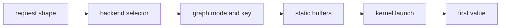
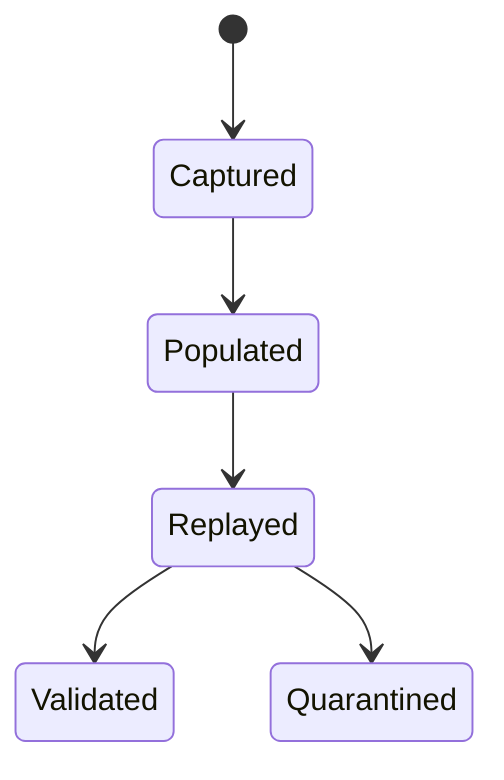
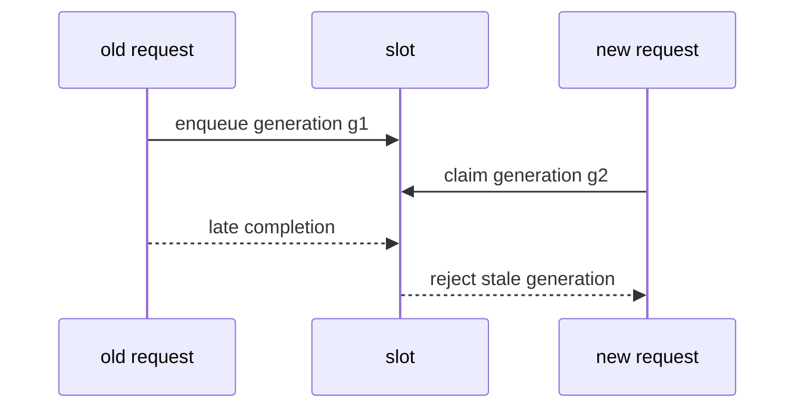
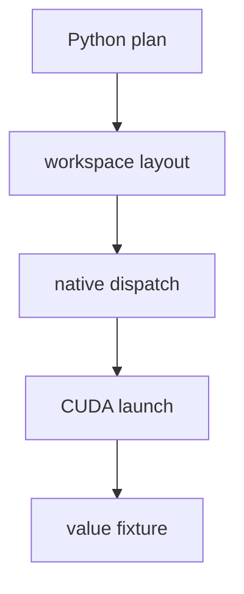

# 70장. Graph fallback과 커널 오답을 최초 불일치까지 추적하기

## 70.1 K70: graph를 끄면 사라지는 오답

### 70.1.1 token 37에서 갈라진 출력

새 attention backend를 켠 뒤 batch 8, prompt length 2049에서만 greedy 출력이 token 37부터 달라졌다. Graph를 끄면 재현되지 않았지만 eager 경로는 17% 느렸다. Batch 7과 9, length 2048은 정상이었고 CUDA error와 NaN도 없었다. 이 상관관계만으로 graph bug, tail kernel bug, 수치 오차 중 어느 것도 확정할 수 없다.

이 장의 중심 질문은 “graph가 문제인가”가 아니라 “같은 logical request가 어느 실행 경계에서 처음 다른 값이 되었는가”다. 첫 독자는 70.1의 네 칸 행렬, 70.2의 effective path, 70.4의 static-buffer 사건과 70.11의 복구만 읽어도 조사 순서를 얻는다. 70.3과 70.5~70.9는 miss·tail·device·quant/adapter·cancel·cold update가 같은 증상처럼 보이는 경쟁 반례다. 70.10과 70.12.2의 symbol 좌표는 실제 revision을 파고들 때 쓰는 reference이며 선형 독서에서 암기할 부분이 아니다. 이 순서를 먼저 밝히는 이유는 `K70-e17`, buffer 주소와 kernel 이름이 dispatch→metadata generation→launch→first value라는 mental model을 밀어내지 않게 하기 위해서다.

조사자는 재현 요청을 `K70-r1`로 고정했다. 모델 revision, tokenizer, adapter generation, quantization layout은 같게 두고 batch와 prompt 길이만 바꿨다. 비교 기준은 최종 문자열이 아니라 각 layer의 residual과 attention output이다. Greedy decoding은 앞 token 하나가 달라진 뒤 모든 후속 token이 달라질 수 있으므로 token 37은 최초 계산 불일치가 아니다. Coarse comparison에서 layer 18까지 일치하고 layer 19 attention output의 head 11, token coordinate 2048에서 처음 차이가 나타났다. 이 좌표가 이후 모든 실험의 denominator다.

네 칸 행렬도 먼저 채웠다. Graph와 새 backend 조합만 불일치하고, graph+reference backend, eager+새 backend, eager+reference는 tolerance 안에서 일치했다. 이 결과는 새 backend 자체가 모든 실행에서 틀린다는 가설을 반증하지만, graph runtime만 범인이라고 확정하지는 않는다. Graph 경로에서만 사용되는 plan, static page table, active length, workspace content가 모두 후보이기 때문이다. 다음 실험은 backend를 끄는 것이 아니라 같은 backend의 입력 descriptor를 replay 직전에 덤프해 reference 실행에 공급한다.

Token 37은 독자가 처음 눈으로 확인한 차이일 뿐 최초 오답 값은 아니다. Layer 18의 attention output이 token 12에서 이미 달랐지만 residual과 argmax margin 때문에 36개 token 동안 같은 선택을 만들었을 수 있다. 반대로 tensor가 조금 달라도 허용 가능한 accumulation 순서 차이일 수 있다. 따라서 외부 token parity, intermediate tolerance와 exact first divergent index를 분리한다.

동일 fixture를 100회 반복했을 때 매번 같은 index에서 갈라지는지, cancel이나 다른 request와 섞일 때만 나타나는지도 본다. Deterministic boundary failure는 tail predicate나 stale metadata를, timing-dependent 재현은 buffer lifetime과 stream ordering을 더 강하게 지지한다. 이 수치는 K70 조사 fixture일 뿐 특정 제품의 성능 결과가 아니다.

### 70.1.2 다섯 원장

조사는 dispatch, graph, launch, value, lifetime 원장을 같은 replay generation으로 묶는다.

Dispatch 원장에는 logical batch 8, sequence boundary 2049, head와 page dimension, dtype, quantization·adapter generation, 요청된 backend와 실제 backend, graph mode와 fallback reason을 기록한다. Graph 원장에는 key와 captured upper bound, static tensor 주소, 각 주소에 마지막으로 내용을 쓴 producer generation을 둔다. 주소가 같다는 사실은 내용이 현재 요청의 것이라는 증거가 아니다.

Launch 원장은 kernel symbol, grid, block, dynamic shared memory, workspace extent와 stream을 기록한다. Value 원장은 layer·tensor·index와 reference/observed 값, dtype별 tolerance를 가진다. Lifetime 원장은 request incarnation, scheduler slot, page-table generation, producer completion event와 consumer read를 잇는다. 다섯 원장 중 replay generation이 하나라도 다르면 서로 다른 실행의 증거를 합친 것이므로 결론을 내리지 않는다.

K70에서 dispatch와 launch는 예상 경로를 가리켰지만 page-table static buffer의 주소만 기록되고 content generation은 없었다. 이 빈칸은 곧 stale buffer라는 증거가 아니다. 다만 replay-only 오답을 분리할 가장 값싼 관측점이다. Graph 직전 generation stamp와 active prefix를 기록하고, eager reference에도 동일한 descriptor snapshot을 넣는다. Snapshot을 넣은 eager가 틀리면 graph launch보다 descriptor producer가 앞선 divergence다.

Dispatch 원장은 logical batch, sequence lengths, heads, pages, dtype, quantization, adapter와 device에서 effective backend와 specialization이 선택되는 과정을 기록한다. Graph 원장은 key, captured capacity, active bound, static address와 content generation을 가진다. Launch 원장은 kernel symbol, grid, block, dynamic shared memory, workspace와 stream을 기록한다. Value 원장은 reference와 observed tensor의 first divergence를, lifetime 원장은 request·slot·buffer generation과 producer completion을 기록한다.

다섯 원장이 동일 `execution_id=K70-e17`을 공유해야 한다. Graph key는 e17인데 page table snapshot은 e16이고 launch geometry는 다른 control request에서 가져왔다면 존재하지 않은 실행 경로를 만든다. Metric은 population을 보여 주고 sampled execution ledger가 정확한 join을 맡는다.

### 70.1.3 경쟁 가설

graph/eager와 selected backend/reference의 교차 행렬로 graph lifetime과 backend 계산 가설을 분리한다.

H1은 graph key가 length 2048과 2049를 같은 active bound로 취급한다는 가설이다. Key와 capture bound가 실제로 2049를 구분하면 약해진다. H2는 tail predicate가 마지막 token을 처리하지 않는다는 가설이다. 동일 descriptor로 eager 새 backend가 정확하면 단순 tail 계산 오류는 약해진다. H3은 static page table 내용이 이전 slot generation이라는 가설이다. Replay 직전 content generation이 현재 request와 일치하고 producer event가 완료됐다면 반증된다. H4는 tolerance가 너무 엄격하다는 가설이다. 첫 차이가 작은 부동소수 오차가 아니라 argmax margin을 뒤집고 reference 반복에서 안정적이면 반증된다.

이 단계의 종료 조건은 원인을 맞히는 것이 아니다. 네 실행 칸의 effective backend와 graph mode가 확인되고, 최초 divergence 좌표가 재현되며, 각 가설에 다음 관측 하나로 판정 가능한 falsifier가 붙는 것이다. 안전 조치는 문제 shape만 reference eager lane으로 보내는 것이다. 전체 graph를 끄는 rollback은 정확하지만 17% 비용을 모든 요청에 부과하므로 임시 격리보다 우선하지 않는다.

Graph를 끄는 실험은 capture/replay 하나만 제거하지 않는다. Dispatcher mode, padding bucket, backend specialization, static workspace와 stream scheduling이 함께 바뀔 수 있다. Eager 정상은 graph-enabled path 어딘가를 좁히지만 어느 edge인지는 말하지 않는다. Length 2049 역시 page count, tail tile, mask bound와 graph bucket을 동시에 바꾼다.

첫 경쟁 가설은 stale page table 또는 active length다. 이는 graph-new 조합에서 buffer content generation mismatch와 attention layer first divergence를 예측한다. 둘째는 tail kernel predicate다. 같은 specialization을 eager에서도 사용하면 eager-new에서도 2049 경계 오답을 예측한다. 셋째는 slot reuse race다. Cancel/reuse timing과 재현율이 연동되고 old producer completion이 new generation 뒤에 나타날 것을 예측한다. 넷째는 reference/tolerance 오류다. 두 독립 reference가 서로 합의하지 않으면 비교 기준부터 다시 고친다.

K70의 즉시 rollback은 B8 L2049 new-backend graph 조합만 safe eager reference로 fence하는 것이다. 전체 graph를 끄는 것은 서비스 보호에는 쓸 수 있지만 원인 범위를 지나치게 넓히고 17% 성능 비용을 모든 요청에 준다. Fallback reason과 affected shape/device/generation을 남긴다.

## 70.2 선택된 실행 경로를 복원한다

### 70.2.1 logical shape와 effective backend

vLLM v0.27.1의 `CudagraphDispatcher`는 요청 이름이 아니라 mode와 runtime key로 FULL, PIECEWISE, NONE을 고른다. 고정 소스의 key 초기화와 dispatch 분기를 함께 읽어야 한다. 설정에서 graph가 켜졌다는 사실은 K70-r1이 graph replay를 탔다는 증거가 아니다. 원장에는 raw shape, padding된 shape, 선택 mode와 key를 실제 request generation에 붙인다.

SGLang의 `BaseCudaGraphRunner`는 bucket 선택과 capture 준비를 조직하는 abstract base다. 이 타입 자체를 replay 구현이라고 쓰지 않는다. Decode/prefill subclass가 buffer를 채우는 지점과 backend의 capture/replay 호출을 이어서 읽고, raw size가 어느 bucket으로 올라갔는지 기록한다. K70의 2049가 2056 bucket에 들어갔다면 active mask와 output slicing도 같은 bound를 소비하는지 확인한다.

Logical shape는 단순 `(8,2049)`가 아니다. Decode/prefill phase, request별 sequence/page distribution, query와 KV heads, head dimension, page size, dtype, quant scheme, adapter generation과 device capability가 selector predicate를 바꿀 수 있다. Configuration에서 새 backend를 요청했다는 사실은 effective backend 증거가 아니다. Unsupported condition이면 reference backend로 fallback할 수 있다.

K70 ledger에는 `batch=8`, `max_seq=2049`, `page_size=16`, `pages_for_longest=129`, `tail_tokens=1`, `heads=32`, `head_dim=128`, `dtype=fp16`, `adapter=none`, `device=sm90`을 적는다. Batch 7·9 control도 같은 derived field를 계산한다. 한 축을 바꿨다고 생각했지만 bucket이나 pages가 함께 달라지는 일을 표면화한다.

Effective path event에는 requested backend, selected backend, specialization key와 fallback reason을 넣는다. 같은 Python wrapper 이름 아래 generated kernel과 generic kernel이 달라질 수 있으므로 native dispatch 결과까지 내려간다. Selector가 계산한 logical dimensions와 launcher grid 각 차원이 같은 의미를 쓰는지도 확인한다.

### 70.2.2 graph mode와 key

Key 감사는 필드 목록 대조로 끝나지 않는다. 결과를 바꾸는 adapter, quantization representation, page layout, active token bound 가운데 key에 없는 값이 static buffer content로 매 replay 갱신되는지 묻는다. Key에 없고 갱신도 없다면 generation collision이다. Key에 없지만 replay 전에 정확히 복사되고 stream ordering이 보장된다면 누락 자체가 버그는 아니다.

vLLM v0.27.1의 [`CudagraphDispatcher` mode·key contract](https://github.com/vllm-project/vllm/blob/6e448d0ea9bf3d88d898b65449ca6dc2aec170ac/vllm/v1/cudagraph_dispatcher.py#L15-L31)는 FULL, PIECEWISE, NONE 범주의 의미를 읽는 출발점이다.

[Key initialization](https://github.com/vllm-project/vllm/blob/6e448d0ea9bf3d88d898b65449ca6dc2aec170ac/vllm/v1/cudagraph_dispatcher.py#L158-L227)에서 어떤 field와 capture size가 key space를 만드는지 보고, [runtime dispatch](https://github.com/vllm-project/vllm/blob/6e448d0ea9bf3d88d898b65449ca6dc2aec170ac/vllm/v1/cudagraph_dispatcher.py#L235-L285)에서 K70 request가 실제 어느 mode를 얻는지 연결한다.

Key와 mutable content를 구분한다. Active length가 key에 없다고 자동으로 결함은 아니다. Captured capacity 안에서 replay 전 mask와 metadata를 갱신하는 계약일 수 있다. 반대로 quant layout처럼 specialization 자체를 바꾸는 field가 key에도 없고 refresh 경로도 없다면 stale artifact 위험이 있다.

Graph 원장에는 key, captured bounds, replay generation, static buffer address·capacity·active extent·content generation을 적는다. Address가 capture와 같다는 것은 pointer stability만 말한다. Page table 내용이 e16이고 현재 request가 e17이면 유효 주소로 잘못된 KV를 읽어 CUDA error 없이 오답을 만들 수 있다.

### 70.2.3 reference matrix

이 표는 backend의 승패표가 아니라 두 개의 intervention 축을 직교시킨다. 행은 graph가 address·launch를
재사용하는지, 열은 새 계산 backend를 쓰는지다. 대표 칸은 `graph/new`다. 이 칸만 실패하면 graph 전체와
backend 전체라는 두 넓은 가설은 약해지고, 둘이 만나는 metadata·workspace·specialization 계약이 강해진다.
반대로 eager/new도 실패하면 graph lifetime보다 backend 계산 또는 공통 입력이 먼저다.

| 실행 mode | reference backend | new backend |
|---|---|---|
| eager | pass | pass |
| graph | pass | token 37 divergence |

New backend graph 조합만 실패하면 graph 일반 결함과 backend 일반 산술 결함은 약해진다. Backend-specific graph metadata, workspace plan과 key를 조사한다. 그러나 eager와 graph가 서로 다른 specialization을 선택한다면 이 matrix만으로 graph lifetime을 확정하지 않는다. Effective kernel을 같은 행에 기록한다.

Reference는 기존 backend 하나로 끝내지 않는다. Small fixture에서는 고정밀 또는 단순 경로를 추가하고 dtype, accumulation order, mask와 tolerance를 명시한다. Greedy token이 다르면 허용 오차 안의 tensor 차이라도 application correctness에 영향을 줄 수 있다. 반대로 exact bit parity를 모든 fp16 reduction에 강제하면 정상적인 순서 차이를 오답으로 분류할 수 있다.



## 70.3 사건 1: graph miss와 latency spike

### 70.3.1 miss는 오답이 아니다

새 shape가 capture bucket에 없으면 eager 또는 다른 graph mode로 안전하게 fallback할 수 있다. Miss는 coverage와 latency 사건이지 그 자체로 wrong value가 아니다. Graph hit 역시 static content generation과 kernel correctness를 보장하지 않는다. K70 window의 miss counter를 failing request dispatch event와 직접 join한다.

1,000 request 중 B8 L2048 400건은 모두 hit/pass, B8 L2049 100건은 hit 60·fallback 40, B7 L2049 200건은 모두 safe fallback, 나머지는 hit 270·fallback 30이라고 하자. 총 miss 270건의 대부분은 정상 B7이며 오답이 B8 L2049 graph hit에서만 나타난다면 miss spike는 직접 원인이 아니다.

### 70.3.2 capture와 fallback 비용

Capture 비용 가설은 처음 본 shape의 첫 요청만 느리고 이후 replay에서 회복할 것을 예측한다. Shape churn 가설은 unique key와 recapture가 함께 증가할 것을 예측한다. Fallback overhead 가설은 fallback cohort만 17% 느릴 것을 예측한다. Warm graph-hit도 느리다면 capture나 fallback만으로 설명되지 않는다.

| 가설 | 예측 | 반증 |
|---|---|---|
| first capture | 첫 요청만 spike | warm hit도 동일 |
| key churn | unique key·recapture 증가 | key stable |
| fallback overhead | fallback만 느림 | hit cohort도 느림 |
| miss causes wrong value | miss request가 divergence | 오답은 hit에만 존재 |

Graph coverage를 높이면 capture memory와 startup time이 늘 수 있다. Unsupported shape를 가장 가까운 작은 bound에 억지 replay해 miss를 줄여서는 안 된다. Captured capacity보다 raw shape가 크면 dispatcher가 fail closed 또는 fallback해야 한다.

### 70.3.3 종료 조건

Miss 사건은 counter가 0이 될 때 닫히지 않는다. 각 miss reason이 설명되고 fallback backend가 reference parity를 통과하며 capture churn과 latency가 budget 안이고 unsupported shape가 wrong graph key에 들어가지 않을 때 닫힌다. K70 correctness 조사는 graph-hit failing cohort로 계속한다.

## 70.4 사건 2: replay에서만 silent wrong answer

### 70.4.1 static buffer generation

Graph capture가 고정하는 것은 흔히 address와 launch topology다. 현재 request의 input, positions, page table, active mask와 workspace plan은 replay 전에 그 address에 다시 써야 한다. “Static buffer”라는 이름은 내용도 영구적이라는 뜻이 아니다. K70은 address-valid/content-stale인 경우를 먼저 감사한다.

vLLM의 [`CUDAGraphWrapper` replay와 persistent descriptor](https://github.com/vllm-project/vllm/blob/6e448d0ea9bf3d88d898b65449ca6dc2aec170ac/vllm/v1/worker/gpu/cudagraph_utils.py#L360-L410)를 읽을 때 wrapper가 지속적으로 보유하는 object와 호출자가 매 replay 갱신해야 하는 content를 분리한다. Replay method가 호출됐다는 사실을 모든 metadata refresh 증거로 확대하지 않는다.

K70-e17의 buffer ledger를 채운다.

비교 축은 주소가 같은지가 아니라 각 주소의 capacity·active extent·content generation·last producer가 현재
replay와 일치하는지다. 대표 행인 page table은 주소 `A300`과 크기가 유효해도 내용 generation이 e16이면
e17 request에 조용한 오답을 줄 수 있다. 그래서 이 표는 pointer stability를 correctness와 혼동하는 가설과
stale content 가설을 가른다.

| buffer | address | capacity | active extent | content generation | last producer |
|---|---|---:|---:|---|---|
| input IDs | A100 | 8 | 8 | e17 | batch loader |
| positions | A200 | 8 | 8 | e17 | position prep |
| page table | A300 | 8×129 | 8×129 | e16 | KV metadata prep |
| active mask | A400 | 8×2176 | 8×2049 | e17 | mask prep |
| workspace plan | A500 | 128MiB | 96MiB | plan16 | backend planner |

Page table과 plan만 이전 generation이다. 주소와 allocation extent가 유효해 launch error나 sanitizer out-of-bounds가 없을 수 있다. Attention은 잘못된 KV page를 읽고 finite하지만 틀린 값을 만든다. First divergent layer가 attention이라는 예측을 세운다.

### 70.4.2 active bounds와 page table

Captured capacity가 length 2176이고 active length가 2049라면 남은 127 token 영역을 어떻게 처리하는지가 계약이다. Mask producer가 e17 active bound를 쓰더라도 kernel이 mask load 전에 page index를 읽거나 rounded bound로 vector load하면 stale padding content가 영향을 줄 수 있다. Page table 마지막 entry와 padding initialization을 별도로 확인한다.

Active rows도 batch 8과 실제 live request 수가 다를 수 있다. Capture bucket 8에 live batch 7을 padding했다면 row 7의 slot/page metadata가 이전 replay에서 남지 않도록 mask되어야 한다. K70 B8만 실패한다면 정확히 8 active rows인 specialization과 bucket padding case를 구분한다.

Graph/reference×backend matrix에 current-generation refresh를 추가한다.

| mode/backend | normal producer | forced e17 metadata | 결과 해석 |
|---|---|---|---|
| eager/reference | pass | pass | baseline |
| eager/new | pass | pass | backend 일반 산술 약함 |
| graph/reference | pass | pass | graph 일반 lifetime 약함 |
| graph/new | fail | pass | backend-specific graph metadata 강함 |

Forced refresh가 timing도 바꿀 수 있으므로 pass 하나로 확정하지 않는다. Consumer 직전 generation assertion과 producer stream event를 추가해 e17 content가 실제 읽혔는지 증명한다. Graph key에 모든 mutable field를 추가하는 대신 refresh 계약인 field와 specialization key인 field를 나눈다.

### 70.4.3 lifetime falsifier

Page table을 다른 stream에서 async copy했다면 copy enqueue와 replay enqueue 사이 host 순서만으로 device happens-before가 생기지 않을 수 있다. Producer completion event를 graph replay stream이 wait하는지 원장에 넣는다. 같은 stream이면 stream order, 다른 stream이면 explicit event 또는 동등한 dependency가 필요하다.

Falsifier는 세 가지다. 첫째, failing replay에서 모든 buffer generation이 e17이고 producer event도 complete라면 stale-buffer 가설이 약해진다. 둘째, e16 metadata를 일부러 넣어도 reference backend graph가 정상이라면 해당 field가 실제 consumer input인지 다시 본다. 셋째, eager new가 동일 page table과 specialization에서 실패하면 graph-only lifetime보다 kernel predicate가 가깝다.

Safe fallback은 generation mismatch를 발견한 replay를 eager/reference로 보내고 해당 graph artifact를 quarantine한다. Stale content를 0으로 덮어 우연히 정상 token을 만드는 것은 fix가 아니다. Terminal은 buffer producer edge, generation assertion, boundary matrix와 performance budget이 모두 닫힌 상태다.


**Replay/capture 사건 K70-g41.**


**`hit`를 executable·address·content 세 층으로 해체한다.**

K70의 첫 번째 추가 사건은 dashboard에 `graph_hit=true`가 찍혔고 CUDA error도 없는데 attention output이 조용히 틀린 경우다. 당직자는 처음에 capture가 성공했고 같은 pointer를 replay했으므로 graph 계층은 정상이라고 판단했다. 이 판단에는 서로 다른 세 사실이 한 단어에 섞여 있다. Executable hit는 현재 dispatch key에 대응하는 graph executable을 찾았다는 뜻이다. Address hit는 capture 때 고정한 tensor 주소를 여전히 사용한다는 뜻이다. Content hit는 그 주소의 active extent가 현재 request generation의 producer가 쓴 값이라는 뜻이다. 앞의 두 사실은 세 번째를 증명하지 않는다.

재현 요청 `K70-g41`은 decode batch 7이었고 SGLang runner가 capture bucket 8로 올렸다. Bucket 8 executable과 static page-table address `0xA300`은 이전 replay와 같았다. 일곱 active row의 slot mapping을 새 값으로 복사해야 했지만 copy producer event가 replay stream에 연결되지 않았다. Row 0~5는 우연히 이전 요청과 같은 page prefix를 가졌고 row 6만 old slot 44를 가리켰다. 그래서 graph launch는 정상 완료했고 여섯 요청의 token도 맞았으며, 마지막 요청만 layer 17 attention에서 처음 갈라졌다.

여기서 `capture_bs=8`은 raw batch 7의 의미를 없애지 않는다. Padding row가 존재하면 metadata producer는 active row, padded row, sentinel과 output slicing을 같은 bucket contract로 써야 한다.

SGLang의 [`BaseCudaGraphRunner` bucket 생성과 정렬](https://github.com/sgl-project/sglang/blob/71de97b264b04dcd514cf904003028aefe9775c8/python/sglang/srt/model_executor/runner/base_cuda_graph_runner.py#L67-L102)은 capture 후보가 어떻게 정규화되는지 보여 주며, [`_pad_to_bucket` 계약](https://github.com/sgl-project/sglang/blob/71de97b264b04dcd514cf904003028aefe9775c8/python/sglang/srt/model_executor/runner/base_cuda_graph_runner.py#L105-L151)은 raw size가 bucket 범위를 벗어날 때 caller가 먼저 거부해야 함을 드러낸다.

이 소스는 K70의 stale copy를 직접 증명하지 않는다. 실제 실행에서는 subclass의 load와 execute, copy event와 backend replay를 동일 trace로 확인해야 한다.

원장에는 하나의 `graph_hit` 대신 다음 필드를 남긴다.

| 필드 | K70-g41 관측 | 올바른 해석 |
|---|---|---|
| executable generation | `cg-118` | dispatch key와 실행 객체가 일치 |
| captured bucket | 8 | capacity이며 active batch는 7 |
| page-table address generation | `addr-22` | 주소 배치가 유지됨 |
| page-table content generation | `req-40` | 현재 `req-41`보다 오래됨 |
| last producer event | `copy-40` | 현재 copy completion 증거 없음 |
| first consumer | layer 17 attention | stale mapping을 처음 읽은 연산 |

주소가 같아야 replay할 수 있다는 요구와 내용이 매 요청 달라야 한다는 요구는 모순이 아니다. Stable address는 graph executable이 참조할 좌표다. Mutable content는 그 좌표에 replay 전에 써야 할 요청별 상태다. 올바른 계약은 `address_generation=capture_generation`이면서 `content_generation=request_generation`이고, consumer stream이 current producer completion 뒤에 실행되는 것이다.

**tensor oracle로 최초 오염 producer를 찾는다.**

최종 token 29가 달랐다는 사실만 보면 sampler, logits processor와 attention이 모두 후보가 된다. K70은 tensor oracle을 계층별 checkpoint로 둔다. Oracle은 무조건 bit-exact인 golden tensor가 아니다. 동일 input snapshot을 단순하고 검증된 reference path에 공급하고 tensor 의미에 맞는 exact 또는 tolerance predicate를 적용하는 비교기다. Integer page table, positions, slot mapping과 generation stamp는 exact comparison을 쓴다. FP16/BF16 residual과 attention output은 absolute·relative tolerance, NaN policy와 argmax margin을 함께 기록한다.

비교는 output에서 역으로 무작정 모든 tensor를 dump하지 않는다. 먼저 embedding 이후, 매 8개 layer residual, final norm과 logits checksum으로 범위를 이분한다. Layer 16 residual은 일치하고 layer 24는 다르면 17~24를 좁힌다.

해당 layer에서 Q, K/V address metadata, attention output, projection output과 residual 순서로 producer boundary를 검사한다. K70-g41에서는 Q tensor와 scale이 일치했고 page-table row 6 index 3이 expected 91, observed 44로 처음 달랐다. Attention output 차이는 그 뒤의 소비 결과다. 따라서 first differing floating tensor가 layer 17 attention이더라도 first corrupt representation은 page-table metadata다.

이 구분은 수정 owner를 바꾼다. Attention kernel 내부를 고치거나 tolerance를 넓힐 문제가 아니라 metadata copy와 stream dependency를 고칠 문제다. Kernel에 stale pointer가 들어와 계약대로 page 44를 읽었다면 계산은 입력에 대해 정확하다. 반대로 page table이 정확한데 attention output이 처음 다르면 effective kernel, mask, stride와 workspace로 내려간다. “첫 differing tensor”와 “첫 잘못된 producer”를 한 칸으로 합치지 않는다.

Oracle artifact에는 `execution_id`, layer, tensor semantic name, logical shape, physical stride, dtype, quant/adapter generation, content generation, producer launch ID와 comparison policy를 둔다. Tensor 이름만 같아도 layout이 다르면 직접 비교하지 않는다. 예를 들어 packed quant weight와 dequantized reference weight는 representation이 다르므로 먼저 같은 의미 공간으로 변환하거나 각 representation의 독립 invariant를 검증한다. Page table도 raw storage checksum만 비교하지 않고 active rows와 sentinel 영역을 나눠 본다.

오염이 timing-dependent라면 full dump가 race를 가릴 수 있다. 먼저 lightweight checksum과 generation stamp를 device-side 또는 기존 stream order 안에서 수집하고, 재현이 안정된 뒤 좁은 tensor slice를 복사한다. Debug copy가 implicit synchronization을 만들어 증상을 없애면 그것도 lifetime 가설을 지지하는 관측이다. Instrumentation on/off 재현율과 stream timeline을 함께 남긴다.

**반증 실험과 최소 수정.**

첫 반증은 pointer를 일부러 바꾸는 것이 아니라 같은 pointer에 current content를 synchronous copy한 뒤 replay하는 것이다. 오답이 사라지면 executable 주소 결함보다 producer ordering 가설이 강해진다. 둘째는 e40 page-table 내용을 current address에 의도적으로 넣는다. 동일 row 6 divergence가 재현되면 metadata가 실제 consumer input임을 확인한다. 셋째는 current content generation과 event wait를 유지한 채 graph executable만 새로 capture한다. 재capture 여부와 무관하게 정상이라면 stale executable 가설은 약해진다.

최소 수정은 매 요청마다 graph를 새로 capture하는 것이 아니다. Static buffer populate가 current request generation을 stamp하고, replay stream이 해당 copy event를 기다리며, active extent 밖 padded row에는 명시된 sentinel을 쓴다. Replay 직전 assertion은 address capacity, content generation과 active bound를 검사한다. Production hot path에서 모든 page를 CPU로 읽어 검증하지 않고 cheap generation word와 bounded sampled checksum을 사용한다. Mismatch는 launch 전에 fail closed하고 safe eager lane으로 보낸다.

Rollback은 문제 bucket 8과 backend 조합만 quarantine한다. Graph 전체를 끄면 correctness는 보호할 수 있지만 unaffected bucket의 latency와 capacity를 잃는다. Quarantine key에는 model/adapter/quant generation, device capability, backend specialization과 capture generation이 포함되어야 한다. 너무 넓으면 정상 traffic까지 eager로 보내고, 너무 좁으면 같은 stale artifact의 alias가 남는다.

**rollback 뒤 soak terminal.**

수정 canary는 raw batch `1,7,8,9`, page boundary 전후 length, slot cancel/reuse와 서로 다른 page prefix를 섞는다. Bucket 8에서는 active 7과 padded 1을 구별하고 row permutation도 바꾼다. 동일 address를 수천 번 재사용하면서 content generation이 매 replay current인지, late producer가 old generation을 다시 쓰지 못하는지 확인한다. 정상 입력뿐 아니라 injected stale generation이 launch 전에 거부되는 negative test가 필요하다.

Soak는 “오답 0” 하나로 닫지 않는다. Fixed canary가 실제 graph bucket 8과 intended backend를 선택한 횟수, generation assertion 통과·거부 수, first-difference probe sample 수와 fallback 이유를 분모로 둔다. Quarantine 때문에 failing path가 한 번도 실행되지 않았다면 0 errors는 수정 검증이 아니다. 최소 한 번 이상의 capture lifecycle과 slot reuse tail을 포함하는 관측 창을 정하고 hardware·load 조건을 기록한다.

**g41 수치 timeline.** 10:14:02.110에 scheduler가 request generation 41을 slot 6에 배정했다. 10:14:02.114에 host metadata는 page `[12,37,91]`을 만들었고, async copy `copy-41`은 stream M에 enqueue됐다. 10:14:02.115에 graph stream G가 executable `cg-118`을 replay했지만 M의 event를 기다리지 않았다. G의 attention consumer가 10:14:02.117에 page-table address A300을 읽었을 때 device content는 generation 40의 `[12,37,44]`였다. Copy-41은 10:14:02.119에 완료되어 사후 dump에는 올바른 91이 보였다. 사고 중 “dump가 정상”이었던 이유가 바로 관측 시점이다.

이 timeline은 buffer snapshot만으로 race를 반증할 수 없음을 보여 준다. Snapshot에는 read 시각과 producer completion 시각이 필요하다. Consumer launch 전 lightweight generation word를 읽거나 kernel launch event와 copy event를 trace로 잇는다. 사후에 pointer 내용을 확인하고 정상이라고 결론 내리면 소비가 끝난 뒤 덮어쓴 새 값을 증거로 사용하게 된다. CUDA API 성공 여부도 ordering dependency가 빠진 논리 오류를 보고하지 않는다.

**오라클 판정표.** Metadata exact oracle가 실패하고 Q/KV content oracle는 아직 실행하지 못했다면 결과는 input-invalid이지 kernel-fail이 아니다. Metadata가 합의하고 attention output만 tolerance를 넘으면 kernel-or-workspace 후보로 이동한다. Attention output이 합의하고 projection output에서 처음 갈라지면 quant linear 경계로 이동한다. Projection까지 합의하지만 logits가 다르면 residual, norm, lm-head와 logits processor를 본다. 각 행은 다음 단계로 내려갈 권한을 주는 gate이며, 앞선 input이 틀린 상태에서 뒤 kernel을 유죄로 판정하지 않는다.

Oracle 자체도 version을 가진다. Reference code revision, dequantization rule, tolerance와 tensor coordinate schema를 artifact에 남긴다. Optimized path와 reference path가 같은 잘못된 helper를 공유하면 둘의 합의가 correctness 증명이 아닐 수 있다. Metadata는 독립 CPU construction과 비교하고, 작은 quant slice는 명시적 canonical unpacker와 비교한다. 두 독립 reference가 불일치하면 production path의 승패를 정하기 전에 oracle 분쟁부터 닫는다.

Correctness terminal은 current content generation, producer-consumer happens-before, oracle parity와 stale injection rejection이다. Resource terminal은 old executable reference 0, quarantine expiry와 static buffer bounded count다. Performance terminal은 graph coverage, fallback rate, TTFT/ITL와 goodput이 합의한 budget 안에 있는 상태다. 세 terminal 중 하나라도 열려 있으면 사건은 완화됐을 뿐 종료되지 않았다.

## 70.5 사건 3: tile 경계에서만 생기는 오답

### 70.5.1 숫자 fixture

Tile width가 128이면 length 2048은 16개 full tile, 2049는 17번째 tail tile을 만든다. Tail에서 valid element는 1개이고 padding은 127개다. Batch 8, heads 32라면 단순 logical tile count는 `8×32×17=4,352`다. Launcher grid가 이 값을 어떤 차원에 배치하는지는 source로 확인하며 이 계산을 실제 grid라고 자동 단정하지 않는다.

Fixture는 length `2047, 2048, 2049, 2050`, batch `7,8,9`, head dimension `64,128`을 사용하되 한 번에 한 축만 움직인다. 모든 batch에서 2049부터 실패하면 length tail이 강하다. B8 L2049만 실패하면 capture bucket이나 B8 specialization이 더 가깝다. Head dimension 128만 실패하면 vector width와 alignment가 후보가 된다.

| fixture | full tiles | tail valid | graph-new | eager-new |
|---|---:|---:|---|---|
| L2047 | 15 | 127 | pass | pass |
| L2048 | 16 | 0 | pass | pass |
| L2049 | 16 | 1 | fail | pass |
| L2050 | 16 | 2 | fail | pass |

이 표는 tail 조건을 지지하지만 graph/eager 차이가 남으므로 pure kernel predicate 하나로 끝내지 않는다. Graph path가 rounded length 또는 stale active bound를 전달하는지 본다.

### 70.5.2 tail predicate와 alignment

Logical payload pointer가 16-byte aligned여도 row stride나 page offset 때문에 tail row vector address가 alignment를 잃을 수 있다. Selector가 vectorized specialization을 선택하는 predicate와 kernel 내부 load predicate가 같은 alignment 조건을 쓰는지 비교한다. Host에서 전체 tensor aligned만 검사하고 row offset을 빠뜨릴 수 있다.

Tail kernel은 load, compute, store의 세 predicate를 가질 수 있다. Invalid lane을 load하지 않는지, softmax reduction에서 invalid lane을 `-inf`로 제외하는지, output store가 active token에만 쓰는지 각각 본다. Padding을 0으로 초기화해 증상이 사라져도 invalid lane이 읽히는 계약 위반은 남는다. Padding poison fixture로 더 강하게 반증한다.

예를 들어 padding을 모두 0, 일정 큰 finite 값, NaN pattern으로 바꿔 valid output이 달라지는지 본다. 정상 tail predicate라면 invalid padding content에 불변이어야 한다. 단, NaN poison이 speculative vector load 후 mask되는 정상 구현에서도 hardware/compiler behavior를 해석해야 하므로 first valid output과 reference를 중심으로 본다.

### 70.5.3 최초 오답 index

Final token부터 거꾸로 모든 tensor를 dump하지 않는다. Layer 0, 8, 16, 24 output checksum으로 범위를 이분하고, layer 16~24 사이를 좁힌다. Failing layer에서 attention output과 residual을 비교하고 `(batch,row,head,token,dim)` first index를 기록한다.

K70 fixture에서 first divergence가 layer 19, batch row 7, head 31, token tail boundary, dim 0이라고 하자. 마지막 row/head/tail에 집중되면 grid/tail predicate와 active-bound 가설이 강하다. 모든 row의 같은 dim이면 scale/stride 또는 workspace layout이 더 가깝다.

Reference tolerance는 absolute/relative와 dtype accumulation을 명시한다. Expected `0.03125`, observed `0.53125`처럼 margin보다 큰 차이를 기록하고, 인접 padding poison에 따라 값이 바뀌면 numerical noise 가설을 반증한다. Producer kernel launch ID까지 연결한다.

## 70.6 사건 4: 특정 GPU에서 launch failure

### 70.6.1 specialization과 resource limit

특정 GPU에서만 launch가 실패하면 compute capability에 따른 specialization, dynamic shared memory, register pressure와 device limit을 본다. 동일 backend 이름 아래 다른 generated kernel이 선택될 수 있다. Device model을 원인으로 쓰지 않고 selector predicate와 launch resource requirement를 적는다.

Kernel이 block당 dynamic shared memory 96KiB를 요구하지만 effective opt-in limit이 64KiB라면 해당 specialization은 launch할 수 없다. Block 256 threads, logical grid `(ceil(2049/128),8,32)`이면 `(17,8,32)` fixture다. Launcher가 x/y/z에 정확히 이 의미를 쓰는지는 native source로 확인한다.

| device class | selected spec | smem request | effective limit | outcome |
|---|---|---:|---:|---|
| D0 | K128 | 64KiB | 96KiB | pass |
| D1 | K128 | 96KiB | 64KiB | launch fail |
| D1 | generic | 48KiB | 64KiB | pass |

이 표는 D1 hardware 자체보다 잘못된 specialization 선택을 지지한다. D1 generic도 실패하면 다른 launch field를 본다.

### 70.6.2 enqueue와 error observation

CUDA launch는 enqueue와 execution completion이 분리된다. API call 직후 error가 없다고 kernel 완료를 증명하지 않는다. 어느 synchronization 또는 dependent operation에서 error가 관측됐는지 launch 원장에 쓴다. 다른 kernel의 error가 뒤 호출에서 표면화될 수도 있어 launch ID와 stream progression을 연결한다.

Launch failure와 silent wrong answer를 섞지 않는다. Invalid configuration은 대개 명시적 error path를 만들 수 있지만 stale valid pointer와 wrong predicate는 정상 completion으로 오답을 낸다. Sanitizer는 illegal access와 일부 race를 찾는 데 유용해도 generation 의미가 틀린 valid-address access를 자동 판정하지 못한다.

Workspace extent도 resource다. Planner가 80MiB를 요구하는데 static workspace active extent가 64MiB라면 wrapper validation에서 fail closed해야 한다. Pointer allocation capacity가 128MiB라는 이유로 plan offsets가 자동 안전한 것은 아니다. Plan generation과 offset end를 검증한다.

### 70.6.3 안전한 fallback

Unsupported specialization은 launch한 뒤 실패를 관측하는 것보다 selector에서 generic/reference backend로 보낸다. Fallback event에는 device capability, rejected specialization과 reason을 남긴다. Broad catch로 모든 error를 삼켜 fallback하면 partial output이나 corrupted state가 재사용될 수 있으므로 launch 전 predicate가 우선이다.

Device support matrix는 logical model name이 아니라 effective kernel specialization별로 유지한다. Correctness fixture와 maximum smem/workspace shape를 각 supported class에서 검증한다. Fallback은 parity를 통과하고 latency/goodput budget을 만족해야 한다. 모든 device를 가장 느린 kernel로 고정하는 것은 emergency rollback이지 최종 terminal이 아니다.

Launch failure fixture는 resource 한 축씩 바꾼다. Block threads는 같게 두고 smem opt-in만 조정하거나, 동일 smem에서 head dimension specialization을 바꾼다. Kernel binary가 device에 맞게 compile됐는지와 runtime opt-in 설정을 분리한다. 여러 option을 동시에 낮춰 generic kernel이 선택되면 무엇이 fix였는지 알 수 없다.

Error attribution에는 stream-local progress marker가 유용하다. K70-L40 전 marker가 완료되고 L40 후 marker가 없으며 synchronization에서 invalid configuration이 관측됐다면 범위를 좁힌다. Marker 자체가 timing을 크게 바꾸지 않는 bounded fixture에서 사용한다. Previous async error가 뒤 call에 나타날 수 있다는 점을 packet에 남긴다.

Fallback으로 전환하기 전 partial workspace mutation이 가능한 launch failure라면 동일 buffer generation을 재사용하지 않는다. Enqueue 전 selector reject는 clean fallback이지만 execution 중 error는 artifact quarantine과 request fail/recompute 정책이 필요하다. “예외를 잡아 다른 kernel 호출”이 항상 안전하지 않은 이유다.

Supported device terminal은 smem limit 하나가 아니다. Kernel specialization, block, required smem, workspace maximum, dtype/quant and graph mode tuple가 검증된다. New device를 같은 이름 family라며 자동 허용하지 않는다. Selector가 unknown capability를 safe fallback으로 보내는지도 시험한다.

## 70.7 사건 5: quantization과 adapter 조합

### 70.7.1 scale layout과 packed row

Quantized weight는 packed data와 scale/zero-point layout이 함께 의미를 만든다. Adapter는 base output에 다른 stride와 rank의 delta를 더할 수 있다. 같은 batch/sequence shape라도 quant scheme, group size, packed row stride, adapter ID·rank가 specialization과 static metadata를 바꾼다.

최초 값 walk는 packed input decode, scale load, accumulator, adapter delta, combined output 순서다. Final logits만 비교하면 base quant와 adapter 중 어느 producer가 처음 틀렸는지 모른다. Small matrix fixture에서 한 row와 group의 expected dequant 값을 손으로 계산해 layout을 검증한다.

예를 들어 4-bit packed byte `0xA3`을 low nibble first로 읽으면 values 3과 10이지만 high nibble first면 10과 3이다. Scale 0.125를 적용하면 각각 `0.375,1.25`와 `1.25,0.375`다. First divergence가 pair swap이면 generic numerical tolerance로 설명할 수 없다.

### 70.7.2 graph key 누락

Adapter A와 B가 같은 static buffer address를 재사용해도 content generation은 다르다. Graph key에 adapter가 없고 replay 전 scale/adapter metadata refresh도 없다면 B request가 A pointer/content를 읽을 수 있다. Key 누락인지 producer 누락인지 다시 분리한다.

Quant on/off가 다른 kernel topology를 만들면 graph executable 자체를 나눠야 할 수 있다. Adapter content만 같은 topology의 static input이라면 refresh가 계약일 수 있다. 무조건 key에 adapter ID를 넣으면 tenant·adapter 수만큼 graph artifact가 늘어 memory를 폭발시킬 수 있다.

Graph artifact ledger에 `quant_scheme`, `group_size`, `packed_stride`, `scale_generation`, `adapter_generation`, `workspace_plan`을 기록한다. Consumer kernel이 실제 사용하는 field만 correctness key 또는 refresh invariant로 둔다.

### 70.7.3 parity matrix

| graph | quant | adapter | result |
|---|---|---|---|
| off | off | none | pass |
| off | on | none | pass |
| off | on | A | pass |
| on | off | A | pass |
| on | on | none | pass |
| on | on | A | fail |

Graph+quant+adapter 조합만 실패하면 quant kernel 일반 오답과 adapter 일반 오답은 약해진다. Scale/adapter static metadata와 composite specialization을 본다. Adapter A→B 전환 직후만 실패하면 content generation 가설이 더 강하다.

Safe fallback은 affected quant+adapter graph key만 eager 또는 validated backend로 보낸다. Correctness terminal은 A/B 전환, rank/group boundary, graph/eager matrix와 first intermediate parity다. Performance terminal은 graph artifact cardinality, fallback rate와 adapter switching latency를 포함한다.

Packed row fixture는 group boundary 전후를 포함한다. Group size 128이라면 columns 127, 128, 129에서 scale index가 바뀐다. Adapter rank가 vector tile boundary 16이라면 rank 15,16,17을 비교한다. Batch/sequence를 고정한 채 이 축만 움직여 graph bucket과 분리한다.

| graph | quant group | adapter rank | switch | result |
|---|---:|---:|---|---|
| off | 128 | 16 | none→A | pass |
| on | 128 | 16 | none→A | fail first replay |
| on | 128 | 16 | A steady | pass |
| on | 64 | 16 | none→A | pass |

첫 replay만 실패하면 static content population 또는 plan update가 강하고, steady A도 실패하면 persistent layout/kernel predicate를 본다. Group 64가 pass하는 것은 scale group boundary key 가능성을 더한다. 각 행의 effective kernel이 같아야 비교력이 있다.

Adapter switch fix는 새 content가 producer stream에서 완료되기 전에 graph를 replay하지 않게 하고 generation을 assertion한다. Artifact key를 분리해야 한다면 bounded adapter classes와 eviction policy를 설계한다. Correctness를 위해 tenant별 무한 graph cache를 만들지 않는다.
**Quant·adapter fallback 사건 K70-m23.**


**requested backend와 effective representation을 분리한다.**

두 번째 사건 `K70-m23`은 AWQ 4-bit 모델에 adapter generation A12를 올린 뒤 특정 projection에서만 logits가 달라진 경우다. 배포 설정에는 `backend=auto`가 있었고 운영자는 “Marlin 또는 generic fallback은 같은 weight를 읽어 같은 GEMM을 계산한다”고 가정했다. 그러나 backend 선택은 이름만 바꾸지 않는다. Packed weight layout, scale/zero representation, permutation, workspace와 supported shape predicate가 함께 달라질 수 있다.

vLLM의 [`AutoAWQ` backend 선택 조건](https://github.com/vllm-project/vllm/blob/6e448d0ea9bf3d88d898b65449ca6dc2aec170ac/vllm/model_executor/layers/quantization/auto_awq.py#L303-L321)은 CUDA와 batch-invariant 조건 및 Marlin 지원 검사를 거쳐 method를 고른다.

실제 multi-platform linear path는 [`choose_mp_linear_kernel` 호출](https://github.com/vllm-project/vllm/blob/6e448d0ea9bf3d88d898b65449ca6dc2aec170ac/vllm/model_executor/layers/quantization/auto_awq.py#L417-L477)로 내려가며, weight 준비와 apply를 읽어야 effective kernel을 안다. Config 문자열 하나로 runtime path를 확정하지 않는다.

K70-m23의 capture 시점에는 adapter A11, Marlin-packed weight representation `W17`, scale representation `S9`였다. Rollout 중 A12가 활성화되며 graph key는 adapter generation을 구분했지만 fallback lane이 기존 generic representation view를 재사용했다. Pointer는 동일 storage를 가리켰고 shape도 같았다. 그러나 Marlin용 permutation과 generic dequant view가 기대하는 logical column 순서가 달랐다. Fallback은 실행됐고 CUDA error도 없었지만 layer 23 `o_proj`의 column 128부터 값이 틀렸다.

Representation ledger는 다음을 기록한다.

| 객체 | identity | representation generation | content generation | consumer contract |
|---|---|---|---|---|
| packed weight | model layer 23 | `W17-marlin-p4` | model R8 | Marlin tile/permutation |
| scales | group 128 | `S9-marlin` | model R8 | Marlin scale order |
| adapter delta | A12 | `A12-row` | rollout G23 | logical row/column |
| fallback view | same storage address | `W16-generic` expected | 실제 `W17` | generic dequant order |
| output | o_proj | destination G23 | execution e23 | logical hidden order |

Pointer equality는 allocation identity만 보여 준다. Representation generation은 같은 bytes를 어떤 layout·packing·scale 규칙으로 해석하는지 나타낸다. Content generation은 그 representation에 어떤 model/adapter 값이 써졌는지 나타낸다. 같은 pointer와 같은 content revision이라도 consumer가 다른 representation을 기대하면 오답이다. 반대로 representation이 같아도 old adapter content면 역시 틀린다.

**FlashInfer plan/run과 Marlin apply를 경계로 oracle을 둔다.**

Attention 사건과 quant GEMM 사건을 final logits에서만 비교하면 어느 backend가 먼저 오염했는지 알 수 없다. K70-m23은 embedding과 layer 0~22 residual이 일치했고 layer 23 attention output도 일치했다. `o_proj` 입력 activation은 tolerance 안에서 같았지만 projection output이 처음 달랐다. 따라서 FlashInfer attention plan/run보다 뒤이고 residual add보다 앞인 quant linear consumer를 좁혔다.

FlashInfer의 [`BatchDecodeWithPagedKVCacheWrapper` workspace 경계](https://github.com/flashinfer-ai/flashinfer/blob/a0a6b019b9b27d49d209f85d028a1ae5a9b347d7/flashinfer/decode.py#L211-L284), [`plan`](https://github.com/flashinfer-ai/flashinfer/blob/a0a6b019b9b27d49d209f85d028a1ae5a9b347d7/flashinfer/decode.py#L1239-L1515)과 [`run`](https://github.com/flashinfer-ai/flashinfer/blob/a0a6b019b9b27d49d209f85d028a1ae5a9b347d7/flashinfer/decode.py#L1766-L1830)은 metadata 계획과 실행을 나눠 확인할 좌표다.

이 span은 K70-m23이 FlashInfer를 탔다거나 Marlin 버그임을 자동 증명하지 않는다. Runtime ledger에서 effective attention module과 projection kernel을 각각 확인하고 그 사이 tensor oracle이 합의했기 때문에 attention 가설을 반증한다.

Oracle은 세 representation을 비교한다. 첫째, packed bytes와 scale의 structural invariant다. Expected packed extent, group count, permutation metadata와 checksum을 본다. 둘째, 작은 column slice를 canonical FP32로 dequantize한 semantic weight다. Marlin과 generic view를 각각 canonical space로 풀어 동일 logical `(out,in)` 좌표를 비교한다. 셋째, 동일 activation을 canonical matmul과 두 effective path에 넣어 output first index를 찾는다. K70-m23에서는 packed checksum은 동일했지만 generic view의 canonical column 128이 달랐다. 저장 손상이 아니라 해석 계약 mismatch다.

Marlin path가 정상이고 fallback만 틀렸다고 곧바로 fallback kernel 산술 결함이라 쓰지 않는다. Fallback consumer가 Marlin-packed representation을 받았는지, 또는 conversion이 누락됐는지 먼저 본다. Same input이라는 말은 pointer·shape가 아니라 canonical logical values가 같다는 뜻이어야 한다. Conversion을 거친 뒤 fallback output이 reference와 맞으면 kernel 자체보다 dispatch/representation handoff가 first bad edge다.

**두 wrong-answer 사건을 하나의 진단표로 합친다.**

K70-g41과 K70-m23은 모두 valid pointer와 successful launch를 가졌지만 오염 축은 다르다. 첫 사건은 representation이 page-table로 같고 content generation이 old였다. 둘째는 bytes content는 같지만 consumer representation generation이 달랐다. 이 차이를 표로 고정하면 “pointer가 같으니 입력도 같다”는 오진을 막는다.

| 사건 | address | representation | content | first bad edge | 최소 fence |
|---|---|---|---|---|---|
| g41 stale page table | valid/current | current | old request | metadata populate→replay | generation/event 검사 |
| m23 wrong fallback view | valid/shared | incompatible | current model bytes | dispatch→consumer view | representation compatibility 검사 |

두 사건의 공통 조사 순서는 effective backend를 먼저 확인하고, graph bucket과 executable generation을 붙이고, 모든 input object의 address·representation·content generation을 분리한 뒤 first differing tensor를 찾는 것이다. 차이는 intervention이다. g41은 current content copy와 stream wait로 고쳐지고, m23은 compatible conversion 또는 matching kernel을 선택해야 고쳐진다. Content를 다시 복사하는 것만으로 representation mismatch는 사라지지 않는다.

Fallback도 새 execution generation을 받아야 한다. 실패한 optimized path의 partial output과 workspace를 그대로 canonical destination으로 쓰지 않는다. Clean output을 할당하고 canonical representation을 준비한 뒤 reference kernel을 실행한다. Scheduler는 fallback 성공뿐 아니라 original backend, reason, conversion bytes/time과 discarded partial work를 기록한다. 그렇지 않으면 latency spike와 capacity 손실의 owner를 잃는다.

**rollback·canary·soak를 실제 선택 경로로 닫는다.**

즉시 rollback은 A12와 문제 projection 조합을 representation-safe reference lane으로 보낸다. `backend=auto`를 그대로 두고 우연히 generic이 선택되길 기대하지 않는다. Policy에는 model/adapter/quant generation, layer method와 device capability를 넣고 effective path event로 선택 결과를 확인한다. Marlin representation을 generic consumer로 넘길 수 없다면 explicit conversion이 검증될 때까지 해당 edge를 금지한다.

Canary matrix는 adapter A11/A12, batch boundary, graph eager, Marlin/reference, first load와 warmed replay를 교차한다. 각 칸에서 requested와 effective backend, representation IDs, conversion 여부, first tensor parity를 수집한다. Fallback 칸이 실제 fallback을 탔는지 dispatch event로 증명한다. Marlin만 계속 선택되어 fallback code가 실행되지 않았다면 test pass가 아니다.

Negative test는 representation ID를 한 세대 늦춰 launch 전에 reject되는지 확인한다. Pointer와 checksum을 동일하게 유지해야 검사가 address나 content coincidence에 기대지 않는다는 것을 증명할 수 있다. Adapter generation만 늦춘 fixture, scale layout만 바꾼 fixture와 packed permutation만 바꾼 fixture를 분리해 어느 predicate가 막았는지 남긴다.

**m23 선택 timeline.** Model load G20에서 canonical AWQ weight를 Marlin representation W17과 scale S9로 변환했다. Rollout G23에서 adapter A12가 활성화됐고 batch 13은 Marlin 지원 predicate를 통과했다. 같은 요청의 tail microbatch 1은 policy 변화로 reference fallback을 탔다. Dispatcher는 backend 이름을 바꿨지만 representation owner는 W17 storage view를 그대로 넘겼고 conversion generation은 생성되지 않았다. Main microbatch의 projection은 맞고 tail 하나만 틀려 최종 batch 평균 metric에는 이상이 작게 보였다.

이때 “fallback 성공률 100%”는 API가 예외 없이 반환했다는 뜻일 뿐 semantic success가 아니다. Fallback counter는 `reason=unsupported_batch_shape`, `source_rep=W17-marlin-p4`, `required_rep=canonical-awq`, `conversion=missing`을 함께 기록해야 했다. Tail output을 독립 tensor oracle과 비교하자 layer 23 column 128에서 처음 달랐다. Batch를 다시 합친 뒤 final token만 보면 다른 rows의 정상 결과가 사건 분모를 희석한다.

**부분 롤백의 실패 반례.** 운영자가 A12 traffic만 reference backend로 보냈지만 graph artifact cache는 model generation R8만 key로 사용했다고 하자. A11 요청이 이전 W17 executable을 계속 replay하고 A12는 generic conversion을 쓰므로 표면 오답은 사라진다. 그러나 A12를 내리고 A11 비율이 늘 때 stale adapter-dependent workspace가 다시 사용될 수 있다. Rollback policy와 artifact/cache invalidation generation이 함께 전환되지 않으면 현재 traffic mix가 결함을 숨길 뿐이다.

또 다른 반례는 Marlin을 완전히 끄고 generic path로 전환했지만 conversion workspace가 Marlin output buffer와 alias된 경우다. 실패 optimized launch가 일부 tile을 쓴 뒤 fallback이 같은 destination의 active extent만 덮으면 padding 또는 tail column에 old value가 남는다. 다음 fused residual consumer가 captured capacity 전체를 읽으면 fallback 결과도 오염된다. 그래서 fallback은 clean destination generation, written extent와 consumer active bound를 증명해야 한다.

**배포 전 conformance fixture.** 저장소에 작은 packed weight와 activation을 고정하되 production model tensor를 그대로 싣지 않는다. Fixture는 group size, symmetric/asymmetric zero, permutation, scale dtype, in/out feature tail과 adapter rank boundary를 대표한다. Loader가 canonical weight를 각 backend representation으로 만들고, selector가 effective path를 고른 뒤, canonical oracle와 output을 비교한다. Unsupported 조합은 launch 후 예외가 아니라 selector 단계에서 명시적으로 reject 또는 conversion fallback해야 한다.

Fixture 결과는 단순 pass/fail JSON보다 실행 경로 증명으로 남긴다. 예를 들어 `requested=auto`, `effective=marlin`, `rep=W17`, `content=R8+A12`, `bucket=16`, `graph=cg119`, `first_diff=none`을 한 행으로 기록한다. Reference 칸에는 `effective=torch`, `rep=canonical-awq`, `conversion=C31`을 둔다. 두 칸이 동일 pointer를 공유하는지는 부차적이며 canonical logical weight와 output 좌표가 합의하는지가 판정 기준이다.

Production sampling은 모든 tensor를 외부로 내보내지 않는다. Layer와 tensor별 keyed checksum, bounded coordinate sample, generation IDs와 comparison result를 보안·성능 예산 안에서 수집한다. 원본 tensor가 필요한 재현은 접근 통제된 격리 환경에서 수행하고 retention과 삭제 owner를 둔다. 디버깅을 위해 고객 prompt나 모델 weight를 무제한 log에 남기는 것은 correctness 개선이 아니라 새로운 사고다.

**수정의 owner graph.** Loader는 canonical→backend representation과 schema version을 소유한다. Selector는 device·shape·quant·adapter predicate와 effective backend를 소유한다. Graph manager는 executable/bucket generation과 static address를 소유한다. Metadata/conversion producer는 current content와 completion event를 소유한다. Kernel consumer는 required representation, active extent와 workspace 계약을 소유한다. Oracle은 두 경계 사이의 의미 동등성을 검증한다. 하나의 `kernel team` 티켓으로 합치면 handoff 결함의 주인이 사라진다.

각 owner는 입력을 받았다는 acknowledgement가 아니라 자신이 만든 출력의 generation을 발행한다. Selector가 Marlin을 골랐다는 event 뒤에는 W17 compatible이라는 predicate evidence가 있어야 하고, conversion이 수행됐다면 C31 completion 뒤에만 fallback launch가 가능해야 한다. Graph replay는 current metadata generation과 required representation을 모두 확인한다. 이 연결을 trace에서 재생할 수 있어야 재발 시 첫 끊어진 edge를 자동으로 좁힐 수 있다.

**사건 인계 질문.** 다음 당직자는 다섯 질문에 답할 수 있어야 한다. 실패 요청이 실제 선택한 backend와 kernel symbol은 무엇인가. Raw shape가 어느 capture bucket으로 올라갔는가. 각 static input의 address·representation·content generation은 무엇인가. Oracle이 찾은 first differing tensor와 그 앞의 마지막 일치 tensor는 무엇인가. 현재 rollback이 어떤 조합을 막고 어떤 정상 조합을 보존하는가. 답이 “설정상”, “아마”, “graph hit”에 머물면 인계는 끝나지 않았다.

수정 PR에도 같은 질문을 적용한다. 새 key field를 추가했다면 cardinality와 recapture 비용을 측정한다. Replay 전 copy를 추가했다면 stream dependency와 overlap 손실을 측정한다. Representation conversion을 넣었다면 bytes, workspace와 tail latency를 측정한다. Correctness assertion이 production에서 너무 비싸다면 sampled 검증과 always-on cheap generation fence로 나누되, 검사를 전부 제거하지 않는다.

최종적으로 이 두 사건은 CUDA graph나 Marlin을 피하라는 이야기가 아니다. 최적화가 재사용하는 것과 매 실행 새로 증명해야 하는 것을 분리하라는 이야기다. Executable과 address는 재사용할 수 있지만 request content는 current여야 한다. Packed representation은 재사용할 수 있지만 consumer contract와 generation이 맞아야 한다. 이 경계를 명시하면 fallback은 막연한 안전망이 아니라 검증 가능한 다른 실행 경로가 된다.

운영 dashboard도 이 모델을 반영한다. Graph hit ratio 옆에 generation reject와 stale-content sampled mismatch를, backend distribution 옆에 representation conversion과 incompatibility reject를 둔다. Tensor oracle은 first-difference layer와 producer class를 집계한다. 단, 이 집계는 execution trace로 내려갈 수 있어야 한다. 비율만 있고 해당 실행의 bucket·generation·kernel을 복원하지 못하면 원인 분석에는 다시 같은 공백이 생긴다.

마지막 승인에는 fixed failing fixture의 oracle artifact와 injected mismatch 거절 trace를 첨부한다. 정상 요청만 오래 흘렸다는 soak보다, 과거 결함을 정확히 재현하고 수정된 경계에서 차단했다는 증거가 rollback 해제의 핵심이다. 해제 뒤에도 한 capture lifecycle 동안 경보와 자동 quarantine을 유지한다.

Release가 바뀌면 backend 이름만 비교하지 않는다. Selector predicate, representation schema version, conversion producer, graph key fields와 workspace extent의 diff를 읽는다. 같은 `marlin` 문자열이어도 supported device나 packing contract가 달라질 수 있고, 같은 `auto` 옵션도 effective distribution이 바뀔 수 있다. Canary는 이전/새 release에서 동일 fixture의 dispatch ledger와 tensor oracle을 나란히 보존한다.

Soak 동안 output mismatch 0 외에 effective backend distribution, conversion fallback rate, graph capture/replay generation, quarantine count, workspace high-water mark와 latency tail을 본다. Correctness를 위해 conversion이 모든 요청에 발생해 goodput이 무너졌다면 임시 안전 상태이지 최종 성능 terminal이 아니다. 반대로 성능이 회복돼도 injected incompatible representation이 통과하면 correctness terminal은 열려 있다.

Rollback terminal은 old A12-incompatible graph admission 0, mismatched representation launch 0, partial output reuse 0, old artifact references 0이다. Service terminal은 canary tensor parity, target graph coverage, fallback budget과 TTFT/ITL 회복이다. 관측 terminal은 모든 sampled execution이 requested/effective backend, bucket, representation/content generation과 first tensor 결과로 join되는 상태다. 세 묶음이 닫혀야 `K70-m23`을 종료한다.

## 70.8 사건 6: cancellation 뒤 slot reuse

### 70.8.1 old writer와 new owner

Request A가 cancel되면 scheduler state는 terminal이 될 수 있지만 A가 launch한 GPU work가 즉시 사라지지는 않는다. Slot 12를 request B가 재사용한 뒤 A의 producer가 page table, output 또는 workspace에 늦게 쓰면 주소는 여전히 allocation 안이다. Memory checker가 illegal access로 보지 못하는 stale-but-valid writer다.

Lifetime ledger에는 `request=A`, `slot=12`, `allocation_generation=G4`, `producer_launch=K70-L31`, `producer_stream=s2`, `cancel_seen`, `completion_event`를 둔다. B는 같은 address를 받아도 G5 owner다. Consumer는 address와 generation을 함께 확인해야 한다.

Cancel-heavy fixture에서만 K70이 재현된다면 old writer 후보가 강해진다. 그러나 cancel은 batch composition과 graph key도 바꾸므로 control이 필요하다. A를 정상 완료시키되 같은 slot reuse timing을 만들고, cancel하되 slot을 재사용하지 않는 두 control로 lifetime과 shape 효과를 가른다.

### 70.8.2 stream event와 generation fence

Slot을 free list에 반환하는 predicate는 “request status cancelled”가 아니라 해당 slot을 쓸 모든 producer가 terminal 또는 fenced라는 사실이어야 한다. 같은 stream의 ordered completion, explicit CUDA event, backend-specific completion handle 가운데 authoritative edge를 정한다. Host sleep은 happens-before가 아니다.

```text
A launch(G4) → producer event recorded
A cancel → no new launches
slot release waits producer event
slot generation increments G5
B producer/consumer may use slot
late G4 callback observes mismatch and performs no mutation
```

Generation fence가 device kernel 안에서 검사되는지 host callback에서만 검사되는지도 중요하다. 이미 kernel이 old pointer로 enqueue된 뒤 host state만 G5로 바꾸면 device write를 막지 못한다. Release 전 event wait 또는 per-generation buffer 격리가 필요하다.

Graph static buffer가 slot table을 capture했다면 slot generation update가 replay 전에 같은 producer edge를 거치는지 확인한다. Eager는 fresh argument를 넘기고 graph는 static table을 읽어 graph-only race처럼 보일 수 있다.

### 70.8.3 late completion 반증

Reuse delay를 `0,1,5,20ms`로 바꾸고 A completion을 의도적으로 늦춘다. Delay 증가로 재현이 사라지면 race와 양립하지만 sleep을 fix로 쓰지 않는다. Event wait를 넣은 뒤 delay 0에서도 pass하고 old completion이 G5를 mutation하지 않는지 본다.

| cancel | reuse | generation fence | result |
|---|---|---|---|
| no | immediate | on | pass |
| yes | none | off | pass |
| yes | immediate | off | fail |
| yes | immediate | on | pass |

이 matrix는 cancel 자체나 reuse 자체보다 결합된 lifetime edge를 지지한다. Falsifier는 failure 시점에 A producer가 이미 completion됐고 모든 consumer generation이 G5인 경우다. 그때 graph metadata나 kernel tail로 돌아간다.

Safe recovery는 affected slot을 quarantine하고 old stream/event terminal 뒤 pool로 반환한다. Correctness terminal은 late writer가 new owner에 영향을 주지 않고 double release도 없으며, performance terminal은 quarantine population과 reuse latency가 bounded한 상태다.

Sanitizer 질문도 좁게 쓴다. Memcheck는 allocation 밖 access, racecheck는 일부 data race, synccheck는 synchronization misuse, initcheck는 초기화되지 않은 memory 접근을 찾는 데 도움을 준다. 그러나 G4와 G5가 같은 유효 address를 사용하고 old writer가 allocation 안에 쓰면 semantic generation 오류를 모를 수 있다. “도구가 깨끗하다”는 lifetime 가설의 falsifier가 아니다.

Generation assertion을 host에만 두면 graph replay 내부의 stale static table을 놓칠 수 있다. Debug fixture에서는 device-side table entry에 expected generation을 넣고 consumer 전 검증하거나 output에 mismatch sentinel을 기록할 수 있다. Production 비용을 고려해 sampled assertion과 launch-time invariant를 조합한다.

Cancel과 graph artifact eviction race도 시험한다. Artifact를 recapture하는 동안 old replay가 같은 workspace를 쓰지 않는지, graph executable destroy 전에 in-flight launch가 terminal인지 본다. Slot뿐 아니라 graph/workspace owner generation이 필요하다.

Soak는 cancel rate와 immediate reuse를 실제보다 높여 race를 압박하고, late completion injection 뒤 wrong-value checksum과 quarantine age를 본다. Sleep-based fix는 load가 바뀌면 재발하므로 event/generation edge가 직접 pass해야 terminal이다.



## 70.9 사건 7: llama.cpp graph update 뒤 cold request

### 70.9.1 update 결과

llama.cpp 사건은 graph topology 또는 parameter가 바뀐 cold request에서 executable update를 시도하는 장면이다. Update API의 반환은 기존 executable이 새 graph를 실행할 수 있는지 알려 준다. 실패했는데 old executable을 그대로 launch하면 주소가 유효해도 stale node parameter를 사용할 수 있다.

Cold-only 증상은 첫 input population, graph instantiate, workspace initialization과 update path가 만나는 지점을 가리킨다. 두 번째 request 정상은 cache warm-up과 uninitialized buffer가 우연히 채워졌다는 가설도 지지한다. “한 번만 틀리니 무시”할 수 없는 correctness 사건이다.

Update generation ledger는 old executable ID, candidate graph signature, update result, destroy/reinstantiate result, tensor address generation, content producer와 first launch를 기록한다. Boolean success 하나만 log하지 않는다.

### 70.9.2 reinstantiate 경계

Pinned llama.cpp의 [graph executable update와 재생성](https://github.com/ggml-org/llama.cpp/blob/bb4caa7540188872173c44d161602d9271386413/ggml/src/ggml-cuda/ggml-cuda.cu#L2610-L2652)은 update 실패 뒤 안전한 reinstantiate 경계를 비교할 source다. Exact branch에서 update result가 어떻게 검사되고 old executable과 새 graph가 어떻게 다뤄지는지 읽는다.

재생성은 executable topology를 고치지만 input tensor content를 자동 초기화하지 않을 수 있다. Reinstantiate success와 static input population completion을 별 event로 둔다. Cold first launch는 두 조건을 모두 기다려야 한다.

Update 실패를 error로 취급해 eager fallback할지 즉시 reinstantiate할지는 latency와 memory trade-off가 있다. 어느 쪽이든 old executable을 incompatible state로 replay하지 않는 것이 correctness 불변식이다. Reinstantiate 실패도 silent old replay가 아니라 fail closed 또는 validated fallback이어야 한다.

### 70.9.3 address와 content lifetime

| update result | request | buffer generation | result |
|---|---|---|---|
| success | cold | current | pass |
| failure→reinstantiate | cold | current | pass |
| failure→old replay | cold | stale | fail |
| success | warm | current | pass |

Cold/warm만 비교하지 않고 update result와 chosen recovery를 함께 기록한다. 같은 tensor address가 재사용돼도 content generation과 shape metadata가 current인지 본다. Poison initialization으로 cold buffer 누락을 드러낼 수 있다.

Falsifier는 update failure 뒤 reinstantiate와 content population이 모두 확인됐는데 first tensor가 여전히 틀린 경우다. 그때 kernel or reference path를 조사한다. Terminal은 every update outcome이 safe branch를 갖고 cold/warm parity와 reinstantiate cost budget을 통과한 상태다.

Update matrix에는 topology-same/parameter-change와 topology-change를 나눈다. 기존 executable이 update를 지원할 수 있는 범위와 반드시 reinstantiate해야 하는 범위가 다를 수 있다. Result code를 단순 boolean으로 정규화하며 세부 실패 reason을 잃지 않는다.

Cold buffer poison은 initialization 누락을 찾는다. Fresh allocation을 nonzero pattern으로 채우고 content producer 뒤 expected input checksum을 확인한다. Poison이 output에 영향을 주면 producer extent 또는 ordering이 잘못됐다. Zero-init로만 테스트하면 누락이 우연히 올바른 padding처럼 보일 수 있다.

Reinstantiate 비용 때문에 warm-up request로 먼저 실행할 수 있지만, warm-up이 production content와 다른 shape라면 첫 real request 경계는 남는다. Supported graph signature마다 content initialization canary를 수행하고 admission을 연다. Correctness canary가 executable creation 성공을 대신하지 않고 둘을 함께 본다.

Rollback은 graph update 기능을 끄고 매번 reinstantiate하거나 eager로 보내는 두 수준이 있다. 어느 방식이 safe하고 capacity를 감당하는지 performance ledger로 판단한다. Old executable과 tensor descriptor를 모두 generation fence해 다음 cold transition에서 재사용되지 않게 한다.

## 70.10 source에서 launch까지 걷는다

### 70.10.1 vLLM과 SGLang graph owner

vLLM source walk는 dispatcher에서 mode/key를, wrapper에서 replay/persistent descriptor를 찾는다. 그 사이 호출자가 static inputs를 populate하고 backend를 선택하는 지점을 이어야 한다. 두 고정 span만 읽고 buffer lifetime 전체가 증명됐다고 말하지 않는다. K70 effective execution에서 선택된 subclass와 call site를 runtime ledger로 확인한다.

SGLang v0.5.18의 [`BaseCudaGraphRunner` L105-L160](https://github.com/sgl-project/sglang/blob/71de97b264b04dcd514cf904003028aefe9775c8/python/sglang/srt/model_executor/runner/base_cuda_graph_runner.py#L105-L160)은 phase별 subclass가 capture/replay backend를 소유하고 bucket selection·static buffer population·attention metadata initialization을 조율한다는 abstract contract다. `_pad_to_bucket`은 raw size가 max captured bucket 이하여야 한다는 assertion과 smallest fitting bucket 선택을 보여 준다.

이 abstract base를 실제 replay 구현으로 과장하지 않는다. `capture_prepare`, `capture`, `capture_one_shape`가 abstract이므로 K70 effective decode/prefill subclass와 `BaseCudaGraphBackend` 구현의 capture/replay call site를 더 따라간다. Buffer를 누가 allocate/populate하고 replay 전에 무엇을 copy하는지가 실제 owner다.

SGLang fixture에서는 raw size 2049가 buckets `[2048,2176]`에서 2176으로 pad되는지, `can_run_graph`가 max를 넘는 shape를 reject하는지 본다. Padded capacity와 active length가 attention metadata에 모두 전달되는지 subclass source와 execution ledger를 결합한다.

### 70.10.2 FlashInfer plan과 run

FlashInfer pinned commit의 batch decode wrapper [초기화·workspace 계약 L211-L284](https://github.com/flashinfer-ai/flashinfer/blob/a0a6b019b9b27d49d209f85d028a1ae5a9b347d7/flashinfer/decode.py#L211-L284), [`plan` L1239-L1515](https://github.com/flashinfer-ai/flashinfer/blob/a0a6b019b9b27d49d209f85d028a1ae5a9b347d7/flashinfer/decode.py#L1239-L1515), [`run` L1766-L1830](https://github.com/flashinfer-ai/flashinfer/blob/a0a6b019b9b27d49d209f85d028a1ae5a9b347d7/flashinfer/decode.py#L1766-L1830)을 따라간다.

Wrapper version/path는 pinned repository에서 확인한다.

Plan은 indptr, indices, last-page length, heads, page size와 dtype 같은 logical metadata로 execution plan과 workspace layout을 만든다. Run은 query/KV tensor와 plan state를 소비한다. Plan16을 request e17에 재사용할 수 있는 조건을 field별로 정의한다. Workspace address가 같다고 plan content가 current인 것은 아니다.

Python validation은 device, dtype, shape 일부를 막을 수 있지만 generated/native kernel tail correctness를 보장하지 않는다. Plan/run wrapper 뒤 module selection, dispatch key와 native launch까지 내려간다. K70 first wrong value producer가 실제 FlashInfer kernel인지 effective symbol로 증명한다.

### 70.10.3 grid block smem workspace stream

Launch ledger 예시는 다음과 같다.

```yaml
kernel: batch_decode_spec_k128
grid: {x: 17, y: 8, z: 32, meaning: [seq_tiles, batch, kv_heads]}
block: {threads: 256}
dynamic_smem: 65536
workspace: {address: A500, capacity: 134217728, active_end: 100663296, plan_generation: p17}
stream: {id: s_graph, waits: [metadata_ready_e17]}
```

Grid 숫자가 맞는지는 launcher mapping으로 확인한다. Python의 heads와 native grid.z가 query heads인지 KV heads인지 이름만으로 추정하지 않는다. GQA에서는 둘이 다를 수 있다. Tail predicate가 logical sequence와 last-page length 가운데 무엇을 읽는지도 본다.

Workspace는 capacity, active layout와 generation을 나눈다. `active_end≤capacity` validation이 있어도 offsets가 서로 overlap하거나 plan generation이 stale할 수 있다. Producer stream과 graph stream 사이 event를 기록한다. Enqueue success, completion, error observation과 value read를 별 사건으로 둔다.

첫 divergence가 kernel output에서 발견되면 input fixture와 launch ledger를 함께 고정한다. Input부터 다르면 upstream producer가 owner다. Kernel output만 다르면 specialization/tail/workspace 내부를 조사한다. 이 경계가 “FlashInfer를 썼으니 FlashInfer bug”라는 성급한 결론을 막는다.

Plan과 run 사이 mutation도 audit한다. Plan 이후 batch composition이나 page indptr가 바뀌었는데 plan generation을 재사용하면 wrapper input tensor shape는 유효해도 내부 offsets가 stale할 수 있다. Request scheduler가 plan을 cache하는 key와 graph artifact key가 서로 다른 field를 사용하면 교차 generation이 생긴다. 두 key를 execution ledger에 나란히 둔다.

FlashInfer plan fixture는 batch 8, page size 16, longest length 2049이므로 longest request pages는 129다. Indptr 마지막 값은 전체 batch page count를 나타내므로 단순 `8×129`와 같지 않을 수 있다. 실제 request별 lengths로 계산하고, last-page length는 2049 mod 16인 1이다. 이 `1`이 stale 16으로 남으면 tail consumer가 full page로 읽을 수 있다.

| field | e16 plan | e17 expected | consequence |
|---|---:|---:|---|
| longest pages | 128 | 129 | last page 누락 |
| last page len | 16 | 1 | padding을 valid로 취급 |
| batch | 8 | 8 | key가 같아 보임 |
| workspace active | 88MiB | 96MiB | stale offsets 가능 |

Batch만 graph key로 보면 e16/e17이 같아 보이지만 page tail 의미는 다르다. Plan input 또는 plan generation refresh가 필요하다. Last-page length를 current로 강제했을 때 first wrong gather가 사라지면 tail metadata hypothesis가 강해진다.

Native launch까지 내려가는 목적은 assembly를 모두 해설하는 것이 아니다. Generated module dispatch가 어떤 specialization을 반환하고 launcher가 어떤 tensor/integers를 전달하며, kernel tail predicate가 그 값 가운데 무엇을 소비하는지 닫는 것이다. Python `seq_len=2049`가 있어도 native argument가 rounded 2176이면 logical predicate 전달이 끊겼다.

Stream fixture에서는 plan metadata copy가 `s_meta`, graph replay가 `s_graph`라고 하자. Event `meta_ready_e17`이 없을 때 100회 중 일부만 fail하고, event wait 뒤 0회라면 ordering 가설과 양립한다. 그러나 event가 timing을 serialize해 다른 race를 숨길 수 있으므로 device-side consumed generation과 first-value parity를 함께 확인한다.

Workspace overlap은 sentinel 영역으로 검사할 수 있다. Plan이 정한 subregion 끝에 guard generation을 두고 unrelated region producer 뒤 변하는지 본다. Guard가 바뀌면 offset/extent 문제가 강하다. Guard가 유지되고 input gather가 stale이면 workspace overlap보다 metadata provenance가 가깝다.

Source-linked lifetime edge의 terminal은 `plan(e17) completion → static metadata copy(e17) completion → graph replay(e17) → kernel read(e17) → value validation`의 partial order다. 각 화살표는 stream order, event 또는 generation assertion으로 증명한다. Host logging timestamp만으로 device order를 만들지 않는다.



## 70.11 최초 오답과 안전한 복구

### 70.11.1 coarse-to-fine tensor 비교

K70 비교는 같은 logical request가 같은 effective input을 받았는지 확인한 뒤 시작한다. Token IDs, positions, page-table logical mapping, mask, adapter and quant generations가 다르면 downstream tensor 차이는 expected다. Graph/eager fixture를 만들 때 scheduler batch order와 slot mapping도 고정한다. “같은 prompt”만으로 execution input이 같다고 하지 않는다.

Coarse checkpoint는 layer 0, 8, 16, 24와 final hidden/logits에서 시작한다. Checksum은 빠른 위치 탐색용이며 collision과 cancellation을 고려해 mismatch 구간에서 exact selected values를 수집한다. Layer 16은 pass, 24는 fail이면 17~24를 이분한다. 처음 다른 layer에서 op boundary를 attention norm, QKV, RoPE, attention, projection, residual로 좁힌다.

Reference와 observed tensor의 shape·stride·dtype를 함께 비교한다. 같은 logical shape라도 padded storage stride가 다르면 flatten index가 다른 위치를 뜻할 수 있다. First index는 logical coordinates와 physical offset을 모두 기록한다. Tail bug에서는 logical token 2048, physical rounded row의 경계가 중요한 단서다.

수치 fixture를 보자. Layer 19 attention output의 `(batch=7, token=2048, head=31, dim=0)`에서 reference `0.03125`, graph-new `0.53125`, eager-new `0.03122`, graph-reference `0.03125`가 나왔다. 허용 absolute tolerance `2e-3`, relative `1e-2`를 크게 넘고 padding poison 값에 따라 graph-new observed가 바뀐다. Numerical accumulation noise 가설은 반증되고 graph-new tail/input 가설이 강해진다.

최초 오답 value의 producer launch는 `K70-L31`, graph replay `e17`, workspace plan `p16`, page-table generation `e16`과 연결된다. Kernel input checkpoint에서 page-table-derived gather가 이미 다르면 kernel arithmetic 내부보다 stale plan/page metadata가 먼저다. Kernel output만 다르고 모든 input이 current이면 tail predicate나 workspace overlap을 본다.

비교 자체도 instrumentation timing으로 값을 바꿀 수 있다. Debug copy가 stream synchronization을 추가해 slot race를 숨길 수 있다. 최소 checksum kernel이나 device-side generation assertion으로 timing 영향을 줄이고, full dump로 재현이 사라지면 heisenbug 가능성을 packet에 기록한다. 그 경우 event ledger와 poison/quarantine fixture가 더 중요하다.

### 70.11.2 safe fallback과 rollback

Safe fallback은 error 뒤 결과를 버리고 재실행하는 것만을 뜻하지 않는다. Wrong graph가 static buffer나 slot을 mutation했을 수 있으므로 reuse 전에 affected generation을 quarantine해야 한다. 가능하면 dispatch predicate에서 failing combination을 graph launch 전에 차단한다.

K70 rollout policy는 `backend=new AND graph=FULL AND batch=8 AND tail_class=1 AND affected_device/spec`에 explicit fallback reason을 준다. 그러나 실제 root가 page-table generation이라면 다른 shapes도 latent risk가 있을 수 있다. Generation assertion을 전체 graph-new path에 적용하고 mismatch가 발견된 artifact를 quarantine한다.

Rollback 단계는 세 층이다. 첫째, 신규 admission을 safe reference/eager로 전환한다. 둘째, in-flight graph replay와 static buffer generation을 terminal 또는 quarantine한다. 셋째, affected graph artifact와 workspace plan을 invalidate하고 recapture/replan한다. Traffic weight만 0으로 바꾸고 stale artifact를 cache에 남기면 다음 rollout에서 재발한다.

Fallback의 정확성은 reference matrix로 확인한다. Same input에서 logits tolerance와 greedy token, cancel/slot cleanup을 통과해야 한다. Performance는 TTFT, ITL, goodput, graph coverage, recapture cost와 memory pool을 본다. Eager 17% slowdown은 받아들일 emergency cost인지 SLO와 capacity로 판단한다.

Fallback이 한꺼번에 몰리는 상황도 고려한다. B8 L2049 traffic이 40%인데 모두 eager로 가면 scheduler timing과 batch mix가 변하고 다른 request tail도 악화될 수 있다. Admission budget이나 affected shape routing을 조정해 safe capacity를 넘지 않는다. Correctness를 위해 fallback했지만 overload로 deadline을 무너뜨리는 상태를 operational terminal로 부르지 않는다.

Fix rollout은 graph artifact generation을 새로 만든다. Old/new executable과 metadata producer가 섞이지 않도록 process 또는 artifact generation fence를 둔다. Old request는 old artifact에서 terminal되고 new admission만 fixed path를 사용한다. Cross-generation buffer reuse는 content generation assertion을 통과해야 한다.

### 70.11.3 correctness와 performance terminal

Correctness matrix는 boundary를 체계적으로 덮는다.

| 축 | 값 |
|---|---|
| mode | eager, full graph, piecewise graph |
| backend | reference, new, safe fallback |
| batch | 1, 7, 8, 9, max-1, max |
| length | tile-1, tile, tile+1, page-1, page, page+1 |
| quant/adapter | off/off, on/off, on/A, on/B switch |
| lifetime | normal, cancel, immediate reuse, late completion |
| device | supported specialization classes |

Cartesian product 전체를 무작정 실행할 필요는 없지만 selector/key boundary의 pairwise interaction과 K70 failing combination은 반드시 포함한다. Failing fixture는 exact expected tensor와 first index를 regression test로 고정한다. Reference revision과 tolerance도 versioned artifact다.

Performance terminal은 모든 graph hit를 최대화하는 것이 아니다. Supported combination의 hit rate, expected fallback reason별 population, capture/recapture cost, graph/private memory, p50/p99 TTFT·ITL와 goodput을 baseline에 비교한다. Correctness assertion이 hot path를 과도하게 block하는지 본다.

Lifetime terminal은 old producer completion 없이 slot이 재사용되지 않고, stale generation callback이 mutation하지 않으며, quarantine oldest age와 population이 bound 안인 상태다. Graph terminal은 current key/bounds와 consumed buffer generation이 일치하고 unsupported shape가 fallback한다. Launch terminal은 supported device resource limit 안이고 error observation이 correct launch에 귀속된다.

K70의 최종 분류는 “CUDA graph bug”보다 구체적이어야 한다. 예를 들어 `new attention graph path가 B8 tail bucket에서 workspace plan/page-table content generation을 replay 전에 갱신하지 않아 layer 19 tail gather가 e16 metadata를 읽음`처럼 first divergence와 owner를 쓴다. 실제 evidence가 tail predicate를 가리킨다면 그에 맞게 바꾼다. 이 원고의 수치는 조사 fixture이며 runtime 결론을 가장하지 않는다.

Correctness fix가 pass해도 performance fallback이 의도 없이 100%라면 optimization feature는 사실상 비활성이다. 반대로 graph coverage와 17% 이득이 회복돼도 boundary poison fixture나 cancel race가 실패하면 출시할 수 없다. 두 terminal은 AND 조건이다.

Soak는 shape distribution과 cancellation, adapter switch를 실제 비율로 재현하고 graph artifact churn과 first-value checksum을 sampled 관찰한다. 처음 10분만 통과하지 않고 generation rollover, recapture와 cold request를 포함한다. Any mismatch는 해당 execution ledger를 보존하고 artifact generation을 fence한다.

72장으로 넘길 regression dossier에는 control/reference, 독립 변수, expected state transition, first wrong value, falsifier, safe rollback과 closure gates가 들어간다. 71장의 distributed hang과 달리 이 장은 local launch/value/lifetime edge에서 닫는다.

일곱 사건의 first-value 위치를 비교하면 같은 output divergence도 조사 분기가 달라진다.

| 사건 | first divergence 후보 | 가장 강한 falsifier | safe fallback collateral |
|---|---|---|---|
| graph miss | 값 차이 없음 | fallback parity pass | latency·capture coverage |
| silent replay | metadata/gather input | all generations current | graph-new coverage 감소 |
| tile boundary | tail valid output | padding 불변·eager same spec pass | boundary shapes eager |
| device launch | enqueue/configuration | generic도 같은 limit에서 fail | device-class throughput |
| quant+adapter | dequant scale/adapter delta | eager composite도 fail/pass 관계 | adapter switch latency |
| cancel reuse | new slot content | old producer already terminal | quarantine capacity |
| graph update | cold first input/output | reinstantiate+population current | cold-start latency |

Graph miss 사건에는 first wrong value가 없어야 한다. Miss와 latency만 있는데 value matrix를 억지로 채우지 않는다. Launch failure도 silent value보다 enqueue/error boundary가 first divergence다. Artifact schema의 null은 증거 부재를 숨기는 0이 아니다.

Safe fallback collateral은 사건별로 다르다. Device specialization fallback은 해당 GPU throughput을 낮추고, slot quarantine은 usable concurrency를 줄이며, adapter graph fallback은 switch-heavy tenant tail을 늘린다. Rollback capacity를 계산하지 않으면 correctness 보호가 overload failure로 바뀔 수 있다.

Correctness soak에서 mismatch가 0이어도 assertion 자체가 실행됐는지 확인한다. Sampled consumed-generation telemetry와 injected stale plan이 실제 fallback되는 test가 필요하다. Fault injection이 조용히 current plan으로 정규화돼 mismatch branch를 실행하지 않았다면 negative test가 아니다.

Performance terminal은 평균만 보지 않는다. Boundary shape와 fallback cohort의 p99, graph capture/recapture stall, workspace/private memory, quarantine count와 scheduler batch mix를 본다. Fix가 event wait로 모든 replay를 serialize하면 correctness는 좋아도 goodput이 무너질 수 있다. Producer copy와 dependency를 current generation에 필요한 최소 범위로 제한한다.

지원 범위 밖 조합은 명시적이어야 한다. New quant scheme, unseen adapter rank, larger head dimension이나 unknown GPU가 들어오면 selector가 validated fallback reason을 내야 한다. Unknown 조합을 가장 가까운 specialization에 넣어 성능을 유지하는 것은 safe default가 아니다.

종료 보고서는 오답률 0, supported matrix pass, injected stale/cancel/update faults의 expected rejection, no unowned in-flight artifact, fallback population과 latency/goodput budget, rollback availability를 모두 가진다. 원래 K70 token 37 fixture와 first tensor가 regression suite에서 유지되어야 한다.

K70을 지금까지의 원장으로 닫아 보자. Dispatch event는 B8 L2049가 new attention backend의 graph specialization `K128-tail`을 선택했고 graph key는 `(mode=FULL,bucket=2176,batch=8,dtype=fp16)`이었다고 가정한다. Quant와 adapter는 꺼져 있다. Reference backend graph와 new backend eager는 모두 같은 token을 만들었다.

Replay ledger에서 input IDs, positions와 active mask는 e17 generation이지만 page table은 e16, workspace plan은 p16이었다. Static address와 capacities는 모두 유효했고 `active_end≤capacity`였다. 따라서 allocation error나 illegal address는 없었다. Producer edge를 따라가니 new backend의 plan/page metadata copy가 B8 tail specialization branch에서만 건너뛰어졌다.

Launch ledger는 grid `(17,8,32)`, block 256, dynamic smem 64KiB, workspace capacity 128MiB와 active extent 96MiB를 기록했다. Device limit 안이어서 특정 GPU launch failure 사건과 다르다. Stream `s_graph`는 active-mask ready event는 기다렸지만 plan/page metadata e17 ready event가 없었다. Enqueue와 completion은 성공했다.

Value walk는 final token 37에서 시작해 layer 24 fail, layer 16 pass로 범위를 줄이고 layer 19 attention gather output을 first divergence로 찾았다. Logical index `(row7,token2048,head31,dim0)`에서 reference 0.03125, observed 0.53125였다. Q tensor는 일치했고 page-table-derived KV gather가 달랐다. Padding poison을 바꾸자 observed 값도 바뀌었다.

이 evidence는 kernel의 floating-point reduction noise를 반증한다. Difference가 tolerance를 크게 넘고 gather input부터 다르다. Generic tail predicate 결함도 약해진다. 동일 K128-tail을 eager path에서 current metadata로 실행하면 pass했고, graph-new에서 current e17 page table과 p17 plan을 강제했을 때 pass했다. Graph runtime 일반 결함도 reference backend graph가 pass해 약해진다.

최초 위반은 `new backend graph B8-tail path의 plan/page metadata producer generation이 current replay와 일치해야 한다`는 불변식이다. Immediate mechanism은 attention kernel이 유효 주소의 stale page mapping과 padding content를 읽은 것이다. “CUDA graph bug”나 “FlashInfer bug”처럼 넓은 label보다 producer branch와 generation edge를 owner로 지정한다.

다만 이 결론은 이 원고의 canonical fixture를 닫는 예시이며 실제 runtime 측정 결과를 주장하지 않는다. 실제 조사자는 고정 source와 execution ledger에서 같은 증거를 수집해야 한다. Buffer generation field 자체가 없다면 instrumentation gap부터 보강한다.

Emergency rollback은 new-backend graph의 B8 tail class를 eager reference로 보내고 해당 graph artifact와 plan generation을 quarantine한다. Old in-flight replay가 terminal된 뒤 workspace와 descriptor를 회수한다. 전체 graph를 끄지 않아 unaffected shapes의 coverage를 보존한다. Fallback capacity가 부족하면 admission을 함께 제한한다.

수정은 plan/page metadata producer를 every replay의 current request generation에 연결하고 graph stream이 ready event를 기다리게 한다. Consumer 직전 generation assertion은 mismatch에서 launch하지 않고 safe fallback reason을 낸다. Key에는 topology와 specialization을 바꾸는 field만 추가하고 request별 mutable page table은 content refresh로 유지한다.

Regression matrix는 B7/B8/B9, L2047/2048/2049/2050, graph FULL/PIECEWISE/eager, reference/new, padding poison, cold/warm, cancel/reuse와 plan rollover를 포함한다. B8 L2049 failing tensor exact fixture가 모든 supported device specialization에서 tolerance와 greedy parity를 통과해야 한다.

Correctness terminal 뒤 performance를 확인한다. Current metadata copy와 event wait가 replay latency에 더하는 비용, graph hit rate, fallback rate, recapture와 workspace memory를 측정한다. Eager 대비 17% 이득을 모두 회복해야만 correctness fix인 것은 아니지만, agreed budget을 넘으면 producer update를 최적화하되 generation assertion을 제거하지 않는다.

Soak는 shape mix와 cancellation, cold plan transition을 반복한다. Sampled replay의 consumed buffer generations가 current 관계를 유지하고, mismatch fallback은 예상 fault injection 외에는 0이며, first-value checksum이 reference와 맞고 graph artifact/quarantine age가 bounded해야 한다. Performance tail과 goodput도 baseline 범위에 있어야 한다.

K70 closure packet은 first divergence와 세 종류의 terminal을 분리한다. Value terminal은 first wrong tensor가 사라진 상태, lifetime terminal은 stale producer가 current consumer보다 앞설 수 없는 상태, operational terminal은 safe fallback capacity와 performance budget이 충족된 상태다. 하나라도 미완료면 사건은 닫히지 않는다.

이 분리는 일곱 사건을 하나의 “CUDA 문제”로 합치는 일을 막는다. Miss는 coverage, silent replay는 content generation, tile 사건은 tail predicate, device launch는 resource selection, quant+adapter는 composite metadata, cancel reuse는 lifetime, llama.cpp cold update는 executable/content transition을 각각 소유한다. 증상은 비슷해도 falsifier와 rollback이 다르다.
**최종 회고.**

Graph를 끄면 문제가 사라졌다는 사실은 출발점이지 원인이 아니다. Graph off는 backend specialization, bucket, static metadata와 stream ordering을 함께 바꿀 수 있다. Graph miss도 coverage 신호이지 wrong value가 아니며, graph hit도 현재 content generation을 증명하지 않는다.

K70을 좁힌 핵심은 같은 fixture를 graph/eager×reference/new matrix에 놓고 final token에서 first divergent tensor로 거슬러 올라간 것이다. Dispatch, replay, launch, value와 lifetime 원장을 동일 execution generation에 묶자 stale-but-valid address와 kernel 내부 산술을 구분할 수 있었다.

안전한 수정은 모든 요청을 영원히 eager로 보내는 것이 아니다. Unsupported combination은 launch 전에 명시적 fallback하고, 지원 path는 current metadata generation과 producer-consumer happens-before를 지킨다. Boundary shapes, quant·adapter 전환, cancel/reuse, device specialization과 cold graph update를 correctness matrix에 남긴다.

사건은 오답이 사라졌을 때만 닫히지 않는다. Injected stale generation이 실제 거부되고 old producer가 new slot을 쓰지 않으며, graph artifact와 quarantine이 bounded하고, fallback rate와 latency·goodput이 합의된 budget 안이어야 한다. Correctness와 performance terminal은 서로를 대신하지 않는다.

## 70.12 Reference/source note와 제출 artifact

### 70.12.1 독자 제출 artifact

```yaml
dispatch:
  shape: {batch: 8, seq: 2049, pages: 129, tail: 1, heads: 32, head_dim: 128}
  backend: new_attention
  specialization: null
  graph_mode: FULL
  fallback_reason: null
replay:
  key: null
  static_buffers: []
  generations: {}
  producer_edges: []
launch:
  kernel: null
  grid: null
  block: null
  smem: null
  workspace: null
  stream: null
first_wrong_value:
  layer: null
  tensor: null
  index: null
  expected: null
  observed: null
  tolerance: null
hypotheses: []
closure: {correctness_matrix: [], performance_budget: {}, supported_devices: [], rollback: null}
```

Artifact는 failing execution 하나와 최소 하나의 passing near-neighbor를 포함한다. B8 L2049 fail만 저장하고 B8 L2048, B7/B9 control을 잃으면 boundary 원인을 반증할 수 없다. Logical fixture와 derived pages/tail/bucket을 함께 둔다.

Dispatch에는 configuration request가 아니라 effective backend/specialization을 기록한다. Replay에는 key string뿐 아니라 captured capacity, active extent와 each consumed static buffer generation을 넣는다. Launch field에는 grid 숫자와 dimension meaning, workspace active end/capacity/plan generation과 stream dependency가 필요하다.

최초 오답 value는 final token이 아니다. Earliest verified layer/tensor/logical index, physical offset, expected/observed, dtype와 tolerance를 둔다. Producer launch ID와 input generation을 연결한다. 아직 layer 19~20 범위만 안다면 exact라고 가장하지 않고 current bound를 적는다.

Hypothesis는 claim, predicts, falsifiers, result와 evidence link를 가진다. `graph bug`처럼 넓은 claim 대신 `page table generation stale`처럼 owner transition을 쓴다. Falsifier를 실행하지 못했다면 unresolved다. Result를 pass/fail/unknown으로 구분한다.

Closure에는 correctness matrix와 performance budget이 함께 있다. Rollback이 broad eager라면 affected capacity와 duration, graph artifact cleanup을 적는다. Supported device는 GPU 이름 목록보다 검증된 specialization/resource limit tuple로 관리한다.

### 70.12.2 Reference/source note — effective path를 재검색하는 좌표

인계 직전에는 safe fallback이 다른 correctness 경로를 훼손하지 않았는지 확인한다. Graph-new를 reference-eager로 보낼 때 reference backend가 동일 KV layout과 adapter generation을 소비하는지, 실패 replay가 남긴 workspace와 output을 재사용하지 않는지 본다. Fallback 재실행은 새 execution generation과 깨끗한 destination buffer를 받아야 한다. 기존 output 위에 다시 쓰고 최종 token만 비교하면 중간 stale value를 숨길 수 있다.

또한 fallback cohort가 scheduler batch를 바꾸면서 control request의 effective path까지 달라질 수 있다. K70 shape를 fence한 뒤 B7/B9와 L2048의 backend, graph hit와 latency가 baseline인지 비교한다. Unaffected cohort가 graph bucket을 잃거나 capture churn을 겪으면 collateral regression이다. 사건 scope 밖이라고 버리지 않고 rollback capacity와 함께 기록한다.

소유권 closure는 dispatcher, metadata producer, graph artifact manager, backend planner, slot allocator와 kernel launcher로 나눈다. Dispatcher는 unsupported 조합을 차단하고, producer는 current content generation을 보장하며, artifact manager는 stale executable을 quarantine하고, planner는 workspace extent를 검증하며, slot allocator는 late writer를 fence한다. Kernel launcher는 selector dimensions와 device resource predicate를 일치시킨다.

각 owner의 terminal evidence가 없으면 오답률 0만으로 닫지 않는다. 특히 failing traffic이 fallback으로 모두 빠져 fixed graph path가 한 번도 실행되지 않았다면 regression matrix가 거짓 pass다. Canary가 의도한 fixed specialization과 graph generation을 실제로 선택했음을 dispatch ledger로 증명한다.

vLLM v0.27.1 commit `6e448d0ea9bf3d88d898b65449ca6dc2aec170ac` — `vllm/v1/cudagraph_dispatcher.py:15-31` mode/key contract, `158-227` key initialization, `235-285` runtime dispatch; `vllm/v1/worker/gpu/cudagraph_utils.py:360-410` replay와 persistent descriptor를 사용했다. Static buffer content producer는 wrapper 밖 effective caller까지 이어 읽어야 한다.

SGLang v0.5.18 commit `71de97b264b04dcd514cf904003028aefe9775c8` — `python/sglang/srt/model_executor/runner/base_cuda_graph_runner.py:105-160`의 abstract `BaseCudaGraphRunner`, bucket assertion과 phase별 owner 계약을 사용했다. 이 abstract base를 capture/replay 구현으로 설명하지 않았으며 effective decode/prefill subclass와 `BaseCudaGraphBackend` call site를 runtime/source ledger에서 추가 확인해야 한다.

llama.cpp commit `bb4caa7540188872173c44d161602d9271386413` — `ggml/src/ggml-cuda/ggml-cuda.cu:2610-2652` graph executable update result와 safe reinstantiate 경계를 사용했다.

FlashInfer commit `a0a6b019b9b27d49d209f85d028a1ae5a9b347d7` — `flashinfer/decode.py:211-284` wrapper/workspace 경계, `1239-1515` plan, `1766-1830` run에서 generated/native dispatch로 이어지는 경로를 사용했다. Wrapper validation을 CUDA kernel correctness로 확대하지 않는다. 이 장은 정적 source contract이며 CUDA runtime, sanitizer와 model을 실행한 제품 수치를 주장하지 않는다.

부분 source를 읽을 때 입력 object, predicate, mutation, 반환과 cleanup을 설명했다. Code가 보여 주지 않는 설계 의도는 단정하지 않고 관측되는 effect로 한정한다. 고정 link는 가능한 경로를 증명하고 K70 effective path는 execution ledger가 증명한다.

소스 범위 사이의 공백도 artifact에 남긴다. Dispatcher는 graph mode를 고르고 wrapper는 replay하지만, 현재 request metadata를 static buffer에 쓰는 call site와 effective attention backend 선택은 별 파일과 subclass에 있을 수 있다. 그 공백을 “framework가 처리한다”로 덮지 않는다. Runtime stack 또는 bounded trace로 실제 caller를 식별하고 동일 40자리 revision의 line span을 추가한다.

SGLang abstract runner의 `_pad_to_bucket` assertion은 raw size가 largest bucket을 넘으면 caller `can_run_graph`가 먼저 거부해야 한다는 contract를 보여 준다. 그러나 어떤 decode/prefill subclass가 K70을 받을지, backend가 capture artifact를 어떻게 replay할지는 abstract method 밖이다. 독자는 effective subclass의 `load_batch/execute`와 backend call을 따라 static buffers, attention metadata와 output slicing owner를 확인한다.

FlashInfer plan/run span은 logical metadata와 execution의 분리를 보여 주는 anchor다. Exact generated/native module은 dtype, head dimension, page layout와 device에 따라 달라질 수 있으므로 K70 dispatch event에서 module URI 또는 kernel symbol을 얻어 pinned source까지 내려간다. Wrapper file만 인용하고 tail predicate를 설명하지 않는다.

llama.cpp update span은 다른 stack의 비교점이다. Update 실패를 검사하고 safe reinstantiate하는 branch가 존재한다는 사실은 vLLM/SGLang도 같은 구현을 쓴다는 뜻이 아니다. 공통 교훈은 executable generation 전환의 결과를 확인하고 incompatible old state를 replay하지 않는다는 불변식이다.

이 source note의 line은 독자가 predicate를 다시 찾기 위한 좌표다. Mutable main branch나 파일 root link를 사용하지 않고 commit과 line range를 고정한다. 성능 숫자는 K70 fixture의 상대 조건이며 hardware/model/workload를 갖춘 benchmark claim으로 제시하지 않는다.
