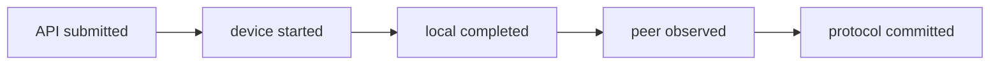
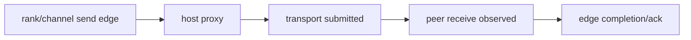
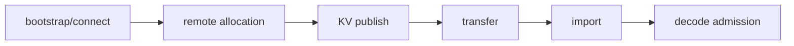
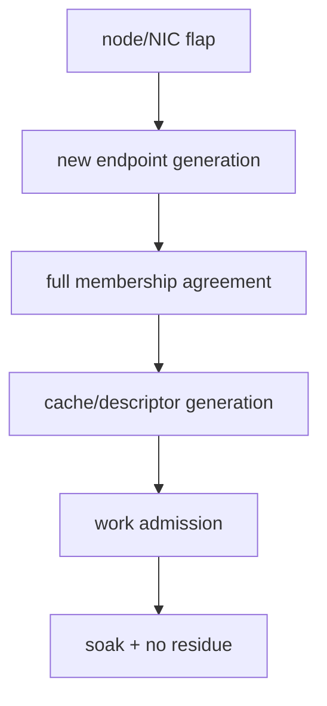

# 71장. 멈춘 rank가 범인이라는 보장은 없다: NCCL·P/D·network hang 사건집

D71은 8-GPU tensor-parallel decode replica 두 개 중 하나가 배포 40분 뒤 token 출력을 멈춘 사건이다. Rank 3
watchdog가 먼저 신고했지만 rank 5의 마지막 collective sequence는 하나 작다. 같은 시각 P/D transfer tail과 import
대기도 늘었고 한 host의 NIC error counter가 올랐다. Restart 뒤 회복됐다는 사실은 원인을 설명하지 않는다.

이 장은 `submitted`, `device started`, `local completed`, `peer observed`, `protocol committed`를 서로 다른 완료 경계로
취급한다. Rank×operation sequence와 peer edge의 마지막 진행점을 맞춰 처음 완료되지 않은 edge를 찾고 timeout 신고자,
semantic owner, abort propagation, residue와 rejoin을 따로 닫는다.

## 71.1 D71 요청 하나를 application에서 P/D terminal까지 정렬한다

D71의 본문 spine은 timeout 유형 목록이 아니라 요청 `req-71`, collective sequence `S71`, communicator generation `G71`의 한 시간선이다. application wait에서 시작해 producer CUDA stream, NCCL task·plan·device work, proxy·network edge, P/D descriptor와 remote allocation, usable-KV commit, decode admission까지 내려간다. 각 층에서 `last present`와 `first absent`를 한 칸씩 기록한다. 명령과 환경별 변형은 장말 참고 카탈로그로 보내고 이 시간선의 판정 근거로만 호출한다.

### 71.1.1 watchdog reporter와 failed owner를 분리한다

Rank 3이 10:40:05에 timeout을 출력한 것은 그 rank의 watchdog이 먼저 threshold를 넘었다는 뜻이다. Rank 5가 sequence
812를 submit하지 않았고 나머지가 812에서 peer를 기다렸다면 reporter와 first divergence owner가 다르다. D71은
log arrival order 대신 communicator generation, rank, operation sequence와 last submitted/started/completed를 맞춘다.

Restart로 회복된 것은 communicator, streams, proxy state, endpoint와 P/D generations를 동시에 교체한 복합 intervention이다.
어느 state가 원인이었는지 반증하지 못한다. Watchdog threshold를 늘려 다음 신고가 늦어져도 progress edge가 닫히지
않으면 hang은 그대로다. Reporter는 detection owner, collective control flow 또는 peer edge는 semantic owner다.

Watchdog timestamps는 다른 process clocks에서 온다. Rank3 log가 20ms 빠르다는 사실을 causal order로 쓰려면 uncertainty가
더 작아야 한다. Sequence ordering은 clock이 불확실해도 쓸 수 있다. Rank5가 811 commit 뒤 812 entry가 없고 peers가
812 wait이면 exact wall time 없이도 edge를 bound한다.

GPU utilization이 0%가 아닌 것은 해당 communicator가 진행한다는 뜻이 아니다. 다른 replica/streams 또는 progress work가
utilization을 만들 수 있다. Per-rank process/device/stream mapping을 본다. NIC counter도 cumulative reset domain과
affected interface가 stuck path와 일치할 때만 evidence다.

Timeout은 request deadline, framework watchdog, transport timeout, RAS control timeout과 operator recovery로 나눈다. 먼저
울린 timer가 semantic owner가 아니며 scope/abort effect를 쓴다. 하나를 늘리면 다른 timer가 먼저 울릴 뿐 edge는 같다.

### 71.1.2 rank×sequence matrix로 한 칸씩 맞춘다

Sequence 811에서 ranks 0~7이 모두 local complete, 812에서는 ranks 0~4·6·7이 submitted이고 rank 5는 last=811이라고
하자. Count/dtype/root도 812에서 일치한다면 첫 incomplete edge는 rank 5 control flow→collective submit이다. Rank 5도
812 submitted지만 device start가 없다면 stream/launch, started 뒤 channel 2 recv from rank 4만 incomplete면 peer edge로
이동한다.

Matrix row는 `seq, kind, count, dtype, root, rank generation, API submit, device start, local complete`를 가진다. 빈 칸을
false나 zero로 채우지 않고 not-observed, not-entered, telemetry-missing을 구분한다. Collective sequence가 framework
iteration과 같은 번호라고 가정하지 않고 explicit join을 둔다.

Operation key는 communicator generation과 sequence pair다. C7 seq812와 C8 seq812는 다른 work다. Grouped calls에서는 API
ordinal, NCCL task와 device plan sequence를 구분한다. Count가 elements인지 bytes인지 dtype와 계산한다. BF16 count
4,194,304는 8MiB이고 한 rank가 8,388,608 elements를 넘기면 sequence가 같아도 contract mismatch다.

Last progress는 최신 log line이 아니다. Buffered log가 늦게 flush되고 telemetry가 먼저 멈출 수 있다. Device event,
peer observation과 application commit을 evidence grade별로 놓는다. Contradiction을 편리한 source 하나로 지우지 않는다.

### 71.1.3 다섯 완료 경계와 incident card를 제출한다

API return은 task acceptance, device start는 stream dependency가 풀려 kernel/work가 시작된 경계다. Local completion은
해당 rank의 device work가 끝났다는 뜻이고 peer observed는 상대 edge가 data/control progress를 확인한 상태다. Protocol
commit은 모든 required ranks/requests가 결과를 사용 가능한 serving state로 승격한 경계다. 앞 경계 하나로 뒤를
대체하지 않는다.

Local complete도 consumer-ready를 자동 뜻하지 않는다. Output device work가 끝났어도 consumer stream wait가 없으면 protocol
commit이 아니다. Transport sender completion도 receiver import를 보장하지 않는다. Completion token producer와 이를
관측한 consumer generation을 적는다.

Tensor collective commit은 required ranks가 correct stream에서 결과를 consume 가능한 상태, P/D commit은 receiver layout과
request owner가 검증돼 decode admission 가능한 상태다. Ack 하나를 공통 commit으로 쓰지 않는다.

D71 card에는 reporter Rank 3, suspected Rank 5, communicator C7, sequences 811/812, first incomplete edge와 evidence를
쓴다. Timeout propagation, abort acknowledgement, channel/proxy/transport residue, P/D inflight와 rejoin generation을
별 fields로 둔다. Closure는 restart success가 아니라 no-late-writer, full rank membership과 soak 성능 gate다.

## 71.2 application→CUDA stream→NCCL→proxy/network→P/D를 걷는다

### 71.2.1 task·plan·work enqueue는 device 완료가 아니다

NCCL v2.30.7-1의 고정 [`enqueue.cc` task→work planning](https://github.com/NVIDIA/nccl/blob/73cf112295c33aee2b895f329f592f2a9b4b0f97/src/enqueue.cc#L576-L853)은
collective tasks를 budget과 channels에 맞춰 plan/work queue로 옮긴다. Host가 이 경로를 지나 API task를 enqueue했다는
사실은 device가 kernel을 시작하거나 peer가 관측했다는 뜻이 아니다. D71 matrix의 submitted evidence를 local/peer
completion으로 승격하지 않는다.

소스 walk는 task의 kind/count/dtype/root, chosen channels와 plan boundary를 뽑는다. Empty operation이나 P2P ordering,
grouped launch가 sequence 관측을 어떻게 바꾸는지 caller와 함께 본다. Rank별 application control flow가 다른 tasks를
만들었다면 network를 조사하기 전에 divergence를 닫는다.

Work budgeting과 channel assignment 때문에 task 하나가 여러 channel works로 펼쳐질 수 있다. Task submit count와 peer
edge 수는 같지 않다. Task→plan→channel mapping으로 한 channel stuck과 task not-created를 분리한다. API trace만으로
valid plan launch를 확정하지 않고 group return/async error도 rank별로 본다.

### 71.2.2 CUDA stream과 launch dependency를 붙인다

Collective work는 caller stream ordering을 가진다. 앞 producer가 event를 record하지 않았거나 communication stream의
wait가 잘못된 generation을 가리키면 NCCL task가 host에서 보이면서 device start가 늦을 수 있다. 반대로 local kernel
complete 뒤 consumer wait가 빠졌다면 hang보다 correctness failure가 될 수 있다. Producer→event record→wait→collective
launch→completion event→consumer를 edge로 적는다.

Default stream, explicit communication stream과 CUDA graph capture/replay를 이름만으로 합치지 않는다. Actual stream
identity, capture generation과 event record/query timestamps를 둔다. 강제 synchronize로 현상이 사라지면 missing ordering
가설이 강해지지만 concurrency를 제거한 collateral effect가 있으므로 영구 처방으로 쓰지 않는다.

### 71.2.3 channel·proxy·transport progress를 분리한다

고정 [`proxy.cc` progress loop](https://github.com/NVIDIA/nccl/blob/73cf112295c33aee2b895f329f592f2a9b4b0f97/src/proxy.cc#L1760-L1810)는
host proxy가 ops를 polling/progress하는 경계다. Loop가 살아 CPU를 쓰거나 poll count가 증가해도 특정 send/recv edge의
network/device completion을 증명하지 않는다. Channel, peer, direction, step과 last progress를 matrix에 둔다.

Transport submit, local completion flag, remote receive/ack를 분리한다. NIC error가 증가한 host가 있어도 D71의 stuck
edge가 그 path를 사용했는지 topology/path evidence가 필요하다. 모든 channels가 멈췄는지 한 peer edge만인지에 따라
communicator-wide stream/control과 transport hypotheses를 나눈다.

## 71.3 사건 1 — collective sequence가 rank마다 다르다

### 71.3.1 count·dtype·root·kind와 sequence를 함께 비교한다

D71 sequence 812를 all-reduce, count 4,194,304, BF16, root 없음으로 고정한다. Ranks 0~4·6·7은 812를 submit했고
rank 5는 811까지다. Rank 3 watchdog은 812를 기다리다 먼저 신고했다. 이 matrix에서 rank 3은 reporter이고 first
incomplete control edge는 rank 5의 iteration→collective call이다.

Sequence number만 같아도 kind/count/dtype/root가 다르면 같은 operation이 아니다. Rank 5가 812 broadcast count 0을
호출하고 다른 ranks가 all-reduce를 호출했다면 “모두 812”라는 요약은 mismatch를 숨긴다. Tensor shape, conditional
branch, empty-batch handling과 group ordering을 rank별 source inputs까지 역추적한다.

Reduction op과 in-place/out-of-place contract도 둔다. Count/dtype가 같아도 one rank만 different op/root를 선택하면 같은
semantic operation이 아니다. Pointer equality보다 buffer role, allocation generation과 element range를 검증한다. Grouped
API는 begin/end nesting과 call order를 모아 error path가 flush를 건너뛰는지 본다.

### 71.3.2 control-flow와 shape divergence를 반증한다

경쟁 가설은 rank 5가 request batch/control branch를 달리 탄 경우, tensor shape가 달라 collective metadata가 달라진
경우, telemetry만 sequence를 잃은 경우다. Scheduler/runner iteration ID, batch request set, tensor shape/count와 NCCL
submit을 join한다. Rank 5에도 matching submit evidence가 다른 source에 있으면 not-entered 가설은 약해진다.

Empty local work를 collective skip 조건으로 썼다면 다른 ranks도 동일 global predicate를 써야 한다. Rank-local `count==0`
branch로 한 rank만 skip하면 peers는 기다린다. Synthetic matrix에서 one-empty-rank, all-empty, uneven shape를 넣어 모든
ranks의 ordered call list가 같음을 static/source와 runtime plan으로 검증한다.

Control-input conservation은 scheduler batch IDs, selected tokens, partition shapes와 collective tuples를 rank별로 비교한다.
첫 차이가 scheduler broadcast면 NCCL보다 upstream owner다. Rank5가 이후 iterations를 내면서 812만 빠졌다면 conditional
branch가 강하고, 811 뒤 완전히 silent면 host deadlock/error/OOM을 먼저 찾는다.

### 71.3.3 abort 뒤 communicator residue를 닫는다

Timeout owner는 watchdog이지만 semantic abort는 communicator generation 전체에 전달돼야 한다. 한 rank만 request를
fail하고 나머지가 C7 work를 계속 enqueue하면 late completion과 sequence drift가 남는다. New work admission을 막고
all ranks abort acknowledgement, queued plans/proxy ops와 CUDA work disposition을 수집한다.

Rejoin은 C8의 ranks 0~7이 같은 membership, topology와 first operation sequence에 합의한 뒤 시작한다. C7 completion이
C8 buffer/request를 mutate하지 않는 no-late-writer gate를 둔다. Closure는 mismatch fixture가 fail-fast하고 normal/empty
fixtures가 soak 동안 ordered sequence, throughput과 latency envelope를 통과하는 것이다.

Abort timeline은 rank3 report, coordinator issue, ranks 0~7 ack, device/proxy/transport terminal과 C8 create를 둔다. Ack
없는 rank를 무시하고 C8 rank number를 재사용하면 late C7 writer가 남는다. Fencing/generation guard를 확인한다. Sequence
validator 자체가 communication을 추가한다면 failure scope와 overhead를 canary에서 측정한다.

## 71.4 사건 2 — 모두 enqueue했지만 peer edge 하나가 끝나지 않는다

### 71.4.1 channel×peer last-progress matrix를 만든다

모든 ranks가 sequence 900을 submit/start했지만 channel 2의 rank4→rank5 edge만 step 31에서 멈췄다고 하자. 다른
channels는 step 64까지 local/peer complete다. Communicator-wide control hang보다 channel/peer/path hypothesis가 강하다.
Matrix는 channel, direction, peer, last transport submit, local completion, peer observation과 timestamp를 가진다.

Chosen topology에서 channel2 ring edge rank4→5만 step31, tree edge가 step64면 logical/physical edge를 좁힐 수 있다.
Required edges만 그린다. Logical payload 64MiB 중 48MiB submitted, 40MiB local complete, peer observed 32MiB라면 first gap은
32MiB 이후 receiver/ack다. Retry physical 80MiB여도 useful progress는 32MiB다.

Rank 5 전체가 느린지 해당 receive edge만인지 분리한다. Rank5가 다른 peers/channels에서 progress하면 GPU-wide deadlock과
process death는 약해진다. NIC counter도 stuck edge가 매핑된 interface/path와 시간적으로 일치할 때만 supporting evidence다.

### 71.4.2 proxy polling과 transport completion을 혼동하지 않는다

Proxy loop last heartbeat가 최신이어도 op step이 고정이면 “proxy alive, edge no progress”다. CPU starvation이면 모든
proxy ops의 poll interval이 늘 수 있고, 한 edge만 같은 step이면 transport/peer credit를 본다. Polling evidence를
network packet completion으로 승격하지 않는다.

Path isolation canary는 같은 peer edge를 alternate path로 보낼 때 progress가 회복될 것을 예측한다. 그러나 route 변경은
topology와 bandwidth를 함께 바꾸므로 source edge와 matched payload를 보존한다. Peer process가 receive를 post하지 않은
경우 sender NIC만 바꿔도 해결되지 않으며 receive-side last progress가 falsifier다.

### 71.4.3 path 격리와 soak 종료 조건을 둔다

완화는 faulty path 격리, endpoint 재연결, receiver progress 복구 가운데 first incomplete edge owner에 맞춘다. 모든
traffic을 한 path로 몰아 hang을 피하면 redundancy와 bandwidth가 줄어든다. Alternate path에서 같은 payload/segment와
sequence가 완료되는지, original path를 다시 넣었을 때 재현되는지를 제한된 canary로 본다.

Abort 뒤 channel work, proxy op, transport request와 registered buffer reference가 0 또는 terminal이어야 한다. Sender만
완료 처리하고 receiver late write가 남으면 buffer reuse를 허용하지 않는다. Soak은 one-edge fault injection, bidirectional
traffic, payload bands와 concurrent collectives를 포함하고 no-progress threshold 이전에도 edge step이 계속 증가하는지
본다. Throughput이 회복돼도 retry/physical bytes가 지속 증가하면 닫지 않는다.

## 71.5 사건 3 — CUDA stream dependency가 닫히지 않는다

### 71.5.1 collective 앞 producer event를 찾는다

Sequence 940이 ranks 모두 host submit됐지만 rank 2만 device start가 없다. Rank2 communication stream C는 producer
stream P의 event E17을 기다리고, E17 record가 conditional branch에서 생략됐다. Last-progress는 host plan enqueue이며
first incomplete edge는 `P record E17→C wait satisfied`다. Network와 proxy는 아직 work를 받지 않았으므로 NIC counter는
원인이 아니다.

Matrix는 rank, producer stream, event generation, record timestamp, wait enqueue, wait satisfied, collective start와
completion을 둔다. `wait enqueue됨`은 dependency 완료가 아니다. Event handle이 존재해도 old graph replay generation의
record를 참조하면 current input 준비를 증명하지 않는다.

Producer가 실제로 끝나지 않은 경우와 record만 빠진 경우를 나눈다. Producer kernel completion도 없으면 upstream
compute/memory investigation으로, producer complete인데 record/wait edge만 없으면 orchestration owner로 간다. 강제
device synchronize로 회복하는 현상은 ordering hypothesis를 지지하지만 모든 concurrency를 제거한 효과도 기록한다.

Producer matrix는 work identity도 가진다. Rank2 tensor generation G17 producer complete 11.8ms인데 event가 G16을
record했다면 wait가 풀려도 wrong-input 위험이다. No-start hang과 premature-start wrong answer는 같은 generation bug의
다른 결과다. Event handle보다 recorded work generation을 검증한다.

Collective local complete 뒤 completion event가 없어서 consumer가 기다리는 경우도 있다. Rank sequence와 proxy가 정상이라면
first edge는 complete-event→consumer다. Healthy communicator를 abort하지 않는다. Event query timestamp는 host polling이므로
작은 gaps의 exact device order로 과해석하지 않는다.

### 71.5.2 default·communication·capture stream을 구분한다

Default stream semantics를 모든 build/runtime에 보편 규칙처럼 추정하지 않는다. Actual stream handles, per-thread/default
mode, event flags와 capture state를 packet에 둔다. CUDA graph capture에서 record/wait가 capture됐는지, replay마다
입력 generation과 동일 edge인지 source/capture artifact로 확인한다.

수치 예에서 ranks 0,1,3~7은 E17 satisfied 12.0ms, collective start 12.1ms, local complete 13.0ms다. Rank2는 wait
enqueue 11.9ms 뒤 satisfied/start가 없다. Watchdog는 rank6에서 60s 뒤 울렸어도 divergence는 rank2 event다. 다른 ranks의
proxy가 기다리는 것은 downstream 결과다.

Competing hypotheses는 missing record, wrong stream, event reuse/generation, producer stall이다. Explicit fresh event canary,
capture bypass, same producer with a known marker를 한 축씩 바꾼다. Marker가 complete인데 wait가 안 풀리면 producer stall은
약해진다. Capture bypass만 회복하면 capture topology를 더 읽는다.

Graph matrix는 capture generation, replay ordinal, input buffer generation, producer event node, NCCL/consumer nodes를 둔다.
Replay 1~99 정상, 100에서 pool generation만 바뀌었다면 stale ownership을 본다. Wrong-stream negative fixture는 hang 대신
unprepared input을 읽을 수 있어 output sentinel correctness를 latency보다 먼저 검사한다.

Cancellation에서는 dummy event로 collective sequence만 맞추지 않는다. Invalid tensor를 reduce할 수 있다. All ranks가
collective skip/abort를 coordinated하게 결정해야 한다. Global synchronize fix의 token-throughput loss를 측정하고 minimal
record/wait edge로 correctness와 overlap을 회복한다.

### 71.5.3 timeout을 늘리지 않고 missing edge를 회귀한다

Watchdog 60→300s 변경은 missing event를 만들지 않을 뿐 아니라 더 오래 buffer와 communicator를 점유한다. 수정은
producer mutation과 event record를 same control path에 두거나 branch별 equivalent dependency를 보장해야 한다. Consumer
launch 전 event generation validation을 fail-fast할 수도 있다.

Regression은 normal, empty batch, cancelled producer, graph capture/replay, eager fallback과 stream reuse를 포함한다.
모든 ranks에서 record→wait satisfied→collective start ordering이 있고, cancellation은 consumer work를 enqueue하지 않거나
terminal abort로 전파해야 한다. Old event completion이 new request를 release하지 않는 no-cross-generation gate를 둔다.

Owner는 producer subsystem과 stream orchestration, timeout reporter는 watchdog이다. Cleanup은 pending events, graph
executables와 collective plans의 disposition을 확인한다. Soak 동안 hang이 없다는 것뿐 아니라 expected overlap과 latency가
회복돼 과도한 synchronization collateral이 없는지 본다.

## 71.6 사건 4 — P/D bootstrap room과 allocation에서 기다린다

### 71.6.1 connection 실패와 remote capacity wait를 나눈다

P/D request K71이 bootstrap room을 얻기까지 4.0s 기다렸다고 하자. DNS/connect/handshake가 실패한 것인지 remote room
capacity credit가 0이어서 대기한 것인지 같은 `bootstrap timeout`으로 묶지 않는다. Connection state, endpoint generation,
room request/offer, remote allocation start/end와 retry reason을 단계별로 둔다.

Connection은 20ms에 established됐지만 room offer가 4,020ms라면 network reachability는 정상이고 capacity/allocator가
first incomplete edge다. Connect SYN/handshake 자체가 완료되지 않으면 remote free blocks graph로 설명하지 않는다.
Room ID나 address가 왔다고 allocation과 registration이 usable하다는 뜻도 아니다.

SGLang 고정 [`ReqTimeStats` P/D fields](https://github.com/sgl-project/sglang/blob/71de97b264b04dcd514cf904003028aefe9775c8/python/sglang/srt/observability/req_time_stats.py#L596-L623)와
[bootstrap/transfer duration](https://github.com/sgl-project/sglang/blob/71de97b264b04dcd514cf904003028aefe9775c8/python/sglang/srt/observability/req_time_stats.py#L1010-L1040)을
phase evidence로 쓰되 metric duration만으로 internal connection/allocation state를 만들어내지 않는다. Missing subspan은
explicit observation-required로 둔다.

Bootstrap edge matrix는 requester connect issued/established, room request sent/peer observed, allocation queued/started/completed와
descriptor publish를 양쪽에서 맞춘다. K71-A는 connect 20ms, room request observed 25ms, allocation queued 30ms, start
3,900ms, complete 4,000ms다. K71-B는 connect retries만 있고 established가 없다. 둘 다 4s timeout이지만 A는 remote
allocator, B는 connection owner다.

Remote free bytes만으로 capacity를 확정하지 않는다. Free 16GiB인데 8GiB request가 기다리면 contiguous/layout-compatible
blocks, reservations, credits와 fairness를 본다. Small 1GiB requests가 계속 large 8GiB 앞에 배정되며 oldest가 20s로
자라면 total capacity보다 allocation starvation일 수 있다.

### 71.6.2 descriptor generation과 allocation owner를 고정한다

Room/descriptor는 P endpoint P7, D endpoint D12, allocator generation A4와 request generation R9를 묶는다. 주소와 byte
length가 같아도 D restart 뒤 A5가 됐다면 A4 descriptor는 stale다. Allocation success는 publish/transfer/commit을
자동 증명하지 않는다.

Capacity wait hypothesis는 remote free/contiguous blocks, queued allocation bytes와 release progress가 room offer 전에
악화될 것을 예측한다. Connection hypothesis는 endpoint handshake/retry가 먼저 실패한다. Descriptor mismatch는 offer와
allocation이 빠르지만 transfer/import validation에서 generation reject를 낸다. P/D bypass, preallocated room, fresh
endpoint canaries로 각각 반증한다.

수치 ledger는 requested 8GiB, offered 8GiB, registered 8GiB, submitted/completed physical bytes와 accepted imported bytes를
둔다. Bytes가 모두 8GiB여도 wrong layer/rank layout이면 usable commit은 0이다. Capacity 숫자와 semantic layout을 별로
검증한다.

Preallocated canary가 회복하면 allocation wait가 필요 조건일 수 있지만 stale validation을 우회했는지 본다. Fresh endpoint는
connection/path도 함께 바꾸므로 generation만 단독 확정하지 않는다. P/D bypass는 bootstrap·transfer·import 전체를 제거해
boundary 필요성만 보여 준다.

### 71.6.3 timeout·release·retry residue를 보존한다

Bootstrap timeout owner는 requester policy이고 remote allocation의 semantic cancel owner와 다를 수 있다. Requester가
3s에 떠났는데 4s에 room이 배정되면 late offer를 release해야 한다. Retry R10이 같은 logical request로 새 allocation을
받을 때 R9 late callback가 R10 descriptor를 덮지 못하게 generation guard를 둔다.

Conservation은 `requested rooms = waiting + allocated + imported + released + terminal_failed`로 검사한다. Retry마다
allocated/released가 누락되면 remote capacity가 줄어 다음 요청 tail을 만든다. Timeout을 늘려 성공하면 leak가 늦게
보일 뿐이다.

Regression은 capacity full/release, connect failure, late offer, requester cancellation과 endpoint restart를 포함한다.
No orphan room, no late writer, waiters bounded terminal, normal allocation latency와 throughput을 soak에서 확인한다. Room
quota를 늘린 완화는 KV/cache capacity collateral을 기록한다.

## 71.7 사건 5 — KV transfer는 끝났지만 decode admission이 없다

Late room offer는 requester stale-reject와 allocator release가 모두 보여야 한다. Callback drop만 하면 allocated room이
남는다. Timeout 2.9s offer와 3.1s late offer race에서 exactly one of imported/terminal-released가 성립해야 한다. Release
ack 유실은 same generation idempotent retry로 정리하며 다른 owner allocation을 free하지 않는다.

### 71.7.1 bytes 완료와 usable KV commit을 분리한다

P가 8GiB 전송 complete를 보고했지만 D request는 import waiting에 남았다. Transport local completion은 source buffer를
재사용할 수 있다는 의미조차 backend contract에 따라 다르며 receiver layout validation과 scheduler admission을 증명하지
않는다. D71 다섯 경계에서 transfer-complete와 protocol-commit 사이를 펼친다.

vLLM 고정 [KV connector metric handoff](https://github.com/vllm-project/vllm/blob/6e448d0ea9bf3d88d898b65449ca6dc2aec170ac/vllm/v1/metrics/loggers.py#L1140-L1149)와
[`PrefillStats` token conservation](https://github.com/vllm-project/vllm/blob/6e448d0ea9bf3d88d898b65449ca6dc2aec170ac/vllm/v1/metrics/stats.py#L300-L342)은
관측/accounting 경계다. Metric update 하나로 peer import 완료를 주장하지 않는다. Computed/local/external tokens의 합과
request accepted tokens가 맞는지 별 artifact에서 확인한다.

SGLang [transfer speed·latency metrics](https://github.com/sgl-project/sglang/blob/71de97b264b04dcd514cf904003028aefe9775c8/python/sglang/srt/observability/metrics_collector.py#L484-L522)도
transfer observation이지 decode-usable commit이 아니다. Source calculation endpoints와 request phase timestamps를 연결한다.

Completion semantics는 backend call/source로 확인한다. Sender future done, device/network completion, receiver callback와
application ack를 별 columns로 둔다. K71-C는 local complete 120ms, peer callback 125ms, import start 130ms, layout complete
180ms, wake 185ms, decode 220ms다. K71-D는 180ms 뒤 wake가 없다. Same transfer metric으로 구별할 수 없다.

### 71.7.2 import layout·generation·request owner를 검증한다

Import는 model revision, KV dtype, layer/head/rank slices, block table destination과 allocation generation을 검증해야 한다.
Bytes count가 맞아도 TP rank mapping이 old topology면 reject하거나 잘못된 cache가 된다. D12/A5/request R10에 P7/A4
descriptor를 적용하지 않는다.

Matrix는 transfer complete 120ms, receiver observed 125ms, import validation 130ms, copy/layout complete 180ms, scheduler
wake 없음으로 둔다. First incomplete edge는 import owner→scheduler wake다. Validation 자체가 5s 걸리면 import owner,
generation reject가 즉시 terminal이면 upstream stale descriptor owner다.

Competing hypotheses는 incomplete bytes, layout mismatch, generation reject, block allocation unavailable, lost scheduler wake다.
Checksum만으로 layout ownership을 증명하지 않는다. Same descriptor를 isolated validator에 통과시키고 fresh allocation에서
재현하며 wake callback count를 conservation에 넣는다.

Rank layout matrix는 source/destination TP rank, layers, KV-head slice, block IDs와 byte offsets를 가진다. Total 8GiB가 맞아도
rank2 slice가 rank3 destination이면 unusable이다. Per-slice coverage/non-overlap과 generation 뒤 bytes를 본다. OOM과 stale
generation은 retryability가 달라 generic transfer retry로 physical bytes를 늘리지 않는다.

### 71.7.3 scheduler wake와 terminal conservation을 닫는다

`published = transfer_inflight + receiver_observed + importing + runnable + terminal_failed + cancelled_released`가 request
generation별로 맞아야 한다. Import complete request가 runnable/terminal 어디에도 없으면 lost handoff다. Runnable인데
selected되지 않으면 decode scheduler capacity/fairness로 boundary가 이동한다.

완화는 generation validation, import failure propagation 또는 idempotent wake에 맞춘다. Blind retry가 duplicate import와
block ownership 충돌을 만들 수 있다. Wake retry는 request generation과 exactly-once terminal guard를 가진다.

Closure는 correct/wrong layout, stale generation, import OOM, cancel during import와 duplicate completion fixtures를
통과한다. No orphan blocks, no late scheduler insertion, token conservation과 decode TTFT/throughput이 soak envelope를
만족한다. Transfer graph만 green인 상태로 닫지 않는다.

Duplicate wake fixture는 runnable insertion, terminal transition과 block release가 각각 한 번인지 확인한다. Imported request만
selection이 늦는지 all runnable이 늦는지 비교해 handoff와 scheduler capacity를 분리한다.

## 71.8 사건 6 — cancellation 뒤 late completion이 도착한다

### 71.8.1 timeout reporter와 semantic abort owner를 나눈다

Request R20이 3s timeout으로 cancelled됐지만 transport T20은 3.2s에 local complete, receiver import callback은 3.3s에
도착했다. Timeout을 낸 API/request manager는 reporter이며 transfer engine, importer와 scheduler가 각 outstanding state를
terminal로 만드는 semantic owners다. Reporter가 future를 버렸다고 device/network work가 자동 취소되지 않는다.

Abort ledger는 request cancel issued/ack, transport cancel supported/accepted, device completion, receiver reject/release,
scheduler removal과 buffer free를 둔다. Backend가 in-flight cancellation을 지원하지 않으면 completion을 기다린 뒤 result를
discard/release하는 owner가 필요하다. “취소 성공” 한 boolean으로 이 차이를 숨기지 않는다.

처음 확인되지 않은 cleanup edge는 cancel propagation이 끊긴 곳이다. Request terminal인데 transport ownership이 active면
connector, receiver가 imported 뒤 scheduler에 삽입하면 generation validation/wake owner다. Watchdog communicator abort와
individual request timeout도 scope가 다르다.

Timeout 시 operation이 submitted-only, device-started, peer-observed 중 어디인지에 따라 cleanup이 다르다. State unknown에서
buffer를 즉시 reuse하지 않는다. Communicator abort는 shared operations를 poison하고 request cancel은 logical one만 terminal로
만든다. Already launched batch에서 member 하나를 빼 sequence를 바꾸지 않는다.

### 71.8.2 old completion이 새 generation을 mutate하지 못하게 한다

Retry R21이 같은 logical key로 새 block B9를 소유할 때 R20 late completion이 key equality만 보고 B9 ready를 set하면
wrong KV 또는 premature admission이 된다. Callback payload에 request attempt, endpoint/allocator generation과 operation
sequence를 넣고 current owner와 일치할 때만 commit한다.

수치 matrix는 R20 cancel 3000ms, R21 allocate 3050ms, T20 complete 3200ms, R21 transfer complete 3300ms다. Generation
guard가 없으면 3200ms callback가 R21을 100ms 일찍 wake할 수 있다. Guard는 T20을 stale terminal로 분류하고 its buffer/
credit만 release한다.

Falsifier는 late callback를 의도적으로 reorder해 new owner state가 불변인지 확인하는 fixture다. Callback drop만 하면
old resources가 leak될 수 있으므로 “mutate 금지”와 “cleanup 수행”을 동시에 검증한다. Idempotent duplicate completion도
reference count를 두 번 줄이지 않아야 한다.

Buffer sentinel fixture는 R20/R21에 다른 generation patterns를 둔다. Host callback rejection 전에 DMA가 이미 destination을
쓸 수 있어 device/network terminal evidence 전 address를 pool로 반환하지 않는다. Generation-safe staging은 memory/latency
cost가 있지만 new owner corruption을 막는다.

### 71.8.3 loser cleanup과 no-late-writer gate를 둔다

Timeout 완화는 deadline 연장이 아니라 cancel propagation과 generation guard다. Transport를 강제 abort하면 communicator나
shared channel의 다른 requests까지 영향받는지 scope를 기록한다. Graceful drain은 안전하지만 buffer reuse와 retry latency를
늦춘다. Policy는 correctness를 먼저 지키고 collateral goodput을 측정한다.

No-late-writer gate는 cancellation 이후 old operation이 request status, block table, KV bytes, credit, scheduler queue를
변경하지 않는 것이다. 허용되는 mutation은 old generation 소유 resource의 terminal release뿐이다. Audit log에는 rejected
late callback reason을 bounded class로 남기며 raw request ID를 metric label로 쓰지 않는다.

Soak은 cancel-before-submit, during-device-work, after-local-complete-before-peer-observed, after-import-before-wake를 포함한다.
All operations terminal, buffer/credit conservation과 retry correctness, latency/throughput을 확인한다.

Abort가 communicator-wide라면 unrelated requests의 collateral cancellation을 센다. Request-local timeout 하나가 shared
communicator를 abort해 99개 정상 requests를 잃을 수 있고, local discard만 하면 collective peers가 계속 기다릴 수 있다.
Scope는 operation semantics와 backend cancellation capability에서 결정한다.

Late completion은 빈도가 낮아도 correctness risk다. Generation rejection, stale releases와 new-state mutation assertion을
본다. Callback를 drop해 rejection 0으로 만드는 완화는 release leak를 숨긴다. Old attempts가 terminal 전 unlimited retry되면
rooms/credits/physical work가 증폭하므로 active attempts를 bounded하게 유지한다.

Loser table은 attempt, bytes, local/peer state, abort requested/acked, buffer owner, credit/room release와 terminal timestamp를
가진다. Winner success가 loser rows를 지우지 않는다. Delayed/duplicate/reversed callbacks와 restart soak에서 old writes
rejected, resources released, outstanding slope 0과 goodput을 확인한다.

## 71.9 사건 7 — node·NIC flap 뒤 부분 rejoin한다

### 71.9.1 communicator·rank·endpoint generation을 함께 바꾼다

Node N5 NIC flap 뒤 process만 재시작하고 peers가 communicator C7을 유지하면 rank 5 endpoint와 peer connection state가
엇갈릴 수 있다. New process가 같은 rank number/IP를 가져도 incarnation이 다르다. Communicator C8, rank incarnation,
transport endpoint E8과 P/D cache/descriptor generation을 함께 합의한다.

Rejoin state는 discovered, connected, communicator-ready, cache-compatible, work-admitted를 나눈다. Health endpoint가 up인
것은 collective membership agreement가 아니다. 일부 peers만 E8을 보고 다른 peers가 E7을 보면 첫 collective가 peer
edge에서 멈출 수 있다.

Matrix는 ranks 0~4·6·7 membership C8/E8, rank5 C8/E8인데 peer rank2만 cached endpoint E7인 상황을 명시한다. Full
pairwise required edges 또는 topology-specific required adjacency가 same generation을 가리켜야 work를 admit한다.

Rejoin rank matrix는 each rank가 본 communicator, world/rank map, peer endpoint generations, channel plan hash와 ready epoch를
가진다. Coordinator view만 정상이면 부족하다. All required ranks가 same matrix를 ack한 뒤 admission을 연다. PID/IP/GPU가
같아도 CUDA context, registration keys와 communicator는 새 incarnation이다.

### 71.9.2 partial membership과 stale cache를 반증한다

Competing hypotheses는 communicator membership split, stale endpoint/registration, link degradation, application control-flow
skew다. First collective call lists가 같고 channel 1 rank2↔rank5만 connect/retry면 membership/endpoint가 강하다. Rank5가
collective를 호출하지 않았으면 flap 후 scheduler/request recovery control을 먼저 본다.

Stale KV/cache descriptor도 같은 endpoint address 때문에 통과할 수 있다. Registration generation과 allocator/cache
generation을 rejoin gate에 넣는다. Old P/D publish를 C8/D8에 적용하지 않고 fail/recompute 또는 verified migration을
선택한다. Address equality는 ownership equality가 아니다.

Fresh endpoint cache canary에서 회복해도 link degradation을 완전히 반증하지 않는다. Path error counters, matched edge
progress와 retry를 같이 본다. Node 전체를 격리해 회복하는 것은 communicator/endpoint/path를 동시에 바꾼 intervention이다.

Partial falsifier는 actual first send/recv handles의 generation이다. Config table이 split여도 data edges가 모두 E8이면 metadata
stale일 수 있고, table이 같아도 handle E7이면 operational split다. Sequence가 증가해도 retry/physical bytes와 edge age가
나쁘면 degraded link/recovery debt가 남는다.

### 71.9.3 rejoin matrix와 soak window를 통과한다

Rejoin admission 전에 ranks가 communicator unique identity, rank map, topology/channel plan, endpoint generations와 first
operation sequence에 합의한다. P/D endpoints는 descriptor/cache generation과 capacity readiness도 통과한다. 하나라도
unknown이면 traffic을 받지 않는다.

Fault matrix는 NIC flap, process death, delayed peer, repeated flap과 flap during P/D transfer를 포함한다. Abort C7, cleanup,
C8 formation, first collective, P/D import와 request output까지 timeline을 검증한다. C7 late completion이 C8 state를
mutate하지 않는 no-late-writer gate를 재사용한다.

Soak은 sequence skew 0, peer edge progress, retry/physical bytes stable, no stale descriptor rejects, latency/throughput baseline
envelope를 요구한다. Restart 직후 몇 requests 성공한 것만으로 닫지 않는다. Repeated rejoin이 resource/registration leak를
만드는지도 본다.

Repeated flap 10회에서 registrations/outstanding가 매번 증가하면 fail이다. Generation-owned objects C7...C16이 terminal인지
본다. Immediate recovery와 warm steady window를 분리하고 sequence skew 0, stale reject baseline, latency/throughput을 모두
통과한다.

## 71.10 사건 8 — watchdog·RAS·telemetry가 먼저 실패한다

### 71.10.1 RAS control plane과 data collective를 분리한다

NCCL 고정 [RAS network timeout handling](https://github.com/NVIDIA/nccl/blob/73cf112295c33aee2b895f329f592f2a9b4b0f97/src/ras/rasnet.cc#L714-L815)은
keepalive/control connection timeout 경계다. 고정 [RAS collective timeout state](https://github.com/NVIDIA/nccl/blob/73cf112295c33aee2b895f329f592f2a9b4b0f97/src/ras/ras_internal.h#L229-L266)는
RAS 자체 collective leg/whole-operation state다. 둘을 model execution all-reduce watchdog과 같은 timeout으로 쓰지 않는다.

RAS가 먼저 silent해도 data channel이 진행할 수 있고, RAS heartbeat가 살아도 data edge는 멈출 수 있다. Control-plane
last heartbeat, data collective sequence/channel step과 application output을 병렬 rows로 둔다. Reporter plane과 semantic
data owner를 분리한다.

RAS reporter가 먼저 사라진 run에서 data seq가 900→950까지 commit되면 control-plane loss와 data hang을 합치지 않는다.
반대로 heartbeat는 정상인데 channel2 step31이 60초 고정되면 healthy RAS가 data progress를 반증하지 않는다. Shared
node failure라면 두 planes가 함께 나빠질 수 있지만 각각의 first edge를 보존한다.

RAS timeout 연장은 control tolerance를 바꾸며 model watchdog 원인을 고치지 않는다. False positive면 heartbeat scheduling/
coverage와 data outcomes를 비교한다. RAS가 data abort를 trigger한다면 propagation source와 generation scope를 확인한다.

### 71.10.2 관측 공백에서도 last progress를 bound한다

Telemetry exporter가 10:40:00에 멈추고 watchdog이 10:40:05에 울렸다면 마지막 sample을 data progress 정지 시각으로
쓰지 않는다. Rank-local sequence logs, CUDA events, proxy/transport counters와 peer observations 중 남은 evidence로 lower/
upper bound를 만든다. Missing rank를 completed=false로 단정하지 않는다.

Rank5 last logged submit 811, peer ranks가 812 wait를 시작했고 811 output까지 client commit됐다면 rank5 progress는 최소
811 commit, 812 entry는 unknown이다. Framework iteration trace가 rank5 branch skip을 보이면 not-entered가 supported된다.
Evidence absence와 negative evidence를 구분한다.

Telemetry high sampling을 켜 hang이 사라지면 timing/overhead가 workload를 바꿨을 수 있다. Static fields, bounded ring
buffer와 postmortem dump처럼 hot path 영향을 줄이는 plan을 쓰고 production performance run과 분리한다.

Bound는 rank5 `seq811 committed ≤ progress < seq813`처럼 쓴다. Peer wait812는 rank5 entry 증명이 아니다. Explicit branch
skip marker가 있으면 bound가 좁아지지만 missing log는 no-call이 아니다.

Bounded ring buffer는 last tuples/states를 crash 뒤 회수할 수 있지만 hot-path synchronize를 넣지 않는다. Device event
query, proxy snapshots와 async dump의 overhead/drop을 canary에서 측정한다. Heavy profiler가 timing을 바꾸면 production과
분리한다.

Stuck operations가 event size를 키워 exporter에서 더 drop될 수 있다. Trace-present cases가 빠른 쪽으로 편향되는지
serialized bytes, drop reason과 duration proxy를 본다. Random missing 가정으로 cause frequency를 계산하지 않는다.

### 71.10.3 telemetry와 data-plane closure를 별로 둔다

Data-plane abort/rejoin이 성공해 output이 회복해도 RAS/exporter loss가 남으면 detection incident는 open이다. Telemetry가
복구돼 exact edge를 보여도 collective가 stuck면 service incident는 open이다. Two-state closure와 owner를 둔다.

Telemetry 종료는 per-rank/edge coverage, sequence join, clocks/generation과 drop counts가 정상인 상태다. Data 종료는
first incomplete edge 수정, abort residue 0, rejoin/soak와 performance gate다. Sampling을 무제한 올리는 것은 privacy와
overhead collateral을 가진다.

Two-state table은 data `open/contained/rejoined/closed`, telemetry `open/contained/closed`다. Data closed·telemetry open이면
future detection risk가 남고 telemetry closed·data open이면 조사를 계속한다. Historical D71은 당시 evidence confidence를
유지하고 새 telemetry로 소급해 root cause를 과장하지 않는다.

Temporary sampling/dumps는 expiry와 removal을 검증한다. 제거 뒤 canonical rank/edge coverage는 유지해야 한다. Debug raw
pointers/request IDs를 장기 저장하지 않고 bounded metadata와 generation joins만 남긴다.

## 71.11 D71 단일 시간선으로 timeout·abort·rejoin을 회귀한다

### 71.11.1 operation·edge·generation packet을 제출한다

Packet의 generation header는 deployment D19, communicator C7, ranks별 process incarnation, CUDA device/context, P/D endpoints,
allocator/cache generations를 가진다. Rank number만으로 process를 식별하지 않는다. Restart 전후 같은 rank 5라도
`rank5/C7/P42`와 `rank5/C8/P43`은 다른 owner다.

Operation row는 framework iteration, communicator, seq, kind, count, dtype, root, ranks별 submitted/started/local-complete,
stream/event generation을 가진다. Collective ordering을 비교할 때 logs의 문자열 순서가 아니라 same communicator의 ordered
call list를 만든다. Empty operation과 grouped calls가 sequence를 소비하는 규칙은 pinned source/call path로 확인한다.

Edge row는 channel, sender/receiver, proxy op/step, transport/path, local completion, peer observation와 timestamp/clock이다.
P/D row는 request generation, bootstrap room, allocation/descriptor, publish, physical bytes, receiver/import, scheduler wake와
terminal을 가진다. Collective와 P/D가 같은 NIC를 썼다는 사실만으로 causal edge를 합치지 않는다.

최소 D71 matrix는 다음 판단을 재현한다. Seq811은 ranks 0~7 protocol commit. Seq812는 ranks 0~4·6·7 submit/start,
rank5 not-entered 또는 unknown. Rank3 watchdog 60s. Channel edge evidence는 seq812 device work가 rank5에서 없으므로 아직
network first edge가 아니다. 동시에 P/D K71은 transfer complete 뒤 import wait이므로 별 incident branch다.

Evidence coordinate에는 producer와 semantic 범위를 쓴다. NCCL enqueue source는 plan construction, proxy source는 host
progress loop, RAS source는 control/RAS timeout, framework metric은 request accounting이다. 어느 source도 runtime D71이
실제로 그 branch를 탔다고 단독 증명하지 않는다. Runtime-required cells를 source-derived로 위장하지 않는다.

Packet은 raw pointers, payload와 request IDs를 장기 저장하지 않는다. Communicator/generation, bounded op metadata, sizes,
pseudonymous request join과 relative timestamps로 재현한다. Pointer가 필요하면 run-scoped opaque ID와 ownership generation을
사용한다.

### 71.11.2 competing hypothesis와 first incomplete edge를 닫는다

Hypothesis row는 claim, predicts, observations, falsifier, result, semantic owner와 timeout reporter를 가진다. `NIC error`가
아니라 `channel2 rank4→5 transport step31이 고정되고 alternate path에서 같은 seq/payload가 진행할 것`처럼 쓴다.
Rank5 control-flow 가설은 matching seq812 submit evidence가 나오면 reject된다.

D71의 초기 가설은 여섯 개다. Rank5 branch/shape divergence, rank3 stream dependency, rank4↔5 transport, P/D import lost
wake, communicator generation split, telemetry loss다. Operation matrix가 rank5 not-entered를 support하면 transport는
collective branch에서 reject되지만 P/D transport는 별 request로 남을 수 있다. 두 증상을 하나로 합치지 않는다.

처음 확인되지 않은 edge review는 producer/consumer와 last confirmed states를 명시한다. `rank5 runner iteration 4021 completed,
expected collective seq812 call absent; peers seq812 submitted`처럼 쓴다. “rank5 failed”보다 code owner와 instrumentation
gap이 명확하다. Entry가 unknown이면 source branch trace를 추가하기 전 control divergence를 확정하지 않는다.

동시에 여러 edges가 incomplete이면 causal ordering을 본다. P/D import wait가 rank5 scheduler를 막아 collective call을
skip했다면 P/D가 upstream이고 collective mismatch는 consequence다. Rank5 scheduler가 다른 requests를 계속 수행하고
P/D request만 blocked라면 causal link는 약하다. Iteration request set과 blocked dependency를 join한다.

Falsifier는 safe intervention과 observation으로 쓴다. P/D bypass에서 collective sequence가 맞아지면 coupling hypothesis가
강해지지만 topology/workload도 바뀐다. Same rank control input에 dummy-ready dependency를 주는 limited fixture, identical
batch shape replay로 confounder를 줄인다. Production에서 destructive fault를 즉흥 실행하지 않는다.

Result는 supported/rejected/unknown/invalid-run이다. Missing rank log를 not-entered로, absent NIC error를 healthy path로
바꾸지 않는다. Coverage, clock uncertainty와 mixed generations가 있으면 unknown/invalid를 유지한다. Unknown에는 next
observation owner와 expiry가 있다.

### 71.11.3 fault matrix가 residue와 성능을 함께 검증한다

Fault rows는 one-rank branch skip, count/dtype mismatch, missing stream event, one peer edge stall, proxy starvation, bootstrap
capacity full, import generation reject, late completion, NIC flap과 telemetry loss다. Columns는 first edge, expected reporter,
abort scope, terminal resources, rejoin generation, correctness, latency/throughput과 coverage다.

Branch-skip fixture는 one rank가 seq N을 호출하지 않을 때 watchdog 전 ordered-call validator가 fail-fast 가능한지 본다.
Mismatch fixture는 count/dtype/root differences를 inject하고 buffers를 실행 전에 reject한다. Stream fixture는 event record
branch를 제거해 host submit 뒤 no-start pattern을 재현한다. 각 fixture가 다른 first edge를 내야 incident classifier가
의미 있다.

Peer stall fixture는 channel 하나의 receive/progress를 지연하고 다른 channels가 진행하는지 본다. Proxy starvation은
모든 proxy op polling interval을 늘려 one-edge transport와 구분한다. Bootstrap full은 connection success와 room delay,
import reject는 physical complete와 protocol commit 차이를 oracle로 둔다.

Late-completion fixture는 cancel과 retry callbacks를 reorder한다. Old attempt는 new request/block을 mutate하지 않고 own
resource만 release해야 한다. NIC flap fixture는 C7 abort, full cleanup, C8 membership/endpoint/cache agreement와 first
collective/P/D request를 검증한다. Partial peer E7 cache가 남으면 admission을 막는다.

Residue ledger는 communicator plans, CUDA events/graphs, proxy ops, transport requests, registered buffers, P/D rooms/credits,
blocks, scheduler requests와 callbacks를 owner별로 센다. 정상 steady-state pool objects와 incident-created outstanding을
구분한다. “메모리가 남아 있다”가 leak 증거가 아니며 generation별 outstanding이 terminal인지 본다.

Performance gate는 recovery correctness 뒤에 둔다. Excess synchronization, path disable, retry suppression이나 smaller
batches가 hang을 숨길 수 있다. Matched workload의 token/request throughput, TTFT/ITL, collective/P/D latency, physical bytes와
CPU proxy cost를 baseline envelope와 비교한다. Timeout 증가로 success rate만 좋아진 결과는 fail이다.

Soak은 정상 steady traffic, collective burst, P/D burst, cancellation과 one controlled recovery를 포함한다. Sequence skew,
no-progress edge, stale generation rejects, late writer와 residue growth가 없어야 한다. Workload가 해당 path를 밟지 않은
window는 not-exercised이지 pass가 아니다.

Rollback도 generation transition이다. Fix config를 원복한 순간, new communicator formation, old operations drain과 traffic
admission을 분리한다. Mixed C7/C8 window의 successes를 어느 버전 성능으로 쓰지 않는다. Rollback이 correctness gate를
지키지 못하면 자동화보다 drain/isolation을 우선한다.

## 71.12 MRH-71: rank 3이 신고했지만 rank 5의 application branch가 처음 갈라졌다

MRH-71 fixture는 tensor-parallel world size 8인 decode replica D71, communicator C17, application iteration 4421과
collective sequence 812를 사용한다. 같은 시각 prefill replica P71에서 request R71의 KV transfer T71이 decode로
도착한다. Dashboard는 decode output 0, rank3 watchdog timeout, P/D import waiting 24건, NIC receive error 증가를
동시에 보여 준다. 네 신호가 한 원인이라는 가정 없이 같은 timeline에 올린다.

Identity ledger는 `(deployment G17, communicator C17, rank 0..7, app iteration 4421, collective seq812, CUDA
stream generation S17, P/D request R71, transfer T71, KV generation K17)`을 가진다. Rank3 timeout log와 rank5
application trace, rank4→5 transport edge, R71 Store/connector commit을 이 tuple로 join한다. 같은 sequence나 request
문자열만으로 generation을 지우지 않는다.

Wall-clock은 host마다 ±12ms uncertainty가 있어 log line 순서만으로 first divergence를 고르지 않는다. Application
iteration과 collective sequence, CUDA event partial order, proxy step과 P/D state transition을 먼저 사용한다.
Timestamp는 duration과 동시성 범위를 보조한다. Rank3 report가 10:40:05.000이고 rank5 error가 10:40:05.007이어도
rank3이 원인이라는 결론은 나오지 않는다.

정상 iteration 4420에서 ranks 0~7은 application batch manifest B4420을 받고 local tensor를 준비해 seq811을 같은
kind/count/dtype로 submit한다. Communication stream에서 device start, local complete와 consumer event가 모두 닫히고
token output이 commit된다. R71 이전 P/D request도 transfer coverage, import validation, scheduler admission 순으로
끝난다. 이 정상 row가 incident row의 비교 기준이다.

Incident iteration 4421에서 ranks 0~4·6·7은 B4421을 받고 seq812 all-reduce, BF16, count4,194,304를 host submit한다.
Rank5는 connector completion callback를 처리하는 application thread에서 R71 generation validation failure 뒤 early
return한다. 이 branch가 collective call까지 공유된 control path를 빠져나가 seq812를 만들지 않는다. Rank5 last
submitted는 seq811이다.

다른 ranks는 seq812를 host enqueue하고 CUDA communication stream에서 device work를 시작한다. NCCL plan은 required
rank5 peer participation을 기다린다. Proxy threads와 일부 channel steps는 진행하지만 collective 전체 local completion은
닫히지 않는다. Rank3 watchdog가 threshold를 먼저 넘겨 신고한다. Rank3은 가장 느린 rank가 아니라 먼저 관측한
detection owner다.

같은 시각 R71은 P/D transfer T71의 bytes 4/4 완료를 기록했지만 decode-side object generation validation에서
K17 layout mismatch로 commit되지 않았다. Import waiting gauge 24에는 R71과 정상 transfers가 함께 있다. R71의
P/D commit wait는 rank5 early return을 촉발한 upstream event지만 bytes/network failure는 아니다. First application
divergence는 rank5 error branch가 collective participation까지 건너뛴 지점이다.

위에서 아래 추적은 Rank3 application future부터 시작한다. Future는 iteration4421 token output을 기다리고, output
owner는 consumer stream의 collective result event를 기다린다. 해당 CUDA stream은 seq812 NCCL work completion을
기다린다. Task/plan matrix는 rank5 task absence를 보여 준다. Rank5에는 device/proxy/transport edge가 생기지 않았으므로
network path를 더 내려가는 것은 이 branch의 원인 조사가 아니다.

아래에서 위 추적은 NIC와 proxy에서 시작한다. Rank4→5 receive edge가 no-progress처럼 보이지만 rank5 proxy에는
matching seq812 receive task가 없다. NIC error counter는 같은 host의 다른 traffic에서도 증가하고 affected interface가
C17 chosen path와 일치하지 않는다. Transport submit 부족을 application call list까지 역추적하면 rank5 seq812 absence에
도달한다. Network failure 가설은 matching work가 생성되지 않았다는 evidence로 반증된다.

CUDA stream 가설도 같은 방식으로 분기한다. Rank5 host task 자체가 없으므로 missing producer event가 device start를
막은 상황과 다르다. Ranks0~4·6·7은 producer event satisfied와 NCCL start가 관측된다. Rank5에 submit가 있었다면
record→wait satisfied→device start를 보겠지만 여기서는 첫 edge가 그보다 위다. Forced synchronize로 incident가
사라질 수 있다는 추측은 관련 없는 concurrency 변경이다.

Collective mismatch 가설은 두 단계다. 첫째 ordered call list 길이가 rank5에서 하나 짧으므로 sequence mismatch는
사실이다. 둘째 kind/count/dtype/root mismatch가 원인인지는 별도다. Rank5가 seq812를 다른 metadata로 호출한 것이
아니라 아예 호출하지 않았다. 따라서 tensor shape mismatch보다 conditional control-flow divergence가 정확한 owner다.
Metadata table의 빈 칸을 count0으로 채우지 않는다.

Rank skew 가설은 “rank5가 느려서 아직 도착하지 않았다”를 예측한다. 그러나 rank5 application thread는 iteration4422
housekeeping log까지 남기고 B4421 state를 terminal error로 바꿨다. Matching collective call이 나중에 도착할 수 있는
pending state가 아니다. Scheduler/runner input은 다른 ranks와 같았고 connector validation branch만 달랐다. 단순
compute skew나 CPU starvation은 약해진다.

P/D commit wait 가설은 collective와 독립적인 decode admission stall을 설명하지만 rank collective hang 전체의
semantic owner인지는 묻는다. Correct design이라면 R71 import failure는 R71만 fail/retry하고 모든 ranks가 iteration
control을 합의하거나 coordinated skip을 수행해야 한다. Rank5 local callback가 TP-wide call path를 단독 탈출한 것이
coupling bug다. Connector validation failure 자체는 합법적인 실패일 수 있다.

소스 walk는 application branch에서 NCCL wrapper까지 실제 call consumer를 고정한다. NCCL의 고정 enqueue task→plan
source는 rank별 task가 있어야 work가 만들어짐을 보여 주고, proxy progress loop는 존재하는 ops만 진행한다. Rank5
application submit evidence가 없는데 proxy가 해결할 것이라 기대하지 않는다. P/D connector 쪽에서는 bytes completion,
import validation, scheduler/request terminal의 owner를 나누고 callback error가 rank-local return을 만드는 caller를
찾는다.

MRH-71 rank matrix는 각 rank에 `batch manifest digest`, `connector result seen`, `application branch`, `collective
tuple`, `host enqueue`, `stream start`, `local terminal`, `watchdog report`를 둔다. Ranks0~4·6·7은 connector result를
global control input으로 받지 않았고 normal branch로 seq812를 호출한다. Rank5만 local R71 error를 iteration-wide
return predicate로 사용한다. 최초 다른 열은 application branch다.

Collective tuple matrix 다음에는 channel matrix를 둔다. Seq812 task가 있는 ranks에 대해서만 plan/channel/peer edges를
펼친다. Rank4→5 edge가 step31에서 보인다는 telemetry가 있어도 rank5 matching task absence를 함께 표시한다. Sender
proxy heartbeat, transport attempts와 receiver no-task를 구분한다. “network edge stuck”과 “peer never posted required
work”는 recovery가 다르다.

P/D matrix는 T71 submitted, slices terminal, decode allocation, validation, object commit, request admission과 cleanup을
둔다. Bytes complete는 true, validation false, commit false다. R71 should fail or retry safely; K17을 usable로
승격하지 않는다. Collective를 맞추려고 invalid KV를 decode batch에 넣는 dummy success는 correctness를 훼손한다.

Containment 첫 단계는 C17에 새 work admission을 막고 ranks0~7에 coordinated abort를 전파하는 것이다. Rank3 timeout만
fail하고 다른 ranks가 seq813을 enqueue하지 않게 한다. Application requests는 C17 generation에 묶여 fail/retry
policy로 이동한다. R71 K17은 query/admission에서 숨기고 T71 late events가 새 attempt를 바꾸지 못하게 격리한다.

둘째 단계는 reporter rank만 재시작하는 것이 아니라 communicator generation C17 전체를 drain/abort한다. 각 rank의
queued plan, CUDA work, proxy op, transport request와 consumer event disposition을 모은다. Abort acknowledgement가
host return만 뜻하는지 device/transport residue까지 뜻하는지 확인한다. Unknown late writer가 있는 buffers는 reuse하지
않고 quarantine한다.

셋째 단계는 R71 retry를 new request/import generation R72/T72/K18로 만든다. Same key와 buffer address를 generation
identity로 쓰지 않는다. Late T71 completion은 K17 closed ledger만 terminalize하며 K18 commit을 바꾸지 않는다.
Connector retry 성공이 C17 collective residue를 정리했다고 가정하지 않는다. 두 cleanup graph는 join되지만 owner가
다르다.

Known-good rollback은 G16 connector callback policy와 TP control-flow adapter를 한 set으로 되돌린다. Image만 내리고
in-memory callback이나 cached graph가 G17 branch를 유지하지 않는지 확인한다. C18 communicator를 새 membership과
stream generation으로 만들고 ranks0~7 ordered call digest가 첫 operation부터 일치해야 request를 받는다.

Rollback gate는 먼저 correctness다. Import validation failure가 rank-local invalid KV decode로 우회되지 않고 R71만
fail/retry하며, TP ranks는 global iteration decision을 공유해야 한다. 다음은 liveness다. One-rank connector failure
fixture에서도 all ranks가 동일 collective call 또는 coordinated skip/abort terminal에 도달한다. 마지막은 performance다.
Normal P/D traffic의 TTFT/ITL과 collective throughput이 baseline envelope를 통과한다.

Permanent fix는 connector callback result를 rank-local early return에 직접 연결하지 않는다. Batch manifest/control
owner가 ranks 사이에 outcome을 합의하고, proceed면 모두 동일 ordered collective list를 실행하며 abort면 모두 current
iteration을 terminalize한다. Empty/failed local work를 rank-local predicate로 collective skip하지 않는다. Exact
broadcast mechanism은 framework source에 맞추되 global predicate invariant를 fixture로 검증한다.

반증 fixture A는 rank5에서 connector validation failure를 주입한다. 기대값은 ranks0~7이 모두 seq812를 호출하지
않고 coordinated request failure를 내거나, validated fallback data로 모두 동일 seq812를 호출하는 둘 중 하나다.
일부 rank만 호출하는 결과는 실패다. Watchdog timeout까지 기다리지 않고 ordered call validator가 fail-fast해야 한다.

Fixture B는 모든 ranks가 matching seq900을 submit한 뒤 실제 rank4→5 transport edge를 끊는다. 이때 rank matrix는
모두 host/device start이고 channel matrix에서 특정 edge progress가 멈춰야 한다. Alternate path 또는 edge recovery가
원인을 바꾸고 application call lists는 동일하게 남는다. MRH-71 fix가 genuine network failure까지 control-flow 오류로
오분류하지 않는지 본다.

Fixture C는 rank2 producer event record를 생략한다. Rank2 host submit는 존재하지만 device start가 없고 proxy task
progress 전 stream wait에서 멈춰야 한다. Fresh event 또는 correct record/wait fix가 직접 회복한다. Rank task absence인
MRH-71과 관측 column이 다르다. 이 negative control이 source layer 분기를 검증한다.

Fixture D는 T71 bytes를 모두 전송하고 K17 import validation만 실패시킨다. TP global control이 이를 안전하게 합의하고
collective mismatch 없이 request terminal을 만들어야 한다. Bytes complete를 commit으로 승격하지 않고 stale K17
query/admission이 0인지 본다. P/D commit wait와 NCCL progress가 서로 다른 terminal을 유지해야 한다.

Fixture E는 rank5 process를 500ms 늦추되 결국 같은 seq812 tuple을 submit하게 한다. Watchdog threshold 아래에서는
모두 완료되고 rank skew로 기록된다. Delay를 늘려 timeout이 나도 ordered call list는 matching이며 first incomplete
edge는 not-entered branch가 아니라 late application/submit이다. MRH-71 control divergence와 구분한다.

Recovery terminal은 한 번 token이 나온 것으로 닫지 않는다. C17 all-rank abort/disposition, no-late-writer, old proxy/
transport refs=0 또는 quarantined, K17 invisible와 cleanup, C18 full membership, R72/K18 validated commit이 필요하다.
정상·validation failure·one-rank delay·edge failure를 90분 섞어 ordered sequences와 resource conservation을 본다.

운영 timeline은 `last known good`, `first application divergence`, `downstream wait`, `report`, `containment`, `abort
acks`, `new generation admission`, `old residue terminal`의 여덟 marker를 가진다. Rank3 report를 incident start로
쓰면 rank5 branch와 그 앞의 connector validation을 놓친다. Wall time uncertainty가 있어도 sequence와 state transition으로
marker partial order를 보존한다.

양방향 추적의 위쪽 cursor는 application future F4421이다. 이 future가 기다리는 output token O4421, consumer event,
seq812 collective handle, NCCL plan/task를 차례로 내려간다. 각 edge에 producer, consumer, expected generation과 terminal
predicate를 쓴다. `wait()` stack frame 하나는 무엇을 기다리는지 알려 주지만 그 producer가 어느 rank에서 왜
멈췄는지는 알려 주지 않는다.

아래쪽 cursor는 rank4 sender edge와 rank5 receiver edge다. Transport request, proxy op, channel work, device plan,
host task와 application call을 거슬러 올라간다. Matching receiver task가 없으면 NIC packet/credit 분석을 계속하기
전에 task creation owner로 이동한다. 양 cursor가 rank5 seq812 application call absence에서 만나는 지점이 MRH-71의
최소 cut이다.

추적표의 edge 상태는 `not-created`, `created-not-submitted`, `submitted-not-started`, `started-no-progress`,
`partial`, `local-terminal`, `peer-terminal`, `consumer-committed`, `unknown`으로 제한한다. “stuck” 하나로 쓰지 않는다.
Rank5 seq812 task는 not-created이고, ranks0~4·6·7 tasks는 started-no-global-terminal이다. T71은 transfer-terminal이지만
consumer-commit-failed다.

Not-created와 unknown도 다르다. Rank5 application ordered-call log와 branch trace가 seq812 skip을 증명하면
not-created다. Telemetry가 유실돼 submit 여부를 모르면 unknown이며 network와 control-flow 가설을 둘 다 연다.
Absence of log를 call absence로 확정하지 않는다. Independent call-list digest나 task registry가 corroborate해야 한다.

Ordered-call digest는 `(ordinal, kind, count, dtype, root, reduction op, buffer role)` tuples를 iteration별로 hash한다.
Ranks0~4·6·7 digest는 H812, rank5는 H811-end다. Hash mismatch만으로 원인을 숨기지 않고 최초 다른 tuple/length를
펼친다. Sensitive pointer 값 대신 allocation/generation과 element range를 사용한다. Hash collision에 correctness를
의존하지 않고 진단 요약으로만 쓴다.

Application control input도 conservation한다. B4421 manifest가 ranks0~7에 동일 digest로 전달됐고 selected request
set과 tensor shapes가 같다면 scheduler broadcast divergence는 약하다. Rank5 connector callback result가 local-only
field를 바꾼 뒤 collective call list만 짧아졌다는 순서를 본다. Manifest 자체가 다르면 first divergence는 더 위의
broadcast/serialization owner로 이동한다.

P/D callback thread와 model execution thread가 다르면 causal handoff를 명시한다. Callback가 R71 import future를
error terminal로 만들고 rank5 iteration owner가 이를 poll/consume한 시각을 기록한다. Callback error가 다른 ranks에
어떻게 전파돼야 했는지 source owner를 찾는다. Thread timestamp가 겹쳐도 shared future/state generation과 wake-up
edge가 있어야 인과를 주장한다.

CUDA stream table은 task가 존재하는 ranks에 `producer event`, `wait satisfied`, `NCCL start`, `NCCL completion event`,
`consumer wait`를 둔다. Ranks0~4·6·7의 NCCL start가 true여도 collective local completion은 peer participation 때문에
false다. Rank5 row는 N/A가 아니라 host-task-not-created라 적는다. 그래야 stream 문제와 application skip을 혼동하지
않는다.

Proxy table도 task 존재를 전제로 한다. Rank4 channel2 send proxy가 rank5 receive를 기다리며 poll count를 늘리는
것은 proxy loop failure가 아니다. Rank5 matching op가 없으면 progress loop는 만들지 않은 work를 복구할 수 없다.
CPU usage나 heartbeat가 정상이어도 edge terminal은 false일 수 있고, heartbeat가 느려도 not-created task의 root
cause가 되지는 않는다.

Network counter를 적용하려면 interface mapping을 증명한다. Rank4/5의 chosen transport, NIC device/port, queue pair나
socket path와 error counter scope를 tuple에 붙인다. MRH-71에서 오류가 증가한 NIC1은 C17이 사용한 NIC0와 달랐다.
시간 상관만으로 network failure를 택한 오진이다. Fixture B에서는 일부러 chosen NIC0 edge를 끊어 이 mapping
검사가 실제 fault를 잡는지 확인한다.

Rank skew 판정에는 absolute submit time보다 ordered progress를 사용한다. Rank5가 seq811 뒤 application error
terminal이고 seq812 pending state가 없다면 infinite skew로 기다릴 이유가 없다. 반대로 fixture E에서는 rank5
iteration state가 RUNNING이고 eventual submit가 관측된다. Timeout 전 dynamic threshold를 늘릴지보다 skew owner가
진행 중인지 정체됐는지 구분한다.

Collective mismatch는 fail-fast validator 자체가 새 collective dependency를 만들지 않게 설계한다. Control plane에서
ordered-call metadata를 비교할 경우 validator timeout과 failure scope를 둔다. Hot path overhead를 측정하고 sampling으로
줄이더라도 error/rollout fixtures에서는 full validation을 쓴다. Validator가 멈춰 원 collective보다 먼저 hang하면
관측 도구가 새 failure owner가 된다.

Application-level coordinated abort는 모든 rank가 같은 지점에 도달해야 하지만 실패한 rank의 응답을 무한히 기다릴
수는 없다. Coordinator generation과 deadline, observed member set, missing disposition을 기록한다. Missing rank를
fence한 뒤 C17 generation을 폐기하며, surviving ranks가 C17 buffer를 새 C18 request에 재사용하지 못하게 한다.

CUDA work abort의 결과는 성공 bool 하나가 아니다. 아직 시작하지 않은 plan, running device kernel, local completed
but peer-unobserved work와 consumer event waiter가 서로 다른 residue를 가진다. Abort API return 뒤 각 category가
terminal인지, driver/process teardown에 의존하는지 source와 runtime artifact로 표시한다. Unknown work의 buffer를
free list로 돌리지 않는다.

Proxy/transport cleanup도 reference conservation으로 본다. C17 op handles created = completed + failed + quarantined가
맞아야 한다. Registered buffers는 last referencing op terminal 뒤 deregister/reuse한다. Sender local completion만
보고 receiver late write 가능성을 지우지 않는다. Fault injection 후 retry physical bytes와 orphan age가 bounded하게
수렴하는지 본다.

P/D cleanup equation은 R71 states created = admitted + failed + cancelled + quarantined다. K17 object는 validation
failure로 admitted에 들어가지 않는다. T71 terminal bytes가 있어도 K17 visibility와 scheduler admission은 false다.
R72/K18 retry success가 R71을 success로 재분류하지 않는다. 두 generations의 allocator and request refs를 각각
회수한다.

C18 rejoin 전에 four-way gate를 둔다. Membership gate는 ranks0~7 process/device mapping과 communicator incarnation,
stream gate는 current producer/consumer event generations, call-list gate는 normal/empty/error fixture의 ordered tuples,
connector gate는 P/D validation failure가 global decision으로 변환되는지 확인한다. 하나라도 실패하면 production
request admission을 열지 않는다.

Rejoin 첫 collective를 health-check payload만으로 끝내지 않는다. Realistic counts/dtypes, grouped calls, empty local
work와 connector error branch를 포함한다. Tiny all-reduce 하나가 성공해도 MRH-71 conditional skip path는 실행되지
않을 수 있다. 첫 100 iterations의 per-rank call digest와 completion frontier를 비교하고 sampling을 정상 수준으로
낮춘다.

Recovery 성능 gate는 정상 throughput만 보지 않는다. C18 collective p99, P/D import p99, TTFT/ITL, proxy retry bytes,
rank skew와 call validator overhead를 baseline과 비교한다. Alternate network path로 우회했다면 bandwidth 감소를
명시한다. Connector failure traffic에서 fail-fast latency와 unaffected request goodput도 본다.

False recovery 반례는 rank5를 재시작해 C17 remnants를 process teardown으로 우연히 없애는 것이다. Token output은
돌아오지만 다른 ranks의 old proxy ops나 K17 stale callbacks가 남을 수 있다. C18 generation fence와 old residue
terminal evidence가 없으면 restart success는 containment일 뿐이다. Same address/PID/rank number 재사용이 identity를
대신하지 않는다.

False root-cause 반례는 NIC error가 사라진 뒤 incident가 회복된 경우다. Rollback이 connector adapter, communicator와
NIC path를 동시에 바꿨다면 어느 intervention이 작동했는지 알 수 없다. MRH-71 replay에서 NIC path를 고정하고 rank5
branch만 수정해 recovery를 재현한다. Genuine edge fault fixture에서는 반대로 branch fix가 해결하지 못해야 한다.

False P/D recovery 반례는 validation을 비활성화해 R71을 decode에 넣는 것이다. Collective lists는 맞고 hang은
사라질 수 있지만 layout/generation이 틀린 KV를 소비해 wrong answer가 된다. Output oracle과 validation rejection을
liveness gate보다 먼저 둔다. Global skip/abort는 invalid data를 이용하는 것보다 느려도 올바른 recovery다.

첫 divergent owner 기록에는 직접 원인과 설계 coupling을 분리한다. Direct trigger는 rank5 R71 validation failure,
first divergent control edge는 rank5 early return, design defect는 rank-local connector outcome이 TP-wide collective
participation을 바꿀 수 있었던 coupling이다. NCCL peers와 rank3 watchdog은 피해/관측 owner다. 이 구분이 수정
repository와 runbook escalation을 정확히 한다.

Incident 15분 checklist는 간단하다. 1분에 communicator/rank/generation을 freeze하고, 3분에 rank×call matrix를,
5분에 host task/device start matrix를, 8분에 channel/proxy edge를, 10분에 P/D transfer/commit을 채운다. Earliest
non-matching column을 찾은 뒤 그 위아래 한 edge씩 corroborate한다. 모든 logs를 먼저 모을 때까지 containment를
늦추라는 뜻은 아니다. Unsafe new work와 reuse는 즉시 막는다.

60분 recovery checklist는 C17 admission block, all-rank abort/disposition, K17 revoke/quarantine, C18 four-way gate,
R72 validated retry와 old reference conservation이다. 각 항목에 owner와 timestamp, unknown disposition을 남긴다.
Unknown을 0이나 cleaned로 채우지 않는다. Quarantine capacity가 임계치를 넘으면 traffic admission을 줄이되 safety
gate를 해제하지 않는다.

90분 soak fault schedule은 0~15분 normal, 15분 rank5 connector validation failure, 30분 one-rank delay, 45분
rank4→5 chosen edge failure, 60분 missing CUDA event, 75분 cancellation+late T71 completion을 주입한다. 각 fault가
application, stream, task, edge, P/D commit columns에서 서로 다른 최초 빈칸을 만들어야 한다. Recovery 뒤 다음 fault가
old residue 때문에 오염되지 않아야 한다.

Soak terminal table은 ordered-call mismatch detected before watchdog, no invalid KV admission, no cross-generation write,
C17 refs convergence, C18 full membership, rank skew bound와 performance envelope를 가진다. Error logs가 0인 것이
목표가 아니다. 주입한 fault는 올바른 owner와 disposition으로 탐지돼야 한다. Alert를 조용하게 만드는 timeout 증가나
log suppression은 실패다.

MRH-71의 최종 한 문장은 모호한 “NCCL network hang”이 아니다. “R71 import validation failure를 소비한 rank5
application branch가 TP-wide seq812를 단독 skip했고, ranks peers가 기다리다 rank3 watchdog이 신고했다. C17과 K17을
각 owner로 abort/fence하고 global decision adapter로 call-list invariant를 회복했으며 C18/R72 soak에서 control,
stream, transport와 P/D terminal을 모두 닫았다.”라고 쓴다.

소스 근거 표에는 주장 범위도 붙인다. NCCL enqueue source는 task와 plan 생성 경계를, proxy loop source는
존재하는 operation의 progress 경계를 보여 준다. 이것만으로 rank5 application branch나 특정 NIC fault를 증명하지
않는다. Framework callback caller, runtime rank matrix와 fault injection이 나머지 칸을 채운다. Source-derived와
runtime-observed를 한 confidence로 섞지 않는다.

Application wait stack을 수집할 때도 process를 멈춰 liveness를 바꿀 수 있음을 기록한다. 짧은 coordinated snapshot,
existing watchdog artifacts와 non-blocking state dump를 우선하고, attach 비용을 canary에서 측정한다. Debugger 정지로
모든 ranks가 timeout되면 원래 first divergence와 관측 부작용을 분리한다. Evidence 수집이 새 collective skew를
만들지 않게 한다.

Rank matrix cardinality는 bounded하지만 request identity를 metric label로 내지 않는다. Communicator generation,
rank와 bounded frontier state는 metric에 둘 수 있고 exact iteration/request/call tuple은 incident trace에 둔다.
평상시에는 digest mismatch와 frontier spread를 집계하고 mismatch 발생 시 짧은 고해상도 window를 보존한다. 관측
비용 절감 때문에 오류 branch의 최초 tuple을 잃지 않는다.

P/D와 TP가 별 control planes를 쓴다면 failure propagation order를 문서화한다. Connector request abort가 TP iteration
decision으로 번역되고, TP communicator abort가 connector allocation cleanup을 요청할 수 있지만 서로의 terminal을
자동 보장하지 않는다. Deadlock을 피하려면 lock/callback ordering과 idempotent terminal handling을 fixture에서
검증한다. 한 owner가 다른 owner acknowledgement를 영원히 기다리는 recovery cycle을 만들지 않는다.

정상 종료 conservation은 수치로 남긴다. C17 ranks8 중 abort ack8, tasks7 submitted, local terminal0, failed7,
quarantined0처럼 실제 category 합을 맞춘다. R71 object1은 validation-failed1, visible0이며 T71 handles는 terminal4다.
C18 ranks8 ready8, first100 operations call-digest mismatch0, R72 visible1이다. “모두 정리됨”보다 누락을 찾기 쉽다.

Rollback decision record에는 어떤 기능을 희생했는지도 쓴다. G16 adapter가 connector failure에서 entire TP batch를
abort해 unaffected requests까지 retry시킨다면 liveness/correctness known-good이지만 availability 비용이 있다.
Permanent global decision fix는 affected request만 안전하게 분리할 수 있는지 후속 개선한다. 긴급 rollback과 최종
최적 설계를 같은 완료 조건으로 혼동하지 않는다.

마지막 review 질문은 네 개다. 어느 rank의 어떤 ordered call이 처음 달랐는가. Matching CUDA/NCCL work가 생성됐다면
어느 edge에서 progress가 멈췄는가. P/D bytes와 usable commit 중 무엇을 기다렸는가. Abort/rejoin 뒤 old generation이
새 buffer/request를 바꿀 수 없는가. MRH-71 dossier가 네 질문에 source와 runtime evidence로 답할 때만 사건을 닫는다.

사건 종료 뒤 첫 정기 훈련에서도 같은 다섯 fault를 재주입한다. Release가 바뀌어 callback, stream 또는 transport
owner가 이동했다면 기존 terminal을 자동 상속하지 않는다. Ordered call과 generation fence가 새 source consumer에서도
유지되는지 다시 증명한다.

**왜 reporter rank가 원인이 아닐 수 있는가.** collective는 여러 rank의 ordered participation을 기다리므로 먼저 timeout을 출력한 rank는 단지 기다림을 관측했을 수 있다. 다른 rank의 application branch, earlier collective tuple 또는 PD transfer completion이 처음 어긋나면 이후 rank가 NCCL 안에서 멈춘다. 그래서 비용과 원인은 error line이 아니라 rank별 last completed/enqueued operation과 topology edge의 첫 불일치에서 찾는다.

## 71.13 마지막 회고: 신고한 rank가 아니라 끊어진 edge를 고친다

### 71.13.1 D71을 닫는 한 문장

D71은 Rank 3의 watchdog 문자열로 닫히지 않는다. Rank 5가 sequence에 진입하지 않았는지, 모든 rank가 enqueue한 뒤
peer edge가 멈췄는지, P/D import가 scheduler control flow를 갈랐는지를 matrix와 falsifier로 판정해야 한다. Abort 뒤
old generation의 late writer가 없고 full membership·cache generation·performance가 soak window를 통과해야 재가입이
완료된다.

종료 보고에는 신고 rank와 최초 끊어진 edge를 별도 열로 남긴다. Ordered call 불일치라면 누락된 rank·sequence가 terminal evidence이고, transport stall이라면 matching enqueue 뒤 마지막으로 전진한 channel/peer step이 evidence다. P/D 분기라면 import readiness가 collective 진입 권한을 바꾼 최초 시각을 기록한다. 세 경우는 같은 watchdog 문구를 만들 수 있어도 재발 방지 owner가 다르다.

## 71.14 참고: 명령·fault injection·운영 복구 카탈로그

### 71.14.1 한 edge를 깨고 residue까지 회수한다

Fault run의 성공은 watchdog이 울렸다는 사실이 아니라 예상한 matrix cell에서만 진행이 멈추고 classifier가 같은
producer·consumer edge를 선택하는 것이다. 다른 edge가 먼저 멈추면 injection 자체가 invalid하다. Recovery run은 그
cell의 진행 재개와 old-generation terminal release를 모두 보여야 한다.

회귀는 baseline, single-edge fault, abort, rejoin, soak 순서다. Baseline operation list와 edge progress가 안 맞으면 fault를
넣지 않는다. Manifest는 rank map, communicator/channel plan, CUDA stream/capture, P/D endpoints, collective/payload mix와
arrival burst를 가진다. 평균 traffic만 같게 하지 않는다.

Rank oracle은 ranks 0~7의 ordered `(comm,seq,kind,count,dtype,root)` tuples를 비교한다. One-rank branch fixture는 rank5
tuple 하나를 제거하고 first validator가 entry edge를 가리키는지 본다. Shape fixture는 BF16 4,194,304와 rank5
8,388,608 elements를 넣어 element/bytes 혼동 없이 fail-fast 또는 actual API args를 복원한다.

Stream fixture는 rank2 event record를 생략한다. Expected는 host submitted, device-start absent, proxy edge not-created다.
Fresh event, capture bypass, synchronize controls가 ordering/capture/concurrency 가설을 나눈다. Reporter가 rank6이어도 first
edge는 rank2 producer record다.

Peer fixture는 seq900 channel2 rank4→5를 step31에 고정하고 others는 step64로 진행한다. Receiver no-post, sender stall,
proxy starvation을 별 injections로 만들어 matrices가 달라야 한다. Alternate path는 payload/segments를 맞춘다. Proxy
starvation은 multiple edges의 polling cadence가 함께 느려질 것을 예측한다.

Bootstrap fixture는 connection success 뒤 room credits 0, 4초 후 release다. Connect retry는 0이고 first edge는 room
offer다. Connect failure는 room state에 도달하지 않는다. 같은 timeout string이 다른 owner를 내야 한다. Import fixture는
8GiB completion 뒤 stale generation reject와 fresh-generation lost-wake를 분리한다.

Cancel fixture는 R20 cancel 3000ms, R21 allocate 3050ms, old completion 3200ms, new completion 3300ms다. At 3200ms R21
state는 불변이고 R20 resource만 release된다. Duplicate callbacks도 idempotent해야 한다. NIC flap fixture는 C7 abort/
cleanup 뒤 one peer E7-cache negative rejoin과 all-E8 positive rejoin을 비교한다.

Telemetry fixture는 RAS/control만 멈추는 run과 data edge만 멈추는 run을 나눈다. 첫 run에서 application commit이 계속되고
둘째에서 RAS heartbeat가 살아도 data seq가 고정돼야 한다. Control plane을 data truth로 쓰는 classifier는 fail한다.

Residue는 generation lifecycle로 센다. Created/outstanding/terminal-released가 plans, events, proxy ops, transports,
registrations, rooms, credits, blocks와 callbacks에 맞는지 본다. 정상 pools는 leak로 세지 않고 C7 ownership이 C8 soak 뒤
남는지 본다.

Performance는 path disable이나 global synchronize로 correctness만 통과시키지 않는다. Matched collective/P/D p99, token
throughput, TTFT/ITL, physical/logical bytes, retry와 CPU proxy cost를 baseline과 비교한다. Loss가 approved containment인지
permanent regression인지 표시한다.

Verdict는 supported/rejected/unknown/invalid다. Mixed generations, missing rank coverage, clock uncertainty와 workload mismatch는
invalid/unknown이다. Hang 미재현만 fix pass로 바꾸지 않는다. 이 장의 숫자는 teaching oracle이며 runtime production
claim이 아니다.

Reviewer는 raw matrix에서 first edge를 독립 선택한다. 합의가 안 되면 composite edge와 missing observation owner를 둔다.
Final packet은 collective rank5-entry branch와 P/D import branch를 별로 닫고 shared scheduler evidence가 있을 때만 하나의
causal tree로 합친다.

운영 dossier의 첫 15분은 재시작부터 하지 않는다. New work admission을 안전하게 차단하고 reporter/communicator/ranks를
고정한다. 각 rank last three operation tuples, process health와 async error, stream events, proxy/channel steps, P/D inflight를
bounded packet으로 수집한다. Capture가 hot path를 더 막는다면 snapshot priority를 정한다.

첫 분기는 operation list다. One rank tuple가 작거나 metadata가 다르면 control/shape divergence, all matching submitted인데
one no-start면 stream/launch, all started인데 peer edge no-progress면 channel/proxy/transport로 간다. Collective list가 정상이지만
P/D request만 import wait면 separate protocol branch다.

Rank table은 latest value만 보지 않고 seq N-2,N-1,N 세 rows를 둔다. N-1까지 commit됐는지 확인하면 communicator가 처음부터
broken인지 특정 transition에서 갈렸는지 알 수 있다. Rank restart가 섞이면 sequence 값이 비슷해도 generation이 달라
같은 row로 merge하지 않는다.

Edge table은 sender와 receiver evidence를 한 row에 놓는다. Sender submit/local complete만 있고 peer observed absent면 receiver
post/transport/ack 후보가 남는다. Peer observed 뒤 protocol commit absent면 downstream consumer/import/scheduler다. One-sided
log로 network fault를 확정하지 않는다.

Timeout decision은 remaining deadline, operation state, shared scope와 cleanup capability를 고려한다. Submitted-only plan을
cancel할 수 있는지, started collective가 communicator abort를 요구하는지, P/D transport가 request-local discard 가능한지
source/backend contract를 확인한다. Operator kill은 최종 fencing일 수 있지만 residue/rejoin plan과 함께 실행한다.

Abort propagation matrix는 coordinator, ranks, CUDA work, proxy, transport, P/D sender/receiver와 scheduler rows를 가진다.
각 row에 issue, acknowledgement, terminal disposition과 resource release를 둔다. `process exited`는 remote DMA/peer callback가
없다는 충분한 증거가 아닐 수 있어 endpoint fencing/generation guard를 확인한다.

Residue collection은 broad memory free graph보다 incident ownership을 본다. C7 plans/events/proxy ops, T20 transfers, A4 rooms,
R20 callbacks가 terminal인지 확인한다. Persistent pool C8 objects는 정상이다. Outstanding count가 restart마다 누적되면 leak이며
steady constant면 pool일 수 있다.

Rejoin readiness는 process liveness, communicator agreement, transport endpoint/registration, P/D cache/descriptor와 work admission
다섯 gates다. 네 gates만 통과한 partial ready를 traffic router가 사용하지 않게 한다. First collective와 first P/D request를
synthetic small work로 protocol commit까지 검증한 뒤 normal load를 연다.

Traffic ramp는 1%, 10%, full에서 sequence skew, edge age, retry/physical bytes, stale generation rejects와 application latency를
본다. Ramp percentage가 낮아 faulty peer/path를 밟지 않았다면 not-exercised다. Required topology edges와 P/D endpoints가
실제로 사용됐는지 확인한다.

Soak window는 expected hang onset 40분보다 길고 workload가 collective/P/D paths를 충분히 exercise해야 한다. 시간만 60분
채우는 것이 아니다. Operation counts, payload bands, cancellations와 one controlled endpoint transition의 coverage를 쓴다.
No hang만 아니라 no residue slope와 performance envelope를 요구한다.

Competing hypothesis audit에서 rejected row 하나를 evidence 없이 다시 주장해 본다. Rank5 entry evidence가 없다면 NIC error로
collective branch를 설명할 수 없고, P/D import complete 뒤 wake missing은 transport bandwidth로 설명할 수 없다. Card가
이 반박을 재현하지 못하면 source/observations가 부족하다.

소스 갱신 audit는 NCCL task scheduling/launch, proxy loop/RAS semantics와 framework P/D accounting/call sites를 diff한다.
Symbol 이름이 같아도 completion endpoint나 generation checks가 바뀌면 packet revision을 올린다. Old/new binaries가 mixed인
window는 semantic comparison에서 제외한다.

환경 변경은 option catalog가 아니라 causal mutation으로 기록한다. Path disable은 chosen peer edges와 available bandwidth를,
global sync는 stream overlap을, timeout change는 detection/recovery window와 outstanding resource lifetime을 바꾼다. Downstream
state와 collateral prediction이 없는 option tweak는 mitigation으로 승인하지 않는다.

Performance 회복도 survivor bias를 본다. Hung/cancelled requests가 histogram에서 빠지면 remaining p99가 좋아질 수 있다.
Submitted/admitted/committed/cancelled counts, useful tokens와 attempt/physical work를 함께 본다. Aggressive fail-fast가 queue를
깨끗하게 만들어도 logical success/goodput가 떨어지면 비용이다.

Security와 privacy는 distributed packet에도 적용한다. Buffer contents, raw pointers, endpoint credentials와 request identities를
dump하지 않는다. Generation-scoped opaque IDs, counts, dtype/shape, channel/step과 bounded reasons로 first edge를 재현한다.
Temporary detailed dumps는 access/expiry를 가진다.

최종 sign-off는 reporter team이 아니라 semantic edge와 cleanup/rejoin owners가 한다. Control divergence owner, communicator/
stream owner, transport/P/D owner와 platform telemetry owner가 자신에게 해당하는 falsifier/termination을 승인한다. Downstream
watchdog owner만 승인해 사건을 닫지 않는다.

72장 handoff question은 `왜 NCCL이 멈췄나`가 아니다. `동일 control tuple에서 rank2 event generation 수정이 device-start를
복구하는가`, `same payload에서 receiver post 복구가 channel2 step31을 진행시키는가`, `generation-matched import wake가
runnable conservation을 회복하는가`처럼 한 causal edge를 가진다.

소스 감사는 세 층을 교차한다. NCCL enqueue source는 task가 plan/channel work가 되는 host boundary, proxy loop는 host-side
progress scheduling, RAS files는 control/RAS timeout state다. Framework source는 request token accounting과 P/D phase/metric
observation이다. Runtime collective call site와 connector implementation이 있어야 actual D71 path를 증명한다. Metric family
definition을 transport ack나 protocol commit으로 승격하지 않는다.

NCCL source pin은 v2.30.7-1 commit `73cf112295c33aee2b895f329f592f2a9b4b0f97`다. `enqueue.cc` work planning
L576-L853, `proxy.cc` progress L1760-L1810, `rasnet.cc` timeout L714-L815, `ras_internal.h` RAS collective state L229-L266를
각 주장 바로 옆에서 사용한다. 파일 전체나 mutable branch를 근거로 쓰지 않는다.

vLLM pin은 v0.27.1 `6e448d0ea9bf3d88d898b65449ca6dc2aec170ac`다. Logger handoff L1140-L1149는 metric 전달,
Stats L300-L342는 computed/local/external token accounting이다. Connector-specific send/receive completion semantics를 이 두
spans에서 추정하지 않는다. D71 implementation packet에는 selected connector의 exact class/call site를 추가 관측 항목으로
남긴다.

SGLang pin은 v0.5.18 `71de97b264b04dcd514cf904003028aefe9775c8`다. ReqTimeStats L596-L623와 duration
L1010-L1040은 phase timestamps/calculation, collector L484-L522는 metric observation이다. Bootstrap room, allocation,
backend completion과 import/wake 내부 subedges가 직접 노출되지 않으면 unknown interval로 보존한다.

소스에서 도출한 fact와 intent inference도 나눈다. Work가 channel queue에 배치되고 proxy loop가 polling한다는 것은 code fact다.
왜 특정 channel count/algorithm을 선택했는지는 runtime selection과 official rationale가 없으면 의도라고 쓰지 않는다.
D71의 first edge는 source 구조와 runtime matrix의 결합에서 나온 inference다.

Exact source span이 upgrade에서 이동하면 line number만 기계 갱신하지 않는다. Symbol predicate, state mutation, error/cleanup
path가 같은지 diff한다. Work plan storage, launch, proxy state 또는 connector completion contract가 바뀌면 incident packet
schema와 falsifiers도 revision한다.

Evidence coverage table은 rank tuples 8/8, stream events 7/8, peer edges 95%, P/D stages 6/7처럼 분모를 가진다. Coverage가
없는 cell은 0이 아니다. Rank5 entry가 missing일 때 not-entered와 telemetry-lost hypotheses를 동시에 유지하고 independent
framework branch evidence로 좁힌다.

Clock table은 rank host clocks, GPU timeline domains, proxy host, P/D endpoints와 uncertainty를 가진다. Same-domain durations를
우선하고 cross-host timestamps는 interval bounds로 사용한다. Sequence/step ordering과 wall-clock duration을 같은 숫자로
섞지 않는다.

Operation conservation은 ranks가 동일 ordered collective list를 가져야 한다는 control invariant다. Edge conservation은
required channel works가 terminal local/peer states를 가져야 한다. P/D conservation은 published request가 inflight/importing/
runnable/terminal 중 하나이고 resources가 single owner를 갖는다는 invariant다. Closure는 세 invariants를 각각 검증한다.

Abort conservation은 every admitted operation이 committed 또는 aborted-terminal이고 every owned resource가 current owner 또는
released다. `process died`를 terminal disposition으로 대신하지 않는다. Peer/device/network late activity와 remote allocations가
남을 수 있다. Fencing과 generation guard 뒤 resource ledger를 닫는다.

Rejoin conservation은 new membership의 required ranks/edges가 same generation을 보고 old generation이 work-admission에서
배제되는 것이다. Partial ready가 timeout 뒤 자동 full-ready로 승격되지 않는다. Explicit acknowledgements와 first committed
operations가 필요하다.

Performance explanation은 correctness repair가 어떤 cost edge를 바꿨는지 쓴다. Global sync는 overlap, path disable은 bandwidth/
redundancy, lower batch는 collective payload/throughput, retry cap은 availability를 바꾼다. 결과가 좋아도 predicted mutation이
관측되지 않으면 traffic change 가능성을 남긴다.

Final D71 assertion은 두 branches다. Collective branch는 rank5 seq812 entry absent가 independent control trace로 supported될 때
rank5 control owner다. P/D branch는 transfer complete 뒤 generation-valid import/wake가 absent일 때 connector/import owner다.
Rank5 scheduler dependency가 두 edges를 연결했다는 evidence가 있을 때만 shared root로 합친다.

Closure statement는 `Rank3 watchdog`이 아니라 `C7 seq812 rank5 runner→collective entry 수정; all-rank ordered tuples and
C8 rejoin soak passed; P/D K71 import→wake generation guard passed; C7 late writers/residue zero`처럼 쓴다. Evidence가
unknown이면 statement도 unknown boundary를 보존한다.

사건 1 종료 row는 all ranks의 last 100 operation tuples와 empty/uneven fixtures를 검사한다. Sequence skew가 0이어도 metadata
tuple mismatch가 있으면 fail이다. Rank exception/early-exit가 peers abort로 전파되고 C7 outstanding이 terminal이어야 한다.
Fix 뒤 validator overhead, token throughput과 collective p99가 baseline envelope를 만족한다.

사건 2 종료 row는 every required channel/peer edge의 last step age와 useful/physical bytes를 본다. Alternate path containment
동안 original path는 quarantined이고 old transport requests가 late ack/write를 만들지 않는다. Path restore 뒤 retry slope,
error counters와 payload-band p99가 안정돼야 한다.

사건 3 종료 row는 producer generation→event record→wait satisfied→collective start→completion event→consumer ordering을 ranks
모두에서 확인한다. Eager/capture, empty/cancel과 replay generation fixtures가 correctness sentinel을 통과한다. Global sync가
남아 overlap/throughput을 희생하면 containment이지 final이다.

사건 4 종료 row는 connection established와 room allocation latency를 별 SLO로 둔다. Capacity full 뒤 releases가 credits/rooms를
복구하고 late offers가 stale rejected/released된다. Large/small allocation fairness와 remote KV/cache collateral을 통과한다.
Timeout boundary race에서 imported와 terminal 둘 다 되지 않는다.

사건 5 종료 row는 physical transfer, peer observation, layout/generation validation, import, wake, runnable과 selected를 잇는다.
Wrong TP slice/stale descriptor/import OOM/duplicate callback가 correct terminal owner를 가진다. Accepted external tokens와 block/
request conservation, TTFT/throughput이 정상이다.

사건 6 종료 row는 cancel phases 네 곳에서 old callback reorder를 검사한다. New attempt buffer/status/KV/queue는 불변이고 old
resources는 release된다. Outstanding attempts와 physical/useful bytes ratio가 bounded하며 communicator-wide abort collateral과
cancellation latency가 승인된다.

사건 7 종료 row는 flap마다 C-old abort, endpoint/register cleanup, C-new membership agreement, first collective/P-D commit을
검사한다. Ten repeats에서 generation-owned resource slope가 0이고 partial peer cache가 admission 전에 reject된다. Warm soak의
sequence skew, latency와 throughput이 정상이다.

사건 8 종료 row는 RAS/control과 data states를 독립적으로 fault한다. Data progress가 있을 때 control loss를 service hang으로,
heartbeat가 있을 때 stuck edge를 healthy로 분류하지 않는다. Telemetry coverage/drop/clock과 data abort/rejoin gates가 각각
closed이고 temporary dumps가 expiry된다.

Minimum packet이 부족한 운영 상황에서는 safe containment를 택하되 root cause를 확정하지 않는다. Unknown rank state에서
buffer reuse나 partial rejoin보다 admission stop, generation fencing과 full drain이 안전하다. 비용은 availability/latency로
기록한다. 안전 조치는 증거 없는 원인 서술 권한을 주지 않는다.

Timeout budget은 단계 합으로 검토한다. Request deadline 10s인데 collective watchdog 60s라면 request가 떠난 뒤 communicator
work가 50s 더 남을 수 있다. Transport retry 30s가 두 번이면 watchdog과 경쟁한다. 각 timer owner와 outstanding-resource
lifetime을 맞추고, 짧게 했을 때 false abort와 길게 했을 때 residue/capacity 비용을 측정한다.

Abort acknowledgement도 delivery될 수 있다. Coordinator가 rank ack를 못 받았다고 rank가 abort하지 않은 것인지 ack path가
깨진 것인지 분리한다. Device/proxy/transport terminal evidence와 process fencing으로 bound한다. Ack timeout 뒤 rank number를
즉시 재사용하지 않는다.

Peer-observed 완료는 required peers의 범위가 algorithm/protocol에 따라 다르다. Every rank가 every byte를 직접 관측해야
한다고 요구하지 않고 chosen plan의 necessary edges와 final collective semantics를 사용한다. 반대로 local completion 한
rank만으로 global result를 commit하지 않는다.

P/D와 NCCL shared path 가설은 time correlation보다 resource/edge contention prediction을 낸다. P/D physical retries가 증가할
때 same NIC/channel collective edge age가 늘고 P/D bypass 또는 isolated path에서 collective가 회복해야 한다. Rank5 not-entry
pattern에는 shared path가 direct explanation이 아니다.

Scheduler coupling 가설은 P/D import-wait request가 rank5 iteration control을 막아 collective call list를 갈라놓을 것을
예측한다. Rank5가 다른 runnable batch에서 collectives를 계속 호출하면 global coupling은 약해진다. Blocked request set,
iteration tuple와 collective entry를 join한다.

Closure reviewer는 restart-only counterfactual을 거절한다. Restart가 communicator, stream events, proxy, path, endpoint,
allocator/cache와 request queues를 모두 바꿨기 때문이다. 최소 one-edge fixture가 pre-fix pattern을 재현하고 post-fix에서
사라져야 causal confidence를 올린다.

마지막 audit은 여덟 사건마다 situation, last-progress matrix, exact source edge, competing hypotheses/falsifier, reporter와
semantic owner, abort/cleanup, rejoin/termination이 있는지 본다. 환경변수나 network 장비 설명으로 빈 owner cell을 채우지
않는다. 어느 사건이 timeout 연장이나 restart success로 끝나면 장은 미완료다.

D71의 final first-edge 판정은 세 증거 조합으로 닫는다. Framework iteration packet에서 rank5가 blocked P/D request를
처리한 뒤 collective call branch에 도달하지 않았고, NCCL operation list에서도 C7 seq812 rank5 tuple가 없으며, rank5
telemetry coverage가 해당 interval에 충분해야 `runner→collective submit`을 supported로 쓴다. 셋째 coverage가 없으면
not-entered와 lost telemetry를 unknown 경쟁으로 남긴다.

Rank3 reporter의 seq812 plan/work와 peer waits는 peers가 collective를 기대했다는 증거다. 이것만으로 rank5가 network에서
lost됐다고 하지 않는다. Rank5 matching task/plan이 발견되면 control divergence를 reject하고 device-start/stream matrix로
한 단계 이동한다. Device start까지 있으면 channel/peer matrix로 이동한다. Investigation boundary는 evidence가 나타날 때만
downstream으로 내려간다.

P/D K71 branch는 sender local completion, receiver observation과 generation-valid import를 순서대로 요구한다. Receiver가
bytes를 관측했으나 descriptor generation A4≠A5로 reject했다면 transfer hang이 아니라 stale owner다. A5 validation과 import
complete 뒤 wake가 없으면 import→scheduler edge다. Metrics의 transfer latency 상승은 후보 window를 정할 뿐 edge를
결정하지 않는다.

두 branches의 causal 연결은 rank5 scheduler control을 통해서만 주장한다. K71 blocked state가 rank5 iteration 4021을
중단해 seq812 call을 skip한 source/trace가 있으면 P/D가 upstream이다. Scheduler가 blocked request를 deferred하고 다른
batches에서 seq812를 호출했어야 한다면 lost entry는 별 bug다. 동시 발생과 shared NIC만으로 하나로 합치지 않는다.

Abort propagation은 C7 admission closed를 첫 mutation으로 한다. Coordinator abort issue 뒤 rank-local new task creation을
막고, already planned/device/proxy/transport works의 terminal disposition을 수집한다. P/D request cancel은 connector/import/
scheduler로 separately 전파한다. C7 collective abort가 모든 P/D rooms를 자동 해제한다고 가정하지 않는다.

Residue gate는 snapshot count가 아니라 ownership generations를 검사한다. C7 work plans/events/proxy ops/transports와 P/D
R20/A4 rooms/blocks/callbacks가 committed 또는 aborted-released여야 한다. Pool total이 일정해도 stale objects가 current free
list에 섞이면 fail이다. Conversely persistent C8 pool은 leak가 아니다. Object generation과 terminal state가 분모다.

Fencing gate는 ack를 못 낸 old rank가 C8 buffer나 endpoint로 접근하지 못하게 한다. Process kill만으로 peer NIC/device
completion이 즉시 사라진다고 가정하지 않는다. Backend contract에 맞는 endpoint revoke, registration generation과 buffer
quarantine를 사용하고 late completion fixture에서 new state 불변을 확인한다.

Rejoin은 C8 membership 합의 후 small correctness operation, representative collective payload, P/D bootstrap/transfer/import와
decode commit 순으로 진행한다. Small op 성공만으로 large/segmented path와 P/D generation을 exercise했다고 하지 않는다.
Traffic ramp마다 required channel/peer/path coverage를 기록한다.

Soak clock은 last old-generation terminal과 full representative admission 중 늦은 시점에서 시작한다. Restart 시각부터 세면
cleanup/ramp 시간을 soak로 잘못 포함한다. Expected 40-minute onset보다 긴 window에서 sequence skew, edge age, retry ratio,
stale rejects, residue slope와 service SLO를 본다. Relevant path 미사용 window는 not-exercised다.

Performance gate가 실패하면 correctness fix를 rollback하기보다 containment와 optimization을 구분한다. Minimal safe fencing/
generation check는 유지하고 global sync/path disable 같은 broad workaround를 좁힌다. Correctness guardrail 제거로 throughput을
회복하지 않는다. Cost owner와 follow-up experiment를 dossier에 남긴다.

Last-progress packet의 보존 기간은 failure 재발 주기보다 길되 raw data를 최소화한다. Communicator/operation generations,
bounded tensor metadata, channel/step, state transitions와 relative timestamps는 남기고 buffer contents, credentials와 raw
request identity는 제외한다. Rank crash가 packet을 지우지 않도록 bounded external sink나 crash-safe snapshot을 검토하되
hot-path latency를 canary에서 측정한다.

Operator runbook은 증상별 첫 query보다 mutation 금지선을 먼저 둔다. Generation unknown 상태에서 buffer/room reuse, partial
rank rejoin, collective retry와 traffic full ramp를 금지한다. Safe admission stop과 fencing 뒤 evidence를 수집한다. 조사 속도를
이유로 correctness ownership을 넘기지 않는다.

Recovery automation은 same incident classifier 결과를 입력으로 받아야 한다. Sequence mismatch는 all-rank abort/drain,
single path stall은 supported scope의 isolation, P/D stale import는 request/generation terminal처럼 actions가 다르다. Unknown을
가장 공격적인 partial repair로 보내지 않고 full safe drain 또는 human gate를 사용한다.

자동화 자체도 idempotent해야 한다. Abort/revoke/release/rejoin 요청이 중복돼도 current generation owner를 두 번 free하거나
두 communicators에 traffic을 열지 않는다. Recovery operation ID와 expected old/new generations를 기록하고 stale automation
callback를 reject한다.

D71을 닫은 뒤에도 reporter Rank3 log는 유용한 detection evidence로 남는다. 다만 root cause field에는 first incomplete
edge와 confidence를 쓴다. 이 구분이 다음 incident에서 “먼저 소리 낸 rank를 재시작”하는 반복 대응을 막는다.
