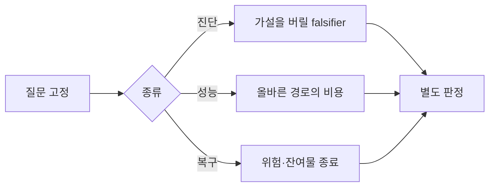
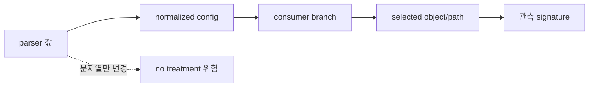
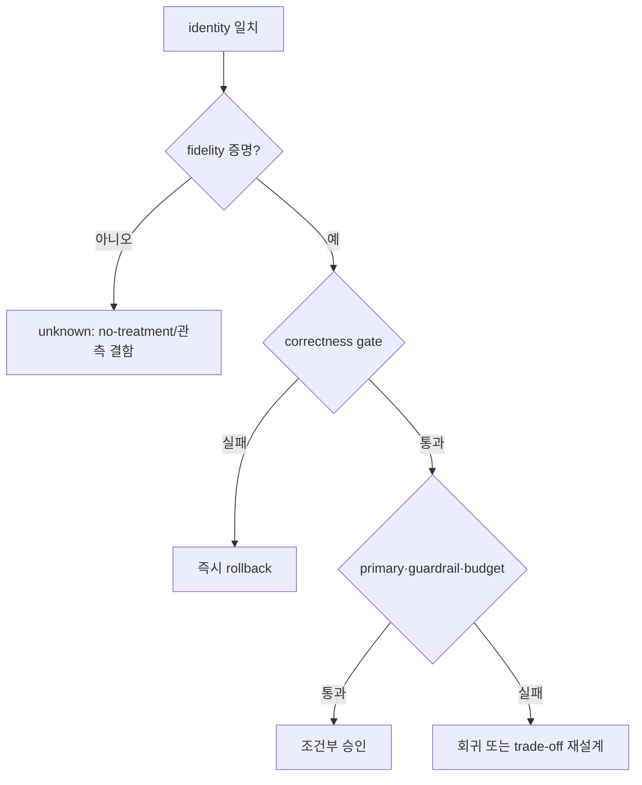
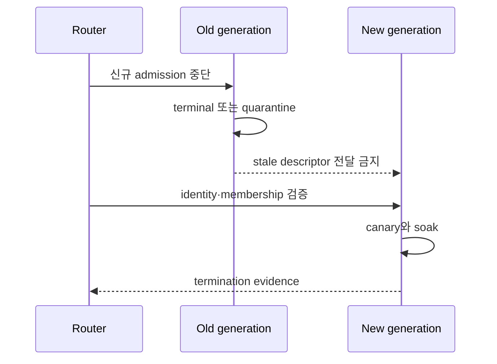

# 72장. 좋아졌다는 말은 증거가 아니다: 실험·회귀·복구를 닫는 법

금요일 저녁, 운영 채널에는 반가운 숫자가 올라왔다. 긴 요청의 TTFT p99가 7.1초에서 3.2초로 떨어졌다. 담당자는 chunked prefill 크기를 줄인 변경이 성공했다고 썼다. 그러나 같은 구간에 replica가 재시작됐고 prefix cache는 차가워졌으며 긴 prompt 비율은 31%에서 18%로 줄었다. ITL p99는 57ms에서 66ms로 나빠졌다. 무엇이 치료였고 무엇이 우연인지, 새 설정이 실제 scheduler 분기를 바꿨는지조차 아직 모른다.

이 장의 E72 사건은 이 애매한 승전보에서 출발한다. 목표는 숫자를 더 모으는 것이 아니다. 버릴 가설을 정하는 진단 실험, 올바른 경로끼리 비용을 비교하는 성능 실험, 위험과 잔여 상태가 닫혔음을 보이는 복구 검증을 분리한다. 그리고 latency·memory·kernel·distributed 네 영역을 같은 dossier로 기록하되 서로 다른 종료 증거를 억지로 환산하지 않는다.

첫 독서는 72.1의 세 질문, 72.3의 treatment fidelity, 72.6의 E72 해체와 72.10~72.11의 rollback·판정만
따라가면 된다. 72.7~72.9는 같은 방법이 memory·kernel·distributed에서 왜 다른 terminal을 요구하는지
보이는 응용편이고, 72.14의 전수 matrix와 dossier 양식은 실제 실험을 설계할 때 펼치는 reference다.
이 순서는 “기록하라, 고정하라, 확인하라”라는 명령을 줄 세우기 위한 것이 아니다. 각 행동이
no-treatment·cohort drift·빠른 오답·stale residue 가운데 어느 경쟁 가설을 가르는지 먼저 이해하게 한다.

## 72.1 먼저 질문의 종류를 고정한다

이 장의 모든 표는 별도 self-check가 아니라 하나의 E72 dossier를 채운다. 첫 행에서 질문 종류를 고르고, 같은 사건 신분증 아래 진단·성능·복구 열 중 필요한 열만 채운다. 진단은 최초 divergence를, 성능은 올바른 경로끼리의 estimator와 population을, 복구는 residue 제거와 새 generation의 정상 동작을 답한다.

| dossier 열 | 진단 질문 | 성능 질문 | 복구 질문 |
|---|---|---|---|
| 기준 상태 | 어디까지 같은가 | 어떤 control과 비교하는가 | 되돌릴 generation은 무엇인가 |
| 개입 | 어느 가설만 바꾸는가 | 어떤 treatment를 적용하는가 | 어떤 rollback edge를 실행하는가 |
| 판정 | 최초로 다른 값은 무엇인가 | 효과·불확실성·비용은 무엇인가 | late writer·residue가 0인가 |
| 종료 | owner가 확정됐는가 | correctness와 budget을 통과했는가 | 새 요청과 soak가 통과했는가 |

### 72.1.1 진단 실험은 승자를 뽑지 않는다

진단 실험의 질문은 “A가 B보다 빠른가”가 아니라 “관측 O가 나오면 가설 H를 버릴 수 있는가”다. 예를 들어 chunk 크기를 줄였을 때 실제 scheduled-token distribution은 그대로라면 scheduler treatment 가설을 버린다. TTFT가 좋아져도 이 반증은 유효하다. 반대로 distribution은 바뀌었지만 matched long-prompt cohort의 queue wait가 그대로라면 queue-owner 가설을 버리고 runner 또는 전달 구간으로 이동한다.

좋은 진단 질문은 예측과 반증 조건이 함께 있다. `H: 큰 prefill chunk가 decode service gap을 만든다`라면 예측은 큰 chunk가 배치된 window에서 decode gap과 ITL tail이 함께 증가하는 것이다. 반증 조건은 workload·generation을 맞추고 chunk distribution만 바꿨는데 gap envelope가 움직이지 않는 경우다. “개선되지 않으면 실패”처럼 모호하게 쓰지 않는다. 어느 모집단의 어떤 state transition이 어떤 방향으로 얼마나 움직여야 하는지 쓴다.

### 72.1.2 성능 실험은 올바른 경로끼리 비교한다

오답을 내는 kernel, 누락된 요청을 조용히 버리는 scheduler, stale KV를 재사용하는 cache는 빠를 수 있다. 그 수치는 성능 승인이 아니다. Correctness hard gate를 먼저 통과한 control과 treatment만 throughput·latency·전력·메모리 비용 비교에 들어간다. 이 순서가 중요한 까닭은 오류 경로가 해야 할 일을 생략하여 얻은 속도를 최적화로 오인하기 쉽기 때문이다.

성능 질문에는 부하 모드도 들어간다. 고정 arrival rate에서 latency를 비교하는지, saturation 지점의 최대 goodput을 찾는지 구분한다. 80 req/s 고정 부하에서 p99가 줄었다는 결과는 최대 capacity가 늘었다는 뜻이 아니다. 반대로 saturation throughput이 늘어도 낮은 부하의 interactive tail이 좋아졌다고 말할 수 없다. Goodput은 correctness와 deadline을 통과한 결과만 센다.

### 72.1.3 복구 검증은 마지막 오류 시각으로 끝나지 않는다

복구 질문은 “지금 오류가 보이지 않는가”가 아니라 “새 작업은 안전한 generation만 쓰며, 예전 작업과 descriptor가 다시 영향을 줄 수 없는가”다. 재시작은 allocator, cache, graph, communicator, traffic assignment를 한꺼번에 바꾼다. 따라서 재시작 뒤 정상이라는 관측은 서비스 회복 신호이지 원인 증명도 잔여 상태 소멸 증명도 아니다.



## 72.2 실험 신분증 없이는 비교를 시작하지 않는다

### 72.2.1 코드와 artifact를 이름이 아니라 digest로 묶는다

실험 한 행에는 source revision, image와 wheel digest, model weight, tokenizer, chat template, quantization과 adapter revision을 적는다. `latest`, `prod`, `same model`은 신분증이 아니다. 같은 모델 이름이어도 tokenizer normalization이나 template의 special token 배치가 다르면 prompt token 수와 정답 기준이 함께 달라진다. 같은 image tag가 다른 digest를 가리킬 수도 있다.

CUDA·driver·NCCL, GPU SKU, MIG 여부, PCIe·NVLink topology도 identity다. 이 정보는 장비 목록 장식이 아니다. graph capture 가능 경로, kernel 선택, collective transport와 memory capacity envelope를 제한한다. 관측값이 달라졌을 때 software treatment와 platform 차이를 분리하는 최소 열이다.

### 72.2.2 workload는 요청 본문보다 넓다

Dataset digest, 요청 순서, seed, arrival schedule, prompt/output length, tenant priority를 보존한다. Prefix reuse, grammar/tool use, multimodal input, adapter, quantization, P/D lane도 cohort key다. 같은 JSON prompt를 보냈다는 사실만으로 같은 workload가 아니다. Cache가 warm인지, retry가 어느 lane으로 갔는지, output cap과 stop 조건이 같은지도 실제 계산량을 바꾼다.

Boundary fixture와 representative mix를 분리한다. Page·tile·capture bucket 경계, cancellation 직후 reuse, communicator abort는 드물지만 correctness와 lifetime을 시험한다. 실제 traffic 가중 mix는 SLO와 capacity를 시험한다. 전자를 production 빈도로 희석하면 희귀 오류를 놓치고, 후자를 경계 fixture만으로 대신하면 운영 비용을 과장한다.

### 72.2.3 세대와 상태 온도를 기록한다

Replica/process generation, cache generation, graph executable generation, communicator generation을 별도 열로 둔다. Warm/cold는 한 단어가 아니라 prefix cache occupancy, graph capture 완료 여부, JIT 상태, allocator reserve와 최근 traffic history로 쪼갠다. 재시작 전후 실험은 이 열 대부분이 동시에 달라지므로 isolated treatment가 아니다.

E72 identity card는 source revision과 image digest가 같은 control C72와 treatment T72를 만든다. 두 lane은 동일한 long/short prompt block을 교차 배정하고 cache state를 별도로 맞춘다. 배포 generation이 섞인 요청은 결과에서 조용히 제외하지 않고 contaminated population으로 센다. 제외율 자체가 rollout fidelity 지표다.

## 72.3 옵션 문자열에서 실제 소비 분기까지 걷는다

### 72.3.1 전달된 값은 treatment가 아니다

CLI에 `--enable-chunked-prefill`을 썼다는 로그만으로 기능이 켜졌다고 결론 내릴 수 없다. Parser가 값을 받았는지, normalized config가 override했는지, scheduler가 그 값을 읽었는지, 어떤 object와 path가 선택됐는지, 결과 signature가 달라졌는지를 순서대로 잇는다. 이름이 다른 두 옵션이 동일한 기본값으로 normalize될 수도 있고 hardware 제약 때문에 같은 fallback으로 갈 수도 있다.

Treatment fidelity 사슬은 `parser → normalized config → consumer branch → selected object/path → observed signature`다. 각 화살표에 evidence를 붙인다. Config dump는 두 번째 경계까지만 증명한다. Branch counter나 sampled decision trace는 세 번째를, scheduled token histogram과 graph mode 분포는 마지막을 보조한다. 기대 signature가 보이지 않으면 성능 결과를 해석하기 전에 no-treatment 또는 telemetry defect를 조사한다.

### 72.3.2 고정 소스에서 producer와 consumer를 구분한다

vLLM v0.27.1의 고정 [`Stats.update_from_output`](https://github.com/vllm-project/vllm/blob/6e448d0ea9bf3d88d898b65449ca6dc2aec170ac/vllm/v1/metrics/stats.py#L360-L424)은 engine output에서 timing·scheduler 결과가 통계 객체로 옮겨지는 경계를 보여 준다. [`SchedulerStats` fields](https://github.com/vllm-project/vllm/blob/6e448d0ea9bf3d88d898b65449ca6dc2aec170ac/vllm/v1/metrics/stats.py#L191-L209)는 관측 vocabulary의 근거지만 옵션 소비 분기 자체는 아니다. Metric 이름을 보았다는 이유로 해당 정책이 실행됐다고 확대 해석하지 않는다.

SGLang v0.5.18의 고정 [`ReqTimeStats` phase vocabulary](https://github.com/sgl-project/sglang/blob/71de97b264b04dcd514cf904003028aefe9775c8/python/sglang/srt/observability/req_time_stats.py#L129-L205)와 [queue observation](https://github.com/sgl-project/sglang/blob/71de97b264b04dcd514cf904003028aefe9775c8/python/sglang/srt/observability/req_time_stats.py#L738-L773)은 요청 시간선을 재구성할 source다. 이 코드도 scheduler option의 소비를 자동 증명하지 않는다.

소스 walk에서는 configuration producer, semantic consumer, telemetry producer를 서로 다른 칸에 적는다.

### 72.3.3 오염된 rollout을 계량한다

Router policy 전파가 늦어 old/new population이 섞이고 autoscaler가 replica를 더 만들며 retry가 반대 lane으로 넘어가면 assignment와 received treatment가 다르다. 모든 요청에 experiment assignment와 deployment generation을 남긴다. Retry는 원 assignment를 유지하거나 사전에 쓴 crossover 규칙을 따른다. 어느 쪽도 아니면 독립 표본처럼 세지 않는다.



## 72.4 control과 cohort를 설계한다

### 72.4.1 어제 수치는 control이 아니다

어제와 오늘은 traffic mix, cache age, deployment generation, 인접 tenant 부하가 다르다. Control은 동일 cohort와 capacity envelope에서 treatment만 다른 비교다. 동시 control이 불가능하면 paired replay, 짧은 interleaving block, 반복 block을 사용하고 남은 drift를 명시한다. 완벽한 통제가 불가능하다는 사실은 통제를 포기할 이유가 아니라 uncertainty를 넓힐 이유다.

E72는 10분 block을 `C-T-T-C` 순서로 배치하고 다음 반복에서는 `T-C-C-T`로 뒤집는다. 시간 추세가 한 treatment에만 유리하게 작용하는 것을 줄이기 위해서다. 각 block 시작의 cache occupancy와 capture state를 맞추고 맞추지 못한 block은 별 cohort로 보존한다.

### 72.4.2 cohort key는 원인 후보를 보존한다

Prompt 길이를 short/medium/long으로만 자르면 4,096 page 경계나 capture bucket을 숨길 수 있다. 운영 cohort와 boundary cohort를 동시에 둔다. Output length, prefix hit, adapter, grammar, image count, priority, P/D lane을 교차하면 표본이 너무 작아질 수 있으므로 가설과 직접 관계있는 축을 사전 선택한다. 결과를 본 뒤 유리한 조각만 찾지 않는다.

표본 부족은 0 효과가 아니다. `unknown`이라는 판정 상태를 허용한다. 특히 cancellation, rare shape, communicator abort처럼 빈도가 낮은 사건은 production A/B의 우연한 발생을 기다리지 않고 안전한 fixture에서 검증한다. Correctness 위험을 무작위 사용자에게 노출하는 방식은 control 설계가 아니다.

### 72.4.3 assignment와 interference를 확인한다

한 cache를 두 lane이 공유하면 control 요청이 treatment가 만든 prefix를 재사용할 수 있다. 동일 GPU에서 두 lane이 번갈아 실행되면 allocator reserve와 thermal state도 간섭한다. 완전 격리는 비용이 크므로 무엇이 공유되는지 먼저 표로 쓴다. 공유가 필요한 경우 request order를 대칭화하고 carry-over를 측정한다.

판별표는 간단하다. Assignment가 같고 received generation이 다르면 routing 오염, generation은 같지만 consumer signature가 같으면 no-treatment, signature는 다르나 workload key가 다르면 cohort 오염, 모두 맞지만 endpoint가 다르면 효과 후보다. 후보라는 말은 아직 승인이라는 뜻이 아니다.

## 72.5 측정값을 판정 가능한 문장으로 바꾼다

### 72.5.1 estimator와 population을 함께 쓴다

“p99 3.2초”에는 어느 요청 모집단, 어느 window, 어떤 histogram bucket, sample count, reset domain인지 빠져 있다. Client-visible TTFT인지 server first-token timestamp인지도 다르다. Metric 행은 `name, producer, population, estimator, window, resolution, uncertainty`를 가진다. Counter reset과 stale scrape를 확인하고 missing series를 zero로 채우지 않는다.

Autocorrelation이 큰 연속 token gap을 독립 표본처럼 세면 uncertainty가 과소평가된다. Request나 time block을 분석 단위로 둔다. 여러 cohort와 endpoint를 동시에 뒤져 가장 좋아진 숫자만 선택하면 우연한 승자가 나온다. Primary endpoint와 guardrail을 실험 전에 고정한다.

### 72.5.2 통계적 차이와 운영상 차이를 분리한다

표본이 매우 크면 0.5ms도 통계적으로 구별될 수 있지만 운영 비용과 사용자가 느끼는 차이는 미미할 수 있다. 반대로 rare wrong answer 한 건은 confidence interval이 넓어도 hard gate 실패다. Correctness invariant, SLO practical budget, capacity budget, collateral cost를 별 열로 둔다.

E72에서 control TTFT p99 7.1초, treatment 3.2초라면 상대 감소는 `(7.1-3.2)/7.1 = 54.9%`다. 그러나 long-prompt 비율이 31%에서 18%로 줄었으므로 이 계산은 관측 요약일 뿐 causal effect가 아니다. Matched long cohort에서 C=7.0초, T=5.9초라면 감소는 15.7%이고, 동시에 ITL p99가 57ms에서 66ms로 증가하면 15.8% 악화다. Primary TTFT budget과 ITL guardrail을 함께 적용해야 한다.

### 72.5.3 unknown을 실패와 성공 사이에 둔다

Telemetry가 끊기거나 treatment fidelity가 증명되지 않거나 표본이 부족하면 결과는 unknown이다. Unknown을 pass로 취급하면 관측 불가능한 경로가 배포에 유리해진다. 그렇다고 모두 fail로 뭉치면 서비스 효과와 측정 결함을 구분하지 못한다. Decision은 pass/fail/unknown과 reason code를 가진다.



## 72.6 latency 실험: E72의 거짓 승리를 해체한다

### 72.6.1 첫 divergence를 phase에서 찾는다

End-to-end TTFT를 queue, scheduler selection, prefill execution, P/D transfer, decode selection, first emit으로 분해한다. 가장 긴 구간이 아니라 matched baseline envelope를 처음 벗어난 transition을 찾는다. Client gap과 server timing의 clock이 다르면 join uncertainty도 기록한다.

Latency matrix는 다음과 같다. C72 long cohort 2,400건에서 queue p99 4.0초, prefill 2.1초, TTFT 7.0초, ITL 57ms다. T72 동일 cohort 2,380건에서 queue 2.8초, prefill 2.0초, TTFT 5.9초, ITL 66ms다. Scheduled prefill chunk p95가 8,192에서 4,096 token으로 바뀌고 decode maximum service gap이 48ms에서 61ms로 늘었다. Queue는 좋아졌지만 decode guardrail은 악화했다.

### 72.6.2 계산은 trade-off를 숨기지 않는다

TTFT p99 개선 1.1초를 얻고 ITL p99 9ms를 잃었다. 사전 budget이 long TTFT 최소 10% 개선, ITL 악화 최대 5ms라면 primary는 통과하고 guardrail은 실패한다. 평균을 합쳐 하나의 점수로 만들지 않는다. 서로 다른 사용자가 받는 손실을 임의 가중치가 숨길 수 있기 때문이다.

Short cohort에서 C=0.42초, T=0.43초라면 차이는 작지만 long cohort 결과를 대표하지 않는다. Traffic-weighted 전체 평균은 long 비율 변화에 민감하다. 따라서 “전체 TTFT 회복” 대신 “matched long cohort queue p99 개선, ITL guardrail 실패”라고 판정한다. 이 문장은 다음 설계의 방향도 알려 준다.

### 72.6.3 rollback과 종료를 latency 언어로 쓴다

ITL p99가 baseline보다 5ms 이상 2개 block 연속 악화하거나 oldest waiting age가 budget을 넘으면 자동 확장을 중단한다. Rollback은 config만 되돌리는 것이 아니라 treatment lane의 신규 admission을 막고 in-flight를 bounded drain하며 cache generation과 routing assignment를 known-good 조합으로 돌린다.

복구 종료는 두 독립 traffic window에서 long·short cohort TTFT/ITL, throughput, fairness가 모두 budget 안이고 telemetry coverage가 99.9% 이상일 때다. “20분 동안 알람 없음”은 표본 수와 rare boundary coverage가 없으므로 종료 증거가 아니다.

## 72.7 memory 실험: 재시작 효과와 수명 누수를 분리한다

### 72.7.1 watermark 한 점 대신 slope를 본다

OOM 뒤 재시작하면 reserve와 cache가 동시에 비워져 free memory가 늘어난다. 이것은 fix 효과가 아니다. Memory 실험은 allocated, reserved, reclaimable, largest usable extent, locked/pinned ownership과 generation을 분리한다. 동일 cancellation/reuse workload에서 시간당 순증가 slope와 oldest residue age를 본다.

Matrix M72에서 C는 120분 동안 unreachable allocation이 6.0GiB에서 9.6GiB로 늘어 `3.6/2 = 1.8GiB/h` slope다. T는 6.1GiB에서 6.3GiB로 `0.1GiB/h`다. 하지만 T의 locked allocation 0.8GiB가 soak 끝에도 남고 largest usable extent가 1.4GiB라면 2GiB 요청 안전성을 승인할 수 없다. 총 free만으로 contiguous 또는 pool-specific 요구를 대신하지 않는다.

### 72.7.2 reclaimability를 행동으로 확인한다

Metric gauge가 evictable이라고 말하는 것과 실제 eviction 뒤 재사용 가능한 것은 다르다. SGLang의 [KV/SWA/Mamba evictable gauges](https://github.com/sgl-project/sglang/blob/71de97b264b04dcd514cf904003028aefe9775c8/python/sglang/srt/observability/metrics_collector.py#L340-L392)는 pool별 population 관측 근거다. [`SWARadixCache.evict`](https://github.com/sgl-project/sglang/blob/71de97b264b04dcd514cf904003028aefe9775c8/python/sglang/srt/mem_cache/swa_radix_cache.py#L593-L697)는 lock reference와 tombstone transition을 확인할 source다.

Gauge 하나를 allocator transaction log처럼 쓰지 않는다.

Cancellation fixture는 allocate→pin→cancel→release→reuse를 generation별로 반복한다. Falsifier는 treatment에서도 canceled owner의 pin count가 terminal 뒤 남거나 stale writer가 reused slot에 접근하는 관측이다. 성능이 좋아도 즉시 실패한다.

### 72.7.3 memory 종료는 rare path 표본을 요구한다

Rollback trigger는 OOM만이 아니다. Residue slope 양수, oldest age bound 초과, generation ownership 위반, large allocation 실패율 상승도 포함한다. Known-good로 돌아갈 때 신규 allocation lane을 차단하고 old owner를 quarantine한 뒤 reclaim 결과를 검증한다.

종료에는 steady workload 두 window, cancellation boundary 최소 표본, 2GiB fixture 성공, pool conservation, oldest residue bound가 필요하다. 20분 soak가 평균 request만 포함했다면 120분 동안 한 번 나타나는 취소 경로를 시험하지 못한다. 시간보다 event coverage가 중요하다.

## 72.8 kernel 실험: 빠른 오답을 최적화에서 제외한다

### 72.8.1 reference 자체를 먼저 고정한다

Kernel mismatch를 찾을 때 reference의 tokenizer, template, quantization과 sampling semantics가 다르면 false mismatch가 난다. 동일 token ids와 weights, deterministic path, shape·stride·dtype를 고정한다. Logit 전체, selected token, NaN/Inf, tolerance를 layer 또는 operator 경계에서 비교한다.

Matrix K72는 eager reference와 graph treatment를 batch 1/8/17, sequence 127/128/129, KV page boundary, adapter on/off로 교차한다. Batch17·seq129·adapter-on에서 layer 22 attention output의 첫 wrong value가 index 4096에 나타나고 max abs error 0.37이면 그 cell은 hard fail이다. 나머지 11개 cell이 빠르다는 사실로 덮지 않는다.

### 72.8.2 dispatch·plan·run을 source로 잇는다

vLLM의 고정 [`CudagraphDispatcher` runtime dispatch](https://github.com/vllm-project/vllm/blob/6e448d0ea9bf3d88d898b65449ca6dc2aec170ac/vllm/v1/cudagraph_dispatcher.py#L235-L285)는 mode 선택 경계를 확인하는 source다. [`CUDAGraphWrapper` replay](https://github.com/vllm-project/vllm/blob/6e448d0ea9bf3d88d898b65449ca6dc2aec170ac/vllm/v1/worker/gpu/cudagraph_utils.py#L360-L410)는 persistent descriptor와 replay 호출을 보여 주지만 모든 metadata가 새로 갱신됐다는 증거는 아니다.

FlashInfer 고정 [`plan`](https://github.com/flashinfer-ai/flashinfer/blob/a0a6b019b9b27d49d209f85d028a1ae5a9b347d7/flashinfer/decode.py#L1239-L1515)과 [`run`](https://github.com/flashinfer-ai/flashinfer/blob/a0a6b019b9b27d49d209f85d028a1ae5a9b347d7/flashinfer/decode.py#L1766-L1830)을 분리해 읽는다. Plan identity가 shape와 layout을 충분히 포함하는지, run 시점 pointer content와 generation이 맞는지 검증한다. 함수 이름을 kernel correctness 보증으로 확대하지 않는다.

### 72.8.3 correctness 뒤에 performance budget을 적용한다

모든 matrix cell이 tolerance와 invariant를 통과한 뒤에만 latency를 비교한다. Eager median 2.40ms, graph 1.92ms라면 20% 감소다. 그러나 fallback 비율이 3%에서 18%로 늘고 p99가 3.1ms에서 4.8ms라면 대표 mix의 tail budget은 실패할 수 있다. 평균 kernel time 하나로 dispatch churn과 recapture cost를 숨기지 않는다.

Rollback은 graph mode를 끄는 데서 끝나지 않는다. 의심 generation의 executable·workspace·descriptor를 신규 요청에서 격리하고 eager reference canary를 확인한다. 종료는 boundary matrix, fallback/recapture rate, first-wrong-value 부재, 두 workload window를 통과할 때다.

## 72.9 distributed 실험: 재합류한 cluster가 같은 cluster인지 묻는다

### 72.9.1 reporter보다 첫 미완료 edge를 찾는다

Watchdog를 먼저 출력한 rank가 원인 rank라는 보장은 없다. Matrix D72는 communicator generation, collective sequence, rank별 submitted/device-started/local-completed/peer-observed/protocol-committed를 맞춘다. Rank 3이 timeout을 신고했지만 rank 5가 sequence 812를 submit하지 않았다면 첫 divergence는 rank5 control flow에 있다.

NCCL v2.30.7-1 고정 [`enqueue.cc` planning](https://github.com/NVIDIA/nccl/blob/73cf112295c33aee2b895f329f592f2a9b4b0f97/src/enqueue.cc#L576-L853)은 task와 work planning 경계다. [`proxy.cc` progress loop](https://github.com/NVIDIA/nccl/blob/73cf112295c33aee2b895f329f592f2a9b4b0f97/src/proxy.cc#L1760-L1810)는 host-side progress를 읽는 source다. API return, enqueue, local completion을 peer commit으로 확대하지 않는다.

### 72.9.2 throughput 회복과 residue 제거를 분리한다

D72 treatment 후 goodput이 920에서 980 token/s로 회복돼도 old communicator C7 descriptor와 P/D import generation이 남아 있으면 recovery는 미완료다. Matrix는 old inflight 37건 중 terminal 35, quarantine 2, late completion 0처럼 conservation을 적는다. Quarantine 2건의 owner와 최대 age가 bound 안인지 확인한다.

P/D에서는 sender publish, transfer submit/complete, receiver import, decode admission이 별 단계다. vLLM의 [KV connector metric handoff](https://github.com/vllm-project/vllm/blob/6e448d0ea9bf3d88d898b65449ca6dc2aec170ac/vllm/v1/metrics/loggers.py#L1140-L1149)와 SGLang의 [transfer metrics](https://github.com/sgl-project/sglang/blob/71de97b264b04dcd514cf904003028aefe9775c8/python/sglang/srt/observability/metrics_collector.py#L484-L522)는 관측 경계를 찾는 근거이지 protocol commit 전체의 증명은 아니다.

### 72.9.3 abort·rejoin 종료표를 채운다

Rollback trigger는 timeout 횟수만이 아니다. Sequence skew, unknown rank outcome, generation mismatch, late writer, residue oldest age가 threshold를 넘으면 admission을 멈춘다. Abort acknowledgement를 rank별로 받고 connector와 communicator state를 known-good generation으로 재구성한다.

재합류 조건은 full membership, identical topology/config digest, old descriptor rejection, no late completion, P/D conservation, correctness canary와 throughput budget이다. Restart 뒤 20분 무오류는 rare abort path도 residue slope도 검증하지 못한다.



## 72.10 rollback을 실험 전에 설계한다

실험 실행 전 dossier를 동료에게 넘겨도 같은 판정을 재구성할 수 있어야 한다. 다음은 네 영역에서 빠지기 쉬운 항목을 실제 질문으로 바꾼 검토 기록이다. 목록을 체크했다는 사실보다 각 답의 evidence 위치와 falsifier가 중요하다.

Latency identity에는 client와 server clock source, request ID join, ingress·queue·selection·runner·emit timestamp producer, histogram reset 시각을 쓴다. Queue wait가 줄었다면 admission 거부나 retry 증가로 표본이 사라지지 않았는지 확인한다. TTFT가 줄었다면 출력이 먼저 flush된 것인지 실제 first token computation이 빨라진 것인지 분리한다. ITL이 늘었다면 모든 gap인지 periodic gap인지, batch boundary나 prefill interference와 위상이 맞는지 본다.

Latency control에는 동일 prompt/output length distribution, prefix state, priority, adapter·grammar 준비 상태, P/D lane, arrival schedule을 둔다. Control과 treatment의 accepted request 수, completed request 수, deadline 안 goodput을 보존식으로 비교한다. Treatment에서 admission이 어려운 요청을 더 많이 거절해 surviving request latency만 좋아졌다면 성능 개선이 아니다.

Latency falsifier에는 consumer branch가 달라졌는데 scheduled chunk distribution이 같음, chunk distribution은 달라졌는데 decode service gap이 같음, server phase는 같고 client gap만 달라짐, long cohort만 변화 없음 같은 관측을 사전에 둔다. 각각 no effective treatment, 잘못된 mechanism, delivery owner, cohort-specific failure로 분기한다. 하나의 결과를 모든 가설의 실패로 쓰지 않는다.

Latency 종료에는 primary endpoint와 guardrail 외에 fairness를 둔다. High priority가 좋아지고 low priority oldest age가 무한히 증가하면 시스템은 회복되지 않았다. Throughput이 유지돼도 output token이 짧은 요청만 선택됐다면 work-normalized capacity는 달라질 수 있다. Request/s, input token/s, output token/s와 deadline goodput을 함께 보되 목적에 맞는 primary를 고른다.

Memory identity에는 allocator 종류, pool 이름, device, process generation, allocation class, graph workspace, KV page, adapter weight와 connector buffer를 쓴다. `GPU memory` 하나로 합치면 어느 owner가 release해야 하는지 잃는다. Reserved, allocated, active, inactive, evictable, locked, unreachable의 producer도 각각 확인한다.

Memory control에는 같은 warmup, prefix reuse, cancellation timing, output length와 concurrency를 둔다. One-shot peak는 steady leak 질문에 답하지 않고 steady 평균은 boundary peak 질문에 답하지 않는다. Peak capacity, fragmentation, lifetime leak, cache policy를 별 hypothesis로 만든다. 같은 OOM 증상이 네 원인에서 나올 수 있기 때문이다.

Memory falsifier에는 treatment 뒤 ownership conservation이 여전히 깨짐, reclaim을 실행해도 largest extent가 늘지 않음, cancel 없는 workload에서도 같은 slope가 남음, 특정 generation에서만 late writer가 보임을 둔다. 첫 관측은 lifetime fix 실패, 둘째는 fragmentation 또는 pool mismatch, 셋째는 cancellation 가설 반증, 넷째는 generation fencing 문제를 가리킨다.

Memory 종료에는 `allocations = reachable active + reclaimable reserve + quarantined + released` 같은 장부를 구현 의미에 맞게 둔다. 각 항의 단위와 overlap 여부를 확인한다. Gauge들을 무조건 더해 conservation을 만들지 않는다. Quarantine은 0일 필요가 없지만 count와 oldest age가 bound 안이고 신규 작업에 재사용되지 않아야 한다. Reusable reserve는 leak으로 세지 않되 실제 요청에서 재사용되는지 확인한다.

Kernel identity에는 compiled artifact, architecture target, driver, CUDA, backend, dtype, quantization, shape, stride, page layout, graph mode, capture bucket, workspace address와 plan generation을 둔다. Source revision만 같아도 빌드 flag와 generated kernel이 다를 수 있다. Binary digest와 selected kernel name을 함께 보존한다.

Kernel control은 같은 token ids, weights와 numerical semantics를 사용한다. Eager가 무조건 진리라고 가정하지 않고 독립 reference 또는 작은 고정 계산과 교차한다. Tolerance는 dtype와 연산 축적 특성에 맞춰 사전 고정한다. Final logits만 비교하면 오류가 상쇄되거나 argmax가 우연히 같아 first divergence를 놓칠 수 있다.

Kernel falsifier에는 fallback path에서도 mismatch가 남음, graph key를 완전하게 바꿔도 stale 결과가 남음, plan을 재생성하면 mismatch가 사라짐, 특정 stride에서만 index가 어긋남을 둔다. 각각 reference/input 문제, persistent state 문제, plan identity 누락, layout contract 문제로 조사 방향이 달라진다. 관측 하나로 kernel 소스 전체를 비난하지 않는다.

Kernel 종료에는 correctness matrix의 모든 required cell, fallback·recapture budget, warm/cold 분리, representative dispatch mix가 들어간다. Boundary cell은 production 비중이 작아도 hard gate다. Performance estimate는 traffic weight를 적용할 수 있지만 correctness pass/fail은 빈도로 희석하지 않는다. 새 shape가 들어오면 안전 fallback을 선택하는지도 시험한다.

Distributed identity에는 rank, host, device, communicator ID와 generation, membership digest, topology, NIC·rail, collective sequence, stream, P/D request generation을 둔다. Rank 번호는 재시작 뒤 같은 process를 뜻하지 않는다. C7 rank5와 C8 rank5를 합치면 old completion과 new work를 혼동한다.

Distributed control에는 같은 membership, message count·dtype, collective order, stream dependency, transport 선택과 traffic interference를 둔다. Timeout만 늘린 treatment는 progress mechanism을 바꾸지 않을 수 있다. 신고가 늦어진 것을 회복으로 보지 않는다. 첫 incomplete edge가 이동하거나 닫혔는지 확인한다.

Distributed falsifier에는 모든 rank가 submit했지만 한 peer edge만 시작하지 않음, local complete 뒤 receiver import가 없음, abort ack 뒤 late completion이 도착함, rejoin 뒤 old descriptor가 수용됨을 둔다. 이 네 관측은 각각 stream/transport, P/D protocol, abort fencing, generation rejection을 겨냥한다. Watchdog reporter는 detection owner일 뿐 semantic owner가 아닐 수 있다.

Distributed 종료에는 full membership과 per-rank canary만으로 부족하다. Old communicator resource, proxy operation, connector descriptor와 inflight request를 장부에 넣는다. Terminal, safely retried, quarantined의 합이 accepted work와 맞아야 한다. Unknown은 성공으로 재분류하지 않는다. Rejoin throughput은 correctness와 residue gate 뒤에 본다.

네 영역에서 공통으로 자주 빠지는 것은 시간 창의 경계다. Rollout 시작 시각은 모든 replica가 treatment를 받은 시각과 다르다. Scrape window는 request completion window와 다르다. 긴 요청은 control에서 시작해 treatment에서 끝날 수 있다. Request assignment 시각, semantic execution generation, completion 시각을 분리해 crossover를 기록한다.

또 다른 공통 함정은 retry다. Client가 timeout 뒤 재전송하면 최초 실패와 재시도 성공을 요청 두 건으로 셀 수 있다. Logical request ID, attempt ID, assignment와 terminal outcome을 보존한다. Retry가 다른 lane으로 넘어갈 수 있다면 received-treatment 분석만으로 원래 정책의 사용자 영향을 숨기지 않는다.

Autoscaling도 treatment contamination을 만든다. T lane이 빨라 replica 수가 줄거나 느려 replica 수가 늘면 per-replica latency와 전체 비용이 동시에 달라진다. Capacity envelope를 고정한 실험과 autoscaling을 포함한 시스템 실험을 분리한다. 전자는 mechanism 비용을, 후자는 운영 정책 결과를 답한다.

Cache sharing은 latency와 memory 양쪽의 interference다. T가 만든 prefix를 C가 hit하면 C는 순수 control이 아니다. Cache namespace를 분리하거나 block order와 cache reset을 대칭화한다. Reset 자체가 실험 질문을 바꾸므로 warm production 질문에서는 preconditioned cache snapshot이나 충분한 stabilization을 사용한다.

Stabilization도 결과를 본 뒤 임의로 자르는 규칙이 되어서는 안 된다. Warm state 정의를 capture complete, prefix occupancy 범위, allocator reserve slope, request mix 안정 조건으로 사전에 쓴다. 조건을 만족하지 않은 block은 cold cohort로 남긴다. 좋아 보이는 구간만 steady state라 부르지 않는다.

표본 크기는 만능 숫자 하나가 아니다. Correctness boundary는 필요한 cell coverage로, leak은 탐지하려는 slope와 duration으로, rare cancellation은 event count로, latency tail은 cohort sample과 histogram resolution으로 정한다. “천 건이면 충분” 같은 규칙은 질문마다 다른 탐지력을 숨긴다.

Histogram quantile은 원본 sample을 되살리지 않는다. Bucket이 5초와 10초뿐이면 7.1초와 7.9초를 세밀하게 구별할 수 없다. Bucket 변경도 metric schema treatment이므로 deployment generation과 함께 기록한다. 서로 다른 bucket schema의 p99를 같은 precision으로 비교하지 않는다.

Counter는 rate 계산 window와 reset을 확인한다. Replica restart 뒤 counter가 0이 되면 감소가 아니라 reset이다. Gauge는 순간 snapshot이라 mutation 사이 invariants를 증명하지 못할 수 있다. Trace는 sampled population이고 log는 flush 손실이 있다. 서로의 약점을 보완하도록 join하되 충돌을 지우지 않는다.

Clock은 latency와 distributed에서 특히 중요하다. 같은 process monotonic timestamps는 순서를 강하게 말할 수 있지만 host 간 wall clock은 skew uncertainty를 가진다. 인과 순서가 sequence나 explicit handoff로 증명되면 clock보다 그것을 우선한다. 3ms 차이를 주장하면서 clock uncertainty가 10ms라면 first divergence 시각은 bound로 표현한다.

관측 signature는 metric 하나가 아닐 수 있다. Chunk treatment라면 normalized config 값, scheduler sampled branch, scheduled chunk distribution, decode service gap의 방향이 함께 맞아야 한다. Graph treatment라면 dispatch mode, key/bucket, plan generation, fallback·recapture 분포를 본다. Communicator treatment라면 membership generation, sequence progress와 old rejection이 signature다.

Signature가 일부만 맞으면 결과를 억지로 이진화하지 않는다. Config와 branch는 바뀌었지만 output distribution이 같다면 treatment가 workload에 활성화되지 않았을 수 있다. Branch는 같지만 metric이 바뀌면 traffic drift나 unrelated intervention을 의심한다. Signature mismatch 자체가 다음 diagnostic experiment의 질문이 된다.

최초 불일치는 인과 설명의 끝이 아니라 가장 좁은 다음 질문이다. Queue transition이 먼저 벗어났다면 scheduler input, admission, work estimate와 consumer branch를 본다. Tensor value가 처음 틀렸다면 그 operator의 input·layout·plan을 본다. Rank edge가 처음 멈췄다면 peer와 stream dependency를 본다. 가장 눈에 띄는 최종 증상으로 다시 뛰어가지 않는다.

판정 회의에서 effect size와 uncertainty를 함께 읽는다. Point estimate가 budget을 넘더라도 interval이 양쪽 판정을 가로지르면 unknown 또는 추가 표본이다. 반대로 correctness invariant는 빈도 추정 문제가 아니라 존재 자체가 hard fail일 수 있다. 모든 metric에 같은 통계 규칙을 적용하지 않는다.

Practical threshold는 제품 목표에서 온다. ITL 5ms guardrail, oldest residue 60초, fallback 5% 같은 값은 실험 뒤 데이터에 맞춰 만들지 않는다. 근거와 owner, 만료일을 기록한다. Threshold를 바꿔야 한다면 별 decision으로 남기고 동일 실험의 승패를 소급 조작하지 않는다.

Collateral cost에는 메모리, 전력, CPU, network, cache hit, fairness, operational complexity가 있다. TTFT가 좋아져도 GPU당 goodput이 크게 줄거나 P/D network가 포화되면 전면 승인이 아닐 수 있다. 모든 비용을 한 숫자로 합치기보다 budget 열을 두고 trade-off의 수혜자와 부담자를 적는다.

관측된 회귀가 treatment 때문이라고 말하려면 temporal ordering만으로 부족하다. Assignment, fidelity, matched control과 예측된 mechanism signature가 이어져야 한다. 그래도 관측 연구의 한계가 남으면 inference grade를 낮춰 쓴다. 문장의 강도를 evidence보다 세게 만들지 않는다.

Negative result도 자산이다. Consumer branch가 바뀌지 않았다는 결과는 옵션 전달 경로를 좁힌다. Chunk distribution이 바뀌었지만 queue가 움직이지 않았다는 결과는 scheduler 가설을 버리게 한다. Correctness는 통과했지만 performance budget을 실패한 결과는 안전 fallback을 유지할 근거가 된다. 실패를 지우면 다음 팀이 같은 실험을 반복한다.

Experiment dossier에는 제외 기준과 중도 중단도 남긴다. Hard fail 뒤 나머지 성능 cell을 실행하지 않은 것은 missing이 아니라 protocol-driven stop이다. 왜 중단했는지 명시하면 선택적 보고로 오해하지 않는다. 반대로 실패 cell을 제외하고 평균을 다시 계산하는 것은 허용하지 않는다.

Rollback 결과에는 되돌린 config digest, image digest, routing generation, cache namespace, graph generation, communicator membership을 적는다. `원복 완료` 한 줄로는 어떤 state 조합이 돌아왔는지 알 수 없다. Canary가 어느 cohort와 boundary를 통과했는지도 남긴다.

Recovery termination에는 신규 work, old inflight, residue, soak, regression matrix, approver 여섯 묶음이 있다. 신규 work는 safe generation만 수용한다. Old inflight는 terminal 또는 bounded quarantine다. Residue는 count·slope·oldest age가 bound 안이다. Soak는 시간뿐 아니라 event coverage를 만족한다. Regression matrix는 대표와 boundary를 모두 포함한다. Approver는 각 semantic owner가 증거를 확인한다.

두 독립 window는 연속된 같은 10분 조각을 뜻하지 않는다. Traffic cycle이나 deployment disturbance를 달리 포함해 재발 조건을 시험한다. Memory leak처럼 장주기인 질문은 더 긴 window가 필요하다. Distributed abort처럼 event-driven 질문은 두 번의 독립 abort/rejoin fixture가 더 의미 있을 수 있다.

마지막으로 dossier는 재현 명령을 맹목적으로 복사하는 문서가 아니다. 고정 input identity, 예상 state transition, 실제 observation, falsifier와 decision을 보존한다. 새 revision에서 함수 위치가 바뀌어도 이 구조는 유지된다. 다음 조사자는 함수 이름 검색부터가 아니라 semantic consumer와 first divergence를 찾아갈 수 있다.

### 72.10.1 즉시 중단과 budget 중단을 나눈다

Numeric mismatch, generation·ownership invariant 위반, unknown outcome 확대는 즉시 중단한다. Tail latency, throughput, watermark, fallback/recapture 비율은 cohort budget과 지속 window를 둔다. 순간 spike 하나와 지속 회귀를 같은 방식으로 처리하지 않는다.

Trigger는 측정 가능한 문장이어야 한다. “성능이 나쁘면” 대신 “long cohort ITL p99가 matched control보다 5ms 초과 악화한 block이 두 번 연속”이라고 쓴다. Correctness는 한 건이라도 hard fail이다.

### 72.10.2 rollback은 state graph를 되돌린다

Image나 option만 되돌려도 old cache artifact, graph executable, connector, communicator가 남으면 known-good 조합이 아니다. Admission과 routing을 먼저 통제하고 in-flight를 drain 또는 quarantine한다. 새 generation이 stale state를 거부하는지 시험한다.

Rollback 자체도 rehearsal한다. 실제 장애 중 처음 실행하는 복구 절차는 실험이 된다. Rehearsal은 안전한 fixture에서 trigger 감지, lane 차단, state 격리, canary, 재개까지 걸린 시간과 실패 분기를 기록한다.

### 72.10.3 승인 권한과 증거 위치를 남긴다

실험 owner, metric owner, semantic state owner, rollback commander를 구분한다. 한 사람이 모두 판단할 수 있어도 역할은 분리해 적는다. Dashboard 링크만 남기지 않고 query, time range, reset domain, artifact digest를 dossier에 고정한다.

결과표에는 pass뿐 아니라 exception과 expiry가 있다. 임시 budget 완화는 어느 cohort, 어느 기간, 어떤 보완 control을 조건으로 하는지 쓴다. 만료 뒤 자동으로 영구 승인이 되지 않는다.

## 72.11 하나의 E72 dossier를 닫고 다음 조사로 넘긴다

E72를 실제 승인 문장으로 바꾸는 과정을 한 번 더 끝까지 걷자. 최초 observation은 “배포 뒤 TTFT p99 7.1초→3.2초”다. 이 문장에 원인 표현을 넣지 않는다. 이어서 confounder ledger에 replica G41→G42 재시작, prefix cache cold 전환, long prompt share 31%→18%, ITL 57ms→66ms를 적는다. 이 순간 최초 승리 선언은 철회되지만 treatment가 실패했다고 결론 내리는 것도 이르다.

Question card는 diagnostic으로 시작한다. `H1: chunk policy가 scheduler가 한 step에 선택하는 prefill work를 줄여 long-request queue wait를 낮춘다.` 예측은 treatment generation에서 scheduled prefill chunk p95 감소, long cohort queue p99 감소다. Falsifier는 consumer branch와 chunk p95가 바뀌지 않거나, 둘이 바뀌어도 matched queue envelope가 유지되는 것이다. ITL 악화는 H1 반증이 아니라 collateral guardrail 후보이므로 별 열에 둔다.

Identity 비교에서 source와 image digest, model·tokenizer·template, CUDA·driver, GPU topology를 같게 한다. G42 재시작으로 바뀐 process identity를 control lane에도 동일하게 만들되 cache preconditioning을 맞춘다. Long/short, prefix hit/miss, grammar, P/D lane을 cohort key로 정한다. Request order는 block별로 고정하고 assignment는 logical request ID hash로 결정한다. Retry는 같은 lane을 유지한다.

Fidelity 검증은 config dump에서 멈추지 않는다. Parser가 받은 chunk option, normalized effective value, scheduler consumer branch를 확인한다. Sampled decision record에서 requested work와 selected chunk를 남기고 block별 scheduled-token distribution을 비교한다. C의 p95 8,192와 T의 4,096이 예상대로 다르고 no-treatment 요청 비율이 사전 0.5% budget 안인지 확인한다. 이 연결이 없으면 latency 차이는 treatment effect가 아니라 unknown이다.

Measurement plan은 long·miss TTFT p99를 primary, ITL p99와 deadline goodput·oldest wait를 guardrail로 정한다. Histogram schema, sample count, reset과 coverage를 고정한다. Block 단위 uncertainty를 사용하고 request token gap을 독립 표본으로 과대 계수하지 않는다. Boundary fixture의 correctness는 hard gate이며 production 가중 평균에서 희석하지 않는다.

첫 interleaved 반복에서 long·miss C=7.0초, T=5.9초가 나오고 ITL은 57ms와 66ms다. 두 번째 반복에서도 방향은 같다고 하자. Primary practical threshold 10%를 넘지만 ITL 최대 +5ms guardrail을 넘는다. Result는 `pass_primary_fail_guardrail`이다. “부분 성공”처럼 승인 범위가 모호한 표현 대신 전면 rollout 금지, chunk/admission 정책 재설계, 다음 diagnostic 질문으로 명시한다.

다음 질문은 `H2: 줄어든 chunk가 decode service opportunity를 늘리지 못하고 batch churn을 키운다`일 수 있다. 예측은 treatment block에서 scheduler iteration 증가, smaller prefill work, decode gap tail 증가와 위상 일치다. Falsifier는 server decode service gap은 그대로인데 client ITL만 증가하는 것이다. 이 경우 output serialization·proxy·consumer backpressure를 조사한다. H1 결과를 H2 증명으로 재사용하지 않는다.

Rollback trigger는 ITL +5ms가 두 block 연속, oldest wait budget 초과, correctness 한 건 실패다. Trigger 발생 시 treatment 신규 assignment를 막고 G42-T lane의 in-flight를 bounded drain한다. Cache namespace와 routing generation을 known-good C 조합으로 되돌리고 consumer signature가 control로 돌아왔는지 확인한다. Config 파일 변경만으로 rollback complete라 하지 않는다.

Rollback canary는 short·long, prefix hit/miss, grammar 한 cell과 page boundary fixture를 포함한다. Known-good TTFT/ITL envelope, deadline goodput, correctness를 확인한다. Treatment generation artifact가 새 요청에서 선택되지 않는지 sampled trace로 검증한다. Old in-flight가 terminal 또는 quarantine이고 oldest age가 bound 안인지 장부를 맞춘다.

Latency 종료 뒤에도 memory·kernel·distributed 종료를 자동 선언하지 않는다. 같은 rollout에서 replica restart가 있었으므로 allocator reserve와 graph generation, communicator generation이 바뀌었다. Memory ledger에서 unreachable slope와 locked owner를, graph ledger에서 old executable 선택 부재를, communicator ledger에서 membership과 old descriptor rejection을 확인한다. 이 검사는 latency fix의 추가 성능 조건이 아니라 복합 intervention이 남긴 위험을 닫는 조건이다.

Regression matrix는 대표 traffic과 경계를 분리한다. 대표 matrix는 short/long 비율을 실제 가중치로 구성해 SLO와 capacity를 본다. 경계 matrix는 chunk threshold ±1 token, page boundary ±1, cancellation at allocate/pin/release, adapter on/off, P/D import timeout을 포함한다. 한 matrix의 통과가 다른 질문을 대신하지 않는다.

Soak 설계는 단순 시간으로 쓰지 않는다. 두 독립 traffic window, long·miss 최소 표본, cancellation 최소 1,200회, graph boundary 각 cell 반복, abort/rejoin 두 cycle을 요구한다. Memory slope를 구별할 충분한 duration과 metric coverage를 둔다. Rare event가 한 번도 일어나지 않은 2시간은 그 event의 recovery 증거가 아니다.

승인 record에는 scheduler semantic owner가 fidelity와 phase transition을, numerical owner가 correctness matrix를, platform owner가 memory·communicator residue를, service owner가 SLO·rollback rehearsal을 확인했다고 남긴다. 한 approver의 “대시보드 정상” 서명으로 네 semantics를 대체하지 않는다. Exception이 있으면 scope, compensating control과 expiry를 쓴다.

이 과정을 따르면 E72의 최종 문장은 길지만 명확하다. “고정 identity와 matched cohort에서 chunk consumer treatment는 scheduled prefill p95를 8,192에서 4,096으로 바꾸고 long·miss queue p99를 낮췄다. TTFT primary는 15.7% 개선됐으나 ITL p99가 9ms 악화해 +5ms guardrail을 실패했다. Correctness hard gate는 통과했으며 assignment contamination은 budget 안이었다. 전면 rollout을 중단하고 known-good generation으로 rollback했으며 old work·artifact residue와 canary를 확인했다. 다음 실험은 decode service gap mechanism을 반증한다.”

이 문장은 숫자를 나열한 보고서보다 길지만 다음 행동을 낳는다. 무엇이 관측됐고 무엇이 추론인지, 어느 가설이 남았고 무엇을 버렸는지, 누가 rollback을 수행하며 무엇이 종료 증거인지 읽는 사람이 다시 질문하지 않아도 된다. 친절한 기술 문서는 용어를 줄이는 문서가 아니라 판단의 생략을 줄이는 문서다.

Completed artifact를 다른 팀이 재사용할 때는 원본 row를 덮어쓰지 않는다. 새 revision은 새 experiment ID와 parent ID를 받고 identity diff를 먼저 만든다. Source revision, config schema, metric producer, hardware 또는 workload가 달라졌다면 어느 control을 다시 만들어야 하는지 표시한다. 이전의 threshold와 falsifier는 복사할 수 있지만 consumer branch가 옮겨졌다면 fidelity evidence는 다시 수집한다. “지난 버전에서 통과”는 새 binary의 실행 경로를 증명하지 않는다.

재사용자는 conclusion만 읽지 않고 rejected hypothesis도 본다. H1을 버린 근거가 새 revision에서도 성립하는지 확인하고, instrumentation이 바뀌어 과거 falsifier를 관측할 수 없다면 unknown으로 되돌린다. Negative result를 영구 진리로 만들지 않되 이유 없이 같은 가설을 부활시키지도 않는다. Parent dossier의 input identity와 새 identity 사이 의미 있는 diff가 재검토 범위를 결정한다.

Incident 중 자료가 불완전하면 최소 안전 결정과 최종 causal decision을 분리한다. Correctness mismatch나 unknown outcome 확대 때문에 즉시 rollback할 수 있지만 그 순간 root cause를 확정할 필요는 없다. 안전 조치는 낮은 증거에서도 가능하고 원인 주장은 더 높은 증거를 요구한다. 이 차이를 두지 않으면 신속한 rollback을 위해 성급한 원인 서사를 만들게 된다.

반대로 원인을 충분히 좁혔어도 recovery terminal이 자동으로 오지 않는다. Stale descriptor가 거부되는지, quarantined work가 bound 안인지, metric coverage가 복구됐는지, rollback 경로가 실제 known-good인지 별도로 증명한다. Diagnosis complete와 recovery complete를 다른 상태로 두면 “버그를 찾았으니 사건 종료”라는 위험한 생략을 막는다.

최종 handoff에는 unresolved item을 owner와 deadline 없이 남기지 않는다. `ITL mechanism unknown` 대신 `scheduler owner가 다음 paired block에서 decode service gap과 output emit gap을 분리하며 falsifier는 server gap 불변`이라고 쓴다. `memory 지켜보기` 대신 `platform owner가 cancel 1,200 event 동안 unreachable slope와 oldest residue age를 측정`이라고 쓴다. 질문, 관측, 반증, 종료 조건이 들어간 문장만 다음 작업이 된다.

독자가 dossier를 열었을 때 첫 화면에는 실험 종류, one-sentence hypothesis, current decision, hard-fail 여부와 rollback state가 보인다. 그 아래 identity diff, cohort와 assignment, fidelity chain, numeric matrix, first divergence, residue ledger를 둔다. Dashboard screenshot은 보조 자료이고 query·window·digest가 원본이다. 화면 배치는 정보의 중요도를 반영해야 한다.

마지막 품질 검사는 문장의 동사를 본다. Metric은 `보였다`, source는 `구현한다`, 실험은 `지지했다/반증했다`, 운영 결정은 `중단했다/승인했다`, 미확정 항목은 `알 수 없다`고 쓴다. “증명했다”는 표현은 identity·control·fidelity·falsifier가 실제로 닫힌 범위에서만 사용한다. 이 언어 규율이 관측과 추론을 섞지 않게 한다.

### 72.11.1 제출 가능한 한 장으로 압축한다

```yaml
question: {domain: latency, hypothesis: large_chunk_causes_decode_gap, predicts: [], falsifiers: []}
identity: {source: {}, artifacts: {}, hardware: {}, effective_config: {}, generations: {}}
design: {control: C72, treatment: T72, isolated_variables: [chunk_policy], cohorts: [], assignment: interleaved}
fidelity: {consumer_branch: null, selected_path: null, expected_signature: [], observed_signature: []}
measurements: [{metric: ttft_p99, population: long_prompt, estimator: histogram_quantile, window: block, uncertainty: null}]
first_divergence: {state_or_value: queue_wait, owner: scheduler, evidence: []}
decision: {correctness_gates: [], primary_endpoint: ttft_p99, guardrails: [itl_p99], result: fail_guardrail}
rollback: {trigger: [], action: [], verified_fallback: null}
termination: {old_work: {}, residue: {}, soak: {}, regression_matrix: [], approvers: []}
```

이 양식의 빈 값은 독자에게 실패를 숨기지 않는다. Command를 복사해 실행하는 절차보다 input identity, expected transition, observation, falsifier가 중요하다. 낯선 revision에서도 같은 논리를 재사용할 수 있기 때문이다.

### 72.11.2 E72 최종 판정을 쓴다

E72의 최초 “7.1초에서 3.2초”는 긴 prompt mix 감소와 replica restart가 오염시킨 수치였다. Matched 실험에서 chunk treatment는 scheduler signature를 바꾸고 long TTFT p99를 15.7% 개선했지만 ITL p99를 9ms 악화해 사전 guardrail을 실패했다. 따라서 전면 배포가 아니라 정책 재설계와 재실험으로 돌아간다.

Memory treatment는 slope를 줄였지만 locked residue와 large extent gate가 남아 미승인이다. Kernel treatment는 boundary cell mismatch가 있으면 속도 수치와 무관하게 rollback한다. Distributed treatment는 throughput 회복 뒤에도 old generation rejection과 quarantine age를 닫아야 한다. 네 결과를 하나의 평균 점수로 합치지 않는다.

### 72.11.3 현재까지의 판정: 실험은 설명 가능한 상태 전이여야 한다

좋은 실험은 화려한 dashboard가 아니라 반증 가능한 문장이다. 무엇을 바꿨는지보다 실제 어느 consumer가 어떤 state transition을 다르게 만들었는지 설명해야 한다. 무엇이 빨라졌는지보다 같은 correctness와 workload를 유지했는지 먼저 증명해야 한다. 무엇이 조용해졌는지보다 old work와 residue가 다시 돌아올 수 없는지 확인해야 한다.

이 원칙은 느리지만 보이는 절차와 빠르지만 불친절한 추측을 가른다. Incident 중에는 숫자 하나가 원인을 말해 주는 것처럼 보인다. 그러나 숫자는 producer, population, generation, cohort와 연결될 때만 문장이 된다. Restart success, 평균 개선, utilization 상승, 알람 부재는 모두 유용한 관측이지만 단독 결론은 아니다.

실험 종료와 복구 종료를 분리하는 까닭도 여기에 있다. 실험은 정해 둔 질문에 충분한 답을 얻으면 끝나지만, 운영 상태에는 그 답과 무관한 old work와 stale artifact가 남을 수 있다. 반대로 원인을 아직 확정하지 못해도 correctness 위험이 커지면 known-good로 먼저 복구해야 한다. 두 상태를 하나로 합치면 원인을 찾았다는 이유로 residue를 방치하거나, 서비스가 살아났다는 이유로 잘못된 인과 설명을 확정한다. 다음 사건의 독자는 `question answered`와 `system safe`를 별 체크박스로 들고 가야 한다.

독자는 다음 장에서 새 revision을 만났을 때 먼저 옵션 목록을 외우지 않는다. 질문 종류를 고정하고 identity를 묶고 treatment fidelity를 소스에서 걷는다. Control과 cohort를 설계하고 first divergence를 찾으며 correctness, primary endpoint, guardrail을 분리한다. 실패하면 미리 쓴 rollback을 실행하고 old generation, residue, rare boundary와 두 회귀 window를 닫는다. 그때 비로소 “좋아졌다”는 말이 재현 가능하고 반증 가능한 운영 지식이 된다.
종료 기록에는 두 체크박스를 누가, 어떤 증거로, 언제 닫았는지 남긴다. 그래야 후속 배포가 과거의 미완료 복구를 완료된 실험 결과로 오독하지 않는다.

## 72.12 hidden intervention으로 승인된 회귀를 counterfactual로 뒤집는다

사건 E73의 최초 보고는 “새 scheduler policy가 TTFT p99를 7.2초에서 3.4초로 53% 개선했다”였다. Treatment lane T는 새 option을
사용했고 control C는 old option을 사용했다. Dashboard에는 두 series와 같은 model name이 있었으므로 rollout이 50%로 확대됐다.
그러나 identity ledger를 열자 T replicas는 deployment restart로 cache cold→warm cycle이 다시 시작됐고 GPU clock policy,
batch concurrency와 long-prompt mix도 달랐다.

Hidden interventions는 다섯 개였다. T image는 source commit은 같지만 build digest가 달랐고 CUDA graph capture default가 켜졌다.
Autoscaler가 T replica를 4→6으로 늘렸다. Router assignment bug로 long prompts는 C에 더 많이 갔다. T prefix cache는 canary traffic으로
미리 warm됐다. Observability sampling은 T100%, C5%여서 detailed trace coverage도 달랐다. “Option 하나만 바꿈”이 아니었다.

수치로 보면 C requests10,000 중 long3,200, T10,000 중 long1,700이었다. Short cohort TTFT는 C1.1s/T1.0s, long은 C7.2s/T7.0s다.
Raw mixture는 C `.68×1.1+.32×7.2=3.052s`, T `.83×1.0+.17×7.0=2.02s`다. Treatment effect가 작아도 mix만으로 큰 평균
차이가 생긴다. p99는 단순 평균 식과 다르지만 cohort imbalance가 방향을 설명하는 counterexample다.

Weak control의 문제는 C가 production disturbance를 독점했다는 것이다. Control node 한 대가 같은 시간 window에 NCCL retry와
background checkpoint load를 겪었다. T는 새 nodes라 interference가 없었다. Control이 old policy를 대표하기보다 bad hardware/time
block을 대표했다. Matched control은 hardware/topology, arrival block과 interference를 균형화해야 한다.

관측은 raw TTFT improvement, T throughput 상승과 error 동일이다. 가설 H1 policy effect, H2 workload mix, H3 capacity/autoscaling,
H4 graph/build difference, H5 control disturbance다. 먼저 assignment/cohort와 effective execution signature를 검증한다. H1을 직접
반증하기 전에 treatment가 실제 consumer branch를 바꿨는지 확인한다.

Fidelity trace에서 normalized option은 T에 달랐지만 scheduler selected work distribution은 C/T가 동일했다. New branch predicate가
workload shape에서 활성화되지 않았기 때문이다. Expected signature가 absent이므로 raw latency를 H1 effect로 귀속할 수 없다. H1은
이 experiment에서 untested다. “효과 없음”보다 더 정확한 판정이다.

Counterfactual design은 identical requests를 hash assignment해 interleaved C/T로 보내고 long/short, hit/miss, output class를 block
stratify한다. Both lanes6 replicas, same image/build/graph mode, cache preconditioning과 GPU clocks를 맞춘다. Shared external interference를
block fixed effect로 다루고 unhealthy node blocks를 사전 exclusion rule로 정한다.

Paired logical workload는 tokenized input identity와 expected output semantics를 고정하되 같은 live request를 중복 실행할 privacy/
side-effect 위험이 있으면 synthetic/replay corpus를 쓴다. Order와 cache interaction을 맞춘다. Retry는 assigned lane을 유지하고
original attempt/outcome을 보존한다. Client deadline도 같다.

Warmup terminal은 “10분 경과”가 아니다. Required graph buckets capture complete, prefix occupancy target range, allocator reserved slope
bounded, throughput/queue distribution stable를 모두 만족한 block 이후다. C/T 중 한쪽만 terminal이면 paired steady comparison을
시작하지 않는다. Cold results는 별 cohort로 보존한다.

Re-run에서 long-miss TTFT C7.05s/T7.02s, interval이 practical threshold±0.35s 안을 가로질렀고 scheduler signature는 여전히 absent다.
Option을 활성화하는 boundary workload에서는 signature가 생겼지만 TTFT C7.1/T7.0, ITL identical였다. 최초 53% 개선은 반증됐고
정책 성능은 inconclusive/no practical evidence다.

Correctness oracle은 final response string 하나가 아니다. Fixed token inputs에서 layer/operator reference, logits tolerance, generated
token sequence policy, request terminal/ownership과 no stale generation을 질문에 맞게 둔다. Performance pass 전에 hard correctness
cells를 통과한다. Boundary cell mismatch 한 건은 production 빈도로 희석하지 않는다.

Oracle independence도 본다. Treatment와 control이 같은 buggy fast path를 공유하면 equality가 wrong result를 놓친다. Small eager/
dense reference, previous known-good binary 또는 mathematical fixture 중 독립 근거를 둔다. Exact equality가 불가능한 dtype에는 사전
tolerance와 comparison coordinates를 정한다.

Variance plan은 block/replica/request hierarchy를 보존한다. Decode token intervals 수천 개를 독립 표본처럼 세지 않는다. Traffic
block과 replica cluster, repeated seeds/windows를 사용한다. Point estimate, interval, practical threshold와 sample/coverage를 함께
제시한다. Result after looking에 window/exclusion을 바꾸지 않는다.

Hidden intervention ledger는 source/image/config, model/tokenizer/template, driver/CUDA, GPU/NIC topology, clocks/power, replica/autoscaler,
cache/graph warm state, routing/workload, telemetry와 background jobs를 가진다. `same`은 artifact digest/effective observation으로 증명하고
unknown은 control strength를 낮춘다.

공식/source evidence는 experiment contract의 predicate를 anchor한다. vLLM/SGLang option parser→normalized config→consumer branch와
metrics/tracing producer를 pinned source에서 연결한다. CUDA graph/kernel/runtime, NCCL/connector state처럼 source outside engine은
해당 fixed artifact를 요청한다. Source는 actual treatment assignment와 runtime signature를 대신하지 않는다.

Counterfactual은 “T가 C였다면”을 직접 관측할 수 없으므로 matched interleaving, crossover 또는 phased difference로 근사한다. Same
request를 time-separated crossover하면 cache/time drift를 고려한다. Simultaneous lanes는 shared interference와 cache contamination을
고려한다. Design 한계를 inference grade에 남긴다.

Staged rollout은 offline/static fixture,1% canary,5%,25%,50%,100%로 기계적으로 고정하지 않는다. 각 stage가 new failure domain과
enough event coverage를 여는 크기를 정한다. Boundary correctness는 early stage, rare cancel/rejoin과 soak는 duration/event gate,
capacity/autoscaling은 larger stage가 필요하다.

각 stage admission 조건은 identity diff accepted, fidelity signature observed, correctness pass, primary/guardrails within budget, telemetry
coverage와 rollback readiness다. Stage success가 다음 stage에서 자동 유지된다고 가정하지 않는다. Concurrency/cache/topology가 바뀌면
새 state transitions을 다시 검증한다.

Rollback threshold는 사전에 쓴다. Correctness mismatch, generation/ownership conflict, unknown outcome 증가와 security violation은 one-event
hard stop이다. Latency/throughput/fallback/memory는 matched blocks와 sustained window budget을 둔다. Error budget을 다 쓴 뒤 threshold를
완화하지 않는다.

E73 잘못된 rollout에서는 p99 improvement만 trigger였고 ITL, cache hit, replica cost, correctness sample coverage와 hidden changes는
guardrail이 아니었다. Rollback 문서도 `old image deploy` 한 줄이었다. When wrong attribution discovered, old control itself had weak
hardware, so simply rollback to C could restore neither performance nor known-good semantics.

Safe rollback target은 previous verified dossier generation G40이다. New admissions to G42 are fenced, G42 inflight drains/quarantines,
cache/graph/connector/communicator generations inventory되고 G40 artifacts/config/routing are restored. Unhealthy C node는 known-good target에서
제외한다. Rollback is state graph, not lane label reversal.

Rollback canary는 representative cohorts와 hard boundaries를 포함한다. Expected consumer branch, graph/kernel selection, cache identity,
communicator/connector generation, outputs and SLO envelope를 확인한다. Old G42 artifacts가 new requests에 selected되지 않는지 trace한다.
Residue count/age가 bound 안이어야 traffic을 다시 연다.

## 72.13 중복 self-check 없이 dossier·rollout·rollback을 terminal로 만든다

### 72.13.1 첫 화면에서 독자가 사건의 인과관계를 복원할 수 있어야 한다

좋은 dossier는 자료를 많이 모은 폴더가 아니다. 처음 펼친 사람이 “무엇을 믿었고, 무엇을 보고 그 믿음을 버렸으며, 지금 시스템은 어디에 있는가”를 짧은 시간 안에 복원할 수 있는 문서다. 그래서 첫 화면은 성능 그래프보다 판정의 생애를 먼저 보여 준다. E73이라면 최초 가설은 `새 scheduler policy가 long-prompt TTFT를 줄인다`, 최초 판정은 `53% 개선`, 현재 판정은 `오염된 비교이므로 철회`, 운영 상태는 `G40 복구 완료`, 남은 질문은 `branch가 활성화되는 다른 workload에서 효과가 있는가`다. 판정이 바뀐 시각과 승인자도 함께 적는다.

이 배열이 중요한 이유는 보고서를 읽는 순서가 곧 사고의 순서가 되기 때문이다. 그래프를 먼저 보면 독자는 큰 차이를 설명할 원인을 찾으려 한다. 반대로 identity와 intervention을 먼저 보면 그 차이가 비교 가능한 두 집단에서 나온 것인지 묻는다. 전자는 숫자에 원인을 끼워 맞추기 쉽고, 후자는 인과 주장을 하기 전에 비교의 자격부터 심사한다. 따라서 `관측값`, `해석`, `결정`, `안전 상태`를 서로 다른 칸에 둔다. “TTFT가 낮았다”는 관측이고, “정책 때문이었다”는 해석이며, “확대한다”는 결정이다. 세 문장을 한 줄에 합치면 어느 연결이 무너졌는지 추적할 수 없다.

사건 timeline도 배포 시작과 종료만 표시해서는 부족하다. 이미지 pull, graph capture, cache prewarm, autoscaler 변경, node disturbance, telemetry sampling 변경, 최초 경보, 확대 승인, 반증 실험, admission fence, 마지막 old-generation work 종료를 같은 시간축에 놓는다. 각 사건에는 `planned`, `observed`, `inferred` 꼬리표를 붙인다. 배포 계획서에 있었다는 사실과 실제 발생했다는 사실은 다르며, metric 변화로 추정한 사건은 다시 직접 증명해야 한다. 이 시간축을 보면 T의 지연 감소가 policy 적용보다 replica 증가와 더 가깝게 맞물렸다는 사실을 즉시 발견할 수 있다.

### 72.13.2 E73을 교대 근무자가 다시 판정하는 읽기 순서

야간 교대자가 E73을 처음 넘겨받았다고 하자. 첫 질문은 “53%가 정말인가”가 아니라 “53%가 무엇과 무엇의 비교인가”다. 그는 result card에서 estimator가 p99인지 평균인지 확인하고, population card에서 long/short 구성비가 같은지 본다. 여기서 C의 long share32%, T의 17%가 드러난다. 다음으로 capacity card에서 replica 4 대 6을 확인하고, artifact card에서 build digest와 graph mode 차이를 찾는다. 이 네 줄만으로도 `policy 단독 효과`라는 문장은 보류되어야 한다.

그다음에는 새 옵션이 실제로 일을 했는지 확인한다. Requested config가 다르다는 로그만 찾으면 안 된다. Parsed value와 normalized value를 거쳐 scheduler object에 전달됐는지, 해당 request shape에서 predicate가 참이었는지, 선택된 queue 또는 batch 구성이 달라졌는지 본다. E73에서는 normalized value까지는 달랐지만 runtime signature가 같았다. 이는 구현이 틀렸다는 뜻도, 정책이 효과가 없다는 뜻도 아니다. 이 workload에서는 가설이 지목한 branch가 시험되지 않았다는 뜻이다. 이 구분이 없으면 팀은 멀쩡한 코드를 고치거나, 반대로 검증하지 않은 정책을 승인한다.

이제 weak control을 심사한다. C node의 NCCL retry와 checkpoint load가 treatment와 무관한 외생 충격인지, 그 충격이 latency window와 겹쳤는지 확인한다. 단순히 문제 node의 sample을 삭제하지 않는다. 사전에 정한 exclusion rule이 없다면 전체 결과와 해당 block을 분리한 sensitivity result를 함께 제시한다. 삭제했을 때만 이기는 결론은 강한 결론이 아니다. 반대로 node/time block을 균형화한 뒤 차이가 사라지면 최초 승리의 상당 부분이 control의 열세였다는 반증이 된다.

마지막으로 독립 oracle과 rollback readiness를 읽는다. 출력이 같다는 aggregate error rate만으로는 부족하다. boundary shape, cancel, timeout, generation ownership을 포함한 hard cells가 통과했는지 본다. known-good target의 artifact와 state generation이 특정되어 있지 않다면, 확대 중단은 가능해도 안전한 복구는 아직 준비되지 않은 것이다. 이 순서대로 읽으면 교대자는 원 저자의 자신감에 의존하지 않고 같은 증거에서 같은 보수적 판정에 도달할 수 있다.

### 72.13.3 숫자 한 줄을 승인 가능한 증거로 바꾸는 판정표

E73의 원 보고서에는 `TTFT p99 7.2s→3.4s`라는 한 줄이 있었다. 완성된 판정표에서는 그 숫자가 최소 여섯 개의 질문으로 분해된다. 첫째, 두 값의 population과 time window가 같은가. 둘째, 요청 배정과 retry가 lane을 넘나들지 않았는가. 셋째, replica·clock·topology·cache·graph 상태가 같거나 treatment bundle로 명시됐는가. 넷째, policy consumer signature가 관측됐는가. 다섯째, correctness와 ITL·memory·cost guardrail이 통과했는가. 여섯째, effect interval이 실용 임계값을 넘어서는가.

판정표의 셀은 녹색·빨간색만 쓰지 않는다. `pass`, `fail`, `unknown`, `not applicable`을 구분하고, unknown을 pass처럼 집계하지 않는다. 예컨대 detailed trace가 C의 5%에만 존재하면 fidelity coverage는 unknown이지 “오류 없음”이 아니다. Boundary workload에서 signature가 확인됐지만 production mix에서는 확인되지 않았다면 적용 범위를 두 행으로 나눈다. 이 표는 하나의 총점으로 환산하지 않는다. Correctness hard fail 한 건을 TTFT 개선 폭으로 상쇄할 수 없고, identity unknown을 throughput 개선으로 메울 수도 없기 때문이다.

효과 크기도 `빠름/느림` 대신 세 층으로 기록한다. Point estimate는 관측된 중심 차이, uncertainty interval은 반복했을 때 가능한 범위, practical threshold는 운영상 가치가 생기는 최소 차이다. C7.05초와 T7.02초만 보면 T가 빠르지만, interval이 ±0.35초의 실용 경계를 가로지르면 승인 가능한 개선 증거가 아니다. 이때 결론은 “동일함이 증명됨”이 아니라 “이 설계와 표본에서는 실용적 개선을 입증하지 못함”이다. 표현의 겸손은 문체 문제가 아니라 다음 실험의 탐색 공간을 잘못 닫지 않는 기술적 장치다.

### 72.13.4 단계적 배포는 트래픽 비율이 아니라 새 상태 공간을 여는 절차다

1%,5%,25%,50%라는 숫자를 적었다고 staged rollout이 되는 것은 아니다. 각 단계는 이전 단계에서 보지 못한 상태를 의도적으로 연다. Static fixture는 parser와 branch signature, small canary는 representative request와 즉시 드러나는 correctness, 중간 단계는 batch composition과 cache pressure, 큰 단계는 autoscaler·topology·queue interference를 검증한다. Restart, rank rejoin, cancellation처럼 횟수가 적은 사건은 트래픽 비율보다 event count와 soak duration으로 문을 연다.

각 단계의 입구에는 “이전 단계가 green이었다”보다 구체적인 조건이 필요하다. Artifact digest와 effective config가 승인본과 같고, expected branch signature가 최소 횟수 이상 관측되며, telemetry가 모든 lane에서 요구 비율을 충족해야 한다. Warmup terminal을 통과했고 correctness hard cells가 모두 닫혔으며 rollback target과 commander가 여전히 유효해야 한다. 조건 중 하나가 unknown이면 다음 단계로 넘어가지 않는다. 관측 장치가 고장 난 상태를 시스템이 안전한 상태로 오해해서는 안 된다.

출구 조건은 success와 stop을 동시에 가진다. Success에는 최소 시간뿐 아니라 long-miss, graph boundary, cancel, retry, scale-out처럼 필요한 사건 수가 들어간다. Stop에는 mismatch 한 건으로 즉시 멈추는 hard threshold와 여러 matched block에서 budget을 벗어날 때 멈추는 statistical threshold를 구분한다. 경보가 울린 뒤 threshold를 완화하면 실험은 더 이상 사전 계약을 검증하지 않는다. 새로운 정보로 계약을 바꿔야 한다면 현재 generation을 종료하고 변경 이유가 기록된 새 dossier로 시작한다.

E73에서는 50% 확대가 새로운 batch와 autoscaling regime을 열었지만 그 상태를 위한 admission gate가 없었다. 그래서 작은 canary의 안정성이 큰 단계의 안전성으로 잘못 승계됐다. 교정된 rollout은 stage마다 실제 replica 수, request mix, cache occupancy와 graph coverage를 다시 측정한다. 이렇게 해야 단계적 배포가 단순한 속도 조절이 아니라 인과 가정이 깨지는 경계를 하나씩 확인하는 실험이 된다.

### 72.13.5 롤백 명령 이후에 남는 것을 닫아야 복구가 끝난다

`kubectl rollout undo`가 성공해도 E73은 끝나지 않는다. Router가 이미 G42 worker 주소를 들고 있을 수 있고, inflight request가 old scheduler object를 참조할 수 있으며, prefix cache와 captured graph가 새 generation 표식 없이 재사용될 수 있다. NCCL communicator와 remote connector에도 늦게 도착하는 completion이 남는다. 따라서 rollback은 binary 교체가 아니라 admission, ownership, artifact와 asynchronous work를 포함한 상태 전이로 기록한다.

첫 단계는 신규 G42 admission을 막되 이미 들어간 작업의 처분 규칙을 정하는 것이다. 안전하게 drain할 수 있는 요청, 즉시 cancel해야 하는 요청, 결과를 quarantine해야 하는 요청을 나눈다. 둘째, G40 artifact와 config를 복원하고 routing generation을 바꾼다. 셋째, cache·graph·connector·communicator를 generation별로 inventory하여 G42 residue가 G40 요청에 선택되지 않음을 확인한다. 넷째, representative와 boundary canary를 통과시킨 뒤 제한적으로 admission을 연다. 마지막으로 old work count와 residue age가 0 또는 사전 bound에 도달했는지 확인한다.

여기서 “0”도 관측 정의가 있어야 한다. Worker process 목록이 0이라는 뜻인지, queue의 old-generation item이 0인지, remote cache object와 late callback까지 0인지 구분한다. Producer가 보고하지 않는 대상을 dashboard의 0으로 해석하지 않는다. 최소 두 독립 관측—예를 들면 generation-tagged queue census와 request trace—이 일치해야 한다. 종료 직전에는 intentional cancel, restart와 rejoin을 실행해 late event가 G40 state를 오염시키지 않는 회귀 fixture를 확인한다.

### 72.13.6 종료 회의에서 실제로 읽을 한 문장

종료 회의는 긴 자료를 다시 낭독하는 자리가 아니다. 각 책임자가 반증 가능한 한 문장을 읽고 그 문장의 근거 링크를 연다. 실험 책임자는 “정책 branch가 production comparison에서 활성화되지 않았고 matched comparison에서 실용 개선을 입증하지 못했으므로 53% 인과 주장을 철회한다”고 말한다. 운영 책임자는 “G42 admission이 차단됐고 old work와 artifact residue가 정한 bound에 도달했으며 G40 canary가 representative·boundary cells를 통과했다”고 말한다. 관측 책임자는 “두 lane의 telemetry coverage와 schema가 일치하고 post-deploy window에 unknown outcome이 budget 안이다”라고 말한다.

세 문장은 각각 `question answered`, `system safe`, `regression protected`에 대응하지만 동시에 닫힐 필요는 없다. 원인을 확정하지 못한 채 복구가 먼저 끝날 수 있고, 시스템이 안전해도 회귀 fixture와 owner가 없으면 사건은 학습 자산으로 닫히지 않는다. 미완료 항목에는 담당자, 기한, 재개 조건을 붙인다. “추후 확인”처럼 terminal이 없는 문구는 쓰지 않는다.

독자가 이 한 문장에서 원 dashboard, source span, assignment manifest, counterfactual result, rollback trace와 soak window까지 역으로 따라갈 수 있어야 한다. 반대로 어느 링크를 열어도 현재 판정과 충돌하는 옛 승인에는 `superseded` 경고가 보여야 한다. 그래야 dossier는 문서 보관함이 아니라, 잘못된 확신이 다시 생산 경로로 들어오는 것을 막는 실행 가능한 기억이 된다.

회의가 끝난 뒤에는 승인 시각의 snapshot을 불변 artifact로 남긴다. 이후 dashboard가 retention이나 recording rule 변경으로 달라져도 당시 판정의 입력을 재현하기 위해서다. 다만 snapshot은 살아 있는 운영 상태를 대신하지 않는다. Owner는 expiry 시점에 source revision, metric schema, rollback target과 fixture가 여전히 유효한지 재검증한다. 하나라도 폐기됐다면 과거 승인은 새 release에 자동 승계되지 않는다. 이 마지막 만료 규칙까지 있어야 “그때는 맞았던 증거”가 현재의 잘못된 허가증으로 쓰이지 않는다.

Experiment dossier 첫 page는 question, hypothesis, predicts/falsifiers, decision status와 safety state다. 둘째는 identity/control/interventions,
셋째 fidelity chain, 넷째 measurement/oracle/variance, 다섯째 rollout/rollback, 마지막 closure/residue/soak와 unresolved owners다. Dashboard
links보다 queries, windows, artifact digests와 source pins가 canonical이다.

Question type을 diagnostic, estimation, decision으로 표시한다. Diagnostic은 mechanism을 좁히고, estimation은 matched population effect와
uncertainty를 구하며, decision은 practical budgets/risks로 rollout을 정한다. Diagnostic result를 바로 fleet effect estimate로 쓰지
않고 estimation design을 거친다.

Workload identity는 raw prompt를 저장하지 않고 token count/layout, bounded feature classes, pseudonymous corpus/object digest, order/seed와
arrival schedule을 가진다. Model/tokenizer/chat-template revision이 같아야 semantic input이 같다. Privacy/retention policy를 dossier에
둔다. Hash만 있으면 semantic equivalence가 자동 증명되는 것은 아니다.

Control quality는 matched dimensions, isolation/interference, assignment integrity, contamination과 crossover를 score가 아닌 checklist로
쓴다. Weak/unknown control이면 causal wording을 낮춘다. Perfect control이 불가능해도 confounder와 sensitivity analysis를 남긴다.
“Production이라 어쩔 수 없다”로 숨기지 않는다.

Treatment fidelity chain은 requested config→parsed→normalized→constructed object→runtime selected branch→observable signature→output이다.
한 edge라도 absent/unknown이면 intention-to-treat와 received-treatment 결과를 분리한다. Config diff만으로 code path effect를 주장하지
않는다.

Measurement table에는 producer, unit, population/cohort, start/end, reset/schema, estimator, uncertainty, threshold와 missing policy가 있다.
66–71장의 개별 metric/incident 내용을 반복하지 않고 dossier가 그 artifacts를 reference한다. Unknown outcomes을 success denominator에서
빼지 않는다.

Correctness oracle table은 representative, boundary, negative/failure cells와 expected/tolerance를 가진다. Reference independence,
sample coverage와 hard-stop outcome을 기록한다. Correctness pass 이후에 performance estimate를 승인한다. Performance weighting이 rare
boundary fail을 희석하지 않는다.

Warmup table은 graph/cache/allocator/connection/JIT state별 terminal predicate와 achieved time/block을 쓴다. Warmup 중 samples를 버리는
규칙을 사전 고정한다. One lane warm/one cold면 cold-start question이 아닌 steady comparison을 중단한다. Warmup cost 자체도 deployment
decision에 필요하면 별 endpoint다.

Variance table은 experimental unit, block/cluster structure, repetitions, effect/interval, practical threshold와 stopping rule을 가진다.
Sequential look을 한다면 alpha/error policy를 계획한다. “그래프가 안정될 때까지”처럼 outcome-dependent stopping을 쓰지 않는다.
Correctness hard gate는 statistical frequency threshold와 다르다.

Hidden intervention audit는 rollout change calendar, Kubernetes/autoscaler/node events, cache reset, graph recapture, plugin/driver update,
power/clock, background traffic와 telemetry schema를 assignment timeline에 겹친다. Event가 treatment에 asymmetric하면 sensitivity/exclusion
rule을 적용하되 결과를 본 뒤 편한 block만 지우지 않는다.

Counterfactual evidence는 matched block difference, crossover, difference-in-differences 또는 synthetic reference 중 선택 이유와 assumptions를
쓴다. Pre-trend가 필요한 design이면 검증한다. Shared cache/interference로 stable-unit assumption이 깨지면 namespace/isolation 또는
cluster-level assignment를 사용한다.

판정 table은 primary endpoint, guardrails, collateral costs, correctness/security, evidence quality와 expiry를 가진다. 한 average score로
hard fail을 상쇄하지 않는다. Result는 approve, limited, reject, inconclusive와 rollback-in-progress/closed를 분리한다. Limited에는 exact
cohort/capacity/time과 compensating controls가 있다.

Rollout manifest는 stage generation, traffic/capacity scope, start criteria, expected signature, minimum events/duration, stop/rollback threshold,
commander와 known-good target을 가진다. Stage마다 actual assignment contamination과 telemetry coverage를 확인한다. Autoscaler/routing도
treatment bundle에 포함하거나 고정한다.

Rollback manifest는 admission/routing fence, inflight disposition, artifact/cache/graph/connector/communicator generation actions, canary,
residue reconciliation와 resume approval 순서다. Old binary deploy 완료를 terminal로 쓰지 않는다. Late events가 new/known-good state를
mutate하지 않는지 generation fixture를 둔다.

Closure terminal은 `question answered`, `system safe`, `regression protected` 세 checkboxes다. Question answered는 hypothesis/result/uncertainty,
system safe는 old work/residue/canary/SLO, regression protected는 source pins, fixtures, alerts, expiry/owner다. Safety rollback은 question이
unanswered여도 먼저 닫을 수 있다.

Post-deploy SLO는 rollout 순간 dashboard green이 아니라 representative workload, traffic cycle와 failure events를 포함한 window에서 본다.
Primary SLO, guardrails, capacity/cost, correctness and telemetry coverage가 baseline/budget 안이어야 한다. Stage completion 뒤 delayed leak/
cache/graph/communicator residue가 나타나지 않는 soak를 둔다.

Soak gate는 time와 event coverage를 함께 쓴다.120분, cancel1,200, graph boundary each N, restart/rejoin two cycles처럼 질문에 필요한
events를 명시한다. Rare event0인 long window는 해당 recovery evidence가 아니다. Workload distribution and interventions remain matched.

Regression protection은 minimal deterministic fixtures와 representative performance suite를 분리한다. Identity/fidelity/correctness/rollback
fixtures는 every relevant change, expensive soak/performance는 scheduled/candidate release에 실행한다. Flaky tests를 pass로 재실행만 하지
않고 cause/owner를 남긴다.

Official/source evidence ledger는 claim, pinned artifact/span, scope, inference와 runtime field를 잇는다. Source says function exists, config
shows requested, trace shows selected, experiment observes effect를 서로 다른 grades로 둔다. Docs/marketing claim이 consumer execution evidence를
대신하지 않는다.

Wrong approval E73의 closure는 initial verdict를 superseded로 표시하고 원 report를 삭제하지 않는다. Why wrong—mix, autoscale, warm state,
build/graph, weak control, absent fidelity—를 record한다. Corrected matched result and rollback evidence를 link한다. Future reader가 bad number를
재사용하지 않게 visible warning/expiry를 둔다.

Counterfactual falsifier는 treatment branch가 truly selected된 boundary workload에서도 practical improvement absent, matched cohorts에서 raw
advantage collapses, node/time balancing removes difference였다. These collectively refute causal53% claim. They do not prove policy never helps;
supported scope와 unknown regimes를 명시한다.

Postmortem action은 “A/B test 개선”이 아니라 assignment incarnation, warmup predicates, effective branch signature, change calendar, correctness
oracle, staged rollback rehearsal and dossier admission gate를 owner/deadline과 함께 쓴다. Each action has observable completion.

Final approval sentence는 구체적이다. “G42 raw53% TTFT win은 long share32→17%, replica4→6, warm/graph/build asymmetry와 C node disturbance로
오염됐고 scheduler signature absent라 causal claim을 철회했다. Matched interleaved counterfactual에서 practical improvement evidence가 없었다.
G40 state graph로 rollback하고 old artifacts/works residue0, representative/boundary canary와 two-window SLO/soak를 통과했다.”

이 문장은 observation, falsifier, decision, rollback과 closure를 한 chain으로 만든다. Dossier가 이 chain을 보존하면 숫자가 좋아 보이는
순간에도 무엇이 실제로 바뀌었고 어떤 대가와 불확실성이 있는지 묻게 된다. 실험은 배포를 정당화하는 장식이 아니라 잘못된 승인을
반증하고 안전하게 되돌릴 수 있는 운영 protocol이다.

## 72.14 참고: E72 dossier에 붙이는 실패 실험 카탈로그

아래 표의 비교 축은 domain이나 도구가 아니라 같은 관측을 설명할 수 있는 숨은 intervention이다. 대표 행인
`재시작 전후`를 먼저 읽어 보자. free 증가와 오류 소멸은 allocator·cache·generation을 동시에 reset하므로
치료 가설과 자연 회복 가설을 가르지 못한다. 그래서 sham restart 또는 동시 known-good lane이 필요하고,
old generation reject와 slope bound가 닫혀야 복구가 된다. 나머지 행도 같은 방식으로 최초 관측→숨은
변수→그 변수를 고정하는 control→가설을 깨는 반증→중단/종료의 순서로 읽는다.

다음 표는 회의에서 바로 읽는 최소 판별표다. `관측`은 출발점이고 `숨은 변수`는 아직 원인이 아니다. `반증` 열을 채우지 못하면 조사 메모이지 실험이 아니다.

| 사건 | 최초 관측 | 숨은 변수 | 필요한 control | 반증 관측 | 중단 조건 | 종료 증거 |
|---|---|---|---|---|---|---|
| 재시작 전후 | free 증가, 오류 소멸 | cache·allocator·generation 동시 reset | sham restart, 동시 known-good lane | 재시작 없이 treatment만 적용해도 같은 transition | ownership 위반 한 건 | old generation 거부, slope bound |
| 옵션 변경 | config 문자열 차이 | normalization, 무시된 branch | 동일 artifact·workload | consumer signature 불변 | no-treatment 비율 초과 | branch와 결과 signature 일치 |
| 평균 TTFT | 전체 평균 감소 | 긴 prompt 비율 감소 | cohort matched block | long cohort queue 불변 | ITL guardrail 초과 | cohort별 두 window 통과 |
| utilization | GPU 사용률 증가 | batch·backend·clock 변화 | 동일 shape·dispatch mix | goodput·phase time 불변 | correctness mismatch | 올바른 결과당 비용 개선 |
| one-shot | 첫 실행이 느림 | JIT·capture·cold cache | cold와 warm 분리 | warm 반복에서 차이 소멸 | recapture 폭증 | 목표 state별 반복 block |
| reference mismatch | token 또는 logit 차이 | tokenizer·template 차이 | 동일 token ids·weights | 입력을 맞추면 mismatch 소멸 | 첫 wrong value 확인 | boundary matrix 전부 통과 |
| distributed recovery | throughput 회복 | old communicator residue | generation별 ledger | stale descriptor 수용 | unknown outcome 확대 | full membership·old reject |
| 짧은 soak | 20분 무오류 | rare cancel 미발생 | event-count fixture | 경계 event에서 residue 재현 | oldest age 증가 | time·event·boundary coverage |

이 표를 기계적으로 읽으면 안 된다. 예를 들어 no-treatment는 option 구현 버그일 수도 있고 예상 signature가 틀린 것일 수도 있다. 먼저 config consumer와 telemetry producer를 고정 소스에서 다시 확인한다. 반대로 metric이 기대대로 움직였다고 treatment fidelity가 자동 성립하지 않는다. 같은 signature를 만드는 traffic drift가 있을 수 있으므로 assignment와 cohort를 함께 맞춘다.

Latency 조사자는 queue count만 보지 않는다. Oldest age, queued token work, schedulability, priority별 service gap을 함께 본다. Waiting request 수가 20으로 평평해도 각 요청 길이가 늘면 queued work는 증가한다. Count와 work를 바꾸어 읽으면 “대기열은 그대로인데 왜 TTFT가 늘었나”라는 가짜 모순이 사라진다.

Memory 조사자는 free와 used를 더해 conservation이 맞는지부터 확인한다. Reclaimable은 실제 reclaim action 뒤 allocation에 재사용 가능한지 검증한다. Reserved는 누수가 아닐 수 있고 unreachable은 free가 아니다. 가장 큰 연속 extent가 필요한 backend에서는 총량만 충분한 상태도 실패다. Pool과 allocation class를 섞지 않는다.

Kernel 조사자는 final token mismatch에서 거꾸로 추측하지 않는다. 동일 입력의 layer boundary를 좁혀 first wrong tensor, index, expected/actual, dtype, stride, dispatch key와 plan generation을 남긴다. Tolerance를 결과를 본 뒤 넓히지 않는다. NaN/Inf, bounds, ownership invariant는 상대 오차 평균으로 희석하지 않는다.

Distributed 조사자는 마지막 로그보다 마지막 의미 있는 progress edge를 찾는다. Log flush 순서와 wall clock skew가 있더라도 communicator generation과 collective sequence는 비교할 수 있다. `not observed`, `not entered`, `telemetry missing`을 모두 빈칸이나 false로 바꾸지 않는다. Unknown outcome은 별 상태이며 rollback 확대의 trigger다.

실험 검토 회의에는 다음 질문을 순서대로 올린다. 질문이 diagnostic인가 performance인가 recovery인가. Source와 artifact digest가 고정됐는가. Model·tokenizer·template가 같은가. Hardware와 topology가 같은가. Workload cohort와 arrival schedule이 같은가. State temperature와 generation이 같은가. Isolated variable이 하나인가. Parser 이후 consumer branch가 달라졌는가. Expected signature가 실제 관측됐는가. Assignment contamination은 얼마인가. Primary endpoint는 사전에 정했는가. Correctness hard gate가 통과했는가. Guardrail은 통과했는가. Unknown을 zero나 pass로 바꾸지 않았는가. Rollback이 rehearsal됐는가.

Old work와 residue가 닫혔는가.

실제 dossier의 latency measurement 행은 `metric=queue_wait_seconds`, `producer=request phase timestamp`, `population=long prompt·prefix miss·generation G42`, `estimator=p99`, `window=10-minute interleaved block`, `resolution=histogram buckets`, `uncertainty=bootstrap by block`처럼 읽혀야 한다. `p99=2.8`만 적으면 어떤 모집단을 다시 모아야 하는지 알 수 없다.

Memory 행은 `metric=unreachable_bytes`, `producer=ownership reconciliation`, `population=allocator pool P3`, `estimator=robust slope`, `window=120 minutes`, `uncertainty=block range`를 가진다. Kernel 행은 `metric=max_abs_error`, `population=batch17·seq129·adapter-on`, `estimator=max`, `window=deterministic fixture`, `uncertainty=exact repeat`를 가진다. Distributed 행은 `metric=oldest_quarantine_age`, `population=communicator C7`, `estimator=max`, `window=abort-to-rejoin`, `uncertainty=clock bound`를 가진다.

서로 다른 estimator를 하나의 score로 합치지 않는다.

또한 실험 문서는 관측되지 않은 사실을 0으로 기록하지 않는다. Scrape가 빠진 5분, tracing sampling에서 제외된 request, process crash 뒤 flush되지 않은 log는 missing이다. Metric silence는 무오류가 아니다. Coverage numerator와 eligible population denominator를 같이 써야 한다. Coverage 99.9%라는 숫자도 어떤 phase와 cohort의 99.9%인지 명시한다.

#### 실전용 E72 latency regression matrix

아래 행은 동일 source·artifact·hardware에서 generation과 cache state를 맞춘 block의 예다. 수치는 E72의 판정 방법을 설명하는 fixture이며 관측되지 않은 제품 성능 일반값이 아니다.

| cell | lane | cohort | n | queue p99 | prefill p99 | TTFT p99 | ITL p99 | chunk p95 | 판정 |
|---|---|---|---:|---:|---:|---:|---:|---:|---|
| L01 | C | short·hit | 3100 | 0.08s | 0.22s | 0.42s | 41ms | 2048 | 기준 |
| L02 | T | short·hit | 3088 | 0.09s | 0.21s | 0.43s | 43ms | 2048 | 변화 작음 |
| L03 | C | short·miss | 1700 | 0.11s | 0.31s | 0.55s | 44ms | 4096 | 기준 |
| L04 | T | short·miss | 1689 | 0.10s | 0.30s | 0.54s | 47ms | 4096 | ITL 관찰 |
| L05 | C | long·hit | 1200 | 3.60s | 1.50s | 6.20s | 54ms | 8192 | 기준 |
| L06 | T | long·hit | 1193 | 2.50s | 1.48s | 5.08s | 63ms | 4096 | guardrail 실패 |
| L07 | C | long·miss | 1200 | 4.00s | 2.10s | 7.00s | 57ms | 8192 | 기준 |
| L08 | T | long·miss | 1187 | 2.80s | 2.00s | 5.90s | 66ms | 4096 | guardrail 실패 |
| L09 | C | grammar·long | 310 | 4.30s | 2.20s | 7.40s | 61ms | 8192 | 기준 |
| L10 | T | grammar·long | 304 | 3.10s | 2.17s | 6.36s | 72ms | 4096 | 표본·ITL 실패 |
| L11 | C | P/D long | 420 | 3.80s | 2.00s | 7.30s | 58ms | 8192 | transfer 포함 |
| L12 | T | P/D long | 417 | 2.70s | 1.98s | 6.10s | 69ms | D service gap 조사 |

이 matrix에서 전체 평균만 계산하면 short cohort의 큰 표본이 long tail을 가린다. Long·miss의 TTFT 상대 개선은 15.7%지만 ITL 상대 악화는 15.8%다. Grammar cohort는 n이 작고 별 dependency wait를 포함할 수 있으므로 동일 원인이라고 합치지 않는다. P/D cohort는 publish·transfer·import·decode selection을 더 분해해야 한다.

#### 실전용 E72 memory regression matrix

| cell | path | 시작 unreachable | 종료 unreachable | slope | locked | largest extent | cancel coverage | 판정 |
|---|---|---:|---:|---:|---:|---:|---:|---|
| M01 | C normal | 6.0GiB | 9.6GiB | 1.8GiB/h | 1.2GiB | 1.1GiB | 0 | 회귀 |
| M02 | T normal | 6.1GiB | 6.3GiB | 0.1GiB/h | 0.8GiB | 1.4GiB | 0 | 불충분 |
| M03 | C cancel | 6.0GiB | 10.2GiB | 2.1GiB/h | 1.7GiB | 0.8GiB | 600 | 실패 |
| M04 | T cancel | 6.1GiB | 6.5GiB | 0.2GiB/h | 0.3GiB | 2.5GiB | 600 | 후보 |
| M05 | T cancel/reuse | 6.1GiB | 6.4GiB | 0.15GiB/h | 0.1GiB | 2.6GiB | 1200 | slope 재검증 |
| M06 | T adapter churn | 6.2GiB | 6.8GiB | 0.3GiB/h | 0.2GiB | 2.2GiB | 400 | 별 cohort |
| M07 | T prefix eviction | 6.0GiB | 6.2GiB | 0.1GiB/h | 0.1GiB | 2.8GiB | 400 | conservation 확인 |
| M08 | rollback | 6.2GiB | 6.2GiB | 0.0GiB/h | 0.0GiB | 3.0GiB | 600 | known-good 확인 |

M02는 평균 workload에서 slope가 줄었어도 large allocation과 cancel coverage가 부족하다. M04는 correctness fixture를 통과할 후보지만 한 window로 종료하지 않는다. M05의 `0.15GiB/h`가 측정 noise와 reserve fluctuation인지 ownership reconciliation으로 구분한다. Rollback 행은 단지 process가 살아 있다는 뜻이 아니라 old pin과 generation residue가 0이고 large extent가 회복됐음을 보인다.

#### 실전용 E72 kernel correctness·performance matrix

| cell | mode | batch | seq | adapter | dispatch | first mismatch | max error | median | p99 | 판정 |
|---|---|---:|---:|---|---|---|---:|---:|---:|---|
| K01 | eager | 1 | 127 | off | NONE | 없음 | 0 | 2.40ms | 3.10ms | reference |
| K02 | graph | 1 | 127 | off | FULL | 없음 | 0.001 | 1.92ms | 2.30ms | 통과 후보 |
| K03 | graph | 8 | 128 | off | FULL | 없음 | 0.002 | 2.80ms | 3.50ms | 통과 후보 |
| K04 | graph | 17 | 129 | off | PIECEWISE | 없음 | 0.003 | 4.10ms | 5.00ms | 통과 후보 |
| K05 | graph | 17 | 129 | on | PIECEWISE | layer22[4096] | 0.37 | 4.02ms | 4.90ms | hard fail |
| K06 | eager | 17 | 129 | on | NONE | 없음 | 0 | 5.20ms | 6.10ms | reference |
| K07 | graph | 8 | page-1 | off | FULL | 없음 | 0.002 | 2.91ms | 3.62ms | 통과 후보 |
| K08 | graph | 8 | page | off | FULL | 없음 | 0.002 | 2.93ms | 3.65ms | 통과 후보 |
| K09 | graph | 8 | page+1 | off | PIECEWISE | 없음 | 0.003 | 3.20ms | 4.81ms | tail 실패 |
| K10 | fallback | 33 | 257 | on | NONE | 없음 | 0 | 7.90ms | 9.80ms | budget 비교 |
| K11 | recapture | 16 | 256 | off | FULL | 없음 | 0.002 | 3.10ms | 12.0ms | recapture 분리 |
| K12 | rollback | 17 | 129 | on | NONE | 없음 | 0 | 5.21ms | 6.12ms | 안전 경로 확인 |

K05 하나가 전체 graph treatment를 멈춘다. 이 행을 “outlier”로 지우면 adapter-on 사용자가 빠른 오답을 받는다. K09는 correctness를 통과해도 tail guardrail을 실패한다. K11의 recapture 비용은 steady replay와 별 population으로 본다. K12가 reference와 일치해야 rollback이 실제 안전 경로를 선택했다고 말할 수 있다.

#### 실전용 E72 distributed progress·rejoin matrix

| seq/generation | rank | submitted | started | local complete | peer observed | committed | residue | 판정 |
|---|---:|---|---|---|---|---|---|---|
| 811/C7 | 0-7 | yes | yes | yes | yes | yes | 0 | 마지막 정상 |
| 812/C7 | 0-4 | yes | yes | no | no | no | inflight | peer wait |
| 812/C7 | 5 | no | no | no | no | no | request owner | 첫 미완료 edge |
| 812/C7 | 6-7 | yes | yes | no | no | no | inflight | reporter 아님 |
| abort/C7 | 0-4 | ack | stop | terminal | n/a | abort commit | 0 | 종료 |
| abort/C7 | 5 | ack | n/a | terminal | n/a | abort commit | descriptor 1 | quarantine |
| abort/C7 | 6-7 | ack | stop | terminal | n/a | abort commit | 0 | 종료 |
| rejoin/C8 | 0-7 | yes | yes | yes | yes | yes | old reject | 후보 |
| P/D G19 | sender | publish | transfer | complete | receiver ack | no | descriptor | import 대기 |
| P/D G19 | receiver | n/a | import start | local complete | owner sees | decode admit | 0 | commit |
| soak/C8 | 0-7 | 1200 ops | yes | yes | yes | yes | slope 0 | 통과 |
| rollback/C6 | 0-7 | canary | yes | yes | yes | yes | 0 | known-good |

이 표는 Rank 3 watchdog timestamp보다 sequence 812의 Rank 5 미진입을 먼저 본다. Abort acknowledgement와 descriptor 제거는 별 열이다. C8 rejoin이 성공해도 C7 descriptor가 수용되면 fail이다. P/D sender complete는 receiver import와 decode admission을 대신하지 않는다.

네 matrix를 검토할 때 공통 질문과 영역별 질문을 나눈다. 공통 질문은 identity, cohort, assignment, fidelity, uncertainty, rollback이다. Latency는 phase와 fairness를, memory는 ownership·reclaimability·slope를, kernel은 first wrong value·dispatch·plan generation을, distributed는 rank×sequence·peer edge·abort residue를 추가한다. 공통 양식이 domain semantics를 지우지 않게 하는 장치다.

승인자는 각 matrix에서 제외된 행을 본다. 왜 제외했는지, 제외가 treatment와 상관있는지, missing 비율이 lane별로 다른지 확인한다. Treatment crash 때문에 측정되지 않은 요청을 제거하면 treatment가 부당하게 좋아진다. Intention-to-treat view와 received-treatment view를 함께 두고 차이를 contamination으로 보고한다.

마지막으로 계산의 단위를 확인한다. Token/s는 요청 완료율과 다르고 allocated bytes는 reclaimable bytes와 다르며 local complete는 protocol commit과 다르다. 이름이 비슷한 숫자를 더하거나 나누기 전에 producer와 denominator를 적는다. 이 습관 하나가 많은 “숫자는 맞지만 결론은 틀린” 보고서를 막는다.

### 72.14.1 재시작·옵션·평균의 함정

첫째, restart 전후 비교는 cache와 allocator reset을 fix 효과로 오인한다. 필요한 control은 같은 generation 전환을 수행하되 treatment만 제외한 sham restart 또는 재시작 없는 paired lane이다. 예측이 유지되지 않으면 원인 주장을 철회한다.

둘째, 옵션 문자열만 달라지고 consumer branch가 같다면 실제 treatment가 없다. Expected signature가 없으면 결과는 unknown이다. 셋째, 평균 TTFT가 좋아져도 long cohort와 ITL tail이 나빠질 수 있다. Primary와 guardrail을 cohort별로 판정한다.

### 72.14.2 utilization·one-shot·reference의 함정

넷째, GPU utilization 상승은 kernel speedup의 증거가 아니다. Batch composition, backend, clock, fallback 비율을 맞추고 goodput과 kernel phase를 함께 본다. 다섯째, one-shot은 JIT·capture·cold cache를 섞는다. Cold-start 질문과 warm steady-state 질문을 별 실험으로 만든다.

여섯째, correctness reference의 tokenizer/template/quantization이 다르면 false mismatch가 난다. Token ids와 numerical semantics부터 맞춘다. Reference가 불확실하면 승패를 내리지 않고 first divergence의 양쪽 입력을 보존한다.

### 72.14.3 residue와 짧은 soak의 함정

일곱째, distributed fix 뒤 throughput이 회복돼도 old communicator와 descriptor가 남을 수 있다. Old generation rejection과 conservation을 확인한다. 여덟째, 20분 soak는 leak slope와 rare cancellation을 볼 표본이 부족할 수 있다. 시간, event count, boundary coverage를 모두 종료표에 둔다.

실무 판별 순서는 `observation → 숨은 confounder → control → prediction/falsifier → numeric gate → rollback → termination evidence`다. 어느 칸도 “정상으로 보임”으로 채우지 않는다. 빈 칸은 미완료 상태로 남긴다.
