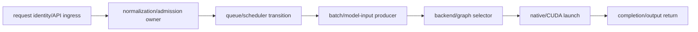
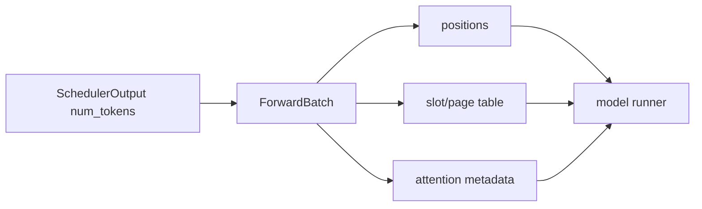
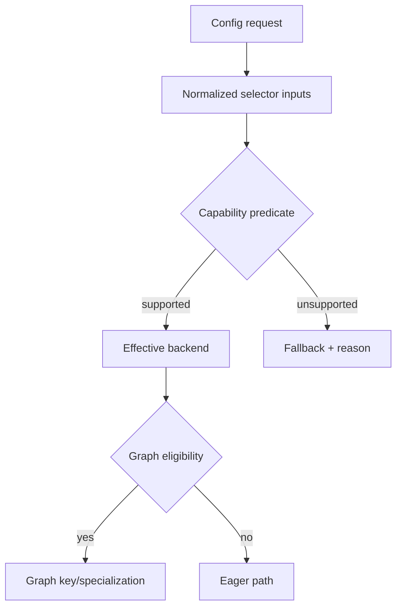
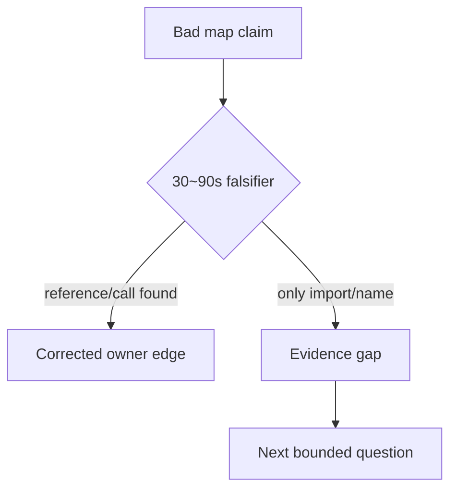
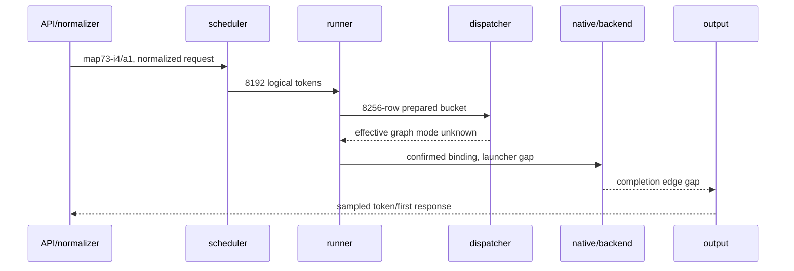

# 73장. API에서 CUDA까지 15분에 지도를 만드는 법

이 장은 한 사건에서 API→scheduler→worker→native/CUDA로 이어지는 **최소 실행 지도**를 만드는 법을 소유한다. 74장은 이 지도에서 옵션 하나를 골라 requested value가 실제 consumer state를 바꾸는 경로를 추적하고, 77장은 사건이 바뀌어도 owner 좌표를 다시 찾게 하는 검색용 source atlas를 소유한다. 지도, option trace와 atlas는 같은 symbol을 쓸 수 있지만 산출물이 다르다.

새 revision을 배포한 뒤 long-context TTFT가 악화됐다. 로그에는 `attention backend` 이름만 보인다. 낯선 저장소를 연 운영자가 모든 코드를 이해하려 하면 15분은 입구 파일을 읽는 데 끝난다. `MAP73`의 목표는 원인을 맞히는 것이 아니다. 한 요청의 owner, queue transition, batch producer, effective selector, native launch와 completion owner를 표시해 다음 두 시간의 질문을 안전하게 줄이는 것이다.

## 73.1 PID·container·revision·effective backend 사건을 15분에 닫는다

대표 사건은 같은 service 이름인데 replica 하나만 다른 backend를 선택한 배포다. 0분에 request와 응답을 고정하고, process PID·container digest·source revision·loaded binary·effective backend를 차례로 결합한다. 그 뒤 route→engine→scheduler→runner→native enqueue→completion을 15분 시간 상자에 놓는다. 저장소별 pinned walk는 이 사건에서 빈 좌표를 찾을 때 여는 참고표이며 본문 spine을 대신하지 않는다.

### 73.1.1 repository 관광을 멈추는 질문

첫 질문은 “파일이 어디에 있는가?”가 아니라 “long-context request가 어느 identity로 들어와 어느 state를 바꾸며, 누가 다음 consumer에 넘기는가?”다. Architecture diagram은 후보 경계를 알려 줄 수 있지만 pinned revision의 current call graph 증거가 아니다.

### 73.1.2 여섯 좌표



각 화살표에는 symbol, `file:line`, input/output type, mutated state, sync/async handoff, next consumer와 evidence gap을 쓴다. Import 관계는 호출 관계가 아니며 class 이름은 runtime instance가 아니다.

### 73.1.3 MAP73 scope

입력은 72장의 `long-context TTFT regression`, fixed source revision, first divergence 후보다. CUDA lane만 추적하고 CPU/XPU/legacy/test 구현은 side branch로 표시한다. 결과는 원인명이 아니라 “long-prefill shape가 어떤 normalized selector key를 만들고 어느 backend/graph mode를 선택하며 queue/prefill timestamp가 어디서 갈라지는가?”라는 두 시간 질문이다.

## 73.2 0~3분 — route에서 engine submission까지

### 73.2.1 ingress owner와 request identity

Public route 또는 RPC handler에서 protocol model validation, tokenization/template, normalized engine request와 submit symbol을 연결한다. Request 문자열이 gateway retry, engine request, P/D transfer와 output stream에서 같은 의미인지 확인한다. Server-issued incarnation과 attempt를 구분한다.

### 73.2.2 bad map을 고친다

나쁜 지도는 `HTTP server → model`이다. 이는 validation, tokenization과 engine admission owner를 숨긴다. 고친 지도는 `route handler → normalized request object/request incarnation → engine add/submit → cancellation callback`이다. 30초 반증은 handler가 실제 engine submission symbol을 참조하는지 definition/reference로 확인하는 것이다.

### 73.2.3 첫 worksheet 행

```yaml
ingress:
  symbol: null
  file_line: null
  protocol_input: null
  normalized_type: null
  identity: null
  submit_consumer: null
  cancellation: null
```

빈칸은 추정하지 않는다. Tokenizer가 별 process라면 sync call처럼 직선을 긋지 않고 queue/RPC handoff를 표시한다.

시계가 시작되면 MAP73 조사자는 long-context request 한 건의 protocol type과 route 문자열을 고정한다. 검색 결과가 수백 개여도 handler definition, handler가 만드는 normalized object, engine submission 호출의 세 symbol만 남긴다. Middleware와 decorator는 request를 실제로 mutate하거나 reject할 때만 지도에 넣는다.

Identity 표에는 client ID, server incarnation, retry attempt와 engine ID를 분리한다. Long request가 gateway retry되면 같은 client ID가 두 engine request를 만들 수 있다. 로그 문자열만 join하면 queue wait를 두 번 더하거나 다른 attempt의 backend selection을 붙인다. Cancellation callback이 어느 identity를 받는지도 이 단계에서 찾는다.

3분 stop rule은 engine submission의 concrete argument type과 cancellation edge를 찾았는가다. Tokenization 내부 알고리즘이나 모든 API option을 읽느라 이를 놓치면 지도가 실패한다. Tokenizer가 별 process이고 receive symbol이 아직 없다면 `handoff unknown`과 normalized request type을 다음 검색으로 남긴다.

## 73.3 3~6분 — queue 이름보다 mutation을 찾는다

### 73.3.1 waiting에서 running으로

`waiting`, `running`, `deferred`, `preempted`, `finished` container를 찾은 뒤 request를 옮기는 `add/append`, selection/pop, status assignment와 scheduler output construction을 잇는다. Container 선언은 transition owner가 아니다.

### 73.3.2 loop iteration과 request lifetime

Continuous batching scheduler loop 한 번은 request lifetime 전체가 아니다. 같은 request가 여러 iteration의 batch에 들어갈 수 있다. MAP73 long prefill이 chunked/deferred되는지, decode request와 같은 queue owner를 쓰는지 표시한다.

### 73.3.3 60초 falsifier

나쁜 지도 `waiting queue → GPU`는 allocation, budget selection과 batch output producer를 잃는다. Mutation call의 caller와 returned scheduler output type을 60초 안에 찾는다. Request status가 바뀌지 않는데 container만 이동한다면 status field를 진실 원장으로 쓰지 않는다.

MAP73 long request가 engine에 들어온 뒤 첫 state mutation을 찾는다. `waiting.append(req)` 같은 줄만 인용하지 않고 caller가 admission limit과 duplicate identity를 검사하는지, request timestamp를 함께 쓰는지 본다. Queue timestamp producer가 TTFT 분석의 기준점이므로 metric 이름보다 mutation line이 중요하다.

Bad map 두 번째 예는 `Scheduler.schedule → model runner`다. Corrected map은 `waiting owner → budget/blocks predicate → selected request set → scheduler output object → deferred/preempted remainder`다. 이 지도를 사용하면 long-prefill이 queue에서 오래 있었는지, 선택된 뒤 chunk가 작았는지 구분할 timestamp 후보가 생긴다.

30~90초 falsifier는 scheduler output type의 references를 찾아 실제 consumer를 확인하는 것이다. 같은 이름의 legacy scheduler가 잡히면 pinned CUDA lane import와 constructor call로 제외한다. Test fixture에서만 쓰이는 class는 실행 지도에 넣지 않는다.

## 73.4 6~9분 — scheduler output이 tensor가 되는 자리

### 73.4.1 batch producer

Scheduler output에서 `num_tokens`, sequence lengths, positions, slot/page table, adapter·grammar metadata를 만드는 producer를 찾는다. Logical tokens와 padded/captured tokens를 구분한다. Long prefill shape가 어느 단계에서 chunk 또는 bucket으로 정규화되는지가 MAP73의 핵심이다.

### 73.4.2 runner consumer

Model runner가 받는 concrete batch/input object와 device buffer update를 연결한다. CPU-side plan 생성과 async H2D/device-side update를 분리한다. Graph replay면 static address와 per-iteration content producer를 함께 쓴다.

### 73.4.3 shape ledger



Shape `request tokens→scheduled tokens→padded tokens→kernel logical dimensions`를 한 줄로 둔다. 단위가 바뀌는 화살표에 producer를 표시한다.

6분 시점에는 scheduler가 만든 logical work가 아직 CUDA tensor가 아닐 수 있다. Adapter가 request IDs와 scheduled tokens를 읽어 positions, slot mapping과 page table을 만든다. 이 producer를 놓치면 kernel grid의 `num_tokens`와 scheduler budget의 `num_tokens`가 같은 단위라고 착각한다.

MAP73 fixture에서 prompt 32,769 tokens가 scheduler에서 8,192-token chunk로 선택되고 graph bucket 때문에 8,256 rows로 pad된다고 하자. Kernel selector가 보는 값이 request total 32,769인지 scheduled 8,192인지 padded 8,256인지 확인한다. 세 값을 모두 `long_prefill_length`라고 부르면 selector 원인을 오진한다.

Page size 16이면 전체 prompt의 단순 ceiling은 2,049 pages와 tail 1 token이지만 현재 chunk가 기존 prefix 뒤 어느 page range를 쓰는지는 cache state에 달려 있다. Page-table producer와 attention metadata consumer를 연결한다. Logical 계산을 runtime mapping으로 대체하지 않는다.

Graph replay라면 static buffer address와 current content를 나눈다. Runner가 positions 주소를 capture해도 매 iteration 어느 producer가 8,192 positions를 쓰는지 표시한다. Producer와 replay stream이 다르면 completion event가 coordinate에 들어간다.

## 73.5 9~12분 — registry가 아니라 effective selector를 찾는다

### 73.5.1 selector input

Backend registry의 지원 목록은 runtime choice가 아니다. Capability predicate, model/cache/quant dtype, head dimension, GPU architecture, graph mode와 request shape가 selector key를 만드는 지점을 찾는다.

### 73.5.2 fallback과 graph mode

Unsupported, explicit fallback, JIT/compile/capture와 native prebuilt path를 다른 결과로 둔다. Config default가 new backend라도 long-prefill shape가 reference로 떨어질 수 있다. Selected-path log가 없다면 최소 계측 gap으로 남긴다.

### 73.5.3 bad selector map

나쁜 지도 `--attention-backend=flashinfer → FlashInfer kernel`은 문자열 definition과 effective object 사이 validation·fallback을 생략한다. 고친 지도는 `option/config field → normalized selector inputs → capability predicate → effective backend object → graph mode/specialization`이다. 90초 falsifier는 selected object 생성 call site와 fallback branch를 찾는 것이다.

9분부터는 selector call site 하나로 좁힌다. Registry 선언에서 backend 클래스 목록을 읽는 대신 model runner가 normalized metadata와 configuration을 넘겨 selected object를 얻는 호출을 찾는다. False branch와 fallback reason이 지도에서 중요하다.

MAP73 경쟁 가설은 selector 변경과 queue 변경이다. New revision에서 long prefill만 reference backend로 fallback한다면 effective-path event와 latency cohort가 맞아야 한다. Backend는 그대로인데 graph mode가 FULL에서 NONE으로 바뀌었다면 capture eligibility를 본다. 둘 다 같고 scheduler chunk만 줄었다면 selector 가설은 약해진다.



각 diamond에 source predicate가 없으면 registry 그림일 뿐이다. Selected class만 보이고 specialization/key가 없으면 최소 event 후보를 gap에 적는다. Request ID를 metric label로 넣어 해결하지 않는다.

## 73.6 12~15분 — native enqueue 뒤 돌아오는 길

### 73.6.1 binding에서 launch까지

Python/C++ binding, workspace/plan, native dispatch와 CUDA kernel 또는 collective enqueue의 마지막 concrete boundary를 찾는다. Grid/block을 전부 해설하지 않고 logical dimensions, pointer/stride/workspace owner, stream을 기록한다.

### 73.6.2 enqueue는 completion이 아니다

Launch call return을 완료로 쓰지 않는다. Completion/error가 어느 synchronization, event, dependent op에서 관측되는지 표시한다. Output tensor가 logits/sampling/detokenization과 streaming response로 돌아가는 consumer path를 한 줄로 잇는다.

### 73.6.3 완성된 15분 시간축

```mermaid
gantt
  title MAP73 조사 시간 예산
  dateFormat X
  axisFormat %M
  section map
  ingress/identity :0, 3
  queue/transition :3, 3
  batch/runner :6, 3
  selector/effective path :9, 3
  native/completion/return :12, 3
```



시간 제한은 답을 얕게 만들기 위한 것이 아니다. 모르는 branch를 gap으로 남기고 다음 두 시간의 search space를 제한하기 위한 stop rule이다.

12분에는 Python wrapper 이름을 kernel로 부르는 습관을 멈춘다. Wrapper가 plan/workspace를 만들고 custom op나 C++ binding을 호출하며 native dispatcher가 specialization을 고를 수 있다. 지도는 마지막으로 확인된 concrete symbol까지만 실선으로 그리고 나머지는 gap으로 둔다.

Launch 좌표에는 logical dimensions, pointer/stride, workspace owner, stream과 error observer가 있다. Grid `(128,32,1)`을 발견해도 x가 token tile인지 batch인지 launcher mapping 전에는 의미를 쓰지 않는다. Enqueue 후 output consumer가 어느 event나 stream order로 logits를 읽는지 연결한다.

Return path에서는 model output이 logits processor/sampler에 전달되고 selected token이 detokenizer와 stream response owner로 가는 symbol을 찾는다. TTFT timestamp가 kernel completion, sampled token 또는 network write 가운데 어디서 찍히는지 표시한다.

15분 terminal은 native kernel 이름을 반드시 찾는 것이 아니다. Wrapper→binding까지만 확인했다면 `native dispatch unknown; bounded search=custom op registration and CUDA sources; impact=effective kernel attribution`으로 남긴다. 추측한 kernel 이름보다 유용하다.

## 73.7 흔한 실패 열 가지를 90초 안에 반증하기

### 73.7.1 실패 1~5

README diagram을 call graph로 믿으면 pinned handler reference로 30초 반증한다. `main`부터 깊이 읽으면 public route의 engine submission reference로 돌아온다. Legacy/CPU/test가 섞이면 runtime lane predicate와 import/call site를 확인한다. Config definition에서 멈추면 field reference의 mutation consumer를 찾는다. Registry 목록을 effective choice로 읽으면 runtime object construction branch를 찾는다.

실패 1의 bad map은 `API→scheduler→GPU`라는 README 화살표다. 이 그림으로는 tokenizer process와 engine submission queue가 sync인지 async인지 알 수 없다. 30초 동안 route handler가 호출하는 concrete client/engine method를 찾는다. Direct call이 아니라 IPC send라면 corrected edge에 serialized type과 receiver gap을 넣는다.

실패 2는 CLI `main`의 object construction을 따라가다 request 한 건을 잃는 경우다. 45초 반증은 known route path 또는 protocol request type의 references에서 handler로 이동하는 것이다. Main은 runtime lane 선택 증거로만 남기고 request state mutation은 handler 이후에서 찾는다.

실패 3은 이름이 같은 legacy scheduler와 CUDA V1 scheduler의 code를 합치는 것이다. Corrected map에는 process/class construction과 pinned config predicate를 붙인다. 60초 안에 effective scheduler instance를 만드는 call site를 못 찾으면 두 branch를 parallel candidate로 두고 서로의 methods를 한 call chain에 넣지 않는다.

실패 4는 `--attention-backend` parser line을 selector라고 부르는 것이다. Parser는 문자열을 config field로 바꿀 뿐 runtime object를 고르지 않을 수 있다. Field references에서 validation/normalization, selector predicate와 object construction을 찾는다. 다음 consumer가 보이지 않으면 option semantics는 74장 질문으로 넘긴다.

실패 5는 registry에 FlashInfer가 있으므로 MAP73도 FlashInfer라고 쓰는 것이다. 90초 동안 runner의 selector call과 capability false branch를 찾는다. Selected-path runtime evidence가 없으면 `supported candidate`와 `effective unknown`을 구분한다.

### 73.7.2 실패 6~10

Queue container만 찾았으면 request를 넣고 빼는 caller를 찾는다. Scheduler token과 kernel grid 단위를 같다고 보면 conversion producer를 찾는다. Python wrapper를 kernel이라 부르면 native binding/module symbol까지 내려간다. Enqueue를 completion이라 부르면 event/sync/error observer를 찾는다. 빈칸을 추정으로 채웠다면 `unknown + bounded next search + impact`로 되돌린다.

실패 6의 bad map은 `waiting deque`를 scheduler owner로 쓰는 것이다. Container는 mutation을 수행하지 않는다. Add/remove/select caller, request state와 timestamp write를 연결한다. 45초 안에 pop 또는 selected-set construction reference를 찾고 next consumer type을 적는다.

실패 7은 scheduler의 `num_tokens=8192`를 kernel grid token dimension으로 복사하는 것이다. Batch producer가 padding 8256 또는 tile count 65로 바꿀 수 있다. 60초 falsifier는 field definition이 아니라 scheduler output consumer와 conversion line을 찾는 것이다. 단위가 모르면 화살표에 `logical→unknown`을 쓴다.

실패 8은 `FlashInferWrapper.run` 또는 PyTorch op를 CUDA kernel symbol로 쓰는 것이다. Wrapper 내부 custom op/module call을 찾고 registration/native source로 한 단계 내려간다. 90초 안에 못 찾으면 binding 좌표까지 실선, native dispatch를 gap으로 둔다.

실패 9는 launch API return을 completion timestamp로 쓰는 것이다. Stream enqueue 뒤 output consumer가 같은 stream인지, event wait 또는 synchronization이 있는지 찾는다. Async error observer가 다른 call에 있다면 launch와 observation을 별 좌표로 쓴다.

실패 10은 지도 품질을 높이려 unknown을 추측으로 채우는 것이다. Corrected gap은 question, bounded symbol/search와 impact를 가진다. `kernel unknown`보다 `selected backend forward의 custom-op registration→CUDA launcher; impact=TTFT attribution`이 다음 조사를 실제로 시작하게 한다.



## 73.8 MAP73 완성 worksheet와 두 시간 질문

이 절의 YAML은 첫 화면에서 모든 칸을 채우라는 양식이 아니다. 앞에서 따라온 long-context TTFT 사건의 다음 질문을 두 시간 조사로 넘기는 인계서다. 15분 안에는 요청 `map73-i4`가 ingress에서 scheduler로 넘어갔고, scheduled chunk가 8,192이며 runner padded rows가 8,256이라는 경로까지만 닫혀 있다. effective backend·graph mode와 native completion owner는 아직 모른다.

먼저 `coordinates.ingress`, `coordinates.admission_scheduler`, `coordinates.batch_runner`를 읽으며 현재 확정된 소유권 사슬을 확인한다. 그다음 `selector`와 `native_launch`의 `unknown`을 본다. 여기서 `unknown`은 지도 실패가 아니라, 소스로 확정하지 못해 다음 조사 질문으로 남겨 둔 경계다.

완성된 경로 하나만 문장으로 먼저 읽어 보자. `map73-i4` 요청은 pinned route에서 engine submit으로 전달됐고, scheduler가 waiting/running owner로서 8,192-token chunk를 계획했으며, runner는 8,256 padded rows와 page-table metadata를 소비한다. 이 경로의 마지막은 “어떤 native kernel이 돌았다”가 아니라 `model_runner`다. selector와 completion owner는 아래 `gaps`의 두 질문으로 이어진다.

### 73.8.1 corrected map

```yaml
scope: {symptom: long-context TTFT, source_revision: fixed, runtime_lane: CUDA, exclusions: [legacy, CPU, tests]}
coordinates:
  ingress: {symbol: pinned_route, identity: request_incarnation, next: engine_submit}
  admission_scheduler: {owner: scheduler, queues: [waiting, running], transitions: [admit, schedule, finish]}
  batch_runner: {producer: scheduler_output_adapter, metadata: [num_tokens, positions, page_table], consumer: model_runner}
  selector: {inputs: [long_prefill_shape, dtype, heads, device, graph_mode], effective_choice: unknown, fallback: unknown}
  native_launch: {binding: unknown, op_or_kernel: unknown, stream: unknown, completion: unknown}
  return_path: {sampling: sampled_token, output_owner: engine_stream, cancellation: abort_callback}
gaps:
  - {question: effective selector for long prefill, bounded_search: selector call references, impact: latency path}
  - {question: enqueue completion owner, bounded_search: stream/event consumer, impact: attribution}
next_two_hour_question: long-prefill normalized key→effective backend/graph mode→queue/prefill timestamp divergence
```

MAP73의 corrected map을 incident evidence와 대조한다. Long-context request의 ingress identity는 `map73-i4`, scheduler queue timestamp는 `q_enter`, scheduled chunk는 8,192, runner padded rows는 8,256이라고 하자. Selected backend와 graph mode는 아직 unknown이다. 로그의 backend 문자열은 requested config일 수 있어 effective field에 복사하지 않는다.

TTFT 악화가 queue 전인지 후인지 판단하려면 `q_enter→scheduled`, `scheduled→runner_start`, `runner_start→first_output` timestamp producer를 source coordinate에 붙인다. 서로 다른 process clock이면 67장의 uncertainty를 유지한다. 15분 지도는 latency 숫자를 계산하지 않고 각 interval owner를 찾는다.

첫 competing hypothesis는 revision에서 long prefill chunk budget이 줄었다는 것이다. 이는 scheduler output의 scheduled tokens와 iteration 수 변화를 예측한다. 둘째는 backend/graph fallback이다. 이는 effective selector event와 runner/native duration 변화를 예측한다. 셋째는 enqueue 이후 completion/return delay다. Queue와 runner local duration은 정상이고 output consumer edge가 늦을 것을 예측한다.

지도만으로 어느 가설도 확정하지 않는다. 대신 두 시간 질문을 세 subquestion으로 제한한다. Scheduler output producer에서 long-prefill normalized chunk가 old/new revision에서 어떻게 달라졌는가, selector가 그 shape로 어떤 backend/graph key를 만들었는가, chosen native op completion에서 TTFT timestamp producer까지 어느 edge가 늘었는가다.

Completed map에는 source grade를 붙인다. Direct call와 state mutation은 strong source anchor, class/import는 candidate, runtime selected-path log는 execution evidence, README는 design context다. 서로 다른 grade를 같은 실선으로 그리지 않는다.

### 73.8.2 지도 합격선

MAP73을 실제 사건 기록으로 닫아 보자. 배포 직후 긴 prompt cohort의 p95 TTFT가 1.8초에서 4.9초로 상승했고 짧은 prompt와 inter-token latency는 거의 변하지 않았다고 가정한다. 운영 로그에는 `attention_backend=flashinfer`라는 시작 시점 메시지만 있다. 이 메시지는 requested 또는 constructed backend 증거일 뿐 request별 effective execution 증거가 아니다. 조사자는 먼저 `map73-i4` 한 incarnation을 고르고 old/new revision의 동등 request와 비교한다. 전체 fleet 평균이나 서로 다른 prompt를 섞으면 첫 divergence를 찾을 수 없다.

0~3분 산출물은 다음과 같다. Public input은 chat protocol object이고 renderer/tokenizer 뒤 engine request가 된다. Client request ID는 재사용될 수 있으므로 server incarnation `map73-i4/a1`을 join key로 만든다. vLLM lane에서는 `AsyncLLM.add_request`가 normalized request를 core와 output collector에 연결하고, SGLang lane이면 tokenizer manager의 send와 scheduler receive가 process boundary다. 이 사건은 한 stack만 실제 배포 lane으로 고정해야 한다. 네 stack walk를 동시에 incident call graph로 합치지 않는다. 나머지 세 walk는 같은 질문 양식을 검증하는 비교 사례다.

이 시점의 bad map은 `POST /chat → FlashInfer`다. Corrected map은 `protocol request → rendering/tokenization → normalized engine identity → core admission`이고, 아직 backend 화살표는 없다. 관측값은 arrival, normalization 완료, engine submit과 abort owner다. First gap은 “core admission receiver가 이 incarnation을 언제 waiting state에 넣는가?”다. Bounded search는 normalized request type의 consumer reference와 queue mutation이다. Impact는 network/tokenizer 지연과 scheduler wait의 경계를 정하는 것이다.

3~6분에는 admission과 scheduling을 분리한다. Fixture의 old/new ledger를 다음처럼 쓴다.

| 상태 좌표 | old | new | 해석 전 주의 |
|---|---:|---:|---|
| normalized submit | 0 ms | 0 ms | 같은 process clock 기준 |
| queued event | 4 ms | 5 ms | admission 차이는 미미 |
| first scheduled | 21 ms | 24 ms | queue 증가는 3 ms뿐 |
| scheduled chunk | 8,192 tokens | 8,192 tokens | request total과 구분 |
| prefill iterations | 5 | 5 | scheduler budget 가설 약화 |

여기서 4.9초 전체를 scheduler 탓으로 돌릴 수 없다. Queue interval 증가는 몇 ms이고 chunk count도 같다. 물론 event producer가 같은 의미와 시계를 쓰는지는 확인해야 한다. Source에서 queue event가 waiting mutation 뒤 기록되는 순서, schedule timestamp의 owner와 output의 request incarnation을 확인한다. 그 조건이 맞으면 scheduler chunk-budget regression은 우선순위가 내려간다. 완전 기각은 old/new request의 prefix cache hit와 KV allocation 결과까지 동등해야 가능하다.

6~9분 shape ledger는 더 결정적이다. Old revision의 scheduler output은 8,192 logical tokens이고 runner prepared rows도 8,192였지만, new revision은 logical tokens가 8,192인 채 graph input bucket이 8,256이라고 하자. 총 prompt 32,769와 현재 chunk 8,192, padded rows 8,256을 별 필드로 둔다. `+64`만 보고 성능 원인을 확정하지 않는다. Padding은 graph reuse를 가능하게 해 오히려 빠를 수도 있고, 어떤 capability predicate를 넘지 못하게 만들 수도 있다.

이 divergence의 producer를 찾는다. SchedulerOutput consumer가 persistent batch state를 갱신하고 positions/page metadata를 준비한 뒤 dispatcher input을 만든다. `8,192 → 8,256` conversion line과 bucket table 또는 rounding predicate가 strong anchor다. Static buffer 주소가 같더라도 content length와 valid-token mask는 달라질 수 있다. H2D 준비 완료 event 없이 replay가 읽는다면 correctness incident가 되므로 producer stream과 graph replay stream의 ordering도 gap에 남긴다.

9~12분 selector ledger에서는 requested, eligible, selected, executed를 네 칸으로 나눈다.

| 단계 | 증거 | MAP73 기록 |
|---|---|---|
| requested | 시작 로그 `flashinfer` | config_requested |
| eligible | dtype/head dim/device는 지원 | capability_partial |
| selected graph mode | old FULL, new NONE 후보 | source predicate 필요 |
| executed op | request별 event 없음 | unknown |

New padded shape가 graph key에 없어서 eager fallback했다는 가설은 plausible하지만 아직 결론이 아니다. Dispatcher의 chosen mode와 fallback reason을 source predicate로 확인하고 최소 계측 후보를 정한다. 계측은 request ID를 고 cardinality metric label로 넣지 않는다. Sampled ledger에 incarnation, normalized shape, chosen graph mode, effective backend class와 reason code를 한 사건으로 남긴다. Fleet metric에는 reason별 counter와 histogram만 둔다.

12~15분에는 selected backend forward에서 binding까지만 확인했다고 하자. Native specialization과 completion observer는 아직 찾지 못했다. 이를 억지로 `FlashInfer prefill kernel`로 채우지 않는다. Completed MAP73은 `binding=effective backend forward의 custom op`, `native dispatcher=unknown`, `completion=dependent output consumer`, bounded search는 `custom-op registration → CUDA source launcher → stream/event observer`다. Impact는 runner 구간 증가가 eager dispatch인지 kernel duration인지 output wait인지 분리하는 것이다.

Return path ledger에서 new revision의 `runner_start→model_forward_return`이 2.7초 늘고, logits processing과 first stream callback은 각각 old/new가 비슷하다고 하자. 그러면 output serialization 가설은 약해진다. 그러나 model forward return이 CUDA completion을 암묵적으로 관측하는지 source/framework semantics를 확인하지 않으면 kernel duration이라고 단정할 수 없다. Tensor consumer가 synchronization을 유발했을 수도 있다. MAP73은 이 경계를 다음 조사 질문으로 남긴다.



이 sequence에서 실선은 source call 또는 mutation으로 확인된 edge이고 점선은 관측이 부족한 edge다. Diagram을 보기 좋게 만들기 위해 점선을 실선으로 바꾸지 않는다. 지금 first incomplete edge는 dispatcher의 effective result다. Native kernel부터 읽으면 어떤 path가 실행됐는지도 모른 채 수천 줄을 읽게 된다.

두 시간 질문은 세 단계로 실행 가능하게 쪼갠다. 첫 30분에는 `8,256`을 만든 producer와 graph dispatch key consumer를 찾고 old/new diff를 비교한다. 다음 45분에는 effective backend/graph object의 forward reference에서 custom op registration까지 내려간다. 마지막 45분에는 native launcher의 logical dimensions와 stream, output consumer의 completion observation을 연결한다. 각 단계에는 중단 조건이 있다. Producer가 old/new 동일하면 padding 가설을 내리고, selected mode가 동일하면 fallback 가설을 내리며, native path와 completion interval도 같으면 이 branch를 닫고 다른 first divergence로 돌아간다.

사건 dossier의 completed artifact는 다음처럼 빈칸의 품질까지 포함한다.

```yaml
scope:
  symptom: long-context TTFT p95 1.8s -> 4.9s
  source_revision: pinned old/new pair
  runtime_lane: deployed stack + CUDA
  request: map73-i4/a1
  exclusions: [CPU, tests, legacy, nondeployed stacks]
coordinates:
  ingress:
    owner: public handler -> renderer/tokenizer -> normalized engine request
    identity: server incarnation map73-i4/a1
    mutation: output collector와 core request 등록
  admission_scheduler:
    owner: concrete scheduler
    mutation: waiting admission -> selected request -> SchedulerOutput
    observed: queue interval +3ms; scheduled chunk unchanged at 8192
  batch_runner:
    producer: scheduler-output adapter/input preparation
    mutation: logical 8192 -> prepared bucket 8256
    consumer: CUDA model runner
  selector:
    inputs: [8256 rows, dtype, head_dim, device, graph config]
    requested_backend: flashinfer
    effective_choice: unknown
    fallback: reason event absent
  native_launch:
    binding: selected backend forward/custom-op boundary
    op_or_kernel: unknown
    stream: unknown
    completion: output dependency candidate
  return_path:
    owner: model output -> logits/sampler -> stream collector
    observation: post-forward portion unchanged
anchors:
  - {grade: strong, meaning: ingress identity normalization}
  - {grade: strong, meaning: scheduler token selection mutation}
  - {grade: strong, meaning: runner input state update}
  - {grade: candidate, meaning: requested backend startup log}
gaps:
  - question: 8256 shape가 만든 effective graph mode와 fallback reason은 무엇인가
    bounded_search: dispatcher key producer와 selected result consumer
    impact: 2.7s runner regression의 path attribution
  - question: binding 이후 launcher와 completion observer는 무엇인가
    bounded_search: custom op registration -> CUDA source -> stream consumer
    impact: dispatch, kernel, wait 구간 분리
next_two_hour_question: 8192->8256 normalization이 effective graph/backend path와 completion interval을 어떻게 바꾸었는가
```

이 artifact는 원인을 확정하지 않았지만 조사 실패가 아니다. 오히려 `backend=flashinfer`라는 약한 로그에서 출발해 queue 가설을 약화하고, first divergent state를 8,256-row normalization으로 좁혔으며, effective selector와 completion이라는 두 미완 edge를 정확히 남겼다. 다른 독자는 90초 안에 scheduler output consumer에서 시작해 같은 gap에 도달할 수 있다.

반대로 합격하지 못하는 artifact는 다음 특징을 가진다. `API`, `scheduler`, `GPU`처럼 type과 owner가 없는 명사만 있다. Old/new comparison 없이 현재 revision 파일만 나열한다. Requested config를 selected backend로 복사한다. `cudaGraphLaunch`를 발견하고 그 request가 graph path를 탔다는 증거 없이 연결한다. Completion을 launch return으로 대체한다. Gap에 “더 조사”만 쓰고 search 시작점과 영향이 없다. 이런 지도는 화살표가 많아도 다음 행동을 만들지 못한다.

MAP73 review에서 동료는 다섯 질문만 한다. 첫째 이 identity가 retry와 streaming update를 구분하는가. 둘째 각 queue edge에 mutation owner가 있는가. 셋째 logical, padded, kernel 차원의 단위가 분리됐는가. 넷째 requested, eligible, selected, executed가 섞이지 않았는가. 다섯째 enqueue 이후 completion과 return owner가 있는가. 하나라도 “아마”로 답하면 그 edge를 점선과 bounded gap으로 되돌린다.

이 review는 무한 정밀도를 요구하지 않는다. 15분의 목적은 정확한 불완전성이다. Source anchor 200개보다 symptom에 직접 연결된 strong anchor 10개와 영향이 명시된 gap 두 개가 낫다. 이후 74장은 이 지도에서 effective selector 하나를 택해 option definition, normalization, consumer, mutation과 observation을 두 시간 동안 깊게 추적한다.

여섯 좌표가 모두 정확히 채워져야 하는 것은 아니다. 각 known edge는 pinned symbol과 state mutation을 갖고, unknown은 bounded search와 영향이 있어야 한다. 다음 두 시간 질문이 option 문자열이 아니라 selector predicate와 state transition을 겨냥하면 합격이다.

Bad→corrected 대조 세 개를 최종 worksheet에 붙인다.

| bad map | 빠진 의미 | corrected map |
|---|---|---|
| HTTP→model | identity/admission/cancel | handler→normalized request→engine submit |
| waiting→GPU | transition/budget/batch producer | queue owner→select predicate→SchedulerOutput→runner adapter |
| backend option→kernel | validation/effective choice/native dispatch | config→selector predicate→object→binding→launcher |

합격 지도는 repository coverage가 낮아도 된다. MAP73 symptom과 관계없는 tokenizer algorithm, 모든 model architecture, CPU backend directory를 제외한 이유가 scope에 있다. 다음 질문을 좁히지 못하는 anchor는 삭제 검토 대상이다.

관측점도 최소로 둔다. Queue state mutation의 timestamp, scheduled/padded shape, selected backend/graph/fallback reason, native launch/completion과 output timestamp가 필요하다. Request/trace ID를 metric label로 넣지 않고 sampled execution ledger로 잇는다.

지도 review는 다른 독자가 90초 안에 첫 source anchor와 다음 gap search를 재현할 수 있는지 본다. 파일명이 바뀌어도 symbol과 type 관계로 따라갈 수 있어야 한다. Line link는 pinned revision에서 predicate를 직접 보여 줘야 한다.

## 73.9 PID→container→revision→effective backend 완성 장부

새벽 02:10, Kubernetes cluster의 `/v1/chat/completions` p99가 직전 release보다 38% 늘었다. Dashboard에는 service 이름 `llm-prod`, Pod 여섯 개와 “FlashInfer enabled”라는 startup 문자열만 있다. 저장소 checkout은 최신 main이고 실제 image가 어느 commit에서 만들어졌는지 모른다. 이 절의 목표는 15분 안에 원인을 맞히는 것이 아니다. 느린 요청 한 건이 들어간 실제 PID, container와 immutable image, 실행 argv·환경·설정, effective backend·graph mode·native 경계를 하나의 artifact로 고정해 다음 조사자가 1–72장의 알맞은 장으로 바로 이동하게 하는 것이다.

### 73.9.1 0~4분: service에서 PID와 immutable revision까지 고정한다

먼저 증상 요청의 server-side request identity와 응답 헤더 또는 trace에서 Pod를 찾는다. 그런 연결이 없다면 동일 시간·route·model·latency의 log를 좁히되 “이 Pod일 가능성”으로 표시한다. 여섯 Pod를 임의로 하나 골라 조사한 뒤 production 전체를 대표한다고 쓰지 않는다. 선택한 대상은 namespace, Pod UID, node, container name, restart count와 started time으로 고정한다.

최소 명령은 다음 순서다. 출력 전체를 책에 붙이지 않고 필요한 필드와 원본 artifact 경로를 남긴다.

```bash
kubectl -n llm-prod get pod decode-7 -o json > pod.decode-7.json
kubectl -n llm-prod get pod decode-7 -o jsonpath='{.metadata.uid}{"\n"}{.spec.nodeName}{"\n"}{.status.containerStatuses[0].containerID}{"\n"}{.status.containerStatuses[0].imageID}{"\n"}'
kubectl -n llm-prod exec decode-7 -c server -- sh -c 'printf "pid=%s\n" 1; tr "\0" " " </proc/1/cmdline; printf "\n"; sed -n "1,40p" /proc/1/status'
```

PID 1이 실제 engine process가 아닐 수 있다. Shell, init 또는 supervisor이면 `/proc/1/task/1/children`과 `ps -eo pid,ppid,lstart,args`로 자식 관계를 보고 실제 server PID를 선택한다. `pgrep -f vllm` 하나는 helper와 worker를 함께 잡을 수 있으므로 진실 원장으로 쓰지 않는다. 선택 결과에는 `pid`, `ppid`, process start ticks와 full argv를 둔다. Pod가 재시작되면 같은 이름이라도 process incarnation이 달라진다.

Image tag는 revision이 아니다. `imageID`의 digest를 기록하고, 가능하면 배포 pipeline이 넣은 OCI revision label 또는 image 내부 build manifest를 읽는다. 예시는 다음과 같지만 경로와 runtime은 현장에 맞춘다.

```bash
kubectl -n llm-prod exec decode-7 -c server -- sh -c 'test -r /etc/llm-build.json && sed -n "1,120p" /etc/llm-build.json'
crictl inspecti sha256:IMAGE_DIGEST > image.inspect.json
```

`crictl`은 node 권한과 runtime 접근이 있을 때만 사용한다. 권한이 없다면 Pod status의 immutable `imageID`, deployment manifest, registry provenance를 artifact gap으로 남긴다. Container 안에 `.git`가 없다고 revision unknown을 binary version 문자열로 추정하지 않는다. Wheel metadata, package version, shared-object build ID와 image digest는 서로 다른 좌표다. Commit을 증명하지 못하면 `source_revision=unknown`, `bounded_by=image digest`라고 쓴다.

4분 checkpoint는 다음 여섯 칸이다.

```yaml
target:
  request_incarnation: req-73-a2
  pod_uid: null
  node: null
  container_id: null
  image_digest: null
  pid_start: null
source_revision:
  value: null
  evidence: null
  confidence: unknown
```

### 73.9.2 4~8분: 선언 설정과 effective process state를 갈라 놓는다

Deployment YAML은 desired state이고 `/proc/<pid>`는 실행 중인 process의 관측이다. 둘 다 보존한다. Rollout 도중 old/new ReplicaSet이 섞이면 현재 Git values 파일이나 Deployment template만 읽어서는 문제 Pod의 실제 argv를 알 수 없다.

```bash
kubectl -n llm-prod get deploy llm-decode -o yaml > deploy.llm-decode.yaml
kubectl -n llm-prod get pod decode-7 -o yaml > pod.decode-7.yaml
kubectl -n llm-prod exec decode-7 -c server -- sh -c 'tr "\0" "\n" </proc/ACTUAL_PID/environ' > process.environ.txt
kubectl -n llm-prod exec decode-7 -c server -- sh -c 'tr "\0" " " </proc/ACTUAL_PID/cmdline' > process.cmdline.txt
```

환경에는 token과 credential이 들어갈 수 있다. 원본은 접근 통제된 incident 저장소에 두고 공유 artifact에는 allowlist key만 남기며 secret 값은 삭제한다. `CUDA_VISIBLE_DEVICES`, engine/version flags, model path, quantization, attention backend, graph mode, scheduler·cache와 distributed 설정처럼 실행 경로를 바꾸는 항목을 추린다. 값이 없는 것도 default가 적용됐다는 의미일 수 있으므로 package revision의 parser/default consumer로 이어야 한다.

ConfigMap 이름만 기록하지 않는다. Pod가 참조한 resource version, mounted file checksum과 process가 실제 읽은 normalized config를 구분한다. Mount는 바뀌었지만 process가 reload하지 않았을 수 있고, CLI가 환경과 file을 override할 수 있다. 우선순위는 해당 parser/source에서 확인한다. Effective-config endpoint나 startup normalized dump가 있으면 가장 강한 runtime 근거로 쓰되 secret을 redaction한다. 없다면 argv·env·mounted config와 source default를 결합하고 `derived`라고 표시한다.

GPU도 `nvidia-smi` 한 줄로 닫지 않는다. 이 15분 지도에서는 새 하드웨어 설명을 하지 않고, 문제 PID가 어느 device를 실제 사용하는지만 고정한다.

```bash
kubectl -n llm-prod exec decode-7 -c server -- nvidia-smi --query-compute-apps=pid,gpu_uuid,process_name,used_memory --format=csv,noheader
kubectl -n llm-prod exec decode-7 -c server -- nvidia-smi -L
```

Container PID namespace와 host에서 보이는 PID가 다를 수 있다. GPU process table의 PID를 `/proc` PID와 바로 같다고 가정하지 말고 runtime namespace mapping 또는 container 내부 관측 여부를 적는다. Tensor-parallel worker가 여러 process면 rank별 PID, GPU UUID와 argv를 행으로 만든다. Frontend PID만 잡고 kernel owner를 찾지 못하는 실수를 막는다.

8분 checkpoint는 선언과 관측을 나란히 둔다.

| 좌표 | 선언 | running observation | 판정 |
|---|---|---|---|
| image | tag `prod` | digest `sha256:…` | digest 기준 |
| engine option | Helm values | process argv | argv 우선 |
| environment | Pod spec | `/proc/PID/environ` | redacted diff |
| mounted config | ConfigMap | file checksum | reload 여부 gap |
| CUDA device | resource limit | rank→GPU UUID | runtime mapping |

### 73.9.3 8~12분: effective backend와 graph·native 경계를 증명한다

Startup log의 “FlashInfer available”은 설치 가능성을 말할 수 있지만 느린 요청이 그 backend를 선택했다는 증거는 아니다. 73.5의 selector 지도를 사용해 requested option, normalized selector inputs, effective backend object, fallback reason과 graph mode를 한 요청에 붙인다. 기존 로그에 selected-path event가 없다면 무작정 production을 재시작하지 않는다. 현재 log level에서 확인 가능한 startup normalized config, profiler annotation, trace span과 bounded source 좌표를 먼저 수집한다.

```bash
kubectl -n llm-prod logs decode-7 -c server --since=20m > decode-7.20m.log
rg -n 'backend|fallback|cuda.?graph|capture|replay|kernel|request_id' decode-7.20m.log
```

검색 결과는 evidence가 아니라 후보다. `flashinfer` import error 뒤 `flash_attn` fallback이 있을 수 있고, capture 완료 log는 다른 bucket일 수 있다. 각 줄에 timestamp, PID/rank, request 또는 bucket identity가 있는지 본다. Join할 수 없는 global startup line은 process capability evidence로만 둔다.

Runtime trace가 effective backend까지 드러내지 않으면 pinned revision에서 selector의 input과 반환 object를 찾는다. 73.11~73.14의 stack별 pinned walk를 사용하고 실제 image revision과 다르면 그대로 적용하지 않는다. `rg`의 최소 검색은 option 문자열, normalized field, selector symbol, fallback reason 순서다.

```bash
rg -n 'attention_backend|attention-backend' SOURCE_ROOT
rg -n 'fallback|supports.*head|device_capability|graph' CANDIDATE_SELECTOR_FILES
rg -n 'register.*op|torch\.ops|launch|run\(' EFFECTIVE_BACKEND_FILES
```

여기서 `SOURCE_ROOT`는 실제 revision checkout이다. 최신 main을 검색해 비슷한 symbol을 찾았으면 `candidate-from-different-revision`으로 격리한다. Source coordinate는 definition만이 아니라 caller, predicate의 true/false branch와 returned effective object까지 이어야 한다. Native kernel 이름을 12분 안에 못 찾으면 wrapper/custom-op registration을 confirmed boundary로 두고 CUDA source 검색 범위를 적는다.

Graph는 enabled boolean이 아니라 문제 요청의 mode와 bucket으로 쓴다. Raw batch, scheduled tokens, padded/captured size, selected FULL/PIECEWISE/NONE, capture/executable generation과 fallback reason을 기록한다. “graph hit”가 있어도 70장의 교훈대로 static address와 content generation을 자동 합치지 않는다. 다만 이 장에서는 graph lifetime을 새로 분석하지 않고, 이상 징후가 보이면 43장과 70장으로 넘긴다.

Kernel evidence의 강도를 세 단계로 표시한다. Strong은 request/rank trace와 launch symbol 또는 profiler correlation으로 직접 연결됐다. Medium은 effective backend와 shape specialization까지 확인했지만 exact native symbol은 bounded gap이다. Weak는 installed library 또는 startup capability만 확인했다. Weak evidence를 strong 문장으로 바꾸지 않는 것이 15분 지도의 핵심이다.

12분 checkpoint 예시는 다음과 같다.

```yaml
effective_path:
  request: req-73-a2
  rank: 0
  requested_backend: flashinfer
  selected_backend: flashinfer
  fallback_reason: none
  graph: {mode: piecewise, raw: 8192, bucket: 8256, generation: unknown}
  wrapper: file.py:Symbol
  native_boundary: custom_op_name
  kernel_symbol: unknown
  confidence: medium
```

### 73.9.4 12~15분: 한 incident artifact와 다음 장 분기로 닫는다

마지막 3분에는 더 검색하지 않고 확보한 사실을 결합한다. `MAP73-incident.yaml`은 원본 출력의 요약이며 원본을 대체하지 않는다. 각 값에는 evidence file, line 또는 command와 collected time이 있어야 한다.

```yaml
incident: MAP73-20260823-0210
symptom: long-context TTFT p99 +38 percent
request: {client_id: redacted, incarnation: req-73-a2, pod_uid: UID}
runtime:
  container_id: runtime://ID
  image_digest: sha256:DIGEST
  source_revision: {value: COMMIT_OR_UNKNOWN, confidence: strong_or_bounded}
  process: {pid: 417, start: TIME, argv_artifact: process.cmdline.txt}
  ranks: [{rank: 0, pid: 417, gpu_uuid: GPU-UUID}]
config:
  desired: deploy.llm-decode.yaml
  observed: {argv: process.cmdline.txt, env: process.environ.redacted.txt}
request_path:
  ingress: SYMBOL
  scheduler_transition: SYMBOL
  batch_producer: SYMBOL
  effective_backend: VALUE
  graph_mode_bucket: VALUE
  native_boundary: SYMBOL_OR_GAP
  completion_owner: SYMBOL_OR_GAP
next_question: null
```

이 사건에서 확인된 결과가 “new revision에서 long prefill chunk가 16,384에서 8,192로 줄었고 backend와 graph bucket은 동일”이라면 다음 질문은 scheduler budget producer다. 26~32장과 68장의 queue timeline으로 이동한다. “Scheduler shape는 같지만 FlashInfer에서 reference로 fallback”이면 45·53·70장으로 간다. “Page-table content generation이 request와 다름”이면 34~39장과 70장이다. “Enqueue 뒤 completion만 늘어짐”이면 43·47·56·59·71장이다. 지도는 모든 문제를 설명하지 않고 올바른 깊은 장을 선택한다.

반대로 source revision을 끝내 증명하지 못했다면 다음 행동은 kernel 추측이 아니다. Image provenance owner에게 digest→build→commit 연결을 요청하고, 현재 artifact에는 그 blocker를 적는다. Effective backend가 unknown이면 최소 계측 후보를 selector return 직후에 제안한다. Kernel symbol만 unknown이지만 wrapper와 custom op가 확인됐다면 native registration 검색으로 범위를 제한한다.

15분 합격선은 여섯 좌표를 모두 억지로 채우는 것이 아니다. PID/container/image와 effective argv가 실제 관측으로 고정되고, request가 scheduler·batch·selector 중 어디까지 확인됐으며 어디부터 gap인지 명확하고, 다음 한 시간의 질문이 하나로 줄어야 한다. 다음 당직자는 원본 명령을 반복하지 않고 timestamp가 붙은 artifact와 immutable identifiers에서 시작할 수 있어야 한다.

Tutorial 본문은 이 시간 순서와 판단 규칙까지다. Stack별 symbol·고정 source line·명령 변형은 73.11~73.14과 73.10의 reference 좌표로 분리해 사용한다. 현장 흐름 한가운데 네 stack의 모든 함수 목록을 넣으면 독자는 다시 repository 관광으로 돌아간다. 반대로 reference만 보고 사건 순서를 잃으면 최신 main의 그럴듯한 symbol을 production PID에 잘못 붙인다.

**채워진 사건 결과.** 14분 31초에 MAP73-a2는 Pod UID `u7`, container image digest `d91`, server PID 417과 worker rank 0 PID 502를 고정했다. OCI label과 wheel manifest가 동일 commit `r73`을 가리켰고 argv에는 long-prefill chunk 8,192와 requested FlashInfer가 있었다. Request trace는 scheduler가 8,192 tokens를 냈고 runner가 8,256 bucket으로 pad했으며 effective backend는 FlashInfer, graph mode는 PIECEWISE였음을 보였다. Native 경계는 custom op registration까지 medium confidence로 확인했고 exact generated kernel은 gap으로 남겼다.

이 결과만으로 FlashInfer가 회귀 원인이라고 쓰지 않았다. 직전 healthy Pod UID `u3`의 artifact와 비교하니 backend와 bucket은 같고 scheduler의 prefill budget만 16,384에서 8,192로 달랐다. 다음 질문은 “r73에서 어떤 normalized config 또는 runtime pressure가 budget producer를 바꿨는가”가 되었다. 29장과 68장의 chunk·queue timeline으로 이동하고, kernel 조사는 보류했다. 15분 지도가 원인 후보 하나를 늘린 것이 아니라 잘못된 kernel 조사를 제거한 사례다.

**서로 다른 실행의 증거를 합치는 실패.** Startup log는 old Pod `u3`, `/proc` argv는 new Pod `u7`, source checkout은 아직 배포되지 않은 `r74`에서 가져오면 그럴듯하지만 존재하지 않은 실행 지도가 만들어진다. 모든 artifact에 collected time, namespace, Pod UID, container ID/image digest, PID start와 revision confidence를 붙인다. Rank 0 backend log와 rank 3 profiler symbol도 rank가 다르면 한 launch의 증거로 합치지 않는다.

Pod가 15분 도중 재시작하면 조사를 계속 이어 붙이지 않는다. Restart 전후를 process incarnation A/B로 나누고 어느 incarnation이 증상 요청을 처리했는지 표시한다. 이전 container log는 `kubectl logs --previous`로 보존할 수 있지만 현재 `/proc`과 join하지 않는다. Image digest가 같아도 argv, mounted config와 runtime state가 달라질 수 있다.

**명령 실패도 artifact다.** `kubectl exec`가 권한·distroless image·종료 중 container 때문에 실패할 수 있다. 이때 debug tool을 즉시 production container에 설치하거나 재시작하지 않는다. 허용된 ephemeral debug, node runtime metadata, startup log와 deployment provenance 중 read-only 대안을 쓰고, 무엇을 관측하지 못했는지 남긴다. 조사 편의를 위한 mutation은 성능 incident에 새로운 변수를 추가한다.

**15분 종료 판정.** Green은 target incarnation과 immutable image, observed argv/config, rank→GPU, scheduler/batch/effective selector와 confirmed native boundary가 하나의 시간축에 있고 다음 질문이 하나다. Amber는 PID와 revision은 고정됐지만 effective backend 또는 kernel boundary가 bounded gap이며 필요한 최소 계측 위치가 정해진 상태다. Red는 Pod 이름·tag·설정 파일만 있고 실제 PID/revision과 request join이 없거나 서로 다른 incarnation의 증거가 섞인 상태다. Amber는 유효한 인계지만 Red를 그럴듯한 diagram으로 포장해서는 안 된다.

최종 인계 문장은 다음처럼 쓴다. “요청 a2는 image d91/revision r73의 worker PID 502에서 실행됐다. Observed argv와 trace상 scheduler 8,192→bucket 8,256, FlashInfer PIECEWISE이며 custom-op까지 확인했다. Healthy r72와 first divergence는 scheduler budget이고 exact native symbol은 현재 원인 판정에 불필요한 gap이다. 다음에는 budget normalization producer와 queue interval을 비교한다.” 이 한 문장과 원본 artifact 목록을 제출하면 15분 단계가 끝난다.

**Artifact manifest.** 요약 YAML 옆에는 각 파일의 SHA-256, 수집 명령, UTC timestamp, 수집 주체와 redaction 여부를 둔다. `pod.json`, `deployment.yaml`, `process.cmdline`, allowlist 환경, build manifest, rank/GPU 표, bounded log와 source-coordinate 목록이 최소 세트다. 원본이 갱신될 수 있는 dashboard나 log query라면 query와 time range도 함께 보존한다. 스크린샷만 남기면 label·분모·원본 sample을 다시 검사하기 어렵다.

Artifact의 수명도 구분한다. Credential이 섞일 수 있는 원본 환경은 제한된 보관과 삭제 시점을 갖고, redacted 요약과 immutable digest는 회고에 남긴다. Model path나 customer request body는 조사에 필요하지 않으면 수집하지 않는다. Evidence가 많을수록 좋은 것이 아니라, 실행 identity를 결합하는 데 필요한 최소 정보가 재현 가능해야 한다.

두 번째 조사자가 manifest에서 명령을 다시 실행할 때 Pod가 이미 교체됐다면 결과를 overwrite하지 않는다. 새 collection generation을 만들고 old/new UID·digest·PID를 비교한다. 이 규칙이 있어야 rollout 중 변화 자체가 증거로 남고, 사후 재수집한 정상 상태가 사고 당시의 effective path를 지우지 않는다.

마지막 검수자는 요약 YAML의 각 strong claim에서 원본 artifact까지 한 번씩 역추적한다. 링크가 끊겼거나 revision confidence가 과장됐으면 amber로 낮춘다. 반대로 exact kernel이 unknown이어도 scheduler budget이라는 first divergence와 다음 consumer가 고정됐다면 지도를 실패로 만들지 않는다. 15분 결과의 품질은 빈칸 수가 아니라, 확인된 사실과 추정의 경계가 얼마나 정확하며 다음 실험을 얼마나 좁혔는지로 판단한다.

이렇게 만든 지도는 회고용 장식이 아니다. 다음 조사자는 같은 image와 fixture를 고정하고 budget producer 하나만 바꾸는 실험을 설계할 수 있다. 바꿀 축과 고정할 축이 명시될 때 15분 수집이 실제 디버깅의 출발점이 된다.

## 73.10 근거와 사건 인계

### 73.10.1 source note

이 장은 vLLM `6e448d0ea9bf3d88d898b65449ca6dc2aec170ac`, SGLang `71de97b264b04dcd514cf904003028aefe9775c8`, llama.cpp `bb4caa7540188872173c44d161602d9271386413`와 책에서 고정한 Transformers revision을 사용한다. 최종 출판본에서는 각 worksheet의 symbol에 40자리 commit과 exact `#Lx-Ly`를 붙인다. SGLang abstract runner를 replay 구현으로, Transformers wrapper를 CUDA kernel로 과장하지 않는다.

네 walk를 함께 읽을 때 공통 명사를 공통 구현으로 착각하지 않는다. vLLM의 scheduler는 request별 computed token counter와 global token budget을 조정하는 continuous batching owner다. SGLang의 scheduler와 `ScheduleBatch`는 process handoff와 phase별 runner를 포함한 별 수명 모델을 가진다. llama.cpp의 backend scheduler는 이미 만들어진 ggml graph를 backend별로 split하고 compute하는 owner이며 HTTP admission scheduler와 같은 것이 아니다. Transformers core generation에는 service-level continuous scheduler가 없고 generation loop state가 iteration을 소유한다.

이 네 차이를 지우면 비교표는 간단해지지만 debugging에는 쓸 수 없어진다.

| 비교 좌표 | vLLM V1 | SGLang | llama.cpp | Transformers |
|---|---|---|---|---|
| ingress identity | normalized engine request | tokenizer/router `rid`와 process handoff | server task/slot에서 ubatch join | local input/model kwargs |
| iteration owner | token-budget scheduler step | request lifetime과 `ScheduleBatch` | graph build/backend compute call | generation loop step |
| model input mutation | persistent runner batch update | ForwardBatch와 phase graph buffers | ubatch→graph params/nodes | input slice/cache position |
| selector 경계 | graph dispatcher와 attention selector 분리 | concrete phase runner와 backend instance | node backend assignment와 CUDA op | attention interface와 framework op |
| async terminal | backend enqueue→output dependency | graph/backend event→output | async graph compute/launch→sync | framework op→logits consumer |

이 표는 어느 stack이 더 낫다는 순위가 아니다. 같은 symptom에서 첫 검색 symbol이 왜 달라지는지 알려 주는 번역표다. vLLM에서 `SchedulerOutput`을 찾는 습관으로 llama.cpp의 scheduler를 읽으면 admission queue를 찾느라 시간을 잃는다. llama.cpp의 `ggml_cgraph` 관점으로 Transformers를 읽으면 generation cache mutation과 selected attention callable을 놓친다. MAP73 worksheet는 필드 이름을 통일하되 owner의 의미를 각 stack source로 다시 정의한다.

근거 등급은 네 단계로 고정한다. Grade A는 pinned revision의 direct call, branch predicate 또는 state mutation이다. Grade B는 concrete type construction과 next consumer reference다. Grade C는 import, registry entry, class declaration처럼 실행 후보만 보이는 source다. Grade D는 README, architecture 문서와 startup config처럼 설계 의도 또는 requested state만 보이는 자료다. Runtime trace가 있다면 source grade와 별 축으로 `observed`를 붙인다. 실행 관측 하나가 다른 revision의 source anchor를 대신하지 않는다.

Line anchor의 범위도 의미 단위로 제한한다. 함수 전체 수백 줄을 링크하면 독자가 predicate를 다시 찾아야 한다. `AsyncLLM.add_request` 링크는 input identity와 normalization branch를, `Scheduler.schedule` 링크는 counter와 budget mutation을, `DecodeCudaGraphRunner` 링크는 concrete instance state를 직접 보여 준다. llama.cpp update와 launch는 서로 다른 span이다. 링크가 파일 존재만 증명하면 MAP73 strong anchor가 아니다.

인계자는 다음 artifact 세 개만 전달한다. 첫째 six-coordinate worksheet다. 둘째 known edge와 gap을 구분한 한 장의 sequence다. 셋째 old/new 또는 healthy/failing request의 observation ledger다. `rg` 명령 history, 검색 결과 수와 읽은 파일 목록은 작업 메모일 뿐 독자 artifact가 아니다. 필요한 command는 gap의 bounded search에 symbol과 목적을 포함해 한 줄만 남긴다.

인수자는 90초 재현 검사를 수행한다. Fixed commit이 실제 link와 일치하는지 확인하고, 첫 anchor에서 다음 consumer reference를 한 단계 따라간다. 그 다음 source에 적힌 input state와 mutation이 worksheet 문장과 같은지 본다. 마지막으로 first incomplete edge가 실제로 unknown인지, 이미 앞 anchor가 답을 포함하는지 검사한다. 재현되지 않으면 지도 전체를 폐기하지 않고 해당 edge의 grade를 내리고 질문을 좁힌다.

Incident terminal은 “원인을 찾았다”가 아니라 다음 조건으로 닫힌다. Symptom cohort와 incarnation이 고정되었다. 여섯 좌표 각각에 owner 또는 bounded gap이 있다. First divergent state가 적어도 하나 있다. 경쟁 가설마다 예상 observation과 기각 조건이 있다. 다음 두 시간 질문이 한 consumer chain에 한정된다. 이 다섯 조건이 없으면 15분이 지났어도 terminal이 아니다. 반대로 native kernel 이름이 없어도 이 조건을 만족하면 MAP73은 완료다.

MAP73 사례의 인계 문장은 이렇게 짧게 쓸 수 있다. “긴 prompt의 queue와 scheduled chunk는 old/new가 동등하지만 runner input이 8,192 logical tokens에서 8,256-row bucket으로 처음 갈라진다. Requested backend 로그는 있으나 effective graph/backend result와 completion owner는 없다. 다음 조사는 bucket producer→dispatcher result→custom op registration→stream consumer만 추적하며, graph mode가 동등하면 fallback 가설을 중단한다.” 이 문장은 파일 목록 없이도 시작점, 증거 한계와 중단 조건을 모두 전달한다.

운영자는 지도 작성 중 계측 변경을 바로 배포하지 않는다. 이 장의 source audit는 최소 계측 후보를 설계할 뿐 production mutation을 허가하지 않는다. 선택 결과가 관측되지 않는다면 reason code와 normalized shape를 sampled event로 남기는 proposal을 만들고, cardinality, overhead와 privacy를 검토한다. Request ID를 Prometheus label에 넣는 식으로 한 문제를 해결하면서 모니터링 시스템을 망가뜨리지 않는다.

마지막으로 source revision이 바뀌면 line number만 기계적으로 옮기지 않는다. Symbol이 남아 있어도 input type, predicate와 mutation 순서가 달라질 수 있다. 75장의 release diff 절차가 anchor의 semantic equivalence를 다시 판정한다. 이 장의 pinned link는 현재 edition의 증거이지 영구적인 API 계약이 아니다.

### 73.10.2 최종 회고

15분 지도는 저장소를 많이 본 기록이 아니다. 한 요청이 API에서 identity를 얻고, queue state가 바뀌며, batch metadata가 만들어지고, selector가 effective backend를 고르고, native work가 enqueue된 뒤 output이 돌아오는 여섯 좌표다.

좋은 지도는 빈칸이 있다. 다만 그 빈칸은 “나중에 본다”가 아니라 bounded search와 영향이 적혀 있다. 이 지도 덕분에 74장의 두 시간 조사는 option 정의나 README를 헤매지 않고 실제 consumer와 first divergent state를 추적할 수 있다.

독자가 기억할 핵심은 여섯 명사가 아니라 화살표의 문법이다. 입력 상태를 누가 소비하고, 어떤 상태를 바꾸며, 그 변화를 누가 관측하고, 다음 consumer가 무엇인지 쓴다. vLLM의 request normalization과 token budget, SGLang의 process handoff와 concrete graph runner, llama.cpp의 graph split과 async launch, Transformers의 cache-position mutation과 framework 위임은 이 문법으로 비교할 수 있다. 그러나 이름이 비슷하다는 이유로 같은 owner라고 부를 수는 없다.

MAP73은 long-context TTFT의 원인을 아직 확정하지 않았다. 대신 queue regression을 약화했고 첫 divergence를 logical-to-padded shape conversion으로 옮겼으며, requested backend와 executed path를 분리했다. Effective selector와 completion이라는 두 gap에는 시작 symbol, 영향과 중단 조건이 있다. 이것이 15분이 제공해야 할 정직한 진전이다.

현장에서 마지막으로 확인할 것은 반증의 비용이다. 두 시간 질문이 다시 저장소 전체를 요구한다면 15분 지도가 search space를 줄이지 못한 것이다. 이 사례는 scheduler output adapter의 bucket producer, dispatcher result consumer, selected backend custom-op registration, stream-dependent output consumer라는 네 symbol family만 허용한다. 첫 family에서 old/new conversion이 같으면 그 branch를 즉시 닫고, dispatcher result가 같으면 fallback branch를 닫는다. 각 실패가 다음 검색을 줄이는 구조여야 지도가 실제 incident 도구가 된다.

빠른 지도는 정답표가 아니라 최초 분기 좌표다. 각 질문에 owner를 한 명씩 붙여 scheduler 담당자는 shape producer, backend 담당자는 effective choice와 binding, native 담당자는 launcher와 completion만 증명한다. 서로의 빈칸을 추측으로 메우지 않고 같은 incarnation과 source revision을 인계 조건으로 삼는다. 이 규칙이 병렬 조사를 중복 독해가 아니라 이어지는 증거 사슬로 만든다.

다음 장에서 옵션 하나를 고를 때도 이 지도를 거꾸로 사용한다. Parser에서 아래로 무작정 내려가지 않고 symptom에 가장 가까운 first divergent state에서 consumer를 찾은 뒤 config field까지 역추적한다. 그러면 “옵션이 존재한다”가 아니라 “이 값이 이 predicate를 바꾸고, 이 object와 state를 선택하며, 이 observation을 만든다”는 설명에 도달한다.

## 73.11 참고: vLLM pinned stack walk

### 73.11.1 TTFT 증상에서 source chain을 여는 역색인

Pinned symbol을 순서대로 읽기 전에 TTFT 관측을 거꾸로 놓는다. 첫 visible token의 delivery timestamp에서 시작해 output collector, runner completion, `GPUModelRunner.execute_model`이 받은 scheduled shape, `Scheduler.schedule`의 token 배분, `Scheduler.add_request`와 `AsyncLLM.add_request`의 admission으로 올라간다. 각 칸에는 같은 request incarnation과 앞뒤 timestamp가 있어야 한다. 최초로 길어진 interval의 producer만 아래 source chain에서 펼친다.

Queue interval이 먼저 늘었다면 scheduler budget·KV allocation branch를, runner interval이 먼저 늘었다면 prepared shape·graph/effective backend를 연다. Delivery만 늦었다면 kernel 이름보다 output processing과 stream write를 먼저 본다. 이 역색인이 pinned stack walk의 검색 범위를 정하며, 아래 좌표 전체를 TTFT 원인 후보로 한꺼번에 선언하지 않게 한다.

### 73.11.2 ingress→scheduler→runner

vLLM v0.27.1 commit `6e448d0ea9bf3d88d898b65449ca6dc2aec170ac`에서 V1 CUDA lane을 고정한다. API request가 AsyncLLM/engine core에 제출되는 concrete request, scheduler의 waiting/running transition과 scheduler output, GPU model runner consumer를 연결한다. V0·legacy path가 검색돼도 섞지 않는다.

### 73.11.3 selector→graph→native op

`vllm/v1/cudagraph_dispatcher.py:15-31`, `158-227`, `235-285`에서 graph mode/key와 runtime dispatch를 찾는다. Attention selector와 backend forward/native op를 이어 effective choice를 기록한다. Dispatcher import만으로 실제 graph execution을 증명하지 않는다.

### 73.11.4 vLLM worksheet

```yaml
stack: vllm-v1-cuda
ingress: {symbol: AsyncLLM.add_request, next: engine_core}
scheduler: {owner: Scheduler, transition: waiting_to_scheduled, output: SchedulerOutput}
batch_runner: {producer: scheduler_output, consumer: GPUModelRunner}
selector: {inputs: [shape, dtype, device, graph_mode], effective_choice: unknown}
native_launch: {binding: unknown, kernel: unknown, completion: unknown}
gaps: [exact attention selector and native launch for MAP73]
```

이제 이 빈 worksheet를 고정 소스에서 실제로 채워 보자. [`AsyncLLM.add_request`](https://github.com/vllm-project/vllm/blob/6e448d0ea9bf3d88d898b65449ca6dc2aec170ac/vllm/v1/engine/async_llm.py#L283-L367)는 `request_id`, prompt 계열 입력, sampling 또는 pooling parameter, arrival time과 trace header를 받는다. 중요한 첫 mutation은 단순한 큐 삽입이 아니다. 이 함수는 engine이 이미 죽었는지 거르고, KV sharing fast prefill과 prompt logprob의 양립 불가능성을 검사하며, streaming input이면 별 경로로 갈라지고, 이미 만들어진 `EngineCoreRequest`가 들어왔을 때 인자의 ID와 객체 내부 ID가 다르면 객체의 ID를 진실로 삼는다.

따라서 MAP73의 ingress 칸에 `request_id: str`만 적으면 부족하다. `EngineCoreRequest.request_id`가 normalization 이후의 identity owner이며, streaming 여부가 다음 consumer를 바꾸는 branch라는 사실까지 적어야 한다.

이어지는 핵심은 renderer가 만든 request를 output processor와 engine core 양쪽에 연결하는 구간이다. 한쪽은 결과 stream을 소유하고 다른 쪽은 compute lifetime을 소유한다. 이 둘을 `engine.add()`라는 한 칸으로 합치면 abort가 어느 쪽에서 먼저 관측되는지 설명할 수 없다. TTFT incident에서는 ingress timestamp, core queue timestamp, output collector 생성 시점을 별 사건으로 기록해야 한다. 같은 문자열 ID가 보인다고 같은 객체 수명은 아니다. 재시도나 streaming session update가 있으면 incarnation 또는 wave가 달라질 수 있다.

Scheduler의 실제 의미도 phase 이름보다 counter 차이에서 드러난다. [`Scheduler.schedule`](https://github.com/vllm-project/vllm/blob/6e448d0ea9bf3d88d898b65449ca6dc2aec170ac/vllm/v1/core/sched/scheduler.py#L439-L540)는 매 step `current_step`을 증가시키고 `num_tokens_with_spec - num_computed_tokens`를 따라잡도록 token budget을 배분한다. 주석이 명시하듯 이 scheduler 내부에는 고정된 “prefill phase”와 “decode phase”가 없다. Chunked prefill, prefix reuse와 speculative token을 같은 차이식으로 표현한다. 그러므로 지도에 `prefill queue → decode queue`를 사실처럼 그려서는 안 된다.

이 장의 long prefill은 `num_computed_tokens`, `num_tokens_with_spec`, `num_scheduled_tokens[request_id]`의 변화로 표시한다.

이 선택은 상태를 실제로 바꾼다. `token_budget`은 최대 scheduled token에서 시작하고 pause나 prefill throttling 조건에 따라 줄며, running request를 먼저 순회한다. `next_decode_eligible_step`, deferred prefill, encoder budget과 KV allocation 조건이 selection을 건너뛰게 할 수 있다. `scheduled_timestamp`는 이 결정의 관측 후보지만, 이 값이 외부 metric의 TTFT 기준과 같은 시계라는 보장은 별도 확인 대상이다. Long request가 8,192 tokens로 잘린 이유를 알려면 CLI의 chunk option보다 이 loop에서 budget이 차감되는 branch와 mandatory stop position을 먼저 본다.

Admission mutation은 [`Scheduler.add_request`](https://github.com/vllm-project/vllm/blob/6e448d0ea9bf3d88d898b65449ca6dc2aec170ac/vllm/v1/core/sched/scheduler.py#L2213-L2235)에 있다. 같은 ID가 이미 있으면 streaming update를 기존 queue에 붙이거나 session을 갱신하고, 새 request이면 `_enqueue_waiting_request` 뒤 `requests` 사전에 넣는다. Connector hook과 `QUEUED` event는 그 다음이다. 이 순서 때문에 `QUEUED` event가 없다는 사실만으로 admission 실패를 단정할 수 없다. 반대로 사전에는 있는데 waiting queue에 없으면 streaming update 또는 이미 transition된 request인지 갈라야 한다.

관측은 container snapshot 하나가 아니라 mutation 순서와 함께 읽어야 한다.

Runner 소비자는 [`GPUModelRunner.execute_model`](https://github.com/vllm-project/vllm/blob/6e448d0ea9bf3d88d898b65449ca6dc2aec170ac/vllm/v1/worker/gpu_model_runner.py#L4165-L4234)이다. 함수는 `SchedulerOutput`을 받고 speculative ngram 경로에서 일부 dict를 복제하며, KV transfer preemption을 먼저 처리한 다음 `total_num_scheduled_tokens`를 읽는다. `synchronize_input_prep()` 문맥 안에서 `_update_states`가 persistent batch state를 바꾼다. 즉 `SchedulerOutput`은 GPU tensor가 아니라 device execution plan의 입력이다.

Zero-work branch조차 distributed external launcher에서는 dummy coordination을 수행할 수 있으므로 “tokens=0이면 GPU path 없음”이라는 지도도 안전하지 않다.

그 다음에야 graph 선택을 붙인다. [`CudagraphDispatcher`](https://github.com/vllm-project/vllm/blob/6e448d0ea9bf3d88d898b65449ca6dc2aec170ac/vllm/v1/cudagraph_dispatcher.py#L158-L285)가 execution mode와 size 조건으로 dispatch 결정을 내리지만, 이 결정은 attention backend 선택과 동일하지 않다. Graph mode가 piecewise 또는 full인지, batch descriptor가 어느 key로 정규화되는지와 selected attention implementation을 별 칸으로 둔다. 실제 native kernel은 effective attention backend의 forward와 custom operation registration을 더 따라가야 한다.

15분 terminal에서는 dispatcher까지 strong, backend object는 candidate, native launcher는 bounded gap이어도 합격이다.

완성된 vLLM 행은 다음처럼 읽힌다.

```yaml
stack: vllm-v1-cuda
ingress:
  consumer: AsyncLLM.add_request
  input_state: request_id + prompt/EngineCoreRequest + params
  mutation: normalized EngineCoreRequest와 output collector 등록
  branch: streaming_input_or_regular
scheduler:
  consumer: Scheduler.add_request / Scheduler.schedule
  mutation: waiting admission; current_step와 num_scheduled_tokens 갱신
  observation: QUEUED event + scheduled_timestamp + SchedulerOutput
batch_runner:
  consumer: GPUModelRunner.execute_model
  mutation: _update_states가 persistent input batch를 갱신
  shape: total_num_scheduled_tokens -> prepared device inputs
selector:
  consumer: CudagraphDispatcher dispatch
  mutation: execution mode/key 선택
  effective_attention: bounded_gap
native_launch:
  confirmed_boundary: selected backend forward/custom-op까지 추가 추적
  completion: dependent stream/event observer를 추가 추적
symptom_link: long-prefill queue interval와 runner interval을 분리
```

이 artifact가 주는 첫 반증은 명확하다. Revision 전후 `num_scheduled_tokens`와 chunk iteration 수가 같고 `_update_states` 뒤 prepared shape도 같으면 scheduler budget 가설은 약해진다. Graph dispatch mode만 다르면 graph eligibility 가설이 강해진다. 둘 다 같다면 effective attention custom op와 completion-to-output edge로 내려간다. 이 순서가 “backend 로그가 보였으니 kernel 문제”라는 성급한 결론을 막는다.

이 worksheet는 symbol/file-line을 pinned source에서 채워야 완료다. Unknown을 framework가 알아서 한다고 지우지 않는다.

vLLM drill에서 `AsyncLLM.add_request` 같은 이름을 발견했다고 바로 확정하지 않는다. Pinned source의 method signature, constructed request type과 engine-core handoff reference를 확인한다. API server가 별 process이고 IPC client를 거친다면 화살표를 direct call로 그리지 않는다. Cancellation이 engine core까지 같은 incarnation을 전달하는지도 본다.

Scheduler 좌표에서는 waiting/running container 선언보다 add, schedule과 finish/abort mutation을 잇는다. `SchedulerOutput`이 selected request IDs, scheduled token counts와 cache-related metadata 가운데 무엇을 담는지 읽고 GPU runner의 consumer call을 찾는다. MAP73 long prefill timestamp가 admission 전인지 schedule output 생성 뒤인지 source producer를 표시한다.

Runner 좌표는 scheduler output을 device input으로 바꾸는 함수가 핵심이다. Positions, token IDs, slot/page mapping, attention metadata와 graph static buffer population을 표시한다. Scheduler가 8,192 tokens를 선택했지만 runner가 8,256 bucket으로 pad하면 selector와 kernel에는 어느 값이 들어가는지 두 화살표로 그린다.

Graph dispatcher의 pinned spans는 raw shape와 selected mode/key 사이를 보여 준다. 그러나 attention backend selector와 native op는 별 owner다. `FULL` graph가 선택됐다고 어떤 backend가 capture됐는지 자동으로 알 수 없다. Effective backend object와 forward method reference를 찾는다.

Completed worksheet의 `native_launch=unknown`은 실패가 아니라 다음 질문이다. 두 시간 검색은 selected backend forward의 custom op call, op registration, CUDA/native implementation과 stream completion observer로 제한된다. V0/legacy 검색 결과를 제외 목록에 남겨 다시 섞이지 않게 한다.

vLLM의 60초 falsifier는 세 가지다. `AsyncLLM` 이름만 보고 engine core direct call이라 그렸다면 argument consumer reference를 찾는다. `SchedulerOutput`이 tensor라고 썼다면 type definition과 runner adapter를 찾는다. Backend config 이름을 effective choice로 썼다면 selected object creation branch를 찾는다.

**왜 15분 지도는 깊은 원인 분석보다 먼저 필요한가.** request가 느리다는 증상만으로 scheduler, kernel과 network를 동시에 profile하면 서로 다른 request generation의 관측이 섞이고 비용이 큰 trace만 남는다. route→request object→queue→batch→runner→dispatch→kernel의 owner를 먼저 고정해야 어느 경계의 시간을 재는지 알 수 있다. 왜 source 검색도 함수 이름보다 request ID와 state mutation을 따라야 하는지는 wrapper 이름이 release마다 바뀌어도 소유권 전이는 남기 때문이다.

왜 첫 kernel 이름만 찾고 멈추면 안 되는지도 같은 이유다. launch를 만든 batch shape와 scheduler 결정을 잃으면 왜 그 specialization이 선택됐는지, 다른 요청에서 재현되는지 설명할 수 없다.

## 73.12 참고: SGLang pinned stack walk

### 73.12.1 tokenizer/router→scheduler

SGLang v0.5.18 commit `71de97b264b04dcd514cf904003028aefe9775c8`에서 stable server/tokenizer manager request가 scheduler process로 전달되는 object와 identity를 찾는다. Experimental router와 stable path를 합치지 않는다. P/D이면 bootstrap·transfer/import owner를 별 lane으로 표시한다.

### 73.12.2 batch→graph/backend

Scheduler request/batch에서 model runner, attention backend와 Triton/CUDA/JIT path를 잇는다. `python/sglang/srt/model_executor/runner/base_cuda_graph_runner.py:105-160`은 abstract bucket/capture owner contract일 뿐 실제 replay 구현이 아니다. Decode/prefill subclass와 backend call site를 더 찾는다.

### 73.12.3 SGLang worksheet

```yaml
stack: sglang-cuda
ingress: {owner: tokenizer_manager, handoff: inter_process}
scheduler: {request: unknown, batch: unknown, role: prefill_or_decode}
batch_runner: {consumer: model_runner, metadata: [positions, cache_loc, attention_meta]}
selector: {effective_backend: unknown, graph_bucket: unknown}
native_launch: {kind: triton_or_cuda_or_jit, completion: unknown}
gaps: [stable ingress symbol, effective backend predicate, native symbol]
```

SGLang에서는 먼저 process handoff를 실제 상태 변화로 취급한다. [`GenerateReqInput`](https://github.com/sgl-project/sglang/blob/71de97b264b04dcd514cf904003028aefe9775c8/python/sglang/srt/managers/io_struct.py#L160-L280)은 public 입력을 운반하는 구조이고, [`TokenizerManager`](https://github.com/sgl-project/sglang/blob/71de97b264b04dcd514cf904003028aefe9775c8/python/sglang/srt/managers/tokenizer_manager.py#L386-L470)는 tokenization과 downstream 송신의 owner다.

여기서 `rid`가 만들어지거나 보존되는 지점, tokenized IDs가 어느 request object에 들어가는지, scheduler socket의 receiver가 무엇인지 세 칸으로 나눈다. ZMQ send는 Python direct call이 아니다. Send 성공은 scheduler admission도 아니며, cancellation이 송신 측과 수신 측 중 어디에서 제거되는지도 별 edge다.

Scheduler가 받는 request lifetime은 [`ScheduleBatch`](https://github.com/sgl-project/sglang/blob/71de97b264b04dcd514cf904003028aefe9775c8/python/sglang/srt/managers/schedule_batch.py#L2002-L2090)의 iteration batch와 다르다. Request는 waiting에서 한 번 admission되지만 여러 `ScheduleBatch`에 포함될 수 있다. Prefill chunk가 끝나지 않으면 같은 `rid`가 다음 iteration에 다시 나타나고 decode role과 metadata shape가 달라진다. 따라서 MAP73에는 `rid`와 `batch_id/iteration`을 별 column으로 둔다. 한 batch snapshot에서 request가 사라졌다고 finished라고 부르지 않는다.

Graph runner는 abstract base가 아니라 concrete owner까지 내려간다. [`DecodeCudaGraphRunner`](https://github.com/sgl-project/sglang/blob/71de97b264b04dcd514cf904003028aefe9775c8/python/sglang/srt/model_executor/runner/decode_cuda_graph_runner.py#L200-L290)는 static input buffers, capture batch-size 목록, attention backend와 pluggable graph backend를 소유한다고 문서화한다. 초기화는 `disable_cuda_graph_padding`, TP gather 필요성, DP attention, two-batch overlap과 speculative algorithm을 instance state로 읽는다.

이 값들은 장식적인 옵션 목록이 아니라 replay eligibility와 buffer contract를 바꾸는 consumer다. Base class의 `capture`라는 이름만 지도에 쓰면 이 instance mutation이 통째로 사라진다.

특히 이 revision의 DSA dual graph 설명은 hardware lane을 잘못 합치는 위험을 잘 보여 준다. Concrete runner는 HIP에서 검증된 dense/sparse dual graph만 조건부로 켜고 CUDA에서는 원래 동작을 유지한다. 이름 검색으로 `dsa_dual_graph=True` branch만 발견해 CUDA 지도에 붙이면 거짓이다. MAP73 scope의 CUDA predicate가 false임을 기록하고, CUDA decode는 single behavior를 따른다는 exclusion을 남겨야 한다. “기능이 코드에 있다”와 “현재 lane에서 선택된다”는 전혀 다른 증거다.

Prefill 쪽은 [`PrefillCudaGraphRunner`](https://github.com/sgl-project/sglang/blob/71de97b264b04dcd514cf904003028aefe9775c8/python/sglang/srt/model_executor/runner/prefill_cuda_graph_runner.py#L245-L340)를 따로 표시한다. Long-context TTFT 사건에서 decode runner만 깊게 읽으면 조사 축을 잘못 잡는다. Prefill runner의 accepted token/batch shapes, padding 정책과 backend metadata preparation을 읽고 `ForwardBatch`가 static buffers에 어떤 content를 쓰는지 찾는다.

같은 `BaseCudaGraphRunner`를 상속해도 phase별 shape contract와 replay preparation이 같다고 가정하지 않는다.

Attention backend instance는 model runner가 소유하고 concrete graph runner에 전달한다. 따라서 selector artifact에는 server argument 원문이 아니라 model/device/dtype 조건을 반영한 instance와 그 instance가 준비한 metadata를 쓴다. `triton`, `flashinfer`, `fa3` 같은 문자열이 로그에 있어도 forward가 실제 호출한 backend method 또는 generated/JIT module을 확인하기 전에는 `requested` 또는 `constructed` grade다. Native boundary는 그 method 안의 custom op나 Triton launch까지 내려간다.

```yaml
stack: sglang-cuda
ingress:
  producer: TokenizerManager
  transport: serialized request over process boundary
  identity: rid + request incarnation
  observation: send와 scheduler receive를 별 사건으로 기록
scheduler:
  lifetime: request state
  iteration: ScheduleBatch
  mutation: waiting selection -> prefill/decode batch metadata
batch_runner:
  producer: ScheduleBatch/ForwardBatch preparation
  consumer: ModelRunner와 phase별 CUDA graph runner
selector:
  inputs: model/device/dtype/attention backend/phase/padding
  effective_graph_owner: PrefillCudaGraphRunner or DecodeCudaGraphRunner
  cuda_exclusion: HIP-only DSA dual graph
native_launch:
  boundary: effective attention backend forward -> Triton/custom CUDA/JIT
  completion: graph backend event 또는 dependent consumer를 추가 추적
symptom_link: tokenizer-to-receive, waiting-to-batch, batch-to-first-output 분할
```

MAP73 incident에서 SGLang terminal은 다음과 같다. 동일 `rid`의 tokenizer send와 scheduler receive 간격이 늘었다면 attention backend보다 IPC/admission을 먼저 본다. Receive는 정상인데 long prefill의 batch shape 또는 padding bucket만 바뀌었다면 prefill graph eligibility를 본다. 그것도 같고 effective backend instance가 다르면 selector predicate로 내려간다. Instance와 forward까지 같다면 native specialization과 completion observer가 다음 두 시간의 질문이다. 이렇게 first incomplete edge를 한 곳으로 제한하면 router, scheduler, runner를 동시에 뒤집는 비생산적 조사를 피한다.

SGLang drill은 process 경계를 먼저 표시한다. Tokenizer manager가 request를 scheduler process로 보내면 serialization된 object와 receive handler가 identity를 이어받는다. Router, tokenizer, scheduler를 같은 Python call stack처럼 그리면 queue wait와 cancellation owner를 잃는다.

Scheduler batch는 request lifetime과 iteration을 구분한다. Prefill과 decode가 다른 batch type이나 role을 쓰는지, chunked prefill이 deferred state로 돌아가는지 mutation을 찾는다. P/D mode라면 transfer/import가 model runner 앞뒤 어느 단계에 들어가는지 별 lane으로 그린다.

`BaseCudaGraphRunner` pinned span은 smallest fitting bucket과 abstract capture contract를 보여 준다. Abstract `capture_prepare/capture/capture_one_shape`를 실제 replay symbol로 쓰면 나쁜 지도다. Corrected map은 effective `DecodeCudaGraphRunner` 또는 `PrefillCudaGraphRunner` subclass, buffer population method와 backend replay call이다.

Attention backend도 registry 목록이 아니라 scheduler/model-runner가 만든 metadata와 device/model predicate로 선택된 instance를 찾는다. Triton, CUDA extension과 JIT/generated path를 별 결과로 둔다. Wrapper class 이름이 동일해도 underlying module이 다를 수 있다.

P/D bootstrap과 stable server path는 experimental router 코드와 자동 합치지 않는다. Runtime manifest가 어떤 router/process를 시작했는지 evidence가 없으면 MAP73 scope 밖 branch로 표시한다. Architecture 문서의 P/D 화살표는 current execution proof가 아니다.

SGLang의 90초 falsifier는 abstract runner method의 references를 열어 concrete override와 call site를 찾는 것이다. 찾지 못하면 replay 좌표를 unknown으로 유지한다. 이 절제가 다음 두 시간에 잘못된 base class를 깊이 읽는 일을 막는다.

## 73.13 참고: llama.cpp pinned stack walk

### 73.13.1 graph construction→backend scheduling

llama.cpp commit `bb4caa7540188872173c44d161602d9271386413`에서는 HTTP wrapper보다 ggml graph construction, backend scheduler split/compute와 CUDA op dispatch를 중심에 둔다. Graph node와 CUDA kernel이 1:1이라는 가정을 금지한다.

### 73.13.2 graph update→launch

`ggml/src/ggml-cuda/ggml-cuda.cu:2610-2652`의 graph executable update와 reinstantiate 경계를 표시한다. Update call은 launch가 아니고 launch enqueue도 completion이 아니다. Tensor address/content generation과 error observation을 이어야 한다.

### 73.13.3 llama.cpp worksheet

```yaml
stack: llama.cpp-cuda
ingress: {scope: server_to_decode_context, gap: exact handler}
scheduler: {owner: slot_or_batch, transition: task_to_graph}
batch_runner: {producer: ggml_graph_builder, consumer: backend_scheduler}
selector: {inputs: [op, tensor_type, device], effective_choice: cuda_op}
native_launch: {graph_update: ggml-cuda.cu:2610-2652, completion: unknown}
gaps: [task identity to graph node, exact op launcher, output return]
```

llama.cpp의 completed map은 “HTTP에서 CUDA까지 하나의 request 객체가 흐른다”는 기대를 먼저 버린다. Server layer의 task와 slot은 user-facing lifetime을 소유하지만, decode context로 들어간 뒤 핵심 단위는 `llama_ubatch`, `ggml_cgraph`와 backend split이다. 이 경계에서 identity 표현이 달라진다. MAP73은 task/slot에서 ubatch로 변환되는 줄을 join anchor로 남기고, 그 아래 모든 graph node에 HTTP request ID가 붙어 있을 것이라고 요구하지 않는다. 대신 ubatch의 sequence IDs, token range와 output indices로 해당 work를 귀속한다.

고정 소스의 [`llama_context` graph reserve 경로](https://github.com/ggml-org/llama.cpp/blob/bb4caa7540188872173c44d161602d9271386413/src/llama-context.cpp#L2420-L2448)는 이 변환을 읽는 좋은 시작점이다. `ubatch_reserve`와 output 준비 뒤 `graph_params`를 만들고 `model.build_graph`를 호출한다. 그 결과인 `ggml_cgraph`는 아직 실행 결과가 아니다. `split_only`이면 scheduler가 graph를 split하거나 reserve size를 계산하고, 그렇지 않으면 compute buffer를 reserve한다. 따라서 `build_graph` 반환 시각을 GPU start로 쓰면 allocation 및 split 시간을 kernel 시간에 잘못 포함하거나 반대로 누락한다.

`graph_params`에는 architecture와 hyperparameters뿐 아니라 ubatch, graph type, backend scheduler, LoRA, memory context, sampler와 output count가 들어간다. 이 목록은 repository trivia가 아니다. Node construction이 어느 runtime state를 소비하는지 보여 주는 provenance다. Long-context regression에서 같은 prompt length여도 ubatch 분할, memory context 또는 output count가 다르면 graph topology가 달라질 수 있다. Graph hash나 node count만 비교하기 전에 이 input state를 비교해야 한다.

실행 handoff는 [`llama_context::graph_compute`](https://github.com/ggml-org/llama.cpp/blob/bb4caa7540188872173c44d161602d9271386413/src/llama-context.cpp#L2475-L2502)다. 함수는 batch 여부에 따라 CPU thread count를 정하고 등록된 backend의 thread setter를 갱신한 뒤 `ggml_backend_sched_graph_compute_async`를 호출한다. 이름 그대로 비동기 compute다. Return status는 enqueue/dispatch 단계의 성공 여부이지 GPU completion의 증명이 아니다. 이 구분이 MAP73 completion coordinate를 `unknown`으로 남겨야 하는 직접 근거다.

Backend scheduler 내부에서는 [`ggml_backend_sched_split_graph`](https://github.com/ggml-org/llama.cpp/blob/bb4caa7540188872173c44d161602d9271386413/ggml/src/ggml-backend.cpp#L1055-L1135)가 tensor backend assignment와 copy boundaries를 구성하고, [`ggml_backend_sched_graph_compute_async`](https://github.com/ggml-org/llama.cpp/blob/bb4caa7540188872173c44d161602d9271386413/ggml/src/ggml-backend.cpp#L1961-L2015)가 split별 backend compute로 넘긴다. 이 때문에 graph node와 CUDA launch는 1:1이 아니다.

Copy node가 삽입되고 여러 backend split이 생기며 각 backend가 자체 graph compute callback을 소유한다. CUDA node를 찾으려면 node operation뿐 아니라 assigned backend와 split을 확인해야 한다.

CUDA backend의 optional graph path는 두 사건으로 나눈다. [`cudaGraphExecUpdate`](https://github.com/ggml-org/llama.cpp/blob/bb4caa7540188872173c44d161602d9271386413/ggml/src/ggml-cuda/ggml-cuda.cu#L2610-L2652)는 기존 executable을 새 graph topology/parameters로 갱신할 수 있는지 판단한다. Update 실패 후 reinstantiate할 수 있으므로 이 span은 launcher가 아니다.

실제 [`cudaGraphLaunch`](https://github.com/ggml-org/llama.cpp/blob/bb4caa7540188872173c44d161602d9271386413/ggml/src/ggml-cuda/ggml-cuda.cu#L4190-L4225)는 chosen instance를 CUDA stream에 enqueue한다. 둘 사이를 한 화살표로 합치면 cold-shape update 비용과 device execution 시간을 분리할 수 없다.

Long-context TTFT 가설을 이 코드에 연결하면 네 관측이 필요하다. 첫째 task/slot이 만든 ubatch의 token과 sequence layout이다. 둘째 built graph의 backend split과 copy count다. 셋째 CUDA graph update result 및 reinstantiate 여부다. 넷째 launch stream에서 output consumer가 completion을 관측하는 edge다. 이 중 첫 세 항이 같고 마지막 edge만 늦다면 graph construction 가설을 기각할 수 있다. Update failure가 늘었지만 first output은 같다면 실패 자체가 symptom의 충분 원인이 아니다.

```yaml
stack: llama.cpp-cuda
ingress:
  identity: server task/slot
  join: task batch -> llama_ubatch sequence/token ranges
batch_runner:
  producer: model.build_graph(graph_params)
  mutation: ggml_cgraph 생성과 backend reserve/split
selector:
  consumer: ggml backend scheduler
  mutation: node backend assignment + copy/split graph
native_launch:
  cuda_graph_update: cudaGraphExecUpdate 결과와 reinstantiate branch
  enqueue: cudaGraphLaunch(instance, stream)
  completion: downstream synchronization/output read를 추가 추적
return_path:
  join: graph output indices -> sampler -> slot response
symptom_link: ubatch/split/update/launch-to-output 네 interval
```

이 지도에서 `cudaGraphExecUpdate`가 보이지 않는 eager CUDA op도 정상 후보다. Optional graph path를 모든 request의 필수 경로로 그리지 않는다. 반대로 graph executable을 재사용한다고 input content도 재사용된다고 말하지 않는다. 주소와 topology는 같아도 ubatch와 tensor content가 매 iteration 바뀐다. Content population owner를 놓치면 stale-input 오답과 graph recapture 지연을 모두 잘못 진단한다.

llama.cpp에서는 HTTP handler부터 모든 server code를 따라가지 않고 MAP73 request가 어느 task/slot identity로 decode context에 들어가는지만 찾는다. 그 뒤 ggml graph builder가 tensor nodes를 만들고 backend scheduler가 device별 split과 copy를 정하는 경계를 표시한다.

Tensor node 하나가 CUDA kernel 하나라는 map은 틀릴 수 있다. Backend scheduler가 graph를 split하거나 여러 node를 한 실행에 묶고 copy node를 추가할 수 있다. CUDA op dispatch가 node operation과 tensor types/device를 읽어 launcher를 고르는 concrete switch를 찾는다.

Pinned `ggml-cuda.cu:2610-2652`는 graph executable update 결과와 reinstantiate 경계를 보여 준다. 이 span을 전체 request launch로 그리지 않는다. Update 이전의 graph construction owner와 이후 launch/completion observer를 연결해야 좌표가 완성된다.

Cold request TTFT라면 update failure/reinstantiate 비용과 first input population을 두 competing hypothesis로 둔다. Update counter만 증가해도 실제 launch가 eager인지 new executable인지 확인한다. Address reuse는 content generation 증거가 아니다.

Bad map 세 번째는 `ggml graph → CUDA graph → kernel`이다. Corrected map은 `decode task/slot → ggml graph nodes → backend scheduler split/copies → CUDA op dispatch → optional graph update/reinstantiate → launch/completion`이다. 90초 falsifier는 graph builder output의 backend scheduler consumer reference를 찾는 것이다.

llama.cpp worksheet의 gap은 exact op launcher와 return path다. 두 시간 질문은 “long-context graph에 어떤 op nodes와 copy split이 생기고 update/reinstantiate가 어느 조건에서 선택되는가?”로 제한한다.

## 73.14 참고: Transformers pinned stack walk

### 73.14.1 generation→model forward

Transformers pinned revision에서 generation API, model input preparation/cache update, model forward와 attention implementation selector를 잇는다. Transformers가 CUDA kernel을 항상 소유한다고 쓰지 않는다. PyTorch operator/compiler/backend boundary를 명시한다.

### 73.14.2 selector→framework op

`generate`라는 큰 method 안에서 멈추지 않고 generation loop가 prepared inputs와 cache position을 model forward에 넘기는 symbol을 찾는다. Attention implementation config가 model-specific attention object를 선택하고 그 forward가 SDPA/FlashAttention/framework op를 호출하는 경계를 표시한다.

### 73.14.3 Transformers worksheet

```yaml
stack: transformers-pytorch-cuda
ingress: {symbol: GenerationMixin.generate, identity: framework_local}
scheduler: {kind: classic_generation_loop, continuous_queue: none_in_core_path}
batch_runner: {producer: prepare_inputs_for_generation, consumer: model_forward}
selector: {input: attention_implementation, effective_choice: model_attention_class}
native_launch: {owner: pytorch_or_external_backend, symbol: unknown}
gaps: [model-specific selector, PyTorch dispatch, actual CUDA kernel]
```

Transformers의 completed map은 서비스 scheduler 좌표를 억지로 만들지 않는 데서 시작한다. [`GenerationMixin.generate`](https://github.com/huggingface/transformers/blob/550d7b3834670483a4df436541272c055dc364bf/src/transformers/generation/utils.py#L2261-L2400)는 generation configuration과 model kwargs를 준비하고 generation mode에 맞는 loop로 보낸다. 이 library-local 실행에는 vLLM의 waiting/running continuous batch queue가 없다. 여러 HTTP request를 합치는 owner가 있다면 그것은 이 경로 바깥 service 또는 manager다.

따라서 동일 worksheet의 scheduler 칸에는 `not owned in scoped core path`라고 써야 정확하다.

Generation loop에서 추적할 state는 request queue가 아니라 token sequence와 `model_kwargs`다.

[`GenerationMixin._sample`](https://github.com/huggingface/transformers/blob/550d7b3834670483a4df436541272c055dc364bf/src/transformers/generation/utils.py#L2783-L2915)는 unfinished sequence mask를 유지하고, 매 step [`prepare_inputs_for_generation`](https://github.com/huggingface/transformers/blob/550d7b3834670483a4df436541272c055dc364bf/src/transformers/generation/utils.py#L519-L610)으로 current inputs를 구성해 model forward를 호출한다.

Forward output에서 logits를 뽑고 processor와 sampling/argmax를 거친 token을 input IDs에 붙이며 cache 관련 kwargs를 다음 step으로 갱신한다. 이것이 이 stack의 iteration transition이다.

`prepare_inputs_for_generation`은 단순 wrapper가 아니다. Cache가 있으면 아직 처리하지 않은 input slice를 선택하고, `cache_position`과 position IDs를 맞추며, input embeddings가 첫 step에만 쓰이는 조건을 다룬다. Long prompt의 first forward와 single-token decode forward는 같은 `generate` 아래에서도 input state가 다르다. MAP73은 `prompt total length`, `current input slice`, `cache_position`, mask shape를 별 값으로 기록한다. 그래야 attention selector가 실제로 본 phase/shape를 설명할 수 있다.

Attention implementation은 configuration field에서 끝나지 않는다. [`PreTrainedConfig._attn_implementation`](https://github.com/huggingface/transformers/blob/550d7b3834670483a4df436541272c055dc364bf/src/transformers/configuration_utils.py#L416-L437)는 composite configuration에 구현 선택을 전파할 수 있지만, 이 setter는 CUDA work를 고르지 않는다.

Model-specific attention forward가 [`ALL_ATTENTION_FUNCTIONS.get_interface`](https://github.com/huggingface/transformers/blob/550d7b3834670483a4df436541272c055dc364bf/src/transformers/modeling_utils.py#L5090-L5135) 또는 해당 interface를 소비해 eager, SDPA, FlashAttention 등의 callable을 얻는 지점이 effective consumer다. Composite model이면 text tower와 다른 subconfiguration이 서로 다른 implementation을 가질 수 있다.

Selected callable이 PyTorch의 scaled dot product attention을 호출하면 ownership은 ATen/PyTorch dispatcher로 넘어간다. Transformers source만 읽어서 CUDA kernel 이름을 확정할 수 없다. Flash Attention integration이나 external hub kernel이면 extension registration과 그 고정 revision을 별도로 확보해야 한다. 이 경계는 지도의 실패가 아니라 정확한 소유권 표시다. “Transformers가 FlashAttention kernel을 실행한다”보다 “model attention forward가 selected callable을 호출하고 callable이 framework/custom op에 위임한다”가 재현 가능한 문장이다.

Return path도 generation loop 안에서 닫힌다. Model forward의 last-token logits는 logits processor를 거쳐 확률 변환 또는 argmax에 들어가고, selected token이 input sequence와 streamer에 전달된다. TTFT를 측정하는 service가 streamer callback 시각을 쓴다면 CUDA completion과 TTFT 사이에는 logits processing, sampling, device-to-host dependency와 callback scheduling이 있다. Model forward duration만으로 TTFT를 전부 설명할 수 없다.

```yaml
stack: transformers-pytorch-cuda
ingress:
  consumer: GenerationMixin.generate
  state: inputs + GenerationConfig + model_kwargs
scheduler:
  owner: not_present_in_scoped_core_path
  iteration: generation loop의 unfinished sequence와 step state
batch_runner:
  producer: prepare_inputs_for_generation
  mutation: input slice/cache_position/mask/model_kwargs
  consumer: model forward
selector:
  input: subconfig._attn_implementation
  effective_consumer: model-specific attention forward/interface lookup
native_launch:
  ownership: PyTorch dispatcher or selected external custom op
  exact_kernel: framework revision까지 내려갈 다음 gap
return_path:
  logits: processor -> sampling/argmax -> input append/streamer
symptom_link: input preparation, forward, sampling, callback interval 분리
```

Transformers MAP73의 first incomplete edge는 model-specific attention forward에서 framework/custom op로 넘어가는 지점이다. Pinned model을 하나 고르지 않은 상태에서 모든 architecture의 selector를 합쳐 쓰면 오히려 틀린다. 이 장은 interface 경계를 strong anchor로 남기고, 74장에 “MAP73 fixture model의 subconfig가 어떤 callable을 얻으며 그 callable이 어느 PyTorch/custom op를 호출하는가?”를 넘긴다. 이 질문은 `attn_implementation` 옵션이 어디 정의됐는지 묻는 것보다 훨씬 작고 검증 가능하다.

Transformers drill은 서빙 scheduler가 core library에 항상 존재한다고 가정하지 않는다. `GenerationMixin.generate`는 classic generation loop를 소유할 수 있지만 continuous batching은 별 manager/service layer가 소유할 수 있다. MAP73 scope가 어느 경로인지 먼저 고정한다.

Generation path에서는 input normalization, `prepare_inputs_for_generation`, cache position/update와 model forward를 잇는다. Loop가 매 step 어떤 model kwargs를 mutate하고 output/cache를 다음 step에 넘기는지 본다. API method 이름에서 model forward로 직선을 긋지 않는다.

Attention implementation config는 selector input일 뿐이다. Model-specific class construction과 attention forward가 SDPA, FlashAttention 또는 eager implementation 가운데 무엇을 호출하는지 pinned revision에서 찾는다. Registry에 지원 이름이 있어도 model/device/dtype predicate가 다른 path를 고를 수 있다.

PyTorch operator를 찾은 지점에서 Transformers 소유 경계가 끝날 수 있다. 그 아래 ATen dispatcher, compiler와 external extension이 native/CUDA kernel을 고른다. “Transformers kernel”이라고 부르지 않고 framework/backend gap으로 남긴다.

Completed worksheet의 scheduler field가 `classic_generation_loop`라면 waiting/running continuous queue를 억지로 채우지 않는다. 대신 per-step loop state와 cache mutation을 기록한다. Artifact schema는 stack 차이를 숨기기 위한 동일 양식이 아니라 비교 가능한 owner 좌표다.

90초 falsifier는 `attention_implementation` field definition이 아니라 model class에서 그 field를 소비해 concrete attention class/function을 선택하는 reference를 찾는 것이다. 다음 두 시간에는 chosen PyTorch/custom op의 dispatch로 내려간다.
