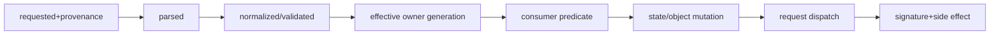
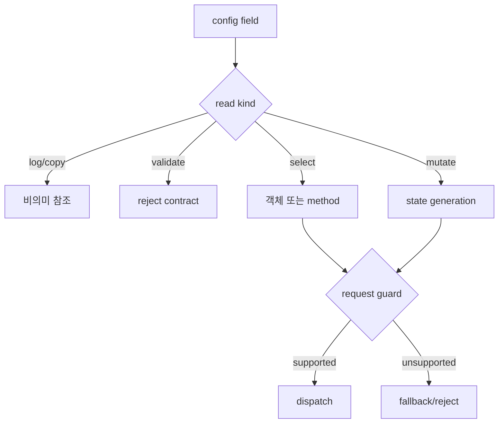
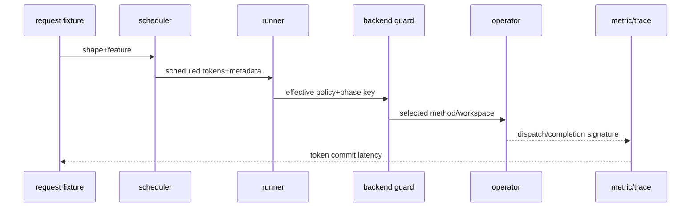
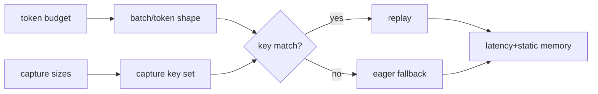
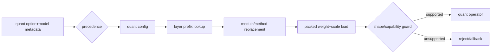
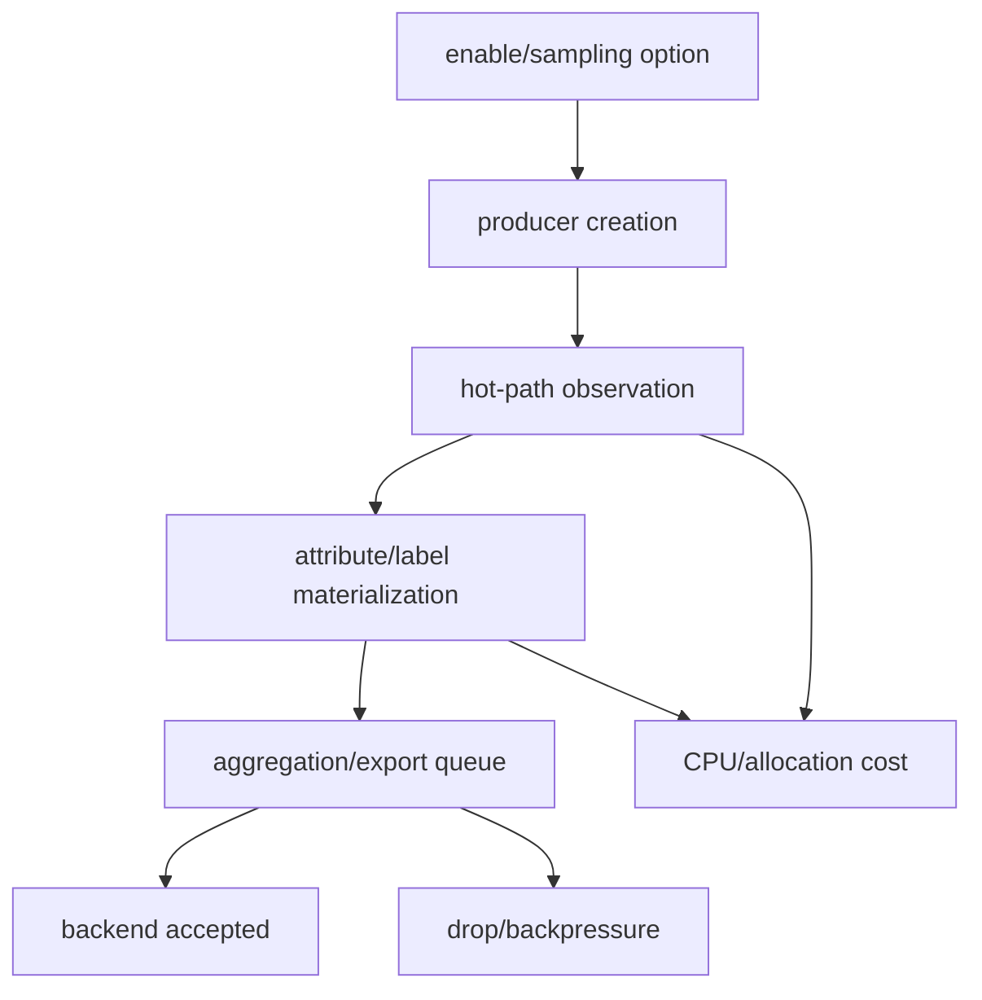

# 74장. 옵션은 문자열이 아니다: 두 시간 안에 실제 consumer까지 추적하기

O74 사건에서 운영자는 attention backend를 X로 강제했다. Startup log도 X를 출력했다. 그런데 prefill trace에는 Y,
decode trace에는 Z가 나타났고 긴 context의 TTFT와 graph replay 비율만 악화했다. “옵션이 무시됐다”는 말은 아직
원인도, 정확한 관측도 아니다. Global 요청값이 phase별 field로 어떻게 상속됐는지, model·device·build·shape predicate가
어느 후보를 탈락시켰는지, 최종 method가 representation과 graph compatibility를 무엇으로 바꿨는지를 이어야 한다.

이 장은 CLI 사전이 아니다. 하나의 옵션과 대표 요청 하나를 잡고 provenance→parse→normalize→effective value→consumer
predicate→state mutation→dynamic dispatch→관측 signature를 두 시간 안에 닫는 법을 익힌다. 같은 방법을 scheduler,
graph, attention, KV cache, P/D connector, quantization, adapter/grammar, observability 여덟 family에 적용한다.

73장이 요청 하나의 최소 수직 지도를 소유했다면, 이 장은 그 지도 위에서 **옵션 값 하나가 바꾼 edge**를 증명한다. 77장의 atlas는 여기서 찾은 symbol을 답으로 고정하지 않고, 새 증상과 release에서도 input→consumer→mutation→output 좌표로 다시 검색하게 하는 reference다.

## 74.1 EFF-74 한 옵션 trace를 120분 튜토리얼로 완성한다

대표 trace는 요청한 `max_num_batched_tokens=16,384`가 effective scheduler에서는 8,192가 된 EFF-74다. 0~20분에는 값의 provenance와 precedence를, 20~45분에는 normalization과 상속을, 45~75분에는 실제 consumer mutation을, 75~100분에는 대표 요청의 state·metric 변화를, 마지막 20분에는 rollback과 제출물을 닫는다. 뒤의 스택·옵션별 drill은 이 한 trace의 빈 칸을 채우는 명령 변형 참고표다.

### 74.1.1 requested와 effective를 같은 값이라 부르지 않는다

Help text는 사용자가 넣을 수 있는 언어를 설명한다. Parsed value는 parser가 만든 순간의 값이고 normalized value는 enum,
derived field와 compatibility rewrite를 거친 값이다. Effective value는 특정 generation의 consumer가 실제 읽은 값이다.
Per-request dispatch는 같은 effective policy 아래에서도 shape와 capability에 따라 달라질 수 있다. 이 다섯 상태를 모두
“설정값”이라 부르면 X·Y·Z가 동시에 보이는 O74를 설명할 수 없다.

### 74.1.2 option generation chain을 한 줄로 그린다



화살표마다 symbol, revision, predicate와 evidence를 둔다. Field reference를 발견했다는 사실은 consumer 증거가 아니다.
Logging-only read와 validation read, object를 고르는 semantic read를 분류한다. 마지막 signature가 예상대로 변하지 않으면
중간 연결을 다시 반증한다.

### 74.1.3 O74의 질문을 반증 가능하게 바꾼다

질문은 “왜 X가 무시됐나”가 아니라 “global X가 prefill/decode selector에 각각 어떤 값으로 상속되고, request shape가
어떤 guard에서 Y와 Z를 선택했는가”다. Falsifier는 phase field가 모두 X인데 selector가 capability 때문에 탈락하지
않았고 dispatch signature도 X인 경우다. 이 관측이면 startup log와 trace join 또는 backend label 의미부터 의심한다.

## 74.2 0~20분: 값의 출처와 우선순위를 복원한다

### 74.2.1 provenance ledger를 먼저 만든다

CLI, config file, environment, model metadata, compiled default와 programmatic API를 행으로 둔다. 값과 함께 “누가 언제
썼는가”를 적는다. 같은 `X`라도 CLI가 강제한 값과 auto가 materialize한 X는 rollback과 compatibility 의미가 다르다.
Omitted, explicit null, `auto`, `false`도 별 상태다.

### 74.2.2 precedence는 문서가 아니라 merge 코드에서 확인한다

Parser declaration의 default와 destination, alias·deprecated mapping을 찾고 config construction의 덮어쓰기 순서를
읽는다. 문서 default와 pinned code가 다르면 어느 쪽을 상식으로 고르지 않고 versioned gap으로 남긴다. Config dump가
merge 전인지 후인지, platform override 전인지 후인지도 기록한다.

### 74.2.3 첫 20분 artifact를 고정한다

첫 결과는 옵션 이름 검색 목록이 아니라 `{source, requested value, provenance, precedence, parsed symbol}`이다. 이 카드가
비면 뒤의 모든 trace는 다른 generation의 field를 잘못 잇기 쉽다. 특히 deprecated alias가 canonical field로 옮겨지는
경계와 programmatic API가 CLI default를 덮는 경계를 표시한다.

## 74.3 20~45분: 정규화와 상속을 시간 순서로 놓는다

### 74.3.1 validation reject와 fallback을 구분한다

Validation이 예외를 내면 requested path는 시작되지 않는다. Silent fallback은 service가 계속되지만 다른 object와 비용
모델을 선택한다. Auto materialization은 사용자가 결정을 selector에 위임한 상태다. 세 경로를 모두 “기본값 적용”이라
부르면 O74의 Y와 Z가 오류인지 설계된 선택인지 판별할 수 없다.

### 74.3.2 global 값에서 phase별 값을 펼친다

Global backend가 prefill과 decode field에 상속된 뒤 model·platform override가 한 phase만 바꿀 수 있다. Mutation 순서를
`parse → canonicalize → inherit → capability rewrite → lazy request guard`로 적고 각 단계 전후 값을 보존한다. 최종 dump가
lazy mutation 전 snapshot이면 실제 consumer generation의 증거로 쓰지 않는다.

### 74.3.3 값이 같은 경우에도 mutation을 찾는다

정규화 전후 문자열이 X로 같아도 selected class, workspace spec 또는 allowed candidate set이 달라질 수 있다. 반대로
이름이 Y로 바뀌어도 같은 representation과 dispatch를 고르면 semantic effect는 같을 수 있다. 비교 좌표는 문자열보다
object type, state invariant, lifetime과 downstream signature다.

## 74.4 45~75분: 진짜 consumer와 읽기만 하는 코드를 가른다

### 74.4.1 consumer는 값을 읽는 곳이 아니라 선택을 일으키는 곳이다

`rg`로 필드 이름을 찾으면 선언, 직렬화, 로그, 검증, 테스트 fixture가 한꺼번에 나온다. 이 가운데 의미 있는 consumer는
그 값을 제거하거나 뒤집었을 때 생성되는 객체, 허용되는 요청, tensor shape, 메모리 수명 또는 호출되는 연산이 달라지는
곳이다. 따라서 검색 결과 옆에는 `read kind`를 적는다. `declare`, `copy`, `validate`, `log`, `select`, `mutate`, `guard`의
일곱 종류면 충분하다. `select`와 `mutate`만 찾고 끝내서도 안 된다. 선택된 객체가 어느 generation까지 살아 있고 어떤
request-time guard에 의해 다시 우회되는지 붙여야 한다.

예를 들어 vLLM의 `max_num_batched_tokens`는 단순한 최대 길이가 아니다. Scheduler가 한 step에서 배분할 수 있는 token budget이며 요청별 `num_new_tokens`를 잘라 실제 scheduler output을 만든다. 값이 8,192에서 16,384로 늘었다고 모든 요청의 실행 token이 두 배가 되는 것은 아니다. 대기열에 3,000 token밖에 없으면 두 설정의 effective batch는 같다. 반대로 12,000-token prefill 하나와 decode 요청 200개가 경쟁하면 budget은 chunk boundary와 decode가 끼어들 여지를 함께 바꾼다.

이때 consumer 증거는 config를 출력하는 줄이 아니라 [scheduler가 token budget을 만들고 요청별 token 수를 제한하는 경로](https://github.com/vllm-project/vllm/blob/6e448d0ea9bf3d88d898b65449ca6dc2aec170ac/vllm/v1/core/sched/scheduler.py#L105-L117)다.

### 74.4.2 객체 수명으로 재시작 필요 여부를 판정한다

Construction-time consumer가 cache manager나 runner class를 고르면 해당 옵션은 보통 요청 중간에 바꿀 수 없다. Python
field를 수정할 수 있다는 사실과 안전한 live reconfiguration은 다르다. 이미 capture한 graph, 예약한 static buffer,
할당한 KV block과 worker 전체에 복제된 config가 옛 generation을 소유하기 때문이다. Rollback 카드에는 단지 “원복”이라
쓰지 않고 `재시작할 process`, `폐기할 allocation`, `다시 capture할 key`, `drain할 request generation`을 적는다.

반대로 request-time guard가 sampling metadata나 grammar object를 고르면 요청별 변화가 가능하다. 그래도 batch 안에서
서로 다른 값이 공존할 수 있는지는 별 문제다. Vectorized metadata로 표현되면 한 batch에서 함께 실행할 수 있지만, 다른
kernel family나 graph key를 요구하면 scheduler가 batch를 쪼개거나 eager fallback을 선택할 수 있다. 옵션 scope는 CLI가
global인지 여부가 아니라 consumer가 만든 상태의 owner와 lifetime으로 결정한다.

### 74.4.3 consumer ledger를 call graph보다 작게 유지한다

두 시간 추적에서 전체 call graph를 그리려 들면 실패한다. 대신 아래 네 칸만 잇는다.

| 소비 시점 | predicate 입력 | 바뀌는 상태 | 다음 관측 |
|---|---|---|---|
| construction | model, dtype, device, option | class, layout, pool 크기 | startup allocation, class 이름 |
| scheduler | queue, budget, request feature | selected set, token 수 | scheduled-token histogram, queue age |
| layer/phase | attention type, shape, capability | backend metadata, workspace | operator/graph key, workspace peak |
| request guard | current shape, grammar/adapter | fallback 또는 reject | fallback counter, latency cohort |

이 표에는 logging-only read를 넣지 않는다. 같은 option이 두 행에 등장하면 한 번 읽힌다는 뜻이 아니라 서로 다른
generation에서 다시 해석된다는 뜻이다. O74의 X는 construction 단계에서 후보 집합을 좁혔지만, Y와 Z는 phase와 shape
guard가 그 집합 안에서 실제 method를 고른 결과일 수 있다.

실제 조사에서는 각 행에 `owner identity`와 `write epoch` 두 열을 더한다. Parent process가 만든 config를 worker process가
직렬화해 받았다면 값이 같아도 owner가 다르다. Scheduler가 step마다 만드는 output과 runner가 startup 때 만든 static
buffer도 이름이 같은 token 수를 품을 수 있지만 수명이 다르다. 이 차이를 놓치면 old scheduler output을 새 graph에 넣은
문제나 rolling restart 동안 두 config generation이 섞인 문제를 옵션 무시로 오진한다. Process, worker rank, engine
generation, request ID와 step ID가 join key다.

소스 walk는 네 방향으로 짧게 왕복한다. 선언부에서 destination과 default를 보고, config constructor에서 쓰기 순서를
보고, selected object의 constructor argument를 역으로 보고, metric producer가 어느 state를 읽는지 아래에서 위로 본다.
네 경로가 같은 field에 모일 때까지 “연결됨”으로 표시하지 않는다. 이름이 다르면 assignment와 conversion을 근거로 잇고,
이름이 같아도 object가 다르면 별 node로 남긴다. 특히 `config.foo = false` 같은 compatibility mutation은 원래 source를
지워 버리므로 mutation 직전 requested snapshot과 mutation reason을 보존해야 한다.

Consumer predicate를 읽을 때 boolean 식을 말로 풀지 말고 truth table의 최소 행을 만든다. 예컨대
`forced_backend && supports_dtype && supports_head_size && phase_is_decode`라면 forced 값 하나만 바꾸는 두 행으로는 부족하다.
각 capability가 false인 반증 행, phase가 prefill인 행을 둔다. Candidate가 순서대로 검사된다면 앞 후보가 성공해 뒤
predicate가 평가조차 되지 않는다는 점도 기록한다. Log에 rejection reason이 없는 후보는 “통과”가 아니라 “미평가”일 수
있다.

상태 변경은 before/after snapshot의 최소 집합으로 증명한다. Scheduler면 request state의 remaining tokens와 output
token allocation, graph면 capture table key와 static pointer, cache면 free/block/refcount와 slot mapping, quantization이면
module class·parameter dtype·scale shape, connector면 descriptor state와 page owner를 고른다. 전체 object dump는 값이 너무
많아 generation 차이를 가리고 secret이나 request payload를 노출할 수 있다. 인과 가설이 예측한 field만 allowlist하고,
나머지는 hash 또는 개수로 보존한다.



## 74.5 75~100분: 대표 요청 하나를 effective path에 통과시킨다

### 74.5.1 fixture가 threshold를 실제로 건드리게 만든다

옵션 실험에서 가장 흔한 거짓 음성은 값이 소비되지 않은 것이 아니라 fixture가 경계를 건드리지 않은 경우다. Token
budget 8,192와 16,384를 비교하면서 1,000-token prompt 하나만 보내면 두 path가 같아야 정상이다. CUDA graph capture
size 1, 2, 4, 8을 바꾸고 batch 3만 관찰하면 3이 어느 bucket으로 padding되는지까지 알아야 차이를 예측할 수 있다.
Prefix cache를 켜고 서로 다른 prompt만 보내면 lookup은 작동해도 hit는 0이다.

대표 fixture는 `경계 아래`, `경계`, `경계 위` 세 요청을 가진다. Budget이 8,192라면 8,191·8,192·8,193 token이라는
기계적 세 점만 뜻하지 않는다. Decode 경쟁 요청과 prompt chunk가 합쳐진 scheduled total이 경계를 지나도록 만든다.
Graph라면 capture key를 구성하는 batch, token, multimodal, adapter 조건을 함께 고정한다. Attention이라면 short decode와
long prefill을 따로 두어 phase selector가 분리되는지 확인한다.

### 74.5.2 state diff와 metric signature를 먼저 예측한다

실행 전에 “빨라질 것이다”라고 쓰지 않는다. 예를 들어 token budget을 8,192에서 16,384로 올리고 충분한 backlog가 있다면
한 step의 scheduled token 합은 최대 8,192만큼 늘 수 있다. Hidden width 8,192, activation element 2 byte인 단일 임시
tensor만 세어도 추가 8,192 token의 상한은 `8,192 × 8,192 × 2 = 134,217,728 byte`, 약 128 MiB다. 실제 peak는 layer
fusion과 재사용 때문에 이 값과 다르지만, “throughput만 변한다”는 가설이 틀렸음을 미리 알려 주는 계산이다. 관측해야 할
것은 scheduled token 분포, step time, queue age, peak memory와 preemption을 한 묶음으로 본 값이다.

Graph capture size를 64에서 128로 늘리면 static input 하나가 `[128, hidden]`으로 두 배가 된다. 그러나 전체 graph memory가
정확히 두 배가 된다는 뜻은 아니다. 여러 bucket이 동시에 보존되고 graph-private pool, backend workspace, output buffer가
각각 다른 scaling law를 갖기 때문이다. 따라서 predicted signature는 capture key 추가, graph reservation 증가, 해당
cohort의 replay hit 증가이며, falsifier는 batch 65~128 workload가 존재하는데도 새 key와 replay count가 전혀 생기지 않는
경우다.

### 74.5.3 귀환 경로까지 닫아야 효과라고 부를 수 있다

Operator가 달라졌다고 사용자 효과가 입증된 것은 아니다. Dispatch 뒤 completion, logits, sampling, token commit과 HTTP
stream까지 잇는다. Backend 교체로 kernel time이 줄어도 scheduler queue가 병목이면 inter-token latency는 그대로일 수
있다. 반대로 graph replay가 줄었는데도 latency가 유지되면 batch composition 변화가 비용을 가렸을 수 있다.



## 74.6 실패한 추적을 고치는 열 가지 질문

### 74.6.1 검색 결과와 config dump가 증거인 척할 때

첫째, option 이름 검색 결과를 call graph로 믿지 않는다. Bad trace는 `필드 발견→기능 사용`이다. 수정 trace는 선언부에서
destination을 확인한 뒤 normalized owner의 object identity를 잡고, 선택 branch와 dispatched method를 잇는다. 반증
검색은 option 이름뿐 아니라 선택되는 class 이름, enum value, constructor argument와 state field를 역방향으로 찾는다.

둘째, dataclass field와 CLI destination이 같은 generation이라고 가정하지 않는다. Alias가 canonical name으로 옮겨지고
nested config가 복사될 수 있다. `id`가 같아야 한다는 뜻은 아니며, 어느 함수가 어떤 값을 복사·재작성했는지 ledger에
남긴다. 셋째, startup log를 effective path로 보지 않는다. Log producer가 requested, normalized, selected 중 무엇을
읽는지 먼저 확인하고 request trace와 phase·request ID로 join한다.

Bad trace의 실제 모양을 적어 보면 문제를 더 빨리 발견한다. `--attention-backend=X`, startup `Using X`, profiler에 Y라는
세 줄을 붙여 “fallback”이라고 결론 내리는 기록은 provenance와 label vocabulary가 없다. Corrected trace는 CLI source,
canonical backend enum, global/per-kind precedence, selected class, prefill method Y와 operator symbol을 잇는다. 그 뒤
decode Z는 별 lane으로 둔다. 같은 사건을 한 줄로 압축하지 않기 때문에 첫 divergence가 보인다.

Config dump도 snapshot 시점을 표시한다. Merge 직후 dump, platform override 후 dump, worker deserialize 후 dump와 lazy
selector 결과를 서로 다른 artifact로 보존한다. 보안을 위해 endpoint credential과 tenant salt는 redact하되 존재 여부와
hash를 남긴다. Dump 두 개의 textual diff보다 semantic field와 owner generation의 표가 낫다. Serialization 과정에서
enum이 문자열로 변한 것은 의미 변경이 아닐 수 있고, field가 사라져 default가 재적용된 것은 의미 변경일 수 있다.

Deprecated alias를 만났을 때는 warning 유무보다 canonical assignment를 찾는다. Alias와 새 이름을 동시에 넣었을 때 누가
이기는지, explicit null이 old value를 지우는지, omitted가 default inheritance를 허용하는지 작은 precedence matrix로
정리한다. Programmatic API가 parser를 우회하면 CLI declaration의 default는 그 lane에 적용되지 않을 수 있다. “기본값”은
entrypoint와 provenance까지 포함해야 완전한 문장이다.

넷째, auto와 forced override를 같은 mutation으로 세지 않는다. Auto는 후보 집합과 우선순위를 보존하지만 forced 값은
reject contract를 가질 수 있다. Corrected trace에는 candidate rejection reasons와 warning/exception policy를 넣는다.
다섯째, global field만 보고 끝내지 않는다. Prefill/decode, self/cross attention, layer type과 request shape별 consumer를
적어도 한 번씩 검색한다.

### 74.6.2 branch·representation·fixture가 거짓 결론을 만들 때

여섯째, consumer가 읽었으니 branch가 바뀌었다고 단정하지 않는다. Predicate가 같은 결과를 낼 수 있다. Old/new 값에서
selected object 또는 state diff가 실제 달라졌는지를 확인한다. 일곱째, object 선택만 보고 tensor representation을 놓치지
않는다. Backend class가 같아도 workspace, page table, mask dtype와 quant scale layout이 달라질 수 있다.

Representation diff는 shape, stride, dtype, device, ownership과 valid region 여섯 항목으로 적는다. Shape가 같아도 stride와
layout이 다르면 kernel contract가 다르고, dtype이 같아도 scale owner가 다르면 해석이 다르다. Static graph buffer의 valid
rows가 batch보다 크면 padding mask가 correctness invariant다. KV page table은 logical block ID와 physical address mapping,
connector import generation을 함께 가진다. 이 표를 만들면 “같은 tensor”라는 애매한 표현이 사라진다.

Branch diff는 predicate 입력을 모두 고정했을 때 option 하나로 결과가 갈리는 가장 작은 fixture를 찾는다. 그런 fixture가
없으면 option은 현재 supported lane에서 dead consumer이거나 다른 override에 가려진 것이다. 성능 실험으로 넘어가기 전에
정적 source와 state snapshot으로 treatment fidelity를 확보한다. Fidelity가 없는 A/B 결과는 option 효과가 아니라 서로
다른 workload composition을 비교했을 가능성이 크다.

여덟째, threshold에 닿지 않은 fixture로 “성능 차이 없음”을 선언하지 않는다. 경계 아래·경계·경계 위와 충분한 backlog를
둔다. 아홉째, disable을 단순 제거로 설명하지 않는다. Prefix cache off는 lookup/hash 비용을 없애지만 normal KV allocation은
남긴다. Graph off는 eager buffer와 launch 비용을 선택한다. P/D off는 local prefill 계산을 되살린다. Fallback 비용과
정합성 invariant를 함께 기록한다.

열째, construction-time option을 live mutation처럼 다루지 않는다. 이미 생성된 pool, graph, module과 worker copy를 찾고
rollback plan을 작성한다. “API가 setter를 제공한다”는 안전 증거가 아니다. Generation barrier, drain, rebuild와 old state
release가 구현되어야 한다.

Rollback verification은 문자열이 원래 값인지 확인하는 것으로 끝나지 않는다. Old request가 모두 drain됐고, 새 scheduler
output과 runner가 같은 config generation을 쓰며, old graph/cache/adapter/connector allocation의 refcount가 0이고, metric이
새 process generation으로 갈라졌는지 본다. Correctness canary와 capacity watermark가 baseline 범위로 돌아와야 한다.
회수 지연이 설계된 asynchronous cleanup이면 deadline과 eventual invariant를 적고 그 전에는 종료하지 않는다.

실패를 열 가지로 분류하는 목적은 checklist를 외우게 하는 데 있지 않다. 각 실패는 chain의 다른 edge를 끊는다. Search
오용은 symbol→consumer edge, config generation 혼동은 write→read edge, startup log 오용은 state→observation edge,
no-op fixture는 predicate→branch edge를 끊는다. 어떤 edge가 미확인인지 쓰면 필요한 다음 관측이 정해진다.

### 74.6.3 30분이 지나도 consumer를 못 찾았을 때의 탈출법

Field에서 아래로만 내려가지 말고 예상 observable에서 위로 올라온다. Graph replay metric producer가 어느 runner state를
읽는지, cache hit가 어느 lookup 결과를 받는지, quantized operator가 어느 method object에서 호출되는지 역추적한다. 두
경로가 만나는 mutation이 semantic anchor다. 그래도 만나지 않으면 dead option, deprecated alias, out-of-tree plugin 또는
build-time exclusion이라는 가설을 명시한다. 모른다는 사실을 숨기려고 비슷한 함수 목록을 붙이지 않는다.

## 74.7 독자가 채우는 두 시간 trace dossier

### 74.7.1 시간 상자별 산출물

0~20분에는 provenance와 precedence, parser destination만 확정한다. 20~45분에는 normalization 전후 값과 validation,
inheritance/override 순서를 그린다. 45~75분에는 의미 consumer 하나 이상, mutation과 lifetime을 찾는다. 75~100분에는
경계를 건드리는 대표 request를 scheduler output에서 dispatch까지 통과시킨다. 100~120분에는 expected signature,
falsifier, collateral effect와 rollback을 채운다.

시간이 끝났는데 operator까지 닿지 못했다면 “완료”로 표시하지 않는다. 마지막 verified anchor와 첫 미확인 edge를 쓴다.
예를 들어 `selected backend class 확인, metadata builder→operator call 미확인`처럼 남기면 다음 사람이 같은 parser 검색을
반복하지 않는다. 소스 line은 고정 revision URL로 저장하고, 함수 이름만 적지 않는다. 다음 release에서 이름이 바뀌어도
state mutation과 observation signature를 비교할 수 있어야 한다.

각 시간 상자에는 중단 기준도 있다. 20분에 provenance가 둘 이상 충돌하는데 precedence code를 못 찾았다면 consumer로
내려가지 않고 entrypoint constructor와 merge helper를 우선한다. 45분에 normalized generation을 확정하지 못하면 config
dump를 effective 증거로 사용하지 않는다. 75분에 mutation을 못 찾으면 option 이름 검색을 멈추고 예상 operator·metric에서
역추적한다. 100분에 fixture가 threshold를 건드리지 않으면 측정하지 않는다. 120분에 rollback proof가 없으면 production
변경 승인을 내리지 않는다.

Artifact에는 negative evidence도 보존한다. 어떤 후보가 어떤 predicate에서 탈락했는지, 어떤 metric이 예상과 달리 변하지
않았는지, 어떤 allocation이 생성되지 않았는지를 적는다. “검색 결과 없음”은 검색 범위와 revision, symbol alias를 함께
기록할 때만 증거다. Dynamic import와 plugin registry가 있으면 static 검색만으로 부재를 증명할 수 없으므로 registration
table과 build manifest를 추가로 본다.

### 74.7.2 제출 양식과 작성 예

```yaml
option:
  name: max_num_batched_tokens
  requested_value: 8192
  provenance: cli
  precedence: [programmatic_override, cli, compiled_default]
generations:
  parsed: {value: 8192, symbol: scheduler_config.max_num_batched_tokens}
  normalized: {value: 8192, mutations: [validation, platform_defaults]}
  effective: {value: 8192, owner: scheduler, generation: engine_start_17}
consumers:
  - phase: scheduling
    predicate_inputs: [remaining_budget, request_tokens, chunking]
    selected_branch: chunk_prefill
    mutation: {num_scheduled_tokens: "<= remaining_budget"}
    lifetime: one_step
request_path:
  fixture: {prefill_tokens: 12288, competing_decode_requests: 200}
  scheduler_signature: {scheduled_total_upper_bound: 8192}
  runner_signature: {token_rows: "observed scheduler total"}
effects:
  performance: [step_time, throughput, TTFT, ITL]
  capacity: [activation_peak]
  fairness: [decode_queue_age]
falsifiers: [scheduled_total_exceeds_budget_after_unit_reconciliation]
no_op_conditions: [runnable_total_below_8192]
rollback: {requires_restart: true, state_to_rebuild: [scheduler, graph_profiles]}
```

이 예의 숫자와 precedence는 대상 entrypoint의 실제 merge 코드로 다시 확인해야 한다. 양식은 사실을 대신하지 않는다.
특히 `requires_restart`는 구현이 generation-safe dynamic update를 제공하면 false일 수 있다. 독자는 그 경우 update barrier와
worker acknowledgement를 proof에 넣는다.

여덟 family를 제출할 때 모든 card를 같은 길이로 만들 필요는 없다. 대신 각 family의 고유 위험을 하나 이상 가져야 한다.
Scheduler는 fairness와 token unit, graph는 pointer/key lifetime, attention은 phase selector와 representation, cache는
provenance와 eviction, connector는 distributed commit, quantization은 packed loader와 runtime fallback, adapter/grammar는
slot/state 정합성, observability는 cardinality와 export acceptance를 닫는다. 같은 문장을 option 이름만 바꿔 반복한 card는
완료로 세지 않는다.

Review pair는 card를 거꾸로 읽는다. Metric signature에서 시작해 어느 mutation이 그것을 만들고, 어느 consumer predicate가
mutation을 선택하며, effective value가 어느 source에서 왔는지 되짚는다. Forward trace와 reverse trace가 같은 anchor에서
만나지 않으면 join이 약하다. 특히 dashboard label이 requested 값을 읽고 operator trace가 effective method를 읽는 O74 같은
사건은 역방향 검토에서 즉시 드러난다.

제출물에는 변경 전·후 effective value와 consumer evidence를 같은 행에 둔다. 값만 두 행으로 비교하면 option이 dead였는지,
override에 가려졌는지 알 수 없다. Consumer evidence만 두면 그 branch가 사용자의 treatment 때문에 바뀌었는지 알 수 없다.
따라서 `(requested provenance, effective owner/value, predicate inputs, selected branch, mutation ID, signature)`를 한 comparison
key로 삼는다. Old/new에서 key가 처음 달라지는 열이 first semantic divergence다.

두 시간 종료 시 reviewer가 던질 질문은 간단하다. “내가 option 문자열을 가리고 이 artifact만 보아도 어떤 state가 왜
달라졌는지 알 수 있는가?” 답이 아니면 help text를 다시 붙이지 말고 빠진 edge를 찾는다. State는 달라졌지만 사용자 효과가
없다면 no-op/downstream bottleneck으로, state조차 같다면 precedence/dead consumer로 분기한다. 효과만 있고 state diff가
없다면 workload confounder나 관측 join 오류를 먼저 의심한다.

Production 승인용 artifact에는 rollback trigger도 수치로 둔다. Correctness mismatch 한 건, OOM headroom 임계치, TTFT·ITL
p99 회귀율, queue starvation window, exporter drop rate처럼 service objective에 맞춘다. Trigger가 발생하면 어느 generation을
drain하고 어떤 object를 rebuild할지 미리 연결한다. Incident 중에 “원래 값”을 기억에 의존해 복원하지 않는다. Requested
source와 effective state, binary revision과 capture/cache generation을 함께 보존한다.

이렇게 제출하면 option trace는 일회성 디버깅 메모가 아니라 다음 release의 regression fixture가 된다. 75장은 동일한
predicate fixture를 old/new source에 통과시켜 consumer가 이동했는지, default와 ABI가 달라졌는지를 판단한다. Observation
환경이 없어도 source-level expected transition을 비교할 수 있고, 배포가 가능해지면 같은 signature 칸을 채워 정적 가설과
실제 path를 합류시킬 수 있다.

### 74.7.3 semantic anchor의 합격 기준

Anchor 하나는 `(input generation, consumer predicate, mutation, downstream invariant, observation)` 다섯 요소를 가진다.
함수 URL 하나만 있으면 불합격이다. 반대로 모든 helper를 수집할 필요도 없다. Scheduler budget anchor라면 parser helper
열 개보다 budget 차감 branch, scheduler output field와 metric unit 세 곳이 중요하다. Attention anchor라면 registry 전체보다
phase selector, metadata representation과 operator call이 중요하다.

## 74.8 O74 종결: X·Y·Z는 모순이 아니었는가

### 74.8.1 첫 불일치는 backend가 아니라 세대 label이었다

O74 ledger를 채우자 startup X는 global requested policy를 출력한 값이었다. Prefill Y와 decode Z는 요청별 effective
method label이었다. 서로 같은 층의 값을 비교한 것이 아니므로 X·Y·Z가 보였다는 사실만으로 option 무시를 말할 수 없다.
Global policy는 양 phase의 후보 집합에 전달되었고, long-context prefill은 mask/layout capability 때문에 Y를, paged
single-token decode는 Z를 선택했다고 가정할 수 있다. 이 문장은 아직 결론이 아니라 검증할 causal chain이다.

증거가 되는 것은 global→phase inheritance mutation, 각 selector의 rejection reason, selected backend object와 실제
operator signature다. 만약 forced X 계약이 fallback을 금지한다면 이 chain은 reject되어야 하고 precedence 오류를 찾아야
한다. 반대로 X가 family policy이고 Y·Z가 method라면 label vocabulary를 고쳐야 한다. 운영 dashboard에는 requested policy와
effective method를 서로 다른 필드명과 generation으로 노출한다.

사건 타임라인을 다시 쓰면 다음과 같다. 배포 generation G17이 X를 요청해 parser와 global config에 저장했다. Worker
construction에서 per-kind override와 model metadata를 결합해 prefill/decode selector 입력을 만들었다. 첫 long-context
request R1의 prefill step S0은 query length와 mask/layout 조건으로 method Y를 골랐고, 이후 decode step S1은 paged KV와
single-token 조건으로 Z를 골랐다. Startup log는 G17 global field를, profiler label은 S0/S1 method를 읽었다. 세 값은
동시에 참일 수 있다. 이 시간축을 확보하기 전에는 어느 것도 fallback 증거가 아니다.

이 가설의 첫 반증점은 global 값이 phase config로 복사되는 assignment다. X가 복사되지 않았거나 다른 source가 덮었다면
precedence 문제다. 두 번째는 selector 입력이다. 예상한 shape·dtype·KV layout이 아니면 metadata construction 문제다.
세 번째는 selected class와 operator다. Selector가 Y를 반환했는데 operator Z가 실행되면 wrapper 내부 dispatch 또는 trace
label join을 본다. 네 번째는 completion과 user-visible TTFT다. Operator가 느려지지 않았는데 TTFT가 악화하면 scheduler,
cache나 queue로 원인 축을 옮긴다.

이 순서가 중요한 이유는 뒤의 관측이 앞의 가설을 대신하지 않기 때문이다. TTFT가 20% 느려졌다는 사실은 X가 무시됐다는
증거가 아니며, startup X는 Y operator가 실행되지 않았다는 증거가 아니다. 각 관측은 chain의 한 edge만 검증한다.
Evidence table에는 `edge`, `expected`, `observed`, `falsifies`, `next branch`를 둔다. 한 관측으로 전체 chain을 초록색으로
칠하지 않는다.

### 74.8.2 long-context TTFT와 replay 비율을 한 원인으로 묶지 않는다

Long-context 요청은 큰 prefill token shape를 만들고 Y workspace를 사용한다. 동시에 scheduler budget 증가나 phase-specific
metadata 때문에 capture key 밖으로 나갈 수 있다. TTFT 악화와 replay 비율 하락이 함께 보이더라도 하나가 다른 하나의
원인이라고 바로 결론 내리지 않는다. `backend policy old/new × graph coverage old/new` 2×2 cohort에서 selected method,
workspace peak, eager/replay와 TTFT를 관찰한다.

첫 divergence가 selector에서 Y로 바뀐 뒤 graph mismatch라면 backend representation이 graph compatibility를 바꾼 chain을
지지한다. Selector는 같은데 batch shape가 먼저 바뀌었다면 scheduler/config interaction이다. Replay는 같은데 TTFT만
악화하면 Y kernel/workspace 또는 cache reuse를 본다. 각 분기는 다른 rollback을 요구한다.

수치 예를 들어 baseline long-context cohort 1,000건의 TTFT p50/p99가 1.8/4.5초, change가 2.0/7.2초이고 replay hit가
90%에서 55%로 떨어졌다고 하자. 이 두 비율만으로 graph가 원인이라고 선언하지 않는다. Cohort 안의 prompt token 분포,
scheduled batch와 prefix hit가 같아야 한다. Change에서 prompt p99가 더 길어졌다면 workload shift만으로 두 metric이 함께
움직일 수 있다. Matched fixture에서 Y 선택률, graph key miss reason과 workspace peak를 비교한다.

2×2 결과를 해석할 때 backend new/graph old에서만 회귀하고 graph new가 회복시키면 새 representation에 capture coverage가
부족했다는 가설을 지지한다. Backend old 두 cell이 같은데 backend new 두 cell이 모두 느리면 Y kernel/workspace가
주원인이다. Graph new가 old backend까지 악화하면 capture set 자체의 startup/static memory pressure를 본다. Interaction을
보지 않고 두 option을 동시에 rollback하면 어느 semantic anchor가 문제였는지 영원히 모른다.

Rollback도 branch별이다. Coverage 문제면 X를 포기하지 않고 capture key를 보강하거나 long-prefill만 eager routing할 수
있다. Y correctness 또는 workspace 문제면 backend policy를 이전 generation으로 돌리고 관련 graph를 폐기·recapture한다.
Scheduler shape shift면 budget을 되돌리고 queue cohort를 정상화한다. 모든 경우 old request drain과 allocation release를
확인한 뒤 baseline을 다시 측정한다.

### 74.8.3 종료 조건과 남은 불확실성

O74는 다음 조건이 모두 참일 때 닫힌다. 첫째, X의 provenance와 merge precedence가 고정 소스로 확인됐다. 둘째, prefill과
decode consumer가 읽은 generation과 값이 확인됐다. 셋째, Y·Z 선택 predicate와 탈락 후보가 설명됐다. 넷째, metadata와
operator signature가 selected method와 일치했다. 다섯째, TTFT/replay 변화가 같은 workload cohort에서 재현되고 경쟁
가설 하나 이상이 반증됐다. 여섯째, rollback 후 object·graph·metric generation이 모두 원래 상태로 돌아왔다.

종료 dossier에는 “원인” 한 줄 대신 검증된 가장 짧은 causal chain을 쓴다. 예를 들어 `global policy X 유지 → long-prefill
shape가 Y method 선택 → Y metadata key가 기존 capture set과 불일치 → eager fallback 증가 → matched long-context cohort의
TTFT tail 증가`다. 각 화살표는 source anchor와 observation 하나 이상을 가진다. Cache hit나 queue composition이 같았다는
negative evidence는 경쟁 가설을 닫는다. 이 중 한 화살표가 미확인이면 probable cause로 낮추고 종료하지 않는다.

수정 뒤에는 collateral check를 수행한다. Replay가 회복됐어도 static memory가 늘어 OOM headroom이 줄지 않았는지,
short-decode ITL과 tenant fairness가 유지되는지, logits canary가 허용오차 안인지, startup 시간이 release SLO를 넘지
않는지 본다. 문제 metric 하나를 원복한 것은 service invariant 전체의 회복과 다르다. 최소 두 번의 steady observation
window에서 old generation request와 allocation이 사라진 것을 확인한다.

관측 signature가 예상과 다르지만 service가 정상인 경우도 기록 가치가 있다. 예를 들어 replay counter의 분모가 batch가
아니라 token이어서 예상 비율이 틀렸다면 원인은 option이 아니라 관측 정의다. Metric producer source와 dashboard query를
고치고 과거 기간의 해석 가능 여부를 남긴다. Label rename만으로 historical series를 자동 연결하지 않는다.

반대로 signature는 예상대로인데 correctness canary가 어긋나면 성능 chain을 성공으로 종료할 수 없다. Y method가 선택되고
replay가 늘었다는 treatment fidelity는 입증됐지만, mask valid region이나 static buffer freshness가 깨졌을 수 있다. 이
경우 70장의 first-wrong-value 절차로 넘어가 layer·tensor·index에서 최초 divergence를 찾는다. Option trace는 어떤
representation과 graph generation을 조사할지 정확히 넘겨준다.

정적 감사와 실제 관측의 경계도 dossier에 명시한다. Source로 확인한 것은 predicate, mutation과 expected invariant이고,
배포에서 확인할 것은 selected branch, pointer/key, metric과 latency다. 이 장에서는 모델·서버·CUDA runtime을 실행하지
않았으므로 예시 수치는 측정 결과가 아니라 계산과 판정법이다. 독자는 자신의 pinned binary와 workload에서 observation
칸을 채운 뒤에만 사건을 닫는다.

실행하지 않은 정적 소스 감사만으로는 실제 latency와 device dispatch를 관측했다고 주장하지 않는다. 이 장이 제공하는
것은 어떤 관측을 수집해야 인과를 닫을 수 있는지와, 관측 전에도 거짓 설명을 제거하는 source trace다. 실제 배포 결과는
72장의 실험 dossier에 넣어 cohort와 통계적·운영적 종료 기준을 적용한다.

최종 검토자는 O74 카드를 순방향과 역방향으로 각각 읽는다. 순방향에서는 requested X가 Y·Z dispatch와 TTFT/replay
signature까지 끊기지 않는지 본다. 역방향에서는 TTFT tail에서 시작해 eager fallback, graph key, Y representation,
selector와 provenance로 돌아간다. 두 방향이 같은 mutation에서 만나고 경쟁 경로가 반증될 때 설명은 비로소 설득력을
얻는다. “옵션이 무시됐다”는 최초 문장은 이 검토를 통과한 더 정확한 causal chain으로 대체된다.

## 74.9 EFF-74 완성본: 16,384가 8,192가 된 두 시간

EFF-74 배포는 vLLM engine V17과 SGLang canary S17에 “한 step token budget 16,384”를 요청했다. 배포 manifest와
startup banner에는 16,384가 보였다. 그러나 long-prefill fixture는 계속 8,192에서 chunk됐고 scheduled-token
분포의 경계도 8,192였다. 운영자는 scheduler가 CLI를 무시한다고 결론냈지만, requested 문자열과 worker가 소비한
effective field 사이에는 세 번의 쓰기가 있었다.

대표 카드는 여섯 행으로 고정한다. Parser 행은 option spelling, alias, destination, type/default를 가진다. Precedence
행은 CLI, config file, environment, programmatic constructor와 model/platform default의 write order를 가진다.
Normalization 행은 validation, derived cap과 phase inheritance를, ownership 행은 engine/worker generation을 가진다.
Consumer 행은 scheduler branch와 downstream allocation/runner input을, signature 행은 state·kernel·metric 변화를 가진다.

0~10분에 실제 process argv와 deployment-rendered config를 고정한다. Operator가 본 manifest에는
`--max-num-batched-tokens 16384`가 있었다. 그러나 entrypoint wrapper는 CLI를 parsing한 뒤 tenant profile JSON을
programmatic `SchedulerConfig` constructor에 전달했다. Profile에는 이전 세대의 `max_num_batched_tokens:8192`가
명시돼 있었다. 어느 source가 우선하는지는 문서 감상이 아니라 constructor/merge 호출 순서로 판정한다.

Parser 카드에는 `requested_cli=16384`, `parsed_cli=16384`, canonical destination과 explicitness를 적는다. Omitted,
null과 auto를 16,384와 구분한다. Deprecated alias가 canonical destination을 한 번 더 쓰는지 확인한다. Startup
banner가 parser namespace를 출력했다면 그것은 merge 전 값일 수 있다. Banner 문자열과 consumer object를 같은
generation으로 오인하지 않는다.

10~20분 provenance 표는 write ordinal을 붙인다. `W1 compiled default`, `W2 CLI parse=16384`, `W3 profile
load=8192`, `W4 platform normalization`, `W5 worker deserialize` 순이다. EFF-74의 first value divergence는 W3다.
W4가 16,384를 capability 때문에 cap한 것이 아니며 W5도 8,192를 그대로 받았다. “scheduler가 나중에 줄였다”는
초기 가설은 이 표에서 반증된다.

20~30분에는 profile overwrite가 의도된 precedence인지 bug인지 source consumer를 읽는다. Generic merge가
explicit CLI를 profile default보다 먼저 쓰고 뒤 profile 값을 무조건 assign했다면 explicitness가 사라진다.
반대로 API contract가 programmatic config를 최상위로 정의했다면 동작은 설계대로이고 deployment wrapper가 두
source를 동시에 제공한 것이 운영 오류다. 수정 owner를 정하려면 이 차이가 필요하다.

30~40분 normalized card는 vLLM의 scheduler config owner와 SGLang의 대응 budget field를 각각 추적한다. 두 stack의
option 이름이 비슷하다고 같은 parser나 precedence를 주장하지 않는다. Canonical 의미는 한 iteration에서 scheduler가
배분 가능한 model-input token budget인지 확인한다. Encoder/speculative tokens와 phase별 reserve가 있으면 effective
scheduled total의 단위를 카드에 명시한다.

S17 canary에서는 CLI 16,384가 그대로 effective였고 V17만 8,192였다. 이 비교는 “SGLang이 옵션을 잘 지킨다”는
제품 결론이 아니다. S17 wrapper에는 tenant profile merge가 없었기 때문이다. Stack 구현과 deployment composition을
분리한다. 동일 wrapper precedence fixture를 두 stack에 적용하기 전에는 일반화하지 않는다.

40~50분 owner-generation 표는 API process A17, engine core E17, workers W17-0..7을 펼친다. API config dump에는
parser namespace 16,384가 남았고 engine core가 직렬화한 SchedulerConfig는 8,192였다. Workers도 8,192를 받았다.
같은 pod에서 두 값이 동시에 참이므로 process와 object generation을 붙이지 않은 `effective_config` log는 오해를
만든다.

50~65분에는 진짜 consumer를 찾는다. vLLM scheduler는 남은 token budget을 만들고 runnable requests의
`num_scheduled_tokens`를 제한한다. Fixture backlog는 12,288-token prefill과 256 decode tokens라 8,192와 16,384가
다른 branch를 반드시 만든다. Logging/serialization reads는 제외하고 selected/chunk/defer state를 바꾸는 branch를
semantic anchor로 고정한다.

Consumer 입력은 requested CLI가 아니라 W17가 소유한 SchedulerConfig 8,192다. Iteration 900에서 prefill 7,936과
decode 256을 선택해 합 8,192, remaining prefill 4,352를 다음 step으로 넘겼다. Hypothetical 16,384 path라면 다른
constraint가 없는 이 fixture에서 12,288+256을 한 step에 담을 수 있다. 실제 state mutation이 effective value를
역으로 증명한다.

65~75분 downstream card는 allocation과 runner shape를 연결한다. 첫 path는 8,192 token slots와 그에 대응하는
input/position rows를 준비하고 두 번째 prefill continuation을 만든다. 16,384 path는 더 큰 step activation/workspace
pressure와 다른 graph/eager eligibility를 만들 수 있다. 특정 kernel이 반드시 바뀐다고 과장하지 않고 actual dispatch
signature와 shape predicate를 관측한다.

Metric signature는 scheduled-token histogram mode 8,192, long-request chunk continuation count, scheduler step
duration, decode ITL, peak memory와 preemption이다. Config gauge 하나만 보지 않는다. EFF-74에서 mode가 8,192이고
iteration state도 같은 cap을 보여 consumer path가 닫힌다. Kernel label이 같아도 token dimension과 launch count가
달라 option 효과는 존재할 수 있다.

75~85분 competing hypothesis A는 model length cap이다. Model max length가 32k이고 fixture total 12,544라 8,192 cap을
설명하지 못한다. B는 free KV 부족이다. 충분한 blocks와 no-preemption fixture에서도 같은 경계라 약해진다. C는
graph capture maximum이다. Eager forced fixture에서도 scheduler가 8,192에서 자르므로 consumer보다 downstream인
graph가 first divergence가 아니다.

Hypothesis D는 metric bucket artifact다. Scheduler output raw state와 runner input rows가 실제 8,192이므로 histogram
표시 문제만은 아니다. E는 long request 자체가 8,192뿐이라는 주장이다. Fixture token count와 remaining4,352가
반증한다. 경쟁 가설을 지운 뒤 W3 profile overwrite가 first divergence로 남는다.

85~95분 fix canary는 merge precedence를 `explicit CLI > explicit programmatic profile > defaults`처럼 무작정
재정의하지 않는다. Product contract에 맞춰 wrapper가 conflicting sources를 reject하고 하나만 선택하게 한다.
EFF-74에서는 CLI가 명시됐을 때 profile의 해당 field를 default contribution으로 취급하지 않는 작은 수정과 conflict
log를 적용한다. Effective E18/W18 config는 16,384다.

Canary iteration 901에서 같은 backlog의 scheduled sum은 12,544이고 continuation은 0이다. Peak memory는 1.42GiB
늘고 step duration은 41→58ms, long-prefill TTFT는 1.8→1.2s지만 concurrent decode ITL p99는 52→69ms다. 옵션이
“작동했다”는 사실과 production objective에 유리하다는 판단은 별이다. Allocation과 latency collateral을 함께 본다.

95~105분 rollback threshold는 decode ITL p99 65ms, memory headroom 8%, preemption rate 1%로 둔다. Canary는 ITL
69ms라 production rollout을 중단한다. Requested 16,384가 정확히 effective가 됐어도 성능 목표를 위반했으므로
known-good 8,192로 돌아간다. 이를 precedence bug fix 실패로 기록하지 않는다. Correctness와 policy choice를 분리한다.

Rollback은 parser string만 8,192로 바꾸는 일이 아니다. E18 requests를 drain하고 scheduler/worker가 모두 E19
generation 8,192를 받게 재시작한다. E18의 큰 runner buffers, graph capture keys와 pending scheduler outputs가
E19에 섞이지 않게 회수/폐기한다. API banner, engine effective dump, worker config digest와 iteration state가 모두
8,192인지 확인한다.

105~115분에는 requested/effective observability를 고친다. Startup record에 provenance별 requested values, winning
write ordinal, normalized reason, owner generation과 effective digest를 둔다. Raw tenant/profile name이나 secret은
노출하지 않는다. Conflict는 bounded reason으로 알리고 exact source path는 접근 통제된 deployment artifact에서
확인한다. Log 한 줄이 consumer evidence를 대신하지 않게 iteration signature도 유지한다.

115~120분 terminal은 네 문장이다. CLI 16,384는 W2까지 보존됐으나 W3 profile 8,192가 engine config를 덮었다.
W17 scheduler consumer가 실제 8,192에서 chunk했으며 graph/model/memory 가설은 threshold fixture로 반증됐다.
Precedence 수정 E18은 16,384 path를 만들었지만 decode ITL rollback gate를 넘었다. E19는 명시적 8,192 policy로
전 process generation과 allocations를 정리하고 baseline을 회복했다.

이 incident가 대표 20개 옵션 카드에 주는 요구는 동일하다. 각 카드에는 parser destination과 alias, source precedence,
normalization before/after, effective owner generation, semantic consumer predicate, state mutation, downstream allocation/
operator/metric signature, no-op condition, falsifier와 rollback set이 있어야 한다. 옵션 이름과 기본값 두 열만 있는
행은 trace 카드로 세지 않는다.

Scheduler 옵션은 selected tokens/queue state, graph 옵션은 capture table/static buffers, attention 옵션은 phase backend/
workspace/operator, KV 옵션은 layout/block capacity, connector 옵션은 descriptor/protocol generation을 바꾼다.
Quantization은 module/packed weights와 kernel eligibility, adapter는 slots/batch isolation, grammar는 request guard,
observability는 hot-path work와 series를 바꾼다. 이 downstream mutation이 각 카드의 소비 증거다.

같은 method를 vLLM과 SGLang에 적용하되 field correspondence를 추정하지 않는다. Parser, config constructor, worker
serialization과 runtime selector를 각 pinned revision에서 독립적으로 잇는다. 공통 좌표는 requested→effective→consumer→
state/signature이고 option spelling은 구현별이다. 한 구현의 precedence를 다른 구현의 default로 복사하지 않는다.

20개 카드는 family별 개수를 채우는 목표가 아니라 서로 다른 consumer 수명을 덮는 표본이다. Construction-time
options, scheduler-step options, layer/phase selectors, request-time guards와 observability controls가 모두 있어야 한다.
같은 parser에서 나온 두 alias를 별 카드로 세지 않는다. Downstream state owner나 predicate가 같으면 하나의 카드에
aliases로 묶고, 같은 option이 phase별 다른 consumer를 가지면 한 카드 안에 두 branch를 둔다.

카드 합격 검사는 request fixture가 predicate의 양쪽을 지나가는지 본다. Budget 카드는 runnable total이 threshold
아래/위, graph 카드는 captured/uncaptured shape, attention은 supported/unsupported head·dtype·phase, connector는
normal/timeout/stale generation, adapter와 grammar는 admitted/rejected/fallback을 포함한다. Happy path 한 행만 있으면
normalization이나 fallback을 확인하지 못한다.

Precedence 회귀표는 CLI only, file only, environment only, programmatic only, CLI+profile conflict, explicit null,
omitted와 auto를 행으로 둔다. 각 행의 winner, parsed/normalized/effective 값과 conflict disposition을 고정한다. 모든
stack이 이 sources를 지원한다고 가정하지 않고 존재하는 입력만 쓴다. Unsupported source는 N/A이며 default로
채우지 않는다.

Worker propagation 회귀는 single-process 성공에서 끝내지 않는다. Parent/API와 engine core, tensor/pipeline workers,
rolling old/new generations가 같은 effective digest를 갖는지 본다. Option이 rank별 값을 의도한다면 common fields와
rank-local derived fields를 분리한다. Digest mismatch가 허용되는 이유를 설명하지 못하면 request admission 전에
fail-fast한다.

Normalization reason은 bounded enum으로 남긴다. `explicit`, `default`, `alias-mapped`, `profile-overwrite`,
`capability-cap`, `phase-inherited`, `compatibility-fallback`, `rejected` 정도의 reason이 mutation을 설명한다. Raw exception
text를 reason label로 쓰지 않는다. Reason이 없으면 requested/effective 차이는 다음 incident에서 다시 “무시됨”으로
보인다.

Consumer evidence에는 source line뿐 아니라 input/output state example이 필요하다. Scheduler branch는 budget과 selected
tokens, backend selector는 capability tuple과 selected method, cache constructor는 requested capacity와 blocks, loader는
format/dtype와 resulting module class를 둔다. Source가 읽었다는 사실과 fixture가 branch를 실행했다는 사실을 함께
제출한다.

Allocation signature는 peak memory 한 값보다 owner별 delta를 쓴다. KV blocks, static graph buffers, backend workspace,
adapter slots, connector registrations와 metric series를 나눈다. Option 변경 전후 total delta가 예상과 달라도 어느
owner가 상쇄했는지 볼 수 있다. Memory가 그대로라는 이유로 option no-op를 선언하지 않는다. Allocation reuse가
차이를 감췄을 수 있다.

Kernel signature도 kernel 이름 한 줄보다 dispatch tuple을 쓴다. Phase, dtype, head/layout, batch/token shape,
quantization, graph/eager와 selected operator revision을 포함한다. 같은 kernel family가 다른 launch shape로 실행될 수
있고 다른 이름이 같은 representation 비용을 가질 수 있다. Option effect가 scheduler/allocation에서 끝나 kernel을
바꾸지 않는 카드도 정상이다.

Metric signature는 검증 보조물이다. Scheduled token, graph replay/fallback, backend choice, cache hit/eviction,
connector retry, adapter rejection과 observation overhead의 expected direction을 적는다. Metric이 없거나 population이
불완전하면 raw state/trace를 사용한다. 예상과 다른 metric을 맞추려고 consumer branch 설명을 바꾸지 않고 producer
semantics를 별로 감사한다.

No-op condition은 모든 카드의 필수 열이다. Backlog가 budget 아래, request shape가 이미 capture bucket 안, model이
backend를 지원하지 않음, cache lookup 대상 없음, adapter request 없음처럼 option 차이가 실행에 나타나지 않는 조건을
쓴다. 이 열이 있어야 실험이 경계를 건드리지 않은 거짓 음성과 option이 실제 무시된 경우를 구분한다.

Rollback set도 수명에 따라 다르다. Parser-only routing 값은 새 request부터 바뀔 수 있지만 construction-time cache,
graph, quantization이나 connector registrations는 drain/restart/rebuild가 필요할 수 있다. Scheduler output과 request
metadata는 한 step 또는 request generation을 가로지른다. Card는 restart boolean 대신 exact owners, inherited state와
no-cross-generation assertion을 쓴다.

EFF-74 회귀에서 conflict fix와 8,192 policy rollback을 별 commits로 둔다. 첫 commit은 requested provenance를
보존하고 precedence ambiguity를 제거한다. 둘째 deployment decision은 성능 gate 때문에 effective policy를 8,192로
선택한다. 두 결과를 합쳐 “fix를 되돌렸다”고 쓰면 다음 운영자가 precedence bug를 다시 도입할 수 있다.

Incident 종료 뒤 16,384는 rejected value가 아니다. Memory와 correctness fixture를 통과했지만 current interactive
decode SLO에는 부적합한 tested policy다. Long-prefill 전용 pool이나 phase-specific budget 같은 후속 실험 후보로
남길 수 있다. 다만 그 설계가 구현돼 있지 않다면 현재 feature처럼 설명하지 않는다.

최종 review는 카드마다 세 질문을 한다. 어느 write가 effective owner에 승리했는가. 어느 predicate와 state mutation이
그 값을 실제 소비했는가. 원복하면 어떤 old generation state를 폐기해야 하는가. 세 답이 source와 threshold fixture,
관측 signature로 연결되면 옵션 문자열은 조사 가능한 실행 계약이 된다.

두 시간 제한이 끝날 때 source를 전부 읽지 못했더라도 열린 칸을 숨기지 않는다. Parser와 effective worker field는
확정됐지만 downstream operator가 unknown이면 scheduler/allocation effect까지만 claim한다. 반대로 operator trace는
있지만 provenance가 없으면 어떤 requested source가 그것을 선택했는지 확정하지 않는다. 다음 조사 owner와 가장 작은
falsifier를 남긴다.

Option card version은 code commit, deployment wrapper revision, model/platform identity와 함께 움직인다. Upstream에서
option name이 유지돼도 default, validation, compatibility rewrite나 consumer predicate가 바뀔 수 있다. Upgrade
diff는 parser declaration뿐 아니라 merge constructor, derived field assignment, worker serialization과 runtime guard를
다시 걷는다. 이전 카드의 line number를 현재 의미로 자동 상속하지 않는다.

Rolling upgrade fixture에서는 old E17=8,192와 new E18=16,384가 동시에 traffic을 받을 수 있다. Dashboard aggregate만
보면 scheduled-token 분포가 두 mode를 가져 workload bimodality처럼 보인다. Request에 actual engine generation을
연결하고 cohort를 분리한다. Router desired generation과 engine-consumed generation이 같다는 보장이 없으므로 readiness
전에 effective digest를 확인한다.

Conflict detection 자체도 availability 비용이 있다. 이전에는 ambiguous config가 조용히 시작됐지만 이제 startup이
거절될 수 있다. Canary와 deployment validation에서 conflicts를 미리 찾고 rollback artifact에는 known-good explicit
single-source config를 둔다. 긴급 상황에 conflict check를 끄기보다 모호성을 제거한 설정을 제공한다. Fail-fast가
서비스 전체 outage로 번지지 않게 rollout 순서를 설계한다.

EFF-74의 reader exercise는 startup log 세 줄만 주고 끝나지 않는다. CLI16,384, API banner16,384, engine digest8,192,
worker iteration8,192, canary E18 iteration12,544와 ITL69ms를 시간순으로 제시한다. 독자는 value divergence W3와
performance rollback gate를 별 사건으로 표시해야 한다. “옵션이 무시됐다” 또는 “16,384가 나쁘다” 한 문장만 쓰면
두 인과를 섞은 것이다.

영구 artifact는 provenance/write table, normalization table, owner-generation propagation, consumer/state diff,
threshold fixture와 rollback graph 여섯 장이다. 20개 카드는 이 동일한 열을 사용하므로 서로 검색하고 비교할 수
있지만 option별 predicate와 lifetime은 그대로 보존한다. 공통 template가 개별 의미를 지우는 lowest-common-denominator가
되지 않게 한다.

마지막 terminal assertion은 `requested==effective`가 아니다. Requested source와 precedence가 의도대로 해석되고,
effective value가 모든 required owners에 일관되며, consumer branch와 side effect가 예측 가능하고, SLO에 맞지 않을
때 old/new state를 섞지 않고 원복할 수 있어야 한다. EFF-74는 이 네 조건을 모두 검산한 뒤 끝난다.

다음 release의 smoke test도 requested 문자열 확인으로 끝내지 않는다. Conflict fixture, worker effective digest와
threshold request의 state mutation을 함께 재실행하고, rollback generation의 allocation residue가 0인지 확인한다.

## 74.10 회고: 옵션을 바꾼다는 것은 상태 기계를 바꾼다는 뜻이다

### 74.10.1 독자가 이제 할 수 있어야 하는 일

옵션은 문자열에서 시작하지만 문자열로 끝나지 않는다. Parser가 만든 값은 정규화와 상속을 지나 owner가 있는 generation이
되고, consumer predicate가 class·buffer·batch·representation을 바꾼다. 같은 effective policy도 request shape에서 다른
method로 dispatch될 수 있다. 따라서 문제를 만났을 때 “설정이 먹었나” 대신 “어느 generation을 누가 읽었고 어떤 state
invariant가 달라졌는가”라고 묻는다.

여덟 drill은 서로 다른 표면 아래 같은 작업을 보여 주었다. Scheduler budget은 batch token 수와 activation shape를,
graph sizes는 static reservation과 replay key를, attention은 metadata·workspace와 operator를, KV 설정은 page/address와
reuse 수명을 바꾼다. Connector는 export/import/commit protocol을, quantization은 module·packed weight·scale과 kernel을,
adapter/grammar는 admission·buffer·logits mutation을, 관측 설정은 producer·cardinality·export cost를 바꾼다.

### 74.10.2 실무에서 지켜야 할 최소 규율

항상 provenance를 먼저 적고, config dump보다 consumer를 믿되 consumer read만으로 branch 변경을 단정하지 않는다.
대표 fixture는 option threshold를 건드리게 만들고, expected state diff와 metric unit을 실행 전에 적는다. 성능 하나만 보지
말고 capacity, correctness, fairness와 lifecycle side effect를 함께 본다. Construction-time state를 바꾸는 rollback에는
drain·rebuild·release와 generation 합류가 필요하다.

무엇보다 모르는 edge를 숨기지 않는다. 마지막 확인 anchor와 첫 미확인 edge는 실패 기록이 아니라 다음 디깅을 빠르게
만드는 자산이다. 이름과 line은 release마다 바뀌지만 provenance→predicate→mutation→invariant→observation이라는 좌표는
비교 가능한 상태로 남는다.

### 74.10.3 75장으로 넘길 비교 좌표

이제 한 revision 안의 semantic trace가 닫혔다. 다음 장에서는 old/new release에서 함수 이름 diff를 세는 대신 이 anchor가
이동했는지 본다. Default precedence가 바뀌었는가, normalization이 새 값을 만들었는가, consumer가 다른 owner로
이동했는가, state representation과 ABI가 달라졌는가, 같은 fixture의 signature가 유지되는가를 비교한다.

74장의 제출물은 option catalog가 아니다. 여덟 completed card, O74 incident chain, 수치 경계와 no-op 조건, falsifier,
rollback proof, 고정 source span을 가진 trace dossier다. 이것이 있으면 release diff는 무작정 전체 repository를 읽는 일이
아니라 의미 좌표가 끊어진 첫 지점을 찾는 작업이 된다.

다만 정적 consumer 증거는 runtime에서 그 branch가 선택됐음을 자동으로 증명하지 않는다. 독자는 실제 binary revision,
effective config generation, selector 입력·결과, state snapshot, dispatched operator와 completion, 동일 cohort의 metric을
추가로 수집해야 한다. 정적 감사는 무엇을 관측해야 하는지와 어떤 설명이 불가능한지를 정하고, 런타임 증거는 해당 요청이
그 경로를 실제 통과했음을 확정한다. 두 증거를 같은 request·step·process generation으로 join할 때만 “옵션이 효과를
냈다”는 결론을 승인한다.

## 74.11 참고 변형 1·2: scheduler budget와 CUDA graph

### 74.11.1 `max_num_batched_tokens`의 완성 trace

Requested 값은 CLI 또는 programmatic config에서 들어와 scheduler config의 정수로 정규화된다. Validation은 양수와 model
length 관계를 검사하며, effective owner는 engine이 생성한 scheduler generation이다. Runtime consumer는 남은 budget을
요청에 배분하고 chunked prefill이 허용되면 긴 prompt를 step 경계에서 자른다. Mutation은 모델 weight가 아니라
`scheduled_req_ids`, 요청별 `num_scheduled_tokens`, encoder budget과 common-prefix 관련 metadata다.

Concrete card는 다음과 같다. `requested=8192`, backlog의 runnable total은 12,288, decode reserve를 포함한 실제 소비가
8,192라면 다음 step으로 4,096 이상이 넘어간다. `requested=16384`에서는 다른 constraint가 없다면 한 step에 모두 들어갈
수 있다. Expected signature는 첫 설정의 chunk continuation과 더 작은 runner M, 두 번째 설정의 큰 M과 높은 activation
peak다. No-op 조건은 runnable total이 8,192 이하이거나 model/device constraint가 더 작은 상한을 부과하는 경우다.
Falsifier는 config generation에 8,192가 남아 있는데 scheduler output 합이 지속적으로 이를 초과하고 speculative token 등
분모 차이로도 설명되지 않는 경우다.

Side effect는 throughput 하나가 아니다. 큰 budget은 긴 prefill 효율을 높일 수 있지만 decode 요청의 step duration을 늘려
ITL tail을 악화할 수 있다. 작은 budget은 memory peak를 줄이지만 prompt completion까지 더 많은 scheduling round를
요구한다. Rollback에는 scheduler/worker가 동일 generation을 보도록 drain 후 재시작하거나 구현이 지원하는 명시적 config
교체 절차가 필요하다. 한 process의 Python field만 수정해서는 worker와 graph shape가 갈라질 수 있다.

이 trace를 실무 표로 쓰면 다음처럼 된다. Input predicate는 `remaining_budget`, request priority, remaining prompt tokens, chunking 허용 여부와 encoder budget이다. Selected branch는 `schedule whole`, `schedule chunk`, `defer`, `preempt` 중 하나다. Mutation은 request 진행 위치와 이번 step token 수이고 lifetime은 한 scheduling step이지만, preemption과 cache allocation은 다음 step에도 흔적을 남긴다. Downstream consumer는 runner의 input preparation과 KV slot allocation이다.

그래서 `num_scheduled_tokens`만 보고 끝내지 않고 `input_ids/positions` 행 수, slot 수와 model forward token count가 같은 단위를 가지는지 검산한다.

Speculative decoding이 있으면 단위가 더 까다롭다. Scheduled token에 draft token, accepted token 또는 bonus token이
어디까지 포함되는지 코드의 field 정의를 읽는다. Prompt와 decode token을 합산한 metric을 prompt-only budget과 직접
비교하면 “상한 초과”라는 거짓 경보가 난다. Multimodal encoder input도 별 budget을 가질 수 있다. 따라서 card의 숫자에는
`unit=logical model input tokens per scheduler step`, `includes=...`, `excludes=...`를 붙인다. 단위를 설명하지 못하면
falsifier를 실행할 준비가 안 된 것이다.

Fairness side effect는 평균 queue time으로 보이지 않을 수 있다. 긴 prompt cohort와 짧은 decode cohort를 분리하고 각
cohort의 wait p50/p99, service share와 starvation window를 본다. 큰 budget에서 전체 throughput이 10% 올라도 interactive
decode p99가 두 배라면 deployment objective에 따라 실패다. 작은 budget으로 rollback했을 때 cache block과 graph key가
즉시 이전 분포로 돌아오지 않을 수 있으므로 warmup window를 분리한다. Rollback 직후 수치를 steady-state와 섞지 않는다.

### 74.11.2 graph option은 capture 목록과 replay 적합성을 바꾼다

CUDA graph option의 consumer는 `torch.cuda.graph` 문자열을 만나는 곳이 아니다. Engine config가 graph mode와 capture
sizes를 정규화하고 runner가 size별 input buffer와 graph object를 만든 뒤, request-time batch가 capture key에 맞는지
검사하는 경로다.

vLLM의 [CUDA graph wrapper와 capture options](https://github.com/vllm-project/vllm/blob/6e448d0ea9bf3d88d898b65449ca6dc2aec170ac/vllm/compilation/cuda_graph.py#L128-L180)와 SGLang의
[`BaseCudaGraphRunner` 초기화·bucket contract](https://github.com/sgl-project/sglang/blob/71de97b264b04dcd514cf904003028aefe9775c8/python/sglang/srt/model_executor/runner/base_cuda_graph_runner.py#L105-L160)는
왜 startup 설정과 request replay가 다른 generation인지 보여 준다.

Base class 자체가 모든 replay를 구현한다고 읽지 않고,
subclass가 input을 준비하고 실제 backend를 호출하는 지점까지 내려간다.

`capture_sizes=[1,2,4,8]`에서 batch 5가 8 bucket으로 padding된다면 static row의 3/8, 즉 37.5%는 유효 request가 아니다.
이것은 연산 전체가 37.5% 낭비된다는 등식은 아니지만 shape 고정 비용과 metadata padding을 찾을 출발점이다. Size 6을
추가하면 padding은 1/6, 약 16.7%로 줄 수 있지만 graph object와 private allocation 하나가 더 상주한다. Completed trace는
`requested sizes → sorted/validated sizes → runner graph table → padded batch/key → replay 또는 eager → graph hit·fallback·
startup memory`를 모두 가진다.

Graph trace에는 pointer stability도 들어간다. Replay는 단지 shape가 같다고 성립하지 않는다. Capture 때 참조한 static
input/output buffer와 workspace address, stream·collective ordering 같은 조건을 runtime이 지켜야 한다. Runner가 dynamic
tensor를 static buffer로 copy하는지, input pointer 자체를 등록하는지에 따라 option 변경의 수명이 달라진다. Capture
size 목록을 live로 바꿔 table만 갱신하면 옛 graph가 새 buffer를 가리킨다는 보장이 없다. 따라서 rollback proof에는
graph object 폐기뿐 아니라 private pool과 static buffer release, recapture 완료 후 traffic 합류가 포함된다.

Batch size도 capture key 전체가 아닐 수 있다. Decode token 수, encoder input, LoRA slot, speculative mode, uniform decode
여부와 attention metadata가 key 또는 replay guard에 참여할 수 있다. “batch 8 graph가 존재한다”는 관측과 “이 batch 8
request가 replay됐다”는 관측을 분리한다. Key lookup 직전의 effective tuple과 replay 직후 counter를 같은 step ID로
join한다. Eager fallback이 정상 safety path라면 경고 하나가 없어도 된다. 그 경우 fallback reason counter 또는 trace
attribute를 보강하되 hot path cardinality를 통제한다.

Startup 비용도 수치 dossier에 넣는다. Capture bucket이 8개에서 16개로 늘어 startup 시간이 40초에서 70초가 됐다면
추가 bucket당 3.75초라는 단순 평균은 비교용 관측일 뿐 예측식이 아니다. 큰 bucket일수록 workspace와 compile 시간이
비선형이고 첫 capture가 library initialization을 부담한다. Bucket별 capture duration, cumulative memory와 실패 bucket을
기록해야 어느 크기를 제거할지 판단할 수 있다. Capture 실패 뒤 부분적으로 생성된 graph가 남는지도 cleanup path에서
확인한다.

### 74.11.3 두 옵션의 교차작용을 분리한다

Budget을 키우면 전에 없던 batch shape가 만들어져 capture 범위를 벗어날 수 있다. 이 경우 throughput 회귀를 graph
option 탓으로만 돌리면 안 된다. Scheduler treatment가 runner의 shape cohort를 바꿨기 때문이다. 두 옵션을 동시에
바꾸는 실험은 `budget old/new × graph sizes old/new` 2×2로 나눈다. Treatment fidelity는 각 cell에서 scheduled token
분포와 replay key를 모두 확인한다.



**두 시간 종료 결정 트리.** parser가 option을 받지 않으면 surface mismatch, config field까지 같고 selected object가 다르면 validation/default precedence, object는 같고 runtime branch가 다르면 dynamic predicate를 조사한다. requested/effective가 같고 결과만 다르면 downstream tensor·resource effect를 비교한다. 두 시간 안에 consumer를 못 찾으면 “효과 없음”으로 판정하지 않고 마지막 확인 좌표와 다음 probe를 `Inconclusive`로 인계한다.

## 74.12 참고 변형 3·4: attention backend와 KV cache

### 74.12.1 O74의 X·Y·Z를 phase selector로 해부한다

Backend 강제값 X는 먼저 candidate를 제한한다. 그러나 실제 attention layer는 decoder self-attention인지 cross-attention인지, prefill인지 decode인지, head dimension과 dtype, KV cache layout, quantization과 device capability를 본다. vLLM의 attention selector는 [backend 후보와 조건을 결정하는 모듈](https://github.com/vllm-project/vllm/blob/6e448d0ea9bf3d88d898b65449ca6dc2aec170ac/vllm/v1/attention/selector.py#L101-L198)에서 시작하지만 최종 증거는 layer가 받은 backend class와 metadata builder, forward call이다.

Transformers에서도 `attn_implementation`은 단순 label이 아니다. [mask interface가 `_attn_implementation`으로 선택되는 지점](https://github.com/huggingface/transformers/blob/550d7b3834670483a4df436541272c055dc364bf/src/transformers/masking_utils.py#L930-L950)과 각 model layer의 attention function dispatch를 함께 봐야 한다.

O74에서 startup의 X는 requested policy, prefill의 Y는 long-context와 mask/layout을 만족한 method, decode의 Z는 single-token
paged KV path에 맞는 method라고 가정한다. 확인 순서는 phase별 backend field, candidate rejection reason, selected class,
workspace/metadata shape, operator signature다. X가 양 phase를 반드시 직접 실행한다는 문서 계약이 없다면 Y·Z는 “무시”의
증거가 아니다. 반대로 forced X가 unsupported shape에서 silent fallback하지 않고 reject해야 한다는 계약이라면 계속된
service 자체가 다른 precedence 또는 label join 오류의 단서다.

여기서 중요한 failure mode는 selector가 두 번 있다는 사실이다. 첫 selector는 backend class나 family를 construction 때
고르고, 두 번째 selector는 그 class 내부에서 prefill/decode wrapper 또는 kernel variant를 runtime shape로 고를 수 있다.
Startup X와 trace Y·Z가 vocabulary 층부터 다르다면 값 비교 자체가 무의미하다. 먼저 label producer를 읽어 X가 class,
family, implementation 또는 operator 중 무엇인지 사전을 만든다. Dashboard에서 모두 `backend`라는 label로 노출되면
requested policy, selected class와 dispatched operator로 metric 이름을 분리한다.

Candidate rejection ledger에는 이유의 출처도 남긴다. Model architecture가 cross-attention을 요구해 탈락했는지, KV dtype이
지원되지 않는지, head dimension alignment가 맞지 않는지, 현재 GPU capability 또는 package build에 kernel이 없는지,
graph capture가 허용되지 않는지 구분한다. `unsupported` 한 단어는 rollback 결정을 돕지 못한다. Model predicate는 옵션을
되돌려도 그대로지만 package/build predicate는 wheel 교체가 필요하고 shape predicate는 routing으로 회피할 수 있다.

Prefill Y와 decode Z를 검증하는 fixture도 달라야 한다. Prompt 32 token, output 1 token만으로는 long-prefill path를 검증할
수 없다. Prompt 길이, query 길이, KV 길이, batch와 head dimension을 trace에 모두 적는다. Decode fixture는 기존 KV page가
실제로 채워진 상태와 page table 길이를 가진다. Prefix reuse가 있으면 logical prompt length와 newly computed query length를
분리한다. Selector가 어느 길이를 읽는지 모르면 threshold를 잘못 건드린다.

### 74.12.2 representation이 바뀌었는지를 숫자로 확인한다

KV cache가 `[num_blocks, block_size, num_kv_heads, head_dim]`이고 K와 V, FP16을 저장한다고 하자. 4,096 blocks, block 16,
32 KV heads, head dimension 128이면 raw payload는 `4096 × 16 × 32 × 128 × 2 × 2 = 1,073,741,824 byte`, 정확히 1 GiB다.
Block size를 32로 바꾸고 block 수를 유지하면 2 GiB가 되지만, 같은 token capacity를 유지하도록 block 수를 2,048로
줄이면 raw payload는 그대로다. 따라서 `block_size`만 보고 capacity가 두 배라고 말하면 틀린다. Allocator가 정한 block
수, alignment, scale tensor와 metadata까지 보아야 한다.

Prefix caching option은 cache 존재 여부를 바꾸는 스위치가 아니다. vLLM attention 초기화에는 backend가 prefix caching을 지원하지 않을 때 [설정을 검사하고 비활성화하는 compatibility 경로](https://github.com/vllm-project/vllm/blob/6e448d0ea9bf3d88d898b65449ca6dc2aec170ac/vllm/model_executor/layers/attention/attention.py#L360-L395)가 있다. 그러므로 requested true, parsed true, effective false가 모두 정상적으로 나타날 수 있다. Completed trace는 hash key 구성, full-block commit 조건, lookup hit, refcount/pin, eviction과 slot mapping까지 이어져야 한다.

Hit counter만 늘고 scheduled computed token이 줄지 않으면 counter의 분모나 실제 reuse commit을 반증한다.

Cache trace는 key와 value payload보다 먼저 “언제 재사용 가능해지는가”를 묻는다. Partial block을 hash index에 올리는지,
full block completion 뒤에만 commit하는지, adapter ID·multimodal input·cache salt가 key에 포함되는지 읽는다. 같은 token
prefix라도 chat template, tokenizer version 또는 adapter가 다르면 hidden state가 같다는 보장이 없다. Key가 provenance를
포함하지 않는데 서로 다른 요청이 hit한다면 성능 문제가 아니라 correctness incident다. 반대로 key가 지나치게 세분되면
안전하지만 hit rate가 예상보다 낮다.

Requested true가 compatibility rewrite로 false가 된 경우 rollback은 필요하지 않을 수 있지만, 사용자가 강제했다고 믿은
상태를 조용히 운영해서는 안 된다. Effective config와 reason을 startup artifact에 남기고, cache lookup counter가 생성되지
않는 것이 예상 signature다. True인데 workload가 unique prompt뿐인 no-op과 구별한다. 전자는 lookup path 자체가 없고
후자는 lookup miss가 늘어난다. 이 두 상태를 hit rate 0 하나로 합치면 option consumer를 검증할 수 없다.

Eviction side effect도 본다. Prefix hit가 늘면 compute는 줄지만 reused block이 더 오래 pinned되어 free extent가 작아질 수
있다. Capacity가 같은 상태에서 긴 공유 prefix 몇 개가 tail tenant의 새 allocation을 압박할 수 있다. Hit token, saved
compute, pinned blocks, eviction age와 allocation failure를 cohort별로 본다. Prefix cache를 껐을 때 refcount가 0으로
돌아오고 index와 block이 회수되는지 cleanup evidence가 필요하다.

### 74.12.3 llama.cpp의 flash attention은 graph 표현까지 바꾼다

llama.cpp에서 `flash_attn`은 CLI 문구를 지나 [common params가 context params로 복사되는 경계](https://github.com/ggml-org/llama.cpp/blob/bb4caa7540188872173c44d161602d9271386413/common/common.cpp#L1690-L1732)를 통과한다. Graph builder는 [조건이 참이고 추가 bias가 없을 때 `ggml_flash_attn_ext`를 만들고](https://github.com/ggml-org/llama.cpp/blob/bb4caa7540188872173c44d161602d9271386413/src/llama-graph.cpp#L2530-L2570), 그렇지 않으면 별도의 KQ matmul·softmax 경로를 구성한다. 더 앞에서는 mask tensor type도 F16 또는 F32로 달라진다.

즉 효과는 “빠른 attention on/off”가 아니라 graph node family, mask representation, V layout 조건과 backend offload 가능성의 묶음이다.

No-op 조건은 build backend가 해당 op를 지원하지 않아 reject/fallback하거나, 문제 shape에서 두 graph가 같은 lower-level
backend로 귀결되거나, attention이 전체 latency의 작은 부분인 경우다. Expected signature는 graph op kind, mask dtype,
backend assignment와 memory/time cohort다. 정확도 검증에서는 같은 token output만 보지 말고 logits 허용오차와 long-context
fixture를 둔다. 다른 accumulation·mask representation은 작은 수치 차이를 만들 수 있기 때문이다.

llama.cpp의 `flash_attn`과 `offload_kqv`도 독립이라고 가정하지 않는다. Graph node가 어느 backend에 배치되는지와 KV
cache가 어느 device에 놓이는지가 함께 달라지면 host-device transfer와 scratch allocation이 바뀐다. 한 옵션만 비교하려면
`n_batch`, `n_ubatch`, cache K/V type, GPU layer offload와 device topology를 고정한다. 출력 token/s 하나만 보면 graph
construction 차이와 cache placement 차이를 분리할 수 없다. Graph의 op kind·backend assignment, transfer bytes와 memory
allocation을 함께 예측한다.

`n_batch`와 `n_ubatch`는 이름이 비슷하지만 같은 generation이 아니다. Common params는 두 값을 context params에 각각
복사하고, graph/cache construction은 micro-batch 상한을 별도로 소비한다. Logical batch를 2,048로 두고 physical
micro-batch를 512로 두면 최소 네 조각이 필요하다는 계산은 시작점일 뿐이다. Sequence splitting, encoder constraint와
backend scheduler 때문에 실제 graph 실행 수가 더 많을 수 있다. Completed trace는 input batch가 어느 함수에서
micro-batch로 나뉘고 각 graph의 `n_tokens`가 무엇인지 센다.

## 74.13 참고 변형 5·6: P/D connector와 quantization

### 74.13.1 connector option은 네트워크 주소보다 protocol state를 만든다

P/D 설정에서 `role=prefill` 또는 `decode`는 문자열 tag가 아니다. Connector class와 request metadata schema, KV export/import owner, registration과 commit 순서를 고른다. vLLM serving 계층은 [KV connector 존재 여부와 request의 transfer params를 결합](https://github.com/vllm-project/vllm/blob/6e448d0ea9bf3d88d898b65449ca6dc2aec170ac/vllm/entrypoints/generate/base/serving.py#L128-L145)하고, engine 내부에서는 connector config가 scheduler와 worker의 send/receive path를 만든다.

Effective value는 startup log의 connector 이름이 아니라 해당 request에 생성된 transfer metadata와 import generation이다.

예를 들어 32 layers, 한 layer당 전송 KV가 token당 128 KiB이고 4,096-token prefix를 옮기면 payload 근사치는
`32 × 128 KiB × 4096 = 16 GiB`다. 실제 architecture에서는 128 KiB 정의에 layer가 이미 포함됐는지 반드시 확인해야 하며,
이 예에서는 의도적으로 layer당 단위로 두었다. 100 Gb/s link의 이론 하한은 약 1.28초지만 serialization, registration,
topology와 protocol commit이 더해진다. 옵션 효과를 “P/D 켜짐”으로 기록할 수 없는 이유다.

Completed trace는 `requested connector/role → canonical config → connector instance → buffer registration → export descriptor → decode import → layer/page ownership → commit → release`다. Expected signature는 transfer bytes, bootstrap/transfer duration, imported block 수와 first decode 시점이다. No-op은 같은 node에서 local path가 선택되거나 prefix가 전혀 없거나 request에 transfer params가 없는 경우다. Falsifier는 imported block과 commit generation이 없는데 cache hit label만 P/D로 찍히는 경우다.

Rollback은 양쪽 role을 함께 drain하고 미완 descriptor와 pin을 회수해야 한다.

Connector에서 흔한 failure mode는 endpoint가 연결됐지만 generation이 맞지 않는 경우다. Prefill producer가 page A의
descriptor를 발행한 뒤 timeout으로 회수하고 같은 address를 page B에 재사용했는데 decode consumer가 늦은 descriptor를
받으면 주소만으로는 안전하지 않다. Descriptor에는 request/transfer generation, tensor 또는 layer identity, byte range,
dtype/layout과 lifetime token이 필요하다. Option trace는 이 schema를 connector 이름보다 우선한다. Role을 바꾸거나
restart할 때 old generation descriptor를 reject하는 guard가 rollback proof다.

P/D는 scheduler 효과도 갖는다. Decode가 imported KV commit을 기다리는 동안 runnable인지 blocked인지, timeout 뒤 local
recompute로 fallback하는지, admission slot과 KV capacity를 미리 점유하는지에 따라 fairness가 달라진다. Transfer throughput이
좋아져도 blocked requests가 scheduler head를 막으면 TTFT tail이 나빠질 수 있다. Transfer bytes/s와 함께 import wait,
blocked queue age, reserved pages와 fallback recompute tokens를 본다.

Role option이 올바르게 소비됐다는 최소 증거는 양쪽 로그에 같은 이름이 보이는 것이 아니다. Prefill 쪽에는 export ownership과
descriptor publish, decode 쪽에는 import allocation과 commit이 있어야 한다. 각 layer/page의 byte count 합이 descriptor
total과 맞는지 검산한다. Layer당 단위를 모델 전체 단위로 다시 곱하는 실수를 막기 위해 schema field의 정의와 tensor
shape에서 독립적으로 payload를 계산한다.

### 74.13.2 quantization 이름에서 packed parameter까지 내려간다

vLLM의 `quantization` 값은 model metadata보다 CLI가 항상 이긴다고 외워서는 안 된다. 값이 없을 때 model의
`quantization_config`를 읽는 경로, platform capability 검증, layer prefix별 quant method 선택과 loader가 이어진다.
Attention layer도 [quant config에서 cache method와 scale parameter를 구성](https://github.com/vllm-project/vllm/blob/6e448d0ea9bf3d88d898b65449ca6dc2aec170ac/vllm/model_executor/layers/attention/attention.py#L150-L225)한다.
따라서 weight quantization과 KV quantization을 같은 effective field로 합치면 안 된다.

Transformers의 BitsAndBytes 경로는 이 차이를 더 선명하게 보여 준다. [4-bit replacement가 compute dtype, double
quantization, quant type과 storage dtype을 모듈 생성자에 넘기는 부분](https://github.com/huggingface/transformers/blob/550d7b3834670483a4df436541272c055dc364bf/src/transformers/integrations/bitsandbytes.py#L165-L220)에서
문자열 `nf4`가 실제 module class와 packed storage로 바뀐다. Consumer는 help text가 아니라 module replacement와 weight
loading이다. 이후 forward가 그 module을 호출하는 것이 runtime selection 증거다.

4-bit weight가 8B parameters라면 순수 payload 하한은 `8×10^9×4/8 = 4 GB`다. 하지만 group scale, zero point, double-
quant metadata, unquantized embedding/lm_head와 allocator overhead가 붙는다. “FP16 16 GB가 4 GB가 된다”는 말은 lower
bound를 capacity prediction으로 오용한다. Completed card는 method별 제외 layer, packed shape, scale group, compute dtype,
kernel support와 fallback을 적는다. Correctness side effect는 calibration/domain과 accumulation dtype, performance side
effect는 dequantization·small-M kernel과 workspace다.

Quantization trace의 고유 failure mode는 loader는 성공했지만 runtime이 dequantize fallback을 쓰는 경우다. Packed parameter가
있다는 사실만으로 quantized GEMM 실행을 증명하지 않는다. Batch M, K/N alignment, GPU capability와 activation dtype이
specialized kernel guard를 만족하는지 보고 operator를 확인한다. 큰 prefill M에서는 quant kernel, single-token decode에서는
다른 GEMV 또는 dequantize path가 선택될 수 있다. 그래서 같은 model process에서도 phase별 effective operator가 갈린다.

Scale overhead를 근사해 보자. 8B 4-bit weights를 64개 weight당 FP16 scale 하나로 단순화하면 scale 수는 125M, payload는
250 MB다. Zero point가 같은 크기로 붙으면 500 MB다. 실제 scheme은 group axis, block shape와 double quantization이 달라 이
수치를 그대로 적용할 수 없다. 그러나 raw 4 GB 하한과 12.5% 차이가 날 수 있다는 감각을 준다. Source에서 packed tensor
shape와 scale dtype을 읽어 layer별 합계를 다시 계산해야 한다.

Correctness dossier는 perplexity 같은 aggregate만 두지 않는다. 대표 prompt의 first-divergent layer/tensor, logits top-k
교집합, selected token과 grammar constraint를 본다. Backend 교체가 attention KV scale까지 바꾸면 weight-only reference와
비교해서는 원인을 분리할 수 없다. Weight method, KV dtype, compute dtype과 tokenizer/template를 독립 field로 고정한다.

### 74.13.3 forced 값의 실패가 auto와 다른 이유

Auto가 capability 검사를 거쳐 supported method를 고르는 것과 사용자가 특정 backend를 강제한 것은 운영 계약이 다르다.
Auto fallback은 candidate order의 일부일 수 있지만 forced 값의 silent rewrite는 사용자 기대를 깨뜨린다. 소스가 어느
정책을 구현하는지 예외와 warning, selected method를 함께 읽는다. “서버가 떴다”를 성공으로 삼지 않는다. 특정 quantized
module 수, packed parameter dtype, 첫 layer operator와 memory footprint가 예상 signature다.



## 74.14 참고 변형 7·8: adapter·grammar와 관측성

### 74.14.1 LoRA capacity option은 입장 허가와 buffer shape다

SGLang의 `max_loras_per_batch`는 단순 동시 사용자 수가 아니다. LoRA memory pool은 이 값을 보존하고 A/B buffer의 첫
차원과 slot-to-UID mapping을 만든다. [pool 초기화와 필드 보존](https://github.com/sgl-project/sglang/blob/71de97b264b04dcd514cf904003028aefe9775c8/python/sglang/srt/lora/mem_pool.py#L132-L223),
[rank·added-token validation](https://github.com/sgl-project/sglang/blob/71de97b264b04dcd514cf904003028aefe9775c8/python/sglang/srt/lora/mem_pool.py#L240-L255),

[A/B buffer shape 계산](https://github.com/sgl-project/sglang/blob/71de97b264b04dcd514cf904003028aefe9775c8/python/sglang/srt/lora/mem_pool.py#L382-L555)이
하나의 semantic chain이다. 값 4를 8로 올리면 허용 adapter 종류뿐 아니라 여러 layer의 상주 buffer 첫 차원이 두 배가
될 수 있다.

예를 들어 hidden 8,192, rank 64, FP16인 단일 projection의 A와 B를 단순화해 adapter 하나당
`(8192×64 + 64×8192)×2 = 2,097,152 byte`, 2 MiB로 본다. Pool 4→8은 이 projection만 8 MiB 추가한다. 실제 QKV/MLP,
TP shard와 padding을 모두 합치면 더 크거나 shard당 작아진다. 이 계산의 목적은 정확한 총량이 아니라 capacity option이
admission-only라는 오해를 반증하는 것이다.

Grammar도 request field만 붙는 기능이 아니다. Schema compile/cache, token마다 logits mask를 만드는 상태와 batch compatibility가 있다. Expected signature는 grammar compilation time/cache hit, mask 적용 전후 allowed-token count, grammar cohort의 scheduling과 abort/timeout이다. SGLang metric consumer는 [grammar compile·cache hit·abort·timeout을 각기 기록](https://github.com/sgl-project/sglang/blob/71de97b264b04dcd514cf904003028aefe9775c8/python/sglang/srt/observability/metrics_collector.py#L1420-L1444)한다.

단, metric 존재만으로 mask가 적용됐다고 단정하지 않는다. Sampling 직전 logits mutation과 accepted token이 grammar를 만족하는지를 이어야 한다.

LoRA trace의 독특한 failure mode는 admission은 성공했지만 잘못된 slot이 batch row에 매핑되는 경우다. Pool에 adapter가
로드됐다는 로그는 충분하지 않다. Request의 adapter UID, pool slot, 각 token row의 adapter index와 kernel이 읽은 A/B
buffer slice를 같은 batch generation으로 잇는다. Eviction과 overlap loading이 있으면 slot은 영구 identity가 아니다.
Old request metadata가 재사용된 slot을 가리키지 않도록 version 또는 synchronization contract를 찾는다. 잘못되면 latency
회귀가 아니라 tenant 간 weight 혼입이라는 correctness 문제다.

`max_loras_per_batch=4`인데 다섯 adapter 요청이 동시에 runnable일 때 가능한 결과는 하나가 아니다. 다섯째를 defer할 수도,
batch를 4+1로 나눌 수도, pool eviction/load를 일으킬 수도, 명시적으로 reject할 수도 있다. Option help만으로 정책을
정하지 않고 scheduler admission과 pool update call을 읽는다. Expected signature는 unique adapter count per batch,
deferred queue, load/eviction count와 slot map이다. 모든 요청이 같은 adapter면 request 수가 100이어도 unique count는 1일
수 있다. 따라서 “동시 LoRA 수”의 분모를 요청 수로 오해하지 않는다.

Rank 제한도 별 predicate다. Pool이 최대 rank 64로 할당됐는데 rank 128 adapter가 들어오면 buffer를 동적으로 키우는지,
reject하는지, truncate할 가능성이 없는지 확인한다. Rank를 두 배로 하면 A/B payload가 대체로 두 배지만 added vocabulary와
MoE expert dimension은 다른 축으로 증가한다. Capacity 계산은 layer별 shape 함수를 따라 standard, embedding, lm_head와
MoE buffer를 따로 합한다.

Grammar에서는 compile cache hit와 runtime grammar state hit를 혼동하지 않는다. 같은 schema를 재사용해 compile time이
0에 가까워도 각 sequence는 현재 automaton state와 허용 token 집합을 가진다. Speculative branch가 있다면 state copy와
rollback이 필요하다. Accepted draft token 여러 개 가운데 중간 token이 grammar를 위반할 때 어느 지점까지 rollback하는지,
KV와 grammar state가 함께 되감기는지 본다. `grammar cache hit` 하나로 이 정합성을 증명할 수 없다.

### 74.14.2 관측 옵션은 공짜 창문이 아니다

Trace endpoint를 설정하면 단지 exporter 주소가 저장되는 것이 아니다. vLLM의 OTLP 초기화는 [endpoint를 환경에 반영하고
exporter와 processor를 생성](https://github.com/vllm-project/vllm/blob/6e448d0ea9bf3d88d898b65449ca6dc2aec170ac/vllm/tracing/otel.py#L62-L90)한다.
이후 span creation, attribute materialization, batching/export와 failure handling이 생긴다. Effective consumer를 증명하려면
tracer provider가 존재하는지, 대표 request에 span이 생성되는지, exporter queue/drop이 무엇인지 확인해야 한다.

Sampling 1%를 100%로 올렸다고 overhead가 정확히 100배가 되지는 않는다. Fixed exporter thread와 batch, attribute 생성이
sampling decision 전후 어디에 있는지에 따라 비선형이다. Label cardinality도 마찬가지다. Request ID를 Prometheus label로
넣으면 request 수만큼 time series가 늘지만 trace attribute로 넣으면 저장·검색 비용 모델이 다르다. Completed trace는
`enablement → sampler → span/metric producer → labels/attributes → aggregation queue → exporter → backend acceptance`다.

관측 path의 generation chain도 일반 option과 같다. Endpoint 문자열이 parsed되어 exporter를 만들었지만 credential이나
protocol이 맞지 않아 backend acceptance가 0일 수 있다. Producer span count, processor queue, export attempt/success/drop과
backend ingest를 분리한다. “trace가 UI에 없다”는 증상에서 sampling no-op, context propagation 단절, queue overflow,
export failure와 backend query 오류를 차례로 반증한다. Application latency와 exporter latency를 같은 histogram으로 섞지
않는다.

Prometheus metric enablement는 producer 생성뿐 아니라 scrape topology를 가진다. Multi-process worker의 local series가
어디서 합쳐지고 terminated worker의 stale series가 언제 사라지는지 확인한다. Gauge aggregation mode가 sum, max,
most-recent 중 무엇인지 모르면 worker별 cache usage를 잘못 더할 수 있다. Counter reset은 service event이지 음수 rate를
뜻하지 않는다. Option 변경 전후에는 process generation label 또는 restart annotation으로 시계열 경계를 표시한다.

Cardinality budget을 수치로 잡는다. Metric 하나에 model 10, worker 8, backend 3, phase 2, status 5 label 조합이 모두
발생하면 최대 2,400 series다. 여기에 request ID 1만 개를 label로 붙이면 단순 곱 상한은 2,400만 series가 된다. 실제
조합이 희소하더라도 위험 규모는 분명하다. Request identity는 exemplar나 trace attribute로 보내고 bounded cohort만 metric
label로 둔다. 관측 option의 side effect에는 memory, scrape payload, exporter CPU와 backend storage를 넣는다.

Detailed tracing을 켰는데 selected backend label만 있고 fallback reason이 없으면 원인 추적에는 여전히 부족하다. 그렇다고
predicate 입력 전체를 label로 노출하지 않는다. Bounded enum reason counter와 sampled trace에서만 shape detail을 기록한다.
Metric은 fleet rate와 경보, trace는 한 request의 causal join, log는 드문 lifecycle event라는 역할을 나눈다. 세 신호의
request/step/process generation join이 O74를 닫는다.

### 74.14.3 observability로 option 효과를 스스로 증명한다

관측 설정은 다른 option trace의 증거이면서 스스로 검증 대상이다. Backend label X가 startup requested value인지 request
effective method인지 metric producer에서 확인한다. Graph hit counter의 분모가 request인지 batch인지 token인지 읽는다.
Cache hit rate는 queried token, cache block 또는 request 중 무엇인지 정의를 붙인다. 이 단위가 없으면 O74에서 X·Y·Z를
서로 join할 수 없다.


