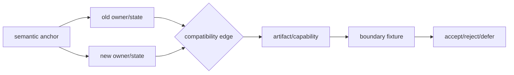
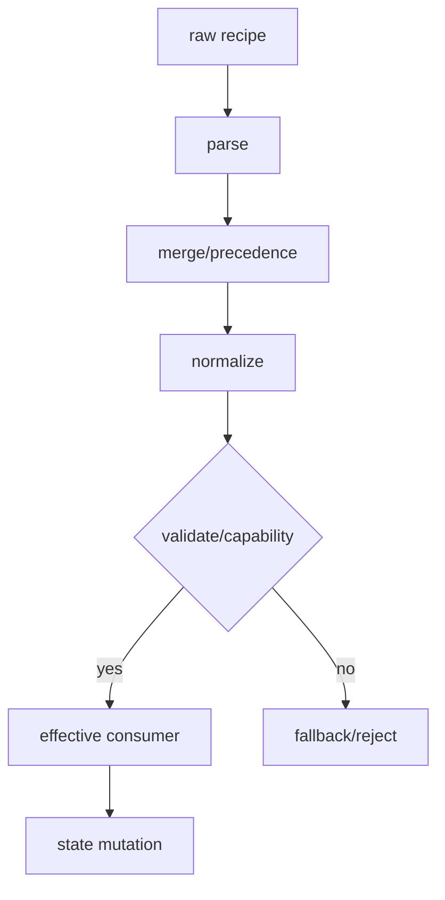
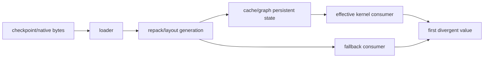
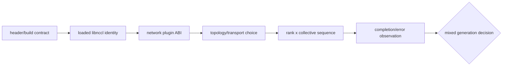
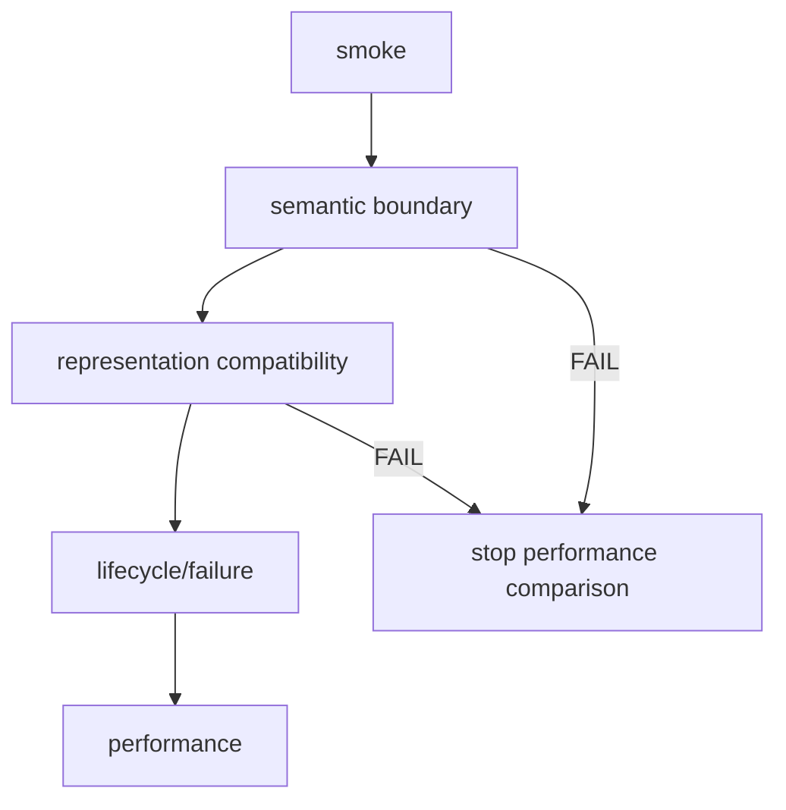
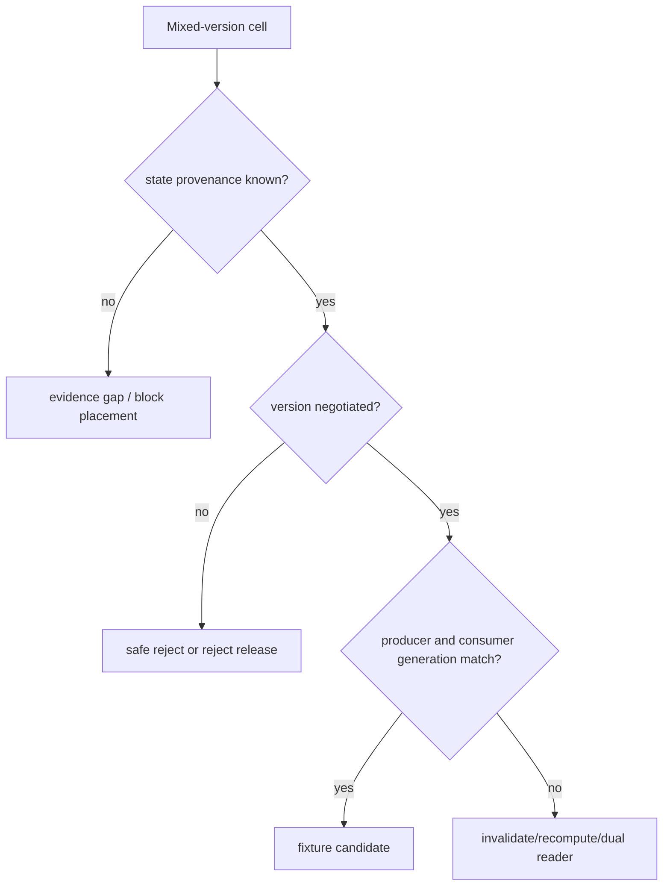

# 75장. 릴리스가 같아 보여도 프로그램은 달라진다 — 이틀 release·ABI 감사

새 image는 import도 되고 server도 뜬다. 짧은 prompt는 맞다. 그런데 long-context에 adapter를 붙인 첫 token만 이전 release와 다르고 graph capture memory도 늘었다. 시작 로그에는 익숙한 backend 이름이 찍힌다. Changelog는 “backend support 개선”과 “config cleanup”이라고만 썼다. 이 장의 `U75`는 이 장면에서 시작한다. 목표는 commit을 많이 읽는 것이 아니다. Old와 new가 같은 입력을 어떤 상태, 표현, native artifact와 hardware lane으로 실행했는지 맞춘 뒤 변경을 승인, 거절, 의도적 보류 또는 근거 부족으로 판정하는 것이다.

이 장은 repository 좌표를 많이 담지만, 첫 독서의 중심은 좌표가 아니다. 75.1~75.5에서 “같은 이름의 릴리스가 어느 producer→consumer 계약에서 달라졌는가”를 배우고, 75.6~75.9에서 그 계약을 wheel·CUDA·NCCL과 fixture로 확인한다. 75.10~75.12은 사건을 rollout/rollback decision으로 바꾸는 응용편이다. 75.14의 상세 dossier와 75.2.1의 revision 목록은 실제 감사를 수행할 때 펼치는 reference다. 처음부터 모든 symbol과 artifact를 따라가면 ABI의 본질인 dtype·layout·ownership·workspace·stream·representation generation보다 파일명이 먼저 기억된다. 따라서 각 좌표는 잘못된 compatibility 또는 rollback 판단을 막는 대표 edge로만 읽고, 전수 inventory는 dossier에 맡긴다.

## 75.1 U75-M1: cu129에서 cu130으로 옮긴 사건부터 시작한다

U75-M1은 server ready 뒤 첫 long prefill만 실패한 migration이다. 먼저 old/new release identity와 CUDA lane을 고정하고, public·Python·native ABI를 비교하고, wheel·shared object·device code artifact를 inventory하고, 같은 semantic fixture를 두 환경에 실행한 뒤, old image뿐 아니라 JIT cache·graph·communicator·stored state까지 rollback한다. 이 다섯 단계가 이틀 감사의 spine이다. CUDA 12.x/13.x의 PTX·SASS·cubin·driver 메커니즘은 44장의 설명을 참조하고 여기서는 migration 판정만 수행한다.

### 75.1.1 작은 default가 큰 프로그램을 만든다

함수 수백 줄이 다른 파일로 이동해도 input, mutation과 output owner가 같으면 semantic change가 아닐 수 있다. 반대로 default 한 줄이 `auto`의 해석을 바꾸면 scheduler budget, graph mode, attention backend와 packed weight consumer가 연쇄적으로 달라진다. 그래서 diff denominator는 changed lines가 아니라 74장에서 만든 semantic anchor다.



U75의 첫 anchor는 `attention backend option`이 아니다. `long prefill의 normalized shape가 effective backend와 graph mode를 선택하고 그 consumer가 어느 packed/cache representation을 읽는가`다. Option rename을 고쳐 startup을 통과해도 이 anchor가 old/new에서 같다는 보장은 없다.

### 75.1.2 API와 ABI를 다섯 경계로 나눈다

Public schema, Python internal API, dispatcher/custom-op schema, C++/CUDA ABI, stored/network representation을 별 행으로 둔다. Python signature가 같아도 tensor layout, aliasing, workspace lifetime과 stream contract가 달라질 수 있다. Exported symbol이 같아도 embedded cubin target이나 PTX ISA가 달라 current GPU에서 다른 path가 선택될 수 있다. Shape와 dtype가 같아도 scale permutation이나 page-table entry 의미가 달라지면 representation ABI가 깨진다.

### 75.1.3 U75의 정답 범위

이 장은 실제 rollout을 하지 않는다. Source와 보존 artifact를 정적으로 감사하고 fixture specification과 expected result를 만든다. 모델, server, CUDA와 NCCL runtime은 실행하지 않는다. 실행 관측이 필요한 칸은 evidence gap으로 남겨 canary 전 승인 조건에 넣는다. 76장이 승인된 artifact와 rollback set을 배포 manifest로 고정한다.

## 75.2 U75-M1 상세 장부와 migration matrix

### 75.2.1 증상과 관측 — server ready 뒤 첫 long prefill만 실패했다

U75-M1은 H100 SM90 node pool에서 vLLM v0.27.1 cu129 image를 같은 source revision의 cu130 image로 바꾼 migration이다. Driver는 branch 570이었고 health probe와 짧은 decode는 통과했다. 첫 32K prefill에서 optional FlashInfer path가 lazy load되자 `libcudart.so.13`을 찾지 못한다는 loader error가 났다. 다른 Pod에서는 import가 성공했지만 long prefill이 reference backend로 fallback해 TTFT가 41% 늘었다. 팀은 `nvidia-smi`에 CUDA 13이 표시된 node도 있었으므로 toolkit 설치 문제나 kernel regression으로 추정했다.

첫 관측은 CUDA 숫자를 하나 더 찾는 일이 아니었다. Old/new image digest, vLLM wheel filename과 digest, `torch.version.cuda`, extension별 `DT_NEEDED`, container에서 resolve된 library, host driver, GPU UUID/SM과 selected backend를 한 행에 놓았다. `nvidia-smi`의 CUDA 표시는 driver가 제공하는 capability의 한 표지이지 container에 `libcudart.so.13`이 있다는 증거가 아니다. System `nvcc --version`도 prebuilt wheel의 build toolkit이나 embedded device code를 바꾸지 않는다.

```text
source revision     old=new: 6e448d0…
vLLM artifact       old=cu129 wheel, new=cu130 wheel
core extension      old NEEDED libcudart.so.12, new NEEDED libcudart.so.13
node driver         570.x
device              H100, SM90
short fixture       pass/pass
long effective path old=FlashInfer, new=loader fail or reference fallback
```

NVIDIA의 [CUDA Compatibility 13.0.2 minor-version 표](https://docs.nvidia.com/cuda/archive/13.0.2/cuda-compatibility/index.html#minor-version-compatibility)는 CUDA 12.x와 13.x application family의 driver 범위를 구분한다. 같은 문서의 [forward compatibility 절](https://docs.nvidia.com/cuda/archive/13.0.2/cuda-compatibility/index.html#forward-compatibility)은 `cuda-compat` package가 별도 조건과 배포 경로를 가진다는 점을 설명한다. 이를 “driver 570에서도 CUDA 13 wheel은 모두 실행된다”는 일반 허가로 읽지 않는다.

U75-M1은 우선 host loader가 필요한 cudart major를 찾지 못한 사건이며, 그 경계를 통과한 다음에야 driver API·device image를 판정할 수 있다.

### 75.2.2 분기와 원인 — loader, image, selector를 순서대로 가른다

첫 분기는 Python import 전 host dependency다. Wheel을 풀고 `.so`별 `readelf -d`의 `NEEDED`, `RPATH/RUNPATH`를 수집한다. Container 안에서 loader diagnostic 또는 `/proc/<pid>/maps`로 실제 resolve된 `libcudart`, PyTorch·C++ runtime을 확인한다. Missing `libcudart.so.13`이면 PTX, cubin과 kernel을 아직 열지 않는다. Old cudart 12 symlink를 이름만 13으로 만들어 통과시키는 것은 ABI 검증이 아니라 위험한 위장이다.

둘째 분기는 device code다. Host extension이 load된 뒤 failing effective backend와 symbol에 현재 SM용 native cubin이 있는지, 없으면 어떤 PTX virtual target이 있는지 inventory한다. 전체 wheel의 cubin/PTX 개수는 탐색 신호일 뿐이다. [CUDA C++ Programming Guide 12.9.1의 application compatibility](https://docs.nvidia.com/cuda/archive/12.9.1/cuda-c-programming-guide/index.html#application-compatibility)에 따라 native code와 PTX JIT 경로를 구분하고, PTX-only라면 embedded PTX와 deployment driver JIT capability를 판정한다.

No-image와 unsupported PTX는 host loader failure와 다른 terminal이다.

셋째 분기는 selector다. Backend package가 설치되고 extension이 load돼도 model·dtype·head dimension·shape·phase와 graph 조건 때문에 선택되지 않을 수 있다. U75-M1의 짧은 probe는 generic path만 실행해 lazy extension과 long-prefill specialization을 건드리지 않았다. 따라서 startup 성공을 migration 합격으로 쓰지 않고 fixed long fixture의 requested/effective backend, fallback reason, graph mode와 kernel boundary를 기록한다.

vLLM v0.27.1의 [`detect_system_cuda_variant`](https://github.com/vllm-project/vllm/blob/6e448d0ea9bf3d88d898b65449ca6dc2aec170ac/setup.py#L538-L570)는 CUDA major를 cu129/cu130 hosted wheel variant로 매핑하고 explicit `VLLM_MAIN_CUDA_VERSION`, PyTorch CUDA와 `nvidia-smi`를 차례로 볼 수 있다. 이 코드는 설치 variant 선택점이지 runtime compatibility oracle이 아니다. 특히 PyTorch CUDA를 얻지 못해 `nvidia-smi` 표지를 사용하면 container runtime closure와 다른 variant를 선택할 수 있다.

Source build에서는 [`CUDA_HOME`의 nvcc를 CMake compiler로 전달하는 지점](https://github.com/vllm-project/vllm/blob/6e448d0ea9bf3d88d898b65449ca6dc2aec170ac/setup.py#L295-L313)과 [`nvcc` version을 읽는 함수](https://github.com/vllm-project/vllm/blob/6e448d0ea9bf3d88d898b65449ca6dc2aec170ac/setup.py#L1003-L1015)를 고정한다.

Build host의 PATH에 다른 nvcc가 있어도 CMake argument와 build log에서 실제 compiler를 확인한다. [`CMakeLists.txt`의 compiler-version별 architecture set](https://github.com/vllm-project/vllm/blob/6e448d0ea9bf3d88d898b65449ca6dc2aec170ac/CMakeLists.txt#L100-L139)은 CUDA 12.8, 13.0, 13.4에서 supported target 집합이 달라질 수 있음을 보여 준다. Source revision이 같아도 compiler가 달라 fat binary는 달라진다.

U75-M1의 직접 원인은 cu130 artifact closure에서 `libcudart.so.13`이 누락된 image와 CUDA 13.x 요구를 충족하지 않는 driver lane을 동시에 rollout한 것이다. 일부 Pod의 silent fallback은 backend selector가 optional extension failure를 흡수한 결과였다. Kernel 산술 회귀가 아니었다. 같은 rollout에 두 failure mode가 있었으므로 “한 Pod는 import 성공”이라는 반증도 전체 fleet에는 성립하지 않았다.

**첫 실패 경계 판정표.** `dlopen` 전에 `DT_NEEDED` library가 없으면 host closure failure다. Extension은 load되지만 custom op symbol registration이 없으면 framework/extension ABI 또는 build omission이다. Registration까지 되지만 module load에서 no-image가 나면 current SM의 cubin/PTX coverage다. PTX가 선택되고 unsupported-toolchain 오류가 나면 embedded PTX와 driver JIT 계약이다. Launch는 성공하지만 output이 다르면 argument·representation·kernel behavior로 내려간다. Reference fallback만 선택되면 selector/capability 사건이며, latency를 kernel 성능 regression으로 쓰지 않는다.

각 분기는 앞 gate를 통과한 증거를 요구한다. 예를 들어 no-image를 주장하려면 host `.so`가 어떤 dependencies와 symbol로 load됐는지 있어야 한다. Kernel wrong answer를 주장하려면 selected native symbol, input representation과 first differing tensor가 있어야 한다. 이 규칙은 오류 문자열이 여러 원인을 한 문장에 담거나 optional backend가 예외를 흡수할 때 특히 중요하다.

**Wheel과 source-build 혼합 반례.** Python vLLM은 cu130 wheel인데 editable extension 하나를 node의 CUDA 12.8 nvcc로 다시 빌드했다고 하자. Main package version과 source commit은 같아도 core extension은 cudart 13, local extension은 cudart 12 및 다른 architecture list를 요구할 수 있다. Import 순서와 RPATH에 따라 둘 다 load되거나 한쪽이 실패하며, 특정 shape가 local op를 처음 호출할 때만 문제가 드러난다. `pip freeze`만으로 이 혼합을 찾을 수 없다.

Artifact manifest에는 distribution RECORD뿐 아니라 실제 import된 module의 filesystem path, inode/hash, ELF build ID, `DT_NEEDED`와 embedded target을 둔다. Python에서 package version을 출력한 결과와 loaded shared-object provenance를 분리한다. JIT cache에서 가져온 module이면 cache key, compiler path/version, compile flags, source/template digest, target SM과 생성 시각을 기록한다. Container image가 immutable이어도 writable cache가 실행 프로그램을 바꿀 수 있다.

SGLang에서는 main wheel, `sglang-kernel`, FlashInfer와 optional companion이 각각 다른 origin을 가질 수 있다. Cu13 dependency declaration이 보인다고 현재 environment가 완전한 matching set임을 단정하지 않는다. Resolver output, installed filenames/digests와 실제 imported paths를 맞추고, wrapper가 custom op를 처음 부르는 fixed fixture를 실행한다. CUDA 12 migration lane이 project의 documented build/install 경로 밖이라면 임의로 extras 이름만 치환하지 않고 unsupported 또는 source-build-required로 판정한다.

### 75.2.3 수정 검증과 rollback — old image만 되돌리지 않는다

수정 후보는 두 개로 분리했다. A는 driver와 CUDA 13 runtime closure가 검증된 canary node pool에 cu130 image를 배치한다. B는 driver rollout이 준비될 때까지 cu129 artifact closure를 유지한다. 임의의 host library mount나 global `LD_LIBRARY_PATH`로 여러 image의 cudart를 섞지 않는다. Forward-compat package를 쓸 경우에도 NVIDIA가 문서화한 GPU·OS·driver 범위, 설치 package와 실제 load path를 별 lane으로 검증한다.

검증은 import→short request로 끝내지 않는다. Core extension과 optional backend를 각각 eager-load하는 loader fixture, SM90 native/PTX inventory, fixed short/long prefill, decode, graph eager와 adapter/quant production 조합을 실행 계획에 둔다. 각 fixture는 selected backend와 fallback reason을 저장한다. PTX JIT lane은 cold cache와 warm cache를 나누고 JIT error·latency를 본다. Native cubin lane도 exact selected symbol image가 있는지 확인한다.

Rollback은 Deployment tag를 cu129로 돌리는 것보다 크다. Cu130 Pod admission을 닫고 in-flight를 drain한 뒤, cu13 전용 JIT/extension cache를 cu129 process가 읽지 않게 generation을 분리한다. Resolver lock과 companion wheels, mounted runtime library와 environment path도 old closure로 되돌린다. New backend가 만든 persistent graph/cache representation을 old consumer가 재사용하지 않게 invalidate 또는 quarantine한다. Driver를 즉시 downgrade해야 한다면 node drain과 다른 workload compatibility가 별 변경 창이다.

Rollback terminal은 old image count가 desired가 된 순간이 아니다. 모든 running PID의 image/wheel digest가 approved cu129 set이고 loaded cudart·extension closure가 일치하며, cu130 new admission과 old cache acceptance가 0이어야 한다. Fixed long fixture가 intended FlashInfer 또는 approved fallback을 실제 선택하고 correctness·TTFT budget을 통과해야 한다. Late cu130 metric과 JIT artifact도 current population에 섞이지 않아야 한다.

**검증 artifact 예시.** `migration-cell.yaml`의 각 행에는 build source와 wheel/container digests, `nvcc --version` 원본, PyTorch CUDA, architecture compile flags, `.so` dependency·symbol·fatbin inventory, deployment driver/GPU SM, effective backend trace와 fixture 결과가 있다. Raw command output은 hash와 수집 시각을 가진다. “cu130 pass” 한 boolean으로 어느 optional extension과 shape를 시험했는지 숨기지 않는다.

Correctness fixture는 token output만 보지 않고 tokenizer IDs, scheduler shape, backend input descriptor와 첫 중요한 tensor checkpoint를 old/new로 맞춘다. Loader fixture와 code-image fixture가 통과한 뒤에만 numerical comparison을 수행한다. Performance fixture는 cold JIT/capture와 warm steady state를 분리하고 fallback cohort를 별 분모로 둔다. Otherwise reference fallback이 늘어난 상태에서 전체 평균만 비교해 optimized path 성능으로 오인할 수 있다.

Canary는 node 하나가 아니라 matrix cell을 대표해야 한다. Same image라도 driver branch와 GPU SM이 다르면 다른 cell이다. Scheduler가 topology 때문에 intended node에 배치하지 못하면 canary unknown이지 pass가 아니다. Pod UID, node driver, GPU UUID/SM, loaded libraries와 effective kernel path를 trace에 결합한다. Rollout controller는 desired replicas가 아니라 validated cell별 admitted replicas를 센다.

### 75.2.4 독자가 실행할 CUDA migration matrix와 checklist

Migration matrix는 source release, toolkit major와 node driver를 한 대각선으로만 시험하지 않는다. 최소한 같은 source의 cu129/cu130 artifact, current/new driver, production SM과 native/PTX/fallback path를 교차한다.

| cell | build/toolkit artifact | deployment driver | device/SM | expected image path | 필수 판정 |
|---|---|---|---|---|---|
| control | cu129 | current approved | production SM | native 우선 | old semantic baseline |
| artifact-only | cu130 | current | same SM | loader/native/PTX | unsupported면 reject |
| driver-only | cu129 | new | same SM | native | backward/collateral regression |
| intended | cu130 | new approved | same SM | native 또는 documented PTX | full boundary fixture |
| new-GPU | cu130 | new approved | new SM | exact native/PTX/fallback | selector와 JIT cold/warm |
| rollback | cu129 | new/current rollback lane | production SM | approved old path | cache·library closure 복원 |

각 cell의 build artifact에는 source commit, wheel/container digest, PyTorch CUDA variant, nvcc/toolkit, compiler flags, architecture list, embedded cubin/PTX targets, `DT_NEEDED`, companion package와 JIT cache schema를 적는다. Deployment에는 driver, optional compat package, mounted library, GPU UUID/SM, MIG와 effective library map을 적는다. Runtime에는 requested/effective backend, graph mode, native symbol/image kind, fallback reason과 completion 결과를 적는다.

실행 전 checklist는 다음과 같다.

- mutable tag가 아닌 image·wheel·companion digest를 고정했는가.
- build nvcc, PyTorch build CUDA, bundled cudart와 host driver를 별 값으로 기록했는가.
- vLLM/SGLang의 CUDA variant 선택과 dependency extra가 실제 lockfile·wheel closure와 일치하는가.
- production selected symbol별 native cubin과 PTX target을 확인했는가.
- PTX lane은 official driver/JIT 조건과 cold-cache fixture를 통과했는가.
- ABI symbol뿐 아니라 tensor schema·layout·workspace·stream·representation generation을 비교했는가.
- short probe가 건드리지 않는 long prefill, graph, adapter·quant와 distributed lane을 넣었는가.
- fallback이 성공 응답으로 숨지 않도록 effective backend와 reason을 수집했는가.
- rollback image, runtime libraries, resolver lock, JIT/graph/cache generation과 node driver 절차를 시험했는가.

승인 문장은 “CUDA 13 지원”이 아니다. “vLLM revision R의 cu130 digest D, companion set C는 driver lane N과 SM90에서 host closure·selected native image·long/adapter correctness·graph와 fallback budget을 통과했으며 cu129 rollback set O도 동일 node lane에서 검증됐다”고 쓴다. 시험하지 않은 SM, PTX JIT와 mixed companion은 exclusion으로 남긴다.

**Matrix 결과를 읽는 법.** Artifact-only cell이 host loader에서 실패하고 intended cell이 통과하면 새 driver/runtime closure가 migration의 선행 조건이다. Artifact-only가 native cubin으로 통과하면 current driver lane을 즉시 전체 승인하는 것이 아니라 production selected paths의 범위를 확인한다. Native는 통과하지만 PTX-only optional path가 실패할 수 있다. Driver-only cell이 깨지면 application image를 바꾸지 않아도 driver rollout이 regression을 만들었으므로 두 변경을 결합하지 않는다.

Intended cell이 reference fallback으로만 통과하면 correctness 보호는 확인했지만 capability migration은 미완료다. Decision은 `safe-degraded`이며 fallback latency·capacity를 감당할 수 있을 때만 제한적으로 admission한다. Effective optimized path가 한 번도 실행되지 않은 fixture를 cu130 kernel pass로 쓰지 않는다. 반대로 optimized path correctness가 통과해도 cold JIT가 startup deadline을 넘거나 cache publish가 race를 만들면 lifecycle terminal은 열려 있다.

New-GPU cell에서는 GPU 제품명보다 SM과 selected image를 기록한다. 같은 family라도 plain, architecture-specific와 family-specific target의 적용 범위를 공식 compiler/application 계약으로 확인한다. Target 문자열을 수치 정렬해 “더 높은 코드가 더 좋다”고 결론 내리지 않는다. Compiler가 flag를 받아들였다는 사실, binary가 image를 포함한다는 사실, driver가 load/JIT했다는 사실과 selector가 실행했다는 사실을 네 증거로 분리한다.

Rollback cell은 release 전에 실제로 실행한다. Cu130 canary가 graph/JIT cache를 만든 뒤 cu129 Pod를 올려 generation collision이 없는지, resolver가 old companion set을 복원하는지, long fixture가 intended old backend를 선택하는지 본다. Rollback 시간이 SLO를 넘으면 기술적으로 가능한 rollback이라도 운영 계획은 불충분하다. 필요한 image pull, node drain, cache quarantine와 warm-up 시간을 합쳐 budget을 정한다.

최종 review에는 각 실패 cell의 owner와 다음 행동이 있다. Host closure는 image/package owner, driver/PTX는 node platform owner, missing code image는 build owner, selector fallback은 framework/config owner, representation/first tensor는 loader·kernel owner다. “CUDA 팀 확인”처럼 넓은 owner는 terminal을 닫지 못한다. Evidence artifact와 수정 가능한 경계를 가진 owner에게 배정해야 migration이 반복 가능한 절차가 된다.

Migration 승인에는 만료 조건도 붙인다. Driver branch, GPU pool, wheel/companion digest, build flags 또는 effective selector predicate가 바뀌면 기존 cell 판정을 재사용하지 않는다. Traffic model이 long context나 adapter·quant 조합을 새로 포함해도 matrix를 확장한다. 같은 application tag를 유지한 node 증설도 새 SM이나 driver를 들이면 compatibility rollout이다.

이 원칙은 모든 조합을 영원히 시험하라는 뜻이 아니다. Production population과 silent-corruption 위험을 기준으로 cell을 선택하고 exclusion을 명시한다. 다만 제외된 cell이 scheduler placement나 resolver 변화로 production에 들어오지 않도록 admission guard를 둔다. Matrix와 실제 fleet membership이 어긋나면 과거 합격표는 현재 배포의 증거가 아니다.

승인자는 마지막으로 running Pod 표본의 loaded-library map과 matrix cell을 대조한다. 선언된 image가 맞더라도 writable volume이나 host mount가 library closure를 바꾸면 즉시 admission을 멈추고 artifact identity부터 다시 수집한다.

SGLang도 main package 하나로 닫지 않는다. 고정 v0.5.18의 [`pyproject.toml` dependency set](https://github.com/sgl-project/sglang/blob/71de97b264b04dcd514cf904003028aefe9775c8/python/pyproject.toml#L25-L52)은 `cuda-python`, FlashInfer cu13, humming-kernels cu13와 CUTLASS DSL cu13 같은 companion 경계를 보여 준다. Cu12 lane을 만들 때 단순히 server wheel 이름만 바꾸지 않고 해당 release가 선언·제공하는 dependency variant와 build recipe를 확인한다. 지원되지 않는 임의 혼합은 migration matrix의 reject/defer cell이다.


## 75.3 Day 1 오전 — 비교할 두 대상을 먼저 고정한다

### 75.3.1 version 문자열은 identity가 아니다

아래 표의 비교 축은 old/new 이름이 아니라 동일한 실행 lane을 재현하는 identity 층이다. 대표 행은
`wheel`이다. Source revision이 의도한 변경이 같아도 wheel digest와 vendored native payload가 다르면 실제
program은 다르다. 반대로 wheel이 같아도 hardware/topology가 달라 selected code image가 바뀔 수 있다.
그래서 어느 한 행의 일치로 compatible을 선언하지 않고, 첫 불일치 행이 뒤 fixture의 경쟁 가설을 정한다.

Old/new record에는 source commit, tag, vendor/submodule revision, build recipe, wheel digest, container base digest와 lockfile을 모두 넣는다. `v0.27.1`이라는 문자열이 같아도 vLLM cu129 wheel과 suffix 없는 cu130 wheel은 다른 artifact다. 보존 표본에서 cu129는 `vllm-0.27.1+cu129-cp38-abi3-manylinux_2_28_x86_64.whl`, cu130 기본은 `vllm-0.27.1-cp38-abi3-manylinux_2_28_x86_64.whl`이다. 파일명 suffix가 없다는 사실을 CUDA-independent라고 읽으면 안 된다.

| identity 필드 | old U75 | new U75 | 판정 의미 |
|---|---|---|---|
| source | vLLM v0.26.0 보존 revision | `6e448d0…` v0.27.1 | semantic diff denominator |
| wheel | v0.26.0 cu129 digest | v0.27.1 cu129 digest | same CUDA-major release diff |
| variant | cu129 또는 cu130 | cu129 또는 cu130 | toolkit/runtime major 분리 |
| vendor | old FlashAttention pin | `28e862d…` | kernel source 승계 여부 |
| hardware | SM과 topology snapshot | 같은 lane | fixture 비교 가능성 |

Old cu129와 new cu130을 바로 비교하면 release change와 CUDA-major change가 교란된다. 먼저 v0.26.0 cu129→v0.27.1 cu129를 비교하고, 같은 v0.27.1 안에서 cu129→cu130을 비교한다. 두 축이 모두 통과한 뒤 production migration 조합을 본다.

### 75.3.2 artifact는 source의 결과이지 그림자가 아니다

소스 commit이 같아도 build flags, compiler, architecture list와 optional dependency가 다르면 다른 프로그램이다. vLLM v0.27.1 보존 wheel 감사에서 cu129와 cu130은 각각 17개 native object를 갖지만 전체 embedded code-object 수와 `.so` bytes가 다르다. Cu129 inventory는 cubin 865개와 PTX 119개, cu130은 cubin 869개와 PTX 76개다. 개수가 많다는 것이 더 compatible하다는 뜻은 아니다. 실제 selected symbol에 current SM image 또는 driver가 해석 가능한 PTX가 있는지를 본다.

### 75.3.3 supported lane이 denominator다

Model, dtype/quantization, adapter, prompt boundary, prefill/decode role, TP/PP/DP/EP, GPU SM, CUDA/driver, graph mode를 risk로 축약한다. U75는 short/plain, long/plain, short/adapter, long/adapter 네 semantic fixture를 최소 집합으로 둔다. Production이 P/D라면 old-P/new-D와 new-P/old-D를 별 lane으로 추가한다. “모든 조합”을 무한 생성하지 않고 실제 traffic와 highest-risk representation edge를 우선한다.

Lane 축을 고를 때 pairwise coverage를 기계적으로 최대화하지 않는다. U75 symptom이 long+adapter에서만 나타났으므로 prompt page boundary, adapter set/generation, graph mode와 selected backend가 함께 있는 조합을 최우선으로 둔다. Quantized model을 production에서 쓰면 packed representation을 추가한다. TP가 1인 smoke만으로 TP 8의 shard/repack과 collective path를 대표하지 않는다. Traffic이 작아도 silent wrong answer blast radius가 크면 높은 risk다.

| lane | production population | correctness risk | 포함 이유 | 제외/보류 조건 |
|---|---:|---:|---|---|
| short/plain/cu129/SM90 | 높음 | 중간 | baseline과 rollback control | 없음 |
| long/plain/cu129/SM90 | 중간 | 높음 | page/graph boundary | exact long fixture 필요 |
| long/adapter/cu129/SM90 | 낮음 | 매우 높음 | U75 symptom cohort | first-value ledger 필수 |
| long/adapter/cu130/SM100 | 계획 | 매우 높음 | new capability claim | image/driver fixture 전 배치 금지 |
| old-P/new-D | rollout 중 | 매우 높음 | mixed descriptor | explicit protocol evidence 없으면 금지 |

“계획” lane은 현재 traffic이 0이어도 release claim에 포함되므로 감사 대상이다. 반대로 CPU, 다른 architecture와 사용하지 않는 quant format은 exclusion에 남긴다. 제외했다는 사실을 전체 release compatible이라는 문장에서 숨기지 않는다. 최종 판정은 “지원 lane 집합 L에서 compatible”이라고 쓴다.

Fixture 비용도 denominator 설계에 반영한다. Full model long-context를 모든 조합에서 실행하기 전에 small boundary fixture로 schema/layout을 검증하고, 통과한 lane만 end-to-end로 올린다. Runtime은 이 장의 범위 밖이지만 release gate plan은 이 순서를 가진다. Representation fixture가 실패한 lane에 expensive performance run을 예약하지 않는다.

동등 비교를 위해 hardware lane은 GPU model 이름만 쓰지 않는다. SM, HBM capacity, MIG 여부, driver, interconnect/topology와 rank placement를 고정한다. CUDA 12/13 variant 비교에서 node가 달라지면 topology와 clock/power policy가 교란될 수 있다. Correctness는 reference semantics로 비교할 수 있어도 performance denominator는 더 엄격해야 한다.

Artifact identity와 lane identity가 합쳐져 comparison cell을 만든다. Old source+old wheel+cu129+SM90과 new source+new wheel+cu129+SM90이 release-diff cell이다. New source+new cu129와 new source+new cu130은 toolkit/artifact cell이다. Old cu129와 new cu130 하나만 비교하고 “upgrade가 느려졌다”고 쓰지 않는다.

Day 1 오전 stop rule은 각 high-risk cell이 source, artifact closure, hardware와 fixture input digest를 갖는가다. 하나라도 mutable tag나 “동일 cluster” 같은 문장뿐이면 afternoon semantic diff를 시작하지 않는다. 나중에 denominator를 바꾸면 이미 읽은 diff와 benchmark를 다시 해석해야 하기 때문이다.

## 75.4 Day 1 오후 — option과 상태 변화의 semantic diff

### 75.4.1 이름이 같아도 provenance가 다를 수 있다

74장의 trace를 old/new에서 다시 그린다. CLI field 이름, default, environment override, config file, API per-request override와 model metadata precedence를 비교한다. `None`, `auto`, empty string과 explicit default를 같은 값으로 합치지 않는다. Old `auto`가 FlashInfer 우선이고 new `auto`가 graph compatibility 때문에 FA3 우선이면 parser signature가 같아도 program은 달라졌다.



각 diamond를 old/new source anchor로 맞춘다. Field가 rename됐는데 compatibility alias가 old value를 new field로 옮기면 public schema는 compatible할 수 있다. 그러나 warning 뒤 new default가 적용되면 alias가 있어도 semantic compatibility는 아니다.

### 75.4.2 vLLM v0.26.0→v0.27.1 anchor

보존 delta에서 중요한 변화는 단순 version bump가 아니다. v0.27.1의 runner selection은 명시 환경변수뿐 아니라 PCP>1, DSpark, mixed sliding/full DFlash와 diffusion 같은 조건이 default architecture 검사보다 앞서 V2를 강제할 수 있다. 같은 recipe가 runner generation을 바꾸면 scheduler output consumer, graph dispatcher와 supported backend 집합이 달라질 수 있다. U75는 `requested runner`, `normalized generation`, `forcing predicate`, `constructed runner`를 별 필드로 둔다.

또한 external vLLM FlashAttention pin은 v0.26.0에서 감사한 `caaa4eb…`에서 v0.27.1의 `28e862d21806bc3580207aa0ad4e2759151e9827`로 바뀌었다. 이전 pin의 paged layout, launch geometry와 kernel claim을 이름이 같다는 이유로 승계할 수 없다. New pin에서 같은 symbol과 representation contract를 다시 찾거나 `deferred`로 표시한다.

### 75.4.3 네 owner의 state table

| owner | old state | new state | U75 질문 |
|---|---|---|---|
| scheduler | chunk/token budget A | forcing predicate 뒤 budget B | iteration 수가 달라지는가 |
| allocator/cache | layout generation G0 | backend-selected G1 | old cache를 new consumer가 읽는가 |
| runner/graph | capture key K0 | bucket/key K1 | memory와 fallback population은 |
| connector | descriptor V0 | descriptor V1 | mixed P/D가 fail closed하는가 |

함수가 분할됐으면 old symbol 하나를 new symbols 여러 개에 매핑한다. Rename/move는 accepted refactor일 수 있다. Mutation 순서, exception과 abort cleanup owner가 달라졌다면 lifecycle change다. 특히 config가 lazy first request에 소비되면 startup fixture는 의미가 없다.

실제 vLLM current anchor는 [`VllmConfig.use_v2_model_runner`](https://github.com/vllm-project/vllm/blob/6e448d0ea9bf3d88d898b65449ca6dc2aec170ac/vllm/config/vllm.py#L578-L623)다. 감사자는 old/new에서 이 함수 이름만 대응시키지 않는다. Predicate의 평가 순서, explicit override가 강제 조건보다 앞서는지, unsupported architecture가 어떤 fallback을 만드는지와 returned boolean의 consumer를 표로 만든다. New에서 PCP, DFlash 또는 diffusion branch가 먼저 true가 되면 같은 explicit option 부재가 다른 runner generation으로 정규화된다. 이것이 U75의 `config cleanup`을 semantic change로 승격시키는 근거다.

Runner generation이 바뀐 뒤에는 [`Scheduler.schedule`](https://github.com/vllm-project/vllm/blob/6e448d0ea9bf3d88d898b65449ca6dc2aec170ac/vllm/v1/core/sched/scheduler.py#L439-L625)과 [`GPUModelRunner._update_states`](https://github.com/vllm-project/vllm/blob/6e448d0ea9bf3d88d898b65449ca6dc2aec170ac/vllm/v1/worker/gpu_model_runner.py#L1192-L1325)를 anchor로 잇는다.

Old/new scheduler가 같은 `num_scheduled_tokens`를 내더라도 persistent input batch가 request add/remove, block IDs, sampled tokens와 adapter state를 갱신하는 순서가 달라질 수 있다. U75 long+adapter fixture는 scheduler equality만으로 runner semantics가 같다고 판정하지 않는다.

KV allocation도 lifecycle anchor다. [`KVCacheManager.allocate_slots`](https://github.com/vllm-project/vllm/blob/6e448d0ea9bf3d88d898b65449ca6dc2aec170ac/vllm/v1/core/kv_cache_manager.py#L344-L565)는 cache hit, new block, encoder budget와 connector-related state를 하나의 allocation transaction으로 연결한다. Old cache generation을 유지한 채 new backend layout을 선택하면 allocator가 성공해도 consumer representation이 틀릴 수 있다.

Release diff에는 allocation result의 logical block count뿐 아니라 block/page descriptor generation과 every reader를 기록한다.

Abort path는 정상 call graph와 별 semantic anchor다. Scheduler가 preempt한 request의 output이 늦게 돌아올 때 [`Scheduler.update_from_output`](https://github.com/vllm-project/vllm/blob/6e448d0ea9bf3d88d898b65449ca6dc2aec170ac/vllm/v1/core/sched/scheduler.py#L1670-L1745)이 stale output을 어떻게 fence하는지, [`Scheduler._free_request`](https://github.com/vllm-project/vllm/blob/6e448d0ea9bf3d88d898b65449ca6dc2aec170ac/vllm/v1/core/sched/scheduler.py#L2300-L2349)가 connector와 cache release를 어떤 순서로 수행하는지 old/new로 맞춘다.

Happy-path token fixture만 같아도 cancel 뒤 slot reuse semantics가 다르면 release는 lifecycle incompatible다.

이 walk의 결과는 “v0.27.1에서 함수가 늘었다”가 아니다. Requested recipe가 runner generation을 선택하고, 그 generation의 scheduler output이 persistent batch와 cache descriptor를 갱신하며, abort가 outstanding output을 fence하는 한 계약이다. Old source에서 해당 semantic anchor가 여러 symbols로 나뉘었다면 각각을 대응한다. Symbol 수가 다르다고 바로 incompatible로 판정하지 않는다.

## 75.5 Day 1 저녁 — API와 native ABI를 층별로 감사한다

### 75.5.1 public·Python·custom-op는 다른 계약이다

첫 표는 public request field와 error/streaming behavior다. 둘째는 Python object lifetime과 mutation이다. 셋째는 custom-op schema다. Custom op는 tensor 수, optional argument, dtype/device, layout, aliasing과 returned buffer ownership을 가진다. Python wrapper가 old argument를 default로 채워도 native extension이 다른 schema로 등록됐으면 lazy first call에서 실패한다.

| 경계 | compatible 증거 | incompatible 예 | smoke의 한계 |
|---|---|---|---|
| public API | field/default/error 의미 동등 | `auto` 의미 변경 | request boundary 미실행 |
| Python API | signature+mutation+lifetime 동등 | cleanup owner 이동 | import만 성공 |
| custom op | schema와 tensor contract 동등 | stride/optional arg 변경 | op lazy registration |
| C++/CUDA | symbol+struct+stream 동등 | enum/align/workspace 변경 | loader만 성공 |
| representation | producer와 모든 consumer generation 동등 | scale/page descriptor 변경 | short path가 안 읽음 |

### 75.5.2 C++ ABI는 symbol 이름보다 넓다

Exported name, C++ mangling, symbol version, struct size/alignment, enum integer, pointer const/alias, stride unit, workspace bytes/alignment, stream과 completion을 비교한다. Same symbol이 load돼도 caller가 old struct size를 넘기고 callee가 new tail field를 읽으면 memory corruption이 가능하다. Header-only template나 inline change는 exported symbol diff에 보이지 않을 수 있으므로 extension과 framework가 같은 header/build generation인지 확인한다.

### 75.5.3 representation ABI가 조용한 오답을 만든다

U75의 long-context+adapter first token divergence는 loader failure보다 representation mismatch를 의심하게 한다. Short prompt가 page boundary를 넘지 않고 adapter가 다른 kernel을 선택하지 않으면 정상일 수 있다. New backend가 per-head scale을 기대하지만 loader가 old per-tensor scale layout을 재사용하거나, graph key가 old slot generation을 읽으면 allocation과 launch는 성공하면서 값만 틀린다.



Native와 fallback이 같은 logical weight를 읽더라도 packed representation은 다를 수 있다. Repacked Marlin buffer를 generic GPTQ fallback에 그대로 넘기면 fallback이 “안전한 경로”가 아니다. Producer generation, selected consumer와 every fallback consumer를 한 표에 넣는다.

U75가 값 divergence를 찾는 표는 단순 max error가 아니다.

| checkpoint 좌표 | old expected | new observed | 이 지점이 처음 다를 때 |
|---|---|---|---|
| tokenizer/token IDs | exact IDs | exact IDs | template drift 아님 |
| native weight/scale sample | logical `(expert,k,n)` | same | artifact payload baseline |
| shard 후 sample | TP coordinate | same/different | loader shard semantics |
| repack 후 inverse sample | old kernel logical value | new value | repack generation mismatch |
| runner pointer descriptor | layout/stride/scale axis | consumer expectation | binding ABI mismatch |
| first attention/MLP output | tolerance interval | divergence | native math/argument 후보 |

Repack inverse sample이 처음 다르면 CUDA kernel을 profile하지 않는다. Loader가 source bytes를 어떤 packed coordinate로 옮겼는지와 fallback이 어느 layout을 기대하는지 본다. Runner descriptor까지 같고 first op output에서 갈라져야 native argument order, stream ordering과 kernel numerical path를 연다. 이 stop rule이 이틀 감사를 무한 kernel 독해로 변하는 일을 막는다.

Graph representation도 같은 방법을 쓴다. Old/new graph key에 batch size만 비교하지 않고 active token count, adapter set/generation, KV page-table generation, selected backend, dtype와 workspace layout을 넣는다. Key가 일부를 빼도 capture buffer population이 올바르면 우연히 맞을 수 있지만 compatibility 증거는 아니다. Adapter attach 뒤 old graph가 replay되는 U75 branch는 key omission 또는 invalidation owner를 조사한다.

ABI table에는 ownership과 completion도 필수다. Old custom op가 caller-owned workspace를 한 call 동안만 썼는데 new op가 async kernel 뒤까지 보유한다면 pointer type과 bytes가 같아도 lifetime incompatible다. New wrapper가 temporary tensor를 함수 반환과 함께 해제하면 device work가 늦게 읽을 수 있다. Source에서 record stream/event 또는 dependent consumer를 찾지 못하면 `runtime fixture required`로 보류한다.

또 하나의 조용한 오류는 enum과 optional argument다. Python schema가 `mode: int`를 그대로 유지해도 old `1=decode`, new `1=prefill`이면 loader와 dispatcher가 성공한다. Optional scale tensor가 `None`일 때 old는 symmetric path, new는 inferred zero-point path로 가면 같은 signature가 다른 수식을 만든다. ABI diff는 type만 비교하지 않고 value domain과 absence semantics를 기록한다.

## 75.6 Day 2 오전 — wheel 안의 실제 프로그램을 읽는다

### 75.6.1 filename에서 멈추지 않는다

Archive member, `METADATA`, `WHEEL`, RECORD digest, ELF class/machine, `DT_NEEDED`, RPATH/RUNPATH, GNU symbol version, embedded fatbin/cubin/PTX와 architecture target을 inventory로 만든다. Filename `manylinux_2_28`은 wheel 전체와 transitive system dependency의 실측 하한을 보장하지 않는다. `cp38-abi3`도 bundled CUDA extension의 PyTorch C++ ABI를 보장하지 않는다.

vLLM cu129 core extension은 `libcudart.so.12`, cu130은 `libcudart.so.13`을 직접 요구한다. 이는 명확한 host loader boundary다. 반면 `libcuda.so.1`은 driver API boundary다. Driver가 충분히 새롭다는 사실이 missing `libcudart.so.13`이나 PyTorch undefined symbol을 해결하지 않는다.

### 75.6.2 SGLang companion wheel을 하나로 합치지 않는다

SGLang 본체, `sglang-kernel`, DeepGEMM, DeepEP와 optional FA package는 distribution과 Python ABI가 다를 수 있다. 보존 `sglang-kernel 0.4.6.post1`에는 cu129와 cu130 wheel이 별도로 있다. Main package version만 고정하고 companion resolver가 다른 variant를 고르면 source identity와 runtime artifact가 어긋난다. U75 identity에는 모든 companion filename과 digest, resolved dependency edge를 넣는다.

SGLang source walk는 server argument 정의에서 멈추지 않는다. Long+adapter lane의 effective backend가 어떤 `ModelRunner`와 phase-specific graph runner를 구성하는지, 그 runner가 `sglang-kernel` 또는 JIT module의 어느 wrapper를 호출하는지를 먼저 찾는다. 그 역방향으로 package distribution까지 올라가야 필요한 companion artifact가 정해진다. Package inventory부터 시작하면 실행되지 않는 수백 개 kernels를 모두 감사하게 된다.

Current pin `71de97b264b04dcd514cf904003028aefe9775c8`에서 [`DecodeCudaGraphRunner`](https://github.com/sgl-project/sglang/blob/71de97b264b04dcd514cf904003028aefe9775c8/python/sglang/srt/model_executor/runner/decode_cuda_graph_runner.py#L200-L290)는 attention backend, static buffers, padding policy, TP gather와 graph backend를 instance state로 만든다. Old/new에서 constructor signature가 같아도 server args default, backend construction과 hardware predicate가 다르면 capture set이 달라진다.

U75는 `disable_padding`, effective attention backend object와 graph backend identity를 old/new worksheet에 기록한다.

Prefill은 별 anchor다. [`PrefillCudaGraphRunner`](https://github.com/sgl-project/sglang/blob/71de97b264b04dcd514cf904003028aefe9775c8/python/sglang/srt/model_executor/runner/prefill_cuda_graph_runner.py#L245-L340)의 accepted shapes와 buffer contract를 decode에 자동 전이하지 않는다. U75 symptom이 first token이면 long-prefill path를 우선하고, adapter가 decode에만 적용되는 fixture라면 두 phase를 각각 본다. “CUDA graph memory 증가”를 decode runner 하나의 capture count로 설명하지 않는다.

SGLang artifact mixed matrix는 본체 old/new뿐 아니라 companion을 교차한다.

| Python owner | kernel wheel | DeepGEMM/DeepEP | 판정 질문 |
|---|---|---|---|
| old | old matching CUDA | old | baseline |
| new | new matching CUDA | new | intended closure |
| new | old | old/new | wrapper schema와 symbol 호환인가 |
| old | new | new/old | new optional arg를 old wrapper가 모르는가 |
| new cu130 | cu129 companion | any | libcudart major와 code image mismatch |

Resolver가 우연히 설치 가능한 조합과 project가 지원한다고 선언한 조합은 다르다. Mixed row는 exact boundary fixture와 explicit compatibility claim이 없으면 defer 또는 reject다. Import 성공은 wrapper가 lazy custom op를 부르기 전의 결과일 수 있다.

U75 long+adapter incident에서 SGLang lane의 first divergence가 graph runner construction이라면 companion wheel bytes를 곧바로 원인으로 쓰지 않는다. Source predicate가 new backend를 골랐고 그 backend가 old image에 없다는 artifact evidence가 이어질 때 `artifact drift`다. Source predicate는 같은데 resolver가 cu129 대신 cu130 companion을 골랐다면 packaging drift다. 둘은 rollback owner가 다르다.

### 75.6.3 FlashInfer JIT cache의 크기 차이를 해석한다

FlashInfer 0.6.17 cu129/cu130 JIT-cache wheel은 각각 965 members와 959 shared objects로 archive 구조 수는 같지만 bytes는 약 1.94GB와 1.51GB로 다르다. 표본 `api_log_stats.so`는 cu129에서 `libcudart.so.12`, cu130에서 `libcudart.so.13`을 요구한다. 같은 member count는 binary equivalence가 아니다. 특정 API의 `.so`가 존재해도 U75 selected specialization의 code image가 있다는 증거는 아니다.

이 inventory는 archive 파일 목록을 책에 나열하려는 것이 아니다. U75 selected path에서 필요한 logical operation을 archive member와 native symbol, 그 member의 dynamic dependency와 device code로 좁히기 위한 index다. Core package가 Python wrapper를 운반하고 companion cubin package 또는 JIT-cache package가 implementation을 운반한다면 세 digest가 하나의 executable closure다. Core만 rollback하면 new JIT cache가 남아 old wrapper가 다른 binary를 열 수 있다.

Artifact evidence에는 negative finding의 한계도 쓴다. `strings`에서 `sm_100`을 찾지 못했다는 사실은 architecture image 부재를 증명하지 않는다. Fatbin parser가 cubin/PTX entry와 target을 읽어야 한다. 반대로 `.nv_fatbin` section 존재는 selected symbol이 current SM을 지원한다는 증거가 아니다. Inspection tool, scope와 blind spot을 artifact row에 붙인다.

Dynamic loader row는 `DT_NEEDED`만으로 끝나지 않는다. RPATH/RUNPATH, loader search order, framework가 이미 global namespace에 올린 library와 symbol version을 함께 본다. vLLM wheel 표본의 native objects에 RPATH/RUNPATH가 없으면 deployment environment와 framework packaging이 resolution을 더 크게 좌우한다. 같은 wheel digest가 node별로 다른 `libtorch_cuda` 또는 runtime을 resolve할 수 있으므로 container/base digest와 loaded-library fixture가 필요하다.

Python ABI tag도 경계를 하나만 말한다. `abi3` wheel은 CPython extension API 범위를 넓힐 수 있지만 extension이 링크한 PyTorch C++ symbols, C++ standard library version, CUDA runtime과 external plugins의 ABI를 안정화하지 않는다. U75는 “pip가 설치했다”를 loader 호환 판정으로 승격시키지 않는다.

아래 artifact closure가 Day 2 오전 terminal이다.

```yaml
component: effective_long_adapter_backend
python_owner: {distribution: core, digest: fixed}
native_owner: {member: exact_so, build_id: fixed, symbols: inspected}
dependencies:
  - {soname: libcudart.so.12_or_13, resolution_owner: image}
  - {soname: libtorch_cuda, symbol_versions: inspected}
device_code:
  selected_symbol: bounded
  cubin_targets: []
  ptx_targets: []
  inspection_limit: no runtime image selection
jit_cache:
  package_digest: fixed
  key_inputs: [toolkit, SM, dtype, shape, source_revision]
decision: fixture_required
```

이 record의 빈 target 목록은 실패가 아니라 bounded gap이다. 다만 production lane을 승인하려면 selected symbol의 image 또는 validated JIT plan이 채워져야 한다.

## 75.7 CUDA compatibility 판정은 44장의 mechanism에서 가져온다

### 75.7.1 toolkit, runtime, driver를 한 숫자로 쓰지 않는다

Build nvcc/toolkit, PyTorch build CUDA, bundled `libcudart`와 deployment driver를 별 필드로 둔다. `nvidia-smi`의 CUDA label은 installed toolkit version이 아니다. CUDA 12.x minor compatibility와 CUDA 13.x minimum driver 조건은 host runtime family와 code image 종류에 따라 읽는다. Native cubin path와 PTX JIT path는 driver 요구가 다를 수 있다.

### 75.7.2 code image matrix

| artifact path | SM native cubin | PTX fallback | driver question | U75 판정 |
|---|---|---|---|---|
| core extension | selected symbol별 확인 | PTX ISA 확인 | image load/JIT 가능 | lane-specific |
| FA2/FA3 | 별 `.so` inventory | 0일 수 있음 | no-image 가능 | fallback 포함 |
| JIT extension | cache key/build input | runtime compile | compiler/toolchain | cold fixture |
| allocator/IO | fatbin 없을 수 있음 | 별 module | host symbol 우선 | loader fixture |

Cu130 wheel에 cubin 총수가 더 많아도 U75 long-prefill kernel의 SM image가 없을 수 있다. 반대로 총 PTX가 적어도 production selected paths가 native cubin을 모두 가지면 문제가 아닐 수 있다. 총계는 탐색 신호이지 승인 근거가 아니다.

### 75.7.3 capability는 conjunction이다

Package present ∧ loader success ∧ driver/runtime compatibility ∧ GPU SM ∧ dtype/layout ∧ shape ∧ feature composition ∧ phase가 모두 맞아야 effective candidate다. “Blackwell 지원 추가”라는 changelog 문장은 branch와 source intent다. Wheel이 corresponding image를 운반하고 selector가 current model/adapter/graph 조합을 허용하며 boundary fixture가 맞아야 accepted capability expansion이다.

llama.cpp는 이 conjunction을 build-source에서 선명하게 보여 준다. [`ggml-cuda/CMakeLists.txt`](https://github.com/ggml-org/llama.cpp/blob/bb4caa7540188872173c44d161602d9271386413/ggml/src/ggml-cuda/CMakeLists.txt#L1-L60)는 compiler version에 따라 virtual/real architecture target을 추가하고 newer target을 조건부로 다룬다.

[`ggml/CMakeLists.txt`](https://github.com/ggml-org/llama.cpp/blob/bb4caa7540188872173c44d161602d9271386413/ggml/CMakeLists.txt#L199-L213)는 CUDA, MMQ/cuBLAS forcing, peer copy, VMM, FlashAttention, graph와 NCCL build options를 정의한다. 같은 source tag라도 이 flags와 detected compiler가 다르면 executable capability가 다르다.

Release diff에서 llama.cpp old/new source만 비교하고 `GGML_CUDA_FA`가 여전히 ON이라고 끝내면 안 된다. Actual CMake cache/build manifest에서 option value, compiler와 architecture list를 얻고 binary inventory와 대조한다. `GGML_CUDA_GRAPHS`의 default owner가 top-level context에서 달라지거나 packaging이 explicit override를 쓰면 source default와 effective build가 다를 수 있다.

Transformers에서는 binary를 직접 소유하지 않는 경계가 핵심이다. [`_check_and_adjust_attn_implementation`](https://github.com/huggingface/transformers/blob/550d7b3834670483a4df436541272c055dc364bf/src/transformers/modeling_utils.py#L1799-L1912)는 paged/base implementation을 나누고 availability와 fallback을 조정하며 lazy import를 수행한다. Old/new에서 같은 `attn_implementation` string이더라도 fallback map, optional package availability와 model capability가 다르면 effective callable이 바뀐다.

[`set_attn_implementation`](https://github.com/huggingface/transformers/blob/550d7b3834670483a4df436541272c055dc364bf/src/transformers/modeling_utils.py#L2042-L2133)은 composite model의 submodule/subconfig까지 변경을 전파한다. Release 감사에서는 root config 문자열만 비교하지 않고 text decoder, vision tower와 adapter-wrapped submodule의 effective value를 inventory한다. 일부 submodule만 new callable을 얻으면 short text fixture는 통과하고 multimodal 또는 adapter fixture에서만 갈라질 수 있다.

Transformers current source가 framework/custom kernel로 위임하면 CUDA ABI 감사 owner도 이동한다. PyTorch wheel digest와 CUDA variant, optional `flash_attn` 또는 hub kernel revision을 executable closure에 넣는다. Transformers package version만 rollback하면서 external kernel cache를 남기지 않는다.

## 75.8 NCCL과 distributed ABI는 모든 rank의 계약이다

### 75.8.1 library 교체는 version 문자열만의 diff가 아니다

NCCL v2.30.7-1 고정 source `73cf112…`를 new dependency anchor로 두고 old image의 exact library build와 비교한다. Exported API, config struct size/version, environment default, topology discovery, transport/plugin resolution, RAS/error observation과 collective scheduling을 분리한다. NCCL API source compatibility가 collective sequence compatibility를 자동 보장하지 않는다.

### 75.8.2 mixed-rank matrix

| rank group | host library | plugin | expected | 결정 |
|---|---|---|---|---|
| all old | old | old | baseline | control |
| all new | new | new | intended new | candidate |
| old/new rank 혼합 | mixed | mixed | explicit support 없으면 금지 | reject/defer |
| new library/old plugin | new | old | ABI handshake 필요 | fixture required |

한 rank만 다른 NCCL 또는 network plugin을 load하면 communicator bootstrap이 성공해도 transport capability, protocol thresholds와 error observation이 달라질 수 있다. Collective는 rank×sequence 계약이므로 local import smoke를 전체 호환성으로 쓰지 않는다.

### 75.8.3 P/D network representation과 구분한다

P/D KV descriptor와 NCCL collective ABI는 다른 층이다. Old P/new D가 page descriptor version을 이해하지 못하는 문제를 NCCL upgrade 탓으로 돌리지 않는다. 반대로 descriptor는 호환돼도 underlying transfer/collective completion semantics가 바뀔 수 있다. Wire generation, transfer library identity와 completion owner를 별 행으로 둔다.

NCCL current identity는 [`makefiles/version.mk`](https://github.com/NVIDIA/nccl/blob/73cf112295c33aee2b895f329f592f2a9b4b0f97/makefiles/version.mk#L1-L13)의 2.30.7-1 source pin과 실제 image 안 `libnccl.so` digest/SONAME을 함께 쓴다. Header version macro만 new이고 runtime library는 old인 조합, 또는 framework가 bundled NCCL을 먼저 load하는 조합을 구분한다. “pip package가 NCCL 2.30.7을 의존한다”는 resolution 결과가 아니다.

Config struct가 versioned size field를 가진다면 caller가 전달한 size와 callee가 읽는 tail fields를 old/new로 비교한다. Environment option이 추가됐는데 zero/default semantics가 바뀌면 struct layout은 compatible해도 behavior가 달라질 수 있다. Network plugin interface도 library와 독립 version boundary다. New core가 old plugin의 optional callback 부재를 허용하는지, capability를 낮추는지, load error로 끝내는지 source와 loader fixture로 분류한다.

Collective fixture는 단순 all-reduce 숫자 하나가 아니다. Rank별 library/build ID, plugin, selected transport, topology graph digest, collective sequence와 async error reporter를 ledger로 만든다. U75에서 all-new baseline이 맞더라도 old/new rank 혼합은 별 row다. 일부 rank가 다른 protocol threshold를 골라 동일 bytes를 다른 chunk/sequence로 기대하면 hang이 날 수 있다. Explicit mixed compatibility가 없으면 rolling rank replacement를 금지하고 communicator 단위 drain/recreate를 rollback consequence로 쓴다.



CUDA runtime compatibility와 NCCL ABI도 한 축이 아니다. `libnccl.so`가 load돼도 내부 device kernels의 target/JIT 조건이 current driver와 GPU에 맞아야 한다. 반대로 code image가 맞아도 plugin host symbol이 없으면 bootstrap 전에 실패한다. 오류가 loader relocation, CUDA API return, bootstrap timeout 또는 sequence hang인지 expected failure stage를 fixture에 쓴다.

P/D는 여기에 wire descriptor 축을 더한다. Old P가 new D에 KV metadata를 보내고 transport가 bytes를 성공적으로 옮겨도 page order와 scale generation이 다르면 오답이다. Transport completion을 representation validation commit으로 쓰지 않는다. Descriptor header/version 검증, payload transfer, D-side import와 first consume를 네 사건으로 나눈다.

## 75.9 Day 2 오후 — fixture를 다섯 층으로 쌓는다

### 75.9.1 smoke가 답하지 못하는 것

Import와 startup은 package discovery와 eager symbol 일부만 검증한다. Lazy custom-op registration, first request JIT, long-context page boundary, adapter-selected kernel, graph replay, cancellation cleanup과 multi-rank failure는 남는다. U75에서 startup PASS는 fixture 1/5일 뿐이다.

### 75.9.2 semantic·representation boundary

Tokenizer revision, chat template, prompt IDs, sampling determinism과 reference logits를 고정한다. Short/long, adapter off/on, graph eager/replay와 native/fallback을 축으로 한다. Final token만 비교하지 않고 checkpoint-native sample, loader/repack output, runner input, first layer/tensor divergence와 logits를 coarse-to-fine으로 기록한다.



Correctness가 닫히기 전 old/new latency 비교는 의미가 없다. New가 안전 fallback으로 가서 값은 맞지만 느리면 correctness PASS, performance FAIL이다. 오답 path가 빠르다는 결과를 regression 승인의 근거로 쓰지 않는다.

### 75.9.3 lifecycle과 failure fixture

Cancel during prefill, adapter attach/detach, graph bucket change, OOM rollback, rank abort와 restart를 specification에 넣는다. New state가 partially committed된 뒤 old rollback image가 읽을 수 있는지 확인한다. Runtime은 이 장에서 실행하지 않으므로 expected producer/consumer generation과 required observation을 작성하고 실행은 release gate에 넘긴다.

Fixture dossier에는 command보다 질문을 먼저 쓴다. `import_smoke`의 질문은 eager loader closure가 맞는가다. `first_native_call`은 lazy op schema와 selected artifact가 맞는가다. `long_adapter_boundary`는 page/graph/repack representation이 맞는가다. `cancel_reuse`는 outstanding producer가 new slot generation에 쓰지 않는가다. `rank_abort_rejoin`은 communicator와 connector state가 all-rank terminal에 도달하는가다.

| fixture | 고정 입력 | expected old/new | 첫 관측 | 중단 조건 |
|---|---|---|---|---|
| import | exact image/digest | loader success | loaded `.so`/symbols | relocation failure |
| first op | shape/dtype/backend | same logical output | custom op schema/path | binding mismatch |
| long+adapter | exact tokens/adapter | intended policy diff만 | first value divergence | representation mismatch |
| cancel/reuse | cancel point/slot | no stale write | generation/fence | late writer |
| distributed | rank/topology/sequence | all-rank completion | first incomplete edge | mixed ABI/sequence |

Expected new가 old와 항상 동일할 필요는 없다. 의도된 backend expansion이면 effective path와 performance는 달라도 reference semantics가 tolerance 안에서 같아야 한다. Metric schema change라면 output series identity가 의도적으로 달라질 수 있다. Expected 차이는 source decision과 연결하고 surprise만 regression으로 분류한다.

Reference drift도 방지한다. Tokenizer/template, model snapshot, quantized artifact, adapter와 random/sampling policy를 release artifact와 독립 digest로 고정한다. New tokenizer를 new server와 묶어 비교하면 serving semantic regression과 input drift를 구분할 수 없다. 동일 token IDs로 model/runner를 비교한 뒤 public text-to-token behavior를 별 fixture로 본다.

Static audit의 한계는 fixture마다 명시한다. 이 장은 runtime을 실행하지 않았으므로 observed 칸에 결과를 발명하지 않는다. 대신 required signals, tolerance, timeout, cleanup terminal과 판정 owner를 작성한다. Release gate 실행자가 이를 채우기 전 production lane status는 `deferred`다. Source review PASS를 fixture PASS로 복사하지 않는다.

## 75.10 여덟 사건을 decision으로 바꾸는 법

### 75.10.1 option·registry·custom-op 사건

사건 1에서 option 이름은 같지만 default consumer가 바뀐다. Parser diff가 아니라 effective object와 state mutation diff로 `intended policy change` 또는 regression을 판정한다. 사건 2에서 registry에는 새 backend가 있지만 wheel inventory에 native artifact가 없다. Capability expansion을 reject하고 validated fallback이 있으면 limited lane만 defer한다. 사건 3에서 Python API는 같지만 custom-op layout이 바뀐다. Wrapper adapter와 native schema가 같은 generation이 아니면 reject다.

사건 1의 changelog claim은 “config cleanup”이다. Source diff에서 parser field는 그대로이고 `auto` normalization predicate가 이동했다. Artifact는 old/new 모두 필요한 backend를 포함한다. Short fixture는 둘 다 같은 backend를 고르지만 long+adapter에서는 new만 graph-compatible backend를 선택한다. 이때 “option compatible”이라는 판정은 너무 거칠다. Public spelling은 compatible, effective policy는 intentionally changed, long+adapter correctness는 fixture pending으로 세 행을 만든다.

반증은 normalized decision event다. Old/new에 같은 raw recipe를 넣었을 때 requested value, normalized value, candidate reject reason과 constructed object를 expected ledger로 만든다. Constructed object가 같다면 default-consumer 가설을 닫고 downstream state로 간다. 다르지만 release intent와 fixture가 맞으면 accepted policy change다. 다르고 long+adapter first value가 틀리면 selector 변경은 trigger일 뿐 root cause는 representation 또는 backend implementation일 수 있다.

사건 2의 bad decision은 registry entry와 import 성공을 근거로 capability expansion을 승인하는 것이다. Corrected decision은 selected wrapper가 요구하는 native symbol을 정하고, wheel member와 symbol, dynamic dependency, current SM image 또는 JIT plan을 잇는다. Artifact가 없지만 safe fallback이 있다면 requested capability는 unavailable이고 effective fallback subset만 승인한다. Fallback reason이 관측되지 않으면 performance comparison은 보류한다.

사건 3은 host loader가 성공해 더 위험하다. Old wrapper와 new extension의 op name이 같고 tensor shape도 같다. 그러나 old는 contiguous `[tokens, heads, dim]`, new는 paged descriptor와 byte stride를 기대한다고 하자. Undefined symbol은 없지만 pointer 의미가 다르다. Falsifier는 custom-op schema, wrapper preparation과 native launcher의 stride/layout 식을 old/new에서 맞추는 것이다. First op boundary fixture가 실패하면 broader model fixture를 계속하지 않는다.

판정표는 다음처럼 층을 잃지 않는다.

| 사건 | source semantic | artifact | fixture | 결정 |
|---|---|---|---|---|
| same option/new auto | effective object 변경 | both present | long+adapter pending | defer lane |
| registry only | candidate 추가 | native member absent | fallback only | reject claim, accept fallback subset |
| same op name/new layout | wrapper/native generation 차이 | load success | first op wrong | reject mixed closure |

### 75.10.2 cache·graph·quant 사건

사건 4는 KV/P-D descriptor version이다. Version negotiation과 unknown fail behavior가 없으면 rolling mixed generation을 reject한다. 사건 5는 graph key/capture range 변경이다. Correctness가 같아도 capture memory와 fallback population이 SLO를 넘으면 performance reject다. 사건 6은 quant repack schema다. Native consumer만 갱신되고 legacy fallback이 old layout을 기대하면 silent wrong answer이므로 fallback disable 또는 dual representation이 필요하다.

사건 4에서 “bytes가 전송됐다”는 compatible 증거가 아니다. Old P descriptor의 block table entry가 physical block ID이고 new D가 generation-tagged handle로 읽는다면 width가 같아도 의미가 다르다. Wire header/version, length, checksum, layout generation과 import validation을 비교한다. Unknown version을 무시하고 payload를 읽는 branch가 있으면 mixed P/D를 reject한다. Validated miss 뒤 local recompute로 전환한다면 correctness-compatible fallback일 수 있지만 TTFT budget을 별 판정한다.

첫 falsifier는 old P/new D와 new P/old D의 decode 전 validation result다. Import success 후 first consume에서야 실패한다면 validation boundary가 불충분하다. Corrected protocol은 incompatible generation을 payload publication 전에 reject하거나 cache miss로 낮춘다. Rolling rollout이 꼭 필요하다면 dual-reader 기간과 writer upgrade 순서, old generation drain terminal을 명시한다.

사건 5에서는 capture count 증가를 곧바로 memory leak이라고 하지 않는다. New graph key가 adapter generation과 long-prefill bucket을 추가하면 의도된 specialization 수가 늘 수 있다. Old/new key fields, bucket set, capture workspace, eviction/reuse policy와 steady-state plateau를 계산한다. Correctness matrix는 eager/graph×adapter off/on×boundary shape를 통과해야 한다. Memory budget만 넘으면 correctness PASS, capacity/performance FAIL이다.

Graph falsifier는 key collision과 key expansion을 반대 가설로 둔다. Adapter가 달라도 같은 key면 stale replay correctness 위험이다. Adapter별 key가 생겨 graph 수가 늘면 memory/capture risk다. Active buffer content producer와 graph instance generation을 확인해 어느 쪽인지 판정한다. Startup capture memory와 lazy new-shape capture memory도 분리한다.

사건 6의 quant schema는 logical algorithm 이름으로 비교하지 않는다. GPTQ/AWQ/FP8/NVFP4 label 아래 packed word order, scale axis/direction, zero convention, tile interleave, shard/repack generation과 workspace contract를 적는다. New native consumer가 new repack을 읽고 old fallback이 checkpoint-native를 기대하면 하나의 pointer를 공유할 수 없다. Dual representation, reversible adapter 또는 fail-closed selector가 필요하다.

Quant falsifier는 `(expert,k,n)` 몇 좌표를 checkpoint-native, shard 후, repack inverse와 runner 직전에서 비교한다. First divergence가 repack이면 kernel 결과 tolerance를 넓히지 않는다. Native new는 맞고 fallback만 틀리면 fallback capability claim을 reject한다. Both consumers가 각자 맞는 representation을 받으면 schema migration은 accepted다.

### 75.10.3 NCCL과 metric 사건

사건 7은 CUDA/NCCL dependency 교체다. Loader, code image, topology/capability, sequence와 error observer를 각각 판정한다. 사건 8은 metric 이름이 같지만 population/reset semantics가 바뀐다. Query가 old/new series를 같은 histogram처럼 합치면 deployment는 정상이어도 dashboard comparison이 거짓이다. Metric schema와 recording site도 release contract다.

사건 7의 changelog는 “CUDA 13 support” 또는 “NCCL update”일 수 있다. Source는 build requirement와 API call을, artifact는 `libcudart.so.13`, `libnccl.so`와 plugins를, hardware lane은 driver/SM/topology를 말한다. Import가 실패하면 host dependency에서 멈춘다. Import는 되고 first kernel이 no-image면 code object/JIT를 본다. Single rank는 맞고 collective가 멈추면 rank×sequence와 plugin/transport를 본다. 이 순서를 지키면 모든 실패를 “CUDA 호환성”으로 뭉개지 않는다.

Mixed-rank falsifier는 각 rank가 실제 load한 library/build ID와 plugin, collective ordinal을 수집하는 specification이다. Rank 3만 old plugin이면 homogeneous image assumption을 기각한다. 모든 identity가 같고 ordinal도 같다면 network edge/completion으로 내려간다. Timeout만 늘려 성공시키는 것은 ABI 판정이 아니다.

사건 8은 더 조용하다. Metric `request_latency_seconds` 이름과 bucket이 같아도 old는 admission부터 first token, new는 scheduler queue부터 model output까지 기록할 수 있다. Reset point가 process에서 worker로 이동하거나 failed requests 포함 여부가 달라질 수도 있다. Dashboard가 두 population을 합치면 release regression과 개선을 모두 가짜로 만들 수 있다.

Metric falsifier는 recording source anchor, unit, population inclusion, timestamp pair, reset owner, labels와 aggregation query를 old/new로 맞춘다. Semantics가 바뀌었다면 metric rename/schema generation 또는 query split이 필요하다. Image rollback과 dashboard rollback을 같은 change set에 넣는다. “값이 대략 비슷하다”는 schema compatibility가 아니다.

여덟 사건의 공통 terminal은 source claim, artifact evidence, boundary fixture, mixed matrix, decision과 rollback consequence 여섯 칸이다. 한 칸이 비면 production support가 아니라 evidence gap이다. Gap을 숨기지 않되 owner와 마감, 영향 lane을 명시하면 release 전체를 무기한 막지 않고 안전한 subset만 승인할 수 있다.

## 75.11 rolling compatibility는 방향이 있는 matrix다

### 75.11.1 API client/server matrix

| client→server | old server | new server |
|---|---|---|
| old client | baseline | alias/default/error contract fixture |
| new client | unknown field rejection 확인 | intended new |

Bidirectional compatible이라고 한 단어로 쓰지 않는다. New client가 보내는 field를 old server가 무시하면 safe인지, default가 달라지는지 본다. Streaming error와 cancellation response도 matrix에 포함한다.

### 75.11.2 P/D와 stored cache matrix

| producer→consumer | old D/cache reader | new D/cache reader |
|---|---|---|
| old P/writer | baseline | old descriptor/layout reader 지원 |
| new P/writer | version negotiation 없으면 reject | intended new |

Cache key에 representation generation이 없으면 new writer payload를 old reader가 hit로 오인할 수 있다. Unknown version은 fail closed하거나 verified recompute/fallback으로 간다. “rolling update 동안 cache를 비운다”면 drain과 invalidation 완료 조건을 rollback plan에 넣는다.

### 75.11.3 native library/plugin matrix

Host extension, CUDA runtime, framework, NCCL와 network plugin을 한 version 칸에 합치지 않는다. Old extension/new framework, new extension/old framework, new NCCL/old plugin을 각각 unsupported, tested 또는 compatible로 분류한다. 테스트하지 않은 조합을 canary 한 번으로 compatible이라 쓰지 않는다.

Matrix의 각 셀에는 방향뿐 아니라 state provenance를 붙인다. Old client가 new server를 호출했지만 server가 old cache payload를 hit했다면 API compatibility와 stored-state compatibility가 한 관측에 섞인다. Cold namespace와 warmed old namespace를 별 fixture로 둔다. P/D도 empty cache, old-produced cache와 new-produced cache를 구분한다. 한 번 성공한 요청이 어느 state를 읽었는지 모르면 셀을 채우지 않는다.

Mixed matrix에서 `unsupported`와 `untested`는 다르다. Source나 vendor contract가 명시적으로 금지하고 safe rejection을 확인했으면 unsupported다. Evidence가 없으면 untested/deferred다. 실제로 silent read가 가능하지만 의미가 맞는지 모르면 unsupported보다 더 위험한 evidence gap이다. Release controller는 이 조합이 생기지 않도록 placement와 drain을 강제한다.

Old/new server가 protocol version을 negotiation할 때 highest common version을 선택하는지만 보지 않는다. Selected version이 serializer, payload layout과 consumer generation까지 전달되는지 본다. Handshake는 V0인데 writer가 new default layout을 쓰면 negotiation은 장식이다. Fixture는 wire header와 first consumer interpretation을 함께 관측한다.

Native matrix는 process 내부 load order까지 방향성이 있다. Old extension이 먼저 global symbols를 올린 뒤 new extension을 import한 결과와 clean process에서 new만 load한 결과가 다를 수 있다. 그래서 in-place Python package upgrade를 production migration과 동일하게 보지 않는다. Immutable image와 clean process를 기본 denominator로 하고, hot plugin reload를 지원한다면 별 lifecycle contract로 감사한다.



이 matrix의 목적은 가능한 모든 혼합을 허용하는 것이 아니다. Rolling 과정에서 실제로 생기는 조합을 알아내고, 검증하지 않은 조합이 생기지 않게 rollout 순서와 rollback set을 설계하는 것이다.

## 75.12 rollback은 old image보다 큰 집합이다

### 75.12.1 되돌려야 할 state

Old option schema, model/quant artifact, cache/descriptor generation, connector protocol, native libraries, graph/JIT cache와 metric/query semantics가 rollback set이다. New image가 만든 graph cache나 repacked weight를 old image가 읽을 수 없다면 invalidate한다. New P가 쓴 KV를 old D가 읽을 수 없다면 drain/recompute한다.

### 75.12.2 rollback 가능성을 승인 전에 시험한다

Forward fixture만 통과하고 reverse transition을 시험하지 않으면 rollback은 희망이다. New canary가 만든 persistent state를 식별하고 old consumer가 이를 reject하는지 본다. Reject가 안전하면 invalidation time과 capacity를 계산한다. 조용히 읽는다면 versioning을 추가하기 전 release를 거절한다.

### 75.12.3 observability rollback

Metric name이 같아도 unit, population과 reset point가 달라지면 old dashboard/query를 같이 되돌리거나 schema label로 분리한다. Alert silence와 false regression을 rollback risk에 포함한다. Software image만 old로 바꾸고 query가 new semantics를 유지하면 복구 판정이 틀릴 수 있다.

U75 rollback rehearsal은 네 phase로 쓴다. `quiesce`는 new writer와 outstanding device/network work를 멈춘다. `classify`는 new generation의 cache, graph/JIT, repacked weights와 protocol sessions를 식별한다. `dispose_or_convert`는 old consumer가 안전하게 읽지 못할 state를 invalidate, drain, recompute 또는 검증된 converter로 바꾼다. `resume_and_verify`는 old artifact closure와 old metric/query semantics로 boundary fixtures를 다시 통과한다.

| rollback state | 식별 key | old consumer 행동 | 조치 | terminal |
|---|---|---|---|---|
| KV/cache G1 | namespace+generation | silent read 가능 | invalidate/recompute | G1 hit=0 |
| repacked weight R1 | model+method+ABI hash | incompatible | old repack reload | pointer inventory R0 |
| graph/JIT K1 | source/toolkit/SM/key | stale load 위험 | purge namespace | old key only |
| P/D session V1 | protocol generation | old D reject/오독 | drain sessions | in-flight V1=0 |
| metric schema M1 | schema label/query | false compare | query rollback/split | old alert fixture |

Rollback time budget도 capacity contract다. Long cache invalidation으로 hit rate가 0이 되고 all requests가 prefill로 돌아오면 old image가 정상이어도 overload할 수 있다. Recompute traffic, graph recapture와 JIT cold start를 합산해 rollback SLO를 만든다. “몇 분이면 image가 내려간다”는 service recovery 시간이 아니다.

Outstanding async work가 terminal인지 확인한다. CUDA enqueue, NCCL collective, P/D transfer와 connector import가 완료되거나 abort fence를 통과하기 전에 buffer/cache generation을 재사용하면 rollback이 stale writer를 만든다. Process kill이 모든 remote registration과 peer state를 즉시 해제한다고 가정하지 않는다. Lease/revocation 또는 peer timeout terminal을 protocol별로 적는다.

Rollback converter가 있다면 converter 자체도 ABI consumer다. Source/destination generation, idempotency, partial failure와 checksum을 fixture로 검증한다. Conversion 비용이 drain/recompute보다 크거나 안전성이 불명확하면 복구 경로에 넣지 않는다. “format migration 지원”이라는 이름만으로 destructive in-place conversion을 승인하지 않는다.

## 75.13 한 번의 판정과 다음 release 인계

### 75.13.1 Reference/source note — 이 장이 실제로 고정한 것

Current anchors는 vLLM `6e448d0…`, SGLang `71de97b…`, llama.cpp `bb4caa…`, Transformers `550d7b…`, NCCL `73cf112…`와 보존 wheel digest/inventory다. Old/new source claim은 immutable revision evidence가 있을 때만 semantic equivalence를 선언한다. Mutable branch, changelog 문장과 package version 문자열은 보조 맥락이다.

### 75.13.2 U75 판정 요약

좋은 release 감사는 changed files가 많은 보고서가 아니다. 같은 semantic anchor를 old/new owner와 state에 놓고, 그 아래 API, custom op, C++/CUDA와 stored representation 경계를 차례로 통과시킨다. Source가 의도한 capability와 wheel이 운반한 프로그램, hardware가 선택할 수 있는 path와 fixture가 확인한 의미를 서로 대신하지 않는다.

U75는 import 성공 뒤 long+adapter에서만 나타난 오답을 option rename으로 닫지 않았다. Runner selection과 vendor pin, packed representation generation, graph/backend choice와 CUDA artifact lane을 분리했다. 그래서 short/plain subset은 승인할 수 있어도 long/adapter production lane과 mixed P/D는 거절 또는 보류할 수 있다.

Rollback도 image tag 하나가 아니다. New writer가 만든 cache, repacked weight, graph/JIT state와 metric semantics가 old consumer에게 안전한지를 판정해야 한다. 76장은 이 decision ledger를 exact artifact digest, dependency closure, signed manifest와 실행 가능한 rollback set으로 옮긴다.

결국 version 문자열은 사람이 붙인 분류명일 뿐, compiler flags와 vendored revision, dynamic dependency, embedded device code와 representation generation을 고정하지 않는다. 76장은 이 간극을 공급망 manifest로 봉인해 “같은 버전인데 다른 프로그램”이 다시 섞이지 않게 한다.

**왜 release diff를 파일 목록으로 끝내면 안 되는가.** Python signature가 같아도 default, validation과 selected backend가 바뀌면 같은 command가 다른 kernel·memory contract를 만든다. native symbol이 남아도 struct layout, compiled SM과 CUDA runtime dependency가 달라지면 binary compatibility가 깨진다. 왜 rollback도 old image 하나보다 큰 집합인지는 model artifact, tokenizer, cache schema, connector peer와 persisted state가 같은 compatibility generation을 가져야 하기 때문이다.

왜 smoke test 성공도 부족한가. 한 request의 정상 경로는 fallback, cancel과 mixed-version peer를 실행하지 않으므로 왜 production tail에서만 ABI 문제가 드러나는지 설명하지 못한다. selected binary와 negative path를 함께 검증한다.

## 75.14 실습 — U75 completed dossier로 판정하기

### 75.14.1 실습 경로: first wrong value를 따라간다

이 절부터는 앞의 tutorial을 실행 가능한 감사 artifact로 옮긴다. 독자는 YAML과 좌표를 순서대로 암기할
필요가 없다. 자신의 rejected/deferred lane 하나를 고르고, 그 lane의 last common boundary와 first wrong
producer→consumer edge에 필요한 행만 채운다. 나머지 inventory는 source attachment로 보존하되 본문 판단을
대신하지 않는다.

U75의 healthy/failing fixture는 tokenizer IDs와 scheduler chunk가 같다. New runner는 long+adapter에서 graph bucket과 effective backend가 달라지고 first divergence는 attention output 이전 repacked scale sample이다. Source diff는 vendor pin과 selection predicate 변화를, artifact diff는 cu129/cu130 runtime major와 code-image inventory 차이를 보여 준다. 이 증거만으로 kernel bug라고 부르지 않는다. Loader/repack producer와 native/fallback consumers의 generation mismatch를 우선한다.

이틀의 시간축을 U75 evidence가 어떻게 좁아지는지 따라가 보자. Day 1 09:00에는 old/new image tag만 있었지만 10:30에는 source, wheel, companion, base image, vendor pin과 hardware lane digest가 고정됐다. 이때 cu129→cu130과 v0.26.0→v0.27.1이 서로 다른 축임을 발견해 비교를 두 pair로 나눴다. 이 denominator 수정 없이는 어떤 차이도 release source 탓인지 toolkit major 탓인지 알 수 없었다.

Day 1 13:00에는 74장 option trace를 재실행했다. Raw recipe는 같았지만 runner forcing predicate와 effective graph/backend 후보가 달랐다. Parser rename은 원인이 아니었다. 15:00에는 scheduler chunk와 token IDs가 같음을 확인하는 expected ledger를 만들었고, persistent runner update와 adapter state가 first semantic divergence 후보가 됐다. 17:00에는 custom-op와 packed scale representation 표를 만들었다. Source signature가 같다는 이유로 ABI compatible라고 했던 초기 판정을 철회했다.

Day 1 terminal은 원인 확정이 아니었다. `runner policy changed`, `vendor pin changed`, `long+adapter representation consumer generation unknown`이라는 세 bounded facts였다. Nightly benchmark를 돌리지 않고도 Day 2 artifact audit의 검색 범위를 effective backend closure로 줄였다. 수백 개 wheel members 가운데 wrapper가 호출할 native member와 dependency만 남겼다.

Day 2 09:00에는 cu129/cu130 core extension의 runtime major와 code-object inventory가 다름을 확인했다. 이 사실은 long+adapter 오답의 충분 원인이 아니므로 toolkit lane을 분리하는 근거로만 썼다. SGLang/FlashInfer companion도 exact digest closure로 확장했다. 11:00에는 selected symbol의 SM image/JIT evidence가 비어 있어 capability expansion을 provisional로 낮췄다.

Day 2 13:00부터 five-layer fixtures와 mixed matrices를 작성했다. Runtime 실행은 release gate owner에게 남겼지만 expected first checkpoint, tolerance, failure stage와 cleanup terminal을 명시했다. 15:00에는 old P/new D, new P/old D와 mixed rank/plugin이 explicit support 없음을 확인해 production rolling lane을 막았다. 17:00에는 invalidation과 cold-capacity를 포함한 rollback set을 만들었다.

```mermaid
gantt
  title U75 이틀 감사 terminal
  dateFormat X
  axisFormat %H
  section Day1
  identity/denominator :0, 3
  semantic anchor diff :3, 4
  API/ABI/representation :7, 4
  section Day2
  artifact/capability :11, 4
  fixture/mixed matrix :15, 4
  decision/rollback :19, 3
```



시간표는 각 단계가 끝나면 무조건 다음으로 간다는 뜻이 아니다. Identity가 불명확하면 semantic diff를 시작하지 않는다. Representation mismatch가 발견되면 performance fixture를 중단한다. Artifact가 selected path를 운반하지 않으면 broad capability를 거절하고 fallback subset만 본다. Stop rule이 이틀이라는 제한을 정확성 희생이 아니라 search-space 통제로 바꾼다.

U75 first wrong value ledger에서 token IDs, scheduled chunk, checkpoint-native scale과 shard sample은 old/new가 같다. Repack inverse sample부터 adapter expert의 scale axis가 달라진다. Native new consumer의 expected axis와 new repack은 맞지만 graph fallback consumer가 old layout을 기대한다고 가정한다. 그러면 graph/backend selection change는 이 mismatch를 노출한 trigger이고, root compatibility defect는 post-repack fallback generation이다.

이 결론의 반증 조건은 명확하다. Fallback이 실제로 실행되지 않았거나 fallback consumer도 new layout을 읽는다면 post-repack 가설을 닫는다. Repack inverse가 fixture tooling 오류라면 reference를 수정한다. Native/fallback 2×2에서 only fallback이 틀리면 fallback disable 또는 dual representation으로 복구하고, 둘 다 틀리면 loader/repack을 되돌린다. Kernel tolerance를 넓히는 선택지는 없다.

판정도 한 줄 PASS/FAIL이 아니다. Public API old client→new server는 accepted, short/plain CUDA cu129 lane은 accepted, cu130 selected path는 code-image fixture pending, long/adapter graph fallback은 rejected, mixed P/D와 mixed NCCL rank는 deferred/blocked placement다. 이 subset decision이 안전한 rollout 범위를 만든다.

### 75.14.2 decision ledger

```yaml
identity:
  old: {source: v0.26.0 pin, wheel: cu129 digest, vendor: old FA pin}
  new: {source: 6e448d0, wheel: v0.27.1 cu129 digest, vendor: 28e862d}
semantic_anchors:
  - concept: long-prefill+adapter effective path
    state_diff: runner forcing predicate와 graph/backend selection 변경
abi_diff:
  - boundary: packed scale representation
    compatibility: incompatible_until_adapter_or_dual_representation
  - boundary: CUDA runtime
    compatibility: cu129 and cu130 are separate lanes
fixtures:
  - {lane: short_plain, result: pass}
  - {lane: long_adapter, result: first_divergence_before_attention_output}
mixed_version_matrix:
  - {lane: old_P_new_D, status: deferred, reason: descriptor fixture absent}
decisions:
  - change: source/runner selection
    status: deferred
    rationale: intended policy와 representation consumer 미분리
  - change: long_adapter production lane
    status: rejected
    rollback_consequence: invalidate new packed/graph state
accepted_changes: [public schema-compatible subset, short_plain lane]
deferred_gaps: [effective native consumer generation, P/D mixed version]
```

이 YAML을 빈 양식처럼 복사하지 않고 evidence packet으로 완성한다. `identity.old/new`에는 source SHA뿐 아니라 source를 실제 wheel과 잇는 provenance가 필요하다. Release tag로 받은 wheel이면 release asset URL, archive digest와 build metadata를 붙인다. Local rebuild라면 source tree status, compiler, flags와 produced artifact digest를 붙인다. 어느 쪽도 source commit 하나로 binary를 대표하지 않는다.

`semantic_anchors`의 각 항목은 old/new symbols 배열을 가진다. VLLM runner selection처럼 old symbol 하나가 new predicate와 constructor로 분할됐다면 여러 symbol을 넣고, concept-level input/state/output을 별도로 쓴다. SGLang graph runner는 prefill/decode phase와 companion backend를, llama.cpp는 build flags→backend scheduler→CUDA op를, Transformers는 requested attention→adjusted callable→framework dependency를 anchor로 삼는다. 파일 경로가 닮았는지는 비교 기준이 아니다.

Old evidence가 보존되지 않은 stack은 compatible로 채우지 않는다. Current SGLang, llama.cpp 또는 Transformers anchor만 확인됐고 old revision의 exact span/artifact가 없다면 `old_evidence_missing`이다. Current implementation을 과거에도 같았다고 역투영하지 않는다. 이 경우 production old image digest는 보존하되 source equivalence는 deferred로 두고 black-box boundary fixture와 vendor release artifact를 추가로 요구한다. 정직한 gap이 거짓 source diff보다 낫다.

`abi_diff`에는 다음 최소 필드가 들어간다.

```yaml
boundary: custom_op_or_representation
producer:
  old: {symbol: null, generation: null, output_type: null}
  new: {symbol: null, generation: null, output_type: null}
consumer:
  old: {symbol: null, expected_layout: null}
  new: {symbol: null, expected_layout: null}
contract:
  dtype: null
  shape_units: null
  strides: null
  alignment: null
  ownership: null
  workspace: null
  stream_completion: null
mixed:
  old_producer_new_consumer: untested
  new_producer_old_consumer: untested
falsifier: null
decision: evidence_gap
```

`shape_units`가 중요한 이유는 `[tokens, heads, dim]`이라는 shape 문자열만으로 layout을 증명할 수 없기 때문이다. Token이 logical scheduled count인지 padded rows인지, stride가 elements인지 bytes인지, page table entry가 block ID인지 address/handle인지 쓴다. `ownership`은 pointer를 누가 언제까지 보존하는지, `stream_completion`은 producer buffer를 언제 재사용할 수 있는지 말한다.

`artifact_capability`는 source build option과 actual archive를 한 행에 놓는다. Llama.cpp CMake가 SM120a target을 조건부 추가할 수 있다는 source intent와 현재 binary에 corresponding image가 있다는 artifact fact를 구분한다. Transformers가 FlashAttention callable을 lazy import할 수 있다는 source path와 optional package가 image에 존재하고 compatible PyTorch/CUDA closure를 가진다는 fact도 분리한다. SGLang companion wheel variant와 vLLM vendor pin 역시 같은 방식이다.

Fixture `observed`에는 PASS 한 단어 대신 first/last confirmed boundary를 쓴다. Import fixture는 loaded object와 unresolved symbol absence, first-op fixture는 selected op와 first output checkpoint, representation fixture는 producer/consumer generation, lifecycle fixture는 cleanup terminal, performance fixture는 effective path와 population을 남긴다. 실패하면 first divergent boundary와 competing hypotheses가 있어야 한다.

판정 rationale은 changelog를 반복하지 않는다. “Backend support improved” 대신 “SM90 cu129 long/plain은 selected native image와 correctness fixture를 통과해 accepted; long+adapter fallback은 new repack generation을 old consumer가 읽어 rejected; SM100 cu130은 selected-symbol image fixture가 없어 deferred”처럼 lane과 evidence를 쓴다. 이 문장은 rollout controller가 실제 placement를 만들 수 있어야 한다.

U75의 최종 reviewer handoff는 세 파일 규모로 생각하면 쉽다. 첫째 identity와 artifact closure manifest다. 둘째 semantic/ABI anchor diff와 fixed links다. 셋째 fixture/mixed matrix/decision/rollback dossier다. Commit 목록, changelog 전문과 raw tool output은 provenance attachment로 둘 수 있지만 이 세 artifact를 대신하지 않는다.

인계받은 사람은 15분 spot audit를 한다. Random changed file을 고르는 대신 rejected long+adapter lane의 first divergence를 선택한다. New runner selection anchor에서 effective object를 확인하고, artifact closure에서 해당 backend member를 찾고, ABI row의 new producer→fallback consumer generation을 확인한다. 세 좌표가 이어지지 않으면 decision을 승인하지 않는다.

Accepted subset도 같은 검사를 받는다. Short/plain이 맞았다는 fixture가 실제 production short/plain traffic의 dtype, graph mode와 GPU SM을 대표하는지 확인한다. Adapter off라고 해서 adapter package가 process에 없다는 뜻은 아니며 global registration이나 memory state에 영향을 줄 수 있다. Fixture exclusion은 state까지 명시한다.

Deferred gap에는 만료 조건을 둔다. “추후 검토”가 아니라 `owner=kernel packaging`, `required=selected symbol sm100 image inventory + first-op fixture`, `impact=cu130 SM100 placement blocked`, `deadline=rollout before wave 2`처럼 쓴다. Deadline이 지나도 evidence가 없으면 compatible로 승격되지 않고 해당 placement가 계속 막힌다.

이 artifact를 만들면 release 감사가 개인의 기억에서 벗어난다. 다음 release에서 old는 이번 accepted new closure가 되고, semantic anchor와 representation generation을 그대로 denominator로 재사용한다. Line number는 다시 검증하지만 개념과 fixture question은 이어진다. 그래서 이틀의 작업이 다음 upgrade의 시작 비용을 실제로 줄인다.

### 75.14.3 이틀 terminal

Day 1 종료에는 identity, semantic anchors와 ABI diff가 있어야 한다. Day 2 종료에는 artifact/capability inventory, five-layer fixture specification, mixed matrix와 decision/rollback consequence가 있어야 한다. 시간이 끝났다는 이유로 unknown을 compatible로 바꾸지 않는다. Evidence gap은 owner, bounded test와 production impact가 있으면 정식 `deferred` 판정이다.

완료 dossier를 다른 reviewer가 감사할 때는 여섯 질문을 순서대로 던진다. Old/new가 source tag가 아니라 artifact closure와 hardware lane까지 고정됐는가. Textual diff가 아니라 같은 semantic anchor의 input, mutation과 output을 비교했는가. Public, Python, custom op, C++/CUDA와 representation 경계를 분리했는가. Source capability와 packaged code image, runtime selection fixture를 서로 대신하지 않았는가. Mixed matrix가 실제 rollout 방향과 persistent state provenance를 포함하는가. Reject/defer마다 placement guard와 rollback consequence가 있는가.

첫 질문이 실패하면 뒤 판정은 모두 보류다. 둘째가 실패하면 changelog 요약에 불과하다. 셋째가 실패하면 import PASS가 silent wrong answer를 가릴 수 있다. 넷째가 실패하면 source에 존재하지만 wheel에 없는 backend를 승인할 수 있다. 다섯째와 여섯째가 실패하면 canary는 맞아도 rolling 또는 rollback 중 깨질 수 있다.

판정 status도 정의한다. `accepted`는 supported lane에서 source/artifact/capability와 required fixture가 모두 닫혔다는 뜻이다. `rejected`는 명시된 incompatibility 또는 failed boundary가 있다는 뜻이다. `intentionally_deferred`는 owner, bounded evidence와 placement block이 있어 나중에 닫을 수 있다는 뜻이다. `evidence_gap`은 필요한 증거가 무엇인지조차 충분히 좁지 않은 상태다. Gap을 defer로 예쁘게 바꾸지 않는다.

U75의 최초 incompatible edge는 최종 token이 아니다. New runner가 long+adapter에서 fallback을 선택한 뒤 new repack generation의 scale buffer를 old-layout consumer에 넘기는 producer→consumer 경계다. Scheduler와 tokenizer가 동등하고 native-new path가 맞다는 사실이 이 좌표를 좁힌다. 이 edge가 확인되면 “CUDA 13 전체가 incompatible” 또는 “새 backend가 틀렸다”라고 확대하지 않는다. 해당 fallback과 representation generation 조합만 reject하고 다른 lane은 각자 증명한다.

기능, ABI, 성능 terminal도 분리한다. 기능 terminal은 requested feature가 documented lane에서 effective object까지 선택되는가다. ABI terminal은 그 object와 producer가 dtype, layout, ownership, stream 및 stored/wire generation을 합의하는가다. Correctness terminal은 boundary fixture와 end-to-end first-value ledger가 reference를 만족하는가다. 성능 terminal은 같은 correctness/effective path끼리 budget을 만족하는가다. 기능이 보인다고 ABI와 correctness가 통과한 것이 아니고, 안전 fallback이 맞다고 intended performance가 통과한 것도 아니다.

이 사건의 rollback dossier는 new image 교체에서 끝나지 않는다. New runner가 만든 repacked weight cache와 graph/JIT namespace를 식별해 old consumer가 읽지 않도록 폐기한다. New P/D descriptor session은 drain하고, outstanding CUDA/NCCL/transfer work가 generation fence를 넘었는지 확인한다. Metric schema가 바뀌었다면 old query도 복구한다. Cache cold start와 repack/recapture가 만드는 capacity shock까지 포함해야 `resume_and_verify` terminal이 된다.

최종 승인 문장은 범위가 보이게 쓴다. “v0.27.1 cu129 SM90 short/plain과 long/plain은 source/artifact/fixture가 닫혀 accepted다. Long+adapter graph fallback은 repack consumer generation mismatch로 rejected다. Cu130 SM100은 selected-symbol image와 driver fixture가 없어 deferred이며 placement가 차단된다. Mixed P/D와 mixed NCCL ranks는 explicit compatibility가 없어 drain rollout만 허용한다.” 이 문장이 단순 `upgrade PASS`보다 실제 운영을 지킨다.

Reviewer가 이 결론을 반증하려면 fallback이 실행되지 않았다는 selected-path evidence, old-layout consumer가 실제로 new generation을 지원한다는 source/fixture, 또는 first divergence가 repack보다 앞선다는 checkpoint를 제시해야 한다. 셋 중 하나가 나오면 decision ledger를 다시 연다. 반대로 단순한 changelog 문장, import 성공과 평균 latency는 이 edge를 반증하지 못한다. 판정이 어떤 증거로 뒤집히는지까지 쓰는 것이 이틀 terminal의 마지막 조건이다.
