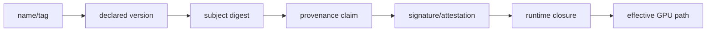
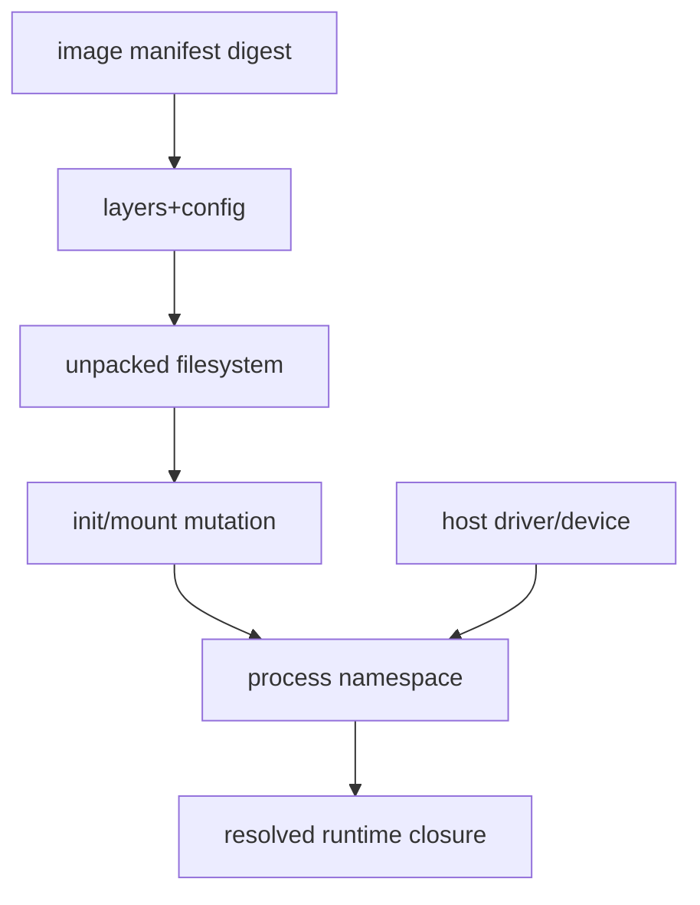
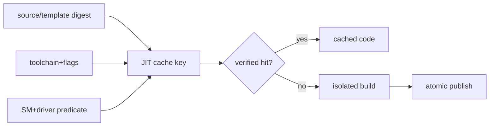
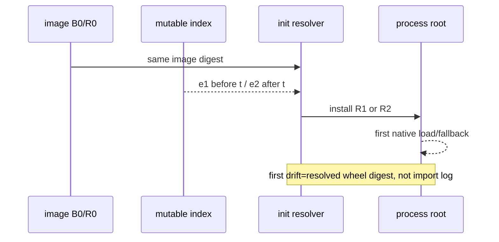
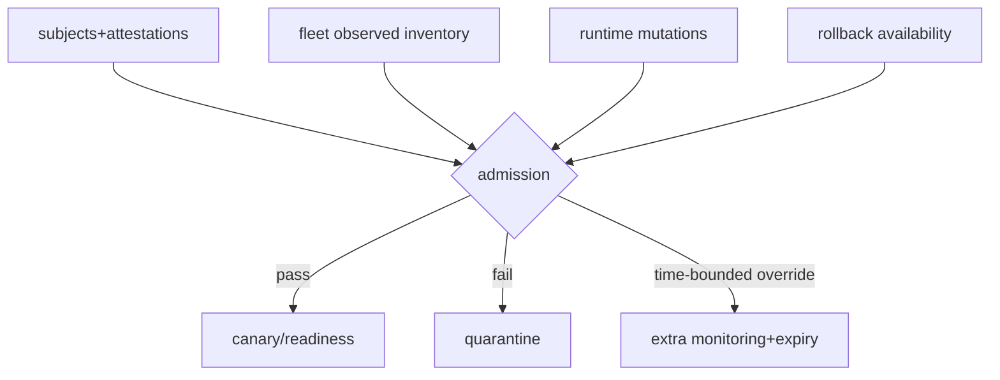

# 76장. 같은 이미지인데 왜 다른 코드를 실행했나: 바이너리에서 GPU까지 배포 폐쇄성을 증명하기

S76 사건은 모순처럼 시작했다. 승인 시스템에는 같은 image digest가 기록돼 있었고 모든 replica가 같은 Python package
version을 출력했다. 그런데 일부 node에서만 attention extension이 탈락하고 느린 fallback이 선택됐다. 재배포해도 node
pool에 따라 증상이 갈렸다. “같은 image면 같은 실행”이라는 전제가 틀렸지만, 어느 범위까지 틀렸는지는 아무도 설명하지
못했다.

조사에서 세 mutable input이 드러났다. 한 node pool은 host-mounted driver library 경로가 달랐다. Init 단계는 network
index에서 optional wheel을 다시 설치했다. 여러 release가 release·toolkit·SM 구분 없이 같은 writable JIT cache를 썼다.
Image digest는 거짓이 아니었다. 다만 image 밖에서 실행을 결정한 bytes와 capability가 배포 identity에서 빠져 있었다.

이 장은 package 설치 안내서가 아니다. 승인한 source에서 실제 GPU path까지
`source→resolution→build→native payload→wheel→image→runtime loader→device capability→effective backend`를 digest와
predicate로 잇는다. 이름·version·digest·provenance·signature·runtime evidence를 가르고, drift의 최초 경계와 안전한
rollback set을 독자가 직접 만들게 한다.

첫 독자는 76.1의 identity 층, 76.4~76.8의 wheel→image→loader→JIT drift와 76.12의 rollback만 따라가면
S76을 이해할 수 있다. 76.2~76.3은 build를 감사할 때, 76.9~76.11은 fleet admission을 설계할 때
돌아오는 응용편이다. 76.13의 YAML과 여덟 사건표는 선형 tutorial이 아니라 실제 검토용 reference다.
Package·digest·build ID를 처음부터 모두 외우지 않는 이유는 간단하다. 독자가 먼저 알아야 할 것은
“어느 immutable subject 뒤에 어떤 mutable owner가 붙어 effective GPU path를 바꿨는가”이며, 좌표는 그
first drift를 증명할 때만 가치가 있기 때문이다.

**현장 사건: 같은 이미지에서 다른 wheel·JIT·kernel이 실행됐다.**


**증상에서 시작하되 package version을 원인으로 착각하지 않는다.**

월요일 배포 R18은 동일한 release workflow에서 한 번 만들어졌고 운영 화면에는 모든 pod가 `serve:2026.08.18`을 실행한다고 표시됐다. Python에서 조회한 serving package와 attention extension의 version도 각각 같았다. 그런데 새 node pool B에서는 long-context prefill의 p99가 기존 pool A보다 41% 느렸고 profiler의 kernel name은 generic attention으로 보였다. Error rate와 최종 token sample은 같았다. 팀의 첫 설명은 “새 GPU의 clock이 덜 올라왔다”였지만, 이 설명은 왜 특정 backend만 탈락했는지 예측하지 못했다.

조사자는 먼저 증상을 세 문장으로 분리한다. 관측은 `pool B에서 long-context prefill만 느리다`, 실행 가설은 `optimized kernel이 선택되지 않았다`, 공급망 가설은 `같다고 승인한 build identity 아래 실제 native/device payload가 갈렸다`다. 아직 원인은 아니다. 짧은 prompt와 decode가 정상이라는 사실은 장애가 없다는 뜻이 아니라, 문제 path를 여는 shape predicate가 좁다는 뜻이다. 따라서 비교 workload는 model, tokenized input, batch composition, cache state와 graph mode를 맞추고 optimized backend가 선택돼야 하는 boundary shape를 포함한다.

첫 표에는 선언값과 관측값을 나란히 놓는다. 두 pod의 tag는 같았지만 registry에서 해석한 child manifest digest를 비교하니 A와 B 모두 `sha256:I18`이었다. Pod status의 image ID와 runtime이 pull한 manifest도 일치했다. 이 증거는 “서로 다른 tag 대상” 가설을 닫지만 host mount, init 변경과 JIT artifact까지 같다고 말하지 않는다. 다음으로 image config의 entrypoint와 environment, layer digest를 확인한 뒤 container가 시작한 이후 root와 mount를 별도로 조사한다.

두 pod에서 `importlib.metadata.distribution()`으로 distribution name, version, files와 `direct_url.json` 존재 여부를 읽었다. Version은 같았지만 이것만으로 archive가 같다고 판정하지 않았다. 설치된 `.dist-info/RECORD`와 wheel archive digest, native member digest를 manifest에 연결했다. 여기서 A의 extension `.so` digest는 `N18a`, B는 `N18b`였다. 첫 byte divergence가 확인됐다. “이미지가 같고 package version도 같으므로 build가 같다”는 문장은 이 지점에서 공식적으로 폐기된다.

**관측을 한 단계씩 좁혀 실제 binary가 바뀐 경계를 찾는다.**

왜 같은 image 안의 파일이 달라졌을까. Layer inventory의 extension member는 `N18a`였으므로 registry artifact 자체는 A와 같았다. B의 final root에서만 `N18b`가 나타났다. Pod lifecycle을 시간순으로 펼치자 init container가 `/opt/extensions`에 writable volume을 mount하고 `pip install --upgrade attention-ext==X.Y`를 실행했다. Internal index는 같은 version 문자열의 wheel을 며칠 뒤 다시 게시했고, hash pin이 없던 resolver가 B의 늦은 시작 시각에 새 wheel을 받았다. A는 volume에 남은 이전 wheel을 사용했다. Source commit과 workflow run은 같다는 release 기록이 사실이어도, B가 실행한 wheel은 그 workflow output이 아니었다.

이제 원인을 `pip가 이상했다`로 끝내지 않는다. 최초 통제 실패는 admission 중 network resolution을 허용하면서 expected archive digest를 지정하지 않은 것이다. 두 번째 실패는 final-root manifest가 image layer가 아니라 변경 뒤 filesystem을 검사하지 않은 것이다. 세 번째 실패는 backend readiness가 Python import 성공만 확인하고 native payload target과 selected operator를 확인하지 않은 것이다. 같은 사건에 세 control gap이 있었으므로 wheel을 다시 설치하는 임시 조치만으로 재발이 닫히지 않는다.

ELF 경계를 읽으면 성능 차이가 어떻게 생겼는지 설명할 수 있다. 설치된 extension 경로를 출발점으로 ELF dynamic section의 `NEEDED`, `RPATH`와 `RUNPATH`를 수집하고, 실제 process mapping에서 loader가 선택한 절대 경로를 확인한다. `ldd` 한 번의 출력은 조사 shell의 environment를 반영할 수 있으므로 실행 중 process의 mapping과 loader diagnostic을 함께 보존한다. A의 `N18a`는 image 안의 CUDA runtime dependency와 SM90 cubin을 가졌지만, B의 `N18b`는 build farm의 기본 target 때문에 SM80 cubin과 PTX만 포함했다. Basename과 SONAME은 같아도 device payload가 달랐다.

B의 SM90에서는 native cubin이 없어 PTX JIT 가능성을 검사했다. 공식 CUDA compatibility 문서가 허용 가능성을 설명해도 실제 PTX ISA, driver와 JIT policy의 조합을 대신 검증하지 않는다. B node의 driver는 해당 PTX를 처리할 수 있었지만 운영 정책이 첫 요청 JIT를 막았고 selector는 generic framework path로 내려갔다. 따라서 `optimized extension import 성공`, `CUDA available`, `GPU architecture SM90` 세 관측이 모두 참인 상태에서도 optimized kernel은 실행되지 않았다. 실제 loaded kernel provenance는 extension path·digest, embedded code target, JIT disposition과 request별 selected backend가 합쳐져야 완성된다.

조사의 분기표는 짧고 명확하다. Image child가 다르면 registry promotion과 tag resolution으로 돌아간다. Image는 같지만 final root가 다르면 init·mount·writable layer를 본다. Native file도 같지만 mapping이 다르면 RPATH/RUNPATH, environment와 host driver/plugin mount를 본다. Mapping까지 같고 device code가 다르면 fatbinary extraction과 JIT cache를 본다. 이 모두가 같은데 backend만 다르면 device capability, request shape와 selector predicate로 넘어간다. 각 `same`에는 비교한 digest scope와 process generation을 적는다.

**수정 검증은 파일 복구와 실행 경로 복구를 따로 증명한다.**

Containment는 B pool의 신규 admission을 멈추고 R18의 승인 wheel `W18/N18a`를 content-addressed store에서 복원하는 것이다. 공유 writable extension volume은 격리하고, 이미 시작한 request는 generation별로 drain한다. 단순히 A의 volume을 B에 복사하지 않는다. 그 volume의 provenance와 completeness가 검증되지 않았고 stale JIT·partial install까지 옮길 수 있기 때문이다. 복원 대상은 provenance statement가 가리키는 exact wheel subject와 검증된 image child다.

Immutable fix는 init 단계의 network resolution을 제거하고 image build에서 hash-pinned wheel을 설치하는 것이다. 운영상 runtime plugin 교체가 반드시 필요하다면 plugin bundle을 별 signed subject로 만들고 deployment manifest에 digest를 넣으며 read-only mount한다. Readiness collector는 final root의 wheel member와 native digest를 expected manifest와 비교한다. Python metadata, wheel RECORD, filesystem bytes가 불일치하면 어느 하나를 권위값으로 골라 통과시키지 않고 admission을 실패시킨다.

ELF 검증은 expected `NEEDED`와 symbol version 목록, 허용된 library namespace, 실제 mapping digest/build ID를 비교한다. RPATH와 RUNPATH가 상대 경로나 writable directory를 포함하면 policy disposition이 필요하다. Host-mounted `libcuda`처럼 image에 넣을 수 없는 구성은 금지 대신 fleet predicate로 관리할 수 있다. 이 경우 node inventory의 driver package와 실제 mapped library digest, device/driver capability를 readiness generation에 묶는다. Node가 재이미징되거나 driver가 바뀌면 기존 pass를 재사용하지 않는다.

Device 검증은 archive 안에 `.so`가 존재하는지에서 멈추지 않는다. Approved lane마다 embedded cubin target, PTX ISA와 JIT 허용 여부를 inventory하고, representative fixture가 expected backend와 kernel code disposition을 실제로 선택했는지 기록한다. JIT가 일어나면 generated artifact digest, cache key materials, writer와 completion marker를 남긴다. Cache namespace는 release, extension digest, toolchain/JIT version, flags와 SM을 포함한다. 기존 cache hit만으로 검증하지 않고 cold namespace에서도 같은 output과 path가 나오는지 확인한다.

수정 뒤 A와 B는 image `I18`, wheel `W18`, native member `N18a`, loaded dependency closure `L18`이 일치했다. SM90 fixture에서는 embedded native target이 선택됐고 generic fallback 비율은 0으로 돌아왔다. Long-context prefill p99는 승인 envelope 안에 들어왔으며 boundary correctness fixture도 통과했다. 이 결과는 모든 workload에서 bug가 없다는 주장이 아니다. 이번 사건이 영향을 준 release·pool·shape lane에서 first divergence와 성능 증상이 제거됐다는 제한된 검증이다.

**실행 가능한 manifest는 수집 명령보다 판정 관계가 중요하다.**

현장 collector는 다음 최소 묶음을 만든다. Registry 단계에서는 tag를 server-side에서 digest로 resolve하고 platform별 child manifest와 config/layer digest를 저장한다. Python 단계에서는 distribution name/version, installer·direct URL metadata, archive digest와 RECORD member를 저장한다. Filesystem 단계에서는 installed native files의 content digest, owner, mode와 symlink target을 저장한다.

ELF 단계에서는 build ID, `NEEDED`, SONAME, RPATH/RUNPATH와 symbol version을 저장한다. CUDA 단계에서는 embedded cubin SM, PTX ISA, JIT artifact와 cache namespace를 저장한다. Runtime 단계에서는 process mapping과 request fixture가 선택한 backend/kernel을 저장한다.

명령 이름은 환경에 따라 달라도 manifest의 join key는 유지한다. 모든 관측에는 pod UID, container ID, process start time, node inventory generation, release generation과 수집 시각이 붙는다. 그렇지 않으면 restart 전 filesystem digest와 restart 후 process mapping을 한 실행의 증거처럼 합칠 수 있다. 파일 경로도 join key가 아니다. 같은 경로의 bytes가 바뀔 수 있고 동일 bytes가 다른 경로에서 load될 수 있다. Path, digest, build ID와 loader owner를 함께 쓴다.

SBOM은 archive scan 결과와 final-root scan 결과를 분리한다. 각 component가 어느 file digest를 제공하는지, 그 파일이 wheel member인지 image layer인지 runtime mount인지 relation을 둔다. `libcuda.so`가 SBOM에 없다고 무조건 누락으로 단정하지 않는다. Host driver가 제공하는 runtime dependency라면 image SBOM 밖의 fleet component다. 반대로 SBOM에 extension이 있다고 loaded 증거로 승격하지 않는다. Static inventory와 runtime mapping을 별 주장으로 유지해야 한다.

Manifest admission은 다음 의사코드처럼 읽을 수 있다.

```text
resolve(tag) == approved_child_digest
and installed_wheel_digest in approved_subjects
and native_member_digest == expected_member_digest
and loaded_elf_closure satisfies allowed_paths_symbols_build_ids
and device_code covers observed_SM_or_validated_JIT
and selected_backend(fixture) == expected_backend
and no_unknown_runtime_mutation
```

한 항목이 false면 fail이고 관측하지 못했다면 unknown이다. Unknown을 false와 구분하는 이유는 대응이 다르기 때문이다. False는 불일치를 containment하고, unknown은 collector 권한·parser·coverage를 복구한다. 그러나 둘 다 production admission을 자동 통과하지 않는다. Exception이 필요하면 affected lane, compensating fixture, owner와 expiry를 서명된 override에 둔다.

**SBOM과 rollback checklist를 운영자가 실제로 닫는 순서.**

배포 전 checklist의 첫 묶음은 artifact다. Tag가 아닌 index/child digest를 승인했고, wheel archive와 설치 member digest가 provenance subject와 맞으며, source tree·patch·lock·builder materials가 닫혔는지 확인한다. Native inventory에는 ELF ABI와 device target이 production fleet를 덮는지 적는다. 같은 version의 다른 artifact를 repository가 허용한다면 digest 없는 resolver를 hard fail로 둔다.

두 번째 묶음은 runtime이다. Init와 entrypoint가 filesystem을 바꾸는지, writable mount와 library search path의 owner가 누구인지 확인한다. Process mapping이 allowed ELF closure와 일치하고 lazy plugin을 여는 fixture가 실행됐는지 본다. JIT cache key와 namespace, atomic publish, output sidecar와 eviction policy를 검토한다. GPU lane별 driver/library mapping, SM과 selected kernel provenance가 readiness record에 있어야 한다.

세 번째 묶음은 복구다. Known-good image만 적지 않고 wheel/plugin/model bundle, runtime config, driver-compatible fleet, JIT namespace와 state generation을 rollback set으로 묶는다. Artifact store에서 cold pull·signature verification·offline install을 rehearsal한다. 격리 lane에서는 init/mount/loader closure를 재구성한다. 마지막으로 representative와 boundary fixture를 실행해 expected backend, correctness와 performance envelope를 확인한다. 세 rehearsal의 timestamp가 rollback window 안에 있어야 한다.

S76의 rollback은 R18 tag를 다시 deploy하는 명령이 아니었다. 그 tag 아래에서 이미 서로 다른 wheel이 실행됐기 때문이다. Rollback target은 `I17+W17+N17+L17+J17+G17`처럼 닫힌 generation이다. Router는 새 admission을 fence하고 R18 inflight를 drain하며 shared JIT namespace를 새 요청에서 분리한다. R17 final root와 loader mapping을 확인한 뒤 canary를 연다. R18 wheel과 JIT residue가 0이거나 명시한 quarantine bound에 들어왔을 때만 rollback terminal을 닫는다.

사건 종료 문장에는 원인과 증거 경계가 함께 들어간다. “동일 image `I18`의 B replica가 hash 없이 init resolution을 수행해 동일 version의 비승인 wheel `W18b`와 native payload `N18b`를 설치했고, SM90 cubin 부재와 JIT policy 때문에 generic fallback을 선택했다. Network resolution을 제거하고 `W18/N18a`를 고정했으며 final-root·ELF mapping·device target·fixture provenance가 A/B에서 일치했다. Known-good R17 rollback set은 cold artifact, runtime closure와 kernel fixture rehearsal을 통과했다.” 이 정도로 구체적이어야 다음 독자가 “같은 빌드”라는 말 대신 어느 bytes와 어느 실행 generation이 같았는지 질문할 수 있다.

**명령 출력은 그대로 붙이지 말고 증거 단위로 정규화한다.**

실제 조사에서는 registry client, Python metadata API, `readelf`, `objdump`, CUDA binary inspection 도구와 process mapping을 사용하게 된다. 중요한 것은 특정 명령을 외우는 일이 아니라 각 출력이 어느 주장을 지지하는지 구분하는 일이다. Registry 조회는 tag가 가리킨 manifest와 platform child를 증명한다. Python metadata는 distribution 선언과 설치 파일 목록을 보여 준다. ELF 도구는 정적 dependency와 search hint를 보여 주며, 실행 중 mapping은 loader가 실제 선택한 object를 보여 준다. Device-code inventory는 포함된 후보를 보여 주고 fixture trace는 실제 선택을 보여 준다.

예를 들어 다음과 같은 조사 순서를 runbook에 둘 수 있다.

```text
1. registry의 tag → index digest → platform child digest를 해석한다.
2. pod UID·container ID·node generation을 고정하고 final root를 snapshot한다.
3. distribution metadata → wheel subject → RECORD member → installed file digest를 잇는다.
4. native file의 build ID·NEEDED·RPATH/RUNPATH·symbol version을 수집한다.
5. 같은 process generation의 loaded mapping과 host mount owner를 수집한다.
6. cubin/PTX target, JIT cache key·output digest와 GPU/driver inventory를 연결한다.
7. boundary fixture의 selected backend·kernel과 correctness/performance 결과를 기록한다.
```

각 단계는 이전 단계의 identifier를 입력으로 받아야 한다. 별도 시간에 사람이 복사한 package version과 node 이름만으로 join하지 않는다. Collector output은 raw evidence, normalized record와 판정을 분리한다. Raw output은 도구 버그나 parser 변경 때 재해석할 수 있도록 보존하고, normalized record에는 schema version을 둔다. 판정에는 required predicate, observed value, pass/fail/unknown과 근거 record digest를 넣는다.

도구 실패도 결과다. 권한 부족으로 process mapping을 읽지 못했거나 fatbinary parser가 새로운 형식을 해석하지 못했다면 “차이 없음”이 아니다. 해당 edge를 unknown으로 표시하고 affected lane을 격리하거나 독립 도구와 canary로 보완한다. 반대로 여러 도구가 같은 basename을 출력했다고 동일성을 선언하지 않는다. 가능한 곳에서는 content digest와 build ID를 비교하고, driver처럼 변경 가능한 fleet component에는 관측 generation과 허용 predicate를 붙인다.

마지막 diff packet은 거대한 로그 묶음이 아니라 최초 불일치를 중심으로 구성한다. `I18 same`, `final-root different`, `wheel W18a/W18b different`, `native N18a/N18b different`, `SM90 target present/absent`, `selected optimized/generic`처럼 한 줄씩 내려간다. 각 줄은 원 raw record로 돌아갈 수 있다. 이 배열은 경영진에게는 원인과 영향 범위를 짧게 보여 주고, 엔지니어에게는 재현과 수정 검증의 정확한 시작점을 제공한다.

수집 시점도 계약에 넣는다. Image와 wheel은 admission 전, final root와 loader mapping은 init 완료 뒤 첫 요청 전, JIT와 selected kernel은 boundary fixture 직후 수집한다. Lazy load가 있는 서비스는 readiness 한 번으로 끝내지 않고 해당 feature의 first-use generation에 record를 추가한다. Autoscaling으로 새 pod나 node가 들어오면 기존 replica의 증거를 복사하지 않는다. 새 admission incarnation은 image pull, mount, driver mapping과 cache 상태가 다시 결정되는 별 사건이다.

보존 기간은 장애 회고 기간보다 rollback window와 release overlap을 기준으로 잡는다. Raw mapping과 환경에는 민감한 경로가 포함될 수 있으므로 접근을 제한하되, digest·owner·generation relation을 지워서는 안 된다. 개인정보나 secret value는 평문 대신 승인된 reference와 검증 가능한 digest로 남긴다. Evidence packet을 삭제할 때도 어떤 판정의 재현성이 사라지는지 기록한다. 이렇게 해야 운영 비용을 줄이면서도 다음 node pool에서 같은 drift가 발생했을 때 과거의 `same`과 현재의 `different`를 정확히 비교할 수 있다.

마지막으로 collector 자체의 version과 digest도 packet에 넣는다. 서로 다른 parser가 같은 fatbinary나 ELF field를 다르게 해석할 수 있기 때문이다. Collector upgrade 전후 결과가 달라지면 artifact drift와 observation drift를 분리하고, 보존한 raw bytes를 양쪽 parser로 다시 읽어 first divergence를 판정한다.

## 76.1 배포 identity는 이름 하나가 아니라 폐쇄된 주장 집합이다

### 76.1.1 tag와 version이 답하지 못하는 질문

`v0.27.1`, `cu13`, `latest`와 image tag는 사람이 찾기 좋은 label이다. Producer가 선언한 version은 release coordinate다.
둘 다 bytes가 같은지 증명하지 않는다. 같은 version으로 wheel을 다시 올릴 수 있고, tag가 다른 manifest를 가리킬 수 있으며,
local patch를 적용한 build도 원래 version 문자열을 유지할 수 있다. Incident 기록에서 label은 lookup 단서이지 identity
terminal이 아니다.

Digest는 관측한 byte sequence의 identity를 강하게 묶는다. 그러나 그 bytes가 안전한지, 누가 만들었는지, 어떤 source와
compiler가 들어갔는지는 말하지 않는다. Provenance는 build input과 process에 관한 주장이고 signature/attestation은 그
주장을 subject digest와 인증 가능한 방식으로 묶는다. 검증자는 signer 신뢰와 predicate 의미까지 평가해야 한다.

### 76.1.2 runtime evidence가 마지막 층인 이유

SBOM에 `libfoo.so`가 있고 wheel 안에 extension이 있어도 process가 그것을 load했다고 증명되지 않는다. Lazy import가
실행되지 않았거나 dynamic loader가 host-mounted 동명 library를 먼저 골랐거나 backend selector가 capability guard에서
탈락할 수 있다. 마지막 질문은 “파일이 있나”가 아니라 “이 process generation의 이 request가 어느 path·build ID·symbol을
선택했나”다.



### 76.1.3 S76의 반증 가능한 질문

“같은 image인데 왜 다르지?”를 “동일 manifest digest에서 어떤 admission mutation, mounted bytes, loader resolution,
JIT namespace 또는 device predicate가 처음 갈렸는가?”로 바꾼다. Falsifier는 두 replica의 final filesystem digest,
resolved shared-object build ID, JIT artifact와 GPU/driver predicate가 모두 같고 동일 request에서 operator도 같은 경우다.
그때는 fallback label join 또는 workload 차이로 축을 옮긴다.

사건을 시작할 때 다섯 identity를 한 표에 놓는다. `claimed`는 deployment manifest가 약속한 값, `observed`는 replica에서
수집한 값, `owner`는 그 값을 바꿀 수 있는 주체, `lifetime`은 값이 고정되는 구간이다. Image manifest는 registry/build
owner가 만들고 pod lifetime 동안 고정되지만 host driver mount는 node/runtime owner가 pod admission 때 정한다. JIT
artifact는 process가 첫 shape를 만났을 때 생길 수 있다. 모두 “배포 버전”이라는 한 열에 넣으면 first drift가 사라진다.

표의 비교 축은 artifact 종류가 아니라 claim이 고정되는 lifetime이다. 대표 행은 runtime closure다. Image 행이
동일해도 pod admission에서 host mount와 init mutation이 달라지면 이 행에서 처음 갈리고, execution 행의 backend
차이는 그 결과다. 반대로 runtime closure까지 같고 execution만 다르면 request shape나 selector predicate를 본다.
이렇게 처음 달라진 행을 찾으면 “이미지가 같으니 option 문제”와 “fallback이니 wheel 누락”이라는 두 성급한
가설을 모두 반증할 수 있다.

| identity layer | claimed evidence | observed evidence | owner/lifetime |
|---|---|---|---|
| source/build | revision·materials·provenance | subject digest binding | release/build run |
| wheel/native | archive/member digest·target | installed path·build ID | environment creation |
| image | index/manifest/layer digest | pulled child manifest | pod image lifetime |
| runtime closure | mount·library·JIT policy | resolved path·artifact digest | node/process generation |
| execution | allowed capability/path | selected backend/operator | request/shape generation |

Digest 비교도 scope를 명시한다. OCI manifest digest와 unpacked root digest는 다른 bytes를 hash한다. Wheel archive digest와
installed `.so` digest도 다른 subject다. 같은 SHA-256 문자열 형식을 쓴다고 상호 대체되지 않는다. Manifest에는 algorithm,
canonicalization 또는 raw byte scope와 media type을 적는다. Directory hash를 자체 정의한다면 path normalization, metadata,
symlink와 ordering 규칙을 versioned schema로 고정한다.

Threat-model recommendation과 specification fact를 구분한다. OCI가 descriptor digest를 정의한다는 것은 규격 사실이다.
조직이 unapproved writable search path를 readiness에서 거부하는 것은 S76 위협 모델에 따른 정책이다. 둘을 섞으면 규격이
보장하지 않는 security claim을 만들거나, 반대로 필요한 local control을 “표준에 없음”이라는 이유로 빼게 된다.

## 76.2 container digest는 filesystem과 실행 기본값만 묶는다

### 76.2.1 OCI descriptor가 보장하는 범위

OCI Image Spec v1.1.1의 [descriptor·manifest 구조](https://github.com/opencontainers/image-spec/blob/147f9c13cedb47a0c4d9a11a222961073d585877/manifest.md#L18-L45)는
content digest로 config와 layer를 참조한다. Manifest digest를 고정하면 그 descriptor graph의 bytes는 묶이지만 host
driver, device, runtime mount와 admission-time download는 포함되지 않는다. Image index를 쓴다면 platform별 child manifest
digest까지 deployment subject로 해석해야 한다.

### 76.2.2 layer와 final filesystem을 함께 본다

Base image와 각 layer digest, package install·COPY 단계, entrypoint와 image environment를 기록한다. Layer history만 보면
뒤 layer의 whiteout/overwrite를 놓칠 수 있으므로 final path digest inventory를 만든다. 반대로 final filesystem만 보면
어느 build step이 unpinned download를 만들었는지 provenance를 잃는다. 두 view가 모두 필요하다.

### 76.2.3 S76의 image 동일성은 어디까지 참이었나

두 pod의 manifest와 image layers는 같았다. 따라서 drift는 pull 이전 source/build가 아니라 runtime boundary에 있었다.
이 negative evidence는 조사 범위를 줄인다. 그러나 init install이 writable layer를 바꿨으므로 readiness 시점의 final
filesystem은 달랐다. Image ID를 다시 출력하는 것은 이 mutation을 관측하지 못한다.

OCI image index가 multi-platform child를 가리킬 때 “같은 tag”뿐 아니라 “같은 index digest”도 최종 filesystem 동일성을
뜻하지 않는다. Runtime은 OS/architecture와 descriptor matching으로 child manifest를 선택한다. 배포 manifest에는 index
digest와 expected platform→child digest mapping을 함께 둔다. GPU architecture는 OCI platform architecture와 별 predicate일
수 있으므로 `linux/amd64` child 하나가 SM80·SM90 code coverage를 자동 표현하지 않는다.

Layer digest와 `diff_id`도 같은 대상이 아니다. Registry가 운반하는 compressed layer blob의 digest, unpacked filesystem
changeset identity와 final merged root는 구분한다. Incident에서 어떤 digest를 비교했는지 명시하지 않으면 “layer가
같다”는 문장이 재현되지 않는다. Verification tool이 지원하는 규격 scope를 사용하고 임의 hash를 도입하면 schema version과
canonicalization을 manifest에 넣는다.

Image build 단계의 package install이 exact wheel digest를 썼더라도 apt/system package index가 floating이면 native closure가
달라질 수 있다. Base image digest, OS repository snapshot과 selected package artifact를 material에 포함한다. Build cache가
명령 문자열만 key로 삼고 remote repository state를 material로 보지 않으면 같은 Dockerfile에서 다른 layer가 생긴다.
최종 layer digest가 차이를 잡지만 provenance가 없으면 원인을 찾기 어렵다.

Entrypoint와 environment도 실행 bytes를 바꿀 수 있다. Command override가 다른 launcher를 고르거나 environment가
`LD_LIBRARY_PATH`, backend choice, JIT flags를 바꾸면 filesystem이 같아도 path가 갈린다. Image config의 default와 workload
spec의 effective override를 별 generation으로 저장한다. Secret 값 자체를 노출하지 않으면서 behavior-affecting config의
version과 approved hash를 비교한다.



## 76.3 wheel은 ZIP 파일이 아니라 설치 계약과 native closure다

### 76.3.1 filename tag와 archive digest를 분리한다

Wheel filename은 distribution, version, 선택적 build tag, Python·ABI·platform tag를 담는다. Tag는 compatibility 후보를
표현하지만 payload identity가 아니다. [Python wheel 규격](https://packaging.python.org/en/latest/specifications/binary-distribution-format/)에
따라 archive whole-file digest, `WHEEL`, `METADATA`, `RECORD`와 member를 보존한다. `RECORD` 자신 등을 제외한 archive file은
secure hash로 열거되지만, 설치 뒤 경로와 생성 파일은 다시 관측해야 한다.

### 76.3.2 같은 version의 두 wheel drift

Index A와 B가 같은 name/version/tag wheel을 제공해도 whole digest와 native member가 다를 수 있다. Drift diff는 filename,
archive digest, member set, `.so` digest/build ID와 embedded target을 비교한다. Version만 같다는 이유로 mirror를 상호
대체하지 않는다. Resolver lock은 index identity와 digest를 함께 고정한다.

| 주장 | replica A | replica B | 첫 drift | 영향 |
|---|---|---|---|---|
| package version | 동일 | 동일 | 아님 | 불충분한 label |
| wheel digest | `wa` | `wb` | resolution | native bytes 미일치 |
| extension member | 존재 | 누락/다름 | archive | import 또는 backend fallback |
| device target | SM90 포함 | PTX만 | payload | JIT/driver predicate 변화 |

### 76.3.3 install environment가 archive를 다시 변환한다

Installer는 wheel을 unpack/spread하고 script path를 재작성하며 installed `RECORD`를 갱신할 수 있다. Installed file digest와
origin wheel을 대조하고 interpreter·site-packages path를 기록한다. Editable install, `.pth` injection, namespace shadowing과
runtime compile은 production closure를 깨므로 거부하거나 별 development lane으로 분리한다. `pip freeze`는 installed
file origin과 native payload를 증명하지 않는다.

Installed environment closure는 `sys.path` 순서와 import origin을 포함한다. 같은 distribution의 `.dist-info`가 하나 보여도
앞선 path에 동명 top-level module이나 `.so`가 있으면 shadowing이 가능하다. `.pth`가 임의 경로를 삽입하거나 startup code를
실행할 수도 있다. Production manifest는 허용 site directory, `.pth` member와 module→origin mapping을 보존한다. Unknown
path가 나타나면 import 성공 여부와 상관없이 quarantine한다.

Wheel `RECORD` 검증은 archive가 담은 member integrity에 강하지만 설치 뒤 모든 상태를 자동 증명하지 않는다. Installer가
생성한 `.pyc`, script wrapper와 installed `RECORD`, 후속 package가 덮어쓴 shared namespace를 보아야 한다. Native library가
wheel 밖 dependency를 동적으로 resolve하면 그 bytes는 wheel RECORD 범위 밖이다. 그래서 archive subject, installed file
set과 runtime closure의 세 digest graph를 분리한다.

Optional backend extra 누락 사건은 short smoke test를 통과하기 쉽다. Core import와 short decode는 built-in backend를 쓰고,
long-context prefill에서만 optional extension selector가 필요할 수 있다. Fixture matrix는 import, first native load,
short-decode, long-prefill, quantized/adapter lane을 갖는다. Static manifest는 각 lane이 요구하는 wheel member와 symbol을
제시하고, 실제 canary는 별 승인 단계에서 effective path를 확인한다.

Rollback wheel도 현재 index에서 다시 resolve하지 않는다. 승인 당시 archive와 transitive artifacts를 content-addressed
store에 보존한다. Index가 yanked metadata나 dependency를 바꾸면 같은 requirement command가 과거 closure를 재구성하지
못한다. Isolated install rehearsal은 network가 아닌 보존 bundle만 사용하고 installed file digest가 reference manifest와
일치하는지 확인한다.

## 76.4 dynamic loader에서 실제 `.so`와 symbol을 확정한다

### 76.4.1 `LD_LIBRARY_PATH`는 runtime dependency resolver다

ELF `NEEDED`, RPATH/RUNPATH, loader cache, `LD_LIBRARY_PATH`와 preload가 실제 path를 결정한다. Container의 `libcudart`,
host-mounted `libcuda`, NCCL core와 network plugin, system libc를 소유자별로 가른다. Expected library basename만 비교하지
않고 canonical path, device/inode 또는 content digest와 build ID를 관측한다.

### 76.4.2 drift diff 3: 같은 image, 다른 driver mount

Node pool A와 B의 image는 같지만 device plugin/runtime이 서로 다른 host user-mode driver library를 주입했다. Process가
resolve한 `libcuda.so` path와 build ID에서 first drift가 나타난다. Toolkit runtime version 로그만으로는 이 차이를 못 본다.
Allowed fleet predicate가 driver branch와 symbol requirement를 수용하는지 판정하고, 아니면 node admission을 거부한다.

Actual bytes 비교는 host package version만 보지 않는다. Container namespace에서 process가 mapping한 canonical path,
content digest/build ID와 kernel-mode driver generation을 수집한다. Node A는 expected host injection `dA`, node B는 stale
compatibility path `dB`를 `LD_LIBRARY_PATH` 앞에서 선택할 수 있다. `nvidia-smi`가 보여 주는 한 version과 process mapping이
가리키는 user-mode library는 같은 관측이 아니다.

최초 불일치는 pod spec보다 node runtime의 mount/resolution이다. Image child, final root와 Python wheel이 같다는 negative
evidence로 build 축을 닫고, effective environment와 loader map에서 첫 차이를 찾는다. Extension selector가 fallback한 것은
capability 영향이다. Containment는 dB node lane을 cordon/quarantine하고 해당 closure에서 이미 시작한 process를 drain하는
것이다. Library 파일만 hot-swap하면 기존 process mapping은 바뀌지 않을 수 있어 재시작 generation을 요구한다.

Immutable fix는 driver branch라는 label이 아니라 allowed `(kernel driver generation, user-mode build ID, compat package,
device SKU, required symbols/features)` predicate다. Node admission collector와 application readiness가 같은 inventory ID를
참조한다. Rollback은 old image를 띄우는 일이 아니라 old image가 승인됐던 compatible driver lane을 확보하고 expected
backend canary를 통과하는 일이다. Old compatible nodes가 모두 decommission됐다면 rollback set은 존재하지 않는다.

CUDA 12.x→13.x 전환에서는 최소 driver 경계만 통과했다고 끝내지 않는다. 13.x payload가 새 PTX ISA 또는 driver API를
요구하는지, target cubin이 해당 SM을 포함하는지 확인한다. 12.x image rollback이 newer driver의 backward compatibility로
가능한지 별 lane에서 검증한다. Compatibility 문서의 major family 표는 후보를 좁히지만 application symbol과 device path를
대신 검증하지 않는다.

### 76.4.3 import success와 first native load를 분리한다

Python module import는 lazy extension을 load하지 않을 수 있다. Manifest에는 import origin path, extension load owner,
expected shared object와 backend selector predicate를 넣는다. 실제 production fixture가 해당 feature를 처음 사용할 때 load된
library와 symbol을 기록한다. 단, 이 장에서는 runtime을 실행하지 않고 수집 계약만 정의한다.

Loader resolution을 static inventory와 runtime observation으로 나눈다. Static에는 extension의 `NEEDED`, RPATH/RUNPATH,
symbol version requirement와 expected search policy가 있다. Runtime에는 process namespace에서 선택된 canonical path,
build ID와 mapping generation이 있다. Static expectation이 같아도 mount와 environment가 다르면 runtime 결과가 갈린다.
Runtime path가 같아도 파일이 bind-mount로 바뀌었을 수 있으므로 digest/build ID를 함께 본다.

NCCL plugin은 특히 늦게 load될 수 있다. Core NCCL library가 같다는 사실은 network plugin과 transport path가 같다는 뜻이
아니다. Rank별 loaded plugin, interface/topology predicate와 selected transport를 비교한다. 일부 rank만 plugin이 다르면
collective는 fallback하거나 hang할 수 있다. 71장의 rank×sequence ledger로 넘길 때 supply-chain identity를 rank dimension에
붙인다.

RPATH와 RUNPATH의 의미를 이름만 보고 단정하지 않는다. Loader 규칙, direct/transitive dependency와 environment override가
어떻게 적용되는지 대상 libc/loader 규격에 맞춰 검증한다. 이 장의 manifest는 effective resolution을 저장하며 특정 ELF
규칙을 모든 platform에 일반화하지 않는다. Static tool이 parse하지 못한 binary format은 unknown lane으로 남긴다.

Driver library는 container image 밖에서 들어오는 대표 input이다. User-mode library path와 kernel-mode driver compatibility를
구분한다. Forward compatibility package를 image에 넣었어도 loader path에 추가되지 않으면 소비되지 않는다. 반대로 path가
선택됐어도 device가 지원하지 않으면 공식 error predicate에서 실패할 수 있다. “compat package installed”는 세대 사슬의
중간 상태일 뿐이다.

## 76.5 JIT cache와 device code는 release namespace를 가져야 한다

### 76.5.1 cubin·PTX·JIT는 서로 다른 compatibility path다

Native payload가 target SM의 cubin을 가지면 그 code object path를, PTX만 있으면 driver JIT capability와 version을 본다.
Framework가 runtime source compile을 수행하면 template/source, compiler flags와 toolchain도 material이다. “CUDA 13 지원”
한 줄로 세 경로를 합치지 않는다.

### 76.5.2 drift diff 4: 공유 JIT cache

Release R2가 R1과 같은 cache key namespace를 사용해 R1 artifact를 읽었다. File은 존재하고 load도 성공했지만 source digest,
toolkit, flags 또는 SM이 다르다. First drift는 cache lookup key가 material identity를 충분히 포함하지 않은 지점이다.
Containment는 release별 namespace를 격리하고 stale entry를 읽지 않게 하는 것이다. 무조건 cache를 지우면 fleet 전체에
compile storm이 생길 수 있어 staged warmup과 capacity를 준비한다.

Actual artifact ledger에는 cache pathname보다 key schema version, full material digest, output digest, writer release/process와
publish completion을 둔다. R2 expected key material은 source `s2`, toolkit `t2`, flags `f2`, SM90인데 observed sidecar가
`s1/t1/f1/SM90`이면 stale reuse가 확정된다. Sidecar가 없으면 provenance unknown이며 성공적으로 load됐어도 admission
evidence가 아니다.

처음 갈라지는 곳은 lookup code가 release/source/toolkit material을 key에 넣지 않은 지점이다. Kernel 결과가 틀리거나 느린
것은 뒤의 impact다. Containment는 suspect namespace를 read-only quarantine하고 R2를 새 namespace에서 build하게 한다.
Global cache delete는 R1 rollback artifact까지 없애고 모든 replica를 simultaneous compile로 몰 수 있어 피한다. Affected
request와 loaded artifact digest를 evidence packet에 남긴다.

Immutable fix는 versioned key schema와 atomic publish, sidecar verification이다. Rollback terminal은 R1 namespace가 보존되고
R1 manifest의 material/output digest가 맞으며, R2 writer가 그 namespace를 수정할 수 없고, old canary가 expected code path를
선택하는 상태다. Cache capacity와 expiry는 rollback window보다 길어야 한다. Old namespace를 보존했다는 config만 있고
artifact가 eviction됐다면 rollback proof가 아니다.

세 incident의 containment가 다른 이유가 선명해진다. Init drift는 artifact resolution network를 닫고 pod bytes를 교체한다.
Driver drift는 incompatible node lane과 process mapping을 제거한다. JIT drift는 shared mutable state의 key/publish ownership을
격리한다. 모두 “재시작”으로 잠시 사라질 수 있지만 immutable boundary를 고치지 않으면 다음 rollout에서 재발한다.

### 76.5.3 cache key의 최소 구성

Key에는 generated source/template digest, compiler/toolkit/JIT version, flags, target SM, relevant framework/backend revision과
ABI generation을 넣는다. Artifact sidecar에는 같은 metadata와 output digest를 저장하고 lookup 뒤 검증한다. Shared volume은
writer ownership, atomic publish와 partial artifact cleanup을 가져야 한다.

JIT cache hit를 성능 metric으로만 보면 stale reuse를 놓친다. Hit마다 full key material digest와 artifact sidecar match를
검증하고 mismatch는 miss로 강등한 뒤 suspect entry를 quarantine한다. Partial write는 temp namespace에서 생성하고 fsync·
rename 등 저장소가 제공하는 atomic publish contract를 따른다. Writer가 crash한 temp artifact와 published artifact를
구분한다.

Release R1과 R2의 backend source digest가 다르지만 cache key가 함수 이름과 SM만 포함했다고 하자. R2 첫 request가 R1
artifact를 hit하면 first drift는 compiler가 아니라 key construction이다. Runtime operator symbol은 예상 이름과 같을 수
있어 profiler만으로 드러나지 않는다. Sidecar source/flags digest와 loaded code digest를 expected manifest와 비교해야 한다.

Cache namespace를 새로 만들 때 capacity를 계산한다. 기존 cache 200 GiB, 새 release warm set 120 GiB, 동시 rollback을 위해
old 200 GiB를 보존한다면 rollout 동안 최소 320 GiB와 temp headroom이 필요하다. Volume 300 GiB에서 무계획 namespace
분리는 eviction 또는 build failure를 만든다. Warm set 우선순위, quota와 old namespace expiry를 rollback window에 맞춘다.

Graph cache, compiled extension cache와 model engine cache를 모두 “JIT cache”로 합치지 않는다. Key materials와 consumer,
correctness impact가 다르다. Graph는 pointer/shape generation, extension은 source/toolchain/SM, autotune result는 device와
shape·library version을 요구할 수 있다. Manifest의 cache 배열은 kind별 schema와 invalidation policy를 가진다.



## 76.6 fleet compatibility는 digest가 아니라 predicate로 승인한다

### 76.6.1 immutable subject와 mutable inventory를 가른다

GPU UUID/SKU/SM, MIG mode, driver/kernel, PCI BDF·NUMA, NVLink/NIC topology와 peer capability는 image digest에 넣을 수 없다.
대신 lane별 required predicate와 admission-time observed inventory를 분리한다. `H100 lane: SM90 cubin 또는 검증된 PTX/JIT,
driver branch D 이상, required peer topology`처럼 실행 path까지 명시한다.

### 76.6.2 일부 replica fallback을 denominator 문제로 본다

Fleet coverage는 “지원 GPU 종류 수”가 아니라 production replica/traffic lane 중 predicate를 만족하는 비율이다. 100 nodes
가운데 20개가 다른 driver mount라면 image coverage 100%와 runtime closure coverage 80%를 분리한다. Backend selected
ratio도 model·shape cohort와 node lane을 denominator로 둔다.

### 76.6.3 새 node pool은 새 compatibility generation이다

Application image가 같아도 driver rollout, GPU SKU 추가, MIG 변경과 topology 변경은 새 generation이다. Canary fixture는
native load, representative prefill/decode backend, collective/plugin과 correctness signature를 lane마다 검증한다. Runtime
실행 승인은 별 deployment 단계에서 수행하며 이 장의 정적 manifest는 필요한 fixture와 expected path를 제공한다.

Fleet predicate는 broad version range보다 feature requirement에서 출발한다. Required backend가 특정 SM instruction,
driver API symbol, peer memory capability와 NCCL transport를 요구하면 각각 observed inventory에 대응시킨다. Driver number가
범위 안이어도 feature가 disabled되거나 MIG/topology에서 peer path가 없을 수 있다. Admission은 number match 뒤 capability
probe contract를 요구한다.

Coverage matrix에는 `native`, `PTX/JIT`, `validated fallback`, `unsupported` 네 disposition을 둔다. Native는 target cubin과
loader closure가 맞는 lane, JIT는 PTX/toolchain predicate를 검증한 lane, fallback은 성능·correctness envelope를 승인한 lane,
unsupported는 traffic을 받지 않는 lane이다. Fallback을 지원으로 합산하면 S76처럼 일부 replica의 성능 drift를 정상
coverage로 숨긴다.

Topology는 single-rank attention extension과 무관해 보여도 distributed backend selection에 영향을 준다. BDF/NUMA,
NVLink/NVSwitch와 NIC mapping이 달라지면 communication plugin과 graph capture 조건이 갈릴 수 있다. Image가 동일한 node
pool 추가를 application 변경이 아니라고 취급하지 않는다. Source→GPU manifest의 fleet predicate generation을 새로
승인한다.

Canary denominator도 lane별로 둔다. 전체 1,000 request에서 fallback 1%라는 값은 새 pool 100 request 중 10% fallback을
숨길 수 있다. `image child × wheel closure × driver build × GPU/MIG lane × request shape` cohort에서 selected backend와
correctness/latency를 본다. Label cardinality가 크면 bounded inventory ID를 사용하고 상세 identity는 trace/evidence packet에
둔다.

## 76.7 source commit에서 dependency closure까지 잠근다

### 76.7.1 commit은 repository working tree 전체가 아니다

Core commit과 submodule/vendor commit, patch set, generated source, fetched archive와 build script를 각각 material로 둔다.
`git rev-parse`가 같아도 dirty patch, untracked generated file, submodule checkout과 build-time download가 다르면 입력 bytes가
다르다. Source archive를 subject로 삼으면 archive digest와 extraction policy까지 기록한다. 검사하지 못한 생성물은
`absent`가 아니라 `unknown`이다.

### 76.7.2 direct requirement보다 resolver 결과가 중요하다

Lock은 package 이름과 compatible range만 저장하지 않는다. 선택된 transitive artifact의 index namespace, URL, filename,
version, wheel tag와 digest를 저장한다. Build dependency와 runtime dependency를 분리하고, optional backend extra가 어느
production lane에 필요한지 연결한다. Floating VCS branch, mutable `latest`, 무제한 range와 hash 없는 remote artifact는
release input에서 거부하거나 명시적 exception으로 남긴다.

Python packaging의 [version specifier 규격](https://packaging.python.org/en/latest/specifications/version-specifiers/)은 direct
URL에 secure transport와 expected hash를 권고한다. 여기서 조직 정책은 더 강할 수 있다. Production resolution은
“허용 범위 안의 아무 미래 artifact”가 아니라 검토된 exact digest set이어야 한다.

### 76.7.3 source distribution은 local build라는 새 사건을 만든다

Resolver가 wheel 대신 sdist를 선택하면 install host에서 build가 일어날 수 있다. 결과는 source version이 아니라 별 wheel
subject다. Builder image, compiler, Python ABI, PyTorch/CUDA headers와 flags를 provenance에 넣고 결과 wheel digest를 artifact
store에 올린다. Build가 admission 중 일어나면 replica마다 다른 artifact가 생길 수 있으므로 production lane에서는
prebuild하거나 동일한 hermetic builder 정책을 요구한다.

첫 공급망 사건을 이 단계에서 닫아 보자. 두 build가 commit C를 출력했지만 wheel digest가 달랐다. Tree digest diff는
generated version header 한 파일에서 처음 나타났고 그 값은 build timestamp를 포함했다. 이것은 곧바로 악성 변조를
뜻하지 않는다. 그러나 bit-for-bit reproducibility가 없고 어떤 header가 payload behavior에 영향을 주는지 모른다.
Containment는 두 wheel을 서로 다른 subject로 격리하고 production promotion을 멈추는 것이다. Immutable fix는 timestamp를
정규화하거나 provenance에 byproduct로 보존하고, generated file producer와 input을 material graph에 넣는 것이다.

Dirty patch 사건은 더 직접적이다. Git commit C와 submodule SHA는 같지만 builder checkout의 diff digest `p1`과 `p2`가
달랐다. Wheel member inventory에서 attention binding `.so`만 달라졌다면 first drift는 dependency resolver가 아니라 source
material이다. `git status clean`이라는 boolean보다 tracked diff patch bytes와 untracked allowlist를 증거로 보존한다.
Clean 정책이 pass해도 build script가 network fetch한 tarball이 다를 수 있으므로 resolved dependency closure까지 이어 간다.

Lockfile이 완전한지 검토하는 reverse walk가 유용하다. Wheel member의 native library에서 시작해 어느 package artifact가
제공했는지, resolver가 어느 index·marker·extra 때문에 골랐는지, direct requirement가 무엇이었는지 올라간다. Lockfile에
최종 filename과 digest가 없거나 platform marker evaluation environment가 없으면 같은 lock이 다른 wheel을 선택할 수 있다.
Python version, platform/ABI tag와 extra set은 resolver input이다.

Index namespace도 identity 일부다. Public index와 internal mirror가 같은 filename을 제공한다고 믿지 않는다. Mirror가 upstream
bytes를 content-addressed로 보존하는지, 재서명·repack하는지 정책을 적는다. Repack은 합법적일 수 있지만 upstream digest와
mirror subject를 별 node로 두고 transformation provenance를 붙인다. Package 이름 선점이나 dependency confusion을 막으려면
허용 namespace와 package별 source policy가 admission input이어야 한다.

Dependency closure의 완성 조건은 “lock 생성 성공”이 아니다. Offline resolver가 저장된 artifact set만으로 동일 subject를
선택하고, 모든 remote URL에 digest가 있으며, optional production lane의 extras가 포함되고, build-system requirement도
고정되어야 한다. Model/tokenizer/template와 quantization converter가 network에서 별도로 내려오면 Python lock 밖의
material로 추가한다.

## 76.8 build environment가 native payload의 가능 공간을 정한다

### 76.8.1 compiler 이름보다 full build recipe를 보존한다

Builder image digest, OS/libc, compiler/binutils/CMake/Ninja, Python·PyTorch, CUDA toolkit의 nvcc·ptxas, NCCL, architecture
targets와 feature flags를 기록한다. Environment variable과 command도 input이다. `native` architecture detection은 builder
GPU에 의존할 수 있어 fleet의 다른 SM을 빠뜨린다. Production target은 명시적 SM/code target과 validated PTX fallback
predicate로 표현한다.

### 76.8.2 CUDA 12.x와 13.x는 label 비교로 승인하지 않는다

NVIDIA의 [minor-version compatibility 표](https://docs.nvidia.com/deploy/cuda-compatibility/minor-version-compatibility.html)는
CUDA 12.x에 최소 driver 525, CUDA 13.x에 580을 제시하지만, 이것은 모든 symbol과 PTX가 자동 호환된다는 뜻이 아니다.
새 driver 기능이 필요한 call, PTX JIT, 명시적 target architecture에는 제한이 있다. Toolkit label, host driver, embedded
cubin/PTX target, JIT compiler와 실제 framework selector를 한 predicate로 묶는다.

Forward compatibility도 “오래된 driver에서 무조건 실행”이 아니다. 공식 [forward compatibility 안내](https://docs.nvidia.com/deploy/cuda-compatibility/latest/forward-compatibility.html)는
별 compatibility package와 지원 GPU 범위를 요구하고 library search path 설정도 별 문제라고 설명한다. Manifest에는
compat package digest, resolved `libcuda` path와 device support를 넣는다.

### 76.8.3 build 성공보다 output inventory를 검사한다

Wheel member와 `.so`별 imported/exported symbols, `NEEDED`, RPATH/RUNPATH, build ID, sidecar/embedded cubin·PTX, JIT source와
template를 inventory한다. Architecture target과 feature flag가 production lane을 덮는지 확인한다. Tool이 fatbinary를
해석하지 못했다면 target 없음으로 기록하지 않는다. `unknown coverage`로 admission을 멈추거나 격리된 validation lane으로
보낸다.

Native payload inventory는 파일 하나를 한 행으로 끝내지 않는다. Host code ABI에는 ELF machine/class, SONAME, imported
symbol version과 C++ ABI가 있고, device code에는 cubin target과 PTX ISA가 있다. Runtime compile template가 package data로
들어 있으면 그 digest와 compiler entrypoint도 연결한다. Backend plugin이 `dlopen`으로 늦게 열리면 static `NEEDED`에
없으므로 plugin registry와 first-load owner를 별도로 본다.

예를 들어 production fleet가 SM80 40%, SM90 60%이고 payload가 SM90 cubin과 PTX를 갖는다고 하자. Native cubin coverage는
60%, 나머지 40%는 PTX/JIT predicate에 의존한다. “두 architecture 지원”이 아니라 traffic-weighted execution path를
표시한다. Driver가 PTX ISA를 지원하지 않거나 JIT가 policy상 금지된 lane은 fallback이 아니라 admission fail이다. Validated
fallback을 허용한다면 expected backend, latency/correctness envelope와 metric denominator를 별도로 둔다.

Feature flag도 payload 차이를 만든다. Flash attention, NCCL plugin, FP8/FP4 kernel과 tracing이 compile-time exclusion될 수
있다. Python package version과 CLI help가 기능을 보여도 extension에 symbol/code가 없으면 runtime selector가 탈락한다.
Manifest는 build flag→native member/symbol→production feature lane을 연결한다. Flag를 켰다는 provenance만 있고 output
symbol이 없으면 build system이 option을 소비하지 않았거나 capability gate가 build 때 false였을 수 있다.

Builder reproducibility matrix는 적어도 동일 input/동일 builder 재실행, 동일 input/다른 허용 builder, clean-room rebuild의
세 cell을 가진다. Digest가 다르면 file/member 수준 first drift와 behavior relevance를 분류한다. Reproducible하지 않아도
release할 수 있다는 조직 결정을 내릴 수 있지만, 그 경우 trusted builder provenance와 output inventory가 더 중요해진다.
“재현 실패니까 위험”과 “재현 성공이니까 안전” 어느 쪽도 자동 결론이 아니다.

## 76.9 runtime mutation을 readiness 전에 폐쇄한다

### 76.9.1 init·mount·writable layer를 material로 승격한다

InitContainer download/install, ConfigMap·Secret·model volume, hostPath/device library injection과 writable JIT volume을
열거한다. 각 input에 content digest 또는 generation, owner, read/write policy와 허용 predicate를 둔다. Secret은 평문을
manifest에 넣지 않고 versioned reference와 필요한 policy evidence를 둔다. Network install은 exact artifact digest와
offline mirror를 사용하거나 admission에서 거부한다.

### 76.9.2 drift diff 2: init install

Image에는 backend core wheel만 있었고 init이 optional extension을 최신 compatible range로 받았다고 하자. Replica A는 wheel
`e1`, B는 index 갱신 뒤 `e2`를 받는다. First drift는 process import가 아니라 init resolution이다. Containment는 rollout을
멈추고 network mutation을 차단하며 affected replica를 digest로 격리하는 것이다. Immutable fix는 extension wheel을 image
subject로 넣거나 signed bundle digest로 mount하는 것이다.

이 사건의 actual-byte ledger는 네 시점을 가진다. Image build 완료 때 core wheel set `B0`, init 시작 전 unpacked root `R0`,
init resolver가 받은 optional wheel `e1/e2`, application exec 직전 installed root `R1/R2`다. Pod image ID는 두 replica에서
같지만 `R1 != R2`다. Import path에서 발견된 extension digest가 origin wheel member와 일치하는지 대조한다. 이 ledger가
있으면 “init이 뭔가 바꿨다”가 아니라 어느 artifact가 어느 시점에 갈렸는지 말할 수 있다.

최초 불일치는 index가 e2를 제공한 시각과 replica resolver event의 교차점이다. Application import는 결과가 처음
드러난 곳이지 최초 drift가 아니다. Containment는 신규 init network egress를 차단하고 e1/e2 cohort를 digest로 분리하며
fallback-heavy replica의 traffic을 격리한다. 이미 설치된 bytes를 같은 version e1으로 덮어쓰면 evidence와 process mapping이
혼합되므로 새 pod generation을 만든다.

Immutable fix 뒤 rollback terminal은 더 엄격하다. Optional wheel은 image manifest가 가리키는 layer 또는 별 signed bundle의
subject이고, init은 digest verification만 수행하거나 사라진다. Rollback image는 old wheel closure를 자체 포함한다.
Isolated pull에서 network index 없이 설치 root를 재구성하고, long-context fixture의 extension load와 backend path가 old
reference와 맞아야 한다. Package version 문자열만 돌아온 것은 terminal이 아니다.



### 76.9.3 final-root manifest gate

Readiness 직전에 allowlist path의 digest, mounted generation과 effective environment를 signed deployment manifest와
비교한다. 전체 filesystem을 매번 hash해야 한다는 뜻은 아니다. Python/native search path, model/config, plugin과 JIT
namespace처럼 execution을 결정하는 경계를 대상으로 한다. Unknown writable path가 import/loader search에 들어오면 fail
closed한다.

Readiness gate의 snapshot 시점은 모든 init과 mount가 끝난 뒤, application traffic을 받기 전이어야 한다. 너무 이르면
후속 init mutation을 놓치고 너무 늦으면 unverified process가 이미 request를 처리한다. Application 자체가 first-use
download/compile을 한다면 readiness만으로 closure를 끝낼 수 없다. Network deny, read-only root와 release-namespaced writable
cache로 mutation 범위를 제한하고 first-use artifact verification을 runtime gate로 둔다.

Init install drift를 수치로 표현해 보자. 100 replica가 10분에 걸쳐 올라오고 index가 4분째 wheel digest `e1`에서 `e2`로
바뀌면 균등 rollout 가정에서 약 40개와 60개가 서로 다른 bytes를 받을 수 있다. 실제 비율은 retry/cache에 달리므로 이
계산은 예측 범위다. Replica별 resolved URL·digest와 install completion time을 수집하면 first changed replica와 index event를
join할 수 있다. Package version histogram은 둘 다 동일해 drift를 숨긴다.

Mount는 content만 아니라 propagation과 write ownership을 가진다. Read-only ConfigMap이라도 generation이 pod마다 다르면
config drift다. Shared read-write model/plugin volume은 다른 release가 파일을 덮을 수 있다. Manifest는 mount source
identity, subPath, read/write, writer principal과 atomic publish protocol을 기록한다. Symlink가 allowlist path 밖을 가리키는
경우 canonical resolved target까지 검증한다.

Containment은 증거를 파괴하지 않아야 한다. Drift replica를 즉시 삭제하기 전에 image child digest, final-root allowlist,
mount generations, installed distribution origins, resolved loader path와 JIT cache metadata를 evidence packet으로 보존한다.
Traffic은 격리하되 shared volume의 suspect entry를 overwrite하지 않는다. Cleanup은 evidence digest를 남긴 뒤 별 generation에서
수행한다.

## 76.10 provenance·signature·SBOM을 서로 대신 쓰지 않는다

### 76.10.1 subject와 predicate를 먼저 읽는다

in-toto Attestation Framework v1.2는 [predicate, statement, envelope와 bundle의 층](https://github.com/in-toto/attestation/blob/df02077bf97218a8860a5c534eff1f1381f56984/spec/README.md#L7-L28)을
분리한다. Statement subject digest가 배포 bytes와 일치하는지, predicate type과 내용을 verifier가 이해하는지 본다.
Signature가 유효해도 다른 subject의 provenance거나 허용하지 않은 workflow claim이면 admission 근거가 아니다.

검증 순서는 envelope signature에서 멈추지 않는다. Payload type과 encoding을 확인하고 statement를 parse한 뒤 `_type`,
subject name/digest set, `predicateType`과 predicate schema를 확인한다. 그다음 issuer/key가 조직이 허용한 builder identity와
workflow 조건을 만족하는지 본다. Key가 유효하다는 사실과 그 key가 production wheel을 승인할 권한이 있다는 사실은
다르다. Freshness, revocation과 transparency policy도 threat model에 따라 적용한다.

Subject name은 사람이 이해할 hint일 수 있지만 match의 중심은 digest와 digest scope다. Attestation이 wheel digest를
subject로 하는데 admission이 image digest만 비교하면 binding이 없다. Image manifest에서 해당 wheel member까지 provenance
graph를 잇거나 image 자체를 output subject로 한 build attestation을 추가한다. 여러 subject를 한 statement에 넣었다면
predicate가 전체 집합에 대해 무엇을 주장하는지 schema 의미를 읽는다.

Signature drift 사건을 구체화하자. Registry에는 image I가 배포됐고 verifier는 pass했지만 statement subject는 이전 image
I0였다. Signer와 signature는 정상이어도 subject match가 fail이다. First drift는 admission이 tag로 attestation을 찾고 exact
subject equality를 검사하지 않은 지점이다. Containment는 generation을 quarantine하는 것이다. Fix는 digest-keyed lookup과
exact subject binding을 required check로 만든다.

Predicate mismatch도 별 사건이다. SBOM reference attestation을 build provenance로 오해하면 source/material과 builder claim이
없다. `predicateType`을 allowlist로만 보고 required field와 semantics를 검증하지 않으면 pass를 과대 해석한다. Admission
policy는 lane별 required predicate type과 field-level predicate를 정의한다.

### 76.10.2 SLSA provenance가 답하는 것과 답하지 않는 것

[SLSA v1.2](https://slsa.dev/spec/v1.2/) provenance는 artifact가 어디서 언제 어떻게 생산됐는지를 검증 가능하게 기술하는
틀을 제공한다. Builder identity, external/internal parameters, resolved dependencies와 output subject를 조직 policy에
맞춰 검증한다. 이것은 runtime mount, loader path와 device predicate를 자동 포함하지 않는다. Deployment manifest가 build
provenance와 runtime evidence를 연결해야 한다.

Build provenance에서 external parameters는 caller가 제어한 input, internal parameters는 builder가 관리한 값, resolved
dependencies는 build가 실제 사용한 material을 표현한다. 조직은 behavior에 영향을 주는 parameter와 공개할 수 없는
secret의 identity-relevant generation을 builder contract로 정한다. Builder ID 하나만으로 flags와 dependency가 고정됐다고
추론하지 않는다.

Reproducible build와 provenance는 보완 관계다. 두 독립 build의 digest가 같으면 input/process claim에 대한 신뢰를
강화하지만 source safety를 증명하지 않는다. Digest가 다르더라도 nondeterminism이 설명되고 trusted builder/output inventory
policy를 만족하면 승인할 수 있다. 이 결정과 gap을 남긴다. “SLSA level” 숫자 하나로 모든 threat를 해결했다고 표현하지
않는다.

Runtime mount와 driver를 build provenance schema에 억지로 넣지 않는다. Build subject와 deployment manifest를 digest
relation으로 연결하고 deployment record가 observed fleet/runtime closure를 소유하게 한다. Schema owner와 evidence collection
time을 분리하면 누가 어떤 claim을 만들 수 있는지도 명확해진다.

### 76.10.3 SBOM present는 loaded가 아니다

SBOM은 component inventory와 vulnerability/license 분석에 중요하지만 process selection 증거가 아니다. Reference
attestation이라면 SBOM digest와 subject binding을 확인한다. Package가 SBOM에 있는데 installed file이 다르거나 loader가
다른 path를 골랐을 수 있다. Build inventory, deployed bytes와 loaded closure 세 층을 분리한다.

Vulnerability 판정도 component name/version에만 의존하면 native vendoring을 놓칠 수 있다. Wheel `.so`가 정적으로 포함한
library, copied source와 sidecar plugin을 SBOM에서 어떤 package/file relation으로 표현했는지 본다. Scanner가 인식하지 못한
native blob은 취약점 없음이 아니라 coverage gap이다. File digest와 build material relation이 incident search의 fallback
key다.

SBOM freshness는 subject binding으로 판단한다. Image I0의 SBOM을 tag lookup으로 I에 붙이거나 wheel SBOM을 final image의
모든 OS package inventory로 해석하지 않는다. Reference attestation이 가리키는 SBOM digest, 그 statement subject와 실제
deployment subject를 모두 비교한다. SBOM producer와 scan mode도 provenance에 둔다.

Known CVE exception이 있다고 unpinned init install을 허용하는 것은 scope 확장이다. Policy engine은 identity/integrity,
provenance, vulnerability, license, fleet compatibility와 rollback availability 결과를 별 check로 보존한 뒤 최종 decision에서
결합한다.

## 76.11 admission policy는 boolean 서명 검사가 아니다

### 76.11.1 required checks를 의미별로 배열한다

Admission은 required subject digests, trusted issuer/workflow, source/material closure, no-floating-input, native target coverage,
fleet capability, config/protocol generation, vulnerability/license policy와 rollback availability를 평가한다. 각 check는
`pass/fail/unknown`과 evidence를 가진다. Unknown을 pass로 접지 않는다.

Decision은 exact subject binding에서 시작해 build materials, native/image closure, final-root mutation, loader/JIT, fleet path,
vulnerability/license와 rollback 순으로 읽는다. 앞 단계가 fail이면 뒤의 성능 canary가 좋아도 승인하지 않는다. 각 check는
단일 boolean 대신 expected predicate, observed evidence, collector와 timestamp를 가진다.

| check | pass evidence | fail 예 | disposition |
|---|---|---|---|
| subject binding | deployed digest와 statement subject 동일 | tag만 동일 | quarantine |
| build closure | materials·parameters policy match | floating fetch | rebuild |
| runtime closure | root/mount/loader/JIT allowed set | shadow library | node reject |
| fleet path | lane predicate·expected backend | unvalidated fallback | lane 제외 |
| rollback | fresh isolated rehearsal | artifact/credential 누락 | rollout 중지 |

Unknown은 risk와 lane에 따라 disposition이 다를 수 있지만 production symbol path처럼 correctness와 code execution에 닿는
경계는 fail closed가 기본이다. Low-risk metadata gap을 time-bounded override로 허용해도 owner와 expiry를 둔다. Unknown
count를 합치지 않고 어느 execution lane과 traffic을 가리는지 impact를 표시한다.

### 76.11.2 S76 readiness decision

S76 image signature는 pass였지만 runtime mutation과 fleet closure가 fail이었다. Init network install, unapproved driver
mount와 shared unnamespaced JIT volume 때문에 readiness를 거부한다. Fix 뒤에는 init mutation 0 또는 approved bundle match,
resolved library allowed set, JIT namespace match와 effective backend expected path를 확인한다.

Readiness record는 pod boolean보다 풍부하다. Deployment subject set, node inventory generation, final-root manifest digest,
critical library build IDs, JIT namespace와 canary expected/observed path를 포함한다. Record에 collector identity, timestamp,
pod UID와 process generation을 둔다. Node driver가 갱신되면 기존 readiness를 영구 재사용하지 않고 compatibility generation을
무효화한다.

S76의 세 drift는 서로 독립 제어가 필요하다. Init network install은 immutable artifact boundary, driver mount는 fleet
admission, shared JIT cache는 namespaced key/publish policy로 막는다. Image rebuild 하나만으로 driver mount가 고쳐지지 않고,
node label 하나만으로 init resolution이 고정되지 않는다. Root cause를 “환경 차이” 한 줄로 합치지 않는다.

Canary에서 extension이 선택됐다는 사실도 전체 closure proof는 아니다. Long-context, decode, quantized와 graph lane에서
서로 다른 optional symbol이 first-loaded될 수 있다. Manifest가 production traffic matrix에서 요구하는 symbol과 fixture
coverage를 연결한다. 실행하지 않은 lane은 `unverified`이며 rollout percentage 또는 routing에서 제외한다.

### 76.11.3 emergency override도 만료되는 artifact다

Override에는 approver, 이유, subject·fleet scope, expiry, compensating monitoring과 removal proof를 둔다. “긴급”이 floating
input을 영구 허용하는 label이 되지 않게 한다. Expiry 뒤 admission이 자동으로 fail closed하고 affected generation이
drain됐음을 증명한다.

Override가 허용하는 것은 특정 failed check와 scope뿐이다. Transparency service 장애 때문에 cached verification을 24시간
허용한다고 subject mismatch나 unsigned init wheel까지 허용하지 않는다. Compensating control은 network deny, replica cap,
enhanced fallback monitoring과 manual approver가 될 수 있다. Expiry 전에 정상 evidence를 회복하거나 generation을 drain한다.

Override 사용률과 age를 metric으로 보되 subject digest를 고카디널리티 label로 넣지 않는다. 상세 record는 audit store에
둔다. Override 삭제는 policy object 제거뿐 아니라 override로 admission된 workload가 모두 재검증 또는 종료됐다는 proof를
요구한다.



## 76.12 rollback set은 과거 image보다 크다

### 76.12.1 세 rehearsal matrix

| rehearsal | 보존 subject | 필요한 환경 | 성공 증거 |
|---|---|---|---|
| isolated pull | image·wheel·model·plugin digest | registry credential·network policy | digest match와 manifest 재구성 |
| runtime closure | library/JIT/config generation | compatible node lane | expected path·backend predicate match |
| state rollback | protocol/cache/representation generation | drain·convert/recompute capacity | old/new 혼입 0, canary 정상 |

Image만 남아 있어도 registry credential이 만료됐거나 compatible node가 없으면 rollback할 수 없다. 정기 rehearsal은 artifact
pull, signature verification, closure reconstruction과 canary contract를 검증한다. 실행은 승인된 별 환경에서 수행하며 여기서는
절차와 terminal을 설계한다.

첫 rehearsal은 artifact availability를 검증한다. Production registry cache가 없는 격리 환경에서 exact digest로 image,
wheel, plugin과 model/config bundle을 가져오고 signature와 attestation subject를 재검증한다. Manifest reconstruction이
원본과 일치하고 필요한 credential·trust root가 유효해야 한다. 최신 index에서 dependency를 다시 resolve하는 것은
rehearsal이 아니다.

둘째 rehearsal은 compatible fleet lane에서 runtime closure를 재구성한다. Final root/mount generation, loader path/build ID,
JIT namespace와 expected backend fixture를 비교한다. 이 장에서는 실행하지 않지만 실제 운영 rehearsal은 대표 prefill/decode,
quantized/adapter와 collective lane의 canary를 승인된 환경에서 수행한다. Expected path와 correctness envelope가 기록돼 있어야
pass를 판정할 수 있다.

이 rehearsal은 digest만 옛값으로 돌리는 시험이 아니다. Old image와 wheel이 정확해도 loader가 현재 host의 다른 driver
library를 골라 old backend가 fallback할 수 있다. 그래서 old subject set과 함께 allowed driver build ID, compatibility
package, library search environment와 node capability를 재구성한다. Loaded mapping과 selected operator가 old reference와
합류해야 runtime closure rehearsal이 끝난다.

JIT도 old image 안에 들어 있지 않을 수 있다. Old namespace가 보존됐는지, key schema·source/toolchain/SM material과 output
sidecar가 맞는지 확인한다. Cache miss라면 old builder/toolchain으로 재생성할 수 있어야 한다. Current compiler가 우연히
같은 filename을 만들었다는 이유로 old artifact로 인정하지 않는다. Shared writer가 rehearsal 중 namespace를 바꾸지 못하도록
read-only snapshot 또는 isolated volume을 사용한다.

Fleet rehearsal은 node 하나의 성공을 전체 rollback 성공으로 확대하지 않는다. Native cubin, PTX/JIT와 validated fallback
disposition별 lane을 재구성하고 unsupported lane이 routing에서 제외되는지 본다. Multi-rank fixture는 모든 rank의 driver,
NCCL/plugin closure와 peer topology를 묶는다. Old compatible node pool이 quota나 autoscaling policy 때문에 실제로 할당되지
않으면 artifact availability와 무관하게 rollback unavailable이다.

셋째 rehearsal은 state rollback이다. New traffic을 중단하고 old generation을 띄우는 것만 아니라 connector protocol,
KV/cache representation, graph/JIT namespace와 option generation의 호환성을 검증한다. Drain·invalidate·convert·recompute 중
선택한 절차의 시간과 capacity cost를 측정한다. Old/new consumer가 같은 shared state를 동시에 읽지 않는 것이 terminal이다.

세 rehearsal의 실패 의미는 다르다. Isolated pull 실패는 bytes·trust root·credential 보존 문제다. Runtime closure 실패는
loader/JIT/fleet capability 문제다. State rollback 실패는 protocol·representation과 lifecycle 문제다. 하나의 “rollback
test failed”로 합치지 않으면 소유 팀과 복구가 즉시 정해진다. 세 결과와 마지막 성공 시각을 admission record에 각각 둔다.

Rehearsal freshness는 달력만으로 판단하지 않는다. Driver rollout, trust root rotation, registry migration, artifact retention
변경, JIT key schema와 cache representation 변경은 즉시 기존 proof를 무효화한다. Artifact pull은 매주 성공했더라도 새
GPU pool이 들어오면 runtime closure rehearsal을 다시 해야 한다. State schema가 바뀌면 full rollback rehearsal을 갱신한다.

### 76.12.2 state generation이 호환되지 않을 때

새 KV representation, connector protocol, JIT/graph cache와 config가 old consumer와 호환되지 않으면 drain, invalidate,
convert 또는 recompute를 선택한다. Shared cache 삭제는 보수적 correctness fix지만 cold-start storm을 만들 수 있다.
Release별 namespace와 fallback compute capacity를 미리 둔다.

Rollback time objective를 byte와 compute로 검산한다. 20 nodes에 node당 40 GiB artifact를 cold pull하고 effective bandwidth가
node당 2 GiB/s라면 이상적 병렬 하한은 20초지만 registry egress가 총 10 GiB/s면 aggregate 하한은 80초다. 여기에 image
unpack, model load, JIT warmup과 cache recompute가 붙는다. “image가 남아 있다”는 사실만으로 recovery objective를 만족한다고
말할 수 없다.

Old cache를 invalidate해 10 TiB prefix state를 recompute해야 하고 fleet effective compute가 시간당 2 TiB라면 단순 하한은
5시간이다. Correctness에는 안전해도 service capacity가 버티지 못할 수 있다. Namespace 병존, staged tenant migration과
cold-path rate limit을 rollback set 설계에 넣는다. Conversion을 택하면 converter binary와 source/target schema도 signed
subject로 보존한다.

Drain과 invalidate 순서도 protocol이다. New request admission을 멈추기 전에 shared cache를 지우면 실행 중 consumer가
missing state를 만나 recompute 폭증이나 correctness gap을 만들 수 있다. 먼저 affected generation admission을 막고
in-flight owner/refcount를 관찰한 뒤 namespace를 retire한다. Timeout 후 강제 종료가 필요하면 late writer가 retired
generation에 publish하지 못하도록 generation guard를 둔다.

Convert는 storage를 아끼지만 변환 correctness와 시간 비용이 있다. Header/version, dtype/layout, sharding과 checksum을
item마다 검증하고 partial conversion을 consumer가 읽지 못하게 atomic publish한다. Converter binary와 source/target schema,
test vector도 signed subject다. Failure 때 recompute로 빠질 capacity를 준비한다.

Recompute에는 입력 provenance가 필요하다. Prefix/tokenizer/template, adapter와 model revision이 old state를 다시 만들 수
있는지 확인한다. Privacy retention 때문에 원 prompt가 사라졌다면 cache는 재계산할 수 없다. Artifact retention과 request
data policy의 교차 gap을 rollback manifest에 남긴다. Graph/JIT는 material에서 다시 만들 수 있지만 old compiler image와
startup capacity가 필요하다.

### 76.12.3 S76의 rollback acceptance gate

S76은 init install을 제거해 optional wheel을 image subject로 포함하고, node lane별 allowed driver build ID를 admission에서
검증하며, JIT cache를 release/toolkit/SM namespace로 분리해 닫는다. 모든 replica의 final-root manifest와 resolved library,
effective backend가 expected set에 들어오고 fallback cohort가 0 또는 승인된 lane으로만 남아야 한다. Rollback rehearsal이
old closure를 재구성해야 종료한다.

Acceptance에는 세 terminal이 있다. Supply-chain terminal은 final-root의 wheel/native/library/JIT artifact가 approved subject와
material graph에 속하고 floating mutation이 0인 상태다. Correctness terminal은 representative lane의 logits/output,
protocol/cache generation과 cross-rank behavior가 reference envelope 안이고 old/new state 혼입이 없는 상태다. Performance
terminal은 expected backend disposition, fallback rate, TTFT·ITL·throughput과 cold-start capacity가 승인 범위인 상태다.

세 terminal을 합쳐 한 metric으로 만들지 않는다. Exact bytes가 복구돼도 current fleet topology에서 성능이 달라질 수 있고,
성능이 좋아도 stale JIT가 잘못된 값을 낼 수 있다. Correctness가 맞아도 init이 floating index를 계속 참조하면 다음 replica가
다시 drift한다. 각 terminal은 독립 evidence와 owner, observation window를 가진다.

Observation은 rollout 직후 한 점이 아니다. Lazy load가 long-context에서 처음 일어나고 stale cache가 특정 SM/shape에서만
hit할 수 있으므로 production fixture matrix를 한 번 이상 모두 통과한다. Fallback은 node·shape lane denominator로 보고,
loader/JIT evidence packet을 sample한다. Unknown search-path write와 init network resolution이 다시 나타나지 않는지도
관찰한다.

마지막으로 incident closure와 future rollback readiness를 분리한다. Current fix가 세 terminal을 만족해 S76을 닫아도 old
closure rehearsal이 stale하면 다음 rollout admission은 중지한다. 전자는 현재 drift가 제거됐음을, 후자는 정해진 시간 안에
과거 실행 폐쇄성을 복원할 능력이 남아 있음을 증명한다.

## 76.13 배포 승인 판정을 세 문장으로 요약한다

### 76.13.1 재현 가능성은 bytes와 환경의 경계를 설명하는 능력이다

**최종 회고.** 같은 tag나 version은 같은 실행을 보장하지 않는다. 같은 image digest조차 runtime mount, driver, JIT cache와 device를 포함하지 않는다. 재현 가능한 배포는 모든 세상을 immutable하게 만드는 일이 아니다. Immutable subject는 digest로, 변하는 fleet은 allowed predicate와 observed inventory로 표현하고 두 경계를 readiness에서 합류시키는 일이다.

S76에서 image identity는 맞았지만 runtime closure가 열려 있었다. Init resolution, driver mount와 JIT namespace의 first drift를 찾자 fallback은 미스터리가 아니라 검증 가능한 공급망 사건이 됐다. 75장에서 승인한 의미 변경은 이제 source에서 GPU path까지 concrete subject로 묶였고, rollback은 과거 image가 아니라 과거 실행 폐쇄성을 복원하는 절차가 됐다.

이 장의 핵심은 digest를 많이 수집하는 것이 아니다. 무엇의 bytes인지 scope가 없는 digest, 어떤 claim인지 모르는 signature, 어느 process가 load했는지 모르는 SBOM은 서로 join되지 않는다. Subject와 material, build와 deployment, static inventory와 runtime observation, immutable artifact와 mutable capability의 경계를 먼저 세워야 한다.

CUDA 12.x와 13.x 차이도 이 관점에서 다룬다. Major label을 호환성 verdict로 쓰지 않고 toolkit/compiler, embedded target, PTX/JIT, user/kernel driver와 feature predicate를 chain으로 만든다. 새 driver나 GPU pool은 image가 같아도 새 compatibility generation이다. 공식 compatibility 표는 allowed 후보를 정하고 application manifest와 canary가 실제 symbol/path를 확정한다.

독자가 S76과 같은 사건을 만나면 package version을 반복 출력하는 데 시간을 쓰지 않는다. Image graph가 같은지 확인해 build 축을 닫고, final-root mutation, loader mapping, JIT artifact와 fleet inventory를 시간 순서로 diff한다. Actual bytes가 처음 갈린 곳을 containment하고 그 boundary를 immutable subject 또는 allowed predicate로 바꾼다. 수정 뒤에는 affected path와 rollback chain을 모두 재검증한다.

마지막으로 재현 가능성과 안전성을 같은 말로 쓰지 않는다. 악성 artifact도 완벽히 재현될 수 있고 trusted builder도 nondeterministic output을 만들 수 있다. 이 장의 manifest는 provenance와 trust decision, byte identity, compatibility와 runtime evidence를 분리해 검토자가 각 주장을 정확히 승인하거나 거부하게 한다. 그래서 “같은 이미지”라는 짧은 문장이 어디까지 참인지, 어디서부터 추가 증거가 필요한지를 한눈에 볼 수 있다.

공급망 evidence가 완전해도 실행 정확성을 자동 보장하지 않는다는 한계가 남는다. 올바른 source와 compiler로 만든 exact artifact가 특정 shape에서 kernel bug를 가질 수 있고, 승인된 driver/device 조합에서도 concurrency와 stale state 때문에 잘못된 결과가 날 수 있다. Manifest는 실행한 bytes와 환경을 확정해 원인 공간을 줄이지만 logits·memory·protocol correctness test를 대신하지 않는다. Representative fixture와 first-wrong-value 관측은 별 terminal로 유지한다.

반대로 correctness canary가 통과했다고 supply-chain terminal을 생략할 수 없다. Canary가 건드리지 않은 lazy extension, shape와 rank가 있고 floating init/JIT writer는 다음 replica에서 다른 bytes를 만들 수 있다. Performance terminal도 독립이다. Exact·correct artifact가 fallback이나 topology 변화로 service objective를 위반할 수 있다. 세 terminal을 한 “배포 성공” boolean으로 접으면 어떤 회귀를 승인했는지 알 수 없다.

따라서 최종 record는 세 문장으로 닫는다. Supply-chain 문장은 subject/material/runtime closure와 mutable input이 승인됐음을, correctness 문장은 fixture별 output과 state/protocol invariant가 맞음을, performance 문장은 lane별 backend와 latency·capacity가 envelope 안임을 말한다. Rollback rehearsal도 세 문장을 과거 generation에서 다시 성립시킨다. 이 분리가 있어야 새 image, driver, JIT 또는 cache 변경이 어느 terminal을 무효화하는지 즉시 판단할 수 있다.

이 장은 정적 감사이므로 실제 model/server/CUDA path를 실행했다고 주장하지 않는다. 독자가 배포 환경에서 collector와 canary를 실행해 `observed` 칸을 채우기 전까지 runtime closure와 correctness/performance는 expected contract다. Unknown을 pass로 꾸미지 않는 정직성이 signed manifest의 마지막 신뢰 조건이다.

다음 배포에서는 최초 불일치의 양쪽 bytes digest, resolver·mount·loader·JIT 결정 시각, owner와 process/node generation을 함께 보존해 재시작 뒤에도 first drift를 재구성할 수 있게 한다. 그것이 복구 가능한 증거다.

## 76.14 Reference/workbook — signed deployment manifest

아래 manifest를 위에서 아래로 모두 채우지 않는다. 실제 production path 하나를 고르고, 그 path에서 실행된 bytes까지 이어지는 필드만 먼저 닫는다. 이 순서를 잡지 않으면 package 목록은 길어지지만 어느 source가 어느 GPU lane에서 실행됐는지는 남지 않는다.

long-context prefill의 FlashInfer path를 골랐다고 하자. 완성 경로는 `source revision·patch → core/backend wheel → extension .so·code target → image child → init/mount → resolved driver/runtime library → SM/driver predicate → selected backend fixture`다. `subjects.source`에서 시작해 `subjects.wheels`, `subjects.native_payloads`, `subjects.image`, `runtime_closure`, `fleet_predicates`, `admission`으로 내려가며 이 한 사슬을 먼저 완성한다. decode·quantized·adapter·collective lane은 이 경로가 닫힌 뒤에 추가한다.

이 예시에서 완성이란 모든 칸에 값이 있다는 뜻이 아니다. 선택한 FlashInfer path의 subject, 재료, runtime owner, fleet predicate와 admission 결과가 끊기지 않고 연결되며, 모르는 값은 `gaps`에 남아 있어야 한다. 이 읽는 순서를 고정한 뒤 전체 reference 양식을 펼쳐 본다.

### 76.14.1 완성 양식

```yaml
subjects:
  source: [{revision: null, tree_digest: null, patches: []}]
  wheels: [{name: null, version: null, tag: null, digest: null, members: []}]
  native_payloads: [{digest: null, needed: [], targets: [], build_id: null}]
  image: {index_digest: null, manifest_digest: null, layers: []}
  models_configs: []
  plugins: []
materials: {repositories: [], lockfiles: [], fetched_artifacts: []}
build: {builder_image: null, tools: {}, flags: [], targets: [], environment: {}}
runtime_closure:
  libraries: [{soname: null, path: null, digest: null, build_id: null, owner: null}]
  mounts: []
  init_mutations: []
  jit_cache: {namespace: null, key_materials: [], policy: null}
  effective_paths: []
fleet_predicates: [{lane: null, required: {}, observed: {}, execution_path: null}]
attestations: [{subject: null, predicate_type: null, issuer: null, verification_policy: null}]
admission: {required_checks: [], result: null, overrides: []}
rollback_set: {subjects: [], generations: {}, fleet: {}, rehearsal: null}
gaps: []
```

`subjects`와 `materials`를 혼동하지 않는다. Build output wheel/image는 subject이고 compiler image, source와 fetched archive는
material이다. 같은 artifact가 다음 build의 material이 될 수 있으므로 role은 relation별이다. `native_payloads`는 wheel과
중복 inventory가 아니라 wheel member가 runtime library/device target과 어떻게 연결되는지를 담는다. Model/config bundle도
tokenizer/template/quant converter provenance가 execution semantics에 영향을 주면 별 subject로 둔다.

Runtime library 행에는 basename만 쓰지 않는다. Expected owner, canonical namespace path, content digest/build ID, required
symbol/version과 resolution evidence를 넣는다. Mount는 source generation과 write policy, init mutation은 before/after subject,
JIT는 key schema와 writer/publish contract를 가진다. `effective_paths`는 fixture lane별 selected Python module, native object,
device code disposition과 backend를 기록한다.

Fleet predicate의 `required`와 `observed`를 합치지 않는다. Required는 release approver가 서명한 정책이고 observed는 admission
collector가 특정 node generation에서 수집한 사실이다. Collector가 required 값을 그대로 echo하면 증거가 아니다. Hardware,
driver mapping과 capability를 독립 source에서 관측하고 inventory ID로 readiness record와 연결한다.

Gap에는 “SBOM 미완” 같은 label 대신 boundary, unknown claim, affected lane, owner, next evidence와 disposition을 쓴다. 예를
들어 `fatbinary parser가 SM target을 읽지 못함; FP8 lane affected; release engineering owner; trusted alternate inventory 또는
canary required; production admission fail`처럼 쓴다. Unknown을 문서 끝으로 밀어 놓지 않고 admission decision에 연결한다.

다음 여덟 사건은 manifest review에서 사용하는 서로 다른 반증 probe다. 이 표는 전수 checklist가 아니라
first drift의 위치에 따라 다음 probe를 고르는 역색인이다. 대표 행인 `host driver/plugin`은 image digest 동일
가설과 runtime-loaded bytes 동일 가설을 가른다. 실제 mapping의 build ID와 rank plugin이 다르면 image rebuild보다
node/runtime owner를 먼저 고치고, mapping까지 같으면 이 행을 닫아 init·JIT 또는 execution predicate로 이동한다.

| 사건 | first drift probe | 잘못된 shortcut | terminal evidence |
|---|---|---|---|
| dirty/generated source | tree·patch·generator output digest | commit SHA 동일 | clean material graph와 rebuild subject |
| same-version wheel | index URL·archive/member digest | version/tag 동일 | exact bundle reinstall |
| optional extra 누락 | lane→required member/symbol | core import 성공 | feature fixture native load |
| host driver/plugin | process library build ID·rank plugin | image/NCCL version 동일 | allowed fleet mapping |
| init install | before/after root와 resolver digest | pod image ID 동일 | network-free immutable subject |
| stale JIT | key materials·sidecar/output digest | cache hit 성공 | namespaced verified artifact |
| attestation mismatch | statement subject/predicate | signature valid | exact subject policy pass |
| rollback closure 누락 | isolated reconstruction | old tag 존재 | three rehearsal terminal |

이 표는 보안 checklist가 아니라 검색 방향표다. 각 사건은 bytes가 처음 달라지는 층, trust/capability impact와 rollback
terminal이 다르다. 실제 evidence가 다른 first drift를 가리키면 사건 이름에 맞추려고 억지로 끼우지 않는다.

### 76.14.2 검토자가 거꾸로 읽는 법

Effective GPU path에서 시작해 loaded library/build ID, final filesystem과 mount, image/wheel digest, build provenance와 source
material로 돌아간다. Forward chain과 reverse chain이 같은 subject·generation에서 만나야 한다. Gap은 숨기지 않고 owner,
impact, 다음 검증과 admission disposition을 둔다.

Reverse review의 첫 질문은 “이 operator가 선택됐다는 evidence가 어느 process/request generation에 속하는가?”다. 그
operator를 제공한 code object와 host `.so`, loader mapping, installed wheel member와 archive subject로 올라간다. Wheel을
넣은 image layer와 child manifest, build provenance output, source/material까지 이어 간다. 중간에 name/version만 있고 digest
relation이 없으면 그 edge가 gap이다.

두 번째 질문은 “어떤 mutable input이 이 chain을 바꿀 수 있는가?”다. Environment, init, mount, driver/plugin, JIT writer와
device inventory를 side branch로 붙인다. 각 branch는 allowed predicate와 observed evidence를 가진다. Mutable하다는 이유로
모두 금지할 필요는 없지만 owner와 lifetime이 없으면 closure가 아니다.

세 번째 질문은 “old chain을 오늘 다시 만들 수 있는가?”다. Artifact bytes, trust root/credential, compatible fleet lane,
old config/protocol/cache namespace와 capacity를 확인한다. Rehearsal timestamp가 rollback window보다 오래됐거나 node fleet이
바뀌었다면 proof를 갱신한다. Manifest가 정교해도 복구 자원이 사라졌다면 rollback unavailable이다.

Review는 source-backed fact와 recommendation을 색으로가 아니라 field로 구분한다. `evidence`에는 규격·고정 source와
observed digest를, `policy`에는 threat model과 admission disposition을 둔다. 예컨대 wheel RECORD hash 규칙은 specification
fact이고 `.pth`를 production에서 금지하는 것은 이 책이 제안하는 policy다. 독자는 조직의 plugin·development 요구에 맞춰
policy를 바꿀 수 있지만 evidence gap을 policy pass로 바꿀 수는 없다.

검토 종료 조건은 모든 package가 알려졌다는 뜻이 아니다. Production fixture lane마다 source→subject→runtime→device path가
닫히고, mutable branch가 allowed/observed predicate로 판정되며, unknown이 명시적 disposition을 갖고, rollback rehearsal이
fresh하면 된다. 사용하지 않는 development extra는 scope 밖으로 둘 수 있지만 production에 lazy load될 가능성을 registry와
first-load owner에서 반증한다.

독자는 manifest review 결과를 네 개의 diff로 제출한다. Source/build diff는 tree·patch·resolved materials와 output subject,
artifact diff는 wheel member·native target·image child, runtime diff는 final root·mount·loader·JIT, fleet diff는 device·driver·
topology와 effective path를 비교한다. 각 diff에는 first divergence, impact, containment, immutable fix와 rollback terminal이
있다. 변화가 없으면 `same`의 근거 scope를 적는다.

S76 예에서 source/build와 image diff는 same으로 닫혔다. Runtime diff는 init wheel, driver mapping과 JIT sidecar에서 세 번
갈렸고 fleet diff는 node pool과 fallback cohort를 연결했다. 이 배열 덕분에 같은 source를 다시 build하거나 application
option을 무작정 바꾸는 우회를 피한다. Negative evidence도 원인 축을 닫는 적극적 증거다.

Artifact identity를 수집하는 collector 자체도 신뢰 경계다. Container 안의 compromised process가 자신의 loaded path를
보고하게만 두지 않고 node/runtime inventory, filesystem digest와 admission record를 독립 collector에서 교차 검증한다.
Collector binary와 policy schema도 versioned subject이며 권한은 필요한 namespace와 metadata로 제한한다. 관측 도구가
읽지 못한 영역은 unknown으로 남긴다.

민감 정보도 구분한다. Registry credential, secret content, tenant model path를 evidence에 평문으로 넣지 않는다. 대신
versioned secret reference, bounded owner와 필요하면 keyed digest를 사용한다. Redaction 뒤에도 equality, freshness와 policy
match를 검증할 수 있어야 한다. 보안을 이유로 모든 runtime mutation을 숨기면 closure를 증명할 수 없다.

마지막 승인 문장은 구체적이어야 한다. `image I와 wheel W, native N은 provenance P의 subject이고 final root F에서 loader
closure L, JIT namespace J를 사용하며 fleet lane G의 predicate를 만족해 fixture Q에서 backend B를 선택했다. Rollback set
R은 세 rehearsal을 시각 T에 통과했다.` 어느 기호가 unknown이면 approver는 affected lane과 exception을 즉시 알 수 있다.
