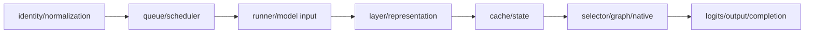
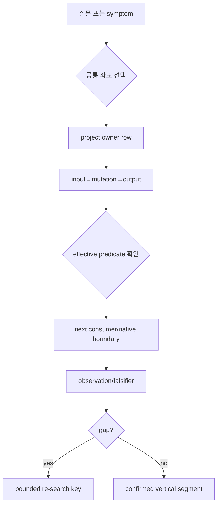
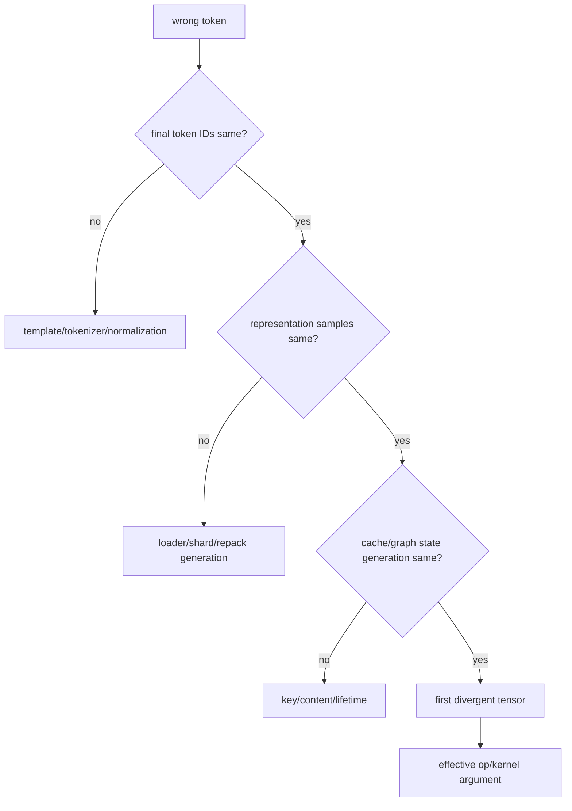
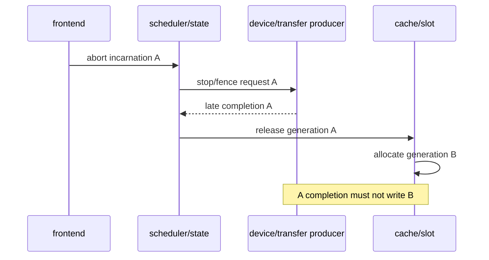
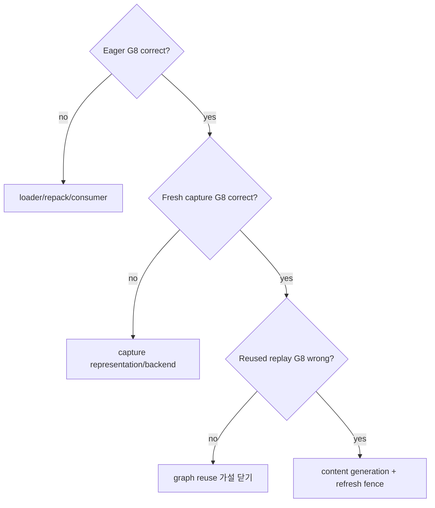
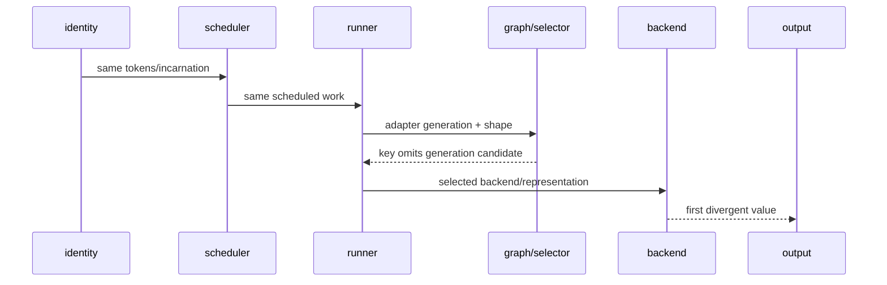

# 77장. 증상에서 커널까지 되돌아가는 네 스택 소스 atlas

새 장애를 만났을 때 저장소 첫 화면에서 `api`, `scheduler`, `worker`, `kernels` 디렉터리를 차례로 여는 습관은 거의 도움이 되지 않는다. 같은 이름의 class가 legacy·CPU·test 경로에 있고, wrapper가 실제 backend를 숨기며, request lifetime이 process 경계를 넘기 때문이다. 이 장의 atlas는 “파일이 어디 있나”가 아니라 “누가 어떤 입력 상태를 소비해 무엇을 바꾸며, 다음 consumer와 관측점은 무엇인가”를 반환한다.

Source는 vLLM `6e448d0ea9bf3d88d898b65449ca6dc2aec170ac`, SGLang `71de97b264b04dcd514cf904003028aefe9775c8`, llama.cpp `bb4caa7540188872173c44d161602d9271386413`, Transformers `550d7b3834670483a4df436541272c055dc364bf`에 고정한다.

73장의 15분 지도와 74장의 option trace는 한 사건을 끝내는 tutorial artifact다. 이 장이 소유하는 것은 그 결과를 복사한 장문 call graph가 아니라, 증상과 owner 질문으로 네 stack의 재진입 좌표를 찾는 검색 인터페이스다. 같은 함수가 보여도 앞의 두 장은 실행 증명에, 이 장은 다음 조사에서 경로를 재발견하는 데 쓴다.

이 장을 100개 symbol의 선형 목록으로 읽지 않는다. 첫 독자는 77.1의 일곱 좌표와 77.2~77.8의
input→mutation→output mental model을 익힌 뒤 77.13의 증상 역색인으로 건너가면 된다. 77.9~77.12의 네
vertical path는 사건에서 stack 하나가 정해졌을 때 펼치는 reference atlas이고, 77.14는 release가 바뀌었을
때 좌표를 재생성하는 workbook이다. Commit과 line은 설계 설명의 주인공이 아니라 잘못된 owner·ABI·cleanup
판단을 막는 대표 확인점이다. 이 독서 경로가 tutorial과 검색용 reference를 분리해, 독자가 먼저 질문을
만들고 필요한 6~12개 행만 고르게 한다.

## 77.1 atlas를 검색 결과가 아니라 실행 좌표로 읽는다

### 77.1.1 한 행의 최소 질문

한 행은 coordinate, symbol과 link로 끝나지 않는다. Owner가 받는 input contract, mutation/transition, output contract, next consumer, lifetime/async edge, effective predicate와 observation을 가진다. `Scheduler`라는 class 이름만 있으면 request가 언제 waiting에서 selected로 바뀌는지 알 수 없다.

```yaml
coordinate: queue_transition
project: vllm-v1-cuda
symbol: Scheduler.schedule
input_contract: requests + token/cache budgets
mutation_or_transition: computed-token 차이를 scheduled work로 선택
output_contract: SchedulerOutput
next_consumer: GPUModelRunner.execute_model
lifetime_or_async_edge: iteration output != request lifetime
observability: [queued event, scheduled timestamp, token counts]
re_search_keys: [num_scheduled_tokens, SchedulerOutput]
```

### 77.1.2 실선·후보·빈칸

Direct call, state mutation과 concrete object construction은 실선이다. Import, registry와 base class는 후보선이다. Native launcher나 completion owner를 못 찾으면 bounded gap이다. 그림을 완성하려고 wrapper 이름을 kernel로 바꾸지 않는다.

### 77.1.3 공통 일곱 좌표



네 stack은 이 좌표의 구현이 같지 않다. Transformers classic generate에는 service admission queue가 없고 llama.cpp backend scheduler는 HTTP request admission owner가 아니다. 의미 좌표만 공유하고 owner 차이를 보존한다.

Crosswalk를 실제 질문으로 펼치면 다음과 같다.

표의 비교 축은 class 이름의 일치가 아니라 같은 의미 좌표를 어느 owner와 lifetime이 맡는가다. 대표 행은
`scheduler`다. vLLM/SGLang은 service iteration을 소유하지만 llama.cpp는 slot admission과 backend split이
나뉘고 Transformers classic loop에는 multi-tenant admission queue가 없다. 따라서 네 열에 억지로 같은
`Scheduler`를 채우지 않는다. `not owned here`를 보존해야 fairness 문제를 model loop에서 찾는 오진을 막는다.

| 좌표 | vLLM | SGLang | llama.cpp | Transformers | 의미 차이 |
|---|---|---|---|---|---|
| identity | engine request/incarnation | `rid`+IPC request | task/slot→seq IDs | input sequence/local state | server identity 유무 |
| scheduler | token-budget continuous scheduler | request+ScheduleBatch | slot batch와 backend scheduler 분리 | classic loop, service queue 없음 | iteration owner가 다름 |
| runner input | persistent GPU input batch | ForwardBatch/phase buffers | ubatch/ggml graph params | prepared model inputs/cache position | tensor화 시점이 다름 |
| representation | loader/repack/parallel params | pool+kernel-specific params | GGUF/ggml type blocks | model parameter/quant integration | packed ABI 호환 아님 |
| cache | block/page manager+connector | radix/pools/P-D state | context sequence cells | Cache object | address/lifetime model 다름 |
| selector/native | backend+graph+custom op | phase runner+Triton/CUDA/JIT | ggml op→CUDA backend | attention callable→framework | native ownership 경계 다름 |
| output | sampler→output processor/collector | sampler→batch result→tokenizer | logits→sampler→slot response | processor/sample→streamer | visible commit owner 다름 |

Identity 좌표를 검색할 때는 raw external ID가 어느 mutation을 통과해 internal lifetime key가 되는지 묻는다. vLLM에서는 `EngineCoreRequest.request_id`, parallel child/wave와 output collector state를 분리한다. SGLang에서는 tokenizer process의 `rid`와 scheduler-side `Req`를 IPC receive로 잇는다. Llama.cpp에서는 slot ID가 ubatch sequence IDs와 output indices로 변환되는 join이 핵심이다. Transformers는 외부 request manager가 없는 scoped core라 input IDs와 cache state가 local identity다. 네 열을 모두 `request_id`라고 쓰면 cancellation과 metrics join이 틀린다.

Scheduler 좌표의 input은 “requests” 하나가 아니다. vLLM은 waiting/running requests, computed-token counters, token/encoder/KV budgets를 읽어 iteration plan을 만든다. SGLang은 request/cache match와 phase별 batch policy를 읽어 `ScheduleBatch`를 만든다. Llama.cpp server slot scheduler와 ggml backend split scheduler는 서로 다른 rows다. Transformers classic generate는 unfinished mask와 per-step kwargs가 loop state이고 multi-tenant fairness를 소유하지 않는다.

Runner-input 좌표는 logical work가 physical metadata로 바뀌는 변환을 잡는다. `8192 tokens`가 prompt total, scheduled chunk, padded rows 또는 query rows 중 무엇인지 적는다. Positions, cache location/page table, sequence lengths, adapter set, grammar, multimodal와 graph static buffer content를 각 producer에 붙인다. Same shape라도 buffer generation과 stream ordering이 다르면 다른 runtime state다.

Representation 좌표는 파일 format에서 끝나지 않는다. Checkpoint-native bytes가 shard, transpose, repack과 scale permutation을 거쳐 selected consumer pointer가 되는 변환 generation을 기록한다. Llama.cpp GGUF Q4 block과 vLLM/SGLang GPTQ-Marlin packed word는 이름이 4-bit여도 호환되지 않는다. Transformers quant integration이 model을 load했다는 사실도 external serving kernel의 repack ABI를 증명하지 않는다.

Cache 좌표에는 spec/sizing, allocation/index, write, lookup/share, pin/refcount, evict/preempt와 free/reset이 있다. Prefix tree match는 device bytes readiness와 다르고, P/D transfer complete는 D-side import/validation commit과 다르다. Full, sliding-window, MLA와 recurrent state는 page/address model이 다르다. `cache hit` 한 boolean으로 합치지 않는다.

Selector 좌표는 requested, eligible, constructed, selected와 executed를 나눈다. Package가 설치됐고 registry에 class가 있어도 shape/dtype/SM/phase predicate에서 reject될 수 있다. Graph key selection은 attention backend selection과 별 decision이다. Representation conversion 뒤 fallback이 생기면 fallback consumer가 converted layout을 읽을 수 있는지도 selector row에 붙인다.

출력 좌표는 device enqueue→completion observation→host-visible logits→selected/accepted token→detokenized text→client commit을 나눈다. Sampling path가 probability 전체를 materialize하지 않을 수 있고 TP vocab logits가 local/global인지도 다르다. TTFT는 이 chain의 어느 timestamp를 쓰는지 명시한다. Client disconnect 뒤 output이 늦게 돌아오면 abort fence와 cleanup owner를 연다.



Atlas 검색 terminal은 root cause가 아니라 confirmed vertical segment다. 예컨대 “long prefill은 scheduler에서 8,192 logical rows로 선택되고 runner에서 8,256 graph bucket으로 변환되며 effective graph mode result는 관측되지 않는다”면 first gap이 selector result로 좁아졌다. Kernel directory 전체를 열지 않고 selected result consumer부터 이어갈 수 있다.

## 77.2 요청 identity·normalization 역색인

### 77.2.1 vLLM과 SGLang server ingress

vLLM [`AsyncLLM.add_request`](https://github.com/vllm-project/vllm/blob/6e448d0ea9bf3d88d898b65449ca6dc2aec170ac/vllm/v1/engine/async_llm.py#L283-L418)는 protocol/rendered input을 `EngineCoreRequest`와 output collector에 연결한다. Input argument ID와 request 객체 ID가 다를 때 어느 쪽을 진실로 삼는지, streaming input branch와 abort owner를 기록한다. 다음 검색 key는 `EngineCoreRequest`, core client `add_request_async`와 output processor다.

SGLang [`GenerateReqInput`](https://github.com/sgl-project/sglang/blob/71de97b264b04dcd514cf904003028aefe9775c8/python/sglang/srt/managers/io_struct.py#L160-L280)과 [`TokenizerManager`](https://github.com/sgl-project/sglang/blob/71de97b264b04dcd514cf904003028aefe9775c8/python/sglang/srt/managers/tokenizer_manager.py#L386-L470)는 public input, tokenization과 scheduler process handoff를 나눈다. `rid`와 serialized receive를 이어야 한다. ZMQ send 성공은 scheduler admission이 아니다.

### 77.2.2 llama.cpp task에서 ubatch로

llama.cpp server request identity는 core graph node까지 그대로 전파된다고 가정하지 않는다. Server task/slot에서 `llama_batch`와 sequence IDs로 변하는 join을 찾는다. [`llama_context` graph reserve](https://github.com/ggml-org/llama.cpp/blob/bb4caa7540188872173c44d161602d9271386413/src/llama-context.cpp#L2420-L2448)는 `llama_ubatch`와 graph params를 소비해 graph를 만든다. Atlas identity 행은 task/slot→ubatch token range/sequence IDs까지만 실선으로 둔다.

### 77.2.3 Transformers generation input

Transformers [`GenerationMixin.generate`](https://github.com/huggingface/transformers/blob/550d7b3834670483a4df436541272c055dc364bf/src/transformers/generation/utils.py#L2261-L2400)는 inputs, generation config와 model kwargs를 generation mode로 보낸다. HTTP request ID가 core contract가 아니다. Input IDs, attention mask, cache position과 unfinished sequence가 local lifetime 좌표다.

Normalization atlas는 token IDs만 보지 않는다. Maximum new tokens, stop strings/IDs, sampling temperature, logprob, grammar/structured constraint, adapter selection과 multimodal placeholders가 어느 owner에서 final form이 되는지 기록한다. Raw protocol `null`, omitted와 explicit default가 normalization 뒤 같은지 구분한다. Per-request option이 model/server default를 override하는 precedence도 mutation이다.

Chat template와 tokenizer revision은 model weights와 독립 identity다. Same model digest라도 template가 system/user role separator와 generation prompt를 바꾸면 final IDs가 달라진다. Atlas row는 template resource/digest, tokenizer config/vocab, special token insertion과 truncation owner를 가리킨다. `tokenizer.encode`라는 함수 이름 하나로 충분하지 않다.

Streaming input에서는 identity가 session lifetime을 가질 수 있다. VLLM scheduler admission은 existing request ID를 streaming update로 취급할 수 있고 SGLang tokenizer side에도 response/abort state가 있다. New prompt chunk가 기존 KV/state에 이어지는지, finished sentinel과 abort가 어떤 incarnation을 닫는지 본다. Duplicate ID를 단순 오류로 가정하지 않는다.

관측은 raw request를 metric label로 넣지 않고 sampled request ledger로 둔다. Client ID, attempt, internal request/wave, sequence/slot, P/D transfer ID와 output stream ID를 별 columns로 유지한다. Join 규칙을 source mutation과 IPC message에 붙인다. Identity collision은 잘못된 queue time, wrong backend event와 late output을 같은 request에 합칠 수 있다.

첫 반증은 final token IDs와 normalized constraints다. Healthy/failing이 다르면 model layer와 kernel을 열기 전에 normalization에서 멈춘다. 같다면 input coordinate를 닫고 scheduler/runner로 이동한다. 이 stop rule이 atlas를 실행 순서로 만든다.

## 77.3 queue·scheduler·batch 역색인

### 77.3.1 vLLM token-budget transition

[`Scheduler.add_request`](https://github.com/vllm-project/vllm/blob/6e448d0ea9bf3d88d898b65449ca6dc2aec170ac/vllm/v1/core/sched/scheduler.py#L2213-L2235)는 new request를 waiting queue와 request map에 넣거나 streaming session update를 처리한다. [`Scheduler.schedule`](https://github.com/vllm-project/vllm/blob/6e448d0ea9bf3d88d898b65449ca6dc2aec170ac/vllm/v1/core/sched/scheduler.py#L439-L625)는 고정 prefill/decode queue가 아니라 `num_tokens_with_spec-num_computed_tokens`와 token budget으로 work를 고른다.

Output은 GPU tensor가 아니라 `SchedulerOutput`이다.

### 77.3.2 SGLang request lifetime과 ScheduleBatch

[`ScheduleBatch`](https://github.com/sgl-project/sglang/blob/71de97b264b04dcd514cf904003028aefe9775c8/python/sglang/srt/managers/schedule_batch.py#L2002-L2090)는 request 전체 lifetime이 아니라 한 iteration의 batch state다. Waiting request, running batch, prefill/decode role과 requeue/retract를 분리한다. `batch size` 대신 request count, scheduled token rows, padded rows와 active cache units를 기록한다.

### 77.3.3 llama.cpp와 Transformers의 다른 추상화

llama.cpp에서 server slot batching과 ggml backend graph scheduling은 다른 coordinate다. [`ggml_backend_sched_split_graph`](https://github.com/ggml-org/llama.cpp/blob/bb4caa7540188872173c44d161602d9271386413/ggml/src/ggml-backend.cpp#L1055-L1135)는 이미 만들어진 tensor graph를 backend별 split/copy로 바꾼다. Transformers `_sample` loop는 waiting queue가 아니라 per-step sequence/cache state를 갱신한다.

Queue atlas는 container declaration보다 네 mutation을 우선한다. Admission/add, selection/pop, deferred/preempt/requeue와 finished/remove다. 각 mutation에 request status, timestamp, budget/cache side effect와 output type을 붙인다. Container에는 있는데 status가 다를 수 있고, status assignment 없이 container membership이 truth인 구현도 있다.

Iteration과 lifetime을 분리한다. Continuous scheduler의 output 한 개는 request 전체가 아니라 scheduled slice다. Same request가 prefill chunks, decode steps와 speculative verification에서 반복된다. SGLang `ScheduleBatch`와 vLLM `SchedulerOutput`을 request로 부르면 latency와 cache ownership을 잘못 계산한다. Atlas row에는 iteration ID/step, request incarnation과 scheduled work units가 필요하다.

Batch dimension도 이름 대신 단위를 쓴다. Request count `B`, total scheduled token rows `T`, query rows `Q`, padded graph rows `P`, sequence lengths, active cache blocks/state slots와 TP-local batch를 나눈다. Kernel grid가 `T`를 그대로 쓰는지 tile count로 바꾸는 producer를 찾는다. `batch_size=32` 한 숫자는 비교 불가능하다.

Scheduler observation에는 queue depth뿐 아니라 queue age/work, selected/rejected reason, token/cache budget, preemption/retraction와 output construction timestamp가 있다. Per-request ID를 high-cardinality series로 쓰지 않고 sampled ledger와 aggregates를 나눈다. Same queue length라도 long prompt work와 decode mix가 다르면 의미가 다르다.

반증 질문은 “waiting이 많았나?”가 아니라 “first scheduled 전 interval이 확장됐고 selection predicate의 어떤 budget/reject reason이 달라졌나?”다. Queue interval이 같으면 TTFT를 runner 이후로 내린다. Scheduled units가 같아도 padded/device work가 다를 수 있어 다음 coordinate를 반드시 연다.

## 77.4 runner·model input·device metadata 역색인

### 77.4.1 vLLM persistent input batch

[`GPUModelRunner.execute_model`](https://github.com/vllm-project/vllm/blob/6e448d0ea9bf3d88d898b65449ca6dc2aec170ac/vllm/v1/worker/gpu_model_runner.py#L4165-L4234)는 `SchedulerOutput`을 받아 KV transfer preemption을 처리하고 input-prep synchronization 안에서 state를 갱신한다. [`_update_states`](https://github.com/vllm-project/vllm/blob/6e448d0ea9bf3d88d898b65449ca6dc2aec170ac/vllm/v1/worker/gpu_model_runner.py#L1192-L1325)는 add/remove와 persistent batch generation의 핵심 anchor다.

Shape 행에는 request total, scheduled tokens, padded rows, positions, slot/page table과 graph bucket을 별 단위로 쓴다. Same `num_tokens` 이름을 복사하지 않는다. Async input copy와 graph replay가 다른 stream이면 event/fence를 lifetime edge로 넣는다.

### 77.4.2 SGLang ForwardBatch와 phase runner

SGLang model runner가 `ScheduleBatch`로부터 positions, cache location, attention metadata와 adapter state를 만드는 producer를 찾는다.

[`DecodeCudaGraphRunner`](https://github.com/sgl-project/sglang/blob/71de97b264b04dcd514cf904003028aefe9775c8/python/sglang/srt/model_executor/runner/decode_cuda_graph_runner.py#L200-L290)와 [`PrefillCudaGraphRunner`](https://github.com/sgl-project/sglang/blob/71de97b264b04dcd514cf904003028aefe9775c8/python/sglang/srt/model_executor/runner/prefill_cuda_graph_runner.py#L245-L340)는 base class가 아닌 concrete buffer/capture owner다.

### 77.4.3 llama.cpp graph inputs와 Transformers cache position

llama.cpp `graph_params`는 ubatch, graph type, backend scheduler, LoRA, memory context와 output count를 graph builder에 넘긴다. Transformers [`prepare_inputs_for_generation`](https://github.com/huggingface/transformers/blob/550d7b3834670483a4df436541272c055dc364bf/src/transformers/generation/utils.py#L519-L610)는 unprocessed input slice, cache position, position IDs와 mask를 model forward contract로 만든다. 둘 모두 “model runner” class를 억지로 만들지 않는다.

Runner-input atlas에서 CPU plan과 device content를 분리한다. Scheduler/batch output은 Python/C++ objects와 integer metadata일 수 있다. Input adapter가 token IDs, positions, sequence lengths, slot/page tables, adapter/grammar indices를 host arrays와 device tensors로 materialize한다. `SchedulerOutput`을 tensor라고 쓰면 이 producer를 잃는다.

Persistent batch는 매 iteration 새 allocation이 아닐 수 있다. Request index/slot map에 add, compact, swap와 remove가 일어나고 static CUDA graph buffers는 주소를 유지한 채 content만 바뀐다. Atlas에는 buffer address generation과 content generation, valid bounds/mask를 따로 둔다. 주소가 같아도 stale content일 수 있다.

Async copy는 함수 호출 순서만으로 happens-before를 증명하지 않는다. Producer stream, record event, consumer wait 또는 same-stream ordering을 찾는다. Host pinned buffer도 async DMA가 끝나기 전에 재사용하면 안 된다. `copy_` 호출과 model forward 사이에 어떤 completion owner가 있는지 lifetime row로 둔다.

Adapter, grammar와 multimodal metadata는 부가 정보가 아니다. Effective model path, graph key와 logits mutation을 바꿀 수 있다. Request가 finish/cancel된 뒤 persistent slot에서 이 metadata를 누가 지우고 new generation을 쓰는지도 runner cleanup에 포함한다.

Shape ledger의 terminal은 logical→physical conversion chain이다. Prompt total→scheduled chunk→prepared/padded rows→attention query/KV lengths→kernel tile/grid의 각 arrow에 producer를 붙인다. Unit이 unknown이면 추정하지 않고 next consumer field reference를 re-search key로 남긴다.

## 77.5 model layer·weight representation 역색인

### 77.5.1 architecture resolution에서 layer까지

검색 질문은 “Llama model 파일은?”보다 “config architecture가 어떤 concrete model class와 decoder layer를 만들고 weight names를 어디에 매핑하는가?”다. Embedding→layer norm→QKV/attention→output projection→MLP/MoE/recurrent state→final norm/LM head를 model-specific branch로 잇는다. Qwen MLA, Gemma sliding/full attention과 recurrent hybrid를 일반 decoder 하나로 덮지 않는다.

### 77.5.2 packed·sharded·quantized parameter

Representation 행은 logical tensor shape, checkpoint encoding, TP shard axis, packed word/tile order, scale/zero axis, conversion generation와 native/fallback consumer를 가진다. Loader 성공은 bytes가 allocation됐다는 뜻이지 selected kernel이 같은 coordinate를 읽는다는 증거가 아니다.

### 77.5.3 네 stack crosswalk

vLLM/SGLang은 serving-specific parameter loader와 quant method가 custom op representation을 만들 수 있다. llama.cpp는 GGUF tensor type과 ggml quant block traits가 physical layout owner다. Transformers는 standard model parameter와 quant integration을 제공하지만 external serving engine의 repack ABI를 자동 소유하지 않는다. Q4/FP4라는 이름으로 pointer compatibility를 선언하지 않는다.

Layer atlas는 generic Transformer 그림과 concrete model을 두 층으로 둔다. Generic coordinate는 embedding, normalization, attention projections, positional transform, attention/cache, output projection, residual, MLP/MoE와 final head다. Concrete row는 Qwen/Gemma/Llama/MLA/SWA/Mamba 등 실제 class가 어느 좌표를 구현하고 어떤 state를 추가하는지 쓴다. Architecture 이름만으로 layer 수식과 cache type을 추정하지 않는다.

Weight path는 name mapping에서 시작한다. Checkpoint key가 model parameter, TP shard와 expert-local parameter로 매핑되는 loader를 찾는다. Stacked QKV/gate-up projection은 여러 checkpoint tensors를 한 parameter에 slice-copy할 수 있고 expert weights는 expert/TP axes를 추가한다. Loaded parameter shape만 맞아도 slice coordinate가 틀릴 수 있다.

Quant representation에는 logical value 복원식을 함께 둔다. Packed word에서 bit code를 뽑는 order, zero-point convention, scale이 direct/inverse인지, per-tensor/channel/group/block axis와 tile interleave를 기록한다. FP8/FP4라는 dtype label만으로 scale payload와 accumulator contract를 설명할 수 없다.

Conversion generation은 loader 뒤에도 생긴다. Marlin repack, scale permutation, GGUF dequant tile와 JIT-preprocessed descriptors는 new representation owner다. Cache key에는 model artifact뿐 아니라 method, shape, source/kernel ABI와 conversion version이 필요하다. Old converted cache를 new consumer가 읽지 않도록 한다.

Native와 fallback consumer를 같은 row에 넣는 이유는 selection이 load 이후 바뀔 수 있기 때문이다. Native optimized path가 repacked buffer를 읽고 generic fallback이 checkpoint-native layout을 기대하면 pointer를 공유할 수 없다. Fallback을 안전 reference라고 부르기 전에 representation adapter 또는 dual buffers를 찾는다.

Value atlas는 layer output만 저장하지 않는다. Checkpoint-native, shard 후, repack inverse, runner descriptor와 first op output을 몇 logical coordinates에서 비교한다. First divergence가 repack이면 kernel을 열지 않고 converter를 본다. Representation까지 같아야 native argument/algorithm을 연다.

## 77.6 KV·prefix·hybrid state 역색인

### 77.6.1 vLLM allocation transaction

[`KVCacheManager.allocate_slots`](https://github.com/vllm-project/vllm/blob/6e448d0ea9bf3d88d898b65449ca6dc2aec170ac/vllm/v1/core/kv_cache_manager.py#L344-L565)는 cache hit, new blocks, encoder inputs와 connector-related state를 allocation transaction으로 잇는다. Lookup hit, lock/refcount, scheduled allocation, write, finish/free를 같은 lifecycle ledger에서 본다.

### 77.6.2 SGLang radix·memory pool

SGLang은 radix prefix ownership, token-to-KV pool과 request/batch memory state의 mutation을 분리한다. Cache tree match가 physical KV readiness와 같다고 쓰지 않는다. Retract/preempt가 request를 queue로 돌려도 block/refcount와 async transfer pin이 언제 풀리는지 찾는다.

### 77.6.3 Transformers cache와 llama.cpp context memory

Transformers cache object는 classic generation loop와 model forward가 logical positions를 갱신하는 owner다. Serving engine block manager와 동일하지 않다. llama.cpp sequence cells/context memory도 ggml tensor graph와 별 lifetime을 가진다. Crosswalk는 logical token position→physical state address→generation/release만 공유한다.

Cache atlas 첫 행은 spec와 sizing이다. Layer마다 full/sliding/MLA/recurrent state가 요구하는 elements, dtype와 page/block shape를 누가 결정하는지 본다. Nominal context length만 곱한 capacity 식은 hybrid layer, TP ownership과 metadata/workspace를 놓칠 수 있다. Effective backend가 cache layout을 제한하면 selector보다 allocation 전에 contract가 합의돼야 한다.

Allocation/index 행은 logical token position이 physical block/page/cell/slot로 바뀌는 mutation이다. Block ID, byte address, generation-tagged handle와 page-table index를 구분한다. Table row stride, entry dtype와 block token size도 별 단위다. “page size” 하나로 합치지 않는다.

Write/read 행에는 layer, KV head, token offset와 generation을 둔다. Prefix hit가 logical token match를 증명해도 device write completion과 every layer readiness를 증명하지 않는다. P/D 또는 external cache는 publish/transfer/import/validation/consume commit을 분리한다. Transfer bytes 완료를 cache hit ready로 쓰지 않는다.

Share/lock/refcount는 eviction과 cancel의 핵심이다. Prefix node가 shared되면 owner request가 끝나도 refcount가 남을 수 있다. Async retrieve/transfer pin이 있으면 request abort 뒤 release callback까지 eviction할 수 없다. OOM은 free total보다 locked/pinned units와 compatible pool을 본다.

Preempt/retract는 request scheduler state와 cache physical state를 동시에 바꿀 수 있다. Request가 waiting으로 돌아갔다고 blocks가 모두 free인지, recompute 또는 swap/connector state가 남는지 확인한다. Late output이 preempted request의 computed-token/cache metadata를 갱신하지 않도록 fence를 찾는다.

Free/reset terminal은 allocator counter가 감소한 시점이 아니라 outstanding writers/readers가 끝나고 next generation이 안전하게 reuse 가능한 시점이다. Soak fixture는 cancel, prefix sharing, P/D transfer와 graph replay를 섞어 locked population이 baseline으로 돌아오는지 본다.

## 77.7 selector·graph·native launch 역색인

### 77.7.1 requested에서 effective로

vLLM [`CudagraphDispatcher`](https://github.com/vllm-project/vllm/blob/6e448d0ea9bf3d88d898b65449ca6dc2aec170ac/vllm/v1/cudagraph_dispatcher.py#L158-L285)는 graph mode/key를 고르지만 attention backend와 native kernel을 혼자 결정하지 않는다. SGLang concrete graph runner도 attention backend instance와 pluggable graph backend를 소유하지만 underlying Triton/CUDA/JIT op는 별 consumer다.

Transformers [`_check_and_adjust_attn_implementation`](https://github.com/huggingface/transformers/blob/550d7b3834670483a4df436541272c055dc364bf/src/transformers/modeling_utils.py#L1799-L1912)는 requested attention, availability/fallback와 lazy import를 조정한다. Model attention forward의 callable 뒤 PyTorch/custom op가 native owner다.

### 77.7.2 llama.cpp backend dispatch와 CUDA graph

[`llama_context::graph_compute`](https://github.com/ggml-org/llama.cpp/blob/bb4caa7540188872173c44d161602d9271386413/src/llama-context.cpp#L2475-L2502)는 backend scheduler에 async compute를 요청한다.

CUDA backend의 [`cudaGraphExecUpdate`](https://github.com/ggml-org/llama.cpp/blob/bb4caa7540188872173c44d161602d9271386413/ggml/src/ggml-cuda/ggml-cuda.cu#L2610-L2652)와 [`cudaGraphLaunch`](https://github.com/ggml-org/llama.cpp/blob/bb4caa7540188872173c44d161602d9271386413/ggml/src/ggml-cuda/ggml-cuda.cu#L4190-L4225)는 update와 enqueue라는 다른 좌표다.

### 77.7.3 native gap을 쓰는 법

Wrapper→custom op registration→C++ dispatch→CUDA launcher→stream completion 순으로 내려간다. Pinned source가 framework op에서 끝나면 `native owner=PyTorch pinned separately`라고 쓴다. Registry에 candidate가 있다는 사실을 executed path로 바꾸지 않는다.

Selector atlas는 config provenance에서 시작하지만 option parser를 선택 결과로 쓰지 않는다. Requested value, normalized value, capability inputs와 reject reason을 기록한다. Capability는 package, device/SM, dtype/quant, head dimension, layout, shape, graph mode, phase와 feature composition의 conjunction이다.

Constructed backend와 per-request selected path도 다를 수 있다. Server startup에서 wrapper object를 만들어도 current shape가 eager/reference fallback을 부를 수 있다. JIT module이 cache miss로 compile되거나 prebuilt specialization이 선택될 수도 있다. Atlas observation에는 effective method, fallback reason, plan/key와 artifact identity를 둔다.

Graph row는 raw shape→bucket/key→mode→static buffers→capture/replay lifecycle이다. Key fields에 adapter/cache generation과 active bounds가 있는지, key에 없으면 content refresh/invalidation이 어떻게 안전한지 본다. Capture 성공은 every replay input content가 current라는 증거가 아니다.

Workspace/plan은 native ABI 일부다. Plan이 dtype, dimensions, tile/split과 workspace layout을 고정하면 run과 launcher가 같은 generation을 읽어야 한다. Bytes, alignment, ownership과 stream lifetime을 기록한다. Workspace pointer가 valid해도 layout generation이 다르면 오답이다.

Custom-op registration은 Python wrapper와 C++ schema를 연결하는 anchor다. Tensor dtype/device/layout, optional args, alias/output ownership을 old/new와 맞춘다. From schema, native dispatcher에서 current SM/shape specialization을 찾고 launcher의 logical dimension→grid mapping을 확인한다.

Completion은 별 coordinate다. CUDA launch/collective enqueue가 return해도 work는 stream에 남는다. Event/sync/dependent tensor consumer와 async error reporter를 찾는다. Output buffer나 static input slot을 언제 reuse하는지가 selector/native atlas terminal이다.

## 77.8 logits·sampling·output·completion 역색인

### 77.8.1 logits ownership

Final hidden이 LM head를 지나 TP-local 또는 global logits가 되는 지점을 찾는다. Logits processor, grammar mask, repetition/penalty, temperature, top-k/top-p와 sampling 순서를 state mutation으로 쓴다. 모든 path가 full probability tensor를 materialize한다고 가정하지 않는다.

### 77.8.2 selected token에서 visible commit까지

Selected token은 detokenizer와 streamer/output collector로 이동한다. Host tensor availability, token accepted, detokenized text와 client-visible stream write는 다른 commit 단계다. TTFT timestamp producer가 어느 단계인지 atlas observation 열에 둔다.

### 77.8.3 abort·cleanup과 late output

vLLM [`Scheduler.update_from_output`](https://github.com/vllm-project/vllm/blob/6e448d0ea9bf3d88d898b65449ca6dc2aec170ac/vllm/v1/core/sched/scheduler.py#L1670-L1745)은 stale/finished output reconciliation anchor고 [`_free_request`](https://github.com/vllm-project/vllm/blob/6e448d0ea9bf3d88d898b65449ca6dc2aec170ac/vllm/v1/core/sched/scheduler.py#L2300-L2349)는 cache/connector release anchor다. 다른 stack에서도 enqueue 반환과 cleanup terminal을 분리한다.

Logits atlas는 vocab ownership부터 쓴다. Tensor-parallel vocabulary가 rank-local shard인지 gather/reduce 후 global인지, LM head와 logits processor 사이 dtype/shape를 기록한다. Requested logprobs가 additional gather/normalization을 만들 수 있다. Final hidden shape만 보고 sampling cost를 추정하지 않는다.

Processor/constraint mutation 순서는 의미다. Repetition/frequency penalties, bad words, min length, grammar mask, temperature와 top-k/top-p가 어느 score representation에 어떤 순서로 적용되는지 찾는다. Grammar state는 accepted token 뒤 update되므로 speculative proposal과 accepted output의 owner를 구분한다.

Sampling은 full softmax 확률을 반드시 저장하지 않을 수 있다. Fused top-k/top-p, exponential noise 또는 argmax path는 intermediate representation과 RNG state가 다르다. Deterministic fixture는 seed뿐 아니라 batch ordering, RNG consumption과 selected backend를 고정한다.

Selected token도 즉시 client output이 아니다. Speculative verification에서 accept/reject가 있고 tokenizer는 incomplete byte sequence를 보류할 수 있다. Streamer/output processor가 finish reason, logprobs와 text delta를 조합한다. Client write가 backpressure로 늦으면 model ITL과 delivery ITL을 분리한다.

Abort 후 output은 frontend state와 scheduler/cache state 양쪽에서 닫혀야 한다. Collector가 closed여도 core work가 남을 수 있고 core request가 free돼도 remote transfer/stream callback이 늦게 올 수 있다. Incarnation/generation check로 late result를 폐기하고 all resources가 terminal에 도달한 뒤 slot을 reuse한다.

Output observation에는 model output ready, sample complete, token accepted, detokenization complete와 network write timestamp를 별 events로 둔다. 하나의 `request_latency` metric이 어느 pair를 재는지 source recording site로 확인한다.

## 77.9 Reference atlas — vLLM vertical path

### 77.9.1 ingress에서 scheduler output

`AsyncLLM.add_request → core client message → EngineCore.add_request → Scheduler.add_request/schedule → SchedulerOutput`을 잇는다. 각 화살표에 concrete request type, process handoff와 mutation을 붙인다. V0/alternate device path는 scope 밖이다.

### 77.9.2 runner에서 native boundary

`SchedulerOutput → GPUModelRunner._update_states/execute_model → model forward → attention/quant selector → graph dispatcher → selected custom op`다. Graph mode와 attention backend를 한 selector로 합치지 않는다. Positions/page table/adapter generation이 persistent buffer에 쓰이는 producer를 포함한다.

### 77.9.3 sampler·output·cleanup

Model output→sampler/logprob/grammar→output processor→stream collector를 잇고 abort가 frontend/core 양쪽 상태를 어떻게 닫는지 본다. Request ID 문자열 하나로 child/parallel outputs와 retry incarnation을 합치지 않는다.

아래 25행은 파일 관광 목록이 아니다. 각 행은 앞 행의 output을 다음 행의 input으로 소비하는 vertical chain이다. `관측/재검색` 열이 비어 있으면 atlas row로 인정하지 않는다.

첫 비교 축은 행 번호가 아니라 마지막으로 확인된 state transition이다. 대표 행 7의 scheduler output을
확인했다면 행 1~6을 매번 재독하지 않고, 그것을 소비하는 runner와 allocation 행으로 이동한다. 반대로
scheduled token 수부터 다르면 native 행 14~21을 여는 것은 이르다. 이 stop rule이 표를 repository trivia가
아닌 bounded investigation path로 만든다.

| # | 고정 symbol·좌표 | 입력→mutation/output | 다음 consumer·관측/재검색 |
|---:|---|---|---|
| 1 | `AsyncLLM.add_request` `async_llm.py:283` | prompt/params→normalized core request | core client; request ID mismatch/streaming branch |
| 2 | `OutputProcessor.add_request` `output_processor.py:525` | request+collector→frontend request state | output updates; collector lifecycle |
| 3 | `CoreClient.add_request_async` `core_client.py:1145` | core request→typed IPC message | engine-core input queue; send/receive edge |
| 4 | `EngineCore.add_request` `core.py:439` | core request→scheduler request/wave | scheduler admission; request incarnation |
| 5 | `Scheduler.add_request` `scheduler.py:2213` | request/session update→waiting/map | schedule; QUEUED event |
| 6 | `RequestQueue.add_request` `request_queue.py:20` | prioritized request→queue order | selection; priority policy |
| 7 | `Scheduler.schedule` `scheduler.py:439` | running/waiting+budgets→scheduled sets | `SchedulerOutput`; token counts/timestamp |
| 8 | `KVCacheManager.allocate_slots` `kv_cache_manager.py:344` | request/cache hits→new blocks | schedule commit; allocation failure/reclaim |
| 9 | `SchedulerOutput` `sched/output.py:193` | selected IDs/counts/metadata→iteration plan | executor/runner; logical units |
| 10 | `GPUWorker.execute_model` `gpu_worker.py:1019` | scheduler output→runner call | model runner; worker/rank edge |
| 11 | `GPUModelRunner._update_states` `gpu_model_runner.py:1192` | new/resumed/finished data→persistent batch | input prep; request-slot generation |
| 12 | `GPUInputBatch.add_request` `gpu_input_batch.py:350` | per-request sampling/LoRA data→dense slots | tensor prep; req-index mapping |
| 13 | `GPUModelRunner.execute_model` `gpu_model_runner.py:4166` | iteration plan→prepared device work | model forward; preprocess span |
| 14 | `CudagraphDispatcher` `cudagraph_dispatcher.py:158` | shape/mode availability→dispatch key | graph/eager call; mode/reason |
| 15 | `AttentionLayerBase.forward` `attention/backend.py:786` | QKV/cache/metadata→backend call | effective implementation; layer name |
| 16 | `FlashInferImpl.forward` `backends/flashinfer.py:1681` | attention tensors+metadata→wrapper/native op | custom-op registration; phase/plan |
| 17 | `FlashAttentionImpl.forward` `backends/flash_attn.py:838` | paged/varlen metadata→FA call | external pin/native source; split policy |
| 18 | model implementation `model_executor/models/*` | hidden+positions→layer stack | architecture layer; model/config class |
| 19 | quant method `model_executor/layers/quantization/*` | packed params+activations→selected GEMM/MoE | custom op; repack generation |
| 20 | `Sampler.forward` `sample/sampler.py:72` | logits+sampling metadata→sample result | top-k/p/penalty; probability path |
| 21 | top-k/top-p CUDA `topk_topp_sampler.py:155` | logits/probs+thresholds→candidate token | sampler result; backend predicate |
| 22 | `OutputProcessor` `output_processor.py:429` | engine outputs→request/stream update | collector; finish reason/logprobs |
| 23 | `AsyncLLM.generate` `async_llm.py:544` | collector items→async visible outputs | API streamer; disconnect/cleanup |
| 24 | `OutputProcessor.abort_requests` `output_processor.py:462` | frontend IDs→expanded core abort IDs | core abort; child request ownership |
| 25 | `Scheduler._free_request` `scheduler.py:2300` | finished/aborted request→connector/cache release | slot reuse; late output fence |

이 chain에서 15~19행은 하나의 fixed call graph가 아니다. Model architecture, attention selector와 quant method가 effective predicates로 갈라지는 branch family다. Incident row에는 실제 constructed class와 selected method 하나만 실선으로 남긴다. FlashInfer와 FlashAttention을 동시에 호출하는 것처럼 읽지 않는다.

Async/lifetime edge는 최소 네 개다. 3번 IPC send→4번 receive, 7번 iteration plan→request multi-iteration lifetime, 13번 input preparation/event→native stream consume, 23번 output collector→client-visible write, 25번 free→outstanding output fence다. TTFT는 이 가운데 queue와 delivery edge를, cancel residue는 마지막 두 edge를 우선 연다.

이 25행을 실제로 검색할 때는 symptom에 따라 entry row가 달라진다. Prompt mismatch면 1번 request와 normalization upstream을 열고 7번 이후를 보류한다. Queue tail이면 4~9번, OOM이면 8번과 11~14번 persistent buffers, wrong answer이면 11~19번 representation/selector를 연다. Cancel residue면 2, 3, 22~25번을 한 incarnation으로 join한다. 1번부터 25번을 매번 순독하지 않는다.

VLLM TTFT 예시는 5번 QUEUED event, 7번 scheduled timestamp/count와 13번 preprocess/model interval을 잇는다. Queue가 같고 13번만 늘면 14~19 effective path를 연다. Scheduled logical tokens가 같아도 graph bucket이 다르면 11~14 변환 producer가 first divergence다. Backend startup log를 16/17 executed evidence로 쓰지 않는다.

VLLM OOM 예시는 8번 `allocate_slots` failure에서 requested blocks와 cache hits를 얻고 11/12 persistent batch, 14 graph specialization과 19 quant workspace를 external owners로 추가한다. 25번 release가 request finish 뒤 blocks/connector를 모두 닫는지 본다. Allocator free bytes 하나로 graph/static/external allocations까지 합치지 않는다.

VLLM wrong answer 예시는 1번 final IDs, 11/12 adapter/request-slot mapping, 14 graph key와 15~19 effective layer/backend representation을 잇는다. 20~22 sampling 전에 first divergent tensor가 있으면 output path를 닫는다. Graph replay-only면 11→14 static content generation edge를, fallback-only면 19 converted weight consumer를 우선한다.

재검색 key도 chain별로 보존한다. `EngineCoreRequest`→`SchedulerOutput`→`_update_states`→selected backend `forward`→custom op schema→sampler result→`RequestOutputCollector`라는 types/consumer sequence는 파일 이동에 강하다. 함수 이름 하나가 사라져도 next input type references에서 새 owner를 찾을 수 있다.

## 77.10 Reference atlas — SGLang vertical path

### 77.10.1 tokenizer process에서 batch

`GenerateReqInput → TokenizerManager → scheduler transport receive → request admission → ScheduleBatch`다. IPC send/receive를 direct call로 그리지 않는다. Prefill/decode/P-D role과 overlap worker가 있으면 별 lane이다.

### 77.10.2 cache·runner·backend

Request/radix match→memory pool/cache allocation→ForwardBatch→ModelRunner→prefill/decode graph runner→effective attention/MoE backend를 잇는다. Static buffer address와 current content producer, graph metadata preparation event를 lifetime row에 둔다.

### 77.10.3 native op와 output

Effective backend method에서 Triton launch, custom CUDA extension 또는 JIT generated module을 구분한다. Sampler/output handoff와 tokenizer manager response, abort/retract cleanup을 다시 `rid`로 join한다. Experimental router와 stable server를 자동 합치지 않는다.

SGLang의 25행은 process 경계를 chain 일부로 취급한다. Router, tokenizer와 scheduler를 한 Python stack처럼 축약하지 않는다.

| # | 고정 symbol·좌표 | 입력→mutation/output | 다음 consumer·관측/재검색 |
|---:|---|---|---|
| 1 | `generate_request` `http_server.py:894` | HTTP `GenerateReqInput`→tokenizer call | tokenizer manager; disconnect branch |
| 2 | `GenerateReqInput` `io_struct.py:160` | protocol fields→validated transport object | tokenizer; `rid`/stream fields |
| 3 | `TokenizerManager.generate_request` `tokenizer_manager.py:765` | text/IDs/params→tokenized request | scheduler socket; template/token IDs |
| 4 | `ReqState` `tokenizer_manager.py:215` | request output state→stream ownership | response loop; finish/abort |
| 5 | scheduler transport receive | serialized object→scheduler message | request receiver; IPC timestamp |
| 6 | `Scheduler.handle_generate_request` `scheduler.py:2368` | tokenized request→`Req` admission | waiting/cache match; rid identity |
| 7 | `Req` `schedule_batch.py:803` | prompt/output/cache fields→request lifetime | batch selection; state/lock refs |
| 8 | radix cache match | token prefix→matched node/KV prefix | memory pool/allocation; lock/refcount |
| 9 | token-to-KV pool | token rows→physical cache locations | ForwardBatch; free/retract ownership |
| 10 | `ScheduleBatch` `schedule_batch.py:2002` | selected requests→iteration batch | TP worker; prefill/decode role |
| 11 | scheduler batch builder | budget/cache state→new/extend/decode batch | `run_batch`; scheduled rows |
| 12 | `Scheduler.run_batch` `scheduler.py:3626` | ScheduleBatch→worker execution | TP worker; overlap/async edge |
| 13 | `TpModelWorker.forward_batch_generation` `tp_worker.py:574` | batch→ForwardBatch/model runner | model forward; rank-local metadata |
| 14 | ForwardBatch construction | req/batch state→positions/cache_loc/meta | ModelRunner; padded/non-padded rows |
| 15 | `ModelRunner` `model_runner.py:284` | ForwardBatch+model→forward path | graph/eager runner; model config |
| 16 | `PrefillCudaGraphRunner` `prefill_cuda_graph_runner.py:245` | extend shape/static buffers→prefill graph | graph backend; capture bucket/event |
| 17 | `DecodeCudaGraphRunner` `decode_cuda_graph_runner.py:200` | decode batch/buffers→decode graph | graph backend; padding/TP gather |
| 18 | effective attention backend | QKV/cache/meta→prefill/decode op | Triton/custom CUDA/JIT; backend class |
| 19 | effective MoE/quant wrapper | hidden/packed experts→kernel args | kernel package; scale/layout generation |
| 20 | model implementation | tokens/positions/cache→hidden/logits | sampler; architecture branch |
| 21 | sampler path | logits+sampling/grammar→tokens/logprobs | batch result; mask/order |
| 22 | `Scheduler.process_batch_result` `scheduler.py:3922` | worker result→Req/batch state update | output streamer/requeue; result type |
| 23 | `SchedulerBatchResultProcessor` `batch_result_processor.py:77` | phase result→finished/requeue mutations | scheduler/output; first-token timing |
| 24 | `TokenizerManager.abort_request` `tokenizer_manager.py:1991` | rid/all flag→scheduler abort message | scheduler cleanup; IPC abort |
| 25 | `Scheduler.abort_request` `scheduler.py:4442` | abort message→Req/cache/batch removal | memory release/output terminal |

18번과 19번은 package 이름이 아니라 constructed instance와 method로 채운다. `flashinfer` log 문자열만 있으면 requested/constructed grade이고 forward reference가 있어야 executed candidate다. P/D mode에서는 8~18 사이에 bootstrap, transfer, D-side import와 commit lane을 추가한다. Stable server에서 사용하지 않는 experimental router symbol은 row에 넣지 않는다.

Lifetime edge는 tokenizer send→scheduler receive, radix lock→KV free, ForwardBatch content producer→static graph buffer consume, overlap worker result→scheduler result processing과 abort→late completion이다. SGLang wrong-answer trace는 14번 metadata, 16/17 graph buffer와 18번 backend representation을 함께 열고, TTFT trace는 3→6 IPC와 10→23 prefill interval을 나눈다.

SGLang 검색은 `rid` 하나가 process 경계에서 같은 의미인지 먼저 확인한다. 3번 tokenizer send와 5/6 scheduler receive/admission 사이 latency를 분리하지 않으면 queue tail을 tokenizer/IPC wait와 합친다. Abort도 24번 frontend message와 25번 scheduler cleanup을 별 events로 둔다. Transport queue에 남은 message가 late admission을 만들 수 있는지 확인한다.

Prefix/cache 문제는 7~10번을 확장한다. Radix match가 token prefix length를 반환한 순간과 token-to-KV pool의 physical locations가 layer별 ready인 순간을 구분한다. Refcount/lock, P/D retrieve pin과 retract cleanup이 있으면 request state가 waiting/finished인 것만으로 memory free를 판단하지 않는다. Prefix hit 후 wrong answer면 matched token IDs, physical cache generation과 attention metadata를 같은 ledger에 둔다.

Graph 문제는 phase를 먼저 고정한다. First token이면 16번 prefill runner와 extend metadata, ITL이면 17번 decode runner와 per-step batch가 우선이다. Base runner의 abstract capture method를 execution row로 쓰지 않는다. Concrete runner의 buffer population, pluggable backend replay와 effective attention backend forward를 이어야 한다.

SGLang P/D path는 canonical 25행에 네 좌표를 삽입한다. Scheduler-side bootstrap/descriptor, P-side KV publish/transfer, D-side import/validation, first consume/commit이다. Transfer complete가 18번 attention consume readiness를 뜻하지 않는다. Old/new role 또는 retry incarnation을 descriptor generation으로 구분한다.

Search terminal은 `selected backend=unknown`에서도 가능하다. 14번 ForwardBatch가 exact metadata를 만들고 16번 runner bucket까지 확인했지만 18번 chosen instance가 관측되지 않았다면 next search를 model runner construction과 backend forward references로 제한한다. Registry 전체를 읽지 않는다.

## 77.11 Reference atlas — llama.cpp vertical path

### 77.11.1 task·slot에서 graph

Server task/slot→llama batch/ubatch→model graph builder→ggml cgraph다. Sequence identity와 token/output indices가 어디서 변환되는지 join row를 둔다. Graph node는 physical CUDA kernel 하나가 아니다.

### 77.11.2 backend split에서 launch

Graph→backend assignment/splits/copy nodes→backend compute callback→CUDA op dispatch→optional graph update/reinstantiate→launch다. `graph_compute_async` 반환은 completion이 아니다. Selected backend와 output consumer의 synchronization을 찾는다.

### 77.11.3 sampling과 sequence cleanup

Graph output indices→logits→sampler chain→token acceptance→server response를 잇는다. Sequence cell reuse, context memory shift/reset과 outstanding backend work의 lifetime을 cleanup row에 둔다.

llama.cpp atlas는 server lifecycle과 ggml backend lifecycle을 분리한 25행으로 읽는다.

| # | 고정 symbol·좌표 | 입력→mutation/output | 다음 consumer·관측/재검색 |
|---:|---|---|---|
| 1 | server completion handler | HTTP request→task object | task queue; request/task ID |
| 2 | server task queue | task→slot assignment candidate | slot update; queue age |
| 3 | server slot state | prompt/params→sequence lifecycle | llama decode; cancel/release |
| 4 | `llama_batch` construction | slot tokens/seq IDs→batch arrays | context decode; units/indices |
| 5 | ubatch split/allocation | batch→`llama_ubatch` ranges | graph params; microbatch boundaries |
| 6 | context memory prepare | sequence positions→memory cells/state | graph input; generation/shift |
| 7 | `llama_context::graph_params` `llama-context.cpp:2451` | ubatch/memory/LoRA→graph contract | model builder; graph type |
| 8 | `model.build_graph` `llama-context.cpp:2431` | graph params→`ggml_cgraph` | backend reserve/split; node count |
| 9 | architecture graph builder | model tensors+ubatch→layer nodes | ggml ops; architecture branch |
| 10 | embedding/input nodes | token IDs→hidden tensor nodes | decoder layers; tensor type |
| 11 | attention/MLP nodes | hidden/cache→layer outputs | later nodes; op/layout |
| 12 | output indices node | selected batch rows→logits tensor | backend compute/sampler |
| 13 | `ggml_backend_sched_reserve` | graph→buffer allocation plan | split/compute; allocation status |
| 14 | `ggml_backend_sched_split_graph` `ggml-backend.cpp:1055` | graph+backend assignment→splits/copies | backend compute; split count |
| 15 | `ggml_backend_sched_graph_compute_async` `ggml-backend.cpp:1961` | split graph→backend callbacks | device enqueue; async status |
| 16 | `llama_context::graph_compute` `llama-context.cpp:2475` | graph/thread settings→async compute | caller; enqueue error only |
| 17 | CUDA backend graph callback `ggml-cuda.cu:4243` | CUDA-assigned split→op/graph execution | CUDA stream; backend status |
| 18 | CUDA op dispatch | ggml op/tensor/device→launcher choice | MMQ/cuBLAS/FA/custom kernel |
| 19 | quant MMQ dispatch `mmq.cuh:1594` | quant blocks+shape→MMQ specialization | CUDA launch; type/SM predicate |
| 20 | `cudaGraphExecUpdate` `ggml-cuda.cu:2628` | new graph+old executable→update result | reuse/reinstantiate; cold reason |
| 21 | graph instantiate fallback | failed update/new graph→new executable | graph launch; ownership |
| 22 | `cudaGraphLaunch` `ggml-cuda.cu:4218` | executable+stream→device enqueue | dependent consumer; completion gap |
| 23 | logits read/sync boundary | output tensor→host-visible logits | sampler chain; sync owner |
| 24 | sampler chain | logits+sampler state→accepted token | slot/output; RNG/grammar |
| 25 | slot/context cleanup | finish/cancel→sequence/memory release | cell reuse; outstanding work fence |

13~16행에서 `scheduler`라는 단어는 request admission이 아니라 backend buffer/split execution owner다. 8번 graph node와 18번 CUDA launcher는 many-to-many다. Split/copy insertion과 backend fusion 때문에 node count를 kernel count로 쓰지 않는다. 20번 update success도 22번 launch나 completion 증거가 아니다.

Async edge는 task queue→slot, batch→ubatch lifetime, async graph compute→backend stream, graph launch→logits read, finish→sequence cell reuse다. Cold TTFT는 13 allocation, 20 update/reinstantiate와 22 completion을 나누고, silent wrong answer는 6 memory generation, 9 graph construction과 18 op tensor ABI를 연다.

Llama.cpp의 HTTP symptom은 1~6과 23~25를 core compute path에 join해야 한다. Slot queue가 길면 graph/kernel을 열기 전에 1→3을 본다. Slot은 즉시 할당됐지만 prefill이 느리면 ubatch split, graph build/reserve와 backend compute를 연다. Server timing 한 구간을 ggml CUDA kernel duration이라고 쓰지 않는다.

Graph node를 찾은 다음에는 assigned backend를 확인한다. CPU or CUDA selection, copy nodes와 split boundaries를 거치므로 node op 이름만으로 CUDA launch를 확정하지 않는다. 14번 split output에서 해당 node가 어느 backend graph로 갔는지, 17/18 callback/dispatch가 어떤 tensor type과 shape를 읽는지 잇는다.

Cold graph 사건은 20번 update result, 21번 reinstantiate와 22번 enqueue를 별 counters/timestamps로 설계한다. Update failure가 늘어도 reinstantiate 후 steady execution이 빠를 수 있다. Launch return은 completion이 아니므로 23번 logits read가 sync하는지, backend synchronize가 별 위치에 있는지 찾는다.

Quant wrong answer는 GGUF tensor type trait와 18/19 MMQ consumer를 잇는다. Logical Q4 이름 대신 block elements, struct bytes, scale/min fields와 matrix coordinate를 기록한다. cuBLAS fallback이 quant blocks를 직접 읽는지 dequant intermediate를 만드는지 별 representation path다.

Cancel/reuse는 3번 slot, 6번 sequence memory, 15/16 async compute와 25번 cleanup을 잇는다. Backend work가 끝나기 전에 context cell을 new sequence에 주면 stale write 가능성이 있다. Process-local slot state만으로 device completion을 증명하지 않는다.

## 77.12 Reference atlas — Transformers vertical path

### 77.12.1 generate loop

`GenerationMixin.generate → generation mode → prepare_inputs_for_generation → model forward → cache/model_kwargs update`다. Core classic path에는 serving waiting/running queue가 없다. Continuous manager가 있으면 별 implementation branch다.

### 77.12.2 model·attention·framework

Auto/config resolution→concrete model/layer→attention config adjustment→model-specific attention callable→PyTorch/custom op를 잇는다. Composite model은 subconfig별 implementation이 다를 수 있다. Transformers wrapper를 CUDA kernel이라고 부르지 않는다.

### 77.12.3 logits processor와 streamer

[`GenerationMixin._sample`](https://github.com/huggingface/transformers/blob/550d7b3834670483a4df436541272c055dc364bf/src/transformers/generation/utils.py#L2783-L2915)은 per-step input preparation, model call, logits processing, selected token과 sequence update의 anchor다. Streamer callback을 GPU completion timestamp로 쓰지 않는다.

Transformers 25행은 classic generation core에 없는 service queue를 빈칸으로 유지한다. Model architecture를 하나 고정하면 11~17행의 concrete symbols를 해당 model 파일로 치환한다.

| # | 고정 symbol·좌표 | 입력→mutation/output | 다음 consumer·관측/재검색 |
|---:|---|---|---|
| 1 | `GenerationMixin.generate` `generation/utils.py:2261` | inputs/config/kwargs→generation mode | selected decoding method; config snapshot |
| 2 | generation config validation | raw kwargs→effective config | loop; default/override provenance |
| 3 | model kwargs preparation | mask/cache/use-cache→loop state | input preparation; key inventory |
| 4 | cache initialization | config/batch/device→cache object | model inputs; cache class/generation |
| 5 | `_sample` `generation/utils.py:2783` | sequences+state→per-step loop | input prepare/model; unfinished mask |
| 6 | `prepare_inputs_for_generation` `generation/utils.py:519` | IDs/cache position/mask→model inputs | model forward; current slice |
| 7 | input slicing | processed length→unprocessed token rows | position/mask update; logical units |
| 8 | cache-position update | prior cache+step→current positions | model forward/cache writer |
| 9 | `PreTrainedModel.__call__` boundary | prepared tensors→model forward | concrete model; hooks/compile |
| 10 | Auto/config resolution | architecture config→model class | concrete forward; revision trust |
| 11 | model embedding | input IDs→hidden states | decoder layers; embedding dtype |
| 12 | decoder layer forward | hidden/mask/cache→attention+MLP | next layer; residual/layer index |
| 13 | attention projections | hidden→Q/K/V representation | cache update/attention callable |
| 14 | cache object update | K/V+positions→stored state | attention read/next step; lifetime |
| 15 | `_check_and_adjust_attn_implementation` `modeling_utils.py:1799` | requested/model availability→effective name | model attention; fallback warning |
| 16 | `AttentionInterface.get_interface` `modeling_utils.py:5115` | effective name+default→callable | eager/SDPA/Flash/Flex adapter |
| 17 | model-specific attention forward | QKV/mask/cache→framework/custom op | PyTorch/extension; layout transpose |
| 18 | PyTorch SDPA/custom op boundary | tensors/flags→framework dispatch | native CUDA outside this pin |
| 19 | MLP/MoE forward | hidden/weights→layer contribution | residual; quant integration |
| 20 | final norm/LM head | hidden→vocab logits | generation loop; vocab ownership |
| 21 | logits processor list | logits+history→mutated scores | warper/sample; constraint order |
| 22 | temperature/top-k/top-p path | scores+params→distribution/candidates | multinomial/argmax; materialization |
| 23 | selected token update | token+unfinished mask→input IDs/state | cache kwargs/next iteration |
| 24 | streamer callback | selected tokens→external visible event | consumer thread; delivery timing |
| 25 | generation output/finalize | sequences/scores/cache→return object | caller cleanup; cache ownership |

15번 config adjustment와 16번 callable lookup은 native launch가 아니다. 17번 adapter가 transpose/unpad/dtype restore를 수행할 수 있고 18번에서 ownership이 PyTorch 또는 optional extension으로 넘어간다. Exact CUDA kernel을 요구하면 PyTorch/extension revision을 별 deployed identity로 고정해야 한다.

Async/lifetime edge는 cache object가 step을 넘어 보존되는 edge, framework CUDA enqueue→later tensor consumer, streamer callback scheduling, external continuous manager가 있을 때 manager→generate call과 cancel→cache/output cleanup이다. Core path에는 request waiting queue가 없다는 negative row도 atlas 의미다.

Transformers에서 “TTFT가 길다”는 질문은 scoped owner부터 확인한다. Service manager가 batching/admission을 소유하면 그 revision을 별 atlas로 붙이고, core `generate`만 보면 1~6 config/input preparation, 9~20 model forward와 24 streamer interval을 분리한다. Classic loop에 vLLM식 waiting queue를 찾지 않는다.

Cache 오류는 4, 6~8, 13~17과 23번을 잇는다. Cache position이 processed slice와 맞는지, model-specific cache update가 logical position을 physical storage에 어떻게 쓰는지 본다. Static cache면 address가 유지될 수 있고 dynamic cache면 concat/reallocation이 있을 수 있다. `past_key_values`라는 이름만으로 lifetime을 결정하지 않는다.

Attention backend 문제는 15번 requested/effective name, 16번 callable과 17번 model adapter를 잇는다. Composite model이면 subconfig별 effective name을 기록한다. 18번 framework boundary 이후 exact kernel은 PyTorch/extension atlas로 넘어간다. Transformers source만으로 CUDA launcher를 발명하지 않는다.

Sampling mismatch는 20~23을 순서대로 비교한다. Same logits에서 processor order, constraint state와 RNG consumption이 달라질 수 있다. Full probabilities가 필요한 logprob request와 fused candidate-only sampling의 representation을 구분한다. Streamer output 차이를 model wrong answer로 단정하지 않는다.

Continuous manager path가 존재하면 core path를 바꾸지 않고 branch를 추가한다. Manager request identity, queue/batch mutation, call into `generate` 또는 model forward, cancellation과 output merge owner를 별 rows로 둔다. Library core와 service integration의 source revision을 각각 고정한다.

## 77.13 증상에서 시작하는 역색인

### 77.13.1 latency·OOM·wrong answer

TTFT는 identity/arrival→queue mutation→scheduled work→runner shape→prefill backend→completion/delivery timestamp 순으로 찾는다. OOM은 allocation site→pool/spec→owner/lifetime→reclaim을 연다. Wrong answer는 token IDs→representation generation→cache write/read→selector→first divergent tensor/value를 연다.

먼저 TTFT 한 경로를 끝까지 읽어 보자. Client가 본 first-byte 시각에서 server의 first visible delivery로 들어가고, 같은 request incarnation의 sampled token과 runner completion을 찾는다. 그 앞의 prefill backend enqueue/completion, runner가 소비한 scheduled shape, scheduler의 admission·selection, normalized request arrival을 역순으로 잇는다. 각 edge의 local timestamp와 owner를 고정한 뒤 queue, runner/backend, output delivery 가운데 baseline보다 처음 길어진 interval을 고른다.

예를 들어 queue까지 baseline이고 runner interval부터 길다면 tokenizer나 admission을 먼저 고치지 않는다. Prepared token rows·KV state·effective backend를 비교하고, enqueue는 같은데 completion만 늦은지까지 내려간다. 반대로 runner completion까지 정상인데 delivery가 늦다면 CUDA kernel을 원인으로 쓰지 않고 output collector와 stream backpressure를 연다. 이 한 경로가 닫힌 뒤에야 아래 표를 다른 증상으로 진입하는 압축 역색인으로 사용한다.

| symptom | 첫 검색 세 개 | 열 ledger | 금지할 지름길 |
|---|---|---|---|
| TTFT tail | admission mutation, schedule output, first delivery | timeline+shape | backend 로그만 원인으로 쓰기 |
| OOM | allocator, cache spec, release owner | byte+lifetime | free 합계만 보기 |
| wrong answer | final IDs, repack/cache generation, effective op | value+representation | tolerance부터 넓히기 |

Prompt/token mismatch는 normalization 좌표에서 시작한다. 첫 검색은 public protocol field consumer, template/tokenizer call과 normalized final token IDs다. Ledger에는 raw text/messages, template revision, special tokens, truncation/limit와 final IDs를 넣는다. 경쟁 좌표는 service retry가 다른 request를 만들었는지와 model-side position/mask다. “모델이 이상하다”라고 forward부터 여는 것이 premature conclusion이다.

vLLM에서는 renderer/tokenization 결과가 `AsyncLLM.add_request`에 어떤 `EngineCoreRequest`로 들어가는지 찾고, SGLang에서는 `GenerateReqInput→TokenizerManager→scheduler transport`를 잇는다. Transformers에서는 tokenizer가 core generate 밖일 수 있으므로 caller가 넘긴 input IDs를 baseline으로 둔다. Llama.cpp server template/tokenization이 core batch에 만든 tokens를 확인한다. 네 stack의 tokenizer class 이름을 비교하는 대신 final IDs와 consumer boundary를 비교한다.

TTFT/queue tail의 첫 검색은 admission mutation, scheduler output producer와 first visible delivery timestamp다. Timeline ledger는 arrival, normalized submit, queued, first scheduled, runner start, backend enqueue/completion candidate, sampled token과 stream write를 source owner와 함께 가진다. Competing coordinates는 tokenizer/IPC, scheduler token work, prefix hit/KV allocation, prefill backend/P-D와 output backpressure다. `queue depth가 높다` 또는 `kernel duration이 길다` 하나로 critical path를 확정하지 않는다.

vLLM은 `Scheduler.schedule`의 scheduled token count와 timestamp, `GPUModelRunner.execute_model` preprocess/forward와 output collector를 연다. SGLang은 tokenizer send→scheduler receive, `ScheduleBatch`→batch result를 나눈다. Llama.cpp는 task queue/slot wait와 graph reserve/compute를 나눈다. Transformers core는 service queue가 없으므로 input preparation→first model forward→streamer를 보고 외부 manager가 있으면 별 lane을 붙인다.

ITL burst는 decode iteration과 output backpressure를 중심에 둔다. 첫 검색은 same request의 successive schedule decisions, decode graph/bucket/effective backend와 token delivery interval이다. Batch ledger에는 per-step request count, query rows, active KV/state, graph mode, collective/TP work와 output queue를 넣는다. Long prefill이 decode를 방해하는 scheduler contention, graph miss/capture, kernel/collective skew와 streamer backpressure를 경쟁 좌표로 둔다. 평균 model latency만 보면 burst의 cadence를 잃는다.

OOM/fragmentation은 allocation failure에서 역방향으로 간다. 첫 검색은 failed allocation site/size/alignment, owning pool/cache spec와 release/reclaim mutation이다. Byte ledger는 capacity, allocated, reserved, free extents, largest extent, locked/pinned/external bytes와 pending async releases를 가진다. vLLM은 KV slots와 graph/workspace, SGLang은 token/KV pools와 radix locks, llama.cpp는 backend buffers/context memory, Transformers는 parameters/cache/temporaries/framework allocator를 각 owner로 나눈다.

`free 합계>요청 bytes`는 contiguous extent나 pool compatibility를 증명하지 않는다.

OOM 경쟁 좌표에는 graph specialization expansion, adapter/quant workspace, prefix pins, external CUDA allocations, cancellation residue와 P/D transfer buffers가 있다. Reclaim 전/후 largest compatible extent를 관측한다. Process memory가 증가했다고 leak으로 확정하지 않고 intended persistent cache plateau와 unbounded lifetime을 구분한다.

Silent wrong answer는 final text에서 coarse-to-fine으로 내려가지 않고 input과 representation에서 forward로 간다. 첫 검색은 final IDs/reference semantics, loader/repack/cache generation과 effective selected op다. Value ledger에는 checkpoint-native sample, shard/repack inverse, runner pointer descriptor, first layer/tensor/index divergence, tolerance와 native/fallback matrix를 둔다. Tokenizer mismatch, stale cache/graph content, scale/layout ABI, selector fallback와 kernel tail/race가 competing coordinates다.

Wrong-answer falsifier는 eager/graph×native/fallback×boundary shape/adapter matrix다. Graph-only면 static buffer/key/lifetime을, fallback-only면 representation consumer를, tile-boundary-only면 dimension/alignment/tail predicate를 본다. 모든 path가 같은 first tensor에서 갈라지면 더 앞선 loader/cache producer로 올라간다. 최종 logits tolerance를 넓히면 earliest defect를 숨긴다.



### 77.13.2 fallback·hang·cancel residue

Backend가 fallback되거나 no-image가 발생하면 requested config→capability predicate→artifact/member→native image/JIT를 찾는다. Hang은 group/rank×sequence→stream enqueue→proxy/peer edge→completion reporter를 찾는다. Cancel residue는 incarnation→abort→outstanding producer fence→slot/cache free→late completion을 찾는다.

Backend fallback/no-kernel-image는 requested option이나 startup log에서 멈추지 않는다. 첫 검색은 effective selector predicate, selected wrapper/custom-op와 deployed artifact의 corresponding native member/code image다. Capability ledger에는 package availability, dtype/layout/shape/phase, GPU SM, graph mode, reject reason, JIT/prebuilt/fallback과 actual artifact digest가 있다. Candidate registry와 executed path를 구분한다.

Import가 실패하면 host loader dependency와 symbol version을 먼저 연다. Import는 되지만 first op가 no-image면 selected symbol의 cubin/PTX/JIT target과 driver를 본다. Op는 실행되지만 느리면 effective fallback/recompile population을 본다. `CUDA 13 wheel` 또는 `SM100 지원`이라는 filename/changelog가 이 세 경계를 대신하지 않는다.

NCCL/network hang의 첫 검색은 communicator/group identity, rank×collective sequence와 first peer-incomplete edge다. Ledger에는 per-rank loaded library/plugin, operation ordinal/type/count/dtype, stream enqueue, channel/proxy/transport, peer send/recv progress, completion reporter와 abort/rejoin state가 있다. Local launch return은 collective completion이 아니고 timeout은 root cause가 아니다.

P/D hang이면 protocol bootstrap, transfer descriptor, bytes completion, D-side import/validation과 consume commit을 NCCL/transport lane과 분리한다. Bytes가 옮겨져도 descriptor generation이 틀릴 수 있고, descriptor가 맞아도 peer transport edge가 멈출 수 있다. Old P/new D mixed version과 all-new network failure를 같은 사건으로 합치지 않는다.

Streaming leak/cancel residue의 첫 검색은 request incarnation, frontend/core abort expansion과 cleanup/free mutation이다. Lifetime ledger는 visible response commit, outstanding model/native/transfer producer, late output fence, cache/slot refcount, connector cleanup와 final reusable generation을 가진다. Client disconnect가 process task를 cancel했다고 GPU work와 remote registration이 즉시 사라지는 것은 아니다.

vLLM에서는 `OutputProcessor.abort_requests`와 core scheduler finish/free, stale output reconciliation을 잇는다. SGLang에서는 tokenizer manager abort IPC→scheduler `Req` removal→radix/pool unlock→late batch result를 잇는다. Llama.cpp에서는 task/slot cancel→sequence context cell release와 backend compute completion을 잇는다. Transformers core는 external manager cancel과 generation loop/cache cleanup 경계를 따로 표시한다.

Cancel falsifier는 같은 logical request ID가 아니라 incarnation/generation으로 slot reuse를 관측하는 것이다. Old producer가 new slot content를 덮으면 addresses가 valid해 memory checker가 조용할 수 있다. Free counter가 증가했다는 사실보다 last producer completion happens-before new allocation이 있는지 본다.



Symptom index의 행에는 premature conclusion도 명시한다. TTFT에서 backend 이름, OOM에서 free bytes 합계, wrong answer에서 quant tolerance, fallback에서 registry, hang에서 timeout, cancel에서 task cancellation은 모두 출발 신호이지 결론이 아니다. Atlas가 이 지름길을 막아야 검색 가능한 가치가 있다.

### 77.13.3 completed trace W77

W77 사건은 long+adapter에서만 first token이 다르다. Token IDs와 scheduler chunk는 같다. Runner input에서 adapter generation이 graph key에 반영되지 않고 old graph가 replay 후보가 된다. Selected backend forward와 representation sample을 비교해 first incomplete edge를 graph key→static buffer population으로 제한한다.

W77은 특정 stack의 원인을 미리 정하지 않는다. Deployed identity가 vLLM이면 vLLM 25행에서, SGLang이면 SGLang 25행에서 시작한다. 나머지 세 path는 같은 증상을 비교하는 reference atlas이지 한 request의 call graph가 아니다. 네 stack symbols를 한 sequence에 섞으면 존재하지 않는 프로그램을 만든다.

첫 번째 좌표는 identity와 input이다. Healthy와 failing request는 같은 client text가 아니라 같은 final token IDs, adapter artifact digest, sampling/reference semantics와 server incarnation을 가져야 한다. Retry attempt가 다르거나 adapter가 hot-reload generation을 바꿨다면 별 cohort다. Atlas row에는 normalization owner, final IDs hash, adapter ID/generation과 engine/slot identity를 기록한다.

두 번째 좌표는 scheduler다. Old/new 또는 healthy/failing에서 queue age, selected iterations와 per-iteration logical tokens를 비교한다. 둘 다 8,192-token long-prefill chunk를 5 iterations로 처리한다고 하자. Queue와 chunk가 같다는 관측은 scheduler를 완전히 무죄로 만들지 않지만 first divergence 후보를 runner 이후로 내린다. Prefix hit, KV allocation과 P/D role도 동등해야 한다.

세 번째 좌표는 runner input이다. Logical 8,192 rows가 graph bucket 8,256으로 pad되고 positions/page table은 같지만 adapter slot generation이 다르다고 하자. Persistent input batch가 adapter mapping을 쓰는 producer와 graph static buffer content producer를 찾는다. Address가 같다는 사실은 content와 generation이 같다는 뜻이 아니다.

네 번째는 graph key와 effective mode다. Key가 batch bucket, dtype와 backend만 포함하고 adapter generation을 포함하지 않는다는 candidate source를 찾았다고 하자. 이 사실만으로 stale replay를 확정하지 않는다. Capture/replay 전에 adapter buffer content가 안전하게 갱신되고 stream ordering이 있다면 key reuse가 의도일 수 있다. Atlas gap은 `key field`가 아니라 `key reuse 시 content refresh+fence owner`다.

다섯 번째는 representation이다. Adapter weights가 checkpoint-native에서 shard/transpose/repack을 거쳐 persistent slot buffer로 들어가는 generation을 기록한다. Native eager path와 graph replay가 같은 pointer/layout을 읽는지 본다. Healthy eager는 맞고 failing replay만 틀리면 loader 자체보다 replay content/lifetime 가설이 강해진다. Fallback-only wrong이면 post-repack consumer mismatch가 경쟁 가설이다.

여섯 번째는 native boundary와 value다. Selected backend forward, custom op registration과 launcher argument까지 실선으로 잇고 first divergent tensor를 layer, tensor, index와 tolerance로 고정한다. Enqueue 반환을 value-ready 시각으로 쓰지 않는다. Dependent consumer나 explicit event가 buffer population과 replay의 happens-before를 증명해야 한다.

마지막은 output과 cleanup이다. First wrong logits가 sampling 전에 이미 나타나면 logits processor/grammar를 닫는다. Cancel/retry가 있었다면 old incarnation의 producer가 current slot을 썼는지 확인한다. Client-visible token만 저장하면 first divergence가 sampler인지 layer인지 알 수 없다.

W77 completed coordinates는 다음과 같다.

```yaml
identity:
  final_token_ids: equal
  adapter_digest: equal
  adapter_generation: healthy=G7, failing=G8
  request_incarnation: fixed_per_run
scheduler:
  queue_interval: equivalent
  scheduled_chunks: five_by_8192
  kv_prefix_state: equivalent
runner_input:
  logical_rows: 8192
  graph_bucket: 8256
  positions_page_table: equivalent
  adapter_slot_generation: first_divergence_candidate
selector_graph:
  requested_backend: same
  effective_backend: confirmed_same
  graph_mode: eager_healthy_replay_failing
  key_fields: adapter_generation_absent
representation:
  native_repack_sample: equal
  static_slot_content_generation: unknown
native_completion:
  binding: confirmed
  launcher: confirmed_or_bounded
  refresh_to_replay_fence: unknown
value:
  first_divergence: decoder_layer_N_adapter_output
output:
  logits_processor: downstream_of_divergence
next_question: graph-key reuse 시 G8 content refresh가 replay 전에 완료되는가
```

이 artifact에서 `adapter_generation_absent`가 root cause는 아니다. First incomplete edge는 static slot content generation과 refresh-to-replay fence다. 다음 bounded search는 graph buffer population method, adapter slot copy, event record/wait와 replay caller reference 네 family만 허용한다. Attention kernel implementation 전체를 읽지 않는다.

반증 matrix는 네 칸으로 작다.

| variant | key/graph | content generation | 예상 |
|---|---|---|---|
| eager G8 | graph 없음 | current | 맞음이면 weight/repack baseline |
| fresh capture G8 | new key/instance | current | 맞음이면 reuse lifetime 후보 |
| reused replay G8 | old instance | current refresh/fence 후보 | 오답 재현 target |
| reused replay G7 | matching old content | old | 맞음이면 generation mismatch 강화 |

Fresh capture도 틀리면 reuse fence 가설을 닫고 graph capture representation 또는 backend kernel로 간다. Eager도 틀리면 graph를 닫고 adapter loader/repack과 selected consumer를 본다. Reused replay만 틀리고 correct content/fence가 증명되지 않으면 lifetime edge가 first cause 후보다. Matrix가 각 실패를 다음 좌표로 보내야 한다.



W77 terminal은 fix가 아니다. Atlas를 사용해 symptom→identity→scheduler→runner shape→graph key/content generation→native boundary→first value를 재현했고, 다음 실험이 static buffer refresh/fence 하나를 반증하도록 만들었다. Fix와 runtime execution은 이 장 범위 밖이다.



**왜 atlas는 class 목록이 아니라 vertical edge여야 하는가.** 이름 검색만 모으면 같은 `generate`가 request acceptance, scheduler submission 또는 model decode 중 어디를 뜻하는지 알 수 없다. route에서 terminal까지 caller·callee, state mutation과 next owner를 연결해야 release rename 뒤에도 의미 좌표를 유지한다. 왜 네 stack을 같은 행에 놓는지도 class 이름을 같게 만들기 위해서가 아니라 accepted·executed·serialized·freed 경계를 비교하기 위해서다.

**atlas 사용 결정 트리.** API shape가 다르면 surface 행에서, queue state가 다르면 lifecycle 행에서, logits가 처음 다르면 model/backend 행에서, 값은 같고 latency만 다르면 dispatch·memory 행에서 시작한다. source 좌표가 mutable branch거나 selected runtime evidence가 없으면 확정 경로로 승격하지 않는다. 독자는 증상에서 역색인한 뒤 한 vertical path를 실제 request ID로 재현해 판정한다.

왜 역색인 결과가 여러 경로를 가리키면 하나를 임의 선택하지 않는가. 같은 timeout도 queue starvation, kernel stall과 disconnected consumer가 만들 수 있기 때문이다. 최종 진단은 각 후보의 first observable edge와 반증 probe를 적고 실제 request generation에서 하나씩 제거한다.

## 77.14 현장 reference와 독자 실습을 나누어 인계한다

### 77.14.1 현장 reference: line number가 아니라 re-search key

새 release에서는 route literal/type, mutation, state enum, output type, selector predicate, custom-op schema와 launch call로 좌표를 다시 찾는다. Removed, renamed, split, merged, owner moved, semantic changed와 evidence missing을 구분한다. Line number search/replace는 금지한다.

재생성은 old row의 `symbol`을 검색하는 작업이 아니라 semantic key를 다시 실행하는 작업이다. Request ingress라면 route literal, protocol input type, normalized engine request type와 submit consumer를 찾는다. Scheduler라면 queue container 이름보다 add/select/status mutation과 iteration output type을 찾는다. Runner라면 output type consumer, positions/page metadata producer와 device buffer update를 찾는다. Selector라면 config field가 아니라 capability predicate와 constructed object를 찾는다.

Old symbol이 그대로 존재해도 semantic change일 수 있다. Function body가 새 default를 읽거나 output unit을 logical tokens에서 padded rows로 바꿀 수 있다. 반대로 symbol이 삭제되고 세 helper로 분리돼도 mutation order와 contract가 같으면 refactor다. Atlas regeneration record에는 다음 status를 사용한다.

| status | 뜻 | 필요한 evidence | 다음 행동 |
|---|---|---|---|
| unchanged | owner/input/mutation/output 동등 | old/new exact spans | line links 갱신 |
| renamed/moved | semantic contract 동등, symbol/path 이동 | caller+consumer crosswalk | re-search key 보존 |
| split/merged | 여러 symbol이 한 anchor를 소유 | state transition composition | row를 여러 anchor로 확장 |
| owner moved | lifecycle/async owner 변경 | old/new ownership/fence | fixture·rollback 검토 |
| semantic changed | default/unit/layout/transition 변경 | release decision | atlas generation bump |
| evidence missing | old/new 한쪽 증거 없음 | bounded gap | compatible 선언 금지 |

예를 들어 vLLM `Scheduler.schedule` 이름이 유지돼도 token budget predicate, pause/throttle와 `SchedulerOutput` fields가 달라질 수 있다. SGLang `ScheduleBatch`가 유지돼도 phase metadata와 memory pool contract가 달라질 수 있다. Llama.cpp graph compute symbol이 유지돼도 build option과 CUDA graph default가 다른 binary를 만들 수 있다. Transformers `generate`가 유지돼도 attention fallback, cache class와 generation loop mutation이 달라질 수 있다.

Re-search key에는 너무 넓은 단어를 쓰지 않는다. `scheduler`, `cache`, `forward`는 수백 결과를 만든다. `num_scheduled_tokens`와 output type, cache descriptor field와 allocation mutation, `attn_implementation` consumer와 interface lookup, custom-op registered schema, `cudaGraphLaunch` caller처럼 두 의미가 결합된 key가 좋다. Key가 rename되면 input/output type과 caller/callee 관계로 복구한다.

Line anchor는 새 commit의 exact semantic span을 가리켜야 한다. Function 전체 500행 링크는 predicate를 증명하지 않는다. Old line numbers를 새 file에 단순 offset해 붙이지 않는다. Atlas row의 statement를 직접 증명하는 최소 span, fixed commit과 owner symbol을 다시 기록한다.

Deployed artifact identity와 source atlas generation도 함께 움직인다. Source commit만 바뀌고 image는 old wheel이면 old atlas가 runtime 후보일 수 있다. Source는 old지만 local rebuild flags/vendor가 바뀌면 old atlas의 selector/native rows가 맞지 않을 수 있다. 76장의 manifest에서 wheel/container/vendor/JIT cache digest를 읽어 source generation과 실행 주체를 결합한다.

재생성 terminal은 모든 row가 unchanged가 되는 것이 아니다. 각 row가 new source에서 resolved status를 갖고, semantic/owner change는 75장 release audit decision과 fixture에 연결되며, evidence missing은 production lane gap으로 전달돼야 한다. 새 기능 행을 추가하면서 old cleanup row를 잃지 않는다.

### 77.14.2 독자 실습: 제출 artifact

```yaml
identity: {source_revisions: fixed, deployed_subjects: fixed, runtime_lane: CUDA}
coordinates: [seven_coordinate_rows]
vertical_paths: {vllm: [], sglang: [], llama_cpp: [], transformers: []}
crosswalk: [{coordinate: selector, semantic_differences: []}]
symptom_index: [{symptom: wrong_answer, first_coordinates: [], ledgers: []}]
async_lifetime_edges: [ipc_handoff, h2d_event, native_completion, cleanup_fence]
revision_research_keys: [types, mutations, predicates, op_schema, launch]
gaps: [{question: null, bounded_search: null, impact: null}]
```

Completed artifact에서 `coordinates`는 100행을 그대로 복제하는 배열이 아니다. Investigation scope에 필요한 rows를 vertical path table에서 선택해 input/mutation/consumer로 연결한다. `vertical_paths`는 canonical 25행 index와 current selected branch를 모두 가진다. `crosswalk`는 같은 coordinate의 구현 차이를 쓰며 같은 class 이름을 요구하지 않는다.

`identity.source_revisions`에는 네 pinned commit을 넣고 `deployed_subjects`에는 실행 artifact digest와 vendor/companion closure를 넣는다. 이 장은 runtime을 실행하지 않았으므로 deployed identity가 실제로 같은지는 76장 manifest evidence로만 연결한다. Manifest가 다른 commit/vendor를 가리키면 atlas 적용 상태를 `mismatch`로 둔다.

`async_lifetime_edges`는 부록이 아니라 wrong-answer, hang과 cleanup 조사의 핵심 index다. 각 edge는 producer, enqueue/commit, consumer, completion observer, reusable state와 generation을 가진다.

```yaml
edge: graph_static_buffer_refresh
producer: adapter_slot_copy
produced_generation: G8
enqueue_or_commit: async_copy_or_population_call
consumer: graph_replay
completion_observer: event_wait_or_same_stream_order
reusable_state: adapter_slot
failure_if_missing: stale-valid G7 content replay
re_search_keys: [buffer population, event record, event wait, replay caller]
```

IPC edge는 send object와 receive handler, serialization identity와 queue timestamp를 가진다. Device input edge는 host producer, async copy stream, event와 model stream consumer를 가진다. Collective edge는 all-rank ordinal과 local enqueue, peer progress와 reporter를 가진다. Cleanup edge는 abort, outstanding producer fence, release와 next generation allocation을 가진다.

`symptom_index`는 첫 좌표만 나열하지 않는다. 각 symptom에 first three searches, required ledgers, competing coordinates, false shortcut과 terminal을 쓴다. Wrong answer terminal은 first divergent tensor와 next falsifier, hang terminal은 first incomplete peer edge, OOM terminal은 incompatible pool/lifetime owner, latency terminal은 first expanded critical interval이다.

Artifact를 사용하는 독자는 질문을 한 문장으로 정규화한다. “느리다”가 아니라 “long-prefill TTFT p95가 new artifact에서 늘었고 queue interval은 같은가?”처럼 population과 first comparison을 넣는다. Atlas는 이 질문에서 coordinate rows를 선택한다. 모든 rows를 순서대로 읽는 책갈피가 아니다.

Search session output은 다음처럼 짧아야 한다.

```yaml
question: long+adapter replay-only wrong answer
selected_path: vllm-v1-cuda
confirmed:
  - identity/final IDs equal
  - scheduler logical chunks equal
  - runner bucket and adapter generation identified
  - effective backend equal; graph mode differs
first_incomplete_edge: static adapter content refresh -> replay fence
next_search: [population method, event record/wait, replay caller]
excluded: [tokenizer, scheduler budget, CPU/XPU, other stacks]
```

이 output은 읽은 파일 수가 없지만 다른 엔지니어가 즉시 이어갈 수 있다. Atlas의 행 수는 coverage를 제공하고, selected output은 incident의 search space를 줄인다.

Known gap도 stack별로 미리 선언한다. vLLM의 graph dispatcher row가 attention backend와 native specialization을 자동 증명하지 않는다. SGLang concrete graph runner가 pluggable backend와 attention instance를 소유해도 wrapper 아래 Triton/CUDA/JIT symbol은 request shape에 따라 달라진다. Llama.cpp `cudaGraphLaunch`가 확인돼도 개별 ggml op와 physical kernels의 many-to-many mapping, completion observer가 별 gap이다. Transformers attention callable 뒤 PyTorch dispatcher와 CUDA kernel은 별 source identity 없이는 닫히지 않는다.

| stack | canonical known gap | bounded re-search | 잘못 채우면 생기는 오진 |
|---|---|---|---|
| vLLM | graph mode→effective attention/custom op | runner constructed backend, forward refs, op registration | graph와 backend를 동일 selector로 오인 |
| SGLang | concrete runner→generated/native launcher | graph backend replay, attention forward, package module | abstract/base method를 실행으로 오인 |
| llama.cpp | ggml node→backend split→physical kernels | assigned backend, callback, op switch, launch | node 하나=kernel 하나로 오인 |
| Transformers | attention callable→ATen/extension CUDA | callable body, op dispatcher, external revision | wrapper를 Transformers CUDA kernel로 오인 |

Gap row에는 `unknown`만 쓰지 않는다. Question, last confirmed owner/type, next symbol family, evidence needed와 impact를 쓴다. 예를 들어 `native kernel unknown` 대신 “model-specific attention callable은 SDPA를 호출한다; PyTorch pinned dispatcher/backend selection과 CUDA launcher가 미고정이며 kernel attribution·completion timing에 영향”이라고 쓴다.

Re-search key는 다섯 종류를 조합한다. Type key는 request/scheduler output/forward batch/cache descriptor다. Mutation key는 add/select/update/free와 buffer population이다. Predicate key는 capability, shape bucket, dtype/SM/phase와 fallback reason이다. Binding key는 registered op schema와 shared-object symbol이다. Native key는 launch call, stream/event와 error check다. 파일명 key는 마지막 수단이다.

다음 표는 coordinate별 durable key와 false friend다.

| coordinate | durable re-search keys | false friend |
|---|---|---|
| identity | protocol type→normalized request type→submit consumer | route decorator만 찾기 |
| scheduler | queue mutation+iteration output type+token/cache counters | `Scheduler` class 이름 |
| runner input | output type consumer+positions/page producer+buffer update | `execute_model` 이름 하나 |
| representation | checkpoint key mapping+repack/scale transform+consumer | quant method string |
| cache | spec→allocate/index→write/read→free generation | `cache.py` filename |
| selector/native | config consumer+predicate+constructed object+op schema+launch | registry/import |
| output | logits owner+processor mutation+accepted token+visible commit | streamer callback만 보기 |

Revision migration은 이 keys를 순서대로 사용한다. 먼저 old input/output types와 concepts를 new tree에서 찾고, mutation/predicate로 semantic owner를 확인하며, binding/native로 실행 경계를 재연결한다. Old function name이 검색되더라도 이 관계가 바뀌면 unchanged가 아니다. New function 이름을 못 찾아도 type consumer와 mutation을 찾으면 split/move를 복구할 수 있다.

Atlas 품질 검사는 두 명이 교차한다. 작성자는 symptom에서 selected rows와 gap을 만든다. Reviewer는 첫 source link에서 next consumer를 한 단계 재현하고 row의 mutation이 실제 span에 있는지 본다. 그 다음 gap의 re-search key로 search space가 줄어드는지 확인한다. Reviewer가 repository root부터 다시 읽어야 한다면 row가 불친절하다.

25행 숫자 자체도 품질을 보장하지 않는다. Trivial import, constant와 class declaration을 늘리면 path는 길지만 mutation을 설명하지 못한다. 이 장의 100행은 identity, state, representation, selector, async completion과 cleanup을 연결한다. Project별 branch row는 effective instance가 정해질 때 하나로 축약한다.

독자 artifact에는 exclusion도 들어간다. CUDA lane에서 CPU/XPU/ROCm test symbols가 검색됐으면 삭제만 하지 않고 `scope exclusions`에 이유를 남긴다. Legacy scheduler와 experimental router도 deployed construction evidence가 없으면 후보 branch다. 나중에 runtime lane이 바뀌면 새 atlas generation을 만든다.

Atlas의 완성 조건은 source coverage 100%가 아니다. 일곱 좌표와 네 vertical paths가 request/iteration/layer/cache/native/output lifetime을 끊김 없이 잇고, 각 branch에 effective predicate 또는 explicit gap이 있으며, 여덟 symptom이 첫 검색과 falsifier를 반환해야 한다. 이 조건이 repository의 모든 helper를 나열하는 것보다 훨씬 엄격하다.

W77 handoff는 이 완성 조건을 실제로 시험한다. 다른 독자가 final token mismatch에서 시작해 final IDs equality, scheduler equality, runner adapter generation, graph-key/content gap과 first tensor divergence를 15분 안에 재현한다. 이어서 네 re-search key로 static population/fence owner를 찾을 수 있다면 atlas는 검색 가능하다. 못 찾으면 관련 row를 고쳐야지 kernel 목록을 더 붙이지 않는다.

### 77.14.3 최종 회고

검색 가능한 atlas의 가치는 symbol 개수가 아니다. 독자가 symptom을 입력했을 때 first owner와 mutation, next consumer, effective path와 observation으로 이동하고, 빈칸이 있으면 다음 검색을 시작할 수 있어야 한다. 네 stack은 같은 일곱 좌표를 공유하지만 scheduler, cache, graph와 native ownership은 서로 다르다.

이 차이는 결함이 아니라 atlas가 보존해야 할 설계 선택이다. vLLM은 normalized engine request와 continuous token-budget scheduler, persistent GPU input batch를 중심으로 읽는다. SGLang은 tokenizer/scheduler process handoff, `Req`와 `ScheduleBatch`, radix/pool 및 phase별 graph runner를 중심으로 읽는다. Llama.cpp는 task/slot과 ubatch, ggml graph, backend split과 CUDA dispatch를 구분한다. Transformers classic generation은 service queue를 발명하지 않고 per-step input/cache state와 attention callable의 framework 경계를 따라간다.

공통 좌표는 이 차이를 없애려는 interface가 아니다. “scheduler”를 검색했을 때 네 구현이 같은 class를 반환하게 만들려는 것도 아니다. 동일 symptom에 대해 어느 owner가 그 의미를 담당하는지 비교하고, 한 stack에서 익힌 이름을 다른 stack에 잘못 투사하지 않게 하는 번역층이다.

독자는 atlas를 두 방향으로 쓴다. Forward search는 request identity에서 output/cleanup까지 실행 경계를 확인한다. Reverse symptom search는 first wrong value, allocation failure, incomplete peer edge 또는 expanded latency interval에서 producer와 owner로 거슬러 올라간다. 두 방향이 같은 mutation row에서 만날 때 source explanation이 닫힌다.

좋은 row는 소스 인용 뒤 “왜”를 답한다. Scheduler가 computed-token 차이를 쓰는 이유는 chunked prefill, decode와 speculative work를 공통 budget 대상으로 만들기 위해서다. Static graph buffer가 address와 content generation을 나누는 이유는 capture address 안정성과 request별 current input을 동시에 만족하기 위해서다. Backend selector가 dtype/shape/SM/phase를 읽는 이유는 kernel ABI와 capability가 이름 하나보다 좁기 때문이다. Async completion을 별 row로 두는 이유는 enqueue와 state reuse 사이의 안전성을 증명하기 위해서다.

Atlas가 답하지 못하는 것도 분명하다. Source candidate만으로 production executed path를 증명하지 못하고, Transformers에서 PyTorch 아래 exact kernel은 별 revision이 필요하며, JIT/native image 선택과 timing은 runtime observation이 필요하다. 이 한계를 `known gap`으로 남기면 독자는 어디에 계측이나 추가 source pin이 필요한지 알 수 있다. 빈칸을 감추면 잘못된 확신만 생긴다.

100개의 canonical rows는 암기 목록이 아니다. 질문에 따라 6~12개 rows를 선택하고 나머지는 exclusion으로 둔다. W77에서는 identity, scheduler, runner input, graph key/content, native binding, first value와 output rows만 열었다. 그 결과 repository 전체가 아니라 static buffer refresh/fence라는 작은 search space가 남았다.

Atlas 유지보수의 핵심은 의미와 deployed identity다. 새 release에서 symbol이 남았다는 이유로 row를 승계하지 않고 input, mutation, output과 owner를 다시 확인한다. Source commit이 같아도 wheel/vendor/build가 다르면 native rows를 다시 감사한다. 75장 release decision과 76장 artifact manifest가 이 atlas generation의 유효 범위를 정한다.

운영 중에는 symptom index가 출발점이고 vertical path는 검증 경로다. TTFT는 timestamp/shape, OOM은 byte/lifetime, wrong answer는 representation/value, fallback은 capability/artifact, hang은 rank/peer/completion, cancel residue는 incarnation/fence ledger를 연다. 지름길을 피하고 first divergence 또는 first incomplete edge를 찾으면 다음 실험이 작아진다.

마지막 품질 검사는 atlas를 처음 보는 동료에게 맡긴다. 동료는 stack 하나와 symptom 하나를 임의로 고르고 90초 안에 첫 세 rows를 찾아야 한다. 각 row에서 input type, mutation, output type과 next consumer를 말할 수 있어야 한다. Exact link가 class 선언만 가리키거나 observation이 “로그 확인”처럼 모호하면 실패다.

두 번째 검사는 branch 정직성이다. Selected backend, graph mode와 native op가 runtime evidence 없이 확정돼 있지 않은지 본다. Legacy/CPU/test symbol이 CUDA production path에 섞이지 않았는지, Transformers의 framework boundary와 llama.cpp node-to-kernel many-to-many가 보존됐는지 확인한다. Candidate는 점선, executed evidence가 있는 path만 실선이다.

세 번째 검사는 lifetime이다. IPC send/receive, host-to-device population, graph replay, collective/native completion, output commit과 cleanup/reuse 가운데 적어도 관련 edge가 row에 있어야 한다. Function call order만 있고 event/stream/generation이 없으면 concurrency bug를 설명할 수 없다.

네 번째 검사는 반증 가능성이다. Gap마다 last confirmed symbol, next search family, 예상 observation과 impact가 있어야 한다. “kernel을 더 본다”는 gap이 아니다. W77처럼 population method, event record/wait와 replay caller로 제한돼야 다른 독자가 조사를 이어갈 수 있다.

다섯 번째 검사는 설명의 친절함이다. 전문 용어를 없애는 것이 아니라 logical token과 padded row, request lifetime과 iteration, requested와 effective, enqueue와 completion처럼 자주 섞이는 쌍을 그 자리에서 구분한다. 표 뒤에는 왜 이 구분이 오진을 막는지 한 문단이 있어야 한다. Atlas가 검색은 되지만 읽을 수 없는 symbol dump가 되지 않게 하는 기준이다.

이 다섯 검사를 통과하면 atlas는 source reference를 넘어 실전 조사 인터페이스가 된다. 독자는 원하는 깊이에 따라 symptom index만 보거나 vertical 25행을 따라가고, exact native boundary가 필요하면 gap의 re-search key로 더 내려갈 수 있다.

특히 “모든 코드를 이해한 뒤 조사한다”는 순서를 뒤집는다. 먼저 증상과 첫 관측을 좌표로 바꾸고, 필요한 owner rows만 읽으며, 각 단계에서 경쟁 branch를 기각한다. 이 방식은 지식을 줄이는 것이 아니라 현재 사건에 필요한 깊이를 정확히 선택한다. 이후 독자는 confirmed segment를 넓혀 architecture study로 전환할 수도 있고, bounded gap만 동료에게 넘길 수도 있다.

그래서 atlas를 펼친 독자가 가져가야 할 것은 경로 암기가 아니다. 어떤 stack에서도 input state→consumer→mutation→output→next consumer를 물으면 낯선 code도 끊어 읽을 수 있다는 자신감이다. Source가 바뀌어 symbol이 사라져도 type, mutation, predicate와 binding이라는 durable keys가 같은 의미를 다시 찾게 한다.

좋은 atlas는 새 release에서 깨질 수 있음을 숨기지 않는다. Re-search key로 semantic anchor를 다시 찾고 75장의 release diff로 의미 변화를 판정하며 76장의 deployed artifact identity에 generation을 묶는다. 78장은 각 source claim을 공식 문서·논문과 대조해 구현 사실과 설계 의도를 다시 분리한다.

다만 source atlas는 runtime effective path의 실행 증거를 대신하지 않는다. Selected-path event, trace와 boundary fixture가 없는 branch는 candidate로 남는다. 78장의 근거 ledger는 공식 문서의 계약, 논문의 설계 주장과 이 source/runtime evidence를 같은 문장으로 섞지 않고 각각의 적용 범위와 반증 조건을 기록한다.
