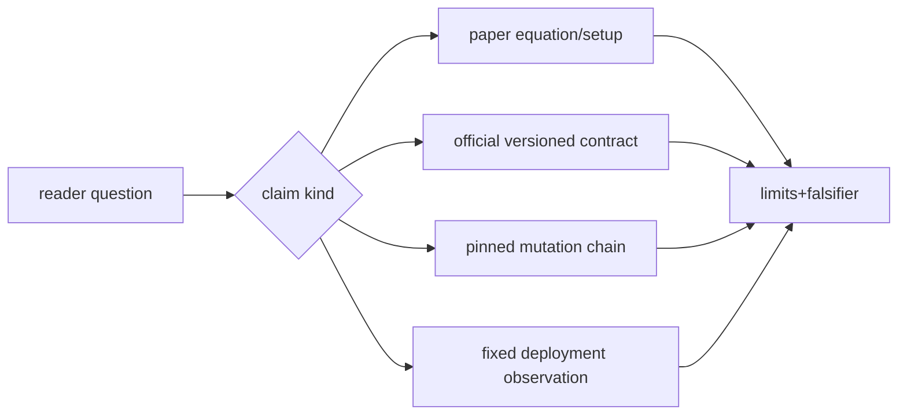
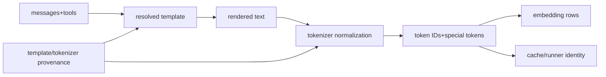
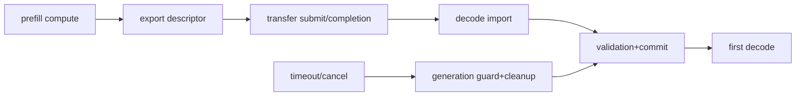
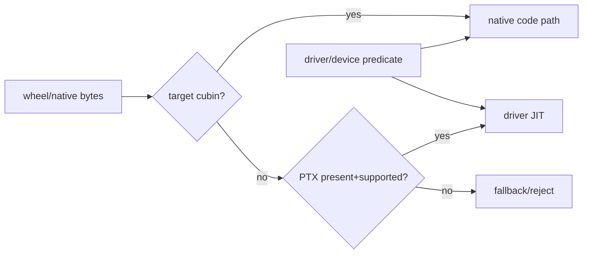
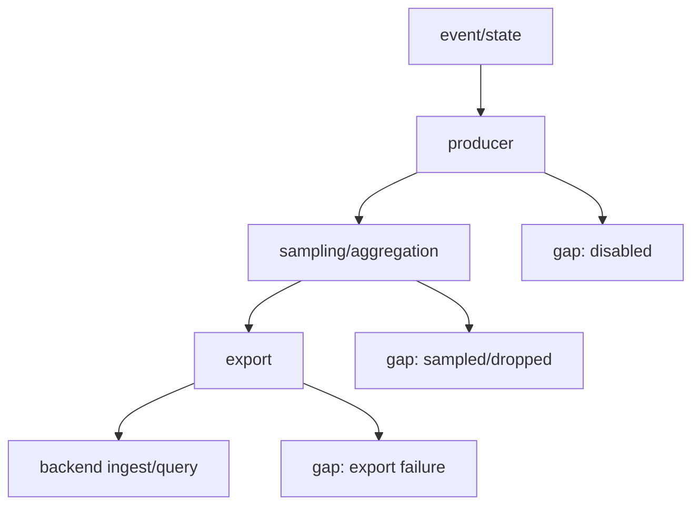
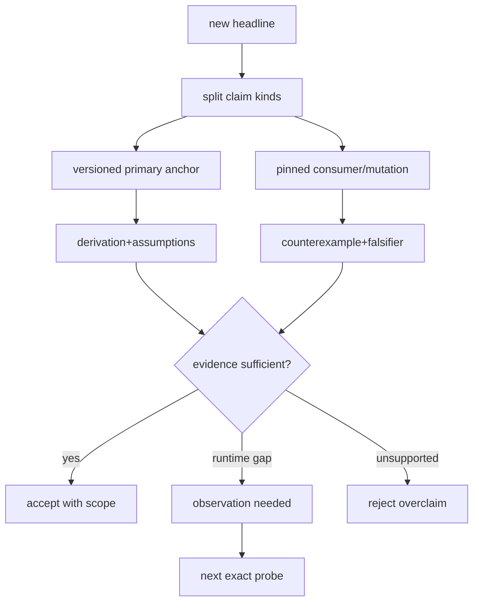

# 78장. 원문으로 돌아가는 기술: 논문·공식 문서·소스·측정을 하나의 검증 가능한 설명으로 엮기

“PagedAttention은 fragmentation을 없앤다.” “FlashAttention은 정확하면서 항상 빠르다.” “CUDA 13이면 CUDA 12보다
낫다.” 모두 익숙하고 기억하기 쉬운 문장이다. 그래서 더 위험하다. 원 논문의 문제와 가정, 공식 문서의 contract, 현행
소스의 branch, 실제 binary와 workload 관측이 한 문장에 섞여 있기 때문이다.

R78에서는 첫 문장을 해부한다. PagedAttention 논문이 줄이려는 낭비를 읽고 current vLLM의 block allocation·refcount·
prefix reuse를 찾는다. 마지막 partial block, allocator reserve, hybrid group padding과 pinned block은 별 손실 항으로 남긴다.
결론은 “낭비가 사라진다”가 아니라 어떤 낭비가 어떤 조건에서 줄고 무엇이 남는지를 계산·반증할 수 있는 문장이 된다.

이 장은 참고문헌 목록이 아니다. 독자가 주장을 만날 때 질문을 자르고, 질문에 맞는 primary evidence를 고르고, exact
anchor의 직접 지지 범위와 해석을 가르고, current implementation과 반례를 교차한 뒤 관측 공백과 다음 읽기를 남기는
방법을 열두 경로로 연습한다.

5장은 책 전체에 적용할 증거 종류와 claim 범위의 문법을 소유했다. 이 장은 그 문법을 전제로 PagedAttention·FlashAttention·CUDA와 serving stack의 실제 주장에 적용해, 충돌·공백·반증과 edition terminal까지 닫는 근거 ledger를 소유한다. 그러므로 5장의 독법을 다시 소개하는 것이 아니라 어려운 원문 판정으로 완주한다.

## 78.1 질문에서 올바른 evidence까지 가는 튜토리얼

본문 튜토리얼은 질문 하나를 문서 계약·논문 설계 명제·고정 소스 상태 전이·실행 관측으로 분해하고, 각 하위 질문에 답할 수 있는 evidence만 선택한다. 먼저 질문과 반증 조건을 쓰고, exact anchor와 version을 고르고, bounded claim을 작성하고, 다른 evidence class와 교차한 뒤 unknown을 남긴다. 78.3~78.13의 route는 이 절차를 주제별로 찾는 참고표이며, 78.14의 전체 ledger는 튜토리얼 본문과 분리된 제출 양식이다.

### 78.1.1 한 출처가 모든 질문에 답하지 않는다

Pinned source는 특정 revision의 producer·predicate·mutation·consumer를 증명하는 데 강하다. 논문은 algorithm과 설계
의도, 수학·실험 조건에 강하다. 공식 문서는 API·hardware의 public contract를 설명한다. Deployment metric은 고정 artifact,
config, topology와 fixture에서 실제 path와 결과를 말한다. 어느 하나가 “상위 근거”라서 다른 층을 대신하지 않는다.

### 78.1.2 직접 지지와 derived explanation을 분리한다

원문이 말한 문장은 `supports`에 좁게 적는다. 여러 근거와 계산을 결합한 설명은 assumption, steps, result와 falsifier를
가진 derivation으로 둔다. “논문에 따르면” 뒤에 저자가 쓰지 않은 production guarantee를 붙이지 않는다. Source branch를
보고 역사적 의도를 추측하면 inference라고 표시한다.

### 78.1.3 ledger 한 행의 합격 기준

```yaml
claim: null
claim_kind: implementation_fact|public_contract|algorithm|observation|derivation
applies_to: {project: null, revision: null, artifact: null, hardware: null}
primary_evidence: [{type: null, exact_anchor: null, supports: null}]
implementation_evidence: []
derivation: {assumptions: [], steps: [], result: null}
limits_counterexamples: []
falsifiers: []
unresolved_gap: null
next_reading: []
```

URL과 요약 한 줄만 있으면 불합격이다. 적용 revision, 직접 지지 범위, 반례와 다음 관측이 있어야 한다.

R78의 첫 행을 실제로 채우면 차이가 보인다. Claim은 “PagedAttention은 KV를 fixed-size block으로 관리해 contiguous
reservation에서 생기는 특정 낭비와 sharing 비용을 줄인다”다. Algorithm evidence는 arXiv v1의 method와 block table,
implementation evidence는 vLLM v0.27.1 block pool·manager다. Applies-to에는 paper experiment와 source revision을 따로
쓴다. Paper 수치를 현재 vLLM 성능으로 복사하지 않는다.

`supports`에는 fixed-size block mapping과 sharing 설계를 적는다. `does not support`에는 모든 fragmentation 제거, current
allocator efficiency와 production latency guarantee를 적는다. Derivation은 tail waste 식과 workload length distribution을
필요로 한다. Counterexample은 short sequences, hybrid group padding, prefix pins와 delayed free다. Falsifier는 physical-
logical gap이 ledger의 모든 항을 합친 예측 범위 밖인 경우다.

이 한 행은 출처를 많이 모아서 강한 것이 아니다. 서로 다른 질문의 evidence가 정확한 칸에 있기 때문에 강하다. 논문은
block design을, source는 current mutation을, 계산은 tail 상한을, deployment observation은 실제 distribution과 pin lifetime을
담당한다. 관측하지 않은 production efficiency는 gap으로 남긴다.

Evidence grade는 질문마다 다시 정한다. “v0.27.1이 free block을 어떤 container에 넣는가?”에는 source span이 직접
evidence다. “왜 paging abstraction을 택했는가?”에는 논문 method와 discussion이 적합하다. “우리 H100 fleet에서 OOM이
줄었는가?”에는 동일 artifact/config/workload의 deployment experiment가 필요하다. 논문이 유명하다는 사실은 세 번째
질문의 missing observation을 채우지 않는다.

Ledger reviewer는 행을 역방향으로 읽는다. Result에서 assumption과 calculation을 거쳐 exact anchors로 돌아가고, 각 anchor가
해당 edge를 직접 지지하는지 묻는다. Anchor가 repository root나 abstract뿐이면 더 내려간다. Source symbol이 renamed돼도
state invariant가 같은지 확인한다. 그래도 edge가 남으면 unresolved gap과 다음 읽기의 구체적 symbol/section/probe를 적는다.

## 78.2 질문을 자르고 exact anchor를 선택한다

### 78.2.1 “빠르다”를 shape·baseline·hardware로 분해한다

어느 algorithm variant인지, Q/K/V와 batch/sequence shape, dtype, exactness/tolerance, memory hierarchy와 baseline을 묻는다.
Paper benchmark의 GPU·software·workload를 기록한다. 현재 serving 성능은 측정하지 않았다면 수치를 만들어 쓰지 않고 재현
fixture와 필요한 metric을 제시한다.

예를 들어 “FlashAttention이 3배 빠르다”는 문장은 최소 여섯 주장으로 갈린다. 어떤 paper revision과 algorithm variant인지,
forward인가 decode인가, Q/KV length와 head dimension은 무엇인지, dtype와 causal mask는 무엇인지, 어느 GPU와 baseline
kernel인지, 측정 단위가 kernel time·model step·TTFT 중 무엇인지다. 여섯 칸 중 하나가 없으면 current service tuning에
적용할 수 없다.

“CUDA 13이 빠르다”도 compiler code generation, library version, new architecture target, driver/JIT, framework selector와
실제 operator로 나눈다. Toolkit을 바꾸면서 PyTorch·FlashInfer wheel과 driver까지 바뀌면 treatment가 하나가 아니다.
공식 release note는 feature availability를 말할 수 있지만 selected current kernel과 workload performance는 source/artifact
inventory와 experiment가 필요하다.

“P/D가 좋다”는 TTFT와 ITL interference, GPU pool utilization, KV transfer time, queue delay, reliability와 cost를 나눈다.
Throughput이 늘고 TTFT tail이 악화할 수 있으므로 objective를 먼저 정한다. Paper goodput definition과 service SLO가 같은지,
request length distribution과 topology가 비교 가능한지 적는다. 그렇지 않으면 idea evidence로만 사용한다.

### 78.2.2 abstract보다 equation·algorithm·experiment setup을 읽는다

Abstract는 문제와 기여를 찾는 지도다. 주장을 쓰려면 method equation, algorithm, memory/communication model과 experiment
setup으로 내려간다. Figure는 axis, unit, normalization과 denominator를 적는다. Official guide는 version과 section,
prerequisite와 normative wording을 확인한다.

Equation을 옮길 때 symbol dictionary를 만든다. Paper의 `N`, `B`, page와 current source의 token budget, block, batch가 같은
단위인지 확인한다. 같은 글자 B가 batch size와 block size를 번갈아 뜻할 수 있다. Dimension과 unit을 붙이면 잘못된 곱셈이
드러난다. Derived 계산에는 rounding, alignment와 denominator를 명시한다.

Figure 읽기는 가장 빠른 과대 일반화 지점이다. Speedup axis가 log인지, throughput이 accepted output token인지 total
processed token인지, latency percentile population이 무엇인지 본다. Error bar와 warmup, failure request 제외 여부도
기록한다. Plot에서 눈대중으로 읽은 값은 approximate라고 표시하고 primary table/raw data가 있으면 그것을 우선한다.

Official documentation은 descriptive와 normative wording을 가른다. “can”, “may”, “requires”의 의미와 prerequisite를
보존한다. Compatibility table에서 family가 supported여도 application이 newer driver feature나 PTX를 요구하면 별 restriction이
있다. Landing page의 “latest”는 edition이 바뀌므로 release archive나 evidence cutoff와 읽은 section을 ledger에 둔다.

### 78.2.3 source는 definition보다 mutation chain을 anchor한다

Config field 선언만으로 runtime behavior를 말하지 않는다. Producer가 값을 만들고 selector가 predicate를 평가하며 state나
object가 바뀌고 downstream consumer가 읽는 최소 span을 잇는다. 전체 함수를 복제하지 않고 branch와 mutation을 포함한
짧은 코드 좌표를 한국어로 해설한다.

소스를 읽을 때에는 최소 세 anchor가 필요할 때가 많다. Input field를 canonical state로 만드는 producer, eligibility/selection
predicate와 object/state mutation, runtime consumer 또는 metric producer다. Field name `backend`를 50곳 수집하는 것보다
이 세 edge가 낫다. Logging-only read는 implementation evidence로 분류하되 behavior mutation 증거로 세지 않는다.

Dynamic dispatch는 source만으로 actual path를 완전히 증명하지 못한다. Registry와 selector가 후보를 보여 주고 request
shape·device predicate가 branch를 고른다. Source fact는 “조건 P에서 class C를 반환한다”까지다. Deployment claim은 actual
inputs, selected class/operator와 binary symbol 관측이 필요하다. 이 경계를 ledger의 unresolved gap으로 명시한다.

짧은 코드 인용은 branch의 논리를 보존해야 한다. Assignment 한 줄만 떼어 내면 surrounding guard와 fallback을 잃는다.
반대로 helper 전체를 복제하면 독자가 핵심 mutation을 찾지 못하고 release diff에도 취약하다. Exact revision URL과 line
span, predicate의 입력·결과·lifetime을 한국어로 풀고 원문은 링크에서 읽게 한다.

읽기 실패에는 반복되는 모양이 있다. 첫째, search snippet이 답처럼 보여 원문을 열지 않는다. Snippet은 문맥과 negation,
version을 자를 수 있으므로 discovery에만 쓴다. 둘째, README headline을 public contract로 읽는다. README는 quick start와
marketing scope가 섞일 수 있어 API/spec/source prerequisite로 내려간다. 셋째, test 이름을 implementation fact로 읽는다.
Test fixture가 production lane을 덮는지와 assertion이 무엇인지 확인한다.

넷째, function name이 paper term과 같아 동일 algorithm이라 가정한다. `paged`, `flash`, `continuous`, `expert`는 단위와
invariant가 다를 수 있다. Paper symbol dictionary와 source state dictionary를 따로 만든 뒤 producer/consumer relation으로
crosswalk한다. 다섯째, source comment를 current behavior보다 강한 truth로 읽는다. Comment는 의도 evidence가 될 수 있지만
code predicate/mutation과 어긋나면 versioned gap이다.

여섯째, benchmark에서 가장 큰 speedup만 가져온다. Baseline, shape, hardware와 percentile population이 독자 workload와
다르면 idea illustration로 낮춘다. 일곱째, official compatibility 표의 pass cell을 application pass로 확대한다. Feature,
symbol, PTX/JIT와 artifact coverage를 추가한다. 여덟째, metric이 있으니 event가 관측됐다고 생각한다. Producer enablement,
sampling/export/query를 잇는다.

아홉째, 반례를 edge case라며 버린다. Tail page, empty tile, cancellation, mixed adapter와 partition은 continuous service에서
반복되는 상태다. Frequency와 impact를 관측하되 correctness invariant는 드물다는 이유로 생략하지 않는다. 열째, gap을
유사 논문으로 채운다. 다른 system의 failure semantics가 current connector 증거가 될 수 없다.

이 실패를 고치는 20분 reading loop는 짧다. 0~3분에 질문과 claim kind를 정한다. 3~7분에 versioned primary anchor와
supports/does-not-support를 쓴다. 7~12분에 current producer→mutation→consumer를 찾는다. 12~16분에 counterexample와
falsifier를 만든다. 16~20분에 unresolved gap과 다음 exact reading/probe를 남긴다. 답을 서둘러 내는 절차가 아니라 무한
검색을 bounded evidence task로 바꾸는 절차다.

`does-not-support` 칸은 부정적 장식이 아니다. CUDA guide row에는 current wheel coverage, paper row에는 current
performance, source row에는 actual deployment selection, metric spec row에는 event occurrence를 넣는다. 이 칸을 먼저
채우면 한 출처가 모든 질문을 삼키지 않는다.

Derivation reviewer는 숫자를 독립 계산한다. Unit conversion, decimal/binary bytes, per-layer/per-model, one-way/round-trip,
logical/physical token과 percentile denominator를 확인한다. 16 GiB를 100 Gb/s로 나누는 계산에서 GiB와 GB를 섞으면 1.28과
1.37초 차이가 생긴다. Convention을 적으면 둘 다 검토 가능하다.

소스 검토자는는 fixed revision·line span과 branch를, paper reviewer는 arXiv vN·conference version·equation/setup을,
deployment reviewer는 artifact digest·config·topology·workload와 clock을 본다. 한 사람이 세 역할을 수행해도 서로 다른
질문으로 review한다.



## 78.3 참고 route 1·2: Transformer tensor와 tokenization ABI

### 78.3.1 residual·attention·MLP에서 serving tensor path로

[Attention Is All You Need v7](https://arxiv.org/abs/1706.03762v7)에서 scaled dot-product attention의 식
`softmax(QKᵀ/√d_k)V`와 multi-head composition을 읽는다. 이 식은 current cache paging, fused kernel이나 continuous
batching을 말하지 않는다. 현행 implementation에서는 model layer의 Q/K/V projection, RoPE, attention call, residual과 MLP,
final norm·lm_head로 좌표를 옮긴다.

Serving 반례는 같은 식을 구현해도 cache layout, GQA head mapping, quant scale와 graph padding이 달라질 수 있다는 점이다.
첫 wrong value를 찾을 때 `[token,row,head,dim]` 단위와 layer boundary를 기록한다. 논문 식은 수학 invariant를, pinned source는
tensor producer/consumer를, runtime probe는 actual dtype·stride와 값을 담당한다.

식의 dimension을 먼저 복원한다. Hidden input `X`가 `[T,H]`, projection 뒤 Q가 `[T,Nq,D]`, K/V가 `[T,Nkv,D]`일 수 있다.
GQA에서는 `Nq != Nkv`다. Paper의 multi-head 설명만 보고 K/V head가 Q와 같다고 가정하면 cache bytes와 kernel mapping을
틀린다. Position encoding과 mask는 원 attention 식 밖의 current model-specific input일 수 있다.

Residual path도 한 문장으로 끝내지 않는다. Pre/post norm architecture, attention output projection, residual add, MLP gate/up/down과
mixture layer가 순서를 바꾼다. Model config/technical report와 pinned source에서 actual layer를 읽는다. Generic Transformer
paper는 특정 Gemma/Qwen implementation order를 직접 증명하지 않는다.

Serving input은 contiguous `[T,H]`라는 가정도 깨질 수 있다. Scheduler가 여러 sequence의 logical tokens를 packed rows로
만들고 positions, slot/page table과 request metadata를 따로 전달한다. CUDA graph bucket이면 valid rows보다 static buffer가
크다. Paper batch axis와 flattened runner row를 crosswalk해야 한다.

Falsifier는 predicted shape/dtype/order와 runtime layer input이 다른 경우다. Model-specific architecture, TP shard,
multimodal prefix, adapter/quant wrapper와 graph padding을 분기한다. “Transformer니까”라는 설명으로 actual tensor를 덮지
않는다.

### 78.3.2 embedding·residual stream·logits의 직관 경계

Token embedding은 ID를 hidden vector로 매핑하고 layer transformation을 지나 lm_head가 vocab logits를 만든다. “모델이
공간에서 생각한다”는 표현은 비유다. Linear projection과 nonlinearity, residual addition, normalization과 layer별 state를
구분한다. Logit `z_i`의 softmax 확률은 `exp(z_i)/Σ_j exp(z_j)`이며 안정 계산은 최대 logit을 빼도 확률이 같다.

Vocabulary 150,000, FP32 logits 한 row는 약 600,000 byte다. Batch 128이면 약 73.2 MiB이고 logprob/top-k·grammar mask가
추가 buffer를 만들 수 있다. 이 계산은 tensor shape에서 나온 하한이며 allocator/fusion을 포함한 peak 측정이 아니다.
Falsifier는 implementation이 sharded vocab 또는 selected logits만 materialize하는 경우다.

Logit은 정규화 전 score이지 확률이 아니다. Temperature τ는 보통 `z/τ`에 적용돼 τ<1이면 차이를 키우고 τ>1이면
평탄화한다. Top-k/top-p와 grammar mask는 softmax 전후 어느 순서로 소비되는지 implementation을 읽는다. Masked logit에
`-∞` 또는 dtype minimum을 쓰는 차이는 all-masked row와 수치 안정성에 영향을 준다.

Tensor-parallel vocab이면 rank가 shard logits를 만들고 sampling/logprob를 위해 collective 또는 distributed top-k를 수행할
수 있다. 600 KB×batch 계산은 full vocab row의 예일 뿐이다. Rank-local shape, padded vocab, requested logprobs와 grammar
allowed set을 ledger에 둔다. Does-not-support는 actual peak와 network bytes다.

Embedding geometry에서 cosine proximity나 linear direction을 causal mechanism이라고 단정하지 않는다. Representation은
layer, context와 model revision에 따라 달라진다. Probe가 correlation인지 intervention인지 구분한다. Serving debug에서는
동일 request의 first-divergent tensor 좌표를 잡는 용도로 쓴다.

### 78.3.3 tokenizer와 chat template는 API 의미의 일부다

Tokenizer paper나 algorithm만으로 actual API normalization을 증명하지 않는다. Transformers v5.15.1의
[chat template application 경로](https://github.com/huggingface/transformers/blob/550d7b3834670483a4df436541272c055dc364bf/src/transformers/tokenization_utils_base.py#L1600-L1715)에서
message/tool template, tokenize와 special-token handling을 확인하고 serving entrypoint가 어떤 kwargs를 전달하는지 잇는다.

같은 visible text라도 tokenizer revision, normalization, BOS/EOS와 template가 다르면 token IDs와 cache key가 달라진다.
Correctness reference에는 raw messages, resolved template digest, tokenizer files/revision, rendered text와 IDs를 보존한다.
Gap은 current deployment artifact에서 실제 template가 무엇인지 관측하지 않은 상태다.

Tokenizer ABI ledger는 Unicode normalization, pre-tokenizer, vocabulary/merges, added tokens, special-token policy와 decoder를
가진다. Template ledger는 message roles/content schema, tools, generation prompt, BOS/EOS와 tokenize flag를 가진다. API가
rendered prompt를 받는 lane과 messages를 render하는 lane을 분리한다.

같은 visible text라도 leading space, Unicode normalization과 special token insertion으로 IDs가 달라질 수 있다. Cache reuse와
P/D transfer key가 token IDs 외 model/template/adapter provenance를 포함하는지 본다. Cross-tenant cache에서 provenance가
빠지면 correctness/security gap이다.

Round-trip `decode(encode(x)) == x`가 항상 correctness criterion은 아니다. Normalization과 special tokens 때문에 의도적으로
달라질 수 있다. Reference는 exact rendered input→IDs와 API contract다. Streaming decoder는 incomplete UTF-8/token pieces와
cleanup state를 가진다.

질문은 “messages가 어느 exact text와 IDs로 runner에 들어갔는가?”다. Request ID로 normalization, template selection,
tokenizer revision와 runner rows를 잇는다. Source는 possible path, deployment trace는 actual path를 증명한다.



## 78.4 참고 route 3: PagedAttention과 fragmentation

### 78.4.1 논문의 primary claim을 좁힌다

[Efficient Memory Management for Large Language Model Serving with PagedAttention v1](https://arxiv.org/abs/2309.06180v1)의
problem formulation, block table과 copy-on-write sharing, experiment setup을 읽는다. OS paging 비유는 이해에 유용하지만
GPU KV allocator가 virtual memory와 동일하다는 뜻은 아니다. 논문이 비교한 baseline과 workload를 production 전체로
확대하지 않는다.

### 78.4.2 current vLLM block manager와 교차한다

현행 vLLM v0.27.1의 [KV cache manager allocation 경로](https://github.com/vllm-project/vllm/blob/6e448d0ea9bf3d88d898b65449ca6dc2aec170ac/vllm/v1/core/kv_cache_manager.py#L130-L245)와
[block pool의 free/hash/refcount 경계](https://github.com/vllm-project/vllm/blob/6e448d0ea9bf3d88d898b65449ca6dc2aec170ac/vllm/v1/core/block_pool.py#L20-L145)를 읽는다.
논문의 block abstraction과 source의 object/state를 이름으로 1:1 등치하지 않고 allocation, hash, refcount와 free invariant를
대조한다.

### 78.4.3 “fragmentation 제거”를 손실 항으로 반증한다

Block size B, sequence length L의 tail waste는 `ceil(L/B)B-L`, 비율은 이를 allocated tokens로 나눈 값이다. B=16,
L=4,097이면 마지막 block에서 15 token slot이 남지만 비율은 약 0.365%다. 짧은 L=17이면 15/32, 46.875%다. Workload
분포가 없는 “거의 완벽”은 검증할 수 없다.

Allocator reserve, hybrid group padding, prefix pinning, delayed free와 external cache owner를 별 항으로 둔다. Falsifier는
logical used tokens와 physical capacity 차이가 tail 이론보다 큰데 metadata·reserve·pin으로 설명되지 않는 경우다. R78
결론은 paging이 특정 external fragmentation과 sharing 비용을 줄이지만 모든 memory waste를 제거하지 않는다는 것이다.

손실 ledger를 실제 식으로 확장한다. Physical KV capacity를 C, committed logical tokens를 U, reserved but not yet committed를
R, tail slack을 T, group/layout padding을 G, pinned-but-not-reusable를 P, allocator metadata/rounding을 M이라 하자. 관측 가능한
gap `C-U`를 무조건 fragmentation이라 부르지 않고 `R+T+G+P+M+unknown`으로 분해한다. 각 항은 다른 owner와 mitigation을
가진다.

Tail T는 sequence lengths와 block size에서 계산한다. Reserve R은 scheduler admission과 future token policy, P는 prefix/external
cache refcount와 cancellation cleanup, G는 hybrid attention group specs에서 찾는다. M은 allocator layout과 measured bytes가
필요하다. 모든 항을 source만으로 실제 수치화할 수 없으므로 object count와 expected formula를 만들고 deployment snapshot에서
채운다.

예를 들어 block size 16, length 17 요청 1,000개를 동시에 유지하면 tail은 요청당 15 slots, 총 15,000 token slots다.
Token당 모든 layer KV가 128 KiB라면 약 1.831 GiB다. 반면 length 4,097 요청 1,000개도 같은 tail slot 수지만 logical KV가
훨씬 커 비율은 작다. 평균 length만으로 tail ratio를 예측하면 nonlinear `ceil`을 놓친다. Length histogram에서 직접 합산한다.

Prefix sharing은 U의 정의도 바꾼다. 여러 request가 같은 physical block을 참조하면 request-logical token 합과 unique physical
token을 구분한다. Sharing savings와 pinned lifetime cost를 같은 denominator로 비교하지 않는다. Reference count가 0이 되기
전에는 free가 아니며 cancel/abort가 늦으면 paper의 steady-state memory model과 다른 tail이 생긴다.

R78의 corrected claim은 reader action으로 끝난다. Block size와 length histogram에서 T를 계산하고, block pool snapshot에서
C/free/refcount를 수집하며, scheduler reserve와 cache owner를 join한다. 예측 gap과 실제 gap이 다르면 unknown을 숨기지 않고
first missing owner를 찾는다. 이 절차가 “fragmentation 제거”라는 headline보다 운영에 유용하다.

## 78.5 참고 route 4: FlashAttention과 FlashInfer plan/run

### 78.5.1 IO-aware exact attention이 주장하는 것

[FlashAttention v2](https://arxiv.org/abs/2205.14135v2)은 attention의 IO complexity와 tiling, online softmax를 다룬다. Exact는
reference와 수학적으로 같은 attention을 의도한다는 뜻이지 모든 dtype·reduction order에서 bitwise identical이라는 뜻이
아니다. Paper hardware와 shape의 speedup을 current serving 보장으로 쓰지 않는다.

Online softmax에서 tile별 running max `m`과 normalizer `l`을 갱신하는 이유를 유도한다. 새 max가 `m'`이면 이전 합은
`l·exp(m-m')`로 rescale된다. 이 invariant가 깨지면 tile 순서에 따라 결과가 달라진다. Empty/tail tile, causal/window mask와
all-masked row를 반례로 둔다.

Primary claim을 읽을 때 FLOP 감소와 HBM IO 감소를 혼동하지 않는다. FlashAttention은 dense attention FLOP를 마법처럼
없애는 주장이 아니라 on-chip tiling과 recomputation으로 HBM intermediate traffic을 줄이는 IO-aware algorithm이다.
Sequence length, SRAM size와 block choices가 complexity expression에 들어간다. Full score matrix를 materialize하지 않는다는
말과 전체 process peak가 반드시 낮다는 말도 다르다.

Exactness ledger에는 reference definition, dtype와 tolerance를 둔다. Online softmax algebra는 exact real arithmetic에서
같지만 FP16/BF16/FP32 accumulation, reduction order와 fused mask에서 rounding이 달라질 수 있다. Token output만 비교하면
near-tie logits divergence를 놓친다. Layer output error, logits top-k와 selected token을 단계별로 본다.

Does-not-support에는 paged KV correctness, graph replay safety와 arbitrary sparse mask를 적는다. Paper method가 옳아도 serving
metadata가 wrong page/length를 주면 잘못된 값을 낸다. Unsupported head dimension이나 dtype에서 framework가 fallback하면
paper speedup과 무관하다. Current selector·plan/run·operator evidence가 필요한 이유다.

### 78.5.2 FlashInfer는 plan과 run의 state contract를 가진다

FlashInfer 고정 source의 [paged decode wrapper plan](https://github.com/flashinfer-ai/flashinfer/blob/a0a6b019b9b27d49d209f85d028a1ae5a9b347d7/flashinfer/decode.py#L1239-L1515)과
[run 경로](https://github.com/flashinfer-ai/flashinfer/blob/a0a6b019b9b27d49d209f85d028a1ae5a9b347d7/flashinfer/decode.py#L1766-L1830)를
분리해 읽는다. Page tables, workspace, dtype·head shape와 backend choice가 plan/run 사이의 contract다.

Paper의 tile abstraction을 wrapper page나 serving block과 같은 단위로 부르지 않는다. Plan generation과 request metadata가
어긋나면 algorithm은 옳아도 wrong page를 읽을 수 있다. Falsifier는 selected kernel은 expected지만 plan inputs 또는
workspace generation이 request와 다를 때다.

Plan ledger에는 indptr/indices/last-page length, batch, Q/KV heads, head dimension, page size, dtype, positional mode와 workspace
owner를 넣는다. Run ledger에는 query/KV tensor shape, scale, stream, planned handler generation과 output을 넣는다. 같은 Python
wrapper object를 썼다는 사실보다 plan inputs가 current request와 같은지가 중요하다. Batch compaction과 slot reuse가 있으면
request ID→row/page mapping generation도 필요하다.

소스 범위는 plan method가 checks와 dispatch module을 만들고 run이 무엇을 소비하는지 직접 지지한다. 그러나 source만으로
deployed wheel이 같은 compiled kernel을 포함하거나 실제 request가 이 wrapper를 택했다는 사실은 증명하지 않는다.
Wheel/native inventory와 runtime operator trace가 gap이다. 이 장에서는 실행하지 않으므로 expected signature만 둔다.

Serving counterexample은 CUDA graph capture 뒤 page table buffer가 in-place 갱신되는데 valid region 또는 tail row가 stale인
경우다. Plan key는 같아 보여 replay되지만 wrong page를 읽을 수 있다. First-value probe는 attention metadata, gathered K/V와
attention output을 순서대로 비교한다. “수치 오차”라고 부르기 전에 representation freshness를 반증한다.

### 78.5.3 byte derivation으로 빠르다는 말을 제한한다

Attention score matrix를 명시적으로 materialize하면 batch/head를 제외해도 query Q, KV length K에서 Q×K elements가
필요하다. Q=4,096, K=4,096, FP16이면 한 matrix가 32 MiB다. Tiled algorithm은 full score materialization을 피하지만 Q/K/V와
output, running stats·workspace IO는 남는다. 실제 bytes는 kernel과 cache/layout에서 측정해야 한다.

Serving에서는 decode Q=1과 prefill Q≫1, paged/nonpaged, GQA와 quantized KV가 다른 lane이다. “FlashAttention on”이라는
option보다 selected method, plan key, workspace와 operator signature를 기록한다.

HBM byte derivation도 lower bound와 realized traffic을 가른다. Q/K/V를 한 번 읽고 output을 한 번 쓴다는 이상적 하한에
cache miss, reread, page-table gather, scale, mask와 workspace를 더한다. Source에서 tensor size를 계산해 expected order만
만들고 profiler가 없으면 실제 bytes를 주장하지 않는다. Falsifier는 measured traffic이 full-score baseline과 비슷하거나
selected operator가 다른 경우다.

Decode Q=1에서는 score 한 row보다 K/V streaming이 지배한다. Prefill Q=K=4096에서는 score materialization 회피가 크게
보인다. 두 lane을 평균 latency로 합치면 benefit을 가린다. GQA는 KV heads가 Q heads보다 적어 K/V bytes와 mapping이
바뀌고, quantized KV는 bytes를 줄이지만 dequant scale와 supported-kernel predicate를 추가한다.

Completed claim은 “artifact와 predicate P를 만족한 prefill cohort가 method M을 선택하면 full score materialization을 피하는
IO-aware path를 기대한다”다. Does-not-support는 current speedup 수치다. Next reading은 operator trace, HBM traffic, logits
tolerance와 fallback reason이다.

## 78.6 참고 route 5: continuous batching과 scheduler fairness

### 78.6.1 iteration-level scheduling의 design claim

[Orca](https://www.usenix.org/conference/osdi22/presentation/yu)은 iteration-level scheduling과 selective batching을
설명한다. 논문의 request/model/hardware와 scheduling objective를 읽고 current scheduler가 같은 policy라고 이름만으로
등치하지 않는다. 현행 vLLM은 computed-token 차이, budget과 request states를 소비한다.

Background intuition은 요청 전체를 끝까지 고정 batch로 묶는 대신 iteration 경계에서 다시 구성하면 새 요청과 완료 sequence를
반영할 수 있다는 것이다. 이 직관이 arbitrary preemption, priority fairness와 chunked prefill을 보장하지 않는다. Paper의
scheduling unit, selective batching 조건과 evaluated model을 exact section에서 읽는다.

Implementation crosswalk는 이름 대신 invariant를 찾는다. Iteration마다 runnable state에서 work를 고르고 model execution
batch를 만든다는 invariant는 유지될 수 있다. 하지만 current request/cache state, speculative tokens와 structured output은
paper abstraction을 확장한다. 확장은 별 source-backed claim이다.

Does-not-support에는 current queue fairness와 SLO를 둔다. Paper plot은 mixed tenant·adapter workload에 직접 적용되지 않는다.
현재 branch와 fixed deployment observation이 필요하다.

### 78.6.2 current queue mutation으로 내려간다

vLLM v0.27.1의 [schedule loop와 token budget](https://github.com/vllm-project/vllm/blob/6e448d0ea9bf3d88d898b65449ca6dc2aec170ac/vllm/v1/core/sched/scheduler.py#L439-L540), SGLang v0.5.18의 [ScheduleBatch state](https://github.com/sgl-project/sglang/blob/71de97b264b04dcd514cf904003028aefe9775c8/python/sglang/srt/managers/schedule_batch.py#L2002-L2090)를 queue 선언이 아니라 selection·mutation·output에서 읽는다.

Priority, chunking, preemption과 adapter/grammar compatibility는 논문 abstraction에 추가된 serving predicate다.

소스를 따라갈 때는 waiting/running container 선언에서 멈추지 않는다. Request가 어떤 condition에서 selected, deferred 또는
preempted되고 remaining/computed tokens와 budget이 어떻게 변하며 output에 어떤 count·metadata가 들어가는지 본다. Cache
allocation 실패와 connector wait도 runnable state를 바꿀 수 있다.

두 stack의 비슷한 field 이름을 같은 policy로 등치하지 않는다. Unit, default, chunking과 decode reserve가 다를 수 있다.
Cross-stack 비교는 input predicate, selected request set, per-request token mutation과 runner shape라는 의미 좌표로 한다.

Bad claim은 “continuous batching이므로 starvation이 없다”다. Iteration 재선택은 fairness의 필요조건일 수 있지만 priority,
work size와 preemption cost에 따라 cohort가 굶을 수 있다. Falsifier는 bounded workload에서 queue age가 계속 증가하고
service share가 0에 가까워지는 경우다.

### 78.6.3 throughput과 fairness의 반례

큰 token budget이 GPU utilization을 높여도 긴 prefill step이 decode ITL tail을 악화할 수 있다. Fairness는 request 수가
아니라 token work, queue age와 tenant/service class로 볼 수 있다. Fixture는 long-prefill과 interactive decode cohort,
prefix hit·adapter·grammar를 고정한다. Runtime 관측 전에는 성능 결론 대신 scheduled-token distribution과 falsifier를 쓴다.

Queueing derivation은 service time을 평균 하나로 접지 않는다. TTFT는 admission wait, scheduling wait, prefill compute/transfer와
first-token delivery의 합이다. ITL은 step queue, batch execution, sampling과 delivery를 포함한다. Scheduler가 batch를 바꾸면
queue와 service 항이 함께 변한다.

Budget 8,192에서 12,288-token prefill과 200 decode tokens가 경쟁하면 chunk와 decode reserve가 policy에 따라 갈린다. Budget
16,384에서 더 많이 처리해도 step time이 늘어 decode ITL이 악화할 수 있다. Expected signature는 scheduled token
distribution, step duration과 cohort queue age다. Actual effect는 동일 backlog experiment가 필요하다.

Fairness ledger에는 prompt/output length, arrival, priority, cache hit, adapter/grammar와 P/D role을 둔다. Falsifier는 throughput
차이가 workload composition 통제 뒤 사라지는 경우다. Gap은 runtime measurement이고 다음 reading은 metric producer와
experiment dossier다.

## 78.7 참고 route 6: P/D disaggregation과 transfer protocol

### 78.7.1 분리의 이익은 transfer cost와 함께 계산한다

[DistServe v3](https://arxiv.org/abs/2401.09670v3)와 [Mooncake v4](https://arxiv.org/abs/2407.00079v4)의 workload/model, goodput/SLO와
hardware topology를 읽는다. Prefill/decode interference 감소는 transfer가 공짜라는 뜻이 아니다. KV bytes, effective
bandwidth, setup·queue·commit latency를 break-even에 넣는다.

KV payload를 layer당 token당 128 KiB, 32 layers, prefix 4,096 tokens로 정의하면 16 GiB다. 100 Gb/s의 decimal 이론 하한은
약 1.37초지만 protocol, topology와 contention이 더해진다. 단위 정의에 layer가 이미 포함됐으면 다시 곱하지 않는다.

Paper supports에는 prefill/decode 자원 분리와 evaluated scheduling/transfer architecture를 둔다. Does-not-support에는 current
connector protocol, arbitrary partition과 모든 workload의 break-even을 둔다. 같은 “disaggregation”이라도 direct transfer,
cache store와 routing policy는 다르다.

Break-even은 monolithic interference 절감 `ΔI`와 추가 비용 `Tsetup+Tqueue+S/B_eff+Tcommit`을 비교한다. Saved benefit이
추가 비용과 failure risk를 넘어야 한다. `B_eff`는 link rate가 아니라 contention·topology·protocol을 포함한 bandwidth다.
Partial reuse나 compression이 있으면 S 정의가 달라진다.

16 GiB를 100 Gb/s, 즉 12.5 GB/s로 보내는 단순 하한은 약 1.37초다. GiB/GB를 같은 체계로 환산하면 값이 달라지므로 unit을
적는다. 400 Gb/s에서도 약 0.34초이며 setup·commit이 0은 아니다. Prefix가 512 tokens면 S는 1/8이지만 fixed cost 비중은
커진다.

### 78.7.2 current connector에서 commit boundary를 찾는다

소스 atlas의 connector factory, scheduler request metadata, worker send/receive와 import commit을 잇는다. Mooncake·LMCache·
NIXL의 register, submit, completion, publish/commit과 release를 같은 “전송”으로 합치지 않는다. P/D role option과 endpoint가
있다는 사실은 request가 imported KV를 사용했다는 증거가 아니다.

Crosswalk에는 ownership을 넣는다. Scheduler가 remote blocks를 기대하는 시점, destination allocation/register, transfer
completion, layer/page validation, cache publish와 runnable transition을 분리한다. Submit 반환, local event, peer observation과
protocol commit이 같은 completion인지 source contract를 읽는다.

LMCache는 lookup length, layer readiness, pin/unpin과 cleanup을, Mooncake는 segment registration, batch transfer,
metadata notification과 revoke/reuse를 별 좌표로 본다. NIXL도 descriptor와 transport capability를 확인한다. 함수명을 다른
프로젝트에 강제로 매핑하지 않는다.

Implementation evidence는 current revision behavior에 강하지만 deployed connector selection은 runtime observation이 필요하다.
Imported blocks, transfer bytes/duration, first decode와 commit generation을 request로 join한다. Startup log로 gap을 메우지
않는다.

### 78.7.3 network partition과 late completion이 논문 범위를 넘는 곳

Single-run benchmark는 timeout 뒤 descriptor reuse, cancellation과 late writer, mixed version protocol을 모두 평가하지 않을
수 있다. Serving counterexample은 prefill producer가 page를 회수한 뒤 늦은 transfer가 같은 address에 쓰는 경우다.
Generation/lease와 commit guard, abort cleanup이 필요하다. Gap은 실제 deployment topology와 failure injection 관측이 없다.

Failure ledger에는 lost request, duplicate delivery, timeout, cancel과 restart를 둔다. Payload가 remote memory에 완료됐지만
publish가 실패한 경우와 descriptor는 보였지만 payload가 partial인 경우는 recovery가 다르다. Idempotency key,
checksum/generation과 free condition을 source에서 찾는다.

Address A가 generation g1/R1 소유였다가 timeout 후 g2/R2에 재사용됐다면 늦은 g1 writer를 거부해야 한다. Pointer equality는
object identity가 아니다. Paper가 failure-free experiment를 했다면 이 semantics를 지지한다고 쓰지 않는다.

Digging question은 “처음 양쪽이 다르게 아는 state는 어디인가?”다. Role별 descriptor published, payload completed,
validated, committed와 released를 matrix에 둔다. 이 장에서는 expected transition과 probe만 제시한다.



## 78.8 참고 route 7: quantization과 packing·kernel ABI

### 78.8.1 GPTQ·AWQ가 최적화하는 대상을 가른다

[GPTQ v2](https://arxiv.org/abs/2210.17323v2)은 post-training weight quantization의 근사 문제와 layer-wise procedure를,
[AWQ v6](https://arxiv.org/abs/2306.00978v6)은 activation-aware salient weights와 scaling을 다룬다. Paper의 accuracy benchmark,
model과 bit/group 조건을 기록한다. “4-bit” 하나로 calibration, packing, compute dtype과 kernel을 합치지 않는다.

GPTQ route의 primary claim은 approximate second-order information을 이용해 quantization error를 보정하는 layer-wise method다.
AWQ route는 activation 관측으로 salient weight channel을 찾고 scaling을 사용한다. 두 paper의 objective와 calibration data,
weight-only 조건을 구분한다. AWQ라는 file format이나 kernel 이름이 paper method 전체를 보장하지 않는다.

Does-not-support에는 current serialization layout, loader compatibility, KV quantization과 arbitrary task accuracy를 둔다.
Paper table의 perplexity/zero-shot result를 다른 model revision·template/domain에 그대로 쓰지 않는다. Quantized checkpoint가
어떤 converter와 config로 생성됐는지는 build provenance가 필요하다.

Serving reader 질문은 “이 checkpoint가 paper method인가?”보다 구체적이다. Config의 method/group/zero-point, packed tensor와
scale shape, excluded layer, compute/activation/KV dtype, layer method object와 phase별 operator를 잇는다. 어느 edge가 없으면
claim 범위를 그 앞에서 멈춘다.

### 78.8.2 loader method와 runtime operator를 교차한다

Transformers의 [BitsAndBytes module replacement](https://github.com/huggingface/transformers/blob/550d7b3834670483a4df436541272c055dc364bf/src/transformers/integrations/bitsandbytes.py#L165-L220)과
vLLM attention의 [quant method·scale 구성](https://github.com/vllm-project/vllm/blob/6e448d0ea9bf3d88d898b65449ca6dc2aec170ac/vllm/model_executor/layers/attention/attention.py#L150-L225)을 읽는다.
Weight quantization, activation과 KV cache quantization은 별 claim이다.

Transformers span은 quantization config가 module replacement constructor의 compute dtype, quant type와 storage를 바꾸는 것을
직접 지지한다. vLLM span은 attention layer가 cache quant method와 scale state를 만드는 범위를 지지한다. 둘을 합쳐
“BitsAndBytes가 vLLM KV를 quantize한다”고 쓰면 evidence graph가 끊긴다.

Loader ledger는 checkpoint tensor name/shape, packed representation, scale/zero-point와 module parameter를 비교한다. Runtime
ledger는 input M/K/N, activation dtype, SM/build capability, selected quant operator와 fallback을 기록한다. Loader 성공은
specialized GEMM 실행 증거가 아니다.

Quantization과 adapter/grammar interaction도 반례다. LoRA merge 또는 dynamic adapter가 base packed weight와 별 precision path를
쓸 수 있고 grammar mask는 quantized model logits의 near-tie를 token difference로 확대할 수 있다. Correctness fixture는
logits/top-k와 constrained accepted token을 본다.

### 78.8.3 4-bit 용량 하한과 fallback 반례

8B weights의 raw 4-bit 하한은 4 GB다. 64 weights당 FP16 scale 하나면 단순 scale payload는 250 MB이고 같은 크기 zero point가
붙으면 500 MB다. 실제 group axis, excluded layer와 allocator를 source에서 합산해야 한다. Packed weight가 load됐어도 M/K/N,
SM·dtype guard에서 dequantize fallback할 수 있다. Operator signature 전에는 speedup을 주장하지 않는다.

용량 derivation의 assumption을 더 적는다. 8B는 decimal parameters이고 4-bit payload 4 GB는 metadata와 padding이 없는
하한이다. FP16 scale 250 MB와 zero point 250 MB를 더하면 4.5 GB지만 group axis가 layer별로 다르고 embedding/lm_head가
FP16이면 더 커진다. TP shard alignment와 allocator reserve도 actual peak에 붙는다.

Performance 반례는 small-M decode다. Large-M prefill에서는 quantized GEMM이 효율적이어도 decode GEMV가 dequantization이나
launch overhead에 묶일 수 있다. Backend가 unsupported shape에서 higher-precision fallback하면 memory savings와 compute path가
엇갈린다. Phase별 operator와 latency cohort를 분리한다.

Falsifier는 packed/scale inventory가 expected scheme과 다르거나, expected guard를 만족하는데 specialized operator가 선택되지
않는 경우다. Next reading은 converter source, loader method, platform support predicate와 profiler operator다. 이 장은 actual
accuracy/speed를 측정하지 않았으므로 결과 수치를 주장하지 않는다.

## 78.9 참고 route 8: MoE·병렬화와 topology·imbalance

### 78.9.1 expert sparsity와 실제 communication을 분리한다

[Switch Transformers v3](https://arxiv.org/abs/2101.03961v3)의 routing, capacity와 auxiliary loss를 읽되 training objective는 2권
bridge로 남긴다. Serving에서는 token→expert assignment, local/remote ownership, all-to-all dispatch/combine와 load imbalance가
핵심이다. Activated parameter 수가 작다는 말은 communication이 작다는 뜻이 아니다.

Paper의 primary claim에는 sparse expert activation과 routing/capacity design이 있다. Does-not-support에는 current serving의
expert placement, all-to-all implementation, heterogeneous topology와 request fairness를 둔다. Training auxiliary loss가
serving batch의 순간 imbalance를 없앤다고 쓰지 않는다. Model checkpoint routing behavior와 runtime token distribution을
관측해야 한다.

Implementation crosswalk는 router logits/top-k, token permutation, expert owner mapping, dispatch collective, local expert
compute, combine과 inverse permutation이다. Expert parallel group과 tensor/data parallel group을 구분한다. Dropped token,
capacity padding과 shared expert가 있으면 별 state로 둔다.

Serving counterexample은 평균적으로 balanced한 model도 batch가 작거나 domain이 치우치면 한 expert에 몰릴 수 있다는 점이다.
Graph capture는 max capacity로 padding해 실제 activation sparsity와 다른 memory/compute를 만들 수 있다. Adapter가 expert
weight/path를 바꾸면 batch compatibility도 달라진다.

### 78.9.2 bytes와 imbalance를 계산한다

M tokens, hidden H, element bytes e를 all-to-all로 보내고 돌아온다면 routing metadata를 제외한 단순 payload 왕복 하한은
`2MHe`다. M=4,096, H=8,192, FP16이면 128 MiB다. Expert max load가 평균의 1.8배면 step critical path는 평균 bytes만으로
예측할 수 없다. Padding/drop/overflow policy를 포함한다.

128 MiB 하한은 모든 token이 rank 경계를 한 번 건너고 돌아온다는 단순 모델이다. Local expert token은 network를 건너지
않을 수 있고 metadata, alignment와 multiple stages는 bytes를 늘린다. Effective link bandwidth와 topology contention을
넣어 `Tcomm ≥ bytes/B_eff`로 계산하되 overlap이 있으면 step critical path는 단순 합이 아니다.

Expert imbalance metric은 max/mean, coefficient of variation과 zero-token expert를 함께 본다. Mean load가 M/E여도 max가
1.8배면 slowest rank가 barrier를 지배할 수 있다. Capacity factor가 초과 token을 drop 또는 reroute하면 latency와
correctness/quality trade-off가 생긴다. Source의 overflow policy를 읽는다.

Falsifier는 observed all-to-all bytes가 routing assignments로 계산한 range와 맞지 않는 경우다. Hidden compression,
different sharding, duplicate dispatch 또는 metric unit을 의심한다. Paper speedup과 current topology를 비교하기 전에 이
byte ledger를 닫는다.

### 78.9.3 NCCL 호출과 topology를 current source에 붙인다

Collective API 호출은 transport completion이 아니다. NCCL 고정 source의 enqueue, channel/proxy/transport와 RAS error
observation을 rank×sequence로 읽는다. EP/TP/DP group membership, NVLink/NVSwitch/NIC와 NUMA를 deployment inventory에
연결한다. Paper의 homogeneous topology 결과를 heterogeneous fleet guarantee로 확대하지 않는다.

NCCL call site만 찾으면 collective type과 communicator는 알 수 있지만 selected ring/tree, channel, transport와 completion은
모른다. Current NCCL source와 official guide에서 enqueue/proxy ownership을 읽고 trace에서 rank, sequence, bytes와 transport를
관측한다. All-to-all이 custom P2P schedule이면 AllReduce paper/metric을 적용하지 않는다.

Topology ledger에는 rank→GPU UUID/BDF/NUMA, NVLink/NVSwitch path, NIC와 process binding을 둔다. “H100 8장”은 topology
설명이 아니다. 일부 peer link가 degraded되거나 cross-socket이면 same model/image에서도 B_eff와 algorithm choice가 달라진다.

Practical digging question은 “첫 imbalance는 router token count인가, dispatch queue인가, transport progress인가, expert compute
time인가?”다. 각 stage의 per-rank count/time을 matrix로 둔다. Runtime probe가 없으면 source에서 producer와 metric location만
고정하고 원인을 단정하지 않는다.

## 78.10 참고 route 9·10: CUDA model과 12.x/13.x deployment

### 78.10.1 grid·warp·memory hierarchy를 kernel source와 잇는다

[CUDA C++ Programming Guide 13.0 archive](https://docs.nvidia.com/cuda/archive/13.0.0/cuda-c-programming-guide/index.html)의
versioned execution model에서 grid/block/thread, warp, memory spaces와 synchronization contract를
읽는다. Cache line은 hardware가 spatial locality와 transaction을 다루는 단위지만 모든 access가 같은 cache hit behavior를
갖는다는 뜻이 아니다. Coalescing, alignment, stride, working set과 architecture를 본다.

Kernel source에서는 grid/block, shared memory, stream, workspace와 launch predicate를 기록한다. Host enqueue 반환은 device
completion이 아니다. Error observation과 dependent consumer/synchronization까지 잇는다. 공식 문서는 가능 contract,
source는 launch 구성, measurement는 실제 occupancy·transactions와 time을 담당한다.

Cache hierarchy 직관은 가까운 작은 저장소가 temporal/spatial locality를 이용해 latency와 bandwidth pressure를 줄인다는
것이다. Cache line/sector는 transfer와 tag의 하드웨어 단위이므로 인접 thread가 연속 주소를 읽으면 transaction을 합칠
가능성이 커진다. 그러나 exact line size·policy와 hit behavior는 architecture/guide에 고정해야 한다.

Stride가 element size의 warp 폭보다 커지면 thread addresses가 여러 transaction으로 퍼질 수 있다. 반대로 contiguous라도
alignment와 vector width, cache bypass/load instruction이 결과를 바꾼다. Shared-memory tiling은 reuse를 명시하지만 bank
conflict와 occupancy cost가 있다. “coalesced면 빠르다”는 필요조건 일부일 뿐이다.

Kernel ledger는 logical tensor index→pointer/stride, block/thread mapping, shared-memory tile, synchronization, register pressure와
launch dimensions을 잇는다. Source에서 기대 transaction을 유도하고 profiler에서 requested/actual sectors, hit rate와
stall을 관측한다. Measurement 없이 cache hit 수치를 만들지 않는다.

### 78.10.2 CUDA 12.x와 13.x를 feature predicate로 읽는다

NVIDIA [minor-version compatibility](https://docs.nvidia.com/deploy/cuda-compatibility/minor-version-compatibility.html)는 CUDA
12.x 최소 driver 525, 13.x 580의 family 범위를 제시하지만 feature 제한, PTX와 target architecture 조건을 함께 읽어야 한다.
Toolkit label만으로 current wheel의 cubin/PTX target이나 selected kernel을 증명하지 않는다.

Official table directly supports하는 것은 toolkit family와 minimum driver compatibility 범위다. Does-not-support는 모든 새
feature, PTX ISA와 third-party library ABI다. Minor compatibility 문서가 명시하는 limited feature, PTX와 target architecture
조건을 같은 ledger row에 넣는다. “driver 535니까 CUDA 12 전부 OK”라는 문장을 거부한다.

CUDA 12.x→13.x diff는 release notes/API, compiler target/code artifact와 application selection으로 나눈다. Compiler가 새 SM
target을 지원해도 wheel이 그 target으로 build되지 않았을 수 있다. Wheel이 PTX를 포함해도 host JIT compiler가 해당 ISA를
지원하지 않을 수 있다. 모두 통과해도 framework selector가 다른 backend를 고를 수 있다.

Falsifier는 allowed compatibility predicate인데 runtime `cudaErrorCallRequiresNewerDriver`, missing symbol, PTX JIT failure 또는
fallback이 나타나는 경우다. 그때 toolkit version 문자열이 아니라 required feature/symbol, loaded driver library와 embedded
code target에서 first divergence를 찾는다.

### 78.10.3 wheel·cubin·PTX·JIT의 네 증거

Build manifest에서 wheel digest와 native members, embedded cubin/target, PTX ISA와 JIT compiler/driver path를 연결한다.
Forward compatibility package는 별 library resolution과 supported device predicate를 갖는다. Same image라도 host driver/JIT
cache가 다르면 path가 갈릴 수 있다. 이 장은 runtime을 실행하지 않으므로 expected predicate와 수집할 mapping/operator를
제시한다.

네 증거를 한 행에 뭉치지 않는다. Wheel evidence는 archive/member digest와 Python/ABI/platform tag, native evidence는 ELF
dependency와 cubin target, PTX evidence는 ISA와 embedded section, JIT evidence는 loaded compiler/driver, cache key와 output
artifact다. 각각 producer와 verification tool이 다르다. Tool이 section을 읽지 못하면 target absent가 아니라 unknown이다.

Fleet lane SM80 40%, SM90 60%이고 payload가 SM90 cubin과 PTX를 가졌다면 native coverage는 60%다. 나머지 40%는 PTX/JIT
predicate가 pass해야 supported다. PTX를 policy상 금지하거나 driver가 ISA를 못 읽으면 그 lane은 unsupported/fallback이다.
GPU 종류 둘을 “지원”한다고 세지 않고 traffic-weighted disposition을 둔다.

JIT cache는 source/template, toolkit/compiler, flags, target SM, framework/backend revision을 key material로 가져야 한다. Same
filename hit가 expected artifact라는 뜻은 아니다. Sidecar material/output digest와 loaded artifact를 비교한다. Release가
공유 writable namespace에서 stale entry를 읽으면 image digest가 같아도 path가 갈린다.

현재 vLLM·SGLang wheel이 어느 target을 포함하는지는 build manifest/native inventory의 질문이다. Source에 CUDA 13 branch가
있다는 사실과 release wheel coverage는 다르다. llama.cpp도 build flags와 ggml-cuda code target, runtime backend assignment를
잇는다. Transformers core는 framework/backend가 소유한 compiled path 경계를 명시한다.

Completed row는 versioned CUDA public contract, fixed wheel/native artifact, loaded driver/device predicate와 selected operator를
가진다. Gap은 runtime을 실행하지 않아 actual mapping을 관측하지 않았다는 것이다. Next action은 admission inventory와
representative shape의 operator trace다.



## 78.11 참고 route 11: NCCL contract와 hang investigation

### 78.11.1 collective의 수학과 protocol completion을 가른다

AllReduce 결과 정의와 API enqueue, device start, local completion, peer observation과 application commit은 별 단계다.
[NCCL 2.30.7 collective operation contract](https://docs.nvidia.com/deeplearning/nccl/archives/nccl_2307/user-guide/docs/usage/collectives.html)와
group/async error contract를 읽고, current source의 operation sequence와 proxy
progress를 붙인다. 한 rank의 return은 모든 peer의 같은 sequence 완료를 뜻하지 않을 수 있다.

AllReduce 수학은 rank input을 reduction하고 결과를 모든 rank에 제공한다. 이 정의는 implementation이 ring/tree 중 무엇을
고르고 몇 channel로 chunking하는지 말하지 않는다. API enqueue success는 arguments/order가 local queue에 들어갔다는
증거일 수 있지만 peer가 같은 collective를 enqueue했거나 transport가 완료됐다는 증거는 아니다.

Ledger의 completion vocabulary를 고정한다. Submitted, device started, local completed, peer observed, protocol committed와
application-consumed를 별 state로 둔다. Official API/async error contract와 source의 event/proxy progress가 어느 edge를
지지하는지 적는다. “NCCL call에서 멈춤”은 어느 edge인지 없어서 반증 불가능하다.

Does-not-support에는 host return 이후 모든 failure 부재, heterogeneous rank의 같은 timing과 P/D application commit을 둔다.
KV transfer가 NCCL primitive를 사용해도 cache publish/descriptor commit은 상위 protocol이다. Collective completion과 token
readiness를 합치지 않는다.

### 78.11.2 topology와 algorithm 선택 범위

Ring/tree, protocol과 channel selection은 message size, rank/topology와 build/runtime capability에 좌우된다. 공식 tuning 설명은
가능성과 heuristic을 말하고 actual selected path는 trace/source state가 필요하다. NVLink가 있다는 사실만으로 모든 traffic이
그 경로를 사용한다고 쓰지 않는다.

Official tuning guide의 algorithm/protocol 환경 변수와 heuristics는 가능한 control surface다. Actual selected channel/ring과
transport는 topology discovery, message size, build/runtime capability와 override 결과를 관측해야 한다. Startup topology
print가 request별 collective path 전체를 보장하지 않는다.

Rank ledger에는 communicator ID/generation, rank, collective sequence, count/dtype/op/root, stream과 bytes를 둔다. Topology에는
GPU UUID/BDF/NUMA, peer link, NIC와 process affinity가 있다. 동일 image/NCCL version에서도 host-mounted network plugin이
다르면 path가 갈린다. Supply-chain closure를 rank dimension에 붙인다.

Counterexample은 rank 3만 plugin load에 실패해 socket fallback하고 전체 collective tail이 늘어나는 경우다. 평균 bandwidth나
rank 0 trace는 first divergence를 숨긴다. Per-rank proxy/transport progress와 selected interface를 비교한다.

### 78.11.3 first incomplete edge로 사건을 닫는다

Rank×sequence matrix에 submitted, device started, local completed, peer observed와 protocol committed를 둔다. Hang은 “NCCL
문제”가 아니라 처음 불완전한 edge의 owner를 찾는 일이다. Abort 뒤 late proxy/transport writer, communicator generation과
rejoin cleanup을 본다. Runtime evidence가 없으면 source contract와 필요한 probe만 남긴다.

Matrix에서 seq 42가 rank0~2 local complete, rank3 device-start 미관측이라면 first incomplete edge는 rank3 enqueue→device
start다. Rank3 device start는 있지만 peer receive가 없으면 transport/proxy 축이다. 모든 transport가 끝났는데 application이
기다리면 stream dependency 또는 상위 commit을 본다. “network 문제”라는 큰 이름보다 owner가 좁다.

Abort는 terminal이 아니다. Communicator를 새로 만들기 전에 old proxy thread, CUDA work와 transport completion이 retired
generation에 write하지 못하는지 확인한다. Rank마다 old/new communicator가 섞이면 sequence가 다시 어긋난다. Rejoin은
membership, topology/plugin과 performance canary까지 갱신한다.

Falsifier는 suspected rank/edge가 정상인데 더 앞선 sequence나 다른 rank에서 progress가 멈춘 경우다. Clock uncertainty와
missing telemetry도 고려한다. Gap은 runtime probe 부재이며 next action은 rank×sequence evidence packet이다.

## 78.12 참고 route 12: Prometheus·OpenTelemetry incident evidence

### 78.12.1 metric type과 denominator를 원 규격에서 읽는다

[Prometheus 3.14 instrumentation model](https://github.com/prometheus/docs/blob/6ee5b68a4660d0b4e7999c9ae8ddb025ca400aef/docs/instrumenting/writing_clientlibs.md#L54-L140)과 [OpenTelemetry Specification 1.60 metric data model](https://github.com/open-telemetry/opentelemetry-specification/blob/29ae8c7710d2ea52e21a5ff81fb1cd657bcd3306/specification/metrics/data-model.md#L349-L470)의 counter, gauge, histogram semantics와 metric/trace context·aggregation을 versioned specification에서 읽는다.

Counter reset, multiprocess gauge staleness, histogram bucket과 label cardinality를 고려한다. Metric 이름이 같아도 producer unit과 population이 다르면 비교하지 않는다.

Counter는 process lifetime 동안 누적되는 monotonic observation을 기대하지만 restart reset과 scrape gap이 있다. Rate query는
reset을 처리해야 하고 process generation을 모르면 rollout을 traffic 감소로 오해할 수 있다. Gauge는 현재 상태를 표현하지만
multiprocess stale worker와 aggregation mode가 sum/max/most-recent 의미를 바꾼다.

Classic histogram은 cumulative buckets, count와 sum을 가진다. Quantile은 query window와 bucket resolution에 의존한다.
Client summary quantile은 aggregation이 제한될 수 있다. TTFT p99를 stack 간 비교하려면 producer population, seconds unit,
bucket/schema와 rejected/cancelled request 포함 여부가 같아야 한다.

Label cardinality는 metric semantics의 일부다. Model 10×worker 8×backend 3×phase 2×status 5면 최대 2,400 series다. Request
ID를 label로 넣으면 1만 requests에서 단순 상한 2,400만이다. Bounded cohort를 metric label로, request identity는 exemplar/
trace attribute로 보낸다.

### 78.12.2 current producer와 request timeline을 교차한다

SGLang의 [grammar·cache 관련 metric producer](https://github.com/sgl-project/sglang/blob/71de97b264b04dcd514cf904003028aefe9775c8/python/sglang/srt/observability/metrics_collector.py#L1420-L1444)와
vLLM의 [OTLP exporter 초기화](https://github.com/vllm-project/vllm/blob/6e448d0ea9bf3d88d898b65449ca6dc2aec170ac/vllm/tracing/otel.py#L62-L90)를
읽는다. Producer 존재, sampling, export acceptance와 dashboard query를 분리한다.

SGLang span은 grammar compilation/cache hit/abort/timeout을 서로 다른 metric으로 기록한다. 이것은 producer semantics를 직접
지지하지만 grammar mask가 sampling에 올바르게 적용됐다는 증거는 아니다. Sampling 직전 logits mutation과 accepted token
correctness가 필요하다. Metric cache hit도 denominator와 request join을 확인한다.

vLLM OTLP span은 endpoint에서 exporter/processor를 구성하는 범위를 지지한다. Endpoint parsed와 backend ingest는 다르다.
Sampler decision, context propagation, processor queue/drop, export attempt와 collector acceptance를 잇는다. UI에서 span이
안 보인다는 사실만으로 code path가 실행되지 않았다고 쓰지 않는다.

Timeline은 arrival, admission, scheduled, model start/end, token accepted와 delivered를 request/step/process generation으로
join한다. Metric은 fleet rate, trace는 causal sample, log는 lifecycle/failure event에 적합하다. 서로 clock과 sampling이 달라
direct timestamp equality를 가정하지 않는다.

### 78.12.3 missing signal을 정상 상태로 해석하지 않는다

Trace가 없으면 event가 없었던 것이 아니라 sampling, context propagation, queue drop 또는 export failure일 수 있다. Cache
hit 0도 feature off와 enabled miss-only workload가 다르다. Incident evidence packet은 request/step/process generation,
metric unit, log clocks와 trace links를 가진다.

Missingness decision tree를 둔다. Producer가 생성됐는가, 해당 branch에서 record call이 실행됐는가, sampler/aggregation이
보존했는가, exporter가 성공했는가, backend가 ingest/index했는가, query가 올바른 scope인가를 순서대로 본다. 첫 missing
edge가 observation gap의 owner다.

Counterexample은 fallback counter 0인데 operator trace에는 fallback이 있는 경우다. Counter가 batch가 아닌 request만 세거나
producer가 특정 backend wrapper에만 있을 수 있다. 반대로 counter 증가와 latency 회귀가 함께 보여도 동일 cohort join이
없으면 인과가 아니다.

Completed evidence packet은 claim, exact producer source, unit/population, query, process generation, trace/log sample,
counterexample와 missingness status를 가진다. Observability specification은 signal model을, source는 producer를, deployment
record는 실제 event를 담당한다.



## 78.13 참고 route 13: J-space·embedding 직관과 다음 권의 경계

### 78.13.1 interpretability 용어를 universal mechanism으로 만들지 않는다

Representation geometry와 Anthropic 계열 interpretability 연구는 residual activation을 탐색하는 직관을 제공한다. 정확한
paper/essay의 용어, model과 intervention 범위를 고정한다. “J-space”나 feature를 모든 architecture가 내부적으로 같은
방식으로 사용한다고 일반화하지 않는다.

어떤 Anthropic 자료를 읽었는지 title/date/model/method와 exact section을 ledger에 고정한다. “J-space”가 저자 정의인지
독자의 별칭인지 확인하고 용어를 섞지 않는다. 특정 sparse autoencoder feature, attribution graph 또는 intervention result는
그 model/checkpoint와 dataset 범위를 가진다. 다른 architecture로 옮기려면 재검증이 필요하다.

Supports에는 representation에서 반복 가능한 direction/feature를 분석하는 method와 관측 결과를 둔다. Does-not-support에는
모델의 주관적 사고, 모든 token의 하나의 의미 좌표, scheduler/kernel 선택 원인을 둔다. 비유는 intuition 문단에 표시하고
mechanism 문단에서 tensor operation과 probe로 돌아온다.

Serving과 연결되는 이유는 causal theory를 제공해서가 아니라 관측 coordinate를 제공하기 때문이다. 동일 prompt/config에서
두 backend의 layer output이 갈릴 때 residual/attention/MLP boundary probe가 first divergence를 좁힌다. Feature 해석은
그 divergence의 의미를 탐색할 수 있지만 stale page나 wrong mask라는 systems cause를 대신하지 않는다.

Counterexample은 prompt wording 하나로 feature activation이 달라지거나 다른 layer/model에서 direction이 재현되지 않는
경우다. Universal claim을 낮추고 applies-to를 해당 model/layer/dataset으로 좁힌다. Next reading은 exact method paper와
reproduction code, model source coordinate다.

### 78.13.2 code coordinate와 observable probe를 붙인다

Token embedding output, layer residual, attention/MLP output, final norm와 logits에서 probe 좌표를 정한다. Linear probe,
activation patching과 feature attribution은 서로 다른 causal strength를 가진다. Serving engine의 scheduler/backend fact를
interpretability result로 증명하지 않는다. 이 배경은 hidden/logit tensor가 왜 debugging coordinate인지 설명하는 데 쓴다.

Probe는 observer effect와 storage cost를 가진다. 모든 layer activation을 full precision으로 저장하면 memory/latency와 graph
compatibility가 바뀔 수 있다. Selected layer/token/head와 bounded tensor slice를 사용하고 reference/evaluated path에 같은
instrumentation을 적용한다. Probe가 optimized fusion을 깨면 measurement lane과 production lane을 분리한다.

Linear probe accuracy는 정보가 decodable하다는 evidence이지 model이 그 direction을 실제 computation에 사용했다는 proof가
아니다. Activation patching은 intervention이지만 off-distribution state와 nonlinear downstream effect를 고려한다. Attribution은
method assumptions과 completeness/error를 가진다. Claim kind를 명시한다.

Code coordinate는 architecture마다 다시 찾는다. Embedding, decoder layer, final norm/lm_head와 logits processor 순서를 pinned
source에서 찾는다. TP/PP에서는 shard와 collective 전후, quantization에서는 scale/dequant boundary를 둔다. Generic “layer 20”은
pipeline rank와 model revision이 없으면 재현되지 않는다.

Practical artifact는 `{request, model revision, layer/symbol, tensor logical shape/shard, token rows, dtype, intervention, metric,
result, falsifier}`다. Tensor 전체 원본을 책에 싣지 않고 hash/statistics와 필요한 작은 slice, 재현 procedure를 둔다.

### 78.13.3 2권·3권 bridge row

Weight optimization objective, optimizer, distributed training와 checkpoint creation은 2권으로 넘긴다. Serving의 quantized
loader claim이 calibration/training evidence를 필요로 하면 exact bridge를 둔다. Tool/memory protocol, orchestration과
multi-agent evaluation은 3권이다. 단순 TODO가 아니라 1권 claim, missing evidence와 다음 권의 질문을 연결한다.

Training bridge 예시는 “AWQ scale이 왜 이 값인가?”다. 1권은 serialized scale, loader와 kernel ABI를 닫는다. Calibration
dataset, objective와 optimization procedure의 정당성은 2권이다. Bridge row에는 checkpoint/converter subject, missing
training provenance와 serving impact를 둔다. 1권에서 accuracy를 뇌피셜로 채우지 않는다.

Agent bridge 예시는 “tool call grammar와 multi-agent protocol이 latency/correctness에 무엇을 추가하는가?”다. 1권은 grammar
compile/mask/sampling과 serving admission을 닫는다. Tool state, memory ownership, orchestration/evaluation은 3권이다. API
schema와 trace context가 두 권의 접점이다.

Bridge는 scope escape가 아니다. Current claim 검증에 꼭 필요한 evidence가 다른 권의 method를 요구하면 missing field와
impact를 명시한다. Serving safety에 필요한 checkpoint provenance는 2권을 기다리지 않고 artifact fact로 보존하되 training
mechanism 설명을 미리 확장하지 않는다.

| 1권 claim | missing evidence | 다음 권 질문 | 1권 disposition |
|---|---|---|---|
| quant scale loader/ABI | calibration objective/data | 2권: scale 생성과 검증 | artifact fact만 승인 |
| checkpoint shard load | optimizer/checkpoint protocol | 2권: creation consistency | loader checksum 검증 |
| grammar masking latency | agent tool state/eval | 3권: orchestration correctness | serving mask path 승인 |
| P/D request routing | multi-agent memory ownership | 3권: protocol composition | transport boundary만 승인 |

## 78.14 Reference: 본문과 분리된 전체 reading ledger

### 78.14.1 독자가 마지막으로 닫을 한 경로

이 책의 마지막 실습은 빈 ledger를 처음부터 모두 채우는 일이 아니다. 자신의 증상 하나를 골라 `claim → primary source → current implementation coordinate → counterexample → evidence gap`을 한 행으로 닫는다. 완성된 한 행이 열두 route의 빈 이름보다 낫다.

예를 들어 long-context TTFT를 골랐다면 claim은 “어느 구간이 느려졌는지 source producer와 관측 timestamp를 같은 요청으로 연결해야 한다”다. Primary anchor는 scheduler·runner·backend selector의 고정 좌표고, current coordinate는 현재 revision의 queue mutation, scheduled work, runner shape와 completion owner다. Counterexample은 startup backend 문자열만으로 request별 실제 경로를 확정하는 것이다. effective selector event가 없다면 그 항목을 evidence gap으로 남긴다.

이 행을 읽는 순서는 단순하다. 먼저 claim의 적용 범위를 읽고, 다음으로 primary anchor와 current coordinate가 같은 주어를 증명하는지 본다. Counterexample이 현재 결론을 깨는지 확인한 뒤, 아직 판정할 수 없는 것만 gap으로 넘긴다. 이것으로 독자용 결말은 닫힌다. 아래는 같은 작업을 반복하는 사람을 위한 reference·관리 양식이다.

### 78.14.2 Reference 양식과 제출 artifact

```yaml
scope: {book_volume: 1, source_revisions: {}, evidence_cutoff: null}
claims: []
reading_routes: []
counterexample_index: []
evidence_gaps:
  - {claim: null, missing_evidence: null, why_it_matters: null, next_action: null}
bridges: {training_volume: [], agent_volume: []}
edition_notes: {korean: [], english: []}
```

`claims`는 prose paragraph가 아니라 앞서 본 최소 ledger rows다. `reading_routes`는 route 이름과 bibliography가 아니라 독자
질문, primary anchors, current coordinates, counterexample와 completed/gap status를 가진다. `counterexample_index`는 page
tail, stale slot, mixed adapter, network partition처럼 여러 claim을 가로지르는 boundary에서 해당 rows로 링크한다.

Evidence gap은 막연한 “추가 연구 필요”가 아니다. Missing exact artifact coverage, selector observation, failure injection 또는
paper scope를 쓰고 왜 production decision에 영향을 주는지 설명한다. Next action에는 owner, source symbol/document section,
fixture와 expected/falsifying observation을 둔다.

### 78.14.3 저자·판본 관리 reference

Edition notes는 번역 사전이 아니다. 한국어판에서 처음 병기할 원어, 번역하면 의미가 좁아지는 normative term과 equation
symbol을 적는다. 영문판은 같은 evidence row를 사용하되 한국어 문장을 직역하지 않고 독립 prose로 쓴다. Claim scope와
anchors는 두 판에서 같아야 한다.

### 78.14.4 독자 route 검토 reference

Reader artifact review는 열두 route를 행으로 둔다. 각 행에 primary/official exact anchor 최소 하나, four-stack coordinate,
serving counterexample, falsifier와 gap이 있는지 확인한다. Equation/byte derivation은 assumption과 unit이 있어야 한다. Empty
칸을 bibliography 수로 가리지 않는다.

Four-stack crosswalk는 “모든 stack에 같은 기능이 있다”는 표가 아니다. 같은 독자 질문이 각 stack의 어느 ownership
boundary에서 멈추는지를 보여 준다.

Route 1의 vLLM·SGLang은 runner가 token rows와 attention metadata를 model layer에 전달하는 좌표, llama.cpp는 ggml graph
builder가 embedding→attention→MLP node를 만드는 좌표, Transformers는 model `forward`와 attention callable 좌표다. Generic
paper equation을 model-specific config/shape 확인 없이 붙이지 않는다.

Route 2에서 vLLM·SGLang은 API/tokenizer manager normalization과 worker handoff, llama.cpp는 common/chat template와 tokenization,
Transformers는 `apply_chat_template`가 좌표다. Raw token IDs를 받는 entrypoint에서는 template owner가 바깥이다. 네 stack이
항상 같은 template를 적용한다고 쓰지 않는다.

Route 3은 vLLM block pool/manager, SGLang radix/prefix cache와 token pool, llama.cpp KV cache cell/sequence, Transformers
generation Cache 경계다. Fixed blocks, radix, cells와 dynamic/static Cache를 모두 PagedAttention implementation이라 부르지
않는다. Unit과 lifetime invariant를 비교한다.

Route 4에서 vLLM·SGLang은 attention selector와 FlashInfer metadata/plan call, llama.cpp는 `ggml_flash_attn_ext` graph choice,
Transformers는 attention implementation dispatch와 mask interface다. Same “flash” label이라도 phase, paged state와 ownership이
다르다. Operator evidence가 없으면 framework boundary에서 멈춘다.

Route 5의 vLLM·SGLang은 continuous scheduler state를 소유한다. llama.cpp batch/ubatch split은 multi-request continuous queue와
같지 않고 Transformers core `generate`도 service scheduler를 기본 소유하지 않는다. “네 stack 모두 continuous batching”이라는
대칭 표 대신 absence/outer owner를 쓴다.

Route 6에서 vLLM·SGLang은 connector metadata와 scheduler/worker commit을 갖지만 backend별로 경로가 갈린다. llama.cpp와
Transformers core에 동등한 P/D protocol이 없으면 external orchestration boundary다. Cache object를 transfer commit 증거로
세지 않는다.

Route 7은 vLLM quant layer method/kernel, SGLang loader/backend, llama.cpp GGUF type과 ggml operator, Transformers quantizer/
module replacement가 좌표다. `Q4`, `AWQ`, `GPTQ`, `NF4`를 같은 packing/calibration으로 취급하지 않는다. Format→loader→
operator chain을 따로 닫는다.

Route 8에서 vLLM·SGLang은 router, expert group과 dispatch collective, llama.cpp는 ggml MoE graph/expert tensor,
Transformers는 model forward/reference boundary다. Production EP scheduler/NCCL path가 없는 coordinate는 reference 또는 outer
owner라고 쓴다. Same architecture와 same distributed capability는 다르다.

Route 9·10은 vLLM·SGLang extension/selector, llama.cpp ggml-cuda launch, Transformers의 PyTorch/extension ownership boundary를
잇는다. Python version이 같아도 native payload, toolkit target과 host driver는 다를 수 있다. Kernel을 직접 소유하지 않는
source에는 lower framework evidence가 필요하다.

Route 11에서 vLLM·SGLang collective call과 request phase를 NCCL에 연결한다. llama.cpp와 Transformers는 build/external
process-group에 따라 owner가 다르다. NCCL sequence와 application commit을 잇는 upper owner를 표시하고 없는 path를 이름
유사성으로 채우지 않는다.

Route 12에서 vLLM·SGLang은 service metric/trace producer, llama.cpp는 timing/log와 external exporter 경계, Transformers는
generation output과 external instrumentation 경계다. 내장 Prometheus producer가 없다고 관측 불가가 아니며 outer collector
contract를 적는다. Producer semantics가 다른 metric을 같은 query로 비교하지 않는다.

Crosswalk 제출 형식은 `{question, stack, producer, mutation/contract, consumer, observable, absence_or_outer_owner,
exact_source}`다. Route마다 네 행을 채우되 억지 대칭을 금지한다. Direct implementation, wrapper, external owner와 unsupported를
구분하면 독자는 어느 repository와 dependency를 더 파야 하는지 안다.

R78 완성 행은 다음처럼 읽힌다.

```yaml
claim: fixed-size KV blocks reduce contiguous per-request reservation waste,
       but do not eliminate all physical-logical memory gaps
claim_kind: algorithm_plus_implementation_derivation
applies_to:
  paper: arXiv:2309.06180v1
  project_revision: vLLM@6e448d0e
primary_evidence:
  - {anchor: paper method/block table, supports: block mapping and sharing design}
implementation_evidence:
  - {anchor: kv_cache_manager allocation, supports: current allocation transition}
  - {anchor: block_pool refcount/free/hash, supports: current lifetime state}
derivation:
  assumptions: [fixed block size B, known sequence-length histogram]
  result: "tail=sum(ceil(L_i/B)*B-L_i); total gap has reserve/pin/padding/metadata terms"
limits_counterexamples: [short sequences, hybrid groups, prefix pins, delayed cancellation]
falsifiers: [measured physical-logical gap exceeds explained terms]
unresolved_gap: deployed allocator/pin snapshot not observed
next_reading: [scheduler reservation owner, cache metrics producer, fixed workload observation]
```

이 행의 중요한 점은 current 성능 수치가 없다는 사실을 숨기지 않는 것이다. Paper와 source, derivation만으로 production
efficiency를 선언하지 않는다. 대신 관측하면 claim이 강해지거나 거짓이 될 exact fields를 준다. 독자는 자신의 artifact에서
block size, length histogram, pool/refcount와 owner lifetime을 채운다.

FlashAttention 행은 같은 양식을 복사하되 고유 경계를 가져야 한다. Primary supports는 IO-aware tiling/online softmax,
implementation evidence는 FlashInfer plan/run, derivation은 score materialization과 HBM lower bound, counterexample은 paged
metadata/graph stale state와 unsupported shape다. P/D 행은 transfer break-even과 commit failure, quant 행은 packed layout과
operator fallback, NCCL 행은 rank×sequence completion을 가진다.

즉 열두 route는 같은 template에 이름만 바꾼 목록이 아니다. 각 route의 first dangerous overclaim과 falsifier가 다르다.
Transformer는 generic architecture의 model-specific 확대, tokenizer는 rendered text/ID ABI, paging은 낭비 항 누락,
FlashAttention은 paper algorithm과 actual kernel 혼동, scheduler는 fairness 보장, P/D는 failure-free transfer, quant는 bit-width
shortcut, MoE는 sparsity와 communication 혼동, CUDA는 compatibility label, NCCL은 enqueue=completion, observability는
missing signal=normal이라는 오류를 막는다.

출판 인용도 ledger에 속한다. 긴 abstract, table이나 함수 전체를 복제하지 않고 필요한 equation/짧은 branch/figure fact를
paraphrase와 구분한다. Equation symbol과 fact는 정확한 anchor를 주고, 저자의 prose를 직접 인용하면 짧게 제한한다. Figure
license/permission이 불명확하면 원본 이미지를 복사하지 않고 원리와 source-backed relation으로 새 diagram을 그린다.

새 diagram에는 “재작성”이라는 의미가 있어도 원 데이터 figure의 수치를 그대로 옮기면 citation과 axis/setup을 붙인다.
Conceptual flow는 논문 figure와 동일한 experimental result인 척하지 않는다. Code excerpt는 predicate와 mutation을 이해할
최소 span만 보여 주고 exact revision link로 전체 context를 제공한다.

한국어에서는 원어를 첫 등장에 병기한 뒤 자연스러운 용어를 유지한다. `commit`, `completion`, `admission`, `effective`처럼
번역 하나가 여러 state를 합치면 원어와 owner를 병기한다. 영어판은 한국어의 어순과 비유를 직역하지 않되 evidence scope,
equation과 falsifier를 공유한다. 두 판의 결론 strength가 달라지지 않게 ledger row를 기준으로 검토한다.

### 78.14.5 새 revision에서 무엇을 복사하지 않을 것인가

Applies-to를 그대로 복사하지 않는다. Semantic diff, deployed binary identity와 regenerated source atlas를 먼저 갱신한다.
논문의 design invariant가 여전히 유효한지와 implementation consumer가 이동했는지를 분리한다. Floating latest URL과 과거
benchmark를 새 release의 증거로 재사용하지 않는다.

새 source revision에서는 먼저 75장의 semantic anchors를 old/new에서 비교한다. Option default/consumer, scheduler state,
cache representation, backend selector와 metric producer가 이동했는지 본다. 76장의 deployed wheel/native/image와 fleet
predicate를 갱신하고 77장의 atlas 좌표를 regenerate한다. 그 뒤 paper design claim을 새 source와 다시 연결한다.

Paper applies-to는 source revision처럼 매 release 폐기할 필요는 없지만 implementation relation은 새로 검증한다. Algorithm
invariant가 유지돼도 wrapper, fallback과 data layout이 달라질 수 있다. 반대로 symbol 이름이 바뀌어도 mutation invariant는
같을 수 있다. Text diff보다 claim→state transition을 비교한다.

Official “latest” 문서는 evidence cutoff 이후 바뀔 수 있다. 읽은 version/archive와 section, retrieval date를 record하고,
새 edition에서 normative wording 또는 compatibility table이 바뀌면 affected claims를 표시한다. 과거 deployment decision은
당시 evidence를 보존하고 current policy는 새 evidence로 별 generation을 만든다.

ArXiv도 `abs/id`만 두지 않고 읽은 vN을 고정한다. Conference version과 arXiv revision의 method/figure가 다르면 어느 것을
인용했는지 적는다. DOI/proceedings와 supplementary artifact도 relation을 둔다. Search snippet과 secondary blog는 primary
source discovery trail이지 final support가 아니다.

Revision migration artifact는 claim 단위 table이다.

| claim | old evidence | new evidence | invariant | action |
|---|---|---|---|---|
| scheduler token mutation | old source span | new producer/consumer | same/changed/unknown | fixture 갱신 |
| KV block lifetime | pool/refcount/free | new manager objects | same/changed/unknown | loss ledger 재계산 |
| attention method | selector+plan/run | new backend graph | same/changed/unknown | operator probe |
| CUDA coverage | wheel/native/fleet | new binary/driver | same/changed/unknown | lane admission |
| metric semantics | producer+spec | new producer/schema | same/changed/unknown | query 갱신 |

`same`은 function name이 같다는 뜻이 아니라 predicate, mutation, lifetime과 observable invariant가 같다는 뜻이다. `changed`는
documentation만으로 판정하지 않고 source와 artifact relation을 본다. `unknown`은 owner와 next reading이 있어야 한다.
Old deployment observation을 new revision 행에 복사하지 않는다.

Paper design claim은 다른 cadence로 갱신된다. Online softmax invariant나 block-table abstraction은 source release마다
바뀌지 않을 수 있지만 selected kernel, page metadata와 allocator policy는 바뀐다. Ledger가 둘을 분리했기 때문에 stable
background를 보존하면서 volatile edge만 재감사할 수 있다.

Official 문서도 retroactive truth로 쓰지 않는다. Current CUDA compatibility 표를 과거 deployment decision에 덮어쓰지
않는다. Evidence cutoff 당시 archive와 policy generation을 보존하고 current edition은 new decision에 사용한다. Security
errata처럼 과거 해석을 바꾸는 정보는 supersedes relation과 impact를 기록한다.

소스 atlas가 regenerated됐다고 claim이 자동 accepted되는 것도 아니다. Atlas는 좌표를 제공하고 ledger는 그 좌표가
claim을 직접 지지하는지 검토한다. Binary manifest는 deployment bytes를, runtime observation은 actual path를 검증한다.
네 artifact의 역할을 합치지 않는다.

독자 handoff에는 마지막 verified edge와 first unknown edge가 있다. `selector가 FlashInfer class를 반환하는 source 확인;
deployed wheel cubin target과 request operator 미확인`처럼 쓴다. 다음 독자는 registry 전체가 아니라 wheel inventory와
operator trace에서 시작한다.

시간이 부족해도 scope를 줄여 정직하게 끝낼 수 있다. “FlashAttention이 빠르다”를 미완으로 두고 “paper v2는 조건 C에서
IO-aware exact attention algorithm을 제시한다”만 accept할 수 있다. Current performance는 gap이다. 좁은 accepted claim은
넓은 뇌피셜보다 다음 작업에 유용하다.

독자가 다음 headline을 만났을 때 적용할 decision workflow를 한 사건으로 연습하자. 새 논문과 release note가 “speculative
decoding으로 latency를 절반으로 줄인다”고 말한다고 가정한다. 첫 결정은 인용 여부가 아니라 claim split이다. Algorithm은
draft proposal과 target verification, acceptance rule이다. Implementation은 draft model ownership, scheduled tokens, KV/cache
mutation과 rejection rollback이다. Performance는 request distribution, acceptance rate, extra compute와 TTFT/ITL이다.

Primary reading에서는 paper revision, acceptance equation/algorithm, evaluated target/draft pair, hardware, batch와 latency
definition을 고정한다. Direct supports는 해당 setup의 method/result다. Does-not-support는 current vLLM·SGLang option,
llama.cpp implementation, Transformers assisted generation의 동일 semantics와 production 2× guarantee다. Abstract의
“up to” 수치를 제목 문장으로 만들지 않는다.

Four-stack source atlas에서 draft proposal producer, target verify consumer, accepted/rejected token mutation, cache rollback과
output commit을 찾는다. Stack마다 multi-token verification, tree proposal 또는 assisted generation이 다를 수 있다. 동일한
`speculative` 이름보다 state invariant를 비교한다. Pinned source에 branch가 있어도 deployed artifact와 selected request path는
gap이다.

Derived explanation은 기대 비용을 쓴다. Draft가 한 iteration에 k tokens를 제안하고 평균 accepted a, draft cost `C_d`, target
verification cost `C_v(k)`, baseline target token cost `C_t`라면 단순 유효 token당 비용은 `(C_d+C_v(k))/a`다. 이 값이
`C_t`보다 작아야 compute 관점 이익 후보가 된다. Queueing, memory, launch와 batch interaction은 별 항이다. `a=0` 또는
acceptance가 workload cohort마다 다르면 headline speedup이 깨진다.

Counterexample에는 grammar가 proposal을 제한하는 요청, adapter가 draft/target compatibility를 깨는 경우, long context에서
draft KV memory가 capacity를 줄이는 경우, CUDA graph key가 proposal length마다 갈리는 경우를 둔다. Correctness falsifier는
rejected suffix 뒤 KV/position/grammar state가 baseline과 다르거나 selected token distribution contract가 어긋나는 경우다.
Performance falsifier는 treatment path가 실제 선택됐는데 matched cohort의 effective token cost나 SLO가 개선되지 않는 경우다.

Unresolved gap은 `current wheel의 draft kernel coverage와 production acceptance distribution 미관측`처럼 쓴다. Next reading은
option consumer, scheduler output, verify operator, rollback source span과 lane별 acceptance/latency metric이다. Gap을 다른
speculative paper의 benchmark로 채우지 않는다. 이 decision workflow가 열두 route 밖의 새 주장에도 그대로 적용된다.

완성 여부를 빠르게 감사하려면 route별 terminal을 읽는다. Route 1은 paper equation과 actual model layer/tensor order가
연결되고 first-divergent probe가 있을 때 닫힌다. Route 2는 messages에서 rendered text·IDs·runner rows와 provenance가
합류할 때 닫힌다. Route 3은 physical-logical gap을 tail/reserve/padding/pin/metadata와 unknown으로 분해할 때 닫힌다.

Route 4는 online-softmax invariant, plan/run generation, selected operator와 tolerance가 이어질 때 닫힌다. Route 5는 design
claim을 current mutation과 구분하고 queue work/fairness falsifier를 둘 때 닫힌다. Route 6은 transfer bytes/break-even,
descriptor ownership과 commit/abort generation이 있을 때 닫힌다. 이 세 route에서 “빠르다”는 관측 전 terminal이 아니다.

Route 7은 quant objective, converter/packing, loader와 phase operator가 합류할 때 닫힌다. Route 8은 router assignment에서
all-to-all bytes, imbalance와 topology critical path가 이어질 때 닫힌다. Route 9는 official execution/memory contract,
kernel source와 measured-or-gap hardware behavior를 구분할 때 닫힌다.

Route 10은 CUDA family table, wheel/cubin/PTX/JIT와 fleet predicate가 합류할 때 닫힌다. Route 11은 collective math와
rank×sequence first-incomplete edge, abort/rejoin을 분리할 때 닫힌다. Route 12는 signal specification, producer,
sampling/export/query missingness와 timeline을 이을 때 닫힌다. Gap이 있으면 accepted subclaim과 observation-needed를 나눈다.

Derived calculation은 네 질문을 통과한다. Input이 source/config/fixture 중 어디서 왔는가, dimension/unit이 맞는가, lower
bound·upper bound·point estimate 중 무엇인가, 어떤 ignored term이 result를 뒤집는가다. Tail slots, score matrix, KV transfer와
MoE bytes 네 계산 모두 이 annotation을 가진다.

P/D의 1.37초는 16 GiB와 100 Gb/s line rate의 serialization lower bound이며 queue/setup/commit을 무시했다. FlashAttention
32 MiB는 4096² FP16 score matrix 하나이지 total HBM traffic이 아니다. MoE 128 MiB는 simplified round-trip payload이고
local expert/metadata를 무시했다. 4-bit 4 GB는 raw storage 하한이다. 숫자 옆의 이 문장이 계산을 정직하게 만든다.

Falsifier는 관측 가능해야 한다. “상황에 따라 다르다”가 아니라 `selected operator가 M이 아님`, `gap이 explained terms 밖`,
`rank3 device-start 미관측`, `statement subject가 deployed digest와 다름`처럼 field와 비교를 쓴다. 실행하지 않는 현재 단계는
producer/source 좌표와 expected observation을 둔다.

소스·문서·논문과 measurement가 충돌하면 서열로 하나를 버리지 않는다. 먼저 서로 같은 claim, version, artifact,
hardware와 unit을 말하는지 확인한다. Paper design과 source implementation이 다르면 current behavior에는 source, historical
intent에는 paper가 적합하다. Official contract와 measurement가 다르면 artifact/feature prerequisite, observation 오류 또는
contract violation을 분기한다.

Scope narrowing은 충돌 회피가 아니다. `CUDA 13 compatible`을 `driver 580+ family 조건 후보`, `FlashAttention faster`를
`paper setup의 IO-aware method`, `PagedAttention eliminates fragmentation`을 `fixed-block mapping이 특정 reservation waste를
줄임`으로 좁힌다. 각 문장은 직접 근거가 지지하는 범위까지만 accept하고 나머지는 gap/falsifier로 보존한다.

Publication handoff에는 독자가 볼 claim과 source note가 함께 간다. 본문은 자연스러운 intuition→mechanism→counterexample→
digging flow를 유지하고 exact anchors는 문장 가까이에 둔다. 긴 quote와 함수 복제는 피하고 derivation의 assumption/unit을
본문에서 숨기지 않는다. 편집 과정의 내부 자료 구조를 독자 설명으로 노출하지 않는다.

Unresolved gap은 중요도와 decision impact를 가진다. Kernel coverage 미확인은 해당 GPU lane admission을 막고 current
speedup 미측정은 performance claim만 observation-needed로 남길 수 있다. Failure semantics 미확인은 correctness/rollback
승인을 막는다. Gap count보다 어느 subclaim과 decision을 가리는지가 우선이다.

마지막 decision은 `accept`, `accept-with-scope`, `derived-only`, `observation-needed`, `reject` 다섯 disposition 중 하나다.
Algorithm과 source fact는 accept할 수 있어도 production speedup은 observation-needed일 수 있다. Assumption이 명시된 byte/
latency 계산은 derived-only다. Exact anchor가 claim을 지지하지 않으면 reject하고 discovery link만 남긴다. 한 headline의
서로 다른 subclaim이 다른 disposition을 갖는 것이 정상이다.

Reviewer handoff packet에는 claim split, accepted rows, rejected overclaim, first unresolved edge, fixed artifact/fixture와
expected/falsifying observations를 넣는다. 다음 사람은 논문 제목을 다시 검색하지 않고 미확인 edge에서 시작한다. 새 source
revision이 나오면 semantic invariant와 deployed identity를 갱신해 같은 workflow를 반복한다.



### 78.14.6 회고: 좋은 설명은 근거의 경계를 보여 준다

좋은 기술 설명은 자신 있게 많은 사실을 말하는 글이 아니다. 어떤 문장이 논문 equation, 공식 contract, pinned mutation,
derived calculation 또는 deployment observation에서 왔는지 독자가 구별할 수 있는 글이다. 직접 지지 범위를 넘어설 때
assumption과 falsifier를 보여 주고, evidence가 없으면 구체적 gap으로 남긴다.

R78의 PagedAttention 문장은 이제 좁아졌다. Block-table과 sharing이 줄이는 낭비가 있고 tail, reserve, hybrid padding,
pinning과 runtime lifetime이 남는다. 좁아진 문장은 약해진 설명이 아니다. 독자가 계산하고 source에서 찾고 production에서
반증할 수 있게 된 강한 설명이다.

열두 경로를 지나며 같은 읽기 습관을 다른 문제에 적용했다. Transformer equation은 model-specific layer 순서를 대신하지
않았고 tokenizer algorithm은 actual template/ID를 대신하지 않았다. Paging paper는 current allocator lifetime을,
FlashAttention method는 plan/run generation을, Orca design은 fairness를, P/D paper는 commit/failure semantics를 자동으로
보장하지 않았다.

Quantization paper와 “4-bit” label 사이에는 converter, packed tensor, scale와 kernel guard가 있었다. MoE sparsity와 all-to-all
bytes 사이에는 routing distribution과 topology가 있었다. CUDA programming/compatibility guide는 public possibility와
prerequisite를 제공했지만 wheel/cubin/PTX/JIT와 selected operator가 필요했다. NCCL collective definition과 application commit,
metric producer와 backend ingest도 별 edge였다.

이 분리가 설명을 드라이하게 만드는 것은 아니다. 오히려 독자는 왜 그런 설계를 택했는지, 어디서 이득이 생기고 어떤
boundary에서 깨지는지를 따라갈 수 있다. 비유는 첫 직관을 주고 equation과 state transition이 한계를 세우며 실제 incident
fixture가 손으로 확인할 길을 준다. 근거 표시는 글 바깥의 장식이 아니라 이야기의 인과 구조다.

좋은 digging은 답을 많이 외우는 능력이 아니다. 큰 문장을 source fact, contract, algorithm, derivation과 observation으로
자르고 각 edge의 owner를 찾는 능력이다. Falsifier를 먼저 쓰면 search result를 결론에 맞추지 않게 된다. Unknown을 구체적
gap으로 쓰면 다음 독자가 repository root부터 다시 읽지 않는다.

정적 감사의 한계도 남는다. 이 장은 model/server/CUDA runtime을 실행하지 않았으므로 current kernel speed, fleet
compatibility와 deployment metric을 관측했다고 주장하지 않는다. 대신 exact artifact, fixture, metric unit과 expected/
falsifying signature를 제공한다. 독자가 실제 환경에서 채운 observation은 source/paper claim과 같은 행에 합류하지만 서로
다른 evidence kind로 남는다.

마지막 검토 질문은 간단하다. “이 문장에서 무엇이 직접 관측됐고, 무엇이 원문 contract이며, 무엇이 내 계산인가? 어떤
조건에서 틀릴 수 있는가?” 네 질문에 답할 수 있으면 글은 최신 headline보다 오래간다. Source revision이 바뀌어도 design
invariant와 first divergence를 다시 연결할 수 있고, 새로운 논문이 나와도 current implementation을 과장하지 않는다.

R78은 책의 끝이면서 독자의 시작이다. 이 ledger를 가지고 vLLM·SGLang·llama.cpp·Transformers의 새 release, CUDA/NCCL
문서와 새로운 serving paper를 읽으면 무엇을 믿어도 되는지뿐 아니라 무엇을 직접 더 파야 하는지가 보인다. 그것이 이
책이 남겨야 할 실용적 능력이다.

책을 덮은 뒤 첫 실습은 작아도 된다. 운영 dashboard에서 이해되지 않는 metric 하나를 고르고 producer source, official
metric semantics, applies-to process generation과 query denominator를 잇는다. 그 metric이 가리킨다고 믿었던 state와 실제
producer가 다르면 corrected claim을 쓰고, 같다면 missingness와 next causal edge를 찾는다. 결과 수치보다 ledger 한 행을
완성하는 것이 목표다.

두 번째 실습은 option 하나다. Help text를 출발점으로 삼되 normalized/effective owner, consumer mutation과 operator/
observation까지 내려간다. 설계 이유를 설명하는 primary paper나 공식 contract를 찾고 does-not-support를 쓴다. Source fact와
historical intent가 다르면 충돌이 아니라 서로 다른 claim으로 나눈다. Runtime selection을 보지 않았다면 gap이다.

세 번째 실습은 새 논문의 benchmark headline이다. Workload·hardware·baseline과 axis를 고정하고 자신의 service fixture와
다른 차원을 표로 만든다. 같은 차원만 reproduction 후보로 남기고 나머지는 scope limit로 둔다. Current stack source에서
design invariant와 extra predicate/fallback을 찾는다. 측정 전에는 expected signature만 승인한다.

이 세 실습은 독자가 문제를 스스로 찾는 능력을 만든다. 문서가 맞는지 틀린지 판정하는 데서 끝나지 않고 어떤 질문에는
맞고 어떤 질문에는 부족한지, 부족한 edge를 어느 source·artifact·probe에서 채울지를 안다. 그래서 release와 hardware가
바뀌어도 처음부터 다시 배우지 않는다.

마지막 publication terminal은 세 가지다. Reader terminal은 각 route가 intuition, exact mechanism, counterexample와 practical
digging question을 가져 불친절한 catalog가 아닌 상태다. Evidence terminal은 fixed version/anchor, direct support,
assumption/falsifier와 gap이 있는 상태다. Edition terminal은 한국어가 자연스럽고 영문판이 같은 evidence strength를 독립
prose로 전달할 수 있는 상태다.

한 terminal이라도 비면 참고문헌 수와 페이지를 늘리지 않는다. Missing route를 다시 읽고 state transition이나 반례를
보강한다. 분량은 설명의 결과이지 evidence 부족을 가리는 목표가 아니다. 충분히 긴 책의 가치는 독자가 필요한 경로를
골라 깊이 내려가도 인과 chain이 끊기지 않는 데 있다.

원문으로 돌아간다는 말은 권위에 복종한다는 뜻이 아니다. 원문이 실제로 말한 범위를 존중하고 current source와 관측으로
검증하며, 반례에서 설명을 더 정확하게 만드는 태도다. 그 태도가 뇌피셜을 막고 동시에 기술 이야기를 살아 있게 한다.

독자는 다음 source-digging에서도 가장 좁게 검증된 claim을 출발점으로 삼아, 마지막 확인 edge와 첫 gap에서 ledger를 이어
쓴다. 이것이 근거를 축적하면서도 과장을 축적하지 않는 재현 가능한 종료 조건이다.
