# 머리말 — 학습 코드를 읽는 사람의 책

파인튜닝은 `Trainer`를 호출하고 loss 곡선을 기다리는 일이 아니다. 데이터 한 줄이 어느 토큰으로 바뀌었는지, 그중 어느 토큰이 loss를 부담했는지, 그 loss가 어느 파라미터에 얼마만큼의 gradient를 남겼는지, 여러 GPU 중 누가 그 상태를 소유하고 언제 합쳤는지까지 설명해야 한다. 체크포인트를 다시 읽은 뒤 표본 순서가 달라졌다면 그것도 학습 알고리즘의 일부다. 평가 점수가 올랐는데 채팅 템플릿이 바뀌었다면 두 실행은 같은 실험이 아니다.

이 책은 이런 경계를 숨기지 않는다. 식은 코드에서 실제로 만들어지는 텐서와 나란히 놓고, 옵션은 이름을 열거하는 대신 어떤 상태를 바꾸는지 추적한다. 구현을 인용할 때는 짧은 핵심 부분과 파일·심볼·고정 리비전을 함께 제시한다. 특정 프레임워크의 편한 사용법보다, 프레임워크가 달라져도 남는 소유권과 불변조건을 먼저 붙잡는다.

## GR-001: 이 책 전체를 관통하는 한 번의 실행

이 책은 장마다 새로운 예제를 꺼내 독자를 다시 출발시키지 않는다. `GR-001`이라는 작은 대화 표본을 raw bytes에서 시작해 SFT, preference, online RL, checkpoint와 평가까지 운반한다. 실제 구현은 장마다 달라져도 질문은 같다. **지금 읽는 함수가 무엇을 입력받고, tensor와 durable state 가운데 무엇을 바꾸며, 그 변화가 다음 경계에 어떤 증거로 넘어가는가.**

```mermaid
flowchart LR
  D[데이터<br/>SourceRow GR-001] --> T[template·tokenizer<br/>token/role span]
  T --> B[collator·packing<br/>BatchID + denominator]
  B --> F[model forward<br/>activation + logits]
  F --> L[loss·backward<br/>numerator/denominator + grad]
  L --> O[optimizer<br/>committed UpdateID]
  O --> C[checkpoint<br/>model/optim/RNG/cursor]
  C --> A[SFT adapter<br/>SFT-001]
  A --> P[preference<br/>GR-001-P1 / DPO-001]
  P --> R[online RL<br/>Trajectory / RL-001]
  R --> E[evaluation·release<br/>EvalID + artifact digest]
```

각 화살표는 설명상의 연관이 아니라 재생 가능한 인계다. 책을 순서대로 읽지 않더라도 앞 단계의 ID·checksum·shape·revision을 잃지 않아야 한다. 링크된 원전은 논문이면 arXiv·공식 출판본으로, 코드는 가능한 한 repository·commit·path·line으로 고정한다. 원전이 수학적 아이디어를 증명하는 범위와 현재 코드가 실제로 구현한 범위를 구분한다.

| 구간 | 독자가 손에 쥘 인계물 | 다음 장에서 확인할 첫 질문 |
|---|---|---|
| 1–3장: 최소 학습 loop | `BatchID`, shifted labels, loss sum/count, gradient, `UpdateID` | 같은 batch가 실제로 한 번만 commit됐는가 |
| 4–6장: 데이터 제조 | source·tokenizer·mixture revision, packed span | 어느 source token이 loss 분모에 들어갔는가 |
| 7–10장: 모델 내부 | embedding·attention·MLP의 shape와 activation probe | 최초 tensor divergence는 어느 layer인가 |
| 11–14장: 수치와 optimizer | parameter group, moment, LR, dtype·kernel 선택 | 속도 변화가 update 의미를 바꾸지 않았는가 |
| 15–17장: 분산과 복구 | rank owner, collective sequence, checkpoint generation | 재개 뒤 sample·step·state가 요구 등급으로 같은가 |
| 18–20장: SFT·preference·RL | `SFT-001 → DPO-001 → RL-001`, policy/reward revision | 같은 부모와 분모를 사용했는가 |
| 21–25장: modality·변경·평가·안전 | modality mask, ChangeID, EvalID, risk decision | 점수 변화와 학습 변화가 같은 사건인가 |
| 26–30장: 관측·인수 | trace bundle, failure evidence, release manifest | clean process에서 반례까지 재생되는가 |

## 이 책이 답하려는 질문

### loss 하나를 믿으려면 무엇을 확인해야 하는가

평균 loss라는 숫자는 분모를 감춘다. padding, response-only mask, packing 경계, gradient accumulation이 섞이면 같은 숫자처럼 보여도 서로 다른 표본을 평균했을 수 있다. 우리는 토큰 ID, shifted label, mask, 유효 토큰 수를 한 묶음으로 보존하고 그 묶음에서 출발한다.

### 빠른 학습과 올바른 학습은 어디서 갈라지는가

fused kernel, 저정밀 dtype, activation checkpointing, sharding은 계산량과 메모리 이동을 바꾼다. 동시에 합산 순서, overflow 처리, RNG 소비, 저장 상태도 바꿀 수 있다. 처리량만 비교하지 않고 수치적 동등성과 복구 가능한 상태까지 함께 잰다.

### 실험이 실패했을 때 어디부터 파야 하는가

NaN, 정체된 loss, 비정상적으로 좋은 평가, 멀티노드 hang은 증상이지 원인이 아니다. 각 장에는 관측값으로 원인 후보를 좁히는 순서, 확인할 텐서와 로그, 반증 실험, 복구 판정을 담았다. 명령어를 베끼는 데서 멈추지 않고 다음 조사 지점을 스스로 정하게 하는 것이 목표다.

## 한 권을 관통하는 실행 기록

### 동일한 표본과 상태를 끝까지 운반한다

책 전체에서 같은 문서, 토큰열, golden batch, 모델 구성, 파라미터 그룹, 실행 ID를 되풀이한다. 앞 장의 산출물은 다음 장의 입력이다. 이 덕분에 토크나이저 장에서 본 offset이 embedding 행으로, attention 출력으로, gradient snapshot으로, optimizer state로, 체크포인트와 평가 결과로 이어진다.

### 비교에는 반드시 통제변수가 따른다

LoRA와 full fine-tuning, AdamW와 Muon, BF16과 FP8, DDP와 FSDP를 비교할 때 바뀐 축을 하나씩 적는다. 메모리 절감과 품질 변화가 동시에 나타났다면 어느 변경이 원인인지 분리하는 후속 실험을 설계한다. 결과표보다 실험 계약을 먼저 읽는 습관을 들이는 이유다.

## 독자와의 약속

### 모르는 것을 아는 척하지 않는다

논문이 주장한 것, 공식 구현에서 확인한 것, 제한된 조건의 실험 결과, 저자의 추론을 구분한다. 리비전이 움직이는 코드에는 고정 좌표를 붙이고, 구현 차이가 있으면 하나의 정답처럼 뭉개지 않는다.

### 친절함을 정확성의 반대말로 쓰지 않는다

직관은 수식을 없애는 장치가 아니다. 먼저 작은 예로 현상을 손에 잡히게 만든 다음, 식으로 경계를 정하고, 텐서 shape과 코드로 되돌아온다. 어느 한 층만 읽어도 다음 층으로 내려갈 발판이 남도록 썼다.
