# 3장. 작은 GPT를 끝까지 학습한다

## 재개 가능한 루프는 무엇을 기억해야 하는가

작은 예제는 checkpoint 파일을 읽으면 곧바로 “resume”했다고 말하기 쉽다. nanoGPT의 고정 소스를 보면 실제 inventory가 선명하다. model, optimizer, model arguments, `iter_num`, `best_val_loss`와 config를 저장하고, 재개 때 model과 optimizer를 복원한다. 반면 Python·NumPy·CPU/CUDA RNG, 데이터 sampler cursor, GradScaler와 독립 scheduler state는 그 묶음에 없다. 따라서 이 예제는 학습을 다시 **시작할 수 있음**을 보여 주지만 중단하지 않은 실행과 다음 sample·다음 update가 같다는 뜻의 exact replay를 약속하지 않는다.

상태를 네 칸으로 나누면 혼동이 줄어든다. model·buffer, optimizer moment/master weight/step, scheduler와 scaler, global step/token clock, RNG와 소비가 확정된 global sample cursor는 `saved/restored`다. compile graph, kernel/autotune cache와 allocator cache는 `derived`로 버리고 다시 만든다. gradient accumulation 또는 PP microbatch transaction이 열린 순간의 저장, 해석할 수 없는 optimizer schema와 지원하지 않는 elastic world-size는 `rejected`다. 무시하고 계속하는 것이 호환성이 아니라 첫 divergence를 감추는 일이다.

검증은 K step checkpoint 자체가 아니라 `uninterrupted K+1`과 `K → fresh process restore → 1`을 맞댄다. 다음 sample ID, logits와 loss, 선택한 parameter gradient, optimizer delta, scheduler·scaler·token clock을 차례로 비교한다. OLMo-core의 직접 테스트는 model과 optimizer를 sharded/unsharded topology 사이에서 왕복시키는 범위를 닫지만 RNG·cursor와 첫 재개 update까지 한꺼번에 닫지는 않는다. 이 직접 assertion과 제안된 exact-replay fixture를 같은 칸에 적지 않는다.

1장의 loss 계약을 실제 작은 model에 적용하고, 6장의 packed sample·mixture cursor가 update 순서를 어떻게 바꾸는지 추적한다. 여기서 남긴 GoldenBatch·CheckpointID는 28장의 단일 GPU 재현·장애 주입 lab에서 실행 계약이 된다.

```mermaid
flowchart LR
  D[DocumentID + byte offsets] --> T[TokenizerRevision + token offsets]
  T --> B[GoldenBatchID: x y mask]
  B --> E[Embedding B,T,C]
  E --> A[Attention B,H,T,D]
  A --> M[MLP / residual B,T,C]
  M --> Z[Logits B,T,V]
  Z --> L[Loss sum + valid count]
  L --> G[Gradients + parameter groups]
  G --> R[RunID / CheckpointID]
```



## 3.1 작은 GPT를 전체 학습 경로의 확대경으로 사용한다

작은 모델은 한 update의 모든 tensor와 상태를 사람이 재계산할 수 있을 만큼 작으면서, tokenizer·decoder block·loss·optimizer·checkpoint가 모두 남아 있을 만큼 완전해야 한다. 이 크기에서는 최종 loss만 보는 대신 각 경계를 손계산과 대조할 수 있다.

### micrograd·makemore·nanoGPT의 역할

micrograd는 gradient 누적을, makemore는 token ID와 embedding lookup을, nanoGPT는 decoder block과 실제 학습 loop를 보여준다. llm.c는 autograd가 감춘 activation·gradient buffer를 다시 명시한다. 네 구현을 서로 경쟁하는 완제품으로 비교하지 않고, 같은 학습 스텝에서 숨겨진 상태를 차례로 드러내는 서로 다른 배율의 확대경으로 사용한다.

이 책의 golden model은 nanoGPT commit `3adf61e154c3fe3fca428ad6bc3818b27a3b8291`의 GPT를 축소한 decoder다. 교육 manifest는 `B=2,T=8,C=32,H=4,L=2,V=256`, bias 없음, dropout 0을 기준으로 삼는다. 이 값은 성능 recipe가 아니라 tensor를 손으로 검사할 수 있는 좌표계다. `GoldenBatchID`는 두 길이-9 token window에서 `x=window[:-1]`, `y=window[1:]`로 만든다.

## 3.2 batch가 parameter update가 되는 호출 사다리를 잇는다

data fetch에서 forward, loss, backward와 optimizer commit까지 함수·shape·owner를 한 사건열로 추적한다.

### dataloader에서 checkpoint까지의 state ledger

nanoGPT `train.py:116-131`의 `get_batch`는 `uint16` memmap에서 시작 위치를 무작위로 뽑아 길이 `block_size+1`의 이동 창을 만든다. `x`와 `y`는 한 칸 어긋난다. CUDA에서는 pinned memory와 non-blocking copy를 사용한다. 여기서 `DocumentID` 경계는 보존되지 않는다. 임의 창이 문서 경계를 넘을 수 있고, RNG 상태와 뽑힌 index를 저장하지 않으면 resume 뒤 다음 batch는 달라진다.

모델은 `model.py:170-193`에서 `[B,T]` ID를 token embedding `[B,T,C]`와 position embedding `[T,C]`로 바꾼다. 각 block은 pre-norm attention residual과 pre-norm MLP residual을 지난다. LM head는 `[B,T,C]→[B,T,V]`, cross entropy는 이를 `[B·T,V]`로 편다. 이 구현은 ignore index `-1`을 쓴다. 다른 framework의 흔한 `-100`과 값이 다르므로 golden mask를 그대로 넘겨서는 안 된다.

학습 loop `train.py:290-314`는 accumulation, backward, unscale, clip, optimizer step, scaler update, zeroing을 차례로 수행한다. 상태 원장에는 최소한 다음 항목이 있어야 한다.

| 상태 | 소유자 | update 시점 | resume에 필요한가 |
|---|---|---|---|
| token cursor 또는 sampled index | dataloader | batch draw | sample-exact에 필요 |
| model parameter | model | optimizer step | 필요 |
| gradient | parameter | backward | 보통 checkpoint 경계에서는 비움 |
| moment/variance | optimizer | optimizer step | 필요 |
| scale/overflow counter | GradScaler | step | FP16 동일성에 필요 |
| learning-rate position | scheduler/loop | update | 필요 |
| CPU/CUDA RNG | runtime | draw/dropout/kernel | numerical 재현에 필요 |

### 한 GoldenBatch를 실제 호출 순서로 끝까지 따라간다

이제 표를 실행 순서로 펼쳐 보자. 아래 추적은 nanoGPT commit `3adf61e154c3fe3fca428ad6bc3818b27a3b8291`의 `train.py`와 `model.py`를 기준으로 한 정적 소스 감사다. 이 책의 `B=2,T=8,C=32,H=4,L=2,V=256`은 원 소스를 읽기 위한 축소 좌표이며, 이 절에서 CUDA kernel을 실제 실행했다거나 처리량을 측정했다고 주장하지 않는다.

1. `configurator.py`가 config 파일과 `--key=value`를 실행해 module 전역값을 덮고, `train.py:76-78`이 최종 값을 `config`에 복사한다. 이 함수가 따로 존재하지 않고 `exec`를 쓰는 이유는 짧은 교육용 script에서 Python config와 CLI override를 한 경로로 합치기 위해서다. 대신 타입·허용값 schema가 약하다. 따라서 run manifest에는 사용자가 준 인자뿐 아니라 **override 뒤 resolved config**를 저장해야 한다. `block_size=8`을 줬다고 믿었는데 checkpoint의 `model_args.block_size`가 다르면 첫 gate에서 중단한다.
2. `get_batch('train')`(`train.py:116-131`)가 `train.bin`을 `uint16` memmap으로 열고 `ix:[B]`를 뽑는다. 각 `i`에서 `x=data[i:i+T]`, `y=data[i+1:i+1+T]`를 만들어 두 tensor 모두 `[2,8]`, device 이동 전 dtype `int64`가 된다. 함수의 핵심 책임은 “문서 두 개를 고른다”가 아니라 **연속 token stream의 시작 offset을 고르고 next-token pair를 만든다**는 것이다. 불변식은 `y[:, :-1] == x[:, 1:]`, `0<=x,y<V`다. `ix`를 보존하지 않으므로 같은 batch를 원문 좌표로 역추적하거나 resume할 수 없는 것이 기본 구현의 정확한 한계다.
3. `GPT.forward(idx, targets)`(`model.py:170-193`)가 `idx:[2,8]`을 받는다. `wte(idx)`는 `[2,8,32]`, `wpe(arange(8))`는 `[8,32]`이며 broadcast 합은 `[2,8,32]`다. `t<=block_size` assertion은 position table과 causal mask의 지원 범위를 넘는 입력을 조용히 잘라 버리지 않기 위해 존재한다. token ID가 `V` 이상이면 embedding lookup에서 먼저 실패해야 하며, 이 오류를 vocabulary resize 문제로 오인해 `block_size`를 바꾸면 안 된다.
4. 각 `Block.forward`(`model.py:94-106`)는 `x = x + attn(ln_1(x))`, 이어 `x = x + mlp(ln_2(x))`를 수행한다. 첫 attention에서 `c_attn`은 `[2,8,32]→[2,8,96]`이고 split·view·transpose 뒤 `q,k,v`는 각각 `[2,4,8,8]`이다. score는 `[2,4,8,8]`, value 합성 뒤 다시 `[2,8,32]`가 된다. MLP는 `[2,8,32]→[2,8,128]→[2,8,32]`다. residual의 양변 shape가 같은 것이 단순 편의가 아니라 identity gradient 경로를 보존하는 불변식이다.
5. attention 구현 선택은 `model.py:44-50`의 `hasattr(F, 'scaled_dot_product_attention')`로 갈린다. optimized branch는 `is_causal=True`를 넘기고, fallback은 lower-triangular buffer로 미래 score를 `-inf`로 만든다(`model.py:62-75`). 여기서 `flash=True`는 특정 CUDA FlashAttention kernel이 실행됐다는 관측값이 아니다. 실제 dispatch는 device, dtype, shape와 PyTorch build에 달렸으므로 profiler evidence가 없으면 “SDPA API branch 선택”까지만 말한다. 두 branch의 최소 공통 invariant는 position `t`의 output이 `idx[:,t+1:]` 변경에 영향을 받지 않는다는 것이다.
6. 두 block과 `ln_f` 뒤 hidden은 `[2,8,32]`, tied `lm_head`를 지난 logits는 `[2,8,256]`이다. targets가 있으므로 `model.py:184-187`은 이를 `[16,256]`과 `[16]`로 펴 `ignore_index=-1` cross entropy를 계산한다. GoldenBatch에는 마지막 두 위치가 `-1`이므로 유효 contribution 수는 `N=14`다. 보고할 scalar는 `S/N`이며, `S`는 14개 target NLL의 합이다. reshape 뒤 row `r=b*T+t`가 원래 `(b,t)`와 같은 target을 가리키는지 확인한다. 이 좌표가 뒤집히면 shape는 모두 정상인데 loss의 의미만 틀린다.
7. `train.py:292-305`는 이 forward를 accumulation 횟수만큼 반복한다. `loss/K` 후 `scaler.scale(loss).backward()`를 부르는 까닭은 동일 크기 microbatch의 mean gradient를 합쳐 큰 batch mean을 근사하기 위해서다. 그러나 각 microbatch의 유효 token 수가 다르면 `mean/K`는 `sum(loss)/sum(valid)`와 같지 않다. GoldenBatch의 `LossSum`, `ValidCount`를 별도 필드로 남기는 이유다. DDP에서는 마지막 microstep에만 `require_backward_grad_sync=True`여야 하며, 그렇지 않으면 수치가 아니라 불필요한 collective가 매 microstep 발생한다.
8. `train.py:306-314`는 FP16이면 먼저 `unscale_`, 그다음 global norm clipping, `scaler.step(optimizer)`, `scaler.update()`, `zero_grad(set_to_none=True)` 순서로 상태를 바꾼다. clipping을 unscale 전에 하면 threshold가 실제 gradient가 아니라 scale이 곱해진 값에 적용된다. overflow로 `scaler.step`이 skip될 때 parameter와 AdamW moment는 전진하지 않아야 한다. 그러므로 loop의 `iter_num`과 성공한 `UpdateID`를 같은 것으로 간주하려면 skip 여부를 추가로 관측해야 한다.
9. 다음 batch는 backward 전에 이미 `get_batch`로 prefetch된다(`train.py:302-305`). 이 한 줄 때문에 update 직후 메모리에는 **아직 소비하지 않았지만 RNG는 이미 소비한 batch**가 존재한다. checkpoint가 이 tensor·offset·RNG를 담지 않으면 resume 첫 batch가 uninterrupted 실행과 달라진다. “checkpoint는 optimizer step 뒤 저장했으니 안전하다”는 설명이 부족한 이유다.
10. 평가 시점에는 `estimate_loss()`가 `model.eval()`로 바꾸고 train/val 각각 `eval_iters`번 `get_batch`를 호출한 뒤 `model.train()`으로 돌아온다(`train.py:214-228`). dropout 의미는 복구하지만 sampler와 같은 torch RNG를 대량 소비한다. 평가 간격이나 `eval_iters`를 바꾸면 뒤 학습 batch가 바뀔 수 있다. 평가가 parameter를 갱신하지 않는다는 사실과 training trajectory를 바꾸지 않는다는 주장은 서로 다르다.
11. checkpoint는 평가 뒤 `model`, `optimizer`, `model_args`, `iter_num`, `best_val_loss`, `config`를 `ckpt.pt`에 쓴다(`train.py:262-286`). resume은 architecture를 바꾸면 load 자체가 무의미한 여섯 필드를 checkpoint 값으로 강제하고, model과 optimizer를 복구한다(`train.py:158-202`). 반면 scaler, scheduler 객체, prefetched batch, sampled offsets와 RNG는 payload에 없다. 따라서 기본 checkpoint가 증명하는 것은 weight·optimizer·iteration 복원이지 sample-exact 또는 stochastic-exact resume가 아니다.
12. 생성은 별도 `sample.py:34-88`에서 checkpoint와 tokenizer metadata를 읽고 `model.eval()` 뒤 `GPT.generate`를 부른다. `model.py:305-330`은 context가 길면 오른쪽 `block_size`개만 남기고, targets가 없는 forward가 마지막 position logits `[B,1,V]`만 계산하도록 한다. 이어 temperature로 나누고 top-k 밖을 `-inf`로 바꾼 뒤 multinomial sample을 붙인다. `temperature`는 parameter를 바꾸지 않고 분포의 logit scale과 RNG 결과를 바꾸며, `top_k`는 확률 support를 바꾼다. 훈련 loss 회귀와 generation 회귀를 섞지 않는 이유다.

이 호출 흐름을 하나의 사건표로 줄이면 다음과 같다.

| 사건 | authoritative 입력 | 처음 생기는 출력·mutation | 즉시 검사할 불변식 | 최초 실패가 가리키는 소유자 |
|---|---|---|---|---|
| `BatchDrawn` | data digest, RNG-before | `ix`, `X,Y`, RNG-after | shift·range·shape | dataset/tokenizer/sampler |
| `ForwardStarted` | ParameterVersion, BatchID, mode | embedding·position | `[B,T,C]`, finite | config/embedding |
| `AttentionCompleted[l,h]` | normalized residual, mask policy | `Q,K,V,O` | head shape, causal | block/backend/mask |
| `LossClosed` | logits, targets, ignore ID | `S,N,S/N` | row mapping, `N=14` | head/loss wrapper |
| `BackwardClosed` | LossEnvelope, scaler-before | scaled gradients | expected key set, finite | autograd/accumulation |
| `GradientApplied` | unscaled/clipped gradient, optimizer-before | parameter·moment after | one successful effect | scaler/clip/optimizer |
| `BatchPrefetched` | RNG stream | next BatchID | journaled or recoverable | prefetch/sampler |
| `CheckpointCommitted` | consistent UpdateID cut | manifest/payload | all parent digests exist | saver/commit coordinator |

### 옵션을 “빠르다/느리다”가 아니라 바뀌는 상태로 읽는다

`dtype=float32|bfloat16|float16`은 저장된 parameter dtype 하나만 고르는 옵션이 아니다. `train.py:109-112,195-196`에서 autocast compute dtype과 GradScaler 활성 여부를 바꾼다. FP16에서만 scaler가 실제 state machine이 되므로 checkpoint 결손의 영향도 dtype별로 다르다. `compile=True`는 `model`을 compiled wrapper로 교체하지만 optimizer는 그 전에 원 parameter로 만들어진다(`train.py:198-208`). state dict의 `_orig_mod.` prefix 보정은 이름 호환을 위한 것이며 graph·RNG·수치 동일성 보증은 아니다.

`dropout`은 block 내부 난수 소비와 train/eval 차이를 만든다. 0은 GoldenRun의 함수 비교를 단순하게 만들지만 일반적인 fine-tuning recipe의 정답이라는 뜻은 아니다. `bias`는 LayerNorm과 Linear의 parameter inventory, optimizer no-decay group과 checkpoint shape를 바꾼다. `block_size` 감소는 단순 runtime limit 변경이 아니라 position embedding을 잘라 새 `Parameter`로 만들고 fallback attention mask도 자르는 model surgery다(`model.py:195-204`). optimizer를 만든 뒤 이 수술을 하면 optimizer가 옛 parameter를 가리킬 위험이 있으므로 원 코드처럼 optimizer 구성 전에 끝나야 한다.

`gradient_accumulation_steps`는 microbatch 수, DDP sync 시점과 loss scale을 동시에 바꾼다. DDP에서는 world size로 나눠 rank별 반복 수를 정하므로 나누어떨어지지 않으면 assertion으로 중단한다(`train.py:82-101`). `grad_clip=0`은 clip을 끄며, 양수는 unscaled global gradient의 공통 축소 경계를 만든다. `decay_lr=False`는 scheduler 함수를 우회해 constant LR을 쓰고, `warmup_iters`, `lr_decay_iters`, `min_lr`는 `iter_num`에서 LR로 가는 순수 함수를 바꾼다. 하지만 AMP skip에도 `iter_num`이 증가한다면 “성공 update 기준 scheduler”와는 갈릴 수 있다.

`init_from=scratch|resume|gpt2*`는 초기 parameter의 출처만 바꾸지 않는다. scratch는 dataset metadata의 vocabulary를 택하고, resume은 checkpoint architecture와 optimizer state를 이어받으며, GPT-2 import는 Hugging Face Conv1D weight 네 종류를 transpose해 Linear layout으로 옮긴다(`model.py:206-261`). 이 세 run은 initial ParameterVersion의 부모가 다르므로 같은 seed만으로 비교하지 않는다.

`temperature`와 `top_k`는 generation distribution만 바꾸고 training objective나 checkpoint를 바꾸지 않아야 한다. generation 호출 뒤 training RNG를 공유한다면 후속 학습에는 영향을 줄 수 있으므로 별도 process 또는 RNG stream을 쓴다.

**GoldenBatch의 최초 불일치를 위에서 아래로 좁힌다**

두 run의 최종 loss부터 빼지 말고 같은 `GoldenBatchID`에서 다음 순서로 비교한다. 각 단계가 같을 때만 다음 단계로 내려간다.

1. raw fixture bytes, tokenizer revision, memmap dtype·길이와 `ix`가 같은가.
2. `X,Y` bytes와 `y[:,:-1]==x[:,1:]`, valid count가 같은가.
3. resolved config, parameter name/shape/alias와 parameter-before checksum이 같은가.
4. `wte`, `wpe`, 첫 block 입력이 같은가. 여기서 처음 다르면 tokenizer ID, initialization, position 또는 load 문제다.
5. 첫 layer의 normalized residual, Q/K/V, attention output, MLP output 중 최초로 다른 tensor가 무엇인가. causal negative fixture가 실패하면 optimizer option을 만지지 않는다.
6. final hidden과 logits가 같다면 target flatten 좌표, ignore ID, `LossSum`과 `ValidCount`를 본다. scalar mean만 비교하지 않는다.
7. loss가 같고 gradient가 다르면 scaler-before, accumulation contribution, DDP last-sync와 backward graph를 본다. 먼저 unscaled gradient snapshot을 만든다.
8. unscaled gradient가 같고 parameter delta가 다르면 clip factor, parameter-group membership, AdamW step·moments·epsilon·decay를 본다.
9. parameter-after가 같고 다음 batch가 다르면 평가 RNG 소비, prefetch, sampler/RNG checkpoint를 본다.
10. 다음 batch까지 같고 resume 뒤에만 갈리면 load된 optimizer/scaler/scheduler state, train/eval mode와 checkpoint consistent cut을 본다.

조사 기록은 “loss 불일치”가 아니라 `first_difference={event_id, logical_tensor_or_state, coordinate, expected_digest, actual_digest, owner, source_anchor}`로 남긴다. 예를 들어 logits 전체가 다른데 최초 차이가 `block.0.attn.q[0,0,3,2]`라면 뒤의 AdamW state diff는 원인이 아니라 파급 결과다. 반대로 forward와 unscaled gradient가 모두 같고 `lm_head.weight[7,3]`의 delta에서 처음 갈리면 데이터 loader를 다시 쓰지 않는다.

GoldenBatch 디깅을 닫는 최소 체크리스트는 다음과 같다.

- 실행 전: commit·resolved config·dataset/tokenizer digest·environment/build를 고정했는가.
- batch: `ix`, 원 token offsets, X/Y bytes, mask와 `S,N`의 부모를 저장했는가.
- model: tied `wte/lm_head` alias, 모든 parameter의 shape·dtype·group이 유일한가.
- forward: embedding→각 block의 QKV/attention/MLP→logits에서 canary 좌표와 causal 반례가 있는가.
- backward: scaled 값과 unscaled 값을 구분하고 microstep별 contribution·마지막 DDP sync를 기록했는가.
- update: clip 전 norm, clip factor, optimizer-before/after와 성공 또는 skip effect가 하나인가.
- checkpoint: prefetched batch·RNG·scaler를 포함하지 않는다면 보장 등급을 낮췄는가.
- resume: load 성공이 아니라 next BatchID→next loss→next gradient→next delta를 uninterrupted control과 비교했는가.
- generation/eval: model mode를 복구했고 RNG 소비가 후속 training batch를 바꾸는지 검증했는가.
- 미실행 CUDA branch: profiler 관측 없이 kernel 이름이나 성능 수치를 사실로 쓰지 않았는가.

nanoGPT checkpoint `train.py:277-286`에는 model, optimizer, model args, iteration, best validation loss, config가 있다. sampler cursor, RNG, GradScaler state는 없다. 파일을 load하고 iteration이 이어지는 것은 가능하지만 sample-exact resume라고 부를 수 없다. 이 한계는 버그라는 단정이 아니라 checkpoint 계약의 범위다.

## 3.3 tiny loop의 계약이 production에서 어디로 이동하는지 찾는다

규모가 커지면 함수와 owner는 나뉘지만 loss 분모, gradient 합과 update commit의 의미는 보존돼야 한다.

### llm.c와 Trainer의 소유권 차이

llm.c에서는 encoder output, QKV, attention probabilities, residual, logits, loss, 그리고 각각의 gradient가 buffer offset으로 드러난다. PyTorch에서는 autograd engine과 allocator가 lifetime을 관리한다. Transformers Trainer로 가면 batch 준비, autocast, gradient accumulation, optimizer/scheduler, callback, distributed wrapper, checkpoint가 여러 객체에 분산된다. 원리는 같지만 소유자를 찾는 비용이 커진다.

따라서 코드를 읽을 때는 함수명보다 상태에 관한 질문을 먼저 던진다. “loss를 누가 나누는가”, “마지막 microstep을 누가 아는가”, “gradient collective를 누가 시작하는가”, “scheduler는 microstep과 optimizer step 중 무엇을 세는가”, “checkpoint commit을 누가 선언하는가”를 차례로 추적한다. 같은 책임을 DDP wrapper와 optimizer가 모두 수행하면 gradient가 두 번 줄어든다.

## 3.4 checkpoint resume가 같은 다음 update를 만드는지 검증한다

parameter 일치만 보지 않고 optimizer, scaler, RNG, sampler와 다음 BatchID까지 fresh process에서 대조한다.

### uninterrupted run과 resume run 비교

실험 A는 step 0에서 N까지 중단 없이 간다. 실험 B는 step K 직후 checkpoint를 쓰고 새 process에서 N까지 간다. 두 실행은 같은 `CorpusRevision`, tokenizer checksum, model config, initial parameter checksum, `GoldenBatchID` 순서, topology를 써야 한다. 비교 대상은 파일 load 성공이 아니라 K+1의 batch ID, loss, layer activation, gradient, optimizer state, N의 parameter checksum이다.

판정은 단계적으로 한다. artifact가 읽히면 `artifact-valid`, 필요한 상태가 있으면 `state-restorable`, 다른 world size에서 load되면 `topology-portable`, 같은 sample 순서면 `sample-exact`, 허용 오차 내 최종 parameter면 `numerically-equivalent`다. 이를 bitwise identical과 섞지 않는다.

실험하지 않은 기대도 구분한다. 현재 nanoGPT 정적 감사로는 model/optimizer/iteration 복원을 확인할 수 있지만 RNG와 sampler가 없으므로 sample-exact 동일성은 예상할 수 없다. lab에서는 이 결손을 manifest에 기록하고 RNG와 explicit batch index를 추가한 variant를 비교한다.

**이 장이 넘기는 것.** `RunID`, model config, `GoldenBatchID`, activation/gradient checksum schema, optimizer-state schema, `CheckpointID`와 resume 등급을 4–10장에 넘긴다.

**GoldenBatch의 값과 바이트 규약.** 첫 행의 입력은 `[11,7,91,44,5,5,19,2]`, 표적은 `[7,91,44,5,5,19,2,-1]`이다. 둘째 행은 입력 `[3,31,8,8,4,77,9,2]`, 표적 `[31,8,8,4,77,9,2,-1]`이다. 각 정수를 little-endian signed int64로 직렬화했을 때 입력 SHA-256은 `970b4f800242a5d576ad6ac6ab698cabd4814044635b075c26d6c1e1b4259c6c`, 표적은 `52e1bf56996f8e6b0ba80bdf768eddfd871b2ab3b1dac002af5cf75b72b532e5`다.

config 문자열 `B=2;T=8;V=256;C=32;H=4;L=2;dropout=0;bias=false`의 UTF-8 SHA-256은 `53bac8a03c9096d0e7791aa4b5da551d8892e19a311710dbea9d526e171d1ac8`다. checksum은 값뿐 아니라 dtype·endianness·연속 layout의 계약이다. 같은 숫자를 int32로 저장하면 다른 산출물이다.

**짧은 코드가 드러내는 계약.** nanoGPT의 batch 생성 핵심은 다음 네 줄로 압축된다.

```python
ix = torch.randint(len(data) - block_size, (batch_size,))
x = torch.stack([torch.from_numpy(data[i:i+block_size].astype(np.int64)) for i in ix])
y = torch.stack([torch.from_numpy(data[i+1:i+1+block_size].astype(np.int64)) for i in ix])
return x, y
```

이 코드는 간결하지만 세 가지를 저장하지 않는다. 뽑힌 `ix`, 각 offset이 속한 원 문서, memmap을 만든 tokenizer revision이다. 따라서 책의 lab에서는 `ix`를 `BatchDrawID`와 함께 journal에 먼저 기록하고 batch를 만든다. write-ahead journal 없이 batch를 소비한 뒤 cursor만 갱신하면 process가 두 write 사이에서 죽을 때 샘플 중복 또는 누락이 생긴다.

**State ledger를 실제 필드로 내린다.** model state에는 parameter 이름·shape·dtype·checksum이, optimizer state에는 parameter stable ID와 step·moment가 들어간다. Python 객체 순서에 의존한 parameter index는 model surgery 뒤 다른 parameter를 가리킬 수 있으므로 이름과 shape를 함께 대조한다. scheduler state는 `iter_num` 하나로 재구성할 수 있는 순수 함수인지, plateau scheduler처럼 metric history가 필요한지 구분한다.

scaler 상태에는 scale, growth tracker, growth/backoff factor가 들어간다. sampler에는 epoch, shard, document 또는 token cursor, shuffle RNG가 필요하다. 실행 중 난수 상태는 Python, NumPy, CPU torch, 장치별 CUDA를 따로 저장한다.

**Checkpoint commit은 파일명 변경 이상의 문제다.** model과 optimizer를 하나의 `ckpt.pt`로 쓰더라도 쓰기 도중 process가 죽으면 partial file이 남을 수 있다. lab은 임시 경로에 payload를 쓰고 `fsync`, checksum 검증, manifest 작성, atomic rename 순서로 commit한다. object storage에서는 rename이 같은 의미가 아닐 수 있으므로 payload upload 완료 뒤 immutable object key를 가리키는 manifest를 마지막에 publish한다. loader는 가장 큰 step 번호가 아니라 commit marker와 모든 child checksum이 유효한 가장 최신 checkpoint를 고른다.

**통제 실험 A—accumulation 동등성.** 샘플 네 개를 batch 하나로 처리한 기준과, 두 샘플씩 두 microstep으로 처리한 실험을 비교한다. dropout을 끄고 batch normalization이 없으며 loss가 같은 전역 유효 토큰 수로 나뉘어야 한다. 비교 순서는 loss sum, valid count, parameter별 gradient, clip 전 global norm, parameter delta다. 단순히 마지막 mean loss만 비교하면 각 microbatch의 valid count 차이를 놓친다. gradient의 최대 절대오차와 cosine을 모두 남긴다.

**통제 실험 B—prefetch가 의미를 바꾸는가.** nanoGPT는 현재 batch의 GPU 계산 중 다음 batch를 뽑는다. checkpoint가 current step 직후 쓰이면 이미 RNG를 소비한 prefetched batch가 메모리에만 있을 수 있다. 기준 실행은 prefetch를 끄고, 비교 실행은 prefetched `BatchDrawID`와 tensor를 checkpoint state에 포함한다. resume 뒤 첫 batch ID와 RNG 다음 값을 확인한다. 처리량 최적화가 복구 의미론을 바꾸는 대표 사례다.

**실패 주입 표.** batch journal 기록 직후, backward 중간, optimizer parameter update 중간, optimizer 완료 뒤 scheduler 전, checkpoint payload write 중간, manifest publish 직전에 각각 process를 종료한다. backward 중간 checkpoint를 공식 경계로 허용하지 않는다면 loader는 마지막 commit step으로 돌아가야 한다. optimizer가 parameter 일부만 갱신한 상태는 외부에서 식별할 commit ID가 없으면 탐지하기 어렵다. 그러므로 optimizer step은 메모리 안에서는 원자적이지 않으며 checkpoint 경계를 통해서만 durable한 원자성을 정의한다.

**디버깅 결정 트리.** resume 뒤 첫 loss가 다르면 먼저 `GoldenBatchID`를 비교한다. 다르면 sampler/prefetch/RNG 문제다. batch가 같고 forward activation이 다르면 model parameter, train/eval mode, dropout RNG, autocast를 본다. forward가 같고 gradient가 다르면 loss denominator, accumulation, DDP sync, scaler를 본다. gradient가 같고 parameter delta가 다르면 optimizer state와 parameter-group mapping을 본다. parameter가 같고 다음 step learning rate만 다르면 scheduler counter와 step 소유자를 본다. 이 순서를 지키면 “재현이 안 된다”는 한 문장을 다섯 개의 좁은 원인으로 쪼갤 수 있다.

**실습 3-A—관찰만 하는 run.** optimizer step을 하지 않고 한 batch의 forward/backward를 실행한다. module hook에는 shape·dtype·stride·RMS·finite ratio만 기록한다. 결과를 CPU로 복사하는 hook은 timing 실험에서 제거한다. correctness manifest와 performance manifest를 분리해야 관찰 도구가 실행을 바꾼 정도를 알 수 있다.

**실습 3-B—고의로 불완전한 checkpoint.** nanoGPT 기본 payload로 step K에서 중단하고 재개한다. batch ID가 달라지는 것을 확인한 뒤 RNG와 batch index를 추가한다. 다음으로 scaler state를 빼고 FP16 overflow가 있었던 run을 재개한다. 각 누락 상태가 어느 관측치부터 갈라지는지 기록한다. 목표는 모든 실행을 bitwise 동일하게 만드는 것이 아니라 checkpoint에 적힌 보장 수준과 관측 결과를 일치시키는 것이다.

**실습 3-C—silent sample repeat.** sampler cursor를 한 batch 뒤로 되돌린 checkpoint를 만든다. loss curve만으로는 반복을 알아보기 어려울 수 있다. 최근 `GoldenBatchID`의 rolling Bloom filter와 exact ring buffer를 함께 두고, 경보의 false-positive와 확정 판정을 구분한다. 반복 sample이 optimizer step과 checkpoint에 어느 범위로 영향을 미쳤는지 consumption ledger로 역추적한다.

## 3.5 호출 흐름과 수치 불변식을 같은 trace에서 읽는다

함수 이름과 tensor 값 중 하나만 기록하면 원인을 닫을 수 없다. 각 호출의 입력·출력과 보존식을 함께 남긴다.

### nanoGPT의 객체 소유권

nanoGPT의 실행은 `configurator.py`가 전역 설정을 덮는 데서 시작해 `train.py`의 process topology 초기화, `get_batch`, model factory, optimizer factory, optional compile, optional DDP wrapper, 평가·checkpoint, microstep loop로 이어진다. 이 흐름을 단순 call stack으로 읽으면 compile과 DDP가 model 객체를 감싸는 순간 원본 parameter의 소유자를 놓친다. 다음과 같이 호출 전후 객체 identity를 적는다.

| 단계 | 입력 상태 | 호출/코드 좌표 | 출력 또는 mutation | 실패하면 보이는 현상 |
|---|---|---|---|---|
| batch draw | memmap, RNG | `train.py:116-131 get_batch` | `X,Y`, RNG advance | sample 반복·shift 오류 |
| model factory | `model_args` | `train.py:146-193` | model parameter graph | checkpoint shape 불일치 |
| optimizer factory | named parameters | `train.py:195-202` | groups, moment state | decay·resume drift |
| compile | eager model | `train.py:204-208` | compiled wrapper | key prefix·graph break |
| DDP wrap | local model, rank | `train.py:210-212` | collective owner | hang·중복 reduction |
| microstep | `X,Y`, scaler | `train.py:290-305` | accumulated gradient | K배 scale 오류 |
| update | gradient, moments | `train.py:306-314` | parameter·state mutation | NaN·clipping 무효 |
| durable save | raw model, optimizer | `train.py:277-286` | checkpoint payload | partial·불완전 resume |

`raw_model=model.module if ddp else model`은 checkpoint에서 wrapper가 붙인 namespace를 피하려는 경계다. compile이 먼저 적용되면 state dict key에 `_orig_mod.` prefix가 생길 수 있고 resume 경로 `train.py:171-178`은 이를 제거한다. 이 보정은 이름 문제만 고친다. compile된 graph의 RNG 소비나 kernel 수치가 같음을 증명하지 않는다.

**Gradient accumulation 식을 분모에서 유도한다.** microbatch `k`의 유효 token 집합을 `M_k`, token loss 합을 `S_k`라 하자. 원하는 큰 batch gradient는 `∇(Σ_k S_k / Σ_k |M_k|)`다. 모든 microbatch의 유효 수가 같으면 각 mean을 `K`로 나누는 nanoGPT 방식이 같다. 하지만 `|M_k|`가 다르면 `Σ_k (S_k/|M_k|)/K`는 다른 목적함수다. assistant-only SFT와 padding이 있는 batch에서는 이 차이가 실제로 나타난다. production trainer가 `num_items_in_batch`나 loss sum을 전달하는 이유를 여기서 이해할 수 있다.

분산까지 가면 rank `r`과 microstep `k`에 대해 정답은 `Σ_rk S_rk / Σ_rk N_rk`다. DDP가 이미 gradient를 rank 수로 평균한다면 loss scaling 또는 후처리에서 그 factor를 보정해야 한다. framework가 sum인지 mean인지 확인하지 않고 world size를 곱하면 gradient가 rank 수만큼 커지거나 작아진다.

**Pinned memory와 prefetch의 trade-off.** `pin_memory().to(device, non_blocking=True)`는 host page를 고정하고 DMA copy와 compute를 겹칠 가능성을 만든다. `non_blocking=True`라는 문자열만으로 overlap을 보장하지 않는다. source가 pinned인지, 별도 CUDA stream을 쓰는지, consumer가 언제 synchronize하는지, profiler timeline에서 H2D와 kernel이 겹치는지 확인한다. pinned allocation을 지나치게 늘리면 host memory pressure가 생긴다. batch마다 memmap을 다시 여는 선택도 memory leak 회피라는 의도와 file descriptor·page fault 비용을 교환한다.

**Upstream test가 없는 것도 근거다.** 이 nanoGPT snapshot에는 독립 test suite가 없다. README의 실행 recipe와 단일-file 구현은 교육성과 접근성을 높이지만 accumulation equivalence, causal invariance, checkpoint sample-exact resume를 upstream assertion으로 보장하지 않는다. 그러므로 이 책의 lab fixture를 “upstream test”라고 부르지 않는다. 반대로 OLMo-core나 Transformers의 테스트가 비슷한 개념을 검사하더라도 nanoGPT 구현을 대신 증명하지 않는다. test의 피검 객체와 revision을 좁게 붙이는 습관이 필요하다.

**반례 1—loss가 같아도 update가 다르다.** 두 microbatch의 평균 loss가 우연히 같아도 token별 gradient 방향은 다를 수 있다. logging한 scalar loss만 맞는다고 accumulation 동등성을 판정하면 안 된다. parameter별 gradient cosine과 optimizer moment까지 비교한다.

**반례 2—다음 batch가 같아도 sample-exact가 아닐 수 있다.** sampler RNG를 복구하지 않았는데 작은 corpus나 seed 우연으로 바로 다음 batch index가 같을 수 있다. 그 뒤 여러 draw의 ID sequence와 RNG state checksum을 비교해야 한다. 한 점 일치는 상태 동등성의 증명이 아니다.

**반례 3—최종 parameter가 가까워도 resume 계약은 깨질 수 있다.** 중복 sample 하나의 효과가 작은 모델에서 수치 허용 오차 안에 묻힐 수 있다. data provenance와 규제상 삭제 요구에서는 최종 norm보다 어떤 sample을 소비했는지가 중요하다. numerical equivalence와 sample-exact를 분리하는 이유다.

**조사 체크리스트—학습 loop를 처음 받았을 때.** 데이터 파일의 dtype과 vocabulary upper bound를 확인한다. `x,y`를 한 행 출력해 shift를 검산한다. loss reduction과 ignore index를 찾는다. accumulation 분모와 DDP sync microstep을 찾는다. AMP unscale과 clipping 순서를 확인한다. optimizer parameter group을 이름별로 dump한다. scheduler counter가 microstep인지 update인지 확인한다. checkpoint payload의 model·optimizer·scaler·scheduler·RNG·sampler 필드를 표로 만든다. save commit과 loader 선택 규칙을 읽는다. 실행하지 못한 invariant에는 `NotExecuted`를 붙인다.

**조사 체크리스트—loss가 예상보다 너무 빨리 내려갈 때.** 미래 token leakage, train/validation overlap, 반복 sample, label이 input과 동일한 off-by-one, padding이 정답으로 포함된 문제를 의심한다. 작은 corpus memorization은 정상일 수 있으므로 validation split의 DocumentID 중복과 MinHash 근접 중복까지 확인한다. “좋은 loss”도 실패 신호가 될 수 있다.

**조사 체크리스트—resume 직후 spike.** checkpoint 전후 `GoldenBatchID`, learning rate, scaler scale, train/eval mode, dropout RNG, optimizer step, moment RMS를 비교한다. batch가 달라 생긴 정상 변동과 state 누락을 분리하기 위해 checkpoint 직전 batch를 evaluation mode로 다시 계산한 reference를 남긴다. optimizer state를 빼고 load한 경우 parameter는 같지만 첫 update부터 달라진다.

**재현 절차와 기대 invariant.** PyTorch가 있는 격리 환경에서 repository commit을 checkout하고 Python·PyTorch·CUDA·device 정보를 manifest에 기록한다. 교육 config로 `golden_tensor_probe.py`를 실행해 입력 checksum을 먼저 확인한다. 같은 process에서 두 번 실행해 dropout 0의 deterministic tensor를 비교한다. 새 process에서 같은 seed로 반복한다. checkpoint round trip 뒤 반복한다. 각 단계에서 첫 차이를 기록한다. kernel에 따라 bitwise가 보장되지 않으면 tolerance를 사전에 고정하고 결과를 본 뒤 넓히지 않는다.

**평가 호출이 학습 상태를 건드리는 지점.** nanoGPT `train.py:214-228`의 `estimate_loss`는 `model.eval()`로 전환하고 여러 batch를 뽑은 뒤 `model.train()`으로 돌아온다. dropout mode는 복구하지만 data RNG는 평가 batch draw만큼 전진할 수 있다. train과 validation이 같은 global RNG stream을 공유하면 평가 간격을 바꾸는 것만으로 이후 training batch가 달라진다. 이는 scheduler나 model 차이가 아닌 관측 코드가 학습 trajectory를 바꾼 사례다. 별도 generator를 쓰거나 평가 전후 RNG를 보존할지 계약으로 정한다.

평가 mean도 분모를 살핀다. 고정 길이이며 ignore token이 없으면 batch mean의 평균이 token mean과 같을 수 있다. 가변 길이·assistant mask에서는 각 batch valid count가 다르다. loss sum과 count를 모으지 않고 scalar mean만 평균하면 validation score가 batch 구성에 의존한다. checkpoint의 `best_val_loss` 선택도 이 왜곡을 이어받는다.

**학습률 함수의 off-by-one.** `get_lr`는 warmup 구간에서 `(it+1)/(warmup_iters+1)`을 쓴다. step 0의 learning rate는 0이 아니고, warmup 마지막 값도 설정 최대값과 정확히 같은지 식으로 확인해야 한다. decay 구간은 `it-warmup_iters`를 분자로 쓴 cosine이다. checkpoint가 `iter_num`을 update 전/후 어느 의미로 저장하는지와 loop에서 LR을 설정하는 시점을 함께 읽지 않으면 resume 뒤 한 step drift가 생긴다.

**Optimizer group의 의미.** nanoGPT의 `configure_optimizers`는 parameter 차원에 따라 2차원 이상 tensor에 weight decay를 적용하고 bias·norm 같은 1차원 tensor를 제외한다. 이는 이름 목록보다 간단하지만 embedding도 2차원이므로 decay 대상이 된다. 행렬이라는 shape만 같은 token embedding, attention projection, LM head의 의미는 다르다. 책의 manifest는 자동 분류 결과를 저장해 recipe 의도와 대조한다. tied embedding/head는 한 번만 나타나야 한다.

**MFU는 correctness metric이 아니다.** loop는 step time과 model FLOP utilization 추정치를 기록한다. loss `.item()`은 device synchronization point이고 logging 간격이 timing을 바꾼다. MFU가 올라가도 sample repeat, 잘못된 label, gradient scale 오류는 고쳐지지 않는다. 성능 run에서는 warmup 구간, logging/eval/checkpoint 시간을 분리하고 처리한 실제 token 수를 분모로 둔다.

**단일 process에서 DDP로 넘어갈 때.** global token batch는 `batch_size×block_size×gradient_accumulation_steps×world_size`다. nanoGPT config는 DDP에서 accumulation step을 world size로 나누는 경로를 갖는다. 나누어떨어지지 않으면 목표 global batch가 표현되지 않는다. world size만 늘리고 accumulation을 유지하면 optimization batch와 scheduler token progress가 함께 달라져 순수 scaling 비교가 아니다.

rank마다 다른 batch를 처리하지만 마지막 microstep의 all-reduce 뒤 gradient는 global sample을 반영한다. rank별 valid count가 다르면 앞서 유도한 전역 분모가 필요하다. rank 0만 checkpoint를 쓰더라도 optimizer/model state가 sync돼 있다는 가정과 data cursor의 rank별 상태는 별개다. rank 0 cursor 하나로 모든 rank의 다음 sample을 복원할 수 있는지 sampler 설계를 확인한다.

**실패 주입 D—평가 간격 변경.** 같은 seed에서 `eval_interval`만 바꾼 두 run을 만든다. 이후 batch ID가 달라지면 평가가 training RNG를 소비한 것이다. model을 평가한 행위 자체와 batch draw의 부작용을 분리해 고친다. 별도 RNG를 쓴 뒤 trajectory가 같아지는지 확인한다.

**실패 주입 E—scheduler 한 step 이동.** checkpoint `iter_num`을 의도적으로 1 늘리되 model/optimizer는 그대로 둔다. 첫 parameter delta가 learning-rate 비율만큼 달라지는지 본다. 다르지 않다면 scheduler가 실제 optimizer group에 적용되지 않았거나 clipping/overflow가 step을 건너뛴 가능성이 있다.

**독자가 남겨야 할 최종 run dossier.** environment lock, source commit, config checksum, corpus/tokenizer revision, batch draw journal, parameter manifest, update state order, checkpoint schema, 평가 분모, 실험 변화 한 항목, first-difference report를 한 디렉터리에 둔다. 그래프 이미지만 남기면 원인을 재검증할 수 없다. 반대로 tensor 전체를 무제한 저장하면 관리가 불가능하다. ID·통계·checksum을 기본으로 하고 실패 범위만 좁은 payload로 보존한다.

**메모리 lifetime을 한 step 안에서 그린다.** batch host buffer는 H2D copy가 끝날 때까지 살아 있어야 하고, forward activation은 backward가 소비하거나 재계산할 때까지 유지된다. gradient는 accumulation 마지막 microstep까지 parameter에 누적된다. optimizer step은 moment와 parameter를 갱신하고, `zero_grad(set_to_none=True)`는 zero tensor를 쓰는 대신 gradient 참조를 비워 allocator가 재사용하게 한다. 이 선택은 수학적으로 같은 0에서 출발하지만 “gradient가 None인가 zero tensor인가”를 검사하는 hook과 optimizer custom logic에는 차이가 있다.

**처리량 숫자의 분모를 고정한다.** tokens/sec는 흔히 `B×T×K×world_size / step_time`으로 계산한다. 그러나 padding과 ignored label이 있으면 loaded token, attention-computed token, supervised token이 다르다. packing이 있으면 document byte와 token 관계도 달라진다. lab은 nominal token, emitted token, valid label을 모두 기록한다. 성능 최적화가 supervised token/sec를 높였는지, 단지 padding을 계산했는지 구분한다.

**검증 loss가 흔들릴 때 표본오차를 본다.** `estimate_loss`가 유한한 random batch 평균이면 같은 model도 RNG에 따라 값이 달라진다. checkpoint 선택 threshold가 이 noise보다 작으면 best model이 표본 운에 좌우된다. 고정 evaluation batch ledger를 쓰거나 충분한 sample과 standard error를 보고한다. validation data cursor를 training cursor와 분리하고 평가로 training RNG가 전진하지 않게 한다.

**복구 실험의 허용 오차를 사전에 쓴다.** FP32 CPU reference는 가능한 경우 exact 또는 매우 좁은 tolerance를 쓰고, GPU fused kernel은 operation별 오차 누적을 고려한다. 최종 parameter norm 하나가 아니라 첫 divergence step과 tensor를 찾는다. tolerance를 결과를 본 뒤 넓히면 regression을 정당화하게 된다. 비교 policy 자체를 run manifest의 revision으로 관리한다.

**3장에서 완성되는 인과 사슬.** `DocumentID`의 token window가 `GoldenBatchID`가 되고, loss sum과 valid count가 gradient를 만들며, accumulation·DDP·AMP 상태기계를 거쳐 parameter와 optimizer state가 함께 변한다. commit된 `CheckpointID`는 이 변화와 다음 sampler 위치를 가리킨다. 이 가운데 하나라도 ID로 연결되지 않으면 loss curve만 남고 무엇을 학습했는지 설명할 수 없다.

**운영 인계표.** 4장은 memmap offset이 어느 원문에서 왔는지 채운다. 5장은 uint16 ID를 만든 tokenizer와 template를 고정한다. 10장은 같은 `GoldenBatchID`를 layer별 tensor atlas로 펼친다. 11장은 gradient snapshot을 받아 parameter group과 optimizer state를 만든다. 17장은 여기서 설계한 checkpoint payload를 multi-rank commit으로 확장한다. 이 인계는 단순 장 링크가 아니다. 앞 장의 checksum을 뒤 장이 입력으로 읽어야 한다.

| 인계 artifact | producer | consumer | 깨졌을 때 첫 증상 |
|---|---|---|---|
| token window와 source offsets | 4·5장 | 3장 loader | 원문 역추적 실패 |
| GoldenBatchID와 valid count | 3장 | 10장 atlas | loss·gradient 비교 불가 |
| gradient snapshot | 3·10장 | 11장 | optimizer 비교 분모 불명 |
| sampler/RNG ledger | 3장 | 17장 | resume 뒤 batch drift |
| CheckpointID와 parent | 3·17장 | 24장 | eval 결과 lineage 단절 |

**마지막 반례—재현 가능한 잘못된 실행.** seed, batch, checkpoint를 완벽히 고정해도 label shift가 틀리면 같은 잘못을 반복할 뿐이다. 재현성은 정확성의 충분조건이 아니다. 의미 invariant와 provenance, 수치 재현을 함께 요구해야 한다.

실험 보고서에는 통과 항목만 적지 말고 확인하지 못한 state, 허용한 오차, 중단된 단계, 다음 검증 명령도 함께 남긴다. 그래야 다음 사람이 성공 로그를 다시 해석하지 않고 정확한 경계에서 조사를 이어갈 수 있다.

**독자 산출물 3-1—소스 코드 추적.** 단순히 `train.py를 읽었다`고 쓰지 않는다. 다음 call/state 표를 채운다. `configurator.py`가 덮은 최종 config와 원 CLI/default 차이, DDP 환경 변수에서 계산한 rank/local rank/world size, seed offset, `get_batch`가 소비한 RNG와 memmap index, model/optimizer factory가 만든 parameter group, compile/DDP wrapper 전후 object identity, update loop와 checkpoint payload를 소스 코드 줄에 고정한다.

| 질문 | 고정 source | 독자가 기록할 값 |
|---|---|---|
| x/y를 누가 shift하는가 | `train.py:116-131` | 첫 index·x/y checksum |
| resume이 강제하는 config | `train.py:158-188` | six architecture fields |
| scaler/optimizer state | `train.py:195-202` | dtype·group·loaded fields |
| LR state | `train.py:230-242` | iter→LR sample table |
| checkpoint payload | `train.py:277-286` | present/missing field |
| accumulation/DDP sync | `train.py:290-305` | K·last sync flag |
| clip/step/zero | `train.py:306-314` | mutation order |

소스 코드 추적 결과는 한 문단 요약이 아니라 `source-coordinate,pre-state,call,post-state,invariant,evidence-limit` CSV다. code가 option branch를 가진다면 실제 golden config가 어느 branch를 택했는지 표시한다.

**독자 산출물 3-2—golden numeric trace.** 확정 입력은 x/y int64 checksum을 가진다. PyTorch 환경에서 seed 직후 parameter manifest를 쓰고 다음 trace를 JSONL로 만든다.

| node | expected shape | 필수 statistic |
|---|---|---|
| token+position | `[2,8,32]` | RMS·checksum |
| block0 q/k/v | 각 `[2,4,8,8]` | stride·RMS |
| block0 attention | `[2,8,32]` | prefix invariant |
| block0 MLP | `[2,8,32]` | finite·max |
| block1 residual | `[2,8,32]` | checksum |
| logits | `[2,8,256]` | max·LSE |
| per-token CE | `[2,8]` | 14 valid sum/count |
| tied E gradient | `[256,32]` | alias·norm·checksum |

현재 작업 환경의 `ModuleNotFoundError: torch`는 activation trace가 미실행이라는 증거다. 책에 임의 숫자를 채우지 않는다. 실행 가능한 환경에서 script stdout, stderr, exit code, dependency lock을 artifact로 commit한 뒤 `NotExecuted`를 `Passed/Failed`로 바꾼다.

**Parameter 수치 trace.** education config의 tied token table 8,192, position table 256, block당 QKV 3,072, attention projection 1,024, MLP up/down 8,192, 두 norm scale 64로 block당 12,352다. 두 block 24,704, final norm 32를 더해 총 33,184다. bias false와 tied head를 전제로 한다. script 합계가 다르면 parameter 이름별 delta를 출력한다.

**한 update의 수치 원장.** UpdateID 한 행에 `loss_sum,valid_count,mean,scale,found_inf,grad_norm_before_clip,clip_coef,grad_norm_after_clip,LR,optimizer_step,scaler_after,scheduler_counter,next_batch_id`를 둔다. loss mean만 남기면 분모·overflow·clip·step skip을 복원할 수 없다.

**독자 산출물 3-3—resume comparison workbook.** uninterrupted A와 stop/resume B를 parent/child RunID로 만든다. 다음 표를 K 직후, K+1 forward, K+1 backward, N final에서 채운다.

| 비교 | exact/tolerance | mismatch가 뜻하는 것 |
|---|---|---|
| next BatchDrawID | exact | sampler/prefetch/RNG |
| model parameter | exact before K+1 | payload/load |
| optimizer moment | exact | state mapping |
| LR/scaler | exact state | counter 누락 |
| activation | policy tolerance | mode/RNG/kernel |
| gradient | policy tolerance | denominator/sync |
| parameter delta | policy tolerance | optimizer/clip |

resume 등급은 artifact-valid→state-restorable→topology-portable→sample-exact→numerically-equivalent 순으로 별도 boolean이다. 상위 하나가 하위를 자동 의미하지 않는다.

**Upstream test 범위 workbook.** nanoGPT snapshot에는 tests directory가 없다는 것을 file inventory로 보존한다. micrograd의 local derivative 예제, PyTorch CE/SDPA/DDP test, Transformers Trainer test가 있어도 nanoGPT 전체 loop를 대신 증명하지 않는다. 각 borrowed test에 `subject revision,assertion,excluded path`를 쓴다. local golden fixture는 `LocalRegression`, upstream test는 `UpstreamAssertion`으로 구분한다.

**Failure workbook F1—shift가 두 번 적용된다.** 증상은 loss가 finite하며 학습도 진행될 수 있다. injection은 loader shifted y를 model에서 다시 shift한다. 관측은 first row expected target, per-position loss와 memorization sample이다. 판정은 `y[t]=source[t+1]`과 model 내부 shift 횟수다. 복구는 collator/model 중 한 owner만 남기고 fixture를 regression으로 고정한다.

**F2—prefetch sample 소실.** checkpoint 직전에 next batch가 이미 draw됐지만 queue가 저장되지 않는다. resume next ID가 reference보다 하나 뒤/앞이다. RNG checksum과 queue contents, cursor commit 시점을 본다. queue를 payload에 포함하거나 draw commit을 소비 뒤로 옮긴다.

**F3—평가가 training RNG를 소비한다.** eval interval만 다른 두 run의 이후 BatchDrawID가 갈라진다. `estimate_loss`가 같은 RNG로 batch를 뽑는지 본다. evaluation generator를 분리하거나 RNG save/restore를 한다. model.eval/train 복귀만으로 해결되지 않는다.

**F4—optimizer state mapping이 바뀐다.** compile prefix 보정으로 model key는 load되지만 parameter group order가 달라 moment가 다른 parameter에 붙는다. load 직후 parameter는 같고 첫 delta가 다르다. stable name·shape→optimizer state manifest와 one-step test로 잡는다.

**F5—overflow skip 뒤 scheduler drift.** found-inf로 optimizer가 skip됐는데 iter 기반 LR은 진행한다. parameter checksum은 같지만 LR/counter가 reference와 다르다. successful-update counter와 loop iteration을 분리하거나 의도된 semantics를 기록한다.

**F6—DDP 마지막 gradient가 sync되지 않는다.** 모든 microstep에서 no-sync가 유지된다. rank별 loss는 정상이나 step 뒤 parameter checksum이 갈라진다. collective trace 이전에 `require_backward_grad_sync`와 last microstep assertion을 확인한다.

**F7—partial checkpoint.** payload write 중 process를 종료한다. loader가 step 번호가 큰 파일을 고르면 deserialize 실패 또는 조용한 truncation을 만난다. child checksum과 commit marker가 모두 유효한 manifest만 선택한다.

**F8—silent sample repeat.** cursor를 한 batch 뒤로 돌린다. rolling Bloom은 candidate 경보, exact recent ring은 확정한다. intentional curriculum repeat와 retry duplicate를 occurrence reason으로 구분한다. 영향 UpdateID와 descendant CheckpointID를 표시한다.

**30분 조사 순서.** 0–5분에는 source/config/artifact identity와 failing BatchID를 고정한다. 5–10분에는 x/y/mask/valid count와 first forward finite를 본다. 10–15분에는 first bad activation/gradient를 찾는다. 15–20분에는 scale·clip·optimizer delta를 본다. 20–25분에는 rank sync와 sampler/RNG를 본다. 25–30분에는 last valid checkpoint와 최소 재현을 commit한다. 원인을 못 찾았으면 바꾼 option과 기각된 가설을 기록한다.

**실행 명세.** repository commit을 detached checkout하고 수정 여부를 기록한다. Python/NumPy/PyTorch/CUDA/cuDNN/NCCL, device와 deterministic setting을 manifest에 쓴다. CPU FP32 eager→GPU FP32 eager→SDPA→AMP→compile→DDP 순으로 한 field씩 추가한다. child run은 parent와 diff 가능한 config를 가진다.

**Tolerance policy.** exact integer/ID/checksum과 floating tolerance를 나눈다. FP32 eager reference의 abs/rel/cosine threshold를 tensor role별로 사전 정의한다. BF16/fused tolerance를 결과를 본 뒤 넓히지 않는다. stochastic dropout run은 distribution test와 fixed-RNG correctness test를 분리한다.

**독자 산출물 3-4—consumption ledger.** BatchDrawID가 source segment IDs, valid ContributionIDs, UpdateID, CheckpointID로 이어지는 정·역색인을 만든다. checkpoint가 어느 document를 소비했는지 묻는 query와 document가 어느 checkpoints에 영향을 줬는지 묻는 reverse query를 둘 다 실행한다.

**독자 산출물 3-5—clean-room explanation.** source를 보지 않은 동료에게 golden batch 하나가 parameter delta가 되는 과정을 설명하고, 상대가 `분모 owner, last sync, saved durable state`를 되물어 답할 수 있어야 한다. 설명 녹취가 아니라 state diagram과 실제 artifact link를 제출한다.

**작은 GPT가 production과 갈라지는 정확한 지점.** nanoGPT는 단일 memmap random window, 작은 checkpoint payload와 명시 loop를 가진다. production trainer는 streaming/shuffle/packing cursor, callback, scaler/scheduler/RNG, sharded state, async commit을 분리 객체가 소유한다. 원리는 같지만 상태 수명과 owner가 늘어난다. 작은 code의 결손을 production에 있다고 추론하거나 그 반대로 추론하지 않는다.

**llm.c 횡단 과제.** 같은 layer의 encoder, QKV matmul, attention, MLP, logits, CE buffer와 backward offset을 찾고 nanoGPT hook node와 매핑한다. explicit buffer size/offset은 PyTorch saved tensor lifetime을 이해하는 확대경이다. C 구현의 특정 optimization을 PyTorch가 동일하게 쓴다고 가정하지 않는다.

**Transformers Trainer 횡단 과제.** `training_step` 전 input preparation, loss computation, accelerator/autocast, accumulation, optimizer/scheduler, callback, checkpoint owner를 표에 추가한다. custom `compute_loss`가 `num_items_in_batch`를 무시할 때 valid-token denominator가 어떻게 달라지는지 fixture를 만든다.

**장 완료 판정 기준.** 소스 코드 추적 CSV, numeric trace, UpdateID ledger, resume workbook, test scope sheet, failure 8종 보고서, consumption index가 모두 존재해야 한다. 실행하지 못한 trace는 dependency와 command를 가진 `NotExecuted`여야 하며 빈 숫자로 채우지 않는다. 이 판정 기준은 8천 어절 최종 확장에서도 분량보다 우선한다.

**Model factory를 한 줄씩 검산한다.** `model.py:108-116`의 config 기본값은 education config와 다르다. runtime override 뒤 최종 값을 manifest에 쓴다. `120-139`에서 ModuleDict와 head, alias가 만들어진다. `141-145`의 residual projection 재초기화는 일반 init 결과를 다시 바꾼다. parameter checksum을 seed 직후와 special-init 뒤로 나누면 initialization 순서 오류를 찾을 수 있다.

**Forward source walk.** `170-175`는 device, b/t와 block limit, position을 만든다. `177-183`은 embedding→blocks→final norm이다. `184-193`은 target 존재에 따라 all-position logits/CE와 last-position inference branch로 갈린다. training trace가 inference output shape `[B,1,V]`와 섞이지 않게 branch를 기록한다.

**Attention source walk.** `model.py:52-59`의 QKV split과 view/transpose, `61-75`의 SDPA/manual branch와 output merge를 atlas node에 매핑한다. `flash` 이름은 실제 설치 PyTorch에서 SDPA API가 존재하는지를 뜻하며 특정 FlashAttention implementation/version을 보장하지 않는다. backend dispatch를 runtime profiler에서 확인한다.

**Optimizer factory walk.** parameter를 decay/no-decay로 나누는 predicate, fused AdamW 사용 조건, beta/eps를 source에서 찾는다. parameter group manifest에 canonical names와 tied alias를 기록한다. group count만 맞고 membership이 다르면 resume one-step delta가 달라진다.

**LR trace sample.** warmup_iters가 2000이면 iter 0에서 max LR의 `1/2001`, iter 1999에서 `2000/2001`이다. iter=warmup_iters는 cosine 구간 decay_ratio 0이므로 max LR이다. 이 경계 값을 script와 source 식으로 비교한다. `lr_decay_iters` 이후 min LR branch도 포함한다.

**Checkpoint field audit 표.** model, optimizer, model_args, iter_num, best_val_loss, config는 present다. scaler, scheduler object, Python/NumPy/CPU/CUDA RNG, sampled ix, prefetched X/Y는 absent다. scheduler가 pure iter function이면 object state 없이 재구성 가능하지만 iter semantics가 맞아야 한다. absence를 “resume 불가” 하나로 뭉개지 않고 보장별로 판정한다.

**Validation checkpoint selection.** random eval batch mean과 `best_val_loss`가 checkpoint 저장을 결정한다. evaluation RNG와 finite sample noise가 selection을 바꿀 수 있다. 고정 eval IDs 또는 standard error를 추가한 local lab을 만든다. checkpoint selection policy와 training update reproducibility를 분리한다.

**MFU trace 해석.** `loss.item()` logging은 synchronization을 만들고 estimate/checkpoint interval은 step time에 섞일 수 있다. warmup 이후 pure training window, evaluation/checkpoint 포함 wall time을 따로 잰다. nominal `B·T·K·world_size`와 supervised token/sec를 구분한다.

**Memory trace workbook.** allocated/reserved/peak, parameter/gradient/optimizer theoretical bytes, activation node saved bytes, H2D pinned buffer를 기록한다. `zero_grad(set_to_none=True)` 전후 allocated와 next backward allocation을 비교한다. compile/SDPA가 graph/fusion을 바꾸므로 parent-child run diff로 본다.

**Rank workbook.** 각 rank의 local BatchDrawID, loss sum/count, last-sync flag, grad norm before/after collective, parameter checksum, step time을 한 table에 둔다. aggregate mean만 남기지 않는다. rank 하나의 empty/invalid batch와 straggler를 분리한다.

**Crash matrix.** draw journal 전/후, forward 전/후, backward 중, optimizer 전/중/후, selector 없는 이 작은 stack에서는 scheduler set 전/후, payload write/manifest publish 전후에 process를 종료한다. recovery expected parent checkpoint와 duplicate/skip policy를 각 cell에 쓴다.

**조사 가설 장부.** 증상, 가설, 필요한 관측, 통제 변화, 기각 기준, 결과, 다음 가설을 한 행에 둔다. 예를 들어 resume spike에서 “optimizer state 누락”은 moment checksum이 같으면 기각한다. “batch drift”는 BatchDrawID가 같으면 기각한다. 감으로 여러 option을 동시에 바꾸지 않는다.

**교육용 반례—완벽한 loss curve.** 잘못된 train/val split 중복으로 loss와 validation이 함께 좋아질 수 있다. DocumentID split과 near-duplicate audit가 없으면 optimizer stack만 검사해 발견하지 못한다. 4장 lineage를 이 lab에 연결한다.

**교육용 반례—높은 MFU.** labels가 모두 ignore이거나 repeated batch여도 compute는 바쁘다. MFU·tokens/sec와 valid supervised tokens, unique consumption을 함께 본다. 시스템 성능과 학습 유효성을 같은 metric으로 평가하지 않는다.

**중간 gate 산출물.** 본문 설명 외에 `golden_tensor_probe.py`, manifest, handoff diagram과 source notes가 있다. PyTorch dependency 부재는 명시돼 있다. 다음 검증 단계에서는 실제 environment를 만들지 않는 범위에서 micrograd/makemore/llm.c/Trainer source 좌표를 더 원자화하고, 실행 가능한 pure-Python scalar oracle과 expected JSON schema를 추가한다.

**독자 제출 checklist.** source commit과 worktree dirty 여부, dependency lock, config/input checksum, parameter 예상/관측 합계, forward/backward node ledger, UpdateID row, checkpoint payload field 표, uninterrupted/resume diff, failure injection 하나의 RCA를 제출한다. 항목마다 file path와 생성 command를 적는다. screenshot만 있는 항목은 미제출이다.

**RCA 예시 구조.** 제목은 “resume loss spike”가 아니라 “prefetched batch가 checkpoint에 없어 K+1 BatchDrawID가 1842에서 1843으로 이동”처럼 쓴다. 영향은 sample-exact 실패, parameter는 K까지 동일, K+1부터 divergence로 좁힌다. 수정은 queue state 저장, regression은 crash-after-prefetch fixture다.

**Evidence limit.** source line은 payload field의 존재를 증명하고, local static audit는 부재를 확인한다. 실제 hardware의 deterministic behavior와 performance는 실행 전에는 증명하지 못한다. paper나 다른 trainer의 test를 이 stack 결과로 대체하지 않는다. 실행 결과가 생기면 source fact, expected invariant, observed measurement를 세 열로 유지한다.

**장간 확인.** 4장 DocumentID가 nanoGPT memmap offset과 연결되지 않는 현재 결손을 표시한다. 5장 TokenizerRevision이 `meta.pkl` vocab size와 일치하는지 확인한다. 10장 atlas가 같은 GoldenBatchID/config를 읽는지 확인한다. 11장 parameter group이 3장의 gradient snapshot을 소비하는지 확인한다. 17장 checkpoint schema가 missing RNG/sampler를 보완하는지 확인한다.

**최종 중간 판정.** 독자는 작은 GPT를 “몇 줄로 학습된다”가 아니라 data draw, tensor graph, gradient state machine, durable commit의 네 층으로 설명해야 한다. 각 층의 owner와 lifetime, failure boundary를 실제 source와 artifact로 제시할 수 있을 때 이 gate를 통과한다.

**확인 문제.** gradient accumulation K가 4이고 world size가 8일 때 local batch B와 T에서 nominal global tokens를 계산한다. microbatch valid count가 다를 때 올바른 global denominator 식을 쓴다. FP16 overflow로 step이 skip됐을 때 iter, optimizer step, scheduler, scaler 가운데 무엇이 변하는지 이 source와 개선 계약을 각각 적는다.

checkpoint에 model/optimizer/iter만 있을 때 가능한 resume 등급을 판정한다. RNG와 sampled indices가 없지만 우연히 다음 batch가 같을 때 왜 sample-exact 증거가 아닌지 설명한다. compile prefix를 제거해 key load가 성공해도 optimizer mapping과 kernel parity가 별도인 이유를 적는다.

**마지막 검증 명령 계약.** 어절 수나 문서 lint만 통과해도 lab는 완료되지 않는다. source checkout 존재와 commit, input checksum, probe dependency, manifest schema parse, duplicate IDs, unresolved/NotExecuted count를 검사하는 명령 목록을 reports에 남긴다. 실행 권한이 없는 항목은 예상 command와 blocking dependency를 정확히 쓴다.

**출판 편집 경계.** source 좌표와 필드 표는 각주/근거 패널로 이동할 수 있지만 owner·분모·failure 인과는 본문에 남긴다. 내부 조사 상태 용어를 독자에게 그대로 던지지 않고 “확인된 동작”, “실험으로 확인할 항목”, “공개 자료에서 알 수 없는 부분”으로 풀어 쓴다.

이 세 범주가 섞이지 않았는지 장 전체를 다시 읽고, 모든 성능·동일성 문장에 workload와 판정 기준이 붙었는지 확인한다.

**종단 기준 사례의 사건 원장.** 작은 GPT 한 step을 함수 호출 목록이 아니라 순서가 보장된 사건으로 적는다. `RunStarted→BatchDrawn→ForwardCompleted→LossReduced→BackwardCompleted→GradientSynchronized→GradientClipped→OptimizerCommitted→SchedulerAdvanced→CheckpointCommitted→EvalCompleted`가 기본 흐름이다. 각 사건은 단조 증가 event sequence, 입력 artifact IDs, 결과 checksum과 owner를 가진다. 한 사건이 빠졌다고 다음 사건을 추정하지 않는다. optimizer가 parameter를 바꿨지만 commit 사건이 없으면 외부에서 재시도 가능 여부를 판단할 수 없다.

Golden microbatch 두 행의 입력과 label checksum은 `BatchDrawn` payload다. forward 사건은 config와 parameter revision, mode와 RNG parent를 읽는다. loss 사건은 loss sum과 valid count 14를 낸다. backward 사건은 아직 optimizer effect가 아니며 gradient snapshot ID를 낸다. optimizer 사건만 parameter version을 0에서 1로 바꾼다. scheduler는 어떤 clock을 읽었는지 기록하고 checkpoint는 이 consistent boundary를 durable object로 만든다.

**순수 Python scalar oracle.** framework tensor가 없더라도 CE의 분모와 update 상태 기계는 검산할 수 있다. 위치별 작은 logits 세 개를 정해 max subtraction으로 log-sum-exp를 계산하고 target NLL을 더한다. ignored label은 numerator와 denominator 모두에서 제외한다. finite-difference는 parameter 한 원소를 `+h,-h`로 바꾼 loss 차이를 `2h`로 나눈다. h를 너무 작게 잡으면 cancellation, 너무 크게 잡으면 곡률 오차가 커지므로 여러 h에서 안정 구간을 찾는다.

scalar oracle의 목적은 전체 GPT를 느리게 재구현하는 것이 아니다. framework CE가 어느 축을 flatten하고 어느 label을 무시하며 mean을 어떤 count로 나누는지 독립 확인하는 것이다. golden report에는 입력 literal, 계산 precision, 출력 expected 값과 생성 script checksum을 둔다. framework 관측이 아직 없으면 oracle 값을 framework 결과라고 부르지 않는다. 둘이 만날 때 비로소 parity row가 생긴다.

**Numeric update worksheet.** parameter 하나가 `w=1.0`, unscaled gradient가 `g=0.25`, learning rate가 `0.1`인 단순 SGD control이면 적용 delta는 `-0.025`, 다음 weight는 `0.975`다. accumulation K=4에서 각 microbatch loss를 이미 4로 나눴다면 네 local gradient 합이 step gradient다. 나누지 않았다면 optimizer 직전 한 번 4로 나눌 수 있지만 두 방식을 섞으면 4배 또는 1/4배 오류가 난다. per-microbatch valid count가 다르면 고정 K 평균은 token 평균과 같지 않다.

예를 들어 valid count가 `[8,8,2,2]`, 각 loss sum이 `[16,8,6,2]`라면 올바른 token mean은 `32/20=1.6`이다. microbatch mean은 `[2,1,3,1]`이고 단순 평균은 `1.75`다. 두 값 모두 finite하고 그럴듯하다. 그래서 각 rank와 microbatch가 loss sum과 count를 내고 global sum/global count로 reduction해야 한다. gradient에도 같은 가중이 반영되어야 한다.

**Accumulation source trace.** `train.py:290-314`에서 microstep loop, DDP sync 제어, autocast, loss scaling, backward, clipping, optimizer step과 zero-grad 순서를 사건에 매핑한다. source의 `loss = loss / gradient_accumulation_steps`는 고정 microbatch 평균 계약이다. variable valid-token objective로 확장하려면 단순 상수 나눗셈을 그대로 둘 수 없다. 책의 개선 계약과 upstream source 동작을 같은 것으로 쓰지 않는다.

last microstep에서만 gradient collective를 수행하는 최적화는 이전 local gradient가 누적돼 있다는 전제를 가진다. 첫 microstep부터 sync하면 함수 결과는 같을 수 있지만 통신 횟수가 늘어난다. 마지막에도 sync를 끄면 rank가 서로 다른 parameter로 update한다. rank별 `last_sync`, pre/post collective gradient checksum을 기록하는 이유다. 단일 GPU test는 이 branch를 실행하지 않으므로 DDP assertion을 대체하지 않는다.

## 3.6 update·평가·복구를 하나의 사건열로 닫는다

training, evaluation과 checkpoint를 서로 다른 side job이 아니라 동일 RunID에서 순서가 명시된 사건으로 구성한다.

### optimizer commit의 원자성

일반 in-process step은 여러 parameter tensor를 순서대로 갱신한다. 중간에 process가 죽으면 메모리는 사라지므로 마지막 durable checkpoint로 되돌아간다. 하지만 parameter를 원격 store나 shared serving replica에 즉시 publish하는 시스템에서는 부분 update가 외부에 보일 수 있다. 작은 GPT 기준선은 optimizer step 완료 전에는 새 ModelVersion을 발행하지 않는 규칙을 명시한다. update 계산과 version publication을 분리한다.

`zero_grad(set_to_none=True)`는 commit 이후 cleanup 사건이다. crash가 step 뒤 zero-grad 전에 일어나도 durable state가 step boundary를 정확히 가리키면 복구 가능하다. 같은 process에서 retry하면서 old gradient를 남기면 중복 update 위험이 있다. retry는 새 process 또는 명시적 gradient reset에서 시작하고 UpdateID가 이미 committed인지 확인한다.

**Checkpoint 두 단계 commit workbook.** 임시 child object에 model, optimizer, counters와 manifest를 쓴다. 각 child의 size와 checksum을 검증한 뒤 `CommittedCheckpoint` marker 또는 원자적 pointer를 publish한다. 파일명이 가장 큰 step이라고 유효 checkpoint인 것은 아니다. payload write 뒤 marker 전 crash, marker write 중 crash, pointer 갱신 뒤 directory listing 지연을 각각 주입한다.

loader는 pointer가 가리키는 manifest를 읽고 schema, parent CheckpointID, child 집합과 checksum을 검증한다. 실패하면 명시된 이전 committed parent로 fallback하고 incident를 남긴다. 임의로 directory를 훑어 가장 최근처럼 보이는 파일을 선택하지 않는다. object store rename이 원자적이라는 가정도 API 보장 없이 쓰지 않는다.

**Resume 등급표.** model weight만 복구하면 inference-equivalent 후보일 뿐 training resume는 아니다. optimizer까지 있으면 update geometry를 복원할 수 있지만 data cursor와 RNG가 없으면 sample-exact가 아니다. scheduler clock이 없거나 iter에서 재구성할 수 없으면 LR-exact가 아니다. scaler가 없으면 FP16 skip history와 scale이 달라진다. distributed shard/topology mapping이 없으면 world-size 변경 resume를 보장하지 못한다.

| 등급 | 필요한 상태 | 승인 비교 |
|---|---|---|
| weight-exact | model/config/tie | golden logits |
| update-exact | optimizer/group/scaler | 같은 gradient replay delta |
| sample-exact | cursor/shuffle/prefetch | 다음 BatchDrawID들 |
| stochastic-exact | CPU/CUDA RNG와 tracker | dropout activation |
| schedule-exact | commit clock/scheduler | 다음 LR들 |
| full next-step | 위 상태와 topology | 다음 parameter checksum |

**Resume numeric trace.** uninterrupted run U와 interrupted run R을 같은 parent checkpoint에서 시작한다. U의 K+1 batch ID, LR, dropout checksum, loss, gradient와 parameter-after를 기록한다. R은 지정 crash point에서 종료하고 loader가 선택한 CheckpointID를 기록한 뒤 같은 열을 만든다. 첫 mismatch 이전 행은 같아야 한다. 최종 loss만 비교하면 batch와 dropout 차이가 상쇄될 수 있다.

비결정 kernel 때문에 bitwise equality를 지원하지 않으면 그 사실을 먼저 적고 tensor별 tolerance를 정한다. 그러나 BatchID, counter, parameter key와 event order는 exact여야 한다. 수치 tolerance를 상태 identity mismatch에 적용하지 않는다. nondeterministic 지원 등급과 sample-exact 지원 등급도 별도다.

**Evaluation을 training loop에서 분리한다.** eval은 parameter를 바꾸지 않아야 하지만 RNG, data cursor, mode와 wall time을 바꿀 수 있다. 독립 eval generator와 고정 EvalSetRevision을 사용하고 train cursor를 소비하지 않는지 검사한다. eval 전후 model mode를 복원한다. dropout이 eval 뒤 계속 꺼져 있거나 train sampler가 eval batch만큼 이동하는 음성 사례를 만든다.

golden eval은 per-example loss sum, valid count와 IDs를 저장한다. 평균만 저장하지 않는다. 두 checkpoint 비교에서 동일 EvalSetRevision과 tokenizer, context policy를 요구한다. 작은 sample의 평균 차이를 개선이라고 선언하지 않고 paired contribution 차이와 불확실성을 본다. checkpoint selector가 같은 eval 결과를 두 번 처리해 best pointer를 뒤집지 않는지도 event ID로 검사한다.

**Evaluation negative control.** 먼저 train document 하나를 eval set에도 넣는다. loss가 좋아질 수 있어 metric 범위만 보면 통과하지만, DocumentID와 near-duplicate family split gate는 실패해야 한다. 이어 eval tokenizer revision만 바꾼다. vocabulary 크기가 같더라도 EvalBatchID가 달라져 비교를 거부해야 한다. 마지막으로 일부 실패 sample을 denominator에서 조용히 제외하고, attempted, completed, failed count reconciliation이 이를 잡는지 확인한다.

**Source-to-event matrix.** batch는 `train.py:116-131`, resume와 optimizer 초기화는 `158-202`, LR 함수는 `230-242`, checkpoint payload는 `277-286`, update loop는 `290-314`, model forward는 `model.py:170-193`에 고정한다. 각 범위가 사건의 어떤 field를 직접 지지하고 무엇을 지지하지 않는지 적는다. 예를 들어 payload code는 RNG field 부재를 보여주지만 실제 crash 복구 결과를 보여주지 않는다.

upstream recipe의 출력 log도 assertion이 아니다. loss가 출력됐다는 사실은 label shift, valid denominator나 sample lineage가 맞다는 증거가 아니다. local test는 source branch를 호출하고 expected invariant를 assertion해야 한다. code coverage와 semantic coverage를 별도 열로 둔다. 주석의 의도와 구현의 관측이 다르면 둘 다 기록하고 구현을 source fact로 판정한다.

**Test suite의 층.** unit test는 batch shift, CE 분모, LR 경계와 parameter grouping을 작은 literal로 검산한다. component test는 같은 golden batch의 forward/backward와 checkpoint round trip을 본다. integration test는 accumulation, eval, save/resume를 사건 순서로 실행한다. distributed test는 rank별 batch와 sync를 검증한다. fault test는 crash point와 fallback을 검증한다. 한 층 통과가 다음 층을 대신하지 않는다.

test 이름에는 보장과 반례를 넣는다. `test_resume`보다 `test_crash_after_payload_before_marker_reuses_parent_without_duplicate_batch`가 좋다. 실패 메시지는 expected/observed CheckpointID, BatchDrawID와 first event difference를 출력한다. 거대한 stdout tensor dump는 첫 차이를 가린다. raw artifact는 별도 파일로 보존한다.

**실패 주입 종단 시나리오 1—잘못된 label shift.** collator가 이미 다음-token label을 만들었는데 model wrapper가 다시 한 칸 민다. shape와 dtype은 맞고 CE도 finite다. `y[:,:-1]=x[:,1:]`는 collator 경계에서 통과하지만 loss 직전 target은 달라진다. 따라서 RenderedExample→BatchLabel→LossTarget 세 artifact를 별도로 기록한다. 첫 mismatch는 model layer가 아니라 wrapper의 shift event다.

negative control는 위치마다 서로 다른 token pattern을 써서 이중 shift가 우연히 같은 label을 만들지 않게 한다. expected target ID와 contribution 위치를 literal로 assertion한다. 수정 뒤 loss sum과 valid count, dlogits의 target column을 다시 검증한다. 영향 범위는 잘못된 wrapper revision으로 만들어진 모든 UpdateID와 후손 checkpoint다.

**시나리오 2—clip 순서 오류.** FP16 scaler를 가정하고 scaled gradient에 clipping을 먼저 적용한 뒤 unscale한다고 하자. gradient는 finite하지만 정상보다 지나치게 작아진다. scale 값, scaled norm, unscaled norm, clip coefficient와 applied gradient를 사건별로 기록해야 잡힌다. 정상 순서는 backward scaled gradient→unscale→nonfinite 검사→global norm/clip→optimizer다. 특정 framework API의 내부 순서는 고정 revision source로 확인한다.

단순 SGD replay에서 같은 unscaled gradient를 두 경로에 넣어 delta를 비교한다. clipping threshold보다 작은 control에서는 두 경로가 같을 수 있으므로 threshold를 넘는 synthetic gradient도 둔다. 실패 test가 실제 오류를 활성화하는지 확인하는 mutation test다. regression은 scaler 값 여러 개와 clip on/off matrix를 가진다.

**시나리오 3—scheduler가 skipped step에도 전진한다.** overflow로 optimizer effect가 없는데 iter 기반 LR clock이 증가한다. 다음 유효 update가 더 낮은 LR을 받아 uninterrupted reference와 갈라진다. batch attempt, backward attempt, optimizer commit과 schedule commit counter를 분리한다. 정책이 attempt-based라면 명시할 수 있지만 update-based recipe와 섞어서는 안 된다.

fixture는 의도적으로 한 batch gradient를 nonfinite로 만들고 parameter checksum, optimizer state step, scheduler position과 다음 LR을 비교한다. scaler가 scale을 낮춘 사건은 있어도 parameter version은 변하지 않아야 한다. checkpoint가 어느 counter를 저장했는지 확인하고 resume 뒤 같은 정책을 이어야 한다.

**시나리오 4—tied weight를 두 optimizer group에 넣는다.** embedding과 LM head가 같은 storage인데 이름 기반 grouping이 두 번 등록한다. framework가 중복 parameter를 거부할 수도 있고 다른 wrapper가 두 번 update할 수도 있다. canonical storage group으로 deduplicate하고 alias names를 보존한다. expected parameter numel과 optimizer-owned unique numel을 비교한다.

통제 모델에서는 tie를 끊고 같은 초기값의 두 parameter를 만든다. 이 경우 두 group은 합법이며 gradient와 state가 별도다. tie 모델과 untied 모델을 이름만 보고 같은 것으로 판정하지 않는다. checkpoint round trip 뒤 alias가 복원됐는지와 optimizer mapping이 canonical object를 가리키는지 검사한다.

**시나리오 5—validation이 train RNG를 소비한다.** eval interval이 다른 두 run의 training trajectory가 갈라진다. dropout generator나 random batch sampler를 eval과 공유한 것이 원인이다. 두 run은 eval 횟수만 다르고 UpdateID별 BatchID와 dropout checksum이 같아야 한다는 metamorphic test를 만든다. 다르면 최초 RNG consumer를 trace한다.

수정은 train/eval RNG stream과 cursor 분리다. 단지 eval interval을 원래 값으로 되돌려 divergence를 숨기지 않는다. regression은 interval 2와 3에서 공통 UpdateID의 parameter checksum을 비교한다. eval 결과 수는 달라도 training update sequence는 같아야 한다.

**시나리오 6—prefetch가 durable cursor를 앞선다.** worker가 batch K+2까지 읽었지만 optimizer는 K만 commit했다. checkpoint가 producer cursor를 저장하면 resume에서 K+1을 건너뛴다. 반대로 consumer cursor만 저장하고 prefetched item을 복원하면 중복될 수 있다. durable cursor는 어느 consumption event를 의미하는지 정의하고 queue contents 또는 replay policy를 함께 저장한다.

crash point를 enqueue 전후, dequeue 전후, optimizer commit 전후에 둔다. exact recent ledger로 duplicate와 skip을 판정한다. 성능을 위해 prefetch depth를 늘리는 option은 memory만 바꾸는 것이 아니라 recovery state 크기와 crash window를 바꾼다. option 카드에 이 효과를 포함한다.

**시나리오 7—DDP rank 하나의 빈 유효 batch.** rank 3의 labels가 모두 ignore이고 나머지 rank에는 유효 token이 있다. rank별 mean loss를 단순 평균하면 empty rank에서 NaN 또는 잘못된 가중이 생긴다. 각 rank가 loss sum과 valid count를 all-reduce하고 global count가 0일 때만 전체 step을 skip한다. rank-local count와 global denominator를 기록한다.

gradient collective 전에 rank별 objective scale이 일관되어야 한다. 한 rank가 local count로 나누고 다른 rank가 global count를 사용하면 collective 뒤 의미가 없다. synthetic rank payload로 reduction 함수를 process 없이 unit test하고 실제 collective integration test를 별도로 둔다.

**시나리오 8—checkpoint는 맞지만 evaluation lineage가 틀리다.** best pointer가 CheckpointID K를 가리키지만 기록된 EvalID는 K-1 parameter로 수행됐다. async evaluator의 결과가 늦게 도착해 pointer update가 섞인 경우다. EvalRequest가 exact CheckpointID와 artifact checksum을 읽고 EvalResult가 같은 parent를 되돌려야 한다. selector는 result의 metric만 보지 않고 parent relation을 검사한다.

두 eval 결과의 도착 순서를 뒤집는 negative control를 만든다. selection은 arrival order가 아니라 정책상 비교 대상과 version에 의해 결정되어야 한다. 이미 폐기된 candidate의 늦은 결과가 current best를 잘못 덮지 않게 generation 또는 compare-and-swap을 사용한다. 작은 trainer에서도 비동기 확장 전에 이 상태 전이를 표로 설계할 수 있다.

**RCA 작성의 다섯 칸.** 첫 칸은 사용자가 본 증상, 둘째는 최초 잘못된 사건, 셋째는 그 사건의 state owner와 source 좌표, 넷째는 영향 artifact의 정·역 추적, 다섯째는 수정과 음성 회귀다. 증상과 원인을 같은 칸에 쓰지 않는다. “NCCL 오류”나 “seed 문제”처럼 넓은 이름은 최초 사건이 아니다.

예를 들어 resume 뒤 loss spike의 최초 차이가 BatchDrawID라면 model activation diff는 downstream 증거다. 반대로 BatchDrawID와 RNG가 같고 첫 QKV gradient에서만 차이가 나면 data cursor를 고치지 않는다. first-difference algorithm은 책임 경계를 좁혀 불필요한 option 변경을 막는다. 기각된 가설도 관측과 함께 남겨 같은 조사를 반복하지 않는다.

**Production trainer crosswalk.** 작은 loop의 `get_batch`는 production에서 dataset reader, shuffler, sampler, packer, collator와 prefetch queue로 분해된다. 하나의 `iter_num`은 batch attempt, microstep, optimizer commit, consumed token, scheduler와 checkpoint generation으로 분해된다. `torch.save` 하나는 shard writer, manifest validator와 commit coordinator가 된다. 분해돼도 GoldenBatchID, UpdateID와 CheckpointID의 인과는 보존한다.

callback은 관찰자처럼 보여도 checkpoint 저장, eval, early stop 또는 LR 변경으로 상태를 바꿀 수 있다. hook 호출 순서와 재진입, rank-zero-only 여부를 사건 원장에 둔다. callback failure가 optimizer commit 뒤 process를 죽이면 update는 이미 적용됐지만 checkpoint가 없을 수 있다. retry가 같은 batch를 다시 적용할지 parent checkpoint로 rollback할지 정책이 필요하다.

FSDP나 ZeRO는 optimizer state와 parameter를 shard하지만 logical UpdateID는 하나다. rank-local child commit이 모두 검증된 뒤 global manifest를 publish한다. rank 하나의 shard만 새 generation이고 나머지가 old이면 load를 거부한다. topology가 달라지는 resume는 canonical logical tensor와 shard mapping을 통해 reshard한다. filename 순서로 concatenate하지 않는다.

**독자 인수 시험 1—수치 폐쇄.** 고정 BatchID에서 per-position NLL 합과 valid count를 독립 계산하고 reported loss와 맞춘다. forward node와 backward node의 shape, dtype과 finite invariant를 제출한다. unscaled gradient snapshot을 단순 SGD oracle에 replay해 expected delta와 실제 delta를 비교한다. 실행되지 않은 값은 `NotExecuted`이며 통과로 세지 않는다.

**인수 시험 2—상태 폐쇄.** 같은 step의 parameter-before, optimizer-before, RNG, BatchDrawID에서 parameter-after와 next state를 재구성한다. 사건 sequence에 중복 또는 gap이 없어야 한다. gradient accumulation에서 각 microbatch contribution과 last sync를 설명한다. valid-token denominator가 variable batch에서도 수치 예와 일치해야 한다.

**인수 시험 3—복구 폐쇄.** 최소 여섯 crash point에서 loader가 선택한 parent, 다음 BatchDrawID, next LR와 parameter checksum을 uninterrupted run과 비교한다. 지원하지 않는 mid-step resume는 마지막 committed update로 되돌아갔음을 보여준다. partial child를 선택하지 않고 orphan cleanup이 committed artifact를 지우지 않아야 한다.

**인수 시험 4—평가 폐쇄.** EvalSetRevision, tokenizer, CheckpointID와 per-example contribution을 고정한다. eval interval 변화가 training trajectory를 바꾸지 않는 metamorphic test를 통과한다. train/eval 중복과 denominator 누락 negative control가 의도한 gate에서 실패한다. best pointer는 exact EvalID parent를 가리킨다.

**인수 시험 5—설명 폐쇄.** 독자는 raw document offset 하나에서 token IDs, batch 위치, loss contribution, gradient snapshot, UpdateID, checkpoint와 EvalID까지 양방향으로 이동한다. 각 edge는 checksum 또는 exact identifier를 가진다. 어느 edge도 “아마 이 batch”라는 시간 근사에 의존하지 않는다. source fact와 local observation, 제안된 production 보강을 말로 구분한다.

**최종 release bundle.** `run-manifest.json`, golden batch bytes, source-event matrix, tensor ledger, gradient snapshot, update ledger, checkpoint manifests, resume comparison, eval contribution table, failure reports와 unresolved ledger를 묶는다. 각 artifact는 schema version, producer command와 parent IDs를 가진다. screenshot과 복사된 console log는 보조 증거일 뿐 canonical artifact가 아니다.

bundle validator는 schema, checksum, ID uniqueness, parent existence와 DAG cycle을 검사한다. 이어 golden invariant, parameter count, valid denominator, event sequence와 checkpoint child reconciliation을 실행한다. validator 자체 revision과 test를 기록한다. 사람이 표를 눈으로 봤다는 사실을 machine gate로 대체하지 않는다.

**완료 선언의 경계.** 이 장이 보장하는 것은 고정 작은 모델과 지원 환경에서 한 step과 복구·평가의 인과를 추적할 수 있다는 것이다. 대규모 수렴, 모든 CUDA kernel의 결정성, multi-node 성능을 보장하지 않는다. 그 항목은 뒤 장의 실험과 지원 표로 넘긴다. 작은 사례가 중요한 이유는 작은 결과를 일반화해서가 아니라 복잡한 stack이 지켜야 할 계약을 반례와 함께 명확히 만들기 때문이다.

**최종 숫자 감사.** parameter 수는 config에서 독립 계산한 합, module에서 관측한 unique parameter 합, optimizer group이 소유한 unique 합의 세 열로 맞춘다. tied alias를 이름별 합계에 두 번 더하지 않는다. gradient snapshot의 key 집합은 trainable parameter 집합과 같아야 하며 frozen 또는 unused parameter는 이유와 함께 별도 집합에 둔다. update 뒤 바뀐 key와 expected update 대상도 대조한다.

activation 감사에서는 batch 원소 수, sequence 길이, vocabulary, layer와 head 수가 ledger 전체에서 일관되는지 본다. view와 transpose 뒤 numel은 보존되고 CE flatten 뒤 row 수는 `B×T`여야 한다. ignored position을 빼기 전 logits row 수와 valid contribution 수를 혼동하지 않는다. 각 scalar 합은 어떤 tensor와 count에서 왔는지 parent IDs를 가진다.

event 감사에서는 하나의 UpdateID에 optimizer commit이 정확히 하나인지 검사한다. BatchDrawID는 시도와 적용을 구분하며 retry reason을 가진다. skipped update에는 parameter version 증가가 없어야 한다. scheduler 정책이 commit 기반이면 같은 counter를 읽는다. checkpoint generation은 존재하지 않는 parameter version을 가리키지 않고 EvalID는 정확한 committed checkpoint를 parent로 가진다.

**독립 검토 질문.** “seed를 고정했는가” 대신 어느 RNG stream을 누가 소비하고 checkpoint에 무엇이 저장됐는지 묻는다. “loss가 같은가” 대신 numerator, denominator와 contribution IDs가 같은지 묻는다. “resume이 되는가” 대신 weight, update, sample, stochastic, schedule 중 어느 등급인지 묻는다. “DDP가 맞는가” 대신 local contribution과 global reduction, last sync를 묻는다.

검토자가 임의의 failure 하나를 주입했을 때 작성자는 log 전체를 훑기 전에 first event difference를 찾아야 한다. 잘못된 label이면 loss target, 잘못된 mask면 첫 attention, scaler/clip이면 applied gradient, cursor면 BatchDrawn, partial save면 checkpoint validator에서 멈춰야 한다. failure가 downstream까지 퍼진 뒤 최종 loss만 보고 원인을 맞히는 방식은 인수하지 않는다.

**책의 다른 장과 맞물리는 실제 계약.** 4장은 memmap range에 DocumentID와 byte offset을 붙여 BatchDrawID의 부모를 제공한다. 5장은 tokenizer revision과 raw bytes→IDs 증거를 제공한다. 10장은 같은 config와 BatchID의 module별 tensor atlas를 확장한다. 11장은 gradient snapshot과 parameter group을 받아 AdamW·Muon delta를 비교한다. 17장은 이 장의 단일 파일 checkpoint를 sharded two-phase commit으로 확장한다.

26장은 event ID를 metric과 trace correlation key로 사용하고 28장은 golden run을 실제 단일 GPU에서 실행한다. 29장은 crash matrix를 multi-node collective와 hardware fault로 확장하며 30장은 dataset부터 serving candidate까지 descendant DAG를 닫는다. 뒤 장이 이 장의 checksum을 실제 입력으로 읽지 않으면 장간 링크는 설명 문장에 불과하다.

**마지막 실습 판정.** 독자는 uninterrupted 세 step과 두 번째 step의 서로 다른 crash cut에서 복구한 run을 제출한다. 각 run의 BatchDrawID, valid count, loss sum, gradient snapshot, LR, parameter-before/after, CheckpointID와 EvalID를 한 표에 정렬해 비교한다. 지원하는 결정성 범위에서는 공통 사건이 일치해야 하며, 차이는 의도한 rollback 또는 retry에만 있어야 한다.

독립 검토자는 manifest만으로 어느 sample이 어느 update에 기여했는지, 그 update가 어느 checkpoint와 evaluation에 들어갔는지 답한다. 이어 checkpoint 하나를 제거하거나 tokenizer checksum을 바꾸고 validator가 publish 또는 load 전에 실패하는지 확인한다. 오류를 감지했지만 이미 optimizer나 selector effect가 발생했다면 gate 위치가 늦은 것이다.

모든 test가 통과하면 결과를 “학습이 된다”라고만 요약하지 않는다. 고정 입력, 수치 objective, gradient와 update, durable recovery, evaluation lineage가 정해진 지원 범위에서 폐쇄됐다고 쓴다. 미실행 backend와 topology는 unresolved ledger에 남긴다. 이 구체적인 완료 문장이 작은 GPT golden run의 최종 품질 기준이다.

**최종 재현 서명.** 작성자와 독립 검토자는 서로 다른 RunID로 같은 artifact graph를 생성하고 root manifest checksum을 서명한다. root 값이 다르면 어느 child가 처음 다른지 Merkle식으로 내려간다. 환경 metadata 차이와 수치 artifact 차이를 구분해 허용된 차이만 명시한다.

재현 보고서에는 성공 항목뿐 아니라 실행에서 제외된 device, dtype, backend와 crash point를 적는다. 지원 표의 빈칸을 통과로 해석하지 않는다. 새 framework revision을 도입하면 source-event matrix와 golden run을 새 child revision으로 실행하고 이전 결과를 덮어쓰지 않는다.

이제 독자는 작은 모델의 낮은 loss를 보는 데서 멈추지 않는다. 어떤 byte가 batch가 되었고 어떤 contribution이 gradient를 만들었으며 어느 commit이 이를 보존했는지 설명한다. 장애가 나면 마지막 정상 사건과 첫 비정상 사건 사이를 좁혀 수정하고 같은 반례를 영구 test로 남긴다.

golden artifact는 단순한 예시 숫자의 모음이 아니라, 새로운 kernel, optimizer, dataset loader와 복구 구현이 같은 인과 계약을 지키는지 판정하는 기준선이다. 변경으로 이 기준선이 깨졌다면 성능 이득을 논하기 전에 최초 차이와 지원 범위를 설명해야 한다.

이 기준은 모든 확장 실험의 공통 출발점이자 회귀 판정선이다.

검토 결과와 남은 공개 근거의 한계를 source note에 함께 기록한다.

누락 없이 보존한다.

**다음 장에서 깨질 수 있는 것.** raw document와 memmap offset의 관계가 없으면 학습한 샘플을 원문까지 역추적할 수 없다.

**검증 체크포인트.** 첫 batch의 `y[:,:-1]==x[:,1:]`, attention의 causal 불변식, tied weight identity, loss denominator, optimizer step count, checkpoint 다음 batch ID를 확인한다.

## 3.7 golden GPT를 실행 가능한 최소 코드와 fixture로 닫는다

모델 정의, 고정 batch, loss와 update를 한눈에 읽을 수 있는 크기로 유지하면서 수치 oracle을 분리한다.

### module 정의에서 parameter 이름과 shape를 먼저 고정한다

작은 GPT의 교육용 구현은 짧아야 하지만 중요한 상태를 숨겨서는 안 된다. config는 vocabulary `V`, context `T`, hidden width `C`, head 수 `H`, layer 수 `L`, MLP width `I`, norm epsilon, bias, dropout을 가진다. constructor는 token embedding `[V,C]`, position embedding `[T,C]`, `L`개의 decoder block, final norm, LM head `[V,C]`를 만든다. tied weight를 쓰면 LM head weight가 token embedding과 같은 `Parameter` 객체 또는 storage를 참조하는지 `data_ptr`와 object identity로 검증한다.

block은 pre-norm attention residual과 pre-norm MLP residual을 명시한다. attention projection 하나가 QKV를 결합한다면 output `[B,T,3C]`를 세 조각으로 나누고 `[B,H,T,D]`로 reshape·transpose한다. `D=C/H`가 정수인지 constructor에서 검사한다. causal mask는 query `t`가 key `s<=t`만 보게 한다. SDPA를 쓰는 경로와 manual softmax 경로를 모두 두되, golden test에서는 같은 Q/K/V를 넣어 forward와 gradient를 비교한다.

MLP는 `Linear(C,I)`, activation, `Linear(I,C)`다. GELU exact와 tanh approximation은 같은 이름 아래 다른 수치를 낼 수 있으므로 구현을 고정한다. residual dropout과 attention dropout을 0으로 둔 golden baseline 뒤 RNG fixture를 별도로 추가한다. norm은 population variance가 아니라 RMSNorm인지 LayerNorm인지 명시한다. 작은 모델에서도 이 선택이 checkpoint key와 수학을 바꾼다.

교육 코드는 각 module forward에서 tensor 전체를 출력하지 않는다. probe callback이 shape, dtype, stride, finite ratio, mean, RMS, checksum을 받는다. hook 이름은 `tok_emb`, `block.0.ln1`, `block.0.qkv`, `block.0.attn`, `block.0.resid1`, `block.0.mlp`, `final_norm`, `logits`처럼 stable하게 정한다. optimized wrapper가 module 이름을 바꾸더라도 logical probe ID와 source module을 manifest에서 매핑한다.

### forward를 토큰 한 줄씩 추적한다

입력 `x`는 `[B,T]` 정수이고 모든 값이 `[0,V)`인지 검사한다. token embedding lookup은 각 ID가 weight의 어느 row를 읽는지 명확하다. position embedding은 `0..T-1`을 batch에 broadcast한다. 두 합의 shape는 `[B,T,C]`다. padding이 있는 변형에서는 position policy와 attention mask가 추가되지만 golden baseline은 고정 길이로 시작해 기본 causal 계산을 격리한다.

layer마다 residual 입력 checksum을 기록한다. norm 후 RMS가 예상 범위인지, QKV projection output이 finite인지, attention probability의 허용 key 합이 1인지, 미래 key 질량이 0인지 본다. MLP activation의 zero ratio와 RMS도 기록한다. residual 합 뒤 값이 갑자기 커지면 branch scaling, initialization 또는 dtype을 본다. 최종 norm 뒤 last hidden과 logits를 저장한다.

labels는 `y`이고 마지막 위치 `-1`을 ignore하는 golden fixture다. logits를 `[B*T,V]`, labels를 `[B*T]`로 펴되 layout과 token 순서가 유지되는지 coordinate fixture로 확인한다. token별 negative log likelihood를 먼저 얻고 valid mask를 곱해 loss sum `S`와 valid count `N`을 계산한다. scalar loss는 `S/N`이다. framework cross entropy 결과와 이 명시 계산을 비교한다.

softmax 확률 전체를 저장하면 vocabulary가 커질수록 비싸다. correctness fixture에서는 몇 token의 log-sum-exp, target logit, target NLL을 남긴다. `logsumexp(z)-z_y`가 cross entropy와 맞아야 한다. logits에 같은 상수를 더해도 NLL이 변하지 않는지 확인한다. target ID를 하나 바꾼 negative control은 loss가 바뀌되 forward hidden은 같아야 한다.

### backward를 loss에서 embedding row까지 역추적한다

`loss.backward()` 뒤 먼저 LM head gradient를 본다. untied head라면 각 vocabulary row gradient는 해당 class의 `(p-one_hot)`와 hidden outer product가 누적된 값이다. tied head라면 같은 storage가 output projection gradient와 input embedding lookup gradient를 모두 받는다. gradient가 두 경로에서 합쳐졌는지 각각 한 경로를 detach한 통제 실험으로 확인한다.

각 block에서 residual은 gradient를 identity 경로와 branch 경로로 나눈다. branch parameter를 모두 0으로 만든 fixture에서도 residual 입력 gradient가 사라지지 않아야 한다. attention backward는 dV, softmax, dQ/dK를 거쳐 QKV projection으로 돌아간다. causal mask된 미래 score gradient는 0이다. MLP backward는 down projection, activation derivative, up projection을 거친다. norm scale과 입력 gradient의 finite 여부를 본다.

gradient snapshot은 모든 값을 본문에 박제하지 않고 parameter별 shape, norm, maximum, finite ratio, checksum을 저장한다. 선택한 작은 parameter 원소에는 central finite difference를 실행한다. epsilon sweep으로 truncation error와 floating error가 모두 큰 구간을 피한다. analytical gradient와 numerical gradient의 상대오차를 기록한다. non-smooth activation이나 저정밀에서는 FP64 또는 FP32 작은 oracle을 별도로 둔다.

`zero_grad(set_to_none=True)` 전후 상태도 구분한다. None은 아직 gradient tensor가 없다는 뜻이고 zero tensor와 optimizer 동작이나 memory가 다를 수 있다. accumulation 첫 microstep에는 None에서 생성되고 다음 microstep에는 더해진다. optimizer step 뒤 zeroing 시점을 잘못 놓으면 이전 update gradient가 다음 batch에 섞인다. step ledger는 backward 완료, unscale 완료, clip 완료, optimizer 완료, zero 완료 사건을 따로 기록한다.

## 3.8 optimizer·checkpoint를 durable state 전이로 구현한다

gradient에서 moment와 parameter delta, durable checkpoint generation까지 byte 수준의 부모·소비자를 기록한다.

### AdamW 한 원소를 손으로 계산한다

parameter 원소 `w`, gradient `g`, first moment `m`, second moment `v`, step `t`를 고른다. 새 moment는 `m'=beta1*m+(1-beta1)g`, `v'=beta2*v+(1-beta2)g^2`다. bias correction과 epsilon 위치는 구현에 맞춰 계산한다. decoupled weight decay는 gradient에 L2 항을 넣는 대신 parameter에 별도 축소를 적용한다. fused optimizer가 쓰여도 golden scalar oracle과 parameter delta가 맞아야 한다.

parameter group은 이름별로 manifest에 남긴다. matrix weight에는 decay, bias와 norm scale에는 no-decay를 쓰는 흔한 정책도 자동 정답은 아니다. 분류 함수의 실제 조건과 포함된 parameter를 출력한다. 어떤 parameter도 두 group에 들어가거나 빠지면 안 된다. tied parameter가 두 이름으로 탐색될 때 중복 등록을 막는다.

gradient clipping은 AMP unscale 뒤 global norm으로 수행한다. clip 전 parameter별 norm 제곱 합을 FP32로 더하고 square root한 값과 framework 결과를 비교한다. threshold 이하에서는 gradient가 불변이고 초과하면 공통 factor가 적용돼 방향이 보존되는지 본다. rank-local clipping과 global distributed clipping은 다른 함수다. golden single GPU에서 정의한 뒤 분산 장에서 collective owner를 확장한다.

optimizer step이 skip되는 AMP overflow fixture에서는 parameter, moment, scheduler가 모두 그대로인지 확인한다. scaler만 backoff와 tracker를 갱신할 수 있다. scheduler가 무조건 전진하면 learning-rate position과 실제 update 수가 갈라진다. update ID는 optimizer가 성공적으로 commit한 횟수로 정의하고 microstep과 loop iteration을 별도 필드로 둔다.

### learning-rate schedule의 독립변수를 고정한다

warmup과 cosine decay는 보통 update count를 입력으로 받는다. accumulation degree를 바꾸어도 같은 token budget 지점에서 LR을 비교하려면 update 기준과 consumed-token 기준 중 무엇을 선택했는지 적는다. batch 크기가 변하는 curriculum에서는 update 기반 schedule가 token 기준으로 달라질 수 있다. golden run은 작은 고정 batch로 두 schedule을 손계산하고 첫 update, warmup 경계, decay 시작, 종료값을 검증한다.

resume 때 scheduler state를 저장하거나 config와 update ID에서 순수하게 재구성한다. 둘을 동시에 저장한다면 load 후 값이 맞는지 assertion한다. config를 바꾸고 old scheduler state를 조용히 load하지 않는다. warmup step, total step, minimum LR과 schedule function checksum을 checkpoint manifest에 넣는다.

### checkpoint를 durable transaction으로 구현한다

**payload와 commit marker 사이의 장애점을 정의한다**

checkpoint payload에는 model, optimizer, scaler, scheduler, global update, microstep, RNG, sampler와 dataloader state, data/tokenizer/model config digest를 넣는다. tensor payload와 JSON manifest를 분리할 수 있지만 root manifest가 child filename, byte size와 checksum을 가리켜야 한다. load는 root가 commit된 checkpoint만 선택한다.

로컬 filesystem에서는 같은 filesystem의 임시 파일에 쓴 뒤 flush와 fsync, checksum, atomic rename을 사용할 수 있다. directory entry 내구성을 위해 parent directory sync가 필요한 환경도 있다. object storage에서는 rename 대신 immutable child object를 먼저 올리고 root pointer를 마지막에 publish한다. list 결과의 최신 timestamp만 믿지 않고 commit marker와 checksum을 검증한다.

failure injection은 payload 절반 write, optimizer child 누락, manifest checksum 변조, root publish 직전 종료, publish 직후 process 종료를 포함한다. loader는 partial checkpoint를 고르는 대신 이전 committed checkpoint로 돌아가야 한다. 자동 fallback은 log와 event에 선택된 CheckpointID와 거부 이유를 남긴다. 손상 파일을 조용히 무시하면 운영자는 실제 recovery point를 오해한다.

distributed checkpoint는 모든 rank가 같은 update의 shard를 썼다는 consistent cut이 필요하다. rank 하나가 다음 update로 진행한 뒤 shard를 쓰면 합친 model이 존재한 적 없는 상태가 된다. coordinator가 prepare와 commit을 관리하거나 manifest에 step과 topology를 검증한다. small GPT fixture에서는 rank를 실행하지 않더라도 두 가상 shard의 step mismatch를 만들어 loader가 거부하는 정적 test를 둔다.

**uninterrupted와 resume를 사건 단위로 비교한다**

기준 run은 update 0부터 3까지 간다. 비교 run은 update 1 commit 뒤 process를 새로 시작해 3까지 간다. 각 update의 BatchDrawID, input checksum, loss sum/count, activation checksum, gradient checksum, clip norm, LR, parameter delta, optimizer moment와 다음 RNG checksum을 정렬한다. 최초 차이가 발생한 열이 원인 조사 시작점이다.

동일성 등급은 분리한다. 같은 artifact가 load되면 artifact-valid다. 필요한 state schema를 복원하면 state-restorable이다. 같은 sample 순서를 쓰면 sample-exact다. 지원 tolerance 안에서 tensor가 맞으면 numerically-equivalent다. bitwise identical은 kernel과 reduction order까지 고정된 더 강한 조건이다. 한 등급 통과를 다른 등급의 증거로 쓰지 않는다.

prefetch를 켠 run에서는 queue에 발행된 다음 BatchDrawID를 저장하거나 resume에서 같은 draw를 재생성한다. 평가 함수가 training sampler RNG를 소비한다면 evaluation 횟수가 batch 순서를 바꿀 수 있다. train과 eval generator를 분리하고 checkpoint에 각각 저장한다. logging용 sample generation도 별도 RNG를 쓴다.

golden run의 최종 산출물은 loss curve가 아니다. 실행 가능한 최소 코드, 고정 config와 batch, 중간 tensor·gradient oracle, optimizer scalar oracle, committed checkpoint, failure injection 결과와 source revision을 묶은 evidence package다. 다음 framework나 kernel을 연결할 때 동일 package를 다시 실행해 최초 차이를 찾는다. 작은 모델은 장난감이 아니라 전체 training stack의 의미를 고정하는 기준 장치가 된다.

**핵심 코드를 읽을 수 있는 크기로 펼친다**

**attention과 block의 완전한 교육용 골격**

다음 코드는 특정 upstream 파일을 그대로 복제한 것이 아니라 golden contract를 한곳에 보이도록 줄인 교육용 골격이다. 생략한 부분은 편의를 위한 기능이지 수학적 상태가 아니다. 실제 실습 파일에서는 constructor assertion, probe와 test가 붙는다.

```python
class CausalSelfAttention(nn.Module):
    def __init__(self, cfg):
        super().__init__()
        assert cfg.width % cfg.heads == 0
        self.heads = cfg.heads
        self.dim = cfg.width // cfg.heads
        self.qkv = nn.Linear(cfg.width, 3 * cfg.width, bias=cfg.bias)
        self.proj = nn.Linear(cfg.width, cfg.width, bias=cfg.bias)
        self.dropout = cfg.dropout

    def forward(self, x):
        batch, time, width = x.shape
        q, k, v = self.qkv(x).split(width, dim=-1)
        q = q.view(batch, time, self.heads, self.dim).transpose(1, 2)
        k = k.view(batch, time, self.heads, self.dim).transpose(1, 2)
        v = v.view(batch, time, self.heads, self.dim).transpose(1, 2)
        out = F.scaled_dot_product_attention(
            q, k, v,
            attn_mask=None,
            dropout_p=self.dropout if self.training else 0.0,
            is_causal=True,
        )
        out = out.transpose(1, 2).contiguous().view(batch, time, width)
        return self.proj(out)

class MLP(nn.Module):
    def __init__(self, cfg):
        super().__init__()
        self.up = nn.Linear(cfg.width, cfg.mlp_width, bias=cfg.bias)
        self.down = nn.Linear(cfg.mlp_width, cfg.width, bias=cfg.bias)

    def forward(self, x):
        return self.down(F.gelu(self.up(x), approximate="tanh"))

class Block(nn.Module):
    def __init__(self, cfg):
        super().__init__()
        self.norm_attn = nn.LayerNorm(cfg.width, bias=cfg.bias)
        self.attn = CausalSelfAttention(cfg)
        self.norm_mlp = nn.LayerNorm(cfg.width, bias=cfg.bias)
        self.mlp = MLP(cfg)

    def forward(self, x):
        x = x + self.attn(self.norm_attn(x))
        x = x + self.mlp(self.norm_mlp(x))
        return x
```

이 코드에서 `split(width)`는 Q/K/V 폭이 모두 C라는 architecture 가정이다. GQA나 MLA에서는 성립하지 않는다. `view` 전에 projection output이 contiguous라는 가정도 있다. `transpose` 뒤 output은 non-contiguous라서 head를 합치기 전에 `contiguous()`를 호출한다. custom kernel은 stride를 직접 지원할 수 있으므로 copy가 항상 필요한 수학 조건은 아니다.

`scaled_dot_product_attention`의 `is_causal=True`는 lower-triangular 의미를 backend에 위임한다. explicit padding mask가 생기면 backend version의 mask와 causal flag 조합 계약을 확인해야 한다. training 여부에 따라 dropout probability를 0으로 바꾸는 이유는 evaluation이 stochastic attention mask를 소비하지 않게 하기 위해서다. module이 eval mode인데 config dropout을 그대로 넘기는 오류는 재현성과 평가를 깨뜨린다.

MLP의 approximate GELU 문자열은 checkpoint shape에 나타나지 않는다. config manifest와 forward fixture가 필요하다. LayerNorm bias 선택도 PyTorch version에 따라 constructor signature가 다를 수 있다. educational code가 실행되는 source dependency를 고정하고, production model의 RMSNorm과 혼동하지 않는다.

**GPT wrapper와 loss 경계를 완전히 드러낸다**

```python
class TinyGPT(nn.Module):
    def __init__(self, cfg):
        super().__init__()
        self.cfg = cfg
        self.token = nn.Embedding(cfg.vocab, cfg.width)
        self.position = nn.Embedding(cfg.context, cfg.width)
        self.blocks = nn.ModuleList([Block(cfg) for _ in range(cfg.layers)])
        self.norm = nn.LayerNorm(cfg.width, bias=cfg.bias)
        self.head = nn.Linear(cfg.width, cfg.vocab, bias=False)
        self.head.weight = self.token.weight

    def forward(self, input_ids, labels=None):
        batch, time = input_ids.shape
        if time > self.cfg.context:
            raise ValueError("sequence exceeds configured context")
        if input_ids.dtype != torch.long:
            raise TypeError("input IDs must be int64")
        if input_ids.min() < 0 or input_ids.max() >= self.cfg.vocab:
            raise ValueError("input ID outside vocabulary")
        pos = torch.arange(time, device=input_ids.device)
        hidden = self.token(input_ids) + self.position(pos)[None, :, :]
        for block in self.blocks:
            hidden = block(hidden)
        hidden = self.norm(hidden)
        logits = self.head(hidden)
        if labels is None:
            return {"logits": logits, "loss": None}
        flat_logits = logits.reshape(batch * time, self.cfg.vocab)
        flat_labels = labels.reshape(batch * time)
        losses = F.cross_entropy(
            flat_logits, flat_labels,
            ignore_index=-1,
            reduction="none",
        )
        valid = flat_labels.ne(-1)
        loss_sum = losses[valid].sum()
        valid_count = valid.sum()
        if valid_count == 0:
            raise ValueError("batch has no valid target")
        return {
            "logits": logits,
            "loss": loss_sum / valid_count,
            "loss_sum": loss_sum.detach(),
            "valid_count": valid_count.detach(),
        }
```

이 wrapper는 labels를 내부에서 다시 shift하지 않는다. caller가 이미 `x=window[:-1]`, `y=window[1:]`를 만들었기 때문이다. Transformers의 일부 causal LM loss 경로는 unshifted labels를 받고 내부에서 shift한다. 두 계약을 섞으면 두 칸 shift 또는 무shift가 된다. 함수 signature 문서보다 실제 loss 호출과 fixture를 본다.

`input_ids.min()` 같은 검사는 빈 tensor에서는 실패한다. golden contract가 빈 sequence를 금지한다면 앞에서 명시 error를 낸다. CUDA tensor 값을 Python condition으로 읽으면 synchronization이 생길 수 있으므로 production hot path에서는 validation 위치와 비용을 조정한다. correctness validator와 성능 graph를 분리한다.

tied assignment는 같은 weight를 가리키게 하지만 initialization 순서도 살펴야 한다. token embedding과 head를 각각 초기화한 뒤 tie하면 한쪽 초기화가 버려질 수 있다. tie 후 model-wide initializer가 동일 parameter를 두 번 방문할 가능성도 있다. unique object ID를 추적해 한 번만 초기화하는지 checksum으로 확인한다.

loss sum과 count를 반환하는 이유는 logging 편의가 아니다. variable mask가 있는 accumulation과 data parallel에서 전역 token mean을 정확히 만들기 위한 충분 통계다. scalar mean만 반환하면 서로 다른 denominator를 합칠 수 없다. `detach()`한 통계는 gradient 경로가 아니며 main loss만 backward한다.

## 3.9 초기화·평가·분산 의미를 사건 로그로 검증한다

첫 parameter와 RNG에서 평가 격리, DDP 합의까지 작은 모델이 제공하는 완전 관측성을 사용한다.

### accumulation과 AMP의 순서를 코드에서 고정한다

```python
optimizer.zero_grad(set_to_none=True)
window_loss_sum = torch.zeros((), device=device, dtype=torch.float64)
window_valid = torch.zeros((), device=device, dtype=torch.int64)

for micro_index in range(accumulation_steps):
    batch = next(loader)
    with torch.autocast(device_type="cuda", dtype=torch.bfloat16):
        out = model(batch.input_ids, batch.labels)
        # 고정 길이 golden baseline에서만 같은 valid count를 가정한다.
        scaled_loss = out["loss"] / accumulation_steps
    scaled_loss.backward()
    window_loss_sum += out["loss_sum"].double()
    window_valid += out["valid_count"]

grad_norm_before = global_grad_norm(model.parameters())
grad_norm_after = torch.nn.utils.clip_grad_norm_(model.parameters(), max_norm)
parameter_before = checksum_parameters(model)
optimizer.step()
scheduler.step()
parameter_after = checksum_parameters(model)
optimizer.zero_grad(set_to_none=True)
```

BF16 예에서는 GradScaler가 필요하지 않지만 FP16 변형에서는 `scale(loss).backward`, `unscale_(optimizer)`, clip, `scaler.step(optimizer)`, `scaler.update()` 순서가 된다. `optimizer.step()`를 직접 호출하면 scaler가 overflow를 skip할 기회를 잃는다. scheduler는 step 성공 여부를 알아야 한다. framework version에서 `scaler.step` 반환값만으로 skip을 판정할 수 있는지 source를 확인한다.

위의 `scaled_loss=mean/K`는 각 microbatch valid count가 같은 golden baseline에서만 큰 batch token mean과 같다. 일반형은 microbatch loss sum을 모두 더하고 전역 valid count로 나누어 backward해야 한다. 그러나 모든 activation을 유지한 채 마지막에 합치면 accumulation의 memory 이점이 사라진다. 알려진 total denominator로 각 loss sum을 scale하거나, gradient sum 뒤 denominator 보정하는 구현을 설계한다. DDP gradient averaging factor도 포함한다.

사건 로그에는 `MicroBatchFetched`, `ForwardCompleted`, `LossAccounted`, `BackwardCompleted`, 마지막 microstep의 `GradientSynchronized`, `GradientUnscaled`, `GradientClipped`, `OptimizerApplied`, `SchedulerAdvanced`, `GradientsCleared`를 기록한다. 각 사건은 RunID, UpdateID, MicroID, BatchDrawID, timestamp와 checksum pointer를 가진다. timestamp 순서는 GPU asynchronous completion 순서와 같지 않을 수 있으므로 CUDA event 또는 명시 synchronization의 의미를 적는다.

parameter checksum을 매 step 모든 byte에 계산하면 비싸다. golden run에서는 허용하지만 production monitoring은 layer별 sample checksum, norm과 주기적 full digest를 쓸 수 있다. 관측 수준이 낮아졌다는 사실을 manifest에 적는다. hash가 같으면 byte equality를 강하게 지지하지만 hash가 다를 때 수치 오차의 크기는 알려주지 않으므로 max difference와 norm도 필요하다.

### 전역 valid-token accumulation의 정확한 구현을 유도한다

microstep마다 loss sum `S_k`와 count `N_k`가 있다. 목표는 `L=sum S_k / sum N_k`다. 모든 batch를 미리 알 수 있거나 collator metadata로 `N=sum N_k`를 계산할 수 있으면 각 microstep에서 `S_k/N`을 backward한다. cross entropy가 mean만 돌려준다면 `mean_k*N_k/N`으로 바꾼다. 마지막에 DDP가 rank gradient를 `R`로 나누면 전역 합 objective에 필요한 factor를 보정한다.

rank마다 전역 count를 먼저 all-reduce하려면 batch metadata를 forward 전에 계산할 수 있다. labels mask count는 가능하다. 각 rank의 accumulation window total `N_r`를 더해 `N_global`을 얻는다. DDP average 아래 각 rank는 `R*S_r/N_global`을 backward하면 최종 평균이 `sum_r grad(S_r)/N_global`이 된다. framework가 sum reduction을 쓰면 R factor가 필요 없다. 구현 source와 통제 실험으로 확정한다.

gradient accumulation 중 DDP `no_sync`를 쓰면 마지막 microstep만 collective를 시작한다. last microstep 판단이 rank마다 달라지면 collective 순서가 어긋나 hang한다. data exhaustion이나 skipped invalid batch가 rank별로 달라지지 않게 global policy가 필요하다. golden distributed extension은 one rank의 valid count 0과 uneven final batch를 negative fixture로 둔다.

### initialization이 첫 gradient를 결정하는 과정을 본다

**variance가 residual depth를 지나 어떻게 변하는가**

Linear weight를 표준편차 `sigma`의 독립 분포로 초기화하고 입력 channel 분산이 `q`라면 output 한 channel 분산은 대략 `fan_in*sigma^2*q`다. `sigma≈1/sqrt(fan_in)`는 분산을 비슷하게 유지하려는 직관이다. Transformer residual은 layer마다 branch를 더하므로 branch 출력 scale과 depth가 함께 작용한다. 특정 구현은 residual projection을 layer 수에 따라 더 작게 초기화한다.

이 근사는 독립성과 activation 분포를 가정한다. LayerNorm, attention softmax와 tied embedding 때문에 정확한 법칙이 아니다. golden model은 initialization 직후 layer별 residual RMS, attention output RMS, MLP output RMS를 측정한다. seed 여러 개의 분포를 보고 단일 run 수치를 일반 법칙으로 쓰지 않는다.

embedding 초기화와 position embedding 합은 첫 residual variance를 만든다. tied head에서는 embedding scale이 초기 logits scale에도 직접 관여한다. logits가 너무 크면 softmax가 포화되어 target gradient가 극단적일 수 있고 너무 작으면 거의 uniform이다. 첫 batch logit std, entropy와 loss `≈log V` 기준을 본다. random model의 loss가 `log V`와 다르다고 즉시 버그는 아니지만 큰 편차의 원인을 추적한다.

bias 0, norm scale 1, norm bias 0을 확인한다. model-wide initializer가 norm scale을 random으로 덮지 않는지 본다. parameter 이름 pattern으로 초기화하면 custom module이 누락될 수 있다. module type과 explicit initialization test를 함께 쓴다.

**seed를 하나의 숫자로 축소하지 않는다**

model initialization, sampler, dropout, augmentation, evaluation generation이 같은 global generator를 공유하면 호출 순서 변화가 서로를 바꾼다. 용도별 generator와 seed derivation을 둔다. base seed에서 component ID, rank, worker와 stream을 안정된 hash로 파생한다. Python의 process-randomized hash를 쓰지 않는다.

CUDA device별 generator state와 library algorithm 결정성도 분리한다. 같은 seed는 같은 pseudorandom draw를 목표로 하지만 다른 kernel reduction과 compiler가 bitwise 결과를 보장하지 않는다. seed manifest, deterministic option, library environment와 numeric tolerance를 함께 기록한다.

model construction 전에 추가 module을 만들었다 지우면 global RNG가 소비돼 parameter가 달라질 수 있다. component별 generator를 initializer에 넘기거나 initial parameter checkpoint를 golden root로 고정한다. config factory refactor가 initialization을 조용히 바꾸는 것을 checksum으로 잡는다.

**평가를 training loop와 격리한다**

**evaluation이 데이터와 mode 상태를 되돌려놓는지 확인한다**

evaluation 함수는 `model.eval()`로 dropout을 끄고 gradient를 비활성화한다. 끝에서 기존 training mode를 복원해야 한다. 무조건 `model.train()`을 호출하면 원래 eval-only 호출자의 상태를 바꿀 수 있으므로 이전 flag를 저장한다. exception이 나도 복원되도록 context manager 또는 `try/finally`를 쓴다.

validation loader와 generator는 training과 분리한다. training loop 중 evaluation 횟수가 바뀌어도 다음 training BatchDrawID가 같아야 한다. validation sampler cursor는 평가를 재개할 필요가 있으면 별도 checkpoint한다. metric aggregation은 loss sum과 valid count를 전 rank에서 합친다. batch mean의 평균은 count가 다르면 틀린다.

작은 corpus에서는 train/validation overlap이 memorization을 감춘다. split은 token window가 아니라 DocumentID 전에 수행한다. 같은 document의 인접 window가 양쪽 split에 들어가지 않게 한다. dedup cluster도 split 전에 묶어 근접 중복 leakage를 줄인다. golden toy corpus는 이 원칙을 보여주는 작은 fixture와 의도적 leakage fixture를 함께 가진다.

evaluation 결과에는 EvalID, CheckpointID, dataset/tokenizer revision, metric code revision, exact sample set과 denominator가 붙는다. best checkpoint 선택이 validation loss를 읽으면 selector state와 best value도 checkpoint한다. resume 뒤 best가 초기화되면 이전보다 나쁜 model을 best로 publish할 수 있다.

**generation probe와 teacher-forced loss를 구분한다**

teacher-forced loss는 정답 prefix를 넣어 각 다음 token 확률을 평가한다. free generation은 model이 뽑은 token을 다음 입력으로 사용해 오류가 누적된다. 작은 GPT golden run은 greedy generation으로 cache 없는 full-prefix path를 먼저 검증한다. sampling은 temperature, top-k와 RNG를 추가하므로 별도 fixture다.

generation probe가 training 중 global RNG를 소비하지 않게 전용 generator를 쓴다. model mode를 복원하고 generated IDs, stop reason, logits checksum을 기록한다. 출력 text의 그럴듯함은 수치 test가 아니다. same prompt first logits와 greedy IDs가 revision 회귀에 유용하다.

cache를 구현한 변형에서는 full prefix와 incremental decode를 token마다 비교한다. position ID, causal mask와 K/V append가 맞아야 한다. training baseline에는 cache를 쓰지 않으므로 cache 오류가 backward test에 가려지지 않는다. architecture correctness와 serving optimization을 별도 gate로 둔다.

**작은 GPT에서 분산 의미론을 미리 검증한다**

**두 rank의 gradient 평균을 손으로 재현한다**

rank 0과 rank 1이 서로 다른 batch를 forward/backward한다고 하자. 각 rank의 loss sum과 valid count가 다를 수 있다. single-process reference는 두 batch를 합친 전역 loss를 backward한다. DDP run은 앞서 유도한 scaling을 사용한다. 모든 parameter gradient와 update를 reference와 비교한다. 이 fixture 하나가 loss denominator, DDP reduction과 optimizer step ownership을 함께 검증한다.

DDP constructor는 model parameter를 rank 간 broadcast하여 같은 initial state에서 시작하게 한다. optimizer는 broadcast 뒤 만든다. rank마다 model initialization seed가 달라도 broadcast가 고칠 수 있으나 buffer와 optimizer 생성 시점을 확인한다. initial parameter checksum을 all-gather하고 일치 여부를 assertion한다.

unused parameter가 생기면 collective bucket과 graph traversal에 영향을 준다. tiny model은 모든 branch를 쓰지만 conditional MoE나 adapter를 흉내 낸 optional branch를 추가해 negative fixture를 만들 수 있다. `find_unused_parameters` 옵션은 성능과 graph 의미를 바꾸며 문제의 근본 해결이 아닐 수 있다. 어떤 parameter가 어느 step에 사용되지 않았는지 이름을 기록한다.

gradient bucket view와 optimizer zeroing은 gradient storage alias에 영향을 줄 수 있다. hook에서 gradient tensor를 교체하거나 detach하면 DDP 계약을 깨뜨릴 수 있다. 관측 hook은 read-only statistic만 만들고 distributed wrapper 전후 등록 위치를 기록한다.

**pipeline과 tensor parallel로 확장할 때 유지할 기준**

tensor parallel은 Linear weight와 head를 rank에 나누고 collective로 logical output을 합친다. small GPT의 full parameter와 activation이 oracle이다. column-parallel QKV, row-parallel output 또는 MLP를 각각 적용한 뒤 forward, gradient와 update를 비교한다. rank-local checkpoint key가 global coordinate의 어느 slice인지 manifest에 넣는다.

pipeline parallel은 layer를 stage에 나누고 microbatch를 흘린다. forward activation과 backward gradient가 stage 경계를 통과한다. schedule은 parameter update 전에 모든 필요한 microbatch gradient가 모였는지 보장해야 한다. tied embedding과 head가 다른 stage에 있으면 shared gradient와 weight synchronization 계약이 필요하다.

작은 모델은 성능을 대표하지 않지만 분산 수학의 reference로 강하다. 큰 model에서 수치가 다르면 먼저 tiny fixture에서 같은 sharding option을 재현한다. tiny가 틀리면 topology math 또는 implementation 문제고 tiny는 맞고 큰 shape에서만 틀리면 tile boundary, overflow, capacity와 scale을 본다.

**golden run을 영구 회귀 체계로 운영한다**

**변경 종류마다 다시 실행할 최소 fixture를 정한다**

tokenizer나 data code가 바뀌면 raw document에서 GoldenBatch까지 다시 만든다. model architecture가 바뀌면 parameter manifest, forward, backward와 initialization을 다시 실행한다. optimizer나 schedule이 바뀌면 같은 pre-update parameter와 gradient에서 delta를 비교한다. CUDA kernel이 바뀌면 같은 Q/K/V 또는 layer input에서 eager reference와 parity를 본다. checkpoint code가 바뀌면 crash matrix를 다시 실행한다.

dependency update도 변경이다. PyTorch, CUDA, compiler, driver와 GPU가 dispatch와 reduction을 바꿀 수 있다. old 결과를 자동 carry-forward하지 않는다. supported matrix cell별로 마지막 실행 artifact와 날짜를 둔다. 미실행 cell은 회색 성공이 아니라 NotExecuted다.

fixture drift를 막기 위해 input bytes, config, initial parameter, expected intermediate와 command를 content-addressed child artifact로 둔다. expected output을 같은 변경에서 무심코 갱신하지 않는다. 변경 이유, old/new first difference와 독립 검토를 요구한다. golden update PR은 구현 변경과 분리하면 review가 쉽다.

oracle도 오류를 가질 수 있다. framework implementation 하나를 절대 truth로 삼지 않고 scalar hand calculation, alternate implementation, finite difference와 invariant를 겹친다. 두 구현이 같은 helper를 공유하면 독립성이 약하다. shared dependency를 evidence note에 적는다.

**독자가 제출할 최종 dossier**

첫 문서는 config와 source revision, parameter shape/count다. 둘째는 raw bytes에서 x/y가 되는 data ledger다. 셋째는 layer별 forward와 token NLL이다. 넷째는 parameter별 gradient와 finite difference다. 다섯째는 optimizer scalar와 parameter delta다. 여섯째는 checkpoint schema와 crash result다. 일곱째는 uninterrupted/resume comparison이다. 여덟째는 supported/unsupported/not-executed matrix다.

각 결과는 “통과” 한 단어 대신 command, input digest, observed value, expected invariant와 판정을 가진다. 실패는 최초 mismatch, owner와 수정 commit을 가진다. performance 숫자는 correctness probe가 제거된 별도 run이고 작은 모델 수치를 production throughput으로 일반화하지 않는다.

독립 검토자는 dossier만 받아 첫 batch를 재구성하고 임의 token의 loss contribution을 계산한다. 임의 parameter의 gradient 경로와 optimizer delta를 설명한다. checkpoint에서 다음 BatchDrawID와 RNG를 복구한다. negative fixture 하나를 실행해 예상 gate가 실패하는지 본다. 소스 작성자의 설명 없이 가능해야 한다.

이 절차가 길어 보이지만 큰 학습 장애에서 시간을 아낀다. loss가 다르면 data, forward, loss, backward, optimizer, resume 가운데 최초 차이를 바로 찾는다. 작은 golden run에서 의미를 고정했기 때문에 production framework의 많은 wrapper와 kernel 사이에서도 같은 질문을 유지할 수 있다.

3장의 완료는 작은 모델이 몇 step 학습됐다는 뜻이 아니다. input과 objective, graph와 gradient, update와 durable state가 한 인과 사슬로 닫혔고, 의도적으로 끊었을 때 validator가 정확한 경계에서 실패한다는 뜻이다. 이 기준을 만족한 golden package만 다음 장들의 비교 기준선으로 사용한다.

## 3.10 nanoGPT·llm.c·Transformers의 책임 경계를 비교한다

세 구현을 class 이름이 아니라 batch, buffer, loss, optimizer와 checkpoint owner라는 공통 사건표에 놓는다.

### nanoGPT의 짧은 loop가 소유하는 것과 소유하지 않는 것

고정 nanoGPT revision에서 `get_batch`는 memmap과 RNG에서 x/y를 만들고 장치 전송까지 담당한다. model forward는 logits와 loss를 반환한다. outer loop는 accumulation, learning rate, scaler, clipping, optimizer, evaluation과 checkpoint를 소유한다. 이 단순한 배치는 교육에 유리하지만 sampler cursor, RNG와 prefetch state가 checkpoint에 자동 포함되는 것은 아니다. 짧다는 장점과 durable resume 계약의 범위를 동시에 적는다.

configurator가 Python 전역을 덮는 방식은 CLI option이 어떤 객체를 바꾸는지 빠르게 볼 수 있지만 schema validation과 provenance가 약할 수 있다. unknown key error, type coercion, 실행 후 effective config dump를 확인한다. 문자열 config와 command line override의 적용 순서를 manifest에 남긴다. 같은 실행 이름으로 effective config가 달라지지 않게 root digest를 사용한다.

model crop block size 기능은 position embedding과 causal mask buffer를 잘라 context를 줄일 수 있다. 늘리는 기능과 같지 않다. checkpoint의 original context와 cropped model artifact를 다른 revision으로 둔다. optimizer state의 sliced parameter mapping이 있는지 확인한다. context option 하나가 data window, position parameter와 attention compute를 함께 바꾸는 사례다.

optimizer configuration은 decay group을 parameter dimension으로 나누는 간결한 정책을 쓸 수 있다. 모든 2D tensor가 decay 대상이라는 휴리스틱이 새 module에서도 의도와 맞는지 검토한다. fused AdamW 선택은 device와 library signature 지원에 따라 달라질 수 있다. requested와 selected optimizer path를 기록하고 eager/fused parameter delta parity를 test한다.

compile wrapper와 DDP wrapper 순서는 state dict 이름, graph capture와 communication hook에 영향을 준다. raw model을 checkpoint하는 code가 어느 wrapper를 벗기는지 확인한다. `_orig_mod.` prefix 정리는 key namespace 문제만 해결하며 compiled numeric equivalence와 resume RNG를 증명하지 않는다. compile 전후 golden fixture를 별도 matrix cell로 둔다.

### llm.c가 activation과 gradient memory를 드러내는 방식

llm.c 계열의 교육적 가치는 C라서 빠르다는 데만 있지 않다. parameter tensor와 activation tensor를 명시적 구조와 contiguous memory block에 배치하고 forward/backward 함수가 offset을 소비한다. autograd가 숨긴 saved tensor와 gradient lifetime을 눈으로 볼 수 있다. model parameter count, activation count와 byte allocation을 shape 식으로 검산한다.

encoder forward는 token과 position embedding row를 더한다. backward는 output gradient를 해당 token row와 position row에 scatter-add한다. 같은 token이 batch 여러 위치에 나오면 embedding gradient가 합쳐진다. race가 가능한 GPU 구현에서는 atomic 또는 reduction 전략이 필요하다. small CPU reference와 occurrence별 contribution 합을 비교한다.

attention forward가 QKV projection, attention score, softmax와 value sum을 분리해 저장하면 `[B,H,T,T]` activation 비용이 선명하다. fused FlashAttention은 이 저장을 피하지만 backward 재계산과 kernel state가 생긴다. llm.c buffer count를 production memory formula로 그대로 쓰지 않고 어떤 중간 tensor가 물질화된 reference인지 설명한다.

manual backward는 각 연산의 input, output, upstream gradient와 parameter gradient를 명시한다. backward 호출 순서가 forward graph의 역순인지 보고 residual gradient가 두 branch에서 같은 buffer에 누적되는지 확인한다. gradient buffer를 zero하지 않으면 step 간 누적되고, 너무 일찍 zero하면 shared contribution을 잃는다. autograd의 `+=` 의미를 C buffer mutation으로 확인한다.

optimizer kernel이 parameter, gradient, moments를 같은 global index로 순회하면 parameter layout과 checkpoint layout이 계약이 된다. module reorder가 flat offset을 바꾸면 이름 기반 migration이 필요하다. tensor별 offset, length와 semantic name을 manifest에 저장한다. raw float file만으로는 architecture를 복구할 수 없다.

CPU reference, CUDA kernel과 PyTorch implementation의 parity는 같은 initial tensors를 공유해야 한다. random initialization algorithm이 서로 다르면 forward 비교 전에 이미 갈라진다. parameter file을 한 구현에서 생성해 나머지가 읽거나 coordinate initializer를 사용한다. layout transpose가 필요한 weight는 변환 mapping을 검증한다.

### Transformers Trainer가 책임을 callback과 wrapper로 분산하는 방식

Trainer 계열에서는 data collator가 batch와 labels를 만들고 `training_step`이 model mode와 loss 계산, accelerator가 backward와 accumulation을 관리할 수 있다. optimizer와 scheduler 생성, gradient clipping, logging, evaluation, save는 control flow와 callback event로 분산된다. subclass override와 callback가 기본 계약을 바꿀 수 있으므로 effective call path를 기록한다.

model이 반환한 loss를 Trainer가 다시 accumulation factor로 나누는지, accelerator가 scale하는지 source를 따라간다. `compute_loss` override가 `num_items_in_batch`를 받는지 확인한다. assistant mask로 valid count가 다른 SFT에서 microbatch mean의 단순 평균이 되지 않게 한다. golden model을 Trainer wrapper에 넣고 bare loop reference와 gradient/update를 비교한다.

gradient accumulation boundary는 accelerator state가 소유할 수 있다. `no_sync`, clip과 optimizer step event가 마지막 microstep에서만 일어나는지 hook으로 기록한다. callback의 `on_step_end`가 microstep인지 optimizer update인지 이름만으로 추정하지 않는다. global step이 실제 update count인지 확인한다.

checkpoint는 model뿐 아니라 optimizer, scheduler, scaler, trainer state와 RNG 파일을 나눠 쓸 수 있다. sampler와 iterable dataset state 지원은 data pipeline에 따라 다르다. checkpoint 디렉터리에 파일이 있다는 사실과 loader가 실제 소비한다는 사실을 round trip으로 확인한다. `ignore_data_skip` 같은 option은 resume 속도와 sample-exact 의미를 바꾼다.

세 계보를 비교하면 중요한 것은 코드 길이가 아니다. nanoGPT는 loop owner가 한 파일에 모이고, llm.c는 tensor memory owner가 드러나며, Trainer는 확장 가능한 wrapper에 책임을 나눈다. golden 사건표를 공통 언어로 사용하면 어느 구현에서도 batch, objective, gradient, update와 durable state의 owner를 찾을 수 있다.

**여덟 가지 실패를 실제 최초 차이로 분류한다**

**실패 A: label shift가 한 칸 더 이동했다**

증상은 loss가 `log V` 부근에서 잘 줄지 않거나 작은 corpus에서도 엉뚱한 memorization을 보이는 것이다. x/y checksum과 token pair 표를 먼저 본다. `y[t]==x[t+1]`가 맞는데 model loss가 내부에서 labels를 다시 shift하면 logits position과 target position이 한 칸 더 어긋난다. token별 NLL index를 manual reference와 비교한다.

수정은 shift owner를 caller 또는 loss 한곳으로 고정한다. regression은 증가하는 token sequence에서 각 position target ID를 assertion한다. 마지막 ignored position과 padding을 별도로 test한다. 최종 scalar loss만 비교하지 않는다.

**실패 B: causal mask 방향이 뒤집혔다**

증상은 training loss가 비정상적으로 빠르게 내려갈 수 있어 성공처럼 보인다. prefix invariance test에서 미래 token만 바꾸었는데 이전 logits가 변한다. scalar attention fixture의 허용 key set과 probability를 확인한다. boolean mask에서 True가 허용인지 차단인지 backend마다 다른 계약도 본다.

수정 뒤 모든 prefix position이 future perturbation에 불변인지 검사한다. sequence length 1, full length와 non-contiguous mask를 포함한다. fast backend와 manual path를 모두 돌린다. 처리량 회귀와 correctness를 별도 report로 둔다.

**실패 C: accumulation 분모가 microbatch mean의 평균이다**

모든 microbatch 길이가 같을 때는 숨어 있다가 padding이나 assistant mask가 달라지면 나타난다. 큰 concatenated batch reference와 gradient가 다르지만 logged mean loss는 비슷할 수 있다. 각 microbatch `loss_sum`, `valid_count`를 출력하고 목표 식을 재계산한다.

수정은 전역 valid count로 loss sum을 scale한다. rank와 microstep valid count를 일부러 다르게 한 fixture를 둔다. gradient뿐 아니라 Adam moment와 첫 parameter delta를 비교한다. world size와 accumulation degree를 바꿔도 같은 global batch objective가 유지되는지 확인한다.

**실패 D: clip이 AMP unscale 전에 실행됐다**

scaled gradient norm은 scaler factor만큼 크므로 거의 항상 과도하게 clip된다. overflow가 없어도 update가 작고 학습이 느려진다. unscale 전후, clip 전후 norm과 scale을 사건 로그에 남긴다. parameter delta를 FP32 reference와 비교한다.

수정 순서는 backward, unscale, finite/overflow 판정, global norm clip, optimizer step이다. scale 1에서는 오류가 숨을 수 있으므로 scale이 큰 fixture를 쓴다. overflow step에서 parameter와 moment가 불변인지도 확인한다.

**실패 E: tied weight를 optimizer에 두 번 등록했다**

framework는 중복 parameter를 error 또는 warning할 수 있지만 이름 기반 group builder가 alias를 복제할 수 있다. head와 embedding이 같은 storage인지, optimizer group의 unique object ID count를 본다. 두 번 update되면 해당 weight delta가 예상보다 크다.

수정은 unique parameter object로 group을 만들고 aliases를 metadata에 유지한다. checkpoint load 뒤 tie identity가 복원되는지 확인한다. untied negative fixture에서는 두 gradient가 독립인 것도 검증한다.

**실패 F: evaluation이 training RNG를 소비했다**

evaluation interval을 10에서 20으로 바꾸었더니 training batch 순서와 dropout이 달라진다. checkpoint가 같아도 비교 실험이 아니다. evaluation 전후 training generator checksum과 다음 BatchDrawID를 본다. data, dropout과 generation RNG를 분리한다.

수정 뒤 evaluation을 삽입하거나 제거해도 training 사건열이 같다. evaluation 자체는 전용 seed로 재현된다. model mode가 원복되는지와 prefetch queue도 확인한다.

**실패 G: checkpoint가 partial optimizer state를 최신으로 골랐다**

filename step은 크지만 child checksum이 누락됐거나 optimizer shard 하나가 이전 step이다. load는 성공할 수 있고 첫 update부터 갈라진다. root manifest의 child step과 checksum, parameter stable ID를 검증한다. 최신 timestamp가 아니라 최신 committed root를 고른다.

수정은 two-phase publish와 fail-closed loader다. payload write 각 지점에서 crash를 주입하고 이전 commit으로 rollback하는지 본다. fallback event에 거부된 checkpoint와 이유를 남긴다.

**실패 H: compile 또는 optimized backend에서만 gradient가 다르다**

eager forward는 맞고 compiled backward에서 특정 parameter가 다르다. 먼저 같은 input, parameter와 RNG인지 확인한다. layer-local output이 같으면 saved/recomputed activation과 backward kernel을 비교한다. dynamic shape나 graph break에서 다른 branch가 선택됐는지도 dispatch log로 본다.

수정 뒤 forward/backward, parameter delta를 eager reference와 비교한다. 지원하지 않는 shape는 조용히 다른 의미로 실행하지 않고 fallback 또는 error를 명시한다. compiler와 kernel revision을 test 결과에 붙인다.

**관측이 학습을 바꾸지 않는 범위를 정한다**

**hook, profiler와 anomaly detection의 부작용을 계량한다**

forward hook가 tensor를 CPU로 복사하면 device synchronization과 memory lifetime이 바뀐다. backward hook는 gradient bucket timing이나 graph capture를 방해할 수 있다. anomaly detection은 중간 tensor를 더 보존하고 큰 overhead를 만든다. profiler도 tracing buffer와 synchronization을 추가한다. 진단 run과 성능 run을 분리한다.

level 0은 loss sum/count, LR, step과 batch ID다. level 1은 layer별 RMS와 finite ratio를 장치에서 reduction한다. level 2는 선택 tensor의 작은 slice와 checksum이다. level 3은 full activation/gradient dump와 profiler다. incident 전환 조건, sampling rate와 storage retention을 정한다. 모든 step full dump는 production 해법이 아니다.

관측값 자체도 dtype과 reduction 순서를 가진다. BF16 tensor mean을 BF16로 계산하면 오차가 크므로 FP32 reduction을 쓸 수 있다. distributed norm은 rank 합산이 필요하다. NaN count와 first offending layer는 collective 전에 rank-local로 기록해 hang 상황에서도 남긴다.

CUDA asynchronous error는 실제 원인 kernel보다 뒤 API에서 보일 수 있다. debug 환경의 launch blocking은 최초 실패 위치를 좁히지만 timing과 schedule을 바꾼다. 정상 performance 결과로 쓰지 않는다. device-side assertion과 compute sanitizer를 tiny fixture에 적용하고 대규모 run은 최소 재현으로 축소한다.

**metric을 action과 연결한다**

loss spike만 경보하면 원인이 너무 넓다. batch provenance, valid count, token/domain mixture, gradient norm, scaler overflow, LR와 parameter norm을 같은 UpdateID로 연결한다. input 이상이면 sample quarantine, numeric 이상이면 step skip와 checkpoint 보호, collective 이상이면 coordinated abort처럼 action owner를 둔다.

automatic recovery는 silent data loss를 만들 수 있다. corrupt batch를 skip한다면 SampleID와 이유, mixture mass와 재처리 정책을 기록한다. NaN step을 skip하고 계속하면 optimizer state가 unchanged인지 확인한다. 반복 실패 threshold와 fail-stop 조건을 둔다.

golden run에서는 각 alert를 의도적으로 발생시켜 expected action을 검사한다. NaN label이 아니라 out-of-range ID는 embedding 전에 fail해야 한다. all ignored labels는 loss divide 전에 fail한다. gradient Inf는 optimizer mutation 전에 막는다. corrupted checkpoint는 load 전에 거부한다. gate가 늦어 effect가 발생했다면 수정한다.

**작은 모델의 한계를 정직하게 적는다**

**tiny fixture가 증명하지 못하는 것**

작은 hidden과 sequence는 GPU tile utilization, long-context 수치 누적, allocator fragmentation, large vocabulary softmax와 network collective 규모를 대표하지 않는다. 모든 parameter가 cache에 들어갈 수 있어 memory hierarchy 병목도 다르다. 작은 model parity를 production 성능과 안정성의 충분 증거로 쓰지 않는다.

MoE expert skew, multi-node failure, long sequence attention, FP8 scaling과 optimizer shard는 별도 확장 fixture가 필요하다. 그러나 작은 fixture가 고정한 shift, denominator, gradient, update와 checkpoint 의미는 그대로 유지된다. scale-specific 문제를 조사하기 전에 semantic baseline을 통과한다.

random toy data의 loss curve는 실제 language 품질을 말하지 않는다. 목적은 memorization 가능성과 implementation consistency다. 실제 평가와 data governance는 뒤 장에서 별도 dataset과 metric으로 다룬다. golden batch에 개인정보나 저작권 원문을 넣지 않고 synthetic token을 사용한다.

**작은 모델에서 큰 모델로 넘기는 invariant**

input IDs 범위와 label shift, causal prefix invariance, loss 질량 보존, shared parameter gradient 합, optimizer state transition, scheduler update count, checkpoint commit과 sample lineage는 scale과 무관한 핵심 invariant다. tensor shape 숫자는 달라지지만 식과 owner 질문은 유지된다.

큰 model에서 architecture가 달라지면 invariant를 역할별로 확장한다. GQA는 shared KV gradient, MoE는 route mass, recurrent layer는 state reset, multimodal model은 placeholder-feature alignment를 추가한다. 기본 golden contract를 버리는 것이 아니라 새 state edge를 붙인다.

이제 3장은 “코드를 한번 실행해 본다”는 입문 실습을 넘어선다. 독자는 작은 decoder의 모든 durable parameter와 일시 activation을 설명하고, token 한 개의 loss가 gradient와 update를 만드는 경로를 재구성하며, 중단 뒤 같은 사건열로 돌아왔는지 판정한다. 무엇을 실행하지 않았는지도 명확히 안다.

마지막 검수에서는 문장과 code가 같은 contract를 말하는지 확인한다. ignore index, GELU variant, tie, accumulation denominator, scheduler 순서와 checkpoint field가 어긋나면 설명 또는 구현을 고친다. 독립 검토자가 source와 artifact만으로 같은 결론을 재생성할 때 이 장을 닫는다.

**source-to-test matrix를 완성한다**

**함수 좌표 하나마다 최소 반례를 붙인다**

source 좌표를 많이 모았다는 사실만으로 이해가 깊어지지 않는다. 각 좌표가 주장하는 contract와 이를 깨뜨리는 최소 입력을 붙여야 한다. batch 함수에는 shift와 범위, model forward에는 shape와 causal invariant, optimizer factory에는 group membership, training loop에는 accumulation과 step 순서, checkpoint writer에는 durable commit 반례를 대응시킨다.

batch source의 positive fixture는 고정 token window와 기대 x/y다. negative fixture는 corpus가 context보다 짧은 경우, 마지막 가능한 start index, vocabulary 밖 ID, 문서 boundary다. random index의 upper bound가 마지막 valid window를 포함하는지 손으로 계산한다. memmap dtype이 uint16이면 vocabulary가 65,536을 넘는 artifact를 표현할 수 없다는 format 경계도 적는다.

embedding source에는 repeated ID가 gradient row에 합산되는 fixture를 붙인다. position source에는 context 마지막 position과 초과 error를 붙인다. attention source에는 future perturbation, length 1, manual/SDPA parity를 붙인다. MLP source에는 GELU scalar와 gate가 없는 구조를 명시한다. final head에는 tie identity와 vocabulary row를 붙인다.

loss source에는 target logit hand calculation, all-ignore error, mixed valid count와 out-of-range label을 붙인다. framework가 out-of-range label에서 error를 내는 위치도 기록한다. ignore index와 실제 vocabulary 음수 ID를 구분한다. label smoothing이나 z-loss를 추가하면 scalar oracle을 새 objective revision으로 갱신한다.

backward source에는 residual identity gradient, shared tied gradient 합, masked score zero gradient와 finite difference를 붙인다. optimized backward에는 eager reference와 dtype tolerance를 붙인다. gradient hook가 값을 바꾸지 않는 통제도 둔다. parameter별 `requires_grad`와 실제 grad 존재를 대조한다.

optimizer source에는 한 원소 AdamW 계산, decay/no-decay group, clip 전후, overflow skip를 붙인다. fused option에는 selected path evidence와 eager delta parity를 붙인다. scheduler source에는 step 0, warmup 마지막, decay 첫/마지막과 resume off-by-one을 붙인다. config 값을 표로만 옮기지 않고 boundary step을 계산한다.

checkpoint source에는 write 중 crash, child missing, checksum corruption, old schema와 topology mismatch를 붙인다. loader에는 최신 committed 선택, explicit CheckpointID load와 rollback log를 붙인다. RNG save/load에는 다음 세 draw를 비교한다. sampler에는 next BatchDrawID와 prefetched item을 붙인다.

각 matrix 행에는 `StaticReviewed`, `TestAvailable`, `Executed`, `Observed`, `Unresolved` 상태가 있다. source를 읽었으면 static reviewed일 뿐 executed가 아니다. test file이 존재해도 해당 revision과 backend에서 실행하지 않았으면 test available이다. expected invariant와 actual report를 얻었을 때만 observed다.

**옵션을 state change sheet로 변환한다**

`block_size`를 바꾸면 data window, position embedding 사용 범위, attention tensor와 FLOP가 바뀐다. 줄이면 crop migration이 가능할 수 있고 늘리면 position parameter와 checkpoint 호환 정책이 필요하다. validation command는 batch shape, position ID와 parameter shape를 확인한다.

`batch_size`와 accumulation은 microbatch memory, global sample/token mass와 update 빈도를 바꾼다. global objective를 유지하려면 product뿐 아니라 valid token denominator와 LR schedule 독립변수를 맞춘다. throughput과 convergence를 같은 표에서 분리한다.

`dtype`과 AMP 선택은 parameter storage, autocast op, gradient scaling, saved activation과 kernel dispatch를 바꾼다. BF16과 FP16을 “16비트”로 합치지 않는다. overflow fixture, master state와 tolerance를 각각 둔다. TF32 option은 FP32 matmul compute path를 바꿀 수 있다.

`compile`은 graph capture, fusion, wrapper와 state dict namespace를 바꾼다. graph break, dynamic shape, RNG와 backend selection을 기록한다. 성능 기대와 numeric parity를 별도 gate로 둔다. compile 실패 fallback이 허용되면 selected path가 log에 나타나야 한다.

`gradient_accumulation_steps`는 sync boundary와 loss scaling, prefetch 깊이, scheduler 대비 sample 질량을 바꾼다. 값만 K배로 바꾸고 LR을 그대로 두는 것이 항상 같은 recipe는 아니다. concatenated batch reference와 exact BatchDrawID set으로 검증한다.

`weight_decay`, beta, epsilon은 optimizer state transition을 바꾼다. epsilon이 square root 안 또는 밖인지 구현을 확인한다. fused와 foreach, capturable 옵션이 state tensor의 device와 step representation을 바꿀 수 있다. checkpoint schema와 load parity를 본다.

`eval_interval`과 `save_interval`은 model math option이 아니지만 RNG 소비, I/O pause, best selector와 recovery point objective를 바꾼다. 별도 generator가 없다면 evaluation interval이 training trajectory를 바꿀 수 있다. save interval은 maximum rollback work와 storage 비용을 교환한다.

`always_save_checkpoint`와 best-only 정책은 어떤 model state가 durable한지 바꾼다. best metric이 noisy하거나 evaluation이 드물면 최신 update를 잃을 수 있다. latest recovery checkpoint와 best publication checkpoint를 별도 pointer로 두는 설계를 비교한다.

`device`, DDP와 world size는 parameter owner, gradient collective, per-rank batch와 global denominator를 바꾼다. world size가 바뀌면 global batch, LR와 sampler partition도 달라진다. topology만 늘리고 동일 recipe라고 부르지 않는다.

change sheet의 마지막 열은 “기대 효과가 없을 때 어디를 보는가”다. batch를 키웠는데 throughput이 안 늘면 GPU utilization, padding, communication과 memory를 본다. compile이 느리면 selected backend, graph break와 shape churn을 본다. mixed precision이 NaN이면 최초 non-finite activation, scale와 reduction dtype을 본다. checkpoint가 느리면 serialized bytes, shard parallelism, filesystem과 synchronization을 본다.

**작은 GPT의 독자용 최종 지도**

처음 읽는 독자는 GoldenBatch를 손으로 검산하고 forward shape를 그린다. 그 다음 token NLL과 한 parameter finite difference를 계산한다. AdamW 한 원소를 손으로 갱신한다. checkpoint를 쓰고 새 process에서 다음 batch를 비교한다. 마지막으로 negative fixture 하나씩을 주입한다.

framework를 개발하는 독자는 bare loop와 wrapper를 같은 matrix에 놓는다. state owner와 dispatch를 추적하고 optimized branch를 oracle과 비교한다. data와 model, optimizer, checkpoint 변경이 어느 fixture를 invalidate하는지 dependency graph를 유지한다.

운영자는 UpdateID를 중심으로 batch provenance, loss mass, gradient, optimizer, checkpoint와 evaluation event를 연결한다. 장애에서 마지막 정상 사건과 최초 비정상 사건을 찾고, recovery가 sample과 state를 어떤 등급으로 복원했는지 보고한다. silent retry와 sample skip을 금지하거나 명시 policy로 관리한다.

이 세 독자층은 같은 artifact를 다른 깊이로 읽지만 계약은 하나다. x와 y가 무엇인지, 어떤 scalar가 backward됐는지, 어떤 gradient가 어느 update를 만들었는지, durable checkpoint가 무엇을 보존하는지다. 이 질문에 source, 식, code와 실행 보고서가 같은 답을 내놓으면 작은 GPT 분석은 완결된다.

## 3.11 tensor atlas와 손 계산으로 forward·backward를 닫는다

embedding, attention, MLP, logits와 한 token gradient를 작은 숫자로 끝까지 계산한다.

batch \(B\), sequence \(T\), hidden \(C\), heads \(H\), head dimension \(D=C/H\), vocabulary \(V\)를 먼저 정한다. token IDs는 `[B,T]`, token·position embedding과 residual stream은 `[B,T,C]`다. QKV projection은 구현에 따라 `[B,T,3C]` 뒤 `[B,H,T,D]`로 view·transpose된다.

attention score는 교육 reference에서 `[B,H,T,T]`지만 fused attention은 이 tensor를 물질화하지 않을 수 있다. causal·padding mask의 broadcast shape와 dtype을 기록한다. attention output은 heads를 합쳐 `[B,T,C]`, output projection 뒤 residual에 더해진다.

MLP는 보통 `[B,T,C]→[B,T,kC]→[B,T,C]`이며 gated variant는 두 up projection과 elementwise gate를 가진다. tiny model이 GELU MLP를 쓰면 SwiGLU model의 식을 섞지 않는다. config와 forward symbol을 exact 연결한다.

final norm 뒤 LM head logits는 `[B,T,V]`, causal loss는 logits `[:,:-1]`와 labels `[:,1:]`의 valid 위치를 사용한다. tied weight면 LM head weight와 token embedding storage가 같을 수 있다. gradient가 두 사용 경로에서 한 accumulator로 합쳐지는지 확인한다.

backward 표에는 각 tensor의 gradient shape, saved/recomputed 상태, dtype와 owner를 둔다. logits gradient, final hidden gradient, block output·input, QKV/MLP weight와 embedding row gradient를 선택해 checksum·projection을 기록한다. shape 일치만으로 값·layout·alias correctness를 승인하지 않는다.

### initialization에서 첫 logit 분포까지 예측한다

embedding과 linear weight를 zero-mean variance \(\sigma^2\)로 초기화하면 residual·projection의 variance가 depth를 따라 어떻게 변할지 근사할 수 있다. LayerNorm/RMSNorm과 residual scaling, activation이 단순 독립 가정을 깨지만 gross explosion·collapse를 찾는 기준이 된다.

모든 weight가 0이면 symmetry 때문에 같은 unit이 같은 gradient를 받을 수 있다. 너무 큰 initialization은 logits 포화와 softmax loss, gradient를 불안정하게 만든다. 너무 작으면 residual signal과 update-to-weight 비율이 비정상일 수 있다.

tiny fixture는 seed를 고정하고 layer별 activation mean/RMS, logit std·entropy와 first gradient norm을 기록한다. 기대 distribution은 analytic range와 반복 seeds로 본다. 한 seed 숫자를 일반 법칙으로 만들지 않는다.

residual projection에 depth scaling을 적용하는 구현은 어느 weights와 factor에 적용하는지 source에서 확인한다. checkpoint load·model init 뒤 `post_init`이나 custom initialization이 다시 weight를 덮는지 test한다. pretrained load에서 initialization path와 missing key init을 구분한다.

### 한 token gradient를 embedding까지 역추적한다

target position의 logit gradient \(p-e_y\)는 LM head를 통해 final hidden gradient를 만든다. 이 gradient는 residual branch를 따라 attention과 MLP로 갈라졌다가 합쳐진다. causal attention 때문에 position \(t\)의 loss는 prefix token embedding에도 gradient를 보낼 수 있지만 미래 position에는 보내면 안 된다.

작은 sequence에서 loss 위치 하나만 unmask하고 token embedding row별 gradient를 확인한다. prefix에 등장한 row, target/output tied row와 unrelated row를 구분한다. 같은 token ID가 여러 position에 있으면 contribution이 같은 row에 합쳐진다.

tied embedding에서는 input lookup과 output projection 두 경로가 같은 parameter에 기여한다. untied reference와 두 contribution의 합을 비교한다. optimizer에 alias가 두 번 등록되면 gradient 합은 맞아도 update가 중복될 수 있다. parameter identity와 group을 검사한다.

causal mask를 한 칸 뒤집은 negative fixture는 미래 token embedding에 gradient가 나타나거나 prefix invariance를 깨야 한다. 최종 loss가 우연히 비슷해도 gradient support set에서 검출된다. 1장의 target alignment와 2장의 contribution ledger를 연결한다.

### attention을 숫자 네 개로 끝까지 계산한다

head 하나, sequence 2, head dimension 2인 fixture에서 Q·K·V와 score \(QK^\top/\sqrt D\)를 손으로 계산한다. causal mask로 첫 query가 두 번째 key를 보지 못하게 하고 stable softmax와 weighted V를 구한다. output projection 전후를 비교한다.

score scaling을 빠뜨리면 dimension에 따라 softmax가 포화된다. mask를 softmax 뒤 곱하면 probability가 다시 normalization되지 않아 의미가 다르다. additive mask의 큰 음수와 boolean causal path를 reference에서 분리한다.

backward는 selected output scalar에 대해 V path, attention probability와 Q/K path를 finite difference로 검산한다. softmax Jacobian의 row-sum zero와 masked position gradient zero를 확인한다. low-precision fused candidate는 numerical tolerance를 둔다.

실제 Transformers attention 구현은 QKV projection, head reshape, RoPE·mask preparation과 SDPA/Flash dispatch를 가진다. tiny GPT가 learned position과 eager attention을 쓴다면 그 exact path를 source 좌표로 고정한다. 대형 model backend의 성능 수치를 만들지 않는다.

**MLP와 residual의 gradient를 분리한다**

pre-norm block에서 residual input \(x\)는 identity path와 transformed branch로 gradient를 보낸다. gradient가 branch derivative 하나만 통과하는 것이 아니라 identity contribution과 합쳐진다. deep network에서 residual이 gradient path를 제공한다는 직관을 작은 Jacobian으로 확인한다.

GELU는 input sign·magnitude에 따라 derivative가 달라진다. approximate와 exact variant를 config/source에서 확인한다. SwiGLU라면 gate·up 두 projection과 SiLU product rule이 추가된다. tiny fixture의 architecture와 다른 activation 식을 혼합하지 않는다.

selected neuron의 preactivation, activation, output과 gradients를 손계산·finite difference한다. bias 유무, dropout과 training/eval mode를 기록한다. MLP width 변경은 parameter·activation, optimizer checkpoint schema를 바꾼다.

residual add가 in-place거나 view alias를 잘못 다루면 saved tensor version과 backward가 깨질 수 있다. eager/compiled candidate에서 boundary output·gradient와 memory를 비교한다. performance 최적화는 reference parity 뒤 승인한다.

**checkpoint를 모든 tensor와 비-tensor state로 검증한다**

model state 표에는 parameter·buffer 이름, shape, dtype, alias group과 digest가 있다. optimizer에는 parameter mapping, step, moments와 group options, scheduler·scaler가 있다. RNG, sampler next BatchDrawID, accumulation phase와 canonical config/source도 포함한다.

writer는 staging generation에 child를 쓰고 digest·schema를 확인한 뒤 complete manifest와 latest pointer를 publish한다. model file 하나가 존재한다고 complete가 아니다. partial model, missing moment, wrong alias, truncated RNG와 stale config를 각각 주입한다.

reader는 exact child set과 parent lineage를 확인한다. `strict=False`로 architecture mismatch를 숨기지 않는다. warm-start와 resume를 다른 mode로 둔다. position/block size 변경이나 head 수 변경은 shape가 같아도 semantic config mismatch가 될 수 있다.

clean process resume에서 다음 input IDs, dropout mask, loss numerator/count, gradient, parameter delta, moment와 LR을 uninterrupted branch와 비교한다. tracker history 연속성은 별도다. expected exact/numerical 등급을 명시한다.

**tiny run의 실패 분기를 의사결정 트리로 만든다**

input tensor부터 다르면 dataset order, tokenizer/template, block crop와 sampler/RNG를 본다. input은 같고 embedding부터 다르면 model/checkpoint·position ID와 dtype을 본다. attention에서 처음 다르면 mask·QKV/position/backend를 본다.

forward는 같고 loss만 다르면 shift, ignore, numerator/count와 auxiliary component다. loss도 같고 gradient가 다르면 autograd alias, checkpoint recompute, scale와 accumulation을 본다. gradient는 같고 delta가 다르면 clip, optimizer state/options, LR와 commit skip이다.

delta도 같고 resume 뒤만 다르면 checkpoint component, RNG, sampler·callback을 본다. generation probe만 다르면 train/eval, decoding RNG·config와 cache를 본다. throughput만 다르면 correctness·workload를 고정한 뒤 compile/kernel/data/checkpoint를 본다.

각 branch는 last passing tensor, first different tensor, actual/expected summary와 source coordinate를 출력한다. full dump는 tiny fixture에서만 사용한다. fault를 제거한 clean control이 통과해야 수정이 완료된다.

**실행하지 않은 결과를 명시적으로 분리한다**

이 장은 code·source와 synthetic fixture의 실행 절차를 제공한다. 실제로 실행한 command·environment와 artifact가 없다면 throughput, memory, loss curve나 recovery 시간을 숫자로 쓰지 않는다. source가 존재하는 것과 runtime behavior를 관측한 것을 구분한다.

상태는 `source-confirmed`, `upstream-test-confirmed`, `local-synthetic-executed`, `single-CUDA-executed`, `hardware-pending`처럼 표시한다. 한 CPU tiny result를 CUDA fused path나 multi-node 결과로 일반화하지 않는다.

독자가 실행할 pending cell에는 command, immutable inputs, expected invariants, tolerance, timeout·resource limit와 output artifact를 둔다. 미실행은 빈칸이 아니라 재현 가능한 실험 정의다.

성능 표는 hardware, driver/CUDA, framework/compiler, dtype·shape, warm-up와 measurement method를 요구한다. 숫자가 출처 자료라면 해당 source의 workload와 한계를 함께 쓴다. 자신의 관측처럼 표현하지 않는다.

## 3.12 종단 실험과 failure injection을 재현 패키지로 만든다

고정 fixture에서 변수를 하나씩 바꾸고 실패 분기가 서로 독립인지 확인하며 최소 증거를 보존한다.

**1. artifact resolution.** source, tokenizer/data fixture, config와 environment를 immutable digest로 고정한다. repository dirty state와 actual imported module path를 기록한다. floating branch에서 실행하지 않는다.

**2. configuration.** \(B,T,V,C,H,L\), MLP width, activation, norm, dropout, tying, precision과 optimizer를 canonicalize한다. \(C\bmod H=0\), token range, block size와 position shape를 시작 전에 assert한다.

**3. data boundary.** raw row에서 rendered bytes, IDs, labels, mask와 BatchID를 exact fixture와 비교한다. valid numerator denominator를 손으로 센다. shuffle/sampler next draw를 기록한다.

**4. initialization.** parameter 이름·shape·dtype·alias, trainable set과 initial digest를 만든다. selected weight 값과 layer activation variance를 반복 seed에서 확인한다. 실행 전 optimizer mapping을 고정한다.

**5. forward.** embedding, block별 attention·MLP/residual, final norm, logits와 loss boundary의 shape·dtype·finite·selected values를 기록한다. causal prefix invariance를 시험한다.

**6. backward.** loss numerator/count와 FP64 reference, selected logit·hidden·parameter gradient를 비교한다. tied weight contribution과 gradient support set, accumulation window를 확인한다.

**7. update.** raw/scaled/unscaled gradient, global norm·clip, AdamW moment·delta와 scheduler를 two-step hand reference와 맞춘다. overflow fixture는 no-commit을 검증한다.

**8. checkpoint.** complete generation을 만들고 child digest·alias를 검사한다. 다음 generation의 여러 write 지점에서 failure를 주입해 last complete 선택을 본다.

**9. resume.** clean process에서 load해 next BatchID, RNG, forward, gradient·delta, moment와 LR을 uninterrupted branch와 비교한다. 같은 process cache에 의존하지 않는다.

**10. evaluation.** train/eval mode와 RNG를 분리하고 teacher-forced loss와 generation probe를 실행한다. evaluated CheckpointID와 decoding config를 연결한다.

**11. optimized candidate.** mixed precision, compile/fused attention·optimizer를 reference에서 하나씩 추가한다. actual dispatch, parity, peak·step을 검증한다. 실행하지 않은 backend는 pending이다.

**12. evidence.** 모든 artifact, assertion·failure와 source/test를 index로 묶는다. 다른 검토자가 clean workspace에서 한 row·update·resume를 재실행한다.

### nanoGPT loop의 각 줄을 UpdateManifest에 매핑한다

nanoGPT의 data batch acquisition은 input/target와 BatchID owner다. model forward는 logits·loss를 만들고 accumulation loop는 loss scaling과 backward를 소유한다. DDP `no_sync` 또는 sync flag가 있다면 마지막 microstep collective를 결정한다.

autocast context, GradScaler, clipping, optimizer step·zero와 scheduler 호출의 실제 순서를 고정 commit line과 symbol로 기록한다. 짧은 code라는 이유로 checkpoint durability, global token denominator와 data cursor가 자동 해결됐다고 가정하지 않는다.

model class에서는 token/position embedding, blocks, final norm, LM head·weight tying과 initialization을 source 좌표로 잡는다. `crop_block_size`, optimizer grouping과 MFU estimate 같은 helper가 tensor/config state를 어떻게 바꾸는지 option sheet에 넣는다.

checkpoint dictionary가 model, optimizer, config, iteration과 best metric을 저장하더라도 RNG·sampler, scaler·partial commit이 누락될 수 있다. 교육 loop의 실제 contract를 존중하고 28장 production-grade manifest를 별도 확장으로 제시한다.

### llm.c의 explicit buffer가 가르치는 것

llm.c 계열 구현은 parameter, activation, gradients와 optimizer buffers를 explicit memory layout에 배치해 tensor lifetime과 byte cost를 드러낸다. parameter count뿐 아니라 activation size가 batch·sequence·layer에 따라 어떻게 증가하는지 추적하기 좋다.

forward/backward kernel 호출은 Python autograd가 숨기는 saved state와 gradient ownership을 눈에 보이게 한다. 그러나 특정 CUDA kernel result와 performance는 build·hardware에서 실행 evidence가 필요하다. source read를 실제 측정으로 표현하지 않는다.

checkpoint format은 header, config, parameters와 optimizer state의 schema·endianness/dtype를 검토한다. truncated file, wrong model config와 state version을 negative fixture로 둔다. Python reference와 selected tensors를 교차 로드해 mapping을 확인한다.

CPU/reference와 CUDA path의 forward logits, loss, gradients와 update를 tiny fixture에서 비교한다. kernel fusion·layout 때문에 intermediate 표현이 달라도 architecture boundary와 final state invariant를 정의한다.

### Transformers 모델과 Trainer의 책임 분할을 따라간다

model `forward`는 input IDs, mask·position, hidden/logits와 optional loss를 소유한다. configuration과 model class가 architecture, tying와 initialization을 정한다. tokenizer/collator와 Trainer가 labels·batch와 loss kwargs를 준비한다.

Trainer의 training loop는 accumulation, accelerator/backward, optimizer·scheduler, logging/evaluation/save와 callbacks를 조정한다. public option이 어느 internal state와 event cadence로 바뀌는지 fixed revision caller→callee로 연결한다.

`num_items_in_batch`, label smoother, custom `compute_loss`, gradient checkpointing와 compile option은 tiny reference의 shift·denominator·gradient를 바꿀 수 있다. wrapper default를 bare loop와 같은 것으로 가정하지 않는다.

integration fixture는 동일 tiny model weights와 GoldenBatch를 bare loop와 Trainer에 넣어 loss numerator/count, selected gradient와 delta를 비교한다. 차이가 의도한 wrapper contract인지 bug인지 first-divergence map으로 판정한다.

checkpoint/resume는 framework save, model `save_pretrained`, optimizer/scheduler state와 data skip logic을 구분한다. inference bundle 저장 성공을 exact training resume 증거로 쓰지 않는다.

**tiny GPT 실패 주입을 서로 독립적으로 유지한다**

label shift fixture는 labels만 child artifact로 바꾸고 tokens/model을 유지한다. causal mask fixture는 attention mask path만 바꾼다. denominator fixture는 same token NLL에서 reduction만 바꾼다. 한 fault가 여러 boundary를 동시에 바꾸지 않게 한다.

alias fixture는 tied storage 등록 또는 optimizer group mapping만 깨뜨린다. RNG fixture는 evaluation callback이 global generator를 소비하게 한다. checkpoint fixture는 새 staging generation만 손상하고 이전 complete를 read-only로 둔다.

optimized backward fixture는 eager/reference와 actual fused/compiled path를 같은 inputs에서 비교한다. dispatch가 일어나지 않았으면 fault-not-applied다. unsupported shape fallback을 성공으로 세지 않는다.

각 fault에는 expected first difference, reason code, no-side-effect boundary, cleanup과 clean control이 있다. fault를 잡았지만 optimizer가 이미 mutation됐다면 detector가 늦다. 수정 뒤 정상과 모든 negative fixture를 실행한다.

**tiny 결과를 큰 모델에 옮길 때 유지되는 것과 바뀌는 것**

유지되는 것은 token/target alignment, causal dependency, loss mass, chain rule, parameter ownership, optimizer commit와 checkpoint generation 같은 semantic invariant다. tensor 숫자와 kernel·shard layout은 바뀐다.

큰 model에서는 long context, GQA/MQA, RoPE, gated MLP, MoE, quantized adapter, tensor/pipeline/expert parallel과 distributed checkpoint가 추가된다. tiny GELU/learned-position fixture가 이 architecture를 직접 증명하지 않는다. 7~10·15장의 별도 boundary fixture가 필요하다.

memory와 performance는 선형 외삽하지 않는다. full logits, attention, activation recompute, communication·optimizer state가 각기 다른 scaling을 가진다. hardware/kernel 결과는 support matrix별로 실행한다.

작은 fixture의 가치는 large behavior를 흉내내는 데 있지 않다. 결함을 한 tensor·update에서 손으로 설명하고 production stack이 같은 semantic contract를 지키는지 비교하는 oracle이라는 데 있다.

**실행 보고서가 담아야 할 최소 증거**

보고서는 config/source/environment digest, GoldenBatch와 initial parameter state로 시작한다. forward tensor atlas, loss numerator/count, gradient/delta·moment와 checkpoint lineage를 포함한다.

각 assertion은 expected, actual, dtype/tolerance와 artifact path를 가진다. `정상`이나 `비슷함`으로 쓰지 않는다. numerical invariant와 exact ID/schema를 구분한다.

failure table에는 applied/not-applied, first detector, side effect, recovery와 clean control을 둔다. profiler·optimized path는 actual dispatch와 overhead를 적는다. 측정하지 않은 숫자는 없다.

source matrix는 nanoGPT, llm.c, Transformers/PyTorch의 commit·symbol/test와 각자 증명 범위를 구분한다. local integration이 서로 다른 stack의 contract를 연결한다. 한 upstream test로 전체 조합을 승인하지 않는다.

독립 reviewer는 임의 token과 parameter, checkpoint generation을 왕복 추적하고 report를 서명한다. unresolved cell은 owner·다음 command와 만료를 가진다.

**generation probe를 학습 증거와 혼동하지 않는다**

tiny model이 몇 step 뒤 훈련 문자열을 생성하는 모습은 pipeline smoke test로 유용하지만 일반화 증거가 아니다. 작은 corpus memorization, sampling seed와 temperature가 결과를 크게 바꾼다. teacher-forced NLL과 free generation을 분리한다.

generation probe는 checkpoint subject, prompt tokens, train/eval mode, max tokens, temperature·top-k, seed와 stop를 기록한다. cached decode와 full-prefix recompute가 같은 greedy token/logits를 내는지 확인한다. cache가 없는 tiny reference는 runtime cache correctness를 자동 증명하지 않는다.

overfit test는 loss가 매우 낮아질 수 있는지로 label/mask·optimizer plumbing을 검증한다. 실패하면 data alignment, trainable delta와 LR를 본다. 성공해도 data quality·benchmark와 safety를 주장하지 않는다.

checkpoint resume 전후 generation이 다르면 먼저 next BatchID·RNG와 model state를 본다. sampling generator를 training generator와 분리한다. generation callback이 training RNG를 소비하지 않게 한다.

**tensor atlas의 보존 비용과 privacy를 관리한다**

모든 activation·gradient를 매 step 저장하면 storage, synchronization과 memory lifetime이 학습을 바꾼다. level 0 scalar/count, level 1 group summary, level 2 selected slice/checksum, level 3 incident full dump로 나눈다.

tiny synthetic fixture는 full tensor를 저장할 수 있지만 실제 data에서는 activation·gradient가 민감 정보를 포함할 수 있다. 접근, 암호화, retention과 export audit를 둔다. 원 prompt를 metric label에 넣지 않는다.

checksum은 identity·drift probe지만 collision·floating representation과 device order를 고려한다. exact integer/token·file에는 cryptographic digest, numerical tensor에는 canonical serialization 또는 selected statistical/projection을 목적에 맞게 쓴다.

observer on/off의 output, gradient·delta, peak와 step time을 비교한다. hook 제거와 buffer cleanup을 assertion한다. 관측 때문에만 나타난 regression을 model 문제로 쓰지 않는다.

**tiny GPT 변경의 영향 반경을 계산한다**

tokenizer/template 변경은 GoldenBatch부터 모든 downstream fixture를 stale로 만든다. block size·position, head/MLP와 norm 변경은 architecture tensor atlas와 checkpoint schema를 바꾼다. optimizer option은 forward fixture를 재생성할 이유가 없지만 delta·resume를 재검증한다.

compile/kernel 변경은 input·reference는 유지하고 affected boundary parity와 performance를 실행한다. checkpoint writer 변경은 training tensor expected를 그대로 두고 failure/resume를 우선한다. change→affected tests matrix로 불필요한 전면 재생성과 빠진 검증을 동시에 줄인다.

source upgrade는 actual imported revision과 semantic anchors를 diff한다. expected 값을 먼저 덮어쓰지 않는다. 예상보다 이른 first divergence가 있으면 dependency/config closure를 다시 본다.

affected run/checkpoint·adapter/export가 있으면 artifact DAG로 descendants를 찾는다. logging-only와 trajectory-changing defect를 구분한다. hotfix는 새 generation과 regression fixture를 만든다.

**3장의 완료 조건**

raw row에서 token·label·mask, embedding·attention·MLP·logits와 loss를 한 tensor atlas에서 추적할 수 있다. selected gradient가 residual·alias를 따라 합산되고 optimizer two-step delta와 맞는다.

complete/partial checkpoint와 clean resume가 next data·RNG·update를 선언 등급으로 복원한다. eight failure fixture가 각자의 최초 gate에서 실패하고 mutation 전에 차단된다. clean control이 다시 통과한다.

nanoGPT, llm.c와 Transformers/PyTorch source는 각자의 책임·한계를 고정 coordinate와 tests로 가진다. local fixture가 bare/wrapper/optimized path를 연결한다. source fact와 실제 executed state를 구분한다.

성능·memory와 large-model claim은 실제 evidence 범위 안에 있다. tiny result를 large architecture·cluster에 일반화하지 않는다. pending path는 command·invariant와 artifact를 가진다.

이 조건을 만족하면 4장은 model 계산을 다시 의심하지 않고 data corpus가 GoldenBatch 이전에 어떻게 만들어지고 오염·삭제되는지 추적할 수 있다.

## 3.13 source·autograd·CUDA 경계를 독립 검토가 재계산한다

독립 검토자는 최종 loss가 아니라 data row, saved tensor, version counter와 비동기 CUDA 오류의 최초 좌표를 다시 계산한다.

먼저 GoldenBatch의 loss numerator와 valid count를 다시 계산한다. logits에서 stable log-sum-exp와 target logit을 직접 구하며, model 반환 scalar와 같더라도 numerator/count가 숨겨졌다면 accumulation·분산 확장을 승인하지 않는다.

다음으로 selected parameter 한 원소의 gradient와 AdamW delta를 계산한다. 모든 loss contribution에서 tying·residual 합산, clip과 moment·decay까지 따라가고, hand FP64 reference와 actual dtype tolerance를 구분한다.

마지막으로 checkpoint resume 뒤 next update에서 같은 parameter의 delta를 구한다. model weight뿐 아니라 optimizer step/moment, scheduler, scaler, RNG와 BatchID가 같아야 하며, tracker curve나 filename은 이 숫자를 대신할 수 없다.

세 숫자 가운데 하나라도 재계산하지 못했다면 더 많은 그래프나 benchmark를 추가하기보다 최초 누락 edge의 owner·source·fixture를 보강한다. 그래야 모든 핵심 상태를 사람이 끝까지 따라갈 수 있다는 tiny model의 장점을 살릴 수 있다.

### 실제 실험용 안전 경계

fixture는 작은 공개·합성 data와 temporary artifact root를 사용한다. 기존 model cache, checkpoint나 dataset을 덮어쓰지 않는다. disk fault는 quota/wrapper, process kill은 확인한 child PID, hook은 bounded step과 cleanup을 가진다.

GPU 실행을 할 때 model·batch·sequence, wall time와 memory 상한을 둔다. compile·kernel hang은 watchdog으로 종료하고 partial artifact를 보존한다. 대규모 학습 job을 이 장의 필수 조건으로 만들지 않는다.

failure injection은 하나씩 수행한다. target과 expected first difference를 적용 전에 기록한다. fault-not-applied를 pass로 세지 않는다. 원복 뒤 clean control과 artifact inventory를 확인한다.

보고서에는 command, environment, start/end, exit, raw assertions와 output digest를 둔다. 성공 숫자를 본문 expected로 임의 복사하지 않는다. 다른 hardware·revision에서는 새 result generation이다.

### tiny dossier에서 후속 장으로 가는 경로

4장은 GoldenBatch의 parent dataset shard, filter·dedup·split과 삭제 lineage를 설명한다. data가 바뀌면 3장의 input fixture가 stale가 되고 model tensor atlas 이후는 새 BatchID에서 다시 실행된다.

5장은 rendered bytes, tokenizer, special token·template와 collator가 IDs·labels·mask를 만드는 함수 경계를 확장한다. shift나 mask failure는 3장의 loss에서 보이지만 원인은 5장의 preprocessing일 수 있다.

7~10장은 tiny block의 embedding·position·norm, attention, MLP/MoE와 실제 model architecture를 넓힌다. 동일 tensor atlas schema를 유지하되 architecture-specific boundaries와 state를 추가한다.

11~14장은 AdamW·Muon, scheduler, low precision과 CUDA kernel을 확장한다. 3장의 two-step reference와 first divergence가 oracle이다. 15~17장은 rank/group ownership, cluster와 distributed checkpoint를 추가한다.

18~20장은 SFT adapter, preference와 online RL objective로 LossManifest와 multi-optimizer/policy generation을 바꾼다. 24~26장은 evaluation, red-team과 observability가 같은 CheckpointID를 소비한다. 27~30장은 supply chain, golden/fault와 release DAG를 완성한다.

이 연결은 단순 관련 장 목록이 아니다. GoldenBatchID, UpdateID, CheckpointID와 source digest가 실제 link key다. 독자는 어느 실패에서 출발해도 upstream input과 downstream artifact를 찾을 수 있다.

### source·fixture·관측의 증거 등급

source coordinate는 함수가 어떤 branch와 state를 구현하는지 증명한다. upstream test는 repository가 특정 fixture에서 기대한 contract를 보여 준다. local synthetic execution은 이 장의 고정 config·data와 dependency 조합에서 assertion이 통과했음을 보여 준다.

세 증거를 합치되 서로 대체하지 않는다. source를 읽었다고 runtime dispatch를 관측한 것은 아니고, test가 있다고 현재 backend에서 실행된 것도 아니다. tiny CPU 결과는 fused CUDA 성능·수치를 보장하지 않는다.

artifact status에는 reviewer, revision, environment, 실행 시각과 stale 조건이 있다. tokenizer, model source, framework, compiler·CUDA 또는 hardware가 바뀌면 관련 cell을 재검증한다. 문장만 고치면 documentation-only change로 남긴다.

미실행 cell에는 expected tensor/state, command, timeout·resource limit, tolerance와 output 위치를 둔다. 결과를 얻기 전까지 숫자와 PASS를 만들지 않는다. 실패 결과도 first detector와 artifact로 보존한다.

독립 인수자는 report의 `Observed` cell 하나와 `hardware-pending` cell 하나를 선택한다. 전자는 raw command·artifact에서 assertion을 다시 계산하고, 후자는 실행 전제와 안전 경계가 충분한지 검토한다. 상태 이름만 믿지 않는다.

정상 fixture와 의도적으로 깨진 fixture는 같은 validator에 넣어 서로 다른 reason code가 나오는지 확인한다. 둘 다 PASS하거나 둘 다 모호한 error를 낸다면 검증 체계가 결과를 식별하지 못한 것이다. 수정 뒤에는 clean control과 negative control을 다시 봉인한다.

최종 evidence index에는 config, GoldenBatch, tensor atlas, UpdateManifest, checkpoint lineage, source matrix와 review report의 child digest가 모두 있어야 한다. 하나라도 mutable latest path만 가리키면 재현을 승인하지 않는다.

검토가 끝나면 temporary fault, hook, profiler, debug flag와 staging checkpoint가 남지 않았는지 inventory한다. cleanup 뒤 같은 정상 run이 tensor·update invariant를 다시 통과해야 한다. 관측이나 장애 주입이 다음 실험의 초기 상태를 오염시키면 전체 결과를 무효로 하고 clean workspace에서 재시작한다.

마지막 report에는 독립 reviewer, 실제 실행 환경과 시각, artifact root digest, 지원 범위와 재검증 조건을 반드시 기록한다. 다른 모델이나 backend는 새 generation으로 평가하며 과거 PASS를 자동 상속하지 않는다.

**데이터 한 행이 optimizer effect가 되기까지의 호출 스택**

작은 GPT를 이해하는 가장 빠른 방법은 클래스 목록이 아니라 한 batch의 호출 스택을 닫는 것이다. loader가 반환한 object에서 `input_ids`, `labels`, attention mask와 sample identity를 꺼내고 device 전송을 거쳐 model caller에 넣는다. model forward는 embedding, block stack, final norm과 LM head를 실행하며, loss를 내부에서 계산할 수도 caller가 logits로 계산할 수도 있다. 어느 쪽이 shift와 denominator를 소유하는지 한 곳으로 고정한다.

nanoGPT 계열의 짧은 loop에서는 batch fetch, autocast, forward, loss scaling, backward, accumulation boundary, clipping, optimizer step과 zeroing이 한 화면에 보인다. 짧다는 이유로 의미가 단순한 것은 아니다. `gradient_accumulation_steps`로 loss를 나누는 코드와 DDP가 gradient를 평균하는 코드, scheduler가 microstep이 아니라 update step을 세는 코드가 결합된다. 각 줄 옆에 읽고 쓰는 state와 effect가 durable해지는 시점을 적는다.

Transformers Trainer 계열에서는 같은 책임이 `training_step`, loss 계산, accelerator의 backward, optimizer·scheduler step과 callback으로 나뉜다. subclass와 model-specific loss, label smoother, `num_items_in_batch` 전달 여부가 branch를 바꾼다. public API의 이름만 기록하지 않고 고정 revision의 selected caller와 runtime trace를 연결한다. callback log가 보였다는 사실을 optimizer effect가 commit됐다는 증거로 쓰지 않는다.

llm.c 같은 explicit implementation은 activation·gradient·optimizer buffer가 어디에 있는지 드러낸다. 반대로 Python framework는 allocator와 autograd engine이 lifetime을 관리한다. 두 구현을 같은 source인 것처럼 합치지 않고, input·parameter·activation·gradient·moment라는 공통 역할로 비교한다. explicit buffer의 크기 식은 PyTorch 관측값을 검산하는 독립 원장으로 쓴다.

호출 스택 표의 각 행에는 caller, callee, input shape·dtype, output, mutated state, RNG 소비, synchronization, failure signal과 source coordinate가 있다. 동일 이름의 함수가 compile·fused path에서 대체될 수 있으므로 selected implementation도 둔다. 이 표가 닫히면 loss graph 한 점이 어떤 code path의 결과인지 설명할 수 있다.

**반증 실험 3-CS.** model이 내부 shift를 하는데 caller도 labels를 미리 shift한 변형, accumulation 마지막 microstep에서만 DDP sync해야 하는데 매번 sync하는 변형, scheduler를 microstep마다 증가시키는 변형을 각각 만든다. loss·처리량·LR trace 중 무엇이 최초로 갈리는지 사전에 적는다.

**autograd graph를 저장 tensor와 version counter로 읽는다**

forward 결과의 `grad_fn` 이름만 나열해서는 backward를 재현할 수 없다. operation이 backward에 필요한 어떤 tensor를 저장했는지, view와 base storage가 무엇인지, in-place mutation을 막는 version counter가 어디서 증가하는지 본다. activation checkpoint는 saved tensor를 줄이는 대신 forward를 재실행하므로 RNG와 autocast, data-dependent branch가 같은 의미를 유지해야 한다.

선택 parameter 하나에서 loss까지 graph를 거꾸로 따라간다. tied embedding과 LM head는 두 논리 경로가 같은 storage gradient에 합쳐진다. residual은 upstream gradient를 identity와 sublayer branch에 분배한다. attention Q·K·V packing은 하나의 parameter tensor 안에서 slice별 gradient를 만든다. hook에서 보이는 gradient가 합산 전인지 후인지 기록한다.

leaf `.grad`는 backward가 끝난 뒤의 누적 buffer다. 첫 microbatch 전에 `None`인지 zero tensor인지, `zero_grad(set_to_none=True)`가 다음 allocation과 unused parameter 판정에 어떤 차이를 만드는지 본다. accumulation 중간에 gradient를 읽으면 최종 update의 값이 아니다. DDP hook이 reduce-scatter나 all-reduce를 비동기로 시작했다면 completion 이후인지도 확인한다.

in-place 연산이 saved tensor를 바꾸면 autograd가 version mismatch로 실패할 수 있다. 더 위험한 custom backward는 검사를 우회하고 조용히 틀린 gradient를 낼 수 있다. 작은 FP64 finite difference와 `gradcheck` 계열은 부드러운 영역에서 독립 reference를 제공한다. dropout, top-k, clipping boundary처럼 불연속인 지점은 decision test와 local derivative test를 나눈다.

graph retention 장애는 step마다 메모리 바닥값이 오르는 모양으로 나타난다. loss tensor를 Python list에 그대로 저장하거나 hook closure가 activation을 붙잡는지 본다. 로깅에는 detach한 작은 scalar·bounded probe만 남기며, 관측을 껐을 때 parameter delta가 같은지 확인한다.

**반증 실험 3-AG.** tied parameter를 복사본으로 풀고, residual 한 branch를 detach하고, accumulation 중간에 `.grad`를 zero하며, saved activation을 in-place로 바꾼다. storage alias, gradient checksum, version error와 first delta가 각각 기대한 gate에서 갈려야 한다.

**CUDA 비동기 실행에서 오류 위치를 복원한다**

Python에서 kernel을 호출한 줄과 device가 실제 실패를 보고하는 줄은 다를 수 있다. launch는 비동기이고, 오류는 뒤의 synchronization·copy·다른 API에서 드러날 수 있다. tiny run의 사건표에는 host enqueue 시각, CUDA stream, dependency event와 명시적 synchronization 지점을 넣는다. traceback만으로 최초 kernel을 단정하지 않는다.

정확성 probe 때문에 모든 연산 뒤 synchronize하면 race를 찾기 쉬워지지만 production overlap을 없애고 메모리 lifetime도 바꾼다. 첫 단계에서는 동기 debug로 최초 차이를 좁히고, 다음 단계에서는 synchronization을 경계별로 제거해 원래 stream 계약에서 재현한다. debug configuration과 performance configuration을 같은 RunID로 섞지 않는다.

autocast는 operation별 compute dtype을 선택하고 output을 다른 dtype으로 돌려줄 수 있다. parameter state dtype, matmul compute dtype, accumulation dtype과 saved tensor dtype을 분리한다. softmax·normalization·loss처럼 FP32로 승격되는 경계와 fused kernel 내부 accumulation을 source와 runtime에서 확인한다. state dict dtype만 보고 실제 산술을 추정하지 않는다.

compile path에서는 여러 Python operation이 하나의 graph와 fused kernel로 합쳐질 수 있다. graph break, dynamic shape specialization과 fallback을 기록한다. eager에서 hook할 수 있던 tensor가 사라질 수 있으므로 compile output과 선택 지점 checksum을 비교할 bounded instrumentation을 설계한다. eager와 compiled의 forward·gradient·first delta를 같은 fixture에서 검사한다.

illegal memory access 뒤 device context가 오염되면 계속 실행해 얻은 결과를 신뢰하지 않는다. child process에서 fixture를 실행하고 실패 시 artifact를 보존한 뒤 새 process로 clean control을 돌린다. timeout은 hang과 느린 compile을 구분할 충분한 warmup 정책을 가진다.

**반증 실험 3-CU.** 한 stream에서 tensor를 만들고 event 없이 다른 stream에서 소비하는 test double, near-overflow logits, dynamic sequence로 compile graph를 바꾸는 fixture를 둔다. synchronization을 켠 결과와 끈 결과, eager와 compiled의 최초 차이를 기록한다.

**gradient accumulation을 numerator와 count로 재현한다**

서로 길이가 다른 두 microbatch의 mean loss를 단순 평균하면 전체 valid token mean과 다르다. microbatch `i`의 NLL 합을 `N_i`, valid count를 `C_i`라 하면 목표는 `sum_i N_i / sum_i C_i`다. 각 `N_i/C_i`를 같은 비중으로 backward하는 구현은 `C_i`가 다를 때 다른 목적함수다.

한 방법은 global count를 미리 알아 각 numerator를 최종 count로 scale하는 것이다. 다른 방법은 numerator gradient를 누적하고 update boundary에서 정확한 scale을 적용하는 것이다. framework의 loss API가 이미 mean을 반환한다면 `num_items_in_batch` 같은 count 전달이 어느 함수까지 소비되는지 확인한다. 이름만 전달되고 model subclass가 무시할 수 있다.

DDP가 gradient를 rank 평균하면 local sample·token count가 다른 경우 추가 weighting이 필요하다. rank `r`의 numerator와 count를 모아 global count를 만들고, reducer의 world-size factor와 결합해 의도한 global mean이 되는지 손으로 전개한다. metric all-reduce와 backward scaling이 같은 denominator를 쓰는지도 본다.

마지막 partial accumulation window는 full window와 microbatch 수가 다르다. 고정 accumulation steps로 loss를 나누면 마지막 update가 작아질 수 있다. drop-last, flush와 carry-over 정책을 명시하고 scheduler가 실제 optimizer effect 수를 세도록 한다. resume가 accumulation 중간을 지원하지 않으면 boundary 이전으로 rollback하고 sample replay를 기록한다.

gradient clipping은 accumulation이 끝난 unscaled global gradient에 적용하는 것이 일반적이지만 recipe가 다를 수 있다. microbatch별 clip은 큰 contribution을 선택적으로 잘라 다른 알고리즘이 된다. raw norm, scale·reduce·clip 순서와 coefficient를 UpdateManifest에 저장한다.

**수치 fixture 3-AC.** valid count가 1과 3인 두 microbatch, 두 rank에 3과 1 token을 배치한다. single-batch FP64 reference, accumulation, world-size 2의 loss와 selected parameter delta를 비교한다. 마지막 partial window와 zero-valid rank도 포함한다.

**parameter group과 optimizer state 생성을 추적한다**

optimizer constructor에 전달된 parameter 이름·identity·shape, group, learning rate, weight decay와 flags를 inventory한다. bias와 norm을 no-decay로 분류하는 문자열 규칙이 실제 model 이름에 맞는지 본다. tied parameter가 두 group에 중복 등록되면 오류가 나거나 두 번 update될 수 있다. object identity로 중복을 검사한다.

AdamW moment는 첫 gradient에서 lazy하게 만들어질 수 있다. optimizer 생성 직후와 첫 step 뒤 memory·state dict가 다르다. FP32 master weight를 쓰는 구현은 model BF16 parameter와 별도 상태를 갖는다. fused·foreach·capturable 옵션이 step counter의 device와 tensor layout을 바꿀 수 있다. checkpoint schema에 옵션과 state representation을 함께 둔다.

update를 scalar로 재현할 때 gradient, unscale, clipping, moment update, bias correction, decoupled decay와 parameter write 순서를 고정한다. epsilon이 제곱근 안인지 밖인지, step counter가 update 전후 언제 증가하는지 source에서 확인한다. 수식 이름이 AdamW라는 사실만으로 구현 세부가 같지 않다.

gradient가 `None`인 parameter와 zero tensor인 parameter는 weight decay와 moment step에서 다르게 처리될 수 있다. conditional branch나 sparse expert가 이번 batch에서 사용되지 않았을 때 이를 확인한다. 작은 GPT에서는 한 block을 의도적으로 우회해 state 변화표를 만든다.

optimizer option 변경은 runtime tuning이 아니라 update function 변경일 수 있다. foreach·fused가 수치적으로 허용 범위인지 eager scalar oracle과 비교하고, graph capture 요구·memory temporary도 본다. throughput 향상 뒤 first delta가 tolerance 밖이면 새 algorithm revision으로 취급한다.

**반증 실험 3-OP.** norm parameter를 decay group에 넣고, tied weight를 중복 group에 넣고, moment step을 0으로 복원하고, gradient `None`을 zero로 바꾼다. group inventory, state diff와 selected delta가 각각 잡아야 한다.

**checkpoint save를 optimizer effect의 transaction으로 만든다**

checkpoint가 update `k`를 표현하려면 model parameter, optimizer moments·step, scheduler clock, scaler, RNG와 다음 data cursor가 같은 boundary에서 나와야 한다. model은 `k` 이후인데 sampler는 `k` 이전이면 resume가 batch를 중복한다. 비동기 save가 tensor를 읽는 동안 update `k+1`이 진행되면 서로 다른 시점의 shard가 섞일 수 있다.

tiny run에서는 save state machine을 명시한다. snapshot boundary를 선언하고 rank별 state를 staging generation에 쓴다. shard size·hash와 logical tensor range를 manifest로 모은다. 모든 state coverage를 검증한 뒤 completion marker와 committed pointer를 publish한다. reader는 directory 번호가 아니라 pointer가 가리킨 durable generation만 선택한다.

RNG는 CPU, device, data worker와 sampler generator를 분리한다. prefetch queue가 있다면 cursor가 이미 반환한 batch인지 실제 optimizer effect에 사용한 batch인지 구분한다. exact resume 등급이 아니라면 어떤 distributional 보장만 유지되는지 쓴다.

load 검증은 state dict 성공으로 끝나지 않는다. 동일 GoldenBatch의 first logits·loss, RNG probe, 다음 batch IDs와 첫 update delta를 uninterrupted control과 비교한다. world size가 같고 deterministic path라면 exact 또는 tight numerical tolerance를 요구할 수 있다. topology·kernel이 달라지면 허용 등급을 별도로 정한다.

partial checkpoint의 model weight 일부가 읽힌 뒤 failure가 나면 process를 재사용하지 않는다. clean process에서 마지막 durable generation을 다시 연다. missing field를 default로 채워 조용히 진행하는 loader는 strict resume에서 거부한다. warm start는 가능하지만 새 RunRevision이다.

**kill matrix 3-CK.** shard 쓰기 중, manifest 전, marker 직후, pointer 교체 중과 retention 동시 실행에서 process를 종료한다. reader가 고른 CheckpointID, orphan generation과 first delta를 기록한다.

**tokenizer·model·optimizer migration을 작은 수술로 검증한다**

vocabulary를 늘리면 tokenizer mapping, embedding과 LM head row, optimizer moment와 distributed shard가 함께 바뀐다. old row는 정확히 보존하고 새 row initialization distribution을 기록한다. tied embedding/head는 migration 뒤에도 같은 storage인지 확인한다. padded vocabulary row가 softmax denominator에 들어가는지도 본다.

context 길이를 늘리면 learned position embedding row가 추가되거나 RoPE config가 바뀐다. 전자는 parameter와 optimizer state migration이고 후자는 forward 함수 변경이다. 기존 길이 fixture 통과는 새 최대 길이를 증명하지 않는다. boundary 길이와 extrapolation slice를 따로 검사한다.

attention head 수를 바꾸되 hidden size가 같으면 projection tensor shape가 그대로일 수 있다. load가 성공해도 reshape와 score geometry가 달라진다. config digest와 head-specific canary가 필요하다. GQA/MQA처럼 K·V head 수만 바꾸면 cache와 repeat policy도 변한다.

optimizer를 AdamW에서 Muon 계열로 바꾸는 것은 state migration보다 새 update rule의 시작에 가깝다. 이전 moment를 임의로 행렬 state로 변환하지 않는다. parameter role과 shape에 따라 어느 optimizer가 소유하는지 새 group manifest를 만들고 child run으로 평가한다.

adapter를 추가하면 base parameter freeze, adapter initialization, target module match와 optimizer group이 바뀐다. trainable count만 보지 않고 selected module class와 parameter identity를 기록한다. merge는 training checkpoint와 다른 serving artifact이며 optimizer resume에 쓰지 않는다.

모든 migration은 old fixture, new fixture와 의도한 최초 차이를 가진다. old inputs에서 exact 보존을 요구하는지, architecture 변화로 새 output을 허용하는지 선언한다. load success나 loss 하강으로 migration을 승인하지 않는다.

**관측 hook가 학습 의미를 바꾸지 않는지 검증한다**

forward hook, gradient hook, profiler와 anomaly detection은 실행 순서·메모리·synchronization을 바꿀 수 있다. 모든 tensor를 CPU로 복사하면 device synchronization이 생기고 race가 사라질 수 있다. activation을 detach하지 않고 저장하면 graph lifetime과 peak가 늘어난다. hook 수명과 저장 budget을 정한다.

관측 모드를 세 등급으로 둔다. 상시 모드에는 scalar와 bounded histogram만 둔다. 사건 모드는 선택 layer·token·parameter의 checksum과 short trace를 제한 시간 동안 켠다. forensic 모드는 작은 fixture에서만 full tensor를 허용한다. production 전체 batch의 원문·activation을 무제한 저장하지 않는다.

hook가 켜진 run과 꺼진 run에서 GoldenBatch output, selected gradient와 first delta가 같아야 한다. 성능은 별도로 비교하며 debug synchronization이 켜진 수치를 production 처리량으로 쓰지 않는다. compile graph가 hook 때문에 깨지면 selected backend도 달라졌음을 기록한다.

NaN hook는 최초 nonfinite tensor를 찾되 이미 뒤에서 오염된 수백 지점을 모두 원인으로 보고하지 않는다. input부터 forward, loss, backward, unscale, clip과 optimizer 순서로 earliest boundary를 정한다. nonfinite 값 자체와 detector가 effect를 막았는지 분리한다.

metric label에는 parameter full name이나 sample ID를 그대로 넣지 않는다. layer bucket과 reason code를 쓰고 상세 identity는 접근 제어된 artifact에 둔다. 관측 비용과 privacy도 training contract의 일부다.

**반증 실험 3-OB.** detach 없는 hook, 매 operation synchronization, compile graph break와 잘못된 high-cardinality label을 주입한다. memory floor, selected backend, delta parity와 telemetry budget gate가 잡아야 한다.

**작은 실행의 성능 수치를 roofline 질문으로 바꾼다**

tiny GPT는 GPU를 충분히 채우지 못하므로 절대 처리량으로 대형 학습을 예측할 수 없다. 대신 각 operation의 tensor shape, FLOP 근사, 읽고 쓰는 byte, launch 수와 synchronization을 기록해 병목 질문을 만든다. 작은 GEMM은 launch와 낮은 occupancy가 지배할 수 있고 큰 모델에서는 compute가 지배할 수 있다.

token/s 분모에는 valid token, padded token, generated token 중 무엇을 썼는지 적는다. gradient accumulation과 evaluation step을 포함하는지, data loading 시간을 포함하는지도 명시한다. 서로 다른 의미의 token/s를 한 그래프에 놓지 않는다.

kernel time 합과 step wall time의 차이는 CPU gap, stream wait, collective와 synchronization을 포함한다. profiler trace에서 큰 kernel 하나만 최적화해도 critical path에 없으면 step은 줄지 않는다. dependency graph와 exposed time을 본다.

compile과 fused path는 warmup·cache를 분리한다. 첫 compile 시간을 steady-state step에 섞지 않고, shape 변화로 recompile되는 빈도를 기록한다. numerical parity와 memory peak를 통과한 configuration만 성능 비교에 넣는다.

roofline 근사는 FLOP/s와 memory bandwidth의 상한을 주는 사고 도구다. 실제 tensor core 사용, dtype, layout과 arithmetic intensity를 확인한다. tiny fixture의 낮은 utilization을 library 결함으로 단정하지 않는다. 반대로 큰 theoretical FLOP 숫자로 data·communication tail을 숨기지 않는다.

최종 성능 카드는 environment, model·batch shapes, selected kernels, warmup, 반복, synchronization, median·tail, memory peak와 correctness artifact를 가진다. 이 카드가 없으면 빠르다는 문장을 제거한다.

**GoldenUpdateRun을 다른 구현 사이의 공통 언어로 쓴다**

GoldenUpdateRun은 특정 프레임워크에 종속된 파일 형식이 아니라, 한 번의 갱신을 재현하기 위한 사건 기록이다. 설정 식별자, 원본 코드의 고정 커밋, 골든 배치 식별자, 초기 파라미터 상태, 순전파 지도, 손실 허용 범위, gradient·clip, optimizer 갱신 전후 상태, checkpoint 식별자와 실행 환경을 함께 적는다. 각 구현에서는 이 항목들을 실제 함수와 tensor에 대응시킨다.

nanoGPT, Transformers와 llm.c를 비교할 때 모든 중간 tensor가 bitwise 같을 필요는 없다. architecture, initialization, activation approximation과 loss denominator를 먼저 맞춘다. 공통 contract가 같은 지점에서는 shape·값·gradient를 비교하고, 의도한 차이는 derivation edge로 선언한다.

비교는 input에서 시작해 최초 차이에서 멈춘다. token IDs가 다르면 logits을 비교하지 않는다. hidden이 처음 갈린 layer를 찾고 norm, attention과 MLP로 이분한다. forward가 같으면 loss shift·denominator, backward와 optimizer 순서로 내려간다. 최종 loss만 비교하는 것보다 훨씬 빨리 owner를 찾는다.

tolerance는 결과를 본 뒤 넓히지 않는다. operation별 dtype과 accumulation 길이에서 expected error를 정하고 FP64 oracle·분포로 검증한다. bitwise determinism이 필요한 integer IDs, masks, counters와 numerical tolerance가 필요한 floating tensor를 구분한다.

GoldenUpdateRun은 regression fixture이지 실제 학습 품질의 충분조건이 아니다. 작은 batch 한 개가 장기 data mixture, rare length, distributed topology와 evaluation을 대표하지 않는다. 단위·통합 계약을 닫은 뒤 28~30장의 실행·장애·release gate로 넓힌다.

새 framework를 추가할 때 빈 mapping 표를 먼저 만든다. 확인한 source와 runtime evidence만 채우고, 미실행 backend는 `NotExecuted`로 남긴다. 과거 구현의 golden tensor를 억지로 맞추기 위해 새 구현의 의도한 함수를 왜곡하지 않는다.

**data loader worker와 prefetch를 실행 의미에 포함한다**

main process가 batch tensor를 받았을 때 데이터의 모든 상태가 보이는 것은 아니다. worker별 sampler seed, shard cursor, shuffle buffer, decoding library와 augmentation RNG가 이미 sample을 선택하고 변형했다. prefetch가 있으면 loader cursor는 optimizer가 실제 소비한 위치보다 앞서 있다. checkpoint에는 생성한 batch와 commit된 update 사이의 간격을 표현해야 한다.

map-style dataset과 iterable dataset은 복구 계약이 다르다. 전자는 index permutation과 position을 저장할 수 있지만, streaming source는 shard·byte offset·buffer state와 upstream revision이 필요하다. worker 수나 rank 수가 바뀌면 sample ownership이 달라질 수 있다. sample-exact를 요구하는 run에서는 topology 변경을 별도 child run으로 다룬다.

pinned memory와 non-blocking copy는 CPU batch lifetime과 CUDA stream dependency를 만든다. host buffer가 재사용되기 전에 device copy가 끝났는지 framework가 보장하는 경계를 확인한다. prefetch stream에서 복사하고 compute stream에서 event 없이 읽는 test double은 timing에 따라 조용한 corruption을 만들 수 있다.

collator는 padding만 하는 함수가 아니다. causal labels, loss mask, attention boundary, position IDs와 multimodal placeholder를 만들 수 있다. stochastic collator라면 worker RNG와 revision을 저장한다. 같은 raw sample에서 rendered bytes, token IDs와 final batch tensor checksum을 단계별로 남겨 최초 차이를 찾는다.

worker exception 뒤 자동 재시작이 같은 sample을 중복하거나 건너뛸 수 있다. error sample을 조용히 drop하지 않는다. DocumentID·reason과 retry count를 남기고, policy가 skip을 허용한다면 데이터 population 변경으로 새 revision을 만든다. 한 rank만 batch를 받지 못하면 뒤의 collective hang으로 나타날 수 있어 loader heartbeat와 UpdateID를 연결한다.

**실패 주입 3-DL.** worker 하나를 prefetch 중 종료하고, decode 결과 길이를 바꾸고, resume 직전 shuffle buffer를 누락한다. next BatchID, rendered checksum과 first delta가 uninterrupted control에서 어디서 갈리는지 확인한다.

**초기화와 RNG 소비 순서를 tensor별로 봉인한다**

같은 seed가 같은 parameter를 보장하려면 module construction 순서, initialization 함수, device와 RNG generator 소비 순서가 같아야 한다. debug module 하나를 앞에 추가하면 global RNG를 소비해 뒤의 모든 weight가 달라질 수 있다. parameter 이름·shape·initialization rule과 selected checksum을 InitialStateManifest에 둔다.

embedding, linear, norm과 bias는 다른 분포나 상수를 쓸 수 있다. residual projection에 depth-dependent scaling을 적용하는 구현도 있다. config의 `initializer_range` 하나로 모든 tensor를 설명하지 않는다. source의 module-specific initialization callback과 post-init tie를 추적한다.

weight tying 시점도 중요하다. embedding과 LM head를 각각 초기화한 뒤 alias를 만들면 어느 값이 남는지, 처음부터 같은 parameter object를 쓰는지 확인한다. state dict load가 alias를 보존하는지 storage identity로 검사한다. 값만 같은 두 복사본은 optimizer에서 즉시 갈릴 수 있다.

CPU에서 초기화한 뒤 device로 이동하는 경로와 device에서 직접 만드는 경로는 RNG algorithm과 수치가 다를 수 있다. exact fixture는 environment를 고정하고, portable fixture는 분포와 shape·alias invariant만 요구한다. 두 보장 등급을 섞지 않는다.

dropout·data shuffle·augmentation과 parameter initialization에 하나의 global generator를 공유하면 호출 순서 변화가 모든 축을 흔든다. 역할별 generator와 seed derivation을 쓰면 원인을 격리하기 쉽다. checkpoint에는 각 generator state와 owner를 저장한다.

**반증 실험 3-IN.** 선언 순서가 다른 무사용 module을 추가하고, tie 시점을 load 전후로 바꾸며, CPU/device initialization을 교체한다. config seed가 같다는 로그가 아니라 parameter별 최초 checksum과 GoldenBatch logits로 차이를 잡는다.

**scheduler clock과 optimizer effect를 한 계보로 만든다**

학습률 scheduler가 세는 `step`은 microbatch, optimizer attempt, 성공한 optimizer effect, token count 또는 wall-clock일 수 있다. AMP overflow로 optimizer가 skip됐는데 scheduler만 증가하면 parameter는 그대로인데 LR phase는 앞으로 간다. update counter의 owner와 mutation 조건을 명시한다.

warmup ratio를 total training steps에 곱하는 recipe는 dataset length, batch와 accumulation, world size, drop-last에 의존한다. streaming·token-budget training에서는 총 step이 미리 정해지지 않을 수 있다. 설정값이 실제 warmup token·update 수로 어떻게 해석됐는지 manifest에 저장한다.

resume에서 scheduler state를 복원한 뒤 constructor가 다시 초기 LR을 쓰거나 trainer가 global step으로 한 번 더 `step()`할 수 있다. load 직전·직후 optimizer group LR, scheduler counter와 다음 두 update의 LR을 uninterrupted control과 비교한다. checkpoint 파일에 field가 있다는 사실만으로 적용 순서를 증명하지 않는다.

parameter group별 LR이 다르면 scheduler가 base LR 목록을 같은 group 순서로 보존해야 한다. model wrapping이나 group 재구성으로 순서가 바뀌면 값이 다른 역할에 붙을 수 있다. group stable ID와 parameter identity를 연결한다.

token-based scheduler는 각 update의 valid token count를 누적해야 한다. padded·ignored token, 재소비 sample과 failed update를 count에 넣는지 정한다. 분산 환경에서는 global count를 쓰며 local 평균을 더해 중복하지 않는다.

**fixture 3-SC.** unequal microbatch, 마지막 partial window, AMP skip, checkpoint resume와 group 순서 permutation을 넣는다. LR curve 그림보다 각 optimizer effect에 적용된 scalar와 selected parameter delta를 검증한다.

**실패를 최초 차이 표로 압축한다**

loss가 첫 step부터 높으면 raw sample과 token·label·mask부터 본다. initial parameter와 first logits가 reference와 같은지 확인하고 stable NLL numerator/count를 계산한다. optimizer나 scheduler를 먼저 바꾸지 않는다. 입력이 다르면 뒤의 모든 tensor 차이는 파생이다.

loss는 같지만 gradient가 다르면 backward seed, accumulation scale, tied alias, autocast와 custom backward를 본다. selected logit gradient에서 시작해 hidden, block과 parameter로 내려간다. 모든 parameter norm을 한꺼번에 비교하기보다 최초 graph edge를 찾는다.

gradient까지 같고 delta가 다르면 unscale·clip, parameter group, moment pre-state, step·epsilon·decay와 fused path를 본다. parameter는 같고 다음 step부터 갈리면 optimizer state, RNG, scheduler와 next BatchID를 확인한다.

resume 뒤만 갈리면 checkpoint coverage와 restore 순서를 본다. next sample이 다르면 sampler·worker·prefetch, forward만 다르면 RNG·compile branch, update만 다르면 optimizer·scaler를 본다. 파일 hash가 같다는 사실로 runtime state를 대신하지 않는다.

처리량만 나빠지면 selected kernel, graph break, synchronization, memory fragmentation와 data wait를 본다. correctness hook를 끈 configuration에서 semantic checksum을 다시 확인한다. 빠르게 만들기 위해 batch나 sequence distribution을 바꿨다면 동일 성능 비교가 아니다.

각 사건은 `first_equal`, `first_different`, owner, 가설, 단일 변경, 예상 detector와 복구 결과를 가진다. 시간순 로그만 나열하지 않는다. 이 표가 있으면 뒤의 대형 training stack에서도 문제를 작은 경계로 축소할 수 있다.

**검증용 tensor를 선택하는 기준**

모든 activation을 저장하면 작은 모델에서도 비교가 쉬워 보이지만, 관측 비용과 해석량이 급격히 늘어난다. 대신 함수 경계를 구분하는 최소 probe를 고른다. input IDs와 labels, embedding 직후, 각 block residual 입출력, attention·MLP branch 출력, final norm, 선택 logits, loss numerator/count가 forward의 뼈대다. backward에는 같은 지점의 gradient와 선택 parameter를 연결한다.

probe는 평균·norm만 저장하지 않는다. permutation, sign swap과 특정 위치 오류는 norm을 보존할 수 있다. deterministic token·feature 좌표의 값, shape·dtype·stride, checksum과 작은 histogram을 조합한다. expert나 head처럼 identity가 중요한 축에는 ID-specific canary를 둔다. 민감한 원문과 전체 activation은 피한다.

선택 좌표는 결과를 본 뒤 유리한 곳으로 옮기지 않는다. GoldenBatch와 config에서 결정적으로 파생해 implementation이 바뀌어도 같은 논리 좌표를 가리킨다. vocabulary shard나 tensor parallel 때문에 local index가 바뀌면 global coordinate에서 owner mapping을 계산한다.

checksum algorithm, byte order와 dtype cast를 고정한다. floating tensor를 문자열로 직렬화한 hash는 formatting에 의존할 수 있다. exact integer tensor는 raw bytes digest, floating tensor는 원본 digest와 tolerance 기반 numerical comparison을 함께 둔다. NaN payload 차이와 signed zero를 어떻게 다룰지도 정한다.

probe가 문제를 숨기지 않는지 negative fixture로 검사한다. head permutation, token position swap, 한 residual branch sign flip과 optimizer moment 교환을 주입한다. 최소 probe가 각 오류를 구분하지 못하면 좌표를 추가한다. 정상 run이 통과한다는 이유만으로 관측 집합이 충분하다고 보지 않는다.

artifact에는 probe schema revision과 생성 source를 넣는다. model architecture가 바뀌면 존재하지 않는 layer·head를 조용히 건너뛰지 않고 schema migration을 요구한다. 이 절차가 tiny atlas를 장기 회귀 도구로 만든다.

**작은 모델에서 얻은 결론의 외삽 한계를 표시한다**

tiny GPT는 모든 tensor와 update를 손으로 따라갈 수 있어 의미 검증에 뛰어나다. 그러나 작은 hidden·sequence는 tensor core tile, flash attention, communication overlap, optimizer sharding과 memory pressure를 대표하지 않는다. tiny PASS는 함수 계약의 증거이지 대형 GPU cluster 성능의 증거가 아니다.

유지되는 것은 causal shift, softmax cross entropy의 기본 식, gradient chain rule, parameter group과 checkpoint state ownership 같은 논리 invariant다. 달라지는 것은 fused kernel 선택, numerical accumulation 길이, distributed reduction, activation recompute, topology와 failure surface다. 각 결론에 portable, implementation-specific, topology-specific 태그를 붙인다.

작은 모델에서 나타나지 않는 경계 fixture를 별도로 만든다. 긴 sequence의 attention mask와 position, vocabulary-parallel loss, zero-token rank, MoE skew, pipeline bubble과 sharded checkpoint는 후속 장에서 확장한다. tiny config를 억지로 키워 모든 system 현상을 한 실험에 담지 않는다.

수치 tolerance도 그대로 외삽하지 않는다. reduction 항 수가 늘고 dtype·kernel이 달라지면 오차 분포가 변한다. operation-level reference와 downstream sensitivity로 새 tolerance를 정한다. 큰 모델 결과를 본 뒤 threshold를 넓혀 통과시키지 않는다.

학습 품질 역시 한 batch의 정확한 update에서 보장되지 않는다. 데이터 mixture, curriculum, optimizer dynamics와 evaluation은 여러 update의 분포적 현상이다. GoldenUpdateRun을 통과한 recipe만 장기 실험 후보가 되지만, 통과 자체가 좋은 모델을 뜻하지 않는다.

인계 문서에는 tiny에서 증명한 invariant, 아직 실행하지 않은 scale-dependent claim, 필요한 topology·resource와 expected detector를 나눈다. 독자는 작은 모델의 명료함을 얻되 그 결과를 대형 학습의 만능 보증서로 오해하지 않는다.

**변경 검토를 영향 행렬로 마감한다**

작은 GPT의 option 하나를 바꿀 때 config diff만 읽지 않는다. 변경이 data rendering, tensor shape, forward 함수, loss measure, backward graph, optimizer state, checkpoint schema와 evaluation 중 어느 축을 건드리는지 행렬로 만든다. 각 셀에는 최초로 달라져야 하는 tensor·state와 유지되어야 하는 invariant를 적는다.

예를 들어 sequence length 변경은 data window와 position·attention memory를 바꾼다. learned position row가 늘면 parameter와 moment migration도 필요하다. 기존 길이 GoldenBatch는 호환성 fixture지만 새 최대 길이의 경계 증거는 아니다. 별도 long-boundary batch가 필요하다.

dtype 변경은 parameter storage만 바꾸는 것이 아니다. autocast branch, accumulation, loss scale, optimizer master와 selected kernel을 바꿀 수 있다. first logits에서 허용된 수치 차이가 gradient와 여러 update에서 어떻게 자라는지 본다. memory와 throughput만 보고 승인하지 않는다.

compile flag 변경은 graph capture, dynamic shape specialization, RNG와 hook 가능 지점을 바꾼다. eager와 compiled에서 input·loss measure와 logical update는 같아야 하며, 의도한 fusion 뒤 최초 numerical difference를 기록한다. fallback 비율과 graph break가 performance 결과를 설명할 수 있어야 한다.

parameter freeze나 adapter target 변경은 trainable inventory, optimizer group, gradient communication과 checkpoint role을 바꾼다. trainable count 합계가 같아도 다른 module이 선택될 수 있다. stable parameter identity와 one-step delta로 확인한다.

행렬의 빈칸은 영향이 없다는 뜻이 아니라 아직 확인하지 않았다는 뜻이다. `Unchanged`, `ChangedByDesign`, `Failed`, `NotExecuted`를 구분하고 source·fixture·관측 근거를 연결한다. 이 표를 통과한 변경만 새 baseline 후보가 된다.

영향 행렬은 코드 diff의 파일 목록과도 다르다. 한 줄의 config default 변경이 data shape부터 optimizer state까지 넓게 번질 수 있고, 대규모 refactor가 동일 함수를 보존할 수도 있다. 변경된 symbol의 caller를 추적하고 실제 selected branch를 GoldenBatch에서 관측한다. line count나 pull request 제목으로 영향 반경을 대신하지 않는다.

두 option이 상호작용할 때는 단일 축 검증 뒤 조합을 본다. 예를 들어 compile과 activation checkpoint를 함께 켜면 graph break·recompute·RNG의 교차 경계가 생긴다. low precision과 fused optimizer를 함께 쓰면 unscale·clip·master state 순서가 달라질 수 있다. pairwise 조합은 production에서 실제 사용하는 recipe를 우선하며 모든 조합을 무차별 생성하지 않는다.

rollback 조건도 행렬에 포함한다. 어느 invariant가 실패하면 optimizer effect 전에 중단할지, 이미 effect가 생겼다면 어느 CheckpointID로 돌아갈지 적는다. telemetry 누락으로 판정할 수 없는 경우도 성공이 아니라 `Inconclusive`로 둔다. 수정 뒤에는 실패 fixture와 clean control을 모두 재실행한다.

마지막 reviewer는 변경 작성자와 독립적으로 한 행을 골라 source coordinate, tensor probe, state diff와 recovery를 재구성한다. 설명만 읽고 동의하는 검토가 아니라 artifact에서 최초 차이를 다시 계산해야 한다. 이 절차가 작은 run을 단순 예제가 아니라 실제 변경 승인 단위로 만든다.

승인 뒤에도 행렬은 immutable snapshot으로 남긴다. 다음 dependency·compiler·CUDA revision에서 관련 source fingerprint가 바뀌면 affected cell만 stale로 돌리고, 새 실행 증거가 생기기 전에는 과거 통과를 자동 상속하지 않는다. 문서 표현만 바뀐 경우와 실행 의미가 바뀐 경우를 구분해 재검증 비용을 영향 범위에 맞춘다. 재사용 가능한 것은 결론 자체가 아니라 fixture, invariant와 독립적으로 검증 가능한 조사 순서와 명시적인 판정 기준이다.

**구두 시험과 검수표**

**token 하나를 선택해 전 경로를 설명한다**

검토자는 GoldenBatch 첫 행 네 번째 입력 token을 고른다. 응시자는 memmap byte offset과 int64 변환, embedding row, position row, 각 layer residual, 해당 position logits와 target ID를 설명한다. 그 token이 loss target으로도 등장하는 위치를 구분한다. input token 역할과 target token 역할은 한 칸 어긋난다.

이어 target class logit과 log-sum-exp로 NLL을 계산하고 valid count에서 scalar contribution을 구한다. LM head row, tied embedding row와 hidden gradient로 backward 경로를 나눈다. attention을 통해 이전 position에 전해지는 gradient와 causal mask 때문에 미래로 가지 않는 경로를 설명한다. 특정 값 전체를 외울 필요는 없지만 artifact에서 재현할 수 있어야 한다.

optimizer 질문에서는 선택한 parameter 원소의 pre-state, gradient, clip factor, moment와 delta를 보여준다. 그 원소가 decay group인지 이유를 말한다. scheduler가 해당 update에 제공한 LR과 update 전후 어느 시점에 counter가 바뀌는지 설명한다. AMP overflow fixture에서는 왜 같은 parameter가 변하지 않는지 말한다.

checkpoint 질문에서는 해당 update가 어느 CheckpointID에 처음 durable해졌는지 찾는다. crash가 manifest publish 전에 났을 때 loader가 어느 state로 돌아가는지, 이미 prefetched batch를 어떻게 처리하는지 설명한다. artifact-valid, sample-exact와 numerical equivalence를 구분한다.

**변경 하나를 선택해 파급 범위를 그린다**

context를 8에서 16으로 늘리면 data window, position embedding, attention memory와 fixture가 바뀐다. old checkpoint position row가 부족하므로 initialization과 migration이 필요하다. optimizer moment도 새 row를 가져야 한다. GoldenBatch 자체는 길이 8로 계속 실행할 수 있으나 새 최대 경계를 증명하지 않는다.

vocabulary를 256에서 260으로 늘리면 embedding/head와 loss logits 폭이 바뀐다. old IDs는 보존되어야 하고 새 row 초기화와 optimizer state가 필요하다. tied identity를 재검증한다. 기존 batch loss도 softmax denominator에 새 logits가 들어가므로 새 row 값에 따라 달라질 수 있다. old function exact 보존을 자동 가정하지 않는다.

head 수를 4에서 8로 바꾸고 hidden 32를 유지하면 projection weight shape는 같지만 reshape와 score가 달라진다. checkpoint load 성공은 호환성 증거가 아니다. config checksum과 forward fixture가 잡아야 한다. optimizer tensor shape도 같아 조용히 load될 수 있어 더 위험하다.

dropout을 0에서 양수로 바꾸면 RNG와 train/eval 분기가 생긴다. deterministic baseline과 같은 output을 기대하지 않는다. seed와 mask replay, expectation과 evaluation mode를 검증한다. activation checkpoint recompute가 같은 dropout mask 의미를 유지하는지도 본다.

**최종 출구 조건.**

모든 code fence가 설명의 수식과 같은 reduction, ignore index와 tie를 사용한다. source 좌표는 고정 revision에 존재한다. 정적 사실과 미실행 기대를 구분한다. GoldenBatch checksum과 config digest가 장 전체에서 하나다. 각 option은 changed state와 validation을 가진다.

정상 fixture는 forward, backward, update와 resume를 통과한다. label shift, causal mask, denominator, unscale 순서, alias, RNG, partial checkpoint와 optimized backward의 negative fixture는 의도한 최초 gate에서 실패한다. failure를 감지한 시점 전에 optimizer나 publication effect가 없어야 한다.

독립 검토자는 문서와 artifact만으로 사건표를 재생성한다. source 작성자에게 숨은 seed나 수동 복구 절차를 묻지 않는다. 미지원 device, dtype, compiler와 topology는 `NotExecuted`로 남고 필요한 command와 expected invariant를 가진다.

작은 run의 낮은 loss는 완료 기준이 아니다. 올바른 의미를 가진 입력, 목적함수, gradient, update와 복구까지 검증됐을 때만 통과로 판정한다. 이 엄격한 기준이 있어야 뒤의 거대한 training stack에서 문제를 작은 소유권 경계로 다시 줄일 수 있다.

검수 기록에는 문서 revision, code revision, artifact root digest와 검토자 서명을 함께 둔다. 문서만 고치고 fixture를 다시 실행하지 않았다면 설명 변경으로 표시한다. code나 dependency가 바뀌었다면 affected matrix cell을 stale로 돌리고 새 관측이 생기기 전까지 이전 통과를 재사용하지 않는다.

성능 수치는 교육 config의 참고 관측으로만 남긴다. GPU 이름, clock, warmup, 반복, synchronization과 selected kernel이 없는 숫자는 삭제한다. 정확성 hook가 켜진 run과 꺼진 run을 섞지 않는다. 처리량 개선이 semantic fixture를 깨면 최적화가 아니라 회귀다.

장간 인계도 machine-checkable하다. 4장은 GoldenBatch의 원 DocumentID와 byte span을 채우고, 5장은 tokenizer digest와 token offset을 채운다. 7–10장은 같은 initial parameter와 activation schema를 소비한다. 17장은 CheckpointID schema를 확장하고 28장은 실행 보고서를 만든다. downstream 장이 다른 config를 쓰면 explicit derivation edge를 남긴다.

최종 질문은 늘 같다. 이 token은 어디서 왔고, 이 scalar는 무엇을 평균했으며, 이 gradient는 어디에 누적됐고, 이 update는 언제 durable해졌는가. 네 답이 하나의 사건열로 이어지면 작은 GPT는 충분히 깊은 확대경이 된다.

이 질문에 답할 때 평균 loss graph나 checkpoint filename만 제시해서는 안 된다. GoldenBatch의 고정 좌표, loss sum과 valid count, 선택 parameter의 gradient와 moment, commit marker의 child checksum을 실제로 가리킨다. 같은 절차를 정상 run과 의도적으로 깨진 run에 적용해 validator가 결과를 구분하는지 확인한다.

새로운 framework를 붙일 때도 golden 값을 억지로 맞추지 않는다. architecture 또는 objective가 의도적으로 달라졌다면 차이를 선언하고 새 child contract를 만든다. 의도하지 않은 최초 차이만 회귀로 분류한다. 이 구분이 기준선을 박제된 예제가 아니라 변화에 견디는 조사 도구로 만든다.

모든 판정은 재실행 명령, 환경 digest, 관측 artifact, 사전 tolerance와 함께 보존하며 빈 결과를 성공으로 간주하지 않는다.

## 3.14 byte에서 optimizer commit까지 원자성 경계를 긋는다

첫 byte의 소유자에서 BatchID, gradient와 OptimizerStepID까지 이어 장애 주입을 state owner별로 설계한다.

작은 GPT의 실행은 model constructor에서 시작하지 않는다. 최초 상태는 corpus의 byte sequence다. `CorpusRevision`, file digest, encoding과 document boundary를 먼저 고정한다. decoder가 invalid UTF-8을 어떻게 처리했는지, newline을 보존했는지, normalization을 적용했는지 기록한다. 같은 화면 문자열이라도 byte가 다르면 tokenizer event도 달라질 수 있다.

tokenizer는 byte 또는 normalized text를 token ID stream으로 바꾼다. nanoGPT recipe는 준비 script에 따라 GPT-2 BPE 또는 char-level vocabulary를 쓸 수 있으므로 repository 이름만으로 tokenizer를 확정하지 않는다. vocabulary, merges, normalizer, special token과 output dtype을 `TokenizerRevision`에 묶는다. memmap의 `uint16`은 vocabulary가 그 범위 안이라는 별도 가정도 가진다.

chat template를 쓰는 variant에서는 role과 delimiter를 rendered bytes에 먼저 삽입한다. nanoGPT 기본 loop 자체에는 chat role 개념이 없다. local experiment가 template를 추가했다면 upstream 동작처럼 쓰지 않고 wrapper의 책임으로 표시한다. template 전후 bytes, BOS/EOS와 role별 target mask를 fixture에 보존한다.

prepared token stream은 file offset과 원 document span의 mapping을 가져야 한다. 기본 연속 memmap window는 `ix`에서 `[ix,ix+T]`를 읽고 document 경계를 모른다. 교육 fixture는 tiny corpus의 token마다 `DocumentID`, byte interval과 special flag를 side table에 둔다. 이 mapping이 있어야 높은 loss 위치를 원문까지 되돌릴 수 있다.

batch draw의 상태는 dataset revision, sampled start indices, generator state, rank/worker와 draw sequence다. `torch.randint` 결과만 저장하면 어느 generator와 호출 순서에서 나왔는지 알기 어렵다. `BatchDrawID`를 RNG 소비 전 journal에 예약하고, 실제 indices와 tensor digest를 기록한 뒤 consumed로 바꾼다. crash가 두 단계 사이에 나면 pending draw를 replay할지 폐기할지 정책을 정한다.

host tensor `x,y`의 shape는 `[B,T]`, dtype은 integer다. pinned memory를 쓸 때 pinning은 값의 의미가 아니라 transfer capability를 바꾼다. `.to(device, non_blocking=True)`가 실제 비동기이려면 source memory와 stream 조건이 맞아야 한다. host digest와 device tensor selected values를 비교해 transfer correctness를 확인한다. 성능 주장에는 profiler evidence가 필요하다.

attention mask, loss mask와 position IDs는 별도 상태다. nanoGPT의 단순 fixed stream에는 padding mask가 없고 causal mask는 attention module 내부에 있다. variable-length 또는 chat wrapper를 붙이면 `[B,T]` attention/loss mask와 boundary를 추가한다. 지원하지 않는 mask를 기본 model에 조용히 전달하지 않는다.

### GoldenRun의 parameter inventory와 정확한 byte 예산을 만든다

config `V=256,C=32,L=2,H=4,T=8`에서 token embedding은 `[256,32]`로 8192개 원소다. learned position embedding을 쓰는 nanoGPT형 기준선은 `[8,32]`로 256개다. 각 block의 attention과 MLP parameter는 실제 module source의 bias, projection shape와 expansion factor를 읽어 센다. 이름만 보고 대략적인 parameter 수를 적지 않는다.

parameter byte는 `numel×storage dtype bytes`다. 그러나 학습 memory는 parameter만이 아니다. gradient, optimizer moment, 선택적인 FP32 master weight, activation, saved tensor, allocator workspace와 temporary logits가 있다. AdamW FP32 기준에서는 parameter·gradient·첫 moment·둘째 moment가 각각 비슷한 크기를 차지할 수 있지만 mixed precision과 fused implementation에서는 배치가 달라진다. runtime tensor inventory로 확인한다.

activation ledger는 edge별 shape와 lifetime을 가진다. token/position 합 `[B,T,C]`, 각 norm output `[B,T,C]`, QKV `[B,T,3C]`, attention score 또는 fused 내부 logical `[B,H,T,T]`, attention output `[B,T,C]`, MLP intermediate `[B,T,4C]`, residual과 final hidden을 적는다. flash 계열 kernel은 score matrix를 global memory에 materialize하지 않을 수 있으므로 logical tensor와 allocated tensor를 구분한다.

logits `[B,T,V]`는 이 tiny config에서 `2×8×256=4096`개 원소다. vocab이 커지면 작은 hidden에서도 logits bytes가 지배할 수 있다. training branch는 모든 position이 필요하지만 generation branch는 마지막 position만 projection하는 최적화가 가능하다. 두 branch의 shape contract를 섞지 않는다.

memory snapshot은 allocated와 reserved를 나눈다. caching allocator가 block을 보유하면 tensor를 해제해도 reserved가 줄지 않을 수 있다. peak allocated, peak reserved, external library workspace와 process total을 같은 말로 부르지 않는다. `reset_peak_memory_stats`의 호출 위치와 synchronization을 고정한다.

byte 예산표는 예상값과 관측값 열을 분리한다. 예상값은 source shape에서 계산한 lower bound이고 관측값은 특정 device/build/run의 profiler 결과다. compile, fused attention, activation checkpoint와 optimizer 옵션이 바뀌면 새 행을 만든다. 실행하지 않은 configuration에는 숫자를 꾸며 넣지 않고 산출식과 필요한 probe만 둔다.

parameter alias도 byte 계산에 영향을 준다. tied token embedding과 LM head를 key별 numel로 더하면 storage를 두 번 센다. logical view 수와 unique storage byte를 함께 보고한다. optimizer parameter inventory는 unique parameter object를 기준으로 하고 alias group을 검증한다.

### embedding과 position 경로를 learned table과 RoPE로 나눈다

nanoGPT 기준선은 token embedding `wte(input_ids)`와 learned position embedding `wpe(arange(T))`를 더한다. 둘의 output은 `[B,T,C]`이며 position row `[T,C]`는 batch 축으로 broadcast된다. token row와 position row의 gradient는 batch·position occurrence를 따라 scatter-add된다. position 0은 모든 batch row에서 사용되므로 해당 gradient가 합쳐진다.

RoPE variant는 learned position vector를 residual에 더하지 않는다. attention의 query와 key를 head 차원 쌍별로 회전시킨다. `q,k` shape가 `[B,H,T,D]`라면 position별 angle을 broadcast해 일부 또는 전체 rotary dimension에 적용한다. value에는 일반적으로 같은 회전을 적용하지 않는다. source architecture의 rotary fraction과 layout을 확인한다.

2차원 한 쌍 `(a,b)`에 angle θ를 적용하면 `(a cosθ-b sinθ, a sinθ+b cosθ)`다. 회전은 norm을 보존한다. 두 position의 query/key dot product는 절대 angle보다 상대 위치 차이에 의존하는 구조를 만든다. 이 기하가 learned position table과 다른 까닭은 residual에 별도 vector를 더하는 것이 아니라 attention 비교 좌표계를 돌리기 때문이다.

RoPE cache는 `cos,sin`, position IDs, base와 scaling 설정을 가진다. context extension 옵션은 단순 최대 길이 숫자가 아니라 angle schedule을 바꿀 수 있다. cache dtype/device, offset과 dynamic resize를 기록한다. left padding 또는 packed reset에서 position IDs가 잘못되면 token IDs가 같아도 첫 attention score부터 갈린다.

GoldenRun은 learned-position 기준선과 RoPE child contract를 분리한다. 같은 parameter checksum을 억지로 요구하지 않는다. 대신 입력 ID, Q/K projection 전 hidden, rotation norm 보존, selected angle과 causal attention invariant를 검사한다. RoPE 미지원 nanoGPT source를 RoPE 실행 근거로 인용하지 않고 Transformers model-specific source 또는 local variant revision을 별도로 고정한다.

embedding failure injection은 token ID 두 개 교환, vocab resize 뒤 head 미동기화, position offset +1, RoPE Q만 회전, cos/sin dtype 하향과 packed reset 누락을 각각 넣는다. expected first divergence는 embedding output 또는 rotated Q/K다. loss까지 기다리지 않는다.

### normalization을 수식·shape·epsilon·dispatch로 읽는다

LayerNorm은 한 token의 feature 축 C에서 mean과 variance를 구해 정규화하고 affine scale/shift를 적용한다. shape `[B,T,C]`는 유지된다. RMSNorm은 mean subtraction 없이 제곱 평균의 제곱근으로 scale한다. 둘을 “norm” 한 단어로 합치면 residual geometry와 parameter inventory를 놓친다.

pre-norm block에서는 attention과 MLP branch에 들어가기 전에 norm하고 branch output을 원 residual에 더한다. post-norm과 gradient 경로가 다르다. nanoGPT `Block.forward`의 실제 호출 순서를 보고 `x=x+attn(ln1(x))`, `x=x+mlp(ln2(x))` 형태를 사건표에 적는다. module 이름 순서만으로 추정하지 않는다.

epsilon은 분모가 0에 가까울 때 안정성을 정하고 정상 범위에서도 출력에 작은 차이를 만든다. checkpoint config와 constructor default가 다르면 load가 성공해도 activation이 갈린다. `eps`를 state dict에 없는 hyperparameter로 놓치는 경우가 많으므로 resolved config에 넣는다.

compute dtype과 reduction dtype을 본다. mixed precision에서 input은 BF16이어도 mean/variance 또는 RMS accumulation이 FP32일 수 있다. fused norm kernel은 residual add와 결합될 수 있다. Python module output dtype만으로 내부 accumulator를 단정하지 않는다. source dispatch와 numerical fixture를 함께 사용한다.

fixture는 constant vector, 큰 common offset, 아주 작은 variance와 일반 random vector를 포함한다. FP64 수식, eager module과 production fused path를 비교한다. LayerNorm은 normalized component 합이 0 근처이고 RMSNorm은 norm scale 불변을 보지만 같은 assertion을 둘에 적용하지 않는다.

norm parameter gradient와 input gradient도 선택 좌표에서 비교한다. epsilon 변경은 forward뿐 아니라 backward Jacobian을 바꾼다. gradient norm만 같을 수 있으므로 selected values와 finite difference를 둔다. final norm 오류는 모든 logits에 퍼지므로 block output과 final-norm output 사이 probe가 필요하다.

**attention 한 층을 tensor reshape와 CUDA 경계로 펼친다**

attention input은 pre-norm hidden `[B,T,C]`다. fused linear projection이 QKV `[B,T,3C]`를 만들고 마지막 축을 세 부분으로 나눈다. 각 tensor를 `[B,T,H,D]`로 reshape한 뒤 `[B,H,T,D]`로 transpose하며 `D=C/H`다. reshape는 값 재배열이 아니라 view일 수 있지만 transpose 뒤 stride가 달라진다.

score는 `S=QK^T/√D`로 logical shape `[B,H,T,T]`다. `1/√D`는 dot-product variance가 head dimension과 함께 커지는 것을 완화한다. causal mask는 key position j가 query position i보다 미래면 score를 `-∞`에 해당하는 값으로 막는다. softmax는 마지막 key 축에서 수행한다.

probability `P=softmax(S)`와 value의 곱 `O=PV`는 `[B,H,T,D]`다. transpose와 reshape로 `[B,T,C]`를 만들고 output projection을 지난다. dropout이 있으면 attention probability 또는 projection output에 mask가 적용될 수 있다. 정확한 위치는 source를 읽는다.

PyTorch scaled-dot-product attention은 조건에 따라 math, memory-efficient 또는 flash 계열 backend를 고를 수 있다. nanoGPT 고정 revision이 manual attention과 optimized 경로 중 무엇을 선택하는지 config/source에서 확인한다. actual CUDA dispatch는 dtype, device capability, mask, dropout과 shape의 영향을 받는다. profiler 없이 특정 kernel을 실행했다고 쓰지 않는다.

flash 계열은 score와 probability 전체를 global memory에 저장하지 않고 tiled online softmax를 계산할 수 있다. 수학적으로 각 row max와 exp sum을 tile 사이에서 갱신한다. memory O(T²) materialization을 줄이지만 logical causal mask와 softmax는 남는다. backward는 저장한 normalization 통계와 재계산을 사용할 수 있다.

GoldenAttention fixture는 `B=1,H=1,T=3,D=2`의 작은 Q,K,V를 FP64로 손계산한다. score, masked score, row max, probability와 output을 저장한다. production model fixture에서는 selected head/row만 reference로 재계산한다. 전체 attention map을 항상 저장하지 않는다.

failure injection은 scale 누락, mask 방향 반전, transpose 누락, head dimension mismatch, all-masked row, RoPE offset, dropout mode와 backend 변경을 분리한다. expected first divergence는 score 또는 probability다. output norm만 비교하면 head permutation이나 row swap을 놓칠 수 있다.

**MLP와 residual을 feature 공간의 이동으로 본다**

기본 GPT MLP는 `[B,T,C]`를 첫 linear로 `[B,T,4C]`에 올리고 GELU를 적용한 뒤 두 번째 linear로 `[B,T,C]`에 내린다. architecture에 따라 SwiGLU처럼 gate와 value projection 두 개, 다른 intermediate size를 쓸 수 있다. nanoGPT 기준선의 `c_fc`, GELU, `c_proj`를 실제 source shape로 고정한다.

첫 projection은 feature 공간에서 여러 방향의 preactivation을 만든다. activation은 입력에 따라 경로의 gain을 조절하고 두 번째 projection이 다시 residual dimension으로 조합한다. residual add는 이전 representation을 보존하는 identity 경로와 새 branch를 합친다. “MLP가 지식을 저장한다”는 직관은 유용할 수 있지만 한 update의 parameter와 activation 증거 없이 특정 사실 위치를 단정하지 않는다.

GELU exact와 tanh approximation은 가까우나 동일하지 않다. PyTorch module의 approximation option, compiled/fused kernel과 dtype을 기록한다. near-zero와 tail 입력 fixture에서 forward와 derivative를 비교한다. activation 이름만 같다고 bitwise parity를 요구하지 않는다.

residual branch probe는 norm만 보지 않는다. `x_before`, `branch`, `x_after=x_before+branch`의 selected slice와 checksum을 저장하고 add identity를 검사한다. in-place mutation은 autograd version counter와 saved tensor를 깨뜨릴 수 있다. compiler가 fusion했더라도 logical identity는 reference eager path와 비교할 수 있어야 한다.

MLP memory는 intermediate `[B,T,4C]`와 activation saved state가 큰 비중을 차지한다. activation checkpoint는 이를 버리고 backward 때 forward를 재계산할 수 있다. 메모리를 줄이는 대신 compute와 RNG replay 계약이 생긴다. dropout이 있으면 recompute가 같은 mask 의미를 보존하는지 확인한다.

failure injection은 activation 교체, intermediate size 변경, gate/value swap, projection transpose, residual add 누락과 in-place overwrite를 각각 넣는다. shape가 같은 gate swap이나 residual sign flip은 load와 실행이 성공할 수 있다. branch-level Golden probe가 최초로 잡아야 한다.

**logits와 loss에서 한 update의 numerator를 봉인한다**

final norm hidden `[B,T,C]`가 LM head weight `[V,C]`와 곱해져 logits `[B,T,V]`를 만든다. tied model에서는 weight가 token embedding storage와 같다. training에서는 모든 position logits가 필요하고 nanoGPT의 pre-shifted `y`와 같은 위치로 CE를 계산한다. ignore `-1` 위치는 numerator와 count에서 빠진다.

loss manifest는 scalar만 저장하지 않는다. selected per-token NLL, local loss sum, valid count, reduction, logits compute dtype와 target IDs를 가진다. `loss=sum/count`를 FP64 보조 계산으로 재현한다. all-ignore batch는 정상 zero update로 조용히 처리하지 않고 명시적 policy를 적용한다.

logit common offset은 pure CE를 바꾸지 않는다. row softmax 합은 1이고 `dlogits=p-onehot`의 row 합은 0이다. tied head gradient는 output classifier와 input lookup 경로의 합이다. 1장의 fixture를 이 model의 actual hidden과 head에 다시 적용한다.

CUDA에서는 head GEMM과 CE가 별 kernel일 수 있고 fused linear-CE가 full logits materialization을 피할 수 있다. actual dispatch와 accumulator dtype을 profiler/source로 확인한다. observed하지 않은 fused 성능은 기대값으로 쓰지 않는다. eager full-logit path를 correctness oracle로 남긴다.

gradient accumulation에서는 microbatch별 mean을 단순 평균하지 않는다. 이 GoldenRun은 두 microbatch의 loss sum과 valid count를 합쳐 full-batch reference와 비교한다. DDP가 있다면 global count와 gradient averaging semantics를 함께 맞춘다. scalar logging parity와 parameter gradient parity를 분리한다.

**backward를 graph edge와 saved state로 재생한다**

backward는 forward 함수를 거꾸로 호출하는 단순 목록이 아니다. autograd graph의 각 node가 upstream gradient와 saved tensor를 받아 input/parameter gradient를 만든다. loss scalar에 seed 1이 들어가고 reduction scale을 포함한 `dlogits`가 시작된다. head, final norm, 각 residual branch, MLP와 attention을 거쳐 embedding으로 간다.

residual `y=x+f(x)`에서 upstream gradient는 identity 경로와 branch 경로로 갈라져 `dx=dy+J_f^Tdy`로 합쳐진다. 이 합산 때문에 gradient accumulation 개념은 batch뿐 아니라 graph 내부에도 있다. hook가 한 경로만 보고 전체 gradient라고 부르지 않게 node와 parameter owner를 적는다.

attention backward는 output projection, value path, softmax-score path, Q/K projection으로 나뉜다. causal mask로 0인 probability의 gradient 의미와 finite masked representation을 확인한다. fused backward의 internal buffer를 직접 볼 수 없으면 tiny math reference와 input/output gradient를 비교한다.

parameter gradient는 같은 parameter가 여러 token, layer 호출 또는 tied 경로에서 쓰이면 합쳐진다. `zero_grad(set_to_none=True)` 뒤 첫 backward인지 accumulation 중인지에 따라 `grad is None`과 기존 buffer add가 달라진다. step boundary에서 grad state를 ledger에 둔다.

saved tensor version counter는 in-place mutation을 탐지할 수 있지만 모든 semantic overwrite를 자동 검출하는 것은 아니다. custom autograd 또는 fused extension이 잘못된 tensor를 저장하면 finite gradient가 나올 수 있다. finite difference, reference VJP와 optimized path parity가 필요하다.

GoldenBackward는 selected logit, hidden, norm input, attention Q/K/V, MLP intermediate와 parameter 원소의 gradient를 저장한다. full tensor exact hash는 backend 차이에 취약할 수 있으므로 FP64 tiny oracle, deterministic eager digest와 production tolerance를 등급화한다.

**autocast와 loss scaling을 dtype state machine으로 읽는다**

mixed precision은 model 전체를 한 dtype으로 바꾸는 옵션이 아니다. parameter storage, matmul input/output, reduction accumulator, loss scalar, gradient buffer와 optimizer state가 서로 다른 dtype일 수 있다. autocast는 op별 policy에 따라 cast를 선택한다. runtime에서 selected op와 tensor dtype을 기록하지 않고 “BF16 학습” 한 단어로 끝내지 않는다.

FP16 GradScaler 경로에서는 loss에 scale S를 곱해 backward한다. gradient는 S배로 만들어 underflow를 줄이고, optimizer 전에 unscale한다. non-finite를 발견하면 optimizer effect를 skip하고 scale을 낮출 수 있다. clipping은 unscale 뒤 실제 gradient에 적용해야 한다. scaled gradient를 clip하면 threshold 의미가 S에 의존한다.

BF16은 exponent 범위가 넓어 일반적으로 dynamic loss scaling이 필요하지 않은 recipe가 많지만 항상 scaler가 없다고 추정하지 않는다. framework와 accelerator branch를 확인한다. FP32 master parameter를 유지하는 optimizer인지, parameter 자체를 FP32로 두고 autocast만 쓰는지도 구분한다.

AMP state machine은 `scale_before`, scaled loss, found-inf per device/group, unscale status, clip norm, step attempted/effected, scale_after와 growth tracker를 가진다. optimizer attempt와 optimizer effect를 같은 UpdateID로 세지 않는다. overflow skip에서 scheduler와 data cursor가 진행하는지 정책을 명시한다.

failure fixture는 한 parameter gradient에 `inf` 주입, loss 자체 `nan`, scale state 누락 resume, clip-before-unscale와 found-inf 이후 scheduler advance를 분리한다. 합격 조건은 non-finite 경보뿐 아니라 parameter·moment 불변, 올바른 next scale, update counter와 replay 정책이다.

**clipping과 AdamW 한 step을 선택 원소로 손계산한다**

global norm clipping은 모든 trainable gradient의 제곱합에서 norm G를 구하고 `c=min(1,max_norm/(G+ε))`를 곱한다. parameter별 clip이 아니다. sparse, sharded 또는 missing gradient가 norm에 어떻게 포함되는지 구현을 확인한다. unscale 전후와 distributed reduction 위치도 계약이다.

AdamW의 선택 parameter 원소에서 gradient g, first moment m, second moment v, step t를 기록한다. `m_t=β1m_{t-1}+(1-β1)g`, `v_t=β2v_{t-1}+(1-β2)g²`이고 bias correction과 epsilon 배치 뒤 update를 계산한다. decoupled weight decay는 gradient에 섞기보다 parameter에 별 효과로 적용된다.

framework 구현은 foreach, fused, capturable와 tensor learning rate 등에 따라 연산 순서가 달라질 수 있다. 수학적 AdamW와 source의 실제 branch를 연결한다. epsilon이 sqrt 안인지 밖인지, step counter가 effect 전후 언제 증가하는지 확인한다. 이름이 AdamW라고 모든 구현이 bitwise 같지 않다.

parameter group은 decay/no-decay, learning rate와 betas를 소유한다. nanoGPT `configure_optimizers`가 dimension 기준으로 decay group을 나누는 고정 source를 읽고 actual named parameter inventory와 대조한다. norm scale, bias와 embedding/tied weight가 어느 group인지 출력한다. 같은 parameter alias가 두 group에 들어가면 fail-fast한다.

GoldenOptimizer fixture는 update 전 parameter, clipped gradient, moments, step, hyperparameter와 update 후 값을 FP64로 재계산한다. optimized fused path 결과를 tolerance로 비교한다. loss curve나 전체 parameter norm만으로 optimizer parity를 승인하지 않는다.

**optimizer step의 원자성 경계를 정확히 그린다**

GPU optimizer kernel은 여러 parameter tensor를 순차 또는 fused batch로 갱신할 수 있다. process가 중간에 죽으면 host 관점에서 일부 mutation이 일어났을 가능성을 배제하기 어렵다. 메모리 안의 step을 durable transaction으로 착각하지 않는다. 공식 복구 경계는 이전 committed checkpoint다.

`zero_grad` 시점도 중요하다. step 전 zeroing은 accumulation을 지우고, step 뒤 `set_to_none=True`는 다음 backward가 새 buffer를 만들게 한다. checkpoint에 gradient를 저장하지 않는 계약이라면 accumulation window 중간 checkpoint를 허용하지 않는다. 허용한다면 gradient, microstep count, loss numerator/count와 scaler state까지 필요하다.

optimizer effect event는 모든 parameter와 moment update가 완료되고 device error가 없는지 확인한 뒤 선언한다. 하지만 매 step synchronize하면 성능을 바꾼다. normal path의 비동기 실행과 checkpoint/evaluation boundary의 synchronization 정책을 분리한다. CUDA error report가 늦게 나타날 수 있음을 event timeline에 반영한다.

scheduler, data ledger와 checkpoint는 optimizer effect ID를 참조한다. attempt가 overflow로 skip되면 parameter effect는 없지만 sample을 재사용할지 버릴지 정책이 필요하다. 어느 선택이든 consumption ledger와 scheduler clock이 일관돼야 한다.

**nanoGPT source를 단순함과 결손의 두 관점으로 읽는다**

nanoGPT 고정 commit의 장점은 `get_batch`, `GPT.forward`, accumulation과 optimizer step이 짧은 경로에 모여 있다는 점이다. 독자는 input/target shift, pre-norm block, tied head와 training loop 순서를 직접 따라갈 수 있다. 이 소스 좌표를 GoldenRun의 기준 branch로 고정한다.

그러나 기본 example이 제공하지 않는 계약도 적는다. document-aware boundary, chat response mask, sample-exact RNG checkpoint, transactional manifest와 production-grade distributed recovery는 local extension의 책임이다. 작은 코드의 부재를 자동으로 버그라 부르지 않고 지원 범위로 구분한다.

`torch.compile`과 DDP wrapper 순서, raw model state dict prefix 처리, evaluation interval과 checkpoint condition을 같은 revision에서 읽는다. config 값이 configurator를 통해 runtime global로 바뀌는 방식은 resolved config dump가 필요한 이유다. 파일의 default만 현재 실행값으로 인용하지 않는다.

source test가 없는 edge는 책의 fixture로 보완하되 upstream test라고 표현하지 않는다. nanoGPT 교육 fixture는 commit, local test revision, expected tensor와 실제 실행 환경을 분리해 기록한다. 관측하지 않은 CUDA backend 결과는 `Proposed` 또는 `NotExecuted`다.

**llm.c에서 explicit activation과 gradient buffer를 배운다**

llm.c 계열 구현은 forward activation과 backward gradient buffer를 구조체와 offset으로 명시해 autograd가 숨긴 lifetime을 보여 준다. source revision에서 parameter tensor, activation tensor와 gradient tensor의 이름·shape 산출 함수를 먼저 찾는다. README의 성능 설명만으로 actual buffer contract를 대체하지 않는다.

explicit buffer는 메모리 예산 검산에 유용하다. QKV, attention, residual, logits와 loss가 어느 contiguous region을 쓰는지, training state가 어느 시점에 allocate되는지 본다. pointer offset 오류는 shape가 그럴듯해도 다른 tensor를 덮을 수 있으므로 boundary canary와 sanitizer 성격의 fixture가 필요하다.

manual backward는 각 gradient buffer를 0으로 초기화하거나 누적하는 소유자가 분명해야 한다. tied parameter, residual fan-out과 repeated layer use에서 overwrite와 add를 구분한다. PyTorch autograd 결과와 selected gradient를 같은 tiny config에서 비교하면 두 구현의 공통 수학을 검증할 수 있다.

CPU reference와 CUDA path가 있다면 source branch와 build flag를 각각 고정한다. 실행하지 않은 throughput 또는 parity는 주장하지 않는다. llm.c의 explicitness는 production 우월성의 증명이 아니라 숨은 state를 질문하는 도구다.

**micrograd와 makemore를 전체 실행의 현미경으로 사용한다**

micrograd의 scalar graph는 덧셈, 곱셈과 비선형의 local derivative가 reverse topological order로 누적되는 모습을 보여 준다. 동일 node가 두 경로에서 쓰이면 gradient가 더해져야 한다. 이 원리를 residual, tied weight와 sequence reuse에 대응시킨다. scalar engine의 수치나 성능을 tensor framework와 직접 비교하지 않는다.

작은 expression `L=(a·b+c)^2`를 손계산하고 micrograd backward와 finite difference를 비교한다. 이어 residual toy `y=x+f(x)`와 shared weight toy를 만든다. 목적은 transformer 전체를 scalar로 다시 만드는 것이 아니라 gradient accumulation invariant를 눈으로 확인하는 것이다.

makemore는 문자 또는 token vocabulary, lookup table, context window와 next-token target을 작은 배열로 드러낸다. context length, embedding dimension과 batch sampling이 logits와 loss로 이어지는 경로를 추적한다. repository의 여러 notebook/script variant 가운데 어떤 revision과 model type을 썼는지 고정한다.

micrograd와 makemore의 fixture는 GoldenRun 앞단과 뒷단의 oracle이 된다. tokenizer ID와 target relation, embedding repeated-row gradient, softmax CE와 optimizer selected scalar를 작은 수치로 검산한다. production CUDA 결과를 이 CPU toy가 성능 면에서 대표한다고 쓰지 않는다.

**PyTorch module·autograd·dispatcher의 책임을 분리한다**

`nn.Module`은 parameter와 submodule 등록, train/eval mode와 state dict 경계를 제공한다. tensor operation은 autograd graph를 만들고 dispatcher가 backend implementation을 고른다. optimizer는 parameter와 state를 별도로 소유한다. module 하나가 모든 학습 state를 가진다고 생각하면 checkpoint에서 RNG·scaler·sampler를 놓친다.

forward hook는 module 경계만 본다. functional op, fused region과 compiler graph 안의 모든 edge가 module hook로 드러나지 않는다. tensor hook, profiler, FX/compile graph와 explicit reference를 목적에 맞게 쓴다. hook가 output을 detach/copy하거나 synchronization해 timing을 바꿀 수 있다.

autograd는 saved tensor와 version counter를 관리한다. `retain_graph`, activation checkpoint와 custom Function은 lifetime을 바꾼다. 메모리가 줄었다는 관측을 gradient parity 없이 승인하지 않는다. anomaly detection은 유용하지만 큰 overhead와 synchronization이 있어 debug run으로 구분한다.

dispatcher는 device, dtype, layout과 dispatch key로 kernel을 선택한다. Python source line과 실제 CUDA kernel 사이를 profiler op name, build revision과 source registration으로 연결한다. 실행된 kernel 이름을 보지 않고 “FlashAttention 사용” 또는 “fused Adam 사용”이라고 단정하지 않는다.

**Transformers forward와 Trainer loop 사이의 숨은 상태를 찾는다**

Transformers model class는 `input_ids`, `attention_mask`, labels와 선택적 position/cache를 받아 logits와 loss를 반환할 수 있다. Trainer는 batch 준비, autocast, accumulation, backward, optimizer/scheduler, callback와 checkpoint를 소유한다. model output loss가 이미 어떤 분모로 정규화됐는지 알아야 Trainer scale을 검증할 수 있다.

고정 Transformers snapshot에서는 model-specific causal LM `forward`, 공통 loss helper와 Trainer training step을 같은 revision으로 연결한다. `num_items_in_batch` 전달, labels shift owner와 custom model capability를 확인한다. remote code model은 별 branch다.

Accelerate 또는 distributed wrapper가 추가되면 gradient synchronization, mixed precision과 unwrap/save 책임이 이동할 수 있다. 호출 객체의 이름보다 실제 owner event를 기록한다. scheduler가 optimizer effect 뒤 한 번만 진행하는지 overflow fixture로 본다.

Trainer checkpoint는 model/optimizer/scheduler/scaler/trainer state와 RNG file 등을 저장할 수 있지만 exact coverage는 revision과 strategy에 따라 다르다. dataloader worker prefetch와 streaming source state가 자동으로 포함된다고 가정하지 않는다. resume 뒤 next BatchID로 검증한다.

**옵션을 상태 변화와 최초 관측점으로 번역한다**

`block_size`는 batch window, position range, attention logical matrix와 memory를 바꾼다. learned position을 늘리면 새 parameter와 optimizer state가 필요하다. RoPE variant에서는 cache와 angle 범위가 바뀐다. 첫 관측점은 input shape와 position state다.

`n_layer`, `n_head`, `n_embd`는 parameter graph와 reshape를 바꾼다. `C%H=0` invariant가 필요하다. head 수만 바꾸면 projection weight shape가 같을 수 있지만 attention grouping 의미가 달라진다. config digest와 Q/K reshape fixture가 잡아야 한다.

`dropout`은 train-mode forward, RNG consumption과 checkpoint replay를 바꾼다. eval logits는 보통 dropout이 꺼져야 한다. activation checkpoint와 compile이 RNG replay를 유지하는지 본다. 단순 성능 옵션이 아니다.

`bias`는 linear/norm parameter inventory와 checkpoint shape, decay group을 바꾼다. `weight_decay`, betas, epsilon, learning rate는 optimizer state transition을 바꾼다. `grad_clip`은 unscaled gradient와 delta를 바꾼다. 각 option의 최초 changed state를 GoldenManifest에 적는다.

`dtype`, autocast, compile, fused optimizer와 attention backend는 dispatch, numerical tolerance, memory와 performance를 바꾼다. semantic tensor shape가 같아도 branch가 달라진다. eager FP32 oracle→mixed eager→compiled/fused 순서로 gate를 통과한다.

batch size와 accumulation은 effective sample set과 denominator가 같을 때만 동등성을 기대한다. data order, dropout RNG와 optimizer update 수가 달라지면 결과가 달라질 수 있다. “effective batch가 같다” 한 문장 대신 sample multiset, count, gradient와 delta를 비교한다.

**CUDA timeline을 host enqueue와 device completion으로 나눈다**

PyTorch의 CUDA operation은 대개 비동기로 enqueue된다. Python line이 반환됐다고 kernel이 완료된 것은 아니다. event timeline은 host call, kernel launch, stream dependency, device completion과 synchronization을 나눈다. 오류가 다음 synchronize 지점에서 보일 수 있어 report line과 root launch line이 다를 수 있다.

H2D copy, embedding gather, norm, GEMM, attention, loss, backward와 optimizer kernels를 stream 위 dependency graph로 본다. non-blocking copy가 compute와 겹치는지는 pinned memory, 별 stream과 event wait가 실제로 구성됐는지 profiler로 확인한다. 코드의 flag만으로 overlap을 주장하지 않는다.

작은 GPT는 kernel launch overhead와 CPU gap이 크게 보일 수 있다. 큰 model의 roofline을 그대로 예측하지 않는다. operation별 FLOP, bytes, arithmetic intensity와 launch count를 기록해 어떤 질문이 scale에서 바뀌는지 설명한다.

correctness debug에서는 선택 boundary에 synchronize해 최초 failing op를 좁힐 수 있다. 이 결과를 performance run과 섞지 않는다. NVTX range 또는 profiler annotation은 BatchID, layer와 update를 연결하되 annotation overhead를 측정한다.

CUDA OOM은 requested bytes, allocated/reserved, fragmentation, active saved tensor와 workspace를 함께 본다. batch를 줄여 증상을 없애기 전에 예상 memory ledger와 actual peak의 차이를 찾는다. hook나 retained loss tensor가 graph lifetime을 늘린 경우도 있다.

**checkpoint schema를 객체 목록이 아니라 consistent cut으로 만든다**

checkpoint K는 optimizer effect K 이후와 다음 batch draw 전 같은 명확한 cut을 가져야 한다. model parameter, optimizer moments/step, scheduler, scaler, RNG, sampler·worker/prefetch와 run counters가 같은 cut을 가리킨다. 서로 다른 시점의 valid 객체를 모은 파일은 consistent checkpoint가 아니다.

manifest에는 schema revision, parent RunID, UpdateID, config/tokenizer/data/source/build digest, tensor inventory와 child digest를 둔다. model state는 parameter stable name, shape, dtype와 alias group을 검증한다. optimizer state의 integer index를 이름 mapping 없이 믿지 않는다.

write는 temporary generation에 payload를 만들고 각 child를 읽어 digest/length를 확인한 뒤 commit marker를 publish한다. local filesystem과 object storage의 rename/consistency가 다르므로 backend 계약을 명시한다. loader는 filename step이 가장 큰 것이 아니라 완전한 committed generation을 고른다.

failure fixture는 tensor write 중, optimizer child 후 scheduler 전, manifest 중, marker 직전·직후와 cleanup 중 process를 죽인다. 이전 committed generation은 항상 load 가능해야 하고 partial generation은 선택되지 않아야 한다. retry가 orphan과 충돌하지 않는 namespace를 쓴다.

checkpoint 암호화, 접근 권한과 민감한 data cursor도 고려한다. artifact를 자세히 남긴다는 이유로 원문 sample과 secret을 평문으로 넣지 않는다. 재현에 필요한 immutable ID와 secure reference를 사용한다.

**resume parity를 다음 update의 모든 edge로 검증한다**

uninterrupted control A와 checkpoint-resume B를 같은 initial state와 batch schedule로 만든다. 비교는 load 직후 parameter hash에서 끝나지 않는다. next BatchID, train/eval mode, RNG next value, learning rate와 scaler를 먼저 비교한다. 그다음 K+1 forward를 실행한다.

forward parity는 embedding, 각 block residual, final hidden, logits와 numerator/count 순서다. backward parity는 selected activation gradient, parameter gradient와 clip norm이다. update parity는 moment pre/post, parameter delta, scheduler와 scaler transition이다. 마지막으로 K+2 BatchID와 새 checkpoint를 비교한다.

bitwise parity가 가능한 deterministic CPU/FP64 baseline, deterministic single-GPU path와 tolerance 기반 optimized path를 나눈다. backend reduction 순서 차이를 checkpoint 결손으로 오인하지 않되, tolerance를 결과 뒤 넓히지 않는다. sample-exact와 numerically-equivalent 등급도 구분한다.

next batch가 다르면 forward를 비교하기 전에 sampler, worker queue와 prefetch를 고친다. batch가 같고 embedding부터 다르면 parameter/alias 또는 mode, 중간 block부터면 RNG/kernel, loss만 다르면 reduction을 본다. update만 다르면 optimizer mapping과 scale을 본다.

resume test를 하나의 K에서만 하지 않는다. initialization 직후, accumulation window 경계, evaluation 직후, overflow skip 후와 checkpoint interval 근처를 선택한다. 공식적으로 지원하지 않는 중간 경계는 fail-safe rollback을 시험한다.

**failure injection을 state owner별로 설계한다**

data owner에는 token stream row 교환, off-by-one target, repeated draw, skipped draw와 prefetch loss를 넣는다. expected detector는 raw/token/batch ledger다. model owner에는 embedding row permutation, position offset, attention mask 반전, residual sign과 tied alias break를 넣는다. activation probe가 loss보다 먼저 잡는다.

loss owner에는 ignore mismatch, local mean 평균, unstable softmax와 fused backward corruption을 넣는다. optimizer owner에는 clip 순서, group swap, stale moment와 duplicate parameter를 넣는다. checkpoint owner에는 partial write, stale manifest와 RNG/scaler 누락을 넣는다.

각 실험은 하나의 fault만 활성화한다. 주입 요청과 실제 state diff를 확인하고 expected first detector, 금지된 optimizer/publication effect와 recovery를 적는다. fault command가 성공했다는 로그만으로 실제 corruption을 증명하지 않는다.

negative fixture가 너무 뒤에서 잡히면 earlier probe를 보강한다. 예를 들어 mask 반전이 최종 loss에서만 보이면 attention selected row assertion이 부족하다. clean control도 같은 instrumentation으로 통과해야 한다. detector가 정상 실행을 깨뜨리는지 본다.

**GoldenRun artifact를 독자가 다시 계산할 수 있게 패키징한다**

artifact root에는 exact source revisions, local patch digest, environment/build, resolved config와 command를 둔다. data subtree는 raw fixture, tokenizer/template, batch draw와 masks를 가진다. model subtree는 parameter inventory, alias, tensor atlas와 dispatch를 가진다.

update subtree는 loss numerator/count, selected gradients, clip, optimizer state transition, scheduler/scaler와 event timeline을 가진다. checkpoint subtree는 generation manifest, child digests, failure-injection 결과와 resume parity를 가진다. 보고서가 아니라 원 evidence에서 요약으로 향하는 link를 제공한다.

floating tensor는 exact raw digest와 numerical comparison metadata를 함께 둔다. exact digest가 다르더라도 tolerance parity일 수 있고, tolerance 통계만 같아도 permutation을 숨길 수 있다. selected global coordinates와 histogram을 조합한다.

실행 결과가 없는 fixture는 `Proposed`로 표시하고 input, command, expected invariant와 필요한 hardware를 적는다. 예상 throughput이나 loss를 채우지 않는다. source inspection 사실, observed runtime와 inference를 서로 다른 evidence grade로 둔다.

독립 reviewer는 임의 token과 parameter 원소를 골라 정방향·역방향 계보를 재생한다. 작성자가 선택한 예쁜 좌표만 통과시키지 않는다. 재현에 숨은 manual step이 필요하면 artifact contract가 불완전하다.

**작은 GPT 실행을 디버깅하는 실제 조사 순서**

먼저 raw bytes, tokenizer/template와 BatchID를 고정하고 x/y shift, masks, position과 valid count를 손으로 확인한다. 이어 parameter inventory, initialization, tie와 train/eval mode를 점검한다. 이 앞단이 다르면 뒤 tensor로 넘어가지 않는다.

앞단이 같다면 embedding과 block residual probe로 최초로 다른 layer를 찾고, 해당 layer의 norm, QKV, attention과 MLP branch로 범위를 좁힌다. logits까지 같으면 loss numerator/count와 dtype을 확인한 뒤 selected gradient를 graph 역순으로 따라간다.

일곱째 unscale, clip, parameter group과 optimizer selected 원소를 재계산한다. 여덟째 scheduler/scaler와 UpdateID effect를 확인한다. 아홉째 checkpoint cut과 next BatchID를 비교한다. 열째 optimized/compiled path를 eager oracle과 대조한다.

각 단계는 마지막 동일 state와 최초 다른 state를 남긴다. 평균 norm 하나로 PASS하지 않고 shape, dtype, selected values, digest와 owner를 연결한다. 한 번에 옵션 여러 개를 바꾸지 않는다. 수정 뒤 원 failure fixture와 인접 fixture를 다시 실행한다.

이 순서는 초보에게 느려 보일 수 있지만 거대한 log를 무작정 검색하는 것보다 빠르다. 원인 후보가 data, forward, loss, backward, optimizer와 resume 중 어느 경계인지 먼저 잘라 내기 때문이다. 작은 GPT에서 익힌 이 습관이 28장과 29장의 실제 장애 조사로 확장된다.

**한 update의 사건 시계를 microstep과 effect로 나눈다**

`iteration`, `microstep`, `optimizer step`, `scheduler step`과 consumed batch 수는 같은 clock이 아니다. gradient accumulation이 4라면 네 microstep이 한 optimizer effect를 만들 수 있고, AMP overflow면 attempt는 있었지만 parameter effect는 없을 수 있다. 평가와 checkpoint interval이 어느 clock을 보는지 명시한다.

사건표는 `BatchDrawn`, `ForwardCompleted`, `LossReduced`, `BackwardCompleted`, `GradientUnscaled`, `GradientClipped`, `OptimizerAttempted`, `OptimizerEffected`, `SchedulerAdvanced`, `CheckpointCommitted`를 가진다. 각 event는 parent event, owner와 UpdateID를 가진다. wall-clock 순서만으로 의미를 추정하지 않는다.

prefetch는 미래 BatchDrawn을 현재 effect 전에 만들 수 있다. CUDA 비동기는 ForwardCompleted host event와 device completion을 분리한다. checkpoint가 어느 event 뒤에 synchronize하는지 적는다. queue에 존재하는 다음 batch와 RNG state를 무시하면 resume clock이 갈린다.

metric logging도 clock을 가진다. microstep loss, accumulation-window numerator/count, optimizer-effect 후 learning rate와 evaluation checkpoint metric을 같은 x축에 억지로 놓지 않는다. dashboard point에 event kind와 UpdateID를 붙인다.

**data loader worker의 독립 process state를 복원한다**

worker 수가 0보다 크면 sampler와 transform이 main process 밖에서 RNG를 소비할 수 있다. worker seed derivation, worker ID, epoch, queue 순서와 persistent worker 여부를 기록한다. main torch RNG만 checkpoint해 sample-exact를 주장하지 않는다.

map-style dataset의 index sequence와 iterable/streaming dataset의 cursor는 복구 방식이 다르다. shuffle permutation을 재생성할 수 있는지, source offset과 buffer state가 필요한지 본다. dynamic tokenization과 packing이 worker 안에서 수행되면 tokenizer revision과 partial pack buffer도 state다.

prefetch factor만큼 이미 만들어진 batch는 cursor보다 앞설 수 있다. checkpoint에서 queue를 직렬화할지, pending draw ID를 journal로 재생할지, 안전하게 rollback할지 정책을 고른다. 성능을 위해 queue를 도입한 순간 checkpoint schema가 바뀐다.

fixture는 worker 0/2, persistent on/off, prefetch 1/2와 worker crash를 비교한다. 목적은 모든 조합의 batch order를 같게 하는 것이 아니라 각 설정의 resume 보장을 정확히 기록하는 것이다. 미지원 sample-exact 조합은 명시적으로 낮은 등급을 가진다.

**evaluation이 training state를 오염시키지 않는지 검증한다**

평가는 `model.eval()`로 dropout을 끄고 gradient graph를 만들지 않으며 별 data cursor를 사용해야 한다. 끝난 뒤 `model.train()` 복귀를 놓치면 다음 update의 activation이 달라진다. mode transition을 event로 기록하고 선택 module의 `training` flag를 검사한다.

evaluation batch draw가 training과 같은 generator를 쓰면 training sample 순서가 바뀔 수 있다. 별 generator와 sampler를 사용하거나 RNG state를 보존·복원한다. evaluation interval을 바꿨을 때 training GoldenBatch 순서가 유지되는지 시험한다.

autocast와 compiled graph도 train/eval branch가 다를 수 있다. evaluation 결과가 맞아도 training graph cache를 교체하거나 recompile overhead를 만들 수 있다. correctness parity와 performance disturbance를 분리한다. 평가 중 peak memory가 checkpoint 또는 다음 batch에 영향을 주는지도 본다.

perplexity는 pure token NLL numerator/count에서 계산한다. auxiliary loss가 포함된 total scalar를 exponentiate하지 않는다. training mask와 evaluation target policy가 다르면 이름을 구분하고 manifest에 적는다.

**generation probe를 causal forward의 반례로 사용한다**

training forward는 모든 정답 input token을 한 번에 처리하고 `[B,T,V]` logits를 만든다. generation은 현재 prefix 마지막 position의 logits에서 token을 골라 다음 step 입력으로 붙인다. KV cache가 있으면 과거 K/V를 재사용한다. 두 경로의 shape와 state owner가 다르다.

작은 GoldenGeneration은 greedy로 짧은 N token을 생성한다. 매 step full-prefix no-cache logits와 cached logits의 마지막 row를 비교한다. position offset, causal mask와 cache append가 맞아야 한다. sampling을 쓰면 RNG와 logits processor까지 별 contract가 된다.

generation probe가 training loss를 대신하지는 않는다. 몇 token이 같아도 per-position logits와 gradient가 다를 수 있다. 반대로 tiny numerical 차이가 near-tie에서 다른 greedy token을 만들어 이후 sequence가 크게 갈릴 수 있다. raw logit parity와 discrete output parity를 구분한다.

train/eval mode, BOS/template와 tied head 문제는 generation에서 빨리 드러날 수 있다. 이 probe를 diagnostic counterexample로 쓰되 “문장이 그럴듯하다”를 update correctness 증거로 사용하지 않는다.

**source-to-test matrix를 실행 branch 중심으로 갱신한다**

matrix의 행은 batch shift, embedding/position, norm, attention, MLP, head/loss, backward, optimizer, checkpoint와 resume다. 열은 nanoGPT, llm.c, micrograd/makemore, PyTorch, Transformers와 local Golden fixture다. 각 cell은 source anchor, upstream test, local test, runtime observation 또는 NotExecuted를 가진다.

nanoGPT source는 통합 흐름을 보여 주지만 모든 negative test를 제공하지 않는다. PyTorch test는 op semantics를 검증하지만 nanoGPT의 batch shift와 checkpoint를 보장하지 않는다. Transformers test는 model/helper/Trainer branch를 다루지만 local tokenizer와 data worker state까지 닫지 않는다. 빈칸을 이름 유사성으로 채우지 않는다.

source anchor는 commit, path, symbol, signature와 content hash를 함께 가진다. line number만 남기면 앞부분에 주석 한 줄이 추가되어도 좌표가 밀리지만 symbol과 본문 hash를 함께 쓰면 같은 구현인지 다시 확인할 수 있다. 로컬 checkout을 읽었다고 해서 실행한 package도 그 source에서 빌드되었다고 가정해서는 안 된다. 설치된 wheel·shared object와 checkout 사이의 provenance를 확인한다. custom extension이나 compiler가 Python branch를 다른 kernel로 치환했다면 정적 기본 경로와 실제 선택된 경로를 따로 기록한다. 이 구분이 있어야 source 검토 결과를 runtime 검증으로 과장하지 않는다.

upgrade 시 changed symbol의 affected cells를 stale로 돌린다. 모든 fixture를 무조건 재실행하는 대신 caller와 state impact를 근거로 범위를 정한다. 다만 actual dispatch가 불명확하면 넓게 재검증한다.

**수치 tolerance를 edge별로 정의한다**

integer IDs, labels, masks, shapes, parameter names, alias와 event counters는 exact해야 한다. FP64 tiny reference와 CPU deterministic path도 가능한 곳에서는 tight exact 또는 매우 작은 tolerance를 쓴다. GPU mixed/compiled path는 operation과 reduction 길이에 맞는 tolerance가 필요하다.

한 장 전체에 `atol=1e-3` 하나를 적용하지 않는다. norm output, attention probability, logits, loss, gradient와 parameter delta는 scale과 누적 민감도가 다르다. absolute/relative error, cosine, selected sign/rank와 finite 상태를 조합한다.

tolerance는 clean 반복 분포와 higher-precision oracle을 보고 사전에 정한다. regression을 본 뒤 넓히지 않는다. near-zero 값은 relative error가 폭발할 수 있고 큰 값은 absolute error만으로 부족하다. signed zero와 NaN policy도 적는다.

backend 차이가 허용 범위라도 여러 update에서 증폭될 수 있다. one-step parity와 short-horizon divergence를 분리한다. chaotic한 parameter trajectory가 최종 품질 동등성을 자동 부정하거나 보장하지 않으므로 장기 평가는 별 축이다.

**tensor atlas를 함수 호출과 memory lifetime에 연결한다**

atlas의 각 tensor에는 logical name, producer, consumers, shape, dtype, stride, device, storage alias, creation event와 last-use event가 있다. 단순 shape 표보다 누가 만들고 언제 해제 가능한지 보여 준다. saved-for-backward 여부와 recompute 가능성도 적는다.

QKV view처럼 storage를 공유하는 tensor, contiguous copy, tied parameter와 gradient buffer를 구분한다. alias를 모르고 numel을 합치면 memory를 과대 계산하고, mutation safety를 잘못 판단한다. `data_ptr` 하나만으로 view interval이 겹치는지도 함께 확인한다.

lifetime overlay는 memory peak 원인을 찾는다. logits, loss workspace와 backward saved activation이 동시에 살아 있는 지점을 표시한다. Python list나 logging closure가 tensor reference를 붙잡으면 예상 last-use 뒤에도 해제되지 않는다. profiler snapshot과 object owner를 연결한다.

privacy 때문에 full activation을 장기 저장하지 않을 수 있다. selected deterministic slice, norm, finite count와 digest로 함수 경계를 검증하고 원 tensor는 짧은 secure retention을 둔다. 디버깅 가능성과 데이터 노출을 함께 설계한다.

## 3.15 recompute와 GoldenRun test suite로 인수 조건을 닫는다

activation checkpoint의 recompute가 함수 의미를 보존하는지 검증하고 unit·integration·resume·mutation test를 계층화한다.

activation checkpoint는 forward 중 일부 intermediate를 저장하지 않고 backward에서 해당 region을 다시 실행한다. memory를 줄이는 대신 추가 compute와 RNG/mode 재현이 필요하다. optimizer checkpoint와 이름은 비슷하지만 전혀 다른 기능이다.

region input과 필요한 RNG state가 recompute의 parent다. dropout이나 stochastic layer가 있으면 원 forward와 같은 logical mask를 만들어야 gradient 의미가 유지된다. framework의 reentrant/non-reentrant option, autocast context와 saved tensor hook를 source에서 확인한다.

fixture는 dropout 0 기준으로 checkpoint on/off gradient를 비교하고, dropout 양수에서 RNG preservation을 시험한다. in-place mutation, global counter와 side-effecting hook가 region 안에 있으면 recompute가 두 번 효과를 낼 수 있다. 순수 forward라는 가정을 검사한다.

성능 보고는 saved activation bytes 감소, recompute FLOP, wall time과 peak memory를 actual shape에서 측정한다. tiny GPT의 launch overhead 결과를 큰 model에 확대하지 않는다. numerical parity가 먼저다.

### compile을 함수 동일성·graph cache·state mutation으로 나눈다

compile된 model은 eager Python과 같은 logical 함수를 목표로 하지만 graph capture, specialization, fusion과 code generation을 거친다. 입력 shape, dtype, mode와 config guard가 cache key에 영향을 준다. graph ID와 break/fallback을 RunManifest에 둔다.

첫 gate는 same input eager/compiled forward·backward·update parity다. 둘째는 shape 변화와 train/eval transition에서 올바른 graph를 선택하는지다. 셋째는 checkpoint state dict와 raw model unwrap이다. compile 성공 메시지만으로 세 gate를 대신하지 않는다.

Python side effect, RNG call, tensor-dependent control flow와 hook는 graph에서 처리 방식이 달라질 수 있다. BatchID journal이나 metric update가 compile region 안에 들어가 중복·누락되지 않게 owner 경계를 둔다. state mutation은 logical event와 연결한다.

compile time, warm-up, steady state와 recompile을 분리해 측정한다. 특정 fixed shape에서 얻은 속도를 dynamic workload 전체로 확대하지 않는다. fallback 비율과 critical path를 함께 본다.

### GoldenRun 완료 증명서를 한 장으로 작성한다

증명서 첫 부분은 provenance다. raw data/tokenizer/template, source commits, local patch, environment, hardware, config와 command digest를 가진다. 둘째는 state inventory다. batch, parameter/alias, RNG, optimizer/scheduler/scaler와 checkpoint schema를 가진다.

numerical chain은 selected byte→token→embedding→block→logits→NLL→gradient→delta를 보여 준다. 각 edge에는 shape/dtype, producer/consumer, oracle, tolerance와 result가 있다. 이어 event chain으로 microstep, optimizer effect, checkpoint commit과 resume next update를 연결한다.

negative evidence에는 shift, mask, attention, residual, denominator, AMP, optimizer mapping, partial checkpoint와 prefetch fault가 expected first detector에서 잡혔는지 기록한다. clean control과 cleanup 결과도 포함하며, 실행하지 않은 fixture는 NotExecuted로 둔다.

마지막으로 scope에는 이 tiny config에서 검증한 의미, 실행 backend와 외삽하지 않는 성능·분산 claim을 명시한다. 독립 reviewer가 임의 token과 parameter를 재계산해 서명하며, 빈 evidence를 요약 문장으로 채우지 않는다.

### 마지막 인수 질문은 다음 update까지 이어진다

입력의 원 byte와 tokenizer/template revision을 찾을 수 있는가. batch draw, x/y shift, attention/loss mask와 position owner를 설명할 수 있는가. embedding, norm, attention, MLP, residual과 head의 실제 tensor shape·dtype·stride가 source branch와 맞는가.

loss numerator/count와 `dlogits`를 손으로 재계산할 수 있는가. autocast, scale, unscale, clip, parameter group, moment와 delta를 선택 원소에서 재현할 수 있는가. CUDA dispatch를 관측했는가, 아니면 제안 fixture로 정직하게 남겼는가.

checkpoint가 model 파일 모음이 아니라 같은 UpdateID의 consistent cut인가. RNG, sampler, worker/prefetch, optimizer/scheduler/scaler와 alias가 복원되는가. partial generation을 loader가 거부하고 이전 commit으로 돌아가는가.

resume 뒤 next BatchID, forward, backward, optimizer effect와 그 다음 scheduler/scaler state가 uninterrupted control과 정의된 등급으로 일치하는가. 낮은 loss나 load 성공만으로 답을 대신하지 않는가.

이 질문에 artifact와 독립 재계산으로 답할 수 있을 때 작은 GPT는 단순한 입문 코드가 아니다. byte 하나가 학습 상태가 되고, CUDA 위의 계산을 거쳐 durable update로 남는 전 과정을 확대해 보여 주는 검증 장치가 된다.

**한 position을 선택해 forward를 숫자식으로 재구성한다**

GoldenBatch의 `(b=0,t=3)`을 canary position으로 고정한다. input ID는 44이고 pre-shift target은 같은 위치의 `y=5`다. 먼저 token embedding row 44와 learned position row 3을 더해 `x_0[0,3,:]`을 만든다. 실제 값은 initial checkpoint artifact에서 읽으며 문서가 임의로 만들지 않는다.

첫 block에서는 `u=LN_1(x_0)`을 계산한다. QKV projection 전체 shape는 `[2,8,96]`이고 canary의 각 head query/key/value는 길이 8 vector다. query position 3은 causal 규칙 때문에 key 0…3만 볼 수 있다. selected head의 네 score와 stable softmax를 FP64로 다시 계산한다.

head output을 합치고 projection한 branch `a`에 대해 `x_1=x_0+a`를 확인한다. 이어 `v=LN_2(x_1)`, MLP intermediate 길이 128, GELU와 projection branch `m`을 거쳐 `x_2=x_1+m`을 확인한다. 두 번째 block도 같은 ledger를 사용하되 parameter와 layer ID가 다르다.

final norm hidden `h[0,3,32]`와 head weight `[256,32]`에서 logits 256개를 만든다. target logit 5, row max, exp sum과 `NLL=lse-z_5`를 계산한다. ignore가 아니므로 batch numerator에 한 번 더해지고 count에도 1이 더해진다.

backward에서는 logit 5 gradient `p_5-1`, 나머지 `p_i`에서 시작한다. LM-head weight row, hidden, final norm과 두 block으로 역추적한다. canary input embedding row 44가 받는 gradient와 target row 5가 output classifier로 받는 gradient를 역할별로 표시한다. tied면 같은 buffer에서 합쳐진다.

이 표는 실제 실행 artifact가 생성될 때 selected values로 채운다. 실행 전에는 formula, shape, source edge와 expected invariant만 둔다. 예측값을 관측값처럼 싣지 않는다. 독자는 이 한 position을 기준으로 다른 position과 layer의 동일한 계산을 확장할 수 있다.

**memory ledger를 forward·backward·step phase로 분할한다**

forward 시작에는 parameter, optimizer state와 input batch가 상주한다. layer가 진행되며 backward에 필요한 saved tensor가 쌓이고 logits/loss workspace가 추가된다. backward는 뒤 layer saved state를 소비하면서 gradient buffer를 만들고, allocator는 해제 block을 cache할 수 있다. optimizer step은 gradient와 moment를 함께 읽고 parameter를 쓴다.

phase별 peak가 서로 다르므로 process peak 하나만으로 원인을 찾기 어렵다. embedding 이후, block별, logits, backward layer boundary와 optimizer 전후에 allocated/reserved snapshot을 찍는다. snapshot을 위한 synchronization과 instrumentation overhead를 correctness/performance run에서 분리한다.

activation bytes의 단순 하한은 각 live tensor `numel×element_size` 합이다. 하지만 fused kernel workspace, allocator alignment, fragmentation, cuBLAS/cuDNN/NCCL context와 compile cache가 추가된다. 예상과 관측 차이를 “overhead” 한 칸으로 숨기지 않고 owner 후보로 나눈다.

OOM fixture는 batch, T, C, V를 하나씩 바꾸어 slope를 측정한다. T 증가에서 attention score materialization은 O(T²), flash 계열 logical attention은 같아도 stored bytes가 다르다. V 증가는 logits를 선형으로 키운다. slope가 예상과 다르면 selected backend와 retained tensor를 조사한다.

optimizer option을 바꿀 때 parameter state byte도 재계산한다. foreach/fused가 temporary tensor list 또는 workspace를 추가할 수 있고 zeroing 방식이 peak를 바꿀 수 있다. measured bytes가 없는 option은 식과 probe plan만 기록한다.

**failure atlas를 최초 tensor·state·event로 정렬한다**

tokenizer row mismatch의 최초 차이는 input IDs다. batch shift 오류는 labels다. position offset은 embedding 합 또는 rotated Q/K다. causal mask 오류는 attention score/probability다. residual 누락은 block residual output이다. head tie 해제는 parameter alias 또는 logits다.

loss ignore 오류는 valid bitmap과 numerator/count, AMP clip 순서 오류는 unscale 후 gradient, parameter group 교환은 optimizer pre-state mapping, scheduler drift는 optimizer effect 뒤 LR에서 처음 나타난다. checkpoint RNG 누락은 load 직후 state 또는 next draw에서 나타난다.

atlas는 symptom도 연결한다. loss spike, flat curve, NaN, OOM, resume drift와 generation 변화가 어느 최초 차이들에서 파생될 수 있는지 many-to-many로 둔다. symptom 하나를 root cause 하나와 고정하지 않는다. 가설은 earliest available evidence로 경쟁시킨다.

각 fault cell에는 injection mechanism, actual effect proof, expected detector, forbidden effect, cleanup와 recovery fixture가 있다. clean baseline과 하나의 fault만 비교한다. 여러 fault를 동시에 넣는 복합 rehearsal은 개별 detector를 검증한 뒤에 한다.

atlas가 비어 있는 source branch는 지원됐다는 뜻이 아니다. NotExecuted와 필요한 device/build/command를 적는다. production에서 새 branch가 선택되면 관련 cell을 stale로 돌리고 GoldenRun을 재실행한다.

**작은 GPT에서 수학과 구현을 오가는 독서법**

수식을 먼저 읽을 때는 각 기호를 tensor coordinate에 붙인다. `QK^T`의 Q는 어느 layer·head·batch·position인지, softmax 축은 key인지, loss 합의 분모는 몇 token인지 적는다. 추상식이 actual shape와 owner를 잃지 않게 한다.

코드를 먼저 읽을 때는 각 함수가 수식의 어느 edge를 구현하고 어떤 state를 mutate하는지 적는다. `.view`, transpose, autocast context, optimizer call과 checkpoint write는 짧아도 계약이 크다. 함수 이름을 자연어로 바꾸는 데서 멈추지 않는다.

profiler를 읽을 때는 kernel 이름을 logical operation과 연결하되 fusion을 허용한다. kernel 하나가 norm+linear를 포함할 수 있고 logical op 하나가 여러 launch로 나뉠 수 있다. source graph, op trace와 selected tensor parity를 삼각 측량한다.

artifact를 읽을 때는 숫자부터 결론 내리지 않는다. parent config, batch, dtype, tolerance와 event clock을 확인한다. loss 2.3이라는 값은 vocabulary, target set과 denominator 없이는 비교 대상이 아니다. token/s도 valid/nominal token과 포함 구간이 필요하다.

이 왕복 습관은 초보가 수식에 압도되거나 코드 세부에 빠지는 것을 막는다. 한 edge씩 식, function, shape, state, kernel, fixture를 묶으면 깊이를 낮추지 않고도 전체 실행을 이해할 수 있다.

**변경 하나를 next-step parity까지 승인하는 절차**

변경 전 baseline RunID와 변경 후 candidate RunID를 만든다. source/config diff에서 expected changed states와 unchanged invariants를 먼저 쓴다. 예를 들어 attention backend 변경은 dispatch·workspace·수치 tolerance가 달라질 수 있지만 batch, logical mask, loss measure와 optimizer semantics는 유지돼야 한다.

먼저 static inventory와 source branch를 비교한다. 그다음 GoldenBatch forward, backward, selected optimizer delta를 실행한다. checkpoint를 쓰고 새 process에서 next batch와 next update를 비교한다. one-step만 맞고 resume에서 갈리는 cache, RNG와 serialization 오류를 잡는다.

성능 측정은 semantic gate 뒤에 한다. warm-up, repetitions, synchronization, memory, kernel trace와 environment를 고정한다. candidate가 빠르지만 tolerance 또는 recovery를 깨면 승인하지 않는다. baseline보다 느려도 정확성 결과를 성능 실패와 섞지 않는다.

승인 결과는 `Equivalent`, `ChangedByDesign`, `Failed`, `Inconclusive`, `NotExecuted`로 나눈다. ChangedByDesign은 새 child contract와 migration/rollback을 요구한다. Inconclusive는 telemetry gap을 성공으로 넘기지 않는다.

rollback 뒤 baseline GoldenRun도 재실행한다. compiler cache, checkpoint 또는 data cursor residue가 남아 있으면 원상복구가 아닐 수 있다. 변경 관리의 종료점은 code revert가 아니라 baseline next-step parity 회복이다.

**최종적으로 봉인하는 것은 재현 가능한 한 번의 학습 사건이다**

GoldenRun의 범위는 작은 model이지만 사건은 완전해야 한다. 원 bytes와 token 좌표, batch draw와 mask, parameter initialization, forward의 모든 주요 branch, loss measure, backward graph, optimizer effect와 durable checkpoint가 하나의 UpdateID 계보를 이룬다.

정확한 shape와 selected 값만으로 충분하지 않다. state owner, mutation 시점, memory lifetime, CUDA dispatch와 failure contract를 함께 알아야 한다. 반대로 거대한 trace만 남기고 수학 oracle과 target denominator가 없으면 의미를 검증할 수 없다.

정상 실행은 시작점이다. shift, position, attention, residual, loss, AMP, optimizer, checkpoint와 prefetch를 의도적으로 깨뜨렸을 때 각 오류가 예상한 최초 gate에서 멈춰야 한다. 탐지 전에 optimizer effect나 invalid checkpoint publication이 일어나서는 안 된다.

resume은 load 성공이 아니라 다음 update의 동일성으로 닫는다. next BatchID, forward, gradient, moment, parameter delta, scheduler/scaler와 다음 checkpoint까지 uninterrupted control과 비교한다. 어떤 등급의 동일성을 주장하는지 backend별로 명시한다.

이 증거가 있으면 작은 구현은 장난감이 아니라 복잡한 framework를 해부하는 기준자가 된다. 새 model, kernel, optimizer와 trainer를 붙일 때도 같은 사건표에서 최초로 달라진 edge를 찾을 수 있다. 그때 비로소 작은 GPT를 끝까지 실행했다는 말이 기술적인 의미를 갖는다.

**GoldenRun의 test suite를 계층별로 배치한다**

가장 아래에는 pure function test가 있다. stable softmax, LayerNorm/RMSNorm, GELU, rotary pair, AdamW selected scalar를 FP64 식과 비교한다. 이 test는 빠르고 실패 위치가 좁지만 module wiring을 보장하지 않는다. dtype과 edge-case parameter를 표로 확장한다.

그 위에는 module test가 있다. embedding+position, 한 attention, 한 MLP block, tied head를 deterministic tensor로 실행한다. shape, selected output와 gradient를 확인한다. optimized backend가 있으면 eager reference와 같은 input을 쓴다. module test 통과는 batch shift나 training loop를 보장하지 않는다.

통합 test는 GoldenBatch 한 번의 forward/backward/update를 수행한다. LossEnvelope, gradient atlas와 optimizer delta를 비교한다. resume test는 checkpoint를 사이에 두고 next update parity를 본다. failure test는 각 state owner의 negative fixture를 실행한다.

test suite는 빠른 smoke, pull-request gate, nightly backend matrix와 release recovery campaign으로 나눈다. 모든 commit에 모든 GPU 조합을 실행하지 못하더라도 미실행 cell을 명시한다. flaky test는 재실행해 초록색으로 덮지 않고 seed, failure rate와 artifact를 보존한다.

test expected artifact를 갱신할 때는 source/config의 의도한 변경과 reviewer 승인이 필요하다. candidate output을 그대로 새 golden으로 복사하면 regression을 기준선으로 봉인한다. old/new 수학·tensor·behavior diff를 먼저 작성한다.

**state owner가 둘일 때 생기는 이중 효과를 찾는다**

학습 stack 오류의 상당수는 state가 없는 데서가 아니라 두 주체가 같은 효과를 소유하는 데서 생긴다. collator와 model이 모두 labels를 shift하고, model loss와 trainer가 모두 accumulation scale을 적용하며, optimizer wrapper와 scheduler callback이 모두 step counter를 올릴 수 있다.

DDP와 custom hook가 둘 다 gradient를 reduce하거나, model save와 trainer save가 서로 다른 raw/wrapped state를 같은 checkpoint 이름에 쓸 수도 있다. tokenizer resize helper와 manual head resize가 alias를 두 번 만들거나 끊는다. 각 effect에는 단 하나의 authoritative owner를 지정한다.

owner table은 state, read actors, write actor, mutation event와 idempotency를 가진다. 같은 event를 retry해도 안전한지 표시한다. checkpoint publish처럼 exactly-once가 필요한 effect는 generation token과 commit marker로 중복을 막는다. metric logging처럼 at-least-once 가능한 effect는 event ID로 deduplicate한다.

failure injection은 두 owner를 의도적으로 활성화해 expected gate를 확인한다. double shift는 target assertion, double scheduler step은 next LR, double optimizer registration은 parameter delta, duplicate batch commit은 consumption ledger가 잡아야 한다. crash보다 finite한 이중 효과를 우선 시험한다.

**재현성 등급을 요구사항별로 선택한다**

bitwise exact는 같은 bytes를 요구한다. 디버깅에 강력하지만 device, kernel과 reduction이 바뀌면 비용이 높다. numerical equivalence는 사전 tolerance 안의 tensor와 update를 요구한다. sample-exact는 같은 BatchID sequence를 요구하고 behavioral equivalence는 평가 분포를 본다. 서로 대체할 수 없다.

CPU FP64 tiny oracle은 수학 검산, single-GPU eager deterministic run은 integration baseline, optimized CUDA는 numerical/performance candidate로 둔다. distributed 또는 다른 GPU architecture는 새 topology-specific 등급을 가진다. portable invariant와 backend-specific digest를 분리한다.

요구사항이 장애 조사라면 next-step sample/numerical parity가 중요하다. 장기 품질 비교라면 bitwise가 아니어도 통계 설계가 필요하다. 성능 비교라면 같은 semantic workload와 valid-token measure가 필요하다. 목표를 밝히지 않고 “재현된다”고 쓰지 않는다.

등급을 낮출 때는 결손 상태를 적는다. sampler state가 없어 sample-exact가 불가능한지, nondeterministic kernel 때문에 bitwise가 불가능한지 구분한다. 해결할 수 있는 결손과 설계상 허용한 변동을 같은 한계로 묶지 않는다.

**독립 재현자가 따라갈 한 장짜리 run card**

run card 첫 줄에는 exact command, working directory, source/environment digest와 필요한 hardware가 있다. 그다음 raw fixture와 tokenizer, config, initial checkpoint와 expected BatchID를 확인하는 read-only preflight가 온다. mismatch면 GPU 실행 전에 멈춘다.

실행 단계는 initialization inventory, one forward, backward, optimizer effect, checkpoint commit, process restart와 next effect 순서다. 각 단계의 expected artifact path, 성공 assertion과 안전한 중단점을 적는다. 숨은 notebook cell이나 수동 tensor 교체를 두지 않는다.

관측값은 actual로 채우고 제안 fixture의 예상값과 구분한다. device가 없거나 backend가 지원되지 않으면 NotExecuted다. 다른 장비에서 fallback path가 선택되면 원래 CUDA path를 통과했다고 표시하지 않는다.

cleanup은 temporary checkpoint generation, profiler trace, worker process와 device memory를 정리한다. cleanup 실패도 결과다. 재실행 전에 artifact namespace와 BatchDraw journal이 깨끗한지 확인한다.

독립 재현자는 임의의 canary position과 parameter를 선택해 자동 보고서와 손계산을 대조한다. 모든 tensor를 다시 계산할 필요는 없지만 byte→loss와 gradient→delta, checkpoint→next update의 세 사슬은 각각 하나 이상 재생해야 한다.

**마지막 판정은 작은 실행의 모든 의미가 같은 UpdateID를 가리키는가이다**

데이터 팀의 BatchID, model의 forward, loss의 numerator/count, autograd의 gradient, optimizer의 moment와 checkpoint의 commit이 서로 다른 clock을 가리키면 개별 파일은 정상이어도 실행은 재현되지 않는다. UpdateID는 이 사건들을 한 consistent history로 묶는다.

판정자는 source 설명보다 artifact에서 먼저 확인한다. input/label 좌표, parameter alias, selected activation, `dlogits`, unscaled gradient, delta와 committed generation을 순서대로 연다. 어느 edge도 단순한 평균 graph나 filename으로 대체하지 않는다.

실패한 실행도 가치가 있다. fault가 어느 최초 state에서 나타났고 validator가 optimizer effect 전에 막았는지, rollback 뒤 next update가 회복됐는지 보존한다. 원인을 가리킨 negative artifact는 정상 run 하나보다 강한 회귀 증거가 될 수 있다.

이 장의 출구에서 독자는 작은 GPT를 실행하는 법만 아는 것이 아니다. 옵션이 어떤 state를 바꾸며, CUDA의 어느 branch가 수학을 구현하고, 실패했을 때 어디서 최초 차이를 찾고, 어떤 checkpoint가 같은 다음 step을 돌려주는지 설명할 수 있어야 한다. 그 능력이 뒤의 대규모 학습 stack을 읽는 기준선이다.

인수 evidence table에는 `Claim`, `Required artifact`, `Observed`, `Tolerance`, `Verdict`, `Owner`를 둔다. “attention이 맞다”라는 claim은 selected Q/K/V, causal row, probability와 output이 필요하다. “optimizer가 맞다”에는 unscaled/clipped gradient, pre-state, hyperparameter, delta와 effect event가 필요하다. “resume이 맞다”에는 next BatchID부터 다음 committed checkpoint까지가 필요하다.

각 verdict는 `Pass`, `ChangedByDesign`, `Fail`, `Inconclusive`, `NotExecuted` 가운데 하나다. source만 확인하고 runtime을 실행하지 않았다면 관측 PASS가 아니다. 반대로 runtime 숫자가 맞아도 어떤 source/build branch인지 모르면 재현 가능한 PASS가 아니다. 둘을 연결할 때만 지원 matrix에 올린다.

검토 순서에는 의존성이 있다. data와 target이 같아야 activation을 비교할 수 있고, forward가 같아야 optimizer를 조정할 수 있다. gradient가 다른 상태에서 checkpoint serialization을 탓하거나 checkpoint cut이 다른 상태에서 장기 parameter hash를 비교하지 않는다. 앞 gate의 통과가 다음 gate의 전제다.

허용 오차는 tensor별로 versioned test manifest에 둔다. integer state와 event ordering은 exact하고, floating state는 oracle·dtype·backend에 맞는 오차를 쓴다. repeated run의 tail error, NaN/Inf와 selected sign/rank를 함께 본다. 결과를 본 뒤 threshold를 넓힌 실행은 새 baseline 후보가 아니다.

recovery 판정에는 cleanup도 포함한다. partial file, stale batch journal, worker process, compiled cache와 CUDA context residue가 다음 run에 영향을 주지 않는지 본다. clean namespace에서 baseline preflight가 다시 통과해야 사고가 닫힌다. 단순히 새 process가 loss를 출력했다는 사실은 복구 증거가 아니다.

마지막 독립 검토는 정방향과 역방향을 모두 사용한다. 원 byte 하나에서 durable parameter effect까지 따라가고, checkpoint의 선택 parameter delta에서 어떤 gradient·loss token·원 span이 기여했는지 되짚는다. 전체 역함수가 존재한다는 뜻은 아니며, provenance edge와 선택 기여를 추적한다는 뜻이다.

새 architecture가 learned position 대신 RoPE, GELU 대신 SwiGLU, dense attention 대신 fused kernel을 써도 이 검토법은 유지된다. changed-by-design edge에 새 수식과 fixture를 붙이고, 변하지 않아야 할 batch·loss·update·resume 계약을 다시 검사한다. GoldenRun은 특정 구현을 강제하는 답안지가 아니라 차이를 설명하게 만드는 기준 좌표다.

그래서 이 작은 실행의 진짜 산출물은 낮은 loss가 아니다. 어떤 입력이 어떤 계산과 상태 전이를 거쳐 어느 UpdateID에 남았는지, 그리고 고장 뒤에도 같은 다음 사건을 재현할 수 있다는 증거다. 이 증거가 충분할 때만 더 큰 모델과 더 복잡한 분산 stack으로 확대한다.

## 3.16 OLMo의 공개 학습 루프로 작은 실행을 production-shaped 사건표에 옮긴다

### microbatch 합산에서 optimizer effect까지 실제 호출 순서를 복원한다

작은 GPT의 학습 루프를 대규모 코드로 옮길 때는 함수 이름이 아니라 상태 전이의 소유권을 비교해야 한다. 공개된 legacy OLMo revision `090253dac6688f2532509daa7aa2eb5fae50e956`의 `olmo/train.py:759-830`에서 `train_micro_batch`는 shifted logits와 labels로 구한 CE의 **합**을 `batch_size_in_tokens`로 나눈다. microbatch 크기로 각각 평균내는 방식이 아니다. 모든 microbatch가 같은 batch-wide 분모를 사용하므로 길이나 분할 크기가 달라도 합산 gradient는 한 논리 batch의 token 평균에 대응한다. `softmax_auxiliary_loss`가 켜지면 z-loss도 같은 분모를 거쳐 CE에 더해진다. 이 옵션은 로그 항목 하나를 추가하는 것이 아니라 backward가 미분하는 목적함수와 gradient를 바꾼다.

`train_batch`는 batch를 microbatch로 나누고, DDP의 `grad_sync_mode=batch`일 때 마지막 microbatch 전까지 `no_sync`를 사용한다. 이 선택은 수학적 합을 바꾸지 않는 것이 목표지만 통신 사건을 매 microbatch all-reduce에서 batch 끝의 한 번으로 미룬다. 잘못 구현하면 마지막 microbatch만 reduce하거나 이미 reduce된 gradient를 다시 더하는 오류가 생긴다. 따라서 검증은 최종 loss만 비교하지 않고, 같은 logical batch를 한 번에 처리한 reference와 parameter별 accumulated gradient를 비교해야 한다.

`train_step`의 순서는 `zero_grad(set_to_none=True)` → device 이동 → forward/backward 누적 → loss reduction → gradient clipping과 metric 수집 → scheduler가 각 parameter group의 LR·clip 한도를 갱신 → `optim.step()`이다. 특히 scheduler 갱신이 step 뒤가 아니라 바로 앞에 있다. 같은 `global_step`을 사용하더라도 callback 위치를 바꾸면 warmup의 첫 update에 적용되는 LR이 한 칸 밀린다. NaN loss 검사는 optimizer step 뒤에 놓여 있으므로 이 revision만 보고 “NaN이면 parameter effect 전에 원자적으로 중단한다”고 주장해서도 안 된다. finite gradient·loss gate를 강화하려면 step 전 검사가 별도로 필요하다.

### 옵션을 graph·state·통신·실패로 번역한다

| 옵션 | 직접 바뀌는 상태와 호출 | 기대 효과 | 숨어 있는 실패와 필요한 검증 |
|---|---|---|---|
| `device_train_microbatch_size` | `split_batch`의 조각 수, activation lifetime, backward 호출 수 | peak activation memory를 낮춘다 | batch-wide 분모가 아닌 microbatch mean을 합하면 분할에 따라 gradient scale이 변한다 |
| `ddp.grad_sync_mode=batch` | 중간 microbatch에 `no_sync`, 마지막 backward에 gradient collective | 통신 호출 수와 exposed latency를 줄인다 | 마지막 sync 누락, conditional branch의 unused parameter, bucket lifetime을 single-batch reference와 비교한다 |
| `softmax_auxiliary_loss` | z-loss tensor와 objective에 더해지는 항 | 과도한 logit magnitude를 억제한다 | coefficient·분모·precision이 달라 CE와의 상대 크기가 바뀌므로 CE/z-loss numerator를 따로 기록한다 |
| `autocast_precision` | autocast 안의 projection·attention·loss 입력 dtype과 선택 kernel | tensor-core throughput과 activation bytes를 바꾼다 | loss·reduction의 고정밀 경계를 확인하고 finite ratio와 eager reference를 비교한다 |
| scheduler의 step 좌표 | group별 `lr`, `max_grad_norm`, `max_grad_norm_ratio` | warmup과 clipping envelope를 시간에 맞춘다 | resume 뒤 clock이 한 칸 어긋나면 loss는 정상이어도 다음 delta가 달라진다 |

이 표의 중요한 경계는 공개 production recipe와 공개 trainer 구현을 구분하는 것이다. 이 코드가 AdamW와 LionW, DDP/FSDP와 여러 scheduler를 지원한다는 사실은 특정 OLMo checkpoint가 어떤 resolved 값을 사용했는지 증명하지 않는다. 실제 재현에는 release config, data mixture revision, tokenizer, world topology와 checkpoint metadata가 추가로 필요하다. 반대로 모델 카드에 적힌 평균 성능은 이 함수의 denominator·sync·clock 계약을 대신 검증하지 않는다.

canonical upstream test가 닫는 범위도 좁게 읽는다. `tests/grad_norm_test.py:226-270`은 tiny config에서 같은 초기 model을 복제해 OLMo optimizer/clipping 경로와 PyTorch AdamW reference를 CPU와 선택적 GPU에서 열 step 비교한다. gradient norm, 누적 gradient와 parameter가 정해진 허용 범위 안에 있는지를 검사한다. 이것은 optimizer와 clipping의 직접 회귀 근거지만 `Trainer.train_batch`의 DDP `no_sync`, z-loss, mixed precision, 실제 multi-node collective를 호출하지 않는다. 따라서 학습 루프 전체의 종단 test로 승격하지 않는다.

### OLMo lineage를 읽을 때 구현 세대를 섞지 않는다

legacy `allenai/OLMo`와 현재 `OLMo-core`는 같은 공개 학습 계보에 있지만 동일 trainer가 아니다. 앞의 고정 revision은 `Trainer.train_step`에 loss, clipping, scheduler와 optimizer effect가 모여 있다. OLMo-core는 train module, callback, distributed checkpoint와 trainer state의 책임을 더 분리한다. 한 repository의 test를 다른 repository 함수의 직접 검증으로 연결하면 안 된다.

독자는 lineage 표에 `repository`, commit, config artifact, trainer entrypoint, model class, optimizer builder, checkpoint owner, eval callback과 direct test를 각각 적는다. 같은 “OLMo”라는 이름은 관계를 만드는 단서일 뿐 증거 좌표가 아니다. 이 구분을 지키면 공개된 production-shaped 구현에서 배울 것은 최대한 배우면서도, 공개되지 않은 run의 값이나 운영 절차를 추정으로 메우지 않을 수 있다.

확대할 때는 tiny PASS를 성능 보장으로 복사하지 않는다. 긴 sequence, 큰 vocabulary, low precision, sharding과 다른 GPU는 새 dispatch와 reduction 오차, memory lifetime을 만든다. 다만 byte→target, function→tensor, gradient→effect, checkpoint→next update라는 질문은 그대로 가져간다. 새 환경에서 그 질문의 evidence를 다시 채우면 복잡성이 커져도 조사 방향을 잃지 않는다.

독자가 자신의 구현을 추가할 때도 먼저 child RunManifest를 만든다. 기준선과 다른 architecture edge, 새 option, state owner와 필요한 fixture를 선언하고 실행한다. 관측하지 않은 결과는 비워 두지 말고 NotExecuted로 남긴다. 이 정직한 빈칸이 다음 실험의 정확한 출발점이다.

## 3.17 OLMo-core에서는 loss의 분모와 trainer의 시계를 다른 소유자로 읽는다

### microbatch 평균이 아니라 논리 batch의 유효 token 평균을 만든다

현재 OLMo-core 고정 리비전 `b7e9671d7ea48af94838c4f124703c3ae36f0c70`의 `src/olmo_core/train/train_module/train_module.py:315-365`를 따라가면 한 update의 수학적 경계가 선명해진다. `train_batch`는 label이 없으면 shifted target을 만들고, ignore index가 아닌 label 수를 **microbatch로 자르기 전에** 센다. 그 뒤 각 microbatch에서 CE를 `reduction="sum"`으로 구하고 모두 같은 `batch_num_tokens_for_loss`로 나눈 뒤 backward한다.

예컨대 유효 token 수가 6과 2인 두 조각의 CE 합이 각각 12와 6이면 올바른 batch 평균은 $(12+6)/(6+2)=2.25$다. 조각별 평균을 더하거나 다시 2로 나누면 각각의 조각에 같은 표를 주어 $(2+3)/2=2.5$가 된다. microbatch 크기를 메모리 사정에 따라 바꿨을 뿐인데 목적함수가 바뀌는 것이다. 그래서 이 구현의 주석은 편의 설명이 아니라 gradient 불변조건을 선언한다.

다만 이 분모는 해당 rank의 논리 batch에서 계산된다. 데이터 병렬 wrapper가 gradient를 어떻게 reduce하는지, rank별 유효 token 수가 다를 수 있는 packing인지에 따라 전역 token 평균과는 달라질 수 있다. 직접 시험인 `src/test/nn/cross_entropy_loss_test.py:98-137`은 ignore label을 포함한 CE와 logits gradient를 2-rank NCCL 경로에서 비교하지만, `train_batch`의 microbatch loop 자체와 불균등 rank token count를 한 번에 검증하지 않는다. 따라서 “microbatch 분할 불변성”과 “모든 rank를 합친 전역 token 평균”을 같은 PASS로 기록하지 않는다.

### 하나의 step 번호가 하나의 optimizer effect를 자동으로 뜻하지 않는다

`trainer.py:1464-1498`의 epoch loop는 batch를 받은 뒤 `global_step`과 global token clock을 먼저 증가시키고 callback의 `pre_step`으로 들어간다. 의도적 skip 범위에 걸리면 그 step에서는 train batch가 실행되지 않는다. 그러므로 로그와 checkpoint에서 `global_step=N`만 보고 optimizer가 N번 실행됐다고 결론 내릴 수 없다. 최소한 `AdmittedBatchID`, `TokenClock`, `OptimizerEffectID`, `SchedulerClock`을 따로 남겨야 한다.

이 차이는 재개와 결합할 때 커진다. checkpoint callback이 어느 callback phase에서 state를 포착했는지 알아야 다음 batch와 다음 learning rate를 맞출 수 있다. 공개 코드 좌표는 호출 순서를 보여 주지만, skip·callback·scheduler·optimizer effect를 하나의 종단 assertion으로 묶은 직접 시험은 이 리비전에서 식별되지 않았다. 따라서 구현 근거는 강해도 next-update-exact 판정은 별도 fixture가 필요하다.

검산은 작은 두 실험으로 시작한다. 첫째, 유효 token 분포만 `[6,2]`와 `[4,4]`로 바꾸되 전체 token별 loss를 같게 만들고 gradient가 동일한지 본다. 둘째, step 하나를 skip한 기준 run과 재개 run에서 `global_step`, token clock, scheduler 입력과 실제 parameter delta의 사건표를 비교한다. 최초 차이가 loss 전에 나면 data·mask·분모를, gradient 뒤에 나면 reduction을, delta에서만 나면 scheduler·optimizer clock을 조사한다.

## 첫 divergence를 token에서 update까지 추적한다

TorchTitan의 직접 테스트는 random processor와 prefetch 한 batch가 있는 Grain loader를 한 번 소비한 뒤 state를 저장하고, fresh loader의 다음 input·label tensor가 uninterrupted loader와 정확히 같은지 검사한다. 또 DP world size 1의 loader state를 world size 2에 넣으면 명시적으로 거부한다. 전자는 데이터 경로의 강한 next-batch 증거이고 후자는 elastic resume의 지원이 아니라 안전한 비지원 경계다.

전체 학습 oracle은 여기서 더 내려간다. 동일 synthetic token stream으로 K update를 연속 실행한 reference와 K-1 뒤 checkpoint·fresh process·1 update를 비교한다. 최초로 다른 SampleID와 token, packed mask, logits, loss numerator/count, 선택 parameter gradient, optimizer delta, scheduler·scaler·token clock 순으로 멈춰 기록한다. 최종 weight만 비교하면 앞 단계의 오차가 상쇄되거나 뒤늦게 커지는 지점을 잃는다.

상태표의 `saved/restored`에는 Python·NumPy·torch CPU·각 CUDA device RNG, sampler와 worker seed·consumed cursor, prefetch/packing buffer, model, optimizer, scheduler, GradScaler와 accumulation phase가 들어간다. compile graph·guard, kernel/autotune·allocator cache는 `derived`로 다시 만든다. 열린 PP microbatch, rank마다 다른 checkpoint cut, unknown schema와 지원하지 않는 elastic world size는 `rejected`다. 캐시를 저장하지 않는 것과 수치 상태를 잃어버리는 것은 같은 누락이 아니다.

### Trainer의 microstep과 Accelerate의 update 경계를 함께 읽는다

`Trainer.training_step`은 batch 하나의 loss를 얻어 backward 경계로 넘기지만, 그 호출 한 번이 곧 optimizer update 한 번이라는 뜻은 아니다. accumulation context가 gradient synchronization 여부를 결정하고 실제 optimizer step cadence에 scheduler가 맞아야 한다. custom `compute_loss_func`, label smoothing과 유효 item 수 전달은 서로 다른 loss 분기이므로 같은 accumulation 값을 썼다는 이유만으로 gradient scale이 같다고 가정하지 않는다.

고정 시험은 accumulation 1과 N에서 첫 loss, gradient norm, optimizer·scheduler counter를 비교한다. 마지막 불완전 accumulation window도 따로 넣는다. scaler overflow를 주입했을 때 optimizer step이 skip되면 scheduler와 update counter도 어떤 계약으로 움직이는지 기록한다. 이 최초 차이 표가 단순한 최종 loss 비교보다 빠르게 책임 레이어를 가른다.

이 장의 loop를 데이터 identity까지 확장하는 최소 oracle은 [SourceRow에서 committed UpdateID까지](../labs/06-source-to-commit-golden-lab.md)에서 검산한다. `batch`라는 익명 tensor 대신 SourceRowID·PackID·microbatch owner·UpdateID를 찍으면 첫 loss 이전의 데이터 오류와 step 이후의 commit 오류를 같은 표에서 가를 수 있다.
