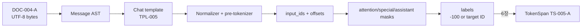

# 5장. 토크나이저와 채팅 템플릿

4장의 원문 byte와 이 장의 token offset이 맞물려야 삭제·오염을 역추적할 수 있다. 6장은 template가 늘린 실제 sequence 길이를 packing budget으로 받고, 21장은 같은 계약을 image·audio·video placeholder와 processor feature까지 확장한다. 이 연결을 이해하는 가장 짧은 방법은 토크나이저를 ‘문자열을 정수로 바꾸는 함수’가 아니라 **좌표계를 연속해서 바꾸는 상태 기계**로 보는 것이다.

원문 UTF-8 bytes는 decoder와 Unicode normalization을 지나 normalized text가 되고, pre-tokenizer가 merge 가능한 구간을 정한다. BPE·Unigram·WordPiece 같은 subword model은 그 구간을 pieces와 vocabulary IDs로 바꾸며, post-processor가 BOS·EOS 같은 special IDs를 삽입한다. chat template는 이 파이프라인 앞에서 message AST를 rendered bytes로 직렬화하고, collator는 뒤에서 IDs를 labels와 loss mask로 바꾼다.

따라서 앞 단계의 공백 하나가 달라지면 분절과 ID 길이가 달라지고, 같은 `max_length`에서도 잘리는 assistant span이 달라진다. 그 결과 valid-target 분모와 loss가 움직이고, 서빙에서는 prefill 길이·KV cache 크기·stop 위치가 바뀐다. checkpoint의 embedding row 의미와 실제 ID가 어긋나면 더 위험하다. shape가 맞아도 다른 행을 조회하므로 학습과 생성이 조용히 다른 함수를 계산할 수 있다.

이 장의 디버깅 원칙도 이 순서를 따른다. 출력 문장이 이상하다는 마지막 증상에서 거꾸로 추측하지 않는다. 동일한 message fixture를 training과 serving에 넣고 `rendered bytes → normalized spans → pre-token chunks → pieces → IDs → special mask → labels/positions → first logits → generated IDs와 stop reason`을 왼쪽부터 비교한다. 최초로 달라진 경계가 관찰값이며, 그 경계를 소유한 설정·함수·artifact가 원인 후보가 된다. 한 입력과 한 옵션만 바꾼 최소 재현에서 그 경계가 함께 복구되어야 원인으로 판정한다. 뒤 단계의 우연한 출력 일치는 앞 단계 호환성의 증거가 아니다.

## 5.0 GR-001 규범 trace: DocumentID를 손실 좌표가 있는 token span으로 바꾼다

입력은 4장의 `CG-004`다. 출력은 문자열이 아니라 `TokenizerBundleID=TB-005`와 각 token이 원문 어느 구간에서 왔는지 설명하는 `TokenSpanID`다. GR-001의 대화 fixture 한 행을 실제 값으로 고정한다.



|state|구체 값|shape·offset·mask|owner|
|---|---|---|---|
|source|`DOC-004-A`, text char `[112,156)`|raw byte `[477,536)`로 왕복|corpus registry|
|rendered row|system/user/assistant 3 messages|UTF-8 121 bytes, rendered char `[0,93)`|template `TPL-005@sha256:…`|
|`input_ids`|`[151644, 8948, …, 151645]`|`int64[16]`|tokenizer worker|
|offsets|special token은 `null`, 일반 token은 interval|`interval[16]`|tokenizer bundle과 함께 보존|
|attention mask|padding 없음|`bool[16]=1`|collator|
|assistant mask|assistant content 위치 11–14|`bool[16]`, 합 4|template/collator 공동 계약|
|labels|position 11–14만 다음 token ID, 나머지 `-100`|`int64[16]`, valid 4|objective compiler|

token-level loss의 분모는 attention 가능한 token 수가 아니라 label mask가 허용한 수다.

$$L={\sum_t m_t\,\ell(z_t,y_t)\over\sum_t m_t},\qquad m_t=\mathbf1[y_t\ne-100].$$

|기호|코드 객체|검산|
|---|---|---|
|$z_t$|다음 장 이후의 `logits[:,t,:]`|shape `[V]`|
|$y_t$|shift 뒤 `labels[t]`|첫 assistant target이 어느 prefix 뒤에 놓이는지 확인|
|$m_t$|`labels != -100`|GR-001 합은 4, attention mask 합 16과 다름|
|offset|fast tokenizer encoding span|원 text→rendered text 변환 edge를 따로 보존|

실제 collator가 padding label을 `-100`으로 바꾸는 경계는 [Transformers `DataCollatorForLanguageModeling`의 고정 코드](https://github.com/huggingface/transformers/blob/550d7b3834670483a4df436541272c055dc364bf/src/transformers/data/data_collator.py#L619-L666), tokenizer 호출 계약은 [`PreTrainedTokenizerBase.__call__`](https://github.com/huggingface/transformers/blob/550d7b3834670483a4df436541272c055dc364bf/src/transformers/tokenization_utils_base.py#L2989-L3075)에서 확인한다.

**반증과 handoff.** `TB-005-M1`은 train template에서 assistant delimiter 하나를 없애 serving과 token ID가 처음 갈리는 rendered byte를 잡는다. `M2`는 오른쪽 truncation으로 assistant target 네 개 중 둘을 자르면서 valid-count를 4로 남겨 mask-length invariant를 실패시킨다. `M3`는 새 special token을 추가하고 embedding resize manifest를 누락한다. 7장의 row-address gate가 forward 전에 거부해야 한다. 6장에는 `{TB-005 revision, TS-005-A input_ids[16], offsets[16], assistant/attention/special masks, labels, valid_count=4}`를 넘긴다.

## 5.1 좌표 변환기로서 토크나이저를 이해한다

먼저 vocabulary·offset·template·weight가 서로 독립된 설정이 아니라 하나의 좌표 변환 사슬임을 세운다. 이 사슬을 잡아 두어야 뒤에서 algorithm, artifact와 runtime 차이를 같은 기준으로 비교할 수 있다.

### 압축 사전과 모델 좌표를 함께 설계한다

BPE는 빈번한 symbol pair를 병합해 사전을 만든 뒤 우선순위에 따라 greedy하게 분절한다. Unigram은 후보 piece 확률로 이루어진 lattice에서 전체 negative log-likelihood가 작은 경로를 찾고, 손실이 적은 piece를 제거하며 사전을 줄인다. 같은 vocabulary 크기라도 경계와 sequence length가 다르다. byte fallback은 OOV를 막지만 비정상 문자에서 token 수가 크게 늘 수 있다.

선택 기준은 평균 token 길이 하나가 아니다. domain별 fertility, byte fallback 비율, vocabulary tail 빈도, normalization 손실, downstream sequence budget을 함께 본다.

### offset으로 원문과 token을 왕복한다

**normalizer·offset·special token**

Unicode 정규화, lowercasing, whitespace 처리 뒤 문자 index와 원 UTF-8 byte index는 달라진다. offset map이 없으면 loss가 큰 token을 원문으로 되돌릴 수 없다. added token matcher는 일반 subword 규칙보다 먼저 작동할 수 있으므로 role delimiter와 공격 문자열의 충돌을 시험한다.

special token은 단순 ID 예약이 아니다. BOS/EOS 삽입 정책, padding side, truncation side, decoder 시작 규칙을 바꾼다. train과 serve의 `TokenizerRevision` 및 config checksum을 artifact에 함께 묶는다.

### template가 학습 표면을 결정한다

**role serialization과 assistant mask**

Jinja template는 system/user/assistant/tool 구조를 control token이 포함된 문자열로 직렬화한다. assistant span을 character range로 표시한 뒤 token offset으로 투영한다. truncation이 span 중간을 자르면 mask도 함께 잘려야 한다. `-100` label mask는 attention mask와 다르다. user token을 볼 수는 있지만 그 token 자체를 예측한 loss는 제외할 수 있다.

**token 추가를 가중치 변경으로 읽는다**

**resize·tied head·serving parity**

새 token을 추가하면 tokenizer vocabulary, config `vocab_size`, input embedding 행, untied LM head 행을 함께 늘려야 한다. tied model은 embedding과 LM head가 같은 storage를 가리키는지 확인한다. 평균 초기화 같은 전략은 새 행의 초기 logit을 바꾸므로 recipe와 checkpoint manifest에 남긴다.

parity 실험은 문자열 일치만 보지 않는다. render된 template bytes, token IDs, attention mask, position IDs, 첫-step logits를 train/eval/serve 경로에서 비교한다.

**이 장이 넘기는 것.** `TokenizerRevision`, template checksum, token IDs, offsets, special-token map, embedding/LM-head resize manifest를 6장과 7장에 넘긴다.

**BPE를 손으로 한 번 학습한다.** corpus가 `low lower newest widest`이고 단어 끝 표지를 둔다고 하자. 초기 symbol은 문자다. 각 단어 빈도를 반영해 adjacent pair 횟수를 세고 가장 빈번한 pair를 병합한다. 동률이면 구현의 tie-break가 merge 순서를 바꾼다. 그래서 vocabulary 파일만으로 tokenizer를 완전히 재현할 수 없는 경우가 있다. trainer revision, normalizer, pre-tokenizer, tie-break와 special-token 예약을 함께 고정해야 한다. 실제 Hugging Face tokenizers pipeline은 normalization, pre-tokenization, model, post-processing, decoding을 분리한다. 어느 단계가 offset을 원문 좌표로 되돌리는지 test로 확인한다.

**Unigram의 목적함수는 merge count가 아니다.** 문자열을 후보 piece로 분절하는 경로가 여러 개일 때 경로 score는 piece negative log probability의 합이다. Viterbi는 가장 낮은 경로를 고르고, 학습은 후보 piece를 제거했을 때 corpus likelihood가 얼마나 나빠지는지 보며 vocabulary를 줄인다. subword regularization을 켜면 최상 경로 하나만 쓰지 않고 다른 경로를 표본화할 수 있다. augmentation 효과가 있지만 sampler RNG와 tokenizer revision이 학습 재현 상태에 들어온다.

**byte fallback 비용을 숫자로 본다.** ASCII `A`는 한 byte지만 한국어 음절 하나는 UTF-8에서 보통 세 byte다. 알 수 없는 음절이 한 token으로 사전에 있으면 길이 1이지만 byte fallback이면 길이 3이 될 수 있다. emoji와 결합 문자는 더 복잡하다. OOV가 사라졌다는 장점과 context budget 소비가 늘어난다는 비용을 함께 측정한다. domain별 `bytes/token`, `chars/token`, fallback token 비율, 상위 99.9 percentile sequence length를 report한다.

**offset map의 네 좌표.** 원 UTF-8 byte offset, Unicode scalar index, normalization 뒤 character index, token index를 구분한다. `é`가 하나의 code point일 수도 있고 `e`와 combining acute 두 개일 수도 있다. NFKC는 호환 문자를 바꿀 수 있다. 삭제 요청과 red-team span은 원 byte 좌표에, assistant mask는 rendered template의 character/token 좌표에 있을 수 있다. 변환마다 many-to-one 구간을 허용하는 interval map을 보존한다.

**짧은 코드가 바꾸는 산출물.** Transformers 계열에서 added token 뒤 흔히 다음 호출이 이어진다.

```python
num_added = tokenizer.add_special_tokens(special_tokens_dict)
model.resize_token_embeddings(len(tokenizer))
```

첫 줄만 실행하면 새 ID가 embedding row 범위를 벗어난다. 둘째 줄은 단순 shape 변경이 아니다. 고정 source의 `resize_token_embeddings`는 새 embedding을 만들고 config vocabulary와 tied weights를 갱신하며, 설정에 따라 새 행을 기존 embedding 분포의 평균·공분산을 이용해 초기화할 수 있다. `mean_resizing`은 초기 loss shock를 줄이려는 선택이지만 새 token 의미를 학습한 것은 아니다. 옵션이 바꾸는 객체와 초기 logit을 기록한다.

**tied와 untied를 구별한다.** tied model에서는 input embedding과 LM head가 같은 parameter여야 한다. resize 뒤 두 module의 shape만 같고 storage가 다르면 선언과 실제가 어긋난다. untied model은 두 표를 모두 늘려야 한다. checkpoint index에는 새 tensor shape가 반영되어야 하며 adapter가 old vocabulary shape에 고정돼 있으면 merge 전에 target module 호환성을 검사한다.

**template checksum은 파일 checksum만으로 부족하다.** named template를 선택하거나 tokenizer config 안의 문자열을 쓸 수 있다. 실제 적용한 template bytes, tool schema serialization, `add_generation_prompt`, special-token 추가 여부를 canonical input과 함께 hash한다. 같은 template라도 대화 객체의 key 순서나 JSON serialization이 다르면 tool-call token이 달라질 수 있다. render output과 token IDs 두 checksum을 모두 저장한다.

**assistant mask를 수치로 검산한다.** rendered tokens가 `[BOS, system, user, assistant_marker, a, b, EOS]`이고 assistant 답변만 학습한다면 shifted target 관점에서 어느 logit이 `a`, `b`, `EOS`를 맞히는지 써 본다. marker 자체를 학습할지, EOS를 포함할지 recipe마다 다르다. mask를 문자열 영역에 먼저 칠한 뒤 token offset으로 옮기고, truncation 뒤 valid target 수가 예상과 같은지 검사한다. “assistant-only”라는 옵션 이름만으로 경계를 추정하지 않는다.

**packing과 template의 충돌.** 대화 두 개를 이어 붙일 때 첫 대화 EOS와 둘째 대화 BOS를 모두 남길지, position을 reset할지, attention을 block diagonal로 막을지 결정한다. labels만 `-100`으로 가려도 attention leakage는 남는다. `PackedSampleID`의 segment map에 conversation ID와 token range, loss-bearing range, attention group을 둔다.

**통제 실험 A—normalizer diff.** 동일한 100개 문자열을 두 tokenizer revision으로 encode한다. token ID 일치율만 보지 않고 normalized bytes, offsets, sequence length, fallback 비율을 비교한다. 달라진 행은 Unicode 범주와 원인을 분류한다. downstream loss 비교는 model vocabulary가 각 tokenizer에 맞게 학습되지 않았다면 공정하지 않다.

**통제 실험 B—template parity.** 학습 collator, standalone tokenizer, serving runtime 세 경로에 canonical conversation을 넣는다. render bytes→IDs→attention mask→position IDs→labels의 checksum을 단계별 비교한다. 첫 차이에서 중단한다. 최종 output이 우연히 비슷하다고 앞 단계 mismatch를 허용하지 않는다.

**실패 주입 A—BOS 중복.** template가 이미 BOS를 내는데 tokenizer 호출에서 `add_special_tokens=True`를 다시 적용한다. 첫 두 ID, position, 첫 layer residual, 첫-step logits가 어디서 갈라지는지 기록한다. 생성 품질 저하라는 늦은 증상 대신 token 단계에서 잡는다.

**실패 주입 B—resize 누락.** special token 하나를 추가하고 model resize를 생략한다. 명시적 index error가 나면 쉬운 실패다. 더 위험한 경우는 unknown ID로 대체되어 학습이 계속되는 것이다. tokenizer가 낸 새 ID와 model config `vocab_size`, embedding row 수를 preflight에서 비교한다.

**실패 주입 C—offset 붕괴.** combining character, ZWJ emoji, invalid UTF-8 replacement가 포함된 문장을 넣는다. high-loss token을 원 byte span으로 역투영한다. 빈 span, 순서 역전, document 범위 밖 offset이면 pipeline을 중단한다.

**디버깅 결정 트리.** 학습과 서빙 출력이 다르면 먼저 raw prompt가 아니라 rendered bytes를 비교한다. 다르면 template/tool serialization 문제다. bytes가 같고 IDs가 다르면 tokenizer revision·normalizer·added-token 문제다. IDs가 같고 mask/position이 다르면 processor/collator 문제다. 모두 같고 logits가 다르면 model artifact·dtype·kernel 문제로 넘어간다. 새 token만 학습되지 않으면 resize, tied storage, optimizer parameter group, adapter target 순으로 확인한다.

**실습 5-A—tokenizer 산출물 해부.** `tokenizer.json`, `tokenizer_config.json`, `special_tokens_map.json`, template 파일을 각각 hash하고 역할을 적는다. vocab ID의 연속성, merge가 참조하는 symbol 존재, added token collision, model max length sentinel을 검사한다.

**실습 5-B—경계 corpus.** NFC/NFD, 한국어, CJK, emoji ZWJ, code indentation, URL, JSON tool call, role delimiter를 포함한 작은 corpus를 만든다. revision마다 encode/decode와 offset 결과를 golden file로 저장한다. decode 문자열 equality만 아니라 normalized contract에 맞는지를 판정한다.

**실습 5-C—resize 후 한 step.** 새 token이 포함된 batch에서 그 embedding 행의 gradient가 nonzero인지 확인한다. tied model이면 LM-head 경로 기여와 lookup 경로 기여가 합쳐진다. 새 행이 optimizer state에 등록됐는지, checkpoint save/load 뒤 shape와 checksum이 유지되는지 본다.

**호출 경로를 pipeline 단계로 해체한다.** Hugging Face fast tokenizer의 개념 경로는 input→normalizer→pre-tokenizer→model(BPE/Unigram 등)→post-processor→Encoding이다. `apply_chat_template`를 쓰면 그 앞에 conversation/tool 객체→Jinja rendering이 놓이고, `tokenize=True`면 뒤의 tokenizer 경로가 이어진다. Transformers 고정 source `tokenization_utils_base.py:1518-1686`은 template 선택·render·tokenize와 assistant mask 생성을 한 API에 묶는다. 편리하지만 문제 위치를 숨길 수 있으므로 render-only와 tokenize 단계 결과를 따로 보존한다.

assistant mask 경로는 template의 `` block이 보고한 character span을 Encoding의 `char_to_token`으로 투영한다. `chat_template_utils.py:470-510`은 assistant mask를 요청했지만 generation marker가 없을 때 경고하는 경계를 가진다. `tokenization_utils_base.py:1614-1637`은 mask를 요청하면서 dict를 반환하지 않거나 마지막 message 계속쓰기와 함께 쓰는 모순을 거부한다. 이 예외들은 임의 제약이 아니다. mask를 담을 반환 구조가 없거나 generation span의 의미가 불명확한 상태를 조기에 차단한다.

| handoff | 입력 | 출력 | 보존해야 할 상태 | 대표 silent failure |
|---|---|---|---|---|
| render | roles/tools/template | UTF-8 bytes, generation spans | template·schema checksum | role delimiter 이동 |
| normalize | raw rendered string | normalized string | byte/char interval map | 삭제 span 소실 |
| pre-tokenize | normalized string | word/byte chunks | chunk offsets | 공백·코드 indentation 변화 |
| model | chunks, vocab/merges | piece IDs | model revision | OOV/fallback 폭증 |
| post-process | piece IDs | BOS/EOS 포함 IDs | insertion policy | BOS/EOS 중복 |
| mask projection | generation spans, offsets | assistant mask | truncation boundary | 답변 일부 loss 제외 |
| resize | tokenizer length, model | embedding/head tensors | init policy, tie identity | 새 ID row 부재 |

**BPE merge의 점수 변화를 유도한다.** corpus에서 pair `(a,b)`를 합칠 때 symbol token 수 감소는 그 pair occurrence 수와 관계있지만 겹침과 word boundary가 있다. 단순 `count(a,b)` 최대화는 corpus likelihood를 직접 최적화하는 것과 같지 않다. byte-level BPE는 모든 byte를 표현하지만 merge table이 domain 빈도를 압축한다. vocabulary를 크게 하면 sequence는 짧아질 수 있으나 embedding/LM-head parameter와 희귀 행의 통계 부족이 늘어난다. 따라서 vocab size는 tokenizer만의 hyperparameter가 아니라 model parameter budget 배분이다.

**Unigram lattice의 작은 예.** 문자열 `abab`에 후보 `a,b,ab,abab`가 있고 확률이 각각 `0.2,0.2,0.5,0.1`이라고 하자. 경로 `[abab]`의 negative log score는 `-log 0.1`, `[ab,ab]`는 `-2log 0.5`, `[a,b,a,b]`는 `-4log 0.2`다. 이 값에서 `[ab,ab]`가 가장 낮다. 확률은 전체 후보에서 정규화된다는 가정과 unknown 처리 비용을 명시해야 한다. sampling은 경로 점수를 temperature로 바꾸어 선택 다양성을 만든다.

**Token-normalized loss와 fertility.** 같은 문장이 tokenizer A에서 10 token, B에서 14 token이면 per-token CE를 직접 비교해 “A가 낫다”고 말할 수 없다. 단위가 달라졌다. byte-normalized perplexity 또는 bits-per-byte를 함께 보거나 같은 문자열의 총 negative log-likelihood를 비교해야 한다. tokenizer가 sequence length를 바꾸면 batch의 valid-token 분모와 scheduler token count도 움직인다.

**Resize 함수가 바꾸는 상태.** Transformers 고정 source `modeling_utils.py:3211-3270`의 public method는 `_resize_token_embeddings`를 부르고 config vocabulary를 갱신한 뒤 weight tying을 다시 수행한다. `pad_to_multiple_of`는 요청한 vocabulary보다 더 큰 행 수를 만들 수 있다. 이는 Tensor Core alignment 같은 실행 효율을 위한 선택이지만 tokenizer가 실제로 낼 수 있는 ID 수와 model row 수가 달라진다. artifact manifest에는 logical vocabulary와 physical embedding rows를 따로 쓴다.

**Upstream resize 테스트를 읽는 법.** `tests/test_modeling_common.py:2176-2205`는 같은 크기, 증가, 감소를 호출하고 embedding shape와 기존 weight 보존을 검사하는 공통 test다. `2243-2266`은 multiple padding과 잘못된 배수 type을 다룬다. `2510` 부근 tied model test는 resize 뒤 tying 계약을 확인한다. 이 test들은 해당 Transformers revision의 공통 model contract를 지지하지만 모든 custom model이 mixin을 올바르게 구현했다는 보장은 아니다. model별 skip과 override를 함께 확인한다.

**Upstream processor 테스트를 읽는 법.** `tests/test_processing_common.py:844-943`의 공통 경로는 batched messages, generation prompt, tokenize on/off, truncation, dict 반환, 마지막 message 계속쓰기를 비교한다. 이것은 processor API shape와 공통 behavior를 검사한다. 특정 모델 카드의 실제 production template가 assistant-only 학습에 적합하다는 것은 별도 문제다. fixture에 쓰인 template와 배포 artifact template가 같은 checksum인지 확인해야 한다.

**SentencePiece offset 계약.** 고정 source `src/util.h:115-121`은 Unicode text와 원 UTF-8의 offset vector 크기와 시작점 불변식을 적는다. Python 문서 `python/README.md:224-279`는 str 입력의 Unicode offset과 bytes 입력의 byte offset을 구분하며, byte fallback에서 중간 byte token이 zero-width span을 가질 수 있다고 설명한다. 따라서 “모든 token은 non-empty 원문 span을 가진다”는 불변식은 틀렸다. 여러 byte token을 하나의 문자 span으로 재조립하는 규칙이 필요하다.

**반례 1—decode round-trip 성공인데 offset은 틀리다.** tokenizer가 normalization 뒤 문자열을 encode하고 같은 normalized 문자열로 decode할 수 있다. 그러나 원문의 compatibility character가 사라졌다면 삭제·강조 좌표는 틀릴 수 있다. round-trip equality와 original-byte alignment는 별도 test다.

**반례 2—token IDs가 같은데 assistant mask가 다르다.** template의 generation block marker는 token을 추가하지 않고 span metadata만 바꿀 수 있다. rendered text와 token IDs가 같아도 mask가 달라 학습 objective가 달라진다. parity 비교에 labels checksum을 반드시 넣는다.

**반례 3—embedding shape가 커졌는데 새 token은 학습되지 않는다.** resize 후 optimizer를 만들지 않고 기존 optimizer를 계속 쓰면 새 Parameter 객체가 group에 없을 수 있다. framework와 resize 구현에 따라 객체가 교체된다. shape 검증과 함께 optimizer parameter identity와 새 행 gradient·delta를 본다.

**반례 4—`model_max_length`가 큰 숫자라 context가 긴 것은 아니다.** sentinel로 사실상 “알 수 없음”을 표시하는 tokenizer가 있다. model config, rotary/position table, serving limit, training pack length를 함께 확인해야 한다. tokenizer field 하나로 context length를 주장하지 않는다.

**조사 체크리스트—받은 모델의 tokenizer.** Hub revision과 모든 tokenizer artifact checksum을 고정한다. fast/slow class와 model type을 적는다. normalizer·pre-tokenizer·post-processor를 dump한다. logical vocab, added vocab, highest ID, physical embedding rows를 비교한다. BOS/EOS/PAD/UNK ID와 자동 삽입 정책을 canonical empty/single-token input으로 확인한다. template 목록과 default 선택 규칙을 읽는다. generation span과 labels를 작은 conversation으로 출력한다. serving stack의 render/encode 결과와 비교한다.

**조사 체크리스트—학습 데이터 경계.** raw conversation ID, rendered bytes checksum, token IDs checksum, segment offsets, assistant mask, shifted valid count를 한 행에 둔다. truncation 전후를 둘 다 보존한다. packing 뒤 각 segment가 어느 conversation에서 왔는지 역색인한다. padding side가 position과 generation kernel에 맞는지 본다. role이 빠지거나 연속된 경우 template가 예외를 내는지 검사한다.

**조사 체크리스트—vocabulary 변경.** 추가 이유와 reserved string collision을 기록한다. tokenizer 저장 전후 ID 안정성을 확인한다. model resize가 logical/physical size, config, tying을 어떻게 바꿨는지 diff한다. 새 행 초기화 통계와 optimizer 등록을 본다. adapter와 quantized artifact가 resize 전 base를 참조하는지 확인한다. merge·export·serve 뒤 canonical prompt의 token과 logits parity를 재검사한다.

**재현 절차.** tokenizers·SentencePiece·Transformers를 registry commit으로 checkout하고 각 build/runtime version을 기록한다. canonical boundary corpus를 raw bytes로 보존한다. encode 결과는 ID뿐 아니라 token string, byte/char offsets, special mask, assistant mask를 JSONL로 쓴다. 두 revision 비교는 첫 차이의 pipeline stage를 표시한다. stochastic segmentation은 seed와 표본 수를 고정하고 distribution을 비교한다. 실행하지 않은 모델별 parity에는 `NotExecuted`를 유지한다.

**Vocabulary 학습 데이터의 provenance.** 모델 pretraining corpus와 tokenizer training corpus는 같지 않을 수 있다. tokenizer가 code와 한국어를 충분히 보지 못하면 fallback과 fertility가 늘고, 모델은 같은 의미를 더 긴 sequence로 학습한다. tokenizer trainer input의 shard revision, sampling weight, 문서·byte 수, normalization 전후 통계를 보존한다. 이미 정제된 corpus에서 tokenizer를 학습하면 filter가 만든 편향이 vocabulary에 한 번 더 고정될 수 있다.

**Vocabulary tail을 읽는 법.** 각 piece의 corpus frequency와 document frequency를 구분한다. 특정 boilerplate 문서가 반복되어 높은 count를 만든 piece와 여러 문서에 고르게 나타나는 piece는 다르다. 거의 쓰이지 않는 긴 piece는 embedding row를 차지하지만 충분한 update를 받지 못한다. 반대로 byte 원자 piece는 낮은 빈도라도 open vocabulary 안전망이다. tail 제거 실험은 sequence length와 embedding parameter 절약뿐 아니라 unknown/fallback coverage를 측정한다.

**Tokenizer 변경과 optimizer state.** vocabulary를 늘린 뒤 embedding을 resize하면 새 row에는 optimizer moment가 없다. 기존 row moment를 보존하고 새 row를 0으로 시작할지, optimizer를 모두 재초기화할지 선택해야 한다. parameter 객체가 교체되면 state dict mapping이 깨질 수 있다. checkpoint load→resize와 resize→checkpoint load 순서는 일반적으로 동치가 아니다. base checkpoint, tokenizer, resized model, adapter의 derivation 순서를 DAG로 적는다.

**Quantization과 export의 경계.** 양자화된 embedding에 token을 추가하는 것은 dense FP model resize와 같지 않다. packed weight와 scale group을 다시 만들어야 할 수 있다. GGUF·MLX·serving artifact는 tokenizer metadata를 별도 포맷에 복제한다. model tensor parity가 맞아도 embedded template나 special token metadata가 낡을 수 있다. export 뒤 artifact 자체에서 tokenizer를 다시 load해 canonical conversation을 encode한다.

**Chat template는 제한된 프로그램이다.** strict undefined와 sandbox는 누락 field와 임의 attribute 접근을 줄이지만, template 논리를 안전하거나 올바르게 만드는 완전한 보장은 아니다. tool schema가 크면 prompt budget을 잠식하고, user content가 delimiter와 비슷한 문자열을 포함하면 모델이 role 경계를 혼동할 수 있다. raw user text를 special token ID로 직접 승격하는지, 일반 text piece로 encode하는지 확인한다.

**실패 주입 D—default template 교체.** tokenizer artifact에 named template 두 개를 두고 default 선택만 바꾼다. API 호출 인자는 같지만 render bytes가 달라져야 한다. run manifest에 선택된 template name과 checksum이 없으면 원인을 찾기 어렵다. 파일 전체 checksum만으로 어느 template를 썼는지 알 수 없다.

**실패 주입 E—padding side 반전.** left와 right padding에서 attention mask, position IDs, labels, 첫 non-pad token의 logits를 비교한다. training full-sequence kernel과 generation cache가 기대하는 방향이 다를 수 있다. pad token이 EOS와 같은 ID여도 mask 없이 자동으로 구분되지 않는다.

**실패 주입 F—논리 vocab과 물리 row 혼동.** `pad_to_multiple_of=64`로 embedding row를 늘린 뒤 config나 exporter가 physical row 수를 tokenizer vocab으로 취급하게 만든다. tokenizer가 낼 수 없는 dummy row가 decode table에 들어가거나 output sampling 후보가 될 수 있다. logits mask 또는 config semantics를 확인한다.

**실험 5-D—fertility와 비용.** 동일 corpus를 tokenizer 두 개로 encode해 language/domain별 token 수, bytes/token, 95·99·99.9 percentile 길이를 계산한다. 모델의 `T`와 batch token budget이 고정일 때 한 batch에 들어가는 원문 byte 수가 얼마나 달라지는지 환산한다. quality 결론은 같은 model budget의 실제 학습 없이 추정으로 표시한다.

**실험 5-E—assistant loss 경계.** system/user/assistant/tool을 포함한 대화 20개를 만들고 사람이 기대한 loss-bearing substring을 byte span으로 표시한다. template generation span→token mask→shifted labels를 거쳐 원 기대 span과 비교한다. token이 substring 경계를 가로지르면 부분 token의 포함 정책을 명시한다.

**실험 5-F—serving round trip.** training tokenizer와 serving runtime에서 canonical prompt IDs를 비교하고, model 첫 forward logits도 비교한다. serving runtime이 자체 template를 적용한다면 preformatted prompt를 다시 template하지 않도록 API 경계를 분리한다. BOS/EOS 중복과 stop sequence 차이는 token trace에서 잡는다.

**조사 결과를 쓰는 형식.** “토크나이저가 다르다” 대신 첫 차이를 `render`, `normalize`, `pre-tokenize`, `model`, `post-process`, `mask`, `resize/export` 가운데 하나로 분류한다. 입력 bytes, 두 revision, expected invariant, observed difference, 영향받는 후손 checkpoint를 기록한다. 이 형식이면 데이터 문제와 model 문제의 책임 경계가 선명해진다.

**학습 전에 실행하는 preflight.** tokenizer length, maximum emitted ID, embedding row 수, LM-head row 수를 비교한다. canonical conversation의 rendered bytes와 IDs를 출력한다. assistant mask의 1 개수와 shifted valid label 수를 손계산한다. batch 안에서 padding token이 loss label로 남지 않았는지 확인한다. token offset이 `DocumentID`의 normalized byte 구간으로 되돌아가는지 임의 표본이 아니라 boundary corpus 전부에서 검사한다.

**학습 중 관측할 지표.** 전체 token 빈도만 보면 평균에 희귀 문제가 묻힌다. fallback 비율, unknown 비율, sequence truncation 비율, role별 supervised token, added-token gradient norm, embedding row update count를 domain별로 기록한다. 특정 added token의 gradient가 계속 0이면 mask, optimizer 등록, dataset 출현을 순서대로 본다. 높은 fallback과 긴 sequence가 OOM으로 나타날 수 있으므로 tokenizer 지표와 memory incident를 연결한다.

**학습 뒤 artifact gate.** checkpoint의 config vocab, embedding/head tensor shape, tokenizer artifact checksum, template checksum을 하나의 manifest로 commit한다. adapter만 배포한다면 요구하는 base revision과 tokenizer revision을 적는다. merge·quantize 후 canonical IDs와 first-step logits를 원 artifact와 tolerance 비교한다. tokenizer mismatch는 weight quantization 오차와 별도 판정한다.

**왜 5장이 7장보다 먼저인가.** embedding의 첫 차원 `V`와 각 행의 의미는 tokenizer가 정한다. 7장에서 lookup gradient를 해부하려면 5장이 token ID, offset, resize와 tie 상태를 넘겨야 한다. token string을 사람이 읽을 수 있다는 이유만으로 행 의미가 고정됐다고 보지 않는다. artifact revision이 좌표계를 고정한다.

**5장의 종료 조건.** 한 canonical conversation을 raw object에서 render, normalize, token IDs, assistant mask, shifted labels까지 역추적할 수 있어야 한다. special token 추가 전후 embedding/head/optimizer state 변화를 설명할 수 있어야 한다. train과 serving artifact에서 같은 입력이 같은 IDs를 내는지 판정해야 한다. 실행하지 못한 경로는 필요한 command·version·expected invariant를 남기고 결과 칸을 비운다.

이 조건을 만족한 artifact만 6장의 packer와 7장의 embedding lookup에 넘긴다.

인계 manifest에는 생성 도구의 버전과 command, 입력 corpus revision, 실패한 boundary fixture도 포함한다. 성공 예제만 보존하면 다음 revision에서 조용히 사라진 문자·offset·mask 동작을 회귀로 판정할 수 없다.

**수치 사례로 artifact와 알고리즘을 검증한다**

**독자 산출물 5-1—artifact dossier**

`tokenizer.json`, `tokenizer_config.json`, `special_tokens_map.json`, SentencePiece model, chat template를 역할별로 분리한다. 파일별 SHA-256, Hub/repository revision, parser/tool version, logical vocabulary, added vocabulary, highest ID를 적는다. 여러 파일의 설정이 충돌할 때 precedence를 source에서 확인한다.

| artifact | 핵심 내용 | 독자 검증 |
|---|---|---|
| tokenizer model | vocab·merges/probability | ID/piece/score |
| tokenizer config | class·normalizer options·max length | runtime selection |
| special map | BOS/EOS/PAD/UNK | IDs·insertion |
| added tokens | matcher behavior | collision·single-word |
| chat template | role/tool rendering | selected name·checksum |
| model config | vocab rows·tie | tokenizer/model parity |

**BPE numeric case.** word frequencies가 `low:5, lower:2, newest:6, widest:3`이라고 하자. 문자와 word-end symbol로 시작해 adjacent pair count를 직접 센다. 동일 pair가 한 word에서 겹칠 때 update 순서, word boundary를 넘는지, 빈도 weight를 적용하는지 적는다. 가장 높은 pair를 merge하고 corpus representation과 pair counts를 다시 계산한다. 동률 tie-break가 다르면 이후 merge table 전체가 갈라질 수 있다.

독자 제출은 최종 vocab만이 아니다. iteration, selected pair, weighted count, tie candidates, corpus token count, merge-table checksum을 CSV로 만든다. tokenizer library trainer가 낸 첫 다섯 merge와 비교한다. pre-tokenizer/normalizer가 다르면 같은 raw text에서도 이 수치가 같지 않다.

**Unigram numeric case.** 문자열 `abab`에 pieces `a,b,ab,abab` 확률 `0.2,0.2,0.5,0.1`을 둔다. `[abab]` score `-log0.1≈2.303`, `[ab,ab]`는 `-2log0.5≈1.386`, `[a,b,a,b]`는 `-4log0.2≈6.438`이므로 Viterbi path는 `[ab,ab]`다. normalization, unknown penalty와 piece probability normalization을 명시한다.

piece `ab`를 제거했을 때 best path와 corpus NLL delta를 계산해 pruning intuition을 확인한다. 실제 Unigram training은 corpus expectation과 EM/pruning 세부를 가지므로 toy result를 production algorithm 전체로 일반화하지 않는다. sampling temperature/alpha와 n-best는 deterministic encode에 새로운 RNG state를 만든다.

**Byte fallback numeric case.** `A가🙂`의 UTF-8 byte 길이는 각각 1, 3, 4다. 전용 piece가 없고 byte fallback이면 최대 8 byte tokens가 될 수 있다. SentencePiece offset mapping에서 multi-byte fallback의 앞 byte tokens가 zero-width span, 마지막 token이 전체 문자 span을 가질 수 있다는 공개 contract를 고려한다. “모든 token span은 nonempty” assertion을 쓰지 않는다.

SentencePiece 고정 source `src/util.h:115-121`에는 Unicode text와 original UTF-8 offset vector의 크기·시작 불변식이 적혀 있다. `python/README.md:224-279`는 str/bytes offset과 byte fallback span을 설명한다. 문서는 test가 아니므로 boundary fixture로 검증한다.

**Normalizer numeric case.** NFC `é`와 NFD `e+combining acute`, compatibility 문자, 전각 ASCII, 연속 공백을 raw bytes로 보존한다. raw byte index, Unicode scalar index, normalized char index, token index의 interval map을 출력한다. NFKC가 두 raw sequence를 같은 normalized text로 만들면 역변환이 one-to-one이 아님을 표시한다.

**Pre-tokenizer case.** leading space, code indentation, URL, apostrophe, 한국어 조사, emoji ZWJ를 넣는다. word/byte-level pre-tokenizer가 만든 chunk와 offsets를 비교한다. merge model이 같아도 pre-tokenizer가 다르면 후보 pair universe가 달라진다.

**Template numeric case.** canonical conversation을 system=`규칙`, user=`2+2?`, assistant=`4`로 고정하고 tool이 없는/있는 두 variant를 만든다. render bytes, generation span, token IDs, assistant mask, shifted labels를 한 표에 둔다. assistant marker 자체와 EOS를 loss에 포함할지 expected policy를 명시한다.

예를 들어 IDs가 `[BOS,SYS,s,USER,q,ASSIST,a,EOS]`이고 답변 `a,EOS`만 학습하면 loss-bearing target은 그 target을 예측하는 직전 logit 위치다. mask를 labels에 칠한 뒤 shift하는지, shift 뒤 mask하는지 index를 손으로 그린다. 답변 token mask와 logit-position mask를 혼동하지 않는다.

Transformers `550d7b3`, `tokenization_utils_base.py:1518-1686`은 template 적용, tokenize와 assistant mask 경로를 포함한다. `1614-1637`은 assistant mask와 반환/continue option의 모순을 거부한다. `chat_template_utils.py:470-510`은 generation marker 기반 span capture 경계를 가진다.

**Processor와 tokenizer 경계.** multimodal processor의 `apply_chat_template`는 image/audio/video placeholder와 kwargs를 처리한 뒤 tokenizer를 호출할 수 있다. Transformers `processing_utils.py:1420-1646`의 template/tokenization/mask 경로를 text-only API와 분리한다. processor가 이미 special token을 다루는데 외부 tokenizer가 다시 넣지 않는지 본다.

**Upstream template test 해설.** `tests/test_processing_common.py:844-943`은 batch messages, generation prompt, tokenize on/off, truncation, dict output, continue-final-message 등 공통 API contract를 검사한다. 특정 production template가 assistant-only SFT에 올바르다는 보장은 아니다. fixture template/checksum과 실제 model artifact를 대조한다.

**Resize source walk.** Transformers `modeling_utils.py:3211-3270`은 public resize→internal embedding resize→config update/tie 경계를 가진다. `pad_to_multiple_of`는 logical vocab보다 physical rows를 늘릴 수 있다. `mean_resizing`은 새 row 초기 distribution을 바꾼다. option diff에 logical vocab, physical rows, init mean/cov, alias를 기록한다.

**Upstream resize test 해설.** `tests/test_modeling_common.py:2176-2205`는 same/grow/shrink와 old-weight preservation, `2243-2266`은 pad multiple과 invalid type, `2510` 부근은 tied resize를 다룬다. common mixin test가 skip/override된 custom model까지 자동 증명하지 않는다. 대상 model class가 실제 test matrix에 포함됐는지 본다.

**Resize numeric case.** V=256,C=32 table에 3 tokens를 추가하고 physical multiple 64를 요구하면 logical vocab은 259, physical rows는 320일 수 있다. tokenizer maximum ID는 258 이하여야 한다. dummy rows 259–319가 sampling 후보인지 config/head/kernel이 어떻게 처리하는지 확인한다. parameter 증가는 tied면 `64·32`, untied면 input/head 각각일 수 있다.

**Optimizer state case.** resize 전 Adam moment `[256,32]`를 old rows에 복사하고 new physical rows moment를 0으로 초기화한다. resize가 object를 교체한 뒤 optimizer가 old object를 가리키는 실패를 parameter identity로 잡는다. load→resize와 resize→load를 각각 실행해 지원 순서를 정한다.

**Adapter·quantization case.** LoRA adapter가 LM head/embedding old shape를 target하면 resize 뒤 merge shape가 맞지 않을 수 있다. quantized packed table은 단순 row append가 아니라 group scale/zero-point 재생성이 필요할 수 있다. base→resize→adapter→merge→quantize derivation order를 DAG로 둔다.

**독자 산출물 5-2—boundary corpus.** NFC/NFD, invalid/replacement byte, CJK/한국어, emoji ZWJ, RTL, code indentation, long URL, JSON/tool, role delimiter injection, empty content, consecutive roles, very long answer를 raw-byte fixture로 만든다. expected normalize/IDs/offset/mask 또는 expected error를 사람이 검토한다.

fixture마다 `CaseID,raw_sha,template_sha,normalized_sha,ids_sha,offsets_sha,assistant_mask_sha,labels_sha,expected_status`를 저장한다. revision diff는 final IDs만 아니라 첫 pipeline stage 차이를 출력한다.

**독자 산출물 5-3—train/serve parity workbook.** training collator, standalone tokenizer/processor, serving runtime에 같은 structured conversation을 넣는다. 각 단계의 render bytes→IDs→attention/position→labels 또는 generation prompt checksum을 비교한다. serving에는 labels가 없으므로 prompt boundary와 first-step logits를 비교한다.

| first mismatch | 우선 원인 |
|---|---|
| render bytes | template selection/tool serialization |
| normalized bytes | normalizer/runtime implementation |
| IDs | vocab/merges/added tokens/special insertion |
| mask/position | processor/collator/padding |
| logits | model artifact/dtype/kernel |

**실패 workbook과 release gate를 운영한다**

**Failure workbook T1—BOS 중복**

template가 BOS를 render하고 encode에서 special token을 다시 추가한다. first two IDs와 position, first residual checksum이 달라진다. quality symptom 전에 token trace로 fail한다.

**T2—assistant generation marker 누락.** render/IDs는 같지만 assistant mask가 모두 0 또는 warning이다. supervised valid count 0과 zero gradient로 나타난다. template generation span fixture가 잡는다.

**T3—truncation이 답변을 자른다.** right/left truncation policy와 max length 때문에 assistant target이 사라진다. pre/post valid count와 truncated byte span을 기록한다. prompt가 긴 source의 realized supervised mixture도 변한다.

**T4—role delimiter injection.** user content가 control-token 문자열을 포함한다. added special matcher가 이를 실제 special ID로 승격하는지 일반 text pieces로 처리하는지 확인한다. role boundary를 content에서 만들 수 없어야 한다.

**T5—offset zero-width.** byte fallback token의 빈 span을 오류로 간주해 삭제/label alignment가 깨진다. multi-token character aggregation policy로 해결한다.

**T6—logical/physical vocab 혼동.** padded dummy rows를 tokenizer vocab/decoder에 넣어 invalid generated ID가 나타난다. logical vocab gate와 decode fail-fast를 확인한다.

**T7—stale embedded template.** model repo의 tokenizer file은 갱신됐지만 GGUF/serving artifact 안 template가 old revision이다. artifact 자체에서 template를 load해 parity를 검사한다.

**T8—resize 뒤 tying 해제.** first logits는 copy 때문에 같아도 one-step 뒤 input/head가 갈라진다. storage alias와 optimizer delta test가 잡는다.

**학습 corpus의 품질과 offset 보존을 감사한다**

**Tokenizer training quality workbook**

corpus shard/revision, sampled bytes/docs/domain, normalizer/pre-tokenizer/trainer config, seed, vocab/merge output을 고정한다. domain별 bytes/token, chars/token, fallback/UNK, sequence length percentile, vocab row frequency/document frequency를 계산한다.

tail piece는 희귀하지만 긴 sequence를 줄일 수 있고 byte atoms는 safety coverage를 제공한다. 단순 low-frequency prune로 결정하지 않는다. 제거 child tokenizer에서 coverage/fertility와 embedding parameter를 함께 비교한다.

**Loss 단위 workbook.** tokenizer A/B의 per-token CE를 직접 ranking하지 않는다. 같은 raw document의 total NLL, supervised raw/normalized bytes, bits/byte, truncation bytes를 계산한다. model/학습량이 다르면 tokenizer 인과 결론을 보류한다.

**Offset 조사 결정 트리.** raw→normalized map이 틀리면 normalizer다. normalized chunk offsets가 틀리면 pre-tokenizer다. piece offsets가 틀리면 model/postprocessor/fallback policy다. render generation span만 틀리면 template marker다. truncation 뒤만 틀리면 mapping clip policy다.

**Mask 조사 결정 트리.** render/IDs가 같은지 확인한다. generation spans와 char-to-token 결과를 본다. special marker/EOS include policy를 본다. shift 전 labels와 shift 후 loss positions를 비교한다. packing segment와 truncation을 본다. valid count를 loss denominator와 reconcile한다.

**Resize 조사 결정 트리.** logical tokenizer length, highest emitted ID, config vocab, input/head physical rows를 비교한다. alias와 new-row init statistic을 본다. optimizer parameter/moment mapping을 본다. adapter target shape와 quant/export metadata를 본다. load/merge 후 first-step logits를 비교한다.

**성능 workbook.** tokenizer docs/bytes/sec, CPU threads, memory, sequence fertility를 함께 본다. fast/slow tokenizer output parity를 먼저 검사하고 throughput을 비교한다. template rendering과 tool JSON serialization 시간을 tokenization과 분리한다. cache hit/cold path를 구분한다.

**Security workbook.** external template/tool schema의 origin과 checksum, sandbox/strict undefined, max render length, pathological regex/pre-tokenizer input, archive/parser boundary를 적는다. template injection과 model prompt injection을 구분한다. tokenizer code 실행 또는 remote code trust를 supply-chain manifest에 둔다.

**독자 제출 인수조건.** artifact dossier, BPE/Unigram/byte 수치 notebook, boundary corpus 20개 이상, canonical conversation trace, resize one-step report, train/serve parity, failure T1–T8 가운데 3개 RCA를 제출한다. 모든 결과에 source/runtime revision과 command를 붙인다. 실행하지 않은 serving backend는 `NotExecuted`와 필요한 dependency를 쓴다.

**중간 gate의 의미.** 토크나이저를 문자열→정수 utility로 설명하지 않는다. raw byte에서 loss-bearing logit 위치까지 coordinate transform을 재구성하고, vocabulary 변경이 embedding/optimizer/export까지 바꾸는 것을 보인다. train/serve first mismatch를 단계별로 격리할 수 있을 때 gate를 통과한다.

**Template 호출 인자 장부.** `add_generation_prompt`, `continue_final_message`, `tokenize`, `padding`, `truncation`, `max_length`, `return_dict`, `return_assistant_tokens_mask`가 render·tokenize·return state 가운데 무엇을 바꾸는지 표로 만든다. 모든 조합을 허용하지 않는다. source가 모순 조합을 예외로 막는 이유를 generation span과 반환 구조에서 설명한다.

**Special-token 삽입 장부.** template 문자열이 이미 control/BOS/EOS를 포함하는지, post-processor가 무엇을 자동 추가하는지, encode 호출의 `add_special_tokens`가 무엇을 하는지 세 층으로 나눈다. empty string, one-token, canonical conversation에서 IDs를 출력해 삽입 횟수를 센다. API 이름만 보고 추정하지 않는다.

**AddedToken matcher.** content, single_word, lstrip/rstrip, normalized, special 속성이 matching과 offsets를 바꿀 수 있다. 일반 vocab piece와 added token namespace/ID 안정성을 확인한다. role delimiter가 일반 user text 안에서 match될 때 security 의미를 boundary corpus에 넣는다.

**Decode는 encode의 완전 역함수가 아니다.** normalization, unknown, cleanup spaces, skip special tokens 때문에 원 bytes가 돌아오지 않을 수 있다. round-trip test는 expected normalized surface와 raw-byte preservation 요구를 분리한다. deletion/highlight에는 decode가 아니라 saved offset lineage를 사용한다.

**Streaming tokenization.** chunk boundary에서 pre-tokenizer/normalizer state가 끊기면 whole-document encode와 다를 수 있다. UTF-8 multi-byte 문자, normalization sequence, whitespace/word boundary가 chunk를 걸치는 fixture를 만든다. chunk overlap/carry state와 output offset을 검증한다.

**Parallel tokenization determinism.** worker scheduling이 output shard order를 바꿀 수 있다. DocumentID/token segment identity를 order와 분리하고 ordered manifest를 deterministic하게 만든다. stochastic Unigram/BPE dropout을 쓰면 counter-based seed와 sample ID를 연결한다.

**Tokenizer checkpoint의 의미.** tokenizer model은 보통 학습 완료 artifact이고 LM checkpoint마다 optimizer state처럼 변하지 않는다. 그러나 curriculum 중 vocabulary expansion이나 stochastic segmentation config가 바뀌면 RunID와 CheckpointID가 어느 TokenizerRevision을 사용했는지 필요하다. 중간에 좌표계를 바꾸고 같은 loss curve로 이어 쓰지 않는다.

**Model card 삼각검증.** model card가 vocab size/template를 선언하고, tokenizer artifact가 실제 IDs/strings를, model config/checkpoint가 rows를 보여준다. 셋이 다르면 card를 사실 source로 자동 우선하지 않는다. revision별 release note와 code를 확인하고 mismatch를 report한다.

**실습 5-4—artifact diff.** 두 release의 tokenizer files를 semantic diff한다. 단순 JSON line diff 대신 vocab ID changes, added/deleted pieces, merge order, normalizer/pre-tokenizer, special IDs, templates를 표로 만든다. old prompt 100개를 encode해 changed IDs와 affected byte spans를 역색인한다.

**실습 5-5—one-step gradient.** 새 token을 포함/미포함한 두 batch에서 new row gradient와 delta, tied head 기여를 비교한다. optimizer state checksum과 save/load를 확인한다. new token이 mask 밖에만 있으면 lookup context를 통한 gradient와 direct target gradient를 구분한다.

**실습 5-6—export descendants.** base+tokenizer→resized→adapter→merged→quantized/serving artifact DAG를 만든다. 각 node에서 logical/physical vocab, template, special IDs, canonical IDs와 logits를 비교한다. irreversible quantization과 stale tokenizer metadata를 별도 failure로 둔다.

**출판 근거 패널.** 본문에는 독자가 필요한 함수명과 짧은 line 범위만 두고, source note에 commit·blob·test assertion·미포함 범위를 기록한다. documentation example을 upstream test로 부르지 않는다. 실제 backend 실행 결과와 paper/model-card 선언도 구분한다.

**마지막 gate.** raw bytes→rendered bytes→normalized text→chunks→pieces/IDs→special insertion→assistant mask→shifted labels→embedding rows의 모든 edge에 checksum/offset을 붙인다. resize/export 후 같은 chain을 다시 실행한다. 하나라도 역추적할 수 없으면 7장 embedding과 18장 SFT에 넘기지 않는다.

**확인 문제.** logical vocab 50,257을 multiple 64로 padding했을 때 physical rows를 구하고 dummy row 범위를 적는다. NFC/NFD 문자열의 Unicode character 수와 UTF-8 byte offset이 왜 다른지 예를 든다. assistant 답변 token mask와 그 token을 예측하는 logit position mask의 한 칸 차이를 그린다.

Unigram `[ab,ab]` 경로와 BPE merge가 같은 segmentation을 내더라도 학습 objective와 score 의미가 다른 이유를 설명한다. byte fallback이 OOV를 없애지만 context budget과 offset mapping을 복잡하게 만드는 trade-off를 적는다. train/serve IDs가 같고 logits가 다를 때 tokenizer 조사를 중단할 조건을 쓴다.

**최종 RCA 양식.** CaseID, first mismatch stage, expected/observed bytes 또는 tensor, tokenizer/model/runtime revisions, downstream affected samples/checkpoints, fix, regression fixture를 기록한다. “template 문제”처럼 넓은 원인은 허용하지 않는다. selected template name과 checksum, generation span 또는 special insertion owner까지 좁힌다.

**5장 인계물.** 6장에는 token segment/offset과 conversation/assistant ranges, 7장에는 logical vocab·IDs·embedding resize/alias, 18장에는 rendered conversation·labels/mask, 27·30장에는 signed tokenizer/template artifact와 descendant DAG를 넘긴다. consumer가 같은 checksum을 읽는지 integration gate에서 확인한다.

모든 인계에는 정상 fixture뿐 아니라 실패한 boundary case와 unsupported option 조합도 포함한다. 후속 장이 성공 사례만 읽으면 새 runtime에서 같은 회귀를 반복한다. artifact manifest의 `expected_status`와 실제 test 결과를 함께 전달한다.

마지막으로 source checkout과 artifact revision이 접근 가능한지, line 좌표가 현재 commit의 같은 함수인지 검증한다. 이동한 main branch line을 고정 근거처럼 쓰지 않는다.

**종단 사례—새 대화 token 두 개를 안전하게 추가한다.** 팀이 `<|tool_call|>`과 `<|tool_result|>`를 추가한다고 하자. 첫 단계는 문자열을 vocab 끝에 넣는 일이 아니다. 기존 tokenizer가 두 문자열을 현재 어떻게 분할하는지, normalization이 꺾쇠나 공백을 바꾸는지, 일반 user content에서도 match되는지 확인한다. 새 AddedToken의 `special`, `normalized`, whitespace 속성과 ID 배정 규칙을 artifact diff로 남긴다.

canonical conversation은 system, Korean user text, assistant tool call JSON, tool result와 마지막 assistant 답변으로 구성한다. JSON key 순서, Unicode escaping, newline과 공백을 byte 단위로 고정한다. template render 결과에 role/control token이 어느 위치에 들어갔는지 span을 만들고 tokenizer가 내놓은 IDs와 offsets에 연결한다. assistant loss mask는 tool call을 학습할지, tool result를 context-only로 둘지 정책을 명시한다.

old tokenizer와 new tokenizer로 기존 회귀 corpus를 encode한다. 새 control string이 없는 일반 문장에서 IDs가 달라지면 added-token matcher나 ordering이 예상보다 넓게 작동한 것이다. 변화가 허용된 byte span과 실제 changed span을 비교한다. vocabulary가 append-only인지 old ID→piece map checksum으로 검증한다. 기존 ID가 재배치되면 checkpoint embedding row 의미가 바뀌므로 단순 resize로 호환되지 않는다.

model은 logical vocabulary를 두 행 늘리고 physical padding multiple에 맞게 더 많은 dummy row를 만들 수 있다. 예를 들어 50,257에서 두 token을 추가하면 logical V는 50,259다. multiple 64로 padding한 physical row는 50,304이며 dummy range는 `[50259,50304)`다. tokenizer는 dummy ID를 절대로 emit하면 안 된다. logits의 dummy row를 generation에서 mask할지 model head가 physical row 전체를 노출하는지 runtime 계약을 적는다.

새 embedding row 초기화에는 기존 row 평균, 분포 기반 random, 특정 semantic row copy 등 여러 선택지가 있다. 어느 방식이 항상 좋다고 선언하지 않고 init owner, seed, 관측 mean/RMS와 checksum을 남긴다. tied head라면 input embedding과 output head가 같은 storage인지 resize 직후 확인한다. copy equality는 alias identity가 아니다. optimizer를 resize 전에 만들었다면 old Parameter를 가리킬 수 있으므로 optimizer group을 재생성하거나 mapping을 검증한다.

one-step fixture는 새 tool token이 context에만 등장하는 예, target으로 등장하는 예, 전혀 등장하지 않는 예를 갖는다. tied model에서는 target에 없어도 output head 경쟁을 통해 새 row gradient가 생길 수 있다. context-only 예에서는 lookup 경로와 다른 위치 loss를 통한 gradient가 있다. gradient가 0/비0이라는 단순 기대 대신 두 경로를 untied control로 분해한다.

adapter가 resize 전 base shape를 가정한다면 target module과 saved delta shape를 검사한다. merge 뒤 logical/physical vocab과 tie가 유지되는지 본다. quantization은 새 row 학습이 끝난 뒤 calibration·packing되어야 하며 old quantized base에 FP row만 덧붙이는 hybrid가 runtime에서 지원되는지 확인한다. export manifest는 tokenizer revision을 descendant로 묶는다.

serving parity는 같은 raw request bytes, template revision과 option으로 client-side rendered prompt와 server IDs를 비교한다. server가 자체 chat template를 적용한다면 already-rendered prompt API와 messages API를 섞지 않는다. canonical request의 token IDs, attention length, 첫-step logits와 decoded control token을 학습 직후 reference와 비교한다. runtime이 unknown control string으로 fallback하면 배포를 거부한다.

**Source 호출 경계.** Transformers tokenizer의 `__call__`, `encode`, `apply_chat_template`는 같은 책임을 갖지 않는다. selected library commit에서 template render, tokenization 호출, assistant-mask 반환과 generation prompt 조건의 symbol을 고정한다. Rust fast tokenizer의 normalization/pre-tokenization/model/post-processing은 Python wrapper와 별도 provenance를 가진다. wrapper line만 보고 offset algorithm을 증명하지 않는다.

source card에는 `repository,commit,path,symbol,line range,selected condition,output field`를 기록한다. upstream test가 tool message, assistant mask, truncation과 special insertion 중 무엇을 assertion하는지 매핑한다. documentation example이 출력 문자열을 보여줘도 boundary offsets나 fast/slow parity를 assertion하지 않으면 test coverage로 세지 않는다. model-specific template는 tokenizer library가 아니라 Hub artifact revision에 있을 수 있다.

**Tokenizer test pyramid.** unit layer는 normalization literal, pre-token boundary, merge 또는 Unigram score, AddedToken matcher와 special insertion을 검사한다. component layer는 raw text→IDs→offsets와 decode policy를 본다. conversation layer는 messages→render→assistant spans→labels를 본다. model integration은 IDs→embedding rows→loss를 확인한다. serving integration은 API request→server IDs→first logits를 비교한다.

각 test는 golden success와 mutation failure를 한 쌍으로 가진다. normalizer를 NFC에서 NFD로, `add_special_tokens`를 반대로, generation prompt를 끄고, max length를 경계보다 하나 줄이며, tie를 copy로 바꾸는 mutation이 해당 gate에서 실패해야 한다. 항상 통과하는 test는 계약을 증명하지 못한다. failure message는 first mismatch byte/token과 owner를 출력한다.

**Offset ledger의 좌표계.** raw UTF-8 byte, decoded Unicode scalar, normalized scalar, rendered byte, token index와 shifted-logit index는 서로 다른 축이다. 모든 offset에 단위를 붙인다. Python string index를 raw byte offset처럼 사용하지 않는다. 한글 조합 문자, emoji ZWJ sequence, combining mark와 invalid byte fallback을 boundary corpus에 넣는다.

정규화가 한 raw span을 여러 normalized span으로 만들거나 반대로 합칠 수 있으므로 단순 1:1 array가 아닐 수 있다. mapping edge에는 source range와 destination range, transformation rule을 기록한다. 삭제된 whitespace도 tombstone edge를 남긴다. moderation highlight나 데이터 삭제는 decode 문자열 검색이 아니라 이 lineage를 역으로 따라간다.

truncation은 mapping을 자르지만 원래 문서 lineage를 지우지 않는다. 어느 side에서 몇 token과 raw bytes가 제외됐는지, assistant target이 잘렸는지 적는다. assistant 시작만 남고 종료/control token이 잘린 경우를 fail-fast 또는 명시 policy로 처리한다. 잘린 example을 조용히 학습하면 template objective가 달라진다.

**Template state machine.** role sequence 허용 규칙을 system optional, user/assistant alternation, tool call/result transition과 final generation state로 표현한다. 잘못된 role 순서가 render되도록 관대하게 두는지 예외로 막는지 결정한다. strict undefined를 켜도 semantic role 오류까지 자동 검증되지는 않는다. template 앞단 schema validator와 renderer 책임을 나눈다.

`add_generation_prompt`는 assistant가 답을 시작할 control prefix를 끝에 붙일 수 있다. `continue_final_message`는 이미 마지막 message에 있는 content를 이어 쓰도록 terminator를 제거하거나 다르게 render할 수 있다. 두 option은 보통 동시에 의미가 없으며 library가 거부하는지 확인한다. option 이름이 아니라 rendered byte diff와 생성 position을 본다.

assistant mask는 template의 generation block marker에 의존할 수 있다. marker가 없는 custom template에서 mask 요청이 빈 mask 또는 오류를 내는지 source/test로 확인한다. 문자열 substring으로 assistant text를 다시 찾으면 user가 같은 text를 포함하거나 반복 답변에서 틀린다. render 과정의 span event를 직접 사용한다.

**Negative control A—이중 BOS.** template가 BOS literal을 넣고 encode가 자동 BOS를 또 넣게 한다. 첫 두 IDs가 같아야 실패하도록 special-count assertion을 둔다. model은 finite logits를 내므로 loss만으로는 발견이 늦다. train pipeline과 server 중 한쪽만 이중 삽입하면 position이 한 칸 밀려 first-logit parity가 깨진다.

**Negative control B—동일 길이 ID 치환.** old/new tokenizer가 같은 token 수를 내지만 한 piece ID만 다르게 한다. sequence length와 mask count는 모두 통과한다. raw span→piece/ID checksum과 embedding row에서 실패해야 한다. 길이 기반 parity가 tokenizer parity가 아님을 보여준다.

**Negative control C—assistant mask off-by-one.** assistant 첫 token 자체가 아니라 그 token을 예측하는 logit 위치에 mask를 잘못 복사한다. labels tensor와 causal shift 관계를 명시해 loss target ledger에서 잡는다. BOS/control token 정책에 따라 경계가 달라지므로 고정 expected ID literal이 필요하다.

**Negative control D—dummy row 생성.** sampler가 physical V=50,304 전체를 softmax하고 dummy ID를 생성하도록 logits 하나를 크게 만든다. runtime은 logical vocab mask로 이를 차단하거나 invalid artifact로 거부해야 한다. tokenizer decode가 out-of-range를 조용히 unknown으로 바꾸면 오류가 숨는다. generated ID range를 decode 전에 검사한다.

**Negative control E—stale server template.** tokenizer files는 새 revision이지만 server cache에 old template가 남아 있다. tokenizer checksum 하나만 맞아도 messages→render가 달라진다. request trace에 selected template checksum을 포함하고 process restart/cache invalidation 뒤 canonical IDs를 재검증한다. 배포 pointer는 tokenizer model과 template를 원자적으로 가리킨다.

**Negative control F—fast/slow offset 불일치.** IDs는 같지만 combining mark의 offsets가 다르게 보고되도록 fixture를 고른다. 학습 loss는 같아도 assistant mask나 삭제 역추적이 달라질 수 있다. IDs parity와 offset parity를 별도 gate로 둔다. 지원하지 않는 offset mapping은 명시적으로 unsupported로 표시한다.

**BPE를 손으로 검산하는 작은 사례.** 초기 symbol이 `a,b,c`이고 corpus가 `ab ab ac`라고 하자. pair count의 동률 처리, word boundary와 end marker 포함 여부를 먼저 정한다. 첫 merge가 `a+b→ab`이면 두 `ab`가 하나가 되고 `ac`는 남는다. 다음 pair count는 새 symbol sequence에서 다시 계산한다. 기존 문자열에서 모든 pair를 한꺼번에 치환하는 단순 설명은 overlapping과 priority에서 틀릴 수 있다.

실제 tokenizer artifact의 merge list는 학습 corpus count가 아니라 이미 결정된 순서를 담는다. encode는 현재 가능한 pair 가운데 rank가 가장 높은 merge를 반복한다. 같은 vocabulary pieces가 있어도 merge rank가 다르면 segmentation이 달라진다. semantic diff에는 piece 집합뿐 아니라 merge order checksum이 필요하다. merge 하나를 교환하는 mutation corpus로 changed spans를 찾는다.

byte-level BPE는 입력 byte를 안전한 Unicode alphabet으로 치환하는 단계와 BPE merge를 구분한다. “모든 문자를 안다”는 것은 한 token으로 표현한다는 뜻이 아니다. 희귀 UTF-8 sequence가 여러 byte token으로 늘어나 context를 소비할 수 있다. coverage는 높아져도 fertility와 word boundary 직관은 나빠질 수 있다. multilingual corpus에서 language별 bytes/token과 tail을 본다.

**Unigram 경로 검산.** 문자열 `abab`에 pieces `a,b,ab`가 있고 score가 각각 정해졌다면 가능한 segmentation `[ab,ab]`, `[a,b,ab]`, `[ab,a,b]`, `[a,b,a,b]`의 score 합을 비교한다. Viterbi state는 character 또는 byte position별 최선 parent를 저장한다. unknown과 byte fallback cost도 후보에 포함한다. 단순히 가장 긴 piece를 고르는 알고리즘이 아니다.

Unigram 학습은 후보 piece를 줄이며 corpus likelihood를 다룬다. 최종 artifact의 piece score는 BPE merge rank와 의미가 다르다. 두 방식이 canonical 문자열에서 같은 IDs 길이를 내더라도 perturbation, sampling과 unknown 처리 특성이 다르다. 책의 비교표는 algorithm objective, encode decision, stochastic option과 offset 단위를 나눈다.

**Tokenizer 변경 평가의 공정성.** vocabulary가 커지면 embedding/head parameter와 softmax 비용이 늘고 sequence는 짧아질 수 있다. tokenizer A와 B를 비교할 때 model parameter budget, training FLOP, raw byte exposure와 context truncation을 함께 맞춘다. 같은 token 수 학습은 서로 다른 raw data 양일 수 있고 같은 raw bytes 학습은 서로 다른 optimizer step·sequence packing을 만들 수 있다.

평가 표에는 corpus family별 bytes/token, characters/token, unknown/fallback 비율, sequence p50/p95/p99, truncation raw bytes, template overhead token과 encode throughput을 둔다. 평균만 보면 코드, 한국어, emoji와 whitespace-heavy tail을 숨긴다. model quality를 연결할 때 checkpoint와 compute가 비교 가능하지 않으면 tokenizer 단독 인과라고 쓰지 않는다.

**데이터 오염과 tokenizer 학습.** tokenizer vocabulary에 evaluation answer나 private string이 piece로 들어갔다고 model이 그 내용을 암기했다고 즉시 결론내릴 수는 없다. 그러나 tokenizer training corpus provenance와 evaluation isolation은 별도 감사 대상이다. rare secret가 단일 piece가 되면 공격 surface와 모델 학습 효율이 달라질 수 있다. tokenizer corpus에도 DocumentID, license, deletion lineage를 기록한다.

삭제 요청이 오면 LM training corpus뿐 아니라 tokenizer training artifact의 후손을 찾는다. piece 하나를 제거하면 모든 downstream ID 좌표가 흔들릴 수 있으므로 즉석 수정이 안전하지 않다. 위험과 정책에 따라 새 revision 재학습, special blocking 또는 release 폐기를 선택하고 영향 범위를 기록한다. 기존 checkpoint와 새 tokenizer를 임의 조합하지 않는다.

**Train/serve parity 워크북.** 왼쪽 열은 training data builder, 오른쪽은 serving request path다. raw message schema, JSON serialization, template name/options, normalization, tokenizer files, special insertion, truncation side, max length, padding side와 logical vocab을 행으로 둔다. 각 행에 expected checksum과 selected runtime 값을 기록한다. 최종 IDs만 다르면 위에서 아래로 첫 차이를 찾는다.

IDs가 같으면 tokenizer 조사는 일단 닫고 attention mask, position IDs, model weights와 decode options로 넘어간다. decode string만 다르면 skip-special, cleanup spaces, Unicode output processing을 본다. first logits가 같고 generated token이 다르면 sampling RNG, temperature/top-p와 logits processors를 본다. tokenizer가 모든 생성 차이의 원인이라고 추정하지 않는다.

streaming server는 request prefix를 tokenize cache에 저장할 수 있다. cache key가 raw string만 포함하고 template/tokenizer revision을 빼면 upgrade 뒤 stale IDs가 재사용된다. key에 normalized/rendered bytes와 revision digest, relevant options를 포함한다. cache hit에서도 selected TokenizerRevision과 IDs checksum을 trace한다. invalidation test는 same text/new revision에서 miss가 발생하는지 확인한다.

**Resize checkpoint byte 정산.** 새 logical row 두 개와 physical padding row가 추가되면 embedding과 untied head의 tensor byte 증가를 dtype별로 계산한다. tied storage와 serialization이 한 번 또는 두 key로 기록되는 차이를 분리한다. optimizer Adam moment는 trainable physical rows 전체에 생성될 수 있어 parameter byte보다 더 늘어난다. lazy state initialization이면 first step 전후 파일 크기가 다를 수 있다.

sharded tensor parallel에서는 vocab row range가 rank마다 달라진다. padding으로 divisibility를 맞추는지, 새 rows가 어느 rank에 배정되는지 global→local mapping을 만든다. resize 뒤 old row의 local placement가 바뀌면 optimizer state reshard가 필요하다. rank별 local shape만 맞는다고 old ID 의미가 보존되는 것은 아니다. global row checksum으로 확인한다.

**Failure RCA 1—한국어 답변 mask가 비어 있다.** rendered string과 IDs는 예상과 같지만 assistant mask valid count가 0이다. first mismatch는 generation span의 character→token mapping이다. fast tokenizer offset이 normalized string 기준인데 renderer span은 raw string 기준이었다. 수정은 공통 rendered coordinate를 사용하고 NFC/NFD boundary fixture를 regression으로 추가하는 것이다.

**RCA 2—merge 뒤 새 token logits만 이상하다.** adapter training 직후 runtime adapter 경로는 맞지만 merged checkpoint에서 새 rows가 초기값으로 돌아갔다. base checkpoint resize와 adapter save/load의 parent shape가 어긋난 것이 원인이다. new-row checksum을 base→adapter→merged edge마다 비교하고 merge code의 state-dict filter를 source card에 연결한다. 전체 validation 평균만으로는 희귀 새 token 오류를 숨길 수 있다.

**RCA 3—server에서 prompt가 두 token 길다.** training은 template가 BOS/EOS를 넣고 encode의 auto insertion을 껐다. server는 같은 template 뒤 auto insertion도 켰다. raw/rendered bytes는 같고 special insertion 단계에서 처음 갈라진다. 수정은 API option을 manifest에 고정하고 canonical empty/one-turn/multi-turn special-count test를 배포 gate에 넣는 것이다.

**RCA 4—tokenizer upgrade 뒤 일부 cache 요청만 실패한다.** cold request는 새 IDs를 쓰지만 cache hit는 old revision IDs를 반환했다. process별 cache key에 revision이 없었다. 영향은 upgrade window의 hit requests로 좁히고 cache entry lineage로 역색인한다. 수정 뒤 rolling upgrade에서 old/new process와 cache hit/miss 네 조합을 검사한다.

**독자 evidence package.** tokenizer artifact manifest, source/test matrix, boundary corpus와 raw-to-token ledger, canonical conversation trace, train/serve parity 표, resize parameter/optimizer report, export descendant DAG와 네 RCA를 제출한다. 각 observed 값에 command와 environment를 붙인다. 실행하지 않은 serving runtime은 expected 결과를 관측 열에 쓰지 않는다.

validator는 old ID stability, logical/physical vocab relation, highest emitted ID, special uniqueness, offset range, assistant valid count, label shift, tied alias와 descendant tokenizer digest를 검사한다. boundary corpus의 expected failure도 실제로 실패해야 한다. unsupported role/option 조합이 조용히 render되면 validator 실패다.

**독립 검토자의 질문.** 이 token ID는 어느 artifact revision의 어떤 piece인가, 어느 raw byte range에서 왔는가, 누가 special로 삽입했는가, 어느 logit position에서 loss를 만들었는가를 묻는다. 새 row는 어떻게 초기화되고 누가 optimizer state를 소유하며 어느 export에 들어갔는지도 묻는다. 어느 답도 현재 decode 문자열을 검색해서 추정해서는 안 된다.

검토자는 template option 하나, normalizer 하나, added token property 하나를 비공개로 바꾼 artifact를 제공한다. 독자는 final IDs diff를 받은 뒤 first mismatch edge와 affected sample family를 찾아 RCA를 쓴다. 수정 뒤 정상 corpus와 mutation corpus 모두를 실행해 overfit fix가 아님을 보인다.

**완료 선언.** tokenizer와 template는 단순 전처리 파일이 아니라 모델이 보는 좌표계와 학습 objective를 결정하는 versioned program이다. raw byte부터 embedding row와 loss contribution, serving output까지 정·역추적되고 vocabulary mutation이 optimizer·adapter·quantized descendant까지 검증될 때 이 장은 닫힌다. coverage 밖 backend와 format은 명시적으로 남긴다.

**현장 감사—모델 release bundle을 받았을 때.** 첫 15분에는 tokenizer JSON, vocab/merges 또는 model file, special token map, tokenizer config와 chat template의 파일 목록·크기·checksum을 만든다. Hub repository의 resolved commit과 각 파일의 parent revision을 고정한다. local cache에 같은 이름의 다른 revision이 섞이지 않았는지 snapshot directory와 symlink target을 확인한다. remote code가 필요한 tokenizer는 code revision과 trust 결정을 별도 기록한다.

15–30분에는 artifact를 실행하지 않고 semantic inventory를 만든다. normalizer, pre-tokenizer, model type, decoder, post-processor, added token과 special ID를 추출한다. logical vocab length, maximum ID, hole과 duplicate content를 검사한다. template가 tokenizer config와 별도 파일 또는 model card에 중복 선언되면 선택 우선순위를 runtime source에서 확인한다. 가장 보기 좋은 template를 임의 선택하지 않는다.

30–45분에는 boundary corpus를 encode한다. empty, ASCII, repeated spaces, newline, Korean NFC/NFD, emoji ZWJ, code indentation, invalid byte fallback, special literal과 role injection을 포함한다. 각 case의 raw bytes, normalized surface, IDs, pieces, offsets와 decoded surface를 저장한다. fast/slow 구현이 있으면 IDs와 offset을 따로 비교한다. expected 차이는 allowlist 이유를 가진다.

45–60분에는 canonical conversation을 messages API와 pre-rendered text API로 각각 통과시킨다. 두 API가 같은 contract일 때만 IDs equality를 요구한다. generation prompt, final continuation, tool schema와 assistant mask를 option matrix로 검사한다. rendered string 전체를 log에 노출하면 private content가 새므로 checksum과 redacted boundary slice를 기본으로 하고 보안 fixture는 synthetic text를 쓴다.

60–75분에는 model config/checkpoint와 vocabulary를 삼각검증한다. embedding/head rows, tie, physical padding, quant scale shape와 adapter parent를 확인한다. canonical IDs가 모든 runtime에서 valid range인지 검사한다. resize가 필요하다면 이 시점에 mutation plan을 만들되 원본 artifact를 덮어쓰지 않는다. child revision은 parent tokenizer와 model checksum을 가진다.

75–90분에는 학습과 serving의 같은 request를 비교한다. template→IDs→mask→first logits까지만으로도 tokenizer boundary를 충분히 좁힐 수 있다. generation 전체 문자열이 다르다고 곧바로 tokenizer failure로 판정하지 않는다. sampling 전 logits가 같으면 이후 decode option과 RNG로 넘긴다. 결과는 `Confirmed`, `Failed`, `NotExecuted`, `Inconclusive`로 나눈다.

**운영 metric의 최소 집합.** tokenizer revision별 request count, encode latency와 input byte/token histogram을 저 cardinality로 수집한다. raw prompt, token sequence와 user ID를 metric label로 넣지 않는다. invalid role, render length 초과, unknown/fallback, out-of-logical-vocab ID, template mismatch와 cache revision miss는 counter와 sampled secure trace로 분리한다.

upgrade canary에서는 old/new tokenizer의 token count ratio, changed-ID request 비율과 first-logit parity를 synthetic 또는 허가된 replay corpus에서 본다. token count 증가는 latency·cost와 truncation을 바꿀 수 있다. 평균 ratio만 보지 않고 language/task family tail을 본다. model weight가 old tokenizer 좌표에 묶여 있으면 tokenizer만 canary 교체해 실제 traffic에 노출하지 않는다.

**Rollback 조건.** old ID mapping 변화, special duplication, assistant valid count 0, dummy row emission, canonical train/serve IDs mismatch, new row alias 손실 가운데 하나라도 있으면 release를 중단한다. 성능 향상이 correctness gate를 덮지 않는다. rollback pointer는 tokenizer, template, model과 adapter/quant artifact를 같은 compatible set으로 되돌린다. tokenizer file 하나만 되돌려 혼합 release를 만들지 않는다.

rollback 뒤 cache를 어떻게 처리했는지 기록한다. cache key에 full revision이 있으면 old/new entry가 공존할 수 있지만 memory와 eviction을 본다. revision이 없었던 incident에서는 전체 invalidation과 영향 request range가 필요하다. rollback 성공은 process health가 아니라 canonical IDs와 first logits, generation control token이 reference로 돌아온 것으로 판정한다.

**최종 상호검토.** 데이터 담당자는 raw/normalized offset과 deletion lineage를, 모델 담당자는 embedding/head/tie와 gradient를, serving 담당자는 template selection/cache/decode를 각각 검증한다. 세 사람이 같은 `TokenizerRevision`이라는 문자열만 공유해서는 부족하다. manifest digest와 canonical fixture checksum을 실제로 대조한다.

독립 검토자는 한 token을 선택해 vocab entry, merge 또는 score, raw span, special 여부, embedding row, target contribution과 serving decode까지 따라간다. 이어 한 conversation을 선택해 role validation, rendered bytes, assistant spans, truncation과 shifted labels를 재구성한다. 양방향 trace가 끊기는 첫 edge가 release의 미확인 경계다.

**최종 인수 문장.** 지원하는 artifact와 runtime 조합에서 canonical raw bytes가 같은 IDs와 mask를 만들고, resize 전후 old 의미와 새 row 상태가 보존되며, 학습과 serving이 같은 좌표계를 사용한다. negative controls는 의도한 첫 gate에서 실패한다. 미실행 조합은 dependency와 command를 가진다. 이 문장을 artifact evidence로 재생성할 수 있을 때 tokenizer release를 승인한다.

**마지막 숫자 확인.** boundary corpus의 모든 raw byte는 mapping graph에서 normalized, rendered 또는 삭제 tombstone으로 정확히 한 번 설명되어야 한다. token offset은 sequence 범위를 벗어나지 않고 non-special token의 covered span이 expected normalized surface와 맞아야 한다. special token은 자동 삽입 owner와 insertion index를 가진다. assistant mask 합은 label valid count와 shift policy를 거쳐 loss denominator에 연결된다.

vocabulary 감사에서는 logical ID 집합, physical row 집합, emitted ID 집합을 구분한다. emitted는 logical의 부분집합이고 logical은 physical의 부분집합이어야 한다. old release의 ID→piece map은 append-only resize에서 그대로 유지되어야 한다. 새 row와 dummy row의 init checksum, trainable 여부와 optimizer state byte를 각각 계산한다. tied alias는 unique storage 합에서 한 번만 센다.

descendant 감사에서는 base, resized, adapter, merged, quantized와 serving artifact가 compatible tokenizer/template digest를 가리키는지 검사한다. edge마다 canonical IDs와 first logits를 비교한다. quantization tolerance를 ID mismatch에 적용하지 않는다. ID는 exact이고 logits만 dtype·kernel에 맞춘 사전 tolerance를 쓴다. 실패 edge 이후 후손 결과는 원인 판정에서 접는다.

검토가 끝나면 release report에는 지원 matrix, 실패와 미실행 matrix, source/test coverage, mutation test 결과와 rollback pointer를 넣는다. 변경 전후 장점만 쓰지 않고 token budget, parameter byte, latency, objective와 운영 위험의 trade-off를 함께 적는다. tokenizer 변경은 모델 바깥의 사소한 교체가 아니라 전체 좌표계 migration이다.

이 원칙을 지키면 독자는 이상한 출력 문자열을 보고 막연히 template를 의심하지 않는다. raw byte에서 첫 mismatch를 찾아 normalizer, matcher, renderer, post-processor, resize 또는 serving cache 가운데 정확한 owner로 이동한다. 수정은 같은 boundary fixture와 descendant parity test로 영구 보존한다.

최종 artifact는 사람이 읽는 설명과 machine-readable manifest를 함께 제공한다. 설명은 왜 선택했는지 밝히고 manifest는 무엇이 실제 선택됐는지 증명한다. 둘이 다르면 release를 멈추고 source revision, runtime option과 cache 상태를 다시 확인한다. 조용한 fallback은 허용하지 않는다.

이 검증은 실제 배포 뒤에도 반복한다.

**다음 장에서 깨질 수 있는 것.** packing이 예제 경계와 assistant mask를 섞으면 올바른 tokenization도 잘못된 목적함수가 된다.

**검증 체크포인트.** encode/decode round-trip의 허용 범위, offset 역투영, resize 뒤 ID 범위, tied storage identity, serving token parity를 확인한다.

## 5.2 subword 학습에서 runtime encode까지 추적한다

좌표계의 구성 요소를 알았다면 이제 그 좌표가 어떻게 학습되고 입력마다 어떻게 재생되는지 볼 차례다. BPE의 이산적 merge 상태와 Unigram의 확률적 경로를 나란히 놓으면 동일한 vocabulary 크기가 동일한 동작을 뜻하지 않는 이유가 드러난다.

### BPE trainer의 merge 선택을 재현한다

BPE는 이미 만들어진 vocabulary 파일만 보면 중요한 결정을 놓친다. trainer는 normalization된 corpus에서 초기 symbol과 pair 빈도를 세고, 가장 높은 pair를 합친 뒤 영향을 받은 이웃 count를 갱신한다. byte-level variant는 초기 alphabet이 Unicode character가 아니라 byte를 가시 문자열에 매핑한 집합일 수 있다. word boundary marker, pre-tokenizer, special token은 pair 후보와 경계를 바꾼다.

작은 corpus `low lower newest widest` 같은 예제에서도 tie가 생긴다. 구현의 tie-break가 lexical order인지 heap insertion order인지 확인한다. 병렬 count reduction 순서가 artifact를 바꿀 수 있으면 deterministic trainer 계약이 필요하다. 각 merge 단계에 selected pair, count, 새 token ID와 vocabulary checksum을 기록한다. 최종 vocab만 같고 merge rank가 다르면 encoding이 달라질 수 있다.

runtime encoder는 pre-tokenizer가 만든 구간마다 초기 symbols를 만들고 merge rank가 가장 낮은 pair를 반복 적용한다. naive scan과 heap 기반 구현은 같은 IDs를 내야 한다. added token matcher가 normalizer 전 또는 후에 실행되는지, single-word와 left/right strip 옵션이 경계를 어떻게 바꾸는지 본다. special token 문자열이 일반 text에 나타났을 때 허용, escape 또는 error 정책도 고정한다.

byte fallback은 unknown character를 정보 손실 없이 표현하는 안전망이지만 token 수가 늘 수 있다. invalid UTF-8 raw bytes를 받을 수 있는 pipeline에서는 Python string으로 decode하는 순간 이미 replacement가 일어날 수 있다. raw byte ingestion, Unicode normalization, tokenizer encode 경계를 분리한다. canonical fixture에는 NFC/NFD, combining mark, zero-width character, emoji ZWJ, 혼합 script, invalid byte, 앞뒤 공백과 연속 newline을 넣는다.

offset은 raw byte, Unicode scalar index, UTF-16 code unit, normalized character와 token span 가운데 어느 좌표인지 명시한다. Rust fast tokenizer와 Python consumer가 다른 index 단위를 가정하면 emoji 뒤 span이 밀린다. raw-to-normalized alignment를 many-to-many mapping으로 보존한다. normalization에서 삭제된 code point는 tombstone을 남겨 데이터 삭제와 annotation 역투영이 가능하게 한다.

### Unigram의 확률적 분절을 계산한다

Unigram tokenizer는 candidate piece마다 score를 두고 문자열의 가능한 segmentation 가운데 비용이 낮은 경로를 dynamic programming으로 찾는다. BPE merge 순서와 달리 같은 surface가 여러 segmentation 후보를 가진다. trainer는 EM류 절차로 piece 확률을 추정하고 손실 증가가 작은 piece를 남기며 vocabulary를 줄일 수 있다. artifact에는 piece string, score, type, normalizer와 precompiled chars map이 들어갈 수 있다.

Viterbi encode와 subword regularization sampling을 구분한다. training에서 stochastic segmentation을 쓰면 tokenizer RNG가 data state의 일부다. evaluation과 serving은 보통 deterministic best path를 쓴다. sampling alpha와 n-best를 바꾸면 같은 text가 다른 IDs가 되어 augmentation 효과와 reproducibility를 함께 바꾼다. option 이름, seed owner와 적용 split을 기록한다.

unknown piece와 byte fallback의 우선순위, control/user-defined piece의 matching 규칙을 확인한다. BOS/EOS가 model wrapper에서 삽입되는지 tokenizer processor에서 삽입되는지도 찾는다. SentencePiece model을 다른 runtime으로 port할 때 normalization, dummy prefix, whitespace escape, byte fallback을 모두 재현해야 한다. vocab text 파일만 옮기면 충분하지 않다.

## 5.3 chat template를 목적함수 compiler로 읽는다

subword encoder는 문자열만 다루지만 학습 데이터는 role·tool·multimodal item을 가진 구조체다. template와 collator가 이 구조를 어느 token을 예측할지 정하는 목적함수로 바꾸는 과정을 compile 단계처럼 추적한다.

### message AST를 rendered token과 label mask로 바꾼다

chat example은 role과 content를 가진 구조체에서 시작한다. template는 허용 role 순서, system message 기본값, tool schema, separator, generation prompt와 special token을 결정한다. 결과 문자열을 tokenizer가 encode하고 assistant span을 token mask로 투영한다. collator는 한 칸 shift와 truncation 뒤 labels를 만든다. 이 파이프라인은 사실상 구조화 대화를 next-token objective로 compile한다.

template source와 rendered bytes를 둘 다 version한다. Jinja 문자열 checksum만 같아도 tokenizer normalizer나 special token mapping이 바뀌면 IDs가 달라진다. tokenizer 파일이 같아도 runtime Jinja version이나 custom filter가 다르면 rendering이 달라질 수 있다. canonical conversation fixture와 rendered UTF-8 bytes, IDs, role spans, assistant mask를 root digest 아래 묶는다.

assistant-only loss는 assistant가 생성한 content와 종료 token 가운데 무엇을 학습하는지 정해야 한다. assistant role header를 label에 포함할지, tool call JSON과 tool response를 어느 role로 볼지, reasoning channel을 가리거나 포함할지 template마다 다르다. 문자열에서 assistant substring을 찾는 방식은 동일 text가 user message에도 나타나면 틀린다. template rendering 단계의 generation block span 또는 token-level mask를 사용한다.

truncation은 앞 또는 뒤를 자르는 단순 옵션이 아니다. system instruction이 잘리거나 assistant answer가 모두 사라질 수 있다. truncation 전후 role span을 다시 계산하고 valid label이 0인 example을 drop, error 또는 명시 zero-weight로 처리한다. token budget을 맞추려고 conversation 중간 turn을 제거하면 role alternation과 tool dependency가 깨질 수 있다. turn-aware truncation policy와 최소 보존 단위를 둔다.

generation prompt는 serving에서 다음 assistant가 시작될 위치를 렌더링하지만 SFT example 끝에 중복으로 붙이면 모델이 빈 assistant를 예측할 수 있다. `add_generation_prompt`와 `continue_final_message` 같은 선택은 배타 조건과 실제 bytes를 fixture로 검증한다. prefill cache key에는 rendered IDs와 template revision을 포함한다. message JSON만 hash하면 template 변경 뒤 stale prefix를 재사용할 수 있다.

tool-use template는 tool definition을 system 영역에 직렬화하고 assistant tool call과 tool result를 특수 형식으로 감쌀 수 있다. JSON key ordering, whitespace와 escaping이 token 수와 학습 surface를 바꾼다. schema canonicalization 규칙을 고정한다. invalid call, 여러 call, 빈 result, Unicode argument, 긴 schema를 boundary fixture로 둔다. loss mask가 tool result를 학습하는지 정책을 적는다.

### training-serving parity를 first logit에서 검증한다

training collator와 serving frontend가 같은 message를 서로 독립 렌더링한 뒤 IDs exact equality를 비교한다. decode text가 같다는 검사로는 충분하지 않다. 여러 ID sequence가 비슷한 문자열로 decode될 수 있고 invisible control token 차이가 first logits를 바꾼다. BOS/EOS 중복, generation header 누락, trailing whitespace 차이를 negative control로 둔다.

같은 checkpoint와 dtype에서 training-side model forward와 serving-side prefill의 first logits를 비교한다. optimized serving kernel은 tolerance가 필요할 수 있으나 input IDs와 position은 exact해야 한다. 첫 mismatch가 IDs면 template/tokenizer owner, IDs가 같고 embedding이 다르면 artifact, embedding이 같고 logits가 다르면 model/backend를 본다.

## 5.4 vocabulary 변경을 model surgery로 다룬다

template까지 고정해도 ID 사전을 바꾸면 checkpoint가 계산하는 함수 자체가 달라진다. 따라서 vocabulary migration은 문자열 파일 교체가 아니라 parameter·optimizer·adapter·export artifact를 함께 옮기는 수술이다.

### append·reorder·replace를 서로 다른 migration으로 분류한다

새 token을 vocabulary 끝에 append하면 기존 ID 의미를 보존할 수 있다. embedding과 untied head에 새 row를 추가하고 initialization, trainability, optimizer state를 정한다. tied model은 alias를 복원한다. padding multiple 때문에 physical rows가 logical vocabulary보다 많을 수 있으므로 config `vocab_size`, tokenizer max ID, embedding rows와 output logits 폭을 따로 검증한다.

reorder는 shape가 같아도 모든 embedding/head row를 같은 permutation으로 옮겨야 한다. optimizer moment, adapter의 vocabulary-targeted parameter, quantization scale도 함께 움직여야 한다. replace는 한 ID의 surface 의미를 바꾸므로 기존 model이 학습한 좌표를 재해석한다. 위험이 커서 새 revision과 descendant invalidation이 필요하다. “vocab size가 같아 load된다”는 것은 호환성 증거가 아니다.

새 row initialization은 random normal, 기존 piece 조합의 평균, semantic neighbor 등 선택지가 있다. 어느 방법도 자동 최선은 아니다. initialization 직후 새 token을 구성하던 old token sequence와 logits 또는 hidden을 비교하고 계속 학습에서 회복을 본다. 새 output row bias가 있으면 초기 확률 질량을 과도하게 가져가지 않는지 확인한다.

### 새 row를 optimizer·adapter·export까지 운반한다

PEFT adapter가 base embedding을 동결했는데 새 row만 학습하려면 selective trainability 구현이 필요하다. whole embedding parameter의 일부 row gradient만 허용하는 mask, 별도 module, trainable token index 기능이 실제 optimizer state와 checkpoint에 어떻게 저장되는지 읽는다. merge와 quantization 뒤 새 row가 보존되는지 descendant round trip을 검사한다.

## 5.5 text 밖의 시간과 공간을 token 좌표로 바꾼다

text의 byte 좌표 원칙은 image·audio·video에도 적용되지만, 모든 ‘token’이 vocabulary ID인 것은 아니다. continuous feature와 discrete code를 먼저 분리하고 공간·시간 좌표가 placeholder와 loss에 합류하는 지점을 따라간다.

### vision의 continuous patch와 discrete code를 구분한다

vision-language model의 “visual token”은 항상 tokenizer vocabulary ID가 아니다. ViT 계열 encoder는 image를 patch로 나누고 각 patch pixel을 Linear 또는 convolution projection으로 continuous embedding으로 바꾼다. 이 embedding은 language hidden width로 projector를 거쳐 token sequence 위치에 삽입될 수 있다. 반면 VQ-VAE, VQGAN 계열은 encoder latent를 codebook의 가장 가까운 vector로 양자화하여 discrete code ID를 만든다. autoregressive image generation은 이 ID를 예측할 수 있다.

patch 경로에서는 resize, crop, normalization, channel order, patch size, grid와 special class token이 계약이다. 원본 resolution이 같아도 resize policy와 crop 위치가 바뀌면 token이 달라진다. processor config와 library revision을 tokenizer처럼 version한다. pixel fixture의 각 patch에 좌표 pattern을 넣어 flatten과 channel order를 확인한다.

variable resolution 모델은 grid 크기에 따라 visual token 수가 달라진다. patch merge 또는 pooling이 있으면 spatial 좌표가 어떻게 합쳐지는지 추적한다. projector output 수와 text placeholder 수를 맞춘다. aspect ratio padding이 실제 content와 padding patch를 구분하는 mask를 만드는지 본다. image boundary와 row/column separator token을 쓰는 모델은 insertion order를 fixture로 고정한다.

discrete visual tokenizer는 encoder `E(x)`, codebook `e_k`, nearest assignment `k=argmin ||z-e_k||`, decoder `D(e_k)`로 구성된다. argmin은 직접 미분되지 않으므로 straight-through estimator와 codebook update 또는 commitment loss가 들어간다. reconstruction loss, perceptual loss, adversarial loss의 owner를 분리한다. dead code와 codebook utilization, perplexity를 모니터링한다.

visual token quality는 reconstruction 한 지표로 끝나지 않는다. high-frequency detail, semantic abstraction, codebook collapse, temporal consistency를 본다. codebook 크기를 늘리면 ID당 정보량은 늘지만 prediction vocabulary와 sparse usage가 어려워질 수 있다. spatial downsample을 키우면 token 수는 줄지만 세부 정보가 사라진다. language tokenizer와 마찬가지로 rate–distortion trade-off다.

**audio tokenizer는 시간과 대역을 압축한다**

### audio의 waveform·spectrogram·codec 좌표를 나눈다

음성 입력은 raw waveform frame을 convolution encoder로 continuous feature로 만들거나 spectrogram patch를 쓸 수 있다. 생성 모델은 neural audio codec이 만든 discrete code를 예측할 수 있다. codec encoder는 waveform을 낮은 frame rate latent로 바꾸고 residual vector quantization의 여러 codebook에서 ID를 선택한다. 한 시간 위치에 여러 codebook token이 있으므로 sequence ordering과 delay pattern이 필요하다.

sample rate, channel mixing, loudness normalization, frame hop, receptive field와 padding이 첫 계약이다. 16 kHz로 선언해도 resampler implementation과 anti-alias filter가 다르면 waveform sample이 달라진다. canonical sine, impulse, silence와 clipped waveform으로 processor를 검증한다. raw time offset을 codec frame과 token index로 역투영할 mapping을 남긴다.

residual vector quantization은 첫 codebook이 큰 구조를 잡고 다음 codebook이 residual을 보정한다. bandwidth option은 사용하는 quantizer stage 수를 바꿀 수 있다. stage가 적으면 token rate와 bitrate는 줄지만 reconstruction이 거칠어진다. codebook dropout을 training에 쓰면 여러 bandwidth를 견디게 할 수 있으나 RNG와 적용 확률이 training state다.

speech understanding의 acoustic feature와 text transcript token은 서로 다른 시간축을 가진다. alignment model이나 CTC가 frame-to-text 관계를 만든다. multimodal conversation template는 audio placeholder와 acoustic embedding을 text sequence에 연결한다. transcript만 loss로 쓰는지, codec reconstruction 또는 speech unit prediction을 함께 쓰는지 objective를 구분한다.

silence와 padding을 같은 code로 취급하면 duration과 batch mask가 섞인다. padding frame은 loss에서 제외하되 실제 silence는 모델링 대상일 수 있다. variable duration packing에서 audio boundary와 attention mask를 전달한다. waveform crop이 word 중간을 자르는 경우 transcript alignment와 label policy를 정한다.

**video tokenizer는 공간 token과 시간 token을 함께 줄인다**

### video frame sampling을 curriculum으로 읽는다

video processor는 decoder가 frame을 읽기 전부터 시간 정보를 선택한다. frame rate sampling, clip 시작점, 최대 frame 수, scene sampling이 어떤 사건을 보여줄지 결정한다. 같은 파일이라도 container timestamp와 variable frame rate 처리에 따라 frame가 달라질 수 있다. source file digest, decoder revision, selected timestamps와 frame checksums를 manifest에 남긴다.

각 frame를 독립 image patch로 만들면 token 수가 `frames*patches`로 커진다. tubelet embedding은 시간과 공간 block을 한 token으로 투영한다. temporal pooling, token pruning, resampler는 더 줄인다. 어떤 단계가 학습 가능한지, content-dependent 선택인지 확인한다. 선택 index와 mask는 backward와 reproducibility 상태가 된다.

position은 frame time, row, column 세 축을 가질 수 있다. 3D RoPE 또는 factorized embedding이 실제 tensor channel에 어떻게 적용되는지 source shape로 읽는다. frame padding과 spatial padding이 position을 공유하지 않게 한다. timestamp 질문에 답해야 하는 모델은 uniform compact index만으로 충분한지 검토한다.

video discrete tokenizer는 image code를 frame별로 적용하거나 spatiotemporal encoder와 codebook을 쓸 수 있다. temporal compression은 움직임 redundancy를 줄이지만 빠른 사건을 잃을 수 있다. reconstruction은 frame 품질뿐 아니라 motion consistency와 flicker를 평가한다. codec token prediction에서는 codebook·space·time ordering을 template처럼 고정한다.

audio가 함께 있으면 두 stream의 clock alignment가 추가된다. video frame timestamp와 audio codec frame timestamp를 같은 원점으로 맞춘다. random clip augmentation은 둘을 같은 offset으로 잘라야 한다. 한 modality만 shift한 negative control로 sync detector와 training mask가 오류를 잡는지 확인한다.

**modality tokenizer와 training contract를 하나로 묶는다**

**multimodal 원본에서 loss contribution까지 연결한다**

멀티모달 sample manifest에는 raw text bytes, image/video file과 frame timestamp, audio waveform interval을 기록한다. 각 processor revision이 token 또는 continuous feature를 만들고 placeholder와 sequence layout이 이를 결합한다. attention mask는 modality 간 허용 연결을 정한다. labels와 objective weight는 어떤 위치가 LM, reconstruction, contrastive 또는 alignment loss에 기여하는지 정한다.

continuous visual embedding은 vocabulary ID가 아니므로 일반 token cross entropy target이 아니다. projector와 vision tower는 language loss gradient를 받을 수 있다. discrete image/audio code는 vocabulary 또는 별도 head의 target이 될 수 있다. 하나의 `input_ids` 도식으로 둘을 합치지 않는다. tensor별 dtype, shape, owner module과 loss edge를 적는다.

freeze policy도 contract다. vision tower를 동결하면 `requires_grad`, optimizer group 부재, backward 후 gradient 부재를 확인한다. projector만 학습하거나 language adapter와 함께 학습하는 경우 parameter별 update checksum을 남긴다. 동결 module을 train mode로 두면 dropout이나 batch statistics가 바뀔 수 있으므로 mode도 확인한다.

modality token budget은 공정한 batching을 어렵게 한다. image patch 576개와 text token 576개가 같은 compute를 요구하지 않을 수 있다. vision tower compute, projector, language sequence attention을 별도로 예측한다. length bucketing은 modality 구성과 상관되어 domain mixture를 바꿀 수 있다. realized batch를 text token, visual token, audio frame, video frame과 valid target 질량으로 보고한다.

canonical fixture suite는 text-only, image-only placeholder가 있는 대화, 여러 image, silence audio, variable duration, short video, audio-video sync, corrupt media를 포함한다. 정상 fixture는 exact processor output과 first logits 또는 feature checksum을 가진다. negative fixture는 placeholder count mismatch, unsupported sample rate, missing frame, invalid role 순서에서 명시 gate로 실패한다.

release는 tokenizer file 하나가 아니라 processor graph 전체를 묶는다. compatibility matrix에는 text tokenizer, chat template, image processor, audio codec, video sampler, modality projector config와 model checkpoint의 조합을 기록한다. 한 child를 바꾸면 canonical fixture를 다시 실행한다. ID와 selected timestamp는 exact, floating feature와 logits는 사전 tolerance를 쓴다.

이렇게 보면 tokenizer 설계는 문자열 압축 부품이 아니다. 원본 세계의 byte, 공간과 시간을 모델이 계산할 좌표로 바꾸고, 어느 좌표가 gradient에 기여하는지 정하는 training compiler다. 좋은 설계는 token 수만 줄이지 않는다. 정보 손실을 측정하고 offset과 lineage를 보존하며 training과 serving이 같은 artifact를 사용하게 하고 변경의 영향을 descendant까지 검증할 수 있게 한다.

## 5.6 tokenizer artifact와 runtime precedence를 해부한다

개념적으로 같은 pipeline이라도 실제 배포에서는 여러 JSON과 model file, library default가 값을 나누어 소유한다. 저장 파일을 field 목록으로 읽는 데서 멈추지 않고 runtime이 선택한 유효 상태를 실행 순서대로 복원한다.

### 통합 JSON에서 실행 pipeline을 복원한다

통합 tokenizer artifact에는 normalizer, pre-tokenizer, model, post-processor, decoder와 added tokens가 함께 들어갈 수 있다. field가 존재한다는 사실만 적지 않고 입력이 통과하는 순서를 복원한다. added token matching이 normalization 전후 어디에 들어가는지, post-processor가 BOS/EOS와 type ID를 어떻게 넣는지, decoder가 byte marker와 whitespace를 어떻게 되돌리는지 source와 fixture로 확인한다.

normalizer sequence가 여러 transform을 포함하면 순서가 중요하다. NFD 뒤 accent strip과 lowercase를 적용한 결과는 다른 순서와 다를 수 있다. regex replace는 pattern engine과 escaping 규칙을 가진다. precompiled normalization map은 사람이 읽기 어려우므로 representative boundary corpus로 행동을 추출한다. artifact를 YAML로 요약하더라도 원 binary checksum을 root로 보존한다.

pre-tokenizer는 whitespace, punctuation, byte-level, metaspace, regex split을 조합할 수 있다. split behavior가 delimiter를 제거, 격리, 앞/뒤에 합치는지 확인한다. invert 옵션이나 lookaround 지원도 runtime마다 다를 수 있다. 같은 token model vocab을 가져가도 pre-tokenizer가 다르면 merge 가능한 구간이 달라져 IDs가 달라진다.

model field가 BPE라면 vocab string-to-ID와 merges rank가 핵심이다. dropout, unknown token, continuing-subword prefix, end-of-word suffix, byte fallback option을 기록한다. WordPiece는 longest-match-first와 unknown 처리, prefix marker를 가진다. Unigram은 piece list, score와 type을 가진다. model type 이름을 보고 공통 encode를 가정하지 않는다.

post-processor는 single sequence와 pair sequence template를 별도로 가질 수 있다. special token ID와 surface string이 vocab/added token mapping과 맞는지 대조한다. type ID가 language model에서 사용되지 않더라도 data output에 포함될 수 있다. attention mask와 special token mask 생성 owner도 기록한다.

decoder는 encode의 완전 역함수가 아닐 수 있다. normalization에서 정보가 사라지고 cleanup 옵션이 whitespace를 바꿀 수 있다. round-trip invariant는 raw exact, normalized exact, 또는 semantic display 가운데 무엇인지 정한다. special token skip 옵션도 output을 바꾼다. artifact test는 `encode(decode(ids))`와 `decode(encode(text))`를 각각 지원 범위에서 본다.

### 분리 설정 파일의 precedence와 호환성을 확인한다

Hub-style artifact에는 core tokenizer model 외에 tokenizer config, special token map, added token file, chat template가 따로 있을 수 있다. 같은 BOS token이 여러 파일에 다르게 선언되면 loader precedence가 중요하다. library version별 loader source에서 merge 순서를 확인하고 effective tokenizer를 dump한다. 개별 파일 checksum만이 아니라 effective manifest checksum을 만든다.

`model_max_length`는 model architecture context와 같다고 가정하지 않는다. tokenizer config의 매우 큰 sentinel, model config의 max position, serving runtime limit, training data max length를 각각 적는다. truncation default가 켜졌는지 호출별 argument를 본다. warning만 내고 자르지 않는 경로와 자동 truncation을 구분한다.

padding side와 truncation side는 training과 generation에서 다른 선택을 쓸 수 있다. decoder-only batched generation은 left padding을 요구하는 runtime이 있을 수 있고 training은 right padding을 쓸 수 있다. position ID와 attention mask가 이를 보정하는지 first-logit parity로 확인한다. pad token을 EOS와 alias하는 경우 padding label mask를 반드시 별도 관리한다.

cleanup tokenization spaces, legacy behavior, split special tokens 같은 compatibility option은 default가 library revision에서 바뀔 수 있다. saved artifact가 명시적으로 값을 갖는지 본다. default에 의존했다면 runtime revision을 compatibility key에 포함한다. release upgrade는 canonical fixture diff를 생성한다.

## 5.7 corpus에서 Unicode 좌표까지 학습 입력을 보존한다

artifact의 내부 구조를 확인했으면 그 artifact를 만든 데이터와 좌표 계보를 거슬러 올라간다. corpus sampling에서 사라진 byte는 나중의 offset map이나 공정성 평가로 복구할 수 없으므로 trainer 입력부터 보존 범위를 정한다.

### corpus iterator의 실제 입력을 고정한다

trainer 입력은 dataset 이름이 아니라 iterator가 내는 string stream이다. 어느 split과 column을 사용하고 null, list, structured message를 어떻게 처리하는지 확인한다. chat data를 raw role object 그대로 join하는지 template로 render하는지에 따라 delimiter 빈도와 vocabulary가 달라진다. training tokenizer용 corpus와 language model training corpus의 revision 관계를 기록한다.

streaming dataset에는 sample order, sharding과 buffer 상태가 있다. vocabulary 학습은 token frequency가 아니라 input text 빈도에 의존하므로 duplicate와 oversampling이 merge/piece 선택을 바꾼다. domain sampling weight, document count와 byte count를 모두 남긴다. 긴 document를 truncate하거나 chunk하면 boundary pair가 달라질 수 있다.

normalization을 trainer가 적용하므로 사전 정제 pipeline에서 같은 transform을 중복 적용하지 않는다. raw corpus statistics와 effective normalized bytes를 함께 측정한다. control character 제거, Unicode replacement와 whitespace collapse로 삭제된 양을 domain별로 보고한다. 삭제가 큰 language는 품질 경보다.

minimum frequency와 vocabulary size는 독립적으로 작용한다. 목표 vocab에 도달하기 전에 후보가 고갈될 수 있고 required special token이 자리를 차지한다. initial alphabet과 reserved ID 수도 계산한다. physical ID assignment가 trainer insertion order에 의존하면 deterministic corpus iteration이 필요하다.

parallel trainer는 local pair count 또는 piece sufficient statistics를 합친다. integer count는 reduction order에 무관하지만 tie-break와 floating score는 달라질 수 있다. thread 수를 바꾼 artifact checksum, vocab set과 encode fixture를 비교한다. bitwise artifact가 달라도 effective encode가 같을 수 있으므로 동일성 등급을 구분한다.

### vocabulary 크기를 rate–distortion 문제로 계산한다

작은 vocabulary는 embedding/head parameter를 줄이고 rare piece를 덜 만들지만 sequence가 길어진다. 큰 vocabulary는 sequence를 줄일 수 있으나 softmax 폭, embedding memory와 희귀 row 학습을 늘린다. raw byte당 token 수, token당 entropy, sequence truncation, vocabulary frequency tail과 parameter bytes를 함께 본다.

평균 chars/token만으로 language 공정성을 판단하지 않는다. domain과 script별 distribution, p50/p95/p99 sequence expansion을 본다. code, 수식, URL, 한국어, CJK, Arabic, emoji와 혼합 text를 나눈다. 특정 script가 byte fallback으로 폭증하면 같은 document가 context를 더 소비하고 training contribution이 줄어든다.

token fertility가 낮다고 항상 좋지 않다. 지나치게 긴 memorized pieces는 rare row가 되고 compositional sharing을 줄일 수 있다. 개인정보나 boilerplate가 한 token이 되는 위험도 있다. piece document frequency와 surface audit를 한다. reserved/control token과 충돌 가능한 text도 찾는다.

language model과 공동 평가할 때 tokenizer만 바꾸면 embedding/head를 다시 학습해야 하므로 인과 비교가 어렵다. tokenizer intrinsic metric, 동일 parameter budget으로 재학습한 model metric, 동일 compute budget metric을 분리한다. 기존 checkpoint에 tokenizer를 바꿔 바로 평가한 결과는 migration 성능이지 tokenizer 품질의 공정 비교가 아니다.

### byte·scalar·grapheme·token offset을 변환한다

**네 종류 offset을 명시적으로 변환한다**

raw byte offset은 ingestion artifact에서 유일하게 안정적인 좌표다. Unicode scalar offset은 decode 후 code point index다. grapheme cluster는 사용자가 한 글자로 보는 묶음이고 tokenizer normalized character offset은 transform 뒤 좌표다. JavaScript나 일부 API의 UTF-16 code unit offset도 있다. 어느 숫자도 단위 없이 `start=10`으로 저장하지 않는다.

UTF-8에서 ASCII는 1 byte, 많은 한국어 syllable은 3 byte, emoji는 4 byte다. variation selector와 ZWJ sequence는 여러 scalar가 한 grapheme를 만든다. raw byte span을 scalar index로 바꾸려면 decoder error policy가 필요하다. invalid byte를 replacement character로 바꾸면 여러 raw bytes가 한 scalar가 될 수 있다. lossless byte ingestion이 필요한 pipeline은 raw artifact와 mapping을 보존한다.

normalization은 many-to-one과 one-to-many를 만든다. compatibility ligature가 여러 문자로 풀리고 combining sequence가 하나로 합쳐질 수 있다. 단일 `(start,end)` 역매핑으로 충분하지 않을 때 interval relation 또는 alignment graph를 쓴다. token이 여러 normalized char를 덮고 각 char가 여러 raw span에서 왔을 수 있다.

annotation을 token label로 투영할 때 overlap policy를 정한다. token span이 entity boundary를 가로지르면 any-overlap, full-containment, first-subtoken과 BIO propagation이 다르다. SFT assistant mask도 generation span과 token span이 부분 겹칠 수 있다. 정책을 artifact에 기록하고 boundary fixture로 검증한다.

삭제 요청은 raw DocumentID와 byte span에서 시작할 수 있다. normalization과 tokenization mapping으로 영향 token과 packed sample, checkpoint contribution을 찾는다. offset을 보존하지 않으면 문자열 재검색에 의존하며 normalization collision과 duplicate 때문에 정확하지 않다. tokenizer 좌표는 data governance의 기반이다.

**공백과 줄바꿈을 의미 있는 byte로 보존한다**

code와 chat template에서 leading whitespace와 newline 수는 의미가 있다. pre-tokenizer가 space를 다음 word prefix로 붙이는지 별도 token으로 두는지 확인한다. Windows CRLF를 LF로 바꾸는 layer와 tokenizer normalizer 중 누가 소유하는지 정한다. raw bytes checksum과 rendered bytes checksum을 둘 다 둔다.

trailing whitespace cleanup은 generation stop과 diff에 영향을 줄 수 있다. decoder display cleanup을 evaluation text normalization과 혼동하지 않는다. model은 cleanup 전 token을 예측했다. exact-match metric이 cleanup을 적용한다면 metric pipeline에 명시한다.

빈 string, space-only, newline-only message는 template validation에서 허용 또는 거부 정책이 필요하다. tokenize 결과가 special token만 남을 수 있다. assistant-only loss valid count가 0인지 확인한다. batch 전체가 0이면 optimizer step 전에 fail하고 sample-level 0을 허용하면 realized objective mass에 기록한다.

**template 선택과 compilation cache를 source에서 찾는다**

**template 선택부터 compilation cache까지 추적한다**

tokenizer 또는 processor는 이름이 있는 여러 template를 가질 수 있다. caller가 name을 주었는지, default가 무엇인지, 단일 template string과 dictionary를 어떻게 해석하는지 source를 읽는다. default가 없을 때 임의 첫 entry를 고르지 않고 error를 내는지 본다. selected name과 checksum을 effective manifest에 남긴다.

Jinja environment에는 허용 filter, globals와 undefined policy를 설정한다. sandbox가 Python attribute 접근과 arbitrary call을 제한하는지 확인한다. template가 `raise_exception` helper로 role 순서를 검증할 수 있다. renderer error를 빈 prompt로 삼키지 않는다. error에는 sample ID와 template revision을 남기되 민감한 전체 content를 log하지 않는다.

compiled template cache가 source string만 key로 쓰는지 environment version과 globals도 포함하는지 본다. library upgrade 뒤 old compiled object가 process 안에 남는 hot reload 정책을 정한다. template rollout은 process restart 또는 cache invalidation event를 가진다. serving fleet가 mixed revision을 쓰지 않게 readiness manifest를 비교한다.

template는 message content가 plain string인지 list of multimodal items인지 분기할 수 있다. text, image, audio, video item을 placeholder로 바꾸는 owner가 processor인지 template인지 확인한다. tool definitions와 documents 같은 추가 argument도 render surface를 바꾼다. canonical fixture matrix가 optional argument 조합을 포함한다.

generation span tracking은 template 안 generation block의 character 구간을 얻고 tokenizer offset으로 assistant mask를 만든다. fast tokenizer가 offsets를 지원하지 않거나 normalizer mapping이 손실되면 assistant mask 지원이 제한될 수 있다. API가 경고 후 모두 0을 반환하는지 error인지 확인한다. training pipeline은 0 mask를 조용히 받아들이지 않는다.

**role과 tool 전이를 상태 기계로 명시한다**

일반 대화는 optional system 뒤 user/assistant가 교대할 수 있지만 tool call은 assistant/tool 전이를 추가한다. 여러 tool result, developer role, reasoning/analysis channel이 있는 template는 더 복잡하다. 허용 전이를 state machine으로 그리고 invalid sequence fixture를 만든다.

system message를 여러 개 허용해 concat하는지 첫 message만 쓰는지 본다. default system prompt 자동 삽입은 artifact option이다. training dataset에 이미 system이 있는데 또 삽입하면 중복된다. rendered bytes에서 exact 확인한다.

assistant prefix와 suffix, EOS는 objective boundary를 만든다. prefix를 학습하면 model이 role marker를 생성하는 법을 배우지만 user prompt에는 mask한다. suffix/EOS를 포함하면 turn 종료를 학습한다. 다음 user header까지 assistant span으로 잡는 오류를 막는다. tool call delimiter와 JSON closing token도 포함 정책을 둔다.

multi-turn에서 모든 assistant turn을 supervise할지 마지막만 할지 recipe가 다르다. collator option이 mask를 다시 덮을 수 있다. template-provided assistant mask, dataset label, collator policy의 precedence를 정한다. 각 turn valid token count를 보고한다.

prompt-completion dataset을 chat template에 억지로 넣을 때 prompt 끝과 completion 시작 marker가 필요하다. plain completion mask와 role-based mask를 구분한다. sequence packing 뒤 example boundary가 mask와 함께 이동하는지 6장 contract로 넘긴다.

**multimodal token budget과 loss를 수학적으로 정산한다**

**continuous feature와 discrete target의 질량을 분리한다**

text token cross entropy의 유효 text target 수는 `N_text`다. discrete image/audio codec prediction에는 `N_code`와 별도 vocabulary가 있을 수 있다. contrastive image-text loss는 pair 수와 negative set이 denominator다. reconstruction은 pixel, latent 또는 waveform sample 수를 쓸 수 있다. 여러 objective를 scalar weight로 합칠 때 각 내부 reduction을 먼저 적는다.

`L = lambda_text L_text + lambda_code L_code + lambda_align L_align`에서 lambda만 보면 실제 gradient 질량을 알 수 없다. 각 loss가 sum인지 mean인지, token/frame/pair count가 얼마인지와 gradient norm을 기록한다. batch modality 구성이 바뀌면 mean denominator도 변한다. missing modality sample에서 loss를 0으로 둘 때 분모에 포함하는지 확인한다.

continuous image feature placeholder는 input sequence length와 attention compute를 늘리지만 LM target 수에는 포함되지 않을 수 있다. text valid token당 compute가 image 수에 따라 달라진다. token budget sampler는 text, visual, audio frame과 quadratic attention estimate를 함께 고려할 수 있다. configured example mixture와 realized compute mixture를 나눈다.

vision tower를 동결해도 forward compute는 필요하다. feature를 offline cache하면 processor/vision revision과 augmentation을 고정해야 한다. random crop을 cache하면 augmentation diversity가 사라진다. cache key에 raw media digest, processor와 encoder revision, dtype을 넣는다. stale feature와 current projector 조합을 compatibility gate에서 막는다.

audio codec token은 한 time frame에 여러 codebook ID가 있을 수 있다. flatten order와 delay pattern은 sequence length와 causal dependency를 바꾼다. codebook별 loss weight와 padding mask를 적는다. lower-stage token을 조건으로 higher-stage를 예측하는지 병렬 예측인지 architecture contract를 본다.

video frame sampling은 label noise와 compute를 함께 바꾼다. 질문 답에 필요한 event가 selected frame 사이에 빠질 수 있다. sampling policy, random seed와 selected timestamp를 SampleRevision에 넣는다. curriculum이 frame 수나 resolution을 늘리면 model position과 batch budget도 함께 바뀐다.

**modality boundary negative controls**

image 순서를 바꾸면 placeholder별 feature도 같은 permutation으로 바뀌어야 한다. text IDs만 바꾸고 feature batch를 그대로 두는 오류를 coordinate-color image로 잡는다. image 하나를 제거하면 count mismatch gate가 model forward 전에 실패해야 한다.

audio를 100 ms shift한 fixture는 audio-video alignment metric과 selected frame relation을 바꾼다. silence padding만 늘린 fixture에서는 valid audio mask가 같고 padding loss가 늘지 않아야 한다. sample rate metadata만 바꾸고 waveform을 그대로 두는 오류는 duration과 resampling에서 잡는다.

video frame timestamp를 역순으로 넣으면 temporal position 또는 feature 순서가 바뀌어야 한다. decoder가 filename order만 믿는지 timestamp sort를 하는지 source를 본다. duplicate timestamp와 missing frame을 처리하는 정책도 둔다.

multimodal template injection fixture에서는 user-provided text가 image placeholder 문자열을 포함한다. 일반 content가 control placeholder로 승격되지 않아야 한다. processor가 구조화 item에서만 placeholder를 생성하도록 경계를 둔다. escape와 added token matching을 함께 test한다.

## 5.8 migration을 종단 transaction으로 만들고 최초 차이를 찾는다

변경은 승인 문서가 아니라 후손 artifact 전체에 전파되는 상태 전이다. 정상 rollout과 rollback을 같은 transaction으로 설계하고, 장애가 나면 최종 문장이 아니라 가장 왼쪽의 좌표 차이에서 원인을 격리한다.

### base checkpoint에서 optimizer와 adapter까지 함께 옮긴다

migration plan은 기존 tokenizer와 새 tokenizer가 같은 문자열을 어떤 ID 열로 바꾸는지 비교하는 데서 시작한다. ID가 그대로인 token, 뒤에 추가된 token, 삭제된 token, 순서가 바뀐 token을 먼저 나누고 surface form이나 score만 달라진 경우도 별도로 표시한다. append-only 변경이면 기존 vocabulary row를 유지할 여지가 크지만, ID 재배열이 있으면 checkpoint의 같은 행이 전혀 다른 token을 뜻하게 된다. 따라서 “vocab 크기만 맞는다”는 검사는 충분하지 않다. canonical corpus를 두 tokenizer로 각각 변환해 ID 열과 길이 차이를 남기고, 그 차이가 의도한 변경과 일치하는지 확인한다.

model resize는 embedding과 output head, config logical vocab를 바꾼다. tied/untied와 physical padding을 처리한다. new row initialization report는 method, seed, source old rows와 checksum을 가진다. old rows exact 보존을 검사한다. resize 후 first logits의 old class 부분도 새 softmax class 때문에 probability는 달라질 수 있으므로 raw logits과 probability를 구분한다.

optimizer migration은 stable parameter role과 row mapping을 쓴다. old embedding moment를 unchanged row에 복사하고 new row는 명시 초기화한다. reorder면 moment도 같은 permutation을 적용한다. step counter와 group hyperparameter를 유지한다. optimizer가 old Parameter object를 가리키지 않는지 group identity를 검사한다.

adapter가 embedding 또는 LM head를 target하면 adapter tensor도 resize/mapping이 필요하다. LoRA가 일반 projection만 target한다면 tokenizer compatibility는 여전히 base artifact 계약에 남는다. adapter config의 required base와 tokenizer revision을 업데이트한다. merge round trip을 test한다.

quantized artifact는 dense master에서 resize 후 다시 quantize하는 경로가 가장 명확할 수 있다. packed row append를 지원하는 tool이 있다면 group boundary, scale와 zero point를 재계산한다. old rows의 dequantized 변화와 new row error를 측정한다. quantization tolerance로 ID mapping 오류를 숨기지 않는다.

### rollout과 rollback을 같은 계획에 넣는다

training pipeline, evaluation, model serving과 cache가 new tokenizer/template를 동시에 인식해야 한다. artifact bundle에 compatibility version을 붙이고 readiness가 맞는 worker만 traffic을 받는다. mixed fleet가 같은 conversation을 다른 IDs로 encode하지 않게 한다.

prompt/token cache, prefix cache와 pretokenized dataset은 tokenizer revision을 key로 가진다. old entry를 invalidate하거나 namespace를 분리한다. disk dataset의 token IDs만 있고 raw provenance가 없으면 retokenization과 삭제가 어렵다. migration 전에 raw/offset availability를 감사한다.

rollback은 old model weight만 되돌리는 것이 아니다. tokenizer, template, processor, serving cache와 dataset pointer를 old compatible bundle로 되돌린다. new request가 old worker에 들어가지 않게 routing version을 본다. rollback canonical IDs와 first logits를 확인한다.

rollout 지표는 fallback/unknown, sequence length, truncation, assistant valid count, added row gradient, latency, cache hit와 invalid generated ID를 포함한다. quality evaluation은 충분한 dataset과 uncertainty를 가진다. incident threshold와 automatic rollback action을 사전에 정한다.

### encode 경로를 왼쪽부터 비교한다

**encode가 다를 때 왼쪽부터 비교한다**

두 runtime IDs가 다르면 raw input bytes checksum을 먼저 비교한다. structured message라면 selected template와 rendered bytes를 비교한다. 다음은 normalizer output과 raw alignment, pre-tokenizer chunk와 offsets, model pieces/IDs, post-processor insertion이다. decode text부터 거꾸로 추측하지 않는다.

rendered bytes가 다르면 role validation, default system, whitespace, tool serialization과 generation prompt를 본다. bytes가 같고 normalized text가 다르면 normalizer config/runtime이다. normalized가 같고 chunks가 다르면 pre-tokenizer다. chunks가 같고 pieces가 다르면 vocab/merge/score 또는 added token matcher다. pieces가 같고 IDs가 다르면 ID mapping migration이다.

IDs가 같고 mask가 다르면 post-processor, assistant span projection, truncation과 padding owner를 본다. IDs와 mask가 같고 training loss가 다르면 label shift, ignore index와 denominator를 본다. training은 맞고 serving first logits가 다르면 position, model artifact와 backend로 넘어간다.

**generation 증상을 ID·mask·logit 경계로 분해한다**

output에 role marker가 노출되면 model이 marker를 생성한 것인지 decoder가 special token skip을 하지 않은 것인지 IDs를 본다. generation stop이 marker 전에 작동했는지도 본다. repeated BOS/EOS, wrong stop ID와 template suffix를 확인한다.

문자가 깨지면 generated IDs가 invalid인지, byte-level partial sequence가 streaming 중 아직 완성되지 않았는지, decoder error policy가 무엇인지 본다. streaming decoder는 UTF-8 multi-byte와 token decoder state를 chunk across 유지해야 한다. token 하나씩 독립 decode해 이어 붙이면 byte sequence가 깨질 수 있다.

응답이 비어 있으면 generation prompt, max new tokens, stop ID와 assistant prefix를 본다. training assistant mask가 0이었던 dataset 문제도 가능하다. canonical training example의 valid count와 serving first logits를 연결한다.

sequence가 예상보다 길면 domain별 fallback, template overhead, tool schema와 multimodal placeholder expansion을 분해한다. raw text chars/token만 보고 template와 media token을 놓치지 않는다. truncation으로 실제 assistant target이 사라지는지 본다.

**migration 검수표로 descendant 호환성을 닫는다**

text tokenizer는 BPE/Unigram/byte fallback의 trainer와 runtime contract, Unicode offset과 artifact precedence가 설명된다. chat template는 role state, rendering, generation span, assistant mask, shift와 serving parity가 연결된다. vocabulary migration은 model, optimizer, adapter, quantization, cache와 rollback까지 닫힌다.

visual, audio와 video tokenizer는 continuous feature와 discrete code를 구분하고 processor geometry와 time mapping, codebook objective와 modality mask를 가진다. text와 multimodal objective의 denominator와 compute mass가 분리된다. raw media에서 selected token/feature와 loss contribution을 역추적할 수 있다.

각 source coordinate는 static fact 범위를 가지고 fixture 또는 미실행 상태에 연결된다. upstream test는 assertion한 API와 model만 지지한다. canonical normal, boundary와 negative corpus가 artifact digest 아래 있다. release가 바뀌면 affected matrix가 stale가 되고 다시 실행한다.

독립 검토자는 conversation 하나를 raw object에서 rendered bytes, normalized span, IDs, assistant mask와 labels까지 재구성한다. media sample 하나는 processor tensor, feature/code, placeholder와 loss edge까지 추적한다. ID 하나는 vocabulary entry, embedding/head row, optimizer state와 serving decode까지 추적한다.

이 세 추적이 끊기지 않고 negative control이 예상 gate에서 실패하면 tokenizer와 template는 학습 stack의 신뢰 가능한 좌표계가 된다. 단순히 텍스트가 encode되고 decode된다는 기준보다 훨씬 강하다. data 정제, packing, model surgery와 serving이 같은 artifact 의미를 공유한다는 것을 증명한다.

## 5.9 구현 경계와 성능을 의미 보존 조건 아래 측정한다

정확한 출력만으로 production tokenizer를 선택할 수는 없지만 처리량만으로 선택해서도 안 된다. Python·Rust 경계와 내부 자료구조를 읽은 뒤, 동일한 encode와 offset을 유지한다는 조건 아래 latency와 training compute를 측정한다.

### fast와 slow tokenizer의 실행 경로를 교차 검증한다

Python 기반 slow tokenizer와 Rust backend를 감싼 fast tokenizer는 동일 vocab을 사용할 수 있지만 offset, added token matching, batch 처리와 serialization 경로가 다를 수 있다. `is_fast` flag만 기록하지 않고 실제 class, backend artifact와 conversion 여부를 manifest에 넣는다. slow artifact를 runtime에서 자동 fast conversion했다면 converter source revision도 계약이다.

fast backend는 normalized string과 original alignment를 내부 Encoding에 보존하고 IDs, tokens, offsets, type IDs, attention mask와 special mask를 반환할 수 있다. batch encode는 padding/truncation parameter를 backend에 넘길 수 있다. Python wrapper가 post-processing 후 tensor framework로 변환하는 위치를 찾는다. device tensor화 이전 값과 이후 dtype을 비교한다.

slow tokenizer는 Python method로 tokenize, convert tokens to IDs와 special token build를 수행할 수 있다. offset mapping을 지원하지 않거나 별도 heuristic을 쓸 수 있다. assistant mask가 exact offset을 요구하면 fast-only contract일 수 있다. unsupported 기능을 빈 offset으로 모방하지 않고 error 또는 NotSupported로 표시한다.

conversion tool은 slow vocab과 merge, normalizer와 post-processor를 통합 JSON으로 옮긴다. 모든 custom behavior가 표현 가능한 것은 아니다. conversion warning, unknown decoder와 special token option을 본다. original slow와 converted fast를 boundary corpus에서 exact IDs와 special mask, 허용 offset relation으로 비교한다.

serialization round trip은 effective behavior를 보존해야 한다. tokenizer를 load해 option을 바꾸고 save한 뒤 새 process에서 reload한다. added token order, template, padding side와 model max length가 유지되는지 본다. memory object에만 적용된 setting이 artifact에 저장되지 않을 수 있다. run manifest가 호출 option을 추가로 가져야 한다.

threaded batch encode는 Python GIL을 벗어나 병렬 실행할 수 있지만 process fork 뒤 parallelism warning 또는 deadlock 회피 설정이 있을 수 있다. throughput option과 deterministic output을 분리한다. thread 수와 batch chunking을 바꾸어 IDs/order가 같은지 확인한다. input order와 output order mapping을 SampleID로 검증한다.

### merge rank·trie·lattice 자료구조를 읽는다

BPE encoder는 piece string에서 ID로 가는 vocab, pair에서 merge rank와 result로 가는 map을 가진다. word의 현재 symbols를 linked list 또는 index span으로 유지하고 우선순위 queue에서 다음 merge를 선택할 수 있다. stale queue entry를 version이나 현재 adjacency로 거르는지 본다. tie ordering이 artifact rank와 일치해야 한다.

Unigram encoder는 input position별로 끝나는 piece 후보를 trie에서 찾고 best cost와 backpointer를 dynamic programming table에 저장한다. Unicode scalar와 byte index 가운데 trie key 단위를 확인한다. unknown fallback이 한 scalar, byte 또는 연속 span을 소비하는지 본다. lattice sampling에서는 forward/backward probability와 RNG가 추가된다.

WordPiece longest match는 현재 위치에서 vocabulary에 있는 가장 긴 substring을 찾고 이후 piece에 continuation prefix를 붙인다. max chars per word와 unknown fallback이 있다. 한 부분을 못 찾았을 때 이미 찾은 prefix pieces를 유지하는지 전체 word를 unknown으로 만드는지 구현을 확인한다.

added token matcher는 일반 model보다 우선할 수 있다. trie 또는 regex automaton이 overlapping token에서 longest 또는 insertion priority를 선택한다. normalized flag, single-word, lstrip/rstrip이 matching span을 확장한다. control token surface가 일반 user content에서 매치되는 보안 경계를 fixture로 둔다.

decoder는 token string list를 받아 byte, wordpiece prefix, metaspace와 byte fallback을 복원한다. streaming에서는 마지막 불완전 byte와 whitespace cleanup state를 유지할 수 있다. full decode와 incremental decode의 final bytes가 같은지 확인한다. 중간 display chunk가 replacement를 내보냈다가 나중에 되돌릴 수 없는 구현을 피한다.

**tokenizer 성능을 의미 보존과 함께 측정한다**

### encode 처리량을 pipeline 단계별로 분해한다

전체 encode 시간은 template rendering, normalization, pre-tokenization, model encode, post-processing, padding, tensor conversion을 합친 값이다. chat benchmark가 tokenizer만 측정한다고 하면서 Jinja와 JSON serialization을 포함할 수 있다. raw text encode와 structured conversation end-to-end를 별도 행으로 둔다.

warm cache와 cold artifact load를 구분한다. compiled regex/template, memory-mapped vocab와 OS page cache가 첫 요청을 느리게 한다. service startup과 steady state 모두 중요하다. process 수가 늘면 vocab memory sharing과 fork policy를 본다.

throughput은 bytes/s, characters/s, input documents/s와 output tokens/s를 함께 보고한다. tokenizer A가 더 많은 tokens를 내면 tokens/s가 높아도 raw input 처리량은 낮을 수 있다. batch size와 length distribution, thread 수, CPU model과 pinning을 고정한다. p50만 아니라 긴 input p99 latency를 본다.

padding과 tensor conversion은 batch longest length에 영향을 받는다. length sorting이 tokenizer benchmark를 높일 수 있지만 training mixture/order를 바꿀 수 있다. pure encode, pad-to-longest, fixed max padding을 나눈다. return offsets와 assistant mask 옵션이 추가 비용을 만드는지 본다.

template cache는 반복된 template compile을 줄이지만 message content render는 매번 필요하다. tool schema가 크면 prompt overhead와 render 시간이 커진다. schema digest별 compiled/canonical fragment cache의 correctness와 invalidation을 검증한다. cache hit가 stale template를 반환하지 않게 revision key를 둔다.

**압축률을 training compute와 memory로 환산한다**

같은 raw corpus가 tokenizer A에서 `N_A`, B에서 `N_B` token이 되면 fixed sequence length에서 document truncation과 batch 수가 달라진다. dense attention training compute는 sequence grouping과 padding에 따라 대략 token뿐 아니라 sequence length 제곱 항의 영향을 받는다. 단순 token ratio로 wall time을 예측하지 않는다.

vocabulary가 `V_A`에서 `V_B`로 커지면 embedding/head parameter와 final projection FLOP가 늘어난다. tied 여부와 vocabulary parallelism을 포함한다. sequence가 줄어 attention/MLP compute는 줄 수 있어 trade-off가 있다. hardware와 model width에 따라 어느 항이 지배적인지 계산한다.

sample weighting이 document 단위면 tokenization이 긴 language에 더 많은 token loss를 주거나 fixed token budget에서 더 적은 document를 보게 한다. document, byte, token 균형 가운데 objective를 정한다. tokenizer 변경은 data mixture에도 영향을 준다. domain별 realized token share를 다시 계산한다.

context utilization은 meaningful raw bytes와 supervised targets로 본다. template overhead와 repeated system/tool schema가 많은 sequence는 token을 쓰지만 새로운 target 정보가 적을 수 있다. prefix caching은 serving compute를 줄여도 training token mass를 줄이지 않는다. training에서는 template dedup이나 packing 정책을 별도 검토한다.

## 5.10 보안 경계를 공격하고 source-to-test 근거를 묶는다

special token과 role delimiter는 제어 프로토콜이므로 공격면이기도 하다. 공격 fixture가 어느 함수의 어떤 불변식을 검증하는지 연결해야 단순 문자열 blacklist가 아니라 회귀 가능한 안전 계약이 된다.

### control token injection과 role confusion을 분리한다

사용자 문자열이 `<assistant>` 같은 control surface를 포함할 때 tokenizer added token matcher가 실제 control ID를 만들 수 있다. template가 role boundary를 raw string concatenation으로만 표현하면 injection이 가능하다. structured role state와 content escaping, special matching policy를 함께 설계한다.

fixture는 control surface exact, Unicode confusable, inserted zero-width character, case variant와 byte escape를 포함한다. 모두 control로 오인하지 않아야 하는지 정책을 정한다. 반대로 실제 template가 삽입한 marker는 canonical special ID가 되어야 한다. string equality만으로 role을 판정하지 않는다.

tool JSON에서 delimiter, quote와 backslash escaping이 깨지면 prompt structure가 바뀐다. canonical JSON serializer와 schema validation을 쓴다. user-controlled tool name이나 description이 template syntax를 탈출하지 못하게 한다. rendered bytes와 parsed expected structure를 test한다.

normalization은 confusable을 합치거나 구분한다. NFKC가 fullwidth delimiter를 ASCII로 바꾸면 normalization 전에는 일반 content였던 문자열이 added token과 매치될 수 있다. matcher가 normalization 전후 어디에 있는지가 보안 의미를 가진다. boundary fixture로 actual behavior를 고정한다.

special token decode skip은 로그와 red-team 분석에서 evidence를 숨길 수 있다. raw generated IDs와 human display text를 함께 보존하되 민감 데이터 logging 정책을 따른다. stop reason과 matched ID를 기록한다. display cleanup 결과만으로 model behavior를 평가하지 않는다.

### resource exhaustion 입력을 bounded하게 처리한다

매우 긴 combining sequence, 반복 pair, 거대한 unbroken word나 tool schema는 normalization, regex, BPE merge와 template rendering worst case를 자극할 수 있다. 알고리즘 complexity와 length limit을 확인한다. service는 raw byte, message 수, rendered byte와 output token limit을 단계별로 둔다.

regex normalizer/pre-tokenizer가 catastrophic backtracking을 일으키지 않는지 engine과 pattern을 감사한다. tokenizer core가 linear 또는 near-linear여도 template와 JSON parse가 병목일 수 있다. timeout과 memory limit, failure response를 정한다. 부분 tokenization 결과를 cache하지 않는다.

byte fallback은 unknown을 없애지만 공격자가 token expansion을 크게 만들 수 있다. raw byte 대비 token expansion 상한과 domain normal range를 관측한다. max token gate는 encode 후에야 알 수 있으므로 raw byte pre-limit과 streaming abort가 필요할 수 있다.

multimodal placeholder count나 media metadata를 조작해 거대한 feature allocation을 유도하지 않게 actual decoded resolution, duration과 frame 수를 검증한다. header만 믿지 않는다. processor limit과 model placeholder expansion을 같은 budget에서 계산한다.

### 함수·fixture·주장을 source-to-test matrix로 잇는다

**text pipeline의 각 함수에 fixture를 붙인다**

template selection에는 default/name/missing template test가 붙는다. rendering에는 role alternation, tool, multimodal, generation prompt와 injection이 붙는다. normalization에는 Unicode/byte alignment, pre-tokenizer에는 whitespace/code/URL, model에는 BPE tie와 Unigram path, post-processor에는 BOS/EOS/pair, decoder에는 byte streaming이 붙는다.

batch API에는 order, padding/truncation, offsets와 tensor dtype이 붙는다. serialization에는 save/reload와 conversion parity가 붙는다. resize에는 grow/shrink/pad/tie/optimizer가 붙는다. processor에는 geometry, sample rate, selected timestamp와 placeholder mapping이 붙는다.

각 test 결과에는 target class와 revision, executed backend를 기록한다. common tokenizer mixin test가 특정 custom class를 포함했는지 확인한다. skip 조건과 xfail을 통과로 세지 않는다. CPU test가 Rust/Python semantics를 지지해도 GPU model first-logit parity를 대신하지 않는다.

**6장과 7장에 machine-readable 계약을 넘긴다**

6장은 SampleID별 IDs, token offsets, example/turn boundary, assistant mask, modality length와 tokenizer/processor digest를 받는다. packer는 이 경계를 보존하고 truncation diff를 기록한다. mixture 회계는 raw byte와 valid target token 두 denominator를 모두 쓴다.

7장은 logical vocabulary, physical rows, ID-to-piece mapping, tied alias, embedding/head tensor와 new row initialization을 받는다. embedding lookup gradient를 raw token span까지 역추적할 수 있다. tokenizer migration이 있으면 parameter/optimizer row mapping을 받는다.

10장은 model factory와 processor wrapper가 같은 artifact bundle을 load하는지 검증한다. 18장은 chat SFT mask와 adapter resize를 소비한다. 21장은 visual/audio/video feature와 objective를 확장한다. 27장은 supply-chain digest와 remote code dependency를 보존한다.

**장 완료 판정**

최소 한 text와 한 multimodal canonical sample을 raw source부터 loss contribution까지 양방향 추적한다. normalizer collision과 byte fallback, template generation span, vocabulary resize와 serving parity의 negative control을 통과한다. 미실행 runtime은 command와 dependency를 가진다.

문서의 option 설명은 default를 나열하지 않는다. option이 selected template, normalized bytes, IDs, mask, parameter rows, processor feature 또는 cache key 가운데 무엇을 바꾸는지 말한다. 기대 효과와 비용, 실패 관측과 rollback을 연결한다.

독자가 처음 보는 tokenizer artifact를 받았을 때 파일 목록, effective pipeline, boundary corpus와 source/test matrix를 만들 수 있어야 한다. 이상한 output을 보면 최초 차이를 renderer, normalizer, pre-tokenizer, model, post-processor, mask, resize와 runtime 가운데 하나로 좁힐 수 있어야 한다.

이 조건이 갖춰지면 tokenizer와 chat template는 model 앞의 전처리 상자가 아니다. 데이터의 의미와 좌표를 model parameter에 연결하고 training objective를 compile하며 serving이 같은 언어를 사용하게 하는 검증 가능한 stack이 된다.

## 5.11 Transformers processor 호출 사슬을 modality별로 고정한다

앞 절의 계약을 실제 library 호출로 내린다. 공통 `apply_chat_template` 이름 아래 text tokenizer와 modality processor가 서로 다른 상태를 추가하므로, pixel·waveform·frame에서 collator objective까지 함수 경계를 고정한다.

이 장의 Transformers snapshot은 commit `550d7b3834670483a4df436541272c055dc364bf`다. text tokenizer의 [`PreTrainedTokenizerBase.apply_chat_template`](https://github.com/huggingface/transformers/blob/550d7b3834670483a4df436541272c055dc364bf/src/transformers/tokenization_utils_base.py#L2989)는 conversation, tools·documents, template 선택, tokenize와 generation/continuation option을 하나의 호출 경계로 받는다.

render만 요청한 경우와 tokenize까지 요청한 경우를 같은 것으로 보지 않는다. 후자는 rendered string을 tokenizer call로 넘기며 padding·truncation, max length, return tensors와 assistant mask 같은 output state를 만들 수 있다. `tokenize=False` 결과를 나중에 다른 defaults로 encode하면 parity가 깨질 수 있다.

multimodal [`ProcessorMixin.apply_chat_template`](https://github.com/huggingface/transformers/blob/550d7b3834670483a4df436541272c055dc364bf/src/transformers/processing_utils.py#L1976)는 structured content에서 media를 로드·처리하고 tokenizer와 modality processor output을 결합할 수 있다. text method와 이름이 같아도 input schema와 output keys가 더 넓다.

공통 processor test `tests/test_processing_common.py:1637` 부근의 `_test_apply_chat_template`와 `:1665-1736`은 batch, generation prompt, tokenize/raw output, max length와 continue-final-message 경계를 확인하는 좌표다. `:1742` 이후 audio와 `:1764` 이후 decoded video test는 modality content 경계를 실제 target class mixin에서 확인한다.

[`DataCollatorForLanguageModeling`](https://github.com/huggingface/transformers/blob/550d7b3834670483a4df436541272c055dc364bf/src/transformers/data/data_collator.py#L619)는 이미 만들어진 examples를 padding·labels로 바꾸는 별도 owner다. causal LM `mlm=False`에서 padding 위치를 ignore로 바꾸는 contract와 assistant-only mask를 만드는 custom/SFT collator를 구분한다. template mask가 collator에서 덮이는지 test한다.

source 좌표는 public method 존재만 증명한다. selected tokenizer/processor subclass, saved artifacts와 model wrapper가 실제 어느 override·branch를 실행했는지는 canonical fixture와 runtime class로 확인한다. common mixin test의 skip/xfail과 target class coverage를 기록한다.

### image processor의 pixel-to-token 변환을 추적한다

continuous visual encoder path에서 image processor는 decode, colorspace, resize, crop, rescale·normalize와 channel layout을 거쳐 `pixel_values`를 만든다. patch embedding은 \(P\times P\) 영역을 projection해 sequence feature로 바꾼다. 이 feature는 text vocabulary ID와 같은 discrete token이 아니다.

raw image digest, decoded width/height·mode, EXIF orientation, resize/crop box, interpolation과 output tensor shape·dtype를 SampleRevision에 넣는다. filename이나 header만 믿지 않는다. same image bytes가 decoder/library revision에서 다르게 해석되는지 fixture로 본다.

LLaVA 계열 [`LlavaProcessor`](https://github.com/huggingface/transformers/blob/550d7b3834670483a4df436541272c055dc364bf/src/transformers/models/llava/processing_llava.py#L37)는 tokenizer와 image processor를 묶고 image placeholder와 visual feature 수의 관계를 처리한다. placeholder text가 몇 tokens로 확장되는지 model config·patch selection과 맞춰야 한다.

image 여러 장의 order와 placeholder index를 coordinate-color fixture로 검사한다. red image/blue image를 바꾸면 corresponding processor batch와 placeholder relation도 바뀌어야 한다. image를 제거했는데 placeholder가 남거나 user text의 literal placeholder가 control token으로 승격되면 model forward 전에 실패한다.

discrete visual tokenizer는 encoder/codebook/quantizer를 통해 code IDs를 만든다. codebook size, spatial grid·flatten order와 special boundary를 manifest에 넣는다. reconstruction/commitment와 autoregressive code CE의 denominator를 text loss와 분리한다. continuous patch path와 혼동하지 않는다.

augmentation은 deterministic preprocessing과 다르다. random crop·flip·color의 RNG와 epoch policy를 checkpoint한다. feature cache를 쓰면 random augmentation을 어느 시점에 고정했는지 명시한다. cache key에 image, processor, vision encoder, dtype와 augmentation revision을 넣는다.

### audio processor와 codec token의 시간축을 고정한다

audio path는 waveform decode, channel mixing, resampling, normalization, framing/window, spectrogram·mel feature 또는 neural codec을 거친다. sample rate metadata만 바꾸고 waveform을 그대로 쓰면 duration·frequency mapping이 틀린다. actual decoded samples와 sample rate를 검증한다.

Qwen2-Audio 계열 [`Qwen2AudioProcessor`](https://github.com/huggingface/transformers/blob/550d7b3834670483a4df436541272c055dc364bf/src/transformers/models/qwen2_audio/processing_qwen2_audio.py#L36)는 tokenizer와 feature extractor를 결합한다. structured audio placeholder, feature attention mask와 token expansion을 selected model config와 맞춘다.

feature frames는 window/hop에 따라 time interval을 가진다. raw sample index→frame→placeholder/feature sequence mapping을 보존한다. silence padding은 valid frame mask에서 제외되고 loss denominator를 늘리지 않아야 한다. 100ms shift fixture가 timestamp alignment를 바꾸는지 본다.

neural codec은 frame마다 여러 codebook ID를 낼 수 있다. codebook axis와 time axis flatten, delay pattern, BOS/EOS와 padding을 schema에 둔다. codebook별 vocabulary·loss weight와 conditioning direction을 명시한다. 하나의 `audio_tokens` 길이만으로 objective를 설명하지 않는다.

codec decode/reconstruction quality와 language model prediction quality는 다른 metric이다. bitrate, frame rate와 codebook 수는 sequence compute와 distortion을 함께 바꾼다. rate–distortion과 downstream speech/music task를 분리해 평가한다.

malformed container, huge duration, adversarial header와 decoder vulnerability를 resource-limited sandbox에서 시험한다. processor가 allocation 전에 decoded duration·sample count limit을 확인해야 한다. raw audio나 transcript를 metric label에 넣지 않는다.

### video processor의 frame 선택을 학습 정책으로 기록한다

video는 container decode, stream selection, timestamp, frame sampling, per-frame image processing과 temporal/spatial packing을 가진다. 파일의 frame index와 presentation timestamp가 같지 않을 수 있다. variable frame rate, missing·duplicate timestamp를 정책으로 처리한다.

[`VideoLlavaProcessor`](https://github.com/huggingface/transformers/blob/550d7b3834670483a4df436541272c055dc364bf/src/transformers/models/video_llava/processing_video_llava.py#L37)는 video/image processor와 tokenizer output을 결합하는 concrete reference다. 공통 processor test의 decoded video path와 selected class-specific tests를 함께 본다.

uniform, random, scene/event-aware sampling은 다른 data distribution이다. selected timestamps와 RNG를 SampleRevision에 넣는다. 질문에 필요한 짧은 event가 frame 사이에서 빠질 수 있으므로 sampling recall fixture와 temporal task slice를 둔다.

각 frame patch token을 시간 순서로 flatten하는지, temporal encoder가 먼저 압축하는지 architecture contract를 확인한다. frame separator, temporal position와 attention mask를 기록한다. reverse-order fixture는 text IDs가 같아도 visual sequence·position이 달라져야 한다.

resolution, frames와 crop 수가 늘면 token budget과 attention compute가 크게 증가한다. text valid target 수와 visual compute tokens를 분리한다. sampler가 configured examples가 아니라 realized modality tokens/FLOPs를 관측하게 한다.

video feature cache는 selected frames, processor와 vision encoder를 고정한다. frame sampling curriculum이 바뀌면 old cache를 재사용하지 않는다. cache에서 원 video/timestamps로 역추적해 삭제와 corruption을 처리한다.

**omni-modal placeholder와 feature cardinality를 맞춘다**

structured message content는 text, image, audio와 video items의 ordered list일 수 있다. template가 control placeholder를 render하고 ProcessorMixin이 media를 feature/code tensor로 바꾼다. 어느 layer가 placeholder 수와 expansion을 소유하는지 모델별로 다를 수 있다.

Qwen3-Omni-MoE 계열 snapshot에는 `processing_qwen3_omni_moe.py:402`의 `apply_chat_template` override가 있다. override는 공통 API와 같은 이름이지만 modality kwargs와 output behavior를 확장할 수 있다. base method만 읽고 actual class path를 설명하지 않는다.

fixture는 text-only, modality 하나, mixed order, 여러 media, missing media, extra placeholder와 literal placeholder injection을 포함한다. output text IDs, modality tensor/count·mask와 model input key를 exact 비교한다. unsupported content는 renderer나 processor의 명시적 gate에서 실패한다.

batch에서는 sample별 media counts와 flattened processor batch의 offset mapping을 둔다. padding·sorting 후 text sample과 feature rows가 어긋나지 않게 distinctive media fixture를 쓴다. distributed sampler 뒤 SampleID mapping도 보존한다.

template `tokenize=False` 후 별도 processor call과 `tokenize=True, return_dict=True` 통합 path를 비교한다. 같은 defaults·kwargs에서 IDs와 media tensors가 같아야 한다고 주장하는 범위를 정한다. image/audio decode가 stochastic이면 seed·tolerance를 명시한다.

**collator parity를 objective denominator까지 검증한다**

collator는 examples를 batch tensor로 묶으며 padding side, pad-to-multiple, truncation, labels, attention·position과 modality masks를 만든다. tokenizer output이 맞아도 collator가 assistant mask를 잃거나 padding labels를 target으로 만들 수 있다.

text fixture는 길이가 다른 two conversations, empty assistant, multi-turn과 tool call을 포함한다. rendered/encoded expected IDs, assistant spans, final labels와 valid count를 table로 비교한다. all-ignore batch는 defined skip/error를 가져야 한다.

multimodal collator는 variable image resolution/count, audio frames와 video frames를 pad·flatten한다. sample-to-feature offset과 valid modality masks를 보존한다. text padding과 media padding을 하나의 mask로 혼동하지 않는다.

training processor/collator와 serving preprocessing은 같은 raw fixture에서 rendered IDs와 modality tensors를 비교한다. serving은 labels가 없지만 input boundaries는 같아야 한다. first model logits까지 parity를 확인해 processor bundle mismatch를 잡는다.

batch order와 worker count를 바꿔 deterministic scope를 확인한다. random augmentation·frame sampling은 per-sample RNG와 epoch를 기록한다. resume의 next SampleID와 processor state를 28장 checkpoint에 넣는다.

## 5.12 재현 가능한 tokenizer 작업과 독립 검증 패킷을 만든다

한 process에서 성공한 결과는 재현성의 증거가 아니다. option의 유효 상태, 분산 count, streaming boundary와 processor 비용을 묶어 다른 환경이 독립적으로 같은 결론을 낼 수 있는 패킷을 만든다.

`padding_side`, `truncation_side`, `max_length`, special-token addition은 IDs·position·mask와 loss targets를 바꾼다. `add_generation_prompt`와 `continue_final_message`는 rendered suffix와 first decode position을 바꾼다. 둘을 동시에 허용하는지 API contract를 본다.

image size, shortest/longest edge, crop·resample, rescale/normalize는 pixel geometry와 visual sequence를 바꾼다. audio sample rate, padding/truncation, feature length와 video frame count/sampling은 modality clock·compute를 바꾼다.

`return_tensors`, device/dtype 이동은 semantic content가 같아도 layout·precision을 바꾼다. numerical tolerance와 memory/performance를 분리한다. automatic device placement가 media tensor와 model tower를 다른 device에 놓는지 본다.

processor/model artifact revision이 맞지 않으면 placeholder expansion, feature size와 config가 충돌할 수 있다. bundle compatibility gate를 시작 전에 실행한다. warning fallback으로 계속하지 않는다.

각 option sheet에는 changed state, expected effect, first divergence, failure fixture, cache invalidation과 rollback을 둔다. default 목록을 복사하지 않는다.

**고정 source/test matrix를 modality별로 유지한다**

text 행은 `tokenization_utils_base.py:2989`의 template API, tokenizer backend normalizer/pretokenizer/model/postprocessor와 data collator `:619`를 연결한다. image/audio/video 행은 ProcessorMixin `processing_utils.py:597`, `:1976`과 concrete processor class를 연결한다.

tests는 common processor mixin의 batch/render/tokenize, max length, continuation, audio와 decoded video cases를 시작점으로 삼는다. selected Llava, Qwen2Audio, VideoLlava와 omni class test가 실제 포함·실행되는지 확인한다. skip을 pass로 세지 않는다.

source-confirmed와 upstream-test-confirmed, local synthetic execution, actual model first-logit parity와 hardware-pending을 구분한다. common CPU processor test가 GPU vision/audio encoder correctness를 대신하지 않는다.

upgrade에서는 effective class, method override, kwargs schema, output keys, placeholder expansion과 serialization을 diff한다. expected fixture를 먼저 재생성하지 않는다. text/image/audio/video 각 boundary에서 first difference를 기록한다.

### 분산 tokenizer 학습의 count와 tie-break를 재현한다

토크나이저 학습을 모델 학습보다 가벼운 전처리로 취급하면 첫 좌표계부터 재현성을 잃는다. BPE에서 매 단계 선택되는 pair는 전체 corpus의 현재 symbol sequence에서 센 빈도로 결정된다. 빈도가 같은 pair가 여럿이면 tie-break 규칙, shard 순서, reduction 순서와 구현의 map iteration order가 다음 merge를 바꾼다. 한 번 다른 merge가 선택되면 이후 symbolization과 pair count가 달라지므로 작은 비결정성이 완전히 다른 merge table로 증폭된다. 따라서 seed만 기록해서는 부족하다. 입력 manifest의 정렬 규칙, decompression과 decoding 정책, document boundary, sampling weight, worker 수, count datatype, reduction과 tie-break key를 함께 고정한다.

BPE 실험은 최소한 네 원장을 남긴다. 첫째는 `(left_piece, right_piece, count, rank)` merge trace다. 둘째는 script·domain·길이 구간별로 merge 전후 bytes/token과 fallback 비율을 계산한 evaluation table이다. 셋째는 reserved·added·learned token이 차지한 logical ID 공간이다. 넷째는 동일 corpus를 worker 수와 shard 배치를 바꿔 학습했을 때 artifact digest가 같은지 확인한 결정성 결과다. digest가 다르면 최종 평균 압축률만 비교하지 말고 최초로 달라진 merge rank와 그때의 원시 count contribution을 찾는다. 이 지점이 원인에 가장 가까운 관측점이다.

Unigram 계열은 후보 vocabulary와 piece score가 문장의 가능한 분절 전체에 확률을 부여한다. 한 문장 `x`의 가능도는 가능한 segmentation `z`에 대한 합 `p(x)=Σ_z p(x,z)`이며, forward-backward가 piece의 expected count를 만든다. 낮은 기여 후보를 prune하고 다시 추정하는 과정에서 후보 생성, pruning fraction, score precision과 stopping criterion이 결과를 바꾼다. 독자는 “더 전역적인 최적화”라는 문장에 멈추지 않고, 한 fixture의 lattice를 저장해 각 edge의 piece ID·span·score, 최적 경로와 marginal count를 확인해야 한다. normalization 전후 offset을 함께 보관해야 높은 확률의 분절이 원문의 어느 byte와 grapheme를 가리키는지도 검증할 수 있다.

분산 count의 성능 최적화도 의미와 분리해 측정한다. local heavy-hitter pruning은 통신량을 줄이지만 여러 shard에 조금씩 나타나는 pair를 소거할 수 있다. approximate sketch는 후보 탐색에는 쓸 수 있어도 최종 rank 확정에는 오차 경계를 요구한다. count overflow, float score reduction과 corpus resampling은 별도 위험이다. 작은 golden corpus에서는 단일 worker의 exact trace를 oracle로 두고, 큰 corpus에서는 rank 경계 주변 후보를 exact recount한다. 결과 표에는 throughput만 아니라 peak memory, communication bytes, discarded mass와 최종 artifact 차이를 같이 둔다.

학습 산출물을 저장했다는 것과 사용할 수 있다는 것은 다르다. serializer가 normalizer, pre-tokenizer, model, post-processor와 decoder 상태를 모두 보존하는지 fresh process에서 round-trip한다. Python fast wrapper와 backend artifact를 각각 재로딩하고, raw bytes에서 IDs·offsets·decoded bytes를 비교한다. vocabulary와 merge 파일만 복사해 post-processor의 BOS/EOS 규칙이 사라지는 사고를 막는다. 이 검증은 4장의 corpus manifest와 6장의 packing cache를 잇는다. corpus revision이 바뀌면 token frequency만 달라지는 것이 아니라 좌표계 선택 자체가 다시 평가되어야 하며, tokenizer revision이 바뀌면 downstream cache는 같은 파일명을 유지해도 폐기한다.

### streaming chunk와 Unicode 경계에서 offset을 보존한다

사용자는 문자를 보지만 저장소와 네트워크는 byte를 다루고 tokenizer는 code point, normalized span 또는 byte-level symbol을 섞어 다룬다. 예를 들어 화면상 하나인 grapheme cluster가 여러 code point로 이루어질 수 있고, 정규화가 조합형과 분해형을 합칠 수 있다. offset의 단위를 명시하지 않으면 “3번째 문자”는 재현 가능한 좌표가 아니다. artifact contract에는 raw byte interval, decoded code-point interval, normalized interval과 grapheme boundary 가운데 어떤 좌표를 반환하는지 적는다. 서로 변환할 수 없는 삭제·치환에는 추정 offset을 꾸미지 말고 explicit many-to-one mapping을 둔다.

streaming encode는 임의 chunk 경계가 batch encode 결과를 바꾸지 않아야 한다는 단순한 요구처럼 보이지만, pre-tokenizer가 공백 run이나 정규식 경계를 기다리고 Unicode decoder가 incomplete multibyte sequence를 보존해야 한다. `b"\xed"`처럼 UTF-8 한 문자의 중간에서 chunk를 자르는 fixture, combining mark 앞에서 자르는 fixture, 긴 whitespace와 special-token prefix가 경계를 가로지르는 fixture를 만든다. 매 chunk 뒤의 provisional IDs를 최종으로 확정하지 말고 tokenizer가 요구하는 look-behind 또는 pending buffer를 상태로 노출한다. batch 결과와 streaming final IDs가 다르면 first divergent byte와 pending state를 기록한다.

streaming decode도 token 하나가 완전한 문자를 보장하지 않는다. byte fallback token 여러 개가 모여야 UTF-8이 완성될 수 있고, special token 제거가 양옆의 text 결합을 바꿀 수 있다. decoder state에는 pending bytes, emitted byte count, skipped special IDs와 stop 판정 이전의 raw IDs를 둔다. UI에 replacement character를 먼저 출력했다가 수정하는 구현은 사용자 경험뿐 아니라 stop string과 moderation scan을 어긋나게 한다. 완성되지 않은 byte는 보류하고, 종료 시 invalid tail을 어떤 정책으로 처리했는지 관측 가능하게 만든다.

offset 테스트는 encode→decode 문자열 동등성만 보지 않는다. 원문의 span을 선택해 token span으로 투영한 뒤 다시 원문 byte 집합으로 돌아오는 round-trip을 검사한다. 정규화로 완전한 역함수가 없으면 보존된 equivalence class와 삭제된 정보를 기대값으로 적는다. redaction, assistant loss mask와 multimodal timestamp가 offset을 쓰므로 오류의 영향 반경이 크다. 7장의 label mask가 맞아 보여도 원문 좌표가 틀리면 개인정보 구간이나 assistant 경계가 다른 token에 적용될 수 있다.

운영 지표에는 invalid-byte 입력률, normalization collision률, fallback token률, chunk-boundary divergence와 pending-buffer 최대 크기를 둔다. 평균값은 희귀 script의 문제를 숨기므로 language/script와 producer별 tail을 본다. 입력을 수정해 성공률을 높인 parser는 수정 전 bytes의 digest와 적용한 정책을 남긴다. 관측값만으로 원문을 복구할 수 없도록 민감 content는 저장하지 않되, fixture에서 재현할 수 있는 변환 종류와 좌표는 보존한다.

### processor 품질과 계산비용을 같은 원장에 둔다

이미지 해상도, audio sample rate와 video frame 수는 단순 전처리 옵션이 아니다. processor가 만든 feature sequence 길이가 projector와 attention의 계산량, memory와 truncation 위치를 바꾼다. 이미지가 `H×W`이고 patch size가 `P`라면 기본 patch 수는 대략 `(H/P)(W/P)`이지만 crop, padding, variable resolution과 feature selection layer 때문에 실제 placeholder 수는 config와 processor 구현에서 확인해야 한다. audio는 waveform duration이 feature frame 수로, codec이면 여러 codebook stream의 token 수로 바뀐다. video는 frame count에 frame당 visual token을 곱한 뒤 temporal pooling과 special marker를 반영한다.

각 sample에 raw media bytes·duration·resolution, decode backend와 version, sampled timestamp, transform parameters, feature tensor shape, valid feature count, inserted placeholder interval과 최종 sequence length를 기록한다. 이 원장은 “OOM이 났다”를 어느 영상이 길었다는 추측에서, 어느 transform이 몇 개의 token을 추가해 어느 microbatch의 activation peak를 넘겼는지까지 좁힌다. 품질 분석에서도 같은 timestamp와 crop을 재현할 수 있어 모델 오류와 입력 선택 오류를 분리한다.

비용 모델은 근사와 실측을 함께 둔다. self-attention 구간의 길이 비용은 구현에 따라 달라도 sequence 증가에 민감하고, projector와 modality encoder는 별도의 FLOPs와 activation을 가진다. text token 하나와 visual token 하나의 비용이 같다고 가정하지 않는다. `processor wall time`, media decode CPU time, host memory, H2D bytes, encoder time, projector time, language-model prefill과 peak allocated memory를 단계별로 계측한다. batching이 서로 다른 shape를 padding할 때 유효 token과 padded token을 따로 센다. 평균 처리량 향상이 padding 낭비나 modality starvation을 숨기는지 queue와 tail latency로 확인한다.

augmentation에는 의미 보존 범위를 선언한다. OCR 학습에서 aggressive resize는 글자를 없앨 수 있고, ASR에서 resampling과 clipping은 label alignment를 흔들며, video에서 uniform frame sampling은 짧은 사건을 놓친다. stochastic transform은 SampleID, epoch, transform seed와 선택 결과를 기록한다. resume 후 같은 sample이 같은 epoch에서 다른 crop이나 frame을 받는다면 의도한 randomness인지 state 복원 실패인지 구분할 수 있어야 한다. evaluation은 deterministic transform을 기본으로 하고 robustness suite에서만 변형 축을 통제한다.

cache key에는 media content digest만 넣지 않는다. decoder library, orientation 처리, sample rate, frame selection, image processor config, tokenizer/template, model projector contract와 dtype을 포함한다. GPU feature cache는 encoder weight revision도 포함한다. feature tensor가 존재한다는 이유로 호환된다고 보지 말고 shape, placeholder count와 작은 canonical input의 value tolerance를 검증한다. invalidation 비용과 재생성 시간을 rollout 계획에 포함해 오래된 cache를 성능 최적화라는 이름으로 재사용하지 않는다.

**좌표계 migration 장애를 최초 분기점에서 재현한다**

tokenizer 변경 뒤 perplexity가 악화됐다는 관측만으로 원인을 알 수 없다. 같은 raw fixture를 old와 new pipeline에 넣고 단계별 산출물을 나란히 저장한다. normalized bytes, pre-token pieces, IDs, rendered template, truncation boundary, labels, embedding rows와 first logits 순서로 비교하면 첫 divergence가 드러난다. 첫 차이가 normalization이면 weight migration보다 앞선 문제이고, IDs까지 같고 embedding에서 달라지면 checkpoint load·row mapping·dtype를 본다. first logits까지 같고 생성만 다르면 sampling, stop 또는 streaming decoder로 범위를 좁힌다.

vocabulary 확장은 세 층의 상태를 바꾼다. 논리 층에서는 새 문자열이 새 ID에 매핑된다. parameter 층에서는 embedding과 output head row가 생기며 tied 여부와 physical padding row를 확인한다. optimizer 층에서는 새 parameter row의 moment, master weight와 distributed shard가 생긴다.

checkpoint를 resume할 때 model tensor만 resize하고 optimizer state를 예전 shape로 읽으면 즉시 실패하거나 더 위험하게 일부 state가 잘못 대응될 수 있다. migration test는 old row exact preservation, new row initialization distribution, tied storage identity, maximum emitted ID, optimizer state shape와 첫 update의 nonzero delta를 검사한다.

ID reorder는 이름이 같은 token이 있어도 안전하지 않다. old-to-new bijection을 만들어 embedding/head뿐 아니라 adapter가 token-indexed parameter를 갖는지, constrained decoder와 stop list, cached token IDs와 evaluation answer parser까지 검색한다. 삭제나 merge로 bijection이 없으면 자동 migration 가능하다고 주장하지 않는다. old raw data를 새 tokenizer로 다시 처리하는 경로와 이미 IDs만 남은 data의 손실 경계를 구분한다. pretokenized dataset에 raw provenance가 없다면 재해석은 복구가 아니라 추정이다.

template 변경은 vocabulary를 건드리지 않아도 학습 objective를 바꾼다. assistant prefix가 한 token 늘면 loss mask와 position이 이동하고, EOS 위치 변경은 sequence packing의 document boundary에도 영향을 준다. old/new rendered bytes와 IDs를 role별로 diff하고, assistant target token 집합의 Jaccard만 보고 통과하지 않는다. token 순서, multiplicity와 causal predecessor가 모두 같아야 동일 objective다. tool schema serialization은 key order, whitespace, escaping과 numeric formatting까지 canonical fixture로 고정한다.

배포는 mixed revision을 적극적으로 실패시킨다. trainer, evaluator와 serving replica가 시작할 때 root bundle digest를 보고하고 coordinator가 허용 matrix를 확인한다. old tokenizer cache와 new model 조합처럼 금지된 pair에는 traffic을 보내지 않는다. canary는 canonical sample의 rendered IDs, first logits와 decode를 비교하고, 일반 traffic에서는 raw content 대신 revision·shape·divergence category를 집계한다. rollback pointer는 model weight와 tokenizer/template/processor/cache namespace를 하나의 원자적 release로 되돌린다.

**독립 재현 패킷으로 완료 여부를 판정한다**

작성자 컴퓨터에서 한 번 통과한 결과는 계약의 증거가 약하다. 독립 검토자는 빈 환경에서 root manifest 하나만 받아 artifact를 내려받고, checksum을 검증하고, canonical fixture를 처리해 expected intermediate state를 재현해야 한다. 패킷에는 fixed source revision, dependency lock, tokenizer와 processor bundle, raw 또는 적법하게 축약된 fixture, 실행 명령, expected digest, tolerance와 실패 의미가 들어간다. 대형 model 실행이 불가능한 환경을 위해 processor-only oracle과 작은 synthetic embedding/head oracle을 분리하되, 그것이 full-model 검증을 대신한다고 쓰지 않는다.

검증 순서는 값싼 gate에서 비싼 gate로 간다. 먼저 schema와 digest, 그다음 raw→normalized→IDs와 template, collator mask와 modality shape, 작은 forward의 embedding·first logits, 마지막으로 실제 model과 serving parity를 확인한다. 앞 gate가 실패하면 뒤 결과를 해석하지 않는다. 예를 들어 placeholder count가 틀린 상태에서 나온 GPU kernel 오류는 processor contract 실패의 2차 증상이다. 보고서는 가장 깊은 stack trace보다 최초 invariant violation을 원인 후보로 올린다.

positive fixture와 negative fixture를 쌍으로 둔다. 정상 대화 옆에는 unknown role, 빈 assistant, embedded special string과 overlong tool schema를 둔다. 정상 Unicode 옆에는 invalid byte, normalization collision, combining sequence와 chunk split을 둔다. 정상 media 옆에는 truncated image, wrong sample rate metadata, variable frame rate와 placeholder mismatch를 둔다. negative fixture는 단순히 실패해야 하는 것이 아니라 지정한 gate, error category와 artifact coordinate에서 실패해야 한다. 조용한 자동 보정은 expected transform으로 선언된 경우에만 통과한다.

재현 패킷은 성능 측정의 기준도 고정한다. warm-up, batch composition, sequence와 modality length distribution, cache 상태, worker 수와 device를 기록한다. throughput 변화와 semantic parity를 같은 run table에 두되 승인 조건은 분리한다. 더 빠르지만 IDs나 mask가 다른 구현은 최적화 후보가 아니라 다른 실험이다. 동일 의미가 확인된 뒤 processor CPU 병목, padding waste, H2D와 model compute를 최적화한다.

최종 추적은 양방향이어야 한다. 독자는 특정 loss element에서 target token, template span, source message와 raw byte 또는 media timestamp로 돌아갈 수 있다. 반대로 특정 raw span에서 token/feature, sequence position, mask, embedding/projector row, gradient와 checkpoint update까지 갈 수 있다. 모든 edge에는 artifact revision, coordinate unit와 변환 함수가 있다. 이 그래프가 끊기는 지점은 문서의 빈칸이 아니라 디버깅 불가능성과 데이터 책임 추적 실패다.

완료 표에는 Passed 외에 Failed, NotExecuted와 Unsupported를 유지한다. 각 미완료 cell에는 필요한 hardware나 dependency, owner, command와 acceptance criterion을 적는다. 설명이 길다는 이유로 완료가 되는 것은 아니다. 서로 다른 사람이 같은 bundle에서 같은 좌표와 결과를 얻고, 의도적으로 깨뜨렸을 때 최초 gate가 정확히 실패하며, rollback까지 재현될 때 이 장의 tokenizer·template·processor 계약이 닫힌다.

**변경 검토 회의를 역할별 질문으로 운영한다**

**데이터 담당자에게 묻는다**

어떤 raw corpus와 domain weight로 tokenizer를 학습했는가. normalization으로 삭제·합쳐진 byte는 얼마인가. script와 domain별 bytes/token, fallback, truncation이 어떻게 달라지는가. duplicate와 sampling이 piece frequency를 왜곡하지 않았는가. raw offset에서 token까지 역추적 가능한가.

chat dataset은 어느 template revision을 사용했고 assistant target은 어느 span인가. tool과 multimodal content를 어떻게 직렬화했는가. truncation 뒤 valid target이 0인 sample은 어떻게 처리했는가. pretokenized cache가 current artifact digest를 가리키는가. old dataset을 retokenize할 raw provenance가 있는가.

**모델 담당자에게 묻는다**

logical vocabulary와 physical embedding/head rows가 무엇인가. old ID 의미가 보존됐는가. new row initialization과 optimizer moment는 어떻게 만들었는가. tied storage가 load와 resize 뒤 유지되는가. adapter와 quantized descendant가 같은 tokenizer revision을 요구하는가.

canonical IDs를 넣었을 때 old/new model의 embedding과 first logits 차이는 어디서 시작하는가. softmax vocabulary가 커져 old probability가 변하는 효과와 weight migration 오류를 분리했는가. added token row에 실제 gradient와 update가 있는가. dummy padded row가 generation 후보에서 제외되는가.

**serving 담당자에게 묻는다**

어느 파일과 precedence로 effective tokenizer/template를 load하는가. requested와 selected template name/checksum이 log에 남는가. training fixture와 rendered bytes, IDs와 first logits가 같은가. streaming decoder가 partial byte state를 보존하는가. stop ID와 special skip이 raw generated IDs를 숨기지 않는가.

cache key에 tokenizer, template, processor와 model revision이 포함되는가. rollout 중 mixed fleet를 어떻게 차단하는가. rollback이 weight뿐 아니라 artifact와 cache namespace를 되돌리는가. unsupported content와 resource exhaustion input이 어느 gate에서 실패하는가.

**독립 검토자가 마지막으로 묻는다**

주장마다 static source, upstream test, 실행 관측과 미확인 경계가 분리됐는가. source coordinate가 fixed revision에 존재하는가. test가 실제 target class와 option 조합을 포함하는가. canonical fixture expected 값을 구현 변경과 함께 무심코 갱신하지 않았는가.

정상 sample만 통과한 release는 불충분하다. Unicode collision, BOS 중복, role injection, zero assistant mask, vocab reorder, stale template, placeholder mismatch와 partial streaming을 의도적으로 주입한다. 정확한 최초 gate가 effect 전에 실패해야 한다. error message에는 artifact와 SampleID가 있지만 민감 content는 없어야 한다.

성능 개선도 의미 보존 뒤에 평가한다. bytes/s, output tokens/s와 p99를 보고하되 IDs, offsets와 mask parity가 먼저다. vocab 변경은 sequence compute와 output projection 비용을 함께 계산한다. cache hit 개선이 stale artifact를 재사용한 결과가 아닌지 negative revision fixture로 확인한다.

회의 결론은 승인 또는 반려만 적지 않는다. supported combination, unresolved cell, owner, 실행 command와 expected artifact를 남긴다. rollout threshold와 rollback pointer를 확인한다. 새 evidence가 없으면 NotExecuted를 통과로 바꾸지 않는다.

이 검토를 통과한 bundle은 text, image, audio와 video 입력을 model 좌표로 바꾸는 전체 compiler를 고정한다. 뒤 장은 그 좌표 위에서 packing하고 embedding을 학습하며, 문제가 생기면 다시 raw source까지 내려올 수 있다.

마지막 artifact 표에는 파일명만 쓰지 않는다. 각 파일의 역할, digest, producer, parser version, logical dependency와 canonical fixture 결과를 적는다. core tokenizer, added token, template, processor와 model config 가운데 하나라도 root manifest 밖에 있으면 bundle은 닫히지 않았다.

변경 diff는 vocab size 한 줄보다 구체적이어야 한다. old/new ID mapping, merge 또는 piece score, special token property, normalizer와 pre-tokenizer, template rendered bytes, processor geometry와 modality clock을 비교한다. 변경되지 않은 field도 checksum으로 확인한다.

학습 전 preflight는 maximum emitted ID와 physical row, sample별 valid count, modality feature와 placeholder 수를 전수 검사한다. 긴 tail sample의 expansion과 truncation을 domain별로 본다. invalid sample을 버리면 ID와 이유, 원래 mixture 질량을 남긴다.

학습 중에는 tokenizer artifact가 immutable하다. hot reload가 필요하면 새 RunID와 dataset/token cache namespace를 만든다. 실행 중 tokenizer가 바뀌어 같은 SampleID가 다른 IDs를 내는 상태를 허용하지 않는다. worker가 root digest를 startup과 주기적 heartbeat에 보고한다.

학습 뒤 checkpoint는 tokenizer와 template를 단순 복사본으로만 포함하지 않고 요구 digest를 선언한다. export와 serving artifact가 이를 충족하는지 gate한다. adapter-only artifact는 required base bundle을 가리킨다. standalone model file에 embedded template가 있으면 원 bundle과 parity를 검사한다.

독자는 마지막으로 아무 canonical sample이나 고른다. raw byte 또는 media timestamp에서 시작해 normalized span, token/feature, sequence 위치, mask와 target, embedding 또는 projector gradient까지 내려간다. 다시 gradient가 영향을 준 checkpoint에서 required artifact와 serving decode까지 올라온다.

양방향 경로의 모든 edge에 revision과 좌표가 있고, 변경과 장애를 동일 fixture로 재현할 수 있을 때 5장의 계약은 완료된다. 이 기준은 tokenizer 이름이나 평균 압축률보다 오래 유지되는 실무 판단 도구다.

검수자는 지원 matrix의 빈칸도 읽는다. 아직 실행하지 않은 mobile runtime, alternate decoder, 긴 video와 특수 Unicode 조합에는 필요한 dependency, command, expected invariant와 owner가 있어야 한다. 결과가 없다는 사실을 호환됨으로 해석하지 않는다.

릴리스 노트는 장점뿐 아니라 늘어난 vocabulary byte, sequence와 template overhead, migration 시간, cache invalidation과 rollback 비용을 함께 기록한다. 사용자는 선택의 효과와 대가를 같은 표에서 판단한다.

마지막 승인 서명은 canonical fixture root digest를 가리킨다. 설명과 artifact가 어긋나면 artifact를 추정해 맞추지 않고 release를 멈춘다. 좌표계가 틀린 채 시작한 학습은 뒤 단계에서 값비싸게 고칠 수 있기 때문이다.

## 5.13 상태 기계와 bridge로 batch objective까지 연결한다

여기서는 앞의 개별 검사를 하나의 상태 기계로 합친다. 각 변환은 입력·출력·소유 상태를 가지며 migration bridge는 old와 new 좌표에서 같은 의미와 objective를 보존했음을 증명해야 한다.

tokenizer의 `encode` 한 호출에는 여러 함수가 숨어 있다. 입력 decoder는 bytes를 Unicode 또는 byte sequence로 만들고, normalizer는 compatibility·case·whitespace 정책을 적용한다. pre-tokenizer는 경계 후보를 만들고, model은 vocabulary 단위를 선택하며, post-processor는 BOS·EOS와 pair separator를 삽입한다. 마지막 decoder는 ID를 표시 문자열로 되돌린다. 각 단계의 source path, symbol, config와 parent/child offset을 고정한다.

옵션은 Unicode form, lowercasing, byte fallback, added token, prefix space, truncation, padding side와 special-token insertion이다. 상태는 normalized view, segmentation, vocabulary map, post-process template와 offset mapping이다. 효과는 ID sequence, sequence length, label 위치, cache key와 checkpoint compatibility다. “같은 tokenizer class”라는 사실은 같은 좌표계를 보장하지 않는다.

fixture에는 raw bytes와 expected normalized span, pre-token pieces, IDs, special mask, offsets와 decoded text를 함께 기록한다. ASCII 문장만으로 승인하지 않는다. composed/decomposed Unicode, combining mark, emoji ZWJ, variation selector, bidi control, invalid UTF-8 policy, leading whitespace, newline, CJK, code indentation과 빈 문자열을 포함한다. 각 입력은 round trip이 exact인지 normalized-equivalent인지 요구 수준을 적는다.

**offset은 글자 수가 아니라 관계다**

normalization이 여러 code point를 하나로 합치거나 byte fallback이 한 문자를 여러 token으로 만들면 offset은 단순 정수 차이가 아니다. raw byte, decoded code point, normalized span, token와 packed sequence 좌표를 분리한다. offset API가 어느 좌표계를 반환하는지 source와 test로 확인한다. 삭제·PII redaction과 label alignment가 다른 좌표를 섞지 않게 schema에 namespace를 둔다.

offset fixture는 각 token에서 원문 span으로 역추적하고 선택 raw span에서 영향 token으로 정추적한다. 두 query가 완전한 역함수일 필요는 없지만 coverage와 ambiguity를 명시해야 한다. special token은 raw parent가 없고 inserted reason을 가진다. normalization으로 삭제된 control은 output token이 없어도 deletion edge를 가진다.

streaming encode는 chunk boundary가 segmentation을 바꿀 수 있다. 한 문자열을 모든 가능한 작은 경계로 나눠 batch encode와 비교한다. stateful normalizer 또는 pre-tokenizer가 carry buffer를 저장해야 하는지 확인한다. resume checkpoint에서 partial UTF-8 byte와 unfinished pre-token을 빼면 같은 stream이 다른 IDs가 된다.

### vocabulary와 special token을 immutable 좌표계로 관리한다

vocabulary entry는 문자열과 정수 ID의 양방향 map이다. duplicate surface, byte token, normalization collision과 added token의 match priority를 점검한다. reserved ID range, unknown, pad, BOS, EOS, role·tool·image/audio markers를 manifest에 둔다. 모델 embedding row와 output head가 이 ID 의미를 소비하므로 ID 재정렬은 단순 tokenizer migration이 아니다.

special token addition option은 tokenizer length, embedding shape, initialization과 optimizer state를 바꾼다. state는 added-token table, matching rule와 model rows다. 효과는 기존 text segmentation까지 미칠 수 있다. 새 token surface가 기존 여러 tokens보다 우선 match하면 old samples의 IDs가 달라진다. “끝에 ID를 추가했다”만으로 backward compatibility를 선언하지 않는다.

vocabulary migration map에는 old ID→new ID, unchanged/merged/split/removed/new 분류와 model-row action을 기록한다. unchanged row는 parameter와 optimizer moment를 함께 옮긴다. new row initialization은 seed와 rule을 기록한다. merged token은 여러 old embedding 평균으로 자동 해결되지 않는다. split token도 의미 있는 inverse가 없다. 이런 경우 continuation이 아니라 tokenizer-change child experiment로 선언한다.

**alias와 collision failure**

pad와 EOS가 같은 ID인 구성은 일부 causal LM에서 의도적일 수 있지만 label mask를 ID equality로 만들면 실제 EOS loss까지 지울 수 있다. special mask 또는 sequence boundary metadata로 구분한다. fixture는 문장 내부 EOS, padding tail과 all-padding batch를 넣는다. attention mask와 labels ignore가 독립적으로 맞아야 한다.

role marker surface가 user text에 그대로 등장하는 경우 tokenizer added-token match와 chat parser authority를 분리한다. user payload 문자열이 control token ID로 승격되지 않도록 escaping 또는 structured input 경계를 시험한다. encode된 ID만 받은 downstream이 provenance 없이 control/data를 구분할 수 없다면 segment role metadata를 함께 넘긴다.

unknown token과 byte fallback 경로는 resource 공격도 시험한다. 긴 combining sequence, 반복되는 partial match와 huge single word에서 시간·memory bound를 측정한다. tokenizer가 예외를 내면 sample을 quarantine하고 빈 sequence로 진행하지 않는다. failure reason과 raw identity를 4장 lineage에 연결한다.

### message AST에서 objective mask까지 상태를 추적한다

chat template의 입력은 문자열 목록이 아니라 role, content parts, name, tool call/result와 optional metadata를 가진 메시지 AST다. renderer는 control markers, separators, escaping과 generation prompt를 적용해 text 또는 token sequence를 만든다. collator는 어느 span을 prompt로 보고 어느 assistant span에 loss를 줄지 mask를 만든다. 세 함수의 owner와 schema를 분리한다.

여기서 ‘template가 loss를 바꾼다’는 말은 비유가 아니다. 예를 들어 assistant 답이 두 token `a, b`이고 끝에 EOS가 붙는다면 causal shift 뒤에는 세 logit 위치가 각각 `a`, `b`, EOS를 맞힌다. renderer가 assistant 시작 marker를 한 token 더 넣거나 collator가 marker까지 target에 포함하면 numerator에 다른 항이 추가된다. 반대로 truncation이 EOS를 자르거나 mask가 EOS를 `-100`으로 만들면 종료 token에는 gradient가 가지 않는다. 학습 중에는 loss가 정상적으로 내려가도 서빙에서 답을 닫지 못하는 이유가 여기에 있을 수 있다. 그러므로 ‘assistant-only’ 같은 옵션 이름 대신 최종 `labels[i]`, 대응하는 `input_ids[i+1]`, ignore 여부와 valid-target 수를 작은 행에서 손으로 대조한다.

옵션 `add_generation_prompt`, `continue_final_message`, tokenize flag와 special token insertion은 서로 영향을 준다. renderer가 BOS를 넣고 tokenizer post-processor도 넣으면 중복된다. template가 EOS를 assistant마다 넣는지 conversation 끝에만 넣는지 objective와 serving stop에 영향을 준다. rendered text equality만 아니라 IDs, special mask와 label mask를 비교한다.

canonical fixture는 system+user+assistant, multi-turn, empty system, consecutive same role, assistant prefix, tool call/result, content에 control-like text가 있는 경우를 포함한다. expected message→rendered span→token span→labels 관계를 저장한다. template whitespace 하나가 token boundary를 바꿀 수 있으므로 pretty-printed text만 보지 않는다.

최소 재현은 대화를 길게 만들 필요가 없다. `user: U`, `assistant: A` 두 message로 training renderer와 serving renderer를 각각 실행한다. 먼저 UTF-8 bytes와 IDs를 비교하고, 같으면 training labels에서 `A`와 turn-end ID가 실제 target인지 확인한다. serving 쪽에서는 generation prefix 다음 첫 logit과 stop ID를 기록한다. bytes가 다르면 template 인자·whitespace·default system을, bytes는 같고 IDs가 다르면 tokenizer bundle·special insertion을, IDs까지 같고 labels만 다르면 collator objective를 조사한다. 이 세 분기를 통과한 뒤에야 weight·dtype·kernel을 의심한다.

**tool schema와 escaping**

tool definition JSON의 key order, number/string, Unicode escaping과 whitespace canonicalization이 prompt tokens와 cache를 바꾼다. canonical serializer의 source와 option을 고정한다. model이 학습한 format과 serving serializer가 같아야 한다. dictionary iteration order나 language runtime default에 기대지 않는다.

user가 tool delimiter, assistant marker 또는 end marker를 content에 넣는 injection fixture를 만든다. renderer는 structured boundary를 보존하고 downstream parser가 user content를 control event로 해석하지 않아야 한다. 문자열 escape만으로 해결했다면 decode와 display에서 원 payload가 복구되는지 본다.

loss mask에는 모든 assistant token 또는 마지막 answer만, reasoning/tool span 포함 여부 등 objective policy를 명시한다. prompt masking option은 label tensor와 denominator를 바꾼다. template migration에서 rendered tokens가 같아도 mask가 달라질 수 있다. numerator/denominator와 assistant-role token coverage를 3장의 loss record에 넘긴다.

### placeholder와 feature cardinality의 결합을 검증한다

multimodal processor는 text tokenizer, image/audio/video preprocessor와 placeholder expander를 조정한다. message AST의 media part는 locator와 content identity, transform config를 가진다. processor는 media를 tensor 또는 discrete codes로 만들고 text sequence에 placeholder span을 배치한다. model projector가 기대하는 feature count·layout과 placeholder count가 같아야 한다.

image option은 resize, crop, aspect policy, interpolation, normalization, channel order, patch size와 pooling이다. 상태는 transformed pixel tensor, original→crop coordinates, patch grid와 placeholder span이다. 효과는 feature 수, sequence length, lost region과 compute다. 단순 최종 `[C,H,W]` shape가 같아도 crop window와 interpolation이 다르면 의미가 다르다.

audio option은 sample-rate conversion, channel mixing, amplitude normalization, window/hop, truncation/padding과 codec이다. 상태는 timestamp mapping, frames/codes와 mask다. effect는 temporal coverage와 token rate다. video는 decode backend, frame timestamps, sampling, resize/crop와 clip boundary를 추가한다. nominal FPS만으로 선택 frame을 재현하지 못할 수 있어 actual timestamp와 source frame index를 저장한다.

**placeholder parity failure**

image 두 장, empty image list, corrupt media, variable patch grid와 text 안 literal placeholder를 넣는다. processor가 생성한 controlled placeholder와 user text를 구분한다. feature rows와 placeholder slots, media order와 batch offsets를 검사한다. mismatch를 pad/truncate로 조용히 맞추지 않고 admission에서 실패시킨다.

batch collator는 sample마다 media 수가 달라 ragged metadata를 만든다. flatten된 feature tensor에 batch/media offset이 정확해야 한다. 고유 pixel constant 또는 timestamp pattern을 media마다 넣어 permutation을 잡는다. random images는 swap되어도 통계가 비슷해 오류를 숨긴다.

processor가 remote media를 직접 fetch하면 4장의 수집·rights·checksum 경계와 겹친다. 학습 input은 committed media artifact와 digest를 참조하게 하고 processor가 floating URL을 다시 가져오지 않게 한다. decode failure는 sample identity와 terminal reason을 남기고 text-only로 조용히 강등하지 않는다.

**collator에서 token 좌표를 batch objective로 옮긴다**

collator는 개별 sequence를 pad/pack해 input IDs, attention metadata, position IDs, labels, loss weights와 modality offsets를 만든다. padding side, multiple alignment, maximum length와 truncation policy가 state와 objective를 바꾼다. left padding은 generation position/cache에, right padding은 causal training과 kernel coverage에 다른 영향을 줄 수 있다.

truncation은 head, tail, longest-first와 message-aware policy를 구분한다. system 또는 final assistant가 잘리면 training pair 의미가 달라진다. truncation record에는 removed message/span과 labels denominator 변화를 기록한다. tokenizer의 단순 `max_length` 옵션에 숨기지 않는다. tool JSON이나 media placeholder 중간 절단은 sample을 거절할 수 있다.

labels 생성은 input IDs 복사 뒤 prompt/pad를 ignore하는 구현이 흔하지만 special token 역할을 ID equality로 추정하면 alias 오류가 난다. template span metadata에서 mask를 만든 reference와 비교한다. batch마다 valid target count, role별 target count와 all-ignored 상태를 기록한다.

**batch parity test**

한 sample씩 처리한 결과와 batch collator 결과의 non-pad token, position, labels와 media features를 비교한다. batch 순서를 permutation하고 원래 SampleID로 복원했을 때 같아야 한다. maximum media 또는 sequence를 가진 neighbor 때문에 다른 sample이 잘리지 않는지 본다.

optimized fused collator와 Python reference를 같은 fixtures로 비교한다. pinned memory와 nonblocking transfer는 tensor content뿐 아니라 stream lifetime을 추가한다. consumer가 transfer completion 전에 buffer를 재사용하지 않는지 event test를 둔다. worker process가 exception 뒤 partial batch를 반환하지 않아야 한다.

**tokenizer와 template migration을 두 좌표계의 bridge로 만든다**

migration에는 old bundle, new bundle과 bridge artifact가 있다. bundle은 tokenizer files, special map, normalizer/post-processor, chat template, processors와 model-required digest를 묶는다. bridge는 canonical raw/message/media fixtures에서 old/new IDs·spans·features·labels diff를 제공한다. “호환”은 목적별로 old sample replay, checkpoint continuation, serving decode와 cache reuse를 나눠 판정한다.

old→new retokenization은 raw 또는 normalized source가 있어야 한다. old token IDs만으로 원문을 exact 복원할 수 없으면 lossy decoder를 통해 새 IDs를 만들지 않는다. packed cache에는 source spans와 bundle digest가 있어야 invalidation 범위를 계산할 수 있다. 6장의 sampler cursor는 new PackedSampleID와 함께 새 generation이 된다.

이 제한은 checkpoint 호환성의 핵심이다. 토큰 ID `i`는 추상적인 단어 번호가 아니라 embedding의 `weight[i]`, tied 또는 untied output head의 row, optimizer moment와 vocab-parallel shard 위치를 함께 가리킨다. 새 tokenizer가 같은 표면 문자열에 다른 ID를 배정했는데 weight tensor shape만 같으면 loader는 성공할 수 있다. 그러나 모델은 문자열과 무관한 old row를 읽고 그 row의 logit을 새 token 이름으로 해석한다.

이를 잡는 최소 재현은 stable token 몇 개에 대해 `surface → old/new ID → embedding-row digest → output-row digest`를 표로 만드는 것이다. ID가 바뀌었으면 명시적 row permutation과 optimizer-state migration이 있어야 하며, 없으면 checkpoint continuation을 ‘호환’으로 승인하지 않는다.

model resize는 embedding/head rows, tied alias, optimizer moment, quantization metadata와 checkpoint schema를 바꾼다. new vocabulary가 superset이라도 old text segmentation 변화 여부를 test한다. unchanged fixture에서 old logits subspace를 비교하고 new rows가 softmax denominator에 주는 영향도 기록한다. exact old loss 보존을 자동 요구하지 않는다.

**serving migration과 rollback**

serving request renderer, tokenizer/processor와 model checkpoint의 required bundle이 같아야 한다. model file에 embedded template, server override와 client-rendered prompt가 동시에 있으면 authority를 하나로 정한다. double rendering을 canonical request fixture로 잡는다. response decoder와 stop token map도 bundle에 포함한다.

canary는 old/new renderer token diff, prefill logits, media feature shape와 stop behavior를 비교한다. intentional format 변경은 새 expected로 승인하되 학습 fixture와 연결한다. rollback은 old model뿐 아니라 old compatible bundle과 cache namespace를 선택한다. new token IDs로 저장한 conversation cache를 old bundle에 넘기지 않는다.

관찰값이 “같은 checkpoint인데 canary만 종료하지 않는다”라면 먼저 생성 길이 평균을 보지 않는다. 정상 요청과 실패 요청에서 마지막 assistant suffix의 IDs, configured EOS·end-of-turn IDs, 실제 generated IDs와 `stop_reason`을 나란히 둔다. training labels에 종료 ID가 있었지만 server stop map이 다른 경우, server는 token을 생성하고도 멈추지 않는다. 반대로 labels에서 종료 ID가 빠졌다면 stop map을 고쳐도 모델이 그 token을 낼 확률은 회복되지 않는다. 전자는 protocol artifact 문제이고 후자는 objective/data 문제다. 같은 표면 증상을 서로 다른 수정으로 닫아야 한다.

**failure를 좌표계 최초 경계에서 격리한다**

encode failure는 raw decoder, normalization, segmentation, vocabulary와 post-process 순서로 좁힌다. template failure는 message schema, renderer, special insertion과 loss mask를 본다. multimodal failure는 media decode, transform, feature cardinality와 placeholder mapping을 본다. batch-only failure는 collator padding, offsets와 transfer lifetime을 본다. resume-only failure는 bundle digest, stream carry와 cache generation을 본다.

silent failure는 invariant가 필요하다. special token count, role span coverage, media slot parity, label subset, offsets monotonicity와 decode equivalence를 사용한다. output IDs가 정수 범위 안이라는 검사만으로는 부족하다. wrong-but-valid ID sequence가 가장 위험하다.

fuzz test는 Unicode와 message nesting, media counts, lengths를 생성하되 oracle 없이 crash 여부만 보지 않는다. metamorphic relation을 둔다. batch permutation, encode chunking, normalization idempotence, serialize/parse round trip, padding 제거 후 individual parity와 bundle save/load가 대표적이다.

**자원 한계와 quarantine**

maximum raw bytes, code points, messages, tool schema, media pixels/seconds/frames와 output tokens를 admission에서 검사한다. decompression·decode 뒤 크기도 본다. timeout/OOM sample을 retry할 때 같은 limit과 artifact를 쓰고 무한 반복하지 않는다. terminal quarantine reason을 consumption ledger에 남긴다.

quarantine를 빈 text나 placeholder 하나로 바꾸어 학습에 넣지 않는다. data policy가 explicit fallback을 허용한다면 derived SampleID, reason과 objective mask를 가진다. corrupt media를 text-only로 바꾸는 것이 mixture distribution과 denominator에 미치는 영향을 6장에 전달한다.

**release bundle의 종단 인수**

인수 bundle에는 files와 checksum, schema, source revisions, special IDs, template/processor config, canonical fixtures, migration matrix와 support 범위가 있다. loader는 부분 file, unknown schema와 model-required digest mismatch를 거절한다. directory 이름이나 registry alias로 최신을 추정하지 않는다.

종단 fixture는 raw bytes 또는 structured messages에서 시작해 tokens/features, collator tensors, model embedding/projector input과 labels까지 간다. reverse fixture는 generated IDs를 decoder와 message parser로 되돌린다. round trip 요구가 exact가 아닌 경우 equivalence와 lost information을 적는다.

failure suite는 Unicode chunk, special collision, role injection, duplicate BOS/EOS, wrong label mask, media parity, crop/timestamp drift, batch permutation, bundle partial load와 old/new mismatch를 각각 독립 실행한다. 모든 오류가 optimizer 이전의 expected gate에서 잡혀야 한다.

성능은 correctness 뒤에 측정한다. chars 또는 media seconds당 encode/decode, output tokens, memory, worker scaling과 cache hit를 기록한다. 빠른 tokenizer가 sequence를 길게 만들어 end-to-end training을 느리게 할 수 있어 6장의 packed utilization과 7장의 embedding compute를 함께 본다.

**최종 좌표계 증명서**

증명서는 raw byte 하나, message role 하나, media timestamp 하나를 표본으로 고른다. raw byte는 normalization, token offset와 packed span으로 이어진다. role은 rendered control, token span과 label mask로 이어진다. media timestamp는 decoded frame, feature row와 placeholder slot으로 이어진다. 세 경로가 batch position과 model input에서 교차한다.

옵션 변경마다 이전 state, 새 state와 effect를 적는다. added token은 vocabulary·embedding·cache, padding side는 position·kernel, template whitespace는 IDs·labels, image crop는 patch grid·placeholder, audio hop은 frame count·sequence를 바꾼다. 효과만 나열하고 state bridge를 생략하지 않는다.

checkpoint는 required bundle ID를 선언하고 bundle은 compatible model/config 범위를 선언한다. 양방향 relation이 맞아야 load한다. tokenizer·template·processor가 학습 외부 부속 파일이라는 생각을 버린다. 이들은 model이 읽는 정수와 feature 좌표계, objective mask를 정의하는 학습 state다.

이 증명서가 있으면 6장은 정확한 PackedSampleID와 valid-target metadata를 받고, 17장은 bundle generation을 checkpoint root에 묶고, serving은 같은 message/media 계약을 재사용한다. 어느 소비자가 별도 tokenizer나 template를 쓰면 derivation과 parity fixture를 추가한다. 숨은 복사본은 허용하지 않는다.

**tokenizer 학습 자체를 corpus sampling과 merge 상태로 재현한다**

완성된 tokenizer만 검증하면 vocabulary가 어떻게 선택됐는지 설명할 수 없다. trainer의 입력 corpus release, sampling policy, normalization, pre-tokenizer, vocabulary size, minimum frequency, reserved IDs, random seed와 worker topology를 고정한다. 출력 bundle에는 최종 vocabulary뿐 아니라 trainer config, input manifest와 학습 로그의 digest가 있다.

BPE 계열 trainer는 symbol pair count와 merge 선택을 반복한다. 같은 빈도에서 tie-break가 input traversal 또는 hash iteration에 의존하면 workers와 runtime 변경으로 merge order가 달라진다. 작은 corpus에서 pair counts, chosen merge와 vocabulary growth를 step별 oracle로 만든다. input shard 순서를 permutation하고 worker 수를 바꿔 stable tie-break를 검사한다.

Unigram 계열에는 candidate vocabulary, likelihood와 pruning schedule이 있다. random initialization이나 subsampling이 있으면 RNG state와 seed만 아니라 input ordering을 기록한다. WordPiece류도 score와 tie-break의 실제 source 함수를 확인한다. 알고리즘 이름으로 deterministic하다고 가정하지 않는다.

**tokenizer training failure suite**

input shard 하나를 중복, truncate, 다른 normalization generation으로 바꾼다. trainer admission이 manifest와 checksum mismatch를 잡아야 한다. mixed Unicode normalization이 조용히 들어가면 표면이 같은 여러 entries와 segmentation shift를 만들 수 있다. training input view digest를 record별로 표본 검사한다.

reserved ID가 trainer output과 충돌하거나 special token이 vocabulary pruning에서 제거되는 fixture를 만든다. final validator는 ID uniqueness, required token presence, encode/decode fixture와 model row plan을 확인한다. vocabulary size 숫자만 맞으면 통과시키지 않는다.

distributed count aggregation이 overflow하거나 partial worker result를 빼는 failure를 주입한다. count total과 shard terminal 보존식을 검사한다. worker retry가 pair counts를 두 번 더하지 않아야 한다. aggregator commit generation과 expected partition set을 둔다.

candidate tokenizer 평가는 average characters/token 하나로 끝내지 않는다. language/domain별 compression, byte fallback, unknown rate, sequence tail, boundary stability, special/template overhead와 model pilot loss를 분리한다. 짧은 sequence가 의미 단위를 더 잘 보존한다는 보장은 없다. code indentation과 multilingual normalization의 손실을 별 fixture로 본다.

**multimodal processor migration을 좌표 변환 diff로 승인한다**

image resize backend나 interpolation 변경은 같은 shape에서 pixel 값과 patch embedding을 바꾼다. old/new processor에 동일 immutable media를 넣고 pixel RMS/max, crop coordinates, patch grid와 projector input을 비교한다. JPEG decoder, color profile와 EXIF orientation도 environment artifact에 넣는다. host마다 다른 decoder를 써서 golden을 갱신하지 않는다.

dynamic resolution processor는 image aspect와 pixel budget에서 tile/grid를 선택한다. option threshold 주변 크기 `h,w`를 넣어 grid transition을 시험한다. 한 pixel 변화가 placeholder count를 크게 바꿀 수 있으며 이는 expected discontinuity일 수 있다. boundary table과 admission range를 release bundle에 둔다.

audio sample-rate migration은 waveform length, resampler phase, frame count와 timestamp map을 바꾼다. old/new feature를 단순 elementwise 비교할 수 없으면 common time anchors와 downstream projector output을 사용한다. clip 시작/끝, non-integer duration, stereo phase와 silence를 시험한다. normalization이 zero-energy input에서 NaN을 만들지 않아야 한다.

video sampling migration은 requested frame count뿐 아니라 selected source timestamps를 비교한다. variable frame rate, duplicate timestamp, missing frame와 rotation metadata를 fixture에 넣는다. decoder fallback이 다른 frame을 고르면 fallback reason과 new ProcessorGeneration을 기록한다. 성능 때문에 frame을 조용히 건너뛰지 않는다.

**feature cache의 schema와 invalidation**

feature cache key는 media content checksum, decoder/processor artifact, config, dtype와 output layout을 포함한다. file path와 resize 값만으로는 부족하다. placeholder expansion policy가 바뀌어 feature tensor는 같고 sequence mapping만 달라질 수도 있으므로 mapping cache를 별 generation으로 둔다.

cache corruption, partial write와 key collision을 주입한다. loader는 feature checksum, shape/dtype와 processor-required digest를 확인한다. cache miss는 재계산할 수 있지만 source media access와 rights 상태가 여전히 유효한지 확인한다. stale deletion revision의 cache를 training에 넣지 않는다.

processor migration canary는 cache cold/warm 비용, output sequence distribution, media failure rate와 model fixed-probe를 함께 측정한다. 새 backend가 빨라도 feature drift 또는 unsupported media 증가가 threshold를 넘으면 기각한다. tolerance를 결과를 본 뒤 넓히지 않는다.

**chat template의 training-serving parity를 protocol 수준에서 검증한다**

training은 structured message에서 rendered sequence와 label mask를 만들고 serving은 request에서 prefill sequence, stop 조건과 decoded events를 만든다. 둘은 완전히 같은 output을 만들 필요는 없지만 assistant 시작 직전 prefix IDs는 같은 protocol을 따라야 한다. generation prompt가 training assistant content 앞 marker와 같은지 canonical fixtures로 비교한다.

streaming serving decoder는 partial token bytes, special marker와 tool JSON을 상태로 유지한다. chunk 경계에 따라 control marker가 user-visible text로 누출되거나 tool event가 두 번 emit되지 않아야 한다. 모든 possible small chunking에서 batch decode/event 결과와 비교한다. decoder carry state를 connection resume에서 보존할지 명시한다.

stop 조건은 EOS ID, multi-token stop string, role marker와 maximum tokens를 구분한다. tokenizer migration으로 stop string segmentation이 바뀌면 old server config가 작동하지 않을 수 있다. stop rules를 bundle ID에 묶고 IDs와 decoded matching의 우선순위를 test한다. user prompt 끝에 stop prefix가 있는 corner case도 포함한다.

**protocol mismatch failure**

client가 이미 rendered text를 보내고 server가 다시 template를 적용하는 double-render fixture를 만든다. request schema는 raw messages와 pretokenized/rendered input authority를 명시하고 동시에 둘을 받으면 거절한다. pretokenized IDs에는 exact bundle digest가 필수다.

tool call을 assistant text로 학습했는데 serving parser가 structured event로 제거하면 evaluation과 user-visible output이 달라진다. training template의 tool span, serving event grammar와 evaluation decoder를 같은 protocol version으로 묶는다. malformed JSON fallback 정책도 fixture로 고정한다.

system prompt injection은 server-side policy message와 user-provided system role의 authority를 분리한다. merge/override/reject 정책이 rendered span과 audit record에 나타나야 한다. 문자열 concat으로 숨기지 않는다. model input에 실제 들어간 message tree digest를 privacy-safe하게 기록한다.

**변경 옵션을 state diff와 rollback 비용으로 닫는다**

tokenizer normalizer를 바꾸면 normalized span, token IDs, cache와 packed sample이 바뀐다. vocabulary를 바꾸면 model rows, optimizer와 stop rules가 바뀐다. template를 바꾸면 rendered tokens, label denominator와 serving protocol이 바뀐다. image/audio/video option은 features, placeholder cardinality와 sequence length를 바꾼다. 각 option card는 이 중간 state를 빠뜨리지 않는다.

rollback 비용은 artifact 파일 교체가 아니다. old compatible model checkpoint, tokenizer/template/processor bundle, feature/token cache namespace, packed dataset와 serving session을 선택해야 한다. new IDs로 진행한 optimizer state를 old vocabulary에 그대로 붙일 수 있는지 migration map이 답한다. 답이 없으면 old parent checkpoint로 돌아가고 재실행 UpdateIDs를 기록한다.

release admission은 model-required bundle, corpus/packed parent, runtime implementation과 feature cache generation을 검증한다. unsupported Unicode, message schema와 media shape는 명확히 reject 또는 quarantine한다. 지원되지 않은 입력을 unknown token·빈 media로 바꿔 통과시키지 않는다.

**최종 독립 재현**

작성자가 아닌 검토자가 bundle만 받아 canonical raw text, conversation, tool call, image, audio와 video를 처리한다. IDs, offsets, rendered spans, labels, features, placeholders와 masks의 checksum을 비교한다. 고정 source revision의 wrapper와 실제 loaded artifact가 manifest와 같은지 확인한다.

이어 negative bundle을 만든다. special map 하나, template digest, image config, tokenizer model 또는 decoder version을 바꾸고 model load가 expected gate에서 실패하는지 본다. directory에 필요한 file이 모두 있다는 사실만으로 호환성을 승인하지 않는다.

마지막으로 migration rehearsal에서 old sample을 old/new bundle로 처리하고 diff를 intentional, forbidden와 not-comparable로 분류한다. model row/state plan, cache invalidation, packed rebuild와 serving canary를 실행한다. new release commit 뒤 old bundle과 parent checkpoint로 rollback할 수 있는지 확인한다.

최종 단어는 “tokenizer가 같다”가 아니라 정확한 BundleID다. 그 ID가 text와 media를 어느 좌표로 바꾸고, template와 collator가 어느 token을 objective에 넣으며, model·checkpoint·serving이 어떤 protocol을 요구하는지 증명한다. 이 정보가 있어야 데이터와 모델 사이의 가장 작은 불일치가 긴 학습 뒤 발견되는 일을 막을 수 있다.

**production incident를 좌표·protocol·artifact 분기로 진단한다**

첫 증상이 input length 증가라면 raw distribution 변화, normalizer, segmentation, template overhead와 media placeholder 수를 차례로 분해한다. average length만 보지 않고 language, role, media type과 length percentile별 diff를 낸다. tokenizer code가 같아도 added-token file이나 template가 달라질 수 있으므로 loaded bundle components를 checksum으로 비교한다.

loss가 갑자기 변하면 tokenizer ID 의미, target shift, role/pad mask와 truncation을 먼저 본다. embedding weight가 같은 shape로 load됐다는 사실은 ID 의미가 같다는 증거가 아니다. GoldenBatch raw input에서 old/new IDs, labels numerator/denominator와 첫 embedding rows를 비교한다. text-only는 맞고 multimodal만 틀리면 processor cardinality와 projector mapping으로 좁힌다.

serving에서만 품질이 나쁘면 training/serving prefix parity, system authority, generation prompt, stop rule와 decode stream을 확인한다. same visible prompt가 same IDs를 의미하지 않을 수 있다. server trace는 privacy-safe request tree digest, BundleID, token prefix checksum과 processor feature summary를 남긴다. client와 server가 각각 rendering했는지 authority field로 확인한다.

**증상별 최소 재현**

replacement glyph가 늘면 decoder encoding과 Unicode normalization을 검사한다. raw byte를 보존한 한 sample에서 decode replacements, normalized mapping과 byte fallback IDs를 비교한다. corpus 원문 자체가 바뀐 경우를 tokenizer regression과 분리한다. 같은 DocumentID가 다른 raw checksum이면 4장 release 문제다.

role marker가 출력에 누출되면 tokenization, template placement, stop parser와 streaming chunk를 각각 고정한다. batch decode는 정상이고 streaming만 실패하면 carry buffer와 multi-token stop을 본다. training fixture에도 control marker가 target으로 들어갔는지 확인한다. 학습 objective 오류와 serving parser 오류가 같은 visible symptom을 낼 수 있다.

image token mismatch 오류는 message media count, processor output feature count, placeholder expansion, collator offsets와 model projector expected shape를 순서대로 기록한다. request 한 장은 맞고 batch 두 장부터 틀리면 flatten offset이나 permutation을 의심한다. 서로 다른 상수 image fixture로 media swap을 찾는다.

audio가 시간상 밀리면 raw sample rate와 declared rate, resampler, window/hop, timestamp map와 truncation을 비교한다. feature shape가 같아도 phase가 다를 수 있다. impulse와 tone fixture를 사용해 expected frame peak를 찾는다. video는 source timestamp와 selected frame index를 같은 방식으로 본다.

**artifact drift와 node 차이**

같은 container tag라도 mounted tokenizer directory, registry cache, decoder library와 hardware backend가 다를 수 있다. 서로 다른 node에서 manifest resolver, loaded file hashes, library map과 canonical fixture를 비교한다. first token diff 이전의 normalization/processor stage를 찾는다. node-local cache를 삭제해 증상이 사라져도 stale key 원인을 test로 남긴다.

artifact registry alias가 이동하면 실행 중 worker들이 서로 다른 bundle을 읽을 수 있다. job 시작에 immutable BundleID를 resolve하고 모든 workers가 합의한 뒤 batch를 받는다. elastic replacement worker도 checkpoint-required ID를 사용한다. “latest”를 다시 resolve하지 않는다. mismatch는 collective 이전 admission에서 실패시킨다.

partial rollout은 model replica와 bundle generation을 함께 묶는다. load balancer가 같은 conversation을 old/new protocol replicas 사이에서 이동시키면 token cache와 stop state가 호환되지 않을 수 있다. session은 protocol generation에 고정하거나 explicit bridge로 재인코딩한다. canary metric은 generation별로 나눈다.

**incident 이후 회귀 봉인**

incident sample을 그대로 fixture에 넣을 수 없으면 Unicode 구조, role tree, media geometry와 failure cardinality를 보존한 비식별 최소 입력을 만든다. fix는 그 fixture와 기존 canonical/negative suite를 통과해야 한다. golden을 새 output으로 덮기 전에 변경이 intentional인지 독립 검토한다.

root cause 기록은 잘못된 BundleID, source function branch, mutable state와 최초 깨진 invariant를 가리킨다. “캐시 삭제로 해결”, “template 교체로 해결”은 containment일 뿐이다. cache key 또는 authority가 왜 stale artifact를 허용했는지 써야 한다. manifest/admission과 negative test를 보강한다.

배포 뒤 동일 input의 output만 확인하지 않는다. offset, role/label coverage, modality parity, sequence length distribution, quarantine reason과 serving stop event를 관측한다. tokenizer/processor latency 개선이 output cardinality나 objective를 바꾸지 않았는지도 본다. performance와 semantics를 같은 RunID로 연결한다.

최종 incident gate는 old/new/rollback 세 경로다. old artifact에서 증상 재현, candidate에서 fixture 통과, compatible parent로 rollback 후 정상 동작을 확인한다. checkpoint와 packed cache가 각 bundle을 정확히 요구하는지 검사한다. 이 세 경로가 닫힐 때 수정은 일회성 환경 조작이 아니라 좌표계 계약의 영구적인 강화가 된다.

## 5.14 알고리즘의 수학과 좌표계의 사회적 비용을 함께 본다

merge 빈도와 likelihood만 최적화하면 언어·domain별 context 배분과 보안 손실이 평균에 숨는다. 알고리즘의 목적함수를 다시 유도한 뒤 그 선택이 Unicode, modality와 multilingual corpus에 부과하는 비용을 함께 계산한다.

**마지막 인수 질의**

인수자는 BundleID 하나를 입력해 tokenizer model, normalizer, special map, chat template, image/audio/video configs, source revisions와 canonical fixtures를 반환할 수 있어야 한다. resolver는 checksum과 schema를 검증하고 누락 component에서 실패한다. 사람이 여러 directory의 최신 파일을 추정하지 않는다.

다음으로 raw sample 하나를 선택해 IDs와 offsets, message/media spans, collator tensors, valid labels와 model-required digest까지 재생한다. 반대 방향으로 output IDs와 event를 serving protocol까지 되돌린다. ambiguous/lossy edge는 숨기지 않고 mapping class를 표시한다.

마지막으로 option 하나를 바꾼 child bundle을 만들고 state diff, model/optimizer migration, cache invalidation, packed rebuild와 rollback을 계산한다. expected effect가 fixture와 관측에 나타나는지 확인한다. 이 세 질의에 artifact만으로 답할 수 있을 때 5장의 tokenizer·template·multimodal processor 계약이 완성된다.

**승인 뒤에도 유지할 호환성 표**

호환성 표의 행은 model checkpoint, training collator, packed dataset, serving renderer, decoder, feature cache와 client protocol이다. 열은 BundleID와 허용 migration이다. 각 셀은 exact, fixture-equivalent, bridged, rebuild-required, unsupported 가운데 하나이며 검증 RunID를 기록한다. 빈 셀을 호환으로 추정하지 않는다.

checkpoint가 요구하는 tokenizer는 vocabulary checksum만 맞추지 않는다. normalization, post-processor, special map와 template objective가 함께 맞아야 한다. packed dataset은 tokenizer와 template/collator generation을, feature cache는 processor와 decoder generation을 요구한다. serving session cache는 protocol과 stop rules를 요구한다.

새 bundle을 release하면 표의 기존 셀을 자동 복사하지 않는다. unchanged component는 content hash로 재사용 근거를 만들고 changed component는 affected fixtures를 다시 실행한다. implementation library만 바뀌어 output이 같다는 주장도 canonical과 adversarial sample에서 확인한다. 실행하지 않은 hardware와 runtime은 unsupported 또는 unvalidated다.

월별 또는 dependency update 때 resolver가 모든 active checkpoint와 bundle relation을 검사한다. 삭제되거나 이동한 artifact, registry alias와 stale cache를 찾는다. retention 정책은 rollback window 안의 parent bundle과 fixtures를 보존해야 한다. model만 남기고 좌표계 files를 지우면 checkpoint가 사실상 복구 불가능하다.

운영자는 표본 session과 training sample을 골라 표의 edge를 관통한다. client message에서 server prefix, tokenizer IDs와 model digest를 확인하고, corpus span에서 packed labels와 checkpoint requirement를 확인한다. 두 경로가 같은 BundleID semantics를 사용해야 한다. 다르면 apparent quality regression이 model이 아니라 protocol split에서 왔음을 즉시 알 수 있다.

최종 승인 이후 발견된 mismatch는 새 compatibility cell과 negative fixture가 된다. 임시 override는 owner, 범위와 만료 시점을 갖고 checkpoint 또는 serving metadata에 남는다. override가 사라진 뒤에도 재현 가능한 root cause와 migration path가 있어야 한다. 이 유지 절차가 좌표계 계약을 일회성 release 문서가 아니라 지속 가능한 시스템 상태로 만든다.

### BPE를 빈도표와 merge 상태 전이로 계산한다

BPE는 corpus의 symbol sequence에서 인접 pair 빈도를 세고 선택한 pair를 새 symbol로 합치는 과정을 반복한다. 설명은 간단하지만 구현 결과는 pre-tokenization, Unicode normalization, word boundary marker, pair tie-break와 update ordering에 달려 있다. 같은 corpus와 vocabulary size라도 이 숨은 규칙이 다르면 merge table과 IDs가 달라진다.

작은 corpus에서 초기 symbols, pair counts, 선택된 pair와 치환 뒤 sequences를 몇 step 손으로 계산한다. 동률 pair를 lexicographic, first-seen 또는 heap order 중 무엇으로 고르는지 source에서 확인한다. incremental count update가 full recount와 같은 결과를 내는지 property test로 비교한다. parallel trainer가 shard-local counts를 merge할 때 integer overflow·ordering과 deterministic reduction을 검증한다.

byte-level BPE는 unknown character를 줄이지만 bytes와 표시 문자의 경계를 독자가 보지 못할 수 있다. space·newline, combining mark와 invalid UTF-8 fixture를 encode/decode해 reversible 범위를 확인한다. byte fallback, unknown token과 replacement character를 서로 다른 disposition으로 둔다.

vocab 목표 크기에 도달하지 못하거나 minimum frequency로 조기 종료되는 경우 effective size와 reason을 기록한다. special tokens를 merge 학습 전후 언제 예약했는지, learned token IDs에 어떤 offset이 생겼는지 manifest에 넣는다. 학습 결과는 vocab·merge만 아니라 normalizer·pre-tokenizer·decoder와 함께 bundle이다.

### Unigram을 확률적 분절과 pruning으로 읽는다

Unigram model은 후보 pieces와 확률로 문자열의 가능한 분절에 점수를 주고, Viterbi로 가장 높은 경로를 찾는다. training은 corpus likelihood에 기여가 낮은 pieces를 반복 pruning한다. BPE의 단일 merge history와 달리 여러 segmentation 후보가 공존한다. 따라서 vocabulary와 piece score, normalizer·unknown 처리까지 저장해야 한다.

짧은 문자열의 lattice를 그려 각 edge의 negative log probability와 best path를 손으로 계산한다. unknown piece, byte fallback과 required characters가 경로에 어떻게 들어가는지 본다. subword regularization이나 sampling을 사용하면 alpha·nbest와 RNG가 training data transform state다. deterministic evaluation과 stochastic augmentation을 구분한다.

pruning fixture는 rare but semantically critical script와 code punctuation이 제거되는지 확인한다. 전체 likelihood만 최적화하면 작은 언어·도메인이 손해를 볼 수 있다. language·script·domain별 bytes/token, unknown·byte fallback과 long-tail coverage를 보고한다. corpus mixture weight가 tokenizer vocabulary allocation에 미치는 영향을 데이터 장과 연결한다.

### WordPiece·BPE·Unigram을 decoding 계약으로 비교한다

WordPiece는 흔히 continuation marker와 greedy longest-match를 사용하고, BPE는 learned merges, Unigram은 probabilistic piece scores를 사용한다. 그러나 library마다 normalizer·pre-tokenizer·fallback을 조합하므로 알고리즘 이름만으로 실제 분절을 예측하지 않는다. 동일 multilingual·code·emoji fixture를 각 complete pipeline에 넣는다.

비교 지표는 vocabulary size와 평균 tokens/string뿐 아니라 tail length, script·domain별 fertility, round-trip, boundary stability와 special-token collision을 포함한다. 짧은 token sequence가 항상 낫지 않다. vocabulary가 커지면 embedding/output parameter와 softmax cost, rare row 학습 부족이 늘 수 있다. context capacity, compute와 representation trade-off를 같이 본다.

downstream SFT에서 template delimiter가 일반 text와 같은 pieces로 분해되면 role boundary가 불안정해질 수 있다. special token을 atomic하게 처리하는지 확인한다. code indentation, JSON escaping과 tool schema의 token cost도 별도 slice다.

**Unicode normalization의 의미·보안 손실을 계산한다**

NFC·NFKC, lowercase, accent stripping과 whitespace normalization은 문자열 등가 클래스를 만든다. 호환 문자를 합치면 token efficiency가 좋아질 수 있지만 수학 기호, identifier, 사용자 이름과 보안 식별자를 바꿀 수 있다. 어떤 normalization이 학습·serving 모두에서 적용되는지 bytes→normalized span mapping을 보존한다.

combining marks, zero-width characters, bidirectional control, homoglyph, full-width forms와 mixed scripts를 adversarial fixture로 둔다. normalization 뒤 빈 문자열, special delimiter 위조와 policy filter bypass를 검사한다. 표시 UI와 model input이 다르면 incident 조사에서 원 bytes와 normalized view를 모두 필요로 한다.

offset mapping은 원문 annotation, redaction과 multimodal span alignment에 중요하다. normalization이 길이를 바꾸면 character index를 token offset으로 단순 변환하지 않는다. fast tokenizer의 offset semantics와 added token 처리, leading-space behavior를 source·fixture로 검증한다.

**pre-tokenizer와 post-processor를 tokenizer 밖의 장식으로 보지 않는다**

whitespace, punctuation, byte-level, metaspace와 language-specific pre-tokenizer는 merge·Unigram이 볼 수 있는 경계를 결정한다. 학습 때와 encode 때 다른 pre-tokenizer를 사용하면 vocabulary는 존재하지만 거의 선택되지 않는다. training config와 runtime pipeline의 component identity를 맞춘다.

post-processor는 BOS·EOS, pair separator, type IDs와 special mask를 삽입한다. chat template도 BOS를 넣는다면 double BOS가 생길 수 있다. `add_special_tokens` option과 template output의 책임 경계를 canonical single·pair·chat fixture로 확인한다. decode에서 special token skip이 원 응답의 token을 조용히 제거하지 않는지 본다.

added token에는 normalized·single-word·left/right strip과 special flag 같은 matching option을 설정한다. 문자열과 ID만 저장하면 migration에서 의미가 빠진다. vocabulary resize와 model embedding row 추가까지 transaction으로 연결한다.

**vocabulary 크기는 embedding·output head와 학습 빈도를 함께 바꾼다**

vocabulary `V`, hidden dimension `d`라면 untied input embedding과 output projection은 각각 `V×d` parameter를 가진다. tying 여부, dtype와 optimizer state에 따라 memory가 달라진다. vocabulary 확대는 tokenizer 효율을 높일 수 있지만 softmax·communication, checkpoint와 rare row state를 늘린다.

새 tokens를 추가하면 model config, tokenizer length, input embedding과 output head shape를 함께 resize한다. tied weight relation이 유지되는지, 새 rows의 initialization과 optimizer membership을 확인한다. adapter·quantized model에서 resize가 지원되는 경로와 merge/export 제약을 분리한다.

새 token row가 실제 corpus에서 얼마나 자주 target·input으로 나타나는지 센다. 등록만 하고 학습 빈도가 거의 없으면 임의 initialization이 serving에 노출된다. old vocabulary tokens의 IDs가 이동하지 않는지, checkpoint·cache·dataset가 새 bundle과만 사용되는지 compatibility table로 막는다.

**chat template를 메시지 AST의 compiler로 구현한다**

template 입력은 role, content, name, tool calls와 multimodal parts를 가진 message AST다. renderer는 이 구조를 system prefix, delimiters, escaping과 generation prompt가 있는 tokenizable text로 compile한다. 문자열 이어 붙이기보다 role별 grammar와 허용 전이를 정의한다. unknown role, consecutive assistant와 missing tool result를 어떻게 처리할지 명시한다.

Jinja 계열 template는 condition, loop, whitespace control과 helper를 사용한다. template source revision과 tokenizer special map, runtime rendering arguments를 bundle로 묶는다. training에서 이미 rendered text를 저장했다면 어떤 template generation으로 만들었는지 dataset manifest에 남긴다.

golden dialogue는 single-turn, multi-turn, system 없음, tool call/result, empty content, Unicode와 delimiter-like user text를 포함한다. rendered bytes, IDs, role spans, generation prefix와 loss mask를 검사한다. template injection은 user content가 control delimiter로 탈출하지 못하는지 grammar·escaping으로 본다.

**generation prompt와 stop은 학습·서빙 protocol을 닫는다**

서빙은 마지막 assistant prefix를 추가해 다음 token을 생성하게 할 수 있다. 학습 example은 완결된 assistant turn과 EOS를 포함할 수 있다. 같은 `add_generation_prompt` 값을 무조건 쓰면 target 시작이나 serving prefix가 달라진다. mode별 renderer contract를 분리한다.

stop string과 stop token IDs, EOS·end-of-turn은 같은 개념이 아니다. 문자열 stop은 decode buffer 경계와 token segmentation에 영향을 받고, token stop은 special ID atomicity에 의존한다. streaming에서 stop marker 일부가 사용자에게 노출되지 않는지 fixture로 확인한다. tool call end와 assistant end도 구분한다.

특히 streaming decoder는 token 하나를 곧바로 완성 문자 하나로 내보낸다고 가정할 수 없다. byte-level token 여러 개가 하나의 UTF-8 문자를 만들 수 있고, stop string도 여러 token과 여러 decode chunk에 걸칠 수 있다. 따라서 runtime은 미완성 byte와 stop 후보 suffix를 보류하는 상태를 가진다. 판정 fixture는 같은 generated ID 열을 한 번에 decode한 결과와 가능한 여러 chunk 경계에서 incremental decode한 최종 bytes·stop 위치가 같은지 비교한다. 중간에 replacement character를 내보냈다가 되돌리지 못하거나 stop 일부를 먼저 노출하면 tokenizer가 아니라 streaming state 계약이 깨진 것이다.

training label이 EOS를 학습하는지, packing boundary에서 EOS와 attention isolation이 어떻게 상호작용하는지 본다. serving max tokens에 잘린 응답과 정상 stop을 metric에서 분리한다. template·stop migration은 first logits와 token-by-token trace로 비교한다.

**tokenizer 변경이 logits와 모델 함수에 미치는 영향을 측정한다**

동일한 표시 문자열도 IDs가 다르면 embedding lookup부터 다른 함수 입력이다. tokenizer A·B로 같은 prompts를 encode하고 shared vocabulary spans, split·merged spans와 special boundaries를 diff한다. model weight가 같아도 first logits를 직접 비교할 수 없는 경우 각 tokenization의 semantic evaluation과 bridge 전략을 분리한다.

IDs가 같아도 normalizer·decoder와 template가 바뀌면 다른 raw input·output이 같은 tensor에 매핑될 수 있다. bytes→normalized→IDs와 IDs→text 양방향 fixture를 둔다. cache key는 표시 text만이 아니라 tokenizer/template generation을 포함한다.

vocabulary migration에서 old embedding rows를 stable token identity로 복사하고 new rows를 초기화하는 bridge를 만들 수 있지만 merge/split token의 representation은 자동으로 보존되지 않는다. continued training과 evaluation이 필요하다. migration을 단순 file replacement로 다루지 않는다.

**tokenizer 성능을 bytes·tokens·latency와 메모리로 측정한다**

fertility는 characters 또는 bytes당 tokens로 정의하고 language·domain·length bucket별로 본다. Unicode script마다 character 의미가 달라 bytes 기준도 함께 둔다. average만 보면 code, 숫자·공백, agglutinative language와 emoji tail을 숨긴다. p95·max sequence와 truncation risk를 보고한다.

속도는 normalizer, pre-tokenizer, model segmentation, post-process와 offset 계산을 phase별로 측정한다. batch size, input length, threads와 cache를 고정한다. fast tokenizer와 Python fallback의 actual path를 확인한다. throughput이 높아도 offsets·special mask가 틀리면 승인하지 않는다.

token 수는 training FLOPs, activation·KV memory와 serving latency에 영향을 준다. tokenizer 변경으로 같은 text의 sequence가 짧아진 이득과 vocabulary parameter 증가를 함께 계산한다. 품질·안전 regression과 migration 비용을 포함한 Pareto 비교를 한다.

**modality별 token 좌표와 정보 손실을 검증한다**

**tokenizer training data를 모델 data와 별도 계보로 보존한다**

tokenizer corpus는 model pretraining corpus의 작은 sample일 수 있지만 language·domain·script mixture가 vocabulary allocation을 결정한다. source eligibility, dedup, sample weight, bytes와 document count를 manifest로 만든다. private·test data가 tokenizer 학습에 들어가도 정보 노출·evaluation contamination 가능성이 있으므로 경계를 둔다.

stream sampling은 document size가 큰 source를 과대표집할 수 있다. document·bytes·language quota와 random seed를 명시한다. normalization 전후 bytes와 removed characters를 audit한다. rare scripts와 safety-critical tokens의 coverage를 anchor fixture로 유지한다.

학습 corpus 삭제 요구가 생기면 tokenizer artifact descendants를 찾는다. 특정 token이 source 문자열을 그대로 담을 수 있으며 vocabulary 자체가 정보 artifact다. 영향과 재학습 필요성은 policy·privacy 검토와 기술 evidence를 분리해 판단한다.

**tokenizer·template의 최종 failure-injection matrix**

normalization collision, invalid UTF-8, unknown·byte fallback, special token split, vocabulary ID shift, double BOS, missing EOS, role delimiter injection, wrong generation prompt, offset drift, wrong padding side와 stale cache를 하나씩 주입한다. 각 사건에는 expected first boundary, detector, affected artifacts와 rollback을 지정한다.

model resize에는 missing output head row, broken tying, untrained new token과 quantized loader failure를 넣는다. multimodal processor에는 placeholder-feature count mismatch와 reordered media를 넣는다. training·serving dual-run에서 bytes, IDs·mask, first logits, stop과 decoded output을 비교한다.

독립 검토자는 raw corpus span에서 training loss token까지 정방향으로, serving output에서 tokenizer·template bundle까지 역방향으로, option에서 component branch와 cache key까지 측방향으로 걷는다. 미검증 language·script·runtime을 공개한다. 이 세 경로가 닫혀야 tokenizer는 전처리 도구가 아니라 모델의 입력·출력 좌표계를 정의하는 검증 가능한 학습 구성 요소가 된다.

**vision tokenizer는 patch 좌표와 feature sequence를 함께 정의한다**

vision transformer 계열 processor는 image bytes를 decode하고 orientation·color, resize·crop, normalization을 거쳐 `[C,H,W]` tensor를 만든다. patch embedding은 kernel·stride로 공간을 token grid로 바꾼다. 입력 크기가 patch size로 나누어지지 않을 때 padding·crop과 position interpolation이 어떻게 적용되는지 shape equation으로 확인한다.

고정 patch는 단순하지만 고해상도에서 token 수가 `H/P × W/P`로 증가한다. dynamic resolution, tiling, thumbnail과 pooling·resampler는 feature count와 detail allocation을 바꾼다. 원 image 크기, selected tiles, grid order, patch mask와 final visual token count를 manifest에 둔다. file name과 placeholder 수만 저장하지 않는다.

processor golden fixture는 EXIF rotation, grayscale·RGBA, unusual aspect ratio, tiny·oversized와 corrupt image를 포함한다. decoded pixel checksum, transformed tensor shape·range, tile coordinates와 placeholder-feature alignment를 확인한다. decoder upgrade와 hardware acceleration path의 output을 dual-run한다.

**discrete image tokenizer를 reconstruction·codebook 상태로 읽는다**

VQ-VAE·VQGAN류는 encoder feature를 가까운 codebook vector로 양자화하고 discrete indices를 만든다. codebook size와 latent grid가 token sequence와 reconstruction trade-off를 결정한다. commitment·codebook loss, straight-through gradient와 EMA update를 수식·state로 분리한다.

codebook collapse는 일부 entries만 사용되는 상태다. usage histogram, perplexity, dead-code age와 reconstruction slice를 본다. global 평균 reconstruction이 좋아도 text·face·small object가 망가질 수 있다. distributed codebook update에서 count·sum collective와 empty code 처리, checkpoint resume를 검증한다.

indices의 scan order, special image delimiters와 vocabulary offset이 language tokens와 충돌하지 않게 한다. tokenizer checkpoint는 encoder·decoder·codebook, normalization과 image geometry config를 포함한다. codebook revision이 바뀌면 같은 index의 의미가 달라지므로 cached tokens를 재사용하지 않는다.

**audio tokenizer는 시간·sample rate·channel을 좌표계로 만든다**

audio pipeline은 container decode, sample rate conversion, channel mixing, amplitude normalization과 segment selection을 거쳐 waveform 또는 spectrogram을 만든다. resampler library·filter와 rounding이 sample 수를 바꿀 수 있다. source sample rate·channels, selected time span, output samples·dtype와 checksum을 기록한다.

speech model의 feature extractor는 window·hop·FFT, mel filters와 normalization으로 frame sequence를 만든다. duration `T`, hop `h`에서 frame count 경계와 padding을 손으로 계산한다. attention mask가 padded audio frames를 올바르게 제외하는지 본다. text transcript timing과 feature frame offset mapping을 보존한다.

neural audio codec은 encoder, residual vector quantizers와 codebooks로 여러 code streams를 만든다. bitrate, codebook 수·rate와 interleaving order가 sequence length·quality를 결정한다. codebook dropout·bandwidth conditioning과 delayed pattern을 training·serving 양쪽에서 같은 규칙으로 적용한다.

**video tokenizer는 공간 token과 시간 sampling의 결합이다**

video는 모든 frame을 처리하지 않고 frame rate, uniform·scene-aware sampling, clip duration과 temporal stride를 선택한다. 같은 파일도 seek rounding, variable frame rate와 decoder가 selected frames를 바꿀 수 있다. container timestamp, requested·actual frame indices와 pixel digest를 저장한다.

spatiotemporal patch는 tubelet size `[P_t,P_h,P_w]`로 token grid를 만든다. frame 수가 temporal patch에 맞지 않을 때 padding·drop을 확인한다. per-frame vision encoder 뒤 temporal pooling을 쓰는 구조와 joint video tokenizer는 position·memory와 motion 표현이 다르다.

long video에서는 shot sampling, hierarchical summary와 memory compression이 필요하다. selection policy가 학습 data 생성 상태이며 action·caption alignment를 바꾼다. repeated frames, black frames, corrupt GOP, audio-video drift와 subtitle leakage를 fixture로 둔다.

**multimodal placeholder는 text token 하나 이상의 계약이다**

chat text에 `<image>` 하나가 있어도 model 내부에서는 수백 visual features로 확장될 수 있다. processor가 placeholder를 반복 tokens로 바꾸는지, model forward가 embedding 단계에서 feature block으로 대체하는지 구현을 따라간다. input IDs length, feature count, position IDs와 attention mask의 전후 shape를 기록한다.

여러 images·audio clips의 순서는 message parts와 feature batches에서 같아야 한다. placeholder count만 맞고 order가 뒤집히는 silent failure를 막는다. missing media, extra placeholder와 failed decode가 blank feature로 대체되는 정책을 명시한다. label mask가 modality placeholders를 target으로 학습하지 않는지 본다.

packing에서 서로 다른 multimodal rows를 합치면 feature ownership과 offset table이 필요하다. variable shapes가 collator·distributed batch에서 어떻게 concatenate·pad되는지 확인한다. feature cache key에는 raw media digest, decoder·processor, geometry와 dtype을 넣는다.

**speech·vision token과 language vocabulary를 합치는 세 방식**

첫 방식은 modality encoder output을 projector로 language embedding dimension에 맞추고 special placeholder 위치에 삽입한다. 둘째는 cross-attention memory로 별도 sequence를 유지한다. 셋째는 discrete modality codes를 shared vocabulary range에 넣어 하나의 autoregressive stream으로 만든다. 각 방식은 tokenizer·position·loss와 checkpoint 계약이 다르다.

projected continuous features는 language token ID가 없으므로 text tokenizer decode와 직접 대응하지 않는다. cross-attention은 encoder mask와 modality owner를 별도 유지한다. discrete codes는 output head와 generation grammar, codebook decoder까지 bundle에 포함한다. “multimodal tokens”라는 한 이름으로 세 방식을 합치지 않는다.

학습 objective도 다르다. language-only next-token, modality-conditioned text, text-to-image/audio와 interleaved generation은 target spans와 loss weights가 다르다. collator가 각 modality·task denominator를 어떻게 합치는지 수식과 fixture로 확인한다.

**tokenizer sampling과 regularization의 실제 상태를 보존한다**

BPE dropout과 Unigram subword regularization은 같은 문자열을 여러 segmentation으로 만들어 robustness를 높일 수 있다. 적용 probability·alpha·nbest, RNG derivation과 epoch·sample identity를 기록한다. evaluation·serving에서는 deterministic segmentation을 사용하면서 training만 stochastic인지 분리한다.

distributed dataloader worker가 global RNG를 공유하면 worker 수·prefetch가 segmentation을 바꾼다. SampleID와 epoch에서 stateless seed를 유도하거나 generator state를 checkpoint한다. resume 뒤 다음 rows의 segmentation과 update가 연속 run과 맞는지 본다.

regularization이 token length와 valid target denominator를 바꾸므로 loss·throughput 비교에 반영한다. augmentation이 rare script나 special boundary를 깨뜨리는 fixture를 둔다. stochastic view가 split leakage를 해결한다고 착각하지 않는다.

**숫자·코드·수식 tokenization을 별도 벤치마크로 다룬다**

숫자를 digit, chunk 또는 whole token으로 나누는 방식은 arithmetic·copy와 vocabulary 빈도에 영향을 준다. 정수·소수·지수·날짜·단위와 leading zero를 fixture로 둔다. locale separator와 Unicode digit normalization을 확인한다. numeric token 하나가 의미를 자동으로 이해하게 만드는 것은 아니지만 sequence 길이와 compositional pattern을 바꾼다.

code에서는 indentation, newline, tabs, identifiers, operators와 Unicode escapes를 본다. whitespace normalization이 Python semantics를 바꾸지 않는지 확인한다. common library identifiers가 single token인지보다 long-tail names, generated hashes와 JSON/tool schema의 tail length가 중요하다.

수식은 LaTeX command, braces, superscript·subscript와 Unicode math symbols를 포함한다. NFKC가 구별을 지우는지, rendered text와 source가 다른지 본다. domain별 fertility·round-trip·truncation과 downstream evaluation을 연결한다.

**multilingual 공정성을 vocabulary와 context 배분으로 측정한다**

high-resource language가 corpus bytes를 지배하면 shared vocabulary도 그 언어에 많이 배분된다. language별 tokens/character·byte, word fertility, tail length와 single-character fallback을 측정한다. 평균 효율 개선이 low-resource script의 context capacity를 줄일 수 있다.

sampling temperature·quota와 script coverage를 tokenizer training config에 넣는다. language-ID 오류와 code-switching, transliteration·mixed script를 별도 fixture로 둔다. normalization이 language-specific distinctions를 지우는지 전문가 검토와 downstream task로 확인한다.

vocabulary allocation을 강제로 균등화하면 high-resource efficiency와 shared subword transfer가 줄 수 있다. 하나의 fairness score로 결정하지 않고 context cost, parameter frequency, quality와 user distribution을 Pareto로 본다. 미지원 script와 byte fallback 범위를 model card에 쓴다.

**fast tokenizer의 Rust core와 Python wrapper 경계를 읽는다**

Transformers fast tokenizer는 Python config·special token API와 native tokenizer pipeline이 결합된다. `__call__`, batch encode, truncation·padding과 tensor conversion 중 어느 layer가 option을 소비하는지 source를 따라간다. slow tokenizer와 fast tokenizer가 같은 model name이라도 offset·added-token edge에서 다를 수 있다.

serialization은 `tokenizer.json`, vocab·merges, special map, config와 chat template 여러 files에 걸칠 수 있다. loader precedence와 legacy file fallback을 확인한다. 한 file만 수정해 mixed generation이 되지 않게 bundle manifest를 사용한다. remote repository revision과 local cache identity도 기록한다.

batch parallelism, truncation strategy, overflow mappings와 offsets의 shape를 golden fixture로 검사한다. native panic·invalid input, thread pool contention과 fork 이후 상태를 failure test로 둔다. Python wrapper가 native error를 empty output으로 바꾸지 않는지 본다.

## 5.15 운영 시험에서 release와 최종 handoff까지 닫는다

마지막 절은 앞의 분석을 또 하나의 ‘최종 점검’으로 반복하지 않는다. 공격·frequency·artifact·model export·telemetry를 하나의 승인 흐름으로 묶고, 작은 oracle이 통과한 근거만 다음 장과 배포 환경에 넘긴다.

**tokenizer bundle의 독립 인수 패키지**

패키지는 tokenizer training corpus·mixture, algorithm state, complete pipeline config, vocabulary·special map, chat template, multimodal processor, compatibility table와 canonical fixtures를 포함한다. text·code·math·multilingual·image·audio·video의 bytes→tokens/features와 round-trip 범위를 기록한다.

negative suite는 Unicode spoofing, invalid bytes, ID shift, added-token mismatch, double BOS, role injection, placeholder-feature mismatch, codec·frame drift, stochastic resume와 stale cache를 포함한다. 각 failure는 최초 boundary와 affected model·dataset·serving artifacts를 반환한다.

독립 검토자는 새 bundle을 빈 cache에서 load하고 training row와 serving request를 같은 coordinate rules로 재생한다. model embedding·output shape, first logits, loss mask, stop과 multimodal feature positions를 확인한다. 4·6·7·10·18·21장과의 교차 edge가 실제 BundleID로 이어지고 미검증 runtime·language·modality가 공개될 때 bundle을 인수한다.

### token boundary 공격과 smuggling을 시험한다

policy filter가 표시 문자열을 보고 model은 normalized tokens를 보면 두 시스템의 해석이 다를 수 있다. zero-width, homoglyph, combining mark, byte fallback과 delimiter-like text가 filter·template·tokenizer 각 단계에서 어떻게 변하는지 trace한다. raw bytes, normalized view, rendered prompt와 IDs를 모두 incident evidence에 남긴다.

special token 문자열을 user가 입력했을 때 ordinary text로 encode되는지 control token으로 인식되는지 added-token policy를 검증한다. user content가 assistant·system delimiter를 생성하거나 generation prompt를 조작하지 못하게 renderer escaping과 message AST를 사용한다. 문자열 replace 기반 방어는 overlapping·encoded variants를 놓칠 수 있다.

공격 fixture는 multilingual·code block·tool JSON·image OCR text를 포함한다. input filter, model behavior와 output parser를 서로 다른 defense layer로 평가한다. tokenizer 변경 뒤 기존 red-team 결과를 자동 상속하지 않는다.

**token smuggling을 decode·streaming 상태까지 추적한다**

하나의 위험 문자열이 여러 token sequence로 표현되거나 여러 Unicode bytes가 같은 normalized text가 될 수 있다. 반대로 partial tokens를 streaming decode하는 동안 replacement character·unfinished byte sequence가 잠깐 나타날 수 있다. moderation과 stop detector가 어느 view와 buffer를 사용하는지 명시한다.

stream chunk 경계에서 special stop이 나뉘거나 UTF-8 code point가 잘리는 fixture를 둔다. client에 보내기 전 bounded buffer가 stop·redaction을 완성하는지 확인한다. token ID filter만으로 semantic safety를 주장하지 않지만 control-token integrity에는 유용한 invariant를 둔다.

log에는 raw secret을 남기지 않고 matched rule, token span·digest와 tokenizer generation을 기록한다. detector 업데이트가 training·serving coordinate를 바꾸지 않는지 golden trace로 검증한다.

**형태론과 subword는 언어 구조를 완전히 일치시키지 않는다**

subword tokenizer는 corpus 빈도와 압축에서 units를 배우며 linguistic morpheme을 직접 최적화하지 않는다. 접사·굴절·교착이 반복되면 일부 형태 단위가 나타날 수 있지만 동형이의·불규칙과 데이터 편향이 있다. “토큰 하나가 의미 하나”라는 직관을 버리고 context에서 embedding이 의미를 구성함을 7장과 연결한다.

형태가 풍부한 언어에서는 word당 tokens와 paradigm coverage를 본다. root·suffix 경계 안정성, unseen inflection, code-switching과 spacing variants를 fixture로 둔다. morphological tokenizer를 추가해도 downstream quality와 compute trade-off를 실험한다.

token-level attribution을 word·morpheme 의미로 곧바로 해석하지 않는다. 여러 pieces의 pooling, context와 tokenizer variants에서 conclusion이 유지되는지 확인한다. 직관 설명과 구현 좌표계를 구분한다.

### token frequency와 loss mask가 gradient를 바꾸는 경로를 잰다

각 token은 input embedding row로 lookup되고 target일 때 output head gradient를 받는다. frequent token은 많은 update를 받고 rare token은 초기값과 제한된 contexts에 더 민감하다. tying을 사용하면 input·output 역할의 gradient가 같은 row에 합쳐진다. token frequency, input·target count와 row gradient·update norm을 연결한다.

special tokens는 빈도가 낮아도 sequence control에서 중요하다. BOS·EOS·role·tool token의 context·target frequency와 loss mask를 검사한다. EOS가 target에서 빠지면 종료 학습이 약해질 수 있고, padding row가 target에 들어가면 잘못된 행동을 배운다.

새 vocabulary와 continued training에서는 new rows의 frequency·gradient가 충분한지 모니터링한다. rare row만 높은 LR로 처리하는 변경은 optimizer group·checkpoint와 evaluation을 요구한다. token count만으로 semantic learning을 단정하지 않는다.

**tokenizer compression과 language-model entropy를 혼동하지 않는다**

같은 text를 적은 tokens로 표현하면 sequence length는 줄지만 token vocabulary와 token당 entropy가 달라진다. token-level perplexity를 다른 tokenizer 사이에서 직접 비교하면 단위가 다르다. byte·character·word-normalized log-likelihood나 동일 raw corpus의 total bits를 함께 본다.

cross-entropy loss 감소가 tokenizer 개선인지 model 개선인지 분리하려면 raw data와 compute·parameter budget을 고정한 실험이 필요하다. vocabulary가 커지면 softmax class 수와 embedding parameters가 증가한다. token count 절감과 output computation·rare class estimation을 함께 계산한다.

serving cost도 output token 가격만으로 비교하지 않는다. 같은 의미 응답의 raw bytes·words, input·output token 수, TTFT·decode와 context limit을 본다. tokenizer가 다른 model의 token 가격을 1:1로 비교하지 않는다.

**template loss mask를 renderer 출력에서 다시 계산한다**

일부 pipeline은 rendered string에서 assistant marker를 검색해 completion mask를 만든다. marker가 user content에 등장하거나 normalization·tokenization으로 다르게 분절되면 잘못된 span을 찾을 수 있다. message AST의 role spans를 renderer가 직접 반환하거나 token offsets로 검증한다.

multi-turn에서 모든 assistant turns, 마지막 turn 또는 특정 tool-call span 중 무엇을 target으로 할지 objective config를 둔다. truncation 뒤 role 시작이 잘렸을 때 불완전 span을 drop·repair하는 정책을 명시한다. all-ignored row와 target이 한 token뿐인 tail을 metric으로 본다.

mask test는 decode(labels without ignore)만 보지 않는다. label index와 logits shift, packed boundary·padding을 포함해 manual loss를 계산한다. collator upgrade에서 canonical rows를 old·new dual-run한다.

**tokenizer cache는 content-addressed transform이어야 한다**

pretokenized dataset과 feature cache는 raw sample digest, tokenizer·normalizer·template·processor revision, options와 transform code를 key에 넣는다. model name·path·mtime만 사용하면 bundle 교체 뒤 stale IDs를 재사용할 수 있다. cache entry에 output shape·count와 parent IDs를 둔다.

partial write는 atomic marker 없이 visible하지 않게 하고 concurrent builders가 같은 key를 만들 때 identical output을 검증한다. nondeterministic tokenization augmentation은 cache 가능 범위와 RNG identity를 포함하거나 cache를 끈다. corruption, wrong namespace와 permission failure를 주입한다.

cache hit가 correctness evidence는 아니다. 일정 비율을 live recompute해 IDs·mask·features를 비교한다. bundle revoke·삭제에서 local·shared cache descendants를 purge하고 running worker의 memory mapping도 확인한다.

**tokenizer migration은 model 재학습 비용을 포함한 결정이다**

새 tokenizer가 fertility를 낮춰도 기존 model embedding과 learned sequence distribution은 old 좌표계에 묶여 있다. stable tokens의 row copy, split·merge initialization과 special ID mapping만으로 behavior가 자동 보존되지 않는다. continued pretraining, SFT와 full evaluation 비용을 포함한다.

bridge tokenizer나 dual vocabulary를 사용할 수 있지만 input ambiguity, output head와 serving compatibility가 복잡해진다. old dataset·cache·checkpoint와 new bundle의 허용 relation을 명시한다. mixed generation session을 막고 rollback window 동안 old coordinate artifacts를 보존한다.

migration decision은 raw bytes/token 개선, model quality·safety, memory·latency, retraining·deployment 비용과 support lifetime을 함께 본다. 작은 효율 이득이 전체 재학습 위험을 정당화하지 못할 수 있다.

**tokenizer fuzzing과 property test를 구축한다**

random Unicode bytes, valid strings, long repetition, nested delimiters, control characters와 multimodal message AST를 생성해 encode가 crash·hang하지 않고 resource bound를 지키는지 본다. 지원 범위에서는 decode(encode(x))의 normalization-aware property를 정의한다. 모든 문자열에 exact round-trip을 무리하게 요구하지 않는다.

special tokens는 atomicity, unique IDs, skip behavior와 ordinary-text collision을 검사한다. offsets는 range·monotonicity와 reconstructed spans를 본다. truncation·padding에서는 max length, attention·special mask와 overflow mapping 불변량을 검사한다.

fuzz failure는 최소화된 input, seed, bundle·library revision과 first boundary를 저장한다. 민감 원문을 corpus에서 가져오지 않고 synthetic case를 사용한다. upstream upgrade마다 regression corpus를 재생한다.

**tokenizer 운영 인계의 마지막 실습**

운영자는 model quality regression 하나, length·latency 급증 하나와 control-token incident 하나를 받는다. 각각 active BundleID, bytes→IDs trace, cache·template·serving revision과 affected requests를 찾는다. model rollback 전에 coordinate mismatch를 배제한다.

첫 사건은 old·new tokenizer/template로 frozen prompts를 dual-run해 first logits·output을 비교한다. 둘째는 language·domain별 fertility와 truncation, actual context allocation을 본다. 셋째는 raw·normalized·rendered view와 role span, stop·streaming trace를 확인한다. 동일한 “토큰화 문제”로 뭉개지 않는다.

수정 뒤 canonical·adversarial fixtures, pretokenized cache invalidation, training loss mask와 serving sentinel을 재실행한다. loaded tokenizer·template digest가 fleet 전체에서 같고 rollback이 cache namespace까지 복원되는지 확인한다. 이 훈련을 독립 담당자가 수행할 때 좌표계 지식이 특정 개발자의 기억을 벗어난다.

**BPE encode를 merge rank와 자료구조 수준에서 읽는다**

학습된 merge table은 pair마다 우선순위 rank를 가진다. encode는 pre-tokenized segment의 symbols에서 가능한 pair를 찾고 가장 높은 우선순위를 반복 적용한다. naive 구현은 매 merge마다 전체 sequence를 훑지만 production 구현은 linked structure·heap과 invalidation generation을 사용할 수 있다. 최종 pieces가 같아도 성능·worst-case가 다르다.

작은 vocab과 string으로 initial pairs, selected rank와 stale heap entry 제거를 trace한다. repeated characters, 매우 긴 identifier와 merge가 전혀 없는 bytes를 adversarial performance fixture로 둔다. cache가 segment string→pieces를 저장한다면 tokenizer generation과 normalization context가 key에 포함되는지 본다.

added token·special token matching은 BPE 전후 어디서 segment를 쪼개는지 중요하다. special substring이 일반 word 내부에서 match되는 `single_word` option과 strip semantics를 검사한다. merge rank 파일의 duplicate·missing token과 vocab inconsistency를 loader가 거부하는지 확인한다.

### artifact에서 model·parallel·retrieval 계약까지 추적한다

**SentencePiece model file을 pieces·scores·trainer spec로 해부한다**

SentencePiece 계열 artifact는 pieces와 type·score뿐 아니라 trainer·normalizer spec과 special IDs를 담을 수 있다. 외부 tokenizer wrapper가 이를 override하거나 legacy config와 합칠 수 있으므로 loaded effective pipeline을 출력한다. model file digest만 맞고 wrapper special map이 다르면 BundleID가 달라야 한다.

piece type에는 normal, unknown, control, user-defined, unused, byte 등이 있을 수 있다. decode·loss target과 skip behavior가 type에 따라 달라진다. user-defined symbol의 normalization·segmentation atomicity를 fixture로 본다. pad·bos·eos·unk IDs의 음수·disabled 상태와 model config 기대를 비교한다.

normalizer precompiled chars map은 사람이 읽는 rule name보다 실제 bytes 변환을 결정한다. canonical Unicode fixture와 custom rule을 encode해 효과를 보존한다. model migration에서 pieces만 JSON으로 옮기고 normalization을 잃지 않게 round-trip test를 둔다.

**tokenizer JSON의 component graph와 precedence를 검증한다**

통합 tokenizer JSON은 normalizer, pre-tokenizer, model, post-processor, decoder와 added tokens를 직렬화한다. 별도 config·special map·chat template가 loader에서 추가된다. 파일별 precedence와 override가 version에 따라 달라질 수 있으므로 실제 loaded object의 canonical component graph를 artifact로 만든다.

같은 vocabulary를 WordPiece·BPE model type으로 잘못 해석하거나 decoder prefix·cleanup이 다르면 IDs 또는 output이 달라진다. schema validation 뒤 canonical fixtures를 실행한다. unknown component와 future schema field를 조용히 무시하는지 support policy를 정한다.

save_pretrained→from_pretrained round-trip에서 bytes, component graph, added-token options와 chat template가 보존되는지 본다. slow↔fast conversion은 별도의 migration이며 offsets·normalization·special behavior를 dual-run한다.

**vocabulary parallel output head와 tokenizer ID를 연결한다**

대규모 학습에서 output vocabulary dimension을 tensor-parallel ranks에 나눌 수 있다. tokenizer global ID `i`가 어느 rank의 local row와 대응하는지 partition rule과 vocab padding을 기록한다. 실제 vocab size가 divisibility를 위해 padded될 때 padded IDs가 sampling·loss target으로 노출되지 않게 한다.

cross-entropy는 target owning rank의 logit과 global max·sumexp collective를 사용한다. global token ID, local range와 ignore index를 작은 tensor로 검산한다. vocabulary resize나 tokenizer migration 뒤 shard ranges와 checkpoint mapping이 바뀌는지 본다.

tied embedding·output head가 vocab-parallel일 때 input lookup reduction과 output gradient ownership을 함께 확인한다. wrong offset은 shape가 맞아도 다른 token row를 학습하는 silent failure다. rank-local checksum을 global token identity로 재조립한다.

**tokenizer가 attention length와 position을 바꾸는 경로를 추적한다**

raw text의 token 수가 바뀌면 attention matrix·activation, position IDs와 truncation 지점이 달라진다. 같은 max sequence 설정이라도 언어·domain별 보존되는 raw context가 다르다. bytes·words covered, truncation family와 target loss를 tokenizer variants에서 비교한다.

RoPE·absolute position은 token index에 작용하므로 segmentation이 바뀌면 동일 phrase의 position 좌표도 달라진다. tokenizer 효율 개선이 long-context 품질에 도움이 될 수 있지만 model이 새 segmentation·position distribution으로 학습돼야 한다. context extension option만으로 migration을 해결하지 않는다.

packing은 짧아진 sequences로 waste를 줄일 수 있지만 document count·boundary와 optimizer update당 examples를 바꾼다. mixture·scheduler comparison에서 valid tokens와 raw data coverage를 함께 보존한다.

**special token embedding을 control protocol과 함께 학습한다**

special token을 vocab에 등록해도 embedding row가 적절히 학습된 것은 아니다. training data에 role·turn·tool delimiter가 expected contexts와 target/input positions로 충분히 나타나는지 센다. generation-only assistant prefix는 input으로 보이지만 target이 아닐 수 있다. EOS·tool-end는 target frequency를 확인한다.

new special rows를 추가하면 initialization, tying, optimizer group과 checkpoint mapping을 검증한다. existing unused token ID를 재목적화하면 old checkpoint가 그 row에 배운 의미와 cache·client protocol 위험이 있다. 새 bundle generation과 retraining을 요구한다.

control token logits를 monitor하되 평균 probability만으로 기능을 판단하지 않는다. turn termination, tool grammar, refusal·multi-turn evaluation에서 behavior를 본다. prompt injection fixture로 ordinary user text가 control row를 직접 활성화하지 않는지 확인한다.

**tokenizer train의 분산 빈도 집계와 결정성을 감사한다**

대용량 corpus에서 word·pair counts를 shards에서 병렬 계산해 reducer로 합친다. exact integer counts가 가능해도 pruning, top-k와 tie order가 worker completion에 의존하면 결과가 달라진다. stable key ordering, deterministic tie-break와 overflow bounds를 둔다.

approximate counting·sampling을 쓰면 error bound, seed와 source별 sampling probability를 기록한다. heavy hitters는 잘 잡아도 low-resource script의 rare pieces가 사라질 수 있다. exact 작은 corpus oracle과 representative scale sample을 함께 사용한다.

checkpointable tokenizer training은 current vocab·merge/pruning iteration, counts·RNG와 corpus cursor를 저장한다. resume와 uninterrupted run의 resulting bundle을 declared reproducibility grade로 비교한다. model training보다 작다는 이유로 state를 추정하지 않는다.

**tokenizer evaluation dataset도 contamination과 권리를 가진다**

fertility·round-trip·boundary benchmark의 source, license, language·domain·time와 split을 기록한다. downstream benchmark 원문을 tokenizer tuning에 반복 사용하면 조직이 그 formatting에 적응할 수 있다. 개발 fixture와 final held-out corpus를 분리한다.

raw text에는 개인정보·secret·유해 content가 있을 수 있다. aggregate token statistics와 원문 접근을 분리하고 retention·redaction을 둔다. rare token 예시를 model card에 그대로 공개하지 않는다. synthetic adversarial fixtures로 많은 edge를 대체할 수 있다.

평가 결과는 bytes/token 평균만 보고하지 않는다. distribution, worst family, truncation, unknown·fallback, latency와 model behavior를 묶는다. tokenizer 선택에 사용한 metrics와 final 검증을 구분한다.

**tokenizer와 retrieval chunking의 상호작용을 연결한다**

retrieval pipeline은 character·word 또는 token budget으로 documents를 chunk한다. tokenizer가 바뀌면 chunk boundaries, overlap, embedding input과 retrieved evidence가 달라질 수 있다. serving model tokenizer와 embedding model tokenizer가 다르면 두 좌표계를 별도로 기록한다.

chunk cache key에는 parser, chunker, tokenizer·embedding revision과 raw document digest를 넣는다. stale chunks가 새 context budget에 맞지 않거나 citation spans가 offset drift로 틀릴 수 있다. canonical documents에서 raw span→chunk→embedding→prompt IDs를 추적한다.

prompt injection·secret redaction은 chunking 전후 어느 view에서 적용되는지 명시한다. normalization으로 offsets가 바뀌면 citation·deletion mapping을 검증한다. tokenizer migration의 영향은 training뿐 아니라 RAG serving까지 descendants로 계산한다.

**남은 검증 범위를 드러내는 표**

현재까지 text tokenizer algorithm, Unicode, template, model resize, security, multilingual, multimodal·audio·video, cache와 serving protocol을 연결했다. 남은 검증은 실제 target model·library revisions에서 source coordinate와 fixtures를 갱신하고, 지원 hardware·runtime의 fast path를 실행 증거로 구분하는 일이다.

표의 행은 component와 change type, 열은 training data, model shape, checkpoint, SFT mask, evaluation, serving, cache, security와 rollback이다. 각 셀에는 exact invariant, fixture-equivalent, migration-required, unsupported 또는 not-executed를 기록한다. 빈 셀을 호환으로 채우지 않는다.

독립 reviewer는 algorithm artifact 하나, chat template 하나와 multimodal processor 하나를 골라 source→bundle→dataset→model→serving을 재구성한다. 이 표가 4·6·7·10·18·21·25·30장의 실제 artifact와 연결되고 미검증 영역이 명확할 때 추가 분량이 단순 설명이 아니라 변경을 통제하는 실용 지식으로 기능한다.

**Transformers tokenizer 로딩을 file resolution부터 객체 생성까지 추적한다**

`from_pretrained` 계열 진입점은 model identifier와 revision, cache·local-only, remote-code와 tokenizer class 선택을 처리한다. 필요한 vocab·merge·model·tokenizer JSON, config, special map와 template files를 resolve하고 fast·slow class를 고른다. 어느 file이 optional이며 legacy fallback이 언제 작동하는지 source revision에서 확인한다.

resolved file paths만 기록하지 않고 repository revision, expected digest와 cache snapshot을 bundle에 넣는다. local directory에 서로 다른 generation files가 섞이는 negative fixture를 둔다. fast JSON과 separate vocab·merges가 불일치할 때 어느 쪽을 우선하는지, added tokens가 config에서 다시 덮이는지 effective object로 검산한다.

class selection도 의미다. model config가 지정한 tokenizer class, auto mapping과 remote code가 충돌할 수 있다. `use_fast`, legacy behavior와 version migration을 canonical fixtures로 dual-run한다. loader warning을 무시하지 않고 호환성 disposition에 연결한다.

**tokenizer 호출 옵션을 padding·truncation 상태 기계로 읽는다**

single·pair·batch input이 tokenizer call에 들어오면 encoding, special insertion, truncation, overflow, padding과 tensor conversion 순서를 확인한다. `padding=True`, longest, max-length와 do-not-pad는 batch composition에 따라 결과가 달라진다. `truncation`의 longest-first, only-first·only-second와 stride는 pair task의 의미를 바꾼다.

max length는 user option, tokenizer model max, model config와 trainer setting에서 올 수 있다. sentinel처럼 매우 큰 model-max 값을 실제 지원 길이로 오인하지 않는다. requested·effective length와 truncation count를 artifact에 둔다. left·right truncation이 instruction·answer 중 무엇을 버리는지 objective와 연결한다.

overflow encodings, offset·special mask와 original sample mapping의 shape를 batch fixture로 확인한다. padding side가 generation KV·position과 SFT label shift에 미치는 영향을 본다. collator가 다시 padding하며 tokenizer 결과를 바꾸는 이중 처리도 검사한다.

**chat template API의 반환 모드를 명시한다**

template 적용 함수는 rendered string, token IDs, tensor batch 또는 assistant mask 같은 여러 반환 모드를 가질 수 있다. tokenize 여부, generation prompt, continue-final-message와 special tokens option의 조합을 source·version별로 확인한다. 서로 모순되는 option은 fail해야 하며 조용한 precedence를 두지 않는다.

assistant mask를 얻으려면 template가 generation span marker를 지원해야 할 수 있다. unsupported template에서 빈 mask를 정상으로 취급하지 않는다. tool schema를 template에 전달하는 API는 Python function·JSON schema conversion과 serialization ordering을 고정한다. same messages라도 tools order가 prompt를 바꾸는지 본다.

training renderer와 serving renderer가 같은 function을 사용하더라도 arguments가 다를 수 있다. canonical messages에 두 mode를 실행해 shared prefix, target span과 assistant generation boundary를 비교한다. rendered text snapshot과 IDs를 함께 보존한다.

**모델 계열·export·vocabulary 변경을 인과 실험으로 승인한다**

**Qwen·Llama·Gemma 계열 tokenizer 차이를 모델 계약으로 비교한다**

모델 family마다 vocabulary, BOS/EOS·end-of-turn, role delimiters, byte fallback과 chat template가 다르다. 이름이 비슷한 instruct·base checkpoint도 protocol이 다를 수 있다. exact model revision의 tokenizer bundle과 model config를 읽고 family 관습을 hard-code하지 않는다.

동일 message AST를 각 family로 render해 bytes, IDs, control tokens와 generation prefix를 표로 만든다. 차이는 우열이 아니라 각 weight가 학습된 좌표계다. 한 family의 template를 다른 model에 적용해도 유창한 출력이 나올 수 있으므로 first logits·multi-turn·tool behavior로 mismatch를 잡는다.

vocabulary size와 tied head, special IDs·stop rules, max length와 processor relation을 model autopsy와 연결한다. community-modified tokenizer나 fine-tune repository가 base bundle을 바꿨는지 parent diff를 확인한다. model name만으로 bundle을 resolve하지 않는다.

**tokenizer와 quantized·exported model의 호환성을 검증한다**

quantization은 weight format을 바꾸지만 tokenizer·embedding row identity를 그대로 요구한다. export tool이 tokenizer files·template를 복사하거나 runtime-specific format으로 변환할 때 content·semantic parity를 확인한다. vocabulary size·special IDs와 output head metadata가 runtime loader와 일치해야 한다.

GGUF 같은 단일·복합 model format, serving bundle이나 mobile package가 tokenizer model·pre-tokenizer·special tokens를 어떻게 표현하는지 source와 fixture로 본다. 지원하지 않는 normalizer·template를 근사 변환하면 미묘한 IDs 차이가 생길 수 있다. direct IDs와 raw text 두 경로의 first logits를 비교한다.

runtime이 자체 chat template를 적용하고 client도 이미 render하면 double template가 된다. API는 raw messages와 pretokenized IDs의 trust boundary를 분리한다. exported tokenizer migration은 weight quantization parity와 별도 gate다.

**vocabulary pruning은 unused row 삭제보다 넓은 변환이다**

사용 빈도가 낮은 tokens를 제거하면 vocabulary와 embedding·output rows, tokenizer segmentation과 checkpoint mapping이 모두 바뀐다. removed token이 다른 pieces로 재분절되어 sequence length·positions가 달라진다. 단순히 row를 잘라 memory를 줄이는 작업이 아니다.

pruning candidate는 corpus input·target frequency, special·byte coverage, language·domain과 downstream usage를 본다. prune 후 모든 supported bytes가 encode되는지, IDs mapping과 old→new row gather를 검증한다. tied head, vocab-parallel ranges와 quantized scales도 재작성한다.

old·pruned model을 raw prompts에서 비교하고 new segmentation으로 continued training한다. rare safety·tool tokens와 multilingual tail을 별도 평가한다. rollback에는 old tokenizer·weight·cache generation을 함께 보존한다.

**vocabulary extension을 continued training experiment로 설계한다**

domain terms·새 script·control tokens를 추가할 때 candidate strings와 added-token matching rules를 먼저 결정한다. existing pipeline에서 이 strings가 어떻게 분절되고 context cost가 얼마인지 baseline을 만든다. 새 token이 substring·word boundary에서 의도치 않게 match하지 않는지 본다.

new embedding·output rows는 random, 평균 pieces, subword-composed 또는 learned initialization을 사용할 수 있다. tiny fixture로 tied relation과 optimizer state를 확인한다. new tokens가 충분한 input·target contexts를 갖도록 data mixture를 설계하고 old token distribution 회귀를 모니터링한다.

continued training 전후 new row norm·gradient, token usage와 downstream quality를 본다. added token만 잘 맞추고 일반 text가 나빠지는지 평가한다. tokenizer-only improvement와 model adaptation을 분리해 보고한다.

**tokenizer 교체의 causal ablation을 네 단계로 나눈다**

첫 단계는 raw corpus에 old·new tokenizer만 적용해 fertility·coverage·boundary를 비교한다. 둘째는 model architecture·parameter budget을 맞추고 scratch 또는 controlled continued training으로 optimization 차이를 본다. 셋째는 SFT·preference와 serving protocol을 동일하게 적용한다. 넷째는 latency·memory·quality·safety를 평가한다.

기존 weight에 tokenizer만 바꾼 실험은 호환성 failure를 보여 주지만 새 tokenizer의 잠재 품질을 공정하게 평가하지 않는다. 반대로 새 tokenizer로 처음부터 학습한 model 차이는 data order·optimization도 포함한다. 어떤 estimand를 묻는지 명시한다.

ablation은 vocab size, training tokens·compute, model parameter와 context raw coverage를 가능한 한 통제한다. trade-off가 불가피하면 Pareto로 보고한다. 선택한 tokenizer에 유리한 token-level perplexity만 사용하지 않는다.

**tokenizer artifact의 공급망과 remote code를 감사한다**

tokenizer bundle도 실행·데이터 artifact다. repository revision, files·digests, loader code, dependency와 license를 기록한다. custom tokenizer·processor remote code는 import-time behavior, external access와 serialization을 sandbox에서 검토한다. mutable branch를 production에서 다시 resolve하지 않는다.

unsafe deserialization과 path traversal, oversized vocab·regex denial-of-service를 negative fixture로 둔다. native tokenizer library와 compiled extension의 version·binary identity를 inventory한다. signature가 있어도 model과 bundle compatibility를 별도 검증한다.

revocation에서 affected datasets, checkpoints, serving deployments와 caches를 descendants로 찾는다. clean bundle로 교체한 뒤 IDs·mask·first logits와 output protocol을 다시 평가한다. tokenizer는 model weight보다 작지만 동일한 공급망 엄격함이 필요하다.

**regex·normalizer의 최악 입력과 resource bound를 시험한다**

복잡한 regex pre-tokenizer·normalizer는 특정 repetition·nesting에서 과도한 CPU·memory를 쓸 수 있다. 긴 whitespace, combining marks, punctuation, invalid bytes와 repeated delimiter를 bounded fuzzing한다. input bytes당 time·allocation과 timeout behavior를 기록한다.

failure가 process crash, empty output 또는 partial normalization으로 이어지지 않게 한다. resource limit 초과는 explicit disposition이며 원 input digest와 bundle revision을 남긴다. user request와 offline corpus 모두 공격 입력일 수 있다.

최적화 regex나 native library upgrade는 canonical output parity와 performance를 함께 검증한다. 빨라졌지만 Unicode boundary가 달라진 case를 expected로 자동 갱신하지 않는다. 미지원 입력 정책을 API에 명시한다.

**padding token과 EOS 공유의 의미를 분리한다**

일부 decoder-only model은 별도 pad token이 없고 batch padding에 EOS를 사용할 수 있다. 이때 attention mask가 padding positions를 완전히 제외하고 labels가 ignore되는지 확인한다. token ID가 같다고 padding과 실제 EOS의 semantic role이 같아지는 것은 아니다.

left padding generation에서는 position IDs와 KV sequence, last non-pad index를 검증한다. right padding training과 serving의 차이를 canonical batch로 본다. pad token을 새로 추가하면 embedding resize·training과 runtime support가 필요하다.

loss·accuracy denominator와 decode skip에서 EOS/pad shared ID를 다루는 방식을 source에서 확인한다. EOS target을 모두 ignore하는 잘못된 mask와 padding을 target으로 학습하는 반대 오류를 negative fixture로 둔다.

**tokenizer 오류를 model 품질 문제와 분리하는 진단 순서**

quality regression이 생기면 active model·tokenizer·template digest부터 확인한다. raw failing prompts를 old·new bundle로 encode해 normalized text, IDs·length, special boundaries와 truncation을 diff한다. direct IDs first logits로 model weight·runtime 경로를 고정한다.

IDs가 다르면 tokenizer·template·cache를, IDs가 같고 logits가 다르면 model·runtime을, logits가 같고 output이 다르면 sampling·stop·streaming을 우선 조사한다. 복수 원인이 있을 수 있지만 first divergence가 탐색 순서를 줄인다. screenshot·decoded text만으로 판단하지 않는다.

incident packet에는 민감 raw text 대신 접근 통제 evidence, token span digest, bundle·cache·request identity와 comparison artifact를 담는다. 수정 뒤 affected family와 adversarial·general control을 재평가한다.

**tokenizer 변경의 운영 비용과 rollback 시간을 계산한다**

tokenizer 변경은 model files 외에 pretokenized shards, feature·prompt cache, evaluation responses, serving replicas, client assumptions와 monitoring labels를 무효화할 수 있다. descendant bytes, rebuild throughput과 rollout window를 계산한다. cache warming이 production tail latency에 미치는 영향도 포함한다.

dual-serving 기간에는 session이 한 tokenizer generation에 고정되도록 한다. conversation 중 bundle이 바뀌면 prior messages와 cached tokens의 좌표가 혼합된다. new client·server protocol의 compatibility와 rollback을 rehearsal한다.

rollback은 alias만 돌리는 것이 아니라 model·tokenizer·template, cache namespace, stop rules와 loaded replicas를 복원한다. actual digest와 golden requests로 확인한다. old artifact retention이 끝나면 rollback 가능성도 명시적으로 종료한다.

**tokenizer 변경 승인 문장을 구체적인 주장으로 쓴다**

“새 tokenizer가 더 좋다” 대신 어떤 population에서 bytes/token·tail과 unknown·fallback이 얼마나 바뀌었고, 동일 compute·model budget에서 어떤 quality·safety effect를 관찰했는지 쓴다. migration·serving 비용과 미검증 language·runtime을 포함한다.

관찰 사실, 통계 추정과 정책 결정을 구분한다. source·fixture가 output parity를 증명한 범위와 실제 hardware에서 실행한 범위를 나눈다. 점수 하나로 control-token failure나 low-resource regression을 상쇄하지 않는다.

approval에는 exact BundleID와 parent model·datasets·serving artifacts, rollback target과 expiry를 명시한다. 다음 dependency·template·processor 변경에서 재실행할 fixtures를 impact rule로 둔다.

**5장의 두 번째 독립 종단 감사**

검토자는 text BPE·Unigram 중 하나, multilingual edge 하나, chat tool dialogue 하나, image·audio·video sample 하나와 serving stream 하나를 무작위로 선택한다. raw bytes에서 component graph, IDs·features, model input·loss 또는 output까지 모든 좌표를 재구성한다.

loader file 하나, padding·truncation option 하나, vocabulary row 하나와 cache entry 하나를 의도적으로 바꾼다. verifier가 구체적인 첫 boundary에서 실패하고 정상 sibling은 통과하는지 본다. 복구 뒤 actual loaded digest와 session·cache generation이 parent로 돌아오는지 확인한다.

감사 결과는 pass 수보다 미검증 cell과 first-divergence quality를 평가한다. 새 model family·runtime·modality가 들어와도 동일 artifact·state·failure 질문을 적용할 수 있어야 한다. 이 수준에 도달하면 tokenizer 장은 개념 소개를 넘어 학습과 서비스의 좌표계를 설계·변경·진단하는 실전 reference가 된다.

**likelihood·embedding·telemetry를 운영 의사결정으로 번역한다**

**tokenization이 next-token likelihood의 표본 공간을 바꾼다**

language model은 raw string 확률을 직접 factorization하지 않고 tokenizer가 만든 token sequence `t_1…t_n`에 대해 `∑ log p(t_i|t_{<i})`를 최적화한다. tokenizer가 다르면 `n`, conditional events와 vocabulary가 달라지므로 token-average loss의 단위도 바뀐다. 동일 raw text의 total negative log-likelihood와 byte-normalized 값을 함께 비교한다.

deterministic reversible tokenizer라면 token sequence와 normalized string 사이 대응을 정의할 수 있지만 normalization이 many-to-one이거나 unknown을 쓰면 raw strings의 distinction이 사라진다. model이 구별할 수 없는 입력 equivalence class를 fixture로 보여 준다. 이 손실이 의도한 canonicalization인지 의미·보안 결함인지 판단한다.

stochastic segmentation training은 같은 raw string에 여러 token sequences를 부여한다. objective는 segmentation distribution에 대한 기대가 된다. sampling policy와 RNG가 데이터 생성 상태인 이유를 이 식에서 설명한다. evaluation에서는 어떤 deterministic·marginal protocol을 쓰는지 명시한다.

**softmax 비용과 vocabulary 크기를 행렬 연산으로 계산한다**

hidden states `[B,S,d]`와 output weight `[V,d]`는 logits `[B,S,V]`를 만든다. 모든 positions의 full logits를 materialize하는지 fused cross-entropy가 target loss를 streaming하는지에 따라 memory가 다르다. vocabulary 확대는 output GEMM FLOPs와 logits·gradient bytes에 영향을 준다.

vocab parallel에서는 `V`를 ranks에 나누고 global max·sumexp와 target logit을 collective로 합친다. padded vocabulary rows가 probability mass를 얻지 않게 masking한다. tokenizer actual size, padded size와 shard ranges를 source·runtime state로 연결한다.

inference decode는 한 position의 `[d]×[V,d]` projection과 sampling을 반복한다. vocabulary와 tokenizer fertility의 trade-off는 sequence step 수와 per-step output cost를 함께 본다. speculative·shortlist 같은 runtime optimization의 지원 범위를 tokenizer 변경 효과와 혼동하지 않는다.

**embedding lookup과 sparse frequency의 기하를 직관적으로 읽는다**

token ID는 embedding matrix의 row를 선택한다. tokenizer가 word를 여러 pieces로 나누면 의미는 여러 row와 position·attention 상호작용에서 구성된다. 하나의 row가 고정된 사전적 의미를 저장한다고 가정하지 않는다. context별 activation과 gradient를 본다.

rare token row는 적은 contexts에서 update되어 norm·direction uncertainty가 클 수 있다. frequent function token은 많은 역할을 압축한다. token frequency와 gradient covariance, row norm을 layer input distribution과 연결한다. 새 token을 평균 subword embedding으로 초기화하는 직관도 이후 contextual training 없이는 보증이 아니다.

동일 phrase의 old·new segmentation을 embedding 합·mean으로 비교하는 것은 초기 heuristic일 뿐 transformer 전체 equivalence가 아니다. position, nonlinear layers와 attention 때문에 continued training과 behavior evaluation이 필요하다. 기하적 그림과 실제 code path를 구분한다.

**tokenizer vocabulary를 직접 학습하는 재현 recipe**

먼저 corpus snapshot, eligibility와 language·domain mixture를 고정한다. raw bytes·documents와 sample rule을 manifest로 만든다. normalization·pre-tokenization 후보를 canonical Unicode·code·math fixtures로 검증한다. algorithm, target vocab, min frequency, coverage·byte fallback, special IDs와 seed를 RunSpec에 넣는다.

tiny corpus에서 counts·merge 또는 Unigram lattice·pruning을 손으로 맞춘 뒤 representative sample로 scale한다. training stats에는 effective vocab, early stop, script·domain allocation과 rejected characters를 남긴다. save/load round-trip과 independent implementation fixture를 실행한다.

평가는 fertility·tail, round-trip·offset, special protocol, latency·resource와 downstream small-model experiment를 분리한다. 선택에 쓴 corpus와 final held-out을 구분한다. bundle을 서명하고 parent corpus·code와 compatibility matrix에 연결한다.

**기존 모델에 token을 추가하는 실전 recipe**

요구를 “새 domain 용어의 sequence cost를 줄이고 정확한 생성·copy를 높인다”처럼 측정 가능하게 정의한다. candidate term family와 old segmentation, frequency·contexts를 분석한다. ordinary substrings와 special tokens를 구분하고 added-token matching option을 테스트한다.

tokenizer를 확장한 뒤 model input/output embeddings를 resize하고 tying·vocab parallel·quantized format을 검증한다. new row initialization variants를 고정 fixture로 비교한다. optimizer group과 checkpoint schema를 업데이트한다. pretokenized data와 cache를 새 generation으로 rebuild한다.

continued training에서 new row input·target count, gradient·update norm과 old rows drift를 본다. domain·general·safety·multilingual 평가와 serving export·rollback을 통과한다. 개선이 sequence shortening 때문인지 data 추가 때문인지 ablation한다.

**chat template를 새로 설계하는 recipe**

지원 roles, tool·multimodal parts, conversation state와 invalid transitions를 message grammar로 정의한다. control delimiters는 vocabulary atomicity와 user escaping을 검토한다. training completion spans, serving generation prefix, end-of-turn·EOS와 stop rules를 하나의 protocol spec으로 만든다.

template는 canonical messages에서 rendered bytes·IDs·role spans와 masks를 생성한다. base model이 어떤 protocol로 pretraining·instruction tuning됐는지 고려한다. 새 delimiter를 추가하면 embedding row와 data frequency가 필요할 수 있다. template만 바꾼 zero-training baseline과 SFT 결과를 분리한다.

client, training collator, evaluation harness와 serving renderer를 dual-run하고 tool parser·streaming stop까지 검사한다. version negotiation, session pinning과 rollback을 설계한다. user content delimiter injection과 malformed tool flow를 failure suite에 넣는다.

**tokenizer benchmark 결과를 의사결정으로 번역한다**

후보별 language·domain fertility, p95 length, fallback, round-trip, offsets, training·serving throughput, vocab parameter와 model quality vector를 표로 만든다. 하나의 weighted score로 low-resource·security hard failure를 상쇄하지 않는다. deployment population과 critical slice threshold를 먼저 정한다.

confidence interval과 corpus cluster를 고려한다. 동일 document variants를 독립 sample로 세지 않는다. model quality experiment는 동일 raw data·compute·architecture와 schedule을 최대한 맞추고 selection·final evaluation을 분리한다. 탐색한 후보 수를 기록한다.

결정은 선택하지 않은 후보와 이유, 미검증 영역, migration cost·rollback을 포함한다. traffic·model architecture·language distribution이 바뀔 때 재평가 trigger를 둔다. 현재 최적이 영구 최적이라는 식으로 쓰지 않는다.

**tokenizer telemetry를 production에서 bounded하게 수집한다**

request raw content를 상시 저장하지 않고 input bytes, token count, truncation, unknown·fallback, template·stop disposition을 language·route·length 같은 bounded labels로 집계한다. exact TokenizerBundleID와 model·runtime generation을 붙인다. PII·secret을 metric label이나 log에 넣지 않는다.

fertility·truncation tail이 급증하면 client formatting, template double application, language shift와 tokenizer mismatch를 분기한다. direct IDs sentinel과 canonical raw messages를 주기적으로 실행한다. fleet replica의 loaded digest를 확인한다.

telemetry가 tokenizer 성능을 바꾸지 않도록 sampling·payload size와 decode 비용을 profile한다. forensic trace는 incident ID와 최소 권한으로 bounded하게 수집한다. 관측 불능과 정상 0을 구분한다.

**tokenizer incident의 다섯 가지 첫 분기**

첫째 IDs mismatch면 bundle·normalizer·template·cache를 본다. 둘째 IDs가 같고 logits가 다르면 model·runtime을 본다. 셋째 logits가 같고 output이 다르면 sampling·stop·stream을 본다. 넷째 only certain language면 normalization·fertility와 corpus shift를 본다. 다섯째 multimodal이면 processor·placeholder·feature count를 본다.

각 분기에는 immutable failing request fixture와 old/new comparison을 둔다. 문제를 해결하려고 여러 option을 한꺼번에 바꾸지 않는다. first divergence와 causal intervention을 기록한다. temporary workaround에는 owner·scope·expiry와 safety evaluation을 명시한다.

수정 후 cache purge·session pin, training fixture와 serving rollback까지 검증한다. incident에서 얻은 raw data를 자동 training에 넣지 않는다. eligibility·privacy와 evaluation independence를 심사해 새 data generation으로 만든다.

**5장 심화의 세 가지 판정 기준**

임의 raw string이 어떤 normalization·pre-tokenization·segmentation·post-process를 거쳐 ID가 되었는가. 임의 special token이 vocabulary row, training context와 serving control에서 같은 의미를 가지는가. 임의 multimodal placeholder가 정확한 feature block과 position에 대응하는가. 이 세 질문에 code·artifact·fixture로 답해야 한다.

tokenizer 변경이 embedding·output head, loss·context, checkpoint·quantization, cache·RAG와 client protocol에 미친 descendants를 계산할 수 있는가. compatibility가 깨졌을 때 first divergence, 안전한 rollback과 rebuild 범위를 제시할 수 있는가. 실행하지 않은 language·runtime·modality를 구분하는가.

마지막으로 독립 검토자가 training corpus에서 tokenizer model, SFT loss와 production response까지 양방향으로 재구성하고 negative fixture를 예상 경계에서 거부하는가. 이 조건을 통과할 때만 tokenizer·template를 모델 앞의 사소한 전처리가 아니라 학습 함수와 서비스 protocol을 함께 정의하는 핵심 설계 축으로 인수한다.

**작은 oracle과 모델 카드로 최종 handoff를 인수한다**

**tokenizer 실험의 작은 모델 oracle을 설계한다**

tokenizer 후보를 비교하려고 거대한 model을 처음부터 학습할 필요는 없다. 동일 raw corpus, transformer shape, initialization policy, optimizer와 raw-byte budget을 고정한 작은 model로 optimization·sequence length와 row-frequency 차이를 관찰한다. model capacity가 작다는 제한을 명시하고 final quality 결론으로 과장하지 않는다.

각 후보의 actual vocab·parameter 수가 다르면 hidden size 또는 total parameter를 맞춘 비교와 그대로 둔 system-cost 비교를 둘 다 볼 수 있다. token budget과 raw data coverage가 동시에 같을 수 없는 경우 estimand를 분리한다. token-average loss 대신 byte-normalized likelihood와 held-out behavior를 사용한다.

실험 artifact에는 raw samples, IDs·length, row frequencies, loss numerator, tokens/s, memory와 evaluation을 넣는다. tokenizer training corpus와 small-model train·validation lineage를 분리한다. 후보 selection 뒤 untouched corpus를 남긴다.

**normalization rule 변경을 영향 span으로 계산한다**

normalizer A·B를 corpus sample에 적용해 동일·변경·삭제·확장 spans를 분류한다. 전체 strings 중 변화율만 보지 않고 language·script·domain, character class와 context를 층화한다. 변한 spans의 old/new IDs, offsets와 downstream target inclusion을 연결한다.

change가 의도한 canonicalization인지 semantics loss인지 사람·rule review를 수행한다. code identifier, URL, math, names와 policy delimiters는 hard-risk slice다. normalization 뒤 동일해진 서로 다른 raw strings의 collision family를 만든다.

영향 rows·pretokenized shards, checkpoint와 serving caches를 descendants로 계산한다. migration은 normalization config만 바꾸는 것이 아니라 affected data rebuild와 model adaptation·evaluation을 포함한다. rollback을 위해 old raw→normalized mapping evidence를 보존한다.

**tokenizer와 data dedup의 순서를 명시한다**

dedup을 raw text, normalized text 또는 token sequence에서 수행하면 equivalence가 다르다. raw dedup은 formatting variants를 남기고 aggressive normalization/token dedup은 의미가 다른 strings를 합칠 수 있다. canonicalization, exact·near dedup과 tokenizer의 order를 pipeline graph에 둔다.

MinHash·n-gram dedup의 unit이 word·character·token인지 명시한다. tokenizer 변경은 similarity와 threshold를 바꿀 수 있다. benchmark contamination scan과 training dedup이 같은 representation을 쓴다고 가정하지 않는다. representative pairs와 false merge·miss를 사람이 검토한다.

dedup 결과는 kept·removed family와 representative selection rule을 보존한다. tokenizer training corpus dedup과 model corpus dedup은 목적이 다를 수 있다. 4장의 corpus lineage와 같은 SampleFamilyID로 연결한다.

**template protocol을 API version negotiation과 연결한다**

client가 messages를 보내고 server가 render하는 API와 client가 pre-rendered prompt를 보내는 API는 trust boundary가 다르다. protocol version, allowed roles·parts와 tokenizer/template BundleID를 handshake·request metadata에 넣는다. client가 임의 template를 적용한 text를 messages처럼 보내지 못하게 schema를 구분한다.

rolling deployment에서 old·new servers가 같은 session을 처리하면 prior history coordinate가 섞일 수 있다. session을 protocol generation에 pin하고 drain·migration policy를 둔다. tool schema·stop rule도 session identity에 포함한다. incompatible request를 best-effort 변환하지 않고 명확히 거부한다.

canary는 same messages를 old·new server에 보내 rendered IDs·first logits·streaming stop을 비교한다. API response에는 actual model·protocol generation을 bounded하게 노출해 incident에서 확인할 수 있게 한다. security-sensitive internal path는 공개하지 않는다.

**multimodal processor의 memory·latency budget을 tokenizer와 합친다**

text token 수만으로 multimodal request cost를 예측할 수 없다. image patch·tile, audio frames·codec tokens와 video tubelets를 common model sequence 또는 cross-attention memory units로 변환해 budget을 계산한다. decoder CPU time, transfer bytes, encoder compute와 language model tokens를 phase별로 본다.

dynamic resolution·frame sampling이 content와 load에 따라 token count를 바꾸므로 requested media와 effective features를 기록한다. admission은 raw file size뿐 아니라 decoded pixels·duration과 estimated features를 제한한다. decompression bomb, extreme aspect와 long silent audio를 negative fixture로 둔다.

quality·latency trade-off는 OCR·small object, speech·music와 temporal action slice에서 평가한다. 비용을 줄이려고 frames·tiles를 drop한 결과가 silent behavior change가 되지 않게 processor policy generation과 evaluation을 연결한다.

**최종 인수 rehearsal**

rehearsal은 tokenizer bundle 하나를 새로 resolve해 component graph와 signature를 검증하고, text·tool·multilingual·image·audio·video fixtures를 encode한다. model input shape·embedding row, loss mask와 serving output·stop까지 연결한다. cache를 비운 run과 warm cache run의 의미 parity를 본다.

이어 normalizer, special ID, padding side, template generation, vocabulary row, media sampling과 runtime tokenizer 중 하나를 각각 바꾸는 negative suite를 실행한다. verifier가 첫 boundary와 affected descendants를 반환하고 rollback이 dataset·cache·session까지 복원되는지 확인한다.

최종 reviewer는 성능·quality 표보다 증거의 폐쇄를 본다. raw bytes·message AST와 media에서 training update·checkpoint·export·production response까지, 그리고 response에서 exact tokenizer training corpus·code revision까지 양방향으로 걷는다. 미검증 cell과 재실행 trigger가 명확할 때 tokenizer bundle의 인수를 승인한다.

**모델 카드에 tokenizer 정보를 쓰는 최소 단위**

모델 카드에는 tokenizer class 이름만 적지 않는다. exact bundle revision, normalization·pre-tokenization algorithm, vocabulary size, special IDs, chat template·generation prompt, supported max length와 multimodal processor를 연결한다. base와 instruct variant가 다른 protocol을 쓰면 별도 표로 구분한다.

language·domain별 fertility, unknown·byte fallback, truncation과 known Unicode·tool·multimodal limitation을 검증 범위와 함께 쓴다. 새 vocabulary·special token을 추가했다면 initialization·continued training과 embedding/output resize를 설명한다. 미실행 runtime·export format에서 호환된다고 주장하지 않는다.

사용 예제는 raw messages API와 pre-rendered input 경계를 분명히 한다. `apply_chat_template`의 핵심 options, stop·EOS와 serving responsibility를 exact revision에 맞춰 보여 준다. example이 유일한 specification은 아니며 protocol fixture와 link한다.

**tokenizer benchmark를 독자가 재현하는 worksheet**

worksheet의 첫 표에는 sample ID, raw bytes·characters·language·domain, normalized length, token count, fallback, round-trip와 offsets를 둔다. 둘째 표에는 batch·length별 encode latency, memory와 thread setting을 둔다. 셋째 표에는 vocab parameters, model loss·quality와 serving cost를 둔다.

각 metric의 denominator와 aggregation을 적는다. document cluster 단위 bootstrap과 language·domain slice를 사용한다. 후보 selection corpus와 final held-out을 분리하고 explored variants를 기록한다. tokenizer-specific token loss를 직접 비교하지 않고 byte-normalized·behavioral 결과를 포함한다.

실패 sample은 raw content 접근 정책 아래 보존하고 공개 report에는 bounded example·digest를 사용한다. 결과에서 어떤 design change가 어떤 slice를 개선·악화했는지 causal ablation과 연결한다.

**tokenizer 장의 최종 handoff artifact**

handoff는 tokenizer training RunSpec, corpus manifest, complete serialized bundle, component graph, compatibility matrix, canonical·adversarial fixtures, benchmark report, model adaptation·serving parity와 rollback rehearsal을 포함한다. 각 artifact에 immutable digest와 parent를 기록한다.

다음 장의 packing은 exact IDs·special boundaries와 loss-mask protocol을 입력으로 받고, embedding 장은 vocabulary row·position distribution을, 실제 모델 해부는 model-specific bundle을 받는다. SFT·멀티모달·serving 장도 같은 BundleID를 사용한다. 문장 링크가 아니라 artifact identity로 장간 연결을 검증한다.

인계받은 사람은 raw sample 하나와 live-style request 하나를 빈 cache에서 재생해 training·serving 좌표가 맞는지 확인한다. 실패하면 first divergence와 owner를 찾고 대규모 학습이나 deployment를 시작하지 않는다. 이 handoff가 재현될 때 tokenizer 지식은 설명을 넘어 다음 stack이 의존할 수 있는 계약이 된다.

마지막 인계 시험에서는 parent artifact 하나를 의도적으로 누락하고, special token ID 하나와 processor sampling option 하나를 바꾼다. resolver는 model load나 학습 시작 전에 bundle closure와 fixture mismatch를 구체적으로 보고해야 한다. 이어 정상 bundle로 복구해 pretokenized dataset, adapter checkpoint, exported runtime와 session cache가 모두 같은 generation을 가리키는지 확인한다. 기존 cache가 남아 우연히 정상 응답을 내는 상황을 막기 위해 cold·warm 두 경로를 비교한다. 담당자가 raw bytes에서 first logits·loss와 stop까지 재구성하고 변경의 영향 descendants·rollback 시간을 제시할 수 있어야 handoff를 완료한다.

검증 결과와 실행하지 않은 platform·language·modality cell, owner와 재실행 조건을 immutable report에 남겨 다음 upgrade가 같은 기준에서 시작되게 한다.

## 5.16 `apply_chat_template`를 문자열 도우미가 아니라 목적함수 compiler로 추적한다

Transformers의 `apply_chat_template`는 message list를 받아 rendered text, token IDs, attention mask, 경우에 따라 assistant-token mask를 만든다. 독자가 붙잡을 핵심 상태는 `messages → selected template → rendered characters → special-token boundary → input_ids [B,T] → assistant mask [B,T]`다. 템플릿 파일을 별도 `chat_templates/*.jinja`에서 찾는 loader 분기가 존재하므로, 같은 tokenizer vocabulary라도 template 선택이 달라지면 학습 표면이 달라진다.

이 분리가 필요한 이유는 대화 구조가 단순 문자열이 아니기 때문이다. role marker와 generation prompt는 어느 token이 조건이고 어느 token이 target인지 결정한다. tokenizer가 뒤에서 special token을 다시 더하면 template가 이미 출력한 BOS·EOS가 중복될 수 있다. shape `[B,T]`는 정상이어도 causal shift 뒤 첫 assistant target이 한 칸 밀린다.

두 turn fixture에서 user와 assistant content에 각각 한글, emoji, control-token과 닮은 문자열을 넣고 rendered byte offset, token ID, assistant mask를 함께 저장한다. template 이름만 바꾸는 사고실험에서는 최초 차이가 selected-template digest 또는 rendered character에 나타나야 한다. IDs가 먼저 갈라졌는데 rendered text가 같다면 tokenizer normalization·special-token 단계로 내려간다. IDs까지 같은데 loss가 다르면 collator의 label mask와 denominator가 다음 조사 지점이다.

진단 기록에는 tokenizer revision, template source와 digest, `add_generation_prompt`, special-token 추가 정책, rendered text digest, ID·offset, assistant-mask true count, causal label의 첫·마지막 유효 위치를 남긴다. 학습과 serving의 first logit을 비교할 때도 prompt 문자열이 아니라 이 상태열을 대조한다. 18장의 response-only SFT로 넘어갈 때는 바로 이 assistant mask가 label `-100`과 정확히 같은 좌표를 가리키는지 확인한다.

## 5.17 BPE 학습기를 빈도표·우선순위 큐·불변식으로 해부한다

“가장 잦은 쌍을 합친다”는 한 문장만으로는 실제 BPE 학습기를 설명할 수 없다. Hugging Face Tokenizers의 고정 리비전 `d582781`에서 `BpeTrainer::do_train`은 특수 토큰을 먼저 vocabulary에 넣고, 초기 alphabet을 만든 다음, 각 단어를 현재 symbol 열로 바꾸고 가중 pair count를 계산한다. 여기서 count는 서로 다른 단어 종류의 개수가 아니라 `word_counts`의 출현 질량을 반영한다. 따라서 같은 문자열 집합이라도 corpus frequency가 달라지면 merge 계보와 최종 token ID가 달라진다.

핵심 구현 상태는 `word_to_id`, `id_to_word`, `words`, `counts`, `pair_counts`, `where_to_update`, heap, `merges`다. heap 원소에는 삽입 당시 count가 들어간다. 어떤 merge가 주변 pair를 바꾸면 heap 안의 옛 count는 즉시 삭제되지 않을 수 있다. 구현은 pop한 `top.count`와 현재 `pair_counts[top.pair]`를 비교해 stale entry를 새 count로 다시 넣는다. 이 검사를 빼면 “가장 잦은 현재 쌍”이 아니라 “과거 어느 시점에 잦았던 쌍”을 선택한다. 성능 최적화처럼 보이는 lazy invalidation이 알고리즘의 의미를 지키는 correctness branch인 이유다.

종료 조건도 셋이다. vocabulary가 목표 크기에 닿았거나, heap이 비었거나, 최고 count가 `min_frequency`보다 작으면 멈춘다. 그러므로 `vocab_size=32k`는 항상 32,000개 토큰이 만들어진다는 보장이 아니다. alphabet과 특수 토큰이 이미 차지한 행, corpus에서 실제로 가능한 pair, 최소 빈도가 결과 크기를 제한한다. `continuing_subword_prefix`는 오른쪽 조각의 prefix를 떼고 새 문자열을 만들기 때문에 WordPiece 호환 표면과 token identity에 개입한다. `max_token_length`는 UTF-8 byte 수가 아니라 구현의 character-count 계약과 함께 시험해야 한다.

작은 fixture `are×2, roses×1, red×1, is×2`를 손으로 계산해 보자. 초기 symbol 뒤 `r+e`, `a+re`, `i+s`가 선택되면 merge rank는 단순 통계 표가 아니라 inference 때 적용할 순서가 된다. 소스 테스트는 정확한 vocabulary ID와 `(pair → rank,new_id)` map을 동시에 고정한다. 별도의 한국어·중국어·일본어 fixture는 `max_token_length`가 다국어 token에도 적용되는지를 확인한다. 이 테스트가 증명하는 것은 해당 입력과 옵션의 결정성이지, 실제 다국어 품질이나 형태소 보존은 아니다.

### corpus 조성과 tokenizer 알고리즘을 분리해 실험한다

토크나이저 비교에서 흔한 오류는 corpus와 알고리즘을 동시에 바꾸는 것이다. 먼저 고정 raw-document manifest에서 언어·코드·수학 source weight만 바꾼 후보를 만들고, 이어 같은 weighted word count에 BPE 옵션만 바꾼다. 각 후보에 대해 vocabulary digest, merge digest, 언어별 fertility(`tokens/character`와 `tokens/byte`를 둘 다 기록), byte fallback 비율, round-trip, offset 오류, 희귀 문자 tail, code indentation·identifier 분절, LaTeX·Lean 연산자 분절을 측정한다. 그 뒤 같은 token budget과 같은 model recipe로 loss-bearing byte 질량과 downstream slice를 비교한다. token 수가 적다는 사실만으로 좋은 tokenizer라고 판정하지 않는다.

multilingual fixture는 NFC/NFKC, 결합문자, Hangul Jamo, CJK, RTL, emoji ZWJ를 포함한다. code fixture는 whitespace-sensitive language, camel/snake identifier, 숫자·hex literal과 repository path를 포함한다. math fixture는 Unicode 수학기호, LaTeX control sequence, 숫자 자리, Lean namespace·tactic·구두점을 포함한다. 이 셋을 평균 하나로 합치면 영어 개선이 저자원 언어의 긴 분절을 가릴 수 있다. 언어·도메인별 token 질량은 6장의 mixture 가중치와 곱해져 실제 gradient exposure를 바꾸므로, planned document 비율과 realized loss-bearing token 비율을 함께 넘긴다.

### 변경 승인표를 상태 차이로 닫는다

`min_frequency`를 올리면 heap 종료 시점과 merge 수가 달라지고 긴 tail이 더 작은 조각으로 남는다. `vocab_size`를 늘리면 embedding·LM head 행과 optimizer state가 증가한다. `special_tokens`의 순서가 바뀌면 일반 merge가 같아도 token ID가 이동할 수 있다. `initial_alphabet`과 alphabet limit는 보지 못한 문자 처리와 byte fallback 경로를 바꾼다. `continuing_subword_prefix`는 serialized vocabulary 문자열과 decoder 계약을 바꾼다. `max_token_length`는 매우 긴 반복 조각이 하나의 token이 되는 것을 막지만 sequence length를 늘릴 수 있다.

승인 fixture는 입력 순서를 섞고 thread 수를 바꿔도 vocabulary·merge digest가 같은지, 같은 frequency의 pair에서 tie-break가 안정적인지, resume 대신 재학습했을 때 같은 artifact가 나오는지 확인한다. 단, 현재 고정 소스의 대표 테스트만으로 모든 동률·병렬 순서가 닫혔다고 주장하지 않는다. 동률 corpus, 빈 corpus, 목표 크기보다 큰 initial alphabet, normalization revision 변경, `u64` frequency와 내부 signed delta 경계를 별도 property test로 남긴다. 최종 handoff에는 word-count manifest digest와 모든 trainer option을 넣는다. 그래야 checkpoint가 어떤 문자열 좌표계를 학습했는지 역추적할 수 있다.

### 5.17.1 tokenizer 통계의 `tokens`가 가리키는 분모를 고정한다

DataTrove의 `MegatronTokenizer.write_tokens`는 document batch를 `encode_batch`로 바꾼 뒤 각 `Encoding.ids`의 길이를 `tokens` 통계에 더하고 binary writer에 쓴다. 이 값은 명확하고 유용하지만 **tokenizer stage가 산출한 ID 개수**다. source별 planned mixture, packer가 버린 tail, label `-100`, gradient accumulation 중 폐기된 microbatch, optimizer update에 실제 반영된 token을 뜻하지 않는다. 같은 단어 `tokens`를 쓴다고 같은 분모가 아니다.

source (d)의 상태를 최소 네 개로 분리한다. (T_d^{emit})는 tokenizer가 쓴 token, (T_d^{pack})은 packed slot에 들어간 token, (T_d^{valid})는 label mask 뒤 정답 token, (T_d^{commit})은 성공한 update에 반영된 token이다. padding과 prompt-only token을 각각 (P_d), (M_d)라 하면 단순한 경우에도 (T_d^{valid}=T_d^{pack}-P_d-M_d)다. truncation, sequence-boundary loss와 failed update가 있으면 (T_d^{emit})에서 (T_d^{commit})까지 더 줄어든다.

계측은 token shard sidecar에 `(SourceID, DocumentRevision, token_start, token_end, tokenizer_digest)`를 쓰고, packer가 이를 packed span으로 옮기며, collator가 valid bitmap 또는 집계를 붙이고, trainer가 성공한 `UpdateID`와 commit한다. tokenizer writer의 카운터는 이 사슬의 첫 체크포인트다. 이 숫자 하나를 realized training mixture라고 부르면 긴 prompt source, padding이 많은 source, 재시도된 microbatch가 모두 왜곡된다.

검증은 두 source에 같은 문서 수지만 다른 길이와 response mask를 준다. tokenizer 단계에서는 source별 emitted token이 달라져야 하고, packing 뒤에는 tail 정책 차이가, label mask 뒤에는 valid token 차이가 보여야 한다. 의도적으로 optimizer step을 실패시켜 emitted와 committed가 갈라지는 것도 확인한다. 어느 계기판의 `tokens`를 보더라도 단위·stage·source·generation·commit 상태를 즉시 말할 수 있어야 한다.

## 5.18 raw example에서 SFT label까지 목적함수 좌표를 보존한다

prompt/completion schema와 messages schema가 같은 대화를 나타내더라도 token 경계가 같다는 보장은 없다. 먼저 schema revision과 chat-template digest를 기록하고, template이 만든 special token과 assistant generation span을 character·token 좌표로 함께 보존한다. assistant-only와 completion-only는 비슷해 보여도 다르다. 전자는 여러 turn의 assistant span을 선택하고 후자는 prompt 뒤 completion span을 선택한다.

TRL의 전처리 경로는 template 적용, tokenization, assistant/completion mask 생성, truncation과 packing을 순서대로 수행한다. label은 학습 대상 token에서는 input id이고 나머지는 `-100`이다. truncation으로 assistant span이 전부 잘리면 유효 label이 0인 example을 제거하는 직접 시험이 있다. 이를 제거하지 않으면 NaN, 0 loss, 잘못된 denominator 가운데 backend별로 다른 결과가 생길 수 있다.

경계 fixture는 template A로 mask를 만들고 template B로 tokenization하는 mismatch, special token이 completion 시작과 합쳐지는 경우, max-length가 첫 assistant token 바로 앞·뒤에 놓이는 경우를 포함한다. 각 단계에서 `input_ids`, assistant/completion bitmap, labels와 valid count를 비교한다. 문자열이 같거나 decode 결과가 자연스럽다는 검사는 label boundary 증거가 아니다.

## 5.19 시각·영상 tokenizer의 index를 언어 token처럼 쓰기 전에 검증한다

영상 tokenizer manifest는 `[B,C,T,H,W]`에서 공간·시간 stride를 거친 latent shape, quantizer index shape·범위, flatten 순서와 special token을 기록한다. index를 LM vocabulary에 붙일 때 raster/temporal order, frame boundary와 attention mask가 decoder의 inverse mapping과 일치해야 한다. encode→flatten→unflatten→decode round-trip으로 검산한다.

token rate와 bitrate를 섞지 않는다. tokens/frame에는 해상도와 temporal stride가 필요하고 tokens/second에는 fps가 필요하다. 고정 bits/index는 code alphabet의 상한이며 entropy coding 뒤 실제 bitstream과 같지 않다. reconstruction tokenizer의 pixel·perceptual·adversarial loss와 downstream LM의 next-token loss도 서로 다른 parameter owner와 denominator를 가진다.

## 5.20 byte fallback에서 assistant label까지 첫 불일치를 추적한다

text tokenizer의 실행 순서는 단어 분할 하나가 아니다. raw UTF-8 bytes를 normalization하고 pre-tokenizer가 구간을 만든 뒤 BPE 또는 Unigram이 piece를 선택한다. added/special token matcher와 post-processor가 ID를 더하고 truncation·padding이 길이를 바꾼다. chat template은 그 위에 role별 문자열과 generation span을 만들며, 마지막에 그 span이 assistant token mask와 label `-100`으로 투영된다. 앞 단계 한 글자의 변화가 loss denominator까지 전파된다.

**BPE와 Unigram의 byte fallback은 같은 이름의 다른 경계다.** Hugging Face tokenizers의 BPE `merge_word`는 vocabulary에 없는 문자 조각을 만났을 때 그 UTF-8 bytes 각각에 대응하는 `<0xHH>` token이 모두 있는지 먼저 본다. 모두 있어야 byte tokens를 추가한다. 일부만 있으면 부분 fallback을 내지 않고 UNK 경로로 돌아간다. `fuse_unk`는 연속 unknown의 offset을 합칠지 정하며 byte fallback과 별개다. canonical test에서 `é`는 두 byte piece로 바뀌고, fallback vocabulary가 불완전한 경우를 따로 검토해야 한다.

Unigram은 먼저 Viterbi 경로에서 vocabulary에 없는 문자열을 unknown piece로 선택하고, `tokenize` 단계에서 그 문자열을 `<0xHH>` 열로 다시 펼친다. 이때 여러 byte token이 같은 원문 character offset을 공유할 수 있다. token index가 늘었다고 원문 character가 늘어난 것이 아니다. 삭제 요청·annotation span·assistant mask를 token 번호 하나로만 보존하면 이 many-to-one 관계를 잃는다.

**round trip은 조건부 성질이다.** `decode(encode(text)) == text`는 normalizer가 비가역적이면 성립하지 않는다. NFC/NFD, case folding, whitespace cleanup, unknown replacement와 `skip_special_tokens`가 각각 원문을 바꿀 수 있다. 따라서 raw-byte round trip, normalized-text round trip, semantic display equivalence를 분리한다. byte fallback은 OOV bytes의 정보 보존 가능성을 높이지만 decoder와 전체 byte alphabet이 올바르게 연결됐다는 전제까지 자동 증명하지 않는다.

**special token collision은 문자열과 권한의 충돌이다.** 사용자 본문에 `<|assistant|>` 같은 literal이 있어도 template가 삽입한 role delimiter와 같은 권한을 얻어서는 안 된다. added-token matcher가 normalization 전후 어느 표면을 보고, `special=True` token이 decoding에서 사라지는지 기록한다. raw user content, rendered text, token IDs와 role provenance를 함께 비교한다. decode된 문장만 보면 사용자가 쓴 marker와 template가 삽입한 marker를 구별할 수 없다.

**assistant mask는 generation span의 token 투영이다.** Transformers의 `apply_chat_template`는 Jinja template가 ``으로 표시한 character span을 fast tokenizer의 character-to-token mapping으로 바꾼다. role 이름을 문자열 검색해 mask를 만드는 방식이 아니다. generation marker가 없는 template, slow tokenizer, truncation으로 span 시작이나 끝이 잘린 경우에는 mask의 의미가 달라진다. `return_assistant_tokens_mask=True`라고 요청했다는 사실만으로 올바른 label이 생겼다고 승인하지 않는다.

빈 conversation과 빈 target도 다르다. 빈 conversation을 template가 빈 문자열로 처리할 수 있어도 SFT row로서 유효하다는 뜻은 아니다. 마지막 assistant content가 빈 문자열이거나 truncation으로 assistant token이 모두 사라지면 `valid_target_count=0`이다. 이 row는 optimizer에 보내기 전에 disposition을 `empty-target`으로 기록하고 거절한다. 그렇지 않으면 0 loss, NaN 또는 분모 clamp가 조용히 data defect를 숨긴다.

최소 실패 fixture는 여덟 축을 한 번에 섞지 않는다. NFC와 NFD 한 쌍, 일부 byte token만 있는 OOV, fused/unfused UNK, literal special marker, 빈 conversation, unknown role, 동일 content가 앞 turn에도 있는 decoy, assistant span 경계의 좌우 truncation을 각각 독립적으로 바꾼다. 단계마다 `(normalized bytes, pre-token spans, IDs, offsets, rendered role spans, assistant mask, labels, valid count)`를 저장한다. 최초 차이가 예상 단계보다 늦게 보이면 상류 state를 기록하지 않은 것이다.

release는 5.0의 `TB-005` BundleID를 그대로 사용한다. 4장의 shard, 6장의 packer, 18장의 collator와 28장의 golden run이 다른 BundleID를 읽으면 cache를 폐기하고 [SourceRow→UpdateID 실습](../labs/06-source-to-commit-golden-lab.md)의 label fixture를 다시 실행한다.
