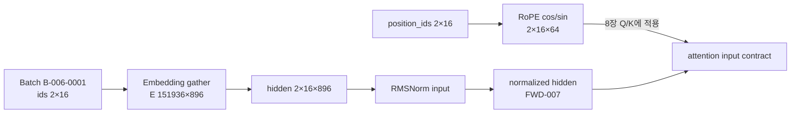

# 7장. embedding·position·normalization

이 장의 residual 좌표·position·normalization 계약은 8장의 attention score 기하와 9장의 MLP·MoE update 경로를 공통으로 제약한다. 14장은 normalization과 RoPE가 저정밀·fused kernel에서 어떤 accumulation·recompute 규칙을 유지해야 하는지 다시 검산한다.

이 장을 읽는 가장 안전한 방법은 `embedding`, `RoPE`, `RMSNorm`을 서로 떨어진 세 개의 부품으로 외우지 않는 것이다. token 하나가 실제 계산 그래프를 지나는 순서는 다음과 같다.

`input_ids[B,T] → embed_tokens.weight[V,C]의 행 gather → hidden_states[B,T,C] → position_ids/cache_position으로 만든 cos·sin → q,k[B,H,T,D] 회전 → residual stream[B,T,C] → RMSNorm/LayerNorm → attention·MLP branch → residual add → lm_head 투영[B,T,V] → loss → 같은 embedding 행으로 scatter-add`

이 사슬에서 모양이 같은 tensor도 역할은 다르다. `input_ids`는 수가 아니라 주소이고, embedding 출력은 residual stream의 최초 좌표이며, position은 그 좌표에 ‘단어의 의미’를 더하는 표찰이 아니라 attention 내적이 순서를 구분하도록 바꾸는 변환이다. normalization은 정보를 새로 넣지 않고 다음 branch가 읽을 수 있는 수치 단위를 만든다. weight tying이 켜졌다면 마지막 출력 투영이 처음의 표를 다시 읽으므로, 이 사슬은 직선이 아니라 parameter storage에서 닫히는 고리다.

### 먼저 고정할 네 종류의 동일성

재현 여부를 판단할 때 “같은 모델”이라는 말만으로는 부족하다.

| 동일성 | 확인할 객체 | 같지 않을 때 처음 달라지는 곳 |
|---|---|---|
| 주소 동일성 | tokenizer revision, special-token ID, `input_ids` | embedding gather |
| 함수 동일성 | RoPE 식·pairing·offset, norm 식·축·epsilon | rotated q/k 또는 norm 출력 |
| 저장소 동일성 | embedding/head alias, parameter object, optimizer state mapping | backward 합 또는 optimizer step |
| 직렬화 동일성 | config와 state-dict key·shape·dtype | load 직후 또는 context extension |

따라서 logits가 다르다는 보고를 받자마자 attention kernel부터 의심하지 않는다. 위 표의 위에서 아래로 최초 불일치를 좁히면, tokenizer 불일치와 fused-kernel 오차를 같은 문제로 취급하는 일을 피할 수 있다.

## 7.0 GR-001 규범 trace: BatchID의 주소를 residual 좌표로 펼친다

입력은 6장의 `B-006-0001`이다. GR-001의 고정 Qwen2 계열 manifest는 `V=151936`, hidden size `C=896`, query head `14`, KV head `2`, head dimension `64`를 선언한다. 이 장은 embedding gather와 첫 RMSNorm까지를 `ForwardSpanID=FWD-007`로 고정한다. 정확한 배포 모델 revision이 바뀌면 이 숫자를 재사용하지 않고 새 manifest를 만든다.



|state|shape·dtype|owner·storage|불변조건|
|---|---|---|---|
|`input_ids`|`[2,16] int64`|data rank owns batch|모든 값 `0≤id<V`|
|embedding table $E$|`[151936,896] bf16`|model rank; tied 여부 manifest|tokenizer revision과 row 의미 일치|
|gathered hidden $X$|`[2,16,896] bf16`|activation; backward까지 또는 recompute|padding 위치도 값은 있으나 loss owner는 mask|
|position IDs|`[2,16] int64`|batch policy|segment reset이 6장 segment map과 일치|
|RoPE cos/sin|논리 `[2,16,64]`, 계산 FP32 여부 기록|layer에서 공유 가능|position·theta·scaling revision 고정|
|RMS statistic|`[2,16,1] fp32` 권장|norm kernel temporary|마지막 hidden 축만 reduction|
|normalized hidden|`[2,16,896] bf16`|8장 QKV projection 소비|finite이며 reference 오차 이내|

embedding과 RMSNorm은

$$X_{bt:}=E[input\_ids_{bt}],\qquad
RMSNorm(x)=g\odot{x\over\sqrt{C^{-1}\sum_jx_j^2+\epsilon}}.$$

|기호|코드 객체|shape/검산|
|---|---|---|
|$E$|`model.embed_tokens.weight`|`[V,C]`; gather row 주소 검사|
|$g$|norm weight|`[C]`; broadcast 축 검사|
|$C$|hidden size|896; token이나 batch 분모가 아님|
|$\epsilon$|`rms_norm_eps`|resolved config 값과 kernel 값 동일|
|position|`position_ids/cache_position`|6장 segment offset에서 유도|

Qwen2 계열의 embedding→decoder→norm 실제 호출 경로는 [Transformers 고정 모델 구현](https://github.com/huggingface/transformers/blob/550d7b3834670483a4df436541272c055dc364bf/src/transformers/models/qwen2/modeling_qwen2.py#L360-L470), RoPE 구성과 적용은 [같은 고정 파일](https://github.com/huggingface/transformers/blob/550d7b3834670483a4df436541272c055dc364bf/src/transformers/models/qwen2/modeling_qwen2.py#L100-L170)에서 확인한다.

**반증과 handoff.** `FWD-007-M1`은 tokenizer bundle만 바꿔 같은 정수가 다른 row 의미를 갖게 한다. shape test가 아니라 bundle compatibility가 거부해야 한다. `M2`는 position을 packed row 전체에서 연속 증가시켜 두 번째 segment의 cos/sin에서 최초 차이를 만든다. `M3`는 RMS reduction을 hidden 축 대신 token 축에 수행한다. constant-scale fixture와 FP32 reference가 즉시 실패해야 한다. 8장에는 `{FWD-007, normalized hidden[2,16,896], position/cos/sin contract, segment allowed-edge mask, dtype/stride, model revision}`을 넘긴다.

## 7.1 embedding lookup을 주소·storage·gradient로 읽는다

token ID는 의미 벡터 자체가 아니라 embedding table의 row 주소다. lookup, tying과 backward scatter가 같은 storage에 남기는 효과를 추적한다.

### lookup gradient와 tied embedding

token ID `[B,T]`가 embedding `E[V,C]`를 읽으면 activation은 `[B,T,C]`다. backward는 등장한 행에만 gradient를 scatter-add한다. dense LM head와 weight tying을 하면 같은 parameter가 출력 투영의 dense gradient도 받는다. 행렬 shape만 보고 optimizer를 고르면 이 두 의미를 놓친다.

정수 ID에는 거리 의미가 없다. embedding은 ID가 읽는 학습 가능한 C차원 행이다. one-hot과 E의 곱으로 볼 수 있지만 one-hot은 materialize하지 않는다. `X_bt=E[id_bt]`에서 `dE_v=Σ_{id_bt=v}dX_bt`다.

| state | shape | 의미 |
|---|---|---|
| IDs | `[B,T]` | row address |
| table | `[V,C]` | parameter |
| activation | `[B,T,C]` | lookup output |
| gradient | `[V,C]` | scatter/dense sum |
| logits | `[B,T,V]` | tied output path |

nanoGPT `3adf61e`, `model.py:126-139`는 `wte`, learned `wpe`, LM head를 만들고 `wte.weight=lm_head.weight`로 alias한다. `170-183`은 lookup과 position 합을 수행한다. tying은 shape equality가 아니라 storage identity다.

Transformers 계열의 decoder에서는 이름이 흔히 `model.embed_tokens.weight`와 `lm_head.weight`로 나타나지만, 정확한 prefix는 model wrapper와 architecture에 따라 달라진다. 그러므로 문자열을 외우기보다 `get_input_embeddings()`와 `get_output_embeddings()`가 돌려주는 module, 두 weight의 shape, `data_ptr`/storage identity, state dict의 실제 key를 함께 기록한다.

`PreTrainedModel.resize_token_embeddings()`는 단순히 config 숫자 하나를 바꾸는 호출로 간주해서는 안 된다. 내부 resize 뒤 input module을 다시 설치하고, architecture의 tying 정책에 따라 output weight를 다시 묶거나 별도로 resize할 수 있기 때문이다. 이 설명은 특정 버전의 모든 model class가 같은 key를 쓴다는 주장이 아니다. 실행 중인 revision에서 getter·setter와 `_tied_weights_keys` 또는 동등한 tying 선언을 확인해야 한다.

한 token `i`의 forward와 backward를 식으로 펼치면 경계가 선명해진다. forward lookup은 `x=E[i]`이고, 같은 ID가 batch에서 `n_i`번 나타나면 입력 경로는 `∂L/∂E[i]=Σ_{(b,t):id=i} ∂L/∂x_bt`를 만든다. tied output이 `z=hEᵀ`라면 여기에 `Σ_{b,t}(∂L/∂z_{bt,i})h_bt`가 더해진다. 앞의 합은 등장 위치만 주소로 삼지만 뒤의 합은 softmax vocabulary 경쟁을 통해 등장하지 않은 행에도 닿을 수 있다. “embedding은 sparse하게 학습된다”는 문장은 untied lookup 경로만 가리킬 때에만 정확하다.

### 내적이 말해 주는 것과 말해 주지 않는 것

embedding row 사이의 dot product `e_iᵀe_j`는 두 벡터의 길이와 방향 정렬을 함께 반영한다. cosine similarity는 길이를 지워 방향만 비교한다. 둘이 유용한 까닭은 transformer의 선형 projection과 attention·LM head가 실제로 선형 결합과 내적을 반복하기 때문이다. 가까운 방향의 row가 이후 layer에서 비슷한 반응을 일으킬 가능성은 있지만, 이것만으로 두 token이 인간이 말하는 동일한 ‘의미’를 가졌다고 결론 낼 수는 없다. basis를 가역 선형변환하고 다음 weight에 역변환을 흡수하면 model 함수는 유지되면서 좌표별 해석은 달라질 수 있고, token frequency·형태·문맥 혼합도 근접성을 만든다.

따라서 embedding 분석은 세 층으로 나눈다. 첫째, **기계적 사실**은 어느 ID가 어느 row를 읽고 어떤 gradient를 받았는가다. 둘째, **기하적 관측**은 norm·dot product·국소 이웃·projection 후 반응이다. 셋째, **의미 해석**은 개입 실험이 필요한 가설이다. 특정 row를 바꾸거나 이웃을 교체했을 때 정해 둔 문맥의 logit과 행동이 어떻게 달라지는지를 보지 않았다면, 2차원 시각화만으로 개념 축이나 지식 위치를 선언하지 않는다.

tied model에서는 output `Z=HEᵀ`의 dense `dE_out=dZᵀH`와 lookup `dE_in`이 같은 parameter에 더해진다. input에 없는 row도 vocabulary 경쟁을 통해 gradient를 받는다.

vocabulary resize는 E/head/config, 새 row 초기화, optimizer moment와 alias를 함께 바꾼다. Parameter 객체가 교체되면 old optimizer가 새 row를 step하지 않을 수 있다.

resize를 안전한 트랜잭션으로 만들려면 순서가 중요하다. tokenizer artifact와 special-token map을 먼저 고정하고, model resize를 수행한 뒤, 새 row 초기화 정책을 적용하고, tying을 재확인하고, 그 다음 optimizer를 새 parameter 집합으로 만들거나 state를 명시적으로 이관한다. 마지막으로 checkpoint를 저장할 때 tokenizer·config·weight·optimizer manifest를 같은 revision으로 묶는다. 중간 checkpoint가 이 다섯 객체 가운데 일부만 담으면 load는 성공해도 ID가 다른 row를 읽거나 새 row의 moment가 사라질 수 있다.

| resize 단계 | 반드시 관찰할 상태 | 조용한 실패 |
|---|---|---|
| tokenizer 확장 | token 문자열↔ID, special flag, tokenizer digest | 같은 문자열이 다른 ID를 가리킴 |
| table 확장 | input/output row 수, config vocab size | ID OOB 또는 head 차원 불일치 |
| row 초기화 | 새 row 범위·RMS·dtype | distribution shock 또는 영행 고착 |
| tying 복원 | parameter/storage identity | 한 step 뒤 input/head 분기 |
| optimizer 이관 | parameter ID, group, moment shape, step | gradient는 있으나 delta 없음 |
| round trip | tokenizer+config+state checksum | 재시작 뒤에만 parity 붕괴 |

vocab parallel은 V 행을 rank별 shard한다. local에 없는 ID를 mask하고 owner 결과를 결합한다. tied vocab-parallel CE는 global max, exp sum, target logit collective가 필요하다.

**반례 1.** 값이 같은 embedding/head 복사본은 첫 forward가 같아도 한 step 뒤 갈라질 수 있다.

**반례 2.** lookup gradient가 sparse여도 tied dense head 경로가 있으면 전체 gradient는 sparse하지 않다.

**실험 7-A.** repeated ID occurrence별 hidden gradient 합과 row gradient를 비교한다.

**실험 7-B.** tied model gradient와 untied input/head gradient의 합을 비교하고 optimizer step 뒤 alias를 확인한다.

**실패 주입 7-C.** resize 뒤 old optimizer를 유지해 새 row에 gradient는 있지만 delta가 없는 상황을 잡는다.

## 7.2 위치 표현을 attention score의 좌표 변환으로 해부한다

absolute position, RoPE와 ALiBi가 q·k 또는 score에 어떤 좌표를 추가하며 상대 위치를 어떻게 표현하는지 비교한다.

### learned position과 RoPE

nanoGPT는 learned position table `[T,C]`를 token embedding에 더한다. RoPE는 Q와 K의 2차원 성분쌍을 위치별 각도로 회전하여 내적에 상대 위치 차이를 새긴다. context를 늘릴 때 base frequency나 position scaling을 바꾸면 cache와 checkpoint가 같은 함수를 나타내는지 다시 확인해야 한다.

learned absolute position은 `wpe(pos)[T,C]`를 token activation에 broadcast한다. table보다 긴 position은 표현할 수 없다. crop은 config, table, manual causal buffer를 함께 바꾼다. packed segment가 position을 reset할지도 6장 policy다.

RoPE는 channel 두 개를 위치 p의 각도 `pθ_i`로 회전한다. `R(p)`가 직교이므로 norm을 보존하고 `(R(p)q)ᵀ(R(t)k)=qᵀR(t-p)k`다. 상대 위치가 score에 들어간다.

Transformers `550d7b3`, Llama `modeling_llama.py:73-160`은 inverse frequency, cos/sin과 q/k rotation을 연결한다. `rope_theta`, scaling variant, rotary dimension이 함수 identity다.

코드에서는 이 경계를 세 단계로 읽는다. rotary module은 config와 `position_ids`를 받아 `cos,sin`을 만들고, attention module의 q/k projection은 hidden state를 head shape로 바꾸며, `apply_rotary_pos_emb` 계열 함수가 q와 k에 위치 좌표를 적용한다. 함수명과 인자 순서는 고정한 Transformers revision을 따르되, 조사 ledger에는 `position_ids[B,T]` 또는 cache position이 어느 cos/sin row를 골랐는지, broadcast 뒤 q/k의 어느 D channel이 회전했는지, 회전 전후 dtype이 무엇인지 적는다.

checkpoint에는 projection·norm weight가 남는 반면 inverse frequency와 cos/sin cache는 구현에 따라 buffer이거나 config에서 재생성되는 상태일 수 있다. state dict에 cache key가 없다는 이유만으로 position 상태가 없다고 판정하지 않는다.

RoPE의 기하적 장점은 회전이 의미를 안다는 데 있지 않다. 직교변환이라 q/k 길이를 인위적으로 키우지 않으면서, 두 위치에 다른 회전을 적용한 내적을 위치 차이의 함수로 바꿀 수 있다는 데 있다. content projection이 만든 방향과 상대 변위가 한 score에서 만나는 것이다. 이 성질은 상대 위치 정보를 넣을 통로를 보장할 뿐, 학습 범위 밖 위치의 정확한 행동까지 보장하지 않는다.

backward는 `y=R(p)x`에서 `dx=R(-p)dy`다. norm은 보존돼도 wrong position이면 score가 틀리므로 inverse rotation과 relative identity를 검사한다.

inverse frequency는 대략 `base^{-2i/d}` 계열이다. scaling은 position/frequency spectrum을 바꾸어 장문 외삽과 짧은 문맥 정밀도를 교환할 수 있다. option 이름보다 생성 tensor를 diff한다.

`rope_theta`나 scaling option을 바꾸면 durable state에서는 config가, 계산 state에서는 inverse-frequency tensor가 먼저 달라진다. 그 차이는 cos/sin, rotated q/k, attention score, logits 순으로 전파된다. projection weight shape는 그대로일 수 있어 checkpoint load가 너무 쉽게 성공한다. 그러므로 context extension은 동일한 짧은 위치 구간의 parity, 경계 위치의 연속성, 확장 구간의 score·loss·gradient를 나누어 판정한다.

| 변경 | 최초 변경 상태 | 그대로일 수 있는 상태 | 분리 실험 |
|---|---|---|---|
| `rope_theta` | inverse frequency | q/k projection weight | 같은 q/k의 position sweep |
| scaling recipe | frequency 생성 규칙·attention scale | checkpoint key shape | 짧은/확장 구간 분리 |
| pairing convention | channel 대응 | cos/sin shape | basis-vector rotation |
| partial rotary | 회전 D 범위 | residual C shape | 회전/비회전 channel checksum |
| cache offset | 선택 position row | cached-key shape | full prefill/token decode parity |

cos/sin cache는 dtype/device/max position 상태다. dynamic 확장과 compile, serving cache가 이미 rotated key를 저장하는지 확인한다.

**반례 3.** q/k norm이 같아도 position이 틀리면 attention score는 틀린다.

**반례 4.** context limit만 늘린 port는 짧은 fixture를 통과하고 긴 위치에서 깨질 수 있다.

**실험 7-D.** FP64에서 relative-position identity와 inverse rotation을 검사한다.

**실험 7-E.** packed segment reset/continuous position의 standalone logits parity를 비교한다.

**실패 주입 7-F.** 낮은 dtype cos/sin cache의 긴 position score·gradient drift를 측정한다.

## 7.3 normalization이 residual의 scale과 gradient를 조절한다

LayerNorm과 RMSNorm을 평균·분산 식뿐 아니라 residual stream의 단위, saved state와 backward Jacobian으로 읽는다.

### LayerNorm·RMSNorm·QK norm

LayerNorm은 평균과 분산을, RMSNorm은 제곱평균을 쓴다. pre-norm block은 attention/MLP에 들어가기 전에 residual stream을 정규화하여 깊은 network의 gradient 경로를 안정시킨다. QK norm은 attention score가 특정 head에서 과도하게 커지는 것을 제한하지만 별도의 scale과 epsilon 상태를 만든다.

LayerNorm은 `μ=Σx/C`, `σ²=Σ(x-μ)²/C`, `y=γ(x-μ)/√(σ²+ε)+β`다. RMSNorm은 `rms=√(Σx²/C+ε)`, `y=γx/rms`다. constant vector에서 두 함수가 다르다.

LayerNorm backward는 `xhat=(x-μ)/√(σ²+ε)`, `g=dL/dy`에서 `dx=γ[Cg-Σg-xhatΣ(gxhat)]/(C√(σ²+ε))` 형태다. fused backward는 dx/dγ/dβ를 reference와 비교한다.

pre-norm `H'=H+F(Norm(H))`은 residual identity gradient 경로를 둔다. post-norm과 architecture가 다르다. nanoGPT `model.py:18-27,94-106`은 epsilon `1e-5` optional-bias LayerNorm과 두 pre-norm residual을 보인다.

residual stream은 정규화된 상태 자체가 아니다. pre-norm block에서 원본 `H`는 우회로에 남고 `Norm(H)`만 branch가 읽는다. backward에서는 residual identity 경로와 norm·branch를 지난 경로가 `∂L/∂H`에 합쳐진다. norm 출력이 안정적이라는 사실과 residual RMS가 layer를 따라 안정적이라는 사실은 다르므로 `norm input`, `norm output`, `branch output`, `residual add output`을 별도 node로 기록한다.

RMSNorm의 최소 기하 직관은 척도와 방향의 분리다. epsilon이 지배하지 않는 범위에서는 양의 상수 a에 대해 `ax/rms(ax)≈x/rms(x)`이므로 branch가 residual의 절대 크기보다 channel 방향을 읽게 한다. 학습 가능한 γ는 channel별 단위를 다시 조절한다. 그러나 RMSNorm은 평균 방향을 빼지 않고 outlier 방향·residual 누적·γ의 증폭도 남긴다. 공통 shift에도 불변인 LayerNorm과 단순한 속도 차이로 바꾸어 말할 수 없다.

QK norm은 q/k `[B,H,T,D]`의 D축을 head별 normalize한다. Qwen3 `550d7b3`, `modeling_qwen3.py:211-281`은 projection 뒤 q/k RMSNorm을 적용한다. hidden RMSNorm이나 temperature와 동치가 아니다.

BF16 input이라도 mean/variance는 FP32 accumulation할 수 있다. naive `E[x²]-E[x]²`는 large offset/small variance에서 cancellation이 크다. Welford/two-pass/fused reduction별 rounding을 비교한다.

`rms_norm_eps`나 `layer_norm_eps`는 NaN 방지용 안전 손잡이만이 아니다. 작은 RMS/variance 영역에서 분모와 backward Jacobian을 직접 바꾸는 함수 parameter다. 값을 키워 증상이 사라져도 upstream 폭주를 고쳤다고 말할 수 없다. 동일 input을 FP64 식·eager·fused kernel에 넣고 epsilon만 sweep하여 first difference가 norm 내부인지 이전 activation인지 분리한다. norm weight shape가 그대로라 permissive checkpoint load가 성공하는 경우가 특히 위험하다.

hidden C를 TP shard하면 norm statistic이 C 전체 collective를 요구한다. sequence shard에서 C가 local이면 token norm은 local일 수 있다. QK head/D shard 축도 확인한다.

norm scale/bias와 QK norm parameter의 weight decay/optimizer group을 recipe에서 확인한다. module 존재와 official group 사용을 구분한다.

**반례 5.** wrong axis normalization도 전체 RMS는 그럴듯할 수 있다. T≠C fixture로 token별 invariant를 본다.

**반례 6.** epsilon mismatch는 random input에 작고 near-constant input에 크게 나타난다.

**실험 7-G.** FP64 manual LayerNorm/RMSNorm과 forward/dx/dγ/dβ를 constant, near-constant, large-offset input에서 비교한다.

**실험 7-H.** q/k scale sweep에서 QK norm on/off score max, entropy, gradient norm을 기록한다.

**실패 주입 7-I.** T=C fixture로 숨은 wrong-axis bug를 T≠C에서 노출한다.

## 7.4 embedding·position·norm을 부작용 없이 관찰한다

hook와 tensor dump가 RNG, graph, stream과 memory를 바꾸지 않는 범위를 정하고 최소 trace schema를 만든다.

### shape·dtype·layout 실습

golden atlas는 token embedding, position 적용 후 residual, norm 입력/출력에 대해 shape, stride, dtype, finite 비율, mean/RMS, checksum을 기록한다. hook에서 `.cpu()` 전체 복사를 반복하면 timing과 메모리 lifetime이 달라진다. 먼저 통계만 모으고 실패 layer에서 좁힌다.

교육 config `B=2,T=8,V=256,C=32,H=4,D=8`에서 embedding/residual은 `[2,8,32]`, q/k는 `[2,4,8,8]`, hidden norm scale `[32]`다. node마다 shape, stride, storage offset, dtype, device, finite count, RMS와 checksum을 기록한다.

transpose 뒤 q/k는 non-contiguous일 수 있다. `.contiguous()`는 추가 copy다. custom kernel은 supported stride를 검증하고 profiler로 copy를 확인한다.

parameter storage, autocast input, reduction accumulator, output, gradient, optimizer-state dtype을 구분한다. checksum은 dtype·endianness·contiguous serialization 계약을 갖는다.

hook은 lookup output, position 적용 residual, norm 전후, RoPE 전후 q/k, QK norm 전후에 둔다. compile graph를 깨므로 correctness와 performance run을 분리한다.

backward ledger에는 embedding/position row gradient, norm dx/dγ/dβ, RoPE 전 q/k gradient와 QK scale gradient를 기록한다. tied alias는 한 group으로 집계한다.

Transformers tests가 작은 config forward/backward와 shape를 검사해도 모든 RoPE scaling·dtype·backend를 보장하지 않는다. nanoGPT에는 독립 unit test가 없다. local FP64 fixture를 upstream test로 부르지 않는다.

**실험 7-J.** contiguous/non-contiguous q/k의 reference/fused output·gradient와 copy allocation을 비교한다.

**실험 7-K.** position 0, train max-1, max, extension 범위의 cache/logits finite를 본다.

**실패 주입 7-L.** resize 후 tied alias를 끊고 first forward와 one-step 뒤를 비교한다.

**실패 주입 7-M.** norm epsilon만 바꾸어 first difference가 norm node인지 확인한다.

**조사 체크리스트.** vocab/IDs/tie/storage를 확인한다. position type·theta/scaling/cache와 pack reset을 찾는다. norm 종류·axis·epsilon·reduction dtype·pre/post 위치를 적는다. QK norm module/scale을 찾는다. shape/stride/dtype을 hook하고 forward→backward→fused→compile→distributed 순으로 승격한다.

**결정 트리.** embedding부터 다르면 IDs/weight/tie다. position 합부터 다르면 position IDs/table/RoPE다. QK norm 전은 같고 후가 다르면 axis/epsilon/scale/dtype이다. eager는 맞고 fused가 다르면 layout/reduction dispatch다. backward만 다르면 saved statistic, alias sum, rotation transpose다.

**복구.** checkpoint는 embedding/position/norm parameter와 config를 저장한다. 재생성 가능한 cos/sin cache는 durable하지 않아도 generator rule/max position이 필요하다. load 뒤 optimizer mapping과 tied alias를 재검증한다.

**실제 인계.** 8장에 rotated/normalized Q/K와 layout, 9장에 normalized residual, 10장에 atlas, 11장에 parameter role, 14장에 reduction dtype, 15장에 vocab/head shard ownership을 넘긴다.

## 7.5 vocabulary와 optimizer가 embedding row를 바꾸는 과정을 추적한다

등장 빈도, tied LM head와 optimizer state가 각 row에 어떤 update를 남기는지 token contribution과 함께 정산한다.

### 초기화·빈도·샤딩이 같은 행에 남기는 흔적

**Embedding initialization.** row를 normal distribution으로 초기화하면 초기 RMS와 LM logit scale이 연결된다. tied table은 input과 output 양쪽 요구를 받는다. 새 token row를 0으로 두면 처음에는 모든 hidden과 dot product가 0이지만 lookup 경로의 symmetry와 head gradient가 다르게 작동한다. 기존 row mean/covariance 기반 초기화는 초기 distribution shock를 줄이려는 선택이지 token 의미를 부여하는 것이 아니다.

**Frequency와 update count.** 자주 등장하는 token은 lookup 경로 update가 많고 희귀 token은 output-head competition gradient 비중이 커질 수 있다. row별 occurrence, gradient RMS, delta RMS를 함께 보면 tokenizer tail과 embedding 학습의 연결이 보인다. token frequency만으로 gradient magnitude를 예측하지 않는다.

**Padding row.** `padding_idx`가 있는 embedding은 해당 lookup row gradient를 막을 수 있지만 tied LM head에서는 output 경로 gradient가 들어올 수 있다. pad와 EOS를 같은 ID로 쓰는 model도 있다. attention/label mask가 pad 역할을 결정하고 embedding API 옵션 하나로 전체 contract가 닫히지 않는다.

**Embedding offload와 sharding.** V가 크면 table과 optimizer moment가 memory를 많이 쓴다. row-wise sharding은 lookup communication, vocab-parallel CE와 tying을 함께 설계한다. CPU/offload는 random row access와 H2D bandwidth가 병목이 될 수 있다. sparse optimizer는 dense transformer parameter와 다른 step semantics를 가진다.

**Engram과 addressed store의 경계.** n-gram hash table도 2-D parameter처럼 보일 수 있지만 dense hidden transform이 아니라 sparse addressed store다. collision과 frequency-weighted gradient가 있다. shape만 보고 Muon 같은 matrix optimizer에 넣지 않고 semantic role과 access pattern을 본다.

**실험 7-N—row frequency.** 반복 ID와 희귀 ID를 가진 batch에서 tied/untied row별 input/output gradient를 분해한다. occurrence count로 나눈 gradient와 raw sum을 모두 본다.

**실패 주입 7-O—pad/EOS alias.** pad와 EOS가 같은 ID인데 label mask를 누락해 padding을 EOS target으로 학습하게 한다. valid count와 EOS row gradient spike로 탐지한다.

**Embedding 조사 결정 트리.** ID range가 깨지면 tokenizer/resize다. row lookup이 expected checkpoint와 다르면 weight revision이다. forward는 맞고 row gradient가 다르면 tying/occurrence/ignore다. gradient는 있고 delta가 없으면 optimizer group/frozen state다. 분산에서만 다르면 owner mapping과 vocab collective다.

## 7.6 RoPE·context extension을 함수 호환성으로 검증한다

theta, scaling, rotary dimension과 cache 생성 방식이 position 함수와 checkpoint·serving parity를 어떻게 바꾸는지 본다.

### pairing convention과 cache offset을 분리한다

**RoPE implementation 두 표현.** even/odd pair를 `(-x_odd,x_even)`로 rotate-half하고 cos/sin을 곱하는 구현과 complex multiply 구현이 있다. channel pairing convention이 다르면 shape는 같아도 함수가 다르다. checkpoint weight는 같고 position output만 달라지는 porting 오류다. known q/k fixture로 component-level compare한다.

**Interleaved와 half-split.** 일부 구현은 adjacent channel `(0,1),(2,3)`을 pair로, 다른 구현은 first half/second half를 pair로 본다. config/model family의 convention과 kernel flag를 맞춘다. 단순 reshape로 바꿀 수 있어 load가 성공하는 조용한 오류다.

**Partial rotary.** head dimension 전체가 아니라 앞 `d_rope`만 회전하고 나머지는 content component로 남길 수 있다. `d_rope≤D`와 even dimension을 확인한다. MLA는 positional component 분리가 cache projection absorption과 연결된다.

**Position offset과 cache.** autoregressive decode에서 새 token position은 past length를 반영한다. left padding, sliding window, prefix cache, packed prefill은 offset 계산을 바꾼다. training full sequence와 serving incremental의 rotated key가 같은지 prefill/decode parity를 검사한다.

**Context scaling 상태표.** base theta, original max position, target max, factor, low/high frequency adjustment, attention scale을 config와 generated frequency tensor로 기록한다. 서로 다른 scaling recipe가 같은 `factor` 필드를 써도 함수가 다를 수 있다. model card 선언과 runtime implementation revision을 대조한다.

**RoPE 수치 오차.** 큰 pθ에서 sin/cos argument reduction 오차와 낮은 dtype quantization이 커질 수 있다. cos²+sin²≈1, rotation norm, relative-dot identity를 position sweep한다. cache를 낮은 dtype으로 저장할지 계산 후 cast할지 구분한다.

**실험 7-P—pair convention.** basis vector를 회전해 adjacent/half-split expected component를 손계산한다. random vector만 쓰면 permutation bug의 위치를 해석하기 어렵다.

**실험 7-Q—prefill/decode.** 같은 sequence의 full forward key와 token-by-token cached key를 position별 비교한다. padding·cache offset과 sliding window를 한 축씩 추가한다.

**실패 주입 7-R—position off-by-one.** decode offset을 past length+1로 만들어 첫 mismatch가 cos/sin/rotated key에서 잡히는지 본다. logits만 보면 cache 여러 층 뒤로 원인이 퍼진다.

## 7.7 normalization backward와 distributed reduction을 닫는다

저장된 mean·rstd 또는 RMS, dtype과 reduction order가 gradient와 checkpoint 의미를 결정하는 경계를 fixture로 검증한다.

### LayerNorm·RMSNorm·QK norm의 기울기 계약

**LayerNorm backward 직관.** output이 input의 공통 shift에 불변이므로 dx의 channel 합은 이상적으로 0이다. normalized radial direction에도 제약이 있다. backward test에서 `Σdx≈0`을 property로 쓸 수 있다. γ가 있으면 upstream에 γ를 적용한 뒤 같은 구조가 나타난다.

**RMSNorm backward 직관.** scale 방향을 제거해 input radial component의 gradient가 조정된다. mean을 빼지 않으므로 dx 합 0 불변식은 없다. LayerNorm property를 RMSNorm에 적용하면 잘못된 test다.

**Epsilon 위치.** 일반적으로 sqrt 안에 `σ²+ε`를 쓰지만 구현 변형을 확인한다. epsilon을 sqrt 뒤에 더하는 식은 작은 variance에서 다르다. config 값이 같아도 식 위치가 다르면 port mismatch다.

**Affine parameter.** LayerNorm의 γ/β, RMSNorm의 γ, bias-free 선택이 checkpoint key와 optimizer group을 바꾼다. nanoGPT는 optional bias를 config로 제어한다. bias를 끈 checkpoint에 permissive load로 missing key를 숨기지 않는다.

**Residual scaling과 norm.** norm이 branch input scale을 맞춰도 residual sum 자체가 layer마다 커질 수 있다. residual projection initialization, DeepNorm류 scaling, mHC 같은 residual mixing은 별도 architecture다. norm 하나가 모든 깊이 안정성을 해결한다고 설명하지 않는다.

**QK norm과 softmax scale 유도.** q/k RMS가 대략 1이면 vector norm은 `√D` 규모이고 independent component 내적 표준편차는 `√D` 수준이다. `1/√D` scale이 score variance를 O(1)로 만든다. learned γ와 component correlation은 이 근사를 바꾼다. QK norm은 magnitude outlier를 줄이나 direction alignment score는 남는다.

**QK norm gradient 공유.** head별 scale을 공유하는지 head/channel별 parameter인지 config/source shape를 본다. shared scale이면 모든 head gradient가 같은 parameter에 합쳐진다. TP head shard에서는 parameter replication과 all-reduce가 필요할 수 있다.

**Fused norm saved state.** backward에 input, inverse RMS/variance, γ가 필요하다. input을 저장하거나 output/statistic에서 재구성할 수 있다. fused residual+norm은 add 결과와 pre-norm output의 lifetime을 바꾼다. forward parity뿐 아니라 residual gradient 분기 합을 검사한다.

**실험 7-S—shift/scale properties.** LayerNorm input에 공통 상수를 더해 output 불변, positive scalar를 곱해 epsilon 무시 구간의 근사 불변을 본다. RMSNorm은 공통 shift 불변이 아님을 반례로 확인한다.

**실험 7-T—fused norm.** reference와 fused residual+RMSNorm의 output, residual dx, branch dx, dγ를 dtype별 비교한다. inplace alias와 saved statistic을 확인한다.

**실패 주입 7-U—reduction overflow.** large C와 large-magnitude BF16 input에서 낮은 dtype sum-square를 사용해 inf를 유도한다. FP32 accumulation reference와 first bad node를 비교한다.

**Shape contract 표.** embedding은 ID 축을 V row로, hidden은 C channel로 바꾼다. learned position은 `[T,C]`가 B에 broadcast된다. RoPE cos/sin은 구현에 따라 `[T,D]`, `[B,T,D]`, `[B,1,T,D]`로 broadcast된다. QK norm은 `[B,H,T,D]` 마지막 축, residual norm은 `[B,T,C]` 마지막 축이다. broadcast 가능하다는 이유로 잘못된 축을 허용하지 않는다.

**Stride contract.** embedding output은 보통 contiguous `[T·C,C,1]` 계열이지만 packed/sequence-parallel gather 뒤 다를 수 있다. q/k transpose는 head-major non-contiguous다. norm kernel은 last dimension contiguous를 요구할 수 있다. implicit copy와 graph break를 profiler에 표시한다.

**Distributed ownership 표.** vocab parallel은 E rows와 logits partition, hidden TP는 C/D partition, sequence parallel은 B/T tokens partition이다. learned position table은 복제 또는 sequence shard lookup할 수 있다. norm statistic collective는 partition 축이 normalized dimension과 겹칠 때만 필요하다. “TP면 norm all-reduce”처럼 일반화하지 않는다.

**Checkpoint 검증.** config `vocab_size,hidden_size,max_position,rope parameters,norm eps/bias/QK norm`에서 expected key/shape를 만든다. state dict와 대조하고 alias group을 재구성한다. permissive missing/unexpected key는 reason allowlist가 없으면 실패다. load 뒤 golden IDs의 embedding/position/norm checksum을 확인한다.

**Upstream test를 읽는 질문.** test가 config branch를 실제 생성하는가. forward만인지 backward도 하는가. long position/scaling을 포함하는가. cache prefill/decode를 비교하는가. dtype/hardware tolerance는 무엇인가. skipped backend는 무엇인가. 작은 random input으로 wrong axis가 숨지 않는가. 이 답이 없는 범위는 local fixture로 보완한다.

**NaN 결정 트리.** embedding weight가 finite인지 본다. position cos/sin과 sum이 finite인지 본다. norm input variance/RMS, inverse statistic을 본다. q/k norm 후 score scale을 본다. 낮은 dtype reduction을 FP32로 바꾼다. epsilon을 임의로 키우기 전에 checkpoint/config mismatch와 upstream activation 폭주를 조사한다.

**Parity 결정 트리.** IDs/weights가 같고 embedding이 다르면 lookup/layout다. embedding은 같고 position 합이 다르면 ID/offset/table/rotation이다. norm input은 같고 output이 다르면 norm type/axis/epsilon/affine/reduction dtype이다. forward가 맞고 gradient가 다르면 saved statistic, fused backward, tie/alias reduction이다.

**Performance 결정 트리.** embedding에서 느리면 vocab shard communication/cache locality를 본다. RoPE에서 느리면 cache 재생성, broadcast/copy, fusion을 본다. norm에서 느리면 last-dim layout, hidden shard collective, residual fusion을 본다. hook sync를 제거한 clean profile로 재확인한다.

**재현 절차.** CPU FP64 작은 IDs/vector에서 lookup scatter, rotation, norm forward/backward oracle을 만든다. FP32 eager golden atlas를 만든다. target dtype, fused kernel, compile, TP/sequence parallel을 한 축씩 추가한다. 각 child RunID에는 parent와 changed field 하나, first difference와 tolerance를 기록한다.

**장 종료 조건.** token ID 한 개가 어느 embedding row를 읽고 어떤 position 변환과 norm을 거쳐 q/k 또는 MLP input이 되는지 shape·stride·dtype으로 추적한다. lookup/tied gradient를 분해하고 RoPE relative identity, norm forward/backward property를 검산한다. config option이 생성 tensor·parameter·collective·checkpoint를 어떻게 바꾸는지 설명해야 한다.

**옵션 상태 변화표.** `vocab_size`는 table/head rows와 checkpoint shape, `padding_idx`는 lookup gradient policy, tying은 alias/optimizer state를 바꾼다. `max_position`은 learned table 또는 cache 범위, `rope_theta/scaling`은 frequency tensor, `partial_rotary_factor`는 rotated channel을 바꾼다. `norm_eps`는 forward/backward scale, bias는 parameter key, QK norm은 새 module/parameter와 attention score path를 만든다.

| option | 바뀌는 객체 | 직접 관측 | 실패 신호 |
|---|---|---|---|
| vocab/resize | E/head/config | row count·alias | ID OOB·새 row 무업데이트 |
| position reset | position IDs | segment logits | packed parity 실패 |
| rope scaling | inv_freq/cache | cos/sin checksum | long-context drift |
| norm epsilon | norm function | near-constant output | port mismatch |
| QK norm | q/k module | score entropy | saturation/ckpt key |
| reduction dtype | kernel accumulator | finite/RMS | overflow·gradient drift |

**실패 주입 7-V—duplicate optimizer alias.** tied weight의 두 module name을 parameter group에 중복 넣는 custom optimizer 구성을 만든다. framework가 거부하는지, 조용히 두 번 decay/step하는지 본다. parameter ledger의 storage group count가 1이어야 한다.

**실패 주입 7-W—partial rotary odd dimension.** 회전 dimension을 홀수 또는 head dimension보다 크게 설정해 factory가 fail-fast하는지 본다. 마지막 channel을 조용히 drop하지 않는다.

**실패 주입 7-X—stale cache.** theta/scaling config를 바꿨지만 기존 cos/sin cache를 재사용한다. config digest와 cache-generation digest mismatch를 loader/runtime gate가 잡아야 한다.

**실패 주입 7-Y—TP norm statistic 누락.** normalized C축을 두 rank로 나누고 local RMS만 계산한다. full reference와 output/gradient가 다른지 본다. collective sum-square/count를 넣어 복원한다.

**실험 7-Z—optimizer grouping.** embedding, position, norm, QK norm을 decay on/off group으로 나누고 같은 gradient에서 parameter delta를 비교한다. 어느 group이 official recipe인지 source/config로 고정하고 shape heuristic과 구분한다.

**메모리 회계.** E parameter bytes는 `V·C·b_p`, gradient는 `V·C·b_g`, Adam moments는 흔히 `2V·C·b_s`다. tied head는 parameter를 절약하지만 logits activation `[B,T,V]` 또는 fused CE 비용은 남는다. learned position은 `Tmax·C`, RoPE cache는 implementation별 `Tmax·d_rope`의 cos/sin bytes다. norm activation/statistic은 `[B,T,C]` input과 token별 inverse statistic을 고려한다.

**통신 회계.** vocab-parallel lookup은 token owner mask와 hidden result combine, vocab-parallel CE는 max/sum/target reductions를 요구한다. hidden-sharded norm은 token별 sum/sumsquare collective, QK head-shard norm은 head가 local이면 collective가 없다. bytes 식은 actual shard 축과 dtype에서 계산한다.

**실습 7-AA—수동 ledger.** golden IDs 두 행에서 unique ID와 occurrence를 세고 expected nonzero lookup rows를 만든다. tied head를 끈 oracle의 row gradient를 검사한다. position 0–7 table rows와 residual checksum을 기록한다. 두 q/k basis vector에 RoPE를 적용하고 norm을 검산한다.

**실습 7-AB—checkpoint 삼각검증.** config에서 expected E/wpe/norm/QK keys와 shape를 생성하고 state dict, module graph와 비교한다. tied alias와 physical serialization을 확인한다. source line의 factory 선언이 실제 checkpoint tensor와 맞는지 판정한다.

**실습 7-AC—distributed toy.** E를 vocab 두 shard, hidden C를 두 shard로 각각 나눈 두 실험을 만든다. lookup와 norm에서 필요한 collective가 다름을 확인한다. 잘못 local statistic만 쓴 결과를 full reference와 비교한다.

**소스 근거 주석.** Llama RoPE는 Transformers `550d7b3834670483a4df436541272c055dc364bf` `modeling_llama.py:73-160`, Qwen3 QK norm은 `modeling_qwen3.py:211-281`, nanoGPT embedding/LayerNorm/pre-norm은 `3adf61e` `model.py:18-27,94-139,170-183`에 고정한다. model card 설명과 소스 동작, local fixture 결과를 구분한다.

**최종 인계 manifest.** embedding alias group·row checksum, position config/frequency/cache digest, norm type/axis/epsilon/affine/reduction dtype, packed position IDs, q/k pre/post rotation·norm shape/stride/checksum, backward gradient checksum, distributed owner와 collective를 포함한다. 이 manifest가 8장의 attention 입력 계약이다.

**현장 확인 문제.** vocab 256, hidden 32의 BF16 tied embedding과 FP32 gradient·Adam moment가 차지하는 byte를 계산한다. input에 등장하지 않은 row가 tied model에서 gradient를 받을 수 있는 식을 쓴다. RoPE가 vector norm을 보존하지만 wrong position을 잡지 못하는 이유를 dot-product identity로 설명한다. LayerNorm과 RMSNorm의 constant-input 출력을 비교한다.

**회귀 판정 기준.** tokenizer resize 후 IDs 범위·alias·optimizer mapping을 검사한다. packed/standalone position parity를 검사한다. RoPE basis/relative/prefill-decode fixture를 실행한다. norm FP64 oracle과 fused dtype별 tolerance를 검사한다. TP shard fixture에서 required collective를 확인한다. checkpoint round-trip 뒤 같은 golden handoff checksum을 요구한다.

**관측 비용.** embedding 전체 `[V,C]` checksum은 큰 V에서 비싸므로 parameter artifact 생성 시 한 번 계산하고 step마다 row sample·rolling statistics를 쓴다. activation hook은 GPU sync 없이 device-side reduction 후 제한된 값을 옮긴다. correctness run만 full slice를 저장한다. profiler run에서는 hook을 제거한다.

**보안·무결성.** tokenizer가 낼 수 없는 out-of-range/negative ID를 embedding kernel에 넘기지 않는다. custom CUDA lookup은 bounds check 생략 가능성이 있어 preflight와 sanitized data contract가 필요하다. checkpoint tensor shape·dtype·checksum과 config signature를 load 전에 검증한다.

**공개 근거 한계.** static source와 upstream test로 모든 GPU kernel, context scaling 조합, distributed shard의 수치 parity를 증명할 수 없다. 실행하지 않은 조합은 `NotExecuted`, 공개 code가 없는 production policy는 미확인으로 둔다. 예상 invariant와 관측 결과를 같은 열에 쓰지 않는다.

이 경계를 보존한 검증 결과만 다음 attention 장의 입력으로 승인한다.

승인 상태와 manifest checksum을 기록한다.

### embedding은 vocabulary와 optimizer가 만나는 경계다

### 행 주소, 출력 분류기, checkpoint identity를 함께 읽는다

embedding lookup은 단순하지만 그 주변 계약은 단순하지 않다. tokenizer가 낸 ID는 `0≤id<V`를 만족해야 하고, model config의 `vocab_size`, checkpoint table의 첫 축, LM head의 출력 축이 같은 vocabulary revision을 가리켜야 한다. padding을 위해 table을 128 또는 256의 배수로 늘렸다면 tokenizer가 실제로 낼 수 있는 semantic vocabulary와 physical rows를 구분한다. padded rows가 logits에 노출되면 생성 확률 질량을 차지할 수 있으므로 loss와 serving에서 mask하는지 확인한다.

weight tying은 입력과 출력이 같은 숫자를 갖는다는 뜻보다 강하다. 두 module이 같은 `Parameter` 객체 또는 같은 storage를 가리켜야 optimizer가 한 state를 유지한다. checkpoint serialization은 tied tensor를 두 key로 보이게 할 수 있고 load 과정이 alias를 다시 만들 수도 있다. `data_ptr`, storage offset, parameter object identity, optimizer parameter ID를 차례로 확인한다. clone으로 값만 복사하면 첫 forward는 맞지만 gradient 합산과 optimizer moment가 분리된다.

untied model에서 입력 table gradient는 등장 row에 대한 scatter-add다. 출력 head gradient는 모든 vocabulary row에 대해 `dW_v=Σ_{bt} dZ_{btv}H_{bt}`로 생긴다. tied model은 두 경로의 합을 한 parameter에 남긴다. 따라서 희귀 token row도 target이 아니더라도 softmax 경쟁으로 update된다. row frequency와 update count를 해석할 때 lookup occurrence만 세면 잘못이다. 진단 실험에서는 autograd graph를 두 branch로 나누거나 untied oracle의 두 gradient를 합해 tied 결과와 비교한다.

token을 추가하는 resize는 네 단계의 migration이다. tokenizer artifact와 special-token mapping을 바꾸고, embedding/head row를 늘리고, 새 row를 초기화하며, optimizer moment와 distributed shard metadata를 확장한다. checkpoint를 permissive load해 missing rows를 무시하면 학습이 시작돼도 새 token이 실제로 update되지 않을 수 있다. resize 직후 golden sentence의 ID, lookup row, logits 축, gradient, delta, save-load round trip을 검사한다.

초기화 전략은 새 token의 의미를 자동으로 만들지 않는다. 기존 row 평균으로 초기화하면 초기 logit shock를 줄일 수 있고 subtoken 조합 평균은 표면적 의미를 일부 반영할 수 있다. 그러나 context에서 학습될 gradient가 핵심이다. 새 special token이 label mask 때문에 target으로 한 번도 등장하지 않거나 prompt에서도 제거되면 row가 움직이지 않는다. occurrence, target count, row gradient RMS, optimizer delta를 함께 본다.

분산 vocabulary parallel에서는 각 rank가 연속 또는 interleaved row 범위를 소유한다. lookup은 owner가 local row를 읽고 다른 rank의 ID를 mask한 뒤 reduce할 수 있다. vocab-parallel cross entropy는 전체 vocabulary의 max와 exp sum, target logit을 collective로 계산한다. numerical stability를 위해 local max 후 global max를 구하고 shift된 exp를 합한다. target owner mapping이 틀리면 shape와 loss finite 여부는 정상이어도 다른 class를 학습한다. 작은 V fixture에서 dense oracle과 loss, logits gradient, table gradient를 비교한다.

embedding에 AdamW를 적용하면 parameter, gradient, FP32 master weight, first/second moment가 큰 메모리를 차지한다. tied table을 두 optimizer group에 중복 등록하면 두 번 step될 위험이 있다. 반대로 alias dedup 과정에서 빠지면 update되지 않는다. weight decay를 embedding과 norm에 적용할지 recipe가 결정한다. 역할 기반 parameter manifest로 group membership, learning rate, decay, optimizer 종류를 검증한다.

**기하학적 직관을 과장 없이 사용한다**

embedding row 사이 cosine similarity를 의미 유사도로 읽는 것은 조건부다. 학습 목적은 다음 token loss이고, basis는 뒤 layer와 함께 변환될 수 있다. 임의의 직교 변환을 embedding과 다음 선형층에 일관되게 적용하면 함수가 같을 수 있으므로 개별 좌표축에 고정 의미가 있다고 단정하지 않는다. 국소 이웃과 direction은 특정 checkpoint, normalization, metric, token frequency에 의존한다.

tied output 관점에서는 hidden vector와 row의 내적이 해당 token logit에 기여한다. row norm이 크면 같은 방향 cosine에서도 logit 규모가 커질 수 있다. cosine, dot product, row norm을 분리한다. softmax는 모든 row와의 상대 차이를 사용하므로 특정 token row와 hidden이 가깝다는 사실만으로 확률을 설명할 수 없다. bias, temperature, competing logits와 log-sum-exp를 포함해야 한다.

embedding gradient를 기하학적으로 보면 target row는 hidden 방향으로 당겨지고 경쟁 row는 예측 확률에 비례해 밀릴 수 있다. 그러나 lookup branch와 여러 context의 합, optimizer preconditioning이 실제 delta 방향을 바꾼다. gradient와 parameter delta를 같은 것으로 부르지 않는다. AdamW에서는 moment, variance, epsilon, weight decay가 개입하고 Muon 같은 matrix optimizer 대상으로 분류할지는 table의 sparse address 역할을 고려해야 한다.

anisotropy나 representation collapse를 관찰할 때 activation centering, covariance spectrum, effective rank를 사용할 수 있다. 하지만 token frequency와 special token, layer normalization 전후가 통계를 크게 바꾼다. random token row 표본과 실제 hidden activation을 섞지 않는다. 고정 corpus position에서 layer별 activation을 수집하고 mean direction 제거 전후 cosine distribution을 비교한다. 관측 hook이 전체 `[B,T,C]`를 host로 복사하지 않도록 device-side sufficient statistics를 사용한다.

**위치 표현은 context 확장의 함수 호환성 문제다**

**RoPE 옵션을 주파수 tensor까지 내려가 읽는다**

RoPE config의 `theta`, scaling `factor`, original maximum position만 기록해서는 부족하다. 실제 inverse-frequency vector, rotary dimension, channel pairing, cos/sin 생성 dtype, position ID, attention scale을 생성한 함수와 revision을 고정한다. 같은 `rope_scaling`이라는 필드 아래 linear, dynamic NTK, YaRN, LongRoPE, Llama 계열 변형이 서로 다른 주파수 조정을 구현할 수 있다. model card의 지원 context와 현재 Transformers 구현이 같은 revision인지 확인한다.

회전은 각 2차원 평면에서 일어난다. `q=(q_0,q_1)`에 각도 `φ`를 적용하면 `(q_0 cosφ-q_1 sinφ, q_0 sinφ+q_1 cosφ)`다. 회전 행렬이 직교이므로 norm은 보존된다. q와 k에 위치 p, t의 회전을 적용한 내적은 상대 회전 `t-p`에만 의존한다. 이 성질은 basis-vector oracle로 검증하기 좋다. 다만 partial rotary, learned scale, QK norm, additive bias가 함께 있으면 전체 score가 상대 위치만의 함수는 아니다.

인접 even/odd pairing과 half-split pairing은 서로 다른 permutation이다. kernel flag 하나가 잘못되면 norm과 shape, 심지어 일부 random 통계까지 맞지만 component와 score가 달라진다. unit vector를 각 channel에 하나씩 넣고 position 0, 1, 큰 위치에서 expected nonzero component를 검사한다. complex-number 구현과 rotate-half 구현의 출력·gradient를 같은 convention으로 맞춘다.

긴 context scaling은 고주파와 저주파 성분에 다른 영향을 줄 수 있다. 낮은 frequency는 긴 거리 변화를 표현하고 높은 frequency는 가까운 위치 구별에 기여한다는 직관은 유용하지만 실제 학습 분포와 head 사용법에 의존한다. extension에서 perplexity가 유지된다는 주장과 retrieval/needle task가 유지된다는 주장은 다르다. train-range, transition, target maximum에서 short-context quality, long-context loss, attention pattern, numerical error를 각각 본다.

큰 position에서 `p·inv_freq`를 낮은 dtype으로 계산하면 angle quantization과 argument reduction 오류가 커진다. autocast가 cos/sin 생성을 BF16으로 낮추는지, FP32로 계산 후 cast하는지 읽는다. `cos²+sin²`, rotation norm, relative-dot identity의 오차를 position sweep한다. cache를 늘릴 때 기존 prefix 값을 재계산해 조금 달라지는지도 checksum으로 본다.

packed training, left padding, cache decode는 position ID를 다르게 만든다. left-padded batch에서 물리 index 0이 실제 position 0은 아니다. serving decode의 새 token은 cache의 유효 sequence length를 사용해야 하며 batch별 길이가 다를 수 있다. sliding-window cache가 오래된 key를 버려도 absolute RoPE position을 계속 증가시킬지 window-local로 바꿀지는 model contract다. full-sequence forward와 incremental prefill/decode key를 position별로 비교한다.

learned absolute position은 table row가 checkpoint parameter다. context crop은 table을 자를 수 있지만 extension은 새 rows 초기화와 학습이 필요하다. interpolation으로 늘리면 기존 위치 함수도 바뀔 수 있다. ALiBi 같은 score bias는 embedding에 더하지 않고 head별 slope와 거리로 attention score를 바꾼다. 이 장의 manifest는 위치 정보가 residual에 더해지는지, Q/K를 회전하는지, score에 bias로 들어가는지 구분한다.

**position failure를 첫 tensor에서 찾는다**

긴 context에서 품질이 무너지면 최종 logits부터 추측하지 않는다. tokenizer truncation과 packed position range를 확인한다. position IDs가 monotonic인지, segment reset이 정책과 맞는지 본다. inverse frequency와 cos/sin cache digest를 비교한다. RoPE 직전 q/k가 같고 직후부터 다르면 position 함수 문제다. 직후도 같고 attention score가 다르면 scale, mask, backend layout을 본다.

off-by-one은 짧은 문장에서도 잡을 수 있다. position 0 회전은 identity여야 한다. decode 첫 새 token의 position이 prompt length인지 prompt length+1인지 fixture로 고정한다. BOS 삽입, prefix virtual token, multimodal placeholder가 position을 소비하는지 확인한다. text와 image token이 섞인 모델은 modality별 position 또는 다차원 rotary를 사용할 수 있으므로 1-D Llama 가정을 일반화하지 않는다.

**normalization을 분산 reduction과 backward까지 닫는다**

**평균, RMS, epsilon, accumulator가 만드는 함수 차이**

LayerNorm과 RMSNorm의 핵심 차이는 centering이다. LayerNorm은 공통 shift를 제거하지만 RMSNorm은 제거하지 않는다. constant vector `x=c1`에서 LayerNorm affine 전 출력은 0이고 RMSNorm은 부호가 보존된 거의 단위 벡터다. 이 반례 하나로 두 함수를 scale 안정화라는 같은 말로 뭉개지 않을 수 있다. near-constant, large-offset fixture는 cancellation과 epsilon 차이도 드러낸다.

epsilon은 0으로 나누는 것을 막을 뿐 아니라 작은 variance 영역에서 함수와 gradient를 결정한다. `sqrt(mean(x²)+eps)`와 `sqrt(mean(x²))+eps`는 다르다. FP32 accumulator 여부, variance algorithm, reduction order도 결과를 바꾼다. config 값과 module class만 비교하지 않고 FP64 oracle에 forward와 dx, dweight, dbias를 대조한다.

RMSNorm `y=x·r^{-1}·γ`, `r=sqrt(mean(x²)+eps)`의 backward에는 직접 경로와 r을 통한 radial correction이 있다. vector 차원 D에서 대략 `dx=(gγ)/r - x·mean((gγ)x)/r³` 형태가 된다. 단순 scale backward로 구현하면 forward는 맞고 학습만 틀린다. finite difference와 autograd reference를 함께 쓰고, 작은 eps 근처에서는 step size 민감성을 기록한다.

pre-norm transformer에서 residual은 `h_{l+1}=h_l+F(N(h_l))`다. identity branch가 있어 gradient가 직접 흐르지만 이것이 무조건 깊이 안정성을 보장하지는 않는다. branch output scale, initialization, residual multiplier, attention/MLP correlation이 누적된다. post-norm은 합 뒤 normalize해 다른 Jacobian을 만든다. checkpoint key가 같아 보이는 port에서도 module 호출 순서를 확인한다.

QK norm은 hidden norm과 축이 다르다. q/k가 `[B,H,T,D]`일 때 일반적으로 D축을 정규화한다. reshape 전 `[B,T,H·D]`에서 전체 축을 normalize하면 head가 서로 결합된다. `H=D` 같은 우연한 fixture는 axis bug를 숨길 수 있으므로 서로 다른 크기를 쓴다. group-query attention에서 query head와 KV head 수가 달라도 각각 올바른 head dimension에 적용돼야 한다.

tensor parallel이 hidden dimension을 나누면 norm statistic이 rank 경계를 건널 수 있다. 반면 head를 완전히 소유한 rank의 QK norm은 local일 수 있다. sequence parallel은 token 축을 나누므로 각 token의 hidden 전체가 local인지 layout에 따라 다르다. module 이름이 아니라 shard axis와 reduction domain을 그린다. 필요한 all-reduce를 빼면 각 rank output RMS는 그럴듯해도 dense reference와 다르다.

fused residual-add-norm kernel은 memory traffic를 줄이지만 두 출력의 의미를 구분해야 한다. 다음 branch에 들어갈 normalized activation과 다음 residual에 남길 unnormalized sum을 동시에 반환할 수 있다. tuple 순서나 in-place alias가 틀리면 한 layer 뒤부터 함수가 갈린다. reference graph에서 residual sum, normalized output, saved inverse RMS, backward 두 branch gradient를 각각 비교한다.

**실제 모델 차이를 config에서 계산 그래프로 번역한다**

Llama 계열은 RMSNorm과 RoPE, gated MLP를 결합한다. Qwen 계열 일부는 q/k projection 뒤 QK norm을 추가한다. Gemma 계열은 normalization weight에 unit offset을 적용하거나 embedding scaling 같은 세부 계약을 가질 수 있으므로 일반 RMSNorm 구현에 checkpoint weight를 그대로 넣어 같은 함수라고 가정하지 않는다. DeepSeek 계열 MLA에서는 positional q/k component와 non-positional component가 분리될 수 있어 rotary dimension이 전체 head dimension과 다르다.

unit-offset norm이 `output=x_norm·(1+w)`를 쓴다면 checkpoint의 weight 0이 identity scale 1을 뜻한다. 일반 `x_norm·w` module로 옮기면 weight interpretation이 달라진다. state-dict key와 shape가 같아도 함수가 크게 틀린다. model source의 forward 식, initialization, conversion script와 golden tensor를 삼각 검증한다.

embedding scaling도 마찬가지다. 일부 architecture는 lookup output에 `sqrt(C)` 같은 scale을 곱을 수 있다. tied head logit scale, initialization과 함께 설계된 선택이다. scale을 누락하면 첫 residual RMS부터 다르다. 10장의 실제 모델 해부에서는 config에서 module을 만들고 checkpoint를 읽은 뒤 첫 token lookup·scale·norm checksum을 비교한다.

## 7.8 forward에서 backward까지 수치 실험과 장애 진단을 잇는다

embedding, position과 norm을 따로 설명한 뒤 한 batch의 forward·backward와 first divergence 표에서 다시 합친다.

### correctness, precision, performance를 순서대로 분리한다

첫 단계는 CPU 또는 단순 tensor의 FP64 수학 oracle이다. embedding scatter-add, tied gradient sum, RoPE basis rotation, LayerNorm/RMSNorm forward/backward를 작은 shape로 검산한다. 둘째는 framework eager FP32/BF16이다. 셋째는 fused kernel, compile, distributed shard다. 단계마다 같은 golden inputs와 tensor names를 유지한다. fused 결과가 틀렸을 때 model 전체 validation까지 가지 않고 첫 node를 찾을 수 있다.

허용 오차는 dtype과 연산에 따라 정한다. embedding lookup은 같은 weight라면 bitwise일 수 있지만 scatter-add gradient는 accumulation order로 차이가 난다. RoPE cos/sin은 생성 dtype과 position에 따라 오차가 커진다. norm은 near-zero variance에서 상대 오차가 부적절할 수 있어 absolute와 relative tolerance, invariant를 함께 쓴다. finite, shape, axis RMS, alias identity는 수치 tolerance와 별도 assertion이다.

성능은 correctness hook을 제거한 별도 run에서 측정한다. lookup bandwidth, norm memory traffic, transpose/contiguous copy, fused dispatch 여부를 profiler event로 본다. 작은 shape에서 fallback되는 것은 오류가 아닐 수 있지만 production shape의 backend 선택을 확인한다. graph break와 host synchronization을 일으키는 debug print를 benchmark에 포함하지 않는다.

운영 dashboard는 layer별 residual RMS, norm input/output RMS, q/k norm, attention score max, embedding row/gradient sample, nonfinite count를 제공할 수 있다. 모든 layer와 token을 label로 만들면 관측 시스템이 감당하지 못한다. summary histogram, 고정 probe layer, anomaly 때 확대하는 two-stage 설계를 쓴다. metric은 config/model/checkpoint revision과 연결한다.

NaN이 생기면 embedding output부터 finite 여부를 본다. IDs out-of-range와 corrupted weight를 배제하고 residual RMS가 어느 layer에서 처음 폭증하는지 찾는다. norm input은 finite인데 output이 NaN이면 accumulator, epsilon, fused kernel을 본다. RoPE 뒤부터 문제면 cos/sin cache와 position range를 확인한다. 최종 loss scaler만 조절하며 원인을 가리지 않는다.

resume 뒤 loss가 미세하게 달라지면 tied alias와 optimizer group, regenerated RoPE cache, norm kernel dispatch, RNG부터 본다. checkpoint는 parameter 값을 저장해도 module alias와 runtime cache, compile specialization을 자동으로 보장하지 않는다. load 직후 golden forward/backward와 one-step delta를 실행하는 이유다. 실제 대규모 학습을 돌리지 않아도 static source와 작은 fixture 설계를 통해 필요한 gate를 명시할 수 있다.

이 장의 최종 승인표에는 `VocabularyRevision`, `EmbeddingAliasGroup`, `PositionFunctionRevision`, `NormFunctionRevision`, shard axis, reduction dtype, optimizer group, golden tensor checksum이 들어간다. 8장은 여기서 q/k layout과 position 적용 결과를 받아 attention을 계산한다. 9장은 normalized residual을 받아 MLP와 MoE를 계산한다. 10장은 실제 model config·source·checkpoint가 이 계약을 만족하는지 다시 해부한다. 어느 하나가 빠지면 shape가 맞는다는 사실만으로 모델을 동일하다고 판정할 수 없다.

**이 장이 넘기는 것.** `[B,T,C]` residual, position contract, norm statistics, tied-weight identity를 8장에 넘긴다.

**다음 장에서 깨질 수 있는 것.** head split 뒤 non-contiguous layout과 causal mask broadcast가 잘못될 수 있다.

**검증 체크포인트.** ID range, embedding row gradient 합, norm finite/RMS, tied storage pointer, position 변경 시 예상 checksum diff를 확인한다.

### 임베딩부터 정규화까지 역전파를 닫는다

### lookup은 읽기 연산이지만 backward는 충돌하는 쓰기다

토큰 임베딩의 forward는 `Y[b,t,:]=E[id[b,t],:]`라는 gather다. 같은 ID가 여러 위치에 나타나도 읽기에는 충돌이 없다. backward는 반대다. `dE[v,:]=Σ_(b,t:id[b,t]=v) dY[b,t,:]`이므로 동일한 vocabulary row를 향한 기울기를 반드시 더해야 한다. CUDA 구현에서 이것은 atomic add, ID별 정렬 후 segment reduction, 혹은 block-local 축약 뒤 global accumulation으로 구현된다. 어느 경로를 택하든 반복 토큰이 없는 fixture만 쓰면 핵심 오류를 보지 못한다.

작은 검산은 ID를 `[3,1,3,3]`으로 고정하고 세 위치의 upstream gradient를 서로 다른 기저 벡터로 둔다. row 3에는 세 벡터의 합이, row 1에는 하나가, 나머지 row에는 정확히 0이 들어가야 한다. padding row를 고정하는 구현이라면 padding ID에 도달한 gradient가 버려지는 시점도 확인한다. optimizer가 해당 row를 weight decay로 움직이는지까지 보면 `padding_idx`의 의미가 단순히 backward zero인지 완전한 고정인지 구별된다.

분산 vocabulary parallel에서는 row의 owner가 rank마다 다르다. 각 rank는 local range에 속하는 ID만 lookup하고, 결과를 합치거나 mask된 부분을 reduce한다. backward도 같은 owner map을 역으로 따라야 한다. global ID에서 local offset을 뺄 때 range 경계 하나가 틀리면 shape와 loss는 정상인데 인접 row가 학습된다. 경계 ID, 첫 ID, 마지막 ID, vocabulary padding ID를 fixture에 반드시 넣는 이유다.

통신량은 token 수만으로 결정되지 않는다. 구현이 full hidden output을 all-reduce하는지, ID와 위치를 all-to-all로 owner에게 보내는지에 따라 달라진다. 전자는 비교적 단순하지만 모든 rank가 `[B,T,C]` buffer를 가진다. 후자는 vocabulary skew에 민감하며 send count와 permutation이 checkpoint 밖의 런타임 상태가 된다. 선택을 `vocab_parallel=true` 한 줄로 축약하지 말고 owner 함수, payload, collective, backward inverse permutation까지 기록한다.

weight tying이 있으면 입력 embedding과 출력 head는 같은 logical parameter다. autograd graph에는 lookup 경로와 logit matmul 경로가 모두 들어오며 두 gradient가 동일 storage에 합쳐져야 한다. checkpoint loader가 같은 값을 가진 두 별도 Parameter를 만들면 forward 직후에는 티가 나지 않는다. 한 step 뒤 두 tensor가 갈라진다. `data_ptr`, parameter object identity, optimizer state key 수, 두 경로를 따로 끈 gradient fixture로 alias를 검증한다.

고정 좌표는 Transformers revision `550d7b3834670483a4df436541272c055dc364bf`의 `src/transformers/modeling_utils.py`에 있는 `tie_weights` 호출 계보와 각 모델의 `get_input_embeddings`, `get_output_embeddings`다. line number만 복사하지 않고 commit, symbol, 호출자, alias assertion을 함께 남긴다. source upgrade에서 줄 번호가 움직여도 symbol fingerprint와 fixture가 변경을 잡게 한다.

**RoPE backward는 회전의 역방향이지만 캐시의 계약까지 포함한다**

한 쌍 `(x0,x1)`에 대한 rotary transform을 `y0=x0 cosθ-x1 sinθ`, `y1=x0 sinθ+x1 cosθ`라 두자. θ를 상수로 보면 input gradient는 transpose rotation, 곧 angle `-θ`의 회전이다. 따라서 norm은 보존되고 `dot(x,dx)` 같은 기하학적 검사가 가능하다. 그러나 실제 학습 graph에서는 cos/sin이 position과 base에서 생성되며, learnable frequency나 scaling parameter를 허용하는 구현이면 θ 경로의 gradient도 존재한다.

interleaved layout은 인접 원소 `(0,1),(2,3)`를 짝짓고 half-split layout은 앞 절반과 뒤 절반을 짝짓는다. 두 구현은 shape도 같고 각각 norm도 보존한다. 그러므로 norm invariant만으로 layout 오류를 찾을 수 없다. 서로 다른 주파수와 비대칭 입력을 사용해 exact coordinate oracle을 만든다. query와 key가 같은 잘못된 layout을 공유하면 attention score 일부가 우연히 유지될 수도 있으므로 한쪽만 reference로 교체하는 교차 실험도 필요하다.

position ID는 단순 `[0..T-1]`이 아니다. left padding, packed sequence, document reset, cached decode, sequence parallel에서 logical position과 physical column이 갈린다. 학습에서 두 문서를 한 row에 pack했을 때 reset 정책이 있으면 두 번째 문서 첫 토큰은 0으로 돌아간다. mask만 문서 경계를 막고 position은 계속 증가시키는 정책도 가능하다. 둘은 서로 다른 함수이며 dataset packing manifest에 들어가야 한다.

long-context scaling은 base 하나를 바꾸는 문제로 끝나지 않는다. linear scaling, dynamic NTK 계열, YaRN류는 주파수별 또는 구간별 변환과 attention scale을 동반할 수 있다. config parser가 scaling dictionary를 검증하고 rotary module factory가 cache 길이와 dtype을 선택하며 forward가 position 범위를 보고 cache를 갱신한다. 옵션을 바꾸면 어느 객체가 재생성되고 compile graph가 무효화되는지까지 추적한다.

cache 생성 dtype도 학습 결과에 관여한다. 긴 position에서 BF16으로 직접 angle을 만들면 인접 position이 같은 값으로 반올림될 수 있다. FP32로 생성한 cos/sin을 activation dtype으로 cast하는 경로와 activation dtype에서 생성하는 경로는 다르다. `max_position_embeddings` 아래의 짧은 fixture만으로는 차이가 숨는다. 경계 직전, 경계 직후, 매우 긴 position을 고정해 cache extension 전후 checksum을 비교한다.

sequence parallel에서 각 rank가 local token만 가지면 position offset을 전역 cursor에서 받아야 한다. rank 1이 local column 0을 position 0으로 해석하면 모든 shard가 같은 회전을 반복한다. forward output shape와 local norm은 정상이다. global position vector의 hash를 rank별로 남기고 gather한 결과를 dense reference와 비교해야 한다. backward에서도 shard별 `dq`, `dk`를 global 순서로 재조립해 검사한다.

**정규화 backward를 Jacobian의 두 성분으로 읽는다**

RMSNorm에서 upstream을 `u=g⊙γ`라 하면 `dx=u/r-x·mean(u⊙x)/r³`다. 첫 항은 단순 scale이고 둘째 항은 입력의 radial 방향을 제거하거나 조정한다. 이 식은 왜 large activation에서 gradient가 무작정 커지지 않는지 보여 준다. 동시에 reduction이 잘못되면 모든 좌표에 같은 체계적 오차가 퍼지는 이유도 설명한다.

LayerNorm은 평균 제거 때문에 radial 성분뿐 아니라 all-ones 방향도 다룬다. `x_hat=(x-μ)/sqrt(var+eps)`일 때 backward는 upstream에서 평균과 `x_hat` 방향 성분을 뺀다. 기하학적으로 정규화된 activation이 놓인 제약면의 접공간으로 gradient를 투영한다고 볼 수 있다. eps가 0이 아니면 완전한 투영과는 다르지만 이 관점은 constant shift invariant와 scale 방향 검사를 설계하는 데 유용하다.

검산은 세 층으로 한다. 첫째 FP64 명시 식과 autograd를 비교한다. 둘째 finite difference에서 step size sweep을 한다. 셋째 실제 fused kernel과 eager reference를 dtype별로 비교한다. near-constant input은 finite difference cancellation이 크므로 한 epsilon과 한 step의 실패를 곧 구현 오류로 단정하지 않는다. analytic invariant, complex-step 가능성, 더 높은 precision을 함께 쓴다.

gamma gradient는 `dγ=Σ g⊙x_hat`이며 batch와 token 축의 reduction domain이 중요하다. tensor parallel로 hidden 축을 나누었더라도 gamma가 shard되어 있으면 local reduction으로 충분할 수 있다. gamma가 replicated이면 data/sequence replica group에서 all-reduce해야 한다. parameter 모양만 보고 group을 정하지 않고 logical parameter ownership 표를 따른다.

fused dropout-add-norm에서는 RNG mask와 residual 합, normalized output이 한 kernel에 묶인다. recomputation backward가 forward와 같은 mask를 재생해야 하고, saved residual이 in-place로 덮이지 않아야 한다. activation checkpointing이 켜진 경우 RNG tracker가 어느 process group과 microbatch index를 key로 쓰는지 확인한다. dropout을 0으로 둔 테스트는 norm 수치만 검증할 뿐 이 상태 계약을 닫지 못한다.

## 7.9 분산 ownership·source·resume 계약을 고정한다

sharded embedding, replicated norm과 position buffer가 어느 rank와 artifact에 속하며 재시작 뒤 어떻게 복원되는지 명시한다.

### parameter, activation, statistic의 owner는 서로 다르다

embedding weight는 vocabulary 축으로 shard되고 activation은 sequence 축으로 shard되며 norm statistic은 hidden 축 전체를 요구할 수 있다. 세 문장을 한꺼번에 `tensor parallel`이라고 부르면 필요한 collective를 찾기 어렵다. 각 tensor마다 logical shape, local shape, shard axis, replica group, producer, consumer, reduction operation을 적는다.

예를 들어 hidden-dimension tensor parallel에서 row-parallel layer output이 reduce-scatter되어 sequence-parallel layout으로 나올 수 있다. 다음 RMSNorm이 각 token의 hidden 전부를 local에 갖지 못한다면 sum-of-squares를 TP group에서 줄여야 한다. 반대로 sequence만 나뉘고 hidden은 완전하면 local norm이다. 같은 `sequence_parallel=True`라도 앞 layer의 output contract에 따라 달라진다.

정규화 weight가 replicated이면 gradient all-reduce 대상이지만 activation statistic collective와는 다른 사건이다. 하나는 backward parameter synchronization이고 다른 하나는 forward/backward 수학에 필요한 reduction이다. 후자를 생략하면 다른 함수를 계산하고, 전자를 생략하면 rank별 parameter가 다음 step부터 갈라진다. trace에 collective purpose를 붙이면 두 문제를 구분할 수 있다.

distributed checkpoint는 global vocabulary row와 local file offset을 연결한다. vocabulary 크기가 TP size로 나누어지지 않아 padding row를 추가했다면 실제 token row와 padding storage를 구별한다. world-size 변경 reshard에서 padding row가 중간으로 들어가면 ID mapping이 깨진다. manifest는 original vocabulary size, padded size, shard interval, tokenizer revision을 함께 저장한다.

RoPE cache는 보통 parameter가 아니지만 재시작 동등성에 영향을 준다. load 뒤 새 max sequence로 cache를 재생성해도 수학적으로 같을 수 있으나 생성 dtype, device, scaling revision이 같아야 한다. cache 자체를 저장할 필요가 있는지와 상관없이 생성 계약은 저장해야 한다. compiled graph가 cache object identity나 length를 specialization했다면 load 뒤 warmup 순서도 기록한다.

norm module의 epsilon과 unit-offset convention은 state dict에 나타나지 않을 수 있다. weight tensor만 저장해 다른 class로 load하면 성공 메시지가 떠도 함수가 달라진다. checkpoint manifest에 module semantic ID와 constructor arguments를 저장하고, load 뒤 first-layer golden activation을 비교한다. strict key matching은 의미 검증의 대체물이 아니다.

### 장애를 최초 불일치 tensor로 좁힌다

loss spike만 보고 embedding, position, norm 중 어디가 문제인지 알 수 없다. 고정 probe batch에서 `input_ids`, lookup output, position vector, cos/sin sample, rotated q/k, residual sum, inverse RMS, normalized output을 순서대로 digest한다. 정상 run과 실패 run의 최초 불일치가 진단의 시작점이다.

ID부터 다르면 sampler 또는 tokenizer cursor로 올라간다. ID는 같고 lookup이 다르면 checkpoint row, alias, dtype을 본다. lookup은 같고 RoPE 뒤가 다르면 position/reset/cache를 본다. residual은 같고 norm 뒤가 다르면 epsilon, axis, accumulator, kernel dispatch를 본다. 이런 결정 트리는 단순하지만 전체 loss curve 비교보다 훨씬 싸고 강하다.

gradient 쪽도 같은 atlas를 만든다. final loss에서 `dnormalized`, norm input gradient, `dq/dk`, embedding output gradient, row별 sparse gradient, optimizer가 본 logical gradient를 남긴다. forward checksum이 같고 update가 갈린다면 backward, reduction, optimizer owner 문제다. backward까지 같고 다음 parameter만 다르면 optimizer group 또는 alias 문제다.

실험은 의도적으로 반증 가능해야 한다. 반복 ID를 제거했을 때만 통과하는 구현은 scatter reduction 버그다. position을 전부 0으로 했을 때만 통과하면 layout이나 offset 문제다. batch를 한 rank로 줄였을 때만 통과하면 collective domain 문제다. fused kernel을 끄면 통과하면 kernel 또는 saved-tensor contract 문제다. 각 토글이 바꾸는 함수 범위를 문서화한다.

성능 최적화는 이 판정 뒤에 둔다. embedding sort가 atomic contention을 줄여도 permutation 비용이 생기고, fused norm이 memory pass를 줄여도 saved state가 늘 수 있다. RoPE cache를 크게 잡으면 재생성을 피하지만 device memory를 점유한다. throughput, peak memory, compile stability를 측정하되 수학적 동등성 gate를 먼저 통과시킨다.

운영 인계표에는 `EmbeddingRowOwner`, `AliasGroupID`, `PositionCursorID`, `RotarySemanticID`, `NormReductionGroup`, `KernelDispatchID`, `CheckpointCommitID`를 둔다. 값마다 source symbol과 test 이름을 연결한다. 이 표는 8장의 attention 점수 오류를 앞단 오류와 구분하고, 10장의 모델 이식에서 이름이 같은 module을 잘못 대체하지 않게 한다.

### 고정 revision을 실제 함수 호출과 테스트로 묶는다

**source coordinate는 URL이 아니라 재현 가능한 네 튜플이다**

근거 좌표는 `(repository, commit, symbol, line interval)`로 저장한다. 줄 번호만 있으면 주석 추가로 위치가 움직이고, symbol만 있으면 같은 이름의 구현이 여럿일 수 있다. 여기에 caller와 test를 붙여야 그 함수가 실제 모델 경로에서 호출되는지 확인할 수 있다. 모델 config가 다른 backend를 선택하면 존재하는 함수가 사용되지 않을 수도 있다.

Transformers 고정 revision `550d7b3834670483a4df436541272c055dc364bf`에서 Llama 계열의 rotary embedding class, `apply_rotary_pos_emb`, RMSNorm class, model forward 호출을 한 chain으로 읽는다. Qwen3와 Gemma 모델 파일에서도 같은 네 질문을 반복한다. cos/sin을 누가 만들고, position ID가 어디서 오며, q/k 어느 차원에 적용되고, norm weight를 어떤 식으로 해석하는가.

test coordinate는 unit test 이름과 입력 fixture, assertion을 포함한다. upstream test가 단지 output shape만 확인한다면 수학 동등성 증거가 약하다. local audit test는 repeated embedding ID, nonzero position offset, interleaved/half-split 구분 입력, near-constant norm, tied alias one-step을 채운다. upstream에 없는 test를 “upstream이 보장한다”고 쓰지 않는다.

source를 읽을 때 config→factory→constructor→forward→kernel dispatcher→backward 순서로 내려간다. kernel부터 보면 어떤 옵션과 layout이 그 경로를 선택하는지 놓친다. config만 보면 fallback과 dtype cast를 놓친다. 각 단계의 입력·출력 shape와 mutable state를 한 줄씩 기록한다.

`torch.nn.functional.embedding` 호출이 보여도 padding, max norm, sparse gradient 옵션이 wrapper에서 정해질 수 있다. custom autograd 또는 compiler decomposition이 다른 backward를 선택할 수도 있다. 실제 training mode, dtype, device 조건에서 dispatcher key를 정적으로 확인하고 실행하지 않은 경로는 미검증으로 표시한다.

RoPE helper가 순수 함수처럼 보여도 module buffer에는 inverse frequency와 cache가 남는다. device 이동과 dtype cast 때 buffer가 어떻게 변하는지, persistent checkpoint buffer인지 확인한다. dynamic cache update가 training 중 graph break 또는 state mutation을 일으킬 수 있다. maximum length를 넘기는 fixture의 expected state transition을 적는다.

norm은 custom kernel이 설치되어 있을 때만 fused path를 선택할 수 있다. eager reference와 fused module이 weight offset, epsilon, residual return convention을 같이 갖는지 확인한다. import 실패 fallback이 조용히 eager로 가면 correctness는 맞아도 성능이 급락한다. dispatch metric과 startup log를 별도 gate로 둔다.

**테스트 행렬은 한 축씩 고장 나게 설계한다**

embedding test 축은 vocabulary boundary, repeated frequency, padding, tying, vocabulary shard다. position 축은 left/right padding, packed reset, nonzero offset, cache extension, scaling, layout이다. norm 축은 constant/near-constant, large offset, hidden axis, dtype, epsilon, fused residual이다. 모든 조합의 곱을 실행할 필요는 없지만 pairwise coverage와 위험 조합은 포함한다.

반례 A는 두 token이 같은 embedding row를 세 번 공유한다. backward sum이 아니라 overwrite하면 마지막 gradient만 남는다. 반례 B는 query와 key에 서로 다른 비대칭 좌표를 넣는다. 두 rotary layout이 잘못 같아지는 경우를 막는다. 반례 C는 모든 hidden 값에 큰 상수 offset을 더한다. LayerNorm은 거의 불변이지만 RMSNorm은 달라진다.

반례 D는 hidden dimension을 TP size로 나누되 token마다 shard RMS가 크게 다르게 만든다. local RMSNorm이 global reference와 다르다는 사실을 드러낸다. 반례 E는 norm gamma가 replicated인데 한 rank에만 gradient가 생기게 한다. all-reduce 누락 시 다음 step parameter checksum이 갈린다.

반례 F는 tied head loss와 embedding lookup loss를 동시에 준다. alias가 맞으면 한 optimizer state와 두 gradient 합이 생긴다. 별도 Parameter면 state가 두 개이고 update가 다르다. 값 equality만 보지 않고 identity와 state ownership을 본다.

반례 G는 checkpoint 직전 rotary cache 길이를 짧게 두고 resume 첫 batch에서 늘린다. uninterrupted와 resume의 cos/sin, compile dispatch, output을 비교한다. regenerated cache가 수학적으로 같더라도 graph specialization 차이는 성능 사건으로 따로 기록한다.

정확도 gate는 각 tensor의 absolute/relative error만 두지 않는다. rotation norm 보존, inverse rotation, LayerNorm shift invariant, RMSNorm scale 성질, embedding gradient 보존합, tied alias identity 같은 구조적 invariant를 함께 쓴다. tolerance를 넓혀 semantic bug를 통과시키지 않기 위해서다.

**현장 성능 회귀를 수학 오류와 분리한다**

embedding lookup은 memory bandwidth와 access locality에 민감하다. token frequency가 skew되면 cache reuse가 생길 수 있고 random ID benchmark와 다르다. 실제 vocabulary histogram을 익명화한 synthetic distribution으로 측정한다. sorting 최적화가 있으면 permutation 비용과 backward determinism을 포함한다.

RoPE는 elementwise 연산처럼 보여도 cos/sin load, layout transpose, cache miss가 비용을 만든다. attention kernel에 fuse되면 별도 event가 사라질 수 있다. fused와 unfused를 비교할 때 attention 전체 함수가 같은지 먼저 검증한다. 긴 context에서 cache bytes와 memory locality를 본다.

RMSNorm은 arithmetic intensity가 낮아 memory pass 감소가 중요하다. residual add와 fuse하면 read/write가 줄 수 있다. 그러나 hidden size, alignment, dtype에 따라 fallback이 발생한다. production shape 목록을 만들고 각 shape가 어떤 kernel을 선택하는지 startup에서 기록한다.

sequence parallel은 activation memory를 줄이지만 norm statistic collective가 추가될 수 있다. overlap 가능성과 exposed latency를 timeline에서 본다. microbenchmark의 local kernel 시간만으로 전체 layer 이익을 결론 내리지 않는다. 앞뒤 transpose와 all-gather까지 범위를 명시한다.

관측 metric은 고카디널리티를 억제한다. 모든 token ID별 gradient를 Prometheus label로 내보내지 않는다. 고정 probe row, frequency bucket, norm percentile, nonfinite count를 집계한다. anomaly가 뜨면 offline tensor dump를 승인된 범위에서 수행한다.

보안과 개인정보 측면에서 token ID dump도 원문을 복원할 수 있다. 운영 trace에는 digest와 통계만 남기고 원 ID는 제한된 재현 bundle에 둔다. 데이터 provenance와 접근 권한을 함께 기록한다. 디버깅 편의가 데이터 거버넌스를 무효화하지 않는다.

**다음 장에 넘길 실행 가능한 계약**

**handoff는 prose가 아니라 검증 가능한 manifest다**

attention에 넘기는 activation에는 shape `[B,T,C]`, logical sequence order, dtype, stride, device가 정해져 있다. position manifest는 각 token의 document ID와 logical position, rotary scaling revision을 연결한다. norm manifest는 epsilon, axis, accumulator dtype, weight convention, reduction group을 담는다.

`QKVInputChecksum`은 norm output에서 계산하고, `PositionChecksum`은 logical position vector에서 계산한다. 8장 결과가 다르면 먼저 두 checksum을 비교한다. 같다면 attention 내부 문제이고 다르면 7장 이전 문제다. 경계를 분명히 하면 팀 사이 디버깅이 빨라진다.

training handoff에는 backward oracle도 포함한다. attention이 임의 upstream gradient를 반환했을 때 norm과 RoPE를 거쳐 embedding row까지 예상되는 gradient checksum을 저장한다. forward만 맞고 backward가 틀린 최적화를 차단한다.

분산 handoff는 rank map과 process-group ID를 포함한다. q/k head ownership, hidden shard, sequence shard가 8장 reshape와 맞아야 한다. world-size migration 뒤에는 새 manifest를 만들고 old/new semantic equivalence 범위를 적는다.

마지막 승인 회의에서 세 질문을 한다. 같은 input ID가 반복될 때 gradient는 어디서 합쳐지는가. position 0이 physical column 0과 다를 때 누가 이를 보장하는가. norm statistic이 rank 경계를 넘을 때 어느 collective가 수행되는가. 답은 코드 symbol, tensor atlas, test 결과를 가리켜야 한다.

이 세 질문에 답하지 못하면 모델이 짧은 단일 GPU forward를 통과해도 학습 준비가 된 것이 아니다. 반대로 이 계약이 닫히면 8장의 attention 오류를 score/mask/kernel 문제로 좁힐 수 있고, 10장의 checkpoint 이식도 첫 layer부터 검증할 수 있다.

## 7.10 실무 검토자의 종단 워크스루로 구현을 인수한다

config에서 module, tensor, gradient, optimizer와 serving artifact까지 한 번 왕복해 누락된 state를 찾는다.

### 고정 소스 워크스루: RMSNorm에서 처음 달라지는 값을 찾는다

여기서는 설명용 재구현부터 읽지 않는다. 먼저 Transformers `550d7b3834670483a4df436541272c055dc364bf`의 `src/transformers/models/llama/modeling_llama.py:62-67`을 고정한다. 아래 여섯 줄은 그 함수의 핵심 부분이다.

```python
def forward(self, hidden_states: torch.Tensor) -> torch.Tensor:
    input_dtype = hidden_states.dtype
    hidden_states = hidden_states.to(torch.float32)
    variance = hidden_states.pow(2).mean(-1, keepdim=True)
    hidden_states = hidden_states * torch.rsqrt(variance + self.variance_epsilon)
    return self.weight * hidden_states.to(input_dtype)
```

입력을 `x: [B,T,C] = [2,3,4]`, weight를 `w: [C] = [4]`라 두자. `input_dtype`은 tensor가 아니라 Python의 dtype 상태다. FP32로 승격된 `hidden_states`는 여전히 `[2,3,4]`이고, 마지막 축을 평균낸 `variance`는 `keepdim=True` 때문에 `[2,3,1]`이다. 따라서 역제곱근 scale은 token마다 하나이며 channel 네 개에 broadcast된다. 마지막 곱의 `w:[4]`도 `[1,1,4]`처럼 broadcast되고 출력은 다시 `[2,3,4]`가 된다.

행별로 읽으면 계약이 더 선명하다. 첫째 줄은 외부가 요구한 출력 dtype을 보존한다. 둘째 줄은 제곱과 평균을 FP32에서 수행해 BF16/FP16의 작은 값 손실과 overflow 범위를 줄인다. 셋째 줄은 batch나 token 축이 아니라 오직 hidden 축의 평균제곱을 만든다. 넷째 줄은 `epsilon`을 제곱근 *안*에 더한 뒤 같은 token의 모든 channel을 한 scale로 조절한다. 마지막 줄은 정규화 결과를 원래 dtype으로 내린 다음 학습 가능한 channel별 weight를 곱한다. 이 순서 때문에 weight 곱 자체는 mixed-precision autocast와 parameter dtype의 영향을 받을 수 있다.

왜 평균을 빼지 않는가. RMSNorm의 목적은 all-ones 방향을 투영해 없애는 것이 아니라 residual vector의 반지름을 조절하는 데 있다. 평균 제거가 없으므로 LayerNorm보다 연산과 reduction 하나가 적지만, 공통 shift에 불변인 함수는 아니다. 이 구현에서 FP32 승격이 들어간 까닭도 “정규화니까 대충 안전하다”가 아니라 제곱·축약·역제곱근이라는 오차 증폭 경로가 한곳에 모이기 때문이다. `keepdim=True`는 편의 문법을 넘어 어느 축의 통계가 어느 원소에 돌아가는지를 shape로 봉인한다.

작은 fixture는 비대칭이어야 한다. `x=[[[1,2,3,4],[2,2,2,2],[0,0,0,0]]]`와 `w=[1,2,3,4]`, `eps=1e-6`을 FP64 oracle에 넣는다. 첫 token은 channel별 값이 달라 축 선택 오류를 드러내고, 둘째 token은 RMSNorm이 평균을 빼지 않음을 보여 주며, 셋째 token은 epsilon 위치와 NaN 처리를 시험한다. `B=T` 또는 모든 channel이 같은 random fixture만 쓰면 잘못된 reduction 축도 그럴듯하게 통과할 수 있다.

한 가지 변형으로 마지막 축을 두 shard로 나눈 tensor parallel 구현을 만든다. 각 rank가 local `mean(x²)`를 그대로 쓰면 rank 0의 `[1,2]`와 rank 1의 `[3,4]`가 서로 다른 scale을 얻는다. 올바른 변형은 local sum-of-squares와 local channel count를 process group 전체에서 합친 뒤 global mean을 만들거나, 애초에 hidden 전체를 소유한 위치에서 norm을 수행한다. 비교 대상은 최종 loss가 아니라 `sum_sq:[B,T,1]`, `count`, `rstd:[B,T,1]`, normalized `x`, output 순서다.

첫 분기점 디버깅은 다음처럼 닫는다. input checksum과 dtype이 다르면 collator·이전 residual branch로 돌아간다. FP32 cast 직후가 다르면 autocast나 fused wrapper가 원인이다. `sum_sq`가 처음 다르면 reduction 축·shard ownership·overflow를 본다. `sum_sq`는 같고 `rstd`가 다르면 epsilon 값과 inside/outside-sqrt convention을 본다.

normalized tensor까지 같고 output만 다르면 checkpoint weight, weight convention, cast 순서를 본다. output은 같지만 `dX`가 다르면 backward saved statistic과 distributed reduction을 조사한다. 이렇게 하면 몇백 step 뒤의 loss drift를 learning rate 탓으로 돌리기 전에 첫 token의 첫 수치 분기를 잡을 수 있다.

이 워크스루가 증명하는 범위는 고정 revision의 eager Llama RMSNorm 계약이다. Hub kernel 치환 decorator가 실제로 선택한 fused 구현, 다른 모델의 `1 + weight` convention, 특정 GPU의 수치 동등성은 별도 dispatch와 실행 증거가 필요하다. 짧은 인용은 함수의 기준선을 제공할 뿐, 실행하지 않은 backend까지 대신 증명하지 않는다.

upstream 테스트의 경계도 코드와 함께 고정한다. 같은 commit의 `tests/kernels/test_kernels.py:223-253`은 `KernelConfig`가 `"RMSNorm"`을 `kernels-community/layer-norm:LlamaRMSNorm`에 연결한 모델의 생성 결과를 기대 문자열과 비교한다. 이 테스트는 mapping이 실제 모델 경로에 들어간다는 통합 증거지만, 위 fixture의 token별 `variance`, `rstd`, `dX`, `dweight`를 eager 구현과 직접 대조하지 않는다.

더구나 `:425` 부근의 attention 공통 테스트처럼 gradient까지 비교하는 코드도 이 RMSNorm mapping 구간에는 없다. 따라서 upstream green을 “fused RMSNorm backward parity”로 승격하지 않는다. 이 장의 비대칭 FP64 fixture와 hidden-shard 변형이 필요한 이유가 바로 그 미검증 칸을 채우기 위해서다.

검토자는 먼저 tokenizer와 checkpoint의 vocabulary 크기를 비교한다. special token 추가로 tokenizer가 한 row 더 큰데 embedding resize가 빠졌다면 학습 첫 batch에서만 범위 오류가 날 수 있다. 반대로 weight에는 padding row가 있지만 tokenizer는 쓰지 않을 수 있다. actual vocabulary와 storage padding을 분리한다.

다음으로 input/head tying을 확인한다. config flag, module getter, storage identity, optimizer inventory 네 증거가 일치해야 한다. save/load roundtrip 뒤에도 identity가 유지되는지 확인한다. conversion tool이 두 tensor를 복사해 버리는 경우를 잡는다.

position은 dataset의 packed sample 하나를 골라 token별 document ID와 position을 표로 출력한다. left padding과 문서 경계, loss mask를 함께 본다. 그 position이 rotary module까지 변경 없이 전달되는지 hook 대신 source call과 작은 fixture로 검증한다.

RoPE에서는 inverse frequency의 shape/dtype/device, cache length, layout, scaling revision을 기록한다. position 0과 nonzero offset의 q/k를 eager oracle에 맞춘다. cache extension 전후 동일 position 값이 변하지 않아야 한다. training에서 cache mutation이 gradient graph와 무관한지도 확인한다.

norm에서는 epsilon과 weight convention을 checkpoint manifest와 대조한다. constant, near-constant, random input의 forward와 backward를 FP64 reference에 맞춘다. fused residual-add-norm이 반환하는 두 tensor의 storage alias와 소비자를 추적한다.

분산으로 옮길 때 dense fixture의 global tensor를 먼저 만든다. rank별 shard를 생성하고 production collective를 거친 결과를 다시 global 순서로 모은다. local output이 그럴듯하다는 이유로 승인하지 않는다. forward, input gradient, parameter gradient를 모두 dense reference에 맞춘다.

precision 승격은 FP32 eager, BF16 eager, fused 순서다. 어느 단계에서 처음 차이가 커지는지 기록한다. 허용오차는 tensor 역할과 position 범위에 따라 정한다. NaN이 없다는 사실은 동등성 증거가 아니다.

resume 시험은 한 step 저장이 아니라 cache가 늘어난 뒤, tied 두 경로에 gradient가 들어온 뒤, distributed reduction이 끝난 commit에서 수행한다. load 뒤 alias, cache semantic ID, norm class, optimizer state owner를 검사하고 다음 한 step delta를 비교한다.

성능 측정은 correctness instrumentation을 끄고 같은 production shape에서 한다. embedding bandwidth, RoPE/transpose 시간, norm bandwidth, collective tail, fallback 횟수를 기록한다. 최적화가 수치 계약을 바꾸면 별 implementation revision으로 취급한다.

마지막으로 증거 표의 각 행에 “관측 사실”, “해석”, “미검증 범위”를 나눈다. source에서 본 것과 실행해 확인한 것, 아직 실행하지 않은 cluster topology를 섞지 않는다. 이 구분이 정확해야 독자가 다음에 어디를 파야 하는지 알 수 있다.

이 워크스루는 embedding·position·norm을 주변 장치로 취급하지 않는다. 이 셋은 token identity, 순서의 기하, 깊이 방향의 scale을 결정한다. 여기서 한 bit의 의미가 달라지면 attention과 MLP가 정확해도 다른 모델을 학습한다.

검토 결과는 마지막에 한 장짜리 판정표로 압축한다. 행은 tokenizer revision, vocabulary boundary, padding row, tied alias, position reset, rotary layout, scaling rule, cache dtype, norm equation, epsilon, reduction group, fused kernel, backward oracle, checkpoint roundtrip이다. 열은 고정 source symbol, 입력 fixture, 예상 invariant, 실제 checksum, 허용오차, owner, 미검증 topology다. 각 행은 pass 또는 fail뿐 아니라 왜 그 판정이 가능한지 설명한다.

예를 들어 rotary norm 보존만 통과했다면 layout은 아직 미검증이다. embedding forward가 맞아도 repeated-ID backward가 없으면 scatter accumulation은 미검증이다. single-rank norm이 맞아도 hidden shard dense parity가 없으면 분산 statistic은 미검증이다. 이렇게 증거의 범위를 좁혀 적어야 독자가 green 표시를 과신하지 않는다. source revision이 바뀌면 symbol fingerprint와 config default diff를 먼저 만들고 영향받은 fixture만 선택적으로 다시 실행한다. model weight만 바뀌면 row checksum과 first-layer atlas를 갱신한다. tokenizer가 바뀌면 모든 downstream checksum을 새 semantic revision으로 취급한다. 이 판정표는 장애 대응 때도 쓰인다.

최초 불일치 행을 찾고 그 행의 owner와 source/test로 이동한다. 근거 없는 learning-rate 조절이나 전체 재학습 대신 작은 반례로 원인을 닫는다. 이것이 7장에서 요구하는 실무적 이해의 최종 형태다.

최종 리뷰에는 미실행 범위도 서명한다. 특정 CUDA fused kernel, 긴 context scaling, 두 개 이상의 TP 크기, elastic reshard를 실행하지 않았다면 각각 별도 행으로 남긴다. 작은 eager fixture가 이를 대신하지 않는다. 반대로 실행하지 않아도 source와 test를 통해 예상 계약과 필요한 반증 절차는 구체적으로 적을 수 있다. 다음 담당자는 빈칸의 의미와 재현 입력, 성공 조건을 즉시 이해해야 한다. 이 투명성이 과장된 완성 선언보다 강한 공학 문서를 만든다.

마지막 산출물에는 입력 fixture와 예상 tensor digest, 실패 시 최초 조사 symbol, 담당 owner까지 함께 넣는다. 그래야 재현과 인계가 문장 수준을 넘어 실제 디버깅 절차가 된다.

### embedding lookup을 gather와 scatter-add로 완전히 분해한다

**forward는 행 주소 읽기다.** vocabulary size V, hidden width C인 table `E∈R^{V×C}`와 token IDs `I∈{0,…,V-1}^{B×T}`에서 output은 `X_btc=E_{I_bt,c}`다. dense one-hot matrix H를 상상하면 `X=HE`지만 실제 구현은 거대한 H를 만들지 않고 rows를 gather한다. one-hot 그림은 수학적 직관이고 lookup kernel은 주소 계산과 memory read다.

같은 ID가 여러 위치에 나타나면 forward output은 같은 row value를 복사해 보여 준다. 위치마다 context가 달라 downstream gradient는 다르다. backward는 `∂L/∂E_{v,c}=Σ_{b,t:I_bt=v} ∂L/∂X_{b,t,c}`다. repeated IDs의 기여를 scatter-add한다. 병렬 GPU kernel에서는 같은 row에 여러 threads가 쓰므로 atomic 또는 sort/reduction 전략이 필요하다.

빈도 높은 token row에는 많은 gradient 기여가 모이고 희귀 row는 드물게 갱신된다. raw row norm만 비교하면 frequency 효과와 semantic update를 섞는다. token frequency, occurrence당 gradient, accumulated row gradient, optimizer moment를 함께 본다. padding row는 `padding_idx` semantics에 따라 gradient가 0이거나 별도 처리될 수 있으므로 source로 확인한다.

out-of-range ID는 data/tokenizer-checkpoint compatibility failure다. storage가 vocab size보다 padded되어 우연히 읽히는 경우를 정상으로 취급하지 않는다. logical vocab, allocated rows, tokenizer max ID, special/added tokens를 manifest에 둔다. negative ID와 ignore index가 embedding input에 들어가지 않게 collator boundary에서 검사한다.

**sparse gradient와 dense optimizer를 구분한다.** embedding backward는 논리적으로 일부 rows만 nonzero이므로 sparse gradient representation을 쓸 수 있다. 그러나 모든 optimizer와 distributed wrapper가 sparse gradients를 지원하지 않는다. dense gradient를 materialize하면 V×C memory와 zero writes가 생긴다. model stack이 실제 어떤 path를 선택하는지 확인한다.

sparse optimizer는 touched rows만 state를 갱신할 수 있지만 weight decay와 global norm semantics가 달라질 수 있다. DDP가 sparse gradients를 어떤 collective로 합치는지 본다. vocabulary sharding이면 token IDs를 owner rank로 route하거나 local rows만 gather한 뒤 collective를 할 수 있다. forward/backward ownership을 같은 table에 둔다.

embedding row fixture는 repeated ID 3회, unused row, padding row, shard boundary ID를 포함한다. output gather와 row gradient 합을 FP64 reference로 비교한다. input order와 batch partition을 바꿔도 global row gradient가 같은지 본다. low precision atomic reduction은 tolerance와 order sensitivity를 기록한다.

### tied embedding을 두 gradient 경로와 하나의 optimizer state로 읽는다

**입력과 출력 역할이 한 storage에서 만난다.** input path는 현재 token ID의 row를 context vector로 읽는다. output LM head path는 모든 vocabulary rows를 class directions로 사용한다. tying하면 같은 E가 두 역할을 갖고 gradient는 lookup scatter와 projection outer products의 합이다.

한 batch에서 target으로 한 번도 나오지 않은 row도 output softmax gradient를 받을 수 있다. 모든 오답 class가 denominator에 참여하기 때문이다. 반대로 input에 등장하지 않은 row도 output path에서 갱신된다. “embedding은 등장한 token만 학습된다”는 설명은 untied sparse input path에만 부분적으로 맞는다.

initialization과 scale convention도 본다. input embedding에 `sqrt(C)`를 곱하는 architecture, LM head bias 유무, final norm 뒤 projection이 있다. tying이 parameter count를 줄인다는 설명과 function scale이 같은지는 별개다. checkpoint config와 forward source를 읽는다.

serialization에서는 `get_input_embeddings`, `get_output_embeddings`, `tie_weights` 호출과 state dict keys를 추적한다. load 후 두 attributes가 값만 같은 복사본이면 다음 update에서 갈라진다. object/storage identity와 optimizer parameter inventory를 확인한다. safetensors alias handling과 conversion script의 정책을 manifest에 둔다.

resize 시 old rows copy, new rows initialization, head bias resize, config update, optimizer state migration을 한 transaction으로 본다. distributed shard에서 V가 world size로 나누어떨어지지 않으면 padded rows의 logits를 mask해야 한다. padded class가 softmax denominator에 들어가면 실제 vocabulary probability가 줄어든다.

### 위치를 attention의 상대 위상으로 유도한다

**RoPE는 Q와 K의 2차원 쌍을 회전한다.** hidden head dimension의 좌표를 두 개씩 묶고 position m에서 각 주파수 `ω_i`에 대해 각 pair를 angle `mω_i`만큼 회전한다. rotation matrix `R_m`은 orthogonal이므로 vector norm을 보존한다. 핵심은 dot product `⟨R_m q,R_n k⟩=⟨q,R_{n-m}k⟩`가 상대 위치 차이를 포함한다는 점이다.

이 식은 모든 position information이 상대적 의미를 완벽히 학습한다는 보장이 아니다. 주파수 선택과 learned projections, finite precision, context extrapolation이 있다. rotation 자체가 norm을 보존해도 attention logit distribution과 model behavior는 달라질 수 있다. norm invariant만으로 implementation layout을 증명하지 않는다.

pairing convention에는 interleaved `(0,1),(2,3)`와 split-half `(0,d/2),(1,d/2+1)` 같은 방식이 있다. 둘은 dimension permutation을 일관되게 적용하면 관련되지만 checkpoint weights와 kernel convention을 섞으면 다른 함수다. `rotate_half`, cos/sin duplication, unsqueeze dimension을 source에서 본다.

로컬 Transformers snapshot commit `550d7b3834670483a4df436541272c055dc364bf`에서 `src/transformers/models/llama/modeling_llama.py:73`의 `LlamaRotaryEmbedding`과 `:138`의 `apply_rotary_pos_emb`가 현재 Llama 계열의 직접 좌표다. `:53`의 `LlamaRMSNorm`도 norm 비교 기준이다. line은 commit과 함께만 유효하다.

`apply_rotary_pos_emb`의 `unsqueeze_dim`은 cos/sin을 Q/K layout에 broadcast하는 축을 정한다. `[B,H,T,D]`와 `[B,T,H,D]`에서 같은 값이라도 축이 다르다. shape가 broadcast 가능해 잘못된 축이 조용히 적용되는 fixture를 만든다. head와 token 수를 우연히 같게 두지 않는다.

**position ID는 data와 model 사이의 API다.** right padding, left padding, packed documents, prefix cache, sliding window에서 position IDs가 다르게 구성될 수 있다. training에서 단순 `arange(T)`를 썼는지 document마다 reset했는지 확인한다. attention mask가 position을 자동 보정한다고 가정하지 않는다.

left-padded batch에서 유효 첫 token을 position 0으로 둘지 padding length부터 시작할지 implementation과 training convention에 맞춘다. inference cache의 `cache_position`과 semantic `position_ids`도 구분한다. cache storage offset과 RoPE phase가 같지 않을 수 있다.

packed block-diagonal sequence에서 document마다 position reset하면 같은 packed index가 다른 position을 가진다. varlen kernel에 cu-seqlens와 positions가 함께 전달되는지 본다. label boundary와 attention boundary, position reset을 동일 manifest에서 검증한다.

**RoPE 주파수와 context scaling을 수치로 해부한다**

**inverse frequency를 계산한다.** 흔한 형태는 dimension pair index i에서 `inv_freq_i=base^{-2i/d}`이고 angle은 position과 inv_freq의 outer product다. 낮은 i는 빠르게 회전하고 높은 i는 천천히 회전한다. base와 rotary dimension, partial rotary factor가 좌표계의 spectrum을 결정한다.

FP32로 angle을 만들고 cos/sin을 계산한 뒤 activation dtype으로 cast할 수 있다. 긴 position에서 low precision angle reduction 오차가 커질 수 있다. autocast를 의도적으로 끄는 source branch가 있는지 본다. cache tensor의 dtype/device와 model migration을 확인한다.

linear scaling, dynamic NTK 계열, YaRN과 long-context variants는 position 또는 주파수, attention scale을 서로 다르게 바꾼다. 모두 “RoPE scaling”이라 부르지 말고 config fields가 어느 tensor 계산을 바꾸는지 식으로 적는다. training context보다 긴 extrapolation 성능은 source 구현 존재만으로 보장되지 않는다.

scaling factor를 바꾸면 position 0은 같을 수 있고 짧은 positions도 차이가 작아 smoke test가 통과할 수 있다. training boundary 근처와 그 배수 positions, 최고/최저 frequencies를 fixture로 본다. old/new config에서 첫 expected difference는 cos/sin table이며 token IDs와 unrotated Q/K는 같아야 한다.

cache extension이 기존 prefix cos/sin을 재계산할 때 동일 position 값이 바뀌지 않아야 한다. dynamic scheme은 sequence length에 따라 전체 frequencies를 바꿀 수 있으므로 prefix invariance가 의도적으로 성립하지 않을 수도 있다. 이 경우 streaming decode와 training chunk semantics를 명시한다. generic invariant를 강제하지 않는다.

position interpolation은 긴 positions를 training range로 압축해 phase 변화율을 줄일 수 있다. 고주파 resolution과 nearby-token discrimination에 영향을 준다. fine-tuning recipe가 어떤 maximum length와 length distribution을 사용했는지 연결한다. context 길이 option은 memory 설정만이 아니다.

**RoPE backward를 회전의 전치와 parameter 경로로 나눈다**

**Q/K input gradient는 역회전이다.** fixed cos/sin에서 `q'=R_m q`라면 upstream `g_{q'}`에 대한 input gradient는 `R_mᵀg_{q'}`다. orthogonal rotation이므로 gradient norm도 보존한다. eager FP64 fixture에서 forward norm과 backward norm, directional derivative를 확인한다.

cos/sin이 buffer로 계산되어 gradient를 받지 않는 일반 fixed RoPE와 learned frequency/scale parameter가 있는 variant를 구분한다. 후자에서는 angle과 frequency로 gradient가 흐른다. `.detach`나 cache materialization이 의도치 않게 parameter path를 끊지 않는지 본다.

in-place rotary kernel은 Q/K storage와 backward saved values를 조심해야 한다. forward가 원 tensor를 덮으면 backward가 필요한 unrotated values를 재구성 가능한지 확인한다. custom autograd Function의 backward source와 tests를 본다. inference-only kernel을 training path에 쓰지 않는다.

Q와 K의 head 수가 GQA로 다를 때 rotary를 repeat 전후 어느 시점에 적용하는지 본다. 동일 K head를 반복한 뒤 회전하는 것과 회전 뒤 반복하는 것은 positions가 같으면 수학적으로 대응하지만 layout, memory, backward reduction이 다르다. cache에는 회전된 K를 저장하는지 raw K를 저장하는지도 API 계약이다.

**RMSNorm과 LayerNorm을 투영 기하로 비교한다**

**LayerNorm은 평균 방향을 제거하고 scale을 맞춘다.** 한 token vector x의 평균 `μ`, variance `σ²`를 구해 `x̂=(x-μ)/sqrt(σ²+ε)`로 만들고 affine weight와 bias를 적용한다. all-ones 방향 성분을 제거하므로 shift invariance가 있다. epsilon 때문에 exact unit variance는 아니다.

RMSNorm은 평균을 빼지 않고 `r=sqrt(mean(x²)+ε)`, `y=w⊙x/r`을 쓴다. vector의 방향을 유지하며 크기를 조절하지만 공통 shift에는 불변이 아니다. “LayerNorm에서 mean 계산만 뺀 빠른 버전”은 계산 차이는 말하지만 representation 기하 차이를 놓친다.

RMSNorm backward를 쓰면 `∂L/∂x=(w⊙g)/r - x·mean((w⊙g)⊙x)/r³` 꼴의 direct term과 radial correction이 나온다. input gradient가 단순히 `g/r`은 아니다. FP64 reference는 constant, zero, near-zero, large magnitude와 random vectors를 포함한다.

epsilon은 denominator inside sqrt에 더하는지 다른 convention인지 source로 확인한다. low precision에서 variance/RMS accumulation을 FP32로 올리는지 본다. epsilon이 너무 작으면 near-zero vector에서 scale이 커지고, 너무 크면 normal signal도 압축한다. config와 checkpoint model class가 맞아야 한다.

Transformers Llama snapshot의 `LlamaRMSNorm`은 현재 source 좌표에서 input dtype을 보존하면서 내부 계산 precision과 weight 적용을 확인할 수 있다. Gemma의 `src/transformers/models/gemma/modeling_gemma.py:64` `GemmaRMSNorm`은 이름은 같지만 weight convention을 직접 비교해야 한다. class 이름이 같은 함수 동일성을 보장하지 않는다.

**Gemma 계열의 norm·RoPE 차이를 source에서 비교한다**

**Gemma snapshot을 별도 함수로 읽는다.** 동일 Transformers commit에서 `modeling_gemma.py:100` `GemmaRotaryEmbedding`, `:165` `apply_rotary_pos_emb`, `:64` `GemmaRMSNorm`이 직접 좌표다. Llama와 constructor fields, weight formula, rope init function, forward signature를 diff한다.

Gemma norm 계열에서 weight에 1을 더해 적용하는 convention이 있다면 checkpoint의 저장 weight 의미가 Llama의 direct scale과 다르다. tensor shape가 같다고 class를 교환하면 output이 달라진다. all-ones input과 zero-initialized stored weight fixture로 즉시 구분한다.

Gemma4 unified snapshot에는 `src/transformers/models/gemma4_unified/modeling_gemma4_unified.py:175` `Gemma4UnifiedRMSNorm`, `:196` text rotary, `:285` rotary apply가 있다. Q와 K를 동일 helper call로 묶는지 별도로 적용하는지 caller 좌표를 본다. multimodal text/vision position convention을 일반 text RoPE로 축약하지 않는다.

`modeling_gemma4.py:197`의 text stack norm과 `:707` vision rotary, `:784` rotary helper, `:1084` text rotary는 한 model family 안에도 modality별 좌표계가 있음을 보여 준다. vision은 2D spatial positions와 image layout을 다룰 수 있고 text는 sequence position을 다룬다. 같은 함수 이름보다 input axes와 caller를 추적한다.

source comparison 표는 이름이 같은 모듈이 실제로 같은 계산을 하는지 판별하기 위한 것이다. norm 계열은 저장된 parameter가 식에서 어떻게 쓰이는지, epsilon의 위치, accumulator와 입출력 dtype, affine bias 유무를 비교한다. RoPE 계열은 rotary dimension, base와 scaling 식, position 입력, channel layout을 비교한다. cache가 무엇을 저장하고 언제 다시 만드는지, decorator가 호출을 어느 kernel로 바꾸는지도 별도 열에 둔다. model card의 architecture 설명만 맞는다고 같은 구현으로 판정하지 말고 config, checkpoint key와 실제 implementation까지 대조한다.

**fused residual-add-norm의 두 출력을 구분한다**

**pre-norm block에는 두 상태가 있다.** residual stream r에 sublayer output u를 더한 `r'=r+u`와 다음 sublayer에 들어갈 normalized `n=Norm(r')`가 있다. fused kernel은 r'와 n을 함께 반환하거나 input residual을 받아 내부에서 더할 수 있다. caller가 어느 output을 residual로 보존하는지 추적한다.

한 output만 반환하는 reference와 두 outputs fused API를 연결할 때 tuple order 오류가 shape로 잡히지 않을 수 있다. residual과 normalized tensor의 RMS가 우연히 비슷하면 loss도 즉시 폭발하지 않는다. constant-shift fixture와 source caller를 사용한다.

fusion은 intermediate memory traffic과 launch를 줄인다. backward는 residual add의 두 입력으로 gradient를 복사·합산하고 norm statistic derivative를 계산한다. dropout-add-norm이면 dropout mask와 RNG도 포함한다. deterministic replay와 activation checkpointing에서 mask 재현을 확인한다.

residual을 FP32로 유지하고 normalized output을 low precision으로 내는 옵션이 있을 수 있다. “residual in fp32”가 parameter와 모든 activations를 FP32로 만든다는 뜻은 아니다. input/output/residual buffer dtype을 각각 기록한다. checkpoint에는 activation dtype이 저장되지 않지만 resume environment가 config를 재현해야 한다.

sequence/tensor parallel에서 norm statistic은 hidden dimension이 shard되었는지에 따라 collective가 필요하다. sequence shard는 각 token의 full hidden이 local이면 norm이 local이고, hidden shard는 sum/squared-sum을 group에서 reduce해야 한다. 잘못된 parallel group을 쓰면 값은 finite지만 다른 normalization이다.

**embedding·RoPE·norm의 분산 소유권 표**

**vocabulary parallel embedding.** table rows를 ranks에 나누면 각 token ID owner가 local row를 읽고 결과를 reduce하거나 token을 route한다. padded vocabulary rows를 mask한다. backward row gradients가 정확한 owner로 가고 optimizer state도 같은 shard identity를 갖는다.

**hidden/tensor parallel embedding.** embedding dimension columns를 나누면 각 rank가 hidden slice를 가진다. 후속 column/row-parallel linear와 layout 계약을 맞춘다. norm이 full hidden statistic을 요구하면 collective가 들어간다. replicated norm weights와 sharded weights를 구분한다.

**sequence parallel.** token positions를 ranks에 나누면 embedding과 pointwise norm은 local일 수 있지만 attention 전후 redistribution이 있다. packed segment metadata와 positions가 token shard와 함께 이동해야 한다. all-to-all 뒤 label/position order를 fixture로 검증한다.

**context parallel.** 긴 sequence를 분할하면서 RoPE position은 global semantic position을 유지해야 한다. local index 0을 모든 ranks가 position 0으로 쓰면 phase가 중복된다. global offset과 padding/document reset 정책을 전달한다. attention communication과 RoPE 적용 순서를 확인한다.

**checkpoint reshard.** world size가 바뀌면 embedding rows/columns, norm parameters와 optimizer states를 재분할한다. padded rows와 alias metadata를 보존한다. global tensor를 materialize한 작은 fixture로 old shards→global→new shards round trip을 검증한다.

소유권 표에는 tensor, global shape, partition axes, owner group, forward collective, backward collective, optimizer state, checkpoint mapping을 둔다. “TP=8” 한 옵션으로 모든 tensors의 분할을 설명하지 않는다.

**normalization backward를 원소식으로 검산한다**

**RMSNorm의 두 항을 분리한다.** `s=(D^{-1}Σ_j x_j²+ε)^{-1/2}`, `y_i=w_i x_i s`라 하자. upstream gradient를 `g_i`라 하면 direct path는 `g_iw_is`다. scale s가 모든 x에 의존하므로 correction은 `-x_i s³ D^{-1}Σ_j g_jw_jx_j`다. 두 항의 합이 input gradient다.

weight gradient는 `∂L/∂w_i=g_i x_i s`이며 batch와 token 축에서 합산된다. repeated token positions와 sequence parallel partition에서 이 reduction을 확인한다. weight가 `1+stored_weight` convention이면 stored parameter derivative는 같은 local scale이지만 forward initialization 의미가 다르다.

zero vector에서는 s가 `1/sqrt(ε)`이지만 correction의 x terms는 0이다. 아주 작은 x에서는 epsilon이 gradient scale을 지배한다. 큰 magnitude x에서는 scale invariance에 가까워진다. constant multiple `αx`에 대한 output과 gradient가 epsilon 때문에 exact invariance가 아님을 fixture로 본다.

**LayerNorm은 mean projection을 하나 더 가진다.** normalized upstream을 `h=g⊙w`라 하면 input gradient는 `inv_std·[h-mean(h)-x̂·mean(h⊙x̂)]` 꼴이다. 첫 correction은 all-ones mean direction, 둘째는 radial/variance direction을 제거한다. RMSNorm에는 mean removal 항이 없다.

sum of input gradients가 0에 가까운 LayerNorm property는 epsilon과 finite precision을 고려한다. RMSNorm에는 일반적으로 성립하지 않는다. 두 norm class를 shape만 같다는 이유로 교환한 버그를 이 invariant로 잡는다. constant input에서 LayerNorm output과 RMSNorm output이 현저히 다른 fixture가 유용하다.

fused backward는 input gradient, norm weight gradient, residual branch gradient를 각각 reference와 비교한다. total grad norm만 비교하지 않는다. accumulator dtype과 reduction order에 따라 tolerance를 정한다. hidden dimension이 매우 작거나 odd rotary dimension 같은 boundary도 별도 처리한다.

**norm 배치 위치가 residual dynamics를 바꾼다**

**pre-norm과 post-norm은 같은 부품 순서 변경이 아니다.** pre-norm block은 대략 `x_{l+1}=x_l+F(Norm(x_l))`이고 post-norm은 `x_{l+1}=Norm(x_l+F(x_l))`다. pre-norm에는 residual identity path가 직접 이어져 깊은 network의 gradient 흐름을 돕는다. post-norm은 매 block output을 normalize하지만 gradient가 norm을 거친다.

final norm의 존재도 본다. pre-norm stack은 마지막 residual stream을 output head 전에 normalize할 수 있다. final norm이 빠지거나 두 번 적용되면 logits scale과 checkpoint compatibility가 달라진다. model forward source에서 block loop와 final norm caller를 추적한다.

sandwich norm, QK norm, sublayer-specific norm, residual scaling이 있는 architecture는 pre/post 두 분류로 충분하지 않다. block 계산 그래프를 실제 equations와 functions로 그린다. config option이 module construction과 forward branch에 연결되는지 본다.

QK norm은 attention score를 만들기 전 query/key head vectors를 normalize한다. residual stream norm과 parameter axes, epsilon이 다를 수 있다. head dimension을 normalize하는지 group/shared weights인지 확인한다. QK norm이 있으면 standard `1/sqrt(d)` scaling과 logit cap의 조합도 본다.

deep residual에서 activation RMS를 layer별로 계측하되 norm output만 보면 residual growth를 숨길 수 있다. norm input, norm output, sublayer output, residual after-add를 각각 낮은 주기로 본다. gradient도 같은 atlas로 연결한다.

**초기화가 embedding과 residual scale에 남기는 흔적**

**row distribution을 예상한다.** embedding initialization std, truncation, padding row zeroing을 model init source에서 확인한다. vocabulary가 큰 경우 최대 row norm과 rare extreme가 평균보다 중요하다. tied head이면 초기 logits variance도 embedding init과 hidden norm에 연결된다.

residual branch output projection을 layer 수에 따라 scale하는 GPT 계열 초기화, μP/DeepNet 계열 scaling, norm-first design은 activation과 gradient 크기를 조절한다. config가 init function에 실제 전달되는지 본다. pretrained checkpoint를 load할 때 init은 missing/new parameters에만 적용될 수 있다.

special token rows를 기존 평균으로 초기화하는 recipe는 random init과 다른 초기 logits를 만든다. BOS/EOS/PAD가 같은 ID로 alias되는지, new chat markers가 added tokens인지 확인한다. 새 row만 높은 LR을 쓰면 optimizer group과 checkpoint migration을 기록한다.

initialization audit는 parameters의 mean/std만 보지 않는다. embedding row norms, LM head logit variance, per-layer residual RMS, norm scale parameters, first-batch gradients를 본다. expected symmetry가 깨진 row를 source ID와 연결한다.

작은 synthetic batch에서 first forward/backward를 checkpoint load 전후 비교한다. missing keys가 warning으로 지나갔는데 새 norm이나 rotary parameter가 random이면 model function이 바뀐다. strict load 정책과 allowed migration list를 둔다.

**RoPE cache를 durable model state와 분리한다**

**cache는 재계산 가능한 파생물일 수 있다.** inverse frequencies와 position range에서 cos/sin table을 만들 수 있다면 checkpoint에 저장하지 않는 non-persistent buffer일 수 있다. 그러나 dynamic scaling의 sequence-dependent state나 learned frequencies가 있으면 의미가 달라진다. state dict 포함 여부를 source로 확인한다.

device 이동에서 cache가 old device에 남거나 dtype이 잘못 cast되는 버그를 fixture로 잡는다. model.to(device/dtype), compile, load, context extension 순서를 바꾼다. cache length가 충분해도 scaling revision과 base가 다르면 재사용하면 안 된다. semantic cache key에 model/config revision, dtype, device, max position을 둔다.

training과 inference cache를 혼동하지 않는다. RoPE cos/sin table cache와 attention KV cache는 다른 객체다. KV cache에는 layer별 rotated keys/values와 sequence positions가 있다. training full sequence는 보통 durable KV cache를 쓰지 않는다. generation-specific branch가 gradient path에 들어오지 않는지 본다.

prefix reuse에서 cached K의 position phase와 새 Q positions가 같은 coordinate system이어야 한다. position reset, sliding-window eviction, speculative branches가 cache indices를 바꾼다. cache storage slot과 semantic position을 별도 arrays로 보존한다.

checkpoint resume에서 재계산 가능한 cos/sin cache가 달라도 next forward 결과는 같아야 한다. cache를 저장한다면 stale config와 mismatch를 load에서 거부한다. cache parity를 parameter parity와 같은 durable requirement로 과장하지 않되 first forward의 function parity는 검증한다.

**long-context fine-tuning의 위치 위험을 실험 설계로 바꾼다**

**길이만 늘리면 분포가 바뀐다.** max sequence length를 늘리면 position range뿐 아니라 documents per pack, padding, batch size, gradient accumulation, valid target count가 달라질 수 있다. RoPE scaling 효과와 data/optimization 효과를 한 experiment에 섞지 않는다.

통제 실험은 동일 tokenized samples에서 position mapping만 바꾼 synthetic fixture, 동일 compute에서 length distribution을 바꾼 training run, downstream retrieval/needle와 natural long tasks를 계층화한다. short-context regression도 본다. single needle accuracy 하나로 long-context quality를 결론내리지 않는다.

length buckets별 loss와 gradient norm, attention entropy, position-specific accuracy를 기록한다. absolute position에 따른 degradation과 relative distance에 따른 degradation을 분리한다. document boundary와 truncation이 high positions에 편향되어 있지 않은지 본다.

scaling config가 checkpoint/model card에 저장되고 inference server가 같은 값을 읽는지 확인한다. training library와 serving engine이 RoPE type 이름을 다르게 해석할 수 있다. cos/sin fixture와 selected logits를 cross-stack으로 비교한다. 1권의 serving stack과 연결되는 중요한 경계다.

context extension에서 OOM을 피하려고 activation checkpointing과 sequence parallel을 함께 바꾸면 numerical/throughput 변화가 늘어난다. 변경을 단계별 child run으로 나누고 first-difference map을 만든다. model runtime을 크게 실행하지 않아도 source, config, small tensor tests로 layout과 scaling 계약을 검토할 수 있다.

## 7.11 embedding geometry의 직관과 비식별성을 함께 설명한다

dot product와 cosine이 유용한 이유를 선형 연산에 연결하되 basis 변환과 frequency가 단순 의미 지도를 깨는 한계도 보존한다.

**행 vector의 거리는 사용 맥락에 종속된다.** cosine similarity가 높은 token rows가 의미적으로 가깝게 보일 수 있지만 model은 embedding 뒤 nonlinear blocks와 context를 사용한다. row geometry에는 frequency, optimizer, tying, anisotropy, norm scale이 섞인다. nearest-neighbor 예시는 가설 생성이지 의미 증명이다.

embedding matrix의 singular spectrum과 principal directions를 볼 수 있다. 공통 mean direction과 frequency-correlated direction이 cosine을 지배할 수 있다. centering·whitening은 분석 coordinate를 바꾸며 model forward를 그대로 설명하지 않는다. 어떤 preprocessing으로 plot을 만들었는지 적는다.

tied LM head에서 row dot hidden이 logit이므로 row geometry는 output decision boundary와 직접 연결된다. 그러나 hidden distribution과 norm이 함께 중요하다. 두 rows의 차이 `E_a-E_b`가 두 class logit margin의 normal vector다. context hidden이 이 vector에 투영되는 값이 preference를 정한다.

fine-tuning 전후 row drift를 볼 때 raw Euclidean distance, cosine, norm, optimizer-adjusted update를 frequency bucket별로 본다. global rotation이나 scale symmetry가 있으면 checkpoint 간 coordinate 비교가 오해를 낳을 수 있다. 동일 model continuation에서는 selected row trajectories와 hidden probes를 연결한다.

geometry 직관을 code에 붙인다. lookup은 row를 선택하고 LM head matmul은 row와 hidden의 내적을 계산한다. norm은 hidden scale을 바꾸며 RoPE는 Q/K subspace를 회전한다. 그림의 각 화살표가 실제 tensor operation과 source symbol을 가리켜야 한다.

### embedding failure를 데이터와 optimizer에서 좁힌다

**특정 token row만 폭발한다.** token frequency와 corrupted IDs, out-of-range masking, duplicated special token, row-specific LR를 본다. tied head output gradient가 high-frequency false target 때문에 큰지 per-token contribution을 조사한다. optimizer moment와 weight decay group을 확인한다.

**새 tokens가 학습되지 않는다.** tokenizer가 실제 new IDs를 내는지, labels에서 ignore되지 않는지, embedding resize와 config가 맞는지, row가 optimizer group에 있는지 본다. one factor zero init과 같은 adapter effect가 아니라 row gradient 자체를 확인한다. generation decoder가 old tokenizer를 쓰는지도 본다.

**resume 뒤 tying이 깨진다.** load 직후 input/output values와 storage identity, optimizer parameter count를 비교한다. 첫 update 뒤 row checksum이 갈라지는지 본다. conversion/export가 alias를 복사했는지 source manifest를 확인한다.

**다국어 loss가 한 script에서만 높다.** tokenizer fertility와 unknown/byte fallback, normalization 손실, embedding row frequency를 먼저 본다. position/norm architecture를 언어 문제로 단정하지 않는다. corpus mixture와 4장 lineage까지 역추적한다.

**padding row가 움직인다.** padding ID가 labels에 들어가 output target으로 학습될 수 있고 tied weight라면 input padding gradient를 막아도 output path가 row를 갱신한다. “padding_idx가 row를 영원히 0으로 유지한다”는 기대가 tying에서 성립하는지 정확히 검토한다. logits mask와 target policy가 별도다.

### position failure를 최초 mismatch로 분류한다

**짧은 문장은 맞고 긴 문장만 무너진다.** scaling config, cache extension, low-precision angle, position overflow, trained length distribution을 본다. length별 first-difference cos/sin과 Q/K projection을 비교한다. attention mask memory 문제와 구분한다.

**left padding에서만 결과가 다르다.** semantic positions와 cache positions, attention mask, labels를 표로 만든다. right-padded reference와 유효 tokens의 logits를 비교한다. generation prepare-input 함수가 position IDs를 재계산하는지 본다.

**packed documents가 서로 새어 들어간다.** attention block mask, label boundary, position reset 세 contracts를 각각 검사한다. RoPE position을 reset했어도 attention이 열려 있으면 leakage가 있고, attention이 막혀도 cross-boundary target이 남을 수 있다.

**training과 serving 결과가 다르다.** rotary pairing/layout, scaling defaults, cos/sin precision, cache semantic positions를 cross-stack fixture로 비교한다. 같은 model config string을 읽었다는 사실보다 selected Q/K after rotation과 logits를 본다.

**model conversion 뒤만 다르다.** config field rename/default, partial rotary dimension, interleaved convention, weight permutation을 확인한다. converter가 weights만 옮기고 rope metadata를 누락했을 수 있다. source/target model class의 exact equations를 표로 둔다.

### norm failure를 scale과 collective에서 분류한다

**NaN이 norm에서 처음 나온다.** input finite 여부, accumulator dtype, epsilon, very large/small values를 본다. norm이 원인인지 이전 layer overflow가 norm output에서 드러난 것인지 first finite boundary를 확인한다. `nan_to_num`으로 숨기지 않는다.

**single GPU는 맞고 tensor parallel만 다르다.** hidden axis shard에서 local RMS를 썼는지, squared-sum과 dimension count를 올바른 group에서 reduce했는지 본다. padding hidden dimensions가 statistic에 들어가는지도 확인한다. dense global reference와 forward/backward를 비교한다.

**checkpoint load 뒤 scale이 바뀐다.** Llama direct weight와 Gemma `1+weight` convention, epsilon default, bias 존재를 비교한다. class mapping이 잘못되었을 수 있다. stored tensor가 같은 것과 applied scale이 같은 것은 다르다.

**fused kernel에서만 gradient가 다르다.** residual tuple order, saved statistics, backward accumulator, dropout mask, stride/alignment tail을 본다. hidden size가 tile multiple인 fixture만 쓰지 않는다. eager FP64→eager low precision→fused 순으로 최초 차이를 찾는다.

**norm output은 같지만 training이 갈라진다.** input gradient와 weight gradient, optimizer group, residual branch gradient를 본다. forward tolerance 안의 작은 차이가 deep stack에서 증폭되는 growth curve를 측정한다. output scalar parity 하나로 승인하지 않는다.

**코드와 테스트의 증거 범위를 고정한다**

Transformers commit `550d7b...`의 Llama와 Gemma functions는 해당 Python eager path의 equations와 call signatures를 보여 준다. decorators가 kernelized implementation으로 교체할 수 있으면 실제 dispatch와 fallback을 별도 확인한다. source symbol 존재는 사용 증거가 아니다.

model tests에서 RMSNorm, RoPE, cache, left padding, tied embeddings를 검색해 exact assertions를 기록한다. 공통 modeling tests가 model-specific config를 어떻게 parameterize하는지 본다. test가 forward logits만 비교하면 backward와 distributed shard는 미검증이다.

local fixture는 upstream tests를 복제하지 않고 integration gaps를 닫는다. tokenizer ID→embedding row→RoPE positions→norm→selected loss→backward row gradient까지 연결한다. model-specific source revision과 fixture checksum을 함께 보존한다.

CUDA fused kernel을 실행하지 않은 경우 source signature, supported shapes/dtypes, tests를 조사하되 `NOT_RUN`으로 남긴다. 대규모 training을 실행하지 않아도 small-tensor oracle design과 expected invariants를 충분히 구체화할 수 있다. 실행 증거와 정적 evidence를 섞지 않는다.

source upgrade에서는 function diff와 config default diff, model conversion mapping을 먼저 만든다. 예상 first difference를 지정하고 affected fixtures를 실행한다. line number 이동만으로 semantic change라 하지 않고 body fingerprint와 call graph를 본다.

**세 tensor를 손으로 계산하는 통합 예제**

**embedding부터 시작한다.** vocabulary 4, hidden 4인 table에서 IDs `[1,2,1]`을 읽는다. row 1이 두 번 등장한다. table 값을 작은 정수와 분수로 두어 output 세 rows를 손으로 복사한다. padding과 out-of-range를 별도 fixture로 둔다.

첫 backward upstream gradients를 `g_0,g_1,g_2`라 하면 row 1 gradient는 `g_0+g_2`, row 2는 `g_1`, 나머지는 0이다. batch를 두 ranks로 나눠 row 1 occurrences가 갈라져도 global gradient가 같은지 본다. vocabulary shard owner가 reduce된 기여를 정확히 받는지 확인한다.

**두 차원 RoPE를 적용한다.** 한 head pair q=(a,b)에 angle θ를 적용하면 `(a cosθ-b sinθ, a sinθ+b cosθ)`다. position 0은 identity이고 position 1은 지정 θ다. q와 k의 positions를 다르게 두어 rotated dot product가 relative angle 식과 맞는지 계산한다.

pairing을 잘못 바꾼 fixture는 head dimension 4 이상이어야 한다. dimension 2에서는 interleaved와 split-half 차이가 드러나지 않을 수 있다. token count와 head count도 다르게 해 unsqueeze-axis 오류가 broadcast failure 또는 numerical mismatch로 나타나게 한다.

**RMSNorm으로 끝낸다.** vector `(1,-1,2,-2)`, ε를 명시하고 RMS와 normalized values를 계산한다. weight를 서로 다른 값으로 두어 broadcast 축을 검증한다. FP64 autograd와 hand backward를 비교한다. Gemma stored weight convention fixture는 저장값 0에서 output scale이 1인지 0인지 구분한다.

세 연산을 이어 붙이면 embedding row value가 RoPE가 적용되는 Q/K projection 전 hidden으로 들어가고 norm이 어느 위치에 있는지 model block에 따라 달라진다. 실제 Llama block에서는 embedding 직후 바로 RoPE하지 않고 norm과 Q/K linear projection을 거친다. toy의 연결을 production call graph와 혼동하지 않는다.

통합 fixture의 목적은 각 function의 좌표와 state를 동일 GoldenBatch에 연결하는 것이다. input ID 하나를 바꾸면 embedding 이후가, position만 바꾸면 RoPE 이후가, epsilon만 바꾸면 norm 이후가 첫 차이여야 한다. 예상보다 앞에서 달라지면 input 통제가 실패했다.

**precision별 허용오차를 역할에 맞게 정한다**

**embedding gather는 보통 정확한 copy다.** 같은 storage dtype에서 row lookup 자체는 산술 reduction이 없어 선택한 값과 bitwise 같을 수 있다. backward repeated-row accumulation은 순서에 따라 low-precision rounding이 달라진다. forward와 backward tolerance를 다르게 둔다.

RoPE는 sin/cos 계산과 multiply-add를 포함한다. angle 생성 dtype과 trigonometric implementation, cast가 오차를 결정한다. short positions와 long positions를 따로 보고 norm preservation, elementwise error, rotated-dot error를 측정한다. norm만 맞아도 phase sign이나 pairing이 틀릴 수 있다.

norm은 hidden dimension reduction을 포함한다. FP32 accumulator와 BF16 accumulator 차이가 dimension과 input dynamic range에 따라 커진다. forward output, RMS statistic, input/weight gradient를 본다. zero 근처에서는 relative error가 무의미해 absolute error를 쓴다.

fused path의 tolerance를 output마다 한 숫자로 정하지 않는다. selected adversarial fixtures와 production-like random distribution에서 error quantiles를 만든다. reference 자체도 framework operation order에 의존할 수 있어 FP64 explicit formula와 upstream eager를 둘 다 비교한다.

precision drift가 허용 범위라도 depth를 따라 증가하는지 short stack에서 본다. 동일 input을 여러 blocks에 통과시킬 때 hidden cosine과 logit difference, gradient projection을 기록한다. statistical training equivalence는 별도 run이 필요하며 small fixture PASS로 대신하지 않는다.

**parameter group과 optimizer가 이 세 모듈을 다르게 취급한다**

**embedding decay.** embedding rows에 weight decay를 적용할지 recipe가 결정한다. rare rows는 gradient가 드물어 decay가 상대적으로 큰 영향을 줄 수 있다. tied head이면 output classifier에도 같은 decay가 적용된다. parameter name pattern과 actual group mapping을 확인한다.

**norm weight decay 제외.** scale parameters는 흔히 decay에서 제외하지만 모든 recipe의 보편 법칙은 아니다. Gemma stored offset convention에서도 decay가 applied scale을 1 쪽이 아니라 stored 0 쪽으로 끌 수 있다. optimizer가 보는 parameter와 forward scale의 관계를 식으로 본다.

**RoPE parameters.** fixed inverse frequency가 buffer인지 parameter인지, learned scaling이 trainable인지 구분한다. buffer는 optimizer group에 없어야 하고 checkpoint persistence 정책을 가진다. learned position parameters가 있으면 LR와 decay, shard ownership을 명시한다.

embedding에 sparse optimizer, matrix parameters에 Muon, norm/bias에 AdamW fallback을 쓰는 recipe라면 parameter classification이 중요하다. tied embedding/head가 어느 optimizer에 속하는지 하나로 결정한다. 두 optimizers에 중복 등록하지 않는다. 11장의 optimizer taxonomy와 연결한다.

selected rows와 norm weights의 update/weight ratio를 frequency와 depth별로 본다. gradient가 있는데 delta가 0이면 optimizer group, precision underflow, frozen flag를 조사한다. delta가 너무 크면 LR, moment state, resize initialization, decay를 본다.

**모델 변환과 양자화에서 지켜야 할 의미**

**embedding quantization은 row lookup 뒤 dequantization을 포함한다.** per-row, per-channel, groupwise scale과 zero point가 row geometry를 바꾼다. training에서 quantized base를 고정하고 adapter를 학습하는 경우 base row gradient는 없지만 input activation과 downstream adapter gradient가 quantization error의 영향을 받는다.

LM head와 embedding이 tied인데 inference format이 head를 별도 quantize하면 storage tying은 사라져도 function values를 근사할 수 있다. 그러나 다시 training resume할 checkpoint와 serving artifact를 구분한다. training checkpoint의 alias를 inference conversion 편의를 위해 깨뜨리지 않는다.

norm은 작은 parameter와 reduction precision에 민감해 고정밀로 유지하는 경우가 많다. quantization recipe가 어떤 modules를 제외하는지 source/config로 확인한다. epsilon과 stored weight convention이 converter에서 유지되는지 fixture로 본다.

RoPE cos/sin cache를 quantize하거나 low precision으로 저장하면 long position phase error가 커질 수 있다. serving optimization을 training architecture와 혼동하지 않는다. cross-format converter가 rope scaling metadata와 position base를 보존하는지 확인한다.

model format mapping 표에는 source key, target key, transpose/permutation, dtype/quantization, alias, equation convention을 둔다. Llama↔Gemma처럼 norm class가 다르면 이름이 비슷해도 generic copy를 거부한다. conversion 뒤 selected layer eager logits와 embedding/rotary/norm probes를 비교한다.

**관측성을 세 가지 속도 계층으로 나눈다**

**매 update 계층.** invalid token count, embedding grad nonfinite, position max, norm nonfinite, selected activation RMS처럼 작은 counters/gauges를 기록한다. 모든 rows와 positions를 label로 내보내지 않는다. UpdateID와 trace exemplar로 상세 artifact를 연결한다.

**저주기 계층.** token frequency buckets별 row norm/gradient, layer별 residual/norm RMS, long-position phase error proxy, tied alias checksum을 sampling한다. rank min/max와 disagreement flag를 본다. sampling 주기와 seed를 기록한다.

**사건 재현 계층.** full GoldenBatch map, selected rows, cos/sin slices, Q/K before/after, norm statistics, gradients와 optimizer moments를 보존한다. correctness instrumentation이 performance를 바꾸므로 격리 child run에서 사용한다. 민감 token spans는 접근 통제한다.

alerts는 invalid ID, alias break, non-finite, position beyond configured support, rank statistic disagreement에 각각 다른 severity를 둔다. high position 자체를 오류로 보지 않고 scaling/training support와 비교한다. embedding row norm outlier도 frequency와 new-token state를 고려한다.

dashboard annotation에는 tokenizer resize, context scaling change, norm kernel switch, checkpoint conversion을 표시한다. change event와 first affected UpdateID를 연결한다. metric time만으로 source revision을 추정하지 않는다.

**여섯 고장 주입으로 설명을 반증한다**

**고장 1: ID 경계.** tokenizer vocab보다 checkpoint embedding이 한 row 작게 만든다. startup compatibility gate 또는 첫 batch ID assertion이 model kernel보다 먼저 실패해야 한다. storage padding 때문에 우연히 읽히는 path도 차단한다.

**고장 2: tie 해제.** save/load 뒤 output head를 clone한다. forward는 즉시 같지만 첫 update 뒤 input/output rows가 갈라진다. alias ledger와 optimizer inventory가 load 직후 잡아야 한다.

**고장 3: rotary pairing.** interleaved weights에 split-half helper를 사용한다. norm preservation은 통과할 수 있으므로 elementwise rotated vector와 relative dot fixture가 실패해야 한다. 같은 dimension 2 fixture만 사용하면 놓친다.

**고장 4: position reset.** packed second document의 positions를 계속 증가시키거나 반대로 원 training convention과 다르게 reset한다. token IDs와 unrotated Q/K는 같고 cos/sin 이후부터 달라져야 한다. attention/label boundaries는 그대로 고정한다.

**고장 5: epsilon/convention.** Llama checkpoint를 Gemma-style `1+weight` norm으로 읽는다. zero stored weight와 random input fixture가 즉시 큰 차이를 보인다. generic state dict shape check는 통과하므로 equation fingerprint가 필요하다.

**고장 6: hidden-shard local RMS.** 두 ranks에 서로 다른 magnitude hidden slices를 두고 local statistic으로 normalize한다. 각 local output은 finite하고 plausible하지만 gathered global tensor가 dense reference와 다르다. squared-sum collective assertion이 잡는다.

각 고장에는 input manifest와 expected first detector를 지정한다. detector가 늦게 울리면 계측 경계를 고친다. 수정 후 정상과 모든 failure fixtures를 다시 실행한다. failure test가 의도한 이유로 실패했는지도 메시지와 artifact를 본다.

**attention 입력 tensor atlas를 만든다**

**embedding 출력.** `[B,T,C]` hidden의 dtype, layout, token/document/position map, selected checksum을 넘긴다. tied parameter와 vocabulary shard metadata, padding rows를 포함한다. tokenizer/corpus revisions가 연결된다.

**norm 출력.** block별 norm class/equation, epsilon, weight convention, input/output/residual dtype과 selected statistics가 있다. fused path이면 tuple semantics와 source symbol을 적는다. distributed statistic group을 적는다.

**Q/K rotary 입력과 출력.** head layout `[B,H,T,D]` 또는 실제 layout, position IDs, cos/sin config, partial dimension, scaling revision, cache semantics를 넘긴다. selected positions의 unrotated/rotated probes와 reference가 있다.

8장은 이 atlas를 받아 QK score scale, causal mask, softmax, V aggregation으로 이어 간다. attention mismatch가 생기면 rotary 이전이 같은지 먼저 확인한다. embedding/norm/position 계약이 닫히지 않은 채 kernel을 디버깅하지 않는다.

checkpoint와 serving handoff에도 같은 semantic IDs를 쓴다. training과 inference layout이 달라도 global logical tensor와 position mapping으로 비교한다. tensor shape가 같다는 사실보다 axes와 coordinate system이 같다 는 증거가 중요하다.

최종 atlas에는 실행하지 않은 long-context/kernel/topology combinations를 표시한다. 다음 담당자가 어떤 fixture와 source를 사용해야 하는지 적는다. 미검증 범위를 숨기지 않는 것이 전체 stack의 조사 속도를 높인다.

**config 옵션을 실제 tensor 변화로 번역한다**

**`vocab_size`.** tokenizer가 낼 수 있는 logical IDs, embedding rows, LM head classes, checkpoint shapes를 바꾼다. tensor parallel padding 때문에 allocated rows가 더 클 수 있다. resize 없이 config 숫자만 바꾸면 함수가 완성되지 않는다. new rows와 optimizer state, tying을 확인한다.

**`tie_word_embeddings`.** module construction 또는 load 후 tie 단계에서 input/output parameter identity를 바꾼다. parameter count와 optimizer owner, state dict alias, gradient 합산이 달라진다. forward 값만 비교하면 clone된 동일 weight를 놓친다.

**`padding_idx`.** input lookup backward와 row initialization/maintenance 정책을 바꿀 수 있다. label ignore와 softmax class exclusion을 자동으로 뜻하지 않는다. tied output path에서 padding row가 gradient를 받는지 별도 확인한다.

**`rope_theta` 또는 base.** inverse-frequency tensor와 모든 nonzero positions의 phase를 바꾼다. unrotated Q/K와 token IDs는 바뀌지 않아야 한다. checkpoint가 해당 base로 학습되었는지 model card/config를 맞춘다.

**`rope_scaling`.** type과 factor, original max positions 같은 fields가 주파수/position/attention scale 계산 branch를 바꾼다. 이름과 dict schema가 framework revision마다 달라질 수 있다. config validation과 exact init function을 source에서 확인한다.

**`max_position_embeddings`.** cache allocation 또는 config validation, scaling default에 영향을 줄 수 있지만 RoPE가 learned table처럼 그 길이의 parameter를 항상 갖는 것은 아니다. runtime length 지원과 training exposure를 구분한다. 숫자를 늘리는 것만으로 extrapolation 품질이 생기지 않는다.

**`rms_norm_eps`.** denominator의 near-zero behavior와 모든 norm outputs/gradients를 바꾼다. checkpoint tensor shape에는 흔적이 없어 config 누락 시 silent mismatch가 가능하다. fixed fixture와 model config checksum을 사용한다.

**partial rotary factor·head dimension.** 회전하는 좌표 수와 untouched subspace를 바꾼다. dimension parity와 pairing, Q/K head layout을 확인한다. converter가 config를 누락하면 shape가 같아도 function이 달라진다.

**residual dtype·fused norm option.** residual storage, cast, kernel dispatch와 tuple semantics를 바꾼다. reference equation은 같을 수 있지만 rounding과 memory가 달라진다. first difference가 fused norm 경계보다 앞이면 다른 option이 함께 변한 것이다.

옵션마다 default value보다 `read_symbol→constructed_state→first_changed_tensor→downstream_effect→test`를 기록한다. 실제 configuration에서 branch가 선택되지 않으면 옵션이 존재해도 효과가 없다. source grep만으로 runtime 사용을 주장하지 않는다.

**모델 하나를 여는 실제 조사 순서**

**첫째, checkpoint와 config를 고정한다.** repository revision, weight index/checksums, tokenizer, model class, dtype, architecture fields를 manifest로 만든다. remote code와 library implementation 중 어느 것을 쓰는지 결정한다. floating `main`을 피한다.

**둘째, parameter inventory를 만든다.** input embedding, output head, every norm, optional learned positions/rope parameters를 names/shapes/dtypes로 찾는다. aliases와 optimizer groups를 연결한다. expected keys와 missing/unexpected keys를 검토한다.

**셋째, forward call graph를 그린다.** IDs→embedding→blocks에서 norm 위치→Q/K projection→rotary helper→attention으로 이어지는 symbols를 적는다. decorators/kernel replacement와 conditional branches를 포함한다. model documentation의 diagram과 source가 다르면 source revision을 우선 evidence로 둔다.

**넷째, GoldenBatch를 만든다.** repeated IDs, special/padding, left/right padding, packed boundary, positions 0과 nonzero, short/long을 포함한다. 큰 model runtime 없이 작은 instantiated config나 독립 tensor oracle을 쓸 수 있다. 실행하지 않은 full checkpoint path는 표시한다.

**다섯째, backward와 alias를 본다.** selected loss에서 embedding rows, norm weights, Q/K input으로 gradient가 흐르는지 확인한다. tie contributions와 repeated row accumulation을 계산한다. fused/custom path는 directional derivative와 eager reference를 쓴다.

**여섯째, 분산·format 경계를 본다.** global tensor와 shards, converter mapping, serving engine position convention을 비교한다. topology별 미실행 항목을 둔다. 이 순서가 있으면 “RoPE가 이상하다”는 막연한 말이 specific tensor와 owner로 바뀐다.

**독자 질문에 대한 정확한 짧은 답**

**왜 embedding인가.** discrete ID로는 미분 가능한 연속 계산을 직접 할 수 없으므로 학습 가능한 row vector로 map한다. 하지만 그 vector가 고정된 사전 의미를 담는 것이 아니라 전체 objective와 context를 통해 학습된다.

**왜 position이 필요한가.** attention과 pointwise layers만으로는 token 순서의 구분이 부족하다. RoPE는 Q/K dot product에 상대 phase를 넣는다. 위치를 추가한다는 설명 뒤에 actual positions와 layout을 붙여야 한다.

**왜 normalization인가.** residual stream과 sublayer가 깊어질 때 activation scale과 optimization geometry를 조절한다. 단순히 값을 0과 1 사이로 만드는 연산이 아니다. RMSNorm output은 범위 제한도, zero mean도 보장하지 않는다.

**왜 epsilon인가.** zero 또는 작은 RMS/variance에서 division을 안정화한다. 동시에 near-zero 영역의 함수와 gradient를 실제로 바꾸는 hyperparameter다. checkpoint architecture의 일부로 취급한다.

**왜 tying인가.** parameter efficiency와 input/output representation coupling을 제공한다. 그러나 alias·optimizer·serialization 계약을 관리해야 한다. 값이 같다는 사실만으로 tied training이 아니다.

**왜 긴 context가 어렵나.** position phase extrapolation만이 아니라 data exposure, attention computation/memory, optimization, evaluation이 함께 바뀐다. scaling 옵션 하나의 성공으로 설명하지 않는다.

짧은 답은 입구일 뿐이다. 각 답 뒤에는 source symbol, equation, tensor atlas, failure fixture가 있다. 이 네 층을 왕복할 수 있어야 직관이 실제 디버깅 지식이 된다.

**장 종료 전 독립 반증**

검토자는 tokenizer/checkpoint pair를 일부러 어긋나게 하고 startup gate를 본다. tied head를 clone하고 load-time alias detector를 본다. rotary pairing과 unsqueeze axis를 바꾸고 norm-only invariant가 아닌 elementwise fixture를 본다. RMSNorm convention을 바꾸고 stored zero-weight fixture를 본다.

다음에는 batch partition과 hidden shard를 바꾼다. repeated embedding row의 global gradient, norm statistic, RoPE global positions가 dense reference와 맞는지 확인한다. cache를 extension하고 old positions를 비교한다. long-context scaling은 boundary와 extrapolation positions에서 본다.

source evidence는 Transformers commit `550d7b...`의 Llama/Gemma/Gemma4 symbols와 exact callers를 가리킨다. fixture evidence에는 local oracle revision과 inputs, expected first differences를 기록한다. CUDA fused와 large topology 미실행은 별도로 서명한다.

마지막으로 임의 token을 골라 raw span과 ID, embedding row, norm input/output, Q/K before/after rotary, selected loss, row/norm gradient까지 정방향으로 걷는다. gradient에서 optimizer row와 checkpoint alias를 거쳐 raw source로 역방향으로 걷는다. 끊긴 edge를 발견하면 장을 승인하지 않는다.

이 반증을 통과한 판정표만 8장에 전달한다. 8장은 attention score가 틀릴 때 embedding, norm, position이 이미 검증되었다는 좁은 전제에서 시작할 수 있다. 그 덕분에 kernel과 mask, softmax를 불필요하게 넓게 의심하지 않는다.

**실제 source diff에서 놓치기 쉬운 변화**

**helper signature만 바뀐 경우.** `apply_rotary_pos_emb`의 인자 순서, `unsqueeze_dim` default, position IDs 직접 전달 여부가 바뀔 수 있다. 함수 body가 같아 보여도 caller layout이 달라진다. 모든 call sites와 decorators를 함께 diff한다.

**config resolver가 바뀐 경우.** rotary init function을 선택하는 mapping과 validation default가 달라지면 model source의 helper는 그대로여도 constructed `inv_freq`가 달라진다. serialized config에 없는 field가 새 default를 받는지 본다. old checkpoint를 new library로 load한 child fixture가 필요하다.

**cache가 buffer에서 local attribute로 바뀐 경우.** `.to()`와 state dict, compile tracing behavior가 달라질 수 있다. persistent flag와 cache invalidation을 확인한다. output parity 외에 device/dtype migration fixture를 실행한다.

**norm kernel decorator가 추가된 경우.** Python body가 reference로 남아 있어도 runtime은 registered kernel을 선택할 수 있다. dispatch 조건, supported dtype/shape, fallback, backward implementation을 찾는다. profiler가 아니라도 registration source와 tests로 예상 path를 좁힐 수 있다.

**weight convention migration.** stored weights를 변환하는 load hook이 추가되면 raw state dict tensor와 runtime parameter의 의미가 달라질 수 있다. pre/post-load hooks와 converter를 본다. checkpoint checksum만 비교하지 않고 applied norm scale fixture를 쓴다.

**tying 시점 변화.** initialization 전후, load 전후, resize 후 `tie_weights` 호출 위치가 바뀌면 alias와 new-row initialization이 달라진다. module getters와 state dict hooks를 추적한다. 첫 optimizer construction 전에 tie가 완료되는지 확인한다.

diff review 결과는 semantic change, performance-only intended, schema migration, unknown으로 분류한다. performance-only 주장은 numerical and gradient fixtures를 통과해야 한다. unknown은 release 전에 owner와 반증 test를 붙인다.

**성능 비용을 roofline 직관으로 연결한다**

**embedding은 memory-bound인 경우가 많다.** 각 token이 C개 값을 불연속 rows에서 읽고 arithmetic은 적다. token ID locality, cache, row dtype, sharding과 communication이 throughput을 좌우한다. FLOPs만 세어 병목을 설명하지 않는다.

repeated IDs가 cache locality를 높일 수 있지만 batch마다 다르다. vocabulary sharding의 all-reduce/route 비용은 table memory 절감과 교환된다. HBM bytes, achieved bandwidth, communication bytes, kernel launches를 계측한다. padding tokens도 lookup을 수행하는지 확인한다.

RoPE는 elementwise sin/cos multiply-add이며 cos/sin generation/cache와 layout transpose가 비용을 만든다. 미리 계산한 table은 memory read를 늘리고 on-the-fly 계산은 arithmetic을 늘린다. fusion으로 Q/K projection 뒤 회전을 붙이면 intermediate traffic을 줄일 수 있다. correctness convention을 유지해야 한다.

norm은 hidden vector를 읽어 squared sum reduction 후 다시 scale해 쓰므로 memory traffic과 reduction synchronization이 있다. residual-add와 fuse하면 한 번의 read/write를 줄인다. hidden size와 alignment, accumulator dtype, sequence rows가 kernel 선택을 바꾼다.

roofline은 상한을 이해하는 모델이지 실제 성능 증명은 아니다. measured bandwidth와 occupancy, launch overhead, shape tail, distributed wait를 본다. 작은 microbenchmark와 end-to-end training에서 병목 비중을 구분한다. instrumentation overhead를 제거한 production-like measurement를 쓴다.

성능 옵션의 판정표에는 memory saved, latency, compilation, numerical error, supported shapes, fallback rate가 있다. faster average가 long-context tail이나 rare vocab shard straggler를 숨기지 않는지 p95/max를 본다.

**최종 지식 연결망**

4장의 corpus normalization과 5장의 tokenizer가 ID 의미를 만든다. 6장의 packing은 document·position·loss boundaries를 만든다. 7장의 embedding은 ID를 continuous row로 읽고 norm은 residual scale을 조절하며 RoPE는 Q/K에 position phase를 준다.

8장의 attention은 이 Q/K와 masks를 받아 scores를 만든다. 9장의 MLP와 residual은 normed state를 channel 방향으로 변환한다. 10장의 model anatomy는 특정 architecture에서 각 convention을 결합한다. 11장의 optimizer는 embedding/norm parameter group과 gradients를 update한다.

16장의 distributed training은 vocab/hidden/sequence/context shards의 ownership을 실제 collectives에 배치한다. 20장의 RL은 long generated sequence와 masking으로 positions와 valid targets를 다시 압박한다. 26장의 multimodal은 text와 vision/audio coordinate systems를 결합한다. serving stack은 동일 checkpoint의 RoPE와 norm convention을 재현해야 한다.

이 연결에서 하나의 option은 여러 장으로 퍼진다. tokenizer resize는 embedding/head/optimizer/checkpoint/serving을, context scaling은 packing/RoPE/attention/memory/eval을, fused norm은 dtype/backward/distributed/checkpoint compatibility를 바꾼다. 영향 반경 graph로 검토한다.

독자는 7장을 독립된 수학 노트로 읽을 수 있지만 실제 가치는 이 연결망에서 나온다. row, phase, scale이라는 세 좌표를 원문과 loss, optimizer, distributed topology에 붙일 수 있어야 한다. 그래야 모델 architecture 이름이 바뀌어도 동일한 조사 질문을 재사용한다.

**최종 봉인**

봉인 artifact에는 vocabulary compatibility와 alias ledger, repeated-row backward fixture, position map, rotary config/equation/source, norm equation/convention/epsilon, dense·sharded parity, checkpoint round trip이 있다. selected tensor atlas가 8장 input schema와 맞는다.

각 PASS마다 scope를 명시한다. Python eager short-position FP32, BF16 fused single GPU, TP topology, long scaling 등 tested combinations을 적는다. test가 없는 조합은 위험과 실행 절차를 둔다. 유명 model이나 upstream library라는 이유로 빈칸을 지우지 않는다.

독립 검토자가 input ID와 position, norm config 하나씩 바꾼 child fixtures에서 예상 first difference를 확인한다. 변경하지 않은 앞 단계는 같아야 한다. rollback 뒤 GoldenBatch가 원 digest로 돌아오는지 본다.

마지막 질문은 “embedding과 RoPE, RMSNorm이 무엇인가”가 아니다. 어느 source revision의 어떤 함수가 어떤 tensor를 읽고 쓰며, backward와 shard, checkpoint에서 그 의미가 어떻게 보존되는가다. 이 질문에 재현 가능한 artifact로 답하면 7장의 계약이 닫힌다.

## 7.12 lookup gather와 gradient scatter를 독립 재계산한다

세 번의 왕복과 손 계산으로 repeated token, tied output와 vocab resize가 만드는 row gradient를 검산한다.

**첫 왕복은 token identity다.** corpus span 하나에서 tokenizer ID와 embedding row로 간다. output head tying과 optimizer owner를 거쳐 checkpoint key로 간 뒤 같은 row를 source span까지 되짚는다. added token, padding, vocabulary shard가 경로를 끊지 않아야 한다.

**둘째 왕복은 position identity다.** packed sample의 document-local position에서 global packed index, model position IDs, cos/sin slice, rotated Q/K로 간다. attention caller의 layout을 확인한 뒤 cache semantic position과 packing manifest로 되돌아간다. storage slot을 semantic position으로 오인하지 않는다.

**셋째 왕복은 scale identity다.** residual input에서 norm equation과 epsilon, stored weight convention, accumulator dtype, normalized output으로 간다. backward input/weight gradient와 optimizer group을 거쳐 checkpoint config와 model class로 돌아온다. Llama와 Gemma convention을 shape만으로 합치지 않는다.

각 왕복에는 source commit, function, line locator, fixture checksum과 expected invariant를 기록한다. 값이 같은 것만 확인하지 않고 owner와 mutation을 확인한다. forward parity 뒤 backward, distributed shard, load round trip 순으로 범위를 넓힌다.

검토자는 일부러 하나의 edge를 끊는다. tokenizer revision을 바꾸고 embedding을 그대로 두거나, position scaling만 바꾸고 old cache를 재사용하거나, norm class만 바꾸고 같은 tensor를 load한다. startup validation 또는 예상 first-difference detector가 정확한 경계에서 실패해야 한다.

수정 뒤에는 세 왕복을 모두 다시 수행한다. 한 문제를 고치며 alias나 dtype, cache policy를 바꾸지 않았는지 본다. 성능 측정은 correctness artifact를 봉인한 뒤 별도 configuration에서 한다. 결과는 pass/fail과 함께 미실행 topology를 남긴다.

이 마지막 절차가 끝나면 attention 담당자는 검증된 hidden, positions, Q/K rotation, norm state를 받는다. 문제가 생겼을 때 7장으로 되돌아올 조건도 명확하다. input atlas가 다르면 upstream을, atlas는 같고 score부터 다르면 attention implementation을 조사한다.

책의 설명 역시 같은 기준을 지킨다. 직관은 row·회전·scale을 이해하게 하고, 수식은 정확한 invariant를 주며, source는 구현 owner를 정하고, fixture는 실제 조합을 반증한다. 네 층 중 하나가 빠지면 이해는 아직 운영 가능한 형태가 아니다.

봉인된 dossier는 다음 source revision에서 재사용된다. symbol과 config diff로 영향받는 왕복만 다시 실행하되 shared invariants는 유지한다. 이 방식으로 architecture와 library가 바뀌어도 조사 깊이를 잃지 않는다.

마지막 판정표에는 성능과 정확성을 한 칸에 쓰지 않는다. embedding bandwidth, rotary latency, norm throughput이 좋아졌는지와 reference error, gradient parity, alias, cache semantics가 유지되는지를 별도 열로 둔다. 빠르지만 함수가 다른 구현은 새로운 implementation revision이며, 느리지만 명료한 eager oracle은 계속 보존한다.

운영 중 alert가 발생하면 판정표의 최초 불일치 행을 선택한다. invalid ID면 tokenizer·resize, alias면 load·optimizer, position이면 packer·cache·RoPE, scale이면 norm·collective로 이동한다. 한 번에 context length와 dtype, kernel, batch를 모두 바꾸지 않는다. 고정 GoldenBatch에서 한 축씩 반증한다.

재현 결과를 기록할 때 “모델이 불안정했다”라고 쓰지 않는다. 예를 들어 “position 4096에서 config revision A와 runtime resolver B가 다른 inverse-frequency tensor를 만들었고 rotated key가 최초로 갈라졌다”처럼 state와 source를 명시한다. 그래야 다른 팀이 같은 현상을 독립적으로 확인한다.

이 구체성이 7장의 최종 품질 기준이다. 독자는 수학 용어를 외우는 데서 끝나지 않고 특정 checkpoint와 tokenizer, distributed layout을 열어 무엇이 왜 다른지 찾아낼 수 있어야 한다. 모든 근거는 실행 여부와 범위를 드러내며, 추측은 검증 결과처럼 쓰이지 않는다.

인계 전 마지막 diff에는 tokenizer·model config·source·checkpoint·kernel registry의 fingerprints를 함께 넣는다. 어느 하나가 바뀌면 예상 영향 tensor를 표시한다. 변경이 없는데 digest가 달라졌다면 RNG, backend, layout 또는 계측 자체를 조사한다. 변경이 있는데 아무 차이도 없다면 옵션이 실제 호출 경로에서 사용되지 않았을 가능성을 본다.

이렇게 변화가 있어야 할 곳과 없어야 할 곳을 동시에 지정하면 테스트는 단순 회귀 숫자보다 강해진다. embedding row를 바꾸면 그 row를 읽지 않은 example은 같아야 하고, position만 바꾸면 unrotated hidden은 같아야 하며, epsilon만 바꾸면 norm 이전은 같아야 한다. 영향 반경을 증명하는 것이 옵션의 의미를 증명하는 방법이다.

최종 서명에는 검토자, artifact IDs, source revisions, PASS 범위, `NOT_RUN` 범위, 다음 검토 조건이 들어간다. 이 서명이 있어야 attention 장과 model 해부 장이 같은 좌표계를 안전하게 재사용한다.

서명 뒤에도 원본 fixture와 oracle은 삭제하지 않는다. 향후 CUDA kernel, context scaling, model converter가 바뀌면 동일 입력으로 최초 차이를 다시 측정한다. 기대값 갱신은 diff와 수학적 이유를 사람이 검토한 뒤에만 허용한다. 자동으로 새 결과를 golden으로 덮어쓰면 회귀가 기준으로 승격된다. 이 보존 규칙이 긴 시간 동안 embedding·position·norm의 의미를 지키는 마지막 안전장치다.

검증 원장은 다음 revision에서도 동일한 질문과 좌표를 이어 주는 지속 가능한 지식 기반이다.

### ALiBi를 score 공간의 선형 위치 prior로 읽는다

**RoPE와 삽입 위치가 다르다.** RoPE는 Q/K vectors를 position-dependent rotation으로 바꾼 뒤 dot product를 계산한다. ALiBi는 일반적으로 attention score `q_i·k_j/√d`에 head별 slope `m_h`와 상대 거리에서 만든 bias를 더한다. hidden vectors 자체를 회전하지 않는다.

causal self-attention에서 과거 거리 `i-j≥0`가 커질수록 음의 bias가 커지도록 sign과 mask convention을 정한다. implementation이 position difference를 음수로 만들고 positive slope를 곱할 수도 있다. “거리 벌점” 직관만으로 sign을 추정하지 않고 score matrix fixture를 계산한다.

head마다 다른 slopes를 쓰면 짧은 범위를 선호하는 heads와 상대적으로 긴 범위를 허용하는 heads가 생길 수 있다. 이것은 learned head 역할의 보장이 아니라 초기 구조적 prior다. slopes 생성 규칙은 head 수가 2의 거듭제곱인지 아닌지에 따라 branch를 가질 수 있다.

ALiBi는 learned absolute position table 없이 training보다 긴 sequence에 bias를 계산할 수 있다는 장점이 있지만 extrapolation 품질이 자동 보장되지는 않는다. attention softmax saturation, data exposure, mask/kernel 지원을 평가한다. RoPE scaling과 같은 experiment로 합치지 않는다.

**Transformers BLOOM 좌표.** 고정 commit `550d7b3834670483a4df436541272c055dc364bf`의 `src/transformers/models/bloom/modeling_bloom.py:45` `build_alibi_tensor`가 attention mask, head 수, dtype에서 ALiBi tensor를 만드는 직접 좌표다. `:438` model method와 `:504-510` caller가 hidden dtype과 mask에서 실제 bias를 구성하는 경계를 보여 준다.

이 함수에서 token positions가 attention mask cumulative sum으로 만들어지는지, padding positions가 어떻게 처리되는지, output shape가 batch×heads와 sequence axes에 어떻게 broadcast되는지 source를 읽는다. left/right padding fixture에서 valid-token bias가 unpadded reference와 같은지 확인한다.

Falcon snapshot의 `models/falcon/modeling_falcon.py:160` `build_alibi_tensor`와 `:744-756` caller는 유사 이름의 별 implementation이다. BLOOM의 source facts를 Falcon에 자동 복사하지 않고 slope generation, mask preprocessing, dtype과 shape를 diff한다.

MPT snapshot의 `models/mpt/modeling_mpt.py:42` `build_mpt_alibi_tensor`는 `alibi_bias_max`를 받으며 `:250` method, `:316` caller로 이어진다. config knob가 slopes/bias range를 어떻게 바꾸는지 exact source와 selected score fixture로 본다.

### ALiBi의 backward와 수치 범위를 검증한다

fixed ALiBi bias는 trainable parameter가 아니므로 bias 자체로 gradient가 흐르지 않을 수 있다. 그러나 score softmax가 바뀌어 Q/K/V gradients가 바뀐다. same Q/K/V에 bias on/off를 적용하고 attention probability와 dQ/dK/dV의 first difference를 확인한다.

trainable slopes variant가 있다면 slope gradient는 distance-weighted score gradient 합이다. padding과 causal masked entries가 gradient에 기여하지 않아야 한다. head별 slope parameter가 optimizer/checkpoint에 있는지 확인한다. fixed와 learned를 같은 “ALiBi”로 묶지 않는다.

긴 context에서 large negative bias가 low precision에서 `-inf`에 가까워질 수 있다. 이미 causal mask가 `-inf`를 쓰는 것과 유효 먼 token의 큰 finite penalty를 구분한다. softmax stable path와 accumulator dtype, bias addition 순서를 본다.

FlashAttention 또는 SDPA backend가 ALiBi slopes를 native argument로 받거나 additive mask로 materialize할 수 있다. native와 dense bias reference의 output/gradients를 비교한다. full `[T,T]` bias materialization은 memory를 크게 늘리므로 backend dispatch가 성능에 중요하다.

ALiBi fixture는 heads 3처럼 power-of-two가 아닌 경우, left padding, positions 0과 long distance, one valid key, all-masked invalid row를 포함한다. slope tensor, selected bias cells, row softmax와 gradients를 FP64 reference에 맞춘다.

### absolute·relative·rotary 위치 방식을 한 질문으로 비교한다

learned absolute embedding은 position ID로 table row를 읽어 token embedding에 더할 수 있다. maximum table size와 checkpoint parameter가 있고 extrapolation은 새 rows가 필요하다. input embedding처럼 repeated positions의 row gradient가 합쳐진다.

relative position bias는 query-key distance bucket을 learned table로 map해 score에 더할 수 있다. exact distance, logarithmic buckets, bidirectional/causal이 있다. bucket function과 max distance가 long range를 같은 class로 묶는다. T5류 구현의 source를 model별로 고정한다.

RoPE는 vector rotation, ALiBi는 linear score bias, learned relative는 bucketed score bias다. 셋 모두 relative information을 줄 수 있지만 state shape, checkpoint, kernel API와 extrapolation behavior가 다르다. “상대 위치” 한 column으로 합치지 않는다.

비교표에는 modification point, trainable state, parameter count, maximum/config, position input, padding semantics, cache, score/gradient effect, backend support를 둔다. 특정 model이 hybrid를 쓰는지 actual forward call graph로 확인한다.

position method를 바꾼 fine-tuning은 drop-in config 변경이 아니다. pretrained Q/K projections와 learned position state가 원 convention에 맞춰져 있다. conversion or continued training의 recovery를 empirical evidence로 평가하고 checkpoint/model card에 새 architecture revision을 둔다.

**mHC를 residual 위치 기하와 연결한다**

표준 residual stream이 한 vector x라면 hyper-connection은 여러 streams를 가진 expanded state로 볼 수 있다. sublayer에 들어갈 조합과 sublayer output을 다시 streams에 분배하는 mappings가 있다. mHC는 이러한 mixing을 제약된 manifold에 두어 scale과 정보 전달을 조절하려는 구조다.

로컬 Megatron mHC snapshot commit `e7e1a13ab6ed4d1cebe927bd8b43f2416e6590d2`에서 `megatron/core/transformer/hyper_connection.py:110` `HyperConnectionModule`이 직접 구현 좌표다. `:221` mapping 계산과 `:377` 이후 forward를 읽어 input expanded state, residual mapping과 output shape를 실제 equations에 붙인다.

같은 파일 `:31` `_sinkhorn_normalize`, `:53` custom forward, `:70` 이후 normalization 경로는 doubly stochastic constraint를 만드는 구현 좌표다. number of iterations, dtype와 saved tensors를 본다. 논문 equation과 code finite iteration을 구분한다.

row/column sums가 1이면 mixing이 convex-combination-like scale을 가질 수 있지만 entries의 positivity와 exact parameterization을 확인해야 한다. constraint residual이 작다는 사실만으로 layer output/gradient가 correct인 것은 아니다. standard residual recovery와 small-stream FP64 reference를 둔다.

7장에서 mHC를 다루는 이유는 normalization과 residual scale, position-aware attention의 input/output이 한 block에서 결합되기 때문이다. 9장은 MoE/MLP와 residual 전체를 다루고, 여기서는 norm 전후 expanded streams와 geometric constraint, backward를 집중적으로 본다.

**mHC backward와 recompute의 상태 계약**

mapping matrix M이 expanded residual H를 섞으면 input gradient는 M의 transpose 방향으로 흐르고 M gradient는 upstream과 stream values의 outer-product 계열 합을 받는다. Sinkhorn parameterization을 통과하면서 row/column normalization Jacobian이 추가된다. 단순 unconstrained matrix gradient와 다르다.

directional derivative fixture는 streams K=2, hidden small, positive non-degenerate logits를 쓴다. row/column sums, output, input/mapping gradients를 FP64 unrolled Sinkhorn reference와 비교한다. tie와 zero boundary를 피한 뒤 adversarial near-saturation을 별도로 본다.

snapshot의 `transformer_block.py:804` 부근 expand branch와 `:838` recompute condition은 module이 block state machine에 들어가는 지점이다. recompute에서 same mappings와 hidden inputs, dtype이 재현되는지 본다. forward와 backward 사이 controller/parameter mutation을 금지한다.

checkpoint utility가 `hyper_connection.py:670` 이후에 있다면 어떤 intermediate를 recompute boundary에 보존하는지 읽는다. durable model checkpoint와 activation checkpoint helper를 구분한다. resume에는 trainable mixing parameters와 config, optimizer moments가 필요하다.

pipeline parallel stage boundary에서 expanded K dimension이 전달되는지, pre/post-process stage에서 expand/reduce하는지 caller를 본다. tensor/sequence parallel과 layout을 표로 둔다. single-rank shape PASS를 distributed semantics로 확대하지 않는다.

**normalization과 mHC의 상호작용을 반례로 본다**

각 stream을 따로 normalize하는지, streams를 mix한 뒤 한 vector를 normalize하는지에 따라 함수가 다르다. normalization axes에 K가 포함되는지도 중요하다. actual module order와 tensor shape를 source에서 확인한다.

mixing row sums가 1이어도 streams의 directions가 상쇄되면 norm 입력 RMS가 작아질 수 있다. RMSNorm epsilon이 상대적으로 커져 gradient scale이 달라질 수 있다. stream norms와 pairwise cosine, mixed norm을 함께 본다.

norm weight가 streams 사이 공유인지 stream별인지 parameter inventory로 확인한다. shared norm은 parameter 효율과 coupled gradients를, separate norms는 state와 specialization을 늘린다. checkpoint mapping과 optimizer group에 반영한다.

failure fixture는 K axes와 hidden axes를 swap해 shape가 broadcast 가능하게 만들고 dense reference로 잡는다. Sinkhorn rows/columns를 반대로 적용하거나 final stream reduction을 누락한다. average RMS만으로 잡히지 않으므로 stream-specific canary를 쓴다.

**model implementation을 비교할 때 generated source를 다룬다**

Transformers 일부 models는 modular source에서 generated `modeling_*.py`를 만든다. 사람이 읽기 쉬운 parent/inheritance와 실제 installed runtime file이 다를 수 있다. 두 좌표와 generation revision을 연결한다. modular code만 보고 runtime dispatch를 주장하지 않는다.

decorator `use_kernelized_func` 같은 registration은 eager helper를 optimized kernel로 대체할 수 있다. Llama/Gemma rotary와 norm source에 decorator가 있으면 supported backend와 training backward를 확인한다. eager function은 oracle로 남는다.

model tests는 common mixin과 model-specific fixtures를 함께 읽는다. config가 tiny dimensions에서 어떤 positions와 norm을 test하는지 본다. long context, backward, left padding, fused kernel, distributed axes가 실제 assertions에 없으면 local tests로 보완한다.

source card에는 `repo,commit,path,symbol,signature,caller,tests,dispatch_conditions`를 기록한다. 한 줄 URL보다 runtime owner를 더 잘 설명한다. line number drift는 content hash로 감지한다.

**position·norm 옵션의 장애 영향 반경**

`rope_theta`를 바꾸면 inverse frequencies와 cos/sin 이후가 달라지고 embedding·unrotated Q/K는 같아야 한다. `alibi_bias_max`를 바꾸면 score bias 이후가 달라지고 Q/K vectors는 같아야 한다. 둘의 first-difference가 다르다.

`rms_norm_eps`를 바꾸면 norm 이전 input은 같고 normalized output/후속 QKV가 달라진다. mHC stream count를 바꾸면 block state shape와 parameters부터 달라져 checkpoint migration이 필요하다. 성능 flag로 처리하지 않는다.

position method/backend를 바꾸고 loss가 비슷하다는 이유로 승인하지 않는다. selected positions의 logits와 gradients, long distance, padding, cache를 본다. norm/mHC 변경은 first two parameter deltas와 stream constraint를 본다.

장애 triage는 input IDs/positions, embedding, norm/mHC output, unrotated Q/K, position transform/bias, attention scores 순서로 간다. ALiBi에서 rotated Q/K를 찾거나 RoPE에서 bias tensor만 찾는 식으로 model method를 혼동하지 않는다.

**embedding·position·normalization의 봉인 조건**

embedding은 gather/scatter와 tying, resize/optimizer/checkpoint까지 닫힌다. 위치는 learned/relative/RoPE/ALiBi의 modification point와 state가 구분되고 Llama/Gemma/BLOOM/Falcon/MPT의 고정 함수 좌표가 있다. norm은 Llama/Gemma convention과 forward/backward, sharding/fusion을 가진다.

mHC는 Megatron snapshot의 exact module, Sinkhorn, block caller와 checkpoint/recompute evidence로 연결된다. 논문 주장과 PR source, model implementation의 범위를 분리한다. 실행하지 않은 CUDA/distributed path는 `NOT_RUN`이다.

반증 fixture에는 repeated ID, broken tie, rotary pairing/axis, ALiBi slope/padding, norm convention/epsilon, mHC constraint/layout이 있다. 각각 expected first detector와 source owner가 있다. 수정 뒤 전체 정상 suite를 반복한다.

인계 atlas는 PackedSampleID에서 embedding row, norm/mHC state, Q/K position transform 또는 score bias까지 이어진다. 8장이 동일 input을 attention kernel에 넣을 수 있다. 9장은 residual/mHC와 MLP/MoE 결합을 재사용한다.

완료는 용어 수가 아니라 임의 token의 row·position·scale·stream identity를 forward, backward, shard와 checkpoint에서 왕복할 수 있는가로 판정한다. 독립 검토자가 같은 artifact로 재현해야 봉인한다.

**ALiBi tensor를 손으로 복원하는 fixture**

heads 3, valid sequence length 4인 causal example을 둔다. source function이 생성하는 세 slopes를 기록하고 query position i와 key j의 distance/sign convention에서 bias를 계산한다. position 0의 valid self-cell, position 3의 key 0과 key 3을 각각 본다.

left padding 한 칸을 추가하되 유효 tokens의 semantic positions를 동일하게 맞춘다. attention mask cumulative sum을 쓰는 implementation에서 padding cell과 valid-cell bias가 어떻게 배치되는지 source와 비교한다. right-padded case도 추가한다. valid logits가 unpadded reference와 같아야 하는 범위를 명시한다.

heads가 4인 fixture만 사용하면 power-of-two slope generation branch만 통과할 수 있다. 3,5 heads로 non-power branch를 검사한다. MPT의 `alibi_bias_max`를 바꾸고 slopes/bias first difference를 확인한다. BLOOM·Falcon·MPT outputs를 같은 이름 때문에 동일 expected로 두지 않는다.

dense bias matrix를 score에 더한 FP64 reference와 backend-native ALiBi path를 비교한다. selected attention probabilities, outputs와 dQ/dK/dV를 본다. long distance에서 bias가 매우 음수가 되어도 valid probability가 수치적으로 정의되는지 확인한다.

wrong-sign 고장을 주입하면 먼 token을 장려하게 된다. short sequence에서는 loss가 즉시 폭발하지 않을 수 있어 selected bias cells assertion이 먼저 실패해야 한다. head slope permutation과 padding offset 오류도 별 failure로 둔다.

**RoPE와 ALiBi를 같은 GoldenBatch에서 비교한다**

두 methods는 서로 다른 pretrained architectures이므로 quality parity가 목적이 아니다. 동일 toy Q/K/V에서 modification point를 분명히 보기 위한 비교다. RoPE는 Q/K after transform이 바뀌고 additive bias는 없다. ALiBi는 Q/K가 같고 score bias가 추가된다.

position을 모두 0으로 둔 RoPE와 실제 positions, zero slope ALiBi와 actual slopes를 child fixtures로 만든다. first-difference atlas가 expected boundary와 맞는지 본다. attention mask와 content는 고정한다.

cache에서는 RoPE가 cached K phase와 new Q position을 관리하고 ALiBi는 query-key distance/bias를 cache length에서 계산한다. KV storage slot, semantic position, padding/eviction offset을 method별로 표기한다. serving implementation의 cache API와 cross-stack fixture로 연결한다.

context extension 옵션은 method별로 의미가 다르다. RoPE scaling은 inverse frequencies/positions를, ALiBi bias max 또는 slopes 변경은 score prior를 바꾼다. maximum length만 늘리는 공통 recipe로 설명하지 않는다.

**normalization kernel의 source-to-CUDA 조사 경로**

Python RMSNorm source에서 equation, dtype cast, weight convention을 고정한다. decorator/registration을 따라 actual CUDA/Triton kernel symbol과 supported shapes/dtypes를 찾는다. forward launcher와 custom backward, fallback condition, tests를 분리한다.

CUDA kernel에서는 row당 hidden elements를 어떤 threads/warps가 읽고 squared sum을 어떻게 reduce하는지 본다. accumulator dtype, warp/block reduction, epsilon addition, reciprocal sqrt, weight multiply와 output cast 순서를 기록한다. vectorized load alignment와 tail 처리도 본다.

backward는 row statistic 재사용 또는 재계산, dot reduction과 input/weight gradient writes를 본다. weight gradient는 batch·token rows를 가로지르는 reduction이라 atomics나 separate kernel을 쓸 수 있다. deterministic option과 rounding order를 확인한다.

fused add-norm이면 residual input/output alias와 two outputs, dropout mask가 더해진다. Python eager oracle과 pure norm만 비교하면 tuple/residual 오류를 놓친다. full caller fixture를 쓴다.

실행하지 않은 GPU path는 static source coordinates와 expected memory/gradient invariants만 기록하고 PASS로 쓰지 않는다. 장비가 있을 때 사용할 shapes, dtypes, tolerances, profiler counters를 준비한다. 대규모 model 실행은 필요하지 않다.

**mHC의 기하를 과장하지 않는 네 문장**

첫째, doubly stochastic에 가까운 matrix는 row와 column 질량을 제어하지만 orthogonal matrix가 아니다. norm과 각도를 그대로 보존한다고 말할 수 없다. singular spectrum을 별도로 측정한다.

둘째, convex-combination-like mixing은 entries positivity와 normalization이 있을 때의 직관이다. implementation parameterization과 finite iteration에서 실제 조건을 확인한다. negative 또는 numerical drift를 무시하지 않는다.

셋째, expanded streams가 representational paths를 늘릴 수 있지만 각각 독립적 의미를 갖는다는 보장은 없다. stream utilization과 intervention, gradients를 본다. 이름을 기능 label로 해석하지 않는다.

넷째, constraint가 optimization stability를 돕는다는 주장은 paper experiments의 조건을 가진다. model size, data, optimizer와 implementation revision을 함께 인용한다. 작은 unit fixture는 equation correctness를 검증하지만 quality gain을 증명하지 않는다.

**인계 전 source/test 감사**

Transformers `550d7b...`의 Llama/Gemma rotary/norm, BLOOM/Falcon/MPT ALiBi functions와 callers를 resolve한다. signatures와 config defaults, kernel decorators를 기록한다. model tests의 exact assertions와 미검증 backward/long/distributed 범위를 표기한다.

Megatron mHC `e7e1a1...`의 HyperConnectionModule, Sinkhorn, transformer block callers, unit construction tests와 checkpoint utilities를 resolve한다. PR/branch 상태와 production support 범위를 적는다. GLM model card 주장을 이 source test의 결과처럼 쓰지 않는다.

local integration suite는 token ID와 packed positions에서 embedding, norm/mHC, Q/K transform 또는 ALiBi bias, selected attention score까지 연결한다. forward와 backward, checkpoint alias/config를 본다. CUDA와 topology cells는 실제 실행 여부를 표시한다.

source upgrade에서 function body와 callers, config resolver, generated files를 diff한다. expected first difference를 적고 affected fixtures만 우선 실행한 뒤 shared GoldenBatch로 통합한다. automatic golden update를 금지한다.

**최종 인계 봉인**

검토자는 RoPE model과 ALiBi model의 position atlas를 각각 만든다. model method에 없는 state를 억지로 찾지 않는다. norm과 mHC는 block call graph의 실제 순서로 붙인다. shape와 dtype, coordinate axes를 명시한다.

각 option에는 바꾸는 tensor와 downstream 효과, 유지되어야 할 upstream tensors를 명시한다. 예상 impact보다 앞서 차이가 나면 experiment control을 고친다. 변화가 없으면 config가 runtime path에 연결되었는지 조사한다.

마지막 artifact에는 source commits, config/checkpoint/tokenizer IDs, normal/failure fixtures, selected outputs/gradients, alias와 state schema, PASS/NOT_RUN 범위가 있다. 8장이 score와 CUDA attention을 조사할 정확한 입력이 된다.

독립 검토자가 임의 token의 text span에서 row, norm/mHC stream, RoPE phase 또는 ALiBi bias와 gradient까지 왕복하면 봉인을 승인한다. 설명의 직관·수식·source·반증이 같은 함수 계약을 가리켜야 한다.

**실제 장애를 네 좌표로 좁히는 최종 연습**

**좌표 1은 token row다.** 특정 language나 special token에서만 loss가 튀면 tokenizer IDs와 embedding resize, row frequency/gradient, tying부터 본다. position이나 norm kernel을 먼저 바꾸지 않는다. 동일 ID를 넣은 minimal fixture로 row output과 gradient를 확인한다.

**좌표 2는 semantic position이다.** left padding, packed second document, cache extension에서만 차이가 나면 packed/global/cache positions를 표로 만든다. RoPE cos/sin 또는 ALiBi bias가 처음 갈라지는지 본다. unrotated Q/K가 같다면 upstream embedding/norm은 닫는다.

**좌표 3은 scale이다.** layer depth와 함께 activation이 커지거나 특정 model conversion 뒤 달라지면 norm input/output, epsilon, stored weight convention과 residual/mHC mixing을 본다. finite하다는 사실보다 FP64 reference와 stream statistics를 본다.

**좌표 4는 ownership이다.** single GPU는 맞고 tensor/context parallel에서만 다르면 embedding row/hidden shard, position global offset, norm reduction group, mHC K-axis placement를 확인한다. global dense tensor를 복원해 compare한다.

한 장애가 여러 좌표를 건드릴 수 있다. tokenizer resize는 row와 head alias/optimizer를, context extension은 positions와 packing/attention memory를, mHC enable은 scale/state shape와 checkpoint를 바꾼다. first-difference 순서로 primary cause를 찾고 secondary effects를 영향 graph로 기록한다.

복구 후 같은 GoldenBatch에서 four coordinates를 모두 다시 확인한다. row 문제를 고치며 position config를 바꾸거나 kernel fallback을 유발하지 않았는지 본다. rollback 뒤 original digest가 돌아오는지도 확인한다.

**독자용 최종 실행 계획**

첫날에는 model/tokenizer/config/checkpoint revisions와 parameter/alias inventory를 만든 뒤, Transformers source에서 model class, embedding getters, norm·position helpers와 callers를 고정한다. 이때 model card의 용어를 source columns에 직접 복사하지 않는다.

둘째 날에는 작은 FP64 embedding, RoPE/ALiBi와 norm fixtures를 손으로 계산한다. repeated IDs, odd/non-power heads, left padding, long distance, zero/constant norm inputs를 넣고 backward directional derivatives까지 확인한다.

셋째 날에는 fixtures를 실제 tiny model call graph에 연결해 generated source와 kernel dispatch를 추적하고 eager oracle과 비교한다. mHC가 있다면 expanded state, Sinkhorn constraints와 recompute도 검증 범위에 추가한다.

넷째 날에는 distributed logical fixtures를 만들고 vocabulary/hidden/sequence/context shards, global positions와 norm/mHC reductions를 dense reference와 비교한다. 실행할 수 없는 topology에는 exact commands와 expected artifacts를 준비해 둔다.

다섯째 날에는 checkpoint round trip과 option impact tests를 수행한다. tie, rope/alibi config, epsilon과 mHC stream state를 하나씩 바꾸면서 first-difference와 state migration을 검토한다.

마지막으로 성능 measurement를 correctness와 분리해, production-like shapes에서 embedding bandwidth, position overhead, norm fusion과 memory를 측정한다. 빠른 path가 같은 logical function인지 selected outputs/gradients로 다시 확인한다.

이 실행 계획의 산출물은 튜토리얼 screenshot이 아니다. 다음 library와 architecture에서도 재사용 가능한 source cards, tensor atlas, oracles, failure injections와 checkpoint manifests다. 독자는 새로운 model 이름보다 row·position·scale·ownership을 먼저 본다.

**embedding lookup을 gather와 gradient scatter로 해부한다**

embedding forward는 token ID를 row vector로 바꾸는 gather다. 입력 shape `[B,T]`, table `[V,H]`, 출력 `[B,T,H]`에서 repeated ID는 같은 row를 읽는다. backward는 repeated positions의 upstream gradient를 해당 row에 합산하는 scatter-add다. token 빈도가 row update 규모에 직접 영향을 준다.

padding ID의 gradient를 막는 정책, sparse gradient와 dense gradient, frequency scaling은 구현마다 다르다. config의 padding index가 tokenizer·collator와 맞는지 확인한다. loss mask가 0이어도 해당 token이 context로 쓰이면 embedding gradient가 attention을 통해 생길 수 있다. label-valid count와 row participation을 혼동하지 않는다.

weight tying은 input embedding과 output LM head가 같은 storage를 공유한다. 한 row는 입력 위치 gradient와 target·non-target logit gradient를 모두 받는다. 두 경로를 hook으로 분리해 합이 leaf gradient와 맞는지 본다. state dict에 두 key가 있다고 별 parameter라고 단정하지 않는다.

vocabulary parallel에서는 row owner가 rank에 나뉜다. input ID의 owner에서 vector를 얻어 hidden을 구성하고, backward row gradient와 optimizer moment도 같은 global row identity에 붙어야 한다. padded vocabulary rows와 logical `V`를 구분한다.

row migration은 old-to-new token ID mapping을 기준으로 embedding, LM head, optimizer state와 quantization scale을 함께 옮긴다. 전체 tensor checksum은 permutation을 놓칠 수 있어 token-specific canary를 쓴다.

**fixture 7-EM.** repeated ID, padding, tied·untied, shard boundary와 added token을 포함한다. forward row, input·output 경로 gradient와 first delta를 FP64 loop oracle과 비교한다.

**token embedding 공간의 기하를 과장하지 않는다**

embedding row 사이 cosine과 거리는 선택된 좌표계와 norm에 의존한다. 다음 layer가 learned linear transform과 normalization을 적용하므로 한 row의 최근접 이웃을 곧바로 모델의 “의미”로 단정하지 않는다. 출력 head tying과 학습 objective가 row geometry에 주는 압력도 구분한다.

logit은 hidden `h`와 output row `w_v`의 내적 및 bias로 계산된다. norm이 큰 row는 방향이 같지 않아도 logit에 영향을 줄 수 있다. cosine, row norm, hidden norm과 실제 logit contribution을 함께 본다. softmax는 모든 vocabulary rows의 상대 점수다.

공통 방향이나 anisotropy를 분석할 때 token frequency, special token과 subword length를 통제한다. tokenizer 변경은 sample population과 row identity를 동시에 바꾸므로 geometry 비교 전에 mapping을 고정한다. PCA 그림만으로 학습 원인을 주장하지 않는다.

fine-tuning에서 row 이동을 볼 때 optimizer delta뿐 아니라 그 row가 input·target으로 노출된 effective count와 tied 경로를 기록한다. 드문 token의 큰 cosine 변화가 작은 절대 delta일 수 있고 norm 변화가 방향 지표를 흔들 수 있다.

linear probe나 nearest-neighbor는 관측 도구이지 representation의 완전한 설명이 아니다. 같은 model revision의 behavior counterfactual과 layer별 hidden을 연결한다. embedding 하나에 지식이 국소 저장됐다는 서사를 피한다.

기하 분석 artifact에는 token IDs, text mapping, row norms, metric, centering·normalization, sample와 checkpoint revision을 둔다. 그림을 새 checkpoint 결과로 조용히 교체하지 않는다.

**absolute position의 table·index·migration을 검증한다**

learned absolute position은 position ID로 `[P,H]` table row를 gather해 token embedding에 더하는 구조가 흔하다. padding·packed sequence에서 position ID가 어떻게 만들어지는지 caller를 추적한다. `arange(T)`를 module 내부에서 만드는지 collator가 명시적으로 넘기는지에 따라 owner가 다르다.

max position을 늘리면 table row와 optimizer moment가 추가된다. old rows 보존, new row initialization, config limit와 runtime shape assertion을 검증한다. interpolation이나 copy 정책이 있으면 architecture migration이며 새 long-position evaluation이 필요하다.

position table과 token table의 합은 두 gradient 경로를 만든다. repeated semantic position은 여러 token의 gradient를 같은 row에 합친다. padding position을 고정하거나 gradient를 막는 구현인지 본다. batch별 length distribution이 row training frequency를 결정한다.

left padding은 semantic token position을 shift할 수 있다. attention mask에서 cumulative valid count로 positions를 만드는 경로와 raw index를 쓰는 경로는 다르다. training과 serving generation에서 같은 policy인지 GoldenBatch로 비교한다.

packed sequence가 document마다 position을 reset하면 같은 physical pack 위치와 semantic position이 다르다. attention boundary·loss mask와 함께 검증한다. position만 reset하고 cross-document attention을 허용하면 반복 position이 다른 문서끼리 상호작용한다.

**fixture 7-AP.** right·left padding, two-document pack, max boundary와 table extension을 넣는다. position IDs, gathered rows, gradient count와 checkpoint migration을 확인한다.

**RoPE를 복소 회전과 상대 위치 내적으로 검산한다**

RoPE는 head feature의 짝을 2차원 평면으로 묶어 위치 `p`의 각도로 회전한다. 복소수 표기에서 `q'_p=q_p exp(i p theta)`와 `k'_j=k_j exp(i j theta)`이고 내적은 상대 차이 `p-j`에 의존하는 항을 만든다. 이 직관을 실제 `rotate_half`·interleaved layout과 맞춘다.

짝 pairing은 half-split과 even-odd interleaving이 다를 수 있다. checkpoint weight는 같아도 회전 layout이 바뀌면 logits가 달라진다. head dimension이 odd거나 partial rotary dimension을 쓰는 경우 tail features 정책을 확인한다.

cos·sin cache는 max sequence, base theta, scaling, dtype와 device에 조건부다. cache extension과 offset을 검사하며 stale cache를 config 변경 뒤 재사용하지 않는다. low precision cache가 long position phase error를 키울 수 있어 FP64 reference와 비교한다.

Q와 K에 회전을 적용하는 시점, KV cache에 rotated K를 저장하는지 unrotated K를 저장하는지가 serving extension 계약을 정한다. training full sequence와 incremental decode를 같은 positions에서 비교한다. cache position과 token index를 혼동하지 않는다.

scaling 방식은 position 또는 frequency를 변환하고 attention function을 바꾼다. config field 이름이 같아도 model resolver와 library revision의 formula를 확인한다. context extension은 성능 option이 아니라 architecture child revision이다.

**수치 fixture 7-RP.** head dim 4, positions 0·1·large에서 Q/K를 손으로 회전한다. relative shift invariant, layout swap, cache offset과 backward directional derivative를 검사한다.

**normalization을 투영과 scale 제어로 해석한다**

LayerNorm은 feature mean을 제거하고 variance로 scale한 뒤 affine weight·bias를 적용한다. RMSNorm은 mean 제거 없이 RMS로 scale하고 보통 weight만 쓴다. 둘은 이름이 비슷한 안정화 층이지만 함수와 불변성이 다르다. constant shift 반례가 두 식을 구분한다.

epsilon이 제곱근 안에 더해지는지, variance·RMS를 어느 dtype으로 계산하는지 확인한다. 낮은 precision input을 FP32로 승격한 뒤 output dtype으로 내릴 수 있다. checkpoint weight dtype과 compute dtype은 다르다.

RMSNorm의 scale invariant는 epsilon 때문에 정확하지 않을 수 있고 affine weight가 방향별 scale을 다시 준다. zero·constant·큰 magnitude와 tiny variance fixture에서 output·backward를 FP64로 검산한다. finite만 확인하지 않는다.

pre-norm과 post-norm은 residual Jacobian과 gradient 경로를 바꾼다. 같은 norm class를 써도 block 배치가 다르면 깊이 안정성이 다르다. config 용어보다 block forward caller에서 순서를 복원한다.

fused norm은 residual add와 dropout, quantization cast를 함께 처리할 수 있다. eager operation 순서와 saved state, backward를 비교한다. fusion이 rounding 순서를 바꾸면 error distribution과 downstream 성장을 근거로 tolerance를 정한다.

distributed hidden sharding에서 norm statistics가 local feature만 보는지 global hidden을 reduce하는지 process group을 확인한다. wrong group은 shape가 맞아도 다른 함수다.

**norm backward를 Jacobian-vector product로 검사한다**

전체 Jacobian을 만들기보다 임의 upstream vector `g`에 대한 vector-Jacobian product를 계산한다. LayerNorm backward는 direct scale 경로, mean과 variance dependency를 통해 feature 전체를 결합한다. RMSNorm도 RMS dependency 때문에 diagonal scale만이 아니다.

FP64 loop oracle은 작은 hidden 4에서 mean·variance·normalized value와 weight gradient를 손으로 계산한다. autograd 결과와 input·weight·bias gradient를 비교한다. epsilon·unbiased variance convention을 source에 맞춘다.

constant input은 variance 0 경계이고 epsilon이 output·gradient를 지배한다. 큰 값에 작은 차이가 있는 input은 cancellation을 드러낸다. BF16 fused path와 FP32 reference의 absolute·relative error를 둘 다 본다.

activation checkpoint로 norm을 recompute할 때 input과 affine parameter version이 forward와 같아야 한다. in-place residual update나 asynchronous parameter publication이 섞이면 saved 의미가 깨진다. selected input checksum을 비교한다.

gradient hook는 reduce 전·후와 accumulation phase를 구분한다. norm parameter는 작아 global clipping coefficient에 영향이 적어 보여도 잘못된 gradient가 깊이 전체 scale을 바꿀 수 있다. weight update/weight norm과 layer별 activation RMS를 함께 본다.

**반증 실험 7-NB.** mean 제거를 누락, epsilon 위치 변경, local-shard statistics와 weight gradient cast를 각각 주입한다. output이 비슷해도 backward·deep-stack probe가 예상 최초 경계에서 실패해야 한다.

**position과 norm option을 checkpoint state 변화로 번역한다**

`rope_theta` 변경은 parameter tensor가 없어도 forward function을 바꾼다. cos·sin cache를 무효화하고 config digest와 architecture revision을 새로 만든다. old optimizer state를 읽을 수 있다는 사실은 trajectory 호환성을 뜻하지 않는다.

`max_position_embeddings`는 learned table shape, cache limit 또는 validation guard를 바꿀 수 있다. model family마다 의미가 다르므로 selected class와 resolver를 확인한다. option을 바꾼 뒤 실제 position tensor가 달라지지 않으면 ignored option을 조사한다.

norm epsilon 변경은 checkpoint weight shape를 유지하지만 output과 backward를 바꾼다. runtime config가 module construction에 복사되는지, load 뒤 option 변경이 existing module에 반영되는지 본다. effective module field를 trace한다.

norm weight offset convention처럼 checkpoint가 `1+w`를 저장하는 구현과 직접 scale을 저장하는 구현은 converter가 필요하다. key·shape가 같아도 값 의미가 다르다. constant input과 selected row canary로 변환을 검증한다.

position method를 absolute에서 RoPE·ALiBi로 바꾸는 것은 단순 checkpoint option이 아니라 architecture surgery다. 사용하지 않는 table 제거, new config와 evaluation이 필요하다. 임의 row 평균으로 기능을 변환하지 않는다.

모든 option table에는 config source, resolved value, constructed module field, changed tensor/cache, checkpoint·optimizer 영향, first difference, metric과 rollback을 둔다. 문서 default와 runtime default가 다르면 runtime을 기준으로 새 manifest를 만든다.

**fused embedding·position·norm kernel을 eager oracle과 비교한다**

성능 path는 embedding gather, scale, position addition, dropout이나 norm을 하나의 kernel에 합칠 수 있다. 먼저 logical operation과 순서를 복원한다. position add가 norm 전인지 후인지, cast와 stochastic mask가 어디에 있는지 source wrapper와 native entry에서 찾는다.

forward parity는 repeated IDs, non-contiguous positions, padding, tail hidden dimension과 extreme values를 포함한다. 평균 error만 보지 않고 token·feature 최대와 distribution을 본다. invalid ID와 out-of-range position이 fail-closed하는지도 확인한다.

backward는 embedding row scatter, position row gradient, norm input·weight gradient를 각각 비교한다. atomic accumulation 순서로 bitwise 차이가 날 수 있으나 tolerance를 결과 뒤 정하지 않는다. repeated hot row stress에서 error와 determinism을 본다.

kernel dispatch 조건은 device capability, dtype, hidden size, alignment, training/eval과 compile mode에 의존한다. config flag가 아니라 runtime selected path를 기록한다. fallback이 특정 long position에서만 일어나면 성능·수치 tail을 분리한다.

memory 비교에는 saved tensors, workspace와 allocator peak를 포함한다. fused path가 빠르지만 backward용 full activation을 더 오래 보존할 수 있다. CUDA Graph pool과 stream lifetime도 본다.

failure injection은 layout swap, stale position cache, wrong epsilon, alias loss와 out-of-range ID를 하나씩 넣는다. eager oracle 또는 validation guard가 optimizer effect 전에 잡아야 한다.

**분산 소유권을 row·hidden·sequence 축으로 분해한다**

vocabulary parallel은 embedding rows를 나누고 hidden parallel은 feature를 나눈다. sequence·context parallel은 token positions를 나눈다. 같은 tensor `[B,T,H]`도 어느 축이 local인지에 따라 gather·reduce와 norm·position owner가 다르다.

row-sharded embedding은 ID owner lookup과 hidden assembly가 필요하다. replicated token IDs와 sharded output, gradient row reduce 정책을 표로 둔다. tied LM head가 같은 sharding을 쓰는지 확인한다.

hidden-sharded norm은 global RMS·mean을 위해 squared sum·sum을 reduce해야 할 수 있다. local statistics만 쓰는 구현은 다른 function이다. collective group, accumulation dtype와 denominator를 dense reference와 비교한다.

sequence shard는 global position offset을 보존해야 한다. local `arange`를 쓰면 모든 rank가 position 0에서 시작할 수 있다. packed segments와 context parallel ring에서 semantic position mapping을 별 ledger로 둔다.

mHC expanded streams나 residual state가 sharded되면 stream axis와 hidden axis를 구분한다. checkpoint reshard에서 mixing state와 optimizer moments가 같은 global identity로 이동해야 한다.

multi-rank fixture는 global dense input을 각 policy로 shard하고 output·gradient를 다시 모아 single-rank oracle과 비교한다. empty token rank, uneven vocab와 sequence tail을 포함한다. collective hang과 numerical mismatch를 다른 detector로 나눈다.

**8장에 넘길 위치·scale 계약**

8장이 attention을 해부하려면 Q/K projection 이전 hidden, position IDs, rotary cos·sin 또는 ALiBi bias, norm output과 dtype이 확정돼야 한다. 이 경계가 다르면 attention kernel을 비교해도 원인을 좁힐 수 없다.

인계 artifact는 TokenizerID와 input IDs, embedding row·alias, semantic positions, PositionMethodRevision, norm equation·epsilon·weight convention, residual/mHC state와 sharding을 가진다. 선택 tensor checksum과 backward probe를 포함한다.

attention score 차이 조사에서는 unrotated Q/K가 같은지 먼저 본다. 같고 rotated Q/K가 다르면 position transform, 둘 다 같고 score가 다르면 matmul scale·bias·mask로 내려간다. norm output부터 다르면 7장으로 돌아온다.

KV cache를 쓰는 serving·training parity에서는 cache position과 stored K의 rotated 상태를 명시한다. full-sequence training과 incremental path의 same-token Q/K·score를 비교한다. cache 문제를 RoPE 일반 이론으로 덮지 않는다.

long-context 실험은 training length와 evaluation length, scaling config, cache dtype와 selected kernel을 기록한다. 짧은 fixture 통과를 long position 안정성으로 확대하지 않는다.

인계자는 임의 token에서 raw span→ID→embedding row→norm output→position phase/bias→attention input을 왕복한다. backward는 attention upstream에서 norm·position·embedding row까지 내려간다. 모든 edge가 source와 artifact를 가져야 8장이 시작된다.

## 7.13 ALiBi·RoPE·absolute position의 계산 원리를 비교한다

같은 q·k와 mask fixture에서 bias, rotation과 learned table이 score와 gradient에 미치는 효과를 분리한다.

ALiBi는 attention score에 head별 거리 bias를 더한다. causal self-attention에서 query position `i`, key `j`의 허용 영역 `j<=i`에 대해 slope와 거리 `i-j`의 부호를 고정한다. 구현이 음의 penalty를 더하는지 양의 slope에 음의 거리를 곱하는지 source 식으로 확인한다.

head별 slope 생성은 head 수가 2의 거듭제곱인지에 따라 분기가 있을 수 있다. non-power-of-two head fixture로 순서와 값을 검산한다. tensor parallel이 head를 나눌 때 global head index의 slope가 local head에 정확히 대응해야 한다.

padding·causal mask와 ALiBi bias는 보통 score에 함께 더해진다. mask sentinel이 낮은 precision에서 finite이고 bias가 큰 long distance에서 sentinel을 되살리지 않는지 본다. mask 적용 전후 순서와 softmax compute dtype을 기록한다.

packed sequence는 physical distance와 document-local distance 중 무엇을 쓸지 정해야 한다. cross-document attention을 차단해도 segment 안 position reset 여부가 bias를 바꾼다. cumulative lengths와 ALiBi distance tensor를 같은 fixture에서 비교한다.

backward에서 bias가 고정이면 slope parameter gradient는 없지만 Q/K gradient는 bias로 바뀐 softmax를 통해 달라진다. learned slope라면 parameter와 optimizer state가 추가된다. config 이름만 보고 고정 여부를 단정하지 않는다.

**fixture 7-AB.** head 3, sequence 4, left padding과 two-segment pack을 사용해 bias matrix·masked probability를 손으로 만든다. slope order, distance sign과 TP head mapping 오류를 주입한다.

### RoPE scaling 방법을 변환 함수로 비교한다

context extension 기법을 모두 “RoPE scaling”으로 묶지 않는다. position index를 나누는 방식, base frequency를 바꾸는 방식, 주파수 구간별 보간과 dynamic rule은 서로 다른 phase 함수를 만든다. config field를 실제 resolver의 `position→frequency→phase` 식으로 옮긴다.

각 방식에서 training range 안의 positions가 원 함수와 같은지, 경계에서 연속인지, 최대 위치의 phase와 파장이 어떻게 바뀌는지 표로 계산한다. short-context behavior 보존을 주장한다면 selected Q/K와 logits를 old model과 비교한다.

scaling factor만 저장해서는 충분하지 않다. original max length, theta, factor, low/high frequency parameters와 library revision을 architecture manifest에 둔다. default가 release 사이 바뀌면 checkpoint config가 같아도 effective function이 달라질 수 있다.

cos·sin cache 생성이 dynamic config를 실제로 읽는지 caller를 확인한다. model construction 뒤 config object만 바꿔 stale module field와 cache가 남는 사고를 주입한다. cache key에는 effective scaling function digest가 필요하다.

long-context 평가는 perplexity 평균만 보지 않는다. position bucket별 loss, retrieval distance, attention entropy와 numerical phase error를 본다. tokenizer truncation이나 serving max limit이 실제 긴 input을 잘라내지 않았는지 확인한다.

scaling 변경은 optimizer state migration 없이 load 가능할 수 있지만 같은 training trajectory는 아니다. child architecture로 선언하고 short·boundary·long fixtures와 serving cache parity를 다시 승인한다.

### norm·embedding parameter의 optimizer 역할을 분리한다

embedding table은 큰 행렬이고 norm weight는 작은 scale vector다. 둘을 같은 decay·learning-rate policy에 넣을지 recipe가 결정한다. norm과 bias를 no-decay로 분류하는 이름 규칙이 actual parameter names와 맞는지 stable identity로 inventory한다.

rare embedding row는 gradient participation이 드물고 Adam moment가 오래 stale할 수 있다. row별 effective token count, gradient와 update/weight ratio를 frequency bucket으로 본다. zero-participation row의 gradient가 `None`인지 zero인지에 따라 decay와 step state가 달라질 수 있다.

tied embedding/head는 input·output 역할을 이유로 서로 다른 optimizer group에 넣을 수 없다. 같은 parameter identity가 두 group에 중복되는지 검사하고 하나의 정책을 선택한다. adapter가 embedding에 붙으면 base row와 adapter state를 구분한다.

norm weight의 작은 절대 크기와 gradient는 global clipping에서 다른 큰 parameter의 norm에 의해 함께 scale될 수 있다. layer별 raw gradient, global coefficient와 update/weight ratio를 본다. 별도 clipping은 다른 algorithm이므로 명시한다.

vocab·position extension 뒤 새 rows의 moment와 master weight initialization을 검사한다. old rows exact preservation, new rows first update와 tied identity가 migration fixture다. optimizer load 성공만으로 row mapping을 승인하지 않는다.

Muon처럼 matrix parameter만 다른 optimizer가 소유하는 recipe에서는 embedding이 matrix group에 들어가는지, norm vector는 AdamW에 남는지 확인한다. role policy와 shape heuristic이 충돌하면 explicit mapping을 요구한다.

### 운영 관측을 row·position·scale·kernel로 나눈다

row plane에는 vocabulary OOB, padding·special frequency, row norm·gradient와 resize revision을 둔다. 모든 token ID를 metric label로 내보내지 않고 bucket과 bounded canary를 쓴다. 상세 ID는 접근 제어된 artifact에 둔다.

position plane에는 semantic max, padding·packed offsets, RoPE cache extension, ALiBi distance와 long-position loss slice를 둔다. 평균 sequence length는 boundary 오류를 숨긴다. p95·max와 position bucket을 본다.

scale plane에는 pre/post norm RMS, epsilon, nonfinite, residual·mHC stream norm과 gradient를 둔다. 평균 layer만 보지 않고 depth profile과 rank min·max를 본다. instrumentation이 synchronization·memory를 바꾸지 않는지 parity를 확인한다.

kernel plane에는 eager·fused·compiled selected path, dtype, shape, fallback, forward/backward time와 numerical probe를 둔다. config flag를 backend 실행 증거로 쓰지 않는다. fallback rate가 long tail shape와 상관되는지 본다.

alert는 first detector와 owner를 가진다. OOB ID는 tokenizer·migration, phase cache mismatch는 position owner, norm nonfinite는 input·dtype·kernel, single-rank mismatch는 sharding group으로 분기한다. 여러 option을 동시에 바꾸지 않는다.

IncidentID에는 GoldenBatch, ModelRevision, position·norm config, selected tensors, source coordinate, first difference와 rollback CheckpointID를 묶는다. 복구 뒤 row·position·scale·kernel 네 plane의 clean control을 반복한다.

**checkpoint converter를 의미 보존 변환으로 검증한다**

모델 family 사이 converter는 key rename만 하지 않는다. embedding·LM head tying, norm weight convention, Q/K rotary layout, position table과 sharding이 달라질 수 있다. 변환 표에는 source logical parameter, transform, destination parameter와 inverse 가능성을 둔다.

norm scale을 직접 저장하는 형식과 `1+w` offset을 저장하는 형식은 shape가 같다. 단순 copy는 load되지만 output이 달라진다. zero·constant hidden fixture로 converter 전후 norm output과 gradient를 비교한다. epsilon은 weight가 아니라 config state라 함께 이동한다.

RoPE interleaving이 다르면 Q/K projection row 또는 runtime rotate layout을 변환해야 할 수 있다. checkpoint tensor만 permutation할지 module function을 맞출지 선택한다. 같은 GoldenBatch의 unrotated·rotated Q/K와 scores로 검증한다.

absolute position table을 제거하거나 새 position method로 바꾸는 변환은 일반적인 의미 보존이 아니다. architecture surgery로 표시하고 새 initialization·evaluation을 요구한다. converter가 unused key를 버렸다는 경고만으로 승인하지 않는다.

vocabulary shard와 tied head를 변환할 때 global token ID→row mapping, padded rows, optimizer moments와 quantization scales를 함께 본다. serving-only export에는 optimizer가 없음을 명시하고 training resume artifact로 재사용하지 않는다.

converter 실행은 원본을 덮어쓰지 않고 새 artifact와 provenance edge를 만든다. input·tool·output digest, schema와 unmapped fields를 기록한다. golden output을 변환 결과로 자동 갱신하지 않는다.

round-trip 가능한 형식은 A→B→A의 parameter·config·alias와 first delta를 비교한다. lossy export는 손실 항목과 지원 목적을 명시한다. `load_state_dict` 성공은 의미 보존 증거가 아니다.

**직관 그림을 tensor 실험으로 연결한다**

embedding을 지도 위 점으로 그릴 때는 어떤 metric과 normalization을 썼는지 표시한다. 두 token row의 각도·norm이 logits에 어떻게 기여하는지 선택 hidden과 내적으로 계산한다. 그림의 가까움을 곧 의미 동일성으로 설명하지 않는다.

RoPE 회전 그림은 한 2차원 feature pair와 positions 두 개를 실제 cos·sin 값으로 돌린다. 두 vector를 같은 만큼 이동하면 상대 내적이 유지되는지 확인한다. scaling과 layout이 바뀌면 그림의 각도 함수도 바뀐다.

ALiBi 선은 distance별 score penalty와 softmax probability를 함께 보여준다. 같은 slope라도 content logits scale에 따라 영향이 다르다. mask sentinel과 결합한 허용·금지 영역을 그려 bias가 mask를 대체하지 않음을 설명한다.

LayerNorm 그림은 mean direction을 제거하고 sphere-like surface로 scale하는 모습을 보일 수 있지만 affine weight·bias와 epsilon 때문에 완전한 구면 투영은 아니다. RMSNorm은 mean direction을 제거하지 않는 반례를 constant shift로 보여준다.

residual·mHC 그림은 stream이 늘어나는 shape와 mixing matrix를 표시하고 constraint residual을 수치로 붙인다. “정보 고속도로” 같은 은유만으로 backward와 checkpoint state를 숨기지 않는다.

모든 시각 자료 옆에는 작은 input, equation, source function과 failure toggle을 둔다. 독자는 slider나 그림을 보고 끝내지 않고 tensor 표에서 값을 재계산할 수 있어야 한다. 시각화는 증거를 대체하지 않고 조사 순서를 빠르게 하는 도구다.

**장애별 최초 차이와 복구를 한 표로 마감한다**

특정 token에서만 품질이 무너지면 raw text→ID, embedding row와 head row mapping을 먼저 본다. vocabulary resize·converter·tie와 optimizer row state가 후보다. position kernel이나 norm epsilon을 먼저 바꾸지 않는다.

긴 위치에서만 갈리면 short positions의 unrotated Q/K와 norm output을 닫고, semantic position, scaling resolver, phase cache, selected backend와 KV cache offset을 본다. max length 설정만 늘려 문제를 숨기지 않는다.

모든 position에서 scale이 서서히 커지면 norm equation·epsilon·dtype, residual placement와 optimizer update를 본다. 첫 nonfinite가 forward인지 backward·unscale·step인지 시간축으로 나눈다.

single GPU는 맞고 distributed에서만 다르면 row·hidden·sequence shard와 collective group, global position offset을 본다. dense reconstruction fixture가 logical mismatch와 communication hang을 분리한다.

resume 뒤만 갈리면 position cache보다 checkpoint config·norm convention·optimizer moments·RNG를 먼저 비교한다. 같은 GoldenBatch의 first logits, selected gradient와 first delta를 uninterrupted control과 맞춘다.

성능 upgrade 뒤만 갈리면 selected fused·compiled path를 eager oracle로 한 경계씩 교체한다. layout, cast, epsilon과 cache를 분리한다. 모든 optimization을 한꺼번에 끄면 최초 owner를 찾기 어렵다.

복구는 새 ModelRevision과 CheckpointID를 만들고 old artifact를 덮어쓰지 않는다. failure fixture와 clean control, short·boundary·long positions를 반복한다. incident table의 모든 행이 source coordinate와 validator를 가질 때 봉인을 승인한다.

**position·norm test pyramid를 층별로 실행한다**

scalar 층은 embedding row gather·scatter, 2차원 RoPE 회전, ALiBi bias, LayerNorm·RMSNorm forward/backward를 FP64로 검산한다. repeated IDs, constant input, large position과 non-power head를 넣는다. 식이 틀리면 model integration으로 올라가지 않는다.

module 층은 실제 model class의 embedding·position helper와 norm module을 호출한다. config resolver, dtype cast, cache와 weight convention을 포함한다. synthetic tensor를 사용해 source 함수와 hand oracle을 비교한다.

block 층은 norm placement, residual·mHC, Q/K rotation과 attention input 경계를 본다. 한 layer의 forward·backward를 eager와 optimized path에서 비교한다. tied embedding은 full model loss 경로에서 input·output gradient 합을 확인한다.

model 층은 GoldenBatch의 IDs, positions, selected hidden·logits와 first delta를 검증한다. left padding, packing, long boundary와 vocabulary extension을 포함한다. generation probe는 training loss fixture와 구분한다.

distributed 층은 row·hidden·sequence shards를 dense reference와 비교한다. uneven vocabulary, empty token rank와 global position offset을 넣는다. collective group·sequence와 checkpoint reshard를 검사한다.

fault 층은 row permutation, stale phase cache, layout swap, epsilon mismatch, tie loss와 partial checkpoint를 주입한다. 각 fault가 expected first detector에서 optimizer effect 전에 막히는지 본다.

마지막 soak는 production-like dtype·length와 selected fused kernel에서 numerical drift, memory·throughput과 fallback을 본다. 작은 fixture의 통과를 long-context 품질이나 cluster 성능으로 과장하지 않는다.

모든 test에는 source·fixture revision, environment, tolerance와 `Passed/Failed/NotExecuted`가 있다. 실패 결과와 미실행 범위를 숨기지 않으며 새 output으로 golden을 자동 갱신하지 않는다.

**model source를 읽는 실제 순서**

config에서 vocabulary, hidden, position method·theta·scaling, max length, norm type·epsilon, tying과 residual/mHC fields를 추출한다. serialized 값과 library default, runtime override를 합쳐 effective configuration을 만든다.

module construction에서 embedding class, position buffers·cache, norm modules와 alias를 inventory한다. generated source·inheritance가 있으면 실제 selected subclass와 copied implementation을 구분한다. parameter keys만으로 caller를 추정하지 않는다.

forward는 input IDs→embedding→position·dropout→block norm·residual→final norm→head 순으로 따라간다. RoPE helper가 Q/K projection 전후 어디서 불리는지, ALiBi tensor가 caller에서 만들어지는지 본다. runtime backend replacement도 추적한다.

backward는 일반 autograd인지 custom Function·fused kernel인지 확인한다. saved tensor와 reduction group, embedding scatter와 norm weight gradient를 찾는다. upstream tests가 forward만 보는지 gradient까지 보는지 범위를 적는다.

checkpoint·converter에서는 alias, row/position mapping, norm convention, config와 optimizer state를 본다. serving export와 training resume format을 구분한다. reshard·quantization이 logical ID를 보존하는지 canary를 둔다.

options는 실제 소비 symbol과 first changed tensor에 연결한다. config에 존재하지만 selected class가 읽지 않는 field, resolver default와 fallback을 negative fixture로 확인한다.

최종 SourceCard에는 commit, file·symbol·caller, equation, tensor/state, option, test, checkpoint와 failure owner가 있다. 한 repository의 사실을 다른 model family에 일반화하지 않는다. 빈칸은 가설로 남긴다.

revision 변경 시 body fingerprint와 caller diff로 affected cells를 stale 처리한다. line 이동만으로 모든 test를 버리지 않고 semantic change를 독립 oracle로 재검증한다.

**독립 검토 체크리스트**

**row.** tokenizer ID와 embedding·LM head global row가 맞고 tied storage가 보존되는가. repeated·padding·new row의 forward, gradient와 optimizer state를 재계산했는가. vocabulary shard와 physical padding rows를 구분했는가.

**position.** semantic position을 raw pack index와 구분했는가. absolute table, RoPE phase·layout·scaling 또는 ALiBi distance·slope를 source 식과 fixture로 맞췄는가. left padding, packed boundary, cache extension과 long position을 시험했는가.

**scale.** LayerNorm·RMSNorm의 mean, variance/RMS, epsilon, affine convention과 compute dtype을 확인했는가. pre/post placement, residual·mHC와 backward를 FP64 oracle에 맞췄는가. fused path가 같은 함수인지 검증했는가.

**ownership.** row·hidden·sequence·stream 축의 shard와 replica group을 알고 있는가. global position offset과 norm reduction group이 맞는가. checkpoint reshard에서 parameter, moments와 config identity가 함께 이동하는가.

**options.** serialized config, defaults와 runtime override를 합친 effective value가 있는가. 각 option의 consuming symbol, constructed field, first changed tensor, cache invalidation, checkpoint 영향과 rollback을 적었는가. ignored option을 negative test했는가.

**kernels.** eager·fused·compiled selected branch와 dtype·shape를 관측했는가. forward·backward, tail dimension, repeated ID, long position과 extreme scale을 비교했는가. debug synchronization을 성능 결과와 분리했는가.

**복구.** GoldenBatch의 row→position→norm→attention input과 backward를 checkpoint resume 뒤 왕복했는가. first logits·gradient·delta가 약속한 등급에 맞는가. failure fixture와 clean control을 모두 반복했는가.

체크리스트의 답은 source coordinate, tensor artifact나 executable fixture를 가리켜야 한다. “framework가 처리한다”거나 model card 이름만 제시하면 owner를 찾지 못한 것이다. 미실행 topology는 필요한 input·명령·expected invariant를 남긴다.

검토자는 체크리스트 순서를 임의로 생략하지 않는다. raw IDs와 effective config가 닫히기 전에 kernel 출력부터 비교하면 앞선 차이를 모두 backend 문제로 오해할 수 있다. row가 같고 position이 같은 뒤 scale로, scale이 같은 뒤 attention input으로 내려간다. backward와 optimizer는 forward 계약이 닫힌 후에 본다.

평균 통계만으로도 승인할 수 없다. ID permutation은 row norm 분포를, RoPE layout swap은 phase norm을, wrong norm group은 전체 RMS를 비슷하게 유지할 수 있기 때문이다. 따라서 global identity를 가진 canary와 손으로 계산할 수 있는 작은 tensor를 사용한다.

변경 검토에서는 old/new의 첫 차이가 설계 문서가 예고한 경계인지 확인한다. 차이가 더 일찍 나타나면 숨은 default·cache·migration을 조사하고, 더 늦게 나타나거나 전혀 없으면 option이 실제 branch에서 소비됐는지 본다. 예상과 관측이 일치하지 않은 상태에서 성능·품질 평가로 넘어가지 않는다.

장애 복구 뒤에는 수정한 축만 보지 않는다. tokenizer row 수정을 하며 tying이 풀리지 않았는지, position cache를 고치며 dtype fallback이 생기지 않았는지, norm kernel을 교체하며 residual order가 달라지지 않았는지 네 plane을 다시 봉인한다.

마지막 서명에는 reviewer, artifact root, source revisions, tested models·dtypes·lengths·topology와 `NotExecuted` 범위를 둔다. 이 서명이 있어야 8장이 7장의 output을 확인된 attention input contract로 사용할 수 있다.

서명 전 마지막 반례는 의미가 같은 듯 보이는 두 설정을 비교하는 것이다. `max_position_embeddings` 값은 같지만 scaling resolver가 다르거나, norm class 이름은 같지만 epsilon·weight convention이 다르거나, tokenizer 길이는 같지만 row mapping이 다를 수 있다. 이름과 shape가 같은 상태에서 GoldenBatch가 차이를 잡아야 한다.

반대로 source refactor로 함수 이름과 파일이 바뀌어도 body equation, state mapping과 fixture가 같을 수 있다. 이 경우 line 좌표 변경만으로 새 architecture라고 부르지 않는다. semantic diff와 runtime selected branch를 근거로 영향 cell만 재검증한다.

독자는 이 두 반례를 통해 “같은 이름이면 같다”와 “코드가 움직였으면 전부 다르다”는 양쪽 오류를 피한다. 안정적인 기준은 이름이 아니라 row identity, position transform, scale equation, ownership과 관측된 tensor 결과다.

최종 재현은 단일 token과 선택 feature pair에서 시작한다. token row를 읽어 norm 입력·출력, position phase나 bias, attention에 넘길 Q/K 좌표를 계산하고, backward에서는 같은 좌표의 gradient를 embedding row와 norm weight까지 추적한다. checkpoint round trip과 분산 재구성 뒤에도 global identity가 유지돼야 한다. 값이 다르면 허용 오차부터 넓히지 말고 최초로 달라진 연산과 compute dtype을 찾는다. 이 왕복은 많은 평균 그래프보다 구현 의미를 강하게 증명한다.

재현 기록에는 입력 좌표, equation, source symbol, dtype, tolerance, tensor digest와 판정자를 함께 남긴다. 이후 revision은 이 기록에서 영향받은 경계만 다시 실행하되, 미실행 결과를 과거 통과로 채우지 않는다. 정상과 실패 fixture가 서로 다른 reason code를 내는지도 확인한다.

**종합 판정 기준**

7장은 embedding을 의미 벡터 그림으로, RoPE를 회전 그림으로, ALiBi를 거리 선으로, norm과 mHC를 scale 그림으로만 설명하지 않는다. 각 직관이 실제 tensor equation과 고정 source 함수, backward, shard와 durable state로 이어진다.

독자가 어느 모델 checkpoint를 열어 vocabulary identity와 tying, position method와 cache, norm equation과 residual mixing을 판별하고 작은 반례를 만들 수 있다면 목표에 도달한 것이다. 모르는 backend를 안다고 말하지 않고 필요한 test를 정확히 제시할 수 있어야 한다.

최종 dossier는 8장의 attention score와 memory/backward 분석에 입력된다. attention output이 다르면 Q/K transform 또는 score bias까지 같은지 먼저 확인한다. 이 경계가 닫혀야 CUDA kernel 차이를 정확히 좁힐 수 있다.

**봉인 후 유지보수 규칙**

새 Transformers revision이 들어오면 Llama·Gemma norm/RoPE와 BLOOM·Falcon·MPT ALiBi functions, config resolvers와 callers의 semantic diff를 만든다. generated source와 kernel decorators도 포함한다. line 번호만 이동했으면 body fingerprint로 동일성을 확인한다.

새 model을 추가할 때 기존 family 행을 복사하지 않는다. config와 parameter inventory, forward call graph에서 position과 norm method를 식별한다. checkpoint keys와 model card는 보조 evidence이고 실제 runtime source와 fixture가 필요하다.

mHC snapshot이 upstream에 merge되거나 구현이 바뀌면 PR commit과 release commit을 별 evidence로 둔다. Sinkhorn parameterization, expanded layout, recompute와 checkpoint schema를 다시 비교한다. paper 이름이 같아도 function parity를 가정하지 않는다.

성능 kernel upgrade는 eager oracle을 유지한 채 selected shapes/dtypes의 forward/backward를 재검증한다. long position과 tail hidden dimension, left padding을 반드시 포함한다. tolerance 변경은 error distribution과 이유를 검토한 뒤 승인한다.

운영 사건에서 얻은 minimal failure를 suite에 추가하되 민감한 원문은 구조-preserving synthetic fixture로 바꾼다. expected first detector와 source owner를 기록한다. detector가 고장을 잡지 못하면 PASS 수와 관계없이 안전망을 보강한다.

최종 artifact root는 model/tokenizer/config/checkpoint/source IDs와 tests, reports를 한 revision 아래 묶는다. resolver가 서로 다른 revisions를 조합하면 fail-closed한다. 독립 검토자는 이 root만으로 row·position·scale·stream 왕복을 재현할 수 있어야 한다.

이 유지보수 규칙 덕분에 책의 설명은 특정 library 시점의 API 목록으로 굳지 않는다. 함수와 state의 불변 질문을 보존하면서 변한 부분만 정확히 다시 검증한다. 7장의 깊이는 많은 architecture 이름보다 이러한 반복 가능한 조사 능력에서 나온다.

마지막 검토자는 option 하나가 실제로 쓰이지 않는 반례도 확인한다. config에 ALiBi 또는 RoPE scaling field가 있어도 선택한 model class와 runtime branch가 읽지 않으면 tensor는 변하지 않는다. source call과 first-difference fixture가 침묵하면 ignored option 또는 fallback을 조사한다.

반대로 config에 보이지 않는 default가 resolver에서 적용될 수 있다. serialized checkpoint config와 library default, runtime override를 effective configuration으로 합치고 checksum을 만든다. model을 재개하거나 serving stack으로 넘길 때 같은 effective 값인지 확인한다.

이 두 반례는 옵션 문서가 곧 실행 상태라는 착각을 막는다. 실제 function은 config resolution, module construction, caller와 backend dispatch의 결과다. 책의 모든 옵션 설명은 이 경로와 바뀌는 tensor, test를 함께 제시한다.

봉인 시각보다 source와 artifact revisions를 우선 식별자로 사용한다. 시간이 같아도 다른 tokenizer·config면 같은 모델이 아니고, 시간이 달라도 동일한 revisions와 fixture면 비교 가능한 재현이다. 이 원칙으로 7장의 결과를 8장과 장기 유지보수에 안전하게 넘긴다.

최종 서명에는 tested model classes와 position methods, norm/mHC variants, dtypes, sequence lengths와 topology를 적는다. `NOT_RUN` 항목은 필요한 장비와 명령, expected invariants를 가진다. 독립 재현에서 selected row·bias/phase·norm/stream·gradient digests가 맞고 failure injections가 예상 경계에서 차단될 때 해당 support 범위를 승인한다.

승인된 atlas는 attention kernel과 모델 해부의 공통 기준점으로 보존하며, 변경 revision마다 영향받은 tensor 경계부터 다시 검증한다.

이 기준점이 장기간 의미와 구현의 정확한 일치를 지킨다.

**embedding과 위치 표현의 계산 원리를 다시 세운다**

**embedding lookup을 gather와 gradient scatter-add로 해부한다**

input IDs `[B,S]`가 embedding weight `[V,d]`의 rows를 선택해 hidden `[B,S,d]`를 만든다. forward는 gather지만 backward는 같은 token이 여러 위치에 나타날 때 row gradient를 합하는 scatter-add다. padding index, sparse gradient option과 tied output head가 이 기본 계약을 바꿀 수 있다.

작은 vocabulary와 repeated IDs로 expected hidden rows와 gradient count를 손으로 계산한다. 동일 ID가 batch·sequence에 여러 번 나타나면 각 upstream gradient 합이 정확히 해당 row로 가야 한다. padding row가 고정되는지, ignore mask가 embedding gradient 자체를 막는지 구분한다. loss에서 제외된 prompt token도 다음 target의 context라면 gradient를 받을 수 있다.

CUDA kernel은 index bounds, dtype·layout와 duplicate accumulation order에 민감하다. deterministic mode와 atomic reduction의 수치 차이를 범위로 기록한다. out-of-range·negative ID, wrong tokenizer vocabulary와 stale resized checkpoint를 negative fixture로 둔다.

**embedding tying을 대수와 parameter identity로 검증한다**

input embedding `E`와 output projection `W_out`을 tie하면 일반적으로 같은 storage·parameter를 공유하며 logits는 hidden과 row vectors의 inner products가 된다. 단순히 초기값이 같다는 것과 tying은 다르다. optimizer에 두 번 등록되거나 save/load 뒤 alias가 깨지지 않는지 object·storage identity와 checkpoint metadata로 확인한다.

tied row의 gradient는 input lookup 경로와 output softmax 경로의 합이다. tiny model에서 두 contribution을 따로 계산해 합이 실제 gradient와 맞는지 본다. vocabulary resize는 두 tensors를 함께 늘리고 tying을 복원해야 한다. quantization·vocab parallel·pipeline stage가 alias를 어떻게 표현하는지도 검토한다.

untied head는 parameter와 표현 자유도를 늘리며 source frequency와 target frequency가 다른 역할을 분리할 수 있다. tying이 항상 우월하다고 가정하지 않고 architecture·training objective와 budget에서 평가한다. converter가 tied↔untied를 바꾸면 새 model semantics다.

**embedding 공간의 거리와 의미를 과장하지 않는다**

row vectors의 cosine·Euclidean distance는 학습된 좌표계의 한 단면이다. transformer는 layer normalization, position, attention과 nonlinear MLP를 거쳐 context-dependent representation을 만든다. static embedding 이웃을 단어의 완전한 의미로 부르지 않는다. token segmentation과 frequency도 geometry를 바꾼다.

cosine은 norm을 버리고 angle만 보며 Euclidean은 norm·global anisotropy에 민감하다. centering·whitening 같은 후처리는 질문을 바꾼다. 같은 model·layer·normalization에서 metric을 정의하고 random·frequency-matched controls를 둔다. 여러 seeds·checkpoints에서 이웃 안정성을 본다.

polysemous token과 subword pieces는 context별 hidden states를 함께 분석한다. embedding row에서 시작해 selected contexts의 layer activations와 output behavior까지 연결한다. 직관 그림은 가설을 만드는 도구이며 인과 증거가 아니다.

**embedding initialization과 scale을 residual stream에 맞춘다**

initial embedding distribution의 variance와 hidden dimension은 첫 residual stream scale을 결정한다. initialization rule, embedding scaling `√d` 여부와 normalization 위치를 model source에서 확인한다. 같은 checkpoint weight를 scaling이 다른 forward에 load하면 shape는 맞지만 logits가 달라진다.

tiny random model에서 token row norm, hidden RMS, first norm input과 logits scale을 기록한다. initialization seeds와 vocabulary resize new rows를 구분한다. special·rare token row의 initialization이 training 초기에 과도한 logits를 만들지 않는지 본다.

mixed precision에서 embedding weight·output, accumulation과 optimizer master dtype을 기록한다. row-wise quantization·offload는 lookup kernel과 gradient update를 바꾼다. numerical reference와 actual dispatch를 함께 검증한다.

**absolute position embedding을 index와 interpolation으로 읽는다**

learned absolute position은 position IDs `[B,S]`로 table `[L,d]`를 gather해 token embeddings에 더한다. padding, packed documents, past length와 position reset이 IDs를 결정한다. max position을 넘으면 error·clamp·interpolation 중 무엇을 하는지 source에서 확인한다.

position table extension은 old rows copy와 new rows initialization·interpolation을 포함한다. 1D interpolation이 학습된 위치 함수 의미를 보존한다는 보장은 없다. old length의 logits parity, new length quality와 position-row gradient를 평가한다. cache·serving position counter도 새 limit과 일치해야 한다.

packed documents에서 position reset은 sample별 local coordinates를 만들지만 attention mask가 document isolation을 보장해야 한다. reset 없이 global position을 쓰는 설계와 비교해 objective를 명시한다. position IDs만 보고 문서 경계를 추정하지 않는다.

**sinusoidal position을 주파수 basis로 계산한다**

sinusoidal encoding은 position마다 여러 주파수의 sin·cos 값을 배치한다. 짝수 dimension pair를 complex plane의 phase로 볼 수 있다. position 차이는 phase difference로 나타나며 linear combination이 상대 위치 정보를 사용할 수 있다는 직관을 준다. 그러나 실제 attention이 자동으로 원하는 상대 함수를 배운다는 보장은 아니다.

작은 dimension과 positions에서 각 frequency·phase를 손으로 계산한다. dtype, exponent formula와 odd hidden dimension 처리를 source와 맞춘다. 큰 position에서 argument reduction·low precision이 phase error를 만드는지 high-precision reference와 비교한다.

base·frequency schedule 변경은 모든 positions의 좌표를 바꾼다. checkpoint와 runtime config를 bundle로 묶는다. cached precomputed table의 key에 dtype·device·length와 formula revision을 포함한다.

**RoPE를 query·key pair의 회전으로 유도한다**

RoPE는 query와 key의 dimension pairs를 position-dependent angle로 회전한다. 2D pair를 complex number로 보면 inner product가 두 positions의 phase difference에 의존한다. rotation은 norm을 보존하지만 finite precision·layout과 partial rotary dimension이 실제 구현을 바꾼다.

tiny query·key, positions와 frequencies로 rotate-half·interleaved layout을 손으로 계산한다. Q·K에 같은 convention이 적용되고 value에는 일반적으로 적용되지 않는지 본다. head dimension, rotary fraction과 offset·past length를 source에서 확인한다. wrong layout은 shape가 맞아도 attention score를 망친다.

cos·sin cache는 maximum position, dtype, device, scaling config와 generation을 key로 한다. dynamic extension 중 existing cache와 new table이 혼합되지 않게 atomic swap한다. prefill·decode positions의 phase parity를 검사한다.

**RoPE scaling을 좌표 변환과 학습 분포 이동으로 구분한다**

linear, dynamic NTK류, YaRN 등 scaling은 position 또는 frequency schedule을 변환해 더 긴 길이를 다룬다. 이름만 비교하지 않고 `p→p'`, base·frequency와 attention scaling 수식을 적는다. 같은 config field가 library version별로 다른 method·parameter를 가질 수 있다.

기존 training length 안의 phase가 얼마나 변하는지, extension 구간의 phase spacing과 aliasing을 계산한다. short-context logits parity와 long-context retrieval·reasoning을 둘 다 본다. runtime max length만 늘린 결과를 training·validation된 long context로 부르지 않는다.

scaling config는 checkpoint·serving cache와 evaluation subject의 일부다. migration에서 old/new frozen prompts의 direct IDs logits, prefill/decode와 KV cache를 dual-run한다. mixed replica·session을 막는다.

## 7.14 위치·normalization·저정밀 장애를 residual 동역학으로 잇는다

position bias와 norm이 residual scale, outlier channel, optimizer와 long-context 선택에 만드는 상호작용을 최초 차이로 좁힌다.

### ALiBi를 attention logit의 거리 기울기로 읽는다

ALiBi는 head별 slope와 query-key distance로 attention logits에 bias를 더한다. causal mask와 bias 적용 순서, sign, distance origin과 head slope 생성 rule을 확인한다. softmax 전 bias이므로 content score와 경쟁하며 먼 positions를 head별로 다르게 감쇠한다.

작은 causal matrix에서 mask와 ALiBi bias, softmax를 손으로 계산한다. padding·packed boundary와 decode offset에서 distance가 맞는지 본다. mask sentinel과 low precision에서 `-inf`·large negative 처리도 검증한다.

길이 extrapolation은 table extension이 필요 없다는 장점이 있지만 training보다 훨씬 긴 distribution의 품질을 자동 보장하지 않는다. head behavior, long-range tasks와 attention entropy를 평가한다. slope 변경은 architecture config와 checkpoint semantics다.

### relative position bias를 bucket 함수로 해부한다

T5류 relative bias는 query-key distance를 exact·log buckets로 매핑하고 head별 learned bias를 lookup한다. bidirectional·causal mode, exact range, maximum distance와 sign convention을 수식·source로 고정한다. bucket boundary의 off-by-one은 특정 거리에서만 나타난다.

대표 negative·positive distances와 extremes를 손으로 bucketize한다. bias table shape, head sharing과 checkpoint keys를 확인한다. sequence length·cache decode에서 query·key offsets가 distance를 올바르게 만든다.

bucket config 변경이나 table resize는 learned meanings를 바꾼다. converter가 old rows를 어떤 mapping으로 옮기는지 검증하고 short·long behavior를 평가한다. relative position이라는 이름으로 RoPE·ALiBi와 동일시하지 않는다.

### LayerNorm forward·backward를 projection geometry로 읽는다

LayerNorm은 한 token hidden vector의 mean을 빼고 variance로 나눈 뒤 learned scale·bias를 적용한다. 평균 제거는 all-ones 방향 성분을 없애고 정규화는 scale을 고정하는 직관을 준다. epsilon, biased variance와 normalized axes가 실제 equation을 정한다.

작은 vector로 mean, variance, reciprocal standard deviation, output과 loss gradient를 손으로 계산한다. backward는 gradient의 mean과 normalized input 방향 성분을 제거하는 구조를 가진다. finite difference와 framework autograd를 비교한다. constant input과 매우 작은 variance를 adversarial fixture로 둔다.

statistics accumulation dtype와 fused kernel, epsilon 위치가 low precision stability를 바꾼다. weight·bias dtype과 optimizer decay policy를 확인한다. shape가 맞는 다른 norm checkpoint를 조용히 load하지 않는다.

**RMSNorm을 방향과 크기의 분리로 이해한다**

RMSNorm은 mean을 빼지 않고 root mean square로 scale을 정규화한 뒤 learned weight를 곱한다. hidden vector의 all-ones 성분을 유지하므로 LayerNorm과 같은 함수가 아니다. residual stream에서 mean drift와 scale invariance를 model architecture와 함께 본다.

tiny vector의 RMS, output과 backward를 계산한다. epsilon이 sqrt 안·밖에 있는 variant와 weight offset convention을 source에서 확인한다. fused implementation의 accumulation·output dtype을 reference와 맞춘다.

RMSNorm weight를 fp32로 유지하거나 decay에서 제외하는 recipe의 실제 parameter group을 검증한다. normalization weight norm, input RMS, output RMS와 gradient를 layer별로 모니터링한다. average만으로 outlier token을 숨기지 않는다.

**pre-norm·post-norm·sandwich 구조를 gradient path로 비교한다**

pre-norm block은 sublayer 입력을 normalize하고 residual identity path를 상대적으로 직접 유지한다. post-norm은 residual 합 뒤 normalize한다. sandwich·extra norms와 QK norm은 다른 지점에 scale control을 추가한다. “안정적”이라는 문구보다 exact forward equation과 backward 경로를 적는다.

tiny two-block model에서 residual, norm input/output, sublayer delta와 gradient Jacobian norm을 비교한다. initialization·residual scaling과 함께 봐야 한다. architecture converter가 norm 위치를 바꾸는 것은 weight key rename이 아니라 함수 변경이다.

checkpoint keys, epsilon·bias와 fused block dispatch를 model-specific fixture로 검증한다. activation checkpoint·compile에서 norm이 재배치·fusion되어도 numerical error budget을 유지하는지 본다.

**QK norm과 attention logit scale을 연결한다**

일부 architecture는 query·key heads 또는 subdimensions를 normalize해 dot-product magnitude를 제어한다. 적용 축, shared·per-head weight와 position rotation 전후 순서를 확인한다. QK norm, standard `1/√d_h` scale와 learned temperature가 함께 있으면 총 logit scale을 계산한다.

representative Q·K로 norm, RoPE, score와 softmax를 단계별로 비교한다. 순서가 바뀌면 rotation이 norm을 보존하는 이상적 경우에도 finite precision·partial dims에서 차이가 날 수 있다. head-specific outlier와 attention entropy를 모니터링한다.

QK norm weight를 checkpoint·optimizer·tensor parallel에서 올바르게 소유하는지 검증한다. unsupported fused attention이 norm을 밖으로 fallback하는 성능·수치 변화를 기록한다.

**residual scaling과 DeepNorm류를 update stability로 읽는다**

깊은 network는 residual branch와 initialization scale을 조정해 activation·gradient 성장을 제어할 수 있다. fixed `1/√N`, learned gates, DeepNorm류 계수와 μP 관련 parameterization은 서로 다른 이론·implementation을 가진다. 모델 source의 exact equation과 적용 branches를 확인한다.

layer 깊이에 따른 residual RMS, branch delta/RMS와 gradient norm을 fixed batch에서 trace한다. scaling option을 바꾸면 checkpoint weight를 그대로 비교할 수 있는지 검토한다. learned gate initialization·optimizer group과 saturation을 본다.

안정성 주장은 loss가 NaN이 아니었다는 것보다 update·activation distribution과 scaling-law 조건을 가진다. model size·depth·LR 변경을 한 축씩 ablation한다. 실행하지 않은 규모로 이론을 과장하지 않는다.

**mHC·residual mixing을 상태와 제약으로 검증한다**

여러 residual streams를 learned mixing matrix로 결합하는 architecture는 단일 residual add보다 넓은 state를 가진다. mixing logits·matrix, normalization 또는 doubly stochastic 제약, initialization과 update가 forward 함수의 일부다. mHC류 구현은 논문 식과 exact model revision을 함께 읽는다.

작은 stream 수로 raw parameters에서 constrained mixing matrix를 만드는 변환을 계산하고 row·column sums, positivity와 conditioning을 확인한다. forward mixing과 backward gradient를 finite difference로 검증한다. constraint가 low precision에서 깨지거나 checkpoint에 raw·materialized state가 혼동되지 않게 한다.

분산 ownership, optimizer state와 checkpoint converter를 확인한다. mixing collapse, near-singular matrix와 stream dominance를 failure fixture로 둔다. 단순 residual model과 parameter·compute·quality를 공정하게 비교한다.

**구현·분산·장문맥 선택을 하나의 계약으로 묶는다**

**embedding·norm의 분산 소유권을 logical tensor로 재조립한다**

vocab-parallel embedding은 token IDs를 local ranges에 매핑하고 partial lookup을 collective로 합친다. output head tying, padded vocabulary와 gradient reduction을 확인한다. sequence parallel은 norm input을 sequence axis로 나눌 수 있지만 normalized hidden dimension의 statistics ownership은 유지해야 한다.

tensor parallel에서 norm weight가 replicated인지 sharded인지, gradient가 어느 group에서 reduce되는지 model stack별로 기록한다. wrong process group은 shape가 맞아도 rank별 parameter divergence를 만든다. rank-local checksum을 logical parameter로 재조립한다.

checkpoint reshard는 vocabulary rows, position table, norm·mixing state와 optimizer slots를 stable IDs로 옮긴다. one-step parity로 mapping을 검증한다. world size 변화에서 padded rows와 alias tying을 놓치지 않는다.

**embedding·position·norm의 kernel fusion을 의미 경계로 검증한다**

fused embedding+position, dropout+residual+norm과 fused RMSNorm은 memory traffic·launch를 줄인다. fusion은 수식 순서, RNG, accumulation과 output dtype을 바꿀 수 있다. supported shape·dtype·architecture와 fallback을 actual dispatch로 기록한다.

reference unfused path와 forward, backward, parameter gradient를 representative shapes에서 비교한다. dropout mask·seed와 residual precision을 포함한다. one-step parity와 반복 drift를 나눈다. 성능은 valid tokens/s, kernel time와 peak memory를 같은 correctness fixture에서 측정한다.

compile·graph capture가 다른 fusion을 선택하는지 source·trace로 본다. unsupported epsilon·bias·position config를 조용히 다른 formula로 실행하지 않는다. kernel upgrade에서 expected tensor를 자동 갱신하지 않는다.

**long-context에서 position 수치와 memory를 함께 계산한다**

sequence가 길어지면 position table·RoPE cache와 attention compute·KV memory가 함께 증가한다. position method가 extrapolate된다는 사실과 전체 serving/training capacity는 다른 문제다. max length, batch·heads·dtype와 checkpointing에서 bytes·FLOPs를 계산한다.

큰 position의 RoPE phase precision, scaling·cache extension과 prefill/decode offset을 test한다. long input의 tail token이 truncation·packing에서 실제로 보존되는지 확인한다. position quality benchmark와 lost-in-the-middle·retrieval, language·domain을 slice한다.

length curriculum은 data distribution, scheduler·optimizer token clock과 position coverage를 바꾼다. short→long transition에서 activation·gradient·loss와 OOM·throughput을 모니터링한다. runtime length 증가만으로 training coverage를 주장하지 않는다.

**종단 failure-injection으로 인수 범위를 확인한다**

wrong vocabulary row, broken tying, position offset, RoPE layout·scaling mismatch, stale cos/sin cache, ALiBi sign, relative bucket off-by-one, norm epsilon·axis, residual scale와 mHC constraint failure를 하나씩 주입한다. 각 사건은 first tensor, detector, affected checkpoint·runtime과 rollback을 가진다.

normal control과 fused·unfused, single·distributed, short·long fixtures를 교차한다. shape가 맞고 loss가 유한한 silent error를 잡기 위해 selected logits, gradients, row·position·norm statistics와 next update를 비교한다. 미실행 kernel·dtype·topology는 분리한다.

독립 검토자는 token ID에서 embedding row, position transform, norm·residual과 attention input까지 정방향으로, output behavior에서 exact tokenizer·position·norm checkpoint까지 역방향으로 걷는다. code option에서 kernel·mutable cache·metric까지 연결한다. 세 경로가 닫혀야 embedding·position·norm의 직관, 수학과 실제 구현이 일치한다고 판정한다.

**Transformers model source에서 embedding 경로를 찾는 순서**

model class의 `forward`에서 input IDs와 input embeddings의 상호 배타 조건, embedding module 호출, position IDs 생성과 attention mask preparation을 찾는다. decoder layer 진입 전 dropout·scaling·norm이 있는지 확인한다. config의 vocabulary, hidden, padding, tying와 position fields가 어느 branch를 바꾸는지 연결한다.

`inputs_embeds` 경로는 multimodal projector·soft prompt가 token lookup을 우회할 수 있다. IDs가 없을 때 position·cache length와 labels가 어떻게 처리되는지 본다. input IDs와 embeds를 동시에 주거나 둘 다 없는 negative fixture를 둔다. generation helper가 first forward와 decode step에서 arguments를 어떻게 갱신하는지 추적한다.

model family별 class 이름을 외우기보다 caller→callee와 tensor contracts를 source revision·symbol·test로 기록한다. custom remote code와 upstream class의 차이를 diff한다. wrapper의 model output만 보고 embedding path를 추정하지 않는다.

**Llama·Qwen·Gemma 계열 position·norm 계약을 비교한다**

세 family는 decoder-only transformer라는 공통점이 있어도 RoPE parameters, rotary layout·fraction, RMSNorm epsilon, embedding scaling·tying와 QK norm 여부가 revision별로 다를 수 있다. exact config와 source를 읽고 family name에서 default를 추정하지 않는다.

동일 tiny config·IDs를 가능한 범위에서 각 implementation에 넣어 embedding output, cos/sin positions, first norm·attention input과 logits shape를 비교한다. 비교 목적은 함수가 같다는 증명이 아니라 차이가 어느 config·equation에 있는지 드러내는 것이다. checkpoint converter가 필요한 mapping을 표로 만든다.

새 model revision에서 position scaling schema나 norm class가 바뀌면 old fixtures를 재생한다. model card 문구와 actual config, runtime override가 일치하는지 확인한다. serving engine이 별도 RoPE·norm kernel을 쓰면 training source와 parity를 검증한다.

**learned position·RoPE·ALiBi 선택을 요구사항으로 연결한다**

선택 기준은 “최신”이 아니라 training length, extrapolation 목표, kernel support, cache·memory와 model evidence다. learned absolute는 explicit table과 훈련된 positions를, RoPE는 relative phase와 widespread fused support를, ALiBi는 additive distance bias와 table-free extension을 제공한다. 각 장점에는 구현·품질 조건이 있다.

작은 controlled model에서 동일 raw data·parameter budget과 optimizer로 position method를 비교한다. short·long loss, retrieval·copy, attention pattern, throughput·memory와 extrapolation을 본다. tokenizer·length curriculum과 confound를 통제한다. 한 task 결과를 모든 언어·reasoning으로 확대하지 않는다.

결정 문서에는 method config, train/eval length distribution, unsupported kernel·runtime와 migration cost를 쓴다. position method 변경은 checkpoint-compatible option toggle이 아니라 architecture experiment다.

**position interpolation과 continued training의 역할을 분리한다**

position interpolation은 old context positions를 압축된 coordinate로 매핑해 extended window에 배치할 수 있다. old range의 phase·distance가 바뀌며 original short behavior도 영향을 받을 수 있다. 변환만 적용한 zero-shot baseline과 continued long-context training을 분리한다.

old·new coordinates에서 phase error, attention logits와 first output divergence를 계산한다. fine-tuning data의 length·task distribution, token budget과 scheduler를 기록한다. retrieval 성공만 아니라 short-context quality·calibration과 generation stability를 본다.

serving max length, RoPE config, KV allocation과 tokenizer truncation이 함께 바뀌어야 한다. mixed replicas와 session cache를 fence한다. rollback은 weight·position config·runtime cache generation을 함께 복원한다.

**수치·optimizer·운영 장애를 최초 차이로 좁힌다**

**norm epsilon을 안정성 knob로만 설명하지 않는다**

epsilon은 zero division을 막지만 small-variance vectors에서 normalization scale을 실질적으로 결정한다. 값이 커지면 scale variation을 완화하지만 함수가 달라진다. dtype의 minimum·rounding과 accumulation precision을 고려한다. config default와 fused kernel hard-coded value가 같은지 확인한다.

variance·RMS를 여러 magnitude로 만든 synthetic vectors에서 output·gradient를 epsilon variants로 비교한다. ordinary activation distribution에서 epsilon-dominated fraction을 추정한다. loss curve가 안정적이라는 이유로 checkpoint와 다른 epsilon을 허용하지 않는다.

kernel·export runtime migration에서 epsilon serialization, float parsing과 precision을 검증한다. model converter가 norm weight만 옮기고 epsilon config를 잃지 않게 한다. actual loaded config와 selected kernel을 evidence에 둔다.

**norm backward의 수치 실패를 finite difference로 찾는다**

autograd·fused backward가 맞는지 작은 fp64 reference와 central finite difference를 사용한다. step size가 너무 작으면 rounding, 너무 크면 truncation error가 생기므로 magnitude sweep을 한다. constant·near-constant, outlier와 mixed-scale vectors를 포함한다.

RMSNorm·LayerNorm의 input·weight·bias gradient를 각각 비교한다. loss scale·bf16/fp16과 accumulation에서 non-finite·relative error를 본다. forward parity만 통과한 fused kernel을 승인하지 않는다.

gradient check는 작은 shape의 correctness evidence이며 production performance shape를 대신하지 않는다. representative large shape에서 statistical parity와 repeated optimizer drift를 추가한다. failure artifact에 first tensor·index와 kernel revision을 남긴다.

**embedding row frequency와 optimizer state를 공동 진단한다**

row별 input·target frequency, gradient norm, Adam moments와 update/weight ratio를 representative vocabulary subsets에서 연결한다. 모든 rows를 매 step export하지 않고 frequency buckets, special·new·rare anchors와 anomaly-triggered snapshot을 사용한다. tied head contribution을 분리한다.

rare rows의 second moment가 작아 adaptive update가 커지거나, frequent rows가 clipping·decay에 다르게 반응할 수 있다. padding row와 unused padded vocabulary는 update가 없어야 한다. optimizer state sharding·offload에서도 logical row ID로 재조립한다.

vocabulary migration·continued training에서 new rows의 state initialization과 old rows mapping을 확인한다. wrong optimizer slot이 shape상 통과하는 silent failure를 one-step fixture로 잡는다. metric 수집이 sparse update 성능을 악화하지 않게 한다.

**embedding·norm parameter의 weight decay 정책을 실험한다**

normalization scale·bias와 embedding에 decay를 적용할지 여부는 보편적 진리가 아니라 optimizer·model recipe다. parameter group match가 module type·stable name 기준으로 정확한지 전수 검사한다. tied embedding/output이 서로 다른 group에 중복 등록되지 않게 한다.

decay/no-decay ablation은 same initialization·data·token budget에서 row norm, norm weight, update ratio, loss와 downstream slices를 본다. embedding frequency buckets와 special tokens를 별도 분석한다. 작은 gain을 architecture 전체 규칙으로 확대하지 않는다.

checkpoint resume와 framework migration에서 parameter group ordering·options를 복원한다. changed policy는 새 experiment generation이다. optimizer state와 scheduler clock을 그대로 두고 decay만 조용히 바꾸지 않는다.

**embedding quantization을 lookup와 update 경로로 분리한다**

inference embedding은 row-wise·group quantization으로 memory bandwidth를 줄일 수 있다. codes, scales·zero points, group axis와 dequantization output dtype을 저장한다. rare·special rows의 error와 final logits·behavior를 본다. output head tying이 quantized representation을 공유하는지 분리되는지 확인한다.

training에서 quantized frozen base embedding과 adapter·new rows를 함께 쓰는 경우 gradient가 어느 parameter로 흐르는지 검증한다. dequantization kernel, master copy와 optimizer state를 확인한다. unsupported ID pattern·shape fallback과 mixed dtype을 trace한다.

quantization calibration이 row frequency·norm distribution을 반영하는지 본다. aggregate error만으로 safety·control rows의 큰 error를 숨기지 않는다. merge·export·serving bundle과 tokenizer identity를 연결한다.

**position cache와 graph capture의 lifetime을 검증한다**

RoPE cos/sin·position bias cache는 sequence length·device·dtype·scaling과 offset에 의존한다. global mutable cache가 여러 model·session generation 사이에서 공유되면 stale values를 사용할 수 있다. content-addressed key와 bounded eviction을 둔다.

CUDA graph capture에서는 cache allocation·extension과 host scalar 변화가 capture 밖에서 고정돼야 할 수 있다. captured maximum length와 replay positions의 contract를 확인한다. dynamic length가 fallback·recapture를 만드는지 metric에 둔다.

concurrent prefill·decode와 multiple streams에서 cache resize가 race하지 않게 한다. old buffer의 lifetime을 event로 보호하고 atomic generation을 전환한다. wrong scale·dtype cache, boundary length와 concurrent extension을 failure fixture로 둔다.

**normalization telemetry를 layer·token·time 축으로 읽는다**

input RMS·mean, reciprocal std, output RMS, weight norm, gradient와 non-finite를 layer·time에서 집계한다. token positions·prompt/completion, language·length·modality slice의 representative sample을 낮은 cadence로 본다. global 평균은 특정 layer·tail token failure를 숨긴다.

telemetry는 fused kernel에 추가 readback·sync를 만들 수 있다. sampled hooks, device-side reduction과 forensic window를 사용하고 instrumentation-on/off profile을 둔다. raw activations·user content의 privacy와 retention을 관리한다.

alert는 fixed threshold보다 baseline drift, layer peer·model revision comparison과 hard non-finite를 조합한다. norm RMS 변화가 data mixture·sequence length transition에서 예상된 것인지 DecisionEvent와 연결한다. 경보 해제만으로 복구를 판정하지 않는다.

**embedding·position incident를 first divergence로 분기한다**

특정 언어 품질이 급락하면 tokenizer IDs·embedding rows와 frequency를 먼저 본다. long-context만 실패하면 truncation, position IDs·scaling·cache와 attention mask를 본다. 모든 inputs에서 logits scale이 바뀌면 embedding scaling·norm epsilon·kernel dtype을 본다. 증상에 따라 최소 경계를 정한다.

old/new bundle의 same IDs first logits, selected embedding·position transform과 norm output을 dual-run한다. IDs가 다르면 5장 좌표, position만 다르면 config·cache, norm output부터 다르면 kernel·epsilon을 우선한다. 여러 option을 동시에 바꾸지 않는다.

incident artifact는 source revision, config, selected tensors·statistics와 affected checkpoint·replicas를 가진다. 수정 뒤 short·long, multilingual·multimodal와 fused·reference control을 재평가한다. stale session cache까지 rollback한다.

**직관·하드웨어·학습 기하를 검증 가능한 설명으로 닫는다**

**residual stream을 정보 고속도로라는 직관과 수식으로 연결한다**

residual update `x_{l+1}=x_l+f_l(x_l)`는 identity path와 learned delta를 더한다. gradient에도 identity term이 있어 깊은 network의 신호 전달을 돕는 직관이 있다. 그러나 norm 위치, scaling·dropout과 Jacobian이 실제 안정성을 결정한다. “정보가 그대로 흐른다”는 비유를 완전 보존으로 과장하지 않는다.

layer별 `||f_l(x)||/||x||`, cosine, RMS와 Jacobian-vector product를 small model에서 측정한다. delta가 매우 작으면 layer 사용 부족, 매우 크면 stream domination 가능성을 가설로 둔다. behavior·loss와 causal ablation 없이 단정하지 않는다.

learned residual gates·mHC mixing은 identity path를 변형한다. initialization과 constraints에서 effective matrix의 eigen/singular values를 본다. 기하적 설명을 source·tensor fixture와 연결한다.

**position representation을 J-space·embedding 직관과 분리해 설명한다**

모델의 hidden representation을 고차원 상태 공간으로 보는 직관은 유용하지만, 특정 저차원 그림이 실제 독립 축을 증명하지 않는다. token embedding, position transform과 layer hidden states는 같은 dimension에 합쳐지거나 rotation·bias로 attention에 작용한다. 어디서 결합되는지 코드로 구분한다.

PCA·probe·nearest neighbor 시각화는 sample·layer·normalization과 metric에 의존한다. random·frequency·position matched controls와 multiple checkpoints를 사용한다. geometry correlation을 causal mechanism으로 부르지 않는다. intervention으로 position IDs·tokens를 바꾸고 behavior·activation difference를 본다.

직관 설명은 독자가 tensor shape·equation과 source path로 내려갈 수 있게 한다. 추상 공간 용어가 구현 불일치를 덮는 장식이 되지 않게 각 그림에 측정 definition·limitation을 붙인다.

**7장 30k 인수에 필요한 실행 worksheet**

worksheet 첫 부분은 selected token IDs, embedding rows·tying·gradients와 vocab-parallel mapping이다. 둘째는 absolute·sinusoidal·RoPE·ALiBi·relative bucket의 coordinates·bias와 long-context scaling이다. 셋째는 LayerNorm·RMSNorm·QK norm·residual/mHC forward·backward다.

각 row는 equation, source symbol, config, tensor shape·dtype·owner, reference value, actual result·tolerance와 execution status를 가진다. fused·unfused, single·distributed, save/load·serving을 잇는다. negative fixture와 rollback도 포함한다.

독립 reviewer가 token 하나·position pair 하나·norm vector 하나와 residual stream 하나를 손으로 재계산하고 actual model trace와 맞춘다. 미검증 architecture·kernel·length를 공개한다. worksheet가 5·8·10·14·15·21·30장의 artifact와 연결될 때 이 장의 수학·기하·코드·운영 설명이 실제로 서로를 검증한다.

**embedding table의 memory locality와 cache behavior를 계산한다**

embedding lookup은 dense GEMM보다 불규칙한 row reads다. batch의 token repetition, row layout·dtype와 vocabulary size가 memory locality를 바꾼다. GPU cache line·memory transaction이 row dimension과 alignment에서 어떻게 쓰이는지 profiler와 bytes estimate로 비교한다. 단순 parameter bytes를 bandwidth cost로 동일시하지 않는다.

frequency가 높은 rows는 cache에 재사용될 수 있지만 large batch·vocabulary와 random IDs에서는 bandwidth가 지배한다. sorted·deduplicated lookup 최적화는 output order와 gradient accumulation을 보존해야 한다. unique IDs, gather·inverse map과 repeated-gradient fixture를 검증한다.

CPU offload·unified memory는 GPU capacity를 줄이지만 page fault와 transfer tail을 만든다. hot/cold row placement, prefetch와 eviction state를 기록한다. rare language·long-tail request가 tail latency를 악화하는지 본다. performance optimization이 row identity를 바꾸지 않는지 checksum으로 확인한다.

**adaptive input·output embedding을 frequency partition으로 읽는다**

adaptive embedding·softmax 계열은 frequent·rare vocabulary를 clusters와 다른 dimensions로 나누어 compute를 줄인다. token ID→cluster·local row mapping, projection과 loss normalization이 standard full softmax와 다르다. model architecture와 tokenizer frequency distribution을 함께 봐야 한다.

cluster cutoff는 corpus frequency와 deployment distribution에 민감하다. tokenizer migration·data mixture가 token frequency를 바꾸면 partition 효과가 달라진다. rare cluster quality·latency와 head·tail probability calibration을 평가한다.

checkpoint와 distributed sharding은 cluster tables·projections·optimizer state를 logical token IDs로 연결한다. converter가 full embedding과 adaptive format을 바꾸는 것은 nontrivial model migration이다. exact equation과 evaluation을 요구한다.

**soft prompts와 prefix embeddings를 token lookup과 구분한다**

prompt tuning은 vocabulary IDs가 아닌 trainable continuous embeddings를 input sequence 앞이나 특정 위치에 삽입한다. soft prompt length, hidden dimension, initialization과 position·attention mask를 state로 기록한다. decoded text가 없으므로 tokenizer round-trip으로 검증할 수 없다.

base embedding은 frozen이고 soft prompt만 optimizer에 속하는지 확인한다. inserted positions가 user tokens를 truncation하거나 position coordinates를 이동시키는 효과를 본다. prefix tuning이 attention K/V layers에 직접 parameters를 넣는 구조와 혼동하지 않는다.

checkpoint·serving은 base identity, soft prompt tensor, insertion rule과 template를 묶는다. multi-tenant routing과 cache isolation을 adapter와 같이 검증한다. continuous prompt leakage·wrong prompt selection은 output quality와 security failure다.

**position gradient가 training length distribution을 어떻게 반영하는지 본다**

learned table은 사용된 position rows만 직접 gradient를 받는다. short sequences가 지배하면 tail rows가 적게 학습된다. RoPE는 learned table이 없더라도 model weights가 관찰한 phase·distance distribution에 적응한다. runtime extrapolation 가능성과 training coverage를 분리한다.

position별 token·target count, loss·gradient와 task·language distribution을 length curriculum에서 기록한다. padding·packing과 truncation이 tail positions의 supervision을 바꾸는지 본다. position quality regression을 length average로 숨기지 않는다.

long-context continued training은 optimizer·schedule, data mixture와 memory·throughput을 바꾼다. same raw/token budget과 position coverage를 명시한다. tail improvement와 short-range forgetting을 paired positions·tasks로 평가한다.

**norm과 scale invariance를 optimizer geometry와 연결한다**

정규화된 activation은 upstream weight의 전체 scale 변화에 출력이 덜 민감할 수 있지만 epsilon, learned scale·residual 때문에 완전한 invariance가 아니다. parameter scale과 effective update의 관계는 optimizer·weight decay와 상호작용한다. 단순히 norm이 LR 튜닝을 불필요하게 만든다고 설명하지 않는다.

weight를 scalar로 재조정한 toy layer에서 forward, gradient와 one-step AdamW·SGD update를 비교한다. function-equivalent parameterization이 optimizer trajectory에서는 동등하지 않을 수 있다. norm weight와 residual scale도 포함한다.

μP·scale-aware optimizer 같은 이론은 적용 parameterization과 width limit 조건을 확인한다. source implementation의 group·initialization과 small controlled experiment로 연결한다. 명칭만 차용하지 않는다.

**normalization과 outlier channel을 low precision에서 진단한다**

LLM hidden states에는 일부 token·channel의 큰 magnitude가 나타날 수 있다. RMS·variance average와 max·quantile, channel persistence를 본다. norm이 output scale을 조절해도 input outlier가 statistics·low-precision accumulation과 quantization error에 영향을 준다.

fp16·bf16·fp8에서 statistics accumulation, amax scaling과 norm kernel output을 fp32 reference와 비교한다. specific language·position·modality에 outlier가 모이는지 slice한다. outlier suppression change가 quality를 해치지 않는지 causal ablation한다.

activation clipping·SmoothQuant류 transform은 norm·linear weights와 함께 function transformation을 만든다. training·inference artifact와 converter를 검증한다. low-precision stability를 norm layer 하나의 책임으로 축소하지 않는다.

**norm fusion의 CUDA memory traffic을 roofline으로 추정한다**

norm은 input을 읽어 statistics를 계산하고 output·weight gradient를 쓰는 memory-bound 성격이 강할 수 있다. residual add·dropout과 fuse하면 intermediate read/write를 줄인다. tensor bytes, passes와 achieved bandwidth를 계산해 profiler 결과와 비교한다.

hidden size·row count, dtype와 block·warp reduction이 kernel design을 바꾼다. large hidden에서 multi-block reduction, small rows에서 launch overhead를 본다. theoretical bandwidth만으로 performance를 보장하지 않고 occupancy·register·sync를 확인한다.

fusion이 RNG·residual precision과 epsilon order를 바꾸지 않는지 reference fixture로 검증한다. backward workspace와 graph capture support도 포함한다. CUDA 12.x·13.x upgrade는 binary·compiler와 kernel parity를 다시 확인한다.

**RoPE kernel layout과 vectorization을 tensor index로 검증한다**

rotary implementation은 contiguous half split 또는 even/odd interleaved pairs를 사용할 수 있다. Q/K layout이 `[B,H,S,D]`, `[B,S,H,D]` 또는 packed token이면 stride·index mapping이 달라진다. source에서 logical pair와 physical offsets를 표로 만든다.

vectorized load는 dtype pair alignment와 rotary dimension divisibility를 요구할 수 있다. odd·partial rotary, non-contiguous input과 decode `S=1`을 failure fixture로 둔다. fallback이 reference formula와 맞는지 확인한다.

fused attention 안 RoPE와 standalone RoPE를 same Q/K·positions에서 비교한다. cos/sin cache dtype, broadcasting과 position offset을 포함한다. kernel이 빠르더라도 layout mismatch는 attention score silent error다.

**position IDs를 data collator에서 generation loop까지 추적한다**

training collator는 padding·packing과 position reset에서 position IDs를 만들거나 model이 attention mask로 생성하게 둔다. serving prefill은 prompt length, decode는 past length·cache position을 사용한다. 이 세 경로의 contract를 model source와 runtime에서 연결한다.

left padding, sliding window, prefix cache, speculative tokens와 chunked prefill은 naive `arange(S)`를 바꾼다. same raw request의 direct IDs·positions·first logits와 token-by-token decode를 reference와 비교한다. cache eviction 뒤 absolute·rotary positions가 이어지는지 본다.

position IDs를 API로 외부에서 받을 때 trust boundary와 shape·range validation을 둔다. wrong offset·duplicate·negative·overflow positions를 거부한다. session migration에서 position generation을 혼합하지 않는다.

**normalization statistics와 batch dimension을 혼동하지 않는다**

LayerNorm·RMSNorm은 일반적으로 token별 hidden dimension을 normalize하며 batch·sequence의 다른 rows와 통계를 공유하지 않는다. BatchNorm과 달리 batch composition에 직접 의존하지 않는다. 그러나 fused implementation의 flattened rows·mask handling이 잘못되면 padding·sample 경계를 섞을 수 있다.

batch permutation, padding 추가와 packed ordering을 바꿔 real token outputs가 invariance 범위에서 같은지 test한다. group norm·sequence norm 같은 다른 variant는 normalized axes를 명시한다. 이름의 유사성으로 식을 추정하지 않는다.

distributed sequence parallel에서 rows가 분할되어도 hidden axis가 local complete인지 확인한다. hidden sharding이면 statistics collective가 필요할 수 있다. process group과 reduction dtype을 검증한다.

**embedding·position의 privacy·memorization 관점을 경계 있게 다룬다**

특정 rare token embedding 이웃이나 row norm만으로 training sample memorization을 증명할 수 없다. membership·extraction 주장은 attack protocol, controls와 model outputs가 필요하다. tokenizer vocabulary 자체가 rare strings를 포함할 수 있어 artifact privacy를 별도 검토한다.

embedding gradient·activation telemetry는 user·sample identity를 노출할 수 있다. row IDs·frequency aggregate와 raw examples 접근을 분리한다. incident forensic snapshot은 retention·access audit를 가진다. 공개 시 rare token text를 그대로 노출하지 않는다.

unlearning·data deletion 뒤 row 변화가 관찰돼도 정보 제거의 충분 조건이 아니다. 23장의 technical claim levels와 evaluation을 따른다. geometry intuition을 privacy 보증으로 오용하지 않는다.

**embedding·position architecture 변경의 cost model**

vocabulary·embedding tying, position method, norm·residual variant 변경은 parameter, FLOPs, memory traffic, checkpoint·converter와 retraining 비용을 바꾼다. component별 static bytes, per-token operations, cache·communication과 migration descendants를 계산한다.

새 method의 kernel 지원이 부족하면 theoretical efficiency와 actual throughput이 다르다. training·serving hardware, sequence·batch workload에서 profile한다. quality·long-context·stability와 operational support를 Pareto로 본다.

architecture change는 adapter fine-tune만으로 충분한지 full/continued training이 필요한지 실험한다. converter가 shape를 맞춘다고 semantics가 보존되지 않는다. rollback artifact와 compatibility lifetime을 결정한다.

**7장의 운영 인계 rehearsal**

운영자는 vocabulary mismatch incident, long-context position drift, norm NaN과 fused kernel regression 네 사건을 받는다. IDs·embedding row, position cache·offset, norm statistics·epsilon, kernel dispatch에서 first divergence를 각각 찾는다. 모든 사건을 model weight rollback으로 처리하지 않는다.

rehearsal은 old/new config·artifact와 canonical short·long·multilingual·multimodal requests를 사용한다. checkpoint·runtime cache와 actual loaded digest를 확인한다. 수정 뒤 reference·fused, single·distributed와 serving session rollback을 재실행한다.

incident packet은 selected tensors·statistics, source·kernel revision, affected descendants, action·owner와 미검증 범위를 가진다. 독립 교대자가 동일 evidence로 원인과 안전한 복구를 재구성할 수 있을 때 7장의 지식이 운영 가능한 상태가 된다.

**relative position을 attention score와 value path로 분류한다**

relative position 기법은 score에 bias를 더하거나, query·key representation을 변환하거나, relative embedding을 score·value에 넣는 방식으로 나눌 수 있다. 이름이 모두 “상대 위치”여도 tensor shape, parameter와 kernel contract가 다르다. equation에서 위치 정보가 들어가는 정확한 항을 표시한다.

Shaw류 relative embeddings처럼 distance embedding과 query의 dot product를 score에 더하고 value path에도 relative vector를 넣는 구조는 bucket bias보다 compute·memory가 크다. clipping distance, shared heads와 sequence length shape를 본다. skew·relative shift 최적화가 index mapping을 보존하는지 tiny matrix로 검산한다.

attention kernel이 지원하지 않아 materialized `[S,S]` bias나 fallback을 쓰면 memory·throughput이 급변할 수 있다. actual dispatch와 maximum supported length를 기록한다. method 선택을 논문 score 하나로 하지 않는다.

**NoPE와 position-free 주장을 data·causal mask 조건에서 읽는다**

명시적 position encoding이 없어도 causal mask와 sequence ordering, data statistics가 위치 관련 신호를 제공할 수 있다. 이를 “순서를 모른다” 또는 “완전히 상대적이다”로 단순화하지 않는다. architecture가 어떤 positional parameter·bias도 없는지 source로 확인한다.

token permutation, shifted prefix, repeated pattern과 length extrapolation fixture로 behavior를 비교한다. causal order를 유지한 위치 이동과 content order 자체를 바꾸는 intervention을 구분한다. model이 학습 길이·template boundary에 의존하는지 본다.

NoPE를 RoPE checkpoint에 option 하나로 적용하지 않는다. 새 training·evaluation이 필요한 architecture change다. kernel 단순화·cache와 quality trade-off를 같은 workload에서 측정한다.

**recurrent·state-space position을 transformer 좌표와 구분한다**

state-space·recurrent model은 순차 state transition 자체가 order를 담을 수 있어 explicit position embedding이 없을 수 있다. convolution kernel, scan state와 reset boundary가 position 역할을 한다. transformer의 RoPE·ALiBi 설명을 그대로 적용하지 않는다.

packed documents에서 recurrent state reset·continuation, chunked training과 serving state cache를 검증한다. same token sequence라도 initial state와 chunk boundary가 다르면 output이 달라질 수 있다. position IDs 대신 state generation·offset을 artifact로 둔다.

hybrid attention·SSM model은 일부 layers에 RoPE attention, 다른 layers에 scan state를 쓴다. checkpoint·parallel·cache의 두 coordinate를 함께 추적한다. 10장 model autopsy와 연결한다.

**YaRN·dynamic scaling의 attention scale 항까지 검증한다**

일부 RoPE extension은 frequency interpolation뿐 아니라 attention logits에 multiplicative scale을 적용한다. config의 factor, original max length, beta·ramp와 attention scale을 equation으로 펼친다. 구현이 cos/sin만 바꾸는지 Q/K score scale도 바꾸는지 source에서 확인한다.

frequency별 wavelength와 ramp region을 계산해 어떤 dimensions가 보간·외삽되는지 시각화한다. boundary factor·length에서 continuity를 test한다. default parameter가 model training recipe와 일치하는지 확인한다.

serving engine·Transformers가 같은 schema name을 다르게 해석할 수 있다. same Q/K·positions의 rotated vectors와 logits를 cross-runtime fixture로 비교한다. config translation을 명시적으로 version한다.

## 7.15 sliding window·absolute table·rotary dimension의 경계를 닫는다

window 이동, cache position, learned table의 gradient sparsity와 rotary head channel이 긴 문맥에서 일관되는지 검산한다.

sliding window는 각 query가 최근 `W` keys만 보게 하지만 absolute·rotary position은 전체 sequence에서 계속 증가할 수 있다. cache physical index를 ring buffer로 재사용하는 것과 logical position을 reset하는 것은 다르다. source에서 mask·cache position을 구분한다.

window boundary, chunked prefill와 decode eviction을 tiny sequence로 검산한다. evicted key가 attention에 나타나지 않고 retained key의 RoPE phase가 원 logical position을 유지하는지 본다. sink tokens·global tokens가 있으면 별도 mask 계약을 둔다.

long session에서 position integer range, cos/sin cache extension과 memory를 시험한다. session migration·prefix cache가 window·position config를 공유해야 한다. wrong ring index가 shape상 정상인 silent failure를 negative fixture로 둔다.

### position method와 speculative decoding의 상태를 맞춘다

draft와 target model이 다른 tokenizer·position method·scaling을 쓰면 proposed tokens의 IDs와 cache positions를 직접 공유할 수 없다. speculative decoding은 compatible coordinate contract를 요구한다. accepted prefix length와 rejected branch 뒤 두 caches의 position을 동기화한다.

tiny accept·reject sequence로 draft/target input IDs, logical positions, RoPE offsets와 KV lengths를 trace한다. rejection 뒤 target이 correct next position에서 계속하는지 확인한다. sliding window와 chunked prefill 조합도 본다.

training 장의 범위를 넘어 serving 최적화지만 position checkpoint·runtime 호환성의 실제 소비자다. 1권 serving artifact와 교차 링크하되 본문 내부 제작 체계는 언급하지 않는다. 미검증 runtime은 분리한다.

### embedding scaling과 logits temperature를 구분한다

embedding을 `√d`로 scale하는 것, attention score의 `1/√d_h`, output logits temperature와 sampling temperature는 서로 다른 지점의 scale이다. 하나를 바꿔 다른 것을 보상했다고 가정하지 않는다. forward graph에서 각 multiplier를 표시한다.

tiny model에서 각 scale만 변화시켜 hidden RMS, attention entropy, logits entropy와 loss gradient를 비교한다. LayerNorm·RMSNorm이 일부 scale을 제거하거나 residual에서 다시 나타나게 하는 경로를 본다. final output temperature는 training logits와 serving sampling behavior를 분리한다.

config·runtime option 이름이 유사해도 owner와 checkpoint semantics가 다르다. model architecture scale은 weight training과 연결되고 sampling temperature는 request state다. incident에서 두 값을 혼동하지 않는다.

### centering·whitening·isotropy를 representation quality와 동일시하지 않는다

embedding·hidden states의 평균 방향과 covariance spectrum을 측정해 anisotropy를 관찰할 수 있다. 그러나 isotropic 분포가 곧 더 의미 있는 representation이나 좋은 generation을 뜻하지 않는다. layer·token frequency·normalization과 task에 따라 geometry가 다르다.

centering·whitening은 metric과 downstream classifier를 바꾸는 post-process다. raw model function과 구분한다. frequency·position matched controls, random baseline과 multiple tasks에서 평가한다. visual plot만으로 architecture 변경을 정당화하지 않는다.

representation intervention을 training에 넣으면 new normalization·projection parameter, optimizer와 export state가 생긴다. checkpoint·serving parity를 검증한다. research analysis와 production transform의 경계를 명시한다.

**embedding probing을 leakage·shortcut 통제와 함께 설계한다**

linear probe가 token identity·position·syntax를 예측해도 정보가 해당 layer에서 causal하게 사용된다는 증명은 아니다. probe capacity, train/test family split과 class imbalance를 통제한다. tokenizer pieces·frequency가 label shortcut이 되지 않는지 본다.

selectivity control, random labels·untrained model과 matched baseline을 둔다. intervention·ablation으로 representation change가 behavior에 미치는 영향을 추가한다. layer·norm 전후와 context positions를 명시한다.

probe dataset의 benchmark contamination·privacy와 source를 관리한다. 결과를 embedding row의 고정 의미로 과장하지 않는다. 직관을 코드·tensor로 내려가기 위한 보조 evidence로 사용한다.

**normalization을 calibration·confidence와 연결할 때의 한계**

norm·logit scale 변화가 entropy와 calibration에 영향을 줄 수 있지만 단일 layer norm 통계로 model confidence를 추론하지 않는다. output logits, decoding·task와 target correctness가 calibration definition을 결정한다.

epsilon·weight scale·residual 변경 ablation에서 loss, logits norm, entropy, Brier·selective risk를 함께 본다. 동일 accuracy라도 confidence가 달라질 수 있다. temperature scaling 같은 post-hoc calibration과 architecture change를 구분한다.

serving quantization·kernel이 norm output과 logits scale을 바꾸면 calibration evaluation을 다시 한다. aggregate ECE만 보지 않고 language·length·safety slice와 uncertainty를 보고한다.

**checkpoint format에서 embedding·norm alias와 config를 봉인한다**

checkpoint manifest는 embedding/output key, tying alias, vocabulary rows·padding, position method·scaling, norm class·epsilon·bias, residual·mHC parameters와 tensor ranges를 가진다. weight tensors만으로 forward semantics를 복원할 수 없다.

save/load round-trip에서 alias, config precedence와 runtime override를 확인한다. wrong epsilon·RoPE factor는 missing key 없이도 model을 바꾼다. loader가 checkpoint·config mismatch를 거부하거나 explicit migration을 요구해야 한다.

sharded checkpoint는 logical tensors와 global config digest를 모든 ranks가 합의한다. partial generation·mixed config와 stale tokenizer를 negative fixture로 둔다. next forward·update parity로 복원을 증명한다.

**converter를 model function의 동등성 시험으로 만든다**

key rename·transpose, QKV layout, vocab shard, tying, norm weight convention과 RoPE config를 converter mapping에 명시한다. input/output schema와 source·target model revisions를 고정한다. unknown·duplicate·missing key와 unconsumed config를 거부한다.

tiny deterministic inputs에서 source·target embedding, position transform, norm outputs, layer logits와 final logits를 단계별로 비교한다. intermediate access가 없으면 hooks·small reference를 사용한다. final output만 같아 두 오류가 상쇄되지 않게 한다.

round-trip 가능한 mapping은 source→target→source tensor를 비교한다. lossy·architecture-changing mapping은 그 범위와 evaluation을 명시한다. converted artifact는 새 generation이며 original을 덮지 않는다.

**train–serve parity를 direct IDs와 raw text 두 경로로 검증한다**

direct IDs fixture는 tokenizer 차이를 제거하고 model embedding·position·norm·kernel parity를 본다. raw text fixture는 tokenizer/template까지 포함한 end-to-end protocol을 본다. 두 경로가 다른 원인 범위를 제공한다.

training framework, exported model과 serving runtime에서 selected first logits, prefill hidden·RoPE phase와 decode tokens를 비교한다. fused kernel·dtype error budget을 정한다. cache·batch·streaming에서도 position offset과 norm output이 일관되는지 본다.

raw text만 맞고 direct IDs가 다르면 output coincidence일 수 있다. direct IDs가 맞고 raw text가 다르면 coordinate mismatch다. 둘을 함께 release gate로 둔다. actual loaded digest와 config를 기록한다.

**position·norm 변경의 benchmark suite를 계층화한다**

unit suite는 rotation·bias bucket·norm arithmetic과 gradient를 본다. synthetic suite는 copy·retrieval, repeated pattern, shifted prefix와 length extrapolation을 본다. model suite는 language·code·reasoning·long-context와 general regression을 본다. serving suite는 prefill/decode·cache·concurrency를 본다.

short·long anchors, training-overlap·extrapolation lengths를 구분한다. aggregate long-context score가 특정 position bucket 실패를 숨기지 않게 한다. fixed raw data와 tokenizer, selection·final holdout을 유지한다.

kernel performance는 correctness suite와 같은 shapes에서 측정한다. new method가 fallback으로 느려지거나 memory를 넘는 cell을 support table에 반영한다. 미실행 architecture·GPU를 공개한다.

**7장 변경 승인 dossier를 구성한다**

dossier는 문제·baseline, source/config diff, tensor equations, golden fixtures, one-step parity, performance·quality·safety, checkpoint/export·serving, failure injection과 rollback을 포함한다. 각 claim은 exact subject와 evidence를 가진다.

관찰, 추정과 정책 결정을 구분한다. norm statistics가 안정적이라는 관찰을 “모든 장문맥에서 안전”으로 확대하지 않는다. position method의 theoretical property와 target model의 실행 결과를 분리한다. missing evidence에는 owner·계획을 둔다.

승인은 one change generation에 적용한다. dependency·kernel·model·tokenizer·length policy가 바뀌면 impact fixtures를 재실행한다. old dossier를 새 artifact에 복사하지 않는다.

**실패를 교재의 디깅 경로로 바꾸는 네 사례**

첫 사례는 tokenizer resize 뒤 out-of-range ID다. bundle size, embedding·head shape와 cache를 확인한다. 둘째는 32K에서만 품질이 무너지는 RoPE scaling mismatch다. position config·phase·runtime cache를 비교한다. 셋째는 norm NaN이다. first non-finite input·statistics·epsilon·kernel dtype을 찾는다. 넷째는 distributed embedding divergence다. row owner·gradient group·checkpoint shard를 본다.

각 사례는 symptom, 잘못된 첫 가설, 최소 차이 실험, first invariant, fix와 regression fixture를 보여 준다. 여러 option을 동시에 바꿔 우연히 사라진 실패를 해결로 인정하지 않는다. 정상 control과 인접 counterexample을 실행한다.

독자는 incident artifact에서 source function과 tensor worksheet로 내려가고 수정 뒤 release decision으로 올라간다. 이 반복이 “어디를 더 파야 하는가”를 구체적으로 가르친다.

**embedding·position·normalization의 인수 경계**

분량만으로 인수하지 않는다. embedding lookup·tying·frequency·sharding, position methods·long-context·cache, norm·residual·mHC의 forward/backward와 CUDA fusion이 source·equation·fixture로 연결돼야 한다. checkpoint·converter·serving과 운영 실패도 같은 identity를 사용해야 한다.

검토자는 architecture 세 개, position method 세 개, norm 두 개와 fused kernel 한 개를 support matrix에서 골라 실행·미실행 status를 확인한다. 각 결과의 raw tensor, tolerance와 source revision을 재구성한다. unsupported·not-run을 pass로 세지 않는다.

마지막 handoff는 8장의 attention score·kernel, 10장의 model autopsy, 14·15장의 precision·parallel과 30장의 종단 recipe에 exact configuration을 넘긴다. 이 경계가 닫힐 때 7장은 직관적인 설명과 실제 학습 시스템의 가장 낮은 tensor 상태를 동시에 제공한다.

**learned absolute position의 gradient sparsity를 실험한다**

position table row는 해당 index가 batch에 등장할 때만 직접 gradient를 받는다. length distribution과 padding·truncation, packing reset이 row frequency를 결정한다. position별 input·target token count와 row gradient·optimizer moment를 연결한다. epoch 평균 loss만으로 tail rows의 학습 부족을 보지 못한다.

short-only, uniform-length, long-tail curriculum을 동일 token budget에서 비교한다. tail row norm·gradient와 long-position evaluation, short regression을 본다. position dropout·random offset 같은 augmentation은 data generation state와 RNG를 기록한다.

table extension 후 new rows가 충분한 updates를 받는지 확인한다. interpolation initialization과 random initialization을 ablation한다. optimizer state가 없는 new rows와 old moments의 차이를 checkpoint manifest에 둔다.

**RoPE 주파수별 aliasing을 phase 차이로 관찰한다**

각 rotary dimension pair는 다른 angular frequency를 갖는다. 두 positions의 phase difference가 `2π`의 배수에 가까워지면 해당 pair만으로 거리를 구분하기 어려울 수 있다. 전체 여러 frequencies가 결합되므로 한 pair의 alias를 model 전체 실패로 단정하지 않는다.

training·extension length에서 wavelength, phase coverage와 pairwise similarity를 계산한다. scaling method가 high·low frequency에 미치는 영향을 본다. numerical dtype의 phase quantization과 함께 분석한다. plots는 actual formula·config에서 생성한다.

synthetic repeated pattern과 retrieval positions에서 attention logits·behavior를 비교한다. geometry observation과 causal model evidence를 분리한다. long-context method 선택에 이 분석을 하나의 진단 도구로 사용한다.

**position extrapolation benchmark의 함정을 제거한다**

needle retrieval은 긴 context의 한 능력이며 reasoning·aggregation·recency와 generation을 모두 대표하지 않는다. needle content·position·distractors와 tokenizer length를 randomize하고 exact train contamination을 막는다. input truncation과 serving max length가 실제 needle을 보존하는지 확인한다.

position별 success, context buckets, prompt family와 repeated seeds를 보고한다. evaluator parser·generation stop failure를 model miss와 분리한다. short anchor와 computational cost·OOM도 함께 본다.

method tuning에 사용한 positions와 final holdout을 나눈다. 여러 scaling factors를 탐색했다면 selection bias를 기록한다. one benchmark score로 architecture를 승인하지 않는다.

**norm parameter와 activation의 checkpoint precision을 구분한다**

norm weight를 fp32로 저장·학습하고 activation은 bf16·fp8 경로를 사용할 수 있다. checkpoint dtype, optimizer master, kernel input·statistics·output dtype을 표로 만든다. serializer가 weight를 낮은 dtype으로 cast하거나 loader가 config 없이 dtype을 바꾸는지 본다.

same checkpoint를 dtype policies에 load해 norm output·gradient와 one-step drift를 비교한다. weight cast error와 activation rounding을 단계별로 분리한다. mixed precision policy도 RunSpec과 release subject에 포함한다.

quantized export에서 norm은 high precision으로 남기는 경우 actual file·runtime dispatch를 확인한다. generic “모델 4bit” 문구로 norm precision을 숨기지 않는다. unsupported runtime fallback과 performance를 기록한다.

**residual dropout의 RNG와 scaling을 재현한다**

training dropout은 branch output에 mask와 inverse keep-probability scaling을 적용한다. residual add 전후 위치, shared·independent mask와 eval mode를 source에서 확인한다. activation checkpoint recompute에서 같은 mask가 재생돼야 한다.

tiny tensor와 fixed RNG로 mask, scaled branch와 residual output·gradient를 손으로 검산한다. distributed ranks·pipeline microbatches에서 seed derivation을 기록한다. resume 뒤 next masks와 update를 continuous run과 비교한다.

dropout rate 변경은 expected branch variance와 optimization을 바꾼다. serving에서는 off되어야 하며 train/eval mode mismatch를 sentinel로 잡는다. fused bias-dropout-add kernel과 reference를 비교한다.

**norm·residual의 activation checkpoint 경계를 검증한다**

recompute segment에 norm·dropout·residual이 포함되면 forward state와 RNG, autocast가 동일해야 한다. inplace operation이나 saved view가 backward에서 잘못 재사용되지 않는지 autograd·source를 본다. reentrant·non-reentrant mode의 차이를 fixture로 둔다.

checkpointing on/off에서 output, selected gradient와 next update를 비교한다. memory peak·recompute time과 valid tokens/s도 측정한다. 수치 차이 tolerance와 first divergent op를 기록한다.

compile·fused kernel 조합에서 graph partition이 바뀔 수 있다. supported matrix를 관리하고 미실행 조합을 pass로 표시하지 않는다. failure 뒤 reference path로 fallback해 semantics를 확인한다.

**embedding·position·norm의 property test를 정의한다**

embedding gather는 output row equality, repeated-ID gradient sum과 bounds rejection을 가진다. RoPE rotation은 ideal precision에서 pair norm 보존, inverse rotation과 position-zero identity를 가진다. norm은 shape·finite, scale behavior와 reference arithmetic을 가진다. property가 적용되는 조건을 명시한다.

random shapes·dtypes·strides와 edge values를 생성해 reference와 비교한다. NaN·Inf, zero variance, empty·boundary length와 non-contiguous tensor를 포함한다. fuzz failure는 seed·minimal input과 kernel revision을 보존한다.

property test는 model behavior를 대신하지 않는다. unit, one-step, model·serving suite의 하단을 강화한다. upstream library·CUDA upgrade에서 빠른 regression gate로 사용한다.

**optimizer step에서 norm·embedding update를 분해한다**

representative embedding row, norm scale·bias와 residual gate에 대해 gradient, clipping, adaptive delta와 weight decay delta를 계산한다. parameter group LR·beta·epsilon·decay와 successful update clock을 연결한다. 최종 weight diff만 보지 않는다.

frozen·trainable disposition, absent gradient와 sparse row state를 확인한다. overflow skip에서 parameter·moments와 scheduler가 보존되는지 본다. distributed shard를 logical parameter로 재조립해 CPU reference와 비교한다.

이 worksheet는 11·12장 optimizer 변경에서 동일 parameters의 update geometry를 비교하는 기준선이다. model quality 차이를 특정 parameter update 하나로 단정하지 않지만 first divergence를 찾는 데 사용한다.

**embedding·position 옵션의 configuration precedence를 닫는다**

model config, checkpoint metadata, training CLI, serving override와 runtime auto detection이 vocabulary tying, max length, RoPE scaling·epsilon·dtype를 결정할 수 있다. option별 source precedence와 effective consumer function을 표로 만든다.

conflicting values, missing field, deprecated schema와 type·unit conversion을 negative fixture로 둔다. runtime clamp가 requested max length보다 짧으면 actual support에 반영한다. config 파일만 보고 실행 상태를 주장하지 않는다.

resume·export·serving에서 canonical effective config digest를 비교한다. allowed override와 architecture-breaking override를 분류한다. 변경은 new generation·evaluation과 rollback target을 가진다.

**7장의 최종 blind reconstruction**

검토자는 model bundle만 받아 tokenizer vocabulary row, embedding tying, position method·scaling, norm·residual config와 kernel support를 스스로 추출한다. canonical IDs를 forward해 selected intermediate tensors를 signed worksheet와 비교한다. source 좌표와 checkpoint keys를 역추적한다.

이어 vocabulary resize, RoPE cache offset, norm epsilon, residual dropout RNG와 one distributed shard를 의도적으로 바꾼다. verifier가 first boundary에서 구체적인 failure를 내고 정상 controls는 통과해야 한다. 복구 뒤 next update와 serving first logits가 회복되는지 본다.

blind reconstruction에 구두 지식이나 mutable alias가 필요하면 handoff가 미완료다. 누락 artifact, 미검증 hardware·length와 owner를 기록한다. 독립 인수자가 같은 결과를 재현할 때 7장의 30k 심화를 닫는다.

**rotary dimension과 head dimension의 관계를 검산한다**

모든 head dimension에 RoPE를 적용하지 않고 일부 `rotary_dim`만 회전하는 architecture가 있다. 나머지 dimensions는 그대로 attention score에 참여한다. rotary fraction, head dimension의 짝수 조건과 Q/K layout을 config·source에서 확인한다. value·output dimension과 혼동하지 않는다.

작은 head에서 rotated·pass-through slices를 나누고 concatenate 후 dot product를 손으로 계산한다. partial dims의 cache broadcast와 vectorized kernel tail을 test한다. config mismatch가 shape 오류가 아니라 silent score 변화로 나타나는 negative fixture를 둔다.

head dimension·number를 바꾸는 checkpoint converter는 rotary split과 QKV weight layout을 함께 다뤄야 한다. 단순 reshape로 의미를 보존하지 못할 수 있다. intermediate Q/K와 attention logits로 검증한다.

**grouped-query attention에서 position state를 공유하는 방식을 본다**

GQA·MQA는 query heads보다 적은 key/value heads를 사용한다. RoPE는 query와 key head 각각의 dimensions에 적용되지만 K/V가 query groups에 공유된다. head replication이 rotation 전후 어느 지점에서 일어나는지 source·kernel에서 확인한다.

tiny `H_q`, `H_kv` fixture로 query→KV group mapping, rotated Q/K와 scores를 계산한다. cache는 KV heads만 저장하므로 shape·memory와 position offset을 검증한다. wrong replication order는 shape가 맞아도 head별 score를 섞는다.

tensor parallel에서 Q·KV head partitions와 process group을 기록한다. uneven divisibility, replicated KV와 checkpoint reshard를 failure suite에 넣는다. 8장 attention 구현과 exact artifact로 연결한다.

**position과 attention mask의 책임을 분리한다**

position encoding은 token 좌표를 제공하지만 어떤 token을 볼 수 있는지는 attention mask가 정한다. causal, padding, document isolation, prefix-LM와 sliding window를 position IDs만으로 대체하지 않는다. 동일 positions에 다른 masks와 동일 mask에 다른 positions를 적용해 효과를 분리한다.

additive mask, boolean mask와 kernel-specific causal flag의 precedence를 source에서 확인한다. RoPE·ALiBi bias와 mask가 softmax 전 어떤 order·dtype으로 결합되는지 본다. fully masked row의 softmax·NaN 처리를 검증한다.

packing incident에서 position reset은 맞지만 document mask가 새어 나갈 수 있다. 6장의 pack map·boundaries를 attention input까지 추적한다. serving prefix cache도 original mask semantics와 position generation을 보존해야 한다.

**normalization을 sequence length 변화와 함께 관찰한다**

LayerNorm·RMSNorm은 token-local이지만 긴 sequence는 data distribution, attention outputs와 residual accumulation을 바꾼다. length별 norm input RMS·outlier·gradient와 layer depth를 본다. norm 자체가 sequence statistics를 공유한다고 잘못 설명하지 않는다.

short·long paired prompts에서 shared prefix positions의 intermediate states와 tail을 비교한다. causal model은 suffix가 earlier positions를 바꾸지 않아야 하는 범위가 있지만 kernel·mask·position mismatch는 이를 깨뜨릴 수 있다. prefix invariance fixture를 둔다.

length curriculum transition에서 optimizer·precision과 clipping을 함께 관찰한다. norm epsilon 변경으로 증상을 가리는 대신 first upstream scale change를 찾는다. long-context OOM·fallback도 분리한다.

**embedding row와 tokenizer special map의 전수 join**

tokenizer vocabulary와 model embedding·output rows를 ID로 join해 전체 coverage를 검사한다. tokenizer ID가 model size 밖이거나 model rows가 tokenizer에서 unreachable한 경우 disposition을 둔다. padded vocab, reserved·unused와 added tokens를 구분한다.

special map의 string, ID, added-token options와 model config BOS·EOS·pad를 비교한다. chat template·processor가 참조하는 control strings도 포함한다. duplicate IDs·aliases가 의도한지 검토한다.

checkpoint·export·serving runtime에서 같은 join을 수행한다. quantized output head와 vocab-parallel shards를 logical global rows로 재조립한다. 이 전수 검사는 표본 logits가 놓치는 coordinate closure를 증명한다.

**norm·position kernel의 error budget을 layer 누적으로 본다**

한 layer의 작은 absolute error가 깊은 network에서 어떻게 누적되는지는 입력·Jacobian과 residual에 달린다. unit `allclose`만으로 final behavior를 보장하지 않는다. selected layers의 intermediate relative error, cosine, RMS와 final logits·loss를 반복 forward에서 측정한다.

reference fp32·unfused, target precision·fused를 same IDs·weights에서 비교한다. error가 특정 layer·position·token에서 증가하는지 찾는다. threshold는 arbitrary decimal이 아니라 downstream margin·dtype와 repeated drift에 근거한다.

compiler·CUDA upgrade에서 old/new binaries를 frozen checkpoints로 dual-run한다. unexplained error growth가 있으면 kernel source·dispatch와 first divergence를 조사한다. expected baseline을 먼저 재생성하지 않는다.

**7장의 마지막 독자 실습**

독자는 실제 model config와 source에서 embedding tying, position method·scaling, norm class·epsilon과 residual 구조를 추출한다. canonical IDs를 만들어 embedding row, 첫 position transform, 첫 norm input/output과 attention Q/K를 hook으로 수집한다. tiny reference와 비교한다.

그다음 position offset 하나, norm epsilon 하나와 vocabulary mapping 하나를 바꿔 어느 metric·fixture가 먼저 실패하는지 본다. 변경을 되돌리고 checkpoint round-trip과 serving first logits를 재검증한다. large training은 실행하지 않고 작은 tensor·frozen model path만 사용한다.

실습 보고서는 source revision, shapes·dtypes·owners, equations, actual values·tolerance, failure·rollback과 미검증 kernel을 포함한다. 다른 model family에서 같은 순서로 재현할 수 있으면 독자는 설명을 실제 code digging 능력으로 전환한 것이다.

**embedding·position ablation의 공정한 baseline**

embedding tying, scaling·position·norm을 비교할 때 parameter 수, initialization, data·token budget, optimizer·schedule와 precision을 가능한 한 맞춘다. position method가 table parameters를 추가하거나 vocabulary가 바뀌면 차이를 공개한다. 동일 token-level loss가 raw data coverage를 의미하지 않을 수 있다.

한 번에 한 component를 바꾸고 canonical two-step과 model-scale curve를 잇는다. multiple seeds·checkpoints와 held-out tasks를 사용한다. architecture 후보 selection에 사용한 evaluation과 final untouched set을 구분한다. theoretical 기대와 observed effect를 별도 열에 둔다.

성능은 same correctness fixture에서 tokens/s, peak memory와 kernel fallback을 측정한다. 품질 이득이 unsupported runtime·migration 비용을 감수할 만큼인지 Pareto로 판단한다. 선택하지 않은 후보와 이유도 보존한다.

**layer별 norm·residual 상태를 compact artifact로 저장한다**

모든 activation을 저장하는 대신 layer별 input/output RMS·mean, max·quantiles, residual delta ratio, norm weight·gradient와 selected token anchors를 device-side reduction한다. schema에 unit, axes, sampling·dtype와 RunID·update ID를 넣는다. raw content·full vectors는 incident window에만 제한한다.

artifact는 checkpoint·data window와 연결해 regression에서 old/new layer profile을 비교한다. dimension·layer count가 다른 model은 단순 index 평균하지 않고 logical block role을 맞춘다. metric missing과 true zero를 구분한다.

관측 overhead, synchronization과 privacy를 profile한다. exporter failure가 training correctness를 바꾸지 않게 하고 evidence가 없으면 검증 범위를 낮춘다. 이 compact state가 NaN·scale drift와 converter 오류의 first divergence를 빠르게 찾는다.

**position·norm support matrix를 runtime별로 유지한다**

행은 model class·position method·scaling·norm/residual variant, 열은 training framework, export, serving runtime, dtype, GPU architecture, sequence·batch와 compile·graph mode다. 셀은 source-confirmed, fixture-executed, hardware-executed, unsupported·not-run을 구분한다.

지원 문서가 있어도 target shape·dtype에서 actual fused kernel을 실행하지 않았다면 hardware-executed가 아니다. fallback은 correctness·performance evidence를 별도 둔다. CUDA·library·model revision 변경에서 affected cells를 다시 연다.

matrix에는 canonical command, artifact digest, tolerance와 known failure·workaround·expiry를 둔다. 빈 셀을 지원으로 추정하지 않는다. 운영 admission과 release gate가 이 matrix를 사용하게 한다.

**7장의 완성 문장을 evidence로 다시 쓴다**

이 장이 증명하려는 것은 embedding이 의미를 담고 position이 순서를 주며 norm이 안정화한다는 요약만이 아니다. exact tokenizer row가 gather·gradient·output head에 어떻게 이어지고, position equation이 training·cache·kernel에서 같은 좌표를 쓰며, norm·residual forward/backward가 precision·optimizer·checkpoint에서 보존되는지를 보여 주는 것이다.

독립 검토자는 각 주장에 source, equation, tiny oracle, actual tensor, failure fixture와 support range를 찾을 수 있어야 한다. geometry 그림은 이 경로를 직관적으로 여는 역할을 하고, 모르는 영역을 사실처럼 채우지 않는다. 실행하지 않은 model·length·hardware는 공개한다.

마지막 인수 artifact는 5장의 BundleID, 6장의 pack positions, 8장의 attention inputs, 10장의 model config와 14·15장의 kernel·owner를 잇는다. 이 연결이 실제 ID와 digest로 재구성되고 모든 감사 gate를 통과해야 embedding·position·normalization의 설명이 실행 가능한 계약이 된다.

**마지막 변경 영향 rehearsal**

가상의 변경 요청은 “Qwen 계열 checkpoint의 context를 늘리고 fused RMSNorm을 새 CUDA runtime으로 교체한다”다. 먼저 exact model·tokenizer, RoPE config, training length, norm epsilon·dtype와 현재 serving kernel을 고정한다. context option과 kernel upgrade를 서로 다른 change generation으로 나눠 first divergence를 분리한다.

position 변경은 old range phase·first logits, extension retrieval·reasoning, KV memory·latency와 session cache를 검증한다. kernel 변경은 tiny fp64 norm reference, fused·unfused forward/backward, one-step drift와 representative shape profile을 본다. 두 변경을 함께 적용한 final candidate는 개별 gate를 통과한 뒤에만 조합한다.

negative fixture는 stale RoPE cache, wrong original max length, hard-coded epsilon과 unsupported hidden shape fallback이다. verifier가 각각 position state, config·kernel contract에서 실패해야 한다. aggregate evaluation이 좋아도 direct tensor parity나 support identity가 틀리면 승인하지 않는다.

rollback rehearsal은 weight만 되돌리지 않고 position config, cos/sin·KV cache namespace, norm binary·runtime image와 session generation을 parent로 복원한다. actual loaded digest와 short·long golden requests를 확인한다. 최종 report에는 관찰한 tensor·quality·cost, 미검증 GPU·length, owner와 재실행 trigger가 있다. 이 한 사례를 다른 architecture에서도 같은 순서로 적용할 수 있어야 장의 설명이 실제 변경 통제 능력으로 이어진다.

독립 승인자는 보고서의 position phase 하나와 norm output 한 행을 원 config·source 함수·input tensor에서 다시 계산한다. 이어 production sentinel response에서 tokenizer ID, logical position, embedding row, norm·attention input과 loaded kernel까지 역추적한다. 두 계산이 mutable alias나 사람의 구두 설명 없이 맞아야 한다. 수치가 다르면 tolerance를 넓히기 전에 first operation, dtype·layout과 cache generation을 조사한다. 미검증 cell은 owner·필요 장비·명령과 expected invariant를 남기고 지원됨으로 표시하지 않는다. 이 검산까지 통과한 artifact만 다음 장 attention baseline으로 사용한다.

변경 승인 후에도 dependency·CUDA·model revision이 바뀔 때 영향 fixture를 자동 선택하고 old/new 결과를 보존한다. 예상하지 못한 차이는 baseline 갱신으로 숨기지 않고 원인과 허용 범위를 독립 검토한다.

## 7.16 좌표계와 표현의 의미를 분리한다

Transformers의 Llama 경로에서 `input_ids[B,T]`는 embedding table `[V,D]`의 row lookup을 거쳐 hidden `[B,T,D]`가 된다. RMSNorm은 마지막 D축의 평균 제곱으로 크기를 조정하고, `lm_head[D,V]`는 hidden을 vocabulary logits `[B,T,V]`로 보낸다. input/output weight가 tied라면 token v의 logit은 hidden과 embedding row의 내적이다. 그러나 내적은 방향뿐 아니라 두 vector의 norm을 포함하므로 “가장 비슷한 의미”라는 cosine 설명으로 바꾸면 안 된다.

작은 반례가 이를 선명하게 한다. `e₂=10e₁`이면 hidden과 두 row의 cosine은 같지만 `h·e₂`는 열 배다. centering은 공통 mean direction을 제거하고 whitening은 covariance eigenvalue를 1에 가깝게 바꾸지만, 작은 eigenvalue 방향의 noise를 증폭할 수 있다. train과 test를 함께 써서 whitening matrix를 만들면 probe 평가에 leakage가 생긴다. mean cosine 하나 대신 norm 분포, covariance spectrum과 effective rank를 함께 보고 anisotropy·collapse·단순한 mean shift를 구분한다.

orthogonal rotation Q에 hidden을 `XQ`, probe를 `QᵀW`로 바꾸면 prediction은 같지만 개별 축의 이름은 바뀐다. 따라서 “뉴런 731이 개념 C다”는 서술은 gauge에 의존할 수 있다. orthogonal rotation은 dot product를 보존하지만 일반 invertible transform은 그렇지 않다. 표현 비교에서 rotation invariance와 arbitrary basis invariance를 같은 말로 쓰지 않는다.

linear probe 성공은 정보가 선형으로 판독된다는 뜻이지 model이 그 방향을 causal하게 사용한다는 증거가 아니다. control task와 selectivity, held-out split, intervention을 함께 둔다. logit lens는 중간 hidden을 final norm/unembedding에 넣는 off-manifold probe이고 tuned lens도 별도 decoder를 fitting한다. Jacobian `J=∂f/∂h`의 `f(h+δ)≈f(h)+Jδ`는 작은 δ의 국소 근사다. singular spectrum과 curvature remainder를 확인하지 않은 큰 intervention을 선형 법칙으로 설명하지 않는다. J-space·Jacobian lens의 관찰도 해당 model·layer·prompt 범위의 실험 결과로 읽는다.

### Fisher metric은 parameter 자가 아니라 분포 변화의 자다

parameter 두 점 사이의 Euclidean 거리가 작다고 model의 출력 분포도 조금 바뀐다고 보장할 수는 없다. Bernoulli model만 보아도 확률이 0이나 1에 가까운 곳과 중앙에 있는 곳은 같은 parameter 이동에 대한 민감도가 다르다. score `s_θ(x)=∇_θ log p_θ(x)`의 외적 평균

`F(θ)=E_{x~p_θ}[s_θ(x)s_θ(x)^T]`

이 바로 그 국소 민감도를 재는 Fisher information이다. 정규성 조건 아래 작은 `δ`에 대해

`KL(p_θ || p_{θ+δ}) = 1/2 δ^T F(θ)δ + O(||δ||^3)`

가 된다. 1차항이 사라지는 이유는 score의 기대가 0이기 때문이다. 이 식이 주는 직관은 “parameter 공간이 휘었다”는 수사가 아니라, 같은 Euclidean step도 출력 분포를 바꾸는 양이 방향마다 다르다는 계산 가능한 주장이다. natural gradient `F^{-1}g`는 이 metric 아래에서 같은 작은 KL budget으로 loss를 가장 빠르게 줄이는 방향으로 해석한다.

여기서 세 가지를 섞지 않는다. true Fisher는 model distribution 아래 score 외적의 기대이고, empirical Fisher는 관측 label에 대한 per-example gradient 외적을 흔히 가리킨다. Hessian은 objective의 2차 미분이며, Adam의 second-moment buffer는 stochastic gradient 제곱의 coordinate별 EMA다. 특별한 조건에서는 가까워질 수 있지만 이름이 비슷하다는 이유로 같은 행렬은 아니다. damping을 넣은 `F+λI`, block-diagonal·Kronecker 근사, diagonal preconditioner는 계산 가능성을 위해 geometry를 바꾼다. 따라서 “natural-gradient 계열”이라는 말 뒤에는 어떤 분포에서 어떤 근사를 만들고 어느 단위로 inverse를 적용했는지를 적는다.

작은 검산은 Bernoulli 하나면 충분하다. `p=σ(θ)`에서 실제 KL을 `δ` 여러 크기로 계산하고 `1/2 Fδ²`와 비교한다. `δ`를 절반으로 줄일 때 remainder가 대략 세제곱 차수로 줄어드는 구간을 찾는다. 큰 `δ`, 거의 singular한 Fisher, damping 변화에서는 근사가 무너지는 모습을 함께 보존한다. 이 실패 대조군이 없다면 국소 2차식을 optimizer의 전역 수렴 보증으로 오독하기 쉽다. 11장의 Adam·Muon 설명은 이 지점에서 다시 이어진다.

Lameproof의 정보기하 자료는 이런 그림을 한국어 직관으로 여는 보조 지도다. 다만 기술적 사실의 종착점으로 쓰지 않는다. 원문을 대량 복제하지 않고 Fisher–KL–natural-gradient라는 개념 연결만 윤문해 사용하며, 수식의 조건과 구현 주장은 1차 논문·공식 코드·고정된 시험 좌표로 되돌아간다. 교육 자료와 증명 근거의 역할을 분리해야 쉬운 설명이 정확성을 깎지 않는다.

### 표현 비교는 먼저 보존하려는 것을 선언한다

checkpoint A와 B의 hidden matrices `X,Y∈R^{N×D}`를 비교할 때 “같다”는 말은 불완전하다. 같은 token·position·mask·sample order인가, coordinate rotation을 무시할 것인가, isotropic scaling을 무시할 것인가, downstream function까지 같은가를 먼저 고른다. raw coordinate MSE는 basis에 민감하고 cosine은 norm을 버린다. Procrustes는 orthogonal alignment 뒤 잔차를 보며, linear CKA는 centered Gram structure를 비교한다. 각각 다른 nuisance transformation을 제거하므로 숫자 하나가 모든 의미의 유사도를 대표하지 않는다.

orthogonal `Q`에 대해 `X→XQ`, 다음 linear map `W→Q^T W`를 함께 바꾸면 `XW`는 그대로다. 그러나 뉴런 축별 값은 완전히 달라질 수 있다. 이 반례는 coordinate별 의미 부여의 비식별성을 보여 준다. 반대로 임의의 invertible transform까지 모두 무시하는 척도는 표본 수보다 feature 차원이 큰 조건에서 서로 다른 표현을 지나치게 같다고 볼 수 있다. CKA 원 논문의 경고를 읽을 때 “CKA가 정답”이라고 요약하지 않고 어떤 invariance와 표본 조건을 선택했는지 확인한다.

probe도 같은 규율을 따른다. held-out 정확도가 높으면 feature가 선형으로 읽힌다는 뜻이다. model이 실제 forward에서 그 feature를 사용한다는 뜻은 아니다. label을 무작위화하거나 representation 복잡도만으로도 풀리는 control task, probe capacity, selectivity를 함께 기록한다. 그다음 activation patching이나 direction ablation처럼 downstream behavior를 바꾸는 intervention을 붙여야 causal claim으로 한 단계 올라간다. intervention도 distribution shift와 collateral damage를 측정하지 않으면 특정 개념의 인과 효과로 단정할 수 없다.

### anisotropy를 한 개의 평균 cosine으로 진단하지 않는다

contextual representation이 isotropic하지 않다는 고전적 관찰은 출발점이지 완성된 진단명이 아니다. layer마다 다음 묶음을 같은 sample manifest에서 계산한다.

- row norm의 median·quantile과 token frequency bucket
- centered covariance eigenvalue spectrum과 effective rank
- 무작위 pair cosine의 평균뿐 아니라 분포와 confidence interval
- 같은 token의 서로 다른 context self-similarity
- mean direction 제거 전후와 whitening 전후의 변화

mean direction 하나가 큰 경우와 소수 축으로 collapse한 경우는 평균 cosine이 비슷해도 다른 현상이다. token frequency나 문장 위치가 principal direction을 설명할 수도 있다. layer를 섞어 평균내면 contextualization이 깊이에 따라 달라지는 패턴이 사라진다. 그래서 sample ID, token ID, position, layer, preprocessing과 checkpoint digest를 artifact의 축으로 보존한다.

whitening은 분석 도구이지 model forward의 숨겨진 진실을 복원하는 연산이 아니다. `X_train`에서 `μ`와 `C`를 적합하고 `X_test`에는 고정 적용한다. held-out outlier를 포함해 whitening matrix를 다시 만들었을 때 train representation까지 달라진다면 leakage detector가 울려야 한다. 작은 eigenvalue에는 `ε`가 결과를 지배하므로 `ε`, rank cutoff와 condition number를 보고한다. whitening 뒤 probe가 좋아졌다는 사실은 원 model이 whitened coordinate를 사용했다는 뜻도 아니다.

### 코드 좌표와 실패 오라클을 한 장부에 둔다

Transformers의 고정 revision에서 `LlamaModel.forward`는 `self.embed_tokens(input_ids)`를 호출하고, 공통 canonical test `test_inputs_embeds_matches_input_ids`는 padding의 position 추론 차이를 제거한 뒤 ID 경로와 직접 embedding 경로의 출력을 `assert_close`한다. 이 시험이 증명하는 것은 lookup 경계의 기능 동치다. cosine 의미론, layer representation의 isotropy나 probe의 인과성까지 증명하지 않는다.

`test_resize_tokens_embeddings`는 vocabulary를 늘리고 줄이면서 config 크기, embedding row 수, 새 row의 초기 평균과 forward 가능성을 확인한다. 따라서 새 token 도입은 tokenizer 파일만의 변경이 아니라 `[문자열→ID]`, `[ID→parameter row]`, tied output row, optimizer state와 export mapping을 함께 옮기는 migration이다. 반면 새 row가 충분한 corpus frequency를 얻는지, 의미상 좋은 위치에 놓이는지는 이 시험 범위 밖이다. 5장의 tokenizer lineage와 17장의 checkpoint migration이 이 경계에 연결된다.

정적 수학 오라클은 실행 증거처럼 포장하지 않는다. `e₂=10e₁`인 dot–cosine 반례, orthogonal rotation과 compensated probe, Bernoulli KL의 Fisher 2차근사, held-out whitening leakage를 작은 tensor 시험 명세로 둔다. 현재 대규모 model이나 학습 runtime은 실행하지 않았으므로 각각 `designed-not-executed`로 남긴다. 대신 입력, 기대 불변식과 실패 이유가 명확해 이후 실행자가 baseline을 임의로 재작성하지 못하게 한다.

이 절을 읽은 뒤의 질문은 “embedding plot이 예쁜가”가 아니다. 어떤 tensor가 어떤 source function에서 만들어졌는가, 비교 metric이 버리는 정보는 무엇인가, 같은 downstream function을 만드는 좌표 변환은 무엇인가, 관찰을 깨뜨리는 가장 작은 반례가 무엇인가를 묻는다. 이 네 질문에 답해야 geometry가 비유를 넘어 training 문제를 찾는 도구가 된다.

## 7.17 Qwen2 한 토큰의 장부를 열다: ID에서 정규화된 residual까지

여기부터 8장과 10장까지 하나의 표본을 놓치지 않고 따라간다. 표본은 Transformers `550d7b3834670483a4df436541272c055dc364bf`의 Qwen2다. 실행값을 꾸며 내지 않기 위해 배치 `B`, 길이 `S`, hidden 폭 `D`, query/KV head 수 `H_q,H_kv`, head 폭 `d`, MLP 폭 `M`, vocabulary `V`라는 기호 shape를 쓴다. `D=H_qd`이고 `H_q/H_kv`는 정수여야 한다. 시작 tensor `QT2-00-token-id:[B,S]`는 int64 contiguous다. 이 이름은 8장과 10장의 같은 논리 tensor를 가리키는 안정된 TensorID다.

고정 소스의 핵심 경계는 짧다.

```python
if inputs_embeds is None:
    inputs_embeds = self.embed_tokens(input_ids)
hidden_states = inputs_embeds
position_embeddings = self.rotary_emb(hidden_states, position_ids)
```

lookup 결과 `QT2-01-embed:[B,S,D]`는 model dtype을 따른다. row-major 출력의 전형적 stride는 `[S·D,D,1]`이지만 stride는 의미 계약이 아니다. 관찰값을 기록하고 transpose 뒤에도 같다고 추정하지 않는다. gather는 `X[b,s,:]=E[t[b,s],:]`다. 같은 token row가 여러 위치에 나오면 backward에서 기여가 합산된다. tied embedding이면 마지막 head에서 온 gradient도 같은 `QT2-P-embed-head`가 소유한다. lookup과 output-projection 기여를 구분하지 않고 “embedding gradient”라고만 쓰면 원인을 잃는다.

Qwen2는 absolute position vector를 residual에 더하지 않는다. `position_ids:[B,S]`에서 만든 `QT2-02-rope-cos/sin:[B,S,d]`가 8장의 Q와 K에만 적용된다. inverse frequency와 position의 외적은 float32로 계산한 뒤 입력 dtype으로 내려간다. 긴 위치의 phase를 저정밀 누적으로 망가뜨리지 않으면서 Q/K와 곱할 dtype을 맞추려는 경계다. RoPE buffer에는 optimizer gradient가 없지만 회전된 Q/K를 거쳐 projection과 앞 residual에는 gradient가 흐른다.

첫 block은 pre-norm이다.

```python
hidden_states = hidden_states.to(torch.float32)
variance = hidden_states.pow(2).mean(-1, keepdim=True)
hidden_states = hidden_states * torch.rsqrt(variance + self.variance_epsilon)
return self.weight * hidden_states.to(input_dtype)
```

`QT2-03-norm-in`과 `QT2-04-norm-out`은 `[B,S,D]`지만 제곱 평균과 reciprocal square root는 float32다. `y_i=w_i x_i/r`, `r=sqrt(D^{-1}Σ_jx_j²+ε)`이며 RMSNorm은 평균을 빼지 않는다. backward는 scale의 직접 경로와 모든 좌표가 `r`을 공유하는 결합 경로를 함께 갖는다. `QT2-P-rms`가 `w:[D]`의 gradient를 소유하고 residual 입력에는 attention branch와 identity branch의 gradient가 합쳐진다.

Gemma의 embedding scale을 Qwen2에 잘못 이식하면 최초 불일치는 attention이 아니라 `QT2-01`이다. 이 반례와 RMSNorm dtype parity는 7.0의 `FWD-007-M1/M3`으로 합치며, 다음 장에는 `QT2-04`, `QT2-02`, allowed-edge mask와 layer index를 넘긴다.
