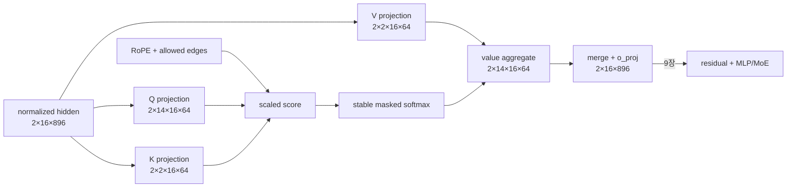

# 8장. attention 계보

7장의 hidden·position 좌표가 Q/K/V와 mask로 변환되는 지점을 해부하고, 14장에서 그 수식이 FlashAttention·fused backward의 tile·dtype 계약으로 내려간다. 15장은 head·sequence·context 축을 rank에 나눌 때 어느 score·gradient·denominator를 collective해야 하는지 소유권을 결정한다.

attention을 “Q와 K를 곱해 softmax한 뒤 V를 더한다”로만 기억하면 구현을 읽는 순간 길을 잃는다. 실제 함수는 어떤 위치가 어떤 위치를 볼 수 있는지 정하는 그래프, 그 edge에 붙는 점수, 확률 질량을 안정적으로 합치는 reduction, 선택된 값을 운반하는 경로, backward에서 공유 상태로 되돌아가는 합산으로 이루어진다. MHA·GQA·MLA·sparse attention·recurrent state는 이 다섯 요소 가운데 무엇을 저장하고 공유하며 생략하는지가 다르다.

## 8.1 attention을 projection·score·state 변환으로 읽는다

attention을 한 식으로 뭉개지 않고 q/k/v projection, score normalization, value aggregation과 backward owner의 연속 상태로 읽는다.

한 layer의 공통 경로를 먼저 고정한다.

`hidden [B,T,C] → Q/K/V projection → head layout → position transform·QK norm → allowed-edge mask → score·scale → stable softmax 또는 대체 state update → value aggregation → head merge·output projection → residual → backward dQ/dK/dV → parameter·shared-state reduction`

여기서 architecture 이름은 출발점일 뿐이다. 실제 비용과 정확성은 다음 네 물리 경로가 결정한다.

| 경로 | 반드시 확인할 상태 | 흔한 잘못된 추론 |
|---|---|---|
| 학습 forward | Q/K/V shape·stride, mask edge, saved tensor, selected kernel | `flash` 옵션이 있으므로 score를 저장하지 않는다 |
| 학습 backward | row 통계·RNG replay, dQ/dK/dV, GQA 공유 합산 | forward parity가 맞으므로 gradient도 맞다 |
| prefill | query/key 길이, causal·segment graph, tile·split 결합 | decode kernel의 성능이 긴 prefill에도 그대로 난다 |
| decode/cache | physical K/V 또는 latent layout, block table, append generation | GQA·MLA라는 모델 이름이 cache byte를 보장한다 |

softmax attention의 의미도 행렬 이름보다 상태로 보면 단순해진다. query 위치 `t`는 허용된 key 집합에서 score를 만들고, 공통 상수를 빼도 변하지 않는 확률 분포를 만든다. `1/√D`는 내적 분산이 head dimension과 함께 커지는 효과를 줄이고, row maximum을 빼는 log-sum-exp 계산은 같은 수학을 overflow 없이 구현한다. FlashAttention은 이 함수를 근사하는 것이 아니라 tile마다 `(maximum, exponential sum, output numerator)`를 갱신해 전체 score 행렬을 HBM에 쓰지 않는 구현이다. 반면 top-k sparse attention은 edge 집합을 바꾸므로 일반적으로 다른 함수다. recurrent attention은 edge별 확률 행렬 대신 과거를 압축한 state를 갱신하므로 또 다른 함수다.

독자는 각 구현을 다음 다섯 질문으로 해부한다.

1. **그래프:** query `t`가 실제로 볼 수 있는 key index는 무엇인가. causal·padding·window·packed-document 경계가 같은 allowed-edge set을 만드는가.
2. **좌표와 저장:** Q/K/V 또는 latent/recurrent state의 logical shape와 physical stride·dtype·owner는 무엇인가.
3. **reduction:** 확률 질량, split 통계, 공유 KV gradient, context-parallel partial output을 합으로 모으는가 평균으로 모으는가.
4. **수명:** forward에 저장하는 값, backward에서 재계산하는 값, request나 sequence 경계를 넘어 보존하는 값은 무엇인가.
5. **증거:** source branch가 존재한다는 사실과 실제 dispatch·수치 parity·성능 측정을 무엇으로 구분했는가.

## 8.0 GR-001 규범 trace: residual 좌표를 허용된 정보 흐름으로 바꾼다

7장의 `FWD-007`을 첫 decoder layer의 GQA에 통과시켜 `AttentionSpanID=ATTN-008-L00`을 만든다. 이 trace의 핵심은 attention matrix를 그리는 일이 아니라 6장의 segment 경계가 Q/K edge, 7장의 position이 RoPE, 공유 KV head가 backward owner로 정확히 전달되는지 증명하는 것이다.



|state|logical shape|physical owner·offset/mask|수명|
|---|---|---|---|
|Q|`[2,14,16,64] bf16`|query head owner; RoPE position from `POS-006`|forward 또는 backward recompute|
|K,V|각 `[2,2,16,64] bf16`|KV head 2개를 query group 7개가 공유|training step 동안 보존|
|allowed edge|논리 `[2,1,16,16] bool`|causal ∩ padding ∩ same-segment; materialize 여부 별도|kernel dispatch 입력|
|score|논리 `[2,14,16,16]`|scale `1/sqrt(64)`; forbidden edge 질량 0|Flash 경로에서는 HBM 비물질화 가능|
|row statistics|max·log-sum-exp `[2,14,16] fp32`|softmax reduction owner|backward 재현에 필요|
|head output|`[2,14,16,64]` → `[2,16,896]`|transpose/contiguous stride 기록|`o_proj` 뒤 9장 인계|

query head $h$가 KV head $g(h)=\lfloor h/(H_q/H_{kv})\rfloor$를 공유할 때

$$A_{hts}=mask_{ts}+{q_{ht}^{\top}k_{g(h)s}\over\sqrt D},\quad
O_{ht}=\sum_s softmax(A_{ht:})_s v_{g(h)s}.$$

|기호|실제 객체|GR-001 값·검산|
|---|---|---|
|$H_q,H_{kv},D$|config의 head counts와 dimension|14, 2, 64; `14 % 2 == 0`|
|$g(h)$|KV repeat/group mapping|query head 0–6→KV0, 7–13→KV1|
|$mask_{ts}$|6장의 allowed-edge policy|다른 packed segment와 미래 위치는 $-\infty$ 의미|
|row max/LSE|stable softmax state|모든 허용 행 finite, all-masked 행 없음|
|$dK,dV$|공유 KV gradient|같은 group query head의 partial을 합산, 평균 아님|

실제 Qwen2 attention의 projection·RoPE·KV repeat·backend dispatch는 [Transformers 고정 구현](https://github.com/huggingface/transformers/blob/550d7b3834670483a4df436541272c055dc364bf/src/transformers/models/qwen2/modeling_qwen2.py#L170-L310)에서 확인한다. 구현 링크는 branch 존재의 근거이며, GR-001에서 선택된 backend는 runtime dispatch trace로 별도 증명한다.

**반증과 handoff.** `ATTN-008-M1`은 row0의 두 packed segment 사이 edge 하나를 연다. 미래 suffix가 첫 segment output을 바꾸는 metamorphic test가 실패해야 한다. `M2`는 GQA의 shared `dK`를 합이 아니라 평균으로 줄인다. forward parity는 통과하지만 reference backward에서 정확히 group size 배 차이가 나야 한다. `M3`는 all-masked padding row에 유한한 큰 음수만 넣어 dtype별 NaN/균등 확률을 검사한다. `M4`는 Flash 옵션만 켜고 eager fallback을 유도한다. 결과 parity와 별개로 dispatch assertion이 실패해야 한다. 출력 `{ATTN-008-L00, projected output[2,16,896], saved/recomputed state contract, backend trace, dQ/dK/dV oracle}`를 9장 residual·MLP/MoE 경로에 넘긴다.

### 최초 불일치로 원인을 가르는 지도

| 관측 증상 | 먼저 고정할 좌표 | 가장 싼 분리 실험 | 판정 후보 |
|---|---|---|---|
| prefix output이 미래 token 변화에 반응한다 | token IDs, position, allowed-edge mask | 미래 suffix 하나만 바꾼 FP64 fixture | causal 방향·broadcast·segment mask 오류 |
| forward는 맞지만 gradient가 다르다 | Q/K/V, saved LSE, RNG, upstream dO | dQ·dK·dV를 따로 비교하고 GQA group partial sum 확인 | backward formula·dropout replay·공유 reduction 오류 |
| GQA 뒤 memory가 줄지 않는다 | physical K/V storage와 stride | allocator trace와 repeat 전후 storage pointer 비교 | K/V materialization 또는 fallback |
| 긴 context에서만 NaN이 난다 | score max, scale, LSE, all-masked row | 길이·score offset·dtype을 한 축씩 sweep | 불안정 softmax·finite mask·accumulator 문제 |
| sparse 설정인데 시간이 그대로다 | indexer와 main kernel dispatch | indexer·top-k·gather·attention 시간을 분리 | dense-mask fallback 또는 selector 비용 지배 |
| chunk 크기에 따라 GDN 출력이 달라진다 | initial/final recurrent state, reset, padding | FP32 token loop와 chunk 1/4/T 비교 | scan 결합·state transfer·reset 오류 |
| TP/CP에서만 hang 또는 drift가 난다 | process group, head/sequence owner, collective sequence | rank별 shape·collective ordinal·partial 통계를 비교 | divisibility·group·online-softmax 결합 오류 |

이 표의 목적은 증상에서 곧바로 kernel 이름을 추측하지 않게 하는 데 있다. 같은 NaN도 projection 입력에서 처음 생겼는지, score에서 생겼는지, all-masked softmax에서 생겼는지에 따라 owner가 다르다. 정상 run과 문제 run에서 가장 먼저 달라진 tensor·state를 찾고 그 부모 입력을 고정한 대조 실험이 함께 복구될 때만 원인으로 판정한다.

## 8.2 MHA·MQA·GQA의 head sharing을 tensor ownership으로 비교한다

head 수 이름보다 q와 k/v의 shape, repeat 또는 grouped reduction과 gradient owner가 어떻게 달라지는지 추적한다.

### MHA·MQA·GQA

MHA에서는 Q/K/V에 각각 `H`개 head가 있다. MQA는 K/V 한 세트를 모든 query head가 공유하고, GQA는 `H_q` query head를 `H_kv` group에 묶는다. 학습에서는 projection parameter와 gradient shape가, 추론에서는 KV cache 크기가 달라진다. `H_q % H_kv == 0`은 reshape 전에 확인해야 할 불변식이다.

score는 `QKᵀ/√D`, causal mask 뒤 row softmax, 출력은 `PV`다. 미래 token의 K/V를 바꿔도 이전 위치 출력이 변하지 않아야 한다. 이 반례는 mask 방향과 broadcast 오류를 즉시 잡는다.

**왜 head를 여러 개 두는가.** 한 개의 큰 dot product도 모든 channel을 섞을 수 있다. 여러 head를 두는 이유는 projection을 `H`개의 작은 비교 공간으로 나누어 서로 다른 관계를 동시에 표현하게 하려는 것이다. query는 현재 위치가 무엇을 찾는지, key는 과거 위치가 어떤 주소로 노출되는지, value는 선택됐을 때 가져올 내용을 정한다. “각 head가 문법이나 사실을 맡는다”는 해석은 관찰 결과일 수 있지만 architecture가 그런 역할을 보장하지는 않는다.

입력 `X∈R^{B×T×C}`에서 `Q=XW_Q`, `K=XW_K`, `V=XW_V`다. MHA에서 각 projection 폭이 `H_qD=C`라면 Q/K/V parameter는 각각 대략 `C²`개다. MQA는 K/V 폭을 `D`로 줄여 해당 parameter와 activation을 줄인다. GQA는 `H_kvD`다. output projection은 보통 `H_qD→C`라 query head 수에 묶인다.

| 방식 | Q shape | 저장 K/V shape | query 한 head가 공유하는 KV | decode token당 KV bytes |
|---|---|---|---:|---:|
| MHA | `[B,Hq,T,D]` | `[B,Hq,T,D]` 각각 | 1 | `2·Hq·D·b` |
| GQA | `[B,Hq,T,D]` | `[B,Hkv,T,D]` 각각 | `g=Hq/Hkv` | `2·Hkv·D·b` |
| MQA | `[B,Hq,T,D]` | `[B,1,T,D]` 각각 | `Hq` | `2·D·b` |

여기서 `b`는 element bytes다. `B=1,Hq=32,Hkv=8,D=128,b=2`인 BF16 GQA는 token마다 K/V 4,096 bytes를 저장한다. 같은 dimension의 MHA는 16,384 bytes다. context 32,768에서 layer당 약 128 MiB와 512 MiB의 차이다. batch와 layer 수를 곱하면 decode memory/bandwidth 설계가 왜 GQA를 택하는지 보인다. 학습 activation은 checkpointing과 backward 때문에 cache 식만으로 설명할 수 없다.

**GQA의 gradient가 합쳐지는 축.** 논리적 `repeat_kv`로 KV head 하나가 `g`개 query head에 연결되면 그 KV head gradient는 연결된 모든 query head의 기여를 더한다. forward의 repeat가 view/expand이든 물리 copy든 수학적 reduction은 같다. 평균이 아니라 합이라는 점을 확인한다. framework가 broadcast backward에서 자동 합산하므로 임의로 `1/g`를 곱하면 목적함수를 바꾼다.

Transformers 고정 revision `550d7b3834670483a4df436541272c055dc364bf`의 Llama 경로 `modeling_llama.py:191-287`은 Q projection과 작은 K/V projection, head reshape, `repeat_kv`, attention interface를 연결한다. config의 `num_attention_heads`, `num_key_value_heads`, `head_dim`이 실제 Linear output 폭과 reshape에 반영되는지 읽는다. 이름이 GQA라도 backend 직전 K/V가 물리 materialize되는지는 profiler와 storage/stride로 따로 확인한다.

**QK normalization이 바꾸는 것.** Qwen3 고정 경로 `modeling_qwen3.py:211-281`은 projection 뒤 q와 k에 head별 RMSNorm을 적용한다. 이는 softmax temperature 옵션과 같지 않다. 각 vector의 RMS를 제어한 뒤 `1/√D` scale이 적용되므로 score 분포와 gradient saturation을 바꾼다. checkpoint에는 norm scale parameter가 추가되고, porting 때 이를 빼면 projection shape는 맞아도 함수가 달라진다.

**반례 1—KV cache가 작아졌다고 학습 FLOP이 같은 비율로 줄지 않는다.** GQA/MQA에서도 query head 수와 QK/AV의 logical output head는 그대로다. native grouped kernel이 없으면 K/V를 repeat해 계산할 수 있다. 주된 이득이 decode cache bandwidth인지 projection parameter인지, training kernel FLOP인지 분리한다.

**반례 2—head 수를 바꿔도 tensor shape가 맞을 수 있다.** `C=32`에서 `H=4,D=8`을 `H=8,D=4`로 바꾸면 QKV weight `[3C,C]`는 같다. checkpoint load가 성공해도 reshape와 attention 함수가 달라진다. config checksum과 known-input output이 필요하다.

**실험 8-A—MHA에서 GQA로 pooling.** MHA K/V head를 group별 mean으로 초기화하는 문헌 변환을 구현하되 함수 보존이라고 가정하지 않는다. 변환 직후 golden batch의 logits와 loss, 짧은 recovery training curve를 측정한다. optimizer moment를 어떻게 변환했는지 별도 실험 축으로 둔다. 공개된 변환 code/test가 없는 경우 자체 실험임을 명시한다.

## 8.3 MLA·sparse selection이 정보 경로를 줄이는 방식을 해부한다

KV latent projection과 token selector가 무엇을 저장하고 버리며 어떤 학습 신호를 받는지 분리한다.

### MLA·DSA

MLA는 KV 표현을 낮은 차원의 latent로 압축하고 필요한 성분을 복원하여 cache와 bandwidth를 줄인다. DSA류 sparse attention은 모든 key를 보지 않고 선택한다. FLOP 절감만 볼 수 없다. selector의 학습 신호, 선택 index, load balance, backward 경로가 새로운 상태가 된다.

**MLA의 두 key 성분.** DeepSeek 계열 MLA는 hidden state에서 compressed KV latent `c_KV∈R^{r_kv}`를 만들고, positional 관계를 위한 작은 RoPE key 성분을 분리한다. head별 non-positional key와 value는 latent에서 projection된다. cache가 latent와 RoPE component만 저장할 수 있다면 일반 K/V의 `H_kvD` 대신 대략 `r_kv+d_rope` 폭을 저장한다. 그러나 projection을 언제 흡수하고 어느 kernel이 compressed cache를 직접 읽는지 맞아야 이론적 절감이 현실이 된다.

Transformers의 DeepSeek V3 고정 경로 `modeling_deepseek_v3.py:361-495`에는 low-rank Q와 compressed KV decomposition이 구현돼 있다. V3.2 경로 `modeling_deepseek_v32.py:351-493`은 MLA와 sparse indices/mask를 잇지만 참조 경로가 expanded K/V를 cache하는 구간이 있다. source에 compressed cache TODO가 있다면 “MLA 모델이므로 이 runtime도 압축 cache를 쓴다”고 쓰지 않는다. architecture와 backend storage contract를 분리한다.

| MLA 상태 | 개념 shape | 누가 생성하는가 | 누가 소비하는가 | checkpoint/cache 여부 |
|---|---|---|---|---|
| compressed KV latent | `[B,T,r_kv]` | down projection | K/V 복원·absorbed projection | runtime별 상이 |
| RoPE key component | `[B,T,d_rope]` 또는 head form | positional projection | attention score | cache 후보 |
| expanded K/V | `[B,H,T,D]` | up projection | 일반 attention kernel | 참조 runtime에서 가능 |
| block table | logical blocks | cache allocator | paged decode kernel | serving state |
| split LSE stats | split별 `m,l,o` | attention tile | combine kernel | 일시 상태 |

**Split attention의 online softmax.** key sequence를 여러 split으로 나누면 각 split `j`가 row maximum `m_j`, exponential sum `l_j`, unnormalized output numerator `o_j`를 낸다. 전역 `m=max_j m_j`, `l=Σ_j exp(m_j-m)l_j`, `o=Σ_j exp(m_j-m)o_j/l`로 합쳐야 full softmax와 같다. 각 split의 이미 정규화된 output을 단순 평균하면 key 수와 score scale이 다른 split에서 틀린다. FlashMLA와 paged/split decode를 읽을 때 combine kernel의 계약이다.

**DSA의 indexer 비용.** DSA indexer는 main attention과 별도 q/k projection으로 후보 score를 만들고 각 query의 top-k key index를 반환한다. 선택된 attention 계산은 `T²`에서 `T·k`로 줄 수 있지만 indexer scoring, top-k selection, index gather가 남는다. indexer도 dense score를 만들면 절감이 제한된다. 전용 sparse kernel이 indices를 직접 소비하는지, eager backend가 dense mask로 되돌리는지 확인한다.

고정 source `modeling_deepseek_v32.py:160-253`에는 indexer projection, score, top-k와 cache가 있고, `351-493`에는 indices가 main MLA에 전달되거나 additive mask로 바뀌는 분기가 있다. hard top-k index는 선택 경계에서 미분 불가능하다. 선택된 key/value 경로에는 gradient가 흐르지만 index 선택 자체에 어떤 surrogate/objective가 쓰였는지는 forward만으로 알 수 없다.

**DSA 불변식.** causal query `t`의 index는 미래 `>t`를 포함하지 않아야 한다. `topk`는 사용 가능한 prefix 길이를 넘지 않는다. 선택 외 dense logits를 `-∞`로 둔 reference와 sparse kernel output이 맞아야 한다. score tie에서는 순서보다 index 집합과 output을 비교한다. padding key가 선택 후보에 들어오지 않아야 한다.

**반례 3—sparse mask가 있어도 계산은 dense일 수 있다.** eager 구현이 dense `[T,T]` score를 만든 뒤 대부분을 `-∞`로 가리면 수학은 sparse지만 FLOP과 memory는 dense다. profiler의 kernel shape와 allocated bytes를 본다.

**반례 4—compressed parameter가 compressed cache를 보장하지 않는다.** low-rank latent로 K/V를 만들더라도 backend가 expanded K/V를 저장하면 cache 절감이 사라진다. allocator가 실제로 예약한 physical shape가 판정 기준이다.

**실패 주입 8-B—잘못된 split combine.** 길이가 다른 두 split을 만들고 단순 평균, local softmax 뒤 합, `(m,l,o)` 결합을 full reference와 비교한다. score에 큰 상수를 넣어 overflow 안정성도 검사한다. 잘못된 결합은 모든 값이 finite여도 확률 질량을 왜곡한다.

**실험 8-C—top-k sweep.** 같은 weights와 batch에서 `k`를 바꾸어 dense reference 대비 output/gradient error, indexer 시간, main attention 시간, peak memory를 기록한다. quality 결론은 짧은 golden batch로 내리지 않고 기전·비용 검증으로 제한한다.

## 8.4 linear·recurrent state가 attention과 다른 계약을 갖는 이유

quadratic score matrix 대신 scan state를 갱신하는 구조의 함수, memory와 backward time ownership을 비교한다.

### Gated DeltaNet

선형 recurrent attention은 과거 모든 token의 score matrix 대신 state를 순차 갱신한다. gate와 decay가 무엇을 보존하고 지울지 결정한다. 긴 sequence에서 메모리를 줄이지만 state reset, chunk boundary, scan 병렬화, resume가 attention mask와 같은 의미를 가져야 한다.

**Delta rule의 직관.** 단순 선형 attention state가 key/value outer product를 계속 더하면 같은 key에 새 value가 와도 과거 기록이 남는다. delta update는 현재 state가 key `k_t`에서 예측하는 값 `S_{t-1}k_t`와 새 `v_t`의 오차를 계산해 그 방향만 고친다. 개념적으로 `S_t=α_tS_{t-1}+β_t(v_t-S_{t-1}k_t)k_tᵀ`이고 output은 `q_tᵀS_t`다. `α`는 과거 decay, `β`는 write strength다. 실제 구현의 normalization과 orientation은 source shape에 맞춰 읽는다.

`α=1,β=0`이면 state는 쓰지 않고 유지된다. `α=0`이면 이전 기억이 지워진다. `β`가 너무 크고 key norm이 제어되지 않으면 update가 진동하거나 폭주할 수 있다. q/k normalization, gate parameterization, recurrent accumulation dtype가 수치 안정성의 일부다.

Qwen3-Next 고정 source `modeling_qwen3_next.py:512-566`은 depthwise convolution과 q/k/v/output gate, decay/write parameter를 만든다. `567-628`은 head regrouping과 tensor split, `629-699`는 convolution cache 뒤 recurrent 또는 chunk kernel과 output gate를 연결한다. `821-866`은 full attention과 linear layer를 config pattern으로 교차 배치한다. 하나를 다른 것의 kernel 옵션으로 보지 않는다. layer type은 checkpoint parameter와 recurrent state schema를 바꾸는 architecture 선택이다.

| GDN tensor/state | 예시 축 | lifetime | 복구 시 질문 |
|---|---|---|---|
| q/k/v | `[B,H,T,D]` | 한 forward/backward | chunk/recurrent layout이 같은가 |
| convolution state | 최근 kernel window | sequence/cache | sequence 경계에서 reset하는가 |
| recurrent matrix state | `[B,H,Dk,Dv]` | prefix 전체 | sample·request와 함께 저장하는가 |
| decay/write gates | token/head별 | activation/backward | dtype·saturation은 어떤가 |
| chunk prefix state | chunk 경계 | scan | distributed split에서 누가 소유하는가 |

**Chunk 병렬화.** token을 순차 처리하면 dependency 때문에 GPU 병렬성이 낮다. chunk kernel은 블록 내부 계산과 블록 간 state scan을 분해한다. recurrent one-token 경로와 chunk training 경로가 같은 recurrence를 구현해야 한다. padding과 document packing이 state reset을 정확히 전달하지 않으면 앞 문서 정보가 뒤 문서로 새어 나간다.

**Backward의 두 경로.** output loss는 q를 통해 현재 state로, state recurrence를 통해 과거 k/v/gate로 전파된다. 긴 sequence에서 reverse scan의 수치 오차와 memory가 문제다. fused kernel은 중간 state를 저장하거나 재계산한다. chunk size를 바꾸었을 때 output뿐 아니라 q/k/v와 gate gradient를 reference recurrent loop와 비교한다.

**분산 sequence/context split.** full attention은 online-softmax stats를 block 간 결합할 수 있다. recurrent state는 앞 partition의 마지막 state가 다음 partition의 입력이다. 이 state 전송 순서와 pipeline overlap이 필요하다. sequence shard를 독립 실행한 뒤 output을 단순 concat하면 틀린다. document boundary reset도 rank boundary와 함께 전달한다.

**반례 5—선형 복잡도라 항상 빠른 것은 아니다.** 짧은 T에서는 convolution, gate projection, scan setup이 dense attention kernel보다 비쌀 수 있다. hardware와 batch, chunk size별 crossover를 측정한다.

**반례 6—state 크기가 고정돼도 정보 손실이 고정되지는 않는다.** decay와 key collision, sequence distribution에 따라 오래된 정보가 다르게 사라진다. memory byte 식만으로 quality를 예측하지 않는다.

**실험 8-D—chunk/recurrent parity.** FP32 작은 tensor에서 token loop를 oracle로 만들고 chunk size 1, 4, T를 비교한다. output, final state, q/k/v와 gate gradient를 검사한다. BF16에서는 error가 sequence에 따라 어떻게 누적되는지 length sweep을 한다.

**실패 주입 8-E—state reset 누락.** 두 독립 문서를 이어 넣고 둘째 문서의 첫 output을 단독 실행과 비교한다. reset contract가 맞으면 같아야 한다. packing efficiency만 보고 state를 이어 쓰면 데이터 leakage가 된다.

## 8.5 forward·backward·prefill·decode의 물리 경로를 분리한다

같은 수학 함수를 구현해도 training backward와 serving cache는 저장 state와 병목이 다르다.

### backward·FlashAttention·회계

nanoGPT `model.py:52-76`은 `[B,T,C]`를 `[B,H,T,D]`로 바꾸고, PyTorch SDPA가 있으면 fused 경로를 쓴다. manual 경로는 `[B,H,T,T]` score/probability를 물질화한다. FlashAttention 계열은 tile 단위 max와 log-sum-exp 통계로 이를 피하고 backward에서 필요한 값을 재계산한다. 메모리 절약은 공짜가 아니라 재계산·layout·kernel 조건의 교환이다.

**비용을 연산과 이동으로 나눈다.** full attention의 QK와 PV matmul은 각각 대략 `2BH T²D` FLOP이므로 합계는 `4BH T²D`다. score/probability를 HBM에 쓰고 다시 읽는 naive 경로는 `[B,H,T,T]`를 여러 번 이동한다. GPU는 matmul보다 이 중간 이동에 막힐 수 있다. FlashAttention은 Q/K/V tile을 SRAM/shared memory에 올리고 online softmax를 계산해 score matrix의 HBM materialization을 피한다. FLOP의 차이보다 I/O 복잡도와 kernel fusion이 핵심이다.

`B=2,H=32,T=4096,D=128`, BF16에서 score 한 장은 `2·32·4096²·2` bytes, 약 2 GiB다. layer마다 probability와 gradient까지 모두 저장하면 감당하기 어렵다. 반면 Q/K/V 각각은 약 128 MiB다. 이 산술은 activation checkpoint나 allocator overhead를 제외한 하한이며 profiler peak와 같지 않다.

**Online softmax tile 상태.** query row를 따라 key tile을 순회하며 현재 max `m`, exp sum `l`, output numerator `o`를 갱신한다. 새 tile max `m'`가 커지면 기존 `l,o`를 `exp(m-m')`로 rescale한다. 이 세 상태만 있으면 모든 score를 저장하지 않고 정확한 softmax output을 만들 수 있다. causal/local mask는 tile 자체를 건너뛰거나 element를 제외한다.

**Backward에서 무엇을 재계산하는가.** attention output `O`와 upstream `dO`, Q/K/V, row log-sum-exp 같은 통계로 probability 또는 필요한 block을 다시 계산한다. `dV=PᵀdO`, `dP=dOVᵀ`, `dS=P⊙(dP-row_sum(dP⊙P))`, `dQ=dSK/√D`, `dK=dSᵀQ/√D`다. forward에서 score를 저장하지 않은 대가로 backward FLOP이 늘지만 HBM traffic과 activation 저장을 줄인다.

GQA backward에서는 여러 query head가 공유 KV head의 `dK,dV`에 기여한다. kernel이 grouped head index를 잘못 reduction하면 forward parity는 통과하고 backward만 틀릴 수 있다. 공식 FlashAttention 계열 test가 reference에서 K/V를 repeat하고 MHA/MQA/GQA output과 gradient를 비교하는 이유다. forward test 결과를 backward 증거로 대신 쓰지 않는다.

**Kernel option은 상태 분기다.** causal, window size, dropout, softmax scale, head dimension, GQA packing, paged KV, split 수, deterministic backward가 compile/dispatch specialization을 바꾼다. 지원하지 않는 조합은 fallback하거나 error를 내야 한다. 조용히 materialize/repeat해도 correctness는 맞을 수 있으므로 profiler kernel name과 allocation을 본다. forward에서 pack-GQA를 쓴다고 backward도 같은 packing이라고 추론하지 않는다.

## 8.6 병렬 ownership과 numeric fixture를 먼저 고정한다

head, sequence와 context parallelism의 owner mapping을 정한 뒤 한 scalar와 작은 tensor fixture로 구현을 검산한다.

### Tensor parallel 소유권

query head를 TP rank에 나눌 때 `H_q/tp`가 정수여야 한다. KV head도 나눌 수 있으면 `H_kv/tp`, 그렇지 않으면 복제하거나 별도 mapping이 필요하다. GQA group이 rank 경계를 가르면 shared KV gradient reduction이 추가된다. output projection의 row-parallel/column-parallel 선택에 따라 all-reduce 또는 reduce-scatter가 block 경계에 생긴다.

**Context parallel 소유권.** sequence key/value를 rank별로 나누면 각 query가 remote K/V block을 봐야 한다. ring attention은 K/V block을 순환시키면서 local tile의 `(m,l,o)`를 누적한다. causal schedule은 미래 block을 보내지 않거나 mask한다. 통신 순서가 달라도 stable combine 식을 지켜야 한다. dropout이 있으면 block 순서와 무관한 RNG mapping이 필요하다.

**Checkpoint와 resume.** attention parameter는 일반 model state에 있지만 recurrent GDN state나 serving KV cache는 학습 sample 경계에서 보통 durable checkpoint 대상이 아니다. pipeline이 sequence 중간 checkpoint를 허용한다면 in-flight activation/state와 sampler offset이 함께 필요하다. activation checkpointing 설정은 parameter checkpoint와 다른 개념이다. 이름이 같다고 섞지 않는다.

**상류 테스트를 좁게 해석한다.** nanoGPT snapshot은 SDPA/manual parity test가 없다. 해당 소스 분기가 존재한다는 것은 동작의 정적 근거이지 수치 parity 보장이 아니다. Transformers model tests는 작은 config에서 forward/backward와 cache shape를 검사하지만 모든 kernel backend 조합을 덮지 않는다. FlashAttention 공식 test는 reference와 dtype tolerance를 고정한 조합만 증명한다. GPU architecture나 새 compiler로 범위를 넓힐 때 재실행한다.

**실패 주입 8-F—mask orientation 반전.** causal lower triangle을 upper triangle로 바꾼다. loss가 오히려 빨리 내려갈 수 있다. 미래 token perturbation test와 attention probability의 허용 index를 검사한다. NaN이 없다는 사실은 아무 도움이 되지 않는다.

**실패 주입 8-G—GQA reduction 누락.** shared K/V를 detached copy로 query group마다 만들고 한 group gradient만 원 parameter에 연결한다. forward는 reference와 같지만 dK/dV가 작아진다. finite difference와 group별 gradient 합으로 잡는다.

**실패 주입 8-H—non-contiguous layout 오해.** transpose 뒤 stride를 지원하지 않는 custom kernel에 shape만 맞춰 전달한다. fail-fast가 최선이며, 내부 copy fallback이면 추가 HBM traffic을 profiler로 찾는다. `.contiguous()`를 넣은 reference와 output을 비교한다.

**조사 체크리스트—attention 소스.** config의 head 수·KV head·head dimension을 기록한다. projection weight/output 폭을 확인한다. reshape·transpose·stride를 적는다. RoPE/QK norm 적용 순서를 찾는다. mask dtype·좌표·broadcast를 확인한다. backend dispatch와 fallback 조건을 읽는다. cache physical shape와 block table을 본다. backward에서 공유 축 reduction을 찾는다. upstream test가 forward·gradient·cache 중 무엇을 검사하는지 표시한다.

**조사 체크리스트—비용.** parameter bytes, QKV activation, score 이론 bytes, saved tensor, cache bytes를 따로 계산한다. profiler에서 actual peak, allocated/reserved, kernel time, HBM throughput을 기록한다. dense FLOP와 sparse selected FLOP, indexer/setup FLOP를 나눈다. padding·causal/local tile utilization을 본다. 처리량 비교는 같은 B,T,H,D,dtype,hardware,revision에서만 한다.

**디버깅 결정 트리.** prefix가 미래 token에 반응하면 mask/position부터 본다. output은 맞고 gradient만 다르면 softmax backward와 GQA reduction을 본다. eager는 맞고 fused가 다르면 scale, dtype, layout, dispatch specialization을 비교한다. 짧은 T는 맞고 긴 T에서 NaN이면 online-softmax max/LSE, gate/scan accumulation dtype을 본다. memory만 예상보다 크면 K/V repeat, dense fallback, score materialization, saved tensor를 profiler로 찾는다. 분산에서만 hang이면 head shard divisibility와 collective 순서를 본다.

**실험 8-I—공통 attention matrix.** 동일한 Q/K/V fixture에 MHA, GQA, MQA, MLA-expanded reference, sparse top-k, recurrent oracle을 넣는다. 서로 다른 함수의 출력값을 같다고 요구하지 않는다. 각 방식 내부의 reference/optimized parity, bytes, FLOP, gradient invariant를 같은 report schema로 비교한다.

**옵션 상태 변화표.** 옵션은 이름이 아니라 변경되는 tensor와 dispatch로 설명한다.

| 변경 | 즉시 바뀌는 상태 | 비용 효과 | 새 실패 모드 |
|---|---|---|---|
| `Hkv: Hq→1` | K/V projection·cache 폭 | KV bytes 감소 | 공유 gradient 간섭 |
| head dimension | reshape, scale, kernel tile | alignment·FLOP 변화 | unsupported dispatch |
| causal→window | mask graph·tile schedule | 먼 edge 제거 | receptive field 부족 |
| dense→top-k | index tensor·gather | selected attention 감소 | indexer 비용·tie |
| full→GDN layer | parameter·recurrent state | sequence 선형화 | reset·scan drift |
| activation checkpoint | saved tensor lifetime | memory↓, recompute↑ | RNG mismatch |
| deterministic backward | kernel/reduction 순서 | 보통 처리량↓ | 지원 조합 제한 |

head dimension을 바꾸면 scale `1/√D`, rotary dimension, projection shape 또는 hidden/head 관계가 움직인다. window size는 단순 kernel 튜닝이 아니라 token graph의 edge를 제거한다. dropout은 attention probability에 적용되는지 output에 적용되는지에 따라 RNG 소비 위치가 다르다. option diff report에는 config field, 생성된 module, kernel dispatch, checkpoint key/shape, profiler 기대를 한 행으로 둔다.

**Local/sliding attention의 그래프 거리.** 한 layer가 좌우 `w` 범위만 보면 한 층에서 직접 전달되는 거리는 제한된다. 여러 layer를 거치면 receptive field가 늘지만 residual과 layer pattern에 따라 경로 길이가 길어진다. 주기적으로 global layer를 넣으면 graph diameter를 줄인다. 같은 FLOP 식만으로 dense attention과 표현 경로를 비교할 수 없다. padding boundary와 packed document boundary에서 window가 다른 sample로 넘어가지 않는지 검사한다.

**Attention dropout의 backward.** softmax probability에 Bernoulli mask를 적용하고 keep probability로 scale하면 기대 output은 유지되지만 각 run의 gradient는 달라진다. fused kernel은 mask 전체를 저장하는 대신 counter-based RNG seed/offset으로 backward에서 같은 mask를 재생성할 수 있다. activation checkpoint recompute도 같은 mask를 사용해야 한다. checkpoint resume 중간에서 RNG offset이 누락되면 sample과 parameter가 같아도 gradient가 갈라진다.

**Numerical oracle의 층위.** 첫 oracle은 작은 FP64 CPU manual attention이다. 둘째는 FP32 eager다. 셋째가 target dtype의 fused kernel이다. BF16 fused 결과를 다른 BF16 경로 하나와만 비교하면 두 구현이 공유하는 scale/mask 오류를 놓칠 수 있다. FP64 reference도 production layout과 dispatch를 증명하지 않으므로 shape·stride test를 별도로 둔다.

**Test report에 들어갈 분모.** output error는 비교 element 수, gradient error는 parameter/tensor별 element 수를 적는다. peak memory는 warmup 뒤 allocator reset과 측정 구간을 고정한다. throughput은 actual valid query/key token과 wall-clock window를 쓴다. sparse attention은 selected edge 수와 indexer edge 평가 수를 따로 보고한다. GDN은 processed token과 state dimension, chunk size를 기록한다.

**공개 구현에서 확인하지 못한 것.** 수집된 고정 source만으로 DSA indexer의 전체 공식 학습 objective, GQA uptraining optimizer-state migration, 모든 GPU 조합의 deterministic FlashAttention backward, GDN 장문 BF16 drift 한계를 증명할 수 없다. 이 항목은 구현된 것처럼 메우지 않는다. 책의 lab이 작은 fixture에서 확인하는 범위와 production-scale 결론 사이를 분리한다.

**8장 종료 판정.** 독자는 model 이름을 보지 않고도 `Hq,Hkv,D,T`, cache physical layout, mask graph, recurrent/sparse state를 보고 비용식을 세울 수 있어야 한다. forward output뿐 아니라 dQ/dK/dV와 공유 reduction을 검산해야 한다. fused kernel이 빠른 이유를 FLOP 감소가 아니라 HBM materialization 회피로 설명하고, sparse·compressed라는 이름이 실제 storage/dispatch로 이어지는지 판정해야 한다.

조사 결과에는 성공한 backend만 남기지 않는다. fallback된 조합, compile되지 않은 head dimension, reference와 gradient가 어긋난 dtype, 메모리 측정에서 제외한 allocator 상태를 함께 쓴다. 같은 architecture라도 학습 forward, backward, prefill, decode가 서로 다른 kernel과 layout을 사용할 수 있으므로 네 경로를 각각 판정한다.

이 네 경로의 차이를 한 문장의 성능 주장으로 합치지 않는다. 각 경로의 입력 계약과 측정 조건을 독립적으로 보존한다.

**8장의 실제 인계물.** 10장에는 선택된 nanoGPT MHA의 Q/K/V shape·stride, causal invariant, manual/SDPA parity 계약을 넘긴다. 14장에는 saved tensor와 backward recompute, dtype sensitivity를 넘긴다. 15·16장에는 head/KV/state의 rank ownership과 예상 collective bytes를 넘긴다. 17장에는 durable parameter와 in-flight recurrent/cache state의 경계를 넘긴다.

**이 장이 넘기는 것.** attention output `[B,T,C]`, head/layout manifest, saved statistics와 gradient checksum을 9장과 10장에 넘긴다.

**다음 장에서 깨질 수 있는 것.** attention이 정상이어도 MLP activation 폭주나 MoE routing 불균형이 residual을 망칠 수 있다.

**검증 체크포인트.** causal 반례, softmax row sum, head divisibility, fused/manual loss·gradient 허용 오차, peak memory를 확인한다.

### numeric fixture와 구현 workbook을 만든다

### 독자 산출물 8-1—공통 numeric fixture

`B=1,T=4,Hq=4,Hkv=2,D=2`를 사용한다. q head 0–3에 서로 다른 basis pattern을 넣고, K/V 두 head가 각각 query head `(0,1)`과 `(2,3)`에 연결되게 한다. causal mask와 padding 없는 FP64 reference를 만든다. MHA/GQA/MQA를 서로 같은 함수라고 비교하지 않고 각 architecture의 repeat/group mapping을 손계산한다.

Q/K의 한 row score가 `[0,log2,-∞,-∞]`라면 softmax probability는 `[1/3,2/3,0,0]`다. V 두 개 `[1,0]`, `[0,3]`이면 output은 `[1/3,2]`다. 이 작은 row에서 scale, mask, LSE, AV와 backward를 손으로 검산한다.

upstream `dO=[1,1]`이면 `dV_j=p_jdO`, `dP_j=dO·V_j`, `dS_j=p_j(dP_j-Σp dP)`다. masked positions의 dS는 0이어야 한다. 이 값을 FP64 script, PyTorch manual, fused kernel 순으로 승격한다.

**GQA reduction numeric case.** KV head 하나를 query head 두 개가 공유하면 `dK_shared=dK_q0+dK_q1`, `dV_shared=dV_q0+dV_q1`이다. average가 아니다. query head 하나의 loss를 0으로 만든 fixture로 각 기여를 분리하고 합을 확인한다. detached repeat failure는 forward가 같고 이 합이 빠진다.

**비용 workbook.** parameter, activation, HBM materialization, cache, FLOP을 별도 sheet로 둔다. `B,H,T,D,dtype bytes`를 입력하면 QKV bytes, dense score bytes `BHT²b`, QK/AV FLOP `4BHT²D`, KV-cache `2BTHkvDb`를 계산한다. projection과 output projection FLOP도 별도다.

예를 들어 `B=2,H=32,T=4096,D=128,b=2`에서 score는 약 2 GiB이고 Q/K/V 각각 약 128 MiB다. 이 값은 allocator, dropout mask와 backward saved state를 제외한 이론값이다. profiler peak와 같다고 쓰지 않는다.

**MHA/GQA cache workbook.** `Hq=32,Hkv=8,D=128,T=32768,b=2,L=32,B=1`에서 layer당 GQA K/V 약 128 MiB, MHA 약 512 MiB이며 32 layers에서는 각각 약 4 GiB와 16 GiB다. page/block table과 fragmentation은 추가한다. training activation과 serving decode cache를 같은 열에 합치지 않는다.

**독자 산출물 8-2—dispatch matrix.** attention implementation 이름, source revision, device capability, dtype, head dimension, causal/window, dropout, GQA packing, paged/split, training/forward/backward/prefill/decode 지원, chosen kernel/fallback reason을 한 행에 둔다. API가 `flash`라고 부르는 것과 실제 kernel dispatch를 구분한다.

nanoGPT `model.py:44-50`은 PyTorch SDPA API 존재로 `flash` branch를 정하고, `52-76`은 SDPA/manual 경로를 가진다. 이 변수는 FlashAttention repository의 특정 CUDA kernel 버전을 고정하지 않는다. profiler/kernel log가 actual backend 증거다.

Transformers Llama `550d7b3`, `modeling_llama.py:191-287`은 projection/GQA logical path다. backend attention interface가 K/V repeat를 view로 유지하는지 materialize하는지는 source와 allocation trace를 추가로 확인한다.

**Upstream kernel test workbook.** test case마다 MHA/MQA/GQA, causal/window, head dimension, dtype, forward/output tolerance, dQ/dK/dV tolerance, dropout/deterministic, hardware skip을 표로 만든다. test 함수가 reference에서 K/V를 repeat해 output·gradient를 비교하는 범위만 지지한다. paged decode test를 training backward 증거로 쓰지 않는다.

**Online-softmax numeric case.** split 0의 `(m0=10,l0=2,o0=[4,2])`, split 1의 `(m1=12,l1=1,o1=[1,3])`를 둔다. global m=12, scale0=`e^-2`, scale1=1, `l=2e^-2+1`, output=`(e^-2[4,2]+[1,3])/l`다. local normalized outputs 단순 평균과 다름을 계산한다.

**Flash backward workbook.** forward에서 저장된 Q/K/V, O, row LSE, RNG seed/offset과 backward에서 재계산하는 score/probability를 구분한다. saved bytes, recompute FLOP, max absolute/relative/cosine error를 기록한다. deterministic option이 atomic/reduction order와 throughput을 어떻게 바꾸는지 child run으로 비교한다.

**Dropout replay.** attention probability dropout은 backward/recompute에서 같은 mask가 필요하다. counter-based RNG가 `(seed,batch,head,query,key)` 또는 tile offset에 어떻게 매핑되는지 source/test 범위에서 확인한다. activation checkpoint와 fused attention이 RNG state를 중복 소비하지 않는지 본다.

**Failure workbook A1—wrong scale.** `1/√D`를 생략하거나 두 번 적용한다. softmax entropy와 dQ/dK scale이 달라진다. numeric fixture의 expected probability가 first mismatch다.

**A2—mask finite minimum.** `-∞` 대신 낮은 finite 값을 BF16에서 사용한다. 긴 row와 큰 unmasked negative score에서 masked probability가 0이 아닌지 본다. leakage tolerance를 명시한다.

**A3—head-group mapping.** `query_head//g` 대신 modulo mapping을 사용한다. shape는 같지만 basis fixture에서 selected K/V가 다르다.

**A4—forward-only GQA parity.** K/V repeat는 맞지만 backward reduction 한 group을 누락한다. output test는 통과하고 finite-difference dK/dV가 실패한다.

**A5—split combine 평균.** local softmax outputs를 균등 평균한다. 모든 값은 finite지만 full reference와 다르다. 앞의 `(m,l,o)` case로 잡는다.

**A6—paged block table stale.** logical block을 재사용했지만 table generation/version이 old page를 가리킨다. cache block checksum과 TokenID/page mapping을 확인한다. training attention과 serving cache failure를 구분한다.

**A7—non-contiguous silent copy.** transpose stride를 kernel이 직접 지원하지 않아 내부 contiguous copy가 생긴다. output은 맞지만 HBM bytes와 timeline에서 나타난다. correctness failure가 아니라 performance regression이다.

**A8—dropout replay mismatch.** forward/recompute mask checksum이 다르다. forward output은 원 run에서 맞지만 gradient가 reference와 갈라진다.

**MLA·DSA·GDN dossier를 상태별로 닫는다**

**독자 산출물 8-3—MLA cache dossier**

config의 q/kv low-rank, non-positional/rotary dimension, latent projection, expanded K/V, allocator physical tensor와 decode consumer를 source chain으로 연결한다. “MLA” 이름보다 실제 cached tensor shape를 판정 기준으로 둔다.

compressed width가 `r_kv+d_rope`, expanded width가 `H(Dk+Dv)`일 때 token/layer bytes를 계산한다. projection absorption이 가능해도 backend가 expanded cache를 쓰면 이론적 절감이 없다. TODO/comment와 production kernel support를 구분한다.

FlashMLA split decode dossier에는 compressed cache, block table, scheduler metadata, LSE combine, dtype/head support를 넣는다. source allocator→write→consumer가 같은 physical layout을 읽는지 확인한다. decode API test는 training MLA backward를 증명하지 않는다.

**MLA failure workbook.** latent와 RoPE component concat 순서, head projection absorption, expanded/latent cache flag, page stride, split LSE를 한 축씩 변형한다. full expanded eager reference와 output을 비교한다. checkpoint parameter shape와 runtime cache shape를 별도 manifest로 둔다.

**독자 산출물 8-4—DSA selector dossier.** indexer q/k projection, score, top-k, causal/padding eligibility, cached indices, main attention consumer를 연결한다. `modeling_deepseek_v32.py:160-253,351-493` source range를 고정한다. indexer objective/학습 절차가 forward source에 없으면 미확인으로 둔다.

DSA 비용은 indexer projection/scoring/top-k/gather와 selected main attention을 나눈다. eager dense-mask fallback과 sparse kernel을 별도 run으로 측정한다. selected edges `T·k`만 보고 total complexity를 주장하지 않는다.

**DSA test workbook.** topk≤prefix, no future/pad index, tie set policy, dense masked output parity, selected/nonselected gradient, cache resume를 검사한다. hard index selection gradient가 없다는 것과 indexer parameter가 어떤 auxiliary objective로 학습되는지는 별도다.

**독자 산출물 8-5—GDN recurrence dossier.** `modeling_qwen3_next.py:512-699`의 q/k/v/z/write/decay, depthwise conv, state와 chunk/recurrent dispatch를 table로 만든다. `821-866`의 hybrid layer placement를 checkpoint key/config와 연결한다.

FP64 token-loop oracle에서 `α=1,β=0`, `α=0`, repeated key overwrite, two-document reset을 계산한다. chunk size 1/4/T의 output/final state/qkv-gate gradient를 비교한다. BF16 length sweep의 drift와 state RMS를 기록한다.

**GDN failure workbook.** convolution state reset 누락, recurrent matrix orientation transpose, decay sign/range, chunk prefix state 누락, padding update, distributed partition state transfer를 변형한다. full attention과 output equality를 요구하지 않고 recurrent oracle 내부 parity를 본다.

**분산·장애·인수조건을 실행표로 묶는다**

**Context parallel workbook**

rank별 K/V block, online-softmax `(m,l,o)` state, ring order, causal allowed blocks, communication bytes와 overlap을 기록한다. block order가 바뀌어도 stable combine 결과가 tolerance 내 같아야 한다. dropout은 global coordinate 기반 RNG가 필요하다.

**TP ownership workbook.** `Hq/tp`, `Hkv/tp` divisibility, KV replication/group split, QKV projection shard, output projection collective를 기록한다. GQA group이 rank 경계를 넘으면 shared dK/dV reduction owner를 명시한다. parameter와 cache, gradient의 owner가 다를 수 있다.

**Failure 조사 30분.** 0–5분 input/head/config/mask를 고정한다. 5–10분 manual FP64와 first output mismatch를 찾는다. 10–15분 dQ/dK/dV를 본다. 15–20분 actual dispatch/layout/copy를 profiler로 본다. 20–25분 cache/block/split 또는 recurrent state를 본다. 25–30분 TP/CP collective와 last valid checkpoint를 보존한다.

**성능 인수조건.** 같은 B/T/H/D/dtype/hardware/source, 동일 warmup/measurement와 valid tokens에서 비교한다. kernel time뿐 아니라 end-to-end step, peak allocated/reserved, HBM throughput, actual copy, compile time을 기록한다. sparse/indexer와 recurrent setup을 total에 포함한다.

**정확성 인수조건.** IDs/QKV/mask checksum, output, loss, dQ/dK/dV, parameter gradient를 단계별 비교한다. forward만 맞아도 통과시키지 않는다. unsupported branch는 fallback reason 또는 error를 요구한다. tolerance는 dtype와 reference를 보고 사전 정의한다.

**독자 제출물.** common numeric fixture, cost workbook, dispatch matrix, upstream-test scope, Flash backward trace, MLA/DSA/GDN dossier 가운데 target architecture, TP/CP ownership, failure A1–A8 중 세 RCA를 제출한다. 미실행 GPU path는 command·hardware requirement와 expected invariant를 가진 `NotExecuted`다.

**중간 gate.** 독자는 architecture 이름에서 비용을 추정하지 않고 physical tensor와 dispatched kernel을 찾는다. forward·backward·cache·distributed path를 분리해 각각 source/test/measurement 범위를 제시한다. first mismatch와 failure owner를 numeric trace로 설명할 수 있어야 한다.

**Attention source walk 표.** config→projection factory→position/QK norm→backend interface→kernel dispatch→backward→cache writer/reader→test 순으로 파일·함수·line을 채운다. Transformers reference와 external kernel repository를 같은 revision 열에 넣지 않는다. adapter layer가 layout/option을 변환하는 구간도 독립 row다.

| claim | 필요한 근거 | 충분하지 않은 근거 |
|---|---|---|
| GQA parameter shape | config+Linear source+checkpoint | model card 이름 |
| native grouped kernel | dispatch+kernel shape/profile | logical repeat_kv |
| compressed MLA cache | allocator/write/read shape | low-rank parameter |
| backward parity | gradient test dQ/dK/dV | forward output test |
| sparse speedup | actual sparse dispatch+total timing | top-k indices 존재 |

**Gradient error report.** tensor별 max abs, max relative, L2 relative, cosine, non-finite count와 worst index를 기록한다. small reference 값에서 relative error가 폭주하므로 abs/rel을 함께 본다. dK/dV는 GQA group별 partial sum도 report한다. final parameter gradient만 비교하면 first mismatch를 잃는다.

**property suite와 회귀 경계를 고정한다**

**Causal property suite**

future token perturbation이 prefix output을 바꾸지 않는다. query t의 probability는 key>t에서 0이다. T=1에서 attention output은 projected V와 맞는다. all-equal finite scores에서 allowed keys uniform이다. padding/local/window와 packed segment를 하나씩 추가한다. mask convention이 boolean/additive/varlen일 때 같은 allowed-edge set을 생성해야 한다.

**Softmax property suite.** row probability 합 1, common score offset 불변, LSE finite, masked gradient 0을 검사한다. score scale sweep에서 entropy가 예상 방향으로 움직인다. all `-inf` row가 가능한 API라면 fail/zero/NaN policy를 명시한다. padding query를 loss에서 제외했다고 all-masked row NaN을 무시하지 않는다.

**Cache property suite.** full prefill과 token-by-token decode의 position별 output을 비교한다. cache append length, layer/head/dim, page table logical→physical mapping을 확인한다. prefix reuse에서 immutable prefix checksum을 검증한다. beam reorder/sequence eviction이 있으면 mapping generation을 둔다. 이것은 training chapter에서 serving architecture를 설명하려는 것이 아니라 model function parity와 artifact 계약을 잇기 위한 검사다.

**Backward property suite.** finite difference 방향 derivative, manual Jacobian-vector, fused dQ/dK/dV를 비교한다. causal masked key의 직접 gradient 0, shared GQA KV sum, dropout replay, activation checkpoint recompute, empty/padded row를 포함한다. second-order gradient를 지원하지 않는 custom kernel이면 명시적으로 error/unsupported를 test한다.

**Head pruning 반례.** 평균 attention entropy나 norm이 낮은 head를 제거해도 task-specific rare behavior가 사라질 수 있다. GQA에서는 query head 제거와 KV group dimension의 관계가 있다. pruning source/test와 checkpoint surgery를 별도 장으로 넘기며 단일 metric으로 안전성을 보장하지 않는다.

**Sliding/local numeric case.** T=8, window=2에서 query 5가 볼 수 있는 key set을 causal 포함 규칙에 따라 명시한다. global token 0을 추가한 경우 allowed graph를 그린다. layer를 두 번 거친 receptive path와 직접 edge를 구분한다. dense mask reference와 local kernel output을 비교한다.

**Cross-attention gradient case.** decoder query `[B,H,Td,D]`, encoder K/V `[B,H,Te,D]`에서 probability `[B,H,Td,Te]`다. loss gradient가 encoder representation으로 전달되는지 `retain_grad`/hook으로 확인한다. self-attention causal mask를 cross-attention에 잘못 적용하지 않는다. multimodal freeze policy가 gradient를 의도적으로 막을 수 있다.

**Numerical drift workbook.** T, score magnitude, dtype, head dimension을 sweep해 output/gradient error를 저장한다. 한 random seed 평균으로 tolerance를 정하지 않는다. worst-case synthetic와 representative distribution을 분리한다. FP64 manual→FP32 reference→target fused의 ladder를 유지한다.

**Compile workbook.** eager와 compile에서 chosen graph, guards, graph break, fused op, output/gradient와 compile/warm step time을 비교한다. debug hook을 제거한 clean run을 쓴다. dynamic T/window/top-k가 recompilation을 일으키는지 shape sequence를 기록한다.

**Distributed hang workbook.** rank topology, head/KV/sequence shard, last collective sequence, tensor shape/count, stream/event를 보존한다. CP ring에서 한 rank가 causal block을 skip하면서 collective까지 skip하지 않는지 본다. TP output collective와 CP attention collective ordering을 rank마다 비교한다.

**Checkpoint handoff.** parameter/config checkpoint와 serving KV/recurrent transient state를 분리한다. sequence 중간 durable resume를 지원하지 않으면 cache/state를 저장하지 않고 last sample boundary로 rollback한다. GDN training chunk state와 inference recurrent cache도 lifetime을 구분한다.

**RCA 예시.** “FlashAttention이 느림” 대신 “Hq=32,Hkv=8,D=128,paged=true 조합이 pack-GQA specialization을 선택하지 못해 K/V repeat contiguous copy 384 MiB/step 발생”처럼 dispatch, shape, bytes와 first evidence를 쓴다. fix와 fallback correctness, regression config를 함께 둔다.

**출판 근거 경계.** paper는 algorithm과 reported experiment, official model code는 reference graph, kernel code/test는 supported dispatch와 tolerance, profiler는 현재 environment 관측을 지지한다. 네 증거를 한 문장의 ‘이 모델은 항상 빠르다’로 합치지 않는다.

**최종 인계.** 10장에 nanoGPT manual/SDPA fixture, 14장에 saved state/recompute/tolerance, 15장에 TP/CP owner와 collective bytes, 16장에 topology/hang workbook, serving volume에는 cache allocator/dispatch matrix를 넘긴다. 동일 RunID/config/checksum을 consumer가 읽어야 한다.

**독자 확인 문제.** Hq=32,Hkv=4,D=128인 GQA에서 group size와 BF16 token당 KV bytes를 계산한다. B=1,T=8192에서 dense score의 이론 bytes를 구하고 FlashAttention이 이 tensor를 HBM에 materialize하지 않는 이유를 설명한다. split 두 개의 `(m,l,o)`를 stable하게 합치는 식을 쓴다.

GQA forward에서 repeat된 K가 동일해도 backward에서 어떤 축으로 합산해야 하는지 적는다. DSA의 selected edge가 T·k여도 total 비용이 그것만이 아닌 이유를 indexer 단계로 설명한다. GDN에서 sequence shard 둘을 독립 실행해 concat하면 틀리는 이유를 recurrent state handoff로 설명한다.

**실습 인수조건.** numeric fixture는 손계산·script·framework 세 결과를 가진다. cost sheet는 단위와 포함/제외 항목을 가진다. dispatch matrix는 profiler 또는 runtime log가 없는 row를 추정으로 표시한다. gradient test는 forward만 통과해도 완료하지 않는다. failure RCA는 원인 option 하나와 first mismatch, fix regression을 가진다.

**마지막 회귀 gate.** config/head divisibility, mask property, manual/fused forward, dQ/dK/dV, GQA group reduction, cache prefill/decode, long-position, target dtype, TP/CP 작은 fixture를 순서대로 실행한다. 지원하지 않는 조합의 fail-fast도 성공 contract다. fallback은 실제 chosen path와 비용을 기록한다.

**중간 판정.** attention을 식 하나나 kernel 이름으로 설명하지 않는다. parameter graph, activation/backward, physical cache, dispatch specialization, rank ownership의 다섯 view가 같은 config를 가리켜야 한다. 이 reconciliation이 되지 않으면 성능 숫자를 본문 결론으로 승격하지 않는다.

검토자는 각 표의 shape와 byte 식을 독립적으로 다시 계산하고, source 좌표가 고정 commit의 실제 branch인지 확인한다. 실행하지 않은 GPU 조합은 예상 kernel명이나 성능값을 채우지 않는다. 공개 test가 skip한 hardware·dtype·head dimension도 통과 범위에서 제외한다.

마지막으로 실패 workbook의 cache·backward·distributed 사례가 서로 다른 lifetime과 owner를 갖는지 확인한다. 한 원인으로 뭉친 “attention 오류”는 RCA로 승인하지 않는다. 정확한 tensor, kernel, rank와 첫 잘못된 state를 적는다.

이 증거와 인계 manifest가 모두 준비된 뒤에만 다음 실제 모델 해부 장으로 넘어간다.

**종단 사례—한 config가 kernel이 되기까지.** `B=2,T=8,C=32,Hq=4,Hkv=2,D=8`인 작은 GQA를 고정한다. Q projection은 `[2,8,32]`, K/V는 각각 `[2,8,16]`을 만들고 head view는 Q `[2,4,8,8]`, K/V `[2,2,8,8]`이다. 각 KV head는 query head 두 개가 공유한다. reference는 K/V를 head 축에서 repeat해 `[2,4,8,8]`로 만들 수 있지만 optimized kernel은 물리 복사를 하지 않아도 된다.

score reference는 `QKᵀ/√8`로 `[2,4,8,8]`을 만든다. causal mask 뒤 각 query row에서 허용된 key만 softmax하고 V와 곱해 `[2,4,8,8]`을 얻는다. transpose와 merge로 `[2,8,32]`, output projection 뒤 같은 residual shape가 된다. 모든 view에서 shape뿐 아니라 stride, storage offset과 copy 여부를 기록한다.

이 numeric fixture는 random 하나로 끝내지 않는다. Q/K/V가 0인 case는 uniform causal probability를 검산한다. 각 head에 서로 다른 basis를 넣은 case는 head mapping을 검산한다. score가 큰 양·음수인 case는 stable softmax를 검산한다. 동일 token 반복 case와 비대칭 token case를 함께 둬 transpose 오류가 우연히 숨지 않게 한다.

**Forward scalar oracle.** B=H=T=1인 trivial case는 output이 V와 같아야 한다. T=2,D=1에서 Q와 K를 작은 정수로 정하면 score 두 개와 softmax를 손으로 계산할 수 있다. 첫 query는 causal mask 때문에 key 0만 보므로 probability 1이다. 둘째 query는 두 key의 exponent를 max subtraction으로 계산한다. framework와 fused kernel을 비교하기 전에 FP64 scalar 결과를 고정한다.

mask는 boolean 허용 행렬과 additive bias를 구분한다. additive mask에서 허용 위치 0, 금지 위치 `-inf`를 쓰는 convention과 반대 convention을 섞으면 함수가 뒤집힌다. finite minimum을 `-inf` 대신 쓸 때 dtype별 underflow와 all-masked row 동작을 확인한다. padding과 causal mask를 합칠 때 broadcast axes를 명시한다.

**Backward closed form.** upstream `dO`에서 `dV=PᵀdO`, `dP=dOVᵀ`다. softmax row마다 `dS=P⊙(dP-sum(P⊙dP))`이고 masked score의 dS는 0이어야 한다. `dQ=dSK/√D`, `dK=dSᵀQ/√D`다. 이 식을 FP64 NumPy 또는 손계산 reference로 만들고 framework autograd, optimized backward와 비교한다.

GQA에서 repeated K/V reference의 gradient는 원 KV head를 공유한 query group 축으로 합쳐야 한다. 평균이 아니라 합이다. query head 하나에만 nonzero dO를 넣으면 해당 group의 K/V gradient만 생겨야 한다. 두 query head에 같은 dO를 넣으면 shared KV gradient가 두 contribution 합과 맞아야 한다. 전체 norm만 보면 잘못된 group permutation을 놓칠 수 있어 head별 checksum을 쓴다.

finite difference는 Q, K, V의 선택 원소와 projection weight에 적용한다. softmax가 포화된 입력은 numeric derivative가 불안정할 수 있으므로 moderate score fixture와 stress fixture를 나눈다. causal boundary에서 mask 자체는 미분 대상이 아니며 금지 score perturbation이 output을 바꾸지 않아야 한다. h sweep과 FP64 accumulation을 기록한다.

**MHA·MQA·GQA 비용표.** token당 KV element 수는 `2×Hkv×D`다. BF16 byte는 여기에 2를 곱한다. Hq=32,D=128에서 MHA Hkv=32는 token·layer당 16,384 bytes, GQA Hkv=8은 4,096 bytes, MQA Hkv=1은 512 bytes다. batch, cached token과 layer 수를 곱하면 전체 cache payload의 첫 근사가 된다. allocator metadata, page slack과 quant scale은 별도다.

parameter에서도 K/V projection row가 줄지만 Q와 output projection은 유지된다. compute와 memory 절감이 동일 비율이라고 쓰지 않는다. prefill의 large GEMM, decode의 cache bandwidth와 kernel specialization이 다르게 반응한다. quality trade-off는 architecture·학습 결과의 empirical evidence이며 byte 식만으로 결론내리지 않는다.

**SDPA dispatch 카드.** high-level `scaled_dot_product_attention` 호출은 math, memory-efficient, flash 계열 가운데 조건에 맞는 backend를 선택할 수 있다. 정확한 후보와 constraint는 고정 PyTorch/CUDA revision source와 runtime log로 확인한다. GPU 이름만 보고 chosen kernel을 추정하지 않는다. dtype, device capability, head dimension, mask, dropout, GQA enable flag, stride와 deterministic setting을 dispatch input으로 기록한다.

backend가 지원하지 않는 조합에서 error인지 fallback인지 구분한다. fallback은 correctness를 유지할 수 있지만 score materialization과 memory peak, latency가 바뀐다. benchmark 표에는 requested backend와 chosen backend를 따로 둔다. 강제 backend context로 각 reference를 실행해 output과 gradient parity를 먼저 닫고 auto dispatch를 측정한다.

**FlashAttention의 online softmax.** query row의 score를 key block으로 나눠 읽을 때 현재 maximum `m`, exponential sum `l`, weighted accumulator `o`를 유지한다. 새 block maximum이 `m_new`이면 이전 accumulator를 `exp(m_old-m_new)`로 rescale하고 새 block contribution을 더한다. 마지막에 `o/l`을 만든다. 전체 `[T,T]` score와 probability를 HBM에 저장하지 않는 이유다.

두 block A와 B를 합칠 때 `m=max(mA,mB)`, `l=exp(mA-m)lA+exp(mB-m)lB`, numerator도 같은 scale로 합친다. 이 associative summary를 작은 score vector의 one-pass softmax와 비교한다. block order를 바꿔 tolerance 안에서 같은지 본다. dropout과 causal boundary가 block에 걸릴 때 RNG mapping과 mask 범위를 별도 검증한다.

FlashAttention이 계산을 없애는 것은 아니다. exact dense attention의 허용 score는 계산하지만 HBM materialization과 read/write를 줄이고 tiling으로 locality를 높인다. sliding 또는 sparse attention은 허용 edge 자체를 줄일 수 있어 다른 축이다. “quadratic을 linear로 만든다”는 표현은 memory와 arithmetic을 구분하지 않으면 틀린다.

**Kernel source/test workbook.** kernel repository의 forward entry, dispatch table, supported dtype/head dimension/mask/GQA 조건, backward entry와 tests를 commit에 고정한다. Python wrapper만 읽고 CUDA specialization을 증명하지 않는다. template instantiation 또는 launch parameter가 어떤 shape branch를 고르는지 따라간다. upstream test의 parameterization이 실제 target GPU와 dtype을 포함하는지 확인한다.

test가 output forward만 보는지 gradient와 deterministic behavior도 보는지 나눈다. reference가 같은 high-level backend를 다시 호출하면 독립성이 부족할 수 있다. 작은 FP64/manual reference, framework math backend와 target kernel의 ladder를 만든다. skipped combination은 지원 표에서 통과로 세지 않는다.

**KV cache 물리 원장.** logical cache key는 RequestID, layer, K/V, KV head, token position과 channel이다. physical cache는 block/page ID, offset, dtype와 scale을 가진다. page table이 logical position을 physical slot에 매핑한다. cache tensor checksum만으로 request ownership을 알 수 없으므로 allocation/free/copy-on-write 사건을 기록한다.

두 request가 prefix를 공유하면 block reference count와 mutation policy가 필요하다. 한 request가 새 token을 append할 때 shared last partial block을 그대로 쓰면 다른 request cache가 오염될 수 있다. copy-on-write negative control은 공유 prefix 두 개를 만든 뒤 한쪽만 확장하고 다른 쪽 next-logit이 no-cache reference와 같은지 본다.

page fragmentation은 logical KV bytes와 reserved bytes 차이로 본다. page size가 크면 짧은 request tail slack이 늘고 작으면 page table과 launch overhead가 늘 수 있다. workload length distribution과 batching 정책을 고정해 비교한다. allocator cache hit와 cold allocation, swap/offload를 분리한다.

**Prefill/decode parity.** 동일 prefix의 마지막 logits를 full recompute, one-shot prefill cache, token-by-token decode와 chunked prefill에서 비교한다. position IDs, RoPE phase, attention mask와 cache length를 ledger에 둔다. logits가 같아도 cache content가 틀려 다음 token에서 갈라질 수 있으므로 layer별 K/V small slice와 checksum을 비교한다.

left padding batch에서는 logical position과 tensor column이 다를 수 있다. padding K/V를 cache에 넣는지, position이 0에서 시작하는지 source contract를 확인한다. requests reorder와 beam expansion 때 cache row mapping을 검사한다. batch size 1 test만으로 reorder branch를 증명하지 않는다.

**Negative control 1—잘못된 scale.** `1/√C`를 `1/√D` 대신 사용한다. C=H×D라 output은 finite하지만 softmax entropy가 달라진다. scalar oracle과 score checksum에서 실패해야 한다. D=C인 single-head fixture는 이 오류를 숨기므로 multi-head config를 사용한다.

**Negative control 2—mask orientation 반전.** lower triangular을 upper triangular로 바꾼다. shape, row sum과 finite test는 통과할 수 있다. 미래 suffix perturbation이 prefix logits를 바꾸는 causality test가 실패해야 한다. symmetric/repeated input은 피한다.

**Negative control 3—GQA gradient 평균.** shared KV gradient를 group sum 대신 평균한다. forward는 완전히 같고 backward만 group size 배 작다. dK/dV head별 analytic comparison과 one-step delta가 실패한다. forward-only kernel test가 놓치는 대표 사례다.

**Negative control 4—noncontiguous silent copy.** transpose view를 kernel wrapper가 contiguous로 복사하게 만든다. correctness는 통과하지만 profiler에 copy kernel과 추가 bytes가 나타나야 한다. 성능 gate는 requested/chosen path, copy bytes와 peak memory로 실패한다. `.contiguous()`를 제거했을 때 kernel constraint error인지 direct stride 지원인지 확인한다.

**Negative control 5—stale cache position.** request reorder 뒤 cache page는 옮겼지만 position metadata를 옮기지 않는다. prefill logits는 같고 다음 decode에서 갈라진다. no-cache next-token reference와 request ID별 cache-position ledger가 실패해야 한다. 최종 decoded text만 보면 sampling이 원인을 가린다.

**Negative control 6—backend fallback 은폐.** unsupported head dimension을 넣어 auto dispatch가 math backend로 떨어지게 한다. output parity는 통과하지만 chosen-backend assertion과 latency/memory evidence가 실패해야 한다. fallback을 허용하는 release는 명시적 지원 row와 비용을 가진다.

**Tensor parallel 소유권.** query와 KV head를 rank에 나누는 방식, projection output row를 나누는 방식과 output projection input을 나누는 방식을 logical tensor 식으로 적는다. QKV column-parallel 뒤 각 rank가 완전한 local head를 가져야 reshape가 단순하다. head dimension 중간을 자르면 kernel이 요구하는 contiguous head를 잃을 수 있다. GQA에서는 Hkv가 TP degree로 나누어지지 않을 때 KV 복제 또는 uneven shard 정책이 필요하다.

예를 들어 Hq=32,Hkv=8,TP=4면 rank마다 Q 8 head와 KV 2 head를 소유할 수 있다. TP=16이면 KV head를 각 rank에 반 개씩 둘 수 없으므로 복제 group 또는 다른 partition을 선택한다. “TP 16 지원”이라는 표에는 정확한 Hq/Hkv divisibility와 chosen mapping이 있어야 한다. parameter manifest와 runtime head owner를 대조한다.

output projection이 row-parallel이면 local attention output에 matmul한 partial residual을 all-reduce한다. collective 전 local tensor와 collective 후 global tensor를 구분한다. rank 하나가 잘못된 head를 계산해도 all-reduce 뒤 모든 rank가 같은 잘못된 값이 되어 checksum equality만 통과할 수 있다. single-rank reference와 rank-local head checksum이 필요하다.

**Context parallel sequence.** sequence를 rank에 나누면 local Q가 remote K/V와도 attention해야 한다. all-gather, ring 또는 blockwise exchange가 필요하며 causal mask에 따라 rank별 유효 block이 다르다. 통신을 생략한 local attention을 concat하면 함수가 다르다. 작은 T=8을 두 rank에 `[0:4],[4:8]`로 나눠 dense reference와 비교한다.

rank 0 query는 미래 rank 1 K/V를 볼 수 없지만 rank 1 query는 rank 0 K/V를 봐야 한다. 최적화가 계산 block을 skip해도 collective 순서를 rank마다 다르게 만들면 deadlock이 난다. 빈 contribution을 가진 rank도 protocol에 맞는 send/receive 또는 collective를 수행해야 한다. last collective sequence와 block coordinates를 trace한다.

backward에서는 remote K/V gradient가 원 owner로 돌아가고 remote Q contribution도 정확히 합쳐져야 한다. forward parity 뒤 dQ/dK/dV와 projection parameter gradient를 dense reference와 비교한다. sequence padding과 variable length가 rank boundary에 걸리는 fixture를 둔다. full-length 균등 case만으로 ragged path를 증명하지 않는다.

**Sliding window의 의미.** window W가 “현재 token 포함 최근 W개”인지 “과거 W개와 현재”인지 source에서 경계를 확인한다. T=8,W=2에서 각 query의 allowed key literal을 만든다. global token, sink token과 dilation이 있으면 mask graph에 추가한다. dense additive mask reference와 local kernel output을 비교한다.

한 layer의 direct receptive field와 여러 layer를 거친 정보 경로는 다르다. layer마다 W=2여도 두 layer 뒤 간접적으로 더 먼 token 정보가 전달될 수 있다. 이를 한 layer가 먼 key를 직접 attend한다고 설명하지 않는다. attention probability와 effective receptive path를 구분한다.

cache eviction은 window 밖 K/V를 버릴 수 있지만 RoPE absolute position이나 sink token 정책을 유지해야 한다. physical cache slot을 원형으로 재사용할 때 logical position과 page generation을 기록한다. stale slot이 새 request에 보이면 보안 문제다. free 뒤 fill pattern 또는 generation counter를 negative control로 쓴다.

**Cross-attention의 별도 계약.** decoder query length Td와 encoder key length Te가 달라 score는 `[B,H,Td,Te]`다. self-attention causal mask를 그대로 적용하지 않는다. encoder padding mask와 decoder query mask의 축을 명시한다. K/V가 encoder representation에서 오므로 gradient가 encoder까지 흐르는지 freeze policy에 따라 검사한다.

멀티모달에서는 encoder token이 image patch, audio frame 또는 compressed latent일 수 있다. modality projector와 position scheme이 K/V producer다. attention kernel parity가 맞아도 projector mask나 token ordering이 틀릴 수 있다. cross-attention atlas는 media offset→encoder token→K/V→decoder logit contribution을 연결한다.

**Attention variant 비교 원칙.** linear attention, recurrent gated attention, state-space 혼합과 sparse selected attention은 dense softmax의 단순 kernel 교체가 아니다. state update 식, normalization, causal memory와 backward saved state가 달라진다. 같은 `attention` 이름으로 parameter/checkpoint 호환을 추정하지 않는다. 각 architecture는 독립 scalar recurrence와 chunk parity fixture를 가진다.

recurrent form은 full sequence, chunked sequence와 token-step 실행이 같은 final state/output을 내는지 검사한다. chunk boundary state를 누락하면 각 chunk 시작에서 문맥이 리셋된다. detach policy에 따라 training gradient horizon도 달라진다. inference state와 training saved state를 같은 cache라고 부르지 않는다.

sparse selection은 selected edge `T×k` 외에 indexer compute, score 또는 routing, gather/scatter와 imbalance 비용이 있다. selection 자체가 differentiable인지, stop-gradient인지, auxiliary objective가 있는지 source에서 확인한다. dense reference가 없는 algorithm은 작은 exhaustive selection oracle과 paper 수식을 별도 증거로 둔다.

**RCA 1—긴 sequence에서만 NaN.** short FP32와 BF16 T=128은 통과하지만 BF16 T=8192에서 softmax statistic이 nonfinite라고 하자. Q/K RMS와 max score, scale, online maximum과 normalization sum을 첫 bad block까지 추적한다. 단순히 epsilon을 추가하지 않는다. input activation 폭주, incorrect accumulation dtype, mask all-row와 kernel bug를 2×2 통제로 분리한다.

수정이 accumulation을 FP32로 바꾸는 것이라면 output/gradient parity, performance와 saved byte 변화를 함께 보고한다. NaN이 사라졌다는 사실만으로 correctness를 승인하지 않는다. extreme synthetic와 representative activation 모두에서 reference tolerance와 finite invariant를 통과해야 한다.

**RCA 2—GQA 모델의 학습만 느리게 악화된다.** forward logits는 reference와 같지만 one-step 이후 K/V projection delta가 group size만큼 작다. first mismatch는 fused backward의 shared KV reduction이다. dK/dV head별 analytic test에서 평균이 발견된다. 수정 뒤 group size 1,2,4와 uneven mapping을 parameterize하고 MHA group size 1도 regression으로 유지한다.

**RCA 3—TP 8은 맞고 TP 16은 틀린다.** Hkv=8에서 TP 16이 KV head를 잘못 shard해 일부 rank가 empty 또는 duplicate owner를 가진다. collective는 완료되고 global output shape도 맞다. head owner manifest의 coverage/overlap 검사에서 먼저 실패해야 한다. 해결은 KV replication group 또는 지원 거부이며 silent modulo mapping은 허용하지 않는다.

**RCA 4—decode p99만 급증한다.** profiler에서 attention kernel보다 먼저 cache gather와 contiguous copy가 늘었다. mixed request reorder 뒤 page table이 비연속 layout을 만들고 chosen kernel이 packed specialization을 쓰지 못해 fallback했다. first evidence는 dispatch log와 copy bytes다. page size만 조정하기 전에 workload length, fragmentation과 mapping을 재현한다.

**RCA 5—compile run에서 output은 같고 memory가 커진다.** dynamic T guard 때문에 여러 graph가 생성되고 각 graph workspace가 남는다. attention algorithm 자체의 score materialization으로 단정하지 않는다. graph count, guard failure, workspace/cache allocator를 trace한다. 고정 bucket, dynamic shape 지원 또는 graph cache limit을 각각 통제하고 correctness를 다시 확인한다.

**RCA 6—분산 hang이 특정 길이에서만 발생한다.** CP causal block pruning이 rank별 iteration 수를 달리해 한 rank가 ring exchange 하나를 건너뛴다. 마지막 collective sequence와 block coordinate를 비교하면 first mismatch가 나온다. timeout을 늘리는 것은 수정이 아니다. empty causal block에서도 protocol event를 유지하고 T가 rank 수로 나뉘지 않는 fixture를 regression에 넣는다.

**독자 evidence package.** config/parameter/head-owner manifest, scalar FP64 fixture, manual forward/backward ledger, backend dispatch matrix, cache logical/physical map, TP/CP collective trace, performance cost sheet, negative controls와 RCA를 제출한다. 각 row는 source commit, command, environment와 status를 가진다. profiler가 없는 backend row는 chosen kernel을 추정하지 않는다.

validator는 head divisibility, mask property, row probability, dQ/dK/dV shape, GQA reduction, cache length/position, owner coverage와 collective sequence를 검사한다. manual→math→fused ladder에서 첫 실패를 출력한다. downstream 결과는 접고 raw tensor는 secure artifact로 둔다. tolerance는 dtype/role별 사전 policy를 읽는다.

**독립 인수 시험.** 검토자는 scale, mask orientation, GQA group mapping, cache position, dispatch constraint 중 하나를 비공개로 바꾼다. 독자는 final loss나 latency만 보고 맞히지 않고 first mismatch tensor 또는 event를 찾는다. 수정 뒤 forward와 backward, cache와 distributed relevant fixture를 다시 실행한다. 한 configuration만 통과하도록 hard-code한 수정은 mutation matrix에서 실패한다.

성능 주장은 correctness package를 parent로 참조해야 한다. 비교 row는 같은 model/config/weights/inputs, dtype, warmup, synchronization, hardware clock과 chosen backend를 가진다. prefill과 decode, median과 tail, logical와 reserved memory를 분리한다. 더 빠르지만 fallback 또는 approximation인 결과는 같은 열에 섞지 않는다.

**완료 선언.** attention은 `softmax(QKᵀ)V` 한 줄이 아니라 parameter layout, mask와 numeric reduction, backward, cache lifetime, kernel dispatch와 rank ownership이 결합된 상태 기계다. 이 여섯 view가 같은 config와 RunID로 reconciliation되고 negative control이 첫 경계에서 실패할 때 지원 조합을 승인한다. 미실행 GPU와 topology는 명시적으로 남긴다.

**현장 60분 triage.** 첫 10분에는 model/config/source/weight/input revision과 failing request 또는 BatchID를 고정한다. Hq,Hkv,D,T,mask/window,cache,position,dtype,requested backend와 parallel topology를 한 줄 config digest로 만든다. shape를 log에서 추정하지 않고 runtime tensor를 관측한다. 같은 이름의 model이라도 rope scaling과 attention implementation option이 다르면 다른 run이다.

10–20분에는 eager math backend로 같은 입력을 재현한다. embedding과 attention 입력이 production run과 같은지 먼저 비교한다. 입력부터 다르면 tokenizer, previous norm/residual 또는 cache producer로 올라간다. Q/K/V projection까지 같고 attention output이 다르면 reshape, position rotation, mask, scale와 backend로 범위를 좁힌다. final logits부터 역으로 추측하지 않는다.

20–30분에는 manual FP32 reference와 target dtype math backend를 비교해 algorithm과 precision을 나눈다. 이어 target fused backend를 비교한다. forward가 같으면 dO를 고정해 dQ/dK/dV를 본다. training failure인데 decode forward만 재현하는 실수를 피한다. inference failure이면 prefill/no-cache/decode 세 경로를 같은 prefix에서 비교한다.

30–40분에는 dispatch와 layout을 본다. requested/chosen backend, fallback reason, Q/K/V stride, copy kernel, workspace와 score materialization을 profiler 또는 runtime log에서 확인한다. kernel 이름만 보고 memory 원인을 확정하지 않는다. target kernel 앞의 pack/reorder와 뒤의 output collective가 더 클 수 있다. NVTX range와 stream/event를 correlation한다.

40–50분에는 분산 owner와 cache mapping을 본다. rank별 head range, KV replication group, sequence block, last collective와 request→page table을 수집한다. 모든 rank의 최종 checksum이 같아도 local head가 잘못 매핑됐을 수 있다. dense single-rank reference에 global output을 비교하고 rank-local logical slice도 비교한다.

50–60분에는 최초 divergence와 기각된 가설을 RCA seed로 남긴다. 수정 전에 최소 failing fixture와 정상 control을 고정한다. timeout, tolerance 또는 fallback 허용을 넓혀 증상을 숨기지 않는다. 즉시 원인을 못 찾으면 필요한 tensor/trace, 재현 command, owner와 다음 판정 기준을 `Inconclusive`에 붙인다.

**Release 지원표.** 행은 GPU architecture와 CUDA/framework/kernel revision, 열은 dtype, head dimension, MHA/GQA, causal/arbitrary mask, dropout, T 범위, cache와 backward다. 각 cell은 `Pass`, `Fail`, `Unsupported`, `NotExecuted`, `Inconclusive` 중 하나다. Pass는 exact fixture, tolerance, chosen backend와 report를 가리킨다. GPU 세대 하나의 결과를 다른 세대에 복사하지 않는다.

forward-only serving cell과 training backward cell을 분리한다. dropout 0 inference가 통과해도 dropout backward를 지원한다고 쓰지 않는다. GQA enable option이 math fallback으로 통과한 결과와 native packed-GQA kernel 결과도 분리한다. unsupported가 fail-fast하는 것은 올바른 contract일 수 있다. silent fallback은 선택 경로와 비용이 기록될 때만 허용한다.

**Byte와 시간의 reconciliation.** theoretical KV, score와 activation bytes를 계산하고 allocator allocated/reserved/peak, profiler HBM traffic과 비교한다. 이론 payload와 실제 traffic은 재읽기, writeback, metadata와 padding 때문에 다를 수 있다. 차이를 곧바로 leak라고 부르지 않는다. warmup allocation, graph workspace와 cache page slack을 각각 뺀다.

시간은 QKV projection, position transform, attention kernel, output projection, cache gather/update와 collective로 나눈다. asynchronous GPU timing은 올바른 event 또는 synchronization을 사용한다. correctness hook이 들어간 run을 성능 표에 쓰지 않는다. decode는 request batch와 active token 수가 바뀌므로 per-step latency와 per-output-token을 함께 둔다.

**최종 상호검토 질문.** 수학 검토자는 mask와 stable reduction, backward 식을 재계산한다. kernel 검토자는 dispatch condition, layout와 supported test를 확인한다. serving 검토자는 cache page lifetime과 request reorder를 확인한다. 분산 검토자는 head/sequence owner와 collective order를 확인한다. 네 검토자가 같은 config digest와 artifact를 읽는지 먼저 검사한다.

임의 query head 하나를 골라 projection weight row, Q activation, 공유 KV head, 허용 key, probability row, output channel, backward contribution과 owner rank까지 추적한다. 임의 cache token 하나를 골라 logical position, RoPE state, physical page, reference count와 eviction event를 추적한다. 어느 edge도 최종 output에서 역추정하지 않는다.

**최종 인수 문장.** 지원하는 config에서 manual numeric reference, framework math와 selected optimized kernel의 forward/backward가 사전 tolerance 안에서 맞는다. prefill/decode cache와 TP/CP 결과는 single-rank no-cache reference와 맞고 owner·collective invariant를 지킨다. negative controls는 scale, mask, GQA reduction, cache position과 fallback gate에서 각각 실패한다. 이 문장을 evidence package로 다시 생성할 수 있을 때 attention stack을 승인한다.

**증거의 유효기간.** 수식과 scalar oracle은 algorithm contract가 같으면 재사용할 수 있지만 source coordinate는 commit 변경 시 다시 확인한다. framework, compiler, CUDA, driver, GPU와 kernel revision 중 하나가 바뀌면 dispatch cell과 numeric parity를 재실행한다. model weight만 바뀌면 stress 범위를 대표하는 activation distribution도 갱신한다. 과거 profiler 결과를 새 환경의 관측처럼 인용하지 않는다.

cache allocator와 serving scheduler revision이 바뀌면 request reorder, prefix sharing, copy-on-write와 eviction fixture를 다시 실행한다. TP/CP degree나 topology가 바뀌면 owner coverage와 collective trace를 갱신한다. unchanged source라도 build flag와 architecture specialization이 다르면 binary digest를 새 evidence parent로 둔다.

최종 report는 static source fact, expected invariant, executed observation과 unresolved question을 네 열로 분리한다. benchmark 숫자에는 workload shape, warmup, 반복, synchronization과 denominator가 붙는다. kernel이 선택되지 않은 run을 해당 kernel 성능으로 표기하지 않는다. error가 없는 fallback을 native support로 세지 않는다.

이 장의 핵심은 빠른 attention 이름을 외우는 일이 아니다. config가 어떤 tensor와 state를 만들고, 어떤 backend가 실제 선택되며, gradient와 cache가 어느 owner에게 돌아가는지 증명하는 일이다. 독자는 새 variant를 만나도 같은 수치 기준선과 failure boundary로 조사할 수 있어야 한다.

마지막 회귀는 정상 fixture와 의도적으로 깨진 fixture를 같은 command로 실행한다. 정상만 통과하거나 실패만 감지해서는 부족하다. 수정된 구현은 정확한 결과, 선택 경로, byte 비용과 복구 상태를 모두 보고해야 한다. 독립 검토자는 raw report에서 같은 판정을 재현한다.

이 판정 기록은 다음 모델 해부와 배포 회귀의 기준으로 보존한다.

인계 checksum과 승인 상태를 독립 검토자가 다시 확인해 기록한다.

누락된 경로는 승인하지 않는다.

끝까지 검증한다.

## 8.7 scalar에서 MHA·GQA·MLA 변환을 다시 유도한다

한 score와 softmax row에서 시작해 head sharing과 latent projection이 식과 tensor에 만드는 변화를 단계적으로 늘린다.

### 행렬식보다 먼저 한 query의 확률 질량을 계산한다

attention을 이해하는 가장 빠른 길은 `[B,H,T,D]` 표기를 외우는 것이 아니라 query 하나의 계산을 손으로 닫는 것이다. head dimension이 2이고 query가 `q=[1,2]`, 허용 key가 `k0=[1,0]`, `k1=[0,1]`, `k2=[1,1]`라고 하자. scale 전 score는 `[1,2,3]`이고 scale이 `1/sqrt(2)`면 약 `[0.707,1.414,2.121]`이다. stable softmax는 최댓값 2.121을 뺀 뒤 지수화한다. 이 연산은 확률을 바꾸지 않지만 overflow를 막는다. causal mask가 마지막 key를 금지한다면 세 번째 score는 지수화 전에 음의 무한대로 바뀌어야 한다. softmax 뒤 확률을 0으로 덮으면 나머지 확률 합이 1이 아니므로 다른 함수다.

value가 `v0=[1,0]`, `v1=[0,2]`, `v2=[3,3]`이면 output은 확률 가중 평균이다. 이 scalar fixture에서 score, row maximum, exponential sum, probability, output을 모두 고정한다. scale 누락, mask 시점 오류, softmax 축 오류를 각각 주입하면 어느 중간값부터 달라지는지 보인다. framework eager, SDPA, fused kernel, distributed split을 모두 같은 oracle과 비교한다. 큰 random tensor의 최종 오차만 보면 서로 상쇄된 오류를 놓칠 수 있다.

batch, head, query, key 축을 구분하는 index notation도 적는다. `S_bhts = sum_d Q_bhtd K_bhsd / sqrt(D)`이고 `P_bhts = exp(S_bhts-m_bht)/l_bht`다. `O_bhtv = sum_s P_bhts V_bhsv`다. GQA에서는 Q head `h`가 KV head `floor(h/g)` 또는 명시 mapping을 참조한다. mask는 보통 batch와 query/key 축에 broadcast되지만 head별 mask가 가능한 구현도 있다. shape가 broadcast된다는 사실과 의미 축이 맞다는 사실은 다르다.

softmax backward도 scalar에서 유도한다. upstream `dP`가 있을 때 `dS_i=P_i(dP_i-sum_j P_j dP_j)`다. 각 row에서 `sum_i dS_i=0`이므로 score에 같은 상수를 더해도 output이 변하지 않는 불변성과 연결된다. 이 합이 크게 벗어나면 reduction 축이나 dtype을 의심한다. `dQ=dS K / sqrt(D)`, `dK=dS^T Q / sqrt(D)`, `dV=P^T dO`를 계산한다. finite difference는 Q, K, V의 임의 원소를 양·음으로 조금 움직여 loss 차이를 구한다. softmax가 포화된 fixture는 수치 미분이 불안정하므로 중간 score와 극단 score를 따로 둔다.

mask된 score의 gradient는 0이어야 한다. 다만 유한한 큰 음수로 mask하고 저정밀 dtype에서 underflow가 완전하지 않으면 아주 작은 질량이 남을 수 있다. 구현의 mask sentinel과 compute dtype을 기록한다. padding row 전체가 mask되는 경우 softmax가 `0/0`이 되어 NaN을 낼 수 있으므로 query 자체를 output에서 제거하거나 safe row 정책을 둔다. “causal mask 지원”이라는 표시는 all-masked row 동작을 설명하지 않는다.

dropout이 attention probability에 적용되면 forward의 확률 합은 sample마다 1이 아닐 수 있다. 기대값은 보존되지만 mask와 scale이 RNG에 의존한다. fused kernel이 dropout mask를 저장하지 않고 counter 기반 RNG에서 재생성하면 backward가 같은 counter mapping을 써야 한다. activation checkpoint recompute도 동일한 mask를 재현해야 한다. deterministic test에서는 dropout 0으로 math parity를 먼저 닫고, 그 다음 seed와 counter를 고정한 dropout fixture를 추가한다.

### RoPE와 position은 score 전에 좌표계를 회전한다

RoPE는 인접한 두 channel을 2차원 평면의 벡터로 보고 position별 각도로 회전한다. `(x0,x1)`은 `(x0 cos theta-x1 sin theta, x0 sin theta+x1 cos theta)`가 된다. 같은 위치에서 회전은 norm을 보존한다. query와 key의 내적은 상대 위치 차이에 의존하는 항으로 바뀐다. golden fixture는 angle 0, pi/2 같은 손계산 가능한 위치를 쓰고 pair norm 보존과 inverse rotation을 확인한다.

partial rotary dimension을 쓰면 head의 일부 channel만 회전한다. interleaved와 half-split layout은 같은 shape를 가지지만 channel pairing이 다르다. checkpoint shape와 최종 norm만으로 구분할 수 없다. coordinate tensor에 증가하는 숫자를 넣고 실제 pair mapping을 확인한다. scaling variant는 position 또는 inverse frequency를 변환하므로 config 이름만 보고 수식을 추정하지 않는다. context extension recipe는 학습 분포와 함께 봐야 하며, 수학적으로 position을 계산할 수 있다는 사실이 품질 보장을 뜻하지 않는다.

cache decode에서는 새 query position과 cached key가 생성 당시 사용한 position 좌표가 일치해야 한다. cache를 sliding window로 잘라도 absolute position을 유지하는 구현과 compact index로 다시 매기는 구현을 구분한다. RoPE 적용 전 key를 cache하는지 적용 후 key를 cache하는지도 중요하다. 적용 후 cache에 position shift를 다시 적용하면 두 번 회전한다. full-prefix reference와 token-by-token decode의 각 layer score를 비교하면 최초 차이를 찾을 수 있다.

### MHA·MQA·GQA 변환을 함수 변환으로 본다

**KV head를 줄이는 순간 어떤 정보를 합치는가**

MHA에서 GQA로 바꾸는 가장 단순한 초기화는 여러 KV head weight를 group별 평균하는 것이다. 이는 parameter shape 변환이지 원래 함수를 정확히 보존하는 변환이 아니다. 서로 다른 query head가 과거에 서로 다른 K/V projection을 사용했다면 평균 뒤 같은 표현을 공유한다. 변환 직후 logits 차이, layer별 attention output 차이, 짧은 recovery 학습을 각각 측정한다. “uptraining으로 회복된다”는 일반 주장도 데이터, schedule과 규모가 붙어야 한다.

optimizer state를 함께 옮길 때 더 세심해야 한다. Adam의 first moment는 gradient의 이동 평균이라 weight처럼 평균할 수 있다고 단정할 수 없다. second moment는 제곱 gradient 평균이므로 원 head second moment의 단순 평균과 합쳐진 gradient의 second moment는 다르다. weight만 변환하고 optimizer를 재시작하는 실험, moment를 휴리스틱하게 변환하는 실험, 짧은 warm restart를 비교한다. 어느 것도 함수 보존으로 부르지 않는다.

반대로 GQA checkpoint를 MHA shape로 확장할 때 K/V head를 repeat하면 forward는 논리적으로 같은 projection을 만들 수 있다. 그러나 parameter가 물리적으로 독립 복제되면 첫 optimizer step부터 각 복제 gradient가 다르게 갱신되어 함수가 갈라진다. tied alias로 유지할지, gradient를 group별 합쳐 같은 update를 적용할지 계약이 필요하다. serving-only 변환과 계속 학습할 artifact 변환을 구분하는 이유다.

GQA kernel은 logical repeat를 materialize하지 않고 query head에서 KV head mapping을 계산할 수 있다. eager reference가 `repeat_interleave`로 `[B,Hq,T,D]`를 만들면 수학은 맞지만 memory와 bandwidth가 다르다. profiler에서 repeat tensor allocation, stride, kernel input shape를 확인한다. backward는 KV head별로 연결된 query head의 `dK`, `dV`를 합산한다. atomic reduction, block reduction, 별도 kernel 어느 방식이든 reference sum과 맞아야 한다.

tensor parallel에서 head mapping은 rank partition과 결합한다. `Hq=32,Hkv=8,tp=8`이면 rank마다 query 4개와 KV 1개를 자연스럽게 가질 수 있다. `tp=16`이면 KV head보다 rank가 많아 복제나 group partition이 필요하다. 복제된 KV parameter gradient를 어느 collective로 동기화하는지 적는다. checkpoint reshard는 global head ordering을 보존해야 한다. rank-local shape가 맞는 것만으로 permutation 오류를 잡지 못한다.

**MLA를 projection absorption까지 전개한다**

**cache byte 식과 계산 graph를 동시에 맞춘다**

MLA의 핵심을 “저차원 cache” 한 문장으로 끝내면 중요한 조건을 놓친다. hidden `h`에서 down projection으로 latent `c`를 만들고, up projection으로 head별 key와 value를 복원한다고 하자. 일반 구현은 매 token에서 expanded K/V를 만든 뒤 표준 attention에 넣을 수 있다. 이 경우 parameter는 low-rank지만 cache가 expanded라면 decode byte 절감은 제한된다.

projection absorption은 score와 value 계산의 선형 연산 순서를 바꾼다. non-positional key가 `k=W_k c`이고 query가 `q`라면 score `q^T W_k c`는 `(W_k^T q)^T c`로 계산할 수 있다. value가 `v=W_v c`이고 attention 가중 latent 합이 `u=sum p c`라면 output projection과 `W_v`를 결합할 여지가 있다. 실제 모델에는 head 축, RoPE 분리 성분, normalization과 output projection이 있으므로 어느 matrix를 흡수할 수 있는지 source shape로 확인한다. 수학적 결합 가능성과 runtime implementation을 혼동하지 않는다.

absorbed query 폭과 latent cache 폭이 바뀌면 kernel tile과 compute intensity도 달라진다. cache byte는 줄지만 query-side projection 계산이나 register pressure가 늘 수 있다. prefill은 많은 query와 key를 한꺼번에 처리하므로 expanded 경로가 GEMM 효율에서 유리할 수 있고 decode는 cache bandwidth 절감이 중요할 수 있다. 같은 architecture가 prefill과 decode에 다른 구현을 선택하는 이유다.

RoPE key 성분은 latent absorption과 별도 경로로 score에 기여할 수 있다. non-positional score와 positional score를 합치는 scale, dtype, head broadcast를 검증한다. scalar oracle은 두 성분을 따로 계산한 뒤 합친 결과와 concatenated dot product를 비교한다. cache manifest에는 latent와 RoPE component의 physical dtype, stride, page layout을 적는다. config의 theoretical width만으로 실제 allocation을 계산하지 않는다.

MLA backward에서는 down projection이 모든 head의 기여를 latent로 모은다. absorbed formulation과 expanded formulation은 같은 함수라면 hidden과 weight gradient도 맞아야 한다. forward output만 맞고 projection weight gradient가 틀린 fused kernel을 잡기 위해 각 matrix의 gradient를 비교한다. activation checkpoint가 latent와 expanded tensor 중 무엇을 저장하고 무엇을 재계산하는지도 memory 회계에 포함한다.

## 8.8 sparse·linear·CUDA kernel을 품질과 자원으로 비교한다

FLOPs만 비교하지 않고 selector 오류, memory traffic, launch와 occupancy가 품질·비용 경계를 어떻게 바꾸는지 본다.

### 선택 비용을 빼지 않은 총비용을 기록한다

sparse attention의 총시간은 indexer 또는 pattern 생성, index 정렬과 gather, selected dot product, softmax, value gather와 reduction, backward scatter를 합한 값이다. dense baseline은 고도로 최적화된 연속 GEMM을 쓰므로 selected FLOP가 적다는 사실만으로 빠르다고 결론 내릴 수 없다. top-k가 작아도 불규칙 memory access와 낮은 tile utilization이 병목일 수 있다. profiler 표는 각 단계의 kernel time, HBM bytes, temporary allocation을 분리한다.

selection recall은 dense attention의 큰 확률 key를 얼마나 포함하는지 볼 수 있지만 최종 품질의 대리 지표일 뿐이다. dense probability 자체가 정답이라는 보장도 없다. training objective, downstream evaluation, long-context retrieval, calibration을 구분한다. selector를 dense teacher에 맞춰 학습했는지 task loss와 함께 학습했는지에 따라 해석도 달라진다.

hard top-k 경계에서는 작은 score 변화가 index 집합을 불연속적으로 바꾼다. 선택된 attention 경로의 gradient만으로 indexer가 학습되는지, auxiliary loss나 straight-through estimator가 있는지 source를 읽는다. tie-breaking이 device와 sort implementation에 따라 달라질 수 있으므로 exact 순서 대신 허용된 집합과 output을 검사할 때가 있다. 그러나 causal 또는 padding 위반 index는 tolerance 대상이 아니다.

block sparse는 token top-k보다 연속 memory access가 좋지만 불필요한 token을 block 단위로 포함한다. local window, global token, strided, dilated, learned block pattern은 정보 경로가 다르다. 여러 layer를 통과한 receptive field를 graph로 계산한다. 한 layer에서 직접 보지 못해도 중간 token을 통해 정보가 전달될 수 있지만 깊이와 최적화 난이도가 추가된다.

linear attention은 score matrix를 kernel feature와 prefix state로 재배열한다. softmax attention과 정확히 같은 함수인지 근사인지 먼저 구분한다. recurrent form과 parallel chunk form이 같은 알고리즘을 구현하는지 검증한다. state dimension이 sequence 길이에 무관하다는 장점은 어떤 정보를 압축해 충돌시키는지와 함께 설명한다. decay와 gate는 기억 유지 시간과 gradient path를 바꾼다.

packing된 문서에서 full causal attention도 boundary mask가 필요하지만 recurrent attention은 state reset이 필수다. reset mask가 convolution state와 recurrent matrix state 둘 다 초기화하는지 확인한다. 하나만 reset하면 이전 문서 정보가 다른 경로로 샌다. packed reference는 각 문서를 독립 실행해 concat한 output과 reset-enabled packed output을 비교한다. backward도 문서 간 cross-gradient가 0인지 확인한다.

### CUDA kernel을 알고리즘·스케줄·자원으로 읽는다

### kernel 이름보다 thread block이 소유하는 tile을 찾는다

attention CUDA 코드를 읽을 때 첫 질문은 “FlashAttention인가”가 아니라 한 thread block 또는 cooperative group이 어느 query와 key tile을 소유하는가다. template parameter와 launch grid에서 head dimension, tile M/N, warps, stages, causal/local specialization을 찾는다. global memory에서 shared memory 또는 register로 Q/K/V가 이동하는 경로, matrix multiply primitive, online softmax reduction, output store를 순서대로 적는다.

shared memory tile은 HBM 왕복을 줄이지만 용량과 occupancy를 소비한다. head dimension과 tile이 커지면 block당 shared memory와 register가 늘어 active block 수가 줄 수 있다. pipeline stage를 늘리면 memory latency를 숨기지만 자원이 늘어난다. kernel 선택표는 GPU architecture, dtype, head dimension, causal, GQA, sequence shape에 따라 달라진다. source에 instantiation 파일이 있다는 사실은 현재 binary가 그 specialization을 포함하고 실제 dispatch했다는 증거가 아니다.

SM80 계열의 `cp.async`, SM90의 TMA와 warp-group matrix instructions, 이후 architecture의 tensor-memory 경로는 동일한 attention 수학을 다른 schedule로 구현한다. CUDA version과 compiler flag가 instruction availability와 code generation에 영향을 준다. 그러나 architecture 이름만으로 성능을 예측하지 않는다. binary target, runtime device capability, dispatch log와 profiler kernel을 함께 확인한다.

forward mainloop와 epilogue 사이에는 softmax 상태의 dtype과 reduction 범위가 있다. FP16/BF16 입력이어도 score accumulation과 row stats는 FP32일 수 있다. FP8 K/V나 output을 지원하면 scale metadata가 추가된다. per-tensor, per-head, per-block scale의 owner와 dequant 시점을 찾는다. scale이 cache page와 함께 저장되는지, 새 token append에서 어떻게 갱신되는지도 state 계약이다.

backward kernel은 `dQ`, `dK`, `dV`의 write 충돌 때문에 forward보다 복잡하다. query tile을 소유하면 dQ는 자연스럽지만 여러 query tile이 같은 key에 기여하는 dK/dV는 reduction이 필요하다. atomic add, split accumulation buffer, 별도 reduction kernel의 선택을 찾는다. deterministic backward option은 reduction 순서를 고정하는 대신 memory나 시간을 더 쓸 수 있다. option 이름만으로 bitwise 결정성을 약속하지 않고 지원 shape와 dtype test를 확인한다.

split-KV decode에서는 여러 block이 한 query의 서로 다른 key 범위를 처리한다. 각 split output을 평균하지 않고 LSE 통계로 결합해야 한다. scheduler metadata가 split 수와 tile assignment를 만들고 combine kernel이 최종 output을 소유한다. 빈 split, 길이가 다른 request, paged cache의 마지막 partial block을 fixture로 둔다. scheduler 오류는 kernel math가 정확해도 token을 누락하거나 중복시킨다.

paged cache에서는 logical block table이 physical page 주소를 결정한다. kernel은 request별 sequence length와 block index로 page를 gather한다. prefix sharing과 copy-on-write가 있으면 같은 physical page를 여러 request가 참조할 수 있다. training attention에는 보통 이 serving allocator가 없지만 cache-aware fine-tuning 또는 generation-in-loop RL에서는 경계가 만난다. mutable append가 shared prefix를 손상시키지 않는지 reference count와 page ownership을 검사한다.

**forward와 backward의 증거 패키지를 분리한다**

kernel 검증은 네 층으로 만든다. 첫째 scalar oracle은 scale, mask, softmax와 gradient 식을 확인한다. 둘째 framework reference는 realistic shape와 autograd gradient를 제공한다. 셋째 optimized kernel parity는 지원 dtype과 layout에서 output, LSE, dQ/dK/dV를 비교한다. 넷째 dispatch evidence는 실제 optimized branch가 선택되었음을 증명한다. 앞의 세 층이 통과해도 fallback을 벤치마크하면 성능 주장은 무효다.

테스트 축은 batch, query/key length, head dimension, query/KV head 비율, causal/local mask, padding, dtype, contiguous/strided layout, dropout, scale, empty 또는 one-token sequence를 포함한다. 모든 조합의 직교곱은 불가능하므로 boundary와 interaction을 고른다. 예를 들어 GQA와 non-contiguous, local mask와 unequal lengths, split decode와 partial page처럼 버그가 만나는 축을 조합한다.

허용 오차는 결과를 본 뒤 넓히지 않는다. FP32 작은 oracle, BF16 일반 범위, 긴 sequence 극단 score를 나누고 absolute와 relative error, gradient cosine을 함께 기록한다. output이 0 근처면 relative error가 과장되고 큰 값에서는 absolute error만으로 부족하다. NaN/Inf 위치는 tolerance로 숨기지 않는다.

성능 측정은 warmup, synchronization, 반복과 shape 분포를 고정한다. 단일 고정 T만 측정하지 않고 실제 length histogram에 가중한다. prefill은 token throughput과 request latency, decode는 active sequence 수와 token latency를 본다. end-to-end 시간에서 projection, RoPE, cache gather, attention, output projection, collective를 분리한다. kernel microbenchmark의 승리가 model step 승리를 뜻하지 않는다.

마지막 RCA는 최초 차이 원칙을 따른다. logits가 다르다고 곧바로 kernel을 탓하지 않는다. Q/K/V projection checksum, position transform, mask와 scale, backend dispatch, output, gradient 순서로 비교한다. fused branch에서만 다르면 같은 Q/K/V를 직접 kernel에 넣어 model wrapper를 분리한다. 특정 length에서만 다르면 tile boundary, last block, split scheduling을 본다. 특정 GPU에서만 다르면 binary specialization과 instruction path를 확인한다.

이 절을 통과한 독자는 attention 이름을 비교하는 표보다 강한 도구를 갖는다. 어떤 변형이 와도 확률 질량, 저장 state, backward reduction, kernel tile, distributed owner로 분해할 수 있다. 그리고 “왜 빠른가”를 제거된 HBM materialization과 겹쳐진 pipeline으로, “왜 품질이 달라질 수 있는가”를 공유·압축·선택·decay가 바꾼 정보 경로로 설명할 수 있다.

**attention variant를 정보 경로로 비교한다**

**dense, local, sparse와 recurrent가 잃는 것을 명시한다**

dense causal attention은 각 query가 모든 과거 key/value에 직접 edge를 가진다. local attention은 최근 window만 직접 본다. block sparse는 미리 정한 block edge만 가진다. learned sparse는 selector가 고른 edge를 가진다. recurrent/linear variant는 과거 token을 고정 크기 state에 압축한다. MLA는 직접 edge는 유지할 수 있지만 KV 표현을 latent로 압축한다.

이 비교에서 “정보를 잃는다”는 표현을 정교하게 쓴다. local attention도 여러 layer를 통해 먼 token 정보가 전파될 수 있다. sparse selector가 task-relevant edge를 유지하면 dense의 작은 probability edge를 버려도 품질이 유지될 수 있다. recurrent state는 원 token을 복원하지 못해도 필요한 sufficient statistic을 보존할 수 있다. 어떤 정보가 필요한지는 objective와 data가 정한다.

graph 관점에서는 token position을 node, 허용 attention을 directed edge로 둔다. layer를 하나 지날 때 reachable set을 계산한다. local window W를 L layers 쌓으면 이상적인 receptive distance가 늘지만 nonlinear mixing과 residual 때문에 direct retrieval과 같지 않다. global 또는 sink token은 graph diameter를 줄인다. packing boundary는 edge를 끊어야 한다.

state 관점에서는 dense가 K/V token별 representation을 보존하고 recurrent가 matrix/vector state를 update한다. sparse는 selected index와 K/V를, MLA는 latent와 positional component를 보존한다. byte 수뿐 아니라 write/read operation, reset과 eviction을 비교한다. training saved activation과 inference cache를 분리한다.

gradient 관점에서는 dense의 loss가 허용 edge를 통해 모든 과거 K/V에 직접 기여할 수 있다. hard sparse는 선택되지 않은 edge에 main attention gradient가 없다. local은 window 밖 direct gradient가 없다. recurrent는 reverse recurrence를 통해 과거로 흐르며 gate/decay에 의해 크기가 달라진다. MLA는 여러 head 기여가 latent projection에 모인다.

**quality 주장을 mechanism과 evaluation으로 연결한다**

긴 context benchmark 하나로 variant 전체를 평가하지 않는다. exact retrieval, aggregation, induction, long document QA, language modeling, code와 multimodal temporal task가 요구하는 정보 경로가 다르다. selector recall, recurrent state norm과 attention entropy 같은 mechanism metric은 downstream quality와 연결하되 대체하지 않는다.

training from scratch와 architecture conversion도 구분한다. MHA checkpoint를 GQA로 pooling하고 recovery training한 결과는 GQA를 처음부터 학습한 결과와 다르다. sparse selector를 dense teacher에서 distill한 경우와 joint training도 다르다. recurrent/full hybrid의 layer pattern과 curriculum이 quality에 영향을 준다.

평가 보고서에는 parameter/compute budget, training tokens, tokenizer, context distribution과 inference backend를 붙인다. architecture 이름만 같아도 budget이 다르면 인과 결론을 보류한다. paper reported result와 local static source fact를 한 표의 다른 evidence column에 둔다.

## 8.9 FlashAttention과 selector backward를 gradient owner로 전개한다

online softmax tile의 running state와 backward recompute, head reduction과 sparse selector gradient를 사건 순서로 읽는다.

### query tile이 key tile을 순회하며 유지하는 세 상태

query block `Q_i`가 SRAM/register에 올라오고 key/value block `K_j,V_j`가 순차 load된다. matrix multiply가 score block을 만들고 scale과 mask를 적용한다. row별 local maximum을 구해 running maximum `m`, normalization sum `l`, output numerator `o`를 update한다. 마지막에 `o/l`을 output tile로 쓴다.

이때 score block은 tile lifetime 동안만 on-chip에 있고 `[T,T]` 전체를 HBM에 쓰지 않는다. Q는 여러 K/V tile 동안 재사용될 수 있고 K/V load pipeline을 compute와 겹친다. causal kernel은 완전히 미래인 tile을 건너뛰고 diagonal tile 안에서 element mask를 적용한다. local window는 허용 tile 범위를 더 줄인다.

running update를 식으로 확인한다. 이전 상태 `(m_old,l_old,o_old)`와 새 tile local `(m_blk,l_blk,o_blk)`에서 `m_new=max(m_old,m_blk)`다. `alpha=exp(m_old-m_new)`, `beta=exp(m_blk-m_new)`로 `l_new=alpha l_old+beta l_blk`, `o_new=alpha o_old+beta o_blk`다. o가 이미 local normalized output인지 numerator인지 구현 convention을 확인한다.

row LSE는 `m+log(l)`로 저장할 수 있다. backward가 probability를 재계산할 때 사용한다. all-masked row, empty tile와 `l=0` 처리 정책을 본다. causal valid query에는 자기 자신이 있어 보통 empty가 아니지만 padding/varlen interface는 가능하다.

Q/K/V load layout은 head dimension contiguous와 sequence stride를 요구할 수 있다. packed varlen은 cumulative length로 sequence boundary를 찾는다. GQA는 query head에서 KV head mapping을 계산한다. physical repeat를 피하려면 kernel scheduler와 pointer arithmetic이 grouped layout을 이해해야 한다.

### tile 크기가 자원과 utilization을 바꾼다

큰 query/key tile은 matrix multiply 효율과 재사용을 높일 수 있지만 shared memory와 register를 더 쓴다. occupancy가 낮아지고 causal diagonal의 waste가 커질 수 있다. 작은 tile은 launch/scheduling과 reduction overhead가 늘 수 있다. head dimension, sequence length와 GPU architecture에 따라 specialization을 선택한다.

causal attention에서 상삼각 tile은 계산하지 않으므로 full dense 대비 대략 절반 score edge를 처리하지만 short/uneven sequence와 tile rounding이 있다. padding을 포함한 fixed batch는 실제 valid edge utilization이 더 낮다. FLOP theoretical와 executed instruction을 분리한다.

warp specialization은 producer가 memory copy, consumer가 MMA/softmax를 맡을 수 있다. pipeline stage와 barrier가 올바른 tile lifetime을 보장해야 한다. race는 특정 shape나 architecture에서만 나타날 수 있다. correctness fixture가 tile boundary 직전/후 T를 포함하는 이유다.

### FlashAttention backward를 gradient owner로 전개한다

**dQ와 dK/dV의 reduction 방향이 다르다**

query tile을 기준으로 backward하면 해당 query의 dQ는 local하게 모을 수 있다. 그러나 각 key/value는 여러 query tile에 기여하므로 dK/dV는 여러 block 결과를 합쳐야 한다. key-centric schedule, atomic accumulation, split buffer와 reduction kernel 가운데 구현을 찾는다. deterministic option이 reduction 순서를 바꿀 수 있다.

forward output O와 dO에서 row별 `delta=sum_d O*dO`를 계산하면 softmax backward를 효율적으로 표현할 수 있다. tile에서 score와 probability를 LSE로 재계산하고 `dS=P*(dP-delta)`를 만든다. scale은 dQ/dK에 정확히 한 번 적용된다. dropout이 있으면 forward mask와 scale을 재생성한다.

GQA에서는 같은 KV head가 여러 query head와 query tile에서 기여를 받는다. reduction 축은 query position뿐 아니라 grouped query head다. MHA group size 1 test만으로 이 경로를 검증할 수 없다. group size 2,4와 KV 복제 distributed case를 둔다.

activation checkpointing이 attention forward를 다시 실행하면 fused kernel 내부 RNG와 saved LSE contract가 달라질 수 있다. framework checkpoint가 RNG state를 보존하는지, kernel backward가 어느 forward artifact를 기대하는지 본다. nested recompute로 dropout mask가 두 번 소비되지 않게 한다.

**backward error를 first tensor로 좁힌다**

output은 맞고 gradient가 다르면 dO checksum부터 시작한다. dV, dP, dS, dQ와 dK 순으로 manual oracle과 비교한다. fused kernel이 intermediate를 노출하지 않으면 Q/K/V 중 하나만 `requires_grad`로 두거나 directional derivative를 사용해 경로를 격리한다.

dQ만 다르면 scale, q layout와 query reduction을 본다. dK/dV만 group factor로 다르면 GQA shared reduction을 본다. 긴 T에서만 다르면 LSE/recompute 수치와 split reduction을 본다. dropout에서만 다르면 RNG mapping을 본다. non-contiguous에서만 다르면 wrapper copy/stride를 본다.

finite difference는 작은 FP64 reference에서 하고 fused BF16에는 analytical eager gradient를 비교한다. BF16 parameter epsilon으로 finite difference를 하면 perturbation이 표현되지 않거나 rounding noise가 지배한다. dtype에 맞는 oracle ladder를 유지한다.

**sparse attention의 selector를 학습 graph로 해부한다**

**hard top-k 앞뒤의 미분 경계를 그린다**

indexer가 query/key summary에서 score를 만들고 top-k index를 선택한다. selected index로 main K/V를 gather하고 attention을 계산한다. main loss는 selected K/V와 attention score에는 gradient를 주지만 discrete index 변화에는 일반 gradient가 없다. indexer가 학습된다면 별도 differentiable score path, auxiliary target, surrogate 또는 straight-through가 필요할 수 있다.

source forward에서 indexer parameter가 존재한다고 학습 신호를 추정하지 않는다. loss construction과 custom autograd, training recipe를 찾아야 한다. 공개 source에 없으면 unresolved다. inference-only selector와 trained selector를 구분한다.

selector target이 dense attention top weight라면 teacher 계산 비용이 training에 추가된다. retrieval relevance나 downstream loss 기반 target이면 label과 sampling이 필요하다. self-supervised proxy도 scale과 normalization을 가진다. paper objective, official training code와 released model forward를 연결한다.

top-k candidate universe가 모든 과거 token이면 indexer가 dense score를 만들 수 있다. block summary, hierarchical search, locality restriction이나 compressed index를 사용하는지 본다. main sparse FLOP만 보고 total complexity를 쓰지 않는다. index build/update와 cache도 포함한다.

**sparse backward와 optimizer state를 관측한다**

선택 빈도가 낮은 key position 또는 indexer parameter는 sparse/noisy gradient를 받을 수 있다. index 선택 histogram, coverage, entropy와 gradient norm을 context position/domain별로 본다. selector collapse가 일부 recent token만 고르는지 확인한다.

hard boundary 가까운 score는 작은 parameter 변화로 route가 바뀐다. loss landscape가 불연속적으로 보일 수 있다. optimizer와 LR, auxiliary loss weight를 recipe evidence와 연결한다. selector와 main attention을 같은 LR group으로 자동 묶지 않는다.

distributed context에서 selected index는 global position이다. owner rank로 request/gather하고 output gradient를 원 K/V owner로 돌려야 한다. duplicate selected key와 coalescing, variable count communication을 처리한다. causal/padding validity를 global coordinate에서 검사한다.

**recurrent와 linear attention을 scan으로 해부한다**

**sequential oracle에서 associative chunk로 이동한다**

recurrent state update `S_t=f(S_{t-1},x_t)`는 가장 명확한 oracle이다. training throughput을 위해 chunk 내부의 local contribution과 state transition을 요약하고 chunk prefix를 scan할 수 있다. 정확히 associative한 summary operator가 있는지, 근사 또는 kernel-specific 재배열인지 source/paper에서 확인한다.

delta rule에는 state와 key prediction error의 곱이 들어가 단순 sum prefix보다 복잡하다. decay와 write gate를 포함한 affine/matrix transform을 chunk summary로 만들 수 있다. orientation과 normalization을 scalar/tiny matrix에서 유도한다. chunk size 1이 sequential과 같아야 하고 chunk size T도 같은 final state를 내야 한다.

depthwise convolution은 recurrent matrix보다 짧은 local history를 별도로 가진다. convolution kernel width `K`면 마지막 `K-1` input state가 decode cache에 필요할 수 있다. document reset은 convolution과 matrix 둘 다 초기화한다. 하나만 reset한 negative fixture를 둔다.

state update dtype은 장문 drift에 중요하다. input BF16이어도 state를 FP32로 유지하거나 block normalization을 할 수 있다. sequence 길이, gate range와 state norm을 sweep한다. finite하다는 사실만으로 정확성을 판정하지 않고 FP32 sequential reference와 output/final state/gradient를 비교한다.

**reverse scan의 saved state와 recompute를 정산한다**

backward는 미래 state gradient에서 이전 state와 current gate/key/value로 역전파한다. 모든 intermediate state를 저장하면 sequence에 비례한 memory가 들고, checkpoint/recompute하면 forward 연산이 늘어난다. chunk boundary state만 저장하고 내부를 재계산할 수도 있다.

saved tensor list와 byte를 source/autograd graph에서 확인한다. custom CUDA backward가 필요한 gate와 normalization statistic을 저장하는지 본다. forward-only cache state와 training saved state를 혼동하지 않는다. inference final state가 작아도 training backward memory는 클 수 있다.

sequence/context parallel에서는 앞 rank state가 뒤 rank input이고 backward gradient는 반대로 전달된다. pipeline protocol과 scan collective를 정의한다. rank가 독립 zero state에서 시작해 output concat하면 틀린다. variable document reset도 rank boundary metadata에 포함한다.

## 8.10 position·mask·cache와 연구 주장을 공동 계약으로 검증한다

causal/local mask, RoPE position과 serving cache가 training 함수와 어디까지 같고 달라지는지 source와 실험에 연결한다.

### position ID와 cache position을 구분한다

position ID는 RoPE 또는 learned position에 쓰이는 좌표이고 cache position은 state의 append/overwrite 위치를 가리킬 수 있다. padding이 있으면 둘이 단순 sequence index와 다를 수 있다. static cache는 preallocated slot, sliding cache는 eviction과 absolute position을 함께 관리한다.

full prefill에서는 position sequence 전체를 만들고 decode에서는 새 token 하나의 absolute position을 만든다. cache length만으로 position을 계산하면 left padding, prefix crop와 request reorder에서 틀릴 수 있다. canonical request의 logical TokenID, absolute position, cache slot을 ledger에 둔다.

RoPE scaling은 position-to-angle 함수를 바꾼다. cache에 회전 후 key를 저장하면 scaling config가 cache revision의 일부다. hot config change 뒤 old cache를 재사용하지 않는다. prefill worker와 decode worker가 같은 position config를 쓰는지 분리 serving에서도 확인한다.

### mask가 backend representation을 바꾸는 경계를 찾는다

2D padding mask는 causal edge와 결합해 4D additive mask가 될 수 있다. SDPA는 causal flag와 key padding을 다른 경로로 받을 수 있고 Flash varlen은 cumulative lengths를 쓸 수 있다. representation이 달라도 allowed-edge set이 같아야 한다.

arbitrary 4D mask는 optimized kernel fallback을 일으킬 수 있다. packed block-diagonal mask를 varlen sequence로 표현할 수 있는지 본다. local/window와 sink/global token은 specialized option이 필요하다. unsupported mask를 causal로 단순화하지 않는다.

mask dtype의 minimum finite와 `-inf`, boolean convention을 scalar stress fixture로 비교한다. softcap 또는 large negative score와 상호작용할 수 있다. all-masked padding query는 output policy를 정한다. loss에서 제외된다고 NaN activation을 그대로 두면 residual을 오염시킬 수 있다.

### cache parity를 layer와 token마다 확인한다

no-cache full prefix의 token t hidden/logits와 cache decode의 같은 token을 비교한다. final logits만 아니라 layer attention output을 본다. first mismatch가 position, K/V append, mask, reorder 중 어디인지 좁힌다. mixed architecture는 recurrent state와 K/V를 각각 비교한다.

beam search reorder, continuous batching compaction과 prefix sharing은 batch-to-state mapping을 바꾼다. request ID와 state generation을 ledger에 둔다. shared prefix append는 copy-on-write를 지킨다. evicted page를 stale block table이 가리키지 않게 generation/checksum을 검사한다.

**attention 연구 결과를 코드와 연결하는 독법**

**논문의 수식에서 구현 branch까지 내려간다**

논문은 먼저 base attention과 변경된 항을 식으로 표시한다. 변경이 parameterization, sparsity pattern, state recurrence, positional transform 또는 kernel algorithm인지 분류한다. reported complexity의 포함/제외 항목과 asymptotic variable을 확인한다.

official repository에서는 config field, module constructor, forward와 custom op wrapper를 찾는다. paper symbol과 code tensor shape crosswalk를 만든다. training loss와 initialization, conversion/uptraining recipe도 찾는다. inference code만 있으면 training backward를 추정하지 않는다.

kernel repository에서는 API argument, dispatch condition, physical layout와 forward/backward test를 찾는다. model repository가 kernel을 실제 dependency로 사용하는 version과 adapter mapping을 확인한다. kernel README 성능을 다른 wrapper/workload에 그대로 옮기지 않는다.

model card/checkpoint에서는 config와 key가 architecture claim을 실제로 반영하는지 본다. sparse selector, low-rank, recurrent gate와 q/k norm parameter를 정산한다. runtime cache는 checkpoint에 없으므로 allocator/trace에서 확인한다.

**주장 강도를 evidence에 맞춘다**

수식으로 증명되는 것은 algorithm identity와 complexity 조건이다. source static review는 가능한 branch와 tensor contract다. upstream test는 지정 조합의 assertion이다. 실행 report는 고정 environment 관측이다. model card와 paper result는 공개자가 보고한 조건의 결과다.

“MLA는 cache를 줄인다”는 문장은 runtime이 latent cache를 실제 저장할 때 byte 관측으로 강화된다. expanded cache reference만 있으면 architecture potential과 현재 구현을 분리한다. “sparse가 빠르다”는 selector 포함 end-to-end와 chosen kernel이 필요하다. “linear는 장문에 안정적이다”는 length/dtype 평가가 필요하다.

반대 결과가 나와도 즉시 논문을 틀렸다고 하지 않는다. shape, hardware, implementation, training recipe와 evaluation 차이를 먼저 찾는다. 재현 실패와 주장 반증을 구분한다. unresolved condition을 구체적으로 남긴다.

**최종 attention 조사 카드**

카드 앞면에는 variant 이름 대신 config와 식, parameter/state shape, mask graph와 complexity를 쓴다. 뒷면에는 fixed source symbols, checkpoint keys, selected backend, forward/backward/cache tests와 미확인 항목을 쓴다. 성능은 별도 child report다.

독립 검토자는 Q head 하나와 cache/state 하나를 선택한다. projection weight에서 score/state update, output, gradient와 distributed owner까지 추적한다. option 하나를 바꾸어 예상 shape/byte/dispatch diff가 실제 source와 맞는지 본다.

이 카드가 있으면 새 attention 이름을 기존 분류에 억지로 끼우지 않는다. 변경된 정보 경로와 state를 먼저 찾아 dense, grouped, compressed, sparse, recurrent와 kernel schedule 축에 배치한다. 그 뒤 수학, code와 evidence로 설명을 닫는다.

## 8.11 memory hierarchy·test suite·option change sheet를 잇는다

HBM, L2, shared memory와 register 생애를 test fixture와 설정 영향 반경에 연결한다.

### HBM에 쓰지 않은 tensor가 왜 중요한가

naive attention은 Q/K transpose와 score, probability, dropout mask, output을 별도 kernel과 global tensor로 만들 수 있다. 각 kernel은 input을 HBM에서 읽고 output을 HBM에 쓴다. score `[B,H,T,T]`는 sequence가 길어질수록 가장 큰 중간값이 된다. compute FLOP가 같더라도 global read/write가 병목이 될 수 있다.

fused tiled attention은 score를 register/shared memory lifetime 안에서 소비한다. HBM에는 Q/K/V와 최종 O, backward에 필요한 compact statistic을 주로 둔다. “메모리를 줄였다”는 말은 allocator peak뿐 아니라 eliminated intermediate traffic을 뜻한다. profiler의 DRAM bytes, L2 traffic과 kernel fusion을 함께 본다.

L2 cache는 여러 thread block의 K/V 재사용을 도울 수 있지만 working set과 scheduling에 의존한다. SRAM/shared memory는 block이 명시적으로 tile을 stage한다. register는 thread/warp의 fragment와 softmax state를 가진다. on-chip이라는 말로 세 계층을 합치지 않는다. capacity, scope와 synchronization이 다르다.

shared memory bank conflict, uncoalesced global load와 register spill은 이론 FLOP에 보이지 않는다. head dimension과 stride, alignment가 vectorized load를 허용하는지 본다. non-contiguous wrapper copy가 alignment를 고치는 대신 추가 traffic을 만들 수 있다. actual kernel source와 compiler resource report, profiler를 잇는다.

### architecture 세대가 schedule 선택을 바꾸는 지점

GPU architecture가 바뀌면 tensor core instruction, asynchronous copy와 shared memory capacity, TMA/warp-group 기능이 달라진다. 같은 algorithm이라도 kernel source의 SM80, SM90, SM100 specialization이 다른 pipeline을 쓸 수 있다. compile target과 runtime dispatch를 확인한다.

binary가 여러 architecture code object를 포함하는지, PTX JIT에 의존하는지 본다. driver/compiler 조합이 code generation을 바꿀 수 있다. source revision만 같은 performance evidence로 충분하지 않다. binary digest와 build flags를 report한다.

지원하지 않는 GPU에서 generic fallback이 정확히 동작할 수 있지만 memory와 latency가 다르다. requested flash option이 error, SDPA math 또는 eager로 떨어지는지 기록한다. fallback을 correctness 성공으로 인정하더라도 kernel 성능 주장에는 포함하지 않는다.

FP8 attention 또는 cache는 architecture 지원과 scale metadata를 추가한다. Q/K/V 또는 cache block scale, accumulation dtype과 output cast를 찾는다. quantization error fixture와 saturation/underflow를 본다. BF16 test를 FP8 branch 증거로 쓰지 않는다.

### 실제 test suite를 설계하는 순서를 고정한다

**scalar에서 kernel boundary까지 네 층을 쌓는다**

첫 층은 Python/NumPy 또는 torch FP64 scalar oracle이다. tiny asymmetric Q/K/V와 literal mask를 쓴다. output과 analytical/finite gradient를 저장한다. dependency와 GPU가 없어도 실행 가능해야 한다.

둘째 층은 framework eager FP32다. model projection, RoPE/QK norm, mask builder와 attention math를 포함한다. scalar와 같은 logical config에서 중간 tensor를 비교한다. autograd가 analytical backward oracle을 제공하지만 finite difference와 invariant를 함께 둔다.

셋째 층은 target dtype optimized kernel이다. eager reference와 output, LSE, dQ/dK/dV를 비교한다. actual dispatch assertion을 포함한다. unsupported shape fallback은 별도 expected row다. tolerance와 environment를 사전에 고정한다.

넷째 층은 model/block과 distributed/cache integration이다. projection부터 residual, full-prefill/decode, TP/CP를 비교한다. layer-local kernel parity가 통과해도 wrapper position/mask와 collective가 틀릴 수 있다. integration failure를 kernel failure로 오분류하지 않는다.

**parameterized boundary를 선택한다**

T는 1, tile보다 하나 작은 값, 정확한 tile, 하나 큰 값과 uneven length를 고른다. D는 common supported, boundary와 unsupported를 고른다. Hq/Hkv group은 1,2,4와 TP divisibility edge를 고른다. batch는 1과 unequal sequence batch를 쓴다.

mask는 causal, padding, local, packed varlen, arbitrary를 지원 범위에 맞춰 나눈다. dtype은 FP32 reference, FP16/BF16과 optional FP8을 나눈다. layout은 contiguous, transpose stride와 sliced offset을 포함한다. dropout은 0과 nonzero replay를 둔다.

모든 직교곱을 실행하지 않더라도 pairwise interaction과 known-risk 조합을 선택한다. GQA+non-contiguous, local+unequal lengths, dropout+checkpoint recompute, paged+reorder, TP+Hkv보다 큰 degree다. selection rationale를 matrix에 남긴다.

**실패 report가 재현 가능하게 한다**

failure에는 seed 하나만 쓰지 않고 serialized tiny input 또는 deterministic coordinate generator를 둔다. config, dtype, stride, device와 selected backend를 기록한다. first mismatch tensor, worst index와 error metric을 남긴다. downstream 비교는 접는다.

CUDA illegal access나 hang은 마지막 completed event, kernel launch arguments와 timeout을 보존한다. 최소 shape로 줄이되 bug가 사라지는 boundary를 기록한다. compute sanitizer 같은 debug tool 결과는 performance와 분리한다.

수정 뒤 원 failure, 인접 tile/shape와 negative dispatch를 회귀에 넣는다. tolerance를 넓혀 통과시키지 않는다. numeric algorithm 변경으로 tolerance가 정말 바뀌면 FP64 reference와 error distribution, 품질 영향을 다시 검토한다.

**training attention과 serving cache의 공통점과 차이**

**같은 parameter, 다른 state lifetime**

training forward는 full sequence Q/K/V를 만들고 backward에 필요한 activation을 저장하거나 재계산한다. serving prefill은 prefix K/V를 cache에 durable하지 않은 request state로 남긴다. decode는 한두 query token이 큰 cached K/V를 읽는다. compute/memory bottleneck이 달라진다.

GQA는 training projection parameter와 backward shared reduction을 바꾸며 serving에서는 cache bytes를 크게 줄인다. training activation 이득이 cache 비율과 같다고 가정하지 않는다. MLA도 training low-rank graph와 serving latent cache implementation을 분리한다.

FlashAttention training backward는 dQ/dK/dV가 필요하지만 serving decode는 backward가 없다. decode kernel은 paged gather, split-KV와 active request batching에 최적화될 수 있다. training forward benchmark를 decode latency로 일반화하지 않는다.

recurrent attention은 training chunk saved state와 serving one-token recurrent state를 가진다. 같은 recurrence를 구현하지만 kernel과 lifetime이 다르다. full training state를 request cache로 저장할 필요가 없고 serving state로 backward를 재개할 수도 없다.

**RL generation-in-loop에서 두 경계가 만난다**

online RL은 policy generation에서 serving-like cache와 sampling을 쓰고, collected trajectories를 training forward/backward로 다시 계산할 수 있다. tokenizer, position과 policy revision이 같아야 한다. generation log probability와 training recompute log probability parity를 검증한다.

serving optimized kernel과 training kernel의 numeric 차이가 importance ratio에 영향을 줄 수 있다. raw logits 또는 selected token log probability를 compare한다. cache reorder와 rollout request mapping이 trajectory ID를 보존해야 한다. stale policy cache를 새 update에 섞지 않는다.

prefix caching이 rollout throughput을 높여도 gradient dataset의 sample independence와 provenance를 유지한다. shared prefix cache는 immutable input만 재사용하고 generated suffix를 request별로 분리한다. policy update 뒤 cache namespace를 바꾼다.

**attention option을 change sheet로 완성한다**

**head와 dimension option**

`num_attention_heads`는 query head 수, reshape와 TP divisibility를 바꾼다. hidden width가 고정이면 head dimension과 scale이 바뀐다. weight shape가 그대로일 수 있어 config digest와 known-input fixture가 필요하다.

`num_key_value_heads`는 K/V projection, group mapping, cache bytes와 shared gradient를 바꾼다. MHA, GQA와 MQA를 선택한다. checkpoint conversion과 optimizer state migration 없이는 기존 weight 호환을 가정하지 않는다.

explicit `head_dim`이 있으면 `hidden/H`와 다를 수 있고 Q output 폭과 output projection input을 바꾼다. model source의 actual formula를 쓴다. kernel supported dimension과 alignment를 dispatch gate에 둔다.

**position과 mask option**

RoPE base/scaling, partial rotary와 interleave는 angle과 channel mapping을 바꾼다. position embedding parameter가 없더라도 config는 function 일부다. long-context quality와 cache compatibility를 재검증한다.

sliding window와 layer pattern은 allowed graph와 kernel dispatch를 바꾼다. window 경계 convention과 global layer를 확인한다. attention sink/global token도 mask graph에 표시한다.

causal, arbitrary mask, packed varlen과 padding option은 representation과 optimized support를 바꾼다. logical edge set parity를 먼저 본다. fallback reason과 memory를 기록한다.

**numeric과 kernel option**

softmax scale, softcap, QK norm epsilon은 score distribution과 gradient를 바꾼다. dtype와 accumulation은 error와 kernel을 바꾼다. dropout은 RNG/saved state와 training objective를 바꾼다.

attention implementation option은 eager/SDPA/external kernel을 요청한다. selected path, supported features와 backward를 기록한다. deterministic option은 reduction order, workspace와 속도를 바꿀 수 있다. 이름만으로 bitwise 보장을 쓰지 않는다.

split 수, tile와 paged block size는 schedule, workspace, fragmentation과 latency를 바꾼다. math 결과가 stable combine으로 같아야 한다. autotuner가 고른 값과 cache key, environment를 보존한다.

**sparse와 recurrent option**

top-k, block size, selector temperature와 layer placement는 selected edge, indexer 비용과 gradient를 바꾼다. option 변경 뒤 index histogram, total kernel time와 quality를 본다. main sparse FLOP만 보지 않는다.

recurrent state dimension, convolution width, decay/gate parameterization, chunk size와 hybrid pattern은 parameter, state, scan과 reset을 바꾼다. chunk size가 mathematical result를 바꾸지 않는다는 주장은 parity test로 확인한다.

change sheet의 마지막에는 rollback이 있다. config만 되돌려도 checkpoint shape/state가 호환되는지 본다. architecture-changing option은 old checkpoint로 명시 rollback하고 cache와 compiled graph를 invalidate한다. runtime kernel option은 correctness fallback과 performance effect를 기록한다.

## 8.12 한 attention 장애와 수치 시험으로 변경 승인을 판정한다

최종 출력 차이에서 출발하지 않고 projection, mask, softmax, value와 backward의 최초 불일치를 찾아 회귀 범위를 정한다.

### 고정 소스 워크스루: GQA eager attention을 상태별로 펼친다

최적화 kernel을 읽기 전에 수학적 기준선을 고정한다. Transformers `550d7b3834670483a4df436541272c055dc364bf`의 `src/transformers/models/llama/modeling_llama.py:201-213`은 Llama eager attention의 핵심 경로를 다음처럼 적는다.

```python
key_states = repeat_kv(key, module.num_key_value_groups)
value_states = repeat_kv(value, module.num_key_value_groups)

attn_weights = torch.matmul(query, key_states.transpose(2, 3)) * scaling
if attention_mask is not None:
    attn_weights = attn_weights + attention_mask

attn_weights = nn.functional.softmax(attn_weights, dim=-1, dtype=torch.float32).to(query.dtype)
attn_weights = nn.functional.dropout(attn_weights, p=dropout, training=module.training)
attn_output = torch.matmul(attn_weights, value_states)
attn_output = attn_output.transpose(1, 2).contiguous()

return attn_output, attn_weights
```

shape를 먼저 적는다. `Q:[B,Hq,Tq,D]`, 원래 `K,V:[B,Hkv,Tk,D]`, group 수 `G=Hq/Hkv`다. `repeat_kv` 뒤 K와 V는 `[B,Hq,Tk,D]`가 된다. score는 `[B,Hq,Tq,Tk]`, additive mask는 그 shape에 broadcast 가능해야 한다. softmax 뒤 각 query row의 마지막 축 합은 dropout 전 1이다. V와 곱한 output은 `[B,Hq,Tq,D]`이고 transpose 뒤 반환 shape는 `[B,Tq,Hq,D]`다. 마지막 `contiguous()`는 값을 바꾸지 않지만 다음 reshape가 기대할 physical layout을 만든다.

첫 두 줄은 새 정보를 생성하지 않는다. 한 KV head를 같은 group의 여러 query head가 읽도록 view 확장과 reshape를 수행한다. 다음 matmul은 각 query와 모든 허용 key의 내적을 만들고 `scaling`은 head dimension 증가에 따른 logit 분산을 조절한다. mask 덧셈은 softmax 전 확률 질량을 제거하는 단계다. boolean 의미를 여기서 추측해서는 안 된다. 이 함수가 받는 것은 이미 score에 더할 수 있는 additive representation이다.

softmax가 `dtype=torch.float32`를 지정한 이유는 큰 음수 mask와 큰 logit의 지수·합산을 낮은 정밀도에 맡기지 않기 위해서다. 곧바로 query dtype으로 되돌리므로 확률 저장과 뒤 matmul은 다시 저정밀일 수 있다. dropout은 정규화 뒤에 적용되므로 한 실행에서 row sum이 반드시 1일 필요는 없다. 마지막 matmul은 확률 질량으로 V를 혼합한다. 반환 전에 head와 token 축을 바꾸는 까닭은 block의 output projection이 `[B,T,Hq·D]` 관례를 소비하기 때문이다.

왜 `repeat_kv`를 eager 기준선에 남겨 두는가. GQA의 논리적 함수는 각 query head가 지정된 KV head를 공유하는 것이다. eager 구현은 이를 명시적으로 같은 head 수로 펼쳐 평범한 batched matmul로 표현한다. 효율적인 kernel은 물리 복제를 피할 수 있지만 group mapping과 backward의 공유 gradient 합은 같아야 한다. 따라서 eager의 큰 중간 tensor는 성능 설계가 아니라 검산 가능한 의미론이다.

fixture는 `B=1,Hq=4,Hkv=2,Tq=2,Tk=3,D=2`로 둔다. `Hq`와 `Tk`를 같게 두지 않고, 두 KV head에는 서로 부호가 다른 값을 넣는다. causal mask 외에 두 번째 query가 key 0만 보게 하는 한 행을 만들어 broadcast 오류를 드러낸다. dropout은 먼저 0으로 고정한다. 검산 원장에는 원래 K/V, 반복 뒤 K/V, mask 전 score, mask 후 score, FP32 softmax, dtype cast 뒤 probability, output, transpose 뒤 stride를 차례로 저장한다.

한 가지 변형은 `repeat_kv` 없이 group index `kv_head = query_head // G`로 K/V를 직접 골라 scalar oracle을 만드는 것이다. 두 구현의 forward output뿐 아니라 backward를 비교한다. 반복된 K의 각 사본에 도착한 gradient는 원래 KV head 하나로 **합**쳐져야 한다. 평균을 내면 `dK`와 `dV`가 정확히 group 수만큼 작아진다. 이 변형 fixture는 GQA kernel의 전형적인 장기 loss drift를 첫 step에서 잡는다.

첫 분기점은 순서대로 찾는다. projection 직후 Q/K/V가 다르면 attention kernel 밖의 weight·RoPE·QK norm을 본다. 원래 K/V는 같고 반복 뒤 tensor가 다르면 group mapping과 head order를 본다. 반복 결과는 같고 mask 전 score가 다르면 transpose·scale·accumulation dtype을 본다. mask 전까지 같고 mask 후가 다르면 causal 방향, padding broadcast, sentinel 값을 본다.

mask 후까지 같고 probability가 다르면 FP32 softmax와 softcap을 본다. probability는 같고 output이 다르면 V layout과 matmul accumulation을 본다. 값은 같지만 반환 stride가 다르면 transpose 뒤 contiguous 계약을 본다. forward는 같고 `dK/dV`가 group factor로 다르면 공유 head reduction이 최초 원인이다.

optimized SDPA나 FlashAttention과 비교할 때도 이 중간 상태를 억지로 materialize하라고 요구하지 않는다. 작은 fixture에서 같은 논리적 경계의 checksum 또는 debug build를 얻고, 최초로 관측 가능한 분기를 기록한다. 실행 backend가 arbitrary additive mask, dropout backward, GQA를 지원하지 않아 eager로 fallback했다면 그 결과는 eager 정확성 증거이지 해당 kernel 증거가 아니다.

이 인용이 보장하는 것은 고정 revision의 eager 함수뿐이다. mask를 생성하는 상위 함수, RoPE가 적용된 시점, cache update, decorator가 선택하는 kernel은 각각 별도 함수다. 따라서 짧은 소스 인용 하나를 “Llama attention 전체 구현”의 증거로 부풀리지 않고, 이 함수가 실제로 소유한 repeat·score·mask addition·softmax·dropout·value mixing·layout 변환만 주장한다.

upstream의 가장 가까운 교차 구현 검사는 같은 commit의 `tests/test_modeling_common.py:164-533`에 있는 `_test_eager_matches_sdpa_inference`다. 이 함수는 seed를 42로 고정하고(`:247-251`), 같은 저장 weight로 SDPA와 eager 모델을 만든 뒤(`:264-289`), left/right padding과 attention mask를 구성해(`:331-365`) 마지막 hidden state를 허용오차 안에서 비교한다(`:460-533`).

그러나 `:425`가 명시하듯 이 경로는 `torch.no_grad()` 추론이며 gradient와 FlashAttention 2는 아직 비교하지 않는다. 또한 판정은 batch 원소의 80% 이상이 `allclose`이면 통과한다(`:522-529`). 그러므로 이 테스트는 지정 장치·dtype·mask 조합의 모델 출력 parity 근거이지, 모든 원소의 일치나 GQA 공유 `dK/dV` 합산의 증거가 아니다. 앞의 group-index scalar 변형과 backward 합 fixture는 upstream 테스트를 되풀이하는 예제가 아니라 그 빈칸을 겨냥한 최소 반증 실험이다.

### 증상을 고정하고 가설을 줄인다

GQA model fine-tuning에서 eager FP32는 정상이나 BF16 optimized branch의 loss가 수백 step 뒤 천천히 갈라진다고 하자. config, checkpoint, GoldenBatch와 RNG를 고정한다. 같은 first step의 logits, loss, dQ/dK/dV와 parameter delta를 비교한다.

forward output과 dQ는 tolerance 안이고 dK/dV가 query group 수에 비례해 작다고 하자. first mismatch는 shared KV reduction이다. data, optimizer나 장기 안정성보다 먼저 kernel backward mapping을 본다. group size 1에서 통과하고 2/4에서 factor가 나타나면 가설이 강해진다.

source에서 packed GQA backward dispatch와 KV gradient reduction을 찾는다. upstream test가 해당 dtype/head dimension을 포함하는지 본다. fallback 또는 다른 GPU specialization과 비교한다. executed evidence가 없던 cell이면 새 failure로 기록한다.

### 수정과 파급을 검증한다

reduction을 합으로 고친 뒤 tiny FP64/eager와 BF16 kernel dK/dV, one-step delta를 비교한다. group size, T tile boundary, non-contiguous와 TP KV replication을 parameterize한다. MHA group 1과 MQA 큰 group도 포함한다.

optimizer moment가 잘못된 gradient로 이미 오염된 run은 code fix 뒤 단순 continue하지 않는다. 마지막 정상 CheckpointID 또는 처음부터 재시작 범위를 정한다. 영향 CheckpointID와 EvalID를 lineage로 찾는다. 잘못 학습된 artifact를 quarantine한다.

성능 regression을 측정한다. 수정이 atomic 또는 reduction kernel을 추가했다면 HBM/latency가 바뀔 수 있다. correctness를 유지하는 다른 schedule을 검토한다. 성능 때문에 평균 reduction으로 되돌리지 않는다.

**영구 evidence로 남긴다.**

RCA에는 symptom보다 first mismatch, config, source branch와 owner를 적는다. raw fixture와 expected group sum을 보존한다. test matrix에 해당 GPU/compiler/kernel revision을 넣는다. 아직 실행하지 않은 architecture cell은 NotExecuted다.

책의 설명도 수정한다. GQA forward cache 이득만 강조하지 않고 backward shared reduction과 optimizer 파급을 연결한다. 독자는 “GQA가 문제”가 아니라 어느 function과 state owner가 틀렸는지 이해한다.

이 종합 사례의 핵심은 attention 변형을 이름으로 디버깅하지 않는 데 있다. 정보 경로, scalar math, physical layout, backward reduction, dispatch와 artifact lineage를 따라가면 장기 loss drift도 첫 step의 작은 mismatch로 줄일 수 있다.

### 독자용 최종 수치 시험

**MHA·GQA·MQA의 parameter와 cache를 계산한다.**

hidden width `C=4096`, query head `Hq=32`, head dimension `D=128`인 layer를 생각한다. MHA는 Hkv=32, GQA 예시는 Hkv=8, MQA는 Hkv=1이다. Q projection은 세 경우 모두 `C*(Hq D)` element다. K와 V는 각각 `C*(Hkv D)`다. output projection은 `(Hq D)*C`다.

bias와 norm을 제외한 attention projection parameter를 식으로 계산한다. MHA는 Q,K,V,O가 모두 C×C여서 약 `4C²`다. GQA는 `2C²+2C(HkvD)`다. MQA는 `2C²+2CD`다. 실제 model에 low-rank, q/k norm과 fused layout이 있으면 항을 추가한다.

BF16 cache는 token·layer·batch마다 `2*Hkv*D*2 bytes`다. MHA는 16,384 bytes, GQA는 4,096 bytes, MQA는 512 bytes다. context 32,768과 layer 32를 곱해 payload 하한을 계산한다. page metadata와 fragmentation, alignment는 추가한다.

이 숫자에서 training FLOP가 같은 비율로 줄었다고 결론 내리지 않는다. Q head와 output 수는 그대로이고 logical QK/PV edge도 query head별로 있다. projection과 cache byte, attention kernel executed FLOP를 별도 열에 둔다.

**Online softmax를 두 tile에서 계산한다.**

query row score를 앞 tile `[1,2]`, 뒤 tile `[3,0]`로 나눈다. 첫 tile maximum 2, local exp sum `e^-1+1`, numerator는 해당 value 가중합이다. 두 번째 maximum 3을 만나면 old state를 `e^(2-3)`로 줄이고 new tile state를 더한다.

full score `[1,2,3,0]`의 stable softmax와 같은 probability/output이 되는지 계산한다. local softmax output 두 개를 평균한 값과 비교한다. split 길이나 maximum이 다를 때 단순 평균이 틀림을 확인한다.

mask가 마지막 score를 금지하면 해당 exp 질량을 0으로 한다. mask를 local softmax 뒤 적용하는 잘못된 variant와 비교한다. row 합과 gradient sum 0 invariant를 확인한다.

**Backward를 directional derivative로 확인한다.**

작은 Q/K/V와 upstream direction을 고정한다. analytical `dQ,dK,dV`와 parameter epsilon 변화로 계산한 directional derivative를 비교한다. Q head 두 개가 K/V head 하나를 공유하는 GQA에서는 shared dK/dV가 두 logical head contribution의 합인지 본다.

한 query head loss contribution을 0으로 만들어 partial gradient를 측정한 뒤 두 partial을 합한다. fused result가 평균이면 group factor mismatch가 드러난다. forward output은 같은 fixture를 유지해 backward-only 오류임을 보인다.

**Local·sparse·recurrent의 정보 경로를 그린다.**

T=8, causal local window 2에서 query 7이 한 layer에 직접 보는 key를 literal set으로 쓴다. 두 layer를 거쳐 position 3의 정보가 7에 도달할 수 있는지 graph path를 찾는다. global token 0을 추가한 graph와 비교한다.

sparse top-k는 query별 selected index를 쓰고 future/padding이 없는지 검증한다. dense masked reference와 output을 비교한다. indexer 비용과 selected edge 수를 함께 적는다.

recurrent fixture는 두 document를 concat하고 boundary reset on/off를 비교한다. reset on output은 각 문서 독립 실행 concat과 같아야 한다. convolution state와 matrix state 가운데 하나만 reset한 두 negative variant도 둔다.

**Kernel dispatch를 증명한다.**

requested backend, device capability, dtype, Hq/Hkv/D/T, mask, dropout과 layout을 한 row로 만든다. runtime selected kernel 또는 fallback reason을 캡처한다. profiler kernel name만으로 semantic option을 모두 추정하지 않고 wrapper dispatch log와 source condition을 대조한다.

지원 head dimension과 unsupported dimension을 각각 실행한다. unsupported가 error인지 fallback인지 expected contract를 확인한다. output correctness가 같더라도 chosen path assertion과 byte/time report를 별도 판정한다.

contiguous와 transposed stride를 비교한다. silent copy가 있으면 allocation과 copy kernel을 관측한다. direct stride 지원이면 output/gradient parity를 본다. shape만 같은 tensor를 layout 호환으로 세지 않는다.

**분산 owner를 검산한다.**

Hq=32,Hkv=8에서 TP 8과 TP 16을 비교한다. TP 8은 rank당 query 4, KV 1을 자연스럽게 둘 수 있다. TP 16은 KV 복제 group 또는 uneven policy가 필요하다. global head owner coverage와 overlap을 출력한다.

context를 두 rank로 나누면 local Q가 remote K/V를 보는 protocol을 그린다. 각 rank의 `(m,l,o)` 결합 결과를 single-rank dense reference와 비교한다. causal block을 skip해도 collective protocol이 rank마다 같은 순서를 유지하는지 trace한다.

**최종 출구 판정.**

독자는 variant 이름 없이 config와 tensor/state만 받아도 dense/grouped/compressed/sparse/recurrent 축을 식별한다. parameter, activation, cache, FLOP와 communication을 단위와 분모가 있는 식으로 계산한다. forward와 backward, training과 serving을 분리한다.

source card는 config factory, projection, position/mask, backend wrapper, kernel forward/backward와 test를 고정 revision으로 잇는다. 각 주장은 static, tested, executed 또는 unresolved 상태를 가진다. upstream test 범위를 넘겨 말하지 않는다.

negative control은 scale, mask, group mapping, shared gradient, split combine, cache position, state reset과 fallback을 포함한다. 오류는 최종 loss나 text보다 최초 tensor/state/dispatch에서 잡힌다. 수정은 같은 fixture를 영구 회귀로 남긴다.

이 시험을 통과하면 attention을 “어텐션은 중요하다”는 추상 설명에서 끝내지 않는다. 왜 이 variant가 들어갔는지 정보와 byte 경로로 설명하고, 실제 구현이 의도를 실현했는지 source·수치·kernel·분산 evidence로 판정한다.

**변경 승인과 회귀 범위를 닫는다**

attention 변경 승인서는 old/new config와 source, checkpoint compatibility부터 시작한다. head 수, KV head, position, mask, sparse/recurrent state와 backend 가운데 바뀐 축을 표시한다. parameter shape가 같아도 함수가 달라지는 option을 별도로 강조한다.

수학 검토자는 scalar score, normalization과 backward 식을 다시 계산한다. architecture 검토자는 projection과 state shape, layer pattern을 확인한다. kernel 검토자는 layout, dispatch, saved tensor와 reduction을 확인한다. 분산 검토자는 parameter/state owner와 collective order를 확인한다.

변경이 MHA에서 GQA로의 checkpoint conversion이면 K/V pooling 또는 mapping, optimizer moment와 recovery training을 독립 축으로 둔다. raw conversion 직후 parity를 함수 보존으로 주장하지 않는다. old/new logits와 dK/dV, 짧은 controlled adaptation을 보고한다.

kernel만 바뀌면 logical Q/K/V fixture와 mask를 고정한다. forward, LSE와 backward를 비교하고 selected path를 확인한다. compile/cache가 있는 경우 binary와 autotune key를 invalidate한다. 성능 비교는 clean run에서 같은 workload로 한다.

position scaling이 바뀌면 cache를 재사용하지 않는다. canonical short position과 long boundary position을 함께 검증한다. short parity가 맞아도 long range angle과 quality는 별도다. 학습 context distribution과 evaluation 범위를 기록한다.

sparse top-k나 recurrent chunk가 바뀌면 selected index 또는 final state, gradient와 total cost를 비교한다. top-k 감소는 selected FLOP와 quality, indexer 비중을 함께 바꾼다. chunk size는 함수 parity와 kernel utilization을 각각 본다.

회귀 suite는 변경 축만 좁게 실행하지 않는다. 공통 scalar, causal property, gradient와 cache parity를 먼저 실행하고 model-specific fixture를 추가한다. interaction 위험인 GQA+TP, dropout+recompute, local+padding, recurrent+packing을 포함한다.

실패가 나오면 expected change인지 unintended first difference인지 판정한다. expected architecture 변화에는 새 child golden을 만들고 이유를 적는다. unintended mismatch는 downstream 결과를 접고 owner function을 고친다. 결과를 맞추려고 reference를 같은 commit에서 동시에 바꾸지 않는다.

승인 결과에는 지원 GPU/dtype/shape와 미지원 조합이 있다. fallback 허용 여부와 비용도 적는다. 미실행 cell은 필요한 hardware와 command를 가진다. 특정 GPU의 통과를 다른 architecture에 복사하지 않는다.

rollout은 model/checkpoint와 kernel binary, config와 cache namespace를 원자적으로 묶는다. mixed worker가 다른 position 또는 cache representation을 쓰지 않게 readiness digest를 확인한다. rollback은 old binary/config/model과 cache invalidation을 포함한다.

training run 중 attention implementation을 hot change하지 않는다. 새 RunID와 explicit derivation을 만든다. 변경 전후 sample, objective와 optimizer state가 같아도 numeric trajectory가 달라질 수 있다. reproducibility report에 branch를 기록한다.

관측 지표는 layer별 Q/K RMS, score range, output/gradient norm, selected edge/state norm, kernel/fallback, HBM와 collective time이다. 모든 tensor를 저장하지 않고 incident trigger에 따라 probe level을 높인다. 관측 hook가 compile과 성능을 바꾸는지 clean run으로 확인한다.

최종 독립 검토는 option 하나와 negative control 하나를 무작위 선택한다. 독자는 변경될 tensor/state, expected first mismatch와 cost를 실행 전에 예측한다. 실제 report가 예측과 맞고 정상 경로가 회귀하지 않아야 한다.

이 승인 절차가 있으면 새로운 attention 구현을 단순히 빠른 kernel로 도입하지 않는다. 정보 경로와 gradient, cache, 분산 owner가 보존되거나 의도대로 변경됐음을 확인하고, 기대 성능이 실제 dispatch와 byte 감소에서 나오는지 증명한다.

마지막 report는 여섯 장으로 충분해야 한다. 첫 장은 config와 architecture/state 식이다. 둘째는 scalar forward/backward oracle이다. 셋째는 checkpoint parameter와 cache layout이다. 넷째는 backend dispatch와 numeric parity다. 다섯째는 TP/CP owner와 communication이다. 여섯째는 performance, failure와 unresolved matrix다.

각 표의 숫자는 생성 script와 단위를 가진다. FLOP, payload byte, allocator peak와 HBM traffic을 섞지 않는다. latency는 prefill, decode와 training step을 구분한다. sparse는 selector를, recurrent는 convolution/scan setup을 total에 포함한다.

source 좌표는 resolved commit, symbol과 content digest를 가진다. paper의 수식, model source, kernel code/test와 profiler 관측을 서로 다른 evidence 열에 둔다. 한 evidence가 없는 주장을 다른 열의 권위로 메우지 않는다.

독자는 지원하지 않는 영역도 설명한다. 실행하지 않은 GPU, backward가 없는 inference op, 학습 objective가 공개되지 않은 selector와 production-scale long-context drift는 명확히 남는다. 빈칸에는 dependency, command와 expected artifact가 있다.

장간 인계는 parameter/state 이름과 checksum schema를 사용한다. 10장은 architecture factory와 model-specific attention을 소비하고, 14장은 dtype/fused backward, 15·16장은 parallel owner, 17장은 durable/transient state를 소비한다. consumer가 다른 config를 쓰면 새 derivation을 만든다.

최종 질문은 “무슨 attention인가”가 아니다. query가 어떤 과거 정보를 어떤 representation으로 읽고, 그 선택이 어떤 byte와 gradient, kernel과 collective를 만들며, 실제 구현이 그 계약을 지키는가다. 이 질문에 수식과 source, fixture와 관측이 같은 답을 내놓으면 8장은 완결된다.

검수자는 정상 fixture의 통과만 보지 않는다. mask 방향, scale, KV group, split combine, state reset과 cache position을 하나씩 깨뜨려 예상 owner가 먼저 실패하는지 확인한다. 오류가 최종 loss까지 흘렀다면 gate 위치를 앞당긴다.

변경 뒤에도 같은 질문을 반복한다. algorithm revision, compiler, CUDA, GPU 또는 model config가 달라지면 해당 evidence cell을 stale로 만들고 다시 관측한다. 과거 profiler와 tolerance를 새 환경에 자동 적용하지 않는다.

마지막 승인에는 root digest와 검토자, 지원 matrix가 붙는다. inference-only 결과를 training backward 증거로, 작은 수치 parity를 대형 성능 증거로 바꾸지 않는다. 이 엄격한 경계가 깊은 설명과 정직한 실무 판단을 동시에 가능하게 한다.

모든 결론은 재생성 명령과 raw report를 가리킨다. 선택된 backend가 없거나 입력 digest가 다른 실행은 비교표에서 제외한다. 미확인 조건은 서술 뒤에 숨기지 않고 독립된 행으로 보존한다.

독자는 이 기록만으로 같은 지원 경계를 다시 판정할 수 있어야 한다. 그때 attention 지식은 이름 목록이 아니라 재사용 가능한 분석 체계가 된다.

## 8.13 backward 행렬식에서 SDPA·CUDA dispatch까지 추적한다

Python attention에서 C++ dispatch와 CUDA kernel, head reduction, memory 생애와 성능 counter까지 같은 revision으로 잇는다.

**dense reference를 먼저 고정한다.** `S=QKᵀ·s+M`, `P=softmax(S)`, `O=PV`라 하자. upstream `dO`에서 `dV=PᵀdO`, `dP=dOVᵀ`다. row별 softmax backward는 `dS=P⊙(dP-row_sum(dP⊙P))`이고 scale s를 포함해 `dQ=s·dSK`, `dK=s·dSᵀQ`다.

mask된 score는 probability 0이며 dS도 0이어야 한다. all-masked row의 정의는 API별로 확인한다. causal, padding, sliding-window, block-sparse masks를 같은 dense M 하나로 표현할 수 있어도 optimized kernel metadata가 다르다.

FlashAttention backward는 full P나 S를 HBM에 저장하지 않고 Q/K/V, output O와 row log-sum-exp 같은 통계를 사용해 score/probability tiles를 재계산한다. IO를 줄이는 대신 compute를 일부 반복한다. exact saved tensors는 source revision과 custom Function에서 확인한다.

Q block과 K/V block을 순회할 때 dQ는 여러 K blocks의 기여를 합치고 dK/dV는 여러 Q blocks의 기여를 합친다. parallel work partition에 따라 atomics 또는 separate accumulation buffers와 reduction이 필요하다. reduction order가 numerical tolerance와 determinism에 영향을 준다.

dropout이 있으면 forward mask 또는 재현 가능한 RNG state를 backward에서 사용한다. seed와 offset, tile mapping이 같아야 같은 mask다. activation checkpointing과 kernel recompute가 RNG ownership을 공유하는지 본다.

### FlashAttention 고정 source의 Python→C++→CUDA 경계를 추적한다

로컬 FlashAttention snapshot은 commit `0251105a2fb19d2957484b7f023cd8c115286ced`다. `flash_attn/flash_attn_interface.py:1156` `flash_attn_func`와 `:1391` `flash_attn_varlen_func`가 public fixed/variable-length 호출 좌표다.

같은 파일 `:828` `FlashAttnFunc`, `:914` `FlashAttnVarlenFunc`는 autograd Function 경계다. QKV/KV packed variants는 `:461`, `:543`, `:637`, `:724` 부근 classes로 나뉜다. packing API마다 axes와 backward output tuple을 확인한다.

interface `:253` `_flash_attn_backward`와 `:305` fake backward는 actual op invocation과 compile/meta path를 구분할 좌표다. fake/meta implementation을 실행 kernel evidence로 쓰지 않는다. Triton reference/alternate path의 `flash_attn_triton.py:894` `_flash_attn_backward`와 classes도 별 evidence다.

C++ binding `csrc/flash_attn/flash_api.cpp:801` `mha_bwd`, `:1011` `mha_varlen_bwd`가 tensor validation, parameter setup과 launch로 이어진다. `:790` `run_mha_bwd` dispatch와 `:1539-1540` bindings을 연결한다. head dimension, dtype, causal specialization을 source에서 추출한다.

CUDA specialization file인 `flash_bwd_hdim128_bf16_causal_sm80.cu:10`에는 dtype/head-dim/causal/architecture가 compile-time specialization으로 고정돼 있다. 한 file의 존재를 runtime selected path로 단정하지 않고 build flags와 dispatch conditions를 본다.

### CUDA backward kernel의 메모리 생애를 계산한다

forward에서 Q/K/V와 O, row LSE, dropout RNG state 중 무엇이 saved되는지 표로 둔다. backward temporary에는 dQ accumulator, softmax-dot row statistic, dK/dV partials와 workspace가 있을 수 있다. allocated bytes를 tensor sizes와 alignment/padding에서 계산한다.

`csrc/flash_attn/src/flash_bwd_preprocess_kernel.h:85` 부근 comment와 `flash_bwd_kernel.h:81` `compute_dq_dk_dv_1colblock`, `:127` 부근 padding comment는 accumulator layout과 preprocess를 읽는 출발점이다. comment를 최종 truth로 쓰지 않고 structs/launch와 연결한다.

head dimension과 sequence lengths가 tile multiples가 아니면 padding/tail predication이 들어간다. varlen path는 total tokens와 cu-seqlens, max seqlen에서 batches를 map한다. empty sequence, one-token, unequal lengths, tail head dim fixtures를 둔다.

dQ accumulator가 FP32이면 HBM/shared memory footprint가 커지지만 reduction precision을 지킨다. final cast가 activation dtype으로 돌아가는 시점을 확인한다. dK/dV accumulation 전략과 deterministic option을 별도로 본다.

peak memory는 saved activations, backward workspace, optimizer gradient buffers와 overlap한다. profiler peak만 보고 kernel workspace로 모두 귀속하지 않는다. attention checkpointing on/off와 fixed/varlen path를 동일 shapes에서 비교한다.

### online softmax의 forward 불변식을 다시 유도한다

K/V tiles를 순회할 때 row maximum m과 exponential sum l을 상태로 유지한다. 새 tile score max `m_new`가 오면 global max `m'=max(m,m_new)`, sum `l'=exp(m-m')l+Σexp(s_new-m')`로 갱신한다. output numerator도 같은 scale로 재조정한다.

이 결합 때문에 full score matrix 없이 exact real-arithmetic softmax output을 얻을 수 있다. tile 순서와 floating rounding은 다를 수 있다. split-K/split-sequence에서 partial `(m,l,o)`를 결합하는 formula를 reference로 둔다.

mask된 cells는 exponential sum에 기여하지 않는다. causal diagonal tile에서 element mask가 정확해야 한다. causal flag의 alignment가 Q/K lengths가 다른 경우 top-left 또는 bottom-right일 수 있어 API revision을 확인한다.

row LSE는 `m+log l`이며 backward 재계산에서 probability normalization을 복원한다. saved LSE dtype과 shape, padded rows를 확인한다. eager logsumexp와 selected rows를 비교한다.

**GQA·MQA backward의 head reduction을 검증한다**

Q heads Hq와 KV heads Hkv에서 group size `g=Hq/Hkv`이면 여러 Q heads가 같은 K/V head를 읽는다. forward는 K/V를 논리적으로 repeat할 수 있지만 optimized kernel은 materialize하지 않는다.

backward dK/dV는 그 KV head를 공유한 g개 Q heads의 기여를 합쳐야 한다. dQ는 각 Q head별이다. repeat view/eager reference와 grouped kernel을 비교한다. Hq/Hkv divisibility와 mapping convention을 config/source에서 확인한다.

tensor parallel이 Q/KV heads를 shard할 때 group이 rank 경계를 넘는지, KV heads를 replicate하는지 본다. optimizer parameter gradient의 collective와 attention kernel 내부 head reduction을 구분한다.

GQA fixture는 Hq=4, Hkv=2와 서로 다른 head-specific Q gradients를 사용한다. 동일 K/V head의 expected dK/dV 합을 손계산한다. head permutation 버그가 norm만 같게 만들 수 있어 element projections을 본다.

**sliding-window와 local attention을 계산량·함수로 비교한다**

window W의 causal local attention은 각 query가 최근 W keys만 읽는다. ideal score pairs는 대략 T·W로 full T²보다 작다. 하지만 backend가 dense mask만 지원하면 계산량을 줄이지 못하고 function만 local이 된다.

left/right window tuple, inclusive boundary와 sink/global tokens를 API에서 확인한다. Q/K lengths가 다른 cache decode에서 window indices가 semantic positions와 맞아야 한다. off-by-one fixture는 positions 0,W,W+1에서 exact allowed keys를 표로 만든다.

backward도 allowed edges만 gradients를 전달한다. window 밖 K/V를 바꿨을 때 selected Q output/gradient가 불변인지 본다. mask materialization 없이 native window path가 dense masked reference와 맞는지 확인한다.

local attention은 long-range information path를 제한하므로 architecture change다. 일부 global layers, dilated patterns, recurrent/state-space modules와 결합할 수 있다. model별 layer schedule을 config→module factory→forward로 추적한다.

**block-sparse attention의 selector를 별도 모델로 본다**

고정 sparse pattern은 block mask에서 allowed tiles를 정한다. dynamic selector는 input에서 top blocks/tokens를 고르며 parameter와 training signal을 가질 수 있다. sparse kernel만 읽고 selector objective를 설명할 수 없다.

compute는 selected blocks 수와 tile utilization, selector cost를 합쳐야 한다. indices generation, sorting/dedup, gather/scatter와 load imbalance를 센다. nominal sparsity와 executed tiles가 다를 수 있다.

backward는 selected edges의 Q/K/V gradients와 trainable selector gradient를 구분한다. discrete selection의 gradient estimator 또는 auxiliary loss를 source/paper에서 확인한다. inference-only selector를 training 지원으로 확대하지 않는다.

sparse fixture는 dense reference에 same binary mask를 적용하고 output/gradients를 비교한다. duplicate blocks, empty rows, causal conflict와 tail blocks를 넣는다. selector fixture는 expected indices와 state를 별도로 test한다.

**linear attention과 state-space 계열을 attention 등식으로 오해하지 않는다**

kernel feature map을 사용해 `φ(Q)(φ(K)ᵀV)`의 결합 순서를 바꾸는 linear attention은 softmax attention과 다른 함수 또는 근사다. normalization과 causal prefix state가 필요하다. feature map positivity와 denominator 안정성을 본다.

recurrent state `S_t`를 update하고 query로 읽으면 training parallel scan과 inference recurrence가 같은 function인지 검증한다. state reset/document boundary와 checkpoint/recompute를 보존한다. full attention cache와 다른 durable/transient state다.

Mamba/SSM 같은 architecture는 QK softmax를 단순 최적화한 것이 아니다. convolution/selective scan parameters와 discretization, state update를 별 장/모델 source에서 읽는다. attention 변형 표에는 “not softmax attention”을 명시한다.

hybrid model은 layer schedule에 attention과 state-space modules를 섞는다. config의 layer types, factory와 checkpoint keys를 추적한다. aggregate model 이름으로 모든 layers의 memory와 communication을 계산하지 않는다.

**model별 attention 선택을 config에서 kernel까지 잇는다**

Llama/Qwen 계열에서는 `num_attention_heads`, `num_key_value_heads`, head dim, RoPE, causal mask와 backend option을 읽는다. Transformers model forward가 SDPA/Flash/eager implementation을 어떻게 선택하는지 exact revision에서 본다.

Gemma 계열은 local/global attention schedule, QK norm, soft cap 또는 modality variants가 있을 수 있다. actual config/model class별로 열을 채운다. Gemma2/3/4의 facts를 한 행으로 합치지 않는다.

DeepSeek 계열은 MLA/latent compression, decoupled RoPE dimensions와 cache representation이 standard GQA와 다를 수 있다. projection matrices, low-rank latent, positional part, training backward와 inference cache를 source로 분리한다.

GLM/Qwen MoE 여부는 attention 자체와 독립 축이다. MoE가 있다고 attention heads/cache가 자동으로 sparse해지지 않는다. 9장의 expert routing과 이 장의 token routing을 구분한다.

model comparison 표는 attention이라는 공통 이름 아래 숨은 실행 차이를 순서대로 드러내야 한다. 먼저 Q/K/V를 어떤 projection과 shape로 만들고 query head와 KV head를 어떻게 묶는지 적는다. 이어 position 변환, mask·window, score scale·cap을 기록하면 실제 attention 함수를 재구성할 수 있다. 그 뒤 backend dispatch와 saved tensor를 붙여 어느 forward가 어느 backward를 선택하는지 확인한다. 마지막으로 cache의 논리·물리 shape와 TP·CP 분할을 연결한다. model card가 설명한 revision과 실제 implementation revision은 따로 남겨 문서상 구조를 현재 실행 경로의 증거로 오인하지 않는다.

**SDPA dispatch를 black box로 두지 않는다**

framework scaled-dot-product attention API는 math, memory-efficient, flash, vendor backends 중 조건에 따라 선택할 수 있다. dtype/device/head-dim/mask/dropout/training/GQA가 eligibility에 영향을 준다. 요청한 backend와 실제 selected backend를 구분한다.

fallback은 correctness를 유지할 수 있지만 memory와 performance가 크게 달라진다. strict mode 또는 dispatch logging으로 production이 예상 kernel을 쓰는지 확인한다. warning이 한 번만 나와 놓치지 않게 metric을 둔다.

boolean mask와 additive float mask의 semantics, `is_causal`와 explicit mask 동시 사용 규칙을 source/docs/test에서 확인한다. fully masked row와 non-square causal alignment를 fixture로 둔다.

compile/autocast가 dispatch를 바꾸는지 본다. eager correctness run과 compiled production path를 비교한다. backend option을 켰다는 config만으로 kernel evidence를 채우지 않는다.

**CUDA 성능을 FLOPs·HBM·launch·occupancy로 나눈다**

dense attention FLOPs는 QKᵀ와 PV가 대략 sequence²에 비례하지만 projection FLOPs와 backward를 포함해야 한다. FlashAttention은 asymptotic arithmetic을 없애기보다 HBM score/probability materialization을 줄인다. IO-aware라는 “왜”를 bytes와 tile reuse로 설명한다.

head dim과 tile shapes가 tensor core utilization과 shared memory/register pressure를 결정한다. 너무 큰 head dim은 occupancy 또는 specialization을 제한할 수 있다. sequence/batch/head count가 grid parallelism을 만든다.

varlen packing은 padding compute를 줄이지만 uneven sequences와 scheduler overhead가 있다. total tokens가 같아도 length distribution으로 work imbalance가 달라진다. prefill/training full sequence와 decode one-query workloads를 분리한다.

backward는 forward보다 더 많은 GEMMs/reductions와 workspace를 갖는다. forward benchmark만으로 training speed를 주장하지 않는다. fwd+bwd latency, peak memory, achieved bandwidth/FLOPs와 end-to-end step fraction을 본다.

CUDA architecture와 toolkit/compiler가 kernel availability와 codegen을 바꾼다. 과거 GPU의 profiler 수치를 새 architecture에 복사하지 않는다. binary/SM target, CUDA/runtime/library versions를 artifact에 둔다.

**attention failure를 backward first difference로 좁힌다**

forward logits/output이 맞고 gradients만 다르면 saved LSE, dropout RNG, mask backward, GQA head reduction, dQ/dK/dV accumulator를 차례로 본다. dV는 PᵀdO라 비교적 직접적이므로 first probe로 유용할 수 있다.

dV가 맞고 dQ/dK가 다르면 softmax backward row dot과 scale, QK recompute를 본다. dQ만 다르면 work partition/accumulator, dK도 다르면 transposed accumulation과 GQA sharing을 본다. parameter projection gradients는 그 뒤다.

varlen에서만 다르면 cu-seqlens, max lengths, token flatten order, empty/tail sequences를 본다. causal+non-square alignment를 fixed dense reference로 복원한다. packer의 segment map을 6장에서 받는다.

long sequence에서만 NaN이면 score range, LSE, position transform/bias, accumulator dtype과 dropout을 본다. stable online softmax도 input Q/K가 이미 non-finite면 복구하지 못한다. 7장의 atlas부터 확인한다.

**attention 구현의 반증 suite**

dense FP64 oracle은 causal/padding/local masks, MHA/GQA, dropout off를 다룬다. finite difference와 analytic dQ/dK/dV를 비교한다. dropout은 fixed RNG reference를 별도로 둔다.

FlashAttention fixed/varlen, packed QKV/KV APIs를 exact shapes와 layouts로 비교한다. head dimensions 32/64/96/128과 tail/unsupported를 구분하고 actual dispatch를 기록한다. 실행하지 않은 CUDA는 `NOT_RUN`이다.

mask sign, causal alignment, softmax scale, GQA group, cu-seqlens, saved LSE, dropout offset을 하나씩 깨뜨린다. expected first detector가 selected score/probability 또는 gradient 경계에서 울리는지 본다.

model-level fixture는 Llama/Qwen/Gemma/DeepSeek/GLM 중 공개 implementation의 tiny config를 source call graph에 붙인다. 각 model에 실제 없는 variant를 가정하지 않는다. attention output부터 loss와 first projection gradient를 비교한다.

performance suite는 correctness 통과 cells만 fwd/bwd, memory, fallback과 end-to-end로 측정한다. training, prefill, decode를 섞지 않는다. profiler raw reports와 generation commands를 보존한다.

**최종 인계 봉인**

source evidence는 FlashAttention `0251105...`의 public/autograd/C++/CUDA backward 좌표와 Transformers/PyTorch model/backend source를 구분한다. paper equations와 profiler observations도 별 columns다.

tensor atlas는 7장의 Q/K/V와 position state에서 scores, masks, row LSE/probability, output과 dQ/dK/dV로 이어진다. full materialization하지 않는 kernel에서도 selected tiles와 statistics로 동일 logical tensor를 검증한다.

10장은 model factory와 attention configuration을 받아 actual module/kernel을 선택한다. 14장은 precision/fusion, 15·16장은 TP/CP collective, serving stack은 cache와 decode path를 소비한다. consumer config가 다르면 new derivation이다.

독립 검토자가 selected query row의 allowed keys, score/bias, online softmax state, output과 backward contributions를 왕복하고 source/kernel revision을 확인하면 봉인을 승인한다. 작은 parity와 대형 성능, inference와 training evidence를 서로 바꾸지 않는다.

## 8.14 context parallel·모델 선택·유지보수의 인수 조건을 닫는다

collective adjoint, model config에서 kernel 선택, 장문맥·희소성·RNG·정밀도와 회귀 test를 최종 코드 리뷰에 묶는다.

sequence/context를 ranks에 분할하면 각 rank의 Q block이 remote K/V blocks를 읽어야 할 수 있다. ring attention 계열은 K/V blocks와 forward online-softmax state를 순환시키며 local partial을 결합한다. exact algorithm과 process group을 source에서 확인한다.

backward에서는 dQ가 local query owner에 축적되고 dK/dV contributions가 key/value owner로 돌아가 합쳐져야 한다. forward ring의 단순 역순이라고 가정하지 않고 buffers, steps와 collectives를 표로 둔다. causal block skipping이 rank마다 같은 schedule을 유지하는지 본다.

global positions와 masks는 block 이동 후에도 semantic token에 붙는다. local storage index로 RoPE/cache position을 다시 만들지 않는다. 6장의 segment map과 7장의 position atlas를 carry metadata로 연결한다.

two-rank fixture는 Q/K/V blocks를 distinct canary values로 두고 dense global reference와 O,dQ,dK,dV를 비교한다. empty/padded block, unequal lengths와 causal boundary를 넣는다. communication counts만 맞고 block order가 틀리는 failure를 잡는다.

checkpoint에는 attention transient ring buffers를 저장할 필요는 없을 수 있지만 topology/config와 model parameters, sampler position을 보존한다. mid-backward failure는 partial gradients를 폐기하고 update boundary로 rollback한다. elastic reshard support를 별도 검증한다.

### FlashAttention 테스트를 읽는 방법

repository tests에서 interface variant, dtype, head dimension, causal/local, dropout, deterministic, GQA, varlen parameters를 수집한다. test matrix가 support matrix와 같은지 확인한다. skipped 조건은 미지원인지 환경 부재인지 구분한다.

reference가 동일 package의 alternate kernel이면 shared bug 가능성이 있다. PyTorch eager FP32/FP64와 explicit formulas를 함께 둔다. random inputs만이 아니라 all-equal scores, dominant key, mask edge, extreme range를 넣는다.

tolerance는 dtype/head/length별로 source test의 값을 참고하되 현재 GPU/toolkit measurement로 검증한다. upstream threshold를 무조건 production acceptance로 복사하지 않는다. backward gradient의 near-zero components와 relative error를 따로 본다.

test가 output만 검증하면 dQ/dK/dV와 dropout RNG, workspace race가 남는다. repeated stress와 compute sanitizer 같은 도구가 필요한 cells를 표시한다. 실행하지 않은 도구 결과를 PASS로 적지 않는다.

### model별 선택이 fine-tuning recipe에 주는 영향

full fine-tuning은 Q/K/V/O projection과 norm/position state를 업데이트해 attention pattern 전체가 바뀐다. LoRA target modules로 q_proj·v_proj만 고르면 k/o와 score geometry는 base에 남는다. target 이름이 model implementation에 실제 존재하는지 확인한다.

GQA model에서 K/V adapters는 적은 heads를 공유하므로 Q adapter와 parameter/gradient 효과가 다르다. fused QKV parameter는 slices에 adapter를 적용하는 방식이 필요할 수 있다. PEFT injection source와 checkpoint mapping을 18장에 연결한다.

long-context fine-tuning은 RoPE/ALiBi, sequence lengths, packing, attention backend와 memory를 함께 바꾼다. activation checkpointing과 FlashAttention을 사용해 memory를 맞추더라도 numerical/path difference를 기록한다. length curriculum을 6장과 연결한다.

sparse/local attention model을 dense attention으로 fallback하면 function이 달라질 수 있다. 반대로 dense mask로 동일 sparse pattern을 계산하는 fallback은 느리지만 reference가 될 수 있다. backend fallback의 semantic class를 표시한다.

quantized base training에서는 QKV/O weights dequantization, attention activations와 softmax precision을 분리한다. cache quantization은 training full-sequence와 inference-only path를 구분한다. “4-bit attention”이라는 모호한 표현을 피한다.

### 옵션 영향 반경의 최종 예제

`attn_implementation`만 eager에서 flash로 바꾸면 logical Q/K/V, mask와 output이 tolerance 안에서 유지되고 saved tensors/kernel/memory/latency가 달라져야 한다. loss objective와 model parameters는 같아야 한다. actual fallback이면 kernel metric이 변하지 않는다.

`num_key_value_heads`를 바꾸면 parameter shapes와 head mapping, checkpoint가 달라지는 architecture change다. backend option이 아니다. converter 없이 기존 weights를 load하지 않는다. selected head fixture와 first delta를 새 RunRevision에서 검증한다.

sliding window를 켜면 allowed-edge mask와 output/gradients, compute가 달라진다. window가 sequence보다 큰 negative control에서는 dense causal과 같아야 할 수 있다. exact API boundary를 확인한다.

soft cap이나 scale을 바꾸면 raw QK dot까지 같고 transformed scores 이후가 달라져야 한다. RoPE/ALiBi 변경은 7장의 earlier boundary에서 갈라진다. 이 first-difference 차이로 config owner를 찾는다.

**최종 운영 질문**

actual backend와 binary, CUDA/SM/dtype/shape가 무엇인가. fallback이 있었는가. forward와 training backward가 둘 다 지원되는가. masks와 causal alignment, position/cache semantics가 model config와 같은가.

saved tensors와 workspace, fwd/bwd peak memory는 얼마인가. activation checkpointing에서 RNG와 recompute가 같은가. GQA와 TP/CP에서 gradients가 global dense reference와 맞는가. rank tail과 communication bytes를 측정했는가.

성능 수치가 training, prefill, decode 중 무엇인가. warmup/compile, tensor shapes, sequence distribution과 profiler source가 있는가. sparse/linear/recurrent method의 selector/state 비용을 포함했는가.

장애에서 first-difference가 Q/K/V, score/mask, LSE, output, dV, dQ/dK 중 어디인가. source owner와 minimal fixture가 있는가. 수정 뒤 failure injection과 정상 suite를 모두 재실행했는가.

이 질문의 답이 source cards와 tensor reports, profiler와 checkpoint/config manifests에서 일치할 때만 attention implementation을 승인한다. 필요한 깊이는 분량이 아니라 독립 검토자가 이 판정을 재현할 수 있는지로 결정한다.

**마지막 독립 재현**

검토자는 고정 Q/K/V 작은 tensor와 masks를 받아 dense FP64 output, row LSE, dQ/dK/dV를 재계산한다. source 작성자의 helper를 그대로 복사하지 않고 식에서 oracle을 만든다. selected rows와 all-mask policy를 명시한다.

같은 input을 eager framework와 FlashAttention fixed/varlen API에 넣는다. packing axes와 cu-seqlens를 변환하되 logical token map을 유지한다. actual backend/extension commit과 binary environment를 기록한다. 실행하지 못하면 expected artifact와 `NOT_RUN`을 남긴다.

mask sign, causal alignment, scale, GQA group, one cu-seqlens entry, saved LSE와 dropout offset을 차례로 깨뜨린다. 각 failure가 score, output 또는 해당 gradient의 예상 경계에서 잡혀야 한다. 최종 loss만 실패하면 detector를 앞당긴다.

two-rank context/tensor-parallel fixture에서는 global dense Q/K/V를 shards로 만들고 production collective 뒤 다시 모은다. head/sequence ownership과 global positions를 확인한다. local tensor가 plausible하다는 이유로 승인하지 않는다.

model-level tiny fixture는 exact config와 module class, position method, masks와 backend resolver를 사용한다. generic attention oracle과 model wrapper 사이의 projection/layout 변환을 기록한다. loss와 first QKV/O gradients까지 연결한다.

성능 run은 correctness probes를 제거한 별 child configuration이다. fwd/bwd latency, peak memory, HBM/compute, fallback과 compile warmup을 같은 shapes에서 비교한다. numerical path와 architecture를 바꾼 configurations를 같은 막대에 넣지 않는다.

**10장으로 넘기는 최종 schema**

`AttentionRevision`은 model source commit, config/effective backend, kernel binary와 CUDA/SM support를 가리킨다. Q/K/V tensor schema에는 global axes와 layout, head grouping, position transform, dtype가 있다. mask schema에는 causal/padding/window/segment와 alignment가 있다.

forward evidence에는 selected raw/transformed scores, row max/LSE, output, online-softmax states와 tolerance가 있다. backward evidence에는 dO와 dQ/dK/dV, projection gradients, dropout RNG와 accumulator path가 있다. performance evidence는 별 scope다.

parallel evidence에는 TP/CP process groups, shards, collectives, payload bytes와 global parity가 있다. cache evidence는 training saved state와 inference KV semantic positions를 구분한다. failure evidence에는 injections와 first detectors가 있다.

10장은 이 schema를 Llama/Qwen/DeepSeek/GLM/Gemma의 concrete modules와 checkpoints에 채운다. 특정 model이 ALiBi, MLA, local attention 또는 standard GQA 중 무엇을 쓰는지 source로 결정한다. family 이름으로 빈칸을 추정하지 않는다.

최종 서명은 small numerical correctness, distributed cells, supported CUDA paths, unresolved conditions을 별도로 승인한다. 하나의 green badge로 합치지 않는다. consumer가 다른 dtype, context, GPU 또는 backend를 쓰면 해당 cells를 stale로 만들고 재검증한다.

이 인계가 있으면 새 attention 논문과 kernel이 등장해도 독자는 같은 질문을 적용한다. 정보 선택 함수, saved/recurrent state, backward와 IO, model factory와 checkpoint의 연결을 찾는다. 정확한 빈칸을 남기는 능력까지 포함해 8장의 지식이 완성된다.

**봉인 후 회귀를 막는 유지 규칙**

FlashAttention이나 framework source가 바뀌면 public wrapper, autograd Function, C++ binding, CUDA specialization과 tests를 차례로 diff한다. Python signature가 같아도 saved tensors, causal alignment, workspace와 dispatch가 달라질 수 있다. binary/build metadata도 함께 갱신한다.

CUDA toolkit이나 GPU architecture가 바뀌면 과거 tolerance와 profiler 수치를 stale로 만든다. 같은 GoldenBatch에서 actual kernel, selected output/gradients와 performance를 다시 측정한다. unsupported path의 fallback이 새 version에서 달라졌는지 확인한다.

model config가 바뀌면 backend보다 먼저 architecture impact를 본다. head grouping, window, position, score cap과 masks가 바뀌면 new function이다. kernel parity fixture는 new architecture의 dense oracle로 다시 만든다.

운영 incident에서 발견한 minimal case는 source token 내용을 제거한 synthetic tensor로 축소하되 shape, mask, position와 failing boundary를 유지한다. test suite에 expected first detector를 추가한다. 새 result를 golden으로 자동 승인하지 않는다.

artifact root는 model/config/checkpoint, attention/kernel source와 binary, CUDA environment, fixture/report hashes를 원자적으로 묶는다. mixed workers가 다른 root를 쓰면 readiness gate에서 거부한다. rollback은 binary만이 아니라 cache/layout compatibility와 root 전체를 되돌린다.

독립 검토자는 정기적으로 negative control 하나를 실행한다. mask, scale, group 또는 saved state를 깨뜨렸는데 suite가 계속 green이면 검증이 actual path를 타지 않았거나 assertion 범위가 약한 것이다. 이 반증 능력이 장기 정확성을 지킨다.

최종적으로 attention 최적화는 “빠른 함수”가 아니라 같은 정보 선택과 gradient를 더 적은 IO와 올바른 collective로 구현한 것인지 판정한다. 의도적으로 다른 attention은 새 architecture로 평가한다. 이 구분이 8장의 모든 수식·source·CUDA 분석을 실제 설계 판단으로 연결한다.

마지막 승인자는 selected query 한 행을 source token과 position에서 시작해 allowed keys, transformed score와 online maximum/sum, output, dQ/dK/dV까지 재계산한다. 같은 행이 fixed, varlen과 분산 path에서 logical identity를 유지하는지 본다.

성능 결과에는 실제 selected kernel과 fallback, fwd/bwd 범위, sequence 분포와 GPU/CUDA revision이 있어야 한다. 조건이 다른 수치를 합쳐 일반적 우열로 쓰지 않는다. 실행하지 않은 셀은 필요한 장비와 command, expected report를 가진다.

이 왕복과 support matrix가 독립적으로 재생성될 때 검증 범위를 봉인한다. 10장은 이 증거를 model별 module과 checkpoint에 연결하며, 다른 backend를 선택하면 해당 attention cells부터 다시 검증한다.

봉인 기록은 source와 binary digest, tensor oracle, failure suite와 profiler 원본 raw artifacts를 함께 보존한다. 새 revision은 이 기준점의 예상 first difference를 선언해야 하며, 설명할 수 없는 앞선 변화가 있으면 배포를 멈춘다. 정확성과 성능의 두 증거가 모두 닫혀야 attention 변경을 승인한다.

**attention 함수를 projection에서 cache·분산 state까지 고정한다**

**MHA를 projection·score·probability·value 합성의 네 함수로 고정한다**

입력 `X[B,T,C]`에서 Q/K/V projection은 보통 `[B,H,T,D]` view를 만든다. score는 `QK^T / sqrt(D)`, mask와 bias를 합성하고 softmax가 row probability를 만든다. 마지막은 probability와 V를 곱하고 heads를 합쳐 output projection으로 보낸다. fused kernel이 intermediate를 저장하지 않아도 logical 네 함수와 shape는 유지된다.

source card는 model module의 QKV projection, reshape/transpose, attention backend 호출, output projection과 config parsing을 잇는다. framework SDPA wrapper와 selected CUDA/Triton kernel을 별 좌표로 둔다. 옵션은 head count, head dimension, bias, dropout, scale, causal/window와 backend다. 상태는 projection weights, layout, mask metadata, RNG, saved LSE와 dispatch guard다.

작은 fixture `B=1,H=2,T=4,D=2`에서 Q/K/V를 정수로 고정하고 FP64 score·softmax·output을 계산한다. 각 row의 allowed keys, maximum, exp sum과 probability 합을 저장한다. forward output 하나만 비교하지 않고 row별 intermediate invariant를 사용한다. fused path는 LSE와 output으로 같은 결과를 검증한다.

**reshape와 scale 반례**

head-major와 sequence-major transpose가 잘못돼도 shape는 유효하다. head/position마다 고유 소수 pattern을 넣어 permutation을 찾는다. `view` 전에 contiguous가 필요한 구현과 stride-aware kernel을 구분한다. wrapper guard가 unsupported stride를 generic path로 보내거나 거절해야 한다.

scale을 `sqrt(C)`와 `sqrt(D)`로 혼동하거나 config custom scale을 두 번 적용하는 fixture를 만든다. QK score와 entropy가 먼저 달라진다. long sequence loss만 보고 원인을 찾지 않는다. generated kernel의 multiplier constant도 trace/source와 맞춘다.

**MQA와 GQA를 KV 소유권과 backward reduction으로 설명한다**

MHA는 query head마다 K/V head가 있다. MQA는 여러 query heads가 한 KV head를 공유하고, GQA는 query head 그룹이 KV head를 공유한다. query head 수 `Hq`, KV head 수 `Hkv`, group ratio `g=Hq/Hkv`의 divisibility가 admission 조건이다. forward에서 query head `h`는 KV head `floor(h/g)`를 사용한다.

옵션 `num_key_value_heads`는 K/V projection weight shape, cache byte, head mapping과 backward gradient reduction을 바꾼다. 단순 inference cache 최적화가 아니다. shared K/V head는 여러 query heads의 dK/dV 기여를 합친다. state는 config, weight layout, mapping과 checkpoint schema다.

fixture는 query head마다 서로 다른 upstream gradient를 넣고 shared KV head의 expected sum을 계산한다. repeat/materialize reference와 grouped kernel을 비교한다. forward repeat view가 stride 0 또는 expanded tensor이면 backward가 올바르게 sum되는지 확인한다. custom kernel이 overwrite하면 마지막 head 기여만 남는다.

**MHA→GQA migration**

MHA checkpoint의 K/V heads를 평균해 GQA로 줄이는 recipe가 있을 수 있지만 exact 함수 보존은 아니다. 어떤 heads를 group하고 weight와 optimizer moments를 어떻게 합칠지 manifest에 둔다. 반대로 GQA→MHA replication은 초기 forward를 보존할 수 있어도 이후 gradients와 optimizer state가 갈라진다. child experiment로 승인한다.

TP shard가 query와 KV heads를 나누는 방식도 확인한다. `Hkv`가 TP degree보다 작으면 KV head replication 또는 special partition이 필요하다. rank-local head mapping만으로 global GQA를 설명하지 않는다. 15장의 mesh group과 global head IDs를 사용한다.

**mask를 domain predicate와 kernel encoding으로 분리한다**

logical mask는 query token `q`가 key token `k`를 볼 수 있는 predicate다. causal, padding, packed-document, sliding window, prefix/segment와 block sparse predicate를 합성한다. kernel encoding은 dense boolean/additive, lengths, cumulative offsets, block map 또는 causal flag다. encoding이 달라도 predicate가 같아야 한다.

mask option은 output뿐 아니라 dispatch, memory와 backward domain을 바꾼다. additive mask의 finite minimum이 dtype에서 충분한지, boolean polarity가 backend마다 같은지 source wrapper에서 확인한다. all-masked row의 output/LSE/gradient policy를 정한다. NaN을 후처리해 0으로 숨기지 않는다.

packed documents A/B와 padding을 한 sequence에 넣고 expected `[T,T]` predicate를 손으로 만든다. dense reference, varlen cumulative lengths와 block encoding을 비교한다. causal offset이 KV cache처럼 `Tq != Tk`일 때 bottom-right/top-left alignment를 명시한다. 길이가 같은 fixture만으로는 offset 오류를 못 잡는다.

**mask failure suite**

window `W=1,2`, sequence 1, odd tail, empty sequence, prefix length 0/T와 document boundary를 넣는다. mask 한 칸을 의도적으로 열고 닫아 invariant가 민감한지 확인한다. forbidden V에 큰 sentinel을 넣으면 leakage가 output에 선명하다.

dropout은 allowed probability에만 적용하고 mask된 위치를 되살리지 않아야 한다. seed/counter를 고정해 dense와 fused path의 요구 수준을 비교한다. exact mask replay가 아닌 backend migration은 distributional tolerance와 row-sum을 사용하되 systematic forbidden weight를 허용하지 않는다.

**online softmax와 FlashAttention state를 tile 경계에서 검증한다**

online softmax는 tile을 읽으며 running max `m`과 scaled sum `l`을 갱신한다. 새 tile max `m_new`에 맞춰 이전 sum과 partial output을 `exp(m_old-m_new)`로 rescale한다. 모든 tile 후 `O/l`이 dense softmax output과 같다. 이 rescale을 빼면 late large logit에서 오류가 난다.

kernel option은 block sizes, warps/stages, causal/window, dropout, dtype와 architecture guard다. state는 selected variant, LSE, RNG coordinate와 saved output이다. effect는 HBM traffic, accumulator order, workspace와 backward recompute다. autotune config가 correctness를 바꾸면 bug다.

fixture는 tile 초반 작은 logits, 후반 매우 큰 logit, 모든 동일, alternating large signs와 mask tail을 넣는다. row max, LSE와 output을 FP64 reference와 비교한다. sequence가 block-1, block, block+1일 때 mask와 pointer tail을 검사한다.

**Python→C++→CUDA 경계**

model module에서 framework attention wrapper, C++ binding, launch parameter와 CUDA source symbol까지 fixed revision으로 잇는다. Python option이 C++ enum/boolean으로 어떻게 변환되는지 본다. unsupported head dimension·stride가 fallback되는지, error인지 dispatch test에 둔다.

binary trace는 실제 kernel name, SM target, stream과 launch grid를 기록한다. source에서 fast path가 존재한다는 사실은 실행 증거가 아니다. CUDA/toolkit migration은 14장의 compatibility ladder를 사용하고 same logical oracle을 재실행한다.

**attention backward를 dV·dP·dS·dQ/dK 사건으로 분해한다**

`O=PV`이면 `dV=P^T dO`, `dP=dO V^T`다. softmax backward는 row마다 `dS=P ⊙ (dP - sum(P⊙dP))`이고 scale을 거쳐 `dQ=dS K`, `dK=dS^T Q`다. mask된 score의 dS는 0이어야 한다. 이 식을 작은 FP64 oracle로 구현해 각 intermediate를 비교한다.

fused backward는 P를 저장하지 않고 Q/K, output, dO와 LSE에서 tile probability를 재계산한다. dropout이면 forward mask/RNG state가 필요하다. saved tensor 목록, recompute inputs와 lifetime을 기록한다. in-place mutation이나 checkpoint recompute가 Q/K를 바꾸면 backward만 실패할 수 있다.

GQA에서는 dK/dV가 shared query heads 기여를 합친다. causal/window와 packed mask는 각 reduction domain을 제한한다. variable-length batch는 sequence offset마다 독립 row를 가져야 한다. batch 간 leakage를 큰 sentinel gradient로 검출한다.

**backward failure injection**

scale 누락, softmax dot reduction 한 row shift, dropout RNG offset, GQA head mapping과 causal offset을 test hook로 하나씩 바꾼다. expected first difference가 dS, dK/V 또는 mask invariant에 나타나야 한다. production source를 손상시키지 않고 reference wrapper에서 수행한다.

finite difference는 selected elements의 보조 검증으로 쓰고 analytic/framework FP64 oracle을 주로 사용한다. 저정밀 finite difference step이 rounding에 묻힐 수 있다. dQ/dK/dV cosine만 아니라 max, RMS와 forbidden-domain exact zero를 본다.

**MLA를 latent projection과 decoupled position state로 해부한다**

MLA 계열은 K/V 또는 Q의 정보를 저차원 latent로 압축하고 필요한 경로에서 projection을 조합해 KV cache를 줄이는 설계를 포함할 수 있다. 모델마다 latent dimension, decoupled RoPE component, up/down projection과 weight absorption 방식이 다르므로 약어만으로 tensor 계약을 정하지 않는다.

source card는 config latent/rope dimensions, Q/KV compression projections, normalization, rotary application, cache write/read와 attention kernel 호출을 잇는다. state는 latent cache, positional component, projection weights와 absorption generation이다. effect는 cache byte, matmul 배치, checkpoint keys와 kernel 지원이다.

naive uncompressed reference는 작은 tensor에서 latent를 명시적으로 expand/reconstruct해 optimized absorbed path와 비교한다. weight absorption은 algebraically equivalent한 matrix product를 미리 합칠 수 있지만 checkpoint weight와 runtime derived weight를 구분한다. derived cache key에 parameter generation/dtype/device를 넣는다.

**MLA migration과 failure**

MHA checkpoint에서 MLA로의 일반 exact mapping을 가정하지 않는다. architecture warm start라면 reusable weights와 new compression/position state를 manifest에 적는다. latent dimension 변경도 shape migration과 optimizer reset을 요구한다. load 성공만으로 의미가 맞지 않는다.

latent cache와 positional cache offset을 한 token 다르게, derived absorbed weight를 optimizer step 뒤 갱신하지 않는 failure를 주입한다. full recompute reference와 cached incremental path를 비교한다. stale derived state는 첫 step 이후에만 나타날 수 있어 two-update fixture가 필요하다.

**linear attention을 feature map·prefix state·normalizer로 구체화한다**

softmax attention의 `softmax(QK^T)V`를 이름만 linear attention으로 바꿀 수 없다. 특정 방법은 feature map `φ`를 사용해 `φ(Q)(Σ φ(K)^T V)`와 denominator `φ(Q)(Σ φ(K))` 형태의 prefix state를 유지한다. causal/noncausal, normalization, positivity와 stabilization이 method별 계약이다.

option은 feature map, feature dimension, recurrent/chunk mode, epsilon, decay/gate와 state reset이다. state는 KV sufficient statistic, K sum, chunk boundary와 sequence/document reset이다. effect는 `T²` matrix materialization 감소 가능성, approximation/bias와 recurrent checkpoint state다.

fixture는 explicit prefix summation과 recurrent scan을 같은 small sequence에서 비교한다. chunk sizes 1, 2, T와 arbitrary split에서 output이 같아야 하는 exact method는 chunk invariance를 test한다. document boundary에서 state를 reset하지 않으면 cross-document leakage가 난다.

**denominator와 backward 반례**

denominator가 0에 가까운 feature input, large prefix, alternating values와 decay를 넣는다. accumulator dtype과 rescaling state를 확인한다. epsilon 위치가 output과 gradient를 바꾼다. backward는 recurrent state의 reverse scan 또는 recompute를 사용하므로 chunk/checkpoint state가 필요하다.

softmax reference와 다르다는 사실을 자동 실패로 보지 않는다. method-defined naive implementation을 oracle로 하고 softmax와의 task/approximation 차이는 별 실험이다. “linear”이라는 이름으로 exact attention 품질을 주장하지 않는다.

**cache를 model state와 request state로 분리한다**

KV/latent/prefix cache는 학습 parameter가 아니라 sequence 실행 state지만 logits를 결정한다. layer, batch/request, head/latent, position, dtype와 generation을 가진다. cache layout, page/block mapping, quantization scale와 eviction이 backend contract다.

prefill full sequence와 token-by-token decode logits를 비교한다. causal offset, position/RoPE, MQA/GQA mapping과 cache append를 검증한다. page boundary-1, boundary, boundary+1과 batch reorder를 넣는다. request swap을 고유 token pattern으로 잡는다.

**cache migration failure**

model checkpoint, RoPE recipe, attention type나 bundle이 바뀌면 old cache를 재사용하지 않는다. cache key는 model/attention generation을 포함한다. partial rollout에서 session을 incompatible replica로 옮길 때 명확히 invalidate 또는 supported bridge를 사용한다.

cache quantization은 payload dtype 외 scale metadata가 필요하다. stale/missing scale, block tail과 MQA shared head를 test한다. training attention oracle과 serving cached path를 같은 logical tokens에서 비교하되 quantization tolerance를 사전 정의한다.

**분산 attention을 head·sequence·KV 상태 소유권으로 검증한다**

TP는 heads 또는 projection dimensions를 shard하고 필요한 partial output/input gradient를 collective한다. CP는 sequence blocks를 shard하며 Q block이 필요한 K/V를 ring/gather한다. sequence parallel과 CP를 이름으로 혼동하지 않는다. global tensor→local slice와 group을 15장 mesh 원장에 둔다.

MHA/GQA/MQA의 KV head 수가 TP와 맞지 않으면 replication 또는 uneven mapping이 필요하다. CP ring step마다 KV block global position, causal/window predicate와 stream owner를 기록한다. backward communication은 dK/dV contributions를 원 owner에 합친다.

collective byte는 buffer numel·dtype와 algorithm repetitions에서 계산한다. communication overlap은 async 호출이 아니라 producer/consumer event DAG로 증명한다. buffer가 다음 ring step에 재사용되기 전 completion edge가 있어야 한다.

**wrong-group negative test**

크기가 같은 TP와 CP group을 뒤바꿔도 hang 없이 잘못된 결과가 날 수 있다. rank/coordinate마다 고유 Q/K/V pattern을 넣고 global reconstruction과 single-rank reference를 비교한다. group size assertion이 아니라 expected axis membership을 확인한다.

variable sequence와 empty CP shard, packed boundary, GQA head replication과 rank delay를 넣는다. 모든 ranks의 collective ordinal이 같고 global denominator/mask가 유지되어야 한다. rank failure 뒤 old communicator/cache를 재사용하지 않는다.

**attention dispatch와 fallback을 상태 전이로 기록한다**

backend option은 허용 집합을 지정하고 actual dispatch는 device, dtype, head dim, mask, dropout, stride와 sequence에서 결정된다. 상태는 selected kernel, saved backward form, workspace와 graph guard다. fallback은 performance만 아니라 RNG와 numerical order, cache layout을 바꿀 수 있다.

production shape histogram을 대상으로 expected backend와 reason을 표로 만든다. fast path, generic SDPA와 math reference를 ladder로 비교한다. unsupported input의 silent coercion을 금지한다. requested backend를 반드시 요구할지 fallback을 허용할지는 product contract다.

**compile과 CUDA Graph**

dynamic sequence/head guards가 recompile storm을 만들 수 있다. shape sequence를 반복해 compile count와 cache hit를 본다. graph capture는 cache address, RNG와 collective 순서를 고정할 수 있어 variable attention state와 충돌한다. eager/compiled/graph replay logits·gradient를 비교한다.

CUDA migration은 binary target과 selected kernel을 다시 확인한다. 같은 Python config가 새 library heuristic에서 다른 attention backend를 고를 수 있다. numerical/dispatch/performance gate를 분리한다.

**종단 failure matrix와 최종 승인**

failure matrix 행은 projection/reshape, scale, mask predicate/encoding, softmax online state, dropout RNG, GQA reduction, MLA derived/cache, linear prefix, distributed group와 checkpoint/cache generation이다. 각 행은 하나의 injection과 expected first gate를 가진다. 여러 오류를 섞지 않는다.

Golden fixture는 MHA, MQA/GQA를 같은 small dimensions에서 실행하고 가능한 path는 explicit reference와 비교한다. MLA와 linear attention은 method-defined naive oracle을 둔다. forward, dQ/dK/dV 또는 corresponding state gradients, parameter one-step과 cached decode를 검증한다.

성능 report는 projection, attention fwd/bwd, cache, collective와 compile을 나눈다. theoretical FLOPs와 HBM, actual kernel/stream을 연결한다. 빠르지만 unexpected fallback, wrong mask나 stale cache인 후보는 실패다.

최종 option card는 MHA→GQA, window, dropout, backend, latent/feature dimension, cache dtype, TP/CP와 graph가 어떤 weight/layout/RNG/saved state/group/checkpoint를 바꾸고 어떤 accuracy/memory/byte 효과를 내는지 적는다.

검토자는 query row 하나를 source token·position에서 Q/K/V 또는 latent/feature state, allowed keys, online max/sum, output와 backward gradient까지 추적한다. 이어 cache와 distributed owner를 복원한다. source function, tensor oracle, kernel trace와 failure가 같은 generation을 가리킬 때 attention 계보가 완성된다.

**sparse·RNG·정밀도·migration의 운영 경계를 검증한다**

**block-sparse와 selector를 attention kernel에서 분리한다**

block-sparse attention은 어떤 query block이 어떤 key block을 볼지 정하는 selector와 선택된 blocks에서 score/softmax/value를 계산하는 kernel로 나눈다. selector가 content-dependent하면 그 자체가 parameter 또는 learned state와 backward를 가질 수 있다. fixed pattern이라도 causal, local, global token과 padding을 합성하는 predicate다.

옵션은 block size, local radius, global blocks, top-k, routing score와 deterministic tie-break다. 상태는 block map, selector scores/indices, capacity와 RNG다. 효과는 compute sparsity, recall, load imbalance와 checkpoint schema다. dense attention과 output이 같아야 하는 것은 dense-equivalent mask일 때뿐이다.

fixture는 `T=8`, block 2에서 expected block adjacency와 element mask를 그린다. selector output을 dense boolean predicate로 expand해 reference를 만든다. partially valid tail block에서 padding tokens가 score domain에 들어가지 않아야 한다. block map에 duplicate edge가 있으면 probability가 두 번 세지지 않게 canonicalize 또는 reject한다.

**selector backward와 분산**

hard top-k는 선택 index에 보통 직접 gradient가 없고 score training에 surrogate/auxiliary path가 있을 수 있다. method의 실제 objective를 source에서 확인한다. selector loss denominator와 main attention loss를 분리한다. top-k tie가 rank마다 다르게 풀리면 CP/TP 결과가 갈릴 수 있어 stable global block ID를 tie-break로 사용한다.

분산에서 selected remote blocks의 request/response byte와 owner를 기록한다. rank별 sparse degree가 달라 straggler와 buffer peak가 생긴다. 평균 sparsity만 보고 admission하지 않는다. all-to-all split vector와 worst rank를 trace한다.

**dropout과 RNG를 forward/backward/checkpoint 좌표로 고정한다**

attention dropout은 softmax probability 또는 method-defined weight에 mask와 inverse keep scaling을 적용한다. logical mask 좌표는 batch, head, query, key와 step/microbatch generation이다. seed만 저장하면 fusion, tile과 topology 변화에서 counter 소비 순서가 달라질 수 있다.

옵션은 probability, deterministic mode, generator owner와 recompute다. 상태는 RNG seed/counter 또는 replay descriptor와 saved dropout mask다. 효과는 output variance, backward mask, saved byte와 checkpoint exactness다. eval mode에서는 probability가 0인 경로와 실제 branch가 같은지 확인한다.

fixture는 probability 0, high but valid, one allowed key와 all-masked row를 넣는다. forward에서 dropped entry와 backward zero domain이 같다. activation checkpointing은 forward 재계산 mask를 원 forward와 맞춘다. fused kernel이 mask를 materialize하지 않으면 counter/LSE/output oracle을 사용한다.

**topology 변경의 RNG 등급**

head 또는 sequence shard가 바뀌어도 global coordinate 기반 RNG면 logical mask를 보존할 수 있다. rank-local launch 기반이면 달라진다. exact/distributional resume 등급을 선언하고 fixed topology에서는 checkpoint round trip exactness를 test한다. stochastic이라는 이유로 rank divergence와 forbidden-domain nonzero를 허용하지 않는다.

overflow로 optimizer step을 skip했을 때 data와 RNG를 replay할지 소비할지 정책을 14장과 맞춘다. cache decode와 training dropout state를 섞지 않는다. UpdateID와 RNG generation을 checkpoint root에 둔다.

**numerical error budget을 attention 단계별로 배분한다**

projection cast, dot-product accumulation, scale, mask addition, max/sum reduction, probability cast와 PV accumulation을 별 error source로 본다. BF16 inputs/FP32 accumulator와 reduced accumulator 경로는 이름이 같은 BF16 attention이어도 다르다. FP8 Q/K/V는 각 scale state를 추가한다.

score가 거의 같은 row는 small error가 probability ordering을 바꾸고, 매우 peaked row는 underflow tail을 만든다. output tolerance만으로 두 regime를 합치지 않는다. score max/RMS, LSE, probability row sum, entropy와 output/gradient를 함께 기록한다. true zero 근처에는 absolute tolerance를 쓴다.

sequence length가 늘면 reduction order와 error가 변한다. lengths 1, tile boundary, 여러 tiles와 production tail에서 tolerance를 calibration한다. result를 본 뒤 넓히지 않는다. bitwise equality, numerical-equivalent와 model trajectory requirement를 분리한다.

**FP8와 quantized cache**

Q/K/V 또는 KV cache를 quantize하면 payload와 scale/amax metadata가 결합 자료형이다. rank/head/block별 scale owner를 기록한다. MQA shared KV와 GQA groups에서 scale granularity가 head mapping과 맞아야 한다. stale scale을 payload에 붙이는 failure를 주입한다.

BF16 reference→FP8 eager→FP8 fused→compiled ladder로 first difference를 찾는다. saturation/zero fraction, LSE와 dQ/dK/dV를 비교한다. cache quantization은 prefill/decode 장기 sequence에서 error accumulation을 본다. 14장의 scale checkpoint와 migration gate를 재사용한다.

**attention checkpoint migration과 architecture 전환**

checkpoint manifest는 attention type, Q/K/V projection layout, head counts/dim, mask/window, positional recipe, latent/feature dimensions와 norm을 가진다. tensor keys와 shape가 같아도 reshape 또는 mask semantics가 다르면 strict load를 거절한다. config alias를 canonical schema로 정규화한다.

separate Q/K/V와 fused QKV weight 사이 migration은 global slice offsets와 order를 명시하면 exact할 수 있다. bias도 같은 순서로 옮긴다. GQA/MQA head 변경, MLA compression과 linear feature state는 일반 exact mapping이 아니므로 warm-start plan과 reset optimizer state를 기록한다.

optimizer moment는 projection ParameterID와 같은 permutation/merge를 따라야 한다. fused QKV로 옮기면서 weight만 맞고 moment order가 틀리면 first forward는 맞고 first update부터 갈린다. two-update fixture와 selected row moment digest를 사용한다.

**checkpoint/cache 세대 혼합 실패**

new attention weights와 old KV/latent cache, old RoPE recipe와 new projection, new mask config와 old compiled graph를 각각 섞는다. loader/admission이 model generation과 runtime state를 확인해야 한다. cache가 rebuildable이라면 폐기하고 prefill을 다시 한다. derived absorbed weights도 parameter generation에서 재생성한다.

topology reshard는 head/latent/global tensor offsets와 optimizer state를 옮긴다. CP size 변화는 persistent weight보다 cache와 sequence owner를 바꾼다. first full-sequence/cached logits, gradient와 collective byte를 target mesh에서 검증한다.

**운영 admission과 incident runbook**

admission은 device/dtype, attention type, head dimensions/divisibility, sequence/mask, dropout, cache layout, backend artifact와 distributed group을 검사한다. unsupported combination은 explicit fallback 또는 error다. silent dense fallback은 correctness가 맞아도 memory/latency contract를 깨뜨릴 수 있어 dispatch event를 남긴다.

NaN이면 input finite, Q/K magnitude, score, mask/all-row, LSE, probability, output와 backward를 순서대로 본다. 특정 backend에서만 나면 math reference→SDPA→fused ladder로 좁힌다. 특정 length면 tile tail/causal offset, decode-only면 cache position/layout, distributed-only면 group/owner와 scale을 본다.

hang이면 rank별 collective ordinal, CP ring step, sparse request splits와 이전 CUDA fault를 확인한다. wrong group은 hang 없이 silent error일 수 있어 global reconstruction을 한다. performance regression은 actual backend, fallback/recompile, QKV projection, attention kernel, cache와 communication critical path를 나눈다.

**incident 회귀 봉인**

incident 입력을 개인정보 없는 최소 Q/K/V·mask/cache fixture로 환원한다. fix는 expected first invariant, existing forward/backward suite, topology/cache migration과 performance budget을 통과한다. golden을 candidate output으로 자동 갱신하지 않는다.

release evidence는 model/config/bundle/checkpoint IDs, source/binary, dispatch table, numerical report, RNG/cache state, distributed manifest와 profiler를 묶는다. 실행하지 않은 architecture, dtype, sequence와 mask 셀은 unvalidated다. 지원 범위는 문장보다 matrix에 명시한다.

최종 인수자는 MHA, GQA, MLA 또는 linear attention 하나를 골라 config에서 projection weights, mask predicate, logical state, selected kernel, backward와 checkpoint/cache까지 재생한다. option 하나를 바꿨을 때 state와 effect를 정확히 예측하고 negative fixture가 실패하면 승인한다. attention 이름이 아니라 이 실행 계보가 모델의 실제 의미다.

**마지막 정합성 표**

표의 행은 MHA, MQA, GQA, MLA, block-sparse와 method-defined linear attention이다. 열은 projection state, KV/latent/prefix state, mask domain, normalization, backward reduction, cache, distributed owner, kernel coverage와 checkpoint migration이다. 각 셀은 source 좌표와 test EvidenceID를 가진다.

같은 셀을 추측으로 복사하지 않는다. GQA backward는 MHA와 KV reduction이 다르고, MLA cache는 K/V tensor cache와 다르며, linear prefix state는 softmax probability가 아니다. 공통 wrapper 아래 숨은 method branch를 고정 source에서 확인한다.

표본 query의 allowed domain, numerator/denominator 또는 softmax LSE, output과 gradient가 method oracle과 맞아야 한다. cached와 full, eager와 fused, single-rank와 distributed를 같은 logical IDs로 비교한다. 차이가 intentional이면 state/effect와 tolerance를 선언한다.

이 표를 통과한 attention path만 10장의 model autopsy와 14장의 저정밀 kernel, 15장의 parallel ownership에 넘긴다. downstream이 다른 backend나 topology를 선택하면 관련 셀을 다시 실행한다. 이전 release의 성능 숫자만 재사용하지 않는다.

**source upgrade를 semantic diff와 generated kernel diff로 나눈다**

framework 또는 model revision을 올릴 때 Python source diff만으로 attention 변화가 없다고 결론내리지 않는다. config default, backend registry, library heuristic과 compiler가 selected kernel을 바꿀 수 있다. 반대로 generated kernel text가 달라도 logical mask·reduction과 tolerance가 같을 수 있다. semantic diff와 implementation diff를 별 보고서로 만든다.

semantic diff는 head/latent mapping, scale, mask predicate, dropout RNG, cache position, backward reduction과 checkpoint schema를 비교한다. implementation diff는 graph partition, kernel names, block/warp, accumulator, workspace와 stream을 비교한다. option→state→effect table에서 어느 열이 바뀌었는지 표시한다.

source anchor는 revision/path/symbol만 아니라 caller와 branch condition을 가진다. wrapper가 같은 symbol을 호출해도 shape guard가 달라 production path가 바뀔 수 있다. fixed shapes와 production histogram에서 branch coverage를 수집한다. test skip condition과 CI device가 실제 target path를 실행했는지도 본다.

**paired upgrade experiment**

old source/old binary, new source/new binary 외에 가능한 경우 old logical fixture를 두 환경에서 실행한다. eager math reference, target backend와 distributed/cached 경로를 순서대로 비교한다. compile cache와 autotune을 cold/warm으로 나눈다. 여러 dependency를 동시에 올리면 통합 결과는 얻지만 root cause resolution이 낮음을 기록한다.

candidate에서 fast path가 늘었으면 new guard boundary의 양옆 shape를 test한다. fallback이 늘었으면 correctness PASS와 dispatch/performance FAIL을 분리한다. selected kernel이 같아도 library internal binary가 바뀔 수 있어 artifact hash와 profiler를 보존한다.

backward tolerance 실패를 forward rounding으로 합리화하지 않는다. first difference를 LSE/recomputed probability/dS/head reduction까지 좁힌다. compiler reassociation 같은 합법적 차이는 사전 numerical budget과 long-horizon probe를 통과해야 한다. tolerance 변경은 새 RecipeID와 독립 근거를 요구한다.

**attention 장기 probe와 최종 운영 봉인**

한-step oracle 뒤에는 반복되는 위치·mask regime와 cache growth를 가진 장기 probe를 실행한다. 짧은 prefill, 긴 decode, window 경계, packed variable length와 GQA/MLA state를 순환한다. 매 구간에서 LSE 범위, output/gradient norm, cache byte, fallback과 compile count를 기록한다.

attention dropout이나 selector가 확률적이면 fixed replay와 distributional run을 분리한다. rank/world-size 변화에서 RNG와 cache continuity 요구 수준을 명시한다. 같은 final loss만 비교하지 않고 selected query rows와 parameter moments의 time series를 본다. 작은 systematic head-mapping 오류가 optimizer에 누적될 수 있다.

**장기 failure 실험**

cache page가 wrap되는 직전, RoPE/cache position 경계, window에서 eviction되는 token, MLA derived weight가 optimizer update되는 순간과 linear prefix reset 직전에 checkpoint한다. uninterrupted/resumed next outputs와 state deltas를 비교한다. 첫 token이 맞아도 두 번째부터 틀리는 counter/index 오류를 잡는다.

분산 probe는 rank 하나를 지연시키고 CP/TP communicator를 재구성한다. old work handle과 cache owner를 폐기하고 target mesh에서 global query row를 복원한다. collective byte와 event DAG가 예상과 맞아야 한다. rank-local output checksum만으로 shard 의미를 비교하지 않는다.

**최종 봉인 파일**

첫 파일은 config와 method-specific attention schema다. 둘째는 source/function/dispatch matrix다. 셋째는 Q/K/V 또는 latent/feature tensor oracle과 mask predicate다. 넷째는 backward, RNG와 cache state report다. 다섯째는 distributed ownership/byte/event와 checkpoint migration이다. 여섯째는 performance와 support matrix다.

모든 파일은 같은 ModelGeneration, CheckpointID, BundleID, RunID와 artifact hashes를 가리킨다. 한 파일이 다른 config나 kernel을 측정했다면 비교에서 제외한다. missing cell은 PASS가 아니라 `NOT_RUN`이며 필요한 device/input와 expected invariant를 적는다.

운영자는 incident 때 performance trace에서 최초 이상 path, cache/RNG와 numerical report, dispatch/source와 config 순으로 역추적한다. toolkit 재설치나 attention 전체 교체를 root cause로 쓰지 않는다. 최소 fixture와 corrected state edge를 회귀 suite에 추가한다.

이 봉인이 닫히면 MHA/MQA/GQA/MLA/linear attention을 같은 이름 아래 뭉개지 않는다. 각 방법의 projection, normalization, state, mask, backward와 분산 owner가 명시되고 실제 kernel과 checkpoint가 이를 구현한다. 새 방법도 같은 열을 채워 비교할 수 있다.

**admission에서 지원 영역을 수학적 guard로 표현한다**

attention 지원 조건은 모델 이름 목록보다 tensor predicate가 정확하다. `Hq % Hkv == 0`, rotary dimension의 짝수성, head dimension·alignment, sequence와 window bound, mask encoding, dtype·device capability, dropout/backward, cache page와 distributed divisibility를 guard로 쓴다. 각 guard는 source branch, error/fallback과 test boundary를 가진다.

guard가 지나치게 좁으면 검증 가능한 generic path도 거절하고, 지나치게 넓으면 specialized kernel에 unsupported input이 들어간다. boundary `n-1,n,n+1` fixture와 production shape histogram을 사용한다. 여러 guard가 동시에 깨진 입력은 사용자에게 actionable reason을 주되 detector coverage는 각 single failure로 검증한다.

옵션으로 fallback을 허용하면 selected backend, reason과 changed state를 반환한다. fused→math fallback은 saved probability, memory, RNG와 numerical order를 바꾼다. inference cache layout이 호환되지 않으면 같은 request 중간에 backend를 전환하지 않는다. 새 prefill 또는 explicit cache conversion 경계를 요구한다.

**admission failure 실험**

odd head dimension, `Hq/Hkv` non-integer, mask stride, all-masked varlen, cache page tail, unsupported dropout backward와 CP empty shard를 독립 입력으로 만든다. expected error 또는 generic path, output oracle와 memory ceiling을 확인한다. silent contiguous copy는 correctness에는 맞아도 latency/memory effect를 report해야 한다.

device capability와 binary target mismatch는 Python guard 이전 load/launch에서 날 수 있다. 14장의 artifact manifest와 actual SM을 admission에 연결한다. PTX JIT 가능성과 tuned support를 구분한다. 실행하지 않은 GPU를 generic compatibility로 선언하지 않는다.

**method 변경의 비용을 update와 recovery까지 계산한다**

MHA→GQA는 KV projection/cache byte를 줄일 수 있지만 head grouping, dK/dV reduction과 migration pilot이 필요하다. dense→window/sparse는 score domain을 줄이지만 selector/map state와 품질 변화가 생긴다. MLA/linear 계열은 cache 또는 asymptotic 비용을 바꾸는 대신 새로운 latent/prefix state, kernel과 checkpoint 경로를 추가한다.

비용 표에는 forward/backward FLOPs, HBM, cache, collective, compile, checkpoint와 recovery warmup을 넣는다. training과 inference를 섞지 않는다. cache 이득이 큰 방법도 backward 또는 distributed training kernel이 없으면 목표 workload에서 이득이 아닐 수 있다. fallback coverage를 실제 shape mass로 가중한다.

architecture 변경은 old checkpoint 변환, optimizer reset/reuse, short regression과 long-context pilot 시간을 포함한다. steady throughput만으로 선택하지 않는다. 장애 뒤 derived weight/cache rebuild, communicator와 graph compile이 time-to-recover에 미치는 영향도 측정한다.

최종 선택은 같은 data/objective와 compute 또는 token budget에서 정확성·품질을 비교하고, numerical oracle과 state recovery gate를 먼저 통과시킨다. 빠르지만 method oracle, mask 또는 resume가 틀린 후보는 기각한다. 느리지만 검증 가능한 baseline은 rollback 기준점으로 보존한다.

검토자는 선택한 method의 이득 숫자 하나를 source tensor byte와 profiler에서, 품질 차이 하나를 controlled experiment에서, 복구 시간 하나를 failure rehearsal에서 다시 계산한다. 세 근거가 같은 recipe를 가리킬 때 attention 변경의 기술·운영 비용이 모두 닫힌다.

**배포 직전 마지막 두 표본**

첫 표본은 production shape 분포의 중앙이 아니라 guard 경계에 가장 가까운 요청이다. eager reference와 selected kernel에서 mask domain, LSE, output, backward 또는 cache delta를 비교한다. admission이 예상 backend와 fallback reason을 반환하고 profiler의 실제 launch가 일치해야 한다. shape만 같고 stride·position generation이 다른 요청도 별 표본으로 둔다.

둘째 표본은 checkpoint와 topology 변경 직후 첫 query다. projection/optimizer state, RoPE와 attention config, KV·latent·prefix cache 초기 상태, process group과 RNG generation을 확인한다. uninterrupted logical reference와 first output·gradient·collective byte를 맞춘다. old cache나 compiled graph가 섞이면 optimizer commit 전에 실패해야 한다.

배포 승인 뒤 이 두 표본을 artifact와 함께 보존한다. 새 CUDA, framework, model config나 parallel degree가 들어오면 같은 절차를 반복한다. 결과가 좋아 보여도 guard, state 또는 owner가 설명되지 않으면 기존 support cell을 확장하지 않는다.

운영 중 새 sequence·mask 조합이 들어오면 먼저 admission 기록에서 기존 셀과의 차이를 계산한다. 소규모 oracle, backward 또는 cached path, failure boundary와 성능을 확인한 새 EvidenceID가 생기기 전에는 우연한 실행 성공을 지원 근거로 사용하지 않는다. 이 규칙은 rare input이 silent fallback이나 잘못된 specialized kernel로 들어가는 일을 막는다.

## 8.15 한 token의 식에서 실제 model·kernel 호출까지 추적한다

마지막 절은 앞서 확립한 함수와 불변식을 실제 model config, kernel dispatch, 장문맥·희소성·병렬성의 선택으로 다시 연결한다.

**한 토큰의 어텐션을 인덱스 식으로 끝까지 따라간다**

배치 `b`, 질의 위치 `i`, 질의 헤드 `h`, 헤드 차원 `r`를 고정하자. 입력 은닉 상태가 `X[b,i,:]`라면 질의는 `Q[b,h,i,r] = Σ_d X[b,i,d] W_Q[d,h,r]`다. 키와 값도 같은 모양으로 보이지만 GQA에서는 키·값 헤드 인덱스가 `g(h)=floor(h/(Hq/Hkv))`로 접힌다. 따라서 점수는 `S[b,h,i,j] = Σ_r Q[b,h,i,r] K[b,g(h),j,r] / sqrt(Dh)`다. 이 한 줄에 projection weight의 물리 배치, head mapping, causal domain과 accumulator dtype가 모두 숨어 있다.

마스크는 점수에 큰 음수를 더하는 편의 기능이 아니라 합산 영역을 정하는 술어다. causal decoder라면 허용 집합은 대개 `A(b,i)={j | 0≤j≤i, token(b,j) is valid}`이고 sliding window까지 쓰면 하한이 `max(0,i-w+1)`로 올라간다. packed sequence에서는 같은 물리 행에 있어도 다른 sequence identifier를 가진 `j`를 제외한다. 커널이 `-inf`를 쓰든 온라인 softmax에서 타일을 건너뛰든, 수학적 기준은 이 허용 집합이어야 한다.

확률은 `P_j=exp(S_j-m)/l`, `m=max_{j∈A} S_j`, `l=Σ_{j∈A} exp(S_j-m)`이고 출력은 `O[b,h,i,:]=Σ_{j∈A}P_j V[b,g(h),j,:]`다. FlashAttention의 온라인 갱신은 이 식을 바꾸지 않는다. 새 타일의 최대값 `m'`을 얻으면 이전 누산값에 `exp(m-m')`를 곱해 좌표계를 옮긴 뒤 새 지수합과 값 누산을 합친다. 그래서 커널 검증은 전체 `P` 행렬의 존재 여부가 아니라 최종 `m`, `l`, `O`가 기준식과 맞는지를 본다.

**손으로 계산하는 네 위치 표본**

길이 네 개, 헤드 차원 둘인 작은 입력을 만든다. 질의 위치 `i=2`에서 허용 키가 `0,1,2`인지 먼저 종이에 적는다. Q·K 내적, 스케일, 행 최대값, 지수합, 각 확률과 V 가중합을 FP64로 계산한다. 같은 표본을 eager 구현과 선택된 fused backend에 넣고 LSE와 출력을 비교한다. 이 표본은 성능용이 아니라 좌표 의미를 고정하는 기준점이다.

GQA 표본에서는 질의 헤드 0과 1이 같은 KV 헤드를 참조하게 만들되 Q는 다르게 둔다. 두 출력이 같아지면 Q head가 잘못 접혔을 가능성이 있고, dK·dV가 한 질의 헤드의 기여만 가지면 backward reduction이 빠진 것이다. 7장의 projection·RoPE 좌표와 9장의 residual 입력을 함께 기록하면 attention 경계 양쪽의 오류도 구분할 수 있다.

**역전파는 softmax Jacobian을 만들지 않고 벡터 곱으로 접는다**

출력 기울기 `dO`가 들어오면 `dV=P^T dO`, `dP=dO V^T`가 먼저 나온다. softmax Jacobian을 실제 `L×L` 행렬로 만들 필요는 없다. 각 행에서 `dS_j=P_j(dP_j-Σ_k P_k dP_k)`로 계산하면 된다. 마지막으로 `dQ=dS K / sqrt(Dh)`, `dK=dS^T Q / sqrt(Dh)`다. 구현은 순서와 타일링을 바꿀 수 있지만 이 보존식에서 벗어날 수 없다.

이 식은 흔한 오진을 바로잡는다. 확률이 거의 one-hot이면 출력은 안정적으로 보여도 작은 확률 위치의 `dS`가 소실될 수 있다. 반대로 all-masked 행을 억지로 0 확률로 만들면 forward는 유한해 보여도 backward의 정의가 구현마다 갈린다. 따라서 출력 오차 하나만 보지 말고 행별 `Σ_j dS_j≈0`, GQA 공유 헤드의 기여 합, causal 금지 영역의 정확한 0 기울기를 함께 검사한다.

dropout이 확률 뒤에 적용되면 저장하거나 재생성할 것은 mask 자체뿐 아니라 scale `1/(1-p)`와 RNG 좌표다. backward가 forward와 다른 mask를 쓰면 기대값 논리와 관계없이 그 실행의 미분은 틀렸다. activation checkpointing에서는 재계산 시점의 global RNG state가 아니라 해당 attention 호출의 seed·offset을 복원해야 한다.

**gradient fixture의 판정 순서**

첫째 FP64의 짧은 dense reference로 analytic gradient를 구한다. 둘째 일부 Q·K·V 원소에 finite difference를 적용해 reference 자체를 점검한다. 셋째 eager BF16 또는 FP32에서 first difference를 찾는다. 넷째 SDPA와 fused backend를 붙인다. 다섯째 GQA, varlen, dropout과 distributed reduction을 하나씩 추가한다. 여러 축을 한꺼번에 켜면 dK 오류가 head mapping인지 collective인지 분리할 수 없다.

기울기 비교는 절대 오차 하나가 아니라 tensor 역할별 budget을 쓴다. Q·K는 score scale과 sequence length의 영향을 받고, V는 확률 가중합이며, projection weight gradient는 token과 head 축 reduction까지 포함한다. 허용 오차를 늘리기 전에 first bad tensor와 reduction 크기를 밝혀야 한다.

**Transformers의 호출 경로는 모델 클래스와 공통 인터페이스를 함께 읽는다**

소스 검토는 `modeling_*.py`의 attention 클래스만 읽고 끝내지 않는다. 모델 `forward`가 attention module에 넘기는 `hidden_states`, 위치 정보, mask, cache 객체와 backend 선택 인자를 먼저 적는다. 그다음 Q/K/V projection과 reshape, positional transform, cache update, attention interface 호출, output projection 순으로 내려간다. 마지막에는 모델 출력이 loss 계산과 gradient checkpoint wrapper로 돌아가는 경로까지 닫는다.

현대 Transformers 계열에서는 모델별 module이 공통 attention interface 또는 backend registry를 통할 수 있다. 같은 모델 config라도 `eager`, SDPA, FlashAttention 계열 선택에 따라 저장 tensor, mask 표현과 지원 기능이 달라진다. 그러므로 경로 표에는 revision, 파일, class·function, caller, branch predicate와 실제 선택 backend를 함께 적는다. 심볼 이름 하나는 실행 증거가 아니다.

cache도 과거의 `(key,value)` tuple만 가정하면 안 된다. cache abstraction이 layer index, seen token count, sliding eviction이나 static allocation을 소유할 수 있다. 모델별 `past_key_value` 인자의 겉모양이 같더라도 update가 반환하는 logical position과 physical storage가 다를 수 있다. training에서 `use_cache=False`가 강제되는 branch와 generation에서 활성화되는 branch를 분리한다.

**소스 좌표를 책의 설명과 연결하는 법**

projection 설명에는 선언 위치와 실제 호출 위치를 둘 다 붙인다. RoPE에는 cos/sin 생성 함수, position identifier 생산자와 적용 함수가 필요하다. mask에는 상위 준비 함수와 kernel에 전달되는 최종 shape·dtype가 필요하다. backend에는 registry와 dispatch predicate, fallback warning 또는 error를 붙인다. backward는 Python에 없을 수 있으므로 호출된 operator와 해당 라이브러리 revision까지 내려간다.

줄 번호는 revision이 바뀌면 흔들리므로 `revision/path/symbol/semantic span`을 기본 좌표로 쓰고 줄 범위를 보조로 둔다. 업그레이드 때 symbol이 남아 있어도 branch 의미가 바뀔 수 있으므로 작은 semantic fixture를 재실행한다. 이 방식은 10장의 실제 모델 해부와 27장의 공급망 재현성 검사를 같은 근거로 묶는다.

**SDPA는 단일 커널 이름이 아니라 선택 계약이다**

scaled dot product attention API를 호출했다는 사실만으로 FlashAttention이 실행됐다고 말할 수 없다. device, dtype, head dimension, mask 종류, dropout, causal flag, GQA 지원, stride와 backward 요구에 따라 math, memory-efficient 또는 flash 계열 backend가 선택될 수 있다. 프레임워크 버전과 GPU capability가 바뀌면 같은 Python 호출의 선택도 달라진다.

성능 실험은 요청한 backend와 실제 backend를 분리해 기록한다. profiler kernel, dispatch logging과 메모리 peak를 함께 보며, 강제 backend context에서는 unsupported 조합이 명시적으로 실패하는지 확인한다. 자동 선택 결과만 비교하면 한 후보가 빠른 알고리즘이라서가 아니라 다른 후보가 fallback했기 때문에 느린 상황을 놓친다.

`is_causal=True`와 explicit mask가 논리적으로 같아 보이더라도 dispatch와 materialization 비용은 다를 수 있다. boolean mask와 additive mask도 변환·broadcast·contiguous copy를 유발할 수 있다. packed varlen을 dense mask로 펴면 계산은 맞아도 `O(L²)` 메모리를 다시 만든다. API 옵션은 단순 문법이 아니라 mask state와 커널 지원 영역을 바꾸는 제어면이다.

**backend 비교 실험표**

행은 sequence length, head dimension, dtype, causal·window·arbitrary mask, dropout과 GQA 비율이다. 열은 요청 backend, 실제 backend, output·gradient error, saved tensor byte, peak memory, kernel time, compile과 fallback reason이다. 중앙값 shape뿐 아니라 guard 경계를 반드시 넣는다. backward가 없는 inference fast path와 학습 경로를 같은 결과로 합치지 않는다.

실험 결과는 14장의 저정밀·커널 장과 연결한다. TF32 허용, BF16/FP16 accumulator, FP8 scale과 compiler 옵션이 바뀌면 attention만의 차이로 부르지 않는다. 환경 manifest를 고정하고 한 축씩 바꾼다.

**FlashAttention의 이득은 계산량 삭제보다 HBM 왕복 제거에서 시작한다**

표준식만 보면 `QK^T`, softmax, `PV` 세 단계가 자연스럽다. 이를 각각의 큰 중간 tensor로 HBM에 쓰고 다시 읽으면 길이 제곱 크기의 score·probability traffic이 생긴다. FlashAttention 계열은 Q·K·V 타일을 SRAM 또는 register 가까이에 두고 온라인 softmax를 수행하여 전체 확률 행렬의 materialization을 피한다. FLOP 수가 완전히 사라지는 것이 아니라 메모리 계층을 통과하는 byte가 줄어드는 것이 핵심이다.

타일 하나는 query block과 key/value block을 읽고 부분 최대값·지수합·출력 누산값을 갱신한다. causal 또는 local mask는 타일 전체 skip과 타일 내부 predicate로 나뉜다. head dimension과 dtype는 register pressure, warp 배치와 tensor-core 명령 선택에 영향을 준다. 너무 큰 타일은 재사용을 늘리지만 occupancy를 낮출 수 있어 하드웨어·shape별 최적점이 다르다.

backward는 저장한 LSE와 출력 등을 사용해 확률을 재계산하는 편이 전체 P 저장보다 싸울 수 있다. 이때 forward와 같은 mask·scale·dropout 좌표가 필요하다. compiler가 재계산을 추가했다고 무조건 낭비라 부르면 안 된다. HBM 저장과 재계산 FLOP의 교환을 roofline과 profiler byte로 판단한다.

**CUDA 관찰 포인트**

Nsight 계열 도구에서는 kernel 이름보다 duration, achieved occupancy, tensor-core utilization, DRAM byte, L2 hit, register spill과 launch gap을 본다. projection GEMM과 attention kernel 사이 layout conversion이 있으면 attention kernel 자체가 빨라도 종단 이득이 사라진다. variable-length metadata 준비와 CPU launch 병목도 따로 잰다.

CUDA Graph를 쓰면 입력 주소·shape와 RNG/cache state의 안정성이 요구된다. graph replay가 빠르다는 이유로 다른 mask 길이나 cache generation을 재사용하면 의미가 틀린다. graph key와 attention admission key를 연결하고, eviction 뒤 stale graph를 재현하는 실패 주입을 둔다.

**MLA는 압축이라는 한 단어보다 어떤 상태를 저장하고 복원하는지가 중요하다**

Multi-head Latent Attention 계열을 이해하려면 구체적 변형의 식을 확인해야 한다. 공통 직관은 과거 토큰마다 완전한 multi-head K/V를 저장하는 대신 저차원 latent 표현과 위치 관련 상태를 저장하고, projection의 결합 또는 흡수로 필요한 상호작용을 계산한다는 것이다. 하지만 latent 차원, decoupled positional component, projection 순서와 normalization은 모델마다 다르므로 일반 MHA 식에 임의로 대입하면 안 된다.

학습 forward에서는 압축 projection과 복원·상호작용 경로 모두 gradient를 받는다. 추론에서는 일부 행렬 곱을 미리 결합한 absorbed form이 유리할 수 있다. 두 경로가 대수적으로 동치라도 저정밀 반올림 순서와 weight update 뒤 파생 행렬 갱신 시점이 다르다. training path, inference path와 derived state generation을 별 항목으로 기록한다.

cache byte를 계산할 때 latent payload만 세면 안 된다. positional key component, scale·metadata, page allocator 단편화와 alignment가 포함된다. 반대로 일반 KV cache와 단순 차원비만 비교하면 실제 절감률을 과장할 수 있다. batch·sequence·layer당 logical element와 physical allocated byte를 모두 측정한다.

**MLA 검증 표본**

작은 모델에서 unabsorbed reference와 absorbed candidate를 같은 입력·weight로 비교한다. latent projection, positional component, score, normalization과 output의 first difference를 저장한다. optimizer 한 번 갱신한 뒤 derived weight를 일부러 갱신하지 않는 실패를 주입하면 stale generation detector가 잡아야 한다.

분산에서는 latent와 projection weight의 shard owner, 필요한 all-reduce 또는 all-gather를 적는다. cache owner와 tensor-parallel owner가 다르면 decode critical path에 통신이 생길 수 있다. 15장의 소유권 표와 17장의 checkpoint manifest에 latent schema를 추가한다.

**선형 어텐션은 softmax 근사가 아니라 상태 재귀로 읽어야 할 때가 많다**

일부 linear attention은 feature map `φ`를 사용해 `φ(Q)(φ(K)^T V)`처럼 결합 순서를 바꾸고, causal prefix에서 `S_i=S_{i-1}+φ(K_i)V_i^T`, `z_i=z_{i-1}+φ(K_i)`를 유지한다. 출력은 `φ(Q_i)S_i/(φ(Q_i)z_i)` 꼴이 될 수 있다. 이 경우 저장 상태는 token별 K/V가 아니라 누적 행렬과 정규화 벡터다. 정확한 식과 안정화는 각 방법 정의를 따라야 한다.

이 구조의 장점은 sequence 증가에 따른 state와 계산 형태를 바꿀 수 있다는 점이다. 대가는 softmax attention과 다른 함수족, 누적 오차, 상태 reset·segment boundary와 전용 kernel이다. `linear`라는 이름만 보고 항상 `O(L)` 메모리·시간이라 단정하지 않는다. training parallel scan, chunking, backward 재계산과 projection 비용을 포함한다.

packed batch에서는 sequence 경계마다 prefix state를 초기화해야 한다. 경계 누락은 다른 문서의 정보를 섞지만 loss가 천천히 좋아질 수도 있어 특히 위험하다. segment identifier를 바꾼 표본, 순서를 섞은 표본과 독립 실행 결과를 비교한다. causal state가 순서 의존임을 이용한 metamorphic test다.

**장기 수치 안정성**

prefix state의 norm, denominator 최솟값, rescale 횟수와 output drift를 sequence 위치별로 기록한다. BF16 누적과 FP32 누적을 비교하고 chunk 경계에서 state를 serialize·resume한다. 짧은 sequence에서 맞는 것만으로 긴 문맥을 승인하지 않는다.

분산 scan은 rank별 chunk 순서와 associative combine 정의가 필요하다. 연산이 수학적으로 결합법칙을 만족해도 부동소수점 순서가 달라진다. world size별 drift budget과 exact logical prefix owner를 선언한다. 13장의 scaling 실험과 29장의 rank 지연·재시작 실험을 재사용한다.

**희소 어텐션은 연결 그래프와 실행 계획을 분리해 검증한다**

block-sparse, sliding, global token, retrieval-selected 패턴은 먼저 허용 edge 집합 `E={(i,j)}`로 정의한다. 그다음 이 edge를 block index, CSR 유사 metadata나 kernel schedule로 변환한다. 연결 그래프가 맞아도 metadata 정렬·중복·tail padding이 틀릴 수 있고, schedule이 빨라도 필요한 edge를 버리면 모델 의미가 바뀐다.

정확성 기준은 작은 dense masked reference다. sparse metadata가 표현하는 edge를 다시 materialize해 reference mask와 대칭차를 계산한다. random tensor 출력만 비교하면 우연히 값이 상쇄될 수 있으므로 edge identity를 먼저 본다. global token, 첫·마지막 block, sequence tail과 빈 row를 포함한다.

학습 가능한 selector가 있으면 선택 자체가 모델 state다. hard top-k의 gradient 추정, auxiliary objective, tie breaking과 RNG를 확인한다. selector 품질과 sparse attention kernel 성능을 분리한다. selector가 모든 token을 같은 block으로 보내는 collapse는 kernel utilization이 좋아 보여도 모델은 실패한 것이다.

**분산 희소 통신**

필요한 K/V block이 다른 rank에 있으면 edge graph가 communication request graph를 만든다. 요청 병합, 중복 제거, 순서와 response owner를 기록한다. rank마다 sparse degree가 다르면 계산·통신 불균형이 생긴다. 평균 degree 대신 최대·p99, rank별 idle time과 bytes를 본다.

checkpoint에는 selector weight뿐 아니라 패턴 config와 deterministic tie rule을 넣는다. runtime에서 만든 metadata는 재구축 가능 여부와 generation을 기록한다. topology 변경 뒤 old request map을 재사용하지 않는다.

**어텐션 문제를 loss 하나로 진단하지 않는 관측성 계약**

학습 loss가 정상이어도 attention 경로는 잘못될 수 있다. 필수 신호를 다섯 층으로 나눈다. 입력층은 hidden norm, position·segment와 mask 통계다. projection층은 Q/K/V norm, head별 분산과 RoPE 전후 차이다. score층은 유효 key 수, max·LSE, entropy와 all-masked row다. 출력층은 head별 output norm과 residual 대비 비율이다. 실행층은 backend, fallback, kernel·collective 시간, memory와 recompilation이다.

모든 step에서 전체 tensor를 저장하지 않는다. 고정 probe token·head·layer, histogram과 주기적 상세 snapshot을 조합한다. 평균만 보면 죽은 head와 폭주 head가 상쇄되므로 head·layer 분위수를 둔다. 민감한 token 원문 대신 position, segment class와 digest를 보존할 수 있다.

경보는 단일 임계값보다 관계식을 쓴다. 유효 key 수가 늘었는데 entropy가 갑자기 0에 가까워지거나, Q/K norm은 안정적인데 LSE만 비정상이라면 scale·mask를 의심한다. backend fallback 증가와 step time·peak memory가 함께 오르면 dispatch 회귀다. 특정 rank의 dK norm과 collective byte가 동시에 작으면 GQA reduction owner를 본다.

**incident에서 재현 fixture로 내려가는 순서**

먼저 RunID로 model revision, data batch digest, checkpoint, backend와 topology를 고정한다. 이상 layer·head·position을 고르고 그 앞의 hidden state와 mask metadata를 캡처한다. 단일 attention module eager reference로 재생하고, fused·distributed·cached 축을 하나씩 붙인다. 원본 전체 배치를 보관하는 대신 실패를 유지하는 최소 tensor로 축소한다.

수정 뒤에는 관측값이 정상 범위로 돌아온 것뿐 아니라 eager oracle, gradient, resume와 성능 budget을 통과해야 한다. 모니터링 threshold를 넓혀 경보를 없애는 것은 수정이 아니다. 26장의 대시보드와 29장의 failure injection에 해당 fixture를 영구 연결한다.

**모델 아키텍처를 비교하는 어텐션 해부 카드**

각 모델에 같은 카드를 채우면 이름보다 실행 차이가 드러난다. 첫 줄은 layer 수, hidden size, Q/KV head 수와 head dimension이다. 둘째는 Q/K/V projection의 fused 여부, bias, normalization과 weight shape다. 셋째는 positional 방법과 적용 차원이다. 넷째는 mask·window·global pattern이다. 다섯째는 cache 또는 recurrent state schema다.

여섯째는 training attention backend와 backward 지원이다. 일곱째는 tensor/context/expert parallel과 head·sequence owner다. 여덟째는 checkpoint key와 conversion 경로다. 아홉째는 inference 전용 변환·absorbed state다. 열째는 알려진 guard, fallback과 검증 fixture다. 카드를 model card의 홍보 문구로 채우지 않고 config와 고정 revision source로 교차 확인한다.

Qwen·Llama·Gemma·DeepSeek 계열처럼 세대와 변형이 많은 이름은 family 단위로 뭉개지 않는다. 정확한 checkpoint config가 어떤 modeling class와 attention branch를 고르는지부터 확인한다. remote code가 있으면 표준 Transformers 구현과 차이를 별도 기록한다. 10장의 모델 해부는 이 카드를 embedding, MLP/MoE와 loss head 카드에 연결한다.

**비교에서 지켜야 할 공정성**

파라미터 수만 맞추고 attention 방법을 비교하면 KV head, latent dimension, context, training token과 kernel 성숙도가 섞인다. controlled ablation과 released checkpoint 관찰을 구분한다. 품질은 같은 evaluation harness·template·tokenizer로, 속도는 같은 hardware·dtype·batch·sequence와 실제 backend로 측정한다.

방법의 이론적 복잡도와 현재 구현 성능도 분리한다. 전용 kernel이 없는 새 구조가 느리다고 수학적 가능성을 기각하지 않고, 특정 GPU에 튜닝된 결과를 보편적 우위로 부르지 않는다. 결론에는 적용 조건과 반례를 함께 쓴다.

**독자가 직접 수행하는 90분 어텐션 디깅 루트**

처음 15분에는 모델 config에서 hidden size, Q/KV heads, head dimension, position과 attention implementation을 적고 실제 checkpoint weight shape와 맞춘다. 다음 15분에는 model forward에서 attention 호출까지 caller chain을 그린다. mask와 position을 누가 만들며 cache가 어느 지점에서 갱신되는지 표시한다.

다음 20분에는 길이 네 개의 FP64 oracle을 작성해 score, LSE, probability, output과 dQ/dK/dV를 저장한다. 같은 입력을 eager 경로에 넣고 GQA head mapping과 causal 금지 영역을 확인한다. 그다음 15분에는 target backend를 켜고 실제 dispatch, error, saved tensor와 peak memory를 비교한다.

이어지는 15분에는 checkpointing 또는 cached decode 하나를 선택해 uninterrupted 결과와 resume·full-sequence 결과를 맞춘다. 마지막 10분에는 실패 하나를 주입한다. mask offset, stale cache position, wrong KV head mapping, dropout RNG 또는 backend fallback 중 하나가 좋다. detector가 최초 잘못된 상태에서 실패하는지 본다.

**디깅 산출물의 합격선**

산출물은 그림 한 장이 아니다. option→state→effect 표, source caller chain, tensor shape ledger, 작은 수치 oracle, backend dispatch 기록, 실패 주입과 회귀 test를 묶는다. 각 항목은 같은 revision·config·checkpoint를 가리켜야 한다.

이 루트를 수행한 독자는 “이 모델은 GQA를 쓴다”에서 멈추지 않는다. 어느 질의 헤드가 어느 KV 헤드를 읽고, 어떤 mask·position을 거쳐, 어느 kernel과 backward reduction을 사용하며, checkpoint·cache·분산 owner가 어떻게 이어지는지 설명할 수 있다. 그 설명이 9장의 MLP/MoE 경로와 합쳐질 때 transformer block 한 층의 실제 상태 전이가 완성된다.

### 위치·긴 문맥·희소성·병렬성의 병목을 함께 판정한다

**RoPE는 어텐션 바깥의 장식이 아니라 점수의 상대 위치 구조를 바꾼다**

두 차원 쌍에서 위치 `p`의 회전을 `R(p)`라 쓰면 회전된 질의와 키의 내적은 `(R(i)q)^T(R(j)k)=q^T R(j-i)k`가 된다. 같은 주파수와 좌표 규약을 쓸 때 절대 위치 회전이 내적 안에서 상대 위치 차이로 나타나는 이유다. 이 설명은 직관을 주지만, 실제 모델의 partial rotary dimension, interleaved layout, 주파수 생성·스케일링과 position identifier를 생략해서는 안 된다.

긴 문맥 확장은 단지 `max_position_embeddings`를 크게 바꾸는 일이 아니다. base frequency, wavelength별 scaling, 학습 때 본 위치 분포와 attention score의 위상 관계가 바뀐다. 설정 이름이 같아도 프레임워크 세대별 해석이 달라질 수 있으므로 config serialization과 적용 함수를 같은 revision에서 읽는다. 이미 회전된 K를 cache하는지, 회전 전 상태를 저장하는지도 확인한다.

off-by-one 오류는 짧은 generation에서 자연스러운 문장을 만들 수 있다. full sequence에서는 position `0..L-1`, cached decode에서는 새 token이 `seen_tokens` 또는 cache position을 사용한다. padding·packing·sliding eviction이 끼면 단순 길이와 논리 위치가 달라진다. full/cached 비교를 첫 token뿐 아니라 window 경계와 eviction 뒤까지 이어간다.

**위치 경계 fixture**

위치 0, 1, 학습 최대 길이 부근, scaling 전환점과 window eviction 직후를 고른다. 각 위치에서 cos/sin 또는 equivalent positional state, 회전 전후 Q/K, score와 selected output을 저장한다. batch padding 방향과 packed segment를 바꾸어도 같은 논리 token의 결과가 계약대로 유지되는지 본다.

checkpoint migration에서 positional recipe가 달라지면 weight shape가 같아도 동일 모델이 아니다. cache와 compiled graph를 폐기하고 새 generation으로 올린다. 7장의 위치 표현 설명, 17장의 checkpoint schema와 30장의 배포 gate를 이 fixture로 연결한다.

**긴 문맥은 한 개의 최대 길이 숫자가 아니라 여러 병목의 교집합이다**

지원 가능한 문맥은 모델의 positional 일반화, attention 알고리즘의 메모리, kernel index 범위, mask metadata, cache allocator, distributed partition과 실제 품질이 모두 허용하는 영역이다. API가 큰 길이를 받는다고 모델이 그 거리의 정보를 유효하게 쓰는 것은 아니다. OOM 없이 실행된다는 것과 long-range retrieval·reasoning이 유지된다는 것을 분리한다.

학습에서는 sequence length가 커질수록 token budget이 같아도 optimizer update당 document·sample 수, packing 구성과 gradient noise가 달라진다. activation checkpointing, context parallel과 sequence parallel이 메모리를 줄이지만 통신·재계산을 추가한다. 따라서 길이 확장 실험은 tokens/update, sample mixture, learning-rate schedule과 wall-clock budget을 함께 고정하거나 변화 이유를 선언한다.

평가는 needle 한 종류에 의존하지 않는다. 위치별 retrieval, 여러 관련 근거의 결합, distractor 민감도, 순서·거리 변화와 실제 긴 문서 task를 본다. tokenizer와 chat template가 차지하는 token도 포함한다. 긴 입력 끝이 truncate되었는데 모델 실패로 기록하거나, 정답 문자열 오염을 장거리 능력으로 오인하지 않는다.

**길이별 자원 원장**

길이마다 QKV·activation·saved tensor·cache logical byte, allocator reserved byte, attention·projection·collective 시간과 recompute를 기록한다. batch가 자동 축소되면 throughput 비교의 분모를 token으로 통일한다. compiler recompile과 autotune warmup은 steady step과 분리한다.

길이 `L`의 중앙값만 보지 않고 powers-of-two 경계, tile tail, page boundary와 CP shard 불균등 지점을 넣는다. 실패는 OOM, kernel guard, numerical drift, quality degradation과 recovery failure로 분류한다. 서로 다른 층의 한계를 “최대 컨텍스트” 하나로 합치지 않는다.

**동적 희소 어텐션은 선택 비용과 누락 위험까지 포함해 평가한다**

입력에 따라 중요한 token 또는 block을 선택하는 계열은 dense score 계산을 줄이려 하지만 selector 자체가 표현을 읽고 점수화·top-k·metadata를 만드는 비용을 가진다. selector가 dense attention과 비슷한 양의 정보를 먼저 계산한다면 이론적 절감이 종단에서 사라질 수 있다. GPU에서 불규칙 gather와 load imbalance가 생기는지도 본다.

선택 오류는 두 종류다. 필요한 edge를 빼는 false negative는 복구하기 어렵고, 불필요한 edge를 남기는 false positive는 계산량을 늘린다. recall과 sparsity를 동시에 보고, task·layer·head·position별 분포를 기록한다. 평균 recall이 높아도 희귀한 안전 지시나 멀리 있는 핵심 근거를 반복 누락할 수 있다.

selector를 학습한다면 target을 어디서 얻는지 확인한다. dense teacher의 attention weight, gradient 기반 중요도, heuristic locality 또는 task loss는 서로 다른 목적을 가진다. teacher weight가 곧 causal importance라는 보장은 없다. selection objective와 최종 task objective의 상관을 ablation으로 검증한다.

**동적 선택의 재현성과 관측성**

top-k tie, 저정밀 score와 정렬 알고리즘이 rank·GPU별로 다른 edge를 고를 수 있다. deterministic 모드와 production 모드에서 edge digest, selected degree와 output drift를 비교한다. checkpoint resume 뒤 selector와 RNG state가 이어지는지 본다.

운영 지표에는 layer별 sparsity, recall proxy, selector time, metadata byte, sparse kernel utilization과 fallback을 넣는다. selector collapse 경보는 평균 degree뿐 아니라 선택 다양성·token coverage와 task slice 품질을 함께 쓴다. 이 지표는 24장의 평가와 26장의 모니터링에 같은 identifier로 전달한다.

**activation checkpointing은 저장하지 않는 대신 동일한 attention을 다시 실행한다는 약속이다**

checkpoint wrapper가 attention 블록의 중간 activation을 버리면 backward에서 forward 일부를 재실행한다. 메모리를 줄이는 대신 FLOP와 kernel launch가 늘어난다. 더 중요한 조건은 재계산이 원래 forward와 같은 mask, position, dropout RNG, backend semantics와 parameter generation을 사용해야 한다는 점이다.

optimizer update는 통상 backward 뒤라 parameter가 중간에 바뀌지 않지만 pipeline schedule, offload, asynchronous execution과 mutable cache가 있으면 상태 경계를 명확히 해야 한다. training forward에서 cache를 갱신하거나 외부 mutable object를 참조하면 재계산이 다른 입력을 볼 수 있다. checkpointed 함수는 가능한 한 tensor 입력과 명시 state로 순수하게 만든다.

non-reentrant와 reentrant 계열 구현, RNG 보존 옵션과 compiler integration은 saved tensor와 호출 경로를 바꿀 수 있다. 옵션 이름만 복사하지 말고 target version의 문서·source와 test를 확인한다. memory peak, step time, recompute kernel 수와 gradient parity를 함께 측정한다.

**checkpoint boundary를 고르는 법**

attention만, MLP만, transformer block 전체 또는 여러 block을 묶는 후보를 비교한다. 큰 구간은 더 많은 activation을 버리지만 재계산 범위와 pipeline bubble 영향을 키운다. 작은 구간은 overhead와 저장 경계 tensor가 늘 수 있다. 실제 shape·kernel과 분산 schedule에서 측정한다.

dropout을 켠 작은 fixture에서 checkpoint on/off의 loss, dQ/dK/dV와 projection gradient를 맞춘다. RNG 보존을 일부러 끄거나 mask object를 mutate하는 negative test를 둔다. peak memory가 줄었다는 사실만으로 승인하지 않는다.

**tensor parallel 어텐션은 head를 나누는 문제에서 끝나지 않는다**

일반적인 head-parallel 구성에서는 Q/K/V projection의 output feature를 rank에 나누어 각 rank가 일부 head를 계산하고, output projection에서 partial result를 합친다. 그러나 GQA에서 KV head 수가 rank 수보다 작거나 나누어떨어지지 않으면 KV 복제·그룹 배치 또는 다른 sharding이 필요하다. config divisibility guard와 실제 weight shard를 함께 본다.

row-parallel output projection은 rank-local attention output에 weight shard를 곱한 뒤 all-reduce 또는 reduce-scatter를 요구할 수 있다. sequence parallel과 결합하면 tensor layout과 collective 종류가 달라진다. profiler에서 collective 이름만 보지 말고 global tensor의 어느 축을 복원하는지 적는다.

context parallel은 sequence를 나누므로 질의가 다른 rank의 K/V를 필요로 한다. ring, all-gather 또는 변형 알고리즘은 communication volume, causal scheduling과 online softmax state 결합이 다르다. 각 단계의 `(m,l,O)` 결합이 global dense reference와 맞는지 작은 표본으로 검증한다.

**빈 shard와 비대칭 길이**

variable-length batch나 짧은 sequence에서는 어떤 CP rank가 유효 token을 거의 갖지 않을 수 있다. collective에는 참여하되 all-masked local block의 최대값·지수합을 안전하게 결합해야 한다. `-inf`, 0 denominator와 NaN 전파를 시험한다.

rank 하나를 늦추거나 microbatch 길이를 비대칭으로 만들어 timeline을 본다. 계산 불균형, NCCL 대기와 host launch gap을 분리한다. 15장의 owner ledger와 16장의 cluster scheduler가 sequence-length-aware placement를 할 근거가 된다.

**어텐션 성능 회귀는 projection·attention·communication을 분해해야 찾을 수 있다**

한 transformer block의 attention 구간에는 norm, QKV GEMM, reshape·RoPE, attention kernel, output reshape·projection, dropout·residual과 collective가 있다. “attention 시간이 늘었다”는 보고가 이 전체를 합친 것인지 kernel 하나만 본 것인지 먼저 확인한다. 새로운 fused kernel이 빨라도 QKV layout conversion이나 output all-reduce가 늘면 종단 step은 느려진다.

측정은 warmup, compile·autotune, steady state와 checkpoint recompute를 분리한다. GPU timer는 비동기 launch를 올바르게 동기화하고, profiler 자체 overhead를 별 측정한다. tokens/s는 padding과 dropped token을 제외한 유효 학습 token 기준도 함께 낸다.

roofline 관점에서는 각 구간의 FLOP, HBM byte와 communication byte를 추정한 뒤 실제 counter와 맞춘다. attention kernel이 memory-bound인지 compute-bound인지 shape에 따라 바뀔 수 있다. 작은 sequence에서는 launch와 projection이 지배하고, 긴 sequence에서는 score 연산 또는 CP 통신이 커질 수 있다.

**회귀 이분법**

첫째 동일 binary에서 old/new config를 비교한다. 둘째 동일 config에서 old/new source·binary를 비교한다. 셋째 math reference, 강제 backend와 auto dispatch를 비교한다. 넷째 single GPU에서 분산으로 확장한다. 각 단계에서 first changed kernel·copy·collective와 state를 기록한다.

성능만 나빠지고 수치가 같으면 fallback, graph break, stride copy, register spill 또는 topology를 본다. 수치와 성능이 함께 바뀌면 mask·dtype·backend나 method branch가 바뀌었을 가능성이 크다. 원인 하나를 고치기 전에 관측된 변화와 인과 가설을 구분한다.

**이 장의 지식을 실제 모델 수정 결정으로 바꾸는 질문**

어텐션을 바꾸기 전에 현재 병목을 증명한다. KV cache인가, training activation인가, 긴 sequence의 score 계산인가, CP communication인가, 아니면 품질의 장거리 의존성인가. 서로 다른 병목은 GQA, checkpointing, sparse, MLA, linear state 또는 kernel 최적화라는 서로 다른 선택을 요구한다.

후보마다 보존해야 할 의미를 적는다. allowed attention domain, positional rule, normalization, backward gradient, checkpoint·cache와 distributed owner가 그것이다. 그다음 바뀌는 state와 기대 effect를 적는다. cache byte 감소, HBM traffic 감소, collective 변화와 품질 가설을 숫자로 만든다.

마지막으로 반증 실험을 설계한다. 작은 수치 oracle, long-context task slice, backend guard boundary, resume·topology change와 failure injection이 필요하다. 후보가 빠른 조건뿐 아니라 느리거나 틀리는 조건도 찾는다. 지원 영역을 좁혀 명시하는 편이 silent fallback보다 낫다.

**승인 문장에 반드시 들어갈 것**

승인 문장은 정확한 모델·revision과 attention 방법, 학습·추론 경로, dtype·GPU·shape, 실제 backend와 topology를 명시한다. 정확성 oracle과 품질 평가, peak memory·throughput·recovery 결과를 함께 쓴다. 실행하지 않은 영역은 `NOT_RUN`으로 남긴다.

이 질문을 모두 통과하면 어텐션 선택은 유행하는 이름의 채택이 아니라 병목과 상태를 연결한 공학적 결정이 된다. 9장의 MLP/MoE, 14장의 수치·커널, 15장의 분산 소유권과 24장의 평가가 같은 결론을 지지해야 한다. 어느 한 축이 반대 증거를 내면 배포보다 원인 규명이 먼저다.

**differential attention은 두 분포의 차이라는 직관 뒤의 안정성을 확인한다**

Differential attention 계열은 두 attention score 또는 분포를 만들고 한쪽에서 다른 쪽의 스케일된 기여를 빼 공통 잡음을 줄이려는 형태로 설명할 수 있다. 그러나 정확한 Q/K 분할, normalization, 학습되는 계수와 후처리 norm은 제안별로 다르다. `softmax(S1)-λ softmax(S2)`라는 요약만 보고 구현하면 초기화·scale과 gradient 경로를 놓친다.

차는 음의 weight를 만들 수 있으므로 일반 softmax probability와 같은 확률 해석을 그대로 적용하지 않는다. 행합, 출력 scale과 residual에 들어가는 크기를 실제 식으로 계산한다. 두 branch가 거의 같으면 작은 차이를 얻지만 저정밀에서는 cancellation이 커질 수 있고, λ가 잘못 학습되면 한 branch가 지배하거나 출력 norm이 폭주할 수 있다.

파라미터 수와 FLOP, Q/K projection shape, KV cache에 추가되는 상태를 기본 MHA와 비교한다. 학습 kernel이 두 score를 별도 materialize하면 이론적 구조와 실제 메모리 비용이 달라진다. fused 구현이 있다면 두 softmax의 LSE, coefficient와 subtraction accumulator dtype을 확인한다.

**차분 branch 진단**

두 branch의 score correlation, entropy, LSE, output norm과 λ를 layer·head별로 기록한다. 최종 attention만 보면 두 branch가 동시에 폭주해 차가 작게 보이는 상황을 놓친다. 한 branch의 Q 또는 K를 0으로 만드는 fixture와 두 branch를 같게 만드는 fixture를 사용해 부호·scale을 점검한다.

gradient에서는 λ, 각 Q/K projection과 공유 V에 들어가는 기여를 분리한다. BF16과 FP32 subtraction을 비교하고 긴 학습에서 branch collapse를 본다. 품질 비교는 잡음·distractor가 있는 slice와 일반 task를 함께 사용한다.

**sigmoid·비정규화 attention은 분모를 없앤 대가를 추적한다**

softmax 대신 sigmoid gate나 다른 elementwise 함수를 쓰는 변형은 키 전체를 합해 1로 정규화하지 않을 수 있다. 그러면 허용 key 수가 늘 때 출력 크기가 sequence length에 따라 변할 수 있어 별 scale, bias 초기화 또는 normalization이 필요하다. 이 설계 요소를 빼고 활성함수만 교체하면 비교가 성립하지 않는다.

softmax는 한 key의 확률 증가가 다른 key와 경쟁하게 만들지만 독립 sigmoid gate는 여러 key를 동시에 켤 수 있다. 이것은 표현의 inductive bias와 gradient를 바꾼다. 포화 구간에서는 sigmoid derivative가 작아지고, 많은 작은 gate의 합은 output norm을 키울 수 있다. length별 gate sum, active fraction과 gradient norm을 본다.

커널 관점에서 online max·denominator reduction이 사라질 수 있지만 score 계산과 V 누산은 남는다. 새로운 scale·normalization과 backward가 추가될 수 있으므로 end-to-end byte와 FLOP를 다시 센다. 기존 FlashAttention kernel에 함수 이름만 바꾸면 되는지 실제 operator support를 확인한다.

**공정한 대조군**

같은 Q/K/V weight와 짧은 initialization fixture에서 output variance를 맞추고 학습을 시작한다. sequence length를 변화시키며 activation·gradient scale을 비교한다. softmax baseline의 learning rate와 norm 설정을 그대로 복사해 실패한 결과를 방법 자체의 한계로 단정하지 않는다.

mask 금지 영역은 sigmoid 값이 정확히 0이 되도록 처리해야 한다. 큰 음수의 dtype별 포화, finite sentinel과 all-masked row를 시험한다. packed boundary leakage 검사는 softmax와 동일하게 유지한다.

**talking-heads와 head mixing은 head 축도 학습 가능한 통신로로 만든다**

일반 MHA는 각 head가 독립적으로 score·softmax를 만든 뒤 output projection에서 섞인다. talking-heads 계열은 softmax 전이나 후의 head 축에 mixing을 적용해 attention pattern 자체가 head 사이에서 상호작용하게 한다. mixing matrix의 위치에 따라 logits, probabilities 또는 value aggregation의 의미가 달라진다.

텐서 shape를 명시하면 오류가 줄어든다. score가 `[B,Hq,Lq,Lk]`일 때 head mixing은 token 축이 아니라 H 축에 작용한다. transpose·einsum 순서를 틀려도 shape가 맞을 수 있으므로 one-hot head fixture가 필요하다. mixing 전후 어느 축에서 mask와 normalization을 적용하는지도 식으로 고정한다.

head-parallel tensor parallel에서는 mixing이 rank 경계를 넘을 수 있다. 각 rank가 일부 head만 소유한다면 all-gather·all-to-all 또는 분할 가능한 mixing 구조가 필요하다. 소규모 parameter 추가가 큰 communication을 유발할 수 있다. topology별 collective byte와 overlap을 포함해 평가한다.

**head mixing 해부 실험**

mixing matrix를 identity로 두면 baseline과 같아야 하고, permutation으로 두면 예상 head가 정확히 교환되어야 한다. rank-local block diagonal과 global dense mixing을 비교해 통신 필요성을 검증한다. checkpoint conversion은 mixing parameter와 optimizer moments를 함께 보존한다.

학습 중 mixing matrix의 singular value, row norm과 head별 entropy를 본다. 특정 head로 모두 모이거나 거의 identity에 머무는 현상을 task 품질과 연결한다. parameter 존재만으로 head 협력이 일어났다고 말하지 않는다.

**cross-attention은 질의와 기억의 생명주기가 다르다**

decoder self-attention에서는 Q/K/V가 같은 hidden sequence에서 나오지만 cross-attention에서는 Q가 현재 decoder state, K/V가 encoder·vision·audio 또는 retrieval memory에서 온다. 따라서 sequence length, mask, positional coordinate, dtype과 cache lifetime이 다르다. self-attention wrapper를 재사용하더라도 source identity를 원장에 분리한다.

encoder K/V는 여러 decode step에서 재사용할 수 있어 projection 결과를 cache하는 이득이 있다. 하지만 encoder output이나 adapter weight가 바뀌면 generation을 갱신해야 한다. 여러 요청의 memory를 batching할 때 offset·length와 request owner가 섞이지 않도록 한다. padding mask와 causal mask를 같은 모양이라는 이유로 혼동하지 않는다.

멀티모달에서는 visual patch, audio frame와 text token의 위치 체계가 다르다. projector가 만든 embedding sequence, modality separator와 cross mask가 실제 attention 허용 영역을 결정한다. 이미지 resize·patch count 변화가 kernel shape와 memory를 바꾼다. 21장의 tokenizer·projector·loss 설명과 동일한 sample identifier를 쓴다.

**modality leakage와 무시를 함께 검사한다**

이미지 또는 audio memory를 다른 sample과 교환했을 때 출력이 변하는지, memory를 0으로 했을 때 text-only prior로 돌아가는지 본다. 반대로 padding 영역이나 다른 sample memory에 반응하면 leakage다. attention map 시각화 하나보다 controlled intervention과 logit difference가 강한 근거다.

gradient는 decoder Q projection, cross K/V projection과 upstream encoder·projector까지 추적한다. frozen encoder 설정에서는 stop-gradient가 의도대로인지 확인한다. LoRA를 cross-attention에만 붙일 때 target module과 trainable parameter 원장을 18장과 연결한다.

### head 현상과 attention 변형을 데이터·production 근거로 평가한다

**attention sink와 special token 현상을 원인과 처방으로 분리한다**

긴 autoregressive 모델에서 초기 token이나 특정 special token이 많은 attention을 받는 현상이 관찰될 수 있다. 이를 곧바로 의미 있는 정보 집중이라 해석하지 않는다. softmax normalization, positional 구조, 학습 데이터의 시작 패턴과 cache/window 정책이 함께 만든 결과일 수 있다.

sink를 유지하는 cache 정책은 sliding window에서 일부 초기 token을 보존해 품질을 안정화할 수 있지만, 어떤 모델·layer·head와 task에서 유효한지 측정해야 한다. 처음 몇 token을 무조건 남기면 cache byte와 kernel pattern이 바뀌고 prompt injection 같은 안전 측면도 검토해야 한다.

관측은 평균 attention weight만 보지 않는다. 초기 token을 제거·교환·내용 중립 token으로 대체하고 logit·task 품질을 측정한다. position은 유지한 채 embedding만 바꾸는 실험과 position까지 당기는 실험을 분리하면 내용과 좌표 효과를 가를 수 있다.

**special token 학습 계약**

BOS, system delimiter, image marker와 padding token은 tokenizer·template·loss mask·attention mask가 합의해야 한다. token은 존재하지만 학습 target에서 항상 제외되거나, padding token이 유효 key로 들어가면 예상 밖의 sink가 생길 수 있다. 5장의 token contract와 6장의 packing fixture를 재사용한다.

cache eviction 실험에서는 sink token 보존 여부, window 내 유효 key 수, LSE·entropy와 long-context 품질을 함께 기록한다. 관찰 현상과 운영 최적화를 같은 단어로 뭉개지 않는다.

**head pruning과 head importance는 구조·커널·품질의 공동 문제다**

head importance를 attention weight 크기 하나로 정하면 안 된다. output projection과 residual을 거친 실제 기여, gradient·ablation sensitivity와 task별 역할이 다를 수 있다. 한 head를 0으로 하는 intervention, 여러 head 조합과 fine-tuning 회복을 분리한다.

head를 논리적으로 mask하는 것과 weight·tensor shape를 물리적으로 제거하는 것은 다르다. 전자는 FLOP와 cache가 그대로일 수 있고, 후자는 Q/KV head divisibility, checkpoint layout, GQA grouping과 fused kernel guard를 바꾼다. parameter count 감소가 실제 latency 감소로 이어지는지 profiler로 확인한다.

GQA에서 KV head 하나를 제거하면 여러 query head의 memory source가 동시에 바뀔 수 있다. query head만 줄이면 group ratio가 달라진다. output projection column과 optimizer moment도 같은 permutation·slice를 따라야 한다. 17장의 migration two-update fixture가 필요하다.

**pruning 실험의 순서**

baseline에서 head별 intervention과 task slice를 측정한다. 후보 subset을 고른 뒤 logical masking으로 단기 품질을 확인한다. 물리 구조 변환과 checkpoint migration을 수행하고 eager oracle을 맞춘다. 짧은 recovery training 뒤 품질·throughput·memory를 평가한다.

여러 head를 독립 중요도의 합으로 고르면 상호 보완을 놓친다. pair 또는 group ablation과 redundancy 지표를 일부 표본에 적용한다. pruning 결과는 모델·data·task와 recovery recipe에 조건부임을 명시한다.

**attention entropy는 유용하지만 단독 품질 지표가 아니다**

entropy가 낮으면 한두 key에 집중하고 높으면 넓게 분산한다는 해석은 가능하다. 그러나 낮음이 정확한 retrieval인지 collapse인지, 높음이 여러 근거 통합인지 무의미한 확산인지는 task와 intervention 없이 알 수 없다. 허용 key 수가 다른 행의 raw entropy도 직접 비교하기 어렵다.

`H(P)/log(|A|)` 같은 정규화, top-k mass와 effective support를 함께 본다. GQA에서는 query head별 확률을 보되 공유 KV source와 output 기여를 연결한다. sparse·sigmoid·differential 계열에는 softmax entropy를 기계적으로 적용하지 않고 그 방법의 weight 의미에 맞는 지표를 정의한다.

학습 단계별 entropy 변화는 data curriculum, sequence length와 loss 감소에 조건부다. tokenizer나 packing 변화가 유효 key 구조를 바꾸면 architecture 변화처럼 보일 수 있다. 6장의 mixture·length 로그와 같은 step 좌표로 조인한다.

**해석 가능한 probe**

복사, 가까운 구문 의존, 먼 key retrieval, 여러 근거 평균과 distractor task를 만든다. 정답을 결정하는 token 위치를 알고 있을 때 attention mass, logit margin과 gradient sensitivity를 비교한다. attention weight가 explanation과 동일하다고 전제하지 않는다.

head 시각화는 탐색 도구로 쓰고 결론은 개입으로 확인한다. key token 제거, value 교환, mask edge 차단과 head output ablation을 수행한다. 서로 다른 개입이 같은 품질 변화를 보일 때 근거가 강해진다.

**어텐션과 데이터는 독립된 축이 아니다**

어텐션 패턴은 architecture만의 산물이 아니라 학습 데이터의 길이, 문서 경계, 반복, chat template와 supervision 위치에서 형성된다. 대부분 짧은 샘플로 학습한 모델에 긴 문맥 architecture를 넣었다고 장거리 사용법이 자동으로 생기지 않는다. 길이 curriculum과 relevant-distance 분포를 측정한다.

packing이 문서 경계를 mask하지 않으면 모델은 인접하지 않은 문서 사이를 보는 잘못된 패턴을 학습한다. 반대로 모든 경계를 과도하게 막으면 원하는 multi-document task를 학습하지 못할 수 있다. 데이터 단위와 attention domain의 계약을 6장에서 선언하고 이 장의 mask fixture로 검증한다.

retrieval 또는 tool trace 데이터에서는 답과 근거의 위치, distractor 수와 순서가 중요하다. 정답이 항상 끝 문서에 있으면 모델이 위치 shortcut을 학습할 수 있다. 위치 permutation과 counterfactual evidence 교체로 실제 content use를 검사한다.

**attention-aware data audit**

sample마다 token length, segment count, target token 위치, relevant span 거리와 mask edge 요약을 저장한다. 원문을 노출하지 않고도 분포·digest로 회귀를 찾을 수 있다. mixture별로 long-range supervision 비중과 loss contribution을 비교한다.

모델 관측과 data 통계를 같은 bucket으로 조인한다. 특정 길이·언어·template에서 entropy·gradient가 비정상이면 architecture 결함으로 단정하기 전에 tokenization과 boundary를 본다. 4–6장의 데이터 계보와 24장의 slice 평가를 잇는 고리다.

**어텐션 연구 결과를 production 지원표로 번역한다**

논문은 특정 모델 크기·data·hardware와 kernel에서 평균 결과를 제시한다. production 채택에는 target checkpoint, 학습·추론 기능, dtype, sequence 분포, distributed topology, checkpoint·cache와 장애 복구가 필요하다. 논문의 유효 범위와 우리 지원 범위를 별 표로 만든다.

재현은 숫자 하나의 일치보다 구현 의미의 일치가 먼저다. exact formula, initialization, normalization, loss·data와 training budget을 확인한다. 공개 코드가 있으면 paper equation과 함수·state를 매핑하고, 불일치는 issue·commit·test까지 추적한다. 코드가 없거나 핵심 kernel이 비공개면 미확인 영역을 남긴다.

후속 논문과 독립 재현은 반례를 찾는 데 유용하다. 좋은 결과만 모아 방법 우위를 선언하지 않는다. 모델 크기, context와 task가 바뀔 때 효과가 사라지는 조건도 source note에 기록한다. 24장의 benchmark contamination·variance 규칙을 따른다.

**채택 단계**

첫 단계는 작은 eager prototype과 수치·gradient oracle이다. 둘째는 target framework integration과 checkpoint migration이다. 셋째는 training kernel·distributed scaling이다. 넷째는 controlled quality experiment다. 다섯째는 inference cache·serving parity와 recovery rehearsal이다.

각 단계는 중단 조건을 가진다. 의미 불일치, NaN·drift, unsupported shape mass, 품질 열화, recovery 실패나 종단 비용 역전이 그것이다. 앞 단계의 실패를 다음 단계의 더 큰 실험으로 덮지 않는다.

**한 층에서 전체 학습 시스템으로 돌아가는 연결 지도**

7장은 hidden state를 Q/K/V가 읽을 좌표로 만든다. 이 장은 허용 key와 가중합을 계산한다. 9장은 attention output을 MLP/MoE와 residual로 변환한다. 10장은 실제 모델 class에서 세 경계를 연결한다. 이 네 장의 tensor identifier가 같아야 모델 해부가 이야기 수준을 벗어난다.

2장에서는 이 경로의 역전파와 optimizer commit 순서를 다룬다. 11–13장은 attention projection과 norm parameter가 어떤 update를 받는지 설명한다. 14장은 dtype·kernel, 15–17장은 shard·collective·checkpoint generation을 소유한다. 한 옵션 변경이 여러 장의 state를 동시에 바꾸는 이유다.

18–20장의 fine-tuning과 RL에서는 adapter target, variable sequence, dropout·logprob parity가 attention 경로를 다시 건드린다. 21장의 multimodal은 cross-attention memory를 추가한다. 24–26장은 품질·안전·운영 신호를 판정하고, 28–30장은 작은 golden run에서 cluster·배포까지 같은 fixture를 확장한다.

**독자의 최종 재구성 과제**

실제 checkpoint 하나를 골라 layer 하나의 hidden input에서 loss까지 forward tensor 원장을 만든다. 같은 layer의 dQ/dK/dV와 projection gradient를 backward 원장에 추가한다. target GPU의 실제 kernel과 distributed owner, checkpoint key를 붙인다.

그다음 config 옵션 하나를 바꾼다. KV head 수, backend, window, checkpointing 또는 context parallel 중 하나가 좋다. 어떤 tensor·state·kernel·collective·metric과 migration cell이 바뀌는지 실행 전에 예측한다. 작은 fixture와 profiler가 예측을 반증하면 설명을 고친다.

이 과제를 통과한 결과는 어텐션을 “토큰 사이 관련도를 계산한다”로 요약하지 않는다. 수학적 허용 영역, 실제 projection과 메모리 배치, 선택된 CUDA 경로, 미분·RNG, 분산 소유권과 복구 상태가 한 실행 계보로 연결된다. 그 연결이 모델 변경을 안전하게 설계하고 문제를 최초의 잘못된 상태까지 파고드는 능력이다.

**causal mask의 모양이 같아도 정렬 방향이 다를 수 있다**

오른쪽 padding과 왼쪽 padding은 같은 길이 벡터를 다른 물리 위치에 놓는다. causal predicate가 단순 행·열 인덱스를 비교하면 왼쪽 padding batch의 실제 첫 token이 잘못된 과거를 보거나 모든 key가 막힐 수 있다. position identifier, padding mask와 causal offset이 하나의 논리 좌표를 공유하는지 확인한다.

cached decode에서는 질의 길이가 1이고 key 길이가 과거 전체라 mask 행렬이 정사각형이 아니다. `is_causal`의 상삼각 규칙을 단순 적용하면 query의 논리 위치를 0으로 볼 수 있다. framework와 backend가 non-square causal alignment를 어떻게 정의하는지 고정 revision에서 확인하고 explicit reference mask와 비교한다.

prefix-LM이나 infilling은 일부 prefix token끼리는 양방향이고 생성 영역은 causal일 수 있다. `causal=True` 하나로 표현할 수 없는 허용 그래프다. sequence별 prefix 길이와 segment type을 mask state로 넘기며, fused backend가 지원하지 않으면 검증된 generic path로 명시적 fallback한다.

**mask 진리표**

길이 1–5, 좌·우 padding, full·cached, prefix 길이 0·1·L, packed two-segment를 조합한다. 각 query-key pair의 expected boolean을 사람이 읽을 수 있는 표로 만들고 최종 kernel mask와 대칭차를 계산한다. additive sentinel의 값 비교보다 허용 edge 비교가 먼저다.

모든 값 V를 key position의 one-hot으로 두면 출력에서 실제로 본 위치를 쉽게 알 수 있다. 금지 edge의 score를 의도적으로 크게 만들어 leakage를 증폭한다. 이 fixture는 tokenizer/template 변경, backend upgrade와 cache migration 때 반복한다.

**저정밀 attention의 위험은 tensor마다 다르다**

Q/K의 오차는 내적과 softmax 지수에 들어가므로 작은 상대 오차가 순위·분포를 바꿀 수 있다. V 오차는 이미 정해진 weight의 가중합에 들어간다. output projection과 backward accumulator도 다른 reduction 길이를 가진다. 모든 tensor에 같은 quantization granularity와 tolerance를 적용하지 않는다.

FP8이나 integer quantization에서는 payload와 scale이 하나의 논리 state다. per-tensor, per-head, per-channel 또는 block scale이 GQA head mapping과 맞아야 한다. scale 계산에 padding·masked 값이 들어가는지, amax history가 checkpoint·resume되는지 확인한다. scale만 stale한 failure는 payload checksum으로 잡히지 않는다.

softmax의 max와 denominator, LSE는 보통 더 높은 정밀도가 필요할 수 있다. accumulator dtype과 cast 위치를 generated kernel 또는 operator 계약에서 확인한다. output만 BF16 reference와 맞는다고 backward와 긴 cache 누적을 승인하지 않는다.

**단계별 오차 예산**

FP64 수학 reference, FP32 eager, BF16 eager, target quantized eager와 fused 순으로 사다리를 만든다. Q/K/V dequantized 값, score, LSE, output, dQ/dK/dV와 projection gradient의 first difference를 찾는다. layer 반복과 optimizer update 뒤 drift도 본다.

오차 허용치는 task 품질과 연결하되 품질 평균으로 수치 결함을 숨기지 않는다. saturation·zero fraction, head별 scale와 outlier 위치를 관측한다. 14장의 저정밀 정책과 17장의 scale checkpoint manifest를 그대로 참조한다.

**attention distillation은 분포·표현·행동 중 무엇을 맞추는지 선언한다**

teacher의 attention map을 student가 따라가게 할 수 있지만 head 수, tokenizer, sequence와 architecture가 다르면 직접 원소 비교가 정의되지 않을 수 있다. head matching, layer mapping, token alignment와 mask domain을 먼저 정한다. GQA·MLA·sparse student를 MHA teacher의 확률 행렬과 같은 객체로 취급하지 않는다.

logit distillation은 최종 행동을 맞추지만 내부 attention 경로는 자유롭다. hidden 또는 attention-output distillation은 표현 좌표를 맞추며 projection adapter가 필요할 수 있다. attention-distribution loss는 특정 edge 패턴을 강제한다. 세 목표는 서로 대체되지 않으며 가중치가 원래 task loss의 gradient를 어떻게 바꾸는지 측정한다.

teacher가 틀리거나 shortcut을 쓰면 attention target도 그대로 전수할 수 있다. task ground truth, counterfactual intervention과 teacher confidence를 함께 사용한다. attention 시각화가 그럴듯하다는 이유로 학습 target으로 채택하지 않는다.

**distillation 구현 fixture**

동일 tokenizer·length의 작은 표본에서 teacher/student 허용 edge가 같은지 확인한다. temperature와 masking 뒤 target row sum, KL 방향과 reduction denominator를 손으로 계산한다. padding·금지 edge가 loss denominator에 들어가지 않아야 한다.

분산 학습에서는 teacher output owner, detach 여부와 communication byte를 적는다. teacher를 online으로 실행하는지 offline tensor를 읽는지에 따라 version·storage와 재현성이 다르다. 6장의 data lineage와 18장의 fine-tuning recipe에 TeacherGeneration을 기록한다.

**attention 변경을 위한 최소 테스트 묶음**

단위 테스트는 projection shape·head mapping, mask 진리표, positional transform, softmax 또는 method normalization과 output을 포함한다. gradient 테스트는 Q/K/V, projection weight, GQA reduction과 dropout replay를 포함한다. dtype별로 finite·error budget을 확인한다.

통합 테스트는 model forward/loss, activation checkpoint on/off, full/cached parity, checkpoint uninterrupted/resume와 backend dispatch를 포함한다. 분산 테스트는 TP·CP owner, collective order, empty shard와 topology reshard를 본다. kernel 테스트는 guard boundary, tail·stride, fallback과 memory ceiling을 본다.

품질 테스트는 짧은 언어 모델 loss뿐 아니라 position·retrieval·distractor·packing boundary와 target workload slice를 사용한다. 성능 테스트는 projection, attention, collective와 종단 step을 분해한다. recovery 테스트는 stale cache·graph·derived state와 rank interruption을 주입한다.

**테스트가 실패해야 할 때 실패하는지 확인한다**

mask offset, KV head permutation, RoPE position +1, wrong dropout seed, stale scale, skipped dK reduction과 forced fallback을 하나씩 주입한다. 각 결함이 예상하는 가장 이른 test와 metric에서 잡혀야 한다. 모든 결함이 최종 loss test에서만 잡히면 진단 해상도가 낮다.

테스트 이름에는 method·dtype·shape·backend·topology와 invariant를 넣는다. skip에는 unsupported 이유와 추적 항목을 붙인다. target GPU가 없는 CI의 PASS를 kernel 지원 근거로 사용하지 않는다.

**어텐션 장의 인수 기준**

첫째 독자는 softmax attention의 forward·backward를 인덱스와 tensor shape로 재계산할 수 있어야 한다. 둘째 MHA·MQA·GQA·MLA·linear·sparse 계열의 저장 state와 normalization 차이를 설명해야 한다. 셋째 실제 모델 config에서 source caller chain과 backend dispatch를 찾을 수 있어야 한다.

넷째 FlashAttention의 이득을 “빠른 알고리즘”이 아니라 HBM traffic, online softmax와 타일 자원으로 설명해야 한다. 다섯째 mask·position·cache·RNG와 checkpoint generation을 하나의 상태 계약으로 다뤄야 한다. 여섯째 TP·CP에서 head·sequence·collective owner를 global tensor로 복원할 수 있어야 한다.

일곱째 output 일치만 아니라 dQ/dK/dV, saved state와 장기 수치 drift를 판정해야 한다. 여덟째 profiler와 관측 지표로 projection·kernel·communication 회귀를 나눠야 한다. 아홉째 architecture 변경의 품질·성능·migration·recovery 비용을 같은 recipe에서 비교해야 한다.

**설명의 합격선**

“왜”는 수식·하드웨어·운영 중 하나에만 머물지 않는다. 예를 들어 GQA를 쓰는 이유를 말할 때 KV byte 감소를 shape로 계산하고, dK/dV reduction과 kernel mapping, checkpoint conversion, 품질 trade-off와 target workload를 함께 설명한다. FlashAttention도 동일한 softmax 의미, 줄어든 HBM traffic, backend guard와 failure fixture가 이어져야 한다.

어느 항목이 source·실험으로 확인되지 않았다면 추정과 미검증 영역을 명시한다. 독자가 이 장을 임의의 새 모델에 적용해 config→함수→tensor→kernel→gradient→checkpoint→metric을 재구성할 수 있을 때 비로소 설명이 완성된다.

### transformer block 경계와 최종 코드 리뷰를 봉인한다

**다음 장으로 넘기는 transformer block 경계**

attention output은 보통 head를 합쳐 output projection을 거친 뒤 dropout과 residual에 들어간다. 여기서 전달할 것은 tensor 하나뿐 아니라 dtype, layout, sharding, RNG와 scale이다. pre-norm·post-norm, residual precision과 sequence-parallel region에 따라 9장이 받는 상태가 달라진다.

9장의 dense MLP 또는 MoE는 같은 hidden token을 처리하지만 계산·통신 구조가 다르다. attention이 sequence와 head 관계를 만들었다면 MLP는 token별 channel 변환을, MoE는 token-to-expert assignment를 추가한다. 두 sublayer의 residual이 합쳐질 때 activation·gradient scale과 pipeline schedule을 함께 본다.

handoff fixture는 attention 직후 tensor, output projection 직후 tensor와 residual 합산 결과를 저장한다. 9장은 이 tensor를 입력으로 받아 gate/up/down 또는 router·expert 경로를 재생한다. 10장은 실제 모델 class에서 두 장의 경계가 정확한 module order와 checkpoint key로 연결되는지 확인한다.

**경계에서 자주 생기는 오류**

head merge transpose, output projection shard reduction, dropout RNG, residual cast와 all-reduce 위치는 shape가 맞아도 의미가 틀릴 수 있다. attention kernel만 따로 검증한 뒤 block 결과가 갈리면 이 경계를 먼저 본다. selected token·channel의 scalar trace가 유용하다.

이 경계 원장을 넘김으로써 어텐션 장은 독립된 수학 설명으로 끝나지 않는다. 다음 장의 MLP/MoE, optimizer update, 저정밀 kernel과 분산 복구까지 이어지는 실제 학습 step의 한 구간으로 닫힌다.

**fused QKV는 하나의 행렬 곱이지만 세 의미를 잃지 않는다**

세 projection을 `[W_Q|W_K|W_V]`로 이어 한 GEMM에서 계산하면 입력을 한 번 읽고 큰 연산을 만들어 효율을 높일 수 있다. 그러나 output slice의 순서와 크기는 MHA·GQA·MQA에 따라 다르다. Q는 `Hq×Dh`, K와 V는 각각 `Hkv×Dh`이므로 단순히 출력의 3등분이라 가정하면 안 된다.

checkpoint마다 저장 layout이 다를 수 있다. 어떤 구현은 Q/K/V를 별 key로 저장하고 load 때 fuse하며, 다른 구현은 처음부터 fused parameter를 가진다. 또 head-major, projection-major 또는 tensor-parallel interleave가 있을 수 있다. global offset 표와 한-hot row fixture로 실제 순서를 복원한다.

tensor parallel에서는 fused output dimension을 rank에 나눌 때 각 rank가 온전한 Q/K/V slice를 갖는지 확인한다. GQA의 작은 KV projection을 복제하거나 별 sharding하는 branch가 있을 수 있다. weight만 변환하지 말고 bias, optimizer moments, quantization scales와 LoRA adapter slice도 같은 mapping을 따른다.

**fusion 회귀 검사**

별도 projection reference와 fused candidate에 같은 hidden input을 넣고 Q/K/V를 slice해 정확히 비교한다. 각 projection weight의 단일 원소만 1로 둔 표본은 permutation 오류를 빠르게 드러낸다. two-update fixture로 optimizer moment 순서까지 확인한다.

fusion 전후 FLOP는 거의 같을 수 있으므로 이득은 input read, launch와 GEMM 효율에서 찾는다. 뒤의 reshape·RoPE를 추가로 fuse했을 때 register pressure와 layout copy가 어떻게 바뀌는지 profiler로 본다.

**memory-efficient backward의 saved tensor 목록을 직접 확인한다**

autograd가 무엇을 저장하는지는 Python forward만 보고 알기 어렵다. math backend는 probability나 dropout mask를 저장할 수 있고, fused backend는 output·LSE·RNG 좌표를 저장한 뒤 score·probability를 재계산할 수 있다. activation checkpointing까지 켜면 저장 경계가 다시 달라진다.

작은 실행에서 saved-tensor hook 또는 framework가 제공하는 관찰 수단으로 tensor shape·dtype·byte를 집계한다. profiler peak와 allocator reserved byte도 함께 본다. 이론적으로 P를 저장하지 않는다는 설명이 실제 선택 backend와 backward에서 성립하는지 확인한다.

in-place 수정이나 mutable mask/cache가 있으면 재계산 경로가 원래 forward와 달라질 수 있다. backward 시작 전에 입력 state를 바꾸는 negative test를 둔다. 정상 구현은 필요한 version을 저장하거나 명시적으로 거절해야 한다.

**메모리 절감의 분모**

attention saved tensor만 줄었는지 transformer block 전체 peak가 줄었는지 구분한다. QKV projection, norm, residual과 MLP activation이 지배하면 attention 개선의 종단 효과가 작다. sequence·batch별 byte 원장을 9장과 합쳐 14장의 memory budget으로 넘긴다.

**compile은 어텐션 의미를 보존하면서 graph 경계를 바꾼다**

compiler는 Python wrapper를 inline하고 projection·reshape·pointwise 연산을 fuse하거나 attention operator를 opaque call로 남길 수 있다. dynamic sequence, mask object, cache mutation이나 unsupported custom op는 graph break와 recompilation을 만든다. eager와 compiled 결과가 같아도 성능 계약은 달라질 수 있다.

graph key에는 dtype·device·shape뿐 아니라 의미에 영향을 주는 causal/window, training/dropout와 cache mode가 반영되어야 한다. guard가 빠지면 잘못된 graph 재사용, 지나치게 세밀하면 compile storm이 생긴다. compile count, guard failure reason, code cache hit과 generated kernel artifact를 기록한다.

compiler가 연산을 재배치하면 부동소수점 reduction 순서가 바뀔 수 있다. 사전 오차 budget과 gradient·장기 probe로 판정한다. fast-math 옵션이나 backend library 선택이 바뀌면 source config와 binary hash를 bundle에 넣는다.

**eager→compile 승격 사다리**

먼저 eager math oracle을 통과한다. 다음 eager target backend, compile fullgraph가 아닌 관찰 모드, target compile과 CUDA Graph 순으로 올린다. 각 단계의 first numerical difference, graph break, actual kernel과 peak memory를 저장한다.

failure fixture도 compiled path에서 실행한다. mask 변경, cache generation과 unsupported shape가 올바른 recompile·fallback·error를 일으키는지 본다. eager test만 통과한 detector를 production detector로 간주하지 않는다.

**8장 완료 뒤에도 남겨야 할 불확실성**

모든 attention 변형을 하나의 보편식으로 환원할 수 있다는 가정을 버린다. 공개 논문의 식과 공개 구현, framework integration과 target GPU kernel 사이에는 차이가 있을 수 있다. 확인한 revision과 실행 영역을 명시하고, 비공개 학습 recipe나 실행하지 않은 architecture는 미검증으로 남긴다.

성능 수치는 하드웨어·라이브러리·shape와 topology에 조건부다. 품질 수치는 data·tokenizer·training budget과 evaluation에 조건부다. 같은 방법 이름이 같은 결과를 보장하지 않는다. 조건을 지운 한 줄 결론보다 재현 가능한 비교표가 가치 있다.

새 모델이나 backend가 들어오면 이 장 전체를 다시 쓰는 대신 고정 질문을 적용한다. projection과 head mapping은 무엇인가, 허용 edge와 normalization은 무엇인가, persistent state는 무엇인가, backward와 RNG는 무엇인가, 누가 shard를 소유하고 어떤 kernel이 실제로 실행되는가, checkpoint와 recovery는 어떻게 되는가를 묻는다.

**살아 있는 검증 경로**

source upgrade마다 caller chain과 semantic diff를 갱신하고, 작은 oracle·guard boundary·resume와 profiler를 다시 실행한다. incident마다 최소 fixture와 최초 잘못된 state edge를 추가한다. benchmark가 바뀌면 기존 결론의 조건을 재검토한다.

이렇게 유지되는 장은 특정 시점의 API 목록이 아니다. 수학적 의미와 실행 상태를 이어 주는 조사법이며, 독자가 낯선 attention 구현을 만나도 함수 이름에 기대지 않고 직접 검증하도록 만든다.

**코드 리뷰에서 묻는 열두 문장**

첫째 Q/K/V의 global shape와 physical layout은 무엇인가. 둘째 query head가 KV head 또는 latent state에 매핑되는 식은 무엇인가. 셋째 position은 누가 만들고 어느 축에 적용하는가. 넷째 허용 query-key edge는 어디서 결정되는가. 다섯째 normalization과 scale의 정확식은 무엇인가. 여섯째 training과 inference가 같은 의미를 구현하는가.

일곱째 autograd가 저장하거나 재계산하는 state는 무엇인가. 여덟째 dropout·selector RNG를 재생할 좌표는 무엇인가. 아홉째 TP·CP에서 tensor와 collective owner는 누구인가. 열째 실제 backend와 fallback guard는 무엇인가. 열한째 checkpoint가 보존해야 할 persistent·derived state는 무엇인가. 열두째 작은 반례가 어떤 최초 invariant를 깨뜨리는가.

답은 “framework가 처리한다”가 아니라 revision·path·symbol, tensor 예와 test로 제출한다. 서로 다른 답이 나오면 이름을 합의하기 전에 실행 fixture를 비교한다. option default가 version별로 다르면 둘 다 기록하고 target bundle의 실제 값을 확정한다.

**리뷰 종료 조건**

정상 입력 test만으로 종료하지 않는다. mask edge, head permutation, stale cache, wrong RNG, dtype saturation, rank 불균형과 unsupported backend를 각각 주입한다. 오류가 silent output으로 지나가지 않고 가장 가까운 detector에서 잡혀야 한다.

리뷰 산출물이 17장의 checkpoint, 26장의 metric과 30장의 release manifest에 연결될 때 구현·운영 팀이 같은 attention을 말하게 된다.

**한 문장으로 줄이기 전에 보존할 것**

어텐션은 질의가 허용된 기억을 가중해 읽는 연산이지만, 실제 시스템에서 그 문장은 시작일 뿐이다. 무엇이 질의와 기억을 만들고, 어떤 위치와 mask가 읽기 영역을 정하며, normalization·state·kernel·gradient가 그 의미를 어떻게 보존하는지까지 이어져야 한다.

MHA에서 GQA로 바꾸면 단순히 KV head 수가 줄어드는 것이 아니다. projection shape, cache byte, shared-gradient reduction, tensor-parallel 배치, checkpoint mapping과 품질 가설이 함께 바뀐다. dense softmax에서 MLA·linear·sparse로 바꾸면 저장 state와 검증 oracle 자체를 다시 정의해야 한다.

**이 장을 덮기 전 확인**

독자는 실제 model config 하나로 Q/K/V 또는 latent shape를 계산하고, 허용 edge의 진리표를 만들며, 한 query row의 forward와 backward를 손으로 확인할 수 있어야 한다. source에서 실제 backend를 찾고 profiler·checkpoint·metric까지 같은 실행으로 연결할 수 있어야 한다.

그 능력이 있으면 새 논문이나 모델 이름이 나와도 홍보 문구에 머물지 않는다. 식과 상태를 복원하고, 코드와 CUDA 실행을 확인하며, 품질·성능·복구의 반례를 설계할 수 있다. 이것이 다음 장들의 모델·학습 시스템 해부를 가능하게 하는 어텐션의 실용적 완성선이다.

검증 기록에는 성공 결과만 두지 않는다. 지원 guard 밖의 shape, 실행하지 않은 GPU와 backward 조합, 품질이 악화된 data slice, 복구하지 못한 cache·topology 전환을 같은 표에 남긴다. 실패 영역이 드러나야 다음 실험의 우선순위와 안전한 fallback을 정할 수 있다. 미실행을 성공으로 채우거나 다른 모델의 결과로 보간하지 않는다.

새로운 attention 논문을 읽을 때도 같은 순서를 적용한다. 먼저 exact equation과 persistent state를 적고, 공개 코드의 함수·tensor에 대응시킨다. 이어 target framework의 dispatch와 CUDA 지원을 확인하고, 작은 forward·backward oracle을 만든다. 마지막으로 target data·길이·topology에서 품질, byte, throughput과 recovery를 함께 측정한다. 어느 단계가 비어 있으면 그 방법은 흥미로운 후보이지 검증된 교체안은 아니다.

운영 incident가 발생하면 모델 전체를 막연히 의심하지 않는다. 입력·mask·position, projection, score·normalization, output, backward, collective, cache·checkpoint의 순서로 최초 차이를 좁힌다. 이 순서는 수학과 소프트웨어를 분리하지 않으면서도 탐색 공간을 줄인다. 수정은 최소 fixture, production-shape 회귀와 failure injection을 모두 통과한 뒤에만 기존 지원표를 갱신한다.

독자가 남길 최종 표에는 논리 tensor 이름과 실제 shape·stride, 생성 함수, 소비 함수, dtype, device, shard owner와 생명주기가 한 행에 놓인다. 다음 행에는 그 tensor를 검증하는 oracle, metric, failure fixture와 checkpoint key가 붙는다. 이 두 행의 짝이 끊긴 지점은 설명이나 구현의 공백이다.

특히 모델 이름과 attention 약어만 적힌 표는 버린다. 같은 GQA라도 head ratio, positional rule, mask, backend와 cache가 다르고, 같은 FlashAttention 호출도 training·dtype·shape에 따라 실제 경로가 달라질 수 있다. 조건을 보존해야 비교가 지식이 된다.

마지막 인수자는 문장을 읽는 데서 멈추지 않고 작은 tensor를 직접 계산하고 source branch를 따라가며 profiler와 checkpoint를 대조한다. 예상과 실행이 다르면 실행을 정답으로 숭배하지도, 설명을 억지로 유지하지도 않는다. 더 강한 fixture로 어느 쪽이 잘못되었는지 판정하고 기록을 고친다.

이 반복이 가능해야 새 GPU, CUDA, framework와 모델 revision이 들어와도 기존 결론의 유효 범위를 다시 계산할 수 있다. 검증 가능한 계보가 곧 장기적으로 유지되는 어텐션 지식이며, 9장에서는 이 계보를 residual stream 이후의 dense MLP와 sparse expert 경로로 이어 간다.

## 8.16 head taxonomy를 메모리 절약표가 아니라 상태 소유권표로 읽는다

MHA, MQA, GQA의 차이는 `Hq`와 `Hkv`다. MHA는 `Hq=Hkv`, MQA는 `Hkv=1`, GQA는 그 사이다. `repeat_kv`는 저장된 K/V를 query-head 수에 맞춰 보이게 하지만 독립 parameter를 새로 만드는 연산은 아니다. 따라서 여러 query head에서 온 gradient가 공유 K/V projection으로 합쳐진다. cache의 원소 수는 층당 대략 `2·B·S·Hkv·D`이므로 head 공유는 decode state를 줄이지만, 품질과 실제 속도는 workload와 kernel 지원 없이는 단정할 수 없다.

| 계열 | 보존하는 상태 | 연결 규칙 | 먼저 깨지는 경계 |
|---|---|---|---|
| MHA/MQA/GQA | K/V head cache | `Hq/Hkv` 반복 | 나누어떨어지지 않는 head 수, 잘못된 TP ownership |
| MLA | 압축 KV latent와 RoPE 성분 | latent를 head별 K/V로 복원 | NoPE/RoPE 차원, cache layout 불일치 |
| sliding/local-global | 최근 window와 선택 global token | causal window 또는 global mask | window off-by-one, padding·global 충돌 |
| sparse | selector가 고른 token index | top-k index를 main attention에 전달 | causal 미래 token 선택, selector/main mask 불일치 |
| linear/recurrent | 고정 크기 recurrent state | 순서대로 state update | chunk 경계, state reset·dtype drift |
| hybrid | 층별로 다른 cache/state | `layer_types`가 dispatch와 cache를 함께 결정 | layer 순서와 cache group 불일치 |

직접 fixture는 `B=2,S=11,Hq=8,Hkv={8,2,1},D=16`을 쓴다. RoPE가 적용되는 차원과 적용되지 않는 차원을 구분하고 causal, window, global, sparse mask를 교차한다. 각 backend가 Q/K/V projection, 반복 전후 shape, score, probability, output과 projection gradient를 내도록 한다. dropout은 먼저 0으로 고정한 뒤 RNG fixture를 별도로 둔다. fully-masked row와 non-contiguous mask는 유한 출력만 보지 말고 0이어야 할 gradient까지 확인한다.

Transformers의 직접 시험이 말하는 범위도 나눈다. Reformer 시험은 chunking 전후 backward equality를, Longformer 시험은 global mask 경로를, Qwen3-Next 시험은 recurrent cache에서 multi-token continuation의 첫 token이 single-token forward와 같은지를 고정한다. Mistral과 Gemma2의 generation 시험은 sliding-window를 넘어간 cache 동작을 고정한다. 이 시험들을 특정 GPU의 처리량이나 논문 ablation 재현 증거로 승격하지 않는다.

## 8.17 Qwen2 GQA에서 같은 TensorID를 계속 추적한다

[7장의 `QT2-04-norm-out`](07-embedding-position-norm.md#717-qwen2-id-residual)을 `X:[B,S,D]`라 하자. Qwen2Attention은 `Q=XW_q+b_q`, `K=XW_k+b_k`, `V=XW_v+b_v`를 만들지만 폭은 같지 않다. `QT2-05-q:[B,H_q,S,d]`, `QT2-06-k:[B,H_kv,S,d]`, `QT2-07-v:[B,H_kv,S,d]`다. linear 출력 `[B,S,H·d]`를 view한 뒤 transpose하므로 대개 non-contiguous다. view 전과 transpose 후 stride를 따로 기록해야 fused kernel의 layout 전제가 보인다.

```python
query_states = self.q_proj(hidden_states).view(hidden_shape).transpose(1, 2)
key_states = self.k_proj(hidden_states).view(hidden_shape).transpose(1, 2)
value_states = self.v_proj(hidden_states).view(hidden_shape).transpose(1, 2)
query_states, key_states = apply_rotary_pos_emb(query_states, key_states, cos, sin)
```

RoPE 뒤 `QT2-08-q-rope`와 `QT2-09-k-rope` shape는 그대로다. 각 2차원 평면 회전은 norm을 보존한다. position을 K에만 틀리게 주면 norm 검사는 통과하지만 `QT2-10-score`에서 처음 달라진다. 이 first divergence가 최종 loss sanity check보다 강하다.

eager 참조는 K/V를 `g=H_q/H_kv`번 논리 복제한다.

\[
A=\operatorname{softmax}_{fp32}(QK^\top/\sqrt d+M),\qquad O=AV.
\]

`QT2-10-score:[B,H_q,S,S]`에 causal mask `M`이 미래 위치를 막는다. softmax accumulator는 float32이고 결과는 query dtype으로 돌아온다. dropout이 켜진 학습에서는 `QT2-S-attn-rng`도 상태다. 확률을 저장하지 않는 fused backward는 재계산할 수 있지만 같은 RNG·mask·scale을 소유해야 한다. 저장 tensor 집합이 다르다는 사실은 gradient 식이 달라도 된다는 뜻이 아니다.

출력은 `[B,H_q,S,d]→[B,S,H_q,d]` transpose 뒤 contiguous로 물질화되고 `[B,S,D]`가 된다. `QT2-11-attn-merge`를 `o_proj`가 `QT2-12-attn-out`으로 바꾸고 원 residual과 더해 `QT2-13-post-attn`을 만든다. backward에서 `W_o`는 merge 출력과 상류 gradient를, `W_q/W_k/W_v`는 projection outer-product 합을 소유한다. 반복된 KV의 gradient는 query-group 기여를 원 `H_kv` head로 합쳐야 한다. `repeat_kv`를 독립 parameter head로 세면 optimizer state를 `g`배 잘못 계산한다.

MLX-LM 변형은 같은 Q/K/V shape를 `scaled_dot_product_attention`에 넘긴다. cache가 있으면 RoPE offset을 `cache.offset`에서 받고 `update_and_fetch`한다. Transformers는 `past_key_values.update(...,layer_idx)`를 쓴다. 비교점은 함수 이름이 아니라 `(position offset, cache 전후 KV 길이, mask key 길이)`다. full-sequence 학습에서 cache state는 꺼야 한다.

이 절의 head-divisibility·mask off-by-one·non-contiguous view 반례는 8.0의 `ATTN-008-M1/M2`와 같은 failure ledger에 넣는다. 출력 `QT2-12/13`은 9장의 GR-001 residual trace로 넘긴다.
