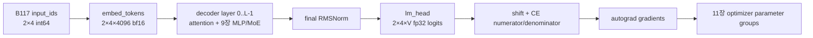

# 10장. 하나의 실제 모델을 해부한다

모델 이름을 안다고 계산 그래프를 아는 것은 아니다. 같은 계열 안에서도 config default, attention backend, weight tying, expert 배치와 loss 경로가 달라질 수 있고, checkpoint shape가 맞아도 잘못된 transpose나 tokenizer 조합은 조용히 다른 함수를 만든다. 이 장의 목표는 모델 카드를 요약하는 것이 아니라 config 한 줄이 어느 module·tensor·branch를 만들고 실제 weight와 어떻게 맞물리는지 재구성하는 것이다.

5장의 tokenizer·template와 7–9장의 block 계약을 실제 Llama·Qwen·DeepSeek·GLM·Gemma config와 module factory에 대입한다. 18장은 여기서 찾은 target module·tie·MoE 소유권을 adapter recipe로 바꾸고, 30장은 같은 model lineage를 merge·quantization·serving release까지 유지한다.

## 10.1 config를 계산 그래프와 tensor shape로 컴파일한다

config field를 이름 목록으로 읽지 않고 layer 구성, projection shape, cache와 parameter inventory를 생성하는 compiler 입력으로 읽는다.

### config에서 module factory까지

golden 사례는 nanoGPT commit `3adf61e154c3fe3fca428ad6bc3818b27a3b8291`을 고정한다. `GPTConfig`의 `block_size,V,L,H,C,dropout,bias`가 module shape와 branch를 결정한다. `model.py:120-145`에서 token/position embedding, `L`개 block, final norm, LM head가 만들어지고 embedding과 LM head의 weight가 같은 parameter로 묶인다. residual projection은 layer 수에 따른 scaled initialization을 받는다.

교육 config `B=2,T=8,V=256,C=32,H=4,L=2`에서 head dimension은 8이다. token embedding parameter는 `[256,32]`, position embedding은 `[8,32]`, QKV weight는 block마다 `[96,32]`, attention output은 `[32,32]`, MLP는 `[128,32]`와 `[32,128]`이다. 이 표는 config를 읽고 checkpoint tensor shape를 예측하는 oracle이다. checkpoint가 다른 shape를 가지면 load 옵션으로 억지로 덮지 말고 revision과 config를 확인한다.

## 10.2 token window가 logits가 되는 forward 계보를 잇는다

processor와 embedding에서 attention·MLP·norm·LM head까지 한 batch의 shape와 dtype을 끊지 않고 추적한다.

### batch에서 logits와 loss까지

`GoldenBatchID`는 두 개의 길이-9 window와 offset lineage를 가진다. `x=window[:,:8]`, `y=window[:,1:9]`이므로 둘 다 `[2,8]`이다. model forward의 handoff는 다음과 같다.

1. `wte(x)`는 `[2,8,32]`, `wpe(arange(8))`는 `[8,32]`다.
2. 합은 broadcast되어 residual stream `[2,8,32]`가 된다.
3. 첫 block norm 뒤 Q/K/V는 각각 `[2,4,8,8]`이다.
4. causal attention 출력은 다시 `[2,8,32]`로 합쳐 residual에 더해진다.
5. MLP가 `[2,8,128]` intermediate를 거쳐 `[2,8,32]`를 반환한다.
6. 두 block과 final norm 뒤 LM head는 logits `[2,8,256]`을 만든다.
7. cross entropy는 `[16,256]`과 target `[16]`을 비교한다.

이 경로에서 가장 위험한 조용한 오류는 shape가 맞는 오류다. 잘못된 transpose도 원소 수는 같고, 미래를 허용한 mask도 loss를 낮출 수 있으며, label shift가 한 번 더 적용돼도 CE는 계산된다. 그래서 checksum만으로 부족하다. 미래 token 변경 시 prefix logit 불변, `y[:,:-1]=x[:,1:]`, softmax row sum, valid target count 같은 의미 불변식을 함께 둔다.

## 10.3 backward가 parameter 역할별로 남기는 gradient를 해부한다

loss에서 시작한 gradient가 tied embedding, attention, expert, norm과 adapter에 어떻게 나뉘는지 semantic role로 비교한다.

### hook으로 gradient 추적

forward hook은 각 handoff의 shape, dtype, stride, min/max, RMS, finite 비율, checksum을 남긴다. backward hook은 output gradient에 같은 통계를 남긴다. parameter hook은 이름, storage identity, gradient norm, zero/non-finite count를 기록한다. embedding과 LM head는 tied storage이므로 두 이름을 별도 parameter처럼 합산하지 않는다.

먼저 dropout을 0으로 두고 autocast를 끈 단일 process에서 같은 batch를 두 번 실행한다. 이 조건에서는 logits와 gradient가 같아야 한다. 다음에는 같은 weights로 SDPA와 manual attention을 실행해 loss와 gradient의 절대·상대 오차를 비교한다. 부동소수점 연산 순서가 다를 수 있으므로 bitwise equality까지 요구하지는 않는다. 마지막으로 token 하나만 바꾸고 그 이후 위치에서만 결과가 달라지는지 본다. causal decoder의 이전 위치까지 변했다면 mask 또는 position 경로가 잘못된 것이다.

activation 전체를 저장하는 방식은 피한다. manifest에는 tensor 통계와 checksum을 기본으로 두고, 실패 node의 작은 slice만 별도 artifact로 남긴다. hook 자체의 device sync가 성능 측정을 오염하므로 correctness run과 profiling run도 분리한다.

## 10.4 config·model card·source·checkpoint의 동일성을 검증한다

같은 모델 이름을 쓰는 문서와 코드가 실제로 같은 architecture와 tensor를 뜻하는지 revision과 digest로 합의시킨다.

### 모델 카드·코드·checkpoint tensor의 삼각 검증

모델 카드는 의도와 공개된 hyperparameter를, 코드는 실제 branch와 shape 생성을, checkpoint는 학습된 tensor의 현실을 보여준다. 셋 중 둘이 맞는다고 셋째를 추정하지 않는다. config `vocab_size`와 embedding row 수, `n_layer`와 block key 수, tied-weight 선언과 storage/checksum, position limit와 table/mask shape를 대조한다.

nanoGPT의 pretrained import 경로는 Hugging Face GPT-2 weight 가운데 Conv1D 표현 때문에 transpose해야 하는 suffix를 명시한다. 이름이 같다고 layout이 같은 것이 아니다. 또한 `crop_block_size`는 config만 줄이지 않고 position embedding과 causal-mask buffer를 함께 자른다. 옵션 하나가 객체·parameter·buffer를 어떻게 바꾸는지 보여주는 좋은 사례다.

이 장의 provenance는 commit, 파일, 함수, line range에 고정한다. 그러나 line이 코드 동작을 증명하는 범위와 우리가 설계한 golden 실험을 구분한다. 실제 실행 전에는 checksum을 결과처럼 제시하지 않는다.

**이 장이 넘기는 것.** 확정된 model config, module/tensor atlas schema, tied-weight manifest, logits/loss/gradient contract, source revision을 11–17장과 28장에 넘긴다.

**Config에서 parameter 수를 먼저 예측한다.** 교육 config에서 token embedding은 `256×32=8,192`, position embedding은 `8×32=256`개다. bias가 없는 block 하나의 QKV는 `32×96=3,072`, attention projection은 `32×32=1,024`, MLP up/down은 각각 `32×128=4,096`, 합쳐 `8,192`개다. 두 LayerNorm scale은 64개다. block 하나는 12,352개, 두 block은 24,704개다. final norm 32개를 더하면 tied LM head를 별도 계산하지 않은 총 parameter는 33,184개다. 실제 `sum(p.numel())`이 다르면 어느 bias·norm·tie 가정이 틀렸는지 찾아야 한다.

**Activation byte를 예측한다.** FP32 residual `[2,8,32]`는 2,048 bytes다. Q/K/V 각각도 같은 원소 수지만 head view 자체는 storage를 추가하지 않을 수 있다. manual attention score `[2,4,8,8]`는 512 elements, 2,048 bytes다. 작은 예에서는 차이가 작지만 T가 8에서 8,192로 커지면 `T²` score가 지배한다. FlashAttention을 이해할 때 “빠른 kernel”이라는 결과보다 왜 `[B,H,T,T]`를 HBM에 쓰지 않으려는지 이 산술에서 출발한다.

**Source path를 객체 생성 순서로 읽는다.** `GPT.__init__`은 `ModuleDict`에 embedding, dropout, block list, final norm을 넣고 LM head를 만든다. 이어 `wte.weight=lm_head.weight`로 alias를 만든 뒤 전체 initialization을 적용한다. 같은 parameter가 module traversal에서 두 번 보일 가능성과 초기화 순서를 확인해야 한다. residual projection의 이름 suffix를 찾아 layer 수에 따른 scale로 다시 초기화한다. checkpoint 키 목록은 이 객체 graph의 직렬화 결과다.

**Forward의 짧은 핵심.** 고정 source는 다음 순서를 갖는다.

```python
tok_emb = self.transformer.wte(idx)
pos_emb = self.transformer.wpe(pos)
x = self.transformer.drop(tok_emb + pos_emb)
for block in self.transformer.h:
    x = block(x)
x = self.transformer.ln_f(x)
logits = self.lm_head(x)
```

각 줄 사이를 hook 지점으로 삼되 Python module boundary와 fused kernel boundary가 같다고 가정하지 않는다. compile 후에는 graph가 합쳐질 수 있고 module hook이 graph break를 만들 수 있다. eager correctness run에서 atlas를 만들고 compiled performance run에는 NVTX range와 profiler를 사용한다.

**Attention layout을 byte stride까지 본다.** QKV projection 결과 `[B,T,3C]`는 마지막 차원이 연속이다. `split` 뒤 `[B,T,C]`, `view(B,T,H,D)`, `transpose(1,2)` 후 `[B,H,T,D]`는 보통 non-contiguous다. SDPA는 이를 받아들이지만 어떤 custom kernel은 특정 stride/alignment를 요구한다. `.contiguous()`를 무작정 넣으면 correctness를 고칠 수도 있지만 추가 copy로 성능을 가린다. shape, stride, storage offset을 atlas에 함께 기록한다.

**Causal mask 반례를 구체화한다.** 입력 두 개를 만들되 위치 5 이후 token만 바꾼다. 위치 0–4 logits는 허용 오차 안에서 같아야 한다. 위치 5 자체의 logit은 위치 5 token을 입력으로 본다면 달라질 수 있으므로 비교 경계를 정확히 정의한다. dropout은 끄고 position과 prefix를 고정한다. 실패하면 mask orientation, `is_causal`, sequence dimension transpose를 확인한다.

**Loss denominator를 직접 재구성한다.** golden label에는 각 행 마지막 `-1`이 있어 유효 label은 14개다. framework mean과 `reduction='sum'/14`를 비교한다. nanoGPT의 ignore index는 `-1`이므로 이 lab에서 `-100`을 넣으면 index error 또는 다른 동작을 보일 수 있다. 5장의 collator artifact를 model contract에 맞게 변환하는 adapter가 필요하며, 변환 뒤 checksum을 새로 만든다.

**Tied gradient를 분해해 본다.** 한 실행에서는 정상 tying을 사용하고, 다른 실행에서는 같은 초기값을 가진 별도 embedding/head parameter를 만든다. untied 실행의 두 gradient 합이 tied parameter gradient와 허용 오차 안에서 맞는지 본다. 이 실험은 “weight tying은 parameter를 절약한다”를 넘어 gradient 경로가 합쳐진다는 사실을 보여준다. optimizer state도 tied parameter 하나만 가져야 한다.

**Checkpoint 삼각 검증 절차.** config에서 예상 key와 shape를 만든 뒤 state dict의 실제 key·shape·dtype·checksum과 비교한다. 이어 module graph의 `named_parameters`와 `named_buffers`를 대조해 parameter와 causal mask buffer가 섞이지 않았는지 확인한다. tied 후보는 값 checksum만 같다고 승인하지 않고 storage identity 또는 serialization alias 정책까지 본다. 마지막으로 model card의 parameter 수가 embedding을 포함한 값인지 제외한 값인지 분모를 명시한다.

**실패 주입 A—head 수만 바꾼 config.** `C=32`를 유지하고 `H=8`로 바꾸면 QKV weight shape는 같아 checkpoint load가 성공할 수 있다. 그러나 head dimension이 8에서 4로 바뀌어 계산 함수는 다르다. shape-only 검증이 잡지 못하는 오류다. config checksum과 known-input logits가 필요하다.

**실패 주입 B—transpose 누락.** 다른 구현의 Conv1D-style weight를 Linear weight로 옮기면서 transpose를 생략한다. 정사각 projection은 shape도 같아 load된다. golden batch의 첫 projection checksum에서 즉시 갈라져야 한다. 최종 loss만 보면 여러 layer를 거친 뒤 원인을 찾기 어렵다.

**실패 주입 C—tie 해제.** checkpoint load 뒤 resize 또는 model surgery가 embedding parameter를 새 객체로 교체해 LM head alias를 끊는 상황을 만든다. forward 직후 값은 같아 보일 수 있지만 한 optimizer step 뒤 두 weight가 갈라진다. storage identity와 optimizer parameter ID를 step 전후 비교한다.

**실패 주입 D—train/eval mode.** dropout이 0인 교육 config에서는 이 차이가 드러나지 않는다. 별도 실험에서 dropout을 0.1로 올리고 같은 batch를 eval과 train에서 실행한다. 재현 실패를 kernel 탓으로 돌리기 전에 mode와 RNG를 검사하는 이유를 보여준다. 그러나 dropout 실험의 checksum을 dropout 0 golden artifact와 섞지 않는다.

**통제 실험 A—manual 대 SDPA.** 같은 Q/K/V를 두 경로에 넣고 attention output, loss, Q/K/V gradient를 비교한다. causal mask와 scale, dropout을 동일하게 고정한다. absolute error는 0 근처 값에서 과장되고 relative error는 분모가 작을 때 폭주하므로 `max_abs`, `max_rel`과 cosine을 함께 쓴다.

**통제 실험 B—checkpoint round trip.** state dict를 저장하고 새 model에 load한 뒤 parameter checksum, tied identity, golden logits를 비교한다. optimizer까지 한 step 수행한 뒤 같은 비교를 반복한다. load 직후 equality만으로 optimizer parameter mapping의 오류를 잡을 수 없다.

**통제 실험 C—compile 경계.** eager와 compiled model에서 golden loss와 gradient를 비교한 뒤 profiler를 별도 실행한다. hook이 graph break를 유발하는지 compiler report를 확인한다. correctness 차이가 있으면 dtype promotion, fused reduction, dynamic shape guard를 한 축씩 끈다.

**디버깅 결정 트리.** checkpoint load가 실패하면 key→shape→dtype 순으로 본다. load는 성공하지만 첫 embedding checksum이 다르면 tokenizer IDs, embedding weight, position을 본다. embedding은 같고 첫 attention 전에서 다르면 norm epsilon과 mode를 본다. QKV까지만 같으면 reshape/transpose/mask/SDPA branch다. block output이 같고 logits가 다르면 final norm, tying, head layout이다. logits가 같고 loss가 다르면 label shift, ignore index, denominator다. loss가 같고 gradient가 다르면 saved tensor/fused backward/accumulation이다. gradient가 같고 update가 다르면 11장의 optimizer state로 인계한다.

**실습 10-A—tensor atlas.** `labs/golden_tensor_probe.py`는 고정 seed와 config로 ID→embedding→두 block→tied logits→CE→gradient를 생성한다. 현재 작업 환경에는 PyTorch가 없어 activation checksum을 실행하지 못했다. 따라서 입력·label·config checksum만 확정됐고 activation 항목은 `NotExecuted`다. 출판용 결과는 PyTorch/CUDA revision과 함께 실행해 채운다.

**실습 10-B—parameter manifest.** 각 parameter에 canonical name, shape, dtype, requires-grad, storage group, optimizer group을 기록한다. 예상 33,184개와 합계를 비교한다. checkpoint와 module graph 어느 한쪽에만 있는 key는 allowlist 이유가 없으면 실패다.

**실습 10-C—첫 차이 자동 탐색.** 두 run manifest를 tensor handoff 순서로 비교해 첫 checksum 또는 tolerance 위반을 출력한다. 뒤쪽 차이는 앞쪽 오류의 결과일 가능성이 크므로 일단 숨긴다. 첫 차이를 수정한 뒤 재실행해 다음 차이를 찾는다. 이 방식은 수백 개 tensor diff를 한꺼번에 보여주는 보고서보다 실제 원인 격리에 유용하다.

**Factory에서 forward까지의 객체 호출표.** module 선언 순서와 실행 시점의 호출 순서를 분리한다. 선언 시에는 parameter와 buffer가 만들어지고, forward 때에는 view와 temporary activation이 만들어진다.

| 순서 | source 좌표 | 호출 | 입력 shape | 출력 shape | 지속 상태 |
|---|---|---|---|---|---|
| 1 | `model.py:170-179` | `wte`, `wpe`, dropout | `[2,8]`, `[8]` | `[2,8,32]` | embedding parameter |
| 2 | `model.py:103-105` | `ln_1→attn→add` | `[2,8,32]` | `[2,8,32]` | norm/QKV/proj parameter |
| 3 | `model.py:103-105` | `ln_2→mlp→add` | `[2,8,32]` | `[2,8,32]` | norm/up/down parameter |
| 4 | `model.py:180-182` | block 반복, `ln_f` | `[2,8,32]` | `[2,8,32]` | L개 block |
| 5 | `model.py:184-193` | tied LM head, CE | residual, `[2,8]` | `[2,8,256]`, scalar | 없음/gradient graph |

temporary Q/K/V view와 score는 state dict에 들어가지 않는다. dropout RNG와 autograd saved tensor는 실행 중 상태지만 일반 checkpoint에는 없다. activation checkpointing을 쓰면 일부 saved tensor 대신 재계산 경계와 RNG preservation이 필요하다. “모델 상태”를 state dict만으로 정의하면 실행 중 복구와 pipeline in-flight 상태를 놓친다.

**Attention의 미분을 shape로 따라간다.** `S=QKᵀ/√D`, `P=softmax(mask(S))`, `O=PV`라 하자. upstream `dO`에서 `dP=dO Vᵀ`, `dV=PᵀdO`다. softmax row의 Jacobian은 `diag(p)-ppᵀ`이므로 `dS=p⊙(dP-Σ_j p_j dP_j)`다. 이어 `dQ=dS K/√D`, `dK=dSᵀQ/√D`다. causal mask로 제외된 위치의 probability와 `dS`는 0이어야 한다. fused backward는 이 행렬을 그대로 저장하지 않아도 같은 계약을 만족해야 한다.

`[B,H,T,D]`에서 `S`는 `[B,H,T,T]`, `dP`도 같다. `dQ,dK,dV`는 원 shape로 돌아오고 transpose/merge 뒤 QKV Linear backward로 들어간다. head 축을 잘못 합치면 최종 `[B,T,C]` shape는 맞아도 channel 배치가 틀린다. head별 synthetic pattern을 넣는 반례가 필요하다.

**LayerNorm 미분과 epsilon.** 입력 한 token의 channel vector `x`에 대해 `μ=mean(x)`, `σ²=mean((x-μ)²)`, `xhat=(x-μ)/sqrt(σ²+ε)`다. epsilon은 0 division만 막는 값이 아니라 작은 variance 구간의 scale과 gradient를 바꾼다. config나 implementation 사이 epsilon이 다르면 parameter shape와 checkpoint는 같아도 logits가 달라진다. constant vector와 거의 constant vector를 test해 finite output과 gradient 크기를 본다.

**CE 미분을 tied weight까지 연결한다.** 위치별 `dlogits=p-one_hot(y)`를 valid count 14로 나눈다. LM head gradient는 모든 위치의 `dlogitsᵀh` 합이고 hidden gradient는 `dlogits W`다. tied embedding `W=E`이면 이 dense head gradient와 input ID에 대한 sparse lookup gradient가 같은 `E.grad`에 누적된다. 따라서 embedding row가 input에 등장하지 않아도 output vocabulary 경쟁을 통해 gradient를 받을 수 있다. “등장한 행만 갱신된다”는 lookup 단독 설명을 tied model 전체에 적용하면 틀린다.

**Tensor ledger의 최소 열.** 단순 checksum은 어디가 얼마나 틀렸는지 말하지 않는다. 다음 열을 JSONL 또는 Parquet로 둔다.

| 열 | 이유 | 주의점 |
|---|---|---|
| `RunID,node_path,call_index` | 반복 module 호출 구분 | module 이름만으로 부족 |
| shape/stride/storage_offset | layout 계약 | view와 copy 구분 |
| dtype/device | promotion·placement | autocast 전후 분리 |
| finite/zero count | NaN·sparsity | sample slice가 아님 |
| min/max/mean/RMS | 규모 진단 | reduction dtype 명시 |
| checksum | exact artifact 비교 | 직렬화 규약 고정 |
| producer revision | provenance | source와 runtime graph 구분 |
| parent tensor IDs | 원인 역추적 | DAG가 너무 커지면 handoff만 |

**Parameter ledger.** `named_parameters(remove_duplicate=False)`로 alias 후보를 찾고 storage group을 부여한다. 이름, canonical owner, shape, dtype, numel, init rule, optimizer group, weight decay 여부, checkpoint key를 기록한다. tied aliases를 numel 합계에서 두 번 세지 않는다. buffers는 별도 표에 둔다. causal mask, rotary cache, quantization scale처럼 parameter가 아니어도 계산을 바꾸는 state가 있기 때문이다.

**Upstream test의 부재와 대체 범위.** nanoGPT snapshot에는 model unit test가 없다. source 주석과 실행 recipe는 assertion이 아니다. PyTorch의 SDPA test가 kernel 계약을 검사해도 nanoGPT의 reshape와 tying을 검사하지 않는다. Transformers GPT-2 test가 pretrained parity를 검사해도 이 commit의 crop, compile, checkpoint path를 증명하지 않는다. 따라서 10장의 invariant는 독자용 local fixture로 명시한다. upstream test가 없는 사실을 불확실성으로 남기는 것이 근거 없는 신뢰보다 낫다.

**Pretrained import가 제공하는 제한된 교차검증.** `model.py:206` 이후 경로는 Hugging Face GPT-2 model을 만들고 state key를 대조하며 attention/MLP projection 일부를 transpose해 복사한다. key 수와 shape assertion은 구조 mapping을 확인하는 장치다. 그러나 network 다운로드로 받은 artifact revision, tokenizer, runtime dtype가 고정되지 않으면 end-to-end parity test는 아니다. known token IDs에서 layer별 output을 비교해야 한다.

**Crop의 세 상태.** `crop_block_size`는 config block size, position embedding parameter, manual attention mask buffer를 함께 줄인다. Flash/SDPA branch에서는 explicit mask buffer가 없을 수 있다. optimizer를 만든 뒤 position parameter 객체를 교체하면 optimizer group이 이전 객체를 가리킬 위험도 조사한다. source의 일반 사용 순서는 crop 뒤 optimizer 생성이므로 안전하지만 외부 호출 순서가 바뀌면 계약이 달라진다.

**반례 1—parameter 수가 맞아도 architecture가 다르다.** LayerNorm bias를 빼고 다른 projection bias를 넣어 총 수를 맞출 수 있다. 합계는 checksum이 아니다. key별 shape·role과 forward atlas가 필요하다.

**반례 2—첫 logits가 같아도 tying이 깨질 수 있다.** resize 직후 LM head에 embedding 값을 copy하면 첫 forward는 같다. 별도 Parameter라면 한 step 뒤 optimizer update가 갈라진다. storage alias와 update 후 equality를 검사한다.

**반례 3—causal test가 우연히 통과한다.** 바꾼 미래 token 두 개의 embedding이 우연히 같거나 뒤 layer가 차이를 상쇄할 수 있다. 여러 random perturbation과 첫 attention output에서 test하고, mask tensor 자체도 점검한다.

**반례 4—fused/manual loss parity가 backward parity를 뜻하지 않는다.** forward reduction이 가까워도 saved statistic·recompute·rounding 때문에 gradient 차이가 클 수 있다. Q/K/V와 parameter gradient까지 비교한다.

**반례 5—모든 tensor가 finite인데 학습은 망가진다.** label shift나 mask가 틀리면 NaN 없이 잘못된 objective를 최적화한다. finite check는 필요조건일 뿐 의미 검증이 아니다. 1장과 5장의 ID·mask invariant를 atlas에 포함한다.

**조사 체크리스트—새 모델 source를 열었을 때.** config class와 serialization key를 찾는다. model factory가 어떤 module을 조건부 생성하는지 표로 만든다. embedding/LM head tying을 객체 identity로 확인한다. forward 입력의 IDs·mask·position/cache contract를 적는다. layer의 norm 위치, attention 종류, MLP/MoE, residual scaling을 순서도로 만든다. loss가 model 안인지 trainer 밖인지, shift와 denominator 소유자를 찾는다. generation-only branch와 training branch를 분리한다. checkpoint key와 config로 예상 shape를 생성한다. upstream test가 각 branch를 실제로 호출하는지 확인한다.

**조사 체크리스트—첫 forward mismatch.** source/weight/tokenizer revision과 config checksum을 먼저 확인한다. input IDs·mask·position을 비교한다. embedding weight와 output을 본다. 첫 norm 통계, QKV projection, reshape stride, mask, attention output 순서로 첫 차이를 찾는다. compiled/fused 경로를 끄고 eager reference를 만든다. 허용 오차는 dtype과 연산 수를 근거로 사전에 정한다.

**조사 체크리스트—첫 backward mismatch.** loss sum과 valid count, scale을 확인한다. tied parameter alias와 gradient hook 중복을 본다. AMP scale을 unscale한 동일 단위로 비교한다. attention backward는 dO→dP/dV→dS→dQ/dK 순으로 좁힌다. activation checkpointing의 RNG preservation을 확인한다. DDP가 있으면 sync 이전 local gradient와 sync 이후 gradient를 분리한다.

**재현 절차.** nanoGPT commit과 Python dependency lock을 고정한다. CPU FP32 eager로 golden correctness run을 먼저 만든다. 입력 artifact checksum이 맞지 않으면 model을 실행하지 않는다. seed 뒤 model parameter manifest를 저장한다. forward atlas, scalar loss, backward atlas를 차례로 commit한다. 같은 process 반복, 새 process 반복, save/load 반복을 수행한다. 그 뒤에만 SDPA/manual, AMP, compile, GPU를 한 축씩 추가한다. 각 축은 parent RunID와 changed-field manifest를 가진다.

**기대 invariant와 미실행 경계.** 현재 확정된 것은 input/label/config bytes와 source static shape다. parameter checksum, activation checksum, gradient checksum, SDPA parity는 PyTorch 부재로 미실행이다. 실행 시 예상되는 invariant는 parameter 수 33,184, valid labels 14, logits `[2,8,256]`, loss scalar, embedding gradient `[256,32]`, prefix causality다. 예상값과 관측값을 별도 열에 두고 관측 전에는 같은 문장으로 합치지 않는다.

**초기화가 residual 깊이와 만나는 지점.** 일반 Linear와 Embedding은 표준편차 0.02 normal로 초기화되지만 이름이 `c_proj.weight`로 끝나는 residual projection은 `0.02/√(2L)`로 다시 초기화된다. attention과 MLP에서 block마다 두 residual branch가 더해지는 깊이를 보정하려는 선택이다. 이름 suffix에 의존하므로 module 이름을 바꾼 fork에서는 의도가 사라질 수 있다. parameter manifest에 실제 초기 표준편차를 기록해 config가 아니라 결과를 검사한다.

**GELU MLP의 분포 관찰.** up projection `[2,8,128]`의 channel별 mean/RMS, GELU 뒤 zero 근처 비율, down projection RMS를 본다. GELU는 ReLU처럼 음수를 완전히 0으로 만들지 않는다. “activation sparsity”를 exact zero count로만 측정하면 GELU saturation을 놓친다. 매우 큰 입력에서는 down projection과 residual이 폭주할 수 있으므로 percentile과 max를 함께 쓴다.

**Residual checksum만으로 branch를 찾는 법.** block 입력 `r`, attention branch `a`, MLP branch `m`을 각각 기록하면 `r1=r+a`, `r2=r1+m`의 elementwise invariant를 검사할 수 있다. final residual만 다르면 두 branch를 독립 비교한다. fused add 때문에 intermediate가 materialize되지 않는 runtime에서는 correctness reference에서만 이 지점을 노출한다.

**Position crop 반례의 수치적 의미.** block size를 8에서 4로 crop하면 position parameter는 `[8,32]→[4,32]`가 되고 manual mask는 `[1,1,8,8]→[1,1,4,4]`다. token embedding과 QKV shape는 그대로라 대부분의 checkpoint key가 맞는다. 길이 5 input을 assert로 거부해야 한다. config만 4이고 position table이 8인 경우 load는 가능해도 artifact가 내부적으로 모순이다.

**검증 실험 10-D—head permutation.** Q/K/V projection과 output projection을 일관되게 head permutation하면 함수가 같을 수 있다. QKV만 permutation하고 output projection을 그대로 두면 함수가 달라진다. parameter checksum은 두 경우 모두 바뀐다. known-input output을 함께 보는 이유다. 반대로 tensor별 checksum 차이를 곧바로 semantic failure로 읽어서는 안 된다는 반례이기도 하다.

**검증 실험 10-E—epsilon sweep.** 같은 weight와 batch에서 LayerNorm epsilon만 `1e-5`, `1e-6`, `1e-4`로 바꾼다. 일반 activation과 거의 constant synthetic activation에서 output·gradient 차이를 비교한다. 실제 config의 epsilon을 읽지 않고 framework default를 쓰는 porting 오류를 재현한다.

**검증 실험 10-F—loss mask 이동.** 한 valid label을 ignore로 바꾸고 loss sum, valid count, embedding/head gradient를 비교한다. mean loss가 우연히 비슷하더라도 gradient가 달라진다. ignored 위치의 direct CE gradient는 0이어야 하지만 그 token이 앞 위치 context로 쓰이면 embedding/attention을 통해 다른 loss에 기여할 수 있다. “ignore token은 학습에 전혀 영향이 없다”는 설명을 교정한다.

**실제 test로 승격하는 기준.** fixture에는 입력 artifact와 예상 invariant가 code로 들어가고 실패 시 첫 차이를 출력해야 한다. 문서에 “확인한다”고 쓴 문장은 test가 아니다. source revision과 environment를 lock하고 CI에서 반복되어야 regression test다. GPU kernel parity test는 hardware·dtype별 tolerance와 skip 이유를 공개한다. flaky test를 재시도해 통과시키는 대신 RNG와 nondeterministic operator를 기록한다.

**해부 기록철의 구성.** `config.json`, source revision, parameter manifest, buffer manifest, golden input, forward ledger, loss ledger, backward ledger, checkpoint round-trip report, negative evidence를 한 묶음으로 만든다. model card의 표는 이 기록철의 요약이지 대체물이 아니다. 각 table row가 어느 산출물에서 계산됐는지 script revision을 적는다.

**다음 편으로 넘기는 parameter-group 후보.** 11장은 이 모델의 tied embedding/head, position embedding, norm scale, QKV/proj, MLP up/down을 decay·optimizer 종류별로 분류한다. 10장은 아직 어떤 optimizer가 옳다고 결정하지 않는다. 대신 shape, semantic role, gradient RMS, update frequency를 넘긴다. optimizer는 이 관측을 받아 state byte와 geometry를 설명해야 한다.

**최종 조사 순서.** ① revision과 artifact identity, ② config→예상 graph, ③ parameter/buffer ledger, ④ tokenizer와 golden batch, ⑤ eager FP32 forward, ⑥ loss 분모, ⑦ backward, ⑧ save/load, ⑨ alternative kernel, ⑩ compile/distributed 순으로 조사한다. 앞 단계가 닫히지 않았는데 뒤 단계 성능을 측정하지 않는다. 이 순서는 문제를 단순하게 유지하는 실무 장치다.

**다음 장에서 깨질 수 있는 것.** 같은 gradient라도 optimizer의 좌표계·state·parameter grouping에 따라 전혀 다른 parameter delta가 나온다.

**검증 체크포인트.** config→예상 tensor shape→checkpoint shape, DocumentID→token offset→GoldenBatchID, forward 의미 불변식, tied gradient, loss denominator, parameter delta 전 상태가 하나의 RunID 아래 이어져야 한다.

### config compiler와 tensor ledger를 구축한다

### 독자 산출물 10-1—config compiler

config를 읽어 예상 module graph, parameter/buffer keys와 shape, alias group, parameter 수를 생성하는 작은 script를 만든다. state dict를 먼저 읽어 architecture를 추정하지 않는다. config→expected와 checkpoint→observed를 독립 생성해 diff한다.

education nanoGPT config `V=256,C=32,L=2,H=4,Tmax=8,bias=false`에서 expected total 33,184를 다시 계산한다. 각 key별 numel 합, alias 제외 합, buffer 제외 합을 따로 report한다. head를 tying하지 않은 child config는 LM head 8,192개가 추가돼야 한다.

| config field | 생성 객체/shape | checkpoint 영향 | forward 영향 |
|---|---|---|---|
| V | wte/head rows | key shape | logits V |
| C | 모든 projection/norm | 광범위 shape | residual width |
| L | block list | key 반복 수 | depth |
| H | attention reshape | weight shape는 같을 수 있음 | head mapping |
| Tmax | wpe/mask | table/buffer | input limit |
| bias | Linear/LayerNorm bias | keys·numel | affine function |

H를 4→8로 바꿔도 C=32 QKV weight `[96,32]`는 같다. config compiler는 shape-only pass와 semantic config mismatch를 분리해야 한다.

**독자 산출물 10-2—factory trace.** `model.py:108-145`에서 dataclass→ModuleDict→block list→LM head→alias→generic init→residual special init 순서를 call/event로 기록한다. parameter checksum은 generic init 뒤와 special init 뒤가 다를 수 있다. source line과 runtime module name을 연결한다.

factory option을 바꿀 때 before/after graph diff를 낸다. bias false는 key 제거, dropout은 parameter가 아닌 runtime mode/RNG, block size crop은 config·position parameter·manual-mask buffer mutation이다. option 목록을 붙이지 않고 object/state mutation으로 설명한다.

**Transformers 현대 사례.** 고정 commit `550d7b3834670483a4df436541272c055dc364bf`의 Llama `modeling_llama.py:73-160` RoPE, `163-189` SwiGLU, `191-287` GQA attention, `290-325` decoder residual, `347-484` embedding→layers→final norm→LM head/loss를 하나의 source path로 사용한다. nanoGPT와 같은 model이라고 쓰지 않고 architecture delta 표를 만든다.

| 축 | nanoGPT golden | Llama reference |
|---|---|---|
| position | learned wpe | RoPE q/k |
| norm | LayerNorm | RMSNorm |
| attention | MHA/SDPA | MHA/GQA backend |
| MLP | GELU 4C | SwiGLU |
| loss/embedding | tied 가능 | config/model contract 확인 |

Llama small config numeric fixture는 별도 RunID를 가져야 한다. nanoGPT checksum을 재사용하지 않는다. 동일 IDs/V/C/L/H를 가능한 범위에서 맞추더라도 parameter graph와 함수가 다르므로 output equality를 요구하지 않는다. 각 내부 reference/optimized parity만 검사한다.

**독자 산출물 10-3—forward ledger.** node마다 call index, parent tensor IDs, expected/observed shape·stride·dtype, RMS·finite·checksum, source producer를 기록한다. functional RoPE/CE처럼 module hook이 없는 node는 wrapper/tensor probe를 사용한다. compile run에서는 debug hook을 제거한다.

numeric golden x/y에서 valid labels는 14다. logits `[2,8,256]`을 `[16,256]`, labels `[16]`으로 flatten하고 ignore `-1`을 적용한다. `loss_sum/14`와 reported loss를 비교한다. 위치별 target/NLL/ContributionID를 1장 ledger와 reconcile한다.

**Logits trace.** 각 position에 max logit, target logit, LSE, target probability와 NLL을 쓴다. 전체 logits payload 대신 checksum과 worst positions를 기본 보존한다. stable LSE와 framework CE가 맞지 않으면 model layer로 올라가기 전에 loss contract를 고친다.

**독자 산출물 10-4—backward atlas.** final loss→logits→head/tied E→final norm→block1 MLP/attention→block0→embedding 순으로 reverse call index를 둔다. activation gradient와 parameter gradient를 구분한다. tied alias parameter는 하나의 gradient record에 input/head contribution test를 연결한다.

| backward node | expected shape | property |
|---|---|---|
| dlogits | `[2,8,256]` | valid row sum≈0 |
| dresidual final | `[2,8,32]` | finite/RMS |
| MLP dgate/dup | `[2,8,F]` | branch chain rule |
| attention dQ/K/V | `[2,H,8,D]` | mask/GQA reduction |
| embedding dE | `[256,32]` | tie/scatter sum |

parameter별 `grad_norm,delta_norm,weight_norm,delta/weight`를 optimizer 전후로 기록한다. gradient가 맞고 delta가 다르면 11장 optimizer 영역이다. 이 장은 optimizer 선택을 정당화하지 않는다.

**Hook 인수조건.** hook은 gradient를 그대로 반환하고 tensor를 mutate하지 않는다. repeated module은 call index를 가진다. full CPU copy와 `.item()` sync는 correctness run에만 허용한다. hook 제거 clean run에서 loss/delta가 같아야 한다. compile graph break report를 남긴다.

**Transformers upstream test workbook.** common model test의 config fixture가 target model branch를 생성하는지, forward/backward·cache·resize·tie 중 무엇을 assertion하는지 적는다. Llama-specific RoPE/GQA/cache test와 common loss test를 분리한다. test가 skip한 dtype/backend/hardware는 지지 범위에서 뺀다.

upstream test가 small random config를 통과해도 특정 Hub checkpoint tensor·model card·tokenizer 조합을 증명하지 않는다. 반대로 model card benchmark는 source branch와 checkpoint key parity를 증명하지 않는다. 세 evidence를 삼각형의 독립 변으로 둔다.

**독자 산출물 10-5—checkpoint dossier.** config JSON checksum, model source revision, shard index, key→shard mapping, tensor name/shape/dtype/checksum, alias/tie policy, tokenizer revision을 묶는다. safetensors shard total_size와 실제 tensor bytes를 reconciliation한다. buffer/nonpersistent state도 module graph에서 확인한다.

checkpoint load는 key existence→shape→dtype→value checksum→alias→golden forward→one-step delta 순으로 승격한다. `strict=False` 성공을 complete로 표시하지 않는다. missing/unexpected allowlist와 이유를 둔다.

**Model card dossier.** architecture, parameter 수, context, tokenizer, precision, training/usage 선언을 field별로 추출한다. 각 field가 config/checkpoint/source 어느 것으로 교차검증되는지 표시한다. parameter 수는 embedding 포함·active/total·MoE 여부의 분모를 확인한다. 카드의 성능 표는 해당 evaluation artifact와 조건에 붙인다.

**삼각검증 numeric case.** config가 V=256이라 선언하고 checkpoint E가 `[256,32]`, LM head가 같은 storage/값을 가져야 한다. card가 33,184 parameter라면 alias 제외 expected 합과 맞춘다. card가 context 8, config block 8, wpe `[8,32]`, mask max 8인지 확인한다. 한 변 mismatch는 release issue이며 나머지 둘로 임의 덮지 않는다.

**Failure workbook M1—config/head semantic mismatch.** H만 바꿔 shape load가 성공하지만 golden QKV reshape 이후 output이 갈라진다. config checksum gate로 먼저 잡는다.

**M2—Conv1D transpose 누락.** square projection은 shape가 같아도 값 mapping이 다르다. projection output first mismatch와 known basis input으로 잡는다.

**M3—tie copy 대 alias.** first forward는 같고 one-step 뒤 weights가 갈라진다. storage group과 optimizer registration을 검사한다.

**M4—position crop partial mutation.** config만 줄이고 wpe/mask를 유지하거나 wpe만 잘라 optimizer가 old object를 가리킨다. module/config/optimizer 삼각 diff로 잡는다.

**M5—ignore index mismatch.** 5장 collator `-100`과 nanoGPT `-1`을 섞는다. fail-fast하지 않는 custom loss는 wrong target으로 계산할 수 있다. valid count와 per-position NLL이 gate다.

**M6—train/eval mode.** dropout 또는 cache branch가 달라져 same batch activation이 다르다. mode/RNG를 manifest에 둔다.

**M7—fused backward only mismatch.** output/loss는 tolerance 내지만 dQ/dK/dV 또는 tied dE가 다르다. backward atlas가 first difference를 찾는다.

**M8—checkpoint shard 누락.** index는 key를 가리키지만 child shard checksum/file이 없다. loader가 partial artifact를 거부해야 한다.

**M9—stale tokenizer.** checkpoint V와 tokenizer length가 우연히 같아도 ID→piece 의미가 다르다. canonical raw bytes→IDs→embedding row chain으로 잡는다.

**M10—compile prefix 보정 과잉.** `_orig_mod.` prefix 제거가 이름 collision을 만들거나 optimizer mapping을 갱신하지 않는다. transformed key uniqueness와 one-step delta를 검사한다.

**RCA workbook.** 증상, first mismatch node, config/source/artifact revisions, expected/observed tensor, 원인 state owner, 영향 CheckpointID/EvalID, fix와 regression fixture를 적는다. “모델이 다르다”는 원인이 아니다. `block.1.attn.q shape/stride 동일, value checksum first mismatch due transpose`처럼 좁힌다.

**30분 autopsy.** 0–5분 artifact/config/tokenizer identity, 5–10분 parameter keys/alias, 10–15분 embedding/position/first block forward, 15–20분 loss/per-token, 20–25분 backward/parameter delta, 25–30분 checkpoint/card/test 범위를 정리한다. fused/compile/distributed는 eager FP32 reference 뒤에만 켠다.

**독자 산출물 10-6—first-difference tool.** two ledgers를 call order로 merge해 shape/dtype/checksum/tolerance 첫 mismatch를 출력한다. parent tensor mismatch 뒤 downstream 수백 개는 collapse한다. missing node와 changed call count도 diff한다. output은 machine-readable CSV와 사람이 읽는 RCA seed를 만든다.

**독자 산출물 10-7—source-to-test matrix.** 각 source branch가 어느 upstream/local test에 의해 호출되는지 row로 만든다. branch가 code coverage에 있다고 semantic assertion이 있는 것은 아니다. test assertion과 excluded option을 적는다. test 없는 branch는 manual fixture 또는 미확인이다.

**수치 trace 인수조건.** 입력/config checksum이 먼저 맞아야 한다. parameter expected/observed가 맞아야 forward를 실행한다. forward first mismatch가 없을 때 loss를, loss가 맞을 때 backward를, gradient가 맞을 때 one-step을, one-step이 맞을 때 checkpoint round-trip을 승인한다. 순서를 건너뛰지 않는다.

**Checkpoint byte 정산.** tensor마다 `numel×element_size`를 계산해 shard별 합과 index의 `total_size`를 대조한다. 교육 모델의 33,184개 parameter를 모두 FP32로 저장하고 alias를 한 번만 직렬화한다면 순수 tensor payload 예상치는 132,736 bytes다. 파일 header와 metadata 때문에 실제 파일 크기는 더 크다. 반대로 LM head alias를 독립 tensor로 저장하는 정책이면 payload에 32,768 bytes가 추가될 수 있다. 이 차이를 곧바로 중복 parameter라고 판정하지 말고 serializer의 shared-storage 정책과 load 후 alias 복원 여부를 각각 확인한다.

대형 checkpoint에서는 key별 `offset_begin,offset_end`가 겹치지 않는지, 마지막 offset이 payload 경계와 맞는지 검사한다. shard index가 선언한 파일 집합과 실제 파일 집합의 양방향 차집합도 구한다. 임시 다운로드 파일, 이전 revision shard, 빈 shard가 디렉터리에 남아 있어도 glob 기반 loader는 잘못 읽을 수 있다. manifest는 파일명뿐 아니라 byte size와 cryptographic checksum을 가진다. 원격 object store의 ETag는 multipart upload에서 파일 내용 checksum과 같지 않을 수 있으므로 SHA-256을 별도로 계산한다.

**Dtype 변환의 소유자.** checkpoint가 BF16인데 module을 FP32로 생성한 뒤 load하는지, load하면서 BF16을 유지하는지, autocast가 activation만 바꾸는지 분리한다. parameter manifest에는 disk dtype, load dtype, compute dtype, accumulation dtype을 따로 둔다. “BF16 모델”이라는 한 단어로 네 상태를 합치면 tensor byte와 수치 오차, optimizer state 비용을 동시에 잘못 계산한다. int8/4bit artifact는 packed weight, scale, zero point, group size와 dequantization kernel을 하나의 논리 parameter에 연결한다. packed tensor shape만 보고 원래 Linear의 입력·출력 차원을 추정하지 않는다.

**분산 실행에서 같은 모델이라는 조건.** tensor parallel rank는 전체 QKV나 MLP weight가 아니라 slice를 소유할 수 있다. 각 rank의 local parameter 수가 33,184와 다르다는 사실은 오류가 아니다. global key, shard axis, global shape, local range, replication group을 기록하고 모든 rank의 range 합집합이 global tensor를 정확히 덮는지 검사한다. 겹침은 의도된 replication인지 중복 shard인지 구분한다. pipeline parallel에서는 layer key 집합이 stage마다 다르고, tied embedding과 head가 양 끝 stage에 있어 통신 또는 복제 정책이 필요하다.

Golden autopsy는 먼저 single-process state를 canonical graph로 만든 뒤 distributed manifest를 그 graph에 투영한다. rank-local checkpoint를 단순 concatenate하지 않는다. row-parallel과 column-parallel은 합치는 축이 다르고 QKV fused packing은 Q·K·V 내부 순서까지 알아야 한다. ZeRO/FSDP flat parameter는 여러 원래 parameter가 하나의 storage에 들어가므로 flat offset→canonical key mapping을 보존한다. 이 mapping이 없으면 load 성공 뒤에도 특정 layer의 optimizer state가 어디에 붙었는지 감사할 수 없다.

**분산 failure 반례.** rank 0과 rank 1이 서로 다른 config checksum을 읽어 local tensor shape가 우연히 같다고 하자. collective는 실행되지만 head mapping이나 dropout 설정이 달라 결과가 오염될 수 있다. 모든 rank가 source/config/tokenizer/checkpoint manifest digest를 all-gather하고 시작 전에 동일성 또는 허용된 rank별 차이를 검증한다. 한 rank의 shard checksum 오류는 해당 rank의 첫 activation에서야 드러날 수 있으므로 load 단계에서 global 승인 장벽을 둔다. 어느 rank도 승인 전에 optimizer step으로 넘어가지 않는다.

**실행 판정표.** 각 실험은 `Pass`, `Fail`, `NotExecuted`, `Inconclusive` 네 상태만 사용한다. dependency가 없어 실행하지 못한 경우는 `NotExecuted`이며 성공률 분모에서 뺀다. 허용 오차나 reference가 사전에 없어서 결과를 판단할 수 없으면 `Inconclusive`다. 예상 shape와 관측 shape가 같다는 이유로 forward parity를 `Pass`로 올리지 않는다. `Pass`에는 command, environment digest, input artifact, 관측값, threshold와 raw report가 필요하다. `Fail`에는 최초 실패 assertion과 downstream 생략 범위를 남긴다.

| gate | 승인 증거 | 실패 시 다음 관찰 |
|---|---|---|
| identity | source/config/tokenizer/checkpoint digest | revision과 cache 경로 |
| structure | key·shape·alias·byte reconciliation | factory와 serializer |
| forward | node별 first-difference 없음 | 첫 producer의 입력과 option |
| objective | per-token NLL 합·분모 일치 | shift·ignore·reduction |
| backward | activation/parameter gradient parity | saved tensor와 fused branch |
| update | parameter delta·state transition parity | optimizer group과 scale |
| recovery | round-trip 뒤 같은 next step | RNG·sampler·optimizer state |

**한 단계 실행의 닫힌 회계.** step 시작의 parameter checksum, optimizer state checksum, RNG state, batch checksum을 입력으로 둔다. 출력은 scalar loss, valid-token count, gradient atlas, clipping 전후 norm, optimizer delta, 다음 RNG state다. `parameter_after = parameter_before + applied_delta`를 허용 오차 안에서 재구성한다. weight decay가 gradient에 섞이는 구현과 update에서 분리되는 AdamW를 구분한다. 이 장의 golden run에서는 optimizer 상세를 11장에 맡기되, 미지의 변경량이 남지 않도록 경계 값은 보존한다.

**복구가 forward parity보다 어려운 이유.** checkpoint를 읽고 같은 logits가 나와도 다음 batch 순서, dropout mask, gradient accumulation microstep, scaler, scheduler와 optimizer moment가 다르면 다음 update가 갈라진다. 따라서 model-only round trip과 training-state round trip을 별도 시험한다. 중간 accumulation 지점 복구를 지원하지 않는 시스템은 그 사실을 명시하고 마지막 optimizer boundary로 되돌린다. 이미 소비한 sample을 다시 학습하는지 건너뛰는지 DatasetCursor와 ContributionID로 확인한다.

**독자가 작성할 RCA 예시.** 증상은 “resume 직후 loss가 0.7% 다름”이 아니라 최초로 재현 가능한 차이를 적는다. 예를 들어 “parameter와 첫 forward는 동일, microbatch 2의 dropout output에서 checksum 분기, checkpoint에 CUDA RNG tracker state 없음”처럼 쓴다. 영향 범위는 해당 step 이후 CheckpointID와 그것에서 파생된 EvalID다. 수정은 RNG tracker 저장·복원이며 regression은 accumulation 2/4 지점에서 중단한 run과 uninterrupted run의 다음 두 parameter delta 비교다.

**출판 전 재감사.** source line은 고정 commit에서 다시 열어 함수 경계를 확인하고, 줄 번호만 맞고 내용이 바뀐 인용을 금지한다. 표의 모든 숫자는 계산식 또는 생성 script로 역추적 가능해야 한다. 코드 조각은 동작을 이해하는 최소 범위로 제한하고 생략된 branch를 문장으로 밝힌다. 실행 결과 표에는 실제 환경에서 생성된 값만 둔다. 미실행 상태를 서술로 숨기지 않는다. 독자는 이 원칙을 그대로 새 architecture의 해부 템플릿으로 복제할 수 있어야 한다.

**낯선 checkpoint를 90분 안에 해부한다**

**종단 사례의 입력을 고정한다**

상황을 구체적으로 고정하자. 독자는 model card URL, config JSON, tokenizer artifact, 여러 safetensors shard와 Transformers revision을 받았다. 첫 10분에는 GPU를 쓰지 않는다. URL의 branch 이름이 아니라 resolved commit을 기록하고 모든 local file의 SHA-256을 만든다. config의 `model_type`, architecture class, vocabulary, hidden width, layer 수, query head 수, KV head 수, intermediate width, position 방식, norm epsilon과 tie option을 표로 옮긴다. 빠진 field가 framework default로 채워지면 default의 source 좌표와 library revision을 함께 쓴다.

같은 JSON도 revision이 다르면 다른 graph를 만들 수 있기 때문이다.

10–20분에는 config compiler로 예상 key와 shape를 만든다. Llama 계열이라면 embedding `[V,C]`, layer마다 Q `[HqD,C]`, K/V `[HkvD,C]`, output `[C,HqD]`, gate/up `[F,C]`, down `[C,F]`, norm `[C]`를 예상한다. 여기서 `D=C/Hq`가 정수인지 확인한다. GQA에서는 K/V output row가 Q보다 작다. QKV를 하나로 fuse한 구현은 logical 세 tensor와 physical packed tensor를 모두 적고 packing order를 확인한다. “attention weight” 하나로 뭉치면 MHA와 GQA의 차이를 놓친다.

20–30분에는 checkpoint index와 실제 shard를 정산한다. key 중복, index가 가리키지 않는 tensor, 존재하지 않는 shard, 선언 byte와 실제 byte를 찾는다. 모든 key의 dtype histogram을 만든다. 일부 norm이나 output head만 FP32인 mixed checkpoint를 전체 BF16이라고 요약하지 않는다. tied weight가 파일에서 한 번 저장됐는지 두 번 저장됐는지 확인하고 load 뒤 object identity가 복원되는지도 별도 항목으로 둔다. 이 단계의 성공은 아직 모델 함수의 성공이 아니다.

30–40분에는 tokenizer와 입력 계약을 닫는다. canonical raw bytes 하나를 정하고 normalize 전후 text, piece, IDs, special token 삽입, attention mask, position IDs를 기록한다. config의 vocabulary row와 tokenizer length가 같더라도 special ID 의미가 다를 수 있다. BOS를 template와 tokenizer 양쪽이 넣는 중복, PAD와 EOS alias, added token 순서 변화를 음성 사례로 만든다. embedding lookup 직전 IDs checksum이 두 구현에서 같지 않으면 layer parity를 시작하지 않는다.

40–55분에는 CPU 또는 단일 GPU FP32 eager reference를 실행한다. embedding output, 첫 norm, 첫 Q/K/V projection, RoPE 적용 뒤 Q/K, attention output, residual add, MLP gate/up/activation/down, final norm과 logits를 기록한다. 대형 tensor는 전체를 출력하지 않고 shape, stride, dtype, finite count, RMS, checksum과 고정 slice를 남긴다. 첫 layer만 자세히 보고 마지막 layer까지 handoff checksum을 둔다. 첫 차이 뒤의 차이는 원인이 아니라 파급일 수 있으므로 자동 보고서는 downstream을 접는다.

55–65분에는 objective를 독립 재계산한다. model 내부 loss가 labels를 한 칸 shift하는지 caller가 이미 shift했는지 source에서 확인한다. valid position별 target ID, target logit, log-sum-exp, NLL과 contribution weight를 계산한다. 합과 분모가 framework scalar와 맞아야 한다. label smoothing, class weight, z-loss, router auxiliary loss가 있으면 language-model NLL과 총 loss를 별도 열로 둔다. 총 loss 하나만 맞으면 서로 다른 항들이 우연히 상쇄될 수 있다.

65–75분에는 backward를 한 번 수행한다. final logits gradient의 valid row 합이 0에 가까운지, ignored row가 0인지 본다. Q/K/V, MLP와 embedding/head의 gradient shape와 RMS를 기록한다. tied weight는 lookup 경로와 output 경로의 합이라는 별도 통제 실험으로 확인한다. gradient accumulation을 끄고 scaler도 끈 기준선을 먼저 만든다. 이 기준선이 닫히기 전에 BF16, fused attention, activation checkpointing을 켜지 않는다.

75–85분에는 checkpoint round trip과 한 step을 검사한다. 저장 직전 parameter, optimizer 없는 model-only save/load, 새 model logits를 비교한다. 이어 작은 SGD 같은 단순 update로 parameter delta를 재구성해 parameter registration과 tie를 검증할 수 있다. 실제 recipe optimizer의 moment·decay 검증은 11장으로 넘기되, optimizer가 받은 canonical parameter ID 목록을 보존한다. load 직후 동일하지만 update 뒤 달라지는 alias 오류가 이 구간에서 드러난다.

85–90분에는 결론의 강도를 분류한다. static graph만 확인했는지, eager forward까지 통과했는지, backward와 one-step까지 통과했는지, optimized backend parity까지 통과했는지를 따로 적는다. 90분 안에 대형 모델의 품질이나 성능을 승인했다고 쓰지 않는다. 대신 최초 미확인 경계, 다음 실행 command, 필요한 hardware와 성공 조건을 남긴다. 좋은 해부 보고서는 아는 사실만큼 모르는 경계를 선명하게 만든다.

**워크북 A—source coordinate 카드.** 각 핵심 동작은 `repository,commit,path,symbol,line_start,line_end,selected_condition`을 가진다. line range는 함수 전체가 아니라 주장에 필요한 최소 범위다. 예컨대 nanoGPT의 `model.py:170-193`은 입력 길이 assert, token/position embedding, block 반복, final norm, full-target logits와 CE를 함께 보여준다.

그러나 optimizer update나 batch shift를 증명하지 않는다. batch 생성은 `train.py:116-131`, optimizer 구성과 resume는 `158-202`, learning-rate 계산은 `230-242`, checkpoint 조건과 payload는 `277-286`, accumulation/update 순서는 `290-314`를 별도 카드로 연결한다.

카드는 source가 선택한 branch도 기록한다. `targets is not None` 여부에 따라 nanoGPT가 전체 위치 logits와 loss를 만들거나 마지막 위치 logits만 만드는 차이를 놓치면 generation 경로를 training 경로로 오해한다. attention에서는 `flash` 속성 존재 여부와 dropout 값이 SDPA 호출과 manual mask 경로를 가른다. source에 두 branch가 있다고 둘 다 실행됐다고 쓰지 않는다. runtime trace의 selected branch와 source card가 만나야 실행 근거가 된다.

**워크북 B—shape equation 카드.** 숫자 shape만 적지 않고 config 식을 함께 적는다. QKV output은 MHA에서 `3C`, GQA 분리 projection에서 `HqD+2HkvD`, gated MLP의 두 input projection은 각각 `F`, logits는 `V`다. batch와 sequence가 dynamic이면 symbol과 관측값을 함께 둔다. reshape 전후 numel 보존, transpose의 stride 변화, attention score의 query/key 길이를 assertion으로 만든다. cache가 있으면 새 token 길이와 누적 KV 길이를 구분한다.

**워크북 C—option mutation 카드.** option마다 CLI 설명을 복사하지 않고 변경 전 상태, 소유 객체, 변경 후 상태, 영향을 받는 tensor와 예상 효과를 쓴다. `bias=False`는 Linear와 LayerNorm의 bias key를 제거한다. `dropout=0`은 parameter 수를 바꾸지 않지만 train mode의 RNG와 activation을 바꾼다. `block_size` crop은 config, learned position table, manual mask buffer를 줄인다. `n_head`는 weight shape가 같을 수 있어도 view와 scale을 바꾼다. `compile=True`는 논리 함수가 아니라 graph capture와 fusion, state-dict prefix 및 hook 가능성을 바꾼다.

| option | 바뀌지 않아야 할 것 | 바뀌는 것 | 최소 negative control |
|---|---|---|---|
| attention backend | objective와 logical shape | kernel·layout·rounding | manual 대 SDPA forward/backward |
| autocast dtype | IDs·labels·parameter identity | compute/saved dtype | FP32 reference와 tolerance 비교 |
| gradient checkpointing | 함수와 최종 gradient | saved activation·재계산 | dropout RNG 포함 parity |
| weight tying | embedding/head 함수 계약 | alias·gradient/state 수 | copy-only 모델 one-step |
| cache 사용 | 같은 prefix의 다음-token logits | KV lifetime·shape | no-cache recompute parity |

**Negative control 1—동일 vocabulary 크기의 다른 tokenizer.** tokenizer A와 B가 모두 V=256이지만 ID 17이 서로 다른 byte sequence를 뜻하게 만든다. checkpoint load, embedding shape와 모든 parameter checksum은 통과한다. raw text에서 생성한 IDs와 첫 embedding checksum은 실패해야 한다. 실패하지 않으면 실험이 raw input provenance를 검사하지 않는다는 뜻이다.

**Negative control 2—상삼각 mask.** 허용 영역을 뒤집어 미래만 보게 하되 shape와 finite 상태를 유지한다. random input의 loss는 정상 범위처럼 보일 수 있다. 미래 suffix를 바꿨을 때 prefix logits 불변 test가 반드시 실패해야 한다. 단순 NaN 검사나 output shape test가 semantic attention을 증명하지 못함을 보여준다.

**Negative control 3—Q와 K head 축 교환.** `[B,T,H,D]`를 `[B,H,T,D]`로 바꾸는 transpose를 한 경로에서 누락하고 T=H인 인공 fixture를 사용하면 shape test가 우연히 통과할 수 있다. 따라서 golden T와 H를 다르게 두고, 추가로 head별 basis pattern을 넣는다. 좋은 fixture는 오류를 잡는 데 유리한 비대칭을 의도적으로 가진다.

**Negative control 4—zero gradient batch.** 모든 label을 ignore로 만들어 loss denominator가 0인 경우를 넣는다. 구현은 명시적으로 batch를 거부하거나 정의된 skip 사건을 만들어야 한다. NaN loss를 scaler가 감지해 조용히 step을 건너뛰는 것을 정상 처리로 보지 않는다. valid-token counter, scheduler clock과 optimizer step이 함께 멈췄는지 확인한다.

**Negative control 5—부분 checkpoint.** 마지막 shard 하나를 제거하고 local cache에 같은 이름의 이전 revision shard를 둔다. loader가 파일명만 보고 혼합 artifact를 구성하면 위험하다. index와 shard checksum, parent revision 검사가 load 전에 실패해야 한다. `strict=True`는 key가 모두 존재하면 revision 혼합을 알지 못하므로 content manifest가 필요하다.

**Negative control 6—호환되는 잘못된 epsilon.** LayerNorm 또는 RMSNorm epsilon만 바꾸고 parameter와 checkpoint를 그대로 둔다. 일반 random activation에서는 차이가 작을 수 있으므로 거의 constant한 channel vector를 함께 사용한다. 첫 norm output에서 차이를 잡고 downstream logits 차이로만 판정하지 않는다. 이 통제는 config default가 함수 일부라는 점을 증명한다.

**독자 제출 양식.** 첫 표에는 주장과 source card, static 또는 executed 등급, artifact ID, 아직 확인하지 못한 조건을 함께 적는다. 두 번째 표는 config 식에서 예상한 shape와 실제 shape, layout, owner를 맞춘다. 그다음 golden forward·backward에서 처음 달라진 지점을 기록하고, negative control 여섯 개가 의도한 gate에서 실패했는지 확인한다. checkpoint round trip과 one-step alias 결과도 별도 표로 남긴다. 마지막 한 쪽에는 “이 모델에 대해 아직 말할 수 없는 것”을 쓴다.

**채점 rubric.** source URL만 있고 commit과 symbol이 없으면 미달이다. 최종 logits만 비교하고 중간 first-difference가 없으면 미달이다. expected와 observed를 섞거나 미실행 값을 결과 표에 넣으면 실패다. shape·dtype만 맞고 semantic negative control이 없으면 구조 확인까지만 통과다. forward, objective, backward, update, recovery가 같은 RunID와 artifact chain으로 이어지고 각 gate의 negative control가 올바른 위치에서 실패해야 완전 통과다.

**학습 forward와 cache forward를 분리한다.** teacher-forcing 학습은 보통 길이 T의 모든 token을 한 번에 처리하고 위치 0부터 T-1까지 logits를 만든다. 생성은 prompt prefill 뒤 새 token 하나 또는 작은 묶음을 decode하며 과거 K/V를 재사용한다. 두 경로가 같은 attention module을 호출해도 입력 query 길이, key 길이, position, mask와 cache mutation이 다르다. 학습 parity가 통과했다고 cache parity까지 승인하지 않는다.

cache workbook에서는 같은 prefix를 세 방식으로 실행한다. 기준 경로는 매번 전체 prefix를 no-cache로 다시 계산한다. 비교 경로는 prompt를 한 번 prefill한 뒤 token을 하나씩 cache에 붙이고, 구현이 지원한다면 여러 token을 chunk로 붙이는 경로도 추가한다. 세 경로의 마지막 위치 logits가 tolerance 안에서 맞아야 한다. layer별 cache shape에는 batch, KV head, 누적 length, head dimension을 적고 구현별 layout도 명시한다. MHA에서 query와 KV head 수가 같다는 가정을 GQA에 그대로 적용해서는 안 된다.

position은 cache 오류의 첫 후보다. learned absolute position이면 새 token이 누적 offset을 가져야 한다. RoPE면 Q와 새 K에 적용할 position index, 기존 K가 이미 회전됐는지 여부가 중요하다. cache를 crop하거나 sliding window를 적용하면 logical token position과 physical cache slot이 달라질 수 있다. 단순히 cache length를 position으로 쓰는 구현은 prefix removal, packed batch 또는 left padding에서 틀릴 수 있다. position IDs와 cache position을 별도 tensor로 기록한다.

**Cache negative control.** 두 요청의 cache를 batch reorder하면서 K/V만 순서를 바꾸고 position metadata를 그대로 둔다. shape와 length는 모두 맞지만 다음 logits가 잘못되어야 한다. request ID→cache row mapping과 reorder event가 없다면 원인을 찾기 어렵다. 또 하나는 한 layer cache만 한 token 짧게 만든다. 조용히 broadcast하거나 잘못된 slice를 허용하지 말고 layer별 length invariant가 즉시 실패해야 한다.

**GQA를 source와 수식으로 교차검증한다.** query head가 8개, KV head가 2개라면 각 KV head를 네 query head가 공유한다. projection weight는 K/V row를 8-head MHA보다 줄이지만 query output과 attention output의 logical head 수는 8개다. optimized 구현이 K/V를 materialized repeat하지 않고 stride 또는 kernel mapping으로 공유할 수 있다. reference 경로에서 `repeat_kv`한 결과와 optimized output을 비교하되 memory allocation equality를 요구하지 않는다.

GQA backward에서는 공유 K/V head에 연결된 네 query group의 기여가 합쳐진다. synthetic loss를 query head 하나에만 연결한 실험과 네 head 모두에 연결한 실험을 비교해 reduction axis를 확인한다. 잘못된 group mapping은 shape와 전체 gradient norm이 비슷할 수 있으므로 head별 checksum을 쓴다. tensor parallel이 head 축을 나누면 rank별 query/KV ownership과 replication 정책을 manifest에 추가한다.

**RoPE를 complex rotation으로 읽는다.** channel 두 개를 한 쌍으로 보고 각 position의 각도를 적용하면 회전 전후 pair의 L2 norm은 보존되어야 한다. norm 보존만으로 올바른 주파수와 position을 증명하지는 못한다. position 0에서 identity, 알려진 작은 각도의 basis vector, 긴 position에서 reference sin/cos와 비교한다. interleaved와 half-split layout은 같은 shape를 가지므로 source의 rotate-half 정의와 weight porting 규약을 확인한다.

RoPE scaling option은 context 길이 숫자만 바꾸지 않는다. base frequency와 scaling 함수, 원래 최대 길이를 해석하는 방식이 함께 달라져 attention 동작에도 영향을 준다. config에 scaling field가 없을 때 library default를 적용한 결과가 명시적 `None`과 같은지는 revision마다 확인해야 한다. 작은 수치 fixture로 긴 context의 품질까지 증명할 수는 없지만 position transform의 구현 parity는 확인할 수 있다. 두 주장 범위를 구분한다.

**RMSNorm과 LayerNorm의 반례.** RMSNorm은 평균을 빼지 않고 root mean square로 나누므로 입력에 상수를 더했을 때 LayerNorm과 다른 반응을 보인다. 두 norm 모두 output RMS가 비슷하다는 이유로 호환된다고 보지 않는다. `[1,2,3,4]`와 상수 이동 벡터를 사용해 reference 수식을 검산한다. weight key 이름과 shape가 같아도 norm class를 잘못 선택하면 checkpoint load가 성공한다.

**SwiGLU의 세 tensor를 추적한다.** gate와 up projection은 같은 입력에서 서로 다른 `[B,T,F]`를 만들며, down projection은 `silu(gate)⊙up`을 입력으로 받는다. 따라서 이 구조를 GELU MLP의 단일 up activation처럼 읽으면 안 된다. gate와 up의 checkpoint key를 맞바꾸면 shape가 같아서 load는 성공하지만 계산 함수는 달라진다. 이를 구분하려면 기준 입력과 gate·up 각각의 checksum을 기록하고, 곱셈 직전과 직후의 RMS를 비교한다. 그러면 activation 폭주의 원인이 gate projection인지 up projection인지 가려낼 수 있다.

**RCA 사례 1—loss만 0.3% 다르다.** 두 구현의 logits checksum과 per-position logits tolerance가 모두 통과했는데 scalar loss가 다르다고 하자. 첫 차이는 layer가 아니다. valid label count를 비교했더니 한 구현은 마지막 token 두 개를 ignore하고 다른 구현은 한 개만 ignore했다. 수정은 attention kernel 교체가 아니라 collator→loss mask 계약 통일이다. regression은 per-position ContributionID와 `loss_sum/valid_count` assertion이다.

**RCA 사례 2—첫 block부터 GPU에서만 다르다.** CPU FP32 manual attention은 맞고 GPU BF16 SDPA에서 첫 attention output이 tolerance를 넘는다. 먼저 Q/K/V 입력이 같은지, scale과 causal flag, dropout, layout을 확인한다. 입력은 같고 output만 다르면 backend 후보가 된다. 그러나 tolerance를 결과를 본 뒤 넓히지 않는다. FP32 GPU SDPA, BF16 manual, BF16 SDPA의 2×2 분해로 dtype과 backend를 분리한다. backward dQ/dK/dV도 같은 matrix로 비교한다.

**RCA 사례 3—resume 뒤 두 번째 step에서 갈라진다.** load 직후 parameter와 logits, 첫 batch loss가 같다. 첫 update도 같지만 다음 batch가 다르다. model source보다 sampler cursor, accumulation boundary와 RNG를 조사한다. DatasetCursor가 microbatch가 아니라 optimizer step만 저장해 중간 accumulation에서 이미 본 sample을 재사용한 것이 첫 차이라면 checkpoint model tensor를 고쳐서는 안 된다. recovery fixture는 중단 위치별 소비 sample ID와 다음 두 update를 비교한다.

**RCA 사례 4—compile 뒤 checkpoint key가 달라진다.** compiled wrapper가 key에 prefix를 붙여 raw model과 diff가 발생한다. prefix를 무조건 문자열 replace하면 원래 같은 prefix를 가진 사용자 module과 collision할 수 있다. wrapper가 제공하는 original module handle에서 state dict를 얻거나 bijective mapping을 검증한다. mapping 전후 key 수, uniqueness, tensor checksum과 alias group이 보존되어야 한다. load 성공만으로 mapping을 승인하지 않는다.

**RCA 사례 5—resize 뒤 parameter 수가 예상보다 크다.** tokenizer에 special token 두 개를 추가해 embedding row를 늘렸는데 tied head가 별도 parameter가 되었다. config V와 두 tensor shape는 맞고 첫 logits도 copy 때문에 비슷하다. storage group과 optimizer parameter 목록에서 head가 독립 등록된 사실을 찾는다. 수정 뒤 one-step에서 두 이름이 같은 storage와 update를 가리키는지 확인한다. 새 row 초기화 규칙과 old row checksum 보존도 regression에 넣는다.

**성능 해부의 최소 경계.** correctness가 닫힌 뒤 warm-up, synchronized timing, token denominator와 memory peak를 정의한다. eager와 compile, manual과 fused backend를 비교할 때 batch, sequence, dtype, hardware clock과 power 상태를 고정한다. module hook이 있는 run의 시간을 성능 결과로 쓰지 않는다. profiler trace에서 kernel이 합쳐졌다고 함수 parity를 추정하지 않고, 함수가 맞다고 처리량 향상을 보장하지 않는다.

prefill과 decode는 별도 성능 표를 가진다. prefill은 긴 query와 matrix multiplication 활용도가, decode는 짧은 query와 KV 읽기·launch overhead가 지배할 수 있다. 평균 tokens/s 하나는 두 국면을 가린다. time-to-first-token, inter-token latency, batch별 active sequence, cache bytes와 HBM traffic을 나눈다. 이 장은 serving scheduler를 해부하지 않지만 model kernel에 전달된 실제 shape를 기록해 이후 서빙 분석이 추측에서 시작하지 않게 한다.

**최종 독자 실기.** 독자는 고정 nanoGPT와 현대 Llama small fixture 각각에서 config compiler, static checkpoint manifest, tokenizer golden input, eager forward/backward atlas, 여섯 negative control과 두 round trip을 제출한다. 두 architecture의 checksum을 서로 비교하지 않고 각자의 reference와 optimized branch를 비교한다. 이어 의도적으로 tokenizer 교체, epsilon 변경, tie 해제, mask 반전, shard 혼합 가운데 하나를 비공개로 주입한 artifact를 받아 first-difference와 RCA를 작성한다.

합격 답안은 “loss가 다르다”에서 멈추지 않는다. 최초 divergence의 logical tensor와 source producer, 변경된 state owner, 영향 받은 descendant artifact, 최소 수정과 재발 방지 test를 제시한다. 원인을 찾은 뒤 실패 주입을 되돌린 clean run이 모든 gate를 다시 통과해야 한다. 이 실기는 모델 코드를 읽는 능력과 실험 증거를 만드는 능력을 동시에 평가한다.

**독립 검토자의 재현 순서.** 작성자가 사용한 notebook 상태를 신뢰하지 않고 빈 환경에서 manifest를 읽는다. resolved source commit과 dependency lock을 설치하고 artifact checksum을 먼저 검사한다. checksum 하나가 다르면 실행을 멈추고 cache 또는 다운로드 provenance를 조사한다. 같은 filename을 신뢰하지 않는다. 입력이 일치하면 config compiler의 expected graph를 다시 생성하고 작성자의 표와 machine diff한다.

그다음 실행 command를 그대로 재현하되 새로운 RunID를 발급한다. observed checksum을 복사하지 않고 새 ledger를 만든다. deterministic CPU reference, GPU reference, optimized path 순서를 유지한다. 차이가 없으면 두 RunID의 환경 차이와 tolerance를 함께 보존한다. 차이가 있으면 작성자의 결론을 수정하기 전에 first-difference node와 dependency·hardware 차이를 기록한다. 독립 재현은 숫자를 맞추는 의식이 아니라 숨은 전제 하나를 더 찾는 절차다.

**증거의 유효기간.** source coordinate는 commit이 같을 때만 직접 재사용한다. library upgrade가 config default, attention backend dispatch, loss helper 또는 serialization을 바꾸면 static graph부터 다시 만든다. checkpoint checksum이 같아도 loader revision이 다르면 load dtype과 alias 복원이 달라질 수 있다. driver나 GPU가 바뀌면 optimized kernel parity와 성능 결과를 갱신하되 tokenizer와 static checkpoint 근거까지 불필요하게 폐기하지 않는다. evidence별 invalidation key를 둔다.

| evidence | 무효화하는 변경 | 유지 가능한 변경 |
|---|---|---|
| tokenizer golden | tokenizer/template/normalizer revision | GPU·kernel 변경 |
| static graph | config·model source revision | profiler 설정 |
| eager numeric | source·weight·dtype·framework | dashboard layout |
| optimized parity | backend·compiler·driver·hardware | model card 문구 |
| performance | shape·load·clock·hardware·kernel | 주석 수정 |
| recovery | state schema·sampler·optimizer·world size | UI 변경 |

**미확인 항목을 부채로 관리한다.** `NotExecuted`에는 단순 사유만 쓰지 않고 필요한 command, 예상 artifact, owner와 완료 조건을 붙인다. 예를 들어 “8×GPU tensor-parallel checkpoint reshard 미실행”은 필요한 topology, global-to-local mapping report, round-trip logits와 one-step invariant를 가진다. 다음 사람이 실행했을 때 기존 dossier에 새 evidence edge를 추가할 수 있어야 한다. 미확인 항목이 결과 문장 속 단서로만 남으면 영원히 닫히지 않는다.

**해부가 끝났다는 의미.** 모든 source line을 읽었다는 뜻도, 모든 hardware 조합을 실행했다는 뜻도 아니다. 독자가 선택한 지원 범위에서 config가 graph와 tensor를 예측하고, artifact가 그 예측과 맞으며, tokenizer부터 loss와 gradient까지 첫 차이를 찾을 수 있고, 저장·복구와 optimized branch에 negative control가 있다는 뜻이다. 지원하지 않는 cache, quantization, distributed topology는 명시적으로 경계 밖에 둔다.

마지막 manifest에는 `Supported`, `Unsupported`, `NotExecuted`, `Inconclusive` 조합표를 넣는다. 지원하지 않는 조합을 조용히 fallback하지 않는다. fallback이 허용되면 선택된 backend와 이유를 실행 log에 남기고 성능 비교에서는 별도 행으로 둔다. 이러한 정직한 경계가 있어야 모델 카드, 코드, checkpoint와 실행 관측이 하나의 검증 가능한 설명으로 닫힌다.

**마지막 구두 시험.** 독자는 임의의 parameter key 하나를 뽑아 config field에서 생성 shape를 유도하고, factory symbol과 forward 소비 지점, gradient 생산 지점, optimizer owner, checkpoint shard까지 거슬러 설명한다. 이어 임의의 activation 하나를 뽑아 parent tensor, layout 변화, 수치 invariant와 가능한 첫 오류를 설명한다. 이름 암기가 아니라 byte와 상태의 수명을 따라가야 한다.

검토자는 세 질문을 추가한다. 왜 이 option이 필요한가, option을 바꾸면 정확히 어느 객체와 함수가 달라지는가, 기대 효과가 실패했을 때 어느 관측으로 원인을 가르는가. 답이 “성능이 좋아진다”에서 멈추면 통과시키지 않는다. memory 절감이면 제거된 materialization byte, 계산 절감이면 FLOP 또는 launch, 품질 변화면 objective와 evaluation 조건을 요구한다.

마지막으로 source가 말하는 것과 실험이 말하는 것을 한 문장에 섞지 않는다. source는 가능한 branch와 의도를 보여주고, 고정 실행은 선택된 branch의 관측을 보여준다. upstream test는 assertion한 범위만 지지하며 model card는 공개자의 선언과 평가 조건을 제공한다. 네 근거가 같은 결론을 가리킬 때도 각자의 provenance를 유지한다.

이 시험을 통과한 독자는 새 모델을 만났을 때 문서의 친절함에 의존하지 않는다. config에서 graph를 예측하고 checkpoint를 정산하며 token부터 update까지 첫 차이를 찾는다. 바로 그 능력이 실제 모델 해부의 최종 산출물이다.

모든 결론에는 반례와 재현 command가 따라야 한다. 다른 사람이 같은 artifact에서 같은 경계를 확인할 때 비로소 해부 결과는 재사용 가능한 지식이 된다.

**실제 모델 선택의 경계.** nanoGPT는 설명 가능한 golden 기준선이고 Llama reference는 현대 architecture crosswalk다. 공개 대형 checkpoint를 실행하지 않은 상태에서 throughput·quality 숫자를 만들지 않는다. Hub artifact의 static tensor manifest는 실행 결과와 구분한다.

**중간 gate 제출물.** config compiler, factory trace, forward/backward ledger, checkpoint/card dossier, first-difference tool schema, failure M1–M10 가운데 세 RCA, source-to-test matrix를 제출한다. `NotExecuted`는 command·dependency·expected invariant를 가진다.

**최종 인계.** 11장에 canonical parameter roles와 gradient/delta pre-state, 14장에 dtype/saved/fused parity, 15장에 shard ownership, 17장에 checkpoint dossier, 24장에 checkpoint→EvalID를 넘긴다. 모두 같은 model revision과 RunID를 읽는다.

## 10.5 Qwen·DeepSeek·Gemma·GLM을 같은 해부표로 비교한다

모델마다 홍보 용어는 다르지만 config→module→tensor→loss→artifact라는 공통 질문으로 차이를 물리적 graph에 놓는다.

### config에서 손실까지 여섯 개의 경계를 닫는다

실제 모델을 읽을 때 가장 흔한 실패는 클래스 이름을 훑고 곧바로 아키텍처를 안다고 생각하는 것이다. `Qwen3ForCausalLM`, `DeepseekV3ForCausalLM`, `Gemma3ForConditionalGeneration`처럼 이름이 달라도 모두 여섯 경계를 통과한다. 첫째 config가 정수와 선택지를 검증한다. 둘째 model factory가 그 값으로 module과 parameter를 만든다. 셋째 입력 전처리가 token, position, mask, cache position을 정렬한다. 넷째 decoder가 embedding을 residual stream으로 바꾸고 layer를 순회한다. 다섯째 language-model head가 hidden state를 vocabulary logits로 투영한다. 여섯째 loss 함수가 shift, mask, denominator를 정해 scalar를 만든다.

모델 비교는 각 경계의 입력, 출력, mutation, 저장 상태를 같은 표에 놓을 때 비로소 유효하다.

config 감사는 `hidden_size`만 적는 일이 아니다. `vocab_size`, `num_hidden_layers`, `num_attention_heads`, `num_key_value_heads`, `head_dim`, intermediate width, activation, normalization epsilon, rope parameter, local/global attention pattern, expert 수, router top-k, tie 여부를 모은다. 파생값도 직접 계산한다. query projection 폭은 대개 `H_q d`, key와 value는 각각 `H_kv d`다.

`H_q`가 `H_kv`로 나누어지지 않으면 단순 GQA repeat 계약은 성립하지 않는다. intermediate width가 gate와 up projection에 각각 쓰이는 SwiGLU에서는 첫 projection parameter가 `C I`가 아니라 `2 C I`에 가깝다. config 파일의 숫자를 tensor shape 식으로 바꾸지 않으면 checkpoint 감사와 연결되지 않는다.

factory 감사에서는 config가 어느 구체 클래스 선택으로 이어지는지 찾는다. Transformers 계열의 `AutoConfig`와 `AutoModelForCausalLM`은 `model_type`과 mapping table을 이용한다. `trust_remote_code`를 허용하면 repository의 별도 Python 코드가 선택될 수 있으므로 같은 config JSON이라도 실행 graph가 달라질 수 있다. 고정 revision은 weights뿐 아니라 factory code와 configuration code에 함께 적용해야 한다. `auto_map`, `architectures`, `model_type`의 관계를 manifest에 기록하고, 실제 `type(model)`과 각 layer class를 예상값과 대조한다. 이름이 알려진 모델이라고 factory 결과를 추정하지 않는다.

입력 경계에서는 `input_ids`, `attention_mask`, `position_ids`, `cache_position`, `past_key_values`, `inputs_embeds`, labels의 배타성과 기본값 생성을 읽는다. position ID가 단순 `arange(T)`인지 padding mask의 누적합인지, cache position과 별도인지 구분한다. 2차원 padding mask가 backend 직전에 4차원 additive causal mask로 변하는 경로도 찾는다. optimized attention이 causal flag만 받는 경우와 명시 mask를 받는 경우는 kernel dispatch와 수치가 달라질 수 있다. training에서 cache가 꺼지는지, gradient checkpointing과 `use_cache=True`가 충돌할 때 누가 값을 바꾸는지도 상태 변화로 기록한다.

decoder 경계에서는 layer 하나를 먼저 완전히 닫은 뒤 전체 반복으로 확장한다. pre-norm인지 post-norm인지, attention residual과 MLP residual 사이에 별도 norm이 있는지, residual을 어느 dtype으로 유지하는지 확인한다. layer index가 local/global attention, dense/MoE, full/linear attention 선택에 쓰이면 동일 클래스의 반복이 아니다. layer마다 선택된 구체 module을 열거하고 checkpoint key prefix와 대응한다. 조건 분기를 아키텍처 그림에서 생략하면 parameter count와 통신량, backward graph를 잘못 계산한다.

head와 loss 경계에서는 마지막 hidden state 일부만 계산하는 `logits_to_keep` 같은 선택지가 training objective를 바꾸는지 성능 최적화에 그치는지 본다. labels가 있으면 보통 모든 위치의 logits가 필요하지만 generation에서는 마지막 token만 필요하다. loss 구현이 내부에서 한 칸 shift하는지 caller가 shift한 labels를 넘기는지 반드시 한 곳만 소유해야 한다. ignore index, label dtype, vocabulary 범위, reduction, data-parallel denominator를 기록한다. 모델 forward가 `loss_function` property로 간접 호출하면 class 이름만 보지 말고 실제 선택된 함수와 keyword 전달을 추적한다.

여섯 경계를 닫은 산출물은 한 장짜리 graph sheet가 아니다. config field마다 소비 함수, 생성 tensor, checkpoint key, backward gradient, option 변경 효과와 검증 test가 붙은 표다. 예를 들어 `num_key_value_heads` 행은 attention constructor, K/V projection shape, repeat 또는 grouped kernel, cache physical shape, K/V gradient reduction, shape test와 known-input parity를 잇는다. 독자는 이 행 하나만 따라가도 option이 왜 존재하고 어느 자원을 줄이며 잘못 바꾸었을 때 어디서 처음 깨지는지 설명할 수 있어야 한다.

### parameter count를 checkpoint와 양방향으로 검산한다

parameter count는 모델 카드의 숫자를 옮기는 대신 config에서 유도한다. token embedding은 대략 `V C`, untied LM head도 `C V`다. MHA의 QKV와 output은 bias를 빼면 `4C^2`에 가깝지만 GQA는 `C(H_qd)+2C(H_kvd)+C(H_qd)`로 계산해야 한다. SwiGLU MLP는 gate, up, down을 합쳐 `3CI`다. norm은 사용된 scale vector 수만큼 `C`다. MoE는 shared expert, routed expert, router와 expert bias를 별도로 센다. low-rank projection과 QK norm이 있으면 각 항을 추가한다.

이론 합계를 checkpoint tensor manifest와 대조할 때 alias를 조심한다. tied embedding과 LM head는 state dict에 두 key가 보이더라도 같은 storage일 수 있다. safetensors는 공유 tensor 처리 정책 때문에 한쪽 key만 저장하거나 metadata로 관계를 나타낼 수 있다. 반대로 같은 값으로 초기화됐지만 storage가 다른 두 tensor는 alias가 아니다. logical parameter count, unique storage element count, serialized element count를 따로 보고한다. optimizer는 unique trainable parameter마다 moment를 가지므로 alias 판정이 메모리 예측에도 영향을 준다.

checkpoint 방향의 검산도 한다. 모든 tensor key를 역할별로 분류하고 config에서 예상하지 못한 key, config가 예상했지만 없는 key를 찾는다. expert layer index, local attention pattern, shared expert 존재를 key 분포로 확인한다. shape가 같은 여러 projection은 이름만으로 역할을 확정하지 않고 forward 소비 지점까지 잇는다. quantized artifact라면 packed weight, scale, zero point, group metadata를 원래 logical matrix 역할에 매핑한다. packed byte 수를 dense parameter 수와 혼동하지 않는다.

shape mismatch는 빠른 실패라서 오히려 쉽다. 더 위험한 경우는 shape가 맞지만 의미가 다른 transpose, head ordering, gate/up concatenation 순서다. 변환 script를 감사할 때 source key, slice, reshape, transpose, destination key를 표로 만든다. 작은 인공 tensor에 좌표값을 채워 변환 전후 index mapping을 검산한다. 실제 weight의 통계가 그럴듯하다는 이유로 permutation 오류를 통과시키지 않는다.

### Qwen 계열: 혼합 layer가 graph를 바꾸는 지점

**Qwen3와 Qwen3-Next를 같은 attention 모델로 읽지 않는다**

Qwen 계열을 해부할 때 family name보다 config와 layer type을 우선한다. 일반 Qwen3 decoder는 grouped-query attention, rotary position, Q/K normalization, gated MLP를 중심으로 읽을 수 있다. Qwen3-Next 계열은 layer pattern에 따라 full attention과 Gated DeltaNet 계열 linear recurrent layer를 섞을 수 있다. 둘은 backend 선택 하나의 차이가 아니다. recurrent layer에는 depthwise convolution state, recurrent matrix state, decay와 write gate가 생기고 checkpoint key와 activation lifetime도 달라진다.

고정된 Transformers source에서 configuration class의 기본값과 validation을 먼저 읽고 model constructor가 layer index별로 `layer_types`를 소비하는 위치를 찾는다. 그 다음 decoder layer constructor가 attention 또는 linear attention 구체 클래스를 선택하는지 확인한다. forward loop에서는 cache object가 각 layer type에 어떤 state를 전달하는지 읽는다. full attention의 K/V cache와 recurrent state를 하나의 `[B,H,T,D]` 도식으로 그리면 잘못이다. cache update 함수의 layer index, cache position, sequence length 보고 계약도 각각 적는다.

Q/K normalization은 projection 뒤 head vector에 적용된다. 따라서 config의 norm epsilon과 scale parameter는 score 분포에 직접 관여한다. 단순히 RoPE 뒤 `1/sqrt(d)`만 적용하는 reference와 비교하면 first difference가 attention score 전에 나타난다. golden fixture는 projection output, norm 후 RMS, RoPE 후 pair norm, score의 최대·평균·표준편차를 남긴다. q_norm 또는 k_norm key가 checkpoint에 빠진 변환은 나머지 shape가 모두 맞아도 거부한다.

linear recurrent layer는 token 순서가 상태 update 순서다. padding과 packing 경계가 state reset으로 전달되지 않으면 서로 독립인 문서가 이어진다. chunk training kernel은 sequential scalar oracle과 같은 최종 state와 output을 내야 하고 backward에서는 q, k, v, decay, write, convolution weight gradient를 비교해야 한다. chunk size를 바꾸어도 수학적 함수가 같아야 한다는 주장은 지원 dtype과 tolerance 안에서 test로 확인한다. 모델 카드가 긴 context를 지원한다고 해서 arbitrary packing reset이 자동으로 구현됐다고 추론하지 않는다.

Qwen은 세 층으로 나누어 시험한다. 먼저 축소 config로 만든 모델의 parameter shape와 layer type sequence를 확인한다. 이어 token을 하나씩 cache에 붙여 얻은 decode logits를 no-cache full prefix logits와 비교한다. training mode에서는 cache를 끄고 gradient checkpointing 전후의 loss와 gradient를 대조한다. optimized kernel이 없는 CPU reference test는 architecture 경로만 지지할 뿐 CUDA fused branch까지 증명하지 않는다. 따라서 evidence matrix에서 backend를 별도 축으로 둔다.

**DeepSeek 계열: MLA와 MoE를 한 layer 안에서 정산한다**

**latent cache, routed expert, auxiliary objective의 소유자를 나눈다**

DeepSeek V3 계열 layer는 MLA와 MoE 때문에 config 한 줄을 tensor 한 개로 대응시키기 어렵다. attention에서는 query가 직접 projection될 수도 있고 low-rank latent를 거쳐 복원될 수도 있다. K/V는 compressed latent와 RoPE 성분으로 분리되고, runtime에 따라 expanded K/V를 만들거나 projection absorption을 이용한다. architecture가 latent를 정의한다는 사실과 실제 backend가 compressed cache를 저장한다는 사실을 분리해야 한다.

attention constructor에서 `q_lora_rank`, `kv_lora_rank`, `qk_nope_head_dim`, `qk_rope_head_dim`, `v_head_dim`, head 수가 만드는 Linear와 norm shape를 유도한다. Q score를 만드는 non-positional 성분과 positional 성분의 concatenation 순서, value 폭과 output projection 입력 폭을 확인한다. 일반 MHA의 `head_dim` 하나로 모든 축을 대신하면 checkpoint를 잘못 해석한다. RoPE가 적용되는 slice만 known angle fixture로 검증하고 나머지 slice가 불변인지 확인한다.

MoE에서는 router logits, top-k 선택, normalized routing weight, expert dispatch, expert output의 weighted sum을 추적한다. shared expert가 있으면 routed 결과와 어느 시점에 더해지는지 본다. top-k가 hard selection이면 선택되지 않은 expert weight에는 해당 token gradient가 없다. router에는 선택과 weight 경로의 gradient가 흐르며 load-balancing objective나 bias update가 별도 구현될 수 있다. auxiliary loss가 model output에 포함되는지, training loop가 main loss에 가중해 더하는지, model 내부 custom autograd가 gradient만 주입하는지 소유자를 찾아야 한다.

expert parallelism은 logical expert ID와 physical rank owner를 추가한다. token dispatch 전후 permutation, counts, padding capacity, all-to-all, local expert 실행, inverse permutation을 표로 만든다. dropless라는 이름만으로 모든 token이 정상 기여한다고 결론 내리지 않는다. capacity overflow, duplicate route, zero-token expert, rank별 count 합을 assertion한다. forward output이 맞더라도 backward의 expert gradient와 router gradient collective가 다른 owner에게 가면 분산에서만 실패한다.

MLA와 MoE가 함께 있으면 메모리 절감과 통신 비용이 서로 다른 단계에 나타난다. MLA는 attention state와 cache 폭을 줄이려 하고, MoE는 token마다 활성 parameter를 제한하지만 expert weight와 all-to-all을 추가한다. parameter 총량, token당 활성 FLOP, training activation, expert communication, inference cache를 각각 계산한다. “희소 모델이라 싸다”는 한 문장으로 합치지 않는다.

DeepSeek source test는 작은 config의 output shape만으로 충분하지 않다. MLA expanded reference와 latent/absorbed branch parity, RoPE slice, cache decode, router top-k tie, expert dispatch round trip, auxiliary gradient를 별도 fixture로 둔다. CUDA sparse attention이나 grouped GEMM을 실행하지 않았다면 model math와 optimized implementation 사이 경계를 명확히 표시한다.

**Gemma 계열: 교차 모달과 sliding attention의 경계**

**language backbone과 vision adapter를 하나의 token stream으로 연결한다**

Gemma 계열을 해부할 때 text-only와 multimodal 변형을 구분한다. text decoder에도 local sliding attention과 global attention의 주기, QK norm, logit soft-capping, embedding scaling 같은 family 특성이 있을 수 있다. multimodal wrapper는 vision tower, projector, image token placeholder와 language backbone을 연결한다. wrapper forward만 읽고 language model을 일반 Llama로 가정해서는 안 된다.

local attention은 mask만 다른 dense attention일 수도 있고 실제 window kernel을 선택할 수도 있다. config의 sliding window와 layer pattern이 causal mask 생성과 backend dispatch에 어떻게 전달되는지 찾는다. 수학적으로 query `t`가 볼 수 있는 key는 causal prefix와 window의 교집합이다. padding을 더한 뒤 window 좌표가 absolute position인지 compact token index인지 확인한다. global layer가 주기적으로 들어가면 receptive field가 layer를 거쳐 확장되는 과정을 별도로 설명한다.

logit soft-capping은 logits 또는 attention score에 `c*tanh(x/c)`를 적용해 극단값을 제한할 수 있다. 어느 위치에 어떤 cap이 적용되는지 source를 확인한다. temperature와 동일하지 않다. 작은 값에서는 거의 선형이지만 큰 값에서 gradient가 줄어든다. cap을 빼면 checkpoint load는 성공하고 shape도 같으나 확률과 loss가 달라진다. cap 경계 전후 scalar fixture와 gradient를 만든다.

multimodal 경로에서는 image processor가 만드는 pixel tensor와 grid metadata, vision encoder output, projector output, placeholder token 위치를 추적한다. image feature 수와 placeholder 수가 맞지 않으면 fail-fast해야 한다. embedding tensor의 해당 위치를 scatter 또는 masked assignment로 교체할 때 text embedding gradient와 vision/projector gradient의 경로를 확인한다. labels에서 image placeholder 위치를 ignore하는지, 다음 text token 예측에 vision feature가 기여하는지 objective를 적는다.

batch 안에서 image 수와 resolution이 다르면 feature 길이와 padding 정책이 달라진다. processor가 resize/crop한 실제 pixel geometry와 token sequence 위치를 manifest에 남긴다. text tokenizer revision만 고정하고 image processor revision을 빼면 같은 raw image가 다른 feature grid를 만들 수 있다. multimodal checkpoint는 vision tower, projector, language model, processor, tokenizer와 chat template를 하나의 호환 단위로 본다.

Gemma 해부 test는 local/global mask의 허용 key 집합, cap scalar oracle, cache/no-cache parity, placeholder-feature count mismatch, vision freeze 시 gradient 부재, projector train 시 gradient 존재를 포함한다. text-only fixture가 multimodal wrapper의 loss 계약을 대신하지 않는다. 반대로 image가 없는 branch도 wrapper가 정확히 language backbone과 같은 logits를 내는지 확인한다.

**GLM 계열: residual 연결 자체가 학습 가능한 경우**

**mHC를 단순한 skip connection 옵션으로 축소하지 않는다**

일반 Transformer의 residual은 이전 stream에 branch output을 더하는 고정 연결이다. hyper-connection과 manifold-constrained hyper-connection 계열은 여러 residual stream 사이의 mixing을 parameterize할 수 있다. 이때 layer 입력과 출력은 단일 `[B,T,C]`가 아니라 stream 축을 가진 표현으로 생각해야 하고, mixing matrix가 checkpoint와 backward graph에 들어온다. residual option 하나가 memory와 안정성, initialization, 변환 호환성을 함께 바꾼다.

mHC 관련 구현을 읽을 때 먼저 stream 수, expand와 reduce 위치, mixing coefficient의 parameterization, normalization 또는 constraint 적용 함수를 찾는다. 행렬이 doubly stochastic한 성질을 목표로 한다면 row와 column 합, 비음수성을 scalar fixture로 확인한다. unconstrained raw parameter와 실제 forward에 쓰이는 constrained matrix를 구분한다. optimizer는 raw parameter를 갱신하며 constraint 함수의 Jacobian을 통해 gradient가 흐른다.

기존 단일-stream checkpoint를 mHC 구조로 올리는 initialization은 함수 보존 여부를 검증해야 한다. identity-like mixing과 branch scale을 선택해 첫 forward가 base model과 가까운지 확인하고, 정확히 같지 않다면 오차와 원인을 적는다. stream을 단순 복제하면 activation memory가 늘고 reduce에서 gradient가 합쳐진다. parameter 수 증가만 보고 비용을 판단하지 않는다.

GLM 계열에서 attention, MoE, mHC가 함께 쓰인다면 layer factory의 조립 순서가 중요하다. attention 또는 MLP branch를 어느 stream combination에 적용하는지, branch output이 어느 mixing을 거치는지, norm이 stream별인지 공유인지 확인한다. source에 helper module로 추상화되어 있어도 forward tensor shape를 각 줄에 적어야 한다. checkpoint key에서 connection parameter를 찾아 layer별 존재와 shape를 config 예측과 대조한다.

mHC test는 identity initialization parity, row/column sum, finite gradient, stream permutation 반례, checkpoint round trip을 포함한다. 짧은 학습 curve가 안정적이라는 사실은 constraint가 올바르게 구현됐다는 증거가 아니다. 행렬 불변식과 finite difference를 먼저 통과시킨다. optimized fused implementation이 있다면 eager reference와 forward/backward를 비교하고 constraint 계산 dtype도 기록한다.

**네 모델을 같은 질문으로 비교한다**

**차이를 이름이 아니라 상태와 비용으로 표현한다**

네 family의 차이를 나열하면 기억하기 어렵다. 같은 질문을 반복하면 구조가 보인다. “layer index가 어떤 module을 선택하는가”에 대해 Qwen3-Next는 full/recurrent pattern, DeepSeek는 dense/MoE 전환 또는 expert 배치, Gemma는 local/global attention pattern, GLM 변형은 residual connection module을 답한다. “prefix 상태가 무엇인가”에는 K/V cache, compressed latent와 RoPE component, recurrent state, multimodal feature와 cache가 답한다. “추가 학습 신호가 무엇인가”에는 router auxiliary objective, multimodal labels, connection constraint가 답한다.

| 질문 | Qwen 계열 | DeepSeek 계열 | Gemma 계열 | GLM 계열 |
|---|---|---|---|---|
| layer 선택 상태 | full·linear pattern | attention·MoE 구성 | local·global pattern | residual stream 구성 |
| attention 핵심 | GQA·QK norm·GDN | MLA·sparse 선택 | window·global·soft-cap | 모델별 attention과 연결 결합 |
| 추가 durable parameter | q/k norm·gate | low-rank·router·expert | cap은 config, vision·projector | mixing raw parameter |
| 주요 일시 상태 | KV·conv·recurrent | latent·route·dispatch | KV·vision features | multi-stream activation |
| 대표 backward 위험 | chunk scan·reset | shared KV·expert all-to-all | cap·scatter·frozen tower | constraint Jacobian·stream reduction |

이 비교는 모델의 우승자를 고르기 위한 것이 아니라, 공통 training harness가 버려야 할 가정을 찾기 위한 것이다. batch collator가 text-only token만 내는지 multimodal pixel과 grid까지 내는지부터 확인한다. packing 경로에는 recurrent state reset과 local attention 경계가 전달되어야 하며, optimizer grouping은 expert와 connection parameter를 알맞은 decay 정책에 넣어야 한다. checkpoint는 일시적인 layer cache가 아니라 durable parameter와 optimizer owner를 정확히 저장해야 한다. evaluation에서도 모델별 chat template와 processor를 함께 고정해야 한다.

실제 해부 보고서는 네 모델 모두 같은 순서로 작성한다. 고정 revision과 artifact digest를 적고, config 파생표를 만든다. factory trace와 layer type sequence를 덤프한다. checkpoint key를 parameter 역할에 할당하고 이론 count와 정산한다. canonical input을 token 또는 multimodal tensor로 만들고 embedding부터 logits까지 shape와 checksum을 남긴다. loss denominator와 gradient owner를 기록한다. cache/no-cache, eager/optimized, single/distributed의 지원 조합을 나눈다. negative control로 option 하나씩 틀려 first difference가 예상 gate에서 생기는지 확인한다.

해부 결과를 training recipe로 넘길 때는 architecture fact와 권장값을 분리한다. 예를 들어 recurrent layer가 있다고 해서 반드시 더 긴 sequence curriculum이 좋다는 결론은 나오지 않는다. MoE가 있다고 expert parallel degree가 자동 결정되지 않는다. multimodal projector가 있다고 vision tower를 반드시 동결해야 하는 것도 아니다. 사실은 가능한 graph와 state를 정하고 recipe는 데이터, hardware, objective와 예산 아래에서 선택된다.

마지막으로 model card의 benchmark 표를 source 해부의 결과처럼 쓰지 않는다. card는 특정 artifact와 평가 pipeline의 주장이다. source는 여러 config가 만들 수 있는 구현 공간이다. checkpoint manifest는 실제 tensor를 증명한다. 정적 해부는 가능한 graph와 shape를 증명한다. 실행 test는 고정 환경에서 선택된 branch의 수치 관측을 증명한다. 네 층을 연결하되 서로 대신하지 않으면, 새 모델 release에서도 이름에 휘둘리지 않고 실제 계산과 상태를 재구성할 수 있다.

## 10.6 Transformers factory에서 loss까지 실제 호출을 추적한다

Auto factory, config dispatch, processor, model forward와 task loss가 어느 class와 method에서 연결되는지 고정 source로 읽는다.

### Auto class가 구체 model class를 고르는 순간을 찾는다

사용자가 `from_pretrained` 한 줄을 호출해도 내부에는 서로 다른 결정이 연쇄된다. config 위치를 해석하고 JSON을 읽으며 configuration class를 선택한다. model class mapping에서 config type에 대응하는 class를 고른다. weight index를 읽어 shard 목록과 tensor key를 결정한다. 빈 module을 만들거나 일반 constructor를 실행하고 dtype·device 배치 정책을 적용한다. state dict를 load하며 missing, unexpected, mismatched key를 처리한다. tie와 post-initialization을 적용하고 eval mode로 전환한다. 이 중 어느 단계도 “모델 다운로드”라는 한 사건으로 합치지 않는다.

정적 해부에서는 네트워크를 실행하지 않아도 local fixed source에서 mapping과 constructor를 읽을 수 있다. 실제 artifact를 load하지 않았다면 tensor 관측으로 쓰지 않는다. configuration module의 `model_type`, auto mapping 등록, model class의 `config_class`, base model prefix를 대조한다. remote code 경로에서는 auto mapping이 repository module path를 가리키므로 해당 file revision과 dependency도 manifest에 넣는다.

constructor는 config validation을 다시 수행하지 않을 수 있다. division이나 reshape에서 늦게 실패하기 전에 config class가 head divisibility, rope scaling schema, layer pattern 길이를 검사하는지 본다. validation이 없다면 dossier validator가 먼저 확인한다. 잘못된 config가 작은 dummy forward에서 우연히 통과해도 production length나 cache에서 깨질 수 있으므로 파생 불변식을 명시한다.

weight load의 dtype 정책도 추적한다. config 또는 argument가 `torch_dtype`, 자동 dtype, quantization config를 선택할 수 있다. checkpoint tensor dtype과 parameter materialization dtype, compute autocast dtype은 다르다. load 중 cast가 일어나는지, norm 또는 router가 FP32를 유지하는지 module별로 기록한다. “BF16 모델”이라는 표현 하나로 serialized, master, compute, reduction dtype을 합치지 않는다.

low-memory load는 meta device parameter를 만들고 shard를 순차 materialize할 수 있다. device map이나 tensor parallel plan이 있으면 parameter owner가 load 단계에서 나뉜다. missing key initialization이 meta tensor에서 실제로 이루어졌는지 확인한다. offload index와 temporary file은 runtime state이며 최종 checkpoint tensor와 구분한다. load peak를 측정할 때 최종 parameter bytes만으로 예상하지 않는다.

state dict key rename과 prefix 보정은 migration이다. `_orig_mod.`, base model prefix, legacy norm 이름을 지우는 code가 있으면 source pattern과 적용 범위를 기록한다. 광범위한 suffix match는 잘못된 parameter에 weight를 붙일 수 있다. key, shape, role의 세 조건으로 검증한다. load warning을 무시하고 logits만 그럴듯한지 보는 방식은 random initialization된 작은 parameter를 놓친다.

tie는 load 전 또는 후에 실행될 수 있다. tied storage를 serialize한 artifact와 untied artifact를 각각 load할 때 정책을 확인한다. resize 뒤 tie가 다시 적용되는지도 본다. optimizer checkpoint와 함께 resume한다면 model tie만 복원해도 parameter stable ID와 moment mapping이 맞아야 한다. inference load test가 training resume를 대신하지 않는다.

### attention backend factory가 graph 안쪽에서 다시 선택된다

model class가 정해진 뒤에도 attention 구현은 config와 runtime capability로 선택될 수 있다. eager, SDPA, FlashAttention 계열 interface는 같은 logical attention을 목표로 하지만 mask, output attention weights, cache, head dimension, dtype 지원이 다르다. constructor가 class 자체를 바꾸는지 forward에서 function mapping을 고르는지 찾는다. unsupported option에서 warning 후 eager fallback하는지 error인지 기록한다.

`output_attentions=True`가 optimized backend를 비활성화할 수 있다. gradient checkpointing, head mask, custom 4D mask도 dispatch를 바꿀 수 있다. 따라서 correctness hook을 켠 실행의 kernel trace를 성능 baseline으로 쓰지 않는다. backend manifest에는 requested와 selected 값을 모두 적고 fallback reason을 남긴다.

model별 wrapper가 attention interface에 추가 keyword를 넘긴다. rotary cos/sin, sliding window, softcap, sparse indices, cache position, layer index가 누락되면 generic backend가 같은 shape의 다른 함수를 계산할 수 있다. interface signature와 실제 keyword를 source에서 대조한다. `**kwargs`는 호환성처럼 보이지만 spelling 오류를 조용히 삼킬 위험도 있다.

backend parity test는 model 전체 logits 전에 layer-local Q/K/V를 저장해 같은 입력을 각 backend에 넣는다. output과 gradient, cache update를 비교한다. final logits만 맞으면 residual과 norm이 오차를 축소했을 수 있다. 반대로 layer-local 작은 차이가 최종 output에 커질 수 있으므로 허용 오차의 전파도 기록한다.

### Qwen 해부를 tensor ledger로 완성한다

**일반 attention layer의 한 token을 따라간다**

Qwen 계열 일반 decoder layer에서 hidden `[B,T,C]`는 input norm을 지난다. Q, K, V projection은 각각 query head와 KV head 폭을 만든다. reshape 뒤 q와 k에 head별 norm이 적용될 수 있고 rotary transform이 position pair를 회전한다. cache가 있으면 새 K/V가 과거 state에 append된다. attention backend가 output `[B,Hq,T,D]`를 만들고 head를 합쳐 output projection을 통과한다. residual에 더한 뒤 post-attention norm과 gated MLP, 두 번째 residual을 지난다.

각 단계에 expected shape만 쓰지 않고 storage와 gradient owner를 붙인다. projection weight는 durable parameter, projected QKV는 saved 또는 recomputed activation, cos/sin은 position-derived buffer, cache는 generation state, attention probability는 backend에 따라 materialize되지 않을 수 있다. output projection 뒤 tensor는 residual 합 전후에 dtype cast가 있을 수 있다. backward는 shared KV head 기여를 합치고 q/k norm scale에 gradient를 남긴다.

fixture는 `B=2,T=5,C=32,Hq=4,Hkv=2,D=8` 같은 작은 config를 쓴다. padding 없는 causal, 왼쪽 padding, 오른쪽 padding을 나눈다. 마지막 token full forward logits와 한 token씩 cache decode logits를 비교한다. cache position을 한 칸 틀린 negative control은 position transform에서 처음 달라져야 한다. K/V head repeat factor를 틀리면 attention output과 K/V gradient에서 잡혀야 한다.

MLP가 gate와 up projection을 별도로 계산하면 `silu(gate)*up` 뒤 down projection이다. gate/up weight swap은 shape가 같아 load가 성공하지만 함수가 다르다. checkpoint 변환 fixture는 두 matrix에 서로 다른 coordinate pattern을 넣어 소비 위치를 확인한다. activation을 GELU로 바꾼 negative control은 MLP branch에서 처음 달라져야 한다.

**Qwen3-Next의 recurrent layer를 별도 state machine으로 적는다**

linear recurrent layer에는 depthwise convolution의 짧은 local state와 delta-rule 계열의 긴 recurrent state가 있다. q/k/v와 gate projection을 만든 뒤 causal convolution을 적용하고 token 순서로 state를 갱신한다. chunk training은 여러 token을 묶지만 sequence 결과와 final state는 sequential oracle과 맞아야 한다. layer type pattern은 어느 index에서 이 state가 존재하는지 정한다.

cache object가 full attention layer에는 K/V를, recurrent layer에는 convolution과 matrix state를 저장한다면 serialization과 reorder 계약도 다르다. generation beam reorder가 recurrent state batch 축을 같은 index로 바꾸는지 확인한다. sequence가 끝난 request의 state가 새 request에 재사용되지 않게 reset한다. training packing에서는 document boundary reset을 별도 mask로 전달한다.

backward fixture는 chunk size 1, 중간값, 전체 T를 비교한다. output과 final state뿐 아니라 projection, convolution, decay/write gate gradient를 본다. gate가 포화되는 큰 입력과 0 근처 입력을 나눈다. recurrent accumulation을 FP32와 BF16으로 실행한 차이는 수치 실험이며 architecture source fact와 분리한다.

**DeepSeek 해부를 route ledger로 완성한다**

**token 하나가 expert 두 개를 방문하는 과정을 기록한다**

router는 hidden token마다 expert logits `[E]`를 만든다. score transform과 top-k가 expert ID를 선택하고 routing weight를 정규화한다. dispatch는 `(token_id,expert_id,weight)` tuple을 expert별로 정렬한다. 각 expert는 선택된 hidden에 gated MLP를 적용한다. inverse dispatch가 output을 원 token 순서로 되돌리고 routing weight로 합한다. shared expert가 있으면 별도 output을 더한다.

route ledger는 token ID, source rank, selected expert, destination rank, send offset, local row, output offset과 weight를 가진다. tuple 수는 `valid_tokens*k`와 같아야 한다. expert별 count 합도 같다. padding token과 ignored label token이 router compute에는 들어가는지 구분한다. attention에 필요한 padding hidden을 MoE에서도 계산할 수 있지만 loss contribution과 같지는 않다.

top-k tie fixture는 deterministic tie-break를 기대하는지 집합 동등성을 허용하는지 정한다. router score에 NaN 또는 Inf가 있을 때 fail-fast 또는 sanitization 정책을 본다. expert count 0인 rank도 collective에 참여해야 한다. all-to-all count mismatch는 hang으로 나타날 수 있으므로 collective 전에 global invariant를 검사한다.

auxiliary load balance는 route count 또는 probability mass에서 계산될 수 있다. sequence-wise와 batch-wise grouping도 다르다. loss가 main output tuple에 노출되는지 model 내부에서 gradient만 주입되는지 확인한다. weight 0 fixture에서 main logits와 expert gradients가 baseline과 같은지, 양수에서 router gradient가 변하는지 본다. inference에서는 auxiliary compute가 꺼지는지 확인한다.

expert parallel과 data parallel이 함께 있으면 shared expert, routed expert와 dense parameter의 collective group이 다를 수 있다. optimizer shard owner도 달라진다. checkpoint global expert ID가 topology 변경 뒤 올바른 rank로 reshard되는지 coordinate tensor로 검증한다. local key 순서만 같다는 사실로 expert identity를 확정하지 않는다.

**MLA tensor를 checkpoint key에서 cache byte까지 잇는다**

Q와 KV low-rank down/up matrix shape를 config에서 유도한다. q low-rank가 비활성인 branch도 있을 수 있으므로 optional parameter 존재를 검사한다. compressed KV latent와 RoPE key slice를 만드는 projection의 split index를 적는다. norm이 latent 전후 어느 위치인지 확인한다. value head dimension이 query/key dimension과 다르면 output projection input 식을 별도로 쓴다.

checkpoint key를 logical `q_down`, `q_norm`, `q_up`, `kv_down_with_rope`, `kv_norm`, `kv_up`, `out_proj` 역할로 분류한다. source 이름이 달라도 forward 소비 지점이 역할의 최종 근거다. quantized artifact에서는 packed matrix를 unpack하지 않고도 logical shape metadata와 scale group을 확인한다. 변환 script가 split order를 바꾸는지 coordinate fixture로 본다.

runtime cache가 latent를 저장하는지 expanded K/V를 저장하는지 allocator shape로 판정한다. theoretical bytes, reserved bytes와 active bytes를 나눈다. page alignment와 block fragmentation을 포함하면 실제 memory가 식보다 클 수 있다. prefill과 decode backend가 서로 다른 representation을 쓰면 transition 또는 별도 cache build 비용을 기록한다.

**Gemma multimodal 해부를 processor부터 loss까지 잇는다**

**raw image가 language sequence의 어느 위치를 차지하는가**

processor는 image를 resize와 normalize하여 pixel tensor를 만들고 tokenizer가 text placeholder를 IDs에 넣는다. vision encoder는 patch feature를 만들고 projector가 language hidden width로 바꾼다. model wrapper는 placeholder 위치에 projected feature를 scatter한다. decoder는 이후 이를 일반 sequence hidden처럼 처리한다. labels는 placeholder 위치를 ignore하고 뒤 text target에 language loss를 줄 수 있다.

해부표는 raw image dimensions, resize/crop result, pixel dtype/range, patch grid, vision hidden, projector output, placeholder indices, combined embeddings, attention mask와 labels를 순서대로 기록한다. image 한 장이 placeholder 하나가 아니라 feature 수만큼 token 위치를 요구할 수 있다. processor가 placeholder를 확장하는지 wrapper가 하나를 여러 feature로 치환하는지 source에서 확인한다.

placeholder-feature count mismatch를 조용히 truncate하거나 repeat하지 않는다. 오류 message와 gate 위치를 test한다. batch에 image 수가 다른 경우 flatten된 image batch와 per-sample mapping이 맞는지 coordinate image로 검증한다. 같은 image를 두 sample에 넣어도 augmentation RNG가 다르면 feature가 다를 수 있으므로 evaluation processor는 deterministic하게 고정한다.

vision tower freeze는 optimizer parameter list와 gradient로 확인한다. `no_grad` context를 쓰면 activation memory와 graph가 달라질 수 있고 단순 `requires_grad=False`와 실행 비용이 다를 수 있다. projector와 language model만 학습할 때 loss가 vision output을 통해 projector까지 흐르는지 본다. vision을 unfreeze하면 layerwise LR와 dtype, checkpoint state가 추가된다.

local sliding attention layer는 combined multimodal sequence의 image feature를 window 밖에서 잃을 수 있다. global layer pattern이 정보 전달을 보완하는지 receptive field를 계산한다. image token과 질문 사이 거리가 길어졌을 때 어느 layer에서 직접 또는 간접 연결되는지 본다. chat template truncation이 image placeholder와 feature를 분리하지 않게 processor 단계에서 검증한다.

**GLM mHC 해부를 matrix invariant로 닫는다**

**residual stream 축을 shape 표에 추가한다**

stream 수가 `n`이면 hidden을 `[B,T,n,C]` 또는 equivalent layout으로 본다. connection module은 input stream을 mixing하고 branch가 읽을 representation을 만든다. branch output을 다시 stream으로 확장하거나 mixing하여 다음 layer에 전달한다. 실제 source가 flatten `[B,T,n*C]`를 쓰더라도 logical stream 축과 physical stride를 함께 기록한다.

raw connection parameter가 constraint map을 거쳐 mixing matrix가 된다. Sinkhorn류 normalization을 쓴다면 반복 횟수, epsilon, compute dtype이 row/column sum 오차를 결정한다. forward마다 계산하는지 parameter update 뒤 cache하는지 본다. constraint map의 출력은 durable parameter가 아니라 derived activation일 수 있다. checkpoint에는 raw 값과 필요한 config가 있어야 한다.

scalar fixture는 `n=2,C=2`로 두고 identity raw initialization, 한 off-diagonal perturbation을 사용한다. mixing matrix의 비음수성, row sum, column sum을 검사한다. branch를 0으로 만들면 residual transfer만 남아 손계산 가능하다. loss를 한 stream output에 걸고 raw parameter gradient를 finite difference와 비교한다.

base single-stream checkpoint에서 확장할 때 embedding output을 어느 stream에 넣거나 복제하는지, final reduce가 평균·합·learned인지 확인한다. identity-like initialization이 base logits를 보존하는 조건을 유도한다. exact parity가 목표가 아니라면 초기 deviation을 측정하고 warmup recipe와 분리한다. optimizer state는 새 connection parameter에 fresh initialization이 필요하다.

TP와 sequence parallel에서 stream 축을 shard하는지 복제하는지 확인한다. branch의 column/row parallel collective와 connection mixing 순서가 바뀌면 함수가 달라질 수 있다. eager single-rank reference와 distributed output/gradient를 비교한다. fused connection kernel은 matrix invariant와 backward를 별도 test한다.

## 10.7 model autopsy를 fine-tuning 장애 진단과 설계 검토에 사용한다

parameter 이름을 semantic role로 정규화하고 architecture 차이가 adapter target, memory, loss와 checkpoint에 미치는 파급을 예측한다.

### loss 이상을 first-difference ladder로 좁힌다

loss가 reference와 다르면 먼저 raw sample과 processor digest를 본다. token 또는 multimodal tensor가 같으면 embedding row와 projected feature를 비교한다. 첫 layer input이 같으면 norm, projection, position, mask, attention, residual, MLP 순으로 내려간다. mixed architecture에서는 layer type sequence와 state reset을 먼저 확인한다. MoE에서는 route tuple, mHC에서는 mixing matrix를 중간 rung으로 추가한다.

forward가 같고 loss만 다르면 labels shift, ignore index, denominator, auxiliary objective를 본다. loss가 같고 gradient가 다르면 custom autograd, shared parameter accumulation, fused backward와 collective를 본다. gradient가 같고 update가 다르면 clipping, optimizer group, moment와 LR을 본다. update가 같고 resume 뒤 갈라지면 sampler, RNG와 checkpoint mapping을 본다.

각 rung에는 exact 또는 tolerance 판정과 artifact key가 있다. mismatch가 나오면 그 아래 downstream 비교는 원인 증거로 쓰지 않는다. 최초 차이 앞의 일치 구간은 owner 범위를 좁힌다. 수정 뒤에는 같은 negative fixture가 예상 rung에서 실패하고 정상 fixture가 통과하는지 회귀 test로 남긴다.

### 성능 이상을 byte와 collective로 좁힌다

memory가 예상보다 크면 parameter unique storage, optimizer, saved activation, temporary workspace, cache, allocator reserved를 나눈다. GQA repeat materialization, MLA expanded cache, attention dense fallback, MoE dispatch buffer, multimodal feature와 mHC stream activation을 model별 후보로 본다. theoretical 식과 profiler allocation event를 연결한다.

처리량이 낮으면 data idle, projection GEMM, attention, MLP/expert, collective, optimizer를 timeline에서 나눈다. kernel 이름만 보고 원인을 결론 내리지 않는다. shape와 utilization, launch 수, HBM throughput, all-to-all size를 확인한다. mixed layer pattern은 layer별 시간이 달라 평균만 보면 병목을 숨긴다.

분산에서만 느리거나 hang이면 logical parameter와 activation owner, process group, collective order를 적는다. MoE token count skew, GQA KV replication, mHC stream collective, multimodal variable length가 rank별 작업량을 달리 만들 수 있다. collective trace를 update ID와 layer ID로 correlation한다. timeout 뒤 모든 rank stack을 같은 사건 순서로 정렬한다.

최종 dossier는 문제를 설명하는 글과 재현 가능한 artifact를 함께 가진다. config-derived graph, tensor and route ledger, checkpoint map, source coordinates, fixture, first-difference report와 supported matrix다. 모델 release가 바뀌면 source coordinate와 artifact digest를 갱신하고 영향을 받는 fixture만이 아니라 공통 golden suite를 다시 실행한다.

이 수준의 해부가 되어야 독자는 Qwen, DeepSeek, Gemma, GLM이라는 이름을 외운 사람이 아니라 새 architecture를 조사할 수 있는 사람이 된다. config option을 parameter와 state로 번역하고, forward와 backward의 소유자를 찾고, checkpoint와 processor를 정산하며, 수치와 성능 장애의 최초 차이를 좁힌다. 바로 이 능력이 11장 이후 optimizer와 분산 학습 논의를 실제 모델에 접속시키는 기반이다.

### 실제 model class의 loss 경계를 비교한다

**base model과 causal LM wrapper를 분리한다**

Transformers 계열에서 decoder backbone class와 `ForCausalLM` wrapper는 역할이 다르다. backbone은 embedding, decoder layer와 final norm을 거쳐 hidden states를 반환한다. wrapper는 LM head를 붙이고 logits, optional loss와 generation interface를 제공한다. checkpoint key prefix와 `base_model_prefix`가 이 경계를 반영한다.

backbone만 load한 artifact에 LM head가 없을 수 있고 wrapper가 untied head를 새로 초기화할 수 있다. missing key warning과 parameter checksum을 본다. 반대로 tied head는 embedding storage를 공유한다. `get_input_embeddings`, `set_input_embeddings`, `get_output_embeddings`, tie method와 resize 경로가 같은 parameter graph를 유지하는지 검증한다.

causal LM wrapper가 labels를 받으면 loss function을 호출한다. model-specific forward에 shift code가 직접 있거나 공통 loss utility가 config/model property를 통해 선택될 수 있다. labels padding, ignore index, logits float cast, vocabulary flatten과 `num_items_in_batch` 전달을 읽는다. custom model remote code가 공통 contract를 따르는지 자동 가정하지 않는다.

logits를 일부 position만 계산하는 option은 generation memory를 줄일 수 있다. labels가 있을 때 필요한 모든 target position이 포함되는지 validation한다. tensor index list와 마지막 `k` 정수 option은 서로 다른 slicing을 할 수 있다. returned logits shape가 API consumer 기대와 맞는지 test한다.

auxiliary objective가 있는 MoE나 multimodal model은 main causal loss 외 값을 output에 넣을 수 있다. total loss를 model 내부에서 합치는지 trainer가 합치는지 확인한다. output tuple ordering과 named dataclass field를 본다. wrapper가 auxiliary scalar를 반환했는데 trainer가 무시하면 router나 alignment가 학습되지 않을 수 있다.

**generation mixin이 training forward에 추가하는 계약**

generation은 model forward를 반복 호출하지만 input preparation, cache, position과 logits processor를 추가한다. `prepare_inputs_for_generation`이 past length만큼 input을 자르고 cache position을 만들며 attention mask를 유지한다. model forward만 맞아도 이 helper가 틀리면 incremental decode가 다르다.

cache implementation은 legacy tuple, dynamic/static cache 또는 model-specific recurrent state일 수 있다. `use_cache`, cache class와 return type을 config/runtime에서 찾는다. beam reorder와 batch select 함수가 K/V, convolution/recurrent state를 모두 같은 index로 움직이는지 model별로 확인한다.

training에서 `use_cache=False`를 강제하는 이유는 backward activation과 cache lifetime 충돌, gradient checkpointing 호환성일 수 있다. warning 후 option이 자동 변경되면 effective config/event를 기록한다. user-requested 값과 actual forward 값을 구분한다.

logits processor와 sampling은 model architecture 밖이지만 model card generation result에 영향을 준다. temperature, top-k/p, repetition penalty와 stop criteria를 architecture 품질로 혼동하지 않는다. autopsy golden parity는 raw logits에서 닫고 generation recipe는 별도 manifest에 둔다.

**parameter 이름을 semantic role로 정규화한다**

**family마다 다른 key를 공통 역할표로 옮긴다**

동일한 역할이 `self_attn.q_proj.weight`, `attn.c_attn.weight`의 slice, low-rank down/up pair처럼 다르게 저장된다. 공통 role schema는 token embedding, position/rope, attention Q/K/V/output, norm, MLP gate/up/down, router, expert, connection, vision/projector와 LM head를 가진다. source forward 소비가 role 판정의 근거다.

combined QKV는 logical child slice를 정의한다. row ordering이 Q,K,V인지 다른 interleave인지 확인한다. Conv1D-style weight는 Linear와 저장 orientation이 다를 수 있다. square matrix는 transpose해도 shape가 같아 coordinate initializer와 projection output fixture가 필요하다.

low-rank projection은 하나의 logical transform을 down, norm, up parameter로 구성한다. total parameter와 forward shape를 합성한다. LoRA adapter의 A/B와 architecture-native low-rank를 구분한다. optimizer grouping과 checkpoint migration에서 다른 역할이다.

MoE expert key는 global expert ID와 layer를 semantic key에 넣는다. rank-local index는 topology가 바뀌면 달라질 수 있다. shared expert와 routed expert를 구분한다. replicated router, sharded expert와 expert tensor-parallel slice owner를 metadata에 둔다.

mHC connection parameter, q/k norm와 softcap처럼 작은 parameter/config도 role 표에 포함한다. parameter 수 비중이 작다고 function 영향이 작은 것은 아니다. missing small tensor는 checkpoint load 후 logits가 그럴듯해 silent하게 남을 수 있다.

**optimizer와 adapter가 role schema를 소비하게 한다**

optimizer group은 raw name regex만 쓰기보다 semantic role과 tensor property를 함께 검토한다. norm/connection/router에 decay를 적용할지 recipe 의도와 source를 연결한다. alias는 한 unique parameter에 여러 role edge가 있을 수 있다. tied embedding/head를 중복 group에 넣지 않는다.

adapter target pattern은 family 이름 변화에 취약하다. role schema로 실제 matched modules, base weight shape와 forward call count를 출력한다. target_modules 문자열이 0개 또는 의도보다 많은 module을 잡으면 fail한다. expert별 adapter, vision/projector adapter와 shared layer를 구분한다.

checkpoint diff도 role 단위로 요약한다. fine-tuning 전후 parameter delta RMS, adapter contribution과 merged artifact를 role별로 본다. raw key rename 때문에 전부 changed로 보이지 않게 global coordinate mapping을 쓴다. 그러나 mapping이 불확실하면 자동 동등으로 처리하지 않는다.

**고정 revision source coordinate를 유지하는 법**

**line number와 symbol을 함께 저장한다**

line number는 review에 편리하지만 upstream commit이 바뀌면 이동한다. source card는 repository, resolved commit, path, symbol, start/end line, content digest와 selected condition을 가진다. 새 revision에서 symbol과 semantic diff를 다시 찾는다. line number만 자동 치환하지 않는다.

함수 전체를 원문으로 복제하지 않고 주장에 필요한 짧은 구간과 해설을 둔다. constructor의 projection 생성, forward의 reshape/dispatch, loss 호출처럼 책임을 나눈다. 긴 range 하나로 config부터 loss까지 지지하지 않는다. code branch 조건을 카드에 포함한다.

test coordinate도 target symbol과 assertion을 적는다. test name이 attention을 포함해도 output shape만 검사할 수 있다. forward, cache, gradient, resize, tie와 generation 중 실제 assertion을 분류한다. parameterized case와 skip condition을 기록한다.

model card와 technical report는 source와 다른 evidence type이다. 선언된 architecture, training/evaluation과 usage를 field별로 가져오고 checkpoint/config로 교차검증한다. 논문 그림의 이상적 architecture와 released inference code가 다를 수 있다. observed delta를 숨기지 않는다.

**source가 없는 custom artifact를 다룬다**

remote code가 제공되지 않거나 binary custom op만 있으면 config와 checkpoint만으로 의미를 확정할 수 없다. standard class와 key 유사성은 가설이다. artifact를 실행하지 않는 현재 범위에서는 `Inconclusive`로 두고 필요한 source 또는 black-box fixture를 적는다.

custom CUDA op의 Python wrapper source가 있어도 kernel 내부 backward를 증명하지 않는다. interface shape와 dispatch는 static reviewed, numeric parity는 NotExecuted다. 공식 test 결과가 저장돼 있으면 environment와 artifact identity를 검증한다. 마케팅 성능 표를 현재 실행 증거로 쓰지 않는다.

**model별 fine-tuning 파급 효과를 예측한다**

**Qwen hybrid layer의 trainable state를 고른다**

full attention layer와 recurrent layer가 섞이면 같은 LoRA target 이름이 두 layer type을 모두 잡지 않을 수 있다. q/k/v projection, recurrent gate와 convolution, output projection의 semantic role을 열거한다. 어떤 state를 동결하면 architecture의 어느 적응 경로가 남는지 설명한다.

packing에서는 recurrent state reset과 attention segment mask를 동시에 지원해야 한다. sequence-length curriculum은 chunk kernel과 full attention compute를 다르게 바꾼다. activation checkpoint policy도 layer type별 saved state가 다르다. fine-tuning recipe가 일반 decoder 가정을 쓰는지 감사한다.

**DeepSeek MoE의 trainable expert 범위를 고른다**

모든 expert adapter를 학습하면 total trainable parameter와 optimizer state가 커지지만 token마다 일부만 gradient를 받는다. router와 shared expert, selected routed expert의 update frequency를 측정한다. expert별 data exposure와 gradient norm을 본다. rarely selected expert adapter가 거의 학습되지 않을 수 있다.

expert parallel에서는 adapter shard와 optimizer owner, merge/export를 정의한다. base expert와 adapter global ID mapping을 보존한다. router를 동결하거나 학습하는 선택은 route distribution과 load balance를 바꾼다. auxiliary objective와 monitoring을 함께 설정한다.

MLA projection에 adapter를 붙일 때 down/up 어느 matrix인지, absorbed serving conversion과 호환되는지 본다. architecture-native low-rank와 LoRA rank를 이름만으로 혼동하지 않는다. merge 뒤 expanded/latent reference parity를 검사한다.

**Gemma multimodal의 freeze 경계를 고른다**

vision tower, projector, language backbone과 LM head 가운데 trainable subset을 명시한다. projector-only는 modality alignment를 바꾸지만 vision representation과 language weights는 고정한다. language adapter를 함께 쓰면 text 능력과 multimodal integration이 모두 변할 수 있다.

image resolution, placeholder token 수와 local/global attention pattern은 activation memory를 결정한다. tokenizer/template와 processor가 같은 batch collator에 들어간다. label mask가 visual positions를 제외하고 원하는 assistant target을 포함하는지 확인한다.

**GLM mHC connection의 optimizer 정책을 고른다**

connection raw parameter는 constraint map을 통해 실제 mixing이 된다. 일반 weight decay가 constraint geometry에 어떤 효과를 주는지 검토한다. 별도 LR, initialization warmup 또는 동결 선택을 experiment axis로 둔다. row/column sum과 singular value, stream gradient를 monitoring한다.

PEFT가 branch projection만 바꾸고 connection을 동결하면 residual routing은 base대로 유지된다. connection도 학습하면 작은 parameter가 전체 layer 정보 흐름을 크게 바꿀 수 있다. trainable parameter 수만으로 영향력을 판단하지 않는다.

**autopsy 결과의 최종 인수조건**

**네 모델 모두 같은 evidence package를 제출한다**

각 model은 resolved source와 artifact revision, effective config, factory trace, layer type sequence와 semantic parameter ledger를 가진다. theoretical count와 checkpoint unique/serialized bytes를 정산한다. tokenizer/processor bundle과 canonical input을 고정한다.

forward ledger는 embedding 또는 modality feature에서 logits까지 shape, dtype, layout와 checksum을 가진다. model-specific state인 recurrent cache, MLA latent, expert route, local/global mask와 mHC mixing을 포함한다. loss ledger는 shift, valid count, auxiliary objective를 가진다.

backward ledger는 tied/shared gradient, recurrent/MLA projection, expert/router, projector와 connection parameter를 model별로 추적한다. optimizer 전 parameter와 gradient snapshot을 넘긴다. 대규모 model을 실행하지 않은 항목은 source-derived expected와 NotExecuted를 분리한다.

checkpoint dossier는 global/local key와 alias, shard, processor compatibility를 가진다. negative control은 config semantic mismatch, key transpose, tie copy, tokenizer mismatch와 model-specific state 하나를 포함한다. loader가 shape만 맞는 오류를 거부하는지 본다.

**독립 검토자의 마지막 질문**

왜 이 architecture option이 존재하는가. 어느 parameter, activation, cache 또는 collective를 바꾸는가. 어떤 compute/memory/quality trade-off를 의도하는가. 기대 효과가 나오지 않으면 어느 intermediate와 dispatch를 보는가. 답은 source와 식, fixture를 가리켜야 한다.

같은 이름의 model revision이 바뀌면 어느 evidence가 stale인가. config default, source branch, checkpoint와 processor 가운데 무엇이 달라졌는지 diff한다. old benchmark나 profiler를 새 artifact로 옮기지 않는다. unchanged invariant는 checksum과 source semantic review로 다시 확인한다.

독자는 임의 key 하나에서 constructor와 forward, gradient, optimizer와 checkpoint owner까지 이동할 수 있다. 임의 output anomaly에서 input, processor, layer first difference와 artifact revision으로 되돌아갈 수 있다. 이 두 방향이 닫히면 model 해부는 이후 fine-tuning 설계를 위한 충분한 기반이 된다.

**해부 결과를 실제 설계 검토에 사용한다**

**memory 예산 회의를 수치로 시작한다**

config compiler가 parameter, activation과 state의 이론 하한을 만든다. checkpoint ledger가 disk dtype과 unique storage를 제공한다. optimizer 선택은 trainable parameter별 state와 master weight를 더한다. sequence, microbatch와 checkpointing policy가 saved activation을 정한다. model-specific cache와 route buffer도 추가한다.

Qwen hybrid에서는 full attention score 회피와 recurrent state/scan workspace를 layer pattern별로 더한다. DeepSeek에서는 total expert parameter와 active expert activation, dispatch/all-to-all buffer를 나눈다. Gemma multimodal에서는 vision feature와 language sequence를 합친다. GLM mHC에서는 stream 수에 따른 residual activation을 계산한다.

이론 합계와 runtime peak 차이는 allocator reserve, workspace, kernel temporary와 fragmentation에서 찾는다. model 이름에 따른 경험칙으로 GPU 수를 결정하지 않는다. 미실행 대형 shape는 expected range와 위험으로 표시하고 실제 capacity test가 필요함을 남긴다.

**data와 architecture의 접점을 검토한다**

tokenizer fertility와 template overhead는 language sequence 길이를 정한다. packing boundary는 recurrent reset과 local attention mask에 들어간다. multimodal processor는 feature 수와 placeholder를 정한다. MoE data distribution은 expert route와 update 빈도를 바꾼다. model autopsy가 data 장과 연결되는 지점이다.

Qwen recurrent layer가 있는 model에 문서 boundary 없는 concatenation을 넣으면 hidden leakage가 가능하다. DeepSeek MoE에서 특정 domain이 expert 몇 개에 쏠리면 load와 specialization이 함께 변한다. Gemma local window에서 image token과 질문 거리가 멀면 정보 경로가 길어진다. mHC stream mixing은 branch gradient 분포를 바꾼다.

dataset review는 sample count뿐 아니라 architecture-relevant distribution을 보고한다. sequence와 segment length, modality feature 수, route/expert pilot, local-window distance와 valid target count다. 대형 training을 실행하지 않아도 small static or golden fixture로 schema와 boundary를 검증할 수 있다.

**optimizer와 parallel plan을 검토한다**

semantic role ledger를 optimizer group과 연결한다. embedding/head tie, norm, q/k norm, router, expert, projector와 connection parameter가 어느 LR/decay를 받는지 표로 만든다. trainable/frozen과 adapter target을 대조한다. zero-gradient 또는 optimizer 누락 parameter를 preflight에서 잡는다.

parallel plan은 parameter와 activation role에 owner를 붙인다. Q/KV head, MLA latent projection, expert ID, vision tower와 residual stream이 TP/EP/PP 어느 group에 속하는지 정한다. collective가 logical function을 복원하는지 small reference로 검증한다. checkpoint reshard는 global semantic key를 사용한다.

communication estimate는 tensor numel과 dtype, collective algorithm의 logical volume을 분리한다. MoE all-to-all은 route count skew, TP collective는 layer마다, PP는 activation과 microbatch schedule에 따라 달라진다. bandwidth 숫자 하나로 wall time을 예측하지 않고 overlap과 straggler를 본다.

**fine-tuning 변경 승인서를 작성한다**

승인서 첫 줄은 base bundle digest와 source revision이다. 둘째는 변경되는 parameter role과 count, initialization이다. 셋째는 data/tokenizer/processor revision과 objective다. 넷째는 optimizer group과 parallel owner다. 다섯째는 checkpoint/export/serving descendant다.

각 변경에는 예상 효과와 first observation이 있다. QK norm adapter가 없다면 attention score 변화는 projection을 통해 간접적이다. router 학습은 route histogram에서, projector 학습은 modality feature-to-hidden과 gradient에서, mHC 학습은 mixing invariant와 stream flow에서 먼저 본다.

negative control은 option을 의도적으로 틀려 preflight가 잡는지 확인한다. wrong tokenizer, head grouping, expert global ID, placeholder count와 connection shape를 사용한다. shape-compatible semantic 오류를 반드시 포함한다. 실패 gate가 optimizer step 뒤라면 너무 늦다.

**해부 보고서의 유효기간을 관리한다**

source commit, framework, custom kernel, model/config/checkpoint와 processor 가운데 하나가 바뀌면 dependency graph가 affected test를 표시한다. config 문서만 바뀐 경우와 default code가 바뀐 경우를 구분한다. artifact weight만 바뀌어도 activation stress distribution과 benchmark는 stale할 수 있다.

정적 shape 식은 architecture contract가 같으면 재사용 가능하지만 source coordinate와 checkpoint 정산은 갱신한다. optimized parity는 compiler/driver/GPU가 바뀌면 다시 실행한다. performance는 hardware, load와 clock까지 같지 않으면 carry-forward하지 않는다.

미확인 항목은 backlog ticket처럼 owner, dependency, command와 expected artifact를 가진다. 시간이 지나도 결과 없는 항목을 supported로 승격하지 않는다. 새 evidence가 들어오면 dossier root 아래 child로 추가하고 과거 report를 덮어쓰지 않는다.

**최종 독자 행동 기준**

새 model card를 읽으면 곧바로 parameter 숫자를 받아쓰지 않는다. config와 source factory에서 graph를 만들고 checkpoint로 정산한다. 아키텍처 이름은 조사 시작점이지 결론이 아니다. model card의 평가 주장은 artifact와 pipeline에 붙인다.

학습 장애를 만나면 loss graph를 오래 바라보지 않는다. canonical batch, processor, embedding, layer-local state, loss, gradient와 update의 최초 차이를 찾는다. model-specific route, cache, mixing을 적절한 rung에 넣는다. 성능 장애는 byte, dispatch와 collective owner로 좁힌다.

recipe를 고를 때 option이 바꾸는 실제 state를 설명한다. trainable parameter, activation, optimizer, sampler와 checkpoint 파급을 함께 본다. 기대 효과가 실패할 때 관측할 값과 rollback artifact를 미리 정한다.

이 행동 기준을 만족하면 하나의 모델 해부는 지식의 종착지가 아니라 반복 가능한 조사 방법이 된다. 새로운 Qwen, DeepSeek, Gemma, GLM 변형이나 전혀 다른 family가 나와도 같은 증거 사슬로 graph와 training contract를 다시 세울 수 있다.

최종 보고서에는 model 간 기능 비교와 artifact 간 호환성 비교를 분리한다. 두 architecture가 같은 causal LM API를 제공해도 checkpoint key와 cache, processor는 호환되지 않을 수 있다. 같은 architecture의 두 checkpoint도 tokenizer나 rope scaling이 다르면 raw input 함수가 다르다.

parameter count 비교는 total, active, trainable, unique storage와 serialized를 나눈다. FLOP 비교는 token당 active graph와 sequence/multimodal shape를 붙인다. memory 비교는 training state와 inference cache를 섞지 않는다. benchmark 비교는 동일 평가 pipeline과 uncertainty가 없으면 나란히 놓되 우열 결론을 보류한다.

코드 인용은 함수 핵심 부분만 사용하고 주변 branch를 해설한다. 고정 revision과 license/source를 기록한다. 줄 번호가 바뀌면 content digest와 symbol로 재탐색하고 semantic diff를 검토한다. 원문이 없거나 custom binary인 구간은 추정으로 채우지 않는다.

검토자는 최종적으로 model option 하나를 임의로 고른다. 예를 들어 KV head 수, expert top-k, sliding window, stream 수를 바꾼다. 독자는 예상 parameter shape, activation/state, checkpoint와 test diff를 실행 전에 제출한다. 정적 예측과 관측이 다르면 first mismatch와 source branch를 찾는다.

다음으로 artifact key 하나를 고른다. 독자는 producer constructor, forward consumer, backward contribution, optimizer group, shard owner와 export destination을 찾는다. key 이름만 보고 답하지 않고 source card와 tensor ledger를 가리킨다.

마지막으로 failure 하나를 주입한다. tokenizer mapping, QKV transpose, route permutation, placeholder count 또는 connection constraint를 깨뜨린다. validator가 정확한 최초 경계에서 실패하고 mutation effect가 update나 publication에 도달하지 않아야 한다.

세 시험을 통과한 dossier만 optimizer·분산·fine-tuning 장의 입력으로 승인한다. 모델을 실행하지 않은 대형 backend cell은 그대로 NotExecuted이며, 정적 해부의 깊이가 실행 관측을 대신하지 않는다. 반대로 실행 한 번의 정상 출력도 source와 artifact 정산을 대신하지 않는다.

이 상호 보완이 실제 model autopsy의 마지막 원칙이다. 구현 가능성, artifact 사실, 수치 관측과 공개 주장을 각각의 경계에 두고 연결한다. 독자는 무엇을 아는지뿐 아니라 왜 아는지와 아직 무엇을 모르는지까지 설명할 수 있다.

승인된 결과는 config, source와 checkpoint digest를 root로 삼아 보존한다. 후속 장이 다른 artifact를 사용하면 명시 derivation을 만들고 이전 관측을 자동 승계하지 않는다. 모든 표와 그림은 root에서 재생성 가능해야 한다.

장애 수정은 같은 negative fixture를 영구 회귀로 남긴다. 단일 model만 겨냥한 hard-code가 아니라 config boundary와 interaction 조합을 test한다. 수정 뒤 eager, optimized와 distributed 관련 cell을 필요한 범위에서 다시 검증한다.

이제 model 이름은 설명의 표지가 되고 증거는 tensor와 사건이 담당한다. 그 구분이 흔들리지 않을 때 실제 fine-tuning 판단도 견고해진다.

## 10.8 여러 모델을 같은 호출 사다리와 specimen 표에 올린다

모델별 예외를 지우지 않으면서 admission에서 loss와 backward까지 동일한 관측 지점을 만든다.

**config에서 시작한다.** 먼저 model type과 architecture class를 확인해 어떤 source class가 생성될지 정한다. vocabulary·hidden width·layer 수는 embedding과 residual의 기본 shape를, attention head와 KV head 수는 projection과 cache shape를 결정한다. intermediate·expert 크기는 dense MLP 또는 MoE의 parameter와 통신량으로 이어지고, position·norm·sliding-window 설정은 layer의 실제 계산을 바꾼다. 멀티모달 모델이라면 processor field도 입력 tensor 생성 경로에 연결한다.

이 값들을 표로 모으되 model card의 숫자를 곧바로 runtime state로 간주하지 않는다. 배포 artifact의 serialized config를 읽고 source constructor가 각 값을 실제로 소비하는지 확인한다.

**module construction으로 내려간다.** embedding, decoder layers, final norm, LM head와 tying을 inventory한다. layer factory가 dense/MoE/local/global/mHC를 조건부 선택하는지 본다. parameter names, shapes, dtypes와 unique storage를 checkpoint index에서 정산한다.

**forward tensor를 잇는다.** inputs/embeds, masks/positions, per-layer attention과 MLP/MoE/residual, final norm, logits와 loss function을 연결한다. cache와 generation-only arguments가 training forward에 어떤 영향을 주는지 구분한다.

**checkpoint와 recipe를 붙인다.** parameter key가 어느 module 소비자와 optimizer group, shard/export target으로 가는지 기록한다. SFT/LoRA/full fine-tuning에서 trainable subset과 activation/optimizer memory, checkpoint artifact가 어떻게 달라지는지 모델별로 계산한다.

이 호출 사다리의 장점은 architecture 이름이 달라도 같은 질문을 유지하는 데 있다. Llama의 standard GQA, DeepSeek의 MLA/MoE, Gemma4 multimodal, GLM mHC 주장은 각자 실제 source와 config에서 채운다. 빈칸은 유사 family로 추정하지 않는다.

### Llama를 기준선으로 config→loss를 닫는다

고정 Transformers commit `550d7b3834670483a4df436541272c055dc364bf`의 `src/transformers/models/llama/modeling_llama.py:284` `LlamaDecoderLayer`, `:347` `LlamaModel`, `:421` `LlamaForCausalLM`이 핵심 class 좌표다. decoder/model/LM wrapper의 책임을 분리한다.

`LlamaDecoderLayer.forward` `:295` 부근에서 input norm, self-attention, residual과 post-attention norm/MLP의 순서를 읽는다. 7장의 norm/RoPE와 8장의 GQA/backend atlas를 실제 caller에 붙인다. source에서 확인되지 않은 bias나 window를 일반 Transformer 관습으로 넣지 않는다.

`LlamaModel.forward` `:367` 부근은 input IDs와 embeddings exclusivity, positions/cache/mask와 layer loop, final norm을 잇는다. gradient checkpointing base class와 cache 사용 조건을 본다. training에서 `use_cache`가 어떻게 처리되는지 revision별로 확인한다.

`LlamaForCausalLM.forward` `:438` 부근은 base model output에서 logits slice와 loss function을 호출하는 경계다. `logits_to_keep` 같은 옵션이 training labels 경로와 generation memory에 어떤 의미인지 body를 읽는다. 1장의 causal shift/denominator를 붙인다.

checkpoint inventory에서는 `model.embed_tokens`, layer별 q/k/v/o, gate/up/down, norms, `model.norm`, `lm_head`를 role로 정규화한다. tying flag에 따라 input/head storage를 확인한다. config shape 식과 indexed tensors의 element count를 비교한다.

### Qwen3를 Llama의 이름 변경으로 취급하지 않는다

같은 commit의 `qwen3/modeling_qwen3.py:283` `Qwen3DecoderLayer`, `:346` `Qwen3Model`, `:431` `Qwen3ForCausalLM`을 고정한다. forward 좌표는 각각 `:294`, `:367`, `:448` 부근이다. Llama와 공통 interface가 있어도 내부 norm/QK norm/MLP conventions을 diff한다.

Qwen3 attention source에서 Q/K normalization, rotary helper, head dimension, bias와 sliding-window/config support를 실제 symbols로 확인한다. model card의 context 설명이 어떤 rope configuration으로 구현되는지 serialized config를 본다. serving default를 training architecture에 복사하지 않는다.

`Qwen3MLP` source와 gate/up/down order, activation을 9장의 SwiGLU fixture에 붙인다. dense Qwen3와 Qwen3-MoE를 class·checkpoint axis가 다른 모델로 구분한다. 이름에 Qwen3가 있다고 expert state를 가정하지 않는다.

fine-tuning에서 q/k/v/o와 gate/up/down module names가 PEFT target matcher에 실제 잡히는지 dry inventory로 확인한다. QK norm parameters와 embeddings/norm의 decay/freeze policy를 표시한다. LoRA target string 예제를 model revision 없이 보편값으로 쓰지 않는다.

chat template와 special IDs는 tokenizer artifact이며 model config만으로 닫히지 않는다. SFT GoldenBatch에서 assistant labels, positions와 logits loss까지 왕복한다. inference generation prompt와 training template의 compatibility를 검증한다.

### DeepSeek V3를 MLA와 MoE 두 축으로 해부한다

`deepseek_v3/modeling_deepseek_v3.py:487` `DeepseekV3DecoderLayer`, `:566` `DeepseekV3Model`, `:640` `DeepseekV3ForCausalLM`이 fixed class 좌표다. forwards는 `:502`, `:586`, `:657` 부근이다. decoder layer가 dense MLP와 MoE를 어느 layer schedule에서 선택하는지 constructor/config를 본다.

attention path에서는 latent Q/KV compression projections, positional/non-positional dimensions, normalization과 rotary 적용, reconstruction/output projection을 tensor shape table로 만든다. standard q/k/v names로 억지 정규화하되 원 semantic role을 잃지 않는다. cache representation은 training saved activations와 inference KV cache를 구분한다.

MoE는 `:115` `DeepseekV3MLP`, `:212` `DeepseekV3MoE`를 9장의 router/expert ledger에 붙인다. routed/shared experts와 top-k/group routing, aux/bias state를 exact body/config에서 확인한다. Hugging Face eager implementation과 DeepEP distributed dispatcher는 별 repositories이며 adapter evidence가 없으면 결합을 추정하지 않는다.

checkpoint에서는 MLA projections와 experts/global IDs, router columns, shared expert, norms/head를 정산한다. EP/TP reshard와 optimizer moments는 Megatron/actual training framework recipe에서 별 source가 필요하다. Transformers load 성공이 training cluster checkpoint 호환성을 증명하지 않는다.

fine-tuning은 MLA matrices에 LoRA를 어느 semantic role로 붙이는지, MoE experts/router/shared paths를 학습하는지 선택해야 한다. 작은 dataset의 expert coverage와 routed adapters state를 본다. dense Llama recipe를 names만 치환하지 않는다.

**GLM4-MoE와 mHC evidence를 층별로 분리한다**

Transformers snapshot의 `glm4_moe/modeling_glm4_moe.py:405` `Glm4MoeDecoderLayer`, `:484` `Glm4MoeModel`, `:558` `Glm4MoeForCausalLM`, forwards `:420`, `:504`, `:575`를 고정한다. `:263` MLP와 `:381` MoE를 9장의 table에 붙인다.

GLM4-MoE eager model source가 보여 주는 attention/MoE/residual과 특정 GLM Flash model card의 mHC 주장을 자동 합치지 않는다. exact model config와 repository가 mHC module을 실제 construction하는지 확인한다. 구현이 별 Megatron PR snapshot에만 있으면 evidence edge를 별도로 둔다.

mHC Megatron commit `e7e1a13ab6ed4d1cebe927bd8b43f2416e6590d2`의 `hyper_connection.py:110` module과 `:377` forward, `transformer_block.py:804` expand caller는 구현 가능성을 보여 준다. 해당 GLM checkpoint의 training code/revision과 동일하다는 직접 근거가 없으면 “참조 구현”으로 제한한다.

GLM checkpoint inventory는 router/experts와 attention projections, norms, possible mHC keys를 실제 index에서 확인한다. model card의 parameter/active count를 unique tensor/active route 식으로 재계산한다. 공개 weights에 없는 controller state를 있다고 쓰지 않는다.

fine-tuning recipe는 public Transformers path가 지원하는 autograd와 distributed production stack을 구분한다. mHC training은 mixing parameters, recompute, checkpoint schema와 optimizer groups가 필요하다. inference-only model card 예시를 training recipe로 바꾸지 않는다.

**Gemma4를 processor→multimodal merge→text loss로 추적한다**

Gemma4 snapshot은 단일 text model만이 아니다. `gemma4/modeling_gemma4.py:1573` `Gemma4TextModel`과 `:1633` forward, `:1805` `Gemma4ForCausalLM`과 `:1824` forward를 먼저 text 경계로 고정한다.

audio는 `:1912` `Gemma4AudioModel`, `:1966` forward, vision은 `:1998` `Gemma4VisionModel`, `:2022` forward다. top multimodal `Gemma4Model`은 `:2166`, forward `:2266` 부근이다. wrapper의 `:2527` forward가 어떤 task/loss output을 만드는지 class context까지 확인한다.

processor가 text placeholders와 image/audio tensors를 만드는 함수, expected placeholder count와 feature sequence length를 source card에 둔다. model forward가 embeddings에 media features를 scatter/merge하는 위치와 mask/positions를 tensor atlas로 만든다. placeholder mismatch를 early validation한다.

vision patching/resampling과 audio frontend/token length가 text context budget과 packing을 바꾼다. raw media→processor→features→text embedding slots→decoder logits/loss의 lineage를 26장과 연결한다. text tokenizer offset만으로 media contribution을 설명하지 않는다.

Gemma norm stored-weight convention과 text/vision rotary는 7장의 model-specific functions를 재사용한다. multimodal class와 pure text class의 checkpoint keys, processor config, special tokens를 함께 고정한다. weights만 복사해 processor를 바꾸지 않는다.

fine-tuning은 text decoder, vision/audio towers, projector/merger 중 어느 modules를 freeze/train할지 결정한다. optimizer memory와 activation, modality dataset/augment RNG와 checkpoint가 달라진다. LoRA가 media towers의 convolution/linear names를 실제 match하는지 inventory한다.

**checkpoint를 config shape 식으로 전수 정산한다**

각 parameter role에 expected shape expression을 둔다. embedding `[V,C]`, Q projection과 KV head dimensions, MLP matrices, expert axis, norm vectors, multimodal projector를 config fields에서 계산한다. fused/packed matrices는 slice ordering과 total shape를 명시한다.

checkpoint index에서 모든 keys를 읽고 expected roles에 one-to-one 또는 declared alias mapping한다. missing, unexpected, duplicate storage, padded rows, quantized scales를 분리한다. total elements, unique storage elements와 serialized bytes를 계산한다.

model card parameter count는 total/active/trainable, tied aliases와 MoE active top-k를 어떤 정의로 셌는지 본다. active parameters/token에 embeddings, attention/shared experts를 포함하는지 식을 적는다. 숫자가 비슷하다고 승인하지 않는다.

conversion에서는 source key→target key, transpose/reshape/permutation/split-concat, dtype/quantization, alias와 config migration을 표로 둔다. QKV/MLA/gated branch/expert/stream axes가 shape-compatible permutation으로 틀릴 수 있어 ID-specific canaries를 쓴다.

load 후 tiny GoldenBatch에서 embedding, first/middle/last layer probes, logits와 first gradients를 source format reference와 비교한다. large model을 실행하지 않으면 static reconciliation과 planned tests를 `NOT_RUN`으로 남긴다. load warning 없음은 function parity가 아니다.

**causal loss wrapper를 모델별 forward와 연결한다**

각 `ForCausalLM.forward`가 base output을 받고 logits를 어떤 dtype과 slice로 만들며 `self.loss_function`에 labels/vocab/kwargs를 넘기는지 비교한다. generic `ForCausalLMLoss` commit 좌표와 model caller를 edge로 연결한다.

logits-to-keep 또는 num-logits 옵션은 generation memory 최적화일 수 있지만 labels가 있을 때 full supervised logits가 필요한지 branch를 확인한다. custom loss가 `num_items_in_batch`를 받는지 1·2장의 denominator contract를 적용한다.

multimodal wrapper에서는 text labels의 media placeholder positions가 ignore인지, shifted labels와 feature sequence positions가 맞는지 본다. vision/audio auxiliary losses가 있다면 component와 denominator를 분리한다. model card task와 actual class output을 맞춘다.

MoE aux losses가 model forward output에 포함되거나 trainer에서 합쳐지는지 model별로 본다. Transformers eager inference model이 router logits만 반환하고 training recipe는 외부 loss를 추가할 수 있다. 공개 source 없이 coefficient를 추정하지 않는다.

**fine-tune recipe를 trainable graph diff로 표현한다**

full fine-tuning은 모든 intended parameters와 optimizer states, activation/backward를 가진다. freeze 목록과 exceptions를 inventory한다. norm/bias/embedding decay groups, gradient checkpointing과 precision을 모델별 source/options에 붙인다.

LoRA는 target linear의 base output에 low-rank delta를 더한다. Llama/Qwen의 q/v/gate targets, DeepSeek MLA projections, MoE expert matrices, Gemma multimodal projector는 semantic roles가 다르다. regex target이 exact module names에 match하는지 count와 sample keys로 확인한다.

QLoRA는 quantized base storage/compute and adapter gradients/optimizer state를 분리한다. unsupported custom modules가 full precision fallback하거나 injection을 건너뛰는지 본다. “4-bit”를 전체 graph dtype으로 설명하지 않는다.

selective unfreeze와 layer-wise LR는 parameter groups와 checkpoint resume mapping을 바꾼다. new vocabulary/special tokens는 embedding/head rows를 학습해야 할 수 있다. tied alias와 row-specific initialization/state를 확인한다.

recipe dossier에는 dataset/template/packing, trainable parameter IDs, optimizer/scheduler/precision/distributed, checkpoint artifacts와 eval을 한 root로 묶는다. 모델 source 해부 없이 옵션 목록만 주지 않는다.

**모델별 반증 fixture를 고정한다**

Llama는 KV head mapping과 RoPE/norm, tied head를 깨뜨린다. Qwen3는 QK norm 또는 model-specific config, PEFT target mismatch를 깨뜨린다. DeepSeek는 MLA projection slice와 expert global ID/router column을 swap한다.

GLM은 eager MoE와 mHC claim/source를 잘못 결합하는 metadata failure, expert mapping과 mixing constraint를 시험한다. Gemma4는 processor placeholder count, media feature slots, norm convention과 modality freeze mapping을 깨뜨린다.

각 failure는 startup/schema, first tensor, gradient 또는 checkpoint detector가 예상 경계에서 실패한다. 최종 loss가 나빠질 때까지 기다리지 않는다. model family common test와 model-specific tests를 분리한다.

negative control은 option을 config에 넣되 runtime model이 읽지 않는 경우다. 아무 tensor/state가 바뀌지 않아야 하며 audit가 ignored option을 보고해야 한다. 반대로 default resolver가 config에 없는 field를 적용하는 hidden effective option도 찾는다.

**model autopsy 봉인**

다섯 models는 config, module factory, forward/loss, checkpoint, recipe의 동일 columns를 가진다. 공통 API와 model-specific function을 분리한다. source commit `550d7b...`와 mHC/communication 등 external revisions를 별 evidence로 둔다.

각 모델에서 임의 parameter key를 producer/consumer/backward/optimizer/shard/export로 왕복한다. 임의 input sample은 tokenizer/processor에서 embedding/media merge, layer state와 logits/loss로 이어진다. checkpoint round trip과 first delta가 범위에 포함된다.

모델 card·paper·library source·actual checkpoint·training recipe의 일치와 차이를 표기한다. 공개되지 않은 production code를 library reference로 대체해 완료라고 하지 않는다. 필요한 test와 미검증 상태를 정확히 남긴다.

10장의 결과는 11장 optimizer, 15·16장 distributed, 17·18장 SFT/PEFT와 26장 multimodal이 소비한다. consumer가 다른 checkpoint/config/source를 쓰면 새 derivation과 affected tests를 만든다.

최종 승인은 독립 검토자가 option 하나, checkpoint key 하나, failure 하나를 골라 예상 state/first difference를 맞힐 때 내려진다. model 이름보다 tensor·함수·상태의 증거 사슬이 판단을 이끈다.

## 10.9 config diff를 checkpoint migration과 검증 계획으로 바꾼다

field 차이를 tensor mapping, 초기화, optimizer state와 serving compatibility의 변경으로 번역한다.

두 checkpoints의 config를 key-value diff한 뒤 fields를 input/tokenizer, embedding/head, attention/position, MLP/MoE, residual/norm, multimodal, runtime-only로 분류한다. unknown key를 무시하지 않고 model constructor가 읽는지 source search한다.

shape-changing fields는 checkpoint tensor mapping과 optimizer migration이 필요하다. `vocab_size`, hidden/head/intermediate, experts, modality projector dimensions가 여기에 든다. function-changing but same-shape fields에는 norm epsilon/convention, rope base/scaling, attention window/soft cap, top-k와 mHC iterations가 있다.

runtime-only처럼 보이는 `attn_implementation`, cache, dtype도 training numerical path와 memory를 바꿀 수 있다. serialized architecture와 execution environment를 별 manifests에 두되 effective graph에서 결합한다. model card default와 library default가 다르면 runtime value를 기록한다.

migration plan은 `old_state→transform→new_state`, initialized/missing states, first expected tensor difference, rollback checkpoint와 tests를 가진다. load 함수가 warning만 내고 계속하는 것을 migration으로 보지 않는다.

### model-specific tests의 증명 범위를 표기한다

Transformers tests에서 각 model의 tiny config, forward shapes, cache, generation, loss, equivalence assertions를 찾는다. common test mixin이 skip하는 features와 model-specific overrides를 기록한다. test class가 존재한다고 모든 variants를 실행했다고 말하지 않는다.

tiny dense Qwen test가 Qwen-MoE experts와 production router를 증명하지 않는다. DeepSeek forward test가 DeepEP multi-rank와 training checkpoint reshard를 증명하지 않는다. Gemma4 text test가 processor/audio/vision alignment를 증명하지 않는다. mHC construction test가 long training stability를 증명하지 않는다.

local integration test는 이 gaps를 명시적으로 겨냥한다. input/processor fixture, parameter inventory, first-layer tensors, loss/gradient와 save/load를 연결한다. distributed/CUDA cells는 source evidence와 실행 상태를 구분한다.

test report에는 repository commit, test symbol, parameters, backend, assertions와 `proves/does_not_prove`를 둔다. skip과 xfail reason을 보존한다. upstream result를 현재 checkpoint/config의 direct result로 바꾸지 않는다.

### fine-tuning 시작 전 model readiness review

**artifact readiness.** model/tokenizer/processor/config/weights가 immutable revisions와 checksums를 가진다. weight index shards가 모두 있고 schema/keys가 model class와 맞는다. remote code trust와 dependencies를 검토한다.

**graph readiness.** exact training forward/loss가 labels와 `num_items_in_batch`를 받는지 본다. cache/generation branch가 training을 방해하지 않는다. gradient checkpointing과 selected attention/MoE/multimodal kernels에 backward가 있다.

**parameter readiness.** trainable/frozen/tied parameters와 PEFT injections, optimizer groups를 inventory한다. zero matched targets, duplicated alias, missing new token rows를 차단한다. total/trainable/active counts를 재계산한다.

**data readiness.** chat template와 special IDs, media placeholders, packing masks/positions, label bitmap을 GoldenBatch로 검증한다. model maximum/context scaling과 dataset lengths를 맞춘다. multimodal transforms와 RNG/state를 고정한다.

**distributed readiness.** TP/PP/DP/EP/CP ownership과 checkpoint mapping, unsupported modules를 표기한다. small dense/global reference와 shard round trip을 준비한다. elastic/topology migration의 지원 등급을 명시한다.

**recovery readiness.** model/optimizer/scheduler/scaler/sampler/controller와 model-specific expert/mHC state를 checkpoint한다. first three updates의 resume parity fixture가 있다. incomplete/mismatched checkpoint를 fail-closed한다.

### 한 장애를 다섯 모델에서 다르게 조사한다

현상은 “long context에서 loss NaN”으로 같을 수 있다. Llama에서는 RoPE scaling과 GQA/attention backend, norm input을 본다. Qwen3에서는 QK norm과 rope resolver, window/backend를 추가한다. configuration evidence 없이 같은 fix를 적용하지 않는다.

DeepSeek에서는 MLA positional/non-positional dimensions와 compressed state, MoE router/expert activation을 분리한다. GLM4-MoE에서는 model-specific attention과 routing을 보고 mHC가 실제 graph에 있을 때만 mixing constraint를 본다. Gemma4는 media feature length와 placeholders, text/vision rotary를 먼저 분리한다.

모든 모델에서 common atlas는 input IDs/positions, norm, Q/K/V, score/LSE/output, MLP/MoE, logits/loss, gradients다. model-specific states를 해당 경계에 삽입한다. “모델이 다르다”는 이유로 공통 numeric oracle을 버리지 않는다.

복구는 model-specific option 하나만 바꾼 child run으로 검증한다. first difference가 예상 function에 나타나는지 본다. loss가 정상화되어도 checkpoint/schema와 short-context regression, failure injection을 다시 확인한다.

**recipe 예제를 옵션 효과표로 바꾼다**

`gradient_checkpointing=True`는 parameter를 바꾸지 않고 saved activation과 recompute, RNG/latency를 바꾼다. model class가 checkpoint layer를 실제 상속하고 branch가 training에서 켜지는지 본다. cache와의 incompatibility를 확인한다.

LoRA rank/alpha/dropout/targets는 adapter shapes, scale/RNG, trainable graph와 checkpoint를 바꾼다. Llama/Qwen names를 DeepSeek/Gemma에 그대로 쓰지 않는다. injection report에서 semantic role과 matched modules를 정산한다.

`use_flash_attention`류 option은 actual backend resolver와 support matrix를 확인한다. fallback이면 memory 계획이 틀릴 수 있다. multimodal/custom attention과 MLA가 generic FlashAttention path를 지원하는지 source로 확인한다.

expert top-k/capacity/router aux는 DeepSeek/GLM MoE function과 communication을 바꾼다. mHC stream/iterations는 residual architecture를 바꾼다. dense Llama recipe에는 해당 옵션이 no-op 또는 invalid여야 한다.

freeze vision/audio/projector options는 Gemma4의 trainable graph와 activation/checkpoint를 바꾼다. text-only batches에서 unused parameters와 DDP behavior를 본다. modality mixture와 loss denominators를 분리한다.

각 option 행은 config owner, constructed module/state, first changed tensor, backward/optimizer/checkpoint, expected effect, detector와 rollback을 가진다. 권장값보다 작동 원리를 먼저 제시한다.

**해부 dossier의 최종 재생성 규칙**

root manifest에서 model family 하나를 선택하면 config snapshot, source cards, checkpoint inventory, GoldenBatch와 reports가 resolve되어야 한다. latest paths를 사람이 추정하지 않는다. mismatch에서 fail-closed한다.

source revision 변경은 constructor/forward/loss와 config resolver, generated code diff를 만든다. checkpoint 변경은 tensor inventory와 stress distribution을 갱신한다. tokenizer/processor 변경은 input 이후 모든 downstream digest를 new semantic revision으로 만든다.

kernel/compiler/GPU 변경은 optimized parity와 performance cells를 stale로 만든다. static architecture shape 식은 재사용할 수 있지만 actual dispatch와 tolerance를 새로 측정한다. paper/model card facts도 model revision scope를 유지한다.

incident fix는 negative fixture와 source/test evidence를 child artifact로 추가한다. 과거 report를 덮어쓰지 않는다. 다음 독립 검토자는 parent와 child diff에서 왜 판단이 바뀌었는지 볼 수 있다.

**10장의 마지막 인계**

Llama는 compact dense baseline, Qwen은 related-but-distinct norm/attention and MoE variants, DeepSeek는 MLA/MoE, GLM은 MoE와 별도 mHC evidence, Gemma4는 multimodal processor/model graph로 정리된다. 이것은 순위가 아니라 조사 축이다.

각 row에는 실제 공개된 config·source·checkpoint evidence가 있고 production 비공개 영역은 남는다. 독자는 빈칸을 채우는 데 필요한 repository, function, test와 artifact를 안다. 추정과 검증을 분리한다.

11장과 이후 fine-tuning 장은 trainable parameter graph와 optimizer/shard state를 이 dossier에서 읽는다. model 변경이 생기면 영향을 받는 recipe와 tests를 자동으로 좁힐 수 있다. 모델 이름을 option compatibility의 proxy로 쓰지 않는다.

최종 독립 왕복은 input 하나와 parameter key 하나, option 하나로 구성된다. 세 경로가 processor에서 loss, source constructor에서 checkpoint/update, config에서 first tensor difference까지 재생되면 model dossier를 봉인한다.

**모델 선택 질문에 해부 결과를 사용하는 법**

모델을 고를 때 benchmark headline부터 보지 않는다. task와 modalities, context, license/deployment, training budget과 hardware topology를 requirements로 만든다. 그 다음 dossier에서 architecture와 artifact, fine-tuning support gaps를 찾는다.

Llama/Qwen dense model은 구현과 tool ecosystem의 범위가 넓을 수 있지만 exact revision의 context/norm/attention과 license를 확인한다. DeepSeek/GLM MoE는 active compute와 total capacity뿐 아니라 EP communication, expert checkpoint와 training framework support를 요구한다. Gemma4 multimodal은 processor와 media towers, context token cost를 포함한다.

parameter 수가 같아 보여도 optimizer memory, activation과 communication이 다르다. MoE total/active, multimodal conditional towers, tied storage와 quantization을 계산한다. full fine-tune, adapters와 frozen towers의 trainable graph를 실제 modules로 정산한다.

공개 Transformers class가 있다는 사실은 production-scale efficient training recipe와 kernels가 모두 있다는 뜻이 아니다. eager correctness reference, supported backward, distributed stack과 checkpoint converter를 별로 확인한다. missing evidence의 engineering cost도 선택표에 넣는다.

benchmark는 동일 harness와 prompt/template, quantization/context 조건, uncertainty와 contamination을 확인한다. model card 수치를 직접 교차 순위로 만들지 않는다. 자체 task GoldenSet과 safety/eval를 24·25장으로 연결한다.

선택 결과는 winner 이름 하나가 아니라 selected revision과 reasons, rejected alternatives, unresolved risks와 validation plan이다. 새로운 model release가 오면 전체 토론을 반복하지 않고 config/source/checkpoint diff와 stale evidence cells를 갱신한다.

**마지막 독립 감사표**

**Config.** effective model/tokenizer/processor fields와 defaults가 고정되었는가. shape/function/runtime fields가 분류되었는가. ignored와 hidden defaults를 반증했는가.

**Graph.** exact class/factory/forward/loss callers가 고정 source에 있는가. model-specific attention, MoE/mHC, multimodal paths가 실제 graph에만 표시되었는가. generated/kernel dispatch를 추적했는가.

**Artifact.** 모든 checkpoint keys와 expected shapes, aliases, dtypes/scales, shards가 정산되었는가. total/active/trainable/unique counts의 정의가 있는가. conversion round trip과 canaries가 있는가.

**Training.** labels/denominator, backward support, trainable groups, precision/kernels/distributed, resume state가 model별로 닫혔는가. PEFT targets가 실제 names/semantic roles와 맞는가. multimodal/MoE-specific state를 포함하는가.

**Evidence.** model card, paper, source, checkpoint, test와 local observation이 별 columns인가. 미공개/미실행 범위가 명시되었는가. upstream test의 범위를 과장하지 않았는가.

**Failure.** parameter permutation, config mismatch, tokenizer/placeholder, route/mHC constraint를 고장 주입했는가. expected first detector가 mutation 전에 실패하는가. 수정 뒤 affected and shared fixtures가 통과하는가.

검토자는 이 표에서 임의 행을 골라 artifact와 source까지 이동한다. prose 답만 있고 재생성 가능한 report가 없으면 미완료다. report가 있어도 다른 root revision이면 evidence를 승계하지 않는다.

**봉인 이후의 모델 추가 규칙**

새 architecture는 기존 다섯 모델 표에 억지로 끼우지 않고 동일 columns의 새 row와 필요하면 새 semantic roles를 추가한다. 공통 causal API 때문에 internal state를 같다고 가정하지 않는다.

새 model의 tokenizer/processor, config와 source commit, weights/checksums를 먼저 고정한다. tiny static/tensor fixtures로 graph와 checkpoint를 정산한다. backward·distributed·fine-tuning support는 실제 code/tests가 있을 때 채운다.

paper의 새 mechanism은 equation과 claimed intent를 담고 implementation symbol과 checkpoint state를 별 edge로 요구한다. 공개 구현이 없으면 실현 가설과 필요한 validation을 적는다. model card 문구를 함수 좌표로 대체하지 않는다.

이 규칙이 있으면 책은 release catalog가 아니라 살아 있는 해부 방법이 된다. 독자는 어떤 새 모델에서도 config가 만드는 graph와 state, data가 만드는 input, loss가 만드는 gradient, recipe가 만드는 durable update를 같은 깊이로 추적한다.

최종 봉인자는 다섯 dossier의 root revisions와 cross-model comparison table을 함께 서명한다. 공통 column의 값은 같은 단위와 정의를 쓰고, 적용되지 않는 항목은 0이 아니라 `해당 없음`으로 표시한다. evidence가 없는 항목은 `미확인`이다.

성능과 품질 표는 architecture 해부와 별 artifact를 가진다. hardware, dtype, sequence/modality shape와 evaluation pipeline이 다른 수치를 직접 우열로 쓰지 않는다. static FLOPs와 measured latency, active와 total parameters를 섞지 않는다.

후속 fine-tuning run은 선택한 model dossier root를 RunID에 넣는다. config나 tokenizer, processor, checkpoint, source가 하나라도 다르면 명시 derivation을 만든다. 그래야 장애와 결과를 정확한 함수·artifact revision으로 되돌릴 수 있다.

독립 재현에서 input, key와 option의 세 왕복이 성공하고 negative fixtures가 예상 경계에서 차단되면 model dossier의 support 범위를 승인한다. 이 승인 결과가 optimizer·분산·SFT·PEFT·멀티모달 장의 신뢰 가능한 출발점이 된다.

승인 기록에는 실행하지 않은 대형 checkpoint, CUDA kernel과 cluster topology를 별도 행으로 남긴다. 필요한 source, 장비, command와 expected artifact를 구체적으로 적는다. 정적 해부를 실행 증거로, 작은 fixture를 production 성능으로 바꾸지 않는 이 경계가 독자의 판단을 보호한다. 새 evidence가 들어오면 parent report를 덮지 않고 child revision으로 추가한다.

이 계보를 지켜야 모델 해부 결과가 장기간 재검증 가능한 지식으로 남는다.

## 10.10 Qwen checkpoint 하나로 종단 실행표를 완성한다

구체적인 revision과 checkpoint를 specimen으로 고정해 tokenizer에서 logits, loss와 parameter delta까지 수치 좌표를 남긴다.

실전 해부는 “Qwen 계열”이라는 이름이 아니라 하나의 repository revision, config checksum, tokenizer BundleID와 checkpoint root에서 시작한다. 이 절의 표본은 해당 checkout에 있는 Qwen causal-LM class를 선택하고 `ConfigClass`, `ForCausalLM`, base model, decoder layer, attention, MLP, norm와 loss 함수의 실제 symbol을 기록한다. 버전마다 이름과 helper가 이동할 수 있으므로 문서의 기억으로 path를 추정하지 않는다.

environment manifest에는 Transformers revision, PyTorch/CUDA, attention backend, dtype, device capability와 compile flag가 있다. model manifest에는 architecture list, vocabulary, hidden/intermediate, layer, query/KV heads, head dimension, position/RoPE, norm epsilon, activation, tie 여부와 special IDs가 있다. checkpoint manifest에는 parameter keys, shapes, dtypes, shard index와 checksum이 있다. 세 manifest가 같은 ModelGeneration을 가리킨다.

옵션은 config field를 바꾸는 데서 끝나지 않는다. `num_key_value_heads`는 K/V projection shape와 GQA mapping, `rope_scaling`은 phase/cache, attention implementation은 kernel과 saved state, `tie_word_embeddings`는 alias와 optimizer state를 바꾼다. effect는 logits·memory·checkpoint·backward에 나타난다. option→state→effect 행마다 source branch와 fixture를 붙인다.

**고정 함수 사다리**

Transformers checkout에서 causal LM `forward`가 labels를 받는지, base model output을 LM head로 보내고 어떤 loss helper를 호출하는지 확인한다. base model `forward`는 input IDs/embeds, attention mask, position IDs/cache position과 past cache를 준비해 decoder layers를 순회한다. decoder layer는 norm, self attention, residual, 두 번째 norm과 MLP의 실제 순서를 정한다.

attention `forward`는 Q/K/V projection과 reshape, RoPE, cache update, backend dispatch와 output projection을 수행한다. MLP `forward`는 gate/up/down 또는 실제 구현 projection과 activation을 수행한다. helper에 숨은 mask 생성, cache class와 loss shift도 별 symbol로 기록한다. top-level만 읽고 내부 의미를 추측하지 않는다.

source card의 열은 path, symbol, caller, config guards, input/output shapes, read/write state, fallback와 tests다. 고정 revision 링크가 존재하는지 검증한다. source가 새 revision에서 이동하면 content/semantic diff를 만들고 이전 좌표를 최신이라고 부르지 않는다.

### token에서 embedding과 첫 layer까지 tensor를 전수한다

GoldenBatch는 raw text/message, tokenizer digest, input IDs, labels, attention/segment mask와 sample lineage를 가진다. `[B,T]` IDs는 embedding table `[V,C]`를 gather해 `[B,T,C]` hidden을 만든다. padding·packing, role mask와 target shift는 5~6장의 contract를 재사용한다. 모델 해부에서 임의 IDs만 만들면 tokenizer/model vocabulary mismatch를 놓친다.

fixture는 `B=2`, 짧고 서로 다른 valid length, duplicate token, BOS/EOS와 padding을 포함한다. 각 token ID의 row offset과 output checksum을 기록한다. tied LM head면 input embedding과 output weight storage identity를 확인한다. checkpoint load 뒤 값만 같고 alias가 끊기는 failure를 잡는다.

첫 decoder layer 진입 tensor에 shape, dtype, stride, finite/norm과 generation을 둔다. pre-norm이면 residual 원본과 normalized view가 동시에 살아 있고 attention output이 residual에 더해진다. post-norm 또는 residual variant는 같은 key shapes라도 call graph가 다르다. actual source 순서와 hook trace를 맞춘다.

**position과 cache 상태**

position IDs와 cache position을 구분한다. full training에서 past가 없고 cache disabled인 경로와 generation cache 경로를 분리한다. RoPE base/scaling, rotary dimension과 cos/sin cache generation을 7장의 phase fixture로 확인한다. sequence offset을 한 칸 바꿔 첫 차이가 Q/K rotation에서 나타나는지 본다.

training에 `use_cache=True`가 들어오면 output schema, activation lifetime과 checkpointing compatibility를 확인한다. warning만 보고 안전하다고 가정하지 않는다. training GoldenBatch는 cache-off를 기준으로 하고 cached decode parity는 별 fixture로 둔다.

### Qwen attention과 MLP를 forward/backward로 닫는다

config 식에서 Q projection output, K/V projection output과 head reshape를 계산한다. `Hq`, `Hkv`, `D`가 actual weight shapes와 맞는지 checkpoint 전수표로 검증한다. GQA group mapping과 dK/dV head reduction을 8장의 MQA/GQA oracle에 맞춘다. attention backend가 eager/SDPA/fused 가운데 무엇을 실제 선택했는지 trace한다.

mask는 causal, padding/packed와 optional window의 logical predicate를 dense reference로 만든다. backend encoding과 output/LSE를 비교한다. `Tq != Tk` cached path, sequence 1, tile tail과 all-masked policy를 넣는다. config에 window가 있어도 layer별 적용 범위가 다를 수 있으므로 layer index guard를 source에서 확인한다.

MLP가 gated structure라면 gate/up projection, activation, elementwise product와 down projection을 tensor로 기록한다. intermediate size가 config와 weight shapes에 맞아야 한다. gate/up 순서를 바꿔도 shape가 같아 silent error가 가능하므로 두 branch에 서로 다른 상수 pattern을 넣는다.

**backward 표본**

selected attention projection row, shared KV head, MLP gate/down과 norm weight의 gradient를 저장한다. single-layer 작은 reference 또는 target framework eager와 fused/compiled path를 비교한다. residual detach, wrong GQA mapping, activation branch swap과 mask leakage를 각각 주입한다. forward-only equality로 승인하지 않는다.

attention dropout/RNG와 activation checkpointing이 있으면 saved/recomputed state를 기록한다. backward 뒤 gradient denominator가 valid labels와 맞고 AMP unscale/clipping 뒤 optimizer가 읽는 값을 3·14장과 연결한다.

### logits·loss·backward·optimizer를 하나의 UpdateID로 묶는다

final norm output `[B,T,C]`가 LM head를 거쳐 logits `[B,T,V]`가 된다. LM head가 tied인지, tensor-parallel vocab인지, logit dtype과 loss helper가 어디서 shift하는지 확인한다. model wrapper와 collator가 둘 다 shift하면 pair가 밀린다. GoldenBatch의 `(input position,target ID)` 목록을 독립 생성한다.

loss record는 numerator sum, valid denominator, ignore index, label smoothing 여부와 returned scalar를 가진다. local mean만 기록하지 않는다. vocab-sharded loss라면 global max/sum과 target owner collective를 확인한다. all-ignored batch의 commit 정책을 정한다.

`backward()` 뒤 leaf gradients는 아직 optimizer update가 아니다. accumulation, distributed reduction, loss scaling/unscale와 clip을 순서대로 기록한다. selected ParameterID마다 pre-grad, final grad, optimizer moment와 parameter delta를 잇는다. AdamW step counter, decay와 scheduler committed-update를 확인한다.

**one-update oracle**

full checkpoint가 크더라도 one-layer/tiny-config instance를 같은 class로 만들고 deterministic weights를 넣을 수 있다. single-process FP32 reference에서 loss, selected gradient와 one-step delta를 계산한다. production checkpoint 실행은 shape/dispatch와 numerical probe를 담당하고 작은 instance는 analytic 상태 전이를 담당한다. 두 증거 범위를 섞지 않는다.

overflow, all-ignored와 injected optimizer exception에서 partial commit이 없는지 본다. parameter/moment/scheduler와 data cursor 중 무엇이 전진하는지 policy로 고정한다. UpdateID root는 완전한 commit 뒤에만 생긴다.

**checkpoint를 config 식과 함수 owner로 전수 정산한다**

parameter key를 embedding, layer별 norm/attention/MLP, final norm와 LM head로 분류한다. 각 shape를 config 식과 맞춘다. Q/K/V projections는 head counts×head dimension, MLP는 intermediate, norm은 hidden을 사용한다. unexpected/missing key, duplicate alias와 padding row를 보고한다.

sharded checkpoint index는 key→file과 byte offsets/checksum을 가진다. loader가 모든 shards를 읽고 dtype/device conversion과 tie를 언제 적용하는지 source에서 확인한다. low-memory/meta load는 materialization 전에 shape만 존재할 수 있으므로 실제 parameter storage까지 확인한다.

checkpoint root에는 optimizer/scheduler/scaler, RNG, data cursor와 tokenizer/config IDs가 있다. pretrained model artifact와 exact training resume checkpoint를 구분한다. weights-only load 성공을 optimizer continuation 성공으로 쓰지 않는다.

**checkpoint failure suite**

config의 KV head 수만 바꾸되 weight shape가 우연히 load 가능한 경우, layer index key swap, tied alias loss, optimizer moment permutation, shard truncate와 mixed generation을 각각 만든다. admission/config checksum, shape equation, probe forward 또는 first update의 expected gate에서 실패해야 한다.

tensor 하나를 선택해 source checkpoint key/offset, module ParameterID, forward read, backward gradient, optimizer moment와 new checkpoint offset까지 왕복한다. 이름 문자열 추측이 아니라 stable logical ID와 layer coordinate를 쓴다.

**DeepSeek 계열 비교는 MLA와 MoE의 두 독립 축으로 제한한다**

Qwen 표본과 DeepSeek 계열을 비교할 때 active/total parameter 숫자나 모델 이름으로 결론내리지 않는다. 먼저 attention이 Q/K/V cache인지 MLA latent/positional state인지, dense MLP인지 routed/shared expert인지 두 축을 분리한다. config fields, actual module classes와 checkpoint shapes로 확인한다.

MLA 해부는 Q/KV compression dimensions, decoupled positional component, projection/normalization, latent cache와 optional weight absorption을 기록한다. Qwen GQA의 KV head mapping 표를 그대로 복사하지 않는다. 작은 naive expand/reference와 optimized path를 8장 fixture로 비교한다. derived absorbed weight는 parameter generation에 맞춰 refresh되어야 한다.

MoE 해부는 router logits/score, top-k, normalization, expert ID, capacity/drop, shared expert, dispatch/combine와 auxiliary loss를 잇는다. expert total와 active parameter를 분리한다. forward token 하나의 routes/weights, backward router/expert gradients와 EP all-to-all owner를 기록한다.

**DeepSeek-specific failure 경계**

latent cache offset, absorbed weight stale, route tie, zero-token expert, capacity tail, dispatch permutation과 auxiliary denominator를 독립 주입한다. dense Qwen fixture가 통과한다는 사실은 이 경로를 검증하지 않는다. MoE checkpoint는 expert ID→key/shard mapping과 optimizer state를 확인한다.

MLA/MoE 옵션을 동시에 바꾸면 원인 분리가 어렵다. attention-only, routing-only와 combined pilot을 만든다. memory는 latent cache, expert weights/activation과 communication을 별 계산한다. theoretical parameter와 actual resident/active byte를 섞지 않는다.

**GLM 계열 비교는 block·position·residual 계약에서 시작한다**

GLM 계열도 release마다 architecture가 다를 수 있으므로 하나의 config/class/checkpoint를 고정한다. attention type/head mapping, position/RoPE, norm order, MLP/MoE와 residual/mHC 경로를 source에서 추출한다. Qwen decoder layer의 순서를 기본값으로 투영하지 않는다.

mHC 또는 특수 residual connection이 있는 표본은 connection weights/state, mixing function, normalization 위치와 backward/recompute를 별 contract로 둔다. paper 식, Transformers implementation과 checkpoint keys가 모두 있을 때만 implemented mechanism으로 분류한다. config flag만 존재하고 selected class가 쓰지 않으면 active path가 아니다.

**GLM 비교 fixture**

같은 hidden shape의 deterministic input을 각 model-defined block reference에 넣고 output을 비교하되 서로 equality를 요구하지 않는다. 각자의 source-derived naive oracle과 비교한다. residual branch 하나를 detach하거나 mixing state를 한 row 이동해 model-specific invariant가 실패하는지 본다.

position/mask protocol도 tokenizer/chat template와 연결한다. special IDs, conversation formatting 또는 position construction이 다르면 same visible text의 model input이 다르다. architecture 비교 전에 BundleID와 rendered IDs를 고정한다.

**cross-model 표의 공통 열과 금지된 추론**

공통 열은 exact model/config/checkpoint, input protocol, block count/hidden, attention state, MLP/MoE state, position/norm/residual, active/total parameters, cache, loss, checkpoint와 supported backend다. 값의 단위와 definition을 통일한다. 적용되지 않는 값은 0이 아니라 `해당 없음`, evidence가 없으면 `미확인`이다.

Qwen GQA의 KV cache byte 식을 DeepSeek MLA에 적용하지 않는다. DeepSeek active expert count를 dense parameter와 직접 비교하지 않는다. GLM residual mechanism을 다른 release에 이름만으로 일반화하지 않는다. FLOPs, memory와 latency는 같은 sequence/batch/dtype/hardware에서 따로 측정한다.

**controlled comparison**

동일 raw prompts라도 tokenizer/template가 달라 token count가 다르다. raw-example budget, token budget와 compute budget 비교를 나눠 보고한다. quality evaluation은 same protocol과 contamination controls를 요구한다. architecture 해부 자체가 품질 우열 증거는 아니다.

fine-tuning feasibility는 trainable parameter, activation, optimizer, communication와 checkpoint/recovery를 합친다. LoRA target symbol은 실제 module tree에 존재해야 한다. `q_proj` 같은 이름을 모든 모델에 복사하지 않는다. selected modules와 unmatched patterns를 startup에서 출력하고 18장의 PEFT contract로 넘긴다.

**model option을 graph·state·effect diff로 변환한다**

attention implementation 변경은 backend/dispatch/saved tensor와 performance를, gradient checkpointing은 activation/recompute/RNG와 compute를, cache option은 execution state와 training compatibility를 바꾼다. dtype/autocast는 accumulator와 optimizer state, compile은 graph/cache와 kernel을 바꾼다.

Qwen의 KV head 또는 RoPE, DeepSeek의 latent/expert/router, GLM의 residual/norm option은 model graph와 checkpoint shapes/state를 바꾼다. config setter가 받아들였다는 사실보다 module tree, state_dict와 trace diff를 본다. unused config field는 효과가 0이 아니라 “active graph에서 소비되지 않음”으로 기록한다.

**option failure injection**

config만 new이고 checkpoint가 old, module graph만 new이고 compiled cache가 old, tokenizer/processor가 다른 generation인 조합을 loader/admission에서 막는다. shape가 같아도 fixed probe first difference를 사용한다. environment variable로 validation을 skip해 실행 성공을 만들지 않는다.

각 option card는 rollback parent와 rebuildable/portable state를 적는다. kernel/graph cache는 rebuild할 수 있지만 optimizer, router statistics나 FP8 scale은 training state일 수 있다. 이름이 cache라고 해서 무조건 버리지 않는다.

**종단 autopsy 인수 시험**

조사는 immutable identifiers와 source cards를 고정하는 데서 시작한다. 그다음 GoldenBatch가 raw input에서 IDs와 labels로 바뀌는 경로를 추적한다. 이를 기준으로 embedding, 각 layer의 attention/MLP 또는 MLA/MoE, final norm과 logits를 tensor atlas에 연결한다. 이어 loss numerator/denominator, selected gradients와 optimizer delta를 검산한다. 마지막으로 checkpoint round trip을 확인하고, 모델이 지원하는 경우 cached·distributed 경로까지 범위를 넓힌다.

정상 run 뒤 negative matrix를 실행한다. tokenizer mismatch, position/mask, GQA head, MLP gate, MLA cache, router permutation, residual state, label shift, optimizer moment와 mixed checkpoint를 각각 분리한다. 모든 오류가 예상 최초 gate에서 실패하고 optimizer/publication effect 전에 차단되어야 한다.

성능은 source/math correctness 뒤에 측정한다. operator/kernel/collective, memory residency와 compile/cache를 분해한다. 실행하지 않은 대형 checkpoint 또는 GPU cell은 `NOT_RUN`이며 작은 config 결과를 production 성능으로 승격하지 않는다.

최종 dossier는 Qwen 표본의 token 하나와 ParameterID 하나, DeepSeek expert/latent 하나, GLM residual state 하나를 양방향 추적한다. cross-model 표는 같은 정의의 값만 비교한다. 후속 fine-tuning RunID가 정확한 dossier root를 가리켜야 한다.

검토자가 config field 하나를 골라 module graph, tensor shape, checkpoint key, backward와 effect를 재생하고, failure fixture가 그 field의 mismatch를 잡으면 해부가 닫힌다. 이 장의 목표는 모델 이름을 아는 것이 아니라 실제 선택한 model artifact가 어떤 프로그램과 mutable state로 한 update를 만드는지 설명하는 것이다.

## 10.11 layer trace와 Qwen3 기준 specimen을 사건 schema로 보존한다

임시 hook 로그를 쌓는 대신 ModuleRole, TensorID, BatchID와 UpdateID가 있는 비교 가능한 trace schema를 사용한다.

module hook는 tensor를 관찰하는 한 방법이지만 trace schema 자체는 hook API에 종속되지 않는다. 각 사건은 LayerID, FunctionID, phase, input/output TensorIDs, shape·dtype·stride·device, parameter generation, RNG/cache, selected backend와 timing을 가진다. eager hook, profiler, compiled graph와 custom kernel trace가 같은 사건 schema로 들어온다.

Qwen 표본의 layer 0, 중간과 마지막 layer를 골라 pre-attention norm, Q/K/V, attention output, first residual, pre-MLP norm, gated branches, second residual을 기록한다. 모든 layer payload를 저장하지 않고 checksum, norm, finite/percentile와 작은 coordinate를 보존한다. anomaly 때 해당 layer GoldenBatch만 상세 재실행한다.

layer index에 따라 attention window, dense/sparse, MoE 또는 residual branch가 달라지는 모델은 대표 layer를 각 class에서 고른다. class name이 같아도 config pattern이 layer별 field를 바꿀 수 있다. module construction loop에서 index→type mapping과 checkpoint keys를 전수한다.

**hook가 graph를 바꾸는 반례**

Python forward hook가 `torch.compile` graph break를 만들거나 output을 materialize해 memory/performance를 바꿀 수 있다. hook-on eager trace는 numerical evidence, hook-off compiled profiler는 optimized evidence로 나눈다. 두 실행의 GoldenBatch output/gradient를 먼저 비교한다. debug run 처리량을 production 수치로 쓰지 않는다.

saved tensor hook도 activation checkpointing과 backward 저장 byte를 바꿀 수 있다. tensor payload를 CPU로 복사하면 stream synchronization이 추가된다. checksum kernel과 sampled coordinates를 사용하고 관측 overhead를 baseline과 측정한다. 관측으로 사라지는 race가 있다면 event trace와 delay injection을 별도로 쓴다.

### parameter와 activation memory를 실제 수명으로 계산한다

parameter byte는 numel×storage byte지만 tied alias, quantization metadata, padding와 flat/shard를 고려한다. optimizer는 master parameter와 moments, gradient는 accumulation/reduction dtype을 가진다. activation은 layer·microbatch와 checkpointing schedule에 따라 수명이 달라진다. 단순 parameter count 비율로 peak를 예측하지 않는다.

Qwen dense 표본에서는 embedding/head, per-layer attention projections, MLP와 norms를 config 식으로 합산한다. GQA는 K/V projection과 cache를 `Hkv`로 계산한다. DeepSeek 표본은 dense/shared/routed expert total와 active, MLA latent/positional cache를 분리한다. GLM 표본은 residual/mHC state와 model-specific buffers를 추가한다.

**memory failure fixture**

sequence, microbatch, checkpointing와 attention backend를 한 축씩 바꾸어 predicted peak와 allocator trace를 비교한다. unexpected temporary는 operator workspace 또는 fallback에서 찾는다. compile/autotune cold allocation과 warm peak를 나눈다. OOM 뒤 batch를 자동 축소하면 global objective와 schedule 변경을 기록한다.

FSDP/ZeRO/TP/PP가 켜지면 persistent와 temporary owner를 15장 mesh에 배치한다. full parameter gather, routed-token buffer와 pipeline activations의 time peak를 계산한다. single-GPU 표의 `/world_size`는 분산 memory 식이 아니다.

### Qwen·DeepSeek·GLM의 분산 경계를 model graph에 붙인다

Qwen GQA에서 TP는 query/KV head placement와 row/column projection collective를 정한다. KV heads가 TP degree보다 적을 때 replication 정책을 source에서 확인한다. sequence/context parallel이 position/mask와 norm reduction을 어떻게 바꾸는지 test한다.

DeepSeek MoE에서 dense/shared parameters의 DP group과 experts의 EP group을 구분한다. router dispatch all-to-all, capacity/zero-token expert와 combine backward를 기록한다. MLA state의 TP/CP owner도 expert group과 같다고 가정하지 않는다. group size가 같은 wrong-axis negative fixture가 필요하다.

GLM 표본은 selected block/residual state가 shard 또는 replicated인지 checkpoint와 runtime module에서 확인한다. special residual/mHC update가 collective를 요구하면 group과 denominator를 명시한다. 구현 evidence가 없으면 미확인으로 둔다.

**distributed one-update**

tiny config를 DP/TP/EP 가능한 축소 topology에서 실행하고 single-process concatenated oracle과 loss numerator/denominator, selected gradients와 parameter delta를 비교한다. analytical collective byte와 trace를 맞춘다. rank death와 topology reshard는 last committed checkpoint에서 first update까지 검증한다.

### fine-tuning recipe를 module match와 state transition으로 검증한다

full fine-tune은 모든 trainable parameters와 optimizer state를 만들고, freeze는 requires-grad, backward graph와 optimizer group을 바꾼다. LoRA는 target module weight에 low-rank adapters와 scaling/dropout을 추가한다. target 문자열이 실제 module tree에서 몇 개 match됐는지, 예상 ParameterIDs와 layer classes인지 출력한다.

Qwen attention/MLP, DeepSeek MLA/router/experts와 GLM residual branches는 module names가 다르다. 한 모델의 regex를 다른 모델에 복사하면 zero match 또는 의도하지 않은 projection까지 match될 수 있다. exact allowlist와 count/shape 식을 test한다. unmatched는 warning으로 지나가지 않고 recipe admission을 실패시킨다.

**trainable graph failure**

adapter parameter 하나가 optimizer group에서 누락, frozen base에 gradient, tied head 중 한 alias만 target, expert 일부만 accidental match인 경우를 주입한다. backward 뒤 trainable/frozen gradient coverage와 optimizer delta를 확인한다. checkpoint에는 base dossier root와 adapter config/keys가 있다.

gradient checkpointing, flash backend, quantized base와 PEFT 조합은 각각 state/dispatch를 바꾼다. 지원 matrix에서 실제 실행된 cells만 승인한다. 작은 fixture 성공을 대형 checkpoint memory/throughput으로 승격하지 않는다.

**model migration을 reader·transformer·validator 세 단계로 구현한다**

reader는 old checkpoint와 config를 strict하게 읽어 logical ParameterIDs와 global shapes를 만든다. transformer는 fuse/split/permutation, head/expert mapping, dtype와 new initialization을 적용한다. validator는 target config shape, alias, optimizer mapping과 fixed probes를 검사한다. 변환 중 file 이름으로 의미를 추측하지 않는다.

Q/K/V separate↔fused는 order/offset이 명확하면 exact할 수 있다. MHA→GQA, dense→MoE, standard attention→MLA와 norm/residual 변경은 일반 exact가 아니다. warm-start plan, reset state와 controlled pilot이 필요하다. 각 mapping cell을 exact/derived/new/dropped/unsupported로 표시한다.

**migration failure matrix**

QKV order swap, KV heads 잘못 평균, expert ID modulo mapping, tied alias loss, norm bias stale와 optimizer moment old order를 독립 주입한다. target load가 성공해도 first forward 또는 first two updates에서 validator가 실패해야 한다. output tolerance를 결과 뒤 넓히지 않는다.

large checkpoint는 streaming transform을 쓸 수 있지만 shard boundary를 넘어가는 tensor와 peak staging memory를 계획한다. source ranges coverage/non-overlap와 target checksum을 검사한다. partial output root를 publish하지 않는다. rollback parent를 보존한다.

**autopsy incident runbook과 최종 봉인**

import/load 실패는 config class, dependency, shard/checksum와 shape 식을 본다. first forward failure는 IDs/position/mask, layer 0 function과 backend를 본다. finite drift는 tensor atlas에서 first layer/branch를 찾는다. backward-only는 saved/recompute, head/expert reduction과 denominator를 본다. resume-only는 optimizer/RNG/cache/config generation을 본다.

Qwen에서만이면 GQA/RoPE/MLP branch, DeepSeek에서만이면 MLA/router/expert, GLM에서만이면 selected residual/position contract의 model-specific fixture를 먼저 연다. 공통 collator/loss 또는 CUDA backend 문제를 model 차이로 오인하지 않는다. 같은 GoldenBatch ladder로 shared boundary를 배제한다.

**최종 봉인 파일**

봉인은 environment/source, model/config, tokenizer/processor, checkpoint, tensor atlas, loss/backward/update, migration/failure와 performance/support 파일을 가진다. 모두 같은 dossier root와 RunID를 가리킨다. unknown/unexecuted cells를 PASS로 채우지 않는다.

독립 검토자는 raw input→IDs→selected layer→logits/loss→gradient/moment→new checkpoint를 재생한다. 이어 model-specific state 하나를 Qwen, DeepSeek, GLM에서 골라 comparison table의 정의와 source를 확인한다. cross-model 수치가 같은 단위/조건인지 검산한다.

새 revision이 나오면 parent dossier를 덮지 않고 child를 만든다. changed config/source/checkpoint와 affected fixtures를 diff하고, unchanged evidence의 재사용 근거를 hash로 남긴다. 이름과 release note만으로 기존 승인을 확장하지 않는다.

이 봉인이 완료되면 실제 모델은 parameter count와 block diagram이 아니다. config가 만든 함수 graph, token과 modality가 만든 tensor, attention/MLP/MoE가 만든 state, loss/backward가 만든 gradient와 checkpoint가 만든 durable generation의 연결이다. 이 연결이 fine-tuning·분산·복구 판단의 기준점이다.

**config parser와 auto class 경계를 실행 전 검증한다**

model directory의 `config.json`을 읽었다고 selected implementation이 확정되는 것은 아니다. AutoConfig/AutoModel mapping, `architectures`, model type, remote/custom code policy와 library revision이 실제 class를 정한다. loader가 어느 class를 선택했고 어느 source file을 import했는지 manifest에 둔다. 이름이 비슷한 legacy/new class를 조용히 선택하지 않는다.

unknown config field가 무시되는지, deprecated alias가 canonical field로 바뀌는지, default가 library revision에 따라 달라지는지 확인한다. serialized config round trip 뒤 semantic fields가 같은지 test한다. Python object print가 같아도 derived head dimension, rope parameters와 layer pattern이 달라질 수 있어 constructed module tree와 shape 식을 다시 비교한다.

**config failure fixture**

`num_attention_heads`, KV heads, hidden/intermediate, layer count, vocab, tie, norm epsilon와 RoPE field를 하나씩 잘못 넣는다. divisibility와 checkpoint shape mismatch가 construction/load 전에 가능한 한 명확히 실패해야 한다. unknown field typo가 default로 넘어가면 strict schema validator가 잡는다.

custom code를 허용하면 repository revision, imported file hashes와 dependency 권한을 supply-chain manifest에 둔다. floating branch를 실행하지 않는다. built-in class와 custom implementation이 같은 config/model type을 주장하면 explicit authority를 정한다. offline/restricted environment에서도 required code artifact가 완전한지 rehearsal한다.

config migration은 old aliases를 새 canonical schema로 바꾸되 원본과 migration function/version을 보존한다. reader가 old config를 자동 수정한 뒤 original evidence를 잃지 않는다. checkpoint dossier root는 raw config checksum과 canonical semantic checksum을 모두 가진다.

**data-dependent model state를 parameter와 분리해 추적한다**

일부 구현은 attention mask/cache, rotary tables, router statistics, quantization scales, compiled derived weights와 generation buffers를 parameter 밖에 둔다. `state_dict` 포함 여부만으로 training state를 판단하지 않는다. 다음 forward/update를 결정하고 rebuild 가능한지로 persistent, runtime, derived cache를 분류한다.

Qwen 표본은 RoPE/cache와 backend derived state, DeepSeek 표본은 MLA derived/latent와 router/expert statistics, GLM 표본은 selected residual/mHC runtime state를 source에서 조사한다. 실제 chosen class에 state가 없으면 `해당 없음`으로 쓰고 paper의 mechanism을 삽입하지 않는다.

**mutable buffer failure**

model을 train/eval 전환, device/dtype 이동, compile과 checkpoint load한 뒤 buffers의 device, dtype, shape와 generation을 확인한다. parameter는 CUDA인데 rotary cache가 CPU/old dtype, optimizer step 뒤 absorbed weight가 stale, topology change 뒤 rank-local router state가 old group인 경우를 주입한다.

non-persistent buffer가 deterministic하게 rebuild되면 cache key/config와 rebuild fixture가 필요하다. random/data-derived이면 RNG/input history 또는 logical state를 checkpoint한다. loader가 missing state를 default로 채웠을 때 uninterrupted next-two-step과 비교한다. 첫 output만 맞아도 update 뒤 divergence가 날 수 있다.

**model dossier를 production admission으로 전환한다**

job admission은 model/config/checkpoint/tokenizer의 identity, supported dtype/device/backend, sequence·batch, cache, parallel mesh와 fine-tuning target을 검증한다. dossier support matrix 밖 조합은 명시적 experimental run 또는 reject다. config가 module에 실제 소비되는지도 source branch와 startup trace로 확인한다.

startup dry-run은 optimizer commit 없이 GoldenBatch forward/backward를 수행한다. expected tensor summaries, numerator/denominator, trainable gradient coverage, selected kernels와 collective ordinals를 비교한다. dry-run이 data cursor/RNG를 소비하면 actual run 전에 복원한다. compile warmup state를 유지할지는 manifest에 둔다.

**execution 뒤 정산**

planned parameter/activation/communication byte, active experts, backend coverage와 actual trace를 맞춘다. Qwen GQA head/cache, DeepSeek routes/latent, GLM residual branch가 예상 state를 만들었는지 표본 검사한다. throughput이 정상이어도 objective denominator나 trainable graph가 다르면 실패다.

checkpoint 때 model keys와 config shape 식, optimizer/state generation, BundleID와 data cursor를 다시 검증한다. first root가 완전히 commit되기 전 parent를 보존한다. topology나 tokenizer/model option이 달라지면 same dossier 아래 덮지 않고 child를 만든다.

incident admission은 last known-good dossier/checkpoint와 candidate diff를 즉시 보여 준다. 어느 source function, tensor state, kernel 또는 artifact가 바뀌었는지 모르면 여러 옵션을 동시에 되돌리지 않는다. minimal fixture를 실행해 최초 차이를 찾는다.

최종 reviewer는 admission manifest만 받아 실제 loaded class/source, parameter shape 합계, GoldenBatch layer path, selected optimizer delta와 checkpoint root를 재생한다. 숨은 registry alias, mounted override와 구두 recipe가 없어야 한다. 이 재현성이 모델 해부를 운영 가능한 계약으로 바꾸는 마지막 조건이다.

**long-horizon probe로 한-step 해부의 한계를 보완한다**

one-update oracle은 함수와 state 전이를 좁히지만 작은 systematic 오류의 누적을 모두 보여 주지 않는다. 고정된 짧은 data cycle을 여러 update 반복해 selected layer activation, gradient, optimizer moments, router/scale/runtime state와 parameter delta를 주기적으로 기록한다. final loss 하나로 trajectory를 판단하지 않는다.

Qwen 표본에서는 shared KV heads와 MLP gate, DeepSeek에서는 latent projection과 expert/router, GLM에서는 residual/norm state를 대표로 고른다. 동일 data/order에서 eager reference, optimized backend와 checkpoint-resumed run을 비교한다. stochastic path는 exact와 distributional 요구를 분리한다.

**장기 failure 경계**

optimizer step 뒤 derived weight/cache가 refresh되지 않는 오류, router counter rollback, scheduler/scaler 한 step drift, tied alias 분리와 activation checkpoint RNG 차이는 첫 step 뒤에만 드러날 수 있다. checkpoint를 counter wrap 또는 curriculum knot 직전에 만들고 다음 여러 updates를 비교한다.

error budget은 layer output RMS/max, gradient cosine, moment/parameter delta와 task loss를 가진다. 결과를 본 뒤 tolerance를 넓히지 않는다. optimized path가 threshold를 넘으면 first divergent update와 layer/function으로 다시 좁힌다.

**마지막 비교·실행·복구 질문**

비교 질문은 “어느 모델이 더 좋은가”가 아니다. 같은 raw workload에서 각 BundleID가 만든 valid tokens, model-defined attention/MLP/MoE state, active compute와 memory, optimizer target과 recovery 비용은 무엇인가를 묻는다. Qwen·DeepSeek·GLM의 다른 좌표를 억지로 같은 값으로 채우지 않는다.

실행 단계에서는 config field 하나를 골라 실제 loaded class의 어느 branch를 선택하고 어떤 parameter나 buffer를 만드는지 묻는다. 이어 그 선택이 GoldenBatch의 어느 tensor와 gradient를 바꾸는지 확인한다. source card, hook/trace와 state_dict가 같은 경로를 가리켜야 한다. option이 사용되지 않았거나 예상 밖 fallback이 선택됐다면 정상 경로에 섞지 말고 별도 상태로 기록한다.

복구 질문은 last committed root에서 model/config/tokenizer, optimizer/runtime state와 data cursor를 복원해 같은 다음 logical update를 만들 수 있는가다. architecture나 topology migration이면 허용 차이와 mapping을 미리 선언한다. load 성공이나 first finite logits만으로 통과시키지 않는다.

세 질문의 답은 dossier root 아래 manifest, tensor report, negative suite와 rehearsal 결과로 존재해야 한다. 독립 검토자가 source 작성자에게 숨은 option을 묻지 않고 재생할 수 있으면 승인한다. 새 모델 release는 이 schema를 채운 child dossier로 추가한다.

이 마지막 질의는 model family marketing과 구현 evidence의 경계를 지킨다. 공통 Transformer 골격은 재사용하되 Qwen의 GQA/MLP, DeepSeek의 MLA/MoE, GLM의 실제 selected residual·position path를 source와 state에서 다시 확인한다. 확인하지 않은 mechanism을 이름만으로 귀속하지 않는다.

최종 인계는 optimizer, 분산, fine-tuning과 checkpoint 장에 정확한 ParameterIDs, tensor placements, objective denominator와 generation을 넘긴다. downstream 변경이 dossier option을 바꾸면 affected cells를 다시 실행한다. 이 연결이 유지될 때 실제 모델 해부가 한 번의 보고서가 아니라 학습 시스템의 지속적인 기준점이 된다.

**배포 직전 두 개의 blind review**

첫 검토자는 모델 이름과 성능 표를 보지 않고 config, module tree, state_dict와 GoldenBatch trace만 받는다. attention 종류, dense/experts, position/norm, tie와 trainable graph를 재구성한다. reconstruction이 dossier와 다르면 source card 또는 schema가 충분하지 않은 것이다. 구두 설명으로 빈칸을 메우지 않는다.

두 번째 검토자는 source code를 먼저 읽지 않는다. checkpoint manifest, tensor shapes와 runtime trace만으로 expected call graph와 state owner를 먼저 추론한다. 그런 다음 fixed source와 대조해 unused config, 예상하지 못한 class/backend와 derived state를 찾는다. source에서 runtime으로 내려오는 검토와 runtime에서 source로 거슬러 올라가는 검토가 같은 model generation을 가리켜야 한다.

**blind review 반례**

Qwen 표본에는 KV head config 하나, DeepSeek 표본에는 expert 또는 latent mapping 하나, GLM 표본에는 residual/position field 하나를 test copy에서 바꾼다. reviewer가 shape equation, trace 또는 probe의 최초 불일치로 찾는지 본다. 실제 release artifact는 수정하지 않는다.

checkpoint key 이름만 보고 mechanism을 추측하는 답은 실패다. projection order, routing owner와 residual call은 source와 tensor dataflow가 필요하다. 반대로 model card 설명만 인용하고 loaded class를 확인하지 않은 답도 실패다. evidence level을 구분한다.

두 검토 뒤 dossier에는 발견된 ambiguous field, source branch와 추가 fixture를 반영한다. 변경으로 단어만 늘리지 않고 resolver, validator 또는 test가 실제로 같은 ambiguity를 차단하게 한다. documentation fix와 code/test fix를 별 commit/evidence로 기록한다.

최종 release manifest는 두 reviewer가 재계산한 parameter 합계, one-update denominator/delta, checkpoint coverage와 model-specific state checksum을 포함한다. 값이 맞고 negative copy가 예상 gate에서 거절되며 rollback parent가 읽힐 때만 production admission을 연다.

이 blind review는 익숙한 family 이름이 만드는 확증 편향을 줄인다. Qwen·DeepSeek·GLM이라는 label보다 실제 config→function→tensor→state→update→checkpoint 계보가 먼저 설명될 때 비교와 운영 판단을 신뢰할 수 있다.

승인 뒤 첫 production checkpoint에서도 같은 표본을 반복한다. selected Qwen KV head와 MLP row, DeepSeek latent/expert, GLM residual state의 gradient·moment·parameter와 shard offset을 dossier expectation에 맞춘다. dry-run과 실제 data의 shape·mask 범위가 달라 selected backend가 바뀌었는지도 확인한다.

예상 밖 분기가 있으면 throughput이 정상이어도 새 EvidenceID 없이 지원 범위를 넓히지 않는다. 해당 input을 최소 fixture로 환원하고 source guard, numerical oracle, backward와 resume를 검증한다. production에서 처음 관찰한 경로는 성공 로그가 아니라 미검증 cell이다.

이후 model, tokenizer, CUDA, parallel mesh와 fine-tuning option 가운데 하나라도 바뀌면 해당 표본의 parent generation을 명시하고 다시 실행한다. 결과 파일은 덮어쓰지 않는다. 원인과 영향 범위가 닫힌 child dossier만 다음 학습의 기준점이 된다.

**Qwen3 고정 revision을 한 배치의 기준 specimen으로 삼는다**

**해부 대상을 이름이 아니라 불변 artifact 묶음으로 고정한다.**

이 절의 기준 specimen은 앞서 고정한 Transformers commit `550d7b3834670483a4df436541272c055dc364bf` 안의 Qwen3 구현이다. 이 선택은 최신성을 선언하기 위한 것이 아니라 source와 설명이 같은 body를 가리키게 하기 위한 것이다. model weight와 tokenizer는 별 resolved revision과 checksum이 있어야 실제 실행 specimen이 된다. source만 확인하고 특정 공개 checkpoint를 load하지 않았다면 함수·shape 계약은 `SourceVerified`, 실제 tensor 값은 `NotExecuted`로 남긴다.

bundle identity에는 Transformers commit, Python dependency lock, model config bytes, tokenizer JSON과 vocabulary/merges, special token map, chat template, safetensors index와 shard checksum을 둔다. 같은 model repository 안에서도 tokenizer와 weight가 서로 다른 commit이면 별 bundle이다. cache directory의 최신 파일을 자동으로 섞지 않는다.

실행 없이도 config와 source에서 model type, architecture class, vocabulary, hidden/intermediate, layer 수, query/KV head 수, head dimension, RoPE, norm epsilon, activation, tying과 attention backend 선택 가능 범위를 추출할 수 있다. 그러나 serialized config가 없으면 임의의 대표 숫자를 Qwen3 전체의 값으로 쓰지 않는다. 이 장의 식은 symbol로 유지하고 실제 dossier가 값을 채우게 한다.

**먼저 한 장짜리 호출 사다리를 그린다.** 구현 파일을 위에서 아래로 읽는다고 계산 순서가 보이지는 않는다. 이 revision의 Qwen3는 다음 사다리로 읽어야 한다. 왼쪽은 durable state의 소유자이고, 가운데는 실제 호출이며, 오른쪽은 다음 경계로 넘어가는 값이다.

| 단계 | state를 만드는 곳 | 실행 경계와 고정 source | 다음 값·논리 shape |
|---|---|---|---|
| class 선택 | config의 `model_type`, auto mapping | `AutoModelForCausalLM` → `Qwen3ForCausalLM` | concrete Python class |
| 객체 graph | `Qwen3Model.__init__` | [`modeling_qwen3.py:346-362`](https://github.com/huggingface/transformers/blob/550d7b3834670483a4df436541272c055dc364bf/src/transformers/models/qwen3/modeling_qwen3.py#L346-L362) | embedding, `L`개 layer, final norm, RoPE |
| token 진입 | `model.embed_tokens.weight` | [`Qwen3Model.forward:367-410`](https://github.com/huggingface/transformers/blob/550d7b3834670483a4df436541272c055dc364bf/src/transformers/models/qwen3/modeling_qwen3.py#L367-L410) | IDs `[B,S]` → hidden `[B,S,H]`, mask map, cos/sin |
| block | layer별 norm·attention·MLP parameter | [`Qwen3DecoderLayer.forward:294-323`](https://github.com/huggingface/transformers/blob/550d7b3834670483a4df436541272c055dc364bf/src/transformers/models/qwen3/modeling_qwen3.py#L294-L323) | 두 번의 pre-norm·branch·residual add |
| attention | q/k/v/o, q/k norm, cache object | [`Qwen3Attention.forward:241-280`](https://github.com/huggingface/transformers/blob/550d7b3834670483a4df436541272c055dc364bf/src/transformers/models/qwen3/modeling_qwen3.py#L241-L280) | Q `[B,Nq,S,D]`, K/V `[B,Nkv,S,D]` → `[B,S,H]` |
| MLP | gate/up/down weight | [`Qwen3MLP:70-83`](https://github.com/huggingface/transformers/blob/550d7b3834670483a4df436541272c055dc364bf/src/transformers/models/qwen3/modeling_qwen3.py#L70-L83) | `[B,S,H]` → 두 `[B,S,I]` → `[B,S,H]` |
| layer 반복 | `config.layer_types[i]` | [`Qwen3Model.forward:412-427`](https://github.com/huggingface/transformers/blob/550d7b3834670483a4df436541272c055dc364bf/src/transformers/models/qwen3/modeling_qwen3.py#L412-L427) | layer별 mask를 고른 뒤 final norm |
| 출력·목적함수 | `lm_head.weight`, loss helper | [`Qwen3ForCausalLM.forward:448-507`](https://github.com/huggingface/transformers/blob/550d7b3834670483a4df436541272c055dc364bf/src/transformers/models/qwen3/modeling_qwen3.py#L448-L507) | hidden → logits `[B,S',V]` → loss scalar |
| 역전파·갱신 | autograd와 optimizer가 소유 | wrapper 바깥의 trainer/optimizer | gradient → moment → parameter delta |

이 표에는 일부러 `backward()`나 AdamW source 좌표를 Qwen3 파일에 붙이지 않았다. 모델 forward가 parameter와 activation을 만들지만 역전파 실행과 optimizer step의 호출자는 trainer다. 모델 파일만 읽고 “이 checkpoint는 AdamW로 학습됐다”거나 “gradient clipping을 한다”고 결론내리면 소유권 경계를 넘은 추론이다. 반대로 trainer만 읽고 Q/K norm이나 tied alias를 알 수 있다고 생각해도 틀린다. 독자는 각 사건의 소유자를 바꾸어 읽지 않아야 한다.

**shape 식과 checkpoint key를 같은 행에 붙인다.** `H`를 hidden width, `I`를 intermediate width, `Nq/Nkv`를 query/KV head 수, `D`를 head dimension, `V`를 vocabulary 크기라 하자. PyTorch `Linear`의 저장 weight가 `[out_features,in_features]`라는 사실까지 포함하면 실제 정산표는 다음과 같다.

| semantic role | 대표 state-dict key | 예상 저장 shape | forward에서 소비되는 방식 |
|---|---|---|---|
| token table | `model.embed_tokens.weight` | `[V,H]` | IDs가 row를 gather한다 |
| query | `model.layers.i.self_attn.q_proj.weight` | `[NqD,H]` | `[B,S,H]→[B,Nq,S,D]` |
| key/value | `...k_proj.weight`, `...v_proj.weight` | 각각 `[NkvD,H]` | cache 전 `[B,Nkv,S,D]` |
| head norm | `...q_norm.weight`, `...k_norm.weight` | 각각 `[D]` | projection을 head로 나눈 뒤 마지막 축을 정규화한다 |
| attention output | `...o_proj.weight` | `[H,NqD]` | head를 합친 뒤 residual 폭으로 돌린다 |
| branch norm | `...input_layernorm.weight`, `...post_attention_layernorm.weight` | 각각 `[H]` | attention/MLP 앞의 pre-norm |
| gated MLP | `...gate_proj.weight`, `...up_proj.weight` | 각각 `[I,H]` | `silu(gate)⊙up` |
| MLP return | `...down_proj.weight` | `[H,I]` | intermediate를 residual 폭으로 돌린다 |
| final norm | `model.norm.weight` | `[H]` | 마지막 layer 뒤 한 번 적용한다 |
| vocabulary head | `lm_head.weight` | `[V,H]` | hidden과 vocabulary row의 내적 |

여기서 `i`는 문자열이 아니라 `0≤i<L`인 layer index다. `attention_bias=true`라면 projection bias key가 추가되지만, 이 고정 revision의 `Qwen3MLP` 세 projection은 constructor에서 `bias=False`로 만들어진다. q/k norm은 `[H]`가 아니라 `[D]`다. 이 세 가지는 단순 suffix matcher가 쉽게 틀리는 지점이다. `tie_word_embeddings`가 참인 bundle에서는 두 `[V,H]` 키가 보이는가보다 load 뒤 같은 parameter/storage를 가리키는가가 중요하다. 반대로 config 기본값이 false인 사실만으로 특정 checkpoint도 untied라고 단정하지 않고 serialized config를 읽는다.

**세 증거를 한 문장에 섞지 않는다.** 모델 카드는 제작자가 공개한 사용 의도, 학습·평가 조건과 알려진 제한을 증언한다. 논문은 architecture 선택의 동기, 수학적 정의와 보고된 비교 실험을 뒷받침한다. 고정 source는 이 library revision에서 config가 어떤 객체와 분기를 만들 수 있는지 증명한다. checkpoint index와 tensor는 선택된 artifact에 어떤 key·shape·dtype·값이 실제로 들어 있는지 증명한다. runtime trace와 test만이 특정 환경에서 선택된 backend와 관측 출력·gradient를 증명한다.

따라서 “논문에 GQA가 있다→이 실행도 GQA backend를 탔다”, “카드에 context 길이가 적혔다→이 mask가 그 길이에서 검증됐다”, “source에 FlashAttention 분기가 있다→현재 CUDA에서 그 kernel이 실행됐다”는 화살표는 금지한다. 각각 config/checkpoint 정산, effective backend trace, 길이 경계 test가 한 칸씩 더 필요하다. 좋은 dossier는 근거가 많아서가 아니라 주장마다 가장 가까운 근거를 붙이고 그 근거가 못 하는 말까지 표시해서 강하다.

**한 token을 따라가되 한 token만 계산된다고 오해하지 않는다.** position `t`의 ID는 embedding row 하나를 고르지만, 그 hidden은 attention에서 허용된 key 위치들과 만나고 MLP에서는 같은 위치의 channel 전체를 변환한다. logits row는 vocabulary `V`개와 내적하고, loss는 유효 위치들의 합과 분모로 줄어든다.

backward에서는 한 scalar가 LM head, final norm, 모든 residual 합류점, attention과 MLP를 거꾸로 지나간다. tied embedding이면 출력 분류기의 dense gradient와 입력 ID lookup의 scatter gradient가 같은 storage에서 합쳐진다. 이 흐름을 이해하면 “입력에 등장한 token row만 학습된다”거나 “ignore된 위치의 token은 어떤 gradient에도 영향을 주지 않는다”는 설명이 왜 틀릴 수 있는지 보인다.

**모델 class가 실제로 선택되는 경로를 먼저 닫는다.**

`AutoConfig.from_pretrained`는 config의 `model_type`과 mapping을 이용해 구체 config class를 고른다. `AutoModelForCausalLM`은 그 config class에 등록된 causal LM class를 선택한다. `architectures`는 유용한 힌트지만 mapping과 custom code 정책을 대신하지 않는다. `auto_map`과 `trust_remote_code`가 있으면 repository Python이 내장 Qwen3 구현을 우회할 수 있다.

manifest는 expected class, actual `type(model)`, imported module path와 file digest를 함께 가진다. module tree에서 causal wrapper, base model, decoder layers, attention/MLP/norm와 LM head의 concrete class를 기록한다. config를 올바르게 읽었어도 다른 library revision이 legacy class를 고르면 source 좌표가 무효다.

negative fixture는 `model_type` 철자 오류, `architectures`만 다른 class로 변경, remote mapping 추가와 unsupported config field를 사용한다. loader가 어느 gate에서 실패하거나 다른 class를 선택하는지 예상한다. 시험용 복제 artifact만 바꾸고 원본 bundle은 수정하지 않는다.

**tokenizer와 chat template를 model input graph의 첫 함수로 편입한다**

**문자열에서 input ID까지의 상태를 전수한다.**

Qwen 계열 instruction checkpoint를 해부할 때 prompt 문자열을 곧바로 model 입력이라 부르지 않는다. Unicode text, message role/content 구조, chat template rendering, normalizer/pre-tokenizer/model/post-processor, special token injection과 truncation이 차례로 input IDs와 attention mask를 만든다. tokenizer artifact와 template revision이 달라지면 model weight가 같아도 모든 downstream tensor가 달라진다.

GoldenConversation은 system/user/assistant 역할, 빈 content, 다국어, 코드, special-token-like text와 tool 형식이 있다면 그 경계를 포함한다. rendered text bytes, token strings, IDs, special mask, offset mapping과 labels를 저장한다. template가 generation prompt를 붙이는지, assistant marker가 label에 포함되는지 명시한다.

SFT에서는 labels가 단순 input ID 복사가 아닐 수 있다. system/user/template token을 ignore index로 가리고 assistant span만 학습할 수 있다. packing하면 여러 대화 boundary와 position/attention policy가 추가된다. 5장의 tokenizer/template 원장과 6장의 packing provenance를 그대로 참조하고, 10장에서는 실제 specimen의 LM loss 입력으로 닫는다.

**tokenizer-model 경계의 silent mismatch를 반례로 만든다.**

config의 `vocab_size`, embedding row와 LM head row, tokenizer의 ID range와 added token을 비교한다. tokenizer가 더 큰 ID를 내면 즉시 bounds error가 나지만 special token 의미만 다른 경우 shape는 맞고 품질만 깨진다. BOS/EOS/PAD ID와 template marker를 semantic table로 검증한다.

negative fixture는 template 한 공백, assistant prefix 누락, EOS 중복, left/right truncation 전환, added token 순서 swap과 padding side 변경이다. expected first difference는 rendered bytes 또는 token IDs여야 한다. logits까지 가서 차이를 발견하면 관측 지점이 너무 늦다.

chat template가 repository metadata에만 있고 tokenizer serialization에 포함되지 않거나 runtime argument로 override될 수 있다. effective template bytes와 selection source를 실행 manifest에 넣는다. notebook 전역 변수나 service default를 숨은 입력으로 두지 않는다.

**embedding lookup에서 residual stream의 첫 TensorID를 만든다**

**IDs와 weight row가 만드는 gather를 shape와 alias로 읽는다.**

input IDs `[B,S]`가 embedding weight `[V,H]`의 row를 gather하면 hidden `[B,S,H]`가 된다. parameter 저장 dtype과 output dtype, embedding scale, padding index와 dropout 여부를 실제 forward에서 확인한다. Qwen3 fixed source에서 base model의 embedding module 생성과 forward 호출을 decoder layer 이전까지 따른다.

TensorID에는 BundleID, BatchID, token position, layer=`embed`, logical shape, dtype, stride, device와 sampled checksum을 넣는다. 같은 token ID가 다른 position에 반복될 때 embedding row는 같아야 하지만 뒤의 position transform과 mask 때문에 layer output은 달라진다. gather parity와 전체 model parity를 혼동하지 않는다.

LM head와 input embedding tying은 Python object identity, storage pointer, state dict alias와 serialization policy로 검사한다. config flag 하나만으로 실제 alias를 단정하지 않는다. adapter나 optimizer가 tied parameter를 두 번 등록하면 update가 중복될 수 있다. unique storage 기준 parameter count와 serialized key count를 나눈다.

**embedding resize와 vocabulary migration을 함수 변경으로 다룬다.**

special token 추가로 embedding/LM head를 resize하면 새 row 초기화, tying 유지, optimizer slot 확장과 checkpoint schema가 바뀐다. 평균 초기화나 random initialization 정책을 source로 고정한다. tokenizer ID allocation과 new row offset이 일치해야 한다.

fixture는 마지막 기존 row와 첫 새 row를 구분되는 pattern으로 채워 lookup과 logits projection을 확인한다. 저장·load 뒤 alias와 optimizer moment coverage를 다시 본다. 새 row만 trainable하게 만들었다면 gradient mask가 실제로 적용되는지 확인한다.

TP vocabulary sharding이 있으면 global ID가 어느 rank row에 속하고 output이 어떻게 reduce/gather되는지 15장 ownership 표에 연결한다. out-of-range rank가 zero contribution을 내는 방식과 mask dtype을 확인한다.

**Qwen3 decoder layer의 pre-norm 호출 순서를 한 줄씩 복원한다**

**attention branch의 괄호를 source에서 가져온다.**

decoder layer를 block diagram으로 축약하지 않고 source의 forward 순서로 적는다. residual reference를 잡고 input layer norm을 적용하며 self-attention을 호출한 뒤 residual에 더한다. 다시 residual을 잡고 post-attention norm, MLP와 residual add를 수행한다. exact attribute 이름과 반환 tuple은 fixed revision body에서 확인한다.

이 괄호는 backward와 checkpoint 호환성을 결정한다. norm이 branch 전인지 후인지, attention output에 dropout 또는 scale이 있는지, cache/attention weights가 tuple 어디에 붙는지를 기록한다. `use_cache`, output attentions와 gradient checkpointing이 반환 contract를 바꾸는지도 본다.

layer input/output은 모두 `[B,S,H]`처럼 보여 순서 오류가 shape에서 드러나지 않는다. branch output을 0으로 만드는 fixture, norm을 identity에 가까운 parameter로 만드는 fixture와 고유 constant branch를 사용해 괄호를 확인한다. residual alias가 in-place로 수정되는지도 storage/version counter로 검사한다.

**norm의 계산 dtype과 epsilon을 state로 취급한다.**

RMSNorm 계열은 hidden의 제곱 평균과 epsilon, reciprocal square root, learned scale을 사용한다. input을 FP32로 올려 통계를 계산한 뒤 원 dtype으로 되돌리는지 source를 확인한다. epsilon은 parameter shape를 바꾸지 않지만 함수와 checkpoint 출력 의미를 바꾼다.

tiny vector `[0,0]`, 큰/작은 값, mixed magnitude로 reference를 만든다. zero vector에서도 finite여야 하고 exact formula/epsilon을 맞춘다. fused CUDA norm과 eager reference는 forward, input/scale gradient와 residual fusion 경계까지 비교한다.

layer별 두 norm parameter의 semantic role을 state dict key에서 정산한다. 이름만 보고 attention/MLP 전 norm을 swap해도 shape와 load 성공은 유지되므로 role-coded fixture가 필요하다.

**Qwen3 attention을 projection부터 output projection까지 해부한다**

**Q·K·V와 QK norm의 실제 shape를 적는다.**

hidden `[B,S,H]`가 query, key, value projection을 통과한다. query head 수 `Nq`, KV head 수 `Nkv`, head dimension `D`라면 논리 shape는 Q `[B,Nq,S,D]`, K/V `[B,Nkv,S,D]`다. projection bias 존재, reshape/transpose 순서와 contiguous 여부를 source에서 확인한다.

Qwen3의 Q/K normalization은 projection 뒤 head별 vector에 적용될 수 있다. norm parameter shape와 broadcasting, RoPE 전후 순서를 고정한다. Llama baseline에 없는 state를 일반 GQA의 일부라고 쓰지 않는다. QK norm을 누락한 checkpoint converter는 shape가 맞아도 attention score scale을 바꾼다.

GQA는 K/V head를 query group에 논리적으로 공유한다. eager 구현이 `repeat_kv`로 view/materialization하는지 backend가 grouped mapping을 직접 처리하는지 구분한다. memory 식은 logical expanded tensor가 아니라 실제 allocated tensor와 cache를 기준으로 한다.

**RoPE·mask·SDPA backend가 score 함수를 만드는 경계를 닫는다.**

position IDs 또는 cache position으로 cos/sin을 만들고 Q/K의 rotary subspace에 적용한다. rope config의 base/scaling과 original context가 derived table을 바꾼다. fixed revision의 rope resolver와 model config를 함께 고정한다.

causal/padding/sliding mask는 attention interface에 전달되며 backend마다 2D/4D mask 또는 causal flag로 표현할 수 있다. Q·K score, scale, mask, softmax, dropout과 V weighted sum의 논리식을 먼저 만들고 eager/SDPA/FlashAttention 경로가 같은 허용 집합을 구현하는지 본다.

output heads를 `[B,S,H]`로 합쳐 output projection을 통과한다. TP에서는 QKV output channel shard와 output projection input shard가 연결되고 collective가 residual add 전에 닫혀야 한다. 8장의 attention fixture를 Qwen3 parameter role에 붙여 forward/backward와 one-step parity를 검증한다.

**cache 옵션을 training graph에서 분리해 오해를 막는다**

**teacher-forcing 학습과 autoregressive cache state를 구분한다.**

일반적인 full-sequence causal training에서는 모든 token을 한 번에 처리하고 KV cache가 필요하지 않다. `use_cache`가 config에 true여도 gradient checkpointing이나 training mode에서 비활성화될 수 있다. warning 또는 conditional branch를 source에서 확인한다.

cache position, past key/value와 cache class는 generation/serving graph의 mutable state다. 학습 forward 설명에 cache memory를 무조건 포함하거나 serving latency 식을 학습 FLOPs로 옮기지 않는다. 다만 distillation, rollout 또는 prefix reuse처럼 training workflow가 generation을 포함하면 별 phase로 추적한다.

cache/no-cache parity fixture는 eval mode에서 같은 sequence를 full forward와 incremental append로 비교한다. 이 시험이 training backward를 증명하지는 않는다. cache dtype, layout와 RoPE position을 검증하고 serving book의 KV cache 원장과 연결한다.

**옵션이 무시되거나 강제로 바뀌는 상태를 보존한다.**

requested `use_cache=true`, effective false, 변경 이유와 source branch를 manifest에 둔다. user config만 저장하면 resume 또는 serving export에서 다른 graph를 선택할 수 있다. attention backend도 requested/effective를 나눈다.

gradient checkpointing과 cache가 양립하지 않는 revision에서 silent fallback인지 경고/오류인지 시험한다. compile이 branch를 상수화하면 train/eval 또는 option 변경 뒤 graph를 재컴파일해야 하는지 본다. captured graph의 key에 effective options를 포함한다.

**Qwen3 MLP를 gate·up·down과 residual로 연결한다**

**SwiGLU의 세 projection을 actual module key로 고정한다.**

MLP input `[B,S,H]`를 token 축 T로 펴면 gate/up projection은 각각 `[T,I]`를 만들고 `silu(gate)⊙up`을 down projection으로 `[T,H]`에 돌린다. fixed Qwen3 `Qwen3MLP` constructor와 forward에서 activation registry, projection bias와 call order를 확인한다.

state dict의 `gate_proj`, `up_proj`, `down_proj` shape를 config 식과 대조한다. `nn.Linear` stored weight는 논리 행렬과 transpose 관계가 있다. TP backend가 gate/up을 fused pack으로 변환하면 role/split order와 shard axis를 converter artifact에 둔다.

9장의 FP64 derivative와 role-coded fixture를 이 model에 재사용한다. QK norm과 MLP norm의 gradient를 혼합하지 않고 ParameterID별로 추적한다. activation checkpoint가 gate/up intermediate를 저장하는지 재계산하는지 saved tensor hook으로 확인한다.

**MLP branch가 residual에 미치는 비율을 layer별로 관측한다.**

attention 뒤 residual, MLP norm input, MLP output과 layer output의 norm/cosine을 표본화한다. branch가 0이거나 NaN인 경우 residual 때문에 최종 output이 정상처럼 보일 수 있다. gate saturation, up magnitude, product와 down output을 별 지표로 둔다.

CUDA fused MLP를 선택하면 eager/fused forward, input/weight gradient와 optimizer delta를 비교한다. benchmark는 실제 T,H,I와 dtype에서 수행하고 kernel 이름 하나가 줄었다는 사실로 승인하지 않는다. HBM bytes, saved activation과 tail을 함께 본다.

**final norm·LM head·logits에서 vocabulary 의미를 되찾는다**

**마지막 hidden을 token별 분포의 좌표로 바꾼다.**

모든 decoder layer 뒤 final norm이 `[B,S,H]`를 만들고 LM head가 `[B,S,V]` logits로 투영한다. weight tying 여부, LM head bias, logits 계산 dtype과 선택적 slicing을 fixed wrapper source에서 확인한다. 일부 API는 마지막 몇 token logits만 계산하도록 인자를 받을 수 있으므로 training loss가 full logits를 요구하는지 본다.

logit `z_v=h·w_v`는 hidden과 vocabulary row의 내적이다. embedding tying이면 입력 표현 row와 출력 classifier row가 같은 storage를 공유하지만 gradient에는 입력 lookup과 출력 projection contribution이 합쳐진다. hook으로 두 경로를 분리하거나 loss/입력 fixture를 설계한다.

vocabulary row permutation은 shape와 분포 통계가 같아도 token 의미를 뒤집는다. tokenizer ID↔row manifest와 known token fixture를 사용한다. model checkpoint와 tokenizer를 별 revision에서 섞을 때 가장 먼저 검사할 경계다.

**logit soft-capping과 model-specific 후처리를 계열별로 분리한다.**

Gemma 계열처럼 attention/logit soft-capping이 있는 모델은 cap 위치와 scalar를 source/config에서 확인한다. Qwen3 baseline에 없는 cap을 비교 편의를 위해 삽입하지 않는다. Llama baseline의 logits cast convention도 fixed revision body로 구분한다.

FP32 logits reference와 lower precision projection을 비교하고 large hidden에서 overflow/saturation을 시험한다. logits를 FP32로 올리는 위치가 loss 안정성과 memory에 영향을 준다. serving backend의 quantized LM head와 training head parity는 30장 export gate로 넘긴다.

**causal LM loss를 shift·mask·분모로 분해한다**

**wrapper와 generic loss helper의 책임을 나눈다.**

causal wrapper는 base model hidden에서 logits를 만들고 labels가 있으면 loss function을 호출한다. generic helper는 next-token shift, flatten, ignore index와 cross entropy를 수행할 수 있다. wrapper source와 helper source를 같은 commit에서 고정한다. label smoothing, fused loss 또는 external trainer override가 있으면 별 graph다.

input position t의 logits가 label t+1을 예측하도록 shift되는지, 마지막 logit과 첫 label이 제외되는지 tiny IDs로 검산한다. ignore mask가 template/padding/boundary를 반영하고 valid count가 0일 때 behavior를 정한다. local mean을 rank 평균해 분모를 잘못 계산하지 않는다.

loss ledger에는 raw CE numerator, valid token denominator, mean, auxiliary term과 coefficient를 둔다. dense Qwen3에는 MoE aux term이 없어야 한다. Qwen MoE/DeepSeek는 model wrapper 또는 trainer가 router loss를 더하는 경로를 별도로 확인한다.

**한 token의 log-sum-exp와 gradient를 손으로 닫는다.**

정답 class y의 loss는 `-z_y+logΣ_v exp(z_v)`이고 gradient는 `softmax(z)_v-1[v=y]`다. 큰 logit에서 max subtraction으로 안정화한다. 작은 V fixture로 FP64 value와 gradient를 만들고 model loss helper, fused CE와 비교한다.

ignore token은 numerator와 denominator, gradient 모두에 기여하지 않아야 한다. loss scalar가 우연히 같은 경우를 피하려 각 position에 다른 logits를 사용한다. gradient accumulation과 DP에서 global numerator/denominator equivalence를 시험한다.

**backward를 logits에서 embedding row까지 역방향으로 재생한다**

**gradient graph를 module 역순 목록이 아니라 합류점으로 읽는다.**

loss gradient는 LM head를 거쳐 final hidden으로, final norm과 decoder layers를 역순으로 흐른다. 각 layer에서 residual identity path와 MLP/attention branch gradient가 합쳐진다. tied embedding이면 LM head weight gradient와 input lookup row gradient가 같은 parameter storage에 누적된다.

ParameterID별 `grad is None`, shape, dtype, finite, norm과 sampled checksum을 기록한다. trainable manifest와 실제 nonzero gradient coverage를 비교한다. zero gradient가 수학적으로 예상되는 fixture와 graph disconnect를 구분한다.

gradient checkpointing은 forward activation 일부를 버리고 backward에서 재실행한다. dropout/RNG, attention backend와 cache/effective option이 원 forward와 같아야 한다. recompute event와 saved tensor memory를 trace한다.

**첫 bad gradient를 forward provenance와 연결한다.**

NaN이 optimizer에서 보이면 이미 늦다. logits, final norm, layer output, MLP product, attention probability와 norm statistic의 backward hook을 계층적으로 켠다. 첫 non-finite gradient의 consumer/producer와 대응 forward tensor를 저장한다.

gradient norm이 급감하면 residual identity, norm scale, activation derivative, attention softmax와 loss denominator를 본다. parameter 이름별 평균만 보지 않고 layer/role와 data slice를 연결한다. 26장의 observability schema에 ModelRevision, UpdateID, LayerID, TensorID를 넘긴다.

**optimizer step과 checkpoint를 같은 ParameterID로 묶는다**

**gradient에서 AdamW moment와 새 weight까지 닫는다.**

11장의 AdamW 식을 Qwen3 semantic role에 대입한다. embedding/LM head alias, norm, Q/K norm, attention projection, MLP projection이 어느 parameter group과 weight decay 정책에 속하는지 actual optimizer construction에서 확인한다. name-based exclusion이 model-specific norm key를 놓칠 수 있다.

한 selected parameter row에 대해 pre-weight, gradient, clipping scale, first/second moment, bias correction, decay와 post-weight를 기록한다. global norm clipping이 분산 shard를 모두 포함하는지, mixed precision master weight가 있는지 본다. scaler overflow로 step을 건너뛴 경우 UpdateID를 commit하지 않는다.

trainable freeze나 LoRA injection 뒤 optimizer가 stale base parameter를 포함하지 않는지 확인한다. adapter를 붙인 뒤 optimizer를 만들었는지 순서가 중요하다. 실제 trainable parameter count와 optimizer state count를 정산한다.

**checkpoint root가 다음 update를 재현하는지 시험한다.**

model weight만 아니라 optimizer, scheduler, scaler, sampler/data cursor, RNG, gradient accumulation, compile/derived state rebuild key를 저장한다. tied alias가 load 뒤 유지되는지, config/tokenizer/source digest가 parent와 맞는지 검사한다.

round-trip은 동일 GoldenBatch output만 비교하지 않는다. resume 직후 다음 두 update의 input IDs, loss numerator/denominator, gradient, moment와 parameter delta를 uninterrupted run과 비교한다. stochastic 경로는 RNG state를 고정하거나 distributional 요구를 명시한다.

sharded checkpoint는 global ParameterID, logical shape, shard offsets와 owners를 가진다. TP/DP topology가 바뀌면 reshard mapping을 수행하고 semantic role coverage와 one-step parity를 확인한다.

**Qwen3 옵션을 config→graph→state→effect 사슬로 번역한다**

**shape를 바꾸는 옵션과 같은 shape의 함수를 바꾸는 옵션을 나눈다.**

hidden/intermediate, layer, vocabulary, query/KV head와 head dimension은 parameter 또는 tensor shape를 바꾼다. RoPE scaling, norm epsilon, attention backend와 일부 bias/dropout flag는 shape를 유지해도 함수를 바꾼다. `use_cache`와 output flags는 runtime state/return graph를 바꾼다.

각 옵션 행에는 serialized field, default resolver, constructor consumer, forward branch, created parameter/buffer, affected tensor, checkpoint compatibility, expected metric와 negative fixture를 둔다. field가 존재하지만 이 revision에서 읽히지 않으면 `Unused`다. documentation 효과를 code에 자동 귀속하지 않는다.

예를 들어 KV head 수 변경은 K/V projection output rows, GQA mapping, cache bytes와 TP divisibility를 바꾼다. norm epsilon 변경은 parameter shape가 같아 load가 성공하지만 output/gradient가 달라진다. backend 변경은 logical parameter가 같아도 mask 지원, dtype, saved tensor와 kernel trace를 바꾼다.

**requested 값과 effective 값을 동시에 보존한다.**

framework는 hardware/dtype/sequence 조건 때문에 attention backend를 fallback하거나 cache를 끌 수 있다. requested/effective와 selection reason, source branch를 startup manifest에 넣는다. profiler에서 실제 kernel을 확인한다.

option sweep은 한 번에 한 semantic 축만 바꾸고 parent dossier를 둔다. 변경 전후 expected first difference를 미리 적는다. 차이가 예상 지점보다 앞서면 hidden input/artifact가 달라진 것이고, 아예 없으면 dead option 또는 fixture coverage 부족이다.

**문제가 생기면 최종 loss부터 보지 않고 최초 차이를 향해 내려간다.** 증상과 원인 사이에는 긴 거리가 있다. 아래 사다리에서 위 gate가 닫히지 않으면 아래 gate의 결과는 원인 판정에 쓰지 않는다.

| 관측된 최초 실패 | 먼저 대조할 상태 | 다음 분리 실험 |
|---|---|---|
| class/module tree가 다름 | resolved source revision, `model_type`, auto/remote mapping | network 없이 실제 imported file digest와 concrete class를 출력한다 |
| missing/unexpected key | config 파생 graph, base prefix, tie·resize·adapter migration | strict key diff를 semantic role별로 묶는다 |
| key는 맞고 shape가 다름 | `V,H,I,L,Nq,Nkv,D`, bias, layer pattern | config 식으로 expected shape를 재생성한다 |
| embedding부터 다름 | tokenizer/template revision, IDs, embedding row, dtype | raw bytes→IDs→selected row를 두 구현에서 비교한다 |
| embedding은 같고 첫 norm부터 다름 | epsilon, compute dtype, scale parameter, train/eval | tiny·constant vector를 eager RMSNorm oracle에 넣는다 |
| projection은 같고 attention부터 다름 | reshape/stride, q/k norm, RoPE position, mask, backend | 같은 Q/K/V를 eager interface에 주고 cache를 끈다 |
| attention은 같고 block output이 다름 | residual 괄호, post-attention norm, gate/up 순서 | branch를 하나씩 0으로 만든 role-coded fixture를 쓴다 |
| final hidden은 같고 logits가 다름 | final norm 중복, head key/transpose, tie, `logits_to_keep` | full slice와 selected slice, known vocabulary row를 비교한다 |
| logits는 같고 loss가 다름 | shift owner, ignore index, valid-token 분모, auxiliary loss | position별 NLL 합을 FP64로 독립 계산한다 |
| loss는 같고 gradient가 다름 | checkpointing recompute, RNG, fused backward, alias hook | eager FP32에서 logits→첫 bad gradient 역순 probe를 켠다 |
| gradient는 같고 update가 다름 | clipping·scaler·decay, optimizer group, moment owner | selected ParameterID의 delta를 식으로 재구성한다 |
| update도 같고 resume 뒤 갈라짐 | RNG/data cursor/accumulation/scheduler, alias·reshard | uninterrupted와 다음 두 UpdateID를 비교한다 |

이 표는 흔한 “NaN이면 learning rate를 낮춘다”식 처방표가 아니다. norm epsilon을 잘못 읽은 실행은 learning rate를 낮춰도 다른 함수를 학습한다. tokenizer mismatch는 loss가 유한하고 감소할 수도 있다. backend fallback은 logits가 옳아도 처리량만 나쁘다. 먼저 무엇이 다른지를 가른 뒤에만 수정한다.

**새 model class를 이식할 때는 복사보다 불변식 이전이 먼저다.** 다음 순서는 새로운 architecture를 Transformers에 추가하거나 외부 구현의 checkpoint converter를 만들 때 그대로 쓴다.

1. config field마다 기본값, validation, serialization 이름과 소비 symbol을 연결한다. 읽히지 않는 field와 source 안에서만 정한 상수를 표시한다.
2. constructor로 expected parameter·buffer key, shape 식, alias group과 persistent 여부를 생성한다. checkpoint에서 architecture를 거꾸로 짐작한 결과와 섞지 않는다.
3. 원본과 target에 같은 비대칭 tiny config를 만든다. `S≠Nq`, `Nq≠Nkv`, `H≠I`로 두어 잘못된 transpose나 head 축이 shape 우연으로 숨지 않게 한다.
4. weight마다 basis/coordinate pattern을 넣어 converter의 transpose, fused QKV packing, gate/up 순서와 shard axis를 검증한다. random weight의 최종 logits만 비교하지 않는다.
5. embedding→첫 norm→Q/K/V→position transform→mask→attention output→MLP→residual→final logits의 first-difference ledger를 만든다. 각 node에는 source symbol과 parent TensorID가 있어야 한다.
6. loss를 wrapper 밖에서 다시 계산해 shift, ignore, denominator와 auxiliary term을 닫는다. forward parity가 끝나기 전에는 trainer 통합으로 넘어가지 않는다.
7. input·parameter gradient와 tied/shared parameter의 합류를 비교한다. activation checkpointing, fused kernel과 mixed precision은 eager FP32 oracle 뒤에 한 축씩 추가한다.
8. save/load 뒤 object alias, state-dict key, one-step delta와 optimizer moment를 검사한다. inference logits parity를 training resume 승인으로 승격하지 않는다.
9. TP/EP/FSDP를 켜면 canonical key마다 global shape, shard axis/range, replication group과 collective를 붙인다. rank-local `numel` 합만으로 ownership을 승인하지 않는다.
10. upstream test가 실제 호출한 option/backend/dtype을 matrix에 표시하고, model card·논문·source·checkpoint·runtime evidence의 빈 칸을 그대로 남긴다.

이식 완료 조건은 “파일을 load할 수 있다”가 아니다. negative fixture가 예상 경계에서 실패하고, eager forward/backward·one-step·round-trip이 승인되며, optimized/distributed 조합은 실행한 cell만 지원된다고 명시될 때 비로소 해당 조합을 이식 완료로 부른다.

## 10.12 Llama dense GQA 기준선으로 architecture 가정을 반증한다

Llama를 익숙한 기준선으로 사용하되 Qwen·DeepSeek의 hybrid, MoE와 attention 차이를 평균내거나 덮어쓰지 않는다.

**공통 골격과 model-specific parameter를 두 열로 나눈다.**

같은 fixed Transformers commit의 Llama implementation은 embedding, pre-norm decoder, GQA/RoPE, SwiGLU, final norm과 causal wrapper라는 비교 기준을 제공한다. Qwen3도 비슷한 골격을 공유하지만 Q/K norm, config conventions와 세부 backend 경로가 다를 수 있다.

공통 열에는 input/output shape와 residual equation을, 차이 열에는 exact class, parameter, normalization, position config와 loss call을 적는다. “Llama 호환”이라는 문구가 Qwen checkpoint key/layout과 tokenizer/template 호환을 보장하지 않는다.

cross-load 반례는 Q/K norm key 누락, projection role mapping, RoPE config와 tokenizer ID를 깨뜨린다. `strict=False` load로 logits가 finite하다는 사실은 migration 성공이 아니다. expected missing/unexpected key와 function oracle를 요구한다.

**PEFT target 관습을 family 사이에 복사하지 않는다.**

Llama recipe의 `q_proj,v_proj` target 문자열이 Qwen3 actual module names에 match할 수 있어도 QK norm, gate/up/down과 tying 정책은 별 판단이다. target count와 semantic role coverage를 module inventory에서 계산한다.

adapter merge/export는 base ModelRevision과 target path, rank/alpha와 dtype을 보존한다. 같은 adapter filename을 다른 family에 load하지 않는다. 18장의 LoRA 수학과 이 장 actual ParameterID를 연결한다.

### DeepSeek V3 비교는 MLA와 MoE를 독립적으로 검증한다

**MLA projection을 QKV 이름으로 억지 정규화하지 않는다.**

DeepSeek V3 fixed source card에서 query low-rank path 존재, KV compression, positional/non-positional dimensions와 output projection을 constructor/config부터 forward까지 따른다. `q_a`, `q_b`, `kv_a`, `kv_b`와 같은 실제 role은 해당 revision body에서 확인한다. 일반 GQA의 K/V head count 식을 그대로 적용하지 않는다.

latent tensor, RoPE component와 expanded K/V의 logical shapes를 표로 만든다. eager reference가 expanded attention을 만들고 production kernel이 projection absorption 또는 compressed representation을 쓴다면 둘의 증거 범위를 분리한다. source wrapper가 custom op를 호출하지 않는다면 production 최적화가 있다고 추정하지 않는다.

MLA fixture는 projection factorization reconstruction, RoPE slice swap, latent rank/position dimension mismatch, cache/no-cache와 eager/optimized parity를 포함한다. parameter count와 cache bytes를 같은 식으로 세지 않는다.

**MoE route를 model wrapper loss와 checkpoint까지 연결한다.**

decoder layer가 dense MLP와 MoE를 선택하는 layer schedule, shared/routed experts, top-k/group selection, normalization, scale와 balance/controller state를 fixed code/config에서 확인한다. 9장의 assignment ledger를 재사용해 TokenID→global ExpertID→packed row→combined output을 잇는다.

public Transformers eager loop는 distributed DeepEP dispatcher의 증거가 아니다. DeepEP repository와 integration adapter revision이 고정되지 않으면 all-to-all/overlap은 `NotVerifiedForSpecimen`이다. 반대로 production kernel이 비공개여도 eager math의 확인 범위는 유지된다.

checkpoint는 router expert column, global expert weights, shared expert, optimizer/controller state를 같이 정산한다. EP reshard와 one-step parity는 9·15·17장으로 넘긴다.

### Gemma 계열은 text와 multimodal wrapper를 별 graph로 해부한다

**Gemma text decoder의 지역·전역 attention과 cap을 고정한다.**

Gemma 변형마다 local sliding/global attention pattern, QK norm, embedding scale, norm stored-weight convention과 logit/attention soft cap이 다를 수 있다. family 이름으로 모두에게 귀속하지 않고 selected config와 class constructor/forward에서 확인한다.

layer index→attention type sequence를 생성하고 mask 허용 key 집합을 fixture로 만든다. sliding layer에서 window 밖 key를 허용하거나 global layer를 local로 제한하는 mutation을 잡는다. cap은 적용 전/후 score와 derivative를 tiny scalar로 검산한다.

stored norm weight가 forward에서 `1+weight`처럼 해석되는 convention이 있다면 converter가 이를 일반 RMSNorm scale로 옮길 때 변환해야 한다. shape/key load만으로 찾을 수 없는 함수 차이다.

**multimodal processor에서 language loss까지 placeholder 보존식을 만든다.**

processor는 raw image/audio/video를 resize, sample, tokenize해 modality tensor와 special placeholder를 만든다. tower와 projector가 만든 feature row 수가 language sequence의 placeholder slot과 일치해야 한다. raw media digest, processor config와 geometry를 bundle에 둔다.

merge 함수의 placeholder count, feature ordering, padding과 position/mask를 추적한다. variable media count와 resolution batch에서 sample 사이 feature가 섞이지 않아야 한다. text labels는 media placeholder와 prompt 영역을 ignore할 수 있으므로 loss denominator를 modality별로 정산한다.

freeze vision/audio/projector/text option은 trainable graph, activation memory와 DDP unused parameter를 바꾼다. 각 component gradient coverage와 optimizer group을 검사한다. text-only fixture가 multimodal graph를 증명하지 않고, multimodal fixture도 pure text fallback parity를 별도로 요구한다.

### GLM·mHC 주장을 implementation evidence에 맞춰 제한한다

**모델 카드, 논문, Transformers, Megatron 구현을 네 층으로 나눈다.**

GLM 계열 model card가 mHC를 언급해도 selected public checkpoint의 Transformers class가 실제 connection module을 생성한다는 뜻은 아니다. fixed config/state dict와 module tree에서 mixing parameter와 call site를 확인해야 한다. 없으면 `ClaimedByCard` 또는 `NotPresentInSelectedImplementation`으로 구분한다.

앞서 고정한 Megatron mHC 참조 commit은 hyper-connection module의 수식과 forward 구현을 읽는 근거다. 그것이 특정 GLM 학습 stack과 동일하다는 직접 provenance가 없으면 `ReferenceImplementation`이다. 코드가 공개되지 않은 production path를 참조 구현으로 대체했다고 쓰지 않는다.

mHC가 실제 graph에 있으면 stream 수, expand/reduce, constrained mixing, Sinkhorn/normalization 반복, parameter shape와 residual branch 위치를 기록한다. row/column sum, nonnegativity, identity initialization, finite gradient와 checkpoint round-trip을 검사한다.

**MoE와 mHC가 결합될 때 state 폭발을 정산한다.**

여러 residual stream이 attention/MoE 입력으로 어떻게 합쳐지고 branch output이 어떻게 다시 배분되는지 source 괄호를 적는다. stream activation memory, recompute와 TP/EP collective 경계를 계산한다. MoE routing은 합친 hidden을 기준으로 하는지 stream별인지 확인한다.

관측성은 mixing coefficient/constraint error, stream별 norm과 MoE expert route/load를 같은 layer에 연결한다. mixing이 routed branch collapse를 보상해 final residual만 정상인 경우를 잡는다. checkpoint에는 raw mixing parameter와 optimizer state, 필요한 controller state가 포함된다.

**n-gram·Engram을 표준 decoder MLP와 혼합하지 않는다**

**이름이 비슷한 세 메커니즘을 먼저 분리한다.**

n-gram이라는 이름은 세 가지 다른 경로를 가리킬 수 있다. tokenizer나 data pipeline의 n-gram 통계는 corpus chunking, deduplication, curriculum 또는 tokenization에 사용된다. speculative/serving n-gram cache는 최근 token pattern에서 다음 token 후보를 얻는 추론 최적화다. 반면 학습 가능한 Engram 계열 memory는 token n-gram key로 별도의 embedding이나 memory를 검색해 residual stream에 주입한다. 세 경로는 소유하는 parameter, gradient와 checkpoint가 서로 다르므로 같은 기능으로 묶어서는 안 된다.

selected Qwen3 fixed Transformers source에서 Engram/n-gram memory module, config field, state dict key와 forward call이 확인되지 않으면 baseline graph에 그 메커니즘을 넣지 않는다. 최신 Qwen/DeepSeek 계열 별 모델이나 논문이 이를 사용한다면 별 revision dossier를 만들어야 한다.

논문 식만으로 공개 checkpoint의 hash/key function, collision 처리, vocabulary/ngram order, memory table와 injection layer를 추정하지 않는다. model card, configuration source, modeling source, checkpoint inventory와 test의 네 증거가 연결돼야 `ImplementedForSpecimen`으로 올린다.

**Engram 후보 구현을 해부하는 공통 표를 준비한다.**

token IDs에서 n-gram key를 만드는 함수, hashing/normalization, memory row lookup, gating/projection, residual injection과 loss gradient를 순서대로 적는다. key shape `[B,S,n]`, retrieved embedding, gate와 output shape를 기록한다. boundary/padding/special token과 collision이 의미를 바꾼다.

parameter memory table은 vocabulary/model weight와 다른 shard/optimizer/checkpoint 정책을 가질 수 있다. TP/DP에서 key lookup owner와 all-to-all 여부, cache/locality를 계산한다. tokenizer 변경은 모든 n-gram key 의미를 바꾸므로 model-only migration이 불가능할 수 있다.

fixture는 boundary, repeated n-gram, collision, unknown/special token, key permutation, table row swap과 zero gate를 포함한다. zero gate에서 baseline function parity가 되는지, nonzero에서 memory row와 gradient가 맞는지 본다. 실제 source가 없으면 이 표는 investigation template이지 실행 결과가 아니다.

**model card의 설명을 code fact로 승격하는 규칙을 세운다**

**주장마다 evidence level과 적용 범위를 붙인다.**

`PaperDefined`는 논문 수식/실험이 정의한 메커니즘, `CardClaimed`는 특정 model revision의 카드 설명, `ConfigDeclared`는 serialized field, `SourceConstructed`는 module/branch 생성, `CheckpointPresent`는 tensor/state 존재, `RuntimeObserved`는 실행 trace와 tensor evidence다. 높은 단계가 낮은 단계의 모든 내용을 자동 보장하지 않는다.

예를 들어 카드가 mHC를 말하고 checkpoint에 mixing-like key가 있어도 actual loader가 이를 소비하지 않을 수 있다. 반대로 source가 옵션을 지원해도 selected config가 끄면 runtime graph에 없다. evidence matrix는 각 claim의 model/source/artifact revision을 가진다.

미검증을 빈칸으로 두지 않고 `NotInspected`, `SourceOnly`, `ArtifactUnavailable`, `BackendUnavailable`, `NotRun`과 이유를 구분한다. “없다”는 전수 검색/구성 결과가 있을 때만 쓴다. 공개되지 않았다는 사실과 구현되지 않았다는 사실도 다르다.

**새 모델이 나올 때 상속 가능한 것과 다시 봐야 할 것을 분리한다.**

같은 class/source와 config 구조를 쓰는 child checkpoint도 weight 통계, tokenizer/template, quality와 performance evidence는 다시 필요하다. source equation은 재사용 가능하지만 checkpoint inventory와 runtime stress는 stale다. library commit이 달라지면 function evidence도 diff한다.

family name은 inheritance key가 아니다. exact source body/config schema/artifact lineage가 key다. Qwen3 dense의 GQA evidence를 Qwen-MoE/Next에, Gemma text의 loss를 multimodal wrapper에, DeepSeek eager math를 production dispatcher에 무단 승계하지 않는다.

**TP가 실제 model projection을 어떻게 나누는지 role별로 정산한다**

**Qwen/Llama dense projection의 shard 축을 논리 행렬에서 도출한다.**

Q/K/V와 MLP gate/up은 output channel을 나누는 column-parallel 후보이고 attention output와 MLP down은 input channel을 나누는 row-parallel 후보다. embedding/LM head는 vocabulary 또는 hidden 축 정책이 있다. actual backend의 module replacement와 checkpoint loader를 확인한다.

Qwen3 QK norm parameter가 query/KV head shard와 어떻게 배치되는지, RoPE table은 replicated/derived인지 기록한다. KV head 수가 TP degree로 나뉘지 않을 때 replication 또는 제한 조건을 본다. sequence parallel이 norm/input token ownership을 바꾼다.

global ParameterID에는 logical shape와 shard range, rank group이 있다. local state dict key/shape만으로 semantic tensor를 판단하지 않는다. TP 1↔2/4 converter는 global reconstruction 또는 streaming coverage를 증명한다.

**DeepSeek MLA와 MoE의 TP·EP mesh를 별 축으로 둔다.**

MLA low-rank projection과 head dimensions가 어느 축으로 shard되는지 backend source를 본다. expert parallel은 global experts를 rank에 나누고 expert tensor parallel은 한 expert weight를 더 나눈다. router와 shared expert replication/shard 정책도 명시한다.

rank map은 DP/PP/TP/EP와 node/GPU를 모두 가진다. 같은 숫자 degree라도 process group membership이 다르면 collective 의미가 다르다. 15장의 ownership validator와 17장의 reshard를 model-specific role에 연결한다.

parity fixture는 TP1 reference와 distributed forward/backward/one-step을 비교한다. zero-token expert/rank와 uneven sequence도 포함한다. 통신 성공만 아니라 global logical output/gradient를 확인한다.

**저정밀 옵션을 weight·activation·reduction·loss 네 층으로 나눈다**

**BF16/FP16/FP8을 하나의 model dtype으로 축약하지 않는다.**

parameter storage, master weight, GEMM input/output/accumulate, norm/softmax/router, collective, residual와 logits/loss dtype을 표로 만든다. `torch_dtype` 또는 autocast 값 하나가 모든 연산을 결정하지 않는다. custom CUDA kernel과 backend가 내부 cast를 가질 수 있다.

Qwen3에서는 QK norm/RoPE/attention softmax, RMSNorm, SwiGLU product와 LM loss의 정밀도 경계를 본다. DeepSeek에서는 MLA latent projection과 router top-k margin, expert grouped GEMM을 추가한다. Gemma cap과 multimodal projector, mHC mixing normalization은 별 민감 지점이다.

FP8이면 scale granularity, amax history, recipe와 scale update state가 checkpoint/restore 대상인지 확인한다. quantized checkpoint는 packed layout, scale/zero point와 kernel support를 포함한다. inference-only weight quantization을 training optimizer recipe로 혼동하지 않는다.

**수치 parity와 학습 안정성의 시간을 나눈다.**

tiny FP64/FP32 oracle로 함수 오차를 확인하고 BF16/FP16/FP8 forward/backward와 one-step을 비교한다. 그 뒤 long-horizon probe에서 gradient scaler, moment와 loss trajectory를 본다. 한 step parity가 누적 안정성을 증명하지 않는다.

overflow/underflow fixture는 큰 attention score, 작은 norm variance, saturated gate/router margin과 큰 logits를 사용한다. first non-finite/cast 지점을 기록한다. tolerance는 결과를 본 뒤 조절하지 않고 dtype/연산 길이로 사전 정의한다.

**CUDA backend 선택을 model source의 바깥쪽 호출로 연결한다**

**Python attention interface에서 실제 kernel까지 내려간다.**

model attention forward는 projection과 RoPE 뒤 attention interface/factory를 호출할 수 있다. config/argument로 eager, SDPA, FlashAttention 등이 선택되며 지원하지 않는 mask/output-attention/dtype 조건에서 fallback할 수 있다. fixed source의 selection helper와 effective implementation을 기록한다.

trace는 Python call site, dispatcher/custom op schema, C++/CUDA symbol, launched kernel과 input shape/dtype을 연결한다. kernel 이름만 보고 causal/sliding/GQA 의미를 추정하지 않는다. logical mask oracle와 output/backward parity가 먼저다.

MLP fused activation, norm, cross entropy와 optimizer도 별 backend를 가질 수 있다. compiler가 여러 op를 fusion하면 graph/source revision과 generated kernel cache key를 보존한다. model update 뒤 stale compiled graph를 재사용하지 않는다.

**성능 fixture를 모델의 실제 shape 분포로 구성한다.**

prefill-like 긴 S와 training packed batch, microbatch T, head dimensions와 intermediate를 실제 config에서 가져온다. synthetic 정렬 좋은 shape만 사용하지 않는다. sequence length distribution과 padding/packing이 kernel tile 효율을 바꾼다.

CUDA trace에서 kernel time, HBM bytes, occupancy, launch gap, graph break와 collective wait를 본다. end-to-end tokens/s와 peak memory를 같이 기록한다. optimized path가 빨라도 forward/backward/one-step parity와 supported option matrix가 닫혀야 승인한다.

**EP·MoE 관측을 model layer trace 안에 삽입한다**

**route tuple을 일반 hook보다 먼저 저장한다.**

DeepSeek/Qwen-MoE/GLM-MoE specimen은 router logits, selected global ExpertID, pre/post normalized weight, accepted/drop, source/destination rank, packed offset와 combined output을 assignment ledger로 만든다. hidden output hook 하나는 expert permutation 오류를 찾기 어렵다.

layer별 expert count/probability/accepted fraction, margin, shared/routed contribution, gradient/update norm과 kernel/network tail을 연결한다. metric label cardinality는 layer/expert/rank로 제한하고 TokenID 상세는 sampled trace에 둔다.

router aux 또는 aux-free controller가 있으면 raw numerator/denominator/coefficient 또는 bias/count/update state를 기록한다. model wrapper loss와 optimizer/checkpoint owner를 잇는다. config field만 보고 active balancing 방법을 정하지 않는다.

**장애를 model output 이전의 최초 assignment 차이로 좁힌다.**

expert ID column swap, top-k tie, count mismatch, reverse permutation, shared gate saturation과 stale controller를 mutation fixture로 만든다. expected detector가 router/dispatch/combine 중 올바른 경계에서 실패해야 한다.

EP hang은 collective ordinal, process group와 count matrix를 보고, loss spike는 route/domain/drop과 expert output/gradient를 본다. 한 현상을 network 또는 model quality 하나로 단정하지 않는다. 9장의 runbook과 29장의 multi-node failure injection을 실제 ModelRevision에 연결한다.

## 10.13 PEFT mutation과 재현 패키지를 model graph에 고정한다

target module 문자열이 실제로 어느 projection과 storage를 바꾸는지 parameter delta와 checkpoint key로 증명한다.

**module match 전후 tree를 semantic diff한다.**

LoRA target pattern은 Qwen3의 q/k/v/o, gate/up/down 같은 actual path에 match해야 한다. matcher 결과의 module path, semantic role, base shape, adapter A/B shape, rank/alpha/dropout와 owner rank를 정산한다. 0개 또는 예상 밖 다수 match를 즉시 실패시킨다.

DeepSeek MLA projection, routed/shared expert와 router는 일반 attention/MLP target과 의미가 다르다. Gemma projector/tower/text와 mHC connection parameter도 별 role이다. recipe 문서의 보편 target 문자열을 그대로 적용하지 않는다.

injection 전후 base output parity는 adapter B=0 initialization 같은 조건에서 확인한다. trainable manifest, optimizer group, gradient coverage와 checkpoint keys를 비교한다. gradient checkpoint/compile/custom op가 adapter path를 우회하지 않는지 본다.

**merge·unmerge·export를 descendant checkpoint 계보로 관리한다.**

merge는 base weight에 scaled low-rank delta를 적용해 새 checkpoint를 만든다. dtype/quantization, tied alias와 TP shard를 보존한다. original base와 adapter를 덮어쓰지 않고 parent digests를 가진 child artifact로 저장한다.

unmerged training, merged eager와 serving backend의 layer/logits parity를 확인한다. serving이 특정 expert adapter 또는 multimodal component를 지원하지 않으면 explicit unsupported다. key load 성공이나 adapter file 크기로 효과를 판단하지 않는다.

### 실패 fixture를 model family별 최초 detector와 연결한다

**공통 mutation과 family-specific mutation을 나눈다.**

공통 mutation은 tokenizer row swap, embedding/LM tie 분리, norm parameter swap, QKV transpose, gate/up swap, label shift와 checkpoint shard 누락이다. Qwen3는 QK norm 누락/KV head config, DeepSeek는 MLA slice/expert ID, Gemma는 placeholder/cap/norm convention, GLM mHC는 mixing constraint/evidence misattribution을 추가한다.

각 mutation에는 expected first mismatch가 있다. tokenizer row swap은 IDs/known row, QK norm 누락은 attention projection 뒤 normalized Q/K, expert ID swap은 route→weight owner, label shift는 objective ledger에서 실패해야 한다. final loss만 비교하지 않는다.

mutation은 immutable parent의 test copy에 적용하고 digest를 바꾼다. detector가 너무 일찍 generic checksum에서만 실패하면 semantic validator가 실제 오류를 찾는지도 별 시험한다. checksum은 provenance, semantic fixture는 의미를 증명한다.

**실패하지 않은 negative control를 coverage 부채로 취급한다.**

mutation이 결과에 영향을 주지 않으면 해당 branch가 실행되지 않았거나 fixture가 대칭적이거나 option이 unused일 수 있다. expected failure를 통과로 바꾸지 않는다. branch trace와 tensor pattern을 확인해 fixture를 보강한다.

failure report는 mutation, first detector, expected/observed tensor, source owner와 recovery action을 담는다. 수정 뒤 원래 fixture와 주변 family 공통 fixture를 모두 재실행한다. regression test가 source revision과 bundle identity를 고정해야 한다.

### 관측성을 config·tensor·kernel·checkpoint 네 계층으로 구성한다

**로그와 metric이 같은 사건 ID를 공유하게 한다.**

config 계층은 requested/effective option, loaded class/source와 bundle digest를 가진다. tensor 계층은 selected layer의 shape/dtype/norm/checksum과 gradient를 가진다. kernel 계층은 backend, launch shape, time/HBM/collective wait를 가진다. checkpoint 계층은 UpdateID, key/shard coverage와 commit health를 가진다.

모든 계층은 RunID, ModelRevision, UpdateID, BatchID, LayerID와 Parameter/TensorID로 join된다. Prometheus label에는 고 cardinality Batch/TokenID를 넣지 않고 trace/artifact로 연결한다. dashboard의 평균만으로 RCA하지 않는다.

Qwen3 baseline은 tokenizer drift, QK norm/attention backend, gate saturation과 loss denominator를 본다. DeepSeek는 MLA/router/expert/network, Gemma는 modality geometry/placeholder와 component gradient, mHC는 mixing invariant/stream norm을 추가한다.

**경보를 source로 돌아가는 질문 순서로 만든다.**

loss NaN은 input/labels→embedding→norm→attention→MLP→logits/loss→backward 순 first difference ladder를 쓴다. throughput 저하는 shape/batch→effective backend→kernel→collective→allocator를 본다. resume drift는 bundle/config→checkpoint state→data/RNG→first next update를 본다.

각 runbook 분기는 query, expected invariant, artifact와 다음 owner를 가진다. “모델 문제” 또는 “CUDA 문제”로 종료하지 않는다. incident에서 새로 발견한 branch는 minimal fixture와 evidence card로 dossier에 환류한다.

### 실제 source snippet을 인용할 때 함수의 숨은 branch를 함께 설명한다

**핵심 줄만 보여 주되 생략한 조건을 명시한다.**

decoder forward의 `hidden_states = self.input_layernorm(hidden_states)`와 residual add 같은 짧은 부분은 괄호를 이해하는 데 유용하다. 하지만 cache, attention backend, output tuple와 checkpoint branch를 생략했다면 바로 아래에서 범위를 밝힌다. 부분 인용을 전체 함수 specification으로 쓰지 않는다.

projection/MLP snippet은 stored weight layout이나 TP replacement까지 보여 주지 않을 수 있다. config constructor와 state dict shape 표를 나란히 둔다. generic loss helper 인용은 wrapper가 실제 helper를 선택하는 caller edge와 함께 제시한다.

source card의 line range는 고정 commit에서만 유효하다. 출판 build 전에 body digest와 symbol을 재검증한다. upstream source가 이동하면 새 revision으로 조용히 줄 번호만 고치지 않고 semantic diff와 affected fixtures를 실행한다.

**코드 설명을 한국어 의사 실행표로 재구성한다.**

각 행은 함수, 입력 shape/state, 핵심 변환, 출력, mutable state와 실패 조건을 가진다. 독자는 Python syntax를 외우지 않고 tensor 생애를 따라갈 수 있고, 실제 repository로 내려가면 symbol을 바로 찾을 수 있다.

코드에서 직접 확인할 수 없는 의도는 추론이라고 표시한다. 어떤 설계가 성능을 높이기 위한 것이라고 말하려면 논문, PR 또는 benchmark 근거가 필요하다. source만으로 확인한 주장은 실제 연산과 선택된 branch의 범위로 제한한다. 막연히 “효율적이다”라고 쓰지 말고 어떤 bytes, FLOPs 또는 state를 줄이는 대신 무엇을 추가하는지 적는다.

**Qwen 한 token의 forward 표를 수치 fixture로 구체화한다**

**작은 동형 config로 shape와 함수 의미를 보존한다.**

대규모 weight를 실행하지 않고 H=8, Nq=2, Nkv=1, D=4, I=12, V가 작은 동형 module을 만들 수 있다. 이는 실제 checkpoint 수치를 재현하지 않지만 GQA, QK norm, RoPE, SwiGLU와 tying 불변식을 보존한다. source class가 작은 config를 허용하는지 먼저 확인한다.

input IDs 두세 개와 role-coded weights를 사용한다. embedding row, normalized hidden, Q/K/V, rotary Q/K, masked score/probability, context, output projection, MLP gate/up/product/down, residual와 logits를 표로 만든다. 모든 row/channel이 다른 pattern을 가져 permutation을 드러낸다.

manual FP64 equation, framework eager와 optimized path를 단계별 비교한다. 실행 환경이 없으면 expected equation/shape만 저장하고 result는 `NotRun`이다. 예시 수치를 실행값처럼 꾸미지 않는다.

**loss와 backward까지 같은 표의 역방향 열을 채운다.**

target ID를 정하고 CE gradient, LM head/final norm, 마지막 layer MLP/attention과 embedding까지 dTensor를 기록한다. tied parameter에는 input/output 두 contribution을 구분한다. SGD 한 step을 먼저 계산한 뒤 AdamW state를 별 표로 만든다.

checkpoint round-trip과 TP shard 변형에서도 같은 logical table을 재생한다. 값이 다르면 최초 row를 찾아 source function으로 돌아간다. 이 표는 Qwen3 model autopsy의 semantic checksum이며 실제 scale performance를 증명하지 않는다.

**실제 checkpoint parameter를 config 식과 독립적으로 정산한다**

**예상 inventory와 관측 inventory를 양방향 비교한다.**

config/compiler는 layer별 embedding, QKV/QK norm/output, 두 RMSNorm, gate/up/down, final norm와 LM head의 예상 keys/shapes를 만든다. checkpoint index/safetensors metadata에서 실제 keys/shapes/dtypes와 shard를 읽는다. expected-minus-observed와 observed-minus-expected를 모두 낸다.

parameter count는 tensor numel 합과 unique storage 의미를 구분한다. safetensors는 alias를 직접 보존하지 않을 수 있어 loader가 tying을 복원한다. serialized bytes, loaded logical parameters와 optimizer state bytes를 별도 계산한다.

DeepSeek/Gemma/GLM은 model-specific MLA/expert/modality/mixing roles를 schema 확장으로 추가한다. unknown key를 miscellaneous로 묻지 않고 owner와 consumer를 찾는다. nonpersistent/derived buffer는 module graph에서 별 inventory를 만든다.

**key 이름이 아니라 semantic role을 migration 단위로 사용한다.**

서로 다른 backend는 fused QKV, fused gate-up, expert stacked tensor 또는 transposed layout을 쓸 수 있다. converter는 source key→global logical role/slice→target key 경로를 기록한다. coverage, overlap, order와 checksum을 검사한다.

role-coded weights로 function parity를 시험한다. all-one/random checksum은 permutation을 놓칠 수 있다. converter version, source/target schema와 output digest를 child checkpoint manifest에 둔다.

**장기 학습 probe를 architecture-specific state와 연결한다**

**한 step oracle이 놓치는 누적 상태를 선택한다.**

Qwen3에서는 QK norm scale, attention/MLP projection moment, gate activation과 RoPE/backend derived cache를 표본화한다. DeepSeek는 router/controller, expert visit age와 MLA projection, Gemma multimodal은 tower/projector/text gradient와 modality mixture, mHC는 mixing constraint와 stream norm을 본다.

고정 data cycle을 여러 update 반복하고 checkpoint-resume branch를 중간에 만든다. loss만 아니라 selected activation, gradient, optimizer moment, parameter delta와 runtime state를 UpdateID별로 비교한다. scheduler/scaler와 data cursor drift도 포함한다.

optimized/eager 또는 topology A/B 비교는 같은 logical batch/order와 initial state를 사용한다. stochastic dropout/router noise는 exact RNG 또는 distributional criterion을 선택한다. 결과를 본 뒤 tolerance를 넓히지 않는다.

**누적 drift의 최초 update를 source function으로 되돌린다.**

trajectory 차이가 threshold를 넘으면 binary search로 최초 divergent UpdateID를 찾고 그 step의 layer/tensor ladder를 실행한다. checkpoint 직후라면 missing optimizer/RNG/controller, compile refresh와 data cursor를 먼저 본다.

작은 오차가 허용 범위라도 일관된 방향으로 누적되면 slope를 관측한다. FP8 scale, norm epsilon/backend reduction order와 fused derivative가 후보다. 최종 benchmark 품질 하나로 수치 회귀를 숨기지 않는다.

**모델 선택을 기능 표가 아니라 검증 비용과 실패 반경으로 평가한다**

**architecture 이득과 운영 state를 같은 표에 둔다.**

Llama/Qwen dense는 GQA/SwiGLU와 비교적 단순한 checkpoint/TP 경로를 제공할 수 있다. DeepSeek MoE/MLA는 active compute와 cache/표현 이점을 목표로 하지만 expert/router/EP와 latent backend 검증이 추가된다. Gemma multimodal은 processor/tower/projector와 modality data/loss를, mHC는 connection state/constraint를 추가한다.

비교 열은 total/active parameter, training FLOPs, HBM/network, mutable state, checkpoint/reshard, supported kernel, failure modes와 required fixtures다. 모델 카드의 성능 점수만으로 fine-tuning 운영 난이도를 판단하지 않는다.

data/task가 요구하지 않는 modality/expert/long-context state는 비용이 될 수 있다. 반대로 필요한 specialization이나 multimodal alignment를 dense text baseline으로 억지 구현하면 데이터/compute 비용이 커질 수 있다. 선택 이유를 workload와 연결한다.

**미검증 cell을 예산과 일정으로 환산한다.**

지원하려는 dtype/topology/backend/PEFT 조합마다 source/static, numerical, backward, distributed, checkpoint, serving parity와 performance evidence가 필요하다. missing cell 수와 위험을 validation plan에 넣는다.

모델 선택 결론은 winner 이름이 아니라 selected BundleID, supported matrix, rejected alternatives, unresolved risks와 admission gates다. 새 release가 나오면 config/source/checkpoint diff로 영향 cell만 갱신하되 family 이름으로 자동 승인하지 않는다.

**실제 디버깅 사례를 first-difference tree로 푼다**

**사례 A: loss가 처음부터 기준보다 높다.**

raw conversation와 template bytes, IDs/labels/mask를 먼저 비교한다. 같으면 embedding row와 first layer input, QK norm/RoPE/mask, attention output, MLP와 residual, final logits 순으로 간다. checkpoint/tokenizer mismatch와 projection mapping을 우선 배제한다.

모든 forward tensor가 같고 loss만 다르면 shift, ignore index, denominator, logits dtype와 helper override를 본다. gradient부터 다르면 fused loss backward를 검사한다. learning rate를 조절해 증상을 덮지 않는다.

**사례 B: 분산에서만 느리고 특정 rank가 OOM이다.**

dense Qwen은 sequence/batch shard, TP collective와 activation skew를 본다. MoE 모델은 route count matrix, max receive/expert M, dispatch buffers와 expert placement를 추가한다. multimodal은 rank별 media token/feature length를 확인한다.

planned/actual memory lifetime, kernel trace와 collective wait를 같은 layer/UpdateID로 정렬한다. 평균 token 수가 같아도 packed length나 expert/media skew가 rank tail을 만든다. capacity/batch를 줄이기 전에 objective/data 영향과 새로운 config generation을 명시한다.

**사례 C: resume 뒤 두 step부터 drift가 커진다.**

첫 resumed input/labels, RNG, scheduler/scaler와 optimizer moment를 uninterrupted branch와 비교한다. 첫 output이 같으면 model weights는 유력하게 맞지만 tied alias, derived cache, controller와 moment mapping은 아직 미검증이다.

selected ParameterID의 gradient/moment/delta에서 최초 차이를 찾는다. topology reshard가 있었다면 global role/slice, expert ID와 data shard를 확인한다. exact resume가 불가능한 reset은 warm restart로 명시하고 새 baseline을 만든다.

**모델 해부 표를 독립 재현 가능하게 만든다**

**표의 숫자마다 생성 식 또는 artifact 좌표를 붙인다.**

parameter 수는 config 식과 checkpoint inventory report, memory는 state lifetime calculator, FLOPs는 operation ledger, runtime은 profiler trace를 출처로 한다. model card 숫자는 검산 전에는 별 열이다. 같은 표에 theoretical와 observed를 섞지 않는다.

shape 표는 symbolic와 specimen actual을 구분한다. source만 확인하고 weight를 받지 않은 모델은 observed checksum/성능을 비워 `NotRun`으로 둔다. 예제 fixture의 작은 숫자를 실제 모델 결과로 오해하지 않게 표시한다.

source 좌표는 commit/path/symbol/body digest, paper/card는 exact URL/revision과 claim scope를 가진다. 부분 인용은 함수 이해에 필요한 최소 범위로 제한하고 한국어 해설이 state transition을 복원한다.

**장·절·항 사이의 반복을 탐색 경로로 바꾼다.**

7장은 embedding/position/norm 식, 8장은 attention lineage/kernel, 9장은 MLP/MoE/residual, 10장은 실제 class의 괄호와 state owner를 제공한다. 동일 내용을 다시 나열하지 않고 ModelRevision/ParameterID/TensorID로 왕복시킨다.

11~14장은 optimizer/스케줄/저정밀, 15~17장은 분산/클러스터/checkpoint, 18장은 PEFT, 24~26장은 평가/안전/관측성, 28~30장은 golden run과 종단 fine-tuning을 소비한다. 각 링크는 무엇을 가져가고 무엇을 되돌려 확인하는지 적는다.

**model autopsy 완료도를 요구사항별 증거로 감사한다**

**identity와 입력 계약을 먼저 증명한다.**

source, config, tokenizer/template/processor와 checkpoint가 immutable revision/digest를 가지는가. Auto class가 실제 class/source를 선택한 trace가 있는가. GoldenInput이 raw bytes에서 IDs/media/labels까지 재생되는가. 하나라도 없으면 downstream 수치는 bundle을 증명하지 못한다.

**함수와 상태 계약을 layer 전체에서 증명한다.**

embedding→norm/attention/residual→norm/MLP/MoE/residual→final norm→logits/loss가 fixed source와 tensor ledger로 닫히는가. QK norm, MLA, expert, multimodal merge, mHC처럼 model-specific state는 실제 graph에 있을 때만 표시됐는가. n-gram/Engram은 selected specimen 구현 여부를 evidence level로 구분했는가.

**학습과 시스템 계약을 증명한다.**

loss numerator/denominator, backward gradient coverage, optimizer moment/delta와 checkpoint next-update가 같은 UpdateID로 이어지는가. dtype/kernel requested/effective와 TP/EP ownership, collective, memory/성능이 actual trace 또는 `NotRun`으로 구분되는가.

**실패와 복구 계약을 증명한다.**

family 공통/model-specific mutation이 예상 최초 detector에서 실패하는가. checkpoint shard/state 누락, topology migration과 resume를 rehearsal했는가. 관측 metric/trace/artifact가 source owner로 돌아가는가.

이 네 묶음의 모든 필수 cell이 직접 evidence를 가질 때만 해당 BundleID 해부가 완료다. 다른 family의 증거, 문서 설명, finite logits 또는 green smoke test를 대체 증거로 쓰지 않는다.

**새로운 architecture를 추가하는 반복 절차**

**첫날에는 코드를 실행하기 전에 schema를 채운다.**

model card/paper를 읽어 후보 mechanism을 목록화하되 claim level로 둔다. resolved source/config/tokenizer/checkpoint를 수집하고 Auto mapping과 module tree를 정적으로 복원한다. expected parameter/tensor/state inventory와 unknown을 만든다.

unknown이 많을수록 대규모 실행부터 하지 않는다. 작은 동형 config와 role-coded fixture를 설계한다. source가 small config를 허용하지 않으면 helper/standalone equation fixture를 만든다. 실행하지 못하면 `NotRun` 상태를 보존한다.

**둘째 날에는 함수에서 state와 failure로 내려간다.**

forward/loss/backward/one-step을 eager FP32로 닫고 checkpoint round-trip을 수행한다. model-specific state의 negative mutation과 first detector를 확인한다. 그 뒤 dtype, fused/CUDA, compile과 distributed를 한 축씩 추가한다.

**셋째 날 이후에는 실제 workload와 장기 probe를 붙인다.**

data/tokenizer/processor와 training recipe를 고정하고 shape histogram, memory/communication와 observability를 측정한다. checkpoint/resume/failure injection, PEFT merge와 serving export까지 descendant lineage를 닫는다.

시간은 예시일 뿐 승인 기준이 아니다. unknown과 미검증 cell이 남으면 일정 때문에 PASS로 바꾸지 않는다. 지원 범위를 줄여 명시하거나 검증을 계속한다.

**10장이 넘기는 최종 model dossier의 구조**

**identity 묶음은 해부 대상의 동일성을 증명한다.**

`source-lock`, `config-raw/canonical`, `tokenizer-processor-template`, `checkpoint-index/shards`, dependency와 hardware/backend manifest를 가진다. 각 파일은 digest와 parent BundleID를 가진다. floating branch와 mutable cache path는 identity가 아니다.

**graph 묶음은 config가 만든 함수를 증명한다.**

Auto mapping, module tree, layer type sequence, semantic parameter/buffer inventory, forward/loss call graph와 source cards가 있다. Qwen specimen의 tokenizer→embedding→QK norm/GQA→SwiGLU→logits/loss 경로가 중심 reference다. 다른 family는 delta와 별 source를 가진다.

**execution 묶음은 tensor와 update를 증명한다.**

GoldenInput, shape/checksum ledger, loss numerator/denominator, backward gradient, optimizer moment/delta, requested/effective backend, CUDA/collective trace와 memory/FLOPs report를 둔다. 실행하지 않은 cell은 상태와 이유가 있다.

**recovery 묶음은 다음 update와 descendant를 증명한다.**

checkpoint closure/round-trip/reshard, failure mutations, incident runbook, PEFT/merge/export lineage와 long-horizon probe를 둔다. rollback parent와 support matrix를 포함한다.

이 dossier를 받은 11장은 실제 ParameterID의 optimizer 수학을, 14장은 dtype/kernel state를, 15장은 shard owner를, 17장은 durable checkpoint를, 18장은 adapter mutation을, 30장은 전체 fine-tuning release를 이어 간다. 어느 장도 모델 이름을 다시 추측할 필요가 없다.

**독자가 임의 페이지에서 시작해도 source와 현상 사이를 왕복한다**

**함수에서 현상으로 내려가는 길.**

QK norm parameter를 고르면 constructor/source→checkpoint key/shape→forward normalized Q/K→attention score→gradient/optimizer→serving converter로 간다. expert weight를 고르면 global ID→router assignment→dispatch/grouped GEMM→gradient/moment→reshard로 간다. projector를 고르면 processor feature→merge→language loss→freeze/adapter→export로 간다.

각 길에는 expected invariant, 관측 지표와 mutation이 있다. 함수 이름만 외우지 않고 무엇이 바뀌면 어느 tensor와 효과가 먼저 달라지는지 안다.

**현상에서 함수로 올라가는 길.**

long-context NaN은 input position/mask→RoPE/QK norm→attention backend/dtype→first non-finite source로 간다. 특정 domain loss는 data/token labels→routing/drop/expert visit→gradient로 간다. resume drift는 BundleID/checkpoint closure→RNG/data/controller/moment→first delta로 간다.

두 방향이 같은 ParameterID/TensorID/UpdateID에서 만난다. 장간 링크도 동일 join key를 사용한다. 독자는 새로운 모델에서도 이 왕복을 복제해 “어디를 더 파야 하는가”를 스스로 결정할 수 있다.

**검증되지 않은 최신 메커니즘을 정직하게 다루는 법**

**최신이라는 이유로 fixed specimen에 소급 적용하지 않는다.**

Qwen/DeepSeek/GLM/Gemma의 새 모델 카드가 n-gram memory, Engram, mHC, hybrid recurrence, 새로운 optimizer-friendly block을 소개할 수 있다. release 이름이 비슷해도 이 장의 fixed Transformers commit과 Qwen3 specimen에 자동 포함하지 않는다.

새 mechanism은 paper equation, official card/config, official/open source implementation, checkpoint state, upstream test와 runtime trace의 층을 따로 수집한다. 특정 층이 없으면 그 사실 자체가 독자에게 중요한 정보다. source 미공개를 일반 reference implementation으로 메우지 않는다.

**가설과 검증 계획도 가치 있는 지식으로 남긴다.**

구현을 직접 확인하지 못해도 어떤 parameter/state가 있어야 하는지, config→constructor→forward→loss/checkpoint에서 무엇을 검색할지, 어떤 fixture가 주장을 반증할지 설계할 수 있다. 이때 결과 칸은 비워 둔다.

예컨대 Engram이면 n-gram key/hash/memory/gate/injection, mHC면 stream/mixing/constraint, hybrid recurrence면 recurrent/convolution state와 reset이 있어야 한다. checkpoint inventory와 module tree에 흔적이 없으면 selected artifact에는 absent라고 판정할 수 있지만 family 전체 부재로 확대하지 않는다.

**모델 해부에서 흔히 발생하는 열두 가지 인지 오류**

**이름과 그림이 만드는 오류를 경계한다.**

피해야 할 지름길은 서로 연결되어 있다. family 이름만 보고 architecture를 확정하면 model card의 그림을 실제 loaded class로 오해하기 쉽다. config field가 존재한다는 사실만으로 active branch를 단정하면 state dict key 이름과 tensor 의미도 성급하게 연결하게 된다. shape가 같다고 같은 함수라고 볼 수 없으며, output이 finite하다는 사실도 tokenizer와 checkpoint mapping이 올바르다는 증거가 되지 않는다.

**실험과 시스템이 만드는 오류를 경계한다.**

일곱째 eager forward parity를 fused backward/optimizer 증거로 확대한다. 여덟째 단일 GPU test를 TP/EP collective 증거로 쓴다. 아홉째 한 step parity를 long-horizon 안정성으로 확대한다. 열째 load 성공을 checkpoint resume로 본다. 열한째 평균 throughput으로 tail/OOM skew를 숨긴다. 열두째 미실행 cell을 “지원될 것”으로 채운다.

각 오류에는 antidote가 있다. fixed revision, actual type/source, requested/effective option, role-coded fixture, semantic function test, tokenizer row provenance, 계층별 parity, topology fixture, long probe, next-update resume, histogram/trace와 explicit `NotRun`이다.

이 목록은 독자를 겁주기 위한 것이 아니라 조사 순서를 단순하게 만든다. 최초로 증명되지 않은 경계에서 멈추면 뒤 단계의 복잡한 현상을 앞 단계 오류로부터 분리할 수 있다.

**10장의 종합 인수 판정**

**Qwen3 기준 specimen은 한 batch의 생애가 닫혀야 한다.**

raw conversation→template/token IDs/labels→embedding→각 decoder의 norm/QK norm/GQA/RoPE/attention/residual→SwiGLU/residual→final norm/logits→causal loss numerator/denominator→backward→optimizer moment/delta→checkpoint next update가 하나의 BundleID와 UpdateID로 연결된다.

fixed source로만 확인한 항목과 실제 artifact/runtime으로 확인한 항목이 분리돼야 한다. tokenizer/weight가 고정되지 않았으면 actual checksum이나 성능을 주장하지 않는다. 작은 동형 fixture의 증명 범위도 명시한다.

**계열 비교는 동일 질문과 서로 다른 답을 보존해야 한다.**

Llama는 dense GQA 기준, Qwen은 exact QK norm/config와 변형 구분, DeepSeek는 MLA/MoE, Gemma는 text/multimodal, GLM은 MoE와 별도 mHC evidence로 정리한다. n-gram/Engram/mHC는 selected source/checkpoint 구현 여부를 단계별로 표기한다.

**시스템과 복구는 model graph의 바깥 부록이 아니어야 한다.**

TP/EP ownership, dtype/CUDA backend requested/effective, memory/communication, observability와 family-specific failure fixture가 actual ParameterID/TensorID에 붙는다. checkpoint/reshard/resume와 PEFT/merge/export가 descendant lineage를 가진다.

이 조건이 모두 충족되면 독자는 Qwen이나 DeepSeek의 이름을 외운 사람이 아니라 새로운 모델을 독립적으로 해부할 수 있는 사람이 된다. config 한 필드에서 함수·tensor·gradient·kernel·checkpoint·효과와 실패까지 이동하고, 현상에서 최초 source state로 되돌아갈 수 있다. 그것이 이 장이 다음 장들에 넘겨야 할 실제 능력이다.

## 10.14 tool·multimodal 입력의 processor와 loss 경계를 별도로 해부한다

tool schema, image·audio token과 projector는 텍스트 tokenizer의 부속물이 아니다. 각 modality의 shape, mask와 loss ownership을 독립적으로 기록한다.

**구조화 입력은 schema에서 template와 label까지 이어진다.**

tool calling을 지원하는 checkpoint라면 tool schema의 JSON 직렬화, message role, call/result marker와 escaping이 token stream을 만든다. dictionary key order, whitespace와 Unicode escape가 template 구현에 따라 달라질 수 있다. raw logical object, canonical serialization, rendered text, IDs와 supervised span을 단계별로 보존한다.

모델이 tool call을 구조적으로 이해한다는 model-card 주장은 tokenizer에 special token이 있다는 사실만으로 증명되지 않는다. training data format, template와 output parser가 같은 grammar를 사용하는지 확인한다. parser가 invalid JSON을 복구하는 serving behavior를 model logits 품질과 섞지 않는다.

multimodal tool 입력에서는 image/audio reference가 실제 bytes인지 URL/placeholder인지 구분한다. processor가 media를 읽는 시점, 실패/timeout과 placeholder count를 model forward 전에 검증한다. 외부 fetch 결과가 mutable하면 content digest를 입력 identity에 넣는다.

**구조화 입력의 failure fixture를 경계별로 만든다.**

tool 이름 충돌, 빈 argument, nested JSON, special marker injection, 결과 message 누락과 truncation을 시험한다. expected first detector는 schema validator, template render, tokenizer 또는 label span 중 하나다. model loss가 finite하다는 사실로 잘못된 구조화 label을 승인하지 않는다.

multimodal은 missing media, placeholder 과다/부족, 서로 다른 sample feature swap, zero-length audio와 frame sampling 경계를 시험한다. processor 단계에서 sample identity와 feature count를 닫은 뒤 model merge로 넘긴다. 21장의 modality tokenizer/data 계약과 25장의 red-team 입력을 같은 SampleID로 연결한다.

### parameter alias와 view를 optimizer·serialization까지 추적한다

**같은 값과 같은 storage를 구분한다.**

embedding/LM head tying처럼 두 attribute가 같은 Parameter 객체를 가리킬 수 있고, view 또는 load 뒤 별 tensor가 같은 값만 가질 수도 있다. object identity, storage pointer/offset, stride와 autograd leaf를 기록한다. state dict에 두 key가 보여도 unique parameter는 하나일 수 있다.

optimizer는 `id(parameter)` 기준 중복을 제거하거나 잘못된 construction에서 같은 storage를 두 group에 넣을 수 있다. tied parameter가 decay/no-decay 서로 다른 group에 매칭되면 정책 충돌을 명시적으로 거부한다. gradient hook도 alias별로 두 번 설치해 통계를 중복 계산하지 않는다.

FSDP/TP flattening은 원 parameter를 flat storage view로 바꿀 수 있다. semantic ParameterID와 flat offset mapping을 manifest에 둔다. adapter injection이나 checkpoint loader가 alias를 끊는지 wrapping 전후 검사한다.

**save/load가 함수 alias를 복원하는지 negative control로 확인한다.**

저장 format이 shared storage를 표현하지 못하면 model construction 후 loader가 두 attributes를 다시 tie해야 한다. load 전후 pointer identity, gradient accumulation과 one-step delta를 확인한다. 값만 같게 복제한 negative checkpoint는 첫 update 뒤 두 row가 갈라져야 detector가 잡는다.

quantization/export backend가 tied embedding과 head를 별 packed tensor로 만드는 경우는 storage alias가 아니라 logical tie일 수 있다. update가 없는 serving에는 허용될 수 있지만 재학습 checkpoint로 역수입하면 안 된다. artifact type과 supported operation을 구분한다.

### compile graph를 model forward와 동일한 것으로 간주하지 않는다

**graph capture가 상수화한 option과 shape guard를 기록한다.**

compiler는 train/eval, attention backend, cache flag, sequence shape, dtype와 control branch를 guard 또는 상수로 둘 수 있다. compile 시점의 config를 바꿔 Python object만 갱신해도 기존 graph가 계속 실행될 위험을 조사한다. compiled artifact key와 effective options, source/model revision을 연결한다.

Qwen attention의 mask/output-attention, gradient checkpointing, Gemma modality 유무, MoE expert count와 dynamic token routing은 graph break나 재compile을 만들 수 있다. graph count, break reason, compile time와 fallback op를 관측한다. “compiled=true”는 단일 실행 경로가 아니다.

custom autograd 또는 fused op가 intermediate를 감추면 debug eager graph로 first difference를 찾은 뒤 compiled partition별 input/output checksum을 추가한다. hook이 graph break를 일으켜 성능을 바꿀 수 있으므로 correctness/debug와 performance trace를 분리한다.

**compiled forward·backward·resume를 별 gate로 시험한다.**

eager FP32 oracle 뒤 compiled forward/backward/one-step을 비교한다. dynamic S/B, padding mask, zero valid labels와 modality/expert 경계를 포함한다. graph cache를 비운 새 process와 warm cache에서 반복한다.

checkpoint resume 뒤 parameter storage 또는 optimizer state가 바뀌면 compiled graph가 old pointer/derived weight를 참조하지 않는지 확인한다. model/adapter merge 뒤 graph generation을 새로 만들고 parent artifact를 재사용하지 않는다. compiler/kernel 변경은 static architecture evidence를 보존하되 execution evidence를 stale로 만든다.

### source revision diff를 모델 동작의 영향 그래프로 바꾼다

**파일 diff를 config·함수·state·test 변화로 분류한다.**

Transformers commit을 올릴 때 Qwen modeling 파일의 줄 수만 비교하지 않는다. configuration default/validation, Auto mapping, constructor parameter, forward branch, attention interface, loss helper, serialization와 test expectation의 변화를 분류한다. 공통 utility 변경도 model 파일 diff 밖에서 동작을 바꿀 수 있다.

각 changed symbol은 affected ParameterID/TensorID, option, checkpoint compatibility, numerical fixture와 performance cell에 edge를 가진다. docstring만 바뀌면 실행 fixture를 모두 폐기할 필요는 없지만 default resolver나 mask helper가 바뀌면 관련 parent evidence는 stale다.

generated code 또는 codegen template가 source라면 generated file과 generator revision을 함께 고정한다. generated output만 patch한 fork와 upstream generator 변경을 구분한다. custom remote code도 동일 diff 체계에 넣는다.

**semantic diff를 작은 반례로 확인한다.**

activation approximation, RoPE scaling, mask 생성, logits slice 또는 loss denominator 변화는 같은 shape에서 나타난다. 각 변화 전후를 tiny fixture로 실행해 expected first difference를 기록한다. checkpoint key rename은 logical role mapping과 output parity로 확인한다.

upstream test가 추가/삭제되거나 assertion tolerance가 바뀌면 이유를 읽는다. test 통과를 현재 specimen의 직접 runtime 증거로 확대하지 않지만, 위험 영역과 local regression 설계에 반영한다. release note에 없는 behavior diff도 source/test에서 찾는다.

새 child dossier는 old/new source digest, semantic change list, affected evidence, rerun 결과와 unresolved risk를 가진다. 새 revision이 더 최신이라는 이유만으로 parent보다 올바르다고 가정하지 않는다. 동일 GoldenInput과 checkpoint compatibility 범위에서 함수 변화를 재현한 뒤 승계한다.

**10장의 재현 사슬을 실제 작업 순서로 압축한다**

**처음 30분에는 identity와 expected graph만 만든다.**

source/config/tokenizer/checkpoint revision과 checksum을 잠근다. Auto class와 imported source를 확인하고 config에서 expected module/shape를 생성한다. checkpoint inventory와 양방향 diff를 낸다. 이 단계가 실패하면 GPU profile을 시작하지 않는다.

**다음 단계에서는 가장 작은 의미 fixture를 닫는다.**

raw input→IDs/labels, embedding, selected decoder layer, logits/loss, backward와 selected optimizer delta를 eager reference로 확인한다. model-specific QK norm, MLA/expert, modality merge 또는 mHC state를 하나 이상 포함한다. negative mutation이 예상 최초 detector에서 실패해야 한다.

**그 뒤에만 규모와 최적화를 추가한다.**

저정밀, fused CUDA/compile, TP/EP, checkpoint reshard와 actual workload histogram을 한 축씩 붙인다. requested/effective 경로와 fallback을 기록한다. 성능 결과는 correctness parent EvidenceID를 가리킨다.

**마지막에는 복구와 후속 소비자를 검증한다.**

resume next updates, PEFT merge/export, serving parity와 monitoring runbook을 실행한다. 미검증 cell은 지원 범위 밖으로 명시한다. dossier가 11~30장의 동일 ParameterID/UpdateID를 제공하면 한 모델의 해부가 책 전체의 살아 있는 기준점이 된다.

**모델 해부 결과를 과신하지 않게 하는 종료 메모**

모델 dossier는 고정된 BundleID와 검증한 실행 조건에 대한 증거다. 아직 받지 않은 checkpoint, 실행하지 않은 GPU, 다른 Transformers commit이나 custom kernel까지 보증하지 않는다. 똑같은 architecture 문자열이 있어도 tokenizer, template, config default, weight와 backend가 달라지면 새 descendant 검토가 필요하다.

독자가 해부 결과를 사용할 때는 먼저 자신의 artifact digest와 dossier parent를 비교한다. 일치하지 않는 필드를 semantic change로 분류하고 affected fixture를 다시 실행한다. 정적 shape가 같다는 이유로 수치, 분산, 복구와 serving evidence를 승계하지 않는다. 반대로 CUDA driver만 바뀌었다면 tokenizer의 정적 근거까지 폐기할 필요는 없다. evidence별 invalidation key가 재검증 범위를 정한다.

실전에서 가장 중요한 결과는 표의 숫자보다 조사 가능한 경로다. input ID 하나에서 embedding row와 layer state, gradient, optimizer moment와 checkpoint shard까지 내려갈 수 있고, loss·OOM·hang·resume drift에서 최초 source branch로 되돌아갈 수 있어야 한다. 경로 중간에 추정, floating revision 또는 관측되지 않은 state가 나타나면 그 지점이 다음 조사 대상이다.

완성 판정은 모르는 것이 하나도 없다는 선언이 아니다. 무엇을 직접 확인했고 무엇을 확인하지 않았으며, 다음 증거를 어떤 함수·tensor·fixture에서 얻을지 독립 검토자가 재현할 수 있다는 뜻이다. 이 정직한 경계가 빠르게 변하는 Qwen·DeepSeek·Gemma·GLM 계열을 오래 읽을 수 있게 한다.

## 10.15 attention 바깥의 sequence mixer를 같은 해부 규칙으로 읽는다

Transformer가 아닌 모델을 “attention이 없다”는 한 문장으로 끝내면 학습에서 더 중요한 state와 kernel 경계를 잃는다. RWKV, RetNet, Hyena가 공유하는 질문은 과거 token을 어떤 **유한 상태 또는 convolution kernel**로 압축하는지, 병렬 training form과 recurrent inference form이 같은 연산인지, 그 등가성이 어느 dtype과 chunk 경계에서 성립하는지다. QKV cache 대신 recurrent state가 생긴다고 해서 상태가 공짜가 되는 것도 아니다.

### RWKV의 token recurrence와 sequence kernel을 서로 대조한다

RWKV-LM commit `658042c…618`의 RWKV-7 demo는 검증 가능한 두 경로를 나란히 둔다. `forward_one()`은 layer마다 `x_prev`, head별 `[N,N]` attention state, FFN의 `x_prev` 세 상태를 갱신한다. `RWKV_x070_TMix_one()`에서 state는 decay `w`, low-rank처럼 보이는 `ab`, value-key outer product `vk`로 갱신되고 receptance `r`과 곱해 출력된다. `forward_seq()`는 같은 입력 projection을 만든 뒤 `WKV_7.apply()`의 CUDA op로 sequence를 처리한다. 그러므로 “linear time” 주장을 검증하는 핵심 fixture는 one-token recurrence를 T번 적용한 마지막 logits·state와 sequence kernel 결과를 비교하는 것이다.

옵션과 상태를 분리해 읽는다. `HEAD_SIZE`는 state shape `[H,N,N]`와 CUDA kernel assertion을, dtype은 입력 연속성·kernel dispatch를, chunk/context 길이는 sequence kernel workspace와 backward 저장량을 바꾼다. decay `w`가 log-domain kernel 입력과 recurrent form에서 서로 다른 표현을 쓰므로 소스의 변환 전후 값을 곧바로 같은 tensor라 부르면 안 된다. 첫 divergence는 embedding 출력, time-mix된 `r/w/k/v/a/g`, 첫 layer state, layer output 순으로 좁힌다.

학습 fixture에는 짧은 T=4 FP32 reference recurrence, CUDA sequence path, sequence를 2+2로 나눈 state handoff를 둔다. 세 경로의 마지막 state와 token별 output을 tolerance 안에서 비교하고, state 초기화·detach·batch reorder를 각각 변이시킨다. batch의 sample 순서를 바꾸면서 recurrent state를 같이 permute하지 않으면 loss는 finite해도 다른 문맥을 학습한다. checkpoint에는 weight뿐 아니라 streaming 학습을 사용한다면 sample별 state 소유권과 reset policy가 포함되어야 한다.

### RetNet은 parallel·recurrent·chunkwise 식의 등가 범위를 시험한다

RetNet의 retention은 거리별 decay와 key-value outer product를 누적한다. parallel form은 모든 위치 쌍을 한 번에 계산하고, recurrent form은 `S_t=γS_{t-1}+k_tv_t^T`처럼 상태를 갱신하며, chunkwise form은 chunk 내부 병렬 계산과 chunk 사이 state 전달을 결합한다. 이 셋은 수학적 목표가 같아도 mask, decay exponent의 기준점, normalization과 finite precision 때문에 구현에서 갈릴 수 있다.

검증은 같은 weight·input에서 세 경로의 output과 마지막 state를 비교한다. 길이 1, chunk 경계 바로 전후, padding이 섞인 batch, 매우 긴 decay를 포함한다. `chunk_size`는 단순 성능 옵션이 아니라 state를 commit하는 위치와 activation memory를 바꾼다. decay를 head별로 만들면 head 순서와 checkpoint mapping도 계약이다. causal padding token이 state에 들어간다면 다음 실제 token부터 오염되므로 mask 적용 전후 state digest가 최초 detector가 된다.

### Hyena는 implicit filter와 FFT convolution의 수치 경계를 드러낸다

HyenaDNA commit `d553021…98a`의 `HyenaFilter`는 위치 embedding과 작은 MLP로 길이 `L`의 filter를 만들고, `forward()`에서 fused FFT convolution 또는 `fftconv_ref()`를 선택한다. reference 경로는 FFT 크기를 `2L`로 잡아 linear convolution을 만들고, frequency domain 곱 뒤 앞 `L`개를 취하며 diagonal term `u*D`를 더한다. `HyenaOperator.forward()`는 input projection과 short convolution으로 gate·value stream을 만든 뒤 order마다 gate 곱과 long filter를 반복한다. attention score matrix 대신 길이 의존 filter와 FFT workspace가 activation·수치의 중심이 된다.

| 옵션 | consumer와 물리 변화 | 실패·검증 |
|---|---|---|
| `fused_fft_conv` | `HyenaFilter.forward()`의 extension/ref 분기 | 작은 direct causal convolution oracle, fused/ref forward·gradient |
| `seq_len`·`l_max` | filter 생성 길이와 truncation | L=1, L=l_max, 초과 길이 거부 또는 절단 정책 |
| `bidirectional` | reverse filter와 input padding | causal leakage fixture; LM에서는 미래 token 영향 0 |
| `order` | gate stream 수와 long convolution 반복 수 | projection channel divisibility, 각 order activation digest |
| filter `lr`, `lr_pos_emb`, `wd` | parameter별 optimizer metadata | resolved parameter group과 checkpoint round trip |

FFT reference도 무조건 oracle은 아니다. padding 길이, FFT normalization, kernel dtype과 output cast가 맞아야 한다. 작은 길이에서는 O(L²) direct convolution을 FP64 oracle로 두고 reference FFT와 fused CUDA를 차례로 비교한다. backward는 input, filter parameter, diagonal `D`의 gradient를 각각 본다. forward가 맞고 filter gradient만 갈리는 오류를 loss 하나로는 찾기 어렵다.

세 family를 비교할 때 parameter 수와 FLOP 표만 놓지 않는다. training 병렬 form, inference recurrent/chunk form, per-layer persistent state bytes, sequence-length별 temporary workspace, state reset과 padding semantics, kernel fallback을 같은 표에 둔다. 8장의 attention과 비교할 때도 “O(T²) 대 O(T)”가 아니라 실제 batch·length histogram에서 memory traffic과 kernel utilization까지 측정한다. 12장의 optimizer는 filter·decay·state matrix의 역할별 group을, 29장은 chunk/state handoff 실패를, 30장은 architecture별 parity fixture를 release gate로 이어받는다.

이로써 모델 해부의 종료점은 architecture 이름표가 아니라 재현 가능한 dossier가 된다. 입력 ID에서 첫 logits와 loss까지 정방향으로 내려가고, 이상한 parameter delta에서 config·module factory·checkpoint key와 원 입력까지 거슬러 올라갈 수 있어야 한다. attention, recurrence, convolution 가운데 어느 mixer를 쓰더라도 `입력 → 생성된 module과 상태 → 출력 → 관측 지점 → 최초 불일치`를 같은 표에 놓으면, 이후의 optimizer·분산·PEFT 장도 추정이 아니라 확인된 ParameterID와 함수 경계에서 시작할 수 있다.

## 10.16 Qwen n-gram embedding의 hash·segment·cache를 한 경로로 해부한다

`Qwen4ExpTextNGramEmbedding.forward`는 `[B,T]` token IDs와 cache를 받아 `[B,T,D]` 보조 embedding을 만든다. 이전 `context_len` IDs를 cache의 세 번째 convolution state에서 읽고, 현재 IDs와 이어 붙인 뒤 각 shift를 EOS 경계 안에서만 수행한다. 여러 위치 ID에 layer multiplier를 곱해 XOR하고 head별 prime vocabulary로 remainder를 취한 다음 offset을 더해 embedding row를 조회한다. 짧게 말하면 핵심은 `mixed_ids = bitwise_xor(...)`, `ngram_ids = remainder(...) + head_offsets`, `ngram_embedding(...).flatten(-2)`다.

서로 다른 head에 서로 다른 prime 크기와 offset을 주는 까닭은 hash table의 주소 공간을 분리하면서 고정 크기 lookup으로 문맥 특징을 공급하기 위해서다. EOS-aware shift는 이전 문서의 suffix가 다음 문서 n-gram에 섞이지 않게 한다. cache는 decode에서 문맥 전체를 다시 읽지 않게 하지만, `state_idx=2`, layer index와 EOS padding이 checkpoint·prefill 경로와 합의해야 한다.

fixture는 `[a,b,EOS,c]`와 이를 두 호출 `[a,b]`, `[EOS,c]`로 나눈 경우다. full forward와 cached forward의 n-gram IDs·embedding이 같아야 한다. EOS 무시 변형은 `c` 위치의 shifted token에서, 잘못된 cache state index는 두 번째 호출의 previous context에서, head offset 누락은 lookup row에서 처음 갈라진다. 최종 logits만 보면 세 오류가 모두 “Qwen 품질 저하”로 뭉개진다.

디깅 순서는 input IDs와 EOS 위치, previous context, shift별 token, multiplier와 XOR 결과, head modulus·offset, lookup row, flattened `[B,T,D]`, decoder residual 합성이다. 충돌률 실험에서는 hash row가 같다는 사실과 의미가 같다는 주장을 분리한다. n-gram 기능을 끄는 변형은 parameter 수뿐 아니라 cache state와 residual 입력을 함께 제거해야 공정하다. 최초 차이가 decoder 이후에만 보이면 이 모듈보다 PLE 합성·layer multiplier·checkpoint placement를 먼저 조사한다.

## 10.17 Qwen·Gemma·Mistral·Mixtral을 공개 코드가 증명하는 데까지만 읽는다

모델 이름을 안다는 것과 그 모델의 학습 경로를 안다는 것은 다르다. 공개 Transformers wrapper는 checkpoint를 실행하고 미세조정하는 계산 그래프를 보여 주지만, 원 제작사가 사용한 corpus의 정확한 순서나 deduplication 상태, optimizer moment, RNG, 분산 trainer까지 복원해 주지는 않는다. 이 절에서는 그 빈칸을 추측으로 채우지 않는다. 대신 고정된 Transformers commit `550d7b3…64bf`의 production 함수와 같은 revision의 canonical test가 함께 고정하는 계약을 네 개의 폐루프로 읽는다.

### Qwen과 Gemma의 닮은 LM head에서 서로 다른 증명 범위를 찾는다

`Qwen2ForCausalLM.forward()`와 `GemmaForCausalLM.forward()`의 마지막 열세 줄은 놀랄 만큼 닮았다. decoder가 낸 `last_hidden_state [B,S,H]`에서 `logits_to_keep`가 지정한 위치를 골라 `[B,K,H]`로 만들고, bias 없는 `lm_head`로 `[B,K,V]`를 계산한다. labels가 있을 때만 공통 causal loss helper로 들어간다. `logits_to_keep=0`이면 Python의 `slice(-0, None)`, 즉 `slice(0, None)`이 되어 전체 sequence를 보존한다. 양의 정수 K는 마지막 K개를, tensor index는 호출자가 지정한 위치를 고른다. 따라서 이 옵션은 vocab projection의 FLOP와 logits activation을 줄일 수 있지만 decoder layer의 `[B,S,H]` 계산을 없애지는 않는다.

두 wrapper의 코드가 같다고 두 모델의 학습이 같아지는 것은 아니다. 공통점은 **출력 경계**뿐이다. 내부 attention, normalization, positional parameter, tokenizer와 weight가 다르면 같은 `[B,K,V]` shape에서도 값과 gradient는 전혀 다르다. 이를 구분하려면 코드 유사도와 checkpoint 회귀 test를 별 증거로 본다.

Qwen2 canonical integration test는 고정 token ID 여덟 개를 Qwen2-0.5B에 넣고 각 위치에서 vocabulary logits의 평균과 첫 위치의 앞 30개 logits를 함께 비교한다. 전자는 넓은 이동을, 후자는 평균에서 상쇄될 수 있는 좌표별 변화를 잡는다. config가 잘못되어도 shape만 맞을 수 있지만 이 두 assertion은 weight·RoPE·normalization·projection 중 어느 하나가 달라지면 흔들린다. 다만 accelerator별 expectation과 tolerance가 있으므로 bitwise 동일성의 증거는 아니다.

Gemma test는 fp16 eager attention에서 길이가 다른 두 prompt를 padding해 greedy completion을 고정한다. 이는 tokenizer→padding mask→model→logits→decode의 종단 회귀 검출기다. 그러나 생성 문자열이 같은 것만으로 모든 중간 logits가 같다고 말할 수는 없다. Gemma를 미세조정할 때는 이 종단 test에 짧은 teacher-forced logits·loss·gradient fixture를 덧붙여야 한다. 첫 차이가 token ID면 tokenizer, padding 위치면 mask, 첫 layer부터면 config·weight, 마지막 projection에서만이면 tie와 `lm_head`를 조사한다.

실전 ledger에는 다음을 나란히 둔다.

| 경계 | Qwen2 직접 검출기 | Gemma 직접 검출기 | 아직 증명하지 않는 것 |
|---|---|---|---|
| artifact→forward 수치 | 고정 ID의 위치별 logit 평균과 좌표 slice | 고정 checkpoint의 padded eager greedy completion | 원 제작사 pretraining batch·optimizer state |
| `[B,S,H]→[B,K,V]` | `logits_to_keep`와 `lm_head` source branch | 같은 wrapper branch | 두 모델 내부 block의 동일성 |
| loss 진입 | labels 존재 조건 | labels 존재 조건 | dataset mask가 올바르게 생성됐다는 사실 |
| backend 범위 | expectation이 명시된 accelerator | fp16 eager 경로 | 모든 dtype·FlashAttention·compile parity |

### Mistral의 sliding window를 길이 옵션이 아니라 상태 기계로 읽는다

Mistral에서 `sliding_window`는 문서에 적힌 context 숫자 하나가 아니다. `MistralModel.forward()`는 입력 ID와 embedding을 배타적으로 검사하고, cache 사용이 켜졌는데 cache가 없으면 `DynamicCache`를 만든다. 이어 과거 cache 길이를 현재 position ID의 시작점에 더한다. 마지막으로 `sliding_window is None`이면 전역 causal mask를, 값이 있으면 sliding-window causal mask를 선택한다. 이 세 상태가 어긋나면 tensor shape는 정상이어도 token이 참조하는 과거가 달라진다.

canonical test는 4,096보다 15 token 긴 prefill을 실제로 구성한 뒤 20 token을 생성한다. 단지 예외가 나지 않는지만 보지 않는다. completion 문자열을 고정하고, 반환 cache의 모든 layer가 `DynamicSlidingWindowLayer`인지, 저장된 key 길이가 정확히 `sliding_window−1`인지 확인한다. `−1`은 현재 token이 다음 update에서 추가될 여지를 반영하는 구현 계약이다. 장문 SFT에서 `max_seq_length`만 늘리고 mask factory나 cache class를 바꾸면 이 계약은 쉽게 무너진다.

학습용 반례는 세 개면 충분히 강하다. 같은 suffix를 window보다 짧은 prefix와 긴 prefix 뒤에 붙여 window 안쪽 logits가 합의하는지 본다. left padding을 추가해 실제 token의 position과 mask가 보존되는지 본다. 마지막으로 sequence를 두 chunk로 나누어 cache handoff한 결과와 한 번에 처리한 결과를 비교한다. 차이가 position ID에서 시작하면 past length, attention score에서 시작하면 sliding mask, window 경계 다음 token에서만 시작하면 cache eviction을 의심한다.

### Mixtral의 router auxiliary loss를 padding 분모까지 추적한다

Mixtral의 학습 목적은 main causal loss 하나로 끝나지 않는다. `load_balancing_loss_func()`는 각 layer의 router logits `[B·S,E]`를 token 축으로 이어 붙이고 softmax 확률을 만든다. 같은 확률에서 top-k expert index를 골라 one-hot `[N,K,E]`를 만든다. 하나는 router가 각 expert에 준 평균 확률이고, 다른 하나는 실제 top-k 선택 비율이다. 둘의 곱을 expert와 top-k에 걸쳐 합산한 뒤 expert 수 E를 곱한다. 확률만 균등하고 hard assignment가 몰리거나, 그 반대인 상태를 둘 다 벌주려는 구조다.

padding이 있으면 분모가 달라진다. 구현은 attention mask를 layer와 top-k·expert 축으로 확장해 hard assignment의 분자와 분모에서 padding을 제외한다. router probability 평균에도 별도로 `[layer,B,S,E]` mask를 만든다. 같은 mask를 재사용하는 것처럼 보여도 두 tensor의 rank가 달라 별 확장이 필요하다. 모든 token이 padding인 batch라면 분모가 0이 될 수 있으므로 데이터 pipeline이 valid token을 보장하는지 별 gate가 필요하다.

`MixtralForCausalLM.forward()`는 `output_router_logits`가 켜져야 이 경로를 실행한다. labels가 있을 때 최종 objective는 다음과 같다.

\[
L_{\mathrm{total}}=L_{\mathrm{causal}}+\lambda_{\mathrm{router}}L_{\mathrm{aux}}.
\]

따라서 `output_router_logits=False`는 출력 tuple만 줄이는 옵션이 아니라 이 구현에서는 auxiliary gradient 자체를 제거한다. `router_aux_loss_coef`를 바꾸면 expert weight뿐 아니라 gate가 받는 gradient 비율이 변한다. checkpoint를 resume하면서 config만 달라져도 같은 data와 weight에서 다음 update가 달라지는 이유다.

canonical test의 대조 설계가 특히 좋다. 세 expert fixture에서 첫 layer router shape가 `[91,3]`인지, aux loss가 약 2인지 확인한다. 원 입력 왼쪽에 네 배 길이의 padding을 붙이고 올바른 attention mask를 주면 aux loss가 같아야 한다. 똑같은 padded input에서 mask를 제거하면 값이 달라야 한다. 성공 대조와 의도적인 실패 대조가 함께 있으므로 “함수가 finite 값을 냈다”보다 훨씬 강한 계약이다.

현장에서 expert collapse를 조사할 때 total loss 하나만 그리지 않는다. layer별 router-logit entropy, expert별 soft probability 평균, top-k assignment count, valid-token denominator, main/aux loss와 두 gradient norm을 같은 UpdateID로 묶는다. padding 비율이 바뀐 step에서 aux loss만 움직이면 먼저 denominator와 mask broadcast를 본다. assignment count가 몰리는데 aux loss가 움직이지 않으면 `output_router_logits`, coefficient, detach 또는 분산 집계 경계를 확인한다.

### 공개 구현과 원 production recipe 사이에 선을 긋는다

위 네 폐루프는 실제로 가치가 크다. 공개 checkpoint가 어느 함수와 state를 지나며 어떤 upstream test가 회귀를 잡는지 함수·shape·assertion까지 말할 수 있다. 그러나 이것을 “Qwen·Gemma·Mistral·Mixtral의 원 학습 recipe를 재현했다”로 표현하면 증거를 넘어선다.

현재 공개 wrapper와 test만으로는 원 pretraining corpus manifest와 sample 순서, tokenizer 학습 원자료, deduplication snapshot, exact optimizer·scheduler moment, loss scaling history, 분산 process topology, RNG stream, 실패 후 resume lineage를 복원할 수 없다. 기술 보고서가 token 수나 데이터 범주를 제시해도 ordered mixture와 trainer state가 없으면 다음 update를 재현할 수 없다. 이 부재는 사소한 각주가 아니라 NegativeEvidence다.

따라서 fine-tuning 실무의 출발점은 두 개의 문장이어야 한다. “이 공개 checkpoint의 **현재 실행 graph**는 여기까지 직접 확인했다.” 그리고 “원 제작사의 **production pretraining history**는 여기부터 공개 근거가 없다.” 첫 문장은 module freeze, adapter target, mask, router loss와 regression fixture를 설계하게 한다. 두 번째 문장은 알 수 없는 recipe를 권위 있는 사실처럼 흉내 내지 않고, 새로운 fine-tuning run의 data·optimizer·RNG·checkpoint 계보를 독립적으로 완전하게 남기게 한다.

## 10.18 모델 카드의 숫자를 tensor와 checkpoint 계보로 검산한다

모델 카드는 좋은 출발점이지만 실행 graph는 아니다. `hidden_size=4096`, `num_attention_heads=32`, `num_key_value_heads=8`이라는 세 숫자가 있으면 head dimension 128과 KV group 4를 계산할 수 있다. 그러나 실제 projection shape, RoPE 적용 위치, KV 반복, attention backend와 cache 종류는 config를 소비하는 코드에서 확인해야 한다. 반대로 코드의 default는 공개 checkpoint가 그 값을 사용했다는 증거가 아니다. checkpoint의 직렬화된 config를 먼저 읽고 pinned code가 이를 어떻게 변환하는지 따라간다.

Qwen2Config는 vocab·hidden·intermediate·layer·head/KV-head, RMSNorm epsilon, RoPE, sliding-window layer 유형과 tying을 보존한다. `__post_init__`은 KV-head가 비어 있으면 attention head 수로 채우고 sliding-window 사용 여부에서 layer type을 만든다. 따라서 diff에는 원 JSON과 변환 뒤 effective config를 모두 둔다. `Qwen2Attention`에서 Q/K/V projection shape와 KV group 반복을 확인하고, MLP의 gate/up/down parameter를 별도 센다.

Gemma는 embedding 경계가 특히 좋은 반례다. `GemmaTextScaledWordEmbedding`은 lookup 결과에 hidden size의 제곱근을 곱한다. embedding weight bytes만 다른 구현으로 옮기고 이 scale을 빼면 첫 block 입력부터 달라진다. GemmaConfig의 head dimension, KV-head, attention bias, RoPE, RMSNorm과 tying은 variant별로 다시 확인한다. “Gemma 계열”이라는 이름은 이 값들의 계약이 아니다.

Mistral의 `sliding_window`와 `layer_types`는 문서상의 context 길이가 아니라 layer별 mask와 cache 선택을 바꾼다. 장문 fine-tuning에서 max length만 늘리고 이 상태를 무시하면 학습과 생성의 receptive field가 달라질 수 있다. `MistralMLP`의 intermediate size도 단일 dense 폭이 아니다. gate와 up 두 matrix, down matrix의 shape를 함께 결정한다.

Mixtral에서는 총 parameter와 활성 parameter를 나눈다. `num_local_experts`는 저장 capacity를, `num_experts_per_tok`은 token별 top-k compute를 정한다. `MixtralSparseMoeBlock`은 `[B,S,H]`를 token 행으로 펴고 router softmax/top-k 뒤 선택 expert 출력을 routing weight와 함께 누적한다. router auxiliary coefficient와 router-logit 출력 설정은 학습 objective와 관측 가능성을 바꾸므로 architecture 표의 부록이 아니다.

### configured와 realized 사이에 원장을 둔다

config에 data mixture 60:40이 적혀 있어도 실제 accepted token이 60:40이라는 뜻은 아니다. filtering, exhaustion, sequence packing, retry, worker failure와 checkpoint 재개가 realized mixture를 바꾼다. 모델 카드의 총 token 수 역시 stage별 ordered sample stream, optimizer moment, RNG와 checkpoint별 metric을 제공하지 않는다. 카드·config·code·checkpoint·metric을 같은 evidence class로 합치지 않는다.

OLMo-core의 `ConfigSaverCallback`은 checkpoint에 `config.json`과 가능한 data path 목록을 쓰고 W&B·Comet·Beaker callback에도 config를 전달한다. 이것은 configured recipe를 보존하는 강한 경계다. 하지만 실제 sample 순서, source별 accepted/loss/update token과 dropout·retry까지 기록하는 realized ledger는 아니다. W&B project 이름이 있어도 raw history export와 artifact digest가 없으면 checkpoint의 metric을 재구성할 수 없다.

OLMo `Checkpointer.save_async`는 train state를 쓰고 model/optimizer 저장 future가 끝난 뒤 metadata를 마지막에 기록한다. canonical distributed fixture는 future 완료 후 rank별 train state, model-and-optimizer payload, checkpoint 인식과 load를 직접 확인한다. 이 test가 특정 공개 OLMo checkpoint의 corpus, W&B run과 evaluation row를 자동으로 join해 주지는 않는다.

### 한 checkpoint의 검산표

검산표에는 model-card revision과 수집일, checkpoint digest, config digest, Transformers/OLMo-core commit, tokenizer·chat-template digest를 적는다. architecture 열에는 embedding scale/tying, Q/K/V와 head shapes, RoPE, norm 위치·epsilon, MLP gate와 activation, MoE expert/top-k/router objective를 둔다. training 열에는 advertised와 configured와 realized를 세 열로 나눈다.

realized 열이 비어 있으면 추정으로 채우지 않는다. `stage mixture unavailable`, `raw W&B export unavailable`, `checkpoint→metric digest join unavailable`처럼 필요한 artifact를 쓴다. dated snapshot 이후 카드나 main branch가 바뀌면 기존 주장을 덮지 않고 새 revision으로 연결한다. 이 표의 목적은 빈칸을 없애는 것이 아니라, 공개 checkpoint로 직접 확인한 실행 graph와 제작사의 공개되지 않은 학습 역사를 독자가 한눈에 구분하게 하는 것이다.

## 10.19 대표 모델의 attention을 같은 tensor 장부로 해부한다

Llama 계열은 config의 `num_attention_heads`와 `num_key_value_heads`에서 시작한다. projection weight shape, forward에서 만든 `[B,H,S,D]`, `repeat_kv` 전후 K/V, RoPE 적용 위치, causal mask slice와 cache update를 순서대로 적는다. Mistral은 여기에 sliding-window 경계를 더한다. Gemma2는 layer type에 따라 full과 sliding attention이 교대하므로 layer 번호와 cache 종류를 함께 기록한다.

DeepSeek V3의 MLA는 `kv_a_proj_with_mqa`가 만든 latent와 RoPE key 성분, 정규화, `kv_b_proj` 복원 shape를 분리해 추적한다. DeepSeek V3.2에서는 sparse indexer가 고른 위치가 main attention에 전달되는 경계까지 이어 본다. selector가 빠르다는 설명보다 더 중요한 것은 미래 token이 index에 들어오지 않는지, padding과 cache position이 같은 좌표계를 쓰는지, selector 학습 신호와 main attention gradient가 어디서 갈라지는지다.

Qwen3-Next의 gated delta layer는 KV cache 대신 recurrent state를 핵심 장부로 쓴다. prefill 뒤 한 token을 단독으로 넣은 출력과 `[그 token, distractor…]`를 한 chunk로 넣은 첫 출력을 비교하면 causal state update의 chunk 독립성을 검사할 수 있다. Reformer와 Longformer도 각각 hash/local chunk, local/global mask라는 다른 routing을 갖는다. 이름은 달라도 해부표의 열은 같다: 입력 shape, projection owner, position rule, mask 생성자, routing index, 지속 state, backward owner, backend와 직접 test다.

마지막으로 eager·SDPA·flex/Flash 경로를 비교할 때 forward tolerance 하나로 끝내지 않는다. loss와 Q/K/V/O gradient, recurrent 또는 cache state, fully-masked row, window 양끝을 대조한다. 특정 accelerator의 속도와 논문 ablation은 이 코드 좌표만으로 재현되지 않았으므로 runtime 미검증으로 남긴다.

## 10.20 DeepSeek를 논문 의도에서 공개 구현의 끝까지 추적한다

DeepSeek를 이해할 때 가장 위험한 지름길은 공개 저장소에서 함수가 많이 발견됐다는 사실을 곧바로 학습 구현의 깊이로 바꾸는 것이다. 정적 조사표의 2,064개 심볼은 어디를 더 읽어야 하는지 알려 주지만, MLA가 왜 들어갔고 no-aux routing이 어떤 값을 바꾸며 production trainer가 어떤 상태를 소유했는지는 증명하지 않는다. 여기서는 분모를 열두 개의 수동 의미 주장으로 다시 잡는다. 공식 문서의 설계 의도 두 개, MLX-LM의 portable model math 다섯 개, SGLang의 serving integration 다섯 개다.

**설계 의도와 실행 증거를 서로 바꿔 쓰지 않는다.**

V2의 출발점은 KV를 query head 수만큼 그대로 보존하는 비용이다. MLA는 token마다 압축 latent와 작은 RoPE 성분을 만들고, 필요할 때 head별 non-positional key와 value를 복원하거나 projection을 흡수한다. 그래서 저장 상태의 후보 폭은 전통적인 `Hkv × (Dk + Dv)`가 아니라 대략 `kv_lora_rank + qk_rope_head_dim`으로 이동한다. 이 차이는 단순 압축률 문구가 아니다. 어느 tensor가 checkpoint parameter이고, training activation이며, decode cache인지 다시 나누게 한다.

V3는 이 축에 DeepSeekMoE, auxiliary-loss-free load balancing, MTP, FP8와 통신-계산 overlap을 묶는다. 이 조합의 ‘왜’는 각각 고립돼 있지 않다. MoE로 총 capacity를 늘리면 expert imbalance와 all-to-all tail이 생긴다. auxiliary loss를 강하게 걸면 균형은 얻지만 LM objective를 휘게 할 수 있다. 그래서 보정 bias로 선택 빈도를 조절하면서 token 표현에 곱하는 원 score와 분리한다. MTP는 추가 미래 token objective로 학습 신호를 늘리고, 서빙에서는 speculative proposal로 재사용할 여지를 만든다. FP8과 overlap은 이 큰 graph를 H800 cluster 예산 안에서 움직이기 위한 system co-design이다.

그러나 이 문단은 설계 의도다. 공개 V2/V3 저장소에는 보고서의 전체 production pretraining trainer, optimizer shard와 loss-scale 상태 기계, FP8 distributed recipe, 장애 복구, R1 RL trainer가 없다. 공식 문서도 공개 Hugging Face 경로와 내부 GPU codebase의 성능 차이를 밝힌다. 따라서 이후의 MLX-LM과 SGLang 코드는 논문을 ‘재현한 내부 코드’가 아니라 각각 model semantics와 serving integration을 교차 검토하는 외부 구현이다.

**MLX-LM에서 MLA와 MoE의 값 흐름을 읽는다.**

`DeepseekV3Attention.__init__`에서 `q_lora_rank`는 query의 저랭크 압축·복원 matrix를, `kv_lora_rank`는 공유 KV latent 폭을 정한다. `qk_nope_head_dim`과 `qk_rope_head_dim`은 query를 위치 비의존 부분과 회전 부분으로 나눈다. 이때 cache 절감 주장은 parameter shape만 보고 끝낼 수 없다. `DeepseekV3Attention.__call__`이 `compressed_kv`를 latent와 positional key로 가르고, cache에 실제로 어떤 두 배열을 전달하는지까지 봐야 한다.

prefill에서는 latent를 head별 K와 V로 펼쳐 attention을 계산하지만, 한 token decode에서는 query의 non-positional 부분을 latent space로 사상해 압축 상태와 직접 내적한 뒤 출력을 다시 value space로 보낸다. 같은 수학 함수를 두 contraction 순서로 계산하는 셈이다. 이 branch의 parity를 검증하려면 동일 weight·prefix에서 prefill 마지막 token과 one-token decode logits, cache offset, latent/positional cache shape를 함께 비교해야 한다. 현재 고정 revision의 일반 model smoke test는 존재하지만 이 다섯 내부 의미를 각각 독립 assertion하는 canonical oracle은 확인하지 못했다. 따라서 증거 등급은 source-level Grade A로 두되 시험 상태는 `TestNotLocated`다.

MoE도 같은 방식으로 읽는다. `group_expert_select`는 sigmoid score에 correction bias를 더해 top-k expert를 고르지만, 선택된 expert 출력에 곱하는 값은 bias가 들어가기 전의 원 score에서 다시 가져온다. 보정 bias가 representation weight에 직접 더해진다는 설명은 틀리다. `DeepseekV3MoE.__call__`은 routed expert의 weighted sum에 shared expert 출력을 더한다.

총 parameter, token별 active routed parameter, 모든 token이 지나는 shared dense parameter를 세 칸으로 나눠야 한다. 마지막으로 `first_k_dense_replace`와 `moe_layer_freq`가 layer별 dense/MoE schedule을 결정하므로, 단순 module-name regex로 adapter를 꽂기 전에 layer index와 semantic role을 함께 펼쳐야 한다.

**SGLang 시험이 증명하는 것은 학습이 아니라 서빙 경계다.**

SGLang의 canonical unit test 다섯 개는 매우 정확하지만 범위가 좁다. ROCm decode에서 `rocm_fused_decode_mla`, decode mode, `aiter` backend가 동시에 맞을 때만 fused-RoPE MLA를 고른다. backend가 triton이면 같은 flag에서도 plain MLA에 남고, aiter라도 extend이면 decode 전용 fast path로 가지 않는다. 별도 resolver는 공용 MHA·MHA one-shot·MLA enum을 ROCm 전용 enum으로 바꾸되 이미 platform-specific인 fused method는 그대로 둔다.

이 테스트들은 backend dispatch의 회귀를 직접 막는다. 반대로 MLA의 training backward, V3의 no-aux bias update, MTP objective, FP8 optimizer 또는 논문 benchmark를 증명하지 않는다. 더구나 이 경계에는 LoRA 보정이 끼어든다. absorbed MLA는 base projection의 곱셈 순서를 바꾸므로 adapter delta도 같은 대수 변환을 거쳐야 한다. 서빙 중 LoRA가 켜졌을 때 base-only backend parity가 통과해도 adapter path가 맞았다는 뜻은 아니다. base와 adapter를 분리한 known-input fixture에서 expanded reference, absorbed output, prefill/decode와 cache를 각각 비교해야 한다.

독자가 남겨야 할 증거표는 다음과 같다.

| 층위 | 확인한 사실 | 아직 말할 수 없는 것 | 다음 시험 |
|---|---|---|---|
| 공식 V2/V3 문서 | MLA·MoE·no-aux·MTP·FP8·overlap의 설계 의도 | 내부 trainer의 함수·state·복구 구현 | 공개 artifact와 논문 식의 revision별 차이표 |
| MLX-LM | latent/nope/RoPE/cache, router bias, shared expert, layer schedule의 값 흐름 | production kernel·distributed trainer parity | prefill/decode·router tie·gradient oracle |
| SGLang | 다섯 backend dispatch 조건과 canonical assertion | 학습 objective와 backward | serving-only regression으로 범위 고정 |
| fine-tuning recipe | 어느 semantic role을 adapter 대상으로 삼을지 | 이름이 같은 모든 linear의 동등성 | matched module count·delta path·resume digest |

이 표의 핵심은 빈칸을 감추지 않는 데 있다. DeepSeek의 ‘왜’를 논문에서 얻고, 값의 흐름을 portable implementation에서 확인하며, backend의 실제 선택 조건은 serving test로 닫는다. 세 증거가 만나는 지점만 확정하고 그 사이를 production trainer라고 상상하지 않아야, 새로운 V3.x나 R1 계열을 조사할 때도 같은 해부법을 재사용할 수 있다.

## 10.21 Qwen2 종단 trace ledger: forward와 backward의 소유권을 닫는다

이 절은 [7장의 embedding·norm](07-embedding-position-norm.md#717-qwen2-id-residual)과 [8장의 GQA](08-attention-lineage.md#817-qwen2-gqa-tensorid)가 넘긴 TensorID를 MLP, final norm, head, logits와 loss까지 닫는다. `QT2-13-post-attn:[B,S,D]`는 두 번째 RMSNorm 뒤 `QT2-14-mlp-in`이 된다. Qwen2 gated MLP의 대수는 다음과 같다.

```python
g = act_fn(gate_proj(x))
u = up_proj(x)
y = down_proj(g * u)
```

`gate`와 `up`은 `[B,S,M]`, 원소곱 `QT2-15-swiglu:[B,S,M]`, down 출력 `QT2-16-mlp-out:[B,S,D]`다. 입력 의존 gate로 feature 통과량을 조절하고 residual 폭으로 복귀한다. backward에서 두 projection은 같은 입력을 공유하지만 서로 다른 국소 미분을 소유하며, 곱 때문에 상대 branch의 값이 gradient에 들어간다. 하나의 MLP gradient norm만 보면 gate saturation과 up activation 폭주를 구분하지 못한다.

`QT2-16`을 `QT2-13`에 더한 것이 `QT2-17-layer-out`이다. 모든 layer 뒤 final RMSNorm은 `QT2-18-final-hidden:[B,S,D]`, LM head는 `QT2-19-logits:[B,S,V]`를 만든다. `logits_to_keep`이 0이 아니면 `[B,K,V]`로 줄므로 labels 전체가 있는 training에서 시간축 계약을 확인해야 한다.

```python
slice_indices = slice(-logits_to_keep, None) if isinstance(logits_to_keep, int) else logits_to_keep
logits = self.lm_head(hidden_states[:, slice_indices, :])
if labels is not None:
    loss = self.loss_function(logits=logits, labels=labels, vocab_size=self.config.vocab_size, **kwargs)
```

causal loss의 의미식은 `L=-Σ_i m_i log softmax(z_i)[t_{i+1}]/Σ_i m_i`다. helper가 shift를 소유하는데 caller가 다시 shift하면 최초 divergence는 logits가 아니라 `QT2-20-loss-input-pair`다. `-100` mask는 분자와 유효-token 분모 모두에서 빠져야 한다. scalar loss가 같아도 microbatch별 분모가 다르면 accumulation gradient scale은 달라질 수 있다.

**하나의 장부로 읽는 forward·backward.**

| TensorID | shape·dtype·layout/state | 만드는 소유자 | backward owner·불변조건 |
|---|---|---|---|
| `QT2-00-token-id` | `[B,S]`, int64, contiguous | collator | gradient 없음; labels·mask 좌표 일치 |
| `QT2-01-embed` | `[B,S,D]`, model dtype | embedding | row scatter-add; tied-head 기여 합산 |
| `QT2-02-rope-cos/sin` | `[B,S,d]`, fp32 계산 후 cast | rotary state | optimizer gradient 없음; offset 일치 |
| `QT2-04-norm-out` | `[B,S,D]` | input RMSNorm | scale `[D]`와 residual gradient |
| `QT2-05/06/07-qkv` | Q `[B,H_q,S,d]`, KV `[B,H_kv,S,d]` | Q/K/V projections | KV group 기여를 원 head로 합산 |
| `QT2-10-score` | `[B,H_q,S,S]`, fp32 softmax | attention backend | mask·scale·dropout RNG parity |
| `QT2-12-attn-out` | `[B,S,D]`, projection 입력 contiguous | output projection | `W_o`와 identity branch 합류 |
| `QT2-15-swiglu` | `[B,S,M]` | gate/up | 곱 미분을 양쪽에 분배 |
| `QT2-17-layer-out` | `[B,S,D]` | MLP residual | 두 branch gradient 합 |
| `QT2-18-final-hidden` | `[B,S,D]` | final RMSNorm | head 상류와 scale gradient |
| `QT2-19-logits` | `[B,S,V]` 또는 `[B,K,V]` | LM head | vocabulary projection·tying 확인 |
| `QT2-21-loss` | scalar | causal loss | shift·ignore mask·분모 |

tied weights면 `lm_head.weight`와 `embed_tokens.weight`는 같은 `QT2-P-embed-head`다. dense output-projection 기여와 sparse lookup-row 기여가 합쳐진다. MLX-LM은 tying이 참일 때 `embed_tokens.as_linear(out)`, 거짓이면 별도 head를 쓴다. checkpoint 이식에서는 tensor 이름보다 실제 alias와 gradient owner 수를 확인한다.

GoldenBatch는 `QT2-00→01→04→05/06/07→10→12→15→17→18→19→21` 순서로 forward를, 역순으로 parameter gradient를 비교한다. token/template면 `00`, embedding scale이면 `01`, epsilon·accumulator면 `04`, head/config·RoPE면 `05–10`, mask/backend면 `10`, activation이면 `15`, tying·slice면 `19`, shift·denominator면 `20–21`이 최초 차이다. Gemma scale을 잘못 이식하면 `01`, MLX cache offset이 틀리면 `08/09`, labels를 이중 shift하면 `19`까지 합의하고 `20`에서 갈라진다.

이 walkthrough는 모델 실행 결과가 아니라 pinned Transformers·MLX-LM 소스의 정적 값 흐름과 실행 가능한 실패 oracle이다. 실제 검증 때 TensorID마다 dtype·stride·device·RNG·cache·parameter generation을 채우며, kernel layout과 비공개 production recipe는 관찰 없이 추정하지 않는다.

## 10.16 GR-001 규범 trace — 실제 모델을 loss와 parameter graph로 닫는다

9장의 MoE branch를 포함한 layer output을 모델 전체의 한 forward/backward에 넣는다. `GR-001/B117`의 규범 순서는 `input_ids→embedding→decoder layers→final norm→LM head→shifted loss→backward`다. 모델 family별 차이는 이 순서의 각 node가 소비하는 config와 parameter mapping으로 기록한다.



Transformers 고정 revision의 [`Qwen3Model.forward`](https://github.com/huggingface/transformers/blob/550d7b3834670483a4df436541272c055dc364bf/src/transformers/models/qwen3/modeling_qwen3.py#L448-L507)는 embedding, mask/cache position과 layer loop의 owner이고, [`Qwen3DecoderLayer.forward`](https://github.com/huggingface/transformers/blob/550d7b3834670483a4df436541272c055dc364bf/src/transformers/models/qwen3/modeling_qwen3.py#L367-L410)는 attention·MLP residual mutation을 소유한다. [`Qwen3ForCausalLM.forward`](https://github.com/huggingface/transformers/blob/550d7b3834670483a4df436541272c055dc364bf/src/transformers/models/qwen3/modeling_qwen3.py#L448-L507)는 model output을 vocabulary projection과 causal loss로 연결한다. 동일 줄 범위에 wrapper가 겹치면 고정 revision의 class symbol과 caller를 함께 재검색한다.

수학-코드 mapping은 `H^0=Embed(ids)`, `H^{l+1}=Layer_l(H^l,mask,pos)`, `Z=H^L W_vocab^T`, `L=Σ_i m_i[-log softmax(Z_i)_{y_i}]/Σ_i m_i`다. source에서 각각 embedding lookup, decoder loop, LM head와 loss function을 찾아 `QT2-01`, `QT2-17`, `QT2-19`, `QT2-21`로 기록한다.

| object | shape·dtype | bytes 식 | parameter/state owner |
|---|---|---:|---|
| input IDs | `[2,4]` int64 | 64 B | tokenizer/data bundle |
| hidden | `[2,4,4096]` bf16 | 64 KiB | current layer |
| vocab weight | `[V,4096]` bf16 | `V×4096×2` | embed/head alias 여부 포함 |
| logits | `[2,4,V]` fp32 | `8×V×4` | LM head/loss boundary |
| valid-token mask | `[2,3]` bool | 6 B logical | collator/loss denominator |
| gradient | parameter와 동일 shape | dtype별 산정 | autograd→11장 optimizer |

7–9장에서 이미 정의한 mutation을 중복 실행표로 만들지 않는다. 이 장은 그 결과를 `QT2-*` 순서로 합성하고 [단일 GPU golden run](../labs/28-single-gpu-golden-lab.md)에서 model-level 회귀만 추가한다. 11장에는 canonical ParameterID, alias set, gradient shape/dtype, loss numerator/denominator와 first-divergence tensor를 넘긴다.
