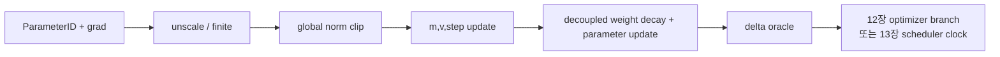

# 11장. SGD에서 AdamW까지

2장이 넘긴 `GoldenBatchID`의 gradient는 아직 학습 결과가 아니다. 어느 parameter group이 그 값을 소비하고, 몇 바이트의 상태를 소유하며, step 실패 때 무엇을 되돌리는지가 정해져야 비로소 한 번의 학습 갱신이 된다.

이 장에서 말하는 optimizer step은 `optimizer.step()`이라는 Python 호출 하나가 아니다. 실제 경계는 다음과 같다.

> `gradient 생성 → accumulation/reduction → unscale → global finite 합의 → global norm clip → parameter-group 선택 → moment 갱신 → bias correction → decoupled decay → parameter commit → scheduler·scaler commit → checkpoint generation`

앞쪽 항이 틀리면 뒤쪽 수식이 정확해도 잘못된 weight가 만들어진다. 반대로 loss가 튀었다고 AdamW부터 의심하면, denominator·rank 합의·scheduler clock처럼 optimizer 바깥에서 생긴 원인을 놓친다. 그러므로 이 장은 한 번의 update를 **입력 확정**, **수치 변환**, **원자적 commit**, **다음 update를 위한 복구 상태**의 네 구간으로 읽는다.

### 한 update의 상태 사슬을 먼저 고정한다

예를 들어 decoder weight \(W\in\mathbb{R}^{d_{out}\times d_{in}}\)의 각 rank-local gradient를 \(G_r\)라 하자. rank \(r\)가 loss **합** \(S_r\)과 유효 target-token 수 \(N_r\)를 소유한다면, token 평균을 계약으로 삼은 data-parallel gradient는 개념적으로

\[
G=\frac{\sum_r \nabla_W S_r}{\sum_r N_r},\qquad G\in\mathbb{R}^{d_{out}\times d_{in}}
\]

이다. 여기서 collective가 이미 rank별 평균을 더했다면 world size를 다시 나누는지, 각 rank의 \(N_r\)가 다른데 local mean을 단순 평균하는지에 따라 \(G\)가 달라진다. 이 차이는 AdamW가 고칠 수 없다. `loss_sum`, `valid_count`, reduction 연산과 최종 denominator를 `UpdateID` 하나로 묶어야 “같은 gradient를 비교했다”는 문장이 성립한다.

mixed precision에서는 backward 직후 buffer가 \(sG_r\)일 수 있다. accumulation이 끝난 뒤 정확히 한 번 \(s\)로 나누고, 모든 rank가 gradient와 norm에 유한하지 않은 값이 없는지 합의한다. 그다음 global norm

\[
\lVert G\rVert_2=\sqrt{\sum_{p\in\mathcal D}\sum_i G_{p,i}^2}
\]

을 계산한다. \(\mathcal D\)는 “현재 rank가 보유한 tensor”가 아니라 clip 정책이 정의한 logical parameter domain이다. FSDP shard는 각 원소를 한 번씩, replicated parameter는 중복 없이 세어야 한다. 임계값 \(c\)가 있으면 \(\alpha=\min(1,c/(\lVert G\rVert_2+\epsilon_c))\), \(G'=\alpha G\)를 만든다. rank-local norm으로 각각 clip하거나 scaled gradient를 먼저 clip하면 Adam의 moment가 애초에 다른 입력을 기억한다.

finite 합의가 참일 때만 parameter group \(q(p)\)가 \(G'_p\)를 소비한다. 한 parameter \(p\)의 상태 shape는 기본적으로 다음처럼 맞아야 한다.

| 상태 | 전형적 shape | 소유자와 의미 | commit 때 바뀌는 조건 |
|---|---:|---|---|
| parameter \(\theta_p\) | parameter shape | model/shard가 소유하는 학습 결과 | finite 합의와 update 승인이 모두 참 |
| gradient \(g_p\) | parameter 또는 shard shape | backward·reduction·unscale·clip의 출력 | accumulation window마다 재생성 |
| `exp_avg` \(m_p\) | parameter state shape | first-moment 저역통과 상태 | 해당 parameter가 실제 update될 때 |
| `exp_avg_sq` \(v_p\) | parameter state shape | squared-gradient scale 상태 | 해당 parameter가 실제 update될 때 |
| `max_exp_avg_sq` | parameter state shape | AMSGrad일 때만 존재하는 최대 second moment | AMSGrad update가 commit될 때 |
| optimizer `step` | scalar 또는 parameter별 scalar tensor | bias-correction clock | 성공한 update의 의미에 맞춰 증가 |
| loss scaler | scalar와 growth tracker | scaled gradient 표현 범위 제어 | finite/overflow 관측 뒤 scaler 정책대로 변화 |
| scheduler | group별 base/current LR와 clock | 다음 또는 현재 update의 learning rate | recipe가 정한 성공-update 경계에서 변화 |

기본 AdamW의 수치 변환은 이 확정된 \(g_t\)에 대해

\[
m_t=\beta_1m_{t-1}+(1-\beta_1)g_t,
\qquad
v_t=\beta_2v_{t-1}+(1-\beta_2)g_t^2
\]
\[
\hat m_t=\frac{m_t}{1-\beta_1^t},
\qquad
\hat v_t=\frac{v_t}{1-\beta_2^t},
\qquad
u_t=\frac{\hat m_t}{\sqrt{\hat v_t}+\epsilon}
\]

로 읽을 수 있다. decoupled decay와 adaptive delta를 분리하면

\[
\Delta\theta_{decay}=-\eta_t\lambda_q\theta_{t-1},
\qquad
\Delta\theta_{adam}=-\eta_t u_t,
\qquad
\theta_t=\theta_{t-1}+\Delta\theta_{decay}+\Delta\theta_{adam}.
\]

구현은 이 식을 대수적으로 재배열하거나 fused kernel 안에 합칠 수 있다. 따라서 Python 줄 순서를 device의 commit 순서라고 단정하지 않는다. 대신 고정 gradient fixture에서 `m`, `v`, correction, decay delta, adaptive delta와 최종 parameter를 각각 대조한다. overflow라면 parameter·moment·optimizer step 중 어느 것도 절반만 움직여서는 안 된다. scaler의 감소와 data cursor 전진은 별 상태 소유자의 정책이며, optimizer commit과 같은 것으로 뭉뚱그리지 않는다.

### 옵션은 숫자가 아니라 상태 전이를 바꾼다

AdamW 옵션을 읽을 때는 “무슨 값을 넣는가”에서 멈추지 않고 **어느 state를 바꾸는가 → 어떤 관측값이 달라지는가 → 어떤 실패와 혼동되는가**를 잇는다.

| 옵션·선택 | 직접 바뀌는 상태/경로 | 기대 효과 | 대표 위험 | 먼저 볼 관측 |
|---|---|---|---|---|
| `lr` | adaptive·decay delta, group current LR | update 크기 조절 | scheduler off-by-one, 작은 dtype에서 update 소실 | group LR, 두 delta norm, update/weight ratio |
| `betas` | moment 기억 길이와 bias correction | noise 완화·척도 추적 | batch/token 시간축 변경 뒤 기억 길이 불일치 | moment RMS, correction, successful-update clock |
| `eps` | denominator의 하한 | 작은 second moment 좌표 안정화 | epsilon 지배 좌표의 학습 정지, sqrt 안/밖 구현 차이 | \(\sqrt{\hat v}\) quantile과 eps 비율 |
| `weight_decay` | parameter 직접 수축 경로 | data gradient와 분리된 shrink | no-decay 분류 오류, LR schedule에 따른 누적 수축 변화 | decay/adaptive delta 분리, group manifest |
| `amsgrad` | `max_exp_avg_sq` buffer 추가 | denominator의 과거 최대값 기억 | state bytes·checkpoint schema 증가 | buffer 단조성, resume 다음 update |
| `maximize` | data-gradient 부호 | ascent objective | decay 부호까지 뒤집는 잘못된 wrapper | zero-gradient decay fixture, delta 부호 |
| `foreach` | tensor-list dispatch와 temporary | launch/host overhead 감소 가능 | peak memory 증가, mixed device/dtype 재그룹화 | actual dispatch, peak memory, launch 수 |
| `fused` | fused primitive·AMP 입력 경로 | pointwise 연산 fusion | unsupported fallback, overflow 반쪽 commit | kernel trace, `found_inf`, state parity |
| `capturable` | step/LR의 device 표현과 host 의존 | CUDA Graph replay 가능성 | graph 밖 scheduler가 stale LR 공급 | step·LR tensor, replay parity, graph break |
| `differentiable` | optimizer update의 autograd 경계 | higher-order gradient | saved state·in-place·memory 증가 | outer gradient oracle, retained graph bytes |

`gradient=None`은 이 표 밖의 중요한 사건이다. 명시적인 zero gradient는 “관측값이 0”이지만 `None`은 “이 parameter가 이번 update 경로에 참여하지 않음”을 뜻할 수 있다. state 생성, step 증가와 decay 적용 여부가 구현마다 갈릴 수 있으므로 conditional expert·동결 해제·adapter에서는 둘을 별 fixture로 둔다.

### 분산 denominator와 parameter group을 같은 원장에서 본다

parameter group은 단순한 hyperparameter dictionary가 아니다. `ParameterID → logical shape → global slice → owner rank → gradient denominator domain → group → state shard → checkpoint key`를 연결하는 소유권 원장이다. 이 연결이 끊기면 다음과 같은 오류가 모두 “optimizer가 불안정하다”는 같은 loss 곡선으로 보일 수 있다.

- rank마다 유효 token 수가 다른데 local mean을 동일 가중치로 평균한다.
- tied embedding과 output head의 같은 storage가 두 group에 들어가 decay 또는 update를 두 번 받는다.
- FSDP flatten 뒤 Python parameter 순서가 바뀌어 같은 shape의 다른 layer에 moment가 복원된다.
- world size를 바꿨는데 logical range가 아니라 old rank position을 기준으로 state shard를 나눈다.
- scheduler는 group list 위치로 LR을 복원하고 optimizer는 새 group 순서를 사용한다.

따라서 분산 one-step reference는 최종 loss만 비교하지 않는다. 먼저 각 rank의 `loss_sum/valid_count`로 global denominator를 재구성한다. 이어 unscale·clip 뒤 logical full gradient digest를 비교한다. 그 값이 같을 때만 full `m`, `v`, decay/adaptive delta와 parameter를 재조립한다. gradient부터 다르면 data partition·denominator·reduction 문제이고, gradient는 같은데 moment부터 다르면 group·dtype·state mapping 문제이며, state까지 같은데 parameter만 다르면 commit·cast·kernel 문제다.

**resume·world-size·mixed precision을 증상으로 구분하지 않는다**

재개 직후 loss가 튀었다는 증상만으로 원인을 고를 수 없다. 다음 표는 같은 **next gradient tape**를 넣어 최초로 갈라지는 상태를 찾는 순서다.

| 최초 차이 | 우선 의심할 경계 | 분리 실험 | 필요한 증거 |
|---|---|---|---|
| backward gradient 이전 | data cursor, RNG, model weight | checkpoint와 연속 run에 같은 batch·RNG 주입 | BatchID, RNG digest, pre-update parameter hash |
| unscale 뒤 gradient | scaler 복원, 중복/누락 unscale | scaler만 정상/초기화한 paired run | scale, growth tracker, pre/post-unscale digest |
| clip 뒤 gradient | global norm domain, rank collective | logical full gradient로 reference norm 계산 | rank squared-sum, clip coefficient, group membership |
| rank별 commit 결정 | finite 합의 collective | 한 rank에만 Inf 주입 | rank별 found-inf와 successful UpdateID |
| moment 또는 step | ParameterID mapping, lazy state, optimizer clock | 같은 gradient로 state-only next-step replay | state key·shape·dtype·hash, correction factor |
| LR·decay delta | scheduler restore/호출 순서, group reorder | 재개 전후 다음 두 LR을 golden sequence와 비교 | base/current LR, scheduler clock, GroupID |
| world-size 변경에서만 | reshard range, padding, owner mapping | logical tensor로 old/new topology state 재조립 | global range, old/new owner, padding disposition |
| fused/foreach에서만 | dispatch·precision·AMP integration | single-tensor oracle와 같은 gradient tape 비교 | resolved backend, kernel trace, error budget |

resume가 성공했다는 기준은 파일이 load되었다는 사실이 아니다. 동일한 다음 gradient를 적용했을 때 연속 실행과 재개 실행의 parameter, moments, successful-update clock, scaler와 scheduler가 정한 허용 오차 안에서 같은가가 기준이다. world size가 달라지면 byte 위치가 아니라 logical parameter와 global slice의 의미를 보존해야 한다. 그 변환 증거가 없다면 자동으로 0 moment를 채우기보다 “연속 resume 불가”로 거부하는 편이 정확하다.

**현장에서 쓰는 최소 관측 묶음**

모든 tensor를 매 step 기록하면 관측 자체가 학습을 바꾼다. 대신 bounded group·role 집계와 낮은 cadence의 offline snapshot을 나눈다. 온라인에는 `attempt`, `successful UpdateID`, consumed token, group LR, loss scale, found-inf, pre/post-clip global norm, clip coefficient, gradient RMS, moment RMS, update RMS, weight RMS, decay/adaptive delta norm과 actual dispatch를 둔다. 장애 step의 offline artifact에는 representative ParameterID별 gradient·state·delta hash와 rank owner를 남긴다.

이 원장을 읽는 순서는 일정하다. gradient 유무와 finite 합의를 먼저 보고, clipping으로 optimizer 입력이 얼마나 바뀌었는지 본다. 다음으로 moment와 denominator를 보고, 마지막에 LR·decay가 만든 parameter delta를 본다. loss 하나에서 곧장 learning rate를 낮추는 대신 최초 불변식 위반을 찾는 순서다. 이후 절의 SGD, AdamW, Muon 비교와 CUDA dispatch·checkpoint 검증은 모두 이 상태 사슬 위에 놓인다.

## 11.1 AdamW를 한 좌표의 상태 기계로 읽는다

AdamW는 공식을 한 줄 외워서는 디버깅할 수 없다. 한 parameter 좌표에서 gradient, 1·2차 moment, bias correction, decay와 parameter delta가 어떤 순서로 commit되는지부터 닫는다.

### 같은 gradient인데 궤적이 달라지는 이유

SGD는 `θ←θ−ηg`다. 좁고 굽은 골짜기에서는 큰 곡률 축의 부호가 번갈아 바뀌어 전진보다 진동에 step을 쓴다. momentum은 `m_t=βm_{t-1}+(1-β)g_t`를 저장해 일관된 방향을 남긴다. Adam은 여기에 `v_t=β₂v_{t-1}+(1-β₂)g_t²`를 더해 좌표별 단위를 바꾼다. 여기서 `v`는 분산의 불편추정량이 아니라 제곱 gradient의 지수이동평균이다.

초기 `m_0=v_0=0`의 축소는 `m̂=m/(1-β₁^t)`, `v̂=v/(1-β₂^t)`로 보정한다. `step`을 checkpoint에서 잃으면 parameter가 같아도 보정률이 달라져 다음 delta가 달라진다.

### 구현에서 식이 갈라지는 지점

PyTorch `torch/optim/adamw.py`의 `AdamW.step`은 parameter group을 순회해 gradient가 있는 tensor와 `exp_avg`, `exp_avg_sq`, `state_steps`를 모은 뒤 함수형 `adamw`로 넘긴다. `foreach`, `fused`, `capturable`, `differentiable`은 같은 이름의 optimizer 안에서 실행 경로와 step tensor의 위치를 바꾼다. `capturable=True`는 CUDA graph 안에서 읽을 수 있도록 step과 학습률의 host 의존을 제한한다. `differentiable=True`는 optimizer step 자체를 autograd 그래프에서 추적하므로 in-place와 메모리 계약이 달라진다.

### epsilon과 weight decay

**epsilon은 영 나눗셈 방지용 상수만이 아니다**

`m̂/(sqrt(v̂)+ε)`와 `m̂/sqrt(v̂+ε)`는 작은 gradient 영역에서 다르다. 전자는 `sqrt(v̂)≪ε`일 때 분모가 `ε`, 후자는 `sqrt(ε)`에 가까워진다. 따라서 checkpoint를 다른 구현으로 옮길 때 `eps` 숫자만 비교해서는 안 되고 위치까지 manifest에 기록해야 한다.

**AdamW가 decay를 gradient에서 떼는 이유**

L2 penalty를 Adam gradient에 섞으면 좌표별 preconditioner가 regularization까지 재척도화한다. AdamW는 먼저 `θ←(1−ηλ)θ`를 적용하고 adaptive update를 더한다. bias와 normalization scale을 no-decay group으로 분리하는 관행은 자동 진리가 아니다. group 분류 함수가 이름 문자열에 의존하면 새 module 이름 하나로 decay 대상이 바뀔 수 있다.

**parameter group과 상태 바이트**

**manifest가 소유해야 하는 것**

각 group에는 parameter의 안정적 이름, shape, dtype, numel, `requires_grad`, optimizer 종류, lr, betas, eps, decay, state dtype과 owner rank를 기록한다. BF16 parameter에 FP32 master weight와 `m`, `v`를 두면 parameter당 대략 14 bytes(BF16 2 + gradient 2 + master 4 + 두 moment 8)가 필요하다. gradient를 FP32로 두거나 sharding하면 숫자가 달라진다.

**갱신 전후 invariant**

한 group의 예상 delta를 `decay_delta + update_delta`로 따로 checksum한다. gradient가 `None`인 parameter는 step과 decay가 적용되는지 구현별로 확인한다. AMP에서는 `unscale_→finite 검사→clip→step→update scaler` 순서를 어기면 overflow batch가 momentum을 오염시킬 수 있다.

**동일 loss surface 비교**

**통제 실험**

2차원 quadratic `L=1/2(100x²+y²)`에서 SGD, momentum, AdamW를 같은 시작점과 gradient 호출 횟수로 비교한다. 비교 대상은 최종 loss 하나가 아니라 축별 이동량, update/gradient cosine, effective step `|Δθ|/|θ|`, state bytes다. learning rate를 같게 두는 것은 공정한 비교가 아니다. 각 방법의 안정 범위를 먼저 찾고 동일 gradient budget에서 비교한다.

**디깅과 handoff**

loss가 평평하면 첫째 `grad_norm`, 둘째 unscale 뒤 finite 여부, 셋째 group별 `update_norm`, 넷째 실제 바뀐 parameter checksum을 본다. gradient는 정상인데 delta가 0이면 lr·frozen flag·overflow skip·scheduler 순서를 의심한다.

**AdamW 한 step을 숫자로 검산한다**

한 scalar parameter `θ=2`, gradient `g=0.1`, `β₁=0.9`, `β₂=0.999`, `lr=0.01`, `weight_decay=0.1`, `ε=10⁻⁸`을 생각하자. 첫 step의 moment는 `m=0.01`, `v=0.00001`이다. bias correction 뒤에는 `m̂=0.1`, `v̂=0.01`이므로 adaptive direction은 거의 1이다. decoupled decay는 parameter를 `2×(1−0.001)=1.998`로 먼저 줄이고 adaptive update `0.01`을 빼서 약 `1.988`을 만든다. 반면 loss에 L2 gradient `λθ=0.2`를 더한 Adam은 gradient `0.3`을 adaptive denominator로 다시 나누므로 첫 step 방향의 크기가 거의 1로 정규화된다. 두 방식은 이름만 다른 regularization이 아니라 다른 동역학이다.

두 번째 step에서 gradient 부호를 `−0.1`로 바꾸면 차이가 더 잘 보인다. momentum에는 첫 gradient가 남고, second moment는 두 방향의 크기를 누적한다. 이때 checkpoint가 `step`이나 `exp_avg`를 잃으면 parameter byte가 맞더라도 다음 update는 재현되지 않는다. 독자는 저장 전후에 parameter checksum만 비교하지 말고 `(step,exp_avg,exp_avg_sq)`를 함께 비교해야 한다.

## 11.2 PyTorch AdamW의 실행 분기와 상태 소유권

수식이 같아도 foreach·fused·capturable·differentiable 분기는 state 배치와 kernel 경로를 바꾼다. 공개 API에서 functional 구현까지 consumer를 따라간다.

PyTorch의 고정 소스에서 `AdamW.step`은 먼저 closure를 선택적으로 실행하고 각 parameter group에 대해 `_init_group`을 호출한다. 이 함수는 gradient가 존재하는 parameter만 `params_with_grad`에 넣고 moment tensor와 step tensor를 준비한다. 이후 함수형 `adamw`가 `foreach`, `fused`, 단일 tensor 경로 가운데 하나를 고른다. 따라서 “AdamW를 썼다”는 기록만으로 실제 kernel 수, peak memory, graph capture 가능성을 알 수 없다.

짧게 재구성하면 호출의 핵심 모양은 다음과 같다.

```python
params, grads, exp_avgs, exp_avg_sqs, steps = collect(group)
adamw(params, grads, exp_avgs, exp_avg_sqs, steps,
      foreach=group["foreach"], fused=group["fused"],
      capturable=group["capturable"], differentiable=group["differentiable"],
      lr=group["lr"], betas=group["betas"], eps=group["eps"],
      weight_decay=group["weight_decay"])
```

이 코드는 원문 전체가 아니라 소유권만 설명하도록 축약했다. `foreach=True`는 tensor list를 한꺼번에 처리해 launch 수를 줄이지만 중간 tensor list만큼 peak memory가 늘 수 있다. `fused=True`는 수직·수평 fusion을 더 밀어 넣으며 지원 device·dtype에 제약이 있다. `maximize=True`는 gradient 부호를 뒤집어 ascent를 수행한다. `amsgrad=True`는 `max_exp_avg_sq`라는 세 번째 장기 상태를 추가하고 denominator가 지금까지의 최대 second moment를 사용하게 한다. 옵션 하나가 checkpoint schema와 state bytes를 바꾸는 사례다.

`capturable=True`에서는 step counter와 일부 scalar가 device tensor로 유지되어 CUDA graph가 host 값을 읽지 않아도 된다. 이 경로에서 Python float lr이 허용되는 조건은 backend와 조합에 따라 다를 수 있다. `differentiable=True`는 step을 `no_grad` 바깥에서 수행해 meta-learning처럼 optimizer를 미분할 수 있게 하지만 saved tensor와 in-place 제한이 늘어난다. 둘을 “성능 옵션”으로 묶지 않는다.

### parameter group을 코드로 감사한다

모델 생성 직후 모든 parameter에 안정적인 logical name과 semantic role을 붙인다. 이름 substring만으로 bias와 norm을 찾는 대신 module type, parameter field, tied storage를 확인한다. 다음 검사는 optimizer 생성 직후 실패해야 한다.

```python
expected = {id(p) for p in model.parameters() if p.requires_grad}
assigned = [id(p) for g in optimizer.param_groups for p in g["params"]]
assert len(assigned) == len(set(assigned)), "parameter appears twice"
assert set(assigned) == expected, "trainable parameter omitted"
```

중복 parameter는 두 번 update될 수 있고, 누락 parameter는 gradient가 정상인데도 영원히 움직이지 않는다. tied embedding과 LM head는 서로 다른 이름으로 열거되더라도 같은 object 또는 storage인지 확인한다. flatten·shard wrapper 적용 뒤에는 Python object ID가 달라질 수 있으므로 logical tensor ID와 global slice를 사용한다.

manifest 한 행에는 적어도 `logical_name`, `role`, `shape`, `numel`, `parameter_dtype`, `gradient_dtype`, `state_dtype`, `optimizer_family`, `group_index`, hyperparameter, owner rank, tied group을 기록한다. 이 표에서 group별 state bytes를 계산하면 OOM을 optimizer 선택 전에 예측할 수 있다. AdamW의 두 FP32 moment만 계산하고 master weight·gradient·temporary foreach list를 빼면 실제 peak를 과소평가한다.

### AdamW와 Muon을 공정하게 비교하는 계약

Muon 비교에서 가장 흔한 오류는 두 optimizer에 같은 learning rate를 넣고 승패를 선언하는 것이다. AdamW update는 좌표별 second moment로 정규화되고, Muon은 matrix update의 singular spectrum을 변환한다. learning rate 숫자의 단위가 같지 않다. 공정한 비교는 동일한 데이터 순서, token budget, model initialization, scheduler family, weight-decay 적용 대상, gradient clipping, precision을 고정한 뒤 각 optimizer의 안정적인 lr 범위를 사전에 탐색한다.

비교 manifest에는 최소 세 실험군이 필요하다. A는 전체 AdamW, B는 hidden transform matrix에 Muon·나머지에 AdamW, C는 B와 같지만 Muon 적용 범위를 shape-only 규칙으로 넓힌 위험 대조군이다. C에서 embedding·router가 불안정해지면 “Muon이 나쁘다”가 아니라 semantic grouping의 필요성을 확인한 것이다.

각 step에서 기록할 값은 training loss와 validation loss만이 아니다. group별 `||g||₂`, `||Δθ||₂`, `||θ||₂`, update/gradient cosine, update/weight ratio, matrix update의 상위·하위 singular value, Newton–Schulz residual, optimizer state bytes, collective bytes, step wall time을 기록한다. divergence는 최초 non-finite tensor와 최초 허용 범위를 넘은 update ratio로 정의한다. 최종 benchmark 점수만 보면 불안정이 언제 시작됐는지 알 수 없다.

## 11.3 AdamW와 Muon을 같은 비교 좌표에 놓는다

Muon을 최신 optimizer라는 이름으로 비교하지 않는다. 어느 tensor에 적용하며 어떤 정규직교화·scale state를 만들고 AdamW fallback과 어떻게 나누는지 같은 좌표에서 본다.

KellerJordan/Muon commit `f98f1cacc0263b04290753e32be8d498c1efc806`의 `muon.py:5–31`은 `zeropower_via_newtonschulz5`를, `34–41`은 momentum과 Nesterov를 적용하는 `muon_update`를, `44–96`은 parameter 선택과 분산 owner/all-gather 경로를 담는다. `MuonWithAuxAdam`은 같은 파일 `138–229`에서 Muon 대상과 보조 Adam 대상을 명시적으로 분리한다. 이 좌표들은 알고리즘 설명과 parameter scope 설명을 분리해 읽게 한다.

핵심 반복은 다음처럼 요약할 수 있다.

```python
X = G.to(torch.bfloat16)
if X.size(0) > X.size(1):
    X = X.T
X = X / (X.norm() + eps)
for _ in range(ns_steps):
    A = X @ X.T
    X = a * X + (b * A + c * A @ A) @ X
return X.T if transposed else X
```

여기서 transpose는 결과 shape를 보존하기 위한 실행 선택이고, BF16 변환은 exact polar decomposition이 아니라 근사·성능 계약이다. `ns_steps`를 늘리면 반드시 더 좋은 학습이 되는 것이 아니다. polynomial 계수와 정규화가 가정한 안정 영역, 저정밀 rounding, 추가 matmul 비용을 함께 본다.

nanochat commit `92d63d4e8bb4df75c3b71618f31ddde2378b2bcd`의 `nanochat/optim.py:274–318`에는 AdamW와 Muon tensor의 all-reduce/reduce-scatter 준비가, `362–417`에는 sharded Muon state 계산과 all-gather가 구현돼 있다. `GPT.setup_optimizer`는 `gpt.py:419–457`에서 embedding/head/scalar와 hidden matrix를 나눈다. nanochat의 구현은 Keller 기준 Muon 그대로가 아니라 equilibration, factored second moment, renormalization이 결합된 진화형이므로 두 구현의 숫자를 같은 알고리즘 결과처럼 합치지 않는다.

### 분산 one-step 검산

두 rank 테스트에서는 같은 global batch를 single-rank reference와 정확히 같은 순서로 구성한다. 첫째 각 rank local loss sum과 valid count를 모아 global denominator를 맞춘다. 둘째 gradient reduction 직후 logical full gradient를 재구성해 reference와 비교한다. 셋째 optimizer update 뒤 full parameter를 재구성한다. gradient부터 다르면 optimizer 문제가 아니라 data partition 또는 reduction 문제다. gradient는 같은데 update만 다르면 group assignment, state shard, scale, collective owner를 본다.

Muon owner가 round-robin으로 parameter를 맡고 update 뒤 all-gather하는 구현에서 gradient가 없는 owner도 collective 순서를 맞춰야 한다. 한 rank만 조건문으로 collective를 건너뛰면 다른 rank는 hang한다. non-divisible parameter group에는 padding이 들어갈 수 있으므로 padding tensor가 optimizer state나 checkpoint의 실제 parameter로 노출되지 않는지 검사한다.

world size를 바꿔 resume할 때 group-level state가 parameter 순서와 shape grouping에 묶여 있으면 단순 state dict load가 의미를 보존하지 못한다. 변환기가 없다면 명시적으로 거부하는 편이 조용한 corruption보다 낫다. same-world-size resume, reordered parameter 거부, world-size-change reshard를 서로 다른 test로 둔다.

### 장애 주입과 결정 트리

첫 장애는 optimizer state에서 `step`만 0으로 되돌리는 것이다. 재개 첫 update가 uninterrupted reference와 달라져야 test가 민감하다는 뜻이다. 둘째 한 parameter의 `exp_avg_sq` dtype을 BF16으로 낮춰 작은 gradient 영역의 denominator drift를 관찰한다. 셋째 tied parameter를 두 group에 중복 배정해 assertion이 학습 전 실패하는지 본다. 넷째 Muon matrix 하나를 AdamW group으로 이동해 manifest diff가 artifact ID를 바꾸는지 확인한다.

현장 결정은 다음 순서로 좁힌다.

1. loss가 NaN이면 최초 non-finite가 forward activation인지 unscaled gradient인지 optimizer state인지 찾는다.
2. gradient가 finite인데 parameter가 안 바뀌면 overflow skip, lr=0, 누락 group, frozen flag를 확인한다.
3. update가 지나치게 크면 scheduler clock, bias-correction step, eps 위치, weight-decay scale, Muon norm을 확인한다.
4. single-rank는 맞고 multi-rank만 다르면 global denominator, duplicate reduction, shard mapping, collective order를 확인한다.
5. resume만 다르면 step·moment·scaler·scheduler·parameter order를 저장 직전과 재개 직후 대조한다.
6. throughput만 나쁘면 foreach/fused dispatch, Newton–Schulz matmul, temporary peak, collective overlap을 trace한다.

이 결정 트리는 loss curve만 보고 hyperparameter를 바꾸지 못하게 한다. 원인이 state corruption인데 lr을 낮추면 증상만 늦어진다.

## 11.4 hyperparameter 상호작용을 유효 update로 측정한다

epsilon, decay, clipping과 learning rate는 독립 knob가 아니다. 실제 parameter delta와 update-to-weight ratio를 공통 결과 변수로 삼아 상호작용을 분리한다.

optimizer 비교는 한 옵션씩 바꾸는 작은 격자로 시작한다. AdamW 실험은 `eps∈{10⁻⁸,10⁻⁶}`, decay 적용 집합 `{matrix only, all trainable}`, clipping `{off, global norm 1}`을 조합한다. 모든 조합에서 같은 gradient snapshot을 재생한다. 모델 forward를 다시 실행하지 않고 저장한 gradient를 parameter에 주입하면 data·dropout 변수를 제거해 update 식만 비교할 수 있다. 이 실험의 출력은 parameter별 delta와 moment state이며 loss가 아니다.

작은 gradient parameter에서는 eps가 denominator를 지배하는 시점을 계산한다. `sqrt(v̂)` histogram을 eps와 함께 그려 `sqrt(v̂)<10eps`인 좌표 비율을 group별로 기록한다. eps를 바꾸어도 큰-gradient matrix는 거의 그대로인데 norm scale이나 rare embedding row만 크게 달라질 수 있다. 전체 update norm 하나로 이 현상을 평균내지 않는다.

decay 검사는 gradient를 모두 0으로 만든다. 올바른 decoupled decay 대상은 정확히 `θ(1−lr·wd)`가 되고 no-decay group은 byte가 그대로여야 한다. gradient `None`과 zero tensor를 따로 시험한다. 일부 구현은 gradient가 없는 parameter를 collection에서 제외해 decay도 건너뛸 수 있기 때문이다. 이 차이는 sparse 또는 conditional expert에서 실제 의미를 갖는다.

clipping 검사는 unscaled global gradient norm을 수동으로 계산한다. 두 parameter group을 따로 clip하는 것과 전체를 한 번 clip하는 것은 방향이 다를 수 있다. FSDP shard에서는 local 제곱합을 all-reduce한 전체 norm을 써야 한다. clip 전후 gradient checksum, clip coefficient, optimizer가 실제 읽은 gradient checksum을 이어 저장한다.

### optimizer state checkpoint schema

PyTorch state dict는 parameter object 자체가 아니라 optimizer가 부여한 parameter ID와 param-group 순서에 의존해 state를 연결한다. 모델 코드 리팩터링으로 parameter 등록 순서가 바뀌었는데 이름 mapping 없이 load하면 shape가 우연히 같은 다른 matrix에 moment가 붙을 위험을 검사해야 한다. 최근 name metadata를 활용하더라도 logical name과 shape·role digest를 독립 검증한다.

checkpoint 저장 전 각 state tensor에 `(logical_parameter_id,state_name,shape,dtype,content_hash)`를 만든다. load 뒤 같은 표를 재생성해 누락·추가·교환을 찾는다. state가 lazy initialization되는 optimizer는 아직 gradient를 보지 않은 parameter에 state가 없을 수 있다. 이것을 corruption과 구분하려면 `initialized` flag와 first-seen step을 기록한다.

Muon group state가 여러 동일-shape parameter를 stack한 tensor로 저장되는 구현에서는 stack order가 schema다. parameter 이름 정렬 규칙, padding count, owner rank, world size를 함께 저장한다. 새 모델에서 module 순서만 바뀌었는데 state tensor shape가 같다고 load를 허용하면 momentum이 다른 layer로 이동한다. load 직후 임의 parameter 세 개의 state slice hash를 expected mapping과 비교한다.

async checkpoint 중 optimizer가 다음 step을 시작하면 parameter는 step `t+1`, moment 일부는 `t`, scheduler는 `t+1`인 찢어진 snapshot이 생길 수 있다. snapshot barrier, immutable staging copy, framework가 제공하는 async state capture 가운데 어느 것을 쓰는지 적는다. 파일 write가 비동기라는 말과 state capture가 원자적이라는 말은 다르다.

### 수렴과 속도를 함께 읽는 대시보드

AdamW와 Muon의 step wall time만 비교하면 optimizer가 모델 전체 시간에서 차지하는 비율을 놓친다. 한 step을 dataloader, forward, backward, gradient collective, optimizer compute, optimizer collective, checkpoint로 분해한다. Muon Newton–Schulz matmul이 길어져도 다른 collective와 overlap되면 critical path 증가는 작을 수 있고, 반대로 짧은 host dispatch가 graph capture를 깨뜨리면 큰 공백이 생길 수 있다.

학습 효율은 wall-clock validation loss와 소비 token validation loss를 둘 다 본다. 더 빠른 optimizer가 token당 효율은 낮지만 시간당 효율은 높을 수 있다. state memory 절감이 microbatch 증가를 허용하면 optimizer 단독 비교를 넘어 system-level batch가 달라진다. 이 경우 기존 비교와 별도로 “같은 hardware 최대 처리량” 실험으로 이름 붙인다.

대시보드의 group별 panel은 lr, decay multiplier, gradient RMS, update RMS, weight RMS, update/weight ratio, non-finite count, state bytes를 같은 x축에 둔다. matrix group에는 singular-value summary와 orthogonalization residual을 더한다. embedding/head/scalar panel을 숨기면 hybrid optimizer의 절반을 보지 못한다.

validation regression이 생겼을 때 최종 loss만으로 optimizer를 기각하지 않는다. data order·scheduler clock·parameter grouping이 같은지 manifest diff를 먼저 확인한다. 그다음 training loss per token, update scale, overfit gap을 본다. Muon 대상에서 제외해야 할 elongated projection이나 router가 섞였는지 확인한다. Qwen 계열 공개 보고처럼 “2D인가”보다 “실제로 hidden transform인가”가 적용 조건이다.

## 11.5 수치 fixture와 재현 패킷으로 구현을 반증한다

optimizer 검증은 loss 감소가 아니라 손 계산 가능한 좌표, state_dict 왕복과 backend parity로 구성한다.

unit test 첫 묶음은 식이다. scalar AdamW 첫 두 step을 double precision reference와 비교하고, zero-gradient decay, AMSGrad max state, maximize 부호, eps 위치를 검증한다. Muon은 zero matrix, rank-one, tall/wide, transpose roundtrip, NS iteration별 finite와 output shape를 시험한다. exact SVD polar와의 차이는 작은 FP64 matrix에서만 diagnostic으로 쓴다. 실용 BF16 다섯 반복이 exact polar와 같다고 요구하지 않는다.

두 번째 묶음에서는 저장한 optimizer가 같은 업데이트를 이어 가는지 확인한다. save/load 직후의 다음 step을 비교하고, parameter 순서가 바뀌거나 tied parameter가 중복되면 즉시 거부해야 한다. lazy state와 scaler overflow가 있어도 state가 부분적으로 전진해서는 안 된다. 세 번째 묶음은 이를 분산 환경으로 넓혀 1-rank와 N-rank의 한 step, missing gradient, group padding, owner failure, collective timeout을 차례로 주입한다. 마지막으로 고정 shape에서 실제 dispatch backend, kernel 수, 임시 memory와 collective bytes를 기록한다. hardware가 다르면 절대 실행 시간을 같은 threshold로 비교하지 않는다.

테스트 결과에는 `UpstreamTested`, `LocallyExecuted`, `Proposed`를 표시한다. Keller commit의 `tests`가 Newton–Schulz 계수와 오류를 검사한다고 해서 이 책의 model grouping과 checkpoint reshard까지 upstream이 검증한 것은 아니다. 반대로 로컬 GPU가 없어 실행하지 못한 분산 장애 주입을 성공 사례처럼 쓰지 않는다.

### 독자가 남겨야 할 최종 기록

이 장을 마친 독자의 산출물은 optimizer 이름 한 줄이 아니다. 첫째 parameter가 정확히 한 group에 속한다는 partition report, 둘째 각 group의 식과 hyperparameter, 셋째 한 gradient snapshot의 expected delta, 넷째 state byte와 owner, 다섯째 checkpoint mapping, 여섯째 실제 또는 제안된 test 결과가 있어야 한다.

실험표의 각 행에는 변경한 단 하나의 변수, 유지한 workload 조건, 기대 state diff, 관측 metric, 실패 판정을 적는다. “loss가 좋아 보임”은 판정이 아니다. 예를 들어 `fused=False→True`는 parameter delta tolerance와 state checksum은 유지하고 kernel dispatch와 temporary memory만 달라져야 한다. `AdamW→Muon hybrid`는 matrix delta와 state schema가 달라지지만 embedding group은 AdamW reference와 같아야 한다.

이 기록을 15장에 넘기면 sharding 전 logical state와 sharding 후 physical owner를 연결할 수 있다. manifest가 없다면 메모리 절감 수치도, checkpoint reshard도, optimizer collective 중복 여부도 추적할 기준이 없다.

### AdamW–Muon 비교 워크시트

마지막으로 비교를 한 장의 실행 순서로 고정하자. 준비 단계에서는 model initialization checksum, train/eval DocumentID 목록, tokenizer와 batch manifest를 복사한다. AdamW와 hybrid Muon run은 이 입력을 읽기 전에는 optimizer를 만들지 않는다. parameter group 생성 결과가 기대 manifest와 다르면 run을 시작하지 않는다. 이 선행 실패가 있어야 코드 리팩터링으로 grouping이 바뀐 실험을 기존 곡선에 덧붙이지 않는다.

step 0에서는 forward/backward를 한 번만 수행해 gradient snapshot을 만든다. snapshot에는 logical parameter ID, gradient shape·dtype·hash, global loss numerator와 denominator가 들어간다. 이 gradient를 별도 model copy 두 개에 재생해 AdamW와 Muon의 순수 update를 비교한다. embedding/head처럼 둘 다 AdamW인 control group의 delta는 같아야 한다. hidden matrix delta는 다르되 각 optimizer의 reference 구현과 맞아야 한다.

step 1–100의 짧은 smoke run에서는 매 step non-finite, update/weight ratio, scheduler clock, peak memory를 기록한다. validation 결과로 optimizer 우열을 선언하지 않고 불안정·계측 오류를 제거한다. step 100 이후의 비교 run에서 사전 정의한 token checkpoint마다 validation을 수행한다. 한 run이 overflow로 update를 skip하면 성공 update 수와 token 수를 모두 보고한다.

실험 종료 뒤에는 세 종류의 차이를 분리한다. algorithmic diff는 같은 gradient에 대한 delta 차이, system diff는 kernel·collective·memory 차이, training diff는 데이터 소비 중 누적된 validation 차이다. algorithmic diff가 예상과 다르면 장기 run 결과를 해석하지 않는다. system diff가 hardware 조건을 바꾸었다면 같은-hardware 최대 처리량 실험으로 별도 분류한다.

결과 표에는 best run만 남기지 않는다. 탐색한 lr·beta·decay 범위, 조기 중단 이유, non-finite 위치를 공개한다. Muon이 특정 matrix에서 실패했다면 그 matrix의 aspect ratio, role, singular spectrum을 기록한다. AdamW가 안정하지만 느렸다면 optimizer compute보다 memory 때문에 microbatch가 줄었는지 확인한다.

재현자는 checkpoint 두 개를 받아 다음 step을 다시 계산할 수 있어야 한다. 따라서 마지막 artifact에는 model·optimizer·scheduler·scaler뿐 아니라 다음 GoldenBatchID와 gradient snapshot을 포함한다. 동일한 다음 step이 나오지 않으면 비교표의 최종 수치보다 먼저 provenance와 state 복구를 고친다.

이 워크시트의 실패 판정은 명확하다. control group delta 불일치, parameter 중복·누락, global denominator 불일치, resume 첫 update 불일치, 분산 logical gradient 불일치 중 하나라도 있으면 optimizer 성능 비교는 무효다. 반대로 loss가 조금 나쁘다는 이유만으로 correctness test가 실패한 것은 아니다. correctness와 optimization quality를 다른 축으로 보고한다.

### 재현 기록 예시

한 실행의 optimizer 기록은 다음처럼 읽혀야 한다. `blocks.0.attn.q_proj.weight`는 hidden transform, shape `[4096,4096]`, BF16 parameter와 FP32 state, Muon group 2, owner DP rank 0이다. 같은 block의 RMSNorm scale은 scalar group 0의 AdamW이며 decay 0이다. token embedding은 2차원이어도 lookup group 1의 AdamW이고 tied head ID를 공유한다. 이 세 행만으로도 “2D면 Muon” 규칙이 왜 틀렸는지 드러난다.

step record에는 lr 하나가 아니라 group별 lr과 decay multiplier가 들어간다. scheduler가 공통 factor를 곱하더라도 base lr이 다르면 실제 값이 다르다. optimizer step이 overflow로 skip된 경우 `attempted_step`과 `committed_step`을 분리하고 scheduler가 어느 counter를 읽었는지 남긴다. 그래야 로그의 step 100이 실제 update 100회인지 알 수 있다.

resume record는 저장 checkpoint hash, load mapping report, 첫 GoldenBatchID, 첫 gradient hash, 첫 delta hash를 가진다. 마지막 둘이 reference와 다르면 loss가 비슷해도 numerical-equivalent 판정을 보류한다. world size가 달라졌다면 sample-exact와 state-reshard 결과를 별도 열로 적는다.

성능 record에는 optimizer kernel trace 구간과 collective 구간을 표시한다. Muon matmul 시간이 늘었지만 all-gather와 overlap됐는지, AdamW foreach temporary가 peak memory를 만들었는지 구분한다. tokens/s 숫자 하나는 원인을 설명하지 않는다.

이 구체적인 행 구조가 다음 장의 입력이다. 병렬화는 optimizer를 새로 정의하지 않고 이 logical state에 physical shard와 collective를 붙인다. logical ID가 안정적이면 DDP, FSDP, TP 조합이 달라도 같은 parameter 역할을 추적할 수 있다.

마지막 검산에서는 manifest를 사람이 읽는 표와 기계가 비교하는 canonical JSON으로 함께 내보낸다. key 순서와 float 직렬화 규칙을 고정해 digest를 만든다. 실험 두 개의 digest가 다르면 어떤 행과 필드가 달라졌는지 diff를 먼저 읽고 loss curve를 연다. 이것이 우연한 설정 drift를 optimizer 효과로 오해하지 않는 가장 싼 안전장치다.

**독자가 직접 실행하는 optimizer 해부 실습**

**실습의 고정 입력**

실습에서는 embedding, RMSNorm, 두 attention projection, gated MLP, tied output head가 들어간 작은 decoder block을 사용한다. 이 모델을 고정하는 이유는 성능을 겨루기 위해서가 아니라, 역할이 다른 parameter가 optimizer manifest에서 어떻게 분류되고 갱신되는지 끝까지 추적하기 위해서다. batch도 난수로 만들지 않는다. token ID, target, loss mask를 고정한 네 sequence에서 loss numerator와 valid token count를 먼저 계산한다. 모든 optimizer run은 같은 initial parameter hash와 FP32 gradient snapshot에서 시작한다.

첫 실행은 forward와 backward까지만 수행하고 optimizer를 호출하지 않는다. parameter마다 logical name, role, shape, dtype, gradient hash와 norm을 저장한다. loss가 token mean이라면 rank별 mean이 아니라 global loss sum과 valid count를 기록한다. tied embedding/head가 두 이름으로 열거되더라도 storage identity는 하나라는 사실을 manifest에 표시한다. gradient가 없는 parameter도 누락하지 않고 `None` 상태로 남긴다.

두 번째 실행은 저장 gradient를 새 model copy에 주입한다. 이렇게 하면 dropout, data order, kernel reduction 차이를 잠시 제거하고 optimizer 식만 비교할 수 있다. AdamW single-tensor를 FP64 기준선으로 삼고 foreach와 fused 결과를 dtype별 tolerance 안에서 비교한다. Muon hybrid에서는 matrix role만 다른 delta를 허용하고 norm, bias, embedding control group은 AdamW 기준선과 같아야 한다.

**AdamW backend의 선택 지점을 읽는다**

PyTorch 고정 revision의 `torch/optim/adamw.py`에서 읽을 것은 클래스 이름이 아니라 `AdamW.step → _init_group → adamw → _single_tensor_adamw/_multi_tensor_adamw/_fused_adamw`의 dispatch다. line number는 revision과 함께 기록하고, 책의 인용 좌표가 다른 revision에 그대로 적용된다고 가정하지 않는다. `_init_group`은 gradient가 있는 parameter, moment, maximum second moment, step tensor를 모은다. 따라서 `grad is None`과 값이 모두 0인 gradient는 같은 입력이 아니다.

독자는 option matrix를 만든다. 행은 `foreach`, `fused`, `capturable`, `differentiable`, `amsgrad`, tensor learning rate이고 열은 지원 device/dtype, state 위치, graph capture, temporary bytes, 실제 선택 함수다. invalid 조합은 fallback인지 명시적 error인지 작은 실행으로 확인한다. profiler에서 함수 이름이 기대 backend와 일치하지 않으면 config만 보고 결과를 분류하지 않는다.

각 backend의 correctness gate는 parameter delta와 state다. 첫 step 뒤 `exp_avg`, `exp_avg_sq`, `step`, 선택적으로 `max_exp_avg_sq`를 FP64 reference와 비교한다. 성능 gate는 별도다. kernel launch 수, optimizer 구간 wall time, allocator peak, graph break를 측정한다. fused가 빠르더라도 delta tolerance를 넘으면 성능표에서 제외하고, single-tensor가 느려도 reference 역할을 잃지 않는다.

**scheduler clock을 숫자로 분리한다**

gradient accumulation이 4이고 microbatch 3에서 overflow가 발생하는 열두 microbatch timeline을 만든다. `MicroStep`, `AccumulationWindow`, `AttemptedOptimizerStep`, `CommittedOptimizerStep`, `SchedulerStep`, `ConsumedTokens`를 서로 다른 열로 둔다. overflow window에서 scaler가 optimizer step을 건너뛰었는데 scheduler만 전진하면 다음 성공 update는 예상보다 작은 learning rate를 받는다.

warmup 4 committed step에서 lr이 `0.25η, 0.5η, 0.75η, η`가 되도록 정의했다고 하자. 두 번째 attempted step이 skip됐을 때 committed clock은 세 번째 attempt에 `0.5η`를 주지만 attempt clock은 `0.75η`를 준다. 두 구현 모두 코드는 실행되므로 run manifest가 어느 clock을 채택했는지 밝혀야 한다. token-based schedule에서는 dynamic packing으로 step당 valid token이 달라져 같은 step 번호도 다른 lr을 뜻한다.

resume test는 scheduler state dict가 로드됐다는 검사로 끝내지 않는다. checkpoint 직전 committed/attempt/token counter와 다음 lr을 저장하고, resume 직후 optimizer가 실제 읽은 group별 lr을 비교한다. parameter group을 추가하거나 순서를 바꾸면 scheduler의 base lr 배열 mapping도 검증한다. 새 adapter group만 warmup을 다시 시작하는 정책이라면 global scheduler와 group-local clock을 구분한다.

## 11.6 optimizer memory와 scale-out 비용을 계산한다

parameter와 moment의 정적 바이트뿐 아니라 master weight, gradient, temporary workspace와 sharding 순간의 peak를 계산한다.

10억 parameter BF16 모델의 숫자를 예로 들자. parameter 2 GB, BF16 gradient 2 GB, FP32 master weight 4 GB, Adam의 FP32 두 moment 8 GB라면 단순 합은 16 GB다. 여기에 activation, allocator fragmentation, foreach tensor list, communication bucket, checkpoint staging은 포함되지 않았다. gradient가 FP32면 2 GB가 더 늘고 master weight를 두지 않는 구현이면 4 GB가 줄어든다. “Adam은 parameter당 8 bytes”는 moment만 센 문장이다.

ZeRO-1은 optimizer state를 DP rank에 나누지만 parameter와 gradient는 복제될 수 있다. ZeRO-2는 gradient도 나누며, ZeRO-3/FSDP full shard는 parameter까지 구간별로 materialize한다. 명목 `16 GB / world_size`를 모든 항에 적용하면 틀린다. 각 항목에 replicated, sharded, transient-all-gather, owner-only label을 붙이고 peak timeline에서 동시에 살아 있는 tensor를 합한다.

실측은 optimizer step 직전 allocator reset, 구간별 allocated/reserved peak, communication buffer와 host offload를 분리한다. CUDA allocator reserved가 tensor live bytes보다 큰 것은 곧 memory leak라는 뜻이 아니다. 반복 step에서 reserved plateau와 live allocation 증가를 구분한다. async checkpoint staging이 겹치는 step은 steady state와 별도 행으로 보고한다.

### 분산 one-step의 여덟 사건

장애 timeline은 사건 순서를 고정한다. `t0` 각 rank가 local loss sum/count를 만든다. `t1` global denominator를 합친다. `t2` backward가 local gradient를 만든다. `t3` reduction 또는 reduce-scatter가 logical gradient를 확정한다. `t4` unscale과 finite 검사를 한다. `t5` global clip coefficient를 계산한다. `t6` owner가 optimizer state를 갱신한다. `t7` 필요하면 parameter를 all-gather하고 commit marker를 쓴다.

rank 1을 `t6` 직전에 죽이면 `t3`까지의 collective가 끝났어도 일부 owner update만 실행될 수 있다. checkpoint나 publication은 모든 owner의 같은 step commit을 확인하기 전에는 성공하면 안 된다. rank 1을 `t3` 도중 죽이면 다른 rank의 timeout이 어느 collective와 parameter bucket에서 발생했는지 남긴다. 재시도가 같은 gradient를 두 번 누적하지 않는지 accumulation buffer ID로 확인한다.

두 rank가 각각 valid token 12와 4를 가질 때 local mean 두 개의 평균은 올바른 global token mean이 아니다. local gradient가 이미 local mean으로 나뉘었다면 단순 all-reduce 뒤 world size로 나누는 관행이 원하는 식과 같은지 유도한다. 가장 명확한 기준선은 local loss sum을 backward하고 global valid count로 gradient를 나누는 것이다. framework가 다른 scaling을 쓴다면 같은 결과임을 작은 fixture로 증명한다.

global clipping도 local norm 평균으로 대체하지 않는다. rank가 소유한 shard의 FP32 제곱합을 all-reduce하고 제곱근을 취한다. clipping 전 full logical gradient와 clipping 후 full logical gradient를 single-rank reference와 비교한다. optimizer delta가 다를 때 이 단계별 checksum이 data/reduction/clip/update 가운데 최초 divergence를 알려준다.

### Muon의 2×2 기하 검산

gradient matrix가 대각 `diag(4,1)`이면 exact polar factor는 두 양수 축 모두 1인 identity다. Adam류 좌표 정규화와 Muon의 matrix orthogonalization이 우연히 비슷해 보일 수 있다. 반면 회전된 비등방 matrix에서는 elementwise second moment와 singular direction 변환이 달라진다. 작은 FP64 matrix에서 SVD `G=UΣVᵀ`를 구해 `UVᵀ`를 reference로 만들고 Newton–Schulz 반복의 residual과 singular value를 비교한다.

zero matrix는 정규화 분모가 0이 되지 않는지, rank-one은 영 singular direction이 finite인지, tall/wide matrix는 transpose 뒤 shape가 복원되는지 시험한다. BF16 실용 경로가 exact SVD와 bitwise 같을 필요는 없다. iteration별 `||XᵀX−I||` 또는 알맞은 rectangular residual, output norm, finite 여부를 기록하고 사전 tolerance를 둔다.

matrix role 선택은 shape test와 분리한다. embedding도 2차원이고 MoE router도 행렬이지만 token 빈도와 gating 의미가 hidden transform과 다르다. A/B 실험은 semantic allowlist와 “모든 2D” 위험 대조군을 함께 둔다. 위험군 실패가 특정 role에서 시작되면 optimizer 전체에 대한 모호한 결론 대신 grouping rule을 수정한다.

### 실행 결과표를 읽는 법

결과 행은 `RunID`, source revision, hardware, parameter manifest digest, data/token digest, optimizer recipe, committed update 수를 가진다. 출력은 validation loss와 wall time만이 아니라 state peak, optimizer critical path, update/weight ratio quantile, non-finite count, collective bytes, resume parity를 포함한다. 여러 seed의 평균에는 seed별 원자료와 interval을 붙인다.

lr 탐색에서 실패한 run을 버리면 비교가 왜곡된다. 탐색 범위, 실패 조건, 소비 token, 최초 비정상 layer를 남긴다. AdamW와 Muon에 동일 lr 숫자를 강요하지 않되 탐색 budget과 선택 규칙은 같게 한다. validation 최저값을 사후 선택했다면 독립 confirmation run이 필요하다.

실행하지 않은 GPU 조합은 빈칸이 아니라 `Proposed`다. upstream unit test를 통과했다면 `UpstreamTested`와 assertion 범위를 쓴다. 이 책에서 작은 CPU/단일 GPU fixture만 실행했다면 `LocallyExecuted` 범위를 과장하지 않는다. source를 읽어 가능한 경로를 확인한 것은 성능·장애 복구를 실행한 증거가 아니다.

독자의 최종 bundle에는 canonical parameter manifest, gradient snapshot, one-step expected delta, optimizer checkpoint, scheduler timeline, memory worksheet, profiler trace, failure event log, 선택 보고서가 들어간다. 이 가운데 하나가 바뀌면 digest와 RunID가 달라진다. 그 결과 optimizer 비교는 이름 대 이름이 아니라 재현 가능한 상태 전이 대 상태 전이의 비교가 된다.

**source와 test 증거표를 만드는 방법**

고정 source 표의 한 행은 claim, repository, commit, file/function, 선택 조건, 직접 확인한 동작, 아직 확인하지 않은 동작을 가진다. 예를 들어 PyTorch `AdamW.step` 좌표는 parameter collection과 함수형 dispatch를 뒷받침하지만 특정 GPU에서 fused가 빠르다는 claim까지 증명하지 않는다. KellerJordan/Muon의 Newton–Schulz 함수는 polynomial과 transpose를 보여주지만 대형 Transformer 수렴을 자동으로 증명하지 않는다.

upstream test도 이름만 세지 않는다. 어떤 input shape/dtype, 어떤 assertion, 어떤 backend를 검사하는지 적는다. zero matrix test가 finite만 검사했다면 exact polar proximity를 검증했다고 쓰지 않는다. save/load test가 같은 process에서만 실행됐다면 parameter reorder, world-size change, partial shard failure는 별도 proposed test다. source 좌표와 test 좌표를 나란히 두면 “코드에 존재함”, “정상 입력에서 검사됨”, “우리 workload에서 실행됨”이 분리된다.

로컬 실행 record에는 command, environment lock, stdout artifact, exit code, profiler trace를 둔다. command를 제공했지만 실행하지 않았다면 runnable example이지 result가 아니다. GPU가 없어 CPU scalar fixture만 실행했다면 수식 검산 범위는 닫히지만 fused dispatch와 NCCL failure는 열려 있다. 독자가 이 경계를 한눈에 보도록 표의 evidence level을 정한다.

**hyperparameter 민감도 지도를 읽는다**

AdamW grid는 lr, beta1, beta2, eps, decay를 한꺼번에 무작위로 바꾸기 전에 축별 역할을 분리한다. 저장 gradient replay에서는 lr·eps·decay가 즉시 delta에 미치는 영향을 보고, 장기 run에서는 moment time constant와 scheduler 상호작용을 본다. `β₂=0.999`의 유효 기억 길이를 단순히 1,000 step이라 말하기보다 gradient regime change 뒤 second moment가 얼마나 느리게 적응하는지 scalar sequence로 그린다.

초기 열 step에서 큰 outlier gradient 하나를 넣으면 beta2와 eps 조합이 이후 작은 gradient update를 얼마나 억제하는지 보인다. clipping을 outlier 전에 적용하는지 moment update 뒤에 적용하는지 식과 code path를 확인한다. 대부분의 optimizer는 clipped gradient를 읽지만 custom fused path를 추론으로 단정하지 않는다. optimizer 입력 gradient checksum을 hook으로 저장한다.

weight decay는 lr scheduler와 곱해져 step별 shrink가 달라진다. token clock이 다른 두 run에서 nominal decay가 같아도 누적 `∏(1−lr_t λ)`가 다르다. 비교표에 cumulative decay factor를 추가한다. batch 크기가 바뀌어 update 수가 줄면 token당 regularization도 달라질 수 있다. decay 값을 그대로 유지하는 관행과 token-equivalent 조정을 별 실험으로 둔다.

Muon은 lr, momentum, Nesterov, Newton–Schulz step, update scale, parameter scope가 주요 축이다. 모든 조합을 넓게 탐색하기 전에 2×2 residual, one-step update ratio, 100-step non-finite smoke gate를 통과시킨다. NS step을 늘려 exact polar에 가까워져도 validation이나 wall time이 반드시 좋아지는 것은 아니다. numerical residual, optimization trajectory, system cost를 서로 다른 열로 둔다.

## 11.7 장애 증상에서 최초 optimizer divergence를 찾는다

loss spike나 throughput 저하를 곧바로 optimizer 탓으로 돌리지 않는다. gradient 입력부터 state commit까지 최초 불일치를 좁힌다.

대규모 run에서는 전체 grad norm만 기록하지 않는다. layer/role별 norm과 update ratio의 robust quantile, non-finite 최초 parameter, optimizer state checksum sample을 둔다. 모든 parameter histogram을 매 step 수집해 stall을 만들지 않도록 빠른 scalar는 자주, full tensor audit은 checkpoint나 의심 step에서 수행한다. sampling 정책도 RunID에 포함한다.

loss spike가 발생한 step의 조사 bundle은 직전 GoldenBatchID, valid denominator, scaler value, clip coefficient, group lr, gradient/update top-k role, collective retry, hardware error event를 가진다. 데이터 outlier, AMP overflow, scheduler jump, shard corruption을 같은 시간축에 놓는다. GPU Xid나 ECC event가 있었다는 이유만으로 자동 원인 판정을 하지 않고 최초 tensor divergence와 맞물리는지 본다.

한 rank의 optimizer step이 느려지면 straggler가 collective 전체를 막는다. rank별 `t3→t6` 구간과 parameter owner를 비교해 특정 state shard, CPU offload page migration, NUMA placement, thermal throttling을 좁힌다. 평균 optimizer time은 tail rank를 숨긴다. p50/p95/max와 slow rank identity를 기록하되 rank label의 cardinality를 통제한다.

checkpoint 전후 state hash audit은 모든 byte를 매번 중앙에 모으지 않는다. logical tensor별 content hash를 rank에서 만들고 manifest root로 합친다. load 뒤 shape/dtype/owner/root를 검증한다. hash가 다르면 먼저 serialization corruption인지 의도한 dtype conversion인지 분리한다. 허용 conversion은 변환기 revision과 오차 report를 가진다.

최종 release 판정은 correctness, numerical stability, optimization quality, system efficiency 네 열이다. one-step parity 실패는 즉시 correctness 실패다. non-finite가 없지만 validation이 목표보다 나쁘면 optimization quality 실패다. 품질은 맞지만 state peak가 장비 한계를 넘으면 system feasibility 실패다. 네 결과를 하나의 “optimizer 성공”으로 압축하지 않는다.

운영자가 hyperparameter를 바꿀 때는 이 네 열 가운데 어느 실패를 해결하려는지 change record에 쓴다. numerical overflow를 고치기 위한 eps·clip 변경과 validation을 높이기 위한 lr 변경은 기대 관측값이 다르다. 변경 전 checkpoint의 같은 GoldenBatch와 gradient snapshot을 재생해 즉시 효과를 확인하고, 장기 효과는 별 confirmation run에서 판정한다. 여러 값을 동시에 바꾸면 어느 state transition이 문제를 해결했는지 알 수 없으므로 긴급 완화와 근본 recipe 변경을 분리한다.

cluster 교체나 framework upgrade도 optimizer 실험이다. 동일 이름의 fused kernel이 새 revision에서 accumulation dtype, supported shape, dispatch threshold를 바꿀 수 있다. source diff, selected backend trace, one-step delta, state load, memory peak를 통과한 뒤 기존 장기 곡선과 연결한다. tolerance 안의 작은 numerical diff가 장기적으로 증폭될 수 있으므로 짧은 replay parity와 일정 token의 behavioral confirmation을 둘 다 남긴다.

### 연습문제와 판정 기준

첫 연습은 scalar AdamW 두 step을 종이로 계산하고 eps를 제곱근 안으로 옮겼을 때 차이를 구하는 것이다. 답에는 parameter만 아니라 moment, bias correction, decay delta가 있어야 한다. 둘째는 zero gradient와 `grad=None`을 실행해 backend별 decay 여부를 기록한다. 셋째는 tied head를 두 group에 넣어 partition assertion이 학습 전에 실패하게 만든다.

넷째는 rank별 valid count가 12와 4인 분산 loss를 구성해 local-mean 평균의 오류를 수치로 보인다. 다섯째는 scheduler attempted clock과 committed clock이 overflow 뒤 언제 갈라지는지 timeline을 그린다. 여섯째는 Muon tall matrix를 transpose하는 경로에서 반환 shape와 residual을 확인한다.

마지막 과제는 동일 gradient snapshot으로 AdamW와 hybrid Muon bundle을 만드는 것이다. control group delta, matrix update spectrum, state bytes, profiler trace, resume 첫 delta를 제출한다. 결과가 어느 optimizer가 더 좋다는 결론을 내지 못해도 괜찮다. 입력과 상태, 실패 범위를 정확히 닫았다면 실습의 correctness 목표는 달성한 것이다.

## 11.8 optimizer 변경의 단일 승인 규범

반복적인 승인 문서는 한 행으로 줄인다. `gradient artifact → parameter-group manifest → one-step delta/state → distributed owner → resume delta`가 같은 revision과 `OptimizerStepID`로 연결되고, correctness·token efficiency·wall time·peak memory를 각각 통과할 때만 후보를 승인한다. 어느 한 열도 다른 열의 개선으로 상쇄하지 않는다.

## 11.9 고정 소스에서 AdamW step을 끝까지 전개한다

이 절은 고정 revision의 source와 한 좌표의 숫자를 결합해 Python parameter group에서 최종 delta까지 읽는다.

PyTorch의 기준 구현은 `https://github.com/pytorch/pytorch/blob/v2.8.0/torch/optim/adamw.py`와 `https://github.com/pytorch/pytorch/blob/v2.8.0/torch/optim/adam.py`를 함께 읽어야 한다. 전자에는 공개 계약과 functional 진입점이 있고, 후자에는 single-tensor·foreach·fused 구현을 선택하는 dispatcher가 있다. `https://pytorch.org/docs/stable/generated/torch.optim.AdamW.html`은 `amsgrad`, `maximize`, `foreach`, `capturable`, `differentiable`, `fused`의 사용자 의미를 정의한다. 문서만 읽으면 각 옵션이 어떤 state와 branch를 추가하는지 놓치고, 코드만 읽으면 지원 범위를 안정된 API라고 오해하기 쉽다.

`capturable=True`는 단순 성능 힌트가 아니다. step counter와 learning rate처럼 갱신 중 읽는 값이 CUDA Graph가 재생할 수 있는 device-side 상태여야 한다. `differentiable=True`는 optimizer step 자체를 autograd graph에 포함해 보통의 `no_grad` 경계를 바꾼다. `foreach`는 parameter별 연산을 tensor-list 연산으로 묶어 launch 수를 줄이지만 intermediate tensor-list만큼 peak memory가 늘 수 있다. `fused`는 더 강한 수평·수직 fusion을 택하되 dtype·device·옵션 조합에 지원 경계가 있다. recipe에는 요청값뿐 아니라 실제 선택 backend를 남긴다.

검증 실험은 같은 parameter와 고정 gradient snapshot을 single-tensor 기준 경로에 한 번 적용하고 foreach·fused 후보의 `parameter delta`, `exp_avg`, `exp_avg_sq`, `step`을 비교한다. 왜 loss만 비교하지 않는가. backend 오류가 작은 delta 차이로 시작해 수백 step 뒤에야 loss로 보일 수 있기 때문이다. 허용오차는 state tensor마다 dtype과 reduction 순서를 반영해 따로 정하고 bitwise 동일성을 무조건 요구하지 않는다.

### 옵션별 상태 전이와 반증 실험

`amsgrad=True`는 `max_exp_avg_sq`를 추가하고 과거 second moment 최대값을 denominator로 사용한다. checkpoint에서 이 tensor를 누락한 채 flag만 복원하면 load 직후부터 다른 optimizer다. `maximize=True`는 목적 함수 부호를 바꾸지만 weight decay 방향까지 반대로 만들지 않는다. `weight_decay=0` negative control은 coupled/decoupled decay 차이를 숨기므로 nonzero parameter와 zero gradient fixture도 함께 둔다. `beta1=0`과 `beta2=0` fixture는 moment 식의 각 항을 격리한다.

디버깅 결정 트리는 최초 불일치 state에서 시작한다. 첫 step부터 parameter만 다르면 decay·maximize·gradient scaling 순서를 본다. `exp_avg`가 다르면 gradient input 또는 beta1, `exp_avg_sq`만 다르면 squared-gradient dtype·beta2, resume 뒤 step-size만 다르면 step counter와 bias correction을 본다. fused에서만 nonfinite면 dtype 지원과 scaler/unscale 경계를, capture에서만 stale하면 host scalar와 device state 소유권을 본다.

분산 실험에서는 logical parameter의 full gradient를 oracle로 저장하고 shard별 optimizer update를 재조립한다. FSDP가 state를 shard하는 경우 state-dict 형식과 reshard planner까지 CheckpointID에 묶는다. rank 하나가 optimizer step 뒤 checkpoint commit 전에 죽는 고장 주입에서는 일부 rank의 새 state와 다른 rank의 옛 state를 섞어 재개하지 않아야 한다. 모든 rank가 같은 OptimizerStepID를 commit했는지 확인한 뒤 다음 장의 matrix optimizer 비교로 넘긴다.

### Adam을 한 좌표의 상태 기계로 전개한다

Adam을 “momentum과 adaptive learning rate의 결합”이라고 기억하는 것만으로는 구현을 감사할 수 없다. 한 parameter 좌표 \(\theta_i\)와 그 gradient \(g_i\)를 고정하고, optimizer가 소유한 이전 상태 \((m_{i,t-1},v_{i,t-1},s_{t-1})\)가 새 상태와 parameter를 만드는 순서를 적어야 한다. 기본 Adam은 \(m_{i,t}=\beta_1m_{i,t-1}+(1-\beta_1)g_{i,t}\), \(v_{i,t}=\beta_2v_{i,t-1}+(1-\beta_2)g_{i,t}^2\)를 만든다. 처음에는 두 moment가 0에서 시작하므로 각각 \(1-\beta_1^t\), \(1-\beta_2^t\)로 보정한다. 이 보정은 장식이 아니다. 첫 step에서 보정하지 않으면 초기 update 크기가 beta 선택에 따라 의도하지 않게 축소된다.

수식을 코드와 맞출 때는 대수적으로 같은 표현이 부동소수점에서는 같은 실행이 아닐 수 있음을 표시한다. 구현 A는 \(m/(1-\beta_1^t)\)와 \(v/(1-\beta_2^t)\)를 각각 만든 뒤 나눌 수 있고, 구현 B는 bias correction을 step size와 denominator에 흡수할 수 있다. epsilon을 제곱근 안에 넣는지 밖에 더하는지도 optimizer 계보에 따라 다르다. 따라서 “Adam 호환”이라는 이름보다 고정 gradient fixture에서 계산된 delta와 state를 기준으로 삼는다. 첫 fixture는 스칼라 parameter, 둘째는 크기가 크게 다른 두 좌표, 셋째는 0 gradient와 nonzero weight decay, 넷째는 sign이 교대하는 gradient로 만든다. 이 네 개면 bias correction, coordinate scaling, decay, moment memory를 각각 드러낼 수 있다.

step counter의 의미도 명시해야 한다. parameter group에 gradient가 하나도 없을 때 counter가 증가하는가, 특정 parameter의 gradient가 `None`일 때 그 parameter state가 생성되는가, gradient가 명시적인 zero tensor일 때는 어떻게 다른가를 시험한다. `None`은 “관측되지 않음”이고 zero는 “관측된 값이 0”이므로 weight decay와 state creation에서 결과가 달라질 수 있다. gradient accumulation 중에는 microbatch마다 optimizer step을 증가시키지 않는다. overflow로 step이 건너뛰어졌다면 scheduler와 optimizer counter가 함께 정지하는지 정책을 고정한다. 이 경계가 모호하면 재개 뒤 learning-rate 위치와 bias correction 위치가 서로 어긋난다.

AMSGrad는 second moment의 시간별 최대값을 별도 state로 보존한다. 직관은 최근 gradient가 작아졌다고 denominator가 급격히 줄어 과거보다 훨씬 큰 유효 step이 생기는 경로를 제한하는 것이다. 그러나 `max_exp_avg_sq`의 존재가 모든 불안정을 제거한다는 뜻은 아니다. epsilon, learning rate, gradient distribution과 precision은 그대로 남는다. 검증은 큰 gradient 한 번 뒤 작은 gradient가 이어지는 fixture로 한다. 일반 Adam의 denominator와 AMSGrad denominator가 언제 갈라지는지, checkpoint 직후에도 그 갈라짐이 유지되는지 본다. state를 FP32에서 다른 dtype으로 변환하면 최대값의 단조성까지 다시 검사한다.

### AdamW의 decoupled decay를 경로로 증명한다

L2 regularization과 decoupled weight decay는 SGD의 단순한 조건에서는 비슷해 보이지만 adaptive preconditioner를 통과하면 같지 않다. loss에 \(\lambda\lVert\theta\rVert^2/2\)를 더하면 gradient에 \(\lambda\theta\)가 섞이고 그 값이 first·second moment에 들어간다. AdamW는 data gradient로 moment를 만든 경로와 parameter를 직접 축소하는 경로를 분리한다. 즉 decay 신호가 \(v_t\)에 흡수되어 좌표별로 다시 스케일되지 않는다. 이것이 “W”가 옵션 이름 이상의 설계 선택인 이유다.

가장 좋은 반증 fixture는 data gradient를 정확히 0으로 두는 것이다. coupled 구현에서는 regularization gradient가 moment를 생성하고, decoupled 구현에서는 moment가 0인 채 parameter만 learning rate와 decay에 따라 축소된다. 두 번째 fixture는 동일한 parameter에 크기가 다른 data gradient를 넣는다. decoupled decay 성분은 gradient 크기와 무관하게 parameter에 비례해야 한다. 세 번째 fixture는 bias와 norm weight를 decay 제외 group에 두어 group manifest가 실제 tensor identity와 맞는지 검사한다. 이름 문자열만으로 분류하면 tied parameter, module rename, flattened parameter에서 조용히 잘못될 수 있다.

실제 update 순서는 문서화해야 한다. parameter decay, moment 갱신, bias correction, adaptive update가 한 kernel에 fusion되면 Python 소스의 줄 순서가 device 연산 순서를 그대로 보여 주지 않는다. 그래서 source branch와 함께 one-step oracle을 둔다. `maximize=True`에서는 data gradient의 부호가 바뀌지만 decay는 여전히 parameter 크기를 줄여야 한다. loss scaling을 쓰면 unscale과 nonfinite 판정 뒤에만 decay와 update가 실행되어야 한다. overflow step에서 parameter가 decay만 적용되고 moment는 멈추는 반쪽 update는 허용하지 않는다.

parameter group은 optimizer의 설정 묶음이면서 checkpoint schema다. 각 group은 learning rate, betas, epsilon, decay, backend option뿐 아니라 stable logical parameter IDs와 정렬 순서를 가진다. 재개할 때 Python list 위치만 믿으면 모델 변환이나 adapter 추가 뒤 state가 다른 parameter에 붙을 수 있다. 이름, shape, dtype, role, shard 좌표를 함께 검증하고 ambiguity가 있으면 자동 복원을 거부한다. 새 parameter를 추가하는 정책은 명시적으로 “fresh state로 추가”, “변환기로 초기화”, “재개 불가” 중 하나다.

**foreach와 fused는 의미가 아니라 실행 계획이다**

single-tensor 경로는 각 parameter에 대해 작은 연산들을 차례로 호출한다. foreach 경로는 같은 종류의 여러 tensor를 tensor-list primitive에 넣어 launch와 Python dispatch를 줄인다. fused 경로는 moment 갱신, bias correction, parameter update의 여러 연산을 더 적은 device kernel 안에 결합한다. 셋은 같은 optimizer 의미를 목표로 하지만 임시 메모리, reduction 순서, 지원 dtype, graph capture 조건이 다르다. 따라서 backend 선택은 성능 설정이면서 검증 대상이다.

foreach의 메모리 비용은 “kernel이 빠르다”는 설명에 가려지기 쉽다. tensor list의 intermediate가 parameter 규모에 비례해 생길 수 있으므로 peak가 빡빡한 학습에서는 작은 group으로 나누거나 single-tensor가 더 실용적일 수 있다. group을 나누면 launch 수와 scheduling이 다시 달라진다. profiler에서는 optimizer 구간의 kernel 시간뿐 아니라 peak allocated/reserved memory, allocator retry, stream synchronization을 함께 본다. step latency가 줄었지만 activation을 위한 여유가 사라져 microbatch를 줄여야 한다면 end-to-end throughput은 나빠질 수 있다.

fused backend는 지원하지 않는 옵션이나 dtype에서 오류를 내거나 다른 경로로 fallback할 수 있다. 요청한 `fused=True`와 실제 kernel dispatch를 분리해 기록한다. source의 dispatcher 조건은 device, dtype, differentiable, capturable, tensor learning rate 같은 입력을 읽을 수 있다. upstream test에서는 옵션 조합이 지원되는지와 reference parity를 확인하고, 로컬 fixture에서는 실제 workload의 group 크기·stride·dtype을 재현한다. upstream의 작은 contiguous tensor PASS를 수십억 parameter의 mixed group으로 확대하지 않는다.

수치 비교는 세 층으로 한다. 첫째 각 state tensor의 one-step·two-step 오차, 둘째 고정된 수십 step gradient tape의 누적 parameter 오차, 셋째 실제 작은 모델의 loss trajectory다. 첫 층이 원인을 가장 잘 격리하고 세 번째가 사용자 영향을 보여 준다. fused 결과가 reference와 bitwise 다르다는 이유만으로 실패시키지 않되, tolerance를 결과를 본 뒤 넓히지도 않는다. dtype별 error budget과 장기 drift 기준을 사전에 고정한다.

**capturable과 differentiable이 바꾸는 경계**

CUDA Graph replay는 매 반복의 kernel launch 모양과 memory address가 안정적이어야 한다. optimizer가 Python integer step을 읽어 host에서 새 scalar를 계산하거나 매번 state tensor를 lazy allocation하면 capture 경계를 깨뜨린다. `capturable`은 이런 제어 상태를 device에서 소비할 수 있는 형태로 두도록 구현 branch를 바꾼다. 그러나 flag 하나가 전체 training step을 capturable하게 만드는 것은 아니다. dataloader, dynamic shape, scaler overflow branch, scheduler, gradient clipping, distributed collective의 graph 지원을 별도로 확인해야 한다.

capture 검증은 warmup, capture, replay를 분리한다. warmup에서 optimizer state와 workspace를 모두 materialize하고 allocator 주소를 기록한다. capture 뒤 여러 replay에서 step tensor가 증가하고 parameter가 reference와 같은 방향으로 움직이는지 확인한다. host의 scheduler가 learning rate tensor를 graph 밖에서 바꿀 때 replay가 최신 값을 읽는지, 아니면 capture 당시 상수를 굳혔는지 반증한다. overflow처럼 control flow가 달라지는 사건은 graph를 나누거나 device-side conditional 계약을 가져야 한다.

`differentiable=True`는 optimizer update를 상위 목적 함수가 미분할 수 있게 만든다. meta-learning이나 learned optimization에서는 유용하지만 state mutation과 in-place update가 autograd와 충돌할 수 있고, 메모리 생명주기가 길어진다. 일반 학습의 성능 설정으로 켜는 옵션이 아니다. 작은 quadratic objective에서 한 inner step 뒤 outer loss의 gradient를 유한차분과 비교하고, foreach/fused/capturable 조합의 지원 여부는 구현과 test를 기준으로 제한한다. “step이 실행됐다”가 higher-order gradient의 정확성을 증명하지 않는다.

capturable과 differentiable은 state_dict에도 흔적을 남긴다. step이 device tensor인지, learning rate가 tensor인지, graph 전용 buffer가 portable state인지 runtime cache인지 구분한다. checkpoint는 portable mathematical state만 다른 backend로 옮길 수 있어야 하며 graph executable이나 allocator 주소를 이식하려 하지 않는다. load 뒤 state placement를 새 device·mesh에 맞게 변환하고 첫 update를 uninterrupted control과 비교한다.

**optimizer 감사를 재현 가능한 실험으로 닫는다**

최소 감사 묶음은 네 종류다. `algebra fixture`는 손으로 계산 가능한 작은 tensor와 고정 gradient를 가진다. `backend parity fixture`는 single·foreach·fused를 비교한다. `state lifecycle fixture`는 저장·재개·group 변경·dtype 변환을 다룬다. `system fixture`는 AMP, clipping, accumulation, scheduler, FSDP와 결합한다. 네 묶음이 같은 recipe digest와 logical parameter ID를 사용해야 결과를 연결할 수 있다.

결합 순서는 중요하다. AMP에서는 scaled gradient를 backward로 만든 뒤 모든 accumulation이 끝났을 때 unscale하고 nonfinite를 판정한다. clipping은 unscaled gradient에 적용한다. optimizer가 실행된 step에만 scheduler를 전진시키는 정책이라면 overflow skip을 함께 전달한다. gradient accumulation denominator가 잘못되면 optimizer를 아무리 정확히 구현해도 effective gradient가 다르다. FSDP에서는 local shard norm과 global norm을 혼동하지 않고 collective를 포함한 clipping 구현을 쓴다.

관측 항목은 loss와 learning rate만이 아니다. group별 gradient norm, update norm, parameter norm, update-to-weight ratio, first·second moment 요약, nonfinite·skip, backend, optimizer step과 token count를 남긴다. tensor별 metric은 cardinality가 폭발하므로 offline artifact에 두고 dashboard에는 layer role이나 group별 bounded aggregation을 둔다. 이상 징후가 생기면 저장된 gradient tape로 one-step replay하여 data/model 문제와 optimizer 문제를 분리한다.

최종 승인 질문은 명확하다. 같은 gradient tape에서 수식 oracle과 상태 전이가 맞는가. 선택 backend가 실제 dispatch되며 error budget과 peak memory를 만족하는가. 중단과 재개 뒤 첫 update가 uninterrupted run과 같은가. AMP·clipping·scheduler·sharding과의 순서가 하나의 step transaction으로 닫히는가. 이 네 질문에 source 좌표, test assertion, 로컬 artifact로 답하지 못하면 optimizer 이름이 익숙해도 검증된 recipe가 아니다.

**PyTorch Adam의 공개 객체에서 device kernel 직전까지**

이 절은 로컬에 고정한 PyTorch revision `3691693263d2b66a68867e39b7449876844e06cf`를 기준으로 한다. 공개 객체와 functional 구현은 [`torch/optim/adam.py`](https://github.com/pytorch/pytorch/blob/3691693263d2b66a68867e39b7449876844e06cf/torch/optim/adam.py)에 함께 있다. `Adam.__init__`은 learning rate, beta, epsilon, decay와 boolean option의 유효 범위를 검사해 parameter group default를 만든다.

`_init_group`은 gradient가 존재하는 parameter를 골라 state를 lazy 초기화하고, `step`은 group별 tensor list를 만든 다음 functional `adam`에 넘긴다. functional `adam`은 `_single_tensor_adam`, `_multi_tensor_adam`, `_fused_adam` 가운데 실제 실행 함수를 정한다. 이 다섯 좌표를 잇지 않으면 생성자 옵션이 어느 branch와 state를 바꾸는지 볼 수 없다.

`_init_group`의 lazy initialization은 운영상 중요한 의미가 있다. optimizer 생성 시 모든 state가 즉시 생기는 것이 아니라 첫 gradient가 들어온 parameter부터 step, first moment, second moment, AMSGrad maximum이 materialize될 수 있다. 따라서 optimizer를 만든 직후 잰 memory와 첫 step 뒤 peak가 다르다. 어떤 parameter가 오랫동안 frozen 또는 unused였다가 gradient를 받으면 중간 step에서 새 allocation이 나타난다. CUDA Graph capture 전에 representative step으로 모든 기대 state를 생성해야 하고, checkpoint manifest에는 아직 state가 없는 parameter도 의도된 상태인지 기록한다.

complex parameter 처리도 단순 dtype 목록으로 끝나지 않는다. 구현은 real view를 사용해 update primitive를 재사용할 수 있으며, moment state의 저장 모양과 AMSGrad maximum 연산이 복소수 의미와 어떻게 대응하는지 확인해야 한다. sparse gradient는 dense Adam 경로가 전제로 하는 coordinate update와 맞지 않아 거부될 수 있다. embedding이 sparse gradient를 생성하도록 구성했다면 AdamW group에 넣고 runtime까지 기다리지 말고 group build 단계에서 capability 검사를 실패시킨다.

`Adam.step`은 closure가 있으면 gradient가 활성화된 영역에서 loss를 다시 계산할 수 있지만 실제 parameter mutation은 optimizer 계약에 따라 grad mode 경계를 가진다. `differentiable`이 이 경계를 바꾼다. closure 호출 횟수와 반환 loss를 training loop의 일반 forward와 혼동하면 data cursor와 RNG가 한 step에 두 번 움직일 수 있다. AdamW에서는 closure가 흔하지 않더라도 optimizer wrapper가 이를 전달하는지, profiler나 scaler wrapper가 호출을 중복하지 않는지 확인한다.

functional `adam`의 dispatcher는 사용자가 명시하지 않은 `foreach`와 `fused`의 default 선택도 다룰 수 있다. 그러므로 config의 null과 false는 다르다. null은 framework가 device·dtype을 보고 선택하도록 맡기는 값이고 false는 후보를 금지하는 값이다. source revision을 올리면 default heuristic이 달라질 수 있어 동일 config가 다른 backend를 탈 수 있다. resolved backend와 이유를 run manifest에 저장하고, 업그레이드 diff에는 dispatcher 조건을 포함한다.

`_single_tensor_adam`은 parameter를 하나씩 순회하므로 algebra oracle과 가장 쉽게 대응한다. step tensor 증가, maximize에 따른 gradient 부호, decoupled 또는 coupled decay, first·second moment, bias correction, denominator와 parameter update의 순서를 줄 단위로 표에 옮긴다. capturable·differentiable branch에서는 host scalar를 꺼내는 경로와 device tensor로 계산하는 경로가 갈릴 수 있다. 같은 수식이라도 `step.item()`을 호출하면 graph capture가 끊기므로 source에 그 호출이 없는지를 확인한다.

`_multi_tensor_adam`은 device·dtype별 tensor list를 묶어 foreach primitive를 호출한다. 서로 다른 device tensor가 한 group에 섞이면 내부 grouping이 다시 생길 수 있다. `torch._foreach_*`의 수평 fusion은 한 Python 호출이라는 사실과 한 device kernel이라는 사실이 항상 같지 않다. trace에서 실제 launch를 센다. tensor-list intermediate 때문에 peak memory가 늘 수 있다는 문서 경고를 target group size에서 측정하고, group을 여러 chunk로 나눴을 때 launch와 peak의 Pareto 곡선을 만든다.

`_fused_adam`은 fused primitive가 요구하는 tensor list와 `grad_scale`, `found_inf` 같은 AMP 정보를 연결한다. 여기서 중요한 불변식은 nonfinite가 발견된 step에 parameter, moment와 step counter가 모두 같은 commit 판정을 받는다는 것이다. fused primitive가 step tensor를 먼저 증가시킨 뒤 `found_inf`에 따라 되돌리는 구현이라면 최종 관측 state가 reference와 맞는지 시험한다. 여러 device group이 있을 때 found-inf reduction이 모두에게 같은 skip을 전달하는지도 본다.

`adam` functional API를 직접 부르는 extension이나 compiler가 있을 수 있다. 공개 `Optimizer` 객체의 hook·state_dict·parameter group validation을 우회하므로 호출자가 tensor list와 state를 올바르게 구성해야 한다. source 검색에서 `torch.optim._functional` 또는 functional symbol을 직접 호출하는 wrapper를 찾아 별 소유자로 기록한다. Python optimizer test의 PASS가 custom direct caller의 correctness를 자동으로 보증하지 않는다.

**`AdamW`라는 thin wrapper를 정확히 해석한다**

PyTorch에서 AdamW 공개 파일과 Adam functional 구현이 나뉘어 있을 수 있다. `AdamW`가 공통 Adam 구현에 `decoupled_weight_decay=True` 같은 선택을 전달한다면, 실제 계산을 이해하려고 `adamw.py`만 읽어서는 부족하다. 반대로 공통 구현만 읽으면 public constructor가 어떤 조합을 금지하고 state load 때 default를 어떻게 보완하는지 놓친다. 공개 API, inherited state lifecycle, functional dispatcher와 device primitive를 한 revision에서 닫는다.

state dict에는 hyperparameter group과 parameter-index 기반 state mapping이 들어간다. Python 객체의 parameter 순서가 재생성 뒤 달라지면 이름이 같아 보여도 mapping 위험이 있다. framework가 parameter name을 보존하는 기능을 제공하더라도 자동 검증된다고 가정하지 않는다. 모델의 stable logical ID와 optimizer state의 index를 별 manifest로 묶고, load 전후 group membership checksum을 비교한다.

`load_state_dict`가 현재 optimizer의 learning rate를 checkpoint 값으로 덮는지, scheduler 생성 순서가 이를 다시 덮는지 확인한다. “scheduler를 optimizer load 전 또는 후에 만들어라” 같은 사용 계약은 재개 후 lr가 달라지는 직접 원인이다. 저장된 group option에 새 version의 default option이 추가되면 setdefault가 어떤 값을 채우는지도 upgrade test에 둔다. old checkpoint가 load 성공했다고 old semantics가 보존된 것은 아니다.

AMSGrad를 끄고 저장한 state를 켠 optimizer로 load하거나 그 반대 방향을 시험한다. missing `max_exp_avg_sq`를 0으로 만들면 실행은 가능해도 historical maximum이 없으므로 같은 trajectory가 아니다. betas, epsilon, maximize, differentiable 같은 semantic option 변경도 migration event로 분류한다. backend만 single에서 fused로 바꾸는 경우에는 mathematical state가 portable할 수 있지만 parity fixture를 다시 통과해야 한다.

decay exclusion은 optimizer 내부가 아니라 group 구성부가 소유하는 경우가 많다. bias와 normalization parameter를 제외하는 관례는 모델 architecture의 parameter role을 알아야 한다. 이름에 `norm`이 포함되는지로 추측하기보다 module type, tensor dimension, explicit annotation을 사용한다. tied embedding과 output head가 같은 storage라면 서로 다른 decay group에 중복 등록하지 않는다. adapter를 추가하면 base frozen parameter와 LoRA A/B의 decay 정책을 명시한다.

**OLMo Core의 skip-step AdamW를 실패 계약으로 읽는다**

실제 장기 훈련에서는 “gradient가 finite인가” 외에 update가 지나치게 큰지, spike가 감지되었는지에 따라 step을 건너뛰는 wrapper가 들어갈 수 있다. 로컬 OLMo Core revision `b7e9671d7ea48af94838c4f124703c3ae36f0c70`의 [`src/olmo_core/optim/adamw.py`](https://github.com/allenai/OLMo-core/blob/b7e9671d7ea48af94838c4f124703c3ae36f0c70/src/olmo_core/optim/adamw.py)는 `adamw_step`, `foreach_adamw_step`, `SkipStepAdamW.step_skipped`, `step`, `_step`, `_step_foreach`라는 감사 좌표를 제공한다.

표준 optimizer 이름이 같아도 wrapper의 skip state와 foreach 구현이 training transaction을 바꾼다는 사례다.

`adamw_step`과 `foreach_adamw_step`은 같은 intended update의 scalar/tensor-list 표현으로 비교한다. parameter, gradient, first·second moment, step size, beta, epsilon, decay 입력이 어느 dtype과 device에서 소비되는지 본다. reference fixture는 두 함수를 같은 state에 적용하고 delta와 state를 비교한다. foreach에서만 차이가 나면 training loss까지 가지 않고 최초 primitive와 ordering을 찾는다.

`SkipStepAdamW.step_skipped`가 반환하는 상태는 scheduler, metric와 checkpoint에 전달되어야 한다. skip 판정을 optimizer 객체 내부에서만 알고 scheduler가 항상 전진하면 13장의 clock이 분리된다. update는 건너뛰었지만 data cursor는 이미 움직였을 수 있으므로 attempted step, committed step, consumed token을 각각 증가시킨다. skip 원인과 threshold도 event ledger에 남긴다.

`_step`과 `_step_foreach`의 branch가 group별로 다른지, 전체 optimizer에 하나인지 확인한다. 한 group은 update하고 다른 group은 skip하는 partial transaction을 허용할지 정책이 필요하다. 일반적인 full-model step에서는 모든 trainable group을 하나의 commit으로 묶어야 checkpoint와 scheduler가 일관된다. expert나 adapter를 별 optimizer로 갱신하는 설계라면 각 commit domain과 clock을 명시적으로 분리한다.

skip 판정이 distributed statistic을 쓰면 local rank마다 다른 결론을 내리지 않아야 한다. norm이나 nonfinite를 적절한 process group에서 reduce하고 모든 rank가 같은 boolean을 받는다. 한 rank만 parameter를 update하면 다음 collective에서 numerical divergence가 hang이나 NaN으로 나타날 수 있다. fault fixture는 특정 rank의 gradient에 Inf 또는 큰 spike를 넣고 모든 rank의 step, parameter checksum과 scheduler counter가 함께 멈추는지 본다.

checkpoint는 skip 관련 running statistic과 counter도 저장해야 한다. 재개 뒤 threshold history가 초기화되면 같은 gradient tape에서 skip 여부가 달라진다. 저장 직전 정상 step, 저장 경계의 skipped step, load 후 정상 step을 가진 세 사건 fixture를 만든다. uninterrupted와 resumed run의 commit ledger, optimizer state와 applied lr를 비교한다.

이 구현 사례의 교훈은 framework AdamW와 production AdamW를 이름으로 등치하지 않는 것이다. wrapper가 gradient clipping, spike detection, foreach, metrics와 state lifecycle을 추가하면 별 recipe다. source map은 public trainer call에서 `SkipStepAdamW.step`을 거쳐 실제 update 함수와 skip reduction까지 이어져야 한다.

**parameter state의 byte·수명·소유권을 계산한다**

parameter 하나당 memory를 셀 때 저장 dtype과 model dtype을 구분한다. BF16 parameter가 2 byte, BF16 gradient가 2 byte이고 first·second moment가 FP32 각각 4 byte라면 기본 persistent/gradient 합은 parameter당 12 byte다. FP32 master parameter를 별도로 두면 4 byte가 더해진다. AMSGrad maximum은 또 4 byte다. 실제 구현이 moment를 parameter dtype으로 두거나 fused master weight를 결합하면 달라지므로 source와 memory snapshot으로 확인한다.

이 계산은 persistent state만 다룬다. foreach tensor list, fused workspace, gradient norm buffer, all-gather parameter와 checkpoint staging은 peak를 추가한다. 첫 step의 lazy allocation, checkpoint save의 CPU/GPU staging, state-dict materialization 시점을 timeline에 놓는다. OOM이 forward가 아니라 첫 optimizer step이나 save에서 나는 이유를 이 live-set으로 설명할 수 있다.

ZeRO/FSDP가 state를 shard하면 이상적인 optimizer state byte는 DP degree로 나뉠 수 있지만 alignment, small parameter, replicated group, offload buffer가 남는다. TP로 이미 parameter가 나뉜 경우 optimizer state는 local TP shard를 따라가고 DP shard와 중첩될 수 있다. “8 GPU라 8분의 1”이라고 말하기 전에 mesh axis별 placement를 적는다.

CPU offload는 GPU memory를 줄이지만 PCIe/NVLink-C2C traffic, pinned memory와 host compute를 추가한다. optimizer update가 CPU에서 일어나는지 state만 CPU에 있고 kernel 직전에 이동하는지 구분한다. NUMA placement와 NIC traffic이 겹치면 tail이 생길 수 있다. step trace에서 device-to-host/host-to-device byte와 synchronization을 측정한다.

checkpoint size는 parameter와 optimizer mathematical state 외에 padding·metadata·replication을 포함한다. full state dict를 rank마다 만들면 순간 memory와 storage traffic이 폭발한다. sharded writer가 canonical tensor coverage를 보존하는지, dedup한 tied parameter와 group metadata가 복원되는지 검사한다. compression이나 lower-precision serialization은 별 numerical migration이며 다음 delta parity가 필요하다.

**극단값 fixture로 epsilon과 bias correction을 분리한다**

epsilon은 division by zero를 피하는 작은 상수라고만 설명하면 scale interaction을 놓친다. gradient가 매우 작아 \(\sqrt{v}\ll\epsilon\)이면 denominator는 epsilon이 지배하고 update가 gradient magnitude에 다시 비례한다. gradient가 충분히 크면 adaptive normalization이 지배한다. epsilon sweep은 이 두 regime의 경계를 보여 주며 low-precision state에서는 representability도 확인해야 한다.

첫 step에서 \(m=(1-\beta_1)g\), \(v=(1-\beta_2)g^2\)다. bias correction이 정확하면 epsilon을 무시할 수 있는 영역에서 update 방향의 크기는 gradient magnitude보다 sign에 가까워진다. 이 손 계산을 scalar fixture로 사용한다. beta를 0, 0.5, 일반값으로 바꿔 counter exponent와 보정을 검사한다. step을 0에서 시작하는지 1로 증가시킨 뒤 보정하는지도 즉시 드러난다.

gradient가 `NaN`, `Inf`, 매우 큰 finite, subnormal일 때 single·foreach·fused의 terminal을 정한다. nonfinite는 scaler가 optimizer 전에 잡는 경로와 optimizer primitive가 `found_inf`를 받는 경로를 각각 시험한다. 큰 finite 값이 second moment 제곱에서 overflow할 수 있으므로 gradient 자체만 finite인지 검사해서는 부족하다. moment와 denominator finite 여부도 관측한다.

sign이 교대하는 gradient는 first moment의 지연과 second moment의 기억을 분리한다. 일정한 gradient, 한 번의 impulse, 교대 sign, 점차 감소하는 gradient tape를 사용하면 beta1·beta2의 역할을 시각화할 수 있다. AMSGrad는 impulse 뒤 denominator가 어떻게 유지되는지 보여 준다. maximize는 tape의 부호만 뒤집되 decay 성분은 동일해야 한다.

zero gradient와 `None` gradient를 별 fixture로 둔다. zero에서는 decoupled decay와 moment decay가 일어날 수 있고 `None`에서는 parameter가 완전히 건너뛰어질 수 있다. accumulation loop에서 `zero_grad(set_to_none=True)`와 zero tensor reset의 차이가 update sparsity와 state counter에 영향을 주는지 본다. 이것은 단순 memory option이 아니라 unused parameter의 optimizer 시간 의미를 바꿀 수 있다.

**compiler·hook·wrapper가 optimizer 의미를 가로채는 지점**

optimizer step 전후 hook은 logging, gradient transformation, state migration을 할 수 있다. hook 등록 순서와 예외 처리, state_dict pre/post hook이 serialization을 바꾸는지 source에서 확인한다. 관측만 해야 할 hook이 tensor를 in-place 수정하지 않도록 read-only checksum을 둔다. wrapper가 closure나 scaler를 전달하지 않으면 public optimizer capability가 사라진다.

`torch.compile`이 optimizer step을 capture하면 Python dispatcher와 device primitive 사이에 graph rewrite가 들어간다. eager source의 호출 수와 generated kernel이 일치하지 않을 수 있다. compiled/eager parity를 같은 gradient tape로 검사하고 graph break, recompile, fallback을 기록한다. dynamic parameter group이나 lazy state creation은 specialization을 일으킬 수 있으므로 compile 전 state materialization 정책을 둔다.

gradient clipping wrapper가 optimizer 내부와 외부에 중복 적용되는 오류를 찾는다. global norm 계산이 shard-local인지 distributed인지, unscale 전후인지 확인한다. parameter group별 clipping과 전체 model clipping은 다른 목적 함수다. source call graph에 trainer backward 끝, scaler unscale, clip, skip 판정, optimizer step, scheduler step을 순서대로 놓는다.

EMA, SWA 또는 target model update는 optimizer 뒤의 별 state transition이다. optimizer step이 skip되었는데 EMA만 움직이면 parameter와 averaging clock이 갈라진다. gradient accumulation microbatch마다 EMA를 갱신하지 않는다. checkpoint는 EMA state와 committed update counter를 함께 저장한다.

여러 optimizer가 한 model을 나눠 소유할 때 atomicity를 정의한다. discriminator/generator, base/adapter, dense/expert가 서로 다른 cadence라면 각 parameter partition과 scheduler clock을 명시한다. 하나가 nonfinite일 때 모두 skip할지 독립 commit할지 objective와 distributed dependency로 결정한다. checkpoint는 각 optimizer의 step과 last committed event를 보존한다.

**AdamW 운영 런북: 증상에서 최초 state divergence까지**

loss spike가 보이면 곧바로 learning rate를 낮추지 않는다. spike 직전 GoldenBatch 또는 gradient summary를 확보하고 gradient norm, update norm, parameter norm, scaler skip과 scheduler clock을 본다. gradient부터 달랐으면 data/model/backward로 올라가고, gradient는 같은데 delta가 다르면 optimizer branch·state·lr를 본다. 이 분기가 optimizer를 불필요하게 바꾸는 일을 막는다.

resume 직후만 발산하면 checkpoint의 step, moments, group option, scaler와 scheduler를 uninterrupted control과 비교한다. 첫 delta의 decay 성분, first moment, denominator를 분해한다. 모든 state checksum은 같지만 delta가 다르면 backend, loaded library와 dtype을 본다. state 하나가 없으면 load default로 조용히 진행하지 말고 migration error를 낸다.

OOM이 optimizer 첫 step에서 나면 lazy state byte와 foreach intermediate를 계산한다. fused/foreach를 single로 바꾼 probe, group chunking, state dtype·offload를 한 축씩 시험한다. allocator fragmentation을 state size와 혼동하지 않고 snapshot에서 live allocation을 본다. memory를 줄인 변경은 next-delta parity와 throughput을 다시 검증한다.

captured run만 stale update를 보이면 step·lr·found-inf가 device tensor인지, graph가 값을 상수로 굳혔는지 본다. replay마다 state counter와 parameter checksum이 변하는 작은 fixture를 둔다. dynamic loss scaling이나 scheduler branch가 graph 밖에서 새 값을 썼지만 graph 안 buffer에 반영되지 않는 경계를 찾는다.

분산에서 rank별 parameter checksum이 갈라지면 최초 divergent optimizer event를 찾는다. all-reduce 전 gradient, reduce 후 gradient, clip 후 gradient, update 후 parameter를 단계별 digest한다. 한 rank만 skip했는지, group membership과 gradient denominator가 같은지 확인한다. peer timeout은 이 divergence 뒤의 증상일 수 있다.

성능 regression은 Python overhead, launch 수, fused coverage, memory pressure와 synchronization으로 분해한다. 같은 backend label이라도 parameter group shape가 바뀌면 kernel mix가 달라진다. profiler trace에 group ID와 optimizer event를 연결하고 cold compile을 제외한 steady-state를 비교한다. 빠르지만 수치 gate를 깨는 후보는 승인하지 않는다.

장기 drift는 fixed gradient tape의 수십·수백 step replay로 재현한다. first step tolerance 안의 작은 차이가 beta memory를 거쳐 누적되는 양상을 본다. loss curve만 비교하면 data noise가 drift를 가린다. state tensor별 error growth와 parameter cosine·max error를 기록해 허용 범위를 정한다.

릴리스 판정은 source revision, resolved backend, parameter-group manifest, memory/throughput, algebra parity, resume, capture, AMP, distributed fault test가 같은 recipe digest를 공유할 때만 통과한다. 이 묶음이 12장의 새 optimizer 후보를 평가하는 AdamW 기준선이다. 기준선이 흔들리면 행렬 optimizer의 이득도 해석할 수 없다.

## 11.10 hyperparameter와 기하를 실제 이동량으로 연결한다

동일한 learning rate도 gradient scale, moment와 parameter norm에 따라 다른 이동을 만든다. 대각 preconditioner의 기하를 실제 update와 연결한다.

learning rate는 parameter에 적용되는 최종 delta의 전역 계수지만 Adam에서는 moment와 denominator, bias correction, epsilon, decay와 결합된다. 같은 lr라도 gradient 분포와 parameter group에 따라 update-to-weight ratio가 다르다. 그래서 lr sweep은 loss뿐 아니라 group별 update norm과 denominator 통계를 수집한다. warmup, batch, beta를 동시에 바꾸면 어느 변화가 안정성을 만들었는지 식별할 수 없으므로 기본 축을 하나씩 움직인다.

\(\beta_1\)은 first moment의 시간적 평활을 조절한다. 값이 클수록 과거 방향을 오래 기억하지만 gradient regime이 바뀔 때 반응이 늦다. effective memory를 대략 step 단위로 해석하되 gradient accumulation과 token/update가 바뀌면 같은 beta가 기억하는 token 범위도 달라짐을 적는다. sign이 전환되는 gradient tape와 phase boundary 전후의 update lag를 관측한다.

\(\beta_2\)는 squared gradient scale의 기억을 조절한다. 큰 값은 denominator를 안정화하지만 갑작스러운 scale 변화 뒤 오래된 큰 값이 update를 억제할 수 있다. 반대로 작은 값은 현재 gradient에 민감해 denominator noise가 커질 수 있다. sequence length, loss mixture와 curriculum 변화가 gradient scale을 바꿀 때 beta2 history와 phase migration을 함께 본다. 새 phase에서 state reset을 택한다면 연속 학습이 아니라 명시적 optimizer migration이다.

epsilon은 수치 안정성과 작은-gradient regime의 학습률을 동시에 바꾼다. framework와 논문 사이에서 epsilon 위치가 다르면 숫자를 그대로 복사하지 않는다. mixed precision에서는 moment dtype과 sqrt 계산 dtype이 epsilon의 실효 크기를 바꾼다. layer별 denominator quantile과 epsilon 지배 비율을 probe하여 값이 대부분의 좌표를 지배하는지 확인한다.

weight decay는 lr와 곱해 step당 shrink를 만든다. schedule이 변하면 step당 decay도 변하고 전체 훈련 동안 누적 shrink는 lr curve의 면적과 관계한다. batch와 update 수를 바꾸며 decay 숫자만 보존하면 token당 regularization이 달라질 수 있다. decay 제외 group의 비율과 parameter norm trajectory를 함께 보고, schedule migration 때 누적 decay 가설을 기록한다.

gradient clipping은 optimizer hyperparameter는 아니지만 들어오는 \(g_t\) 분포를 직접 바꾼다. clip threshold가 너무 자주 활성화되면 beta와 adaptive denominator 실험이 clipped distribution을 학습한 결과가 된다. clip rate, pre/post norm과 group contribution을 기록한다. distributed global norm 계산이 정확하지 않으면 world size에 따라 optimizer recipe가 달라진다.

batch scaling은 gradient noise와 update 횟수를 동시에 바꾼다. global batch를 키울 때 lr scaling rule을 가설로 두고 fixed-token 실험으로 검증한다. 같은 token budget에서 update 수가 줄어 beta memory가 덮는 token 수와 decay 횟수가 바뀐다. lr 하나만 조절해서 모든 시간 상수를 보존할 수 없음을 인정한다.

### parameter role별 group 설계를 모델 구조와 연결한다

transformer의 dense projection weight, embedding table, output head, normalization scale, bias, router, adapter는 같은 통계를 갖지 않는다. 2차원이라는 이유만으로 같은 decay와 lr를 주지 않는다. group builder는 module role과 tied storage를 인식하고, 결과를 사람이 읽을 수 있는 inventory로 출력한다. trainable parameter 총합과 group별 합, alias를 제거한 storage 합이 보존되는지 검사한다.

normalization scale과 bias를 decay에서 제외하는 관례는 절대 법칙이 아니다. 목적은 scale·offset parameter를 0으로 수축하는 것이 원하는 regularization인지 판단하는 데 있다. 선택 근거와 ablation을 기록하고 framework의 이름 기반 helper가 실제 custom norm을 잡는지 확인한다. RMSNorm처럼 이름이 다르거나 fused module 내부 parameter가 평평하게 노출될 수 있다.

embedding과 output head가 tied이면 하나의 storage가 두 semantic role을 맡는다. 서로 다른 group에 등록하면 optimizer가 두 번 update하거나 생성자에서 duplicate error가 날 수 있다. storage pointer만으로 stable identity를 만들면 checkpoint 재로드 뒤 주소가 달라지므로 logical alias graph를 모델 schema에 둔다. tie가 깨진 checkpoint migration도 명시적으로 탐지한다.

LoRA parameter는 base weight와 shape·initialization·scale이 다르다. A와 B factor에 같은 decay를 줄지, bias를 함께 학습하는지, adapter별 lr multiplier를 쓰는지 manifest에 둔다. merged weight를 optimizer parameter로 쓰지 않고 원래 factor state와 매핑한다. adapter를 중간에 추가하거나 교체하면 새 state와 scheduler clock 정책이 필요하다.

MoE expert는 일부 token만 받아 gradient sparsity와 norm 분포가 다를 수 있다. router와 expert를 별 group으로 두고 empty expert의 `None`/zero gradient 처리, decay와 step counter를 확인한다. DP/EP group에서 expert별 valid token이 다를 때 gradient normalization이 목표 objective와 맞아야 한다. optimizer metric은 평균 expert가 아닌 tail expert도 보여 준다.

quantized 또는 master-weight training에서는 사용자에게 보이는 parameter와 optimizer가 갱신하는 master tensor가 다를 수 있다. logical ID가 quantized view, master weight, scale state를 연결해야 한다. state_dict에 어떤 표현이 canonical인지, load 뒤 requantization이 deterministic한지 검증한다. AdamW reference와 비교할 때 같은 precision의 parameter delta를 선택한다.

### state_dict를 파일 형식이 아니라 의미 보존 변환으로 다룬다

optimizer state의 key가 정수 index라는 구현 세부는 tensor 의미를 자동으로 보존하지 않는다. 저장 시 index가 어떤 parameter object에 대응했는지 logical map을 함께 기록한다. load 대상 model의 이름, shape, role, alias와 비교하고 정확한 bijection이 없으면 fail closed한다. 단순 zip은 parameter 순서 변경을 조용히 허용할 수 있다.

parameter group 순서도 scheduler와 logging에 영향을 준다. group 0의 lr를 대표 lr로 표시하는 dashboard가 많으므로 group 재정렬 뒤 관측값이 바뀔 수 있다. group에는 stable ID를 주고 scheduler state가 group ID 또는 검증된 순서에 매핑되는지 확인한다. 새 group 추가 시 기존 scheduler multiplier를 추측하지 않는다.

full·sharded state dict 변환은 tensor coverage를 증명해야 한다. logical state tensor의 각 구간이 정확히 한 번 저장되고 overlap이나 hole이 없어야 한다. shape·dtype·stride와 shard offsets, checksum을 manifest에 둔다. load planner가 새 world size에서 같은 logical tensor를 재구성하는 작은 numerical fixture를 수행한다.

비동기 checkpoint에서는 GPU state snapshot 시점과 background writer 완료 시점이 다르다. optimizer가 다음 step으로 state를 mutate하기 전에 immutable staging copy 또는 stream/event 계약이 필요하다. file이 모두 생겼다는 사실보다 global manifest가 같은 OptimizerStepID를 가리키는지를 확인한다. 일부 rank만 새 step을 저장한 혼합 checkpoint를 publish하지 않는다.

storage corruption은 load exception으로만 나타나지 않을 수 있다. tensor byte checksum, metadata digest와 semantic range check를 사용한다. moment가 finite인지, step이 음수가 아닌지, AMSGrad maximum이 second moment보다 작지 않은지 검사한다. checksum은 파일 무결성을, semantic invariant는 잘못된 변환을 찾는다.

version migration converter는 입력 schema, 출력 schema와 변환 손실을 선언한다. FP32 moment를 BF16으로 내리는 변환은 exact가 아니며 next-delta tolerance가 필요하다. AMSGrad state를 생성하거나 제거하는 변환은 trajectory를 보존하지 못할 수 있다. unsupported semantic change는 load convenience보다 명시적 재시작을 택한다.

### 작은 모델 실험에서 optimizer 원인을 격리한다

one-step scalar fixture가 통과해도 실제 model의 group, mixed precision, sharding 상호작용은 남는다. 두 층 MLP나 작은 transformer를 고정하고 data batch, dropout RNG, initial checkpoint를 보존한다. reference backend와 candidate backend가 같은 forward·gradient를 받도록 gradient snapshot replay와 full-step replay를 둘 다 수행한다.

gradient snapshot replay는 optimizer만 분리하는 가장 강한 도구다. backward 결과를 parameter logical ID별로 저장하고 각 backend에 같은 tensor를 주입한다. data loader와 model kernel noise가 제거되므로 최초 state divergence를 찾기 쉽다. gradient artifact는 dtype, scale/unscale 상태와 clipping 전후 여부를 표시한다.

full-step replay는 wrapper 순서를 검증한다. forward, loss denominator, backward, accumulation, unscale, clip, optimizer와 scheduler를 포함한다. 각 경계에 digest를 두어 gradient snapshot과 같은 지점인지 확인한다. optimizer 결과가 다르면 이전 경계가 이미 다른지 먼저 본다.

짧은 trajectory 시험은 일정 gradient만 반복하지 않고 실제 작은 model의 수십 step을 쓴다. loss·validation뿐 아니라 update/state drift를 기록한다. backend 차이가 error budget 안에서 bounded인지, 특정 layer나 작은 denominator 좌표에서 증폭되는지 본다. seed 반복은 stochastic training variance와 systematic backend bias를 구분한다.

negative control은 반드시 차이를 만들어야 한다. coupled decay를 의도적으로 쓰거나 step counter를 하나 옮기면 fixture가 실패해야 한다. AMSGrad maximum을 삭제하고 resume하면 다음 delta가 달라져야 한다. 관측 suite가 이런 오류를 잡지 못하면 candidate가 PASS해도 증거력이 없다.

성능 시험은 같은 numerical candidate만 대상으로 한다. single, foreach, fused의 warm steady step latency, peak memory와 end-to-end token/s를 측정한다. optimizer microbenchmark에서 빨라도 전체 step critical path에서 숨겨지거나 memory 때문에 batch를 줄이면 선택 근거가 달라진다. confidence interval과 profiler artifact를 함께 보존한다.

**장애 복구에서 optimizer를 transaction으로 만든다**

한 training step은 data batch 선택, gradient 계산, optimizer update, scheduler·scaler update와 checkpoint eligibility의 사건 묶음이다. 정확히 한 번 실행 의미를 얻기 어려운 분산 환경에서는 최소한 어떤 사건까지 commit되었는지를 명확히 한다. OptimizerStepID는 parameter와 moment가 모두 새 상태가 된 뒤에만 committed로 표시한다.

rank가 collective 전 죽으면 gradient update는 commit되지 않았다. collective 뒤 일부 rank가 parameter를 갱신한 시점에 죽으면 mixed state 위험이 있다. 다음 collective가 checksum을 암묵적으로 맞춰주리라 기대하지 않고 transaction barrier와 checkpoint boundary를 설계한다. recovery는 마지막 global committed checkpoint로 돌아간다.

NaN skip은 실패가 아니라 정의된 abort transaction일 수 있다. data는 소비했지만 optimizer는 정지했는지, 같은 batch를 다시 시도할지 정책을 둔다. 재시도하면 RNG와 data cursor를 되돌릴 수 있어야 하고, 건너뛰면 token clock과 update clock이 갈라진다. 두 정책의 metric 이름을 구분한다.

preemption signal을 받았을 때 background checkpoint가 진행 중이면 현재 step과 이전 step artifact를 섞지 않는다. writer 완료를 기다릴 시간 budget, abort와 cleanup, last manifest 선택을 정한다. optimizer state가 parameter보다 크므로 저장 tail이 복구 목표를 지배할 수 있다. sharding, incremental 방식의 RTO/RPO를 측정한다.

world size를 바꾸어 재개하면 optimizer state placement도 변한다. logical full state의 checksum을 중간 oracle로 사용하고 새 shard의 coverage를 검증한다. new backend가 fused를 지원하지 않아 foreach로 바뀌면 mathematical migration과 execution migration을 함께 기록하고 next-three-delta parity를 수행한다.

data corruption이나 잘못된 checkpoint를 감지하면 자동으로 더 오래된 checkpoint를 선택하는 정책이 있을 수 있다. 각 candidate의 schema·digest·source compatibility를 검증한 뒤 dry-run one-step을 실행한다. load 성공 시간보다 학습 가능한 일관 상태로 돌아오는 시간을 recovery time으로 잰다.

**리뷰어가 코드 한 줄에서 물어야 할 질문**

state step을 증가시키는 줄을 보면 어떤 parameter와 어떤 commit에 속하는지 묻는다. gradient가 `None`이면 실행되는지, overflow에서는 되돌아가는지, device tensor인지 확인한다. bias correction exponent가 이 counter를 정확히 한 번 읽는지 본다.

weight decay 줄을 보면 data gradient와 moment 전후 어디에 있는지 묻는다. maximize와 결합해도 parameter를 0 방향으로 줄이는지, zero-gradient fixture에서 moment가 생성되는지 확인한다. group exclusion이 tensor alias를 보존하는지 본다.

foreach 또는 fused 호출을 보면 입력 tensor list의 정렬과 grouping을 묻는다. parameter, gradient, moments, maximum과 step이 같은 index를 가리키는지, device·dtype regrouping 뒤에도 보존되는지 upstream test를 찾는다. empty list와 mixed dtype terminal도 확인한다.

`found_inf`를 보면 범위와 owner를 묻는다. 한 optimizer, 모든 optimizer, 한 rank 또는 process group 전체를 gate하는가. skip 뒤 step, scheduler, scaler와 EMA가 어떻게 움직이는지 trainer call site까지 올라간다.

state load의 `setdefault`를 보면 과거 checkpoint에 없던 option이 어떤 의미로 채워지는지 묻는다. backward compatibility가 trajectory compatibility인지 구분한다. 새 default가 backend 선택이나 capture state를 바꾸면 migration test가 필요하다.

성능 최적화 줄을 보면 수치와 memory 반증을 묻는다. launch를 줄이는 대신 intermediate가 늘었는지, reduction order가 달라졌는지, fallback이 조용한지 확인한다. benchmark가 실제 parameter shape와 group 분포를 대표하는지도 본다.

최종적으로 임의 parameter 하나를 선택해 model role, group option, incoming gradient, state-before, selected backend, parameter delta, state-after, checkpoint slice와 distributed owner를 한 줄로 이을 수 있어야 한다. 이 연결이 끊기는 곳이 다음 디버깅의 시작점이다.

**Adam 계보를 비교해 기준선의 경계를 안다**

AdamW를 기준선으로 쓸 때 Adam, Adamax, NAdam, RAdam, Adafactor와 이름만 나열하지 않는다. 각각 어떤 state 식과 update 변환을 바꾸는지 본다. Adamax는 second raw moment 대신 infinity-norm 계열 accumulator를 사용하고, NAdam은 Nesterov식 momentum 결합을 추가하며, RAdam은 초기 adaptive variance의 신뢰도에 따른 rectification을 도입한다. Adafactor는 큰 행렬의 second-moment state를 행·열 factor로 근사해 memory를 줄인다. 이 차이는 hyperparameter 숫자를 그대로 이식할 수 없는 이유다.

Adam과 AdamW의 핵심 분기는 decay가 gradient moment에 들어가는가다. 나머지 option이 같을 때 zero-gradient fixture로 분리한다. NAdam과 RAdam은 첫 수 step에서 bias·rectification 경로가 가장 잘 드러나므로 짧은 수열을 손으로 계산한다. Adafactor는 matrix factorization이 full second moment와 같지 않으므로 작은 matrix에서 full oracle과 approximation을 비교한다.

새 optimizer를 AdamW checkpoint에서 이어받는 것은 load가 아니라 algorithm migration이다. first moment를 재사용할 수 있는지, second moment의 의미가 같은지, step counter와 scheduler를 보존할지 변환 명세가 필요하다. 의미가 다른 state를 이름과 shape가 같다는 이유로 복사하지 않는다. cold state로 시작하면 warmup 또는 transition schedule과 품질 영향을 실험한다.

반대로 candidate optimizer에서 AdamW로 rollback할 때 필요한 state가 없을 수 있다. Lion은 second moment가 없고 Muon momentum은 Adam first moment와 같은 기하가 아니다. 장애 복구의 “rollback”과 optimizer 변경의 “fallback”을 구분한다. 안정된 AdamW checkpoint를 별 lineage로 유지하거나 명시적 변환 이후 새 run을 시작한다.

**loss surface 직관과 coordinate preconditioning의 한계**

2차원 quadratic \(L(\theta)=\tfrac12\theta^\top H\theta\)를 생각하면 gradient는 \(H\theta\)이고, Hessian의 eigenvalue 차이가 큰 타원형 등고선을 만든다. scalar learning rate의 SGD는 가파른 축에서 진동하지 않도록 lr를 제한받는다. Adam의 coordinate-wise denominator는 관측된 squared gradient로 각 좌표의 step scale을 바꾸어 axis-aligned anisotropy를 완화할 수 있다.

그러나 coordinate basis가 Hessian eigenvector와 회전되어 있으면 diagonal preconditioner는 correlation을 직접 표현하지 못한다. parameterization을 회전하면 Adam trajectory가 달라질 수 있다는 직관이다. 12장의 matrix optimizer는 이 한계를 축·행렬 구조로 보려 하지만 더 큰 state와 계산을 낸다. AdamW 기준선의 장점은 보편적 우월성이 아니라 단순하고 성숙한 구현·분산 경로와 강한 재현 생태계다.

adaptive scaling은 gradient magnitude가 작은 좌표의 update를 상대적으로 키울 수 있다. 그 작은 gradient가 신호인지 noise인지 denominator만으로 알 수 없다. epsilon, beta2와 clipping이 noise amplification에 영향을 준다. layer별 update-to-weight와 validation을 함께 보고 denominator가 작다는 이유만으로 유효 방향이라고 결론내리지 않는다.

weight decay는 loss surface의 data term과 별 vector field를 더한다. AdamW에서는 adaptive metric 밖에서 parameter를 원점 쪽으로 움직인다. 이 원점은 parameterization에 의존하며 normalization이나 scale symmetry가 있는 network에서는 function 변화와 parameter norm 변화가 단순히 대응하지 않는다. decay를 “과적합 방지 숫자”로만 보지 않고 architecture와 optimizer의 결합으로 실험한다.

**실제 test suite를 층별로 읽는 법**

upstream optimizer test는 constructor validation, dtype/device matrix, functional parity, state_dict, compilation, differentiable와 complex input 등 여러 목적을 가진다. test 이름만 수집하지 않고 setup, action, assertion과 negative terminal을 표로 만든다. 특정 option 조합을 parameterize한 test가 target dtype·device를 실제 포함하는지 확인한다.

constructor test는 잘못된 beta, epsilon, decay와 option 충돌을 거부하는 계약을 보여 준다. 이것은 numerical correctness와 별개지만 config 오류가 장기 run까지 들어가는 것을 막는다. local recipe validator가 upstream보다 먼저 같은 오류를 명확한 parameter group 좌표와 함께 보고하도록 만든다.

parity test는 reference와 candidate가 무엇을 공유하는지 본다. 같은 tensor를 clone했는지, 몇 step을 실행했는지, tolerance와 dtype이 무엇인지 기록한다. one-step만 검사하면 moment 누적과 bias correction counter 오류를 놓칠 수 있어 local gradient tape를 추가한다. loss closure나 scheduler가 없는 test를 전체 trainer parity로 확대하지 않는다.

state_dict test는 save/load가 예외 없이 되는지보다 next update를 비교해야 강하다. parameter group 재정렬, missing option, device 이동과 AMSGrad on/off negative case를 추가한다. distributed sharded state는 framework core test와 별 topology fixture가 필요하다.

compile/capture test는 graph가 만들어졌다는 사실뿐 아니라 반복 replay에서 state가 움직이고 recompilation이 bounded한지 본다. dynamic scalar lr, found-inf와 lazy state를 포함한 workload를 쓴다. eager result와 delta/state parity, generated kernel과 graph break artifact를 함께 보존한다.

differentiable test는 first-order parameter update가 아니라 optimizer를 통과한 higher-order gradient를 finite difference 또는 analytical oracle과 비교한다. target use case가 이를 쓰지 않으면 일반 release gate와 분리하되 지원한다고 표시하려면 반드시 실행한다. backend가 이 option을 거부하는 것도 명시적이고 검증된 terminal이다.

**관측 metric이 optimizer를 왜곡하지 않게 한다**

모든 tensor norm을 매 step CPU로 가져오면 synchronization과 throughput을 크게 바꿀 수 있다. metric reduction은 device에서 수행하고 낮은 cadence로 비동기 수집한다. 상세 tensor dump는 anomaly trigger 또는 GoldenBatch에만 둔다. 관측을 켠 run과 끈 run의 step trace를 비교해 probe effect를 측정한다.

gradient norm은 unscale·clip 전후를 구분한다. update norm은 decay 포함 최종 delta와 adaptive gradient 성분을 가능하면 분리한다. parameter norm과 비율을 group·layer role별로 집계한다. 평균만 쓰면 일부 expert나 깊은 layer의 폭주를 숨길 수 있으므로 bounded quantile 또는 offline tensor artifact를 둔다.

moment 통계는 raw 평균보다 log-scale quantile, nonfinite count, epsilon-dominated fraction이 유용할 수 있다. AMSGrad에서는 maximum이 현재 second moment보다 얼마나 오래 큰지 관측한다. step counter가 parameter마다 달라질 수 있는 sparse/unused 환경에서는 counter distribution도 본다.

metric label에 parameter 이름을 직접 넣으면 cardinality가 폭발한다. dashboard에는 stable group과 layer-role 범주를 쓰고 exact logical parameter ID는 trace/artifact에서 조회한다. source revision, recipe digest와 OptimizerStepID가 metric과 연결되어야 비교가 가능하다.

alert는 최종 loss 임계치 하나가 아니라 state transition을 본다. update-to-weight spike, sustained skip, moment nonfinite, backend fallback, scheduler/optimizer counter divergence와 rank checksum mismatch를 조합한다. false positive를 줄이려고 threshold를 사후 조정하지 않고 known fault injection으로 detection latency를 검증한다.

**이 장의 완결 검증 행렬**

수학 행은 scalar hand calculation, rotated quadratic, zero/None gradient, impulse와 alternating tape다. 구현 열은 single, foreach, fused, compiled/captured 경로다. 각 셀은 parameter delta와 first·second moment, step, AMSGrad maximum의 oracle을 가진다. 미지원 셀은 빈칸이 아니라 기대 오류를 가진다.

생명주기 행은 fresh state, lazy materialization, save/load, dtype/device migration, group 추가, world-size reshard다. 각 열은 state coverage와 next-three-delta를 검사한다. state 파일이 열렸다는 사실은 PASS 조건이 아니다. semantic invariant와 logical parameter mapping이 유지되어야 한다.

시스템 결합 행은 accumulation, AMP overflow, clipping, scheduler, EMA, FSDP와 multiple optimizer다. 사건 순서와 commit domain을 명시하고 negative fault를 주입한다. skip에서 일부 state만 움직이거나 rank별 결론이 다르면 실패다.

운영 행은 memory peak, throughput, checkpoint RTO, preemption, corruption과 source upgrade다. numerical gate를 통과한 backend만 성능을 비교한다. source upgrade는 dispatcher와 default option diff를 먼저 검토하고 작은 suite부터 실행한다.

최종 증거 묶음에는 고정 source/function 좌표, upstream assertion, local fixture 입력, expected/actual state, profiler, checkpoint manifest와 failure event가 들어간다. 모든 항목은 같은 model schema, gradient tape와 recipe digest를 가리킨다. 리뷰어가 임의 셀을 원본 코드와 artifact까지 역추적할 수 있을 때 AdamW 기준선이 완결된다.

**한 step을 숫자로 복원하는 최종 워크시트**

작은 2차원 parameter \(\theta=(1,-2)\), gradient \(g=(0.1,-0.2)\), 첫 moment와 second moment가 0인 상태를 잡는다. learning rate, betas, epsilon과 decay를 워크시트 상단에 쓴다. 첫 행은 decoupled decay 직전 parameter, 둘째는 moment 갱신, 셋째는 bias correction, 넷째는 denominator, 다섯째는 adaptive delta, 여섯째는 decay delta, 마지막은 새 parameter다. 구현이 두 delta의 순서를 대수적으로 합쳤더라도 손 계산의 의미 성분은 분리한다.

두 번째 step에는 gradient를 \((-0.1,-0.2)\)로 바꾸어 첫 좌표의 sign reversal과 둘째 좌표의 일관성을 동시에 본다. beta1이 과거 방향을 얼마나 남기는지, beta2가 magnitude history를 어떻게 유지하는지 계산한다. AMSGrad 열을 추가하면 current second moment와 historical maximum 중 무엇이 denominator에 들어가는지 보인다. maximize 열은 data gradient 방향만 뒤집고 decay가 여전히 원점 방향인지 확인한다.

같은 입력을 PyTorch 고정 revision의 single path와 foreach·fused 후보에 넣는다. 각 backend의 출력 parameter만 비교하지 않고 step, exp_avg, exp_avg_sq와 max_exp_avg_sq를 저장한다. trace에는 selected functional branch와 device primitive를 붙인다. candidate가 tolerance를 넘으면 최초로 다른 행을 찾는다. denominator 전까지 같다면 parameter update 또는 decay이고, moment부터 다르면 gradient input이나 beta primitive다.

AMP 열에서는 gradient tape가 scaled인지 unscaled인지 표시한다. found-inf를 false로 둔 정상 step과 true로 둔 abort step을 실행한다. abort에서는 parameter와 모든 mathematical state, scheduler committed counter가 멈춰야 한다. scaler 자체의 scale/growth tracker 변화는 별 소유 상태로 기록한다. rank 하나에만 Inf를 넣는 분산 열에서는 collective 뒤 모든 rank가 같은 abort를 선택하는지 본다.

checkpoint 열은 첫 step 뒤 state를 저장하고 새 optimizer 객체에 load한 다음 두 번째 gradient를 적용한다. uninterrupted 두 step과 parameter/state를 비교한다. group 순서를 바꾸거나 AMSGrad tensor를 삭제하는 negative checkpoint도 넣어 validator가 load 전에 거부하는지 확인한다. load 성공 뒤 차이를 발견하는 것보다 잘못된 mapping을 조기에 막는 것이 낫다.

memory 열은 첫 step 전후 allocated peak, persistent moment byte, foreach/fused workspace를 기록한다. performance 열은 warm 반복의 optimizer duration과 전체 step duration을 분리한다. numerical PASS 후보 사이에서만 이 열을 비교한다. target model의 parameter group shape 분포를 작은 fixture의 반복 횟수와 list 길이에 반영한다.

마지막 열은 source evidence다. constructor validation, `_init_group`, `step`, functional dispatcher와 선택 구현의 고정 줄 범위를 기록하고 관련 upstream test의 setup/action/assertion을 연결한다. local 결과 artifact에는 source hash와 recipe digest를 넣는다. 코드가 바뀌면 이 열의 좌표부터 diff하고 워크시트를 재실행한다.

이 워크시트는 수학 설명, 코드 읽기, 장애 복구와 성능 결정을 하나의 표본에 모은다. 독자는 어떤 옵션이 어떤 state를 추가하고 어느 branch를 고르며 실패했을 때 무엇이 멈추는지를 실제 숫자로 말할 수 있다. 이 수준의 기준선이 있어야 다음 장에서 Muon이나 Shampoo가 더 좋다는 주장을 공정하게 검증할 수 있다.

**구현을 고정하기 전의 반증 질문**

첫째 backend 이름을 숨기고 state transition만 보여 주어도 AdamW와 coupled Adam을 구분할 수 있는가. zero-gradient에서 moment와 parameter가 어떻게 움직이는지 답해야 한다. 둘째 checkpoint 파일 이름을 숨겨도 logical parameter와 moment shard의 owner를 복원할 수 있는가. stable ID와 coverage가 답을 제공해야 한다.

셋째 loss curve를 숨겨도 optimizer 오류를 검출할 수 있는가. fixed gradient tape, next-delta와 state invariant가 있어야 한다. 넷째 config를 숨기고 trace만 보아 실제 single·foreach·fused·fallback 경로를 판정할 수 있는가. dispatch event와 kernel identity가 필요하다.

다섯째 rank 하나의 overflow, checkpoint writer 중단, group reorder를 넣었을 때 suite가 각각 기대 지점에서 실패하는가. negative control이 모두 통과한다면 validator가 약한 것이다. 여섯째 source revision만 바꿨을 때 default dispatcher와 state schema drift를 탐지하는가. resolved recipe와 upgrade diff가 있어야 한다.

일곱째 같은 gradient를 받았다는 사실을 증명할 수 있는가. unscale·clip·denominator 뒤의 gradient digest를 비교해야 한다. 여덟째 같은 lr라고 말할 수 있는가. scheduler가 방금 적용한 값과 다음 값을 구분하고 overflow skip을 반영해야 한다.

이 질문에 artifact로 답하면 AdamW는 익숙한 기본 optimizer가 아니라 반증 가능한 상태 기계가 된다. 답하지 못한 항목은 12장의 비교표에서 “AdamW baseline 검증됨”으로 표시하지 않는다.

## 11.11 대각 기하와 손실 지형의 한계를 해부한다

Adam 계열의 좌표별 scale invariance가 주는 이점과 회전된 curvature에서 놓치는 정보를 분리한다.

AdamW를 단순히 “모멘텀과 제곱 평균을 쓰는 optimizer”라고 외우면, 왜 어떤 parameter는 거의 움직이지 않고 다른 parameter는 크게 움직이는지 설명할 수 없다. 업데이트 직전의 핵심 객체는 원시 gradient가 아니라 다음의 대각 전처리 결과다.

\[ d_{t,i}=\frac{m_{t,i}/(1-\beta_1^t)}{\sqrt{v_{t,i}/(1-\beta_2^t)}+\epsilon} \]

좌표 \(i\)의 최근 gradient가 일정한 부호와 크기를 유지했다면 분자는 그 방향을 보존하고 분모는 그 좌표의 전형적인 크기를 상쇄한다. 따라서 AdamW는 좌표마다 다른 유효 학습률을 만든다. 이것을 곧바로 “곡률의 역행렬을 근사한다”고 부르면 과장이다. \(v_t\)는 Hessian의 대각이 아니라 gradient 제곱의 지수 이동 평균이다. 데이터 순서, stochastic noise, loss scale, clipping 위치가 바뀌면 같은 parameter와 같은 local curvature에서도 \(v_t\)가 달라진다. 정확한 표현은 “관측된 gradient 통계가 정한 좌표계별 척도”다.

두 좌표의 현재 gradient가 각각 \(10^{-2}\), \(10^{-5}\)이고 과거에도 그 비율이 유지되었다고 하자. bias correction 뒤 \(m/\sqrt v\)는 두 좌표 모두 대략 부호 크기 1에 가까워질 수 있다. SGD가 세 자릿수 차이를 보존할 상황에서 AdamW는 차이를 지운다. 이것이 sparse feature와 scale이 다른 layer를 다루는 힘이지만 동시에 위험이다. 작은 gradient가 “중요하지 않다”는 뜻이 아니라 단지 단위가 작았던 경우에는 도움이 된다. 반대로 작은 gradient가 측정 noise에 불과하면 분모 역시 작아져 noise가 확대된다. \(\epsilon\)은 단순한 0 나눗셈 방지가 아니라 이 확대가 멈추는 바닥을 정한다.

geometry를 검증하는 가장 작은 반례는 loss 하나가 아니라 좌표 재척도다. \(x_i'=c x_i\)로 parameterization을 바꾸고 같은 함수값을 나타내게 만들었을 때 SGD와 AdamW의 trajectory를 비교한다. 완전한 불변성은 기대하지 않는다. weight decay가 parameter 자체에 작용하고, epsilon이 절대 척도를 가지며, finite-window moments가 초기 조건을 기억하기 때문이다. 실험 artifact에는 매 step의 `exp_avg`, `exp_avg_sq`, bias correction, decay delta, adaptive delta를 분리해 남긴다. 최종 parameter만 비교하면 서로 다른 두 경로가 우연히 만난 것을 동일 구현으로 오판한다.

parameter norm과 update norm의 비율도 layer별로 읽어야 한다. 전역 평균 하나는 embedding의 거대한 parameter 수가 작은 norm ratio를 만들고, 작은 projection의 큰 ratio를 가릴 수 있다. 관측 단위는 적어도 parameter group, module path, tensor shape, dtype이다. `update_rms / parameter_rms`, `adaptive_delta_rms`, `decay_delta_rms`, `m_rms`, `v_mean`, `v_p99`, `zero_grad_fraction`을 같이 보면 “learning rate가 크다”를 실제 상태 변화로 번역할 수 있다.

### PyTorch 호출 경로는 세 구현을 하나의 계약으로 묶는다

이 책이 고정한 PyTorch checkout `3691693263d2b66a68867e39b7449876844e06cf`에서 `torch/optim/adamw.py::AdamW.__init__`은 독립 알고리즘을 다시 구현하지 않는다. 부모 `Adam`에 `decoupled_weight_decay=True`를 전달한다. `AdamW.__setstate__`는 checkpoint에서 어떤 group이 들어와도 이 flag를 다시 참으로 만든다. 이 짧은 복구 코드는 호환성 계약이다. 과거 state dict 또는 사용자가 변형한 state dict를 읽은 뒤 coupled Adam으로 조용히 바뀌는 것을 막는다.

`torch/optim/adamw.py::adamw`도 실제 arithmetic을 `torch/optim/adam.py::adam`으로 위임하면서 같은 flag를 전달한다. 따라서 source audit은 파일 이름에서 끝나지 않는다. `AdamW.step`에서 functional entry, dispatch 선택, `_single_tensor_adam`, `_multi_tensor_adam`, `_fused_adam`, 마지막 native kernel까지 내려가야 한다. 세 경로가 수학적으로 같은 결과를 의도해도 실행 계약은 다르다.

단일 tensor 경로는 parameter를 순서대로 갱신해 디버거로 상태를 보기 쉽다. foreach 경로는 device와 dtype이 같은 tensor list를 묶어 multi-tensor 연산을 수행한다. 중간 tensor list 때문에 peak memory가 달라질 수 있다. fused 경로는 update의 여러 단계를 native op 하나에 가까운 형태로 합친다. Python launch 수가 줄지만 지원 dtype, differentiable mode, AMP scalar 전달, graph capture 제약이 달라진다. 속도 결과만 보고 경로를 고르면 checkpoint replay와 장애 해석이 어려워진다.

`_fused_adam`은 `Optimizer._group_tensors_by_device_and_dtype`로 params, grads, moments, state steps를 함께 묶는다. 이 지점은 “optimizer 하나가 한 kernel”이라는 직관을 깨뜨린다. 서로 다른 dtype이나 device가 있으면 여러 묶음과 여러 호출이 생긴다. fused op 선택은 `decoupled_weight_decay`에 따라 `torch._fused_adam_` 또는 `torch._fused_adamw_`로 갈린다. 이름이 비슷해도 decay가 moment에 섞이는지 parameter에 직접 적용되는지가 달라진다.

또 하나의 중요한 상태 전이는 overflow 처리다. fused 경로는 호출 전에 `device_state_steps`를 1 증가시킨다. `found_inf`가 전달되어 update가 유효하지 않으면 호출 뒤 같은 값을 다시 뺀다. 즉 overflow step은 optimizer clock을 전진시키지 않는 것이 계약이다. 이 되돌리기를 모르고 training loop의 iteration만 checkpoint에 기록하면 scheduler clock과 Adam bias-correction clock이 어긋난다. 13장에서 구분한 microbatch clock, successful-update clock, consumed-token clock이 필요한 이유다.

검증 test는 세 경로의 최종 loss만 비교해서는 부족하다. 동일한 작은 tensor, 고정 gradient sequence, 동일 state dict에서 single, foreach, fused를 각각 한 step과 여러 step 실행한다. 매 step 뒤 parameter, `exp_avg`, `exp_avg_sq`, `step`을 비교하고, 허용 오차를 dtype별로 선언한다. 이어서 한 번의 `found_inf=1`을 삽입해 parameter와 moments와 step이 모두 보존되는지 본다. 마지막으로 저장 후 다른 경로로 load하여 다음 update가 연속 실행과 일치하는지 확인한다. 이 네 시험이 dispatch 동치성의 최소선이다.

### parameter group은 하이퍼파라미터 표가 아니라 소유권 경계다

Transformers 계열 training script에서 가장 흔한 AdamW 변형은 decay 대상과 비대상을 나누는 것이다. bias와 normalization weight를 decay에서 빼는 관행은 문자열 필터 한 줄로 보이지만 모델 semantics를 바꾼다. 이름 기반 규칙은 custom module, tied weight, parametrization wrapper, adapter injection 뒤 쉽게 틀어진다. `bias`라는 substring이 있다고 모두 bias tensor인 것도 아니고, normalization 구현이 항상 `LayerNorm`이라는 클래스 이름을 쓰는 것도 아니다.

안전한 group 작성은 먼저 `model.named_parameters()`의 identity를 수집하고, trainable tensor 각각이 정확히 한 group에 들어가는지 증명한다. 누락, 중복, alias를 따로 검사한다. tied embedding과 lm head는 이름이 둘이어도 storage가 하나일 수 있다. 서로 다른 learning rate group에 같은 storage를 넣으면 두 번 update하거나 framework가 중복을 거부한다. adapter만 학습하는 경우 frozen base parameter가 optimizer에 들어오지 않았는지 확인한다. group manifest에는 이름뿐 아니라 shape, dtype, `requires_grad`, storage identity, module type, decay, lr multiplier를 기록한다.

`optimizer.state_dict()`의 parameter key는 사람이 읽는 module path가 아니라 group 내 parameter 순서를 반영하는 정수 ID일 수 있다. 모델을 refactor하여 등록 순서가 바뀐 뒤 old optimizer state를 무비판적으로 load하면 shape가 우연히 같은 다른 tensor에 moment가 붙을 위험이 있다. 최신 도구가 name metadata를 덧붙여도 그것이 자동 검증을 보장한다고 가정하지 않는다. 저장 시 name-to-ID manifest와 tensor digest를 남기고, load 전에 현재 model manifest와 대조한다.

group별 learning rate를 scheduler가 바꿀 때 base LR와 현재 LR을 구분한다. 일부 scheduler는 각 group의 `initial_lr`를 기대하고, resume 시 `last_epoch`와 optimizer LR의 조합으로 다음 값을 계산한다. checkpoint에 optimizer만 있고 scheduler가 없거나 반대인 경우, 첫 resume step에서 LR이 한 번 더 감소하거나 warmup으로 되돌아갈 수 있다. 복구 test는 load 직후 값을 보는 데서 끝내지 않고 다음 두 번의 `scheduler.step()`과 `optimizer.step()` 순서를 재생한다.

### AMP와 clipping은 AdamW 앞의 데이터를 바꾼다

mixed precision loop에서 AdamW가 받는 `grad`는 backward가 처음 만든 값과 같지 않을 수 있다. loss scaling을 썼다면 gradient는 scale된 채 생성되고, `GradScaler.unscale_`가 optimizer별로 이를 되돌린다. norm clipping은 unscale 뒤에 수행해야 실제 gradient norm을 기준으로 한다. clipping을 먼저 하면 threshold 역시 scale factor에 종속되고 거의 모든 step이 잘리거나 전혀 잘리지 않는다.

올바른 순서를 상태 전이로 적으면 `scaled backward → gradient accumulation → unscale → nonfinite 검사 → clipping → optimizer update 또는 skip → scaler update → gradient clear`다. accumulation 중에는 아직 complete gradient가 아니므로 microbatch마다 clip하면 합의 방향이 달라진다. 특히 global norm clipping은 합산 후 한 번 적용한 결과와 각 조각을 clip해 더한 결과가 같지 않다.

fused AdamW에 `grad_scale`과 `found_inf`가 직접 전달되는 경로에서는 Python에서 명시적인 unscale이 보이지 않을 수 있다. 그렇다고 unscale이 사라진 것이 아니다. native op 계약 속으로 이동했다. profiler에서 별도 unscale kernel이 없다는 이유로 scaling이 빠졌다고 결론 내리지 말고 op 입력과 test를 확인한다. 반대로 custom fused optimizer가 이 scalar를 받지 않으면서 GradScaler integration을 주장한다면 overflow test로 반드시 반증한다.

분산 환경의 global norm도 소유권에 따라 달라진다. replicated DP parameter라면 각 rank가 같은 all-reduced gradient를 가진 뒤 norm을 구할 수 있다. sharded parameter라면 local squared norm을 합산하는 collective가 필요하다. tensor parallel parameter는 shard 전체를 하나의 logical tensor로 볼지 각 shard를 독립 group으로 볼지 계약해야 한다. 15장의 ownership 표 없이 `clip_grad_norm_` 함수 이름만 확인하면 local norm을 global norm으로 오인할 수 있다.

관측 항목은 `loss_scale`, overflow flag, pre-clip global norm, post-clip norm, clipping coefficient, successful update counter다. overflow가 발생한 step에서 scheduler가 움직였는지, gradient accumulation buffer가 어떻게 정리됐는지, data iterator는 전진했는지도 함께 기록한다. loss가 안정적이어도 overflow skip 비율이 높으면 실제 optimizer update 수가 계획보다 작고 warmup의 의미가 바뀐다.

**state dict를 byte와 의미 단위로 감사한다**

일반적인 AdamW는 trainable parameter마다 첫 moment와 둘째 moment를 보관한다. master weight까지 FP32로 유지한다면 BF16 parameter 2 bytes 외에 master 4 bytes, 두 moments 8 bytes가 더해져 parameter당 대략 14 bytes가 된다. gradient 2 또는 4 bytes와 allocator, padding, temporary buffer는 별도다. 이 숫자는 ZeRO/FSDP shard, 8-bit state, offload, fused flattening에 따라 달라진다. “Adam은 2배 memory” 같은 문장은 무엇을 분모로 삼았는지 없으면 쓸 수 없다.

state audit은 key 목록만 출력하지 않는다. 각 parameter의 logical name, state tensor shape, dtype, device, numel, bytes, shard range를 표로 만든다. `step`이 scalar tensor인지 Python number인지도 capturable 경로와 checkpoint portability에 영향을 준다. AMSGrad를 켜면 `max_exp_avg_sq`가 하나 더 생긴다. state가 lazy initialization이면 첫 update 전후의 memory를 모두 측정한다.

checkpoint 저장 중 optimizer state를 CPU로 옮기거나 shard를 gather하는 프레임워크는 peak host memory와 network burst를 만든다. 저장 성공만으로 복구 가능성을 증명하지 못한다. 다른 world size, 같은 world size의 다른 rank mapping, optimizer 구현 변경, parameter group 순서 변경의 네 load 시나리오를 나눈다. 지원하지 않는 시나리오는 명시적으로 fail-fast해야 한다. 조용히 moments를 0으로 초기화하는 fallback은 새 run이지 resume가 아니다.

복구 동치성 test는 기준 run을 N step 실행해 checkpoint하고 K step 더 진행한다. 실험 run은 N step에서 저장·종료·load한 뒤 같은 K batch를 사용한다. 두 run의 batch IDs, RNG states, LR, loss scale, optimizer step, moments와 parameters를 비교한다. dropout이 있는 모델에서 RNG를 복원하지 않고 parameter mismatch를 optimizer 탓으로 돌리지 않는다. 반대로 최종 loss만 비슷하다고 state mismatch를 허용하지 않는다.

**fused CUDA를 성능과 의미 두 축에서 읽는다**

fused optimizer의 이점은 계산량 감소보다 memory traffic와 launch overhead 감소에서 온다. AdamW update는 parameter, gradient, 두 moment를 읽고 다시 여러 tensor를 쓴다. 연산 강도는 낮고 큰 model에서는 bandwidth-bound가 되기 쉽다. 여러 elementwise pass를 합치면 같은 값을 cache 또는 register에 둔 채 decay, moment update, normalization, parameter update를 수행할 수 있다.

그러나 “fused=True가 빠르다”는 보편 명제가 아니다. tensor가 작고 dtype/device group이 많이 갈라지면 launch amortization이 약하다. optimizer step이 전체 iteration의 작은 일부라면 end-to-end 이득도 작다. graph capture와 compile이 이미 Python overhead를 줄인 경우 차이는 더 줄어들 수 있다. 반대로 많은 작은 parameter를 가진 model에서는 foreach/fused grouping이 큰 이득을 준다. benchmark는 optimizer kernel 시간, 전체 step 시간, peak memory, compile/capture 비용, checkpoint 비용을 분리한다.

CUDA trace에서 확인할 질문은 다섯 가지다. 실제 `_fused_adamw_` kernel이 실행되었는가, device/dtype별로 몇 번 분할되었는가, update 앞에 별도 unscale과 norm collective가 있는가, kernel 사이 synchronization이 생겼는가, allocator temporary가 peak를 올리는가. 함수 옵션만 기록하고 trace를 보지 않으면 unsupported 조합 때문에 fallback된 실행을 fused 성능으로 보고할 수 있다.

수치 비교에서는 BF16/FP16 parameter update가 작은 delta를 표현하지 못하는 문제와 FP32 master state를 구분한다. moment를 FP32로 계산해도 최종 parameter cast에서 delta가 양자화될 수 있다. decay delta 역시 너무 작으면 저장 dtype에서 사라진다. layer별 `nonzero_update_fraction`과 parameter ULP 대비 update 크기를 보면 loss curve 이전에 stagnation을 찾을 수 있다. 14장의 dtype 원장과 연결해 parameter, moments, accumulation, reduction, master copy의 dtype을 각각 적는다.

**실패를 증상에서 최초 불변식 위반으로 거슬러 올라간다**

loss spike는 원인이 아니라 결과다. AdamW 조사에서는 먼저 어느 불변식이 처음 깨졌는지 찾는다. gradient가 nonfinite가 되었는가, moment가 nonfinite가 되었는가, parameter update가 비정상적으로 커졌는가, LR 또는 step clock이 튀었는가, 잘못된 group에 decay가 적용되었는가를 시간순으로 본다.

`exp_avg_sq`가 음수가 되는 것은 정상 floating-point roundoff로 설명할 수 없는 강한 신호다. square의 convex moving average이므로 finite 입력과 정상 beta라면 음수가 될 수 없다. memory corruption, 잘못된 state load, custom kernel bug를 의심한다. 반대로 `exp_avg_sq`가 매우 커진 것은 반드시 버그는 아니다. 큰 gradient episode를 긴 \(\beta_2\)가 오래 기억할 수 있다. 이때 유효 update가 장기간 작아지는 현상은 설계된 기억과 failure의 경계에 있다.

resume 직후 loss가 튀면 첫 batch와 RNG를 고정하고 네 실험을 한다. optimizer moments를 정상 load한 run, moments를 0으로 만든 run, scheduler만 초기화한 run, scaler만 초기화한 run을 비교한다. 원인을 분리하려는 진단 실험이지 새 권장 recipe가 아니다. 정상 load run만 실패하면 parameter-to-state mapping이나 serialization을 본다. scheduler 초기화 run만 실패하면 LR clock 문제다. scaler 초기화 run만 실패하면 overflow history와 scale이 원인이다.

throughput 저하는 profiler로 optimizer step, gradient norm, communication, checkpoint를 분리한다. fused kernel 자체가 빨라도 직전 global norm all-reduce 또는 state offload copy가 critical path를 차지할 수 있다. CPU utilization이 높다면 parameter group 재구성, Python hook, per-parameter logging을 의심한다. metric 수집을 위해 모든 tensor에 `.item()`을 호출하면 device synchronization이 생겨 optimizer가 느린 것처럼 보인다.

**AdamW 실험을 재현 가능한 증거 묶음으로 만든다**

최종 artifact는 config 파일 하나가 아니다. 다음 항목이 함께 있어야 다른 사람이 업데이트 한 번을 재생할 수 있다.

| 증거 | 최소 내용 | 반증하는 오해 |
|---|---|---|
| source manifest | PyTorch와 training framework commit, local patch digest | 같은 버전 문자열이면 같은 구현이다 |
| group manifest | logical name, identity, shape, dtype, lr, decay | no-decay 규칙이 의도대로 적용됐다 |
| clock ledger | microbatch, consumed token, successful update, scheduler step | step이라는 숫자는 하나다 |
| dtype ledger | parameter, master, grad, reduction, moments, scalar dtype | mixed precision 옵션 하나로 산술이 결정된다 |
| dispatch trace | single/foreach/fused, kernel count, fallback | 설정한 경로가 실제 실행됐다 |
| state digest | moments, step, scaler, scheduler와 RNG digest | checkpoint가 load되면 resume다 |
| failure injection | overflow, missing state, reordered group, NaN gradient | 정상 loss curve가 구현 정확성을 증명한다 |

가장 작은 golden test는 길이 네 개짜리 parameter 두 개와 미리 정한 gradient 세 개로 만든다. 한 tensor는 decay group, 다른 tensor는 no-decay group에 둔다. 두 번째 update에는 clipping이 걸릴 gradient를, 세 번째에는 overflow를 넣는다. 각 산술을 FP64 reference로 계산하고 실제 single/foreach/fused 결과와 dtype별 오차를 비교한다. 저장은 첫 update 뒤 수행해 load 후 group과 moments가 이어지는지 본다.

model-scale test는 golden test를 대체하지 않는다. 실제 model에서는 tied weight, sparse 또는 absent gradient, accumulation, distributed ownership, mixed precision을 확인한다. 작은 test는 산술 원인을 찾고 큰 test는 integration 경계를 찾는다. 둘 사이에 차이가 생기면 먼저 어느 경계에서 상태가 달라졌는지 좁힌다.

AdamW를 baseline으로 부를 자격은 유명해서가 아니라 이 증거가 있기 때문에 생긴다. 12장에서 Muon, Shampoo, SOAP, Sophia, Lion을 비교할 때도 wall-clock이나 최종 score만 놓지 않는다. 같은 token budget, 같은 successful-update clock, 같은 clipping·decay 계약, 동등한 checkpoint 검증을 요구한다. 그래야 optimizer 이름이 아니라 기하, 상태 비용, 통신, 실패 복구의 차이를 비교할 수 있다.

**장의 최종 판정**

이제 AdamW의 한 step은 다음 순서로 설명되어야 한다. data와 RNG가 gradient를 만들고, accumulation과 reduction이 그 gradient의 소유권을 정하며, unscale과 clipping이 optimizer 입력을 확정한다. parameter group이 decay와 hyperparameter를 고르고, dispatch가 single·foreach·fused 구현을 선택한다. moments와 bias correction이 좌표별 척도를 만들고, decoupled decay와 adaptive delta가 parameter를 바꾼다. overflow이면 이 전이와 optimizer clock이 취소된다. checkpoint는 이 모든 상태와 mapping을 다음 process에 넘긴다.

다음 질문 중 하나라도 답하지 못하면 AdamW 설정은 아직 검증되지 않았다. 각 trainable storage가 정확히 어느 group에 속하는가. decay와 adaptive update의 norm을 분리해 보았는가. 실제 dispatch와 fallback을 trace로 확인했는가. overflow 때 optimizer와 scheduler clock이 각각 어떻게 되는가. 다른 world size에서 state mapping이 보존되는가. update가 parameter dtype의 ULP보다 작은 layer는 어디인가. resume 다음 두 step이 연속 run과 일치하는가.

이 질문에 source coordinate, test output, state digest, trace로 답할 때 비로소 “AdamW를 사용했다”는 문장이 기술적으로 구체화된다. 답은 13장의 schedule, 14장의 precision, 15장의 ownership과 함께 읽혀야 한다. optimizer는 독립된 수식이 아니라 training system의 상태 전이 중심이기 때문이다.

## 11.12 옵션에서 functional kernel까지 실행 경로를 추적한다

설정값은 parser에서 끝나지 않는다. parameter group, functional dispatch, foreach·fused kernel과 checkpoint state까지 같은 옵션의 소비자를 잇는다.

`lr`은 단순한 곱셈 상수가 아니다. Python float이면 host scalar로 kernel 인자에 전달될 수 있고, tensor LR이면 device와 capture 조건이 생긴다. scheduler가 group의 LR을 mutation하므로 checkpoint 시점의 현재 값과 scheduler가 기억한 base 값이 함께 맞아야 한다. LR을 절반으로 바꾸면 adaptive delta와 decoupled decay delta가 모두 절반이 된다. decay coefficient만 고정한 채 LR schedule을 바꾸면 step당 shrink도 schedule을 따라 변한다. “weight decay 0.1을 일정하게 적용했다”는 표현은 continuous-time rate인지 step당 coefficient인지 구분해야 한다.

`betas`는 기억의 시간 척도다. 이동 평균에서 과거 관측의 가중치는 기하급수적으로 줄어든다. 대략적인 effective window를 \(1/(1-\beta)\)로 읽으면 \(\beta_1=0.9\)는 약 10 step, \(\beta_2=0.999\)는 약 1,000 step의 척도를 가진다. 이것은 hard window 길이가 아니다. batch size와 accumulation을 바꾸면 한 optimizer step이 대표하는 token 수가 변하므로 같은 beta도 token-time 기억이 달라진다. 13장의 token clock으로 환산하지 않으면 scale-up 전후를 같은 optimizer라고 부르기 어렵다.

`eps`의 위치도 구현 계약이다. \(\sqrt{\hat v}+\epsilon\)과 \(\sqrt{\hat v+\epsilon}\)은 같지 않다. 작은 \(v\)에서 특히 차이가 크다. paper의 식, framework docstring, kernel 구현을 서로 대조하고 reference test가 어느 식을 쓰는지 고정한다. epsilon을 더 크게 하면 작은-variance 좌표에서 adaptive normalization이 약해져 SGD에 가까운 절대 크기 의존성이 돌아온다. 이는 “안정성만 높이는 knob”가 아니라 geometry를 바꾸는 knob다.

`weight_decay`는 coupled L2 penalty와 구분한다. coupled 방식은 \(g\leftarrow g+\lambda\theta\) 뒤 moments에 넣으므로 parameter 크기가 `m`과 `v`의 history에 섞인다. decoupled 방식은 moments와 별도로 \(\theta\leftarrow(1-\gamma\lambda)\theta\)를 적용한다. 둘은 SGD without momentum의 제한된 조건에서만 비슷하게 보인다. Adam의 좌표별 분모가 있으면 같은 regularization이라고 볼 수 없다. checkpoint를 Adam에서 AdamW로 바꿀 때 moments를 그대로 쓰면 과거 coupled decay의 흔적은 사라지지 않는다.

`amsgrad=True`는 둘째 moment의 elementwise running maximum을 별도 state로 둔다. denominator가 과거보다 작아지지 않게 하는 이론적 장치지만 memory가 늘고 trajectory가 달라진다. 중간에 켜거나 끄는 것은 stateless option change가 아니다. 켤 때 과거 maximum을 복원할 수 없고, 끈 뒤 다시 켜도 같은 경로로 돌아가지 않는다. 실험 manifest는 boolean뿐 아니라 변경 시점과 state initialization 규칙을 담아야 한다.

`maximize=True`는 objective 부호를 뒤집지만 decay 방향은 parameter를 0으로 줄이는 쪽으로 남는다. ascent 실험에서 regularization까지 반대로 될 것이라 가정하면 안 된다. `differentiable=True`는 optimizer step 자체를 autograd graph에 넣어 meta-learning 같은 higher-order gradient를 허용한다. fused 경로는 이를 지원하지 않는다고 `_fused_adam`이 명시적으로 거부한다. 옵션 조합이 error를 내는 것은 불편이 아니라 잘못된 미분을 막는 계약이다.

`capturable=True`는 CUDA graph 등에서 step을 capture 가능한 tensor 상태로 유지하려는 선택이다. host `.item()`이나 Python scalar mutation이 capture 경계에 들어오면 안 된다. eager에서 느릴 수 있다는 문서 경고와 capture replay의 이득을 분리한다. capture 가능 여부는 optimizer만으로 결정되지 않는다. scheduler, gradient norm, logging, dynamic parameter group, data-dependent control flow까지 같은 경계를 통과해야 한다.

`foreach`와 `fused`가 둘 다 `None`일 때 framework가 선택하는 default는 버전과 device에 따라 바뀔 수 있다. 재현이 목표라면 `None`을 “자동으로 최적”이라고 기록하지 말고 실제 선택을 trace와 source revision으로 보존한다. 명시적으로 참을 줬는데 unsupported dtype이나 sparse gradient가 섞였을 때 error인지 fallback인지도 test한다. silent fallback은 정확성 문제는 아닐 수 있지만 performance regression 조사에서는 핵심 사실이다.

### 열 가지 장애 주입으로 정상 경로의 빈틈을 찾는다

첫째, gradient 하나에 NaN을 넣는다. 기대 결과는 precision stack에 따라 다르지만 반드시 선언되어야 한다. GradScaler가 감지해 전체 optimizer update를 skip하는지, 해당 tensor만 오염되는지, distributed rank 모두 같은 결정을 내리는지 확인한다. 한 rank만 skip하면 다음 collective 이전에 parameter가 갈라진다.

둘째, `exp_avg_sq` checkpoint 한 tensor의 shape를 같은 numel의 다른 shape로 바꾼다. loader가 shape mismatch로 멈추는지, flatten된 state가 조용히 붙는지 본다. load 성공 여부가 아니라 잘못된 mapping을 거부하는지가 시험 대상이다.

셋째, parameter group 순서를 바꾸되 tensor shape를 같게 만든다. 이름 manifest 없이 정수 ID에 의존하는 loader의 약점을 드러낸다. 다음 step loss가 비슷해도 moment digest가 logical parameter와 일치하는지 확인한다.

넷째, accumulation 도중 checkpoint한다. 저장 정책이 partial gradient를 포함하는지, data iterator와 microbatch index를 복원하는지 본다. partial gradient를 버리면서 consumed-token clock만 이어 가면 연속 run과 같지 않다. 지원하지 않으면 optimizer boundary에서만 저장하도록 invariant를 둔다.

다섯째, scheduler step 순서를 의도적으로 뒤집는다. `optimizer.step()` 전후 어느 위치가 recipe 계약인지 golden LR sequence로 검출한다. 첫 값 하나만 보면 off-by-one warmup을 놓치므로 최소 warmup 시작, 경계, decay 시작을 포함한다.

여섯째, no-decay normalization parameter를 decay group에 넣는다. 짧은 run의 score보다 group manifest diff와 decay delta norm으로 즉시 잡는다. 이 시험은 naming rule refactor 때 회귀 test가 된다.

일곱째, 동일 model을 foreach와 fused로 번갈아 resume한다. state schema가 같다는 사실과 arithmetic 동치성을 나눈다. 허용 오차가 step마다 누적되는 양상을 보고 deterministic bitwise equality를 약속할지 numerical closeness를 약속할지 정한다.

여덟째, LR tensor를 CPU와 CUDA에 각각 두고 capturable/fused 조합을 바꾼다. 허용되지 않는 조합은 명확한 error를 내야 하며, 허용되는 조합에서는 trace에 host synchronization이 없는지 확인한다.

아홉째, 한 parameter의 gradient를 `None`으로 만든다. zero gradient tensor와 `None`은 다르다. `None`이면 많은 optimizer가 그 parameter의 step과 moments를 갱신하지 않지만 zero tensor이면 decay와 moment decay가 진행될 수 있다. conditional expert, unused adapter, alternating training에서 이 차이가 local optimizer clocks를 만든다.

열째, 저장 직전 process를 kill하고 incomplete checkpoint를 남긴다. atomic rename, shard completion marker, manifest checksum이 partial artifact를 거부하는지 본다. load 함수가 파일을 열 수 있다는 것과 모든 rank state가 같은 global step이라는 것은 별개다.

각 장애 주입은 예상 상태 전이, 실제 관측, 판정, 보존 artifact를 갖는다. “에러가 났다”는 성공 판정이 아니다. 어느 invariant를 어느 계층이 검출했고, 다른 rank와 orchestration layer가 어떻게 종료 또는 재시도했는지까지 남긴다.

### 숫자로 읽는 장기 기억과 update starvation

\(\beta_2=0.999\)에서 갑자기 gradient 제곱이 평소보다 만 배 큰 spike를 한 번 만들었다고 하자. 그 spike의 기여는 다음 step에서 즉시 사라지지 않고 매 step 0.999배로 줄어든다. 약 693 step 뒤에도 절반가량의 지수 가중 영향 척도가 남는다. 정확한 영향은 주변 gradient와 bias correction에 달려 있지만, loss가 이미 정상화된 뒤 특정 좌표 update가 오래 작을 수 있다는 직관을 준다.

이 현상을 찾으려면 전역 `grad_norm`만으로 부족하다. layer별 `sqrt(v)` 대비 `abs(m)`, effective direction RMS, update-to-weight ratio를 시간축으로 본다. spike 직후 gradient가 정상인데 update만 작다면 denominator memory가 원인일 수 있다. beta2를 즉석에서 낮추면 기억은 빨리 반응하지만 기존 `v`가 새 정상 상태와 일치하지 않아 별도의 transient가 생긴다. state를 reset하면 더 큰 불연속이다. 변경은 checkpoint branch에서 대조 실험으로 검증한다.

반대 failure는 epsilon-dominated coordinate다. \(\sqrt{\hat v}\ll\epsilon\)이면 update는 대략 \(\hat m/\epsilon\)에 비례해 adaptive scale cancellation이 사라진다. 이 좌표가 얼마나 되는지 dtype별·layer별 histogram으로 본다. FP16/BF16 cast, loss scale, gradient reduction precision이 작은 값의 분포를 먼저 바꿀 수 있으므로 epsilon만 조정하기 전에 14장의 dtype 경계를 확인한다.

weight decay starvation도 측정할 수 있다. step당 shrink \(\gamma_t\lambda\theta\)가 parameter 저장 dtype에서 표현되지 않으면 의도한 decay가 매 step 반영되지 않는다. master FP32 parameter에서 update한 뒤 cast하는지, 저정밀 parameter에 직접 곱하는지에 따라 결과가 다르다. 누적된 이론적 shrink와 실제 parameter delta를 작은 scalar test로 비교한다.

### 대규모 실행에서 optimizer 관측 비용을 통제한다

모든 parameter의 moments를 매 step CPU로 복사하면 관측 자체가 training을 망친다. 계측은 계층화한다. 매 step에는 이미 device에 있는 global scalar와 overflow, LR, step time만 수집한다. 수십 또는 수백 step마다 device-side reduction으로 group별 RMS와 quantile 근사를 만든다. 더 긴 간격의 forensic checkpoint에서만 선택한 tensor의 full histogram과 digest를 저장한다.

sampling 대상은 고정 이름만 쓰지 않는다. embedding, attention Q/K/V/O, normalization, MLP up/down, adapter, expert gate, 각 expert의 대표 tensor처럼 역할별 strata를 만든다. MoE에서는 활성 expert만 보면 죽은 expert를 놓치므로 invocation count와 함께 읽는다. tensor parallel shard의 local histogram은 global tensor histogram과 다르므로 merge 규칙을 선언한다.

metric label에 parameter 이름을 전부 넣으면 cardinality가 폭발한다. online dashboard는 module role, layer bucket, group ID 같은 제한된 label을 쓰고, exact name은 별도 artifact에 둔다. `.item()` 호출은 synchronization을 만들 수 있으므로 비동기 copy와 background writer를 쓰되 checkpoint consistency와 섞지 않는다. 관측 stream의 drop은 training state의 drop과 구분해 알린다.

alert도 단일 threshold보다 baseline 대비 변화율과 지속 시간을 쓴다. update ratio spike 한 번은 정상 batch일 수 있지만 여러 layer에서 동시에 지속되면 LR, loss scale, clipping failure를 의심한다. 한 layer만 장기적으로 0이면 absent gradient, dtype underflow, 잘못된 freezing을 본다. overflow 비율은 successful-update clock과 함께 표시해야 “step은 진행되는데 학습은 멈춘” 상태를 찾는다.

**코드 리뷰에서 확인할 정확한 좌표**

고정 PyTorch source에서 첫 좌표는 `torch/optim/adamw.py::AdamW.__init__`의 `decoupled_weight_decay=True`다. 둘째는 `AdamW.__setstate__`가 load 뒤 모든 group의 flag를 복구하는 부분이다. 셋째는 functional `adamw`가 `adam`으로 state lists와 AMP scalars를 넘기는 경계다. 넷째는 `torch/optim/adam.py::adam`의 dispatch 결정이다. 다섯째는 `_fused_adam`의 device/dtype grouping과 `torch._fused_adamw_` 선택이다. 여섯째는 `found_inf` 뒤 `state_steps`를 되돌리는 코드다.

이 좌표를 문서에 적는 목적은 줄 번호를 장식하는 것이 아니다. upgrade diff에서 계약이 이동하거나 바뀌었는지 다시 찾기 위함이다. line number는 patch에 따라 쉽게 변하므로 commit, file, symbol, 가까운 invariant를 함께 기록한다. native op 아래 CUDA 구현을 찾을 때도 registration symbol과 dispatch key를 따라가고, Python 이름과 비슷한 kernel을 검색해 추측하지 않는다.

Transformers 또는 Trainer 계층에서는 optimizer class 선택, parameter group 생성, scheduler creation, AMP wrapper, step 순서, checkpoint save/load 좌표를 잇는다. accelerate, DeepSpeed, FSDP가 끼면 호출 소유권이 바뀔 수 있다. Trainer의 `optimizer.step()` 한 줄이 실제 update를 직접 했는지 engine에 위임했는지 runtime trace로 확인한다. config option의 이름보다 최종 객체 class와 group manifest를 기록한다.

test 좌표는 algorithm unit test, dtype/device parameterized test, fused/foreach parity, state dict load, AMP overflow, graph capture로 나눈다. upstream test가 존재한다는 사실은 local integration의 증거가 아니다. pinned source의 해당 test를 읽어 어떤 조합을 보장하는지 확인하고, 이 책의 recipe가 추가한 group rule과 distributed wrapper는 별도 test로 덮는다.

**실전 판정표: 변경을 승인하거나 되돌리는 기준**

LR 변경은 동일 token budget에서 loss와 downstream score뿐 아니라 layer별 update ratio, clipping 빈도, overflow, warmup 경계의 연속성을 통과해야 한다. beta 변경은 moment distribution과 shock 뒤 recovery time을 본다. epsilon 변경은 epsilon-dominated coordinate 비율과 low-precision 경계를 본다. decay 변경은 adaptive delta와 decay delta를 분리하고 no-decay group을 검증한다.

fused 전환은 state parity, overflow skip, resume parity를 먼저 통과한 뒤 end-to-end throughput과 peak memory로 승인한다. foreach 전환도 temporary tensor memory와 mixed dtype grouping을 본다. capturable 전환은 replay 정확성, scheduler와 logging의 capture 안전성, graph 재생 중 pointer 안정성을 확인한다. optimizer state sharding은 local bytes 감소만 아니라 checkpoint reshard와 장애 복구 시간을 포함한다.

승인 문서에는 기대 효과와 함께 철회 조건을 쓴다. 예컨대 throughput 3% 개선이 목표라면 numerical parity 허용 오차, overflow 증가 상한, checkpoint 시간 상한을 먼저 정한다. 실험 뒤 기준을 바꾸면 성공을 선택적으로 선언하기 쉽다. 여러 seed를 쓸 때 estimand가 마지막 score 평균인지 token-to-target인지도 13장의 실험 설계와 맞춘다.

최종적으로 AdamW 변경은 세 축을 모두 통과해야 한다. 수학 축에서는 decay와 adaptive geometry가 의도와 일치한다. 구현 축에서는 pinned source의 실제 dispatch와 state transition이 확인된다. 운영 축에서는 overflow, preemption, reshard, 관측 부하에서 복구 가능하다. 하나만 빠지면 빠른 kernel이나 좋은 curve가 있어도 production optimizer 계약으로 승인하지 않는다.

**한 step을 손으로 계산하는 수치 실험**

초기 parameter를 \(\theta_0=[1,-2]\), gradient를 \(g_1=[0.1,-0.2]\), learning rate를 0.01, betas를 0.9와 0.999, decay를 0.1, epsilon을 \(10^{-8}\)로 두자. 첫 moment는 \([0.01,-0.02]\), 둘째 moment는 \([10^{-5},4\times10^{-5}]\)다. 첫 step bias correction을 적용하면 \(\hat m=[0.1,-0.2]\), \(\hat v=[0.01,0.04]\)가 된다. adaptive direction은 거의 \([1,-1]\)이다.

decoupled shrink는 parameter에 \(1-0.01\times0.1=0.999\)를 곱한다. 따라서 decay 직후 값은 \([0.999,-1.998]\)이고 adaptive delta \(0.01[1,-1]\)를 빼 최종 값은 대략 \([0.989,-1.988]\)다. 둘째 좌표에서 gradient가 음수이므로 adaptive update는 parameter를 양의 방향으로 움직인다. decay는 부호와 무관하게 0 쪽으로 움직인다. 두 delta의 방향이 같을 수도, 반대일 수도 있다는 사실이 보인다.

coupled L2였다면 먼저 gradient에 \(0.1\theta\)를 더해 \([0.2,-0.4]\)를 moments에 넣는다. 첫 step의 scale cancellation 때문에 adaptive direction은 여전히 거의 \([1,-1]\)처럼 보일 수 있다. 이 한 step만 보고 두 방식이 같다고 결론 내리기 쉽다. 그러나 moments에 parameter 항이 저장되었고 다음 gradient와 섞인다. 여러 step 또는 좌표별 gradient 변동에서 경로가 갈라진다. 그래서 golden test는 한 step과 다중 step을 모두 가져야 한다.

두 번째 gradient를 \([0,0]\)으로 두면 차이가 더 잘 보인다. AdamW에서는 moments가 beta만큼 감소하고 별도의 decay는 계속된다. gradient tensor가 실제 zero이기 때문이다. 하지만 gradient가 `None`이라면 구현은 그 parameter를 active list에 넣지 않아 moments와 decay와 step 모두 건너뛸 수 있다. 수학 식에서 암묵적으로 모든 parameter가 매 step gradient를 가진다고 가정한 것과 framework semantics의 차이다.

수치 실험은 FP64 reference, FP32 single path, BF16 parameter plus FP32 moments를 나란히 둔다. 비교 항목은 최종 parameter만이 아니라 decay 후 중간값, moments, bias corrections, denominator, adaptive delta다. BF16에서 중간값을 직접 저장하지 못하면 kernel instrumentation 또는 작은 equivalent implementation으로 관찰한다. reference와 실제 코드의 연산 순서가 다르면 roundoff 차이가 생기므로 허용 오차와 연산 순서를 기록한다.

**모델 규모로 환산하는 optimizer 예산**

trainable parameter가 7B이고 BF16 parameter, BF16 gradient, FP32 master, FP32 첫째·둘째 moments를 모두 local에 둔다고 단순화하면 raw tensor만 약 112GB다. parameter 14GB, gradient 14GB, master 28GB, moments 56GB의 합이다. 실제 peak에는 activations, communication buffers, allocator fragmentation, temporary foreach lists, kernel workspace가 더해진다. 이 계산만으로도 7B full fine-tuning이 80GB GPU 한 장에 들어가지 않는 이유를 바로 알 수 있다.

data parallel로 model과 optimizer를 복제하면 GPU 수를 늘려도 rank당 이 예산은 줄지 않는다. ZeRO/FSDP가 parameter, gradient, optimizer state 중 무엇을 shard하는지에 따라 항별 bytes가 나뉜다. stage 이름만 외우지 말고 15장의 ownership 원장에 각 tensor의 steady-state owner, compute 시 gather 범위, reduction, checkpoint owner를 적는다. offload는 GPU bytes를 host bytes와 PCIe/NVLink traffic으로 옮긴다. 사라지는 비용이 아니다.

LoRA처럼 trainable parameter를 줄이면 optimizer state는 adapter에만 생긴다. 그러나 frozen base parameter와 activation은 여전히 device memory를 차지한다. quantized base와 paged optimizer를 조합할 때는 base storage, dequant workspace, adapter moments, paging traffic을 분리한다. “optimizer memory가 작아졌다”는 사실이 전체 step의 병목을 optimizer에서 제거했다는 뜻은 아니다.

예산표에는 steady bytes와 peak bytes를 나눈다. optimizer 초기화가 lazy이면 첫 step에서 moments가 생기며 peak가 튄다. checkpoint gather와 state consolidation은 training steady state보다 큰 host/GPU peak를 만들 수 있다. restart 직후 state를 device로 materialize하는 순간도 별도 측정한다. capacity 계획은 정상 middle step 하나가 아니라 init, first update, eval 전환, save, load, reshard의 phase별 최대를 사용한다.

**AdamW를 다른 optimizer의 공정한 기준선으로 만드는 법**

새 optimizer 논문을 재현할 때 AdamW baseline이 약하면 상대 개선은 의미가 없다. baseline은 같은 tokenizer와 data order, 같은 effective tokens per update, 같은 precision과 clipping, 같은 evaluation budget을 가져야 한다. 새 optimizer의 권장 LR만 sweep하고 AdamW는 임의의 한 값을 쓰는 비교도 공정하지 않다. 각 optimizer에 동등한 탐색 예산과 사전 정의된 선택 규칙을 준다.

parameter group과 decay semantics도 맞춘다. Muon을 2D hidden weight에만 적용하고 embedding, norm, bias에 AdamW를 쓰는 hybrid는 “Muon 대 AdamW”가 아니라 group별 composite optimizer다. 비교표는 각 parameter numel이 어떤 rule을 받았는지 비율로 표시한다. matrix optimizer가 별도의 weight decay 또는 momentum을 구현하면 합성 순서와 coefficient의 의미를 확인한다.

wall-clock 비교에는 optimizer arithmetic뿐 아니라 distributed communication, state sharding, compile, checkpoint, 장애 복구를 포함한다. sample efficiency에는 성공한 update가 아니라 consumed token을 기본 축으로 쓰되 overflow로 버린 batch를 어떻게 세는지 선언한다. energy 또는 GPU-hour를 주장하려면 utilization과 cluster 실패 시간을 숨기지 않는다.

결과는 최고 한 점보다 response surface로 읽는다. LR, momentum/beta, decay, batch size 주변에서 성능이 얼마나 민감한지 보면 운영 robustness를 판단할 수 있다. 특정 좁은 조합에서만 이기는 optimizer는 tuning budget과 drift가 큰 production에서 불리할 수 있다. 반대로 넓은 안정 영역과 빠른 초기 진전을 보이는 방법은 최종 score 차이가 작아도 가치가 있다.

AdamW 기준선의 산출물은 config, source manifest, sweep table, selected-run rule, state/dispatch evidence, resume test다. 12장의 모든 후보는 같은 형식으로 들어와야 한다. 이렇게 하면 새 이름의 매력보다 실제 geometry, state bytes, collective bytes, kernel maturity, failure recovery를 근거로 선택할 수 있다.

**최종 인계 체크리스트**

인계자는 먼저 실행 identity를 고정한다. framework commit, CUDA와 driver, GPU, optimizer class, wrapper와 patch digest를 적는다. 이어 trainable parameter manifest와 group별 LR·beta·epsilon·decay·AMSGrad·dispatch option을 남긴다. 자동 선택 값은 실제 runtime 선택으로 치환한다.

상태 표에는 parameter, gradient, master copy, moments, step, scaler, scheduler, RNG, data iterator의 dtype·device·owner·checkpoint key를 적는다. 하나라도 저장하지 않는다면 재시작 때 어떤 규칙으로 재생성하는지 명시한다. “framework가 처리한다”는 답은 검증 가능한 복구 규칙이 아니다.

정상 증거는 golden arithmetic, single/foreach/fused parity, model-scale trace, 연속 run과 resume run 비교다. 장애 증거는 overflow, NaN, group reorder, partial checkpoint, absent gradient, world-size change다. 각 시험은 기대 invariant와 실제 artifact 경로를 가진다.

운영 dashboard에는 successful update와 consumed token, LR, loss scale, overflow, clipping coefficient, group별 update ratio, optimizer time과 checkpoint time을 둔다. exact tensor forensic data는 낮은 cadence로 별도 저장한다. metric 수집이 synchronization이나 label 폭발을 만들지 않았는지도 profiling한다.

마지막 리뷰에서는 좋은 loss curve를 근거로 미확인 항목을 넘기지 않는다. 어떤 kernel이 실행됐는지, skipped step에서 clock이 보존되는지, moments가 올바른 logical tensor에 복원되는지, decay와 adaptive delta가 의도한 group에 적용되는지를 각각 증명한다. 이 체크리스트가 충족되어야 12장의 새 optimizer와 비교할 수 있고, 13~15장의 schedule·precision·ownership 변경 뒤에도 같은 baseline을 재구성할 수 있다.

인계받은 사람은 첫 작업으로 새 장기 run을 시작하지 않는다. 보존된 작은 gradient sequence를 한 번 재생하고 state digest와 dispatch trace가 기준값에 맞는지 확인한다. 이어 overflow가 포함된 한 step과 checkpoint 왕복을 실행한다. 이 짧은 시험이 실패하면 model-scale 결과를 해석할 공통 기준이 없으므로 원인을 먼저 고친다.

환경을 upgrade할 때는 old와 new binary가 같은 checkpoint에서 같은 다음 batch를 처리하게 한다. parameter와 moments의 차이를 tensor별로 측정하고, kernel 변경으로 예상한 roundoff와 의미 변화나 state mapping 오류를 분리한다. 성능 비교도 warm cache, compile 완료, 같은 logging cadence 조건에서 수행한다.

결국 AdamW의 신뢰성은 수식의 유명세가 아니라 상태를 끝까지 추적할 수 있는가에 달려 있다. gradient가 어디서 만들어졌고 어떤 변환과 collective를 거쳐 어느 kernel에 들어갔는지, 실패한 step이 무엇을 남겼고 checkpoint가 무엇을 복원했는지를 답할 수 있어야 한다. 그 답이 있는 기준선만이 이후 optimizer 선택의 판단 기준이 된다.

최종 기록에는 실패한 실험도 남긴다. 지원하지 않는 dtype 조합, graph capture 중 host synchronization, state reshard 불일치, metric 수집으로 생긴 성능 저하는 다음 upgrade의 회귀 표본이다. 성공 run만 보존하면 같은 실패를 반복한다. 담당자, source revision, 재현 명령, 입력 artifact, 최초 불변식 위반 시점을 함께 적어야 다른 환경에서도 원인을 다시 좁힐 수 있다. 이 기록까지 갖추면 AdamW는 단순한 기본값이 아니라 비교 가능하고 복구 가능하며 반증 가능한 training 구성 요소가 된다.

마지막 검산에서는 같은 parameter group을 CPU reference와 CUDA 후보에 적용한다. device가 달라도 수식의 state 이름, update 순서와 skip terminal은 같아야 하며 허용오차만 dtype과 primitive 순서를 반영한다. 작은 scalar·matrix fixture, 실제 transformer group 표본, 분산 shard 재조립이라는 세 규모를 잇는다. 한 규모의 성공을 다른 규모로 확대하지 않는다. CPU reference가 CUDA fused 성능을 설명하지 않고, CUDA 한 rank parity가 FSDP owner correctness를 설명하지 않는다. 각 결과에 검증 범위를 붙인다.

또한 결과표에는 미실행 조건을 남긴다. 지원 문서가 있어도 target GPU, dtype, capture, AMSGrad와 differentiable 조합을 실행하지 않았다면 검증되지 않음이다. 명시적인 미지원과 아직 미검증을 구분해야 이후 독자가 코드 결함과 조사 공백을 혼동하지 않는다. 이 정직한 경계까지 포함해야 기준선이 다른 optimizer 비교를 견딘다.

검증 범위와 근거는 반드시 보존한다.

**`step` 호출을 Python group에서 CUDA kernel까지 따라간다**

PyTorch 계열 구현을 읽을 때 `optimizer.step()` 한 줄을 알고 끝내면 실제 상태 전이를 놓친다. method는 parameter group을 순회하며 gradient가 존재하는 parameter, first moment, second moment와 step tensor를 목록으로 모은다. sparse gradient 지원 여부, complex tensor view, capturable·differentiable 조건도 이 수집 경계에서 갈린다. 이후 functional AdamW가 single-tensor, foreach, fused 후보를 선택한다. 따라서 dispatch를 재현하려면 group option뿐 아니라 tensor device·dtype, AMP scale·found-inf, graph capture 상태를 함께 기록해야 한다.

source audit에서는 네 경계를 고정한다. state initialization이 언제 어떤 dtype·device로 일어나는가, decoupled weight decay가 adaptive update보다 앞서 적용되는가, bias correction이 host scalar인가 device tensor인가, found-inf가 있을 때 parameter·moments·step 중 무엇이 보존되는가다. 함수 이름은 revision에 따라 바뀔 수 있으므로 repository revision, file path, symbol과 line span을 함께 남긴다. 이름만 근거 좌표로 쓰면 upstream refactor 뒤 잘못된 구현을 가리킬 수 있다.

작은 fixture는 두 parameter group을 사용한다. 하나는 decay 대상 matrix, 다른 하나는 bias·normalization처럼 decay 제외 대상이다. 첫 step, gradient가 없는 step, overflow step, checkpoint resume 직후 step을 CPU reference와 CUDA 경로에 입력한다. parameter뿐 아니라 `exp_avg`, `exp_avg_sq`, step과 scaler를 비교한다. 최종 weight가 우연히 가까운 것만으로 update 순서가 같다고 판정하지 않는다.

**foreach와 fused는 같은 수식을 다른 실행 그래프로 만든다**

foreach 경로는 여러 tensor 연산을 multi-tensor primitive로 묶어 Python launch 수를 줄인다. fused 경로는 더 많은 update 단계를 하나의 kernel 또는 긴 device 경로에 결합한다. 둘 다 수학적으로 AdamW여도 intermediate rounding, memory allocation, supported option과 graph-capture 제약이 다르다. 성능 표에는 optimizer 총 시간뿐 아니라 kernel launch 수, 임시 peak memory, H2D synchronization과 tensor 수·크기 분포를 넣는다.

작은 tensor가 많은 transformer에서는 launch amortization이 중요하지만, 큰 embedding이나 output matrix에서는 bandwidth와 vectorization이 지배할 수 있다. 전체 step 평균만 보면 특정 group의 병목이 숨는다. group별 parameter bytes, state bytes, tensor count와 kernel time을 연결한다. dtype 변환이나 master weight가 있으면 읽고 쓰는 실제 bytes를 추정치에 포함한다.

parity tolerance는 임의의 `allclose` 하나로 정하지 않는다. fp32 state와 bf16 parameter, step 수, gradient scale에 따라 absolute·relative error를 구분하고 update norm 대비 차이도 본다. 장기 반복에서는 작은 차이가 moments에 누적될 수 있으므로 1 step golden test와 고정 gradient sequence의 수백 step drift test를 함께 둔다. 성능 향상과 의미 보존을 서로 다른 승인 항목으로 다룬다.

**bias correction과 epsilon 위치를 수치적으로 해부한다**

Adam 계열에서 첫 moment와 second moment의 초기값은 0이므로 초기 추정은 0 쪽으로 치우친다. 시간 `t`에서 이를 `m_t/(1-β1^t)`, `v_t/(1-β2^t)`로 보정한다. 구현은 보정된 second moment의 제곱근 뒤에 epsilon을 더할 수도 있고 다른 변형은 보정 전후 위치가 다를 수 있다. 이름이 비슷하다고 checkpoint와 hyperparameter를 호환해서는 안 된다.

β2가 1에 가깝고 step이 작으면 `1-β2^t` 계산의 정밀도가 중요하다. capturable 경로에서는 step이 device tensor이므로 scalar Python 경로와 primitive가 달라질 수 있다. 작은 gradient, 매우 큰 gradient, 오랫동안 0이었다가 나타나는 gradient를 넣어 denominator와 update를 출력한다. epsilon이 지배하는 영역에서는 adaptive scaling의 의미가 약해지며, dtype underflow가 있으면 예상보다 일찍 그 영역에 들어간다.

로그에는 bias-correction 값 전체를 매 step 저장할 필요는 없지만 beta, successful update clock과 representative denominator quantile을 낮은 cadence로 남길 수 있다. overflow로 optimizer update가 skip되었는데 scheduler clock만 증가하면 correction과 LR의 시간축이 갈라진다. wall step, microbatch, consumed token, successful update를 별도 clock으로 관리해야 이 문제를 발견한다.

**weight decay는 정규화 문구가 아니라 update 순서다**

AdamW의 핵심은 loss gradient에 L2 항을 섞어 adaptive preconditioner로 함께 나누지 않고 parameter에 직접 decay를 적용하는 것이다. 하지만 실제 효과는 learning rate, decay coefficient, update 수와 group 제외 규칙의 곱이다. scheduler를 바꾸거나 gradient accumulation으로 successful update 수가 달라지면 같은 decay 값도 총 수축량이 달라진다. token budget 기준 비교에서는 누적 decay factor도 함께 계산한다.

모든 parameter에 같은 decay를 주는 것이 기본 진리는 아니다. bias, normalization scale, embedding, adapter matrix와 expert parameter를 어느 group에 넣을지는 모델·실험 계약이다. 이름 substring으로 group을 만들면 module rename 뒤 조용히 규칙이 바뀔 수 있다. parameter의 stable logical name, shape, module type와 group ID를 manifest로 저장하고 전체 parameter가 정확히 한 group에 속하는지 검사한다.

tied embedding처럼 두 logical name이 같은 storage를 가리키는 경우 duplicate registration과 group 충돌을 확인한다. FSDP flattening이나 optimizer-in-backward가 logical parameter 경계를 바꾸어도 decay 정책을 복원할 수 있어야 한다. checkpoint resume 뒤 group 순서가 달라졌을 때 state가 position으로 잘못 매핑되지 않는지 digest와 representative tensor로 검증한다.

**gradient clipping·AMP·accumulation의 순서를 코드로 고정한다**

mixed precision에서 backward가 만든 scaled gradient를 그대로 clipping하면 threshold의 의미가 loss scale에 따라 바뀐다. 일반 계약은 accumulation을 마친 뒤 unscale하고 non-finite를 판정한 다음 global norm을 계산해 clip하고 optimizer update를 수행하는 것이다. 하지만 framework integration, optimizer-in-backward와 sharding에 따라 호출 위치가 달라진다. training loop의 실제 순서를 trace로 확인한다.

global norm clipping은 모든 shard의 squared norm 합에 collective가 필요하다. rank local norm만 사용하면 world size와 partition에 따라 update가 달라진다. pipeline stage, expert parallel group과 shared parameter가 어느 norm domain에 포함되는지도 정의한다. norm collective 실패나 rank별 found-inf 불일치는 일부 rank만 step하는 치명적 분기를 만들 수 있으므로 update decision을 합의한다.

gradient accumulation 중 NaN이 한 microbatch에서 발생했다가 이후 연산에 가려지는지, `set_to_none`과 zeroing이 stale gradient를 남기는지 시험한다. loss scale 감소 뒤 동일 batch를 재시도하는지 건너뛰는지도 data iterator와 연결한다. dashboard의 `step` 하나만으로는 이 상태를 복원할 수 없으므로 microbatch ID, accumulated token, overflow와 successful update ID를 묶는다.

**AdamW 기준선의 최종 소스·상태·실험 삼각 측량**

소스 근거는 optimizer method, functional dispatcher, single·foreach·fused 구현과 AMP integration을 같은 revision에서 연결한다. 상태 근거는 parameter group, moments, step, scaler, scheduler, data cursor와 distributed owner를 checkpoint key까지 잇는다. 실험 근거는 hand calculation, dispatch parity, overflow·absent-gradient·resume failure injection과 model-scale profile을 포함한다. 셋 중 하나만 있으면 결론이 약하다.

변경 검토자는 option diff에서 실제 실행 경로와 상태 변화를 예측하고 trace로 확인한다. `fused=True`는 단순 가속 요청이 아니라 supported dtype, device, AMP argument와 kernel 선택을 바꿀 수 있다. `capturable=True`는 step과 scalar state의 위치를 바꾸며 graph replay 계약을 만든다. group별 `lr`, beta, epsilon과 decay 변경은 checkpoint 이후 연속성까지 검토한다.

최종 비교표에는 throughput만이 아니라 tokens per successful update, optimizer latency, peak memory, update-to-weight ratio, overflow·skip, loss와 downstream 회귀를 둔다. 새 optimizer가 더 나은지 묻기 전에 AdamW 기준선 자체가 정확히 재현되었는지 증명한다. 이 기준선을 통과한 실험만 12장의 Muon·matrix optimizer와 수학·시스템·운영 비용을 공정하게 비교할 수 있다.

**optimizer state의 메모리와 통신을 logical parameter에서 계산한다**

parameter 하나에 first·second moment를 fp32로 두면 상태만 parameter당 8 bytes가 필요하다. mixed precision master weight까지 유지하면 추가 4 bytes가 붙을 수 있다. 그러나 실제 peak는 정적 합보다 gradient, foreach intermediate, flat buffer와 checkpoint staging 때문에 커진다. logical parameter별 weight·gradient·master·moments·temporary bytes를 표로 만들고 allocator peak와 대조한다. 단순히 “Adam은 몇 배”라는 규칙으로 GPU 적합성을 판정하지 않는다.

ZeRO·FSDP sharding은 상태를 rank에 나누지만 update 전후 collective, reshard와 checkpoint gather 비용을 만든다. 어느 rank가 moment shard를 소유하고 parameter가 언제 materialize되는지 timeline으로 본다. offload는 GPU 메모리를 줄여도 PCIe·CPU memory bandwidth와 NUMA placement가 step time을 지배할 수 있다. bytes moved, overlap 구간, exposed stall과 queue depth를 함께 측정한다.

checkpoint 크기는 tensor bytes만이 아니라 shard metadata와 작은 파일 수에도 좌우된다. 저장 중 추가 copy가 생기는지, async writer가 training buffer를 얼마나 오래 붙드는지 확인한다. 장애 복구 목표에는 저장 시간뿐 아니라 load, reshard, first successful update까지의 시간을 포함한다.

**checkpoint 변환은 shape가 아니라 optimizer 의미를 보존해야 한다**

world size나 flattening policy가 바뀌면 optimizer state를 logical tensor 기준으로 재배치해야 한다. 동일한 numel을 position 순서로 복사하면 parameter reorder에서 moments가 다른 weight에 붙을 수 있다. stable name, shape, dtype, source shard range와 digest로 mapping을 검증한다. tied parameter와 새로 추가·제거된 parameter는 별도 disposition을 가진다.

hyperparameter가 group state와 함께 복원되는지 명확히 한다. checkpoint의 LR·beta·epsilon·decay를 사용할지 새 config로 override할지 정책이 없으면 resume가 새 실험인지 연속 실험인지 알 수 없다. scheduler clock과 optimizer step, scaler도 함께 검사한다. missing state를 0으로 초기화했다면 어느 tensor가 재초기화되었는지 보고하고 baseline 연속성 주장을 제한한다.

변환 검증은 load 성공으로 끝나지 않는다. 변환 전 shard를 logical tensor로 재조립한 reference와 변환 후 재조립 결과를 비교하고, 같은 다음 gradient를 한 step 적용해 parameter·moments를 대조한다. 이 one-step semantic test가 metadata만 맞는 잘못된 mapping을 발견한다.

**하이퍼파라미터 진단은 loss 하나가 아니라 update의 기하를 본다**

learning rate가 너무 큰지 판단할 때 loss spike만 기다리면 늦다. layer·group별 update norm/weight norm, gradient norm, moment RMS, denominator quantile과 cosine between gradient and update를 추적한다. update ratio가 embedding·norm·expert에서 다르게 움직이면 global LR 하나의 문제로 축소하지 않는다. clipping 빈도와 epsilon-dominated coordinate 비율도 함께 본다.

β1은 update 방향의 관성을, β2는 squared-gradient scale의 기억 길이를 바꾼다. 값 변경은 warmup·batch size·gradient noise와 상호작용한다. 동일 token budget과 successful update clock에서 한 번에 한 축을 바꾸고 초기 transient와 steady region을 나눠 본다. 짧은 run의 빠른 loss 하락만으로 장기 안정성을 선택하지 않는다.

epsilon과 decay도 독립적인 장식값이 아니다. 작은-gradient coordinate에서 epsilon이 preconditioner를 평평하게 만들고, decay는 LR schedule을 통해 누적된다. representative tensor의 update decomposition을 저장하면 adaptive delta와 decay delta 중 무엇이 parameter를 움직였는지 알 수 있다.

**AdamW 장의 독립 재현 절차**

독자는 먼저 scalar 두 개와 2×2 matrix에 고정 gradient sequence를 넣어 손 계산과 CPU reference를 맞춘다. 그다음 동일 fixture를 single, foreach, fused CUDA 경로에 실행해 state와 dispatch를 확인한다. overflow, absent gradient, clipping, 두 parameter group과 checkpoint resume를 하나씩 추가하며 최초 차이를 찾는다. 큰 모델로 바로 시작하지 않는다.

그 뒤 실제 transformer의 embedding, attention projection, normalization, expert 또는 MLP에서 대표 tensor를 선택한다. group membership, dtype, owner, gradient·moment·update 통계를 step ID로 연결한다. distributed 실행에서는 shard를 logical tensor로 재조립해 reference와 비교하고 rank failure 뒤 resume까지 검증한다.

최종 artifact에는 source revision과 함수 좌표, config, parameter-group manifest, golden tensors, dispatch trace, metric schema, checkpoint digest와 판정 기록이 들어간다. 이 묶음을 다른 사람이 빈 환경에서 재생해 같은 next update를 얻을 수 있어야 한다. 그 조건을 만족할 때만 AdamW를 이후 optimizer 실험의 기준선으로 승인한다.

**state initialization과 dispatch를 첫 gradient 사건으로 검증한다**

PyTorch optimizer를 생성했다고 `exp_avg`, `exp_avg_sq`와 step이 모두 materialize되는 것은 아니다. 실제로 checkout한 revision의 `AdamW.step`, functional helper와 single/foreach/fused 함수 좌표에서 state가 어느 첫 non-None gradient에 생성되는지 확인한다. parameter가 frozen이거나 gradient가 계속 None이면 state가 없을 수 있다. checkpoint validator는 이를 누락과 구분한다.

state card는 ParameterID, group, step 표현(host scalar/device tensor), moment dtype/device/shape, AMSGrad maximum buffer와 initialization generation을 가진다. first gradient가 sparse이면 unsupported error인지 다른 path인지 명확히 한다. parameter를 optimizer group에 늦게 추가할 때 scheduler/group state와 checkpoint schema도 바뀐다.

dispatch option은 `foreach`, `fused`, `capturable`, `differentiable`, `maximize`, `amsgrad`와 tensor learning rate다. 상태는 selected functional branch, intermediate/list packing, step storage, extra buffer와 autograd graph다. 효과는 kernel 수, graph capture, update sign, memory와 checkpoint keys다. config flag가 아니라 profiler/source branch로 실제 dispatch를 증명한다.

**option별 state transition과 clock을 독립 반례로 닫는다**

`maximize=True`는 objective gradient 방향을 뒤집지만 decoupled weight decay까지 반대로 바꾸는 옵션은 아니다. scalar fixture에서 adaptive delta와 decay delta를 분리한다. `amsgrad=True`는 second moment의 running maximum을 추가하고 denominator에 사용한다. decreasing squared-gradient sequence로 maximum이 감소하지 않는 invariant를 검사한다.

`differentiable=True`는 optimizer step을 autograd가 추적할 수 있게 하며 일반 no-grad/in-place 경로와 leaf mutation 제약이 다르다. 작은 meta-gradient fixture에서 post-update loss의 pre-update parameter 또는 hyperparameter gradient를 독립 reference와 비교한다. memory와 graph lifetime도 기록한다.

`capturable=True`는 CUDA Graph replay에서 step과 필요한 scalars를 device-compatible state로 유지한다. warmup에서 lazy moments와 workspace를 먼저 materialize하고 stable addresses를 확인한다. host step이나 dynamic parameter group가 capture 안에 들어오면 명확히 실패해야 한다. eager와 graph replay의 moments·parameter delta를 비교한다.

AMP overflow는 loop clock과 committed optimizer clock을 분리한다. found-inf가 있으면 parameter, moments, AMSGrad maximum과 optimizer step이 전진하지 않아야 한다. scheduler와 data cursor 정책은 별 기록이다. 모든 DP ranks가 같은 skip 결정을 내려야 한다. overflow 직전 graph capture와 checkpoint를 만들어 uninterrupted/resumed next finite update를 비교한다.

**checkpoint compatibility와 property test의 최종 봉인**

checkpoint reader는 parameter group 수·순서만 믿지 않고 stable ParameterID, shape/dtype, option semantics와 state set을 검증한다. AMSGrad on/off, capturable step representation, fused/unfused 이동과 newly materialized state를 migration matrix에 둔다. maximize/differentiable은 moment shape가 같아도 실행 의미가 다르므로 config digest가 필요하다.

property test는 zero gradient에서 adaptive delta 0과 decay-only 정책, constant gradient의 moment recurrence, sign-flipped maximize, AMSGrad monotonic maximum, absent gradient의 no-state/no-step, overflow의 no-commit과 save/load next-update equality를 포함한다. parameter/group 순서를 permutation해 logical mapping이 유지되는지도 본다.

foreach/fused와 CUDA Graph는 같은 property를 지원 shape/dtype에서 실행하고 selected branch를 기록한다. unsupported combination은 explicit error 또는 계약된 fallback이다. 결과를 본 뒤 tolerance를 넓히지 않고 FP64 scalar/vector oracle에서 expected state를 만든다.

최종 reviewer는 option 하나를 골라 이전 state, 새 buffer/clock/dispatch와 수치·memory·checkpoint effect를 재생한다. 이어 first-gradient initialization, overflow skip와 resume fixture를 실행한다. source, property, trace와 checkpoint가 같은 UpdateID를 가리킬 때 AdamW 기준선이 완전히 닫힌다.

**release 직전 마지막 paired run**

동일 parameter·gradient sequence를 eager single-tensor와 intended production dispatch에서 실행한다. 각 step의 counter, first/second moment, AMSGrad buffer, adaptive/decay delta와 parameter checksum을 비교한다. capture 또는 AMP를 쓰면 warmup, replay와 overflow branch를 같은 RunID 아래 분리한다.

checkpoint는 option manifest와 state representation을 함께 저장한다. 새 process에서 load한 뒤 next finite update가 uninterrupted reference와 맞아야 한다. lazy state가 없는 parameter, newly active parameter와 두 groups를 포함한다. fallback이나 migration이 발생하면 reason과 changed state를 기록한다.

이 paired run이 통과한 exact artifact와 config만 optimizer 기준선으로 배포한다. framework/CUDA, group, dtype 또는 option이 달라지면 이전 PASS를 복사하지 않고 affected properties와 resume를 다시 실행한다.

**Adam의 한 좌표를 세 개의 필터로 읽는다**

parameter 좌표 하나의 gradient를 `g_t`라 하면 first moment는 `m_t=β1 m_{t-1}+(1-β1)g_t`, second moment는 `v_t=β2 v_{t-1}+(1-β2)g_t²`다. bias correction 뒤 adaptive update는 대개 `u_t=\hat m_t/(sqrt(\hat v_t)+ε)` 꼴이다. 이 식은 방향을 평활하는 필터, 크기의 기준을 추정하는 필터와 0 근처를 안정화하는 바닥값으로 나누어 읽을 수 있다.

gradient가 일정한 양수라면 bias correction 뒤 `\hat m`과 `\hat v`는 각각 그 값과 제곱에 가까워지고, epsilon이 작을 때 update 크기는 거의 1이 된다. gradient scale을 일괄 곱해도 adaptive ratio가 크게 변하지 않는 직관이 여기서 나온다. 하지만 epsilon이 지배하거나 weight decay·clipping·저정밀 underflow가 개입하면 scale invariance는 깨진다.

gradient 부호가 번갈아 바뀌면 first moment가 상쇄되어 update가 작아지지만 second moment는 크기를 계속 기억한다. 오랫동안 작은 gradient를 보다가 큰 spike가 오면 분자와 분모가 서로 다른 시간상수로 반응한다. 따라서 Adam을 “각 좌표의 학습률을 자동 조절한다”로 끝내지 말고 gradient 이력의 방향과 제곱 크기를 서로 다른 저역통과 필터로 처리한다고 이해한다.

**세 수열 손계산**

상수 `[1,1,1,1]`, 교대 `[1,-1,1,-1]`, spike `[0,0,0,10]`를 같은 beta로 계산한다. 매 step의 raw·corrected moments, denominator와 update를 표로 만든다. epsilon을 `1e-8`과 의도적으로 큰 값으로 바꾸어 어느 좌표에서 바닥값이 지배하는지 확인한다.

이 표를 CPU FP64 reference로 고정한 뒤 target optimizer의 single·foreach·fused 경로와 비교한다. 최종 parameter만 맞추지 말고 moments와 step을 함께 본다. 수열이 짧아도 bias correction, 부호와 epsilon 위치 오류를 분리하기 좋다.

**beta를 기억 길이로 번역해야 batch와 schedule 변화가 보인다**

지수평활에서 과거 gradient의 weight는 대략 `(1-β)β^k`로 감소한다. e-folding 관점의 기억 길이는 약 `-1/log β`, beta가 1에 가까울 때는 `1/(1-β)`로 근사할 수 있다. `β1=0.9`는 대략 열 update, `β2=0.999`는 대략 천 update의 규모를 기억한다는 직관을 준다.

그러나 update마다 처리하는 token 수가 바뀌면 token 기준 기억 길이도 바뀐다. global batch를 두 배로 늘리고 beta를 그대로 두면 second moment가 보는 token horizon도 두 배가 된다. gradient accumulation, sequence length와 data parallel degree를 바꾸면서 beta를 “같은 값”으로 유지하는 것이 같은 dynamics를 뜻하지 않는다.

beta를 자동 변환해야 한다는 단순 규칙도 위험하다. larger batch가 gradient noise와 data mixture를 어떻게 바꾸는지, learning rate와 warmup을 어떻게 조정하는지가 함께 작용한다. update-time과 token-time 두 축에서 moment response를 관측하고 controlled sweep으로 판단한다.

**반감기와 데이터 경계**

weight가 절반으로 줄어드는 update 수 `log(0.5)/log(β)`를 계산해 curriculum phase, domain mixture 변경과 checkpoint 간격 위에 겹친다. data distribution이 바뀌었는데 second moment의 기억이 너무 길면 이전 domain scale이 새 gradient를 오래 억제할 수 있다. 반대로 기억이 너무 짧으면 rare spike가 denominator를 불안정하게 만든다.

phase 전환 전후에 layer·group별 gradient RMS, moment RMS와 update ratio를 기록한다. beta 변경 후보는 같은 consumed-token 구간에서 비교한다. loss만 보면 안정적으로 보이는 느린 적응을 놓칠 수 있다.

**bias correction은 warmup과 별개의 시간축이다**

bias correction은 0으로 초기화된 moment 추정기의 통계적 편향을 보정한다. learning-rate warmup은 초기 optimization 안정성과 모델·배치·scale 변화에 맞춰 실제 step 크기를 올리는 schedule이다. 둘 다 초기 update를 다루지만 목적과 상태가 다르다. bias correction을 끄는 것을 warmup 대체로 설명하면 안 된다.

optimizer step `t`는 실제로 commit된 update 수여야 한다. gradient accumulation microbatch, overflow로 건너뛴 시도, evaluation과 data fetch 횟수를 섞지 않는다. scheduler가 attempt마다 전진하고 moments는 successful update에서만 전진하면 nominal warmup과 bias correction의 좌표가 갈라진다.

distributed AMP에서는 모든 rank가 같은 found-inf 결정을 공유해야 한다. 일부 rank만 step counter를 올리면 parameter all-reduce가 이후 맞더라도 moments와 bias correction이 rank별로 갈라질 수 있다. checkpoint에는 optimizer update ID, scheduler clock, scaler와 consumed-token cursor를 함께 저장한다.

**clock fault injection**

두 번째 update를 overflow로 건너뛰는 gradient sequence를 만든다. reference에서는 parameter, moments와 optimizer step이 그대로이고 scaler·attempt clock만 정책대로 바뀐다. scheduler가 step하는 정책과 멈추는 정책을 별 recipe로 검증한다.

resume 직전 overflow를 발생시키고 checkpoint를 저장한다. 재시작 뒤 첫 finite update가 uninterrupted reference와 맞는지 본다. step counter 하나만 비교하지 않고 correction factor, LR, moments와 parameter delta를 출력한다.

**epsilon은 0 나눗셈 방지보다 좌표별 preconditioner의 바닥을 정한다**

`sqrt(\hat v)`가 epsilon보다 훨씬 크면 denominator는 gradient RMS에 의해 정해진다. 반대로 작으면 update는 `\hat m/ε`에 가까워져 adaptive normalization이 약해진다. 따라서 epsilon은 수치 안정성 상수인 동시에 매우 작은-gradient 좌표의 최대 증폭을 제한한다.

epsilon을 제곱근 안에 넣는 변형과 밖에 더하는 변형은 같은 값을 사용해도 다르다. `sqrt(v+ε)`와 `sqrt(v)+ε`는 특히 작은 v에서 규모가 크게 달라진다. framework·optimizer 이름만 보고 식을 추정하지 않고 고정 source와 scalar fixture로 판정한다.

저정밀 moment 또는 gradient에서는 underflow로 v가 0에 가까워지는 좌표가 늘 수 있다. moment를 FP32로 유지하는 이유 중 하나다. quantized optimizer state를 쓰면 scale·block granularity와 dequantization 뒤 epsilon 적용 위치까지 logical update의 일부다.

**epsilon 지배율 metric**

대표 tensor에서 `sqrt(v_hat) < c·ε`인 좌표 비율과 denominator 분위수를 측정한다. c는 분석을 위한 명시 상수다. norm·bias·adapter처럼 gradient scale이 다른 group을 합쳐 평균내지 않는다. epsilon 변경 전후 update direction cosine과 update-to-weight ratio를 함께 본다.

epsilon sweep은 학습률 sweep과 분리하되 상호작용을 인정한다. 큰 epsilon으로 update가 작아진 결과를 단순 learning-rate 저하와 동일시하지 않는다. 좌표별 상대 scaling이 달라지기 때문이다.

**decoupled weight decay를 연속 수축과 이산 update로 연결한다**

gradient update가 없고 decay만 있다면 AdamW의 단순한 한 step은 `θ_{t+1}=(1-η_t λ)θ_t`다. 여러 step 뒤에는 `θ_T=θ_0 Π_t(1-η_t λ)`가 된다. 작은 `ηλ`에서는 로그를 취해 `exp(-λΣ_t η_t)`에 가까운 누적 수축으로 볼 수 있다. 같은 lambda라도 LR schedule과 successful update 수가 바뀌면 총 효과가 달라지는 이유다.

cosine decay, warmup과 restart를 쓰면 decay도 그 learning-rate 곡선을 따라 변한다. token budget이 같아도 batch가 커져 update 수가 줄면 누적 `Ση_t`가 달라질 수 있다. 비교표에는 nominal lambda뿐 아니라 실제 committed schedule로 계산한 누적 decay factor를 넣는다.

L2 penalty를 loss에 더한 Adam과 AdamW는 다르다. L2 gradient `λθ`가 adaptive denominator를 통과하면 좌표별 second moment에 따라 수축이 달라진다. AdamW는 gradient preconditioner와 분리된 parameter 방향 수축을 적용한다. 작은 2D fixture에서 두 방법의 궤적을 그리면 차이가 분명하다.

**decay group의 반례**

bias와 norm scale을 decay에서 제외하는 관행은 자동 정답이 아니다. 모델·recipe의 가설이며 ablation과 source config로 기록한다. embedding tying, shared expert와 adapter parameter가 둘 이상의 이름으로 group 규칙에 걸리는지 검사한다.

zero gradient를 넣은 step에서 decay 대상 parameter만 예상 factor로 줄어야 한다. gradient가 None인 parameter에도 decay를 적용하는지는 구현 계약을 확인한다. zero tensor gradient와 absent gradient를 같은 것으로 취급하지 않는다.

**parameter group은 하이퍼파라미터 테이블이자 checkpoint schema다**

optimizer group은 parameter 집합, learning rate, beta, epsilon, decay와 option을 묶는다. group을 생성하는 Python 코드가 이름 substring과 module traversal에 의존하면 refactor 뒤 membership이 조용히 바뀔 수 있다. 생성 직후 stable ParameterID→GroupID manifest를 저장하고 누락·중복을 거절한다.

layer-wise learning-rate decay, embedding·head 분리, adapter 전용 group과 expert group은 서로 겹칠 수 있다. 우선순위 규칙을 코드와 표로 명시한다. “나머지는 기본 group”에 어떤 parameter가 들어갔는지 count·numel과 name sample을 출력한다. trainable flag 변경 뒤 group 재생성이 필요한지도 확인한다.

checkpoint state dict는 group 순서와 parameter index를 포함할 수 있다. 모델 module 등록 순서나 flattening이 달라지면 position 기반 restore가 잘못된 moment를 붙일 수 있다. stable logical mapping과 one-step semantic test가 필요하다. 새 group의 scheduler state와 warmup 정책도 정의한다.

**group diff gate**

두 revision의 manifest를 비교해 added, removed, moved와 hyperparameter-changed parameter를 numel 기준으로 요약한다. 의도하지 않은 이동은 load 전에 실패한다. tied storage는 한 번만 update되는지 확인한다.

운영 dashboard도 global LR 하나만 표시하지 않는다. group별 effective LR, update ratio, moment RMS, decay delta와 clipping 영향을 표본화한다. adapter가 학습되지 않거나 norm group이 폭주하는 문제를 평균이 숨기지 않게 한다.

**gradient가 None인 parameter는 0 gradient와 다른 사건이다**

0 gradient tensor는 해당 parameter가 그래프에 참여했으나 미분 결과가 0일 수 있음을 뜻한다. None은 그래프에 연결되지 않았거나 gradient materialization이 생략되었음을 뜻할 수 있다. 많은 optimizer는 None인 parameter의 state·step과 decay를 갱신하지 않는다. 이 차이는 conditional expert, frozen module와 unused branch에서 중요하다.

MoE에서는 특정 step에 token을 받지 못한 expert의 gradient가 None인지 0 tensor인지 distributed wrapper와 graph 구성에 따라 달라질 수 있다. expert별 optimizer step이 갈라지면 bias correction과 effective decay가 다르게 진행될 수 있다. global-step semantics를 원하는 optimizer나 sharding layer가 이를 어떻게 처리하는지 확인한다.

`zero_grad(set_to_none=True)`는 memory write를 줄이고 absent gradient를 드러낼 수 있지만, accumulation loop가 잘못되면 이전 gradient를 기대한 코드와 충돌한다. microbatch마다 zeroing하거나 마지막 microbatch만 일부 parameter를 방문하는 failure를 주입한다.

**unused-parameter fixture**

두 parameter 중 하나만 번갈아 loss에 참여시키고 state 생성, step, moments, decay와 checkpoint를 기록한다. zero gradient를 명시적으로 넣는 대조군과 비교한다. foreach·fused·sharded 경로에서 같은 계약이 유지되는지 본다.

17장의 checkpoint validator는 state 없음이 합법적인 lazy 상태인지 corruption인지 group membership과 gradient history로 판정해야 한다. 9장의 expert imbalance metric과 같은 ExpertID를 사용하면 dead expert와 optimizer state 부재를 연결할 수 있다.

**sparse gradient와 embedding update는 dense AdamW의 자연스러운 축소판이 아니다**

큰 embedding에서 일부 token row만 방문되면 gradient가 sparse representation일 수 있다. 일반 AdamW 구현이 sparse gradient를 지원하지 않을 수 있으며, sparse optimizer는 방문 row의 state와 step semantics를 다르게 정의할 수 있다. unsupported error를 dense fallback으로 조용히 바꾸면 memory가 폭증할 수 있다.

row별로 state를 늦게 만들면 token마다 effective step과 bias correction이 달라질 수 있다. global update clock을 쓰는지 row visitation clock을 쓰는지 exact optimizer 식을 확인한다. rare token row가 처음 나타났을 때 update 크기와 decay가 어떻게 되는지 손계산한다.

tied input embedding과 output head는 gradient source가 둘이다. sparse input lookup과 dense output projection이 같은 weight를 공유하면 최종 gradient가 dense가 될 수 있다. tying을 끊거나 sampled output을 쓸 때 optimizer 지원과 checkpoint mapping이 달라진다.

**rare-row 실험**

빈번한 token row와 열 step 뒤 처음 등장하는 rare row를 만든다. 두 row의 moment, correction, update와 decay를 비교한다. tokenizer vocabulary 확장으로 새 row를 추가한 checkpoint migration도 시험한다.

분산 vocabulary sharding에서는 row owner, sparse index exchange와 optimizer state shard를 연결한다. duplicate token index의 coalesce, padding row 제외와 out-of-range detector를 검증한다. 5장의 tokenizer ID 계약과 15장의 vocabulary owner ledger를 재사용한다.

**foreach는 tensor list를 묶지만 임시 메모리가 사라지는 것은 아니다**

foreach 경로는 parameter마다 Python loop와 kernel을 반복하는 대신 tensor list 연산으로 launch 수를 줄일 수 있다. 그러나 여러 tensor의 intermediate를 동시에 만들며 peak memory가 single-tensor loop보다 커질 수 있다. parameter 수, tensor 크기 분포와 chunking에 따라 이득이 달라진다.

functional dispatcher가 foreach를 선택하는 조건은 device, dtype, differentiable·capturable 등의 option과 버전에 의존한다. `foreach=None`은 언제나 같은 기본값이라는 뜻이 아니다. source predicate와 profiler kernel을 확인한다. unsupported tensor가 하나 섞였을 때 전체 fallback인지 group 분할인지도 본다.

small tensor가 많은 adapter·MoE 모델에서는 launch amortization 이득이 클 수 있지만 list metadata와 memory가 문제가 될 수 있다. 큰 flat parameter에서는 single kernel 수도 이미 적다. model parameter histogram을 기준으로 benchmark한다.

**foreach memory probe**

동일 gradient sequence에서 single과 foreach의 parameter·moment parity, kernel count, allocated·reserved peak와 optimizer latency를 측정한다. group size와 tensor 개수를 변화시킨다. 측정 전에 lazy state를 materialize하고 allocator cold·warm을 분리한다.

OOM이 나면 batch만 줄이기 전에 foreach intermediate와 optimizer step peak를 확인한다. `foreach=False`가 느리지만 memory-safe rollback인지 검증하고 28장의 golden run manifest에 선택 이유를 남긴다.

**fused AdamW를 CUDA kernel의 state transaction으로 읽는다**

fused 경로는 decay, moment update, bias correction과 parameter update의 여러 pointwise 연산을 적은 launch로 결합할 수 있다. tensor를 HBM에서 여러 번 읽고 쓰는 왕복을 줄이는 것이 핵심이다. 수학식이 같아도 accumulator dtype, scalar 전달, vectorization과 supported layout이 달라질 수 있다.

kernel은 parameter, gradient, moments, step, learning rate·beta·epsilon·decay와 AMP의 grad scale·found-inf를 읽는다. 이들을 하나의 transaction 입력으로 보고 어느 state가 commit되는지 확인한다. overflow에서 parameter만 멈추고 step이나 moment가 갱신되면 안 된다.

alignment와 tensor size tail, mixed dtype group, non-contiguous parameter와 device scalar가 guard를 바꿀 수 있다. profiler의 kernel 이름과 source dispatch를 연결하고 unsupported 조합의 explicit error·fallback을 기록한다. `fused=True` 요청 문자열만으로 실행을 증명하지 않는다.

**fused kernel 경계 시험**

numel을 vector width와 block 경계 양쪽으로 바꾸고 작은·큰 tensor를 섞는다. NaN·Inf gradient, zero·None gradient, 두 group, AMSGrad와 capturable 조합을 지원표에 따라 시험한다. reference는 FP64 hand update와 eager single 경로다.

Nsight에서는 optimizer kernel duration, DRAM byte, occupancy, launch gap과 overflow reduction을 본다. fused kernel이 빨라도 gradient norm clipping, unscale와 parameter copy가 별 kernel로 지배하면 종단 이득이 작다. backward 끝에서 scheduler·checkpoint까지 전체 update critical path를 측정한다.

**global batch 변화는 gradient 평균·noise·clock을 동시에 바꾼다**

data parallel rank와 accumulation을 늘려 global batch를 키우면 한 update의 gradient가 더 많은 token 평균이 된다. 독립 표본이라는 이상화 아래 분산은 줄 수 있지만 실제 packed sequence, domain mixture와 중복은 독립이 아니다. batch 숫자만으로 noise 감소를 추정하지 않고 gradient variance와 sample composition을 측정한다.

linear learning-rate scaling이나 square-root scaling은 출발 가설이지 보편 법칙이 아니다. Adam의 moment, warmup, clipping과 model scale이 함께 작용한다. 같은 update 수 비교, 같은 token 수 비교와 같은 wall-clock 비교를 분리한다. batch를 키워 update 수가 줄면 beta의 token-time, decay 적분과 scheduler 길이도 달라진다.

gradient accumulation은 메모리에 맞추기 위한 수단이지만 variable token batch에서는 microbatch 수보다 유효 target token을 분모로 삼아야 한다. 각 microbatch loss를 동일 가중 평균하면 token 수가 다른 sample의 기여가 달라질 수 있다. 6장의 loss denominator 계약과 optimizer commit의 accumulated token을 연결한다.

**batch 승격 실험**

single GPU small batch를 reference로 두고 accumulation만 늘린 단계, DP만 늘린 단계와 둘을 결합한 단계를 만든다. 동일 global examples가 아니라 동일 token·loss-mask denominator를 재생해 gradient를 맞춘다. floating reduction order 차이를 오차 budget으로 분리한다.

그다음 실제 stochastic batch에서 gradient noise scale proxy, clipping rate, moment RMS와 update ratio를 비교한다. LR·beta·warmup 후보는 한 번에 하나씩 바꾸고 장기 validation과 throughput을 함께 본다.

**clipping은 optimizer 앞의 비선형 제어이므로 moment 통계를 바꾼다**

global norm clipping은 gradient `g`를 `min(1,c/||g||)g`로 바꾼 뒤 Adam moments에 넣는다. 큰 gradient가 moment에 기록된 뒤 update만 자르는 방식과 다르다. 실제 training loop에서 unscale, clip과 `step`의 순서를 확인한다.

clipping threshold가 자주 작동하면 second moment는 원래 gradient tail이 아니라 잘린 분포를 학습한다. 안정성은 좋아 보여도 rare hard example의 신호를 억제할 수 있다. clipping 빈도, 적용 scale, unclipped·clipped norm과 data slice를 같은 UpdateID로 기록한다.

분산 global norm은 모든 소유 shard의 squared norm을 합해야 한다. shared parameter 중복, expert-local parameter와 frozen group을 포함하는 domain을 명시한다. DP·TP·EP group을 잘못 선택하면 world size에 따라 threshold 의미가 바뀐다.

**clipping fault matrix**

AMP unscale 전 clip, rank-local clip, 일부 group 누락과 NaN norm을 각각 주입한다. scalar/vector reference와 logical global tensor reconstruction으로 expected scale을 계산한다. 모든 rank가 같은 commit 결정을 내리는지 확인한다.

adaptive gradient clipping이나 group별 clipping을 쓰면 parameter norm과 epsilon, group boundary가 새 state다. 이름만 기록하지 않고 exact formula, zero-norm 처리와 checkpoint 필요 여부를 적는다.

**loss scaling은 optimizer precision을 높이는 것이 아니라 gradient 표현 범위를 옮긴다**

FP16 backward에서 작은 gradient가 underflow하지 않도록 loss에 scale을 곱해 gradient를 크게 만들고, optimizer 전에 다시 나눈다. 올바른 unscale 뒤의 수학적 gradient는 원래와 같아야 한다. BF16은 exponent 범위가 넓어 dynamic loss scaling 필요성이 다를 수 있지만, 사용하는 dtype과 kernel을 실제로 확인한다.

dynamic scaler는 current scale, growth tracker, growth·backoff factor와 interval을 가진 상태 기계다. finite update가 일정 횟수 이어지면 scale을 올리고 overflow면 낮춘다. 이 state는 reproducible resume에 포함한다. optimizer moments와 step은 overflow skip에서 전진하지 않아야 한다.

여러 optimizer 또는 parameter group을 한 backward에서 갱신할 때 found-inf 합의와 scaler update 순서를 정의한다. 한 optimizer만 overflow했는데 다른 optimizer를 commit할지 atomic하게 모두 멈출지는 recipe 계약이다. pipeline rank별 overflow도 global decision이 필요하다.

**scale trajectory fixture**

의도적으로 overflow하는 gradient와 finite gradient를 교대해 expected scale·tracker·step을 손으로 적는다. uninterrupted와 checkpoint resume trajectory를 비교한다. gradient clipping과 accumulation을 붙여 unscale이 정확히 한 번만 일어나는지 본다.

observability에는 loss scale, found-inf, skipped update, offending group·rank와 pre-unscale exponent 통계를 둔다. scale 감소 자체를 장애로 보지 않고 반복 패턴과 학습 진척 정지를 경보로 만든다.

**optimizer state dtype은 메모리 절감과 장기 누적 오차의 교환이다**

weight와 gradient가 BF16이어도 first·second moment를 FP32로 유지하는 구성이 흔하다. moment는 여러 step의 작은 변화를 누적하므로 낮은 mantissa precision의 오차가 장기적으로 남기 쉽다. master weight를 FP32로 유지하는 구성은 작은 update가 BF16 weight 반올림에서 사라지는 것을 막을 수 있다.

반대로 메모리 절감을 위해 8-bit 또는 blockwise quantized state를 쓸 수 있다. 이때 quantized payload, scale·offset, block partition과 outlier 처리까지 optimizer state다. quantize-dequantize 오차가 first·second moment와 denominator에 다르게 작용한다. “8-bit Adam”이라는 이름만으로 exact update를 추정하지 않는다.

stochastic rounding은 작은 update가 항상 0으로 사라지는 편향을 줄일 수 있지만 RNG state와 backend 지원을 추가한다. deterministic replay 요구와 statistical equivalence를 분리한다. rank별 RNG owner와 checkpoint continuity를 확인한다.

**precision 사다리**

FP64 reference, FP32 state, BF16 state, quantized state와 stochastic rounding 후보를 같은 synthetic gradient sequence에 실행한다. constant small gradient, alternating sign, sparse spike와 long zero tail을 포함한다. moment·parameter drift와 update loss fraction을 step별로 본다.

작은 모델의 장기 run에서 loss·quality뿐 아니라 layer별 update ratio와 state saturation을 비교한다. 메모리 절감 byte, quant/dequant kernel time과 checkpoint 크기를 함께 측정한다. 14장의 저정밀 error budget과 같은 기준을 쓴다.

## 11.13 분산 shard에서 optimizer의 전역 의미를 보존한다

ZeRO와 FSDP에서는 계산이 local이어도 update의 subject와 checkpoint generation은 전역으로 합의돼야 한다.

optimizer state sharding은 각 rank가 일부 parameter·moment를 소유하게 해 메모리를 줄인다. 그러나 global model의 한 update라는 의미를 보존하려면 gradient reduction, parameter materialization과 shard owner가 정확해야 한다. stage·strategy 이름보다 각 state가 언제 어디에 존재하는지 timeline을 그린다.

FSDP flat parameter는 여러 logical tensor를 하나의 storage로 합칠 수 있다. optimizer는 flat slice를 갱신하지만 parameter-group 규칙, weight decay와 checkpoint는 logical 경계를 복원해야 한다. group이 다른 parameter를 같은 flat buffer에 넣을 때 framework가 어떻게 분리하는지 확인한다.

ZeRO 계열 단계에 따라 gradient, optimizer state와 parameter shard 범위가 달라진다. reduce-scatter, all-gather와 offload가 optimizer critical path에 배치된다. overlap을 주장할 때 exposed communication과 stream dependency를 profiler에서 본다.

**global one-step reconstruction**

작은 모델에서 모든 shard의 weight, gradient와 moments를 logical tensor로 재조립한다. FP64 또는 single-process reference와 next update를 비교한다. world size, parameter order와 flatten policy를 바꾸어 reshard 뒤에도 같은 logical state가 붙는지 본다.

rank가 optimizer commit 도중 실패한 상황을 주입한다. 일부 shard만 새 generation인 checkpoint를 허용하지 않는다. atomic generation marker와 distributed save protocol을 17장의 복구 절차에 연결한다.

### CPU·NVMe offload는 저장 위치를 바꾸면서 update pipeline을 재설계한다

optimizer moments를 CPU에 두면 GPU HBM을 절약하지만 gradient·parameter 또는 update state가 PCIe나 NVLink-C2C 같은 경로를 오간다. CPU memory bandwidth, NUMA와 pinned buffer가 새 병목이다. bytes/step을 계산하고 transfer와 compute overlap의 실제 exposed time을 측정한다.

CPU optimizer가 vectorized instruction과 multithreading을 쓰는지, 작은 tensor가 많아 launch·dispatch overhead를 만드는지 본다. GPU rank가 연결된 NUMA node와 optimizer thread binding이 맞지 않으면 cross-socket traffic이 생긴다. aggregate host memory capacity만 보고 승인하지 않는다.

NVMe offload는 더 큰 capacity를 주지만 latency와 endurance, queue depth·prefetch가 중요하다. 순차 stream이 가능한 state layout인지, checkpoint I/O와 경쟁하는지 확인한다. 장애 때 partially written offload page와 state generation을 검증한다.

**offload timeline**

backward gradient ready, D2H, CPU update, H2D parameter ready와 다음 forward dependency를 event DAG로 그린다. 각 edge의 byte, bandwidth와 wait를 profiler·system metric으로 맞춘다. overlap된 총 duration을 단순 합산하지 않는다.

page fault, NUMA misplacement, transfer delay와 CPU worker stall을 하나씩 주입한다. timeout으로 process를 재시작하기 전에 state consistency와 next update parity를 확인한다. 16장의 placement와 26장의 host·GPU 공동 관측에 연결한다.

### optimizer checkpoint는 tensor dump가 아니라 다음 update를 재현하는 계약이다

필수 state는 parameter mapping, moments, step, group options, AMSGrad buffer와 precision metadata다. 그러나 실제 다음 update에는 scheduler, loss scaler, gradient accumulation 경계, RNG·data cursor와 distributed topology도 필요하다. 파일 단위가 아니라 UpdateID 경계에서 일관된 generation을 저장한다.

비동기 checkpoint는 training이 계속되는 동안 tensor를 복사할 수 있다. parameter는 새 step인데 moment는 이전 step인 혼합 snapshot을 막아야 한다. immutable snapshot, copy-on-write 또는 barrier 정책과 비용을 명시한다. save 완료 marker는 모든 shard·metadata 검증 뒤에만 쓴다.

load validator는 shape·dtype만 보지 않는다. stable ParameterID, group digest, option semantics, optimizer class·source revision과 state generation을 확인한다. strict rejection, 명시 migration과 fresh-state initialization을 구분한다.

**next-update equality**

checkpoint 직전의 parameter·moments·clock을 저장하고 같은 다음 gradient를 uninterrupted와 resumed 경로에 적용한다. parameter delta뿐 아니라 moment, correction, decay와 scheduler LR을 비교한다. topology가 바뀌면 global logical tensor로 비교한다.

checkpoint 파일 hash가 맞아도 semantic mapping이 틀릴 수 있다. parameter 순서를 permutation하고 일부 lazy state를 포함하는 negative fixture를 둔다. 17장의 recovery gate는 이 equality test 없이는 완료가 아니다.

### AdamW 관측성을 업데이트 분해로 설계한다

loss, LR와 gradient norm만으로는 optimizer가 왜 움직였는지 충분히 알 수 없다. group·layer 표본에서 weight norm, gradient norm, first-moment norm, second-moment RMS, denominator 분위수, adaptive delta, decay delta와 final update norm을 기록한다. update/weight ratio와 gradient-update cosine도 유용하다.

전체 tensor를 매 step 수집하면 비용이 크므로 stable representative ParameterID, histogram sketch와 낮은 cadence snapshot을 조합한다. embedding, norm, attention, MLP, router·expert와 adapter를 최소 한 개씩 포함한다. 평균은 layer·expert imbalance를 숨기므로 분위수와 최대를 둔다.

시계열은 wall attempt, successful UpdateID, consumed token과 data phase를 함께 가진다. overflow skip, scheduler step과 checkpoint resume를 annotation한다. source/config change와 metric discontinuity를 같은 release generation으로 조인한다.

**관계 기반 경보**

LR은 같지만 update ratio가 급증하고 denominator 하위 분위수가 내려가면 second moment·epsilon 또는 precision을 의심한다. gradient norm과 clipping rate가 함께 오르면 data·loss scale을 본다. 특정 group만 decay delta가 사라지면 membership 변경을 확인한다.

경보 뒤에는 representative tensor와 synthetic fixture로 재현한다. dashboard threshold를 늘려 조용하게 만들지 않는다. 26장의 incident workflow와 같은 metric schema를 사용한다.

**하이퍼파라미터 탐색은 config 조합보다 가설과 판정 순서를 가진다**

LR, beta, epsilon, decay, warmup, batch와 clipping을 한꺼번에 sweep하면 좋은 run은 찾을 수 있어도 원인을 배우기 어렵다. 먼저 안정성·속도·일반화 중 목표를 정하고 update geometry에 대한 가설을 세운다. cheap small-scale proxy와 target-scale confirmation을 구분한다.

LR range 탐색은 divergence 직전 loss만 보지 않고 update ratio, clipping과 overflow를 본다. beta sweep은 initial transient와 steady region을 분리하고 token-time 기억 길이를 맞춘다. decay sweep은 누적 LR 적분과 no-decay group을 고정한다.

multi-fidelity 방법을 쓰면 짧은 run에서 늦게 나타나는 instability·overfitting을 놓칠 수 있다. early metric과 long-run ranking의 상관을 과거 실험으로 검증한다. seed·data order variance와 checkpoint continuation bias도 포함한다.

**탐색 원장**

각 trial은 parent recipe, 단일 의도 diff, source·data·model digest, token budget과 stop reason을 가진다. metric은 final best 하나가 아니라 trajectory와 cost를 저장한다. 실패 trial도 NaN·plateau·resource·invalid fixture로 분류해 다음 탐색의 prior가 된다.

선택 후보는 golden small run, target topology, resume와 downstream slice를 순서대로 통과한다. W&B 같은 추적 도구는 이 원장을 운반하지만 의미를 자동으로 보장하지 않는다. schema와 validation이 먼저다.

**SGD 기준점은 AdamW의 장단점을 드러내는 대조 실험이다**

momentum SGD는 대략 방향의 지수평활은 가지지만 Adam처럼 좌표별 second-moment preconditioner를 두지 않는다. 같은 gradient scale 변화가 update에 더 직접 반영된다. AdamW가 빠르게 안정화되는 이유와 좌표별 scaling의 비용을 이해하려면 작은 SGD 대조군이 유용하다.

공정 비교는 nominal LR을 같게 두는 것이 아니다. 각 optimizer의 합리적 LR·momentum·warmup·decay를 tuning하고 같은 token·compute budget에서 본다. decoupled decay 여부와 clipping을 맞춘다. 최종 quality뿐 아니라 update geometry, memory와 step latency를 비교한다.

2D anisotropic quadratic에서는 축별 curvature가 다른 손실 지형을 만들 수 있다. SGD와 AdamW trajectory를 그려 adaptive denominator가 어떻게 좌표 스케일을 바꾸는지 본다. stochastic gradient와 rotating direction을 추가해 momentum의 관성과 second moment의 반응을 관찰한다.

**기준점의 목적**

SGD가 대규모 언어 모델의 기본 선택이어야 한다는 결론을 미리 두지 않는다. AdamW 구현·하이퍼파라미터 또는 metric이 잘못되었는지 판별할 독립 기준으로 사용한다. 12장의 Muon·matrix optimizer 비교도 같은 방식으로 AdamW와 단순 기준점을 함께 둔다.

optimizer 이름을 순위표로 나열하는 대신 어떤 gradient geometry, parameter 역할, memory·communication과 training budget에서 차이가 나는지 설명한다. 이 관점이 새 optimizer를 과장 없이 평가하게 한다.

## 11.14 source·관측·기본값을 인수 가능한 bundle로 봉합한다

마지막 절은 source call chain, update-to-weight 관측과 실행 시점 기본값을 하나의 인수 bundle로 묶는다.

고정 checkout에서 먼저 `torch/optim/adamw.py`의 `AdamW.__init__`이 hyperparameter와 option을 어떻게 검증·저장하는지 읽는다. 다음 `AdamW.step`에서 parameter group을 순회하며 gradient가 있는 parameter, moments, optional AMSGrad buffer와 step tensor를 어떤 list에 모으는지 본다. lazy state initialization의 dtype·device와 step representation을 기록한다.

`step`은 functional `adamw`에 tensor lists와 group options를 넘긴다. functional dispatcher는 fused, foreach 또는 single-tensor 구현을 선택한다. 이 경로의 private helper 이름은 revision에서 달라질 수 있으므로 symbol을 추정하지 않고 checkout에서 확인한다. branch predicate와 fallback을 source span으로 보존한다.

single path의 parameter loop는 수식을 읽기 쉽지만 production 경로와 다를 수 있다. foreach는 multi-tensor primitive를 조합하고 fused는 전용 operator로 내려간다. 세 구현이 같은 logical update를 수행하는지 property fixture로 검증하며, source similarity를 parity 증거로 쓰지 않는다.

**호출 그래프 카드**

각 node에 revision/path/symbol, 입력 state, mutation, 반환값과 device sync 가능성을 적는다. Python scalar를 읽는 `.item()`이나 capturable 검사가 host sync를 만드는지 확인한다. profiler stack과 operator 이름을 카드에 붙여 실제 실행을 증명한다.

framework upgrade 때 class API가 같아도 dispatcher default나 fused operator가 바뀔 수 있다. semantic property와 generated execution diff를 별도로 수행한다.

### tensor learning rate와 capturable option의 결합을 구체적으로 본다

learning rate가 Python float이면 host config지만 device tensor이면 graph capture·differentiable update와 상호작용한다. 모든 dispatch가 tensor LR을 같은 조건에서 지원한다고 가정하지 않는다. group별 LR tensor의 device, shape와 requires-grad 제약을 target revision에서 확인한다.

capturable path는 step counter와 필요한 scalar 계산을 device 위에서 유지해야 CUDA Graph replay가 host 상태에 의존하지 않는다. lazy state allocation, parameter group 구조 변화와 dynamic overflow branch는 graph 안정성을 깨뜨릴 수 있다. capture 전에 moments·step·workspace를 warmup하고 주소를 기록한다.

graph replay마다 scheduler가 LR tensor를 어디에서 갱신하는지 명확히 한다. graph 밖에서 값을 복사하는지, graph 안에서 schedule 식을 계산하는지에 따라 dependency와 재현성이 다르다. stale LR tensor를 일부러 유지하는 fixture로 detector를 확인한다.

**capture parity**

동일 parameter·gradient sequence를 eager capturable과 captured replay에 적용한다. moments, step, LR, adaptive·decay delta와 parameter를 매 update 비교한다. overflow, 두 group과 checkpoint resume를 지원 범위 안에서 추가한다.

주소가 바뀌거나 unsupported option이 들어오면 explicit recapture·error가 나야 한다. silent eager fallback은 latency 계약을 깨뜨리므로 dispatch event를 남긴다.

### differentiable optimizer는 update 자체를 계산 그래프에 넣는다

일반 training에서는 optimizer step을 no-grad mutation으로 처리한다. differentiable mode는 post-update loss가 pre-update parameter, gradient 생성 과정이나 hyperparameter에 미분될 수 있게 update 연산을 graph로 유지한다. meta-learning·learned optimization에 필요하지만 memory와 in-place 제약이 커진다.

AdamW의 moments도 미분 경로에 포함될 수 있다. state를 detach하거나 leaf parameter를 in-place 수정하면 원하는 higher-order gradient가 끊기거나 오류가 난다. target implementation이 어떤 tensor를 differentiable하게 취급하는지 확인하고 수학 reference를 만든다.

간단한 scalar에서 `θ'=AdamW(θ,g(θ),η)`, outer loss `L(θ')`를 정의한다. update 식을 직접 전개한 derivative와 autograd 결과를 비교한다. first-order approximation과 exact higher-order를 구분한다.

**graph lifetime과 checkpoint**

여러 differentiable step을 unroll하면 activation·state graph가 update 수에 따라 커진다. truncate, checkpointing 또는 implicit differentiation을 쓰는지 recipe에 명시한다. 일반 optimizer checkpoint가 autograd graph를 직렬화하지 않는다는 점도 확인한다.

`differentiable=True`를 단순 성능 옵션처럼 켜지 않는다. 필요한 meta-gradient, supported dispatch와 memory budget이 있을 때 별 support cell로 관리한다.

### maximize와 weight decay의 부호를 분리해 읽는다

maximize option은 objective를 증가시키도록 gradient 방향을 뒤집는다. 그러나 decoupled weight decay는 parameter norm을 줄이는 regularization이므로 objective 방향과 함께 반전시키지 않는 것이 일반적이다. 정확한 target 식과 source를 확인한다.

scalar `θ>0`, 양의 gradient와 decay를 두고 adaptive delta와 decay delta를 별 계산한다. minimize에서는 gradient가 θ를 줄일 수 있고 maximize에서는 늘리지만 decay는 두 경우 모두 θ를 줄이는 방향이어야 한다. 최종 delta만 보면 두 항의 오류가 상쇄될 수 있다.

RL 코드에서 reward를 최대화한다고 optimizer `maximize=True`를 반드시 쓰는 것은 아니다. 흔히 negative objective loss를 최소화한다. loss 부호와 optimizer option을 동시에 뒤집으면 원래 방향으로 돌아가거나 decay 해석이 혼란스러워진다. 20장의 policy objective sign fixture와 연결한다.

**부호 원장**

objective scalar, reported loss, backward gradient, gradient scaling·clipping, optimizer maximize와 decay delta의 부호를 한 표에 둔다. log에서 reward 증가와 loss 감소만 보고 update 부호를 추정하지 않는다.

**AMSGrad는 second moment의 상한 기억을 추가한다**

AMSGrad 변형은 과거 `v_t`의 elementwise 최대값을 저장해 denominator가 이전보다 작아지는 것을 제한한다. 정확한 bias correction과 maximum 적용 순서는 구현을 확인한다. 추가 buffer는 parameter와 같은 shape이므로 optimizer memory와 checkpoint가 늘어난다.

gradient 크기가 `[10,1,1]`로 감소하는 수열을 쓰면 raw second moment는 내려갈 수 있지만 maximum buffer는 감소하지 않아야 한다. AdamW와 AMSGrad update를 비교해 초기 spike가 이후 step을 얼마나 오래 억제하는지 본다.

checkpoint에서 AMSGrad buffer가 누락되거나 옵션이 바뀌면 weight와 일반 moments만으로 exact continuation을 복원할 수 없다. strict reject, buffer 초기화와 새 experiment fork를 구분한다. offload·sharding에서도 buffer owner를 moments와 같이 관리한다.

**선택 근거**

이론적 수렴 논의와 target LLM training의 실증 성능을 구분한다. AMSGrad를 안정성 만능 옵션으로 켜지 않고 memory, update geometry와 validation을 측정한다. 지원하지 않는 fused 조합의 fallback 비용도 포함한다.

**optimizer-in-backward는 gradient 생명주기와 update 순서를 바꾼다**

일반 loop는 모든 backward가 끝난 뒤 optimizer가 parameter를 갱신한다. optimizer-in-backward는 parameter gradient가 준비되는 즉시 update하거나 state를 처리해 gradient memory lifetime을 줄일 수 있다. 그러나 parameter가 여러 backward 경로에서 기여하거나 accumulation을 쓰면 readiness와 commit 경계를 정확히 정의해야 한다.

DDP·FSDP communication hook과 결합할 때 gradient reduction이 끝나기 전에 local update하면 global semantics가 깨진다. parameter별 hook order, stream dependency와 all-reduce completion을 trace한다. tied parameter와 shared expert는 여러 사용처가 있으므로 특히 위험하다.

gradient clipping의 global norm은 모든 gradient가 준비되어야 하므로 즉시 update와 충돌할 수 있다. AMP found-inf도 전체 parameter를 본 뒤 atomic skip해야 한다. memory 절감 때문에 clipping·overflow 계약을 조용히 바꾸지 않는다.

**readiness fixture**

두 branch가 같은 parameter를 사용하는 graph와 microbatch accumulation을 만든다. hook 호출 수, final reduced gradient, moment step과 parameter commit을 reference loop와 비교한다. 한 branch를 지연시키고 overflow를 주입한다.

checkpoint는 일부 parameter가 update된 중간 경계에서 저장하지 않는다. global UpdateID commit marker와 rollback 가능한 generation을 둔다.

**compiled optimizer step은 graph break와 state mutation을 함께 검증한다**

compiler가 optimizer step을 포착하면 Python overhead를 줄이고 pointwise 연산을 fuse할 수 있다. 하지만 parameter list, state dict mutation, step counter, scheduler와 AMP branch가 dynamic하면 graph break나 recompilation이 생긴다. 실제 captured graph와 guard를 확인한다.

compile 성공 메시지만으로 fused production path를 증명하지 않는다. optimizer region의 graph count, generated kernels, fallback Python time와 recompile reason을 profiler로 본다. parameter group 변경과 lazy state 생성은 warmup 이후 금지하거나 explicit recapture한다.

부동소수점 reassociation과 scalar primitive가 eager와 달라질 수 있다. single-step parity뿐 아니라 long synthetic sequence, overflow와 resume를 비교한다. numerical 차이는 사전 budget과 training-quality pilot을 통과해야 한다.

**upgrade 경계**

framework·compiler·CUDA 조합을 bundle로 고정한다. source는 같아도 compiler backend가 달라 generated kernel과 guard가 바뀔 수 있다. artifact hash와 target SM을 저장한다.

unsupported model·dtype·option은 `NOT_RUN`으로 남긴다. 다른 optimizer의 compile 성공을 AdamW 지원 근거로 복사하지 않는다.

**scheduler와 optimizer의 소유권 경계를 명확히 한다**

optimizer group은 current LR을 소비하지만 LR trajectory를 누가 계산·갱신하는지는 scheduler 또는 training loop다. checkpoint restore 순서가 틀리면 optimizer가 저장한 LR을 scheduler 초기화가 덮거나 반대로 새 recipe가 무시될 수 있다. load policy와 호출 순서를 test한다.

gradient accumulation 중 scheduler를 microbatch마다 step하면 intended schedule보다 빨라진다. overflow skip 때 scheduler가 전진하는지 여부도 recipe다. warmup unit이 update, token, sample 또는 wall-clock인지 config 이름이 아니라 코드로 확인한다.

여러 group의 LR ratio, newly added group과 layer-wise decay가 scheduler transformation 뒤 유지되는지 본다. scheduler가 base LR list를 position으로 매핑하면 group reorder가 위험하다. stable GroupID와 schedule state를 연결한다.

**clock join**

각 로그 row에 attempt, microbatch, successful UpdateID, consumed target token, scheduler step과 current group LR을 둔다. checkpoint 전후 첫 세 update를 uninterrupted reference와 비교한다.

13장은 schedule 모양과 scaling law를 다루지만, 이 장은 그 값이 정확한 optimizer commit에 소비되는지를 책임진다. 두 장의 clock schema가 같아야 한다.

**optimizer 회귀를 최초 변화로 이분한다**

loss curve가 달라졌다면 먼저 data batch·model forward와 backward gradient가 같은지 확인한다. gradient까지 같고 update가 다르면 group, clipping·unscale, moments, denominator, LR·decay와 dispatch 순으로 좁힌다. update까지 같은데 다음 forward가 다르면 parameter synchronization·dtype cast를 본다.

성능 회귀는 backward, gradient reduction, unscale·clip, optimizer kernels, parameter collective와 checkpoint를 분해한다. optimizer kernel만 빨라도 exposed communication이나 memory peak가 늘 수 있다. cold state initialization step과 steady step을 분리한다.

checkpoint 회귀는 load 성공 여부보다 next-update equality로 판정한다. moments가 틀리면 첫 resumed forward는 맞고 update 뒤부터 갈린다. 그래서 재시작 직후 최소 두 update를 비교한다.

**paired bisect**

old source/old binary, new source/new binary와 가능하면 dispatch option을 교차해 같은 serialized gradient sequence를 실행한다. first differing state와 source branch를 기록한다. 여러 dependency를 동시에 바꿨다면 원인 해상도가 낮음을 명시한다.

**AdamW를 production 기준선으로 승인하는 증거 묶음**

수학 묶음은 scalar·matrix 수열, bias correction, epsilon, decay와 clipping reference다. 코드 묶음은 fixed revision caller·dispatcher·kernel 좌표와 option guard다. 상태 묶음은 ParameterID, groups, moments, clocks, scaler·scheduler와 checkpoint mapping이다.

실행 묶음은 single·foreach·fused·captured 또는 compiled 중 실제 지원 경로의 parity, profiler, memory와 distributed reconstruction이다. 운영 묶음은 metric schema, overflow·None gradient·rank failure와 resume fixture다. 품질 묶음은 golden small run과 target-scale controlled comparison이다.

증거 파일은 같은 RecipeID, ModelGeneration, UpdateID와 artifact hash를 가리킨다. 일부가 다른 data·dtype·topology라면 비교 범위를 제한한다. 미실행 셀은 PASS가 아니다.

**승인 뒤 변경 관리**

LR·beta·epsilon·decay, group, precision, dispatch, framework·CUDA, sharding과 checkpoint schema 중 하나가 바뀌면 영향받는 property를 다시 실행한다. 이전의 최종 loss 숫자만 재사용하지 않는다.

이 기준선이 단단해야 12장의 Muon·matrix optimizer가 개선인지 구현 차이인지 구분할 수 있다. 기준선은 평범한 선택이 아니라 모든 새 optimizer 주장을 측정하는 좌표계다.

**update-to-weight ratio를 layer 역할과 함께 읽는다**

`||Δθ||/||θ||`로 한 step이 parameter 규모에 비해 얼마나 큰지 잰다. 하지만 norm이 매우 작은 bias·normalization parameter와 거대한 embedding matrix를 같은 임계값으로 비교하면 오해한다. tensor 역할, shape와 initialization scale에 조건부로 본다.

global norm은 소수 outlier와 많은 작은 좌표를 합친다. Frobenius norm ratio, row·channel 분위수와 최대 coordinate ratio를 표본화한다. LoRA의 두 factor처럼 한쪽이 0으로 초기화되면 초기 weight ratio가 정의하기 어렵거나 과도해질 수 있어 effective composed update를 함께 본다.

ratio가 갑자기 커지면 LR 증가, denominator 감소, gradient spike, weight norm 감소 또는 group 이동 중 무엇인지 분해한다. adaptive delta와 decay delta를 별도로 계산한다. clipping이 있었으면 unclipped gradient도 참조한다.

**layer profile**

embedding, attention Q/K/V·output, MLP gate/up/down, norm과 output head의 ratio를 같은 UpdateID에 그린다. 깊이별 추세와 outlier layer를 본다. 평균 모델 ratio 하나로 안정성을 판정하지 않는다.

초기 warmup, steady training, data phase 전환과 fine-tuning 시작의 정상 범위를 별로 만든다. threshold는 다른 모델에서 복사하지 않고 golden run으로 정한다.

**gradient와 update의 cosine은 preconditioner가 방향을 얼마나 바꿨는지 보여준다**

AdamW의 adaptive update는 좌표별 denominator로 gradient 방향을 변형한다. `cos(g,u)`가 1에 가깝다면 주로 scale만 바뀌고, 낮으면 좌표별 preconditioning과 momentum이 방향을 크게 바꾼 것이다. decay까지 합친 final delta와 adaptive delta를 구분한다.

first moment 때문에 update는 현재 gradient가 아니라 과거 방향을 반영한다. data distribution이 급변하면 cosine이 낮아질 수 있다. 이것이 나쁜 현상인지 안정화인지 validation·loss와 phase context로 판단한다.

gradient가 거의 0인 tensor에서는 cosine이 불안정하므로 norm threshold와 `NOT_DEFINED` 처리를 둔다. shard-local cosine은 global logical tensor와 다를 수 있으므로 reduction된 dot·norm으로 계산한다.

**방향 전환 fixture**

2D에서 gradient를 90도 회전시키는 수열과 축별 scale이 다른 수열을 만든다. beta·epsilon을 바꿔 current gradient, first moment, adaptive update와 final delta를 그린다. 12장의 matrix optimizer 방향과 같은 도표로 비교한다.

**embedding과 tied output head의 AdamW 상태를 해부한다**

input embedding은 token lookup에서 선택된 row로 gradient를 받고, tied output head는 모든 target logit 경로에서 같은 storage에 dense 기여를 줄 수 있다. 두 logical 사용처가 한 ParameterID와 moment를 공유해야 한다. module name이 둘이라는 이유로 optimizer에 두 번 등록하면 두 번 update될 위험이 있다.

vocabulary가 크면 embedding moments가 optimizer memory의 큰 비중을 차지한다. vocabulary parallel sharding, state sharding과 checkpoint conversion의 global row range를 기록한다. tokenizer vocabulary 확장 시 새 row의 weight·moment·step 초기화 정책을 정한다.

padding row를 gradient·decay에서 제외할지, special token row를 별 group으로 둘지는 recipe다. row frequency가 크게 다르므로 frequent·rare token의 moment와 update 통계를 표본화한다. 원문 token을 노출하지 않고 token class와 ID digest로 관측할 수 있다.

**tying fixture**

tied·untied 작은 모델에서 같은 loss를 backward하고 storage identity, gradient 합과 optimizer group membership을 확인한다. checkpoint save/load와 vocabulary resize 뒤에도 tying과 moment mapping이 유지되는지 next-update equality로 검증한다.

**normalization parameter에는 작은 shape가 큰 기능을 가진다**

LayerNorm·RMSNorm의 scale은 hidden channel마다 activation 크기를 조절하며 parameter 수는 작아도 모델 전체 흐름에 영향을 준다. decay 제외 관행, 별 learning rate와 precision 선택을 실제 recipe로 확인한다. 이름 기반 exclusion이 custom norm을 놓치지 않는지 module type·shape와 교차 검사한다.

norm parameter의 weight norm이 작거나 초기값이 1에 가까우므로 update ratio 해석이 projection weight와 다르다. channel별 scale 분포, gradient·moment와 hidden activation RMS를 함께 본다. 특정 layer의 norm update가 폭주하면 7장의 residual·normalization 관측과 연결한다.

FSDP flattening에서 작은 norm parameter가 큰 flat buffer에 섞이면 no-decay group과 precision policy가 보존되는지 확인한다. mixed group을 framework가 허용하지 않으면 flatten policy를 조정하거나 별 handle을 사용해야 할 수 있다.

**norm group 회귀**

module rename·architecture upgrade 전후 no-decay ParameterID 집합을 비교한다. zero-gradient decay-only fixture로 norm scale이 의도대로 유지되는지 본다. 단순 parameter count보다 exact names·numel과 storage를 검증한다.

**MoE optimizer는 expert별 데이터 노출 차이를 상태에 반영한다**

expert parameter는 routing된 token만 gradient에 기여하므로 expert별 batch size와 data 분포가 다르다. 같은 global optimizer step을 써도 moment가 관측하는 gradient noise와 active frequency가 다르다. expert load, gradient presence, moment RMS와 update ratio를 ExpertID로 조인한다.

token을 받지 못한 expert의 gradient가 None인지 zero인지에 따라 state·decay·step이 달라질 수 있다. auxiliary-loss-free balancing이나 router 정책이 load를 바꾸면 optimizer dynamics도 바뀐다. 9장의 routing controller와 분리해서 보지 않는다.

expert parallel에서는 각 rank가 일부 expert weight와 optimizer state를 소유한다. topology reshard 때 ExpertID 기준으로 moments·step과 quantization scale을 옮긴다. local expert index만 저장하면 rank 재배치 후 다른 expert에 state가 붙을 수 있다.

**expert optimizer 판정**

balanced synthetic routing과 한 expert가 비는 routing을 비교한다. shared expert, routed expert와 router parameter의 group·LR·decay를 별 기록한다. rank failure·reshard 뒤 같은 next token assignment와 gradient로 update equality를 확인한다.

**adapter fine-tuning은 작은 trainable 집합 때문에 optimizer 상태 비중이 달라진다**

LoRA·adapter에서는 base weight가 frozen이고 작은 factor만 학습한다. optimizer state 절대량은 줄지만 작은 tensor가 많아 Python·kernel launch overhead가 상대적으로 커질 수 있다. foreach·fused가 target dtype·shape를 실제 지원하는지 측정한다.

LoRA의 `B A` 곱에서 한 factor를 0으로 초기화하면 첫 step의 gradient 경로가 factor별로 다를 수 있다. A와 B의 gradient·moment, composed effective weight update를 함께 본다. global update ratio 하나로는 초기 dynamics를 설명하기 어렵다.

adapter별 learning rate, decay와 rank scaling은 parameter group schema에 명시한다. modules-to-save, bias training과 embedding resize가 base group에 우연히 들어가지 않는지 확인한다. PEFT library가 만든 trainable parameter list와 optimizer manifest를 비교한다.

**merge 전후 계약**

training checkpoint는 adapter weight와 optimizer state를 보존한다. base에 merge한 inference weight는 일반적으로 같은 optimizer continuation state가 아니다. unmerge 가능한지, quantized base에서 merge rounding이 어떤지 18장의 export 경로와 분리한다.

**preference·RL 학습에서는 optimizer가 policy version을 만든다**

SFT와 달리 online RL은 rollout을 생성한 policy와 gradient를 적용하는 learner policy 사이의 version 차이가 중요하다. optimizer commit마다 PolicyVersion이 증가하고 rollout batch가 어느 version에서 생성되었는지 기록한다. scheduler step·KL controller와 같은 clock을 공유하거나 명시 변환한다.

reward·advantage scale이 변하면 gradient scale과 clipping, moments가 바뀐다. advantage normalization, token mask와 loss denominator가 optimizer 앞에서 어떤 gradient를 만드는지 20장과 연결한다. reward 상승만 보고 update 안정성을 판단하지 않는다.

reference model 또는 value model에 별 optimizer를 쓴다면 atomic commit 범위를 정의한다. policy만 update되고 value optimizer가 overflow로 skip된 상황을 허용할지 recipe가 필요하다. 각 optimizer의 scaler·scheduler·checkpoint generation을 구분한다.

**stale rollout fixture**

고정 rollout에 policy version과 logprob를 붙이고 update 전후 ratio·KL을 계산한다. optimizer resume 뒤 version이 되돌아가거나 중복되지 않는지 확인한다. stale threshold 경보와 rollback은 20장·26장의 state machine을 사용한다.

**NaN을 optimizer 탓으로 부르기 전에 최초 비유한 값을 찾는다**

parameter가 NaN이 된 step에서 optimizer kernel만 보면 원인이 늦다. forward activation·loss, backward gradient, unscale, clipping norm, moments, denominator와 parameter delta를 순서대로 확인한다. 첫 non-finite tensor와 producer를 기록한다.

gradient가 finite라도 second moment overflow, invalid square root, epsilon dtype cast 또는 fused kernel bug가 있을 수 있다. 반대로 moments가 NaN이면 이전 step의 gradient가 원인일 수 있다. checkpoint로 직전 정상 state를 재생해 offending gradient sequence를 최소화한다.

found-inf detector가 gradient만 보고 moments·parameter의 기존 corruption을 놓칠 수 있다. periodic finite scan과 representative state checksum을 둔다. 모든 tensor scan의 비용은 cadence와 incident mode로 조절한다.

**NaN 이분 사다리**

target fused→foreach→single, BF16→FP32 state, distributed→single shard와 compiled→eager 순으로 축을 줄인다. 같은 serialized gradient를 사용한다. 경로를 바꿔 NaN이 사라졌다는 사실과 root cause를 구분한다.

수정은 NaN 회피뿐 아니라 next-update reference, 장기 loss와 성능을 통과한다. epsilon·clipping을 키워 증상을 숨기는 변경은 별 hyperparameter experiment다.

**optimizer 비용을 모델 parameter 원장에서 예측한다**

모델 parameter를 role, numel, weight dtype, gradient dtype, moment dtype, master weight, sharding과 trainable 여부로 분류한다. 각 행에서 persistent byte와 peak temporary를 계산한다. tied storage와 flat buffer 중복을 제거한다.

step time은 tensor read/write byte, pointwise FLOP, kernel launch, collective와 offload transfer로 분해한다. AdamW는 대개 pointwise memory traffic 비중이 크지만 quantization, huge tensors와 CPU offload에서 병목이 달라질 수 있다. roofline과 profiler를 맞춘다.

checkpoint budget에는 state payload, metadata, staging copy, compression·serialization과 storage bandwidth를 넣는다. 비동기 저장이 붙드는 HBM·host memory도 포함한다. recovery time은 load·reshard와 first update까지 잰다.

**capacity gate**

model size, trainable fraction, DP/TP/EP와 sharding strategy를 입력으로 per-rank HBM·host·storage와 communication을 예측한다. 작은 golden run의 실측 계수로 보정하고 target scale에서 오차를 추적한다.

OOM 뒤 무작정 activation만 줄이지 않는다. optimizer moments, foreach temporary, gradient bucket과 checkpoint staging 중 peak owner를 timeline으로 확인한다.

**11장의 독립 실습: 하나의 tensor로 production update를 재현한다**

실제 작은 transformer checkpoint에서 attention projection weight 하나를 고른다. ParameterID, group options, initial weight, gradient, moments, step과 scaler·scheduler state를 저장한다. target production dispatch가 사용한 kernel과 dtype을 기록한다.

동일 state를 FP64 계산으로 한 step 재현한다. bias correction, adaptive delta, decay delta와 final cast를 단계별로 출력한다. sharded tensor라면 global slice offset을 보존하고 logical 결과를 재조립한다.

그다음 overflow skip, None gradient, checkpoint resume와 option 하나의 변경을 차례로 시험한다. option은 epsilon, decay, foreach/fused 또는 capturable 중 하나가 좋다. 변경 전 예상 state·effect를 적고 실행으로 반증한다.

**실습 합격선**

최종 parameter가 비슷하다는 것만으로 부족하다. moments, committed step, group LR, decay와 dispatch가 reference와 맞아야 한다. profiler byte·kernel과 checkpoint next-update equality를 포함한다.

이 실습을 통과하면 AdamW는 library 호출 한 줄이 아니다. gradient가 수학적 필터와 group 정책을 통과하고 CUDA·분산 state transaction으로 commit되어 다음 model generation을 만드는 과정으로 보인다.

**기본값은 API 기억이 아니라 실행 bundle에서 확정한다**

AdamW의 learning rate, beta, epsilon, decay와 foreach·fused default는 library·wrapper마다 다를 수 있다. Transformers Trainer, Accelerate, DeepSpeed, Megatron 또는 프로젝트 config가 framework optimizer에 넘기기 전에 값을 변환·보완할 수 있다. 최종 parameter group과 dispatch trace를 기준으로 실제 값을 확정한다.

CLI 옵션이 `None`이면 library default를 사용한다는 뜻일 수도 있고 auto heuristic을 선택한다는 뜻일 수도 있다. GPU·dtype·version에 따라 결과가 달라질 수 있다. resolved config를 checkpoint·run manifest에 저장한다.

문서, signature와 source default가 어긋나면 target installed revision의 실행과 source를 우선 확인하고 차이를 issue로 남긴다. 블로그의 숫자나 다른 release의 예제를 현재 기준값으로 복사하지 않는다.

**default drift test**

framework upgrade 전후 같은 user config로 optimizer를 생성해 resolved group options, state dtype·step representation과 selected dispatch를 diff한다. 변경이 의도적이어도 새 RecipeID와 parity·quality 실험이 필요하다.

**state corruption은 loss 악화 전에 구조 검증으로 잡는다**

moment tensor에 bit flip, truncation이나 잘못된 shard가 붙어도 load가 성공하고 몇 step 뒤에야 loss가 흔들릴 수 있다. checkpoint 파일 hash, per-tensor digest와 logical ParameterID mapping을 사용한다. compression·quantization은 expected transform metadata를 가진다.

모든 tensor를 매 step hash할 필요는 없다. checkpoint 경계의 강한 digest, runtime representative checksum과 finite·range 검사를 조합한다. async save buffer가 update 중 mutation되지 않는지 generation과 version counter를 확인한다.

공격 또는 공급망 관점에서는 optimizer state도 모델 behavior를 바꿀 수 있는 artifact다. weight만 서명하고 moments·scheduler를 신뢰하면 재개 직후 악성 update가 가능하다. 27장의 artifact provenance와 access policy에 optimizer shards를 포함한다.

**corruption fixture**

moment shard swap, step rollback, group option 변조와 scale metadata 누락을 각각 만든다. loader가 update 실행 전에 거절해야 한다. 허용 migration에는 변환 provenance와 next-update equality를 첨부한다.

**multimodal 모델은 encoder·projector·decoder의 optimizer 시간축을 분리할 수 있다**

vision/audio encoder를 frozen, 부분 해제 또는 decoder와 다른 LR로 학습할 수 있다. projector는 작은 새 module이라 큰 LR을 쓰기도 한다. 세 영역의 ParameterID, group, precision과 warmup을 명시한다. phase별 unfreeze는 group·state schema 전환이다.

나중에 unfreeze된 encoder parameter는 optimizer state가 없거나 새로 초기화된다. global step의 bias correction을 그대로 쓸지 first-active step을 쓸지는 구현 계약이다. scheduler도 해당 group의 시작 LR과 warmup을 정의해야 한다.

modality별 batch와 loss가 교대하면 어떤 parameter의 gradient가 None인 step이 많아진다. optimizer clock, decay와 moment aging이 모델 영역별로 어떻게 되는지 관측한다. 21장의 modality mixture와 같은 batch identifier를 쓴다.

**phase 전환**

frozen→projector-only→partial encoder→joint training의 경계에서 trainable manifest, optimizer state added·removed, scheduler와 checkpoint를 diff한다. 전환 직전·직후 next update와 activation·gradient를 golden fixture로 보존한다.

**재현성은 같은 seed보다 같은 update transaction을 요구한다**

data order와 dropout seed가 같아도 reduction order, fused kernel, stochastic rounding, optimizer state mapping과 overflow decision이 다르면 trajectory가 갈린다. bitwise 재현성과 허용 오차 내 statistical 재현성을 구분하고 목적에 맞는 수준을 선언한다.

debug 모드에서는 deterministic algorithm, single dispatch와 고정 serialized gradient로 next-update equality를 최대한 강하게 만든다. production 성능 모드에서는 topology·kernel에 따른 오차 budget과 seed 반복 분포를 사용한다. 두 모드의 artifact를 연결한다.

resume 재현은 weight logits만 비교하면 부족하다. moments, scaler, scheduler, data cursor와 RNG를 복원하고 최소 두 successful update를 비교한다. 첫 forward는 optimizer state 오류를 보지 못한다.

**재현성 보고**

environment, source·binary hash, GPU, dtype·dispatch, topology, RecipeID와 clocks를 기록한다. 다른 조건에서 같은 final loss가 나온 결과를 exact reproduction이라 부르지 않는다.

**AdamW 문제의 진단 의사결정표**

loss가 즉시 폭주하면 gradient finite·scale, LR·warmup, clipping·unscale와 first update를 본다. 서서히 불안정하면 moment RMS, denominator, update ratio, data phase와 precision drift를 본다. plateau면 gradient presence, excessive clipping, epsilon-dominated coordinates, stale LR와 frozen group을 본다.

OOM이면 activation과 함께 optimizer persistent·temporary, foreach, gradient bucket과 checkpoint staging을 분해한다. step time 회귀면 dispatch·kernel, host sync, collective와 offload timeline을 본다. resume만 갈리면 ParameterID mapping, clocks, scaler·scheduler와 lazy state를 본다.

특정 layer·expert만 문제면 global hyperparameter를 먼저 바꾸지 않는다. group membership, gradient source, None frequency, moment·update와 shard owner를 좁힌다. data slice와 routing을 함께 조인한다.

**판정 규칙**

증상→가설→관측→최소 fixture→수정→회귀의 순서를 유지한다. 여러 config를 동시에 바꿔 loss를 회복한 것은 root cause 증거가 아니다. 26장의 incident ledger에 최초 잘못된 state를 남긴다.

**optimizer 변경은 checkpoint migration과 실험 fork를 구분한다**

AdamW 구현만 single에서 fused로 바꾸고 logical state·식이 같다면 parity를 증명해 연속 resume를 허용할 수 있다. beta·epsilon·decay, AMSGrad나 optimizer 종류를 바꾸면 same state tensor가 있어도 dynamics가 달라진다. 연속 실험인지 새 experiment fork인지 선언한다.

AdamW에서 다른 optimizer로 옮길 때 first moment를 재사용할 수 있는지, second moment가 필요한지, matrix state로 변환 가능한지는 방법별로 다르다. 임의 mapping보다 fresh state와 warm-start 위험을 문서화하는 편이 낫다. 12장의 migration table을 사용한다.

topology·sharding만 바뀌면 global logical state를 exact reshard할 수 있어야 한다. dtype·quantization 변경은 허용 오차와 scale metadata를 가진 변환이다. 모든 경우 next-update fixture와 rollback checkpoint를 보존한다.

**migration 승인**

source·target schema, transformed·reset state, option·clock policy와 expected first-step discontinuity를 표로 만든다. missing cell을 0으로 채운 사실을 숨기지 않는다. quality pilot과 recovery rehearsal 뒤에만 production generation을 전환한다.

**Adam의 기하학적 직관을 과장하지 않는다**

second moment로 좌표를 나누는 연산은 최근 gradient scale에 따라 축을 재조정한 공간에서 step을 취하는 것으로 볼 수 있다. 등고선이 축별로 크게 늘어난 단순 문제에서는 이동을 균형 있게 만들 수 있다. 하지만 이 좌표계는 Hessian의 완전한 곡률이나 회전을 직접 복원하지 않는다.

parameterization을 회전시키면 coordinatewise Adam의 궤적이 달라질 수 있다. 같은 함수라도 weight factorization, norm과 scaling symmetry가 optimizer behavior에 영향을 준다. 이를 “자연경사” 또는 완전한 second-order 방법과 동일시하지 않는다.

2D quadratic을 회전 전후로 만들고 AdamW trajectory를 비교한다. gradient covariance, Hessian과 diagonal second moment의 차이를 그린다. 12장의 Muon·matrix orthogonalization이 어떤 구조를 추가하는지 이 대조 위에서 설명한다.

**직관의 검증선**

그림은 식과 코드 state를 대체하지 않는다. 각 화살표가 실제 `m,v,ε,lr,decay`로 계산되는지 숫자를 붙인다. 단순 toy에서 얻은 우위를 transformer 전체에 자동 일반화하지 않고 model-scale metric으로 확인한다.

**이 장을 덮기 전 재생해야 할 한 update**

독자는 model parameter 하나의 gradient가 loss scaling·reduction·clipping을 거쳐 group에 들어오고, first·second moment와 bias correction, epsilon, decay를 통과해 parameter를 바꾸는 과정을 숫자로 재생할 수 있어야 한다. 각 state의 dtype·device·owner와 checkpoint key도 말할 수 있어야 한다.

같은 update를 single, foreach 또는 fused target 경로에서 비교하고 실제 dispatch를 profiler로 증명해야 한다. overflow·None gradient, accumulation과 resume가 clocks를 어떻게 바꾸는지 설명해야 한다. FSDP·ZeRO에서는 shard를 global tensor로 복원할 수 있어야 한다.

하이퍼파라미터는 이름과 추천값이 아니라 기억 길이, denominator, 누적 수축과 update geometry로 해석한다. 변경은 option→state→effect→metric→failure fixture로 연결한다. 미실행 환경과 불확실성은 지원표에 남긴다.

**11장의 인계**

이 조건을 만족한 AdamW만 다음 장의 비교 기준이다. Muon이나 다른 matrix optimizer가 더 빠르거나 낫다는 주장은 동일 data·token·compute, 정확한 parameter 역할, state memory·communication, checkpoint와 quality에서 이 기준선을 넘어야 한다.

기준선이 흔들리면 새 방법의 이득도 흔들린다. 그래서 AdamW를 깊게 이해하는 일은 낡은 optimizer를 설명하는 것이 아니라 이후 모든 optimizer 실험의 측정 좌표를 세우는 일이다.

**data mixture 변화와 moment lag를 함께 관측한다**

domain mixture나 curriculum이 바뀌면 gradient의 평균·분산과 layer별 역할이 달라질 수 있다. AdamW moments는 이전 phase를 기억하므로 경계 직후 update가 새 gradient만 반영하지 않는다. beta의 token-time 기억 길이와 phase duration을 같은 축에 놓는다.

old domain 마지막 batch와 new domain 첫 batch의 gradient cosine, moment RMS, denominator와 update ratio를 비교한다. layer·group별로 적응 속도가 다를 수 있다. 새 domain loss가 잠시 높다는 이유만으로 LR을 즉시 바꾸지 않고 moment lag와 data difficulty를 분리한다.

moment reset은 강한 개입이다. 전부, 특정 group 또는 second moment만 reset하는 후보는 새 experiment fork로 관리한다. uninterrupted state와 controlled reset을 같은 token budget에서 비교하고 장기 forgetting·quality를 본다.

**phase-boundary fixture**

방향이 다른 두 synthetic gradient distribution을 차례로 입력한다. beta별 적응 궤적을 손계산하고 production optimizer와 맞춘다. 6장의 curriculum event와 UpdateID를 연결해 실제 run에서도 같은 분석을 한다.

**weight tying과 decay는 storage 기준으로 한 번만 적용한다**

입력 embedding과 output head처럼 두 module name이 같은 parameter storage를 공유하면 optimizer에는 하나의 parameter로 등록되어야 한다. 서로 다른 group 규칙이 두 이름에 적용되면 LR·decay 충돌을 해결해야 한다. 첫 번째 이름이 우연히 이기는 방식은 재현 가능한 정책이 아니다.

state dict의 key가 둘이어도 optimizer ParameterID와 storage identity를 확인한다. checkpoint load 뒤 tying이 끊기면 두 weight가 같은 값으로 시작해도 이후 gradient·moments가 갈라진다. model config와 pointer identity를 함께 검증한다.

zero-gradient decay-only step에서 tied weight가 정확히 한 번 수축하는지 본다. 두 번 등록되면 `(1-ηλ)^2`에 가까운 과도한 decay가 나타난다. one-step scalar fixture가 이 오류를 빠르게 잡는다.

**tying migration**

untied→tied는 두 optimizer state를 어떻게 합칠지 일반 exact 답이 없고, tied→untied는 state 복제·분기 정책이 필요하다. architecture 변경으로 선언하고 warm-start 실험과 rollback을 둔다.

**optimizer 로그의 단위를 고정한다**

gradient norm이 sum loss 기준인지 mean token loss 기준인지, update ratio가 decay 포함인지, moment RMS가 bias-corrected인지 raw인지 명시한다. 같은 metric 이름이 다른 정의를 쓰면 run 비교가 거짓이 된다.

tokens/s는 optimizer가 처리한 유효 target token, padding 포함 input token과 generated rollout token 중 무엇인지 구분한다. optimizer latency는 GPU event, wall-clock과 exposed critical-path 시간을 별로 둔다. asynchronous kernel launch를 CPU timer만으로 재지 않는다.

group·layer metric의 aggregation도 numel-weighted mean, tensor mean과 percentile을 구분한다. expert imbalance를 global 평균으로 숨기지 않는다. metric schema version과 code revision을 run에 저장한다.

**단위 회귀**

loss denominator, accumulation 또는 world size를 바꿔도 이론적으로 보존되어야 하는 metric을 golden fixture로 확인한다. 정의가 의도적으로 바뀌면 dashboard 시계열을 끊고 migration note를 남긴다.

**AdamW 심화의 종료 판정표**

수학 행에는 moment recurrence, correction, epsilon, decay와 clipping이 있다. 코드 행에는 class, functional dispatcher, single·foreach·fused·compiled path가 있다. 상태 행에는 groups, ParameterID, moments, clocks, scaler·scheduler와 precision metadata가 있다.

분산 행에는 gradient reduction, shard owner, global norm, offload와 atomic commit이 있다. 복구 행에는 generation, logical reshard와 next-update equality가 있다. 관측 행에는 update decomposition, overflow, memory·kernel·collective와 data phase가 있다.

각 셀은 source 좌표, 작은 oracle, production trace 또는 explicit `NOT_RUN`을 가진다. 추천값, 최종 loss나 load 성공 하나로 셀을 채우지 않는다. 변경된 셀만 다시 시험할 수 있도록 RecipeID와 fixture를 보존한다.

이 표가 닫히면 독자는 AdamW option을 바꿨을 때 어떤 buffer·clock·dispatch가 달라지고, 수치·memory·quality·checkpoint에 어떤 효과가 생기는지 예측할 수 있다. 예측이 틀리면 source와 실행을 다시 파고들 수 있다.

**한 줄 설정 변경을 끝까지 추적하는 예**

`fused=False`를 `fused=True`로 바꾼다고 하자. 먼저 target device·dtype·option 조합이 fused guard를 통과하는지 source에서 확인한다. 실제 dispatcher와 profiler kernel을 기록한다. moments와 수학식이 같아야 한다는 property, overflow atomicity와 checkpoint schema를 비교한다.

기대 효과는 Python·kernel launch와 HBM 왕복 감소다. 반대 비용은 지원 영역 축소, 새로운 binary·compiler 의존성과 tail·alignment 경계다. synthetic gradient parity, production parameter histogram, optimizer latency와 end-to-end step을 모두 측정한다.

fallback이 일어나면 correctness PASS와 dispatch·performance FAIL을 분리한다. fused 결과가 약간 다르면 first difference를 accumulator·cast·scalar primitive까지 좁히고 사전 오차 budget으로 판정한다. 최종 loss가 좋아졌다는 이유로 update 불일치를 승인하지 않는다.

**변경의 종료 조건**

resolved config, selected branch, state·next-update, memory·kernel, overflow·resume와 quality pilot이 같은 artifact를 가리킨다. framework 또는 CUDA가 바뀌면 해당 증거를 재생한다. 이 예시는 beta·epsilon·decay·capturable·sharding 변경에도 같은 방식으로 적용된다.

**독자가 다음 optimizer를 만났을 때 유지할 질문**

새 optimizer의 정확식은 무엇이며 어느 parameter 역할에 적용되는가. persistent state와 update clock은 무엇인가. gradient scale·clipping·precision과 어떻게 결합하는가. CUDA와 distributed 경로에서 tensor owner·communication·temporary memory는 무엇인가.

checkpoint는 topology·version 변경 뒤 다음 update를 재현하는가. 관측할 수 있는 numerator, denominator, constraint와 failure signal은 무엇인가. AdamW보다 낫다는 비교가 같은 data·token·compute·quality·recovery 조건인가.

답을 식, 고정 source, 작은 oracle와 production trace로 연결한다. 이름이나 논문의 평균 숫자는 출발점일 뿐이다. 이 질문이 12장의 matrix optimizer 분석으로 그대로 넘어간다.

비교 전에 AdamW 기준선의 resolved options, parameter groups, successful-update clock과 state precision을 봉인한다. 새 방법에만 더 긴 warmup, 다른 clipping 또는 유리한 parameter 제외 규칙을 주지 않는다. 시스템 비교에는 optimizer state byte, temporary peak, kernel·collective 시간과 checkpoint·recovery 비용을 포함한다.

품질 비교는 같은 tokenizer, data order 또는 통계적으로 통제한 shuffle, token budget과 evaluation harness를 사용한다. 여러 seed의 분산과 실패 run도 보고한다. 작은 proxy의 우위가 target scale에서 유지되는지 별도로 확인한다.

이 조건을 충족하면 다음 장의 결과가 optimizer 이름의 인상비평이 아니라 수학적 update, 실제 CUDA·분산 구현과 학습 결과가 맞물린 비교가 된다.

이제 AdamW 기준선은 단순한 기본값이 아니라 재현 가능한 비교 좌표다. 12장에서는 바로 이 좌표를 유지한 채, 좌표별 second moment를 쓰는 AdamW와 행렬의 singular direction을 변환하는 optimizer가 어디서 처음 갈라지는지 추적한다.

## 11.15 OLMo의 parameter-group builder로 decay 옵션의 실제 효과를 추적한다

### 이름 규칙이 아니라 parent module의 의미로 group을 만든다

legacy OLMo 고정 revision `090253dac6688f2532509daa7aa2eb5fae50e956`의 `olmo/optim.py:829-908`은 `get_param_groups`에서 trainable parameter를 decay와 no-decay 집합으로 나눈다. bias는 `decay_norm_and_bias`, linear weight는 decay, LayerNorm 계열 weight는 다시 `decay_norm_and_bias`, embedding weight는 `decay_embeddings`가 결정한다. 단순히 이름에 `norm`이 들어가는지를 보는 것이 아니라 parameter를 소유한 module type을 함께 본다.

두 assert는 운영상 특히 중요하다. 같은 parameter가 두 집합에 동시에 들어가지 않아야 하고, 모든 trainable parameter가 합집합에 포함되어야 한다. 새 adapter, custom norm, expert parameter를 추가했는데 classifier가 그 type을 모르면 조용히 기본 group으로 흘려보내는 대신 여기서 멈춘다. 이것이 좋은 실패다. 반면 tied embedding/head처럼 같은 storage가 여러 module path로 관측되는 경우에는 이름 집합뿐 아니라 parameter identity와 최종 optimizer 등록 횟수를 별도로 감사해야 한다.

`decay_norm_and_bias=true`는 단순한 optimizer flag가 아니다. norm scale과 bias가 decay group으로 이동해 매 successful update마다 decoupled shrinkage를 받는다. `decay_embeddings=true`도 vocabulary row 전체의 update 방정식을 바꾸며, sparse한 token frequency와 무관하게 decay effect가 적용된다. 기대 효과는 regularization 정책의 일관성일 수 있지만, pretrained checkpoint를 미세조정할 때는 norm calibration과 희귀 token embedding까지 움직여 품질 손실이 날 수 있다. 따라서 값의 의미는 “권장/비권장”이 아니라 **어떤 ParameterID가 어느 update 식으로 이동하는가**로 설명해야 한다.

`build_optimizer`는 이 group을 AdamW 또는 LionW에 넘기고 LR, beta, weight decay, selective update와 epsilon을 주입한다. no-decay group에는 `weight_decay=0.0`이 명시된다. checkpoint 호환 함수 `fix_optim_state_dict`는 오래된 단일 group state를 두 group으로 나눌 때 현재 optimizer의 parameter ID 목록과 group-local field를 다시 주입한다. 이 migration은 moment tensor의 의미가 자동으로 검증됐다는 뜻이 아니다. migration 전후 selected parameter의 moment, step clock과 다음 delta를 비교해야 한다.

### 공개 test가 증명하는 것과 남기는 빈칸

`tests/grad_norm_test.py:226-270`의 fixture는 같은 초기 model 두 개에 reference PyTorch AdamW와 OLMo optimizer를 붙이고, 동일 data·scheduler·clipping으로 열 step을 진행한다. CPU test는 canonical로 실행되며 GPU test는 장비가 있을 때만 열린다. 최종 gradient norm은 `1e-6`, aggregate gradient와 parameter 차이는 source에 고정된 별도 한도로 검사한다. 따라서 “기본 tiny config에서 OLMo clipping/AdamW가 reference와 근접한다”는 직접 근거가 된다.

하지만 이 test는 `decay_norm_and_bias`와 `decay_embeddings`의 모든 조합, tied parameter 중복, adapter/custom module의 미분류, checkpoint group migration을 parameter별 oracle로 검사하지 않는다. 필요한 negative fixture는 네 가지다. 첫째 각 옵션을 한 비트씩 바꾸고 group membership diff를 고정한다. 둘째 zero-gradient step에서 decay 대상만 정확히 한 번 수축하는지 본다. 셋째 미지원 trainable module을 넣어 coverage assert가 실패하는지 확인한다. 넷째 단일→이중 group checkpoint migration 뒤 다음 update가 uninterrupted reference와 같은지 비교한다.

이렇게 읽으면 optimizer config는 YAML의 취향표가 아니다. module type 분류가 parameter ownership을 정하고, ownership이 update 식과 persistent state를 바꾸며, 그 결과가 checkpoint migration과 다음 delta까지 이어지는 실행 계약이다.

## 11.16 GR-001 규범 trace — gradient를 AdamW state mutation으로 바꾼다

10장에서 받은 gradient는 아직 새 model generation이 아니다. `GR-001/A0042`에서 unscale·clipping·finite 판정과 AdamW mutation이 모두 끝나야 `U0042` 후보가 된다.



PyTorch revision `3691693263d2b66a68867e39b7449876844e06cf`의 [`Adam.step`](https://github.com/pytorch/pytorch/blob/3691693263d2b66a68867e39b7449876844e06cf/torch/optim/adam.py#L213-L269)은 parameter group에서 gradient와 state를 수집해 functional Adam을 호출하는 owner다. OLMo-core revision `b7e9671d7ea48af94838c4f124703c3ae36f0c70`의 [`AdamW`](https://github.com/allenai/OLMo-core/blob/b7e9671d7ea48af94838c4f124703c3ae36f0c70/src/olmo_core/optim/adamw.py#L1-L240)는 clipping·group policy를 비교할 고정 구현이다.

수학의 `m_t=β1m_{t-1}+(1-β1)g_t`, `v_t=β2v_{t-1}+(1-β2)g_t²`, `θ_t=(1-ηλ)θ_{t-1}-η m̂_t/(sqrt(v̂_t)+ε)`는 코드의 first/second moment mutation, bias correction, decoupled decay와 parameter add에 각각 대응한다. epsilon이 sqrt 안/밖인지, decay가 gradient에 결합됐는지는 이름이 아니라 고정 함수의 연산 순서로 판정한다.

| state | 예시 shape·dtype | bytes/parameter | mutation oracle |
|---|---|---:|---|
| parameter `θ` | `[8192,4096]` bf16 | 64 MiB | expected delta와 비교 |
| gradient `g` | 같은 shape fp32 | 128 MiB | unscale·clip 전후 digest |
| first moment `m` | 같은 shape fp32 | 128 MiB | beta1 recurrence |
| second moment `v` | 같은 shape fp32 | 128 MiB | nonnegative·finite |
| step | scalar int64/group 또는 parameter | 8 B 이상 | exactly once/U0042 |

zero gradient+decay, 한 parameter NaN, tied parameter 중복 등록, group reorder와 checkpoint에서 `m/v` swap을 주입한다. 정상 control은 FP64 scalar oracle의 `θ,m,v`와 다음 delta를 비교한다. NaN은 [NaN 플레이북](../playbooks/01-nan.md), plateau는 [plateau 플레이북](../playbooks/02-plateau.md)으로 보낸다. Muon·Lion·Shampoo로 갈아타면 12장이 같은 ParameterID와 gradient에서 state shape·bytes·direction을 비교하고, AdamW를 유지하면 13장이 `U0042` commit 뒤 scheduler를 전진시킨다.
