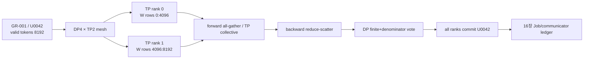

# 15장. 병렬화의 소유권 지도

여러 GPU를 쓰는 순간 “모델이 GPU에 있다”는 문장은 쓸모를 잃는다. 어느 모델이냐고 묻기 전에 **무슨 상태가, 어느 시간 구간에, 어느 rank의 어떤 storage에 있는가**를 물어야 한다. 같은 weight라도 forward 직전에는 FSDP rank들이 모아 만든 full parameter이고, optimizer step 직후에는 다시 흩어진 shard다. 같은 activation도 pipeline stage의 출력인 동안에는 다음 stage로 보내야 할 메시지이고, backward가 시작되면 반대 방향으로 gradient를 돌려받기 위한 autograd 경계다.

이 장은 DP·FSDP·ZeRO·TP·PP·EP·CP를 서로 경쟁하는 제품 이름처럼 비교하지 않는다. 11–14장의 `ParameterGroupManifest`에 공간축의 owner와 시간축의 lifetime을 더한 뒤, 각 방식이 그 원장을 어떻게 바꾸는지 추적한다. 독자가 끝까지 붙잡을 질문은 다음 네 가지다.

1. **논리 상태는 무엇인가.** parameter, gradient, optimizer moment, activation, RNG, sample과 loss denominator 가운데 무엇을 다루는가.
2. **물리 표현은 무엇인가.** full tensor인가, shard인가, replica인가, 아직 합쳐지지 않은 partial sum인가.
3. **누가 언제 읽고 쓰는가.** collective 전 producer와 collective 후 consumer가 누구이며 autograd가 어느 경계까지 책임지는가.
4. **틀리면 어떻게 보이는가.** OOM·hang·수치 불일치·resume 실패 가운데 무엇으로 드러나며, 최소한의 분리 실험은 무엇인가.

이 네 질문을 빠뜨리면 “FSDP를 켜면 메모리가 준다”처럼 방향만 맞고 운영에는 쓸 수 없는 설명이 된다. 반대로 네 질문에 답할 수 있으면 API 이름이 바뀌어도 구현을 소스와 trace에서 다시 찾아갈 수 있다.

## 15.1 global tensor에서 local owner를 계산한다

병렬화 이름부터 고르면 tensor의 일부가 왜 이 rank에 있는지 설명할 수 없다. global ParameterID와 shape를 먼저 고정하고, mesh coordinate와 placement가 local shard·replica·temporary materialization을 만드는 과정을 소유권 함수로 적는다.

한 줄은 tensor 이름이 아니라 논리 상태의 한 버전을 뜻한다. 최소 열은 아래와 같다.

| 논리 상태 | global shape | 현재 물리 표현 | owner/replica group | 유효 시간 | 다음 전이 | autograd 책임 |
|---|---:|---|---|---|---|---|
| layer weight | `[Hout,Hin]` | FSDP shard `[Hout/D,Hin]` | DP rank 하나 | step 사이 | all-gather | gather 결과를 쓴 연산까지 |
| TP 출력 | `[B,T,Hout]` | feature shard `[B,T,Hout/Tp]` | TP rank 하나 | 다음 row-linear까지 | partial reduce | shard view와 collective backward |
| PP activation | `[Bμ,T,H]` | stage-boundary message | 송신 stage, 이후 수신 stage | 해당 microbatch backward까지 | P2P send/recv | send/recv를 잇는 custom edge |
| EP dispatch | `[tokens,H]` | expert별 가변 길이 buffer | expert rank | dispatch부터 combine까지 | all-to-all | permutation과 combine weight |
| loss 통계 | scalar pair | `(loss_sum, valid_count)` | 처음에는 DP/CP local | step gradient 확정까지 | sum-reduce | `loss_sum`만 미분, count는 scale 계약 |
| RNG | counter/state | rank·stream별 state | 실행 coordinate | 재계산 완료까지 | save/restore/advance | 그래프 밖이지만 gradient 재현성 지배 |

`owner`는 “메모리를 들고 있는 rank” 하나로 끝나지 않는다. 쓰기 권한을 가진 update owner, 같은 값을 들고 있는 replica group, collective가 끝나야 읽을 수 있는 consumer를 분리한다. gradient는 아직 reduce되지 않은 local contribution과 reduce-scatter가 끝난 logical shard가 다른 버전이다. optimizer moment는 parameter와 같은 logical ID에 매달리지만 owner 이동은 별도 확인해야 한다. loss denominator는 tensor 크기가 작아도 전체 gradient scale을 결정하므로 독립 상태로 취급한다.

### 한 step의 tensor 수명을 event timeline으로 펼친다

복합 병렬 학습의 한 microbatch는 대략 다음 상태를 지난다.

```text
sample shard
  -> embedding/TP activation shard
  -> [필요하면 FSDP parameter all-gather]
  -> layer forward, saved activation 또는 checkpoint boundary
  -> [PP send] [CP K/V exchange] [EP dispatch -> expert -> combine]
  -> local loss_sum + valid_count
  -> global denominator 확정
  -> backward contribution
  -> TP/CP/EP 역방향 collective
  -> DP all-reduce 또는 FSDP/ZeRO reduce-scatter
  -> global clip norm 확정
  -> owner가 optimizer state와 parameter shard 갱신
  -> committed step/RNG/data cursor/checkpoint 후보
```

대괄호는 선택 기능이 아니라 owner가 바뀌는 경계다. 이 경계의 앞뒤에서 shape·dtype·layout·process group·stream event를 기록하면 오류가 줄어든다. 예컨대 collective가 정상 종료됐다는 사실은 올바른 group에서 올바른 tensor를 줄였다는 뜻이 아니다. 잘못 만든 TP group도 모든 rank가 같은 payload를 보내면 성공한다. 결과만 조용히 틀린다.

### DP·DDP·FSDP의 replica와 shard를 구분한다

### persistent owner와 transient full tensor를 분리한다

DDP에서는 각 data-parallel rank가 같은 parameter와 optimizer state의 replica를 갖고 서로 다른 sample shard를 처리한다. forward 동안 owner는 달라지지 않는다. backward에서 처음 만들어지는 것은 global gradient가 아니라 rank `r`의 local contribution `g_r`다. autograd hook은 이 contribution이 들어 있는 bucket이 ready가 되는 순간 all-reduce를 예약하고, reducer의 평균 convention을 거친 뒤에야 모든 replica가 같은 update용 gradient를 갖는다.

따라서 DDP의 핵심 상태 전이는 `local gradient contribution -> bucket view -> reduced replica gradient`다. `no_sync()`는 앞 microbatch에서 이 전이를 미루어 `.grad`에 local contribution을 누적한다. gradient를 없애는 옵션도, 마지막 microbatch만 학습하는 옵션도 아니다. 마지막 동기화 backward가 이전 contribution까지 포함했는지 one-step reference로 확인해야 한다.

FSDP full shard에서는 step 사이의 정상 상태가 parameter·gradient·optimizer state shard다. 연산 직전 all-gather가 잠시 full parameter를 만들고, 그 full storage를 쓰는 layer 연산이 끝나면 reshard 정책에 따라 해제하거나 backward까지 보존한다. backward에서 생긴 full-shaped gradient contribution은 reduce-scatter를 지나서야 optimizer owner가 소비할 local shard가 된다.

그러므로 `FULL_SHARD`, hybrid shard, mixed precision, CPU offload는 단순 메모리 옵션이 아니다. replica group, shard owner, device 이동 경로, full storage의 수명을 바꾼다. `use_orig_params`는 optimizer와 사용자에게 보이는 parameter view 및 group 구성 가능성을 바꾼다.

ZeRO도 같은 원장으로 읽는다. stage 숫자는 **무엇을 partition하는가**를 요약할 뿐이다. optimizer state만 나누면 update에 필요한 state를 owner에게 모으거나 계산을 분배해야 한다. gradient까지 나누면 reduce 결과의 최종 표현이 shard가 된다. parameter까지 나누면 forward/backward 연산 직전에 materialization 경계가 생긴다. prefetch·persistence·offload가 달라지면 같은 stage라도 live set과 장애 위치가 달라진다.

**bucket이 gradient readiness와 memory lifetime을 바꾼다**

DDP bucket 크기는 parameter owner가 아니라 gradient의 **ready granularity와 storage lifetime**을 바꾼다. 너무 작으면 호출마다 고정 latency가 쌓이고, 너무 크면 bucket의 마지막 gradient를 기다리느라 첫 collective가 늦어진다. `gradient_as_bucket_view`를 쓰면 `.grad`가 독립 allocation이 아니라 bucket storage의 view가 될 수 있다. 이때 detach나 in-place 후처리는 단순 Python 사용 습관이 아니라 reducer가 소유한 storage 계약을 건드린다.

`find_unused_parameters=True`는 graph traversal과 unused 판정을 추가한다. rank마다 다른 branch를 탔는데 unused set 또는 collective ready 순서가 달라지면 한 rank는 sequence `k+1`에, 다른 rank는 아직 `k`에 머물 수 있다. 이때 첫 관측은 NCCL timeout이어도 최초 원인은 control-flow 차이다. 정적 그래프라고 선언하기 전에 rank별 used-parameter bitmap과 bucket-ready 순서를 비교한다.

## 15.2 DP·TP·PP·CP·EP process group을 좌표축으로 만든다

각 병렬 방식은 세계 전체 rank를 임의로 나누는 별도 기능이 아니다. 하나의 mesh에서 어느 축을 고정하고 어느 축을 순회해 group을 만드는지 명시해야 같은 rank가 여러 collective에 참여하는 순서와 tensor 의미를 설명할 수 있다.

### TP group을 행렬의 입력·출력 shard 의미로 정의한다

column-parallel linear는 weight `W[Hout,Hin]`의 `Hout`을 나눈다. 입력 `X[B,T,Hin]`이 복제돼 있다면 rank `i`는 `W_i[Hout/Tp,Hin]`으로 `Y_i[B,T,Hout/Tp]`를 만든다. 이 `Y_i`는 불완전한 값이 아니라 output-feature 구간의 완전한 owner다. 다음 row-parallel layer가 같은 partition을 소비하면 gather 없이 이어갈 수 있다.

row-parallel linear는 입력 feature와 weight의 `Hin`을 나눈다. 각 rank의 matmul 결과 `Z_i[B,T,Hout]`는 output 전체 shape를 갖지만 **partial sum**일 뿐이다. all-reduce 뒤에는 복제된 complete output이 되고, reduce-scatter 뒤에는 다른 축으로 나눈 complete shard가 된다. shape가 같다는 이유로 collective 전 `Z_i`를 완성된 activation처럼 읽으면 수치가 조용히 틀린다. autograd에서도 forward의 gather/reduce가 backward에서 어떤 split/reduce로 대응되는지 custom function이나 framework symbol까지 따라간다.

attention head와 MLP hidden dimension이 TP 크기로 나뉘는지만 봐서는 부족하다. fused QKV의 실제 shard 축, GQA에서 Q head와 KV head의 replica/partition 규칙, bias owner, vocab-parallel cross entropy의 max·exp-sum·target-logit reduction을 함께 적는다.

### PP와 EP group을 stage·expert owner로 정의한다

PP는 layer 구간을 stage에 배정하고, stage 경계의 activation을 메시지로 바꾼다. microbatch `m`의 forward send에는 `(m, logical edge, shape, dtype, layout)`이 필요하고 backward recv는 같은 ID의 gradient여야 한다. schedule은 parameter owner보다 activation의 시간 소유권을 크게 바꾼다. GPipe류에서 많은 forward를 먼저 밀면 초기 stage가 여러 microbatch activation을 오래 쥔다. 1F1B는 forward와 backward를 교차해 수명을 줄이지만 send/recv 순서가 더 엄격해진다. bubble은 놀고 있는 GPU 비율이면서, 동시에 어느 stage의 activation과 gradient가 아직 소비되지 않았는지를 보여주는 시간표다.

EP에서는 router가 만든 `(token ID, expert ID, weight)`가 owner 이전 계획이다. dispatch all-to-all 전 tensor는 source-rank token 순서이고, 이후에는 expert owner별 가변 길이 buffer다. expert 계산 뒤 combine은 inverse permutation과 top-k weight를 적용해 원 token 순서로 돌려놓는다. top-k, capacity, token drop은 통신량만 바꾸지 않는다. 어떤 token이 residual path만 통과하는지, auxiliary loss와 주 loss의 denominator에 포함되는지까지 objective를 바꾼다.

CP는 sequence/문맥 축의 소유권을 나눈다. local query가 참조해야 하는 remote K/V block, global position, causal·packed-document mask가 collective와 함께 이동해야 한다. normalization을 sequence 전체에 걸쳐 계산하는지 hidden 축에서만 계산하는지에 따라 통신 요구가 다르고, loss head까지 sequence가 나뉘면 valid-token denominator의 reduction group도 달라진다. DP×TP×PP×CP×EP rank 좌표를 평평한 global rank와 혼동하지 않는다.

### parameter·gradient·optimizer state의 group별 owner를 적는다

**parameter group을 유지하는 법**

sharding 전의 논리 parameter 이름과 shard 후 local tensor를 연결한다. tied embedding/head는 두 이름으로 보이더라도 storage와 update owner는 하나여야 한다. optimizer가 자체 collective를 수행하는 Muon 구현에서는 DDP/FSDP reducer와 중복 통신하지 않도록 group별 reduction owner를 기록한다.

**loss numerator와 denominator의 global owner를 정한다**

각 rank의 `loss.mean()`을 다시 평균하면 유효 token 수가 다른 batch에서 rank별 평균을 같은 비중으로 섞는다. 원하는 목적이 token 평균이라면 rank `r`의 loss sum을 `S_r`, valid-token 수를 `D_r`라 할 때

\[
L=\frac{\sum_r S_r}{\sum_r D_r}
\]

여야 한다. 여기서 `S_r`는 autograd graph에 붙은 미분 가능 상태이고 `D_r`는 sample ledger에서 온 scale 상태다. 둘을 무심코 하나의 scalar all-reduce로 다루지 않는다. 일반적인 실험에서는 count를 sum-reduce해 `D=ΣD_r`를 확정하고, 각 rank의 local sum을 `D`에 맞춰 backward한다. 다만 DDP reducer가 gradient를 world size로 평균한다면 그 평균을 상쇄할 factor가 필요한지 framework 고정 revision에서 확인해야 한다.

PP last stage만 loss를 계산하거나 CP가 token 축을 나눌 때는 denominator의 최초 owner와 broadcast/reduction group이 달라진다. gradient accumulation에서는 microbatch별 mean을 더하지 말고 accumulation window의 `ΣS/ΣD`와 동등한 scale을 만든다. 빈 local shard `D_r=0`은 정상일 수 있지만 global `D=0`은 optimizer commit을 거부해야 한다.

**RNG와 sample cursor도 학습 상태다**

activation checkpointing은 saved activation을 버리고 backward에서 forward를 다시 실행한다. dropout·router noise·stochastic depth가 있다면 재실행은 같은 RNG substream을 소비해야 한다. 그렇지 않으면 recompute output이 원 forward와 달라지고, 오류는 collective mismatch가 아니라 gradient drift로 나타난다. PP microbatch schedule이나 TP/EP rank coordinate가 RNG seed 파생식에 들어가면 topology 변경 resume에서 같은 global seed만 복원해도 충분하지 않다.

sample cursor와 denominator 역시 data-parallel owner 계약에 속한다. rank별 sampler cursor, epoch/mixture state, consumed-token counter를 checkpoint하지 않고 global step만 맞추면 parameter는 복원돼도 다음 gradient의 모집단이 달라진다. “수치 exact resume”과 “sample exact resume”를 별도로 판정한다.

## 15.3 collective 순서를 forward·backward adjoint로 검산한다

local matmul이 맞아도 collective의 group·순서·reduction convention이 틀리면 global 함수는 달라진다. forward placement 변환과 backward adjoint를 짝지어 sequence oracle을 만들고 payload·algorithm·fabric 비용을 따로 계산한다.

### payload와 wire byte를 별도 장부로 계산한다

ring all-reduce의 rank당 전송량은 대략 `2(N−1)/N × payload`다. 그러나 실제 시간은 작은 collective latency, topology, contention, overlap에 좌우된다. profiler에서 collective 시작·종료, stream, tensor bytes를 layer backward와 겹쳐 본다.

**디깅과 handoff**

hang이면 모든 rank가 마지막으로 진입한 collective sequence number, tensor shape/dtype, process-group 좌표를 모은다. 한 rank의 OOM이 다른 rank에서는 NCCL timeout으로 나타날 수 있으므로 최초 오류를 찾는다.

### DDP sum·average와 loss denominator를 함께 유도한다

rank `r`의 local loss sum을 `S_r`, valid token 수를 `D_r`라 하자. 원하는 global loss는 `ΣS_r/ΣD_r`다. 각 rank가 `S_r/D_r`를 backward하고 gradient를 평균하면 rank별 mean의 평균이 되어 `D_r`가 다른 경우 틀린다. 각 local sum을 global denominator에 맞게 scale하거나 framework의 DDP 평균 convention을 고려해 동등한 gradient를 만든다. one-step fixture로 single-rank concatenated batch와 비교한다.

DDP reducer는 autograd hook으로 bucket이 ready될 때 collective를 시작한다. `bucket_cap_mb`는 parameter 소유권을 바꾸지 않지만 gradient 수명과 overlap을 바꾼다. `gradient_as_bucket_view`는 gradient가 bucket storage view가 되어 detach/in-place 사용 제약이 생긴다. `no_sync` 구간의 마지막 microbatch에서만 reduction이 시작되는지 trace한다.

### FSDP all-gather·compute·reduce-scatter 순서를 고정한다

FSDP full shard의 논리 흐름은 `sharded parameter→all-gather full parameter→forward→선택적 reshard→backward all-gather/recompute→reduce-scatter gradient→sharded optimizer step`이다. `reshard_after_forward`는 activation phase의 full parameter residency를 바꾼다. CPU offload는 shard의 owner device와 transfer stream을 바꾼다. mixed precision은 parameter storage, forward compute, reduction dtype을 별도로 설정할 수 있다.

`use_orig_params`와 flattening은 optimizer parameter group 가시성을 바꾼다. group을 wrapper 적용 전 만들지 후 만들지 framework 계약을 따른다. state dict type은 full·sharded·local artifact를 바꾸며 load topology와 memory peak가 다르다. meta-device initialization에서는 materialization owner와 broadcast source를 명시한다.

**TP와 CP collective 전후 tensor shape를 검산한다**

column-parallel `W[out,in]`을 out 축으로 TP shard하면 각 rank output은 `[B,T,out/TP]`이고 다음 연산에 따라 gather하지 않을 수 있다. row-parallel은 input shard와 partial output을 만들고 all-reduce/reduce-scatter한다. QKV fused tensor의 shard 축과 GQA `Hq/Hkv` divisibility를 config에서 검증한다.

CP는 sequence를 나누므로 attention K/V 교환과 position/mask가 rank boundary를 넘는다. ring attention류의 통신 순서와 causal block skip이 correctness 계약이다. loss head까지 sequence가 shard되면 valid denominator와 vocab-parallel CE collective를 함께 계산한다.

**PP·EP 소유권과 장애**

PP stage는 layer parameter와 해당 microbatch activation을 시간 구간 동안 소유한다. tied embedding/head가 첫·마지막 stage에 걸치면 gradient sync 규칙이 필요하다. EP router는 token→expert assignment와 dispatch buffer를 만들고 expert owner가 계산한 뒤 combine한다. dropped token과 auxiliary loss denominator를 rank 전체에서 맞춘다.

rank kill, collective mismatch, unused expert, 빈 microbatch를 주입한다. hang에서는 rank별 collective sequence와 tensor metadata를, silent scale 오류에서는 single-rank gradient를 비교한다. OOM은 parameter·activation·collective buffer 가운데 어느 lifetime이 겹쳤는지 timeline으로 본다.

**rank coordinate를 tensor에 붙인다**

global rank 하나만 기록하면 DP·TP·PP·CP·EP 가운데 어느 group의 collective인지 알 수 없다. 각 rank에는 `(dp,tp,pp,cp,ep)` coordinate, hostname, device를 대응시킨다. logical tensor shard에는 global shape, slice offset/length, owner coordinate, replica group을 기록한다. parameter와 optimizer state가 같은 mesh를 쓰는지도 별도다.

TorchTitan commit `b482babc5f1d5d718e1719a735f9a2d86d1b9aff`의 `torchtitan/distributed/parallel_dims.py:276–386`은 parallel dimension과 mesh 소유권을 구성하는 고정 좌표다. config 숫자가 단순 곱으로 world size와 맞는지뿐 아니라 어떤 차원이 loss·FSDP·model parallel group을 만드는지 읽는다.

**DDP 한 step 코드 fixture**

두 rank에 유효 token 수가 다른 microbatch를 준다. local CE `reduction="sum"`과 valid count를 만들고 count를 all-reduce해 global denominator를 구한다. DDP가 gradient를 평균하는 convention을 고려해 single-process concatenated reference와 같은 gradient scale을 만든다.

bucket hook 전후에 logical parameter ID, ready time, bucket offset, collective sequence를 기록한다. `no_sync` microbatch에서는 collective가 없어야 하고 accumulation 마지막에는 모든 bucket이 정확히 한 번 reduce되어야 한다. unused branch를 rank마다 다르게 만들어 mismatch가 fail-fast하는지 본다.

**FSDP residency timeline**

layer 하나에 forward prefetch, all-gather, compute, reshard, backward prefetch, reduce-scatter event를 건다. full parameter bytes가 동시에 몇 layer 존재하는지 trace해 peak를 설명한다. `reshard_after_forward=False`는 backward 전 full parameter를 보유해 통신을 줄일 수 있지만 memory를 늘린다.

mixed precision config는 logical parameter dtype, all-gather parameter dtype, reduction dtype, optimizer state dtype을 출력한다. CPU offload에서는 host pinned buffer와 H2D/D2H time을 포함한다. meta initialization이면 materialization 전에는 storage가 없다는 점을 state ledger에 표시한다.

**FSDP1·FSDP2와 API 이름의 함정**

wrapper 기반 FSDP와 composable fully-shard 계열은 parameter representation과 state-dict path가 다를 수 있다. “FSDP 사용” 한 줄로 resume·optimizer grouping을 설명하지 않는다. framework 고정 revision의 wrapper/fully_shard symbol, state-dict test, optimizer prepare 경로를 함께 고정한다.

PyTorch의 직접 테스트 가운데 하나는 4-rank DP×TP mesh에서 composable `fully_shard` model을 한 step 갱신하고, full model·Adam state를 rank 0에서 broadcast해 local DTensor shard로 되돌린 다음 이전 sharded state와 정확히 같은지 검사한다. 이것은 FSDP2 내부의 **고정 topology full→sharded 왕복** 증거다. FSDP1 wrapper checkpoint를 FSDP2로 바꾸거나 world size를 2에서 4로 바꾸는 migration 증거는 아니다.

migration을 승인하려면 양쪽 표현을 canonical parameter ID, unflattened shape와 global `[start,end)` range로 먼저 정규화한다. model weight뿐 아니라 Adam moment, master weight, scalar step, parameter-group option과 scheduler/scaler를 비교하고, restore 뒤 첫 optimizer delta를 unsharded reference에 맞춘다. API가 둘 다 `state_dict`를 반환한다는 사실은 flatten order와 optimizer identity가 같다는 뜻이 아니다.

Transformers/Accelerate가 model을 prepare하는 동안 FP8 conversion, device placement, FSDP wrapping, optimizer remap의 순서가 backend별로 갈린다. user config가 같은데 object owner가 달라질 수 있으므로 prepare 전후 parameter manifest를 비교한다.

**TP 수치 예**

`X[B,T,8]`, `W[12,8]`, TP=3 column parallel이면 각 rank는 `W_i[4,8]`, output `[B,T,4]`를 만든다. 다음 row-parallel layer가 이 shard를 바로 소비하면 중간 gather를 피할 수 있다. row parallel output은 partial sum이므로 reduce가 필요하다.

QKV fused output 24를 shard할 때 Q/K/V subrange와 head ownership을 적는다. GQA에서 Hq와 Hkv가 TP로 나누어지지 않으면 K/V replica 또는 다른 partition이 필요하다. shape가 정수로 나뉜다는 것과 attention semantics가 맞는 것은 다르다.

**CP와 causal boundary**

sequence `[0,T)`를 CP rank에 나눌 때 뒤 rank query는 앞 rank K/V를 볼 수 있지만 미래 block은 보면 안 된다. ring step마다 전달한 K/V block의 global position과 causal skip을 기록한다. RoPE position과 padding/packed document boundary도 global coordinate를 사용한다.

CP collective가 attention backward와 겹칠 때 buffer reuse에 stream dependency가 필요하다. odd length와 variable sequence, empty local shard를 test한다. full-sequence reference의 output·gradient와 비교한다.

**EP token ledger**

router logits `[tokens,E]`에서 top-k expert ID와 weight를 만든다. dispatch 전 token ID, source rank, expert owner, slot을 기록하고 combine 뒤 원 token order로 돌아왔는지 검사한다. capacity overflow로 drop한 token은 loss/auxiliary denominator에 어떤 영향을 주는지 명시한다.

all-to-all send/recv count를 peer별로 비교한다. expert가 token 0개를 받아도 collective 순서를 유지해야 한다. router noise RNG와 load-balance auxiliary loss의 global aggregation을 checkpoint state에 넣는다.

**복합 parallel byte 회계**

각 collective event에는 payload logical tensor, dtype, bytes, frequency, process group, critical-path 여부를 기록한다. TP matmul마다 일어나는 reduce, PP activation send, CP K/V exchange, EP all-to-all, DP gradient reduction을 합산하되 겹치는 시간을 단순 합으로 latency라 하지 않는다.

profiler timeline에서 arrival skew와 transfer duration을 분리한다. bytes 예측과 실제가 다르면 padding, bucket, quantization scale, duplicated collective를 찾는다. optimizer-owned reduction이 있는데 DDP가 다시 reduce하는지 특히 확인한다.

**failure/recovery matrix**

rank kill, unused parameter mismatch, empty expert, wrong TP shard, CP position offset, FSDP OOM을 각각 단일 장애로 주입한다. peer timeout을 최초 원인으로 쓰지 않고 earliest CUDA/host event를 찾는다. recovery checkpoint의 mesh와 logical shard mapping을 load 전에 검증한다.

same-world-size restart는 owner rank가 달라도 logical state를 복원해야 한다. world-size 변경은 17장의 reshard planner가 지원하는 tensor만 허용한다. sample-exact 여부는 data ledger에서 별도 판정한다.

## 15.4 gradient·optimizer·activation·checkpoint 소유권을 연결한다

parameter만 shard하고 나머지 상태를 암묵적으로 두면 memory 계산과 복구가 동시에 틀린다. gradient commit, optimizer moment, activation 재계산과 checkpoint shard를 같은 ParameterID와 step transaction에 연결한다.

ZeRO-1은 optimizer state, ZeRO-2는 gradient까지, ZeRO-3은 parameter까지 DP rank에 partition하는 전형적 구분을 쓴다. 그러나 실제 구현의 prefetch, persistence threshold, offload, module granularity가 parameter 수명을 바꾼다. FSDP full shard와 이름이 대응해 보여도 state-dict·hook·initialization 경로까지 같지는 않다.

parameter `P`, gradient `G`, Adam state `O≈2P`라는 단순 byte 모델에서 복제와 shard를 먼저 계산한다. BF16/FP32 master, allocator padding, communication buffer를 더한다. ZeRO/FSDP config를 켰다는 이유로 이론적 `1/D` memory가 그대로 나오리라 기대하지 않는다.

### activation owner와 recomputation 경계를 정한다

parameter sharding만으로 training memory를 설명할 수 없다. forward activation은 microbatch·layer·sequence에 비례하고 backward까지 살아 있다. activation checkpointing은 일부 saved tensor를 버리고 backward에서 forward를 재실행한다. 어느 module boundary를 checkpoint하는지에 따라 RNG와 communication 재실행이 달라진다.

FSDP all-gather와 activation recompute가 겹치면 parameter residency peak가 바뀐다. profiler에서 activation bytes, full parameter bytes, collective workspace를 다른 색으로 표시한다. OOM이 나면 총 parameter 수가 아니라 겹친 lifetime을 찾는다.

### PP schedule에 tensor·gradient·loss owner를 넘긴다

PP stage는 layer range와 그 parameter shard를 가진다. microbatch activation send에는 tensor shape, dtype, layout, source/destination stage, microbatch ID를 붙인다. backward gradient send도 같은 ID를 역방향으로 사용한다. stage boundary shape가 config에서 예상한 값과 다르면 P2P 호출 전에 실패한다.

tied embedding/head가 stage 양끝에 있으면 storage를 물리적으로 공유할 수 없을 수 있다. gradient를 별도 sync하거나 한 owner를 정한다. optimizer group manifest에는 logical tie와 physical replicas, sync group을 기록한다.

### 복합 rank 좌표에서 local state 크기를 계산한다

world size 64에서 DP=4, TP=4, PP=2, CP=2라면 곱은 64이고 EP가 별도 축이면 어떤 축을 대체/중첩하는지 framework 정의가 필요하다. global rank 37을 각 coordinate로 변환하는 함수를 test하고 inverse mapping을 확인한다. mesh ordering이 checkpoint와 process-group 생성에서 같아야 한다.

TP group은 같은 dp/pp/cp에서 tp만 변하고, DP group은 model-parallel coordinate를 고정한 채 dp가 변한다. process-group member list를 manifest로 출력해 예상 집합과 비교한다. 잘못된 group은 collective가 성공해도 다른 tensor를 섞는 silent 오류가 될 수 있다.

**gradient clipping owner.**

TP/FSDP shard에서 local norm만 clip하면 rank별 coefficient가 달라진다. 각 shard의 FP32 squared norm을 올바른 process group으로 sum-reduce해 logical global norm을 만든다. replicated parameter를 여러 번 세지 않도록 owner 규칙을 둔다.

optimizer family별 group clipping과 model-global clipping을 구분한다. Muon matrix update 자체의 normalization과 gradient norm clip도 다른 단계다. clip coefficient와 group/global norm을 step event에 넣는다.

**state-dict roundtrip test.**

small model을 DP/FSDP/TP 조합으로 한 step 학습하고 full logical state를 모아 single-process reference와 비교한다. sharded checkpoint를 same topology와 changed DP topology에 load한다. model parameter, optimizer moment, scheduler, scaler, RNG를 단계별로 판정한다.

state dict key가 같다는 것보다 global tensor shape와 slice content가 중요하다. flattened parameter는 unflatten mapping을 저장한다. tied alias와 optimizer group index가 load 뒤 유지되는지 확인한다.

**state owner 불일치를 hang과 silent divergence로 나눈다**

첫째 모든 rank의 마지막 collective sequence와 process-group ID를 모은다. sequence가 다르면 control-flow/unused parameter/P2P ordering을 본다. sequence는 같은데 한 rank가 진입하지 않았으면 그 rank의 이전 CUDA/host/dataloader event를 본다. 모두 진입했는데 transfer가 멈추면 fabric과 async error를 본다.

둘째 payload shape/dtype/count를 비교한다. 셋째 rank coordinate와 group membership을 비교한다. timeout을 늘리는 것은 원인 규명이 아니다. 최초 rank OOM이나 illegal access가 peer timeout으로 번역됐는지 확인한다.

**같은 증상을 다른 실험으로 가른다**

분산 장애를 “NCCL 문제”로 한데 묶으면 재현은 오래 걸리고 정보는 거의 남지 않는다. 먼저 실패 종류를 hang, 수치 불일치, memory peak, reshard/load 불일치로 나눈 뒤 한 축만 제거한다.

| 관측 | 첫 번째 분리 실험 | 비교할 상태 | 결과가 뜻하는 것 |
|---|---|---|---|
| 일부 rank만 timeout | 모든 rank의 `collective_seq, group_id, op, numel, dtype`를 같은 시계축에 정렬 | 마지막 진입 sequence와 그 직전 host/CUDA event | sequence가 다르면 graph/P2P 순서, 같고 미진입 rank가 있으면 upstream 실패 |
| 모든 collective는 끝나지만 loss가 다름 | overlap과 mixed precision을 끄고 one-step full reference 실행 | logits→loss sum/count→logical gradient→delta의 첫 divergence | logits이면 shard/layout, loss면 mask/denominator, gradient면 reduction scale |
| FSDP에서만 OOM | prefetch와 `reshard_after_forward`를 하나씩 바꾸고 live-set trace | full parameter, saved activation, comm workspace의 겹친 시간 | 총 parameter 양이 아니라 materialization lifetime 문제인지 판별 |
| world-size 변경 load 실패 | optimizer 없이 model shard만 logical full tensor로 재구성 | global shape, slice offset, coverage, alias | model layout 문제와 optimizer-state migration 문제를 분리 |
| resume 후 서서히 drift | 첫 재시작 step에서 RNG·sample IDs를 reference와 비교 | rank/stream RNG, sampler cursor, denominator | parameter load가 아닌 stochastic/data continuity 문제 |
| EP에서 간헐적 hang | hot expert·empty expert를 각각 고정한 deterministic routing | peer별 send/recv count, zero-count participation | imbalance 성능 문제와 collective count 계약 위반을 분리 |

수치 불일치 실험은 최종 loss 하나만 비교하지 않는다. `input IDs/positions -> layer별 logical output -> local loss sum/count -> pre-reduce gradient -> post-reduce logical gradient -> clip coefficient -> optimizer delta`에 checksum과 작은 tensor의 직접 비교를 둔다. 첫 divergence 뒤의 값은 대부분 파생 결과이므로 조사 우선순위가 아니다.

hang 실험에서는 모든 rank가 같은 로그를 많이 남기는 것보다 마지막 정상 invariant를 작게 남기는 편이 낫다. process group마다 단조 증가하는 sequence, payload schema, producer logical tensor ID, async handle 완료 여부를 기록한다. rank 3의 OOM 뒤 rank 0이 timeout을 냈다면 incident의 최초 오류는 OOM이다. peer timeout은 전파 양상이다.

**autograd 경계를 끊어 읽는 법**

collective API가 autograd graph 안에 있다고 해서 모든 metadata가 자동으로 보존되는 것은 아니다. 다음 세 경계를 따로 검사한다.

1. **수학 경계:** forward의 split/gather/reduce가 backward에서 어떤 adjoint 연산으로 대응되는가. row-parallel partial sum을 forward에서 reduce했다면 input-gradient에는 어느 통신이 필요한가.
2. **storage 경계:** 반환 tensor가 새 storage인지 bucket/flat parameter/communication buffer의 view인지, async 작업이 끝나기 전에 재사용되는지 확인한다.
3. **제어 경계:** PP send/recv, EP permutation, activation recompute처럼 표준 tensor op 밖의 microbatch ID·permutation·RNG가 backward와 어떻게 다시 연결되는지 확인한다.

작은 fixture에서는 각 경계 앞뒤 tensor에 `retain_grad`나 framework hook을 걸어 full reference와 비교한다. 단, hook 자체가 stream synchronization을 추가해 race를 숨길 수 있으므로 correctness run과 profiler run을 분리한다. hook이 없는 실제 경로에서도 event dependency가 성립하는지 확인해야 한다.

**옵션은 상태 변화 문장으로 번역한다**

설정 파일을 검토할 때 옵션 이름 옆에 다음 문장을 완성한다. “이 값을 바꾸면 **어느 상태의 owner/표현/lifetime이** 어떻게 바뀌고, 그 결과 **어느 collective의 bytes 또는 빈도와 어느 failure surface가** 바뀐다.”

| 옵션 계열 | 직접 바뀌는 상태 | 통신·메모리 결과 | 새로 커지는 실패 표면 |
|---|---|---|---|
| DDP bucket 크기 | gradient ready 묶음과 bucket storage | 작은 값은 호출 증가, 큰 값은 시작 지연·bucket live bytes 증가 | rank별 ready 순서 차이, view 오용 |
| accumulation `no_sync` | local contribution의 reduction 시점 | collective 빈도 감소, unreduced `.grad` 수명 증가 | 마지막 sync 누락, 잘못된 denominator scale |
| FSDP prefetch/reshard | full parameter 동시 residency | overlap 가능성과 peak memory가 함께 증가/감소 | OOM, async consumer-before-ready |
| CPU offload | shard의 상시 owner device | GPU resident bytes 감소, H2D/D2H와 host buffer 증가 | pinned-memory 압박, transfer stall, stale owner |
| TP 크기 | weight/activation feature shard | rank당 matmul·storage 감소, layer별 collective group/빈도 변화 | divisibility, Q/KV 의미 불일치, 잘못된 group |
| PP microbatch 수·schedule | activation을 stage가 보유하는 시간 | bubble과 activation peak의 교환 | P2P 순서 mismatch, microbatch ID 혼선 |
| CP 크기 | sequence shard와 remote K/V 범위 | local attention memory 감소, K/V 교환 증가 | global position·causal mask·빈 shard 오류 |
| EP top-k/capacity | token dispatch 수와 expert buffer | all-to-all bytes·imbalance·workspace 변화 | token drop, zero-count peer, denominator 불일치 |
| activation checkpointing | saved activation 대신 recompute recipe/RNG | activation bytes 감소, compute와 경우에 따라 통신 재실행 증가 | RNG drift, collective 재진입 순서 |
| sharded state-dict 유형 | durable artifact의 물리 layout | save/load gather와 peak·파일 수 변화 | topology 종속 artifact, alias/moment 누락 |

표의 방향은 보편적이지만 정확한 bytes와 API 동작은 backend·revision·topology에 의존한다. 따라서 config parser 설명만으로 구현 의미를 확정하지 않고, 고정 소스의 실제 collective 호출과 state-dict test, 한 스텝 trace를 함께 본다.

**소유권 표의 종료 조건.**

모든 logical parameter, gradient, optimizer state, activation, batch shard가 owner 또는 replica group을 가진다. 모든 collective는 producer/consumer와 bytes를 가진다. global denominator와 gradient clip은 올바른 group에서 계산된다. checkpoint mapping은 logical ID로 되돌릴 수 있다.

이 네 조건을 통과한 topology만 16장의 실제 node placement 후보가 된다. 논리적으로 맞는 mesh도 느린 NIC 경로에 잘못 배치되면 실행 효율과 장애 양상이 달라진다.

**owner audit query.**

실행 시작 전에 logical tensor table을 query해 owner 0개, owner 중복, replica group 불일치를 찾는다. parameter와 gradient, optimizer moment의 global shape가 맞고 shard coverage가 gap/overlap 없이 전체 범위를 덮어야 한다. tied tensor는 의도한 alias 예외만 허용한다.

collective table에서는 producer가 만든 bytes와 consumer가 기대한 bytes, group member를 join한다. PP send/recv와 all-to-all peer count는 양쪽 합이 맞아야 한다. 실제 profiler bytes와 manifest 예상의 차이를 threshold로 경보한다.

## 15.5 topology와 memory·communication 비용을 함께 계산한다

정적 parameter byte를 GPU 수로 나누는 계산만으로는 실행 가능성을 판정할 수 없다. materialization peak, activation lifetime, collective wire와 physical link contention을 하나의 microbatch timeline에 올린다.

10억 parameter BF16 모델의 raw parameter는 약 2 GB다. FP32 master와 Adam moment 두 개, BF16 gradient를 모두 복제하면 단순 합만 약 16 GB 수준이 된다. DP=8 full shard가 이상적으로 나누면 shardable 부분은 크게 줄지만 activation, temporary all-gather, CUDA context, unsharded buffer는 남는다.

한 layer full parameter all-gather가 500 MB이고 forward prefetch로 두 layer가 겹치면 순간 1 GB 이상이 추가된다. foreach optimizer list와 collective workspace도 겹칠 수 있다. allocator peak를 event timeline의 live-set 합과 비교한다.

**topology 변경 migration.**

DP 8→4는 logical tensor shard 크기를 바꾸고 optimizer owner를 재배치한다. TP 4→2는 model weight slice와 attention head ownership 자체를 바꾸므로 kernel/config divisibility를 다시 검증한다. PP stage 수 변경은 layer owner와 activation boundary를 바꾼다. 세 변경을 같은 “world-size resume”으로 묶지 않는다.

planner는 old/new mesh, tensor layout version, slice mapping, expected communication을 출력한다. dry-run coverage가 통과한 뒤 실제 load한다. migration 뒤 single-process logical probe와 첫 distributed step을 비교한다.

**실행 중 invariant.**

매 optimizer commit에서 모든 rank는 같은 global step과 topology digest를 가진다. process-group별 collective sequence는 단조 증가하고 payload schema가 같다. global loss denominator는 0보다 크며 all-reduce 결과가 rank마다 같다. gradient clip coefficient도 owner group에서 동일하다.

invariant 실패는 다음 checkpoint까지 기다리지 않고 fail-fast한다. partial optimizer step을 durable state로 publish하지 않는다. incident에는 최초 mismatch rank와 collective/tensor ID를 남긴다.

### memory 식을 고정 source의 allocation 경로에 연결한다

TorchTitan `b482…aff`, `parallel_dims.py:276–386`과 PyTorch DDP/FSDP 고정 revision을 upgrade할 때 process-group 생성, sharding API, state-dict test를 diff한다. config field 이름만 같다고 owner semantics가 같다고 보지 않는다.

새 revision의 one-step fixture와 checkpoint roundtrip을 통과한 topology digest만 production 후보로 올린다. moving main의 성능 주장을 고정 run에 소급하지 않는다.

**one-step 종합 fixture.**

작은 4-layer model에 DP=2, TP=2를 적용하고 variable valid-token batch를 준다. single-process full model의 logits, loss sum/count, gradient, clipped gradient, optimizer delta를 reference로 저장한다. distributed run은 TP partial output과 DP reduction을 거쳐 같은 logical tensor를 재구성한다.

첫 divergence가 logits면 TP shard/layout, loss면 mask/denominator, gradient면 collective scale, delta면 optimizer owner를 본다. 단계별 checksum이 원인을 한 layer/group으로 좁힌다.

**PP·EP 결합 반례.**

MoE layer를 PP stage에 배치하면 EP all-to-all과 PP activation P2P가 같은 microbatch critical path에 놓인다. expert imbalance가 stage straggler가 되고 다른 stage는 bubble로 기다린다. EP group이 PP stage를 가로지르는지 stage 내부인지 framework mesh를 확인한다.

token 0개 expert와 capacity overflow를 함께 넣어 all-to-all count, auxiliary loss, backward가 deadlock 없이 끝나는지 본다. dropped token의 residual path와 loss mask를 reference와 비교한다.

### overlap을 CUDA stream event DAG로 증명한다

overlap은 collective가 끝나기 전에 consumer가 tensor를 읽지 않도록 stream/event dependency를 요구한다. async handle을 보관하지 않거나 buffer를 재사용하면 race가 난다. overlap off reference와 output/gradient를 비교하고 profiler에서 dependency를 확인한다.

bucket/prefetch 크기 sweep은 latency와 peak memory를 함께 기록한다. 가장 빠른 설정이 checkpoint capture boundary를 깨거나 nondeterministic race를 만들면 채택하지 않는다.

**owner 변경과 optimizer state.**

elastic restart에서 parameter shard owner가 바뀌면 moment, step, FP8 scale 등 모든 dependent state가 함께 이동한다. parameter만 맞고 moment가 old owner에 남으면 다음 update가 틀린다. logical dependency graph에서 parameter→states를 따라 migration coverage를 계산한다.

owner move 뒤 첫 gradient snapshot을 적용해 old topology full reference와 비교한다. collective group과 clip denominator도 새 mesh에서 재계산한다.

**source/test 직접성.**

본문의 fixed source는 symbol이 실제 owner transition을 포함하는지 확인한다. config parser span만으로 all-gather lifetime을 주장하지 않는다. DDP reducer test, FSDP state-dict test, TorchTitan mesh test가 각각 무엇을 assert하는지 적는다. profiler 관측은 별 실행 증거다.

moving main을 upgrade하면 same fixture를 다시 실행한다. API 이름 유지가 numerical/ownership parity를 보장하지 않는다.

### logical mesh를 NVLink·PCIe·NIC topology에 매핑한다

card는 mesh dimensions, rank mapping, tensor layouts, process groups, loss/clip denominator, collective byte budget, checkpoint plan을 한 artifact로 묶는다. 변경 field 하나가 topology digest를 바꾼다.

startup validator와 one-step fixture, hang bundle, reshard dry-run이 모두 이 digest를 참조해야 한다. 그래야 16장의 physical placement와 17장의 checkpoint가 같은 논리 실행을 다룬다.

**최종 인수 시험.**

인수 시험은 topology card를 읽어 process group을 생성하고 synthetic tensor를 logical ID별로 채운다. DP replica에는 같은 값, TP/CP shard에는 global coordinate에서 파생한 서로 다른 값을 넣는다. all-gather/reduce-scatter 뒤 global tensor를 재구성해 gap·overlap·순서 오류를 찾는다.

loss 시험은 rank마다 다른 valid count를 주고 single-process gradient와 비교한다. clipping 시험은 한 shard에만 큰 gradient를 넣어 모든 owner가 같은 global coefficient를 적용하는지 본다. optimizer 시험은 moment shard까지 다음 delta를 비교한다.

PP 시험은 microbatch ID가 다른 activation을 교차시켜 schedule oracle이 거부하는지 본다. CP 시험은 causal boundary 한 block을 틀리고 full attention reference가 실패하는지 본다. EP 시험은 hot expert·empty expert·capacity overflow에서 dispatch/combine token conservation을 확인한다.

failure 시험은 rank kill, collective payload mismatch, async buffer early reuse, owner migration 누락을 넣는다. hang timeout 자체가 아니라 earliest invariant와 fail-closed checkpoint를 판정한다. restart는 17장의 committed CheckpointID만 사용한다.

**책 전체의 공통 소유권 언어.**

11장의 ParameterGroupManifest는 logical optimizer owner, 14장은 dtype/scale owner, 이 장은 rank/shard owner를 더한다. 16장은 같은 rank를 physical link에 배치하고 17장은 durable object owner로 변환한다. 서로 다른 표를 이름만 비슷하게 만들지 않고 logical tensor ID와 topology digest로 join한다.

18장의 adapter는 base shard와 adapter replica/shard owner를, 20장의 policy sync는 trainer shard와 rollout replica owner를 이 언어로 표현한다. ownership을 끝까지 유지해야 merge, publication, rollback에서 “어느 byte가 최신인가”를 답할 수 있다.

**완료 판정**

모든 trainable state의 coverage가 정확히 1 또는 선언한 replica 수이고, 모든 collective의 member·payload·sequence가 검증되며, one-step reference와 checkpoint roundtrip이 통과해야 한다. memory live-set과 network byte 예산도 trace를 설명해야 한다.

이 조건을 통과한 topology card만 다음 장의 placement benchmark에 들어간다. 성능이 빠르더라도 owner invariant를 깨는 config는 후보가 아니다.

**최종 artifact 검토.**

TopologyCard에는 logical tensor table, rank coordinate, process-group member, collective budget, memory live-set, checkpoint planner가 함께 들어간다. startup probe가 계산한 digest와 checkpoint가 저장한 digest를 비교한다. 둘이 다르면 load 전에 migration plan을 요구한다.

one-step report는 logits에서 optimizer delta까지 최초 divergence를 표시한다. failure report는 최초 rank event와 peer timeout을 분리한다. source report는 commit·file·symbol·line과 upstream assertion의 범위를 쓴다. 세 report가 같은 card를 가리킬 때 이 장의 소유권 지도가 닫힌다.

이후 장에서는 DP/TP 같은 약어만 재정의하지 않고 이 card의 owner와 bytes를 실제 node/link와 durable shard로 옮긴다.

마지막 audit는 owner table의 coverage 합, process-group membership, one-step checksum, state-dict roundtrip을 자동 검사한다. 사람이 읽는 topology diagram과 기계 manifest가 다르면 manifest를 기준으로 실패시키고 diagram을 고친다. 성능 benchmark는 이 correctness gate 뒤에만 실행한다.

모든 검증 결과에는 실행 환경, source revision, topology digest, GoldenBatchID를 기록한다. 실행하지 않은 hardware·world-size 조합은 proposed로 남기고 support로 표현하지 않는다. 이 마지막 provenance 경계가 논리 설계와 실제 실행을 구분한다.

**사례 연구: 8 GPU에서 tensor의 주인을 증명한다.**

사례 topology는 DP 2×TP 4다. world rank를 `(dp,tp)` 좌표로 변환하고 각 process group의 정확한 member list를 manifest에 쓴다. TP group은 같은 dp 좌표의 네 rank, DP group은 같은 tp 좌표의 두 rank다. rank 숫자가 연속이라는 가정 대신 coordinate function과 digest를 사용한다.

모델은 embedding, column-parallel QKV, row-parallel output, MLP, replicated norm과 tied head를 가진다. logical tensor마다 global shape, sharding axis, local slice, replication group, compute owner, gradient reduction owner, checkpoint owner를 기록한다. “TP로 sharding됨” 한 문장으로 여러 소유권을 합치지 않는다.

**tensor 하나의 persistent·transient·wire byte를 계산한다**

BF16 weight `[4096,4096]`는 전역 33,554,432 bytes다. TP 4 column shard는 rank당 `[4096,1024]`, 약 8 MiB를 소유한다. FP32 Adam moment 두 개면 rank당 약 32 MiB가 추가된다. DP에서 optimizer state까지 복제하면 두 DP replica 각각 같은 shard state를 가진다.

column-parallel linear의 output activation은 마지막 dimension이 TP shard다. 다음 op가 row-parallel이면 local matmul 뒤 reduce/all-reduce가 필요할 수 있다. collective payload는 local output shape×dtype이며 batch, sequence와 함께 계산한다. parameter byte와 activation communication byte를 혼동하지 않는다.

row-parallel weight는 input dimension을 shard하고 입력도 같은 axis로 나뉘어야 한다. 입력이 replicated라면 scatter 또는 slice가 필요하다. local output을 합하는 all-reduce bytes와 algorithmic traffic은 다르다. payload N bytes가 ring에서 link 전체 N bytes만 사용한다고 단순화하지 않는다.

**loss denominator의 분산 계약.**

DP rank마다 valid token이 120과 80이면 global denominator는 200이다. local mean 두 개를 같은 가중치로 평균하면 각 token 가중치가 달라진다. local loss sum을 backward하고 global count로 나누는 기준선을 만든다. framework gradient averaging과 조합해 같은 식인지 수치 fixture로 확인한다.

TP rank는 같은 DP sample의 logits shard를 소유하므로 loss vocabulary parallel reduction과 DP sample reduction을 구분한다. vocab max/sum collective와 token loss sum/count collective가 어느 group에서 실행되는지 trace한다. 잘못된 global group 사용은 중복 또는 과소 reduction을 만든다.

empty local batch와 모두 ignore label인 rank를 negative control로 넣는다. count 0 rank도 collective 순서에 참여하되 numerator 0을 기여해야 한다. global count 0이면 finite 0 loss로 넘기지 않고 batch validation을 실패시킨다.

**one-step ownership oracle.**

single-rank model과 distributed model을 같은 GoldenBatch, initial full parameter에서 시작한다. forward logits을 gather해 비교하고 loss sum/count, logical full gradient, clipped gradient, optimizer delta를 단계별로 비교한다. 마지막 parameter만 맞는지보다 최초 divergence를 찾는다.

distributed full gradient는 shard를 logical order로 재조립한다. replicated tensor는 rank 간 checksum이 같고 DP reduction scale이 reference와 맞아야 한다. TP shard는 coverage union이 global extent를 정확히 덮고 overlap/gap이 없어야 한다. tied tensor는 update owner가 하나다.

oracle의 negative control은 shard offset 한 칸 이동, DP gradient 이중 평균, TP collective group 교환, tied head 중복 update다. 각 오류가 특정 stage에서 실패해야 한다. final loss가 finite하다는 것은 correctness 증거가 아니다.

## 15.6 source·upstream test·incident를 같은 소유권 질문으로 읽는다

framework API 이름은 소유권 계약을 완전히 보여 주지 않는다. public invariant, 실제 함수 경로와 upstream fixture를 연결한 뒤 ‘single rank는 맞고 distributed만 틀린’ incident에서 어느 주장까지 증명되는지 제한한다.

선택한 framework commit에서 parallel layer constructor, process-group 생성, parameter partition, forward collective, state-dict save/load를 잇는다. public config가 실제 class와 group을 선택하는 factory path를 포함한다. line 좌표는 commit permalink와 함께 둔다.

upstream test는 world size, shape/dtype, forward/backward, checkpoint 가운데 무엇을 assert하는지 표로 쓴다. 2-rank toy가 8-GPU topology와 failure recovery를 검증했다고 확대하지 않는다. local one-step과 fault test는 별 evidence다.

run startup trace는 logical module→resolved layer type, rank group member, local parameter shape를 남긴다. config에 TP=4라고 쓰였다는 사실보다 실제 topology digest가 우선한다. fallback replicated layer가 있다면 byte와 collective 표에 반영한다.

**memory live-set와 critical path.**

static parameter/state byte에 activation, gradient bucket, all-gather/reduce-scatter buffer, temporary contiguous copy를 시간축으로 추가한다. layer별 forward/backward에서 동시에 live인 set을 계산한다. 모든 tensor byte 합은 peak가 아니며 서로 다른 phase의 buffer를 같이 더하지 않는다.

critical path는 local matmul, collective launch/wait, optimizer와 checkpoint를 NVTX range로 분해한다. collective가 compute와 overlap되면 duration 합은 step wall보다 클 수 있다. wait가 발생한 stream과 dependency를 확인한다. 높은 GPU utilization이 communication hiding 성공을 자동 증명하지 않는다.

microbatch와 sequence length를 바꾸어 payload/compute 비율을 본다. 작은 matmul에서는 latency가, 큰 payload에서는 bandwidth가 지배할 수 있다. 하나의 shape benchmark로 production mixture를 대표하지 않는다.

**negative control과 장애.**

rank 하나의 process-group membership을 잘못 구성하면 startup digest가 collective 전에 실패해야 한다. collective 순서를 한 rank만 바꾸면 timeout/hang capture가 마지막 sequence number와 group을 표시해야 한다. 단순 timeout 증가로 넘기지 않는다.

local shard checkpoint를 다른 rank coordinate에 load하는 오류는 logical slice mapping이 거부해야 한다. shape가 같아도 global offset과 owner digest가 다르다. tied storage를 두 shard로 저장하거나 누락한 경우 state-dict roundtrip coverage가 실패해야 한다.

gradient bucket dtype을 BF16에서 FP32로 바꾸는 control은 collective bytes와 numerical error가 예상대로 바뀌는지 본다. compression option은 성능 설정이면서 objective numerical contract다. actual communication dtype을 trace한다.

### single-rank oracle과 distributed RCA를 연결한다

첫째 global batch row와 valid count를 비교한다. 둘째 TP forward gather logits을 본다. 셋째 loss reduction, logical gradient, clipping, delta 순서로 좁힌다. gradient가 이미 다르면 optimizer나 checkpoint를 조사하지 않는다.

특정 replicated norm만 갈리면 gradient reduction group과 scale을 본다. TP matrix shard만 갈리면 partition axis, collective와 local matmul orientation을 본다. 모든 tensor가 일정 배수로 다르면 DP average 또는 loss denominator 이중 적용을 의심한다.

world size에 따라 error가 커지면 reduction order round-off인지 scale bug인지 FP64/small fixture로 분리한다. tolerance를 world size에 맞춰 무조건 넓히지 않는다. exact toy와 realistic dtype의 두 gate를 둔다.

**incident/RCA: OOM과 straggler.**

OOM rank가 항상 같은 coordinate인지 본다. vocab/head shard 불균형, padding, optimizer owner, activation length mixture가 원인일 수 있다. allocated/reserved와 live-set estimate를 phase별로 비교한다. 다른 rank 평균으로 최대 rank를 숨기지 않는다.

straggler는 rank별 compute/collective wait와 input readiness를 분해한다. owner rank의 optimizer state, NUMA/PCIe placement, thermal/hardware event를 timeline에 놓는다. 느린 collective는 network 자체보다 늦게 도착한 compute rank 때문일 수 있다.

placement를 바꾼 branch에는 새 topology digest와 startup probe를 연결한다. 성능이 회복돼도 one-step ownership oracle과 checkpoint mapping을 다시 실행한다. topology tuning이 correctness contract를 조용히 바꾸지 못하게 한다.

**evidence package와 인수 시험.**

package에는 `TopologyCard`, process-group table, logical/local shard map, byte/live-set, collective sequence, one-step oracle, source/test map, fault events와 checkpoint roundtrip이 포함된다. 모든 artifact는 같은 model/source/topology digest와 GoldenBatch를 가리킨다.

독자는 global tensor 하나의 local slice와 byte, forward/backward collective를 손으로 계산한다. two-rank valid denominator fixture, TP shard offset 오류, group membership 오류, tied update 중복을 실행한다. profiler에서 expected payload와 actual collective를 맞춘다.

인수 기준은 shard coverage gap/overlap 0, replicated checksum mismatch 0, one-step first divergence 없음, collective membership/sequence 일치, incomplete checkpoint load 0이다. 성능은 별 gate로 topology별 critical path와 peak를 평가한다. 이 조건이 닫혀야 cluster schedule과 durable checkpoint가 안정된 소유권 지도를 받을 수 있다.

### 전략을 memory·byte·failure blast radius로 비교한다

DDP는 parameter/optimizer가 replica마다 존재하고 gradient all-reduce가 중심이다. FSDP/ZeRO 단계는 parameter, gradient, optimizer state 가운데 무엇을 shard하는지 나뉜다. TP는 한 layer tensor/compute를 분할하고 PP는 layer와 activation lifetime을 stage로 나눈다. 약어 대신 ownership row와 event를 비교한다.

후보 카드의 열은 logical tensor coverage, rank max parameter/state/activation/temporary, collective payload/count, critical path, checkpoint reshard와 failure domain이다. model이 한 GPU에 들어간다는 이유만으로 DDP가 항상 빠르거나, shard가 많다는 이유로 FSDP가 항상 메모리 최저라고 단정하지 않는다. all-gather peak와 overlap을 실측한다.

TP degree를 늘리면 local matmul은 작아지고 collective 빈도/latency 비중이 커진다. PP degree를 늘리면 stage memory는 줄지만 activation transfer와 bubble이 생긴다. DP degree는 throughput을 늘리지만 global batch/token clock과 gradient noise를 바꾼다. strategy 탐색은 학습 objective와 system cost를 같이 기록한다.

**FSDP all-gather live-set 실습**

full-shard layer 하나의 forward는 parameter shard를 all-gather해 full parameter를 materialize하고 compute 뒤 reshard할 수 있다. backward에도 prefetch/all-gather와 reduce-scatter가 있다. framework option에 따라 full parameter lifetime과 prefetch overlap이 달라진다. source와 memory trace에서 실제 policy를 확인한다.

두 연속 layer의 full parameter가 prefetch 때문에 동시에 live하면 단일 layer max보다 peak가 커진다. expected timeline에 shard, gathered full, activation, gradient와 communication buffer를 놓는다. `limit_all_gathers`, prefetch option은 성능뿐 아니라 peak/liveness를 바꾼다.

negative control은 prefetch를 과도하게 켜 OOM, reshard를 끄고 peak 증가, ignored/frozen module을 잘못 shard, mixed precision parameter/collective dtype 불일치를 넣는다. resolved policy와 actual trace가 config와 맞아야 한다.

**tensor parallel vocabulary loss**

vocab weight가 TP로 shard되면 각 rank는 local vocab logits만 가진다. 안정 softmax를 위해 global max를 reduce하고 exp sum을 합치며 target token을 소유한 rank의 logit을 모은다. full vocab gather 없이 loss를 계산할 수 있지만 collective와 target ownership이 정확해야 한다.

작은 vocab 8을 두 rank에 4개씩 나눠 FP64 full softmax와 parallel result를 비교한다. target ID가 shard boundary 3/4에 있는 case, ignore label, extreme logits를 넣는다. local max만 사용하거나 target offset을 한 칸 틀리는 negative test가 실패해야 한다.

loss numerator/count는 DP reduction과 별 층이다. TP group은 한 sample의 vocabulary 통계를 합치고 DP group은 서로 다른 sample의 loss/gradient를 합친다. 잘못된 group을 사용하는 오류를 trace sequence와 toy oracle이 잡는다.

### tied·shared parameter를 한 번만 업데이트한다

embedding과 LM head가 tied면 logical role은 둘이지만 storage/update owner는 하나다. TP vocab shard도 두 경로에서 동일 slice를 참조해야 한다. state dict가 alias를 복원하는지 storage identity와 logits으로 검사한다. 두 optimizer group에 넣으면 중복 update다.

pipeline partition이 embedding과 head를 다른 stage에 둘 때 true physical tying이 어렵고 weight synchronization이 추가될 수 있다. framework가 복제 후 sync하는지, tied group을 같은 stage에 강제하는지 source에서 확인한다. “tied” config가 실제 storage alias인지 numerical sync contract인지 구분한다.

shared expert나 parameter reuse도 같은 문제다. module name 개수로 owner를 세지 않고 underlying logical tensor ID와 consumer edge를 둔다. checkpoint는 consumer마다 tensor를 중복 저장하지 않으며 load 뒤 sharing semantics를 복원해야 한다.

**topology 변경 뒤 owner mapping을 migration한다**

TP 4→2는 네 slice를 logical full tensor로 이해해 두 새 slice로 재배치한다. 단순 rank 파일 concatenate는 sharding axis, fused layout와 padding에 따라 틀릴 수 있다. tensor별 layout function과 old/new offset report가 필요하다.

optimizer state와 FP8 scale처럼 parameter에 붙은 state도 같은 layout 또는 별 granularity를 가진다. parameter만 옮기고 moment/scale을 누락하면 next-step이 달라진다. unsupported state는 migration을 거부한다. source topology와 target topology digest를 checkpoint edge에 둔다.

data DP degree도 바뀌므로 sampler와 global batch를 별 migration한다. model-state equivalent와 sample-exact를 분리한다. topology migration 뒤 GoldenBatch one-step과 checkpoint roundtrip, new collective byte를 다시 검증한다.

**운영 dashboard와 change control**

dashboard는 rank coordinate/health, shard coverage digest, group collective latency/bytes, global valid count, memory peak와 straggler를 보여준다. 평균만 보지 않고 rank max와 owner identity를 둔다. topology change event를 timeline에 표시한다.

새 model layer, wrapper, world size 또는 precision은 ownership RFC를 만든다. old/new resolved tensor/group/byte diff, checkpoint migration과 다시 실행할 oracle을 적는다. code가 자동으로 shard를 만들었다는 이유로 승인하지 않는다.

rollout은 startup probe, toy collective, Golden one-step, checkpoint roundtrip, short performance 순서다. correctness가 닫힌 뒤 full job을 연다. rollback은 model뿐 아니라 compatible topology/process-group와 checkpoint planner를 가진다.

**마지막 구두 검산**

인수자는 임의 tensor를 골라 global/local shape와 byte, compute consumer, gradient/optimizer/checkpoint owner를 설명한다. 이어 해당 forward/backward collective의 group, payload와 sequence를 trace에서 찾는다. manifest와 실제 local tensor가 맞아야 한다.

두 번째 질문은 rank 하나가 사라지면 어떤 invariant가 깨지는가다. group membership, in-flight collective, shard coverage, optimizer commit과 checkpoint를 구분한다. peer timeout만 관찰하고 last complete global state를 말하지 못하면 복구 준비가 부족하다.

세 번째 질문은 topology를 바꾸면 무엇을 재검증하는가다. state reshard, sampler/global batch, numerical one-step, memory/critical path와 source selected branch다. 이 답이 evidence package와 일치할 때 소유권 설계가 다음 cluster schedule로 넘어간다.

**최종 회귀 표본**

CI toy는 vocab-parallel loss, column/row linear, replicated norm과 tied head를 포함한다. world size 1/2에서 full logits, loss count, logical gradient와 delta를 비교한다. shard offset, wrong group, duplicate reduction을 매번 negative test로 유지한다. 오류가 더는 실패하지 않으면 expectation 변경 근거가 필요하다.

release candidate는 실제 topology에서 startup probe, memory live-set, collective trace와 checkpoint roundtrip을 실행한다. source/wrapper, model module tree, precision 또는 world size가 바뀌면 새 TopologyCard를 만든다. 기존 digest를 수동 재사용하지 않는다.

장기 성능 회귀는 expected/actual collective byte, rank max memory, step critical path와 tokens/s를 본다. hardware/topology가 달라지면 절대 시간만 비교하지 않고 payload와 link class를 함께 표시한다. correctness PASS와 performance PASS를 분리한다.

**소유권 변경 RFC**

RFC에는 바뀐 logical tensor, old/new sharding axis와 owner group, byte/collective/checkpoint diff를 기록한다. fused layer 도입처럼 이름과 layout이 동시에 바뀌면 conversion function과 Golden one-step을 추가한다. data/global batch에 영향이 있으면 scheduler clock도 함께 검토한다.

rollout은 manifest dry-run, toy oracle, one-step, checkpoint migration, short performance 순서다. rollback parent는 old topology에서 읽을 수 있는 checkpoint와 process-group config를 가진다. 새 layout checkpoint만 남기고 old runtime으로 돌아갈 수 있다고 가정하지 않는다.

운영 승인 뒤에도 active topology digest를 metric과 checkpoint에 찍는다. 요청된 TP/DP 숫자와 실제 group/member가 다르면 startup을 중단한다. 이 최종 guard가 scheduler 또는 launcher fallback으로 소유권이 조용히 바뀌는 일을 막는다.

인수 후 첫 실제 run에서는 Golden one-step뿐 아니라 첫 checkpoint까지 추적한다. logical slice와 optimizer state가 기대 owner에 저장되고 reload 뒤 같은 collective group을 재구성하는지 확인한다. compute는 정상인데 checkpoint owner만 잘못된 오류를 조기에 잡는다.

운영자가 rank를 교체하거나 job을 재예약하면 topology digest가 달라지는지 확인한다. 논리 coordinate가 같아도 물리 GPU/NIC가 바뀌면 placement evidence는 새 revision이다. correctness oracle과 짧은 critical-path probe를 다시 실행한다.

최종 승인표에는 실행하지 않은 world size와 hardware를 명시한다. 작은 topology의 PASS를 더 큰 cluster support로 확대하지 않는다. 새 조합은 startup probe, one-step, checkpoint와 fault gate를 순서대로 통과해야 한다.

각 결과는 정확한 topology와 source revision 범위에서만 유효하다.

마지막 인수자는 topology manifest에서 임의의 parameter 세 개를 골라 global offset과 local shard byte를 다시 계산한다. 이어 해당 shard의 forward consumer, backward producer, optimizer-state owner, checkpoint writer가 동일한 logical ID를 공유하는지 확인한다. tied weight 하나, 빈 expert 하나, pipeline 경계 tensor 하나를 반드시 포함한다. 이 실험을 넣는 이유는 정상적인 dense tensor만으로는 alias·zero-token·stage-boundary 오류를 반증할 수 없기 때문이다. 각 rank의 owner digest와 collective sequence를 비교하고, 하나를 의도적으로 바꿨을 때 startup verifier 또는 one-step oracle이 실패해야 인수한다.

재개 실험에서는 topology digest, CheckpointID, global valid-token denominator와 다음 collective sequence가 uninterrupted branch와 같은지 확인한다. 디버깅 기록은 최초 불일치 rank와 tensor offset을 남겨 다음 장애 재현의 출발점으로 삼는다.

반드시 재검증한다.

**이 장이 넘기는 것.** rank topology, logical parameter→local shard map, collective owner·bytes, global loss denominator.

**다음 장에서 깨질 수 있는 것.** stage schedule과 물리 topology가 논리 소유권을 시간축에서 충돌시킬 수 있다.

**검증 체크포인트.** single-rank와 distributed의 한 step gradient/update를 허용오차 내 비교하고 모든 collective의 참여 rank 집합을 검증한다.

검토자는 owner coverage와 collective trace를 다시 대조하고 승인 기록을 남긴다. topology digest가 바뀌면 이 승인도 새로 수행한다.

## 15.7 병렬 축을 tensor algebra와 시간 소유권으로 다시 쓴다

이제 각 병렬 방식을 제품 이름 대신 global tensor에 적용되는 placement 변환으로 정규화한다. 같은 algebra를 시간축에 펼치면 full parameter, activation과 partial result가 언제 나타나고 사라지는지 선명해진다.

병렬 전략을 약어로 고르는 순간 설계가 흐려진다. 먼저 각 논리 텐서에 전역 index 공간을 부여하고, rank가 소유한 slice와 replica group을 함수로 쓴다. 전역 parameter `W∈R^{m×n}`에 대해 shard 함수 `S_W(r)`는 rank `r`이 보유한 index 집합을 반환한다. 모든 shard의 합집합이 전체 index이고, 의도한 replica를 제외한 교집합이 비어 있어야 한다. 이 두 조건이 coverage와 uniqueness 불변식이다.

gradient `G`와 optimizer moment `M,V`가 parameter와 항상 같은 shard 함수를 쓰는 것은 아니다. DDP에서는 `W,G,M,V`가 DP rank마다 복제되지만 gradient collective가 replica 값을 합의한다. FSDP full shard에서는 parameter와 state가 local slice로 내려가며 계산 구간에 full parameter가 임시 materialize된다. TP에서는 `W` 자체가 model dimension으로 잘리고 local matmul의 결과가 partial 또는 partitioned tensor가 된다. 따라서 소유권은 정적인 파일 배치가 아니라 시간에 따른 함수다.

PyTorch `v2.7.1`의 DDP 진입과 reducer 연결은 [`torch/nn/parallel/distributed.py`](https://github.com/pytorch/pytorch/blob/v2.7.1/torch/nn/parallel/distributed.py), C++ reducer의 bucket 상태는 [`torch/csrc/distributed/c10d/reducer.cpp`](https://github.com/pytorch/pytorch/blob/v2.7.1/torch/csrc/distributed/c10d/reducer.cpp)에서 확인한다.

FSDP wrapper 상태와 runtime 경로는 [`torch/distributed/fsdp/fully_sharded_data_parallel.py`](https://github.com/pytorch/pytorch/blob/v2.7.1/torch/distributed/fsdp/fully_sharded_data_parallel.py), composable fully-shard 경로는 [`torch/distributed/_composable/fsdp/fully_shard.py`](https://github.com/pytorch/pytorch/blob/v2.7.1/torch/distributed/_composable/fsdp/fully_shard.py)에서 분리해 읽는다. 같은 “FSDP” 이름을 두 구현의 state와 checkpoint 보장으로 확대하지 않는다.

### DP와 DDP의 gradient scale을 정확히 유도한다

rank `r`이 valid token loss sum `S_r(θ)`와 count `D_r`를 만들면 원하는 목적 함수는 `L(θ)=Σ_r S_r(θ)/Σ_r D_r`다. DDP reducer가 gradient를 world size `R`로 나누는 convention이라면 local backward scalar를 `R·S_r/ΣD_r`로 두어야 평균 뒤 원하는 gradient가 된다. 모든 `D_r`가 같을 때만 local mean들의 평균이 global mean과 일치한다. packed sequence와 filtering에서는 이 조건이 쉽게 깨진다.

실습 fixture는 두 rank에 valid count 3과 7을 주고 single-process concatenated batch를 oracle로 둔다. local mean 평균, sum 후 단순 world average, global denominator 보정 세 경로를 비교한다. 첫 두 경로가 서로 다르고 세 번째만 oracle과 맞아야 한다. 반례가 실패하지 않으면 test 데이터가 denominator 오류를 드러내지 못하는 것이다.

gradient accumulation에서는 microbatch별 denominator를 따로 평균하지 않는다. accumulation window 전체 numerator와 denominator를 합친다. `no_sync()`는 중간 all-reduce를 미루지만 local gradient에 이미 적용한 scale을 고쳐 주지 않는다. 마지막 microbatch에만 window 전체 count를 알 수 있다면 numerator loss의 normalization 또는 backward scale을 설계해야 한다. scheduler의 token clock도 같은 committed global count를 소비한다.

### DDP bucket state machine을 gradient-ready event로 읽는다

DDP bucket은 parameter registration 순서, size cap, dtype에 따라 gradient view를 묶는다. autograd hook이 gradient ready를 표시하고 bucket의 모든 expected entry가 준비되면 collective를 시작한다. collective 완료 후 reduced buffer가 각 gradient view에 노출된다. unused parameter 탐색과 static graph 옵션은 어떤 hook이 준비될 것으로 기대하는지를 바꾼다.

#### 한 iteration을 함수·상태·저장소로 따라가는 현장 walkthrough

먼저 `DistributedDataParallel` 생성 시점을 본다. Python wrapper는 trainable parameter와 역순 bucket index·byte limit, process group, sparse-gradient 기대값을 C++ `Reducer`에 넘긴다. 여기서 결정되는 것은 “gradient를 언젠가 합친다”는 추상 정책이 아니다. 어느 parameter의 gradient view가 어느 bucket storage의 몇 번째 구간을 점유하고, 그 bucket이 어떤 process group에서 완료되어야 다음 상태로 갈 수 있는지다. `gradient_as_bucket_view=True`라면 첫 반복 뒤 `.grad`가 별도 tensor가 아니라 바로 이 storage의 view가 될 수 있다.

forward 직전 `_pre_forward`는 Reducer를 새 backward에 맞춰 준비한다. 필요하면 bucket을 재구축하고 buffer 동기화를 예약한다. forward가 만든 출력은 조건에 따라 `_DDPSink.apply`를 거친다. 이 sink는 forward 값을 바꾸기 위한 layer가 아니라, backward가 출력 그래프에 진입했음을 Reducer의 unused/static-graph 상태 전이와 접속하는 autograd node다. 따라서 “통신은 backward에서만 시작하니 forward 코드는 무관하다”는 설명은 반만 맞다. backward에서 기다릴 expected hook 집합과 iteration 경계가 forward 전후에 이미 정해진다.

backward가 시작되면 autograd engine은 전체 Jacobian을 만들지 않는다. root edge에서 시작한 `GraphTask`가 dependency count가 0이 된 node를 ready queue에 넣고, 각 node의 vector–Jacobian product가 선행 gradient를 더한다. parameter의 AccumulateGrad가 끝나면 DDP의 post-accumulate hook가 해당 bucket entry를 ready로 표시한다. bucket의 모든 expected entry가 준비된 순간에만 기본 all-reduce나 `register_comm_hook`로 등록한 Future 기반 hook가 실행된다. 즉 계산–통신 overlap의 시작점은 “backward 호출 시각”이 아니라 **그 bucket의 마지막 dependency가 풀린 시각**이다.

`no_sync()`에서는 `require_backward_grad_sync`를 잠시 끄므로 중간 microbatch의 local contribution이 `.grad`에 남는다. 문맥 밖의 동기화 forward/backward가 마지막 contribution만 reduce하는 것이 아니라 그때까지 같은 gradient storage에 누적된 값을 reduce해야 한다. 하지만 Reducer는 loss denominator를 고쳐 주지 않는다. rank별 유효 token 수가 (D_r), local loss sum이 (S_r)이고 Reducer가 world size (R)로 평균한다면, 각 rank가 (R S_r/\sum_r D_r)에 해당하는 gradient를 제공해야 최종 값이 (\nabla(\sum_r S_r/\sum_r D_r))와 같아진다. microbatch mean을 매번 backward한 뒤 마지막에 통신만 미루는 방식은 (D_r)가 다를 때 이 등식을 깨뜨린다.

문제가 생기면 네 상태를 같은 iteration ID로 기록한다. 첫째, `GraphTask`의 ready event와 parameter logical ID다. 둘째, bucket ID·offset·expected/ready entry 수다. 셋째, communication hook의 Future 생성·완료 시각과 process-group sequence number다. 넷째, 누적 window의 local/global numerator·denominator와 optimizer 직전 gradient norm이다.

모든 rank의 sequence는 같지만 값이 일정 배수로 다르면 denominator 또는 DDP 평균 convention을 의심한다. sequence 자체가 갈라지면 rank별 branch, unused-parameter 집합, 마지막 partial accumulation window, join shadow collective를 먼저 본다. 이 구분이 없으면 수치 오류와 collective 교착을 같은 “DDP 문제”로 오진한다.

`gradient_as_bucket_view`를 켜면 `param.grad`와 bucket storage가 alias될 수 있다. memory를 줄이는 대신 gradient를 detach하거나 storage를 교체하는 사용자 코드의 의미가 달라진다. communication hook은 reducer의 기본 collective owner를 바꾸므로 hook이 sum, average, compression 가운데 무엇을 반환하는지 계약에 넣는다. optimizer가 다시 collective를 수행한다면 이중 reduction 반례를 반드시 둔다.

overlap을 판단할 때 bucket collective duration 합을 step wall에서 빼지 않는다. backward compute와 같은 시간대에 놓였는지, 마지막 bucket의 wait가 critical path에 얼마나 남았는지 본다. bucket을 작게 하면 첫 launch는 빨라지지만 latency와 launch overhead가 늘고, 크게 하면 bandwidth 효율은 좋아져도 준비가 늦어진다. 최적점은 layer ready order와 network topology에 달려 있다.

### FSDP full parameter의 시간축 소유권을 그린다

FSDP full shard의 parameter 수명은 `local shard → all-gather buffer → unsharded view → compute → reshard`로 움직인다. backward에서는 다음 layer의 all-gather를 미리 시작할 수 있고 현재 layer의 gradient를 reduce-scatter한다. prefetch 때문에 두 layer의 full parameter와 collective buffer가 겹치면 이론적 shard memory보다 peak가 커진다. 그래서 정적 parameter byte 표만으로 OOM을 설명할 수 없다.

FSDP 옵션은 owner 전이를 바꾼다. sharding strategy는 parameter, gradient, optimizer state 가운데 무엇을 복제하는지 정한다. forward/backward prefetch는 materialization 시점을 바꾼다. `limit_all_gathers`는 동시 full buffer의 상한과 CPU scheduling을 바꾼다. CPU offload는 shard의 안정 owner를 host로 옮기며 transfer와 pinned buffer 수명을 추가한다. mixed precision은 parameter materialization과 reduction의 dtype/bytes를 달리한다.

**`use_orig_params`와 optimizer identity**

flattened parameter 구현에서는 여러 논리 parameter가 flat storage의 slice가 된다. optimizer가 보는 객체와 사용자가 이름으로 찾은 원 parameter의 관계가 중요하다. `use_orig_params`는 원 객체 view를 노출하는 방향이지만 local shard 상태에서는 tensor size가 rank마다 다를 수 있다. parameter group을 만들고 wrapper를 적용하는 순서, frozen/trainable 혼합, per-parameter hyperparameter가 보존되는지 고정 revision test로 확인한다.

optimizer state key가 Python object identity 또는 group index에 의존하면 save/load 뒤 잘못 매핑될 수 있다. manifest는 논리 parameter ID, flat parameter ID, global offset, local slice, optimizer group과 moment shape를 잇는다. state dict key 문자열이 같다는 이유로 content coverage를 통과시키지 않는다. 한 slice offset을 이동시킨 negative checkpoint가 load 전에 거부되어야 한다.

**FSDP1과 FSDP2를 비교하는 질문**

두 API를 비교할 때 “새 API가 더 좋다”가 아니라 parameter representation, hook 설치, group mesh, reshard policy, mixed precision, state-dict API, optimizer state 변환을 묻는다. composable API는 module에 in-place로 behavior를 붙이는 방식과 DTensor 표현을 사용할 수 있으므로 wrapper tree를 전제로 만든 inspection code가 깨질 수 있다. public config 이름이 같아도 resolved object와 local tensor type을 출력한다.

upstream source 좌표와 test는 선택한 태그에서 고정한다. test가 same-world-size roundtrip만 다루면 topology 변경 보장은 없다. test가 forward parity만 보면 optimizer moment와 resume는 비어 있다. 책의 fixture는 이 빈칸을 명시하고 one-step delta, checkpoint cut, changed DP reshard를 별 gate로 둔다.

**TP column·row parallel의 partial result를 추적한다**

column-parallel linear에서 `W=[W_0;…;W_{p-1}]`로 output row를 나누면 rank `i`는 `Y_i=XW_i^T`를 계산한다. `Y_i`는 output feature partition이며 다음 row-parallel layer가 바로 소비하면 gather가 필요 없다. row-parallel에서는 input feature와 weight column을 나눠 각 rank가 partial sum `Z_i`를 만들고 `Z=Σ_i Z_i`가 되어야 한다. 여기서 all-reduce 또는 reduce-scatter의 owner가 생긴다.

Megatron-LM의 고정 commit에서 tensor-parallel layer와 mapping은 [`megatron/core/tensor_parallel/layers.py`](https://github.com/NVIDIA/Megatron-LM/blob/8ab3c0b6e6c14f909906f016768a4053fc22797b/megatron/core/tensor_parallel/layers.py)와 [`megatron/core/tensor_parallel/mappings.py`](https://github.com/NVIDIA/Megatron-LM/blob/8ab3c0b6e6c14f909906f016768a4053fc22797b/megatron/core/tensor_parallel/mappings.py)에서 연결한다.

autograd forward에 identity인 연산이 backward에서 collective를 수행할 수 있으므로 Python 함수 이름만 보고 통신이 없다고 판단하지 않는다.

**attention head와 GQA ownership**

Q head 수 `H_q`, KV head 수 `H_kv`, TP 크기 `p`가 있을 때 단순 divisibility만으로 충분하지 않다. 각 Q head가 어떤 KV head를 참조하는지와 KV replica 여부를 정해야 한다. `H_kv<p`이면 KV head를 일부 TP rank에 복제하거나 다른 partition 정책을 써야 한다. fused QKV weight layout이 `[Q,K,V]` 연속인지 head-interleaved인지에 따라 checkpoint slice 함수가 달라진다.

작은 fixture는 Q head 8, KV head 2, TP 4에서 rank별 head map을 출력한다. full reference와 attention output/gradient를 비교한다. K/V slice를 한 rank 회전시키는 반례가 실패해야 한다. shape가 맞고 collective가 끝나도 잘못된 head mapping은 silent numerical error가 된다.

vocab-parallel loss에서는 rank별 local max를 global max로 reduce하고 exp sum을 합치며 target token을 소유한 rank의 logit을 선택한다. TP group이 한 sample의 vocabulary 통계를 합치고 DP group이 서로 다른 sample의 목적 함수를 합친다. 두 group을 뒤바꾸면 collective가 성공해도 의미가 틀린다. target이 shard 경계에 있는 fixture와 ignore label을 반드시 둔다.

**TP 통신의 역전파 계약**

copy, gather, reduce, scatter 연산은 forward와 backward가 다른 collective 쌍을 이룬다. forward identity의 backward가 all-reduce일 수 있고 forward all-gather의 backward가 reduce-scatter일 수 있다. 각 custom autograd function에 input/output global 의미와 두 방향 collective를 적는다. activation checkpointing으로 forward가 재실행될 때 collective도 재실행되는지 확인한다.

sequence parallel을 결합하면 layer norm 입력과 dropout RNG가 sequence shard로 바뀐다. replicated parameter의 gradient는 TP group에서 reduce해야 하지만 이미 sequence reduce-scatter가 포함한 경로라면 중복 통신을 피해야 한다. profiler의 collective를 layer 이름만으로 세지 말고 logical tensor ID와 producer/consumer로 연결한다.

**PP와 microbatch 시간표**

pipeline stage `s`는 layer 구간의 parameter와 현재 처리 중인 microbatch activation을 소유한다. GPipe류 all-forward/all-backward와 1F1B schedule은 activation 보유 시간, bubble, gradient commit 시점이 다르다. microbatch 수 `m`, stage 수 `p`에서 이상화된 bubble 비율을 계산할 수 있지만 stage compute 불균형과 communication을 포함하면 실제 critical path가 달라진다.

P2P message에는 microbatch ID, direction, logical tensor, global shape, dtype, layout, source/destination stage를 붙인다. sender와 receiver가 같은 byte count를 기대하는지 launch 전에 검사한다. variable sequence와 packed batch에서는 shape metadata 교환 또는 사전 bucket 계약이 필요하다. empty microbatch도 모든 stage의 control flow를 일치시켜야 한다.

**schedule 상태 기계**

각 stage의 event를 `recv_fwd → compute_fwd → send_fwd → recv_bwd → compute_bwd → send_bwd`로 쓴다. interleaved virtual pipeline이면 한 rank가 여러 model chunk를 소유해 event order가 더 복잡해진다. activation buffer는 forward 완료부터 해당 backward 소비까지 살아 있다. recompute를 켜면 저장 tensor는 줄지만 forward compute와 TP/CP collective 일부가 다시 실행될 수 있다.

schedule test는 event DAG가 cycle 없이 모든 microbatch를 정확히 한 번 commit하는지 검사한다. 한 stage만 microbatch count를 다르게 주는 장애, 마지막 partial batch, tied embedding sync 누락을 넣는다. hang에서는 마지막 P2P sequence뿐 아니라 어느 microbatch state가 producer를 기다리는지 출력한다.

**tied embedding의 물리적 한계**

첫 stage의 embedding과 마지막 stage의 LM head가 논리적으로 tied여도 서로 다른 device에서 같은 storage를 공유할 수 없다. 구현은 weight를 복제하고 gradient를 별 group에서 sync하거나 두 역할을 같은 stage에 둘 수 있다. checkpoint는 두 물리 replica가 하나의 논리 tensor라는 사실과 sync policy를 보존해야 한다.

검산은 두 replica checksum, backward 후 gradient, optimizer step 뒤 weight를 비교한다. 둘 다 optimizer group에 들어가면서 sync gradient까지 적용되면 중복 update가 날 수 있다. 반대로 한 owner만 step하는데 다른 replica broadcast가 빠지면 다음 forward가 갈린다. 단순 key equality가 아니라 step event와 storage owner를 본다.

**CP: sequence 축과 causal 의미**

context parallel은 sequence `[0,T)`를 rank 구간으로 나눈다. attention query가 자신의 과거 K/V를 모두 볼 수 있도록 K/V block을 ring 또는 all-gather 방식으로 교환한다. causal attention에서는 global query position보다 미래인 key block을 배제해야 한다. local index만 비교하면 rank 경계에서 mask가 틀린다.

NVIDIA Megatron-LM의 context-parallel 코드 경로는 같은 고정 commit의 [`megatron/core/transformer/dot_product_attention.py`](https://github.com/NVIDIA/Megatron-LM/blob/8ab3c0b6e6c14f909906f016768a4053fc22797b/megatron/core/transformer/dot_product_attention.py)와 process-group 구성부를 함께 읽는다. 실제 backend가 Transformer Engine attention으로 내려가면 public CP 옵션에서 TE 함수와 통신 스트림까지 호출 사슬을 닫는다.

**position, mask, RNG 불변식**

RoPE position은 local 0부터 다시 시작하지 않고 global token position을 사용한다. packed document의 attention boundary도 K/V block 이동 뒤 유지되어야 한다. padding과 valid token count가 rank마다 다르면 empty local shard와 all-masked row를 안전하게 처리해야 한다. dropout RNG는 full reference와 같은 logical element가 같은 random value를 쓰도록 counter mapping을 정의한다.

실험은 odd sequence length, CP로 나누어떨어지지 않는 padding bucket, 두 packed document가 rank boundary를 가로지르는 경우를 포함한다. full-sequence reference의 output, LSE, gradient와 비교한다. position offset 한 칸, causal block skip 하나 제거, RNG counter rank offset 누락을 각각 반례로 둔다.

**CP buffer와 stream owner**

ring attention은 recv buffer가 다음 compute tile의 입력이 되고 이전 send가 같은 storage를 읽을 수 있다. buffer reuse 전에 stream event와 lifetime을 확인한다. double buffering은 overlap을 늘리지만 memory peak를 높인다. communication duration 합이 compute에 겹쳤는지 trace에서 판단한다.

backward는 forward와 반대 방향의 K/V 또는 gradient 교환을 수행할 수 있다. checkpoint recompute가 forward communication을 반복하면 sequence number와 RNG state가 맞아야 한다. illegal access가 CP에서만 나면 tensor content보다 buffer lifetime과 stream dependency를 먼저 본다.

## 15.8 EP·hybrid mesh·checkpoint를 permutation과 placement로 증명한다

EP는 weight shard만이 아니라 token permutation, split vector와 combine inverse를 함께 소유한다. 이 변환을 다른 병렬 축과 합성하고 checkpoint가 global tensor 배치도를 재구성할 수 있는지 coverage proof로 확인한다.

expert parallel은 router가 만든 `(token_id, expert_id, weight)`를 expert owner별로 정렬하고 all-to-all로 보낸 뒤 계산 결과를 원래 token 순서로 되돌린다. dispatch metadata가 없으면 output shape는 맞아도 token이 섞일 수 있다. token ledger에는 source rank, original position, expert, slot, destination rank, combine position을 둔다.

DeepSpeed 고정 태그의 MoE layer는 [`deepspeed/moe/layer.py`](https://github.com/deepspeedai/DeepSpeed/blob/v0.17.2/deepspeed/moe/layer.py), sharded optimizer의 대표 구현 경계는 [`deepspeed/runtime/zero/stage3.py`](https://github.com/deepspeedai/DeepSpeed/blob/v0.17.2/deepspeed/runtime/zero/stage3.py)에서 읽을 수 있다. 서로 다른 subsystem이지만 EP와 ZeRO가 결합될 때 expert parameter owner와 DP shard owner가 중첩되는 방식을 확인하는 좌표다.

### expert capacity와 auxiliary objective의 owner를 정한다

top-k router에서 token 하나가 여러 expert로 복제되면 dispatch bytes와 combine reduction이 늘어난다. capacity factor는 expert별 slot 상한을 만들며 overflow token을 drop하거나 대체 routing할 수 있다. 이 정책은 성능 옵션인 동시에 학습 목적 함수를 바꾼다. dropped token이 main loss denominator와 auxiliary load-balance loss에서 어떻게 취급되는지 명시한다.

router auxiliary loss는 expert usage 통계를 어느 group에서 합치는지 중요하다. EP group만 합칠지 DP replica 전체를 합칠지 구현 계약을 읽는다. router noise RNG와 expert assignment는 checkpoint/recompute에서 재현되어야 한다. 한 rank에서 expert가 token 0개를 받아도 all-to-all count와 collective order를 유지해야 한다.

### all-to-all split과 inverse permutation을 검산한다

peer별 send count의 행 합은 local dispatched token 수이고, 모든 rank send matrix와 receive matrix는 transpose 관계여야 한다. payload bytes에는 activation뿐 아니라 indices, weights, padding을 포함한다. expected byte와 profiler byte가 다르면 padding 또는 duplicated dispatch를 찾는다.

작은 expert 네 개 fixture에서 token ID를 고유 값으로 만들어 roundtrip 뒤 원래 순서를 검사한다. expert owner mapping 하나를 바꾸고 topology digest가 startup에서 거부하는지 본다. combine weight를 생략한 반례는 output oracle에서 실패해야 한다. 평균 load만 보면 특정 rank의 capacity overflow와 straggler를 숨긴다.

### hybrid mesh의 axis 이름·순서·group을 증명한다

DP, TP, PP, CP, EP의 곱이 world size와 맞는다는 것은 필요조건일 뿐 충분조건이 아니다. EP가 DP 축의 일부를 재해석하거나 expert tensor에만 별 mesh를 쓸 수 있다. 각 tensor가 어느 mesh와 placements를 쓰는지 적는다. global rank를 `(dp,tp,pp,cp,ep)`로 바꾸는 함수와 inverse를 exhaustive test한다.

PyTorch DeviceMesh와 DTensor 개념은 [DeviceMesh 공식 문서](https://pytorch.org/docs/2.7/distributed.html#devicemesh) 및 [`torch/distributed/tensor/_api.py`](https://github.com/pytorch/pytorch/blob/v2.7.1/torch/distributed/tensor/_api.py)에서 확인한다. placement의 `Shard`, `Replicate`, `Partial`은 단순 annotation이 아니라 collective가 필요한 상태를 표현한다. `Partial` tensor를 일반 replicated tensor처럼 소비하지 않는다.

**group membership invariant**

TP group은 다른 coordinate를 고정하고 tp만 변화해야 한다. DP group은 model-parallel coordinate를 고정하고 dp만 변화한다. 각 rank가 생성한 group member 목록을 gather해 전역 manifest와 비교한다. group 생성 순서가 rank마다 다르면 backend handle이 다른 집합을 가리킬 수 있으므로 deterministic construction을 검사한다.

collective event에는 group ID만 쓰지 않고 canonical member list hash, sequence number, tensor ID, shape, dtype, bytes를 기록한다. 같은 member라도 다른 목적의 group이면 namespace를 분리한다. 잘못된 group에서 같은 shape tensor를 reduce하면 hang 없이 silent corruption이 생긴다. 따라서 toy value를 rank coordinate의 함수로 채운 group oracle이 필요하다.

**collective 비용 모델의 한계**

ring all-reduce의 rank당 wire byte 근사는 `2(p-1)/p·N`이지만 실제 시간은 latency, chunk, protocol, topology, contention과 arrival skew를 포함한다. reduce-scatter와 all-gather의 합이 논리적으로 all-reduce와 같아도 두 event 사이 compute overlap이 다르다. all-to-all은 peer별 불균형이 최대 completion을 지배한다.

비용 표에는 payload, call frequency, group size, link class, algorithm/protocol, observed start/end, wait on critical path를 넣는다. theoretical byte와 actual trace byte를 비교한다. expected보다 크면 padding, datatype conversion, duplicate collective, bucket fragmentation을 찾는다. duration이 긴데 wire time은 정상이라면 늦게 도착한 rank가 원인일 수 있다.

**checkpoint를 global owner 함수의 직렬화로 설계한다**

분산 checkpoint가 저장해야 하는 핵심은 rank 파일 목록이 아니라 논리 tensor와 local slice의 대응이다. tensor마다 global shape, layout, shard axis, offsets, padding, replica group, dtype, logical alias를 둔다. optimizer moment와 FP8 scale state도 parameter를 따라가거나 별 shard 함수를 가진다. topology 변경은 이 함수를 old mesh에서 new mesh로 합성하는 작업이다.

PyTorch distributed checkpoint planner와 state 경로는 [`torch/distributed/checkpoint/state_dict.py`](https://github.com/pytorch/pytorch/blob/v2.7.1/torch/distributed/checkpoint/state_dict.py)와 같은 태그의 planner 구현에서 읽는다. API 호출 성공만 확인하지 않고 어떤 객체가 canonical key와 tensor metadata를 생성하고 load 때 reshard하는지 추적한다.

**same topology와 changed topology**

same-topology resume에서도 물리 global rank가 다른 host에 배치될 수 있다. logical coordinate와 shard content가 일치해야 하며 hostname을 owner identity로 쓰지 않는다. changed DP는 model shard가 같아 비교적 단순할 수 있지만 sampler/global batch가 달라진다. changed TP는 tensor layout과 fused QKV/optimizer state를 실제로 재분할해야 한다.

검증은 parameter checksum만으로 끝내지 않는다. GoldenBatch forward, logical gradient, optimizer delta, scheduler/scaler, RNG를 비교한다. parameter가 맞고 moment가 틀리면 첫 forward는 통과하고 첫 update에서 갈린다. scale block이 틀리면 FP8 경로만 갈릴 수 있다. 각 state family를 단계적으로 load해 최초 불일치를 찾는다.

**atomic commit과 실패 복구**

checkpoint writer가 rank별 shard를 먼저 쓰고 manifest를 마지막에 commit하도록 설계한다. 모든 required shard와 checksum이 준비되지 않으면 committed checkpoint로 보이지 않아야 한다. rank 하나가 write 중 죽은 장애를 주입해 partial artifact가 자동 선택되지 않는지 본다. optimizer step과 checkpoint cut의 순서도 global committed step으로 맞춘다.

재시작 때 topology manifest, model schema, precision policy, data cursor를 검증한다. world-size 변경이 지원되지 않는 tensor state가 있으면 명시적으로 거부한다. 누락 state를 zero-init하고 계속하는 recovery는 새로운 실험 branch이며 exact resume로 기록하지 않는다.

## 15.9 hang과 silent divergence를 collective 사건 원장으로 진단한다

분산 장애는 마지막 timeout보다 먼저 어긋난 collective·shape·denominator 사건에서 시작한다. rank별 event를 group sequence와 tensor identity로 정렬하고, hang과 값 오류를 서로 다른 negative control로 좁힌다.

NCCL timeout은 흔히 최초 원인이 아니다. 한 rank의 CUDA OOM, dataloader 예외, conditional branch, 잘못된 P2P order가 peer에서는 timeout으로 보인다. 모든 rank의 earliest error, 마지막 완료 collective, 다음 기대 collective와 process-group membership을 모은다. timeout 값을 늘리기 전에 sequence divergence를 찾는다.

NCCL collective semantics와 환경은 [NCCL User Guide](https://docs.nvidia.com/deeplearning/nccl/user-guide/docs/)를 기준으로 읽는다. 환경 변수를 무작정 나열하지 않고 transport selection, debug logging, async error의 의미와 연결한다. framework watchdog과 NCCL error가 어느 순서로 전파되는지도 고정 source에서 확인한다.

### collective sequence와 membership에서 hang을 좁힌다

sequence number가 rank마다 다르면 control flow, unused parameter, PP send/recv order를 본다. sequence는 같지만 한 rank가 진입하지 않았으면 그 rank의 이전 compute, OOM, input event를 본다. 모두 진입했고 payload metadata가 다르면 shape/dtype/count producer를 찾는다. metadata도 같고 transfer가 멈추면 fabric, topology, backend error로 내려간다.

TP/DP group을 혼동한 오류는 group member hash로 잡는다. EP empty expert에서만 hang이면 zero-count collective 경로를 본다. CP odd sequence에서만 illegal access이면 padding보다 buffer offset과 lifetime을 본다. FSDP OOM 뒤 peer timeout이면 최초 rank의 all-gather live-set을 재구성한다.

### denominator·reduction·shard mapping에서 divergence를 좁힌다

single rank는 맞고 distributed만 다르면 data row/count, forward shard reconstruction, loss denominator, logical gradient, clipping, parameter delta 순서로 비교한다. gradient가 일정 배수면 DP average와 denominator를 본다. 특정 TP matrix만 다르면 shard axis, orientation, autograd collective를 본다. tied parameter만 다르면 duplicate owner와 sync를 본다.

world size가 커질수록 작은 수치 차이가 늘면 reduction order와 accumulator dtype을 FP64 toy로 분리한다. systematic scale 오류를 round-off로 설명하지 않는다. local norm으로 clip한 경우 rank별 coefficient가 달라지므로 FP32 squared norm을 올바른 logical parameter group에서 reduce한다. replicated tensor를 여러 번 세지 않는다.

### single-rank에서 hybrid mesh까지 단계적으로 확장한다

통합 fixture는 embedding/LM head tie, vocab-parallel CE, column/row linear, replicated norm, 작은 MoE layer를 포함한다. world size 1 reference와 작은 복합 mesh의 logits, loss numerator/count, logical gradient, clip coefficient와 update를 비교한다. shard offset, wrong group, duplicate reduction, token permutation을 각각 반례로 둔다.

런타임을 이 장에서 실제로 수행하지 않더라도 fixture 설계에는 명확한 pass criterion이 있어야 한다. coverage gap/overlap 0, group membership mismatch 0, forward/backward tolerance, checkpoint required state 누락 0을 둔다. 성능 gate는 expected/actual collective bytes, rank max memory와 critical path를 별도로 판정한다.

**전략 선택을 memory·throughput·recovery 표로 남긴다**

먼저 model state가 한 device에 들어가는지보다 parameter, optimizer, activation peak를 phase별로 계산한다. 그다음 목표 global tokens/update와 microbatch 제약을 정한다. DP는 replica throughput과 global batch를, TP는 layer compute와 빈번한 collective를, PP는 stage memory와 bubble을, CP는 sequence capacity와 attention 통신을, EP는 expert capacity와 all-to-all을 바꾼다.

후보마다 tensor owner table, collective byte, memory live-set, checkpoint topology, failure domain을 채운다. 가장 많은 GPU를 쓰는 구성이 아니라 target workload의 critical path와 recovery 요구를 만족하는 구성을 고른다. 네트워크 배치는 다음 장으로 넘기되 논리 group과 요구 bandwidth를 정확히 인계한다.

**최종 리뷰 질문**

임의 parameter를 골라 global/local shape, forward consumer, gradient collective, optimizer moment와 checkpoint slice를 말할 수 있는가. 임의 activation을 골라 PP/CP/TP 가운데 어느 축에 partition되고 언제 해제되는지 말할 수 있는가. 임의 collective를 골라 producer, member, bytes, sequence와 consumer를 trace할 수 있는가.

DP valid count가 불균형할 때 원하는 목적 함수의 gradient를 식으로 증명할 수 있는가. TP vocab loss에서 global max, denominator, target logit의 group을 구분할 수 있는가. PP tied weight와 EP empty expert의 owner 정책을 설명할 수 있는가. topology 변경에서 parameter뿐 아니라 moment, scale, sampler가 어떻게 이동하는지 답할 수 있는가.

최종 인계 묶음은 `TopologyCard`, `TensorOwnershipMap`, `ProcessGroupManifest`, `CollectiveLedger`, `MemoryLiveSet`, `GoldenBatchID`, `CheckpointPlan`, `FaultMatrix`다. 모든 artifact는 같은 source revision, model schema와 topology digest를 공유한다. 이 연결이 닫혀야 다음 장이 논리 mesh를 실제 GPU, NVLink, NIC와 node에 안전하게 배치할 수 있다.

이 인계에는 검증하지 않은 world size와 hardware도 명시한다. 작은 mesh의 성공을 큰 cluster의 증거로 확대하지 않는다. topology가 달라지면 group membership, tensor coverage, checkpoint reshard와 one-step oracle을 다시 실행하는 이유는 소유권 함수 자체가 달라지기 때문이다. 최종 리뷰는 설정값이 아니라 resolved mesh와 실제 collective trace를 기준으로 판정한다.

**병렬화는 tensor 배치와 변환의 합성이다**

각 tensor에 global shape, logical axes, mesh axes와 placement를 붙이면 병렬 전략을 하나의 언어로 비교할 수 있다. `Replicate`는 모든 group member가 같은 값을 가진다는 주장이고, `Shard(k)`는 logical axis \(k\)의 서로 다른 구간을 가진다는 주장이다. `Partial`은 local contribution만 있어 collective 전에는 완전한 값이 아니라는 뜻이다. placement는 memory 설명뿐 아니라 어떤 연산 앞뒤에 collective가 필요한지를 결정한다.

linear layer \(Y=XW\)에서 W를 output axis로 나누면 각 rank가 Y의 feature shard를 만든다. 다음 연산이 같은 shard를 소비하면 gather를 미룰 수 있다. W를 input axis로 나누면 rank별 partial Y가 생겨 reduce가 필요하다. forward에서 identity처럼 보이는 mapping도 backward에서 all-reduce나 reduce-scatter를 수행할 수 있다. 호출 이름보다 autograd 계약을 양 방향으로 읽는다.

attention에서는 query head, key/value head, sequence, batch 축의 placement를 함께 본다. GQA에서 Q head 수와 KV head 수가 다르므로 TP degree가 둘을 어떻게 나누는지 divisibility guard가 필요하다. CP는 sequence를 나누면서 causal mask, position, KV 교환과 online softmax 통계를 다룬다. EP는 token을 router destination에 따라 재배치해 all-to-all 전후의 token order와 inverse permutation을 state로 만든다.

복합 mesh는 각 차원의 process group을 생성한다. world rank 숫자만으로 group 의미를 추측하지 않고 `(dp, pp, cp, tp, ep)` 좌표와 membership digest를 남긴다. 각 collective event에는 group ID, sequence, input/output placement, shape·dtype·bytes, stream, producer와 consumer를 기록한다. 이 원장이 있으면 hang뿐 아니라 불필요한 gather와 잘못된 group을 찾을 수 있다.

**collective byte를 수식과 trace로 맞춘다**

ring all-reduce의 rank당 단순 wire traffic은 큰 message에서 대략 \(2(P-1)/P\)배 payload로 생각할 수 있지만 실제 algorithm, protocol, chunk와 topology에 따라 달라진다. reduce-scatter와 all-gather는 각각 대략 \((P-1)/P\) payload 성격을 가진다. 이 식은 예상 규모를 주는 회계이고 profiler trace의 대체물이 아니다. tree, hierarchical algorithm, rail과 retransmission을 포함한 실제 link traffic은 별도로 측정한다.

payload byte는 element count와 dtype의 곱에서 시작한다. gradient가 BF16인지 FP32인지, collective 전 cast나 compression이 있는지 본다. padding과 alignment, metadata, protocol overhead는 wire 측정과 차이를 만든다. all-to-all은 rank별 split이 불균형할 수 있으므로 총 byte뿐 아니라 max peer byte와 tail을 기록한다. MoE capacity overflow나 empty expert가 분포를 바꾼다.

overlap은 collective duration이 짧아졌다는 뜻이 아니라 compute critical path 뒤에 숨겨진 시간이 줄었다는 뜻이다. gradient bucket이 너무 크면 첫 communication 시작이 늦고, 너무 작으면 launch·protocol overhead가 늘어난다. parameter execution order와 bucket order가 다르면 ready gap이 생긴다. trace에서 producer kernel 종료, collective enqueue·실행, consumer wait를 연결해 실제 hidden fraction을 계산한다.

NCCL timeout은 sequence divergence의 결과일 수 있다. 모든 rank의 process group과 collective sequence, shape·dtype를 모아 최초로 다른 event를 찾는다. 한 rank의 CUDA OOM이나 Python 예외가 peer에는 timeout으로 보일 수 있으므로 earliest error를 우선한다. transport 환경 변수를 바꾸기 전에 control flow와 membership을 증명한다.

**FSDP는 시간에 따라 full parameter가 나타나는 시스템이다**

FSDP의 steady-state 그림만 보면 rank가 parameter·gradient·optimizer state를 shard한다고 말할 수 있다. 실제 실행에서는 module compute 직전에 parameter shard를 all-gather해 full view를 만들고, 사용 뒤 reshard하며, backward에서 gradient를 reduce-scatter한다. 따라서 peak memory는 shard 크기만이 아니라 동시에 materialize된 full parameter, prefetch window, activation과 communication buffer의 합이다.

forward prefetch와 backward prefetch는 communication을 compute와 겹치지만 live-set을 늘릴 수 있다. module wrapping 단위가 크면 gather가 굵고 peak가 크며, 너무 작으면 collective가 많아진다. rate limiter나 stream ordering이 host가 얼마나 앞서 allocation하는지 바꾼다. profiler와 memory snapshot에서 logical module, all-gather buffer, release event를 연결한다.

original parameter identity를 노출하는 mode와 flattened wrapper state를 사용하는 구현은 optimizer group과 tied alias 처리에 차이를 만든다. optimizer를 wrapping 전후 어느 시점에 생성해야 하는지 API 계약을 확인한다. state dict도 full, sharded, local 형식의 의미가 다르다. 저장 API가 성공했다고 새 world size에서 reshard 가능한 것은 아니다.

checkpoint planner는 canonical key와 logical tensor metadata를 만들어 storage shard와 분리해야 한다. load 때 old placement에서 new placement로 계획을 세우고 모든 shard coverage와 overlap을 검사한다. parameter만 이동하고 Adam moment, scaler, RNG, sampler가 old topology에 남지 않게 한다. rank-local temporary file은 global manifest commit 뒤에만 완전한 checkpoint로 publish한다.

**TP·PP·CP·EP의 실패는 서로 다른 모양으로 나타난다**

TP 오류는 shape divisibility, wrong collective group, duplicated 또는 missing vocabulary slice로 나타날 수 있다. 작은 full reference layer와 sharded layer의 forward·backward를 비교하고 shard를 global tensor로 재조립한다. vocabulary-parallel cross entropy는 global max, exp sum, target logit의 collective가 정확한 group에서 일어나는지 본다. loss만 맞고 gradient slice가 틀릴 수 있어 둘 다 검사한다.

PP는 microbatch가 stage 사이를 이동하는 시간표다. 1F1B, interleaved 등의 schedule은 forward·backward event와 activation 생명주기를 바꾼다. bubble 비율뿐 아니라 tied embedding처럼 첫·마지막 stage가 공유해야 하는 parameter, loss denominator와 optimizer commit barrier를 본다. stage 하나가 microbatch를 건너뛰면 P2P order가 어긋날 수 있으므로 schedule state를 event ID로 기록한다.

CP는 sequence chunk 사이 attention 정보를 교환한다. global position과 causal boundary가 잘못되면 shape는 맞아도 미래 token을 보거나 일부 key를 누락한다. 짧은 sequence를 full attention oracle과 비교하고 boundary token의 output·gradient를 집중 검사한다. dropout RNG가 partition에 따라 달라질 때 exact와 statistical parity를 구분한다.

EP는 router가 만든 token destination과 expert compute 뒤 inverse permutation을 감사한다. capacity, top-k, dropped token, auxiliary loss denominator가 모든 rank에서 같은 목적 함수를 만드는지 본다. empty expert도 collective에 올바른 zero-size 또는 padded buffer로 참여해야 한다. load imbalance는 평균 expert count가 아니라 max rank critical path와 all-to-all split으로 본다.

**topology 선택을 복구 가능성까지 포함해 닫는다**

parallel degree를 고를 때 parameter memory만 맞추지 않는다. activation live-set, temporary gather, optimizer state, collective byte와 latency, pipeline bubble, expert imbalance를 넣는다. node 내부 NVLink/NVSwitch와 node 간 NIC에 어떤 mesh axis를 배치할지도 logical group의 communication pattern에서 도출한다. 빈 GPU가 없다는 이유로 느린 axis를 node 간에 놓지 않는다.

failure domain은 checkpoint cadence와 연결한다. rank 하나·node 하나·rack 또는 fabric 장애에서 어떤 state가 사라지고 어디서 복제되는지 적는다. distributed checkpoint가 storage에 shard를 많이 만들면 metadata와 small-file 비용도 RTO에 들어간다. 재시작에 필요한 container, source, data cursor와 topology planner를 checkpoint tensor와 같은 lineage로 보존한다.

world-size migration은 full logical tensor를 기준으로 검증한다. old shard를 모아 checksum과 coverage를 확인하고 새 mesh에 배치한다. optimizer moment와 FP8 scale처럼 parameter와 다른 shape를 가진 state도 schema별 변환기를 사용한다. PP stage 수가 바뀌면 module ownership과 tied tensor, scheduler는 달라지고 EP degree가 바뀌면 expert owner와 router group이 달라진다.

최종 fault matrix에는 rank kill, node loss, collective sequence mismatch, corrupted shard, missing manifest, OOM during gather, empty expert, data starvation을 둔다. 각 장애의 기대 terminal과 최초 관측, 자동 재시도 가능 범위, rollback checkpoint를 정한다. timeout을 늘려 hang을 성공처럼 보이게 하지 않는다.

승인된 topology는 숫자 조합이 아니라 증거 묶음이다. resolved mesh, tensor placement, collective ledger, memory live-set, one-step numerical oracle, checkpoint/reshard 시험과 fault injection 결과가 같은 revision을 가리킨다. 이 증거가 닫혀야 작은 mesh의 정확성을 대형 cluster의 설계 근거로 확장할 수 있다. topology는 peak throughput만으로 고르지 않는다. parameter, gradient, optimizer state, activation과 RNG가 어느 rank coordinate에 속하는지, 장애 뒤 어떤 형식으로 재구성되는지까지 포함한다. 빠른 mesh가 checkpoint를 다른 규모로 읽지 못하거나 한 rank 장애에서 전체 run을 잃는다면 운영 비용이 숨어 있다.

**하나의 5차원 mesh를 좌표로 읽는다**

가상의 128 GPU를 `dp=4, pp=4, tp=2, cp=2, ep=2`로 배치하면 곱은 128이다. 각 process는 단일 global rank뿐 아니라 `(d,p,t,c,e)` 좌표를 가진다. 어떤 collective group은 한 축만 바꾸고 나머지 좌표를 고정해 만든다. TP group은 같은 `d,p,c,e`에서 `t`만 달라지고, DP group은 같은 `p,t,c,e`에서 `d`만 달라진다.

이 정의를 코드에서 group 생성 순서로만 암기하지 않는다. rank-to-coordinate 함수와 inverse가 bijection인지 test한다. 모든 rank가 각 축 group에 정확히 한 번 속하고 group size가 mesh dimension과 같은지 확인한다. 두 축을 결합한 replica group을 쓴다면 Cartesian product와 expected membership을 독립적으로 계산한다.

parameter마다 owner function을 붙인다. attention projection weight가 TP column shard라면 `(p,t,e)`에 따라 physical shard가 달라지고 `d,c`에서는 복제될 수 있다. expert weight는 `e`와 `p`에 속하고 DP replica 의미가 dense weight와 다를 수 있다. embedding이 첫·마지막 pipeline stage에서 tied되면 물리적 owner가 둘 이상이거나 별 synchronization group이 필요하다.

activation은 microbatch와 시간에 따라 owner가 바뀐다. PP stage 사이 send/recv로 이동하고, CP에서는 sequence shard, TP에서는 hidden/head shard일 수 있다. “activation은 GPU에 있다”가 아니라 logical tensor의 global shape, local slice와 현재 stage를 기록한다. backward 때 gradient는 반대 방향으로 이동한다.

mesh manifest에는 dimension name과 size, coordinate order, rank mapping, process group membership, tensor placement rule과 topology generation을 넣는다. checkpoint는 단순 world size가 아니라 이 manifest를 참조한다. 같은 128 GPU라도 축 순서와 node placement가 다르면 collective locality와 shard layout이 달라진다.

**DP와 DDP의 gradient 의미를 끝까지 계산한다**

rank (r)가 local valid token (n_r)개에서 loss sum (S_r)를 얻는다고 하자. 목표 global token mean은 (L=\sum_r S_r/\sum_r n_r)다. 각 rank가 먼저 (S_r/n_r)를 backward하고 DDP가 gradient를 rank 평균하면 token 수가 다른 rank에 같은 무게를 준다. 올바른 scaling은 global denominator를 사용하거나 local gradient에 적절한 (n_r) 가중치를 적용해야 한다.

DDP reducer가 sum 뒤 world size로 나누는지, loss에서 이미 나눈 값이 무엇인지 source로 확인한다. gradient accumulation과 `no_sync`를 쓰면 여러 local microbatch의 denominator도 합쳐야 한다. 마지막 partial window가 작거나 rank 하나가 zero-valid batch를 가지면 단순 평균 오류가 커진다.

bucket은 gradient가 ready되는 순서에 따라 communication을 시작해 backward와 overlap한다. parameter registration order, unused parameter detection과 static graph 옵션이 bucket 구성에 영향을 줄 수 있다. bucket view를 optimizer가 어떻게 읽고 gradient를 set-to-none할 때 storage가 재사용되는지 본다.

overlap의 정확성 불변식은 optimizer가 bucket collective 완료 뒤에만 gradient를 소비한다는 것이다. communication hook이 compression이나 error feedback을 적용하면 reducer output의 의미가 달라진다. hook state도 checkpoint 대상일 수 있다. rank마다 hook 결과가 다르지 않도록 group과 future completion을 추적한다.

장애 fixture는 한 rank의 backward를 지연하고 다른 rank가 어떤 bucket에서 기다리는지 본다. unused branch를 rank별로 다르게 만들어 collective sequence mismatch를 재현한다. timeout은 증상이며 최초 divergence는 control flow 또는 ready order일 수 있다. 각 rank의 collective ordinal, tensor numel과 group ID를 로그한다.

## 15.10 FSDP·TP·PP·CP·EP 구현 경로를 한 step에 합친다

개별 축의 algebra를 실제 실행 순서에 다시 놓는다. materialize, local compute, send/recv, all-to-all과 reduce-scatter가 어느 stream에서 어떤 tensor version을 소비하는지 한 step certificate로 만든다.

### FSDP full parameter의 materialization window를 찾는다

FSDP는 persistent하게 sharded parameter와 gradient·optimizer state를 저장하고, module computation 직전에 필요한 full parameter를 all-gather하며, 사용 뒤 reshard할 수 있다. 따라서 memory 식은 단순 (P/N)이 아니다. 현재 module full parameter, prefetch된 다음 module, activation, communication buffer와 allocator fragmentation이 peak live-set을 만든다.

forward prefetch와 backward prefetch는 full parameter residency가 겹치는 범위를 바꾼다. overlap은 좋아질 수 있지만 peak memory가 늘어난다. wrap unit이 너무 크면 한 번에 gather하는 parameter가 커지고, 너무 작으면 collective 수와 launch overhead가 늘어난다. model module tree와 execution order를 함께 본다.

original parameter object identity를 노출하는 옵션은 optimizer parameter group, tied weight와 hook 의미에 영향을 준다. flattening 또는 tensor subclass 기반 구현에서 user가 보는 parameter와 physical shard가 어떻게 연결되는지 고정 revision의 source와 test로 확인한다. 이름이 같은 FSDP1·FSDP2를 stage 숫자로만 대응시키지 않는다.

mixed precision policy는 parameter compute dtype, reduction dtype과 buffer dtype을 분리한다. sharded gradient reduce-scatter를 낮은 dtype으로 하면 communication byte는 줄지만 global sum 오차가 달라진다. optimizer가 기대하는 gradient dtype과 master parameter 경계를 dtype ledger에 연결한다.

state dict는 full, sharded, local 형식이 서로 다른 portability와 비용을 가진다. full state는 작은 rank로 gather할 때 host/GPU memory 병목이 생길 수 있고, sharded state는 topology 변경에 reshard 도구가 필요하다. 저장 형식의 이름보다 global tensor metadata, shard offsets와 reader capability를 본다.

### TP의 local matmul과 collective adjoint를 짝짓는다

선형층 (Y=XW)에서 (W)의 output 열을 TP rank에 나누면 각 rank는 (Y)의 feature shard를 만든다. 다음 operator가 같은 shard 배치를 소비하면 communication을 미룰 수 있다. 반대로 (W)의 input 행을 나누면 각 rank가 output의 부분합을 만들고 all-reduce 또는 reduce-scatter가 필요하다. column/row parallel이라는 이름은 이 대수에서 나온다.

MLP의 up/gate projection을 output shard로 만들고 elementwise activation을 local에서 수행한 뒤 down projection이 부분합을 만들도록 배치하면 communication boundary를 줄일 수 있다. 그러나 bias가 어느 단계에 한 번 더해지는지 확인한다. 부분합 rank마다 bias를 더하고 all-reduce하면 bias가 world size만큼 중복될 수 있다.

attention에서 Q head를 rank에 나눌 수 있지만 K/V head 수가 TP degree로 나누어지지 않으면 replication 또는 uneven shard가 필요하다. GQA에서 query head와 KV group mapping을 보존해야 한다. rotary position embedding은 head-local일 수 있지만 position과 sequence coordinate가 일치해야 한다.

vocabulary parallel output은 각 rank가 vocab shard logits를 가진다. global softmax에는 global maximum과 exponential sum reduction이 필요하다. target label이 어느 shard에 속하는지 mask하고 local target logit을 합친다. ignore index와 label smoothing의 denominator가 global reference와 같아야 한다.

backward에서는 collective의 adjoint 관계를 확인한다. forward all-gather의 backward가 reduce-scatter가 되고, forward reduce-scatter의 backward가 all-gather가 될 수 있다. custom autograd function이 stream과 group을 올바르게 저장하는지 test한다. shape만 맞는다고 gradient scale이 맞는 것은 아니다.

### PP message protocol과 microbatch identity를 고정한다

pipeline은 layer 구간을 stage에 배치하고 activation·gradient를 이웃 stage 사이로 보낸다. 단순 GPipe는 여러 microbatch forward 뒤 backward를 수행해 activation memory가 크고 bubble이 있다. 1F1B류 schedule은 warmup 뒤 forward와 backward를 교차해 live activation을 줄인다. exact schedule은 framework 구현에서 확인한다.

시간표에는 `(clock, stage, microbatch, op, peer)`를 둔다. 각 send에는 같은 shape·dtype·tag를 기대하는 recv가 있어야 한다. rank별 control flow가 달라져 한쪽은 microbatch 7을 보내고 다른 쪽은 8을 기다리면 hang한다. distributed trace를 logical microbatch ID로 조인한다.

loss는 마지막 stage에서 계산되지만 valid-token denominator와 gradient scale은 모든 stage의 parameter update 의미에 영향을 준다. pipeline accumulation과 data-parallel reduction의 순서를 명시한다. microbatch 수로 단순 평균하면 token 길이가 다른 경우 문제가 된다.

interleaved 또는 virtual pipeline은 한 physical rank가 여러 model chunk를 소유한다. schedule state가 복잡해지고 tied parameter와 optimizer owner가 물리 rank와 stage index를 모두 필요로 한다. checkpoint key가 module name만 쓰면 chunk 재배치에서 충돌할 수 있다.

failure recovery는 in-flight microbatch를 어떻게 처리할지 정한다. stage 하나가 죽으면 다른 stage의 activation과 partial gradient는 commit되지 않은 transaction이다. 마지막 optimizer commit checkpoint로 돌아가 전체 logical batch를 replay하거나 명시적으로 폐기한다. 일부 stage만 update하는 상태를 publish하지 않는다.

**CP는 sequence 조각의 attention 의미를 보존한다**

context parallel은 sequence 축을 rank에 나누지만 self-attention의 한 query는 causal 범위의 key/value를 필요로 한다. 단순 local attention은 global attention과 다르다. 구현은 K/V block을 ring으로 교환하거나 query·KV 배치를 조합해 필요한 score를 계산하고 online softmax state를 합성할 수 있다.

online softmax 합성에는 running maximum, normalization sum과 weighted value accumulator가 필요하다. 서로 다른 shard의 부분 결과를 결합할 때 maximum 변화에 맞춰 이전 accumulator를 rescale한다. 통신 순서와 causal mask가 잘못되면 미래 token을 보거나 과거 token을 누락한다.

packed sequence에서는 각 token의 segment ID와 position이 CP shard를 넘어간다. causal 조건은 단순 global index 비교가 아니라 같은 segment 안의 position을 사용해야 한다. document boundary attention leakage를 negative test로 만든다. padding과 zero-length segment도 collective control flow를 깨지 않게 한다.

CP degree가 바뀌면 position/RNG ownership과 sequence shard offset이 달라진다. dropout mask를 token global coordinate에서 파생하면 topology-independent 재현을 설계할 수 있지만 구현 비용이 있다. rank-local generator만 쓰면 statistical resume로 범위를 제한한다.

통신 byte는 K/V 또는 partial state의 numel, dtype, 이동 횟수로 계산한다. ring step이 compute와 overlap되는지 stream timeline에서 본다. 가장 느린 link와 load imbalance가 critical path를 정한다. sequence shard 길이가 uneven하면 padding communication과 valid work를 분리한다.

**EP는 token permutation과 load balance다**

router는 token별 expert score를 만들고 top-k expert를 고른다. dispatch는 원래 token 순서를 expert별 contiguous buffer로 permutation하고, expert parallel rank 사이 all-to-all로 보낸다. expert compute 뒤 inverse permutation으로 원위치에 합친다. 이 index map이 EP의 핵심 자료 구조다.

각 token에는 원본 batch·sequence position, 선택 expert, slot, weight와 dropped 여부가 있다. top-2에서 한 token이 두 expert로 복제되면 communication과 compute token 수가 input token보다 커진다. combine weight와 gradient 경로를 검산한다.

capacity를 넘긴 token을 drop하거나 overflow expert로 보내는 정책은 objective를 바꾼다. dropped token도 residual path로 흐를 수 있지만 expert gradient에는 기여하지 않는다. throughput token, routed token, expert-processed token과 loss-bearing token을 분리한다.

load-balancing auxiliary loss는 router distribution을 바꾸지만 실제 hardware balance를 완전히 보장하지 않는다. expert별 token count, capacity utilization, all-to-all skew와 straggler 시간을 본다. sequence/data distribution shift에서 hot expert가 생길 수 있다.

expert weight의 DP replica group은 dense weight와 다를 수 있다. expert를 여러 rank에 복제하는 expert data parallel과 expert shard를 이동하는 group을 구분한다. optimizer state와 checkpoint shard도 expert ID를 stable key로 사용해야 topology 재배치에서 올바른 owner를 찾는다.

**NCCL collective를 byte·stream·event로 검산한다**

all-reduce는 모든 rank의 입력을 reduction하고 결과를 모두에게 준다. 개념적으로 reduce-scatter와 all-gather의 합성으로 볼 수 있다. ring algorithm의 rank당 link traffic을 대략 (2(N-1)/N\)배 payload로 생각할 수 있지만 실제 protocol, topology와 chunking을 반영한 정확한 비용은 trace에서 확인한다. 알고리즘 식을 wall time 보증으로 쓰지 않는다.

all-gather는 각 rank의 shard를 모아 full tensor를 만들고, reduce-scatter는 reduction 결과의 shard를 남긴다. all-to-all은 rank별 서로 다른 조각을 교환해 EP dispatch에 사용된다. broadcast, reduce와 point-to-point도 PP와 checkpoint coordination에서 등장한다. 각 collective에 input/output placement와 autograd adjoint를 붙인다.

byte 원장에는 logical payload, dtype bytes, group size, algorithmic factor, call count와 frequency를 기록한다. padding, alignment, protocol overhead와 retransmission은 analytical 값과 measured network byte 차이로 남긴다. gradient bucket 100MB라는 설정이 매 step 정확히 100MB 통신을 뜻하지 않는다.

collective는 CUDA stream에 enqueue된다. host API return은 GPU 완료가 아닐 수 있다. producer compute stream의 event, communication stream, consumer wait를 그린다. overlap을 위해 별 stream을 썼지만 dependency 때문에 직렬화되거나 default-stream semantics로 예상치 못한 wait가 생길 수 있다.

communicator는 rank membership과 device mapping, topology generation을 가진다. elastic resize 뒤 이전 communicator를 재사용하지 않는다. rank 모두가 같은 ordinal에 같은 collective, count와 dtype을 호출해야 한다. mismatch는 hang, truncation 또는 명시 오류로 나타날 수 있다.

**NCCL 장애를 계층별로 좁힌다**

hang이 나면 먼저 어떤 rank가 어느 collective ordinal까지 도달했는지 모은다. 한 rank가 backward exception으로 collective에 들어오지 않았다면 network 자체가 원인이 아니다. group ID, operation, tensor count, dtype, stream과 caller symbol을 로그한다. 너무 높은 cardinality는 trace sampling과 incident mode로 제어한다.

모든 rank가 같은 collective에 들어왔지만 느리면 topology와 transport를 본다. NVLink/NVSwitch, PCIe, NIC와 inter-node path, interface 선택, GPUDirect 경로, NUMA placement가 후보다. 환경 변수 하나를 무작정 바꾸기보다 inventory와 NCCL topology dump, bandwidth microfixture를 baseline과 비교한다.

한 node만 느리면 GPU error, link degradation, CPU thread starvation, NIC counter와 thermal/power 상태를 본다. straggler는 collective 전체를 느리게 하므로 가장 느린 rank timeline이 중요하다. 평균 step time만 보면 원인을 숨긴다.

collective mismatch fixture는 rank 하나에서 tensor count 또는 순서를 바꿔 watchdog과 diagnostic이 유용한 정보를 내는지 본다. communicator abort와 job teardown이 모든 process를 정리하는지도 확인한다. zombie rank가 다음 rendezvous와 resource를 방해하지 않게 generation을 분리한다.

async error는 실제 원인 kernel보다 나중 API에서 보고될 수 있다. CUDA error와 NCCL error의 최초 timestamp, stream event와 preceding kernel을 연결한다. 마지막으로 호출된 Python line만 원인으로 단정하지 않는다. 필요하면 동기화한 최소 fixture로 범위를 줄인다.

**복합 병렬의 통신 순서를 만든다**

DP·TP·PP·CP·EP를 모두 켜면 collective가 독립적으로 병렬 실행되는 것이 아니다. 한 transformer layer에서 TP projection collective, CP attention exchange, EP all-to-all, DP gradient reduction이 서로 다른 시점과 stream에 등장한다. buffer와 network resource를 경쟁하며 critical path를 바꾼다.

logical step DAG를 만든다. node는 compute 또는 communication op이고 edge는 tensor dependency다. 각 node에 group, byte, stream, expected duration과 memory lifetime을 붙인다. analytical earliest-start와 profiler timeline을 비교하면 불필요한 synchronization과 overlap 기회를 찾을 수 있다.

통신 우선순위는 correctness edge를 깨지 않는 범위에서 조정한다. 작은 latency-critical TP collective가 큰 DP bucket 뒤에 막힐 수 있다. NCCL communicator와 stream을 나눈다고 물리 link contention이 사라지지 않는다. end-to-end critical path를 기준으로 평가한다.

process group 생성 순서도 모든 rank에서 같아야 deadlock을 피할 수 있다. 조건부 module 때문에 일부 rank만 group을 만들지 않도록 global mesh에서 deterministic하게 생성한다. group handle을 tensor placement metadata와 연결하고 잘못된 group 호출을 assert한다.

**checkpoint는 global tensor의 배치도를 저장한다**

sharded checkpoint의 각 entry에는 logical tensor name, global shape, dtype, shard offsets·sizes, replica identity, checksum과 writer rank가 필요하다. 파일 이름에 rank만 넣으면 topology가 바뀔 때 의미를 알기 어렵다. stable parameter ID와 placement spec을 사용한다.

optimizer state는 parameter와 같은 shard라고 가정하지 않는다. ZeRO/FSDP stage와 optimizer 구현에 따라 moment placement가 다를 수 있다. scalar step, parameter-group hyperparameter와 scheduler/scaler state는 replicated 또는 single-owner일 수 있다. 각 state의 global reconstruction rule을 manifest에 둔다.

저장은 generation별 staging 위치에 쓰고 모든 expected shard의 checksum이 맞은 뒤 root manifest를 원자적으로 publish한다. partial generation은 reader가 보지 않는다. rank 하나가 실패하면 completed shard를 다음 시도에 재사용할지 정책을 정하되 generation과 content hash로 안전성을 확인한다.

load는 source mesh의 global tensor를 해석해 target mesh placement로 reshard한다. N→M rank 파일을 단순 modulo 배정하지 않는다. overlapping shard를 읽어 target slice를 조립하고 dtype·shape를 검증한다. expert ID, tied parameter와 flattened layout의 stable mapping이 필요하다.

**topology migration의 dry-run**

old manifest와 new mesh를 입력으로 target placement plan을 만든다. 각 target shard가 어떤 source shard byte range에서 오는지 계산하고 coverage가 global tensor를 정확히 한 번 덮는지 검사한다. replicated tensor의 여러 copy checksum이 다르면 임의로 하나를 선택하지 않는다.

dry-run은 allocation 전에 예상 peak host/GPU memory, network/storage byte와 temporary buffer를 계산한다. full tensor를 rank 0에 모으는 naive path가 메모리를 초과하는지 잡는다. streaming reshard 또는 distributed exchange를 계획한다.

model state 뒤 optimizer state와 FP8/scaler/scheduler, RNG, data cursor를 같은 generation으로 검증한다. target world에서 next logical batch와 first update를 실행하지 않고 shape/group/lr를 예측한다. small synthetic tensor로 actual reshard code를 test한다.

migration 성공 기준은 global tensor checksum 또는 shard recomposition, optimizer parameter binding, no missing/duplicate key, target group membership, next data ID와 first-step delta다. topology가 달라 reduction order가 바뀌면 bitwise delta 대신 사전 tolerance를 사용한다.

rollback은 old manifest를 보존하고 target generation이 commit되기 전에는 old run을 수정하지 않는다. migration 도중 storage object를 in-place overwrite하지 않는다. candidate가 새 checkpoint schema를 쓰기 전에 old reader 호환 범위를 확인한다.

## 15.11 병렬 전략 선택의 단일 규범

전략 선택은 이름이 아니라 `logical tensor layout → rank owner → collective sequence → activation lifetime → checkpoint representation`의 합성이다. 동일 `GR-001` update에서 global numerator/denominator, logical delta와 resume 결과가 맞은 후보만 memory·throughput 비교로 넘긴다.

## 15.12 shared state와 elastic·multi-cluster 수명주기를 닫는다

world size나 cluster가 바뀌면 rank 번호만 다시 매기는 것으로 끝나지 않는다. tied weight, optimizer, RNG, data cursor와 compiler graph의 generation을 함께 전환하고 checkpoint commit root에서 새 owner coverage를 증명한다.

### tied weight와 shared optimizer state의 단일 owner를 정한다

입력 embedding과 output projection을 tie하면 하나의 logical parameter가 pipeline 첫 stage와 마지막 stage에서 필요하다. 두 stage에 물리 copy를 두고 gradient를 동기화할지, 한 owner에서 통신할지 결정한다. 일반 DP group과 다른 tied-weight group이 생길 수 있다.

checkpoint가 두 copy를 별 key로 저장하면 값이 같은지 검증한다. topology 변경에서 하나만 읽어 새 placement를 만들거나 명시적 shared identity를 복원한다. optimizer state도 두 번 만들면 같은 parameter에 두 update가 적용될 수 있다. stable logical ID가 필요하다.

module 안에서 parameter alias를 공유하는 경우 flattening wrapper가 alias를 보존하는지 확인한다. state dict round-trip 뒤 Python object identity와 storage sharing이 달라질 수 있다. forward 값은 같아도 이후 update가 copy를 갈라놓을 수 있다. 첫 optimizer step 뒤 equality와 alias invariant를 test한다.

adapter나 LoRA가 base weight와 fused computation을 공유하면 trainable state의 owner가 다르다. base는 frozen/sharded이고 adapter는 DP replicated 또는 별 placement일 수 있다. merge/unmerge와 checkpoint export에서 logical weight 의미를 명시한다.

### membership 변경을 rank와 communicator generation으로 나눈다

elastic agent가 process를 재시작하고 rendezvous로 새 rank를 부여할 수 있다. global rank는 영구 parameter owner ID가 아니다. topology generation마다 rank mapping이 새로 만들어진다. checkpoint와 data cursor는 stable logical coordinate에서 새 rank로 할당되어야 한다.

membership 변경을 감지하면 진행 중 collective와 update를 중단하고 last committed generation으로 돌아간다. surviving rank의 메모리 state를 그대로 이어 새 rank만 채우면 동일 update의 일부가 두 번 적용될 수 있다. 모든 participant가 generation barrier를 공유한다.

new world는 mesh factorization 가능 여부를 검사한다. GPU 수가 128에서 120으로 줄었는데 `pp=4,tp=2,cp=2,ep=2`를 유지하면 DP가 정수가 아니다. 어떤 축을 변경할지 policy와 허용 mesh 목록을 둔다. 자동으로 임의 factor를 고르면 shard와 performance 의미가 바뀐다.

accumulation을 조정해 global token batch를 보존할 수 있지만 local memory와 pipeline microbatch 제약을 만족해야 한다. scheduler horizon과 data assignment를 migration한다. 새 world의 첫 logical batch를 dry-run하고 모든 group membership과 tensor placement를 assert한다.

### multi-cluster checkpoint의 identity와 전송 실패를 분리한다

여러 cluster 또는 site에 걸친 학습은 latency와 bandwidth, failure domain이 크게 다르다. synchronous collective를 WAN에 직접 걸면 가장 느린 link가 모든 step을 제한할 수 있다. hierarchical parallelism, local aggregation과 asynchronous scheme은 objective와 consistency를 바꾸므로 별 알고리즘으로 설명한다.

checkpoint를 remote object storage로 복제할 때 local commit과 remote durability 시점을 구분한다. cluster 전체 상실에서 복구하려면 remote-complete generation이 필요하다. training은 local commit 뒤 계속할 수 있지만 disaster recovery point가 뒤처진다. dashboard에 두 RPO를 표시한다.

대용량 shard 업로드가 training NIC와 경쟁하면 collective latency가 늘어난다. traffic shaping, 별 network, background rate limit을 사용하되 checkpoint 완료 시간과 failure window를 측정한다. async copy buffer의 memory와 consistency도 포함한다.

site failover에서는 GPU architecture, driver·library와 topology가 달라질 수 있다. checkpoint logical state는 portable해도 FP8 metadata, fused optimizer state와 compiled graph는 호환되지 않을 수 있다. target environment compatibility와 recapture/reformat 절차를 rehearsal한다.

**parallelism option을 상태 변화로 설명한다**

`tensor_parallel_size`를 1에서 8로 바꾸면 단순 GPU 수만 바뀌지 않는다. weight shard shape, collective group, attention head ownership, vocab loss, checkpoint layout과 RNG coordinate가 바뀐다. option card에 affected state와 source symbols, required divisibility, failure modes를 적는다.

`pipeline_parallel_size`는 layer partition, stage IO schema, microbatch schedule, tied weight group과 bubble을 바꾼다. layer 수가 균등 분할되지 않을 때 placement policy와 virtual stage를 본다. loss owner와 data loader가 어느 stage에 있는지도 확인한다.

`context_parallel_size`는 sequence shard와 mask, position, KV communication과 RNG를 바꾼다. maximum sequence 지원이 늘어날 수 있지만 attention algorithm과 network byte가 달라진다. packed sequence test가 필수다.

`expert_parallel_size`는 expert weight owner, router dispatch group, token capacity와 checkpoint expert mapping을 바꾼다. expert 수와 degree divisibility, replica axis를 확인한다. dense parameter DP group과 혼동하지 않는다.

FSDP wrap, reshard-after-forward, prefetch와 mixed-precision option은 full parameter residency timeline, peak memory, collective schedule와 state dict를 바꾼다. 옵션 설명은 “메모리 절약”으로 끝내지 않고 어떤 tensor가 언제 gather되고 언제 사라지는지 시간표로 보여 준다.

**독자가 작성할 병렬 실행 증명서**

첫 페이지는 logical model graph와 mesh다. 각 parameter·activation의 global shape와 placement, replica axes를 표시한다. 둘째는 한 microbatch의 compute/communication DAG다. group, byte, stream과 dependency를 적는다. 셋째는 한 optimizer commit의 loss denominator와 gradient scaling 식이다.

넷째는 checkpoint generation이다. model, optimizer, scheduler/scaler, RNG와 data cursor의 owner·shard·checksum을 적는다. 다섯째는 topology migration plan으로 source/target placement coverage와 peak reshard memory를 계산한다. 여섯째는 failure injection과 expected recovery point다.

증명서의 표본 검산은 logical tensor 하나를 고른다. source checkpoint shard에서 target rank memory까지 byte range를 추적하고, forward collective와 backward adjoint, optimizer state를 잇는다. 이름이 같은 tensor를 추측으로 연결하지 않고 stable ID와 offsets를 사용한다.

또 다른 표본은 logical token 하나다. data rank에서 embedding, PP stage, CP attention, EP expert와 loss까지 이동 경로를 추적한다. token이 복제·drop·combine되는 지점과 objective weight를 기록한다. 이렇게 해야 병렬 시스템에서도 training semantics가 보존되었음을 설명할 수 있다.

**최종 리뷰의 질문 열다섯 개**

첫째, global rank를 mesh coordinate로 양방향 변환할 수 있는가. 둘째, 각 parameter의 shard와 replica axes는 무엇인가. 셋째, loss denominator는 어느 group에서 어떻게 합쳐지는가. 넷째, gradient collective의 실제 scale은 무엇인가. 다섯째, optimizer가 읽기 전 communication completion이 보장되는가.

여섯째, FSDP full parameter의 peak residency는 언제인가. 일곱째, TP partial output과 bias는 어디서 합쳐지는가. 여덟째, PP microbatch send/recv ordinal은 rank 간 같은가. 아홉째, CP mask가 packed document boundary를 보존하는가. 열째, EP dropped token과 auxiliary loss의 의미는 무엇인가.

열한째, collective analytical byte와 trace가 왜 다른가. 열두째, checkpoint shard가 global tensor를 정확히 한 번 덮는가. 열셋째, topology 변경 뒤 optimizer state가 같은 logical parameter에 붙는가. 열넷째, 실패 뒤 next sample·lr·delta가 정의한 resume 수준을 만족하는가. 열다섯째, throughput 이득을 recovery와 checkpoint 비용까지 포함해도 유지하는가.

답은 구두 설명만이 아니라 manifest, 수식, source/test 좌표와 trace로 제시한다. 하나라도 답할 수 없으면 해당 병렬 축은 아직 운영 가능한 지식이 아니다. 작은 fixture에서 그 질문을 재현하고 evidence를 추가한다.

이 최종 질문들은 특정 framework 버전에 종속되지 않는다. API 이름과 group 생성 코드는 바뀌어도 global tensor를 local placement로 나누고 collective로 합성하며 commit generation으로 복구하는 본질은 같다. 이 불변 구조를 이해하면 새 병렬화 기법도 소유권, byte, stream, checkpoint라는 네 렌즈로 빠르게 해부할 수 있다.

**64 GPU checkpoint를 48 GPU mesh로 reshard한다**

기존 mesh가 `dp=4, pp=4, tp=2, cp=2`라면 64 GPU다. 장애 뒤 48 GPU만 사용할 수 있다. TP와 CP를 유지하고 PP를 4로 두면 DP는 3이 되어 `dp=3, pp=4, tp=2, cp=2`가 가능하다. 그러나 수학적으로 factorization이 된다는 사실만으로 안전한 migration은 아니다.

먼저 global token batch를 본다. 기존 local microbatch 1, accumulation 8이라면 sequence batch는 (4\times1\times8=32)다. 새 DP 3에서 같은 accumulation이면 24가 된다. accumulation을 정수로 조정해 32를 정확히 만들 수 없으므로 30 또는 33 같은 후보와 variable accumulation pattern을 고려할 수 있다. sequence가 아니라 valid token을 기준으로 하면 packing 변동까지 포함해야 한다.

batch 24를 허용하면 gradient noise와 optimizer update 의미가 달라진다. lr를 그대로 유지할지 scaling 후보를 시험하고 scheduler의 remaining token horizon을 migration한다. batch 32에 가까운 alternating accumulation을 쓰면 update마다 token 분포가 주기적으로 달라질 수 있다. pattern과 counter를 checkpoint state에 넣는다.

DP degree가 바뀌므로 FSDP 또는 optimizer shard가 4-way에서 3-way로 재배치된다. global tensor dim이 3으로 나누어지지 않아도 uneven shard metadata가 지원되는지 확인한다. 파일 rank 번호를 modulo로 돌리지 않고 global offsets에서 target slices를 만든다. 모든 source range가 정확히 한 번 소비되는지 coverage proof를 낸다.

data stream도 4 replica에서 3 replica로 바뀐다. checkpoint가 logical global sample cursor와 packing state를 가졌다면 새 rank에 next samples를 분배한다. rank-local dataloader offset만 저장했다면 중복·누락 없이 재구성하기 어려울 수 있다. exact data resume가 불가능하면 statistical continuation으로 명시하고 exposure audit를 수행한다.

RNG seed를 `base+rank`로 만들었다면 새 rank mapping에서 dropout과 augmentation 수열이 바뀐다. 이는 topology-independent trajectory가 아니다. 허용 수준을 정하고 fixed probe에서 distribution과 delta tolerance를 확인한다. parameter, optimizer, scaler와 scheduler state가 같아도 RNG 때문에 bitwise equality는 깨질 수 있다.

PP·TP·CP dimension을 유지했으므로 stage layer와 attention shard는 같아 보이지만 physical node mapping은 달라진다. TP group이 NVLink 내부에 남는지 placement solver로 확인한다. 48 GPU pool의 node 구성이 불균등하면 한 TP group이 inter-node를 걸칠 수 있다. admission에서 물리 affinity를 검증한다.

dry-run은 새 48 process를 띄우기 전 manifest 수준에서 수행한다. group memberships, target shard ranges, 예상 memory와 checkpoint read byte를 계산한다. 소규모 tensor fixture에서 동일 reshard planner를 실행한다. 실제 시작 뒤에는 optimizer commit 없이 first batch forward/backward까지 수행해 collective ordinal과 denominator를 확인할 수 있다.

승인되면 새 topology generation과 RecipeID를 만든다. old 64-GPU checkpoint는 immutable하게 남기고 48-GPU first checkpoint가 완전히 commit될 때까지 rollback point로 유지한다. dashboard는 lineage와 batch/scheduler migration event를 표시한다. throughput 저하는 GPU 수 비율뿐 아니라 DP collective group, placement와 new accumulation에서 분해한다.

**같은 숫자라도 다른 복구안**

다른 후보는 `dp=3, pp=4, tp=4, cp=1`이다. GPU 수는 역시 48이지만 TP degree와 CP degree가 바뀐다. attention head shard, sequence placement, TP collective byte, CP ring 제거와 checkpoint layout이 모두 달라진다. 단지 mesh product가 같은 후보가 아니다.

TP 4가 head 수와 hidden divisibility를 만족하는지, node 안에 group을 배치할 수 있는지 본다. CP 1로 돌아오며 full sequence activation이 rank에 올라가 memory가 초과할 수 있다. FSDP와 activation checkpointing을 바꿔야 한다면 변경 축이 더 늘어난다.

따라서 후보 평가는 feasibility, reshard complexity, peak memory, expected throughput, numerical drift와 recovery time을 표로 비교한다. 가장 빠른 steady topology가 가장 빠른 복구안이 아닐 수 있다. 이미 검증한 dimension을 유지하는 첫 후보가 더 안전할 수 있다.

**checkpoint corruption을 탐지하는 절차**

manifest에는 expected tensor set과 각 shard checksum, byte length와 schema version이 있다. load 전에 파일 존재와 checksum을 검증한다. object store의 listing만 신뢰하지 않고 root manifest가 가리키는 exact object version을 읽는다. partial multipart upload와 stale replica를 구분한다.

checksum이 맞아도 semantic corruption이 있을 수 있다. 잘못된 parameter key에 올바른 bytes가 붙거나 shard offset metadata가 틀릴 수 있다. global shape와 non-overlap/coverage, dtype와 logical ID를 검증한다. replicated copy는 서로 checksum이 같은지 표본 또는 전수 비교한다.

optimizer state는 parameter ID와 shape compatibility를 검사한다. scalar step과 moment가 다른 generation인지 manifest relation을 본다. scheduler/scaler·RNG와 data cursor도 generation이 같아야 한다. 한 component만 최신인 조합을 reader가 자동 선택하지 않는다.

작은 canary tensor를 checkpoint에 포함할 수 있다. 알려진 global pattern을 각 placement로 shard해 저장하고 load/reshard 뒤 expected pattern을 비교한다. 이는 planner와 storage path의 offset·endianness·dtype 문제를 빠르게 찾는다. 실제 model tensor checksum을 대체하지 않고 보조한다.

복구 rehearsal에서 shard 하나를 truncate하고 metadata offset을 바꾸며 stale manifest를 제공한다. loader가 명확한 오류와 EvidenceID를 내고 parameter allocation·training을 시작하지 않아야 한다. fail-open으로 zero initialize하거나 누락 state를 default로 채우는 경로는 명시적 model-only warm start가 아닌 한 금지한다.

**병렬화 코드 리뷰의 마지막 원칙**

첫 원칙은 collective wrapper의 이름보다 input/output global 의미를 쓰는 것이다. `all_reduce`가 있다고 끝내지 말고 무엇의 부분합이며 왜 모든 rank가 결과를 가져야 하는지 말한다. 더 적합한 reduce-scatter로 바꿀 수 있는지도 ownership에서 판단한다.

둘째는 process group을 암묵적 global state로 숨기지 않는 것이다. tensor placement 또는 module contract와 group ID를 연결하고 caller가 올바른 axis를 쓰는지 assert한다. default group을 우연히 사용하면 복합 mesh에서 silent scaling 오류가 난다.

셋째는 asynchronous handle과 stream lifetime을 끝까지 추적한다. work handle을 버리거나 wait 전에 buffer를 재사용하지 않는다. Python object lifetime과 CUDA completion은 다르다. allocator record와 event dependency를 확인한다.

넷째는 checkpoint path를 forward path와 동등하게 중요하게 리뷰한다. 빠른 kernel과 collective가 올바라도 state를 다른 topology로 복구할 수 없으면 긴 학습에는 불완전하다. 새 parameter layout에는 save/load/reshard와 failure test가 함께 들어가야 한다.

다섯째는 negative test를 요구한다. wrong group, mismatched count, empty shard, uneven token, missing checkpoint, rank restart와 topology change를 넣는다. 정상 shape의 loss equality 하나로 분산 구현을 승인하지 않는다.

이 원칙을 적용하면 코드 리뷰가 “통신 호출이 있다”는 표면 확인을 넘어선다. 수학적 tensor 의미가 placement와 collective를 거쳐 optimizer commit까지 보존되고, 장애 뒤 같은 logical state로 돌아오는지를 검증한다. 이것이 병렬 학습 코드의 완결된 정확성 계약이다.

최종 reviewer는 임의의 gradient bucket 하나를 선택해 역추적한다. optimizer가 읽은 local shard에서 collective completion event, reducer bucket과 각 parameter gradient, loss denominator까지 올라간다. 이어서 checkpoint에서 같은 logical state가 어느 shard와 offset에 저장되는지 확인한다. 이 연결이 끊기면 throughput 수치와 최종 loss가 좋아도 승인하지 않는다.

두 번째 표본은 topology 변경 직후 첫 update다. old manifest의 parameter·moment, 새 mesh의 placement, next logical sample과 RNG, collective group, scheduler lr와 parameter delta를 하나의 timeline에 둔다. uninterrupted reference와 요구한 수준으로 맞는지 확인한다. 차이가 허용된 statistical continuation이면 허용 범위와 근거를 미리 적는다.

운영 인계에는 정상 runbook과 장애 runbook을 함께 둔다. 정상 문서는 mesh와 expected byte·memory·throughput을 설명한다. 장애 문서는 hang, OOM, silent divergence, missing shard와 straggler에서 어떤 evidence를 먼저 수집할지 정한다. 원인을 찾기 전에 process와 artifact를 지워 증거를 잃지 않게 한다.

마지막으로 topology를 바꾸는 모든 옵션은 새 experiment axis다. DP degree, wrap unit, bucket, TP/PP/CP/EP size를 여러 개 동시에 바꾸면 원인 식별력이 사라진다. 긴급 복구와 성능 실험을 구분하고, 복구 후 controlled ablation으로 결론을 보강한다.

이 장의 독자는 이제 GPU 개수와 약어만 말해서는 안 된다. 각 logical tensor와 token이 어느 rank와 stream에 있고, 어느 collective에서 어떤 byte로 합쳐지며, 어느 commit generation에 영속화되는지를 설명해야 한다. 그 설명이 수식, 고정 source, test, trace와 checkpoint로 서로 맞을 때 병렬화 설계가 완성된다.

최종 인수자는 이 설명을 처음 보는 동료가 manifest만으로 재현할 수 있는지 확인한다. 숨은 환경 변수, 구두 합의와 rank 번호 암기를 제거한다. 새 node나 새 topology에서도 같은 검산 절차가 작동해야 한다. 재현되지 않는 최적화는 아직 운영 지식이 아니라 일회성 성공이다.

**병렬화 방법을 하나의 소유권 함수로 정규화한다**

모든 병렬 전략은 logical object와 시간 `t`를 local rank의 상태로 보내는 함수로 표현할 수 있다. `place(object_id, global_index, t) -> owners`가 parameter, gradient, activation, optimizer state와 token에 대해 정의되어야 한다. DP와 DDP에서는 parameter owner가 여러 replica이고 gradient는 backward 중 local partial에서 replica group의 합의된 값으로 변한다. FSDP와 ZeRO에서는 parameter 또는 optimizer state의 owner가 shard이며 특정 연산 구간에만 full view가 나타난다. TP는 한 연산의 입력 또는 출력 축을 나누고, PP는 layer와 시간표를 나누며, CP는 sequence 위치, EP는 expert와 routed token을 나눈다.

옵션 하나를 바꿀 때 이 함수를 다시 계산한다. `dp_size`는 replica group과 denominator를, `tensor_parallel_size`는 weight offset과 partial-result collective를, `pipeline_parallel_size`는 layer owner와 send/recv ordinal을 바꾼다. `context_parallel_size`는 token 위치와 attention KV 교환을, `expert_parallel_size`는 expert weight와 token permutation을 바꾼다. FSDP의 `reshard_after_forward`는 같은 parameter의 시간별 owner를 바꾼다. 효과는 memory와 byte뿐 아니라 RNG, checkpoint schema, failure blast radius와 recovery time에 나타난다.

소유권 원장의 최소 행은 다음과 같다.

```text
ObjectID | GlobalShape | MeshAxes | LocalSlice | ReplicaAxes
Phase    | MaterializedForm | ProcessGroup | Stream | Generation
Producer | Consumers | CollectiveOrdinal | CheckpointOffsets
```

`ObjectID`는 Python object 주소나 rank-local key가 아니라 topology가 바뀌어도 유지되는 logical ID다. `LocalSlice`는 uneven shard를 표현할 수 있어야 한다. `Phase`는 pre-forward, forward, backward, optimizer와 save처럼 full tensor 수명이 달라지는 구간이다. `Generation`은 비동기 collective와 checkpoint가 서로 다른 step 상태를 섞지 않게 한다. 원장 한 행을 14장의 dtype ledger와 합치면 local slice의 storage, compute와 collective dtype까지 설명할 수 있다.

**DP, DDP, FSDP와 ZeRO를 같은 축에서 비교한다**

단순 DP는 한 process가 여러 device replica를 제어하며 parameter 원본과 replica의 수명, gradient 집계 owner가 중앙에 있을 수 있다. DDP는 process별 replica와 reducer가 gradient bucket을 process group에서 동기화한다. FSDP는 flat 또는 original parameter 단위의 shard, all-gather로 생기는 full parameter view, reduce-scatter 뒤 gradient shard를 가진다. ZeRO stage 1은 optimizer state, stage 2는 gradient까지, stage 3은 parameter까지 partition하는 방향으로 owner를 줄인다. 구현별 세부 API보다 어떤 object가 어느 시점에 replicated 또는 sharded인지 표로 비교한다.

DDP의 `no_sync` 옵션은 communication만 끄는 toggle이 아니다. backward 뒤 local gradient buffer가 아직 replica 합의 전 상태로 남는다. 마지막 accumulation microbatch에서 sync하면 누적된 local sum이 collective에 들어간다. option은 sync 시점이고 상태는 reducer bucket과 local partial이다. 효과는 collective 횟수, buffer lifetime과 denominator다. 중간에 checkpoint하거나 gradient clip을 하면 global gradient가 아닌 local partial을 읽을 수 있다.

FSDP의 forward prefetch와 backward prefetch는 다음 full parameter의 materialization 시점을 앞당긴다. peak memory와 stream dependency가 변한다. `limit_all_gathers` 류의 rate limit option은 outstanding full buffers를 제한하여 host scheduling과 overlap을 바꾼다. `use_orig_params`와 wrap 경계는 optimizer가 보는 parameter identity, flat layout과 state-dict 변환을 바꿀 수 있다. 이름만 나열하지 않고 source의 고정 함수에서 handle state transition과 collective launch를 확인한다.

ZeRO offload는 owner를 GPU rank에서 CPU 또는 NVMe 계층으로 확장한다. parameter/moment shard가 어느 device에 authoritative한지, pinned staging buffer와 prefetch queue가 어느 generation인지 적는다. GPU memory 절감 효과와 PCIe·storage byte, restart 시 warm cache 손실을 함께 계산한다. offloaded state를 checkpoint와 혼동하면 save 중 두 복사본 가운데 오래된 것을 직렬화할 수 있다.

## 15.13 denominator·collective·checkpoint의 전역 의미를 형식화한다

여기서는 앞의 직관을 검증 가능한 식과 불변식으로 압축한다. global numerator·denominator, process group lifetime과 checkpoint coverage가 같은 ParameterID와 SampleID 위에서 닫히는지 고정 실습으로 증명한다.

### gradient numerator와 denominator를 식·코드로 고정한다

분산 gradient의 가장 흔한 silent error는 collective 자체가 아니라 분모다. rank `r`의 유효 token 수를 `n_r`, token loss 합을 `L_r`, parameter에 대한 합 gradient를 `G_r = ∂L_r/∂θ`라 하자. 원하는 global token mean gradient는

```text
G_global = (Σ_r G_r) / (Σ_r n_r)
```

이다. 각 rank가 먼저 `G_r / n_r`를 만들고 DDP가 rank 평균을 내면 `(1/D)Σ_r G_r/n_r`가 된다. `n_r`가 모두 같을 때만 같은 의미다. packing, ignore label, variable sequence와 dropped expert token이 있으면 다를 수 있다. option은 local loss reduction과 DDP averaging 방식이다. 상태는 local numerator와 denominator다. 효과는 optimizer가 읽는 gradient scale이다.

안전한 구현은 local loss sum을 backward하고 global denominator를 명시적으로 적용하는 것이다. DDP reducer가 sum 뒤 world size로 나누는 구현이라면 pre-backward 또는 post-reduction 보정에 그 factor를 포함해야 한다. 정확한 위치는 framework 고정 함수와 test로 확인한다. 추측으로 “all-reduce는 평균”이라고 쓰지 않는다. process group의 실제 size가 global world size와 다를 수 있으므로 DP group 크기를 쓴다.

예를 들어 두 DP rank의 valid token이 3과 1이고 각 token의 scalar gradient 합이 6과 10이면 global mean은 `(6+10)/(3+1)=4`다. local mean을 rank 평균하면 `(2+10)/2=6`으로 틀린다. DDP가 sum 뒤 2로 나눈 결과에 global denominator 보정을 적용하려면 reducer 결과 `(6+10)/2=8`에 `2/4`를 곱해 4를 만든다. 이 손계산을 fixture의 expected parameter delta까지 이어 간다.

gradient accumulation에서는 window 전체의 numerator와 denominator를 합친다. microbatch마다 mean loss를 backward하고 단순 합하면 token 수가 작은 microbatch가 과대 대표된다. 각 microbatch loss sum을 backward하고 window global valid token으로 마지막에 나누거나, 미리 아는 전체 분모에 맞춰 각 loss를 scale한다. dynamic packing으로 분모를 미리 모르면 numerator gradient를 유지하고 마지막 collective 뒤 보정한다. AMP unscale, clipping과 denominator 적용 순서를 14장과 연결한다. clipping은 최종 global 단위의 gradient에 적용해야 threshold 의미가 일정하다.

EP의 capacity drop과 auxiliary loss에는 분모가 둘 이상이다. language loss는 accepted token만 셀지 원래 valid token을 셀지 objective 계약이 필요하다. load-balance loss는 token, expert 또는 batch 평균일 수 있다. PP의 last stage만 loss를 계산해도 DP와 CP에 흩어진 numerator와 denominator를 모아야 한다. loss scalar를 broadcast하는 것과 gradient scale을 맞추는 것은 별 문제다.

**denominator failure test**

fixture는 rank마다 다른 valid token 수와 쉽게 계산되는 linear model을 사용한다. single-process concatenated batch의 FP64 gradient를 oracle로 만든다. DP 1, DDP 2, accumulation 2, uneven padding, 마지막 empty-valid rank를 실행한다. gradient tensor, norm과 한 optimizer step parameter delta를 비교한다. loss logging만 맞고 gradient가 틀리는 경우를 잡기 위해 backward oracle이 필수다.

empty-valid rank는 collective에 계속 참여하되 numerator와 denominator 0을 제공해야 한다. local `0/0`을 만든 뒤 NaN을 collective하지 않는다. global denominator도 0이면 update를 명시적으로 skip하고 scheduler와 data cursor 정책을 적용한다. 일부 rank가 backward를 생략하면 collective ordinal이 달라져 hang할 수 있다. zero-valued differentiable loss로 같은 graph를 통과시키는 방법을 test한다.

### collective byte를 payload·algorithm·fabric에서 세 번 계산한다

tensor element 수 `N`, 원소 byte `s`, payload `M=Ns`, group size `p`를 먼저 구한다. ring all-reduce의 rank당 이상적 송신 payload와 수신 payload는 각각 `2(p-1)M/p`로 볼 수 있다. 송수신 합을 세는 보고서는 `4(p-1)M/p`가 된다. reduce-scatter와 all-gather는 각각 rank당 한 방향 payload가 `(p-1)M/p` 수준이다. 어떤 관례를 썼는지 쓰지 않으면 정확히 두 배 차이가 난다. protocol header, alignment, channel 분할과 재전송은 이 이상식 밖이다.

구체적으로 BF16 gradient bucket이 256 MiB이고 DP가 8이면 ring all-reduce의 rank당 송신 payload는 `2×7/8×256 = 448 MiB`, 수신도 448 MiB다. wire 양방향 합은 896 MiB다. 같은 global gradient를 reduce-scatter해 32 MiB shard만 남기면 rank당 송신 224 MiB, 수신 224 MiB 수준이다. 뒤에 parameter all-gather 224+224 MiB가 필요하면 한 training cycle 합은 all-reduce와 비슷할 수 있지만 시간 위치와 memory residency가 다르다.

FP32 1억 원소는 400,000,000 byte이며 decimal MB로 400 MB, MiB로 약 381.47 MiB다. BF16은 절반이다. 단위 혼동을 피하려면 trace와 계산을 byte 정수로 저장하고 표시할 때만 변환한다. bucket padding과 flat parameter alignment를 실제 storage size에서 읽는다. logical parameter numel 합만 사용하면 padding, unused 또는 shared parameter 때문에 어긋난다.

TP 예를 보자. hidden 8192, sequence-token batch 4096의 BF16 activation은 `4096×8192×2 = 67,108,864 byte`, 즉 64 MiB다. TP 8의 row-parallel output all-reduce가 ring이면 rank당 송신 payload는 `2×7/8×64 = 112 MiB`다. layer 80개에서 같은 collective가 한 번씩 있고 backward에도 대응 collective가 있다면 단순 payload가 크게 누적된다. 그러나 pipeline microbatch, recompute와 overlap 때문에 wall-clock cost는 byte 합만으로 결정되지 않는다.

EP all-to-all은 token 분포에 따라 rank별 byte가 다르다. token representation이 BF16 hidden 8192, routed token 수가 2048이면 payload는 32 MiB지만 top-2 routing이면 logical dispatch 항목이 최대 두 배다. capacity drop, local expert destination과 metadata index byte를 뺄 수 없다. send split vector를 trace에서 수집하고 합이 accepted route 수와 같은지 검사한다. 평균 byte만 보면 hotspot rank를 숨긴다.

CP attention 통신은 algorithm에 따라 KV block을 ring으로 순환하거나 필요한 부분을 gather할 수 있다. global sequence와 causal mask가 각 step의 유효 byte를 바꿀 수 있다. 공식처럼 하나의 `M`을 넣기 전에 source의 고정 함수에서 buffer shape와 반복 횟수를 읽는다. theoretical payload, NCCL API count, NIC counter를 세 열로 비교한다. 차이는 protocol overhead, topology 중복 통과, retry와 다른 traffic으로 설명한다.

**byte test를 자동화한다**

collective wrapper는 EvidenceID, group ID와 group size, input/output numel·dtype, collective type, async flag를 기록할 수 있다. production에서는 모든 호출을 로깅하지 않고 표본 또는 집계를 쓰되 correctness fixture에서는 전수 기록한다. analytical calculator가 expected payload를 내고 profiler/NCCL trace의 call과 ordinal을 맞춘다. tensor content 검증과 byte 검증을 분리한다.

in-place와 out-of-place collective는 payload가 같아도 allocator peak가 다르다. all-gather output list 또는 flat output의 padding도 memory에 포함한다. coalesced collective는 여러 logical tensor가 한 call에 들어가므로 bucket offset manifest가 필요하다. shared/tied parameter가 bucket에 두 번 들어가지 않는지 9장의 tied embedding 소유권과 연결한다.

### process group 생성과 communicator 수명을 source에서 읽는다

PyTorch 분산 경로에서는 process group 생성, collective wrapper, reducer 또는 FSDP handle 호출, work completion을 따로 읽는다. 고정할 함수 좌표는 사용하는 checkout의 `init_process_group`, `new_group`, DDP reducer bucket 경로, FSDP all-gather/reduce-scatter 경로다. Megatron 계열에서는 parallel-state 초기화와 tensor/context/expert/data parallel group getter, tensor-parallel mapping 함수, pipeline send/recv schedule을 고정한다. DeepSpeed에서는 engine backward/step, communication wrapper, ZeRO parameter coordinator와 partition/state-dict 경로를 고정한다.

이름은 revision에 따라 변할 수 있으므로 source revision, path, symbol과 caller를 함께 저장한다.

group 생성은 모든 rank가 같은 순서로 호출해야 하는 구현 제약이 있을 수 있다. mesh에서 group membership set만 같다고 충분하지 않다. creation ordinal과 local handle mapping을 기록한다. default group을 암묵적으로 쓰는 wrapper는 복합 병렬에서 위험하다. collective 호출 전에 tensor placement가 기대한 mesh axis와 group membership을 assert하는 debug mode를 둔다.

NCCL communicator의 수명은 Python group object보다 길거나 짧게 느껴질 수 있다. 비동기 work와 CUDA stream이 완료되기 전에 group을 파괴하거나 buffer를 재사용하면 race가 난다. elastic restart에서는 old communicator와 store generation을 폐기하고 새 membership으로 전부 재생성한다. rank 수만 바꾸고 cached group getter가 old handle을 반환하지 않는지 test한다.

process group timeout은 kernel 실행 시간과 장애 탐지 정책을 함께 바꾼다. 너무 짧으면 정상 compile, checkpoint 또는 straggler를 failure로 판단하고, 너무 길면 hang recovery가 늦다. option은 timeout이고 상태는 outstanding collective와 watchdog generation이다. 효과는 fail-fast와 false positive, time-to-recover다. workload phase별 expected gap을 측정해 정하고 timeout을 correctness 해결책으로 쓰지 않는다.

**고정 함수 기반 test 설계**

Megatron TP mapping test는 global matrix를 작은 정수 pattern으로 만들고 scatter/gather mapping의 local slice와 복원을 검사한다. column-parallel과 row-parallel linear의 forward partial과 backward adjoint를 single-rank reference에 맞춘다. sequence-parallel option을 바꾸면 activation shard와 collective ordinal이 어떻게 달라지는지 source branch와 trace를 연결한다.

DeepSpeed ZeRO test는 작은 parameter 두 개와 uneven shape를 사용한다. stage별로 optimizer moment, gradient와 parameter의 owner count를 확인한다. step 직전 authoritative shard, all-gather full view의 수명, step 뒤 repartition과 state-dict round trip을 검사한다. offload가 켜지면 device와 stream/event도 기대 상태에 포함한다.

PyTorch DDP/FSDP test는 public 동작만 확인하는 black-box test와 고정 source symbol의 branch를 겨냥한 white-box fixture를 함께 둔다. black-box는 API 변경에도 의미를 지키고, white-box는 bucket rebuild, unused parameter, prefetch와 reshard 상태 전이를 민감하게 찾는다. private field 값만 고정해 upgrade를 불가능하게 만들지 않고 logical invariant를 우선한다.

**TP, PP, CP와 EP의 forward/backward 소유권을 짝으로 증명한다**

TP에서 column-parallel linear가 weight output 축을 나누면 각 rank output feature가 shard다. 다음 연산이 같은 shard 배치를 소비하면 forward gather를 생략할 수 있다. backward에서는 input gradient partial을 합쳐야 한다. row-parallel linear는 input feature와 weight input 축을 나누고 local matmul output이 같은 global output의 부분합이므로 forward reduce가 필요하다. bias를 reduce 전 각 rank가 더하면 `p`번 더해지는 오류가 난다. bias owner와 add 위치를 test한다.

TP test는 forward equality만으로 부족하다. input gradient, weight shard gradient와 bias gradient를 reference slice에 맞춘다. collective byte도 forward와 backward 각각 계산한다. option `gather_output`, sequence parallel, async gradient reduction은 materialized output과 work handle 상태를 바꾼다. 효과는 activation memory, 다음 operator 계약과 overlap이다.

PP에서는 layer owner가 고정되어도 microbatch에 따라 activation의 시간 owner가 이동한다. schedule table에 `(clock, stage, microbatch, action, tensor_id, ordinal)`을 둔다. 1F1B, all-forward-all-backward와 interleaving option은 outstanding activation, send/recv 순서와 bubble을 바꾼다. backward message는 forward activation과 같은 microbatch generation을 참조해야 한다. microbatch ID가 wrap되거나 virtual stage와 physical rank를 혼동하면 shape가 같아도 잘못된 gradient가 연결될 수 있다.

PP loss는 마지막 stage에 있지만 first stage data와 같은 logical sample을 가리켜야 한다. labels 전송 또는 last-stage data loading 정책, attention mask와 position state를 기록한다. tied embedding이 first와 last stage에 물리 복제되면 gradient 합의 group과 update 시점이 별도로 필요하다. parameter 이름이 같다는 사실만으로 공유되지 않는다.

CP는 sequence shard에서 attention의 global causal 의미를 복원한다. 각 query block이 볼 수 있는 KV block과 mask offset을 손으로 그린다. packed documents에서는 global position이 가까워도 document boundary를 넘으면 안 된다. ring step마다 KV buffer owner, stream과 event를 기록한다. backward는 query, key, value gradient의 reverse communication과 reduction을 forward schedule의 adjoint로 검사한다.

EP는 두 permutation을 가진다. router output에서 token을 destination expert 순서로 pack하는 dispatch, expert output을 원래 token/route 위치로 돌리는 combine이다. stable token ID, route slot과 weight를 metadata에 둔다. top-k route가 같은 expert를 가리키는 corner case, capacity tail, zero-token expert와 한 rank hotspot을 시험한다. backward permutation은 forward metadata를 정확히 재사용해야 한다.

**복합 mesh에서 group을 틀리게 넣는 negative test**

`dp=2,tp=2`의 네 rank fixture에서 TP all-reduce에 DP group을 고의로 전달한다. shape와 group size가 같아 hang 없이 잘못된 값이 나올 수 있다. global rank별로 다른 소수 pattern을 넣으면 어느 축이 섞였는지 결과로 식별할 수 있다. group size assertion만으로 잡을 수 없으므로 coordinate membership과 tensor placement axis를 검증해야 한다.

`pp=2,cp=2`에서는 같은 shape의 microbatch 두 개를 다른 token pattern으로 만든다. send/recv ordinal이 교차되면 단순 shape check는 통과하지만 loss가 바뀐다. message header 또는 schedule-level expected ID로 fixture가 실패해야 한다. production 통신에 큰 header를 넣지 않더라도 debug checksum과 ordinal trace를 제공한다.

**overlap을 비동기 호출 수가 아니라 event DAG로 증명한다**

collective를 `async_op=True`로 호출했다는 사실은 overlap 증거가 아니다. communication stream에서 work가 시작되고 compute stream에 독립 kernel이 있으며, 두 구간이 실제 시간상 겹치고 critical path가 줄어야 한다. event DAG에는 producer kernel 완료, collective enqueue, collective completion, consumer wait와 buffer reuse가 있다. 누락된 edge는 race이고 불필요한 edge는 overlap 손실이다.

DDP bucket overlap에서는 parameter gradient가 준비되는 순서와 bucket layout이 중요하다. bucket이 너무 크면 첫 collective가 늦고, 너무 작으면 launch와 protocol overhead가 늘어난다. `bucket_cap_mb` option은 bucket state와 ready order를 바꿔 overlap과 memory에 영향을 준다. `static_graph` 류 option은 graph 안정성 가정을 state로 만들고 unused-parameter traversal을 바꿀 수 있다. iteration마다 사용 parameter가 달라지면 잘못된 가정이 hang 또는 stale gradient를 만들 수 있다.

FSDP prefetch overlap은 current compute가 next full parameter all-gather와 겹치는 구조다. 그러나 allocator peak, NCCL stream 우선순위와 network contention이 늘 수 있다. backward reduce-scatter와 next layer compute를 겹칠 때 optimizer가 shard를 읽기 전 completion edge가 있어야 한다. work handle을 wait하지 않아도 stream synchronization으로 안전할 수 있으므로 Python 호출 순서만 보고 판단하지 않는다. profiler의 stream과 event를 읽는다.

TP overlap은 gradient matmul과 reduce-scatter 또는 all-reduce를 chunk로 나눌 수 있다. chunk가 바뀌면 accumulation order와 tolerance도 바뀔 수 있다. PP send/recv overlap은 activation buffer double buffering과 microbatch lifetime을 늘린다. EP all-to-all overlap은 token pack/unpack kernel과 network가 같은 buffer range를 공유하는지 확인한다. 각 최적화에서 memory, byte와 numerical state를 함께 측정한다.

**overlap failure injection**

consumer wait event 하나를 test build에서 제거해 race detector 또는 repeated checksum이 잡는지 확인한다. production code를 임의 수정하지 않고 wrapper의 delay/fault hook을 사용한다. communication stream에 지연을 넣어 buffer reuse가 completion 전 일어나는지 자극한다. 한 번의 정상 실행이 아니라 다양한 지연 seed에서 반복한다.

반대로 global synchronize를 삽입한 baseline과 최적화 경로를 비교한다. synchronize baseline이 맞고 overlap 경로만 틀리면 dependency 문제로 좁혀진다. 둘 다 틀리면 collective 의미나 denominator를 먼저 본다. performance test는 compute-only, comm-only 하한과 combined timeline을 저장하여 overlap 비율을 과장하지 않는다.

**checkpoint·reshard·elastic recovery를 state machine으로 만든다**

checkpoint generation `g`는 model shard, optimizer state, scheduler/scaler, RNG, data cursor와 mesh manifest를 원자적으로 묶는다. rank별 파일이 모두 존재하는 것만으로 commit되지 않는다. 각 shard checksum과 global coverage를 검증한 root manifest가 마지막에 publish되어야 한다. reader는 newest filename을 고르지 않고 완전한 root generation을 선택한다.

FSDP/ZeRO checkpoint는 global tensor offset을 저장해야 topology를 바꿔 reshard할 수 있다. source rank 번호는 물리 저장 위치일 뿐 logical owner가 아니다. target planner는 각 global range가 정확히 한 번 읽히고 target slice를 정확히 한 번 채우는 coverage proof를 만든다. replicated parameter는 canonical copy와 replica consistency를 검증한다. optimizer moment는 같은 ParameterID와 offset으로 이동한다.

TP degree가 바뀌면 matrix axis와 head ownership을 재계산한다. fused QKV layout은 단순 contiguous split이 아닐 수 있다. GQA의 query head와 KV head mapping, rotary 또는 bias state를 schema에 둔다. PP degree가 바뀌면 layer owner가 바뀌지만 layer ID는 유지한다. CP degree 변화는 보통 persistent parameter보다 RNG/data/activation 실행 의미를 바꾼다. EP degree 변화는 expert ID와 replica/shard axis를 재배치한다. expert 파일을 rank modulo로 매핑하지 않는다.

elastic membership 사건은 `RUNNING(g,mesh_a) -> QUIESCING -> CHECKPOINTED(g) -> RECONFIGURING(mesh_b) -> RESTORING -> VALIDATING -> RUNNING(g+1,mesh_b)`로 표현한다. 장애로 quiesce하지 못하면 마지막 committed `g`로 돌아간다. 일부 rank의 in-memory `g+1`을 합치지 않는다. store rendezvous generation, NCCL groups, dataloader workers와 compiler/graph cache를 새로 만든다.

data resume 수준을 명시한다. exact resume는 next logical sample과 packing buffer, shuffle RNG를 복원한다. at-least-once는 일부 sample 중복을 허용하고 범위를 기록한다. statistical continuation은 새 sampler를 시작하며 trajectory가 달라짐을 인정한다. topology가 바뀌는데 rank-local cursor만 저장했다면 exact를 주장할 수 없다. 6장의 packing 상태와 17장의 checkpoint commit을 함께 읽는다.

**elastic failure matrix**

첫 failure는 collective 도중 rank 종료다. 남은 rank가 timeout과 abort를 거쳐 old communicator를 폐기해야 한다. 둘째는 checkpoint upload 중 rank 종료다. root manifest가 publish되지 않아 generation이 보이지 않아야 한다. 셋째는 root publish 뒤 한 storage replica가 stale한 경우다. object version과 checksum으로 정확한 shard를 읽거나 명확히 실패한다.

넷째는 target topology에서 OOM이 나는 reshard다. planner가 load 전에 peak staging memory를 예측하고 거절하는 것이 좋다. streaming reshard를 지원하면 chunk lifetime과 checksum을 시험한다. 다섯째는 one-rank optimizer moment 누락이다. default zero로 채우지 않고 model-only warm start를 별 명령으로 요구한다. 여섯째는 denominator policy가 old/new DP size를 혼동하는 경우다. 첫 update를 single-process oracle과 비교한다.

복구 승인에는 first forward loss만 부족하다. parameter와 moment digest, next sample IDs, RNG probe, group membership, analytical collective byte, global denominator, first gradient와 parameter delta를 확인한다. 그 뒤 새 generation checkpoint를 만들고 동일 topology에서 한 번 더 round trip한다. old checkpoint는 새 generation commit이 확인될 때까지 보존한다.

**전체 병렬 실행을 검증하는 고정 실습**

실습 모델은 embedding, 두 transformer block, tied output, 작은 MoE layer를 가진다. tensor 크기는 손계산 가능하게 작게 두고 deterministic input ID pattern을 쓴다. single rank FP64 또는 FP32 경로를 logical oracle로 만든다. 이후 DDP, FSDP 또는 ZeRO, TP, PP, CP, EP를 한 축씩 켠다. 한 번에 여러 축을 켜기 전에 각 축의 placement와 forward/backward invariant를 통과시킨다.

첫 단계 DDP에서는 rank별 valid token을 다르게 만든다. local numerator/denominator, reducer 결과와 final gradient를 식에 맞춘다. `no_sync` accumulation, overflow skip과 clipping을 추가한다. 14장의 AMP scaler 상태와 모든 DP rank의 commit 합의가 같은지 본다. bucket byte와 overlap timeline을 저장한다.

둘째 단계 FSDP/ZeRO에서는 parameter, gradient와 moment의 owner 수를 phase별로 기록한다. wrap 경계와 reshard option을 바꿔 full parameter peak를 예측하고 allocator trace와 비교한다. same-topology state-dict round trip 뒤 topology degree를 바꾸는 reshard를 실행한다. empty와 uneven shard, tied parameter를 포함한다.

셋째 단계 TP에서는 column/row parallel linear의 local slice와 partial을 작은 정수 matrix로 손계산한다. bias 위치, forward와 backward collective를 확인한다. head와 GQA divisibility가 깨지는 option에는 명시적 admission error를 요구한다. sequence-parallel을 켰을 때 activation placement와 byte가 바뀌는지 본다.

넷째 단계 PP에서는 microbatch schedule 표를 먼저 만들고 trace ordinal과 맞춘다. 서로 다른 token pattern으로 microbatch 교차를 잡는다. tied embedding replica의 gradient와 update를 확인한다. stage 하나를 지연시켜 buffer lifetime, backpressure와 timeout 정책을 측정한다.

다섯째 단계 CP에서는 packed document 두 개와 causal mask를 사용한다. global reference attention과 output/gradient를 비교한다. position, dropout RNG와 KV block owner를 추적한다. sequence length가 CP degree로 나누어지지 않는 tail policy를 test한다. padding token이 denominator와 attention mask에서 같은 의미인지 확인한다.

여섯째 단계 EP에서는 각 token ID가 특정 expert로 가도록 router fixture를 만든다. dispatch split, expert input order, combine과 backward를 검사한다. capacity overflow, zero-token expert, top-2와 duplicated route를 넣는다. auxiliary loss 분모와 DP/EP group을 별도로 계산한다. all-to-all rank별 byte와 NIC trace를 맞춘다.

마지막 단계는 복합 `dp=2,tp=2,pp=2,cp=2,ep=2` 중 모델 크기에 맞는 부분 mesh를 선택한다. global rank↔coordinate 변환, 모든 group membership과 creation ordinal을 출력한다. logical token 하나와 gradient bucket 하나를 end-to-end로 추적한다. wrong-group, delayed-stream, rank death, truncated shard와 topology change를 차례로 주입한다.

인수 보고서는 옵션 목록이 아니라 변화 표다. 각 option 행에 이전 상태, 새 state owner, 추가/제거된 collective와 byte, stream edge, denominator, checkpoint schema와 예상 failure를 적는다. steady throughput, peak memory와 restart time도 같은 행에 둔다. 한 축의 이득이 recovery와 checkpoint 비용을 다른 팀에 전가하지 않았는지 확인한다.

최종 reviewer는 세 가지 숫자를 즉석에서 재계산할 수 있어야 한다. 임의 bucket의 element byte와 ring payload, 임의 uneven batch의 global gradient denominator, 임의 checkpoint tensor의 source/target global offset이다. 세 가지 사건도 재생할 수 있어야 한다. gradient ready부터 optimizer read까지의 event DAG, rank 사망부터 새 communicator까지의 state transition, old generation부터 target topology 첫 commit까지의 checkpoint lineage다.

이 검증이 통과하면 DP, DDP, FSDP, ZeRO, TP, PP, CP와 EP는 약어 목록이 아니다. 모두 logical tensor와 token의 owner가 시간에 따라 바뀌는 구체적인 프로그램이다. NCCL process group은 그 변환을 수행하는 통신 범위이고, collective byte는 그 비용의 하한이며, denominator는 학습 의미를 보존하는 수치 계약이다. checkpoint와 elastic state machine은 그 프로그램이 장애 뒤에도 같은 logical 상태를 이어 가게 한다.

14장의 저정밀 계약과 합치면 마지막 빈칸도 닫힌다. collective payload dtype을 낮추면 byte는 줄지만 scale metadata owner와 reduction error가 생긴다. fused reduce-scatter가 optimizer와 겹치면 event edge와 master-state dtype을 확인한다. FP8 amax group과 DP/TP group이 맞는지, overflow 합의가 모든 replica의 commit을 막는지 검증한다. 옵션→상태→효과를 tensor, byte, stream과 checkpoint까지 관통해 기록할 때만 분산 저정밀 학습을 재현 가능하게 운영할 수 있다.

**병렬 전략 선택을 정적 memory와 동적 수명으로 함께 푼다**

모델 parameter 총 byte를 `P`, gradient를 `G`, optimizer state를 `O`, activation peak를 `A`라 쓰는 정적 식은 첫 후보를 거르는 데 유용하다. DDP replica는 대략 rank마다 `P+G+O+A`를 가진다. ZeRO/FSDP sharding degree `d`가 parameter, gradient와 optimizer를 모두 이상적으로 나누면 persistent 부분은 `(P+G+O)/d`에 가까워진다. 그러나 forward all-gather full parameter, prefetch된 다음 unit, communication workspace와 allocator fragmentation을 더해야 실제 peak가 된다.

wrap unit `i`의 full parameter byte를 `F_i`, 다음 unit prefetch를 `F_{i+1}`, 현재 activation과 gradient workspace를 `W_i`라 하면 순간 peak 후보는 persistent shard에 `F_i+F_{i+1}+W_i`를 더한 값이다. `reshard_after_forward=False`면 backward까지 여러 full view가 남을 수 있다. option은 wrap size, prefetch와 reshard 정책이다. 상태는 full buffer residency interval이다. 효과는 peak와 collective 재실행 횟수다. 단순 `P/d` 식으로 admission하면 OOM이 나는 이유다.

TP degree `t`는 큰 matrix parameter와 activation feature를 나누지만 모든 tensor를 `1/t`로 만들지 않는다. LayerNorm parameter, 일부 residual, token metadata와 replicated buffer가 남는다. TP collective workspace와 communication byte가 늘고 작은 local matrix는 Tensor Core 활용이 떨어질 수 있다. PP degree `q`는 stage parameter와 activation owner를 나누지만 microbatch schedule의 outstanding activation과 bubble을 만든다. CP는 sequence activation을 줄이면서 KV 통신과 mask metadata를 만든다. EP는 expert parameter를 나누지만 uneven token buffer의 worst case를 capacity로 잡아야 한다.

따라서 planner는 tensor class별 식을 쓴다. dense parameter, expert parameter, optimizer moment, embedding/tied state, layer activation, attention workspace, routed-token buffer와 collective workspace를 별 행으로 나눈다. 각 행에 sharded axes와 replica axes를 적용하고 phase별 live interval을 합친다. theoretical peak와 allocator trace 차이는 caching과 fragmentation, hidden workspace로 분해한다.

**32 GPU 후보 세 개를 비교한다**

후보 A가 `dp=4,tp=2,pp=4`라면 product는 32다. 후보 B가 `dp=2,tp=4,pp=4`, 후보 C가 `dp=4,tp=2,pp=2,cp=2`여도 32다. A는 DP throughput과 TP local matrix 크기 사이 균형을 가질 수 있다. B는 parameter/activation TP shard가 더 작지만 TP collective가 늘고 head divisibility와 intra-node placement 제약이 강하다. C는 긴 sequence memory를 줄일 수 있지만 CP attention 통신과 mask/RNG 검증이 추가된다.

각 후보에 같은 global valid-token batch를 유지하려면 microbatch와 accumulation을 다시 계산한다. PP schedule은 microbatch 수가 너무 작으면 bubble이 커진다. DP degree가 줄면 local data와 memory가 늘 수 있다. CP degree가 늘면 한 logical sample이 여러 rank를 사용하므로 “GPU당 sample” 비교가 무의미하다. tokens/s, update/s와 valid tokens/update를 모두 보고 objective denominator를 고정한다.

physical placement는 후보 식에 들어간다. TP 또는 CP의 latency-sensitive group을 한 node의 고속 fabric에 넣고 DP를 node 간으로 펼치는 것이 흔한 목표지만 node GPU 수와 topology에 따라 다르다. EP all-to-all이 node를 넘는 비용, PP stage 간 link와 checkpoint storage locality를 함께 본다. logical mesh가 같아도 rank mapping이 바뀌면 byte가 통과하는 fabric과 장애 blast radius가 달라진다.

후보 점수는 steady throughput만이 아니다. compile/warmup, checkpoint interval pause, expected failure rate와 restart/reshard 시간을 합쳐 유효 학습 시간을 추정한다. `useful_tokens / wall_clock`에는 실패 뒤 재실행 token도 반영한다. 더 빠르지만 checkpoint가 느리고 topology migration이 불가능한 후보가 긴 run에서는 불리할 수 있다.

**silent divergence와 hang을 공통 사건 원장으로 진단한다**

분산 incident 원장은 각 collective에 `(RunID, Step, Microbatch, Phase, GroupID, Ordinal, TensorID, Numel, DType, Stream, Generation)`을 기록한다. hang은 rank별 마지막 ordinal을 비교하고, silent divergence는 같은 TensorID의 input/output digest와 denominator를 비교한다. 두 증상은 같은 root cause를 가질 수 있다. wrong group이 size까지 같으면 hang 없이 잘못된 값을 만들고, collective count가 다르면 hang한다.

첫 진단은 process 생존, communicator error와 rank별 stack이다. 그다음 group membership과 ordinal을 맞춘다. rank 3만 ordinal 81에 있고 나머지가 82라면 81의 조건부 branch를 찾는다. Python stack이 모두 같은 collective를 가리켜도 CUDA stream의 이전 kernel failure 때문에 한 rank가 enqueue하지 못했을 수 있다. 14장의 비동기 kernel failure 절차로 local device error를 분리한다.

shape mismatch는 NCCL이 항상 친절히 알려 주지 않을 수 있다. collective wrapper debug mode에서 numel, dtype와 operation을 group 전체에서 사전 비교한다. production hot path에서는 sampling하거나 schema hash를 사용한다. send/recv는 peer와 ordinal, message TensorID를 맞춘다. PP variable sequence에서 metadata message와 payload 순서가 함께 바뀌는지 확인한다.

silent gradient divergence는 optimizer 직전부터 역추적한다. parameter shard delta, final gradient, collective output, bucket input과 local loss numerator를 차례로 비교한다. replicated axis에서는 checksum을 직접 비교하고 sharded axis에서는 global offset에 맞춰 reference를 조립한다. rank 번호가 같은 tensor slice를 뜻하지 않는다. mesh coordinate와 ParameterID를 사용한다.

denominator 오류는 모든 rank gradient가 서로 같아 replica checksum이 통과해도 학습 의미를 틀리게 한다. single-process concatenated oracle과 비교해야 한다. wrong TP group은 replica마다 같은 잘못된 결과가 나올 수도 있다. matrix invariant와 global reconstruction이 필요하다. checksum은 필요한 증거지만 충분하지 않다.

**장애별 최소 반증 fixture**

hang fixture는 한 rank에서 conditional unused parameter, empty token batch, PP 마지막 microbatch와 EP zero-token branch를 자극한다. 모든 rank가 동일 collective ordinal을 호출하는지 본다. timeout을 짧게 하는 것보다 작은 deterministic graph와 rank별 event log가 중요하다. watchdog이 abort한 뒤 process가 old communicator를 재사용하지 않는지도 확인한다.

OOM fixture는 FSDP prefetch 두 개가 겹치는 순간, EP capacity 최대, PP outstanding activation 최대와 checkpoint staging을 각각 만든다. 평균 batch가 아니라 worst supported shape를 쓴다. OOM 뒤 allocator와 communicator 상태를 재사용할지 process restart할지 정책을 정한다. 일부 rank만 batch를 줄여 재시도하면 collective shape와 denominator가 달라질 수 있다.

straggler fixture는 compute, network와 storage delay를 따로 주입한다. 한 rank의 compute delay는 collective idle을 만들고, 특정 link delay는 group topology에 따라 여러 rank를 막는다. checkpoint storage delay는 training communicator와 직접 무관해도 barrier를 길게 할 수 있다. trace에서 최초 대기 edge를 찾고 느린 rank가 마지막에 관찰된 피해자인지 실제 원인인지 구분한다.

corruption fixture는 gradient bucket offset 한 칸, checkpoint shard range overlap, EP combine index와 PP microbatch ordinal을 각각 바꾼다. loss가 finite한 경우에도 invariant가 실패해야 한다. test가 실패하지 않으면 관측성에 빈칸이 있다. production data를 손상시키지 않고 작은 simulator 또는 test hook에서 수행한다.

**incident 복구와 원인 분석을 분리한다**

containment 목표는 마지막 committed checkpoint로 안전하게 돌아가는 것이다. 원인 분석 목표는 old process의 stack, NCCL trace, device error, topology와 artifact를 보존하는 것이다. process를 즉시 모두 지우면 빠르게 capacity를 회수할 수 있지만 증거를 잃는다. 자동화는 제한된 진단 bundle을 먼저 저장하고 credential과 사용자 data를 제외한 뒤 teardown한다.

복구 topology를 바꾸면 새 experiment axis가 된다. 긴급하게 DP만 줄였더라도 global batch, denominator, optimizer shard와 data cursor가 바뀐다. migration manifest와 first-update oracle을 요구한다. incident 압박 때문에 rank-local checkpoint 파일을 modulo로 재배치하지 않는다. 완전한 root generation이 없으면 이전 generation으로 돌아간다.

원인 수정 뒤에는 최소 fixture, 원래 mesh의 축소 재현과 full supported combination을 순서대로 실행한다. hang 수정이 overlap을 제거해 throughput을 낮추거나, wrong denominator 수정이 loss curve scale을 바꿀 수 있다. correctness, performance와 recovery gate를 모두 다시 판단한다. incident ID를 source patch, test와 release RecipeID에 연결한다.

**장 전체의 엄격한 인수 판정**

소유권 PASS는 모든 persistent·ephemeral tensor와 token에 global ID, local placement, replica axis와 phase별 owner가 있다는 뜻이다. collective PASS는 각 변환의 group, ordinal, byte와 forward/backward 의미가 맞는다는 뜻이다. 수치 PASS는 global numerator/denominator, reduction scale, low-precision dtype과 optimizer delta가 oracle에 맞는다는 뜻이다. overlap PASS는 event DAG가 race 없이 실제 critical path를 줄인다는 뜻이다. recovery PASS는 complete generation과 topology migration이 logical state를 보존한다는 뜻이다.

DP/DDP 승인에는 uneven valid-token과 accumulation이 필수다. FSDP/ZeRO 승인에는 full parameter lifetime, uneven shard와 state-dict round trip이 필수다. TP 승인에는 row/column parallel forward와 두 input 방향 backward가 필요하다. PP 승인에는 microbatch ordinal, schedule와 tied state가 필요하다. CP 승인에는 global causal/packed mask와 RNG가 필요하다. EP 승인에는 dispatch/combine permutation, capacity와 auxiliary denominator가 필요하다.

NCCL 승인은 init 성공이나 all-reduce smoke 하나가 아니다. 모든 process group membership과 생성 순서, representative collective의 analytical payload, stream completion과 timeout/abort를 시험한다. multi-node에서는 physical path와 NIC counter를 연결한다. group size가 같은 wrong-axis negative test가 silent 오류를 잡아야 한다.

checkpoint 승인은 파일 생성 성공이 아니다. tensor set, global coverage, checksum과 component generation이 맞아야 한다. save 중 rank failure는 incomplete generation을 숨겨야 한다. same topology exact 또는 정의한 numerical resume, changed topology reshard와 first update를 각각 시험한다. elastic rank가 old group, old sampler와 stale compiler graph를 재사용하지 않아야 한다.

옵션 카드에는 최종적으로 한 줄의 인과 사슬을 적는다. 예를 들어 `reshard_after_forward=True`는 full parameter를 forward 뒤 해제하는 상태 전이를 만들고, memory peak 감소와 backward 재-gather byte 증가를 낳는다. `bucket_cap_mb` 감소는 reducer bucket 수와 ready 시점을 바꾸고, 조기 overlap과 launch overhead를 낳는다. `tp_size` 증가는 weight slice와 group을 바꾸고, local memory 감소와 collective 증가를 낳는다. 효과만 쓰고 중간 state를 생략하지 않는다.

마지막으로 29장의 multi-node failure injection과 17장의 checkpoint recovery를 이 장의 mesh manifest로 실행한다. 13장의 scheduler는 committed global update를 읽고, 14장의 scaler/FP8 state는 같은 checkpoint generation과 process group을 사용해야 한다. 16장의 scheduler가 rank를 재배치하면 physical topology validation을 다시 실행한다. 장 사이 연결은 참조 문장에 그치지 않고 동일 RunID, ObjectID와 Generation으로 이어진다.

인수자가 임의 option 하나를 골랐을 때 state owner, collective 변화, byte, denominator, event edge와 checkpoint migration을 답할 수 있으면 설계가 닫힌다. 임의 rank 사망을 골랐을 때 마지막 commit, 폐기할 communicator, 복원할 shard와 next sample을 답할 수 있으면 운영이 닫힌다. 임의 tensor를 골랐을 때 single-rank 수학에서 distributed optimizer delta까지 재구성할 수 있으면 학습 의미가 닫힌다.

## 15.14 admission에서 framework state와 topology certificate까지 추적한다

실행 직전 gate는 요청 GPU 수가 아니라 owner 함수가 해당 topology에서 정의되고 모든 framework state가 직렬화 가능한지 확인해야 한다. PyTorch·Megatron·DeepSpeed의 서로 다른 객체 이름을 같은 schema로 정규화한다.

### admission 요구량과 실행 뒤 byte·memory 정산을 맞춘다

job admission은 mesh product만 검사하지 않는다. world size, node별 GPU와 physical affinity, head·hidden·expert·layer·sequence divisibility, local memory peak, process group 수와 checkpoint reader capability를 검사한다. global valid-token batch와 accumulation이 목표 denominator를 만들 수 있는지도 본다. 조건이 깨지면 실행 뒤 collective hang이나 OOM으로 발견하지 않고 제출 단계에서 이유를 돌려준다.

admission manifest는 `MeshGeneration`, rank-coordinate mapping, group memberships, parameter placement schema, expected collective ordinals와 byte budget을 가진다. checkpoint를 이어 쓰면 source generation과 target reshard plan, peak staging memory와 rollback point가 추가된다. 저정밀 통신을 쓰면 payload dtype, scale owner와 overflow 합의 group을 적는다.

첫 dry step은 optimizer commit 없이 forward/backward와 collective를 실행한다. loss numerator/denominator, gradient oracle 표본, group ordinal과 actual payload를 확인한다. dry step이 data cursor와 RNG를 소비했으면 실제 첫 step 전에 복원한다. 그렇지 않으면 admission 검사가 trajectory를 바꾼다. graph compile과 communicator warmup state를 유지할지는 명시한다.

실행 뒤 정산은 planned와 actual을 비교한다. rank별 parameter/optimizer byte, peak full buffer, collective payload, overlap, valid tokens/update와 checkpoint pause를 집계한다. 차이가 threshold를 넘으면 planner 식 또는 runtime dispatch가 틀린 것이다. throughput이 목표를 만족해도 denominator나 placement가 다르면 승인하지 않는다.

정산은 실패 비용도 포함한다. restart 횟수, last commit 이후 재실행 token, communicator 재생성, reshard와 cache warmup 시간을 계산한다. steady tokens/s가 높은 topology가 useful tokens/hour에서도 높은지 확인한다. 이 결과를 다음 admission의 cost model에 반영한다.

마지막 서명은 training owner, runtime owner와 recovery owner가 나눠 한다. training owner는 global objective와 optimizer delta, runtime owner는 placement·collective·event, recovery owner는 checkpoint generation과 topology migration을 확인한다. 세 서명이 같은 RunID와 manifest를 가리킬 때만 병렬 recipe를 재사용한다.

운영 중 mesh와 byte가 admission manifest에서 벗어나면 평균 throughput이 정상이어도 새 generation으로 격리한다. dynamic layer 사용, token routing과 packing 때문에 예상 범위 안에서 변하는 값은 bound로 표현하고, bound 밖 collective는 unknown call로 분류한다. rank별 ordinal과 tensor owner를 보존한 뒤 다음 commit 전에 계속할지 중단할지 결정한다.

최종적으로 job 종료 checkpoint도 시작 checkpoint와 같은 엄격한 검사를 받는다. 모든 shard의 coverage와 checksum, optimizer·scheduler·RNG·data cursor generation을 확인하고 root manifest를 publish한다. 종료 성공 로그보다 root commit이 복구 가능성의 근거다. 다음 topology의 dry-run이 이 generation을 읽고 첫 update를 재구성할 수 있어야 한 실행의 소유권 계보가 완전히 닫힌다.

### logical shape와 mesh coordinate에서 local shard를 계산한다

global tensor `T[G0,…,Gn]`와 mesh axes DP/TP/PP/CP/SP/EP가 있을 때 placement는 각 global index를 ranks/replicas에 보내는 함수다. shard axis, replica axes, uneven/padding, phase와 generation을 manifest에 둔다. rank-local shape 목록만으로 global coverage와 중복을 증명하지 못한다.

DP/DDP는 parameter replica와 local gradient partial, FSDP/ZeRO는 parameter/gradient/optimizer shard와 transient full view를 가진다. TP는 matrix/head feature, CP/SP는 sequence/activation, PP는 layers/time, EP는 expert/token route를 나눈다. 같은 tensor가 phase마다 owner를 바꾼다.

**Shape property**

각 global range가 expected replica count만큼 덮이고 shard 축에서는 overlap/gap이 없어야 한다. tiny integer tensor를 placements에 나눠 gather/reduce reference를 복원한다. world-size/mesh change와 uneven dimensions를 포함한다.

### DDP·FSDP·ZeRO state를 optimizer commit까지 추적한다

DDP reducer는 parameter gradients를 bucket offsets에 넣고 ready order에 따라 collective를 enqueue한다. `bucket_cap`, static/unused detection, gradient-as-bucket-view와 `no_sync`가 bucket state와 lifetime을 바꾼다. optimizer read 전에 all buckets의 completion/scale이 맞아야 한다.

FSDP/ZeRO는 wrap/partition unit, all-gather full parameter, reshard, reduce-scatter gradient와 optimizer shard를 가진다. prefetch/rate-limit/offload option은 full buffer residency, streams와 device owner를 바꾼다. forward/backward/update phase표를 source handle state와 trace에 맞춘다.

**Commit failure**

one bucket not-ready/stale, unused conditional branch, `no_sync` window 중 checkpoint, reduce-scatter completion 전 optimizer와 one-rank overflow를 넣는다. all replicas/shards가 same UpdateID를 commit하거나 모두 skip해야 한다.

**TP·SP·CP의 forward/backward collective를 adjoint로 검산한다**

column-parallel linear는 output feature shard, row-parallel은 local partial output 합을 만든다. forward gather/reduce와 backward input/weight gradient collective를 matrix oracle과 맞춘다. bias를 reduce 전 모든 ranks가 더해 `p`배 되는 오류를 막는다.

SP는 sequence dimension의 activation/norm path를 shard하고 TP와 collective pair를 공유할 수 있다. CP는 attention global sequence domain을 ring/gather하며 mask/position offsets를 보존한다. 두 이름을 같은 축으로 쓰지 않는다. config/source의 group getters와 mapping functions를 고정한다.

**Wrong-axis failure**

same-size TP/SP/CP groups를 교환하고 rank-coordinate 고유 pattern을 넣는다. shape/collective success에도 global output/gradient reconstruction이 실패해야 한다. group size assertion보다 tensor placement axis를 확인한다.

**pipeline schedule과 bubble을 microbatch 사건표로 만든다**

PP schedule은 `(clock,stage,virtual stage,microbatch,forward/backward,send/recv,TensorID)` 사건표다. GPipe, 1F1B, interleaving과 zero-bubble류 option은 outstanding activations, communication ordinal와 bubble을 바꾼다. 구현 checkout의 schedule function과 state queues를 고정한다.

bubble fraction은 stage imbalance, microbatch count와 schedule에서 계산하되 measured idle/critical path와 비교한다. virtual stages가 layer ownership과 checkpoint keys를 바꿀 수 있다. last stage loss/denominator와 first stage data SampleID가 같은 microbatch를 가리켜야 한다.

**Schedule failure**

microbatch ID swap, variable shape metadata one-off, delayed stage, tied embedding gradient와 final partial window를 넣는다. same shape payload 교차를 checksum/ordinal로 잡는다. backward message는 correct forward activation generation을 참조한다.

**EP all-to-all을 route·split·combine 계약으로 닫는다**

router는 token ID, top-k expert IDs/weights를 만들고 dispatch pack이 destination rank/expert order로 permute한다. all-to-all split vectors와 metadata를 교환하고 expert compute 뒤 combine이 original route slots로 돌아간다. backward는 same permutation의 adjoint다.

option은 top-k, capacity/drop, EP size, expert replica, token dispatcher와 auxiliary loss다. state는 routes/splits/capacity, expert owner, RNG/tie-break와 checkpoint mapping이다. effect는 communication imbalance, objective denominator와 gradient owner다.

**EP failure**

zero-token expert/rank, hotspot, duplicate route, capacity tail, split mismatch와 combine index swap을 넣는다. tokenwise naive reference와 output/router/expert gradients를 비교한다. average all-to-all byte가 worst rank를 숨기지 않게 split histogram을 본다.

**PyTorch·Megatron·DeepSpeed 함수와 state를 같은 schema로 읽는다**

PyTorch distributed의 process-group init/new group, DDP reducer, FSDP handle/runtime/state-dict functions를 fixed revision에서 고정한다. Megatron parallel-state group construction/getters, tensor mappings, pipeline schedules와 MoE dispatcher를 기록한다. DeepSpeed engine backward/step, communication wrappers와 ZeRO partition/coordinator/checkpoint를 잇는다.

공통 source card는 path/symbol/caller, mesh/group, input/output global meaning, async work/stream, mutable state, fallback와 tests다. library 이름만으로 collective semantics를 추측하지 않는다. actual checkout/config에서 active branch를 trace한다.

**Upgrade failure**

group creation order/default, state schema, bucket/wrap, schedule ordinal와 reshard reader가 바뀌면 affected fixtures를 다시 실행한다. upstream unit PASS가 composite mesh/production shape를 보장하지 않는다.

**overlap을 gradient-ready→collective→optimizer event DAG로 증명한다**

bucket/chunk producer kernel 완료, communication enqueue/start/end, consumer wait와 buffer reuse edges를 기록한다. `async_op=True`나 separate stream은 overlap 증거가 아니다. independent compute와 time overlap, critical path 감소를 profiler에서 본다.

bucket/chunk 크기, prefetch, TP async reduce와 EP communication option은 launch overhead, ready time, outstanding memory와 numerical order를 바꾼다. same correctness oracle와 memory ceiling을 통과한 뒤 성능을 판단한다.

**Race fixture**

communication delay를 주고 wait/buffer-reuse edge를 test hook에서 제거한다. repeated checksum 또는 race detector가 실패해야 한다. global synchronize baseline이 맞고 overlap만 틀리면 dependency로 좁힌다.

**optimizer/checkpoint reshard를 global ParameterID에서 수행한다**

model parameter, gradient/moments/step, scheduler/scaler/RNG/data state를 one generation으로 저장한다. FSDP/ZeRO/TP/EP source shards는 global offsets와 ParameterID를 가진다. target planner가 coverage/non-overlap와 peak staging memory를 검증한다.

TP degree 변화는 fused QKV/head layout, EP는 expert ID, PP는 layer owner, DP는 optimizer shard를 재계산한다. file rank modulo로 옮기지 않는다. tied/shared state는 canonical copy와 replica consistency를 검사한다.

**Reshard failure**

uneven tensor, one missing/duplicate range, optimizer moment wrong parameter, old group/cache와 root publish 중 rank death를 넣는다. target first dry update와 new checkpoint round trip을 single logical reference와 비교한다.

**CUDA/NCCL failure를 communicator·stream·device state로 분리한다**

NCCL hang/error는 group membership/order, collective ordinal/count/dtype, stream/event, topology/link와 previous CUDA kernel fault를 순서대로 본다. reported Python collective가 root cause가 아닐 수 있다. rank별 last events와 device error를 보존한다.

CUDA illegal access/misalignment가 한 rank에서 발생하면 others는 collective에 대기할 수 있다. 14장의 kernel fixture로 local error를 격리한다. timeout을 correctness fix로 쓰지 않는다. old communicator/context를 elastic restart에서 폐기한다.

**Failure matrix**

rank death, mismatched numel/dtype, wrong group, delayed link, CUDA fault before enqueue, stale communicator와 watchdog/abort를 독립 주입한다. expected detection/cleanup와 last complete checkpoint를 확인한다. production fabric에 무제한 fault를 주지 않는다.

**microbatch timeline·elasticity·production support를 봉인한다**

**최종 topology certificate와 운영 봉인**

certificate는 global model/data graph, mesh mapping, tensor placements, process groups, per-phase collective bytes/ordinals, event DAG, objective denominator, optimizer commit와 checkpoint/reshard를 가진다. source functions와 runtime trace를 EvidenceID로 잇는다.

same logical fixture를 single rank, each axis, composite mesh와 target recovery topology에서 실행한다. forward/loss, gradients, parameter delta와 next checkpoint가 요구 tolerance를 만족한다. unsupported shape/world-size는 `NOT_RUN`이다.

**Blind topology test**

reviewer는 global shapes와 mesh만 받아 local owners/groups/bytes를 재구성한다. second reviewer는 trace/checkpoint에서 logical placement를 역추론한다. manifest와 다르면 hidden default 또는 source/schema가 불충분하다.

새 world size, library/CUDA/NCCL, wrap/bucket/schedule/dispatcher option이 바뀌면 affected cells를 stale로 돌린다. previous throughput PASS를 복사하지 않는다. correctness, overlap, failure/recovery와 first update를 재검증한다.

이 봉인이 닫히면 병렬화는 GPU 개수와 약어 목록이 아니다. logical tensor/token이 phase마다 어느 owner·stream에 있고 어떤 collective/denominator로 update되어 어느 durable generation에 저장되는가라는 실행 계약이다.

**collective byte와 memory peak를 한 microbatch timeline에 놓는다**

analytical payload는 tensor numel×dtype와 collective algorithm/group에서 구하지만 wall-clock과 memory는 timeline이 필요하다. all-gather output, reduce-scatter input/output, bucket padding, PP send buffers와 EP split metadata의 live interval을 current compute/activation과 합친다.

ring all-reduce rank당 send payload `2(p-1)M/p`, reduce-scatter/all-gather each `(p-1)M/p` convention을 명시하고 send/receive/wire 합을 혼동하지 않는다. tree/other selected algorithm은 actual trace/topology에서 별 계산한다.

**Timeline fixture**

microbatch 하나에서 FSDP prefetch, TP all-reduce, PP send와 DDP/ZeRO gradient reduction이 겹치는 representative layer를 고른다. predicted bytes/temporary peak와 profiler/NIC/allocator를 맞춘다. hidden workspace와 protocol overhead를 residual로 설명한다.

**global gradient denominator를 all parallel axes에서 보존한다**

DP ranks의 valid-token loss sums/counts를 global objective로 합친다. TP/CP/PP는 한 logical sample 계산을 분담하며 independent examples로 denominator를 늘리지 않는다. EP top-k routes도 language token을 k개 sample로 세지 않는다. auxiliary losses는 own denominator를 가진다.

pipeline last stage와 vocab-sharded loss에서 numerator/count owner와 broadcasts/grad scaling을 source에서 확인한다. accumulation window 전체와 DDP average factor를 맞춘다. AMP overflow/skip은 all ranks의 same commit을 요구한다.

**Denominator fixture**

uneven padding, CP shards, PP microbatches, EP dropped routes와 one empty DP rank를 넣는다. single-process concatenated reference의 loss, gradient와 parameter delta를 비교한다. logging scalar equality만으로 승인하지 않는다.

**elasticity를 membership·data·RNG·compiler generation으로 닫는다**

rank failure 뒤 rendezvous membership, mesh mapping, process groups, data sampler/packer queues, RNG coordinates와 compiler/graph caches를 새 generation으로 만든다. old rank/global IDs를 tensor owner로 재사용하지 않는다. logical ParameterID와 DrawID가 topology-independent anchor다.

elastic 실행에서 옵션은 최소·최대 node 수, 재시작 횟수, 목표 mesh, batch·accumulation 이전 방식, 그리고 exact 또는 statistical data resume 등급을 정한다. 이 선택은 membership과 store generation, world-size clock, 완료되지 않은 collective, checkpoint parent라는 실행 상태를 바꾼다. 결국 update당 objective token 수와 학습 궤적, 복구 시간까지 달라지므로 단순한 자원 확장 옵션으로 취급해서는 안 된다.

**Elastic failure**

old process-group getter/cache, stale graph collective, duplicate data lease, rank-local seed와 partial checkpoint를 넣는다. target topology dry-run에서 group ordinals, next SampleIDs, denominator, RNG probe와 first delta를 확인한다.

**production support matrix와 final failure rehearsal**

행은 DP/DDP, FSDP/ZeRO stages, TP, PP, SP, CP와 EP; 열은 model/tensor shapes, owner/group, fwd/bwd collective, overlap, optimizer/checkpoint, supported world-size/topology와 failures다. composite recipe는 individual PASS를 단순 AND하지 않고 integration cell을 가진다.

rehearsal은 normal update, uneven shapes, conditional/empty path, overflow, stream delay, wrong group, rank death, reshard와 rollback을 순서대로 실행한다. each injection은 one cause와 expected first detector를 가진다. next commit 전 unsafe state를 막는다.

**Operational evidence**

manifest, fixed source cards, tensor/denominator oracle, NCCL/CUDA trace, checkpoint coverage와 recovery timeline을 same RecipeID로 묶는다. library/CUDA/NCCL upgrade, mesh/bucket/wrap/schedule option 변경은 relevant cells를 다시 연다.

independent reviewer는 gradient bucket 하나와 routed token 하나를 input/loss에서 collective/optimizer/checkpoint까지 추적한다. 이어 rank death 뒤 target topology first update를 재생한다. global shapes, bytes, state와 generations가 맞을 때만 production 병렬 recipe를 승인한다.

최종 release note는 validated GPU/node topology, shapes, dtype, parallel degrees, fallback와 time-to-recover를 정확히 적는다. 실행하지 않은 combination은 `NOT_RUN`이다. 동일 GPU count라도 different factorization/mapping은 새 support cell이다.

**topology placement를 physical fabric과 fault domain에 매핑한다**

logical TP/CP/EP/DP groups를 node/GPU/NVLink/PCIe/NIC에 배치할 때 latency/byte와 failure blast radius가 달라진다. rank-coordinate→hostname/device/NIC/link mapping을 manifest에 둔다. container와 global rank만으로 physical topology를 추측하지 않는다.

latency-sensitive TP/CP, all-to-all EP, bandwidth-heavy DP와 PP neighbor를 actual fabric에서 어떻게 배치했는지 cost model과 trace로 검증한다. NCCL topology/algorithm/channel selection은 environment evidence다. same logical mesh의 alternative placements를 paired benchmark한다.

**Placement failure**

TP group의 rank 하나를 inter-node에 두고, NIC affinity는 잘못된 device에 연결하며, asymmetric link와 one slow node를 넣는다. collective correctness는 맞아도 tail/overlap이 support budget을 넘을 수 있다. admission이 expected affinity/fault-domain constraint를 확인한다.

node failure가 entire PP stage/expert set을 잃는지, checkpoint replicas/storage locality가 같은 fault domain인지 본다. steady throughput과 recovery candidate feasibility를 함께 평가한다. fastest mapping이 most recoverable mapping은 아니다.

**final commit protocol과 blind audit**

한 update의 prepare phase는 forward/backward, all gradient/scale/denominator collectives와 finite 합의를 완료한다. commit phase는 each optimizer shard/replica가 same UpdateID로 parameter/moment/scheduler를 전진시킨다. checkpoint root는 complete commit generation만 가리킨다. network/file atomicity와 training semantic atomicity를 구분한다.

async checkpoint는 snapshot parameter, optimizer, scaler/RNG/data와 mesh generation을 섞지 않게 barrier/copy-on-write를 쓴다. writer rank death, stale shard와 root publish race를 넣는다. incomplete generation은 resolver에서 보이지 않아야 한다.

**Blind audit**

첫 reviewer는 global shapes와 mesh/physical topology만 받아 local placements, groups, collective byte와 peak를 계산한다. 둘째 reviewer는 checkpoint/trace에서 UpdateID, denominator, event completion와 reshard mapping을 역추론한다. 두 결과가 manifest와 맞아야 한다.

test copy에서 group axis, bucket offset, PP ordinal, EP split, scheduler generation와 checkpoint range를 하나씩 바꾼다. structure/semantic validators가 optimizer commit 또는 root publish 전에 실패해야 한다. actual release artifact는 변경하지 않는다.

최종 certificate는 code revisions, topology/placement, tensor/event ledgers, numerical oracle, failure/recovery와 performance를 immutable child로 보존한다. next library, CUDA/NCCL, hardware 또는 parallel option change는 affected audit cells를 새로 만든다.

독립 reviewer가 same artifacts로 normal update와 rank-failure recovery를 재생하고 동일 pass/fail·rollback 결론을 얻으면 병렬 소유권의 운영 봉인이 닫힌다. 이 evidence가 16~17장과 29~30장의 scheduler/checkpoint/failure recipe에 exact input으로 이어진다.

**production drift와 support 유지**

production에서는 group membership/ordinal, collective numel·dtype/byte, bucket ready latency, PP bubble, EP split imbalance, overlap, valid denominator와 checkpoint generation을 RecipeID별로 관측한다. 전체 GPU utilization만으로 owner/communication drift를 판단하지 않는다.

shape·sequence·expert routing과 data mixture가 canary bound를 벗어나면 expected analytical ledger를 다시 계산한다. same kernel/group 이름이어도 buffer size와 critical path가 달라질 수 있다. unknown collective call은 next commit 전에 분류한다.

**Drift response**

byte mismatch는 tensor shape/dtype/bucket, latency mismatch는 placement/link/straggler/event, numerical mismatch는 group/scale/denominator, resume mismatch는 shard/generation/data/RNG 순서로 좁힌다. 여러 axes를 동시에 재설정하지 않는다.

temporary serialize/synchronize 또는 smaller mesh는 containment일 수 있지만 root cause가 아니다. 최소 topology fixture와 failure hook를 추가하고 optimized path를 다시 검증한다. performance fix가 dependency edge를 제거하거나 numerical order를 바꾸면 full oracle를 실행한다.

support matrix는 observed production shapes/topologies와 actual library/hardware를 verified cells에 매핑한다. 새 node/NIC/GPU, world-size factorization 또는 framework default가 들어오면 parent PASS를 복사하지 않는다. correctness·byte·event·checkpoint/recovery를 child generation으로 다시 봉인한다.

운영자는 임의 incident에서 last good UpdateID, affected logical tensors/groups, outstanding work와 compatible checkpoint/target topology를 즉시 조회할 수 있어야 한다. 이 query와 dry-run이 같은 recovery 결론을 내면 병렬 recipe가 장기간 재현 가능한 상태로 유지된다.

마지막 release rehearsal은 physical node 하나를 제거하고 supported smaller mesh를 계산한다. parameter/moment coverage, data cursor와 RNG, group creation/collective ordinals, first loss denominator와 update delta를 확인한다. target placement가 fabric constraint와 peak memory를 넘으면 시작 전에 거절한다.

새 topology의 root checkpoint가 완전히 commit될 때까지 old parent를 보존한다. rollback은 old communicator를 재사용하지 않고 old compatible mesh·scheduler/data generation을 새 process에서 복원한다. recovery 시간, 재실행 token과 cache warmup도 steady throughput과 함께 기록한다.

이 마지막 rehearsal이 normal path와 failure path의 tensor ownership을 같은 evidence로 묶는다. 결과를 본 뒤 timeout, tolerance나 denominator policy를 바꾸면 새 RecipeID와 paired fixture가 필요하다. 독립 검토자가 manifest만으로 같은 placement와 commit을 재생해야 최종 지원 결론이 유효하다.

## 15.15 구현 심화에서 failure response와 release까지 닫는다

마지막 절은 프레임워크별 세부 구조를 새로운 목차 묶음으로 반복하지 않는다. reducer·handle·parallel state·checkpoint planner의 핵심 구현을 owner schema에 꽂고, failure fixture와 topology-aware admission이 그 schema에 민감한지 확인한 뒤 release한다.

**소유권 함수를 shape와 offset으로 구체화한다.**

logical tensor `X`의 global shape, dimension names와 storage role을 먼저 고정한다. mesh axis별 shard/replicate를 `PlacementSpec`으로 표현하고 rank coordinate에 local range, padding과 owner count를 계산한다. local tensor shape만 저장하면 어느 global slice인지 복원할 수 없다.

균등 분할이 안 되는 dimension은 앞 rank에 remainder를 배분하는지 padding하는지 source helper를 확인한다. empty shard와 tail padding도 정상 상태로 포함한다. global coverage는 모든 logical index가 exactly once 또는 declared replication factor만큼 존재하는지 검사한다.

parameter, gradient, activation, optimizer moment와 quantization scale은 같은 base ParameterID를 공유해도 placement가 다를 수 있다. forward 중 full view는 persistent parameter와 별 phase object다. view/storage alias와 lifetime을 기록한다.

**placement를 작은 정수 pattern으로 검산한다.**

각 global index에 고유 값을 넣고 mesh scatter→local operation→gather를 수행한다. all-one tensor는 slice permutation을 숨긴다. `[5,7]`처럼 uneven shape와 2×3 mesh를 사용한다.

checkpoint reshard도 같은 global pattern을 사용한다. source rank 번호가 아니라 global offset이 mapping key다. role-coded fixture가 wrong axis, duplicate/overlap와 padding leakage를 잡아야 한다.

### DDP reducer를 autograd hook과 bucket state machine으로 해부한다

**parameter gradient ready에서 all-reduce 완료까지 추적한다.**

DDP는 parameter autograd hook이 gradient ready를 알리고 bucket 내 모든 expected gradient가 준비되면 collective를 launch할 수 있다. bucket은 parameter order, offset, dtype/device와 process group을 가진다. iteration 뒤 observed ready order에 따라 rebuild될 수 있는지 fixed PyTorch source에서 확인한다.

bucket view를 gradient storage로 사용하는 option은 memory와 alias를 바꾼다. optimizer가 bucket collective 완료 전 gradient를 읽지 않도록 work/stream dependency가 필요하다. Python에서 explicit wait가 없어도 stream ordering일 수 있으므로 profiler event를 본다.

`find_unused_parameters`, static graph와 conditional branch는 expected hook 집합을 바꾼다. 한 rank만 parameter를 사용하면 bucket hang 또는 zero/undefined gradient 의미가 생긴다. graph consistency를 all-rank fixture로 확인한다.

**no_sync와 accumulation의 denominator를 닫는다.**

`no_sync` microsteps에서는 local gradient가 누적되고 마지막 backward에서 reduction한다. loss를 microbatch별 mean으로 계산한 뒤 단순 합하면 global effective denominator가 달라질 수 있다. numerator/count 또는 loss scale을 accumulation policy와 맞춘다.

fixture는 rank별 valid token/unused path가 다르고 bucket boundary를 넘는 parameter를 사용한다. single-process concatenated gradient와 reducer/optimizer delta를 비교한다. logging loss 일치만으로 승인하지 않는다.

**DDP all-reduce의 sum·average convention을 식으로 고정한다**

**local objective에서 global gradient를 유도한다.**

rank r의 valid-token loss sum을 `S_r`, count를 `N_r`라 하면 global token mean은 `ΣS_r/ΣN_r`다. 각 rank가 `S_r/N_r` gradient를 만든 뒤 동일 weight로 평균하면 N_r가 다를 때 틀리다. rank별 numerator를 global count에 맞춰 scale하거나 global sum/count를 설계해야 한다.

DDP reducer가 gradient sum 후 world size로 나누는지, communication hook 또는 backend가 convention을 바꾸는지 fixed source/runtime fixture로 확인한다. framework loss reduction과 함께 본다.

gradient accumulation, uneven last batch와 join/uneven-input behavior도 denominator를 바꾼다. PP/CP/EP axis는 독립 data sample 수가 아니므로 world-size factor에 잘못 포함하지 않는다.

**denominator 오류가 learning rate로 가려지지 않게 한다.**

한 rank 1 token, 다른 rank 3 token과 서로 다른 gradient를 만들어 direction까지 달라지게 한다. correct global reference와 equal-rank mean을 비교한다. lr 조절로 magnitude만 맞출 수 없는 fixture다.

denominator, reducer scale와 global valid tokens를 UpdateID artifact에 넣는다. 13장 scheduler의 token clock과 24장 metric 분모가 같은 count를 사용한다.

### FSDP materialization을 handle·unit·time으로 읽는다

**persistent shard와 transient full view를 구분한다.**

FSDP full-shard에서 rank는 parameter shard를 persistent하게 소유하고 forward/backward unit 진입 전에 all-gather로 full parameter view를 만든다. 사용 뒤 reshard하면 full storage가 사라진다. prefetch는 다음 unit full view를 미리 만든다.

wrap/fully-shard unit은 collective granularity와 live-set을 결정한다. 너무 큰 unit은 all-gather burst/full peak가 크고 너무 작은 unit은 launch/latency가 늘어난다. module tree와 execution order가 wrap plan과 맞아야 한다.

FSDP1 flat parameter와 composable FSDP2/DTensor 계열은 representation/API/state-dict가 다를 수 있다. exact PyTorch revision의 wrapper/fully_shard, runtime handle와 state-dict symbols를 고정한다. 이름만으로 동일 checkpoint path를 가정하지 않는다.

**prefetch와 rate limiter를 lifetime graph로 검증한다.**

current compute, next all-gather, previous reshard/reduce-scatter와 activation이 동시에 살아 peak를 만든다. `reshard_after_forward`, forward/backward prefetch와 outstanding all-gather 제한 option이 event DAG와 memory를 바꾼다.

allocator trace와 predicted live bytes를 비교한다. prefetch delay/event removal을 mutation으로 넣고 stale/unready full view를 detector가 잡는지 본다. throughput과 peak를 같이 승인한다.

**FSDP mixed precision을 parameter·reduce·buffer 세 정책으로 나눈다**

**하나의 dtype flag로 축약하지 않는다.**

FSDP mixed-precision policy는 forward parameter compute dtype, gradient reduction dtype와 module buffer dtype을 별로 가질 수 있다. persistent/master shard dtype과 full parameter view dtype도 확인한다. 14장의 operator dtype 원장과 연결한다.

all-gather payload가 low precision인지 full/master dtype인지, reduce-scatter가 어떤 dtype으로 전송/누산하는지 byte와 numerical oracle에 반영한다. buffer cast는 norm/position cache 같은 non-parameter state 의미를 바꿀 수 있다.

module별 override와 ignored modules가 있으면 full graph에서 dtype boundary를 기록한다. root policy만 보고 모든 unit이 같다고 쓰지 않는다.

**precision policy를 reshard/checkpoint까지 검증한다.**

checkpoint는 canonical parameter/moment와 low-precision view를 구분한다. topology 변경에서 shard dtype와 quantization scale mapping을 같이 옮긴다. candidate precision 변경은 child RecipeID다.

one-layer reference에서 all-gather input/full view, forward, reduce-scatter gradient와 optimizer delta를 FP32 oracle과 비교한다. rank 하나 policy mismatch를 admission에서 거부한다.

**`use_orig_params`와 flat parameter identity를 optimizer에서 추적한다**

**사용자에게 보이는 parameter와 authoritative storage를 구분한다.**

FSDP wrapper가 parameter를 flatten/shard하면 original module parameter object, flat storage view와 optimizer가 보는 object 관계가 달라질 수 있다. `use_orig_params` 같은 option은 per-original parameter group/freeze 가능성과 state identity에 영향을 준다.

stable ParameterID, original path/global range, flat parameter ID/local offset와 optimizer state key를 mapping한다. tied/shared parameter가 flatten에서 중복되지 않아야 한다. 일부 original parameter만 trainable한 경우 shard gradient/state를 검증한다.

optimizer를 FSDP wrapping 전/후 어느 시점에 생성해야 하는지는 exact API/revision contract를 따른다. 잘못된 순서로 stale objects를 optimizer가 유지하는 mutation을 만든다. trainable count와 one-step delta가 expected mapping과 맞아야 한다.

**state dict를 logical role로 다시 펼친다.**

local/sharded/full state dict 유형과 optimizer state 변환 helper를 구분한다. Python object order가 아니라 ParameterID/global offset으로 serialize한다. load 후 alias/group option과 next update를 확인한다.

FSDP1→FSDP2 migration은 file load 성공이 아니라 semantic conversion이다. field별 exact/converted/reset/missing을 보고하고 supported revision만 승인한다.

**ZeRO stage를 무엇이 shard되는가로 다시 정의한다**

**stage 1·2·3의 persistent owner를 표로 만든다.**

ZeRO stage 1은 optimizer state, stage 2는 gradient, stage 3은 parameter까지 data-parallel ranks에 partition하는 방향이다. actual DeepSpeed revision에서 parameter coordinator, partition/gather, optimizer step와 checkpoint path를 확인한다.

stage 3에서는 forward/backward에 필요한 parameter를 all-gather하고 다시 partition한다. FSDP와 비슷한 표면이 있어도 prefetch/coordinator, flat layout, offload와 state-dict API가 다르다. 구현 증거를 서로 대체하지 않는다.

contiguous gradient, reduce bucket, all-gather bucket, overlap communication와 persistence threshold option은 buffer/lifetime/collective granularity를 바꾼다. option→state→event/byte를 추적한다.

**CPU/NVMe offload의 device ownership을 포함한다.**

parameter/optimizer state가 CPU/NVMe에 있을 때 prefetch/copy stream, pinned buffer와 authoritative version을 기록한다. stale host copy/new GPU shard 혼합을 막는다. offload latency와 checkpoint I/O가 critical path/복구 SLO를 바꾼다.

fixture는 uneven parameter, empty shard, stage별 owner count, offload delay/OOM와 next update/checkpoint를 비교한다. loader 성공만으로 ZeRO resume를 승인하지 않는다.

**TP column-parallel linear를 forward·backward adjoint로 검산한다**

**output channel shard가 local GEMM을 어떻게 닫는지 본다.**

논리 `Y=XW`에서 W output columns를 P rank에 나누면 rank p는 `W_p`와 `Y_p=XW_p`를 계산한다. input X가 replicated이면 forward에 합 collective가 필요 없고 output은 feature-sharded다. 다음 op가 replicated output을 요구하면 all-gather한다.

backward에서 local weight gradient `XᵀdY_p`는 shard owner에 닫히고 input gradient partial `dY_pW_pᵀ`는 rank 합이 필요하다. all-reduce 또는 reduce-scatter로 원하는 input ownership을 만든다.

Megatron tensor-parallel mapping/ColumnParallelLinear fixed source에서 input copy, gather_output, async gradient all-reduce와 sequence-parallel branch를 확인한다. API 이름보다 tensor owner와 collective를 따른다.

**작은 정수 matrix로 두 방향을 검산한다.**

global W 각 column에 고유 pattern을 넣고 TP1/2 forward, dX/dW와 one-step을 비교한다. wrong shard order와 missing input-gradient reduction을 mutation으로 잡는다.

quantized scale/QK norm/bias가 output channel shard와 어떻게 배치되는지도 포함한다. checkpoint reshard는 global column offset을 사용한다.

**TP row-parallel linear의 partial output을 합의한다**

**input channel shard에서 output sum을 유도한다.**

W rows와 X feature를 같은 축으로 나누면 rank p의 partial `Y_p=X_pW_p`를 합해 global Y를 만든다. output ownership에 따라 all-reduce 또는 reduce-scatter를 쓴다. bias는 partial마다 중복 더하지 않도록 합 이후 한 번 또는 적절한 rank/scale로 처리한다.

backward에서 dX shard는 local하게 계산되고 dW shard도 local X_p와 global/sharded dY에서 나온다. dY ownership을 forward output policy와 맞춘다. column→activation→row 조합은 MLP/attention에서 intermediate를 local하게 유지한다.

sequence parallel이면 row-parallel output을 token축 reduce-scatter로 돌려 replicated feature가 아닌 sequence shard를 만들 수 있다. collective type 이름보다 final placement를 표기한다.

**bias·dropout·residual 경계로 silent 오류를 찾는다.**

bias를 rank마다 더한 뒤 sum하는 mutation, residual replicated/sharded mismatch와 dropout RNG를 넣는다. shape는 맞아도 output scale/identity가 틀린다. TP1 reference와 forward/backward를 비교한다.

QKV/gate-up fused layout과 row/column shard의 checkpoint converter도 role-coded pattern으로 검증한다.

**vocabulary-parallel embedding과 cross entropy를 하나의 함수로 닫는다**

**global token ID가 local row owner를 찾는 과정을 적는다.**

vocabulary rows를 TP rank에 나누면 input ID가 local range인지 mask하고 local embedding row 또는 zero를 만든 뒤 group 합으로 hidden을 복원할 수 있다. boundary ID, uneven vocab와 padding rows를 확인한다.

LM head logits도 vocabulary shard로 계산할 수 있다. global softmax cross entropy는 shard별 max를 global max로 reduce하고 exp sum을 합하며 target logit owner를 합의한다. full logits all-gather 없이 loss/gradient를 계산할 수 있다.

numerical stabilization, ignore mask와 valid-token denominator를 single-rank oracle과 비교한다. TP rank 수를 sample count로 세지 않는다. label이 어느 vocab shard에 있는지 target mask를 검증한다.

**tied embedding/head의 shard alias를 보존한다.**

input embedding와 output projection이 tied라면 global row shard, storage alias와 optimizer owner가 같아야 한다. converter가 두 copies를 만들거나 서로 다른 offsets를 붙이지 않는다. gradient에는 lookup와 classifier contribution이 합쳐진다.

vocab resize/reshard에서 tokenizer ID, padding rows, moments와 quantization scale를 함께 이동한다. known-token fixture가 semantic mapping을 확인한다.

**sequence parallel을 norm·dropout activation placement로 읽는다**

**TP와 SP의 축을 혼동하지 않는다.**

sequence parallel은 token/sequence dimension activation을 TP group에 나누어 norm, dropout와 residual memory를 줄일 수 있다. model weight shard인 TP와 같은 process group을 쓸 수 있어도 object/axis가 다르다.

column/row parallel layer 사이 all-gather/reduce-scatter가 feature-sharded와 sequence-sharded placement를 변환한다. Megatron source branch에서 sequence_parallel flag가 input/output mapping과 RNG tracker를 어떻게 바꾸는지 확인한다.

norm statistic이 hidden 전체를 필요로 하는지, hidden feature는 local/replicated인지 placement로 도출한다. dropout mask는 global token/feature coordinate에 맞춰 TP/SP degree 변경에서도 recipe가 요구하는 재현성을 지킨다.

**SP fixture로 padding·packing 경계를 시험한다.**

sequence length가 group으로 나뉘지 않는 경우 padding/uneven support를 확인한다. packed document boundary와 loss mask가 shard 이동에서 유지되어야 한다. token identity pattern을 all-gather해 복원한다.

activation checkpoint recompute와 SP collective/RNG를 forward와 동일하게 재생한다. memory 절감과 added communication/peak를 같이 측정한다.

**context parallel attention을 global softmax 문제로 해부한다**

**sequence shard가 Q의 key 접근을 어떻게 얻는지 본다.**

CP는 long sequence tokens/KV를 ranks에 나눈다. attention algorithm은 KV block을 ring으로 순환하거나 gather/scatter하는 등 여러 방식이 있다. exact Megatron/TorchTitan/NeMo source revision의 CP function과 schedule을 고정한다.

각 Q block은 causal/window mask상 허용된 K blocks와 score를 계산한다. global softmax는 block별 max/sum을 온라인으로 결합해 full score materialization 없이 정확한 분모를 유지할 수 있다. running max/LSE state와 rescaling 식을 FP32 oracle로 검증한다.

position IDs, RoPE, packed-document mask와 dropout RNG는 global sequence coordinate를 사용한다. shard local index를 position으로 잘못 쓰면 shape는 맞고 의미가 깨진다.

**ring step을 message ordinal과 backward로 닫는다.**

KV payload, source block ID, send/recv peer/ordinal와 stream event를 기록한다. backward는 dQ/dK/dV contribution을 reverse/appropriate schedule로 합친다. forward communication 성공만으로 승인하지 않는다.

rank reorder, block duplication/drop, stale LSE와 zero-length shard를 mutation으로 넣는다. global attention output/gradient와 비교한다.

**pipeline partition을 layer graph와 parameter owner로 고정한다**

**stage boundary tensor contract를 만든다.**

PP는 layer/module 구간을 stages에 배치한다. stage input/output activation shape, dtype, microbatch ID, sequence/TP shard와 peer를 manifest에 둔다. first stage embedding과 last stage loss/head의 특별 owner를 기록한다.

layer 수 균등 분할이 compute/memory 균등을 뜻하지 않는다. attention/MoE/multimodal layer 비용과 tied embedding/head를 고려한다. virtual pipeline/interleaving은 한 rank가 여러 chunks를 소유해 schedule 상태가 늘어난다.

stage boundary가 arbitrary module 안을 자르지 않게 source model factory와 partition method를 확인한다. shared/tied parameter가 stage 사이면 replica/synchronization 또는 physical co-location 정책이 필요하다.

**activation send/recv를 tensor identity로 검증한다.**

payload 앞의 별도 metadata에 따라 shape/dtype가 dynamic할 수 있다. microbatch/forward-backward ordinal, peer와 TensorID를 맞춘다. same-shape microbatch swap을 role-coded input으로 잡는다.

checkpoint는 stage ParameterID/global layer ownership을 저장하고 topology change planner가 새 stage로 이동한다. optimizer moments와 tied state도 함께 옮긴다.

**GPipe·1F1B·interleaved schedule을 event table로 비교한다**

**schedule을 이름보다 사건 순서로 표현한다.**

GPipe류 all-forward/all-backward, 1F1B warmup-steady-cooldown와 interleaved virtual stages는 activation lifetime, bubble와 communication order가 다르다. microbatch `m`, stage `s`, chunk와 F/B event를 표로 만든다.

activation checkpoint/recompute 정책이 저장 activation 수와 compute를 바꾼다. outstanding send/recv buffer와 weight version이 backward에 맞아야 한다. optimizer step은 모든 microbatch backward/gradient reduction이 끝난 뒤 commit한다.

pipeline flush 없이 weight update하는 schedule은 weight staleness/version을 별 algorithm으로 정의해야 한다. 일반 synchronous recipe에 임의로 섞지 않는다.

**schedule fixture로 deadlock과 stale activation을 찾는다.**

microbatch 수가 stage 수보다 작거나 나머지가 있는 경우, empty/variable sequence, one delayed stage와 recompute를 시험한다. rank별 expected event ordinal을 trace와 비교한다.

버퍼 generation/microbatch ID swap, missing recv와 early optimizer commit을 mutation으로 넣는다. output/loss/backward/UpdateID가 single-process reference와 맞아야 한다.

**PP loss와 gradient denominator의 마지막 stage 집중을 해소한다**

**loss owner와 data-parallel replica를 구분한다.**

last pipeline stage가 logits/loss numerator/count를 계산하더라도 global DP objective는 모든 replicas/microbatches의 valid tokens를 합쳐야 한다. earlier stages는 scalar loss를 직접 보지 않아도 scaled backward gradient를 받는다.

microbatch별 mean을 동일 weight로 backward하면 valid count가 다른 경우 global mean과 다르다. 전체 accumulation count 또는 per-microbatch scaling을 설계한다. count를 stage/DP groups에 broadcast/reduce하는 source path를 확인한다.

vocab parallel loss와 PP가 결합되면 TP group 내 max/sum과 DP group count reduction을 다른 축으로 수행한다. wrong equal-size group을 mutation으로 넣는다.

**empty labels와 overflow를 all stages에 합의한다.**

last stage valid count 0/non-finite를 모든 pipeline/DP ranks가 알고 same update를 skip해야 한다. 일부 stage optimizer만 전진하지 않는다. scheduler/scaler와 checkpoint generation을 묶는다.

single-process concatenated loss/gradient와 first-stage parameter delta까지 비교한다. logging scalar broadcast만으로 충분하지 않다.

**EP에서 expert weight와 routed token 소유권을 분리한다**

**global ExpertID는 durable하고 token assignment는 ephemeral하다.**

expert weight/optimizer moment는 EP rank의 persistent owner를 가지며 checkpoint reshard 대상이다. token은 router top-k 뒤 source rank에서 destination expert rank로 이동하고 combine 후 원 token owner로 돌아온다. 두 object의 lifetime/identity가 다르다.

TP within expert가 있으면 one expert weight가 다시 shard되고 grouped GEMM 내부 collective가 추가될 수 있다. shared expert, router와 balance controller의 replication/shard 정책도 명시한다.

assignment ledger는 TokenID, global ExpertID, source/destination rank, slot, weight, accepted/drop와 packed offset을 가진다. count exchange와 payload all-to-all, expert compute, return/combine을 연결한다.

**EP process group와 DP expert replica를 구분한다.**

expert data parallel replicas가 있다면 같은 global expert의 gradients를 어느 group에서 reduce하는지 본다. router/shared parameter group과 다를 수 있다. wrong-axis equal-size group은 silent divergence를 만든다.

9장의 permutation/oracle와 이 장 group/byte/stream을 결합한다. zero-token expert/rank도 collective sequence에 참여한다.

**all-to-all을 split vector와 permutation의 공동 계약으로 검증한다**

**send/recv splits가 payload layout을 결정한다.**

source rank r에서 destination s로 보내는 row 수 `C[r,s]`를 count matrix로 둔다. send splits의 합은 local accepted assignments, receive splits는 peer counts와 맞아야 한다. packed payload와 metadata가 동일 permutation을 사용한다.

NCCL/PyTorch all-to-all wrapper의 input/output split semantics, contiguous/layout와 async work를 fixed source에서 확인한다. equal split fast path와 variable split path를 구분한다. metadata dtype/overflow를 본다.

destination expert offsets는 receive rows를 global ExpertID/local slot로 다시 정렬한다. return all-to-all과 reverse map이 원 `(TokenID,slot)`을 복원한다. shape/count 성공은 semantic 순서 증거가 아니다.

**count와 payload 실패를 서로 다른 gate에서 잡는다.**

split 하나 ±1, row swap, duplicate reverse index, zero peer와 rank-local conditional skip을 넣는다. bounds/count/identity/end-to-end eager oracle가 예상 단계에서 실패해야 한다.

wire bytes, metadata, padding와 peer p99를 trace한다. 평균 accepted count보다 max receive rank가 tail/memory를 결정한다.

**hybrid mesh를 axis 이름·순서·group으로 봉인한다**

**world rank를 좌표 tuple로 양방향 변환한다.**

mesh axes를 `(dp,pp,tp,cp,ep,...)`와 sizes로 정의하고 coordinate→global rank, rank→coordinate 함수를 검산한다. axis order가 바뀌면 same degrees/world size여도 group membership과 placement가 달라진다.

각 parallel group은 어느 axes를 vary/fix하는지 집합으로 정의한다. group ID, sorted ranks, creation ordinal와 purpose를 manifest에 둔다. size만 같은 group을 교환하지 않는다.

TorchTitan 고정 commit `b482babc5f1d5d718e1719a735f9a2d86d1b9aff`의 parallel dimension/mesh construction을 source card로 읽고 config→mesh/group 소비자를 잇는다. Megatron/NeMo/DeepSpeed는 각 fixed checkout의 parallel-state/mesh helper를 별 card로 둔다.

**group creation order를 distributed invariant로 만든다.**

모든 ranks가 compatible 순서로 communicators를 생성해야 한다. conditional group creation이나 cached old group을 mutation으로 넣는다. startup에서 group membership/ordinal digest를 all-rank 비교한다.

elastic restart는 old store/communicator/cache를 폐기하고 new mesh generation을 만든다. graph executable도 group generation을 key로 한다.

### NCCL ring·tree·fabric 비용과 failure state를 분리한다

**payload 하한과 실제 wire를 구분한다.**

P ranks, M-byte buffer의 ring all-reduce에서 rank당 logical send payload는 대략 `2(P-1)M/P`라는 기준을 쓸 수 있다. reduce-scatter와 all-gather가 각각 `(P-1)M/P`다. send+receive 합, aggregate cluster traffic와 application payload를 혼동하지 않는다.

tree/CollNet/NVLS 등 실제 algorithm은 topology/library 선택에 따라 다른 step/path를 가진다. exact NCCL version, algorithm/protocol/channel과 trace/topology evidence를 사용한다. 공식으로 actual wire를 단정하지 않는다.

latency model `α·steps+β·bytes`는 후보 비교의 출발점이다. protocol chunk, NIC/link contention, PCIe staging와 other traffic을 residual로 본다. small message와 large message를 따로 측정한다.

**byte calculator를 collective wrapper와 대조한다.**

TensorID, numel/dtype, group size/type와 expected payload를 call ordinal에 붙인다. profiler/NCCL trace/NIC counters와 비교한다. compression/low dtype이면 scale metadata를 포함한다.

CUDA/NCCL upgrade나 topology placement 변경에서 calculator invariant는 유지되지만 selected algorithm/performance evidence는 stale다.

**reduce-scatter와 all-gather를 서로 adjoint인 placement 변환으로 읽는다**

**replicated↔sharded 상태 전이를 명시한다.**

all-gather는 rank별 shards를 ordered concatenate해 replicated full tensor를 만들고 reduce-scatter는 rank별 partial full tensors를 reduce한 뒤 output shards로 나눈다. split axis/layout와 reduction convention이 핵심이다.

FSDP parameter all-gather와 gradient reduce-scatter, TP/SP activation 변환, optimizer state에서 같은 API가 서로 다른 TensorID/axis를 처리한다. collective 이름만으로 의미를 결정하지 않는다.

forward placement transform의 backward가 어떤 adjoint collective인지 autograd equation으로 검산한다. scale factor가 sum/average convention에 들어간다. custom autograd wrapper source와 test를 확인한다.

**uneven shard와 padding을 시험한다.**

backend collective가 equal counts를 요구하면 pad→collective→unpad를 사용할 수 있다. padded values가 reduction/gradient/checkpoint에 새지 않아야 한다. `[5,7]` global tensor를 3 ranks에 나눈다.

wrong concatenate order와 padding count를 mutation으로 넣는다. global logical checksum과 one-step optimizer delta가 잡아야 한다.

**NCCL send/recv를 pipeline message protocol로 감싼다**

**peer·ordinal·TensorID를 payload와 함께 맞춘다.**

PP/CP ring에서 p2p send/recv는 collective group 합의와 다른 pair protocol을 가진다. sender/receiver, message type, microbatch/block, shape/dtype, generation와 sequence number를 기록한다. same-shape messages가 바뀌어도 identity validator가 잡아야 한다.

batch P2P API, grouped operations와 async stream을 사용할 수 있다. start/end group semantics와 work completion을 exact wrapper source에서 확인한다. metadata와 payload를 별 message로 보내면 ordinal을 함께 관리한다.

variable sequence 또는 modality feature는 dynamic shape를 만들 수 있다. receiver buffer allocation 전에 bounded metadata를 검증한다. malformed count가 broad allocation/OOM을 만들지 않게 한다.

**deadlock fixture를 schedule table과 비교한다.**

one rank send/recv order swap, missing microbatch, delayed peer와 cancellation을 넣는다. rank별 last ordinal/event를 모아 expected schedule과 diff한다. timeout만으로 root cause를 확정하지 않는다.

failure 뒤 communicator/in-flight buffer를 폐기하고 last committed UpdateID에서 새 process로 시작한다.

**NVLink·NVSwitch·PCIe 경로를 rank placement에 반영한다**

**GPU 간 연결을 대역폭 숫자 하나로 축약하지 않는다.**

같은 node에서도 direct NVLink, NVSwitch fabric, PCIe path와 host bridge/IOMMU 경로가 다를 수 있다. actual topology tool/management API와 NCCL topology dump를 artifact로 둔다. GPU index 연속성이 physical proximity를 보장하지 않는다.

TP/CP의 frequent latency-sensitive collectives, EP all-to-all와 DP large gradient를 어느 fabric에 둘지 cost/trace로 검증한다. 같은 node라는 이유만으로 모든 group을 local-fast로 간주하지 않는다.

PCIe root complex/NIC affinity와 GPU direct RDMA 경로는 inter-node traffic tail에 영향을 준다. NUMA CPU binding, NIC/HCA selection과 process placement를 manifest에 둔다.

**링크 장애와 비대칭을 support matrix에 넣는다.**

degraded link, one slow GPU/NIC와 asymmetric path를 주입하거나 canary에서 탐지한다. correctness가 맞아도 latency/timeout budget을 넘을 수 있다. automatic reroute algorithm/trace를 기록한다.

hardware 교체/펌웨어/driver/NCCL 변경은 placement performance cell을 갱신한다. logical correctness fixture는 재사용 가능하지만 actual path를 다시 확인한다.

**multi-node NIC rail과 process placement를 collective group에 연결한다**

**rank→GPU→NUMA→NIC→switch fault domain을 표로 만든다.**

노드에 여러 NIC/rail이 있으면 local rank와 HCA affinity가 traffic distribution을 결정한다. container device visibility, network namespace와 NCCL environment가 actual selection에 영향을 준다. requested NIC와 opened device/connection을 trace한다.

DP/EP/CP groups가 rails를 어떻게 공유하는지 본다. simultaneous collectives가 same NIC/leaf switch를 경쟁할 수 있다. average bandwidth보다 per-peer/rail p99와 queue를 본다.

GPUDirect RDMA 가능 여부, fallback staging와 registration/cache를 actual evidence로 구분한다. library가 로드됐다는 사실만으로 zero-copy path를 단정하지 않는다.

**rail failure와 reroute를 복구 시나리오에 포함한다.**

one NIC down/packet loss/slow link에서 communicator error, timeout와 job policy를 확인한다. transparent reroute가 numerical correctness를 유지해도 performance SLO와 evidence generation이 달라질 수 있다.

node removal/restart planner는 target mesh placement가 remaining rail/fault-domain constraint를 만족하는지 admission에서 계산한다.

**overlap을 CUDA stream event DAG로만 승인한다**

**비동기 API 반환과 실제 병렬 실행을 구분한다.**

collective `async_op=True` 또는 nonblocking call은 host 반환을 빠르게 할 뿐 compute와 실제 겹침을 보장하지 않는다. collective stream, compute stream, copy stream, work/event와 buffer dependency를 trace한다.

gradient ready event→collective wait/launch→collective completion→optimizer read가 정확성 chain이다. FSDP prefetch는 next unit all-gather completion→full parameter consume, EP는 count→payload→expert compute, PP는 recv→stage compute를 가진다.

overlap은 same SM/HBM/NIC를 경쟁해 compute/communication 각각 느려질 수 있다. isolated duration, overlapped duration와 end-to-end critical path를 비교한다. GPU utilization 평균으로 증명하지 않는다.

**event 제거·지연·buffer reuse를 negative control로 사용한다.**

completion wait 하나 제거, collective stream delay와 early buffer overwrite를 넣는다. version/identity/numerical detector가 first gate에서 실패해야 한다. race가 재현되지 않아도 event DAG violation을 정적/trace validator가 거부한다.

CUDA Graph capture 시 event/collective sequence와 group generation을 다시 검증한다. stale graph를 elastic restart에서 재사용하지 않는다.

**PyTorch distributed source card를 public invariant와 private path로 나눈다**

**process group·DDP·FSDP의 caller를 고정한다.**

사용하는 PyTorch checkout의 `torch.distributed.init_process_group`, `new_group`, collective wrappers와 ProcessGroupNCCL implementation을 source card로 둔다. DDP Python wrapper→Reducer C++ bucket/hook, FSDP/fully_shard public API→runtime collective/state-dict 경로를 caller와 함께 잇는다.

private symbol 이름은 revision에서 바뀔 수 있으므로 public semantic invariant와 white-box evidence를 분리한다. source commit/path/symbol/body digest와 selected options를 고정한다. documentation만으로 internal stream/bucket state를 추정하지 않는다.

upstream distributed tests의 assertion, world size/backend/skip을 표로 만든다. test 통과를 target topology/model evidence로 확대하지 않는다. local role-coded/uneven/failure fixture를 추가한다.

**upgrade diff를 group·bucket·state-dict 의미로 분류한다.**

default timeout/backend selection, bucket rebuild, unused parameter, FSDP placement/prefetch와 checkpoint API 변화를 분류한다. affected correctness/overlap/resume cells를 재실행한다.

Python API가 같아도 linked NCCL/CUDA와 C++ body가 다르면 runtime evidence를 새로 만든다.

**Megatron-LM의 parallel state와 tensor mapping을 함수 지도로 만든다**

**group construction에서 model module까지 소비자를 잇는다.**

fixed Megatron checkout의 parallel-state initialization, TP/PP/CP/EP/DP group getters와 rank coordinate helpers를 고정한다. Column/RowParallelLinear, vocab parallel embedding/cross entropy, sequence/context mappings, pipeline schedules와 MoE dispatcher가 어떤 group을 소비하는지 연결한다.

config degrees, order와 virtual pipeline가 group/rank mapping을 만든다. expert tensor parallel, expert data parallel처럼 이름이 비슷한 groups를 별 ID로 둔다. cached getter가 elastic generation을 넘어가지 않게 한다.

mapping custom autograd의 forward collective와 backward adjoint를 source/test로 검산한다. async/sequence-parallel option에 따른 work/event를 trace한다.

**Megatron checkpoint를 global role로 해석한다.**

TP/PP/EP local state keys를 global ParameterID/layer/expert/offset으로 매핑한다. distributed optimizer state와 RNG tracker, consumed samples/token clock를 같은 checkpoint generation에 둔다.

TP/PP degree 변경 converter는 coverage/one-step parity를 요구한다. checkpoint filename/rank number만 바꿔 migration하지 않는다.

**DeepSpeed ZeRO source를 engine 사건과 coordinator state로 연결한다**

**engine backward/step에서 partition owner까지 내려간다.**

fixed DeepSpeed checkout에서 engine backward/step, communication wrapper, ZeRO optimizer stage class, parameter coordinator/partition fetch-release와 checkpoint save/load를 고정한다. config parser field가 어느 object/state/branch를 바꾸는지 추적한다.

stage, overlap, reduce/allgather bucket, contiguous gradients, persistence threshold, CPU/NVMe offload와 subgroup option을 상태 변화표로 만든다. engine이 gradient scaling/clipping과 optimizer commit을 소유하는지 외부 trainer와 중복되지 않는지 본다.

partitioned parameter status와 availability generation, in-flight fetch와 release를 trace한다. module execution order/cache가 dynamic branch에서 틀어지는 fixture를 만든다.

**DeepSpeed checkpoint의 stage/topology 호환을 검증한다.**

model/optimizer shards, partition metadata와 global offsets를 inventory한다. stage/world size migration 도구의 supported 범위를 source/test로 확인한다. missing shard/offload state와 group reorder를 거부한다.

resume next updates, denominator/scaler/scheduler와 data cursor를 uninterrupted reference와 비교한다. load 로그 성공은 충분하지 않다.

**TorchTitan·DTensor mesh를 placement algebra로 읽는다**

**ParallelDims에서 DeviceMesh와 model placement로 내려간다.**

TorchTitan 고정 commit의 parallel dimension code는 degrees/order와 mesh 생성의 기준이다. 이를 model parallelization functions, loss/data parallel group, checkpoint/DC state와 연결한다. config validation이 world size만 맞추는지 axis semantic까지 검사하는지 본다.

DTensor는 global shape, DeviceMesh와 placements를 가진다. local tensor와 redistribution collective를 source/runtime에서 확인한다. Replicate, Shard, Partial 같은 placement 의미와 transition을 작은 tensor로 검산한다.

parallelize plan이 module input/output/parameter placements를 선언할 때 actual module path와 match coverage를 정산한다. unmatched/new module은 silent single-device 또는 잘못된 placement가 될 수 있다.

**TorchTitan checkpoint와 elastic scope를 구분한다.**

distributed checkpoint가 DTensor global metadata, optimizer/state와 data/RNG를 어떻게 저장하는지 고정 revision에서 읽는다. target mesh reshard 지원을 fixture로 확인한다. 모든 world-size 변화가 자동 지원된다고 가정하지 않는다.

compile/graph cache는 mesh generation에 종속된다. membership 변경 뒤 새 groups/placements와 dry-run을 요구한다.

**NeMo를 framework orchestration과 Megatron core evidence로 분리한다**

**recipe/config와 실제 core function 사이를 잇는다.**

NeMo/NeMo-Run recipe는 TP/PP/CP/EP, precision, distributed optimizer와 checkpoint 옵션을 구성할 수 있다. exact tag/commit의 config schema와 builder가 Megatron Core 또는 다른 runtime object에 전달하는 값을 추적한다.

NeMo 문서의 지원 문장을 현재 installed Megatron/Core source behavior로 대신하지 않는다. package dependency lock과 imported module path를 manifest에 둔다. wrapper default가 core default를 override할 수 있다.

data/consumed samples, exp manager/logging와 checkpoint orchestration이 optimizer/mesh generation과 어떻게 묶이는지 본다. trainer global step과 core consumed token/committed update를 구분한다.

**integration fixture로 hidden defaults를 찾는다.**

effective config, created process groups/module classes, parameter placements와 schedule를 dump해 analytical manifest와 비교한다. recipe field 하나를 바꿔 expected source branch/collective가 달라지는지 본다.

wrapper smoke test가 core distributed numerical/checkpoint correctness를 증명하지 않는다. 각 evidence scope를 분리한다.

**optimizer state를 parallel mesh의 마지막 소비자로 추적한다**

**gradient shard에서 moment와 parameter commit까지 owner를 잇는다.**

DDP replicated optimizer, FSDP/ZeRO sharded state, TP model-parallel parameter, EP expert owner와 optimizer-specific collective를 role별로 정리한다. mixed optimizer가 자체 reduce/gather를 소유하면 model reducer와 중복되지 않게 한다.

gradient clipping/global norm은 어떤 groups와 shards를 합해야 하는지 도출한다. TP shard partial, DP replica 중복, expert sparse/empty를 잘못 count하지 않는다. norm reduction dtype와 denominator를 기록한다.

AMP found-inf 합의는 모든 parameter owners가 same commit을 하거나 skip하도록 process groups를 포괄해야 한다. pipeline stages/experts 중 한 곳 non-finite를 전체 model commit에 전파한다.

**optimizer step 후 authoritative parameter view를 확인한다.**

sharded owner가 update한 뒤 replicas/full cache가 invalidated/rebuilt되는지 본다. async all-gather completion 전에 다음 forward가 시작되지 않는다. ParameterVersion을 cache/view와 연결한다.

checkpoint는 moment/master/step와 model shard를 같은 global offsets/UpdateID로 저장한다. topology migration에서 함께 움직인다.

**distributed checkpoint와 release certificate를 coverage proof로 닫는다**

**파일 목록보다 global object coverage를 먼저 검증한다.**

manifest는 Object/ParameterID, global shape, field role, source shard range, dtype, owner mesh, file/offset/checksum과 UpdateID를 가진다. expected global ranges와 observed ranges의 gap/overlap/duplicate를 계산한다.

replicated object는 canonical copy 또는 replica digest agreement를 정책으로 정한다. RNG/data/scheduler/scaler와 process group/mesh generation도 component coverage를 가진다. rank file이 모두 있어도 field가 stale할 수 있다.

writer shards가 complete한 뒤 root manifest/commit marker를 원자적으로 publish한다. object store rename/ETag semantics를 파일 시스템 atomicity와 혼동하지 않는다. content checksum을 쓴다.

**checkpoint 중 failure를 phase별로 주입한다.**

snapshot 전/중, shard write, upload, root publish와 old checkpoint cleanup에 rank/process/storage failure를 넣는다. incomplete child가 resolver에 보이지 않고 parent가 보존되어야 한다.

async snapshot이 live optimizer update와 섞이지 않게 copy-on-write/event generation을 검증한다. next-update resume가 semantic 종료 조건이다.

**topology reshard planner를 streaming dataflow로 구현한다**

**source global ranges에서 target ranges로 교집합을 계산한다.**

target shard t는 모든 source shard s와 range intersection을 구해 file slice→staging→target offset copy 계획을 만든다. 각 target byte/logical element가 exactly once 채워지는 coverage proof를 생성한다. full tensor materialization 없이 streaming할 수 있다.

fused/flat/quantized layout은 global semantic view로 변환하는 reader와 target layout transformer가 필요하다. optimizer moments, expert IDs, tied alias와 scale metadata도 같은 mapping을 사용한다. architecture change는 pure reshard가 아니다.

planner는 peak staging memory, I/O concurrency와 network bytes를 admission 전에 예측한다. source shard 하나가 너무 커 target node memory를 넘지 않게 chunking한다.

**dry-run과 role-coded conversion으로 검증한다.**

metadata-only dry-run은 coverage, files/checksum, memory/placement와 support를 확인한다. 작은 role-coded checkpoint를 실제 변환해 global reconstruction, forward/backward/next update를 비교한다.

conversion은 idempotent child artifact를 만들고 incomplete root를 publish하지 않는다. source parent를 삭제하지 않는다.

**elastic restart를 communicator·data·compiler의 세 generation으로 나눈다**

**membership generation이 모든 rank-local cache를 무효화한다.**

rendezvous로 새 world/membership이 정해지면 process groups/NCCL communicators, rank-coordinate map와 collective ordinal state를 새로 만든다. old async work/buffer를 재사용하지 않는다.

data generation은 sampler/packer cursor, lease와 RNG를 target ranks에 재배치한다. exact, at-least-once와 statistical resume를 구분한다. duplicate/drop sample 범위를 artifact로 남긴다.

compiler generation은 DeviceMesh/process group/shape가 capture된 compiled graph, CUDA Graph와 autotune cache를 무효화한다. environment/mesh digest를 key로 새 warm-up을 수행한다.

**recovery state machine의 gate를 명시한다.**

detect→quiesce/abort→select durable parent→plan target→restore→validate groups/data/RNG/tensors→dry forward/backward→commit first update 순이다. quiesce가 불가능하면 in-memory state를 합치지 않는다.

target topology가 memory/fabric/support matrix를 넘으면 시작 전에 거절한다. old parent는 new root round-trip까지 보존한다.

**failure blast radius를 parallel axis와 placement에서 계산한다**

**rank 하나가 잃는 logical state를 inventory한다.**

DDP replica rank loss는 다른 replica에 parameter가 있을 수 있지만 in-flight update/data lease가 영향을 받는다. FSDP/ZeRO shard는 durable checkpoint 없이는 unique state를 잃을 수 있다. PP stage/EP expert가 한 fault domain에 집중되면 해당 function 전체를 잃는다.

TP/CP group은 한 rank가 빠지면 group collective/geometry가 완전하지 않다. elastic shrink가 가능하려면 checkpoint reshard와 degree divisibility/support가 있어야 한다. 단순히 남은 ranks로 계속할 수 없다.

node/NVSwitch/NIC/rack/storage fault domain과 logical groups/checkpoint replicas를 겹쳐 본다. fastest placement가 failure를 한 domain에 집중할 수 있다.

**blast radius를 recovery objective로 바꾼다.**

lost unique bytes, last commit 이후 replay tokens, reshard bytes, communicator/cache warmup와 time-to-recover를 계산한다. steady throughput과 함께 병렬 전략 선택표에 둔다.

node/rank/NIC/storage failure를 각각 주입해 predicted affected objects와 actual incident를 비교한다. unknown 영향은 support gap이다.

**distributed 관측성을 object·group·event cardinality로 설계한다**

**항상 보는 metric과 상세 사건을 분리한다.**

상시 metric은 group별 collective count/bytes/latency, bucket ready, FSDP full live bytes/prefetch, PP bubble, CP step, EP count skew, denominator와 checkpoint/restart를 집계한다. rank/group/layer 정도로 cardinality를 제한한다.

상세 trace는 Tensor/ObjectID, collective ordinal, process group generation, stream/event, owner ranges와 UpdateID를 보존한다. 모든 token/parameter를 metric label로 만들지 않는다. sampled trace와 artifact로 연결한다.

physical telemetry는 NVLink/PCIe/NIC counters, GPU allocator/compute와 host/NUMA를 rank placement에 join한다. logical byte mismatch와 fabric inefficiency를 분리한다.

**dashboard를 runbook 가설로 연결한다.**

byte mismatch→shape/dtype/bucket/group, latency tail→placement/link/straggler/event, numerical drift→denominator/wrong group/scale, OOM→live-set/prefetch/EP/PP buffer, resume drift→coverage/moment/data/RNG 순으로 조사한다.

intentional wrong group, delayed event와 split skew를 주입해 alert가 expected branch로 이어지는지 시험한다.

**byte ledger를 persistent·transient·wire 세 장부로 분리한다**

**persistent memory를 object owner 수로 계산한다.**

parameter, gradient, optimizer master/moments, buffers와 quantization metadata의 global bytes와 replication/shard factor를 센다. tied alias는 unique storage와 serialized keys를 분리한다. allocator alignment를 observed 열에 둔다.

**transient memory를 lifetime overlap으로 계산한다.**

FSDP full parameter/prefetch, activation/checkpoint, DDP bucket, TP/CP/EP/PP send/recv, collective workspace, optimizer temp와 async checkpoint snapshot을 event timeline에 놓는다. 단순 합이 아니라 simultaneous live set으로 peak를 구한다.

**wire bytes를 API payload와 physical counters로 비교한다.**

collective logical payload, algorithm rank send, aggregate and NIC/NVLink counters를 별로 둔다. padding, metadata, protocol/other traffic을 residual로 설명한다. send+receive 합을 payload와 혼동하지 않는다.

analytical calculator와 trace parser가 same TensorID/group/ordinal을 사용한다. 차이가 bound를 넘으면 unknown traffic 또는 schema 오류다. performance tuning 전에 correctness를 닫는다.

**parallel option을 graph·state·byte·failure diff로 번역한다**

**degree 변경이 연쇄적으로 바꾸는 것을 적는다.**

TP degree는 weight/head shard, activation collective, kernel shape, checkpoint와 scale mapping을 바꾼다. PP는 layer owner/schedule/buffer, CP는 sequence block/mask/RNG, EP는 expert owner/route all-to-all, DP는 replicas/denominator/data shard를 바꾼다.

FSDP wrap/reshard/prefetch/offload는 full view lifetime, streams, optimizer identity와 state-dict를 바꾼다. bucket size는 communication granularity/overlap/memory를 바꾼다. timeout은 알고리즘을 고치지 않고 failure detection latency를 바꾼다.

각 option 행에는 parser/default, source consumer, changed placements/groups/events, analytical bytes/peak, numerical objective, checkpoint migration와 failure fixture가 있다. consumed되지 않으면 dead option이다.

**requested와 effective mesh를 모두 저장한다.**

framework가 auto size/order/wrap/schedule을 선택하거나 hardware 때문에 fallback할 수 있다. actual groups/module tree/trace를 effective manifest로 둔다. config print만으로 승인하지 않는다.

한 축씩 child RecipeID를 만들고 expected first difference를 확인한다. compound topology 변경은 그대로 명시한다.

**hybrid parallel benchmark를 useful tokens/hour로 닫는다**

**동일 GPU 수와 동일 계산 의미를 구분한다.**

64 GPU를 8TP×8DP, 4TP×2PP×8DP 또는 EP/CP 조합으로 쓰면 batch/sequence/model partition과 communication가 달라진다. 같은 GPU count는 공정 비교 조건이 아니다. global valid token/update, model function와 optimizer/scheduler를 맞춘다.

steady tokens/s, model/optimizer FLOPs, memory, collective bytes/tail, bubble, checkpoint pause와 expected failure recovery를 측정한다. time-to-recover와 replay token을 포함한 useful tokens/hour를 계산한다.

topology별 batch/accumulation이 달라지면 convergence/schedule effect를 별로 보고한다. 한 topology가 OOM으로 batch를 줄였다는 사실도 결과다. failed/hang run을 제외하지 않는다.

**physical placement와 software option을 한 축씩 비교한다.**

same logical mesh에서 rank placement만 바꾸고 fabric 효과를 본다. same placement에서 schedule/bucket만 바꾼다. library/CUDA/NCCL upgrade를 동시에 하지 않는다.

correctness/denominator/checkpoint gate를 통과한 run만 성능 후보로 집계한다. baseline에도 동일 tuning budget을 준다.

**parallelism failure fixture를 층별로 구성한다**

**placement 층을 깨뜨린다.**

wrong shard axis/order, duplicate/missing range, tied alias 분리와 local/global scale mismatch를 넣는다. global reconstruction/role-coded oracle가 잡아야 한다.

**group·collective 층을 깨뜨린다.**

same-size wrong group, ordinal swap, count/dtype mismatch, zero-rank conditional skip, PP peer/microbatch와 EP split 오류를 넣는다. startup/schema/identity detector가 timeout 전 가능하면 잡는다.

**stream·lifetime 층을 깨뜨린다.**

collective completion wait 제거, prefetch delay, early buffer reuse, stale full parameter/cache와 async snapshot race를 넣는다. version/event/numerical detector를 본다.

**commit·recovery 층을 깨뜨린다.**

one optimizer group/rank ahead, checkpoint missing shard, stale scheduler/RNG/data, old communicator/graph와 unsupported reshard를 넣는다. old/new complete terminal만 허용한다.

**병렬 실행 certificate를 두 방향으로 재구성한다**

**global graph에서 local 실행으로 내려간다.**

reviewer는 model global Parameter/Tensor IDs, mesh degrees/order와 physical placement를 받아 rank별 shards, process groups, forward/backward collectives, bytes, optimizer state와 checkpoint files를 계산한다.

**local trace에서 global 의미로 올라간다.**

다른 reviewer는 rank-local state dict, collective ordinals/events, loss denominator와 checkpoint manifest에서 global tensor placement와 UpdateID를 복원한다. source/config를 본 뒤 비교한다.

두 방향은 role-coded GoldenStep에서 만난다. output/loss/gradient/delta, analytical/trace bytes와 next-update resume가 single-process/global oracle와 맞아야 한다. unsupported cells는 `NotRun`이다.

certificate는 code/library/CUDA/NCCL, topology/mesh, source cards, placement/byte/event ledgers, numerical/failure/recovery와 performance를 immutable generation으로 묶는다.

**15장의 종합 인수 기준**

**소유권과 수학이 닫혀야 한다.**

모든 parameter/gradient/activation/token/optimizer state가 phase별 global shape→local owner를 가지는가. DP denominator, TP/SP/CP adjoint, PP microbatch, EP permutation과 single-rank oracle가 맞는가.

**함수와 시스템이 닫혀야 한다.**

PyTorch DDP/FSDP, DeepSpeed ZeRO, Megatron/NeMo와 TorchTitan fixed source의 process groups, mappings, schedules와 state-dict 경로가 runtime trace에 연결되는가. NCCL collective/p2p, CUDA stream/event와 physical fabric이 같은 group generation을 가리키는가.

**비용과 복구가 닫혀야 한다.**

persistent/transient/wire byte가 trace/allocator/NIC와 맞고, checkpoint global coverage/atomic root, reshard/elastic data·RNG·compiler generation과 rank failure recovery가 next update를 재현하는가.

**운영 범위가 닫혀야 한다.**

validated model shape, mesh factorization/placement, dtype, libraries와 failure/time-to-recover가 support matrix에 있는가. 새 world size나 같은 GPU 수의 다른 factorization을 자동 승계하지 않는가.

이 네 계약이 직접 evidence를 가질 때 병렬 전략을 승인한다. 병렬화의 성공은 모든 GPU가 바쁘다는 뜻이 아니라, 논리 학습 의미가 shard와 통신을 지나도 보존되고 장애 뒤 같은 durable 상태로 돌아갈 수 있다는 뜻이다.

**pipeline virtual stages와 model chunk identity를 분리한다**

**한 rank가 여러 불연속 layer 구간을 소유하는 경우를 적는다.**

interleaved pipeline은 physical rank마다 여러 virtual chunks를 배치할 수 있다. `stage rank`만으로 parameter owner를 표현하면 chunk/layer를 구분하지 못한다. `(physical_stage,virtual_chunk,global_layer)` mapping을 manifest에 둔다.

schedule event key는 microbatch, virtual chunk, forward/backward와 sequence ordinal을 가진다. send/recv peer가 같아도 chunk가 다르면 message TensorID가 다르다. activation buffer pool도 chunk/microbatch generation을 구분한다.

model chunk switching이 RNG tracker, activation recompute와 parameter version을 올바르게 선택하는지 fixed Megatron schedule source에서 확인한다. current virtual rank를 전역 mutable state로 관리한다면 exception/reentrancy에서 복원되는지 본다.

**interleaving 이익을 bubble·memory·message로 검증한다.**

stage imbalance를 줄일 수 있지만 outstanding activations/message와 schedule 복잡성이 늘어난다. event table에서 bubble, peak live activation와 P2P count를 계산해 trace와 맞춘다.

chunk ordinal swap, stale virtual-rank state와 one delayed chunk를 mutation으로 넣는다. same-shape activation이 잘못 소비되어도 identity oracle가 잡아야 한다.

**pipeline stage partition을 compute profile과 checkpoint 이동 비용으로 고른다**

**layer count가 아니라 workload별 비용을 사용한다.**

attention sequence length, MoE routed token, multimodal tower와 loss/head는 layer마다 compute/activation/communication이 다르다. representative shape distribution에서 layer forward/backward time, activation/parameter bytes를 측정한다.

partition planner는 max stage time, memory, boundary payload와 tied/shared constraint를 최적화 후보로 삼는다. profile noise와 dynamic routing p99를 포함한다. 평균 한 batch로 partition을 고정하지 않는다.

stage boundary가 바뀌면 parameter/optimizer checkpoint owners와 compiler graph가 바뀐다. reshard/I/O bytes와 recovery target feasibility도 cost에 넣는다. 빠른 정상 schedule이 장애 복구에 너무 큰 migration을 요구할 수 있다.

**partition 변경을 architecture migration과 구분한다.**

global layer/function은 같고 owner만 바뀌면 reshard다. module wrapping/fusion이나 tied parameter 정책까지 바뀌면 graph migration이다. source/target layer IDs와 semantic ParameterID coverage를 검증한다.

dry-run에서 target memory, P2P ordinals, full forward/backward/next update와 checkpoint round-trip을 확인한다.

**expert tensor parallel을 EP 안의 두 번째 shard 축으로 읽는다**

**expert 집합 분할과 expert 내부 행렬 분할을 구분한다.**

EP는 global experts를 ranks/groups에 배치하고 expert TP는 한 expert의 gate/up/down matrices를 여러 ranks에 나눈다. 같은 `expert_parallel` 이름으로 두 degree를 혼합하지 않는다. rank tuple에 global ExpertID와 expert-TP coordinate를 둔다.

token all-to-all destination은 expert owner group까지 가고, group 내부에서 TP column/row GEMM과 collective가 실행된다. token payload를 expert-TP ranks에 replicate/scatter하는 exact dispatcher contract를 source에서 확인한다.

expert optimizer state도 EP owner와 expert-TP shard를 따른다. router column/global expert ID, shared expert와 balance state mapping을 함께 보존한다.

**두 collective 계층의 event 순서를 검증한다.**

EP dispatch complete→expert TP input ready→local GEMM/TP reduction→EP return의 DAG를 만든다. 동일 NCCL stream/group을 재사용하는지, concurrent collectives의 creation/order를 본다.

wrong expert-TP group, one expert empty와 owner imbalance를 mutation으로 넣는다. single expert/full matrix reference와 routed end-to-end output/gradient를 비교한다.

**FSDP·TP 조합에서 full parameter가 무엇인지 다시 묻는다**

**TP shard 내부의 FSDP full view를 구분한다.**

2D parallel에서 global parameter가 먼저 TP logical slice로 나뉘고 각 TP slice가 DP/FSDP ranks에 shard될 수 있다. FSDP all-gather가 복원하는 것은 global 전체 W가 아니라 해당 TP slice의 full view일 수 있다.

mesh placements와 wrapping order가 이 의미를 정한다. DTensor/FSDP composition의 supported API/revision을 source/test로 확인한다. 임의 nesting이 모두 유효하다고 가정하지 않는다.

checkpoint global metadata는 TP slice와 FSDP shard 두 offsets를 global ParameterID에 합성한다. optimizer state와 quantization scale도 동일하다. target TP/DP degrees 변경 planner가 두 축을 동시에 변환한다.

**collective groups와 memory 식을 두 축으로 계산한다.**

FSDP all-gather/reduce-scatter는 DP shard group, TP linear collectives는 TP group을 사용한다. group 크기가 같아도 축이 다르다. forward timeline에서 full TP-slice view와 TP activation/workspace peak를 합친다.

wrong-axis group와 nesting order mutation을 role-coded matrix로 잡는다. TP1/FSDP1 global reference까지 output/gradient/next update를 비교한다.

**communication hook과 gradient compression의 소유권을 고정한다**

**DDP reducer 이후 gradient 의미를 바꾸는 hook을 추적한다.**

DDP communication hook은 bucket을 다른 reduction/compression algorithm으로 처리하고 Future/Work 결과를 반환할 수 있다. sum/average, error feedback와 state owner가 default reducer와 다를 수 있다. hook 등록을 config 장식으로 보지 않는다.

FP16/BF16/PowerSGD류 compression은 payload, numerical error와 persistent residual/state를 추가한다. 정확한 PyTorch/third-party fixed source를 사용하고 미등록 generic 이름으로 algorithm을 추정하지 않는다.

hook state와 bucket rebuild/order, checkpoint serialization 여부를 확인한다. bucket assignment가 바뀌면 residual mapping이 깨질 수 있다. stable ParameterID/offset으로 연결한다.

**hook 결과를 global gradient oracle로 검증한다.**

rank-skew/low-rank/non-low-rank gradient에서 single-process exact와 approximation error를 측정한다. denominator/world-size scaling을 확인한다. common uncompressed control을 둔다.

resume, bucket rebuild와 one rank hook mismatch를 mutation으로 넣는다. compression 성능은 extra kernel/state/checkpoint와 quality를 포함한다.

**ProcessGroupNCCL communicator 오류를 lifecycle로 분류한다**

**생성·사용·abort·destroy의 generation을 기록한다.**

process group creation은 rank list/order, store key/unique ID, device mapping와 NCCL communicator를 만든다. first collective lazy initialization이 있을 수 있다. group object 존재와 communicator-ready를 구분한다.

collective enqueue 뒤 Work, CUDA event/stream와 watchdog state가 있다. timeout/async error에서 communicator를 abort한 뒤 same handle을 재사용하지 않는다. destroy 전에 outstanding work/buffer가 끝났는지 확인한다.

elastic restart는 store namespace와 group generation을 바꾸고 cached Python/C++ handles/compiled graph를 폐기한다. old rank가 늦게 store에 쓰는 split-brain을 막는다.

**watchdog report를 최초 CUDA/device 오류와 교차한다.**

collective timeout은 peer OOM, illegal memory access, shape/order mismatch와 network fault의 후속 증상일 수 있다. rank별 earliest error, last collective ordinal와 CUDA events를 시간 정렬한다.

timeout 증가로 root cause를 숨기지 않는다. containment 후 last durable checkpoint에서 새 process group을 만든다.

**NCCL algorithm·protocol 선택을 성능 환경 state로 남긴다**

**ring/tree와 protocol을 config 문자열로만 읽지 않는다.**

NCCL은 topology, message size, collective와 environment에 따라 algorithm/protocol/channel을 선택할 수 있다. exact version과 debug/profiler evidence에서 actual choice를 기록한다. 요청 flag가 항상 적용된다고 가정하지 않는다.

LL/LL128/Simple 같은 protocol은 latency/bandwidth/resource 특성이 다를 수 있다. 정확한 의미와 지원은 해당 NCCL 공식 문서/version을 따른다. 책은 특정 protocol이 항상 빠르다고 결론내리지 않는다.

channel 수와 chunking은 GPU resources, overlap와 wire path를 바꾼다. one collective microbenchmark와 real concurrent schedule을 분리한다. NIC/NVLink counters로 actual path를 본다.

**algorithm forcing을 paired child로 시험한다.**

same binary/topology/message histogram에서 default와 forced supported candidates를 비교한다. correctness/ordinal은 같아야 하고 performance/overlap를 측정한다. unsupported forcing/error를 명시한다.

NCCL upgrade는 algorithm selection/performance evidence를 stale로 만든다. checkpoint mathematical state와 구분한다.

**offload prefetch를 PCIe·NUMA event DAG로 해부한다**

**host authoritative state와 device working view를 분리한다.**

FSDP/ZeRO CPU offload에서 parameter/optimizer shard의 authoritative copy가 host에 있고 forward/update working view가 GPU에 생길 수 있다. pinned memory, DMA/copy stream, NUMA allocation와 version을 기록한다.

prefetch distance는 PCIe latency를 compute와 겹치지만 GPU/host buffer peak를 늘린다. one slow NUMA path 또는 page fault가 tail을 만든다. CPU optimizer compute와 GPU kernel이 함께면 commit barrier를 설계한다.

NVMe offload는 read/write queue, staging buffer와 durable checkpoint를 구분한다. offload working file을 checkpoint로 착각하지 않는다. storage fault/partial read를 검증한다.

**stale host/device version을 negative control로 잡는다.**

GPU update 후 host writeback event 누락, prefetch old version, wrong NUMA buffer와 partial transfer를 넣는다. ParameterVersion/checksum과 next forward/optimizer가 first gate에서 실패해야 한다.

recovery는 portable checkpoint root에서 host/device views를 재생성한다. in-flight offload state를 합치지 않는다.

**activation checkpointing과 parallel communication의 재실행을 검증한다**

**recompute가 collective와 RNG를 다시 호출하는 범위를 찾는다.**

checkpoint boundary 안에 TP/SP/CP/EP collective가 있으면 backward recompute에서 forward communication을 다시 실행할 수 있다. source wrapper가 어떤 input/state를 저장하고 어떤 function을 재호출하는지 확인한다.

PP activation owner와 recompute stage, FSDP full parameter materialization도 재실행 timeline에 들어간다. forward prefetch/reshard policy와 backward recompute가 full view peak를 바꾼다.

dropout/RNG, FP8 amax/history와 MoE routing controller가 logical forward당 한 번만 상태를 갱신해야 하는지 recipe를 따른다. recompute가 mutable state를 중복 전진시키지 않는다.

**checkpoint on/off parity와 byte/compute를 비교한다.**

same input/RNG에서 output/gradient/next update를 비교한다. collective ordinals/bytes 증가와 saved activation 감소, peak를 trace한다. checkpoint가 enabled라는 flag만으로 memory 효과를 추정하지 않는다.

rank 하나 recompute path divergence와 zero-token route를 mutation으로 넣는다. all groups가 compatible collective sequence를 유지해야 한다.

**distributed RNG를 global coordinate에서 파생한다**

**seed 하나와 실제 DrawID를 구분한다.**

dropout, attention, stochastic rounding, data sampling와 initialization은 서로 다른 RNG streams/counters를 가질 수 있다. global seed만 저장하면 topology/operation order 변경에서 draw mapping이 달라질 수 있다.

DrawID를 `(RunID,UpdateID,Sample/TokenID,LayerID,OpRole,logical_index)` 같은 topology-independent coordinate로 설계하거나 framework tracker의 exact state를 보존한다. recipe가 bitwise topology independence를 요구하지 않으면 statistical scope를 명시한다.

TP/SP replicated/shared tensor는 필요한 rank에서 동일 mask, DP replicas는 data별 독립 mask, expert/local shard는 global token identity를 사용해야 할 수 있다. actual Megatron/PyTorch tracker source를 확인한다.

**topology 변경 RNG probe를 만든다.**

same logical batch를 TP/DP degrees에서 실행해 selected masks/draw digest와 output/gradient를 비교한다. exact/statistical 기대를 사전 등록한다. rank-local seed mutation과 checkpoint counter rollback을 잡는다.

data RNG/packing state는 6장, low-precision rounding은 14장과 같은 checkpoint generation으로 묶는다.

**uneven input과 elastic join을 학습 의미로 제한한다**

**한 rank가 먼저 끝날 때 collective 참여를 정의한다.**

DDP join/uneven input 지원은 rank가 더 이상 real batch를 처리하지 않아도 collective sequence를 shadow하거나 남은 ranks의 gradient scaling을 조정할 수 있다. exact PyTorch API/source와 limitations을 확인한다.

epoch tail, filtered/corrupt sample와 variable modality가 rank별 step 수를 달리할 수 있다. join을 사용하면 global objective denominator와 optimizer UpdateID가 무엇인지 명시한다. finished rank parameter가 updates를 어떻게 받는지 본다.

FSDP/TP/PP/CP/EP composite에서 DDP join 하나로 모든 collectives를 자동 처리한다고 가정하지 않는다. custom collectives/optimizer state가 있으면 unsupported일 수 있다.

**uneven fixture로 silent scale 오류를 찾는다.**

rank A 2 steps, rank B 1 step, valid counts uneven과 conditional branch를 만든다. single-process logical reference와 parameter delta를 비교한다. join context 밖 collective를 trace한다.

지원하지 않는 composite는 dataloader에서 balanced steps 또는 global stop policy를 사용한다. hang을 피했다는 사실만으로 학습 의미가 맞는 것은 아니다.

**shared/tied parameter를 pipeline·FSDP·TP에서 한 번만 업데이트한다**

**logical alias와 physical replicas를 구분한다.**

tied embedding/head가 first/last PP stages에 물리적으로 각각 존재할 수 있다. 이는 한 storage alias가 아니라 synchronized replicas일 수 있다. gradient를 어느 group에서 합치고 optimizer owner가 하나인지 replica마다 동일 update인지 정한다.

FSDP flatten/TP vocab shard가 결합되면 global row shard와 PP replica axis를 mapping한다. state dict가 two keys/copies를 저장할 수 있어도 logical ParameterID와 replica consistency가 필요하다.

shared experts, cross-layer shared norm/adapter도 module traversal에서 object identity/ParameterID를 확인한다. parameter를 두 optimizer groups에 넣지 않는다.

**alias failure를 first update에서 잡는다.**

replica gradient reduction 누락, one replica optimizer ahead, checkpoint copy mismatch와 tied alias break를 넣는다. forward 처음에는 weights가 같아 통과할 수 있으므로 backward/one-step/second forward를 비교한다.

topology migration에서 canonical copy와 target replicas를 만들고 optimizer moment를 중복하지 않는다. checksum과 function oracle를 사용한다.

**topology-aware admission을 실제 시작 전 gate로 만든다**

**hardware inventory와 requested mesh를 대조한다.**

node/GPU/SM, memory, NVLink/NVSwitch/PCIe, NIC/NUMA와 fault domain을 수집한다. requested DP/TP/PP/CP/EP degrees/order를 world size/divisibility뿐 아니라 model head/expert/layer/sequence와 physical constraints에 대입한다.

parameter/activation/optimizer/transient peak, collective message histogram와 placement cost를 계산한다. checkpoint target planner와 recovery smaller mesh 후보도 확인한다. source/support matrix 밖 조합은 experimental 또는 reject다.

process group membership/creation ordinal, rank→device/NIC affinity, compiler/graph key와 library versions를 dry-run manifest로 만든다. actual startup state와 diff한다.

**optimizer commit 없는 GoldenDryStep을 실행한다.**

forward/backward, loss denominator, representative global gradient, collective bytes/ordinals와 event completion을 확인한다. dry step이 RNG/data cursor를 소비하면 복원한다. communicator/compile warmup 유지 정책을 명시한다.

하나라도 다르면 full training을 시작하지 않는다. capacity가 남는다는 이유로 unsupported mapping을 허용하지 않는다.

**production failure response를 evidence 보존과 복구로 나눈다**

**containment 전에 최소 진단 bundle을 수집한다.**

rank별 earliest CUDA/NCCL error, last collective/group ordinal, stream events, allocator/OOM, topology/link, process stack와 current UpdateID를 제한된 시간 안에 보존한다. 사용자 data/credential은 제외한다.

in-memory partial update, outstanding collectives와 async checkpoint는 authoritative가 아니다. affected communicator/device process를 abort하고 last committed root를 선택한다. timeout 값을 늘려 같은 process를 계속 사용하지 않는다.

**복구 planner가 target support를 증명한다.**

remaining/replacement nodes에서 mesh/placement, global shard coverage, peak/fabric, data/RNG와 compiler generation을 계산한다. unsupported degree/divisibility이면 더 오래 걸려도 compatible target을 고르거나 대기한다.

restore→dry validation→first update→new checkpoint round-trip 뒤 parent를 해제한다. recovery time, replay tokens와 root cause artifact를 운영 지표에 넣는다.

incident fix는 minimal failure fixture와 support child를 만든다. 여러 axes를 동시에 바꿔 원인을 잃지 않는다.

**병렬화 설명을 독자가 실제로 파고들 수 있는 순서로 정리한다**

첫째 model dossier에서 global Parameter/Tensor IDs, shapes와 layer/expert/token graph를 가져온다. 둘째 requested mesh를 rank coordinates와 placement specs로 펼친다. 셋째 각 operator의 local input/weight/output와 forward/backward adjoint를 계산한다.

넷째 process groups와 collective ordinals/bytes를 만든다. 다섯째 CUDA stream/event와 memory lifetime을 시간축에 놓는다. 여섯째 gradient denominator, optimizer owner와 commit을 닫는다. 일곱째 checkpoint coverage/reshard와 physical topology/recovery를 검증한다.

repository에서는 config→mesh/parallel-state→module transformation→collective wrapper/custom autograd→schedule/dispatcher→optimizer/checkpoint→tests 순으로 읽는다. grep 함수명 목록을 call graph로 착각하지 않는다.

증상에서 시작하면 반대로 간다. hang은 ordinal/group/device, OOM은 live-set, divergence는 input/denominator/placement/collective, resume drift는 coverage/moment/data/RNG로 좁혀 source owner를 찾는다.

이 양방향 순서가 있으면 새로운 framework나 parallel algorithm이 나와도 약어를 외우지 않고 소유권 함수를 재구성할 수 있다.

**마지막 negative control로 병렬 certificate의 민감도를 확인한다**

release 전 global shard offset 하나, same-size process group axis 하나, DDP valid-token scaling, PP microbatch ordinal, CP global position, EP reverse index와 optimizer moment generation을 각각 바꾼 test copy를 만든다.

각 mutation은 shape/numel/dtype를 가능하면 유지해 단순 smoke를 통과하게 한다. expected detector는 placement coverage, group digest, numerical oracle, message identity, commit closure 중 하나다. timeout/최종 loss까지 기다리면 앞 detector를 보강한다.

physical mutation으로 TP rank 하나를 inter-node에 배치하고 NIC affinity를 바꾸며 FSDP prefetch event를 지연한다. correctness와 performance/fault-domain gate가 서로 다른 이유로 실패해야 한다.

recovery mutation은 incomplete checkpoint root, stale communicator/graph와 duplicate data lease를 사용한다. target admission이 first update 전에 거부해야 한다. old parent는 보존한다.

독립 reviewer가 mutation에서 source config, affected Tensor/ObjectID, collective/event와 checkpoint까지 왕복할 수 있을 때 certificate가 살아 있다. 잡지 못한 mutation은 지원 범위의 빈 칸으로 되돌린다.

**15장의 최종 독자 행동 기준**

임의 tensor를 고르면 global shape와 semantic axes, 각 phase의 local owners, collective와 backward adjoint, optimizer/checkpoint offsets를 설명할 수 있어야 한다. 임의 token이면 DP sample owner, CP sequence/PP stage/EP route와 loss denominator를 추적한다.

임의 rank를 고르면 mesh coordinates, process groups, physical GPU/NIC/fault domain, persistent/transient state와 outstanding events를 조회할 수 있어야 한다. rank 사망 시 잃는 objects와 compatible recovery target을 계산한다.

임의 option을 고르면 placement/group/event/byte/denominator/checkpoint와 failure blast radius 변화가 나온다. config parser가 값을 받는다는 사실이 아니라 actual source branch와 trace로 효과를 증명한다.

이 세 행동이 같은 RecipeID·UpdateID·global ObjectID로 연결되고 전수 failure/reshard/resume를 통과하면 병렬화 설명은 운영 가능한 지식이 된다. 그때 DP·FSDP·ZeRO·TP·PP·SP·CP·EP는 서로 떨어진 기술이 아니라 하나의 학습 함수를 여러 장치에 배치하고 다시 durable state로 합치는 일관된 프로그램이다.

**microbatch 수가 parallel schedule과 optimizer 의미를 바꾸는 지점**

microbatch 수는 PP bubble과 activation live-set만 바꾸는 성능 옵션이 아니다. gradient accumulation 횟수, loss denominator, DDP/FSDP reduction 시점, no-sync window와 optimizer committed clock을 함께 바꾼다. global batch가 같도록 microbatch size와 accumulation을 조절했는지 확인한다.

PP에서는 stage 수보다 microbatch가 적을 때 bubble 비율이 커지고 schedule warmup/steady/cooldown 일부가 사라질 수 있다. outstanding activations와 P2P buffer peak는 schedule별로 계산한다. CP/EP에서는 각 microbatch의 sequence/routing skew가 collective tail과 capacity를 바꾼다.

gradient clipping/global norm과 AMP found-inf는 accumulation 완료 gradient를 대상으로 해야 한다. microbatch 중간에 state/scale/scheduler가 움직이지 않는지 본다. auxiliary MoE loss와 token mean denominator도 전체 window에서 numerator/count를 보존한다.

fixture는 같은 global examples를 1·2·4 microbatches로 나눠 single-process/global output, loss, gradient와 optimizer delta를 비교한다. dropout/RNG exact 또는 statistical convention을 명시한다. pipeline schedule ordinal과 collective byte가 예상대로만 변해야 한다.

microbatch option 변경은 memory/throughput, numerical accumulation order와 recovery replay 단위를 바꾼 child RecipeID다. “global batch 동일” 한 문장으로 모든 evidence를 승계하지 않는다.

**straggler를 compute·communication·input·failure 전조로 분류한다**

rank tail은 느린 GPU kernel, 더 긴 packed sequence/많은 expert token, network/placement, allocator/page fault, thermal/power 또는 retry/error 전조에서 생길 수 있다. collective wait가 긴 rank가 원인 rank가 아니라 먼저 도착한 rank일 수 있다.

각 microbatch/stage의 input work units, kernel timeline, collective enqueue/complete, NIC/NVLink counters와 host scheduling을 같은 event clock에 둔다. PP stage p99, EP max receive/expert M, CP block와 DP batch shape를 함께 본다.

compute straggler면 actual shape/kernel/clock, input straggler면 data/packing/routing, communication이면 peer/link/rail/algorithm, failure 전조면 CUDA/ECC/NCCL earliest error를 조사한다. rank별 total step 하나만으로 분류하지 않는다.

delay injection은 dataloader, one GPU kernel, network event와 expert load에 각각 넣어 detector/runbook이 올바른 분기로 가는지 확인한다. mitigation으로 batch를 줄이거나 rank placement를 바꾸면 objective/mesh child를 만들고 paired fixture를 실행한다.

straggler telemetry의 목표는 느린 rank를 비난하는 것이 아니라 critical path의 producer를 찾는 것이다. 잘못된 rank를 재시작하면 data lease와 communicator를 흔들면서 원인을 남긴다.

**최종 topology 변경 기록을 사람이 검토할 수 있게 만든다**

변경 기록 첫 표는 old/new mesh degrees·axis order, rank→node/GPU/NIC placement와 physical fault domain이다. 둘째 표는 global ObjectID별 old/new placements, process groups와 checkpoint mapping이다. 셋째는 expected collective ordinals/bytes, peak memory, denominator와 schedule이다.

넷째는 source/framework/CUDA/NCCL options와 requested/effective diff다. 다섯째는 GoldenDryStep, numerical/gradient oracle, reshard/resume/failure와 performance 결과다. 각 값은 artifact 생성기나 trace로 재계산할 수 있어야 한다.

reviewer는 degree 곱이 world size와 맞는지만 보지 않는다. model head/expert/layer/sequence divisibility, group semantics, tied/shared owner, optimizer moments, data/RNG와 compiler generation을 확인한다. 미지원 cell은 명시한다.

승인된 child topology도 첫 production checkpoint round-trip 전까지 parent를 대체하지 않는다. 예상 밖 group, byte, fallback 또는 straggler가 나타나면 증거를 보존하고 support 범위를 넓히지 않는다. 이 기록이 있어야 몇 달 뒤 같은 GPU 수의 다른 배치를 동일한 설정으로 오인하지 않는다.

**병렬화에서 가장 위험한 다섯 가지 ‘같다’를 버린다**

GPU 수가 같다고 topology가 같은 것은 아니다. TP×DP와 PP×DP는 owner, collective와 failure가 다르고, 같은 factorization도 rank placement가 다르면 fabric 경로가 달라진다. world size는 identity가 아니라 mesh의 결과다.

local tensor shape가 같다고 global slice가 같은 것은 아니다. 두 rank의 `[H/2,H]` shard는 axis와 offset, ParameterID가 다를 수 있다. checkpoint와 collective는 shape가 아니라 global identity를 검증한다.

process-group size가 같다고 group 의미가 같은 것은 아니다. TP·DP·EP groups가 모두 8 ranks일 수 있지만 합쳐야 하는 수학적 object와 denominator가 다르다. membership, varied/fixed axes와 purpose를 함께 고정한다.

collective API가 같다고 통신 비용과 결과 placement가 같은 것은 아니다. all-reduce input bytes가 같아도 algorithm/topology/overlap이 다르고, reduce-scatter는 output shard axis가 의미를 결정한다. actual trace와 logical placement를 함께 본다.

loss가 같다고 distributed update가 같은 것도 아니다. tied replica, optimizer moment, gradient denominator와 unused parameter가 달라 첫 scalar는 우연히 맞을 수 있다. forward뿐 아니라 global gradient, moment/delta와 next checkpoint를 비교한다.

이 다섯 가지 오해를 없애면 병렬 문제의 조사 순서가 단순해진다. global ObjectID와 shape, mesh owner, process group, event/collective, denominator, optimizer와 durable generation을 차례로 확인한다. 어느 단계에서 동일성이 끊겼는지가 실제 원인 후보다.

최종적으로 병렬 설정표의 숫자는 이 경로를 압축한 색인이어야 한다. 숫자에서 실제 owner와 source 함수, trace, checkpoint까지 내려갈 수 없으면 설정을 이해한 것이 아니다. 반대로 incident의 한 rank와 collective에서 global tensor·loss·update 의미까지 올라갈 수 있으면 새로운 framework에서도 같은 검증법을 재사용할 수 있다. 이 양방향 재구성이 병렬화의 성능과 정확성, 장애 복구를 한 설계로 묶는다.

## 15.16 DualPipe overlap을 성능 옵션이 아니라 수치적 재배열로 검증한다

pipeline overlap은 두 연산을 동시에 실행했다는 trace만으로 승인할 수 없다. 고정 DualPipe 리비전의 `dualpipe/dualpipev.py:120-185`에서 `_forward_backward_compute_chunk`는 두 phase의 microbatch를 받아 모듈이 `overlapped_forward_backward`를 제공하면 한쪽 forward와 반대쪽 backward를 결합한다. 그렇지 않으면 각 경로를 순차 호출한다. 이 분기는 계산량을 없애는 것이 아니라 activation과 gradient가 생성·소비되는 시간을 재배열한다.

핵심 control flow를 축약하면 다음과 같다.

```python
if hasattr(module, "overlapped_forward_backward"):
    out0, grad1 = module.overlapped_forward_backward(input0, input1, grad1)
else:
    out0 = module(input0)
    grad1 = backward(input1, grad1)
```

실제 함수에는 stage·chunk buffer와 통신 사건이 더 붙는다. 그래서 shape 표에는 `phase0/phase1`, microbatch ID, virtual stage, input/output tensor shape, activation buffer slot, output-gradient slot, weight-gradient 지연 queue를 함께 둔다. 두 tensor의 shape가 같아도 microbatch나 stage가 다르면 교환할 수 없다. 가장 위험한 실패는 잘못된 buffer를 읽고도 shape 검사가 통과하는 경우다.

설계 이유는 bubble을 줄이는 데 있다. 한 phase가 통신이나 dependency를 기다리는 동안 반대 phase의 계산을 진행하면 device idle interval을 겹칠 수 있다. 그러나 성능 이득은 수치 동등성과 별도 명제다. repository에는 overlap on/off의 loss, activation gradient, parameter gradient, optimizer-step parameter를 같은 fixture에서 비교하는 종단 테스트가 없다. 따라서 소스에서 결합 분기를 확인한 사실을 “baseline과 동일한 학습”의 근거로 쓰지 않는다.

검증 fixture는 작은 두 stage·네 microbatch로 충분하다. 같은 초기 weight, 입력, seed를 두 복사본에 넣고 A는 순차 경로, B는 overlap 경로를 탄다. 각 `(stage,microbatch,tensor-role)`마다 forward output과 input gradient의 shape·dtype·digest를 남긴다. 모든 microbatch가 끝난 뒤 parameter gradient와 optimizer 한 step 뒤 parameter를 비교한다. dropout이 있다면 RNG draw identity까지 맞추거나 deterministic fixture로 먼저 분리한다.

변형 실험은 세 가지다. 첫째 한 microbatch의 sequence length만 바꾸어 buffer slot과 실제 shape가 같이 이동하는지 본다. 둘째 weight-gradient 지연을 켜고 끄되 같은 update 경계에서 최종 gradient가 같은지 본다. 셋째 한 phase에 의도적 지연을 넣어 overlap 순서가 달라져도 microbatch identity가 보존되는지 확인한다. 성능 trace는 이 세 수치 검사가 통과한 뒤에 읽는다.

최초 불일치의 순서도 고정한다. 먼저 `(stage,microbatch,phase)` event ledger가 다르면 scheduler·buffer ownership 문제다. 사건은 같지만 forward output이 다르면 activation slot 또는 RNG를 본다. forward는 같고 input gradient가 다르면 backward dependency와 gradient buffer를 본다. 이것까지 같고 parameter gradient가 다르면 weight-gradient accumulation 순서와 denominator를 본다. parameter gradient는 같은데 step 뒤 weight가 다르면 optimizer state와 commit 경계를 본다. loss scalar부터 보면 앞의 네 갈림길이 사라진다.

후속 디깅에서는 overlap을 끄는 것을 임시 치료가 아니라 원인 분리 실험으로 사용한다. 순차 경로도 깨지면 pipeline partition이나 model 자체를 조사한다. 순차만 맞으면 첫 다른 event와 buffer owner를 찾아 결합 범위를 좁힌다. 둘 다 수치적으로 맞지만 처리량이 나쁘면 그때 communicator wait, kernel concurrency, memory peak와 bubble fraction을 본다. 이 순서가 correctness와 performance를 같은 그래프에 넣되 같은 판정으로 섞지 않는 방법이다.

다음 16장은 이 소유권 지도를 시간축과 물리 topology 위에 놓는다. 그때부터 `rank 3이 느리다`는 관측은 원인 설명이 아니라, 어느 sample·kernel·collective·link에서 기다림이 처음 생겼는지를 찾기 위한 출발점이 된다.

## 15.17 collective를 InfiniBand·RoCE의 traffic class와 credit-return까지 내려 읽는다

`all_reduce`가 느리다는 관측과 “네트워크가 느리다”는 결론 사이에는 긴 실행 경로가 있다. framework는 logical process group과 tensor를 NCCL에 넘긴다. NCCL은 algorithm·protocol·channel과 transport를 선택하고, IB Verbs transport는 HCA·port·GID·queue pair·service level·traffic class를 구체화한다. 그 아래에서 switch의 virtual lane, congestion control, adaptive routing과 실제 케이블 경로가 packet을 운반한다. 어느 층의 상태가 바뀌었는지 모르면 환경 변수 하나로 좋아진 결과도 재현하거나 설명할 수 없다.

고정 NCCL 리비전 `73cf112295c33aee2b895f329f592f2a9b4b0f97`의 `src/transport/net_ib/init.cc:12,439–442`를 보면 `NCCL_IB_ADAPTIVE_ROUTING`은 단순한 문서 장식이 아니다. 장치가 IB link layer인지에 따라 기본 활성 상태를 정하고, 사용자가 값을 주면 그 effective state를 덮어쓴다. 그러나 이 boolean만 켜서는 경로가 바뀐다고 보장할 수 없다. 같은 리비전의 `docs/userguide/source/env.rst:1058–1066`은 adaptive-routing이 가능한 system-defined SL을 `NCCL_IB_SL`로 선택해야 한다고 명시한다. 따라서 requested config, NCCL의 effective device state, fabric 관리면의 SL 설정을 세 개의 별도 증거로 남긴다.

RoCE에서는 `NCCL_IB_TC`를 임의의 “빠른 값”으로 복사하지 않는다. traffic class가 fabric의 DSCP/ECN·priority mapping과 일치해야 의미가 있고, 잘못된 PFC 경계는 head-of-line blocking이나 pause storm을 만들 수 있다. 더 미묘한 상태는 `NCCL_IB_FIFO_TC`다. 공식 소스 문서 `env.rst:355–368`은 data segment가 아니라 credit return을 제어하는 짧은 RDMA write에 별도의 저지연 traffic class를 줄 수 있다고 설명한다. data packet의 bandwidth가 충분해도 credit-return이 혼잡 queue에 갇히면 sender가 진전하지 못해 긴 tail로 보일 수 있다. 그래서 payload traffic과 control/credit traffic을 같은 counter 하나로 합치지 않는다.

실제 연결 지점은 `src/transport/net_ib/connect.cc:20–21,1245–1246`이다. 여기서 `IB_TC`와 `IB_FIFO_TC` parameter가 정의되고, Ethernet link layer이면서 FIFO TC가 명시됐을 때 control queue pair의 `rtrAttr->tc`가 별도 값으로 선택된다. 즉 옵션의 상태 변화는 다음처럼 추적해야 한다.

| 변경 | 직접 바뀌는 상태 | 필요한 외부 조건 | 기대 효과 | 대표 실패 |
|---|---|---|---|---|
| `NCCL_IB_SL=s` | IB address/route의 service level | fabric에서 `s`가 의도한 VL·AR 정책에 매핑 | 혼잡 경로 분산 또는 QoS 격리 | 존재하지 않거나 다른 정책의 SL 선택 |
| `NCCL_IB_ADAPTIVE_ROUTING=1` | NCCL IB device의 AR 사용 의사 | AR-capable HCA·switch와 AR-enabled SL | 대규모 다중 경로 tail 완화 가능 | RoCE/IB 구분 없이 강제해 무효 또는 회귀 |
| `NCCL_IB_TC=t` | payload QP의 traffic class | DSCP/ECN·PFC mapping과 일치 | 데이터 traffic의 QoS·congestion class 선택 | lossless 경계 불일치, 다른 workload 압박 |
| `NCCL_IB_FIFO_TC=f` | control/credit QP의 traffic class | 저지연 control class가 실제 provision됨 | credit-return 지연 완화 가능 | control queue 과구독, 잘못된 우선순위 |

이 표의 “효과”는 설정만으로 성립하는 명제가 아니다. topology별 A/B 실행에서 collective size·algorithm·protocol·channel·placement를 고정하고 rank별 enqueue, input-ready, complete timestamp와 HCA port counter, ECN mark·PFC pause, switch queue occupancy를 같은 구간에 맞춰야 한다. adaptive routing은 평균 bandwidth보다 max-rank tail과 path concentration을 먼저 본다. FIFO TC는 payload throughput과 함께 credit/control progress를 본다. framework profiler의 exposed wait만 줄고 fabric drop·pause가 늘었다면 문제를 다른 tenant에게 옮긴 것일 수 있다.

진단 순서는 위에서 아래가 아니라 최초 변화 중심이다. rank별 input-ready가 벌어지면 compute·data straggler를 먼저 본다. enqueue는 정렬됐지만 특정 peer의 completion만 늦으면 logical collective signature, NCCL algorithm·channel, NIC/rail mapping을 비교한다. 같은 rail의 여러 job에서 ECN·pause와 tail이 함께 오르면 fabric policy를 본다. 한 node만 느리면 GPU Direct RDMA path, PCIe locality, HCA error와 cable을 본다. timeout 뒤 환경 변수를 여러 개 동시에 바꾸지 않는다.

failure fixture도 층별로 나눈다. 한 rank의 collective 진입을 늦춰 late arrival를 만들고, 별도 시험에서는 한 rail의 delay/loss 또는 queue congestion을 주입한다. 다시 control traffic class를 잘못 매핑한 negative configuration을 canary fabric에서 재현한다. detector가 세 사건을 모두 “NCCL timeout”으로만 닫지 않고 각각 compute arrival, transport path, QoS policy로 분류해야 한다. production fabric에 packet loss를 주입할 수 없다면 실행하지 않은 cell로 남기고 switch simulator나 격리 testbed의 증거를 승격하지 않는다.

release artifact에는 `(NCCL revision, algorithm, protocol, channels, HCA firmware, link layer, GID, SL, payload TC, FIFO TC, ECE/AR effective state, switch policy revision)`을 넣는다. 민감한 fabric 설정 원문을 책에 싣지 못하더라도 digest와 승인 owner, 유효 구간은 남긴다. 16장의 scheduler placement는 이 certificate의 rail·fault-domain 정보를 소비하고, 26장의 관측 체계는 collective ordinal과 NIC/switch counter를 연결하며, 29장의 장애 주입은 late-arrival와 실제 transport fault를 분리해 검증한다.

## 15.18 `Accelerator.prepare`를 한 함수가 아니라 backend 소유권 분기표로 읽는다

Accelerate의 고정 리비전 `fd01e35…`에서 `Accelerator.prepare` 전체는 165행이다. 이 전체를 인용해 “객체를 알아서 준비한다”고 말하면 어느 backend가 어느 상태를 바꾸는지 보이지 않는다. 실제 소유권 전환을 결정하는 좁은 절은 `accelerator.py:1548–1560`이다. DeepSpeed는 `_prepare_deepspeed`, Megatron-LM은 `_prepare_megatron_lm`, FSDP2는 `_prepare_fsdp2`로 곧바로 갈라진다. 나머지 경로만 `_prepare_one(first_pass=True)` 뒤 `_prepare_one`을 다시 호출한다.

이 13행의 의미는 API 표면이 같아도 call graph가 같지 않다는 데 있다. DeepSpeed 분기에서는 engine이 optimizer와 scheduler까지 소유할 수 있고, FSDP2는 flatten·shard 뒤 optimizer parameter identity를 맞춰야 한다. 일반 두-pass 경로는 첫 pass에서 dataloader와 model을 준비한 뒤 둘째 pass에서 optimizer·scheduler가 준비된 객체를 보도록 순서를 만든다. 따라서 `prepare` 전후에는 Python 타입만 비교하지 말고 `(logical ParameterID, object id, wrapper chain, device, shard placement, optimizer param-group membership)`을 diff한다.

최소 walkthrough는 model·optimizer·dataloader·scheduler 네 객체에 stable logical ID를 부여하는 데서 시작한다. backend별로 선택된 전용 함수 이름, prepare 전후 object ID, optimizer가 가리키는 parameter object, process-group membership을 기록한다. FSDP2에서는 model만 또는 optimizer만 넘기는 negative case가 경계에서 거부되는지도 본다. 성공 반환 뒤에도 optimizer가 prepare 이전 parameter를 계속 가리키면 loss는 계산되지만 갱신은 다른 저장소에 적용될 수 있다.

Gradient accumulation의 기본값도 같은 방식으로 좁혀 읽는다. `state.py:1270–1283`에서 `num_steps`는 plugin kwargs가 없으면 1이고 `sync_with_dataloader`는 없으면 참이다. 설정 파일에서 키가 빠졌다는 사실은 실행 상태가 비어 있다는 뜻이 아니다. effective manifest에는 `num_steps=1`, `sync_with_dataloader=true`를 펼쳐 쓰고, 13장의 scheduler step과 17장의 재개 microstep이 이 값을 같은 UpdateID에서 소비하는지 확인한다. 이 두 기본값이 달라지면 같은 microbatch 열이라도 collective와 optimizer commit 경계가 바뀐다.

디버깅은 최초 identity 변화에서 시작한다. prepare 직후 parameter owner가 다르면 backend dispatch와 wrapper를 보고, owner는 맞지만 첫 gradient가 다르면 autocast·device placement·shard를 본다. gradient까지 같고 update만 다르면 optimizer remap과 accumulation boundary를 본다. 이 순서는 거대한 `prepare` 본문을 하나의 원인으로 지목하는 대신 13행의 dispatch와 14행의 effective defaults를 검증 가능한 상태 전이로 바꾼다.

## 15.19 FSDP2에서 DCP 재개까지, 파라미터 하나의 소유권을 끝까지 추적한다

이번에는 추상적인 “shard를 저장한다”는 문장을 버리고, `blocks.3.attn.q_proj.weight` 하나가 forward 직전부터 다른 world size의 재개 직후까지 어떤 신원과 저장소를 거치는지 따라가자. 기준은 PyTorch 고정 리비전 `3691693…`의 FSDP2와 Distributed Checkpoint 구현이다. 모델이나 대규모 학습을 실행하지 않고 소스의 실제 분기와 저장 계약만 좁혀 읽는다.

**forward의 full tensor는 새 주인이 아니라 일시적인 물질화 상태다.**

`_fully_shard.py:110–138`에서 `fully_shard`는 현재 모듈의 파라미터 가운데 이미 하위 모듈 호출에서 그룹에 들어간 것을 제외해 한 통신 그룹을 만든다. bottom-up 적용이 중요한 까닭은 메모리 절약의 정도보다 먼저 이 배타적 소유권이 정해지기 때문이다. 같은 파라미터가 두 그룹의 all-gather에 들어가면 어느 hook가 full storage를 해제할지 정의할 수 없다.

평상시의 영속적인 계산 표현은 dim 0이 나뉜 DTensor다. forward pre-hook가 full tensor를 all-gather해도 논리 파라미터의 주인이 모든 rank로 바뀌는 것은 아니다. full tensor는 해당 연산 구간에만 존재하는 materialized view다. 이를 표로 적으면 다음과 같다.

| 시점 | 논리 신원 | rank-local 표현 | 해제 권한 | 다음 필수 사건 |
|---|---|---|---|---|
| iteration 전 | canonical FQN | DTensor `Shard(0)` | parameter group | pre-forward all-gather |
| pre-forward 후 | 같은 FQN | full `Tensor` view | post-forward 또는 post-backward hook | module compute |
| forward 후, reshard=true | 같은 FQN | 다시 shard | parameter group | backward 전 재-gather |
| backward reduce-scatter 후 | 같은 FQN의 gradient | rank별 dim-0 gradient shard | optimizer owner | optimizer step |

`_fsdp_state.py:306–337`을 보면 여러 모듈을 한 그룹으로 묶었을 때 root 준비는 첫 진입에서 한 번만 실행되지만 입력 cast와 parameter-group pre-forward는 각 모듈 호출마다 실행된다. post-hook는 group의 post-forward를 호출하고 pre-backward hook를 출력 graph에 붙인 뒤 상태를 `IDLE`로 되돌린다. 따라서 profiler에서 root pre-forward가 한 번이라는 사실만으로 각 grouped module의 물질화 경계도 한 번이라고 결론 내리면 안 된다.

**all-gather의 packed buffer를 원래 파라미터와 혼동하지 않는다.**

`_fsdp_collectives.py:325–351`에서 입력은 먼저 파라미터별 dtype과 원소 수로 기록된다. dtype이 섞이면 각 입력을 `uint8` view로 바꾸어 하나의 packed 통신 표현으로 다룬다. 이때 wire buffer의 offset은 논리 parameter offset이 아니다. 원 dtype, numel, split size가 있어야 바이트 구간을 다시 파라미터로 해석할 수 있다.

copy-out 경계인 `431–464`는 동기 호출이면 CUDA event를, 비동기 호출이면 `Work`를 기다린 뒤에야 각 파라미터의 출력 storage를 초기화한다. 즉 host 함수가 collective를 발행한 시점, 통신이 완료된 시점, 모듈이 full parameter view를 보는 시점은 세 사건이다. overlap 결함을 찾을 때는 이 셋을 하나의 `all_gather_done` 로그로 합치지 않는다.

`reshard_after_forward`도 boolean 장식이 아니다. `_fsdp_param_group.py:509–519`의 분기는 false이면 full storage를 유지하고, 별도의 post-forward mesh가 있으면 그 배치로 바꾼 뒤 event를 기록하며, 나머지만 정상 shard로 돌아간다. 메모리 피크가 내려가는 이유는 full storage의 수명이 짧아지기 때문이고, backward 통신이 늘어나는 이유는 같은 값을 다시 물질화해야 하기 때문이다. 이 인과를 확인하려면 allocated bytes와 all-gather 횟수를 같은 시간축에서 본다.

gradient 방향에서는 `_fsdp_collectives.py:778–786`의 `chunk_cat`이 unsharded gradient들을 world-size 조각으로 잘라 reduce-scatter 입력 행렬에 놓는다. rank 2가 받은 flat 구간을 “전체 flat gradient의 네 번째 구간”처럼 해석해서는 안 된다. 여러 파라미터 각각의 dim-0 네 번째 조각이 packing 순서대로 결합된 것이다. checkpoint offset 검산에도 이 차이가 그대로 적용된다.

**DCP는 현재 shard를 복사하는 대신 논리 상태와 목적 배치를 중재한다.**

저장 전에는 `state_dict.py:1271–1297`의 `get_state_dict`가 wrapper 내부 parameter ID를 canonical FQN으로 바꾼다. optimizer moment도 같은 FQN에 연결돼야 한다. 이 정규화가 빠지면 재개 대상 optimizer가 새 Python parameter object를 만들었을 때 과거 moment가 어느 파라미터의 것인지 알 수 없다.

`state_dict_saver.py:182–203`의 save 진입부는 분산 초기화 상태로 `no_dist`를 확정하고 checkpoint ID에 맞는 writer를 고른 뒤 Stateful 객체를 state dict로 바꿔 내부 save protocol에 넘긴다. 여기서 저장 파일 수를 보고 논리 shard 수를 추정하지 않는다. planner가 만든 write item, storage writer의 물리 object, canonical FQN은 서로 다른 층이다.

load 쪽 `state_dict_loader.py:266–299`에서는 저장 metadata와 현재 목적 state dict가 함께 로컬 read plan을 만든다. collective 모드라면 rank별 local plan을 global plan으로 합친 뒤 다시 각 rank로 reduce-scatter한다. world size가 8에서 4로 바뀔 수 있는 이유는 old rank 파일을 new rank가 그대로 소유하기 때문이 아니라, 저장된 논리 tensor 구간과 새 목적 tensor 구간의 교집합으로 read item을 다시 계획하기 때문이다.

마지막 `set_state_dict`에는 중요한 시간 경계가 있다. `state_dict.py:1481–1501`은 optimizer 상태 적재를 backward 이전 또는 optimizer step 이후로 제한한다. backward 중간에는 일부 gradient와 slot이 물질화되고 일부는 아직 없을 수 있다. 그 시점에 moment를 바꾸면 파일 load는 성공해도 한 UpdateID 안에서 old·new optimizer generation이 섞인다.

**재개 실패를 세 종류로 갈라 잡는다.**

첫째는 신원 실패다. canonical FQN 집합, tied alias와 optimizer param-group membership을 비교한다. missing key를 `strict=False`로 숨겼다면 새 파라미터의 moment 초기화 정책과 학습 의미가 달라졌음을 별도 migration으로 승인해야 한다.

둘째는 구간 실패다. 각 global tensor에 대해 `(offset,length)`의 중복이 없고 합집합이 전체 범위를 덮는지 확인한다. 새 rank의 local DTensor를 full tensor로 재구성해 저장 전 checksum과 비교한다. 파일 checksum만 같아서는 잘못된 FQN에 올바른 바이트가 붙은 semantic corruption을 찾지 못한다.

셋째는 시간 실패다. 저장 generation의 마지막 committed UpdateID, scheduler step, scaler와 RNG, data cursor가 같은 경계를 가리키는지 본다. parameter와 moment가 step 1200인데 scheduler가 1201이면 다음 update의 learning rate가 달라진다. 재개 성공의 최종 oracle은 “load가 예외 없이 끝남”이 아니라 동일한 작은 입력에서 다음 한 update의 loss, gradient, moment와 parameter delta가 허용오차 안에서 이어지는 것이다.

현장에서는 한 장의 ledger로 닫을 수 있다. 행에는 canonical FQN을, 열에는 `pre-forward shard`, `materialized full`, `post-backward grad shard`, `optimizer slot`, `saved logical range`, `new-rank loaded range`를 둔다. 각 칸에 shape·dtype·placement·owner group·generation을 적는다. 처음 달라지는 칸이 FSDP 상태 전이, planner 구간, optimizer commit 가운데 어디를 조사할지 알려준다. 이 방식은 “checkpoint가 깨졌다”는 넓은 증상을 함수와 상태 단위의 원인 후보로 바꾼다.

## 15.20 TP·SP·CP·PP·EP를 layout algebra로 합성한다

global rank를 `(DP, PP, TP, CP, EP)` 좌표로 bijection하고 tensor마다 global shape, shard axis, local interval, replication axis, owner group을 기록한다. TP column/row shard의 all-gather·reduce-scatter, SP의 sequence shard, CP의 context exchange, EP token all-to-all, PP activation/gradient send-recv를 forward와 backward adjoint 쌍으로 검산한다.

통신량은 collective 이름이 아니라 payload에서 계산한다. ring all-reduce 근사는 rank당 `2(p-1)N/p` bytes지만 all-to-all은 expert routing histogram별 send/recv 합이 필요하다. padding으로 divisibility를 맞췄다면 padding token이 attention, loss denominator와 router balance 통계에서 제외되는지도 검사한다.

pipeline의 단순 flush bubble `(p-1)/(m+p-1)`은 균등 stage GPipe 근사다. 1F1B, interleaved와 virtual stage에는 그대로 대입하지 않는다. schedule manifest에는 microbatch 수·크기, last partial batch, stage partition, warmup/steady/cooldown action과 activation lifetime을 둔다.

## 15.21 CUDA 12·13과 NCCL fabric을 요청값이 아닌 유효 상태로 읽는다

CUDA 호환성을 `nvcc --version` 한 줄로 판정하면 가장 중요한 경계가 사라진다. build 때 보인 toolkit과 header가 compile-time branch를 고르고, host driver가 runtime API와 kernel launch capability의 상한을 정하며, 실제 GPU compute capability가 instruction과 launch attribute의 적용 가능성을 제한한다. container 안 runtime library와 host driver도 서로 다른 수명주기를 가진다. 그래서 admission record에는 `build toolkit`, `loaded runtime`, `driver`, `GPU architecture`, `framework`, `NCCL`을 별도 칸으로 둔다.

고정 NCCL 2.30.7-1의 `getImplicitOrder`는 이 분리를 실제 코드로 보여 준다. implicit launch ordering은 `CUDART_VERSION`과 실제 driver version의 최솟값이 12.3 이상인지 검사한다. CUDA graph capture 중에는 driver가 12.9보다 낮으면 serial mode로 내린다. “CUDA 12 wheel이 설치됐다”는 사실만으로 launch ordering이 활성화됐다고 결론내릴 수 없는 이유다. 요청한 설정과 최종 `implicitOrder`를 함께 기록해야 한다.

같은 `enqueue.cc`의 kernel launch attribute도 세 조건을 곱한다. CUDA 12 build에서 SM90과 driver 12.0 이상이면 memory-sync domain을 붙일 수 있고, CUDA 12.3·SM90·driver 12.3 조건에서는 symmetric collective의 programmatic stream serialization을 허용한다. CUDA 13 경로의 NVLink-util-centric scheduling은 compile header와 driver가 모두 13.0 이상이고 compute capability가 10.0 이상일 때만 들어간다. 이 분기는 “13이 12보다 빠르다”는 벤치마크 문장이 아니라 어떤 state가 launch packet에 실제로 들어가는지를 말한다.

따라서 upgrade canary는 버전 문자열 비교에서 끝나지 않는다. 동일 binary를 서로 다른 driver에 놓는 축, 동일 driver에서 CUDA 12·13 build artifact를 바꾸는 축, SM90과 compute capability 10.0을 나누는 축을 둔다. 각 cell에서 compile feature set, loaded symbols, selected launch attributes와 fallback mode를 수집한다. 이 작업에서는 GPU runtime을 실행하지 않았으므로 source-derived branch oracle만 보존했고, 장비별 실행 결과는 지원됨으로 표시하지 않았다.

**collective ordering은 fabric보다 먼저 확인한다**

NCCL timeout을 보았다고 곧바로 InfiniBand switch를 의심하지 않는다. 모든 rank가 같은 communicator generation과 sequence에서 호환되는 collective signature를 호출했는지 먼저 확인한다. PyTorch의 canonical process-group wrapper test는 500회의 정상 all-reduce 뒤 rank 0과 peer가 `allreduce/reduce`, 이어 `reduce/barrier`로 갈리게 만들고 rank·operation·tensor shape를 포함한 오류를 요구한다. NCCL 전용 대조군은 `_allgather_base`와 `_reduce_scatter_base`를 교차한다.

이 시험은 패킷 손실을 검증하지 않는다. 더 앞선 호출 계약 위반이 silent hang이나 막연한 timeout으로 내려가지 않도록 잡는 oracle이다. 사건 분석에서는 rank별 `(communicator generation, sequence, op type, count, dtype, device)`를 정렬한다. 마지막 일치 sequence 다음의 최초 divergence가 보이면 NIC counter보다 호출 graph와 conditional branch를 먼저 조사한다. 모든 signature가 같고 started sequence가 갈린 뒤에야 transport와 fabric을 좁힌다.

`NCCL_ALGO`와 `NCCL_PROTO`도 단순 속도 knob가 아니다. NCCL cost table의 후보를 제한하고, 남은 algorithm/protocol 조합이 없으면 source는 환경변수 값을 경고에 넣어 `ncclInvalidUsage`를 반환한다. 자동 선택, 강제 선택, 유효 후보 없음은 서로 다른 상태다. 운영 artifact에는 requested 값과 effective algorithm/protocol, message size, topology fingerprint를 함께 둔다. 한 크기의 all-reduce 결과를 모든 gradient bucket과 all-to-all에 일반화하지 않는다.

**NVLink·InfiniBand·RoCE의 층을 섞지 않는다**

NVLink와 NVSwitch는 주로 node 내부 GPU 경로를 구성하고, InfiniBand와 RoCE는 node 사이 RDMA transport를 제공한다. NCCL은 topology와 plugin, 환경에 따라 P2P·shared-memory·network 후보를 고른다. 같은 collective API가 성공해도 실제 경로는 달라질 수 있으므로 rank→GPU PCI bus→NUMA→HCA port→rail의 chain과 selected transport를 보존한다.

기존 고정 source에서 `NCCL_IB_ADAPTIVE_ROUTING`은 IB link layer에서 effective AR state를 바꾸고, RoCE의 `NCCL_IB_FIFO_TC`는 control queue pair의 traffic class를 payload와 분리할 수 있다. 하지만 code branch가 존재한다는 사실은 switch가 AR-capable service level을 제공하거나 ECN·PFC queue mapping이 올바르다는 증거가 아니다. requested environment, NCCL effective state, HCA·switch configuration과 counter를 서로 다른 열로 둔다.

실패 주입도 층별로 나눈다. 호출 ordering fixture는 rank별 op를 갈라 framework detector를 시험한다. transport fixture는 HCA/interface 후보를 제한해 selected path와 fallback을 확인한다. fabric fixture는 격리 환경에서 path·traffic class를 바꾸고 RDMA retry, ECN/PFC, control credit progress와 collective tail을 측정한다. NVLink fixture는 link disable이나 경로 회피 뒤 P2P matrix와 replay counter, correctness와 throughput을 분리한다. 공개되지 않은 firmware behavior와 실장별 bandwidth는 마지막 두 fixture 없이 사실로 승격하지 않는다.

최종 compatibility certificate는 표 한 장이다. 행은 binary·driver·GPU·NCCL·network plugin 조합이고, 열은 compile branch, loaded version, selected launch attributes, communicator generation, collective signature parity, transport/HCA/rail, topology, test disposition이다.

`source-confirmed`, `canonical-test-linked`, `hardware-executed`, `not-run`, `unsupported`를 구분한다. 이 표가 있어야 CUDA 12에서 13으로 올린 뒤 발생한 회귀를 driver, architecture, ordering, transport와 fabric 가운데 실제로 달라진 첫 상태로 좁힐 수 있다.
**sample과 UpdateID 소유권을 같은 원장에 둔다.**

rank별 sample 집합을 합쳤을 때 duplicate·missing과 padding sentinel을 분리한다. gradient가 모두 모였다는 사실만으로 exactly-once sample ownership이나 optimizer commit이 성립하지 않는다. 필수 rank가 같은 UpdateID와 overflow 결정을 합의한 뒤에만 새 parameter generation을 publish한다. 미지원 world-size 변경은 조용한 재매핑보다 load 전에 거부하는 편이 안전하다.

## 15.22 GR-001 — UpdateID를 rank 소유권과 collective에 투영한다

13장에서 받은 `GR-001/U0042`를 world size 8, DP 4×TP 2 mesh에 놓는다. UpdateID는 rank-local counter가 아니다. 여덟 rank가 같은 logical update를 계산한다는 join key이며, 각 rank는 그 update의 일부 tensor와 collective 사건을 소유한다.



### 구체적인 source call path

PyTorch revision `3691693263d2b66a68867e39b7449876844e06cf`에서 FSDP2의 [`fully_shard`](https://github.com/pytorch/pytorch/blob/3691693263d2b66a68867e39b7449876844e06cf/torch/distributed/fsdp/_fully_shard/_fully_shard.py#L110-L190)는 module parameter를 group에 귀속시키고, [`FSDPParamGroup.pre_forward`](https://github.com/pytorch/pytorch/blob/3691693263d2b66a68867e39b7449876844e06cf/torch/distributed/fsdp/_fully_shard/_fsdp_param_group.py#L452-L525)는 forward 전 materialization과 reshard 정책을 소비한다. gradient wire representation은 [`foreach_reduce`](https://github.com/pytorch/pytorch/blob/3691693263d2b66a68867e39b7449876844e06cf/torch/distributed/fsdp/_fully_shard/_fsdp_collectives.py#L730-L830)의 reduce-scatter packing에서 확인한다. 저장 직전 이름과 optimizer mapping은 [`get_state_dict`](https://github.com/pytorch/pytorch/blob/3691693263d2b66a68867e39b7449876844e06cf/torch/distributed/checkpoint/state_dict.py#L1271-L1397)가 canonical FQN으로 바꾼다.

따라서 실제 경로는 `fully_shard(module) → pre_forward all-gather/materialize → module forward/backward → foreach_reduce packing/reduce-scatter → finite·denominator 합의 → optimizer shard mutation → get_state_dict canonicalization`이다. 각 함수의 존재가 실행 증거는 아니다. trace의 process-group generation, collective ordinal과 tensor ObjectID가 이 경로와 일치해야 한다.

### shape·byte·rank 원장

예시 parameter `transformer.h.0.attn.q_proj.weight`의 global shape를 `[8192,4096]`, bf16이라 하자. 논리 payload는 `8192×4096×2=67,108,864 bytes`다.

| 단계 | rank-local logical shape | rank-local payload | owner·사건 |
|---|---:|---:|---|
| TP row shard | `[4096,4096]` | 32 MiB | TP rank 0/1 |
| DP+TP persistent shard | `[1024,4096]` | 8 MiB | DP rank별 FSDP shard |
| forward materialized TP shard | `[4096,4096]` | 32 MiB | DP group all-gather 완료 뒤 |
| gradient reduce-scatter output | `[1024,4096]` fp32 | 16 MiB | optimizer owner rank |
| Adam moments `m,v` | 각각 `[1024,4096]` fp32 | 각각 16 MiB | `U0042` commit state |

이 표의 payload byte는 ring/tree wire byte가 아니다. collective algorithm, channel 수와 topology를 반영한 실제 NIC/NVLink byte는 16장에서 별도로 측정한다. rank별 원장 키는 `(GR-001,U0042,ObjectID,MeshGeneration,GroupID,CollectiveOrdinal)`이다.

장애 주입은 세 개면 충분히 갈림길을 만든다. rank 3에서 collective ordinal 하나를 건너뛰면 [rank hang 플레이북](../playbooks/06-rank-hang.md)이 group/ordinal 최초 차이를 찾아야 한다. rank 5의 valid-token denominator를 1 줄이면 collective는 끝나도 single-rank oracle과 parameter delta가 달라져야 한다. reduce-scatter 완료 전에 optimizer를 호출하면 event dependency assertion이 막고 `U0042`는 publish되지 않아야 한다. 작은 실행은 [멀티노드 장애 실습](../labs/29-multinode-failure-lab.md)의 rank-kill·collective signature로 연결하고, OOM은 [OOM 플레이북](../playbooks/05-oom.md)에서 persistent shard와 materialization peak를 분리한다.

16장에는 “8 ranks”라는 숫자만 넘기지 않는다. JobID, MeshGeneration, rank→GPU/NIC mapping, process groups, 각 group의 예상 collective ordinal·payload, `U0042` prepare/commit vote와 outstanding work를 넘긴다. 그래야 클러스터 재배치가 동일 학습 함수를 보존했는지 판정할 수 있다.
