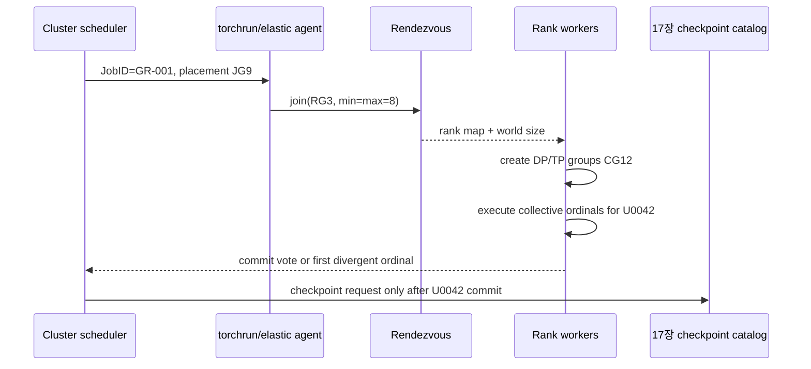

# 16장. 스케줄러와 대규모 클러스터

15장에서 만든 병렬화 지도는 “어느 rank가 무엇을 소유하는가”를 보여준다. 이 장의 스케줄은 그 소유권이 시간에 따라 어떻게 이동하는지를 보여준다. 같은 parameter shard도 forward 직전 all-gather 동안에는 여러 rank에 복제되고, backward가 끝나면 gradient가 reduce-scatter되며, optimizer step 뒤에는 다시 owner shard만 남는다. 따라서 클러스터 장애를 이해하려면 정적인 GPU 배치도만으로는 부족하다. **어느 microbatch가 어느 stage에 있었는지, 어떤 collective에 누가 아직 도착하지 않았는지, 그 순간 어떤 tensor가 어느 rank의 책임이었는지**를 한 시간축에 놓아야 한다.

이 장에서 반복해서 사용할 질문은 세 가지다. 첫째, 느린 것은 계산인가, collective 도착인가, 실제 전송인가. 둘째, 멈춘 rank는 원인인가, 앞선 rank를 기다리는 피해자인가. 셋째, 재시작이 성공했다는 말은 process가 다시 떴다는 뜻인가, 아니면 같은 sample·model·optimizer 상태에서 안전하게 이어졌다는 뜻인가. 세 질문을 분리하면 “NCCL이 느리다”나 “GPU 하나가 놀고 있다” 같은 성급한 결론을 피할 수 있다.

## 16.1 학습 불변식에서 topology 요구량을 도출한다

클러스터 배치는 빈 GPU를 찾는 문제가 아니라 학습 schedule이 요구하는 동시성·통신·memory 수명을 물리 자원에 만족시키는 문제다. 먼저 microbatch와 1F1B의 event 순서를 계산하고, 그 결과를 rank group과 link 요구량으로 번역한다.

### microbatch가 bubble과 activation 수명을 바꾼다

pipeline stage가 `P`개이면 첫 microbatch가 마지막 stage까지 도달하기 전에는 뒤쪽 stage가 놀고, 마지막 backward가 앞쪽 stage로 돌아오는 동안에는 앞쪽 stage가 다시 논다. 이것이 fill/drain bubble이다. 모든 stage 시간이 같고 단순 GPipe schedule을 쓴다는 이상화에서는 microbatch 수를 `M`이라 할 때 bubble 비율을 대략 `(P-1)/(M+P-1)`로 볼 수 있다. 이 식은 성능 예측값이 아니라 방향을 읽는 도구다. `M`을 늘리면 bubble은 줄지만 저장 activation, P2P event, accumulation window가 함께 늘어난다는 사실을 즉시 드러낸다.

1F1B는 warmup 뒤 한 forward와 한 backward를 교차시켜 오래 살아 있는 activation 수를 줄인다. 여기서 “메모리가 줄었다”는 말은 tensor가 사라졌다는 뜻이 아니다. 특정 microbatch의 forward 결과가 backward 소비 시점까지 queue에 머무는 시간이 짧아진다는 뜻이다. interleaving은 한 rank가 여러 virtual stage를 맡아 빈 슬롯을 더 촘촘히 채우지만, `(physical rank, virtual stage, microbatch, direction)`이 모두 통신 식별자의 일부가 된다. 이 좌표 중 하나라도 trace에서 빠지면 shape가 같은 다른 activation이 섞여도 원인을 찾기 어렵다.

### schedule option을 event·memory·throughput 변화로 번역한다

microbatch 수를 단순히 `global_batch = microbatch × accumulation × data_parallel`의 한 항으로만 보면 schedule 결함을 놓친다. 값을 바꾸면 activation queue 길이, RNG 호출 순서, pipeline send/recv 횟수, gradient가 optimizer step에 귀속되는 경계가 동시에 달라진다. 같은 global batch를 유지해도 microbatch와 accumulation의 분해가 다르면 peak memory와 collective overlap은 달라질 수 있다.

recompute granularity도 “메모리 대신 FLOP를 쓴다”로 끝나지 않는다. 저장하지 않은 구간을 backward 전에 다시 실행하므로 dropout·stochastic depth·router noise의 RNG 상태가 원 forward와 같아야 한다. 그렇지 않으면 backward는 앞에서 계산한 함수가 아니라 다른 표본의 함수를 미분한다. 최소 검산에서는 microbatch별 activation checksum, recompute 전후 RNG fingerprint, optimizer accumulation ID를 함께 남긴다. loss가 비슷하다는 사실만으로 이 동등성이 증명되지는 않는다.

### collective를 NVLink·PCIe·NIC 물리 경로에 놓는다

**NVLink에서 NIC까지**

논리 collective 하나도 물리적으로는 여러 경로를 지난다. NVLink와 NVSwitch는 주로 노드 내부 GPU 경로를, PCIe는 GPU–CPU·GPU–NIC 및 일부 GPU 간 경로를, RDMA NIC는 노드 사이 경로를 맡는다. NCCL은 발견한 topology와 payload를 바탕으로 algorithm·protocol·channel을 고르지만, 컨테이너에서 보이는 device 순서, NUMA binding, ACS/IOMMU, GPUDirect RDMA 성립 여부가 후보 경로 자체를 바꾼다. “같은 8 GPU”여도 어느 PCIe root와 NVSwitch island에 묶였는지가 다르면 같은 실험이 아니다.

진단할 때는 논리 group에서 물리 hop으로 내려간다. `DP rank 3` 같은 좌표만 남기지 말고 `hostname → GPU PCI bus ID → NVLink/NVSwitch domain → NIC/rail → process-group coordinate`를 연결한다. 그래야 all-reduce가 느릴 때 algorithm 선택 문제인지, 애초에 TP group이 느린 node 경계를 가로질렀는지 구분할 수 있다.

**CUDA·NCCL 환경 변수를 유효 상태로 기록한다**

NCCL 환경 변수는 두 부류로 나눠 읽는다. debug 수준처럼 **관측량**을 바꾸는 옵션과 interface·P2P·SHM·IB·algorithm·protocol처럼 **실행 경로**를 바꾸는 옵션이다. 후자를 바꾼 뒤 hang이 사라졌다면 원인을 고친 것이 아니라 문제가 있던 경로를 우회했을 수 있다. 그래서 한 번에 하나만 바꾸고, 선택된 transport와 topology graph, payload별 benchmark를 전후 `RunID`에 함께 남긴다.

예를 들어 IB를 끈 뒤 TCP로 성공했다는 결과는 “모델이 정상”이라는 좁은 control에는 쓸 수 있지만 “원래 RDMA 경로의 어느 링크가 고장”이라는 결론은 주지 않는다. 반대로 debug log가 늘어난 뒤 timing이 달라졌다면 계측 오버헤드도 기록해야 한다. 옵션 이름보다 그것이 바꾸는 상태 공간을 먼저 적는 습관이 중요하다.

**straggler·deadlock·partition**

**느림과 멈춤을 구분한다**

느림과 멈춤은 trace에서 다른 모양을 만든다. straggler가 있으면 같은 collective의 **진입 시각**이 rank마다 벌어진다. 데이터 decode, CPU page fault, thermal throttling, ECC recovery처럼 collective 이전의 일이 원인일 수 있다. 모든 rank가 비슷한 시각에 진입했는데 **종료 시각**만 늦다면 fabric·algorithm·contention을 먼저 본다. rank별 collective sequence나 tensor shape가 다르면 control-flow mismatch이며, 이 경우 timeout을 늘려도 해결되지 않는다.

network partition도 하나의 오류가 아니다. rendezvous는 membership 실패로, heartbeat는 process 도달성 실패로, 이미 시작된 collective는 timeout 또는 async error로 나타낼 수 있다. 따라서 “NCCL timeout”은 최초 원인이 아니라 여러 계층을 거쳐 뒤늦게 드러난 증상일 수 있다.

**최초 실패 rank 찾기**

GPU utilization이 0%인 rank를 곧바로 범인으로 지목하지 않는다. 그 rank가 먼저 collective에 도착해 느린 peer를 기다리는 피해자일 수 있기 때문이다. 가장 먼저 할 일은 rank별 마지막 dataloader batch ID, CUDA kernel, collective sequence와 enter/exit, async error, host stack을 clock skew가 보정된 한 시간축에 정렬하는 것이다.

판정 순서는 간단하다. `arrival skew → transfer duration → collective 이후 공백`을 차례로 본다. arrival skew가 크면 upstream compute/data를, 모든 rank 진입 뒤 transfer가 길면 fabric을, collective가 끝난 뒤 다음 kernel이 늦으면 stream dependency나 host scheduler를 조사한다. 이 순서를 지키면 동일한 낮은 GPU utilization을 서로 다른 원인으로 구분할 수 있다.

**logical mesh와 physical placement를 대응시킨다**

**가장 비싼 통신 축부터 topology에 배치한다**

TP처럼 layer마다 자주 통신하는 그룹은 가능한 한 같은 NVLink/NVSwitch domain 안에 두고, 상대적으로 빈도가 낮거나 큰 단위로 움직이는 DP·PP를 node 경계에 배치하는 것이 일반적인 출발점이다. 그러나 이것은 법칙이 아니다. EP all-to-all, PP activation 크기, FSDP prefetch가 겹치면 어느 group이 NIC를 더 세게 쓰는지가 workload마다 달라진다. placement는 이름이 아니라 `payload bytes × 호출 빈도 × 동시성 × 경로 유효 대역폭`으로 검산한다.

scheduler에 GPU 개수만 요청하면 이 조건을 보장할 수 없다. startup probe가 실제 allocation에서 hostname, GPU PCI bus, NVSwitch island, NIC/rail, NUMA distance를 읽고 기대한 rank map과 비교해야 한다. 불일치한 run을 그대로 시작하면 framework 옵션 실험과 placement 실험이 섞인다.

**handoff**

장애 주입은 rank kill, NIC stall, disk partial write를 한 번에 섞지 않는다. 각 실험은 최초 신호, peer가 보는 2차 증상, supervisor의 판정, 마지막 durable checkpoint, 재시작 첫 sample을 따로 기록한다. timeout을 짧게 해 빨리 실패하게 만드는 것은 탐지 정책이고, partial optimizer step 없이 안전하게 복구하는 것은 상태 일관성 문제다. 둘을 같은 성공 조건으로 묶으면 “빨리 죽었지만 잘못된 상태에서 재개한” run을 정상으로 오판한다.

**1F1B를 event table로 검산한다**

Megatron-LM 고정 checkout commit `8ac7abc4edb515334d8756fecf9ced07439c60b9`의 `megatron/core/pipeline_parallel/schedules.py:1723–1810`은 interleaved 1F1B steady-state와 P2P handle 소유권을 보여준다. 이 코드를 읽을 때 함수 호출 목록만 따라가지 말고 event table로 옮긴다.

| 시간 슬롯 | stage | microbatch | virtual chunk | 연산 | peer/event |
|---:|---:|---:|---:|---|---|
| `t` | 1 | 3 | 0 | forward 후 send | stage 2의 matching recv |
| `t+1` | 1 | 2 | 0 | backward 후 send | stage 0의 matching recv |
| `t+2` | 1 | 4 | 1 | forward | activation queue에 보존 |

실제 독자 fixture는 stage 4개, microbatch 8개로 모든 `(iteration, stage, microbatch, virtual chunk, forward/backward, send/recv)` event를 기록한다. 각 forward에 정확히 하나의 backward가 대응하고, send와 peer recv의 ID·shape·dtype·checksum이 맞으며, 모든 gradient가 하나의 accumulation window에만 속하는지 검사한다. timestamp만 같다고 dependency가 성립한다고 보지 않고 schedule 코드가 정한 partial order를 oracle로 사용한다.

warmup microbatch 수, virtual pipeline chunk 수, overlap P2P 옵션은 activation queue뿐 아니라 request 순서와 async handle의 소유자를 바꾼다. schedule이 예외로 중단됐을 때 outstanding handle이 남으면 다음 iteration이 같은 communicator·buffer를 재사용하며 hang하거나 잘못된 tensor를 소비할 수 있다. 그래서 send/recv 양쪽에 microbatch ID와 activation checksum을 찍고, 정상 종료뿐 아니라 예외 경로에서 handle이 wait·cancel·abort 중 어느 상태로 닫혔는지 확인한다.

## 16.2 NCCL collective를 host 호출에서 wire까지 추적한다

placement의 타당성은 장비 이름이 아니라 collective byte가 실제로 지난 경로로 판정한다. communicator 구성, algorithm·protocol 선택과 transport를 구분하고 예상 시간과 관측 시간을 같은 단위로 맞춘다.

rank map에는 hostname, CUDA device, PCI bus ID, NUMA node, NVLink/NVSwitch domain, NIC, rail, process group 좌표를 넣는다. `nvidia-smi topo`, NCCL topology dump, interface/RDMA 상태를 같은 RunID에 묶는다. 논리 TP group이 서로 다른 느린 PCIe/NIC 경로에 걸치면 collective 알고리즘 조정보다 placement 수정이 먼저다.

ring all-reduce는 bandwidth 효율이 좋지만 latency와 hop이 있고 tree는 작은 payload에서 유리할 수 있다. channel 수와 protocol 선택은 payload·topology에 따라 달라진다. 환경 변수를 튜닝할 때 실제 선택 log와 benchmark를 보며 한 변수씩 바꾼다. `NCCL_DEBUG`는 관측을, interface/transport disable은 실행 경로를 바꾼다는 차이를 지킨다.

### 장애를 GPU·PCIe·fabric·software 계층으로 분리한다

GPU Xid/ECC, CUDA kernel stall, host OOM, dataloader stall, NCCL timeout, RDMA retry, filesystem latency는 다른 최초 신호를 낸다. 한 rank의 CUDA 오류가 peer에서 통신 timeout으로 보일 수 있으므로 wall-clock으로 가장 이른 event를 찾는다. DCGM·kernel trace·NCCL log·scheduler event를 clock skew를 보정해 합친다.

network stall 실험은 특정 rank/port의 traffic delay·drop을 제한된 test cluster에서 주입한다. rank kill은 process supervisor와 rendezvous가 어떻게 반응하는지, node loss는 replacement와 checkpoint 선택을 본다. production fabric에 무제한 fault injection을 하지 않는다.

### topology별 usable capacity를 계산한다

TP는 layer마다 잦은 collective, PP는 stage boundary activation, DP는 gradient/parameter shard, EP는 token all-to-all traffic을 만든다. 각 payload bytes와 빈도를 계산해 NVLink와 NIC link budget에 배치한다. 평균 bandwidth만 아니라 tail collective와 simultaneous groups contention을 본다.

straggler가 나타나면 compute time, collective arrival skew, actual transfer를 분리한다. arrival이 늦으면 upstream compute/data, transfer가 길면 fabric, collective 뒤 공백이면 scheduler/host를 조사한다. 복구 checkpoint를 고른 뒤 17장의 sample·state 동일성 검증으로 넘긴다.

### pipeline bubble과 stage imbalance를 수치로 검산한다

PP stage 4개, microbatch 8개의 단순 schedule에서 fill/drain event를 그린다. 각 stage compute time이 같다는 이상화에서도 처음과 끝에는 idle slot이 생긴다. microbatch를 늘리면 bubble 비율은 줄지만 activation queue, P2P 호출, accumulation window가 커진다. 가장 느린 stage가 있으면 steady-state 주기는 그 stage가 결정한다.

1F1B는 forward activation을 무한히 쌓지 않고 backward와 교차한다. interleaved 1F1B는 한 rank가 virtual chunks를 여러 개 맡아 schedule을 촘촘하게 하지만 local chunk 전환과 P2P handle이 늘어난다. Megatron commit `8ac7abc4edb515334d8756fecf9ced07439c60b9`, `megatron/core/pipeline_parallel/schedules.py`, interleaved steady-state 1723–1810행을 고정 좌표로 읽는다.

**stage imbalance 실험**

MoE layer나 긴 context attention이 한 stage에 몰리면 균등 layer count partition이 불균형하다. stage별 forward/backward p50/p99, activation bytes, collective wait를 측정한다. layer cost model로 repartition한 뒤 bubble과 memory를 다시 계산한다.

straggler microbatch 하나를 인위적으로 지연해 downstream idle과 activation queue 변화를 본다. schedule이 timeout 후 outstanding send/recv를 정리하는지, 다음 iteration과 tag가 섞이지 않는지 검사한다.

**NVLink·NVSwitch 경로**

NVLink는 GPU 간 point-to-point link이고 NVSwitch system은 여러 GPU 사이 switching fabric을 제공한다. 링크 세대·GPU에 따라 bandwidth와 topology가 다르므로 “NVLink 있음”을 숫자로 쓰지 않는다. topology query에서 GPU pair별 link/path와 P2P capability를 기록한다.

TP group을 같은 NVSwitch domain에 배치하고 inter-domain은 DP/PP처럼 상대적으로 덜 빈번한 traffic에 쓴다. 실제 all-reduce/all-gather bandwidth를 payload size별로 측정한다. unidirectional peak를 collective effective bandwidth와 혼동하지 않는다.

**PCIe·NUMA·NIC**

GPU와 NIC가 같은 PCIe root/NUMA domain인지, GPUDirect RDMA path가 가능한지 확인한다. CPU affinity와 memory allocation이 원격 NUMA로 가면 host staging과 dataloader가 느려질 수 있다. NIC rail을 여러 개 쓸 때 rank별 interface와 subnet을 명시한다.

RoCE는 lossless/ECN/PFC와 congestion 설정, InfiniBand는 fabric/SM/QP 상태 같은 운영 요소가 있다. NCCL이 IB transport를 선택했다는 log와 실제 NIC counter를 연결한다. TCP fallback은 correctness 성공과 performance failure로 나눈다.

**NCCL byte benchmark**

15장의 collective 목록에서 대표 payload를 뽑아 all-reduce, all-gather, reduce-scatter, all-to-all을 process group별로 측정한다. warmup, 반복, sync timing을 명시하고 p50/p99를 저장한다. 작은 payload latency와 큰 payload bandwidth 영역을 분리한다.

ring all-reduce의 rank당 대략적 bytes `2(N−1)/N·M`을 예상치로 두고 실제 NIC/NVLink counter와 비교한다. 차이는 protocol overhead, channel, topology, contention, padding에서 찾는다. benchmark가 production overlap과 같다고 가정하지 않는다.

**NCCL 소스·공식 문서·benchmark를 삼각 검증한다**

사용 NCCL revision에서 communicator init, topology graph, transport selection, collective enqueue, async error/RAS path의 symbol을 고정한다. 공식 NCCL user guide의 environment variable section과 RAS/troubleshooting revision을 함께 기록한다. moving latest 문서의 기본값을 과거 run에 적용하지 않는다.

환경 변수는 실제 run manifest에 explicit value와 default source를 둔다. `NCCL_DEBUG`, interface, P2P/IB disable, algorithm/protocol 선택을 한 번에 바꾸지 않는다. 변경 전후 topology/algorithm log와 benchmark를 비교한다.

## 16.3 straggler와 hang을 최초 지연 사건에서 분리한다

동기식 학습의 마지막 증상은 모든 rank가 멈춘 것처럼 보이지만 원인은 한 rank의 늦은 data, kernel, collective 또는 process 종료일 수 있다. 공통 시계보다 event 인과를 우선해 최초 지연과 최초 실패를 찾는다.

각 rank는 dataloader batch ID, last CUDA kernel, collective sequence, enter/exit timestamp, async error를 ring buffer에 남긴다. coordinator는 timeout 시 buffer를 모아 공통 timeline을 만든다. clock offset을 보정하고 가장 이른 비정상 event를 표시한다.

rank 3이 collective 120에 못 왔고 마지막 event가 CUDA OOM이면 network가 원인이 아니다. 모든 rank가 120에 왔지만 NIC retry가 급증하면 fabric을 조사한다. rank마다 collective 120의 group/shape가 다르면 control-flow mismatch다.

### topology 장애를 통제된 범위에서 주입한다

rank process kill, GPU reset은 별 test cluster에서 수행한다. network delay/drop은 특정 interface와 시간으로 제한한다. NIC 하나를 내릴 때 multi-rail failover가 있는지, TCP fallback이 허용되는지 policy대로 판정한다. storage stall을 network stall과 섞지 않는다.

장애 후 supervisor/rendezvous가 job을 재구성하더라도 optimizer step의 atomicity는 17장 checkpoint가 결정한다. 마지막 log step이 아니라 마지막 durable CheckpointID를 선택한다.

### scheduler placement와 실행 trace를 같은 좌표로 잇는다

job scheduler placement request에는 GPU 개수 외에 node class, NVSwitch island, NIC rail, local SSD/checkpoint path를 포함할 수 있다. 실제 allocation이 요청을 만족했는지 startup probe가 검증한다. mismatch면 성능 실험을 시작하지 않거나 degraded run으로 별도 표시한다.

manifest는 logical rank coordinate를 physical hostname/GPU/NIC에 연결한다. restart에서 placement가 바뀌면 새 topology digest를 만들고 NCCL graph/benchmark를 다시 저장한다.

### P2P tag와 microbatch identity로 mismatch를 잡는다

pipeline send/recv가 tensor shape만 맞추면 다른 microbatch가 교차해도 즉시 오류가 나지 않을 수 있다. logical channel에는 iteration, microbatch, virtual stage, direction을 식별자로 둔다. framework 내부 tag/ordering 계약을 고정 source에서 확인하고 event trace에서 대응시킨다.

recompute나 interleaving으로 forward 순서와 backward 순서가 단순 역순이 아닐 수 있다. schedule oracle이 expected event partial order를 만들고 실제 trace가 이를 위반하면 hang 전에 실패시킨다.

**collective byte와 critical path를 손으로 계산한다**

TP=8에서 layer당 64 MiB all-reduce가 forward/backward 합쳐 두 번, layer 80개라면 iteration의 논리 payload만 매우 크다. NVLink island 안과 node 간 NIC에 놓였을 때 예상 전송 시간을 link effective bandwidth로 계산한다. 실제 overlap이 있으므로 합계 시간은 상한/diagnostic이지 wall time 예측의 완전식이 아니다.

PP activation `[microbatch,sequence,hidden]` BF16 bytes와 microbatch 수를 계산한다. sequence length를 늘리면 activation traffic과 compute가 함께 변한다. EP top-k all-to-all은 token count·hidden bytes·top-k·imbalance에 좌우된다.

**NIC congestion과 compute straggler를 반례로 구분한다**

평균 throughput은 정상인데 p99 collective만 튀는 경우 NIC queue, ECN/PFC, retransmit, competing job을 본다. 한 rail에 TP/EP traffic이 몰리는 placement를 만들어 counter와 tail latency가 민감한지 확인한다. transport를 TCP로 강제한 control과 비교하되 production tuning 결과로 일반화하지 않는다.

## 16.4 launcher·rendezvous·membership의 소유권을 고정한다

hang을 재현하려면 rank가 어떻게 태어나고 어느 generation에 가입했는지 알아야 한다. launcher, rendezvous store와 scheduler의 소유권을 분리하고 membership 변경을 단순 process 재시작이 아닌 transaction으로 다룬다.

IncidentID bundle에는 scheduler allocation, topology dump, NCCL env/log, rank event ring, GPU Xid/DCGM, NIC counters, host stack, last GoldenBatchID, last durable CheckpointID가 들어간다. 민감한 host/network 정보는 접근을 통제하지만 상호 시간축은 보존한다.

bundle 생성 자체가 실패 process를 무한히 기다리지 않도록 timeout과 partial marker를 둔다. 어느 rank 자료가 빠졌는지 manifest에 적는다.

### capture bundle을 보존한 뒤 recovery와 재배치를 실행한다

bad node를 제외해 restart하면 physical topology digest가 바뀐다. logical mesh를 새 allocation에 매핑하고 startup collective benchmark를 다시 수행한다. degraded path가 threshold를 넘으면 job을 시작하지 않거나 성능 결과를 별 run으로 분리한다.

checkpoint는 마지막 log step이 아니라 17장의 committed ID를 사용한다. first batch와 scheduler clock을 확인한 뒤 traffic을 정상 규모로 올린다.

**운영 종료 조건**

모든 rank event가 schedule oracle과 맞고, 실제 collective bytes가 예산을 설명하며, TP/EP group이 의도한 fabric에 배치되어야 한다. fault injection에서 최초 원인과 peer symptom이 분리되고 previous checkpoint가 보존되어야 한다.

이 조건과 IncidentID bundle이 있어야 topology tuning이 환경 변수 시행착오가 아니라 재현 가능한 실험이 된다.

### startup에서 GPU·NUMA·NIC affinity를 증명한다

각 process는 CPU affinity, NUMA node, GPU PCI bus, NIC interface와 distance를 출력한다. expected placement와 다르면 job scheduler allocation error로 fail한다. host memory bandwidth와 H2D, GPU–NIC RDMA smoke를 짧게 측정한다.

container network namespace에서 interface 이름이 host와 다를 수 있다. NCCL이 선택한 interface log를 실제 route와 비교한다. IPv4/IPv6, multiple subnet, firewall/QP 문제를 collective hang 이후가 아니라 startup에 찾는다.

### rendezvous generation과 membership을 봉인한다

job 시작의 rendezvous는 rank/world assignment와 generation을 만든다. stale worker가 old generation으로 collective에 들어오지 못하게 한다. elastic membership 변경은 새 topology digest와 process group을 만들고 old communicator를 정리한다.

coordinator failover, duplicate rank, late join을 주입한다. 모든 rank가 같은 generation/world를 확인하기 전 model state를 load하지 않는다. membership 성공과 training state reshard 성공은 별 gate다.

**async error를 process 종료와 재시작 신호로 연결한다**

collective enqueue는 비동기여서 Python call이 돌아와도 GPU 작업이 완료되지 않았을 수 있다. async error polling/RAS가 제공하는 범위와 watchdog timeout을 고정 revision에서 확인한다. timeout은 정상 long kernel보다 커야 하지만 장애를 지나치게 오래 숨기지 않게 workload로 조정한다.

abort가 communicator와 outstanding work를 어떻게 정리하는지 test한다. 한 group abort가 다른 독립 group까지 오염시키는지 본다. restart는 새 communicator generation을 사용한다.

**NVLink degradation**

링크가 완전히 끊기지 않아도 replay/error counter와 bandwidth degradation이 나타날 수 있다. pairwise P2P와 collective benchmark를 baseline distribution과 비교한다. thermal clock drop이나 GPU contention을 link failure와 분리한다.

degraded GPU/node를 drain한 뒤 replacement topology를 다시 probe한다. 단순 retry로 같은 bad path를 반복하지 않는다. IncidentID에 hardware counter와 placement를 연결한다.

**all-to-all congestion**

EP dispatch가 균등하다는 가정 아래 평균 bytes를 계산한 뒤 실제 router imbalance로 peer matrix를 만든다. hot expert owner의 ingress와 compute가 병목이 된다. top-k, capacity, expert placement를 한 변수씩 바꾸어 tail latency와 dropped token을 본다.

DeepEP류 specialized transport를 쓴다면 source commit의 dispatch/combine, buffer ownership, RDMA path와 test를 직접 고정한다. 기능 존재를 현재 topology 실행 증거로 쓰지 않는다.

**checkpoint I/O와 collective network를 분리 진단한다**

checkpoint write가 NIC를 공유하면 training collective tail이 늘 수 있다. storage traffic과 NCCL traffic의 interface/rail, QoS, timestamp를 기록한다. async checkpoint가 overlap됐다는 이유로 공짜라고 보지 않는다.

storage stall을 주입해 dataloader/checkpoint writer backpressure가 collective arrival skew로 번지는 경로를 본다. 최초 storage event를 peer NCCL timeout보다 앞에 둔다.

## 16.5 schedule trace와 capacity model을 recovery 기준으로 삼는다

복구 성공은 job이 다시 RUNNING 상태가 된 순간이 아니다. 정상 schedule oracle, step time 분포와 checkpoint lineage가 복구 전 불변식으로 돌아왔음을 증명해야 useful work가 재개됐다고 말할 수 있다.

expected 1F1B event DAG에서 각 send는 matching recv, 각 forward는 backward, 각 microbatch는 optimizer accumulation 하나에 속한다. 실제 event가 DAG partial order를 지키는지 자동 검사한다. timestamp가 같은 것만으로 dependency를 추론하지 않는다.

virtual chunks와 recompute를 켠 config별 oracle을 생성한다. framework upgrade 뒤 event count/order diff를 review한다.

### capacity model을 실측 step time과 대조한다

layer compute FLOP, activation bytes, collective bytes, link effective bandwidth로 stage time의 하한을 계산한다. profiler p50/p99와 비교해 unexplained host gap과 contention을 찾는다. 모델은 prediction이 아니라 anomaly baseline으로 쓴다.

sequence length·microbatch·parallel degree sweep은 OOM과 bubble, network를 함께 기록한다. 최적점은 tokens/s뿐 아니라 failure recovery와 checkpoint interval 제약을 만족해야 한다.

### incident를 증상보다 최초 실패 계층으로 분류한다

compute straggler, arrival skew, transfer stall, control-flow mismatch, process failure, hardware degradation, storage backpressure를 분리한다. 각 class에는 첫 signal, 최소 bundle, safe experiment, recovery action을 지정한다.

원인 미확정이면 network로 뭉뚱그리지 않는다. evidence가 없는 production incident 사례를 재구성해 사실처럼 쓰지 않는다.

### 마지막 복구 rehearsal에서 RTO와 data replay를 잰다

steady 1F1B 중 rank를 kill하고 log bundle을 수집한다. job을 중단해 마지막 durable checkpoint를 선택하고 replacement node에서 topology probe, DCP load, first batch/update를 검증한다. same IncidentID에 detection, RCA, recovery, verification을 연결한다.

복구 시간과 lost/replayed sample, topology diff, performance degradation을 report한다. 이 결과가 17장의 checkpoint acceptance와 함께 있어야 cluster resilience를 주장할 수 있다.

**collective 한 건의 rank·byte·transport를 끝까지 추적한다**

gradient bucket `bucket-17`, BF16 64 MiB, DP group 8 ranks를 고른다. autograd ready timestamp, NCCL enqueue, GPU kernel start/end, link counter delta, consumer optimizer event를 연결한다. ring 예상 rank당 bytes와 실제 counter를 비교한다. buffer padding과 protocol overhead를 설명한다.

rank 5의 enqueue가 20 ms 늦으면 network transfer가 아니라 arrival skew다. 모든 rank enqueue 뒤 kernel이 100 ms 길면 fabric/algorithm을 본다. kernel은 끝났는데 optimizer가 늦으면 stream dependency 또는 host scheduling을 본다. 이 한 건의 추적법을 TP all-gather와 EP all-to-all에도 적용한다.

**1F1B 장애 fixture로 replay 경계를 계산한다**

stage 4, microbatch 8에서 stage 2의 microbatch 3 forward를 100 ms 지연한다. event DAG에서 어떤 downstream send와 upstream backward가 기다리는지 예측한다. 실제 trace의 idle propagation이 oracle과 맞는지 본다. 다른 microbatch tag가 재사용되거나 activation buffer가 덮이면 correctness failure다.

stage 2를 kill하면 outstanding P2P handle, communicator abort, supervisor detection 시간을 기록한다. job이 restart해도 microbatch 0–2의 gradient가 partial optimizer effect를 만들지 않았는지는 checkpoint/commit ledger에서 확인한다.

**NVLink와 NIC 배치 비교**

같은 TP group을 NVSwitch island 내부에 둔 배치 A와 node 경계를 넘긴 잘못된 배치 B에서 1 MiB/64 MiB/1 GiB collective를 측정한다. latency·bandwidth·tail을 비교하고 topology dump를 결과에 붙인다. B의 결과를 “NCCL 자체가 느리다”로 일반화하지 않는다.

EP traffic은 peer matrix가 불균형하므로 aggregate bandwidth만 보지 않는다. hot peer ingress, NIC rail, router distribution을 함께 본다. placement 변경이 model token routing을 바꾸지 않았는지 동일 router output을 고정한다.

**hang recovery playbook**

5분 안에는 scheduler state, process 생존, earliest GPU/Xid/OOM, collective sequence mismatch를 확인한다. 30분 안에는 topology/NCCL log와 NIC counter, minimal collective reproduction을 만든다. 반나절 조사에서는 hardware swap, placement control, framework revision 비교를 수행한다.

timeout 확대, transport disable, algorithm 강제는 각각 path를 바꾸는 실험이다. 동시에 적용하지 않고 before/after bundle을 남긴다. 원인을 찾지 못하면 확인된 사실과 배제된 가설을 분리한다.

**source 좌표의 직접성**

Megatron `8ac7…0b9`, `schedules.py:1723–1810`은 interleaved event/handle 경로를 뒷받침하지만 특정 cluster bandwidth를 증명하지 않는다. NCCL source는 사용 revision의 topology/transport/collective/RAS symbol을 직접 고정하고 공식 guide revision과 짝을 이룬다. 실제 bandwidth와 hang은 RunID trace 근거다.

DeepEP 같은 specialized transport를 설명할 때도 buffer/RDMA source와 benchmark environment를 분리한다. source branch가 존재한다는 사실을 현재 GPU/NIC에서 사용됐다는 증거로 바꾸지 않는다.

**acceptance를 throughput·correctness·recovery 공동 gate로 닫는다**

startup placement probe, schedule oracle, collective byte trace, failure injection, recovery rehearsal이 같은 topology digest를 가리켜야 한다. p99 collective와 stage bubble이 budget을 만족하고 unexplained mismatch가 없어야 한다. degraded link/node는 scheduler exclusion에 반영한다.

마지막 성공 log step과 durable checkpoint가 다르면 후자를 복구 기준으로 선택한다. IncidentID bundle과 first resume event를 17장 report에 연결한다.

**multi-cluster/WAN 경계**

단일 training collective를 불안정한 WAN에 그대로 늘리는 것은 대개 latency·failure-domain 가정을 깨뜨린다. multi-cluster 구성은 checkpoint replication, data locality, job failover와 같은 느슨한 결합인지, 실제 synchronous ranks인지 구분한다. WAN bandwidth·RTT·loss와 rendezvous timeout을 manifest에 둔다.

remote site failover는 source/container/data/checkpoint가 모두 존재해야 한다. checkpoint replication 완료와 latest pointer replication의 순서를 검증한다. 서로 다른 site가 동시에 writer가 되지 않도록 generation/lease를 둔다.

**topology 변화와 reproducibility**

같은 world size라도 GPU generation, NVLink island, NIC rail이 달라지면 kernel/collective 순서와 numerical 결과가 달라질 수 있다. topology-portable과 bitwise-identical을 구분한다. replacement run의 topology digest와 performance baseline을 새로 만든다.

collective algorithm 자동 선택이 달라졌다면 NCCL log에 남긴다. validation 결과 차이를 network 자체의 학습 효과로 추론하지 않고 reduction order·batch/sample continuity를 먼저 확인한다.

**cluster cost accounting**

tokens/s만 아니라 GPU-hours, network bytes, checkpoint storage/write, failed/replayed work를 계산한다. PP bubble과 straggler idle을 GPU-time waste로 환산한다. fault recovery가 빠르더라도 checkpoint가 너무 잦아 steady throughput을 크게 깎으면 interval을 재설계한다.

비용 비교는 같은 model/token/eval quality를 기준으로 한다. 다른 precision이나 batch로 얻은 throughput을 topology 개선으로만 귀속하지 않는다.

**final handoff table**

각 IncidentID에는 topology digest, failed rank/node/link, earliest signal, last complete optimizer commit, selected CheckpointID, replacement placement를 기록한다. rank trace와 checkpoint manifest의 clock을 join한다.

17장은 이 table에서 마지막 성공 log가 아니라 selected durable ID를 받고, 복구 첫 GoldenBatchID를 되돌려준다. loop가 닫혀야 cluster recovery가 검증된다.

**최종 수용 checklist**

첫째 rank coordinate와 physical placement가 요청 topology를 만족한다. 둘째 Megatron fixed schedule 좌표와 실제 event trace가 1F1B partial order를 만족한다. 셋째 대표 collective의 expected bytes, NCCL kernel, link counter가 설명 가능하다. 넷째 stage p99와 bubble이 capacity budget 안이다.

다섯째 rank kill·network stall·bad placement가 서로 다른 최초 signal로 분류된다. 여섯째 hang capture bundle에 빠진 rank가 명시된다. 일곱째 replacement allocation에는 새 topology digest와 startup benchmark를 기록한다. 여덟째 마지막 durable CheckpointID와 resume first event가 IncidentID에 연결된다.

하나라도 실패하면 timeout이나 환경 변수를 무작정 바꾸지 않는다. 해당 layer의 최소 fixture로 돌아간다. P2P mismatch는 schedule, arrival skew는 compute/data, transfer stall은 fabric, restore 실패는 checkpoint로 owner를 정한다.

결과 표에는 locally executed, upstream tested, proposed를 표시한다. 공개 source의 정상 경로가 자신의 cluster fault tolerance를 증명한다고 쓰지 않는다. fleet-private counter/incident가 없으면 그 경계를 명시한다.

이 checklist는 빠른 topology가 아니라 설명 가능하고 복구 가능한 topology를 선택하게 한다. 성능 회귀와 correctness failure를 다른 release gate로 유지한다.

## 16.6 작은 cluster 사례에서 source·test·RCA를 결합한다

추상적인 운영 원칙을 2노드 pipeline 사례에 적용한다. 정상 timeline을 먼저 계산한 뒤 negative control과 실제 source 좌표를 연결하면 throughput 급락과 hang RCA가 추측이 아니라 반증 가능한 주장으로 바뀐다.

사례는 노드당 GPU 4개, PP 2×TP 4 topology다. 각 pipeline stage는 한 node 안 TP group을 사용하고 stage 사이 activation은 node 간 link를 지난다. 이 placement는 NVLink/NVSwitch local collective와 NIC/PCIe inter-node transfer의 경계를 명확하게 하지만 stage compute가 불균형하면 bubble이 커진다.

TopologyManifest에는 node/GPU/NIC, PCIe root, NUMA, NVLink/NVSwitch와 process rank 좌표를 기록한다. 논리 PP/TP map과 물리 device/link를 join한다. scheduler가 배정한 hostname만 저장하지 않고 startup probe의 peer access, NIC affinity와 measured link class를 기록한다.

### pipeline timeline과 bubble을 숫자로 그린다

두 stage의 forward가 각각 6ms, 10ms, backward가 8ms, 12ms이고 stage transfer가 방향별 2ms라고 하자. microbatch 하나의 직렬 시간과 four-microbatch 1F1B schedule을 event table로 그린다. stage 1의 10/12ms가 bottleneck이며 stage 0이 기다리는 bubble이 생긴다.

이론식만 쓰지 않고 rank trace에서 `F(m,s)`, send/recv, `B(m,s)` 시작/끝을 기록한다. 각 microbatch는 정확히 한 forward와 backward를 가져야 하고 backward는 필요한 forward activation과 gradient recv 뒤 시작한다. event dependency DAG가 실제 timestamp보다 correctness의 기준이다.

activation tensor `[microbatch,seq,hidden]` BF16 byte를 계산한다. `m=2, seq=2048, hidden=4096`이면 약 32 MiB다. forward와 backward transfer, pipeline depth와 inflight count로 link payload와 activation live-set을 계산한다. header/protocol과 algorithmic traffic은 별도다.

### microbatch가 memory와 throughput을 교환하는 지점을 찾는다

microbatch 수를 늘리면 fill/drain bubble 비율은 줄 수 있지만 activation live-set, kernel 효율, scheduler overhead와 data latency가 바뀐다. global batch를 유지하며 microbatch size와 count를 바꾸는 실험과 global batch까지 바뀌는 실험을 분리한다.

stage cost가 불균형하면 microbatch만 늘려도 bottleneck service time은 그대로다. layer partition을 옮기거나 virtual stage/interleaving을 검토한다. partition 변경은 parameter/checkpoint owner를 바꾸므로 새 topology digest와 15장 one-step oracle을 요구한다.

variable sequence에서는 stage cost와 transfer byte가 batch마다 달라진다. 평균 길이 synthetic benchmark가 p99 bubble을 숨긴다. length bucket별 schedule과 real mixture를 trace한다. longest stage time과 arrival skew를 microbatch별로 본다.

### launcher·scheduler·collective source를 test fixture에 연결한다

선택 framework commit에서 pipeline schedule class, send/recv primitive, microbatch ID propagation, process-group creation과 loss/gradient finalize를 잇는다. configuration name이 실제 1F1B 또는 interleaved branch를 선택하는 factory도 고정한다.

upstream test는 stage 수, microbatch, forward/backward order, loss parity 중 무엇을 assert하는지 적는다. single-node two-stage test가 inter-node network fault와 elastic replacement를 증명하지 않는다. local trace/oracle과 chaos test를 별 evidence로 둔다.

run trace의 schedule symbol과 source map이 일치해야 한다. fallback schedule, disabled overlap이나 eager communication이 있다면 performance label을 바꾼다. source function 존재를 실제 selected path로 쓰지 않는다.

**collective와 P2P sequence oracle**

각 process group에 monotonically increasing sequence와 tensor metadata를 붙인다. TP collective와 PP send/recv가 다른 group/stream에서 일어나도 microbatch dependency로 join한다. rank별 trace를 모아 같은 collective group의 member와 sequence가 일치하는지 검사한다.

PP send의 peer/microbatch/tensor hash와 recv 기대를 맞춘다. microbatch ID swap, shape mismatch, 한 rank send skip을 negative control로 넣는다. timeout이 아니라 oracle이 최초 mismatch에서 빠르게 실패하도록 한다.

TP collective가 stage compute와 overlap될 때 stream event dependency를 기록한다. host launch 순서만 같아도 GPU execution race가 있을 수 있다. output checksum과 CUDA event를 one-step fixture에서 검증한다.

**network critical path와 topology**

inter-node transfer는 GPU→NIC 경로가 GPUDirect인지 host staging인지 actual trace/counter로 확인한다. GPU와 NIC의 PCIe root/NUMA affinity가 다르면 bandwidth와 CPU overhead가 달라질 수 있다. environment variable만 보고 transport를 추정하지 않는다.

NCCL topology dump와 framework trace, NIC counter를 같은 IncidentID에 묶는다. expected payload와 transmitted bytes, retransmit/error를 비교한다. collective algorithm/channel 변경은 source/runtime evidence와 새 performance run을 요구한다.

bandwidth microbenchmark는 production payload size와 concurrency를 포함해야 한다. 작은 ping-pong latency와 큰 all-reduce bandwidth를 stage transfer에 그대로 대입하지 않는다. background traffic과 contention을 별 변수로 기록한다.

**negative control로 진단 분기를 검증한다**

첫째 stage layer 하나를 옮겨 imbalance 경보가 민감한지 본다. 둘째 microbatch ID를 swap해 dependency oracle을 실패시킨다. 셋째 rank 하나의 collective 순서를 바꾼다. 넷째 NIC affinity를 나쁜 NUMA에 배치한다.

다섯째 one-way network delay와 packet loss를 주입한다. 여섯째 dataloader rank 하나에 sleep을 넣어 arrival skew와 network stall을 구분한다. 일곱째 GPU rank를 kill해 peer timeout, scheduler incident와 checkpoint selection을 잇는다.

각 control에는 최초 expected signal을 지정한다. layer imbalance는 stage duration, data sleep은 forward arrival, network delay는 send/recv/counter, rank kill은 process health와 peer error다. 모두 “NCCL timeout”으로 끝나면 observability가 부족하다.

**training hang과 throughput 급락 RCA를 분리한다**

hang 감지 시 모든 rank stack/stream과 마지막 event를 같은 시각 기준으로 수집한다. 한 rank의 마지막 collective가 N이고 peer가 N+1이면 sequence divergence다. 모두 N에서 기다리지만 한 rank가 compute 중이면 arrival skew다. send는 완료됐는데 recv progress가 없고 NIC error가 있으면 fabric 후보다.

timeout 값을 늘리기 전에 최초 rank와 microbatch를 찾는다. timeout은 detection latency를 바꾸지 protocol mismatch를 고치지 않는다. 재현 fixture에서 same sequence를 확인하고 production topology 변경을 분리한다.

incident report에는 last successful global/microbatch, in-flight set, optimizer commit 여부와 last durable checkpoint를 기록한다. partial accumulation을 재생할지 버릴지 17장 복구 계약으로 넘긴다.

**incident/RCA: throughput 급락**

step wall을 stage compute, bubble, PP transfer, TP collective, data wait로 분해한다. stage p50/max가 모두 느려졌는지 한 rank straggler인지 본다. GPU clock/thermal/ECC, CPU/NUMA, NIC counter와 topology placement를 timeline에 놓는다.

batch/sequence mixture가 바뀌었으면 같은 workload slowdown이 아니다. compile/cache나 precision backend가 fallback됐는지도 확인한다. network tuning 전에 actual kernel과 payload를 고정한다.

replacement node에서만 느리면 firmware/driver/NIC routing과 startup microbenchmark를 기준 node와 비교한다. topology digest가 같다는 논리 map만으로 물리 성능 동등성을 주장하지 않는다.

**rank replacement 뒤 data·optimizer·schedule 상태를 검증한다**

health monitor가 rank loss를 감지하면 새 batch admission을 멈추고 IncidentID를 만든다. last completed optimizer commit과 in-flight microbatch를 event ledger에서 고정한다. peer process를 종료해 split job을 막고 durable checkpoint를 선택한다.

replacement allocation은 GPU/NIC topology probe와 source/container digest를 통과해야 한다. 동일 rank coordinate에 새 physical device가 들어가도 TopologyManifest revision은 바뀐다. checkpoint shard mapping과 process group을 재생성한다.

resume 첫 pipeline schedule은 Golden microbatch로 stage output, transfer와 optimizer delta를 확인한다. correctness 회복 뒤 stage duration/collective p99가 baseline을 만족해야 full traffic으로 돌아간다. 성능만 degraded면 제한 운영으로 표시한다.

**observability dashboard**

첫 panel은 stage별 F/B duration과 bubble, inflight microbatch다. 둘째는 PP send/recv byte/latency와 TP collective p50/p99다. 셋째는 rank health, GPU/NIC/PCIe event와 placement다. 넷째는 data arrival과 compile/backend다.

metric timestamp만으로 causality를 정하지 않고 event dependency와 sequence를 사용한다. high-cardinality microbatch/rank trace는 incident artifact에 두고 dashboard는 bounded aggregate와 exemplar를 쓴다. IncidentID에서 raw trace로 내려간다.

alerts는 missing peer event, collective sequence mismatch, stage imbalance, bubble budget, network error, arrival skew를 구분한다. 하나의 generic timeout alert만 두지 않는다. 최초 signal이 RCA owner를 결정한다.

**evidence package와 인수**

package에는 physical/logical topology, placement probe, pipeline event DAG, payload/critical-path budget, source/test map, negative control, incident/recovery report를 담는다. 모든 artifact는 같은 TopologyManifest, model, batch/precision와 source digest를 가리킨다.

독자는 four-microbatch schedule을 손으로 그리고 trace oracle과 비교한다. activation byte와 expected link payload를 계산한다. ID swap, collective reorder, data sleep, network delay와 rank kill을 각각 주입해 최초 signal을 확인한다.

인수 기준은 microbatch forward/backward multiplicity 정확, group sequence mismatch 0, unexplained payload 차이 0, hang capture의 missing rank 0, replacement resume correctness 통과다. throughput과 p99는 correctness 뒤 별 SLO로 판정한다.

**topology 후보 비교 카드**

후보 A는 PP stage를 node 단위로 배치해 TP collective를 NVLink/NVSwitch 안에 둔다. 후보 B는 stage를 node 사이에 걸쳐 compute 균형을 맞추지만 TP collective가 NIC를 탈 수 있다. 후보 C는 layer partition을 바꿔 stage 시간을 맞춘다. 각 후보의 logic topology와 physical link를 함께 그린다.

표에는 stage p50/max, bubble, local/inter-node collective byte, PP transfer, rank max memory, checkpoint mapping과 failure domain을 기록한다. 한 microbenchmark의 최대 bandwidth로 선택하지 않는다. 실제 sequence/microbatch mixture와 concurrent collective에서 critical path를 잰다.

placement가 빠르더라도 한 node failure가 특정 stage 전체를 잃거나 replacement가 어려울 수 있다. topology 선택에는 recovery allocation과 checkpoint restore time도 들어간다. 성능과 failure blast radius를 별 열로 둔다.

**data pipeline과 arrival skew**

stage 0이 batch를 늦게 받으면 뒤 stage와 network가 idle해도 pipeline bubble로 보인다. dataloader fetch, CPU tokenize/collate, host→device와 first forward start를 trace한다. rank별 sample length와 storage locality를 비교한다.

한 rank에 sleep을 넣는 negative control로 arrival-skew alert가 network alert와 분리되는지 본다. 모든 rank가 collective에서 기다린다는 stack만 보면 network 문제로 오인할 수 있다. 최초 늦은 event가 data/compute인지 확인한다.

prefetch를 늘리면 arrival은 개선될 수 있지만 host/GPU memory와 checkpoint I/O contention이 생긴다. data worker 수, pinned buffer와 NUMA affinity를 topology manifest에 넣는다. training network와 storage network 공유도 incident timeline에서 본다.

**재시작 후 성능 검증**

복구 뒤 correctness Golden schedule을 먼저 실행한다. 다음으로 stage duration, transfer/collective p99와 bubble을 baseline window와 비교한다. replacement GPU/NIC가 기능은 맞지만 느릴 수 있다. 제한 운영 threshold와 full return threshold를 구분한다.

compile cache와 autotune이 cold 상태면 초기 step을 steady regression으로 판단하지 않는다. cold/warm을 표시하고 warmup 완료 event를 둔다. 반대로 지속 recompilation이나 fallback이면 시간이 지나도 회복되지 않으므로 backend trace를 본다.

resume data cursor가 달라 sequence length mixture가 바뀌면 performance 비교도 왜곡된다. 동일 Golden workload와 production mixture 두 단계로 확인한다. sample-exact가 아니면 workload-normalized 비교를 별도로 낸다.

**control plane failure**

training rank가 정상이어도 scheduler/coordinator나 rendezvous service가 실패할 수 있다. worker lease, job epoch, process-group generation을 event에 넣는다. old coordinator message가 새 epoch rank를 종료하거나 old placement를 publish하지 못하게 한다.

network partition에서 두 scheduler가 replacement를 각각 만들면 duplicate job이 checkpoint/catalog를 쓸 수 있다. single-writer term 또는 conditional job epoch를 둔다. 보장 범위가 단일 control process라면 그 한계를 명시한다. process kill test를 partition consensus evidence로 확대하지 않는다.

stale worker가 돌아오면 current epoch/topology digest를 확인하고 training collective에 재가입하지 않는다. object write나 metric도 IncidentID/epoch로 격리한다. split-brain negative control이 duplicate optimizer/checkpoint commit을 막는지 17장과 함께 검증한다.

**최소 제출 파일**

최종 bundle은 `TopologyManifest`, placement probe, pipeline schedule DAG, rank trace, payload/critical-path worksheet, source/test map, negative control과 IncidentID report다. checkpoint selection과 replacement resume evidence를 연결한다.

trace는 clock synchronization 오차와 source timestamp를 명시한다. event ordering은 dependency/sequence를 우선하고 wall time은 latency 분석에 쓴다. missing trace를 0 duration으로 채우지 않는다. unknown rank/event를 report한다.

incident report에는 detection, capture, classification, last commit/checkpoint, replacement, correctness/performance verification과 closure를 기록한다. locally executed, upstream tested와 proposed fault를 구분한다.

**마지막 구두 검산**

인수자는 microbatch 하나가 stage 0 forward에서 마지막 stage backward까지 지나가는 event와 activation byte를 설명한다. 각 send/recv peer와 TP collective group을 trace에서 찾는다. stage bubble이 compute imbalance, data arrival 또는 network 중 어디에서 생겼는지 근거를 말한다.

두 번째 질문은 rank kill 시 마지막 성공 global state다. rank stack의 마지막 event만이 아니라 optimizer commit과 durable CheckpointID, in-flight microbatch를 연결한다. 재개 시 어느 sample을 재실행하거나 버리는지 설명해야 한다.

세 번째 질문은 replacement가 원 cluster와 같은가다. source/container만 아니라 physical topology, driver/firmware, link probe와 steady critical path를 비교한다. correctness와 performance recovery를 각각 판정한다. 이 세 답이 IncidentID bundle과 맞아야 운영 인수가 끝난다.

**최종 회귀 표본**

CI schedule oracle은 two-stage, four-microbatch의 exact forward/backward/send/recv dependency를 검사한다. ID swap, send skip과 collective reorder가 실패해야 한다. timestamp 절대값이 아니라 event multiplicity와 happens-before를 우선한다. 실행 환경이 느려져도 correctness test가 흔들리지 않는다.

release candidate는 production model/batch에서 physical topology probe, stage p50/max, bubble, PP/TP payload와 rank max memory를 저장한다. source, layer partition, microbatch, precision, driver/firmware가 바뀌면 기준선을 새로 만든다. compile warmup과 steady window를 분리한다.

chaos 표본은 data sleep, link delay, rank kill과 stale coordinator event를 포함한다. 각 fault의 최초 signal과 terminal state가 고정돼야 한다. generic timeout만 발생하거나 last commit/checkpoint를 찾지 못하면 운영 회귀 실패다.

**capacity 변경 RFC**

node/GPU를 늘릴 때 logical PP/TP/DP, global batch, stage partition과 physical placement가 함께 바뀔 수 있다. RFC는 old/new stage compute, activation/collective byte, bubble, failure domain과 checkpoint migration을 계산한다. 단순 GPU 수 비율로 예상 throughput을 만들지 않는다.

new topology의 startup microbenchmark는 peer/NIC/link별 latency와 bandwidth, collective payload shape를 실제 workload와 맞춘다. 결과가 기준 밖이면 allocation을 교체하거나 제한 운영한다. 느린 node 하나가 전체 pipeline critical path를 결정할 수 있다.

rollout은 synthetic oracle, Golden schedule, short production mixture, chaos/recovery 순서다. correctness와 p99 모두 통과한 뒤 full run을 연다. rollback은 compatible topology manifest와 last verified CheckpointID를 사용한다.

**incident closure 품질**

장애가 끝났다는 말은 프로세스가 다시 떴다는 뜻이 아니다. 최초 이상 신호에서 잘못된 rank·link·collective를 찾고, 수정 뒤 같은 topology와 payload로 재현 시험을 통과하며, 복구에 사용한 CheckpointID와 남은 성능 편차까지 닫아야 한다. 이 절부터는 incident 기록을 collective의 알고리즘, 물리 경로, 시간축으로 분해해 “무엇을 고쳤고 무엇은 아직 모르는가”를 판정한다.

## 16.7 collective와 pipeline scheduler의 두 시간축을 해부한다

cluster scheduler는 job을 node에 놓고 training scheduler는 같은 자원 안에서 forward·backward·collective 순서를 만든다. 두 시간축을 섞지 않고 각각의 상태 전이를 읽은 뒤, straggler가 어느 경계에서 다른 축을 막았는지 연결한다.

### collective를 algorithm·path·time으로 분해한다

**all-reduce는 한 번의 통신이 아니다**

데이터 병렬 gradient all-reduce를 “모든 GPU가 gradient를 교환한다”라고만 설명하면 병목을 찾을 수 없다. 실제 비용은 payload 크기 (M), rank 수 (p), 선택된 알고리즘, 채널 수, 링크 대역폭과 지연, topology에 의해 정해진다. ring reduce-scatter와 all-gather를 결합하면 각 rank가 대략 (2(p-1)M/p) byte를 보내고 받는다. tree는 단계 수를 줄여 작은 메시지 지연에 유리할 수 있지만 링크 활용과 topology에 따라 결과가 달라진다. 이 식은 wire overhead와 protocol chunk를 생략한 하한 모델이지 측정값 그 자체가 아니다.

같은 (M)이라도 tensor가 여러 bucket으로 나뉘면 launch와 latency가 반복된다. bucket을 키우면 통신 효율은 좋아질 수 있지만 backward 초기에 준비된 gradient가 늦은 tensor를 기다려 overlap이 줄 수 있다. bucket을 줄이면 overlap 기회는 늘지만 작은 collective가 많아진다. 따라서 `bucket_cap_mb` 같은 옵션은 단순 메모리 knob가 아니라 “어느 gradient가 언제 ready되고 어느 collective가 critical path에 올라오는가”를 바꾸는 scheduler knob다.

분석 절차는 다섯 timestamp를 기록하는 것이다. backward op 종료, bucket ready, collective enqueue, GPU collective kernel 시작, collective 완료를 bucket마다 남긴다. enqueue와 시작 사이가 길면 stream dependency나 앞선 collective를 의심한다. kernel 실행이 길면 topology·congestion·protocol을 본다. bucket ready가 늦으면 모델 stage imbalance나 autograd 순서를 본다. step time만으로는 이 세 원인을 구분할 수 없다.

**reduce-scatter와 all-gather의 소유권**

FSDP나 ZeRO 계열에서는 parameter, gradient, optimizer state의 소유권이 시점마다 달라진다. forward 직전 parameter all-gather, forward/backward 계산, gradient reduce-scatter, optimizer shard update가 이어진다. prefetch 옵션은 다음 layer의 all-gather를 앞당겨 계산과 겹치지만 peak memory를 늘린다. backward prefetch는 현재 layer의 backward compute와 인접 layer 통신 순서를 바꾼다. 옵션 하나가 실제로 바꾸는 상태는 “어느 shard가 어느 rank 메모리에 언제 materialize되는가”다.

한 layer (l)에 대해 `ParamShard(l,r)`, `FullParam(l)`, `GradFull(l)`, `GradShard(l,r)`, `OptimShard(l,r)`의 생존 구간을 timeline에 그린다. full parameter가 예상보다 오래 살아 있으면 reshard-after-forward 설정과 outstanding autograd reference를 확인한다. all-gather가 계산보다 늦게 끝나면 prefetch distance와 NCCL stream priority를 본다. 메모리 OOM과 throughput 저하는 같은 lifetime diagram에서 함께 설명해야 한다.

고장 주입은 prefetch를 끄고 켠 두 trace를 비교한다. 모델, batch, sequence, precision, world size를 고정하고 peak allocated/reserved memory, layer별 wait, collective byte, step time을 측정한다. 통신 시간 합이 줄지 않아도 critical path가 줄면 overlap이 성공한 것이다. profiler의 통신 kernel 총시간만 합산해 “느려졌다”고 판정하면 병렬 실행을 이중 계산할 수 있다.

**all-to-all은 MoE 배치 문제다**

expert parallel all-to-all의 payload는 token routing에 따라 step마다 바뀐다. 평균 token 수만 보면 특정 expert로 몰리는 hot spot을 놓친다. dispatch 전 rank별 expert count, capacity drop 또는 padding, 실제 송수신 byte, combine 이후 token 순서를 기록한다. router balance loss가 좋아도 물리 rank 배치가 나쁘면 cross-node traffic이 커질 수 있다.

expert를 topology에 배치할 때 자주 함께 선택되는 expert가 같은 NVLink island에 있는 것이 유리할 수 있지만 load balance와 충돌한다. topology-aware placement 실험은 동일 router output을 replay해 placement만 바꿔야 한다. 실제 학습을 각각 돌리면 router가 달라져 비교가 오염된다. 고정 routing trace로 NVLink 내부, NVSwitch 경유, NIC 경유 byte를 계산하고 microbenchmark와 step trace를 연결한다.

all-to-all hang은 collective 순서 불일치뿐 아니라 token count exchange 불일치에서 생긴다. 각 rank가 기대하는 send/recv split vector를 event에 기록한다. timeout 직전 rank별 마지막 collective sequence, split vector hash, CUDA stream event를 모으면 최초 불일치 rank를 찾을 수 있다. 전체 job 로그를 시간순으로 섞는 것보다 collective sequence 번호로 정렬하는 편이 정확하다.

### NCCL 호출을 host API에서 transport까지 추적한다

**process group과 communicator lifecycle**

PyTorch 호출은 process group에 collective를 enqueue하고, NCCL communicator에는 rank membership과 device binding이 설정된다. communicator 생성 전 각 process가 올바른 local device를 선택했는지 확인해야 한다. 두 process가 같은 GPU를 잡거나 rank-local rank 매핑이 다르면 초기화 hang 또는 잘못된 topology가 발생한다. startup probe는 hostname, global rank, local rank, PID, CUDA device UUID, PCI bus ID, NIC, CPU NUMA node를 한 행으로 출력한다.

communicator identity에는 job rendezvous ID, world size, rank set, process group generation을 넣는다. elastic restart로 일부 process가 교체되면 이전 communicator event와 새 generation을 섞지 않는다. membership 변경은 단순 retry가 아니라 새로운 distributed epoch다. `ClusterEpoch`을 checkpoint와 metric label에 포함하면 재시작 전후 throughput과 오류를 분리할 수 있다.

비동기 collective의 `Work` 반환은 통신 완료를 뜻하지 않을 수 있다. host enqueue 완료, CUDA stream에서의 완료, 다른 stream 소비 가능 시점을 구분한다. `wait()`의 의미도 backend와 호출 문맥에 따라 확인한다. correctness test는 collective 뒤 다른 stream에서 결과를 읽되 명시적 dependency를 제거한 negative control을 둔다. race가 재현되면 stream ownership 계약이 빠진 것이다.

**transport 선택을 추측하지 않는다**

GPU 두 개가 같은 node에 있어도 항상 NVLink를 쓰는 것은 아니다. peer access, topology, container device 노출, ACS/IOMMU, 드라이버와 라이브러리 선택에 따라 PCIe 또는 shared memory 경로가 선택될 수 있다. node 간에도 GPUDirect RDMA 가능 여부, NIC와 GPU의 PCIe root complex, HCA 선택, GDR level에 따라 GPU memory가 NIC로 직접 가거나 host staging을 거칠 수 있다.

검증 묶음에는 `nvidia-smi topo -m` 결과, GPU UUID와 bus ID, NIC/HCA PCI 주소, NUMA distance, NCCL topology/debug log, 실제 bandwidth microbenchmark를 넣는다. topology 표는 가능한 경로를, NCCL log는 선택된 경로를, benchmark는 달성 성능을 보여준다. 셋 중 하나만으로 결론내리지 않는다.

환경 변수 변경은 가설과 함께 수행한다. 특정 transport를 비활성화해 성능이 바뀌는지 보는 실험은 경로 판별에 유용하지만, 그 값을 영구 tuning으로 바로 채택하지 않는다. baseline, 한 변수 변경, 복원 후 재측정 순서를 지킨다. 설정 diff에는 job image, driver, CUDA, NCCL, firmware, switch state도 포함한다. 네트워크 성능은 애플리케이션 YAML 하나로 완전히 결정되지 않는다.

**protocol과 message size regime**

작은 메시지는 대역폭보다 launch와 hop latency가 지배하고, 큰 메시지는 link bandwidth와 chunk pipeline이 지배한다. 따라서 한 크기의 `all_reduce_perf` 결과를 모든 gradient bucket에 적용할 수 없다. 실제 bucket size histogram을 만들고 그 구간별 latency/bandwidth curve를 측정한다. collective type, rank 수, in-place 여부, dtype도 맞춘다.

effective bandwidth는 payload 정의에 따라 bus bandwidth와 algorithm bandwidth가 다르다. 보고서에 어떤 식을 썼는지 적지 않으면 팀마다 같은 결과를 다르게 해석한다. application 관점에서는 collective 호출부터 dependency 해제까지 wall time, network 관점에서는 wire byte와 link utilization, scheduler 관점에서는 critical path 기여를 각각 보고한다.

### pipeline schedule을 send·recv·compute 상태 기계로 만든다

**microbatch identity와 tag**

pipeline stage는 microbatch마다 forward activation을 보내고 backward gradient를 돌려받는다. 메시지 identity는 `RunID, StepID, MicrobatchID, Direction, TensorSlot, Shape, DType, PipelineEpoch`으로 구성한다. 통신 API가 모든 필드를 wire tag에 담지 않더라도 event log에는 남긴다. activation checkpointing이나 variable sequence로 shape가 달라질 때 수신 buffer 계약을 검증할 수 있다.

1F1B steady state에서 각 stage는 forward와 backward를 교차한다. warmup microbatch 수는 stage 위치에 따라 다르고 cooldown도 다르다. stage마다 같은 loop count를 가진다는 가정은 틀릴 수 있다. 작은 (p=4,m=8) fixture로 event table을 생성하고 각 microbatch가 모든 stage에서 forward 한 번, backward 한 번을 갖는지 검사한다. send와 recv의 상대 순서도 pairwise로 맞아야 한다.

deadlock negative control은 한 stage에서 microbatch tag 하나를 바꾸거나 send/recv 순서를 교환한다. timeout 후 모든 rank의 마지막 성공 event를 수집해 최초 불일치 edge를 찾는다. “rank 7 timeout”은 피해 지점일 수 있다. rank 3이 잘못된 tag로 메시지를 보내 rank 4가 기다리고, 그 backpressure가 전체 pipeline을 멈출 수 있다.

**interleaving과 virtual stage**

interleaved pipeline은 한 device가 여러 model chunk를 맡아 bubble을 줄일 수 있지만 activation lifetime과 통신 빈도가 달라진다. physical rank와 virtual stage를 구분하지 않으면 trace를 해석할 수 없다. event key에 `PhysicalRank`, `VirtualStage`, `ModelChunk`를 넣는다. 같은 rank 내부 chunk 전환은 네트워크가 아니라 stream과 kernel scheduling 문제일 수 있다.

chunk 수를 늘리면 더 미세한 overlap이 가능하지만 kernel launch, P2P 메시지, activation bookkeeping이 늘어난다. 공정한 실험은 global batch와 optimizer semantics를 고정한다. microbatch 수가 바뀌어 gradient accumulation과 dropout RNG 소비가 달라지면 수치 궤적도 달라질 수 있다. schedule 성능 실험과 학습 동일성 실험을 분리한다.

**stage partition은 parameter 수로 끝나지 않는다**

layer별 FLOP, activation size, kernel efficiency, MoE routing, embedding과 LM head 비용이 다르므로 layer 수 균등 분할은 stage 시간 균등을 보장하지 않는다. profiler에서 layer별 forward/backward 시간과 P2P byte를 얻고 partition 후보의 최대 stage 시간을 계산한다. pipeline throughput은 평균 stage가 아니라 가장 느린 stage에 제한된다.

dynamic sequence length에서는 stage 비용 분포가 batch마다 변한다. 평균뿐 아니라 p95 stage time과 상관을 본다. 특정 긴 sequence batch가 한 stage의 attention을 압도하면 sequence packing이나 curriculum이 scheduler 문제와 연결된다. 6~9장의 data batch 특성이 16장의 cluster utilization을 바꾸는 지점이다.

**job scheduler와 training scheduler의 clock을 분리한다**

**gang scheduling과 placement**

분산 학습 job은 필요한 rank가 모두 준비되어야 시작하므로 gang scheduling이 자연스럽다. 일부 node만 할당된 상태에서 rendezvous를 열면 timeout과 자원 점유가 발생한다. scheduler는 GPU 개수뿐 아니라 node별 GPU topology, NIC, local storage, CPU와 memory를 함께 제약으로 본다. 같은 “8 GPU”라도 한 NVSwitch domain과 네 node의 두 GPU는 collective 비용이 전혀 다르다.

placement score는 예상 step time, failure domain, queue wait를 함께 고려한다. 최고 topology만 기다리다 전체 완료 시간이 늘 수 있다. time-to-train은 queue time + startup + useful compute + recovery로 분해한다. 낮은 우선순위 실험은 느린 topology를 받아도 되고, 긴 production pretraining은 안정된 failure domain과 checkpoint bandwidth를 우선할 수 있다.

node affinity와 anti-affinity도 목적이 다르다. network hop을 줄이려면 모으고, rack 또는 power failure의 상관을 줄이려면 분산한다. 한 job 안에서는 collective 성능을 위해 가까이 두되 checkpoint replica는 다른 failure domain에 둘 수 있다. “가까울수록 좋다”는 단일 규칙이 아니다.

**preemption과 safe point**

job scheduler의 preemption 시각과 training loop의 checkpoint safe point를 연결해야 한다. termination grace가 checkpoint 최악 시간보다 짧으면 매번 torn snapshot이 생긴다. signal handler가 새 optimizer step 진입을 막고, 현재 step의 commit 여부를 결정하고, checkpoint publication을 완료한 뒤 종료하도록 상태 기계를 만든다.

preemption notice가 없거나 node가 즉시 죽는 경우도 있으므로 periodic checkpoint가 별도로 필요하다. 최적 주기는 checkpoint 비용과 장애율의 교환이다. 너무 잦으면 I/O가 학습을 막고, 너무 드물면 재계산이 커진다. 평균만 쓰지 말고 checkpoint p99와 correlated failure를 고려한다. 17장의 durable manifest가 scheduler의 재큐잉 계약을 이어받는다.

**elastic scale은 batch 의미를 바꾼다**

world size가 바뀌면 data parallel rank, global batch, gradient reduction 분모, sampler partition, learning-rate schedule의 의미가 달라질 수 있다. elastic framework가 process를 다시 띄웠다고 학습이 자동으로 동일해지는 것은 아니다. 허용 정책을 `fixed_global_batch`, `fixed_microbatch`, `fixed_tokens_per_update` 중 하나로 명시한다.

scale-out 뒤 optimizer state를 reshard하고 sampler cursor를 복원하며 RNG stream을 재할당해야 한다. 동일성 등급을 정한다. sample-exact가 필요한가, update-equivalent면 되는가, 통계적 연속성만 필요한가. scheduler는 새 world size만 전달하지 말고 `ClusterEpoch`, topology manifest, recovery checkpoint를 training runtime에 넘긴다.

**straggler를 data·compute·communication 잔차로 분해한다**

**compute straggler**

한 rank의 GPU kernel 시간이 길다면 thermal/power throttling, clock 차이, ECC recovery, 다른 process 간섭, shape 차이를 본다. 평균 utilization 100%는 느린 clock을 숨긴다. SM clock, power limit, temperature, corrected error, kernel별 duration을 rank와 GPU UUID로 기록한다. 동일 input shape를 replay해 rank를 바꾸었을 때 느림이 GPU를 따라가면 장비, data를 따라가면 workload 원인이다.

allocator fragmentation과 비동기 garbage collection도 간헐적 지연을 만든다. allocated와 reserved, largest free block, retry count, host page fault를 함께 본다. OOM이 없다고 memory가 무관한 것은 아니다. activation offload나 dataloader pinned memory가 PCIe를 점유해 collective와 경쟁할 수 있다.

**communication straggler**

collective는 가장 늦게 도착한 rank를 기다리므로 통신 kernel이 길어 보이더라도 원인은 앞선 compute일 수 있다. rank arrival timestamp와 actual collective duration을 분리한다. 모든 rank가 비슷한 시각에 도착했는데 한 경로만 느리면 network를, 도착 시각이 벌어지면 upstream compute/data를 본다.

NIC counter의 drop, retry, congestion notification, link rate, switch port error를 job timeline과 맞춘다. node 전체 평균은 한 rail의 문제를 숨긴다. multi-rail 환경에서는 rank별 HCA 선택과 byte 분포를 기록한다. topology 변경이나 failover가 있었으면 새 `ClusterEpoch`으로 metric을 나눈다.

**data straggler**

dataloader wait는 storage latency, decompression, tokenization, augmentation, worker restart, skewed sequence packing에서 생긴다. batch가 device에 준비된 시각을 기록하고 sample ID를 해시로 남긴다. 같은 batch를 local cache에서 replay해 지연이 사라지면 compute가 아니라 data path다. 하지만 local replay는 실제 CPU·PCIe 경쟁을 제거하므로 원인 확정 뒤 원래 조건에서 재검증한다.

rank별 token 수가 다르면 동일 microbatch 개수라도 compute가 다르다. padding token, 유효 token, attention quadratic work proxy를 함께 본다. data scheduler가 token-balanced shard를 만들었는지 확인한다. 품질 curriculum과 load balance가 충돌할 수 있으므로 데이터 의미를 훼손하지 않는 범위에서 배치 정책을 조정한다.

**대규모 장애에서도 rank-local 증거를 보존한다**

**첫 60초 수집**

hang을 발견하면 즉시 모든 process를 kill하기 전에 rank별 stack, GPU process, last collective sequence, CUDA/NCCL error, node health, network counter를 수집한다. 수집 자체가 timeout을 더 악화할 수 있으므로 제한 시간과 비동기 업로드를 둔다. 각 artifact에 host monotonic time과 wall-clock offset을 기록해 clock skew를 보정한다.

최소 capture bundle은 `RunID`, `StepID`, `ClusterEpoch`, rank map, topology manifest, image digest, source commit, selected config, checkpoint parent, 마지막 성공 `BatchID`를 포함한다. 로그 크기 때문에 debug level을 평소 낮게 유지한다면 ring buffer 또는 incident trigger로 직전 구간을 보존한다.

**재시작이 진단을 지우지 않게 한다**

자동 재시작은 availability에는 좋지만 반복 장애를 새 run으로 덮을 수 있다. 동일 failure signature가 일정 횟수 나오면 quarantine과 사람 검토로 전환한다. node 교체 뒤 문제가 사라졌다는 사실은 장비 결함의 증거일 수 있지만 topology나 data batch도 같이 바뀌었다면 단정할 수 없다. 한 축씩 통제한 재현을 설계한다.

quarantine 대상은 hostname만이 아니라 GPU UUID, NIC/HCA, cable/switch port, image revision일 수 있다. 장비를 다른 node로 옮기면 hostname 기준 이력은 끊긴다. inventory identity와 incident graph를 연결한다. corrected ECC 증가, link replay, Xid 같은 선행 신호가 있었는지 과거 window를 조회한다.

**RCA를 반증 가능하게 쓴다**

RCA는 “NCCL 문제”처럼 계층 이름으로 끝내지 않는다. 최초 불일치 event, 영향을 받은 rank/경로, 재현 조건, 배제한 가설, 수정 상태, negative control, 회귀 시험을 쓴다. 예를 들어 “rank 12의 GPU-NIC affinity 오류로 traffic이 다른 NUMA root를 경유했고 all-reduce p99가 증가했다”는 주장은 affinity를 고친 대조 실험과 bus counter로 검증한다.

수정 후 동일 topology·payload curve와 실제 step trace를 다시 측정한다. 평균만 회복하고 tail이 남으면 closure가 아니다. 최소 관찰 step 수와 재발 임계값을 사전에 정한다. incident signature와 regression test를 scheduler acceptance suite에 추가해 다음 cluster image 변경 때 실행한다.

**장의 최종 인계 계약**

**17장으로 넘길 상태**

checkpoint 계층은 cluster가 어떤 membership과 topology에서 snapshot을 만들었는지 알아야 한다. 인계 항목은 `RunID`, `ClusterEpoch`, world size, rank-to-shard mapping, pipeline/virtual stage, data sampler partition, optimizer step commit, 마지막 collective sequence다. node 교체나 scale 변경 뒤에는 새 epoch과 reshard 계획을 함께 넘긴다.

checkpoint 저장소 경로도 topology 일부다. rank별 shard write bandwidth, metadata service 한계, object store consistency, local staging 용량을 기록한다. compute topology가 빨라도 모든 rank가 같은 metadata endpoint를 때리면 checkpoint가 critical path가 된다. 17장은 이 물리 제약 위에서 atomic publication을 설계한다.

**최종 수용 질문**

독자는 한 step의 compute, P2P, collective, optimizer, checkpoint 경계를 event table로 그릴 수 있어야 한다. bucket 옵션이 lifetime과 overlap을 어떻게 바꾸는지, NCCL kernel 지연과 늦은 rank arrival을 어떻게 구분하는지, NVLink 가능 경로와 실제 선택 경로를 어떤 증거로 구분하는지 설명해야 한다. pipeline tag 하나가 틀렸을 때 최초 실패 rank를 찾는 절차도 말할 수 있어야 한다.

최종 실험 묶음에는 message-size별 collective curve, topology manifest, stage timeline, imbalance fixture, NIC/GPU affinity probe, hang capture, preemption rehearsal, elastic scale 정책을 넣는다. 각 결과는 source revision과 selected configuration에 연결한다. 이 묶음이 있어야 scheduler 변경을 “더 빨라 보인다”가 아니라 어느 상태와 critical path를 바꿨는지 설명할 수 있다.

**고정 소스에서 selected branch를 확인한다**

**PyTorch distributed 경계**

추상 API에서 backend 호출까지는 고정 checkout의 `sources/pytorch-v2.9.1/torch/distributed/distributed_c10d.py:2745` 부근 `all_reduce`에서 시작해 process group method가 선택되는 지점을 읽는다. 실제 checkout 이름이 다르면 `rg 'def all_reduce' sources/*/torch/distributed/distributed_c10d.py`로 symbol을 찾고 commit과 새 line을 기록한다. Python 함수는 validation과 dispatch 경계이며 실제 CUDA/NCCL 진행을 전부 설명하지 않는다. C++ process group과 NCCL source까지 call graph를 이어야 한다.

NCCL 자체의 알고리즘·transport는 `sources/nccl-v2.27.7-1/src/enqueue.cc:1` 같은 enqueue 경계와 `transport`, `graph`, `collectives` 하위 symbol을 연결해 읽는다. 버전에 따라 파일과 symbol이 움직이므로 line 하나만 영구 진실처럼 쓰지 않는다. source revision, function symbol, line span, 이 장에서 검증한 주장 네 요소를 함께 남긴다. 로그에 선택된 algorithm/protocol이 보이지 않으면 소스의 가능한 branch와 runtime의 selected branch를 혼동하지 않는다.

collective test의 호출 계약은 `sources/nccl-tests-v2.17.6/src/all_reduce.cu:1`에서도 교차 확인한다. 테스트가 보고하는 payload와 bandwidth 정의를 실제 학습 tensor의 정의에 맞춰야 숫자를 과장하지 않는다.

코드 감사 체크리스트는 입력 tensor device와 contiguity, process group identity, async flag, stream dependency, error propagation, timeout을 포함한다. wrapper가 반환한 직후 tensor를 읽는 코드가 있다면 완료 계약을 확인한다. collective가 조건문 안에 있으면 모든 rank가 같은 순서로 진입한다는 불변식을 증명한다. rank-local 예외가 collective 전에 발생할 수 있으면 다른 rank가 영원히 기다리지 않도록 coordinated abort 경로가 있어야 한다.

**scheduler 설정을 상태 diff로 바꾼다**

설정 표에는 이름, 기본값, 유효 범위만 쓰지 않는다. 값을 바꾸기 전후 `world membership`, `microbatch count`, `bucket layout`, `prefetch distance`, `stream`, `transport eligibility`, `timeout`, `retry generation` 가운데 무엇이 바뀌는지 쓴다. 이어 tensor lifetime, wire byte, synchronization edge, peak memory, 재현성에 미치는 효과를 쓴다. 마지막 열에는 반증 실험과 rollback 기준을 둔다.

예를 들어 bucket 크기 증가는 bucket 수를 줄이고 각 ready 시각을 뒤로 미룰 수 있다. 기대 효과는 큰 message regime의 bandwidth 효율, 위험은 overlap 손실과 peak gradient lifetime이다. 실험은 동일 backward trace에서 bucketization만 replay하고, 실제 run에서는 첫 collective 시각과 step critical path를 비교한다. 평균 throughput이 올라도 p99와 OOM 여유가 악화되면 production 승인은 별도 판단이다.

pipeline microbatch 증가는 bubble 비율을 낮출 수 있지만 activation 수, P2P 빈도, accumulation 의미를 바꾼다. global batch를 고정하려면 data parallel degree와 accumulation을 함께 조정할 수 있다. 어떤 값을 고정했는지 선언하지 않으면 두 실험은 서로 다른 optimizer update를 비교한다. schedule benchmark와 학습 품질 benchmark가 같은 manifest를 공유하되 판정 지표는 분리되어야 한다.

**용량 계획을 완료 시간으로 닫는다**

**이론 FLOP에서 유효 token까지**

GPU peak FLOP에 GPU 수를 곱한 값은 학습 처리량이 아니다. model FLOP utilization에는 attention/MLP kernel 효율, tensor/pipeline/data communication, bubble, recomputation, input wait, checkpoint가 모두 들어간다. 실제 산출량은 유효 학습 token/s로 측정하고 padding·drop된 token을 제외한다. MoE는 activated parameter와 전체 parameter를 구분한다.

완료 시간 모델은 총 유효 token을 steady-state token/s로 나누는 것에서 시작하되 startup, evaluation, checkpoint, 예상 장애와 복구, queue를 더한다. 장애율은 node 수가 커질수록 job-level로 증가할 수 있다. 단일 node MTBF를 단순 곱셈으로 적용하지 말고 상관 장애와 유지보수 event를 별도로 모델링한다. 실제 incident ledger로 prior를 갱신한다.

scale-out 효율은 (T_1/(pT_p)) 같은 정의의 기준을 명시한다. 기준 GPU 수에서 이미 memory 때문에 다른 algorithm을 썼다면 비교가 공정하지 않을 수 있다. strong scaling은 global workload 고정, weak scaling은 rank당 workload 고정이다. 둘을 섞어 “90% scaling”이라고 쓰지 않는다. sequence와 batch, precision, activation checkpoint, optimizer, topology를 표에 고정한다.

**비용과 신뢰성의 공동 최적화**

가장 싼 GPU-hour가 가장 싼 완료 비용은 아니다. 느린 topology가 더 많은 GPU-hour와 장애 노출 시간을 만들 수 있다. 반대로 최고급 topology의 queue가 길면 calendar time이 늘어난다. 후보마다 queue p50/p95, startup, token/s, checkpoint 시간, failure/recovery, 가격을 합산한다. 민감도 분석으로 어느 가정이 결정을 뒤집는지 본다.

spare capacity는 낭비가 아니라 복구 SLA의 일부일 수 있다. 고장 node를 즉시 대체할 spare가 없으면 전체 gang이 queue로 돌아간다. spare 비율, quarantine 시간, checkpoint restore bandwidth를 함께 설계한다. 여러 job이 동시에 복구하면 storage와 network가 stampede를 일으킬 수 있으므로 복구 admission control을 둔다.

최종 capacity review에는 정상 상태뿐 아니라 node 한 대 손실, NIC rail 저하, object store slowdown, scheduler control-plane failover 시나리오가 들어간다. 각 시나리오에서 허용하는 throughput 저하, 복구 시간, 데이터 동일성 등급을 적는다. 이 수치가 없으면 장애 대응팀은 빨리 재개하는 것과 정확히 재개하는 것 사이에서 즉석 결정을 해야 한다.

## 16.8 admission에서 launcher와 gang startup까지 transaction으로 묶는다

admission은 resource 합계가 맞는지 확인하는 필터가 아니라 요청한 rank graph가 한 generation으로 안전하게 시작될 수 있다는 증명이다. topology·lease·fencing을 launcher startup과 묶고 부분 기동을 명시적으로 실패시킨다.

### admission 입력을 training invariant에서 도출한다

클러스터의 처리량을 설명할 때 `GPU 수 × 단일 GPU 처리량`부터 적으면 거의 언제나 중요한 병목을 놓친다. 먼저 한 스텝의 시간을 `입력 대기 + 순전파 + 역전파 + 통신 노출분 + optimizer + checkpoint 간섭 + scheduler 공백`으로 분해한다. 통신 시간 전체를 더하는 것도 틀리다. compute와 겹친 구간은 이미 순전파나 역전파 시간에 숨어 있기 때문이다. 따라서 운영 대시보드에는 collective의 총 지속 시간과 critical path에 노출된 시간을 별도 열로 둔다. 둘의 차이가 overlap의 실제 효과다. 이 구분 없이 `NCCL time`만 줄이면 이미 가려진 통신을 최적화하고 정작 input skew나 마지막 bucket을 놓칠 수 있다.

Slurm과 Kubernetes는 같은 문제를 다른 객체로 표현한다. Slurm의 allocation·job·step·task는 자원 예약과 프로세스 시작의 경계를 또렷하게 만든다. Kubernetes의 Pod·Job·StatefulSet·Node는 재조정과 선언적 상태 수렴에 강하지만, 분산 학습의 모든 rank가 동시에 준비되어야 한다는 gang 성질은 별도 scheduler 또는 queue 정책으로 보강해야 한다. 어느 쪽을 택하든 학습 코드가 알아야 할 최소 계약은 같다. `WORLD_SIZE`, global/local rank, rendezvous 주소, device-to-NIC affinity, restart generation, immutable run identity가 그것이다. 인프라 객체 이름을 곧 학습 identity로 쓰지 않는다. Pod가 다시 만들어지거나 Slurm step이 재기동되어도 같은 실험인지 새 시도인지 구분할 durable ID가 필요하다.

배치 결정은 세 층으로 나눈다. 첫째, admission controller는 요청한 GPU 수와 예상 wall time, checkpoint 대역폭, 우선순위를 보고 작업을 받을지 결정한다. 둘째, placement는 어떤 노드와 GPU를 쓸지 고른다. 셋째, 학습 내부 scheduler는 microbatch와 pipeline stage의 실행 순서를 정한다. 이 셋을 한 단어인 스케줄러로 부르면 장애 때 소유권이 흐려진다. queue에서 오래 기다린 문제, NVLink island가 갈라진 문제, 1F1B bubble이 큰 문제는 각각 다른 제어면에서 고쳐야 한다.

topology-aware placement의 핵심은 빠른 링크를 많이 확보하는 것이 아니라, 통신량이 큰 edge를 빠른 링크에 얹는 것이다. tensor parallel은 매 layer에서 collective를 수행하므로 대역폭과 지연 시간에 민감하다. pipeline parallel은 stage 경계 activation을 보내므로 edge 수는 적지만 payload와 bubble에 민감하다. data parallel은 gradient bucket 또는 parameter shard를 교환한다. 따라서 일반적인 우선순위는 tensor-parallel group을 NVLink/NVSwitch island 안에 넣고, pipeline edge를 가능한 한 가까운 노드에 두며, data-parallel replica를 노드 사이로 펼치는 것이다. 이것은 법칙이 아니라 초기 가설이다.

모델의 hidden size, sequence length, MoE all-to-all 비율을 byte 식으로 계산한 뒤 trace로 확인해야 한다.

예를 들어 hidden state가 `B×S×H`, dtype 크기가 `d` byte라면 pipeline 경계 한 방향의 payload는 대략 `B·S·H·d`다. tensor parallel collective의 정확한 byte는 선택한 분할과 알고리즘에 따라 달라지지만 layer 수만큼 반복된다. MoE에서는 token routing 편향 때문에 평균 byte보다 rank별 최대 byte가 critical path를 결정한다. capacity factor를 키웠는데 처리량이 떨어졌다면 expert 계산량만 보지 말고 all-to-all의 최대 sender, receive imbalance, dropped token 비율을 함께 본다.

NCCL 알고리즘 이름을 성능의 원인으로 곧장 해석해서도 안 된다. ring은 링크를 규칙적으로 사용하고 큰 메시지에서 대역폭을 채우기 쉽다. tree 계열은 단계 수를 줄여 작은 메시지 지연에 유리할 수 있다. 그러나 실제 선택은 메시지 크기, rank 수, topology, protocol, 라이브러리 버전의 cost model에 의존한다. 환경 변수로 알고리즘을 강제하는 실험은 진단용 negative control이어야 한다. 강제값이 빨랐다는 한 번의 결과를 영구 설정으로 만들기 전에 여러 메시지 구간과 실제 학습 overlap, 장애 복구 경로를 다시 측정한다.

hang은 `마지막으로 완료된 collective sequence`와 `각 rank가 다음에 호출하려던 operation`의 차이로 좁힌다. 한 rank의 데이터 loader 예외가 collective mismatch로 보일 수 있고, 조건부 branch가 일부 rank에서만 실행되어도 똑같이 멈춘다. 그러므로 NCCL 로그만 모으지 말고 dataloader batch ID, microbatch ID, forward/backward phase, gradient bucket index, communicator generation을 같은 monotonic event schema에 기록한다. wall clock은 노드 간 시계 오차가 있으므로 순서를 증명하지 못한다. rank-local sequence와 causal parent를 함께 둬야 한다.

`NCCL_ASYNC_ERROR_HANDLING`류의 설정은 오류를 없애지 않는다. 감지와 전파, 프로세스 종료의 시점을 바꾼다. timeout을 짧게 하면 진짜 deadlock을 빨리 발견하지만 정상적인 checkpoint 간섭이나 filesystem stall을 실패로 오인할 수 있다. 길게 하면 GPU 시간을 태운다. 설정값은 `어떤 상태가 바뀌는가 → 어떤 관측 신호가 먼저 나타나는가 → 어떤 오탐 비용이 생기는가`의 세 열로 기록한다. 운영값은 가장 느린 정상 경로의 상위 분위수와 장애 탐지 목표 시간 사이에서 정한다.

### 제출 전에 topology coordinate와 fault domain을 증명한다

실험 담당자는 노드 이름만 나열한 그림이 아니라 네 개의 표를 제출한다. GPU pair별 P2P 가능 여부와 예상 경로, GPU-to-NIC NUMA 거리, communicator별 rank membership, parallel group별 예상 byte다. 여기에 실제 `nvidia-smi topo -m` 계열 출력과 NCCL topology dump의 해시를 붙인다. 문서에 복사한 명령 결과는 실행 시점·driver·CUDA·NCCL·firmware revision을 함께 갖지 않으면 재현 근거가 아니다.

배치가 바뀐 뒤에는 기능 성공만 보지 않는다. 동일한 GoldenBatch와 고정된 step 구간에서 step time 분해, collective p50/p95/p99, exposed communication ratio, SM active, HBM read/write, NIC throughput, retransmission 또는 link error, dataloader queue depth를 이전 배치와 비교한다. 평균 처리량이 좋아졌어도 tail이 악화되면 긴 학습의 완료 시간은 나빠질 수 있다. 특히 checkpoint 주기와 evaluation 주기를 포함한 장시간 창에서 비교한다.

### failure injection의 blast radius와 중단 조건을 정한다

장애 주입은 무작위 프로세스 kill부터 시작하지 않는다. 먼저 단일 rank의 dataloader를 일정 시간 지연해 straggler 경보와 backpressure를 검증한다. 다음으로 collective 직전 rank 하나를 멈춰 timeout·dump·job termination이 모두 발생하는지 본다. 그다음 NIC 경로 degradation, node loss, control-plane watch 단절 순으로 범위를 넓힌다. 각 시험은 예상 최초 신호, 허용된 데이터 손실, 재시작 generation, checkpoint 선택 규칙, 최대 복구 시간을 미리 적는다. 예상하지 않은 신호가 먼저 나오면 복구 성공 여부와 무관하게 관측 계약은 실패다.

멀티 클러스터나 WAN을 가로지르는 학습은 링크 속도만으로 승인하지 않는다. RTT와 jitter, packet loss, failure domain, rendezvous reachability, object-store consistency, clock discipline을 포함한다. WAN collective를 피하려고 local update를 여러 번 수행하면 통신량은 줄지만 optimization semantics가 바뀐다. gradient가 어느 model version에서 계산되었는지와 aggregation 시점의 version 차이를 기록하고, 중앙집중식 기준선과 loss·gradient cosine·held-out metric을 비교해야 한다.

최종 인수는 세 질문으로 닫힌다. 첫째, 느려졌을 때 compute·communication·input·scheduler 중 어느 계층인지 15분 안에 분류할 수 있는가. 둘째, rank 하나가 사라졌을 때 최초 실패 rank와 마지막 일치 collective를 보존하는가. 셋째, 재배치 후 동일한 학습 의미와 허용 성능 범위를 증명하는가. 셋 중 하나라도 대시보드가 아니라 사람의 기억에 의존한다면 클러스터는 아직 운영 준비가 끝나지 않았다.

**Slurm 제출 문자열에서 rank environment까지 추적한다**

Slurm 제출 파일을 읽을 때는 directive 목록보다 allocation에서 process group까지 이어지는 identity 변환을 본다. controller가 자원을 할당하면 job에는 node list와 GPU 같은 generic resource가 붙는다. `srun`이 만드는 job step은 task를 노드에 배치하고 task-local 환경을 만든다. launcher는 이 값을 global rank, local rank, node rank로 변환한다. 마지막으로 distributed runtime이 rendezvous에 참가해 membership을 확정한다. 어느 한 층이라도 서로 다른 world size를 믿으면 초기화 hang이 된다.

`ntasks`, `ntasks-per-node`, `gpus-per-node`, `cpus-per-task`는 각각 프로세스 수, 노드별 분포, accelerator 할당, data worker와 runtime thread가 사용할 CPU 범위를 바꾼다. `cpus-per-task`가 작으면 GPU utilization 저하가 통신 문제처럼 보일 수 있다. 반대로 CPU를 많이 요청해도 affinity가 설정되지 않으면 두 rank의 workers가 같은 NUMA node를 두드린다. 제출 전에 각 rank에서 PID, hostname, visible devices, CPU affinity, NUMA distance, selected NIC를 한 줄 JSON으로 내보내고 uniqueness와 예상 mapping을 검증한다.

exclusive node가 항상 빠른 것은 아니지만 성능 실험에서는 noise source를 줄인다. 공유 노드에서는 다른 job의 CPU, page cache, NIC, filesystem 사용이 tail을 만든다. production에서 공유가 불가피하다면 baseline도 같은 조건에서 측정한다. scheduler queue time을 줄이려고 topology를 희생하는 정책과 학습 wall time을 줄이는 정책은 목적 함수가 다르다. `queue_wait + run_time + recovery_time`을 함께 비교해야 사용자 관점의 완료 시간이 나온다.

preemption이 가능한 queue에서는 signal 전달 시점과 checkpoint budget을 계약한다. scheduler가 종료 전 60초를 준다고 해도 수 TB checkpoint를 새로 쓸 수는 없다. 주기적 durable checkpoint와 작은 emergency state를 분리하거나, preemption notice를 받으면 새 step 진입을 막고 진행 중 async commit만 끝내는 방식을 택한다. signal handler 안에서 collective나 복잡한 저장을 직접 수행하면 일부 rank만 handler에 들어가 deadlock이 날 수 있다. coordinator가 durable intent를 기록하고 모든 rank가 안전 경계에서 관찰하게 한다.

job array는 hyperparameter sweep에 편리하지만 dataset cache와 checkpoint prefix 충돌을 만든다. array index를 seed로 그대로 쓰면 재제출 시 같은 실험인지 새 replicate인지 모호해진다. immutable trial ID와 attempt ID를 분리하고, output·checkpoint·tracker run을 trial 아래 attempt별로 둔다. promotion scheduler가 좋은 trial만 연장할 때 parent checkpoint와 선택 기준을 기록하지 않으면 selection bias를 재현할 수 없다.

**Kubernetes gang과 topology constraint를 함께 검증한다**

일반 Kubernetes scheduler는 Pod 단위로 판단한다. 분산 job이 64개 Pod를 필요로 하는데 50개만 배치되면 나머지를 기다리는 동안 자원을 점유할 수 있다. gang scheduling은 최소 집합이 함께 준비될 때만 bind하여 partial allocation을 줄인다. 하지만 gang이 배치를 보장할 뿐 모든 container의 rendezvous 준비를 보장하는 것은 아니다. image pull, volume mount, init container, device plugin 지연을 포함한 readiness barrier가 필요하다.

node label과 affinity는 topology의 대리 변수다. label이 실제 NVLink/NIC 상태를 보증하지 않으므로 admission 때 inventory revision을 확인하고 startup probe에서 실제 경로를 재검증한다. `topologySpreadConstraints`는 fault domain 분산에 유용하지만 tensor-parallel group까지 펼치면 성능을 망친다. parallel group별로 colocate와 spread 요구를 다르게 표현해야 한다. data-parallel replica는 rack failure domain에 펼치고, replica 내부 tensor group은 빠른 island에 모으는 식이다.

Pod restart policy와 elastic membership을 혼동하지 않는다. 같은 Pod의 container가 재시작돼도 rendezvous generation이 바뀌어야 할 수 있다. StatefulSet ordinal은 안정된 이름을 주지만 죽은 GPU를 건강하게 만들지는 않는다. operator가 worker replacement를 수행할 때 old member의 lease를 폐기하고 새 attempt가 이전 communicator에 끼어들지 못하게 한다. service DNS가 갱신되는 시간과 process-group timeout도 함께 본다.

device plugin은 GPU를 container에 보이게 하지만 CPU·NIC affinity까지 최적화하지 않을 수 있다. SR-IOV나 RDMA device를 별도 resource로 요청할 때 GPU와 같은 NUMA domain인지 확인한다. container 안의 interface 이름이 host와 다를 수 있으므로 이름을 hard-code하기보다 inventory가 넘긴 stable identity와 실제 PCI bus를 연결한다. privileged diagnostic container의 결과를 production worker 환경에 그대로 일반화하지 않는다.

**launcher 뒤 1F1B event oracle을 재확인한다**

pipeline 구현의 schedule 함수에서는 loop 횟수보다 microbatch가 가지는 상태를 찾는다. 각 microbatch는 아직 시작 전, forward in-flight, activation retained, backward ready, gradient produced, released 상태를 지난다. warmup은 downstream stage가 채워질 때까지 forward가 우세하고, steady state에서는 forward와 backward가 교차하며, cooldown에서는 남은 backward를 비운다. stage마다 warmup 수가 다르므로 모든 rank가 같은 loop index에서 같은 종류의 P2P를 호출한다고 가정하면 안 된다.

P2P send/recv의 tag 또는 순서에는 microbatch ID, direction, tensor kind가 암묵적으로 들어 있다. activation shape가 sequence length에 따라 변하면 receiver가 먼저 shape metadata를 알아야 한다. 고정 shape optimization을 켠 상태에서 variable sequence가 들어가면 buffer 크기 불일치나 silent truncation 위험이 있다. schedule option이 variable sequence를 허용하는지, shape exchange를 수행하는지, padding으로 고정하는지 source branch를 확인한다.

virtual pipeline stage와 interleaving은 bubble을 줄일 수 있지만 rank 하나가 여러 model chunk를 소유한다. 이때 checkpoint key, RNG stream, activation lifetime, P2P order에는 chunk 차원이 추가된다. 단순히 physical stage index만 로그에 남기면 hang timeline을 재구성할 수 없다. event에는 physical rank, virtual stage, model chunk, microbatch, direction을 모두 둔다.

activation recomputation과 pipeline을 함께 쓰면 retained state의 의미가 달라진다. backward 때 필요한 activation 대신 recomputation seed와 input을 보관할 수 있다. schedule이 buffer를 조기에 재사용하면 recompute input이 오염된다. 메모리 peak만 확인하지 말고 microbatch별 buffer ownership과 CUDA event dependency를 추적한다. send completion과 local buffer 재사용 시점도 같은 문제다.

**NCCL 성능을 식으로 검산한다**

collective의 이론 하한은 payload를 링크 대역폭으로 나눈 값 하나가 아니다. 알고리즘이 각 rank에 보내는 총 byte와 단계 수를 포함해야 한다. ring all-reduce는 reduce-scatter와 all-gather를 거치며 rank가 전체 payload의 일부를 여러 단계 전송한다. tree는 단계 수가 로그 규모로 줄 수 있지만 link utilization과 root 근처 contention이 달라진다. 실측 bus bandwidth 정의도 algorithmic correction을 포함할 수 있으므로 reported algbw와 busbw를 혼용하지 않는다.

작은 메시지에서는 launch와 synchronization latency가 지배한다. gradient bucket을 너무 작게 쪼개면 overlap 기회는 빨리 생기지만 collective 수가 늘어난다. 너무 크게 만들면 backward 끝에 큰 통신이 노출된다. bucket size sweep은 isolated benchmark가 아니라 실제 backward ready time과 함께 한다. 각 bucket의 ready timestamp, enqueue, kernel start/end, optimizer dependency를 trace하여 critical path를 계산한다.

CUDA stream이 다르면 host enqueue 순서가 GPU 실행 순서를 보장하지 않는다. communication stream이 gradient-ready event를 기다리고, compute stream이 reduce 완료 event를 기다리는 위치를 확인한다. 불필요한 default-stream synchronization은 overlap을 없애고, 빠진 event는 아직 쓰는 buffer를 optimizer가 읽게 한다. profiler에서 stream별 interval만 보지 말고 event dependency를 함께 본다.

registration과 memory type도 중요하다. host staging이 끼는지, GPUDirect RDMA가 가능한지, buffer가 등록되는지에 따라 같은 NIC 속도라도 CPU와 PCIe 부담이 달라진다. topology dump가 GDR 가능이라 해도 IOMMU, ACS, container 권한, driver 설정 때문에 실제 경로가 달라질 수 있다. GPU memory에서 NIC까지 byte counter와 CPU copy 활동을 함께 관찰한다.

**straggler를 통계가 아니라 인과로 찾는다**

rank별 step time의 최대-중앙값 차이는 증상을 보여줄 뿐 원인을 말하지 않는다. phase별로 input-ready, forward, backward, collective wait, optimizer를 분리하고 최초로 벌어진 phase를 찾는다. collective에서 오래 기다린 rank는 느린 rank가 아니라 먼저 도착한 건강한 rank일 수 있다. 따라서 collective duration 순위만으로 문제 GPU를 격리하면 반대 결론을 낸다.

주기적인 느림은 evaluation, logging flush, checkpoint, dataset shard boundary와 상관시킨다. 특정 rank만 느리면 thermal clock, ECC correction, PCIe replay, NIC error, CPU steal, filesystem path를 본다. 모든 rank가 함께 느리면 input source, control-plane, shared filesystem, power cap, kernel change를 의심한다. MoE에서는 특정 expert로 token이 몰려 특정 rank compute와 all-to-all receive가 동시에 늘 수 있다.

straggler detector에는 짧은 spike에 job을 죽이지 않도록 지속 시간과 영향 범위를 설정한다. 그러나 이동 평균을 너무 길게 잡으면 hardware degradation을 수 시간 숨긴다. 빠른 경보는 조사 trigger로 쓰고, 격리나 재시작은 여러 독립 신호가 합의할 때 수행한다. 예컨대 step phase skew, GPU clock 저하, link error 증가가 동시에 나타나면 confidence가 높다.

## 16.9 placement를 graph·data·MoE·compiler 비용으로 평가한다

GPU 수가 맞아도 통신 graph와 data path가 맞지 않으면 feasible placement가 아니다. logical parallel axis, MoE all-to-all, data arrival와 compiler capture 조건을 physical graph에 올려 병목의 소유자를 찾는다.

### 운영 화면을 queue·topology·step 인과로 구성한다

첫 줄에는 run identity, attempt, code/data/config revision, world size, topology fingerprint, last durable checkpoint를 둔다. 둘째 줄에는 samples 또는 tokens per second, step p50/p99, MFU에 해당하는 계산 효율 지표, input starvation, exposed communication ratio가 온다. 셋째 줄에는 rank heatmap으로 forward/backward/collective wait와 GPU clock·memory·NIC를 맞춘다. 넷째 줄에는 최근 membership, retry, timeout, checkpoint event를 시간순으로 둔다.

metric label에 raw rank와 host를 무제한 붙이면 cardinality가 폭발한다. 장기 metric에는 안정된 job·group·node class를 쓰고, 상세 rank event는 trace/log 저장소로 보낸다. alert 메시지에는 dashboard 링크만 넣지 말고 run/attempt, 최초 이상 시각, 영향 rank, 마지막 정상 step, 추천 첫 명령을 포함한다. dashboard 자체가 장애난 경우를 위해 최소 증거 bundle을 worker local과 durable store 양쪽에 남긴다.

완료 보고서에는 최고 처리량이 아니라 분포와 제외 규칙을 쓴다. warmup step, compilation/autotune, evaluation/checkpoint interval, 장애 구간을 어떻게 처리했는지 명시한다. 실패 run을 조용히 제외하면 안정성을 과대평가한다. 총 GPU-hour 중 useful training, queue, restart, rollback, evaluation, idle allocation 비율을 함께 제시해야 클러스터 최적화가 실제 비용 절감으로 이어졌는지 알 수 있다.

### topology를 edge bandwidth와 fault domain graph로 계산한다

장비 목록을 표가 아니라 가중 그래프로 표현하면 placement 가정이 명확해진다. GPU, CPU NUMA node, NIC, NVSwitch를 vertex로 두고 NVLink·PCIe·memory bus·network를 edge로 둔다. edge에는 단일 숫자 대신 directional bandwidth, latency, sharing group, failure domain을 붙인다. 같은 PCIe switch 아래 GPU 두 개가 각각 x16으로 보여도 uplink를 공유하면 동시 traffic에서 합산 대역폭이 제한된다.

학습 graph도 별도로 만든다. parallel rank 또는 stage를 vertex로, 예상 collective와 P2P byte를 edge weight로 둔다. placement는 학습 graph의 무거운 edge를 장비 graph의 낮은 비용 경로에 대응시키는 문제다. 정확한 최적화는 복잡하지만, tensor group을 같은 island에 두는 heuristic과 random placement의 predicted cost를 비교할 수 있다. 예측값과 trace가 크게 다르면 routing, overlap, traffic estimate 중 하나가 틀렸다는 신호다.

heterogeneous cluster에서는 GPU 세대별 FLOP뿐 아니라 HBM, NVLink generation, NIC, supported dtype과 kernel을 vertex property로 둔다. 느린 stage에 layer를 덜 주는 pipeline partition이 가능하지만 collective group 안에 다른 속도의 GPU를 섞으면 가장 느린 member가 매 step을 제한한다. 이기종 자원을 별도 replica로 사용해 throughput을 합치는 방안과 한 synchronous group에 섞는 방안을 구분한다.

topology fingerprint는 정렬된 inventory와 edge property의 hash로 만든다. job 재개 때 fingerprint가 바뀌면 무조건 실패시킬 필요는 없지만, 성능 기준과 동일성 등급을 재검증해야 한다. NIC firmware나 switch routing 변화처럼 hostname이 그대로인데 경로가 달라지는 변경도 fingerprint에 들어가야 한다.

### data arrival와 storage path를 placement 자원으로 넣는다

GPU 통신만 최적화해도 object store나 shared filesystem에서 batch가 늦으면 accelerator는 쉰다. dataset shard가 어느 region·rack cache·local NVMe에 있는지, reader가 어떤 경로로 가져오는지 데이터 topology를 그린다. 모든 rank가 같은 shard prefix를 동시에 열면 metadata server와 object-store partition에 hotspot이 생긴다. shard assignment에 jitter를 주거나 local cache를 사용하되 sample order와 중복 불변식을 유지한다.

local cache warmup은 성능 측정 구간과 분리한다. 첫 epoch만 느린 run과 모든 epoch가 느린 run은 원인이 다르다. cache hit ratio뿐 아니라 miss byte, fetch latency, eviction, checksum failure를 기록한다. stale cache가 dataset revision을 섞지 않도록 content hash를 key로 사용하고, mutable path를 cache identity로 삼지 않는다.

data worker 수를 늘리면 CPU decode와 I/O overlap이 좋아질 수 있지만 file descriptor, memory, random access가 늘어난다. worker별 sample range와 queue depth를 관찰한다. rank 하나의 queue만 비는 경우 그 rank가 가진 shard 특성, NUMA binding, local disk를 조사한다. 모든 queue가 동시에 비면 upstream service와 global curriculum phase 전환을 본다.

elastic world-size에서 sampler가 rank modulo로 sample을 나누면 membership 변경 뒤 중복·누락이 생길 수 있다. global sample cursor와 assignment generation을 분리하고, 이미 optimizer effect에 포함된 SampleID 집합의 경계를 보존한다. input throughput 최적화가 데이터 의미를 바꾸지 않았다는 것을 duplicate rate와 coverage로 검증한다.

**MoE all-to-all의 rank별 tail과 imbalance를 잰다**

MoE routing에서 각 token은 top-k expert로 보내진다. rank별 send byte는 token 수와 hidden size, k, dtype에 비례하지만 실제 critical path는 가장 많이 받은 expert와 network contention이 결정한다. 평균 expert load가 균등해 보여도 특정 microbatch에서 burst가 생기면 all-to-all tail과 expert compute tail이 커진다. microbatch별 expert histogram과 send/receive matrix를 저장한다.

capacity factor는 expert가 받을 수 있는 token 상한을 정한다. 낮추면 overflow token의 drop 또는 fallback이 늘고, 높이면 padding과 최대 workload가 늘 수 있다. load-balancing auxiliary loss의 coefficient를 조정하면 optimization objective도 변한다. 따라서 all-to-all 처리량을 올리기 위해 capacity를 바꾼 실험은 quality와 dropped-token metric을 함께 평가한다.

expert parallel group을 topology에 배치할 때 all-to-all이 어느 링크를 가로지르는지 계산한다. group을 한 NVSwitch island에 넣을 수 없다면 hierarchical all-to-all이나 locality-aware routing이 후보가 된다. 그러나 locality를 강제하면 expert specialization과 token assignment가 바뀔 수 있다. communication optimization과 model objective 변경을 분리해 ablation한다.

router의 작은 수치 변화가 token destination을 바꿔 traffic pattern을 불연속적으로 변화시킨다. 재시작 뒤 kernel이나 reduction order가 바뀌면 처음에는 작은 logit 차이가 cluster load 차이로 커질 수 있다. MoE 복구에서 loss parity뿐 아니라 routing histogram과 overflow를 비교해야 하는 이유다.

**collective sequence mismatch를 실행 전에 정적 분석한다**

분산 코드의 모든 rank가 같은 collective를 같은 순서로 호출한다는 불변식을 control flow에서 확인한다. rank 조건문 안에 collective가 있는지, exception과 early return이 일부 rank에만 적용되는지, empty batch가 한 rank에서만 생기는지 찾는다. data-dependent branch 뒤 collective가 있으면 동일 branch를 증명하거나 padding/protocol을 둔다.

collective sequence oracle은 operation kind, communicator ID, sequence number, tensor shape/dtype, call-site ID를 기록한다. 정상 GoldenRun에서 rank별 sequence를 비교해 기준을 만든다. 장애 run에서는 최초 divergence를 찾는다. tensor content 전체를 로그하지 않아도 protocol mismatch는 이 metadata로 좁힐 수 있다.

여러 process group이 비동기로 collective를 실행하면 global 순서가 같을 필요는 없지만, 같은 group 안의 순서는 일치해야 한다. group creation 자체도 모든 rank에서 일관되어야 한다. group handle의 process-local 값이 아니라 정렬된 membership과 creation generation으로 communicator identity를 만든다.

Python exception이 일어난 rank는 traceback을 durable event로 쓰고 peer에 abort intent를 전파한다. 다른 rank가 collective timeout까지 기다린 뒤 generic error만 남기면 최초 원인을 잃는다. 단, abort channel도 학습 collective와 같은 고장 경로에 의존하면 전달되지 않을 수 있으므로 control-plane 경로와 local crash bundle을 함께 둔다.

**CUDA Graph·compiler constraint를 scheduling에 반영한다**

CUDA Graph capture는 반복 launch overhead를 줄이지만 shape, memory address, control flow가 안정되어야 한다. variable sequence, dynamic MoE routing, pipeline send buffer가 capture 경계를 흔들 수 있다. padding으로 shape를 고정하면 graph 재사용은 늘지만 계산 낭비와 objective mask가 달라질 수 있다. graph hit ratio와 padded-token ratio를 함께 본다.

graph replay 중 communication을 capture하는 지원 범위는 CUDA·NCCL·framework revision에 의존한다. communicator와 buffer lifetime이 capture 뒤 바뀌면 replay가 안전하지 않을 수 있다. elastic membership이나 checkpoint restore 뒤 기존 graph를 폐기하고 재capture해야 하는지 source와 test를 확인한다. 재capture 비용은 restart RTO에 포함한다.

compiler가 collective 주변 연산을 fuse하거나 reorder할 때 dependency가 보존되는지 selected backend의 graph를 확인한다. compile cache key에는 shape뿐 아니라 topology나 process-group generation이 필요한 경우가 있다. eager 기준선과 compiled run의 collective sequence, output, gradient를 작은 fixture로 비교한다.

autotune이 초반 여러 kernel을 시험하면 warmup step의 tail과 power가 달라진다. 이 구간을 성능 통계에서 제외하더라도 실제 job startup과 recovery 비용에서는 제외하지 않는다. 모든 restart가 autotune을 반복하면 불안정한 클러스터에서 유효 학습 시간이 크게 줄어든다. cache의 portability와 invalidation rule을 기록한다.

**전력·열·오류를 scheduler 신호로 사용한다**

GPU clock 저하는 kernel 비효율뿐 아니라 power cap, thermal throttling, hardware error correction에서 온다. SM utilization이 높은데 처리량이 낮다면 effective clock과 power reason을 본다. 한 노드의 모든 GPU가 동시에 낮으면 chassis cooling이나 power allocation을, 한 GPU만 낮으면 장치 상태를 의심한다.

ECC corrected error는 당장 job을 죽이지 않아도 증가 추세가 hardware degradation의 신호일 수 있다. uncorrectable error나 Xid류 event는 rank crash의 최초 원인이 된다. scheduler가 node를 다시 할당하기 전에 health controller가 quarantine하고 진단해야 같은 작업이 반복 실패하지 않는다. 재시작 횟수 제한만 두면 고장 노드에서 checkpoint를 계속 되감는다.

NVLink와 PCIe replay/error counter의 baseline을 장비별로 안다. traffic이 많아 counter가 증가한 것과 비정상 rate를 구분한다. firmware update 전후 counter semantics도 확인한다. link degradation을 주입하기 어렵다면 bandwidth cap이나 특정 path 회피를 negative control로 사용하고 detector가 topology fingerprint와 throughput 변화를 연결하는지 시험한다.

energy per useful token은 처리량과 다른 목적 함수다. power cap을 조금 낮춰 tokens/s가 소폭 줄지만 joule/token과 thermal stability가 좋아질 수 있다. 반대로 job wall time이 길어져 failure exposure와 queue cost가 늘 수 있다. quality가 같은 구간에서 useful token, wall time, energy, restart를 함께 비교한다.

**용량 계획을 확률 분포로 만든다**

단일 benchmark의 step time으로 완료 날짜를 계산하지 않는다. sequence length, curriculum phase, evaluation/checkpoint, expert load에 따른 step time 분포를 사용한다. 예정 token 수를 phase별 throughput으로 나누고, queue와 planned maintenance, failure/rollback의 경험 분포를 합친다. p50 완료 시간과 p90 완료 시간을 모두 제시한다.

GPU 수를 늘릴 때 strong scaling 효율은 통신과 bubble 때문에 떨어진다. 작은 cluster에서 얻은 tokens/GPU-second를 그대로 곱하지 않는다. 후보 world size마다 parallel layout, global batch, convergence effect, checkpoint size, fault exposure를 다시 계산한다. 더 많은 GPU가 같은 token을 빨리 처리해도 큰 batch가 필요한 optimizer step 수를 바꿀 수 있다.

spare capacity는 놀리는 자원이 아니라 RTO를 줄이는 보험일 수 있다. 그러나 동일 topology의 spare가 실제로 즉시 할당되는지, scheduler priority와 image/data warmup이 준비됐는지 확인한다. cold spare와 warm spare의 비용·복구 시간을 구분한다. failure domain 전체가 사라질 때 다른 rack 또는 cluster로 옮기는 용량도 별도 시나리오다.

용량 RFC에는 workload tensor shape와 parallel plan, topology graph, benchmark distribution, failure 가정, checkpoint RPO/RTO, cost sensitivity를 포함한다. “GPU가 부족하다”가 아니라 어느 critical path가 어느 자원에 의해 제한되고, 후보 변경이 어떤 metric을 얼마나 바꿀지 적는다. 승인 뒤 실제 결과를 예측과 비교하여 cost model을 갱신한다.

## 16.10 scheduler 결정과 runtime 회귀를 같은 timeline에서 디버깅한다

placement 변경 뒤 성능이 나빠졌다고 scheduler만 탓할 수 없고, runtime trace만으로 queue와 preemption 원인을 볼 수도 없다. decision event와 training event를 하나의 causality ledger에 정렬해 최초 회귀를 이분 탐색한다.

### scheduler와 training timeline을 공통 run identity로 합친다

64 GPU job의 처리량이 어느 날 18퍼센트 떨어졌다고 하자. job scheduler에는 같은 수의 GPU가 할당됐고 학습 loss도 정상이다. 먼저 topology fingerprint를 이전 run과 비교했더니 tensor-parallel group 둘이 서로 다른 NVSwitch island에 걸쳐 있다. collective 총 시간은 30퍼센트 늘었지만 backward와 일부 겹쳐 step time 증가는 12퍼센트다. 나머지 6퍼센트는 한 노드의 dataloader queue starvation이다.

원인을 “NCCL 느림” 하나로 기록하면 두 번째 문제를 놓친다. placement constraint를 고쳐 tensor group을 모으고, CPU affinity를 수정해 worker를 local NUMA에 묶는다. 같은 GoldenRun을 세 번 반복하여 topology fingerprint, exposed communication, input starvation, step distribution을 비교한다. 처리량이 돌아와도 queue wait가 두 배가 됐다면 사용자 완료 시간 관점에서 policy tradeoff를 다시 평가한다.

이 사례의 핵심은 observation과 intervention을 한 쌍씩 기록하는 데 있다. topology 변경은 communication metric으로, CPU affinity 변경은 input metric으로 효과를 확인한다. 두 변경을 한꺼번에 적용하고 총 처리량만 보면 각각의 인과를 증명할 수 없다. production 긴급 복구에서는 함께 적용할 수 있지만 뒤이어 isolated replay를 수행해 runbook 지식을 보강한다.

최종 handoff에는 재현 명령보다 먼저 가정을 쓴다. 어떤 model shape와 message 분포에서, 어떤 hardware/driver/NCCL revision에, 어떤 placement와 scheduler policy가 유효했는가. 다음 모델이 sequence나 MoE routing을 바꾸면 같은 설정이 최적이라는 보장은 없다. 좋은 클러스터 운영 문서는 답을 고정하는 것이 아니라 답을 다시 계산할 좌표와 oracle을 남긴다.

### 환경 변수 변경을 selected path와 fallback으로 번역한다

NCCL interface 선택 변수는 사용할 NIC 후보 집합을 바꾼다. 효과는 단순히 “빠른 NIC 사용”이 아니다. rendezvous와 data transport가 서로 다른 interface를 볼 수 있고, container namespace의 이름이 host와 다를 수 있다. 변경 뒤 각 communicator가 선택한 interface, GPU-NIC path, 연결 성공과 bandwidth를 검증한다. 잘못된 값은 즉시 연결 실패 또는 느린 fallback을 만든다.

InfiniBand 사용 여부를 바꾸는 변수는 RDMA transport 후보를 제거하거나 허용한다. 진단 중 TCP fallback과 비교하는 negative control에는 유용하지만, fallback이 동작했다는 이유로 production 해결책으로 삼지 않는다. 상태 차이는 selected transport, CPU usage, GPU-direct path, latency와 bandwidth에 나타난다. RDMA 오류가 사라진 대신 CPU와 tail이 크게 늘 수 있다.

P2P 관련 설정은 GPU 간 직접 경로의 사용 범위를 바꾼다. topology나 driver 문제를 분리하기 위해 P2P를 끈 실험을 할 수 있지만 host staging과 PCIe traffic이 늘어난다. 변경 뒤 P2P matrix와 actual copy path를 확인한다. 기능 성공만 보고 성능 회귀를 놓치지 않는다.

algorithm과 protocol 강제 변수는 NCCL cost model의 선택을 우회한다. 상태는 collective별 selected algorithm/protocol이며 효과는 메시지 크기마다 다르다. 작은 synthetic all-reduce에서 빨랐던 강제값이 큰 gradient bucket이나 all-to-all에서 나쁠 수 있다. 실제 message histogram과 overlap을 포함한 sweep 뒤에만 운영 후보로 둔다.

debug level과 subsystem filter는 관측량과 host overhead, log volume을 바꾼다. 장애 재현에는 상세 trace가 필요하지만 모든 rank의 상세 log를 장기 활성화하면 filesystem과 CPU를 방해할 수 있다. sample rank, ring buffer, incident trigger 후 flush 같은 전략을 쓴다. log 설정 자체를 run manifest에 넣어 성능 비교의 숨은 변수가 되지 않게 한다.

timeout과 async error handling은 failure detector와 process termination state machine을 바꾼다. 짧은 timeout은 빠른 복구와 오탐 사이 tradeoff가 있다. checkpoint·evaluation·compile 같은 정상 tail을 포함한 분포에서 값을 정하고, timeout 발생 뒤 모든 rank가 종료되며 crash bundle이 남는지 검증한다.

### 중복 launcher와 orphan process의 ownership을 판정한다

Slurm `srun`이 이미 task를 만든 상태에서 `torchrun`이 다시 local process를 spawn하면 의도보다 많은 process와 GPU 충돌이 생길 수 있다. 반대로 노드당 launcher 하나만 시작해야 하는 구성에서 task 수를 rank 수로 잡지 않으면 world size가 부족해진다. launcher topology를 그림으로 그리고 어느 층이 global/local rank와 restart를 소유하는지 하나로 정한다.

GPU visibility는 scheduler allocation, container runtime, launcher의 local rank mapping을 순서대로 지난다. `CUDA_VISIBLE_DEVICES` 안의 ordinal은 physical GPU index와 다를 수 있다. 로그에는 process가 보는 ordinal과 PCI bus ID, UUID를 함께 남긴다. local rank를 물리 index로 해석해 NIC affinity를 고르면 잘못된 경로를 택할 수 있다.

child process가 부모의 signal과 exit code를 제대로 전달받는지 확인한다. rank 하나가 OOM으로 죽었는데 launcher가 다른 rank를 기다리며 살아 있으면 scheduler는 job을 running으로 본다. parent-death signal, process-group termination, grace period, final exit code를 failure injection으로 시험한다.

stdout 수집도 ownership 문제다. 수천 rank가 한 파일에 쓰면 lock과 metadata 병목이 생기고 최초 traceback이 뒤섞인다. rank-local structured log와 coordinator summary를 분리한다. job 종료 전에 log shipper가 flush할 시간을 갖되, flush 실패가 training process 종료를 영원히 막지 않도록 budget을 둔다.

**병렬 차원 변경을 communication·memory model로 승인한다**

메모리가 부족하다고 곧바로 tensor parallel을 늘리지 않는다. parameter, optimizer, gradient, activation, temporary workspace를 분해한다. parameter/optimizer가 지배하면 data-sharding이, activation이 지배하면 sequence/pipeline parallel과 recomputation이, 단일 layer weight가 장치에 안 들어가면 tensor parallel이 후보다. 각 선택은 서로 다른 communication을 만든다.

tensor parallel degree를 늘리면 장치당 matmul 크기가 작아져 kernel 효율이 떨어질 수 있고 매 layer collective group이 커진다. pipeline degree를 늘리면 stage memory는 줄지만 bubble과 activation P2P가 늘며 partition imbalance가 생긴다. data parallel degree는 replica throughput을 늘리지만 global batch와 gradient communication을 바꾼다. sequence parallel은 activation 중복을 줄이지만 scatter/gather 경계를 추가한다.

후보 plan마다 per-rank tensor shape와 expected communication byte를 계산한다. 이어 작은 고정 step으로 memory peak, kernel efficiency, exposed communication, stage idle을 측정한다. OOM을 피한 첫 plan을 채택하지 말고 end-to-end tokens per cost와 convergence contract를 비교한다.

global batch를 유지하려고 data-parallel degree 변화에 accumulation을 역조정할 수 있다. 하지만 microbatch shape와 pipeline bubble, optimizer update 빈도, batch-norm은 아니더라도 dropout/RNG consumption이 달라질 수 있다. 학습 의미가 완전히 같다고 가정하지 않고 GoldenRun과 짧은 statistical comparison을 수행한다.

**multi-cluster hierarchy의 local·WAN collective를 분리한다**

WAN을 하나의 synchronous process group으로 묶으면 가장 느리고 불안정한 link가 매 collective의 tail을 만든다. 계층형 all-reduce는 cluster 내부에서 먼저 reduce하고 대표가 cluster 사이를 통신한 뒤 배포한다. byte 경로는 줄일 수 있지만 WAN failure와 대표 rank 부하를 별도 처리해야 한다.

local SGD처럼 cluster별로 여러 update 뒤 parameter를 합치면 WAN 빈도를 크게 낮춘다. 그러나 이는 통신 최적화가 아니라 optimizer trajectory 변경이다. local step 수가 커질수록 model drift가 늘고 non-IID data mixture에서는 각 cluster 방향이 달라진다. 중앙 synchronous 기준선과 gradient/model delta cosine, held-out quality를 비교한다.

cluster별 dataset locality를 활용하면 egress를 줄이지만 data governance와 mixture weight가 topology에 결합된다. 한 region 장애로 data source가 빠지면 world size만 줄어드는 것이 아니라 학습 분포가 바뀐다. scheduler membership event와 DataMixtureVersion을 같은 timeline에 둔다.

cross-cluster checkpoint는 어느 cluster의 update까지 포함했는지 consistent cut을 정의해야 한다. 각 cluster의 local checkpoint를 같은 wall clock에 찍는 것으로 충분하지 않다. aggregation round와 model version, accepted local update 집합을 manifest에 넣는다. 재개 뒤 이미 반영한 update를 재적용하지 않도록 effect ID를 둔다.

**성능 회귀를 topology·software·workload 축으로 이분 탐색한다**

새 driver·CUDA·NCCL·framework·kernel·scheduler policy를 한 번에 올리면 회귀 원인을 찾을 수 없다. 환경 bundle을 immutable image와 host component manifest로 고정하고, 한 축씩 바꾸는 canary matrix를 만든다. host driver처럼 image 밖 요소도 fingerprint에 포함한다.

회귀는 microbenchmark→single-node model step→multi-node GoldenRun→장시간 workload 순으로 좁힌다. microbenchmark가 느리면 link/library 계층에 가깝다. microbenchmark는 같은데 model step만 느리면 message scheduling, kernel overlap, graph capture를 본다. 짧은 run은 같은데 장시간만 느리면 thermal, cache, checkpoint, leak, straggler accumulation을 본다.

benchmark 결과에는 중앙값뿐 아니라 raw sample과 environment를 보존한다. GPU application clock, persistence mode, power cap, background daemon을 맞춘다. 첫 실행 compile/cache와 steady state를 분리한다. 작은 차이를 승인할 때 측정 noise와 practical significance를 함께 고려한다.

rollback은 image tag를 되돌리는 것으로 끝나지 않는다. communicator cache, compiled artifact, node daemon, firmware, scheduler state가 남을 수 있다. rollback 후 topology/environment fingerprint와 GoldenRun을 다시 검증한다. “이전 버전”이라는 이름보다 실제 digest가 증거다.

**사고 지휘와 기술 디버깅을 분리한다**

대규모 job 장애에서는 여러 팀이 동시에 설정을 바꾸기 쉽다. incident commander는 영향과 의사결정, communication을 소유하고, technical lead는 가설과 실험 순서를 소유한다. 한 번에 하나의 intervention과 예상 metric을 기록한다. 긴급 복구 중 병렬 실험을 한다면 서로 다른 canary allocation에서 수행한다.

첫 10분에는 증거 보존, blast radius, 마지막 durable checkpoint, hardware safety를 확인한다. 원인 확정 전 무한 재시작하지 않는다. 같은 node에서 같은 rank가 반복 실패하면 quarantine하고, 서로 다른 node에서 같은 call-site가 실패하면 software/data 가능성을 높인다.

RCA는 “NCCL timeout”을 root cause로 쓰지 않는다. 최초 causal event, timeout까지의 전파 경로, detector와 recovery가 왜 그 시간만큼 걸렸는지 쓴다. 예방 조치는 원인 제거, 탐지 개선, 영향 제한, 복구 단축으로 나눈다. 각각에 owner와 검증 시험을 지정한다.

후속 조치가 완료됐다는 증거는 문서가 아니라 재현 가능한 negative control의 통과다. 예를 들어 잘못된 rank branch를 다시 넣으면 sequence oracle이 최초 divergence를 잡아야 한다. 느린 NIC를 모사하면 topology/throughput 경보가 나야 한다. checkpoint 직전 rank를 죽이면 RPO/RTO 계약 안에서 복구해야 한다.

**독자가 수행할 정적 코드 추적 과제**

첫 과제는 framework의 pipeline schedule 진입점에서 P2P 호출까지 call graph를 그리는 것이다. warmup·steady·cooldown loop와 microbatch ID 계산, tensor shape exchange, send/recv wrapper, CUDA stream/event를 고정 revision의 함수 좌표로 연결한다. 각 option이 선택 branch를 어떻게 바꾸는지 표로 만든다.

둘째 과제는 distributed initialization에서 launcher environment가 process group으로 들어가는 경로다. rank/world size parsing, rendezvous backend, timeout, group creation, device binding을 추적한다. 잘못된 local rank와 duplicate rank를 넣었을 때 어느 검사가 먼저 실패해야 하는지 test 좌표를 찾는다.

셋째 과제는 gradient bucket이 ready되어 NCCL work를 만들고 optimizer가 기다리는 경로다. bucket construction option, autograd hook, communication hook, future/callback, stream synchronization을 따라간다. bucket size 변경이 state와 trace에 어떻게 나타나는지 예측한다.

넷째 과제는 scheduler/operator의 restart가 training attempt identity로 변환되는 경로다. Slurm signal 또는 Pod recreation에서 launcher, rendezvous generation, checkpoint selector까지 연결한다. old worker가 뒤늦게 돌아왔을 때 membership에 들어오지 못하는 fence를 찾는다.

과제의 답은 함수 이름 목록이 아니다. 입력 상태, branch 조건, 출력 상태, durable side effect, 실패 신호를 한 줄씩 적어야 한다. source 좌표는 고정 commit과 path·symbol·line span을 갖고, 문서 주장은 그 좌표가 직접 증명하는 범위만큼만 쓴다.

## 16.11 observability와 capacity를 useful work SLO로 묶는다

GPU utilization 하나는 queue 대기, startup, training과 recovery를 설명하지 못한다. metric을 상태 구간과 rank cardinality에 맞춰 설계하고, 공정성·전력·실패 확률을 실제 완료 token과 성공률로 환산한다.

### throughput·scale·failure·recovery 실험을 함께 실행한다

첫 실험은 topology sensitivity다. model·batch·seed를 고정하고 placement만 바꾼다. 좋은 배치, tensor group 하나가 island를 건너는 배치, GPU-NIC NUMA가 어긋난 배치를 만든다. 각 run에서 predicted communication byte는 같지만 경로 비용이 다르다. step phase와 link counter가 예상 방향으로 움직여야 topology 관측이 유효하다.

둘째는 bucket/overlap sensitivity다. gradient bucket을 작은 값부터 큰 값까지 바꾸고 총 collective time, exposed time, collective 수, backward tail을 기록한다. 총 통신이 약간 늘어도 exposed time이 줄어 step이 빨라질 수 있다. 최적점은 model과 topology에 의존하므로 설정값이 아니라 곡선을 artifact로 남긴다.

셋째는 straggler sensitivity다. 한 rank의 input-ready를 50, 200, 1000밀리초 지연한다. detector가 어느 임계값에서 언제 경보하는지, peer의 collective wait가 어떻게 나타나는지, 최초 원인 rank를 올바르게 찾는지 확인한다. 느린 peer가 아니라 기다린 rank를 범인으로 지목하면 dashboard를 수정한다.

넷째는 failure/recovery sensitivity다. forward 전, backward 중, collective enqueue 뒤, checkpoint persist 중에 rank를 종료한다. 각 지점에서 마지막 consistent optimizer step, crash bundle, scheduler 재배치, checkpoint 선택, 첫 재개 step까지 timeline을 잰다. 같은 성공 여부라도 RPO와 RTO가 다르다.

실험마다 기능 불변식과 성능 가설을 분리한다. 기능 불변식은 rank membership, sample coverage, collective sequence, checkpoint lineage처럼 반드시 통과해야 한다. 성능 가설에는 특정 배치가 p99 step을 몇 퍼센트 줄인다는 예상과 측정 오차, 환경 범위를 함께 명시한다. 성능 가설이 실패해도 기능 구현이 틀렸다고 단정하지 않고 cost model을 갱신한다.

### log 한 줄에 run·rank·generation·event identity를 담는다

학습 event 한 줄에는 `run_id`, `attempt_id`, `membership_generation`, `global_step`, `microbatch_id`, `physical_rank`, `parallel_group`, `phase`, `sequence`, `start/end monotonic time`, `parent_event`, `status`가 들어간다. collective event에는 communicator, operation, tensor shape/dtype, byte, stream, work handle을 더한다. SampleID나 원문은 민감성을 고려해 hash 또는 별도 보호 저장소로 보낸다.

rank-local monotonic clock은 같은 host 안의 duration에는 좋지만 host 사이 absolute ordering에는 못 쓴다. causal parent와 barrier/collective sequence로 부분 순서를 만든다. NTP/PTP 상태를 metric으로 남기되 wall clock이 완벽하다고 가정하지 않는다. incident timeline은 확정 순서와 추정 순서를 구분한다.

event volume을 줄이기 위해 정상 구간은 sampling하고 이상 전후 ring buffer를 flush할 수 있다. 하지만 collective sequence mismatch를 잡으려면 모든 operation의 작은 metadata가 필요할 수 있다. payload와 metadata retention을 다르게 설계한다. 운영 중 debug level 전환 자체도 configuration event로 남긴다.

crash bundle은 마지막 수백 event, Python/native stack, GPU/NIC health 표본, topology/environment fingerprint, last checkpoint generation을 담는다. 모든 rank dump를 중앙 저장소에 올리다가 장애 경로와 경쟁할 수 있으므로 local durable spool과 비동기 수집을 쓴다. bundle upload 실패를 job root cause와 구분한다.

### Prometheus metric을 queue·startup·step·recovery로 나눈다

counter는 처리한 token/sample, collective byte, retry, error처럼 누적 effect에 쓴다. gauge는 queue depth, outstanding microbatch, allocated GPU, clock, memory처럼 현재 상태에 쓴다. histogram은 step·phase·collective·checkpoint latency 분포에 쓴다. summary와 histogram 선택은 중앙 aggregation과 quantile 요구를 고려한다.

`training_step_seconds` 하나보다 `input_wait`, `forward`, `backward_compute`, `collective_exposed`, `optimizer`, `checkpoint_interference`를 분리한다. 구간이 겹칠 수 있으므로 합이 step과 항상 같다고 가정하지 않는다. critical-path partition과 activity total을 이름으로 구분한다.

rank label은 유용하지만 GPU 수천 개에서 histogram마다 붙이면 cardinality가 커진다. 장기 metric은 group/host 단위 aggregate를 쓰고 이상 rank 상세는 recording rule 또는 trace에서 본다. model name·dataset path·commit full hash처럼 값 종류가 폭발하는 label을 피하고 run metadata store로 연결한다.

alert는 symptom과 SLO를 연결한다. step p99 상승만으로 호출하지 않고 지속 시간, baseline 대비 비율, 영향 rank, input/communication attribution을 조합한다. 모든 경보에 severity와 runbook, 자동화 가능한 첫 검사를 둔다. 경보가 해결됐다는 판정도 recovery window와 metric 회복으로 자동화한다.

**topology별 failure hypothesis와 alert를 연결한다**

단일 노드 NVLink island에서는 NIC보다 GPU P2P와 thermal/power가 중요하다. NVLink 하나가 저하되면 우회 경로가 기능을 유지하면서 처리량만 떨어뜨릴 수 있다. P2P matrix와 link counter, pairwise bandwidth가 핵심 probe다.

노드 간 data parallel에서는 gradient collective와 checkpoint/data traffic이 NIC를 공유할 수 있다. step마다 주기적인 tail이 checkpoint 시각과 겹치면 QoS, 별도 interface, scheduling을 검토한다. network aggregate가 충분해 보여도 한 rail이나 switch uplink의 hotspot이 tail을 만든다.

pipeline이 노드를 건너면 특정 stage edge의 P2P가 critical하다. stage compute imbalance와 network delay가 모두 bubble로 보인다. activation send enqueue부터 receiver-ready까지를 stage별로 추적하여 compute와 link를 분리한다. stage partition을 바꾸는 실험과 placement만 바꾸는 실험을 분리한다.

MoE expert parallel에서는 all-to-all matrix와 router imbalance가 결합된다. network만 빠르게 해도 hot expert compute가 남는다. router auxiliary objective만 키우면 quality가 바뀔 수 있다. topology, capacity, routing distribution을 공동 실험한다.

multi-cluster에서는 WAN partition과 control-plane split-brain, object-store replication lag가 핵심이다. 느림보다 일관성 경계가 먼저다. aggregation version과 active writer lease, replicated checkpoint closure를 증명한 뒤 성능을 논한다.

**queue fairness를 useful work와 starvation으로 판정한다**

짧은 job 우선 정책은 평균 queue time을 줄일 수 있지만 긴 pretraining job을 계속 밀어 starvation시킬 수 있다. priority aging과 reservation을 고려한다. 반대로 거대한 job을 위해 cluster를 비우는 동안 idle fragmentation이 생긴다. backfilling은 예약 시작을 늦추지 않는 짧은 작업을 채우지만 wall-time estimate가 부정확하면 충돌한다.

학습 job의 요청 wall time을 과도하게 길게 잡으면 backfill 기회가 줄고, 짧게 잡으면 빈번한 preemption과 checkpoint 비용이 든다. 실제 step throughput과 remaining token에서 완료 시간을 갱신해 scheduler에 넘길 수 있지만 curriculum과 장애 분포를 포함해야 한다.

heterogeneous job을 작은 자원에 자동 축소하면 queue는 줄어도 optimizer semantics가 바뀔 수 있다. elastic-capable이라는 표시는 기술적으로 재시작 가능하다는 뜻이지 어떤 world size도 같은 학습이라는 뜻이 아니다. 허용 world size와 batch/schedule adjustment, quality validation 범위를 job contract에 둔다.

조직 차원의 utilization을 높이려고 GPU를 100퍼센트 할당하면 failure spare와 defragmentation 여지가 사라진다. allocated utilization, active compute utilization, useful-training utilization을 구분한다. 실패 반복과 queue fragmentation으로 유효 token이 줄었다면 높은 할당률은 성공 지표가 아니다.

**최종 인수 문답**

“왜 이 rank 배치인가?”라는 질문에 `가용했기 때문`이 아니라 parallel communication graph와 hardware topology edge로 답해야 한다. “왜 이 timeout인가?”에는 가장 느린 정상 phase의 분포와 목표 탐지 시간이 있어야 한다. “왜 이 bucket인가?”에는 ready time과 exposed communication sweep이 있어야 한다.

“처리량이 떨어지면 어디부터 보는가?”에는 input-ready와 phase critical path, rank skew, topology fingerprint의 순서가 나와야 한다. “NCCL timeout의 최초 원인은 무엇인가?”에는 마지막 일치 sequence와 최초 divergence/exception을 찾는 절차가 나와야 한다. “재시작은 같은 학습인가?”에는 checkpoint generation, data cursor, membership과 batch contract가 있어야 한다.

“GPU를 두 배로 늘리면 언제 끝나는가?”에는 scaling curve와 convergence step, failure exposure, queue를 포함한 분포가 나와야 한다. “멀티 클러스터를 쓰면 무엇이 달라지는가?”에는 WAN consistency, local update semantics, data locality가 나와야 한다. “관측 시스템이 죽으면 무엇이 남는가?”에는 worker-local crash bundle과 durable event spool이 있어야 한다.

이 문답을 운영자, framework 개발자, 연구자가 서로 독립적으로 답하게 한다. 답이 다르면 용어가 아니라 책임 경계가 합의되지 않은 것이다. cluster acceptance는 benchmark 숫자 하나가 아니라, 같은 incident에서 세 역할이 같은 causal graph와 복구 결정을 만드는 상태다.

**1,024 GPU scale에서 tail과 증거량을 다시 계산한다**

작은 cluster에서 이미 통과한 코드도 rank 수가 커지면 다른 실패면을 드러낸다. 첫째, control-plane fan-out이 커진다. 모든 worker가 동시에 rendezvous, object store, tracker, DNS에 접속하면 data plane보다 먼저 control service가 병목이 된다. startup 시간을 rank별 `process start → device ready → rendezvous join → process group ready → first batch → first step`으로 분해하고 동시 요청 수와 backend throttle을 맞춘다.

둘째, tail의 확률이 올라간다. rank 하나의 step latency가 정상 분포의 상위 0.1퍼센트에 걸릴 가능성이 작아도 1,024개 중 최대값은 자주 tail에 닿는다. synchronous step은 중앙값 rank가 아니라 최대 rank를 기다린다. 따라서 node 단위 p99만으로 job p99를 예측하지 않는다. rank 간 상관과 shared failure domain을 포함한 maximum distribution을 측정한다.

셋째, failure exposure가 늘어난다. 장치 하나의 평균 고장 간격이 길어도 job은 수많은 GPU·NIC·switch·host에 의존한다. 독립 가정을 단순 적용하는 것도 부족하다. rack power, switch, filesystem, control-plane처럼 correlated failure가 있기 때문이다. component MTBF에서 job MTBF를 추정한 값과 실제 incident 분류를 비교하고 checkpoint 간격과 spare 정책을 갱신한다.

넷째, metric과 log volume이 폭증한다. rank마다 수백 metric과 상세 trace를 내면 관측 backend가 학습을 방해한다. 낮은 cardinality aggregate, 이상 감지용 sketch/heatmap, incident 시 상세 sampling을 계층화한다. 그렇더라도 collective sequence와 membership처럼 복구에 필수인 metadata는 lossless 경로를 마련한다.

다섯째, topology fragmentation이 일상화된다. 1,024개의 같은 GPU를 확보해도 원하는 NVSwitch island와 rail 구조로 연속 배치되지 않을 수 있다. scheduler는 GPU count만 만족한 allocation과 topology-valid allocation을 구분한다. partial island를 허용할 때 predicted penalty와 queue wait 절감 사이를 수치로 비교한다.

여섯째, NCCL communicator와 connection setup 비용이 startup을 지배할 수 있다. parallel group 수가 많고 virtual pipeline·expert group이 겹치면 communicator creation fan-out이 커진다. group creation 순서를 모든 rank에서 결정적으로 만들고, 사용하지 않는 group을 생성하지 않으며, startup trace로 어느 group이 tail을 만드는지 찾는다.

일곱째, collective payload만이 아니라 작은 control collective가 많아진다. loss scale, overflow flag, metric reduction, expert metadata 같은 작은 message는 latency에 민감하다. 큰 gradient all-reduce benchmark가 좋다고 작은 collective path도 좋다고 결론 내리지 않는다. 실제 message-size histogram을 control과 data로 나눠 측정한다.

여덟째, filesystem metadata 폭풍이 생긴다. 모든 rank가 같은 config/tokenizer 파일을 열거나 개별 checkpoint file을 만들면 metadata service가 흔들린다. immutable small artifact를 node-local broadcast/cache하고, checkpoint object 수와 directory layout을 설계한다. cache가 revision을 섞지 않도록 content digest를 검증한다.

아홉째, 재시작 자체가 또 하나의 대규모 workload다. 수천 container image pull, dataset cache warmup, checkpoint reshard read가 동시에 일어나 production storage를 압박한다. restart admission을 rate limit하고 rack별로 stagger하되 rendezvous timeout과 gang semantics를 맞춘다. staging이 끝난 worker가 자원을 오래 점유하는 비용도 측정한다.

열째, 사람의 인지 한계를 넘는다. rank별 log를 직접 읽는 방식은 작동하지 않는다. event를 causal graph와 group heatmap으로 축약하고 최초 divergence 후보를 자동 순위화한다. 자동화가 내린 판정에는 사용한 signal과 반례가 남아야 한다. 단순 anomaly score만으로 node를 격리하면 데이터 skew 같은 software 원인을 hardware로 오진할 수 있다.

대규모 승인 시험은 전체 크기에서만 가능한 주장과 작은 fixture에서 증명할 수 있는 불변식을 구분한다. collective sequence, checkpoint commit, rank identity는 작은 구조 동형 fixture로 자주 회귀한다. 1,024 GPU의 tail, fabric contention, correlated failure, startup fan-out은 실제 규모 또는 신뢰할 수 있는 규모 실험 없이는 증명하지 않는다. 실행하지 못한 주장은 추정식과 근거 범위를 명시한다.

**장을 관통하는 진단 알고리즘**

처리량 이상이 들어오면 먼저 run/attempt와 topology/environment fingerprint가 비교 가능한지 확인한다. 다음으로 input-ready와 step critical path를 갈라 GPU가 기다린 원인이 데이터인지 실행인지 판정한다. 실행 쪽이면 rank별 최초 phase skew를 찾아 compute와 collective wait를 나눈다. collective wait가 길면 기다린 rank가 아니라 늦게 도착한 rank와 마지막 일치 sequence를 찾는다.

compute가 늦으면 tensor shape·kernel·clock·thermal·error를 비교한다. communication이 늦으면 message size·group·selected path·link counter·stream overlap을 본다. input이 늦으면 shard·cache·worker·NUMA·upstream service를 본다. 모든 rank가 같은 시각에 흔들리면 shared service와 scheduler event를 우선한다. 일부 rank만 흔들리면 node/path/data shard를 좁힌다.

원인 후보를 얻은 뒤에는 한 번에 하나의 negative control을 실행한다. topology를 바꾸거나 P2P/RDMA path를 제한하거나 input delay를 주입하거나 bucket을 바꾼다. 예상 metric이 움직이지 않으면 가설을 폐기한다. 긴급 복구로 여러 변경을 함께 적용했다면 사후 isolated replay를 반드시 남긴다.

수정의 완료 조건은 처리량 회복만이 아니다. 기능 불변식, tail 분포, 장시간 checkpoint/evaluation 간섭, 장애 감지·복구가 모두 허용 범위에 있어야 한다. source/config/topology와 실측 trace를 하나의 evidence bundle로 묶고 다음 변경의 기준선으로 승격한다. 이것이 scheduler와 cluster를 경험담이 아니라 검증 가능한 시스템으로 운영하는 방법이다.

**변경 승인 기록의 최소 단위**

cluster 설정 변경은 값의 전후만 기록하지 않는다. 문제 진술, causal hypothesis, 변경한 control state, 고정한 workload와 environment, 예상 metric, 실제 결과, rollback condition을 한 묶음으로 남긴다. 예를 들어 `bucket size를 25MB에서 100MB로 변경`했다면 목적이 collective 수 감소인지 exposed tail 감소인지 명시한다. 총 NCCL 시간만 줄고 step p99가 늘었다면 가설은 실패다.

비교 run은 같은 model/data/config revision과 topology class를 가져야 한다. topology를 완전히 같게 고정할 수 없다면 communication graph의 주요 edge와 predicted cost를 covariate로 기록한다. 실패 run을 통계에서 제외하지 않고 failure rate와 lost GPU-hour에 포함한다. warmup·compile·checkpoint 구간 제외 규칙은 결과를 보기 전에 정한다.

승인자는 성능과 복구를 따로 서명한다. 성능 담당자는 tokens/s, tail, 비용과 quality 불변식을 확인한다. 운영 담당자는 timeout, crash bundle, checkpoint RPO/RTO, rollback을 확인한다. 보안·플랫폼 변경이면 image signature와 device/driver compatibility도 확인한다. 한 팀의 benchmark 성공이 다른 책임면의 승인을 대체하지 않는다.

변경을 canary allocation에 먼저 적용하고 정상 기준과 같은 시간축으로 관찰한다. 짧은 run에서 좋아도 thermal drift, memory leak, checkpoint contention이 장시간 뒤 나타날 수 있다. canary 종료 기준에는 최소 step 수뿐 아니라 checkpoint와 evaluation cycle, 한 번의 controlled failure가 포함된다.

rollback 조건은 `성능이 나쁘면`처럼 쓰지 않는다. step p99가 기준 대비 일정 비율 이상으로 일정 창 지속, collective mismatch 한 건, uncorrectable hardware event, checkpoint age SLO 초과처럼 기계가 판정할 수 있게 한다. rollback 과정도 environment fingerprint와 GoldenRun으로 검증한다.

마지막으로 설정의 유효 범위를 붙인다. GPU/NIC topology, CUDA·NCCL·framework revision, model shape, message histogram, parallel degree가 범위다. 이 중 하나가 달라지면 기존 승인을 자동 상속하지 않고 영향 분석을 수행한다. 좋은 기본값은 영원한 상수가 아니라, 언제 다시 검토해야 하는지가 명시된 검증 결과다.

인계 시에는 세 종류의 재현물을 함께 준다. 첫째는 설정을 읽지 않아도 protocol 불변식을 검증하는 작은 deterministic fixture다. 둘째는 실제 model shape와 message 분포를 보존한 GoldenRun이다. 셋째는 rank 지연·link degradation·process loss를 넣는 failure rehearsal이다. fixture만 통과하면 규모와 tail을 알 수 없고, GoldenRun만 통과하면 실패 경로를 알 수 없으며, failure rehearsal만 있으면 정상 성능 기준이 없다.

새 운영자는 세 재현물의 예상 결과를 먼저 말한 뒤 실행 기록과 대조한다. 결과가 다른데도 “대체로 정상”이라 넘기지 않고 최초 불일치 event를 찾는다. 그 과정에서 문서와 source revision이 어긋났다면 문서를 즉시 고친다. 장의 모든 표와 수식은 이 세 재현물 가운데 적어도 하나의 판정으로 이어져야 하며, 이어지지 않는 조언은 운영 계약이 아니라 참고 가설로 표시한다.

최종 승인 기록에는 담당자, 승인 시각, artifact digest, 재검토 trigger와 만료일을 남긴다. 그래야 설정 복사가 아니라 검증 책임까지 다음 run으로 전달된다.

이 계약은 장애가 없는 날에도 정기적으로 다시 검증한다.

**시작 전**

모든 rank의 GPU UUID·bus ID·NUMA·HCA 매핑을 수집한다. image, driver, CUDA, NCCL, firmware revision을 고정한다. 작은 P2P와 collective smoke test로 membership과 경로를 검증한다. 실제 message size histogram에 대응하는 benchmark 기준선을 저장한다. rendezvous와 timeout, abort 정책을 확인한다. checkpoint 저장소에 동시 shard write 시험을 한다.

**실행 중**

step을 data wait, forward, backward, collective wait, optimizer, checkpoint로 분해한다. rank별 arrival skew와 collective duration을 따로 본다. 유효 token, padding, expert routing, stage time을 workload 문맥으로 기록한다. GPU clock·power·ECC, NIC drop·retry, storage latency를 같은 `ClusterEpoch` timeline에 맞춘다. 이상 탐지는 평균보다 rank max와 tail을 우선한다.

**장애와 종료**

timeout 전에 last event ring buffer와 stack을 보존한다. 최초 실패 rank를 collective sequence와 pipeline edge로 찾는다. 자동 재시작 횟수에 상한을 두고 반복 signature를 quarantine한다. 복구 뒤 첫 step의 sample·loss·optimizer state와 throughput을 기준선과 비교한다. RCA의 수정에는 negative control과 회귀 시험을 붙인다.

마지막 handoff는 `ClusterEpoch`, topology, rank map, scheduler config, collective curve, failure history, 마지막 committed step과 checkpoint parent를 포함한다. 17장은 이 묶음을 받아 logical training state를 물리 shard에서 분리한다. 이 계약이 닫혀야 cluster scheduler와 checkpoint recovery가 서로 책임을 떠넘기지 않는다.

RCA는 “network issue” 같은 category에서 끝나지 않는다. 최초 divergent event, affected rank/link/microbatch, 원인 증거, 완화와 근본 수정, 다시 발생하면 잡을 invariant를 쓴다. unknown은 unknown으로 남긴다. timeout 증가만 한 경우 근본 수정으로 표시하지 않는다.

closure 뒤 동일 fault 또는 가장 가까운 재현을 실행한다. correction이 최초 signal을 제거하고 correctness/performance baseline을 회복했는지 확인한다. 재현 불가능하면 추가 observability와 제한 scope를 남긴다.

IncidentID의 artifact retention은 metric 보존보다 길 수 있다. rank trace, topology/source, checkpoint selection과 verification을 묶어 이후 cluster upgrade에서 비교한다. 이 기록이 있어야 반복 장애를 새 incident로만 소비하지 않고 설계를 개선한다.

최종 운영 review는 최근 정상 run 하나와 incident 복구 run 하나를 나란히 재생한다. stage event multiplicity, payload, p99와 checkpoint handoff를 비교한다. 정상 synthetic만 통과하고 실제 failure recovery의 trace가 비어 있으면 승인하지 않는다.

새 scheduler나 framework revision이 event 이름을 바꾸면 old/new semantic mapping을 먼저 만든다. dashboard graph가 이어진다는 이유로 동일 사건이라고 가정하지 않는다. source symbol, sequence와 tensor metadata를 사용해 oracle schema를 migration한다.

운영 handoff에는 현재 topology와 last verified IncidentID, known degraded link/node, replacement 조건과 rollback CheckpointID가 들어간다. 다음 담당자가 그래프만 보고 정상으로 추정하지 않도록 미해결 unknown과 제안된 fault test도 함께 넘긴다.

인수자는 이 정보로 다음 장애의 최초 signal과 안전한 재개 지점을 즉시 찾을 수 있어야 한다. 찾지 못하면 운영 문서가 아직 불완전하다.

**이 장이 넘기는 것.** time-ordered rank trace, pipeline schedule, topology manifest, `IncidentID` 후보와 마지막 성공 global step.

**다음 장에서 깨질 수 있는 것.** 마지막 성공 step과 durable checkpoint commit이 같지 않으면 재개 지점이 모호하다.

**검증 체크포인트.** 모든 microbatch가 정확히 한 backward에 대응하고, rank별 collective sequence가 같으며, failure timestamp 전후 batch ID가 보존되는지 확인한다.

마지막 rehearsal은 정상 workload와 같은 model·batch·precision을 사용한다. 축소 synthetic test에서 통과한 timeout과 bandwidth threshold를 production 조건으로 복사하지 않는다. topology 변경 전후 동일 collective payload와 stage cost를 재측정한다. IncidentID가 detection부터 selected checkpoint, replacement placement, verification까지 단일 timeline을 가져야 운영 인수가 끝난다. 누락 event는 추정으로 채우지 않고 unknown으로 표시한다.

재현 run은 같은 source·container·topology manifest를 읽는다. firmware·driver·routing 차이는 별 변수로 기록한다. 복구 뒤 collective p99와 stage bubble이 baseline으로 돌아왔는지 확인한다. correctness만 회복되고 성능이 degraded면 제한 운영으로 분류한다.

최종 운영 승인과 근거 bundle을 같은 IncidentID로 함께 보존한다.

**scheduler를 자원 목록이 아니라 제약 그래프로 읽는다**

대규모 학습 job의 placement는 GPU 개수만 맞추는 문제가 아니다. rank 집합, tensor·pipeline·data parallel group, NVLink island, NIC, NUMA node, local SSD와 전력 한도가 제약 그래프를 이룬다. vertex에는 process와 device가, edge에는 collective volume과 latency 민감도가 붙는다. placement는 통신량이 큰 edge를 짧은 물리 경로에 놓으면서 fault domain을 어떻게 공유할지 결정한다.

tensor parallel은 매 layer collective가 있어 topology 민감도가 높고, data parallel은 gradient bucket 크기와 overlap에 따라 상대적으로 느슨하다. pipeline의 인접 stage는 activation을 자주 주고받으므로 서로 먼 cluster에 놓으면 bubble뿐 아니라 tail jitter가 커진다. scheduler가 GPU type만 label로 보고 NIC와 switch domain을 무시하면 world size는 맞지만 step time은 무너진다.

제약을 hard와 soft로 나눈다. 동일 compute capability, 충분한 HBM, 필요한 fabric 연결은 hard constraint다. rack 분산, cache locality, preemption 비용은 정책에 따라 soft score가 될 수 있다. soft constraint 위반은 event로 남겨야 성능 저하를 원인과 연결할 수 있다. silent fallback은 “같은 1,024 GPU”라는 잘못된 비교를 만든다.

**gang scheduling의 대기는 낭비가 아니라 일관성 비용이다**

분산 학습은 일부 rank만 먼저 실행해 유용한 진전을 만들기 어렵다. world 전체가 준비되지 않은 상태에서 process를 시작하면 rendezvous timeout, reserved GPU idle, 반복 restart가 생긴다. gang scheduler는 최소 실행 집합이 동시에 확보될 때 bind한다. 이 대기는 utilization을 낮출 수 있지만 collective membership을 안정적으로 만든다.

상태는 `admitted → reserved → bound → rendezvous → running`으로 나눈다. reservation이 생겼지만 bind가 실패한 GPU, bind됐지만 container image pull이 늦은 node, rendezvous에 들어오지 못한 rank를 구분한다. 하나의 `pending` metric으로 합치면 어느 제어면을 고쳐야 하는지 알 수 없다. 각 전이에 JobAttemptID와 placement generation을 기록한다.

backfill은 큰 gang을 기다리는 빈 공간에 작은 job을 넣지만, 예상 종료 시간이 틀리면 큰 job의 시작을 늦춘다. checkpoint 가능한 job과 불가능한 job을 같은 방식으로 선점하지 않는다. 17장의 checkpoint 비용과 복구 시간은 scheduler의 preemption score 입력이다. checkpoint가 오래 걸리는 job을 짧은 grace period로 선점하면 저장도 진전도 얻지 못한다.

**straggler는 느린 rank가 아니라 동기화 잔차로 정의한다**

step time이 rank별 compute (c_i), communication (n_i), overlap (o_i)로 구성된다면 단순 모델은 (T\approx\max_i(c_i+n_i-o_i))다. 평균 GPU utilization이 높아도 한 rank의 tail이 collective를 붙잡으면 전체 처리량은 그 최대값으로 정해진다. 따라서 straggler 판정은 절대 kernel 시간이 아니라 동일 collective sequence에서 peer 대비 도착 잔차를 본다.

iteration마다 rank별 `collective_enter`, `collective_exit`, dataloader ready, forward·backward 경계를 기록한다. clock sync 오차가 tail보다 크면 분산 timestamp 비교가 무의미하므로 local duration과 coordinator barrier를 함께 사용한다. p50 대비 느린 rank를 찾은 뒤 GPU clock, ECC/Xid, PCIe replay, NIC retransmit, NUMA remote access, dataloader queue를 같은 window에서 대조한다.

고정 threshold 하나는 workload 변경에 약하다. layer와 bucket별 baseline distribution을 만들고 median absolute deviation 같은 robust scale로 이상치를 찾는다. 모든 rank가 동시에 느려지면 개별 straggler가 아니라 shared storage, scheduler throttling, fabric congestion 가능성이 높다. rank-local과 cluster-wide signal을 분리한다.

**장비 고장은 fail-stop보다 느린 열화가 더 어렵다**

GPU process가 즉시 죽으면 scheduler가 실패를 관측하기 쉽다. 반면 corrected ECC 증가, clock throttling, PCIe link width 저하, NIC lane 오류는 학습을 계속하면서 tail을 만든다. health score는 DCGM 진단 한 번의 통과가 아니라 시간에 따른 counter 변화와 workload 증상을 결합한다. corrected error가 임계 이하더라도 같은 장비에서 반복되면 quarantine 후보다.

node lifecycle은 `healthy → suspect → drained → diagnosed → repaired → canary → healthy`로 둔다. suspect 상태에서 새 gang을 배치하지 않되 현재 job을 즉시 죽일지는 피해 규모와 checkpoint freshness로 결정한다. drain 이유, 최초 signal, 영향을 받은 rank와 JobAttemptID를 보존한다. 수리 뒤 단순 idle 진단뿐 아니라 실제 collective와 HBM stress canary를 통과해야 pool로 돌아온다.

false positive도 비용이다. 과도한 격리는 capacity를 줄여 queue와 backfill을 악화시킨다. 장비별 precision·recall을 직접 알기 어려우므로 quarantine 후 진단 결과, 재발률, canary failure를 label로 축적한다. 정책 변경은 발견 지연과 불필요한 격리 시간을 함께 비교한다.

**멀티클러스터 scheduler는 데이터와 checkpoint 위치를 자원으로 본다**

서로 다른 cluster는 GPU 수뿐 아니라 fabric, object store endpoint, dataset cache, egress 비용과 장애 도메인이 다르다. job을 옮길 때 container만 재실행하면 되는 것이 아니다. dataset snapshot과 checkpoint shard가 목적지에서 읽을 수 있는지, tokenizer와 code revision이 동일한지 확인한다. locality score는 bytes뿐 아니라 expected restore time과 cache warm-up을 반영한다.

global scheduler는 admission과 cluster 선택을, local scheduler는 node placement와 gang 실행을 소유한다. 두 계층이 같은 상태를 수정하면 split-brain이 생긴다. global lease에는 selected cluster와 generation이 있고 local acceptance가 durable ACK를 반환한다. timeout 뒤 다른 cluster에 재배치하기 전에 이전 lease를 fence한다. 그렇지 않으면 동일 JobAttempt가 두 cluster에서 optimizer step을 진행할 수 있다.

WAN partition에서는 control plane의 침묵과 cluster failure를 구별할 수 없다. compute를 계속할지 멈출지는 checkpoint consistency와 budget 정책에 따라 정한다. 계속한다면 local epoch와 parent checkpoint를 기록하고 global reconciliation 전 결과를 publish하지 않는다. 17장의 manifest commit이 이 fencing token을 이어받는다.

**scheduling 실험은 queue와 학습 효율을 동시에 판정한다**

새 placement policy를 평가할 때 scheduler throughput만 보면 짧은 job을 우대하는 정책이 좋아 보인다. 반대로 GPU utilization만 보면 오래 실행되는 큰 job이 queue를 막는 문제가 숨는다. job slowdown, queue wait, start success, preemption waste, useful training tokens, step-time tail과 failure recovery를 workload class별로 보고한다.

trace replay는 동일 job arrival과 resource inventory에서 정책 차이를 비교하게 한다. 그러나 실제 image pull, fabric contention, failure correlation이 빠질 수 있으므로 shadow scheduling과 제한된 canary가 필요하다. replay에는 checkpoint duration과 restart cost를 포함하고, canary에는 straggler와 node loss를 주입한다. 동일 seed라도 tie-break와 concurrent event ordering을 기록한다.

공정성은 사용자 평균이 아니라 dominant resource share와 slowdown distribution으로 본다. GPU만 세지 말고 HBM, NIC bandwidth, local storage와 power를 고려한다. 작은 job의 낮은 wait와 큰 gang의 starvation을 별도 열로 둔다. 정책 승인은 평균 개선이 아니라 사전 정의한 class별 SLO와 최악 tail을 통과해야 한다.

**elastic membership은 world size 변경 이상의 사건이다**

rank가 줄거나 늘면 data sampler의 shard, gradient 평균 분모, learning-rate schedule의 진행 단위와 optimizer state ownership이 함께 바뀐다. scheduler가 빈 GPU를 붙였다고 trainer가 즉시 안전하게 사용할 수 있는 것은 아니다. 기존 step을 consistent checkpoint로 닫고 새 membership generation을 연 뒤 process group과 sampler cursor를 재구성해야 한다.

membership manifest에는 rank, device, node, parallel group, parent checkpoint와 generation을 기록한다. 이전 generation의 늦은 collective와 checkpoint write는 fencing token으로 거부한다. scale-out 뒤 같은 sample이 다시 소비되거나 scale-in에서 일부 optimizer shard가 사라지지 않는지 6장과 17장의 원장으로 확인한다.

실험은 step 경계 직전, collective 중간, checkpoint commit 직후에 각각 node를 제거한다. 기대 결과는 무조건 계속 실행하는 것이 아니라, 허용된 경계에서만 새 generation이 시작되고 optimizer effect가 정확히 한 번 보존되는 것이다. 처리량 회복과 함께 sample 중복, scheduler step, loss continuity를 판정한다.

**전력과 열도 scheduler가 소유하는 공유 자원이다**

같은 rack의 GPU가 동시에 높은 전력을 요구하면 power cap과 thermal throttling이 동기화된 straggler를 만든다. GPU utilization만 보면 바쁜 장비처럼 보이지만 clock과 joule/token은 악화된다. placement score에 rack power budget과 냉각 상태를 넣고, clock throttle reason과 step tail을 결합한다.

power cap을 낮추면 개별 step은 느려져도 오류와 rack 제한을 줄여 전체 유효 처리량이 높아질 수 있다. cap별 tokens/s, joule/token, collective wait, hardware error를 동일 workload에서 비교한다. 정책은 peak 성능이 아니라 완료된 유효 token과 장비 안정성의 경계를 선택해야 한다.

**제어면 장애는 실행 중인 job과 신규 결정을 분리한다**

scheduler leader가 사라졌다고 모든 worker를 즉시 죽일 필요는 없다. 이미 확정된 placement와 membership으로 진행 가능한 기간을 lease로 정하고, lease가 유효한 동안 worker는 계산을 계속할 수 있다. 반면 신규 rank 추가, preemption, checkpoint parent 변경은 새 leader의 fencing token 없이는 금지한다. 이 구분이 없으면 일시적 control-plane 장애가 대규모 재시작으로 확대된다.

leader election 뒤 새 제어면은 durable admission, reservation, bind와 active lease를 재구성한다. worker heartbeat만 보고 소유권을 추정하지 않는다. 이전 leader가 늦게 돌아와 명령을 보내도 generation이 낮으면 거부한다. 시험에서는 reservation 직후, bind 직후, rendezvous 직후 leader를 각각 죽이고 GPU 누수와 이중 실행 여부를 확인한다.

**재배치는 원인을 제거했는지 검증해야 한다**

느린 rank를 다른 node로 옮겨 step time이 회복돼도 원인이 GPU였다고 단정할 수 없다. process 재시작이 dataloader cache, allocator fragmentation, network route를 함께 바꾸기 때문이다. suspect device와 replacement device를 동일 workload로 교차 시험하고, 원 node의 다른 GPU와 원 GPU의 다른 node 가능성을 분리한다.

재배치 결정에는 관측 근거, 선택한 checkpoint, 새 placement generation과 rollback 조건을 남긴다. 회복 후 일정 window 동안 collective tail, error counter, loss와 sample cursor를 감시한다. 성능만 회복하고 sample이 중복되었다면 복구 성공이 아니다. 17장의 checkpoint 원장과 optimizer effect를 함께 대조한다.
## 16.12 admission·lease·elasticity를 하나의 상태 기계로 증명한다

대규모·멀티클러스터에서는 자원 예약과 실제 membership 사이의 시간이 길어진다. admission proof, gang lease, fencing과 elastic optimizer/data state를 단일 generation 계약으로 묶어 split brain과 중복 update를 막는다.

### multi-cluster admission에서 data·checkpoint locality를 증명한다

멀티클러스터 admission의 입력은 `GPU 수` 하나가 아니다. 요청 벡터를 `J=(g,m,c,b,s,p,h,d)`로 두자. `g`는 accelerator 수, `m`은 host memory, `c`는 CPU, `b`는 cluster 사이와 cluster 내부의 최소 대역폭, `s`는 checkpoint staging 용량, `p`는 전력 상한, `h`는 허용 inlet temperature와 냉각 여유, `d`는 dataset·checkpoint locality다. cluster `k`의 잔여 용량 `C_k`와 placement incidence matrix `A_k`에 대해 `A_k x_k >= J`만 검사하면 충분하지 않다.

TP group의 모든 원소가 같은 고속 island에 놓이는지, gang 전체가 같은 membership generation을 받는지, 입력과 마지막 committed checkpoint를 제한 시간 안에 읽을 수 있는지까지 predicate로 만든다.

admission 결과에는 `accepted`, `queued`, `degraded`, `rejected` 네 상태와 이유를 기록한다. `queued`에는 부족 자원과 예상 해소 사건을, `degraded`에는 위반하지 않은 hard constraint와 완화한 soft constraint를 기록한다. 예를 들어 같은 NVSwitch island는 TP의 hard constraint이고 선호 GPU 세대는 soft constraint일 수 있다. 반대로 수치 동등성 시험에서는 GPU architecture를 hard constraint로 승격할 수 있다. scheduler가 암묵적으로 우선순위를 바꾸지 않도록 constraint마다 owner, 근거, 만료 시각을 둔다.

gang `G`의 시작 조건은 `ready(G)=AND_i allocated(i) AND probed(i) AND lease_valid(i)`다. 일부 worker만 먼저 model과 data를 적재하게 허용하더라도 optimizer effect를 만드는 barrier는 이 조건 뒤에 둔다. partial allocation을 오래 붙잡으면 다른 gang을 굶길 수 있으므로 reservation timeout과 backoff를 둔다. timeout 뒤에는 모든 reservation을 한 generation으로 취소하며 일부 pod가 이전 rendezvous에 합류하지 못하게 fencing token을 올린다.

고정 시험은 세 cluster에 서로 다른 GPU island, 전력 여유, checkpoint locality를 부여한다. 동일 job을 넣고 constraint evaluator가 선택한 cluster와 제외 이유를 snapshot으로 저장한다. GPU 한 장, NIC 한 rail, 200 kW 전력 여유를 차례로 제거해 결과가 예상 경계에서만 바뀌는지 본다. metric은 `admission_decision_total{reason}`, queue wait p50/p99, reservation hold GPU-seconds, gang start skew, rejected hard-constraint 수다. 평균 queue wait만 낮추고 reservation waste가 커진 정책은 성공이 아니다.

### gang lease와 fencing을 launcher transaction에 결합한다

job 상태를 `QUEUED→RESERVED→PROBING→COMMITTED→RUNNING→DRAINING→TERMINAL`로 둔다. 각 전이는 `(JobID, MembershipGeneration, LeaseEpoch)`의 compare-and-swap으로 일어난다. scheduler leader가 교체되거나 cluster agent와 연결이 끊겨도 동일 epoch의 owner 하나만 `COMMITTED`를 만들 수 있어야 한다. lease 만료는 단순 시간 초과가 아니다. old owner의 write·rendezvous·checkpoint publish 권한을 무효화하는 fencing이 함께 있어야 한다.

worker가 가진 token을 `F=(job_id,generation,epoch,rank)`라 하자. rendezvous server, checkpoint catalog, dataset cursor allocator는 요청의 `epoch`가 현재 값보다 작으면 거부한다. 그렇지 않으면 네트워크 partition 중 살아 있던 이전 worker가 새 gang과 동시에 optimizer effect를 만들 수 있다. heartbeat가 끊겼다는 관측만으로 old worker가 죽었다고 결론내리지 않는다. 실패 탐지와 권한 박탈은 다른 동작이다.

lease 시간 `L`은 heartbeat 간격 `H`, 최대 관측 지연 `D`, clock uncertainty `E`보다 충분히 커야 한다. 보수적으로 `L > 2H + D + 2E`를 시작점으로 두고 실측한다. 너무 짧으면 정상 GC pause와 control-plane 지연이 false eviction을 만들고, 너무 길면 failure detection과 자원 회수가 늦어진다. monotonic clock을 lease 경과에 쓰고 wall clock은 사건 상관에 쓴다. cluster 사이 clock offset과 leap correction은 event bundle에 남긴다.

시험에서는 scheduler leader를 reservation 직후, commit 직전, 일부 worker 시작 직후에 각각 종료한다. partition된 old leader가 뒤늦게 allocation commit과 checkpoint pointer update를 시도하게 한다. 기대 결과는 duplicate rank 0, overlapping membership 0, stale fenced request 100% 거부, reservation의 유한 시간 회수다. `lease_renew_latency_seconds`, `lease_expiration_total{cause}`, `fencing_reject_total`, `membership_generation_active`를 수집한다. 단순히 job이 재시작됐다는 판정으로 split-brain 부재를 대신하지 않는다.

### topology·power·thermal constraint를 공동 최적화한다

placement `x`의 비용을 `C(x)=alpha*T_iter(x)+beta*E_step(x)+gamma*Q_tail(x)+delta*R_failure(x)+eta*T_restore(x)`로 둔다. iteration 시간만 최소화하면 같은 rack과 같은 냉각 zone에 전력 밀도가 몰린다. 에너지만 최소화하면 느린 장비 때문에 총 wall time과 failure exposure가 늘 수 있다. 계수는 임의 점수가 아니라 SLO, 전력 계약, 복구 비용으로 정규화한다. 모든 항의 단위와 측정 창을 manifest에 쓴다.

노드 `n`의 순간 전력 `P_n(t)` 합은 PDU와 rack cap을 넘지 않아야 하고, 온도 `Theta_n(t)`는 동적이다. 단순 모델 `Theta(t+1)=Theta(t)+a P(t)-b(Theta(t)-Theta_ambient)`로 부하 변화 뒤 열 관성을 설명할 수 있다. 이 식은 냉각 설비의 정확한 digital twin이 아니라 placement를 비교하는 이상 감지 baseline이다. DCGM power draw, clocks, throttling reason과 시설 telemetry의 inlet·outlet·PDU 값을 같은 시각축에 놓는다.

hard thermal limit에 닿기 전 soft headroom을 사용한다. 예상 job power를 TDP 곱으로 잡지 말고 해당 model·sequence·kernel의 warmup trace에서 p95로 추정한다. PP stage별 compute 밀도가 다르고 checkpoint persist가 CPU·NIC·SSD 전력을 더할 수 있다. 같은 rack에 dense attention stage가 몰리지 않도록 stage power vector를 placement input으로 넣는다. power capping을 적용하면 clocks, step time, joule/token, collective arrival skew가 어떻게 바뀌는지 함께 잰다.

열 장애 fixture는 냉각 zone의 허용 headroom을 점진적으로 줄이고 scheduler가 신규 admission, migration, power cap 중 정책에 맞는 순서를 고르는지 본다. 이미 실행 중인 gang의 일부 rank만 clock이 낮아지면 전체가 straggler가 되므로 균일 cap과 재배치를 비교한다. 성공 기준은 hard limit 위반 0, thermal throttle duration 상한, tokens/joule 개선, step p99 상한, checkpoint RPO 보존이다. 온도 metric 하나만 보고 안전을 선언하지 않는다.

**straggler를 잔차 분해와 순차 검정으로 찾는다**

rank `r`, step `t`의 시간 `Y_rt`를 `compute_rt + arrival_rt + transfer_rt + host_rt + epsilon_rt`로 분해한다. collective enter timestamp의 rank 간 차이가 arrival skew이고, 마지막 rank가 들어온 뒤 collective exit까지가 transfer 구간이다. GPU kernel active time을 compute로, dataloader·scheduler gap을 host로 둔다. 겹침이 있으므로 단순 합이 wall time과 정확히 같지 않으며 overlap interval을 별도 열로 보존한다.

각 component의 robust baseline을 동일 model phase와 topology class에서 만든다. 잔차 `z=(x-median)/MAD`가 threshold를 넘는 rank를 후보로 삼되 한 step만으로 drain하지 않는다. 연속 `k`회, 누적합, 변화점 검정 중 하나를 사전에 고른다. 긴 sequence나 MoE token imbalance 같은 입력 유발 변동은 GoldenBatchID와 router load를 conditioning variable로 넣는다. 느린 rank가 특정 batch에서만 바뀌면 장비보다 workload skew를 먼저 본다.

straggler 처리에는 `observe`, `mitigate`, `replace` 단계를 둔다. observe는 trace를 확대하고, mitigate는 dataloader worker·CPU affinity·power cap처럼 되돌릴 수 있는 조정을 하며, replace는 gang을 checkpoint boundary에서 재시작한다. rank 하나만 새 process로 바꿀 수 있는 framework라도 optimizer/data state의 membership contract를 확인한다. replacement가 global sample을 중복 소비하지 않도록 lease와 sample ledger를 함께 넘긴다.

시험은 CPU decode delay, GPU clock 제한, NIC delay, 특정 expert overload를 각각 한 요인으로 주입한다. detector가 원인 rank가 아니라 최초 component를 올바르게 분류하는지 confusion matrix를 만든다. metric은 arrival-skew p99, post-arrival transfer p99, GPU clock residual, data wait, detection latency, false-positive GPU-hours다. fault를 넣은 모든 실험에서 경보가 울렸다는 결과보다 원인 분류 정확도와 불필요한 재시작 비용이 중요하다.

**soft degradation과 fail-stop의 복구 gate를 나눈다**

hard failure는 process exit, GPU disappearance, uncorrectable ECC, node power loss처럼 더는 effect를 만들 수 없는 사건이다. soft failure는 correctable ECC 증가, NVLink replay, PCIe downshift, thermal throttling, RDMA retry, SSD latency 상승처럼 실행은 계속되지만 tail과 오류 위험이 커지는 사건이다. 둘은 detector와 scheduler action이 다르다. hard failure는 generation을 닫고 durable checkpoint로 되돌아간다. soft failure는 증거를 모으면서 drain threshold와 checkpoint 촉진 여부를 판단한다.

장비 health score 하나로 모든 신호를 합치지 않는다. `correctable_ecc_rate`, `uncorrectable_ecc_total`, Xid class, link replay delta, negotiated PCIe width/speed, SM clock, throttle reason, NIC retry/drop, local disk p99를 원 신호로 보존한다. score는 admission 편의를 위한 파생치이며 어떤 원 신호가 결정했는지 설명 가능해야 한다. transient counter와 monotonic lifetime counter도 구분한다.

soft failure가 의심되면 같은 payload의 pairwise P2P, collective, GEMM, H2D, storage probe를 baseline node와 교차 실행한다. GPU를 다른 slot/node로 옮길 수 없으면 replacement node에서 동일 checkpoint와 짧은 replay window를 돌린다. 증상이 장비를 따라가면 accelerator 가능성이, rack을 따라가면 fabric·power·thermal 가능성이 높다. 이는 추론이므로 hardware log와 vendor diagnostic으로 확정한다.

fault injection은 framework process kill, device visibility 제거, artificial clock cap, traffic delay, storage throttle처럼 안전하게 되돌릴 수 있는 층부터 한다. 실제 ECC나 전력 차단은 격리된 lab과 승인된 절차에서만 수행한다. 각 fixture는 예상 최초 signal, peer symptom, scheduler action, 마지막 committed CheckpointID, lost/replayed sample 수를 선언한다. recovery가 됐어도 같은 bad node에 재배치되면 시험 실패다.

**elastic membership에 optimizer와 data cursor를 결합한다**

world size `W`가 `W'`로 바뀔 때 global batch `B=W*m*a`를 유지할지, rank당 microbatch `m`과 accumulation `a`를 유지할지 먼저 정한다. 전자는 optimizer noise scale을 비교적 유지하지만 memory와 bubble 조건이 바뀔 수 있다. 후자는 global batch와 scheduler clock이 바뀐다. learning-rate rule을 자동 적용하기 전에 optimizer 종류와 warmup, token clock을 확인한다. 변경 전후 유효 token 수와 loss denominator를 manifest에 쓴다.

optimizer state는 parameter logical range에 매핑해 reshard한다. Adam의 `m`, `v`, step, scaler와 scheduler를 함께 옮긴다. flattened buffer의 rank-local offset만 저장하면 새 world에서 의미가 없다. elastic admission은 17장의 load planner가 target topology coverage와 first-update oracle을 통과하기 전 `RUNNING`으로 승격하지 않는다. model load 성공과 optimizer resume 성공은 별 gate다.

데이터 상태는 global SampleID ledger와 committed optimizer effect를 결합한다. step `t`에 입장한 batch가 아니라 optimizer commit에 포함된 sample을 consumed로 표시한다. accumulation 도중 failure가 났다면 전체 window를 replay할지 partial gradient를 저장할지 계약을 둔다. 일반적으로 durable boundary 뒤부터 whole-window replay가 단순하다. prefetch와 packing buffer를 복원하지 못하면 중복·누락을 측정하고 sample-exact 등급을 주장하지 않는다.

elastic fixture는 8→6→10 workers 변화를 같은 checkpoint 계보에서 실행한다. 각 전환마다 parameter와 optimizer global index coverage, global batch, next learning rate, next 32 GoldenBatchID, first gradient와 update delta를 비교한다. metric은 reshard bytes, membership downtime, replay samples, duplicate samples, first-step relative error다. throughput 회복만 측정하면 조용한 optimizer/data drift를 놓친다.

**공개 고정 소스와 scheduler 시험을 연결한다**

Kubernetes 계열 gang controller나 Volcano를 검증할 때 repository와 immutable commit을 먼저 정하고 PodGroup admission, queue, preemption, status transition의 실제 symbol과 unit/e2e test를 찾는다. 문서의 기능 목록은 현재 배포 binary의 실행 경로 증거가 아니다. source worksheet에는 public API→reconciler→cache/accounting→bind/evict 호출과 실패 반환을 한 줄씩 적는다. production image digest가 그 checkout에서 만들어졌는지도 별도로 확인한다.

PyTorch elastic 경로는 고정 checkout에서 rendezvous handler, worker group state, restart counter, agent monitor loop, store generation을 따라간다. 공개 함수가 membership을 만들더라도 optimizer와 sampler를 자동 reshard한다는 뜻은 아니다. framework test가 process restart만 assertion한다면 이 장의 index-coded optimizer와 GoldenBatch fixture를 추가한다. NCCL은 communicator init, async error query, abort와 RAS 경로의 revision을 고정한다.

test 이름을 근거로 쓰지 않고 assertion closure를 읽는다. gang test는 partial reservation 회수와 stale binding 거부를 assertion해야 한다. elastic test는 duplicate rank 부재와 generation 증가를 본다. topology test는 requested affinity가 actual PCI/NIC map에 반영됐는지 본다. power test는 telemetry missing을 0 W로 취급하지 않는지 본다. 각 assertion을 운영 metric과 incident artifact의 field로 연결한다.

업그레이드 CI는 selected symbol의 signature와 call graph, fixture 결과를 비교한다. line number만 이동한 경우와 의미가 바뀐 경우를 구분한다. scheduler/controller, launcher, framework, collective library 네 component를 한 번에 올리지 않고 canary matrix를 만든다. source diff가 녹색이어도 실제 cluster의 admission decision, gang skew, first update, topology digest를 재검증한다.

**종합 fault-injection과 복구 인수**

최종 시험은 하나의 큰 혼합 장애가 아니라 단일 원인 시험 뒤 조합 시험 순서로 간다. 첫째 rank kill은 membership 종료와 checkpoint rollback을 본다. 둘째 NIC stall은 arrival과 transfer를 분리한다. 셋째 thermal cap은 soft straggler 탐지를 본다. 넷째 scheduler leader partition은 lease fencing을 본다. 다섯째 checkpoint storage stall은 async backpressure가 training collective로 번지는지 본다.

조합 시험에서는 checkpoint persist 중 rack의 일부 worker와 scheduler leader를 잃는다. 새 leader는 old epoch의 worker를 fence하고 incomplete generation을 선택하지 않아야 한다. admission은 dataset와 마지막 valid checkpoint locality, 전력·열 headroom을 만족하는 replacement gang을 고른다. launcher는 새 MembershipGeneration을 만들고 optimizer/data state를 복원한다. 첫 32 batch와 first update oracle을 통과한 뒤에만 정상 traffic으로 승격한다.

사건 timeline에는 fault inject 시각, 최초 hardware/kernel/network signal, detector 시각, lease 만료와 fencing, 마지막 durable optimizer step, 선택 CheckpointID, allocation commit, process-group 생성, state load, 첫 검증 effect를 둔다. `MTTD`, fencing latency, reschedule latency, restore latency, total RTO와 rollback token을 계산한다. 각 구간 owner를 붙여 총 RTO만 낮추는 최적화가 어느 안전 gate를 생략했는지 알 수 있게 한다.

인수 기준은 반복 가능한 수치다. stale effect와 split brain은 0, incomplete checkpoint 선택은 0, hard constraint 위반은 0이어야 한다. soft failure 분류 precision/recall, gang start skew, queue p99, reservation waste, thermal throttle, energy/token, reshard coverage, duplicate/missing sample, first-update error는 workload별 threshold를 사전에 둔다. fault가 없던 control run의 throughput과 tail도 함께 비교한다.

마지막 산출물은 configuration revision, 고정 source 좌표, constraint graph, fault matrix, raw trace, metric query, 선택·제외된 allocation과 checkpoint, recovery oracle 결과다. 다른 운영자가 같은 bundle만 보고 왜 특정 cluster와 generation이 선택됐고 왜 이전 worker가 더는 effect를 만들 수 없는지 설명할 수 있어야 한다. 그래야 scheduler는 단순 배치기가 아니라 topology, 상태, 전력, 장애 권한을 일관되게 다루는 학습 제어면이 된다.

**배치 반례와 topology·전력 제약의 검산**

**admission 반례를 작은 정수 계획으로 푼다**

두 cluster `A`, `B`가 각각 16 GPU를 가진다고 하자. A는 8 GPU NVSwitch island 두 개, B는 4 GPU island 네 개다. TP=8, DP=2인 job은 총 GPU 수만 보면 둘 다 들어가지만 TP hard constraint를 만족하는 곳은 A뿐이다. 여기에 A의 rack power headroom이 5 kW이고 job p95가 6 kW라면 즉시 어느 곳에도 admission할 수 없다. TP를 4로 바꾸는 것은 scheduler의 soft relaxation이 아니라 학습 configuration 변경이므로 새 ConfigID와 numerical canary가 필요하다.

binary variable `x_{jkn}`을 job `j`의 rank가 cluster `k`의 node `n`에 놓이는지로 두고 GPU, memory, power, island, anti-affinity 제약을 식으로 만든다. 목적 함수에는 queue age와 priority, fragmentation, data transfer, expected iteration time을 넣는다. starvation을 막기 위해 age가 커질수록 우선순위가 증가하되 hard deadline job이 모든 batch job을 영구 차단하지 않도록 quota와 preemption budget을 둔다.

preemption은 victim process를 죽이는 동작이 아니라 checkpoint 가능 시각과 rollback 비용을 고려한 거래다. victim `v`의 비용을 `lost_work_v + restore_v + data_move_v + cache_warm_v`로 계산한다. 아직 durable checkpoint가 없는 신규 job은 preemptible로 표시할지 명시한다. 여러 작은 job을 밀어 큰 gang 하나를 넣는 정책은 GPU utilization을 높여도 사용자별 slowdown을 악화할 수 있다.

fixture는 first-fit, topology-aware, power-aware, aging-aware 정책을 동일 arrival trace에 replay한다. accepted job 수뿐 아니라 weighted slowdown `(completion-arrival)/service`, p99 queue, stranded GPU, preemption lost token, power violation, topology degradation을 비교한다. offline optimum을 작은 사례에서 계산해 heuristic gap을 본다. 큰 production trace에서는 결정 시간 자체가 admission latency budget을 넘지 않는지 측정한다.

**topology coordinate와 rank group을 자동 감사한다**

startup probe는 각 rank에서 hostname, boot ID, GPU UUID, MIG identity, PCI bus, NUMA, NVLink peer, NIC PCI bus, route, RDMA device, rack·power·cooling zone을 수집한다. scheduler label은 주장이고 probe는 관측이다. 둘이 다르면 label drift event를 만들고 hard constraint면 시작을 중단한다. hostname 재사용 때문에 GPU UUID와 boot ID 없이 과거 incident를 현재 node와 합치지 않는다.

논리 좌표 `(dp,tp,pp,ep)`에서 group별 physical distance matrix를 만든다. TP group의 최대 distance, EP peer bisection, PP stage 경계 NIC hop, DP rail 분산을 계산한다. expected group cardinality와 실제 process-group membership도 비교한다. rank map에서 하나의 GPU가 두 logical rank에 중복되고 다른 GPU가 빠지는 오류를 cardinality만으로 놓치지 않도록 UUID uniqueness를 본다.

collective smoke는 group마다 1 KiB, 1 MiB, 64 MiB payload를 사용한다. 작은 크기는 latency, 큰 크기는 effective bandwidth를 드러낸다. all-reduce 결과에는 rank-coded tensor를 사용해 잘못된 group membership도 검출한다. benchmark threshold는 GPU/NIC class와 topology별 baseline distribution에서 정한다. 첫 실행의 느린 JIT·connection setup은 warmup과 steady state로 분리한다.

감사 결과는 `TopologyDigest`로 canonicalize한다. restart에서 digest가 바뀌면 이전 bandwidth baseline을 그대로 쓰지 않는다. metric label에 raw hostname을 과도하게 넣어 cardinality를 폭발시키지 말고 artifact에는 상세 map, metric에는 cluster·class·group을 둔다. failure 조사 때 exemplar 또는 RunID로 raw trace를 찾는다.

**전력 제한이 optimizer 궤적에 미치는 간접 효과**

동일한 연산이라면 power cap은 수학적 결과를 바꾸지 않을 것 같지만 step time 변화가 time-based scheduler, data timeout, dynamic loss scaling의 관측 창, elastic policy를 바꿀 수 있다. wall-clock 기준 warmup이나 checkpoint interval은 token 기준으로 다시 표현한다. thermal straggler 때문에 일부 rank가 collective timeout에 닿으면 재시작과 sample replay가 생겨 실제 data exposure도 달라진다.

power 실험은 cap 100%, 90%, 80%에서 tokens/s, joule/token, step p50/p99, GPU clock, throttle reason, collective arrival skew를 측정한다. 고정 GoldenBatch sequence와 optimizer step schedule을 사용한다. cap이 낮아져 energy/token이 개선돼도 wall time 증가로 시설 idle power가 커질 수 있으므로 rack 전체 energy를 본다. PDU 계측의 sample interval과 GPU telemetry interval이 다르면 적분 전에 resampling 규칙을 명시한다.

열 상태에는 hysteresis가 있다. 차가운 시작과 한 시간 부하 뒤 같은 cap의 결과가 다를 수 있다. warm-soak 시간을 고정하고 inlet temperature 구간별 baseline을 만든다. neighboring job이 냉각과 power에 미치는 영향도 기록한다. 한 번의 A/B 순서로 결론내지 않고 순서를 교차하거나 충분한 washout을 둔다.

복구 시험에서는 high-temperature alert 뒤 scheduler가 checkpoint 요청을 촉진하고 새 gang을 cooler zone에 예약한다. checkpoint commit 전에 old gang을 죽이지 않는다. 새 gang의 topology와 first update가 검증된 뒤 old allocation을 해제한다. 여유 용량이 없으면 power cap으로 시간을 벌되 hard safety limit과 lease를 넘기지 않는다.

**fault injection 제어면 자체를 시험한다**

injection 요청에는 `ExperimentID`, target allowlist, fault type, 강도, 시작·종료, 자동 rollback, owner를 명시한다. production namespace와 management plane은 기본 거부한다. 대상 selector가 빈 문자열이나 wildcard로 확장되지 않게 dry-run에서 구체적인 rank·interface·device를 출력한다. 동일 rack의 모든 control-plane node를 동시에 고르지 않는 blast-radius constraint를 둔다.

fault agent가 죽어 delay·cap이 영구히 남는 문제를 막기 위해 TTL lease와 host-side watchdog을 둔다. rollback이 성공했는지 route, qdisc, clock cap, process 상태를 다시 읽어 검증한다. 실험 종료 event만으로 원상복구를 가정하지 않는다. 다음 실험 전 clean baseline probe를 통과해야 한다.

관측 시스템도 장애 대상이다. telemetry 30% 누락, clock skew, duplicate event, delayed scheduler log를 주입해 detector가 unknown과 healthy를 구분하는지 본다. metric 부재를 0으로 채우면 power와 error가 정상으로 보일 수 있다. missingness metric과 last-seen age를 별도로 경보한다. trace sampling이 incident 구간에서 필요한 rank를 버리지 않게 head/tail sampling 정책을 검증한다.

시험 결과에는 실제 적용된 fault와 요청한 fault의 차이를 남긴다. NIC delay 100 ms를 요청했어도 다른 path를 써 effect가 없을 수 있다. probe traffic과 kernel/clock counter로 fault effectiveness를 확인한다. 효과가 없던 시험은 resilience 성공이 아니라 invalid experiment다.

**metric에서 복구 결정까지의 실행 질의**

step straggler 경보가 뜨면 먼저 동일 RunID와 MembershipGeneration으로 범위를 고정한다. rank별 collective enter p99와 GPU kernel time을 비교한다. arrival skew가 크고 kernel time 한 rank만 크면 compute·thermal을, 모든 rank가 같은 시각에 들어왔지만 exit가 늦으면 fabric을 본다. scheduler event에서 CPU throttling과 node pressure를, device event에서 clock·Xid·ECC를 같은 창에 결합한다.

복구 결정은 `continue`, `checkpoint-soon`, `drain-and-restart`, `abort-and-quarantine`으로 나눈다. continue는 transient가 회복되고 error budget 안일 때, checkpoint-soon은 soft degradation이 지속되나 state capture가 안전할 때, drain은 replacement가 준비되고 durable generation이 있을 때, quarantine은 silent corruption 위험이나 fencing 실패가 있을 때다. 각 결정에 승인자와 자동화 상한을 둔다.

dashboard에는 평균 utilization보다 queue age, gang start skew, arrival skew, post-arrival transfer, clock residual, link retry, checkpoint age, lease epoch, active membership 수를 함께 둔다. alert annotation은 allocation과 topology digest 변경을 표시한다. incident query는 raw metric name을 외우지 않아도 RunID에서 rank map과 last CheckpointID로 이동할 수 있어야 한다.

결정 뒤 verification window에서 같은 metric을 다시 본다. node를 바꿨는데 arrival skew가 그대로면 원인을 제거하지 못했다. thermal throttle은 사라졌지만 NIC path가 느려졌다면 degraded recovery다. 처리 전후 effect size와 confidence interval을 저장하고 정상 기준으로 돌아오지 않았으면 incident를 닫지 않는다.

**장의 최종 실습: 두 cluster 사이에서 학습을 옮긴다**

실습은 cluster A의 8 GPU gang에서 100 step을 실행하고 매 20 step async checkpoint를 요청한다. step 73에 한 GPU의 clock을 제한해 straggler를 만들고 step 76에 scheduler leader partition을 넣는다. detector가 soft failure를 분류하고 lease fencing이 stale leader 결정을 거부하는 동안 마지막 committed generation을 확인한다.

cluster B admission은 GPU 수, TP island, checkpoint read bandwidth, dataset locality, rack power와 thermal headroom을 검증한다. 부족한 cache warmup을 예상 RTO에 포함한다. 새 gang은 다른 MembershipGeneration과 LeaseEpoch를 받고 old rank의 rendezvous·catalog write를 거부한다. 17장의 reshard와 sample oracle이 끝나기 전 training traffic을 정상 규모로 올리지 않는다.

보고서는 step 73 이전 baseline, fault effectiveness, 최초 이상 signal, detector와 scheduler event, generation 선택, data transfer, startup topology, first 32 batch, first update, 안정화 20 step을 한 timeline으로 보인다. lost/replayed token과 total RTO를 계산한다. old cluster를 복구한 뒤에도 old generation의 worker가 effect를 publish할 수 없는지 negative test를 한다.

합격은 단지 step 100에 도달하는 것이 아니다. hard constraint와 split brain 위반 0, sample 누락 0, 계약한 replay 상한, optimizer first-update tolerance, 새 topology 성능 threshold, thermal safety, 이전 checkpoint 보존을 모두 만족해야 한다. raw artifact로 이 판정을 재계산하는 script와 metric query를 제출한다.

**운영자가 매 교대에 확인하는 불변식**

교대 시작에는 실행 gang마다 JobID, MembershipGeneration, LeaseEpoch, active rank 수, topology digest, 마지막 committed CheckpointID를 한 화면에서 확인한다. active rank 수가 기대값과 같아도 generation이 둘이면 split brain 후보다. lease renew age가 길지만 process가 살아 있다는 이유로 정상 처리하지 않는다. scheduler와 rendezvous, checkpoint catalog가 같은 epoch를 가리키는지 교차 확인한다.

queue에서는 oldest age, reservation hold, hard constraint 부족, preemption 후보 비용을 본다. GPU free 수만 보고 capacity가 있다고 말하지 않는다. free GPU가 TP island로 묶이는지, rack power와 thermal headroom, NIC rail, data와 checkpoint locality를 함께 본다. queued reason이 unknown이거나 예상 해소 event가 없으면 scheduler reconciliation incident로 올린다.

실행 job에서는 step p99를 compute, arrival, transfer, host gap으로 나눈다. rank별 clock, throttle, ECC, Xid, NVLink replay, NIC retry, CPU pressure와 storage queue를 같은 창에서 본다. 평균 utilization이 정상이어도 한 rank의 arrival 잔차가 연속 threshold를 넘으면 soft failure 절차를 시작한다. 입력 유발 skew인지 확인하려고 GoldenBatchID와 MoE routing load를 붙인다.

checkpoint age가 RPO budget에 가까우면 migration이나 preemption을 승인하지 않는다. async 요청 시각과 durable commit 시각을 구분한다. replacement gang이 준비돼도 이전 gang을 마지막 valid generation 없이 제거하지 않는다. hard failure가 이미 발생했다면 incomplete candidate를 건너뛰고 selector가 고른 committed ID를 사용한다.

전력·열 경보에서는 facility telemetry missing과 실제 0을 구분한다. cap 변경 전후 clocks와 tokens/joule, arrival skew를 함께 본다. 일부 rank만 낮추면 gang tail이 더 악화될 수 있다. thermal headroom이 회복돼도 link error와 throttling reason이 baseline으로 돌아왔는지 verification window를 둔다.

모든 자동 action은 RunID와 decision reason, input snapshot, policy revision, 결과를 남긴다. drain은 실제 node quarantine과 replacement exclusion을 확인한다. reschedule 뒤 topology digest와 startup collective가 threshold를 통과하는지 본다. job이 다시 step을 만든 사실만으로 incident를 닫지 않는다.

주간에는 fault matrix에서 한 행을 골라 staging cluster에서 실행한다. rank kill, NIC delay, clock cap, storage stall, leader partition을 순환한다. fault agent rollback과 telemetry completeness도 시험한다. 예상 최초 signal과 실제 최초 signal이 다르면 runbook을 고치거나 detector gap을 등록한다.

월간에는 arrival trace로 admission policy를 replay해 queue p99, weighted slowdown, stranded GPU, reservation waste, preemption lost work를 비교한다. topology·power label과 startup probe의 drift를 찾는다. framework나 scheduler가 바뀌면 고정 source 함수와 assertion closure, canary 결과를 다시 승인한다.

incident 종료에는 stale effect 0, incomplete checkpoint 선택 0, hard constraint 위반 0을 확인한다. soft metric은 사전 threshold와 control 대비 effect로 판정한다. 배제된 node와 generation, replay sample, first-update 결과, RTO phase를 기록한다. 이 불변식을 교대마다 반복하면 장애 복구가 담당자의 기억이나 dashboard 인상에 의존하지 않는다.

**변경 하나를 배포하기 전의 canary**

scheduler policy, launcher, rendezvous, collective library 중 하나가 바뀌면 작은 gang 하나로 canary한다. 이전 revision과 동일 arrival·topology fixture를 재생해 admission decision과 제외 이유가 바뀌었는지 diff한다. 의도한 변화가 아니면 GPU utilization이 좋아도 배포하지 않는다. reservation 회수와 stale epoch 거부 negative test도 반복한다.

canary startup은 rank-coded collective, PCI/NIC map, power·thermal telemetry completeness를 검사한다. 학습 20 step 동안 compute·arrival·transfer 잔차와 checkpoint commit lag를 baseline과 비교한다. 이어 rank kill과 NIC delay 하나씩을 주입해 detector 분류, fencing, committed generation 선택과 first update를 본다.

rollout은 cluster·GPU class·rack zone별로 나누고 동시에 모두 바꾸지 않는다. error budget에는 queue regression, gang start skew, false eviction, straggler false positive, checkpoint rollback과 energy/token을 포함한다. rollback에는 binary만 내리는 동작뿐 아니라 새 policy가 만든 lease와 reservation을 안전하게 수렴시키는 절차가 필요하다.

승인 기록에는 old/new immutable revision, configuration diff, canary topology digest, fault result, metric query와 threshold를 둔다. framework unit test가 통과했다는 사실과 실제 cluster canary를 구분한다. 새 revision이 production에서 어느 symbol 경로를 실행했는지 log class와 image digest로 확인한다.

배포 뒤 첫 한 시간은 admission과 membership generation을 집중 관찰하고 첫날에는 queue tail과 thermal zone 편향을 본다. 일주일 뒤에는 preemption lost work와 failure recovery 비용까지 비교한다. 단기 throughput 이득이 장기 queue 공정성이나 복구 안정성을 해치면 configuration을 되돌리거나 별 workload class로 제한한다.

canary 종료 후에는 예약이 남지 않았는지 실제 scheduler cache와 node allocation을 대조한다. fault agent의 delay와 clock cap도 host probe로 원복을 확인한다. 임시 checkpoint와 sample ledger는 retention policy에 따라 정리하되 incident 증거는 보존한다. 다음 canary가 이전 실험의 잔여 상태를 정상 baseline으로 학습하지 않게 한다.

최종 배포 판단은 성능, 안전, 복구 세 축을 모두 다룬다. 성능은 queue와 step tail, 안전은 전력·열과 fencing, 복구는 durable generation과 first update다. 어느 한 축의 관측이 누락되면 성공이 아니라 판정 보류다. 이 원칙이 변경 속도와 cluster 신뢰성을 함께 지킨다.

판정 보류 중에는 신규 대형 gang으로 rollout을 확대하지 않는다. 기존 canary의 lease, checkpoint, topology artifact를 고정하고 누락 telemetry를 복구한다. 동일 입력으로 다시 측정해 결과가 재현될 때 승인한다. 재현되지 않는 일회성 개선은 capacity 계획의 근거로 사용하지 않는다. 승인 뒤에도 rollback window 동안 이전 revision과 golden allocation을 보존한다.

## 16.13 training invariant를 placement·rendezvous·maintenance로 운반한다

admission 때 증명한 불변식은 startup 뒤에도 유지되어야 한다. logical mesh, physical link, scheduler generation과 maintenance fault domain을 하나의 lineage로 묶어 재배치가 원인을 제거했는지 확인한다.

### resource request와 training invariant의 교집합을 계산한다

job request에는 GPU/CPU/memory/storage/network 수량뿐 아니라 minimum/maximum workers, homogeneous device/capability, TP/PP/CP/EP divisibility, fault domain, checkpoint/data locality와 start deadline을 명시한다. scheduler는 available count만 보고 배치하지 않고 candidate allocation이 training manifest를 만족하는지 증명한다.

Slurm 계열은 job/step allocation, partition/QoS/reservation, node constraints와 launcher task mapping을 source/config에서 고정한다. Kubernetes 계열은 Pod/Job, resource request/limit, node affinity/taint, gang/queue controller와 device plugin state를 잇는다. Ray 계열은 placement group bundles/strategy, actor/task lease와 autoscaler/cluster state를 기록한다. 동일 API라고 가정하지 않는다.

**Admission failure**

GPU 수는 맞지만 TP group이 node를 넘음, mixed capability, NIC affinity mismatch, insufficient checkpoint staging, one pending Pod/task와 stale reservation을 넣는다. all members/leases가 ready되기 전 launcher를 시작하지 않아야 한다. rejection/pending reason을 actionable state로 반환한다.

### lease·fence·launcher의 commit 순서를 고정한다

gang은 `Queued→Admitted→Reserved→Bound→Ready→Launched→Running` 상태로 전이한다. reservation/lease generation과 fencing token이 old controller/worker가 자원을 다시 쓰지 못하게 한다. partial bind/start에는 rollback/requeue 정책을 적용한다.

launcher는 node list/rank mapping, environment, rendezvous endpoint와 process commands를 immutable LaunchID로 만든다. Slurm step, Kubernetes operator/Pods와 Ray actors가 각자 task rank를 어떻게 정하는지 fixed functions/logs로 확인한다. scheduler rank와 distributed global rank를 혼동하지 않는다.

**Transaction failure**

controller failover, one bind/Pod/actor failure, lease expiry after launch, duplicate launcher와 stale fencing을 주입한다. exactly one active gang generation, complete cleanup와 no orphan GPU/process를 검증한다. running job의 control-plane outage와 new admission outage를 분리한다.

### physical topology를 logical mesh와 collective cost에 연결한다

node→socket/PCIe root→GPU/NVLink/NVSwitch→NIC/rail hierarchy와 failure domain을 topology manifest에 둔다. logical rank coordinates와 TP/CP/EP/DP/PP groups를 physical devices에 매핑한다. hostname/GPU index만으로 link path를 추측하지 않는다.

placement objective에는 latency-sensitive groups, all-to-all EP, DP bandwidth, PP neighbors, power/thermal와 fault-domain spread를 함께 반영한다. constraints와 soft costs를 분리한다. expected collective byte/path와 NCCL trace/NIC counters를 paired candidate에서 비교한다.

**Topology failure**

one TP rank inter-node, shared NIC oversubscription, wrong NUMA affinity, asymmetric rail와 slow PCIe link를 넣는다. correctness는 통과해도 step tail/SLO가 실패할 수 있다. admission 또는 performance canary가 expected constraint/budget을 적용해야 한다.

**queue·fairness·preemption을 useful work 손실로 평가한다**

queue policy에는 FIFO/priority/fair-share/DRF-like resource shares, aging, quota와 reservations state를 명시한다. 평균 wait만 아니라 p95/p99, starvation, user/project shares와 deadline miss를 본다. GPU count가 같아도 topology/fragmentation cost가 다르다.

preemption은 kill, checkpoint-then-stop, suspend/resume와 migrate를 구분한다. victim selection은 lost useful tokens, checkpoint freshness/size, recovery time와 priority benefit을 계산한다. already paid compute를 무시한 instant eviction으로 쓰지 않는다.

**Fairness failure**

small jobs starvation, large gang head-of-line, priority flood, quota cache stale와 repeated preempt victim을 simulator/replay에 넣는다. policy invariants와 aggregate utilization/useful tokens를 함께 본다. 한 tenant 이득으로 전체 fairness를 합리화하지 않는다.

**rendezvous membership을 scheduler generation에 묶는다**

rendezvous state에는 run ID, membership epoch, min/max nodes, joining/failed workers, rank assignment와 store lease가 포함된다. scheduler allocation generation과 training world-size/checkpoint generation을 연결한다. old allocation worker가 new rendezvous에 섞이지 않게 fencing한다.

elastic resize는 parameter/optimizer reshard, process groups, sampler/data cursor, RNG, batch/scheduler clock와 compiler/graph cache를 재구성한다. scheduler가 workers만 늘렸다고 training이 즉시 안전한 것은 아니다. 15·17장의 target topology dry-run을 admission phase에 둔다.

**Membership failure**

late old worker, duplicate rank, store partition, min nodes oscillation, scale-up 중 checkpoint와 scale-down incomplete gang을 넣는다. one membership generation과 last committed UpdateID를 확인한다. restart count/timeout을 correctness fix로 쓰지 않는다.

**multi-cluster data·checkpoint plane을 placement resource로 계산한다**

cluster A/B의 GPU availability 외에 corpus shards/feature cache/checkpoint/object-store region, bandwidth/egress, credentials와 consistency를 admission에 넣는다. data missing cluster로 job을 옮기면 startup/steady stalls와 cost가 생긴다. immutable DatasetID/CheckpointID와 replica status를 사용한다.

checkpoint migration은 root manifest/shards/checksums, target reader/schema와 peak staging를 검증한다. asynchronous copy progress와 source retention을 상태로 둔다. target에서 complete root가 보이기 전 job을 launch하지 않는다. eventual listing만 믿지 않는다.

**Plane failure**

stale checkpoint replica, one missing shard, data cache partial, credential expiry, network partition/slow egress와 manifest rollback을 넣는다. fail-closed resolver, copy retry/idempotence와 parent preservation을 확인한다. raw data rights/residency policy도 별 gate다.

**maintenance와 fault domain을 공동 drain 계획으로 푼다**

maintenance event에는 affected nodes/racks/rails, earliest/latest drain, duration/confidence와 reboot/firmware generation을 기록한다. scheduler는 checkpoint freshness와 job topology에서 safe preempt/migrate window를 계산한다. all replicas/checkpoints를 같은 domain에 두지 않는다.

straggler는 compute, communication, data/storage, power/thermal와 scheduler interference residual로 분해한다. rank별 kernel/collective/data/event와 node health를 same timeline에 둔다. 느리게 관찰된 rank가 upstream wait의 피해자인지 확인한다.

**Drain failure**

maintenance deadline 직전 stale checkpoint, unexpected rack expansion, slow node와 controller failover를 넣는다. new gang admission 차단, running jobs checkpoint/drain, process/lease cleanup와 target recovery를 검증한다. node가 reboot됐다는 사실보다 first update가 기준이다.

**CUDA/NCCL environment와 launcher state를 admission에서 검증한다**

launcher manifest에는 container/image, driver/CUDA/framework/NCCL, GPU capability, network plugin, environment variables, rank/device/NIC affinity와 source command를 기록한다. node별 loaded library/driver/device probe와 expected artifact를 비교한다. same image가 same host environment를 보장하지 않는다.

NCCL debug/tuning, interface selection, async error handling와 timeouts는 performance/diagnostic state다. 여러 환경 변수를 무작정 주입하지 않는다. official/framework support 범위와 14~15장의 kernel/collective fixtures를 재사용한다.

**Launcher failure**

one node stale driver/library, wrong GPU visibility, duplicate local rank, wrong NIC/interface, port/store collision와 previous orphan process를 넣는다. import→device→representative kernel→collective smoke 뒤 training dry-run으로 진행한다. 실패 node를 quarantine한다.

## 16.14 cluster 실행 승인 표

| admission | placement | launch | collective | recovery |
|---|---|---|---|---|
| resource·data·checkpoint locality | rank/GPU/NIC/fault domain | rendezvous generation·env digest | group·sequence·byte count | last commit·replayed sample·RTO |

capacity와 평균 utilization은 이 다섯 열이 닫힌 뒤 비교한다. 일부 rank만 새 membership이나 checkpoint generation을 보는 상태는 처리량과 무관하게 승인하지 않는다.

## 16.15 장애 복구와 운영 변화를 release certificate로 마감한다

마지막 절은 새로운 ‘최종 체크리스트’를 덧붙이는 대신 운영 생명주기를 한 번 닫는다. preemption, locality, health degradation, firmware와 multi-cluster 이동이 checkpoint transaction과 support claim에 어떤 증거를 남기는지 정리한다.

### queue fairness와 preemption을 useful work로 측정한다

동일 GPU-hour라도 나쁜 topology, partial gang과 반복 preemption은 유효 token을 적게 만든다. 사용자·팀별 allocated GPU-hours, committed tokens·compute, queue wait, deadline miss와 lost work를 함께 본다. model 크기·task가 달라 token 비교가 어려우면 declared work unit과 cost를 병기한다.

dominant resource fairness, priority·age와 quota 같은 정책은 exact config로 기록한다. high priority가 무제한 선점권을 뜻하지 않게 preemption budget·minimum runtime과 checkpoint readiness를 둔다. 작은 job starvation과 큰 gang starvation을 모두 본다.

backfill은 빈 자원을 활용하지만 예상 종료 시간이 틀리면 reservation을 지연시킬 수 있다. runtime estimate의 calibration과 overrun policy를 측정한다. user-specified time limit의 strategic inflation도 관측한다.

**fairness replay**

historical queue를 candidate policy에 재생해 wait·throughput·deadline과 preemption loss 분포를 비교한다. 완료 job만 포함하지 않는다. 신규 정책은 shadow decision과 제한 cohort canary를 거친다.

### preemption을 checkpoint commit과 fencing transaction으로 만든다

선점 결정에는 victim selection, notice time, checkpoint request, optimizer commit fence, storage write, lease release와 requeue가 이어진다. notice가 checkpoint 시간보다 짧으면 last durable parent와 예상 lost work를 사용한다. incomplete root를 복구 대상으로 publish하지 않는다.

pipeline·sharded optimizer는 rank 모두가 같은 UpdateID 경계에서 checkpoint generation을 닫아야 한다. 일부 rank가 새 state를 쓰고 종료되면 manifest가 incomplete로 남아야 한다. scheduler는 완료 marker와 resource release를 조인한다.

spot interruption, maintenance drain과 policy preemption은 원인은 다르지만 같은 state machine을 재사용할 수 있다. notice 신뢰도·deadline과 강제 종료가 다르므로 branch를 둔다.

**preemption race**

optimizer commit 중 notice, checkpoint write 중 kill, duplicate notice와 requeue-before-cleanup을 주입한다. orphan GPU·lease·PVC, duplicate JobID와 stale rendezvous가 없어야 한다. resume first update를 reference와 맞춘다.

### data·checkpoint locality를 재배치 비용에 포함한다

training data shard, tokenizer cache, model checkpoint와 output storage의 위치·bandwidth를 placement constraint 또는 cost로 넣는다. object storage endpoint가 같아도 region·zone, cache hit과 aggregate request limit이 다를 수 있다.

pre-stage는 startup을 줄이지만 cache capacity·eviction과 stale artifact 위험을 만든다. content digest와 access policy를 사용한다. node local NVMe cache가 있는지, data loader가 remote fallback했는지 runtime metric으로 확인한다.

여러 job이 동시에 checkpoint하면 storage burst와 metadata service가 병목이 된다. scheduler가 stagger·bandwidth reservation 또는 priority를 제공할지 검토한다. training step과 async save의 contention을 측정한다.

**locality failure**

cache miss storm, wrong-region checkpoint, corrupt partial cache와 storage throttling을 주입한다. admission estimate, startup SLO, runtime backpressure와 cleanup을 확인한다. GPU utilization 저하를 compute 문제로 오진하지 않는다.

**node health를 up/down 두 상태보다 세밀하게 관리한다**

node가 heartbeat를 보내도 GPU ECC, NVLink fabric, NIC, local storage, clock·temperature나 driver가 degraded일 수 있다. inventory, active probe와 job telemetry를 합쳐 `READY`, `SUSPECT`, `DRAINING`, `QUARANTINED`, `REPAIRING` 같은 state machine을 둔다.

probe 실패 하나로 healthy node를 반복 퇴출하지 않도록 debounce와 corroborating signals를 쓰되, silent data corruption 가능성은 fail-safe로 다룬다. probe version·coverage와 last-success time을 기록한다. scheduler cache의 health와 node actual state가 갈리면 admission을 막는다.

GPU page retirement, Xid·ECC, Fabric Manager, NIC error·retransmit와 filesystem I/O를 component ID로 연결한다. 동일 physical node의 반복 incident와 rack·batch correlation을 본다. vendor diagnostic 결과와 workload fixture를 함께 사용한다.

**health transition fixture**

transient probe timeout, persistent GPU error, recovered NIC, stale healthy label과 repair 후 재등록을 주입한다. quarantine node가 기존 lease·new allocation에서 어떻게 처리되는지 확인한다. re-entry는 representative CUDA·NCCL·storage smoke와 canary를 요구한다.

**straggler는 느린 rank를 찾는 데서 root cause graph로 내려간다**

step time tail이 늘면 rank별 compute kernel, collective wait, data loader, host scheduling, thermal clock와 checkpoint I/O를 분해한다. collective에서 오래 기다린 rank가 원인 rank가 아니라 빠르게 도착해 기다린 victim일 수 있다. preceding event의 늦은 rank를 찾는다.

sequence length·MoE token load와 pipeline stage work가 rank별로 다르면 정상 불균형일 수 있다. expected work와 actual duration을 비교한다. GPU utilization 평균, SM active, memory bandwidth와 NIC bytes를 같은 timeline에 둔다.

periodic straggler는 background cron, shared storage, thermal cycling이나 garbage collection과 연관될 수 있다. persistent node-specific·job-specific·phase-specific 패턴을 분류한다. scheduler placement history와 조인한다.

**straggler intervention**

data stall, CPU contention, GPU clock cap, NIC delay와 expert imbalance를 독립 주입한다. detector가 first cause event와 affected ranks를 식별하는지 본다. node를 교체하기 전 fixed batch replay로 원인을 확인한다.

**topology degradation을 성능 저하와 안전 위험으로 나눈다**

NVLink link 하나가 내려가도 통신이 PCIe나 다른 경로로 우회해 job이 계속될 수 있다. correctness는 유지되지만 step time·contention이 악화된다. 반대로 fabric partition이나 stale route는 hang·error를 만들 수 있다. degradation class별 continue·drain·abort 정책을 둔다.

admission은 requested topology bandwidth·connectivity와 current health를 비교한다. 이미 실행 중인 job에는 topology generation change event를 전달하고 profiler·collective health를 확인한다. invisible route change를 단순 workload variance로 넘기지 않는다.

soft degradation에서 checkpoint 후 planned migration이 restart 비용보다 나은지 remaining horizon·deadline으로 판단한다. critical error는 atomic stop과 last durable parent 복구를 우선한다.

**link failure rehearsal**

가능한 안전한 testbed에서 link disable 또는 traffic shaping으로 대체한다. NCCL selected path, step tail, timeout·error와 scheduler detector를 본다. production hardware를 파괴적으로 조작하지 않는다.

**maintenance drain은 deadline 역산으로 시작한다**

firmware·driver·network나 전원 maintenance 전에 node별 active job의 remaining time, next checkpoint, notice와 graceful stop 시간을 계산한다. 단순 maintenance 시작 시각만 공지하면 큰 gang이 마지막 순간에 강제 종료된다.

scheduler는 no-new-allocation, drain, checkpoint request, lease release, maintenance, health probe와 re-entry canary를 state로 관리한다. 여러 rack을 동시에 drain해 recovery capacity를 없애지 않는다. fault domain별 순서를 계획한다.

checkpoint storage·control plane maintenance가 compute node maintenance와 겹치는지도 본다. rollback artifact와 old image boot 가능성을 확인한다. schema migration은 backward compatibility를 시험한다.

**maintenance dry-run**

queue replay로 affected jobs, lost work, deadline와 fragmentation을 예측한다. representative gang을 drain·resume하고 next update equality와 startup SLO를 확인한다. 계획과 실제 duration을 capacity model에 반영한다.

**firmware·driver·control-plane 변경을 cohort로 확장한다**

**firmware·driver rollout은 cohort와 binary compatibility로 관리한다**

GPU firmware, NIC firmware, kernel driver, CUDA runtime와 NCCL plugin은 서로 compatibility 범위를 가진다. container가 user-space library를 포함해도 host driver·firmware는 공유된다. exact version·build와 supported matrix를 공식 문서에서 확인한다.

rollout은 small cohort, topology island 또는 noncritical queue에서 시작한다. control cohort와 같은 JobSpec의 kernel·collective·checkpoint canary를 비교한다. mixed-version gang을 허용할지 admission policy를 명시한다.

rollback은 이전 package만 설치하는 일이 아니다. node drain, module unload·reboot, fabric state와 scheduler label generation을 포함한다. downgrade support와 saved config를 확인한다.

**compatibility gate**

import·device query, representative GEMM/attention, P2P·all-reduce/all-to-all, CUDA Graph와 checkpoint load를 순서대로 실행한다. 14·15장의 numerical·collective certificate를 재사용한다. 실행하지 않은 GPU model은 지원으로 승격하지 않는다.

**autoscaling은 pending 수보다 topology-aware demand를 읽는다**

GPU 32개 pending이라고 해서 8-GPU node 네 개면 항상 해결되는 것이 아니다. TP 8이 NVSwitch island를 요구하는지, rack·NIC·storage와 zone constraint가 무엇인지 bundle 형태로 demand를 표현한다. node template의 usable topology와 provisioning lead time을 포함한다.

여러 작은 job이 capacity를 먼저 조각내 큰 gang을 계속 막을 수 있다. reservation·defragmentation과 scale-out cost를 함께 판단한다. autoscaler가 scheduler feasible set을 이해하지 못하면 node를 늘려도 Pending이 남는다.

scale-in candidate는 idle duration뿐 아니라 cached data, warm container, fault-domain headroom과 near-future reservation을 본다. checkpoint 중인 node와 gang 일부를 제거하지 않는다.

**demand replay**

historical pending JobSpecs를 node template 후보에 bin-pack하고 usable start time·cost를 계산한다. quota·launch failure와 partially ready node를 포함한다. requested node 수가 아니라 started useful jobs로 평가한다.

**control plane 고가용성도 fencing 없이는 split brain이 된다**

scheduler controller, queue manager, Kubernetes control plane나 Ray head의 leader failover는 두 leader가 동시에 allocation·preemption을 결정하지 않도록 lease·term과 fencing을 가진다. 데이터베이스 quorum만 있다고 resource side effect가 자동 단일화되지는 않는다.

decision과 launcher request는 idempotency key, controller generation과 resource lease를 포함한다. old leader의 delayed message가 새 generation job을 취소·중복 launch하지 못하게 한다. external cloud API·storage에도 generation을 전달할 수 있는지 본다.

state restore에서 queue snapshot, reservations, active leases와 node health를 reconcile한다. training process의 실제 존재와 controller DB가 다르면 authoritative rule을 정한다.

**leader failure**

decision commit 전후, allocation 뒤 launch 전과 cleanup 중 leader를 종료한다. duplicate allocation, orphan lease·process와 lost queue item이 없어야 한다. audit log가 어느 term의 결정인지 보여야 한다.

**secrets와 credentials도 job 생명주기 자원이다**

dataset·checkpoint storage, registry와 monitoring credentials는 job에 최소 권한·짧은 수명으로 제공한다. submission script·environment dump와 NCCL debug log에 secret가 노출되지 않게 한다. immutable manifest에는 secret 값이 아니라 reference·scope와 generation만 둔다.

긴 training 중 credential rotation이 data loader·async checkpoint를 끊을 수 있다. refresh owner, expiration과 retry·fail-safe를 설계한다. expired credential 때문에 GPU가 idle일 때 storage 문제로 빠르게 분류한다.

multi-cluster 이동에서는 서로 다른 identity system과 access policy가 있다. checkpoint copy worker와 training job 권한을 분리한다. cross-region temporary credential의 폐기와 audit을 확인한다.

**credential failure**

expiration, revoked scope, stale mounted secret와 logging leak detector를 주입한다. refresh·graceful checkpoint·abort와 cleanup을 검증한다. broad permanent credential로 문제를 우회하지 않는다.

**multi-tenant cluster에서는 성능 격리와 보안 격리를 함께 본다**

공유 NIC·storage·CPU와 GPU partition에서 다른 job의 traffic이 training tail을 만들 수 있다. queue quota만으로 bandwidth·cache와 host noise가 격리되지 않는다. resource class, bandwidth policy와 noisy-neighbor telemetry를 둔다.

container·device plugin, host IPC와 debug capability는 보안 경계를 결정한다. privileged 설정이나 host network가 성능을 돕더라도 threat model과 최소 권한을 검토한다. training data·checkpoint 접근과 metric label의 정보 노출을 관리한다.

MIG 같은 GPU partition은 resource 단위를 바꾸지만 모든 collective·training workload에 적합한지 별 검증한다. 물리 GPU failure domain과 memory·interconnect 특성을 지원표에 둔다.

**neighbor fixture**

controlled storage·network·CPU 부하를 인접 job으로 생성해 step tail과 SLO를 측정한다. fairness·throttling이 의도대로 작동하는지 본다. 실제 사용자 workload를 방해하지 않는 test cohort를 사용한다.

**cluster scheduling의 비용을 token과 성공 확률로 환산한다**

job cost는 allocated GPU time뿐 아니라 queue, partial gang hold, staging, compile, checkpoint, retry, downtime와 orphan resource를 포함한다. committed valid tokens 또는 declared useful work로 나누고 품질 목표 달성 확률과 함께 본다.

빠른 topology가 비싸도 time-to-quality와 장애 노출 시간을 줄일 수 있다. 저렴한 spot capacity는 preemption·restart 비용이 크다. expected cost, tail deadline와 worst-case durability를 함께 비교한다.

capacity·policy 변경은 historical replay와 canary의 실제 useful-work 차이를 보고한다. accounting 데이터의 지연·누락과 cost attribution을 검증한다. 팀별 chargeback이 scheduler fairness를 왜곡하지 않는지 본다.

**비용 원장**

JobID→allocation intervals→UpdateIDs→tokens·quality checkpoint를 연결한다. 실패·취소와 duplicated work를 포함한다. invoice 숫자만으로 engineering efficiency를 설명하지 않는다.

**accelerator·HBM·NUMA·fabric support cell을 증명한다**

**GPU 모델 이름보다 training support cell을 배치 단위로 쓴다**

H100·H200, B100·B200, GB200 같은 장비 이름은 memory capacity·bandwidth, compute capability, NVLink/NVSwitch, host 연결과 system 구성이 다르다. 같은 GPU도 SXM·PCIe와 vendor server topology가 다를 수 있다. 공식 product·architecture·system 문서의 exact model을 inventory에 기록한다.

job request는 단순 `gpu:8`보다 required memory, compute capability, supported dtype/kernel, intra-node fabric, NIC와 power·cooling class를 포함할 수 있다. 너무 세밀한 hard constraint는 fragmentation을 키우므로 correctness requirement와 performance preference를 나눈다.

mixed GPU generation gang을 허용하면 slowest rank, kernel binary·dtype support와 collective topology가 달라진다. homogeneous requirement가 왜 필요한지 수치·support 근거를 둔다. fallback kernel로 실행 가능하다는 사실만으로 품질·SLO를 승인하지 않는다.

**hardware support card**

device UUID/model, SM capability, HBM, link topology, driver/runtime, tested kernels·dtypes, collective bandwidth와 known exclusions를 둔다. 14장의 numerical certificate와 같은 HardwareGeneration을 가리킨다.

**HBM capacity를 model memory와 allocator peak로 맞춘다**

scheduler는 requested GPU count만 보고 실제 job HBM 적합성을 알기 어렵다. model weights, gradients, optimizer state, activation, communication bucket, kernel workspace, compiler graph와 checkpoint staging의 per-rank peak를 recipe에서 받는다.

steady allocated byte와 transient peak를 구분한다. first optimizer step, long sequence, largest MoE load, compile·autotune와 checkpoint가 서로 다른 peak를 만든다. safety margin은 무작정 비율이 아니라 observed variance와 fragmentation에 근거한다.

H200 같은 큰 HBM이 microbatch를 늘리거나 sharding을 줄여 communication을 줄일 수 있지만 model dynamics·global batch가 바뀔 수 있다. capacity 이득과 recipe 변경을 분리한다.

**memory admission**

representative shape별 predicted peak, device usable memory와 reserve를 비교한다. OOM history와 allocator trace로 model을 보정한다. candidate가 fallback·offload로만 맞으면 expected throughput과 host/network 요구를 admission에 포함한다.

**CPU socket·NUMA와 GPU 연결을 rank placement에 포함한다**

data loader, tokenizer, host staging, CPU optimizer와 NCCL network progress는 CPU·memory bandwidth를 사용한다. GPU에 가까운 NUMA node의 CPU cores·memory와 NIC를 rank에 배정한다. node 전체 CPU count를 균등 나누는 것만으로 충분하지 않다.

PCIe topology에서 GPU와 NIC가 다른 socket에 있으면 cross-socket interconnect를 지나 latency·bandwidth와 CPU contention이 생길 수 있다. `numactl`, cgroup cpuset·memory policy와 launcher affinity를 actual process에서 확인한다.

oversubscribed cores, SMT와 다른 tenant의 CPU noise는 GPU utilization tail을 만든다. data loader worker 수를 무조건 늘리지 않고 storage·CPU·GPU pipeline을 측정한다.

**NUMA fixture**

local·remote CPU/memory/NIC affinity에서 H2D, data loading, collective와 step time을 비교한다. page migration·major fault와 memory bandwidth를 본다. scheduler topology labels와 actual probe가 맞는지 확인한다.

**multi-rail network는 rail 수보다 rank-to-rail 균형이 중요하다**

node에 여러 NIC가 있어도 각 GPU rank가 어느 rail을 사용하고 switch path가 어떻게 겹치는지에 따라 aggregate bandwidth가 달라진다. network plugin과 NCCL이 rail을 선택·분할하는 policy를 fixed environment에서 확인한다.

rail 하나의 장애·성능 저하가 전체 communicator에 미치는 영향을 본다. failover가 가능해도 bandwidth가 절반으로 줄며 timeout·tail이 생길 수 있다. scheduler는 degraded node·rail을 hard reject 또는 lower score로 처리한다.

RoCE라면 lossless 설정, congestion control·ECN/PFC와 routing, InfiniBand라면 fabric manager·subnet·link health 등 target fabric의 공식 운영 지표를 사용한다. 기술 이름만으로 무손실·성능을 가정하지 않는다.

**rail imbalance probe**

rank별 NIC bytes, port counters, congestion·retransmit와 collective channel을 수집한다. 한 rail만 포화되는 placement를 주입하고 detector·rescore를 본다. background traffic과 training traffic을 구분한다.

**NCCL algorithm·protocol 강제는 진단과 production 설정을 구분한다**

ring·tree 등 collective algorithm과 protocol 선택은 message size, topology와 NCCL version에 따라 달라질 수 있다. 환경 변수로 강제하면 root cause를 좁히거나 특정 support cell을 재현할 수 있지만 모든 workload에 최적이라는 뜻은 아니다.

auto selection, forced candidate와 baseline을 representative tensor size·collective에서 비교한다. actual selected algorithm/protocol을 log·trace로 확인한다. debug option이 timing을 바꾸는지도 본다.

collective benchmark의 bus bandwidth 숫자와 model step의 overlap·contention을 구분한다. isolated all-reduce가 빠르지만 pipeline·data traffic과 동시에 느릴 수 있다.

**강제 설정 gate**

공식 지원·target version, numerical correctness, hang·failure recovery, performance distribution과 rollback을 기록한다. undocumented 조합을 permanent fix로 두지 않는다. 15장의 collective contract를 재사용한다.

**checkpoint traffic을 cluster-level I/O schedule로 다룬다**

수백·수천 rank가 동시에 shard를 쓰면 object storage·parallel filesystem의 bandwidth, metadata와 request quota에 burst가 생긴다. job 하나의 checkpoint 시간뿐 아니라 concurrent jobs의 aggregate pattern을 capacity model에 넣는다.

coordinator가 rank write를 stagger하거나 local NVMe staging·aggregation을 사용할 수 있다. 그러나 durable completion은 remote manifest·replica 정책을 통과해야 한다. local staging 파일을 root checkpoint로 오인하지 않는다.

async checkpoint가 training과 NIC·PCIe·CPU를 경쟁하면 step time이 늘 수 있다. checkpoint priority, bandwidth cap과 deadline을 정한다. preemption notice와 겹치면 durability를 우선할 수 있다.

**I/O storm rehearsal**

여러 representative jobs가 동시에 save/load하도록 test window에서 실행한다. throughput, tail, errors·retry, training slowdown과 metadata service를 본다. scheduler staggering policy와 fairness를 검증한다.

**scheduler metric의 cardinality와 freshness를 통제한다**

JobID, rank, node, GPU, queue, topology와 error code를 모두 label로 넣으면 metric cardinality가 폭증한다. high-cardinality trace/event와 aggregate metric을 분리한다. stable ID로 drill-down할 수 있게 한다.

cluster inventory, queue와 job progress metric의 scrape interval·delay가 다르다. stale node health나 UpdateID를 현재 state처럼 사용하지 않는다. 각 signal에 event time, ingest time와 freshness SLO를 둔다.

Prometheus 계열 dashboard는 수치 trend를 보여 주지만 atomic scheduler decision과 checkpoint lineage는 event store가 필요할 수 있다. metric과 immutable decision log를 JobID로 조인한다.

**observability failure**

scrape gap, duplicate exporter, clock skew, label churn과 monitoring backend outage를 주입한다. admission에 필수인 health signal이 없을 때 fail-open/closed policy를 확인한다. 관측 불능을 정상 0으로 표시하지 않는다.

**admission·quota·fragmentation의 상태 그래프**

**priority inversion과 reservation deadlock을 state graph로 찾는다**

high-priority large gang이 일부 reservation을 잡고 나머지를 기다리는 동안 low-priority job이 필요한 topology 조각을 점유하면 진행이 막힐 수 있다. partial hold 정책, timeout과 backfill reservation을 명시한다.

storage bandwidth, license·IP·network reservation 같은 non-GPU resource까지 포함하면 deadlock graph가 복잡해진다. job이 resource를 어떤 순서로 획득하는지 canonical order 또는 atomic bundle을 사용한다.

preemption 대상도 checkpoint storage slot을 기다리면 victim이 종료되지 않아 새 job이 시작하지 못할 수 있다. control plane이 circular wait를 탐지하고 safe victim·rollback을 선택해야 한다.

**deadlock fixture**

두 gangs가 GPU island와 checkpoint bandwidth를 반대 순서로 잡는 상태를 구성한다. detector, lease timeout·rollback과 fairness accounting을 본다. 단순 controller restart로 orphan hold를 남기지 않는다.

**heterogeneous job 역할을 하나의 gang 안에서 표현한다**

trainer, evaluator, data worker, rollout generator, parameter server나 checkpoint coordinator는 각기 다른 GPU·CPU·network 자원을 요구한다. uniform worker count로 표현하면 잘못된 placement가 된다. role별 bundles와 dependency를 JobSpec에 둔다.

online RL에서는 rollout과 learner 속도 비율, policy version freshness와 queue가 capacity 결정에 들어간다. evaluator 지연이 scheduler·KL controller decision을 막을 수 있다. 20장의 state machine과 연결한다.

role 일부만 elastic하게 늘릴 수 있어도 global training semantics가 유지되는 범위를 정한다. learner gang의 atomicity와 stateless data worker scaling을 구분한다.

**role failure**

rollout worker 과잉·부족, evaluator stall, coordinator restart와 learner preemption을 주입한다. queue growth, stale fraction, PolicyVersion과 resource cleanup을 확인한다.

**admission error는 거절 이유와 가능한 대안을 반환한다**

infeasible request를 Pending으로 무한 대기시키지 않는다. missing GPU capability, memory, topology, quota, data locality, runtime support와 deadline infeasibility를 reason code로 반환한다. transient capacity와 structurally impossible을 구분한다.

대안은 smaller mesh, 다른 partition·start time, offload나 relaxed topology일 수 있지만 training batch·quality·runtime support를 바꿀 수 있다. 자동 적용하지 않고 option→state→effect를 사용자에게 보여 준다.

estimated start time은 queue·runtime uncertainty를 가진다. point promise 대신 range와 assumptions를 제공한다. priority override와 waiver는 owner·expiry를 가진다.

**admission UX fixture**

각 single failure와 multiple failures를 넣어 primary·secondary reason, remediation과 policy source를 확인한다. 내부 topology·tenant 정보를 과도하게 노출하지 않으면서 actionable해야 한다.

**fragmentation을 free GPU 합계가 아니라 feasible gang으로 계산한다**

cluster에 빈 GPU 64개가 있어도 8-GPU NVSwitch island 여덟 개가 완전하게 비어 있지 않으면 TP 8 gangs를 시작하지 못할 수 있다. node·island·rack별 contiguous bundle과 topology constraint를 계산한다. aggregate utilization과 schedulable capacity를 분리한다.

fragmentation은 작은 jobs, heterogeneous runtime과 reservations에서 생긴다. defragmentation을 위해 preemption·migration할 때 lost work·checkpoint와 fairness 비용을 포함한다. 빈 공간을 만들었다가 target gang이 취소되는 risk도 본다.

bin-packing score는 현재 utilization을 높이지만 future large gang을 막을 수 있고 spread는 failure isolation을 높이지만 interconnect cost를 키울 수 있다. workload forecast와 service class로 trade-off를 결정한다.

**fragmentation metric**

대표 JobSpec templates별 최대 즉시 시작 가능한 gangs, largest feasible mesh와 stranded GPU를 기록한다. historical arrival replay로 policy를 비교한다. free count 하나를 autoscaling signal로 쓰지 않는다.

**quota와 borrowing을 durable accounting으로 만든다**

tenant quota는 GPU count뿐 아니라 topology island, high-memory GPU, storage bandwidth와 priority budget을 포함할 수 있다. guaranteed share와 borrowable idle capacity를 구분한다. 빌린 자원의 reclaim notice·checkpoint 정책을 명시한다.

usage accounting은 allocated time, useful work와 failed/preempted cost를 구분한다. scheduler bug·infrastructure failure를 사용자 quota에 동일하게 부과할지 정책이 필요하다. delayed billing이 admission을 잘못 허용하지 않게 reservation을 잡는다.

quota transfer·temporary campaign은 owner, scope, start/end와 approval을 가진다. 만료 후 자동 복귀하고 running job 처리 정책을 둔다. manual database edit를 피한다.

**accounting replay**

borrow, reclaim, failure refund와 concurrent submissions를 event log로 재계산한다. controller state와 billing report가 맞는지 본다. tenant 간 정보 노출을 제한한다.

**spot·preemptible capacity는 확률적 공급으로 모델링한다**

spot node의 가격·중단률과 notice는 region·instance type·시간에 따라 변한다. 과거 평균을 보편값으로 쓰지 않고 uncertainty와 correlated interruption을 포함한다. 같은 zone의 많은 nodes가 동시에 회수될 수 있다.

checkpoint interval, job remaining time와 restart cost로 expected lost work를 계산한다. on-demand core와 spot burst를 섞는 placement, fault-domain spread와 checkpoint replica를 검토한다. tightly coupled gang의 한 node 중단이 전체를 재시작시킬 수 있다.

가격이 낮아도 repeated startup·compile과 data staging이 이득을 지울 수 있다. time-to-quality deadline과 tail risk를 함께 본다.

**spot simulation**

historical interruption trace와 synthetic correlated failures에 JobSpec을 재생한다. cost, completion probability, deadline·lost work와 storage load를 보고한다. policy canary에서 실제 preemption recovery를 검증한다.

**job array와 sweep이 production gangs를 굶기지 않게 한다**

하이퍼파라미터 sweep은 많은 작은 jobs를 동시에 제출해 queue·metadata와 cluster를 압박할 수 있다. array concurrency, per-project cap와 backfill class를 둔다. trial scheduler와 cluster scheduler의 retry가 중복되지 않게 TrialID·JobID를 연결한다.

early-stopped trial은 자원을 신속히 release하되 checkpoint·metric upload와 cleanup을 닫는다. orphan actor·Pod와 volume이 누적되지 않게 한다. failed infrastructure trial과 bad hyperparameter를 구분한다.

sweep가 동일 data cache를 공유하면 locality 이득이 있지만 storage hotspot·cache eviction을 만들 수 있다. submission pacing과 staging을 조절한다.

**sweep storm**

수천 Pending jobs, rapid cancel·retry와 controller restart를 test environment에서 재현한다. control-plane latency, queue fairness와 production SLO를 본다. admission rate limit와 idempotency를 확인한다.

**image·time·data·lease가 만드는 startup transaction**

**container image는 digest뿐 아니라 host 결합을 가진다**

image digest는 user-space file을 고정하지만 host driver, kernel, mounted libraries·devices와 network plugin은 밖에 있다. `LD_LIBRARY_PATH`, volume mount가 image의 CUDA/NCCL을 shadow할 수 있다. actual loaded shared objects를 representative process에서 기록한다.

multi-architecture image, GPU capability와 PTX JIT 여부를 support matrix에 둔다. image pull·unpack time와 registry availability가 startup SLO에 들어간다. node cache의 stale tag 대신 immutable digest를 사용한다.

build provenance, SBOM·signature와 vulnerability policy를 27장과 연결한다. 보안 patch가 performance·numerical path를 바꿀 수 있으므로 canary를 생략하지 않는다.

**image admission**

signature·digest, loaded libs, device probe, kernel·collective smoke와 source/binary bundle을 확인한다. mismatch node만 quarantine한다. same image label을 동질성 증거로 쓰지 않는다.

**시간 동기화는 event 순서를 위한 보조이며 logical clock을 대체하지 않는다**

node clock skew가 크면 distributed trace, certificate expiry와 log correlation이 깨진다. NTP/PTP health와 skew를 관측한다. 그러나 wall timestamp만으로 optimizer commit·scheduler generation 순서를 결정하지 않는다.

UpdateID, communicator generation, controller term와 monotonic sequence를 canonical event order로 사용한다. wall time은 duration·SLO와 cross-system correlation에 쓴다. process restart에서 monotonic clock 원점이 바뀌는 것을 처리한다.

certificate·credential validity와 autoscaler cooldown은 wall time에 의존할 수 있다. skew failure에서 fail-safe와 recovery를 정한다.

**clock skew fixture**

test node의 event timestamp offset을 시뮬레이션해 log join, timeout·lease와 metric window를 검증한다. production 시스템 시간을 무단 변경하지 않는다. logical lineage가 유지되어야 한다.

**data loader capacity를 GPU gang과 함께 예약한다**

GPU job이 시작돼도 CPU workers, local cache, object storage·filesystem과 network가 준비되지 않으면 accelerator가 idle이다. sample decode·tokenization·augmentation의 CPU·memory 요구와 prefetch queue를 JobSpec에 넣는다.

shared data service가 있으면 request rate·bandwidth quota와 locality를 scheduler가 고려한다. 동일 dataset을 수백 workers가 cold start로 읽는 thundering herd를 막는다. cache warmup 완료와 data cursor integrity를 구분한다.

dynamic sequence·multimodal decode는 batch별 cost variance가 크다. input queue depth, data wait와 GPU idle을 모니터링한다. data worker autoscaling이 training reproducibility를 바꾸지 않게 DrawID assignment를 보존한다.

**data-plane fixture**

cache cold/warm, storage throttling, corrupt shard와 worker failure를 주입한다. retry가 sample duplicate·skip을 만드는지 본다. 4·6장의 data lineage를 JobID에 연결한다.

**scheduler와 launcher 사이를 lease protocol로 봉인한다**

scheduler allocation과 실제 process launch 사이에는 시간이 있고 실패할 수 있다. allocation lease는 resource set, owner JobID, generation, expiry와 launcher acknowledgment를 가진다. launcher가 old lease로 process를 시작하지 못하게 fencing token을 전달한다.

launch 일부가 성공하고 일부가 실패하면 gang 전체를 retry할지 partial repair할지 policy를 둔다. 기존 ranks가 collectives에 들어가기 전에 completeness barrier를 사용한다. timeout 뒤 old process를 정리한다.

launcher completion은 process 생성만 아니라 rank manifest, device/NIC affinity, environment probe와 rendezvous join을 포함한다. first UpdateID까지 startup phase를 추적한다.

**lease race**

expiry 직전 launch, duplicate launcher, scheduler failover와 delayed acknowledgment를 주입한다. 단일 resource에 두 generations가 실행되지 않아야 한다. cleanup은 exact lease ID를 사용한다.

**대규모 gang의 startup을 단계별 barrier로 나눈다**

image·data staging, device probe, network smoke, rendezvous, process-group 생성, compile warmup, checkpoint load와 first forward가 startup을 이룬다. 모든 rank가 한 barrier에서 기다리면 어느 단계·node가 늦는지 알기 어렵다. 단계별 event와 timeout을 둔다.

timeout은 phase의 expected distribution과 gang size에 맞춘다. 무작정 크게 하면 bad node가 많은 GPU를 오래 붙들고, 너무 작으면 정상 tail을 반복 실패시킨다. historical p99와 failure cost를 사용한다.

staged admission은 cheap probes에서 먼저 탈락시키고 expensive checkpoint load·compile은 뒤에 둔다. probe가 production kernel·collective support를 충분히 대표하는지 확인한다.

**startup tail**

한 node의 image pull, device init, NCCL join, compile와 checkpoint read를 각각 지연시킨다. phase attribution, cancellation·cleanup과 retry placement를 검증한다. startup 평균 하나로 보고하지 않는다.

**운영 drill을 기능·성능·복구의 세 층으로 설계한다**

기능 drill은 admission, allocation, rank mapping와 first update가 맞는지 본다. 성능 drill은 topology·data·collective가 SLO 안인지 본다. 복구 drill은 node·rack·control-plane·storage failure 뒤 last durable checkpoint에서 이어지는지 본다.

한 drill에 모든 failure를 섞기 전에 독립 원인을 실행한다. 이후 correlated scenario로 escalation한다. expected detector, containment, rollback, cleanup와 evidence를 사전에 적는다.

drill은 production 영향이 제한된 cohort·window에서 실행하고 안전한 injection만 사용한다. destructive hardware 조작이나 실제 사용자 데이터 훼손을 피한다. 종료 뒤 resource·credential와 synthetic artifacts를 정리한다.

**학습 루프**

실패한 detector와 ambiguous runbook을 수정하고 변형 incident로 재시험한다. PASS 횟수보다 uncovered support cells와 time-to-diagnose 개선을 본다. 결과를 capacity·SLO model에 반영한다.

**JobSpec·telemetry·elasticity의 운영 계약**

**JobSpec을 training semantics와 resource semantics로 나눈다**

training 부분은 model·checkpoint, global batch, parallel mesh, precision·kernel support, data, expected memory·communication와 elastic 범위를 가진다. resource 부분은 GPU·CPU·memory, topology, NIC·storage, time·priority와 fault-domain 요구를 가진다.

두 부분 사이에는 invariant가 있다. TP·world size divisibility, expert owner, batch/accumulation, checkpoint shard schema와 scheduler clock mapping이다. scheduler가 resource 대안을 제시할 때 이 invariant를 깨면 다른 recipe가 된다.

resolved JobSpec은 defaults·policy mutation을 포함해 immutable digest를 만든다. submission 원문, admitted spec과 launched manifest를 모두 보존한다. webhook·wrapper가 바꾼 field를 diff한다.

**spec round-trip**

save/load, retry·requeue와 multi-cluster transfer 뒤 canonical digest와 allowed mutation을 확인한다. unknown field를 조용히 버리지 않는다. schema version migration을 둔다.

**feasibility filter와 score를 분리하면 거절 이유가 선명해진다**

filter는 GPU capability·memory, topology connectivity, quota, health, data access와 runtime support처럼 만족하지 않으면 실행할 수 없는 조건을 적용한다. score는 feasible 후보 사이의 communication cost, fragmentation, fairness와 locality를 비교한다.

soft preference를 filter로 만들면 queue가 불필요하게 길어지고, correctness requirement를 score로 낮추면 잘못된 node에 배치될 수 있다. 각 predicate의 owner·source와 failure reason을 명시한다.

plugin order가 결과에 영향을 줄 수 있다. stale cache와 timeout의 fail-open/closed를 정한다. rejected candidate 수·이유와 score breakdown을 decision event에 남긴다.

**filter/score fixture**

한 조건씩 깨진 node와 trade-off 후보를 만든다. feasible set, chosen node와 tie-break가 hand reference와 맞는지 본다. policy upgrade를 historical replay한다.

**backfill은 미래 reservation을 침범하지 않는 실행 예측에 의존한다**

큰 gang을 위해 미래 slot을 예약하면서 그 전까지 짧은 jobs를 실행하면 utilization을 높일 수 있다. 그러나 runtime estimate가 실제보다 짧으면 reservation을 지연시키고, 지나치게 길면 자원을 놀린다.

estimate는 user time limit, historical model·size, startup·checkpoint와 failure tail을 포함한다. censored·killed jobs를 다룬다. model confidence가 낮으면 conservative buffer와 preemptible backfill class를 사용한다.

backfill job이 checkpoint 불가하거나 termination cost가 크면 victim으로 부적절하다. JobSpec에 minimum useful runtime·checkpoint readiness를 넣는다.

**overrun fixture**

예상 종료 전후 overrun, checkpoint 지연과 large gang early arrival을 재생한다. reservation SLO, lost work와 fairness를 본다. estimate model 변경을 shadow mode로 검증한다.

**scheduler accounting과 training ledger를 양방향 검산한다**

scheduler는 allocation start/end, requested·allocated resources, exit·preemption을 알고 training은 first/last UpdateID, tokens, checkpoint와 quality를 안다. JobID·LaunchID로 조인해 idle startup, useful work와 lost intervals를 계산한다.

한 scheduler job이 여러 retries·launch generations를 가질 수 있고, 한 logical training run이 여러 clusters로 이동할 수 있다. parent-child lineage를 보존한다. job name 문자열로 조인하지 않는다.

accounting delay·missing exit와 clock skew를 처리한다. orphan allocation은 scheduler에는 active지만 training heartbeat가 없을 수 있다. reconciliation이 exact lease를 종료한다.

**양방향 audit**

allocation에는 반드시 launcher/training disposition이 있고, committed UpdateID에는 authoritative allocation이 있어야 한다. unmatched rows를 비용·안전 issue로 올린다.

**power와 thermal headroom도 usable accelerator 성능을 결정한다**

GPU가 정상이어도 power cap, thermal throttling이나 cooling degradation으로 clock이 낮아질 수 있다. node·rack power budget과 cooling zone를 inventory에 둔다. requested high-power gang이 facility limit를 넘지 않는지 admission이 확인한다.

power cap을 energy optimization으로 조정하면 throughput·time-to-quality와 failure rate를 측정한다. 동일 GPU model의 clock·temperature 차이를 hardware variance로 기록한다. thermal hotspot에 gangs를 몰지 않는다.

liquid cooling·fan·facility alarm은 vendor·site 공식 운영 절차를 따른다. scheduler가 제어하지 못해도 health·maintenance event로 소비한다.

**thermal fixture**

안전한 범위의 power profile 또는 synthetic telemetry로 throttling detector와 rescore를 검증한다. 실제 cooling failure를 위험하게 유발하지 않는다. baseline·candidate의 clock, power, step time와 error를 비교한다.

**GPU RAS 신호를 workload symptom과 연결한다**

ECC corrected·uncorrected error, Xid, row remap·page retirement와 NVLink errors는 심각도·재발 정책이 다르다. exact GPU·driver 공식 문서의 code 의미를 확인한다. 모든 Xid를 같은 reboot 처방으로 뭉개지 않는다.

job event에는 physical GPU UUID, MIG instance가 있다면 그 identity, node와 affected rank를 붙인다. 같은 device의 반복 errors와 workload kernel correlation을 본다. user code illegal access와 hardware fault를 구분한다.

uncorrectable·fabric errors는 데이터·state integrity 위험이 있어 last durable checkpoint로 rollback할 수 있다. corrected error도 rate·threshold와 vendor guidance에 따라 drain한다.

**RAS runbook**

collect logs·health, contain job, quarantine device, diagnostics, repair/RMA와 re-entry canary를 단계로 둔다. evidence 없이 node를 ready로 수동 변경하지 않는다.

**switch와 fabric telemetry를 collective tail에 맞춘다**

port utilization, errors, drops·congestion, link state와 routing change를 rack·rail topology에 매핑한다. aggregate switch 평균은 한 hot port를 숨긴다. collective timeline의 rank·NIC bytes와 같은 시간축으로 본다.

maintenance·route convergence와 background storage traffic이 training tail과 겹칠 수 있다. causal conclusion 전 paired path·time comparison을 한다. scheduler는 known degraded link를 topology graph에서 제외하거나 cost를 높인다.

telemetry sampling이 짧은 microburst를 놓칠 수 있다. appropriate counters·streaming과 queue depth를 target fabric 운영 문서에 따라 선택한다.

**fabric incident**

affected jobs·paths를 graph query로 찾고 admission freeze 범위를 좁힌다. reroute·drain 뒤 representative collectives와 production canary를 확인한다. switch reboot를 첫 진단으로 사용하지 않는다.

**rendezvous store도 capacity·durability와 보안이 필요하다**

rank discovery에 쓰는 store는 endpoint, namespace, lease·TTL, authentication와 availability를 가진다. 대규모 simultaneous jobs가 connection·key quota를 넘을 수 있다. JobID·LaunchGeneration으로 namespace를 격리한다.

stale keys·members가 새 launch에 섞이지 않게 generation fencing과 cleanup을 둔다. store failover에서 linearizable requirement와 client retry를 확인한다. duplicate rank registration을 거절한다.

credential과 network policy가 모든 nodes에서 접근 가능해야 한다. multi-cluster rendezvous는 WAN latency·partition을 고려하며 control message와 training data path를 구분한다.

**store failure**

connection loss, delayed write, stale namespace, leader failover와 credential expiry를 주입한다. split membership을 막고 last complete launch를 정리한다. training timeout만 늘려 우회하지 않는다.

**elastic·multi-cluster 수명주기를 release certificate로 인수한다**

**elastic training의 허용 상태 공간을 제한한다**

minimum·maximum world size를 선언해도 모든 값이 model·batch·checkpoint에 유효한 것은 아니다. TP·PP·EP divisibility, global batch·accumulation, optimizer shard와 data sampler가 지원하는 discrete set을 만든다.

membership 변경은 optimizer commit boundary, communicator teardown·rebuild, checkpoint·data cursor와 scheduler clock mapping을 가진다. in-place resize와 checkpoint restart를 구분한다. stateful pipeline·expert owner migration을 검증한다.

throughput을 위해 자주 resize하면 compile·warmup과 data noise가 커질 수 있다. minimum dwell time와 benefit threshold를 둔다. autoscaler와 elastic controller의 feedback oscillation을 막는다.

**resize matrix**

각 allowed source→target world size의 state transform, first update parity, batch/token clock와 performance를 시험한다. untested edge는 금지한다. 15·17장의 reshard fixture를 사용한다.

**data-parallel batch를 유지하는 elastic 계산표**

per-rank microbatch `m`, accumulation `a`, DP degree `d`라면 global sample batch는 대략 `m·a·d`다. variable tokens에서는 각 microbatch valid token 합이 기준이다. d가 바뀔 때 m·a를 조정할 수 있는 discrete 조합과 memory를 계산한다.

동일 global batch를 유지해도 reduction order, per-rank sample composition과 step time이 달라진다. batch를 변경하면 13장의 LR·beta scaling 가설을 적용하고 새 RecipeID를 만든다.

pipeline microbatch 수와 bubble, data loader workers와 checkpoint shard 수도 함께 변할 수 있다. 단순 d 비율로 capacity를 예측하지 않는다.

**elastic table**

allowed world sizes별 microbatch·accumulation, tokens/update, memory, expected time와 scheduler clock mapping을 manifest에 둔다. runtime resolved values를 비교한다.

**topology label은 source-of-truth와 freshness를 가진다**

node label에 rack·switch·NVLink island·NIC rail을 적는 것만으로 정확하지 않다. inventory DB, discovery probe와 scheduler cache 중 authoritative source와 update cadence를 정한다. manual label drift를 detector가 찾는다.

hardware replacement·cabling과 firmware update 뒤 topology generation을 올린다. running job은 snapshot을 보존하고 새 admission은 최신 generation을 쓴다. 중간 상태 node를 quarantine한다.

label이 missing일 때 optimistic default로 좋은 topology를 가정하지 않는다. generic lower-performance support가 검증됐다면 explicit fallback class를 쓴다.

**label corruption**

swapped rack, duplicate GPU UUID, missing NIC와 stale island를 주입한다. physical probe와 decision replay가 mismatch를 잡아야 한다. wrong placement 후 성능 저하에서만 발견하게 두지 않는다.

**JobSpec 변경은 running job에 자동 반영되지 않는다**

queue priority·time limit, image, data path와 resource shape를 수정할 때 pending, allocated와 running state의 적용 범위가 다르다. mutable field와 immutable relaunch field를 schema로 정의한다. control plane이 process environment를 마법처럼 바꾼다고 가정하지 않는다.

running job의 LR·batch 같은 training config 변경은 scheduler mutation이 아니라 training controller의 child RecipeID다. resource resize는 elastic protocol을 거친다. image 변경은 새 LaunchID다.

audit log에는 requester, old/new value, generation, effective time와 affected jobs를 기록한다. race에서 old decision과 new request가 섞이지 않게 compare-and-swap을 사용한다.

**mutation fixture**

Pending→Allocated 경계에서 cancel·resize·priority change를 동시 실행한다. duplicate launch, lost request와 unauthorized mutation이 없어야 한다. UI 표시와 actual state를 맞춘다.

**cluster support matrix의 행을 실제 운영 조건으로 채운다**

행은 GPU/system·driver/image, topology·rail, scheduler/backend, gang shape·parallel mesh, data/checkpoint locality, queue·priority, elastic/preemption와 failure domain 조합이다. 열은 admission, startup, steady SLO, numerical/collective correctness, checkpoint·recovery와 cleanup이다.

조합 폭발을 줄이기 위해 production frequency·risk와 변경 영향을 기준으로 representative cells를 고른다. 그러나 실행하지 않은 cell을 유사성만으로 PASS하지 않는다. inference와 training, small smoke와 full backward를 구분한다.

각 PASS에는 source/config digest, JobID, hardware inventory, fixture·metrics와 reviewer를 기록한다. expiration·revalidation trigger를 둔다. waiver는 scope·compensating control과 만료가 있다.

**matrix query**

새 job admission은 requested cell을 exact 또는 명시 compatible support cell에 매핑하고 근거를 반환한다. unknown은 canary queue로 보내거나 거절한다. 우연한 과거 성공 로그를 support로 승격하지 않는다.

**multi-cluster 이동은 checkpoint copy보다 identity 전환이 더 크다**

source cluster의 model·optimizer checkpoint를 target storage로 복제해도 JobSpec, data path, credentials, hardware·runtime support, topology와 scheduler policy가 달라질 수 있다. migration manifest에는 각 항목의 source→target mapping과 validation을 기록한다.

checkpoint copy는 content digest, shard completeness, encryption·access와 replica generation을 검증한다. target에서 load·reshard와 next-update equality를 확인한다. source를 조기에 삭제하지 않고 rollback window를 둔다.

data locality·sovereignty 때문에 exact DrawID continuation이 불가능할 수 있다. statistical continuation을 새 child RecipeID로 명시하고 token·data clock mapping을 기록한다. 같은 run의 완전 연속으로 부르지 않는다.

**cutover rehearsal**

source pause·final checkpoint, copy, target admission·launch, first updates와 source cleanup을 dry-run한다. duplicate active learner와 divergent scheduler generation을 fencing한다. 17장의 migration certificate를 사용한다.

**control·data·checkpoint plane을 별 SLO와 공동 장애로 본다**

control plane은 queue·placement·lease와 membership을, data plane은 training samples·collective traffic을, checkpoint plane은 durable state를 운반한다. 하나의 “cluster network”로 합치면 장애 범위와 복구 우선순위가 흐려진다.

각 plane의 endpoints, bandwidth·latency, authentication, redundancy와 owner를 graph로 둔다. shared switch·DNS·identity 같은 공통 dependency를 표시한다. control plane이 살아 있어도 data·checkpoint가 막히면 useful work를 할 수 없다.

**joint scenario**

control failover 중 checkpoint storage 지연, collective network degradation과 credential expiry를 각각 독립 실행한 뒤 제한된 복합 사건을 시험한다. state safety를 우선하고 uncontrolled retry storm을 막는다.

**scheduler policy 실험은 shadow decision에서 시작한다**

candidate scheduler가 실제 allocation을 바꾸기 전에 current queue·inventory snapshot을 받아 shadow decision을 만든다. baseline chosen placement, candidate feasible set·score와 예상 SLO를 비교한다. side effect는 내지 않는다.

historical replay는 미래 정보 누수 없이 당시 snapshot·arrival을 사용한다. runtime·failure 결과를 candidate placement에 적용할 때 counterfactual uncertainty를 밝힌다. simulation에서 좋아도 limited canary가 필요하다.

canary는 queue·hardware cohort와 rollback 기준을 가진다. fairness·deadline, fragmentation, topology quality, preemption loss와 control-plane overhead를 본다.

**promotion**

shadow→small queue→broader cohort 순서로 generation을 올린다. 각 단계의 decision digest·metrics와 incident를 보존한다. policy config만 되돌리고 orphan leases를 남기지 않는다.

**workload fingerprint로 capacity forecast를 현실화한다**

job family별 model size, parallel mesh, batch·sequence, HBM peak, collective bytes, data rate, checkpoint size, startup·duration와 failure history를 fingerprint로 만든다. user name이나 job name 대신 resolved RecipeID를 사용한다.

arrival rate·deadline와 fingerprint 분포를 forecast해 필요한 topology별 capacity를 계산한다. 평균 job 하나가 아니라 large gangs와 burst·seasonality를 포함한다. 신규 model은 uncertainty가 큰 class로 둔다.

forecast는 실제 admitted jobs, queue wait·duration과 drift를 주기적으로 비교한다. error가 커지면 예약·autoscaling policy를 재평가한다. demand를 맞추기 위해 training semantics를 몰래 축소하지 않는다.

**what-if**

GPU generation, node·rack 수, network·storage, maintenance와 failure rate를 한 축씩 바꾼다. useful tokens/hour, deadline success, cost와 recovery capacity를 보고한다.

**incident root cause와 contributing factor를 분리한다**

job hang의 직접 원인이 rank crash이고 그 crash의 원인이 GPU fault일 수 있으며, detection 지연은 monitoring gap, 복구 지연은 stale checkpoint 때문일 수 있다. root cause 하나와 영향을 키운 조건을 causal event graph로 기록한다.

“NCCL 문제”, “scheduler 문제” 같은 넓은 label로 끝내지 않는다. first faulty component·event, propagation path, detector와 violated invariant를 찾는다. 증거가 없으면 가설 수준을 표시한다.

수정은 cause removal, containment와 detection 개선을 구분한다. timeout 증가가 detection을 늦추는지 평가한다. 재발 방지 fixture를 support suite에 넣는다.

**postmortem 판정**

동일 증상을 다른 cause로 만드는 변형 fixture에서 runbook이 적절히 분기하는지 본다. 사람 이름보다 system state와 owner action을 기록한다.

**cluster 운영의 변경 예산을 관리한다**

scheduler plugin, node image, driver·firmware, network route, storage client와 training framework를 동시에 바꾸면 회귀 원인을 찾기 어렵다. cohort와 change calendar로 동시 변화 축을 제한한다. 긴급 보안·장애 수정은 예외와 추가 evidence를 가진다.

각 change는 affected support cells, canary, monitoring·rollback과 maximum concurrent exposure를 선언한다. maintenance window가 겹치지 않게 dependency를 본다. rollout 도중 새 training recipe가 들어오면 stable cohort를 제공한다.

**change collision**

두 rollout이 같은 job metric을 바꾸면 attribution이 낮아짐을 event에 표시한다. 가능한 교차 cohort로 분리한다. rollback order와 compatibility를 사전에 검증한다.

**scheduler가 완료를 선언하는 정확한 시점**

process exit 0만으로 training 성공이 아니다. final optimizer commit, checkpoint root completeness, required evaluation·export, metric upload와 resource cleanup이 policy에 따라 완료되어야 한다. logical RunID의 completion과 scheduler JobID 종료를 분리한다.

exit nonzero도 deliberate preemption·successful checkpoint continuation이면 retryable state일 수 있다. exit code, signal과 application disposition을 mapping한다. unknown 종료를 성공으로 집계하지 않는다.

**completion transaction**

final UpdateID, checkpoint·evaluation IDs, manifest digest, exit, lease release와 accounting close를 한 certificate로 묶는다. duplicate completion event를 idempotently 처리한다. incomplete child가 parent root를 덮지 않는다.

**16장의 독립 실습: 16-GPU job을 배치하고 고장 낸다**

가상의 8-GPU nodes 여러 개와 NVSwitch, 두 racks·rails, storage locality와 queue를 정의한다. TP=8, DP=2인 job의 filter, candidate score, chosen nodes와 rank map을 손으로 만든다. HBM·NIC·CPU 요구를 포함한다.

launcher lease, rendezvous와 communicator groups를 생성하고 startup phase event를 적는다. rack 한 곳의 NIC degradation과 rank failure를 주입한다. checkpoint fence, cleanup과 target placement에서 resume를 설계한다.

**실습 합격선**

decision replay, collective cost, JobID→UpdateID, last durable checkpoint와 first recovered update가 일관되어야 한다. free GPU 합계만으로 placement를 설명하거나 weight만 복원하면 실패다.

**운영 체크리스트를 상태 질문으로 줄인다**

요청은 feasible한가, chosen topology가 training bytes에 맞는가, lease·rank identity가 단일 generation인가, environment·data·checkpoint가 준비됐는가, first update가 발생했는가를 묻는다.

실행 중에는 progress·tail, hardware·network health, data·checkpoint backpressure와 scheduler drift를 본다. 종료·장애에서는 last committed UpdateID, durable root, cleanup과 rollback capacity를 확인한다.

**질문의 근거**

각 답은 metric 하나가 아니라 decision event, manifest와 runtime trace로 연결된다. unknown은 정상으로 간주하지 않는다. 교대자가 같은 답을 재구성할 수 있어야 한다.

**15장과 17장 사이의 경계**

15장은 tensor·optimizer·communicator의 logical owner와 collective byte를 정의한다. 16장은 그 logical mesh를 physical GPU·NIC·fault domain에 배치하고 JobID·lease로 실행한다. 17장은 생성된 state를 durable checkpoint로 보존하고 복구한다.

owner ledger가 없으면 scheduler는 topology cost를 알 수 없고, scheduler generation이 없으면 checkpoint는 어느 ranks·hardware에서 만들어졌는지 모른다. 세 장은 TP·DP·EP 이름이 아니라 shared IDs로 연결된다.

**handoff artifact**

JobSpec·placement/rank map, environment·topology, communicator generations, first/last UpdateID, checkpoint roots와 failure events를 묶는다. 17장은 이 artifact로 reshard·recovery를 검증한다.

**cluster readiness를 실행 전 증명한다**

inventory상 GPU count가 맞는 것과 target recipe가 실행 가능한 것은 다르다. hardware·topology, driver/image, CUDA kernels, NCCL collectives, data·checkpoint access와 scheduler lease를 순서대로 probe한다. cheap read-only 검사에서 시작한다.

probe는 exact GPU model·dtype·tensor shapes와 representative communicator를 사용한다. 단순 `nvidia-smi`와 2-rank ping을 1,000-rank training 근거로 쓰지 않는다. full gang smoke의 비용과 범위를 명시한다.

**readiness certificate**

node·fabric generations, probe artifact, timestamp·expiry와 failed cells를 저장한다. maintenance·image·driver·topology 변경 시 affected probe를 다시 실행한다. scheduler cache와 actual certificate를 맞춘다.

**capacity shortage와 topology shortage를 다르게 대응한다**

순수 capacity 부족은 node 추가·queue·reservation으로 해결할 수 있다. topology shortage는 필요한 island·rail이 조각났거나 degraded된 상태라 GPU 수를 늘려도 해결되지 않을 수 있다. admission reason과 forecast를 분리한다.

job shape를 줄이는 대안은 parallel mesh, global batch·optimizer shard와 checkpoint schema를 바꿀 수 있다. 15·17장의 검증 없이 scheduler가 자동 축소하지 않는다. 기다림·다른 cluster·새 recipe의 선택지를 제시한다.

**shortage drill**

같은 free count에서 compact·fragmented topology snapshot을 비교한다. autoscaler·defragmentation과 user remediation이 다른 결론을 내는지 확인한다.

**cleanup을 first-class phase로 계측한다**

process 종료 뒤 CUDA context·child process, rendezvous keys, lease, Pod/service, temporary data, checkpoint staging과 credential가 남을 수 있다. cleanup phase에 owner, exact identifiers, retry와 deadline을 둔다.

cleanup 실패는 next job의 port·device·storage collision, 비용과 보안 문제를 만든다. broad kill·delete selector를 피하고 generation fence를 사용한다. durable root는 정리 대상에서 제외한다.

**orphan sweep**

scheduler DB, node process, cloud resource와 storage manifest를 양방향 reconcile한다. automatic cleanup과 manual escalation을 구분한다. 삭제 전 dry-run과 복구 가능성을 기록한다.

**운영 지표를 학습 진척과 연결한다**

GPU utilization, queue wait와 step time만 보지 않고 committed valid tokens, loss·quality checkpoint와 first/last UpdateID를 조인한다. 높은 utilization인데 retry·duplicated data가 많으면 useful progress가 낮다.

SLO는 queue, startup, steady throughput, checkpoint와 recovery를 phase별로 둔다. completed jobs만 계산하지 않고 timeout·cancel·failed와 censored run을 포함한다. service class별 목표를 구분한다.

**관계 경보**

allocation은 늘지만 UpdateID가 멈추면 startup·hang을, GPU active는 높지만 valid tokens가 줄면 padding·data 문제를 본다. scheduler metric 하나로 원인을 단정하지 않는다.

**최종 support claim의 문장 구조**

어느 cluster·GPU/system, scheduler/image·driver, logical mesh·gang shape, data/checkpoint locality와 failure 조건에서 어떤 queue·startup·step·recovery SLO를 검증했는지 적는다. JobID와 certificate로 근거를 붙인다.

지원하지 않은 mixed GPU, larger gang, 다른 rail·zone, elastic edge나 correlated failure는 `NOT_RUN`이다. 유사 hardware 이름으로 확대하지 않는다. waiver에는 scope·만료와 compensating control을 명시한다.

**재검증 trigger**

policy·plugin, hardware·firmware, image·CUDA/NCCL, topology, storage·identity와 training mesh 변경을 trigger로 둔다. 관련 support cells와 rollback rehearsal을 반복한다.

**cluster scheduling 장의 완성선**

독자는 JobSpec에서 feasible nodes를 필터하고 topology·fairness·locality cost로 placement를 설명할 수 있어야 한다. rank→GPU→NIC, communicator와 UpdateID를 따라가고 node·rack·control-plane failure 뒤 last durable root에서 복구해야 한다.

capacity는 free GPU가 아니라 useful work·deadline·failure와 cost로 계산한다. autoscaling·preemption·maintenance와 multi-cluster 이동은 lease·generation·checkpoint transaction으로 표현한다.

**독립 판정**

같은 queue·inventory·policy snapshot을 받은 reviewer가 동일 feasible set, placement, expected SLO와 failure rollback을 재생한다. runtime events와 맞고 orphan state가 없을 때 16장이 닫힌다.

**작은 smoke와 실제 지원의 차이**

한 node, 짧은 tensor와 몇 step의 smoke는 environment·rank mapping과 기본 collective를 확인한다. long sequence, optimizer state, full gang·checkpoint와 장애 복구를 검증하지 않는다. certificate에 test scale과 제외 영역을 명시한다.

smoke PASS 뒤 representative canary, target-scale dry run과 production cohort로 단계적으로 승격한다. 각 단계의 stop·rollback 기준을 둔다. 작은 테스트의 빠른 성공을 전체 cluster support로 확대하지 않는다.

**scheduler 변경의 option→state→effect 표**

예를 들어 topology score weight를 높이면 candidate score와 chosen placement가 바뀐다. 기대 효과는 collective time 감소이고, 가능한 비용은 queue wait·fragmentation 증가다. decision replay와 paired canary로 두 효과를 모두 본다.

gang timeout을 늘리면 partial hold와 startup 성공률, preemption notice를 바꾸면 checkpoint 성공·lost work가 달라진다. option 이름이 아니라 mutated state와 운영 지표를 적는다.

**판정**

예상하지 못한 effect가 나오면 policy를 계속 tuning하기 전에 hidden plugin·stale inventory와 workload shift를 찾는다.

**원본 event를 보존하되 민감 정보는 분리한다**

decision·launcher·NCCL·checkpoint 로그는 깊은 진단에 필요하지만 tenant 이름, data path, credential와 model artifact 정보가 들어갈 수 있다. access-controlled raw bundle과 redacted 분석 view를 분리한다.

redaction이 JobID·rank·generation·error causal chain을 끊지 않게 stable pseudonymous ID를 쓴다. 보존 기간, 삭제와 incident legal·security 요구를 정의한다. secret 값은 처음부터 수집하지 않는다.

**독자가 낯선 scheduler를 만났을 때 묻는 질문**

무엇이 request schema와 authoritative resource state인가. 어떤 filter·score·tie-break가 placement를 결정하는가. lease·launcher와 rank identity는 어떻게 fenced되는가. topology·data·checkpoint 비용을 어떻게 반영하는가.

preemption·elastic·failure에서 last committed training state는 어디에 있으며 누가 cleanup하는가. decision을 같은 snapshot에서 재생할 수 있는가. 이 질문은 Slurm·Kubernetes·Ray나 사내 scheduler 이름과 무관하게 적용된다.

**책의 다음 단계로 넘길 운영 원장**

최종 원장에는 JobSpec, scheduler decision, physical topology, rank map·communicators, environment, data/checkpoint endpoints, UpdateIDs, metrics·cost와 incident를 기록한다. 각 항목은 immutable generation과 source artifact를 가리킨다.

17장은 이 원장을 받아 partial checkpoint, topology reshard와 disaster recovery를 검증한다. 26장은 metric·alert를, 29장은 failure injection을, 30장은 종단 release gate를 재사용한다. 이렇게 장 사이의 설명이 실제 같은 run으로 이어진다.

**배포 직전 마지막 gang**

target hardware·image·policy와 대표 JobSpec으로 작은 실제 gang을 배치한다. admission 이유, chosen topology, launcher/rank manifest, CUDA·NCCL probe, checkpoint load와 첫 세 UpdateID를 기록한다. predicted startup·step과 actual을 비교한다.

node 하나를 안전하게 실패시키거나 test double로 대체해 detector, checkpoint fence, cleanup과 replacement placement를 확인한다. canary가 종료된 뒤 lease·process·temporary storage와 credentials가 남지 않아야 한다.

**승격 조건**

수치·collective correctness, SLO와 recovery가 같은 certificate에서 통과하고 미실행 범위가 명시될 때만 cohort를 넓힌다. baseline보다 빠르다는 이유만으로 안전 gate를 건너뛰지 않는다.

**운영자가 답해야 할 다섯 좌표**

현재 job은 어느 policy·inventory generation에서 어디에 배치됐는가. 각 rank는 어느 GPU·NIC와 communicator를 소유하는가. 마지막 committed UpdateID와 durable checkpoint는 무엇인가. 현재 bottleneck 또는 failure는 어느 phase·component에서 시작됐는가. 안전한 rollback target과 cleanup scope는 무엇인가.

답을 dashboard 기억이 아니라 event·manifest에서 찾는다. 하나라도 unknown이면 새 변경·preemption보다 상태 수집과 containment가 먼저다.

**장의 결론을 자원 수에서 상태 계보로 바꾼다**

대규모 학습 cluster는 GPU를 많이 모은 장치가 아니다. queue request가 physical topology에 배치되고 fenced launcher가 ranks를 만들며, training update와 checkpoint가 장애 속에서도 단일 generation으로 이어지는 시스템이다.

좋은 scheduler는 utilization만 높이지 않는다. feasible training semantics, topology 효율, 공정성, deadline, state durability와 교대 가능한 복구를 함께 최적화한다. 모든 선택은 JobID에서 UpdateID와 checkpoint까지 설명 가능해야 한다.

최종 보고서는 성공한 job만 모으지 않는다. infeasible admission, 긴 queue, partial gang, launch failure, degraded topology, preemption과 복구 실패를 같은 분모에 넣는다. 어떤 정책이 평균을 개선하면서 tail·특정 tenant·큰 gang을 악화했는지 드러내야 한다.

새 GPU, CUDA·NCCL, scheduler plugin, network·storage와 checkpoint schema가 들어오면 영향받는 support cell을 다시 연다. 공식 문서, 고정 source·config, decision replay, target hardware canary와 failure rehearsal이 같은 결론을 낼 때만 범위를 확장한다.

이 유지 절차 덕분에 cluster 설명은 한 번의 구축기가 아니라 장비·software와 workload가 바뀌어도 스스로 검증되는 운영 지식으로 남는다.

독립 검토자는 임의 JobID를 골라 submission, filter·score, allocation·lease, launcher, rank·device·NIC, communicator, first update, checkpoint와 종료·cleanup을 순서대로 재구성한다. 장애가 있었다면 last safe parent와 recovered update를 확인한다.

어느 edge도 구두 설명이나 최신 상태 추측에 의존하지 않고 immutable event와 artifact로 닫혀야 한다. 이 조건이 대규모 학습을 반복 가능하게 만든다.

검증된 배치와 복구 계보가 유지될 때 수천 GPU의 계산도 하나의 재현 가능한 학습 과정으로 설명되고 안전하게 다시 실행될 수 있다.
## 16.16 Ray Train을 클러스터 스케줄러가 아니라 제어면으로 읽는다

Ray Train을 `num_workers=8`이라는 짧은 설정으로만 배우면 가장 중요한 경계가 사라진다. 실제 optimizer step은 각 worker의 PyTorch·FSDP·DeepSpeed 코드가 수행한다. Ray Train이 맡는 일은 그 함수를 actor 집합에 배치하고, 자원과 저장소를 결부시키며, worker 실패 뒤 어느 checkpoint에서 다시 시작할지를 결정하는 **실행 제어면**이다. 따라서 GPU utilization이 낮을 때 무조건 Ray 설정부터 바꾸는 것은 잘못된 진단 순서다. placement가 늦은 것인지, data ingest가 막힌 것인지, collective가 늘어진 것인지, 학습 함수 안의 kernel이 느린 것인지를 먼저 갈라야 한다.

2026년 8월 28일에 고정한 Ray 커밋 `7bbef5a7…`의 `RunConfig`는 이 경계를 코드로 드러낸다. `storage_path`는 단순 출력 폴더가 아니다. 멀티노드에서는 모든 worker와 재시작한 controller가 같은 checkpoint를 볼 수 있어야 하므로 S3나 NFS 같은 공유 위치여야 한다. `worker_runtime_env`는 실행 환경, `FailureConfig`는 재시도 예산, `CheckpointConfig`는 보존 정책을 소유한다. 다시 말해 한 객체 안에 배치·복구·보존 계약이 모이지만, 모델·optimizer·dataloader 상태를 무엇으로 직렬화할지는 여전히 학습 함수의 책임이다.

`FailureConfig.max_failures`를 크게 올린다고 내결함성이 생기지는 않는다. 0은 일반 worker 오류 재시도를 끄고, -1은 무제한 재시도를 뜻한다. preemption은 `max_preemption_failures`라는 별도 예산으로 센다. 이 분리는 의미가 있다. 회수형 인스턴스 종료는 기대한 인프라 사건일 수 있지만, deterministic CUDA 오류나 손상된 sample은 반복해도 낫지 않은 프로그램 실패다. 둘을 한 retry counter로 합치면 결함을 가린 채 비용만 태운다. 운영 지표에는 `failure_kind`, `attempt`, `checkpoint_generation`, `last_completed_step`, `replayed_sample_count`를 함께 남겨야 한다.

`train.report()`는 로깅 함수처럼 보이지만 분산 상태에서는 barrier다. 모든 worker가 같은 횟수로 호출해야 하며, rank 0의 metrics가 checkpoint에 붙고 여러 worker가 낸 checkpoint 디렉터리는 영속 저장소에서 합쳐진다. 한 rank만 validation 분기로 들어가 `report()`를 한 번 더 부르면 “metric 하나가 누락”되는 것이 아니라 worker 집합 전체가 서로 다른 barrier ordinal을 기다리게 된다. 따라서 report ordinal은 epoch 이름보다 강한 상태 키다.

실무에서는 다음 원장을 만든다.

| 상태 | 소유자 | 반드시 기록할 값 | 반증 fixture |
|---|---|---|---|
| placement | Ray controller | bundle ID, node/GPU, attempt | GPU 한 장을 점유해 pending 이유 확인 |
| training state | 각 worker/framework | step, sampler·RNG, optimizer shard | rank 하나만 checkpoint를 늦게 제출 |
| report barrier | worker group | ordinal, 참여 rank, metric owner | rank 조건문으로 report 횟수 불일치 |
| durable checkpoint | shared storage | generation, shard inventory, commit marker | 업로드 중 worker kill |
| retry budget | controller | failure kind, consumed/remaining count | deterministic 예외를 반복 주입 |

이 표의 핵심은 “재시작 성공”과 “학습 의미 보존”을 분리하는 데 있다. actor가 다시 떴어도 sampler가 과거 batch를 얼마나 재생했는지, scheduler가 같은 global step을 보았는지, optimizer shard와 모델 shard가 같은 generation인지 모르면 복구가 아니다. 17장의 checkpoint 계약이 이 제어면 아래에 놓이는 이유다. 반대로 26장의 관측성은 Ray dashboard 하나로 끝나지 않는다. controller 사건과 NCCL·CUDA·데이터 계보를 `attempt`와 `report_ordinal`로 결합해야 최초 불일치를 찾을 수 있다.

## 16.17 torchrun의 재시작을 rank 환경 변수까지 따라간다

`torchrun --nnodes=2 --nproc-per-node=2` 한 줄에는 두 종류의 스케줄링이 포개져 있다. Slurm이나 Kubernetes는 어느 호스트에 두 개의 agent를 놓을지 결정한다. 각 호스트의 `LocalElasticAgent`는 rendezvous 결과를 받아 네 worker의 global rank를 만들고 로컬 프로세스를 띄운다. 이 경계를 놓치면 scheduler requeue를 곧바로 checkpoint resume로 오해한다. 전자는 계산할 자리를 다시 얻는 일이고, 후자는 모델·optimizer·scheduler·sampler·RNG가 합의된 generation에서 학습 의미를 잇는 일이다.

**job에서 worker process까지 소유권을 넘긴다**

고정한 PyTorch 커밋 `36916932…`에서 `SimpleElasticAgent._initialize_workers`(`agent/server/api.py:695-725`)는 먼저 rendezvous를 수행하고, 이어 `_start_workers`를 호출해 받은 PID를 worker 객체에 붙인 뒤 group을 `HEALTHY`로 둔다. 여기서 `HEALTHY`는 loss나 checkpoint가 정상이라는 판정이 아니다. agent가 감시할 프로세스 집합을 만들었다는 낙관적 실행 상태다.

실제 launch 계약은 `LocalElasticAgent._start_workers`(`local_elastic_agent.py:403-485`)에 보인다. 각 worker마다 rank와 rendezvous endpoint를 문자열 환경 변수로 만든 뒤 `start_processes`에 `args`, `envs`, 로그 정책을 함께 넘긴다. 핵심 부분만 줄이면 다음과 같다.

```python
worker_env = {
    "RANK": str(worker.global_rank),
    "LOCAL_WORLD_SIZE": str(spec.local_world_size),
    "WORLD_SIZE": str(worker.world_size),
    "MASTER_ADDR": worker_group.master_addr,
    "MASTER_PORT": str(worker_group.master_port),
    "TORCHELASTIC_RESTART_COUNT": str(restart_count),
}
envs[local_rank] = worker_env
self._pcontext = start_processes(entrypoint=spec.entrypoint,
                                 args=args, envs=envs, ...)
```

따라서 allocation에서 worker까지의 상태는 다음처럼 읽어야 한다.

| 단계 | 상태 소유자 | 입력 | 새로 확정되는 값 | 아직 증명되지 않은 것 |
|---|---|---|---|---|
| job allocation | Slurm·Kubernetes | GPU·CPU·node constraint | hostname, GPU slot, lease | rank, 학습 step |
| rendezvous | elastic backend | run ID, min/max nodes | group rank, world size, master endpoint | checkpoint generation |
| rank materialization | elastic agent | rendezvous 결과, local world size | global/local/role rank | sampler cursor |
| worker launch | local agent | entrypoint, args, env, log spec | PID와 attempt | optimizer·RNG 복원 |
| training resume | 학습 코드 | committed checkpoint manifest | model·optimizer·scheduler·sampler·RNG | 다음 update 성공 |

`MASTER_ADDR`와 `MASTER_PORT`는 서로 만날 주소이지 학습 상태의 주소가 아니다. `RANK`도 worker identity이지 sample identity가 아니다. 재배치 뒤 hostname과 rank가 모두 바뀌어도 checkpoint가 global sample cursor를 올바르게 reshard하면 의미상 같은 학습을 이을 수 있다. 반대로 PID와 rank가 같아 보여도 dataloader가 처음부터 시작하면 이미 소비한 gradient mass를 재생한다.

**작은 네 rank fixture로 최초 불일치를 고정한다**

GPU 없이도 launch 계약은 표로 검산할 수 있다. 두 호스트에 worker 두 개씩을 놓고 rendezvous가 `world_size=4`, `master=node-a:29400`을 반환했다고 하자.

```text
attempt host   local_rank global_rank world_size endpoint
0       node-a 0          0           4          node-a:29400
0       node-a 1          1           4          node-a:29400
0       node-b 0          2           4          node-a:29400
0       node-b 1          3           4          node-a:29400
```

fixture는 worker가 collective에 들어가기 전에 이 여섯 열과 `run_id`를 한 행씩 내보내게 한다. 먼저 `(run_id, attempt, global_rank)`의 유일성, rank 집합이 `[0, world_size)`인지, 모든 rank의 endpoint와 world size가 같은지 검사한다. 그 다음에야 hostname별 local rank와 GPU mask를 검사한다. 이렇게 순서를 정하면 잘못된 placement와 잘못된 rendezvous를 섞지 않는다.

변형도 한 번에 하나만 바꾼다. `node-b`를 `node-c`로 재배치하되 rank 표가 일관되면 placement 변화다. rank 3만 `WORLD_SIZE=3`이면 최초 불일치는 collective가 아니라 **launch environment row**다. rank 2만 port가 `29401`이면 endpoint 합의가 깨진다. 노드가 하나 줄어 새 rendezvous가 world size 2를 만들었다면 rank 변화 자체는 합법일 수 있지만, 다음 검사는 checkpoint shard와 sampler cursor가 새 mesh에 맞게 재분할됐는지로 넘어가야 한다.

**worker 재시작과 training-state 복구를 다른 ledger에 쓴다**

`SimpleElasticAgent._invoke_run`(`api.py:906-970`)은 worker 상태가 `FAILED` 또는 `UNHEALTHY`이고 retry budget이 남았으면 budget을 하나 줄여 **그룹 전체**를 정지·rendezvous·launch한다. 새 node가 rendezvous에 기다리는 membership change도 그룹을 다시 띄우지만 retry count를 소비하지 않는다. 이 구현이 보장하는 것은 worker group의 재형성이다.

공식 test의 `dummy_compute_simulate_rank_failure`(`local_elastic_agent_test.py:98-105`)는 rank 1이 restart count 0일 때 자신을 죽인다. `fail_rank_one_once`와 `test_rank_restart_after_failure`(`:1463-1479`)는 local world size 2와 최대 세 번의 재시도로 최종 결과가 성공하는지 확인한다. 이 test는 매우 유용하지만 범위를 과장하면 안 된다. tensor shape와 agent 성공은 확인해도, optimizer moment·LR scheduler·data cursor·RNG가 중단 전과 같은 generation에서 복원됐는지는 확인하지 않는다.

운영 ledger도 둘로 나눈다. scheduler ledger에는 `job_id, allocation_id, hostname, lease_generation, exit_reason, requeue_count`를 쓴다. training ledger에는 `checkpoint_generation, global_step, optimizer_step, sample_cursor, rng_digest, shard_inventory, commit_marker`를 쓴다. 두 ledger는 `run_id`와 `attempt`로 join하되 서로를 대신하지 않는다.

first-divergence 절차는 간단하다. 기준 실행과 재시작 실행을 `allocation → rendezvous → env row → PID → checkpoint manifest → first batch IDs → first update digest` 순으로 비교한다. hostname부터 다르지만 이후 의미 상태가 같으면 정상 재배치다. env row가 처음 다르면 launcher 문제다. checkpoint generation이 처음 다르면 복구 선택 문제다. generation은 같지만 batch ID가 다르면 sampler·reshard 문제다. 첫 update digest에서만 갈리면 optimizer·RNG·비결정 kernel까지 내려간다. 이 순서가 “재시작은 성공했는데 loss가 달라졌다”를 조사 가능한 사건으로 바꾼다.

따라서 scheduler의 성공과 학습의 연속성은 별 판정이다. 전자는 worker group과 rendezvous를 복원하고, 후자는 그 group이 같은 논리 상태에서 다음 update를 만들었음을 증명한다. 17장은 이 둘 사이를 잇는 checkpoint generation, 원자적 공개, reshard와 첫 resumed batch를 하나의 복구 트랜잭션으로 닫는다.

## 16.18 parallel mesh를 통신 group 목록이 아니라 산술 계약으로 검증한다

TorchTitan `b482babc5f1d5d718e1719a735f9a2d86d1b9aff`의 `torchtitan/distributed/parallel_dims.py:133-195`는 parallel degree를 저장하는 데서 끝나지 않는다. `_validate`는 dense 축의 곱이 world size와 같은지 검사하고, expert parallel degree가 `dp_shard·cp·tp` 영역을 나누어떨어지는지도 별도로 검사한다.

```python
assert dp_replicate * dp_shard * cp * tp * pp == self.world_size

sparse_region = dp_shard * cp * tp
if sparse_region % ep != 0:
    raise ValueError("expert_parallel_degree must divide dp_shard * cp * tp")
```

첫 식에서 EP가 빠진 것은 누락이 아니다. EP는 world mesh에 새 장치를 더하는 독립 dense 축이 아니라 sparse region을 다시 보는 ownership view다. EP까지 곱하면 같은 rank를 두 번 센다. 반대로 `ep <= world_size`만 검사하면 expert group이 sparse region을 균등 분할하지 못해 grouped collective와 expert shard mapping이 뒤에서 깨질 수 있다.

`build_mesh`의 214~330행은 같은 world rank들을 `batch`, `loss`, dense FSDP, sparse EP 관점으로 다시 펼친다. `batch=dp_replicate·dp_shard`, `fsdp=dp_shard·cp`, `efsdp=fsdp·tp/ep`다. 여기서 mesh 이름은 장식이 아니다. dataloader는 batch view, loss reduce는 batch+CP view, parameter sharding은 dense view를 소비한다. 잘못된 view를 넘기면 collective가 실행되더라도 분모와 shard ownership이 달라질 수 있다.

이 body slice에는 직접 연결된 TestCase가 없다. 따라서 클래스 전체가 검증됐다고 말하지 않는다. 최소 fixture는 `(world, dpr, dps, cp, tp, pp, ep)` 표를 만들고 세 층으로 판정한다. 먼저 dense 곱과 EP divisibility가 잘못된 행이 mesh 생성 전에 실패해야 한다. 다음으로 각 named mesh의 rank 집합과 크기를 exact set으로 비교한다. 마지막으로 rank마다 같은 GoldenBatch를 넣어 batch partition, loss numerator·denominator, parameter shard inventory가 기대 owner와 맞는지 본다.

최초 불일치가 산술식이면 config 문제다. 식은 통과하지만 rank set이 다르면 unflatten/view 구성, rank set도 같고 loss만 다르면 consumer가 잘못된 mesh를 선택한 문제다. 안전한 복구는 degree 하나를 임의로 1로 낮추는 것이 아니라, 기대 global batch와 parameter ownership을 보존하는 새 topology를 계산하고 checkpoint reshard 계획과 함께 승인하는 것이다.

## 16.19 병렬 process group의 collective 순서를 admission 조건으로 검사한다

mesh 산술이 맞아도 group 생성 순서와 collective ordinal이 다르면 교착한다. admission 단계에서 각 named mesh dimension의 정확한 rank set, backend와 생성 순서를 비교하고, 실행 trace에는 group ID·collective kind·ordinal·tensor shape·microbatch·stage를 남긴다.

EP의 zero-token expert도 위험하다. 한 rank가 보낼 token이 없다는 이유로 all-to-all 자체를 건너뛰면 다른 rank는 영원히 기다린다. 명시적 empty split로 참여하거나 framework가 요구하는 동일 호출 순서를 지켜야 한다. PP도 unequal last microbatch에서 send/recv shape와 tag가 달라지지 않는지 확인한다.

topology 변경은 새 mesh 생성만으로 끝나지 않는다. checkpoint의 canonical tensor ID와 global range를 새 TP/PP/EP placement에 reshard하고 optimizer moment와 scheduler, consumed DataCursor를 함께 옮긴다. 첫 update parity 전에는 migration 성공으로 승인하지 않는다.
## 16.20 멀티클러스터 복구를 하나의 commit protocol로 읽는다

멀티클러스터 장애를 “프로세스를 다시 띄우는 일”로 줄이면 가장 중요한 경계가 사라진다. 자원 스케줄러는 새 호스트를 배정하고, rendezvous는 새 참여자 집합에 rank를 붙이며, process group은 collective 순서를 합의하고, checkpoint 계층은 어느 update가 완전히 공개됐는지 결정한다. 네 단계는 연속되지만 같은 transaction은 아니다. 앞 단계의 성공을 뒤 단계의 성공으로 간주할 때 중복 sample, 서로 다른 optimizer generation, stale rank의 collective 진입이 생긴다.

**rendezvous round는 worker 수가 아니라 분산 epoch의 식별자다.**

PyTorch의 고정 소스에서 `DynamicRendezvousHandler.next_rendezvous`의 직접 시험은 participant 두 명 뒤 세 번째 participant가 rank 2와 world size 3을 받고, store key가 run ID와 round 아래 namespace 되는지 확인한다. 같은 handler를 반복 호출하면 round가 증가하고, join deadline을 넘기면 `RendezvousTimeoutError`가 난다. rank는 영구 worker identity가 아니라 특정 round의 participant ordering이다. 재시작 뒤 숫자 2를 다시 받았다고 이전 rank 2의 collective·sampler·checkpoint 소유권을 이어받은 것은 아니다.

따라서 rank manifest의 최소 key는 `(RunID, rendezvous_round, global_rank)`다. 여기에 hostname, process ID, GPU UUID, process-group generation과 topology digest를 붙인다. 모든 rank가 같은 round와 world size에 합의하기 전 checkpoint load나 collective를 시작하지 않는다. store timeout은 “네트워크가 느리다”로 뭉개지 않고 DNS·route·firewall·store server 생존·deadline 설정을 분리한다. timeout 뒤 같은 namespace를 재사용한다면 늦게 도착한 old write가 새 round에 보이지 않는지도 확인한다.

**collective ordering은 membership 합의 다음의 별도 불변식이다.**

새 worker group이 건강해도 rank마다 collective ordinal이 다르면 hang은 그대로다. 각 process group event에 `(generation, group_id, ordinal, op, tensor_shape, dtype, stream)`을 기록한다. rank 하나가 ordinal 41에서 all-reduce를, peer가 broadcast를 호출하는 fixture는 transport timeout보다 먼저 sequence mismatch로 잡혀야 한다. network partition fixture는 rendezvous store 단절, heartbeat 단절, 이미 enqueue된 NCCL collective 단절을 따로 주입한다. 세 경로는 같은 “timeout” 문자열을 낼 수 있지만 최초 상태 전이가 다르다.

**membership에서 update commit까지 fence를 세운다.**

복구 원장은 다음 순서로 읽는다.

1. allocation과 rendezvous round가 rank map을 확정한다.
2. old communicator를 abort·회수하고 새 group의 ordinal 0을 합의한다.
3. durable checkpoint generation을 선택하고 새 topology로 shard plan을 만든다.
4. sampler cursor와 RNG stream을 새 data-parallel rank에 배정한다.
5. 첫 resumed batch ID와 update digest를 계산한다.
6. `(RunID, UpdateID, attempt)`를 idempotency key로 metric·checkpoint pointer를 한 번만 공개한다.

Ray의 worker-failure 시험은 actor가 죽은 뒤 결과 스트림과 local-rank 집합이 다시 형성되는지를 보여준다. 이 근거는 실행면의 좋은 회귀 시험이지만 optimizer moment나 data cursor의 동일성을 묻지 않는다. 따라서 Ray report가 두 번 도착하는 변형에서는 `ReportOrdinal`과 `UpdateID`를 함께 비교해 duplicate commit을 거부한다. “actor가 살아났다”와 “gradient mass가 한 번만 반영됐다”는 서로 다른 판정이다.

## 16.21 GR-001 — placement를 collective 실행 계약으로 만든다

클러스터 scheduler의 출력은 GPU 여덟 장의 주소 목록이 아니다. 15장이 요구한 group과 collective 순서를 물리 fabric에서 실행할 수 있는 **배치 증명서**다. `GR-001/U0042`에서는 Job generation `JG9`, rendezvous generation `RG3`, communicator generation `CG12`를 분리한다. node 교체가 생기면 rank 번호가 우연히 같아도 새 세대다.



### launcher에서 collective까지 고정 소스를 잇는다

PyTorch revision `3691693263d2b66a68867e39b7449876844e06cf`의 [`SimpleElasticAgent._initialize_workers`](https://github.com/pytorch/pytorch/blob/3691693263d2b66a68867e39b7449876844e06cf/torch/distributed/elastic/agent/server/api.py#L660-L728)는 rendezvous 결과에서 worker group을 초기화하고, [`_restart_workers`](https://github.com/pytorch/pytorch/blob/3691693263d2b66a68867e39b7449876844e06cf/torch/distributed/elastic/agent/server/api.py#L730-L736)는 기존 group을 멈춘 뒤 새 초기화를 시작한다. process group의 Python 진입점 [`init_process_group`](https://github.com/pytorch/pytorch/blob/3691693263d2b66a68867e39b7449876844e06cf/torch/distributed/distributed_c10d.py#L1530-L1760)은 store·rank·world size·backend를 해석해 group을 만든다. restart 함수는 optimizer와 sample cursor를 복구하지 않는다. 그것은 17장 loader와 애플리케이션의 책임이다.

호출 카드는 `placement(JG9) → elastic rendezvous(RG3) → rank environment → init_process_group → DP/TP subgroup construction(CG12) → U0042 collective ordinal stream → commit vote`다. scheduler가 바꾼 것은 node/GPU/NIC와 failure domain의 mapping이고, rendezvous가 바꾼 것은 membership generation이며, process group이 바꾼 것은 communicator와 collective namespace다. 한 필드 `restart_count`로 합치지 않는다.

### rank·fabric·byte 원장

| rank | node/GPU | TP/DP 좌표 | NIC/rail | U0042 예상 collective | logical payload |
|---:|---|---|---|---|---:|
| 0–1 | n0/g0–g1 | dp0,tp0–1 | hca0/r0 | TP all-gather #17 | rank당 32 MiB |
| 2–3 | n0/g2–g3 | dp1,tp0–1 | hca1/r1 | DP reduce-scatter #31 | rank당 16 MiB |
| 4–5 | n1/g0–g1 | dp2,tp0–1 | hca0/r0 | TP all-gather #17 | rank당 32 MiB |
| 6–7 | n1/g2–g3 | dp3,tp0–1 | hca1/r1 | DP reduce-scatter #31 | rank당 16 MiB |

실제 wire byte에는 collective algorithm의 반복 전송이 붙는다. 따라서 `logical_bytes`, NCCL이 보고한 channel/protocol, NIC port byte와 link retry를 별 열로 둔다. 모든 rank에서 `(GroupID,CG12,ordinal,op,count,dtype)`가 같아야 하며, 시작 시각 차이는 hang의 충분조건이 아니다.

관측은 placement decision, rendezvous join/lease, process start, group creation, 각 collective enqueue/completion, heartbeat와 exit를 `GR-001/U0042`에 join한다. 장애 주입 A는 n1의 rank 5를 ordinal 31 직전에 종료한다. 새 `RG4/CG13`이 만들어지고 `U0042`가 재사용되지 않은 attempt로 다시 계산돼야 한다. B는 rank 6에 잘못된 `WORLD_SIZE=7`을 넣어 group 생성 전에 실패시킨다. C는 rail r1을 격리해 fallback path와 tail 증가를 관측하되 tensor 결과는 바뀌지 않아야 한다. 실행 절차는 [멀티노드 장애 실습](../labs/29-multinode-failure-lab.md), triage는 [rank hang 플레이북](../playbooks/06-rank-hang.md), 부분 checkpoint가 보이면 [partial checkpoint 플레이북](../playbooks/09-partial-checkpoint.md)으로 이어진다.

17장에 넘기는 durable cut은 `placement JG9`나 “job succeeded”가 아니다. 마지막으로 전 rank가 합의한 `U0042`, canonical ObjectID와 global ranges, scheduler clock, scaler/RNG/data cursor, source topology `RG3/CG12`, 그리고 저장 요청의 idempotency key를 넘긴다. 새 topology가 들어오면 rank 파일을 재사용하는 대신 global interval에서 새 read plan을 만든다.
