# 17장. 체크포인트와 장애 복구

학습 체크포인트를 “가중치를 파일로 저장하는 기능”으로 이해하면 복구 사고의 절반을 이미 놓친다. 장애 전 실행이 다음 업데이트를 계산하는 데 필요했던 상태 전체를 $S_t$, 다음 배치를 $B_t$, 한 번의 업데이트를 $U$라 하자. 중단 없는 실행은 $S_{t+1}=U(S_t,B_t)$를 계산한다. 복구가 성공했다는 가장 강한 주장은 새 프로세스와 새 장비에서도 같은 $S_t$와 $B_t$를 복원해 같은 효과를 얻었다는 뜻이다. 가중치만 같고 Adam의 모멘트, 학습률 스케줄러의 시계, loss scaler, 난수 상태, sampler cursor 가운데 하나라도 다르면 파일 로드는 성공해도 이어지는 학습은 다른 실험이다.

따라서 이 장은 체크포인트를 **분산 트랜잭션**으로 읽는다. 저장 요청은 `save`로 끝나지 않는다. `capture → write → verify → commit → discover → load → reshard → first-resume-batch → next-update`라는 상태 전이를 모두 통과해야 한다. 앞부분에서는 이 흐름과 불변조건을 먼저 세우고, 뒤에서는 PyTorch Distributed Checkpoint(DCP), DeepSpeed ZeRO, Megatron Core와 NeMo의 실제 함수 좌표를 따라 그 계약이 어디에서 구현되고 어디에서 애플리케이션 책임으로 남는지 검산한다.

### saved·restored·derived·rejected 원장을 먼저 쓴다

`saved/restored`에는 model과 persistent buffer, optimizer slot과 step, scheduler, GradScaler, RNG, sampler의 **소비 완료 cursor**, global step과 token numerator·denominator가 들어간다. `derived`에는 compile graph, kernel/autotune cache와 allocator cache처럼 새 process·새 GPU에서 다시 만들어야 하는 상태를 둔다. `rejected`에는 열린 accumulation/PP microbatch transaction, 지원하지 않는 world-size 변화, 알 수 없는 optimizer schema와 dataset fingerprint mismatch를 둔다. callback history나 관측 도구의 run ID는 학습 수치 상태와 별도 namespace로 저장하되 재개 정책을 명시한다.

이 원장은 단순 목록이 아니라 의존 그래프다. scheduler는 restored global step 또는 token clock에서 유도되는지, 아니면 자체 state를 읽는지 하나로 고정한다. sampler cursor는 prefetch된 위치가 아니라 optimizer commit에 대응하는 consumed position이어야 한다. global token denominator를 복구하지 않고 현재 batch 길이로 다시 추정하면 token-based scheduler가 곧바로 갈라진다. PP의 일부 microbatch만 backward를 마친 상태를 저장하려면 activation·gradient와 collective sequence까지 transaction log가 필요하므로, 일반 checkpoint는 안전 경계가 아니면 거부하는 편이 명확하다.

## 17.1 checkpoint를 다음 update의 완전한 입력으로 정의한다

checkpoint의 목적은 파일을 남기는 것이 아니라 fresh process가 같은 의미의 다음 update를 시작하도록 모든 권위 상태를 보존하는 것이다.

체크포인트의 저장 단위는 파일이 아니라 `CheckpointID`가 가리키는 **상태 폐쇄(state closure)**다. 다음 업데이트 결과에 영향을 주지만 원장에 없고 결정적으로 재구성할 수도 없는 값이 하나라도 있으면 폐쇄가 아니다. 최소 원장은 다음처럼 읽는다.

| 상태 묶음 | 반드시 구별할 항목 | 누락했을 때 처음 달라지는 것 |
|---|---|---|
| 모델 | parameter, persistent buffer, tied-weight 관계, dtype·layout | 첫 forward의 activation·logit |
| optimizer | parameter group, moment·master weight, step counter, 구현·layout revision | 첫 update의 방향과 크기 |
| scheduler·scaler | clock 단위, 마지막 적용 LR, scale, growth tracker, overflow decision | LR 또는 step 실행 여부 |
| 난수 | Python·NumPy·CPU·CUDA generator, TP RNG tracker, augmentation stream | dropout·augmentation·sampling |
| 데이터 | dataset revision, sampler epoch·cursor, shuffle permutation, mixture count, packing buffer, prefetch의 committed 경계 | 첫 `GoldenBatchID`와 label mask |
| 실행 경계 | optimizer `UpdateID`, accumulation microstep, 미반영 gradient | update denominator와 다음 step |
| 분산 배치 | DP·TP·PP·EP 좌표, global tensor slice, replica·alias, flatten-plan revision | shard 소유권과 collective 의미 |
| 계보·공개 | `RunID`, parent `CheckpointID`, manifest/schema digest, commit generation | reader가 고르는 복구 세대 |

여기서 핵심은 여러 시계를 하나의 `step` 정수로 뭉개지 않는 것이다. optimizer가 overflow 때문에 update를 건너뛴 동안 dataloader cursor와 scheduler는 전진했는가, 아니면 모두 멈췄는가. scheduler는 optimizer update 수, 소비한 sample 수, token 수 가운데 무엇을 시간으로 삼는가. worker가 미리 읽은 배치는 “소비됨”인가, optimizer 효과에 반영된 뒤에야 “commit됨”인가. 이 질문에 답하지 못하면 `global_step=42000`이라는 값만으로는 재개 위치를 정할 수 없다.

가장 다루기 쉬운 capture 경계는 optimizer update와 그에 딸린 scheduler·scaler·data-cursor commit이 모두 끝난 직후다. gradient accumulation 중간도 저장하려면 이미 누적된 gradient, 현재 microbatch 번호, denominator와 아직 commit되지 않은 sample을 함께 저장해야 한다. 이를 지원하지 않는 구현은 요청을 다음 안전 경계까지 미루고, 늘어난 복구 지점 목표(RPO)를 정직하게 계산해야 한다.

## 17.2 snapshot capture의 소유권과 일관성을 고정한다

parameter, optimizer, RNG와 data cursor가 어느 commit 경계의 상태인지 먼저 합의한 뒤 비동기 저장을 시작한다.

비동기 저장의 첫 문제는 I/O 속도가 아니라 **누가 어느 시점의 byte를 소유하는가**다. `save()`가 반환된 뒤 optimizer가 parameter를 바꾸는데 background writer가 같은 storage를 계속 읽으면 한 shard 안에 업데이트 $t$와 $t+1$의 page가 섞일 수 있다. 그 혼합 결과에 대해 checksum을 계산하면 hash도 정상이다. checksum은 저장된 byte의 손상을 찾을 뿐, 애초에 서로 다른 시점이 섞였는지는 알려 주지 않는다.

안전한 capture는 다음 셋 가운데 하나를 명시한다. training admission을 잠시 멈추고 immutable host snapshot을 완성하거나, copy-on-write로 writer가 보는 version을 고정하거나, framework staging API가 반환하는 소유권 계약과 CUDA event를 따른다. 어느 방법이든 model tensor뿐 아니라 CPU에 남은 optimizer state와 data cursor까지 같은 `UpdateID`에 닫혀야 한다. GPU copy event만 기다리고 scheduler나 sampler가 이미 다음 상태로 전진하면 여전히 찢어진 snapshot이다.

저장 과정은 다음 상태 기계로 기록하면 모호함이 줄어든다.

| 전이 | 입력과 출력 | 통과 불변조건 | 대표 장애 주입 |
|---|---|---|---|
| `REQUESTED→CAPTURED` | live state → immutable snapshot | 모든 required field의 `UpdateID`가 같다 | accumulation 중 kill, CUDA copy 전 source 변경 |
| `CAPTURED→WRITTEN` | snapshot → immutable shard object | expected byte 수와 writer attempt가 일치한다 | rank kill, truncated write, multipart timeout |
| `WRITTEN→VERIFIED` | shard set → 검증된 manifest candidate | logical coverage의 hole·불법 overlap이 0이고 digest가 맞다 | shard 누락, moment shard 교환, offset 변조 |
| `VERIFIED→COMMITTED` | candidate → immutable commit record | 하나의 manifest digest만 해당 세대를 대표한다 | coordinator kill, finalize 재시도, two-writer race |
| `COMMITTED→DISCOVERABLE` | commit → catalog pointer | pointer가 complete generation만 가리키며 parent를 잃지 않는다 | stale `latest`, CAS 충돌, retention race |

rank별 future가 성공했다는 사실은 `WRITTEN`일 수는 있어도 `COMMITTED`를 뜻하지 않는다. coordinator는 expected writer set, logical tensor coverage, object length와 digest를 확인한 뒤 canonical manifest와 commit record를 공개한다. 실패 뒤 같은 finalize를 재시도했을 때 manifest digest가 같으면 멱등 성공이어야 하고, 다르면 같은 `CheckpointID`로 합쳐서는 안 된다.

## 17.3 write·commit·discover를 분리해 partial generation을 숨긴다

byte 기록 완료와 복구 가능한 generation의 승격은 다른 사건이다. manifest와 원자적 discover 규칙으로 부분 성공을 차단한다.

reader가 디렉터리 이름이나 수정 시각을 보고 “가장 최신”을 고르면 staging shard 일부가 보이는 순간 불완전한 세대를 선택할 수 있다. POSIX filesystem의 같은 mount 안에서 가능한 atomic rename도 object store의 copy-delete rename과 같은 보장은 아니다. 저장 backend의 이름보다 필요한 primitive를 먼저 적는다. immutable put, exact-key read, 조건부 commit 생성, pointer compare-and-swap, checksum·version 조회, range read, reader lease가 그것이다.

안전한 공개 순서는 간단하다. writer는 고유 attempt namespace에 immutable shard를 쓴다. coordinator는 실제 object를 검증해 canonical manifest를 만들고, 그 digest를 가리키는 commit record를 조건부 생성한다. catalog의 mutable `latest` pointer는 그 뒤에 compare-and-swap으로 전진한다. reader는 pointer를 한 번 읽어 `CheckpointID`를 고정한 뒤 manifest와 모든 child object를 그 세대에서만 읽는다. load 중 pointer를 다시 읽지 않는다.

이 분리는 coordinator가 commit 응답 직전에 죽는 경우를 명확하게 만든다. commit record가 이미 존재하고 digest가 같다면 재시도는 성공으로 수렴한다. shard만 있고 commit이 없다면 그 세대는 reader에게 보이지 않는 staging이며 재-finalize 또는 garbage collection 대상이다. commit은 있지만 catalog 갱신이 실패했다면 복구 가능한 후보이되 자동 current는 아니다. 이전 parent는 새 세대의 cold readback과 보호 기간이 끝나기 전 삭제하지 않는다.

### 코드 워크스루: DCP에서 `.metadata`가 보이는 순간은 언제인가

이제 위 원칙을 PyTorch DCP의 실제 호출 경계에 대입해 보자. 고정 revision `3691693263d2b66a68867e39b7449876844e06cf`의 `torch/distributed/checkpoint/state_dict_saver.py:493–517`에서 [`_save_state_dict`](https://github.com/pytorch/pytorch/blob/3691693263d2b66a68867e39b7449876844e06cf/torch/distributed/checkpoint/state_dict_saver.py#L493-L517)는 local plan대로 쓰기를 시작하고, future가 끝난 뒤에만 coordinator의 `finish_checkpoint`로 들어간다. 핵심 제어 순서는 다음처럼 짧다.

```python
def write_data():
    final_local_plan = planner.finish_plan(central_plan)
    all_writes = storage_writer.write_data(final_local_plan, planner)
    all_writes.wait()
    return all_writes.value()

def finish_checkpoint(all_results):
    storage_writer.finish(metadata=global_metadata, results=all_results)
    return global_metadata

metadata = distW.all_reduce("write", write_data, finish_checkpoint)
```

`all_results`의 바깥 list 축은 writer/rank의 결과 묶음이고, 안쪽 list의 각 `WriteResult`는 한 logical write item의 `MetadataIndex`와 저장 위치를 잇는다. tensor의 입력 shape는 제각각이어도 이 경계에서는 payload tensor가 아니라 **쓰기 결과의 가변 길이 목록**으로 수렴한다. 따라서 첫 번째 불일치 지점은 모델 tensor가 아니다. 어느 rank의 `write_data()` future가 예외 또는 누락된 `WriteResult`를 냈는지다. 이 all-reduce가 성공해야 `finish`를 호출하는 구조는 “한 rank의 future 완료”와 “전역 완료”를 갈라 놓는다.

filesystem backend의 실제 공개 연산은 같은 revision의 `torch/distributed/checkpoint/filesystem.py:762–798`, [`FileSystemWriter.finish`](https://github.com/pytorch/pytorch/blob/3691693263d2b66a68867e39b7449876844e06cf/torch/distributed/checkpoint/filesystem.py#L762-L798)에 있다. 함수는 모든 `WriteResult`를 `metadata.storage_data`로 합친 뒤 `.metadata.tmp`에 pickle한다.

`sync_files=True`이면 `flush`와 가능한 경우 `fsync`를 거쳐 마지막에 `.metadata`로 rename한다. 즉 이 backend에서 reader가 해석할 global metadata의 공개 경계는 data-file write가 아니라 **임시 metadata의 rename**이다.

다만 코드는 기존 `.metadata`를 먼저 지우고 rename한다. `StorageWriter.finish`의 계약도 구체적인 filesystem·object-store의 원자성을 대신 증명하지 않는다. 그러므로 이 구현 좌표에서 곧바로 “모든 backend에서 원자적 checkpoint”라고 결론 내리면 안 된다.

작은 장애 fixture는 payload 두 개만으로 충분하다. rank 0과 1이 각각 `w[0:2]`, `w[2:4]`를 쓴다고 하고, 기대 logical tensor를 `w=[10,20,30,40]`으로 둔다. 정상 변형에서는 두 future가 `WriteResult`를 돌려준 뒤 `.metadata.tmp→.metadata`가 일어나며 load 결과의 shape `[4]`, dtype, 네 값이 모두 맞아야 한다.

`write_data` 동기 예외, future의 비동기 예외, coordinator `finish` 예외를 하나씩 주입한 변형에서는 save가 실패해야 한다. 이때 **새 세대의 `.metadata`가 discoverable하지 않아야 한다**는 검사는 별도의 backend fixture로 추가해야 한다.

upstream [`TestDistributedFailure.test_save_error_handling`](https://github.com/pytorch/pytorch/blob/3691693263d2b66a68867e39b7449876844e06cf/test/distributed/checkpoint/test_checkpoint.py#L325-L357)은 `fail_write_data`, `fail_write_data_async`, `fail_finish`가 `CheckpointException`으로 모이는 것은 확인한다. 그러나 실제 filesystem에서 임시 파일·기존 metadata·rename 사이의 crash consistency까지 검증하는 시험은 아니다.

최초 불일치를 다음 순서로 판정한다. `WriteResult` 수가 먼저 다르면 planner 또는 writer 경계, 수와 index는 같고 `.metadata.tmp`의 storage mapping이 다르면 result 병합, tmp는 같고 최종 `.metadata`의 존재성만 다르면 finish/rename 경계다.

마지막 변형으로 기존 generation A 위에 B를 덮어쓰는 도중 `rm_file` 직후 process를 죽인다. 고정 구현만 놓고 보면 A의 metadata도 B의 metadata도 보이지 않는 창이 생길 수 있다. 따라서 운영 시스템은 세대별 immutable directory와 별도 조건부 `latest` pointer를 사용하거나 backend가 제공하는 더 강한 publish primitive를 요구해야 한다. 이 fixture가 “rename은 원자적이다”라는 구호를 **어느 namespace와 failure point에서 무엇이 보이는가**라는 검증 가능한 계약으로 바꾼다.

## 17.4 load·reshard·첫 batch를 하나의 복구 트랜잭션으로 닫는다

복구 성공은 load API 반환이 아니라 owner mapping, RNG, data order와 첫 optimizer delta가 기준선과 같은 의미를 갖는지로 판정한다.

복구는 committed generation을 발견한 순간 시작할 뿐이다. selector는 요청한 복구 등급과 RPO를 입력받아 하나의 `CheckpointID`를 pin한다. loader는 schema와 object closure를 검사하고, target topology가 요구하는 논리 상태를 먼저 만든다. 그 뒤 source global slice와 target slice의 교집합으로 read plan을 구성한다. PyTorch 고정 revision `3691693263d2b66a68867e39b7449876844e06cf`의 `torch/distributed/checkpoint/planner_helpers.py:278–320`은 바로 이 chunk-overlap 계산을 읽을 수 있는 좌표다. 다만 그 helper가 optimizer group의 의미, sampler cursor 또는 scheduler clock까지 복원한다고 확대해서는 안 된다.

다음 의사 코드는 framework API가 아니라 운영상 지켜야 할 제어 흐름이다.

```text
candidate = discover(requested_grade, rpo_bound)
pin(candidate.checkpoint_id)
verify_commit(candidate.commit, candidate.manifest_digest)
verify_required_object_closure(candidate.manifest)

plan = build_reshard_plan(source_global_layout, target_mesh)
assert plan.holes == 0
assert plan.illegal_overlaps == 0
assert every_optimizer_slot_follows_its_parameter_identity
agree_across_ranks(plan.digest)

load(model)
load(optimizer)
load(scheduler, scaler)
restore(rng_ledger, sampler_ledger, packing_state)
batch = materialize_next_committed_batch()
compare(batch.id, golden_batch.id)
compare(next_update(batch), control_next_update, requested_grade)
commit_new_generation_only_after_health_gate()
```

순서에는 진단상의 뜻이 있다. model을 읽기도 전에 object closure와 global coverage를 검사하면 partial initialization을 막는다. optimizer를 parameter identity에 결합해 읽으면 같은 shape의 moment가 서로 바뀌는 오류를 잡는다. RNG와 data ledger를 복원한 뒤 첫 배치의 `DocumentID`, token offset, label mask와 packing boundary를 비교하면 “token 수는 같지만 표본 효과는 다른” 재개를 드러낼 수 있다. 마지막으로 첫 forward, loss, gradient, clipping·overflow 결정, parameter delta와 moment delta를 비교해야 학습 연속성을 주장할 수 있다.

복구 실패를 최초 불일치로 좁히는 표도 이 순서를 따른다.

| 최초 관찰 | 먼저 비교할 상태 | 분리 실험 | 성급한 오진 |
|---|---|---|---|
| candidate가 rank마다 다름 | catalog generation, manifest digest, fence token | pointer를 pin하고 exact key로 재조회 | “storage가 느리다” |
| load 전 coverage 실패 | logical ID, global offset, replica·padding | source interval union과 target plan을 따로 검산 | “world size가 달라서 원래 안 된다” |
| 첫 batch가 다름 | sampler cursor, shuffle seed, prefetch commit, pack buffer | 첫 32 `GoldenBatchID`와 document offset 비교 | “RNG만 복원하면 된다” |
| batch는 같고 forward가 다름 | model buffer, dtype·layout, tied alias, RNG draw | dropout을 끄고 layer별 첫 divergence 비교 | “optimizer 문제다” |
| gradient까지 같고 delta가 다름 | moment, master weight, step, LR, scaler·clip decision | 한 update만 실행해 parameter별 delta 비교 | “수치 잡음이다” |
| 첫 update는 같고 곧 갈라짐 | scheduler clock, RNG next draw, data ledger advance | 여러 update에서 decision margin과 cursor 비교 | “첫 step이 같으니 복구 완료다” |

복구 리허설을 닫기 전에는 다음 항목을 결과물과 함께 확인한다.

- [ ] selector가 timestamp가 아니라 검증된 commit과 요청 복구 등급으로 하나의 `CheckpointID`를 골랐는가.
- [ ] 모든 target rank가 같은 manifest digest와 reshard-plan digest에 합의했는가.
- [ ] required object의 길이·digest와 logical tensor coverage를 load 전에 검사했는가.
- [ ] model과 optimizer slot을 stable logical ID로 결합하고 tied·replica 관계를 검산했는가.
- [ ] scheduler·scaler·RNG·sampler·packing 상태에서 `loaded`, `derived`, `reset`, `unavailable`을 구분했는가.
- [ ] 새 프로세스에서 첫 `GoldenBatchID`, loss, gradient, update와 다음 RNG draw를 control과 비교했는가.
- [ ] partial·corrupt generation이 fail-closed되고 이전 committed parent가 계속 읽히는가.
- [ ] 복구 뒤 새 generation을 commit하고 실제 lost/replayed sample과 phase별 RPO·RTO를 기록했는가.

### 코드 워크스루: `resume`과 `reshard`는 서로 다른 계약이다

데이터 재개와 tensor reshard를 한 문장으로 묶으면 “world size를 바꿔도 이어서 학습한다”는 과도한 결론에 이르기 쉽다. 실제 테스트를 가장 작은 상태로 펼치면 두 기능이 전혀 다른 좌표를 다룬다는 사실이 보인다.

TorchTitan 고정 revision `b482babc5f1d5d718e1719a735f9a2d86d1b9aff`의 [`test_hf_resume_mid_second_epoch`](https://github.com/pytorch/torchtitan/blob/b482babc5f1d5d718e1719a735f9a2d86d1b9aff/tests/unit_tests/cpu/components/data/test_grain_data.py#L240-L258)는 16개 `id`를 8개 shard로 만든 iterable을 `repeat=True, shuffle=True`로 연다. 20개 row, 즉 첫 epoch 16개와 둘째 epoch의 첫 4개를 소비한 뒤 cursor state를 저장하고, 중단 없이 읽은 다음 16개 row를 정답 suffix로 삼는다.

```python
for _ in range(20):
    next(iterator)
state = iterator.get_state()
expected = [next(iterator) for _ in range(16)]

restored = new_iterator(same_rows, repeat=True, shuffle=True)
restored.set_state(state)
assert [next(restored) for _ in range(16)] == expected
```

비교 shape는 복잡한 tensor가 아니라 길이 16인 **ordered row sequence**다. 따라서 이 fixture가 직접 증명하는 것은 동일 dataset, 동일 shard 구성, 동일 iterator 설정에서 `get_state → set_state` 뒤의 16-row suffix가 중단 없는 실행과 같다는 사실뿐이다. 이 결과는 cursor가 단순히 `epoch=2`만 저장하는 것이 아니라 shuffle된 스트림 안의 위치를 재현할 만큼 충분한 상태를 보존한다는 강한 국소 증거다.

그러나 process worker 수, DP world size, prefetch·packing buffer, tokenizer RNG, optimizer commit 경계는 fixture에서 변하지 않는다. 16개 이후의 장기 replay, 첫 gradient, optimizer moment와의 원자적 결합도 비교하지 않는다. **sample suffix 일치와 학습 재개 동일성은 같은 주장이 아니다.**

같은 파일의 [`test_loader_rejects_dp_change`](https://github.com/pytorch/torchtitan/blob/b482babc5f1d5d718e1719a735f9a2d86d1b9aff/tests/unit_tests/cpu/components/data/test_grain_data.py#L1484-L1516)는 그 경계를 더 선명하게 만든다. 8개 token row를 쓰는 loader를 `dp_world_size=1, dp_rank=0`으로 만들고 `state_dict()`를 얻은 다음, 같은 recipe를 `dp_world_size=2`로 만들어 state를 주입한다. 기대 결과는 성공적인 재분배가 아니라 `data-parallel` 문구를 포함한 `ValueError`다.

```text
saved_state = loader(dp_world_size=1).state_dict()
target = loader(dp_world_size=2, dp_rank=0)
expect ValueError("...data-parallel..."):
    target.load_state_dict(saved_state)
```

이 거부는 결함이 아니라 fail-closed 정책이다. world size가 바뀌면 rank별 row 소유권과 packing 경계가 달라질 수 있는데, 구현에 명시적인 이관 규칙이 없다면 조용히 cursor를 받아 중복·누락을 만드는 것보다 중단하는 편이 옳다. 최초 불일치는 모델 load나 loss가 아니라 `load_state_dict`의 topology validation에서 나야 한다. 운영자가 예외를 잡아 무시하거나 state에서 world-size field만 고치면 검증 장치를 제거하는 셈이다.

반면 PyTorch DCP는 **tensor 좌표**의 world-size 변환을 계획할 수 있다. 고정 revision `3691693263d2b66a68867e39b7449876844e06cf`의 [`TestDefaultLoadPlanner.test_load_with_resharding`](https://github.com/pytorch/pytorch/blob/3691693263d2b66a68867e39b7449876844e06cf/test/distributed/checkpoint/test_planner.py#L552-L604)는 global length 128인 `st`를 world 8과 world 4로 나눈다. rank 1의 local shape는 각각 `[16]`과 `[32]`다. 8→4에서는 목적 `[32:64)`를 두 storage slice가 채운다.

| 방향 | storage global index | storage offset·length | destination global index | destination offset·length |
|---|---:|---:|---:|---:|
| 8→4, 아래 절반 | `32` | `0, 16` | `32` | `0, 16` |
| 8→4, 위 절반 | `48` | `0, 16` | `32` | `16, 16` |
| 4→8 | `0` | `16, 16` | `16` | `0, 16` |

마지막 행은 world 4의 `[0:32)` shard에서 offset 16부터 16개를 읽어 world 8 rank 1의 `[16:32)`를 채운다는 뜻이다. 이 테스트의 oracle은 `ReadItem.storage_index`, `storage_offsets`, `dest_index`, `dest_offsets`, `lengths`다. 즉 planner가 source와 destination의 global interval 교집합을 올바른 read item으로 표현하는지를 직접 검사한다. 실제 multi-process I/O 완료, 읽은 값의 수치 동일성, optimizer state의 parameter identity, RNG, sampler cursor와 첫 update는 증명하지 않는다. tensor reshard PASS를 근거로 data loader의 DP 1→2 거부를 우회해서는 안 되는 이유가 여기에 있다.

세 fixture를 한꺼번에 변형하면 복구 시험이 훨씬 강해진다. row `id`에 `(epoch, source_shard, ordinal)`을 넣고 suffix 길이를 16에서 64로 늘려 중복·누락을 찾는다. packing buffer가 비어 있을 때와 반쯤 찼을 때를 나눈다. tensor에는 값 대신 global index를 채우고 8→4→8 round trip에서 각 index가 정확히 한 번 나타나는지 본다. optimizer slot도 같은 global index와 parameter logical ID를 넣어 model과 별도로 검산한다. 이때 최초 불일치 순서는 다음과 같다.

1. loader가 topology 변경을 지원하지 않으면 state 주입 단계에서 명시적으로 거부해야 한다.
2. 지원한다고 선언했다면 rank별 ordered `GoldenBatchID`를 합친 global suffix에서 먼저 중복·누락을 찾는다.
3. 데이터가 맞으면 read-plan의 `(storage index, offset, destination index, offset, length)`를 비교한다.
4. 계획이 같으면 실제 tensor, optimizer slot, 첫 batch, 첫 update 순서로 대조한다.

마지막으로 이 테스트들은 durability 시험이 아니다. 앞 절의 `flush/fsync → .metadata.tmp rename` 경로와 결합해도 metadata fsync 직후 전원을 끊는 상황, parent directory의 fsync, 기존 metadata 삭제와 rename 사이의 빈 창, 다른 mount, object store의 copy-delete와 stale listing은 직접 증명되지 않는다. 이 경계는 실제 배포 backend에서 process kill이 아니라 VM 전원 차단 또는 동등한 crash harness, directory 재마운트, exact-key read와 세대별 immutable namespace로 별도 검증해야 한다.

### 동일성 등급은 한 개의 성공 불리언이 아니다

**여섯 단계로 판정한다.**

복구 성공은 하나의 boolean이 아니라 순서가 있는 여섯 단계다. `artifact-valid`는 hash와 schema가 맞는 상태다. `state-restorable`은 저장된 상태를 읽어 실행을 다시 시작할 수 있다는 뜻이다. `topology-portable`은 world size나 shard 배치가 달라져도 논리 상태를 복원한다. `sample-exact`는 재개 뒤 소비하는 표본과 순서까지 중단 없는 실행과 같다. `numerical-equivalent`는 정한 tolerance 안에서 tensor와 update가 맞고, 가장 강한 `bitwise-identical`은 비교 대상 byte가 모두 같다. 앞 단계를 통과했다고 뒤 단계까지 자동으로 성립하지 않는다.

**복구 실험과 handoff.**

`N` step uninterrupted와 `K` step 저장 후 `N−K` step 재개를 같은 batch ledger로 비교한다. topology를 유지한 재개와 world size를 바꾼 재개는 별도 실험이다. 최초 divergence step에서 input checksum, lr, scaler, gradient, update를 순서대로 대조한다. partial shard, stale manifest, rank kill을 주입해 incomplete checkpoint가 선택되지 않는지도 본다. 이 결과표에는 여섯 등급 가운데 실제로 도달한 마지막 단계만 기록한다.

**five-phase commit.**

checkpoint를 `capture→write→verify→commit→discover` 다섯 단계로 나눈다. capture는 optimizer boundary의 consistent state를 얻고, write는 immutable 임시 object를 만든다. verify는 expected shard 수·byte·hash와 logical tensor coverage를 검사한다. commit은 canonical manifest와 marker를 publish하고, discover는 reader가 complete checkpoint만 선택하게 한다.

rank마다 shard write가 끝났다는 사실은 global commit이 아니다. coordinator failure 뒤 새 coordinator가 staging prefix를 스캔해 같은 commit을 완료할지 폐기할지 규칙이 필요하다. object store의 list consistency나 rename을 filesystem처럼 가정하지 않는다. generation/ETag conditional write가 있으면 parent pointer의 compare-and-swap에 사용한다.

## 17.5 reshard·world-size·optimizer mapping을 검산한다

logical tensor와 optimizer state가 topology 변경 뒤 어떤 byte 교집합과 owner로 이동하는지 planner 출력과 fixture로 확인한다.

PyTorch 고정 checkout commit `3691693263d2b66a68867e39b7449876844e06cf`의 `torch/distributed/checkpoint/planner_helpers.py:278–320`은 저장 chunk와 load target chunk의 overlap을 계산하는 reshard read planning 좌표다. logical tensor global shape와 offset이 진실의 기준이며 저장 rank 번호가 새 owner를 결정하지 않는다.

작은 `[8,8]` tensor를 world size 2에서 row shard로 저장하고 world size 4에서 다른 chunk로 load한다. 각 global coordinate가 정확히 한 번 복원되는지, overlap 없는 read가 없는지, tied alias가 유지되는지 검사한다. optimizer moment도 parameter와 같은 logical ID mapping을 사용한다.

flatten order나 optimizer group stack처럼 logical tensor로 승격되지 않은 state는 reshard가 어렵다. 변환기를 구현하거나 topology 변경을 거부한다. 성공적으로 file을 읽었다는 사실을 topology-portable 판정으로 쓰지 않는다.

### RNG·sampler·prefetch 복구

CPU, 각 CUDA generator, data worker, dropout/checkpointing RNG를 구분한다. worker 수나 rank 수가 바뀌면 rank-local state를 그대로 대응하기 어렵다. counter-based global sample assignment 또는 DocumentID consumption ledger가 있어야 sample-exact를 검증할 수 있다.

packing buffer, mixture selector state, prefetch queue는 dataloader cursor 바깥의 숨은 상태다. 재개 첫 `K`개 GoldenBatchID를 uninterrupted run과 비교한다. token count만 같고 sample이 다르면 token-clock-exact일 수 있어도 sample-exact는 아니다.

### torn-write와 reader race

shard 하나를 절반만 쓰고 process를 죽인다. hash/length verify가 commit을 막아야 한다. 옛 manifest를 가리킨 채 새 shard 일부가 보이는 상황에서 reader는 immutable parent를 읽어야 한다. commit marker가 먼저 보이고 shard가 늦게 보이는 backend에서는 marker publish 전 existence/read verification이 필요하다.

복구 결정 트리는 최신 timestamp가 아니라 최신 valid committed CheckpointID를 고른다. load 뒤 첫 batch, lr, scaler, gradient, delta를 비교한다. artifact-valid→state-restorable→topology-portable→sample-exact→numerical-equivalent→bitwise-identical을 순서대로 판정하고 달성하지 않은 등급을 숨기지 않는다. topology를 바꾸지 않은 시험에서는 topology-portable을 `NOT_RUN`으로 남기지, 암묵적으로 통과시키지 않는다.

### capture 시점의 소유권

checkpoint 요청이 들어온 순간 모든 state가 같은 step에 있는 것은 아니다. backward gradient bucket, optimizer shard, scheduler event, dataloader prefetch가 서로 다른 stream/process에 있다. capture boundary를 optimizer commit 직후로 정하고 다음 batch admission을 잠시 막거나 immutable snapshot을 만든다.

FSDP/ZeRO parameter shard와 optimizer state owner를 15장의 logical mapping으로 수집한다. PP stage, TP/EP shard도 global tensor slice를 manifest에 쓴다. rank 번호만 저장하면 새 topology에서 의미를 복원할 수 없다.

**async checkpoint pipeline**

GPU state를 host staging buffer로 복사하고 storage writer가 비동기로 쓰면 training overlap을 얻을 수 있다. 그러나 staging copy가 끝나기 전에 source tensor가 바뀌거나 buffer가 재사용되면 torn snapshot이다. CUDA event, immutable buffer lease, writer completion을 state machine에 넣는다.

async queue depth가 늘면 여러 CheckpointID가 동시에 write 중일 수 있다. parent 순서, buffer memory, bandwidth contention, retention deletion을 관리한다. 최신 요청이 왔다고 아직 durable하지 않은 이전 checkpoint를 parent로 삼지 않는다.

**manifest 구조**

manifest header에는 RunID, CheckpointID, parent, optimizer/scheduler commit, topology digest, schema version을 기록한다. tensor entry에는 logical ID, global shape, dtype, shard offset, byte length, hash, object URI를 기록한다. RNG/sampler/curriculum/GradScaler는 typed state entry다.

CheckpointID를 canonical manifest content digest에서 만들 때 자기 ID field는 제외하거나 deterministic rule을 쓴다. manifest와 shard는 immutable하다. mutable `latest` pointer는 conditional update하며 reader가 pinned CheckpointID를 사용하게 한다.

## 17.6 저장 단계별 실패와 복구 결정을 상태 기계로 만든다

capture, write, commit, discover와 load 각 단계에 장애를 심고 replay·rollback·폐기의 권위자를 명시한다.

capture 중 실패하면 checkpoint candidate를 만들지 않는다. write 중 rank 하나가 죽으면 staging object는 garbage collection 대상이고 commit marker는 없다. verify 중 hash mismatch면 quarantine한다. commit pointer update 전에 coordinator가 죽으면 complete manifest를 재검증해 publish할 수 있다. discover 뒤 retention이 parent를 먼저 지우지 않게 한다.

각 phase에 process kill과 partial byte write를 주입한다. expected terminal state는 “job 재시작”이 아니라 incomplete checkpoint 비노출, previous parent 보존, duplicate commit idempotence다.

### DCP reshard 고정 좌표

PyTorch commit `3691693263d2b66a68867e39b7449876844e06cf`, `torch/distributed/checkpoint/planner_helpers.py`, chunk overlap planning 278–320행은 저장 chunk와 load target의 교차 영역을 계산한다. 이 함수가 optimizer 의미나 sample cursor까지 자동 복원한다고 확대하지 않는다.

같은 commit의 distributed checkpoint planner/storage writer/reader symbol과 unit test를 함께 고정한다. metadata save/load test가 object-store atomicity나 production writer quorum을 증명하지 않으면 이 장의 failure fixture를 별도로 둔다.

### reshard byte 산술

global FP32 tensor `[1024,1024]`는 4 MiB다. world size 2 row shard는 rank당 2 MiB, world size 4 target은 1 MiB다. load planner는 old shard 두 개의 byte range에서 새 네 slice로 정확히 배치해야 한다. overlap read 총량과 target coverage를 계산한다.

2D TP shard나 flattened FSDP tensor는 global offset mapping이 더 복잡하다. quantization block/FP8 scale이 shard boundary와 묶여 있으면 scale metadata도 함께 remap한다. optimizer moment는 parameter와 같은 logical slice를 가져야 한다.

### world-size resume 등급

model/optimizer state가 reshard되어도 per-rank RNG와 sampler partition은 달라질 수 있다. topology-portable state, token-clock continuity, sample-exact, numerical-equivalent를 따로 판정한다. rank-local RNG를 새 rank에 임의 복사하고 sample-exact라 쓰지 않는다.

global DocumentID/sample ledger에서 next sample multiset을 만들 수 있으면 새 ranks에 deterministic repartition한다. prefetch·packing buffer까지 복원할 수 없으면 first K GoldenBatchID 비교로 차이를 드러낸다.

**storage backend 의미**

POSIX filesystem rename, object store immutable put와 conditional pointer, distributed filesystem metadata는 atomicity 조건이 다르다. 공통 API가 있다고 공통 보장을 가정하지 않는다. backend capability table에 conditional create/update, read-after-write, list, multipart abort, checksum을 쓴다.

S3/GCS/Azure 같은 backend별 adapter는 official semantics와 실제 framework implementation revision을 고정한다. multipart upload 일부가 남거나 copy-delete rename 중 reader가 경로를 보는 실패를 test한다.

**reader race**

reader A가 latest pointer를 읽은 뒤 writer가 새 checkpoint를 publish하고 retention이 old를 지우는 race가 있다. reader는 CheckpointID를 pin하고 load 완료까지 object가 보존되도록 lease 또는 retention grace를 사용한다. pointer를 각 shard마다 다시 읽지 않는다.

reader 두 개가 다른 topology로 동시에 reshard해도 immutable source를 공유하고 target staging은 분리해야 한다. cache key에 CheckpointID와 target plan digest를 넣는다.

**optimizer state mapping 실패**

parameter 이름은 같지만 model code가 fused QKV layout을 바꾸거나 group order가 바뀔 수 있다. shape가 같다는 이유로 moment를 load하지 않는다. logical role, layout version, slice mapping을 비교한다. migration tool은 old→new mapping과 converted hash를 report한다.

Muon/Shampoo group stack/root, schedule-free dual point처럼 optimizer-specific state는 generic tensor reshard만으로 의미가 유지되지 않을 수 있다. converter가 없으면 parameter-only branch와 state reset을 선언한다.

**sample-exact fixture**

uninterrupted run에서 checkpoint 전후 20개 GoldenBatchID와 각 DocumentID/token offset을 저장한다. resume run의 sequence를 비교한다. 중복, 누락, 순서 변경, pack boundary 변경을 각각 세고 첫 divergence를 낸다.

sample 순서가 달라도 numerical-equivalent 장기 결과가 가능할 수 있지만 같은 test가 아니다. exact fixture 실패를 validation loss 유사성으로 덮지 않는다. curriculum/mixture realized count도 이어지는지 본다.

**silent corruption**

hash는 저장 전 host buffer와 저장 후 object 모두 계산한다. ECC/transport/storage corruption뿐 아니라 잘못된 tensor mapping은 content hash만으로 잡히지 않으므로 logical metadata와 known probe output을 검증한다. checksum은 필요조건이지 의미 동일성의 충분조건이 아니다.

parameter shard 하나의 byte를 뒤집고, 두 moment shard를 교환하고, manifest offset을 바꾸는 세 failure를 둔다. 각각 content, mapping, numerical probe gate에서 잡혀야 한다.

**복구 결정 트리**

먼저 complete committed CheckpointID를 찾는다. schema와 backend capability를 확인하고 모든 object/hash를 검증한다. target topology planner를 만들고 mapping coverage를 검사한다. model→optimizer→scheduler/scaler→RNG/sampler 순서로 load하고 각 단계 probe를 수행한다.

첫 resume batch와 update를 control과 비교한다. mismatch가 batch 전이면 data/RNG, forward면 model/dtype, gradient면 distributed denominator, update면 optimizer/scheduler를 본다. failure 원인을 찾기 전에 더 오래 학습하지 않는다.

**durable handoff**

최종 CheckpointID는 model 파일 경로가 아니라 전체 consistent cut을 가리킨다. 18장 adapter는 이 ID를 parent로 삼고 base/tokenizer revision을 함께 고정한다. 20장 RL checkpoint는 queue·PolicyVersion ledger를 추가하지만 같은 commit 원칙을 쓴다.

reader가 manifest 하나로 복구 등급, topology 지원, 다음 sample, next lr를 알 수 있어야 이 장이 닫힌다.

**checkpoint 비용 회계**

총 logical state bytes, rank별 shard bytes, host staging peak, storage write amplification을 계산한다. full state 1 TB를 100 GB/s aggregate로 써도 이상적 하한은 10초이며 verify/readback과 contention이 더해진다. checkpoint interval은 장애 손실 기대와 write 비용을 함께 본다.

async overlap이 training throughput을 덜 방해해도 host memory와 storage bandwidth를 소비한다. queue가 밀리면 오래된 snapshot을 coalesce할지 모든 parent를 보존할지 policy를 정한다. commit되지 않은 staging은 retention 대상이 아니다.

## 17.7 incremental·retention·disaster recovery의 dependency를 닫는다

delta checkpoint의 부모, garbage collection, revocation과 원격 복제의 dependency closure를 검증한다.

변경 block만 저장하는 incremental 방식은 parent chain을 요구한다. tensor가 in-place update되므로 dirty tracking의 정확성을 검증한다. optimizer state·RNG·sampler처럼 작은 state는 매 checkpoint 저장할 수 있다. parent 하나가 revoke/corrupt되면 후손 복구가 깨질 수 있어 compaction/full checkpoint를 주기적으로 만든다.

content-addressed dedup은 동일 shard를 재사용할 수 있지만 logical manifest와 retention reference count가 필요하다. hash 충돌을 실무적으로 다루는 policy와 deletion race를 명시한다.

### schema migration test

old checkpoint fixture를 repository에 보존하고 새 loader CI에서 load한다. parameter rename, QKV fusion, optimizer state key, scaler/FP8 state 추가를 version별 migrator로 처리한다. unknown future field는 보존/거부 정책을 정하고 필요한 state를 조용히 버리지 않는다.

migration 결과에는 새 CheckpointID와 old parent, tool revision, mapping report를 붙인다. 원 artifact를 덮어쓰지 않는다. 다음-step delta fixture가 conversion correctness를 검증한다.

### disaster recovery

cluster와 같은 failure domain에 checkpoint replica 하나만 두면 site/storage 장애를 견디지 못한다. remote copy의 replication lag, encryption/key, restore bandwidth를 기록한다. remote manifest가 commit됐어도 모든 object replication이 끝났는지 verify한다.

DR rehearsal은 primary unavailable 상태에서 pinned CheckpointID를 발견하고 새 cluster/topology로 load한다. environment/container/source revision도 복원한다. model만 load해 inference가 된 것을 training DR 성공으로 부르지 않는다.

### final acceptance suite

normal save/load, same-world resume, world-size reshard, rank kill, partial write, stale latest pointer, reader-retention race, corrupted byte, swapped shard, schema migration을 실행 등급과 함께 표로 둔다. 각 test는 artifact-valid, state-restorable, topology-portable, sample-exact, numerical-equivalent, bitwise-identical 가운데 무엇을 실제로 검사했는지 표시한다. 허용 오차 비교만 수행한 test가 bitwise-identical까지 증명한다고 쓰지 않는다.

upstream test와 local execution을 구분한다. public source가 fleet-wide atomicity를 증명하지 않으면 proposed/negative boundary로 남긴다. 성공 횟수뿐 아니라 실패가 올바른 phase에서 fail-closed했는지 본다.

**최종 recovery report**

report는 선택한 CheckpointID, parent, failure IncidentID, topology diff, load/migration, first batch/update parity, lost/replayed samples, 최종 EvalID를 담는다. MTTR 하나만 쓰지 않는다. data loss와 동일성 등급을 함께 쓴다.

복구 뒤 생성한 checkpoint는 old lineage를 parent로 유지한다. branch/rollback이 있으면 DAG로 표현한다. 이 report가 18장의 adapter parent와 20장의 PolicyVersion checkpoint를 신뢰하게 한다.

**two writers race**

writer A와 B가 같은 parent에서 checkpoint를 만든다. immutable CheckpointID는 둘 다 존재할 수 있지만 mutable latest pointer는 generation compare-and-swap으로 하나만 전진한다. loser는 branch로 보존하거나 policy에 따라 정리한다. last-write-wins timestamp로 lineage를 덮지 않는다.

coordinator failover가 동일 commit을 재시도하면 content digest가 같아 idempotent해야 한다. 다른 shard set이면 같은 ID를 사용할 수 없다. writer lease와 manifest digest를 검증한다.

**async snapshot backpressure**

training이 checkpoint 생성 속도보다 빠르면 staging queue가 커진다. 최대 in-flight, host memory, storage bandwidth를 제한한다. intermediate request를 coalesce할 때 compliance/audit checkpoint를 버리지 않도록 priority를 둔다.

queue age와 commit latency를 metric으로 내고 latest durable step lag를 alert한다. log step이 최신이어도 durable recovery point가 오래됐을 수 있다.

**optimizer-step transaction**

model parameter, optimizer state, scheduler event가 한 commit ID를 공유한다. checkpoint capture는 completed commit만 선택한다. gradient accumulation 중간과 optimizer kernel 일부 완료 상태는 durable checkpoint가 아니다.

fused/sharded optimizer가 group별 비동기 update를 하면 final event/collective 뒤 global commit marker를 만든다. group 하나의 state가 old step이면 verify가 실패해야 한다.

**RNG 세부 원장**

Python, NumPy, CPU torch, device별 CUDA generator, dataloader worker, dropout/augmentation custom generator를 나열한다. library가 global generator를 쓰는지 explicit generator를 받는지 source에서 확인한다. RNG blob만 저장하고 소비 owner를 모르면 mapping을 복원하기 어렵다.

resume fixture는 random number probe와 실제 first batch/dropout output을 모두 비교한다. probe가 RNG state를 소비해 test 자체가 run을 바꾸지 않게 copy된 state에서 실행한다.

**retention과 revocation**

retention은 last N뿐 아니라 parent chain, release checkpoint, incident recovery point, legal hold를 고려한다. incremental descendant가 참조하는 parent를 지우지 않는다. deletion은 manifest reference graph를 계산한 뒤 수행한다.

data/model revocation이 있으면 영향받은 checkpoint와 adapter/quantized descendants를 찾는다. storage file 삭제와 deployed influence removal은 다른 문제이며 후자는 별 평가가 필요하다.

**checkpoint observability**

capture pause, staging bytes, writer throughput, per-rank completion, verify failures, commit latency, latest durable lag, restore bandwidth를 측정한다. 평균만 아니라 slowest rank/object를 본다. hash mismatch와 missing shard는 0 invariant다.

Prometheus/W&B log의 CheckpointID를 manifest와 join한다. 경로 문자열만 label로 쓰면 overwrite/rename에서 identity를 잃는다.

**restore performance**

restore는 object listing, metadata, parallel read, deserialization, H2D, reshard communication으로 나눈다. target topology에 맞는 parallelism과 storage request limit을 조정한다. 빠른 load 때문에 verify를 생략하지 않는다.

cold cache와 warm cache를 분리하고 DR remote copy의 bandwidth를 별도로 측정한다. MTTR 예산은 discovery와 environment provisioning도 포함한다.

**source/test 좌표 표기**

PyTorch DCP `369169…06cf`, `planner_helpers.py:278–320`의 symbol/line, 관련 planner/storage test의 이름을 본문 표에 둔다. Accelerate/Transformers save-state source는 backend별 model/optimizer/scheduler/RNG path를 각각 고정한다. test가 lr log만 비교하면 parameter 동등성까지 증명한다고 쓰지 않는다.

cloud backend atomicity는 provider 공식 문서 revision과 adapter source를 함께 쓴다. 공개되지 않은 fleet quorum/incident는 검증되지 않은 경계로 남긴다.

**최종 consistent-cut oracle**

oracle은 manifest의 모든 component가 같은 optimizer commit 또는 명시한 earlier data cursor cut과 양립하는지 검사한다. scheduler next lr, scaler, sampler cursor, topology planner version을 포함한다. object hash만 통과해도 logical cut이 맞지 않으면 거부한다.

resume 첫 세 event가 control과 선언한 등급을 만족한 뒤 새 checkpoint를 commit한다. 복구 검증 전에는 latest pointer를 새 branch로 옮기지 않는다.

**end-to-end chaos sequence**

step 100 commit 뒤 async checkpoint를 시작한다. rank 3 shard가 절반 쓰인 순간 writer를 죽이고 latest pointer update도 실패시킨다. reader는 checkpoint 100을 발견하지 않고 이전 committed 90을 선택해야 한다. staging object는 quarantine/GC 목록에 남는다.

다음 run에서는 모든 shard와 verify를 끝낸 뒤 pointer CAS 직전에 coordinator를 죽인다. failover coordinator는 manifest/hash를 재검증해 동일 CheckpointID를 idempotent publish한다. optimizer effect나 sample cursor를 다시 적용하지 않는다.

**world-size 복구 fixture**

DP=8 checkpoint를 DP=4에 load한다. model/moment global slice coverage, topology digest migration, scheduler/scaler, first sample ledger를 단계별로 검사한다. DCP chunk-overlap planner의 read mapping을 CSV로 내보내 expected byte range와 비교한다.

model/state가 맞아도 worker RNG·packing buffer가 복원되지 않으면 sample-exact를 실패로 기록한다. same token clock과 numerical tolerance만 통과했다면 그 등급만 선언한다.

**checkpoint 선택 알고리즘**

candidate를 timestamp 역순으로 보고 commit marker, schema, expected object, hash, logical coverage, parent를 검사한다. 첫 valid candidate를 pin한다. mutable latest가 invalid를 가리키면 parent/known commit catalog로 fallback하고 incident를 낸다.

load 중 retention이 object를 지우지 않도록 reader lease를 잡는다. load 완료 뒤 first-step verification이 실패하면 candidate를 quarantine하고 이전 parent를 시도할지 policy를 따른다. 자동 fallback이 corruption을 숨기지 않게 report한다.

**source와 실행 결과를 분리한다**

PyTorch `369169…06cf`, `planner_helpers.py:278–320`은 overlap planning을 직접 보여준다. framework state-dict test는 assertion 범위만 인용한다. cloud atomicity는 provider 공식 문서와 adapter code를 연결한다. chaos sequence의 성공 여부는 로컬 실행 record로만 쓴다.

공개 source에서 writer quorum이나 fleet incident equivalence를 찾지 못하면 보장하지 않는다. 책의 protocol은 요구사항·proposed test와 upstream 구현 사실을 구분한다.

**최종 인수 판정**

normal, async, partial write, coordinator failover, reshard, corruption, schema migration, DR restore가 각각 선언한 등급을 만족해야 한다. 모든 report는 CheckpointID와 parent, topology, first batch/update를 가진다. incomplete artifact가 discover된 횟수와 duplicate optimizer effect는 0이어야 한다.

이 판정을 통과한 CheckpointID만 adapter/RL branch의 parent가 된다. 경로 이름이나 “latest” alias를 parent로 쓰지 않는다.

**restore run의 첫 다섯 event**

event 1은 manifest·topology validation, 2는 model probe, 3은 optimizer/scheduler/scaler probe, 4는 next GoldenBatchID construction, 5는 first committed update다. 각 event는 expected hash/counter와 failure action을 가진다. 어느 단계가 실패했는지 없이 “resume 실패”로 묶지 않는다.

model probe는 selected fixed input의 layer/logit summary, optimizer probe는 saved gradient replay의 delta, data probe는 DocumentID/token offset을 사용한다. probe를 위해 RNG를 소비하면 copied state에서 실행한다.

**retention chaos**

reader가 old checkpoint를 pin한 동안 retention을 실행한다. lease가 있는 parent/shard가 삭제되지 않아야 한다. incremental descendant, release hold, incident hold가 참조하는 object도 보존한다. reference count corruption을 주입해 dry-run deletion report가 불일치를 찾는지 본다.

삭제 후 orphan staging과 unreferenced content object를 별 GC phase에서 처리한다. latest pointer와 manifest graph를 먼저 검증한다.

**checkpoint security**

manifest와 shard의 integrity/authenticity를 검증하고 untrusted pickle/remote code 경계를 피한다. safetensors 같은 형식은 arbitrary code execution 위험을 줄여도 tensor provenance와 semantic mapping을 자동 보장하지 않는다. signature/key rotation과 access log를 RunID에 연결한다.

artifact substitution, rollback attack, unauthorized latest pointer update를 failure table에 넣는다. allowed parent/generation보다 오래된 valid checkpoint가 몰래 배포되지 않도록 monotonic release policy를 둔다.

**장의 최종 계약**

CheckpointID 하나에서 model·optimizer·numeric·scheduler·RNG·sampler·topology·source revision을 복원할 수 있어야 한다. 빠진 state가 있으면 가능한 복구 등급을 낮춘다. checksum, logical mapping, first-step oracle을 모두 통과해야 한다.

이 계약은 이후 adapter와 PolicyVersion이 새 artifact를 만들 때 parent state를 모호한 경로가 아니라 immutable ID로 참조하게 한다.

최종 report는 locally executed chaos와 upstream test, 설계상 proposed test를 구분한다. writer quorum이나 모든 object store의 동일 atomicity를 근거 없이 보장하지 않는다. 복구 등급과 손실 sample 수, first divergence가 독자에게 드러나야 한다.

checkpoint가 빠르게 저장되는 것보다 incomplete state가 discover되지 않는 것이 우선이다. performance tuning은 five-phase correctness와 reader race test 뒤에 수행한다.

## 17.8 한 8-rank 장애를 byte와 사건 시간선으로 복구한다

optimizer commit 도중 죽은 job을 사례로 삼아 마지막 durable UpdateID, 저장 critical path와 성능 drift를 추적한다.

사례는 step 10,000 backward와 gradient reduction을 끝내고 rank별 optimizer state를 갱신하는 중 rank 5가 죽는 상황이다. 일부 rank parameter/state는 10,001, 나머지는 10,000일 수 있다. 마지막 파일 수정 시각이나 가장 큰 step 이름으로 checkpoint를 선택하면 찢어진 state를 load할 위험이 있다.

복구의 사실 기준은 immutable shard와 root commit manifest다. step 10,000의 root가 complete하고 10,001은 staging shard만 있다면 discoverable checkpoint는 10,000뿐이다. 10,001 shard가 모두 있고 hash도 맞지만 root가 없다면 정책상 roll-forward 가능한 intent인지 별 검증한다. 임의로 catalog에 추가하지 않는다.

### checkpoint byte와 저장 critical path

10억 BF16 parameter는 model만 2 GB다. FP32 master 4 GB, Adam moment 8 GB, BF16 gradient를 저장하면 2 GB가 추가된다. scheduler/scaler/RNG/sampler는 작지만 의미상 필수다. DP/TP/FSDP sharding에 따라 rank별 byte와 replicated metadata를 나눈다.

저장 단계는 state freeze/capture, device→host 또는 storage staging, serialization/compression, object write, checksum, root publish다. async write가 training과 overlap돼도 capture 시점의 state가 원자적이어야 한다. optimizer가 다음 step을 시작한 뒤 tensor view를 writer가 읽으면 mixed snapshot이 생긴다.

critical path는 training pause와 background drain을 나눈다. checkpoint interval 선택은 pause, storage bandwidth, expected lost work와 retention 비용을 함께 본다. save API return 시간만 기록하고 background failure를 놓치지 않는다. root publish 성공까지 durable latency를 측정한다.

### five-phase commit protocol

첫 phase는 intended CheckpointID와 parent, committed step, expected tensor inventory를 만든다. 둘째는 immutable staging namespace에 rank shard를 쓴다. 셋째 각 shard의 size/hash와 logical tensor mapping을 검증한다. 넷째 root manifest를 원자적 create/commit한다. 다섯째 catalog pointer를 갱신한다.

reader는 root manifest가 없는 staging을 발견하지 않는다. catalog update가 늦어도 root ID로 직접 복구할 수 있고 reconciler가 catalog를 고친다. root가 manifest의 모든 object를 참조하며 object hash가 맞아야 complete다. 파일 이름 수만 세지 않는다.

object store가 rename atomicity를 제공한다고 가정하지 않는다. immutable object와 conditional root create를 사용한다. overwrite 대신 새 CheckpointID를 만든다. backend별 consistency/conditional semantics를 공식 문서와 fault test로 확인한다.

### logical state inventory

model parameter 외에 optimizer moment/internal step, scheduler clock, GradScaler, FP8 amax/scale, RNG CPU/CUDA, data sampler/cursor, gradient accumulation window, topology/owner map, source/recipe digest를 inventory에 둔다. application마다 reward/cache 같은 state가 추가된다.

각 state는 required recovery grade를 가진다. inference-only는 model/tokenizer가 충분할 수 있지만 numerical training resume에는 optimizer/scheduler/numeric/RNG/data가 필요하다. 빠진 state가 있으면 loader가 grade를 낮추고 sample-exact를 주장하지 않는다.

logical tensor ID, global shape, slice, dtype, state name과 content hash를 쓴다. parameter order나 flattened buffer 위치만 identity로 쓰지 않는다. topology change에서 logical state를 재조립할 근거다.

**source와 test 지도**

선택 framework의 state-dict planner, distributed checkpoint writer/reader, optimizer state mapping, async staging과 commit/catalog path를 고정 commit에서 잇는다. public save 함수 하나로 atomicity와 reshard를 추론하지 않는다. backend storage adapter source도 포함한다.

upstream test는 same-world-size roundtrip, reshard, partial file, reader race, async failure 중 무엇을 검사하는지 표로 쓴다. 정상 save/load test가 process kill 중 원자성을 증명하지 않는다. local chaos와 storage-specific fault를 별 evidence로 둔다.

run report는 실제 selected planner/writer와 storage backend, root protocol을 trace한다. config option이 켜졌다는 사실보다 actual object inventory와 event가 우선한다.

**checkpoint identity와 parent DAG**

CheckpointID는 manifest content digest 또는 collision-resistant immutable ID이며 parent CheckpointID와 RunID를 가진다. branch는 parent 하나 또는 merge semantics를 명시한다. step 숫자는 정렬 metadata이지 identity가 아니다. 같은 step에서 다른 data/recipe branch가 존재할 수 있다.

catalog는 latest pointer 외에 immutable parent DAG를 보존한다. retention은 단순 오래된 파일 삭제가 아니라 보존할 child의 ancestor, legal hold와 rollback pin을 고려한다. parent가 필요한 delta checkpoint라면 단독 삭제하지 않는다.

repair도 원 manifest를 덮어쓰지 않고 새 verification/repair CheckpointID와 audit edge를 만든다. 무엇을 추론·재생성했는지 recovery grade에 반영한다. provenance를 깨끗하게 보이도록 과거 오류를 지우지 않는다.

**resume first-step oracle**

uninterrupted control은 checkpoint boundary 뒤 다음 GoldenBatch까지 진행한다. resume run은 새 process에서 checkpoint를 load해 같은 batch를 소비한다. raw sample ID, token/mask, loss sum/count, RNG-dependent dropout, gradient, clip, lr, optimizer state before/after와 delta를 비교한다.

bitwise equality가 가능한 CPU/toy, deterministic GPU와 tolerance가 필요한 경로를 구분한다. numerical-equivalent라도 data cursor가 다르면 sample-exact가 아니다. behaviorally equivalent는 validation/eval로 별 판정한다.

first loss만 맞아도 optimizer moment나 scheduler가 틀리면 delta가 갈린다. final parameter만 맞아도 RNG/data sequence가 다른 우연일 수 있다. 단계별 artifact로 최초 divergence를 찾는다.

**topology reshard recovery**

world size 8에서 4로 복구하면 rank shard 파일을 그대로 rank 번호에 매핑하지 않는다. logical global tensor/state를 inventory로 재조립하고 새 shard plan에 따라 slice한다. old/new owner map, padding과 dtype conversion을 report한다.

optimizer state가 동일-shape parameter stack 순서에 의존하면 logical name/role로 mapping을 검증한다. shape가 맞는 다른 layer로 momentum이 이동하는 silent corruption을 negative test한다. unsupported custom optimizer state는 world-size-change load를 거부한다.

data sampler도 world size에 따라 sample partition이 바뀐다. state-reshard와 sample-exact를 분리한다. global next DocumentID sequence를 유지하는 sampler가 없다면 numerical state는 복원돼도 data-equivalent grade만 선언한다.

**negative control 아홉 가지**

root publish 전 reader race, missing shard, truncated object, hash mismatch, wrong parent, scheduler one-step ahead, RNG 누락, optimizer moment swap, topology digest mismatch를 넣는다. 각각 discovery/load/first-step 어느 gate에서 실패해야 하는지 정한다.

reader race에서 root 전 checkpoint가 보이면 protocol 실패다. missing/truncated/hash는 manifest validation이 잡는다. scheduler/RNG/moment 변조는 load 또는 first-step oracle이 잡아야 한다. topology mismatch는 migration plan 없이는 load 전에 실패한다.

negative control이 정상처럼 통과하면 test가 민감하지 않다. loss finite와 model load success를 복구 성공으로 세지 않는다. expected error code와 terminal state를 artifact에 둔다.

**incident/RCA: 최신 checkpoint가 load되지 않는다**

catalog pointer, root manifest, referenced object와 checksum을 순서대로 본다. catalog만 잘못됐으면 immutable root를 찾아 reconciler가 새 audit event로 pointer를 고친다. root가 incomplete object를 참조하면 이전 complete parent를 선택한다.

serialization/schema error면 source/recipe/topology migration compatibility를 본다. permissive missing key ignore로 시작하지 않는다. required state 누락과 intentional new parameter를 manifest diff로 구분한다.

복구 선택은 가장 큰 step보다 complete와 compatible을 우선한다. 손실 sample/token과 rollback step을 incident report에 쓴다. 최신 artifact를 살리려 한 수동 수정은 새 repaired ID와 낮은 grade를 가진다.

**incident/RCA: load는 되지만 성능이 달라진다**

first GoldenBatch row/token/mask부터 비교한다. 다르면 sampler/cursor/template다. loss까지 같고 gradient가 다르면 RNG, precision/scaler 또는 collective다. gradient가 같고 delta가 다르면 optimizer/scheduler/state mapping이다.

first step도 tolerance 안인데 장기 curve가 갈리면 이후 data sequence, nondeterministic kernel과 topology를 본다. checkpoint를 무조건 원인으로 단정하지 않는다. first divergence checkpoint를 더 촘촘한 trace로 재생한다.

resume 후 throughput만 나쁘면 compile cache rebuild, placement, storage background drain과 changed topology를 본다. correctness recovery와 performance recovery를 다른 gate로 둔다.

**multi-node chaos rehearsal**

정상 workload와 같은 model, batch, precision으로 주기적 checkpoint를 실행한다. writer rank kill, node loss, storage timeout과 partial upload, catalog service loss를 각각 주입한다. compound fault는 단일 fault가 닫힌 뒤 시행한다.

각 IncidentID는 fault time, last optimizer commit, active save phase, discovered checkpoint list, selected parent, replacement topology, first-step verification과 recovery time을 가진다. 추정 event는 unknown으로 남긴다.

RPO는 lost committed updates/tokens, RTO는 detection부터 verified resume까지다. checkpoint interval과 storage throughput을 이 실측으로 조정한다. synthetic small test의 절대 시간을 production SLO로 복사하지 않는다.

**observability와 catalog audit**

dashboard는 checkpoint phase duration, bytes/write throughput, staging backlog, root/catalog lag, validation failure, latest complete age를 보여준다. training step과 optimizer commit을 같은 timeline에 둔다. async writer 실패가 main loop log에 묻히지 않게 alert한다.

periodic audit은 catalog root와 object inventory를 대조한다. referenced missing, unreferenced staging, expired retention인데 pinned parent, checksum drift를 분류한다. garbage collection은 root reachability와 hold를 확인한 뒤 실행한다.

high-cardinality object는 metric label이 아니라 audit artifact에 둔다. CheckpointID exemplar에서 manifest와 event로 내려간다. repair/GC는 dry-run report와 audit event를 가진다.

**evidence package와 인수**

package는 state inventory, source/test map, checkpoint protocol event, object/root manifest, parent DAG, first-step oracle, reshard report, negative control과 chaos IncidentID를 가진다. 모두 같은 source/recipe/topology digest를 가리킨다.

독자는 toy checkpoint의 five phases를 실행하고 root 전 reader가 보지 못하는지 확인한다. shard truncate, moment swap, scheduler offset, RNG 누락을 주입한다. 2→1 또는 2→4 reshard에서 logical state와 next step을 비교한다.

인수 기준은 incomplete discovery 0, referenced object/hash mismatch 0, wrong state silent load 0, 선언 grade의 first-step parity, known RPO/RTO와 rollback이다. 빠른 save보다 이 correctness를 우선한다. 이 조건이 닫혀야 adapter와 이후 policy artifact가 신뢰할 parent CheckpointID를 갖는다.

**recovery grade 판정표**

`Loadable`은 tensor/schema를 읽을 수 있다는 최소 조건이다. `StateComplete`는 선언한 required model/optimizer/numeric/scheduler state가 있다. `NumericalNextStep`은 같은 GoldenBatch의 loss/gradient/delta가 tolerance 안이다. `SampleExact`는 sampler/RNG와 다음 sample sequence도 같다. `Behavioral`은 장기 metric gate를 통과한다.

상위 grade가 자동으로 하위를 의미하도록 정의하되 external environment처럼 복원 불가능한 state가 있으면 sample-exact를 제한한다. report는 달성 grade와 누락 state, 검증 command를 쓴다. “resume 성공” boolean 하나로 압축하지 않는다.

world-size migration은 state-complete여도 numerical order와 sample partition이 달라질 수 있다. reshard report와 first-step tolerance, next DocumentID를 별 열로 둔다. fresh optimizer fallback은 inference load는 가능하지만 training resume grade를 낮춘다.

**delta와 full checkpoint**

delta checkpoint는 storage/write를 줄일 수 있지만 parent chain이 복구 critical path가 된다. base full과 각 delta의 tensor semantics, apply order와 checksum을 manifest에 둔다. chain 중 object 하나가 없으면 child 전체가 불완전하다. retention은 reachable ancestor를 보존한다.

chain이 길어지면 restore latency와 failure surface가 커진다. 주기적 full materialization과 chain depth budget을 둔다. background compaction은 원 chain을 덮어쓰지 않고 equivalent full CheckpointID를 만들고 first-step 검증 후 catalog candidate가 된다.

delta가 numerical tensor difference인지 changed-object reference인지 구분한다. low-precision difference를 합치며 error가 생기는 방식은 별 tolerance와 source가 필요하다. 구현 이름만 보고 lossless라고 가정하지 않는다.

**retention과 garbage collection**

retention policy는 latest N, 시간, milestone, incident/legal hold, active branch parent를 가진다. 삭제 후보는 manifest DAG reachability로 계산한다. staging TTL과 committed object retention을 분리한다. 느린 writer의 active staging을 orphan으로 오인하지 않도록 lease/intent를 본다.

GC는 dry-run object/byte와 참조 이유를 출력한다. 삭제 뒤 surviving root를 표본 또는 전수 검증한다. object store versioning/trash가 있으면 recovery window를 기록한다. irreversible delete는 정확한 object ID와 hold check 뒤 수행한다.

catalog와 inventory drift는 metric과 periodic audit로 잡는다. orphan이 많으면 writer cleanup failure, missing referenced object면 심각한 durability incident다. 둘을 단순 storage 비용 경보로 합치지 않는다.

**source upgrade와 schema migration**

framework upgrade 전에 old checkpoint를 fixture로 보존한다. new reader dry-run은 schema version, required/missing/unexpected state, logical mapping과 conversion plan을 출력한다. load 성공 뒤 next-step oracle을 실행한다. migration 결과는 새 child CheckpointID다.

optimizer/parallel wrapper가 parameter order나 flatten layout을 바꾸면 name/role/global slice로 mapping한다. 자동 positional zip은 금지한다. same-shape moment swap negative test가 migration 검사를 통과하지 않아야 한다.

old writer와 new reader의 support matrix를 document한다. 양방향 호환을 가정하지 않는다. rollback이 필요하면 new checkpoint를 old runtime이 읽을 수 있는지 또는 old parent를 보존해야 하는지 release 전에 결정한다.

**보안과 공급망**

checkpoint는 신뢰하지 않은 serialization code나 metadata를 실행할 위험이 있다. 안전한 tensor format, schema validation, artifact signature와 접근 통제를 사용한다. source와 producer identity, build/run digest를 manifest에 둔다.

hash는 전송 corruption과 identity를 확인하지만 producer 신뢰나 authorization을 대신하지 않는다. signature/attestation, storage ACL과 audit log를 별 층으로 둔다. wrong tenant/branch checkpoint를 shape가 맞는다는 이유로 load하지 않는다.

private data contribution과 삭제 요구는 CheckpointID 후손으로 추적한다. 접근 통제된 metadata와 일반 catalog를 분리하되 parent/revoke 상태를 잃지 않는다. revoke된 checkpoint에서 새 branch를 시작하지 못하게 loader gate를 둔다.

**최소 제출 파일**

bundle은 `state-inventory`, `checkpoint-root`, `object-list`, `parent-dag`, `source-test-map`, `first-step-oracle`, `reshard/migration`, `chaos-events`, `catalog-audit`, `recovery-grade`를 가진다. 모든 파일은 same CheckpointID 또는 명시한 parent/child를 가리킨다.

object list는 경로가 아니라 size/hash/logical owner를 가진다. first-step report는 batch/token/mask, loss/count, gradient/state/lr/delta를 가진다. chaos report는 five-phase cut, discovered roots, selected recovery와 RPO/RTO를 가진다.

사람이 읽는 recovery card와 machine manifest가 같은 grade와 state를 말하는지 자동 비교한다. 미실행 storage backend와 multi-region fault를 명시한다. upstream test를 자신의 chaos evidence로 표시하지 않는다.

**마지막 구두 검산**

인수자는 CheckpointID 하나를 골라 parent, committed step, model/optimizer/scheduler/scaler/RNG/sampler/topology object를 찾는다. root가 언제 discoverable해졌고 각 hash가 어떻게 검증되는지 설명한다. latest 이름이나 directory count에 의존하면 실패다.

다음 질문은 rank 5가 optimizer update 중 죽었을 때 무엇을 선택하는가다. five-phase event와 complete root를 바탕으로 last consistent cut, lost token과 in-flight window를 결정하며, partial shard를 조용히 합치지 않는다.

마지막 질문은 resume 동일성이다. first GoldenBatch에서 비교할 artifact와 달성 grade를 설명하고, topology/source migration이라면 conversion과 누락 보장을 별도로 밝힌다. 이 세 답이 evidence bundle과 일치할 때 durable parent를 다음 adapter 학습에 넘긴다.

**최종 회귀 표본**

빠른 CI는 root-before-reader, missing/truncated shard, scheduler offset과 moment swap을 검사한다. release candidate는 production byte 규모의 async save, rank kill, catalog loss와 topology reshard를 실행한다. 두 계층은 같은 five-phase event schema와 recovery grade를 쓴다.

storage backend, framework planner, optimizer schema 또는 topology가 바뀌면 old checkpoint migration fixture를 반드시 실행한다. 새 writer가 만든 checkpoint뿐 아니라 이전 승인 artifact를 new reader가 어떻게 처리하는지 본다. 호환하지 않으면 error와 rollback parent를 명시한다.

최종 archive는 정상 checkpoint만 아니라 대표 partial staging과 chaos event를 보존한다. reader가 이후 revision에서도 incomplete artifact를 거부하는지 확인할 수 있다. 실패 artifact를 청소해 test 근거까지 잃지 않는다.

운영자는 분기마다 실제 restore rehearsal을 수행한다. checksum 검사만 하지 않고 새 process와 격리된 경로에서 first GoldenBatch와 다음 delta를 계산한다. restore 시간을 단계별로 측정해 RTO가 storage read, reshard, compile warmup 중 어디에서 소비되는지 기록한다.

rehearsal 결과와 달성 recovery grade를 catalog metadata에 갱신한다. 오래 검증되지 않은 checkpoint는 loadable하더라도 즉시 배포 가능한 verified 상태로 표시하지 않는다.

## 17.9 DCP·ZeRO·Megatron·NeMo 구현 경계를 비교한다

framework마다 state dict, planner, async finalize와 storage backend의 소유권이 다르므로 고정 source의 호출 순서로 비교한다.

분산 체크포인트를 이해하는 가장 좋은 방법은 “각 rank가 자기 파일을 쓴다”는 그림에서 출발하지 않는 것이다. 저장 대상은 파일 집합이 아니라 논리 상태이고, 파일은 그 상태를 현재 토폴로지와 저장 장치에 투영한 결과다. PyTorch revision `3691693263d2b66a68867e39b7449876844e06cf`의 [`get_state_dict`](https://github.com/pytorch/pytorch/blob/3691693263d2b66a68867e39b7449876844e06cf/torch/distributed/checkpoint/state_dict.py#L1271-L1397)는 DDP·FSDP·tensor parallel 조합에서 이름을 canonical FQN으로 정규화하고 optimizer state가 parameter ID 대신 이 이름에 결합되도록 만든다.

이 정규화가 필요한 이유는 Python process가 재시작되면 객체 ID는 바뀌고, world size가 바뀌면 한 parameter를 소유하는 rank도 바뀌기 때문이다. 복구 가능한 identity는 메모리 주소나 rank가 아니라 모델 의미에 붙은 이름이어야 한다.

반대편 [`set_state_dict`](https://github.com/pytorch/pytorch/blob/3691693263d2b66a68867e39b7449876844e06cf/torch/distributed/checkpoint/state_dict.py#L1481-L1550)는 canonical FQN과 optimizer 매핑을 현재 module graph로 되돌린다. 주석에 적힌 호출 제약, 곧 `backward()` 이전 또는 `step()` 이후라는 경계는 단순한 사용 권고가 아니다. gradient가 일부 parameter에만 생겼거나 optimizer가 moment와 weight 중 하나만 갱신한 중간 상태에서는 논리적인 한 step을 정의할 수 없기 때문이다. 따라서 save hook을 `optimizer.step()` 내부 임의 지점에 끼우면 파일 무결성은 만족해도 학습 상태의 consistent cut은 얻지 못한다.

[`save`](https://github.com/pytorch/pytorch/blob/3691693263d2b66a68867e39b7449876844e06cf/torch/distributed/checkpoint/state_dict_saver.py#L89-L219)는 planner와 storage writer를 조합한다. planner가 각 논리 tensor를 write item으로 만들고 rank별 계획을 조정한 다음 writer가 실제 byte를 기록하며, 마지막 metadata가 저장 결과를 묶는다. 여기서 coordinator는 모든 tensor byte를 직접 받는 중앙 수집기가 아니다. 계획과 완료 판정을 조정하는 역할이다. 그래서 coordinator 메모리는 줄일 수 있지만, coordinator가 metadata publish 전에 죽으면 이미 쓰인 shard가 고아가 될 수 있다.

운영 절차는 이 고아 object를 정상 checkpoint로 승격하지 않고 staging 세대로 분류해야 한다.

[`load`](https://github.com/pytorch/pytorch/blob/3691693263d2b66a68867e39b7449876844e06cf/torch/distributed/checkpoint/state_dict_loader.py#L60-L175)는 저장 때의 rank 배치를 재연하지 않는다. 현재 state dict가 요구하는 local tensor와 metadata를 비교해 read plan을 만들기 때문에 이전 shard의 일부 구간이 새 rank 여러 개로 흩어질 수 있다. 이것이 topology-change restore가 가능한 핵심이다. 그러나 “가능하다”는 말은 optimizer·sampler·사용자 상태까지 자동으로 의미 보존된다는 뜻이 아니다. planner가 다루는 tensor 분할과 애플리케이션이 정한 step 경계는 별도의 계약이다.

### 비동기 저장은 복사가 끝난 뒤 시작된다

[`async_save`](https://github.com/pytorch/pytorch/blob/3691693263d2b66a68867e39b7449876844e06cf/torch/distributed/checkpoint/state_dict_saver.py#L221-L342)는 staging과 persistence를 분리한다. GPU tensor를 CPU 쪽 안정된 표현으로 옮기지 않은 채 background writer가 살아 있는 parameter를 읽으면 다음 optimizer step과 경합한다. 그 결과 하나의 shard 안에서도 일부 page는 step (t), 나머지는 (t+1)이 될 수 있다. checksum은 그렇게 만들어진 혼합 byte에 대해 정상일 수 있으므로 이 오류를 검출하지 못한다. 비동기화의 안전성은 hash가 아니라 snapshot ownership에서 나온다.

실무에서는 세 시간을 따로 측정한다. (T_{stage})는 학습 stream과 동기화해 immutable host snapshot을 만드는 시간, (T_{persist})는 압축·직렬화·업로드 시간, (T_{finalize})는 모든 rank 결과를 확인하고 root manifest를 공개하는 시간이다. 학습이 숨길 수 있는 것은 주로 (T_{persist})다. (T_{stage})를 숨겼다고 주장하려면 copy-on-write나 별도 CUDA stream의 dependency가 실제로 다음 update와 충돌하지 않는다는 증거가 필요하다. host pinned-memory pool이 가득 차면 staging은 결국 학습을 막으므로 `bytes_in_flight`, queue depth, oldest snapshot age를 함께 관측한다.

비동기 future의 성공도 commit 성공과 같지 않다. rank별 write future가 모두 성공한 뒤 coordinator metadata write가 실패할 수 있고, metadata는 써졌지만 catalog pointer 갱신이 실패할 수도 있다. 따라서 반환값은 적어도 `STAGED`, `SHARDS_DURABLE`, `ROOT_COMMITTED`, `CATALOG_VISIBLE`을 구분해야 한다. caller가 future 완료만 보고 이전 checkpoint를 삭제하면 root publish 실패 한 번으로 durable parent를 모두 잃는다.

### DCP fixture가 검증해야 할 불변식

첫 fixture는 2-rank에서 저장한 (8\times8) tensor를 4-rank로 읽고, 각 rank의 local slice만 비교하는 데서 끝내지 않는다. 새 slice를 다시 모아 canonical FQN별 global tensor digest를 계산하고 원래 논리 digest와 비교한다. 둘째 fixture는 model parameter 순서를 바꾸되 FQN은 유지해 객체 순서에 의존하지 않는지 본다. 셋째는 같은 shape의 두 optimizer moment를 의도적으로 교환해 shape 검사만으로 의미 오류를 놓치는 negative control을 만든다.

이어 metadata가 참조하는 shard 하나를 삭제하고 load가 부분 초기화로 진행하지 않는지 확인한다. rank 하나가 write를 마친 뒤 finalize 전에 죽으면 root가 보이지 않아야 한다. 이전 root와 새 staging object가 함께 있을 때는 reader가 catalog가 가리킨 완전한 세대만 골라야 한다. 이 시험들은 정상 round trip보다 중요하다. 정상 경로는 serializer의 작동을 보이지만, 복구 시스템의 가치는 불완전 상태를 거부하는 데 있기 때문이다.

### DeepSpeed ZeRO checkpoint의 결합 지점을 찾는다

DeepSpeed v0.19.5의 [`DeepSpeedEngine.save_checkpoint`](https://github.com/deepspeedai/DeepSpeed/blob/v0.19.5/deepspeed/runtime/engine.py#L4692-L4798)는 모든 process가 호출해야 한다. rank 0만 호출하면 다른 rank가 가진 ZeRO partition과 동기화 지점이 오지 않아 hang 또는 불완전 저장이 된다. 이 함수가 model state만 저장하는 단순 wrapper가 아닌 이유는 optimizer partition, lr scheduler, sparse 또는 frozen parameter 처리, client state와 tag publication을 한 checkpoint 세대로 맞춰야 하기 때문이다.

같은 tag를 쓴다는 것과 같은 generation을 완성했다는 것도 구분한다. DeepSpeed의 직접 테스트는 두 rank가 서로 다른 tag를 제시했을 때 `tag_validation=FAIL`이 `AssertionError`로 거부하는 경계를 닫는다. 그러나 같은 tag에 모든 rank가 도착했는지, 모든 shard가 durable한지, manifest와 object-store commit이 원자적으로 공개됐는지는 닫지 않는다. 이름 합의는 commit protocol의 필요조건일 뿐 충분조건이 아니다.

ZeRO stage 2→3 또는 FSDP1→FSDP2 migration 시험은 source shard의 gap·overlap, optimizer moment와 master weight identity를 먼저 검사하고 target owner로 재분할한다. 이어 첫 update를 canonical reference와 비교한다. 저장 중 one-rank kill, missing/corrupt shard와 conditional commit race를 주입했을 때 reader는 last-good 또는 완전한 new generation 가운데 하나만 선택해야 한다. 정상 round-trip을 이 장애·migration 보장으로 확대하지 않는다.

[`DeepSpeedEngine.load_checkpoint`](https://github.com/deepspeedai/DeepSpeed/blob/v0.19.5/deepspeed/runtime/engine.py#L4214-L4370)는 module·optimizer·scheduler·client state를 선택적으로 읽는 여러 분기를 가진다. `load_module_only`나 optimizer state 제외는 유용하지만, 이것을 resume이라 부르면 안 된다. weight만 이어받는 것은 warm start이고, scheduler와 sample cursor까지 복원하는 것은 continuation이다. API가 둘 다 load라는 이름을 쓰더라도 recovery report에서는 다른 등급으로 기록해야 한다.

ZeRO stage 3에서는 현재 engine의 parameter가 이미 partitioned 상태다. 저장 직후 같은 engine에 곧바로 full checkpoint를 읽는 경로가 성립하지 않는 경우가 생기는 까닭도 여기에 있다. load가 기대하는 pristine module과 실행 중 partition wrapper의 상태가 다르기 때문이다. 복구 fixture는 새 process group과 새 engine을 구성해 읽어야 하며, “저장한 process가 자기 파일을 다시 읽었다”는 시험으로 restart 가능성을 증명하지 않는다.

**tag와 `latest`를 commit record로 오해하지 않는다**

DeepSpeed checkpoint directory의 tag와 `latest` 파일은 편리한 discovery 장치지만 객체 저장소의 원자적 transaction log는 아니다. 여러 rank가 tag 아래에 쓰는 동안 `latest`가 먼저 보이거나, 이전 `latest`가 client cache에 남거나, 두 writer가 같은 tag를 사용할 수 있다. tag는 사람이 읽는 step label로 두고 실제 identity에는 run UUID, global step, topology, content digest를 포함한 immutable CheckpointID를 쓴다.

publish 절차는 rank별 임시 prefix에 object를 쓰고 각 object의 size와 digest를 모은 뒤 root manifest를 새 key로 생성하는 순서가 안전하다. root 생성에는 조건부 write, 예컨대 “이 key가 아직 없을 때만 성공”을 요구한다. catalog의 current pointer는 root 검증 뒤 별도 compare-and-swap으로 바꾼다. object store의 rename은 흔히 copy와 delete의 조합이므로 POSIX atomic rename처럼 취급하지 않는다.

두 writer가 같은 run을 복구해 동시에 저장하는 시험도 필요하다. writer A와 B가 같은 step을 주장하면 하나를 덮어쓰게 하지 말고 서로 다른 attempt ID로 물질화한다. 어느 root를 lineage의 정식 child로 채택했는지는 catalog compare-and-swap 결과가 결정한다. 패한 attempt의 object는 즉시 지우지 않고 incident retention 동안 보존해 split brain의 원인을 조사한다.

**optimizer partition은 이름·범위·dtype 세 축으로 검산한다**

ZeRO optimizer shard를 합치는 과정에서는 각 flat group의 구간이 정확히 한 번 덮이는지 interval union으로 검증한다. 총 element 수가 맞는 것만으로는 중복 구간과 같은 크기의 누락 구간이 상쇄될 수 있다. parameter name에서 flat offset으로 가는 표, shard별 `[start,end)`, dtype, padding을 manifest에 기록하고 overlap·hole·out-of-range를 거부한다.

Adam 계열이면 `exp_avg`, `exp_avg_sq`, step counter가 같은 parameter identity를 가리키는지 검사한다. Muon처럼 matrix parameter에만 별도 state와 update 규칙을 쓰면 optimizer class와 parameter 분류 결과도 상태의 일부다. world size 변경 뒤 parameter grouping 순서가 달라져도 이름 기반 mapping이 유지돼야 한다. 단지 state tensor의 shape가 같다는 이유로 순서대로 zip하면 조용한 학습 궤적 변경이 생긴다.

**Megatron Core의 sharded state dict는 물리 배치를 명시한다**

Megatron Core revision `8ac7abc4edb515334d8756fecf9ced07439c60b9`의 분산 체크포인트 문서는 `ShardedTensor`와 `ShardedObject`를 통해 logical key, global shape, local offset, replica 정보를 저장 전략에 전달한다.

실제 학습 진입점의 [`save_checkpoint`](https://github.com/NVIDIA/Megatron-LM/blob/8ac7abc4edb515334d8756fecf9ced07439c60b9/megatron/training/checkpointing.py#L605-L913)는 model·optimizer·scheduler와 RNG, iteration·consumed sample 같은 학습 진행 상태를 모은다. [`load_checkpoint`](https://github.com/NVIDIA/Megatron-LM/blob/8ac7abc4edb515334d8756fecf9ced07439c60b9/megatron/training/checkpointing.py#L2457-L2810)는 checkpoint version과 args, distributed state를 해석해 현재 runtime에 적용한다.

여기서 tensor parallel rank와 pipeline parallel rank는 단순 저장 worker 번호가 아니다. 어떤 weight slice와 layer 구간을 소유하는지 결정하는 좌표다. TP 8에서 저장한 tensor를 TP 4로 읽으면 두 이전 slice가 한 새 slice로 합쳐지고, pipeline stage 수가 바뀌면 layer key의 소유 rank가 이동한다. DP 변화는 replica 수의 변화일 수 있지만 optimizer sharding까지 결합하면 optimizer byte의 물리 배치도 변한다. 따라서 topology manifest는 `tp×pp×dp×cp×ep`를 각각 보존해야 한다.

MoE는 더 까다롭다. expert parallel 크기가 바뀌면 expert ID와 rank mapping이 달라지고, shared expert와 router state는 일반 dense layer와 다른 복제 규칙을 가질 수 있다. reshard planner가 global element 수만 맞추면 expert 3의 moment가 expert 7로 들어가는 오류를 놓친다. key에 expert identity가 보존되고 router·expert parameter의 global offset과 replica group이 일치하는지 별도 oracle을 둔다.

**replica는 중복 byte가 아니라 합의 표본이다**

복제된 tensor를 여러 rank가 저장할 수 있을 때 planner는 보통 한 replica만 선택해 중복 I/O를 줄인다. 선택 전에 replica digest를 비교하면 메모리 divergence를 조기에 발견할 수 있다. 모든 replica를 저장할 필요는 없지만 표본 rank끼리 digest가 다르면 checkpoint를 publish하지 말아야 한다. 한 replica를 임의로 정답으로 삼으면 이미 발생한 collective 또는 optimizer 오류가 durable artifact로 굳어진다.

복원 때도 replica broadcast가 끝났다는 사실과 값이 맞다는 사실을 분리한다. canonical digest, parameter별 finite 검사, tied weight equality를 확인한다. pipeline 경계의 tied embedding처럼 서로 다른 stage에 복제되는 값은 동일성 규칙을 manifest에 명시한다. source revision에서 tying 규칙이 바뀌면 이전 checkpoint에 대한 migration이 필요하며 strict load를 낮춰 조용히 넘기지 않는다.

**고정 test 좌표를 운영 시험으로 번역한다**

upstream test는 구현 의도를 찾는 지도다. Megatron의 `tests/unit_tests/dist_checkpointing` 아래 round-trip·strategy·resharding 시험을 현재 고정 revision에서 찾아 어떤 topology와 dtype을 덮는지 목록화한다. 그러나 그 시험의 PASS를 자사 object store와 1TB checkpoint의 증거로 복사하지 않는다. 같은 불변식을 production backend에 재현하고 실행 ID, topology, fault point와 object inventory를 남긴다.

운영용 matrix에는 최소한 TP 변화, PP 변화, DP 변화, expert parallel 변화, optimizer on/off, bf16/fp32 state, tied parameter, virtual pipeline을 넣는다. 모든 조합을 완전 탐색할 수 없다면 실제 배포 경로와 가장 위험한 두 축 변화부터 pairwise로 고른다. 지원하지 않는 변환은 명시적으로 실패해야 한다. 느슨한 load 뒤 일부 parameter를 random init하는 것은 복구가 아니라 새 실험이다.

**NeMo의 async finalize와 S3 failure를 구분한다**

NeMo revision `837a31fa7a810a3de9e4826837e97dea837a5c42`의 [`AsyncFinalizableCheckpointIO`](https://github.com/NVIDIA-NeMo/NeMo/blob/837a31fa7a810a3de9e4826837e97dea837a5c42/nemo/utils/callbacks/dist_ckpt_io.py#L88-L200)는 save 호출과 비동기 finalize를 감싸는 경계를 보여 준다. [`DistributedCheckpointIO.save_checkpoint`](https://github.com/NVIDIA-NeMo/NeMo/blob/837a31fa7a810a3de9e4826837e97dea837a5c42/nemo/utils/callbacks/dist_ckpt_io.py#L274-L319)와 load 경로는 전략 객체에 물리 저장을 위임한다.

이 구조에서 callback이 “save 요청을 제출했다”는 event와 backend가 “모든 object와 metadata를 확정했다”는 event를 혼동하면 retention과 job 종료가 잘못 동작한다.

S3 계열 backend에서는 PUT 성공, HEAD 가시성, LIST 결과, multipart upload completion을 서로 다른 사건으로 본다. reader는 LIST로 가장 큰 step directory를 고르지 말고 committed root key를 직접 조회한다. multipart upload가 중단되면 보이지 않는 part가 비용을 계속 만들 수 있으므로 abort lifecycle과 orphan multipart 지표도 운영 계약에 넣는다. client timeout은 서버가 write를 실패했다는 뜻이 아니다. 재시도 전에 동일 object key와 digest의 멱등성을 확인해야 한다.

**객체 저장소 장애 표**

한 shard의 PUT 응답만 유실되면 writer는 같은 digest와 key로 HEAD 또는 checksum을 확인한다. object가 존재하면 완료로 간주하고, 다르면 새 attempt prefix로 이동한다. 모든 shard가 있어도 root PUT이 실패한 세대는 reader에게 보이지 않아야 하며 재-finalize 또는 GC 대상이 된다. root는 있지만 catalog pointer 갱신이 실패했다면 root 자체는 복구 후보지만 자동으로 current가 되지는 않는다.

catalog가 새 root를 가리켜도 권한 정책 때문에 일부 rank가 shard를 읽지 못할 수 있다. 이를 missing object로 오진하지 않고 403·404·timeout을 구분한다. cross-region replication에서 root가 먼저 복제되고 shard가 늦는다면 target region의 promotion gate는 root 존재가 아니라 모든 child digest의 가용성을 확인해야 한다. retention job이 parent를 지우는 동안 child manifest가 작성되는 race도 있다. lineage reference count를 snapshot하거나 generation lock을 두지 않으면 delta chain이 끊어진다.

각 failure에는 retry 가능성, idempotency key, RPO 영향, operator action을 정한다. 무한 재시도는 장애를 숨기고 queue를 채우며 GPU 학습을 host memory 부족으로 멈출 수 있다. retry budget을 넘으면 새 checkpoint 요청을 backpressure하고 마지막 durable parent의 age를 경보한다. 학습을 계속할지 중단할지는 `time_since_last_committed`, 예상 손실 GPU-hour와 현재 장애 지속시간으로 결정한다.

## 17.10 RNG·sampler·prefetch와 수치 상태를 함께 복원한다

model weight만 같아도 sample order와 random draw가 다르면 다른 실행이다. data state와 numerical state를 하나의 recovery generation에 묶는다.

완전한 RNG 복원은 Python `random`, NumPy, CPU torch generator, 각 CUDA device generator, tensor-parallel RNG tracker의 상태를 같은 step에 저장하는 것이다. 하지만 generator byte만으로 sample-exact resume이 보장되지는 않는다. distributed sampler의 epoch와 position, global batch 조립 규칙, data worker seed, iterable dataset의 shard cursor, shuffle buffer 내용도 결과 token을 결정한다.

prefetch가 있는 loader에서는 “소비한 sample”과 “읽어 둔 sample”을 구분한다. worker가 object store에서 batch (b+3)까지 읽었더라도 optimizer가 commit한 것이 (b)까지라면 복구 cursor는 (b+1)이어야 한다. 반대로 dataset transform이 외부 side effect를 갖는다면 다시 읽기가 동일하지 않을 수 있다. 학습 데이터 pipeline은 순수하고 결정적인 transform을 지향하고, 불가피한 side effect에는 record ID와 idempotency key를 둔다.

gradient accumulation (k) 중 microbatch (j)에서 장애가 나면 기본 정책은 마지막 optimizer commit으로 롤백해 accumulation window 전체를 재실행하는 것이다. partial gradient를 저장하려면 각 parameter `.grad`, loss scaler, no-sync collective 상태와 microbatch cursor까지 보존해야 하므로 복잡도가 급증한다. 절약되는 계산보다 검증 비용이 큰 경우가 많다. 정책을 선택할 때 “step checkpoint”가 optimizer step 전인지 후인지 명확히 적는다.

### GoldenBatch는 데이터 identity까지 고정한다

resume 시험은 첫 batch의 token tensor만 비교하지 않는다. 원본 record digest, tokenizer revision, packing map, sequence boundary, attention mask, label mask를 함께 비교한다. packed sequence에서 record 순서가 같아도 경계가 달라지면 loss mask와 attention이 달라질 수 있다. sampler cursor가 맞아도 tokenizer dropout이나 augmentation RNG가 다르면 tensor가 달라진다.

첫 update oracle은 pre-forward weight digest, logits 표본, loss numerator와 valid-token denominator, unscaled gradient norm, overflow 판정, learning rate, optimizer step counter와 post-update delta를 순서대로 기록한다. 앞선 항목이 다르면 뒤의 수치 차이를 optimizer 문제로 오진하지 않는다. deterministic kernel을 강제하지 않은 환경에서는 bitwise 대신 명시한 tolerance와 통계 등급을 쓰되, sample identity와 scheduler step은 정확히 같아야 한다.

### 복구를 하나의 상태 기계로 운영한다

checkpoint는 `CAPTURING→STAGED→DURABLE_SHARDS→COMMITTED_ROOT→VERIFIED→PROMOTED`로 전이한다. 실패 세대는 `ABORTED`, 검증 후 폐기한 세대는 `REVOKED`로 간다. `latest`는 상태가 아니라 catalog query의 결과다. transition마다 actor, timestamp, source state, destination state, object-set digest와 policy revision을 append-only event로 남긴다.

reader는 `COMMITTED_ROOT` 이상만 발견하고, 자동 resume은 최근 restore rehearsal이 유효한 `VERIFIED` 또는 `PROMOTED`만 선택한다. 긴급 상황에서 committed-but-unverified를 고르면 break-glass actor와 후속 검증을 기록한다. revoked parent를 가진 delta child는 자체 byte가 정상이어도 load할 수 없다. revocation은 parent DAG를 따라 후손으로 전파한다.

### 최종 인수용 열두 질문

인수자는 다음을 실제 manifest에서 답해야 한다. model과 optimizer의 논리 이름은 무엇인가. capture는 어느 optimizer transaction 경계인가. 모든 RNG와 data cursor는 같은 경계인가. shard completeness는 누가 어떻게 판정했는가. root는 어떤 원자적 조건으로 공개됐는가. 두 writer race를 무엇이 막는가. 다른 topology의 read plan은 어떤 global interval 불변식을 지키는가. optimizer state가 parameter identity에 맞는다는 증거는 무엇인가. object store의 timeout과 missing을 어떻게 구분하는가. first-step oracle은 어느 등급을 만족하는가. 마지막 restore rehearsal은 언제 어느 격리 환경에서 했는가. 이 checkpoint가 폐기되면 어떤 child가 함께 영향을 받는가.

하나라도 사람의 기억이나 “프레임워크가 알아서 한다”로 답하면 복구 설계는 끝나지 않았다. 답은 고정 source coordinate, machine manifest, failure-injection event와 비교 결과로 이어져야 한다. 그래야 checkpoint가 단순한 대용량 파일이 아니라 학습 궤적을 다시 시작할 수 있는 검증된 상태 전이가 된다.

**장애를 최초 불일치에서 디버깅한다**

복구 디버깅의 첫 규칙은 load stack trace의 마지막 줄부터 고치지 않는 것이다. 먼저 선택한 CheckpointID가 맞는지, 그 root가 committed 상태인지, root가 가리키는 object 집합이 완전한지 확인한다. 그다음 schema와 reshard plan, state 적용, 첫 batch, 첫 update 순으로 내려간다. 앞 단계가 틀렸는데 뒤의 loss 차이를 분석하면 원인과 증상을 뒤섞는다.

`checkpoint not found`가 나오면 catalog query, root 직접 조회, shard HEAD를 분리한다. catalog만 실패하고 root가 존재하면 discovery 장애다. root가 없고 staging shard만 있으면 finalize 이전 장애다. root가 있지만 shard 하나가 403이면 권한 장애이며, 404와 같은 “없음”으로 처리해서는 안 된다. timeout이면 server-side write가 완료됐을 수 있으므로 idempotency key로 재확인한다. 이 분류를 하지 않고 directory scan이나 LIST 결과에서 가장 큰 step을 골라 복구하면 불완전 세대를 선택할 수 있다.

parser 단계에서 실패하면 object digest와 length를 먼저 본다. digest가 manifest와 다르면 전송·cache substitution·잘못된 key를 조사한다. digest가 같은데 parser가 실패하면 writer와 reader schema revision, metadata format을 확인한다. 오류를 피하려 strict option을 낮추는 것은 디버깅이 아니다. 어떤 key가 누락 또는 추가됐고 그 key를 만든 source revision이 무엇인지 차이를 표로 남긴다.

reshard 단계의 hang은 rank별 read plan과 collective 순서를 수집한다. 한 rank만 예외가 나고 다른 rank가 collective에 들어가 있으면 표면상 NCCL timeout으로 보일 수 있다. 각 rank가 계획한 logical key, source interval, destination interval과 다음 collective sequence를 먼저 비교한다. object-store latency와 planner deadlock을 구분하려 storage read completion timestamp도 함께 남긴다.

load는 끝났지만 첫 batch가 다르면 RNG보다 먼저 data identity를 확인한다. dataset snapshot, sampler epoch·cursor, consumed sample, packing map과 tokenizer digest 순서다. record identity가 같고 token만 다르면 tokenizer·augmentation RNG를 본다. token과 mask까지 같고 logits가 다르면 weight·resolved model code·kernel 경로로 이동한다. 이 계층 순서를 지키면 모든 문제를 “비결정성”으로 뭉개지 않는다.

첫 loss는 같지만 update 뒤 weight가 다르면 loss scaling, gradient accumulation 위치, optimizer state와 scheduler counter를 검사한다. parameter별 gradient digest 표본이 같은데 delta가 다르면 optimizer 쪽이다. `exp_avg`와 `exp_avg_sq`의 parameter mapping, step count, weight decay 적용 집합과 learning rate를 대조한다. gradient부터 다르면 backward graph, mask denominator, collective reduction 순서를 조사한다.

**디버깅 실험 17-A: finalize 전 rank kill.** 모든 rank가 shard write를 완료한 직후 coordinator를 종료한다. 새 reader가 그 세대를 발견하지 않는지, 이전 committed parent를 선택하는지, orphan object가 attempt ID로 분류되는지 확인한다. writer 재시작은 같은 key에 다른 byte를 쓰지 않아야 한다. 결과에는 kill event, object inventory, catalog query와 선택 근거를 보존한다.

**디버깅 실험 17-B: optimizer state 교환.** shape가 같은 두 parameter의 moment key를 test fixture에서 교환한다. format·shape gate는 통과할 수 있지만 parameter identity oracle 또는 첫 update delta가 실패해야 한다. 이 실험은 단순 round trip이 잡지 못하는 의미적 손상을 검증한다. failure report는 최초 불일치를 optimizer mapping으로 지정해야지 최종 metric 저하만 기록해서는 안 된다.

**디버깅 실험 17-C: topology 교차 복구.** `TP=4, PP=2, DP=8`에서 저장한 작은 synthetic state를 `TP=2, PP=4, DP=8`로 읽는다. global interval의 overlap·hole, layer ownership, tied weight와 optimizer moment를 검사한다. 지원하지 않는 expert-parallel 변화는 명시적 error가 나야 한다. 조용한 random initialization이나 `strict=False` 통과는 실패로 센다.

**디버깅 실험 17-D: sampler 경계.** gradient accumulation 중 세 번째 microbatch 직전에 죽인 뒤 마지막 optimizer commit에서 복구한다. 재실행한 microbatch record ID, packing과 mask가 원 event log와 같은지 본다. prefetch queue를 소비 cursor로 잘못 저장한 구현은 이 실험에서 sample을 건너뛴다. loss가 비슷해도 record sequence가 다르면 sample-exact 등급은 실패다.

**디버깅 실험 17-E: stale catalog.** object store에는 새 committed root가 있지만 한 reader의 catalog cache에는 이전 root가 남게 한다. 정책이 “검증된 최신”인지 “catalog가 지정한 current”인지에 따라 예상 선택을 미리 선언한다. reader가 LIST의 최대 step으로 몰래 우회하지 않는지 확인한다. cache TTL과 refresh 실패를 metric으로 남긴다.

incident timeline은 source/test map과 연결한다. `capture-start`, `stage-complete`, rank별 `write-complete`, `root-publish`, `catalog-CAS`, `load-plan`, `state-applied`, `first-batch`, `first-update` event에 동일한 run·attempt·CheckpointID를 붙인다. 시계 오차가 있는 multi-node에서는 monotonic local sequence와 coordinator correlation ID도 함께 사용한다. 이 timeline이 있어야 저장 지연, publish race, 잘못된 선택과 잘못된 적용 중 어느 층에서 복구 계약이 깨졌는지 재구성할 수 있다.

## 17.11 optimizer·precision·data consistency를 복구 실험으로 반증한다

optimizer family, mixed precision, quantized state와 data pipeline을 바꾸며 first-divergence oracle을 구성한다.

checkpoint를 파일 복사로 이해하면 복구는 운에 맡기게 된다. 학습 상태는 여러 rank와 여러 장치에 걸친 distributed transaction이다. 저장기가 증명해야 할 것은 “파일이 있다”가 아니라, 어떤 optimizer step의 model·optimizer·scheduler·scaler·RNG·sampler 상태가 하나의 consistent cut으로 묶였다는 사실이다. 그래서 manifest에는 최소한 run identity, checkpoint generation, parent generation, global step, world size, parallel layout, tensor schema, shard hash, writer status, commit status를 둔다. `latest`라는 작은 파일은 편의 포인터일 뿐 commit 증명서가 아니다.

저장 시점을 네 단계로 나누면 async checkpoint의 착시가 사라진다. capture는 살아 있는 tensor에서 저장용 snapshot을 만든다. stage는 GPU 또는 distributed tensor를 host buffer와 저장 단위로 바꾼다. persist는 filesystem이나 object store에 byte를 기록한다. commit은 모든 필수 shard가 검증됐음을 manifest에 원자적으로 드러낸다. 학습 thread가 capture 뒤 곧바로 다음 step으로 나아가더라도, stage가 view를 들고 있다면 다음 optimizer update가 snapshot을 오염시킬 수 있다. 따라서 구현에서 clone·copy·pinned buffer의 소유권과 CUDA event가 어디에 놓이는지 함수 단위로 확인한다.

PyTorch Distributed Checkpoint류의 planner는 logical state dict를 storage request로 바꾸는 역할을 한다. 독자는 `state_dict`를 얻는 경로, planner가 metadata를 만드는 경로, storage writer가 byte를 쓰는 경로, coordinator가 성공을 합치는 경로를 구분해 읽어야 한다. planner가 tensor placement를 안다는 이유로 optimizer semantic을 안다고 가정하지 않는다. parameter flattening, name rewrite, tied parameter, expert shard가 끼면 동일한 이름이 동일한 논리 좌표를 뜻하는지 별도 검산이 필요하다.

world-size 변경 복구는 단순한 concat/split이 아니다. tensor의 global shape와 shard offset, replica dimension, flatten order, padding, dtype를 보존해야 한다. optimizer state는 parameter마다 1차·2차 moment나 momentum buffer를 가지므로 parameter mapping이 틀리면 load가 성공해도 학습이 달라진다. reshard 시험은 작은 tensor에 위치를 나타내는 값을 채워 저장한 뒤 다른 world size에서 복원하여 모든 global index가 정확히 한 번 나타나는지 확인한다. 무작위 값의 평균만 비교하면 permutation과 중복을 놓친다.

RNG 복구도 `torch.get_rng_state()` 하나로 끝나지 않는다. Python, NumPy, CPU torch, 각 CUDA device, model-parallel tracker, dropout stream, data-worker seed가 따로 있을 수 있다. sampler는 epoch과 cursor뿐 아니라 shuffle permutation을 재구성하는 seed와 consumed sample 수를 가져야 한다. prefetch queue가 이미 읽은 row를 checkpoint에 포함하지 않으면 재시작 뒤 sample이 중복되거나 건너뛴다. sample-exact 복구가 필요하다면 checkpoint cut 이전에 effect가 확정된 batch와 queue에만 들어간 batch의 경계를 정의한다.

복구 동일성은 등급으로 계약한다. bitwise-exact는 같은 hardware·kernel·parallel layout에서 tensor bit까지 같아야 한다. step-exact는 같은 sample과 optimizer effect 순서를 보존하지만 비결정 kernel 때문에 미세한 수치 차이를 허용한다. statistically-equivalent는 loss와 최종 metric의 허용 분포만 맞춘다. world size와 kernel selection이 바뀐 복구에 bitwise 기준을 요구하면 현실성이 없고, 데이터 규제나 회귀 진단이 필요한 작업에 statistical 기준만 쓰면 너무 약하다. manifest와 runbook에 요구 등급을 명시한다.

**객체 저장소에서 commit을 설계하는 법**

객체 저장소에서는 directory rename을 로컬 filesystem의 원자적 rename처럼 취급할 수 없다. 각 shard를 immutable key에 쓰고 checksum과 길이를 확인한 뒤, 모든 shard key와 metadata hash를 담은 commit object를 마지막에 만든다. reader는 listing 결과가 아니라 commit object에서 shard 목록을 읽는다. writer가 죽어 commit이 없는 generation은 garbage collection 대상이지 복구 후보가 아니다. 두 writer가 같은 generation을 만들지 못하도록 run-scoped lease나 조건부 put을 사용한다.

multipart upload의 완료와 checkpoint commit도 다르다. 개별 객체 upload가 완료됐어도 다른 rank의 shard가 실패했을 수 있다. storage retry는 같은 immutable key와 checksum을 유지해야 한다. retry 때 새 key를 만들면 manifest가 어느 객체를 가리켜야 하는지 모호해진다. 서버 측 암호화, KMS 일시 장애, credential 만료는 네트워크 timeout과 다른 상태로 기록한다. 보안 오류를 무한 retry하면 복구 시간만 늘고 원인을 숨긴다.

retention은 “최근 세 개 보존”보다 복잡하다. full checkpoint를 부모로 삼는 delta checkpoint가 있다면 참조 DAG를 따라 삭제해야 한다. release artifact, 감사 대상 run, 장애 분석의 golden failure checkpoint는 시간 정책과 별도 hold를 가진다. 삭제는 catalog에서 먼저 숨기고 reader lease가 끝난 뒤 byte를 지우는 두 단계가 안전하다. 반대로 byte를 먼저 지우면 동시에 시작한 restore가 중간에 실패한다.

**복구의 첫 스텝을 검증한다**

load가 성공했다는 로그는 가장 약한 신호다. 복구 직후 첫 batch의 SampleID 목록, token hash, model parameter digest 표본, optimizer-state digest 표본, scheduler learning rate, loss-scaler 값, RNG draw 표본을 저장 전 oracle과 비교한다. 이어 첫 backward의 gradient norm과 optimizer update 전후 parameter delta를 비교한다. 차이가 처음 나타난 지점이 원인 계층이다. 첫 loss만 비교하면 데이터와 model 양쪽의 오차가 상쇄될 수 있다.

optimizer step은 하나의 transaction으로 본다. gradient가 준비되고, unscale/clip이 끝나고, parameter와 optimizer state가 갱신되고, scheduler가 이동하고, global step이 증가한다. 이 단계 중간 checkpoint는 명시적으로 지원하지 않는 한 복구 후보가 되어서는 안 된다. async capture trigger를 `global_step % interval == 0`에 걸었다면 그 global step이 update 이전 값인지 이후 값인지 코드에서 확인한다. 이름이 같은 step도 구현마다 경계가 다르다.

mixed precision에서는 GradScaler의 scale과 growth tracker가 빠지면 재시작 뒤 overflow 판단이 달라진다. gradient accumulation 도중 저장을 허용한다면 누적 gradient와 microstep index도 상태다. 보통은 optimizer boundary에서만 commit하여 상태면을 줄이는 편이 낫다. 그러나 긴 accumulation이나 거대한 step에서는 손실 비용이 커질 수 있으므로 지원 여부를 명시적으로 선택한다.

**failure injection 표준 순서**

첫 시험은 shard write 이전 프로세스 종료다. commit이 생기지 않아야 한다. 둘째는 일부 shard write 이후 coordinator 종료다. orphan shard가 있어도 reader가 선택하지 않아야 한다. 셋째는 commit 직후 `latest` 갱신 이전 종료다. generation을 직접 탐색하여 복구할 수 있어야 한다. 넷째는 reader가 절반을 읽은 동안 retention 삭제를 시작한다. lease가 byte를 보호해야 한다. 다섯째는 world size를 바꾸어 optimizer reshard를 수행한다. 모든 global index와 첫 update가 맞아야 한다.

silent corruption 시험에서는 객체 한 개의 byte를 바꾼다. checksum 오류가 load 전에 드러나야 한다. metadata만 바꾼 경우 schema hash 또는 tensor shape 검사가 막아야 한다. checkpoint를 신뢰할 수 없는 입력으로 취급하여 pickle 계열 임의 코드 실행 위험, path traversal, 비정상적으로 큰 allocation도 방어한다. 공개 저장소에서 받은 adapter나 optimizer snapshot을 운영 credential이 있는 process에서 곧바로 열지 않는다.

관측 지표는 저장 throughput 하나로 끝나지 않는다. capture pause, device-to-host staging time, host buffer queue depth, persist latency와 byte, retry count, commit latency, outstanding generation, restore planning time, first-byte latency, reshard time, validation time을 분리한다. 학습 step p99와 겹쳐 그리면 checkpoint 간섭이 드러난다. object-store latency가 정상인데 capture pause가 길면 네트워크 튜닝이 아니라 snapshot copy와 메모리 압력을 봐야 한다.

복구 목표는 RPO와 RTO로 운영한다. RPO는 마지막 durable optimizer effect 이후 잃을 수 있는 학습량이다. RTO는 장애 감지부터 검증된 첫 재개 step까지다. checkpoint 간격을 줄이면 RPO는 좋아지지만 저장 간섭과 비용이 커진다. 최적 간격은 평균 장애 간격만으로 정하지 말고 checkpoint 비용, 재시작 비용, tail latency, 저장 용량을 포함한다. 특히 수천 GPU에서는 개별 노드 장애율이 낮아도 job 단위 장애 가능성이 빠르게 올라간다.

최종 복구 보고서는 성공 화면 대신 causal timeline을 담는다. 어느 rank가 어떤 phase에서 죽었고, 어떤 generation이 왜 제외되었으며, 선택된 parent와 manifest hash가 무엇이고, world-size/layout 변환이 어떻게 수행됐고, 첫 불일치 검사가 모두 통과했는지 적는다. 이 문서만으로 다른 운영자가 같은 checkpoint를 선택하고 같은 판정을 내릴 수 있어야 한다. 그렇지 않으면 복구는 자동화가 아니라 담당자의 경험에 의존한다.

**state dict는 이름 사전이 아니라 논리 좌표계다**

일반 `state_dict`의 key는 사람이 읽기 쉬운 경로처럼 보이지만 wrapper와 flattening을 거치면 바뀐다. FSDP가 parameter를 flat parameter로 합치거나 compiler가 module을 감싸거나 PEFT가 base model 아래 adapter namespace를 추가하면 같은 weight가 다른 key를 가진다. 복구 설계는 문자열 일치만 믿지 않고 logical parameter ID, global shape, dtype, shard placement, tied group을 함께 저장한다.

tied embedding과 output head는 두 key가 같은 storage를 가리킬 수 있다. 저장 과정에서 두 복사본을 만들었다가 load 뒤 별도 parameter로 복원하면 초기 값은 같아도 optimizer step 이후 갈라진다. manifest에는 alias group을 기록하고 restore 뒤 storage identity 또는 tying invariant를 검사한다. adapter merge나 vocabulary resize가 이 관계를 끊는지도 함께 본다.

optimizer는 parameter object identity나 parameter-group 순서에 기대는 경우가 있다. 코드 refactor로 module 등록 순서가 바뀌면 동일한 이름의 weight라도 optimizer slot mapping이 달라질 수 있다. group마다 hyperparameter, ordered logical IDs, scheduler association을 저장한다. load가 모르는 parameter를 무시하거나 새 parameter를 기본값으로 초기화하면 경고가 아니라 명시적 migration 판정이 필요하다.

model architecture가 변한 warm-start와 동일 run의 resume를 구분한다. warm-start는 일부 key 누락과 shape 변환을 의도적으로 허용하며 optimizer/RNG를 버릴 수 있다. resume는 합의된 state 전체를 요구한다. API에 `strict=False`가 있다는 이유로 resume에도 쓰면 손상된 checkpoint가 정상처럼 열린다. 두 경로는 함수와 output directory, tracker lineage까지 분리한다.

**ZeRO와 tensor parallel의 shard 축을 겹쳐 읽는다**

ZeRO 단계는 optimizer state, gradient, parameter의 data-parallel 소유권을 나눈다. tensor parallel은 weight 자체를 모델 의미의 특정 축으로 나눈다. pipeline parallel은 layer 집합을 나눈다. checkpoint shard 하나는 이 세 좌표의 교차점일 수 있다. 파일 번호를 rank 번호와 동일시하면 topology 변경 때 복원이 깨진다. 각 tensor fragment에 global offset과 replica semantics를 명시해야 한다.

ZeRO optimizer shard를 모아 full optimizer state를 만드는 경로는 메모리와 I/O가 크다. 항상 full로 모으기보다 distributed reshard planner가 old layout에서 new layout으로 필요한 slice만 읽게 할 수 있다. 그러나 구현이 지원하는 optimizer와 flattening schema를 확인해야 한다. 지원되지 않는 custom optimizer를 metadata만 보고 reshard하면 moment의 의미가 틀릴 수 있다.

tensor parallel degree가 바뀔 때 column-parallel과 row-parallel weight는 서로 다른 축으로 concat/split한다. QKV가 하나의 fused tensor인지, grouped-query attention에서 query와 KV head 수가 다른지, gated MLP에서 두 projection이 interleaved됐는지 model-specific rule이 필요하다. generic shape equality로는 layout을 증명하지 못한다. 작은 index-coded tensor와 model forward parity를 함께 사용한다.

pipeline stage 재분할은 layer key의 소유 rank만 바뀌므로 쉬워 보이지만 virtual stage, shared embedding, final norm, tied head가 경계에 걸린다. restore planner가 모든 layer를 정확히 한 번 배치했는지 집합 검사를 한다. replica tensor는 여러 checkpoint shard에 있을 수 있으므로 값이 같은지 합의 표본을 비교하고 하나만 선택한다.

**async 저장의 메모리 압력과 backpressure**

비동기 저장은 I/O를 숨기는 대신 snapshot buffer를 추가한다. checkpoint 주기가 persist 시간보다 짧으면 outstanding generation이 쌓여 host memory와 pinned memory를 고갈시킨다. queue가 찼을 때 새 capture를 건너뛸지, 학습을 멈출지, 이전 미완료 snapshot을 취소할지 정책이 필요하다. 아무 정책도 없으면 OOM이나 kernel launch 지연으로 나타난다.

pinned memory는 GPU copy에 유리하지만 운영체제가 page를 회수하기 어렵다. 여러 rank가 동시에 거대한 pinned buffer를 할당하면 node 전체가 불안정해질 수 있다. rank별 quota와 node-level coordinator를 두고, buffer pool을 재사용하며, 실제 staged byte를 metric으로 낸다. 압축은 저장 byte를 줄이지만 CPU와 latency를 늘리므로 tensor 종류별 압축률과 critical path를 측정한다.

copy-on-write처럼 보이는 tensor view도 optimizer가 in-place update하면 안전하지 않을 수 있다. capture 함수가 detach만 하는지 clone하는지, distributed tensor가 local shard를 언제 materialize하는지 source에서 확인한다. CUDA event는 device-to-host copy 완료를 증명하지만 storage thread가 buffer를 다 읽었다는 뜻은 아니다. buffer reuse에는 별도의 host-side ownership이 필요하다.

checkpoint 완료 callback이 tracker나 catalog를 갱신하는 중 죽을 수 있다. durable commit과 부가 metadata publication을 분리하고 retry 가능하게 만든다. catalog update 실패가 이미 commit된 checkpoint를 무효로 만들지, catalog가 재탐색해 회복할지 계약한다. callback exception을 background thread에서 삼키지 않고 run 상태에 드러낸다.

**schema migration을 코드 배포와 함께 다룬다**

새 코드가 옛 checkpoint를 읽을 수 있다는 주장은 실제 fixture로 증명한다. release마다 대표 checkpoint의 manifest와 작은 tensor fixture를 보존하고 migration test를 수행한다. schema version 숫자만 올리는 것으로 충분하지 않다. key rename, dtype 변경, optimizer algorithm 변경, tokenizer vocabulary 변경마다 변환 함수와 비가역성을 기록한다.

migration은 원본을 덮어쓰지 않는다. 새 generation으로 변환하고 parent에 원본 hash를 둔다. 변환 중 정밀도를 낮추거나 optimizer state를 초기화했다면 resume가 아니라 branch/warm-start임을 표시한다. migration 도구 자체의 code revision과 arguments도 manifest에 남긴다. 그래야 변환 결과가 학습 코드와 독립적으로 감사된다.

library upgrade로 serialization format이 달라질 수 있다. Python pickle에 의존한 object는 class path와 code execution 위험을 가진다. 가능한 tensor와 구조화 metadata를 분리하고 허용 type을 제한한다. 로더는 예상 schema보다 큰 shape, 중복 key, 비정상 문자열, 경로 삽입을 검증한 뒤 allocation한다.

optimizer 변경은 특별히 조심한다. Adam 계열에서 step count와 moment를 옮길 수 있어도 bias correction 정의나 parameter-group default가 다를 수 있다. Adam에서 Muon으로 바꾸는 것은 state migration이 아니라 새 optimization phase다. 어느 state를 버리고 learning rate warmup을 어떻게 재설정했는지 branch manifest에 적고 동일 resume라고 부르지 않는다.

**elastic recovery의 membership state machine**

elastic runtime은 worker failure 뒤 새 membership으로 job을 재시작하거나 일부 구성에서 계속 진행한다. 중요한 것은 rank 번호가 process identity가 아니라 generation 안의 위치라는 점이다. 이전 generation의 rank 3과 새 generation의 rank 3은 다른 process다. event와 checkpoint에는 rendezvous generation과 attempt identity를 포함한다.

membership 변경 전에 진행 중 collective와 optimizer effect를 어떻게 처리하는지 정의한다. process 하나가 parameter update를 끝냈지만 다른 process는 못 끝냈다면 살아남은 memory state를 그대로 계속 쓸 수 없다. 일반적으로 마지막 durable consistent checkpoint로 모두 rollback하는 이유다. 부분 update를 합의하는 별도 protocol이 없다면 “나머지 rank만 계속”은 학습 의미를 깨뜨린다.

replacement worker는 container image와 code만 같으면 충분하지 않다. dataset access, tokenizer cache, kernel/driver capability, topology, clock, credential가 기준과 맞아야 한다. startup attestation 결과를 coordinator가 승인한 뒤 membership에 넣는다. hardware가 달라져 kernel selection과 reduction order가 바뀐다면 요구 동일성 등급을 다시 판정한다.

elastic world-size는 effective global batch와 learning-rate schedule에도 영향을 준다. per-rank batch가 고정된 채 world size가 줄면 global batch와 tokens per update가 줄어든다. gradient accumulation을 조정해 유지할지, objective 변화를 허용할지 정책이 필요하다. scheduler step을 optimizer update 기준으로 이동시키더라도 한 update의 token 수가 달라졌다는 사실은 남는다.

**checkpoint와 데이터 삭제 요청**

학습 데이터의 삭제 요청은 dataset snapshot만 지운다고 끝나지 않을 수 있다. checkpoint에는 원문이 직접 들어가지 않더라도 model weight, optimizer state, sampler cursor, cached batch metadata가 후손이다. 조직의 정책과 법적 요구에 따라 재학습·unlearning·접근 폐기 범위가 달라진다. 중요한 것은 어떤 dataset snapshot이 어떤 checkpoint generation의 조상인지 lineage로 찾을 수 있어야 한다는 점이다.

checkpoint catalog에는 data snapshot ID와 transform revision, tokenizer revision, sample range 또는 mixture generation을 연결한다. 개인정보를 manifest에 직접 복제하지 않고 stable opaque ID를 쓴다. deletion event가 들어오면 영향받는 branch와 release artifact를 질의하고, hold·폐기·재학습 판정을 기록한다. 단순 파일 retention과 governance retention을 분리한다.

암호화 키 폐기로 checkpoint를 접근 불능으로 만드는 crypto-shredding을 쓸 수 있지만 backup key와 replica, local cache가 모두 범위에 들어가는지 확인한다. key 폐기는 복구 불가능한 파괴적 작업이므로 승인과 증거가 필요하다. 감사 목적 manifest는 weight byte와 분리해 보존할 수 있지만 민감한 경로나 사용자 정보를 담지 않도록 한다.

**복구 성능을 최적화하는 올바른 순서**

restore가 느릴 때 먼저 planning, metadata fetch, object first-byte, sequential read bandwidth, deserialization, host-to-device copy, reshard communication, validation을 분해한다. 전체 시간을 보고 worker 수만 늘리면 object-store throttling과 작은 요청 폭증을 악화할 수 있다. tensor를 너무 작은 객체로 쪼개면 parallelism은 늘지만 metadata와 request overhead가 커진다.

read coalescing은 인접 fragment를 큰 range request로 묶지만 필요 없는 byte까지 읽을 수 있다. topology 변경 빈도와 object layout을 함께 고려한다. 빈번한 world-size resize를 지원한다면 특정 old layout에만 최적화된 파일 구조는 restore 비용을 키운다. 대표적인 old/new layout 조합을 benchmark matrix로 둔다.

lazy load나 memory mapping은 startup을 줄여 보이지만 첫 training step에 page fault와 I/O를 미룰 수 있다. RTO를 process-ready 시각으로 재면 착시가 생긴다. 검증된 첫 optimizer step 완료까지 측정한다. background prefetch가 학습 I/O와 경쟁하는지도 확인한다.

최적화 뒤에도 checksum과 schema validation을 생략하지 않는다. 병렬 검증과 hardware acceleration을 고려할 수 있지만 무결성 gate 자체를 끄면 빠른 복구가 아니라 빠른 손상 전파다. restore benchmark에는 corrupt-object negative control을 포함해 최적화 경로가 오류를 여전히 검출하는지 확인한다.

**현장 판정 카드**

“checkpoint가 안 보인다”면 commit object 존재, catalog lag, credential, prefix, generation filter 순으로 본다. “load 중 멈춘다”면 rank별 requested object와 완료 byte, coordinator barrier, storage retry를 맞춘다. “load는 성공했지만 첫 loss가 다르다”면 GoldenBatch identity, RNG, model digest, optimizer digest, dtype/kernel 순으로 최초 불일치를 찾는다. “몇 step 뒤부터 갈라진다”면 scheduler, scaler, sampler/prefetch, non-deterministic collective를 본다.

복구를 승인하려면 manifest closure, shard checksum, global tensor coverage, alias/tied invariant, optimizer mapping, RNG·data cursor, first-step oracle, required metric envelope가 모두 통과해야 한다. 하나를 `known issue`로 넘길 때는 영향과 만료일, owner, release 제한을 적는다. 단지 학습 curve가 내려간다는 이유로 불명확한 state를 승인하지 않는다.

장기적으로 가장 중요한 metric은 checkpoint 성공률이 아니라 유효 복구율이다. 저장 성공으로 기록된 generation 중 실제 정기 restore rehearsal와 first-step 검증을 통과한 비율을 본다. 쓰기만 하고 읽어 보지 않은 backup은 증거가 아니다. production과 격리된 환경에서 주기적으로 최신·이전·world-size 변경 복구를 수행하고 결과를 catalog에 다시 연결한다.

최소 실험 묶음은 정상 same-topology round trip, world-size 변화, TP·PP 변화, missing·truncated shard, finalize 전 kill, 두 writer race, catalog loss, 권한 오류, RNG·sampler 복구, optimizer moment swap과 schema migration을 포함한다. 각 실험은 예상 상태 전이와 예상 최초 오류를 실행 전에 선언한다. 단순히 “예외가 났다”가 아니라 올바른 계층이 올바른 checkpoint를 거부했는지 판정한다.

성능 실험은 checkpoint byte 수와 (T_{stage}, T_{persist}, T_{finalize}), 학습 stall, restore read·reshard·apply·warmup 시간을 분리한다. 평균만 보지 않고 tail latency와 queue saturation을 본다. failure injection 중 마지막 committed checkpoint age가 어떻게 늘어나는지 측정하면 async queue가 처리율을 넘을 때의 실제 RPO를 알 수 있다.

최종 제출물은 source revision과 함수 좌표, topology matrix, object-store semantics, failure event, manifest sample, first-step oracle과 recovery grade를 한 CheckpointID로 잇는다. upstream test는 구현 의도의 근거로 인용하고, 자신의 backend에서 실행한 실험 결과와 구분한다. 이 구분이 분명할 때 독자는 프레임워크 이름을 믿는 대신 어느 상태가 언제 durable해지고 어떤 실패에서 어떤 동일성까지 회복되는지를 스스로 검산할 수 있다.

복구 승인자는 마지막으로 정상 저장 하나와 의도적으로 찢긴 저장 하나를 나란히 읽는다. 두 artifact의 object 수가 아니라 root publication, logical-state completeness, 첫 update oracle의 차이를 설명해야 한다. 또한 PyTorch DCP, DeepSpeed, Megatron, NeMo 가운데 선택한 구현이 제공하는 보장과 애플리케이션이 추가로 책임지는 경계를 표시한다. 이 경계가 명시돼야 framework upgrade 뒤 같은 실패 실험을 반복하고 회귀를 탐지할 수 있다.

인수 결과에는 지원하지 않는 topology 변환과 검증하지 않은 저장 backend도 함께 적는다. 성공 사례만 나열하면 다음 운영자가 미검증 경로를 암묵적으로 안전하다고 오해한다. 복구 보장은 실행한 fixture, 고정 source revision, storage semantics와 동일성 등급의 교집합 안에서만 유효하다.

**이 장이 넘기는 것.** durable `CheckpointID`, parent chain, sample/RNG cursor, topology, 복구 동일성 판정표.

**다음 장에서 깨질 수 있는 것.** adapter를 별도 artifact로 저장하면 base revision과 tokenizer/template가 checkpoint 밖으로 흩어진다.

**검증 체크포인트.** manifest publish 전 checkpoint가 discovery되지 않으며, resume 첫 batch와 update가 선언한 동일성 등급을 만족해야 한다.

backup catalog와 실제 object inventory를 대조한다. manifest가 참조하지만 없는 object, 어떤 manifest도 참조하지 않는 staging, retention hold가 끊긴 parent를 분류한다. repair는 새 manifest와 audit event를 만들고 원 기록을 덮어쓰지 않는다. verification CheckpointID까지 parent DAG에 연결한다.

최종 audit signature와 실행 환경 digest도 보존한다. 이후 변경은 새 branch로 남긴다.

**PyTorch DCP의 네 역할을 구현 경계로 분리한다**

분산 checkpoint 구현을 읽을 때 공개 함수 하나에서 멈추지 않는다. 첫 역할은 응용 코드의 stateful object를 state dict라는 논리 상태로 바꾸는 것이다. 둘째는 planner가 각 tensor와 byte object를 어느 rank가 읽고 쓸지 결정하는 것이다. 셋째는 storage reader/writer가 실제 저장 backend와 통신하는 것이다. 넷째는 coordinator가 metadata와 성공 상태를 합쳐 전체 snapshot을 확정하는 것이다. 네 역할을 분리하면 오류가 model state 수집인지, shard plan인지, storage인지, commit인지 빠르게 좁혀진다.

stateful protocol은 `state_dict`와 `load_state_dict`가 언제 호출되고 어떤 object가 제자리에서 바뀌는지 확인한다. optimizer state를 얻기 전에 parameter state가 materialize되어야 하는지, sharded tensor placeholder가 필요한지, load 순서가 model과 optimizer mapping에 영향을 주는지 본다. public API가 편의를 위해 이 순서를 감싸더라도 고정 revision의 call graph를 기록한다.

planner의 입력 metadata에는 global shape와 placement가 들어가야 한다. save planner가 만드는 write item과 load planner가 만드는 read item을 같은 작은 fixture에서 출력해 global index coverage를 비교한다. rank가 달라져도 logical tensor coverage가 동일한지가 핵심이다. storage path나 file index가 같을 필요는 없다.

coordinator failure는 worker write 성공과 다르다. 모든 worker가 byte를 썼지만 metadata publication 전에 coordinator가 죽으면 snapshot은 미완료다. 반대로 metadata를 너무 일찍 공개하면 reader가 아직 없는 shard를 읽는다. selected implementation이 barrier, future, finalize를 어느 순서로 호출하는지 source와 failure test에서 확인한다.

**DeepSpeed checkpoint를 engine transaction으로 읽는다**

DeepSpeed의 저장 진입점은 model만 저장하지 않는다. ZeRO stage, optimizer partition, scheduler, client state가 engine의 parallel state와 결합된다. 모든 rank가 save 호출에 참여해야 하는 경로에서 rank 0만 호출하면 barrier가 멈출 수 있다. application의 `if rank == 0` 습관이 framework contract와 충돌하는 대표 사례다.

tag는 generation identity처럼 쓰이지만 directory naming 규칙과 `latest` 포인터 갱신을 분리한다. 같은 tag에 재시도하여 덮어쓰는지, immutable하게 실패하는지 확인한다. 운영에서는 attempt별 unique tag와 별도 commit record가 안전하다. `latest`가 깨져도 catalog에서 완료 generation을 선택할 수 있어야 한다.

ZeRO stage 3에서 parameter는 실행 중에도 gather와 partition을 반복할 수 있다. checkpoint capture가 어느 상태에서 full 또는 partitioned tensor를 얻는지, offload된 optimizer/parameter가 CPU나 NVMe 어디에 있는지에 따라 저장 경로와 pause가 달라진다. checkpoint bandwidth를 GPU HBM byte만으로 계산하지 않는다.

full precision consolidation 도구는 배포용 model artifact를 만드는 경로이지 optimizer-exact resume와 같지 않다. consolidated weight만으로는 scheduler, RNG, optimizer moment를 복원할 수 없다. release artifact와 resume artifact를 manifest에서 다른 type으로 둔다. 둘 사이 변환 edge에는 사용한 도구 revision과 precision을 기록한다.

**Megatron sharded state의 axis 의미를 검산한다**

Megatron 계열의 distributed checkpoint는 tensor key뿐 아니라 shard axis와 replica를 표현한다. 독자는 model module의 `sharded_state_dict` 생성 경로가 각 weight에 어떤 global offset을 부여하는지 살핀다. attention QKV와 MLP gated projection처럼 fused layout은 단순 첫 축 분할이라는 추측으로 다루지 않는다.

optimizer state가 flattened parameter의 shard를 따를 때 model key와 optimizer fragment를 연결하는 mapping이 필요하다. parameter 순서나 padding이 바뀌면 moment slice도 바뀐다. index-coded parameter와 서로 다른 optimizer 값으로 save/load하여 mapping 오류가 평균 비교에 숨지 않게 한다.

replica ID는 동일한 logical value의 복사본을 뜻한다. save 때 모든 replica를 쓸지 하나를 선택할지, load 때 어느 rank가 읽어 broadcast할지 planner 정책이 정한다. replica 값 불일치가 발견되면 임의 하나를 선택하지 말고 이전 학습 단계의 synchronization failure로 보고한다.

pipeline layout 변화에서 layer numbering과 virtual pipeline chunk를 함께 다룬다. serialized key의 stage-local 번호가 global layer를 뜻하는지 확인한다. checkpoint conversion script가 있다면 model config의 layer count, first/last stage 특례, embedding/head sharing에 대한 test를 먼저 읽는다.

**NeMo async checkpoint의 finalize를 관측한다**

async checkpoint는 save API가 반환된 시점과 durable 완료 시점이 다르다. finalize future나 callback의 성공을 기다리지 않고 job을 종료하면 마지막 checkpoint가 사라질 수 있다. graceful shutdown 경로는 outstanding save를 조회하고 제한 시간 안에 finalize하며, 실패 시 이전 durable generation으로 명확히 되돌아가야 한다.

framework가 staging을 background thread나 process에 넘길 때 exception 전달 경로를 찾는다. stdout warning만 남기고 training loop가 계속되면 dashboard에는 최근 checkpoint가 정상처럼 보일 수 있다. `last_requested`, `last_staged`, `last_committed` step을 별도 metric으로 내어 격차를 경보한다.

S3류 backend에서는 throttle과 credential 오류, object-not-found, checksum mismatch를 다른 retry class로 둔다. exponential backoff 중 outstanding buffer가 메모리를 점유하므로 retry budget은 memory budget과 연결된다. credential 갱신이 가능한지, 이미 시작한 multipart upload가 어떤 identity를 쓰는지도 확인한다.

async와 distributed가 결합되면 rank마다 finalize 시간이 다르다. coordinator는 모든 필수 rank의 결과를 모아야 한다. 느린 rank를 timeout으로 제외하고 commit하면 logical tensor coverage가 깨진다. replica라서 선택적으로 제외 가능한 fragment와 필수 unique shard를 metadata에서 구분한다.

**저장 비용을 수치 모델로 예측한다**

checkpoint logical byte는 model parameter, gradient 보존 여부, optimizer slot, mixed-precision master weight, scheduler/RNG/metadata의 합이다. Adam 계열 full precision state는 parameter당 두 moment와 경우에 따라 master copy를 가지므로 model weight 파일보다 훨씬 클 수 있다. sharding은 cluster 전체 logical byte를 반드시 줄이지 않고 rank별 memory와 write 병렬성을 바꾼다.

persist 하한은 총 unique byte를 aggregate sustainable bandwidth로 나눈 값이다. 그러나 작은 object overhead, serialization, checksum, network sharing, tail rank가 추가된다. capture pause와 background persist를 분리해 예측한다. checkpoint interval이 `I`, background persist p99가 `P`라면 `P >= I` 구간에서 queue가 누적되지 않도록 backpressure 정책이 필요하다.

incremental checkpoint는 바뀐 block만 쓰어 byte를 줄일 수 있지만 optimizer step마다 대부분 weight와 moment가 변한다. block-level delta가 실제로 얼마나 sparse한지 측정한다. compression ratio도 tensor 종류마다 다르다. 부동소수 weight는 일반 압축 효율이 낮을 수 있고, metadata와 sparse state는 높을 수 있다.

저장 비용에는 restore read와 정기 rehearsal도 포함한다. 너무 강한 압축이나 수많은 delta chain은 write는 싸지만 RTO를 늘린다. full checkpoint 사이 delta 깊이에 상한을 두고, 최악의 restore path를 benchmark한다. object-store request cost와 cross-region egress도 byte와 별도로 계산한다.

**multi-cluster 재해 복구에서 일관성을 지킨다**

다른 region으로 checkpoint를 복제할 때 primary commit과 replica 완료를 구분한다. local durable 후 비동기 복제를 허용하면 region loss의 RPO는 local checkpoint 간격보다 길다. manifest에 replication status와 destination hash를 두고 disaster-recovery 후보는 replica commit까지 완료된 generation에서 고른다.

두 cluster가 동시에 같은 run을 이어 쓰는 split-brain을 막는다. active writer lease와 monotonic generation을 공유하거나 승격 절차에서 이전 writer의 권한을 폐기한다. network partition 동안 양쪽이 새 checkpoint를 만들었다면 단순히 더 큰 step을 고르지 않는다. 서로 다른 optimizer trajectory이므로 branch로 보존하고 operator가 lineage를 판정한다.

region 간 object copy가 metadata보다 늦을 수 있다. destination catalog는 local object closure를 확인한 뒤 generation을 discoverable하게 한다. source manifest를 먼저 복사했다고 완료로 보지 않는다. 암호화 key와 IAM policy도 destination에서 복구 가능한지 rehearsal한다.

재해 복구 시험은 DNS나 endpoint만 바꾸는 smoke test로 끝내지 않는다. source cluster access를 차단하고 destination inventory에서 checkpoint 선택, image/data/code 획득, world-size 조정, first-step oracle까지 수행한다. 실제 model runtime을 크게 돌릴 수 없다면 작은 구조 동형 fixture로 protocol을 검증하되, 대규모 byte·tail 성능 주장은 별도 증거가 필요하다고 표시한다.

**checkpoint가 관측 시스템과 맺는 계약**

Prometheus metric은 낮은 cardinality의 상태를 보여준다. requested/committed generation 차이, outstanding byte, capture/persist/restore latency histogram, failure class, last success age를 기록한다. checkpoint ID 전체를 label로 넣지 않고 exemplar나 log link로 연결한다. 장기 trend와 즉시 alert를 위한 retention을 구분한다.

event log에는 generation, phase, rank, storage request ID, byte, checksum, parent event를 남긴다. 같은 retry가 여러 번 나타나므로 operation ID와 attempt를 분리한다. wall-clock ordering만으로 transaction을 재구성하지 않고 parent와 monotonic local sequence를 사용한다.

experiment tracker에는 checkpoint를 metric point의 attachment 정도로만 두지 않는다. 어떤 global step metric이 어느 durable generation에 해당하는지 연결하고, rollback 뒤 같은 step 번호가 다시 나타나면 attempt를 구분한다. 그렇지 않으면 그래프가 서로 다른 trajectory를 한 선으로 이어 잘못된 해석을 만든다.

alert는 `checkpoint failed`보다 운영 행동을 포함한다. 마지막 durable step, 현재 step, 추정 RPO, outstanding buffer, storage failure class, safe shutdown 필요 여부를 전달한다. 최근 성공 age가 임계값을 넘으면 새 실험을 멈추거나 preemption 위험 queue에서 이동하는 자동 정책도 고려한다.

**보안 위협 모델을 복구 시험에 포함한다**

checkpoint는 높은 가치의 model IP와 잠재적으로 민감한 optimizer·metadata를 가진다. 저장 중과 전송 중 암호화, 최소 권한, writer/reader 역할 분리, immutable audit를 적용한다. 학습 worker가 모든 과거 release checkpoint 삭제 권한까지 가질 필요는 없다.

공급망 공격자는 checkpoint key를 추가해 loader가 임의 object를 역직렬화하게 하거나, base revision을 바꾸거나, adapter와 tokenizer를 교체할 수 있다. manifest와 artifact closure에 서명하고 허용 loader/type을 제한한다. signature가 맞아도 취약한 loader revision이면 안전하지 않으므로 code environment digest를 함께 검증한다.

rollback 공격은 오래된 취약 model을 `latest`로 가리키게 만든다. monotonic generation과 승인 상태, revocation list를 확인한다. 운영 serving artifact와 training resume artifact가 다른 정책을 가질 수 있지만 둘의 parent lineage는 이어져야 한다.

incident 조사 때문에 checkpoint를 복제할 때 원본 접근 정책을 우회하지 않는다. 격리된 forensic copy, 승인된 decrypt role, 만료와 파기 증거를 둔다. debug 편의를 위해 개인 workstation으로 내려받는 관행은 복구 신뢰성을 높이는 것이 아니라 공격면을 넓힌다.

**최종 종합 리허설 시나리오**

여덟 rank가 step 12,400의 optimizer update를 끝내고 async capture를 시작한다. rank 5는 shard persist 도중 죽고, coordinator는 일부 성공을 받았지만 commit을 만들지 않는다. scheduler는 job을 새 topology의 여섯 rank로 재시작한다. selector는 미완료 12,400을 제외하고 commit된 12,300을 선택한다. planner는 old layout을 new layout으로 reshard한다.

복원 직후 GoldenBatch의 SampleID, token hash, parameter/optimizer digest 표본, RNG draw, learning rate를 12,300 oracle과 비교한다. 첫 backward와 update delta도 허용 범위에 든다. 이어 dataset sampler가 rollback 구간의 sample을 정확히 다시 제공하는지 확인한다. tracker는 새 attempt를 만들되 parent run과 rollback step을 연결한다.

background garbage collector는 미완료 12,400 shard를 바로 지우지 않는다. incident hold 동안 보존했다가 reader reference가 없고 조사 종료 승인이 난 뒤 제거한다. storage inventory와 catalog를 대조해 다른 generation의 shared/delta parent를 지우지 않았음을 증명한다.

이 시나리오의 성공 조건은 학습이 다시 움직였다는 사실보다 강하다. 미완료 generation이 노출되지 않았고, topology 변환이 global tensor와 optimizer 의미를 보존했고, 데이터와 RNG 경계가 요구 등급을 만족했고, 최초 오류와 모든 선택 근거가 event로 남았으며, RPO/RTO가 계약 안에 들어야 한다. 이 다섯 조건이 갖춰질 때 checkpoint는 비로소 복구 시스템이다.

### optimizer별로 달라지는 복구 상태

SGD with momentum은 parameter마다 momentum buffer와 step-related scheduler state를 가진다. AdamW는 1차·2차 moment와 step count가 bias correction에 참여한다. AMSGrad를 켜면 최대 2차 moment가 하나 더 있다. Adafactor는 factored/unfactored shape에 따라 row·column state 또는 full state를 가진다. Muon 계열은 matrix parameter에 쓰는 momentum과 orthogonalization 관련 경로, 나머지 parameter에 적용하는 optimizer가 다를 수 있다. `optimizer state`라는 한 덩어리 표현은 이 차이를 숨긴다.

checkpoint manifest는 optimizer class 이름만 저장하지 않고 fully resolved parameter group과 state schema를 기록한다. 어떤 parameter가 어느 group에 속하고, group마다 learning rate·weight decay·betas·epsilon·momentum·algorithm selector가 무엇인지 남긴다. load 뒤 parameter-group 순서가 달라지면 같은 tensor state를 잘못된 hyperparameter로 update할 수 있다.

fused optimizer는 state를 framework의 일반 dictionary와 다른 flattened buffer나 kernel-owned layout으로 보관할 수 있다. 저장 API가 canonical state로 변환하는지, fused layout을 그대로 쓰는지 확인한다. library revision이나 GPU architecture가 바뀐 restore에서 fused layout이 portable하다는 보장이 없다면 canonical export와 native fast checkpoint의 두 artifact를 구분한다.

offloaded optimizer는 CPU 또는 NVMe state가 최신인지 확인한다. GPU parameter update와 offload buffer update 사이에 비동기 copy가 있다면 checkpoint cut이 그 dependency를 기다려야 한다. CPU state file이 존재해도 직전 CUDA update가 반영되지 않았을 수 있다. event와 checksum은 copy 완료 이후에만 snapshot을 승인한다.

optimizer를 변경하여 이어 학습할 때는 resume가 아니라 branch다. 옛 moment를 수학적으로 변환할 근거가 없으면 버리고 새 warmup을 설계한다. model weight parent는 보존하되 optimizer lineage에 reset reason을 기록한다. metric graph에서 변경 전후를 한 optimizer trajectory로 해석하지 않는다.

### mixed precision과 quantized training state

FP16 mixed precision은 FP32 master parameter와 loss scaler를 둘 수 있다. BF16은 보통 dynamic loss scaling 필요가 적지만 optimizer moment는 FP32일 수 있다. FP8 training은 scale, amax history, recipe state와 module별 metadata가 추가될 수 있다. 어느 state가 재계산 가능하고 어느 state가 학습 trajectory에 필수인지 implementation에서 확인한다.

FP8 amax history를 빠뜨리면 load는 성공해도 재시작 직후 scale이 달라져 activation/gradient quantization error가 튈 수 있다. 첫 loss가 비슷해도 몇 step 동안 overflow와 update가 달라질 수 있다. resume oracle에 module별 scale/amax 표본과 첫 여러 step의 finite/overflow event를 넣는다.

QLoRA 학습의 quantized base에는 quantization scale과 codebook metadata가 weight artifact와 함께 있어야 한다. adapter와 optimizer만 checkpoint하고 base를 외부 revision에서 다시 읽는다면 base artifact digest와 quantization recipe를 manifest closure에 넣는다. 같은 model name이라도 base revision 또는 quantizer version이 다르면 adapter forward가 달라진다.

stochastic rounding이나 quantized optimizer를 쓰면 RNG stream과 error-feedback/residual buffer가 상태일 수 있다. 라이브러리가 이를 state dict에 노출하는지 test로 확인한다. 누락된 상태가 statistically-equivalent 등급에서 허용되는지 선언하고 짧은 재개 실험으로 분포를 검증한다.

precision 변경 복구는 schema migration이다. FP32 checkpoint를 BF16 parameter로 읽거나 FP8 recipe를 바꾸면 rounding과 scale semantics가 달라진다. 원본을 그대로 보존하고 새 branch artifact를 만들며, conversion error와 regression metric을 기록한다.

### 데이터 파이프라인 상태를 checkpoint에 연결한다

map-style dataset의 distributed sampler는 dataset length, epoch, shuffle seed, rank/world size에서 index 순서를 만들 수 있다. 단순 cursor만 저장해도 같은 입력 조건이면 복원할 수 있지만 dataset revision과 world size가 바뀌면 mapping이 달라진다. dataset snapshot hash와 sampler algorithm revision, consumed global sample 수를 함께 둔다.

iterable/streaming dataset은 source offset, shard cursor, decoder buffer, shuffle buffer가 상태다. Kafka류 source라면 partition offset과 commit semantics가 있고 object stream이라면 object key와 byte/record offset이 있다. prefetch된 sample 중 어느 것이 optimizer effect에 포함됐는지 경계를 정의하지 않으면 exactly-once를 주장할 수 없다.

shuffle buffer는 이미 읽었지만 아직 내보내지 않은 sample과 RNG 순서를 가진다. buffer 전체를 저장하면 checkpoint가 커지고, 버리면 재시작 sequence가 달라진다. 요구 동일성 등급에 따라 full buffer, deterministic refill, epoch-boundary-only checkpoint 중 하나를 택한다. 선택의 품질 영향을 짧은 기준선으로 검증한다.

curriculum과 mixture scheduler는 global step 외에도 token/sample progress, per-source counters, feedback metric을 입력으로 사용할 수 있다. model scheduler만 복원하고 DataMixtureVersion을 재계산하면 source weight가 달라질 수 있다. checkpoint에는 resolved mixture state와 다음 transition 조건을 넣는다.

data worker의 Python object를 그대로 직렬화하기보다 durable coordinator state와 재구성 가능한 cache를 구분한다. worker-local decode cache는 잃어도 의미가 같다면 checkpoint에 넣지 않는다. 반면 deduplication set이나 online filtering model version이 sample 선택을 바꾸면 logical state 또는 immutable external service revision으로 연결한다.

**checkpoint consistency를 수학적으로 표현한다**

각 optimizer effect를 `U_s`, 각 sample consumption을 `D_i`, parameter version을 `W_s`, checkpoint commit을 `C_g`라 하자. step-exact checkpoint는 어떤 `s`에 대해 `W_s`와 그 update를 만든 optimizer state, `U_1…U_s`에 대응한 data consumption, scheduler/RNG state가 같은 cut에 있어야 한다. model만 `W_s`이고 optimizer가 `s-1`이면 다음 update는 존재하지 않았던 조합에서 시작한다.

distributed rank별 local cut `c_r`를 동시에 찍었다고 consistent한 것은 아니다. rank 0은 collective `k` 뒤이고 rank 1은 그 전이면 서로 다른 parameter/gradient 상태를 가질 수 있다. optimizer boundary barrier 또는 protocol이 모든 rank의 effect commit을 합의한 뒤 capture한다. 비동기 저장은 capture 이후 byte persist만 겹쳐야 하며 logical cut 자체를 흐리면 안 된다.

checkpoint DAG에서 edge는 state transition 또는 conversion을 뜻한다. 정상 resume generation은 이전 generation과 같은 run trajectory의 후손이다. warm-start, optimizer reset, data deletion remediation, precision conversion은 branch edge로 표시한다. 두 branch를 파일 이름 정렬로 합치지 않는다.

idempotent restore는 같은 committed generation을 여러 번 읽어도 외부 effect가 중복되지 않는다는 뜻이다. tracker step, data offset commit, job catalog registration은 restore transaction과 별도 idempotency key를 가진다. model memory를 두 번 load하는 것만으로 system-level idempotence가 증명되지 않는다.

**failure detector와 checkpoint selector를 분리한다**

failure detector는 worker heartbeat, process exit, collective timeout, hardware event를 보고 attempt가 건강하지 않다고 판단한다. checkpoint selector는 durable catalog와 compatibility policy를 보고 어느 generation으로 돌아갈지 고른다. detector가 마지막으로 요청된 checkpoint를 곧바로 선택하면 미완료 snapshot을 열 수 있다.

selector는 commit closure, checksum status, schema compatibility, required parent, replication location, retention/revocation, requested equality grade를 순서대로 검사한다. 가장 큰 global step이 아니라 이 조건을 만족하는 가장 최근 generation을 고른다. 선택에서 제외한 후보와 이유를 event로 남긴다.

automatic fallback은 편리하지만 손상을 숨길 수 있다. 최신 generation checksum이 깨져 이전 것으로 내려갔다면 severity 높은 incident다. job을 재개할 수 있어도 corrupt artifact를 격리하고 영향 범위를 조사한다. fallback 횟수와 rollback distance를 metric으로 낸다.

operator override는 가능하되 immutable audit와 dry-run plan을 요구한다. revoked checkpoint 강제 사용, strictness 완화, missing optimizer reset은 새 branch를 만들고 release 제한을 표시한다. 긴급 상황이라는 이유로 기존 manifest를 고치지 않는다.

## 17.12 복구 인수의 단일 규범

복구 완료는 파일 open이 아니라 `saved → durable generation → restored → derived/rebuilt → rejected` 상태의 일치다. model·optimizer·scheduler·precision·RNG·sampler·accumulation·queue 가운데 요구 등급에 필요한 항목을 선언하고, kill-before/after-commit 두 fixture에서 다음 sample과 다음 delta를 비교한다.

## 17.13 숨은 복구 버그와 운영 첫 달의 oracle을 설계한다

같은 process의 즉시 load나 한 step 비교가 놓치는 오류를 sample·RNG·수치 세 oracle과 반복 운영 주기로 찾는다.

한 rank에서 model weight만 round trip하는 테스트는 serialization의 일부만 본다. optimizer shard, process-group membership, sampler와 async commit이 없으므로 분산 복구를 증명하지 않는다. 최소 fixture는 두 rank 이상과 parameter별로 구분되는 optimizer state, 서로 다른 RNG·sample cursor를 가져야 한다.

모든 tensor를 0이나 동일 random distribution으로 채우면 shard permutation과 replica 오선택이 숨는다. global index와 logical parameter ID가 드러나는 값을 넣는다. optimizer 1차·2차 moment도 서로 다른 식으로 채워 mapping을 검산한다. tied weight는 alias가 끊겨도 값 비교가 통과하므로 storage identity와 한 step 뒤 동일성을 본다.

save 직후 같은 process에서 load하면 file descriptor cache, in-memory metadata, communicator가 남아 cold restore와 다르다. process와 가능하면 node를 새로 시작하고 storage credential도 reader 역할로 제한한다. object listing cache를 비우고 commit object만으로 discovery하는지 확인한다.

loss 한 값만 비교하면 sample과 weight 오차가 상쇄될 수 있다. SampleID/token, parameter digest, optimizer digest, RNG draw, logits 표본, gradient와 update delta를 단계별로 비교한다. 최초 불일치를 찾는 oracle이 있어야 실패가 진단 가능하다.

happy path만 반복하면 commit ordering의 가치가 없다. write 중 kill, metadata corruption, missing shard, stale latest, reader-retention race, two-writer conflict를 넣는다. negative control이 예상대로 실패하지 않으면 녹색 happy path도 신뢰하지 않는다.

### checkpoint option을 상태와 효과로 읽는다

`save interval`은 trigger 빈도만 바꾸지 않는다. RPO, outstanding async queue, storage traffic, checkpoint와 evaluation의 위상 관계를 바꾼다. step 기준인지 token/time 기준인지 확인한다. gradient accumulation 중 global step 의미도 implementation에서 고정한다.

`async` option은 training thread가 기다리는 phase와 snapshot buffer ownership을 바꾼다. 반환 시점, maximum outstanding save, shutdown finalize, exception propagation을 확인한다. 동기 대비 pause가 줄어도 pinned memory와 step p99가 늘 수 있다.

`sharded/full` option은 artifact portability, writer/read parallelism, per-rank memory와 conversion 요구를 바꾼다. full model export가 optimizer-exact resume를 뜻하지 않는다. 둘 다 필요하면 별도 artifact type과 generation edge를 둔다.

`storage backend` 선택은 rename/consistency, checksum, retry, credential, request cost를 바꾼다. filesystem용 commit protocol을 object store에 그대로 옮기지 않는다. backend-specific implementation 아래의 공통 logical manifest를 유지한다.

`strict load`와 missing/unexpected-key 정책은 복구 의미를 직접 바꾼다. resume는 원칙적으로 strict schema를 요구하고 의도적 architecture 변경은 migration/branch로 다룬다. 경고만 남기고 진행하는 option을 production default로 두지 않는다.

### 함수 좌표를 찾는 독법

저장 public API에서 시작해 state dict 수집, planner, storage writer, coordinator finalize까지 호출을 따라간다. 각 함수의 input/output type과 future/callback을 적는다. `async`라는 이름보다 실제로 어느 단계가 caller thread 밖으로 나가는지가 중요하다.

load 경로에서는 metadata read, compatibility check, plan, allocation, storage read, tensor placement, object `load_state_dict`, validation 순서를 그린다. allocation 전에 shape와 size limit을 검증하는지 본다. optimizer load가 model parameter mapping 이후인지 확인한다.

test source에서는 world-size 변경, partial failure, replica, flattening, object store가 각각 실제로 covered되는지 읽는다. 함수 이름이 `test_reshard`여도 tensor value가 단순하면 permutation을 못 잡을 수 있다. assertion이 요구 불변식을 직접 검사하는지 판단한다.

source 좌표에는 repository, immutable commit, path, symbol과 line span을 둔다. 문서의 행 번호가 최신 branch를 따라 움직이지 않도록 revision을 고정한다. source가 증명하는 것은 구현 branch이며 production 실행 결과는 별도 trace와 artifact로 증명한다.

### 연구 실험에서 복구가 만드는 통계적 함정

장애가 난 run만 rollback sample을 다시 처리하면 run 간 effective data exposure가 달라진다. total attempted token과 committed optimizer token, unique SampleID coverage를 구분한다. metric을 global step만으로 맞추면 재처리 비용과 exposure를 숨긴다.

좋은 checkpoint를 선택하려고 validation metric이 높은 generation으로 되돌아가면 early stopping과 selection이 개입된다. 장애 복구 selector는 durability와 compatibility로 고르고 quality cherry-pick과 분리한다. 의도적 model selection은 새 branch와 selection criterion을 기록한다.

world-size 변경 뒤 global batch가 달라지면 resume 전후 curve 비교가 optimizer 조건 변화까지 포함한다. accumulation과 learning rate를 조정했는지 명시한다. 동일 checkpoint에서 old/new topology를 fork해 짧은 paired comparison을 수행하면 복구 효과를 분리할 수 있다.

비결정 kernel 때문에 bitwise가 깨질 때 허용 오차를 결과를 본 뒤 넓히지 않는다. 사전에 equality grade와 tensor/metric tolerance, 관찰 window를 정한다. 여러 seed 또는 replicate가 필요한 statistical claim과 단일 first-step protocol claim을 구분한다.

**체크포인트를 책의 다른 층과 연결한다**

데이터 장과의 연결점은 SampleID, mixture version, deletion lineage다. tokenizer 장과는 tokenizer artifact와 template hash, vocabulary resize state가 연결된다. optimizer 장과는 parameter-group·moment·scheduler/scaler schema가 연결된다. 병렬화 장과는 global tensor placement와 process-group generation이 연결된다.

SFT·PEFT 장에서는 base revision, adapter state, modules-to-save, merge/export artifact를 구분한다. preference/RL 장에서는 reward/reference/policy version과 rollout/effect queue의 consistent cut이 추가된다. multimodal 장에서는 vision/audio tokenizer와 modality-specific preprocessing cache가 state closure에 들어갈 수 있다.

관측성 장에서는 generation event, checkpoint age, restore latency와 first-step oracle을 대시보드로 연결한다. 공급망 장에서는 signature, loader revision, artifact closure와 revocation을 연결한다. 평가 장에서는 어느 checkpoint가 어떤 evaluation result의 정확한 parent인지 묶는다.

이 연결을 manifest field와 stable ID로 구현하면 장들이 따로 놀지 않는다. 장애 한 건에서 data·optimizer·topology·artifact lineage를 같은 causal graph로 이동할 수 있다. 복구 장의 역할은 모든 state를 직접 소유하는 것이 아니라, 각 층의 소유 상태가 같은 시간 절단면에 있음을 증명하는 것이다.

**마지막 제출물**

독자는 logical state inventory, manifest schema와 예시 한 건, save/load call graph, world-size reshard worksheet, first-step oracle 결과를 제출한다. 이어 five-phase crash matrix, object-store two-writer/retention race, corrupt-shard negative control, RPO/RTO 보고서를 붙인다.

운영 bundle에는 selected generation과 제외 후보, environment/topology fingerprint, dataset·optimizer·tokenizer revision, shard closure/checksum, equality grade 판정이 들어간다. 모든 ID는 실제 artifact와 event로 해소되어야 한다. 설명만 있고 좌표가 없는 표는 인수 근거가 아니다.

마지막 구두 시험은 간단하다. 임의의 optimizer step을 가리키고 그 step의 model·optimizer·scheduler·RNG·sample 상태가 어느 generation에 함께 있는지 설명한다. rank 하나가 persist 중 죽었을 때 reader가 왜 그 generation을 보지 않는지 설명한다. world size를 바꿨을 때 global index와 첫 update를 어떻게 검산하는지 설명한다.

세 답을 source, manifest, test 결과에서 곧바로 찾을 수 있다면 이 장의 목적을 달성한 것이다. 하나라도 담당자의 추측에 의존하면 더 많은 저장 옵션이 아니라 더 명확한 state·commit·oracle 계약이 필요하다.

**복구 승인 회의에서 피해야 할 표현**

“파일은 다 있는 것 같다”는 말은 shard closure와 checksum을 증명하지 않는다. manifest가 요구하는 모든 logical fragment가 존재하고 검증됐는지 기계적 결과로 바꾼다. “최신 것을 읽었다”는 말은 generation 선택 조건을 숨긴다. 후보 목록, commit·schema·revocation 판정과 최종 선택 ID를 제시한다.

“loss가 비슷하다”는 말은 sample, RNG, optimizer 오류가 상쇄됐을 가능성을 남긴다. 요구 동일성 등급과 first-step tensor oracle, 이어지는 health window의 통계 범위를 제시한다. “world size만 바꿨다”는 말은 global batch, parallel layout, kernel order와 sampler assignment 변화를 숨긴다. 바뀐 state와 고정한 state를 표로 나눈다.

“async라서 학습에는 영향이 없다”는 말도 금물이다. capture pause, staging copy, pinned-memory pressure, persist queue와 step p99를 측정한다. caller 반환과 durable commit 사이의 격차를 제시한다. “object store는 안전하다”는 말 대신 immutable key, conditional write, commit object, reader discovery와 retention lease를 보인다.

“재시작됐으니 복구됐다”는 말은 process availability만 증명한다. 마지막 durable optimizer effect에서 검증된 첫 새 effect까지 RPO/RTO를 계산하고, rollback sample과 tracker attempt를 확인한다. “알아서 이전 checkpoint로 내려갔다”는 말은 corruption을 숨긴다. fallback reason과 incident·격리 상태를 남긴다.

“strict를 끄면 열린다”는 말은 resume와 migration을 섞는다. 누락·추가 key 각각의 논리 상태와 초기화 방법, 품질 영향, 새 branch identity를 승인한다. “optimizer는 다시 만들면 된다”는 말은 trajectory reset이다. reset을 의도했다면 warm-start로 이름 붙이고 scheduler와 hyperparameter를 다시 설계한다.

좋은 승인 문장은 항상 대상과 판정을 갖는다. `CheckpointGeneration 124는 commit closure 318/318, shard hash 318/318, schema v7 compatible, revocation 없음으로 선택됐다`처럼 쓴다. `old TP=8에서 new TP=4 reshard는 index coverage와 첫 update oracle을 통과했다`처럼 쓴다. 문장이 어느 artifact와 test result로 해소되는지 링크한다.

이 언어 규율은 문체 문제가 아니다. 모호한 표현은 실패 상태를 정상 상태와 같은 단어로 포장한다. state·generation·effect·equality grade를 정확히 부르면 저장 구현, scheduler, 연구자가 같은 복구 결정을 내릴 수 있다. 복구 시스템의 마지막 구성 요소는 더 많은 byte가 아니라 모호함을 허용하지 않는 운영 언어다.

**인수 후 첫 달의 운영 주기**

첫 주에는 매일 last requested·staged·committed step의 간격과 checkpoint age를 확인한다. 저장 성공 metric과 catalog closure를 표본 대조하고, checkpoint 때 step p99와 host memory가 튀는지 본다. 경보가 한 번도 울리지 않았다면 일부러 storage timeout과 rank 종료를 넣어 detector 경로를 확인한다.

둘째 주에는 최신 generation을 새 process와 다른 world size의 작은 fixture에서 복원한다. index coverage, tied parameter, optimizer mapping, RNG·SampleID와 첫 update를 검사한다. production weight 전체 실행이 허용되지 않더라도 metadata plan과 대표 tensor는 실제 artifact로 검증할 수 있으며, 범위 밖의 성능·품질 주장은 명시한다.

셋째 주에는 retention과 garbage collection을 rehearsal한다. reader lease 중 삭제, delta parent hold, orphan staging과 revoked branch를 넣고, 삭제 후보 dry-run과 실제 object inventory가 일치하는지 확인한다. 보안 팀과 reader/writer/delete 역할 및 key rotation도 함께 검토한다.

넷째 주에는 node loss 또는 cluster 전환을 포함한 종합 복구를 수행한다. 장애 감지부터 scheduler 재배치, selector, restore, health gate까지 시간을 재고 RPO/RTO와 비교한다. 계획보다 느린 phase의 owner와 개선 시험을 정한다.

월말에는 실패·fallback·rollback distance, restore rehearsal 통과율, 저장/복구 비용을 모아 interval과 tier 정책을 재검토한다. 변경은 새 configuration revision으로 canary한 뒤 승인한다. 이 운영 주기가 반복될 때 checkpoint의 신뢰성은 구현 당시의 가정이 아니라 계속 갱신되는 증거 위에 놓인다.

다음 달 기준선에는 지난달의 실제 장애와 rehearsal 결과를 포함한다. 한번 통과한 시험도 storage backend, framework, optimizer, topology 또는 dataset pipeline revision이 바뀌면 다시 실행한다. 변경이 없더라도 artifact 노후화와 권한 만료, retention drift를 찾기 위해 정기 복원을 계속한다.

복구 증거는 지속적으로 살아 있어야 한다.

**distributed checkpoint의 coverage를 집합으로 증명한다**

logical state universe를 `U={model, optimizer, scheduler, scaler, rng, sampler, pipeline, data-buffer, curriculum}`의 typed entry 집합으로 둔다. 각 tensor entry `u`는 `(logical_id, global_shape, dtype, layout_version)`과 필요한 global cell 집합 `Cells(u)`를 가진다. 저장 shard `s`가 덮는 영역을 `Cover(s,u)`라 하면 완전성은 모든 `u`에 대해 shard 영역 합집합이 `Cells(u)`와 같다는 조건이다. 겹침이 허용되지 않는 state는 shard 영역 교집합이 공집합이어야 한다. replica가 허용되는 영역은 replica group과 동일 digest를 요구한다.

coverage 검사는 파일 개수나 총 byte 합으로 대신할 수 없다. 두 shard가 같은 offset을 중복 저장하면 byte 합은 맞아도 hole이 남는다. dtype 또는 quantization block metadata가 잘못되면 cell 수는 맞아도 해석이 다르다. planner가 만든 read item마다 source global offset, target global offset, length, transform을 기록하고 interval sweep 또는 다차원 chunk intersection으로 hole·overlap을 찾는다.

비 tensor state도 inventory closure를 가진다. optimizer parameter group은 모든 trainable logical parameter를 정확히 한 group에 연결해야 한다. scheduler와 scaler는 optimizer commit에 대응하는 clock을 가진다. RNG registry는 CPU, CUDA device/generator, data worker, stochastic layer stream을 나열한다. sampler는 dataset revision, epoch 또는 token cursor, mixture state, packing remainder를 가진다. `optional` field는 왜 trajectory에 필요 없는지 schema에 근거를 둔다.

index-coded fixture에서는 global tensor `[12,10]`의 값에 `1000*i+j`를 넣고 Adam moment에는 서로 다른 affine 식을 쓴다. world size 3에서 비균등 row shard로 저장하고 world size 4에서 column 또는 2D target으로 읽는다. 모든 cell의 logical coordinate, parameter와 moment 대응, tied alias, replica digest를 검사한다. metric은 `checkpoint_coverage_cells{state}`, hole, illegal overlap, replica disagreement, unmapped logical state 수다.

**async capture와 durable commit 사이의 소유권**

비동기 저장을 `REQUESTED→CAPTURING→STAGED→PERSISTING→VERIFIED→COMMITTED`로 모델링한다. training thread가 반환받는 시점을 명시한다. `CAPTURING` 뒤 반환한다면 device-to-host copy 완료와 staging buffer immutability가 보장되어야 한다. `PERSISTING` 전에 반환한다면 process 종료 시 아직 유실될 수 있다. API 이름이 `async_save`라는 사실은 어느 상태까지 완료됐는지 알려주지 않는다.

각 staging buffer에는 `(CheckpointID, StateVersion, lease, refcount)`를 둔다. CUDA event가 copy 완료를 알리기 전 writer가 읽지 않고, writer가 hash와 persist를 끝내기 전 allocator가 재사용하지 않는다. optimizer가 source tensor를 in-place 수정하는 동안 snapshot이 읽히지 않도록 stream/event 또는 copy-on-write 계약을 둔다. CPU object도 얕은 dict copy만으로 불변이 되지 않는다.

동시에 여러 generation이 저장되면 queue 정책이 상태 의미를 바꾼다. 오래된 요청을 coalesce할 수 있지만 이미 parent로 참조됐거나 RPO gate가 기다리는 generation은 버리면 안 된다. shutdown은 outstanding future를 finalize하거나 명시적으로 abort marker와 error를 남긴다. exception이 background thread 안에서 사라지지 않고 catalog와 caller health에 전달되어야 한다.

fixture는 staging copy 중 optimizer step, persist 중 process kill, callback 직전 coordinator kill, queue depth 초과, graceful shutdown과 SIGKILL을 주입한다. 기대 결과는 mutable buffer torn snapshot 0, false committed 0, previous parent 보존, orphan staging 식별, background exception 100% 노출이다. capture pause, D2H bytes/time, pinned-memory peak, queue age, persist time, verify time, requested-to-committed lag를 각각 측정한다.

**generation publish를 선형화하고 reader를 격리한다**

각 generation은 immutable shard와 immutable manifest, 마지막 commit record로 구성한다. commit record 생성 또는 catalog의 conditional pointer update를 linearization point로 정한다. manifest는 expected object key, byte length, checksum, logical coverage, schema, parent를 포함한다. writer는 모든 object를 직접 읽어 검증한 뒤에만 commit을 만든다. object listing 결과나 디렉터리 존재는 commit 조건이 아니다.

writer 두 개가 같은 parent에서 경쟁할 수 있다. 둘 다 유효하다면 서로 다른 branch ID를 가지며 mutable `latest` 갱신은 parent revision을 조건으로 compare-and-swap한다. 패한 writer의 generation을 corrupt로 표시하지 않는다. catalog에는 committed branch로 남기거나 정책에 따라 unselected로 둔다. 동일 request를 retry하면 content-derived identity 또는 idempotency key로 중복 publish를 막는다.

reader는 discovery에서 하나의 CheckpointID를 pin하고 그 manifest만 읽는다. shard마다 `latest`를 다시 조회하지 않는다. retention은 reader lease가 끝날 때까지 pinned generation과 transitive parent를 삭제하지 않는다. lease가 만료됐어도 살아 있는 reader를 즉시 죽이는 정책과 grace를 주는 정책의 tradeoff를 명시한다. restore 결과를 publish할 때도 source generation과 target plan digest를 lineage에 남긴다.

race fixture는 commit 전 reader 시작, latest CAS 직후 old generation 삭제 시도, 두 writer의 같은 parent 경쟁, stale catalog cache, commit object는 보이나 shard read가 일시 실패하는 상황을 만든다. reader가 generation을 섞지 않고 retry budget 뒤 명확히 실패하거나 이전 valid generation을 새 attempt로 선택해야 한다. `commit_cas_conflict_total`, pinned reader, retention blocked object, mixed-generation detection, fallback reason을 기록한다.

**partial·corrupt generation을 단계별로 격리한다**

partial generation에는 missing shard, short write, multipart 미완료, metadata만 존재, verify 도중 writer 종료가 있다. corrupt generation에는 byte flip, 잘못된 checksum, offset permutation, dtype/schema mismatch, replica disagreement, 논리 parameter와 optimizer moment의 교환이 있다. 전자는 closure에서, 후자는 content·mapping·numerical gate의 서로 다른 층에서 잡힌다.

검사 순서는 크기 제한과 schema→object closure→length/hash→logical coverage→state relation→probe restore다. 신뢰하지 않는 manifest가 거대한 shape와 path를 요구해도 allocation 전에 제한한다. object key가 허용 prefix를 벗어나거나 중복·상대 경로 탈출을 만들면 거부한다. 역직렬화가 임의 code 실행 형식이면 격리 process와 허용 type 정책을 사용한다.

latest generation이 실패하면 자동 fallback은 가능하지만 조용히 성공 처리하지 않는다. 선택기는 후보 `g`마다 `committed(g) AND compatible(g,target) AND complete(g) AND not_revoked(g)`를 평가한다. 가장 높은 optimizer effect의 valid 후보를 고르고, 제외 이유와 rollback distance를 남긴다. corrupt artifact는 immutable하게 보존하거나 격리 storage로 복사하고 catalog에서 revoked 상태를 표시한다.

negative fixture는 shard truncation, 한 byte flip, 두 offset 교환, stale manifest, 잘못된 parent, replica 하나의 old value, scheduler step만 +1, sampler cursor만 -1을 각각 넣는다. 어느 gate가 최초로 실패해야 하는지 사전에 표로 정한다. 모든 corruption을 hash가 잡을 것이라 기대하지 않는다. mapping과 semantic corruption은 index-coded value와 first-step oracle이 필요하다.

**reshard planner를 global index와 byte 식으로 검산한다**

저장 chunk `S=(o_s,n_s)`와 target chunk `T=(o_t,n_t)`가 각 차원 offset과 length를 가질 때 overlap 시작은 `a_i=max(o_si,o_ti)`, 끝은 `b_i=min(o_si+n_si,o_ti+n_ti)`다. 모든 차원에서 `b_i>a_i`일 때만 교차하며 element 수는 `prod_i(b_i-a_i)`다. source와 target local offset은 각각 `a-o_s`, `a-o_t`다. contiguous byte read가 가능한지는 stride와 layout에 달려 있어 cell overlap만으로 단일 byte range를 가정하지 않는다.

PyTorch Distributed Checkpoint를 쓰면 고정 checkout의 public `save`/`load`, planner의 local/global plan 생성, storage reader/writer와 chunk overlap helper를 따라간다. 이 장에서 사용한 commit `3691693263d2b66a68867e39b7449876844e06cf`의 `torch/distributed/checkpoint/planner_helpers.py`에 있는 overlap planning 좌표와 관련 test의 assertion을 함께 읽는다. 함수가 계산하는 tensor 교차와 framework 밖 optimizer/data semantics를 구분한다.

world size 2 row shard `[0:5,:]`, `[5:12,:]`에서 world size 4의 column shard로 읽으면 각 target은 두 source와 교차한다. planner read item의 element 합은 target cell 수와 같아야 하고 target write 영역은 겹치지 않아야 한다. 비균등 shard, empty shard, scalar, non-contiguous tensor, dtype conversion, flattened parameter를 별 fixture로 둔다. target allocation 이전 metadata validation도 확인한다.

reshard 비용은 읽은 source byte `B_read`, network shuffle `B_net`, target write `B_target`, peak staging memory로 나눈다. source locality 때문에 모든 reader가 같은 old shard를 원격으로 읽는 hot spot을 찾는다. metric은 plan time, read amplification `B_read/B_logical`, max reader skew, per-object request count, target coverage다. correctness가 맞아도 hot shard 때문에 RTO를 넘으면 plan 개선이 필요하다.

**elastic world-size에서 optimizer 의미를 보존한다**

parameter `theta_i`와 optimizer state `m_i,v_i`는 같은 logical parameter ID와 global index를 공유해야 한다. Adam step은 `m_t=beta1*m_{t-1}+(1-beta1)g_t`, `v_t=beta2*v_{t-1}+(1-beta2)g_t^2`이고 bias correction은 global optimizer step `t`에 의존한다. moment byte가 맞아도 step이 다르면 다음 update가 달라진다. parameter group별 learning rate, beta, weight decay, epsilon도 checkpoint schema에 포함한다.

world size 변경이 DP만 바꾸는지 TP/PP/EP와 flattened ownership까지 바꾸는지 구분한다. replicated parameter를 여러 rank에서 읽을 때 동일 digest와 authoritative replica policy가 필요하다. tied parameter는 두 이름의 값 equality만 아니라 restore 뒤 storage alias 또는 optimizer single ownership을 확인한다. FP8 scale history, master FP32 weight, gradient scaler와 optimizer-specific factor state도 inventory에 넣는다.

first-update oracle은 작은 deterministic model과 고정 batch에서 수행한다. control run의 checkpoint 직후 forward logits, loss numerator/denominator, unscaled gradient, clipping norm, scaler decision, parameter update delta, 새 moment와 step을 저장한다. target world size에서 global reduction denominator와 accumulation을 동일하게 맞춘 뒤 비교한다. deterministic kernel을 사용할 수 없으면 사전 tolerance와 비교 순서를 정한다.

elastic fixture는 4→2, 2→5, DP×TP mesh 변경을 포함한다. parameter와 optimizer를 index-coded state로 채운 round trip 시험 뒤 실제 한 step 시험을 한다. load가 성공해도 unmapped state reset, group permutation, duplicate owner, denominator 변화가 있으면 실패다. reset이 의도라면 동일 resume가 아니라 새 warm-start branch와 optimizer clock 0으로 기록한다.

**sample·RNG·수치 복구를 세 개의 oracle로 나눈다**

sample oracle은 checkpoint 뒤 `K`개 GoldenBatchID와 각 batch의 DocumentID, token offset, packing boundary, augmentation seed를 비교한다. rank 배치는 달라도 global committed sequence 또는 multiset 계약이 같아야 한다. prefetch된 sample이 이미 consumed인지 단지 loaded인지 구분한다. gradient accumulation window가 commit되지 않았다면 replay 정책에 따라 전체 window를 다시 배정한다.

RNG oracle은 Python, CPU tensor, 각 CUDA generator, data worker, dropout stream, activation recompute stream을 registry로 관리한다. draw count가 control과 같은지 작은 probe로 확인한다. world size가 달라져 rank-local stream을 일대일 대응할 수 없다면 counter-based key `(SampleID, layer, op, draw_index)` 같은 topology-independent 설계를 사용하거나 sample-exact·bitwise 등급을 낮춘다. 임의로 seed를 다시 주고 복구라고 부르지 않는다.

numerical oracle은 `artifact-valid→state-restorable→sample-exact→first-step-equivalent→window-equivalent` 순서로 진행한다. tensor 상대 오차는 `||x-y||/(||y||+epsilon)`와 최대 절대 오차를 함께 본다. loss 한 값만 보지 않고 logits 표본, gradient, clipping, update delta를 본다. 비결정 collective의 허용 오차는 control 반복 분포에서 사전에 정하며 실패 결과를 보고 넓히지 않는다.

fixture는 같은 world size cold restore, 다른 world size restore, worker 수 변경, packing buffer 포함/제외, accumulation 중 crash를 나눈다. 각 fixture가 주장할 equality grade를 미리 적는다. metric은 duplicate/missing SampleID, first divergence batch, RNG probe mismatch, first-update relative error, `K` step loss/parameter drift다. 장기 validation이 비슷하다는 사실로 초기 state 불일치를 덮지 않는다.

**실제 framework 함수와 시험 closure를 운영 gate로 바꾼다**

PyTorch DCP에서는 사용 revision의 `torch.distributed.checkpoint.save`와 `load`에서 시작해 state-dict 수집, save/load planner, filesystem 또는 storage adapter, coordinator finalize까지 호출을 따라간다. `async_save`를 사용한다면 반환 future, staging, executor, finalize exception 경로를 읽는다. 공개 함수의 docstring보다 실제 selected checkout과 production wheel의 version·build digest를 함께 보존한다.

FSDP 또는 optimizer state-dict helper가 logical state를 만드는 경로도 고정한다. full, sharded, local state dict가 각각 어떤 key·shape·ownership을 제공하는지 작은 model로 출력한다. unit test에서 world-size reshard, missing key, planner failure, storage exception을 찾고 assertion이 값과 global placement를 실제로 보는지 확인한다. upstream test가 다루지 않는 object-store commit과 sampler state는 별 integration fixture로 둔다.

Megatron Core나 NeMo를 사용하면 sharded state-dict 생성, optimizer shard mapping, async save finalize, distributed checkpoint strategy의 selected symbol을 동일 방식으로 추적한다. framework 이름이 같아도 integration layer가 manifest와 commit 의미를 바꿀 수 있다. plugin/strategy configuration, repository commit, image digest와 runtime log의 실제 class를 artifact에 넣는다.

CI gate는 네 층이다. unit은 chunk intersection과 schema를, multi-process는 save/load와 world-size 변경을, backend integration은 partial write·two-writer·reader race를, recovery rehearsal은 scheduler 재배치와 first update를 본다. source test 통과와 운영 SLO를 구분하되 같은 invariant ID로 연결한다. 업그레이드 시 함수 signature diff뿐 아니라 저장 manifest와 golden fixture를 비교한다.

**복구 선택기와 종합 인수 시험**

복구 선택기는 timestamp가 아니라 durable optimizer effect와 검증 결과로 후보를 정렬한다. catalog에서 committed generation을 읽고 revocation, schema, topology support, object closure, checksum, coverage를 검사한다. 실패 후보를 건너뛸 때 reason과 rollback token을 계산한다. target plan을 만든 뒤 예상 peak memory, read byte와 RTO budget을 admission controller에 돌려준다.

종합 시험은 optimizer step `K`의 async capture 도중 rank와 coordinator를 종료하고 latest shard 하나를 부분 기록 상태로 남긴다. 동시에 old reader가 이전 generation을 pin한 상태에서 retention을 실행한다. 새 scheduler는 다른 world size를 배정한다. selector는 incomplete latest를 제외하고 직전 committed generation을 선택하며 pinned parent는 삭제되지 않아야 한다.

restore는 model, optimizer, scheduler/scaler, RNG/data 순으로 하되 각 단계의 coverage와 digest를 기록한다. reshard plan은 global index의 hole·illegal overlap이 0이어야 한다. 첫 32 GoldenBatchID와 first-update oracle을 control과 비교하고 health window 뒤 새 generation을 commit한다. corrupt source나 numerical mismatch가 나오면 quarantine하고 더 오래 학습하지 않는다.

RPO는 마지막 durable optimizer effect와 failure 직전 마지막 effect의 차이, RTO는 failure detection부터 검증된 첫 새 optimizer effect까지다. RTO를 detection, allocation, download, plan, load, data warmup, oracle로 분해한다. 저장 성공률 외에 requested-to-committed lag, corrupt/fallback count, coverage failure, restore rehearsal pass rate, rollback samples, first-update mismatch를 대시보드에 둔다.

최종 승인에는 manifest schema와 실제 generation, logical state inventory, immutable source 좌표, crash-point matrix, reshard worksheet, sample/RNG/numerical oracle 결과, backend race trace, RPO/RTO가 필요하다. 다른 운영자가 최신 파일명을 추측하지 않고 동일 CheckpointID를 선택하고, 왜 그 state가 complete하며, 새 world size의 첫 update가 왜 허용되는지 설명할 수 있어야 한다. 이 조건이 충족될 때 distributed checkpoint는 파일 저장 기능이 아니라 학습 효과를 장애와 topology 변화 너머로 운반하는 검증된 복구 protocol이 된다.

**상태 원장을 field 단위로 인수한다**

model entry에는 logical parameter ID, source module path, global shape, dtype, layout, tied/replica group, shard가 있다. optimizer entry에는 optimizer class와 implementation revision, parameter group, moment 종류, master weight, global step이 있다. scheduler entry에는 clock 단위와 last applied value, scaler에는 scale·growth tracker·overflow history가 있다. 단순 Python key 목록이 아니라 다음 update를 결정하는 의미를 적는다.

data entry에는 dataset manifest digest, tokenizer/template, SampleID cursor, shuffle permutation seed와 position, mixture counts, curriculum phase, pack remainder, prefetch ownership을 둔다. augmentation이나 online filter가 stateful이면 revision과 counter를 넣는다. data worker process의 모든 내부 객체를 직렬화하기 어렵다면 topology-independent sample allocator와 replay 계약으로 상태 면적을 줄인다. 빠진 항목은 equality grade를 제한한다.

parallel entry에는 old world size, mesh dimensions, logical-to-physical placement, flatten plan과 process-group generation을 둔다. 이것은 새 placement를 그대로 재현하려는 정보가 아니라 old shard를 global state로 해석하기 위한 정보다. hardware hostname은 logical identity가 아니다. 새 topology digest는 restore attempt에 별도로 붙인다.

원장 검사는 required field 존재뿐 아니라 relation을 본다. scheduler step은 optimizer effect와 맞아야 하고 sampler committed cursor는 해당 effect의 batch ledger와 맞아야 한다. parameter group의 모든 ID는 model inventory에 존재해야 한다. FP8 scale과 quantized block boundary는 해당 tensor layout version에 맞아야 한다. relation violation은 load 뒤 경고가 아니라 selection 단계의 incompatibility다.

**저장 비용과 최적 checkpoint 간격을 계산한다**

장애율을 시간당 `lambda`, checkpoint pause를 `C`, restore를 `R`, interval을 `I`라 하자. 균일 failure를 단순 가정하면 평균 lost work는 대략 `I/2`이고 시간당 overhead는 `C/I + lambda*(I/2+R)` 형태다. 미분한 고전적 근사에서 interval은 `sqrt(2C/lambda)`에 비례한다. async에서는 `C`가 capture pause로 줄지만 persist queue와 resource interference가 별 항으로 남는다.

실제 failure는 독립 지수분포가 아니고 rack·software revision에 군집될 수 있다. rolling incident rate와 confidence interval, planned maintenance를 구분한다. checkpoint가 오래 걸릴수록 동시에 진행 중인 generation이 많아져 storage failure exposure도 늘어난다. interval 최적화 식은 시작점이며 RPO hard limit, storage quota, evaluation boundary를 함께 적용한다.

logical state 2 TiB, aggregate persist 80 GiB/s면 순수 write 하한은 약 25.6초다. compression, checksum, multipart, metadata와 competing traffic이 더해진다. D2H staging 200 GiB/s라도 rank skew와 pinned memory cap이 병목일 수 있다. measured phase time과 bytes로 theoretical lower bound 대비 gap을 계산한다.

incremental checkpoint는 dirty byte를 줄이지만 parent chain restore와 corruption blast radius를 키운다. full checkpoint 주기 `F`, delta 주기 `D`를 sweep해 write byte, restore request 수, RTO p99, parent hold storage를 비교한다. retention은 단순 최근 N개가 아니라 full base와 모든 살아 있는 descendant closure를 보존한다.

**backend capability를 protocol 조건으로 변환한다**

POSIX 계열에서는 같은 filesystem 안 rename의 atomicity, file fsync와 directory fsync, visibility 범위를 확인한다. 임시 파일을 rename했어도 data가 durable하다는 보장은 별 조건일 수 있다. 여러 rank가 서로 다른 mount나 client cache를 쓰면 metadata 관측 시각도 다를 수 있다. 실제 mount와 filesystem revision에서 crash test를 한다.

object storage에서는 immutable put, conditional create/update, multipart complete/abort, checksum, read-after-write, listing 의미를 각각 확인한다. rename을 copy+delete로 흉내 내면 reader가 중간 object를 볼 수 있고 비용도 두 배가 된다. 최종 commit object는 immutable shard 검증 뒤 conditional put으로 만든다. listing은 garbage collection 후보 검색에 쓸 수 있지만 복구 완전성의 근거로 쓰지 않는다.

분산 filesystem이나 checkpoint service는 replication ack와 durability tier를 노출할 수 있다. API가 성공해도 memory tier ack인지 remote durable ack인지 구분한다. cross-region copy는 별 generation replica 상태를 가지며 모든 shard와 commit이 도착하기 전 DR-ready로 표시하지 않는다. encryption key와 reader role이 실제 복구 site에서 유효한지도 rehearsal한다.

capability matrix는 `atomic_create`, `conditional_update`, `durable_flush`, `strong_read`, `list`, `multipart`, `server_checksum`, `lease`를 행으로 둔다. adapter가 부족한 기능을 어떤 protocol로 보완하는지 적는다. backend 교체 시 같은 API test만 통과시키지 않고 partial write, two writer, stale reader, delete race를 다시 실행한다.

**coordinator 장애와 idempotent finalize**

coordinator는 expected participant와 shard receipt를 모으고 verify·commit을 수행한다. receipt에는 generation, rank가 아니라 logical fragment ID, object version, length, checksum이 필요하다. rank가 retry해 같은 fragment를 다른 key로 썼다면 authoritative object 선택 규칙을 둔다. 서로 다른 content의 duplicate receipt는 즉시 conflict다.

coordinator가 verify 뒤 commit 전에 죽으면 successor가 immutable manifest와 object를 재검증해 같은 CheckpointID를 finalize할 수 있다. 이미 commit된 generation에 같은 request가 오면 성공을 재반환한다. parent pointer가 다른 상태에서 finalize를 재시도하면 branch conflict로 처리한다. finalize가 storage delete나 mutable overwrite를 포함하지 않게 한다.

quorum을 쓴다면 무엇의 quorum인지 분명히 한다. replica tensor는 일부 physical writer 손실을 허용할 수 있지만 sharded optimizer의 유일 fragment는 하나만 빠져도 incomplete다. writer 수 과반이 성공했다고 logical coverage가 완성되는 것은 아니다. coverage 기반 조건 뒤 metadata service replication quorum을 별도로 적용한다.

fixture는 receipt 전송 전후, manifest write 전후, catalog CAS 전후에 coordinator를 종료한다. successor를 두 번 띄워 competing finalize도 만든다. expected 결과는 commit 최대 하나, content conflict 명시 실패, incomplete non-discovery, orphan 수렴이다. metric은 finalize retry, idempotent hit, conflict, coordinator recovery time, staged age다.

## 17.14 schema migration·elastic recovery·planner 계약을 분리한다

architecture 변환을 resume으로 위장하지 않고 migration generation을 만들며 same-size와 elastic recovery의 보증 등급을 분리한다.

schema migration은 같은 logical state 의미를 새 encoding으로 옮기는 작업이다. key rename, metadata field 추가, shard format 변경은 lossless mapping과 round-trip 또는 next-step oracle로 검증할 수 있다. 원 generation을 덮지 않고 migration tool revision과 mapping report를 가진 새 generation을 만든다.

architecture 변경은 fused QKV order, vocabulary resize, expert 수, tied weight, optimizer class처럼 state 의미를 바꿀 수 있다. 같은 shape라도 layout version이 다르면 moment를 그대로 붙이지 않는다. converter가 permutation을 정확히 적용할 수 있으면 index-coded fixture로 parameter와 모든 optimizer state를 검증한다. 새 row 초기화나 optimizer reset이 필요하면 warm-start branch다.

strict load는 required logical entry의 missing/unexpected를 막아야 한다. optional compatibility shim이 값을 버리거나 default로 채우면 report에 materialized state와 reason을 남긴다. warning log만 남기고 production training을 계속하지 않는다. loader는 unknown future required field를 조용히 무시하지 않는다.

CI에는 과거 schema fixture와 현재 writer fixture를 둔다. old→new load, new save, cold reload, first update를 수행한다. migration을 두 번 적용해도 중복 변환되지 않는지 identity를 확인한다. old loader가 new generation을 읽지 못하는 상황은 expected incompatibility로 명확히 실패해야 한다.

### 데이터 sample 복구의 수치 예

global batch 64, accumulation 4에서 optimizer effect 하나는 256 sample을 소비한다고 하자. step 100 commit 뒤 step 101의 세 번째 microbatch에서 failure가 나면 128 sample은 gradient buffer에 반영됐지만 durable effect는 아니다. partial gradient를 checkpoint하지 않는 계약에서는 step 101 전체 256 sample을 replay한다. ledger는 attempted와 committed exposure를 나눠 128개의 중복 시도를 숨기지 않는다.

world size가 8에서 6으로 바뀌어도 다음 256 SampleID 집합은 동일하게 만들 수 있다. rank당 batch가 정수로 나뉘지 않으면 uneven batch 또는 accumulation schedule을 명시한다. padding sample을 loss denominator에서 제외하고 ledger에 synthetic으로 표시한다. global batch 자체를 240으로 바꾸면 optimizer 조건이 달라지므로 scheduler·learning-rate policy 승인이 필요하다.

packing에서는 DocumentID 세 개가 한 sequence에 걸칠 수 있다. cursor 하나만 저장하면 남은 token fragment와 attention boundary가 달라진다. pack state에 source document offsets, emitted token count, special-token insertion과 buffer order를 둔다. 복원이 어렵다면 checkpoint boundary에서 pack buffer를 drain하고 그 pause를 비용에 포함한다.

sample oracle은 control의 step 101부터 104까지 SampleID·token checksum을 저장한다. resume attempt가 같은 committed batch를 만드는지, replay sample이 정책과 일치하는지 본다. mixture A:B 목표 비율뿐 아니라 realized count와 RNG draw position을 비교한다. aggregate token 수만 같아도 문서 exposure가 다르면 sample-exact가 아니다.

### numerical recovery 오차를 최초 연산으로 좁힌다

첫 batch가 같으면 model parameter digest와 input dtype/layout을 비교한다. forward logits가 처음 다르면 missing state, kernel nondeterminism, autocast·FP8 scale을 본다. logits는 같고 loss가 다르면 mask와 denominator를 본다. loss는 같고 gradient가 다르면 reduction group, accumulation, scaling과 clipping을 본다. gradient는 같고 update가 다르면 optimizer moment·step·hyperparameter를 본다.

각 단계에서 전체 tensor dump 대신 stable probe를 사용한다. 선택 index 값, norm, sum, finite count와 strong digest를 함께 둔다. 합과 norm만으로 permutation을 잡을 수 없으므로 index-coded 작은 fixture에서는 전체 equality를 본다. 큰 model에서는 logical shard별 digest와 표본 좌표를 사용한다. digest mismatch가 나면 해당 shard만 제한된 환경에서 상세 비교한다.

상대 오차는 참조 norm이 0에 가까우면 불안정하므로 최대 절대 오차와 ULP 또는 dtype-aware tolerance를 같이 쓴다. BF16 collective order 변화와 FP32 master weight 오차의 허용치를 같게 두지 않는다. tolerance는 kernel/topology class별 control 반복에서 정한다. NaN은 오차 계산으로 통과시키지 않고 별 실패다.

window oracle은 첫 update 뒤 10~100 step의 parameter drift와 loss를 본다. first-step이 맞아도 sampler가 뒤에서 갈라지거나 scheduler milestone이 달라질 수 있다. 반대로 first-step 실패를 장기 curve 유사성으로 허용하지 않는다. protocol equality와 statistical training equivalence를 서로 다른 시험으로 보고한다.

### corrupt generation 복구 훈련

훈련 전 generation `G120`, `G121`, `G122`를 만들고 `G122`의 optimizer shard를 truncate한다. `latest`는 의도적으로 G122를 가리킨다. selector는 G122의 commit 존재만 보고 load하지 않고 length/hash/coverage에서 제외한다. G121을 선택하면서 rollback effect와 SampleID replay 범위를 계산한다. G122는 revoked와 IncidentID를 가진다.

다음 변형에서는 G122의 byte와 checksum을 함께 바꾸되 optimizer moment 두 logical ID를 교환한다. content hash만으로는 통과할 수 있으므로 layout relation과 index-coded 또는 first-update oracle이 실패해야 한다. 이어 model과 optimizer는 맞지만 sampler cursor가 한 batch 앞선 경우를 만들고, sample oracle이 최초 divergence를 찾는지 확인한다.

operator는 자동 fallback 뒤에도 incident를 확인한다. storage와 writer memory 중 어느 층에서 corruption이 생겼는지 원본 host-buffer hash, uploaded object hash, readback hash를 비교한다. bad writer node를 quarantine하고 같은 path로 새 checkpoint를 계속 쓰지 않는다. 복제본이 있으면 독립 checksum과 lineage로 source를 선택한다.

훈련 합격 조건은 서비스 재개뿐 아니라 잘못된 G122 effect 0, 명시된 G121 선택, rollback ledger, G122 격리, 원인 후보와 후속 hardware/storage test다. catalog와 dashboard에서 fallback이 성공률에 묻히지 않아야 한다. fallback 횟수는 severity가 높은 신뢰성 신호다.

**disaster recovery에서 환경 상태까지 복원한다**

remote site에는 checkpoint object뿐 아니라 source commit, container digest, CUDA·collective library, tokenizer, dataset manifest, configuration과 credential/key dependency가 필요하다. artifact가 있어도 decrypt key가 primary site에만 있거나 image registry가 같은 failure domain이면 복구할 수 없다. dependency closure와 정기 접근 probe를 둔다.

replication은 generation별 `copying`, `verified`, `dr_ready` 상태를 가진다. commit object가 먼저 복제돼도 shard 전체가 검증되기 전 `dr_ready`가 아니다. remote catalog의 parent와 revocation도 따라간다. replication lag를 optimizer effect와 wall time 두 축으로 측정한다. RPO는 local checkpoint interval과 remote lag를 합친다.

DR target topology가 작으면 reshard뿐 아니라 global batch와 optimizer 조건을 바꿔야 할 수 있다. 원 조건을 유지할 수 있는 최소 gang을 hard requirement로 둘지 degraded branch를 허용할지 사전에 정한다. degraded branch는 별 RunID와 equality grade를 가진다. first-update oracle이 불가능하면 어떤 검증으로 승격하는지 명시한다.

rehearsal은 primary network와 catalog를 실제로 사용 불가하게 만들고 remote discovery부터 시작한다. cached manifest나 이미 열린 credential을 쓰지 않는다. download, reshard, data access, first batch/update, 새 remote checkpoint commit까지 시간을 잰다. primary가 돌아왔을 때 두 branch를 자동 합치지 않고 authoritative lineage를 승인한다.

**최종 실습: 저장 요청에서 검증된 첫 effect까지**

작은 transformer와 Adam을 네 rank로 60 step 학습한다. parameter와 moment에 식별 가능한 초기 pattern을 넣고 GoldenBatch ledger를 만든다. step 40 직후 async checkpoint를 요청하고 D2H staging, persist, verify, commit event를 기록한다. persist 중 한 rank writer와 coordinator를 종료해 incomplete 후보를 만든다.

재시작은 여섯 rank로 한다. selector가 마지막 committed generation을 고르고 target mesh plan을 생성한다. 모든 model·moment global cell coverage와 parameter group, step, scaler, scheduler를 검사한다. data allocator는 다음 committed SampleID를 여섯 rank에 재분배한다. first batch와 update를 uninterrupted control과 비교한다.

그 다음 latest shard를 한 byte 바꾸고 같은 절차를 반복한다. checksum gate가 후보를 제외하고 이전 generation으로 fallback해야 한다. 마지막으로 valid hash를 가진 offset permutation을 넣어 mapping 또는 numerical oracle이 잡는지 본다. negative control이 통과하면 acceptance suite 자체가 실패다.

제출물에는 framework repository와 immutable commit, public API에서 storage finalize까지 call graph, 관련 upstream test와 assertion, 자체 fixture source, manifest·commit object, raw shard inventory, coverage report, reshard read items, GoldenBatch, first-update diff, RPO/RTO timeline이 있다. 명령과 configuration을 고정해 다른 사람이 cold process에서 재실행할 수 있게 한다.

최종 판정은 다섯 문장으로 요약할 수 있어야 한다. 어떤 optimizer effect가 durable한지, 왜 더 최신 후보가 제외됐는지 설명한다. 이어 모든 logical state가 새 topology에서 어떻게 coverage되는지, 다음 sample과 RNG가 요구 등급을 어떻게 만족하는지 밝힌다. 마지막으로 첫 update가 control과 어느 tolerance에서 같은지 적는다. 각 문장이 실제 artifact와 test assertion으로 해소될 때 복구 절차가 완성된다.

**cold restore 감사표를 실제 값으로 채운다**

cold restore는 writer process와 memory cache, communicator를 모두 버린 새 환경에서 시작한다. 입력은 mutable `latest` 경로가 아니라 catalog snapshot과 target topology다. selector가 본 후보 ID, optimizer effect, commit status, schema, revoked 상태를 보존한다. 제외 후보도 missing shard, hash mismatch, unsupported layout, parent conflict처럼 기계적인 이유를 남긴다.

선택 generation의 manifest digest를 다시 계산하고 commit record가 가리키는 digest와 비교한다. expected object마다 key, version, length, server checksum, reader checksum을 표로 만든다. object 수만 맞는 것은 충분하지 않다. logical ID와 global offset coverage, replica group digest, parameter와 optimizer state relation을 검사한다. 총 byte와 logical cell 수를 독립 산술로 검산한다.

loader가 allocation하기 전에 schema version, shape 상한, dtype, layout과 object prefix를 검증하는지 확인한다. 잘못된 manifest가 거대한 tensor를 할당하거나 허용 경로 밖 object를 읽지 못하게 한다. 역직렬화 형식의 허용 type과 code 실행 경계를 기록한다. reader credential은 read-only이고 delete·catalog update 권한이 없어야 한다.

target plan 표에는 source fragment, source local offset, target logical ID, target global offset, element count, byte range와 transform을 둔다. target cell마다 정확히 한 authoritative source가 있는지 본다. replica read를 load balancing에 쓰면 어느 replica를 선택했고 digest가 일치했는지 남긴다. plan total read byte와 actual backend counter 차이는 retry, amplification, metadata read로 설명한다.

model load 뒤 logical shard digest를 확인하고 tied parameter의 alias 정책을 본다. optimizer load 뒤 moment와 master weight, group, global step을 확인한다. scheduler/scaler load 뒤 next learning rate와 overflow decision probe를 실행한다. 각 gate가 실패하면 뒤 단계로 진행하지 않고 attempt를 별 상태로 종료한다.

data 복구에서는 dataset와 tokenizer revision, mixture/curriculum, sampler cursor, pack remainder, prefetch ownership을 확인한다. control ledger의 다음 32 GoldenBatchID와 DocumentID/token offset을 비교한다. accumulation failure 뒤 replay된 sample은 expected replay로 표시하고 committed exposure와 분리한다. 누락과 예상 밖 중복은 0이어야 한다.

RNG registry는 CPU, CUDA, worker, dropout, recompute stream을 순회한다. 각 stream의 작은 draw probe와 state digest를 control과 비교한다. topology 변경 때문에 topology-independent stream만 보장한다면 rank-local equality를 억지로 요구하지 않는다. 대신 선언한 sample/numerical 등급과 일치하는 oracle을 실행한다.

first-step 표에는 input digest, logits 표본, loss numerator와 denominator, unscaled gradient norm과 표본, clipping norm, scaler action, update delta, 새 moment, scheduler value를 둔다. 최초 mismatch column에서 조사를 멈추고 upstream state를 좁힌다. 결과를 보고 tolerance를 바꾸지 않는다. NaN이나 missing probe는 비교 성공으로 처리하지 않는다.

health window에서는 다음 20~100 step의 SampleID, loss, parameter drift, step p99와 checkpoint 재commit을 본다. 첫 step이 맞아도 scheduler milestone, data worker state, async writer backlog가 늦게 갈라질 수 있다. 새 generation을 commit해 readback까지 통과해야 복구 pipeline 전체가 닫힌다.

**복구 SLO를 실패 예산으로 운영한다**

RPO budget은 wall time, optimizer effect, committed token 세 단위로 쓴다. step 길이가 바뀌면 wall time RPO와 token RPO가 다르게 움직인다. requested checkpoint age가 아니라 committed generation age를 경보한다. async queue가 밀려 요청은 많지만 commit이 없는 상태를 저장 성공으로 계산하지 않는다.

RTO는 detect, fence, allocate, discover, verify, download, plan, load, data warmup, first-step oracle로 분해한다. 각 phase p50/p95/p99와 timeout을 가진다. 총 RTO 초과만 보면 storage와 scheduler 중 병목 owner를 찾기 어렵다. timeout을 줄여 빨리 실패하는 것과 안전하게 복구하는 것을 구분한다.

복구 성공률 분모에는 모든 restore attempt를 넣고 자동 fallback도 별 attempt로 센다. corrupt latest에서 old generation으로 성공했으면 availability는 회복됐지만 corruption event는 성공으로 덮지 않는다. `fallback_total`, rollback distance, revoked generation, first-update mismatch를 높은 중요도로 본다.

error budget을 소진하면 checkpoint interval을 줄이는 것만이 답은 아니다. persist backlog면 interval 단축이 악화시킨다. capture pause, storage bandwidth, object request, coordinator conflict, backend error, queue age를 보고 병목을 고른다. full/delta tier, staging memory, writer parallelism, remote replica를 한 변수씩 바꾼다.

정기 rehearsal 표본은 최신 generation만이 아니라 오래된 schema, remote replica, 큰 reshard, optimizer 특수 state를 포함한다. 최근 성공한 동일 경로만 반복하면 migration과 retention 부패를 놓친다. restore되지 않은 기간이 긴 artifact class에 높은 표본 우선순위를 준다.

SLO 보고서는 성공률 숫자와 함께 실패 generation, 최초 실패 gate, fallback, lost/replayed sample, GPU-hour와 storage 비용을 보여준다. framework·backend·topology revision 변경 annotation을 붙인다. 회귀가 나타나면 immutable source와 fixture assertion으로 좁히고 canary를 중단한다.

승인자는 SLO가 녹색인지뿐 아니라 negative control이 예상대로 실패했는지 확인한다. corrupt byte, offset permutation, stale pointer, two-writer conflict, reader deletion race가 모두 검출돼야 한다. 실패를 검출하지 못한 녹색 restore는 신뢰할 수 없다.

**generation 선택과 검증의 복구 결정 절차**

장애 직후에는 writer와 scheduler의 추측보다 effect ledger를 먼저 본다. 마지막 committed optimizer effect와 그 generation을 찾고 이후 요청·staging 후보를 구분한다. active old worker가 있으면 lease epoch로 fence한다. immutable artifact와 incident trace를 보존하고 성급한 retention을 막는다.

selector는 schema·revocation·commit·closure·hash·coverage·target compatibility 순으로 후보를 줄인다. timestamp 순서만 사용하지 않는다. 선택 이유와 제외 이유, rollback token을 출력한다. 후보가 없으면 parameter-only artifact로 몰래 전환하지 않고 blocked recovery로 올린다.

planner는 target topology에 모든 logical model·optimizer state를 매핑한다. unsupported optimizer layout이나 architecture 변경이 있으면 동일 resume를 거부한다. 의도적 reset과 conversion은 새 branch, migrator revision과 별 acceptance를 가진다. load 성공 message는 coverage 증명이 아니다.

data와 RNG는 선언한 동일성 등급에 맞춰 복원한다. next SampleID, pack state, mixture count, accumulation replay를 확인한다. topology-independent RNG 계약이 없으면 bitwise 주장을 낮춘다. 변경된 global batch와 learning-rate rule은 scheduler가 아니라 연구 configuration 변경으로 승인한다.

first-step oracle을 통과하기 전 외부 tracker의 기존 run에 정상 metric을 이어 쓰지 않는다. 실패 attempt를 별 attempt ID로 남긴다. first-step 뒤 health window와 새 checkpoint readback을 수행한다. 이 과정에서 원 generation을 덮어쓰거나 corrupt 후보를 정상으로 되돌리지 않는다.

사후 보고서는 RPO/RTO phase, source와 target topology, selected generation, coverage, sample/RNG, numerical grade, fallback과 비용을 담는다. 같은 장애를 partial write, coordinator kill, node loss fixture로 재현한다. detector나 selector rule을 바꿨으면 이전 incident artifact에 replay해 결과가 개선되는지 확인한다.

결정 절차의 종료 조건은 명료하다. durable effect가 하나로 식별되고, artifact closure가 완전하며, target state coverage에 hole과 illegal overlap이 없고, 요구한 다음 sample과 update가 검증되고, 새 durable generation이 다시 읽힌다. 이 다섯 조건 중 하나라도 없으면 process는 살아 있어도 학습 복구는 끝나지 않았다.

**framework 업그레이드 전후 artifact 호환성 시험**

업그레이드 전 writer로 만든 golden generation을 보존한다. model에는 global index 값, optimizer moment에는 서로 다른 식, sampler에는 식별 가능한 다음 SampleID를 넣는다. 새 loader를 cold process에서 실행해 schema, coverage, tied state, optimizer group과 first update를 검사한다. 성공 log만 비교하지 않는다.

반대 방향인 새 writer→옛 loader도 지원 정책에 따라 시험한다. 지원하지 않으면 allocation 전에 명확한 incompatible schema로 실패해야 한다. 일부 key를 무시하고 열린 결과는 호환 성공이 아니다. migration이 필요하면 원본과 다른 CheckpointID, tool revision, mapping digest를 만든다.

storage adapter가 바뀌면 동일 logical state 외에 commit protocol을 다시 시험한다. write 중 kill, coordinator finalize retry, two-writer CAS, reader lease와 retention race를 주입한다. manifest 형식이 같아도 backend durability와 exception propagation이 달라질 수 있다. async API의 future 완료 시점도 source call graph와 trace에서 재확인한다.

world-size matrix는 2→2, 2→3, 4→2와 mesh layout 변경을 포함한다. 각 칸에서 plan item, read amplification, peak memory, global cell coverage, first-update error를 저장한다. 특정 topology만 녹색이면 portable하다고 일반화하지 않는다. empty·비균등 shard와 replica disagreement negative fixture도 둔다.

data worker와 optimizer implementation revision도 함께 고정한다. checkpoint library만 그대로여도 optimizer state key나 packing buffer 의미가 바뀔 수 있다. 다음 32 GoldenBatchID, learning rate, scaler action과 moment를 비교한다. architecture 또는 optimizer 의미가 바뀌면 resume 대신 새 branch로 승인한다.

canary는 production artifact의 representative shard를 실제 backend에서 읽는다. synthetic 작은 파일만으로 request throttling, multipart, hot object와 credential 문제를 찾을 수 없다. 다만 민감한 weight를 검사 환경 밖으로 복사하지 않고 승인된 reader와 digest probe를 사용한다.

rollout gate는 old artifact restore, new artifact restore, corruption detection, fallback visibility, RPO/RTO threshold를 모두 요구한다. rollback binary가 새 schema를 읽을 수 없는 경우를 대비해 이전 writer format을 일정 기간 유지하거나 migration path를 준비한다. retention은 rollback window의 golden generation을 보호한다.

업그레이드 기록에는 repository commit, build digest, selected 함수와 test assertion, manifest diff, backend capability diff, matrix 결과를 둔다. 같은 기록으로 다른 운영자가 어느 조합이 읽고 쓸 수 있는지 결정할 수 있어야 한다. 이 시험이 있어야 framework 변경이 복구 가능성을 조용히 끊지 않는다.

시험이 끝나면 golden generation과 migration 결과, 실패 fixture를 서로 다른 retention class로 보존한다. 실패 fixture가 사라지면 다음 revision에서 detector가 계속 작동하는지 확인할 수 없다. credential과 encryption key 만료 시각도 artifact와 함께 관리한다. byte가 남아 있어도 읽을 권한과 loader가 없으면 복구 자산이 아니다.

실제 운영자가 문서 없이 catalog에서 후보를 선택하는 tabletop도 수행한다. 잘못된 최신 generation, 지원하지 않는 layout과 remote replica 지연을 섞어 둔다. 운영자가 selector evidence와 oracle만으로 같은 결론을 내리면 handoff가 성립한다. 담당자의 설명이 있어야만 복구할 수 있다면 구현이 녹색이어도 운영 준비는 끝나지 않았다.

tabletop 결과는 선택 시간, 잘못 제외한 valid 후보, 잘못 승인한 invalid 후보와 추가로 요구한 증거를 기록한다. 두 운영자의 결론이 다르면 runbook 문장을 늘리기보다 selector output과 manifest relation을 명확히 한다. 자동화와 사람이 같은 state machine을 읽을 때 교대와 재난 상황에서도 복구 결정이 흔들리지 않는다.

**checkpoint state를 다음 update의 입력으로 정의한다**

checkpoint를 model weight 파일로 정의하면 저장 성공과 학습 재개 성공을 혼동한다. 정확한 복구 단위는 다음 optimizer update를 결정하는 모든 상태다. model parameter와 buffer뿐 아니라 optimizer의 moment, step counter와 parameter-group 설정, learning-rate scheduler의 position과 warmup state, mixed-precision scaler의 scale·growth tracker·overflow history, CPU와 accelerator RNG, data sampler cursor, packing buffer, gradient accumulation position, topology와 sharding metadata가 포함된다. framework가 자동으로 저장한다고 가정하지 않고 각 field의 owner와 save/load 함수를 적는다.

state ledger의 각 행은 logical name, runtime object, serialization key, dtype/shape, replicated 또는 sharded ownership, required recovery grade, writer와 loader revision, validation oracle를 가진다. model buffer처럼 `state_dict()`에 들어가지만 optimizer 계산에는 보이지 않는 값도 놓치지 않는다. optimizer group의 parameter 순서가 달라지면 moment tensor가 존재해도 다른 parameter에 연결될 수 있으므로 stable parameter ID와 group mapping digest를 기록한다.

data state는 단일 integer offset보다 넓다. next SampleID, epoch와 shard permutation, worker별 cursor, mixture source별 consumed count, shuffle seed, pack에 남은 token과 label mask, rejected sample history, accumulation microstep을 저장한다. prefetch queue에 들어갔지만 아직 update에 기여하지 않은 sample은 committed cursor와 구분한다. worker process가 먼저 cursor를 전진시킨 뒤 training process가 죽으면 같은 data를 건너뛰는 문제가 생기므로 cursor commit은 UpdateID와 결합한다.

topology state에는 source world size, data/tensor/pipeline/expert dimensions, logical rank coordinate, shard ranges, replica group, tied-parameter ownership과 flattening plan revision을 둔다. physical hostname은 진단에는 유용하지만 logical identity를 대신하지 않는다. target topology가 바뀔 수 있으므로 manifest는 physical rank 파일 목록과 logical global tensor coverage를 함께 표현한다. loader는 target mesh를 정한 뒤 global coverage에서 새로운 local slice를 계획한다.

누락 검사는 key count가 아니라 다음 update dependency closure로 수행한다. 예를 들어 parameter-only recovery가 허용된 등급이라면 optimizer, scheduler와 scaler reset을 명시하고 새 branch ID를 만든다. 동일 resume 등급에서 이들을 조용히 초기화하면 learning rate와 effective update가 달라진다. restore report는 loaded, derived, intentionally reset, unavailable을 field마다 표시하며 unknown key와 missing required key를 모두 실패로 다룬다.

**atomic generation을 manifest와 commit record로 닫는다**

안전한 저장 protocol은 generation directory를 만든 뒤 파일을 쓰고 이름을 바꾸는 관습에 의존하지 않는다. 먼저 고유 CheckpointID와 parent UpdateID를 할당하고 immutable shard object를 staging namespace에 쓴다. 각 writer는 logical range, byte length, checksum, encryption key version와 upload attempt를 coordinator에 보고한다. coordinator는 expected writer set과 logical coverage를 대조해 manifest candidate를 만들고, 모든 object를 독립적으로 읽어 검증한 뒤 하나의 commit record를 조건부 생성한다.

reader는 directory listing이나 수정 시각으로 최신 generation을 고르지 않는다. catalog에서 committed generation을 얻고 commit이 가리키는 immutable manifest digest를 읽으며 manifest가 가리키는 object만 연다. staging object와 manifest candidate는 commit이 없으면 보이지 않는 상태다. commit record에는 CheckpointID, parent generation, UpdateID, schema, manifest digest, created time, writer lease generation과 revocation status를 넣는다.

atomicity는 모든 byte가 동시에 나타난다는 뜻이 아니라 reader가 완전한 generation 하나만 선택한다는 뜻이다. object store에서 rename이 copy와 delete로 구현될 수 있으므로 rename을 commit primitive로 사용하지 않는다. conditional put 또는 compare-and-swap으로 동일 CheckpointID의 commit을 하나만 허용한다. coordinator가 응답을 받기 전에 죽어 재시도해도 기존 record의 manifest digest가 같으면 idempotent success, 다르면 conflict다.

retention worker도 commit relation을 읽는다. 새 generation이 commit되었다고 parent를 즉시 지우지 않고 readback, first-step validation과 보호 window를 통과한 뒤 삭제 후보로 만든다. active reader lease와 disaster-recovery replica 상태를 확인한다. manifest는 남았는데 shard가 먼저 삭제되거나, shard는 남았는데 encryption key가 폐기되는 상태를 orphan audit가 찾아야 한다.

commit 응답의 의미를 명확히 한다. application future가 완료되는 시점이 device-to-host copy 완료인지, local serialization 완료인지, remote upload 완료인지, durable commit 완료인지 API contract에 적는다. training loop가 durable commit 전에 이전 generation을 해제하거나 preemption-ready를 알리면 RPO 계산이 틀어진다. durable future와 background cleanup future를 분리하고 metric에도 같은 phase 이름을 쓴다.

**async·distributed write를 bounded snapshot으로 운영한다**

async checkpoint는 training pause를 줄이지만 mutable tensor와 background writer 사이에 snapshot boundary가 필요하다. save 함수 호출 뒤 training이 parameter를 갱신하는 동안 writer가 같은 storage를 읽으면 generation 내부에 서로 다른 UpdateID가 섞인다. copy-on-write, frozen CPU buffer, framework distributed checkpoint staging 중 하나를 선택하고 buffer가 어느 stream event 이후 안전한지 기록한다. CUDA event만 기다리고 optimizer CPU state 복사를 빼먹지 않는다.

각 rank의 write plan은 local tensor를 파일 하나에 덤프하는 방식보다 logical item과 byte range의 목록이어야 한다. planner는 aggregate object size, multipart threshold, request concurrency, host memory와 network bandwidth를 고려해 shard를 묶는다. 너무 작은 object는 request overhead와 catalog 부하를 키우고 너무 큰 object는 retry amplification과 straggler tail을 키운다. rank마다 동일 object 수를 강제하기보다 예상 byte와 backend latency로 균형을 잡는다.

distributed writer는 snapshot barrier, plan agreement, stage, upload, manifest report와 commit 단계별 timeout을 가진다. 한 rank가 upload를 끝냈다고 collective barrier에서 무한 대기하지 않는다. coordinator lease가 만료되면 writer는 새 generation으로 넘어가거나 동일 attempt를 안전하게 재등록한다. 오래된 coordinator가 뒤늦게 commit하지 못하도록 lease generation을 conditional commit에 포함한다.

backpressure도 학습 상태다. staging buffer pool이 가득 차면 save 요청을 drop, coalesce 또는 block할지 policy가 필요하다. deadline 기반 preemption checkpoint는 drop해서는 안 되고 주기적 snapshot은 최신 요청 하나로 합칠 수 있다. queue depth, oldest request age, staged bytes, device-to-host time, upload throughput와 commit latency를 관측하고 policy decision을 event로 남긴다.

kill 시험은 snapshot 직전, rank 일부의 host copy 중, multipart upload 중, manifest report 뒤, commit 요청 전후와 cleanup 중에 수행한다. 각 위치에서 이전 committed generation은 읽혀야 하며 새 generation은 완전히 committed되거나 선택 불가능해야 한다. training process만 죽는 경우와 coordinator, storage client, node 전체가 죽는 경우를 구분한다. 재시도 뒤 duplicate object는 허용할 수 있어도 두 개의 conflicting commit은 허용하지 않는다.

**FSDP·ZeRO reshard를 global coverage 문제로 푼다**

FSDP와 ZeRO checkpoint의 핵심은 rank 파일 이름을 target rank에 배정하는 일이 아니다. source shard가 표현하는 global parameter, optimizer slot과 flattened range를 복원한 뒤 target ownership으로 다시 나누는 일이다. manifest는 fully qualified parameter ID, unflattened shape, dtype, global offset, source shard range, padding, replica identity와 optimizer slot을 표현한다. flatten order를 framework 내부 순서에만 맡기지 않고 plan digest로 고정한다.

same-world-size fast path에서도 rank identity가 같다고 가정하지 않는다. scheduler가 host와 local rank를 바꿔 배치할 수 있다. logical mesh와 shard plan digest가 동일하면 각 target logical rank가 대응 shard를 직접 읽는다. replica가 여러 개면 checksum과 generation이 일치하는지 확인한다. 동일하지 않으면 fastest replica를 고르는 대신 disagreement를 corruption으로 올린다.

world size가 달라지는 reshard path는 source global coverage를 interval 또는 tensor-cell 단위로 합친다. gap, illegal overlap, dtype conflict와 tied weight disagreement를 먼저 검사한다. 그 뒤 target planner가 새 shard range를 만들고 source object의 필요한 byte range를 읽는다. read amplification, peak CPU/GPU memory, all-to-all volume와 temporary disk를 사전 추정해 admission한다. plan이 memory budget을 넘으면 streaming chunk 크기를 낮추거나 restore 전용 worker를 사용한다.

optimizer는 model보다 까다롭다. Adam 계열의 first/second moment, step tensor와 master weight가 parameter와 같은 stable ID로 연결되어야 한다. ZeRO stage 변경이나 optimizer implementation revision에서 key layout이 달라질 수 있다. loader adapter는 old schema를 읽어 canonical logical slot으로 변환하고 target optimizer가 요구하는 layout으로 materialize한다. 변환 불가능한 fused state를 발견하면 동일 resume를 거부한다.

pipeline stage나 expert placement가 달라질 때도 global identity를 기준으로 한다. tied embedding과 output projection이 다른 stage에 놓이면 한 canonical value와 alias relation을 복원한다. expert 수 자체가 바뀌는 것은 단순 reshard가 아니라 architecture migration이므로 별도 branch와 평가가 필요하다. reshard 성공은 load 함수 반환이 아니라 target coverage, checksum, first forward와 first optimizer update oracle로 판정한다.

**same-size와 elastic recovery 등급을 계약으로 구분한다**

복구 등급은 모호한 exact resume 하나로 표현하지 않는다. 가장 강한 등급은 같은 topology에서 bitwise next-step parity다. model, optimizer, scheduler, scaler, RNG, data cursor와 accumulation state가 모두 같고 deterministic kernel 조건도 같아야 한다. 다음 등급은 다른 physical placement지만 같은 logical world size에서 numerical parity를 요구한다. collective reduction 순서 차이가 허용 오차를 만들 수 있으므로 tensor별 tolerance와 최초 divergence 위치를 기록한다.

elastic same-model 등급은 world size나 mesh가 달라도 global model·optimizer state와 committed sample boundary를 보존한다. global batch가 유지되면 microbatch와 accumulation을 재계산하고 scheduler의 consumed token 또는 sample 기준 position을 유지한다. global batch까지 바꾸면 learning-rate와 optimizer dynamics가 달라질 수 있으므로 자동 resume로 숨기지 않고 승인된 policy transition으로 기록한다.

parameter-only warm start는 recovery가 아니라 새 training branch다. optimizer moment, scheduler position, scaler와 data cursor를 reset하고 parent artifact를 provenance로 연결한다. 운영 dashboard가 이를 정상 resume 성공률에 포함하면 실제 복구 능력이 과장된다. 각 등급은 required fields, 허용 reset, topology 조건, numerical oracle, data replay 범위와 metric label을 가진다.

selector는 요청된 등급을 먼저 받고 candidate generation과 target capability를 비교한다. 가장 최신이라는 이유로 낮은 등급의 artifact를 선택하지 않는다. exact candidate가 조금 오래되어 RPO 안에 있고 최신 candidate가 optimizer corruption으로 parameter-only만 가능하다면 정책에 따라 오래된 exact generation을 고른다. 선택 결과에는 lost updates, replay samples, expected restore time와 fallback 이유를 함께 낸다.

elastic rendezvous는 checkpoint generation과 membership generation을 연결한다. 새 workers가 서로 다른 checkpoint를 읽거나 stale worker가 이전 group으로 collective에 들어오지 못하게 fence token을 쓴다. 모든 target rank가 manifest digest와 restore plan digest에 합의한 뒤 training membership을 activate한다. first-step oracle 전에는 external run의 정상 progress를 이어 쓰지 않는다.

**object-store consistency를 generation 목록·readback·replica로 검증한다**

object store는 backend별로 put, list, overwrite, delete와 multipart의 가시성 및 durability 조건이 다르다. 설계는 강한 consistency를 막연히 기대하지 않고 필요한 primitive를 capability table로 선언한다. immutable object put, conditional commit, exact-key get, checksum metadata, range read와 multipart abort가 각각 지원되는지 확인한다. listing은 orphan 수집과 진단에만 쓰고 generation 선택의 진실로 삼지 않는다.

writer가 성공 응답을 받았어도 commit 전 readback probe를 한다. manifest에 기록한 exact key와 version ID로 head/get을 수행하고 length, checksum와 encryption metadata를 비교한다. 대형 object는 전체 재다운로드 비용 때문에 backend checksum과 표본 range를 사용할 수 있지만, 주기적으로 전체 cold read audit를 수행해 그 가정을 검증한다. client-side checksum과 backend ETag를 같은 의미로 취급하지 않는다.

cross-region replica는 asynchronous lag를 state로 드러낸다. primary commit이 존재해도 replica catalog와 모든 referenced object가 준비되지 않으면 disaster-recovery ready가 아니다. replica status는 generation별 manifest present, object coverage, checksum verified, key available과 observed lag를 가진다. 장애 전환 시 latest primary timestamp가 아니라 replica에서 closure가 완전한 가장 최신 generation을 고른다.

credential과 key rotation도 restore matrix에 포함한다. object가 보존되어도 loader role이 접근하지 못하거나 encryption key가 폐기되면 RPO 자산이 아니다. production writer credential과 독립된 cold-restore reader로 정기 시험한다. access denied, throttling, transient timeout와 not found를 서로 다른 error class로 보존해 잘못된 corruption fallback을 막는다.

**corruption·partial write·kill matrix를 RTO/RPO와 연결한다**

failure matrix의 행은 save/load phase이고 열은 failure type이다. phase에는 snapshot capture, serialization, local staging, multipart upload, manifest aggregation, commit, catalog update, retention, selection, download, reshard와 first update가 들어간다. failure type에는 process kill, node loss, coordinator split, truncated object, bit flip, stale listing, permission revoke, timeout, duplicate request, checksum mismatch와 full storage가 들어간다.

각 칸은 injection point, expected visible generations, detector, retry 또는 fallback, maximum lost UpdateID, replay sample 수, cleanup invariant와 시간 예산을 가진다. 단순히 job이 다시 실행되었다는 결과로 PASS하지 않는다. 선택된 generation이 왜 valid한지, corrupt generation이 왜 제외되었는지, data cursor가 어디로 돌아갔는지와 새 commit이 durable한지를 증명한다.

RPO는 wall-clock 분만이 아니라 UpdateID, token과 SampleID로 함께 표현한다. async save interval이 10분이어도 upload와 commit tail이 길면 durable RPO는 더 크다. checkpoint request time이 아니라 commit time을 기준으로 한다. replay 중 duplicate sample이 허용되는지, optimizer update를 재실행해도 되는지 data policy와 연결한다.

RTO는 detection, allocation, artifact selection, download, reshard, load, first-step validation과 service reentry로 분해한다. 평균 총시간만 보면 느린 원인을 고칠 수 없다. 각 phase의 p50/p95, timeout와 실패율을 topology와 artifact size별로 기록한다. warm spare가 allocation을 줄이더라도 remote checkpoint download가 병목이면 비용 대비 효과가 작다.

**framework save/load와 semantic next-step parity를 봉인한다**

실제 구현 검토는 training loop의 save 호출에서 시작해 framework API, distributed planner, storage adapter, manifest writer와 commit client까지 call graph를 따라간다. load도 selector, manifest parser, restore planner, state-dict adapter, optimizer binding, sampler restore와 rendezvous activation까지 추적한다. wrapper 함수 이름만 적지 않고 revision, argument, returned future의 의미, exception propagation과 retry owner를 기록한다.

save fixture는 각 field에 식별 가능한 값을 넣는다. parameter는 global coordinate 함수, optimizer moment는 서로 다른 함수, scheduler와 scaler는 경계 직전 값, RNG는 다음 몇 개 draw가 알려진 state, data cursor는 다음 SampleID와 불완전 pack, accumulation은 마지막 microstep 직전으로 만든다. 저장 뒤 원 process를 폐기하고 빈 target process에서만 load한다. 같은 Python object가 남은 상태의 reload는 누락 field를 숨길 수 있다.

semantic parity oracle는 load 직후 tensor equality에서 끝나지 않는다. 다음 batch의 SampleID와 token, augmentation·dropout mask, learning rate, loss scale, overflow decision, accumulated gradient, optimizer update와 scheduler advance를 비교한다. update 뒤 parameter와 moment, consumed cursor, next RNG draw와 새 checkpoint manifest까지 본다. exact 등급은 bitwise, numerical 등급은 사전 정의한 tensor별 tolerance와 최초 차이 연산을 사용한다.

negative fixture에서는 optimizer step, scaler growth tracker, 한 data worker cursor, RNG 한 종류, topology range와 tied alias를 각각 제거하거나 바꾼다. loader가 required field 누락을 즉시 거부하거나 낮은 복구 등급으로 명시적으로 전환해야 한다. warning만 남기고 학습을 계속하면 실패다. unknown extra key도 schema drift 증거로 보고 support policy에 따라 거부하거나 명시적으로 보존한다.

최종 acceptance bundle은 source/target topology, framework와 adapter revision, save/load call graph, ledger coverage, CheckpointID와 manifest digest, commit/readback, failure matrix 결과, RPO/RTO, first semantic divergence 또는 parity와 새 durable generation을 담는다. 독립 운영자가 bundle만으로 같은 candidate와 recovery grade를 선택하고 다음 update 결과를 재현할 수 있어야 한다. 이 조건을 통과해야 checkpoint는 저장 파일이 아니라 검증된 학습 연속성 계약이 된다.

**복구 대상을 “다음 update의 입력 폐쇄”로 다시 정의한다**

체크포인트를 parameter 파일이라고 부르는 순간 누락이 시작된다. 학습을 재개한다는 말의 가장 강한 의미는 저장 직전과 복구 직후가 같은 논리적 update를 계산한다는 뜻이다. 이를 식으로 쓰면 저장 시점의 전체 상태를 \(S_t\), 다음 데이터 입력을 \(B_t\), update 함수를 \(U\)라 할 때 \(S_{t+1}=U(S_t,B_t)\)가 복구 경로에서도 같아야 한다. 여기서 \(S_t\)는 model weight뿐 아니라 optimizer slot, optimizer clock, scheduler clock, loss scaler, gradient accumulation, RNG, sampler와 dataset cursor, dataloader의 미완성 버퍼, topology와 shard mapping까지 포함한다.

실무에서는 상태를 네 부류로 분해한다. 첫째는 반드시 저장해야 하는 authoritative state다. parameter, persistent buffer, Adam의 first·second moment와 step, scheduler position, scaler growth tracker, consumed sample ledger가 여기에 속한다. 둘째는 authoritative state에서 결정적으로 재구성할 수 있는 derived state다. rotary cache나 일부 kernel workspace처럼 버전과 입력이 같으면 다시 만들 수 있는 값이다. 셋째는 재구성 가능하지만 비용이 큰 cache다. tokenized dataset index, compilation artifact, remote cache가 여기에 해당한다. 넷째는 복원하면 오히려 위험한 process-local state다.

열린 file descriptor, 오래된 communicator handle, stale CUDA graph address는 새 process가 다시 만들어야 한다.

각 field에는 소유자, 논리 ID, dtype·shape, update 시점, durability 요구, 재구성 함수, 호환성 버전과 검증 oracle을 붙인다. 단지 `state_dict`에 들어 있다는 사실은 충분하지 않다. 저장 호출이 optimizer update의 앞인지 뒤인지, scheduler가 update 전후 어느 위치에서 증가하는지, scaler overflow가 발생했을 때 step이 소비되는지까지 알아야 같은 clock을 복원할 수 있다. gradient accumulation 중간 저장을 허용한다면 이미 누적된 gradient와 microstep index도 authoritative state가 된다. 이를 저장하지 않을 계획이라면 checkpoint 요청을 accumulation boundary까지 지연시키고 그 사실을 RPO에 반영해야 한다.

복구 설계 리뷰에서는 “이 필드가 없으면 다음 update의 어느 관측값이 처음 달라지는가”를 묻는다. optimizer moment가 없으면 update vector가 달라지고, RNG가 없으면 dropout mask가 달라지며, sampler cursor가 없으면 SampleID가 달라진다. scheduler position이 하나 어긋나면 learning rate가 달라진다. 이 질문에 답할 수 없는 필드는 아직 이해하지 못한 상태다. 반대로 차이를 관측할 수 없는 값은 저장 필요성을 재검토할 수 있다. 이 방식은 체크포인트를 파일 목록이 아니라 실행 의미의 dependency closure로 바꾼다.

**model·optimizer·scheduler·scaler의 clock을 분리해 기록한다**

학습 stack에는 하나의 step만 존재하지 않는다. data loader는 sample cursor를, gradient accumulation은 microstep을, optimizer는 successful update count를, scheduler는 자체 position을, scaler는 overflow와 growth interval을 가진다. 어떤 구현은 overflow가 나면 optimizer step과 scheduler step을 모두 건너뛰고, 어떤 training loop는 scheduler를 먼저 증가시켜 버린다. checkpoint에 정수 `step` 하나만 저장하면 이 차이를 표현할 수 없다.

model state에서는 parameter와 persistent buffer를 구분한다. BatchNorm running statistics처럼 forward 중 갱신되는 buffer는 반드시 포함해야 한다. tied weight는 같은 값을 두 번 저장하는 문제가 아니라 alias relation을 보존하는 문제다. embedding과 output projection이 저장 전에는 storage를 공유했는데 load 뒤 별도 parameter가 되면 이후 update가 달라질 수 있다. parameter ID는 Python 객체 주소나 rank-local 순서가 아니라 fully qualified logical name, architecture schema와 tie group을 조합해 만든다. flattening을 쓰는 FSDP에서는 unflattened identity와 flat range를 모두 남긴다.

optimizer state는 parameter별 slot과 group별 hyperparameter, global clock으로 나눈다. AdamW라면 first moment, second moment, step, beta, epsilon, weight decay와 master weight 사용 여부가 필요하다. fused optimizer는 내부 state layout이 framework revision에 따라 달라질 수 있으므로 raw byte만 보존해서는 이식성이 생기지 않는다. manifest에 optimizer class, implementation provider, schema version, slot dtype와 parameter mapping digest를 기록한다. loader는 먼저 canonical logical slot으로 해석한 뒤 target optimizer layout으로 변환한다.

변환이 검증되지 않았다면 parameter-only warm start로 명시적으로 강등해야 한다.

scheduler에는 constructor argument만 저장해서는 부족하다. warmup이 sample, token, microbatch, optimizer update 중 무엇을 기준으로 진행되는지 기록해야 한다. plateau scheduler라면 best metric, bad epoch count와 cooldown도 상태다. mixed precision scaler는 scale 값 외에 growth tracker, growth/backoff factor, growth interval과 최근 overflow decision을 가진다. dynamic scaler를 reset하면 당장 parameter가 같더라도 몇 update 뒤 overflow 경로가 달라진다.

인수 시험은 각 clock을 서로 다른 식별 값으로 만든 뒤 저장한다. 예컨대 consumed tokens 1,048,576, microstep 3/8, successful optimizer updates 2,047, scheduler position 2,048, scaler growth tracker 511처럼 일부러 같지 않게 만든다. load 뒤 하나의 `global_step`에서 파생해 덮어쓰는 코드가 있으면 즉시 드러난다. 다음 update에서 learning rate, overflow 여부, optimizer step 증가와 sample cursor가 각각 기대한 값으로 이동하는지를 검증한다.

**RNG와 데이터 cursor를 재현 가능한 원장으로 만든다**

RNG 복구는 seed 하나를 저장하는 일이 아니다. Python `random`, NumPy, CPU torch generator, 각 CUDA device의 default generator, model-parallel generator와 data augmentation worker가 서로 다른 stream을 쓴다. tensor parallel이나 sequence parallel 구현은 rank별로 dropout mask를 다르게 혹은 동일하게 만들기 위해 별도 tracker를 둘 수 있다. checkpoint schema에는 generator namespace, algorithm, serialized state, logical rank 또는 replica scope와 다음 draw oracle을 넣는다.

RNG state를 저장해도 호출 순서가 달라지면 재현은 깨진다. load 과정에서 임시 tensor 초기화가 default generator를 소비하거나 compiler warmup이 stochastic op를 실행할 수 있다. 따라서 restore는 model construction용 RNG와 training RNG를 분리하고, 모든 state materialization이 끝난 뒤 training generator를 마지막에 주입한다. 다음 몇 개의 uniform 값만 비교하는 시험과 실제 dropout·augmentation mask를 비교하는 시험을 함께 둔다. 첫 시험은 generator 복원을, 둘째는 호출 경로까지 검증한다.

데이터 상태는 “몇 batch 읽었다”보다 “어떤 sample effect가 commit되었는가”로 기록한다. global SampleID, dataset revision, shard ID, epoch, permutation seed, cursor, pack boundary와 augmentation state가 기본 필드다. iterable dataset이나 streaming source에서는 seek가 불가능할 수 있으므로 source offset과 재생 가능한 event log가 필요하다. packing이 여러 document를 한 sequence에 섞는다면 미완성 pack buffer, document offset, EOS 삽입 정책도 상태다. 이를 버리면 복구 뒤 token sequence가 달라진다.

prefetch는 특히 까다롭다. worker가 cursor를 먼저 전진시키고 batch는 아직 training process에 전달하지 않았을 수 있다. 반대로 update는 끝났지만 durable checkpoint가 commit되기 전에 장애가 날 수 있다. 데이터 원장은 fetched, delivered, update-applied, checkpoint-committed를 구분한다. exact-once가 어렵다면 at-least-once replay 범위를 계산하고 SampleID 중복을 관측한다. optimizer update와 sample ledger를 같은 UpdateID로 연결하면 어떤 data effect가 durable한지 판정할 수 있다.

world size 변경 시 rank-local offset을 그대로 읽어서는 안 된다. global permutation과 committed sample boundary를 기준으로 target workers에 남은 sample을 재분배한다. global batch를 유지하려면 target microbatch와 accumulation을 재계산하고, padding·drop-last 규칙이 달라지지 않는지 확인한다. 데이터 레이어 시험은 저장 직전과 복구 직후의 다음 N개 SampleID, token IDs, pack provenance와 augmentation 결과를 비교한다. loss가 비슷하다는 사실은 duplicate나 omission을 검출하지 못한다.

**PyTorch Distributed Checkpoint의 planner 경계를 소스로 읽는다**

PyTorch Distributed Checkpoint를 검토할 때는 공개 함수 이름만 나열하지 않는다. 고정한 upstream revision `3691693263d2b66a68867e39b7449876844e06cf`에서 `torch/distributed/checkpoint/state_dict_saver.py`의 `save`와 `_save_state_dict`, `default_planner.py`의 `DefaultSavePlanner`, `planner.py`의 `SavePlanner`, storage writer 인터페이스를 호출 순서로 따라간다. revision을 고정하는 이유는 planner protocol과 metadata schema가 변할 수 있기 때문이다. 책의 설명, 시험 fixture와 운영 adapter가 같은 소스를 가리켜야 한다.

save 경로의 핵심은 local state dict를 그대로 rank 파일에 쓰는 것이 아니라 logical write item으로 변환한다는 점이다. planner는 tensor와 byte object를 식별하고 local plan을 만들며 coordinator 단계에서 global plan과 metadata를 만든다. 따라서 확장 지점은 serialization 전후를 막연히 감싸는 wrapper가 아니라 `set_up_planner`, `create_local_plan`, `create_global_plan`, `finish_plan`, `resolve_data`의 계약이다. 각 함수가 collective 전인지 후인지, coordinator에서만 실행되는지, tensor lifetime이 언제까지 유지되는지를 소스와 test에서 확인한다.

`planner_helpers.py`는 tensor의 chunk와 metadata를 만드는 과정에서 global size, offset과 local shard를 연결한다. 이 지점은 FSDP·DTensor reshard의 논리 좌표를 이해하는 핵심이다. manifest에 framework metadata를 그대로 복사하는 것만으로는 장기 호환성이 생기지 않는다. 책의 canonical schema로 parameter ID, global shape, offset, length와 dtype을 추출하고 원본 planner metadata digest를 함께 보존한다. adapter가 잘못된 offset을 만들면 global coverage 검사에서 gap이나 overlap으로 검출되어야 한다.

load 경로에서는 target state dict가 원하는 layout을 먼저 제시하고 planner가 저장 metadata와 대조해 read item을 만든다. 이것은 checkpoint가 target topology와 무관한 완전한 객체라는 통념을 깨뜨린다. restore plan은 source chunk와 target chunk의 교집합을 계산하고 storage range read 또는 임시 buffer를 선택한다. target tensor를 미리 allocate해야 하는지, meta device parameter를 지원하는지, dtype cast가 어디서 일어나는지, strict key 검사가 어떤 계층에 있는지를 revision별로 시험한다.

운영 adapter는 DCP future가 의미하는 완료 단계를 명시한다. device-to-host staging 완료와 remote durable commit은 다르다. async API가 반환한 future가 local write만 보장한다면 별도 manifest commit future를 둔다. 예외가 training loop에 전달되는 경로, collective failure에서 모든 rank가 같은 실패를 보는지, coordinator가 죽었을 때 재시도 소유자가 누구인지도 기록한다. 소스 독해의 산출물은 함수 목록이 아니라 phase별 ownership·lifetime·failure table이어야 한다.

**FSDP·ZeRO·TP·PP·EP state를 global 좌표로 통합한다**

분산 checkpoint의 난점은 shard 수가 많다는 데 있지 않다. 동일한 논리 tensor가 flatten, partition, replica, pipeline placement와 expert placement를 거치며 여러 물리 표현을 갖는다는 데 있다. canonical manifest는 parameter마다 global shape, dtype, logical axis, tie group과 optimizer slot을 선언하고 각 shard가 담당하는 global coordinate range를 기록한다. 물리 파일명이나 rank는 위치 힌트일 뿐 identity가 아니다.

FSDP flat parameter는 여러 원래 parameter를 하나의 storage에 이어 붙일 수 있다. padding이 끼고 shard boundary가 parameter 중간을 자를 수 있다. 따라서 flat offset만 기록하면 architecture revision에서 flatten order가 바뀔 때 복구할 수 없다. unflattened parameter ID, 원래 shape, flat interval, padding interval과 ordering digest를 함께 남긴다. full state dict는 편하지만 coordinator memory가 model 크기에 비례해 폭증하므로 대규모 환경에서는 sharded state와 streaming reshard가 필요하다.

DeepSpeed ZeRO는 stage에 따라 optimizer, gradient와 parameter ownership이 달라진다. stage 1은 optimizer state, stage 2는 gradient, stage 3은 parameter까지 partition한다. loader는 checkpoint가 어느 stage에서 생성됐는지뿐 아니라 target stage가 무엇인지 알아야 한다. optimizer partition을 rank 번호로만 연결하면 world size 변경에서 깨진다. 각 slot을 canonical parameter ID와 global range에 연결하고, fp32 master weight가 별도로 존재하는지 확인한다. `latest` 포인터나 tag directory는 편의 선택자일 뿐 atomic commit의 증거로 취급하지 않는다.

tensor parallel은 weight의 어느 axis를 나눴는지 표현해야 한다. column-parallel linear와 row-parallel linear는 shard axis와 collective 의미가 다르다. pipeline parallel은 layer range의 배치이고, virtual pipeline interleaving까지 있으면 하나의 rank가 여러 stage chunk를 가진다. expert parallel은 expert ID와 replica group을 보존해야 한다. MoE router와 shared expert, expert optimizer state가 서로 다른 parallel group에 속할 수 있다. manifest의 mesh axis를 `dp`, `tp`, `pp`, `ep`, `cp`처럼 이름 붙이고 각 shard placement를 좌표 tuple로 기록한다.

global coverage 검사는 모든 source shard를 합쳐 logical tensor 전체를 정확히 한 번 덮는지 본다. replica는 중복 coverage가 아니라 별도 replica relation으로 표시하고 값의 checksum이 일치해야 한다. padding은 coverage에서 제외한다. tied weight는 두 tensor가 동일해야 한다는 constraint로 검사한다. target planner는 이 검사를 통과한 canonical view만 새 topology로 나눈다. 그 결과 same-size restore와 elastic reshard가 같은 알고리즘의 fast path와 general path가 된다.

**Megatron·NeMo·TorchTitan의 저장 경계를 비교한다**

Megatron 계열을 읽을 때는 training loop의 checkpoint 호출, distributed optimizer state, model-parallel RNG tracker와 dataloader state를 한 call graph로 묶는다. Megatron Core의 sharded state dict는 tensor의 global identity와 replica를 표현하려는 계층이다. 각 model module이 내놓는 sharded representation, optimizer가 덧붙이는 slot, checkpoint strategy가 storage backend에 매핑하는 과정을 추적한다. pipeline stage가 달라졌을 때 key와 offset이 어떻게 바뀌는지 fixture로 확인한다.

Megatron의 distributed optimizer는 model parameter와 main parameter, gradient buffer, optimizer slot 사이에 여러 mapping을 둔다. 단순히 model `state_dict()`와 optimizer `state_dict()`를 별도 저장하면 mapping drift가 생길 수 있다. parameter index가 module traversal order에 의존하는지, fp32 main parameter가 어느 shard에 속하는지, bucket padding이 schema에 드러나는지 소스에서 확인한다. 다음 update oracle에는 main parameter와 slot을 모두 포함한다.

NeMo는 Megatron Core 위에 strategy와 checkpoint I/O를 더하고 async save를 제공할 수 있다. 여기서 중요한 경계는 save 요청이 반환되는 시점, background thread/process가 소유한 buffer, distributed finalize가 시작되는 조건과 remote backend 실패가 training process로 전달되는 방식이다. async finalize가 실패했는데 training이 다음 세대의 retention을 실행하면 마지막 정상 checkpoint를 잃을 수 있다. callback, future, finalize queue와 exception aggregation 경로를 실제 revision에 맞춰 문서화한다.

TorchTitan은 PyTorch composable distributed stack과 DCP를 연결해 대규모 training recipe를 구성하는 좋은 추적 대상이다. model converter가 state dict key를 바꾸는지, DTensor placement가 DCP planner에 어떻게 전달되는지, optimizer와 scheduler state가 recipe의 어느 계층에서 모이는지를 본다. 특정 프로젝트를 정답으로 숭배하는 것이 아니라 PyTorch primitive와 application policy 사이 경계를 드러내는 사례로 사용한다.

세 stack의 비교표는 API 이름보다 의미를 맞춘다. snapshot boundary, logical identity, global metadata, async staging, durable commit, remote storage, reshard, schema migration, data cursor, RNG, first-step validation과 failure reporting을 행으로 둔다. 지원 여부가 문서에 없으면 추측하지 않고 source test와 failure injection으로 채운다. fixed revision, 파일 경로, 함수·class, 관련 test와 관찰 결과를 evidence record로 묶어 향후 upgrade diff가 가능하게 한다.

**safetensors·manifest·hash의 역할을 혼동하지 않는다**

`safetensors`는 tensor payload를 안전하고 빠르게 읽기 위한 format이지 분산 checkpoint generation의 transaction protocol이 아니다. header는 tensor 이름, dtype, shape와 byte offset을 담고 payload를 연속 배치한다. 임의 코드 실행을 피하고 memory mapping과 range read에 유리하지만, 여러 shard가 하나의 update에서 함께 생성되었다는 사실이나 optimizer·RNG·data cursor의 폐쇄성을 스스로 보장하지 않는다.

format 검증은 파일 내부의 offset 범위, 중복·gap, dtype·shape와 length 일치를 본다. storage 검증은 object length, content digest, version ID와 encryption metadata를 본다. generation 검증은 manifest가 참조한 모든 object가 존재하고 logical coverage가 완전하며 commit record와 manifest digest가 맞는지 본다. semantic 검증은 load 뒤 다음 update가 같은지 본다. 이 네 층을 하나의 “checksum 성공”으로 뭉개지 않는다.

manifest에는 CheckpointID, parent CheckpointID, source UpdateID, framework revision, schema versions, topology, dataset revision, required object 목록과 각 object의 content hash를 넣는다. tensor entry에는 logical ID, dtype, global shape, shard range, byte range, compression·encryption 정보와 replica relation을 둔다. optimizer slot, RNG stream, data ledger와 scheduler clock도 동일한 required-item 규칙으로 표현한다. 사람이 읽을 summary와 기계가 검증할 canonical serialization을 분리한다.

hash는 용도를 구분한다. 빠른 전송 오류 검출용 checksum, content-addressing과 tamper detection용 cryptographic digest, tensor 의미 비교용 canonical value digest가 다르다. 암호화된 object의 ciphertext hash만 있으면 key가 바뀐 재암호화 뒤 content equality를 비교하기 어렵다. 보안 정책이 허용하는 범위에서 plaintext content digest를 보호된 manifest에 두거나 authenticated encryption metadata로 무결성을 보장한다. ETag를 MD5라고 가정하지 않는다. multipart와 backend 설정에 따라 의미가 달라질 수 있다.

manifest schema는 unknown required field를 조용히 무시하지 않는다. reader capability set과 required feature를 비교해 지원하지 않으면 load 전에 거부한다. optional field는 의미와 default를 명시한다. schema migration은 입력 manifest를 덮어쓰지 않고 새 generation을 만들며 parent와 migration tool revision을 기록한다. raw source artifact가 남아 있어야 migration bug를 되돌릴 수 있다.

**async snapshot을 MVCC와 소유권 문제로 다룬다**

비동기 저장은 `save()`를 background thread에 던지는 최적화가 아니다. training update와 writer가 같은 mutable tensor를 동시에 볼 때 어느 version을 저장하는지 정하는 concurrency control 문제다. snapshot 시점 \(t\)의 parameter, optimizer와 clock이 하나의 일관된 version이어야 한다. model은 update \(t\), optimizer는 \(t-1\), scheduler는 \(t+1\)인 혼합 generation이 checksum을 모두 통과할 수도 있다.

첫 방식은 stop-the-world snapshot이다. 모든 rank가 안전한 boundary에서 update를 멈추고 host buffer로 복사한 뒤 training을 재개한다. 단순하지만 device-to-host bandwidth와 host memory가 병목이다. 둘째는 copy-on-write 또는 double buffer다. writer가 읽는 storage를 freeze하고 training은 새 storage에 쓴다. memory 비용과 optimizer의 in-place update를 처리해야 한다. 셋째는 framework가 제공하는 async staging을 쓰되 future의 완료 의미와 buffer lifetime을 정확히 따른다.

CUDA에서는 stream ordering을 명시한다. optimizer kernel이 끝난 event를 copy stream이 기다리고, 비동기 D2H copy가 끝날 때까지 pinned buffer를 재사용하지 않는다. CPU optimizer state, scheduler, scaler와 Python data ledger는 별도 lock 또는 immutable snapshot이 필요하다. CUDA event 하나로 process 전체 상태가 일관된다고 가정하지 않는다. rank별 snapshot UpdateID에 합의하고 coordinator가 모두 같은 boundary인지 검증한다.

buffer pool에는 backpressure policy가 필요하다. 주기적 checkpoint 요청이 writer보다 빨리 들어오면 무한 queue, memory 폭증과 오래된 snapshot commit이 생긴다. periodic 요청은 최신 하나로 coalesce할 수 있지만 preemption deadline 요청은 별도 priority를 가져야 한다. queue depth, staged bytes, oldest age, copy latency, upload latency와 commit latency를 metric으로 내고 drop·block·coalesce 결정을 event로 남긴다.

kill injection은 snapshot lock 획득 전후, 일부 rank copy 중, buffer ownership 이전 직후, upload 중, future callback 전후에 둔다. training process가 죽어도 이미 commit된 이전 generation은 보존되어야 한다. background writer만 죽었을 때 training이 실패를 알아야 한다. stale writer가 lease 만료 뒤 commit하지 못하도록 fencing token을 쓴다. async의 성능 이득은 p95 training stall과 durable commit lag를 함께 측정해 평가한다.

**filesystem과 object store의 atomicity를 따로 설계한다**

POSIX filesystem에서 흔한 protocol은 temporary directory에 쓰고 fsync한 뒤 rename하는 방식이다. 그러나 파일 내용만 fsync하고 parent directory를 sync하지 않으면 전원 장애 뒤 이름이 사라질 수 있다. 여러 node의 client cache, metadata server failover와 parallel filesystem의 close-to-open 의미도 확인해야 한다. 하나의 directory rename이 모든 shard의 durability를 뜻하는지 backend 문서와 장애 시험으로 검증한다.

object store에서는 rename이 원자 primitive가 아닐 가능성이 높다. copy 후 delete로 구현하면 중간 상태가 노출되고 대형 generation 비용도 두 배가 된다. 대신 shard object를 immutable key로 업로드하고, content·metadata readback 뒤 manifest를 쓰며, 마지막에 작은 commit record를 conditional put으로 생성한다. reader는 listing에서 최신 prefix를 찾지 않고 catalog 또는 commit key를 exact get한다. commit이 없는 staging object는 절대 candidate가 아니다.

coordinator가 commit 요청을 보낸 뒤 응답 전에 죽을 수 있다. 재시도 시 같은 CheckpointID와 manifest digest면 idempotent success, 다른 digest면 conflict로 처리한다. writer lease generation을 commit 조건에 넣어 오래된 coordinator를 fence한다. catalog update가 commit 뒤 실패해도 committed generation을 재발견할 수 있는 reconciliation 경로가 필요하다. 반대로 catalog에 보이지만 commit이 없는 generation은 선택하지 않는다.

multipart upload는 incomplete part와 retry amplification을 만든다. object key, upload ID, part checksum, attempt와 abort deadline을 기록한다. writer 재시도가 동일 key를 overwrite하는 대신 content-addressed immutable key를 쓰면 충돌이 줄어든다. orphan collector는 commit graph, active upload lease와 reader lease를 확인한 뒤 staging object를 제거한다. retention과 orphan cleanup은 같은 garbage collection이 아니다.

두 backend 모두 “save 성공”의 정의를 단계별로 낸다. snapshot captured, local serialized, remote uploaded, readback verified, generation committed, replica ready가 각각 다른 시점이다. training loop와 preemption controller가 어떤 future를 기다려야 하는지 계약한다. RPO는 durable commit을 기준으로 계산하고, cross-region DR RPO는 replica-ready를 기준으로 별도 계산한다.

**local NVMe·parallel FS·object storage를 계층형으로 엮는다**

대규모 checkpoint는 하나의 backend만 선택하는 문제가 아니다. local NVMe는 짧은 training stall과 높은 burst bandwidth를 제공하지만 node loss에 취약하다. parallel filesystem은 cluster 내 공유와 빠른 restart에 유리하지만 metadata hotspot과 aggregate write storm이 생길 수 있다. object storage는 용량, 장기 보존과 region 복제에 유리하지만 request overhead와 tail latency가 크다. 각 계층의 failure domain과 durability를 명시한다.

계층형 protocol은 NVMe stage, cluster commit, remote replica를 별도 generation 상태로 둔다. local stage가 끝났다고 durable checkpoint로 광고하지 않는다. node-local shard를 다른 node가 읽을 수 없다면 같은 allocation 내부의 soft recovery에만 쓸 수 있다. parallel FS commit 뒤에는 cluster-level recovery candidate가 되고, object-store replica가 검증되면 disaster-recovery candidate가 된다.

데이터 이동은 training network와 경쟁한다. D2H copy는 PCIe와 host memory bandwidth를, NVMe write는 I/O bus를, remote upload는 NIC와 collective traffic을 사용한다. checkpoint traffic을 rate limit하고 training collective의 tail latency와 함께 본다. 단순 최대 throughput보다 iteration p99 증가와 commit deadline 충족을 최적화한다. topology-aware uploader는 rank마다 remote connection을 열기보다 node aggregator나 전용 I/O worker를 선택할 수 있다.

NVMe 용량 pressure에서는 아직 remote commit되지 않은 generation을 우선 보호한다. 이미 remote replica가 있는 오래된 stage는 삭제할 수 있지만 active upload가 참조하는 file을 지우면 안 된다. disk watermark, reserved emergency space와 preemption checkpoint quota를 둔다. full disk injection에서 training이 hang하지 않고 이전 durable generation을 보존하는지 확인한다.

cold restore 시험은 cache가 없는 새 cluster에서 실행한다. production node의 local cache, 같은 filesystem mount와 writer credential을 재사용하면 DR 능력을 과대평가한다. artifact discovery, credential, key, download, reshard, load와 first update를 모두 측정한다. 계층별 hit path와 miss path의 RTO를 따로 보고 warm restart 수치로 region disaster를 설명하지 않는다.

**topology 변경 reshard를 byte 교집합으로 검산한다**

source shard가 global interval \([a,b)\), target shard가 \([c,d)\)를 담당한다면 필요한 논리 구간은 \([\max(a,c),\min(b,d))\)이다. 교집합 길이가 양수인 source-target pair만 read task가 된다. 다차원 tensor에서는 shard axis별 slice를 계산하고 contiguous layout에 맞춰 byte range로 변환한다. 저장 layout이 target slice와 불연속이면 여러 range read나 temporary gather가 필요하다.

planner는 먼저 source coverage를 검증한다. 모든 non-padding cell이 정확히 한 번 덮여야 하고 replica는 별도 group에서 값이 같아야 한다. 다음으로 target coverage가 완전한지 확인한다. 각 read task에는 source object/version, source byte interval, logical tensor interval, target buffer interval과 expected digest를 넣는다. plan digest를 모든 target rank가 합의한 뒤 I/O를 시작한다.

메모리 예산은 model size가 아니라 peak live set으로 계산한다. target tensor allocation, read buffer, decompression buffer, dtype conversion buffer, communication staging과 optimizer materialization이 겹칠 수 있다. streaming chunk를 줄이면 peak memory는 낮아지지만 request 수와 kernel launch가 늘어난다. range read alignment, compression block과 encryption chunk가 최소 유효 chunk를 제한한다. admission 단계에서 예상 read amplification과 temporary disk까지 산출한다.

world size 변경은 collective reduction 순서도 바꾼다. state를 정확히 reshard해도 다음 gradient reduction의 floating-point 순서가 달라져 bitwise equality가 불가능할 수 있다. 이 경우 recovery grade를 numerical parity로 선언하고 tensor별 tolerance, ULP 또는 relative error와 최초 divergence op를 기록한다. deterministic algorithm과 같은 logical topology가 가능할 때만 bitwise를 요구한다.

TP·PP·EP mesh 변경은 단순 data-parallel reshard보다 복잡하다. row/column parallel axis, layer placement, expert ID와 replica relation을 새 mesh에 매핑한다. architecture 자체가 바뀌거나 expert 수가 달라지면 이는 recovery가 아니라 model migration이다. migration은 별도 converter, 초기화 정책과 quality evaluation을 요구하며 정상 resume 성공률에 섞지 않는다.

**elastic recovery에서 batch와 optimizer 의미를 보존한다**

elasticity는 process 수만 바꾸는 기능이 아니다. world size가 달라지면 global batch, gradient 평균의 denominator, accumulation count, scheduler clock과 데이터 분배가 함께 바뀔 수 있다. 목표가 같은 학습 trajectory라면 global batch와 optimizer update당 consumed token을 유지해야 한다. target data-parallel size에 맞춰 microbatch와 accumulation을 재계산하고 divisibility 조건을 검사한다.

예를 들어 global batch 1024를 DP 128, microbatch 2, accumulation 4로 만들었다가 DP 64로 줄이면 accumulation을 8로 늘릴 수 있다. 하지만 activation memory와 pipeline schedule이 허용하는지 확인해야 한다. accumulation boundary 중간 checkpoint라면 이미 합산된 gradient가 어느 denominator를 가정하는지도 보존해야 한다. 가장 안전한 정책은 elastic checkpoint를 completed optimizer update boundary에서만 commit하는 것이다.

global batch를 유지할 수 없다면 learning-rate scaling을 자동 적용해 같은 resume라고 부르지 않는다. linear 또는 square-root scaling은 새로운 optimization policy다. scheduler와 Adam moment의 의미도 달라질 수 있다. 변경 전후 batch, LR, beta, weight decay, warmup clock와 예상 영향, 승인자를 branch metadata에 남긴다. parameter-only warm start와 마찬가지로 실험 lineage를 분리한다.

rendezvous generation과 checkpoint generation을 묶는다. target workers는 동일 manifest digest와 restore plan digest를 합의해야 하며 stale worker는 fencing token 때문에 collective에 합류하지 못해야 한다. 일부 worker가 이전 generation, 일부가 최신 generation을 읽은 채 barrier를 통과하는 상태를 막는다. membership activate는 모든 shard load와 semantic preflight가 끝난 뒤 수행한다.

elastic 시험은 scale down, scale up, node replacement와 rank reorder를 포함한다. 각 경우 다음 SampleID 집합, global gradient norm, LR, optimizer update와 loss를 비교한다. 물리 rank별 tensor equality는 목표가 아니다. logical global tensor와 update effect가 oracle이다. 반복 시험에서 straggler, rendezvous timeout와 storage throttling을 섞어 recovery protocol이 membership churn에도 수렴하는지 본다.

**RPO·RTO를 update·sample·token 단위로 운영한다**

RPO를 “10분마다 저장”이라고 쓰면 실제 손실을 알 수 없다. checkpoint 요청 주기, snapshot 지연, upload tail과 commit 실패 때문에 durable generation 간격은 더 길 수 있다. RPO는 wall-clock, lost UpdateID, replay sample과 replay token을 함께 기록한다. 데이터 비용이나 external effect가 크면 같은 10분이라도 영향이 다르다.

async save에서 기준 시각은 요청 시각이 아니라 durable commit 시각이다. cross-region disaster에는 replica-ready 시각을 쓴다. dashboard는 latest requested, captured, locally durable, globally committed와 DR-ready generation을 분리한다. 현재 training UpdateID와 각 generation UpdateID의 차이를 실시간으로 보여주면 save queue가 밀리는 문제를 조기에 발견할 수 있다.

RTO는 detection, scheduler allocation, environment bootstrap, credential acquisition, candidate selection, download, verification, reshard, materialization, first-step validation과 production reentry로 분해한다. 평균 하나만 보면 병목을 고칠 수 없다. artifact size, topology, backend와 failure type별 p50·p95·p99를 낸다. timeout은 각 phase budget과 연결하고 retry가 전체 deadline을 초과하지 않게 한다.

최적 checkpoint 간격은 저장 비용과 장애 손실 비용의 균형이다. 고전적 근사만 적용하지 말고 observed failure rate, commit duration distribution, preemption notice, replay 비용과 storage 비용을 넣는다. training phase별로 model·optimizer 크기와 failure exposure가 다르면 interval을 조정할 수 있다. 다만 adaptive controller가 너무 자주 정책을 바꾸지 않도록 hysteresis와 최소 보호 간격을 둔다.

SLO 위반에는 자동 반응을 연결한다. durable lag가 증가하면 checkpoint concurrency를 높이기 전에 training network 영향과 storage throttling을 확인한다. replica lag가 임계치를 넘으면 오래된 generation 삭제를 멈춘다. cold restore p95가 예산을 넘으면 restore worker, index, object packing이나 topology plan을 개선한다. metric은 행동 가능한 원인 단위여야 한다.

**corruption을 byte·구조·의미 층으로 나눈다**

corruption은 파일을 못 여는 경우만 뜻하지 않는다. byte corruption은 truncation, bit flip, 잘못된 multipart assembly와 stale object version이다. 구조 corruption은 manifest key 누락, 잘못된 shape·offset, duplicate coverage와 schema mismatch다. 의미 corruption은 값의 범위는 정상이나 optimizer step, scheduler clock, tie relation 또는 data cursor가 다른 경우다. 각 층은 다른 detector가 필요하다.

byte 층에서는 length, cryptographic digest와 authenticated encryption tag를 검사한다. 구조 층에서는 manifest schema, required item closure, global coverage, alias constraint와 topology compatibility를 검사한다. 의미 층에서는 tensor invariant, optimizer-model binding, clock relation, 다음 SampleID와 next-update oracle을 쓴다. load가 성공했다는 사실은 첫 층 일부만 통과했다는 뜻일 수 있다.

partial corruption에서는 전체 generation을 즉시 버릴지 replica에서 shard 하나만 복구할지 정책이 필요하다. immutable content-addressed shard와 동일 manifest의 verified replica가 있으면 결손 object를 repair할 수 있다. repair는 원 generation object를 overwrite하지 않고 새 replica relation이나 새 generation으로 기록한다. 서로 다른 replica 값이 둘 다 checksum을 통과하면 checksum namespace나 manifest가 손상된 것이므로 majority 추측 대신 격리한다.

failure injection fixture는 object 한 개 truncation, manifest 한 entry 삭제, offset overlap, optimizer slot swap, scaler tracker reset, RNG stream 교환, stale dataset revision과 commit record tamper를 포함한다. expected result는 단순 실패가 아니다. 어느 detector가 어느 phase에서 어떤 error code로 막고, selector가 어떤 이전 generation으로 fallback하며, 손실 UpdateID와 replay sample이 얼마인지 적는다.

silent corruption을 찾기 위해 주기적 cold audit를 한다. production writer와 다른 reader 구현, 다른 node와 credential로 artifact를 읽는다. 전체 digest와 schema를 검사하고 표본 generation은 실제 model을 materialize해 next-step fixture를 실행한다. retention 전에 최소 한 번의 독립 readback을 요구하면 쓰기 경로의 공통 결함을 줄일 수 있다.

**failure injection을 phase×failure matrix로 만든다**

테스트 행은 snapshot boundary, serialization, local stage, upload, manifest aggregation, commit, catalog, retention, selection, download, reshard, load와 first update다. 열은 process kill, node loss, coordinator loss, network partition, timeout, duplicate request, stale response, permission revoke, disk full, storage throttle, truncated object, bit flip와 schema mismatch다. 모든 조합을 매번 실행할 필요는 없지만 risk와 변경 범위에 따라 coverage를 선언한다.

각 cell에는 injection mechanism, expected visible generation, forbidden state, detector, retry owner, fallback, cleanup invariant, RPO와 RTO budget을 둔다. 예를 들어 commit 응답 유실은 같은 digest의 idempotent retry여야 하며 두 conflicting commit이 생기면 안 된다. retention 중 kill은 active reader가 참조하는 shard를 삭제해서는 안 된다. reshard worker loss는 target buffer 일부를 정상으로 오인하지 않고 plan attempt를 재시작하거나 range task를 재배정해야 한다.

장애 시험은 정상 이전 generation을 먼저 만들고 검증한 뒤 시작한다. 그렇지 않으면 fallback 경로를 시험할 수 없다. fault를 주입한 generation에는 고유 marker를 넣어 어떤 byte와 UpdateID가 노출됐는지 추적한다. selector decision log, storage request trace, manifest, commit record, worker lease와 first-step output을 evidence bundle로 수집한다.

반복성과 무작위성을 함께 쓴다. 고정 injection point는 회귀에 좋고, bounded random kill은 예상하지 못한 interleaving을 찾는다. random seed와 event trace를 저장해 실패를 재현한다. soak test에서는 checkpoint interval, object count, latency와 failure rate를 현실적으로 설정한다. 짧은 toy model만으로는 multipart, metadata scale와 tail latency 문제가 드러나지 않는다.

PASS 조건은 job 재시작이 아니다. reader가 partial generation을 선택하지 않았고, 요청한 recovery grade를 충족했으며, 데이터 replay 범위와 lost update가 계산값 안에 있고, 첫 update가 oracle과 일치하며, 복구 뒤 새 generation을 다시 durable commit해야 한다. 마지막 조건은 restore는 되지만 이후 save가 깨진 schema나 credential 문제를 잡는다.

**관측성을 checkpoint state machine과 같은 언어로 맞춘다**

metric 이름은 구현 thread보다 protocol phase를 표현해야 한다. `checkpoint_snapshot_seconds`, `stage_bytes`, `upload_seconds`, `manifest_validation_seconds`, `commit_seconds`, `durable_lag_updates`, `replica_lag_seconds`, `restore_download_seconds`, `reshard_seconds`, `first_step_validation_seconds`처럼 정의한다. 각 metric에는 CheckpointID, backend, topology class, result와 error class label을 붙이되 high-cardinality object key는 trace나 log로 보낸다.

하나의 save trace는 request부터 durable commit까지 이어진다. rank span은 snapshot과 local plan, storage span은 object upload와 retry, coordinator span은 global plan·manifest·commit을 담는다. trace context를 background writer에도 전달한다. 실패 로그에는 generation, UpdateID, manifest digest, phase, attempt, lease generation, object logical ID와 causal error를 구조화한다. “checkpoint failed” 한 줄은 복구 시간을 늘린다.

counter는 요청, 성공, 실패, coalesced, dropped와 fallback generation을 구분한다. gauge는 in-flight generation, queue depth, staged bytes, oldest request age, latest committed UpdateID와 replica-ready UpdateID를 보여준다. histogram은 aggregate 평균만 내지 말고 object size와 backend class별 tail을 본다. rank별 snapshot latency의 max와 분산은 straggler를 찾는 데 유용하다.

restore dashboard는 candidate discovery, validation rejection 이유, selected grade, download throughput, range-read amplification, peak memory, reshard tasks와 first divergence를 보여준다. 정상 training dashboard와 연결해 failure 시각, 마지막 committed generation, replay 구간과 복구 후 loss·gradient norm을 같은 timeline에서 본다. 이 연결이 있어야 checkpoint 문제가 optimizer instability처럼 보이는 혼동을 줄인다.

alert는 증상에서 행동으로 이어져야 한다. durable lag가 RPO budget을 넘으면 save queue와 backend error를 확인하고 retention을 보수화한다. commit conflict는 즉시 protocol incident다. checksum mismatch는 candidate 격리와 replica audit를 시작한다. cold restore SLO 위반은 다음 장애 전에 개선할 capacity risk다. 모든 alert runbook에는 조회할 metric, 로그 query, 안전한 fallback과 escalation 기준을 적는다.

**rollback과 schema migration을 별도 제품으로 취급한다**

checkpoint reader는 미래의 writer artifact를 읽을 수 있다고 가정해서는 안 된다. writer version과 reader version의 compatibility matrix를 유지한다. same-version, N-1 reader, N+1 reader, optimizer implementation 변경, topology 변경과 backend 변경을 시험한다. 각 조합에 exact, numerical, parameter-only 또는 unsupported 등급을 붙인다.

schema migration은 raw artifact를 in-place 수정하지 않는다. source manifest와 object를 immutable하게 보존하고 converter revision, 입력 digest, 출력 digest와 transformation log를 가진 새 generation을 만든다. field rename처럼 단순해 보여도 default 의미가 바뀔 수 있다. migration 전후 canonical state와 next-step oracle을 비교한다. optimizer fused layout을 해석할 수 없다면 억지 변환하지 않는다.

binary rollback에는 container image만이 아니라 CUDA, framework, fused kernel, collective library와 filesystem client가 포함된다. 새 writer가 만든 checkpoint를 이전 binary가 읽지 못할 수 있으므로 배포 전에 forward/backward compatibility를 시험한다. rollback용 reader image와 decryption key, dependency mirror를 artifact와 독립 failure domain에 보존한다.

dataset rollback도 필요하다. checkpoint가 dataset revision과 tokenizer revision을 가리키는데 원본 shard나 preprocessing code가 사라지면 exact resume가 불가능하다. manifest는 content digest와 immutable URI를 기록하고 data retention이 checkpoint retention보다 짧아지지 않게 한다. external streaming source는 replay log 또는 snapshot offset의 보존 기간을 RPO와 맞춘다.

rollback rehearsal에서는 새 version으로 checkpoint를 만들고 일부 training을 진행한 뒤 이전 승인 version으로 복구한다. candidate selector가 호환 가능한 generation을 고르는지, 최신 incompatible generation을 왜 제외했는지, 데이터 손실과 RTO가 budget 안인지 확인한다. rollback 성공 뒤에도 새 durable checkpoint를 만들고 양방향 migration이 필요한지 판정한다.

## 17.15 multi-cluster disaster recovery와 최종 인수를 닫는다

원격 저장소, key, network와 source dependency까지 복구 가능한지 drill하고 파일 존재가 아니라 학습 연속성을 승인한다.

다른 cluster에서 artifact만 읽을 수 있다고 DR이 완성되지는 않는다. container image, framework wheel, model code, tokenizer, dataset revision, configuration, secret, encryption key, IAM policy, DNS·endpoint, scheduler template와 observability가 모두 필요하다. 이를 recovery dependency graph로 만들고 checkpoint generation이 요구하는 version을 manifest나 run bundle에서 참조한다.

cross-region 복제는 object 복사와 generation readiness를 구분한다. manifest만 먼저 복제되거나 object 일부가 지연될 수 있다. replica controller는 generation별 object coverage, checksum verification, manifest·commit presence, key availability와 last audit time을 기록한다. DR selector는 primary catalog timestamp가 아니라 replica에서 closure가 완전한 가장 최신 generation을 고른다.

복제 지연이 retention과 충돌하지 않게 한다. primary에서 parent generation을 지우기 전에 최소 replica 수와 readback을 확인한다. 법적 residency나 key policy 때문에 region 간 plaintext digest와 data를 옮길 수 없는 경우 별도 policy를 schema에 반영한다. replica가 존재해도 target cluster role이 decrypt할 수 없으면 ready가 아니다.

DR drill은 기존 production mount와 cache를 차단한 clean-room에서 한다. target cluster allocation, dependency bootstrap, credential 발급, catalog discovery, artifact download, reshard, data access, first update와 새 local commit까지 측정한다. 사람의 수동 수정이 있었다면 runbook step과 자동화 backlog로 남긴다. 분기별 작은 fixture만 하지 말고 주기적으로 실제 크기 generation을 복구한다.

multi-cluster topology가 다르면 reshard와 performance qualification이 함께 필요하다. 동일 state를 복원해도 GPU 수, network fabric와 storage bandwidth가 달라 step time과 numerical reduction order가 변한다. recovery grade와 service capacity를 분리해 보고한다. semantic parity를 통과했지만 throughput이 deadline을 못 맞추면 DR 기능은 부분 성공이다.

### 보안·암호화·키 수명을 복구 가능성과 함께 설계한다

checkpoint에는 model 지식, training data 흔적, optimizer와 때로는 secret-bearing configuration이 들어갈 수 있다. 저장 시 암호화, 전송 암호화, 최소 권한과 audit log가 필요하다. writer는 immutable object 생성 권한만, commit coordinator는 작은 commit key의 conditional create 권한만, reader는 승인 generation read 권한만 갖게 분리할 수 있다. retention worker의 delete 권한은 특히 제한한다.

envelope encryption에서는 object마다 data encryption key를 만들고 key management service의 master key로 감싼다. manifest에는 algorithm, encrypted key reference와 key version을 기록한다. content hash와 authenticated metadata의 범위를 정한다. object key, logical tensor ID, generation ID를 additional authenticated data에 포함하면 object 바꿔치기를 검출할 수 있다.

키 rotation이 artifact 수명보다 짧으면 오래된 checkpoint를 못 읽게 된다. master key 폐기 전 모든 보호 generation의 migration 또는 재암호화 완료를 검증한다. 재암호화는 payload를 다시 쓸 수도 있고 wrapped key만 바꿀 수도 있지만 backend와 정책에 따라 다르다. 어느 경우든 새 digest·metadata와 audit trail을 남기며 원 generation을 갑자기 inaccessible하게 만들지 않는다.

악성 또는 손상 artifact를 읽을 때 arbitrary code execution을 피한다. 가능한 tensor-only format과 엄격한 schema를 쓰고 pickle 기반 payload는 신뢰 경계와 sandbox를 명확히 한다. class import나 custom reducer가 필요한 checkpoint는 supply-chain dependency까지 pin한다. loader는 tensor 크기와 object 수를 검증해 memory exhaustion과 decompression bomb도 막는다.

보안 시험은 권한 거부와 corruption을 구분한다. access denied를 object missing으로 오인해 정상 generation을 삭제 후보로 만들지 않는다. expired credential, revoked key, wrong region, tampered manifest와 unauthorized commit을 주입한다. break-glass recovery는 승인, 시간 제한 credential과 완전한 audit를 요구하며 정기 DR drill에서 실제 동작을 확인한다.

### retention을 세대 목록이 아니라 참조 그래프로 운영한다

full checkpoint만 있으면 오래된 N개를 남기는 정책이 가능하지만 delta, deduplication, replica와 migration이 생기면 generation은 DAG가 된다. child delta가 parent object를 참조하고 migration generation이 source provenance를 가리킨다. 삭제 가능성은 age가 아니라 모든 live generation의 transitive closure와 reader lease로 결정한다.

retention class는 recent operational, milestone, experiment final, compliance hold, rollback anchor와 DR anchor처럼 목적을 갖는다. 최신 generation 하나만 남기면 silent corruption을 늦게 발견했을 때 돌아갈 지점이 없다. 시간 간격을 넓혀 장기 anchor를 보존하고 framework upgrade 전 generation을 보호한다. 각 class의 RPO·감사 목적과 만료 조건을 문서화한다.

garbage collector는 mark-and-sweep을 사용할 수 있다. committed catalog와 protected tag에서 시작해 manifest, parent, object와 key reference를 mark하고, active writer·reader lease와 replica lag를 확인한 뒤 unmarked object를 grace period 후 삭제한다. listing inconsistency가 있는 backend에서는 두 번의 독립 scan과 exact-key 검증을 요구한다. delete 결과도 audit log에 남긴다.

delta checkpoint는 write volume을 줄이지만 restore chain과 corruption blast radius를 키운다. maximum chain length, periodic full generation, parent availability와 compaction policy를 둔다. optimizer state가 매 update 대부분 변하면 block-level delta 효율이 낮을 수 있다. 압축·delta·encryption 순서가 dedup과 range restore에 미치는 영향을 실제 workload로 측정한다.

retention 시험은 active restore 중 삭제, replica lag 중 삭제, failed migration 뒤 삭제, orphan multipart와 dangling manifest를 포함한다. 기대 결과는 protected closure 보존, 안전한 orphan 회수와 quota 회복이다. storage 비용 metric은 logical checkpoint bytes와 physical unique bytes를 구분해 dedup 효과와 숨은 orphan을 드러낸다.

### next-update equality를 독립 인증서로 만든다

복구 검증은 저장 process의 메모리를 그대로 둔 채 load하면 안 된다. 새 process, 가능하면 새 node에서 model과 optimizer를 빈 상태로 구성하고 artifact만으로 복원한다. source run은 checkpoint boundary에서 다음 batch와 필요한 oracle을 별도 fixture로 보존한다. target run은 같은 SampleID를 읽어 같은 순서로 한 update를 실행한다.

비교 순서는 원인에 가깝게 배치한다. 먼저 manifest와 logical state coverage, 다음 SampleID·token IDs·attention mask, RNG draw와 dropout mask, forward activation 표본, logits·loss, scaled loss, backward gradient, global gradient norm, clipping decision, overflow decision, optimizer update vector, parameter·moment, scheduler·scaler clock, 다음 cursor와 RNG를 본다. 최종 loss만 비교하면 최초 divergence를 찾기 어렵다.

bitwise 등급은 dtype과 tensor byte가 정확히 같아야 한다. numerical 등급은 tensor별 absolute·relative tolerance, ULP, 비교 dtype와 reduction 방식을 미리 정한다. tolerance를 결과를 본 뒤 넓히지 않는다. mismatch report는 최초 다른 logical tensor, coordinate, op와 upstream input digest를 제시한다. collective order 변화가 예상되는 elastic 경로도 오차가 update마다 폭증하지 않는지 여러 step을 본다.

certificate에는 source·target binary, hardware, topology, deterministic flags, CheckpointID, manifest digest, dataset·tokenizer revision, restore plan digest, recovery grade, 각 oracle 결과와 새 checkpoint digest를 담는다. 독립 verifier가 원 training code의 in-memory state 없이 재실행할 수 있어야 한다. certificate 자체도 서명하거나 immutable audit storage에 둔다.

negative certificate fixture는 필드 하나씩 제거하거나 바꾼다. optimizer step 누락, scheduler off-by-one, scaler tracker reset, RNG 교환, sampler cursor 이동, tie alias 해제, shard offset overlap을 넣는다. verifier가 정확한 최초 불일치를 보고해야 한다. 모든 negative case가 loss mismatch 하나로만 끝나면 진단 해상도가 부족하다.

**현장에서 쓰는 복구 디버깅 절차를 고정한다**

첫 단계는 candidate와 요청 grade를 고정하는 것이다. 자동 selector가 계속 다른 generation을 고르면 증상이 흔들린다. CheckpointID, manifest digest, source UpdateID, topology와 dataset revision을 evidence에 적는다. load log보다 먼저 commit과 object closure를 검증한다. partial generation을 대상으로 code bug를 찾으면 시간을 낭비한다.

다음으로 restore plan을 검사한다. target key마다 source logical ID, source range, target range, dtype conversion과 replica 선택을 출력하고 missing·unexpected key, gap·overlap과 tie constraint를 확인한다. peak memory와 range-read amplification도 예상과 맞는지 본다. OOM을 model 크기 탓으로 돌리기 전에 temporary gather와 double materialization을 찾는다.

restore plan이 맞으면 state clock을 대조한다. UpdateID, optimizer step, scheduler position, scaler tracker, accumulation microstep, consumed sample·token과 RNG namespace를 한 표에서 보고, 하나의 global step에서 다시 파생한 값이 있는지 찾는다. data cursor가 checkpoint보다 앞서 있거나 뒤에 있으면 fetched·delivered·applied·committed 경계를 추적한다.

이어서 next-update oracle을 앞에서부터 실행한다. SampleID가 다르면 model 수치를 보기 전에 data path를 고치고, mask가 다르면 RNG namespace와 호출 순서를 본다. forward부터 다르면 weight·buffer·dtype·kernel을, backward부터 다르면 activation checkpoint와 collective를, optimizer update부터 다르면 slot·hyperparameter·scaler를 조사한다. 최초 divergence 원칙이 탐색 공간을 크게 줄인다.

마지막으로 복구 후 새 checkpoint를 만든다. 이것이 실패하면 reader와 writer schema, credential, retention 또는 topology adapter가 일관되지 않은 것이다. incident report에는 root cause, 최초 검출 가능 phase, 누락된 detector, 실제 RPO/RTO, 데이터 replay와 영구 예방책을 담는다. “재시작하니 해결”을 원인으로 기록하지 않는다.

**옵션 하나를 상태·protocol·비용 변화로 해석한다**

checkpoint 옵션 문서는 기본값과 속도만 말해서는 안 된다. `async`를 켜면 mutable state snapshot, buffer lifetime, background failure propagation과 durable lag가 새로 생긴다. `save_optimizer=false`는 파일이 작아지는 대신 exact resume를 parameter-only warm start로 강등한다. `strict=false`는 편의가 아니라 missing·unexpected state를 허용하는 schema policy다. 어떤 field가 default initialization되는지 드러내야 한다.

shard 수와 object 크기는 request overhead, parallelism, retry amplification, range restore와 metadata 규모를 바꾼다. 작은 object는 높은 concurrency를 주지만 listing·request 비용과 tail을 키운다. 큰 object는 순차 throughput에 유리하나 하나의 실패가 다시 보내는 byte가 많다. compression은 write byte를 줄이는 대신 CPU/GPU와 restore latency, random range access를 바꾼다. 수치는 실제 tensor 분포와 backend로 측정한다.

full·sharded state dict 선택은 단순 format 차이가 아니다. full은 이식성과 단순성을 높이지만 gather memory와 coordinator bottleneck을 만든다. sharded는 확장성이 좋지만 logical metadata와 reshard planner가 필수다. CPU offload는 GPU stall을 줄일 수 있으나 PCIe와 host memory peak를 키운다. pinned memory pool 크기와 NUMA placement도 option 효과에 들어간다.

checkpoint interval은 RPO, training stall, storage 비용과 failure exposure를 함께 바꾼다. retention count는 rollback window와 비용을 바꾼다. remote replica 수는 DR durability와 commit lag를 바꾼다. checksum 강도와 readback 비율은 silent corruption 탐지율과 I/O 비용을 바꾼다. 모든 option 표에는 변경되는 state, protocol phase, resource, failure mode, metric, recovery grade와 안전한 검증법을 적는다.

configuration review에서는 option 조합을 시험한다. async와 aggressive retention, delta와 parent 삭제, encryption과 key rotation, elastic restore와 rank-local sampler처럼 개별로는 유효해도 함께 위험한 조합이 있다. config compiler가 capability와 invariant를 검사해 배포 전에 거부하도록 만든다. 런타임 warning에 맡기지 않는다.

**종합 실습: 장애 전 update에서 새 durable generation까지 추적한다**

실습은 작은 deterministic model로 시작하되 실제 분산 경로를 사용한다. 두 개 이상의 parameter group, tied weight, persistent buffer, dropout, AdamW, warmup scheduler, dynamic scaler, gradient accumulation, sharded dataset과 packing을 넣는다. 각 state에 알아볼 수 있는 값과 logical ID를 부여한다. source topology는 DP×TP를 쓰고 target은 다른 DP×TP 조합으로 정해 reshard를 강제한다.

먼저 정상 generation G0를 commit하고 cold read로 검증한다. 다음 update 중 checkpoint G1을 async 요청한다. 일부 rank upload 뒤 coordinator를 죽이고, 한 object에는 truncation을 주입한다. training process도 preemption처럼 종료한다. catalog에는 G0만 committed여야 하고 G1 staging은 selector에 보이면 안 된다. orphan과 multipart는 lease 만료 뒤 수거되어야 한다.

새 target cluster에서 selector는 요청한 elastic numerical grade와 RPO를 입력받아 G0를 선택한다. commit, manifest, object digest와 schema closure를 검증하고 source coverage를 만든다. target planner가 byte 교집합 task와 peak memory를 산출한다. 모든 rank가 plan digest에 합의한 뒤 range read, dtype materialization과 optimizer binding을 수행한다. dataset ledger는 G0의 committed SampleID 다음에서 재개한다.

next-update verifier는 sample·token, RNG·mask, forward, loss, gradient, clipping, overflow, optimizer update, scheduler와 cursor를 비교한다. topology 변화 때문에 허용한 numerical tolerance와 최초 divergence를 기록한다. 요청 grade를 만족하면 membership을 activate하고 training progress를 외부에 공개한다. 만족하지 못하면 parameter-only로 자동 강등하지 않고 정책 엔진의 명시적 승인을 요구한다.

복구된 run은 즉시 G2를 저장한다. G2가 target topology의 canonical manifest와 remote commit을 만들고 cold readback을 통과해야 실습이 끝난다. evidence bundle에는 G0·G1·G2 relation, failure event, selector 이유, restore plan, RPO/RTO phase, semantic certificate, orphan cleanup과 새 replica status가 들어간다. 독립 팀이 bundle만 보고 같은 결론을 내릴 수 있어야 한다.

**최종 인수표: 파일 존재가 아니라 학습 연속성을 승인한다**

상태 인수에서는 model parameter, persistent buffer, alias, optimizer slot·clock, scheduler, scaler, accumulation gradient·microstep, 모든 RNG namespace, data ledger, tokenizer·dataset revision과 topology metadata의 required coverage가 100%인지 본다. derived state는 재구성 함수와 version이 있어야 한다. unknown required field와 silent default는 허용하지 않는다.

protocol 인수에서는 snapshot boundary, writer ownership, rank agreement, immutable shard, manifest validation, conditional commit, idempotent retry, fencing, reader isolation, readback, retention lease와 replica readiness를 확인한다. filesystem과 object store 각각의 durability primitive를 장애 시험으로 증명한다. save API의 완료 의미가 metric과 runbook에 동일하게 쓰여야 한다.

분산 인수에서는 FSDP·ZeRO·TP·PP·EP의 logical identity, global coverage, replica equality, tied constraint, same-size fast path와 elastic reshard를 시험한다. optimizer implementation과 world size가 달라지는 조합의 지원 등급을 명시한다. peak memory, read amplification과 restore tail이 capacity budget 안인지 본다.

신뢰성 인수에서는 phase×failure matrix, partial corruption, coordinator split, storage throttle, disk full, credential·key failure, active retention과 multi-cluster loss를 포함한다. 각 시험은 이전 generation 보존, 올바른 candidate 선택, 계산된 RPO, phase별 RTO, cleanup invariant와 semantic certificate를 산출해야 한다. cold restore는 production cache와 writer credential 없이 수행한다.

운영 인수에서는 metric·trace·structured log, selector decision, alert와 runbook, compatibility matrix, schema migration, rollback rehearsal, retention DAG, key lifecycle와 DR dependency closure를 점검한다. 최신 generation, 최신 committed generation과 최신 DR-ready generation이 dashboard에서 구분되어야 한다. 복구 후 새 checkpoint까지 성공해야 한다.

마지막 질문은 단순하다. 모든 training process와 node-local memory를 잃은 뒤 승인된 artifact와 문서만으로, 정해진 시간 안에 요청한 recovery grade의 다음 update를 실행하고 그 결과를 독립적으로 증명할 수 있는가. 그렇다면 checkpoint 체계는 저장 기능을 넘어 학습 연속성 시스템이 된다. 그렇지 않다면 남은 공백은 파일 수가 아니라 상태, protocol, 검증 또는 운영의 누락이며, 그 누락을 인수표의 구체적인 실패 항목으로 되돌려야 한다.

**source와 test를 고정해 upgrade drift를 검출한다**

프레임워크 이름과 버전 문자열만으로는 구현 근거가 되지 않는다. 같은 release 안에서도 downstream patch가 들어갈 수 있고 main branch의 함수 계약은 계속 변한다. evidence record에는 repository URL, commit hash, 파일 경로, symbol, 관련 line span, 호출자·피호출자와 test 경로를 넣는다. line 번호는 탐색용일 뿐 영구 identity가 아니므로 symbol과 짧은 code digest를 함께 둔다. vendor fork라면 upstream base와 patch series도 기록한다.

소스 검토는 save entry point에서 storage write까지, load entry point에서 target tensor materialization까지 양방향으로 진행한다. wrapper가 argument를 바꾸거나 `strict`를 완화하는지, state dict hook이 key를 rename하는지, optimizer adapter가 parameter order를 다시 만드는지 확인한다. async 경로는 thread·process·future callback을 따라가며 exception과 cancellation이 어디서 소실되는지 본다. distributed 경로는 collective group, coordinator election과 timeout owner를 표시한다.

unit test 이름만 수집하지 않고 fixture가 어떤 invariant를 실제로 검증하는지 읽는다. save-load round trip이 같은 process에서 실행되면 누락 state가 memory에 남아 통과할 수 있다. tensor equality만 보면 scheduler·RNG·cursor가 빠질 수 있다. world size가 고정된 test는 reshard를 검증하지 않는다. mock storage는 multipart, consistency와 credential failure를 가린다. 기존 test의 blind spot을 표로 만든 뒤 독립 fixture로 보완한다.

upgrade diff에서는 공개 API 변화보다 semantic contract 변화를 우선한다. metadata field default, planner ordering, optimizer key mapping, future completion, checksum 처리, `strict` default와 exception type을 비교한다. golden manifest를 새 writer로 생성해 canonical diff를 내고, 이전 reader와 새 reader가 서로의 artifact를 읽는 matrix를 실행한다. unknown field가 사라지거나 조용히 default되는 변화는 파일이 로드되더라도 breaking change일 수 있다.

소스 evidence는 책의 설명과 운영 code를 동시에 갱신하는 출발점이다. commit을 올릴 때 symbol map, fixture, compatibility matrix와 failure injection 결과를 같은 change request에 묶는다. 검토자가 “새 버전도 지원한다”는 선언 대신 어떤 상태와 phase가 달라졌는지 볼 수 있어야 한다. 이 절차가 있어야 특정 revision에서 정확했던 설명이 시간이 지나 추측으로 변하지 않는다.

**수치 동등성의 허용 범위를 원인별로 설계한다**

복구 뒤 값이 다를 때 무조건 bitwise failure라고 하면 elastic topology를 지원하기 어렵고, loss가 비슷하면 성공이라고 하면 state 누락을 숨긴다. 먼저 동일 binary·hardware·topology·deterministic 설정의 same-size path에는 bitwise next-update를 요구한다. 이 조건에서 차이가 나면 RNG, state clock, storage 또는 restore ordering의 결함일 가능성이 크다. 허용 오차를 넓혀 덮지 않는다.

topology 변경으로 reduction tree가 달라지면 floating-point 비결합성 때문에 gradient의 마지막 bit가 달라질 수 있다. 이 경우 비교 항목마다 error model을 정한다. fp32 parameter에는 absolute와 relative error, bf16 activation에는 ULP와 분포 요약, loss에는 scalar tolerance, optimizer moment에는 장기 누적 drift를 본다. zero 부근에서는 relative error가 폭증하므로 absolute threshold를 함께 사용한다.

한 update의 허용 오차가 여러 update 뒤 발산을 정당화하지는 않는다. source와 restored branch를 N step 병렬 실행해 parameter distance, loss difference, gradient cosine, moment difference와 decision equality를 본다. overflow, clipping, routing top-k처럼 불연속 decision은 값이 경계 근처일 때 작은 오차가 다른 branch를 만들 수 있다. decision margin을 기록하고 결과가 달라지면 numerical grade를 낮추거나 deterministic 경로를 요구한다.

MoE에서는 router logits의 미세한 차이가 token-to-expert assignment를 바꾸고 통신량과 update를 크게 바꿀 수 있다. mixed precision에서는 scale 경계의 차이가 step skip으로 이어진다. quantized optimizer나 stochastic rounding은 별도 RNG와 quantization state가 필요하다. 따라서 tensor 오차만 아니라 control-flow effect를 oracle에 포함한다. 동일 SampleID와 weight라도 decision이 달라졌다면 원인을 설명해야 한다.

tolerance는 model family, dtype, kernel, topology별 사전 등록된 profile로 관리한다. 결과를 본 뒤 임계값을 조정하려면 새 승인과 근거가 필요하다. report는 최대 오차 하나 대신 quantile, 위치, logical tensor와 최초 op를 보여준다. 이 규율은 복구 검증을 단순 회귀 수치에서 수치해석과 실행 의미를 함께 보는 판정으로 바꾼다.

**실제 incident를 UpdateID 원장으로 재구성한다**

대규모 장애가 나면 wall-clock 로그는 node 간 시계 차이와 retry 때문에 순서를 오도할 수 있다. 사건을 CheckpointID, UpdateID, writer attempt, lease generation과 storage version으로 재구성한다. training progress, snapshot request, rank별 capture, upload, manifest report, commit, catalog, replica와 retention event를 하나의 timeline에 놓는다. 각 event에는 monotonic local time과 coordinator-assigned sequence를 함께 둔다.

첫 질문은 장애 직전 최신 durable generation이 무엇이었는가다. latest directory나 가장 큰 timestamp를 보지 않고 commit record와 manifest digest를 확인한다. 다음으로 그 generation의 required object closure, key와 data dependency가 살아 있는지 본다. partial generation은 증거로 보존하되 candidate에서 제외한다. selector가 fallback한 이유와 예상 lost update를 기록한다.

복구 뒤 loss spike가 나타나면 저장 byte부터 무작정 비교하지 않는다. next SampleID와 token, scheduler·scaler clock, RNG mask, parameter·buffer, optimizer slot 순서로 최초 차이를 찾는다. 데이터가 다르면 cursor 원장을, mask가 다르면 generator namespace를, update만 다르면 optimizer binding과 hyperparameter를 조사한다. topology가 변했다면 reduction order와 reshard plan을 추가한다.

예를 들어 rank 일부가 G42 upload를 마쳤지만 coordinator가 commit 전에 죽고 retention worker가 G41의 shard를 삭제했다면 두 독립 invariant가 깨졌다. G42를 committed로 오인한 retention gate와 active rollback anchor를 보호하지 않은 GC다. 임시 대응은 G40으로 fallback하는 것이지만 영구 조치는 commit 기반 visibility, reader·retention lease와 protected anchor를 강화하는 것이다. 원인을 “coordinator crash”라고만 적으면 재발한다.

incident 종료 조건에는 정상 training 재개 외에 새 generation commit, cold readback, replica readiness, orphan cleanup과 실제 RPO/RTO 계산이 들어간다. 누락 detector는 failure matrix에 새 fixture로 추가하고 source 또는 config change와 연결한다. report가 다음 upgrade와 DR drill의 executable input이 되어야 같은 유형의 장애가 조직 기억에만 남지 않는다.

**프로덕션 운영 주기를 일·주·월 단위로 닫는다**

매 update 또는 매 checkpoint마다 writer는 state coverage와 commit invariant를 자동 검사한다. 운영자는 latest committed UpdateID, durable lag, queue depth, failure rate, storage latency와 replica lag를 본다. threshold를 넘으면 무조건 재시작하기보다 snapshot, upload, commit 중 어느 phase가 느린지 확인한다. commit되지 않은 staging이 늘면 writer lease와 orphan collector 상태를 함께 본다.

매일 표본 generation을 다른 reader process에서 readback한다. manifest·object digest, schema closure와 decryption을 검증하고 작은 semantic probe를 실행한다. 매주 한 번은 실제 training binary의 cold process에서 optimizer·scheduler·RNG·data cursor까지 load해 다음 update를 확인한다. reader가 production process와 library cache를 공유하지 않게 해야 독립성이 생긴다.

매월 또는 중요한 release 전에는 topology 변경 restore와 failure injection을 실행한다. coordinator kill, storage timeout, corrupt shard, permission revoke와 disk full을 포함한다. framework·CUDA·optimizer upgrade 전에는 writer-reader matrix와 rollback rehearsal을 수행한다. 대규모 model은 비용 때문에 빈도를 낮출 수 있지만 representative size와 실제 object count를 유지한다.

분기별 DR drill은 다른 cluster와 credential에서 한다. dependency bootstrap, key access, dataset, object replica, reshard와 first update, 새 remote commit까지 끝낸다. RTO phase를 측정하고 수동 step을 기록한다. 복구가 성공해도 replica lag나 throughput이 SLO를 위반하면 capacity action을 만든다. drill 직후 마지막 정상 anchor를 성급히 삭제하지 않는다.

운영 변경은 checkpoint protocol의 invariant를 config validation에 넣는다. optimizer state를 끄거나 retention을 줄이거나 encryption key를 교체할 때 recovery grade와 rollback window가 어떻게 바뀌는지 change review에 표시한다. 대시보드, runbook, schema와 test가 code 변경과 같은 배포 단위로 움직여야 한다. 이 주기가 이어질 때 복구 능력은 과거 한 번의 성공이 아니라 계속 검증되는 시스템 속성이 된다.

**복구 설계를 위한 마지막 질문 묶음**

설계자는 저장 대상마다 세 질문에 답한다. 누가 이 값을 갱신하는가, 어느 UpdateID에서 값이 유효해지는가, 누락되면 다음 update의 무엇이 처음 달라지는가. model·optimizer·scheduler·scaler·RNG·data cursor가 서로 다른 clock을 가진다는 사실을 답에 반영한다. 재구성 가능한 cache라면 재구성 함수, 입력 digest와 version을 적고, process-local handle이라면 복원하지 않는 이유와 재생성 순서를 적는다.

분산 배치마다 logical identity와 physical placement를 분리했는지 묻는다. rank 번호가 바뀌어도 parameter와 optimizer slot을 찾을 수 있는가. FSDP flatten order, ZeRO partition, TP axis, PP layer range와 EP expert ID를 global coordinate로 되돌릴 수 있는가. source coverage의 gap·overlap·replica disagreement를 I/O 전에 검출하는가. target reshard plan의 byte range, peak memory와 plan digest를 독립적으로 검산할 수 있는가.

저장 protocol에는 snapshot이 정확히 어느 연산 뒤에 고정되는지, mutable buffer의 소유권이 언제 writer로 넘어가는지, success future가 어느 durability phase를 뜻하는지 묻는다. coordinator 응답이 유실되면 재시도가 idempotent한가. stale coordinator를 fence하는가. commit 없는 shard가 reader에게 보일 수 있는가. filesystem crash와 object-store partial upload에서 이전 generation이 항상 선택 가능한가.

복구 protocol에는 selector가 latest timestamp가 아니라 요청 grade와 검증 결과로 candidate를 고르는지 묻는다. credential·key·dataset·binary까지 dependency closure가 완전한가. world size 변경에서 global batch와 consumed sample 의미가 보존되는가. parameter-only fallback을 정상 resume로 숨기지 않는가. first update 전에 membership과 외부 progress를 공개하지 않는가.

검증에는 clean process의 cold restore, negative fixture, partial corruption, phase별 kill과 multi-cluster drill이 있는지 묻는다. SampleID에서 optimizer update까지 최초 divergence를 찾을 수 있는가. RPO를 update·sample·token으로, RTO를 phase별 tail로 측정하는가. 복구 직후 새 durable generation을 만들 수 있는가. 이 질문에 artifact, metric, trace와 test 결과로 답하지 못하는 항목이 남아 있다면 그 지점이 다음 구현과 실험의 우선순위다.

독립성도 확인한다. checkpoint를 만든 팀이 아닌 운영자가 고정된 manifest, source evidence, compatibility matrix와 runbook만 받아도 같은 generation을 선택하고 같은 recovery grade를 판정해야 한다. production cache, 살아 있는 training process와 개인의 기억에 기대서는 안 된다. 불일치가 나면 tolerance를 넓히기 전에 최초로 다른 SampleID, RNG draw, tensor coordinate와 state clock을 보고할 수 있어야 한다. 장애가 끝난 뒤에는 선택 이유, 잃은 update, replay한 token, phase별 소요 시간, 복구 후 새 commit과 DR replica까지 하나의 증거 묶음으로 남긴다. 이 독립 검증이 반복될 때 저장 파일은 비로소 재현 가능한 학습의 경계가 된다.

복구 증거는 세 묶음으로 나누면 빠뜨리기 어렵다. 신원 묶음에는 run ID, CheckpointID, parent ID, source UpdateID, manifest digest와 writer·reader revision을 둔다. 복원 계획 묶음에는 dataset·tokenizer digest, source·target topology, restore plan digest, 선택한 복구 등급, object coverage와 checksum 결과를 둔다. 재개 판정 묶음에는 다음 SampleID, optimizer step, scheduler 위치, scaler 상태, RNG oracle, 첫 loss, gradient·update digest, replay 횟수, RPO·RTO, commit·replica-ready 시각과 verifier 신원을 둔다.

필드 하나라도 unknown이면 unknown이라고 보존하고 성공값으로 추정하지 않는다. 기계 판정 결과와 사람이 읽는 설명이 같은 identifier를 써야 감사와 재실행이 연결된다.
## 17.16 Ray의 retry가 보존하는 것과 보존하지 않는 것을 구분한다

Ray의 공식 테스트 `test_retry_with_max_failures`는 복구 의미를 읽기 좋은 작은 표본이다. 학습 함수는 `train.get_checkpoint()`로 마지막 checkpoint를 읽고 `iter + 1`에서 재개한다. 매 iteration에 `iter`와 `restore_count`를 저장한 뒤 의도적으로 예외를 낸다. 실패 횟수가 retry 예산 이내면 마지막 iteration까지 도달하고, 예산을 넘으면 `TrainingFailedError`가 표면으로 올라온다. 테스트가 증명하는 것은 “controller가 최근 보고된 checkpoint를 학습 함수에 다시 전달한다”는 계약이다. 임의의 LLM trainer가 bitwise-equivalent next update를 낸다는 사실까지 증명하지는 않는다.

그 빈칸은 사용자가 채워야 한다. checkpoint payload에 model·optimizer·scheduler·GradScaler뿐 아니라 dataloader cursor, sampler epoch, Python/NumPy/Torch/CUDA RNG, gradient-accumulation microstep, consumed-token count를 넣는다. Ray가 restore를 호출하는 시점과 framework가 state를 적용하는 시점을 로그로 분리한다. `max_failures=2`라는 값은 잃어도 되는 step 수나 재생 허용량이 아니다. 재시도 횟수 예산일 뿐이다.

`CheckpointConfig.num_to_keep`도 같은 오해를 부른다. 값이 2이면 최근 두 세대, 또는 `checkpoint_score_attribute`가 있을 때 score가 좋은 두 세대를 남긴다. 그러나 validation loss가 좋은 checkpoint가 장애 복구에 가장 적합하다는 보장은 없다. 오래된 best checkpoint는 많은 sample을 재생하게 하고, weights-only artifact는 optimizer·RNG를 복원하지 못한다. 운영에서는 resume checkpoint와 model-selection artifact를 논리적으로 분리하고 각각 retention 근거를 둔다.

복구 시험은 세 판정으로 끝내야 한다. 첫째 control-plane 판정: retry budget과 failure classification이 의도대로 동작했는가. 둘째 state 판정: last complete generation의 모든 shard와 cursor가 원자적으로 선택되었는가. 셋째 semantic 판정: 중단하지 않은 기준 실행과 비교해 다음 batch ID, loss 분모, selected gradient, parameter delta가 허용 오차 안에서 같은가. 첫째만 통과한 실행을 “resumed”라고 부르면 안 된다.

## 17.17 elastic 재시작을 sample·update 트랜잭션으로 닫는다

elastic이라는 말은 process를 다시 띄울 수 있다는 뜻이지, 학습이 정확히 다음 sample에서 이어진다는 뜻이 아니다. PyTorch revision `3691693263d2b66a68867e39b7449876844e06cf`에서 `SimpleElasticAgent._restart_workers`(`torch/distributed/elastic/agent/server/api.py:730-736`)가 하는 일은 명확하다. 현재 local worker 전부를 멈추고 group state를 `STOPPED`로 바꾼 다음 `_initialize_workers`를 호출한다.

그 함수(`:696-727`)는 새 rendezvous를 거쳐 새 worker를 시작한다. model, optimizer, accumulation gradient, dataset cursor를 읽는 호출은 이 경로에 없다. 따라서 launcher recovery와 training-state recovery는 서로 다른 protocol이다.

### rank는 신원이 아니라 이번 rendezvous의 좌석 번호다

TorchElastic rendezvous 문서(`torch/distributed/elastic/rendezvous/__init__.py:53-68`)는 다음 round에서 같은 node가 다른 rank를 받을 수 있다고 못 박는다. `Worker`의 주석(`agent/server/api.py:169-191`)도 global rank와 role rank가 re-rendezvous 사이에 안정적이지 않다고 설명한다. 그러므로 `rank-3.cursor=428` 같은 파일은 sample 신원이 아니다. 그것은 특정 membership generation에서 rank 3이 보던 물리 위치일 뿐이다.

map-style dataset의 `DistributedSampler.__iter__`를 손으로 따라가면 위험이 더 선명하다. 함수는 `seed + epoch`로 길이 N의 전역 permutation P를 만들고, `drop_last=False`이면 모든 rank 길이를 맞추도록 앞쪽 index를 padding한 다음 `P[r:T:W]`를 rank r에 준다(`torch/utils/data/distributed.py:107-148`). 소유 함수는 `owner(j)=j mod W`다. W가 바뀌면 P와 epoch가 같아도 owner가 바뀐다. sampler 객체에는 epoch, seed, rank, `num_replicas`는 있지만 **epoch 안에서 이미 소비한 전역 위치 g**는 없다.

N=10, shuffle을 끈 최소 fixture를 보자. W=2이면 rank 0은 `[0,2,4,6,8]`, rank 1은 `[1,3,5,7,9]`를 받는다. 두 rank가 각각 두 개를 소비한 직후 committed global prefix는 `[0,1,2,3]`이고 다음 전역 cursor는 g=4다. 이때 W'=3으로 재시작해 새 sampler의 rank-local offset 2를 기계적으로 적용하면 rank 0은 `[0,3,6,9]`에서 6부터, rank 1은 `[1,4,7,0]`에서 7부터, rank 2는 `[2,5,8,1]`에서 8부터 읽는다. 아직 소비하지 않은 4와 5는 건너뛰고 padding된 0은 나중에 재노출된다. 최초 불일치는 loss가 아니라 재개 직후 expected SampleID 4와 observed SampleID 6이다.

sample-exact한 재분할은 rank-local offset을 옮기지 않는다. 먼저 checkpoint에 dataset manifest digest, permutation revision, seed, epoch와 **committed global cursor g**를 저장한다. 재개 뒤 동일한 padded global stream P를 재구성하고, j>=g인 각 위치를 새 membership의 `j mod W'` 소유자에게 준다. streaming source라면 4장의 `(upstream cursor C, shuffle RNG, buffer M)`까지 전역 stream 상태에 포함해야 한다. C만 복원해 M을 잃은 상태에서 world size까지 바꾸면 buffer loss와 ownership change가 겹치므로 어느 하나의 seed 변경으로 설명할 수 없다.

### optimizer step의 중간은 checkpoint 경계가 아니다

gradient accumulation 중 microstep q에서 process가 죽었다면 선택지는 둘뿐이다. accumulation gradient, scaler state, RNG와 q를 모두 저장해 정확히 이어 가거나, 마지막 committed UpdateID로 돌아가 그 update의 microbatch를 전부 재생한다. q만 저장하고 gradient buffer를 빼면 뒤쪽 microbatch만 더해져 update가 작아진다. 반대로 gradient를 복원하고 q를 0으로 만들면 앞쪽 microbatch가 두 번 더해진다.

`optimizer.step()`도 외부에서 원자적이지 않다. parameter, first moment, second moment와 step counter가 모두 새 UpdateID u에 속해야 한다. rank 하나가 local parameter 일부를 바꾼 직후 죽더라도 TorchElastic은 group을 재시작할 뿐 그 partial application을 판정하지 않는다. durable selector는 u-1의 완전한 generation만 공개하고, 재시작한 모든 rank가 u-1을 load한 뒤 동일한 SampleID 묶음으로 u를 다시 계산해야 한다. “step 호출을 시작했다”와 “update u가 committed되었다”를 하나의 boolean으로 쓰면 안 된다.

### 하나의 fixture로 최초 불일치를 네 층에서 잡는다

fixture는 sample 0..9, W=2, accumulation=2에서 시작한다. UpdateID 0을 commit한 뒤 다음 update의 첫 microbatch가 gradient에 더해진 시점에 rank 1을 종료하고, W'=3으로 re-rendezvous한다. 대규모 학습은 필요 없다. SampleID와 scalar gradient만 쓰는 CPU reference로 충분하다.

기준 열은 `(UpdateID, microstep, global_position, SampleID, owner_generation, owner_rank)`이고 state 열은 `(cursor_g, epoch, seed, buffer_digest, grad_digest, optimizer_step)`이다. 비교 순서는 membership generation, 다음 SampleID, microstep gradient, optimizer counter, parameter delta다. rank-local cursor를 복원한 negative run은 다음 SampleID에서 먼저 깨져야 한다.

global cursor는 맞지만 accumulation gradient를 누락한 run은 SampleID는 통과하고 `grad_digest`에서 깨져야 한다. gradient까지 맞고 optimizer counter만 stale한 run은 Adam bias-correction 입력에서 처음 깨진다. 모두 통과한 뒤에만 loss와 parameter tolerance를 본다.

공식 `test_restart_workers`(`test/distributed/elastic/agent/server/test/api_test.py:676-698`)는 세 차례 restart마다 stop/start 호출 수, healthy state와 새 rank/world-size field의 존재를 검사한다. 훌륭한 control-plane test지만 SampleID, cursor, gradient와 optimizer state는 검사하지 않는다. 이 **negative evidence**가 독자 fixture의 이유다. 인수 조건은 restart 성공이 아니라 `(committed prefix ∪ resumed suffix)`가 기준 global stream과 중복·누락 없이 같고, UpdateID마다 loss-bearing SampleID multiset과 optimizer transition이 한 번만 적용되는 것이다.

운영 로그도 같은 좌표를 쓴다. `RendezvousGeneration, old/new world size, CheckpointID, committed UpdateID, global cursor g, permutation digest, buffer digest, accumulation microstep, gradient digest, optimizer step`을 한 사건으로 묶는다. 최초 불일치가 SampleID이면 data ownership, gradient이면 partial accumulation, moment/counter이면 optimizer restore, parameter delta이면 reduction·kernel 순서로 조사한다. 이 폐루프가 4장의 streaming buffer, 15장의 rank ownership, 26장의 장애 지표, 29장의 worker-kill 실험을 하나의 복구 계약으로 연결한다.

## 17.18 OLMo-core의 FSDP roundtrip이 실제로 닫는 복구 범위

“optimizer도 저장한다”는 설명은 어느 상태를 무엇과 비교했는지 없으면 약하다. OLMo-core 고정 리비전 `b7e9671d7ea48af94838c4f124703c3ae36f0c70`의 `src/test/distributed/checkpoint_test.py:29-63`은 이 범위를 작은 종단 fixture로 닫는다. helper는 FSDP model과 AdamW를 만들고 한 번 backward·step하여 moment를 초기화한다. checkpoint를 저장한 뒤 새 model과 새 optimizer를 만들고 복원한다.

핵심 assertion은 다음과 같다.

```python
save_model_and_optim_state(path, fsdp_model, optim)
fsdp_model2 = FSDP(model_factory().cuda(), use_orig_params=use_orig_params)
optim2 = torch.optim.AdamW(fsdp_model2.parameters())
load_model_and_optim_state(path, fsdp_model2, optim2)

with FSDP.summon_full_params(fsdp_model), FSDP.summon_full_params(fsdp_model2):
    torch.testing.assert_close(fsdp_model.state_dict(), fsdp_model2.state_dict())
for (_, p1), (_, p2) in zip(fsdp_model.named_parameters(), fsdp_model2.named_parameters()):
    torch.testing.assert_close(optim.state[p1], optim2.state[p2])
```

decorated test인 66~90행은 이를 multi-GPU NCCL로 실행하고 `use_orig_params=True/False`를 모두 돈다. 상태 shape는 model parameter마다 parameter tensor와 AdamW slot dictionary가 대응하는 구조다. 검사는 full parameter state와 이름 순서가 맞는 parameter별 optimizer state를 따로 비교한다. 새 객체에 복원한다는 점도 중요하다. 같은 Python object를 저장 전후로 보는 검사는 stale in-memory state가 결손을 가릴 수 있다.

이 설계가 필요한 이유는 model equality만으로 optimizer 복구를 증명할 수 없기 때문이다. parameter가 같아도 `exp_avg`, `exp_avg_sq`, step이 다르면 바로 다음 update에서 bias correction과 adaptive denominator가 갈라진다. 반대로 optimizer state만 같아도 FSDP shard가 다른 logical parameter에 붙으면 잘못된 학습을 계속한다. fixture는 두 층을 모두 본다.

그러나 이 테스트가 닫지 않는 범위도 넓다. legacy OLMo의 다른 save/load 함수를 호출하지 않으며, dataloader cursor, scheduler, GradScaler, Python·NumPy·Torch·CUDA RNG를 비교하지 않는다. process를 write 중간에 죽이지도 않고 world size를 바꾸지도 않는다. 따라서 “FSDP와 AdamW의 정상 roundtrip equality”는 말할 수 있지만 “임의 장애 뒤 sample-exact·next-update-exact 복구”라고 확대하면 안 된다.

변형 실험은 이 경계를 한 층씩 넓힌다. 먼저 저장 직전 gradient와 다음 GoldenBatch를 고정하고 복원 후 한 step의 loss numerator·denominator, gradient, moment, parameter delta를 비교한다. 다음에는 parameter 등록 순서만 바꾸어 이름·shape mapping이 잘못된 checkpoint를 fail-fast하는지 본다. 마지막으로 저장 단계마다 writer process를 종료해 incomplete generation이 reader에게 선택되지 않는지 확인한다. world size 변경은 별도의 reshard fixture로 분리한다.

최초 불일치는 load 성공 여부가 아니다. manifest의 logical parameter ID와 shard mapping을 먼저 비교하고, 이어 model tensor, optimizer slot, step counter, RNG, 다음 SampleID, GoldenBatch gradient, parameter delta 순서로 내려간다. model이 처음 다르면 shard/serialization을, model은 같고 moment가 다르면 optimizer mapping을, state는 같고 다음 SampleID가 다르면 data cursor를 조사한다. 모두 같고 delta만 다르면 reduction·precision·kernel 경로를 본다.

후속 디깅 기록에는 test가 실제로 검사한 두 equality와 아직 검사하지 않은 상태를 같은 표에 둔다. 통과 열에는 model full state와 parameter별 AdamW state가 들어간다. 미확인 열에는 scheduler·scaler·RNG·cursor·partial-write·world-size가 들어간다. 이렇게 해야 작은 upstream test가 강한 근거가 되면서도, 그 강도가 닿지 않는 복구 영역을 가리지 않는다.

## 17.19 비동기 checkpoint의 staging 완료와 durable save 완료를 분리한다

TorchTitan `b482babc5f1d5d718e1719a735f9a2d86d1b9aff`의 `torchtitan/components/checkpointer/dcp.py:431-495`는 `ASYNC_WITH_PINNED_MEM`에서 하나의 “저장 future”가 아니라 두 future를 보관한다.

```python
result = self.dcp_save(states, checkpoint_id=checkpoint_id,
                       async_mode=self.async_mode)
self.staging_future = result.staging_completion
self.save_future = result.upload_completion
```

`staging_completion`은 GPU state가 pinned host buffer로 복사되어 training과 겹칠 수 있는 경계다. `upload_completion`은 그 buffer의 내용이 저장 backend로 전달된 경계다. 첫 future가 끝났다는 사실을 checkpoint가 durable하다는 뜻으로 쓰면 worker 종료나 노드 장애가 host buffer와 함께 유일한 사본을 없앨 수 있다.

같은 파일의 613~663행도 두 wait를 구분한다. `_maybe_wait_for_staging`은 pinned-memory mode가 아닌데 staging future가 존재하면 실패하고, 완료 뒤 future를 지운다. `_wait_for_saving`은 async disabled 상태의 save future를 모순으로 보고, upload가 끝날 때까지 block한 뒤 지운다. 이 분기는 메모리 수명과 durability 수명을 별도 상태 기계로 만든다.

그러나 이 body slice에는 staging 중 process kill, upload 중 node kill, remote object visibility를 직접 검증하는 TestCase가 연결돼 있지 않다. 함수 전체의 장애 원자성을 보증한다고 확대하지 않는다. 최소 failure fixture는 같은 checkpoint generation에서 kill 위치만 바꾼다. state flatten 전, staging future 전·후, upload future 전·후에 종료하고 reader가 선택한 latest generation과 shard inventory를 기록한다.

판정 oracle은 future 성공 boolean이 아니다. staging 전 kill은 이전 generation만 보여야 하고, staging 후·upload 전 kill도 incomplete generation을 latest로 승격해서는 안 된다. upload 후에도 manifest·metadata·모든 shard의 checksum과 reader visibility가 닫힌 뒤에만 새 generation을 공개한다. object store라면 writer가 본 성공과 다른 node의 reader가 본 visibility를 분리해 측정한다.

최초 불일치가 GPU와 host checksum 사이면 staging copy, host와 object checksum 사이면 upload, object는 완전하지만 latest selector가 다르면 publication fence 문제다. 복구는 남은 shard를 추측해 조립하는 작업이 아니다. 마지막 complete generation으로 rollback하고, incomplete generation을 격리한 뒤 같은 source UpdateID에서 새 generation을 쓴다. 재검증은 정상 save뿐 아니라 각 kill point의 rejection과 복구 직후 다음 checkpoint 생성까지 포함한다.

## 17.20 Accelerate checkpoint를 저장 함수와 복원 함수의 맞물린 상태 전이로 읽는다

`Accelerator.save_state` 전체 134행은 backend 분기와 경로 회전까지 포함한다. 재개 closure를 직접 보여 주는 좁은 종단은 고정 리비전의 `accelerator.py:3702–3717`이다. 여기서 `save_accelerator_state`에 weights, optimizers, schedulers, dataloaders, process index, accumulation step, scaler를 넘긴다. 이어 등록된 custom object를 별도 파일로 저장하고 project iteration을 증가시킨다. “model weight가 저장됐다”는 관측은 이 closure 가운데 한 열만 확인한 것이다.

실무 walkthrough에서는 호출 직전 인수 집합을 manifest로 펼친다. 각 collection의 logical object ID와 개수, optimizer parameter mapping, scheduler counter, sampler state, GradScaler scale/growth tracker, accumulation step을 기록한다. custom object는 `(registration order, class, state schema digest)`를 남긴다. 저장 뒤 iteration이 1 증가했다는 사실은 새 generation의 durability 증거가 아니다. 모든 파일 checksum과 reader visibility가 닫히기 전에는 selector를 전진시키지 않는다.

복원 쪽의 직접 상태 절은 `accelerator.py:3864–3884`다. 사용자가 `map_location`을 주지 않으면 `num_processes>1`, `multi_device`, backend가 `MULTI_XPU`가 아님이라는 세 조건이 모두 참일 때 `on_device`, 아니면 `cpu`를 택한다. 이어 `load_accelerator_state`가 반환한 override에 `step`이 있을 때 내부 accumulation step을 덮어쓴다. 장치 배치와 update 경계가 같은 복원 절에서 바뀌므로 둘을 독립 로그로 흩어 놓으면 최초 불일치를 놓친다.

fixture는 저장 직전 accumulation 중간과 commit 직후 두 지점을 쓴다. 복원 시 requested/effective map location, 복원된 step, 다음 `sync_gradients`, 다음 SampleID와 optimizer delta를 기준 run과 비교한다. step key를 의도적으로 누락한 negative artifact는 model tensor parity를 통과하더라도 다음 collective 경계에서 실패해야 한다. custom checkpoint 파일 수와 등록 객체 수가 다르면 load가 거부되는지도 별도로 본다.

조사 순서는 파일 존재가 아니라 state closure다. 먼저 generation과 checksum, 다음 object inventory, map location과 logical ParameterID, accumulation step, scheduler/scaler, sampler cursor, 다음 update를 비교한다. 이 순서로 보면 “load 성공 후 loss가 달라졌다”는 늦은 신호를, 어느 저장 열 또는 복원 분기에서 연속성이 끊겼는지로 환원할 수 있다.

## 17.21 OLMo-core의 재개 계약은 world size가 바뀌는 순간 의도적으로 약해진다

OLMo-core `trainer.py:787-845`의 `state_dict`는 model weight와 별도로 trainer의 권위 상태를 펼친다. `global_step`, 누적 train token과 FLOP, max step, data-loader state, epoch, 저장 당시 world size, 환경 RNG와 callback state가 들어간다. 여기서 환경 RNG는 Python·NumPy·Torch·CUDA generator를 포함한다. `load_state_dict`는 구형 dataset schema를 새 data-loader schema로 이주한 뒤 cursor와 시계를 복원한다.

중요한 분기는 마지막에 있다. 저장 world size와 현재 world size가 같을 때만 rank RNG를 복원한다. 다르면 경고를 내고 RNG restore를 건너뛴다. 이는 load 실패가 아니라 **복구 등급의 하락**이다. model과 optimizer tensor를 reshard하여 읽을 수 있어도 dropout draw, stochastic data transform과 rank-local sampling이 달라질 수 있으므로 sample-exact나 next-update-exact를 주장할 수 없다.

공개 시험의 강도도 상태별로 분리한다. `src/test/data/composable/data_loader_test.py:89-111`은 네 batch 뒤 loader state를 새 객체에 복원하고, epoch 끝까지 128개 token이 중복·누락 없이 정확히 한 번 소비되는지 검사한다. `src/test/distributed/checkpoint_test.py:145-159`는 TP-sharded model과 AdamW state를 저장·복원해 equality를 검사하고 unsharded target load도 지난다. 첫 시험은 data suffix, 둘째는 model·optimizer tensor topology를 닫지만 둘을 같은 checkpoint generation에 묶지 않는다.

따라서 PP 지원, tensor reshard, elastic 재개를 구분해야 한다. 이 리비전에는 pipeline-parallel 구성과 checkpoint 변환 경로가 있지만, 실행 중 membership을 바꾸는 elastic coordinator와 PP schedule 중간의 send/recv·microbatch 상태를 함께 복원해 다음 sample과 delta를 대조하는 공개 종단 시험은 식별되지 않았다. “PP로 학습할 수 있다”와 “PP 중간 장애에서 topology를 바꾸어 정확히 재개한다”는 전혀 다른 주장이다.

실무 resume matrix에는 적어도 네 행을 둔다. 같은 world size의 committed update 경계, 같은 world size의 accumulation 중간, 다른 world size의 tensor reshard, 다른 world size와 PP schedule 변경이다. 각 행에서 model, optimizer, scheduler, callback, RNG, loader cursor, 다음 SampleID와 첫 parameter delta를 따로 판정한다. 공개 시험이 확인한 칸만 PASS로 쓰고, 나머지는 NotTested 또는 ChangedByDesign으로 남긴다.

장애 주입 없이도 정적 preflight는 가능하다. checkpoint의 저장 world size와 target world size가 다르면 RNG continuity를 자동 강등하고, loader schema migration 여부를 기록한다. model·optimizer reshard 성공을 확인한 뒤에도 다음 batch ledger가 없으면 sample-exact를 금지한다. PP degree가 달라졌는데 in-flight microbatch manifest가 없다면 안전한 optimizer commit 경계에서만 재개하도록 제한한다. 이 세 거부 규칙만으로도 “파일은 읽혔지만 학습 궤적은 달라진” 조용한 실패를 상당수 막을 수 있다.

## 클라우드 checkpoint는 generation을 publish하는 protocol이다

PyTorch DCP의 fsspec adapter는 소스 주석에서 concurrent transaction을 지원하지 않으며 모든 filesystem rollback이 작동한다고 가정할 수 없다고 밝힌다. write 중 예외가 나면 파일 삭제를 시도하지만 삭제 오류도 삼킨다. 이는 유용한 cleanup 경계이지 S3·GCS·Azure에서 checkpoint 세대가 원자적으로 공개된다는 증거가 아니다.

writer는 immutable generation prefix에 shard를 쓰고 content hash, byte length, logical tensor range와 backend version을 manifest에 모은다. 모든 required writer의 readback이 끝난 뒤 lease와 fencing token을 확인하고 작은 commit record를 conditional create한다. reader는 listing의 최신 시각을 고르지 않고 commit이 지목한 generation과 object version을 exact read한다. FSDP·ZeRO shard의 gap·overlap, optimizer slot identity와 model/optimizer 세대 혼합을 load 전에 거부한다.

capability 표는 추상 filesystem 이름이 아니라 pinned adapter의 primitive를 적는다. S3 conditional request·version ID, GCS generation/metageneration precondition, Azure Blob ETag와 `If-Match`·`If-None-Match`가 어느 create/overwrite 경로에 실제 전달되는지 확인한다. TensorStore와 fsspec가 동일한 path API를 제공해도 transaction, stale list와 overwrite 가시성이 같다는 뜻은 아니다.

## PP transaction과 accumulation phase를 checkpoint cut에 포함한다

optimizer step 사이에도 상태는 비어 있지 않다. accumulation 중간에는 이미 계산된 gradient와 microbatch count가 있고, pipeline에서는 stage별 forward/backward microbatch와 collective sequence가 서로 다른 위치에 있다. 이 상태를 저장하려면 activation, partial gradient, loss numerator/count와 stage transaction ledger를 모두 재생해야 한다. 일반 checkpoint가 이를 표현하지 않으면 mid-step 저장을 허용하지 않고 다음 안전 경계까지 기다린다.

복원 검증은 loader의 next batch, model·optimizer state round-trip과 첫 update를 서로 다른 증거로 기록한다. TorchTitan Grain의 next-batch exact test가 optimizer·scheduler·GradScaler와 CUDA RNG까지 증명하지 않으며, model checkpoint test도 sampler cursor를 증명하지 않는다. 각 직접 assertion의 범위를 합집합으로 적되, 존재하지 않는 종단 assertion을 만들어 내지 않는다.
## world size가 바뀔 때 shard는 구간의 교집합으로 이동한다

reshard를 “rank 1 파일을 새 rank 1이 읽는다”로 이해하면 topology 변경에서 바로 깨진다. checkpoint가 보존해야 하는 것은 파일 이름이 아니라 canonical tensor의 global 좌표다. PyTorch DCP의 `test_load_with_resharding`은 이 차이를 숫자로 고정한다. 길이 128인 tensor를 world size 8로 저장하면 rank당 16개다. world size 4의 새 rank 1은 global `[32,64)`를 소유하므로 저장 구간 `[32,48)`과 `[48,64)` 두 조각을 읽어 destination offset 0과 16에 놓는다. 반대인 4→8에서는 새 rank 1의 `[16,32)`가 old rank 0의 `[0,32)` 후반 절반과 겹치므로 storage offset 16에서 16개만 읽는다.

### global interval이 migration의 보존량이다

저장 shard의 구간을 `S=[s0,s1)`, 새 destination을 `D=[d0,d1)`라 하면 실제 read는 `I=S∩D`다. `I`가 비었으면 읽지 않고, 그렇지 않으면 storage offset은 `I.start-s0`, destination offset은 `I.start-d0`, length는 `I.end-I.start`다. tensor 이름·global shape·dtype·layout version이 먼저 일치해야 이 계산이 의미가 있다. TP·EP·PP가 함께 바뀌면 parameter뿐 아니라 optimizer first/second moment, master weight, gradient scaler와 adapter state에 같은 canonical ID와 transform을 적용한다.

### 공개와 복원은 서로 다른 원자성 경계다

writer는 모든 shard와 metadata digest가 durable해진 뒤 generation pointer 하나를 공개한다. 같은 generation을 두 writer가 publish하려는 duplicate commit은 compare-and-swap 또는 immutable generation key로 한 번만 성공시킨다. reader는 pointer가 가리키는 manifest의 shard 집합을 검증한 뒤 reshard하며 partial upload를 최신 checkpoint로 추측하지 않는다. multi-cluster copy에서는 source generation과 target replica generation을 분리하고 content digest가 같음을 확인한다.

복원 성공의 마지막 oracle은 load 성공이 아니다. 첫 resumed batch IDs, loss numerator와 valid-token denominator, gradient accumulation 경계, optimizer next-update digest를 기준 실행과 비교한다. Megatron의 고정 H100 recipe에 TP×PP 형태를 바꾸어 distributed checkpoint를 resume하는 셀이 있다는 사실은 구체적인 support cell이다. 그러나 다른 GPU 세대, WAN partition, 임의 EP 변화와 sample-exact 동일성은 별 시험 없이는 `NOT_RUN`으로 남긴다.

### Accelerate state load의 성공과 trajectory 복원을 분리한다

Accelerator의 `save_state`와 `load_state`는 prepared model·optimizer·scheduler·scaler 및 등록 객체를 모으는 경계다. automatic checkpoint naming과 retention limit는 어떤 generation이 남는지도 바꾼다. 그러나 API가 예외 없이 끝났다는 사실은 sampler cursor, dataloader worker/prefetch, rank별 RNG와 accumulation phase가 uninterrupted run과 같다는 증거가 아니다.

failure fixture는 accumulation window 중간과 optimizer step 직후에 process를 끊는다. 재개 뒤 ordered sample IDs, 첫 loss numerator/denominator, gradient norm, optimizer·scheduler·scaler counter와 첫 parameter delta를 기준 실행과 비교한다. retention cleanup과 save를 겹치고, incomplete 최신 directory가 자동 선택되지 않는지도 확인한다.
### 복구의 oracle을 next sample과 next update로 고정한다

microstep마다 process kill을 넣고 fresh process의 다음 SampleID·SpanID, accumulation phase와 첫 optimizer delta를 uninterrupted baseline과 비교한다. load success나 비슷한 loss는 충분하지 않다. world-size와 shard topology 변화가 schema에 명시되지 않았다면 parameter materialization과 데이터 소비 전에 fail closed한다.

[SourceRow에서 committed UpdateID까지](../labs/06-source-to-commit-golden-lab.md)는 checkpoint가 parameter만이 아니라 committed UpdateID, source cursor, next PackID·UpdateID, dedup state와 tokenizer revision을 함께 소유해야 함을 여섯 문자열로 검산한다. fresh process의 첫 row가 `row-f`가 아니면 load API가 성공했어도 의미 재개는 실패다.

## 17.22 GR-001 — collective commit을 durable generation과 다음 update로 닫는다

`GR-001/U0042`는 13장에서 scheduler clock을 얻고, 15장에서 rank별 shard와 collective 합의를 거쳐, 16장에서 물리 placement와 communicator 세대를 얻었다. checkpoint는 이 상태를 파일로 “복사”하는 마지막 단계가 아니다. 동일한 UpdateID의 논리 상태가 모두 포착됐음을 검증해 다음 process가 소비할 수 있게 공개하는 별 transaction이다.

```mermaid
flowchart LR
    U[U0042 committed<br/>all ranks] --> S[snapshot cut<br/>CUDA event + CPU lock]
    S --> LP[rank local save plans]
    LP --> W[immutable shard writes]
    W --> M[global manifest<br/>coverage + checksum]
    M --> C[CheckpointID=CK43<br/>commit record]
    C --> R[restore on RG4/CG13]
    R --> N[next BatchID B118<br/>candidate U0043]
    N --> O[next-update equality oracle]
```



### save·publish·load의 concrete call path

PyTorch revision `3691693263d2b66a68867e39b7449876844e06cf`에서 [`get_state_dict`](https://github.com/pytorch/pytorch/blob/3691693263d2b66a68867e39b7449876844e06cf/torch/distributed/checkpoint/state_dict.py#L1271-L1397)는 parameter·optimizer state를 canonical FQN에 연결한다. [`save`](https://github.com/pytorch/pytorch/blob/3691693263d2b66a68867e39b7449876844e06cf/torch/distributed/checkpoint/state_dict_saver.py#L89-L219)는 local/global plan과 storage writer를 조정하며, 내부 [`_save_state_dict`](https://github.com/pytorch/pytorch/blob/3691693263d2b66a68867e39b7449876844e06cf/torch/distributed/checkpoint/state_dict_saver.py#L493-L517)는 write future가 끝난 뒤 coordinator finish로 들어간다. [`FileSystemWriter.finish`](https://github.com/pytorch/pytorch/blob/3691693263d2b66a68867e39b7449876844e06cf/torch/distributed/checkpoint/filesystem.py#L762-L798)는 write 결과를 metadata에 묶어 공개한다. 복원은 [`load`](https://github.com/pytorch/pytorch/blob/3691693263d2b66a68867e39b7449876844e06cf/torch/distributed/checkpoint/state_dict_loader.py#L60-L175)와 [`set_state_dict`](https://github.com/pytorch/pytorch/blob/3691693263d2b66a68867e39b7449876844e06cf/torch/distributed/checkpoint/state_dict.py#L1481-L1550)를 거친다.

이 경로의 입력은 “모델”이 아니라 `(U0042, canonical state dict, optimizer slots, scheduler CG7, scaler, RNG namespaces, data cursor=B118, source mesh RG3/CG12)`다. mutation은 staging object, manifest candidate와 catalog commit을 순서대로 만든다. 출력은 immutable manifest digest를 가진 `CK43(COMMITTED)`이다. load API의 성공은 마지막 출력이 아니다. target `RG4/CG13`에서 B118을 읽어 uninterrupted reference와 같은 U0043 delta를 내야 의미 재개가 닫힌다.

### logical shape·byte·generation 원장

| logical item | global shape·단위 | CK43 저장 표현 | 복원 판정 |
|---|---|---|---|
| q_proj weight | `[8192,4096]` bf16, 64 MiB | canonical FQN + shard global offsets | gap/overlap/duplicate 0 |
| Adam `m`,`v` | 각각 같은 shape fp32, 각각 128 MiB global | parameter FQN에 결합한 slot | step counter와 U0042 일치 |
| scheduler | group별 scalar + `CG7,last_epoch` | structured state | U0043의 next LR 동일 |
| scaler | scale·growth tracker | scalar state | overflow decision 동일 |
| RNG | namespace별 byte state | CPU/CUDA/rank-independent ID | B118 dropout sample 동일 |
| data | next BatchID `B118`, sample/token cursor | committed cursor | duplicate/missing 0 |
| topology | source RG3/CG12, target RG4/CG13 | manifest metadata | global interval 재계획 |

byte 합이 맞아도 논리 closure가 맞는 것은 아니다. manifest는 required ObjectID 전부와 global interval coverage를 검증한다. 새 world size에서는 저장 rank 번호가 아니라 source/target global interval의 교집합으로 읽는다. scheduler·RNG·cursor는 tensor planner가 자동 해석하지 않으므로 별 schema와 verifier가 필요하다.

장애 주입은 snapshot 뒤 rank 5 종료, shard 한 개 truncation, manifest publish 직전 coordinator 종료, catalog가 incomplete generation을 가리키는 변형, resume 뒤 scheduler를 한 step 앞당기는 변형을 둔다. 앞 네 변형에서 `CK43`은 보이지 않거나 거부되고 이전 complete generation으로 fallback해야 한다. 마지막 변형은 B118 forward가 같아도 U0043 LR 또는 parameter delta에서 반드시 실패해야 한다. upstream [`test_save_error_handling`](https://github.com/pytorch/pytorch/blob/3691693263d2b66a68867e39b7449876844e06cf/test/distributed/checkpoint/test_checkpoint.py#L325-L357)은 writer/finish 예외 전파를 검증하지만 실제 storage crash consistency나 next-update equality까지 증명하지 않으므로 로컬 fixture를 대체하지 않는다.

실행 검산은 [멀티노드 장애 실습](../labs/29-multinode-failure-lab.md)의 worker kill과 [end-to-end 실습](../labs/30-sft-rl-deploy-golden-lab.md)의 artifact DAG를 결합한다. partial publish는 [partial checkpoint 플레이북](../playbooks/09-partial-checkpoint.md), resume 뒤 NaN은 [NaN 플레이북](../playbooks/01-nan.md), 같은 sample 반복은 [sample repeat 플레이북](../playbooks/03-sample-repeat.md)으로 분기한다.

`GR-001`의 종료 조건은 재시작 process가 살아 있는 것이 아니다. `CK43`의 object closure가 검증되고, target topology에서 B118이 정확히 한 번 소비되며, U0043의 loss·gradient·optimizer moment·LR·parameter delta가 uninterrupted oracle과 허용오차 안에서 같고, 그 결과로 새 complete checkpoint를 다시 commit해야 한다. 이 한 수직 사슬이 scheduler, rank ownership, cluster collective와 checkpoint를 서로 떨어진 기능이 아니라 하나의 학습 transaction으로 만든다.
