# 18장. SFT를 제대로 수행한다

5장의 chat-template·assistant mask와 10장의 model 내 target module 지도가 어긋나면 adapter는 loss가 내려가도 잘못된 상태를 학습한다. 이 장이 남긴 AdapterID·logit parity·checkpoint 계보는 19장의 preference policy와 30장의 merge·quantization·release 경로의 부모가 된다.

SFT의 실패는 대개 “학습이 안 됐다”가 아니라 다른 token에 loss를 걸었거나, 다른 base에 adapter를 붙였거나, merge 뒤 logits가 달라진 사건이다. 이 장에서는 한 대화 row가 adapter와 배포 artifact가 될 때까지 같은 식별자를 유지한다.

## GR-001 수직 추적: 대화 한 행이 LoRA update가 되기까지

이 장의 기준 표본은 `GR-001`이다. user token 네 개와 assistant token 세 개를 가진 작은 대화이며, batch size 1, LoRA rank 2, BF16 compute를 사용한다고 하자. 실제 문장보다 중요한 것은 **동일한 ID가 어느 함수에서도 사라지지 않는가**다. 이후 옵션은 먼저 이 경로에서 달라지는 한 칸을 지목한 뒤 읽는다.

```mermaid
flowchart LR
  R[GR-001 raw messages] --> T[chat template<br/>RenderedBytes]
  T --> K[tokenizer<br/>input_ids 1×T]
  K --> C[TRL collator<br/>labels + masks]
  C --> F[base + PEFT LoRA<br/>logits 1×T×V]
  F --> L[shifted CE<br/>sum / valid targets]
  L --> B[backward<br/>A.grad + B.grad]
  B --> O[optimizer step<br/>UpdateID SFT-001]
  O --> Q[adapter checkpoint]
  Q --> E[reload + golden eval]
```



원전은 움직이는 `main`이 아니라 snapshot으로 고정한다. PEFT의 진입점은 [`get_peft_model`](https://github.com/huggingface/peft/blob/1feedf1a4b96c86e2efcdd28b84ce9b949e3732c/src/peft/mapping_func.py#L105)이고, LoRA tensor 생성은 [`LoraLayer.update_layer`](https://github.com/huggingface/peft/blob/1feedf1a4b96c86e2efcdd28b84ce9b949e3732c/src/peft/tuners/lora/layer.py#L108-L278)에서 확인한다. TRL에서는 [`DataCollatorForLanguageModeling`](https://github.com/huggingface/trl/blob/a7be897f5c8d7b52161f9f8a47d8e6242456b898/trl/trainer/sft_trainer.py#L394-L557), [`SFTTrainer`](https://github.com/huggingface/trl/blob/a7be897f5c8d7b52161f9f8a47d8e6242456b898/trl/trainer/sft_trainer.py#L790), [`compute_loss`](https://github.com/huggingface/trl/blob/a7be897f5c8d7b52161f9f8a47d8e6242456b898/trl/trainer/sft_trainer.py#L1704-L1737)을 같은 revision에서 읽는다. 행 번호는 탐색 좌표이고 계약은 commit·path·symbol로 고정한다.

| 경계 | tensor·shape | dtype·device | 분모와 읽는 상태 | 쓰는 상태·관측값 |
|---|---|---|---|---|
| template→tokenizer | `input_ids[1,T]` | `int64`, CPU | template·tokenizer revision | token checksum, role span |
| collator | `labels[1,T]`, `attention_mask[1,T]` | `int64`, CPU→GPU | assistant span, truncation | shifted valid-target 수 `D` |
| LoRA forward | `X[1,T,d]`, `A[r,d]`, `B[d,r]`, logits `[1,T,V]` | BF16, CUDA; A/B trainable | frozen base digest, active adapter | base 항과 `sBA` 항의 norm |
| causal loss | `logits[:,:-1,:]`, `labels[:,1:]` | FP32 reduction | `labels!=-100`인 위치만 `D`에 포함 | numerator, `D`, scalar loss |
| backward | `A.grad[r,d]`, `B.grad[d,r]` | train dtype, CUDA | loss scale, accumulation phase | finite flag, grad checksum |
| optimizer | A/B와 moment | 보통 FP32 state, CUDA | LR, clip, 이전 moment | delta와 committed `SFT-001` |
| save/reload | adapter state dict | 파일 dtype, CPU storage | base ID, PEFT config | key/byte digest, reload logits |

수식과 코드는 일대일로 붙는다. collator의 `labels`가 $m_{bt}$를 정하고 causal shift가 $x_{t+1}$과 `logits[:,t]`를 맞춘다. `compute_loss`의 reduction이 $D=\sum m$을 정한다. PEFT layer는 $W_{\mathrm{eff}}=W+sBA$를 계산하고 autograd는 loss에서 A/B까지의 경로만 연다. optimizer가 A/B와 moment를 갱신해야 비로소 `SFT-001`이 commit된다.

반증 실험은 네 개다. assistant mask를 모두 `-100`으로 바꾸면 update를 거부해야 한다. target 한 token을 바꾸면 numerator와 A/B gradient가 함께 달라져야 한다. optimizer group에서 B를 빼면 delta manifest가 실패해야 한다. adapter를 새 process에서 불러온 logits는 허용 오차 안에 들어야 한다. [SFT adapter golden lab](../labs/18-sft-adapter-golden-lab.md)에서 injection·gradient·merge parity를, [단일 GPU golden lab](../labs/28-single-gpu-golden-lab.md)에서 update·checkpoint·resume을 검산한다.

이 수직 추적이 주 서사다. 뒤에서 반복되는 mask·LoRA·QLoRA·merge 설명은 각각 데이터, parameter, storage/compute, artifact 경계의 확장으로 합쳐 읽는다. 동일 정의를 다시 만날 때는 `GR-001` 표에서 실제로 달라지는 행만 추가한다.

## 18.1 데이터 한 행에서 SFT loss까지

SFT의 첫 번째 모델은 neural network가 아니라 데이터 protocol이다. 한 행이 chat template와 tokenizer를 지나 token·label mask가 되고, 그중 어느 위치가 loss 분모에 들어가는지 고정한 뒤에야 full fine-tuning과 adapter 방식을 공정하게 비교할 수 있다.

### 18.1.1 이 장의 독법: 한 행이 서비스 응답이 될 때까지

이 장에는 설정 이름이 많이 나온다. 그러나 설정을 하나씩 외우면 `packing=True`와 `load_in_4bit=True`가 모두 “메모리를 아끼는 옵션”처럼 보이고, 문제가 생겼을 때 어느 층부터 열어야 하는지 알 수 없다. 둘은 전혀 다른 상태를 바꾼다. 전자는 여러 표본을 배치 tensor에 배치하는 법과 표본 사이 attention 경계를 바꾸고, 후자는 base weight의 저장 표현과 linear 연산 앞의 복원 경로를 바꾼다. 이 장에서는 모든 옵션을 다음 질문으로 번역한다.

1. **무엇을 읽는가.** 원시 행, tokenizer·template, base checkpoint 중 어느 입력을 읽는가.
2. **어떤 상태를 바꾸는가.** token·label, parameter owner, dtype, optimizer, artifact 중 무엇이 달라지는가.
3. **어디서 관측하는가.** 첫 batch, module tree, optimizer group, checkpoint manifest, logits 중 어디에서 변화를 확인하는가.
4. **무엇이 좋아지고 무엇을 잃는가.** HBM, 처리량, 학습 용량, 교체 가능성, 수치 동일성 사이에서 어떤 대가를 치르는가.
5. **첫 실패는 어디인가.** 최종 응답이 아니라 어느 경계에서 부모와 자식이 처음 달라지는가.

이 질문을 적용할 대상은 다음 아홉 상태다.

```text
RawConversation
  ──chat template──> RenderedBytes
  ──tokenizer──────> InputIDs + RoleSpans
  ──collator───────> Labels + LossMask + AttentionState
  ──model wrapping─> BaseOwner + AdapterOwner
  ──forward────────> QuantizedStorage + DequantCompute + AdapterDelta
  ──backward/step──> Gradient + OptimizerState + UpdateID
  ──save/merge─────> TrainingCheckpoint + AdapterBundle + MergedModel
  ──export/load────> ServingArtifact
  ──evaluation─────> EvalID + Edge별 오차 예산
```

화살표마다 부모의 식별자와 자식의 checksum을 남긴다. 그러면 `loss`가 내려갔다는 한 숫자 대신, *어떤 문자열이 어떤 token과 label이 되었고, 어느 parameter가 그 loss를 받아 어떻게 바뀌었으며, 그 변화가 어느 배포 파일에 들어갔는지*를 답할 수 있다. 이것이 이 장의 중심선이다. 뒤의 세부 항목은 이 아홉 경계 가운데 하나를 확대한다.

**한 행의 상태 장부**

예를 들어 원 대화가 `system → user → assistant` 세 message라고 하자. 장부의 첫 행에는 `DocumentID`, message별 UTF-8 checksum과 출처를 쓴다. chat template를 적용한 뒤에는 렌더링된 byte checksum과 BOS·role marker·EOS 위치를 쓴다. tokenizer 뒤에는 `input_ids[1,T]`, token offset과 role span을 쓴다. collator 뒤에는 `labels[1,T]`, `attention_mask[1,T]`, shifted valid-label 수를 쓴다. 여기까지가 **학습 신호의 소유권**이다.

그다음 module wrapping 전후의 trainable tensor 집합을 차집합으로 비교한다. LoRA라면 base `W[d_out,d_in]`는 frozen이고 `A[r,d_in]`, `B[d_out,r]`가 새 owner다. QLoRA라면 base의 packed code와 quantization state는 frozen storage이고, 연산 시 복원된 tile은 임시 compute tensor이며, optimizer가 소유하는 것은 adapter parameter와 명시적으로 푼 module뿐이어야 한다. 여기까지가 **parameter와 메모리의 소유권**이다.

마지막으로 optimizer commit마다 소비한 `GoldenBatchID`, loss 분자·분모, gradient·clip, learning rate, A/B delta checksum을 `UpdateID`에 묶는다. 저장할 때는 학습 재개용 checkpoint와 추론 adapter를 갈라 쓰고, merge와 quantization을 각각 새 자식 artifact로 만든다. 평가는 `base→adapter`, `adapter→merged`, `merged→quantized`, `engine→API` 네 edge에 귀속한다. 여기까지가 **artifact와 품질 변화의 소유권**이다.

이 장부에서 값 하나가 비면 디버깅 순서도 정해진다. `labels`와 분모가 비면 model을 열 이유가 없고, trainable manifest가 다르면 optimizer를 의심하기 전에 injection을 고친다. runtime adapter까지 맞고 merge 뒤 처음 갈리면 데이터나 학습률이 아니라 merge dtype·layout·중복 적용을 본다.

**loss와 LoRA를 같은 좌표계에서 본다**

response-only SFT의 목적함수를 다음처럼 적자.

\[
L(\theta)=-\frac{1}{D}\sum_{b,t}m_{b,t+1}
\log p_\theta\!\left(x_{b,t+1}\mid x_{b,\le t}\right),\qquad
D=\sum_{b,t}m_{b,t+1}.
\]

`m=1`인 위치만 학습 신호를 낸다. 따라서 template, truncation, completion mask, packing은 모두 `m`과 `D`를 바꿀 수 있다. 같은 raw row와 같은 optimizer를 써도 `D`가 달라지면 “같은 step”이 아니다. 길이가 다른 microbatch의 평균 loss를 다시 똑같이 평균하면 전체 valid token의 평균과도 일반적으로 다르다. 이 장에서 effective batch를 말할 때 표본 수뿐 아니라 committed update가 소비한 valid target token 수를 함께 쓰는 이유다.

한 linear layer에서 LoRA를 사용하면

\[
Y=XW^\mathsf{T}+s(XA^\mathsf{T})B^\mathsf{T},
\quad
X\in\mathbb{R}^{B\times T\times d_{in}},
\ A\in\mathbb{R}^{r\times d_{in}},
\ B\in\mathbb{R}^{d_{out}\times r}.
\]

loss mask는 어떤 token 위치에서 gradient가 시작되는지를 정하고, target-module rule은 그 gradient가 도착해 바꿀 수 있는 parameter subspace를 정한다. 전자가 틀리면 **엉뚱한 목표를 정확히 최적화**하고, 후자가 틀리면 **올바른 목표를 제한되거나 엉뚱한 부분공간에서 최적화**한다. loss curve 하나로 두 실패를 구분할 수 없는 이유가 여기에 있다.

QLoRA에서도 목적함수와 adapter subspace는 그대로지만 base 항이 `W`가 아니라 quantization state에서 복원한 `\widehat W`를 사용한다.

\[
Y_{\text{runtime}}=X\widehat W^\mathsf{T}+s(XA^\mathsf{T})B^\mathsf{T}.
\]

따라서 full-precision base와 QLoRA의 첫 forward 차이는 학습 update 이전에도 존재할 수 있다. zero-initialized adapter의 “주입 직후 parity”는 QLoRA runtime 내부에서 adapter를 끈 결과와 켠 결과를 비교해야 하며, 원래 BF16 base와의 차이는 별도의 quantization edge에 귀속해야 한다.

**메모리는 parameter 수가 아니라 수명별 합계다**

한 step의 peak를 LoRA parameter 비율 하나로 설명하지 않는다. 최소한 다음 장부를 사용한다.

\[
M_{peak}\approx M_{base\ storage}+M_{trainable}+M_{grad}+M_{optim}
+M_{activation}+M_{dequant/workspace}+M_{collective}+M_{allocator}.
\]

이 식은 정확한 allocator 예측식이 아니라 누락을 막는 회계표다. full FT는 base parameter 자체가 trainable이므로 gradient와 optimizer state가 모델 규모를 따라간다. LoRA는 이 둘을 주로 A/B 크기로 줄이지만 frozen base와 activation은 사라지지 않는다. QLoRA는 base storage를 줄이지만 dequantization tile, kernel workspace와 quantization metadata가 생긴다. gradient checkpointing은 activation의 **저장 수명**을 줄이는 대신 backward 때 forward 계산과 RNG 재현 부담을 늘린다. paged optimizer는 state를 삭제하는 것이 아니라 위치와 이동 시점을 바꿀 수 있다.

그래서 메모리 비교표에는 최소한 `allocated peak`, `reserved peak`, optimizer step 직전·직후, evaluation generation, merge/export peak를 따로 쓴다. 학습 step이 통과했는데 저장이나 merge에서 OOM이 나는 것은 모순이 아니다. adapter delta를 base 사본에 물질화하는 순간의 임시 tensor 수명이 학습 forward와 다르기 때문이다.

**자주 쓰는 옵션을 상태 변화로 번역한다**

| 옵션 또는 선택 | 직접 바꾸는 상태 | 기대하는 효과 | 함께 생기는 위험 | 첫 확인점 |
|---|---|---|---|---|
| `max_length` | 보존되는 token·role span과 loss 분모 | HBM·계산량 상한 | 응답 꼬리·EOS·tool JSON 손실 | role별 truncation 표와 valid label 수 |
| `packing` | 한 tensor row의 표본 배치, position·attention 경계 | padding 감소, valid tokens/s 증가 | 앞 표본을 뒤 표본이 보는 누출, 표본별 가중치 변화 | 두 표본 fixture의 attention·position·label 경계 |
| completion-only mask | `labels!=-100`인 위치 | prompt 복사 학습 제거 | marker 탐지 실패, all-ignored batch | shift 뒤 target token과 분모 수동 계산 |
| `target_modules` | adapter가 소유할 module 집합 | 용량과 변경 범위 제어 | 누락·과포함, fused QKV/MoE 오판 | 주입 전후 fully-qualified module manifest |
| `r`, `lora_alpha` | A/B shape와 delta scale | adapter 용량·update 크기 조절 | parameter 수와 scale 효과 혼동 | layer별 shape, 실제 scaling, delta norm |
| `lora_dropout` | 학습 forward의 adapter 입력과 RNG | regularization | train/eval parity 혼동, resume RNG 불일치 | `eval()` 고정 fixture와 RNG checkpoint |
| `modules_to_save` | LoRA 밖의 trainable·serialized tensor | 새 head·embedding 보존 | bundle 급증 또는 load 후 tensor 유실 | 예상 key·byte와 실제 state dict 차집합 |
| 4-bit load·NF4 | base 저장 code와 quantization state | base HBM 감소 | reconstruction error, backend 제약 | quant state schema와 layer별 probe error |
| compute dtype | dequantized matmul·accumulation 경로 | 속도·안정성 절충 | overflow, silent cast·fallback | 실제 kernel 입력 dtype과 finite 비율 |
| gradient checkpointing | activation 저장/재계산과 RNG 상태 | activation peak 감소 | 느려짐, dropout·input-grad 불일치 | recompute 횟수, RNG, 첫 adapter gradient |
| gradient accumulation | 한 optimizer commit의 microbatch 목록과 scale | 작은 HBM으로 큰 update | token 수가 다른 batch의 잘못된 평균 | global loss sum·valid count와 update delta |
| `merge_and_unload` | adapter delta를 base weight에 물질화하고 wrapper 제거 | 일반 loader용 단일 artifact | rounding, double merge, 학습 상태 소실 | runtime adapter와 merged logits의 첫 divergence |

표의 마지막 열이 중요하다. 옵션을 켰다는 config는 변화가 실제로 일어났다는 증거가 아니다. resolved config가 소비된 함수, 그 함수가 만든 tensor·module·artifact, 그리고 정상·negative fixture를 함께 보아야 한다.

**서비스 현상보다 먼저 최초 불일치를 찾는다**

| 관측 증상 | 먼저 비교할 부모→자식 | 가장 먼저 배제할 것 | 다음 통제 실험 |
|---|---|---|---|
| loss가 0 또는 지나치게 작다 | token IDs→shifted labels | all-ignored, prompt leakage, 중복·짧은 target | 한 행 CE의 분자·분모를 FP32로 손계산 |
| adapter gradient가 없다 | wrapped model→backward state | target 0개, detach, frozen flag, 첫 step B=0 특성 | layer별 A/B gradient와 두 번째 step 비교 |
| optimizer step 뒤 tensor가 안 변한다 | gradient→UpdateID | scaler skip, group 누락, lr 0, clipping | 한 tensor의 grad·moment·delta를 연속 기록 |
| 저장 후 reload만 다르다 | checkpoint→runtime adapter | 잘못된 base, missing key, adapter name·dtype | clean process에서 strict key set과 fixed-token logits 비교 |
| merge 뒤 처음 다르다 | runtime adapter→merged | transpose/layout, scale, active set, double merge | 2×2 rank-1 fixture와 최초 divergence layer |
| quantize 뒤만 무너진다 | merged→quantized | quant state 누락, codebook·group, 제외 layer | layer별 dequant reconstruction과 logit error |
| engine은 맞고 API만 다르다 | engine tokens→API tokens | template·BOS, EOS/stop, tokenizer revision | fixed token 입력과 raw-message 입력을 분리 비교 |
| OOM 위치가 실행마다 다르다 | 사건별 live-memory timeline | lazy optimizer state, dequant/merge temp, fragmentation | forward·backward·step·save별 peak를 따로 측정 |

이 표는 원인을 단정하지 않는다. 가장 싼 비교로 탐색 공간을 줄인다. 한 번에 옵션 하나만 바꾸고, 부모 artifact는 그대로 둔다. 여러 옵션을 동시에 끈 뒤 결과가 좋아지면 복구는 되었어도 원인은 아직 판정되지 않은 것이다.

### 18.1.2 instruction data와 chat template

**Golden row를 고정한다**

`DocumentID=dialog-0001`에는 system, user, assistant message와 원 UTF-8 byte checksum을 기록한다. `TokenizerRevision`과 template checksum을 고정한 뒤 `apply_chat_template(messages, tokenize=False)`의 text checksum, token IDs, 각 token의 message role을 기록한다. template는 장식이 아니다. BOS/EOS, role marker, whitespace가 바뀌면 label shift 뒤 예측 대상도 바뀐다.

**Transformers 함수 경로**

tokenizer의 `apply_chat_template`는 Jinja template를 렌더하고 tokenize 경로에서 special-token 중복 조건을 처리한다. 새 token을 추가했다면 `resize_token_embeddings(len(tokenizer))`가 input embedding과 tied LM head의 row 수를 함께 맞추는지 확인한다. checkpoint의 tokenizer files와 model embedding shape를 별도 배포하면 재현이 깨진다.

**옵션의 상태 변화.** `add_generation_prompt`는 assistant 시작 marker를 추가해 생성 입력을 바꾸지만 일반 SFT target을 자동 생성하지 않는다. `continue_final_message`는 마지막 message를 이어 쓰는 형식으로 바꾼다. 둘은 목적이 다르며 동시에 켜는 조합을 무심코 허용하면 target 경계가 흔들린다.

### 18.1.3 response-only mask와 packing

**분모를 눈으로 확인한다**

`input_ids[B,T]`, `attention_mask[B,T]`, `labels[B,T]`를 만들고 user/system/padding 위치의 label을 `-100`으로 둔다. causal LM은 logits `[:, :-1]`과 labels `[:, 1:]`를 비교한다. 유효 label 수 `D=sum(labels[:,1:]!=-100)`를 저장하고 loss가 `sum CE/D`인지 확인한다. assistant marker를 문자열 검색으로 찾으면 tokenization·중복 marker에서 틀릴 수 있으므로 token span과 role metadata에서 mask를 만든다.

**packing의 문서 경계**

여러 대화를 한 sequence에 pack하면 position IDs, causal boundary, loss mask를 함께 정해야 한다. 단순 이어붙이기는 뒤 대화가 앞 대화를 attend하게 한다. 이를 허용하는 packing과 block-diagonal attention packing은 서로 다른 objective다. `packing=True`는 utilization 옵션이 아니라 sample construction을 바꾼다.

TRL `SFTTrainer` 계열에서는 dataset formatting, processing class/tokenizer, max length, packing, completion-only loss가 data collator와 trainer 입력을 바꾼다. 버전마다 인자와 기본값이 이동하므로 고정 revision의 signature와 생성된 첫 batch를 기준으로 설명해야 한다.

### 18.1.4 full FT·LoRA·DoRA·QLoRA

**하나의 parameter group에서 갈라지는 세 경로**

full FT는 base parameter `W` 자체가 optimizer group에 들어간다. LoRA는 base를 freeze하고 `W_eff=W+sBA`, `s=α/r` 또는 rsLoRA scale로 계산한다. `A[r,in]`, `B[out,r]`에만 gradient와 optimizer state가 생긴다. 초기화가 `B=0`이면 첫 forward는 base와 같아야 한다. 이 invariant가 깨지면 target module, dropout, dtype, bias 설정을 본다.

PEFT의 `get_peft_model`은 config의 `target_modules`, rank, alpha, dropout, bias 등을 바탕으로 module을 adapter layer로 교체하거나 감싼다. `modules_to_save`는 LoRA가 아닌 module도 trainable copy로 보존한다. 이를 빼고 새 classification/LM head를 학습하면 adapter 저장 시 head가 유실될 수 있다. `target_modules="all-linear"`는 편하지만 embedding·output head·expert별 linear의 포함 규칙을 manifest로 펼쳐야 한다.

DoRA는 direction update와 magnitude parameter를 분리한다. 따라서 adapter state와 merge 식이 LoRA와 다르고, runtime 임시 tensor 및 dropout 경로도 달라질 수 있다. `use_dora=True`는 이름만 바꾸는 옵션이 아니라 추가 trainable magnitude와 forward 계산을 만든다.

QLoRA는 frozen base를 4-bit로 저장·dequantize해 matmul하고 LoRA gradient만 갱신한다. bitsandbytes `Linear4bit`의 `quant_type="nf4"`는 weight 분포를 가정한 codebook을, `bnb_4bit_use_double_quant`는 quantization scale 자체의 추가 압축을, `bnb_4bit_compute_dtype`은 dequantized matmul 계산 dtype을 바꾼다. 저장 dtype과 compute dtype을 혼동하지 않는다. `prepare_model_for_kbit_training`은 base freeze, 일부 dtype/cast, gradient-checkpointing 준비 등 버전별 처리를 수행하므로 호출 전후 trainable parameter와 module dtype diff를 출력한다.

**optimizer와 분산 소유권**

adapter parameter만 11장의 `ParameterGroupManifest`에 들어가야 한다. `requires_grad=True` 개수와 optimizer group numel이 같아야 하며 tied/shared module의 중복을 제거한다. FSDP에서 작은 adapter를 shard할지 복제할지에 따라 통신과 state dict 형식이 달라진다. quantized base는 일반 FP parameter처럼 flatten/shard할 수 없는 구현 제약이 있을 수 있다.

**train→merge→export→serving parity**

**artifact DAG**

root는 immutable base checkpoint와 tokenizer/template다. `AdapterID`에는 base digest, PEFT config, trainable tensor hash, parent `CheckpointID`를 기록한다. merge는 `MergedID=f(BaseID,AdapterID,merge_dtype,tool_revision)`이며 원본을 덮어쓰지 않는다. quantization은 merged 또는 base+adapter runtime 경로 중 어느 것을 입력으로 삼았는지 명시한다.

`merge_and_unload`는 adapter delta를 base weight에 반영하고 adapter wrapper를 제거한다. merge dtype이 BF16/FP16이면 rounding으로 logits가 달라진다. 여러 adapter의 가중 합·순차 merge는 일반적으로 교환법칙을 보장하지 않는다. adapter name과 active set을 저장한다.

**golden parity 절차**

같은 `GoldenBatchID`에 대해 네 지점을 비교한다.

1. frozen base logits
2. base+adapter runtime logits
3. merged model logits
4. exported/quantized serving logits

1과 2는 달라야 학습 효과가 있고, 2와 3은 merge dtype에 맞는 좁은 tolerance를 만족해야 한다. 4의 quantization 오차는 별도 threshold와 token agreement로 판정한다. greedy token만 같다고 logits parity가 증명되지는 않는다. template·generation config·EOS/stop도 checksum한다.

**실패를 좁히는 순서**

loss가 지나치게 빨리 0에 가까워지면 label leakage와 mask를, trainable parameter가 0이면 target module 이름을, merge 뒤 차이가 크면 base revision·adapter scale·dtype·active adapter를, serving만 다르면 tokenizer/template·quantization·loader mapping을 본다. 첫 divergence layer를 forward hook으로 이분 탐색한다.

## 18.2 LoRA·QLoRA artifact 계보를 고정한다

학습이 끝났다는 로그만으로 서비스 가능한 모델이 생기지는 않는다. base·adapter·quantization state, merge 순서, checkpoint branch와 export manifest를 하나의 계보로 연결해 같은 row가 학습과 serving에서 같은 의미를 갖는지 검증한다.

### 18.2.1 한 row가 loss가 되는 전 과정을 고정한다

golden row는 문자열이 아니라 변환 기록이다. 원 message JSON을 key ordering까지 canonicalize해 `DocumentID`를 만들고, template renderer가 만든 UTF-8 bytes를 저장한다. tokenizer는 각 token ID와 byte/character offset을 내놓아야 한다. role marker처럼 normalizer나 added-token 경로를 타는 문자열은 일반 subword와 offset 의미가 다를 수 있다. 그러므로 assistant span을 rendered 문자열의 단순 문자 index로 자른 뒤 token에 대충 투영하지 않는다.

예를 들어 rendered token이 `[BOS, SYS, s₁, USER, u₁, u₂, ASSISTANT, a₁, a₂, EOS]`이고 assistant response만 학습한다면 원 labels는 input IDs의 복사본이지만 `SYS…ASSISTANT` marker 위치는 `-100`이다. causal shift 뒤 실제 target은 `a₁,a₂,EOS` 세 개다. `ASSISTANT` marker까지 학습할지, EOS를 학습할지는 recipe 계약이다. 이 세 token의 CE 합을 3으로 나눈 값과 trainer loss를 비교한다.

```python
shift_logits = logits[:, :-1].float()
shift_labels = labels[:, 1:]
valid = shift_labels.ne(-100)
manual = F.cross_entropy(
    shift_logits[valid], shift_labels[valid], reduction="sum"
) / valid.sum()
```

이 짧은 검산은 response-only mask, shift, denominator를 한꺼번에 잡는다. mixed precision 경로와 비교할 때 manual reference를 FP32로 계산한다. sequence packing을 켰다면 각 packed row에 원 `DocumentID`, token 시작·끝, attention boundary를 보존한다. pack 전 각 sample의 유효 label 합과 pack 후 합이 같지 않으면 truncation 또는 tail discard를 설명해야 한다.

**SFTTrainer 옵션을 상태 전이로 읽는다**

`max_length`는 단순 메모리 제한이 아니다. truncation 뒤 남는 prompt와 response token 집합, 따라서 loss denominator를 바꾼다. `packing`은 여러 example이 한 tensor row를 공유하도록 dataset construction을 바꾼다. `padding_free` 계열 경로는 padded `[B,T]` 대신 flatten된 token stream과 position 정보를 사용할 수 있어 attention backend 요구가 달라진다. `completion_only_loss` 또는 equivalent collator 선택은 labels mask를 바꾼다.

gradient accumulation은 한 optimizer update가 소비하는 GoldenBatchID 목록을 바꾼다. `gradient_accumulation_steps=4`에서 microbatch loss가 이미 mean이면 네 loss를 단순 더하는지 다시 나누는지 trainer 경로를 확인한다. 유효 token 수가 서로 다른 microbatch라면 microbatch mean의 평균과 global token mean은 다르다. 정확한 token mean이 목적이면 각 microbatch loss sum을 전체 valid count에 맞춰 scale해야 한다.

evaluation 중 generation을 수행하는 옵션은 teacher-forced loss와 별도의 decoding state를 만든다. generation config, max new tokens, stop/EOS가 EvalID에 들어간다. train dataset의 template와 eval prompt template가 다르면 loss 개선과 generation 품질을 연결해 해석할 수 없다.

**LoRA의 tensor와 gradient를 손으로 따라간다**

linear base가 `y=xWᵀ`이고 LoRA가 `y=xWᵀ+s(xAᵀ)Bᵀ`라 하자. `x[B,T,d_in]`, `A[r,d_in]`, `B[d_out,r]`이면 중간은 `[B,T,r]`, delta output은 `[B,T,d_out]`이다. base `W`는 frozen이고, `B=0` 초기화에서는 `∂L/∂A`가 첫 step에 0일 수 있지만 `∂L/∂B`는 `xAᵀ`를 통해 생긴다. 첫 step에 A가 움직이지 않는 것을 곧바로 버그라고 판단하면 안 된다. 두 번째 step 이후 gradient 흐름을 본다.

`lora_alpha/r` scale은 rank를 바꿀 때 delta magnitude를 조절한다. rsLoRA처럼 `α/√r`를 쓰면 rank scaling 의미가 달라진다. `lora_dropout`은 학습 forward의 adapter input을 확률적으로 바꾸므로 base-vs-wrapped 초기 logits parity는 eval mode에서 검사한다. `bias="all"` 또는 특정 bias 학습은 adapter를 disable해도 원 base와 정확히 같지 않을 수 있다.

target module은 문자열 목록을 최종 사실로 쓰지 않는다. 실제로 교체된 module의 fully-qualified name, base class, input/output feature, adapter A/B shape를 펼쳐 저장한다. fused QKV 하나에 LoRA를 붙이면 Q/K/V 모두 같은 rank delta를 공유하는 구조인지, 내부 slice별 adapter가 가능한지 구현을 확인한다. MoE에서는 expert마다 adapter가 생기는지 shared expert만 생기는지에 따라 trainable numel과 EP 통신이 달라진다.

### 18.2.2 PEFT 고정 소스와 merge 경계

PEFT commit `1feedf1a4b96c86e2efcdd28b84ce9b949e3732c`의 `src/peft/tuners/tuners_utils.py:730–764`는 `merge_and_unload`의 공개 진입과 adapter merge/unload 순서를 고정한다. 이 함수가 내놓는 것은 학습을 계속할 수 있는 adapter checkpoint가 아니라 delta가 물질화된 일반 model view다. optimizer moment, adapter 이름, disable 가능성은 merged weight만으로 복원되지 않는다.

`safe_merge=True`는 merge 대상 복사와 finite/NaN 검사를 추가할 수 있지만 semantic parity를 자동 증명하지 않는다. BF16 base에 FP32 delta를 어느 dtype에서 더한 뒤 저장하는지에 따라 rounding이 달라진다. merge를 두 번 적용하는 사고는 delta를 중복 더한다. artifact manifest에 `merged_adapter_ids`를 두고 이미 적용한 adapter의 재적용을 거부한다.

adapter 여러 개를 weighted combination하면 선형 delta 수준에서는 합을 만들 수 있지만 DoRA magnitude, quantized base, adapter별 module coverage가 섞이면 단순 교환 가능성을 가정하지 않는다. A→B 순차 merge와 B→A 결과를 실제 logits로 비교하고 서로 다른 `MergedID`를 준다.

**QLoRA의 세 dtype과 quantization state**

QLoRA row 하나를 이해하려면 storage dtype, dequantized compute dtype, LoRA parameter dtype을 따로 쓴다. bitsandbytes commit `95f9af309d4d5793847169c39288dcd3fcbdf564`의 `bitsandbytes/nn/modules.py:504–512`는 `Linear4bit` weight가 device 이동 시 quantized representation과 `quant_state`를 갖게 되는 경계를, `596–607`은 state dict에 `weight.*` quantization metadata를 함께 저장하는 경로를 보여준다.

packed 4-bit bytes만 복사하고 `absmax`, codebook/type, block size, nested quantization state를 잃으면 같은 weight로 dequantize할 수 없다. 따라서 quantized checkpoint 검증은 file key 존재가 아니라 각 quantized weight에 대응하는 quant_state key 집합과 dequantized probe output을 확인한다.

`bnb_4bit_quant_type="nf4"`와 `"fp4"`는 codebook을 바꾼다. `bnb_4bit_use_double_quant=True`는 scale 저장을 다시 quantize해 메모리를 줄이는 대신 추가 state와 dequantization 단계를 만든다. `bnb_4bit_compute_dtype=torch.bfloat16`은 base packed bytes가 BF16이 된다는 뜻이 아니라 matmul에 공급되는 계산 dtype이다. autocast와 이 옵션이 충돌할 때 실제 kernel input dtype을 hook/trace로 본다.

QLoRA optimizer group에는 일반적으로 LoRA와 명시적으로 풀어 둔 module만 들어간다. quantized base의 `.grad`가 `None`인지, optimizer가 packed parameter를 받지 않는지 확인한다. gradient checkpointing을 켜면 input activation의 `requires_grad` 처리와 cache 비활성화가 필요할 수 있다. 옵션 호출 뒤 model config와 trainable set의 before/after diff를 저장한다.

**네 지점 parity의 수치 판정**

parity fixture는 고정 token IDs를 직접 넣어 template 변수를 제거하는 층과, raw messages부터 시작해 전체 pipeline을 보는 층으로 나눈다. 첫 층이 실패하면 model artifact 문제이고 둘째만 실패하면 tokenizer/template/generation 문제다.

각 지점에서 layer별 hidden checksum, final logits의 `max_abs`, `mean_abs`, cosine, KL, top-1 agreement를 기록한다. runtime adapter와 FP32 merge는 매우 좁은 허용오차를 기대할 수 있지만 BF16 merge는 누적 rounding을 고려한다. 4-bit serving은 더 넓은 tolerance와 task metric 회귀 한도를 사전에 정한다. top-1 token 100% 일치만 요구하면 decision boundary에서 멀리 떨어진 큰 logit 오차를 놓친다.

첫 divergence layer를 찾을 때 모든 activation을 저장하지 않아도 된다. layer output에 FP32 summary `(sum,sumsq,max,selected slice hash)`를 걸어 이분 탐색한다. divergence가 adapter target layer에서 시작하면 scale/weight load를, 첫 embedding부터 시작하면 tokenizer 또는 base를, merge 뒤에만 시작하면 dtype과 delta 적용 횟수를 본다.

### 18.2.3 장애 주입과 release 결정 트리

첫째 adapter config의 `r`만 바꾸고 tensor load를 시도한다. shape mismatch가 즉시 실패해야 한다. 둘째 base revision을 한 commit 바꿔 같은 이름의 module에 load한다. loader가 허용하더라도 manifest mismatch로 release gate가 닫혀야 한다. 셋째 quant_state key 하나를 삭제한다. silent default가 아니라 명시적 실패 또는 dequantized parity 실패가 나야 한다.

넷째 assistant EOS label만 mask한다. loss denominator와 생성 종료 behavior가 함께 달라지는지 본다. 다섯째 merge를 두 번 실행한다. `merged_adapter_ids` invariant가 두 번째 호출 전 실패해야 한다. 여섯째 serving template에서 BOS를 중복 추가한다. raw-message parity가 실패하고 fixed-token parity는 통과해야 원인을 tokenizer 경계로 좁힐 수 있다.

결정 순서는 다음과 같다.

1. train loss가 이상하면 raw row→rendered bytes→token IDs→role mask→shifted labels→denominator를 확인한다.
2. gradient가 없으면 target module injection, frozen flag, checkpointing input grad, LoRA 초기 step 특성을 확인한다.
3. adapter reload만 다르면 base digest, config, adapter name, modules_to_save, dtype를 확인한다.
4. merge만 다르면 scale, active adapter, merge 횟수, merge dtype, tied storage를 확인한다.
5. quantized 결과만 다르면 quant type, block state, compute dtype, kernel/backend를 확인한다.
6. serving만 다르면 tokenizer files, template checksum, generation config, EOS/stop, loader tensor mapping을 확인한다.

각 분기는 하나의 옵션만 바꾼 통제 실험으로 끝나야 한다. 여러 옵션을 동시에 바꿔 parity가 돌아와도 원인은 판정되지 않는다.

**adapter checkpoint를 학습 상태와 배포 상태로 나눈다**

학습 재개용 checkpoint에는 adapter A/B·DoRA magnitude·modules_to_save뿐 아니라 optimizer moment, scheduler, scaler, RNG, sampler cursor를 저장한다. 배포용 adapter bundle은 보통 trainable tensor와 config, base reference, tokenizer/template를 중심으로 한다. 둘을 같은 `AdapterID`로 부르면 재개 가능성과 추론 가능성을 혼동한다. `TrainingAdapterCheckpointID`와 `InferenceAdapterID`를 parent-child로 구분한다.

adapter state dict의 key는 module injection 결과에 의존한다. model wrapper prefix나 adapter name이 바뀌면 key rename이 필요할 수 있다. load report의 missing/unexpected key를 경고로 흘려보내지 않는다. expected adapter key set, modules_to_save key set, base에 없어야 할 trainable key를 manifest에서 계산한다. strict하지 않은 load가 편리하더라도 parity gate가 이를 보완해야 한다.

base model reference는 hub 이름만으로 충분하지 않다. immutable revision, config hash, tensor index와 shard hash root를 넣는다. tokenizer도 같은 repository revision일 것이라는 가정 대신 tokenizer file hash와 template checksum을 둔다. adapter가 vocab resize 뒤 학습됐다면 새 embedding/head row가 modules_to_save 또는 별도 delta에 포함되는지 확인한다. 그렇지 않으면 adapter만 공개해도 새 token을 재현하지 못한다.

**merge 수학과 tied weight**

일반 LoRA merge는 `W←W+sBA`다. grouped/depthwise convolution, embedding adapter, fan-in/fan-out 저장 convention에서는 transpose와 shape rule이 달라질 수 있다. module의 `get_delta_weight`가 실제로 만드는 layout을 보고 수동 `BA`와 비교한다. Conv1D처럼 weight를 `[in,out]`으로 저장하는 module에서 일반 Linear의 `[out,in]` 가정을 적용하면 shape가 맞아도 의미가 전치될 수 있다.

input embedding과 LM head가 tied라면 한 storage에 delta를 한 번만 적용해야 한다. wrapper가 두 module 경로를 열거한다고 두 번 merge하면 delta가 배가된다. merge 전 data pointer/storage identity, merge 대상 logical tensor ID, 적용 횟수를 기록한다. merge 후에도 config의 tie 선언과 실제 storage alias가 유지되는지 확인한다.

DoRA는 direction과 magnitude를 재조합하므로 LoRA의 단순 합과 다르다. merge 뒤 magnitude parameter를 버려도 merged weight는 추론할 수 있지만 unmerge에는 원 base와 adapter state가 필요하다. safe merge를 위해 복사본을 만들면 대형 모델 peak host/GPU memory가 늘어난다. OOM 때문에 in-place unsafe path로 바꾸기 전에 shard-wise merge와 offload 전략을 검토한다.

### 18.2.4 quantize 순서가 만드는 두 artifact

`merge→quantize`와 `quantized base+runtime adapter`는 같은 서비스를 구현하려는 두 경로지만 tensor 계산 순서가 다르다. 전자는 delta를 높은 정밀도 base에 합친 뒤 전체 weight를 다시 quantize한다. 후자는 base dequantization 결과에 adapter matmul을 별도로 더한다. quantization이 비선형이므로 일반적으로 `Q(W+Δ)≠Q(W)+Δ`다. 둘을 같은 QuantizedID로 취급하지 않는다.

첫 경로는 일반 serving backend가 읽기 쉽지만 adapter 교체가 느리다. 둘째는 tenant별 adapter 전환이 쉽지만 adapter kernel, batching compatibility, 추가 memory와 latency가 필요하다. 제품 요구가 static single adapter인지 dynamic multi-adapter인지가 artifact 경로를 결정한다. 정확도만 같아도 운영 성질은 다르다.

quantization calibration이 필요한 format이면 calibration dataset revision과 tokenizer/template를 DAG에 추가한다. SFT train row를 그대로 calibration에 쓰면 편향될 수 있고 private row 유출 경로가 된다. calibration output에는 observer range, group size, outlier 처리, excluded module을 남긴다. LM head와 embedding을 높은 정밀도로 유지하는 선택은 file size와 logits parity를 함께 바꾼다.

**serving loader까지 추적한다**

export 성공은 파일이 저장됐다는 뜻일 뿐이다. serving loader가 config에서 architecture class를 고르고 tensor name을 model parameter에 매핑하며 TP shard를 자르는 경로를 확인한다. adapter runtime이면 base tensor load 뒤 adapter registry가 A/B와 scale을 module 또는 kernel slot에 연결한다. quantized model이면 format metadata가 kernel layout과 맞아야 한다.

fixed-token parity는 serving API를 우회한 engine-level logits와 먼저 비교한다. 그다음 HTTP chat request로 template·tokenizer·stop을 포함한 parity를 본다. API layer가 logprobs를 제한하면 작은 fixture에서 engine output을 dump한다. continuous batching은 다른 request와 함께 실행해도 sample별 adapter ID가 섞이지 않는지 검증한다.

dynamic adapter serving에서는 cache eviction과 concurrent load가 새 failure mode다. request가 adapter A lease를 얻은 뒤 slot이 B로 재사용되면 혼합 결과가 날 수 있다. adapter slot version과 request lease를 연결하고 load 완료 전 routing을 막는다. multi-GPU에서는 모든 TP rank가 같은 adapter version을 ACK해야 한다.

**SFT 품질을 loss 하나로 판정하지 않는다**

train loss 감소는 template 복사, 응답 암기, EOS 누락을 구분하지 못한다. held-out instruction에서 teacher-forced response loss, free generation task metric, format adherence, response length, base capability regression을 함께 본다. adapter rank와 target coverage를 늘리면 train loss는 내려가도 일반 능력 손상이 커질 수 있다.

evaluation row는 학습 row와 같은 dedup lineage를 거쳐 contamination을 확인한다. judge model을 쓰면 judge revision과 prompt를 고정한다. greedy 결과만이 아니라 sampling seed 집합에서 안정성을 본다. quantized serving은 merged BF16 evaluation과 같은 PromptID를 소비해야 한다.

base, runtime adapter, merged, quantized 네 지점의 차이를 각각 의미 있게 판정한다. base→adapter 차이는 학습 효과, adapter→merged 차이는 materialization 오차, merged→quantized 차이는 compression 오차, quantized engine→API 차이는 serving preprocessing 오차다. 총 차이 하나만 재면 어느 단계에서 예산을 썼는지 모른다.

**재개와 branch 실험**

adapter checkpoint `K`에서 learning rate나 dataset mixture를 바꾸어 branch하면 parent CheckpointID는 같지만 새 RunID와 recipe digest를 만든다. optimizer state를 유지한 branch와 reset한 branch는 다른 실험이다. “같은 adapter에서 이어 학습”이라고 뭉뚱그리지 않는다. reset하면 moment와 scheduler warmup이 바뀌어 첫 update가 달라진다.

QLoRA resume은 quant_state와 adapter optimizer state를 모두 복원한다. base quantization이 load 때 다시 수행되어 block rounding이 달라질 가능성이 있는지 확인하고, 가능하면 preserved quantized state를 사용한다. resume 첫 forward logits를 저장 직전 eval logits와 비교한 뒤 학습을 재개한다.

분산 topology 변경 시 adapter는 작아도 optimizer state partition과 sampler cursor가 달라질 수 있다. full adapter tensor를 쉽게 모을 수 있다는 사실이 sample-exact resume을 뜻하지 않는다. 17장의 동일성 등급을 그대로 적용한다.

**출판 가능한 parity report**

최종 report 첫 표는 모든 artifact ID와 parent edge, size, dtype, tensor count, hash root를 보여준다. 둘째 표는 고정 token fixture의 layer별 최초 divergence와 logit error다. 셋째 표는 raw-message API의 token IDs, EOS, generated text, latency다. 넷째는 task/safety metric과 denominator다.

실행 환경에는 GPU, driver, CUDA runtime, framework·PEFT·quantizer·serving revision을 쓴다. 실행하지 않은 backend는 `Proposed`로 표시한다. 허용오차는 실행 전에 정한 값을 보고서에 남긴다. 실패한 parity를 평균 metric으로 숨기지 않고 최초 실패 artifact를 release gate에 연결한다.

독자가 이 보고서만 받아도 base에서 최종 서비스까지 어떤 transform이 있었고 어디까지 되돌릴 수 있는지 알아야 한다. 원 adapter와 optimizer state를 폐기한 merged artifact는 학습 재개 지점이 아니다. quantized artifact에서 역으로 정확한 merged weight를 복원할 수도 없다. DAG의 화살표는 derivation이지 양방향 변환 보장이 아니다.

**artifact 계보 인수표**

인수자는 학습 로그보다 먼저 첫 GoldenBatchID를 재구성한다. rendered bytes, token IDs, labels mask, valid denominator가 같지 않으면 이후 parity를 중단한다. 다음으로 trainable manifest와 adapter tensor key를 비교한다. 저장 당시 target module과 load 당시 injection 결과가 다르면 shape가 우연히 맞아도 거부한다.

먼저 실행 중인 adapter의 logits가 저장 직전 logits와 일치해야 학습 산출물의 복구를 확인할 수 있다. 이어 merge 결과가 adapter 실행 결과와 맞아야 가중치 물질화가 검증되고, quantized engine이 사전에 정한 임계값을 만족해야 압축 경로도 검증된다. 마지막으로 API 요청의 token과 stop 조건까지 일치해야 serving 전처리를 확인할 수 있다. 이 네 검증 단계를 하나의 “모델 정상” boolean으로 뭉뚱그리지 않는다.

성능 수치도 artifact별로 귀속한다. adapter 효과, merge 오차, quantization 오차, serving latency를 각각 parent edge에 기록한다. release가 실패하면 마지막 성공 parent로 되돌릴 수 있어야 한다. merged와 quantized 결과가 실패해도 원 adapter checkpoint를 덮어쓰지 않는다.

마지막으로 삭제·취소 가능성을 확인한다. base 또는 dataset revision이 revoke되면 adapter, merged, quantized 후손을 DAG로 찾을 수 있어야 한다. 특정 후손을 찾지 못하는 export 경로는 배포 전에 막는다. 이 역추적 계약은 모델 품질과 별개지만 실제 서비스 수명을 결정한다.

**최소 release manifest**

release manifest는 base, tokenizer, template, adapter config, merged tensor, quantization config, serving loader revision을 한 줄의 parent chain으로 묶는다. 각 edge에는 실행 도구 revision, 입력·출력 hash, parity report를 단다. 파일 경로는 위치일 뿐 identity가 아니다.

운영자는 이 manifest에서 active adapter, merge dtype, quantization 순서, EOS/stop을 바로 읽을 수 있어야 한다. 어느 값이 기본값이었다는 이유로 생략하지 않는다. library upgrade가 default를 바꾸어도 기존 artifact 해석이 유지되어야 한다.

release 전 마지막 negative test는 adapter를 제거한 base request다. base와 adapter 서비스가 정말 다른 logits를 내고, adapter ID가 없는 요청이 잘못 adapter slot을 재사용하지 않는지 확인한다. 이 검사가 multi-tenant cache의 누출을 잡는다.

## 18.3 QLoRA 수치 경계와 architecture별 target

QLoRA는 ‘4-bit로 학습한다’는 한 문장보다 네 종류의 dtype과 scale 경계가 중요하다. 저장 weight, dequantized operand, compute accumulator, optimizer state를 나누고 실제 architecture의 module 역할에 맞춰 injection target을 선택한다.

### 18.3.1 한 모델을 학습에서 서비스까지 운반하는 실습

**골든 instruction 한 행**

실습은 고정된 작은 causal decoder와 한 개의 한국어 instruction row에서 시작한다. raw record에는 system, user, assistant message를 분리해 저장하고 source row hash를 붙인다. tokenizer에 문자열을 직접 합치지 않고 해당 model revision의 chat template를 적용한다. rendered bytes, special token 위치, token ID, role span을 표로 내보낸다. 같은 문장이 Unicode normalization이나 줄바꿈 하나로 다른 token이 될 수 있으므로 사람이 보는 text와 model input을 동일시하지 않는다.

assistant-only SFT라면 labels는 prompt와 padding 위치에서 ignore index이고 assistant content와 정책상 EOS만 유효하다. `input_ids=[s,u1,u2,a1,a2,eos]`이고 앞의 세 token을 가린다면 loss numerator는 `a1,a2,eos`를 예측한 세 negative log-prob의 합, denominator는 3이다. shift 뒤 어느 logit이 `a1`을 예측하는지 손으로 표시한다. EOS를 label에 넣지 않는 정책도 가능하지만 manifest와 생성 종료 행동이 함께 바뀐다.

GoldenBatch artifact에는 raw row ID, template/tokenizer revision, rendered hash, input/label/mask tensor, valid denominator가 들어간다. packing을 켠 실행은 여러 row의 boundary와 position reset, block-diagonal causal mask를 추가한다. unpacked reference와 row별 token loss가 같은지 확인한 뒤 throughput 비교를 한다. packing이 padding을 줄였다는 사실만으로 sequence boundary가 안전하다고 결론 내리지 않는다.

**PEFT 주입을 함수 단위로 추적한다**

고정 PEFT revision에서 흐름은 model/config 입력, target module 탐색, module 교체, adapter parameter 생성, trainable flag 설정, forward dispatch, state 저장으로 나뉜다. source 좌표를 적을 때 `get_peft_model` 같은 공개 진입점 하나로 끝내지 않고 실제 tuner의 target match와 replacement 함수, `LoraLayer` update, forward에서 base output에 adapter delta를 더하는 branch, save/load key mapping까지 잇는다. line number는 commit hash와 한 쌍이다.

target 문자열 `q_proj`가 존재한다는 가정은 모델 code revision에 종속된다. 실습은 injection 전 모든 module의 logical path/type/shape를 열거하고, injection 뒤 base와 adapter tensor를 다시 열거한다. 기대 target 수, layer별 coverage, trainable numel, 중복 storage를 assert한다. 일부 layer만 이름이 달라 target에서 빠지는 모델과 regex가 `kv_proj_aux`까지 과도하게 잡는 모델을 negative fixture로 둔다.

forward 첫 검사는 초기화 정책이다. B를 0으로 초기화하는 일반 LoRA라면 adapter 주입 직후 base와 adapter-enabled logits가 tolerance 안에서 같아야 한다. PiSSA 같은 초기화·base residual 보정은 같은 zero-delta 조건을 가정하지 않을 수 있으므로 해당 알고리즘의 기대 invariant를 쓴다. `disable_adapter` context의 logits, adapter enable logits, 저장 후 reload logits을 같은 token fixture로 비교한다.

**LoRA를 작은 행렬로 검산한다**

base linear가 `y=Wx`, LoRA가 `y=Wx+sBAx`라 하자. `W`가 `[d_out,d_in]`, `A`가 `[r,d_in]`, `B`가 `[d_out,r]`이면 추가 trainable parameter는 `r(d_in+d_out)`이다. `d_in=d_out=4096`, `r=16`이면 한 matrix당 131,072개로 full matrix 16,777,216개의 약 0.78%다. 그러나 optimizer와 activation, 여러 target 수를 포함하지 않은 비율이다.

2×2 base와 rank 1 adapter를 손으로 계산한다. `A=[1,−1]`, `B=[2,3]ᵀ`, `x=[4,1]ᵀ`이면 `Ax=3`, `BAx=[6,9]ᵀ`다. scaling `s=α/r`이 0.5면 delta는 `[3,4.5]ᵀ`다. 이 값이 runtime adapter forward와 merge한 `W'=W+sBA`의 forward에서 같아야 한다. merge 순서나 transpose가 틀리면 작은 fixture가 즉시 잡는다.

rank와 alpha를 따로 보고하지 않으면 실제 scale을 알 수 없다. 고전 scaling `α/r`과 rank-stabilized scaling의 rank 의존은 다르다. dropout은 학습 중 adapter 입력에 적용되고 eval에서는 꺼지므로 merge parity는 eval mode에서 검사한다. dropout RNG를 재개하려면 framework RNG state도 checkpoint cut에 들어간다.

### 18.3.2 QLoRA의 네 숫자 경계

QLoRA를 “4-bit로 학습한다”는 한 문장으로 줄이면 네 dtype을 잃는다. 저장된 base code의 bit width, block scale의 dtype과 quantization, matmul compute dtype, adapter/optimizer state dtype을 분리한다. NF4 code는 정규분포 가중치의 quantile에 맞춘 비균일 codebook을 사용하지만 모든 layer weight가 이상적 정규분포라는 보장은 아니다. block별 reconstruction error와 outlier를 실제 base에서 측정한다.

한 block의 원 weight `w`, dequantized `ŵ`, adapter delta `Δ`가 있을 때 runtime 출력은 대략 `ŵx+Δx`다. full BF16 base `wx`와의 차이는 base quantization error이고, adapter를 merge한 뒤 다시 quantize하면 `Q(w+Δ)`가 되어 `Q(w)+Δ`와 다른 오차를 갖는다. 따라서 runtime QLoRA, BF16 merge, merge 후 quantization을 같은 artifact로 취급하지 않는다.

double quantization은 weight code를 다시 2-bit로 만든다는 뜻이 아니라 scale 같은 quantization constant를 추가 압축하는 경로다. block size와 quant state schema가 loader compatibility를 결정한다. compute dtype BF16/FP16 선택은 tensor core 경로뿐 아니라 overflow와 accumulation 오차를 바꾼다. 첫 layer dequantized tile과 logits를 작은 fixture에서 저장한다.

paged optimizer는 optimizer state를 마법처럼 삭제하지 않는다. unified memory 또는 page migration으로 peak를 완화하는 경로라면 host resident bytes, GPU resident bytes, page fault/migration, optimizer stall을 계측한다. 짧은 평균 step time만 보면 긴 tail latency를 놓친다. GPU memory 여유가 충분한 run과 압박 run을 나눠 paging의 조건부 효과를 본다.

**세 방식의 공정한 비교**

full SFT, LoRA, QLoRA는 같은 raw dataset revision, split, template, max length, valid token budget을 사용한다. effective batch와 optimizer committed step, scheduler token clock도 맞춘다. 각 방식의 안정 lr 범위를 별도로 탐색하되 탐색 budget과 선택 rule은 사전에 고정한다. full SFT와 adapter에 같은 lr 숫자를 넣는 것은 공정성 조건이 아니다.

비용 표는 trainable parameter, base storage, gradient, optimizer state, activation, quantization temporary, allocator peak를 나눈다. 처리량은 examples/s보다 valid assistant tokens/s를 우선한다. packing이나 truncation이 달라지면 example 수가 같은데 학습 신호가 다르다. 품질은 teacher-forced loss, free-generation task metric, format adherence, safety, base capability regression을 함께 본다.

최소 결과표에는 run별 세 seed 또는 한 seed만 실행한 한계를 적는다. best checkpoint를 같은 validation set에서 고른 뒤 그 점수만 비교하면 selection bias가 생긴다. 독립 test와 사전 checkpoint selection rule을 둔다. 실행하지 않은 대형 모델 비교는 `Proposed`, upstream example 성공은 `UpstreamExample`, 직접 재현은 `LocallyExecuted`로 구분한다.

**artifact DAG의 실제 변환**

첫 node `BaseID`에는 config와 tensor만이 아니라 tokenizer, chat template, generation special token도 기록한다. `AdapterID` edge는 dataset mixture, GoldenBatch, target manifest, LoRA config, optimizer recipe, parent checkpoint를 기록한다. adapter save에는 adapter tensor와 config가 있고, 학습 재개에는 optimizer/scheduler/scaler/sampler state가 추가로 필요하다. 두 artifact를 같은 “checkpoint”라 부르지 않는다.

merge edge는 base와 adapter를 지정 dtype에서 materialize한다. runtime adapter와 merged logits을 layer별 hook으로 비교해 최초 divergence를 찾는다. 두 adapter를 합칠 때 `base+A+B`, sequential composition, weighted merge는 서로 다른 변환이다. merge order와 coefficient를 DAG edge에 남긴다. double merge는 adapter delta가 두 번 들어가므로 parent hash와 `merged` flag로 거부한다.

quantize edge는 calibration dataset, algorithm, group size, scale/zero-point, excluded module, backend revision을 기록한다. quantized artifact는 merged tensor의 손실 압축 후손이며 원 BF16을 복원하는 checkpoint가 아니다. serve edge는 engine loader, tensor mapping, tokenizer/template, stop config, adapter routing을 추가한다. 파일 이름이 같아도 parent chain이 다르면 다른 release다.

### 18.3.3 multi-adapter 서비스의 장애

한 base에 여러 adapter를 hot-load하면 요청은 `BaseID,AdapterID` 쌍으로 routing된다. scheduler가 서로 다른 adapter 요청을 한 batch에 넣을 수 있는지, kernel이 adapter별 low-rank matmul을 어떻게 그룹화하는지 backend 계약을 확인한다. 지원하지 않는 조합은 batch를 분리해 throughput과 queueing이 달라진다. “adapter는 작다”는 말은 동시성 비용이 0이라는 뜻이 아니다.

KV cache key에는 model/base뿐 아니라 adapter가 attention/hidden을 바꾸는 경우 AdapterID가 들어가야 한다. adapter A의 prefix cache를 B 요청에 재사용하는 장애를 주입해 logit mismatch gate가 실패하는지 본다. adapter unload 중 active request가 참조하지 않도록 lease와 reference count를 둔다. slot 번호만 key로 쓰면 unload/reload 뒤 다른 adapter가 같은 slot을 차지할 수 있다.

tenant 격리는 adapter file access, routing metadata, telemetry에 적용한다. 존재하지 않는 AdapterID, revoked adapter, base가 다른 adapter, shape는 같지만 target manifest가 다른 adapter를 모두 load 전 거부한다. partial load에서 일부 layer만 새 adapter가 되는 혼합 상태를 막기 위해 expected tensor manifest와 atomic ready pointer를 사용한다.

**checkpoint와 다섯 장애 timeline**

정상 timeline은 `t0` GoldenBatch 선택, `t1` forward/backward, `t2` optimizer commit, `t3` adapter checkpoint staging, `t4` immutable shard write, `t5` manifest commit이다. `t3`에서 process가 죽으면 미완성 staging은 release 목록에 나타나지 않아야 한다. `t4`에서 일부 shard만 쓰였으면 commit marker가 없어 loader가 거부해야 한다.

두 번째 장애는 base revision을 바꾸고 기존 adapter를 load하는 것이다. shape가 같더라도 BaseID mismatch로 막는다. 세 번째는 template만 바꾸어 첫 GoldenBatch token checksum이 달라지는 경우다. 네 번째는 optimizer state 없이 training resume을 요청하는 경우로, inference load는 허용하되 numerical resume 등급은 거부한다. 다섯 번째는 merge 중 rank 하나가 실패하는 경우로 complete tensor manifest 전에는 MergedID를 publish하지 않는다.

resume 첫 step은 uninterrupted control과 raw row ID, token IDs, labels, loss denominator, adapter gradient, optimizer moment, parameter delta를 비교한다. dropout과 data sampler RNG가 다르면 logit이 저장 시점과 같아도 다음 update는 달라질 수 있다. world size 변경은 sample-exact와 numerical-equivalent 여부를 별도 표에 쓴다.

**독자가 제출하는 release bundle**

독자는 첫째 GoldenBatch 해설표, 둘째 injection 전후 trainable manifest, 셋째 LoRA 작은 행렬 fixture, 넷째 QLoRA dtype/quant-state 표, 다섯째 full/LoRA/QLoRA 비용·품질 표를 제출한다. 여섯째 adapter save/reload, merge, quantize, API 네 parity report와 일곱째 다섯 장애 event log를 묶는다.

각 parity에는 input hash, parent/child artifact, expected tolerance, actual max/mean error, 최초 divergence layer, 통과 판정이 들어간다. text가 같다는 검사는 부족하다. token IDs와 pre-softmax logits을 우선 비교하고 quantization처럼 bitwise parity가 불가능한 edge만 명시한 통계·task threshold를 사용한다.

최종 결정표는 full SFT, runtime adapter, merged adapter, quantized adapter를 workload 조건으로 고른다. 메모리, 품질, hot-swap, batch 동시성, checkpoint 재개, 배포 backend 지원을 함께 본다. 한 방식이 모든 조건에서 우월하다는 결론을 미리 두지 않는다. 이 bundle이 있으면 다음 장 preference 학습이 어느 exact policy와 template에서 response를 만들었는지 추적할 수 있다.

### 18.3.4 모델 구조가 target rule을 깨뜨리는 경우

일반 decoder의 `q_proj`, `k_proj`, `v_proj`, `o_proj`만 보고 adapter recipe를 복사하면 fused QKV, grouped-query projection, convolutional projection, MoE expert, multimodal projector를 놓친다. 첫 단계는 유명 target 이름 목록이 아니라 실제 module tree와 forward dataflow다. 하나의 fused `qkv_proj`에 adapter를 넣으면 세 projection이 같은 rank budget을 공유하고, 분리 module recipe와 parameter 수·표현력이 다르다.

GQA 모델은 query head 수와 key/value head 수가 다르므로 q와 kv weight shape가 다르다. 동일 rank가 동일 relative capacity를 뜻하지 않는다. layer별 singular spectrum과 gradient norm을 보고 rank allocation을 다르게 하는 실험을 설계한다. tensor parallel이 projection을 column/row shard하면 adapter A/B가 어느 축으로 shard되고 collective가 어디에 생기는지도 확인한다.

MoE에서 모든 expert matrix에 adapter를 넣으면 trainable parameter와 optimizer state가 expert 수에 비례해 커진다. token routing이 희소하므로 expert별 gradient sample 수가 크게 다를 수 있다. shared expert, routed expert, router에 같은 lr과 rank를 적용하지 않는다. expert coverage, routed token count, zero-gradient adapter 비율을 metric으로 낸다. router adapter는 작은 tensor지만 routing distribution을 크게 바꿀 수 있다.

multimodal 모델에는 vision/audio encoder, modality projector, language decoder가 있다. projector만 학습하는 단계와 language adapter를 함께 학습하는 단계는 다른 recipe다. image/audio tokenizer와 augmentation revision, modality token mask가 GoldenBatch에 추가된다. text-only labels mask가 vision placeholder를 잘못 supervise하지 않는지 확인한다. base encoder freeze가 실제 `requires_grad`와 optimizer manifest에서 유지되는지도 본다.

embedding과 LM head는 vocabulary 확장 때 예외가 된다. 새 special token을 추가하면 tokenizer length, embedding resize, tied storage, 새 row initialization이 artifact edge다. adapter만 저장하면 새 embedding row가 빠질 수 있으므로 `modules_to_save`나 별도 tensor 소유권을 확인한다. load 시 tokenizer는 커졌는데 embedding이 base 크기면 request 전에 실패해야 한다.

**학습 데이터와 adapter 용량의 상호작용**

rank를 늘리면 항상 더 좋은 것이 아니다. 작은 중복 dataset에서 높은 rank는 train response를 더 쉽게 암기할 수 있고 optimizer state와 merge 비용도 늘어난다. rank sweep은 train loss만 보지 않고 held-out prompt, paraphrase, base capability, layer delta spectrum을 본다. learned `BA`의 effective singular value가 대부분 0에 가까우면 nominal rank가 실제 사용 rank보다 클 수 있다.

dataset mixture가 domain A 90%, B 10%라면 adapter update도 대체로 그 mixture를 따른다. configured row 비율이 아니라 valid assistant token과 sampler realized count를 보고한다. 긴 A response 때문에 token 기준으로 98%가 될 수 있다. domain별 loss numerator/denominator, gradient cosine, task metric을 기록해 한 domain이 다른 domain을 덮는지 본다.

curriculum을 쓰면 stage마다 active data, max length, lr, frozen/active target가 달라질 수 있다. stage boundary는 단순 step marker가 아니라 adapter checkpoint와 optimizer/scheduler transition이다. rank를 확장하거나 새 module을 target에 추가하면 optimizer state schema가 바뀐다. 기존 A/B를 복사하고 새 부분을 어떤 초기화로 넣는지 기록한다.

multi-turn SFT에서 모든 assistant turn을 supervise할지 마지막 turn만 할지는 데이터량 이상의 차이다. 앞 turn의 tool call과 뒤 observation이 policy action인지 environment token인지 task마다 정한다. loss mask를 role string 추측으로 만들지 않고 template가 제공한 span 또는 검증된 parser를 쓴다. tool JSON의 whitespace canonicalization도 token과 평가를 바꾼다.

**실제 디깅 결정 트리**

train loss가 전혀 내려가지 않으면 첫째 valid label count가 0인지, 둘째 adapter gradient가 존재하는지, 셋째 trainable manifest가 기대 target를 포함하는지, 넷째 optimizer delta가 0인지 본다. gradient는 있는데 delta가 없으면 scaler skip, lr, optimizer group을 본다. adapter delta는 있는데 logits가 안 바뀌면 adapter enable 상태와 forward routing을 본다.

loss는 내려가지만 generation이 prompt를 반복하면 assistant mask에 prompt token이 들어갔는지, EOS label과 stop 설정이 맞는지 본다. 학습 API의 rendered template와 serving API의 template를 token diff한다. response가 항상 너무 짧으면 truncation row, EOS 빈도, generation max token과 stop string을 분리한다.

save/reload 뒤만 결과가 다르면 BaseID, adapter config, tensor key mapping, dtype, active adapter name을 확인한다. 일부 key가 unexpected로 무시됐다는 warning을 성공 load로 처리하지 않는다. merge 뒤만 다르면 eval mode, scaling, transpose/fan-in-fan-out, merge dtype, double merge를 본다. quantize 뒤만 무너지면 layer별 reconstruction error, excluded head/norm, calibration coverage, backend kernel을 좁힌다.

OOM은 parameter 수 하나로 설명하지 않는다. forward activation, long sequence attention, gradient checkpoint, optimizer state, dequantization workspace, paged migration, temporary merge를 timeline으로 분해한다. step 초반은 되다가 optimizer에서 OOM이면 state lazy initialization이나 temporary가 원인일 수 있다. evaluation generation에서만 OOM이면 KV cache와 beam/sampling batch를 본다.

**독자 연습문제**

첫 과제는 실제 chat template 한 행을 펼쳐 role별 token과 shifted label을 색으로 표시하고 loss denominator를 손으로 구하는 것이다. 둘째는 rank 1 LoRA의 `BAx`와 merge 결과를 수치로 맞춘다. 셋째는 target regex를 일부러 넓혀 원치 않는 module이 잡히는 negative test를 작성한다.

넷째는 base, runtime adapter, merged, quantized 네 artifact의 동일 prompt logits을 비교하고 최초 divergence layer를 찾는다. 다섯째는 adapter checkpoint 저장 도중 manifest 전 process를 죽여 partial artifact가 load되지 않는지 확인한다. 여섯째는 adapter A의 cache를 B request에 주입해 AdapterID cache key test를 검증한다.

최종 과제는 한 페이지 release card다. raw dataset과 GoldenBatch, base/tokenizer/template, trainable target와 optimizer, checkpoint, merge, quantization, serving revision을 parent chain으로 적고 각 edge의 parity와 알려진 한계를 단다. task metric이 좋더라도 chain 하나를 재구성하지 못하면 release-ready 판정을 내리지 않는다.

## 18.4 base 기준선에서 serving parity까지

adapter 효과를 주장하려면 먼저 base model의 고정 응답과 logit 기준선이 있어야 한다. checkpoint resume, merge 전후, serving loader와 API response를 같은 GoldenPrompt 계보로 비교해 학습 개선과 artifact 운반 오류를 분리한다.

### 18.4.1 사례 연구: adapter를 API 응답까지 보존한다

**성공 기준을 네 개의 edge로 나눈다**

사례는 공개 소형 instruction model에 한국어 도메인 adapter를 학습해 quantized API로 배포하는 과정이다. 성공을 최종 문장 하나가 그럴듯한지로 판정하지 않는다. `base→runtime adapter`는 의도한 학습 효과, `runtime adapter→merged`는 materialization parity, `merged→quantized`는 허용된 압축 손실, `quantized loader→API`는 preprocessing과 serving parity를 소유한다.

각 edge는 서로 다른 tolerance와 metric을 갖는다. runtime adapter와 FP32/BF16 merge는 고정 input의 layer output과 logits에 엄격한 numerical tolerance를 둘 수 있다. quantization은 bitwise parity 대신 logit error, token agreement, task metric regression budget을 쓴다. API edge는 raw message에서 token IDs, stop, generated token까지 engine direct call과 맞춰야 한다.

네 edge를 한 번에 비교하면 최종 mismatch의 원인을 찾기 어렵다. 따라서 각 child artifact를 parent와 비교하고 최초 divergence를 기록한다. release dashboard는 네 boolean과 error budget을 별도 표시한다. 마지막 text가 같더라도 중간 logit drift가 threshold를 넘으면 장기 generation이나 다른 prompt에서 갈릴 수 있으므로 통과시키지 않는다.

**dataset card에서 GoldenBatch까지**

raw dataset에는 instruction, optional context, response, source/license, language, safety category를 기록한다. cleaning은 exact/near duplicate, empty response, template marker injection, excessive length, 개인정보와 평가 set overlap을 처리한다. 각 transform은 input/output row count와 rejection reason을 남기며 새 revision을 만든다.

train/validation/test split은 normalization과 near-dedup 뒤에 만든다. 동일 prompt의 paraphrase가 양쪽에 퍼질 수 있으므로 semantic overlap 표본을 감사한다. dataset mixture는 row 비율과 assistant valid token 비율을 둘 다 낸다. 긴 domain response가 configured sampling보다 훨씬 큰 gradient contribution을 만들 수 있다.

GoldenBatch는 정상 multi-turn, EOS 경계, 긴 truncation, empty assistant, tool-like JSON, Unicode edge를 포함한다. 사람 검토표에는 rendered text와 token/role/mask가 나란히 있다. malformed row는 조용히 all-ignore가 되지 않고 data validation에서 실패한다. batch collator 뒤 valid label count가 row별 기대와 맞는지 assert한다.

**source call graph를 revision에 고정한다**

Transformers 경로는 tokenizer/chat template, collator, model forward, causal loss로 잇는다. PEFT 경로는 public model wrapping에서 target match, tuner layer creation, adapter forward, state extraction, load와 merge까지 잇는다. bitsandbytes 또는 선택 quantizer는 config parsing, quantized linear replacement, dequantize-matmul, quant state save/load를 잇는다.

각 노드에는 repository commit, file, class/function, 선택 config를 기록한다. 함수가 있다는 사실과 run이 그 branch를 탔다는 사실을 구분하기 위해 module type dump와 profiler/trace를 남긴다. upstream example은 사용법 evidence이고 우리 model의 target coverage나 merge parity evidence가 아니다. upstream test도 assertion 범위를 표에 적는다.

source upgrade는 artifact migration이다. adapter tensor key convention, quant state schema, chat template default, generation stop가 바뀔 수 있다. 새 revision에서 GoldenBatch token checksum, trainable manifest, save/reload logits, merge parity, loader parity를 다시 실행한다. version 문자열만 바꾸어 기존 evidence를 승계하지 않는다.

### 18.4.2 학습 전 base 기준선을 만든다

adapter를 넣기 전 base logits, hidden hook, task generation을 고정 prompt 집합에서 저장한다. 이 기준은 학습 효과와 injection 자체의 변화를 분리한다. zero-delta 초기화 LoRA는 주입 직후 base logits과 같아야 하며 train mode dropout은 끄고 검사한다. 다른 초기화는 알고리즘별 기대 변환을 명시한다.

base capability set은 도메인 task뿐 아니라 일반 언어, 코드, 안전 거절, 긴 context를 포함한다. adapter 학습이 도메인 개선과 함께 무엇을 잃는지 본다. small fixture는 correctness, broader eval은 behavior를 담당한다. judge를 쓰면 revision과 prompt/order randomization을 EvalID에 넣는다.

tokenizer와 template 기준선도 artifact다. model card의 권장 template와 실제 service template가 같은지 확인한다. pad/eos ID, padding side, BOS 중복, system message default가 하나라도 다르면 base direct와 API 결과가 이미 갈릴 수 있다. adapter 문제로 오인하기 전에 base-only API parity를 닫는다.

**target coverage를 layer별로 승인한다**

injection report는 layer마다 candidate module, matched rule, adapter A/B shape, rank, alpha, scaling, trainable numel을 보여준다. expected layer 수와 projection role을 model architecture에서 계산한다. q/v만 target하는 recipe와 all-linear recipe는 이름이 아니라 실제 행 목록으로 비교한다.

첫 backward 뒤 adapter gradient norm을 layer/role별로 본다. target에 들어갔지만 gradient가 항상 0이면 mask, detach, unused expert, checkpoint wrapper를 조사한다. target 밖 base parameter gradient가 존재하면 freeze 실패다. trainable manifest와 optimizer group이 같은 set인지 교집합·차집합을 출력한다.

rank budget은 parameter 수만 아니라 data와 role에 맞춘다. attention과 MLP rank sweep에서 learned delta singular spectrum과 validation slice를 본다. 동일 rank가 shape가 다른 matrix에 같은 상대 capacity를 주지 않는다. per-layer rank pattern을 쓰면 config serialization과 loader가 정확히 복원하는지 negative test한다.

**한 training step을 완전히 기록한다**

step record는 raw row ID, rendered/token checksum, loss sum/count, adapter gradient, clip, optimizer group lr, adapter delta를 잇는다. gradient accumulation에서는 microbatch valid token sum과 committed step denominator를 보존한다. 마지막 작은 microbatch가 같은 weight를 갖도록 scaling을 검증한다.

QLoRA에서는 quantized base가 gradient를 받지 않고 dequantized compute를 통해 adapter로 gradient가 흐르는지 확인한다. base storage checksum은 step 전후 같아야 한다. quant state나 scale이 optimizer group에 잘못 들어가면 manifest가 실패한다. gradient checkpoint와 autocast가 compute dtype을 바꾸는 구간을 hook한다.

첫 step은 작은 GoldenBatch에서 FP32 또는 BF16 reference와 비교한다. full SFT, LoRA, QLoRA의 objective mask/denominator는 같아야 하지만 forward logits은 QLoRA base quantization 때문에 다를 수 있다. 각 방식의 loss 차이를 data pipeline 차이와 model representation 차이로 나눈다.

### 18.4.3 checkpoint resume를 숫자로 닫는다

checkpoint에는 adapter tensor, optimizer moment, scheduler/scaler, sampler cursor, RNG, BaseID와 quant state identity가 들어간다. inference adapter export는 이 중 일부만 가지므로 resume checkpoint와 이름을 구분한다. 저장 manifest는 complete shard 뒤 마지막에 commit된다.

uninterrupted control은 step K 저장 없이 K+1까지 간다. resume run은 K checkpoint를 새 process에서 load해 같은 GoldenBatch K+1을 소비한다. rendered token, loss, gradient, moment before, lr, delta, moment after를 비교한다. 최종 metric이 비슷하다는 검사는 다음-step parity를 대체하지 않는다.

QLoRA base를 load 때 다시 quantize하면 hardware/backend에 따라 code나 scale이 달라질 수 있다. preserved quantized artifact를 우선하고, 재quantization이 필요하면 base dequantized tile과 first logits를 비교해 numerical-equivalent 등급을 판정한다. 다른 base revision에 adapter shape가 맞는다고 load하지 않는다.

**runtime adapter와 merge parity**

runtime output은 base linear 결과에 scaled low-rank delta를 더한다. merge는 동일 delta를 base weight에 materialize한다. eval mode, 동일 dtype, 동일 input에서 두 경로가 맞아야 한다. layer hook은 adapter가 있는 linear 출력마다 max/mean error를 기록한다. 최초 mismatch가 생긴 module의 fan-in/fan-out orientation, transpose, scaling, dtype을 본다.

merge를 FP32 accumulator로 하고 BF16으로 저장하는 경우와 BF16에서 직접 더하는 경우 error budget이 다르다. merge dtype과 cast 순서를 edge에 기록한다. tied tensor가 있으면 한 storage를 두 번 merge하지 않는다. merge 후 adapter forward가 다시 활성화되는 double application을 negative test한다.

여러 adapter merge는 합이 가능한 경우에도 order와 coefficient, base parent를 기록한다. 비선형 adapter나 module replacement는 단순 weight 합으로 materialize할 수 없을 수 있다. tool이 명령을 허용했다는 이유로 semantic parity를 가정하지 않고 golden logits를 검사한다.

**quantization calibration과 error budget**

quantization 전 weight tensor별 distribution, outlier와 reconstruction error를 기록한다. calibration이 필요한 activation-aware 방식은 calibration dataset의 domain, token length, template, sample count를 artifact에 둔다. test prompt를 calibration에 사용하지 않는다. excluded module과 fallback dtype도 tensor manifest에 표시한다.

error budget은 layer output, final logits, generation, task metric 네 단계다. layer별 relative error가 누적돼 특정 depth에서 급증하는지 본다. final logit top-k overlap과 argmax margin을 함께 본다. margin이 작은 token은 작은 오차로도 선택이 바뀔 수 있다. greedy token agreement 하나로 확률 분포 변화를 숨기지 않는다.

generation 비교는 고정 greedy와 고정 seed sampling을 나눈다. sampling은 kernel RNG와 병렬 schedule 때문에 bitwise 재현이 어려울 수 있어 response distribution과 task threshold를 쓴다. safety/format slice에는 더 엄격한 regression gate를 둘 수 있다. 평균 개선이 치명적 slice 후퇴를 상쇄하지 않는다.

### 18.4.4 serving loader와 API parity

direct engine test는 token IDs를 직접 넣고 logits/generation을 얻는다. API test는 raw message를 보내 server가 template/tokenization, adapter routing, sampling, stop를 적용한다. 두 결과 사이 mismatch가 있으면 request serialization, default option, BOS/EOS, stop stripping을 단계별로 비교한다.

server startup log만 보고 adapter가 활성화됐다고 하지 않는다. base-only, adapter A, adapter B 요청을 같은 prompt로 보내 logits가 기대 방향으로 다르고 요청 종료 뒤 slot이 누출되지 않는지 본다. concurrent batch에서 A/B request가 섞일 때 response별 AdapterID와 KV/prefix cache key를 trace한다.

quantized backend가 runtime adapter를 지원하지 않아 merged-then-quantized만 허용할 수 있다. 또는 adapter matmul dtype과 base quant kernel이 별도일 수 있다. support matrix는 engine/version/hardware별로 고정한다. unsupported path를 자동 fallback하면 artifact identity와 performance가 바뀌므로 명시적 failure를 선호한다.

**다섯 failure timeline을 실행한다**

첫 장애는 checkpoint shard write 중 kill이다. commit marker 없는 adapter는 catalog에서 보이지 않고 resume loader가 거부해야 한다. 둘째는 BaseID가 다른 같은-shape model에 load한다. tensor load 전에 parent mismatch가 실패해야 한다. 셋째는 template revision을 바꾸어 GoldenBatch checksum gate를 확인한다.

넷째는 merge worker가 layer 절반을 쓴 뒤 죽는 상황이다. partial MergedID가 publish되지 않고 원 adapter는 변경되지 않아야 한다. 다섯째는 adapter A active request 중 slot을 unload하고 B를 같은 slot에 load하는 상황이다. lease가 A 종료까지 unload를 막거나 versioned slot key가 old cache와 B를 분리해야 한다.

각 event에는 expected terminal state와 forbidden state가 있다. process restart는 성공 조건이 아니다. incomplete artifact discoverable 0, wrong-parent load 0, mixed adapter response 0, cache cross-hit 0이어야 한다. recovery 뒤 golden API request와 artifact root를 다시 검사한다.

**비용 결과를 해석한다**

full SFT, LoRA, QLoRA 표는 동일 valid token budget과 hardware에서 train peak, step time, tokens/s, validation/task를 낸다. QLoRA가 더 작은 storage를 쓰더라도 dequantization compute로 느릴 수 있다. LoRA가 빠르더라도 target coverage가 좁아 품질 ceiling이 있을 수 있다. 결과는 workload 조건부다.

학습 비용과 배포 비용을 분리한다. runtime multi-adapter는 hot-swap과 storage에는 유리하지만 batching과 kernel overhead가 있다. merge는 단일 model serving을 단순화하지만 adapter 조합을 잃고 artifact가 커진다. quantization은 memory/throughput을 개선할 수 있으나 calibration과 parity gate 비용이 생긴다.

총소유비용에는 재학습 가능성도 들어간다. merged/quantized만 보존하고 optimizer adapter checkpoint를 버리면 새 data branch에 재개할 수 없다. 원 base와 adapter provenance를 유지하는 storage 비용이 incident 복구와 삭제 전파를 가능하게 한다.

**publication report와 인수 시험**

report 첫 장은 artifact DAG와 active release를 보여준다. 다음은 dataset/GoldenBatch, target coverage, training run, resume parity, merge error, quant error, API parity, failure 결과다. source/test/execution evidence level과 알려진 미실행 backend를 마지막에 둔다.

인수자는 provided raw row를 template부터 재생하고 token/mask를 맞춘다. adapter injection manifest와 trainable set을 비교한다. save/reload, merge, quantized direct, API를 순서대로 실행한다. 한 gate가 실패하면 뒤 결과로 덮지 않고 마지막 정상 parent를 찾는다.

운영 handoff에는 adapter routing table, cache key contract, unload lease, revoked artifact 목록, metric dashboard가 있다. latency는 BaseID/AdapterID, batch composition, input/output token별로 나눈다. 품질 incident는 request의 exact artifact chain과 template를 재구성할 수 있어야 한다.

**독자 과제의 채점 기준**

correctness 점수는 GoldenBatch denominator, target coverage, base freeze, resume delta, merge parity, artifact atomicity다. compression 점수는 사전 error budget과 task/safety regression이다. serving 점수는 raw message token parity, adapter isolation, cache/lease 장애다. 최종 문장 품질 하나는 어느 항목도 대신하지 않는다.

실행하지 못한 quantizer나 multi-GPU path는 구현한 것처럼 채점하지 않는다. source-verified call graph와 proposed test를 제출하되 execution result와 분리한다. 반대로 작은 model이라도 네 edge와 다섯 장애를 실제로 닫았다면 확장 가능한 강한 기준선이다.

최종 artifact에는 기계가 읽는 manifest와 사람이 읽는 release card가 함께 들어간다. canonical JSON digest는 identity와 diff를, release card는 선택 이유와 한계를 설명한다. 두 문서가 다른 parent나 option을 말하면 자동 검증이 실패해야 한다.

## 18.5 실패 지점에서 release 판정까지

serving parity 실패는 곧바로 merge 문제라고 단정할 수 없다. tokenizer·template·base revision·adapter load·quantization·generation config 순으로 최초 불일치를 찾고, 조사 결과가 release 승인 또는 rollback으로 이어지게 한다.

### 18.5.1 현장 참고표: 실패 지점별 조사와 승인

**데이터·template 실패**

첫 batch loss가 예상과 다르면 raw text부터 model까지 역순으로 보지 않고 순방향 checksum을 비교한다. row ID, rendered bytes, token IDs, labels, valid count, logits를 차례로 본다. tokenizer cache가 다른 template revision 결과를 돌려주는지 key를 확인한다. truncation 뒤 assistant가 모두 사라진 row는 all-ignore가 되기 전에 실패시킨다.

train은 좋아지는데 API가 prompt를 출력하면 train labels mask와 serving prompt template를 대조한다. assistant 시작 marker가 train에는 있고 service에는 없거나 BOS가 중복될 수 있다. EOS를 학습 label에 넣었지만 server가 다른 stop token을 사용하는 경우도 generation length를 바꾼다. raw message fixture 하나가 양쪽에서 같은 token을 만드는지 먼저 닫는다.

**adapter 학습 실패**

trainable numel이 예상보다 작으면 target report의 unmatched module을 본다. 예상보다 크면 regex 과포함과 `modules_to_save`를 본다. base gradient가 나타나면 freeze와 tied storage를 조사한다. gradient는 정상인데 adapter delta가 0이면 optimizer group, scaler skip, lr와 merge된 parameter를 잘못 학습 중인지 본다.

특정 layer만 gradient가 0이면 activation checkpoint의 reentrant 조건, detached path, MoE route count를 본다. adapter dropout 때문에 단일 step이 0일 수 있으므로 deterministic eval과 기간 통계를 구분한다. layer별 gradient/update dashboard는 전체 norm이 숨기는 target hole을 보여준다.

loss가 비정상적으로 빨리 0에 가까워지면 duplicate와 response leakage, prompt까지 supervise했는지, train/eval overlap을 본다. rank를 낮추기 전에 데이터 shortcut을 제거한다. 높은 rank의 train loss 우위를 generalization evidence로 쓰지 않는다.

**quantization 실패**

QLoRA 첫 forward가 base quantized reference와 다르면 quant config, compute dtype, device mapping, quant state load를 본다. 일부 module이 CPU나 다른 dtype으로 fallback됐는지 module dump와 profiler를 확인한다. NaN은 adapter optimizer보다 dequantized activation과 FP16 overflow에서 시작할 수 있다.

merge 후 quantization만 품질이 무너지면 tensor별 reconstruction error와 activation sensitivity를 결합한다. output head, first/last layer를 higher precision으로 제외하는 ablation을 한다. calibration sample 수를 늘리기 전에 target domain과 sequence coverage가 맞는지 본다. 평균 weight error가 작아도 중요 outlier channel이 망가질 수 있다.

runtime QLoRA는 좋지만 merged-quantized가 나쁘면 `Q(W)+Δ`와 `Q(W+Δ)` 차이를 본다. merge scale이 작은 delta를 quantization bin 아래로 없앨 수 있다. adapter를 high-precision side path로 유지할지, quantizer를 바꿀지, 해당 layer를 제외할지 배포 요구로 결정한다.

### 18.5.2 serving parity 실패

direct loader와 API token이 다르면 chat template, default system, truncation, padding, special token을 diff한다. token은 같은데 첫 logit부터 다르면 artifact/adapter routing과 backend tensor mapping을 본다. 여러 token 뒤 갈리면 KV cache key, position, sampling RNG와 stop를 본다.

단일 요청은 맞고 concurrent만 틀리면 adapter slot lease, batch index mapping, prefix cache와 CUDA stream을 조사한다. request log에는 BaseID, AdapterID, slot generation, cache hit artifact를 남긴다. text나 tenant data를 과도하게 telemetry에 넣지 않고 controlled trace에서 ID로 연결한다.

latency regression은 tokenizer, queue, prefill, decode, adapter matmul, quant kernel을 분해한다. multi-adapter batching 분리가 queue tail을 만들 수 있다. 평균 latency만 보지 않고 adapter popularity와 batch composition별 p95를 본다. 품질 parity가 닫히기 전에 kernel option으로 원인을 덮지 않는다.

**release 후보 비교표**

후보 A는 runtime BF16 base+adapter, B는 BF16 merged, C는 merged quantized다. A는 hot-swap과 작은 adapter storage가 장점이지만 adapter-aware backend가 필요하다. B는 단순한 단일 weight 경로지만 model마다 전체 copy가 생긴다. C는 memory와 처리량 이익 가능성이 있지만 compression regression과 calibration artifact가 생긴다.

표의 열은 quality/safety, VRAM, prefill/decode latency, concurrent adapter, cache compatibility, startup/load, rollback, resume 가능성이다. workload weight를 사전에 정한다. 가장 작은 artifact가 자동 winner가 아니며, 학습 재개가 필요한 운영과 read-only serving의 선택은 다르다.

승인 문장은 scope와 evidence를 담는다. “C는 고정 EvalID에서 task regression 0.4% 이내, safety gate 통과, API token parity, p95 목표를 만족해 이 hardware/backend에 승인한다. 원 adapter와 merged BF16은 rollback 및 재quantization parent로 보존한다”처럼 쓴다.

**삭제·보안·운영 수명**

dataset row 삭제나 base license revoke가 생기면 contribution index와 artifact DAG로 adapter, merge, quantized, serving release를 찾는다. 삭제가 behavioral unlearning을 보장하는 것은 아니므로 재학습 또는 평가 근거를 별도로 만든다. 단순 catalog hide와 실제 배포 철회를 구분한다.

adapter는 실행 코드가 아니어도 model behavior와 공급망 artifact다. 출처 불명 adapter를 load하지 않고 tensor manifest, parent BaseID, signature와 허용 target를 검증한다. unexpected key를 무시하는 permissive loader는 격리 환경에서 검사한 뒤 승인한다.

multi-tenant service에는 AdapterID 접근 정책과 cache/telemetry isolation이 필요하다. tenant A가 B adapter를 이름만 추측해 요청하거나 cache hit로 영향을 받지 않아야 한다. revoke는 새 요청을 막고 active lease가 끝난 뒤 slot/cache를 제거하며 event를 남긴다.

## 18.6 Unsloth·Heretic·Axolotl을 code path로 비교한다

프레임워크 이름은 실행 계약이 아니다. Unsloth의 patch graph, Axolotl의 config expansion, Heretic의 parameter edit가 어느 module과 state를 바꾸는지 call graph로 펼쳐 gradient 기반 adapter training과 비gradient 편집의 경계를 명확히 한다.

### 18.6.1 Unsloth를 “빠른 LoRA”가 아니라 patch graph로 읽는다

**upstream 계약에서 무엇이 교체되는가**

Unsloth를 사용할 때도 LoRA의 수학 (W'x=Wx+sBAx)와 PEFT artifact 계약이 사라지지 않는다. 달라지는 것은 모델 loader, PEFT 주입 wrapper, attention·MLP·normalization·loss kernel, gradient checkpointing, TRL trainer 일부가 runtime patch 또는 생성 코드로 교체될 수 있다는 점이다. 따라서 “같은 설정인데 더 빠르다”는 설명은 부족하다. 어떤 symbol이 upstream Transformers·PEFT·TRL 구현에서 Unsloth 구현으로 바뀌었고, 그 교체가 저장 형식·분모·dtype·RNG에 영향을 주는지 추적해야 한다.

고정 revision `5449d35eda8e0976d37c1e974996c9c8f19c317b`의 `sources/training-unsloth/unsloth/__init__.py:288`은 MLX 경로에서 `FastLanguageModel.from_pretrained`와 `get_peft_model`을 `FastMLXModel`로 전달한다. 같은 공개 API 이름이라도 backend가 달라질 수 있다는 실제 예다. CUDA 경로에서는 import와 model dispatch를 따라 실제 class를 다시 찾아야 한다. 공개 facade의 이름만 보고 upstream `AutoModelForCausalLM.from_pretrained`가 그대로 실행되었다고 가정하지 않는다.

loss 경계는 더 직접적이다. `sources/training-unsloth/unsloth/kernels/cross_entropy_loss.py:435`에서 `[batch,seq,vocab]` logits와 `[batch,seq]` label shape를 검증하고, 439~449행에서 custom autograd loss를 적용한 뒤 `labels != -100`의 유효 항 수 또는 전달받은 `n_items`로 나눈다. 458~471행의 `patch_loss_functions`는 Transformers `LOSS_MAPPING`에서 stock `ForCausalLMLoss`를 가리키는 alias까지 바꾼다. 즉 patch는 kernel 하나만 빠르게 만드는 것이 아니라 어떤 모델 class가 어느 loss function을 선택하는지 registry 상태를 변경한다.

왜 속도와 메모리가 좋아질 수 있는가. vocabulary 전체 logits를 materialize하는 CE, 반복되는 projection과 activation 저장, Python dispatch와 graph break를 줄이거나 fused/custom backward로 필요한 중간값만 보존할 수 있기 때문이다. 그러나 효과는 sequence, vocabulary, dtype, GPU, compile 가능 shape에 따라 달라진다. “2배” 같은 단일 숫자를 일반화하지 않고 forward, backward, optimizer, data wait를 나눠 측정한다.

**분모와 patch 순서가 correctness다**

response-only SFT에서 `n_items`가 전체 token인지 label이 `-100`이 아닌 response token인지에 따라 loss scale이 달라진다. gradient accumulation과 분산 reduction이 추가 scale을 적용하면 같은 batch도 world size에 따라 gradient가 달라질 수 있다. upstream Transformers loss, Unsloth patched loss, 손으로 계산한 `log_softmax+gather` 세 경로를 작은 골든 배치에서 비교한다. scalar loss뿐 아니라 selected token gradient와 global denominator를 비교한다.

patch 순서도 상태다. 고정 checkout의 `sources/training-unsloth/tests/version_compat/test_trl_padding_free_max_length.py:79` fixture는 100~105행에서 TRL `SFTTrainer` 교체 후 trainer wrapper를 적용하는 순서를 명시한다. 주석은 codegen 교체가 class를 통째로 바꾸므로 wrapper를 뒤에 적용해야 한다고 설명한다. 이 시험이 중요한 이유는 import 성공이 patch 성공을 보장하지 않기 때문이다. 라이브러리 버전 변화로 symbol이 이동하면 일부 patch만 적용된 혼합 상태가 생길 수 있다.

인수 시험에는 실제 class 이름과 함수 `__module__`, patch 전후 registry, selected loss symbol을 기록한다. `max_length`, padding-free, packing, response mask 조합마다 골든 batch shape와 loss를 비교한다. optimized path를 끄는 기준선을 항상 남기고, 실패하면 model patch, trainer patch, kernel patch를 한 축씩 비활성화해 최초 불일치를 찾는다.

**PEFT artifact 호환성을 따로 증명한다**

Unsloth의 `get_peft_model` 공개 API가 PEFT 개념을 사용하더라도 저장 결과가 모든 upstream loader와 자동 호환된다고 가정하지 않는다. adapter config의 base revision, target module, rank, alpha, bias, modules-to-save를 검사한다. Unsloth runtime에서 저장한 adapter를 깨끗한 upstream Transformers+PEFT 프로세스에서 load하고, 반대로 upstream adapter를 optimized runtime에서 load한다. 동일 tokenizer와 골든 입력에서 logits를 비교한다.

merge·export는 세 후보를 만든다. runtime adapter, fp16/bf16 merged model, quantized serving artifact다. 각 변환 edge에서 parameter hash가 달라지는 것은 정상이나 골든 token의 top-k와 logit 오차가 예산 안에 있어야 한다. quantization error와 patch error를 섞지 않기 위해 merge parity를 먼저 닫고 그 다음 quantization을 적용한다. 실패 보고서에는 Unsloth version만 아니라 Transformers, PEFT, TRL, torch, CUDA 조합을 함께 적는다.

### 18.6.2 Heretic은 파인튜닝과 다른 parameter edit다

SFT 도구의 option을 외우는 대신 네 단계로 번역한다. option이 어느 객체를 만들거나 바꾸는가, 그 객체가 어느 함수에서 읽히는가, 어떤 tensor·mask·parameter ownership이 달라지는가, 마지막으로 학습과 배포 artifact에 어떤 효과가 남는가를 적는다. 같은 이름의 `packing`, `max_length`, `target_modules`, `gradient_checkpointing`도 library revision에 따라 호출 경로와 기본값이 달라질 수 있다. 따라서 설정 파일 옆에는 package version만이 아니라 고정 commit, selected class, constructor signature, 실제 resolved configuration을 저장한다.

`max_length`는 단순한 메모리 knob가 아니다. tokenizer truncation 위치를 바꾸고, response 끝부분을 제거하며, 유효 loss token 분포를 바꾼다. chat template에 system·tool schema가 길게 붙으면 짧은 응답보다 조건부 맥락이 먼저 잘릴 수도 있다. 승인 시험은 길이 histogram만 보지 않고 role별 retained-token 비율, EOS 보존률, response loss token 수, tool-call JSON 완결률을 비교한다.

`packing=True`류의 설정은 여러 sample을 한 sequence에 넣어 padding 낭비를 줄인다. 그러나 문서 경계 attention을 막는지, position ID가 reset되는지, labels가 각 response 구간만 남는지에 따라 학습 의미가 달라진다. data collator 출력의 `input_ids`, `attention_mask`, `position_ids`, `labels`를 작은 두 sample로 출력하여 경계를 검산한다. padding token과 EOS token을 같게 쓰는 모델에서는 attention mask 생성이 EOS까지 가리는지 반드시 확인한다.

response-only 학습은 label의 prompt 위치를 ignore index로 바꾸어 loss 분자와 분모에서 제외한다. 문자열 marker를 토큰화한 뒤 subsequence를 찾는 구현은 whitespace, special token, template revision에 민감하다. marker가 없을 때 전부 ignore되는지, 전체 sequence를 학습하는지, 예외가 나는지는 구현에 따라 다르다. GoldenRow는 system/user/assistant/tool의 최소 대화와 Unicode·빈 응답·잘린 응답을 포함하고, 각 token의 label mask를 표로 고정한다.

**LoRA option을 parameter graph로 해석한다**

`r`은 adapter rank이며 두 저랭크 행렬이 표현할 update subspace의 차원을 바꾼다. `lora_alpha`는 보통 update scaling에 들어가지만 정확한 식은 구현과 rsLoRA 같은 변형에 따라 다르다. `lora_dropout`은 학습 때 adapter 입력 경로에 확률적 mask를 넣고 evaluation에서는 꺼진다. `bias` 설정은 base bias를 trainable state에 포함할지 바꾸므로 adapter만 교환할 때 재현성과 merge artifact가 달라진다.

`target_modules`는 문자열 목록이 아니라 parameter ownership selector다. suffix matching인지 regex인지, `all-linear`이 embedding·lm_head·Conv1D를 포함하는지 고정 source에서 읽는다. 잘못된 selector가 0개를 고르면 즉시 실패해야 하고, 예상보다 많이 고르면 학습은 진행되지만 용량과 checkpoint 크기가 달라진다. layer별 module name, input/output shape, trainable parameter 수, base dtype, adapter dtype을 표로 승인한다.

`modules_to_save`는 adapter 외에 full parameter를 trainable·serializable하게 만드는 경계다. 새 classification head나 embedding row를 학습할 때 필요할 수 있다. 이 목록을 빠뜨리면 학습 중 좋아졌던 head가 adapter checkpoint에 없어 load 뒤 사라진다. 반대로 큰 lm_head를 포함하면 “작은 adapter”라는 저장·배포 가정이 깨진다. 저장 파일의 tensor key와 byte를 configuration에서 예측하고 실제와 비교한다.

DoRA는 weight의 방향 update와 magnitude를 분리한다. 이름이 LoRA와 비슷해도 forward와 merge 경로, 추가 parameter, inference overhead가 달라진다. rank와 alpha만 맞춘 비교는 parameter 수와 메모리 traffic이 공정하지 않을 수 있다. full FT·LoRA·DoRA를 비교할 때 trainable byte, optimizer byte, activation byte, tokens, effective batch, learning-rate schedule, target coverage를 함께 고정한다.

**QLoRA의 상태 경계를 실제 dtype으로 적는다**

QLoRA에서는 저장된 quantized base weight, dequantization compute dtype, adapter parameter dtype, optimizer state dtype을 별도 열로 둔다. “4-bit 학습”이라는 표현은 네 상태를 숨긴다. bitsandbytes류 quantized linear의 forward가 quantization state를 사용해 어느 dtype으로 dequantize하고 matmul하는지, backward가 base weight gradient를 만들지 않는지 확인한다. adapter는 보통 quantized storage가 아니라 부동소수 parameter다.

`load_in_4bit`, quantization type, double quantization, compute dtype 설정은 서로 독립된 효과를 낸다. NF4 선택은 정규분포에 가까운 pretrained weight의 표현 오차를 줄이려는 코드북 가정이다. double quantization은 scale metadata 자체를 다시 압축해 저장량을 줄인다. compute dtype은 kernel과 accumulation 안정성을 바꾼다. 옵션 비교는 VRAM 한 숫자가 아니라 forward error, gradient finite 비율, tokens/s, peak reserved/allocated memory, eval metric을 함께 기록한다.

quantized base를 먼저 merge한 뒤 다시 quantize하는 경로와, full precision base에 adapter를 merge한 뒤 quantize하는 경로는 같은 artifact가 아니다. dequantize→add→requantize 과정의 rounding과 scale 재산정이 있기 때문이다. 배포 loader가 runtime adapter를 지원한다면 unmerged 경로도 후보가 된다. 세 후보에 같은 prompt·sampling off·greedy decoding을 적용하고 token ID, logits 표본, task metric, latency, memory를 비교한다.

**TRL·PEFT·Unsloth·Axolotl의 책임 경계**

TRL의 trainer는 dataset formatting, collator, loss construction, training loop를 연결하지만 tokenizer와 model의 모든 의미를 소유하지 않는다. PEFT는 model module을 감싸 adapter를 주입하고 저장·load·merge 경로를 제공한다. Transformers는 config/model/tokenizer와 Trainer 기반 실행을 제공한다. Axolotl은 이들을 YAML configuration과 preprocessing·distributed launcher로 조립한다. Unsloth는 model load와 forward/backward 일부를 patch하거나 대체해 메모리·속도를 줄이는 경로를 제공한다. 어느 도구를 쓰든 최종 tensor contract는 직접 검증해야 한다.

Unsloth를 적용했을 때 “같은 모델”이라는 주장은 class name이 아니라 연산과 artifact로 증명한다. patch 전후 selected forward 함수, attention/MLP replacement, gradient checkpointing 구현, tokenizer 수정, saved adapter keys를 기록한다. 같은 seed의 작은 GoldenBatch에서 loss, finite gradient, trainable parameter coverage, 한 step delta를 비교한다. fused kernel의 floating-point 순서 차이 때문에 bitwise 동일하지 않을 수 있으므로 허용 오차와 최종 metric 기준을 분리한다.

Axolotl configuration은 편리하지만 option alias와 자동 기본값이 많다. 입력 YAML, fully resolved config, 실제 CLI, launcher environment를 모두 저장한다. sequence packing, sample packing, pad-to-sequence, flash attention, FSDP/DeepSpeed 선택이 data tensor와 parameter shard를 각각 어떻게 바꾸는지 option-state-effect 표로 만든다. 설정 키가 무시되는 unknown-key 상황을 막기 위해 schema validation과 resolved-config diff를 release gate에 넣는다.

Heretic류 parameter edit는 dataset을 반복해 gradient descent하는 SFT와 목표·상태가 다르다. 특정 행동이나 지식 방향을 억제·변경하기 위해 선택한 weight direction을 직접 조절한다면, optimizer trajectory와 일반적인 adapter capacity 논리로 설명하면 안 된다. 무엇을 측정해 edit direction을 얻는지, 어느 layer와 tensor를 수정하는지, 보존해야 할 capability와 collateral damage를 어떤 held-out set으로 평가하는지 별도 계약을 만든다. edit 전후 weight diff와 downstream regression을 함께 보존한다.

**한 step의 함수 추적표**

정적 검토는 dataset row가 formatting function을 지나 string이 되고, tokenizer가 token ID와 mask를 만들고, collator가 batch tensor를 만들고, trainer의 compute-loss 경로가 model forward를 호출하고, causal-LM loss가 shift와 reduction을 수행하고, accelerator가 backward·clip·optimizer step을 실행하는 순서로 한다. 각 edge마다 입력/출력 shape, dtype, device, ownership, ignore count, selected revision과 line span을 기록한다.

gradient accumulation은 `per_device_train_batch_size`와 곱해 effective batch를 키우지만, loss가 microbatch마다 어떤 분모로 정규화되는지에 따라 token-level objective가 달라질 수 있다. 길이가 다른 microbatch의 mean loss를 다시 평균하면 모든 token을 합친 mean과 같지 않다. response-only와 packing을 함께 쓰면 유효 token 수 편차가 더 커진다. global valid-token numerator와 denominator를 all-reduce하는 기준 구현을 작은 fixture로 두고 trainer 결과를 비교한다.

gradient checkpointing option은 activation을 덜 저장하고 backward 중 forward 일부를 재계산한다. 메모리는 줄지만 RNG preservation, use-cache 비활성화, non-reentrant/reentrant 구현, input requires-grad 조건이 바뀔 수 있다. LoRA처럼 base가 frozen인 경우 첫 trainable edge까지 gradient가 이어지는지 시험한다. 속도 저하를 kernel 탓으로 돌리기 전에 recompute FLOP와 communication overlap 변화부터 측정한다.

**실패를 최초 불일치로 좁힌다**

loss가 NaN이면 먼저 token/label이 유효한지, 유효 label 수가 0인지, logits가 finite인지, loss가 finite인지, scaled gradient가 finite인지, unscale 뒤 gradient가 finite인지, optimizer state가 finite인지 순서로 본다. 마지막 loss만 보면 원인을 한 단계 늦게 발견한다. 각 지점에 작은 sample과 tensor digest를 남기되 개인정보가 있는 원문 token은 접근 통제한다.

학습은 성공했는데 배포 결과가 다르면 base revision, tokenizer files, chat template, adapter config, adapter weights, merge dtype, quantization recipe, serving prompt wrapper 순으로 대조한다. `model.eval()`과 dropout, tied weight 재연결, special-token embedding resize도 확인한다. runtime adapter와 merged model의 greedy logits를 같은 token prefix에서 비교하면 template 차이와 weight 차이를 분리할 수 있다.

품질 개선이 특정 길이 또는 template에만 나타나면 shortcut일 수 있다. 응답 길이를 맞춘 평가, prompt paraphrase, system-message 변화, counterfactual negative, base capability regression, 안전성 set을 함께 둔다. adapter rank를 늘려 metric이 오르는 것만으로 더 좋은 모델이라 결론 내리지 않는다. 학습 가능한 subspace와 데이터의 방향성이 맞는지 layer별 update norm과 held-out gradient alignment를 조사한다.

최종 release manifest에는 base와 tokenizer revision, template hash, dataset snapshot과 deletion lineage, fully resolved trainer/PEFT/quantization config, target coverage, trainable tensor inventory, checkpoint parent, merge recipe, serving loader revision, GoldenPrompt 결과, 평가와 알려진 한계를 담는다. 이 manifest가 없으면 adapter 파일은 재현 가능한 모델이 아니라 출처를 잃은 weight delta일 뿐이다.

### 18.6.3 Axolotl 설정을 실행 상태로 펼친다

YAML 한 줄은 여러 library의 option으로 번역된다. model load 관련 key는 Transformers config와 quantization config를 만들고, adapter key는 PEFT config를 만들며, dataset key는 formatting과 packing pipeline을 선택한다. distributed key는 launcher와 FSDP/DeepSpeed plugin state를 바꾼다. 따라서 원본 YAML과 함께 fully resolved config, 실제 생성된 class, parameter inventory를 보존한다.

sequence length와 sample packing 설정은 tokenizer truncation, collator shape, position/attention boundary, 유효 label 분모를 바꾼다. flash attention option은 kernel만 바꾸는 것처럼 보이지만 지원 mask와 dtype, fallback branch가 다를 수 있다. gradient checkpointing과 함께 켰을 때 use-cache, RNG 보존, recompute가 어떻게 바뀌는지 작은 GoldenBatch로 확인한다.

FSDP 또는 DeepSpeed 선택은 parameter·gradient·optimizer ownership과 checkpoint format을 바꾼다. LoRA parameter가 어느 wrapper 안에서 flatten/shard되는지, frozen base가 gather되는지, adapter-only save가 collective를 요구하는지 확인한다. 같은 YAML의 single-GPU 성공을 distributed artifact의 증거로 쓰지 않는다.

resume 설정은 model initialization 뒤 어느 checkpoint state를 덮는지와 data cursor를 바꾼다. adapter file만 load하는 warm-start와 optimizer-exact resume를 분리한다. resolved config diff에서 learning rate, scheduler warmup, total steps, seed, dataset revision이 바뀌었다면 같은 run continuation이라고 부르지 않는다.

unknown 또는 deprecated key는 즉시 실패해야 한다. warning만 남고 기본값으로 진행하면 이름은 같은 실험인데 상태가 달라진다. schema validation 뒤 runtime이 실제 소비한 option과 미소비 option을 report한다. library upgrade 전후 resolved-config diff를 회귀 artifact로 둔다.

**Unsloth patch graph를 검증하는 네 층**

첫 층은 model class와 module replacement다. load 전후 class, attention/MLP/normalization module, forward bound method를 기록한다. monkey patch가 global class를 바꾸는지 instance를 바꾸는지 확인한다. 같은 process에서 patched와 unpatched 기준선을 섞으면 이미 변한 global state 때문에 비교가 오염될 수 있다. 격리 process 또는 import 순서를 고정한다.

둘째 층은 autograd와 gradient checkpointing이다. custom backward 또는 fused autograd function이 어떤 tensor를 save하고 어느 dtype으로 gradient를 반환하는지 본다. frozen base와 trainable adapter 사이 gradient가 끊기지 않는지, non-contiguous input과 variable sequence를 지원하는지 selected tests를 읽고 GoldenBatch에서 finite gradient와 shape를 확인한다.

셋째 층은 memory와 performance다. peak allocated뿐 아니라 reserved, host/pinned, fragmentation, compile/autotune, tokens/s와 step tail을 측정한다. batch/sequence/packing과 effective valid token을 같게 한다. OOM을 피해서 batch를 키운 결과와 같은 batch에서 kernel이 빨라진 결과를 분리한다.

넷째 층에서는 산출물의 동등성을 확인한다. 저장된 adapter key와 PEFT config, tokenizer/template 수정 사항, merge/export 결과를 표준 loader로 읽은 뒤, patched 실행 환경의 logits와 표준 환경의 adapter logits, merge된 산출물의 logits를 같은 prefix에서 비교한다. Unsloth 실행 환경에서만 열리는 파일이라면 배포 이식성이 제한된다는 사실을 명시한다.

patch가 속도를 높인 이유를 “최적화”라는 말로 끝내지 않는다. 중간 activation 재계산, fused operation, custom kernel, quantized load, memory layout, compiler specialization 가운데 어느 비용이 줄었는지 trace와 source branch로 연결한다. 한 모델 architecture에서 선택된 fast path를 다른 모델에 일반화하지 않는다.

## 18.7 LoRA 기하·PEFT 주입·SFTTrainer state

LoRA의 저랭크 행렬은 추상적인 parameter 절감법이 아니라 base linear map에 더해지는 방향 제한 update다. rank·alpha·dropout의 기하를 PEFT injection 함수, QLoRA byte 장부, response mask와 SFTTrainer option의 실제 state 변화에 연결한다.

### 18.7.1 LoRA의 기하학을 실제 update와 연결한다

base weight `W`를 고정하고 update를 `ΔW = sBA`로 제한하면 학습은 전체 weight 공간이 아니라 rank `r` 이하 행렬의 곡면을 통해 움직인다. `A`는 입력을 작은 좌표로 투영하고 `B`는 그 좌표를 출력 공간으로 올린다고 볼 수 있다. 그러나 두 행렬의 곱 표현에는 `B R`과 `R^{-1} A`가 같은 update를 만드는 비식별성이 있다.

rank를 늘리면 표현 가능한 update 방향은 늘지만 데이터가 그 방향을 안정적으로 식별한다는 뜻은 아니다. 작은 데이터에서 높은 rank는 memorization과 optimizer noise를 늘릴 수 있다. layer별 full-FT gradient의 singular spectrum 또는 저랭크 근사를 진단 자료로 볼 수 있지만, 실제 LoRA trajectory가 그 최적 근사를 그대로 따르지는 않는다.

초기화는 첫 forward와 gradient 흐름을 결정한다. 한 factor를 0으로 두면 초기 `ΔW`는 0이라 base output을 보존하지만 첫 step에서 두 factor의 gradient 대칭이 다르다. 고정 source에서 어느 factor가 어떻게 초기화되고 scaling이 어디에 곱해지는지 확인한다. 초기 logits parity와 첫 step의 `A/B` gradient norm을 기록한다.

여러 adapter를 합치는 것은 update 행렬의 덧셈이지만 rank와 scaling, target coverage, base revision이 같아야 의미를 해석하기 쉽다. 서로 다른 adapter의 `ΔW`가 충돌하는지 Frobenius inner product나 output-space regression으로 볼 수 있다. 단순 파일 concat은 merge algorithm이 아니다.

layer별 update norm을 base weight norm으로 나눈 ratio와 activation에 실제 미치는 `||ΔW x||`를 함께 본다. weight norm이 커도 activation이 거의 가지 않는 방향일 수 있고, 작은 update가 민감한 feature direction을 건드릴 수 있다. held-out activation과 task slice에서 효과를 연결한다.

### 18.7.2 QLoRA 메모리 장부를 byte로 작성한다

메모리 장부에는 quantized base storage와 scale metadata, adapter parameter, adapter gradient, optimizer state, activation, temporary dequantization/workspace, communication buffer가 들어간다. 흔히 parameter byte만 계산해 가능한 batch를 과대평가한다. sequence와 attention kernel, checkpointing이 activation peak를 크게 바꾼다.

4-bit weight라고 해서 정확히 parameter당 0.5 byte만 쓰지 않는다. block별 scale, zero 또는 codebook, packing alignment와 module object overhead가 있다. double quantization은 scale metadata를 줄이지만 decode 경로가 추가된다. 실제 allocated tensor inventory와 이론 장부를 비교한다.

dequantized full weight를 오래 materialize하면 QLoRA의 메모리 이점이 사라진다. quantized linear forward가 block/tile 단위로 어느 dtype을 만들어 matmul하는지 source와 profiler로 확인한다. merge/export는 전체 dequantization을 요구할 수 있으므로 training peak와 export peak를 별도 계획한다.

paged optimizer류는 GPU memory pressure를 완화하려 host/UVM path를 사용할 수 있지만 page fault와 tail을 만들 수 있다. reserved memory 감소만 보지 말고 host memory, transfer, step p99를 본다. 장치 메모리에 간신히 맞는 상태보다 반복 가능한 안정 headroom을 둔다.

같은 VRAM 비교에서는 valid response token throughput을 쓴다. packing/truncation 때문에 tokens/s가 높아도 실제 loss token이나 품질 slice가 다를 수 있다. `valid loss tokens / second`, peak memory, metric, export/serving parity를 공동 보고한다.

### 18.7.3 response-only mask의 실패를 정밀 진단한다

모든 label이 ignore index면 loss 분모가 0이 되거나 0/NaN으로 처리될 수 있다. trainer가 조용히 sample을 버리는지 확인한다. batch별 valid label count의 최소·분위수·0 비율을 metric으로 낸다. assistant response가 짧은 데이터에서는 sample 수보다 valid token 분포가 effective objective를 좌우한다.

prompt token이 일부 label로 남으면 모델이 instruction을 복사하는 loss를 학습한다. training loss는 더 빨리 내려갈 수 있어 문제를 숨긴다. role span별 label count와 GoldenRow token 표를 본다. special token과 newline이 어느 role에 속하는지도 template contract로 고정한다.

packing 경계에서 이전 sample의 assistant label이나 다음 sample prompt가 이어질 수 있다. block-diagonal attention 또는 document boundary mask가 없으면 서로 다른 대화가 context를 공유한다. 구현이 의도적으로 cross-document attention을 허용한다면 품질 가정을 명시하고 non-packed 기준선과 비교한다.

truncation이 response 시작 marker를 제거하면 subsequence finder가 실패할 수 있다. left/right truncation, template prefix 길이, tool schema를 포함한 adversarial GoldenRows를 둔다. marker 문자열이 응답 본문에도 나타나는 경우 첫/마지막 match 선택도 검증한다.

distributed reduction에서 rank마다 valid token 수가 다르면 local mean의 평균이 global token mean과 다르다. numerator(sum loss)와 denominator(valid tokens)를 각각 all-reduce하는 oracle을 둔다. gradient accumulation microbatch에도 같은 문제가 있으므로 accumulated numerator/denominator 경계를 확인한다.

### 18.7.4 adapter checkpoint와 release artifact를 분리한다

training checkpoint에는 optimizer, scheduler, scaler, RNG, data cursor와 adapter parameter가 있다. adapter release에는 base revision과 PEFT config, adapter weights, tokenizer/template closure와 evaluation이 있다. merged release는 base+delta가 반영된 full weight이며 merge dtype과 tied-weight 처리가 추가된다. quantized release에는 quantizer recipe와 scale artifact가 더해진다.

같은 directory에 네 artifact를 섞으면 loader가 우연히 일부 파일을 읽는다. artifact type별 manifest와 immutable directory를 사용하고 conversion이 새 child artifact를 만든다. merge/export가 실패해도 training checkpoint를 덮어쓰지 않는다.

adapter-only save는 modules-to-save와 embedding resize가 빠지지 않았는지 tensor key inventory로 확인한다. base weight가 실수로 함께 저장되면 size와 license/distribution 조건도 달라질 수 있다. 예상 key/byte 장부와 실제 archive를 비교한다.

merge 후에는 adapter를 disable한 base와 혼동하지 않도록 model config와 lineage를 갱신한다. 두 번 merge를 막는 idempotency guard와 provenance가 필요하다. `merge_and_unload`류 API가 in-place로 module을 바꾸는지, 원본 adapter state가 남는지 source에서 확인한다.

serving parity는 file load 성공이 아니라 같은 tokenizer/template와 token prefix에서 logits를 비교한다. runtime adapter, merged full precision, quantized merged 경로를 각각 평가한다. 허용 오차가 token argmax를 바꾸는 경계 prompt를 별도 보존한다.

**PEFT 주입 함수를 call graph로 읽는다**

adapter 주입의 public API는 먼저 configuration과 model type을 해석하고 target module을 순회한다. 각 module이 selector에 맞으면 원래 linear/quantized module을 adapter-aware wrapper로 교체하거나 내부에 adapter layer를 등록한다. 이때 parent module의 attribute가 바뀌므로 원래 module reference를 들고 있던 hook·compiler·weight tying 경로가 영향을 받을 수 있다.

정적 추적표에는 `get_peft_model`류 진입점, tuner 선택, target 검사, replacement 생성, trainable flag 설정, adapter activation, state-dict filtering을 잇는다. 이름은 library revision마다 달라질 수 있으므로 symbol을 고정 commit에 묶는다. 각 함수에서 model graph와 parameter flags의 전후 diff를 얻는다.

module selector는 layer name 문자열만 보지 않는다. module class와 config의 model type, exclusion, layer index pattern, fan-in/fan-out orientation이 branch를 바꿀 수 있다. GPT 계열 Conv1D처럼 저장 weight orientation이 일반 Linear와 다른 module에서 update multiplication 방향을 확인한다. shape가 맞는다는 이유로 수학적 방향이 맞다고 단정하지 않는다.

multi-adapter에서는 module 안에 adapter name별 `A/B`, dropout, scaling이 등록되고 active adapter 조합이 forward를 결정한다. trainable adapter와 inference-active adapter가 같은지 확인한다. adapter를 추가했는데 optimizer가 이전 parameter 목록만 들고 있으면 새 adapter는 gradient가 있어도 update되지 않을 수 있다.

state-dict hook 또는 save function은 adapter key만 선택하고 prefix를 변환한다. load 때 adapter name을 remap할 수 있다면 key collision과 modules-to-save namespace를 시험한다. missing/unexpected key warning을 release 과정에서 무시하지 않는다. expected key set은 target coverage와 config에서 계산 가능해야 한다.

merge 함수는 base weight에 scaled delta를 더하고 adapter wrapper를 제거하거나 비활성화한다. dtype promotion, safe-merge finite 검사, multiple adapter weighting, unload 순서를 본다. quantized module은 직접 in-place add를 지원하지 않을 수 있어 dequantization과 새 module 생성이 일어난다. merge peak memory와 artifact dtype을 기록한다.

**SFTTrainer option을 다섯 상태면으로 분류한다**

첫째는 데이터 상태다. formatting function, text field, chat template application, dataset num proc, shuffle와 packing이 row에서 token block으로 가는 경로를 바꾼다. 둘째는 objective 상태다. completion-only, assistant-only, label smoothing, loss reduction과 truncation이 labels와 분모를 바꾼다.

셋째는 model 상태다. max sequence, gradient checkpointing, use-cache, dtype, quantization, adapter target가 forward graph와 trainable parameter를 바꾼다. 넷째는 optimization 상태다. per-device batch, accumulation, learning rate, warmup, optimizer, clipping이 update rule을 바꾼다. 다섯째는 runtime/artifact 상태다. distributed plugin, logging/save interval, resume, output strategy가 ownership과 durable state를 바꾼다.

option 리뷰는 이 다섯 열에서 resolved value를 비교한다. `default`라고 쓰지 않고 선택된 revision에서 실제 값과 유도식을 적는다. 예를 들어 warmup ratio는 total update 수가 정해진 뒤 warmup steps로 변환된다. packing이 sample 수와 update 수를 바꾸면 scheduler 상태도 간접적으로 달라질 수 있다.

boolean option은 영향이 작다는 뜻이 아니다. `remove_unused_columns`류 설정은 model forward signature에 없는 dataset field를 제거해 custom collator 정보를 잃게 할 수 있다. `group_by_length`는 padding을 줄이지만 batch length distribution과 optimizer noise order를 바꾼다. `drop_last`는 분산 rank shape를 맞추지만 sample coverage를 바꾼다.

configuration snapshot에는 사람이 쓴 값과 resolved 값, runtime-mutated 값을 모두 기록한다. trainer가 model config의 use-cache를 끄거나 tokenizer pad token을 설정하거나 effective batch를 계산하면 mutation event를 남긴다. 원본 config만으로 재현하려 하지 않는다.

## 18.8 편집 경계와 공정한 adapter 실험

Heretic과 LoRA가 모두 출력을 바꾼다고 해서 같은 실험군은 아니다. gradient·optimizer·data exposure의 유무를 구분하고, full FT·LoRA·QLoRA와 multi-adapter를 같은 token·compute·evaluation 조건에서 비교한다.

### 18.8.1 Heretic과 gradient-based fine-tuning의 경계

gradient-based SFT는 dataset의 token-level loss를 여러 step 최소화하여 parameter를 이동한다. adapter SFT는 그 이동을 선택한 저차원 parameterization에 제한한다. parameter editing 기법은 대조 activation·direction·projection 같은 통계를 구해 특정 parameter component를 직접 제거하거나 바꿀 수 있다. 입력도 optimizer state도 같지 않다.

Heretic류 기법을 검토할 때 첫 질문은 목표 행동의 측정이다. 어떤 prompt 집합에서 어떤 representation 또는 output 차이를 수집하는가. 둘째는 방향 추정이다. 평균 차이, probe, SVD 또는 다른 최적화가 어느 space에서 direction을 만든다. 셋째는 intervention이다. 어느 layer·weight·activation에 어떤 projection/update를 적용한다. 넷째는 collateral evaluation이다.

direction의 sign과 normalization, 여러 direction의 orthogonalization, layer aggregation은 수학적 결과를 바꾼다. 작은 합성 벡터로 projection이 의도 성분을 제거하고 보존 subspace를 건드리지 않는지 검산한다. 실제 model에서는 activation distribution이 선형 가정에 맞지 않을 수 있으므로 held-out prompt와 paraphrase를 평가한다.

edit artifact에는 base와 edited weight diff, selected layer/tensor, direction artifact, estimation dataset, algorithm/config revision을 기록한다. 원본 base를 덮어쓰지 않는다. 여러 edit를 순차 적용하면 순서가 교환 가능한지 확인한다. projection 또는 low-rank update가 서로 다른 subspace를 건드리면 순서 효과가 생긴다.

SFT와 edit를 결합한다면 edge마다 평가한다. base→edit→SFT와 base→SFT→edit는 일반적으로 같지 않다. adapter가 edit 이전 base에 대해 학습됐다면 edited base에서 runtime 적용할 때 logits parity가 깨질 수 있다. 모든 조합을 무작정 허용하지 말고 호환 parent를 manifest에 고정한다.

### 18.8.2 full FT·LoRA·QLoRA의 공정한 실험 설계

세 방식은 batch size를 같게 하는 것만으로 공정하지 않다. dataset snapshot, tokenizer/template, retained response token, optimizer update 수와 scheduler, evaluation prompt를 고정한다. memory 차이로 batch/sequence를 바꾼다면 그것이 method 효과와 system-budget 효과를 섞는다는 점을 밝힌다.

첫 실험 축은 같은 effective valid-token batch와 같은 sequence다. 이 축은 parameterization과 quantization 차이를 본다. 둘째 축은 같은 GPU memory budget에서 각 방식이 허용하는 최대 throughput/sequence다. 이 축은 실제 운영 선택을 본다. 두 결과를 한 표의 한 숫자로 합치지 않는다.

learning rate는 full FT와 adapter에 같은 값이 최적이지 않다. 한 번의 공통 값 비교 뒤 각 방식이 불리하다고 결론 내리지 않는다. 사전 선언된 budget 안에서 method별 sweep을 하고 선택 기준과 trial 수를 공개한다. best-of-more-trials 편향을 막는다.

parameter update를 비교할 때 trainable parameter norm과 effective `ΔW`, layer별 activation/logit 변화, optimizer byte를 기록한다. QLoRA는 quantization baseline error를 먼저 측정한다. base full precision과 quantized frozen base의 차이를 adapter 학습 효과와 분리한다.

quality는 평균 benchmark 외에 domain slice, length, format adherence, safety regression, calibration을 본다. SFT data와 유사한 template만 쓰면 template memorization을 과대평가한다. base capability set과 counterfactual prompt를 둔다.

system 결과는 valid tokens/s, step p50/p99, peak GPU/host memory, checkpoint/export time과 artifact size, serving latency/memory를 포함한다. training만 빨라도 export가 불가능하거나 serving loader가 호환되지 않으면 release 선택으로는 불완전하다.

### 18.8.3 multi-adapter 학습과 서비스에서 생기는 상태

한 base에 도메인별 adapter를 여러 개 두면 adapter registry와 routing rule이 새로운 serving state가 된다. request가 어느 adapter name/version을 선택했는지 trace에 남긴다. 이름 alias가 mutable하면 같은 request를 재현할 수 없으므로 immutable adapter ID와 별도 human alias를 둔다.

동시에 여러 adapter를 batch하는 server는 request별 adapter weight를 kernel에 전달하거나 batch를 분리한다. cache key에는 base, adapter set과 composition weight, quantization/runtime revision이 들어가야 한다. adapter를 바꿨는데 이전 KV cache를 재사용할 수 있는지는 weight 변화가 attention/MLP output에 미치는 범위에 따라 판정한다. 일반적으로 model weight identity가 다르면 안전한 재사용을 가정하지 않는다.

adapter composition은 sum, weighted merge, sequential routing 등 연산을 명시한다. 같은 target에 두 delta를 더할 때 scale과 dtype, rank 증가를 처리한다. runtime composition과 offline merged composition의 logits를 비교한다. 충돌한 adapter가 각 단독 metric은 좋지만 조합에서 나쁠 수 있으므로 composition-specific evaluation이 필요하다.

훈련에서는 한 optimizer가 여러 adapter를 번갈아 update하는지, adapter별 optimizer/scheduler를 쓰는지 정의한다. inactive adapter가 `requires_grad=True`로 남아 불필요한 state와 communication을 만들지 확인한다. checkpoint는 adapter별 step과 parent dataset을 구분한다.

삭제와 rollback은 adapter 단위로 가능해야 한다. 문제가 있는 adapter version을 registry에서 revoke하고 cache·replica에서 제거한다. base나 다른 adapter를 다시 배포할 필요가 없도록 artifact 경계를 유지한다. 하지만 modules-to-save로 공유 embedding/head를 바꿨다면 독립성 가정이 깨질 수 있어 별도 base branch로 취급한다.

**학습 장애를 한 training step에서 찾는다**

step 시작에서 batch의 row/SampleID, token shape, valid labels와 template hash를 기록한다. forward 직후 logits finite와 표본 digest, scalar loss의 numerator/denominator를 기록한다. backward 후 trainable parameter별 gradient 존재·finite·norm을 보고, unscale/clip 전후를 구분한다. optimizer 뒤 parameter delta와 state step을 본다.

모든 adapter gradient가 0이면 label mask, active adapter, target graph, input gradient path를 순서대로 본다. 일부 layer만 0이면 target coverage와 activation, gradient checkpoint wrapper를 본다. gradient는 있는데 delta가 0이면 optimizer parameter group, learning rate, scaler skip, quantized/frozen parameter ownership을 확인한다.

loss가 base보다 낮아지는데 출력이 나빠지면 prompt까지 label에 포함됐거나 length/template shortcut을 학습했는지 본다. train/eval template와 tokenizer가 같은지, generation에서 EOS와 stopping이 맞는지 확인한다. teacher-forced loss와 free-running output의 차이를 별도 평가한다.

resume 직후 튀면 adapter/model weight뿐 아니라 optimizer, scheduler, scaler, sampler와 packing buffer를 비교한다. adapter-only warm-start를 exact resume로 오인하지 않는다. first-step GoldenBatch와 update delta를 checkpoint 전 oracle과 맞춘다.

merge 뒤만 틀리면 merge dtype, tied weight, fan-in/fan-out orientation, multiple application, quantized round trip을 본다. standard loader와 runtime adapter가 같은 token prefix에서 처음 갈라지는 layer/logit을 찾는다. 최종 string만 비교하면 tokenizer/template 오류와 weight 오류를 분리하기 어렵다.

**release 인수 시험의 합격선**

데이터 gate는 dataset snapshot·transform·template hash, role/label mask GoldenRows, truncation/packing 통계와 삭제 lineage를 요구한다. model gate는 base/tokenizer revision, target coverage, trainable inventory, quantization state와 selected source branch를 요구한다. optimization gate는 resolved config, effective valid-token batch, optimizer/scheduler와 resume oracle을 요구한다.

artifact gate는 training checkpoint, adapter release, merged/quantized release의 type과 parent를 구분하고 tensor closure와 checksum을 검사한다. loader gate는 표준·최적화 runtime에서 token/logit parity를 본다. evaluation gate는 task, base regression, safety, length/template counterfactual과 알려진 한계를 포함한다.

성능 gate는 valid tokens/s와 peak GPU/host memory, step tail, checkpoint/export, serving 비용을 본다. 빠르다는 표현은 비교 workload와 environment, warmup/exclusion 규칙을 가져야 한다. 특정 patch/runtime에서만 얻은 결과를 표준 loader에 일반화하지 않는다.

failure gate는 missing marker, zero labels, wrong target, NaN, OOM, interrupted save/resume, missing base, incompatible adapter, merge double-apply와 serving cache mismatch를 주입한다. 각 실패가 조용한 품질 저하가 아니라 명확한 detector와 runbook으로 이어져야 한다.

최종 승인자는 어떤 option을 왜 택했는지 state diff로 설명한다. `packing을 켰다`가 아니라 attention/document boundary와 valid-token throughput이 어떻게 바뀌었는지 말한다. `QLoRA를 썼다`가 아니라 storage/compute/adapter/optimizer dtype과 error budget을 말한다. `Unsloth가 빠르다`가 아니라 어떤 patch branch가 어떤 비용을 줄였고 parity가 어디까지 증명됐는지 말한다.

## 18.9 template·tokenizer protocol과 실전 결정

chat template와 vocabulary 확장은 전처리 편의 설정이 아니라 model input protocol의 변경이다. special token 추가, embedding resize, label mask와 serving renderer를 함께 versioning하고, 이 계약이 닫힌 뒤에 recipe를 선택한다.

### 18.9.1 chat template를 학습 protocol로 본다

chat template는 보기 좋은 문자열 형식이 아니라 role 구조를 token sequence로 바꾸는 executable protocol이다. system/user/assistant/tool role, begin/end marker, generation prompt와 EOS가 objective와 serving input을 결정한다. model card의 예시 문자열을 손으로 흉내 내는 대신 tokenizer artifact의 template와 apply 함수 결과를 고정한다.

학습 preprocessing이 이미 template가 적용된 text를 받고 trainer가 다시 적용하면 marker가 중복된다. 반대로 raw messages를 text field로 취급하면 Python representation이 학습될 수 있다. dataset schema에서 raw message와 rendered text를 다른 field/type으로 구분하고, template-applied flag보다 content hash와 transform revision을 사용한다.

`add_generation_prompt`는 inference에서 assistant 시작 marker를 붙이는 선택이며 학습의 full conversation rendering과 다를 수 있다. 마지막 assistant message가 이미 있을 때 marker를 다시 붙이는지 시험한다. tool call/result role이 있는 모델에서는 JSON schema와 special token 경계가 tokenizer revision에 포함된다.

template 변경은 data migration이다. whitespace 하나도 tokenization과 response marker span을 바꿀 수 있다. 기존 token cache를 무효화하고 GoldenRows, length/truncation, label mask와 serving parity를 다시 검증한다. template 이름만 같다고 content가 같다고 가정하지 않는다.

여러 dataset을 섞을 때 source별 template를 그대로 유지하면 model이 format을 domain shortcut으로 쓸 수 있다. 하나의 canonical protocol로 변환할지, format diversity를 의도적으로 학습할지 결정한다. 평가에서는 format과 content를 교차시켜 shortcut을 찾는다.

### 18.9.2 tokenizer vocabulary를 확장한 SFT

새 special token을 추가하면 tokenizer vocabulary뿐 아니라 input embedding과 output head shape가 바뀐다. tied weight면 두 module의 resize가 같은 storage를 유지하는지 확인한다. 새 row의 초기화 방법과 dtype, optimizer parameter group, adapter target 여부를 기록한다.

base를 frozen으로 두고 LoRA만 학습하면 새 embedding row가 frozen 상태일 수 있다. `modules_to_save`나 별도 trainable row mechanism이 필요하다. 반대로 전체 embedding을 trainable로 만들면 기존 token row도 변해 base capability와 checkpoint 크기가 달라진다. 새 row만 update하는 구현의 state-dict/save 지원을 확인한다.

token ID assignment은 append order에 의존할 수 있다. training과 serving tokenizer가 같은 vocabulary file digest와 special-token mapping을 가져야 한다. 문자열은 같지만 ID가 다르면 adapter가 학습한 embedding row와 loader가 가리키는 row가 달라진다.

새 token의 utility는 sequence length 감소만으로 평가하지 않는다. frequency, boundary behavior, normalization, byte fallback, 주변 token과 embedding geometry를 본다. 드문 token은 충분한 gradient를 받지 못하고, 너무 많은 domain token은 pretrained segmentation과 transfer를 깨뜨릴 수 있다.

vocabulary-expanded adapter를 기존 base와 배포할 때 embedding/head delta가 adapter artifact closure에 포함되어야 한다. serving runtime이 adapter tensor만 주입하고 resized base module을 지원하지 않으면 호환되지 않는다. release manifest에 required vocab size와 tokenizer digest, loader capability를 둔다.

**adapter target를 architecture별로 찾는다**

Llama/Qwen류 이름에서 `q_proj`, `k_proj`, `v_proj`, `o_proj`를 자주 보지만 모든 모델이 같은 module graph를 갖지 않는다. QKV가 fused되거나 Conv1D orientation이거나 attention-free/mixed layer가 섞일 수 있다. MLP도 `gate/up/down`이 분리되거나 fused될 수 있다. 모델 이름에 따른 관습보다 실제 named modules와 forward를 읽는다.

GQA/MQA에서 query와 KV projection의 output dimension이 다르다. 같은 rank adapter라도 parameter 비율과 update capacity가 다르다. attention target 전부에 같은 rank를 적용하는 것이 공정한지 layer/module별 byte와 gradient를 본다. fused QKV에서는 adapter delta가 세 성분을 함께 parameterize하는 방식인지 slicing하는지 확인한다.

MoE 모델은 shared attention 외에 router와 expert MLP가 있다. 모든 expert에 adapter를 주입하면 parameter와 optimizer state가 expert 수만큼 늘고 expert-parallel communication/checkpoint에 영향을 준다. router를 target하면 token routing objective와 load가 크게 변할 수 있다. shared/expert/router target를 별도 ablation한다.

multimodal model에서는 vision/audio encoder, projector, language backbone의 module namespace와 dtype이 서로 다르다. projector만, language adapter만, modality encoder 일부까지 학습하는 전략의 trainable coverage를 명시한다. preprocessing와 modality token embedding도 artifact closure에 들어간다.

target coverage report는 module name·class·shape·layer·parameter byte·trainable 여부를 담는다. 예상 architecture map과 실제 report의 차이를 release 전에 실패시킨다. library가 새 model class를 지원하면서 module 이름이 바뀌어 selector가 조용히 축소되는 회귀를 막는다.

**SFT 데이터 품질과 optimizer 신호를 연결한다**

중복 instruction은 특정 gradient direction을 반복해 mixture weight를 왜곡한다. exact/near duplicate cluster별 effective weight를 계산하고 train/eval leakage를 검사한다. deduplication threshold를 바꾸면 데이터 수뿐 아니라 rare pattern 보존과 curriculum이 달라진다.

길고 복잡한 response는 valid token 수가 많아 token-mean loss에서 weight가 더 커진다. sample-mean과 token-mean objective가 다른 이유다. source·task·length별 numerator/denominator와 gradient norm을 표본 측정해 실제 weighting을 이해한다. “row를 같은 수로 섞었다”가 같은 optimization weight를 뜻하지 않는다.

거절·안전 응답이 특정 표현으로 획일화되면 model이 의미보다 phrase를 학습할 수 있다. paraphrase와 counterfactual safe/unsafe pair, over-refusal 평가를 둔다. 데이터 source label과 response style의 상관을 줄인다.

오답이나 format 오류를 자동 filter할 때 judge/model bias가 curriculum에 들어간다. filter score threshold와 judge revision, false-positive/negative 표본을 dataset card에 남긴다. 낮은 loss sample만 고르면 어려운 예제를 제거해 benchmark는 좋아 보여도 일반화가 나빠질 수 있다.

per-example loss와 gradient influence는 개인정보·노이즈 탐지에 도움을 줄 수 있지만 값 하나로 row를 자동 삭제하지 않는다. 높은 loss가 오류인지 귀중한 rare case인지 사람이 표본 검토한다. 삭제 후 mixture와 held-out slice 변화를 다시 평가한다.

**learning rate와 adapter scaling의 상호작용**

LoRA update는 scaling `s`와 두 factor의 optimizer update가 결합한다. alpha/rank scaling을 바꾸면서 learning rate를 그대로 두면 초기 effective `ΔW` 속도가 달라진다. rsLoRA 같은 scaling 규칙은 rank sweep의 안정성을 바꾸려는 의도가 있다. 구현의 실제 식과 첫 step `||ΔW||`를 비교한다.

weight decay를 adapter factor에 적용하면 factorization의 비식별성 때문에 product `BA`에 단순한 weight decay와 같지 않다. bias와 norm, embedding을 modules-to-save로 학습할 때 decay group을 분리한다. parameter name 기반 no-decay selector가 adapter wrapper 뒤에도 올바른지 inventory로 확인한다.

높은 adapter learning rate는 빠르게 fitting하지만 base representation을 통과한 output을 크게 흔들 수 있다. update/base norm ratio, gradient clipping 비율과 held-out regression을 모니터링한다. loss만 내려가는 run에서 특정 layer delta가 폭발하는지 본다.

warmup은 adapter factor 초기화와 optimizer moment 형성에 영향을 준다. total step이 짧은 SFT에서 ratio default가 너무 길거나 너무 짧을 수 있다. scheduler를 epoch가 아니라 실제 optimizer update와 valid token progress에 연결해 비교한다.

gradient clipping은 global trainable norm을 기준으로 하는지 parameter/group별인지 distributed shard에서 어떻게 합치는지 확인한다. LoRA parameter만 clip할 때 full effective weight update와 관계가 단순하지 않다. clip 전후 factor gradient와 다음 `ΔW`를 작은 행렬 fixture로 검산한다.

**SFT 비용을 품질 단위로 계산한다**

GPU-hour만 보고하면 packing과 label mask의 차이를 숨긴다. processed token, valid loss token, unique response token, optimizer update를 함께 센다. `cost per billion valid loss tokens`는 objective에 실제 기여한 양을 보여주지만 데이터 품질까지 나타내지는 않는다.

품질 축은 대표 task와 safety/base regression의 joint threshold로 정의한다. 최고 한 metric을 기준으로 하면 더 많은 GPU를 써 shortcut을 최적화할 수 있다. 같은 품질 threshold에 도달하는 시간·비용과 최종 Pareto frontier를 비교한다.

full FT는 training byte와 checkpoint/serving artifact가 크고, adapter는 배포 조합과 registry 복잡성이 생긴다. QLoRA는 낮은 training memory 대신 quantization error와 export peak가 있다. total cost에는 engineering/validation, artifact storage, serving memory와 rollback을 포함한다.

실험 실패도 비용에 포함한다. OOM, NaN, 잘못된 mask, incompatible export로 버린 GPU-hour를 failure class별 집계한다. preflight GoldenRows와 one-step oracle이 줄인 실패 비용을 측정하면 검증 작업의 경제적 가치를 설명할 수 있다.

최종 선택은 가장 싼 method가 아니라 요구 품질·안전·배포·복구 조건을 만족하는 Pareto 후보에서 한다. 비용 비교의 environment와 가격은 시점에 따라 달라지므로 raw GPU/CPU/storage/network consumption을 함께 보존한다.

**SFT의 한계를 진단하는 반례 묶음**

첫 반례는 train loss가 낮지만 빈 prompt에서 학습 문구를 반복하는 모델이다. instruction-response 중복과 긴 답변 weight, prompt label leakage를 조사한다. 학습 row를 그대로 평가하지 않고 paraphrase와 역할 순서 변화, system prompt 제거로 shortcut을 드러낸다.

둘째는 benchmark는 오르지만 base의 간단한 지식·추론이 떨어지는 adapter다. target layer와 update norm이 지나치게 크거나 데이터 mixture가 좁을 수 있다. base regression set, layer별 `ΔW x`, adapter rank/learning-rate ablation을 본다. adapter를 끄면 회복되는지 확인해 tokenizer/template 변경과 weight 효과를 분리한다.

셋째는 training runtime에서는 좋지만 merge 뒤 나쁜 모델이다. merge orientation·scale·dtype·tied weight, double application과 quantization order를 본다. 같은 prefix의 runtime/merged layer output을 비교해 최초 divergence를 찾는다. string generation만 비교하면 sampling과 tokenizer 차이가 섞인다.

넷째는 single GPU에서는 좋지만 distributed에서 학습 curve가 다른 경우다. valid-token denominator, sampler 중복, gradient accumulation, shard optimizer mapping, RNG를 본다. 같은 global batch라는 표기보다 실제 SampleID와 valid label, update delta를 비교한다.

다섯째는 안전 SFT 뒤 과잉 거절이 늘어난 경우다. 거절 phrase와 topic의 spurious correlation, safe counterfactual 부족을 본다. harmfulness와 helpfulness를 별도 축으로 평가하고 거절 조건의 decision boundary를 paraphrase·language·format별로 조사한다.

여섯째는 code/tool SFT가 format은 맞지만 실행 의미가 틀리는 경우다. token-level imitation이 schema syntax를 학습했지만 tool state와 결과 consistency를 학습하지 못했을 수 있다. execution-based evaluation과 adversarial tool result, multi-turn state를 추가한다. SFT loss만으로 환경 상호작용 correctness를 보증하지 않는다.

**모델 카드에 option의 결과를 남긴다**

모델 카드에는 “LoRA로 학습”보다 base/tokenizer/template revision, dataset scope와 mixture, target coverage, rank/alpha/dropout/scaling, modules-to-save, quantization/dtype, optimizer/scheduler/effective valid-token batch를 적는다. YAML 링크만 두지 않고 핵심 resolved state를 표로 보인다.

학습 결과는 총 step/epoch보다 processed/valid token, sequence/response length, packing/truncation, checkpoint 선택 기준을 포함한다. best checkpoint가 validation metric으로 선택됐다면 metric과 evaluation frequency, selection bias를 명시한다. 마지막 checkpoint와 best checkpoint를 혼용하지 않는다.

평가에는 base·adapter·merged/quantized 후보를 같은 protocol로 비교한다. task 평균뿐 아니라 base regression, safety, length/template, calibration과 실패 사례를 쓴다. 학습 데이터와 overlap 가능성이 있는 benchmark는 제한을 표시한다.

운영 제한에는 compatible loader/runtime, required tokenizer/template, multi-adapter composition 지원, maximum sequence, quantization hardware와 알려진 parity 차이를 적는다. adapter가 base의 특정 immutable digest에만 호환됨을 명확히 한다.

재현 정보에는 code/environment digest, source coordinates, resolved config, artifact manifest와 checksum, GoldenRow/Prompt 결과를 연결한다. 개인정보가 있는 원문 data를 카드에 복제하지 않고 dataset version과 접근 정책을 둔다. 독자가 공개 artifact로 확인할 수 있는 주장과 내부 실행에서만 관찰한 주장을 구분한다.

**이 장의 종합 GoldenRun**

종합 실습은 작은 base와 세 개의 raw message row에서 시작한다. 하나는 일반 대화, 하나는 긴 system/tool schema, 하나는 Unicode와 빈 assistant edge case다. template와 tokenizer를 적용해 token·role span·labels를 표로 만들고 packing 전후 attention/document boundary를 확인한다.

PEFT 주입 전후 module graph와 trainable inventory를 diff한다. attention projection 하나와 MLP projection 하나를 선택해 `A/B` shape, initialization, scaling을 손으로 계산한다. 한 step에서 logits, loss numerator/denominator, factor gradient, optimizer state와 effective `ΔW`를 저장한다.

같은 GoldenBatch를 full FT·LoRA·quantized-base LoRA에서 실행할 계획을 세우고 storage/compute/adapter/optimizer dtype과 expected memory를 장부로 만든다. 실제 대규모 학습은 하지 않아도 selected source와 small fixture로 함수·tensor contract를 검증한다. 성능과 품질의 규모 주장은 실행 근거가 없으면 추정이라고 표시한다.

checkpoint를 중단·복원해 first-step delta를 비교하고 adapter-only release를 만든다. 표준 loader에서 runtime adapter를 읽고, full precision merge와 quantized export 후보를 만든 변환 DAG를 기록한다. 같은 token prefix에서 logits와 greedy token을 비교한다.

마지막으로 missing response marker, wrong target selector, all-ignore labels, incompatible base, corrupted adapter, double merge를 하나씩 넣는다. 각 failure가 preflight·load·parity gate 가운데 가장 이른 지점에서 잡혀야 한다. 제출물은 결과 파일보다 row-to-logit-to-artifact의 causal chain이다.

이 GoldenRun을 새 model architecture, 새로운 PEFT/TRL/Unsloth/Axolotl revision에 반복한다. diff가 생기면 option 이름을 유지한 채 의미가 바뀌었는지 확인한다. 장의 목적은 특정 recipe를 외우는 것이 아니라 어떤 recipe도 state와 효과, 증거로 다시 해부하는 능력을 만드는 데 있다.

**현장 리뷰에서 묻는 스무 질문**

데이터에는 다섯 질문을 던진다. raw message와 rendered text를 구분하는가. template와 tokenizer revision이 고정됐는가. response-only label을 token 단위로 검산했는가. truncation과 packing이 role/document boundary를 어떻게 바꾸는가. source별 valid-token weight와 중복·삭제 lineage를 아는가.

모델에는 다섯 질문을 던진다. 실제 module graph에서 target가 몇 개 선택됐는가. module별 shape와 orientation, trainable byte가 예상과 맞는가. embedding·lm_head tying과 modules-to-save가 보존되는가. quantized storage·compute·adapter·optimizer dtype이 무엇인가. patch runtime이 바꾼 forward/backward branch를 고정 source에서 찾았는가.

최적화에는 네 질문을 던진다. effective batch를 sample과 valid token 양쪽에서 계산했는가. loss numerator/denominator가 accumulation·distributed reduction에서 일관되는가. learning rate·scaling·rank가 첫 `ΔW`와 layer별 update norm에 어떤 효과를 내는가. checkpoint resume가 optimizer·scheduler·scaler·RNG·data cursor까지 복원하는가.

artifact에는 세 질문을 던진다. training checkpoint, adapter release, merged/quantized release가 분리되어 parent DAG를 가지는가. 표준 loader와 최적화 runtime에서 같은 tokenizer/template/token prefix의 logits parity가 있는가. base·adapter·tokenizer 중 하나가 revoke되거나 누락될 때 loader가 조용히 다른 artifact를 고르지 않는가.

평가·운영에는 세 질문을 던진다. 품질 향상이 base regression·length/template shortcut·안전성 반례를 견디는가. valid tokens/s·GPU/host memory·tail·export/serving 비용을 같은 workload에서 비교했는가. failure injection이 zero labels, wrong target, NaN, interrupted resume, merge/export, serving cache 문제를 최초 경계에서 잡는가.

질문의 답을 `예/아니오`로 끝내지 않는다. resolved configuration field, tensor inventory, source/test 좌표, 실행 artifact와 판정값을 붙인다. 답이 모델 이름이나 tool의 홍보 문장에 기대면 아직 검증되지 않은 것이다. 특히 “자동으로 처리한다”는 답은 어느 함수가 어떤 state를 만들고 실패할 때 무엇을 내는지로 다시 쓴다.

스무 질문이 서로 연결되는지가 마지막 기준이다. template 변경은 labels·valid batch·scheduler step·serving prompt·evaluation까지 이어져야 한다. target 변경은 optimizer state·checkpoint byte·merge·serving kernel까지 이어져야 한다. quantization 변경은 error budget·memory·export·loader와 연결되어야 한다. 한 option의 효과가 configuration 화면에서 끝나면 책의 설명도, 실제 release도 충분히 깊지 않다.

### 18.9.3 증보를 마치는 실전 결정 규칙

메모리가 충분하고 base 전체의 작은 변화가 필요한 고품질 domain adaptation이라면 full FT를 기준선으로 둔다. 메모리·artifact·다중 도메인 분리를 중시하면 LoRA를 후보로 둔다. base가 full precision으로 들어가지 않을 때 QLoRA를 고려하되 quantization baseline과 export 경로를 먼저 검증한다. 빠른 runtime patch는 이 선택 위에 얹는 실행 최적화이며 objective와 artifact parity를 따로 증명한다.

rank는 관습적 숫자보다 target별 shape, trainable budget, data 규모와 update spectrum에서 시작한다. alpha/scaling과 learning rate는 첫 step `ΔW`, layer별 update/base ratio로 공동 조정한다. target는 모델 family 이름이 아니라 실제 module graph와 forward에서 승인한다. modules-to-save는 새 head·embedding처럼 adapter 밖 trainable state가 있을 때 명시한다.

packing은 valid-token throughput을 높일 때 쓰되 document attention과 position/label 경계를 확인한다. response-only는 role span을 token 표로 증명하고 all-ignore detector를 둔다. 길이 cutoff는 VRAM이 아니라 role별 retained information과 serving context를 함께 보고 정한다.

학습 성공은 checkpoint가 아니라 release DAG가 닫힐 때다. base/tokenizer/template, adapter, merged/quantized 후보, loader와 평가가 immutable parent로 연결되어야 한다. runtime과 export logits가 갈라지면 먼저 token prefix를 고정하고 layer별 최초 차이를 찾는다.

마지막으로 method 선택을 tool 이름으로 발표하지 않는다. 어떤 상태면을 바꿨고 어느 비용을 줄였으며 어떤 품질·안전·호환성 제한을 남겼는지 말한다. 이 규칙은 새로운 adapter와 trainer가 등장해도 그대로 적용된다. 구현 이름은 바뀌어도 데이터에서 loss, gradient에서 update, update에서 artifact로 이어지는 검증 경계는 사라지지 않는다.

결정 기록에는 선택하지 않은 후보도 남긴다. full FT를 제외했다면 memory·통신·artifact 제약을, QLoRA를 제외했다면 quantization error나 loader 제한을 수치로 쓴다. Unsloth 또는 Axolotl을 채택하지 않았다면 기능 부족인지 검증 비용인지 구분한다. 선택 결과만 남기면 다음 hardware·library revision에서 합리적으로 재평가할 수 없다.

release 뒤에는 실제 request slice의 format failure, adapter routing, latency와 base regression을 감시한다. training metric이 좋았어도 serving prompt wrapper나 tokenizer cache가 다르면 현장 결과가 달라진다. rollback은 adapter registry뿐 아니라 tokenizer/template와 merged artifact cache까지 같은 generation으로 움직여야 한다.

독자는 마지막으로 임의의 option 하나를 고른다. resolved value에서 시작해 선택 branch, tensor/state 변화, loss·gradient·artifact, serving과 metric까지 한 줄로 연결한다. 이 연결을 source와 GoldenRun으로 증명할 수 있을 때 recipe는 복사 가능한 명령이 아니라 이해한 시스템이 된다.

이 검증 묶음은 model architecture나 library가 바뀔 때마다 다시 실행한다. 이전 결과를 자동 상속하지 않으며, 새로운 branch와 실패 경계를 source revision에 맞춰 갱신한다. 작은 차이도 label mask나 artifact compatibility를 바꾼다면 새 release 판정을 요구한다.

**refusal direction 제거의 실제 연산**

Heretic은 SFT나 LoRA처럼 loss를 미분해 optimizer step을 수행하는 도구로 분류하면 안 된다. 고정 revision `b3545e4b1e3adfdbb1b6512c0cdafd3bd29b8f94`의 `sources/training-heretic/src/heretic/model.py:152` `abliterate`는 이미 추정한 refusal direction을 사용해 weight를 직접 편집한다. 161~171행은 인접 layer direction을 보간하고 정규화한다. 175~208행은 layer와 component를 순회하며 (P=rr^T) projector를 만든 뒤 `matrix.sub_(weight * (projector @ matrix))`를 in-place 적용한다. autograd와 optimizer state는 사용하지 않는다.

기하학적 의미는 weight가 refusal direction으로 출력하는 성분을 제거하는 것이다. 단위 방향 (r)에 대해 (P=rr^T)는 그 방향으로의 직교 투영이고, (W' = W-\alpha PW)는 해당 성분을 약화한다. alpha가 1이면 이상화된 한 방향 성분을 제거하지만 실제 representation은 layer와 prompt에 따라 달라진다. 코드가 layer별 direction 또는 보간 direction, 거리 기반 weight를 허용하는 이유다.

편집 대상도 구체적이다. `sources/training-heretic/src/heretic/model.py:98`은 multimodal model의 language model layer와 text-only layer 경로를 구분한다. 106~147행은 attention `o_proj`, dense MLP `down_proj`, 여러 MoE expert의 down projection, 3D expert tensor를 수집한다. 아키텍처별 attribute 이름이 다르면 assertion 또는 누락이 생길 수 있다. “모델을 지원한다”는 주장은 해당 모델의 모든 의도한 matrix가 실제 목록에 들어갔는지 layer별 shape로 검증해야 한다.

**왜 LoRA와 같은 평가표를 쓸 수 없는가**

LoRA는 base를 보존한 채 저랭크 delta를 저장하고 되돌릴 수 있다. Heretic식 in-place edit는 원 weight를 직접 바꾸므로 원본 checkpoint가 없으면 정확한 rollback이 어렵다. optimizer state와 연결되지 않아 이후 SFT를 재개할 때 moment가 편집 전 parameter에 대응하는 문제도 생긴다. 따라서 `EditID`, base parameter hash, direction dataset, layer/component별 weight, 편집 전후 delta norm을 별도 manifest에 저장한다.

refusal 감소만 성공 기준으로 삼으면 안전 정렬을 제거한 모델을 “개선”으로 오판한다. 유해 요청 거부율, 정상 요청 과잉거부, 일반 능력, 사실성, jailbreak, multilingual·multiturn·tool-use 안전성을 함께 평가한다. 모델 공개와 사용 정책, 위험 검토도 필요하다. 이 절의 목적은 회피 기법을 권장하는 것이 아니라 직접 parameter edit가 어떤 상태를 바꾸며 왜 SFT/PEFT와 다른 위험 계약을 갖는지 코드로 이해하는 것이다.

편집 효과를 검증할 때는 direction 추정 데이터와 evaluation을 분리한다. 표현만 바꾼 refusal prompt, 정상적 안전 교육 prompt, 명백히 유해한 prompt를 층화한다. layer/component ablation으로 최소 편집을 찾고, 편집 강도에 따른 refusal·utility Pareto curve를 그린다. 한 seed나 한 판정기의 결과로 결론내리지 않는다.

**SFT·LoRA와 결합할 때의 순서**

`base→Heretic edit→LoRA`와 `base→LoRA→merge→Heretic edit`는 일반적으로 같은 artifact가 아니다. LoRA delta가 편집 전 representation에 맞춰 학습되었고 projector와 delta 행렬 연산이 가환하지 않기 때문이다. (P(W+BA))와 (PW+BA)의 차이를 손으로 전개하면 순서 효과가 보인다. 따라서 어느 순서를 택했는지 artifact DAG에 넣고 각 edge에서 parity가 아니라 의도한 behavioral change를 검증한다.

직접 편집 뒤 다시 SFT한다면 optimizer를 새로 만들지, 기존 moment를 유지할지 결정해야 한다. 기존 moment는 편집으로 생긴 parameter jump를 보지 못했다. 안전한 기준선은 새 branch와 새 optimizer state로 시작하고, 동일 batch의 첫 loss·gradient norm을 확인하는 것이다. adapter만 학습한다면 base hash가 adapter config가 기대하는 hash와 달라졌음을 명시한다.

최종 비교 체크리스트는 명확하다. upstream PEFT는 trainable delta와 merge 상태를, Unsloth는 그 계약을 보존하면서 교체한 loader/trainer/kernel registry를, Heretic은 optimizer 없는 in-place projector edit를 중심으로 본다. 세 경로를 같은 “파인튜닝 도구” 표 한 줄로 압축하지 않는다. 각각 무엇을 바꾸고 무엇을 보존하며 어떤 rollback과 반증 시험이 필요한지 기록할 때만 실제 선택에 도움이 된다.

최종 bundle에는 dataset card와 split digest, GoldenBatch, target/trainable manifest, training/checkpoint manifest, adapter tensor, merge와 quantization edge report, serving request fixture를 담는다. 각 child는 parent digest를 내장한다. 사람이 읽는 release card와 canonical manifest가 같은 chain을 가리키는지 자동 비교한다.

parity report에는 base/runtime/merged/quantized/API의 input hash, dtype/backend, max·mean logit error, token agreement, task/safety denominator가 있다. merge처럼 엄격 parity가 가능한 edge와 quantization처럼 regression budget을 쓰는 edge를 구분한다. 허용오차는 결과를 본 뒤 넓히지 않는다.

failure report는 partial save, wrong base, wrong template, partial merge, adapter slot reuse를 포함한다. 각 실험은 기대 failure code와 discoverable artifact, active routing, cache 상태를 기록한다. process 재시작만 성공으로 세지 않는다.

운영 handoff에는 rollback parent와 명령, active lease 처리, cache invalidation, revoke 절차가 있다. 학습 재개 handoff에는 optimizer/scheduler/scaler/sampler와 다음 GoldenBatch가 추가된다. serving bundle만으로 numerical resume를 약속하지 않는다.

source map은 Transformers, PEFT, quantizer, serving engine의 commit과 실제 branch를 연결한다. upstream example과 local evidence를 분리하고 미실행 hardware/backend를 적는다. 이 파일 묶음을 새 환경에서 재생해 네 edge를 다시 닫을 수 있어야 출판 예제가 운영 가능한 recipe가 된다.

인수자가 새 prompt를 추가할 때도 동일한 edge report 형식을 사용한다. 기존 GoldenBatch를 대체하지 않고 coverage fixture를 늘린다. 새 언어, 긴 context, tool call, safety row가 어느 단계에서 최초 divergence를 만드는지 누적한다. fixture revision과 release artifact를 연결하면 regression이 발견된 시점과 영향을 받은 배포를 역추적할 수 있다.

새 adapter recipe도 기존 결과에 덮어쓰지 않는다. target, rank, initialization, data mixture 가운데 무엇이 바뀌었고 어느 parity와 장애 시험을 다시 실행했는지 change record에 남긴다. 그래야 품질 변화와 배포 경로 변화를 분리해 비교할 수 있다.

**이 장이 넘기는 것.** `BaseID→AdapterID→MergedID→QuantizedID` DAG, trainable parameter manifest, label denominator, 네 지점 parity report.

**다음 장에서 깨질 수 있는 것.** preference pair의 chosen/rejected가 서로 다른 template 또는 reference policy revision에서 평가되면 preference objective 자체가 바뀐다.

**검증 체크포인트.** 첫 batch role mask를 사람이 검토하고, adapter 저장/로드 후 logits, merge 전후 logits, serving token IDs를 고정 입력으로 비교한다.
**IA3와 bottleneck adapter를 LoRA와 구별한다**

LoRA가 선형층의 weight에 저랭크 델타를 더한다면 IA3는 attention의 key·value 또는 feed-forward 중간 activation에 학습 가능한 벡터를 곱하는 방식으로 읽어야 한다. 입력이 `x`, 원래 선형 변환이 `Wx`이고 학습 벡터가 `l`이라면 구현 위치에 따라 `W(l⊙x)` 또는 `l⊙(Wx)`가 된다. 두 식은 차원도 merge 가능성도 다르다. `feedforward_modules`가 지정한 module에서는 input 쪽을 scale하고 다른 target에서는 output 쪽을 scale하는 구현이 있을 수 있으므로, 설정의 target 이름만 보고 수식을 확정하지 않는다. 실제 wrapper의 forward와 trainable vector shape를 기록한다.

IA3의 trainable 수는 작지만 모든 token에 같은 channel gate가 적용된다. rank를 늘려 표현 방향을 추가하는 LoRA와 달리 channel별 증폭·감쇠를 학습하므로 같은 parameter 수라도 capacity의 기하가 다르다. gate가 1로 초기화되면 eval mode의 초기 logits는 base와 같아야 한다. 0이나 무작위 초기화라면 이 invariant가 성립하지 않는다. merge가 지원되는 구현에서는 scale이 weight의 어느 축에 흡수되는지, tied weight나 shared expert에 한 번만 적용되는지 확인한다.

bottleneck adapter는 residual 경로에 `x + W_up f(W_down x)`를 삽입한다. layer normalization을 adapter 앞에 두는지 뒤에 두는지, residual scale과 dropout이 있는지에 따라 상태가 달라진다. LoRA처럼 기존 linear 하나를 감싼다고 생각하면 저장 key와 활성화 메모리를 잘못 계산한다. adapter가 block마다 별도 module로 추가되면 FSDP auto-wrap 경계와 checkpoint key도 달라진다. adapter composition을 직렬로 적용하면 두 비선형 bottleneck의 순서는 일반적으로 교환되지 않는다.

세 방식의 공정한 비교에서는 trainable parameter 수만 같추지 않는다. 같은 token budget, optimizer update 수, effective batch, 학습 dtype, validation prompt와 checkpoint selection rule을 고정한다. LoRA는 target별 rank와 alpha, IA3는 gate 위치와 초기화, bottleneck은 hidden width와 activation을 manifest에 쓴다. 작은 golden batch에서 초기 logits, 첫 gradient가 존재하는 tensor, 한 step 후 delta norm을 각각 비교한다.

반례는 간단하다. LoRA rank 8과 bottleneck width 8은 숫자가 같아도 같은 함수군이 아니다. attention projection에만 붙은 LoRA와 모든 transformer block에 붙은 adapter도 같은 coverage가 아니다. IA3 gate를 disable했을 때 base로 돌아가지만 bias나 normalization을 함께 학습했다면 완전한 rollback이 아닐 수 있다. 따라서 “adapter off” 시험은 trainable key 전체가 비활성화되는지 확인해야 한다.

복구는 변환 지점에서 시작한다. 초기 parity가 깨지면 초기화와 dropout·normalization을, gradient가 없으면 target과 gate broadcast 차원을, 저장 후만 깨지면 adapter type·key prefix·active name을, merge 후만 깨지면 축과 dtype을 본다. unsupported merge는 억지로 물질화하지 않고 base+adapter runtime artifact로 배포한다. 이 결정은 18.31의 학습 checkpoint와 release artifact 분리에 연결된다.

**architecture별 target module 예외를 승인한다**

모델 이름으로 target 목록을 복사하지 않고 실제 `named_modules()` 결과와 weight layout을 기준으로 승인한다. Llama 계열의 분리된 `q_proj`, `k_proj`, `v_proj`, `o_proj`, `gate_proj`, `up_proj`, `down_proj`는 비교적 명시적이다. 그러나 grouped-query attention에서는 Q head 수와 KV head 수가 달라 K/V projection 출력 폭이 작다. 같은 rank를 모든 projection에 적용하면 상대 capacity와 parameter 비율이 달라진다. layer별 shape를 펼친 뒤 rank pattern을 결정한다.

GPT-2류 `Conv1D`는 이름과 달리 weight를 일반 Linear와 반대 convention으로 저장할 수 있다. PEFT의 `fan_in_fan_out` 처리 없이 `BA`를 더하면 shape가 맞는 경우에도 전치된 의미를 만들 수 있다. fused `c_attn` 또는 `query_key_value`는 QKV가 한 weight에 붙어 있다. target 이름 하나가 세 projection을 모두 바꾸는지, slice별 rank를 지원하는지 확인한다. Q만 바꾸고 싶다면 fused module 전체를 target하는 설정은 요구를 만족하지 않는다.

Falcon·MPT·일부 remote-code 모델은 attention과 MLP module 이름, wrapper class, weight tying 방식이 표준 mapping과 다를 수 있다. `trust_remote_code=True`는 단지 load 허용 옵션이 아니라 실행한 Python revision을 모델 의미에 포함한다. repository commit과 remote source hash를 base manifest에 넣고, 라이브러리의 target mapping이 실제 class에 적용됐는지 injection report를 본다.

Mixture-of-Experts에서는 router, shared expert, routed expert를 구분한다. `all-linear`가 router까지 감싸면 routing 분포가 변하고 load balancing loss와 결합한다. 모든 expert의 두 MLP projection에 adapter가 생기면 trainable 수가 expert 수만큼 늘며 expert parallel rank별 state 소유권도 달라진다. 일부 expert만 학습하면 checkpoint에는 global expert ID와 local shard mapping이 필요하다. reshard 후 다른 expert에 adapter를 붙이는 사고를 key 이름만으로 잡지 못할 수 있다.

Gemma·Qwen·Phi처럼 bias 유무, fused gate-up projection, normalization 위치가 다른 모델은 modules-to-save 규칙도 달라진다. fused gate-up에 하나의 LoRA를 붙이면 두 branch의 업데이트가 같은 저랭크 subspace를 공유한다. 분리 projection 모델과 parameter 수만 맞춘 비교는 기능적 coverage가 다르다. output head가 tied되지 않았거나 vocab을 늘렸다면 head 또는 embedding row를 별도 저장해야 한다.

encoder-decoder 모델에서는 encoder self-attention, decoder self-attention, cross-attention을 분리한다. decoder의 `q_proj`라는 짧은 suffix만 사용하면 세 영역이 함께 선택될 수 있다. 번역 SFT에서 cross-attention만 조정하려는 의도와 맞지 않는다. fully-qualified regex의 matched set을 저장하고 각 stack의 layer 수와 trainable numel을 합산한다. shared embedding의 중복 target도 storage identity로 제거한다.

state-space나 hybrid architecture에는 `nn.Linear`가 아닌 parameterized scan, convolution, recurrent state projection이 있다. `all-linear`가 이 핵심 경로를 놓칠 수도 있고, 무리하게 generic LoRA를 붙이면 kernel fusion을 깨뜨릴 수 있다. 지원 wrapper가 없는 tensor는 full FT나 modules-to-save로 전환할지, 해당 경로를 frozen으로 둘지 명시한다. 선택하지 않은 경로를 “모델 전체에 LoRA”라고 부르지 않는다.

승인 표에는 module full name, 원 class, weight shape/layout, quantized wrapper class, adapter type, rank 또는 vector 폭, trainable numel, merge 지원, shard owner를 넣는다. 예상 set과 실제 set의 symmetric difference가 비어야 학습을 시작한다. 모델 revision이 바뀌면 같은 YAML이라도 이 표를 다시 만든다.

**멀티모달 adapter의 경계를 고정한다**

vision-language 모델은 text backbone 하나가 아니다. image encoder, projector 또는 connector, text decoder, 때로는 resampler와 cross-attention의 revision과 dtype이 각각 다르다. `model.named_modules()`에서 `q_proj`를 suffix로 잡으면 vision encoder와 language decoder 양쪽 attention을 동시에 선택할 수 있다. 어느 tower를 freeze하고 어느 connector를 학습하는지 명시적인 prefix allowlist로 만든다.

입력 row에는 message뿐 아니라 image bytes hash, decode library와 색 공간, resize·crop·normalization 설정, image token 삽입 위치가 필요하다. 같은 JPEG라도 EXIF orientation 처리와 interpolation이 다르면 pixel tensor가 달라진다. image placeholder가 chat template에서 몇 token이 되고 vision feature가 어느 위치로 치환되는지 기록한다. 텍스트 completion mask가 image sentinel이나 projector output 위치에 loss를 잘못 걸지 않는지 첫 batch에서 검사한다.

projector-only tuning은 작은 artifact를 만들지만 vision feature와 language embedding의 정렬만 바꿀 수 있다. language LoRA를 함께 쓰면 instruction following까지 바뀌며 두 adapter의 active set이 state가 된다. vision tower LoRA는 이미지 표현 자체를 바꾸므로 augmentation과 crop 정책에 더 민감하다. 세 경우를 같은 “멀티모달 LoRA”로 묶지 않는다.

batch collator는 이미지 수가 다른 대화를 pad하거나 flatten한다. `pixel_values[B,C,H,W]` 하나만 가정하면 한 prompt에 여러 image가 있는 row를 잃는다. image-to-message index, image grid 또는 patch count, text position mapping을 보존한다. sequence packing이 text 문서 경계만 알고 image feature 경계를 모르면 다른 sample의 image가 잘못 연결될 수 있으므로 멀티모달 packing 지원 범위를 확인한다.

quantized language base와 BF16 vision encoder, FP32 projector가 섞이면 네 dtype을 따로 기록한다. projector optimizer state가 FP32인지, image activation이 checkpointing되는지, quantized wrapper가 vision linear에도 주입됐는지 확인한다. 특정 kernel이 image sequence length에서 fallback하면 속도와 수치 경로가 text-only batch와 달라질 수 있다.

checkpoint에는 adapter tensor만 아니라 processor config, image preprocessing revision, special token map, projector config가 들어가야 한다. adapter를 표준 PEFT loader가 읽어도 processor가 다르면 API parity는 깨진다. fixed-pixel tensor 시험과 raw-image 시험을 나눈다. 전자는 model artifact를, 후자는 decode와 processor까지 검증한다.

평가는 텍스트 정답률 하나로 닫지 않는다. 동일 image에 paraphrased prompt를 주는 시험, image를 가린 counterfactual, 무관 image를 바꾸는 시험, OCR·공간 관계·세부 색상별 slice를 둔다. 모델이 image를 무시하고 언어 prior만 답해도 train loss가 낮아질 수 있다. image permutation 뒤 답이 그대로라면 connector gradient와 data shortcut을 조사한다.

안전 복구도 tower별이다. projector만 문제면 해당 adapter를 rollback할 수 있지만 vocab과 image token embedding을 함께 바꿨다면 tokenizer와 head까지 되돌려야 한다. vision과 language adapter를 merge한 artifact는 분리 rollback이 어려울 수 있으므로 merge 전 개별 runtime parity와 joint parity를 모두 보존한다.

**MLX-LM 실행 경로를 state machine으로 읽는다**

Apple Silicon의 MLX 경로는 CUDA용 Transformers recipe를 이름만 바꾼 것이 아니다. unified memory를 사용하고 MLX array·optimizer·quantization·serialization 계약을 따른다. 먼저 입력 config가 model path, adapter path, LoRA layer 수와 rank, batch·sequence 길이, optimizer를 어떻게 parse하는지 고정한다. 그다음 model load, tokenizer load, adapter injection, dataset iterate, loss, value-and-grad, optimizer update, save의 함수 경계를 따라간다.

고정 source 좌표는 repository revision과 함께 남긴다. 좌표는 `sources/training-mlx-lm/mlx_lm/tuner/train.py`의 argument에서 train loop로 들어가는 경로, `mlx_lm/tuner/utils.py`의 model freeze·LoRA 변환과 adapter load 경로, `mlx_lm/utils.py`의 model/tokenizer load 경로를 현재 checkout의 line hash로 기록한다. 파일명이 미래 revision에서 유지된다는 가정 대신 함수 본문 hash와 선택된 branch를 함께 저장한다. source 좌표는 그 revision의 실행 가능성을 증명할 뿐 다른 revision의 동작을 보증하지 않는다.

config에서 `num_layers`를 지정하면 보통 뒤쪽 transformer layer 일부만 LoRA로 교체하는 경로가 있을 수 있다. 이는 PEFT의 target_modules와 동일한 표현이 아니다. 실제 변환 후 trainable tree를 flatten해 layer index, parameter shape, dtype을 출력한다. layer 수를 늘렸는데 trainable numel이 변하지 않으면 config가 무시되었거나 model adapter mapping이 지원되지 않은 것이다.

MLX optimizer state는 parameter tree 구조에 결합된다. adapter injection 전 optimizer를 만들거나 load 시 tree key가 달라지면 moment가 잘못 연결되거나 초기화될 수 있다. checkpoint resume 시험은 adapter weight뿐 아니라 optimizer tree, step, learning-rate schedule, RNG와 dataset iterator 위치를 비교한다. uninterrupted step `k+1`과 resumed step `k+1`의 batch ID, loss, gradient norm, parameter delta를 본다.

MLX quantized model에 LoRA를 붙일 때 base quantization group size와 bits, adapter dtype을 따로 기록한다. quantized base의 serialization과 PEFT `adapter_model.safetensors`는 같은 artifact 형식이 아닐 수 있다. 다른 runtime로 옮길 때 key mapping과 weight layout 변환이 필요하다. “adapter 저장 성공”은 Transformers+PEFT에서 load 가능하다는 뜻이 아니다.

merge 또는 fuse 기능을 사용할 때 원 quantized weight에 delta를 직접 더할 수 있는지, dequantize→add→requantize하는지 확인한다. 후자는 새 quantization error를 만든다. runtime base+adapter와 dequantized merged, requantized merged를 각각 비교한다. unified memory의 peak는 resident parameter 합만이 아니라 dequantized 임시 weight와 compilation cache를 포함해 측정한다.

함수 patch나 lazy compilation 때문에 첫 step 시간과 steady-state 시간이 다르다. throughput 보고에는 warmup 제외 기준, compile cache, sequence length와 유효 label 수를 쓴다. CUDA recipe와 samples/sec만 비교하지 말고 유효 completion token/sec와 peak memory, parity error를 함께 본다.

**NeMo adapter 경로에서 config와 분산 state를 연결한다**

NeMo 계열 recipe는 Hydra/OmegaConf config, trainer strategy, model connector, Megatron parallel state가 함께 실행 의미를 만든다. YAML의 model·data·trainer·peft 항목을 저장하는 것만으로 충분하지 않다. interpolation과 override를 모두 적용한 resolved config, launcher environment, tensor/pipeline/context/expert parallel 크기를 보존한다.

config가 factory를 선택하고 factory가 model과 trainer를 만든 뒤, strategy가 distributed initialization과 checkpoint I/O를 소유한다. adapter injection 시점이 model sharding 전인지 후인지에 따라 parameter placement와 state dict가 달라질 수 있다. 함수 좌표는 현재 revision의 `sources/training-nemo/nemo/collections/llm` 아래 fine-tuning recipe, PEFT transform, checkpoint connector를 `git rev-parse`와 line hash로 고정한다. 단지 config schema에 키가 있다는 사실보다 실제 instantiated class와 callback 순서를 기록한다.

tensor parallel linear에 LoRA를 붙이면 A와 B 중 어느 축이 shard되는지 구현이 정한다. column-parallel과 row-parallel module은 동일 규칙이 아니다. sequence parallel과 gradient reduction도 adapter gradient 소유권에 영향을 준다. world-size를 바꿔 resume할 때 distributed checkpoint가 adapter tensor를 올바르게 reshard하는지 확인한다.

pipeline parallel에서는 layer별 adapter가 stage에 분산된다. 저장 manifest의 global layer number와 checkpoint key가 stage-local 번호를 혼동하면 load는 성공해도 잘못된 layer에 연결될 수 있다. 한 layer에 식별 가능한 probe delta를 넣고 다른 topology로 load한 뒤 해당 global layer의 logits 변화가 나타나는지 시험한다.

Megatron optimizer state를 포함한 재개 checkpoint와 inference용 adapter export는 다르다. distributed checkpoint shard만 공개하면 단일 GPU PEFT loader가 읽지 못할 수 있다. export connector가 key rename, QKV layout 변환, tensor 합치기와 dtype cast를 수행한다면 각 변환 edge에 tensor shape와 checksum을 남긴다.

NeMo에서 validation loss가 data-parallel rank별 token mean을 어떻게 reduce하는지 확인한다. sequence packing과 variable completion length가 있으면 local scalar 평균은 global token mean이 아닐 수 있다. loss numerator와 valid-label denominator를 별도 all-reduce하는 작은 fixture를 만들고 Transformers/TRL 경로와 비교한다.

복구 순서는 resolved config diff, instantiated object graph, parallel state, trainable tensor coverage, checkpoint mapping, export parity다. topology만 바꾸어 실패하면 reshard와 global layer mapping을, 단일 topology에서도 실패하면 injection과 key mapping을 본다. converter를 재실행할 때 원 distributed checkpoint를 보존하고 export를 덮어쓰지 않는다.

**Axolotl의 config를 함수·상태·checkpoint로 관통한다**

Axolotl YAML은 사용자 계약의 시작이지 실행 사실의 끝이 아니다. base model, tokenizer, dataset formatter, sequence length, sample packing, adapter, quantization, optimizer, distributed plugin이 validation과 normalization을 거쳐 training arguments와 model kwargs로 분기된다. 입력 YAML과 resolved config를 diff하면 alias, default, environment override를 찾을 수 있다.

고정 revision에서 schema validation 좌표, config normalization 좌표, model/tokenizer builder, dataset preprocessing, trainer builder, checkpoint callback을 한 call graph로 묶는다. `sources/training-axolotl/src/axolotl`의 해당 함수 path와 commit을 기록하고 각 함수 직후 핵심 state를 snapshot한다. schema가 허용한 옵션이 실제 builder까지 전달되지 않는 경우와 trainer가 다른 이름의 기본값으로 덮는 경우를 각각 시험한다.

`adapter: lora`와 `load_in_4bit` 조합은 PEFT config와 quantization config를 만든다. `lora_target_linear` 같은 편의 옵션은 최종 target list로 펼친다. model-specific exclusion, embedding/head 처리, rank pattern을 resolved target manifest에서 확인한다. YAML에 rank가 있어도 injection 뒤 A/B shape와 scale이 맞지 않으면 실행 계약은 실패다.

sample packing은 preprocessing cache key에 포함되어야 한다. sequence length, chat template, completion mask rule을 바꾸고 옛 cache를 재사용하면 config는 새 값인데 tensor는 옛 값일 수 있다. cache row에 source document IDs, token checksum, boundary, labels checksum을 넣고 live preprocessing 표본과 비교한다.

DeepSpeed 또는 FSDP 선택은 optimizer와 checkpoint state dict를 바꾼다. trainer argument만 보고 재개 가능성을 판단하지 않고 실제 save directory의 shard metadata, optimizer/scheduler/RNG files, consumed sample count를 확인한다. adapter-only save callback과 full training checkpoint가 동시에 존재하면 이름과 부모 관계를 분리한다.

한 번의 통제 실험은 YAML 옵션 하나, resolved state diff 하나, 관측 효과 하나로 구성한다. packing을 바꾸면 first batch tensor와 valid-token throughput을, flash attention을 바꾸면 selected kernel과 logits tolerance를, gradient checkpointing을 바꾸면 activation memory·RNG parity를, 4-bit를 바꾸면 quant state와 error budget을 본다. loss curve만 비교하지 않는다.

checkpoint merge를 별도 프로세스에서 수행해 training process의 active adapter나 autocast state가 새 artifact에 스며들지 않게 한다. clean base를 immutable revision에서 다시 load하고 adapter strict load, runtime parity, merge, merged parity, export를 순서대로 실행한다. 이 흐름이 30장의 release 변환에 넘겨지는 부모 edge다.

**option→상태→효과→failure 표준 형식을 적용한다**

`max_length=4096`은 tokenizer truncation과 batch shape를 바꾸고 peak activation을 제한한다. 효과는 더 긴 문맥 수용과 낮은 batch 가능성이다. failure는 assistant response가 잘려 valid label이 0이 되거나 EOS supervision이 사라지는 것이다. 복구는 prompt·completion별 truncation 수와 drop rule을 명시하는 것이다.

`packing=True`는 여러 sample의 token과 position·attention boundary를 한 row에 배치한다. 효과는 padding 감소다. failure는 cross-document attention, sample weight 변화, tail discard다. 복구는 pack 전후 valid-label 합과 document boundary를 assert하고 block attention 지원 범위를 확인하는 것이다.

`gradient_checkpointing=True`는 activation 저장 대신 forward 재계산과 RNG state를 추가한다. 효과는 memory 절감과 compute 증가다. failure는 dropout 재계산 불일치, input grad 단절, cache 충돌이다. 복구는 한 layer의 gradient를 non-checkpoint run과 비교하고 `use_cache` 및 reentrant 방식의 실제 값을 기록한다.

`load_in_4bit=True`는 base weight를 quantized wrapper와 quant_state로 바꾼다. 효과는 parameter memory 감소다. failure는 unsupported shard/merge, compute dtype overflow, 누락된 quant metadata다. 복구는 dequantized probe와 adapter-only optimizer membership을 검사하는 것이다.

`target_modules=all-linear`는 matched module set을 넓힌다. 효과는 높은 coverage다. failure는 router·vision tower·output head 등 의도하지 않은 module 포함이다. 복구는 allowlist와 denylist를 full-name 기준으로 승인하는 것이다.

`modules_to_save`는 지정 module의 trainable copy와 adapter checkpoint key를 추가한다. 효과는 새 head·embedding 보존이다. failure는 trainable이 아닌 복사, active adapter별 copy 혼동, tied storage 중복이다. 복구는 저장 전후 key set과 logits를 비교한다.

`use_dora=True`는 LoRA direction 외 magnitude parameter와 forward branch를 만든다. 효과는 weight norm과 direction의 분리다. failure는 magnitude 누락 저장, merge 미지원 backend, 임시 tensor peak 증가다. 복구는 magnitude key와 merge 식, clean loader 지원을 확인하는 것이다.

`bias` 학습은 base bias를 optimizer와 checkpoint에 넣는다. 효과는 작은 추가 자유도다. failure는 adapter disable 후에도 base parity가 돌아오지 않는 것이다. 복구는 “disable 가능한 delta”라는 배포 요구가 있으면 bias를 제외하거나 원 bias snapshot을 함께 보존하는 것이다.

`resume_from_checkpoint`는 adapter만 load하는 옵션이 아니다. optimizer, scheduler, scaler, RNG, sampler cursor와 global step을 복원해야 한다. failure는 loss가 이어져 보여도 다른 batch를 소비하거나 warmup을 다시 시작하는 것이다. 복구는 next-batch ID와 one-step delta parity를 시험하는 것이다.

`merge_and_unload`는 trainable wrapper를 제거하고 base weight에 delta를 물질화한다. 효과는 일반 inference path 사용이다. failure는 재학습 state와 adapter provenance 상실, 이중 merge, rounding이다. 복구는 immutable parent를 보존하고 `merged_adapter_ids`와 dtype별 parity report를 남기는 것이다.

이 형식의 핵심은 옵션 이름을 성능 주장으로 바로 연결하지 않는 데 있다. 옵션은 먼저 tensor·object·data·distributed·artifact state를 바꾸고, 그 state가 비용과 품질 효과를 만든다. failure는 그 중간 상태의 invariant를 깨뜨린 반례로 잡는다.

**config에서 merge까지 하나의 실행 장부를 만든다**

실행 시작 시 `RunID`는 base tensor root hash, tokenizer/template hash, resolved config hash, source revisions, hardware/kernel environment를 부모로 참조한다. dataset preprocessing은 `BatchLedger`를 만들고 각 row의 document, token, label, image 경계를 기록한다. model injection은 `TrainableManifest`를 만들고 optimizer builder는 같은 logical tensor ID 집합을 소비한다.

매 optimizer step에는 consumed batch IDs, valid label 수, loss numerator, learning rate, scaler, gradient norm, parameter delta norm을 기록한다. checkpoint는 마지막 완료 step과 다음 sampler cursor를 포함한다. 저장 직후 새 프로세스에서 strict load하고 next step을 재현한다. training process가 계속 실행된다는 사실은 저장된 checkpoint가 복구 가능하다는 증거가 아니다.

학습 종료 후 inference adapter를 학습 checkpoint에서 추출한다. optimizer와 RNG를 제거하되 base reference, adapter config, trainable key와 dtype, tokenizer/template 의존성은 유지한다. clean runtime에서 load한 logits가 training model eval logits와 맞아야 한다. 그 뒤에만 merge한다.

merge edge에는 입력 base와 adapter, active adapter set, merge dtype, library revision, output tensor hash를 기록한다. quantization edge에는 merged input, calibration data revision, quantizer와 group/block state를 기록한다. serving edge는 tokenizer processor, prompt template, loader mapping, generation defaults를 추가한다. 어느 edge가 실패했는지 찾을 수 있게 중간 artifact를 지우지 않는다.

한 counterexample로 학습 adapter를 다른 minor base revision에 붙였다고 하자. module 이름과 shape가 같아 strict load가 성공할 수 있다. 그러나 base hidden representation이 달라 adapter 효과와 merge 결과가 변한다. base digest gate가 이를 load 전에 막아야 한다. 또 다른 반례는 tokenizer만 바뀐 경우다. fixed-token parity는 통과하지만 raw-message parity가 실패한다. 두 층의 시험이 원인을 분리한다.

장부의 최종 행은 19장으로 이어진다. SFT policy를 preference reference 또는 초기 policy로 사용할 때 base+adapter runtime인지 merged artifact인지, tokenizer와 score denominator가 무엇인지 고정한다. 19장의 DPO reference cache는 이 식별자를 부모로 가져야 한다. 같은 모델 이름만으로 reference를 재구성하지 않는다.

## 18.10 구조 감사에서 데이터·target module 설계까지

rank와 alpha를 탐색하기 전에 supervision의 가치와 target module의 역할을 감사한다. 데이터 중복·형식 적합성·loss-bearing token을 확인하고, architecture별 parameter map 위에서 필요한 용량과 update scale을 정한다.

### 18.10.1 구조 감사와 recipe 승인 규칙

첫째, 번호는 18.1에서 18.58까지 증가하며 기존 절의 의미를 덮어쓰지 않는다. 둘째, 데이터→mask→loss→gradient→adapter→checkpoint→merge→quantization→serving의 방향을 유지한다. 도구별 설명은 이 흐름의 어느 state를 소유하는지에 배치한다.

셋째, 반복되는 주장 대신 증거의 층을 구분한다. source 좌표는 선택 가능한 branch를, runtime trace는 실제 선택 branch를, tensor fixture는 수치 계약을, held-out 평가는 행동 효과를 증명한다. 한 층의 증거를 다른 층의 주장으로 확대하지 않는다.

넷째, Heretic류 in-place projection은 optimizer 기반 SFT와 분리한다. 검증된 범위는 고정 revision에서 관찰한 direction 보간·projector·weight subtraction 구현과 직접 측정한 edit 결과다. 일반적 안전 향상, 보편적 refusal 제거, capability 보존은 그 구현만으로 증명되지 않는다. 원본 base와 edit manifest 없이 rollback 가능하다고 쓰지 않는다.

다섯째, 모든 recipe는 초기 parity, trainable coverage, manual loss denominator, one-step gradient, strict reload, resume, runtime adapter, merge, serving 시험을 통과한다. 멀티모달이면 fixed-pixel과 raw-image 시험을, 분산이면 topology 변경 reshard 시험을 더한다.

여섯째, 실패 보고는 “품질 저하”로 끝내지 않는다. 첫 divergence edge, 기대 invariant, 관측 state diff, 단일 변수 재현, 복구 artifact와 재시험 결과를 남긴다. release 결정은 loss 최저 checkpoint가 아니라 사전 선언한 task·안전·parity·비용 gate의 결합으로 한다.

마지막으로 이 장의 출력은 재현 가능한 SFT policy다. adapter만 던지는 것이 아니라 base·tokenizer·template·processor·trainable coverage·checkpoint 계보·merge/quantization error budget을 함께 넘긴다. 그래야 19장의 preference 학습이 다른 policy를 reference로 착각하지 않고, 이후 배포 단계가 학습 효과와 변환 오차를 분리할 수 있다.

**구현자가 실행하는 adapter 수치 실험**

먼저 폭이 4인 linear와 rank 2 LoRA를 FP64로 만든다. base `W`, adapter `A,B`, scale `s`를 고정 숫자로 채운다. runtime 출력 `xWᵀ+s(xAᵀ)Bᵀ`와 merged 출력 `x(W+sBA)ᵀ`를 비교한다. dropout은 끄고 tolerance는 기계 정밀도 수준으로 둔다.

다음에는 BF16으로 merge한다. FP32에서 `BA`를 만든 뒤 cast하는 경로와 BF16 matmul·add 경로를 나눈다. 두 결과의 max absolute error, cosine, top-token agreement를 기록한다. tolerance를 관측 뒤 정하지 않는다.

세 번째는 `B=0` 초기화다. wrapped eval logits는 base와 같고 첫 backward에서 B gradient는 유한하며 A gradient는 0일 수 있다. optimizer 한 step 뒤 다시 backward하면 A에도 신호가 생기는지 본다. 이 시간 순서를 모르면 정상 초기화를 dead adapter로 오판한다.

네 번째는 rank와 alpha다. rank 2와 rank 8에서 `α/r`, `α/√r` scale을 각각 적용한다. 동일 seed의 A/B 초기화 norm과 실제 delta norm을 비교한다. rank 숫자만으로 capacity와 update scale을 동시에 설명하지 않는다.

다섯 번째는 fan-in/fan-out이다. `[out,in]` Linear와 `[in,out]` Conv1D convention을 작은 행렬로 구현한다. transpose flag를 뒤집은 결과가 shape 검사를 통과하면서 logits를 바꾸는 반례를 보존한다.

여섯 번째는 fused QKV다. 출력 폭 12 weight를 Q,K,V 세 slice로 나눈다. full fused adapter가 세 slice 모두에 delta를 주는지 확인한다. Q-only 요구와 불일치하면 별도 wrapper 또는 target를 고른다.

일곱 번째는 grouped-query attention이다. Q 폭 8, KV 폭 4에서 동일 rank가 각 projection parameter와 norm에 주는 비율을 계산한다. 모델 family 기본 target를 무비판적으로 복사하지 않는다.

여덟 번째는 IA3 broadcast다. input gate와 output gate를 각각 구현해 같은 vector라도 다른 출력을 보임을 확인한다. gate 1 초기 parity, 저장·reload, merge 축을 시험한다.

아홉 번째는 bottleneck adapter다. activation을 identity와 GELU로 바꾸고 직렬 adapter A→B와 B→A를 비교한다. 비선형 composition의 비가환성을 release artifact 순서에 반영한다.

열 번째는 DoRA magnitude다. direction delta key만 저장하고 magnitude key를 누락한 고장 checkpoint를 만든다. strict key set 또는 logits parity가 반드시 실패해야 한다.

열한 번째는 modules-to-save다. 새 vocab row와 LM head를 한 step 학습한다. adapter-only save에서 head를 빼면 reload 후 새 token logits가 돌아가는지 확인한다. missing key warning을 성공으로 처리하지 않는다.

열두 번째는 tied weight다. embedding과 head가 같은 storage를 가리키게 하고 merge 대상 열거가 두 경로를 반환하도록 만든다. logical storage ID별 적용 횟수가 1인지 assert한다.

열세 번째는 QLoRA quant state다. quantized block의 packed bytes, absmax, codebook, block size 중 하나를 바꾸어 dequantized probe가 실패하는지 본다. 파일 존재만 검사하는 loader는 불합격이다.

열네 번째는 compute dtype이다. packed representation은 고정하고 FP16과 BF16 compute를 바꾼다. 출력 오차와 overflow, kernel 선택을 기록한다. storage dtype과 compute dtype을 분리한다.

열다섯 번째는 gradient checkpointing이다. dropout seed와 RNG restore를 고정한 뒤 checkpoint on/off gradient를 비교한다. cache와 input-grad option의 before/after state도 저장한다.

열여섯 번째는 response mask다. assistant marker, response body, EOS 각각의 label 포함 여부를 바꾼다. manual CE numerator와 denominator, trainer loss가 정확히 연결되는지 본다.

열일곱 번째는 packing이다. 길이가 다른 세 대화를 pack하고 원 sample valid labels 합과 packed 합을 비교한다. attention boundary를 제거한 고장 variant에서 뒤 문서가 앞 문서를 attend하는지 검사한다.

열여덟 번째는 accumulation이다. valid label 수 3과 9인 microbatch를 사용한다. microbatch mean 평균과 global token mean이 다름을 계산하고 intended 방식의 parameter delta를 기준으로 둔다.

열아홉 번째는 strict reload다. adapter name prefix, rank, target set을 하나씩 바꾼 checkpoint를 load한다. 각각 shape, missing key, manifest mismatch 중 명확한 failure를 내야 한다.

스무 번째는 resume다. step 7에서 저장하고 step 8의 batch ID, learning rate, dropout mask, loss, gradient, delta를 uninterrupted run과 비교한다. weight-only load는 resume로 부르지 않는다.

스물한 번째는 runtime merge다. base+adapter, FP32 merged, BF16 merged, quantized merged 네 artifact를 같은 fixed token에 실행한다. edge별 error budget을 따로 판정한다.

스물두 번째는 raw prompt다. fixed token 시험이 통과한 뒤 message부터 template와 tokenizer를 거친다. BOS 중복과 다른 EOS ID를 주입해 model edge와 text edge를 구분한다.

스물세 번째는 멀티모달 processor다. fixed pixel tensor와 raw PNG를 각각 입력한다. resize interpolation만 바꾸면 raw 시험만 실패해야 한다. image permutation 시험은 모델이 image를 실제 사용하는지 확인한다.

스물네 번째는 multi-adapter다. adapter A, B, weighted A+B, A merge 뒤 B runtime을 비교한다. active set, order, scale마다 별도 artifact ID를 준다.

스물다섯 번째는 Heretic edit다. projector 적용 전후 weight delta와 refusal·capability fixture를 함께 본다. optimizer나 adapter parity를 요구하지 않고 edit target과 collateral effect를 판정한다.

**도구별 고장 복구 매트릭스**

Transformers load 단계에서 embedding shape가 다르면 tokenizer vocab, added token, resize 호출, tied head를 순서대로 본다. config만 강제 수정해 tensor mismatch를 숨기지 않는다.

Trainer 단계에서 loss가 NaN이면 valid labels, logits dtype, scaler, learning rate, quantized kernel을 본다. batch를 버려 계속하기 전에 DocumentID와 재현 입력을 보존한다.

SFTTrainer 단계에서 loss가 0이면 completion mask와 truncation을 본다. response-only 옵션 이름보다 실제 labels unique count와 shifted valid positions를 확인한다.

PEFT injection 단계에서 trainable 수가 0이면 target full names, wrapper class, quantized class 지원, regex match를 본다. rank를 키워도 match가 없으면 해결되지 않는다.

PEFT 저장 단계에서 reload logits가 다르면 base digest, adapter config, modules-to-save, active name, dtype를 본다. non-strict load report를 보존한다.

Unsloth 단계에서 patched loss만 다르면 selected loss symbol, denominator, fused kernel dtype을 본다. patch 전체를 끄기 전에 최소 symbol 단위로 비교한다.

Unsloth 저장물이 표준 loader에서 실패하면 key mapping, config extension, tokenizer modification을 본다. optimized runtime 전용이면 portability 제한을 명시한다.

Axolotl 단계에서 YAML 변경이 효과가 없으면 schema, resolved config, preprocessing cache, trainer arguments를 본다. unknown key와 stale cache를 분리한다.

MLX 단계에서 resume가 갈라지면 optimizer tree, adapter layer selection, iterator cursor, compilation/RNG를 본다. CUDA checkpoint 형식과 동일하다고 가정하지 않는다.

NeMo 단계에서 topology 변경 load가 틀리면 global layer ID, TP 축, PP stage mapping, distributed checkpoint reshard를 본다. single-rank export와 distributed resume를 분리한다.

FSDP 단계에서 adapter가 누락되면 auto-wrap, ignored module, state-dict type, rank ownership을 본다. rank 0 파일만 복사해 완전한 checkpoint라 부르지 않는다.

DeepSpeed 단계에서 재개가 흔들리면 optimizer partition, scheduler, consumed samples, zero stage와 consolidation을 본다. inference consolidation은 학습 resume artifact가 아니다.

QLoRA merge가 실패하면 backend의 quantized merge 지원, dequantize dtype, requantization state를 본다. packed bytes에 delta를 직접 더하지 않는다.

DoRA merge가 실패하면 magnitude tensor, ephemeral runtime branch, target coverage를 본다. LoRA `BA` 식만 적용하지 않는다.

IA3 disable 후 base가 다르면 gate 초기화, bias·normalization 학습, active adapter를 본다. 원 base parity 요구가 있는 배포에서는 추가 trainable을 제한한다.

멀티모달 loss가 낮지만 image를 무시하면 image-response alignment, projector gradient, language shortcut, permutation eval을 본다. text metric만으로 release하지 않는다.

serving 첫 token부터 다르면 tokenizer, template, BOS, processor, base를 본다. 중간 layer부터 다르면 adapter load, scale, merge, quantization을 본다.

특정 tenant만 다르면 active adapter routing, cache key, batching의 adapter grouping을 본다. adapter name을 request 외부 입력으로 그대로 신뢰하지 않는다.

메모리가 예상보다 크면 optimizer state, master weights, activation, dequant temp, compilation cache, fragmentation을 나누어 측정한다. parameter formula만으로 peak를 주장하지 않는다.

속도가 예상보다 느리면 유효 label throughput, padding, packing, kernel fallback, checkpoint recompute를 본다. samples/sec는 sequence 길이가 다르면 비교 단위가 아니다.

품질이 일부 domain만 떨어지면 data coverage, adapter capacity, target layer, truncation, base regression을 slice로 본다. 전체 평균을 높이려고 실패 domain을 숨기지 않는다.

merge 후만 안전성이 떨어지면 logits tolerance가 아니라 behavioral threshold도 다시 본다. 작은 logit 오차가 decision boundary에서 큰 token 변화를 만들 수 있다.

rollback은 base, adapter, processor, tokenizer, serving config를 같은 parent set으로 되돌린다. weight만 되돌리고 template를 남기면 완전한 rollback이 아니다.

사후 보고에는 최초 bad RunID, 마지막 good RunID, state diff, affected descendants, 복구 edge, 재시험 EvalID를 넣는다. 원인 없는 “재학습으로 해결”은 닫힌 사고 기록이 아니다.

**장간 연결을 위한 artifact 표**

`BaseID`는 tensor, config, remote code revision을 묶는다. `TokenizerID`는 vocabulary, normalizer, added tokens, template를 묶는다. `ProcessorID`는 image decode와 transform을 묶는다.

`DatasetID`는 raw documents, formatter, filters를 묶는다. `BatchLedgerID`는 token IDs, masks, boundaries, denominator를 묶는다. `TrainableManifestID`는 target modules, adapter types, shapes, dtype와 shard owner를 묶는다.

`TrainingCheckpointID`는 model delta, optimizer, scheduler, scaler, RNG, cursor와 step을 묶는다. `InferenceAdapterID`는 배포에 필요한 tensor와 config를 묶고 training checkpoint를 부모로 둔다.

`MergedID`는 base, adapter set, order, scale, merge dtype과 tool revision을 묶는다. `QuantizedID`는 merged parent, calibration, quantizer와 quant state를 묶는다. `ServingID`는 loader, tokenizer/processor, generation defaults를 더한다.

`GoldenBatchID`는 fixed tensor 시험을, `RawPromptFixtureID`는 전체 입력 pipeline 시험을 가리킨다. `ParityReportID`는 edge별 수치와 허용 오차를 가진다. `EvalID`는 task·safety·multimodal 행동을 가진다.

19장은 `InitialPolicyID`, `ReferenceID`를 만들 때 이 식별자를 소비한다. runtime adapter와 merged policy가 수치상 가깝더라도 서로 다른 artifact다. preference cache와 checkpoint는 선택한 정확한 부모를 기록한다.

30장은 merge, quantization, serving edge의 manifest와 parity report를 이어받는다. 재변환은 새 child를 만들고 기존 artifact를 덮어쓰지 않는다. 이 연결이 있어야 학습 결함과 배포 변환 결함을 분리한다.

**실행 전 state 검산 기록**

데이터 담당자는 raw row, template 성공, truncation, zero-label과 packed tail의 수를 제출한다. 각 count에는 분모와 drop reason이 있어야 하며, 이 값들의 합계도 서로 맞아야 한다.

tokenizer 담당자는 vocabulary hash, added token, BOS/EOS/PAD ID, normalization과 chat template hash를 제출하고, train과 serving 값이 같다는 사실을 raw-message fixture로 증명한다.

모델 담당자는 base revision, config hash, tensor shard root, remote code hash와 embedding/head tie를 제출한다. 이때 hub alias나 최신 branch를 immutable reference로 사용해서는 안 된다.

adapter 담당자는 fully-qualified target set, wrapper class, A/B 또는 gate/magnitude shape, scale, dtype과 trainable numel을 제출한다. 제출한 expected set과 actual set 사이에는 차이가 없어야 한다.

optimizer 담당자는 parameter group logical IDs, learning rate, weight decay와 optimizer state dtype를 제출한다. 이 목록으로 frozen base나 packed 4-bit weight가 group에 들어가지 않았음을 확인한다.

trainer 담당자는 first batch input, attention, position, labels, document boundary와 valid denominator를 제출한다. 이를 바탕으로 manual FP32 loss와 selected trainer loss가 tolerance 안에서 일치하는지 확인한다.

분산 담당자는 DP/TP/PP/EP topology, shard owner, reduction denominator와 checkpoint format을 제출하며, unequal-rank fixture와 topology resume 결과도 함께 포함한다.

성능 담당자는 compile warmup, effective completion token/sec, peak allocated/reserved/unified memory와 kernel fallback을 제출한다. 이 자료를 samples/sec 하나로 축약해 결론내리지는 않는다.

checkpoint 담당자는 weight, optimizer, scheduler, scaler, RNG, sampler cursor, global step을 제출한다. clean-process next-step parity를 통과한다.

export 담당자는 base+adapter, merged, quantized, serving artifact의 parent와 tensor hash를 제출한다. 변환 edge마다 logits error budget을 판정한다.

멀티모달 담당자는 image bytes, processor, pixel tensor, placeholder mapping, tower target를 제출한다. fixed-pixel과 raw-image, image permutation 시험을 모두 통과한다.

안전 담당자는 task, safety, over-refusal, memorization, privacy slice를 제출한다. 전체 평균이 낮은 중요 slice를 가리지 않는다.

운영 담당자는 tenant adapter routing, cache key, fallback, rollback parent set을 제출한다. 잘못된 adapter 활성화를 failure injection으로 잡는다.

리뷰어는 option이 바꾼 state, 기대 효과, 관측 효과, failure와 복구를 한 줄씩 연결한다. 효과가 관측되지 않은 옵션은 선택 이유를 다시 검토한다.

source reviewer는 commit, path, line hash, selected runtime callable을 대조한다. source에 branch가 존재한다는 사실과 그 branch가 실행됐다는 사실을 분리한다.

artifact reviewer는 missing/unexpected key, duplicate storage, merge applied count, quant state completeness를 확인한다. warning을 자동 승인하지 않는다.

evaluation reviewer는 fixed-token, raw-prompt, generation, held-out behavior의 네 층을 확인한다. 한 층의 통과를 전체 parity로 확대하지 않는다.

incident reviewer는 injected base mismatch, stale cache, double merge, missing quant state, BOS duplication이 각각 기대 gate에서 실패하는지 확인한다.

최종 승인자는 미검증 주장, proposed experiment, known limitation을 release note에 남긴다. 실행하지 않은 시험을 암묵적으로 통과한 것처럼 표현하지 않는다.

이 기록의 장점은 특정 framework를 바꾸어도 유지된다는 점이다. Transformers, TRL, PEFT, Unsloth, Axolotl, MLX, NeMo는 서로 다른 함수 graph를 갖지만 data·parameter·optimizer·checkpoint·artifact state의 검산 질문은 유지된다.

새 revision에서는 config signature와 default를 먼저 diff한다. 그다음 first batch, trainable manifest, selected callable, one-step delta, saved keys를 이전 승인 run과 비교한다. metric 전체를 돌리기 전에 semantic drift를 잡는다.

새 architecture에서는 target mapping을 새로 만든다. 이름이 비슷해도 fused projection, expert, tower, shared storage가 다를 수 있다. 이전 모델의 allowlist를 자동 승인하지 않는다.

새 hardware에서는 kernel과 dtype 경로를 새로 검증한다. 같은 checkpoint라도 BF16 지원, quant backend, accumulation 순서가 달라질 수 있다. artifact 의미와 runtime 수치 tolerance를 분리한다.

새 data revision에서는 tokenizer cache와 packed rows를 무효화한다. row count만 같아도 template 또는 mask가 달라질 수 있다. GoldenBatchID를 재생성한다.

새 adapter composition에서는 순서와 scale을 새 ID로 만든다. adapter A와 B가 개별 통과했다고 조합이 자동 통과하지 않는다. joint behavioral regression도 실행한다.

마지막 합격 조건은 단순하다. 같은 부모와 config에서 같은 next step을 재현하고, clean loader에서 같은 adapter 효과를 얻고, merge·quantization·serving 오차가 예산 안이며, held-out 품질과 안전 gate가 통과해야 한다.

**실패를 복구한 뒤 닫는 절차**

원인을 찾으면 bad artifact를 삭제하지 않고 quarantined 상태로 둔다. affected descendant와 배포 범위를 lineage에서 찾는다. 새 fix는 새 RunID로 실행한다.

수정은 한 변수로 재현 fixture를 먼저 통과한다. 그다음 neighboring invariant, full parity, held-out metric, serving canary 순서로 넓힌다. 특정 loss만 회복했다고 incident를 닫지 않는다.

rollback은 tensor와 tokenizer, processor, template, generation, cache를 같은 good parent로 되돌린다. multi-adapter service는 tenant routing table도 되돌린다.

사후 문서에는 trigger, detection delay, first divergence, root state, 왜 기존 gate가 놓쳤는지, 새 regression test를 넣는다. 사람 실수라는 설명만으로 끝내지 않는다.

새 시험은 library revision을 올려도 유지한다. source line이 이동하면 function hash와 assertion 의미를 갱신한다. 과거 좌표를 현재 동작의 증거로 쓰지 않는다.

이 폐쇄 절차가 끝나야 adapter는 19장의 초기 policy가 된다. 미해결 parity 경고가 있는 artifact를 preference 학습으로 넘기면 이후 margin 변화와 기존 변환 결함을 구분할 수 없다.

**GoldenSample 인수 판정**

승인 직전 무작위 train row, 가장 긴 row, label 수가 가장 작은 row, multimodal row, packed tail row를 하나씩 다시 연다. raw bytes에서 serving prompt까지 checksum 계보를 따라가고, 각 row의 manual loss를 계산한다.

그다음 trainable tensor 가운데 attention, MLP, modules-to-save, magnitude 또는 gate를 각각 표본 추출한다. checkpoint 전후 값, optimizer membership, merge 적용 횟수, serving load 값을 비교한다. 표본 밖 영역은 key-set과 aggregate checksum으로 전수 검사한다.

마지막 canary는 같은 request를 base, runtime adapter, merged, quantized serving에 보낸다. base와 adapter의 의도한 행동 차이, adapter와 merge의 수치 근접성, quantized 결과의 품질 예산을 동시에 판정한다. 어느 비교가 실패했는지 명시하지 않은 종합 점수는 인수 근거가 아니다.

인수 서명에는 RunID, TrainingCheckpointID, InferenceAdapterID, MergedID, ServingID, ParityReportID, EvalID를 적는다. 이 일곱 식별자가 닫힌 parent graph를 만들 때만 다음 단계가 정확한 policy를 재사용할 수 있다.

**SFT row를 loss tensor로 바꾸는 함수 경계를 따라간다**

Transformers·TRL 계열 SFT를 읽을 때 trainer class 이름보다 dataset mapping, chat-template rendering, tokenizer, truncation·packing, collator와 model loss 경계를 먼저 찾는다. raw messages가 string 또는 IDs로 미리 변환되는지, system·tool message가 어떤 role token을 얻는지, assistant-only loss mask를 어느 함수가 만드는지 revision별로 고정한다. 같은 `max_length`도 preprocessing과 collator 중 어디서 적용되느냐에 따라 잘린 target이 다르다.

canonical row에는 raw messages, rendered text, token IDs, role spans, labels와 valid target count를 저장한다. manual cross-entropy는 shift된 logits와 label이 같은 token을 가리키는지 확인한다. prompt·padding·tool observation이 loss에 들어가거나 assistant answer가 모두 `ignore_index`가 되는 negative fixture를 둔다. scalar loss가 유한하다는 사실로 올바른 supervision을 증명하지 않는다.

packing을 켜면 document boundary, attention isolation, position reset·continuation과 loss denominator를 검증한다. 서로 다른 user의 대화가 causal attention으로 섞이지 않는지 구현 계약을 읽는다. padding waste 감소와 semantic boundary 보존을 다른 승인 항목으로 다룬다.

**PEFT adapter injection을 module graph와 parameter owner로 검증한다**

LoRA config의 target module 문자열은 실제 module graph에 match되어 weight 주변에 adapter layer를 삽입한다. model architecture와 naming revision이 바뀌면 match 수가 0이거나 과다할 수 있다. injection 전후 module type, matched logical names, base weight shape, rank·alpha·scaling, dropout과 trainable flag를 manifest로 비교한다.

선형 weight `W`에 저랭크 delta `BA`를 더할 때 shape와 scaling convention을 손으로 확인한다. initialization에서 한 factor가 0이면 첫 forward는 base와 같아야 하지만 두 factor의 gradient는 대칭적이지 않을 수 있다. tiny matrix fixture로 forward, gradient와 한 step update를 reference equation과 맞춘다. fan-in/fan-out, convolution, embedding과 fused QKV처럼 저장 layout이 다른 module을 같은 규칙으로 가정하지 않는다.

`modules_to_save`, bias policy, layer selection과 rank pattern은 trainable set과 checkpoint key를 바꾼다. optimizer group이 실제 trainable parameter와 정확히 일치하는지 전수 검사한다. frozen base에 gradient가 생기거나 trainable adapter가 optimizer에서 빠지면 대규모 run 전에 중단한다.

### 18.10.2 LoRA rank와 alpha를 용량·기하·update scale로 읽는다

rank는 저장 크기만 정하지 않는다. delta가 놓일 수 있는 부분공간의 최대 rank와 optimizer state 수를 바꾼다. alpha와 rank의 scaling convention은 초기·학습 중 update magnitude를 바꾼다. 동일 alpha를 rank가 다른 실험에 복사해 공정하다고 가정하지 않는다. effective `scaling`, adapter delta norm과 base weight norm의 비를 layer별로 본다.

높은 rank가 항상 좋지 않다. 작은 data에서는 overfit과 interference가 늘고 memory·communication·merge 비용도 증가한다. rank, target modules와 data size를 교차 ablation하고 동일 valid target token·update budget에서 비교한다. validation 평균뿐 아니라 일반 능력, safety, language·length와 locality slice를 본다.

AdaLoRA·DoRA·rsLoRA 같은 변형은 이름이 비슷해도 mutable state와 equation이 다르다. magnitude parameter, rank allocation schedule, scaling과 checkpoint format을 source에서 확인한다. 일반 LoRA adapter로 잘못 load·merge되지 않게 adapter type·schema를 bundle에 넣는다.

**QLoRA의 base 저장 형식과 compute path를 분리한다**

4-bit base weight는 packed codes, group 또는 block scale, optional secondary quantization metadata를 가진다. forward에서는 backend가 이를 compute dtype으로 dequantize해 matmul하고 adapter delta를 더한다. 저장 dtype, dequantized compute dtype, accumulator와 output dtype을 각각 기록한다. “4bit 학습”이라는 한 문장으로 activation·adapter·optimizer 정밀도를 숨기지 않는다.

NF4 같은 codebook 선택, group size, double quantization과 compute dtype은 error·memory·kernel 지원을 바꾼다. config가 요청한 값과 packed metadata·실제 dispatch가 일치하는지 확인한다. unsupported shape가 fp16 weight path로 fallback하면 파일 크기와 실행 memory가 예상과 달라진다. representative layer와 final logits를 higher-precision reference와 비교한다.

paged optimizer나 CPU offload는 peak를 낮출 수 있지만 page movement, pinned memory와 step latency를 만든다. sequence length·checkpoint recompute와 겹친 memory lifetime을 본다. OOM이 사라졌다는 이유로 data row drop이나 hidden CPU bottleneck을 승인하지 않는다.

**gradient checkpointing과 adapter 학습의 상호작용을 검증한다**

activation checkpoint는 forward 일부를 backward에서 다시 계산한다. dropout·modality augmentation과 RNG preservation, autocast·adapter state가 recompute에서 같아야 한다. input embedding이 frozen된 구조에서 gradient가 adapter까지 흐르도록 framework가 input require-grad hook을 사용하는 경우 그 source와 수명을 확인한다.

checkpoint segment, reentrant·non-reentrant mode와 compile 조합은 graph와 memory를 바꾼다. checkpointing on/off에서 canonical row의 loss·adapter gradient·next update를 비교한다. 수치 tolerance와 expected recompute 차이를 명시한다. trainable parameter가 있는데 gradient가 모두 0인 silent failure를 negative fixture로 둔다.

성능 표에는 peak memory 절감뿐 아니라 forward·backward time, recompute FLOPs와 valid tokens/s를 둔다. LoRA parameter가 작아도 base activation이 주요 memory라는 점을 실제 lifetime 장부로 확인한다.

**adapter checkpoint는 학습용과 추론용을 분리한다**

추론 adapter는 adapter weights와 config, base identity, tokenizer/template와 modules-to-save를 포함한다. 학습 resume bundle은 여기에 optimizer, scheduler, scaler, RNG, data cursor와 run config가 더 필요하다. 작은 adapter file 하나를 저장했다는 이유로 exact resume를 주장하지 않는다.

save/load 전후 key set, shape·dtype, adapter name과 active composition을 확인한다. base model revision이 다르면 shape가 같아도 semantics가 달라질 수 있다. load의 missing·unexpected keys를 warning으로 흘리지 않고 disposition을 검토한다. 여러 adapter가 같은 process에 있을 때 wrong active adapter와 stale slot을 negative fixture로 둔다.

resume는 같은 다음 batch와 update parity로 검증한다. warm start, 새 optimizer와 continued training을 resume와 구분한다. adapter checkpoint schema migration은 old·new dual loader와 fixture를 사용하고 과거 artifact를 덮어쓰지 않는다.

**merge는 파일 변환이 아니라 weight update transaction이다**

merge는 base weight에 adapter delta를 정해진 dtype·순서로 더한다. 동일 adapter를 두 번 적용하거나 일부 layer만 merge하면 되돌리기 어렵다. merge 전 base·adapter digest, target logical tensors, scaling과 output dtype을 manifest로 만들고 완료 뒤 tensor별 delta를 reference와 비교한다.

adapter-on runtime과 merged model의 representative logits를 same IDs에서 비교한다. low precision base를 먼저 dequantize·merge·requantize하는 경로와 quantized runtime에서 adapter를 별도 적용하는 경로는 같은 artifact가 아니다. error budget, supported kernel과 serving cost를 각각 평가한다.

unmerge 가능성은 round-trip exactness와 state 보존에 달려 있다. 원 base가 없으면 low-precision merge를 정확히 되돌리지 못할 수 있다. production promotion은 immutable merged generation을 만들고 parent base·adapter를 유지한다. mutable model directory를 in-place 수정하지 않는다.

**여러 adapter의 합성과 routing을 상태 기계로 읽는다**

domain·safety·language adapter를 동시에 사용하면 sum, weighted composition, sequential merge 또는 request routing 중 어떤 의미인지 명시한다. 일반적으로 matrix update 순서가 단순 합과 같지 않은 변형도 있다. active adapter set, order·weight와 router decision이 request subject의 일부다.

각 adapter 단독, pair와 최종 composition을 같은 evaluation suite로 비교한다. 하나의 이득이 다른 adapter의 기능을 지우는 interference를 layer delta cosine·norm과 behavior slice에서 본다. 모든 조합을 실행할 수 없으면 risk-based pairwise matrix와 미검증 cell을 공개한다.

hot swap은 in-flight request, cache와 CUDA stream lifetime을 고려한다. adapter memory load 완료와 active alias 전환을 atomic generation으로 만든다. rollback 때 stale adapter slot과 prefix·KV cache namespace를 함께 정리한다. wrong-tenant adapter 노출은 품질 문제가 아니라 isolation failure다.

**SFT hyperparameter를 valid token과 update clock으로 정규화한다**

epoch·batch·accumulation만 기록하면 packing·truncation·length mixture가 다른 run을 비교하기 어렵다. input tokens, valid target tokens, samples와 successful updates를 별도 원장으로 둔다. LR warmup과 total steps가 어느 clock을 따르는지 명시한다. overflow·skipped update가 scheduler와 epoch count를 갈라놓는지 본다.

adapter LR은 full fine-tune보다 큰 경우가 많지만 보편적 상수는 아니다. rank·scaling, target module, batch·token denominator와 optimizer state가 update magnitude를 결정한다. layer별 adapter delta/base norm, gradient·update norm과 validation slice를 보고 LR·decay를 조정한다. loss 하락만으로 catastrophic interference를 놓치지 않는다.

sequence length를 늘리면 memory·valid tokens·position coverage가 동시에 바뀐다. microbatch를 줄여 global sample batch만 맞추더라도 target token budget이 달라질 수 있다. 동일 compute·token budget과 wall-clock budget의 비교를 분리한다.

**Transformers·TRL·PEFT 옵션을 effective state까지 추적한다**

`TrainingArguments`, SFT trainer config, `LoraConfig`와 quantization config는 parser·default·auto detection을 거쳐 runtime state가 된다. requested·resolved value, source precedence와 consumer function을 표로 만든다. unknown·deprecated option, version별 default와 silently clamped length를 검사한다.

Trainer의 column removal, label names, gradient accumulation, mixed precision, checkpoint strategy와 best-model loading이 data·clock·artifact를 어떻게 바꾸는지 fixture로 검증한다. PEFT의 preparation helper가 input gradient, normalization dtype, output head와 quantized module을 변경하는지 source diff를 읽는다. wrapper example을 실행 계약으로 오인하지 않는다.

upgrade 때 old·new stack을 canonical rows와 two-step update, adapter save/load·merge로 dual-run한다. first divergence를 data, model, optimizer, serializer와 runtime branch로 좁힌다. expected artifact를 자동 갱신하기 전에 의미 변화를 승인한다.

**18장의 종단 artifact 인수 실험**

첫 실험은 raw conversation에서 packed IDs·assistant mask·manual loss까지다. 둘째는 adapter injection, trainable set과 two-step optimizer update다. 셋째는 checkpoint kill/resume, 추론 adapter export와 merge parity다. 넷째는 quantized base의 dispatch·memory·error budget이다. 다섯째는 serving adapter routing과 rollback이다.

각 실험에는 normal·negative fixture, source revision, effective options, tensor·state artifact와 판정 범위가 있다. target module 0개, all labels ignored, wrong base, partial adapter, double merge, unsupported quantized fallback과 stale active adapter를 반드시 거부한다. 정상 control도 계속 통과해야 한다.

독립 검토자는 sample row에서 serving response까지 정방향으로, response에서 base·adapter·data까지 역방향으로, option에서 함수 branch·mutable state까지 측방향으로 걷는다. 일반 능력·safety·domain evaluation과 미검증 architecture·dtype·runtime cell을 확인한다. 이 세 경로가 닫혀야 SFT·LoRA·QLoRA recipe를 재현·설명·복구 가능한 training artifact로 승인한다.

### 18.10.3 SFT 데이터 품질은 답변의 유창함과 supervision 가치를 분리한다

길고 유창한 답변이 항상 좋은 학습 표본은 아니다. instruction 충족, 사실성, 근거·불확실성, 정책, 형식과 중복·template leakage를 별도 dimension으로 평가한다. 자동 judge는 filter 후보를 만들 수 있지만 같은 model family의 선호·길이 편향을 가진다. 사람 adjudication과 rule·retrieval check를 조합하고 labeler disagreement를 보존한다.

source family 단위 dedup과 split을 사용해 paraphrase가 train·evaluation에 나뉘지 않게 한다. 여러 답변을 하나로 합성할 때 parent IDs, generator·judge revision과 선택 rule을 남긴다. rejected·filtered row도 reason disposition을 저장해 policy 변경 때 재평가한다. 단순 row count보다 valid target tokens, language·domain·length·quality distribution을 본다.

data ablation은 전체 corpus를 임의 비율로 줄이는 것보다 source·quality·task family를 한 축씩 제거해 효과를 본다. domain 개선과 일반 능력·safety 회귀를 paired suite로 측정한다. 실패 benchmark 원문을 SFT에 넣고 같은 item으로 평가하지 않는다.

**completion-only loss의 예외와 tool 대화를 검증한다**

assistant-only supervision이 일반적이어도 tool call, tool result와 multi-agent message에서 어느 token을 model target으로 삼을지는 제품 의미에 달려 있다. model이 tool arguments를 생성해야 하면 해당 assistant tool-call span은 target이고 외부 tool observation은 보통 input이다. role token·JSON wrapper와 end marker의 mask를 golden dialogue로 확인한다.

multiple assistant turns에서는 각 답변을 모두 학습할지 마지막 답변만 학습할지 config와 collator source를 확인한다. truncation이 앞 prompt를 잘라 role boundary를 잃거나 tool schema만 남기는 사례를 거부한다. empty completion과 malformed conversation을 조용히 zero-loss batch에 넣지 않는다.

structured output은 whitespace·key ordering과 escaping을 표면 단서로 과학습할 수 있다. schema-valid 변형과 invalid counterexample을 포함하고 serving parser와 같은 contract로 평가한다. syntax 점수와 task·authorization correctness를 분리한다.

**adapter 학습의 evaluation은 base 대비 차분으로 설계한다**

adapter 효과는 candidate 점수만 보고 판단하지 않는다. exact base, base+adapter, merged artifact와 serving variant를 동일 item·protocol로 paired 비교한다. domain gain, general regression, safety·over-refusal, calibration과 language·length slice를 보고한다. adapter가 답변 형식만 바꿔 judge 점수를 올리는지 blinded 사람 표본으로 확인한다.

checkpoint selection에 사용한 validation과 final untouched set을 분리한다. rank·target·LR·data mixture 후보를 많이 탐색했다면 선택 횟수를 원장에 남긴다. 작은 차이는 interval과 item family cluster를 고려한다. hard safety failure를 평균 domain gain으로 상쇄하지 않는다.

merge·quantize·runtime 뒤에는 행동뿐 아니라 exact subject를 확인한다. evaluation cache key에 base·adapter set·order·merge·quantization·template와 runtime revision을 포함한다. wrong adapter 결과를 재사용하는 silent cache hit를 negative fixture로 둔다.

**실제 장애에서 adapter를 안전하게 철회한다**

production에서 특정 adapter가 개인정보 노출·과잉 거절·도구 오류를 만들면 active alias만 바꾸고 끝내지 않는다. affected adapter digest, base, composition·tenant, cache namespace와 loaded replicas를 찾는다. 신규 request를 차단하고 in-flight policy를 적용한 뒤 approved parent로 rollback한다.

incident 중 수집된 prompt·response를 자동 학습 queue에 넣지 않는다. 접근 통제된 evidence로 보존하고 eligibility·privacy, attack family와 evaluation independence를 심사한다. 수정 data·adapter는 새 generation으로 만들고 원 incident, 인접 family, 일반·safety 회귀와 merge·serving parity를 다시 통과한다.

rollback rehearsal은 stale adapter slot, fused merged weight와 prefix·KV cache가 남지 않는지 확인한다. loaded digest와 golden sentinel이 parent로 복원되고 detection·decision·restore 시간을 budget과 비교한다. 이 경로까지 검증해야 작은 adapter 파일이 실제 운영에서 작은 위험이라는 잘못된 가정을 피할 수 있다.

**SFT·adapter 변경의 failure-injection 표**

data 경계에는 role 오류, all-ignored labels, family leakage, overlength truncation과 malformed tool conversation을 넣는다. model 경계에는 target module 0개·과다 match, frozen parameter gradient, missing modules-to-save와 wrong base revision을 넣는다. optimizer 경계에는 absent adapter state, overflow clock 불일치와 resume data cursor 손실을 넣는다. 각 실패는 최초 detector와 차단 gate를 가진다.

artifact 경계에는 partial adapter, schema mismatch, merge 중단, double merge와 quantized fallback을 넣는다. serving 경계에는 wrong active adapter, composition 순서 오류, tenant leakage, stale cache와 rollback 미완료를 넣는다. 최종 응답이 유창하거나 aggregate score가 높아도 identity·state 계약이 틀리면 실패다.

독립 검토자는 정상 control과 negative fixture를 번갈아 실행해 verifier가 과잉 거부하지 않는지도 본다. 실패 artifact, source revision, effective option, tensor·state diff와 복구 결과를 보존한다. framework·model architecture·dtype·quantization backend가 바뀌면 영향 cell을 다시 연다.

최종 인수 문장은 검증 범위를 명시한다. 이 base·tokenizer와 data revision에서 이 target·rank·objective·precision으로 학습한 adapter가 선언한 checkpoint·merge·serving 경로와 evaluation을 통과했고, 열거한 architecture·runtime cell은 검증하지 않았다. 이 문장을 raw row와 code branch부터 재구성할 수 있어야 18장을 닫는다.

인수자는 마지막으로 무작위 adapter tensor 하나를 선택해 raw supervision row, loss 기여, gradient·optimizer update, checkpoint key, merge delta와 serving weight까지 양방향으로 추적한다. 이어 configuration option 하나를 골라 parser의 requested value, effective runtime branch, metric과 artifact field를 확인한다. 둘 중 하나라도 mutable alias나 추정에 의존하면 해당 gate를 다시 연다. 수정 뒤 canonical row, negative fixture, resume와 serving rollback을 재실행해 원래 기능과 안전 경계가 함께 회복됐는지 증명한다. 실행하지 않은 backend·shape·dtype은 지원됨으로 표시하지 않는다.

**SFT objective를 token shift와 denominator까지 손으로 계산한다**

causal LM의 logit `Z[b,t,v]`는 보통 다음 token `x[b,t+1]`을 예측한다. framework model이 내부에서 logits와 labels를 shift하는지, collator가 이미 shift한 labels를 주는지 source에서 확인한다. 둘 다 shift하면 target이 한 칸 더 밀리고, 둘 다 하지 않으면 현재 token 복사 문제가 된다.

assistant-only mask `M[b,t]`를 두면 loss는 `-Σ M·log p(target)/ΣM` 같은 형태가 될 수 있다. batch mean, per-sequence mean, packed-token mean은 긴·짧은 답변의 가중치를 다르게 만든다. exact reduction과 distributed denominator를 기록한다.

ignore index가 target vocabulary ID와 충돌하지 않는지, padding·special role token·EOS가 어떤 mask를 받는지 확인한다. all-ignored batch에서 0, NaN 또는 error 중 expected behavior를 정한다. silent zero update를 정상 batch로 집계하지 않는다.

**네 token 수치표**

짧은 `user→assistant` 대화의 IDs, shifted labels, mask, logits·log-softmax와 각 token loss를 FP64로 계산한다. collator output, model loss와 gradient를 비교한다. 마지막 EOS 포함 여부와 truncation variant를 추가한다.

**chat template는 문자열 포맷이 아니라 supervision 좌표 생성기다**

role delimiter, BOS/EOS, generation prompt와 tool schema가 token sequence와 target mask 경계를 결정한다. training template와 serving template가 다르면 같은 대화가 다른 IDs와 model behavior를 만든다. tokenizer revision·template digest를 model subject에 포함한다.

Jinja 유사 template source, tokenizer `apply_chat_template` caller와 collator의 assistant span 검출을 연결한다. 문자열 substring으로 assistant를 찾으면 사용자 내용에 delimiter가 등장하거나 tokenization이 분할될 때 실패할 수 있다. tokenizer가 제공하는 generation mask나 role-aware metadata의 실제 지원을 확인한다.

multi-turn에서 이전 assistant 답변을 target으로 포함할지, 마지막 turn만 학습할지 recipe를 선언한다. system·developer·tool role과 empty content를 golden fixtures로 둔다. serving parser가 허용하지 않는 role을 training에서 조용히 flatten하지 않는다.

**template diff**

old/new template의 rendered text, IDs, role spans, labels와 valid-token count를 row별로 비교한다. whitespace 하나가 token과 loss를 바꿀 수 있다. upgrade 뒤 canonical rows와 evaluation prompt를 함께 재생한다.

**packing은 sample 독립성과 loss 가중치를 동시에 바꾼다**

여러 대화를 한 sequence에 붙이면 padding을 줄일 수 있지만 각 sample 경계의 causal attention과 labels를 정확히 처리해야 한다. 단순 concatenation은 뒤 sample이 앞 대화를 문맥으로 보는 leakage를 만든다. block-diagonal attention, position reset 또는 method contract를 확인한다.

packing algorithm이 긴 sample을 잘라 넣는지, 짧은 sample 순서를 섞는지, 남은 fragment를 drop하는지 data lineage에 기록한다. 같은 row set이어도 packing seed·bin algorithm이 token 위치와 batch gradient를 바꾼다.

loss가 전체 valid token 평균이면 긴 completion이 더 큰 weight를 가진다. sample-balanced objective를 원하면 per-sample loss와 denominator가 필요하며 kernel·distributed 비용이 달라진다. 원하는 의미를 먼저 정한다.

**packing metamorphic test**

두 독립 dialogue를 각각 실행한 loss·gradient와 packed 실행을 logical denominator에 맞춰 비교한다. attention boundary를 의도적으로 열어 leakage detector를 확인한다. sequence order swap과 empty completion을 포함한다.

**LoRA를 low-rank update의 식과 parameter layout으로 읽는다**

base linear가 `y=xW^T`라면 LoRA는 `ΔW=sBA` 또는 implementation convention에 맞는 low-rank product를 더한다. `A`, `B`의 shape와 orientation, scaling `s=α/r` 또는 다른 rule을 source·checkpoint에서 확인한다. 이름만 보고 transpose를 추정하지 않는다.

한 factor를 random, 다른 factor를 zero로 초기화하면 초기 `ΔW=0`이면서 첫 gradient가 어느 factor에 흐르는지 달라진다. 두-step fixture로 A·B gradients와 composed delta를 계산한다. dropout이 adapter input에 적용되는 위치와 RNG도 본다.

rank r은 표현 가능한 update matrix의 rank 상한과 parameter·FLOP를 바꾼다. 그러나 실제 learned rank·singular spectrum과 task quality는 data·optimization에 달려 있다. rank를 용량 숫자로만 설명하지 않는다.

**orientation fixture**

role-coded x, A, B로 adapter-on output과 explicit `W+sBA` merged output을 비교한다. fan-in/fan-out·Conv1D layout, bias와 tensor parallel shard를 포함한다. shape가 맞는 permutation 오류를 잡는다.

**target module 선택은 architecture-specific parameter 역할 문제다**

`q_proj`, `v_proj` 같은 name suffix는 모델마다 존재·의미가 다르고 fused QKV, MLA, MoE expert와 Conv1D wrapper에서는 다르다. module class, global weight role와 caller를 기준으로 target set을 만든다. matched count·numel과 exclusions를 manifest에 저장한다.

all-linear target은 넓은 coverage를 주지만 embedding·LM head, expert stacks와 fused modules의 지원을 확인해야 한다. normalization·bias를 포함할지 별 정책이다. remote custom code나 quantized wrapper가 `nn.Linear`가 아닐 수 있다.

TP·FSDP가 module을 replace·flatten하기 전에 adapter를 inject하는지 이후에 하는지 order가 중요하다. wrapper가 base parameter와 adapter owner를 어떻게 shard하는지 확인한다. zero matches와 unexpected huge matches를 hard failure로 둔다.

**target audit**

model graph를 순회해 path, class, weight global shape, role, shard와 adapter config를 출력한다. expected architecture card와 양방향 diff한다. 한 layer·expert 누락과 duplicate injection을 negative fixture로 둔다.

**rank-stabilized scaling과 initialization 변형을 별 recipe로 다룬다**

일부 LoRA 변형은 rank가 커질 때 update scale을 안정화하려고 `α/√r` 같은 scaling을 쓸 수 있다. 정확한 method·implementation을 확인한다. 동일 alpha·rank 숫자라도 standard `α/r`과 effective scale이 다르므로 checkpoint config가 필요하다.

PiSSA·OLoRA 등 initialization 변형은 base weight의 SVD·QR 또는 data-aware 통계를 이용할 수 있다. 초기 adapter가 0 delta인지, base weight를 함께 변환해 function을 보존하는지 method별로 다르다. generic LoRA merge·resume를 그대로 적용하지 않는다.

LoftQ류 초기화는 quantized base와 adapter를 함께 고려해 quantization error를 줄이려는 목적을 가질 수 있다. quantizer format·group과 iteration, source version을 고정한다. initialization 비용과 artifact를 보존한다.

**init parity**

초기화 직전·후 base+adapter의 logits, weight decomposition과 quantized reconstruction error를 비교한다. function-preserving claim의 tolerance를 선언한다. optimizer state는 init 뒤 생성한다.

**DoRA류 magnitude-direction 분해는 추가 state를 만든다**

weight update를 방향 low-rank component와 magnitude parameter로 나누는 변형은 standard LoRA와 parameterization·merge가 다르다. exact normalization axis, epsilon, magnitude shape와 forward 식을 source에서 확인한다.

direction norm이 작을 때 수치 안정성, magnitude gradient와 base weight frozen semantics를 손계산한다. adapter dropout, quantized base와 cache된 norm이 있다면 생명주기를 기록한다. derived norm이 optimizer update 뒤 stale하지 않아야 한다.

checkpoint에는 magnitude parameter와 config가 필요하며 standard LoRA loader가 일부 key를 무시하면 안 된다. merge·unmerge와 serving runtime support를 별 support cell로 둔다.

**분해 fixture**

작은 matrix에서 explicit direction·magnitude forward, gradients와 merge를 FP64로 계산한다. norm axis를 바꾸는 negative case로 detector를 확인한다. LoRA baseline과 parameter·memory·quality를 공정하게 비교한다.

**QLoRA의 NF4를 분포 가정과 실제 block state로 이해한다**

NF4는 정규분포 weight에 맞춘 비균등 4-bit quantization level을 사용하는 방법으로 설명되지만 exact codebook, normalization과 block size는 implementation에서 확인한다. weight block의 scale과 packed code가 하나의 logical state다. 모든 4-bit format을 NF4라 부르지 않는다.

double quantization은 first-level scale들을 다시 압축해 metadata byte를 줄일 수 있다. 추가 code·scale, group과 dequantization 순서를 memory ledger에 넣는다. nominal 4 bits/weight만 보고 actual allocated byte를 계산하지 않는다.

base weight는 frozen quantized storage로 두고 forward에서 BF16/FP16 compute로 dequantize하며 adapter는 학습 dtype을 가질 수 있다. backward는 adapter·input gradient를 계산하지만 base quantized code를 optimizer가 갱신하지 않는다. actual kernel과 fallback을 확인한다.

**block oracle**

작은 known weight block을 quantize→dequantize해 codes, absmax·scale와 error를 출력한다. double-quant on/off와 block tail을 비교한다. library version별 codebook·serialization을 고정한다.

**paged optimizer 주장을 HBM peak와 transfer state로 검증한다**

QLoRA 문맥에서 paged optimizer는 unified memory 또는 paging을 이용해 memory spike를 완화하는 구현을 가리킬 수 있다. exact library·version의 state allocation, page migration과 supported optimizer를 확인한다. 모든 optimizer state가 항상 CPU에 있다는 식으로 단순화하지 않는다.

steady HBM, peak, page fault·migration bytes, host memory와 step time tail을 측정한다. sequence length·checkpointing·optimizer step peak에서 page behavior가 다를 수 있다. PCIe·NVLink-C2C·NUMA 환경을 기록한다.

page thrash는 OOM을 피하면서 training을 매우 느리게 만들 수 있다. average tokens/s뿐 아니라 p99 step, host pressure와 OOM/retry를 본다. explicit CPU offload와 비교한다.

**paging failure**

host memory pressure, long-sequence spike와 checkpoint staging을 겹쳐 본다. process kill 뒤 optimizer state가 durable checkpoint에서 복원되는지 확인한다. paging을 checkpoint로 오인하지 않는다.

**Unsloth 같은 fast fine-tuning 구현은 의미와 kernel을 따로 검증한다**

빠른 fine-tuning stack은 custom autograd, fused loss·LoRA kernels, gradient checkpointing 변형, quantized loader와 trainer integration으로 memory·시간을 줄일 수 있다. 홍보 수치보다 고정 source의 patched module, forward/backward function, saved tensor와 dispatch guard를 추적한다.

baseline Transformers·PEFT·TRL과 canonical row, role mask, loss denominator, logits·adapter gradients와 two-step update를 비교한다. custom kernel이 특정 model·dtype·shape만 지원하면 fallback·unsupported를 기록한다. fast path가 실제 profiler에서 실행됐는지 확인한다.

memory 절감은 allocated·reserved peak, activation·temporary lifetime과 host transfer로 분해한다. speed는 compile·warmup, data loader를 제외·포함한 두 지표와 valid tokens/s로 본다.

**upgrade gate**

source patch target symbol, model revision, CUDA/Triton binary와 serialization을 bundle로 고정한다. framework upgrade가 patch를 빗나가도 실행되는 silent fallback을 detector가 잡아야 한다. output quality만으로 semantic parity를 승인하지 않는다.

**full fine-tuning을 adapter 비교의 실제 기준선으로 만든다**

full fine-tuning은 모든 또는 넓은 base parameter를 갱신하므로 optimizer state·gradient와 checkpoint 비용이 크다. 그러나 capacity와 representation 변화가 adapter보다 넓어질 수 있다. LoRA가 항상 같은 품질을 더 싸게 낸다고 전제하지 않는다.

비교는 같은 base, data·template, valid target tokens, optimizer tuning budget과 evaluation을 쓴다. full FT와 adapter의 합리적 LR·decay는 다를 수 있으므로 nominal 값 동일화와 method별 tuning 비교를 구분한다.

memory 표는 weight·gradient·optimizer state, activation, communication과 checkpoint staging을 포함한다. FSDP·ZeRO를 쓰는 full FT와 single-GPU adapter를 hardware 조건 없이 비교하지 않는다. time-to-quality와 final quality, general regression·safety를 본다.

**기준선 분해**

full FT, attention-only, MLP-only, all-linear LoRA와 selected target LoRA를 가능한 작은 scale에서 비교한다. trainable numel, update subspace와 layer delta spectrum을 기록한다. target-scale confirmation을 별로 둔다.

**IA3류 multiplicative adapter는 low-rank additive update와 다르다**

IA3 계열은 attention key·value나 feed-forward activation 등 특정 channel을 학습 가능한 vector로 곱하는 형태를 사용할 수 있다. exact target modules, multiplication 위치와 initialization을 source에서 확인한다. LoRA의 `BA` checkpoint·merge 규칙을 그대로 쓰지 않는다.

vector가 1로 초기화되면 초기 function을 보존할 수 있다. channel scale의 gradient, zero·negative 값과 dtype를 손계산한다. activation에 적용되는지 weight에 fold 가능한지에 따라 serving merge가 달라진다.

TP에서 channel axis가 shard되면 adapter vector owner도 shard되거나 복제된다. checkpoint global shape와 reshard를 기록한다. quantized base와 fold할 때 scale·rounding 오차를 평가한다.

**IA3 fixture**

작은 linear·attention block에서 explicit multiplication, gradient와 optional folded weight를 비교한다. wrong axis·broadcast가 shape를 통과하는 negative fixture를 둔다. LoRA와 parameter·latency·quality를 같은 기준에서 본다.

**prefix·prompt tuning은 sequence state와 position budget을 소비한다**

soft prompt는 입력 embedding 앞에 학습 vector를 붙이고, prefix tuning은 layer별 attention K/V 유사 state를 생성할 수 있다. exact method에 따라 parameter generator와 injection 위치가 다르다. 자연어 prompt token과 혼동하지 않는다.

추가 virtual tokens는 position·attention mask, sequence length와 cache를 바꾼다. tokenizer IDs가 없는 embedding state의 batch expansion·dropout과 checkpoint schema를 확인한다. packed SFT와 multimodal prefix의 ordering도 중요하다.

serving에서는 request별 prefix 선택, cache namespace와 hot swap을 관리한다. base KV cache와 prefix state의 generation을 묶는다. 다른 tenant prefix가 섞이는 isolation failure를 시험한다.

**prefix fixture**

virtual token 수 0·1·여러 개에서 hidden·mask·position과 first attention K/V를 explicit reference와 비교한다. truncation이 real prompt를 얼마나 줄이는지 본다. checkpoint save/load와 cached decode parity를 확인한다.

## 18.11 adapter composition과 Trainer·code SFT

여러 adapter를 합치거나 전환하면 단순한 파일 선택을 넘어 행렬 합성과 task interference가 생긴다. Trainer option을 실행 사건으로 번역하고, code SFT에서는 실행 결과·라이선스·비밀 누출까지 데이터 품질 계약에 포함한다.

### 18.11.1 adapter composition은 행렬 대수와 task interference를 함께 본다

두 standard LoRA delta가 같은 base weight에 additive하게 적용되면 `W+s1B1A1+s2B2A2`로 표현할 수 있다. 그러나 DoRA·nonlinear adapter, sequentially fine-tuned base나 merge 후 재양자화는 단순 합과 다를 수 있다. method-specific 식을 확인한다.

weighted adapter는 weight가 negative·large일 때 norm·quality와 안전이 어떻게 변하는지 본다. coefficient normalization을 자동 가정하지 않는다. layer별로 adapter가 존재하지 않는 경우 disposition을 둔다.

interference는 delta Frobenius cosine·singular subspace, activation·logit intervention과 task slice로 측정한다. 높은 matrix cosine이 곧 behavior 동일성은 아니다. composition을 tuning validation에서 선택하고 final set을 분리한다.

**composition oracle**

작은 weight에서 runtime multi-adapter와 explicit composed weight를 비교한다. order, active set·weights와 cache key를 바꾸는 negative test를 둔다. composition manifest가 serving response subject에 포함되어야 한다.

**SFT data synthesis는 generator·judge·filter의 계보를 보존한다**

instruction·response를 model로 합성할 때 generator model·prompt·sampling, tool/retrieval context와 seed를 ParentIDs에 붙인다. judge·critic이 수정·선택하면 각 stage output과 reason을 보존한다. 최종 row만 남기면 오류·편향을 역추적할 수 없다.

self-instruct류 pipeline은 seed task 다양성, dedup과 novelty filter를 확인한다. generator가 benchmark·policy 문구를 암기해 넣는 contamination을 탐지한다. synthetic 비율과 human·source data mixture를 별로 둔다.

judge가 length·style·self-family를 선호할 수 있다. rule·retrieval validation, 다른 family judge와 human adjudication 표본을 사용한다. score threshold를 품질 진실로 간주하지 않는다.

**synthesis ablation**

generator, judge·filter와 synthetic mixture를 한 축씩 바꾼다. source family별 domain gain, general·safety regression과 novelty·error를 본다. 실패 rows도 disposition과 access policy 아래 보존한다.

**rejection sampling은 best-of-N 이득과 selection bias를 함께 만든다**

한 prompt에서 여러 responses를 생성해 reward·rule·judge로 선택하면 observed quality를 높일 수 있다. N, sampler temperature, model·judge와 tie rule을 기록한다. 선택되지 않은 후보 분포가 학습 data의 편향을 설명하는 근거다.

긴 답변·특정 형식이 높은 score를 받으면 SFT가 그 스타일을 증폭할 수 있다. reward와 factuality·safety·task success를 별 dimension으로 본다. prompt family별 selection rate와 diversity를 기록한다.

best-of-N data로 학습한 모델을 같은 judge로 평가하면 circularity가 생긴다. independent held-out·human 검토를 둔다. compute cost는 generated tokens와 filtering을 포함한다.

**selection replay**

후보 IDs와 raw scores, normalization·tie break로 최종 row를 재생한다. judge revision 변경은 new data generation이다. missing candidates·partial generation을 조용히 선택하지 않는다.

**SFT curriculum은 data order와 optimizer state의 공동 실험이다**

쉬운 instruction→복잡한 tool·reasoning, 짧은→긴 sequence, general→domain처럼 phase를 나눌 수 있다. 난이도 정의와 scoring model을 명시한다. curriculum이 단순 source·length grouping인지 learned policy인지 구분한다.

phase 경계에서 data mixture, tokens/update, gradient scale와 scheduler LR·optimizer moments가 함께 변한다. 13장의 knot protocol로 curriculum-only와 LR-only ablation을 둔다. phase checkpoint와 resume를 보존한다.

hard-example mining은 current model failure를 data로 되먹여 feedback loop를 만든다. evaluation independence, repeated sample와 noise amplification을 관리한다. controller state와 candidate eligibility를 checkpoint한다.

**curriculum ledger**

DrawID마다 phase, difficulty, source·length와 inclusion reason을 기록한다. phase별 valid target tokens, loss·gradient contribution과 held-out slice를 본다. ordering seed를 recipe에 둔다.

**label smoothing과 token weighting은 SFT objective를 바꾼다**

label smoothing은 one-hot target probability를 vocabulary에 분산해 overconfidence를 줄일 수 있지만 ignore mask, vocabulary size와 implementation 식을 확인한다. special·unused vocabulary가 smoothing mass를 받는지 본다.

token weighting은 tool JSON, reasoning, answer span이나 safety token에 다른 weight를 줄 수 있다. weight가 loss numerator·denominator에 어떻게 들어가는지 exact 식을 둔다. large weights가 gradient·clipping과 optimizer moments를 바꾼다.

sequence·source weighting과 token weighting이 곱해지면 effective data distribution이 된다. raw row count나 token count만으로 mixture를 설명하지 않는다. distributed sum·denominator를 검증한다.

**weighted loss oracle**

작은 logits·labels·mask·weights에서 FP64 loss와 gradient를 계산한다. all-zero weights, extreme weight와 packed samples를 포함한다. Trainer reported loss와 optimizer gradient를 비교한다.

**distributed SFT에서 denominator와 adapter owner를 보존한다**

rank마다 valid target token 수가 다르면 local mean loss를 평균하는 방식은 각 rank를 동일 가중해 token mean과 달라진다. global numerator·denominator를 합의하거나 framework의 gradient scaling semantics를 정확히 이해한다.

adapter는 DP에 복제되고 TP·FSDP에서 shard될 수 있다. base quantized module, LoRA A/B와 modules-to-save의 owner를 global shape 원장에 둔다. 작은 adapter가 gradient all-reduce·checkpoint에서 누락되지 않게 한다.

variable-length packing과 last batch에서 rank token imbalance가 크다. tokens/update, gradient scale와 straggler를 함께 본다. padding-only rank와 all-ignored local batch를 시험한다.

**distributed fixture**

서로 다른 valid-token count의 두 ranks를 FP64 global reference와 비교한다. adapter gradients, optimizer step과 checkpoint global reconstruction을 맞춘다. world-size resume와 sampler cursor를 확인한다.

**QLoRA와 FSDP·ZeRO의 state 조합을 실제 지원 범위로 제한한다**

quantized frozen base, trainable adapter, optimizer state와 sharding wrapper가 함께 있을 때 모든 조합이 library에서 지원되는 것은 아니다. quantized parameter flatten·move, mixed dtype all-gather와 state dict path를 target revision에서 확인한다.

base code·scale를 rank에 복제할지 shard할지 memory와 communication이 달라진다. adapter A/B의 shard strategy와 forward gather를 기록한다. CPU offload·paged optimizer를 동시에 쓰면 host memory·transfer가 겹친다.

checkpoint는 quantized base identity 또는 payload, quantization config·scales, adapter와 optimizer shards를 구분한다. base를 외부 reference로 둘 경우 digest·availability를 검증한다.

**지원 matrix**

rows는 model architecture·quant backend·compute dtype, columns는 DP/FSDP/ZeRO, checkpoint·merge·resume다. 실행한 cell만 PASS로 둔다. example script 존재를 full support 증거로 사용하지 않는다.

**PEFT 호출 경로를 config에서 patched forward까지 따라간다**

고정 checkout에서 `LoraConfig` 같은 config가 target, rank·alpha, dropout, bias, modules-to-save와 method options를 어떻게 검증·직렬화하는지 읽는다. `get_peft_model` 또는 target wrapper가 model graph를 순회하고 module을 교체·감싸는 caller chain을 추적한다. private symbol 이름은 revision에서 확인한다.

injection 전후 module path, class, base weight identity, trainable flags와 state dict keys를 diff한다. adapter layer의 forward가 base output과 low-rank branch를 어떤 dtype·scale·dropout으로 합치는지 본다. disable·active adapter branch와 merged state guard도 확인한다.

save path가 adapter keys를 어떻게 filter하고 modules-to-save·embedding를 포함하는지, load가 base model identity와 key mismatch를 어떻게 처리하는지 읽는다. warning을 성공으로 간주하지 않는다.

**source card**

revision/path/symbol, caller, input config, mutated module/state와 tests를 한 카드에 둔다. wrapper example보다 실제 target model의 resolved graph를 근거로 쓴다.

**TRL SFT trainer를 dataset row에서 Trainer loss까지 연결한다**

SFT trainer는 dataset formatting function, text/conversation field, processing class, max length, packing와 completion-only loss 설정을 resolved pipeline으로 만든다. version별 API·defaults가 달라질 수 있으므로 signature와 source를 고정한다.

raw row가 map·format, chat template, tokenization, truncation·packing, collator를 거쳐 `input_ids`, `attention_mask`, `labels`가 되는 각 함수와 cache fingerprint를 기록한다. Trainer의 unused column removal이 필요한 metadata를 버리는지 본다.

model `forward(labels=...)`가 내부 loss를 반환하는지 custom compute_loss가 개입하는지 확인한다. gradient accumulation, num_items_in_batch 또는 token denominator가 loss scaling에 미치는 영향을 target revision에서 읽는다.

**pipeline probe**

canonical rows에 각 stage artifact를 저장하고 manual FP64 loss와 맞춘다. worker 수·cache on/off와 resume에서도 RowID→IDs·labels가 동일해야 한다. stochastic formatting이면 RNG를 명시한다.

### 18.11.2 Transformers Trainer option을 실행 사건으로 번역한다

`per_device_train_batch_size`, accumulation, epochs·max_steps, warmup, save/eval strategy, mixed precision와 gradient checkpointing은 서로 결합된다. resolved world size, dataloader length와 valid tokens로 total successful updates를 다시 계산한다.

`load_best_model_at_end`는 training final weight 대신 selected checkpoint를 process에 load할 수 있다. optimizer·scheduler continuation state와 deployment subject를 구분한다. save/eval cadence가 맞지 않는 invalid combination과 metric key·direction을 검증한다.

`remove_unused_columns`, label names, dataloader drop-last·sampler와 resume skip behavior가 custom conversation metadata·data cursor에 미치는 영향을 본다. UI log의 epoch는 canonical clock이 아니다.

**option→state→effect**

각 option에 parser source, consumer, mutated state·event, metric·artifact와 failure fixture를 둔다. requested config와 actual trace가 다르면 auto/default reason을 기록한다.

**quantized model preparation helper의 mutation을 전수 비교한다**

QLoRA preparation helper는 normalization dtype, output embedding, input gradient hook, gradient checkpointing compatibility와 quantized parameter freeze를 조정할 수 있다. exact target revision의 source를 읽고 호출 전후 parameter·module·hook manifest를 비교한다.

모든 base parameter가 frozen인지, adapter injection 뒤 trainable set이 기대와 맞는지 확인한다. input require-grad hook이 중복 등록되거나 model clone·unwrap 뒤 사라지는 failure를 시험한다. compile·checkpoint wrapper와 hook order도 본다.

norm을 FP32로 바꾸는 mutation은 numerical·memory와 checkpoint state를 바꾼다. inference export에서 dtype가 어떻게 유지·복원되는지 확인한다. broad class-name matching이 custom module을 놓치지 않는지 본다.

**mutation snapshot**

parameter name·dtype·requires-grad, module class, forward hooks와 storage byte를 before/after 표로 만든다. unexplained mutation은 학습 전에 거절한다.

**trainable parameter count를 unique storage와 global shape로 검산한다**

PEFT 출력의 “trainable params” 숫자는 유용하지만 tied storage, distributed shard와 modules-to-save를 어떻게 세는지 확인한다. global logical numel, rank-local materialized numel와 unique storage byte를 구분한다.

expected LoRA numel은 linear in/out과 rank에서 계산할 수 있다. bias, magnitude·prefix, embedding와 expert replication을 추가한다. config target set에서 expected count를 만들고 actual state dict와 양방향 비교한다.

FSDP flat parameter나 ZeRO placeholder에서는 local `numel`이 global 의미를 숨길 수 있다. original ParameterID와 shard range를 쓴다. rank별 count digest와 global union을 확인한다.

**count failure**

adapter 한 layer 누락, duplicate wrapper, frozen factor와 unexpected full base weight를 주입한다. count와 role manifest가 모두 잡아야 한다. 비율 하나만 보고 승인하지 않는다.

**adapter optimizer group을 역할별로 검증한다**

LoRA A/B, DoRA magnitude, modules-to-save, bias·embedding와 projector가 서로 다른 LR·decay를 쓸 수 있다. group rule과 priority를 stable ParameterID로 manifest한다. base frozen parameter가 optimizer에 들어가 state memory를 만들지 않는지 본다.

small tensor가 많아 foreach/fused dispatch와 temporary memory가 full model과 다르다. actual optimizer branch·kernel과 step latency를 측정한다. gradient None frequency와 first state materialization을 관측한다.

adapter dropout·rank scaling과 LR가 composed `ΔW` update scale을 함께 결정한다. A/B 개별 norm뿐 아니라 `sBA`와 base weight 대비 delta norm을 기록한다.

**two-update fixture**

고정 batch 두 개로 gradients, moments, group LR·decay와 composed delta를 uninterrupted/resume에서 비교한다. overflow skip과 newly active modules-to-save를 포함한다.

**SFT의 catastrophic forgetting을 평균 benchmark 밖에서 본다**

domain SFT가 목표 task를 개선하면서 일반 지식, 언어·형식 다양성, calibration 또는 safety를 악화할 수 있다. exact base와 paired item에서 delta를 본다. 평균이 유지돼도 특정 language·rare capability·refusal slice가 무너질 수 있다.

data mixture, LR·epochs, full vs adapter와 target coverage를 ablation한다. base model output을 무조건 정답으로 두지 않고 ground truth·human evaluation을 사용한다. retention regularization·replay가 있다면 objective와 source를 기록한다.

representation drift, layer weight·adapter delta와 behavior change를 연결하되 causal claim은 intervention으로 확인한다. adapter disable이 base behavior를 exact 복원하는지 runtime state까지 본다.

**retention gate**

domain gain minimum과 non-regression·hard safety threshold를 사전 정의한다. failed slice를 training data로 즉시 옮기지 않고 evaluation independence를 심사한다. 24·25장의 정책을 따른다.

**data contamination을 instruction family 단위로 차단한다**

benchmark prompt가 그대로 없더라도 paraphrase, solution rationale, tool schema나 generated answer가 training에 들어갈 수 있다. normalized text hash, n-gram·embedding retrieval와 provenance를 조합한다. threshold와 false-positive review를 기록한다.

split은 row보다 source document·prompt family·generator parent와 entity cluster 단위로 수행한다. synthetic variants가 parent를 통해 같은 split에 묶여야 한다. evaluation creation 이후 timestamp·access path를 본다.

contaminated item을 제거한 clean subset과 전체 결과를 별 보고한다. contamination detector가 찾지 못한 것을 0 contamination으로 선언하지 않는다. known·suspected·unknown을 구분한다.

**canary item**

training eligibility가 없는 sentinel phrase·item을 pipeline에 넣어 filter와 registry가 차단하는지 본다. 실제 benchmark 원문을 무단 복제하지 않고 synthetic canary를 사용한다.

**safety SFT는 refusal률 하나가 아니라 경계 분류를 학습한다**

안전 data는 harmful request refusal, benign request compliance, transformation·analysis 허용, uncertainty와 escalation 같은 경계를 포함한다. refusal examples만 늘리면 과잉 거절이 생긴다. matched benign/harmful pairs와 ambiguous cases를 둔다.

policy version, locale·domain와 labeler rationale를 기록한다. 모델이 policy 문구를 그대로 출력하도록 학습하지 않게 output style을 검토한다. red-team findings를 data로 쓸 때 privacy·evaluation independence와 attack disclosure를 관리한다.

loss weighting·oversampling이 general data gradient와 어떻게 섞이는지 본다. safety gain, helpfulness·over-refusal, calibration과 adaptive attack를 평가한다. hard policy failure는 평균으로 상쇄하지 않는다.

**boundary fixture**

최소 차이의 paired prompts, tool permission과 role injection을 포함한다. template·adapter·merge·quantized serving에서 동일 policy subject를 평가한다. 25장의 red-team loop와 연결한다.

**tool-use SFT는 syntax와 environment semantics를 함께 학습한다**

tool call name·arguments JSON이 문법적으로 맞아도 권한·state와 task에 부적절할 수 있다. schema validation, authorization, execution result와 final answer를 별 target·metric으로 둔다. external observation은 model이 생성할 token과 구분한다.

tool registry version, schemas와 sandbox response를 data row에 연결한다. 실행 불가능한 stale tool call을 유창한 정답으로 간주하지 않는다. simulator와 real tool evaluation 범위를 분리한다.

multi-turn retry·error handling, idempotency와 irreversible action confirmation을 포함한다. training trace가 실제 secret·개인 데이터를 담지 않게 redaction한다. tool output injection과 role boundary를 시험한다.

**execution replay**

fixed sandbox에서 predicted call을 parse·authorize·execute하고 trace ID로 final response와 연결한다. syntax-only, correct tool/wrong args, side-effect와 recovery cases를 분류한다. 같은 judge score보다 actual task outcome을 우선한다.

**multimodal SFT는 placeholder와 modality tensor의 일대일 계약이다**

conversation에 image·audio·video marker가 있으면 processor가 실제 pixel values, feature frames와 grid·length metadata를 만든다. marker 수·순서와 modality batch가 일치해야 한다. text tokenizer만 저장하고 processor revision을 놓치지 않는다.

resize·crop, frame sampling과 audio feature extraction은 data augmentation·RNG와 token count를 바꾼다. training·evaluation·serving processor를 맞춘다. corrupted media, missing asset와 excessive resolution을 data gate에서 처리한다.

labels는 보통 text output에 있지만 model architecture에 따라 modality projector·tower gradient가 흐른다. frozen·unfrozen manifest, loss·gradient와 group LR를 modality role별로 본다. image padding·patch mask가 attention leakage를 만들지 않는다.

**multimodal row fixture**

작은 image/audio와 dialogue를 processor에 넣어 IDs, placeholder span, pixel/feature shape, mask와 labels를 저장한다. modality 순서 교환, missing file과 truncation을 negative case로 둔다. 21장의 tokenizer·projector oracle을 재사용한다.

### 18.11.3 code SFT는 실행 결과와 라이선스·비밀을 data 품질에 포함한다

코드 답변은 syntax, tests·execution, dependency version, security와 설명을 별 dimension으로 평가한다. unit test 통과만으로 malicious behavior·license contamination과 hidden network side effect가 없는 것은 아니다. sandbox·resource limit를 사용한다.

repository source·commit, file path와 license·provenance를 row에 연결한다. secret, credential·personal data와 generated vulnerable patterns를 scan한다. benchmark solution leakage와 near-duplicate를 family 단위로 검사한다.

execution trace는 environment image, language/runtime·dependencies, tests와 stdout/stderr digest를 가진다. flaky·network-dependent test를 구분한다. 실행하지 않은 코드를 verified로 표시하지 않는다.

**code curriculum**

completion, repair, explanation, test generation과 repository-level tasks를 난이도·context length별로 구성한다. exact-match와 functional evaluation을 분리한다. unsafe side-effect fixture를 포함한다.

**수학·추론 SFT는 정답과 풀이의 진실성을 분리한다**

최종 숫자가 맞아도 rationale가 잘못됐거나 우연히 상쇄될 수 있다. symbolic·numeric verifier, step dependency와 human review를 조합한다. model-generated chain을 숨은 진실로 취급하지 않는다.

solution style·length를 과도하게 학습하면 unnecessary verbosity와 pattern matching이 생길 수 있다. concise answer, verifiable derivation과 uncertainty를 task별로 조절한다. final-answer token과 rationale token의 loss·evaluation을 분리할 수 있다.

process supervision을 쓰면 step labels의 source·granularity, verifier와 reduction 식을 명시한다. outcome-only SFT와 같은 objective로 부르지 않는다. error correction·counterexample data를 넣는다.

**reasoning fixture**

같은 답을 내는 valid alternative derivations, subtle invalid step와 wrong answer/correct-looking rationale를 평가한다. training examples와 benchmark family leakage를 차단한다.

**multilingual SFT는 번역량보다 언어별 token·quality 균형을 본다**

같은 문장도 tokenizer 효율이 언어별로 달라 raw characters·examples와 valid target tokens가 다르다. language별 token length, truncation·loss weight와 gradient contribution을 기록한다. high-resource language가 token budget을 지배하지 않게 mixture를 설계한다.

machine translation data는 번역투, cultural·policy mismatch와 named entity 오류를 가질 수 있다. native data, human review와 round-trip score만으로 부족한 semantic checks를 조합한다. dialect·script와 code-switch를 포함한다.

template role token이 언어마다 달라지는지, output locale가 system instruction과 맞는지 본다. safety·tool schema와 refusal boundary를 language별로 평가한다. 평균 multilingual score가 low-resource regression을 숨기지 않는다.

**language ablation**

language mixture weight를 한 축씩 바꿔 target gain, cross-lingual transfer와 forgetting을 본다. tokenizer·data source와 judge language bias를 기록한다.

**teacher distillation SFT는 target distribution의 provenance를 가진다**

teacher 응답만 hard target으로 쓰는지, logits·probability 또는 intermediate representation을 쓰는지 objective가 다르다. API로 받은 text만 있다면 logit distillation이라 부르지 않는다. teacher model·version, template·sampling과 system policy를 기록한다.

teacher confidence와 오류·bias가 student data에 전달된다. multiple teachers·verifiers와 disagreement를 보존하고 hard rule·ground truth로 교차한다. teacher family와 evaluation judge family의 circularity를 피한다.

soft logits를 저장하면 vocabulary·tokenizer alignment, temperature, top-k truncation과 storage가 필요하다. teacher/student tokenizer가 다르면 token-level KL mapping이 단순하지 않다. exact method를 검증한다.

**distillation oracle**

작은 동일-vocab logits에서 hard CE, temperature KL와 mixture loss를 FP64로 계산한다. padding·mask·reduction을 맞춘다. teacher detach와 distributed owner를 확인한다.

**SFT checkpoint selection을 training loop와 분리해 재생한다**

save cadence, evaluation delay와 metric direction이 best checkpoint를 결정한다. training 중 loaded model subject, selected checkpoint와 final export를 구분한다. best weight와 final optimizer·scheduler state를 잘못 결합하지 않는다.

여러 metrics·slices가 있으면 primary, hard gates와 tie rule을 사전 정의한다. adapter checkpoint는 exact base·template·processor와 함께 평가한다. quantized·merged artifact는 별 parity gate를 통과한다.

selection log는 candidate CheckpointIDs, EvalIDs, score·uncertainty와 excluded reasons를 가진다. same validation을 hyperparameter 탐색과 final claim에 반복 사용한 횟수를 기록한다.

**selection replay**

raw evaluation table에서 rule을 다시 실행해 같은 checkpoint를 선택한다. missing·late evaluation, NaN과 duplicate metric을 negative case로 둔다. deployment alias는 immutable selected digest를 가리킨다.

**adapter resume에서 data cursor와 sampler까지 복원한다**

adapter weight·optimizer만 맞아도 다음 batch가 다르면 exact resume가 아니다. dataset revision, shuffle seed·epoch, distributed sampler, packing buffer와 worker RNG를 checkpoint한다. streaming source의 cursor·shard disposition을 둔다.

partial accumulation 중 checkpoint를 허용하는지, gradient buffer까지 저장하는지 명시한다. 일반적으로 committed UpdateID 경계를 사용하면 단순하지만 lost microbatches가 생긴다. consumed와 applied token ledger를 분리한다.

world size 변경은 sampler partition·global batch와 scheduler token clock을 바꿀 수 있다. 15–17장의 reshard와 13장의 clock migration을 사용한다. statistical continuation이면 exact라는 말을 제한한다.

**resume two-step**

uninterrupted와 resumed가 다음 two batches, labels·loss, adapter gradients·moments와 delta를 맞춰야 한다. data order만 비교하지 않고 packing·augmentation artifact를 확인한다.

**merge·quantize 순서의 비가환성을 수치로 보여 준다**

FP weight `W`와 adapter delta `Δ`가 있을 때 `Q(W+Δ)`와 quantized `Q(W)`에 runtime adapter를 더하는 결과는 일반적으로 다르다. requantization scale·group이 `Δ` 때문에 바뀔 수 있다. 어느 artifact를 배포하는지 명시한다.

quantized base를 dequantize해 high precision으로 merge한 뒤 target format으로 quantize하는 reference를 만든다. direct low-precision in-place merge가 지원되더라도 error와 reversibility를 측정한다. double merge detector를 둔다.

tensor별 reconstruction, representative logits와 task·safety quality를 비교한다. error 평균이 작아도 outlier channel·router와 norm-sensitive layer를 본다. parent base·adapter를 보존한다.

**순서 fixture**

작은 block에서 adapter-on, FP merge, merge→quantize와 quantized-base+adapter를 모두 계산한다. dtype·rounding·scale metadata를 기록하고 tolerance를 사전 정의한다.

**serving adapter 경로를 training subject와 맞춘다**

serving runtime가 PEFT module을 그대로 쓰는지, LoRA delta를 별 GEMM·fused kernel로 적용하는지, premerged weight를 쓰는지 확인한다. target module mapping, rank limit·dtype와 batching support가 training stack과 다를 수 있다.

multi-adapter batching은 request별 adapter ID·weight를 kernel metadata로 전달하고 grouping·workspace를 만든다. wrong index·stale slot이 다른 tenant 결과를 만들 수 있다. admission과 cache namespace에 AdapterGeneration을 넣는다.

latency는 adapter load, host→GPU transfer, compile·kernel, batch fragmentation과 base cache effect를 분해한다. hot·cold, rank·number of active adapters와 sequence를 측정한다. quality parity를 먼저 통과한다.

**training-serving parity**

canonical prompts에서 training eager adapter-on, exported adapter runtime과 merged candidate logits·responses를 비교한다. actual loaded digests와 kernel dispatch를 기록한다. unsupported fallback을 silent success로 두지 않는다.

**adapter 공급망과 권한을 base model만큼 엄격히 다룬다**

작은 adapter도 base behavior를 크게 바꾸고 data를 노출하거나 tool policy를 우회할 수 있다. source, training data eligibility, code·base revision, config, evaluation와 signer를 provenance에 둔다. 외부 adapter를 자동 load하지 않는다.

serialization format·remote code와 unsafe pickle 위험을 검토한다. safetensors 같은 data-only format 여부와 metadata limits를 확인한다. key·shape·target set을 load 전 검사하고 resource budget을 둔다.

tenant·domain adapter access, upload·promotion·rollback 권한을 분리한다. artifact scanning과 canary를 거친 immutable digest만 active alias에 연결한다. signature가 품질·안전을 자동 보증하지 않는다.

**malicious adapter fixture**

unexpected base key, oversized rank, wrong target, NaN weight, policy regression sentinel과 tenant routing 오류를 test artifact로 만든다. loader·evaluation·admission이 각 경계에서 차단해야 한다.

**rank·alpha·dropout 탐색을 update geometry로 해석한다**

rank를 늘리면 trainable parameter와 low-rank subspace가 커지지만 scaling rule에 따라 초기·학습 update 크기도 달라질 수 있다. alpha를 독립 knob로 sweep할 때 effective `s`와 `||sBA||/||W||`를 기록한다. standard·rsLoRA scaling을 섞지 않는다.

adapter dropout은 training 중 branch input을 확률적으로 가려 regularization을 주지만 evaluation에서는 비활성화된다. RNG, rate와 적용 위치를 확인한다. data가 작을 때 이득과 rare token·tool syntax 손실을 task slice로 본다.

rank·alpha·LR·dropout은 상호작용한다. 한 축 sweep과 제한 factorial을 조합한다. validation을 반복 사용한 selection bias와 tuning compute를 보고한다.

**geometry dashboard**

layer별 A/B norm, `BA` singular values·effective rank, base 대비 delta, gradient·update와 validation을 같은 checkpoint에 둔다. rank가 커도 실제 spectrum이 collapse하는지 본다.

**target coverage와 rank allocation을 layer별로 다르게 설계한다**

모든 layer·projection에 같은 rank를 주는 것은 간단한 baseline이다. gradient·curvature proxy, weight spectrum이나 task sensitivity로 rank를 배분하는 방법은 추가 estimator·hyperparameter를 가진다. exact method와 source를 확인한다.

attention Q/K/V/O, MLP gate/up/down, MoE router·experts와 multimodal projector의 역할이 다르다. parameter budget을 고정하고 uniform·role-based allocation을 paired 비교한다. data·quality와 serving kernel support를 포함한다.

rank pattern은 config·checkpoint schema의 일부다. layer rename, architecture upgrade와 target mismatch를 validator가 잡아야 한다. serving runtime가 heterogeneous rank를 지원하는지 확인한다.

**allocation fixture**

expected path→rank·alpha·numel 표와 actual injected modules를 diff한다. zero rank, missing layer와 unsupported fused module을 negative case로 둔다. merge·reshard parity를 확인한다.

## 18.12 RNG·export·gradient·evaluation 계약

재현 가능한 adapter는 weight 파일만으로 구성되지 않는다. dropout RNG, export metadata, module별 gradient 존재 여부, evaluation과 training template 차이를 함께 보존해야 checkpoint 재개와 외부 평가를 같은 실험으로 해석할 수 있다.

### 18.12.1 adapter dropout·base dropout·checkpoint RNG를 분리한다

transformer attention·MLP dropout, LoRA dropout과 data augmentation은 서로 다른 RNG consumer다. activation checkpoint recompute와 distributed ranks에서 각 mask가 forward와 일치해야 한다. 단일 global seed만 적지 않고 generator·offset과 caller를 추적한다.

adapter dropout을 끄는 evaluation·merge path와 training path를 구분한다. model `train()/eval()` 전환이 active adapter와 quantized wrapper에 전달되는지 본다. serving에서 dropout이 우연히 켜지면 응답 재현성과 quality가 깨진다.

**RNG fixture**

고정 seed에서 checkpointing on/off의 adapter output·gradient를 비교한다. 다른 rank·resume와 stochastic data transform을 포함한다. expected statistical mode와 exact mode를 분리한다.

**SFT optimizer·scheduler를 adapter의 짧은 horizon에 맞춘다**

adapter training은 적은 updates·epochs로 끝날 수 있어 warmup·save/eval cadence 한 step 차이가 크다. valid target token clock, unique data repeats와 successful UpdateID로 schedule을 정규화한다. epoch percentage만 기록하지 않는다.

AdamW moments는 adapter factor의 초기 zero·random 구조에서 transient를 가진다. beta·epsilon, clipping과 LR를 two-step·longer pilot에서 본다. weight decay 대상에 A/B·magnitude·bias가 어떻게 포함되는지 group manifest를 확인한다.

8-bit/paged optimizer는 memory와 numerical state를 바꾼다. standard FP32-state AdamW baseline과 same data·token에서 비교한다. 11–14장의 state·error budget을 재사용한다.

**short-horizon boundary**

first update, warmup end, best checkpoint와 final update의 LR·delta를 손계산한다. overflow skip·resume가 cadence를 밀지 확인한다. final epoch fractional batch를 포함한다.

**calibration과 uncertainty가 SFT 뒤 어떻게 변하는지 본다**

SFT는 원하는 답변 style·compliance를 높이지만 confidence와 factual calibration을 바꿀 수 있다. token probability, answer confidence prompt와 abstention behavior를 task별로 평가한다. verbose certainty를 실제 정확성으로 보지 않는다.

expected calibration error 같은 aggregate는 binning에 민감하고 generative task의 confidence 정의가 어렵다. selective accuracy, risk-coverage와 paired factual items를 함께 사용한다. base 대비 delta와 language·domain slice를 본다.

uncertainty 표현을 학습하는 data는 근거 부족, conflicting sources와 tool failure cases를 포함한다. 과도한 hedging·refusal과 구분한다. judge가 확신 있는 문체를 선호하는 편향을 통제한다.

**calibration gate**

domain gain과 함께 confident-wrong, correct-abstain와 unsupported citation을 보고한다. merge·quantized serving 뒤 재평가한다. 24장의 metric provenance를 따른다.

**개인정보와 memorization 위험을 adapter 단위로 추적한다**

작은 domain dataset과 반복 epoch는 rare string·identifier memorization 위험을 높일 수 있다. data eligibility, PII detection·redaction과 access control을 적용한다. hash만 저장해도 재식별 가능성을 검토한다.

canary·exposure, membership inference와 prompt extraction은 threat model·false positive를 가진다. 실제 민감 원문을 무단 공격에 사용하지 않고 승인된 synthetic canary와 controlled audit를 쓴다. base model leakage와 adapter-added leakage를 paired 비교한다.

adapter 철회가 merged copies·cache·downstream fine-tunes까지 전파되는지 lineage가 필요하다. 삭제 요청과 legal retention을 artifact policy에 연결한다. unmerge만으로 모든 파생물을 제거했다고 주장하지 않는다.

**privacy gate**

high-risk row family, training repeats, extraction tests, loaded replicas와 rollback time을 기록한다. hard leak는 평균 quality로 상쇄하지 않는다. 23·25·27장의 unlearning·redteam·supply chain과 연결한다.

**red-team 결과를 SFT data로 옮기는 자격 심사**

공격 prompt·response를 그대로 학습하면 공격 패턴을 암기하거나 benchmark를 오염시킬 수 있다. incident evidence, exploit family, sensitivity와 evaluation membership을 심사한다. trainable abstraction·counterexample을 만들고 held-out 변형을 남긴다.

refusal 답변만 추가하지 않고 benign neighbor, tool authorization·context와 recovery behavior를 함께 둔다. attack generator·judge와 policy revision을 기록한다. adaptive adversary에 대한 일반화를 별 평가한다.

SFT가 적절한 수정인지 system prompt, tool sandbox, retrieval filter 또는 runtime policy가 owner인지 root cause로 결정한다. model training이 모든 보안 문제의 해결책이 아니다.

**closed loop**

finding→eligibility→data generation→training→independent red-team→deployment canary와 rollback을 lineage로 묶는다. 평가 item을 training에 재사용하면 해당 score를 final claim에서 제외한다.

### 18.12.2 adapter export format의 최소 필드를 정의한다

adapter config는 method·rank/alpha/scaling/dropout, target paths·layout, base model·revision, tokenizer/template·processor와 dtype를 가진다. tensor file은 keys, global shapes·dtypes, adapter name과 modules-to-save를 제공한다. source·training recipe와 evaluation digest를 metadata에 연결한다.

metadata가 tensor file 크기를 과도하게 키우거나 secret·data 원문을 담지 않게 한다. canonical external manifest를 사용한다. format version과 migration을 둔다. file checksum과 semantic key coverage를 둘 다 검증한다.

base model을 floating alias로 가리키지 않는다. exact immutable identity와 license·access requirement를 둔다. offline environment에서 missing base의 actionable error를 제공한다.

**portable load**

clean environment에서 base→adapter load, canonical logits, merge와 unload를 재생한다. optional metadata가 없어도 의미가 필요한 field는 strict error다. 다른 runtime import는 별 support cell이다.

**adapter rollback을 model generation transaction으로 만든다**

promotion은 adapter artifact를 replicas에 pre-load하고 checksum·canary를 통과한 뒤 active generation을 atomic 전환한다. in-flight requests가 old/new 중 하나의 complete subject만 보게 한다. partial replica rollout과 cache key를 관리한다.

rollback은 approved parent adapter set·base·template와 quantization generation을 복원한다. merged artifact, dynamic adapter slots와 routing config를 모두 확인한다. alias만 되돌리고 GPU memory에 stale weight를 남기지 않는다.

training checkpoint rollback과 serving rollback을 구분한다. incident fix training은 old optimizer state를 계속할지 새 child를 만들지 결정한다. policy·data revisions를 기록한다.

**rollback sentinel**

old/new adapter가 명확히 다른 안전한 sentinel logits를 사용해 모든 replicas와 cache가 parent로 돌아왔는지 확인한다. restore time, failed requests와 orphan artifacts를 측정한다.

**SFT experiment report를 재현 가능한 비교표로 만든다**

표의 행은 base, full FT, LoRA/QLoRA·변형과 ablation이다. 열은 data·template, target·rank/scaling, optimizer·schedule, precision·hardware, valid tokens·compute, trainable/state memory, quality·safety·calibration과 checkpoint·serving이다.

각 숫자는 RecipeID·CheckpointID, evaluation protocol과 uncertainty를 가진다. 다른 base·data·judge의 best numbers를 한 순위표에 섞지 않는다. failed·invalid trials와 tuning budget을 포함한다.

source·implementation status는 paper claim, public code path, local static verification와 target runtime execution을 구분한다. 실행하지 않은 kernel·architecture·topology는 `NOT_RUN`이다.

**결론의 형태**

“QLoRA가 싸다” 대신 어느 model·length·batch·GPU에서 어떤 storage·compute path로 HBM·time을 얼마나 줄였고 어떤 quality·failure·merge 조건을 가졌는지 쓴다. 조건이 지식이다.

**loss가 내려가는데 답변이 나빠지는 경우를 진단한다**

training loss는 주어진 targets를 더 잘 예측한다는 뜻이지 targets의 품질·generalization을 보증하지 않는다. duplicate·template boilerplate, long response와 easy tokens가 loss를 지배할 수 있다. source·task·answer span별 loss와 held-out behavior를 본다.

teacher-forced token accuracy가 좋아도 free generation에서 exposure bias, repetition·format drift가 나타날 수 있다. greedy·sampling과 tool execution에서 평가한다. chat template·EOS 학습 오류가 generation 종료를 망치는지 본다.

base 대비 domain gain·general regression, refusal·calibration과 memorization을 같은 checkpoint timeline에 둔다. best train loss가 아니라 declared multi-objective gate로 선택한다.

**진단 순서**

row·labels manual loss, target distribution, gradient·adapter delta, validation slice와 serving parity 순으로 first divergence를 찾는다. LR·rank를 무작정 바꾸기 전에 data·objective를 확인한다.

**all-ignored·tiny-target batch를 scheduler와 metric에서 제거하지 않고 표시한다**

malformed template·truncation으로 valid target token이 0이면 loss denominator가 정의되지 않는다. batch를 drop, error 또는 skip update할 정책을 정한다. scheduler·data consumed clock이 어떻게 움직이는지 기록한다.

target token이 극히 적으면 gradient variance와 per-token weight가 커질 수 있다. batch-level minimum, rebatching 또는 source filter를 검토한다. valid-token histogram과 zero count를 모니터링한다.

distributed에서 한 rank만 zero targets이고 다른 rank는 유효할 수 있다. global numerator·denominator와 collective participation을 안전하게 처리한다. rank-local NaN이 all-reduce로 퍼지지 않게 한다.

**negative row**

empty assistant, prompt-only truncation, tool observation-only와 padding-only rows를 넣는다. collator·trainer가 expected disposition과 reason을 반환해야 한다.

### 18.12.3 gradient가 없는 adapter를 module별로 즉시 찾는다

trainable count가 양수여도 forward branch가 adapter를 사용하지 않거나 hook·checkpointing 문제로 gradient가 None·0일 수 있다. first backward에서 path별 grad presence, norm과 finite를 검사한다. unused는 architecture·data condition과 구분한다.

MoE expert adapter는 token을 받지 않아 특정 step에 gradient가 없을 수 있다. visitation과 장기 activity를 본다. multimodal projector adapter는 해당 modality batch에서만 활성일 수 있다.

optimizer state 생성과 step clock이 absent gradient에서 어떻게 되는지 11장과 연결한다. frozen base gradient가 생기면 memory·training semantics 오류다.

**gradient sentinel**

각 target role을 활성화하는 canonical row를 준비한다. expected adapter gradients와 forbidden base gradients를 manifest로 비교한다. framework upgrade 뒤 반복한다.

**adapter norm만으로 학습 성공을 판정하지 않는다**

A·B factor는 `BA`를 보존하면서 한쪽을 c배, 다른 쪽을 1/c배로 바꿀 수 있어 factor norm이 유일한 function measure가 아니다. composed delta, singular spectrum과 activation·logit intervention을 함께 본다.

layer delta가 커도 residual·norm과 downstream cancellation으로 behavior 영향이 작을 수 있다. 반대로 작은 safety-critical logit 변화가 중요할 수 있다. task slice와 causal disable intervention을 사용한다.

quantized base에서는 dequantization error 대비 adapter delta를 channel·block별로 본다. merge 후 scale 재선택이 delta를 소실할 수 있다.

**관측 원장**

factor, composed weight, output activation과 behavior를 같은 CheckpointID로 연결한다. 그래프 하나를 인과로 과장하지 않는다.

**PEFT와 base model upgrade의 compatibility를 semantic diff한다**

base revision이 바뀌면 module path·class, fused layout, head·MLP shape와 tokenizer/template가 달라질 수 있다. adapter key가 load돼도 target semantics가 바뀔 수 있다. exact parent base를 기본 요구로 둔다.

upgrade migration은 old/new architecture cards, target mapping, weight role·shape와 canonical logits를 비교한다. missing·unexpected keys, partial coverage와 new layers의 disposition을 명시한다. optimizer continuation은 별 검토다.

tokenizer vocabulary·embedding resize가 있으면 modules-to-save와 tied head를 다룬다. template change는 evaluation subject도 바꾼다. adapter만 변환해 완료하지 않는다.

**migration pilot**

old base+adapter, new base alone와 mapped candidate를 paired tasks에서 비교한다. compatibility를 주장할 quality·safety와 serving·merge gate를 사전 정의한다. 일반 exact equivalence가 없음을 인정한다.

**quantization backend 교체는 adapter experiment의 독립 축이다**

NF4 implementation, block size, double quant, compute dtype와 kernel이 바뀌면 base reconstruction·gradient와 memory가 달라진다. 같은 “4-bit” config로 묶지 않는다. backend·version과 serialized state를 고정한다.

old adapter를 새 quantized base runtime에 load할 수 있어도 training subject와 serving result가 달라질 수 있다. canonical logits, adapter gradients, two-step update와 evaluation을 비교한다. merge/export support도 재검증한다.

fallback이 full precision으로 실행되면 quality는 맞지만 memory 목표를 깨뜨릴 수 있다. actual kernels, HBM와 dequant temporary를 기록한다.

**backend matrix**

format·block·compute dtype×model·GPU×training/merge/serving cells를 만든다. 실행한 cell만 지원한다. OOM·unsupported를 품질 결과에서 숨기지 않는다.

**sequence truncation을 데이터 손실 보고서로 만든다**

max length를 넘는 row에서 left/right truncation, prompt·completion 우선 보존과 drop policy가 task 의미를 바꾼다. tool schema·system instruction이나 answer tail/EOS가 잘릴 수 있다. source에서 exact truncator를 확인한다.

row별 original/rendered/token length, truncated role·target tokens와 disposition을 기록한다. source·language·task family별 rate를 본다. max length를 늘리면 HBM·batch·position distribution이 함께 바뀐다.

chunking은 긴 문서를 여러 training examples로 만들지만 conversation coherence와 target context를 설계해야 한다. overlap이 duplicate loss를 만든다. parent document와 span IDs를 보존한다.

**boundary rows**

max-1, max, max+1과 매우 긴 prompt/answer를 시험한다. role·tool JSON·EOS가 expected policy대로 보존되는지 확인한다. silent all-ignored를 막는다.

### 18.12.4 evaluation prompt와 training template의 차이를 의도적으로 관리한다

training은 assistant answer를 포함한 full conversation을 tokenize하지만 evaluation generation은 assistant generation prompt에서 시작한다. template flags, BOS/EOS와 stopping criteria가 다르다. same tokenizer revision에서 두 canonical forms를 저장한다.

few-shot·system prompts와 tool schema가 evaluation마다 달라지면 model capability와 prompting 효과가 섞인다. protocol을 고정하고 alternative prompting은 별 experiment로 둔다. base와 adapter에 동일 적용한다.

generation config, max tokens·temperature와 stop strings도 subject다. adapter가 EOS를 덜 생성하면 truncation score가 왜곡될 수 있다. completion rate와 token length를 보고한다.

**prompt parity**

training 마지막 prompt prefix와 serving generation prefix IDs를 비교한다. 예상 차이만 존재해야 한다. duplicated assistant delimiter와 missing BOS를 negative case로 둔다.

**SFT 장의 source 좌표를 독자가 직접 갱신할 수 있게 한다**

Transformers model loss·Trainer, tokenizer template, TRL trainer/collator, PEFT injection·save/merge와 quantization backend를 source map으로 둔다. 각 symbol의 caller, semantic span, fixed revision과 canonical fixture를 붙인다.

framework upgrade 때 repository search로 symbol 이동을 찾고 source·default·state schema를 diff한다. expected outputs를 자동 갱신하지 않고 meaning change를 승인한다. docs와 examples는 source/test와 교차한다.

custom model remote code·Unsloth patch와 serving runtime은 별 branch다. 한 stack의 source를 다른 stack의 증거로 쓰지 않는다. 실행 환경이 없으면 static verification과 `NOT_RUN`을 분리한다.

**maintenance gate**

source anchors, tests·fixtures와 manifest가 같은 revision을 가리키는지 자동 검사한다. stale link·missing artifact를 publication 전에 차단한다.

**18장의 독자 실습: 작은 adapter를 끝까지 만든다**

작은 causal LM과 세 canonical dialogues를 선택한다. template→IDs·labels·manual loss를 만들고 두 target linear에 rank-2 LoRA를 inject한다. trainable manifest와 two-step update를 저장한다. 대규모 model을 실행할 필요는 없다.

checkpoint kill/resume, adapter-only export, fresh load와 explicit merge를 수행한다. adapter-on·merged logits를 비교한다. wrong base, all-ignored labels와 double merge를 negative tests로 둔다.

quantized backend가 가능한 안전한 작은 환경이면 storage·compute path와 memory를 관찰하고, 없으면 equation·fixture만 `NOT_RUN`으로 둔다. 실행값을 꾸미지 않는다.

**실습 산출물**

RecipeID, raw RowIDs, source map, tensor/optimizer states, evaluation·failure와 serving manifest가 한 lineage로 연결되어야 한다. 다른 사람이 next update와 response subject를 재생하면 합격이다.

**full FT·LoRA·QLoRA 선택을 병목에서 시작한다**

목표가 넓은 representation 변화인지 특정 domain·style인지, available HBM·time, checkpoint·serving과 multi-tenant adapter 요구를 먼저 적는다. method 이름보다 필요한 trainable subspace, base mutability와 운영 artifact가 결정 기준이다.

full FT는 capacity가 넓지만 state·communication이 크다. LoRA는 base를 보존하고 composition·rollback이 쉽지만 target·rank 제약이 있다. QLoRA는 base storage를 줄이지만 quantization kernel·error·merge와 distributed support를 추가한다.

**선택 gate**

각 후보의 quality·safety, HBM·valid tokens/s, training/serving support, checkpoint·recovery와 engineering uncertainty를 표로 둔다. 실행하지 않은 이론적 이득을 실측처럼 쓰지 않는다.

**문제가 data인지 adapter인지 먼저 분리한다**

canonical raw row의 rendered text, IDs·labels와 manual loss가 틀리면 adapter tuning을 멈춘다. data가 맞고 gradient가 없으면 injection·graph를, gradient가 맞고 update가 없으면 optimizer·precision을 본다. update가 맞는데 behavior가 나쁘면 target capacity·data objective와 evaluation을 본다.

merge에서만 갈리면 dtype·layout·double application을, serving에서만 갈리면 export·runtime mapping·cache와 template를 본다. 단계별 first difference를 유지한다.

**진단 사다리**

data→eager base+adapter→two update→checkpoint→merge→serving 순서로 축을 올린다. 여러 옵션을 동시에 끄고 “해결”하지 않는다. 최소 fixture를 회귀 test로 남긴다.

## 18.13 torchtune과 LLaMA-Factory recipe를 실행 그래프로 읽는다

프레임워크의 YAML이나 CLI를 복사하는 일은 recipe를 이해한 것이 아니다. 독자가 복원해야 할 것은 `option → consumer → state mutation → artifact → failure detector` 사슬이다. 같은 `lora_rank=16`이라도 어느 module matcher가 소비했는지, base weight가 어떤 dtype·shard로 적재됐는지, adapter와 optimizer state를 누가 저장했는지가 다르면 다른 실험이다.

torchtune commit `bd2a0fc…a1`의 `FullFinetuneRecipeDistributed.__init__()`와 `setup()`을 따라가면 config가 실행 상태로 변하는 경계가 드러난다. `optimizer_in_bwd`는 각 parameter의 gradient가 준비될 때 optimizer를 실행해 gradient 수명을 줄이지만, 구현은 `gradient_accumulation_steps>1`과 `clip_grad_norm`을 명시적으로 거부한다. optimizer step compile과도 함께 쓸 수 없다.

`activation_checkpointing`은 forward activation을 버리고 재계산하며, `activation_offloading`은 저장 위치와 stream 수명을 바꾼다. `fsdp_reshard_after_forward`는 forward 뒤 parameter shard residency를, `resize_token_embeddings`는 checkpoint 적재 뒤 embedding과 LM head shape를 바꾼다. 이 옵션들을 “메모리 절약” 한 열로 묶으면 서로 다른 tensor 수명과 재현 실패를 찾지 못한다.

| torchtune 옵션 | 실제 소비자 | 바뀌는 상태·순서 | 필수 반증 |
|---|---|---|---|
| `optimizer_in_bwd` | recipe 초기 검증, optimizer setup, backward hook | optimizer가 단일 객체가 아닌 parameter별 wrapper가 되고 grad 직후 step | accumulation·clip·compiled-step 조합이 거부되는지, hook당 step 1회 |
| `compile.{model,loss,optimizer_step,scale_grads}` | `setup()`의 개별 `torch.compile` 분기 | graph cache와 fallback 경계가 각각 달라진다 | eager/compiled 1-step delta, graph break와 recompilation count |
| `resume_from_checkpoint` | `CheckpointClient`와 distributed load | model뿐 아니라 optimizer와 training progress를 복원 | 같은 다음 batch 두 step의 parameter·state digest |
| `save_every_n_steps` | train loop의 checkpoint commit | epoch가 아닌 step 중간에 dataloader cursor까지 저장 | kill-after-save와 kill-before-commit fixture |
| `enable_activation_offloading` | model setup과 saved-tensor 경로 | activation device, stream, pinned host lifetime | numerical tolerance, H2D/D2H bytes, stream synchronization |

이 표의 중요한 결론은 checkpoint가 weight 파일 하나가 아니라는 점이다. `save_checkpoint()`는 seed, `epochs_run`, `steps_run`, 총 step, train/validation dataloader state를 `TrainingProgress`로 묶는다. optimizer-in-backward를 켜면 저장 대상도 일반 optimizer에서 wrapper로 바뀐다. resume 시험이 “파일이 열린다”에서 끝나면 sampler cursor나 parameter별 optimizer clock의 누락을 보지 못한다.

LLaMA-Factory commit `a18110d…b4d`의 경로는 더 동적이다. `run_exp()`가 stage를 PT/SFT/RM/PPO/DPO/KTO 등 workflow로 보내고, SFT trainer의 `create_optimizer()`가 `create_custom_optimizer()`를 호출한다. 그 함수는 GaLore, APOLLO, LoRA+, BAdam, Adam-mini, Muon을 순서 있는 분기로 선택한다. parser는 조합을 검증한다. 예를 들어 LoRA와 GaLore/APOLLO/BAdam의 동시 사용을 막고, distributed layerwise GaLore/APOLLO와 DeepSpeed 조합을 거부한다. 따라서 UI나 YAML에서 option이 보인다는 것과 현재 topology에서 실행 가능하다는 것은 별 주장이다.

**framework 선택을 기능표가 아니라 최초 divergence로 판정한다.**

두 framework를 비교할 때 같은 raw dataset과 base checkpoint만 맞추면 부족하다. 먼저 정규화된 specimen 하나를 `messages → template encode → input_ids/labels → collator batch → model loss`로 통과시켜 token ID와 supervised mask를 비교한다. 그다음 resolved trainable parameter ID와 optimizer group을 비교하고, 마지막으로 한 update와 checkpoint-resume 다음 update를 비교한다. 최초 divergence가 template이면 optimizer benchmark로 내려가서는 안 된다.

실패 주입도 소비자 경계에 맞춘다. 잘못된 LoRA target은 trainable group cardinality 0에서, 새 token을 추가하고 embedding을 target에 넣지 않은 오류는 해당 row의 gradient 0에서, optimizer-in-backward와 accumulation 충돌은 config parse/setup에서, 중간 checkpoint cursor 누락은 resume의 다음 `BatchID`에서 잡는다. framework가 예외를 내는 것은 불편이 아니라 잘못된 의미 조합을 실행 전에 차단하는 증거다.

운영 artifact에는 raw config와 함께 interpolation·default 적용이 끝난 resolved config, source commit, option consumer symbol, trainable manifest, data/template digest, optimizer group/state schema, checkpoint inventory를 저장한다. 12장의 GaLore/APOLLO 기하가 optimizer 내부를 설명하고, 30장은 이 artifact를 Ray 같은 실행 오케스트레이터와 MLflow 같은 기록 계층에 넘긴다. 어느 계층도 다른 계층의 의미를 대신 소유하게 해서는 안 된다.

## 18.14 OOM·artifact 삭제·mode 전환과 장간 인계

마지막 대절은 운영 생애 주기를 닫는다. OOM을 activation·optimizer·quantization workspace로 분해하고, adapter 폐기 시 파생 merge·cache를 함께 추적하며, train/eval/serve mode와 다음 장으로 넘길 artifact를 명시한다.

### 18.14.1 OOM을 adapter parameter 수만으로 설명하지 않는다

LoRA weight는 작아도 base weight storage, activation·attention, gradient checkpoint recompute, quantization temporary, optimizer foreach와 logits·loss가 HBM을 사용한다. sequence·microbatch와 vocabulary가 peak를 지배할 수 있다.

memory snapshot을 weight, activation, saved tensor, gradient, optimizer, communication, kernel workspace와 allocator reserve로 나눈다. first step, evaluation generation과 save/merge peak를 별로 본다.

**감축 순서**

unexpected full trainable base·fallback을 먼저 찾고, packing·length/microbatch, checkpointing, optimizer·quantization과 sharding을 의미 변화와 함께 검토한다. batch 변경은 valid tokens·schedule을 갱신한다.

**NaN·Inf를 quantization 탓으로 단정하지 않는다**

forward activation·loss, scaled/unscaled gradient, adapter A/B, optimizer moments와 merged weight에서 첫 non-finite를 찾는다. bad data label, all-ignored denominator, excessive LR·scaling, FP16 overflow와 custom kernel을 분리한다.

BF16/FP32 reference, quantized eager와 fast kernel의 사다리를 사용한다. QLoRA scale·code는 finite인지, dequantized outlier와 adapter delta가 어떤지 본다. loss scale·clipping으로 증상을 덮지 않는다.

**replay**

직전 정상 checkpoint와 offending RowIDs로 single process·small sequence를 재생한다. fix 뒤 numerical, two-step·quality와 performance를 다시 검증한다.

**SFT 모니터링을 data·model·artifact 세 층으로 나눈다**

data층은 source·language·length, valid-target ratio, truncation·zero-label와 repeats를 본다. model층은 loss·gradient, adapter delta, clipping·overflow, memory·throughput와 validation slices를 본다. artifact층은 checkpoint completeness, loaded base·adapter, merge·serving parity를 본다.

metrics는 RowID·UpdateID·CheckpointID와 RecipeID로 조인한다. 평균 loss 하나가 data corruption·wrong adapter와 serving mismatch를 숨기지 않게 한다. high-cardinality detail과 aggregate를 분리한다.

**관계 경보**

loss는 하락하지만 target tokens가 급감하면 truncation·mask, trainable count는 맞지만 gradient zero면 branch, serving regression만 있으면 export subject를 본다. threshold보다 invariant를 우선한다.

**작은 data에서 seed variance와 selection bias를 보고한다**

SFT dataset이 작으면 shuffle, initialization·dropout과 sampled evaluation의 variance가 클 수 있다. 여러 seed와 source-family bootstrap을 사용한다. best seed만 배포·보고하지 않는다.

rank·target·LR를 많이 탐색하면 validation에 과적합한다. trial count·search space와 held-out confirmation을 기록한다. failed·OOM·NaN trials를 제외하지 않고 분류한다.

**uncertainty gate**

gain interval이 0을 가로지르거나 hard regression이 seed별로 나타나면 추가 evidence 또는 제한 rollout을 요구한다. 복잡한 method의 작은 평균 이득은 운영 비용과 비교한다.

**adapter version을 semantic version보다 immutable generation으로 다룬다**

사람이 읽는 version label은 편리하지만 exact artifact는 digest, base, config·data·code와 evaluation generation으로 식별한다. 같은 `v2` alias가 다른 replicas에서 다른 tensor를 가리키지 않게 한다.

promotion·rollback graph는 parent와 change reason, compatibility·support cells를 가진다. data-only, config·base migration과 code/runtime change를 구분한다. mutable directory를 덮지 않는다.

**generation query**

임의 serving response에서 loaded adapter digest→training checkpoint→RowIDs·recipe와 signer까지 역추적한다. access 권한과 redaction을 적용한다.

### 18.14.2 adapter를 지울 때 파생 artifact를 함께 찾는다

adapter checkpoint뿐 아니라 merged models, quantized exports, composition, cached replicas와 downstream fine-tunes가 파생될 수 있다. lineage graph로 영향 범위를 찾는다. serving alias 제거만으로 삭제가 끝나지 않는다.

법적·보안 삭제와 단순 rollback의 요구가 다르다. retention·audit와 cryptographic erase·storage replica 정책을 따른다. deletion certificate가 실제 object·cache reconciliation을 포함한다.

**deletion rehearsal**

synthetic adapter generation을 대상으로 dry-run impact query, revoke·cleanup와 sentinel absence를 확인한다. production data를 파괴적으로 시험하지 않는다.

**책에서 옵션을 설명하는 최소 형식**

각 option은 user-facing 이름, default·precedence, consuming function과 guard를 가진다. 변경되는 graph/tensor·state·checkpoint와 기대 numerical·memory·quality effect를 적는다. unsupported·fallback과 negative fixture를 붙인다.

예를 들어 `lora_r`은 A/B shape·parameter count·kernel과 composed subspace를, `target_modules`는 injected graph·state keys를, 4-bit option은 payload·scale·dequant kernel과 merge support를 바꾼다.

**설명 판정**

추천값만 있고 state transition을 답하지 못하면 불충분하다. source와 actual resolved config·trace가 같은 값을 보여야 한다.

**18장의 독립 승인 판정표**

data 행은 provenance, template, IDs·labels, packing와 loss denominator다. model 행은 target graph, adapter 식·gradient와 quantized base path다. update 행은 groups, precision·clock와 distributed owner다.

artifact 행은 checkpoint, base identity, merge·composition·serving generation이다. 평가 행은 domain·general·safety·calibration·privacy와 uncertainty다. 운영 행은 monitoring, rollback·deletion과 failure injection이다.

각 셀은 fixed source, canonical row/tensor, event·artifact 또는 `NOT_RUN`을 가진다. aggregate quality 하나로 빈 셀을 채우지 않는다.

**독립 artifact 인수**

독립 reviewer가 raw dialogue 하나에서 serving response까지 forward lineage를, response에서 exact base·adapter·data까지 reverse lineage를 재생한다. next update와 rollback도 맞을 때 18장이 닫힌다.

**가장 작은 재현 bundle**

canonical raw rows와 provenance, tokenizer/template·processor, resolved config, fixed source revisions, base identity와 initial adapter state를 넣는다. 두 successful updates의 labels·loss, gradients·optimizer·scheduler와 checkpoint를 포함한다.

export adapter, merge reference, serving manifest와 paired evaluation·negative fixtures를 붙인다. environment·hardware와 실행하지 않은 cells를 적는다. 거대한 dataset 전체가 없어도 의미 fixture를 재생할 수 있게 한다.

**bundle 검증**

clean process에서 key coverage, next update, canonical logits와 rollback sentinel을 확인한다. 외부 mutable alias·cache에 의존하면 실패다.

**publication 전에 source와 artifact 좌표를 다시 확인한다**

책의 함수·option 설명이 고정 checkout의 symbol·branch와 맞는지, adapter·quantization version이 manifest와 같은지 검사한다. upstream 최신 문서로 줄 번호만 바꾸지 않는다. semantic diff와 fixtures를 실행한다.

원문의 짧은 코드 인용은 caller·범위와 license attribution을 붙이고, 나머지는 한국어 실행표로 설명한다. benchmark 수치는 exact recipe·hardware와 uncertainty를 보존한다.

**stale evidence**

missing repository, changed symbol, unverified backend나 floating model alias가 있으면 claim을 낮추거나 `NOT_RUN`으로 표시한다. 추정값으로 채우지 않는다.

### 18.14.3 train·eval·serve 모드 전환을 명시한다

`model.train()`과 `eval()`은 dropout·일부 module behavior를 바꾸며 active adapter·merged state와 별 축이다. gradient enabled, autocast, cache use와 generation config도 mode를 구성한다. boolean 하나로 전체 subject를 표현하지 않는다.

evaluation 뒤 training으로 돌아올 때 dropout·gradient checkpoint hooks와 optimizer owner가 유지되는지 본다. serving export는 training hooks·optimizer state를 포함하지 않는다.

**mode fixture**

train forward, eval logits, resumed train gradient와 serving logits를 순서대로 비교한다. stale cache, dropout-on serving과 disabled adapter를 negative cases로 둔다.

**SFT 비용을 유효 target token으로 계산한다**

input token에는 prompt·system·tool observation과 padding이 포함되고 loss target은 assistant span 일부일 수 있다. GPU 시간·FLOPs와 valid target tokens/s를 모두 보고한다. completion이 짧은 data는 같은 input throughput에서도 학습 신호가 적다.

synthetic generation·judge·filter, training, evaluation와 merge·serving canary 비용을 lifecycle cost에 넣는다. QLoRA HBM 절감과 dequant kernel·paging cost를 함께 본다.

**비용 비교**

full FT·LoRA·QLoRA를 same target-token·quality 기준에서 비교한다. nominal step time이나 trainable parameter 비율 하나로 결론내리지 않는다.

**adapter 지원 범위를 model family 이름으로 확대하지 않는다**

같은 Llama·Qwen·Gemma family 안에서도 attention·MLP layout, fused modules, multimodal tower, MoE와 remote code가 다를 수 있다. exact config·checkpoint가 어떤 class와 target graph를 선택하는지 확인한다.

support matrix는 architecture revision, dtype·quant backend, distributed strategy, merge와 serving runtime 조합을 가진다. example이 비슷하다는 이유로 다른 checkpoint를 승인하지 않는다.

**new model admission**

graph inventory, canonical loss·gradient, save/load·merge와 target serving canary를 순서대로 통과한다. unknown module은 자동 all-linear target에서 제외·보고한다.

**human review를 disagreement가 보이는 data로 남긴다**

annotator label만 저장하지 않고 guideline version, confidence, disagreement·adjudication과 reason category를 보존한다. 민감한 자유서술은 접근 통제한다. majority vote를 진실로 자동 간주하지 않는다.

language·domain별 reviewer competence와 fatigue, batch order bias를 audit한다. model-assisted labeling은 suggestion source와 acceptance를 기록한다. 평가 reviewer와 training labeler independence를 고려한다.

**quality feedback**

disagreement가 높은 family를 data exclusion, soft weighting 또는 guideline 개선 후보로 둔다. 쉬운 합의 rows만 남겨 coverage를 왜곡하지 않는다.

**adapter 변경의 release note가 답해야 할 것**

어떤 base·data·template와 code에서 무엇을 target해 어떤 objective·precision으로 학습했는가. base 대비 어떤 domain gain·general·safety·privacy 변화가 있었는가. checkpoint·merge·runtime과 rollback은 무엇을 지원하는가.

known limitations, untested languages·architectures·backends와 hard failures를 적는다. training examples나 개인정보를 release note에 노출하지 않는다.

**근거 링크**

각 claim은 immutable evaluation·artifact와 source card를 가리킨다. 마케팅 문구가 evidence 범위를 넓히지 못하게 한다.

**다음 장으로 넘기는 경계**

SFT는 demonstrations의 token likelihood를 최적화한다. 19장은 chosen/rejected preference와 reward signal로 behavior ordering을 학습한다. 같은 data row·policy subject·logprob와 checkpoint identities를 연결해야 비교가 된다.

SFT checkpoint가 preference training의 parent라면 tokenizer/template, adapter composition, quantization·serving subject와 evaluation baseline을 함께 넘긴다. weight 파일만 넘기지 않는다.

**handoff**

ParentCheckpointID, PolicyVersion, data eligibility, source map, loss·token clock, adapter/optimizer state와 baseline metrics를 묶는다. 19장은 이 상태에서 pair·reward objective를 검증한다.

**실제 코드 한 줄을 읽는 질문**

`get_peft_model(model, config)` 같은 호출을 보면 무엇이 반환되는지만 묻지 않는다. 원 model이 in-place mutation되는지, 어떤 modules가 교체되고 base·adapter parameter identity와 trainable flags, state dict·forward branch가 어떻게 달라지는지 확인한다.

`trainer.train()`은 dataset cursor, collator, accumulation, AMP, optimizer·scheduler와 checkpoint event를 숨긴다. callback·resume와 resolved options를 호출 그래프로 펼친다. 높은 수준 API를 블랙박스로 남기지 않는다.

**코드 인용 원칙**

짧은 핵심 부분 뒤에 입력·출력·mutable state와 실패 조건을 붙인다. 전체 함수가 하지 않는 의도를 코드에 귀속하지 않는다. performance 주장은 profiler·benchmark와 별 근거를 둔다.

**변경 후 첫 batch를 release 전에 해부한다**

canonical row를 raw→rendered→IDs·labels로 만들고 valid targets를 눈으로 확인한다. forward loss, adapter gradients, optimizer delta와 checkpoint keys를 출력한다. actual fast/quantized kernels과 memory peak를 기록한다.

같은 batch를 previous recipe와 실행해 first changed state를 찾는다. expected change가 아닌 차이는 long run 전에 해결한다. data cache·random packing을 고정한다.

**첫 batch gate**

all finite, target coverage, forbidden base gradients, correct group·clock와 canonical logits가 맞아야 한다. loss가 그럴듯하다는 이유로 통과시키지 않는다.

**release 범위를 지키는 negative fixture**

training row에는 잘못된 role과 zero labels를, model에는 target 0개와 unexpected full base trainable을, QLoRA에는 scale corruption·fallback을, artifact에는 wrong base·partial adapter·double merge를 넣는다.

serving에는 wrong tenant adapter, stale cache와 partial rollback을 넣는다. verifier가 각각 가장 가까운 경계에서 실패하고 정상 control은 계속 통과해야 한다.

**판정 기록**

expected/observed error, first detector, source branch와 recovery를 저장한다. tolerance·warning을 넓혀 negative case를 통과시키지 않는다.

**이 장을 한 문장으로 닫는다**

SFT·PEFT는 작은 config와 adapter 파일을 만드는 기술이 아니라, 자격 있는 대화를 정확한 token target으로 바꾸고 선택된 parameter subspace를 검증 가능한 update로 움직여 base와 함께 안전하게 배포·복구하는 종단 과정이다.

수식, source, tensor·optimizer state, data·evaluation과 serving generation이 같은 RecipeID로 연결될 때 독자는 왜 이 설정이 작동하는지, 어디서 실패하고 어떤 evidence로 고쳐야 하는지 설명할 수 있다.

최종 reviewer는 임의 adapter parameter를 골라 target module의 global shape, forward 기여, gradient·moment, checkpoint key와 merged serving weight를 재구성한다. 이어 임의 data row의 provenance, template, labels·loss 기여와 evaluation eligibility를 역추적한다.

두 경로가 immutable base·tokenizer, source revision, UpdateID와 AdapterGeneration에서 만난다면 학습과 배포가 같은 subject를 가리킨다. 하나라도 alias·추정이나 누락된 state에 의존하면 해당 support cell은 다시 열린다.

새 model family, PEFT method, quantization backend, CUDA kernel 또는 serving runtime이 들어오면 canonical row·two-update·save/load·merge·rollback을 반복한다. 이전의 높은 평가 점수를 compatibility 증거로 복사하지 않는다.

지원 범위는 실제 실행한 base, architecture, data·template, dtype·hardware, distributed topology, checkpoint와 runtime 조합으로 제한한다. 미실행 조건은 명확히 남긴다.

이 규칙을 유지하면 빠르게 변하는 fine-tuning 생태계에서도 독자는 API 이름을 외우는 대신 data와 함수, tensor·state, 품질과 운영 결과를 직접 연결하고 검증할 수 있다.

결국 좋은 adapter는 작아서가 아니라 학습 신호와 변경 범위, 배포 subject와 실패 복구가 모두 명확하고 독립적으로 재현되기 때문에 가치가 있다. 19장은 이렇게 봉인한 SFT policy를 부모로 삼아, chosen·rejected pair와 reference log-prob가 어느 token·분모·gradient를 거쳐 다음 policy를 만드는지 이어서 추적한다.

## 18.15 학습한 LoRA와 vLLM의 활성 상태를 같은 것으로 착각하지 않는다

vLLM v0.27.1에서 `--enable-lora`는 단순히 adapter 파일을 허용한다는 선언이 아니다. `EngineArgs.enable_lora`에서 시작한 값이 런타임 구성으로 소비되어 LoRA manager와 model-runner 경로의 생성 여부를 바꾼다. `--max-loras`는 한 sequence에 합칠 rank가 아니라 동시에 활성화할 adapter 수의 상한이며, `--max-lora-rank`는 적재할 adapter가 허용할 rank 경계를 정한다. 학습 recipe의 `r`과 serving의 `max_lora_rank`가 다르면 품질 문제가 나타나기 전에 적재 계약에서 실패해야 한다.

`--fully-sharded-loras`는 tensor parallel rank마다 LoRA 연산을 어떻게 소유할지를 바꾼다. 이 옵션을 켰다고 base weight나 adapter checkpoint가 새 형식으로 다시 학습되는 것은 아니다. 같은 adapter라도 TP 크기, sharding 경로, 동시 활성 adapter 수에 따라 메모리와 통신이 달라진다. 그러므로 release manifest에는 base model digest, adapter digest와 rank뿐 아니라 `enable_lora`, `max_loras`, `max_lora_rank`, `fully_sharded_loras`, TP 크기와 runtime revision을 함께 봉인한다.

가장 작은 negative fixture는 세 가지다. LoRA를 끈 engine에 adapter request를 보내고 조용히 base로 fallback하지 않는지 본다. 허용 rank보다 큰 adapter를 적재해 경계에서 거부되는지 확인한다. 마지막으로 `max_loras`를 넘는 동시 요청을 보내 admission·eviction 결과와 각 응답의 adapter identity를 기록한다. 기존 upstream 검색에서 이 옵션들의 선언과 일부 소비 지점은 확인됐지만, 이 세 종단 불변식 전체를 한 번에 고정하는 직접 test oracle은 확인되지 않았다. 옵션 이름만 보고 종단 안전성이 검증됐다고 쓰지 않는다.

## 18.16 증류와 프루닝을 “작아진 모델”이라는 결과 파일로 설명하지 않는다

**offline KD와 on-policy KD는 학생이 배우는 입력 분포가 다르다**

hard-label SFT는 정답 token `y`에 `-log p_s(y|x)`를 준다. logit distillation은 teacher 분포 `p_t` 전체를 target으로 삼는다. temperature `T`를 높이면 작은 logit 차이가 드러나지만 student logit에 대한 chain factor도 바뀐다. `T²` 보정을 쓰는 전통적 recipe와 쓰지 않는 구현을 혼합해서 비교하지 않는다. teacher text만 저장했다면 sequence KD이지 logit KD가 아니다. teacher revision, template, decoding, stored logits의 dtype와 vocabulary alignment가 provenance다.

offline KD의 completion은 dataset 또는 teacher가 만든 고정 분포에서 온다. on-policy KD는 현재 student가 생성한 completion을 teacher가 평가한다. 학생이 실제로 방문하는 오류 영역을 가르칠 수 있지만 rollout policy가 매 update 바뀌므로 data distribution도 checkpoint state가 된다. 같은 prompt count와 teacher라도 generation temperature·stop token·student version이 다르면 다른 학습 표본이다.

TRL의 고정 revision에서 `GKDTrainer.training_step`은 난수 draw가 `lmbda` 이하이면 student로 새 completion을 만들고, 그렇지 않으면서 `seq_kd`이면 teacher generation으로 입력을 바꾼다. 생성 함수는 prompt가 다시 붙은 sequence에서 prompt label을 `-100`으로 가리고, 첫 EOS 뒤와 padding을 attention mask와 label에서 제외한다. `lmbda`는 loss 가중치가 아니라 어느 data-producing branch를 탈 확률이다. gradient accumulation 동안 branch draw를 step당 하는지 microbatch당 하는지도 effective mixture를 바꾼다.

generalized JSD는 student와 teacher log-probability의 mixture를 log-sum-exp로 만든다. 이 구현의 `beta=0`은 forward KL `KL(teacher||student)`, `beta=1`은 reverse KL `KL(student||teacher)` 경로다. PyTorch `kl_div(input,target)`의 인자 순서는 수학 표기와 반대로 읽히기 쉬우므로 source branch와 손계산 fixture를 대조한다. 중간 beta에서는 mixture에 대한 양방향 KL을 가중한다. forward KL은 teacher가 질량을 둔 mode를 빠뜨리는 데 민감하고 reverse KL은 student가 방문한 낮은-teacher-probability 영역을 강하게 벌하지만 mode-seeking 성향을 가질 수 있다.

현재 TRL에는 GKD의 prompt masking, EOS·pad 경계, beta 끝점, reduction과 동일 logits의 0 loss를 다루는 canonical tests가 있다. 이것은 해당 함수 계약의 직접 근거다. 논문의 전체 품질·효율 결과나 임의 model family의 수렴을 증명하지는 않는다. 특히 최신 `DistillationTrainer`의 chunked 경로는 vocab logits를 chunk 안에서 만들고 teacher projection을 `no_grad`로 감싸며 valid mask 뒤 합산한다. 메모리 절약 경로가 full-logits 경로와 gradient·denominator까지 같은지는 별 parity test로 확인한다.

fixture는 vocabulary 3개, valid token 2개와 masked token 1개로 만든다. teacher와 student가 같은 경우 0, beta 0·1에서 손으로 계산한 두 KL, temperature 변경, prompt와 EOS mask를 검산한다. 이어 `lmbda=0`과 `1`에서 data lineage가 teacher/data completion과 student completion으로 바뀌는지 확인한다. 저장해야 할 상태는 student·teacher digest, rollout student version, RNG, generation config, prompt/completion masks, valid-token denominator와 optimizer update다.

DPKD·MiniLLM·DistiLLM류를 비교할 때 논문 이름보다 네 질문을 먼저 맞춘다. 누가 sequence를 생성하는가, teacher가 어느 support에서 log-probability를 내는가, KL 방향과 importance correction은 무엇인가, stale rollout을 몇 update까지 허용하는가. 동일 teacher·student와 token budget을 고정하지 않으면 “on-policy가 낫다”는 결론에 generation compute와 data freshness가 섞인다. 20장의 rollout freshness·policy version 원장을 증류에도 재사용한다.

**Wanda·SparseGPT는 0을 만들고, ShortGPT는 층을 없앤다**

unstructured pruning은 weight tensor shape를 유지한 채 일부 원소를 0으로 만든다. structured pruning은 head, channel, block 또는 layer처럼 실행 구조의 축을 제거한다. 둘 다 sparsity라는 비율을 말할 수 있지만 checkpoint shape, kernel eligibility와 실제 latency가 다르다. `50% zeros`와 `2:4`도 다르다. 2:4는 연속한 네 원소마다 정확히 두 원소만 남기는 지원 pattern이며, 어느 축과 layout에서 그룹을 만드는지가 kernel 계약이다.

Wanda의 importance는 대략 `|W_ij| sqrt(E[x_j²])`다. weight가 작아도 자주 크게 활성화되는 입력 channel에 연결되면 중요할 수 있다는 직관이다. 저자 코드의 wrapper는 calibration forward에서 input channel별 squared norm을 누적하고, pruning 함수는 weight magnitude와 그 scale을 곱해 row별 작은 항목을 mask한다. N:M 분기는 각 작은 group에서 top-k 제거 index를 고른다. calibration corpus, sequence length, padding과 sample count가 activation 통계를 바꾸므로 mask artifact는 base weight만의 함수가 아니다.

SparseGPT는 layer input으로 근사 Hessian을 만들고 damping 뒤 역행렬/Cholesky 정보를 사용한다. 한 weight column을 양자화하거나 0으로 만들 때 생기는 출력 오차를 아직 처리하지 않은 열에 순차 보상한다. 그래서 독립적인 magnitude top-k와 달리 block order, Hessian conditioning, damping과 calibration sample에 state가 있다. 계산이 끝난 뒤 tensor에 0이 많다는 사실만 저장하면 왜 그 mask가 선택됐는지와 재현 조건을 잃는다.

ShortGPT의 block influence는 residual block 전후 hidden state의 cosine distance를 corpus에서 평균한다. 변화가 작은 layer를 제거해 model의 깊이와 실제 layer list를 줄이는 경로가 있다. 방향이 비슷하다는 것은 norm, logits와 downstream task가 보존된다는 뜻이 아니다. 또 공개 `shortgpt-gen` 변형에는 sequence length가 1보다 큰 prefill에서만 특정 layer를 건너뛰고 decode token은 모든 layer를 통과하는 분기가 있다. 이 경우 평균 latency 하나는 prompt length와 output length에 따라 의미가 달라진다.

프루닝 뒤 recovery는 “성능을 복구했다”는 한 칸이 아니다. continued pretraining, SFT, LoRA와 KD는 각각 다른 data와 update capacity를 쓴다. 동일한 recovery token·optimizer compute, teacher와 evaluation protocol로 비교하고, prune 직후·recovery 중·최종 checkpoint를 모두 남긴다. recovery가 원래 domain을 다시 주입해 retain metric은 회복했지만 safety나 long-tail 언어를 훼손할 수 있으므로 23장의 forgetting matrix와 24장의 slice 평가로 이어간다.

**2:4는 파일 속 0의 모양이 아니라 kernel까지 이어지는 실행 계약이다**

2:4 mask가 올바르려면 grouping axis, transpose·packing 전후 layout, dtype와 지원 GPU/kernel이 맞아야 한다. optimizer가 dense master weight를 다시 갱신하면 mask가 깨질 수 있고, checkpoint load나 tensor-parallel shard 경계가 group of four를 갈라놓을 수 있다. `count_nonzero`만 검사하지 말고 각 kernel-visible group의 cardinality, metadata packing과 sparse operator dispatch를 확인한다.

속도 검증은 dense baseline과 같은 batch·shape·dtype·warmup·clock에서 한다. sparse conversion 시간과 one-time compile을 학습 step에 포함할지 분리하고, forward·backward·optimizer 각각 지원 여부를 적는다. inference용 sparse GEMM이 있다고 training backward까지 빨라지는 것은 아니다. 작은 matrix, 불리한 alignment와 communication-bound run에서는 sparse compute 이득이 wall time에 드러나지 않을 수 있다.

canonical fixture는 8×8 weight에 의도적으로 잘못된 `3:4`, transpose 뒤 깨지는 `2:4`, shard boundary가 group을 나누는 경우를 넣는다. verifier는 저장 tensor, runtime packed representation과 실제 dispatch를 세 단계에서 검사한다. Wanda/SparseGPT 저자 snapshot의 pruning script는 이 CUDA 종단 계약의 canonical test가 아니다. 그 저장소에서 직접 확인되는 것은 mask 계산과 weight mutation이며, 장비별 speedup은 별 benchmark evidence로 남긴다.

**압축 release는 품질·구조·실행의 세 증명을 따로 요구한다**

품질 증명은 base·pruned·recovered·distilled checkpoint를 같은 data policy와 evaluator에서 비교한다. 구조 증명은 tensor shape, mask pattern, 제거된 layer/head와 config의 일치, save/load parity를 본다. 실행 증명은 실제 kernel dispatch, peak memory, prefill/decode 또는 train forward/backward/optimizer wall time를 측정한다. 한 증명의 통과를 다른 증명으로 대체하지 않는다.

release manifest에는 parent digests, calibration·distillation data lineage, teacher와 student revisions, mask/importance/Hessian artifact, pruning order, recovery recipe, tokenizer/template와 hardware/kernel revision을 넣는다. negative fixture는 mask가 load 뒤 풀리는 경우, config에는 layer가 줄었지만 state dict에 old layer가 남은 경우, teacher/student vocabulary 행이 어긋난 경우와 EOS 뒤 token이 KD loss에 들어가는 경우다.

이 장의 LoRA와 압축을 함께 쓰면 순서가 새 변수가 된다. prune→LoRA는 줄어든 함수 공간에서 adapter를 학습하고, LoRA→merge→prune은 adapter delta까지 importance 계산에 들어간다. quantized base 위 KD, pruned student의 on-policy rollout과 adapter-only recovery도 서로 다른 artifact다. “같은 최종 parameter 수”만으로 비교하지 말고 실제 trainable subspace, data-producing policy, sparse 실행과 descendant lineage를 연결한다.

독자는 마지막으로 임의의 작은 student output token 하나를 골라 teacher logit, KL/JSD 항, mask와 denominator, gradient와 optimizer update까지 역추적한다. 이어 임의의 0 weight 또는 제거 layer를 골라 calibration activation, importance/Hessian·BI, 선택 threshold, materialized checkpoint와 runtime operator까지 순방향으로 추적한다. 두 사슬이 같은 CompressionRunID에서 만나고 실패 시 부모로 되돌아갈 때, “작아졌다”는 결과가 설명 가능한 학습 메커니즘이 된다.

## 18.17 PEFT의 주입 성공과 저장 성공을 원자 분기로 검증한다

`BaseTuner.inject_adapter` 전체는 323행이어서 target 탐색, module 교체, 오류 처리와 trainable 표시를 한 문장으로 입증하기에는 너무 넓다. 운영상 가장 중요한 fail-closed 절은 고정 리비전 `1feedf1…`의 `tuners_utils.py:1036–1059`다. target module이 하나도 맞지 않으면 `NoMatchingPeftModuleError`를 낸다. 일부 이름은 불일치하고 나머지는 exclude되어 실제 adapted module이 0개인 경우도 별도 오류로 닫힌다.

이 분기는 조용한 무학습을 막지만 “호출이 예외 없이 끝났다”가 충분조건은 아니다. 주입 전 candidate module inventory와 설정의 target/exclude 규칙을 저장하고, 주입 뒤 실제 adapted module의 fully-qualified name, base class, A/B shape, requires-grad와 modules-to-save를 펼친다. acceptance 식은 `adapted_module_count > 0`이며 예상 집합과 observed 집합의 차이가 0이어야 한다. 이름이 우연히 suffix match된 잘못된 module도 count만 보면 통과하므로 logical layer role까지 비교한다.

저장 경로도 `PeftModel.save_pretrained` 전체 177행 대신 `peft_model.py:300–310`에서 시작한다. 선택된 adapter마다 `get_peft_model_state_dict`를 호출하고, `default` adapter는 root에, 다른 이름은 해당 하위 디렉터리에 둔다. 이 절이 직접 입증하는 것은 adapter별 state extraction과 directory 선택이다. full base model, optimizer moment, scheduler·RNG까지 저장된다고 확대해서는 안 된다.

최소 walkthrough는 adapter `default`와 `domain_b`를 함께 만든다. 서로 다른 module에 식별 가능한 delta를 넣고 `selected_adapters=["domain_b"]`로 저장한다. archive key가 domain_b의 예상 extractor key와 일치하고 default tensor가 빠졌는지, 저장 위치가 `domain_b/`인지 확인한다. 이어 깨끗한 base revision에 load해 domain_b logits만 재현되는지 본다. `save_embedding_layers`를 바꾸면 embedding key 집합이 어떻게 달라지는지도 manifest diff로 남긴다.

negative fixture는 세 종류다. 존재하지 않는 target 문자열, 모든 target이 exclude된 설정, 올바른 adapter file을 잘못된 base revision에 load하는 경우다. 앞의 둘은 injection 경계에서 실패해야 하고, 마지막은 artifact compatibility 경계에서 거부되어야 한다. 예외 문자열만 검사하지 말고 model이 반쯤 변경되지 않았는지 module inventory와 trainable storage digest를 함께 확인한다.

이렇게 주입과 저장을 분리하면 failure localization이 단순해진다. adapted module 집합이 다르면 matcher·exclude 규칙, 집합은 맞고 첫 logits가 다르면 초기화·forward dispatch, 학습은 맞고 저장 key가 다르면 extractor·modules-to-save, reload만 다르면 base identity·key normalization·dtype를 본다. “PEFT가 안 된다”는 말은 네 개의 서로 다른 상태 경계로 해체된다.

## 18.18 Trainer의 편의 API를 스무 개의 짧은 상태 전이로 다시 읽는다

`TrainingArguments`, `Trainer._run_epoch`, checkpoint loader, MLM collator와 W&B callback은 각각 백여 행이 넘는다. 함수 이름만 요약하면 독자는 설정이 언제 상태가 되고, 어느 분기에서 학습 결과가 달라지는지 알 수 없다. 여기서는 고정된 Transformers 리비전의 11~32행 절과 PEFT의 14~30행 절만 따라가며 요청값, tensor, durable artifact의 경계를 분리한다.

**설정 정규화와 update commit은 서로 다른 두 시계다.**

`TrainingArguments.__post_init__`에서 전략 문자열은 enum으로 바뀐다. step 평가인데 `eval_steps`가 비어 있으면 양수인 `logging_steps`를 상속하고 둘 다 쓸 수 없으면 학습 전 오류가 난다. `report_to`도 `all`, `none`, 단일값을 backend 목록으로 바꾼 뒤 `_validate_args()`를 호출한다. 혼합 정밀도는 환경값에서 출발하지만 `fp16`·`bf16`이 덮어쓰며, compile backend 미지정은 장치 조건을 거쳐 HPU·Neuron·Inductor 중 하나로 굳어진다. 따라서 manifest에는 CLI 문자열만이 아니라 이 정규화 뒤 값을 남겨야 한다.

`_run_epoch`는 optimizer update마다 microbatch 묶음을 만들고 마지막 묶음만 remainder 크기를 쓴다. 동기화는 누적 경계나 epoch 끝에서 켜지지만 `sync_each_batch`, DeepSpeed, prefetch 묶음의 마지막 sample은 `no_sync`를 우회한다. commit 순서는 clipping→pre-step callback→`optimizer.step()`→post-step callback→조건부 scheduler step→`zero_grad()`→`global_step += 1`이다. `global_step`은 dataloader batch 수가 아니라 이 commit 경계의 수다. 마지막 remainder의 valid target 수와 scheduler tick을 함께 기록하지 않으면 같은 step 번호가 같은 학습 질량을 뜻하지 않는다.

검증 fixture는 5개 microbatch와 accumulation 2를 사용한다. 기대 묶음은 `[2, 2, 1]`이고 마지막 묶음의 `current_gradient_accumulation_steps`는 1이어야 한다. callback event, gradient sync, optimizer·scheduler 호출과 global step을 사건 순서로 기록한다. 이 절을 단독 assertion하는 upstream fixture는 확인되지 않았으므로, 기존 통합 테스트를 직접 증명이라고 쓰지 않고 책의 최소 fixture를 별도로 둔다.

**Checkpoint는 파일이 아니라 형식 분류와 복원 route다.**

`_load_from_checkpoint`는 full weight, safetensors, shard index, adapter weight, FSDP directory를 먼저 분류한다. FSDP 형태를 발견했는데 현재 실행이 FSDP가 아니면 거부하고, 어느 형식도 없으면 디렉터리가 존재해도 유효한 checkpoint로 인정하지 않는다. 일반 weight는 SageMaker·FSDP·CPU state-dict 경로로 갈린다. CPU 경로는 OOM을 피하도록 host에서 읽고 `strict=False` 결과의 누락·초과 key를 후처리한다.

PEFT 경로는 또 다르다. adapter 하위 디렉터리가 여러 개면 각각을 불러온 뒤 기존 active adapter를 복원하고, 단일 adapter라면 active 이름으로 trainable하게 적재한다. 이 함수가 복원하는 것은 model weight route다. optimizer·scheduler·scaler·RNG·dataloader cursor의 동등성까지 입증하지 않는다. 복구 시험은 layout 분류, model key parity, optimizer moment, scheduler tick, RNG와 다음 BatchDrawID를 서로 다른 assertion으로 둬야 한다.

**MLM의 확률과 LoRA 저장의 key 공간을 눈으로 검산한다.**

PyTorch MLM collator는 special token과 padding을 mask 후보에서 제거하고, 선택되지 않은 label을 `-100`으로 바꾼다. 선택 위치는 다시 mask token, 무작위 vocabulary token, 원문 유지로 갈린다. 여기서 `mlm_probability`는 전체 sequence 길이가 아니라 후보 위치에 적용되며 실제 loss 분모는 최종적으로 `label != -100`인 수다. 작은 고정 seed fixture로 candidate mask, selected mask, replacement category와 label tensor를 모두 출력하면 “15% masking”이라는 문장을 네 tensor 상태로 바꿀 수 있다.

LoRA 주입에서는 `current_key`가 rank·alpha pattern에 맞으면 module별 값이 global `r`·`lora_alpha`보다 우선한다. 기존 `LoraLayer`는 `update_layer`로 adapter를 추가하지만 새 대상은 wrapper를 만들고, active 목록에 없는 adapter는 즉시 동결한 뒤 부모 module을 교체한다. 저장 시에는 선택하지 않은 adapter 이름을 먼저 거르고, TP 상태라면 mesh와 plan으로 full tensor를 gather한 다음 PEFT type별 tuner가 실제 key를 선택한다. 즉 trainable parameter inventory, runtime wrapper, archive key는 같은 집합이 아니다.

운영 체크리스트는 세 방향으로 닫는다. 첫째, module별 resolved `r`, alpha, trainable 상태를 기록한다. 둘째, 저장 전후 adapter key를 정규화된 이름으로 비교한다. 셋째, TP gather 전 shard shape와 gather 뒤 full shape를 함께 남긴다. 고정 리비전에서 이 짧은 절들을 각각 단독 assertion하는 직접 테스트는 확인되지 않았다. 그러므로 통합 round-trip은 관련성 근거로만 두고, 패턴 우선순위·비활성 adapter 동결·TP gather를 독립 fixture로 만들어야 한다.

W&B callback 역시 대시보드 전송 함수 하나가 아니다. world process zero만 로그를 보내며 일부 누적 scalar는 summary에, 나머지는 namespace 정규화 뒤 `train/global_step`과 함께 기록한다. checkpoint artifact는 저장 callback과 artifact 정책이 모두 켜져야 생성되고 global step 기반 이름과 alias를 갖는다. summary 값, 시계열 log와 artifact alias를 하나의 값 공간으로 섞지 말아야 장애 시 “metric은 있는데 어느 checkpoint의 것인지 모르는” 상태를 피할 수 있다.
## 18.19 recipe를 함수 이름이 아니라 상태 전이로 읽는 법

**첫 단계 — `setup()`에서 checkpoint와 optimizer의 순서를 복원한다.**

torchtune의 고정 revision `bd2a0fc…a1`에서 `FullFinetuneRecipeSingleDevice.setup()`의 244~274행만 떼어 읽어 보자. 처음 눈에 들어오는 것은 `load_base_checkpoint()`, `_setup_model()`, tokenizer 생성, `_setup_optimizer()`라는 평범한 호출열이다. 그러나 이 순서는 단순한 코드 정리가 아니다. checkpoint의 model state를 어떤 구조에 적재할지 확정해야 optimizer state의 parameter key와 slot tensor를 변환할 수 있다. 그러므로 모델보다 optimizer를 먼저 복원하는 구현은 같은 YAML을 받더라도 같은 학습 상태를 뜻하지 않는다.

여기서 디버깅 질문은 “checkpoint가 열렸는가?”가 아니다. `model parameter identity → optimizer parameter group → moment tensor`의 대응이 복원 전후에 보존됐는지를 묻는다. 모델 weight만 같고 Adam의 `exp_avg`, `exp_avg_sq`, step counter가 빠지면 재개 직후 update는 달라진다. 반대로 optimizer state가 존재해도 LoRA target 집합이 달라졌다면 slot의 소유자가 달라진다. 따라서 재개 검증에는 다음 batch ID와 RNG뿐 아니라 trainable parameter 이름·shape·group index의 digest가 들어가야 한다.

**둘째 단계 — 평균 손실을 다시 합으로 바꾸는 이유를 확인한다.**

같은 recipe의 `train()` 606~635행은 흔히 놓치는 분모 계약을 보여 준다. 각 microbatch에서 `labels != ignore_index`인 위치를 세어 `current_num_tokens`를 얻고, `_loss_step()`이 반환한 평균 손실에 그 수를 곱한 다음 backward한다. gradient accumulation 경계에 도달하면 누적 gradient를 전체 유효 토큰 수로 다시 나눈 뒤 `optimizer.step()`을 호출한다.

이 왕복은 불필요한 연산이 아니다. 길이 8과 80인 두 microbatch의 평균 손실을 단순히 반반 더하면 짧은 microbatch의 토큰 하나가 열 배 큰 가중치를 갖는다. 올바른 token mean은

\[
L=\frac{\sum_m n_m\bar L_m}{\sum_m n_m}
\]

이다. 코드의 곱셈은 분자를 복원하고, accumulation 경계의 나눗셈은 단 하나의 전역 분모를 적용한다. 이 구현을 검증하려면 동일 길이 batch만 사용해서는 안 된다. 유효 토큰 수가 비대칭인 microbatch, all-ignore batch, 마지막 불완전 accumulation window를 넣고 single-batch 기준 gradient와 parameter delta를 비교해야 한다.

분산 recipe에서는 한 단계가 더 붙는다. 각 rank의 `num_tokens`와 `running_loss`를 `all_reduce`하고, DDP가 rank별 gradient를 평균한다는 사실을 상쇄하려고 `world_size / global_num_tokens`를 곱한다. 여기서 `world_size`를 빼면 gradient가 rank 수만큼 작아지고, 로컬 토큰 수로 나누면 padding 분포가 rank마다 다를 때 목적함수 자체가 바뀐다. 즉 통신 collective는 성능 장치인 동시에 손실 함수의 일부다.

**셋째 단계 — LoRA와 DPO에서 ‘같은 모델’이 같은 parameterization인지 확인한다.**

`LoraFinetuneRecipeDistributed._setup_model()`은 `lora_rank`, `lora_alpha`, attention projection 목록, MLP·output 적용 여부로 실제 `target_modules`를 계산한다. 이 집합이 adapter checkpoint의 스키마다. rank와 alpha만 같다고 같은 LoRA가 아니다. `q_proj,v_proj`와 `q_proj,k_proj,v_proj,o_proj`는 trainable parameter 수, gradient 경로, 병합 결과가 모두 다르다.

resume 경로가 `ADAPTER_KEY` 부재를 즉시 거부하는 이유도 여기에 있다. base weight를 성공적으로 읽었다는 사실은 어댑터 학습을 재개했다는 증거가 아니다. 승인 가능한 resume test는 adapter tensor의 존재만 보지 않고 target 이름, rank, dtype, base revision, optimizer slot을 함께 비교해야 한다.

DPO recipe의 687~709행에서는 또 다른 상태 전이가 보인다. reference-free가 아니면 `no_grad()`와 `disable_adapter(self._model)`을 함께 열어 같은 base model에서 참조 log-probability를 만든다. 메모리에는 같은 Python 객체가 있어도 adapter 활성 상태에 따라 policy와 reference라는 서로 다른 함수가 된다. 이때 `disable_adapter`가 누락되면 policy가 자기 자신을 reference로 보게 되고, `no_grad`만 누락되면 불필요한 참조 그래프가 남는다. 반대로 reference-free loss에 이 경로를 강제하면 계산 비용만 늘어난다.

canonical 병합 test는 이 계약의 마지막을 닫는다. adapter와 base state를 따로 적재한 모델의 출력과 병합 checkpoint의 출력을 같은 입력에서 계산해 `rtol=atol=1e-5`로 비교한다. 파일 생성 여부보다 강한 oracle이지만, 이것도 모든 것을 증명하지는 않는다. 여러 dtype, 긴 sequence, shard 재조립, quantized base, optimizer resume는 별도 반례다. 좋은 코드 독해는 한 테스트가 증명한 문장과 아직 증명하지 않은 문장을 동시에 적는 일이다.

**넷째 단계 — 현장에서 사용할 추적 순서를 고정한다.**

문제가 생기면 config 전체를 훑지 말고 다음 인과열을 고정한다.

1. config 값이 처음 읽히는 행과 검증 조건을 찾는다.
2. 그 값이 model graph, trainable set, loss denominator, collective 또는 checkpoint schema 가운데 무엇을 바꾸는지 기록한다.
3. 변경 전후의 관측값을 정한다. parameter-name digest, valid-token count, global loss numerator, gradient norm, merged-output parity가 대표적이다.
4. upstream test가 그 관측값을 직접 단언하는지 확인한다. CLI가 종료됐거나 파일이 생겼다는 사실만으로 수치 의미를 승격하지 않는다.
5. test가 덮지 않은 경계에는 unequal lengths, all-ignore, missing adapter, changed target set, interrupted save 같은 반례를 배치한다.

이 순서를 따르면 `compile`, `optimizer_in_bwd`, `gradient_accumulation_steps`, `save_adapter_weights_only` 같은 옵션은 표에 적힌 이름이 아니라 허용되는 실행 그래프와 복구 가능 상태를 바꾸는 연산자로 읽힌다.

## 18.20 Accelerate와 PEFT를 한 번에 추적하는 최소 walkthrough

분산 LoRA 학습이 어긋났을 때 `Accelerator.prepare()`부터 읽으면 범위가 너무 넓다. 먼저 세 집합을 고정한다. 입력 집합은 원래 module 이름과 `target_modules`·`exclude_modules`의 resolved 결과다. 실행 집합은 PEFT wrapper가 실제로 삽입된 module과 `requires_grad=True`인 storage다. 저장 집합은 adapter state extractor가 archive에 남긴 key다. 세 집합은 같아 보이지만 `modules_to_save`, 비활성 adapter, module별 rank pattern과 tensor parallel gather 때문에 일반적으로 같지 않다.

작은 두 층 모델에 `q_proj`만 LoRA 대상으로 지정하고 adapter `a`, `b`를 차례로 추가하자. 주입 직후 fully-qualified module 이름, A/B shape, active adapter, trainable storage pointer를 기록한다. 이어 Accelerate가 model·optimizer·dataloader를 준비한 뒤 같은 inventory를 다시 뜬다. DDP wrapper 이름 때문에 접두사가 달라질 수 있지만 storage 소유자와 optimizer parameter group의 대응은 보존돼야 한다. 여기서 parameter count만 비교하면 이름이 잘못 매칭된 경우와 optimizer가 옛 parameter를 계속 가리키는 경우를 놓친다.

다음은 길이가 다른 두 microbatch를 accumulation context에 넣는다. 첫 microstep에서는 `sync_gradients=False`와 model별 `no_sync` 진입을, 경계에서는 `sync_gradients=True`, gradient collective, scaler를 거친 optimizer commit을 사건 로그로 남긴다. `backward()`가 DeepSpeed 이외의 경로에서 loss를 accumulation step 수로 나눈다는 사실과, valid-token 분모 보정은 별개다. padding 양이 다르면 단순 microbatch mean은 여전히 편향되므로 전역 loss numerator와 valid-token count를 따로 reduce해야 한다.

마지막으로 adapter `b`만 저장하고 깨끗한 base revision에 다시 적재한다. archive key 집합, base revision, dtype, module별 rank·alpha와 첫 고정 입력의 logits를 비교한다. merge 전후 parity가 맞더라도 optimizer moment와 RNG까지 복원됐다는 뜻은 아니다. 반대로 logits가 다르면 먼저 saved key와 active adapter를 보고, 그다음 base identity·dtype·merge scale을 본다. 이 순서는 “분산이 문제인지 LoRA가 문제인지”를 추측하는 대신 주입, wrapper, 동기화, 저장이라는 네 상태 경계에서 최초 불일치를 찾게 한다.

직접 테스트 gate도 같은 방식으로 좁힌다. upstream 통합 테스트가 학습 완료나 파일 생성을 확인했더라도, 그것이 `no_sync` 경계·module별 pattern·비활성 adapter 동결·선택 저장을 각각 단언하지 않으면 원자 주장에 `testedBy`로 붙이지 않는다. 각 경계의 assertion이 확인되지 않은 상태는 실패가 아니라 명시적인 테스트 부채다. 증거가 없는 확신보다 `TestNotLocated`가 디버깅 지도를 더 정확하게 만든다.

## 18.21 증류의 분포와 pruning의 속도를 같은 폐루프로 검산한다

증류에서 “teacher를 따라간다”는 말은 부족하다. 어느 sequence support에서, 어느 temperature와 divergence로, 어떤 token을 분모에 넣는지를 적어야 한다. TRL GKD의 `generalized_jsd_loss`는 `[B,T,V]` student·teacher logits를 temperature로 나누고 beta mixture에 대한 두 KL을 결합한다. `beta=0`과 `1`은 서로 반대 방향 KL이 되며 canonical test가 이를 직접 고정한다. labels가 `-100`인 prompt·padding은 빠지고, 분산 accumulation에서 `num_items_in_batch`가 주어지면 그 global valid-token 수가 분모가 된다.

on-policy GKD에서는 student가 생성한 continuation이 새 support다. `generate_on_policy_outputs` 시험은 prompt와 stop 뒤 padding을 label `-100`으로 만드는 경계를 고정한다. teacher는 이 student trajectory의 token마다 분포를 제공한다. 고정 dataset의 teacher-forced KD와 같은 logits 식을 써도 rollout ownership이 다르다. ledger에는 teacher/student digest, generation config, student PolicyVersion, token IDs, valid mask, temperature, beta, loss numerator와 global denominator를 둔다.

hidden-state나 attention KD는 자동 확장이 아니다. teacher와 student의 hidden 폭·층 수·head 수가 다르면 projection과 layer/head mapping이 필요하다. projection parameter의 소유자, shape, normalization, mask와 loss weight를 별도 module로 기록하고 직접 test를 둔다. logit JSD test는 이 feature alignment를 증명하지 않는다. DistillM의 offline objective, on-policy KD와 speculative decoding의 draft-target acceptance도 서로 다른 추정 대상이다.

pruning은 세 층으로 나눈다. 첫째 Wanda·SparseGPT가 dense weight 안에 zero pattern을 만든다. Wanda saliency는 weight magnitude와 calibration activation norm을 결합한다. SparseGPT는 damped inverse-Hessian 계수로 한 column의 pruning error를 아직 처리하지 않은 column에 보상한다. 둘째 ShortGPT는 residual block을 물질적으로 삭제해 depth와 state-dict 구조를 바꾼다. 셋째 sparse runtime은 pattern을 metadata로 pack하고 지원 kernel을 실제 dispatch한다.

DeepSpeedExamples RAC의 `sequential_prune`는 block 입력을 calibration sample에서 포착하고 Wanda 또는 SparseGPT로 q/k/v/o/gate/up/down linear를 순차 처리한다. canonical test는 이 모든 대상이 목표 sparsity에 도달하는지 확인한다. 별도 2:4 시험은 weight를 4개 group으로 reshape해 매 group의 zero가 정확히 2개인지 단언한다. 이 구조 oracle은 중요하지만 속도 oracle은 아니다.

TorchAO의 `Float8Sparse2x4_2DData2DMetadataTensor`는 FP8 data와 2:4 metadata를 보존하고 CUTLASS sparse packing·matrix multiplication 경로로 dispatch한다. dense tensor에 zero만 절반 넣은 모델과 sparse tensor subclass로 변환한 모델은 다르다. 후자는 dtype, shape 배수, GPU capability와 설치된 kernel 조건을 만족해야 한다. unsupported fallback이 dense로 돌아가도 정확도 test는 통과할 수 있다.

실험은 네 단계를 각각 측정한다. 원 dense checkpoint, zero-pattern dense storage, packed sparse dispatch, pruning 뒤 recovery fine-tuning이다. 각 단계에서 nonzero 수, serialized bytes, peak memory, profiler kernel name, GEMM time, end-to-end prefill/decode 또는 train-step time, task metric을 같은 hardware·batch·sequence 조건으로 남긴다. kernel microbenchmark가 빨라도 다른 layer와 packing overhead 때문에 전체 wall time이 빨라지지 않을 수 있다.

ShortGPT는 layer list와 config layer count, export key를 함께 줄였는지 검사한다. 삭제 index는 역순으로 적용해 앞 index shift가 뒤 대상을 바꾸지 않게 한다. Wanda와 SparseGPT는 N:M group별 zero count, calibration corpus digest, Hessian damping과 block order를 보존한다. recovery 학습은 sparsity pattern을 유지하는지, optimizer가 masked weight를 되살리는지, dense와 sparse optimizer state가 얼마나 다른지 확인한다.

최종 인수 fixture는 고정 tiny model과 calibration token을 사용해 dense logits, mask, pruned logits, recovery logits를 저장한다. KD 쪽은 동일 token에서 teacher/student probability, JSD/KL, mask와 denominator를 손식과 비교한다. pruning 쪽은 saliency, Hessian compensation 전후 residual, group zero count, physical layer count, dispatch trace를 비교한다. 실행하지 않은 CUDA wall-time과 품질 회복을 pattern test로 대신하지 않는다. “작아졌다”는 parameter·storage·활성 compute 가운데 무엇이 줄었는지, “빨라졌다”는 어느 kernel과 종단 workload에서 확인했는지를 따로 말해야 한다.

## 18.22 DoRA·IA3·prefix·prompt·AdaLoRA·LoHa/LoKr를 같은 lifecycle로 비교한다

기법 이름보다 먼저 base identity를 고정한다. model repository/revision, config·tokenizer, base weight digest와 quantization recipe가 같아야 adapter 차이를 비교할 수 있다. target module은 문자열 패턴만 저장하지 말고 실제 qualified name, layer type, input/output shape와 매칭 결과를 manifest로 남긴다.

주입 뒤 tensor 소유권을 그린다. DoRA는 저랭크 direction과 magnitude vector를, IA3는 attention key/value 또는 FFN channel gate를 학습한다. prefix tuning은 layer별 virtual K/V activation을 만들고 prompt tuning은 입력 embedding 앞 virtual token을 둔다. AdaLoRA는 singular triplet과 시간에 따라 변하는 rank budget을 소유한다. LoHa의 Hadamard-product factors와 LoKr의 Kronecker factors를 단순 LoRA A/B key로 가정하면 저장·합성이 깨진다.

각 기법에서 `requires_grad=True` tensor의 이름·shape·dtype·초깃값을 optimizer parameter group과 대조한다. identity 또는 zero-delta 초기화가 의도된 경우 adapter-on 첫 forward가 base와 맞는지 검사한다. AdaLoRA는 step별 budget과 mask, optimizer state가 checkpoint에 들어가야 재개 뒤 같은 rank allocation을 재생할 수 있다.

composition은 adapter 이름과 weight뿐 아니라 순서를 보존한다. additive LoRA조차 target과 scale이 다르면 검산이 필요하고, DoRA normalization·IA3 multiplicative gate·prompt/prefix state는 일반적으로 교환 가능하다고 볼 수 없다. 두 순서의 logits가 같은지 또는 의도대로 다른지를 fixture로 명시한다.

merge는 끝이 아니라 왕복 시험이다. adapter-off base, unmerged adapter-on, merged, reload, unmerge, 재merge 출력을 비교한다. quantized base는 dequantize/requantize와 scale 갱신 때문에 drift가 생길 수 있으므로 dense merge와 같은 tolerance를 쓰지 않는다. 마지막으로 training wrapper와 serving backend의 tokenizer·adapter selection·logits를 맞춘다. 공개 unit test가 특정 layer를 통과해도 모든 Llama/Qwen/MoE·multimodal·fused/TP layer와 vLLM류 backend 호환성, GPU memory와 품질 우위를 증명하는 것은 아니다.

## 18.23 Heretic은 어댑터 학습이나 merge가 아니다

Heretic은 optimizer가 adapter parameter를 학습하는 PEFT 경로가 아니다. 이미 학습된 모델에서 prompt residual을 관측해 방향을 만들고, attention output·MLP down projection 가중치를 직접 바꾸는 third-party post-training intervention이다. LoRA의 `W+BA`와 달리 별도 adapter state를 유지하지 않으며, `W←W-αdd^TW`가 base weight 자체에 즉시 반영된다. 그러므로 `requires_grad`, optimizer group, backward graph와 learning-rate schedule을 찾는 것은 잘못된 디깅 출발점이다.

반대로 PEFT의 merge 검산에서 배운 왕복 원칙은 그대로 필요하다. 원본 weight digest, 선택 방향과 layer별 α, 수정 weight digest, 저장 format과 reload logits를 묶는다. Heretic 고정 revision은 후보마다 model을 reload해 trial 사이 mutation 누적을 막지만, 모든 model family와 quantized/fused tensor의 save·reload parity를 직접 고정하는 canonical test suite는 제공하지 않는다. 구현 예제가 돌아간다는 사실을 범용 merge 보증으로 바꾸지 않는다.
