# 19장. preference와 reward model

18장의 SFT policy에 chosen·rejected pair와 reference logprob를 결합해 비교 objective를 만든다. 이 장의 reward·pair·judge lineage는 20장의 온라인 rollout update에서 버전별로 소비되고, 24장은 길이·위치·judge bias와 sealed holdout으로 그 효과를 재평가한다.

SFT는 어느 token을 정답으로 삼을지 직접 알려 준다. 선호학습은 그렇게 친절하지 않다. “A가 B보다 낫다”는 한 비트에 가까운 비교만 주고, 그 차이가 사실성 때문인지 길이·말투·표시 위치 때문인지는 말해 주지 않는다. 그래서 pair를 만드는 절차, 두 응답의 token 집합, reference policy, 점수 reduction과 분모가 모두 목적함수의 일부가 된다. 이를 데이터 전처리의 부속물로 숨기면 loss는 잘 내려가면서도 원하지 않은 선호를 정확히 학습할 수 있다.

이 장은 알고리즘 이름부터 외우지 않는다. 먼저 한 pair가 다음 상태를 통과하는 경로를 고정한다.

`원시 주석 → PreferenceID → 두 응답의 token·mask → policy/reference의 token log-prob → sequence score → pair margin → loss contribution → gradient → PolicyCheckpoint → 독립 평가`

이 화살표 가운데 하나라도 버전이나 분모를 잃으면 “DPO가 좋아졌다”는 문장을 재현할 수 없다. 예컨대 chat template 변경은 token과 mask를 바꾸고, mask 변화는 sequence log-prob를 바꾸며, 그 변화는 reference cache가 오래된 경우에만 가짜 margin으로 나타날 수 있다. 반대로 reward model의 점수가 커져도 Bradley–Terry가 식별하는 것은 절대 점수가 아니라 두 응답의 차이이므로 품질이 같은 폭으로 좋아졌다고 말할 수 없다.

처음 읽을 때는 다음 표를 디버깅 지도처럼 사용한다.

| 관측한 현상 | 먼저 고정할 상태 | 원인을 가르는 비교 |
| --- | --- | --- |
| loss가 시작부터 `log 2` 부근에서 움직이지 않는다 | pair 순서, completion mask, policy/reference log-prob | chosen/rejected swap과 손계산 margin |
| train pair accuracy만 오른다 | prompt family, 생성기, 길이·위치 분포 | prompt-group·generator holdout과 길이 일치 최소쌍 |
| reward는 오르지만 생성 품질이 나빠진다 | RewardRevision, normalization, 정책 분포 | 독립 judge·실행 verifier·사람 평가의 불일치 집합 |
| resume 직후 margin이 뛴다 | reference cache, tokenizer/template, sampler cursor | live reference 재계산과 첫 pair ID 대조 |
| GPU 수를 바꾸자 loss scale이 달라진다 | rank별 유효 pair 수와 token 수 | 전역 numerator/sum-of-weights를 직접 합산 |

이 장의 핵심 질문은 “어느 선호 목적함수가 최고인가”가 아니다. **같은 관측과 같은 상태에서 식·코드·분모·평가가 정말 같은 주장을 하고 있는가**다. 이 질문에 답할 수 있어야 DPO, KTO, SimPO, IPO, ORPO를 이름이 아니라 입력 계약과 실패 양상으로 선택할 수 있다.

## GR-001 수직 추적: SFT 정책에서 한 번의 DPO update까지

18장에서 만든 `GR-001` adapter를 current policy의 부모로 삼는다. 같은 prompt에 chosen과 rejected를 하나씩 붙인 `PairID=GR-001-P1`을 만들고, policy와 reference가 각각 두 sequence의 log-prob를 계산한다. 여기서는 DPO를 이름으로 설명하지 않고 **한 pair가 어느 축에서 두 배가 되고 어디서 한 scalar로 줄어드는지** 따라간다.

```mermaid
flowchart LR
  P[GR-001-P1<br/>prompt/chosen/rejected] --> C[preference collator<br/>chosen then rejected]
  C --> F[concatenated forward<br/>logits 2B×T×V]
  F --> S[token log-prob<br/>mask + causal shift]
  S --> R[sequence sums<br/>policy/reference]
  R --> M[double log-ratio<br/>chosen - rejected]
  M --> L[DPO loss<br/>pair denominator]
  L --> B[backward + optimizer<br/>UpdateID DPO-001]
  B --> E[paired eval + calibration]
```



고정 원전은 TRL commit `a7be897f…`다. [`DataCollatorForPreference` fixture](https://github.com/huggingface/trl/blob/a7be897f5c8d7b52161f9f8a47d8e6242456b898/tests/test_dpo_trainer.py#L44-L81)는 chosen을 먼저, rejected를 뒤에 놓는 배치 계약을 보여 준다. [`DPOTrainer._compute_loss`](https://github.com/huggingface/trl/blob/a7be897f5c8d7b52161f9f8a47d8e6242456b898/trl/trainer/dpo_trainer.py#L1372-L1590)와 [`compute_loss`](https://github.com/huggingface/trl/blob/a7be897f5c8d7b52161f9f8a47d8e6242456b898/trl/trainer/dpo_trainer.py#L1755)는 reduction과 trainer 경계를 잇는다. 비교 구현은 OpenRLHF commit `3c3be623…`의 [`DPOTrainer`](https://github.com/OpenRLHF/OpenRLHF/blob/3c3be6234e0cb353e76bb8019947db9dfe99fca7/openrlhf/trainer/dpo_trainer.py)와 [`loss.py`](https://github.com/OpenRLHF/OpenRLHF/blob/3c3be6234e0cb353e76bb8019947db9dfe99fca7/openrlhf/models/loss.py)로 고정하며 두 구현의 기본 reduction을 같다고 가정하지 않는다.

| 경계 | tensor·shape | dtype·device | 분모·mask | 상태 전이와 관측값 |
|---|---|---|---|---|
| pair collator | chosen/rejected `input_ids[B,T]` | `int64`, CPU→GPU | completion mask, truncation | `PairID`, valid token 수 |
| concatenation | `input_ids[2B,T]` | `int64`, CUDA | 앞 B chosen, 뒤 B rejected | 순서 checksum, padding side |
| policy/reference | logits `[2B,T,V]` | BF16; log-softmax FP32 권장 | causal shift 뒤 completion만 | 네 sequence log-prob |
| margin | `πc,πr,πrefc,πrefr`, 각각 `[B]` | FP32 | sequence sum/mean을 명시 | `Δ=(πc-πr)-(πrefc-πrefr)` |
| DPO loss | `[B]→scalar` | FP32 | pair 수, weight·tie 정책 | numerator, denominator, `βΔ` |
| backward/step | policy gradients | mixed precision, CUDA | reference는 frozen | delta hash, `DPO-001` |
| evaluation | paired verdict·score | CPU artifact | tie·abstain 분모 | accuracy, Brier/ECE, length slice |

기본 sigmoid DPO는 $L=-B^{-1}\sum_i\log\sigma(\beta\Delta_i)$다. 코드의 `chosen_logps-rejected_logps`가 첫 괄호를 만들고 reference의 같은 차를 뺀다. `beta`는 learning rate가 아니라 margin을 loss 곡률 좌표로 옮기는 scale이다. policy와 reference가 같으면 $\Delta=0$, loss는 $\log 2$이고, chosen/rejected를 바꾸면 부호가 뒤집혀야 한다.

반증은 입력·수학·상태를 하나씩 깨뜨린다. pair 순서를 바꿔 margin 부호를 확인하고, chosen mask를 한 token 줄여 log-prob와 분모 변화를 확인한다. stale reference cache는 revision 검사에서 거부한다. commit 직전 kill 뒤 같은 `PairID`가 두 effect를 만들지 않아야 한다. [reward calibration·disagreement lab](../labs/19-reward-calibration-disagreement-lab.md)에서 tie·사람 불일치·길이 shortcut을, [종단 golden lab](../labs/30-sft-rl-deploy-golden-lab.md)에서 SFT→preference 계보를 검산한다.

뒤의 Bradley–Terry, reward model, DPO/KTO/SimPO/IPO는 이 trace의 변형이다. 반복 정의를 새 시작점으로 읽지 말고 `GR-001-P1`에서 입력 단위, reference, reduction 분모, durable state 가운데 달라진 칸만 비교한다.

## 19.1 pairwise preference를 확률 측정으로 정의한다

chosen/rejected pair는 정답표가 아니라 관측자와 protocol의 noise를 포함한 측정값이다. Bradley–Terry likelihood와 식별 조건에서 시작한다.

### reward 차이만 식별된다

Bradley–Terry 모델은 `P(y_w≻y_l|x)=σ(r(x,y_w)−r(x,y_l))`로 쓴다. 두 reward에 같은 상수를 더해도 확률은 같다. reward model은 절대 행복도를 배우는 것이 아니라 주어진 분포에서 차이를 맞춘다. chosen/rejected 순서가 뒤집힌 row, prompt가 다른 pair, template가 다른 pair는 조용히 학습 신호를 오염시킨다.

### mask와 length

reward가 마지막 non-pad token hidden state를 읽는지, EOS 위치를 읽는지 코드로 확인한다. EOS 누락과 left/right padding은 선택 위치를 바꾼다. pairwise loss 평균의 분모는 pair 수지만 token-level auxiliary loss가 섞이면 별도 분모가 생긴다.

### DPO·KTO·SimPO 계열의 입력과 reference 계약을 비교한다

method 이름보다 필요한 sample, policy/reference log-prob, margin, beta와 reduction 분모를 공통 표에 놓는다.

### DPO의 실제 입력

DPO는 policy와 고정 reference의 sequence log-prob 차이를 쓴다. 대표적인 logit은 `β[(logπθ(y_w|x)−logπref(y_w|x))−(logπθ(y_l|x)−logπref(y_l|x))]`다. sequence log-prob를 합으로 쓸지 길이로 정규화할지, prompt token을 제외하는지에 따라 objective가 달라진다. `reference-free` 선택은 단순 메모리 절감이 아니라 식에서 reference 항을 제거하거나 상수 가정을 둔다.

TRL류 trainer의 `compute_loss` 경로는 policy/reference forward, per-token log-prob gather, completion mask reduction, chosen/rejected loss를 잇는다. `beta`, label smoothing, loss type, max prompt/completion length, truncation mode는 각각 margin scale, noise model, 식, 실제 token 집합을 바꾼다.

KTO는 paired preference가 없어도 desirable/undesirable 신호와 KL 기준을 사용하지만 class imbalance weighting과 reference estimate가 필요하다. SimPO는 reference model 없이 길이 정규화한 policy log-prob와 target margin을 사용한다. “reference가 없다”는 것이 KL 또는 scale 선택이 사라졌다는 뜻은 아니다.

## 19.2 reward hacking·length·judge bias를 인과적으로 분리한다

점수 상승이 행동 개선인지 proxy exploit인지, 길이와 judge identity를 통제한 반례로 구분한다.

### shortcut을 측정한다

응답 길이만으로 chosen을 예측하는 baseline을 먼저 만든다. reward와 길이 correlation, verbosity controlled pair, 동일 답의 형식 변형을 평가한다. judge model을 쓰면 judge revision, template, decoding, position/order randomization이 `EvalID`의 일부다.

### private evaluation

학습 데이터와 공개 benchmark만으로 alignment를 판정하면 최적화 대상이 노출된다. private/dynamic row는 접근 통제만으로 충분하지 않고 row contribution index와 leakage 경로를 기록해야 한다. reward 상승과 task correctness·safety가 함께 상승하는지 본다.

## 19.3 PreferenceID에서 policy release까지 lineage를 잇는다

prompt, response pair, annotator/judge, reward checkpoint와 policy update가 같은 부모를 가리키도록 immutable ID를 사용한다.

### PreferenceID

각 pair에는 `PromptID`, chosen/rejected response hash, annotator/procedure revision, template checksum, policy provenance를 기록한다. filtering·dedup·relabel 후 새 dataset revision을 만든다. 삭제 요청은 pair에서 이를 소비한 reward/policy checkpoint까지 역추적되어야 한다.

### 온라인 RL로 넘길 계약

온라인 RL의 reward service는 이 장의 `RewardRevision`과 preprocessing을 그대로 사용한다. policy가 새 버전으로 바뀌어도 rollout의 reward와 old log-prob가 어느 revision에서 계산됐는지 보존한다.

### DPO를 손으로 검산한다

policy와 reference가 같으면 chosen/rejected double log-ratio는 0이고 기본 DPO loss는 `−logσ(0)=log2`다. chosen/rejected를 바꾸면 margin 부호가 뒤집혀야 한다. TRL commit `a7be897f5c8d7b52161f9f8a47d8e6242456b898`의 `trl/trainer/dpo_trainer.py:1414–1468`은 concatenated `[2B,T,V]` forward와 sequence log-prob 경로의 고정 좌표다.

completion log-prob는 response mask 안 token log-prob의 합 또는 길이 정규화다. prompt token이 들어가면 긴 prompt 차이가 preference margin을 오염시킨다. reference log-prob cache는 tokenizer/template/model revision과 함께 key를 만들며 data truncation 옵션이 바뀌면 무효화한다.

`beta`는 policy-reference margin scale을 바꾸고 label smoothing은 preference label noise 가정을 넣는다. reference-free 경로, loss type 선택, average-log-prob 옵션은 objective를 바꾼다. option diff와 식 diff를 report에 함께 쓴다.

데이터에서 업데이트까지 잇기 위해 고정할 다음 상태는 ‘KTO·SimPO의 다른 입력 계약’이다. KTO는 paired row가 없어도 desirable/undesirable example과 reference-relative signal을 사용한다. 두 class의 수와 weighting, KL 기준 추정 batch가 state다. class imbalance가 심하면 nominal dataset count와 realized update contribution을 비교한다. pair DPO dataset을 그대로 넣는 것과 같은 objective가 아니다.

SimPO는 reference model을 제거하고 평균 completion log-prob 차이와 target margin을 사용한다. reference memory는 줄지만 length normalization과 margin hyperparameter가 핵심이 된다. chosen/rejected 길이를 같게 통제한 fixture와 길이만 다른 fixture를 함께 시험한다.

동일한 입력 위에서 비교할 다음 구현 항목은 ‘reward model tensor와 편향’이다. reward model이 `[B,T,H]` hidden에서 마지막 valid token `[B,H]`를 고르면 padding side, EOS 존재, sequence length가 index를 정한다. chosen/rejected를 batch 축으로 concatenate하면 두 절반의 순서와 attention/label mask를 검증한다. pair loss numerator와 pair denominator를 저장한다.

length-only logistic baseline, response swap, prompt duplicate, order randomization을 수행한다. reward와 length correlation이 높으면 verbosity-controlled pair를 추가하고 private eval에서 길이 strata를 나눈다. judge model은 position bias를 줄이기 위해 A/B 순서를 바꾸고 inconsistent 판정을 기록한다.

정상 경로와 맞대어 볼 다음 장애 항목은 ‘failure와 lineage’이다. reference cache를 다른 template에서 재사용, chosen/rejected를 한 row만 뒤집기, EOS를 제거, reward revision을 hot-swap하는 장애를 주입한다. loss가 finite하다는 이유로 통과하지 않고 PreferenceID→token→log-prob→margin을 추적한다.

삭제·오염 발견 시 PreferenceID에서 reward checkpoint, DPO policy, online RL reward service까지 후손을 찾는다. private EvalID는 학습 pipeline이 접근하지 못하게 하되 row contribution과 revision은 감사 가능하게 보존한다. 20장에는 PromptID, reward/reference revision, denominator 계약을 그대로 넘긴다.

## 19.4 수치 fixture·구현·운영 관문을 한 실습으로 닫는다

작은 pair에서 log-prob와 loss를 손 계산하고 실제 함수, distributed reduction과 release decision까지 확장한다.

### Bradley–Terry를 숫자로 검산한다

chosen reward가 2, rejected가 1이면 preference 확률은 `σ(1)≈0.731`, negative log-likelihood는 약 0.313이다. 두 reward에 100을 더해도 차이는 1이므로 loss는 같다. reward model의 절대 102를 “품질 102점”으로 해석할 수 없는 이유다. reward calibration은 학습 분포와 별도 평가가 필요하다.

두 response를 swap하면 margin은 −1, loss는 약 1.313으로 커져야 한다. 같은 response를 양쪽에 넣으면 margin 0, loss `log2`다. 이 세 fixture는 pair 순서, batch split, reward sign 오류를 잡는다. gradient는 chosen reward를 올리고 rejected를 내리는 방향인지 직접 확인한다.

### reward head의 tensor 위치

decoder hidden이 `[2B,T,H]`라면 scalar head는 `[2B,T]` reward 후보를 만든다. sequence reward를 마지막 non-padding token에서 고르면 right/left padding과 EOS가 index를 결정한다. `attention_mask.sum−1`은 right padding에는 맞지만 left padding에서는 global index 변환이 필요하다. EOS를 여러 개 허용하는 template도 별 규칙이 필요하다.

chosen/rejected를 concatenate해 한 forward를 쓰면 첫 B와 뒤 B의 순서를 dataloader·loss가 동일하게 해석해야 한다. pair ID와 response hash를 output row에 붙인다. gradient accumulation과 DP에서도 pair가 서로 다른 rank로 찢어져 denominator가 달라지지 않게 한다.

### RM loss의 분모와 tie

기본 pair loss는 pair 수로 평균한다. annotator tie/strength를 가진 데이터는 무시, soft label, margin weighting 가운데 정책을 정한다. duplicate pair가 여러 annotator 투표를 나타내는지 accidental duplicate인지 lineage로 구분한다. sample weight 합을 denominator로 쓸지 pair count를 쓸지 기록한다.

auxiliary language-model loss나 L2를 더하면 각 term의 numerator/denominator와 coefficient를 별도 metric으로 낸다. total scalar 하나로 pair preference와 regularization을 역추적할 수 없다.

식과 숫자로 확인할 다음 검산 항목은 ‘DPO의 double log-ratio’이다. `a=logπθ(y_w|x)−logπref(y_w|x)`, `b=logπθ(y_l|x)−logπref(y_l|x)`라 두면 DPO margin은 `β(a−b)`다. sigmoid loss `−logσ(β(a−b))`는 policy가 reference보다 chosen을 상대적으로 더 올리도록 한다. policy와 reference가 같으면 `a=b=0`, loss는 `log2`다.

예를 들어 policy chosen/rejected log-prob가 −2/−3, reference가 −2.5/−2.8이면 `a=0.5`, `b=−0.2`, 차이는 0.7이다. `β=0.1`이면 logit 0.07과 완만한 gradient, `β=1`이면 0.7과 더 강한 preference를 만든다. beta는 단순 lr가 아니라 objective scale이다.

앞의 논의를 실제 판단으로 이어 주는 다음 항목은 ‘token log-prob에서 sequence score까지’이다. model logits `[2B,T,V]`에서 labels token을 gather해 `[2B,T−1]` log-prob를 만든다. prompt·padding을 completion mask로 제외한다. sum score는 긴 response에 더 많은 음수 항이 쌓이고 average score는 길이로 정규화한다. 어느 것을 쓰는지가 length bias와 objective를 바꾼다.

chosen 2 token log-prob `[-0.2,-0.3]`, rejected 4 token `[-0.1,-0.1,-0.1,-0.1]`이면 sum은 chosen −0.5, rejected −0.4로 rejected가 높지만 평균은 −0.25와 −0.1로 여전히 rejected가 높다. 다른 숫자에서는 순위가 뒤집힐 수 있다. pair별 valid token 수를 score와 함께 저장한다.

앞의 논의를 실제 판단으로 이어 주는 다음 항목은 ‘TRL 고정 소스 좌표’다. TRL commit `a7be897f5c8d7b52161f9f8a47d8e6242456b898`의 `trl/trainer/dpo_trainer.py:1414–1468` 부근에는 policy/reference log-ratio와 loss 진입 경로가 있고, 1463–1590행에는 `sigmoid`, `hinge`, `ipo`, `robust`, `bco_pair` 등 loss type 분기가 있다. `compute_loss`는 같은 파일 1755행에서 상위 trainer 계약으로 이어진다.

고정 소스를 인용할 때 현재 선택한 `loss_type`, reference log-prob 생성, completion reduction을 포함한 실제 분기를 읽는다. 여러 loss가 파일에 존재한다는 사실을 run이 모두 사용했다는 뜻으로 쓰지 않는다. 해당 commit test에서 pair swap, policy=reference, padding을 어디까지 assert하는지 별도 표에 적는다.

데이터에서 업데이트까지 잇기 위해 고정할 다음 상태는 ‘DPO option state diff’이다. `beta`는 margin scale, `label_smoothing`은 preference noise, `loss_type`은 식, `max_prompt_length`·`max_length`·truncation은 실제 token 집합을 바꾼다. reference-free/adapter-disable 경로는 reference score 소유권을 바꾼다. precompute reference log-probs는 model memory를 줄이는 대신 cache artifact를 만든다.

cache key에는 dataset revision, PromptID/response hash, tokenizer/template, truncation, reference model revision, dtype/backend를 넣는다. 하나가 바뀌면 재계산한다. stale cache를 주입해 live reference와 mismatch gate가 실패하는지 본다.

데이터에서 업데이트까지 잇기 위해 고정할 다음 상태는 ‘KTO의 unpaired 계약’이다. KTO는 chosen/rejected pair가 항상 필요한 objective가 아니다. desirable/undesirable example과 reference-relative signal, KL 기준을 사용한다. desirable와 undesirable class weight가 realized contribution을 정한다. 두 class 수가 다를 때 단순 row mean이 의도한 weighting인지 확인한다.

TRL 같은 commit의 `trl/trainer/kto_trainer.py:787–830`은 loss type과 KL 계산 필요 조건을 구성하고, 1575–1595행은 KTO/APO unpaired branch, 1747행은 `compute_loss` 진입이다. 이 좌표는 config와 branch를 보여주지만 논문 전체 behavioral claim이나 자신의 dataset 품질을 증명하지 않는다.

KL batch를 별도로 만들거나 desirable/undesirable를 교차 사용하는 구현에서는 sample cursor와 denominator를 보존한다. class 하나가 빈 microbatch, extreme imbalance, reference cache mismatch를 test한다.

동일한 입력 위에서 비교할 다음 구현 항목은 ‘SimPO의 reference 제거’이다. SimPO는 reference model 대신 policy completion score와 target reward margin을 사용하고 길이 normalization을 강조한다. reference GPU memory는 줄지만 `β`, target margin `γ`, average log-prob 정의가 objective를 소유한다. “reference-free”를 regularization 없음으로 번역하지 않는다.

같은 내용에 padding만 늘린 pair, completion 길이만 다른 pair, chosen/rejected swap을 넣는다. padding이 score를 바꾸면 mask bug다. average denominator가 completion token 수인지 EOS 포함인지 기록한다. DPO와 같은 beta 숫자를 직접 같은 강도로 비교하지 않는다.

식과 숫자로 확인할 다음 검산 항목은 ‘gradient 비교 fixture’이다. 2-token vocabulary의 scalar policy logit으로 DPO/KTO/SimPO loss를 FP64 손계산하고 finite difference와 autograd를 비교한다. pair label, beta, length를 한 변수씩 바꾼다. gradient sign, zero/reference condition, denominator를 assertion한다.

full model에서는 같은 GoldenBatchID의 sequence log-prob를 저장하고 objective 함수만 교체한다. parameter update 비교는 optimizer/lr을 고정하되 objective scale이 다름을 report한다. loss 값 크기만으로 method를 비교하지 않는다.

앞의 논의를 실제 판단으로 이어 주는 다음 항목은 ‘length bias를 분해한다’이다. 학습 전 length-only classifier로 chosen을 예측한다. chosen/rejected 길이 histogram, reward-length correlation, domain별 차이를 낸다. 동일 답에 불필요한 서론·반복을 붙인 counterfactual pair와 내용은 같고 길이만 줄인 pair를 reward model에 넣는다.

DPO에서는 sequence sum/mean과 reference가 length effect를 어떻게 바꾸는지 stratified metric을 본다. response truncation이 긴 rejected를 잘라 preference를 바꾸는 row를 찾는다. configured max length가 단순 memory option이 아니다.

측정자의 오차까지 포함한 다음 판정 항목은 ‘judge bias’이다. LLM judge는 A/B position, verbosity, formatting, self-preference, prompt wording에 민감할 수 있다. pair order를 swap하고 agreement·flip rate를 기록한다. judge가 explanation을 생성한 뒤 score하는지, deterministic decoding인지, temperature/seed를 EvalID에 넣는다.

여러 judge ensemble은 model/revision/weight와 tie handling을 기록한다. 사람 gold subset과 calibration을 비교한다. judge score가 reward training에 다시 들어가면 feedback loop와 data lineage를 표시한다.

앞의 논의를 실제 판단으로 이어 주는 다음 항목은 ‘private evaluation’이다. private EvalID에는 row hash, prompt/template, judge/reward revision, access policy, metric denominator를 결부한다. 학습 process는 원 row를 읽지 못하고 평가 service가 artifact hash의 model만 평가하도록 경계를 둔다. 결과 cache와 telemetry에서 prompt text가 새지 않게 한다.

private라는 이유만으로 contamination이 0이라고 가정하지 않는다. source/semantic overlap과 memorized benchmark를 점검한다. dynamic row 생성도 generator revision과 seed를 보존한다. repeated tuning으로 private set이 사실상 training signal이 되는 횟수를 기록한다.

데이터에서 업데이트까지 잇기 위해 고정할 다음 상태는 ‘PreferenceID lineage’이다. raw annotation은 PromptID, two response hashes, order, annotator/procedure, timestamp를 가진다. cleaning·dedup·consensus·filter가 새 dataset revision을 만든다. tokenization 뒤 chosen/rejected token checksum과 mask, score cache를 연결한다.

checkpoint는 소비한 preference shard/cursor와 reference/reward revision을 기록한다. data 삭제·오염 발견 시 RM, DPO/KTO/SimPO policy, online RL reward service, merged/quantized descendants까지 찾는다. 영향을 제거했다는 behavioral claim은 재학습/retest 증거가 필요하다.

데이터에서 업데이트까지 잇기 위해 고정할 다음 상태는 ‘checkpoint와 resume’이다. RM checkpoint는 model/optimizer/scheduler/scaler와 pair sampler, chosen/rejected balance를 저장한다. preference trainer는 policy와 reference revision, cached log-prob artifact, sampler cursor를 저장한다. reference는 frozen이어도 identity가 state다.

resume 첫 pair ID, policy/reference sequence log-prob, margin, loss, gradient를 uninterrupted run과 비교한다. world size 변경에서 pair가 rank 사이에 재분배되더라도 global denominator와 sample ledger를 확인한다. cache row와 live tokenization이 맞지 않으면 load를 거부한다.

정상 경로와 맞대어 볼 다음 장애 항목은 ‘failure injection’이다. chosen/rejected 한 row swap, prompt mask leakage, EOS omission, stale reference cache, wrong beta, class-weight loss, judge A/B 고정, duplicate pair를 각각 넣는다. 모든 경우 loss는 finite할 수 있으므로 invariant가 민감해야 한다. swap은 margin sign, leakage는 manual token sum, cache는 live recompute, bias는 counterfactual set이 잡는다.

reward service를 hot-swap해 같은 RolloutID reward가 달라지는 상황도 만든다. revision이 다른 결과를 같은 cache key로 저장하지 않는다. partial checkpoint에서 policy만 새롭고 reference/cursor가 옛 상태인 cut을 거부한다.

정상 경로와 맞대어 볼 다음 장애 항목은 ‘failure 결정 트리’이다. loss가 내려가지 않으면 pair order와 valid mask, policy/reference log-prob, beta/loss type, optimizer를 순서대로 본다. loss는 내려가지만 reward accuracy가 낮으면 train/eval distribution, ties, annotator noise를 본다. reward accuracy는 높은데 generation이 나쁘면 length/format shortcut과 off-policy distribution을 본다.

KL/margin이 급변하면 reference revision/cache, truncation/template, score reduction을 본다. chosen reward와 rejected reward가 함께 폭증하면 identifiable difference와 absolute drift를 구분한다. judge metric만 변하면 position/decoding/revision을 확인한다.

측정자의 오차까지 포함한 다음 판정 항목은 ‘release gate’이다. pair fixture의 수치/autograd, fixed-source selected branch, cache parity, checkpoint resume, length/position counterfactual, private EvalID를 모두 통과해야 한다. task correctness·safety·verbosity metric을 함께 본다. preference win rate 하나로 release하지 않는다.

실행하지 않은 대규모 ablation은 proposed로, upstream test는 assertion 범위로 표시한다. 20장에는 PromptID, RewardRevision, ReferenceRevision, score denominator, Policy checkpoint를 immutable handoff로 넘긴다.

## 19.5 GoldenPair의 token에서 gradient까지 추적한다

template와 mask에서 sequence log-prob, reward margin과 parameter gradient까지 한 pair의 좌표를 끊지 않는다.

### 원시 주석에서 학습 행까지

하나의 prompt에 응답 A와 B를 만든 뒤 표시 순서를 난수로 바꾼다. 주석자는 표시 위치가 아니라 내용에 투표하고, 저장기는 원래 response hash와 표시 위치를 모두 남긴다. 세 주석자가 A, A, tie를 선택했다면 consensus 규칙이 tie를 버리는지, A에 `2/3` soft target을 주는지, 두 유효표만 세는지 먼저 결정한다. 규칙을 바꾸면 같은 원시 표에서도 학습 행과 loss 분모가 달라지므로 새 dataset revision이다.

정제기는 prompt가 실제로 같은지 normalized text만 보지 말고 template revision까지 비교한다. system message 하나가 다른 두 응답은 동일 조건의 pair가 아니다. chosen과 rejected가 byte 수준으로 같거나 normalization 뒤 같아진 행, 한쪽만 안전 필터로 잘린 행, 양쪽 언어가 다른 행을 격리한다. dedup은 단순 삭제가 아니다. 동일 pair가 독립된 여러 사람의 판단이라면 불확실성 정보이고, 수집 재시도로 복제된 행이면 가중치 과대 계상이다.

tokenization 뒤에는 `input_ids`, completion mask, 마지막 유효 token, truncated token 수를 pair ID에 연결한다. chosen이 EOS까지 120 token인데 최대 길이 때문에 80 token만 남았다면 이제 모델이 보는 chosen은 주석자가 본 chosen과 다르다. 이런 행을 조용히 학습시키지 말고 drop, 재주석, 별도 truncation 정책 가운데 하나를 고른다. 데이터 카드에는 raw pair 수뿐 아니라 dedup, tie, malformed template, truncation 단계별 잔존 수를 적는다.

### reward의 식별성과 보정

Bradley–Terry loss는 reward 차이에는 민감하지만 공통 이동에는 둔감하다. 그래서 train loss와 pair accuracy가 같아도 reward 평균과 분산은 checkpoint마다 크게 다를 수 있다. reward를 온라인 서비스의 절대 임계값으로 쓴다면 학습 objective 밖의 calibration 문제가 생긴다. 고정된 anchor pair, domain별 score distribution, 온도 보정 또는 순위 기반 threshold를 별도로 검증한다.

분포 밖 응답에는 확률처럼 보이는 숫자를 신뢰하지 않는다. 짧은 코드 답변으로 학습한 reward가 긴 법률 문서에 높은 logit을 냈다고 해서 높은 품질 확률은 아니다. domain, 언어, 길이, 안전 범주별 reliability table을 만들고, 사람 agreement가 낮은 구간에서는 model confidence도 별도로 표시한다. ensemble disagreement나 dropout 변동은 유용한 경보지만 사람 선호의 참 확률을 자동으로 복원하지 않는다.

annotator별 성향도 숨은 상태다. 어떤 주석자는 간결성을, 다른 주석자는 상세함을 선호할 수 있다. 전체 다수결 하나로 합치기 전에 주석자 간 agreement, position swap consistency, 반복 gold pair 정확도, domain 전문성을 본다. 신뢰도 가중치를 쓰면 그 산출 규칙과 version을 남긴다. 개인 식별자는 보호하되 어느 절차와 품질 통계를 거쳤는지는 재현할 수 있어야 한다.

### DPO gradient를 부호까지 확인한다

DPO logit을 `z=β(a−b)`라 하면 loss `L=−logσ(z)`의 미분은 `dL/dz=−σ(−z)`다. 아직 chosen 우위가 없는 `z=0`에서는 미분이 `−0.5`이고, gradient descent는 z를 키운다. `β=0.1`이면 `dL/d(a−b)=−0.05`, `β=1`이면 `−0.5`다. beta가 margin과 gradient scale을 함께 바꾸므로 learning rate와 독립적인 장식 값이 아니다.

chosen sequence log-prob에 대한 gradient는 양의 상대 우위를 만들고 rejected에는 반대 방향으로 작용해야 한다. 그러나 실제 parameter는 두 sequence가 공유하므로 한 token의 logit 변화가 양쪽에 동시에 영향을 줄 수 있다. 따라서 최종 parameter gradient의 모든 성분이 단순한 부호를 갖는다고 기대하지 말고, 먼저 loss 함수 입력인 네 sequence score에 대한 gradient를 검사한다. 그다음 작은 vocabulary 모델에서 autograd와 중앙 유한차분 `(L(θ+ε)−L(θ−ε))/(2ε)`을 비교한다.

reference score는 stop-gradient여야 한다. adapter를 policy로 쓰면서 같은 base model의 adapter를 비활성화해 reference를 계산하는 구현은 모형 복제 메모리를 줄이지만 mode 전환이 state가 된다. dropout, autocast, adapter enable 상태를 두 forward 사이에서 고정한다. reference forward에 gradient가 생기거나 policy forward가 reference mode로 남으면 수치상 loss는 정상이어도 학습 대상이 달라진다.

식과 숫자로 확인할 다음 검산 항목은 ‘분산 환경의 진짜 분모’이다. rank마다 pair 수가 같을 때 local mean의 평균은 global pair mean과 같다. 마지막 batch, filtering, variable-length packing 때문에 rank 0이 8 pair, rank 1이 4 pair를 처리한다면 두 local mean을 `1/2`씩 평균하는 방식은 각 pair에 같은 가중치를 주지 않는다. local numerator와 valid pair count를 각각 all-reduce한 뒤 나누거나, gradient scaling이 global count와 동치인지 증명해야 한다.

token auxiliary loss가 섞이면 상황은 더 복잡하다. preference term은 pair 수, language-model term은 valid token 수를 분모로 가질 수 있다. 두 local scalar를 먼저 더해 all-reduce하면 어느 term이 어떤 모집단 평균인지 잃는다. metric에는 `pair_loss_sum`, `valid_pair_count`, `lm_loss_sum`, `valid_token_count`, coefficient를 분리하고 total은 그 뒤 재구성한다. gradient accumulation 중 마지막 microbatch가 작을 때도 같은 규칙을 적용한다.

precomputed reference score를 shard별로 만들면 merge 순서가 row 순서와 어긋날 수 있다. 배열 위치를 신뢰하지 않고 pair ID, response hash, token checksum으로 join한다. 중복 key, 누락 key, 다른 truncation checksum은 즉시 실패시킨다. bf16 cache와 fp32 live recompute의 허용 오차는 미리 정하고, 오차를 넘어선 row를 표본이 아니라 전수 검증한다.

식과 숫자로 확인할 다음 검산 항목은 ‘KTO와 SimPO의 최소 수치 시험’이다. KTO에서는 desirable 90개와 undesirable 10개가 있을 때 row mean만 쓰면 다수 class가 update를 지배할 수 있다. class weight를 각각 `1/90`, `1/10`에 비례하게 둘지, 실제 배포 빈도를 반영할지 목적에 따라 선택한다. 구성 값만 기록하지 말고 한 step에서 각 class의 loss sum, count, weighted contribution을 출력한다. undesirable이 없는 microbatch에서 0으로 나누거나 이전 batch 통계를 재사용하지 않는지 확인한다.

KL 기준을 batch 표본으로 추정한다면 작은 batch의 분산과 sample 구성에 민감하다. 같은 seed와 cursor로 uninterrupted/resumed run의 KL estimate가 이어지는지 본다. desirable label을 뒤집었을 때 loss 방향이 바뀌고, policy와 reference가 같은 단순 fixture에서 기대한 baseline이 나오는지 확인한다. DPO의 pair swap test를 그대로 KTO의 충분조건으로 삼을 수 없는 이유다.

SimPO에서는 chosen 평균 log-prob가 `−0.4`, rejected가 `−0.7`, 차이가 `0.3`이라고 하자. target margin이 `0.5`라면 아직 요구 수준에 못 미치며 loss가 그 간극을 밀어야 한다. margin을 0으로 바꾸면 같은 policy score에도 다른 loss와 gradient가 나온다. EOS 포함 여부 때문에 chosen valid length가 10에서 11로 바뀌면 평균도 바뀌므로 `valid_completion_tokens`를 함께 assert한다.

측정자의 오차까지 포함한 다음 판정 항목은 ‘비공개 평가의 통계와 릴리스 판정’이다. 승률 52%라는 숫자는 pair 수 없이 의미가 약하다. 독립 pair 100개에서의 52승과 10,000개에서의 5,200승은 불확실성이 다르다. prompt cluster에서 여러 응답을 만들었다면 행을 독립 표본처럼 세지 말고 prompt 단위 bootstrap이나 cluster-aware interval을 사용한다. domain별 표본 수, tie 처리, judge flip rate를 함께 공개한다.

릴리스 후보와 기준 모델을 같은 pair에서 비교해 paired test를 구성한다. 전체 평균이 개선돼도 safety, 장문, 비영어, 코드 같은 중요 slice가 후퇴하면 gate가 막아야 한다. 여러 benchmark를 반복 확인했다면 우연한 최대값을 고르는 선택 편향도 기록한다. private set을 매일 보며 hyperparameter를 바꾸면 접근이 통제돼도 사실상 최적화 신호가 되므로 조회 횟수와 의사결정 이력을 남긴다.

reward, 사람 평가, task correctness가 충돌하면 자동으로 하나를 진실로 정하지 않는다. reward는 상승했지만 정답률이 하락하면 shortcut 후보를 생성하고, 길이·형식·거절 문구를 통제한 counterfactual로 재시험한다. judge만 상승하면 position swap과 다른 judge revision으로 재검증한다. 합의되지 않은 결과는 실패가 아니라 보류 상태로 남기며 배포 근거에서 제외한다.

정상 경로와 맞대어 볼 다음 장애 항목은 ‘삭제와 장애를 후손까지 전파한다’이다. 오염된 PreferenceID 하나가 발견되면 원시 dataset에서 지우는 것으로 끝나지 않는다. 그것을 소비한 reward checkpoint, cached reference score, DPO policy, online RL reward revision, merge·quantization 산출물의 후손 그래프를 찾는다. 단순히 파일이 존재한다는 사실과 영향이 실질적이라는 판단을 구분하되, 판단 근거가 없으면 안전하게 재학습 대상에 넣는다.

복구는 마지막 정상 checkpoint만 고르는 일이 아니다. 정상 dataset revision, sampler cursor, reference cache, tokenizer/template, optimizer state가 서로 호환되는 cut을 선택한다. policy만 과거로 돌리고 reference cache를 미래 상태로 두면 artifact는 열려도 의미가 어긋난다. resume 직후 첫 골든 페어의 네 log-prob, margin, loss, gradient checksum을 정상 실행과 비교한다.

최종 evidence bundle에는 source commit과 선택 branch, 실행 config, pair/token denominator, 골든 fixture 결과, 분산 parity, checkpoint cut, private evaluation interval, 알려진 미실행 항목을 담는다. 이 묶음이 있어야 다음 장의 온라인 rollout에서 reward가 바뀌었을 때 정책 변화인지 reward service 변화인지 분리할 수 있다. preference 학습의 완성 기준은 loss 곡선이 아니라 데이터 판단에서 배포 후손까지 같은 식과 revision을 추적할 수 있는 상태다.

이 장이 넘기는 것. `PreferenceID`, reference-policy revision, reward/judge revision, pair mask와 sequence-logprob denominator, private `EvalID`.

다음 장에서 깨질 수 있는 것. rollout이 생성된 policy와 update가 가정한 old policy가 다르면 importance ratio가 잘못된다.

검증 체크포인트. chosen/rejected swap test, length-only baseline, reference freeze checksum, sequence log-prob를 수동 token 합과 비교한다.

## 19.6 선호 데이터의 정보량·noise·split을 측정한다

row 수 대신 pair graph, annotator agreement, near-tie와 group split이 제공하는 유효 정보를 계산한다.

앞의 논의를 실제 판단으로 이어 주는 다음 항목은 ‘무엇을 관측했고 무엇을 추론했는가’이다. 한 쌍의 응답에서 왼쪽을 골랐다는 기록은 “왼쪽이 보편적으로 더 좋다”는 사실이 아니다. 특정 프롬프트, 특정 표시 순서, 특정 지침, 특정 주석자, 특정 시각 아래에서 발생한 한 번의 관측이다. 따라서 원시 행에는 `prompt_id`, 두 응답의 불변 해시, 표시 순서, 주석 지침 revision, 주석자 집단, 선택·동률·기권, 소요 시간, 품질 경고를 함께 남겨야 한다. 이 필드가 없으면 모델이 무엇을 배웠는지보다 먼저 데이터가 무엇을 측정했는지 알 수 없다. 왜 이 구분이 중요한가. 선호 모델의 오차는 최적화 오차와 측정 오차가 합쳐진 결과인데, 측정 장치를 기록하지 않으면 둘을 분리할 수 없기 때문이다.

Bradley–Terry 모형은 두 잠재 점수의 차이를 로짓으로 사용한다. 응답 (a,b)의 보상을 각각 (r_a,r_b)라 하면 (P(a\succ b)=\sigma(r_a-r_b))이다. 두 점수에 같은 상수 (c)를 더해도 확률은 변하지 않는다. 따라서 절대 영점은 식별되지 않고 차이만 식별된다. 이것은 수학적 사소함이 아니라 운영 계약이다. 서로 따로 학습한 reward model의 평균 점수를 직접 비교하거나 “지난달 2.1에서 이번 달 3.0으로 상승했다”고 말하면 안 된다. 같은 anchor set에서 차이, 순위, calibration curve를 비교해야 한다.

동률을 강제로 승패로 바꾸면 애매한 영역의 기울기가 거짓으로 커진다. 기권을 버리면 난도가 높은 표본이 선택적으로 사라진다. 소요 시간이 지나치게 짧은 표본만 제거해도 쉬운 비교와 긴 비교의 비율이 달라진다. 그러므로 정제 전후에 길이, 도메인, 안전 범주, 언어, 난도, 동률률, 기권률을 교차표로 남긴다. 실험은 단순하다. 같은 학습 설정으로 `tie_drop`, `tie_soft`, `tie_separate` 세 데이터 버전을 만들고, 승률뿐 아니라 calibration과 길이 조건부 승률을 비교한다. 차이가 크다면 손실 함수보다 레이블 정책이 더 큰 레버였다는 뜻이다.

측정자의 오차까지 포함한 다음 판정 항목은 ‘주석자 효과를 평균으로 지우지 않는다’이다. 주석자 간 불일치는 잡음만이 아니다. 유용성·간결성·안전성 사이의 실제 가치 충돌일 수 있다. 전체 다수결 하나로 압축하기 전에 주석자별 선택률, 위치 편향, 길이 편향, 범주별 합의율을 계산한다. 같은 응답 쌍을 좌우만 뒤집어 재제시하는 대조군은 위치 편향을 측정한다. 의미를 보존한 채 표현만 길게 늘린 응답을 섞는 대조군은 장황함 편향을 측정한다. 정답을 유지하면서 자신감 표현만 바꾼 쌍은 문체 shortcut을 드러낸다.

주석자 (u)마다 절편 (b_u), 길이 민감도 (\lambda_u)를 둔 확장 모형을 생각할 수 있다. 로짓을 (r_a-r_b+b_u+\lambda_u(\ell_a-\ell_b))로 쓰면 관측된 선택이 내용 차이와 주석자 성향으로 분해된다. 반드시 이 모형을 배포할 필요는 없다. 중요한 것은 진단 시 이 분해를 해 보는 것이다. 주석자 효과를 넣었을 때 응답 보상 순위가 크게 바뀐다면 원래 reward head가 사람의 공통 선호보다 표본 구성과 주석자 배치를 학습했을 가능성이 있다.

데이터 분할도 pair 행 단위로 무작위 수행하면 누출된다. 같은 prompt에서 파생한 응답들이 train과 evaluation으로 갈라지면 모델은 프롬프트의 난도나 답안 어휘를 기억해 높은 점수를 얻는다. 최소 분할 단위는 `prompt_id`이며, 합성 계보가 있으면 원본 문제군까지 묶는다. 모델 family나 생성 checkpoint가 shortcut이 되는지 확인하려면 생성기 조합을 기준으로도 holdout을 만든다. “A 모델 답변 대 B 모델 답변”만 반복된 데이터에서는 reward model이 품질 대신 생성기 지문을 알아볼 수 있다.

앞의 논의를 실제 판단으로 이어 주는 다음 항목은 ‘능동 표집과 선택 편향’이다. reward model이 불확실한 쌍을 우선 주석하면 같은 비용으로 결정 경계를 더 빨리 다듬을 수 있다. 그러나 이 표집 분포를 그대로 학습하면 실제 서비스 분포와 달라진다. uncertainty sampling은 경계 주변을 과대표집하고, hard-negative mining은 극단적 실패를 과대표집한다. 각 행에 제안 확률 또는 표집 bucket을 기록하고, 평가 집합은 별도의 고정 분포에서 유지해야 한다. 중요도 가중치를 쓸 때는 큰 가중치가 분산을 폭발시키므로 clipping 전후 결과를 함께 보고한다.

실용적인 수집 loop는 네 단계다. 먼저 서비스 프롬프트 층화표본으로 기준 집합을 만든다. 다음으로 현재 정책 여러 개에서 후보를 생성하되 생성기와 decoding 설정을 기록한다. 세 번째로 무작위 쌍과 불확실 쌍을 섞어 주석한다. 마지막으로 고정 평가 집합과 시간순 미래 집합에서 reward·policy를 따로 검증한다. 이 순서를 지키는 이유는 수집 정책이 바뀔 때 평가 기준까지 같이 움직이는 것을 막기 위해서다.

## 19.7 reward model과 direct preference objective를 함수로 비교한다

reward head/backbone의 scalar 경로와 DPO 계열의 policy/reference 상대 변화가 만드는 state를 구분한다.

앞의 논의를 실제 판단으로 이어 주는 다음 항목은 ‘배치 축을 먼저 고정한다’이다. 가장 단순한 pairwise 배치는 `input_ids: [B,C,L]`, `attention_mask: [B,C,L]`, 후보 인덱스 `index_0,index_1: [B,P]`, 선택 `choice: [B,P]`를 가진다. 여기서 (C)는 프롬프트당 후보 수, (P)는 비교 수다. 모델은 후보 축을 배치 축에 합쳐 `[B*C,L]`로 forward하고, sequence마다 scalar reward를 반환한다. 이후 reward를 `[B,C]`로 복원하고 후보 인덱스로 두 점수를 뽑는다. 손실 입력 로짓은 `reward_1-reward_0`이다.

이 경로는 고정 revision `30717ddae735365de756ee2085191b491a71788d`의 `sources/training-alpaca-farm/src/alpaca_farm/reward_modeling_trainer.py:26`에서 시작한다. `compute_loss`는 31~40행에서 후보 축을 평탄화하고 reward를 복원하며, 42~47행에서 pair를 선택해 `binary_cross_entropy_with_logits`로 넘긴다. 이 구현에서 reward model 학습은 “chosen 한 번, rejected 한 번”이라는 추상 설명보다 일반적이다. 하나의 prompt에 여러 후보와 여러 비교가 있을 수 있고, 같은 후보 representation을 재사용할 수 있다.

코드를 검토할 때 첫 체크리스트는 shape다. padding 방향과 마지막 유효 token 위치가 reward head의 입력과 일치하는가. EOS가 누락된 응답에서 마지막 non-pad hidden state를 고르는가. prompt token까지 reward pooling에 섞는가. multiple EOS가 있을 때 어느 위치를 쓰는가. `attention_mask.sum(-1)-1`은 left padding에서 곧바로 마지막 token 위치가 되지 않는다는 반례도 확인해야 한다. 두 번째는 분모다. `mean`이 유효 pair 수 기준인지, local batch 크기 기준인지, rank별 pair 수가 다를 때 global mean인지 검사한다.

간단한 수치 실험을 만든다. reward가 `[[-1,2,0.5]]`, pair가 `(0,1),(2,1)`, 두 번째 후보가 두 번 선택되었다고 하자. 로짓은 각각 (3,1.5)이고 손실은 `softplus(-3)`과 `softplus(-1.5)`의 평균이다. 후보 순서를 뒤집고 `choice`도 뒤집었을 때 손실이 같아야 한다. padding만 늘렸을 때 reward가 같아야 한다. 동일 후보를 비교하면 로짓 0, 선택 확률 0.5가 되어야 한다. 이 세 metamorphic test는 전체 학습을 실행하지 않고도 pooling·인덱스·부호 버그를 잡는다.

동일한 입력 위에서 비교할 다음 구현 항목은 ‘reward head의 위치와 용량’이다. decoder-only 모델의 scalar head는 보통 마지막 유효 token hidden state (h_T\in\mathbb{R}^d)에 (w^Th_T+b)를 적용한다. “마지막 token 하나만 본다”는 말은 앞 token을 무시한다는 뜻이 아니다. causal attention을 통과한 (h_T)가 앞 문맥을 요약한다. 다만 긴 응답에서 정보가 마지막 상태에 충분히 보존된다는 가정이 들어간다. tokenwise value head, 평균 pooling, EOS 전용 token은 서로 다른 귀납 편향을 가진다. 어느 방식을 선택했는지 model card와 checkpoint schema에 기록해야 한다.

head만 학습하면 기반 표현을 보존하고 비용이 작지만 새로운 안전 범주나 미세한 사실성 판단을 표현하지 못할 수 있다. 전 층을 학습하면 적응력은 커지지만 shortcut과 catastrophic drift 위험도 커진다. LoRA를 reward model에 적용할 때도 target module 목록과 head 학습 여부를 따로 기록한다. head를 저장하지 않은 adapter checkpoint는 load는 성공해도 무작위 보상을 낼 수 있다. 인수 시험에는 checkpoint를 새 프로세스에 로드한 뒤 고정 pair의 score difference를 비교하는 항목이 반드시 있어야 한다.

절대 reward scale은 식별되지 않지만 scale은 후속 PPO의 advantage와 clipping 동작에 영향을 준다. reward whitening, running normalization, clipping을 어디에서 적용했는지 구분한다. reward model 출력 자체를 정규화했는지, rollout batch에서 정규화했는지, advantage만 정규화했는지는 같은 일이 아니다. 온라인 RL로 넘길 `RewardVersion`에는 모델 해시뿐 아니라 tokenizer, chat template, pooling rule, normalization 통계, clipping 범위가 들어가야 한다.

앞의 논의를 실제 판단으로 이어 주는 다음 항목은 ‘학습 곡선을 정확도로 축약하지 않는다’이다. pair accuracy 70%는 어떤 70%인지 말하지 않는다. 난도가 낮은 중복 pair가 대부분이면 높게 나올 수 있고, 동률 근처에서 calibration이 나쁠 수 있다. 최소 대시보드는 pair accuracy, negative log-likelihood, expected calibration error, score margin 분포, 길이 차이별 accuracy, 도메인별 worst-group accuracy, 위치 반전 일관성, 생성기 holdout 성능을 포함한다. 시간순 holdout의 하락은 서비스 분포 drift의 신호다.

margin이 계속 커지면서 evaluation NLL이 악화되면 과신이다. train과 evaluation에서 score 평균만 같이 이동하면 절대 offset 변화일 수 있어 pair 성능에는 영향이 없다. 반대로 평균은 안정적이어도 특정 도메인의 chosen/rejected 순서가 뒤집힐 수 있다. 그러므로 histogram 하나가 아니라 동일 anchor pair의 시간별 margin trace를 본다. 디버깅의 최초 불일치는 입력 token, pooling 위치, scalar score, pair margin, loss 순으로 찾는다.

### DPO를 두 정책의 상대 변화로 해부한다

식과 숫자로 확인할 다음 검산 항목은 ‘이중 로그비의 의미’이다. DPO 로짓은 대략 (z=\beta[(\log\pi_\theta(y_w|x)-\log\pi_{ref}(y_w|x))-(\log\pi_\theta(y_l|x)-\log\pi_{ref}(y_l|x))])이다. 첫 괄호는 정책이 기준보다 chosen을 얼마나 더 지지하는지, 둘째는 rejected를 얼마나 더 지지하는지 나타낸다. 두 괄호의 차이가 양수여야 chosen 쪽 상대 변화가 더 크다. chosen 확률이 올랐더라도 rejected가 더 많이 올랐다면 (z)는 음수가 될 수 있다. 이것이 DPO를 단순한 chosen SFT로 이해하면 안 되는 이유다.

고정 revision `30717ddae735365de756ee2085191b491a71788d`의 `sources/training-alpaca-farm/src/alpaca_farm/rl/dpo_trainer.py:18`을 따라가면 이 구조가 그대로 드러난다. 33~47행은 policy와 reference 각각 chosen/rejected의 token cross entropy를 합해 sequence log-prob를 만든다. 49행은 두 로그비의 차이에 `beta`를 곱하고, 50행은 `-logsigmoid` 평균을 취한다. 36행과 각 logits의 `[..., :-1, :]`는 causal LM의 한 token shift 계약이다. 이 한 칸이 어긋나면 손실은 내려가도 엉뚱한 token을 학습한다.

여기서 반드시 읽어야 할 주석은 19~32행이다. 단순 구현은 policy/reference와 chosen/rejected를 별도 forward하지만, 공유 prompt의 KV를 재사용하거나 chosen/rejected를 하나의 batch로 묶을 수 있다. 전자는 FLOP와 KV 메모리의 교환이고, 후자는 throughput과 peak memory의 교환이다. 최적화 구현을 검토할 때 수식 동일성만 보지 말고 dropout 상태, padding, concatenation 뒤 분리 인덱스, reference의 `no_grad`, gradient checkpointing과 cache의 양립 여부를 확인한다.

앞의 논의를 실제 판단으로 이어 주는 다음 항목은 ‘token 합과 길이 편향’이다. sequence log-prob를 token 합으로 만들면 긴 응답은 더 많은 음수 항을 더한다. chosen과 rejected 길이 분포가 다르면 loss가 내용 선호와 길이 효과를 함께 본다. 평균 log-prob를 쓰면 길이 효과는 줄지만 “응답 전체 확률”이라는 원래 목적과 달라진다. 어느 쪽이 무조건 옳은 것이 아니라 데이터 생성과 서비스 목적에 맞아야 한다. 중요한 것은 reduction을 숨기지 않는 것이다.

길이 편향 실험은 네 축으로 한다. 같은 의미를 유지하며 불필요한 문장을 덧붙인 대조쌍, 정답 핵심만 남긴 축약쌍, 오류 문장 하나만 추가한 쌍, EOS 위치만 바꾼 쌍을 만든다. 각 쌍에서 policy log-prob 합, token 평균, reference 차이, 최종 DPO 로짓을 모두 기록한다. 길이만으로 로짓이 일관되게 움직이면 데이터나 reduction을 수정해야 한다. 단순히 `length_normalization=True`를 켜기 전에 실제 서비스에서 간결성과 상세함 중 무엇을 선호하는지도 결정해야 한다.

response-only mask도 중요한 경계다. prompt token을 포함하면 동일 prompt인 pair에서는 상당 부분 상쇄되는 것처럼 보인다. 그러나 padding, chat template, truncation이 조금만 달라도 완전히 상쇄되지 않는다. chosen과 rejected에 서로 다른 system prompt나 generation prefix가 들어갔다면 비교 자체가 오염된다. collator 직후 `labels != -100` 위치를 골든 배치에서 사람이 눈으로 확인하고, 유효 token 수를 pair마다 기록한다.

식과 숫자로 확인할 다음 검산 항목은 ‘beta는 학습률이 아니다’이다. `beta`는 기준 정책에서 벗어나는 상대 변화의 척도와 preference 로짓의 온도를 함께 조절한다. beta가 커지면 같은 로그비 차이에 대한 sigmoid가 빨리 포화하고, 오분류된 pair의 기울기는 커질 수 있다. 학습률은 parameter space에서 한 update의 크기를 바꾸지만 beta는 objective geometry 자체를 바꾼다. 둘을 같은 “세기” knob로 취급하면 sweep 해석이 무너진다.

공정한 sweep은 beta마다 학습률·batch·epoch를 고정하는 것에서 끝나지 않는다. 초기 reference log-ratio 분포, train pair accuracy, evaluation calibration, chosen/rejected log-prob의 절대 변화, KL proxy, 응답 길이, 외부 benchmark를 함께 본다. beta가 작아 loss가 완만해진 실험을 더 오래 학습시키면 update 수 차이가 생긴다. 동일 token budget과 동일 wall-clock 두 관점을 모두 보고해야 한다.

reference model은 단순 복사본이 아니다. tokenizer와 chat template, truncation, precision, adapter merge 상태가 policy 기준점과 일치해야 한다. policy가 LoRA adapter를 가진 경우 adapter를 끈 같은 base를 reference로 쓸 수도 있고 별도 checkpoint를 둘 수도 있다. 어느 방식이든 `ReferenceID`와 parameter hash를 저장한다. reference가 실수로 train mode여서 dropout이 켜지거나 gradient가 붙으면 같은 batch의 로짓이 실행마다 흔들린다. 고정 batch를 두 번 forward해 bitwise 또는 허용오차 내 동일성을 검사한다.

### KTO·SimPO·IPO·ORPO를 입력 계약으로 비교한다

앞의 논의를 실제 판단으로 이어 주는 다음 항목은 ‘알고리즘 이름보다 필요한 관측을 본다’이다. DPO는 같은 문맥의 chosen/rejected pair를 요구한다. KTO 계열은 desirable 또는 undesirable로 표지된 unpaired 예제를 다룰 수 있어 수집 유연성이 커진다. 그러나 양성·음성 class 비율과 기준점 추정이 objective에 직접 들어온다. SimPO는 명시적 reference forward를 제거해 메모리와 계산을 줄이는 대신 길이 정규화와 target margin 같은 설계가 정책 이탈을 제어한다. IPO는 logistic preference likelihood의 포화 특성을 다른 회귀 형태로 다룬다. ORPO는 SFT 성분과 odds-ratio preference 성분을 한 objective에 결합한다.

비교표에서 “더 좋다”를 쓰기 전에 입력 계약을 적는다. pair가 필요한가, reference model이 필요한가, chosen SFT 항이 있는가, sequence score가 합인가 평균인가, class balance 보정이 있는가, margin 또는 beta가 어떤 단위인가, 한 batch에서 policy forward가 몇 번인가를 기록한다. 이 표만 있어도 데이터셋과 GPU 예산에 맞지 않는 방법을 일찍 제외할 수 있다.

KTO에서 긍정 90%, 부정 10%인 데이터를 그대로 넣고 전체 평균을 취하면 다수 class가 기울기를 지배할 수 있다. class weight는 단순 통계 보정이 아니라 어떤 종류의 오류를 더 비싸게 볼지 정하는 정책이다. 양·음 샘플 수, 유효 token 수, loss 합과 분모를 rank별로 로깅한다. 분산 학습에서는 rank마다 class 구성이 다를 수 있으므로 local mean을 평균내면 global example mean과 달라진다.

SimPO의 reference 제거는 “기준이 없다”는 뜻이 아니다. 초기 checkpoint, SFT 항, 길이 정규화, margin, early stopping이 암묵적 기준 역할을 한다. reference FLOP가 사라져도 policy drift를 측정하기 위한 고정 reference evaluation은 남겨두는 편이 안전하다. 학습 경로의 비용과 평가 경로의 진단 가치를 분리해서 생각해야 한다.

앞의 논의를 실제 판단으로 이어 주는 다음 항목은 ‘한 골든 배치로 네 목적함수를 대조한다’이다. 골든 배치에는 prompt 두 개, 각 chosen/rejected, token mask, policy와 reference의 per-token log-prob를 직접 적는다. 첫 pair는 chosen이 짧고 명확하며, 둘째는 chosen이 길지만 안전하다. 각 objective의 scalar loss뿐 아니라 pair별 contribution, token 분모, gradient 부호를 계산한다. 유한차분으로 chosen의 특정 token logit을 (\epsilon)만큼 올렸을 때 loss가 내려가는지 확인한다. rejected token을 올렸을 때는 반대여야 한다.

metamorphic test도 넣는다. chosen과 rejected를 교환하고 label을 교환하면 일관된 대칭을 보여야 한다. 두 응답 뒤에 동일한 masked padding을 붙여도 결과가 같아야 한다. reference와 policy를 같게 두면 DPO 로그비가 0에서 시작해야 한다. duplicate pair를 두 번 넣었을 때 `mean` loss는 같고 `sum` loss는 두 배여야 한다. 이 시험은 학습 성공률보다 강한 구현 증거다.

Axolotl의 설정 전달 경계도 실제 예다. `sources/training-axolotl/src/axolotl/core/trainers/dpo/__init__.py:24` 부근은 `dpo_loss_type`과 가중치를 training arguments로 전달하고, `sources/training-axolotl/src/axolotl/utils/schemas/validation.py:757` 부근은 loss type과 weight 길이, DPO 외 모드에서의 사용을 검증한다. 설정 schema, builder, 실제 trainer 사이 세 경로를 함께 읽어야 한다. YAML에 옵션이 존재한다는 사실만으로 selected branch가 실행되었다고 결론내리면 안 된다.

## 19.8 bias·distributed denominator·first divergence를 진단한다

judge bias, duplicate pair와 rank별 유효 token 차이가 loss와 metric을 어떻게 왜곡하는지 최초 불일치로 좁힌다.

앞의 논의를 실제 판단으로 이어 주는 다음 항목은 ‘shortcut 카탈로그를 먼저 만든다’이다. reward model은 사실성보다 쉽게 측정되는 표면 신호를 먼저 배울 수 있다. 길이, 목록 형식, 확신에 찬 문체, 인용 표시, 사과 표현, 특정 모델의 토큰 습관, system prompt 복사는 대표 shortcut이다. 각 shortcut마다 의미를 고정하고 표면만 바꾸는 대조쌍을 만든다. 원래 답과 변형 답의 reward margin이 허용 범위를 넘으면 경고한다.

사실성 대조군은 숫자 하나, 인물 하나, 부정어 하나만 바꾼다. 안전성 대조군은 위험한 절차의 핵심 단계만 제거하거나 추가한다. instruction following 대조군은 답 내용은 유지하되 요청 형식을 위반한다. 이러한 최소쌍은 일반 benchmark 점수보다 원인 해석이 쉽다. 모델이 실패하면 어느 표현 축에 민감한지 즉시 알 수 있다.

정책이 reward model을 최적화할수록 분포는 reward model 학습 데이터에서 멀어진다. 이때 높은 reward가 진짜 품질 상승인지 exploitation인지 구분하려면 독립 judge, 사람 평가, rule 기반 검사, 실행 가능한 verifier를 섞는다. 같은 family의 LLM judge 하나만 쓰면 정책과 judge가 공유하는 편향을 강화할 수 있다. private evaluation은 항목을 숨기는 것뿐 아니라 생성 템플릿, paraphrase pool, 채점기 family를 회전해 과적합 비용을 높이는 일이다.

측정자의 오차까지 포함한 다음 판정 항목은 ‘판정기 자체를 평가한다’이다. LLM-as-a-judge에는 위치 반전, 응답 이름 변경, 길이 맞춤, reasoning 순서 변경, temperature 반복을 적용한다. 첫 응답 승률과 두 번째 응답 승률이 좌우 반전 후 일관되지 않으면 위치 편향이다. 동일 pair를 여러 번 판정해 분산을 측정하고, 결정적 설정이라도 backend revision과 prompt revision을 기록한다. judge agreement가 높아도 모두 같은 shortcut을 공유할 수 있으므로 사람·규칙·실행 verifier와의 불일치 집합을 따로 읽는다.

release gate는 평균 승률 하나가 아니다. 핵심 안전 범주의 하한, 사실성 최소쌍의 회귀, 길이 조건부 승률, worst-domain 성능, judge 간 불일치율, reward 상위 표본의 수동 감사가 포함된다. reward 상위 0.1%를 사람이 읽는 이유는 평균에서 보이지 않는 exploitation이 꼬리에 모이기 때문이다. 반대로 reward 하위 표본도 읽어 좋은데 낮게 평가된 false negative를 찾는다.

측정자의 오차까지 포함한 다음 판정 항목은 ‘red-team을 데이터 계보로 되돌린다’이다. red-team 발견을 바로 학습 행으로 넣으면 평가와 학습이 섞인다. 먼저 발견 사례를 `FindingID`로 고정하고, exploit 원문, 최소 재현, 위험 등급, 영향 모델, 판정 근거를 저장한다. 그 뒤 train용 변형과 sealed evaluation용 변형을 서로 다른 seed와 작성자로 만든다. 어떤 변형이 학습에 들어갔는지 `PreferenceID` 계보에 연결한다. 삭제 요청이나 라이선스 변경이 발생하면 파생 pair와 checkpoint까지 추적할 수 있어야 한다.

재학습 뒤에는 원래 exploit만 막혔는지 주변 개념까지 일반화했는지 본다. 표현 바꾸기, 언어 바꾸기, 여러 turn에 나누기, 도구 호출로 우회하기, 멀티모달 입력에 숨기기를 시험한다. 과잉거부도 동시에 측정한다. 안전 reward를 강화해 유해 요청은 거부하지만 정상적인 교육·분석 요청까지 거부한다면 정책 품질은 나빠졌다.

### 분산 학습에서 분모와 중복을 통제한다

데이터에서 업데이트까지 잇기 위해 고정할 다음 상태는 ‘global pair mean은 저절로 생기지 않는다’이다. rank마다 유효 pair 수가 같지 않은데 local mean loss를 all-reduce하면 각 rank가 같은 가중치를 갖는다. 원하는 것이 모든 pair의 평균이라면 각 rank의 loss sum과 유효 pair count를 각각 all-reduce한 뒤 나눠야 한다. gradient accumulation에서도 microbatch별 mean을 단순 합하면 작은 microbatch가 과대 가중될 수 있다. loss scaling이 어디에서 적용되는지 trainer, accelerator, distributed wrapper를 함께 추적한다.

packing이나 dynamic batching은 pair가 서로 다른 rank로 갈라지지 않게 해야 한다. chosen은 rank 0, rejected는 rank 1로 가면 pair loss를 계산할 수 없거나 비싼 통신이 필요하다. 하나의 pair를 원자적 sample로 취급하되, 후보를 공유하는 multi-pair 데이터에서는 prompt group을 어느 단위로 묶을지 결정한다. sampler state를 checkpoint하지 않으면 resume 뒤 일부 pair가 중복되거나 사라진다.

중복은 정확한 재현에서도 중요하다. optimizer step 직전 장애가 나서 같은 microbatch를 재처리하면 데이터 중복뿐 아니라 optimizer effect 중복 가능성이 있다. `BatchID`, accumulation slot, optimizer step, checkpoint parent를 기록한다. 17장의 consistent-cut 계약을 이어받아 preference sampler cursor와 RNG state도 checkpoint에 포함한다.

앞의 논의를 실제 판단으로 이어 주는 다음 항목은 ‘메모리 예산을 모델 네 개로 계산한다’이다. DPO는 policy, reference, optimizer state, activation을 함께 고려해야 한다. chosen/rejected를 concatenate하면 forward 호출은 줄지만 sequence 길이와 batch에 따른 activation peak가 커진다. reference를 같은 GPU에 두면 parameter memory가 늘고, CPU offload나 별도 worker로 두면 전송과 지연이 늘어난다. PEFT를 쓰더라도 base parameter와 reference가 사라지는 것은 아니다.

메모리 표에는 policy parameter dtype, trainable adapter, gradient, optimizer moment, reference dtype, activation checkpointing, sequence 길이별 activation, temporary logits를 분리한다. vocabulary logits `[2B,L,V]`는 긴 sequence와 큰 vocabulary에서 큰 임시 텐서다. fused log-prob kernel이나 chunked logits는 이 peak를 낮출 수 있지만 mask와 reduction 동일성을 골든 배치로 검증해야 한다.

성능 실험은 tokens/s만 보면 안 된다. 유효 response token/s, pair/s, GPU memory peak, reference forward 비율, dataloader wait, all-reduce time을 함께 본다. 더 빠른 packing이 truncation 비율을 높이거나 pair 분포를 바꾸면 학습 결과는 공정하게 비교되지 않는다. 동일 `GoldenBatchID`와 token count에서 numerical parity를 먼저 확인한 뒤 throughput을 비교한다.

### 현장 디버깅: 최초 불일치를 찾는 순서

식과 숫자로 확인할 다음 검산 항목은 ‘loss가 내려가는데 품질이 나빠질 때’이다. 첫째, 원시 pair 다섯 개를 읽고 label 방향이 맞는지 확인한다. 둘째, chat template 적용 뒤 chosen/rejected prompt prefix가 byte 수준으로 같은지 본다. 셋째, response mask와 유효 token 수를 출력한다. 넷째, policy/reference per-token log-prob와 합을 기록한다. 다섯째, DPO 로짓과 loss를 손 계산한다. 여섯째, optimizer 전후 같은 배치의 chosen-rejected margin이 의도한 방향으로 움직였는지 본다. 일곱째, 고정 생성 설정에서 실제 응답 변화를 읽는다.

이 순서의 이유는 뒤 단계의 현상이 앞 단계 오류를 증폭하기 때문이다. 생성 품질부터 보면 데이터 부호 오류와 decoding 변동을 구분하기 어렵다. 반면 첫 배치의 scalar를 닫으면 구현·데이터·최적화 경계를 빠르게 나눈다. 결정 트리의 최초 분기는 “골든 배치 수치가 기준 구현과 같은가”다. 다르면 코드 경로를, 같으면 분포와 objective 적합성을 조사한다.

정상 경로와 맞대어 볼 다음 장애 항목은 ‘NaN과 발산’이다. NaN은 logits, log-softmax, sequence sum, log-ratio, sigmoid, global reduction 중 어디서 처음 생겼는지 hook으로 찾는다. 긴 응답의 log-prob 합은 큰 음수가 되지만 `logsigmoid` 자체는 안정 구현을 써야 한다. mixed precision에서 reference와 policy dtype이 다르면 작은 로그비 차이가 rounding에 묻힐 수 있다. loss scaling, gradient norm, non-finite parameter 이름을 함께 기록한다.

고장 주입은 의도적으로 극단 logit, 빈 response mask, EOS 없는 입력, chosen=rejected, 매우 긴 rejected, 한 rank의 zero pair를 넣는다. 기대 동작을 먼저 쓴다. 빈 response는 명시적으로 거부하거나 유효 sample에서 제외해야 하며 조용히 0으로 나누면 안 된다. chosen=rejected는 중립 로짓을 만들어야 한다. 한 rank에 pair가 없어도 global denominator는 올바르게 계산되어야 한다.

앞의 논의를 실제 판단으로 이어 주는 다음 항목은 ‘재현되지만 편향된 결과’이다. 모든 seed에서 비슷한 결과가 나와도 데이터 shortcut이면 틀렸다. 생성기 holdout, 시간 holdout, prompt family holdout을 교차한다. 특정 family에서만 성능이 좋으면 pair 생성 방식이나 템플릿 지문을 찾는다. reward가 응답 길이와 높은 상관을 보이면 길이 매칭 평가와 최소쌍을 실행한다. 상관관계만으로 원인을 확정하지 말고 길이를 고정한 대조군으로 반증한다.

디버깅 산출물은 `PreferenceID`, `DatasetRevision`, `TokenizerID`, `TemplateID`, `PolicyRevision`, `ReferenceID`, `RewardVersion`, `GoldenBatchID`, `EvalID`를 담는다. 여기에 실제 selected config와 source commit, 최초 불일치 텐서, 수정 전후 결과를 붙인다. “옵션을 바꾸니 좋아졌다”가 아니라 어느 상태가 어떻게 바뀌어 어떤 메트릭과 최소쌍이 회복되었는지 설명한다.

## 19.9 한 고객지원 정책을 실험·기하·model card로 인수한다

하나의 실제 정책 변경을 데이터 정보량, 수치 실험, capability·safety 평가와 공개 한계까지 연결한다.

앞의 논의를 실제 판단으로 이어 주는 다음 항목은 ‘요구사항을 비교 축으로 바꾼다’이다. 고객지원 모델의 목적이 정확성, 정책 준수, 해결 가능성, 간결성이라고 하자. 이를 하나의 모호한 “도움됨” label로 합치지 않는다. 주석 지침은 사실 오류, 금지된 약속, 필요한 다음 행동, 불필요한 장황함을 별도 사유 코드로 기록한다. pair 선택은 전체 선호와 사유 코드를 함께 가진다. 동일 pair에서 정확성은 A, 간결성은 B가 이길 수 있음을 허용한다.

수집 단계에서 실제 문의를 개인정보 제거 후 prompt family로 묶고, 여러 policy revision과 decoding seed로 후보를 생성한다. 응답 순서를 무작위화하고 일부 pair는 좌우 반전해 재주석한다. prompt family 단위로 train/evaluation을 분리하고 최신 달은 시간 holdout으로 남긴다. `DatasetRevision`에는 정제 규칙과 제거 건수, 이유별 분포를 기록한다.

동일한 입력 위에서 비교할 다음 구현 항목은 ‘reward 기준선을 만든다’이다. SFT checkpoint 위에 scalar head를 붙이고 골든 pair 열 개에서 pooling과 loss를 검산한다. 학습 뒤 전체 accuracy뿐 아니라 환불, 계정 잠금, 배송 지연, 안전 사고 각 범주의 calibration을 본다. 응답 길이를 맞춘 평가와 생성기 holdout도 수행한다. reward 상위·하위 각 100건을 읽어 shortcut을 찾는다.

한 범주에서 긴 답변이 항상 이기는 문제가 발견되었다고 하자. 곧바로 길이 penalty를 넣지 않는다. 먼저 실제 긴 답변이 필요한 문제와 불필요하게 긴 답변을 나눈다. 의미 보존 장황화 최소쌍을 추가하고, 주석 지침에 “필수 단계 누락”과 “중복 설명”을 구분한다. 데이터 수정과 objective 수정의 효과를 별도 ablation으로 측정한다.

측정자의 오차까지 포함한 다음 판정 항목은 ‘DPO 후보를 인수한다’이다. policy/reference를 고정하고 beta 세 값, 학습률 두 값의 작은 행렬을 동일 token budget으로 비교한다. 매 step chosen/rejected log-ratio, margin accuracy, gradient norm을 기록한다. checkpoint마다 고정 prompt를 결정적 decoding과 실제 서비스 decoding 두 방식으로 생성한다. 전자는 회귀 탐지, 후자는 사용자 경험 추정에 쓴다.

최종 후보는 평균 judge 승률이 가장 높은 모델이 아니다. 핵심 정책 위반 0건, 사실성 최소쌍 하한 통과, 고객지원 범주별 worst-group 하한, 응답 길이 허용 범위, base capability 회귀 한도, latency budget을 모두 통과해야 한다. 하나라도 실패하면 원인을 데이터·objective·runtime으로 분류하고 다음 branch를 만든다.

데이터에서 업데이트까지 잇기 위해 고정할 다음 상태는 ‘온라인 RL로 넘기는 계약’이다. 20장으로 넘길 handoff에는 `PolicyVersion`, `ReferenceID`, `RewardVersion`, reward normalization, tokenizer/template, 안전 verifier, sealed evaluation, known failure가 포함된다. reward가 어느 분포에서 calibration되었는지와 허용 가능한 score 범위를 적는다. 온라인 rollout이 이 범위를 벗어나면 자동 중단하거나 사람 검토로 전환한다.

체크포인트만 넘겨서는 부족하다. reward model이 높은 점수를 주지만 사람이 싫어한 대표 반례, judge 간 불일치 표본, 길이·문체 shortcut 최소쌍도 함께 넘긴다. 온라인 RL은 이 약점을 더 세게 파고들 수 있기 때문이다. 이 인계가 19장과 20장을 잇는 안전 경계다.

학습 중 pair scatter를 그리면 세 가지 실패를 볼 수 있다. 두 좌표가 모두 크게 음수가 되면서 chosen이 덜 감소하는 경우는 정책이 두 응답을 모두 잊고 있을 수 있다. 두 좌표가 모두 크게 양수가 되면서 rejected도 강화되는 경우는 일반적인 응답 장황화나 template shortcut일 수 있다. chosen만 오른쪽으로 움직이는 이상적 그림도 외부 능력 회귀가 없다는 보장은 아니다. 별도 SFT·지식 benchmark를 함께 봐야 한다.

gradient는 경계에서 멀리 올바르게 분류된 pair보다 경계를 넘지 못한 pair에 집중된다. label error 하나가 계속 큰 기울기를 낼 수 있다는 뜻이다. 높은 loss pair를 단순 hard example로 재표집하기 전에 사람이 읽어야 한다. 실제로는 애매하거나 레이블이 뒤집힌 표본, truncation으로 답이 잘린 표본, template가 다른 표본이 꼬리에 모일 수 있다.

### 데이터 규모보다 정보량을 계산한다

데이터에서 업데이트까지 잇기 위해 고정할 다음 상태는 ‘중복 pair와 비교 그래프’이다. 후보를 정점, pair를 간선으로 보면 선호 데이터는 비교 그래프다. 같은 두 후보를 여러 번 비교한 행은 행 수를 늘리지만 새로운 연결성을 거의 주지 않는다. 그래프가 여러 component로 끊기면 component 사이 상대 scale은 데이터만으로 정해지지 않는다. 다양한 후보군을 잇는 bridge comparison은 단순 반복보다 순위 구조를 식별하는 데 중요하다.

prompt마다 후보 그래프의 정점 수, 간선 수, component 수, degree 분포를 계산한다. 한 강한 후보가 모든 약한 후보와만 비교되는 별 모양에서는 중간 후보끼리 순서를 알기 어렵다. active sampling은 불확실한 경계뿐 아니라 그래프 연결성을 개선하도록 설계할 수 있다. 다만 서로 다른 prompt의 reward를 직접 비교하는 것이 목적이 아니라면 prompt 간 bridge를 억지로 만들 필요는 없다.

순환 선호 (a\succ b, b\succ c, c\succ a)는 반드시 오류가 아니다. 다차원 가치가 한 scalar로 압축될 때 생길 수 있다. 정확성, 안전성, 간결성 가중치가 상황마다 달라지면 전이성이 깨진다. 순환률을 주석자와 도메인별로 측정하고, 사유 코드를 활용해 다중 head 또는 조건부 reward가 필요한지 판단한다. scalar reward 하나가 모든 인간 가치를 완전 순서로 만들 것이라는 가정 자체를 검토해야 한다.

측정자의 오차까지 포함한 다음 판정 항목은 ‘유효 표본 수와 상관된 주석’이다. 같은 prompt에서 파생된 pair 열 개는 독립 표본 열 개가 아니다. 후보와 주석자, 생성기가 공유되어 오차가 상관된다. confidence interval을 pair 단위 bootstrap으로 만들면 지나치게 좁아질 수 있다. prompt family 또는 원본 task를 cluster로 삼아 bootstrap한다. 여러 주석자의 반복 판단은 주석자도 cluster 축으로 고려한다.

두 모델 승률 차이가 1%라고 해도 표본 수, cluster 상관, 다중 비교 보정에 따라 의미가 달라진다. 전체 평균 차이와 함께 confidence interval, practical equivalence margin, worst-group 차이를 보고한다. “통계적으로 유의”가 release에 충분하지 않고, “유의하지 않음”도 동일성을 증명하지 않는다. 비열등성 또는 등가성 질문을 사전에 정한다.

앞의 논의를 실제 판단으로 이어 주는 다음 항목은 ‘모델 카드에 남겨야 할 한계’이다. 동일한 입력 위에서 비교할 다음 구현 항목은 ‘reward model 카드’이다. reward model 카드에는 의도한 사용, 금지한 사용, 기반 모델과 tokenizer, pooling, 학습 데이터 기간·언어·도메인, 주석 지침, pair 생성기, split 단위, objective와 reduction, calibration 범위, 알려진 shortcut, subgroup 결과를 적는다. 점수 절대값을 다른 reward model과 비교할 수 없다는 점도 명시한다. 서비스 분포가 학습 범위를 벗어났을 때 사용할 abstention 또는 사람 검토 규칙을 적는다.

재현 좌표에는 source commit뿐 아니라 selected config, dependency lock, CUDA와 kernel 버전, precision, seed, world size를 담는다. 소스가 같아도 fused kernel, reduction order, world size가 바뀌면 수치 궤적이 달라질 수 있다. 모델 카드가 bitwise 동일성을 약속하는지, 통계적 동일성을 약속하는지 구분한다.

동일한 입력 위에서 비교할 다음 구현 항목은 ‘preference-tuned policy 카드’이다. 정책 카드에는 어떤 preference revision과 reference를 사용했는지, DPO/KTO/SimPO 등 objective, beta·margin·length reduction, 총 유효 response token, checkpoint 선택 기준을 남긴다. reward/judge 승률만 쓰지 않고 독립 benchmark, 사람 평가, 안전 회귀, base capability 회귀를 함께 쓴다. 실패 사례는 모호한 문장 대신 재현 가능한 prompt family와 관측된 행동으로 쓴다.

학습 데이터의 가치 판단이 누구에게서 왔는지도 중요하다. 주석자 모집 집단과 지역·언어 편중, 전문가 검토 범위, 이견 처리 방식을 공개 가능한 범위에서 설명한다. 합의되지 않은 가치 문제를 모델의 객관적 정답처럼 포장하지 않는다. 이렇게 해야 이후 팀이 새 도메인에서 reward를 그대로 재사용할지, 다시 주석할지 판단할 수 있다.

앞의 논의를 실제 판단으로 이어 주는 다음 항목은 ‘독자 실습: 구현을 실행하지 않고도 검토하는 법’이다. 앞의 논의를 실제 판단으로 이어 주는 다음 항목은 ‘정적 코드 감사’이다. 첫째, trainer의 `compute_loss`에서 입력 key와 shape를 적는다. 둘째, collator가 그 key를 어떻게 만드는지 역추적한다. 셋째, model forward 출력에서 reward 또는 logits를 어디서 가져오는지 찾는다. 넷째, shift와 mask, reduction을 수식으로 옮긴다. 다섯째, distributed wrapper가 loss에 추가 scale을 적용하는지 찾는다. 여섯째, config 옵션이 schema에서 builder를 거쳐 실제 branch까지 전달되는지 확인한다.

`sources/training-alpaca-farm/src/alpaca_farm/rl/dpo_trainer.py:33`의 unpack 순서와 `sources/training-alpaca-farm/src/alpaca_farm/rl/dpo_trainer.py:49`의 로짓을 종이에 옮겨 보라. 이어서 `sources/training-alpaca-farm/src/alpaca_farm/reward_modeling_trainer.py:35`의 flatten과 40행 reshape가 후보 순서를 보존하는지 작은 인덱스로 검산한다. 이 정적 실습만으로도 추상 수식이 실제 텐서 배치와 만나는 지점을 이해할 수 있다.

앞의 논의를 실제 판단으로 이어 주는 다음 항목은 ‘반증 계획 작성’이다. 코드를 실행하지 않더라도 어떤 시험이 주장을 깨뜨릴지 설계할 수 있다. “padding 불변”은 masked padding 추가, “pair 방향 일관성”은 swap test, “reference 고정”은 반복 forward, “길이 shortcut 없음”은 의미 보존 장황화, “분산 분모 동일”은 rank별 불균형 fixture로 반증한다. 각 시험의 입력, 예상 scalar, 허용오차, 실패 시 첫 조사 함수를 표로 만든다.

마지막으로 20장 인계 문서를 작성한다. 온라인 RL이 reward 점수를 무제한 신뢰하지 않도록 calibration 범위와 known exploit을 적는다. `RewardVersion`이 바뀌면 이전 rollout을 재사용할 수 있는지, normalization 통계를 함께 바꿔야 하는지, 어떤 `EvalID`를 다시 실행해야 하는지 정한다. 이 문서를 쓸 수 있을 때 선호학습은 비로소 독립된 실험이 아니라 운영 가능한 상태 전이가 된다.

앞의 논의를 실제 판단으로 이어 주는 다음 항목은 ‘마지막 구두 검산’이다. 여기까지의 식과 코드 좌표를 기억하는 것만으로는 인수할 수 없다. 새 선호 데이터가 들어왔을 때 누가 후보를 만들고, 어떤 rubric으로 비교하며, 길이·위치·style 편향이 reward 차이에 얼마나 섞였는지를 말로 설명할 수 있어야 한다. 이어지는 절은 이 구두 검산을 데이터 생성 protocol, Bradley–Terry 식별성, calibration과 배포 경계로 다시 펼친다.

## 19.10 생성 protocol·calibration·reward tensor를 고정한다

candidate sampling, pair formation, judge와 calibration을 분리하고 reward model의 입력·출력 tensor에 연결한다.

선호 pair는 prompt 하나와 chosen/rejected 문자열 두 개로 끝나지 않는다. prompt policy와 generation model/version, sampling configuration, candidate 수, deduplication, annotator assignment, rubric, tie/abstain 처리와 adjudication이 측정 결과를 만든다. PreferenceID는 이 모든 parent를 가리켜야 한다.

같은 policy에서 temperature만 바뀌어도 candidate 품질 분포와 pair 난도가 달라진다. 매우 나쁜 rejected만 모으면 DPO accuracy는 쉽게 오르지만 decision boundary 근처를 배우지 못한다. 너무 비슷한 candidate는 annotator noise가 커진다. reward gap 또는 judge agreement로 난도 구간을 만들고 mixture를 관리한다.

candidate position과 표시 형식은 판정 편향을 만든다. A/B 위치를 무작위화하고 동일 pair를 뒤집어 consistency를 표본 측정한다. 길이·markdown·citation·언어 style이 content quality와 상관하면 model이 shortcut을 학습할 수 있다. 길이 matched pair와 style counterfactual을 둔다.

tie와 abstain을 강제로 binary label로 바꾸면 관측 noise가 objective에 들어간다. tie를 별도 class/weight로 쓸지, 작은 confidence pair를 제외할지 선택한다. 제외한 pair의 분포도 보존해 쉬운 데이터만 남는 selection bias를 확인한다.

annotator ID를 공개 artifact에 노출하지 않더라도 stable pseudonymous ID와 rubric revision, locale/expertise를 보호된 lineage로 유지한다. annotator별 disagreement와 drift를 보되 개인을 단순 점수로 서열화하지 않는다. rubric이 바뀐 전후 label을 같은 분포로 섞지 않는다.

### Bradley–Terry의 식별성과 calibration

Bradley–Terry에서는 candidate score 차이 `r_w-r_l`의 sigmoid가 선택 확률을 만든다. 모든 reward에 같은 상수를 더해도 확률은 같으므로 절대 offset은 식별되지 않는다. scale도 data noise와 regularization, temperature에 따라 달라진다. 서로 다른 reward model의 raw score를 곧바로 비교하면 안 된다.

pair graph가 연결되지 않으면 component 사이 offset은 더더욱 정해지지 않는다. 특정 domain candidate끼리만 비교하면 domain별 reward scale을 한 축으로 볼 수 없다. anchor prompt/candidate 또는 교차 비교를 넣고 graph connectivity를 검사한다. component와 degree 분포를 dataset report에 둔다.

reward accuracy는 확률 calibration을 보장하지 않는다. held-out pair를 score-gap bin으로 나누어 predicted probability와 empirical preference를 비교한다. annotator agreement가 낮은 구간에서 0/1 target을 확신으로 해석하지 않는다. soft target이나 uncertainty-aware evaluation을 고려한다.

sequence score는 response length와 hidden-state pooling 위치에 민감하다. EOS 마지막 hidden, 마지막 non-pad token, mean pooling 중 어느 것을 쓰는지 model forward에서 확인한다. left/right padding과 EOS 누락이 index를 바꾸지 않는 GoldenPair를 둔다.

reward shift는 policy optimization의 advantage normalization이나 KL과 결합할 때 일부 상쇄될 수 있지만 모든 downstream consumer가 shift-invariant인 것은 아니다. threshold filter, rejection sampler, dashboard alert가 raw score를 쓰면 calibration contract가 필요하다.

### reward model의 함수와 tensor를 추적한다

tokenizer/collator는 chosen과 rejected를 별도 sequence 또는 concatenated batch로 만든다. attention mask와 response truncation이 두 candidate에 공정한지 확인한다. 하나가 더 길어 cutoff를 맞으면 실제 선호 label과 다른 잘린 문자열을 학습할 수 있다. pair-level joint truncation 정책을 명시한다.

backbone forward는 hidden state를 만들고 reward head가 token 또는 sequence scalar를 출력한다. head의 input dimension, dtype, initialization과 dropout을 기록한다. padding index 선택 함수가 batch row마다 올바른 마지막 token을 찾는지 test한다. pad token과 EOS가 같을 때 특별히 검산한다.

loss는 chosen/rejected score 차이에 log-sigmoid를 적용하고 reduction한다. tie, margin, sample weight, center regularization option이 numerator와 denominator를 어떻게 바꾸는지 적는다. distributed에서 local pair mean의 평균과 global weighted-pair mean을 구분한다.

한 batch에서 같은 prompt의 여러 candidate를 pair로 확장하면 candidate가 반복 forward될 수 있다. caching 또는 listwise formulation은 compute를 줄이지만 gradient/reduction contract가 달라질 수 있다. pair 수보다 unique prompt/candidate 수와 effective comparison graph를 기록한다.

training step oracle은 raw text와 token IDs, last-token index, chosen/rejected score, gap, probability, per-pair loss와 gradient sign을 보존한다. chosen score를 올리고 rejected를 내리는 방향인지 작은 linear head로 손계산한다. backbone과 head gradient norm을 분리한다.

## 19.11 DPO gradient·분모·reference cache lifecycle을 해부한다

token log-prob에서 sequence reduction, beta와 reference cache가 gradient 방향과 checkpoint resume에 미치는 효과를 검산한다.

DPO batch는 policy와 reference가 chosen/rejected sequence의 response token log-prob sum을 계산한다. prompt token을 빼는 mask, causal shift, padding, length normalization 여부가 핵심이다. four log-probs 가운데 하나라도 다른 template/tokenizer에서 계산되면 double log-ratio의 의미가 깨진다.

reference가 별도 frozen model인지, adapter-disabled 같은 base view인지 구현에 따라 memory와 correctness가 다르다. adapter를 disable하는 context가 dropout/eval과 base parameter를 실제로 고정하는지 확인한다. training policy update 중 reference cache가 어떤 model/tokenizer revision에서 만들어졌는지 key를 둔다.

beta는 policy-reference log-ratio 차이를 preference logit scale로 바꾼다. 값이 작고 크다는 설명보다 loss logit과 gradient saturation, implicit reward 분포를 본다. beta sweep에서 KL과 win rate, length, base regression을 공동 비교한다. result를 본 뒤 beta를 선택했다면 trial budget과 selection을 공개한다.

label smoothing 또는 robust option은 preference label noise 가정을 바꾼다. 단순 regularization 이름으로 넘기지 않고 chosen/rejected가 뒤집힐 확률 모델과 loss 식을 확인한다. 실제 annotator disagreement와 synthetic label flip에서 효과를 검증한다.

reference log-prob precompute는 training compute를 줄이지만 data transform, max length, template가 바뀌면 stale하다. cache key에 policy/reference base, tokenizer/template, truncation, response mask와 dataset row hash를 넣는다. cached value 표본을 runtime 재계산과 비교한다.

### DPO 계열을 입력 계약으로 비교한다

IPO는 preference probability와 regularized objective의 다른 근사/target를 사용해 DPO의 logistic saturation과 관계를 달리한다. 이름보다 per-pair target와 beta가 loss에 들어가는 식을 적는다. 같은 batch의 score/log-prob로 DPO와 IPO scalar loss·gradient를 손계산한다.

SimPO는 별도 reference model 없이 policy chosen/rejected log-prob 차이와 target margin을 사용한다. reference memory를 줄이지만 base anchoring이 사라지는 효과를 다른 regularization과 평가로 관리해야 한다. sequence score를 length-normalize하는지와 margin 단위를 확인한다.

ORPO는 supervised likelihood와 odds-ratio preference 항을 한 objective에 결합한다. chosen response SFT term이 있다는 점에서 pair-only DPO와 data weighting이 다르다. 두 term의 coefficient와 denominator, chosen length가 gradient를 어떻게 나누는지 기록한다.

KTO는 paired chosen/rejected가 아니라 desirable/undesirable example과 reference divergence의 prospect-theoretic weighting을 사용할 수 있다. dataset schema와 class balance, batch에서 KL baseline을 추정하는 방식을 확인한다. pair를 임의로 해체해 KTO row로 만들면 원래 비교 graph의 정보와 새로운 weighting이 섞인다.

RPO·cDPO·robust DPO 같은 변형은 SFT regularization, label smoothing 또는 noise correction을 추가한다. 이름 목록을 외우지 않고 필요한 입력, reference, loss term, hyperparameter, invariant shift/scale과 failure mode를 한 표로 비교한다. library version의 `loss_type` selector가 어느 function branch를 고르는지 test 좌표를 둔다.

### 선호 objective의 진짜 분모

pair-mean reduction은 pair 하나를 동일 weight로 본다. token log-prob sum은 긴 response가 더 많은 token term을 갖지만 최종 pair loss는 하나다. length-normalized log-prob를 쓰면 token 수로 나누어 짧고 긴 response의 scale을 바꾼다. 어느 선택도 자동으로 공정하지 않다.

prompt 하나에서 candidate를 여러 개 뽑아 모든 pair를 만들면 그 prompt가 pair 수만큼 weight를 얻는다. prompt-mean을 원하면 prompt 안에서 먼저 reduce해야 한다. data loader가 이미 pair row로 펼쳤다면 parent PromptID로 group해야 한다. 전체 row 수만으로 mixture weight를 정하지 않는다.

annotator confidence나 source weight를 곱하면 global numerator는 `Σw_i l_i`, denominator는 `Σw_i`여야 한다. rank별 weighted mean을 다시 평균하면 rank의 weight sum이 다를 때 틀린다. numerator와 denominator를 all-reduce하는 작은 distributed fixture를 둔다.

gradient accumulation에서도 microbatch pair 수와 weight sum이 다를 수 있다. 각 microbatch mean을 같은 weight로 더하는지, accelerator가 loss를 accumulation step으로 나누는지 확인한다. global reference oracle과 실제 gradient를 비교한다.

data filtering이 pair 난도와 weight를 바꾸면 objective 분모도 바뀐다. invalid/truncated/tie row를 몇 개 버렸는지만이 아니라 source·length·gap별 retained weight를 보고한다. loss 하락이 어려운 pair 제거 때문인지 model 개선 때문인지 분리한다.

### reward hacking을 인과 실험으로 찾는다

reward와 response length의 상관만 보고 length bias라 단정하지 않는다. content quality가 실제로 긴 답과 상관할 수 있다. 같은 content를 축약·장황화한 counterfactual pair, 길이를 matched한 evaluation, 길이를 회귀한 residual reward를 함께 본다.

format shortcut도 마찬가지다. markdown heading, citation marker, 사과 문구, 특정 언어가 높은 reward와 상관하면 content를 유지한 채 format을 바꾼 pair를 만든다. reward change와 human preference change를 비교한다. judge와 reward가 같은 shortcut을 공유할 수 있으므로 독립 평가를 둔다.

policy가 reward model의 취약점을 찾는 online RL에서는 training-distribution held-out accuracy만으로 충분하지 않다. policy version별 response embedding/feature drift, reward tail, human audit를 모니터링한다. 높은 reward이면서 reference/human judge가 낮은 disagreement queue를 red-team dataset으로 보낸다.

reward ensemble과 uncertainty는 한 모델의 blind spot을 줄일 수 있지만 동일 data/architecture에서 학습한 ensemble은 correlated error를 가진다. data source·seed·architecture/judge 다양성과 disagreement calibration을 본다. uncertainty가 높을 때 rollout을 버릴지 human review로 보낼지 policy를 둔다.

reward normalization과 clipping은 optimizer 안정성을 높이지만 hacking signal을 숨길 수 있다. raw score와 normalized/clipped value를 둘 다 보존한다. clipping boundary에 response가 몰리면 policy가 더 나은 행동을 학습하는지 단지 cap을 공략하는지 평가한다.

측정자의 오차까지 포함한 다음 판정 항목은 ‘PreferenceID에서 release까지 이어지는 lineage’이다. PreferenceID는 PromptID, CandidateID 두 개, generation policy/version, sampling, rubric, annotator/adjudication, label/confidence를 가리킨다. tokenized pair는 tokenizer/template/truncation transform의 child다. cached reference log-prob와 reward score도 어느 exact row와 model revision에서 계산됐는지 parent를 가진다.

training batch는 PreferenceID 목록과 weight, valid token count를 기록한다. checkpoint는 dataset snapshot과 sampler cursor, policy/reference/reward revision을 잇는다. evaluation result는 checkpoint와 private/public slice, judge/human protocol을 잇는다. release는 선택 criterion과 parent checkpoint를 가진다.

삭제 요청이나 label correction은 PreferenceID에서 후손 cache, checkpoint, evaluation과 release 영향 범위를 질의한다. 모든 model을 자동 삭제한다는 뜻은 아니지만 어떤 판단이 필요한지 찾을 수 있어야 한다. corrected label을 기존 ID에 덮지 않고 새 version/edge로 남긴다.

online RL로 넘길 때 reward model ID만 전달하지 않는다. score scale/calibration, training data scope, known shortcut, valid input template, truncation, uncertainty와 OOD detector를 handoff한다. rollout service가 다른 tokenizer/template를 쓰면 reward contract가 깨진다.

lineage는 문서 링크 모음이 아니라 machine-checkable closure다. artifact digest와 stable ID, immutable revision을 사용한다. source code가 loss branch를 증명하고, test가 tensor contract를 증명하며, run artifact가 선택 결과를 증명하는 범위를 구분한다.

측정자의 오차까지 포함한 다음 판정 항목은 ‘judge model을 측정 도구로 검증한다’이다. judge prompt는 rubric과 output parser를 합친 measurement instrument다. system instruction, candidate ordering, score scale, tie 허용, reasoning 노출 여부와 parser fallback을 고정한다. judge model name만으로 같은 판정 protocol이라 할 수 없다. API 또는 serving revision과 sampling도 기록한다.

position bias는 A/B swap으로 측정한다. self-enhancement bias는 judge와 candidate가 같은 model family일 때 별도 slice로 본다. verbosity, citation, markdown, language, refusal style의 bias는 content-preserving counterfactual로 측정한다. human gold와 agreement 하나만 보고 bias 원인을 알 수 없다.

judge가 invalid output을 내면 parser가 default winner를 고르는지, retry하는지, abstain하는지 확인한다. retry prompt가 원래 rubric을 바꿀 수 있다. invalid/retry rate를 candidate/source별로 보고한다. silent parse fallback은 label noise를 구조적으로 한쪽에 몰 수 있다.

pairwise judge를 tournament에 쓰면 비교 graph와 순서가 ranking을 바꿀 수 있다. transitivity를 가정하기 전에 cycle을 측정한다. listwise judge와 pairwise 결과가 다를 수 있다. benchmark leaderboard를 만들 때 uncertainty와 연결 graph를 함께 보고한다.

judge calibration set은 학습 preference data와 겹치지 않고 다양한 domain·length·language·safety를 가진다. rubric revision마다 다시 측정한다. 사람과 judge의 disagreement를 무조건 human error나 model error로 단정하지 않고 rubric ambiguity, missing context와 expertise를 분류한다.

동일한 입력 위에서 비교할 다음 구현 항목은 ‘reward model data split은 row random split이면 부족하다’이다. 같은 prompt의 여러 candidate pair가 train과 evaluation에 나뉘면 prompt와 response fragment leakage가 생긴다. PromptID 단위 group split을 사용한다. near-duplicate prompt와 templated task도 cluster 단위로 분리한다. generation policy의 같은 completion이 여러 pair에 반복될 수 있어 CandidateID closure도 검사한다.

시간 split은 production drift를 더 잘 반영할 수 있다. 최신 policy가 만든 harder candidate를 test로 두면 distribution shift 성능을 본다. 그러나 rubric과 annotator pool도 동시에 바뀌면 원인을 분리해야 한다. time·policy·domain을 factor로 기록한다.

private evaluation은 training과 tuning decision에서 격리한다. 반복적으로 private score를 보고 hyperparameter를 고르면 사실상 training signal이 된다. query budget과 access log, final sealed set을 둔다. public development set과 private release set의 역할을 분리한다.

safety/red-team pair는 빈도가 낮아 random split에서 작은 표본이 될 수 있다. 위험 category·language·attack type별 stratification과 최소 표본을 둔다. 평균 accuracy가 높아도 중요한 category가 비어 있으면 release 근거가 아니다.

annotator split으로 새 annotator/rubric generalization을 볼 수 있다. 특정 annotator style을 학습한 reward는 overall held-out row에서 좋아 보여도 새로운 pool에서 흔들린다. prompt split, time split, annotator split은 서로 다른 질문에 답하므로 하나로 대체하지 않는다.

동일한 입력 위에서 비교할 다음 구현 항목은 ‘reward head와 backbone을 어떻게 학습할 것인가’이다. head만 학습하면 pretrained representation을 보존하고 비용이 작지만 preference feature가 linearly separable하다는 가정이 강하다. backbone 전체를 학습하면 표현을 바꿀 수 있지만 데이터가 작을 때 overfit과 capability drift가 크다. LoRA를 backbone에 넣는 중간 선택도 있다.

head initialization은 초기 score gap과 gradient scale을 바꾼다. 너무 큰 초기 logit은 sigmoid를 포화시킬 수 있다. zero/small initialization과 first-batch probability·gradient를 확인한다. score center regularization이 있다면 offset drift를 제어하지만 downstream threshold와의 관계를 명시한다.

backbone과 head learning rate를 분리할 수 있다. layer-wise decay나 frozen lower layer는 어느 representation을 움직이는지 바꾼다. trainable inventory와 layer별 gradient/update norm을 기록한다. 평균 pair accuracy만으로 어느 layer가 과도하게 바뀌었는지 알 수 없다.

reward model이 causal LM head와 value/reward head를 함께 가지는지, sequence classification model인지에 따라 save/load와 serving API가 다르다. model config의 `num_labels`, problem type, pooling과 pad token 설정을 확인한다. 잘못된 architecture auto-class가 다른 loss를 선택할 수 있다.

mixed precision에서 score difference가 작으면 numeric precision과 reduction이 calibration에 영향을 줄 수 있다. loss 계산을 안정한 log-sigmoid로 하는지, score/head dtype과 accumulation을 확인한다. 극단 gap의 finite loss/gradient negative control을 둔다.

동일한 입력 위에서 비교할 다음 구현 항목은 ‘preference noise를 모델링한다’이다. label flip rate를 하나의 전역 값으로 두면 domain·annotator·난도별 차이를 숨긴다. candidate score gap이 작을수록 disagreement가 높을 수 있다. repeated annotation과 confidence에서 noise curve를 추정하고 slice별로 평가한다.

majority vote는 독립 annotator와 동일한 expertise를 가정한다. shared rubric ambiguity는 표 수를 늘려도 사라지지 않는다. disagreement reason을 missing fact, subjective style, safety policy ambiguity, factual verification failure로 분류한다. rubric 개선과 model uncertainty를 구분한다.

soft label은 `chosen probability`를 target으로 사용할 수 있지만 표본 수와 calibration이 충분해야 한다. 2대1 투표를 정확히 0.667의 진실 확률로 해석하지 않는다. annotator reliability model도 편향을 도입할 수 있어 gold/control pair와 audit가 필요하다.

robust loss나 label smoothing은 flip에 덜 민감할 수 있으나 유효한 강한 선호 신호까지 약화한다. synthetic flip rate sweep과 실제 disagreement slice에서 비교한다. 최종 정책 품질과 reward calibration까지 본다.

active learning은 uncertainty가 큰 pair를 더 annotation해 decision boundary를 개선하지만 data distribution을 바꾼다. uncertainty selection probability와 annotation propensity를 저장한다. evaluation을 active-selected data에서만 하면 어렵고 모호한 사례에 과도하게 치우친다.

식과 숫자로 확인할 다음 검산 항목은 ‘DPO gradient의 방향을 기하학으로 본다’이다. 각 response의 sequence log-prob gradient는 policy parameter 공간의 벡터다. chosen-rejected log-ratio gradient는 두 벡터의 차이이며, reference는 scalar margin을 통해 이 차이에 가중치를 준다. 이미 policy가 reference보다 chosen을 충분히 선호하면 logistic weight가 작아지고, 반대면 크게 교정한다.

pair gradient가 서로 정렬되면 update가 안정적으로 누적된다. 서로 충돌하면 batch 평균이 상쇄되거나 특정 high-norm pair가 지배한다. source·domain별 gradient cosine과 norm을 작은 표본에서 측정해 mixture conflict를 진단할 수 있다. 이는 모든 pair의 full gradient 저장을 요구하지 않고 projection/sketch로 근사할 수 있다.

length가 길면 sequence log-prob sum의 gradient norm이 커질 수 있다. length normalization은 방향뿐 아니라 scale을 바꾼다. chosen과 rejected 길이가 다를 때 gradient가 content preference보다 token count 차이를 반영하는지 counterfactual pair로 본다.

reference model은 parameter gradient를 받지 않지만 margin의 기준점을 만든다. reference가 너무 약하거나 domain에서 OOD이면 implicit reward가 이상한 scale을 가진다. base와 SFT reference 후보를 비교할 때 policy initialization과 reference identity를 분리한다.

beta는 preference constraint의 geometry를 바꾸는 scale이다. 작은 beta에서 같은 margin error가 만드는 gradient와 큰 beta의 saturation을 숫자로 그린다. gradient norm만 맞추도록 learning rate를 역조정해도 objective의 sample weighting이 같아지지 않을 수 있다.

데이터에서 업데이트까지 잇기 위해 고정할 다음 상태는 ‘reference cache의 lifecycle’이다. reference log-prob cache는 PreferenceID, chosen/rejected token sequence hash, response mask, reference model digest, tokenizer/template와 numerical settings를 key로 가진다. dataset row index만 key로 쓰면 shuffle/filter/migration 뒤 다른 pair와 충돌할 수 있다.

cache를 만들 때 reference는 evaluation mode여야 하며 dropout과 adapter active state를 고정한다. mixed precision과 kernel 차이로 작은 오차가 생길 수 있다. runtime on-the-fly 계산과 표본 비교하여 tolerance를 정한다. cache creation environment를 manifest에 남긴다.

template, max length, truncation side, EOS 처리 중 하나라도 바뀌면 cache를 무효화한다. policy-only option 변경은 reference token/log-prob에 영향이 없는지 따져 key scope를 정한다. 안전을 위해 모든 config hash를 넣는 방법은 재사용을 줄이지만 stale 위험을 낮춘다.

cache file이 partial write되거나 여러 worker가 같은 shard를 만들 수 있다. immutable shard와 checksum, 마지막 manifest commit을 사용한다. reader는 complete manifest에 있는 shard만 본다. missing entry를 조용히 0으로 채우지 않는다.

개인정보가 있는 token sequence나 raw text를 cache metadata에 복제하지 않는다. opaque PreferenceID와 digest를 쓰고 access/retention을 dataset과 맞춘다. 삭제 event가 들어오면 cache child도 찾을 수 있는 lineage를 둔다.

## 19.12 evaluation·reward service·red-team 계약을 연결한다

offline metric, reward service calibration, multilingual·red-team split과 release threshold의 독립성을 보존한다.

reward model 자체 평가는 pair accuracy, NLL, calibration, tie/disagreement, slice별 shortcut을 본다. preference-trained policy 평가는 human/judge win rate, task quality, KL 또는 base drift, length/style, safety와 calibration을 본다. RM accuracy 상승이 policy win rate 상승을 보장하지 않는다.

DPO variant 비교는 같은 dataset/tokenization/reference와 trial budget을 사용한다. reference-free method에는 그 차이를 명시하고 compute/memory도 포함한다. best checkpoint selection과 evaluation query budget을 맞춘다. 공개 benchmark 한 개가 아니라 private slice와 base regression을 둔다.

통계 보고에는 prompt-cluster bootstrap 또는 paired comparison을 사용해 같은 prompt의 후보 차이를 활용한다. pair row를 독립 표본으로 bootstrap하면 같은 prompt 반복 때문에 신뢰구간이 과도하게 좁아질 수 있다. effect size와 uncertainty, 실제 release threshold를 함께 제시한다.

length-controlled win rate, style counterfactual, judge swap 결과를 일반 win rate 옆에 둔다. 두 judge가 충돌하면 사람 audit sample을 뽑는다. judge score만으로 reward hacking을 승인하지 않는다.

release gate는 평균 품질 최소선, critical safety slice, base regression 최대치, reward/judge disagreement tail과 known limitation을 가진다. gate를 결과를 본 뒤 바꾸면 새 version으로 기록하고 다시 평가한다. 실패 후보와 이유도 lineage에 남긴다.

### TRL loss selector를 안전하게 검토한다

trainer configuration의 `loss_type`류 option은 이름 하나로 objective branch를 고른다. selected revision에서 selector가 어느 함수 또는 conditional branch로 들어가고, 필요한 batch field와 reference가 무엇인지 확인한다. 지원하지 않는 이름이 기본 loss로 fallback하지 않고 실패해야 한다.

각 branch의 per-example loss가 반환된 뒤 common reduction, metric logging, auxiliary SFT term과 어떻게 합쳐지는지 본다. branch 내부 식만 맞아도 바깥에서 다시 mean하거나 weight가 누락되면 objective가 달라진다. raw per-pair vector와 최종 scalar를 GoldenBatch에서 비교한다.

reference-free option이 configuration flag와 loss type 양쪽에 존재하면 조합 matrix를 만든다. reference model을 load하지 않지만 cache field를 요구하는 모순, reference가 있는데 사용하지 않는 낭비를 test한다. adapter-disabled reference context의 active state도 확인한다.

precompute option은 dataset map 단계에서 새 column을 만들 수 있다. column name, dtype, chosen/rejected ordering과 invalidation을 본다. resume 뒤 다른 dataset shard에 cache가 부분적으로 있을 때 mixed online/cached 계산을 허용하는지, numerical settings가 같은지 확인한다.

metric 이름이 같은 `rewards/chosen`이라도 DPO implicit reward, RM scalar reward, policy log-prob가 다를 수 있다. logging source에서 정확한 식과 scale을 읽고 dashboard에 unit과 objective version을 붙인다. 서로 다른 loss type run의 raw metric을 같은 threshold로 비교하지 않는다.

### sequence log-prob를 토큰에서 검산한다

causal LM logits `[B,L,V]`와 labels `[B,L]`에서 다음-token probability는 logits 위치 `t`가 label `t+1`을 예측한다. 구현은 logits의 마지막을 자르고 labels의 처음을 잘라 align한다. prompt/response mask도 같은 shift를 적용해야 한다. shift 전 mask를 그대로 곱하면 응답 첫·마지막 token 경계가 한 칸 어긋난다.

선택 token의 log-prob는 full vocabulary log-softmax 뒤 gather하거나 cross-entropy의 음수로 구한다. numerical stability와 dtype을 확인한다. padding과 ignore token은 sum과 length denominator에서 빠져야 한다. EOS를 response에 포함할지는 protocol로 고정한다.

response sum을 쓰는 DPO와 average를 쓰는 변형은 길이 효과가 다르다. GoldenPair에서 chosen 2 token, rejected 4 token의 개별 log-prob를 직접 더하고 나눠 scalar를 계산한다. policy/reference 네 scalar로 double log-ratio와 loss를 손으로 구해 code output과 맞춘다.

packed sequence에서 pair row가 block 안에 있다면 log-prob 함수가 sample boundary를 알고 response span을 정확히 모으는지 확인한다. 단순 batch dimension assumption이 깨질 수 있다. preference trainer가 packing을 지원한다고 명시하지 않으면 SFT packing option을 그대로 가져오지 않는다.

distributed evaluation에서 log-prob metric을 gather할 때 duplicate padding sample을 제거한다. sampler가 world size 배수로 맞추기 위해 row를 반복할 수 있다. PreferenceID 기준 unique coverage와 denominator를 검증한다.

### reward model service 계약

online RL이 reward model을 service로 호출하면 request에는 RewardModelVersion, tokenizer/template, prompt/response 구조와 timeout/idempotency key가 필요하다. service가 raw concatenated text를 기대하는지 structured message를 기대하는지 명시한다. trainer와 service preprocessing이 같다는 것을 GoldenPair로 증명한다.

batching service는 length truncation과 padding을 내부에서 바꿀 수 있다. training 때의 max length와 다른 cutoff를 쓰면 reward meaning이 달라진다. request/response metadata에 retained length와 truncation flag를 넣고 truncated rollout을 policy에서 어떻게 처리할지 정한다.

response는 raw score, calibrated score, uncertainty, model/version과 preprocessing digest를 가질 수 있다. policy optimizer가 어느 field를 reward로 쓰고 normalization/clipping을 어디서 하는지 한 곳에서 소유한다. service와 learner 양쪽에서 normalize하면 scale이 두 번 바뀐다.

retry는 같은 response에 같은 version의 score를 반환해야 한다. rollout 중 model version이 승격되면 retry가 새 reward를 받을 수 있으므로 request가 version을 pin한다. old version retention과 revocation 정책을 둔다. mixed reward version batch를 허용한다면 explicit grouping과 correction이 필요하다.

latency timeout을 reward 0으로 대체하면 infrastructure failure가 negative label처럼 policy에 들어간다. retry/drop/quarantine을 구분하고 missing reward가 optimizer denominator에 들어가지 않게 한다. timeout rate와 source/rank correlation을 metric으로 낸다.

측정자의 오차까지 포함한 다음 판정 항목은 ‘선호 데이터의 red-team 축’이다. red-team prompt에서 chosen은 반드시 안전 거절이고 rejected는 유해 답이라는 단순 schema로 만들지 않는다. benign-but-sensitive prompt의 helpful answer, 과잉 거절, partial compliance, safe transformation처럼 미묘한 boundary를 포함한다. 그렇지 않으면 reward는 위험 topic 단어 자체를 거절 shortcut으로 배운다.

attack taxonomy는 jailbreak 형식, social engineering, obfuscation, multilingual, tool misuse, privacy, cyber/bio 등 domain과 policy category를 분리한다. 공격 문자열과 피해 가능성이 있는 원문은 접근 통제한다. 공개 dataset으로 내보낼 때 재현 가치와 오용 위험을 검토한다.

adversarial policy가 reward blind spot을 찾은 pair는 generation policy와 attack objective를 lineage에 둔다. 같은 attack family를 train과 private test에 거의 동일하게 넣지 않는다. adaptive red-team의 시간 split으로 새 공격 generalization을 본다.

human safety annotation은 expertise와 escalation이 필요할 수 있다. annotator 보호, abstain, high-risk review와 disagreement protocol을 둔다. judge model만으로 critical category label을 확정하지 않고 human audit와 policy rubric을 연결한다.

safety reward가 helpful reward와 충돌하면 scalar 하나로 합친 weight를 숨기지 않는다. component reward와 constraint, threshold를 기록하고 Pareto tradeoff를 평가한다. policy release에서 over-refusal과 unsafe compliance를 함께 본다.

동일한 입력 위에서 비교할 다음 구현 항목은 ‘multilingual preference의 함정’이다. 번역된 pair는 원문 preference를 그대로 보존하지 않을 수 있다. 존대, 문화적 적절성, 문장 길이와 안전 정책 표현이 달라진다. machine translation model/version과 human review, source-original linkage를 남긴다. 원문과 번역을 독립 pair처럼 split하면 leakage가 생긴다.

tokenizer 효율 차이로 같은 의미의 언어마다 sequence length와 log-prob sum scale이 달라진다. DPO length normalization과 max length가 언어별 objective weight를 바꿀 수 있다. 언어별 retained response token, truncation, implicit reward와 gradient norm을 본다.

judge model의 언어 능력이 낮으면 pair label과 evaluation이 함께 편향된다. 언어별 human calibration과 judge abstain을 둔다. 영어 reasoning을 내부적으로 유도하는 prompt가 다른 언어 candidate를 불리하게 만드는지도 시험한다.

mixture를 row 수로 맞추면 token과 valid pair 정보량이 같지 않다. language/domain별 prompt 수, pair 난도, valid token과 annotation confidence를 함께 본다. low-resource language의 작은 noisy set을 과도하게 oversample하면 memorization이 생길 수 있다.

release metric은 전체 win rate 외에 언어별 helpfulness/safety/format, code-switch와 transliteration slice를 포함한다. 한 언어 개선이 다른 언어 base capability를 해치는 interference도 adapter/full policy update에서 조사한다.

식과 숫자로 확인할 다음 검산 항목은 ‘preference 학습과 calibration의 연결’이다. DPO는 generative policy의 relative likelihood를 바꾸지만 생성 확률 calibration을 직접 보장하지 않는다. chosen likelihood가 오르면서 model confidence가 과도해질 수 있다. held-out next-token NLL, answer confidence와 correctness calibration, abstention을 base와 비교한다.

reward model score calibration과 policy confidence calibration은 다른 문제다. reward가 preference 확률로 잘 calibrated돼도 policy가 factual certainty를 올바르게 표현하지 않을 수 있다. 두 calibration plot과 데이터 source를 분리한다.

temperature와 sampling은 learned policy distribution을 serving behavior로 바꾼다. evaluation에서 greedy만 쓰고 production은 높은 temperature라면 reward-hacking tail이 더 나타날 수 있다. serving sampling grid에서 win/safety/length 분포를 본다.

preference data가 confident style을 선호하면 factual correctness와 무관하게 hedging을 줄일 수 있다. content를 고정하고 confidence expression을 바꾼 counterfactual pair로 style preference를 측정한다. 사실 확인이 필요한 prompt에서 calibrated uncertainty를 별도 rubric으로 둔다.

KL 또는 reference regularization은 base distribution에서 과도한 이동을 줄이지만 calibration 보증은 아니다. beta와 policy entropy, likelihood shift, held-out NLL를 공동 추적한다. 좋은 win rate와 나쁜 likelihood regression의 tradeoff를 model card에 남긴다.

## 19.13 checkpoint·curriculum·incident에서 preference state를 복구한다

mixture와 curriculum, policy/reference generation, cache와 optimizer를 저장해 reward 상승·품질 하락 incident를 재현한다.

checkpoint에는 policy와 optimizer뿐 아니라 reference identity, cached log-prob dataset version, loss type/beta, preference sampler cursor가 있어야 한다. reward model training이면 reward head와 backbone, calibration transform, pair split이 들어간다. pair cache를 외부 artifact로 두면 manifest closure에 연결한다.

resume 뒤 reference cache와 runtime tokenization이 같은지 표본 재계산한다. dataset filter가 바뀌어 row order/ID가 달라졌는데 sampler cursor만 복원하면 다른 pair에서 이어진다. PreferenceID sequence의 hash와 first batch를 oracle로 둔다.

loss-type 또는 beta 변경은 같은 optimizer trajectory의 resume가 아니라 branch 실험이다. optimizer state를 유지할지 reset할지 명시한다. 유지하더라도 moment가 이전 objective gradient를 담고 있음을 해석에 포함한다.

distributed world-size 변경은 pair sampler와 global denominator를 바꾼다. effective prompt/pair/weight batch를 유지하고 duplicate padding을 제거하는지 확인한다. first update를 old/new layout의 작은 fixture에서 비교한다.

best checkpoint selection은 public/private evaluation leakage와 연결된다. 어떤 metric을 몇 번 조회해 골랐는지 기록한다. online RL handoff에는 best라는 alias 대신 immutable checkpoint ID와 선택 report를 전달한다.

### incident runbook: reward는 오르는데 품질은 내린다

먼저 reward metric이 raw인지 normalized/clipped인지, model version이 섞이지 않았는지 확인한다. rollout/policy가 바뀐 것과 reward service calibration drift를 분리한다. 같은 frozen response set을 과거/현재 reward version에 재채점해 service drift를 본다.

다음으로 response length, style marker, refusal, citation, language와 reward 상관이 변했는지 본다. high-reward human-low disagreement queue를 표본 감사한다. content-preserving counterfactual에서 reward가 shortcut을 따르는지 확인한다.

policy 쪽에서는 KL, entropy, token likelihood, repetition, diversity와 prompt slice를 본다. 특정 source 또는 attack family에서만 reward가 폭증하면 data/serving route를 추적한다. sampling temperature 변화도 확인한다.

즉시 완화는 reward version pin/rollback, high-uncertainty rollout quarantine, component reward cap일 수 있다. 그러나 clipping만으로 원인을 숨기지 않는다. 악용된 feature를 red-team pair와 private evaluation에 추가하고 reward/policy를 새 branch로 수정한다.

RCA에는 최초 divergence policy version, affected rollout IDs, reward/judge/human disagreement, detector가 늦은 이유와 재현 counterexample을 넣는다. 수정 완료는 counterexample 회귀와 정상 품질·safety·cost gate로 증명한다.

### pair graph로 데이터 가치를 측정한다

prompt마다 candidate를 vertex, preference를 directed edge로 두면 단순 row 수보다 정보 구조가 보인다. 하나의 best candidate가 모든 나쁜 candidate를 이긴 star graph와 비슷한 candidate가 촘촘히 비교된 graph는 같은 edge 수라도 decision boundary 정보가 다르다.

connected component, degree, cycle, edge agreement와 score-gap을 계산한다. component가 작으면 reward offset이 component 사이에서 식별되지 않는다. 같은 generation policy끼리만 연결되면 policy identity가 reward shortcut이 될 수 있다. cross-policy와 anchor candidate edge를 설계한다.

transitive closure를 label로 자동 추가하지 않는다. 사람 선호는 비추이적일 수 있고 context/rubric noise가 있다. A>B, B>C에서 A>C를 합성하면 확신을 과대평가한다. cycle은 제거 대상이 아니라 rubric ambiguity와 다차원 preference의 신호일 수 있다.

active annotation은 graph에서 불확실한 edge와 component를 연결하는 edge를 우선할 수 있다. model uncertainty만 보지 말고 coverage와 annotator cost를 함께 최적화한다. 선택 propensity를 저장해 evaluation bias를 해석한다.

PreferenceID lineage에 graph snapshot ID를 넣으면 filter/correction 전후 connectivity를 비교할 수 있다. 높은 disagreement edge를 대량 삭제해 accuracy는 올라갔지만 graph가 분리되는 경우를 막는다.

### listwise와 pairwise의 차이

여러 candidate를 한 번에 ranking하면 pair보다 상대 구조를 많이 얻을 수 있지만 annotator 인지 부담과 position bias가 커진다. listwise rank를 모든 pair로 펼치면 한 annotation이 많은 correlated row를 만든다. effective sample size를 pair 수로 세지 않는다.

Plackett–Luce류 모델은 ranking likelihood를 사용하고 Bradley–Terry pair loss와 다른 normalization을 가진다. top-only, partial ranking, tie가 입력 contract를 바꾼다. library 구현의 candidate mask와 reduction을 작은 3-candidate 예로 손계산한다.

best-of-n generation에서 winner와 나머지만 pair로 만들면 loser끼리 정보가 없다. 모든 pair는 compute와 correlated weight를 늘린다. prompt-level reduction과 hard-negative selection을 비교한다.

online ranking은 policy가 변하며 candidate distribution도 변한다. 서로 다른 PolicyVersion 후보를 한 list에 섞을 때 generation probability와 version을 기록한다. 최신 policy만 좋은 위치/format을 가지지 않도록 randomization한다.

평가는 listwise NDCG 같은 순위 metric과 실제 top selection quality를 함께 볼 수 있다. 그러나 reward의 목적이 online RL scalar라면 score calibration과 extrapolation도 필요하다. ranking metric 하나로 downstream utility를 보장하지 않는다.

동일한 입력 위에서 비교할 다음 구현 항목은 ‘factuality preference를 검증 가능한 label로 만든다’이다. 사람이 그럴듯함을 사실성으로 오인할 수 있다. factuality pair에는 claim decomposition, evidence source와 retrieval timestamp, entailment/contradiction/unknown 판정을 연결한다. citation 형식이 있다는 이유로 chosen이 되지 않게 citation validity를 별도 검사한다.

최신 정보 prompt는 annotation 시점에 따라 정답이 바뀐다. prompt timestamp와 evidence snapshot을 둔다. 오래된 pair를 현재 factuality benchmark로 재사용할 때 temporal validity를 판정한다.

긴 response는 더 많은 claim을 포함해 하나라도 틀릴 확률이 높다. overall preference와 claim-level correctness를 분리한다. 짧아서 중요한 내용을 생략한 답과 길지만 작은 오류가 있는 답의 rubric tradeoff를 명시한다.

도구 사용 답변은 tool request, returned observation, final claim의 lineage를 가진다. fabricated observation과 올바른 reasoning을 분리한다. reward model input에 observation을 포함하는지, policy가 볼 수 없던 evidence를 judge가 사용했는지 기록한다.

factuality reward가 특정 citation domain이나 문구를 shortcut으로 학습하지 않도록 source swap과 invalid citation counterfactual을 둔다. private evaluation은 training evidence와 다른 source/domain을 포함한다.

동일한 입력 위에서 비교할 다음 구현 항목은 ‘preference mixture를 curriculum으로 설계한다’이다. 초기에는 명확한 quality gap pair로 basic direction을 잡고 후반에는 가까운 hard pair와 adversarial case를 늘릴 수 있다. 그러나 쉬운→어려운 순서가 항상 좋은 것은 아니다. optimizer와 forgetting, data source conflict를 짧은 ablation으로 확인한다.

curriculum state는 global step만이 아니라 pair difficulty estimator/version, source weight와 transition rule을 가진다. reward model이 갱신되며 gap으로 난도를 다시 계산하면 moving target이 된다. difficulty snapshot을 고정하거나 version별로 lineage를 둔다.

hard-negative mining은 현재 policy/reward가 혼동하는 candidate를 모아 효율을 높인다. 같은 model의 blind spot에 과적합하지 않도록 random/static pair를 anchor로 유지한다. mining selection probability와 candidate pool을 저장한다.

safety pair를 후반에만 넣으면 helpfulness update가 먼저 위험 behavior를 강화할 수 있고, 초반에 과도하게 넣으면 over-refusal basin에 들어갈 수 있다. joint mixture와 staged curriculum을 safety/helpfulness Pareto로 비교한다.

curriculum 효과는 같은 총 pair와 update budget에서 random order 기준선과 비교한다. 최종 score뿐 아니라 learning curve, gradient conflict, forgetting과 calibration을 본다. 좋은 run 하나의 순서를 보편 recipe로 만들지 않는다.

동일한 입력 위에서 비교할 다음 구현 항목은 ‘policy와 reward의 co-adaptation을 막는다’이다. 같은 reward model로 candidate를 선택하고 policy를 학습하고 다시 그 policy data로 reward를 갱신하면 두 모델이 공통 shortcut에 잠길 수 있다. frozen anchor reward, human audit, 독립 judge와 sealed evaluation을 유지한다.

reward update마다 version을 올리고 어떤 PolicyVersion data가 포함됐는지 기록한다. policy update batch는 RewardModelVersion을 pin한다. 한 optimizer batch에 여러 reward version score를 섞지 않거나 명시적 calibration bridge를 둔다.

새 policy는 reward training distribution 밖의 response를 만든다. embedding/feature drift와 uncertainty, reward tail을 monitor한다. threshold를 넘으면 online update를 계속하기보다 annotation/red-team queue로 보내고 reward를 재검증한다.

ensemble disagreement가 낮아도 모든 member가 같은 bias를 가질 수 있다. human counterfactual audit와 rule-based factual/tool execution oracle처럼 독립 signal을 둔다. judge family 다양성도 license/API 변경과 재현성을 고려한다.

co-adaptation incident를 재현하려면 policy/reward version DAG와 rollout parent가 필요하다. 최종 high-reward response만 저장하면 어느 update에서 shortcut이 시작됐는지 알 수 없다. sample privacy를 지키면서 stable RolloutID와 feature/score event를 보존한다.

동일한 입력 위에서 비교할 다음 구현 항목은 ‘DPO와 SFT를 결합할 때의 경계’이다. DPO 전에 SFT를 수행하면 policy initialization과 reference 선택이 preference margin을 결정한다. reference를 original base로 둘지 SFT checkpoint로 둘지 objective가 다르다. 보통 선택한 reference를 immutable ID로 고정하고 policy와 tokenizer/template compatibility를 확인한다.

DPO loss에 SFT/NLL term을 더하면 chosen likelihood를 직접 유지·증가시킨다. coefficient가 pair term과 token term의 서로 다른 denominator를 결합한다. batch마다 valid token과 pair 수가 변하면 effective coefficient도 달라질 수 있다. global numerator/denominator를 분리해 보고한다.

SFT와 preference dataset의 overlap은 의도적일 수 있지만 evaluation leakage와 duplicate weight를 만든다. PromptID/CandidateID 교차 lineage로 overlap을 측정한다. chosen response가 SFT에 여러 번 있고 DPO pair에도 있으면 실제 weight를 계산한다.

joint trainer가 SFT-only와 pair row를 섞으면 collator schema와 loss routing을 확인한다. empty rejected를 넣어 우회하지 않는다. row type별 loss와 denominator, sampling weight를 명시한다. distributed rank에 row type가 편향되지 않게 한다.

성능 비교는 SFT-only, sequential SFT→DPO, joint objective를 같은 data/token/update budget에서 본다. preference improvement와 base likelihood/capability, safety, calibration을 함께 평가한다.

정상 경로와 맞대어 볼 다음 장애 항목은 ‘데이터 오염과 benchmark leakage’이다. preference prompt가 benchmark question 또는 변형을 포함하면 policy가 chosen answer를 직접 학습한다. exact string뿐 아니라 paraphrase, answer pattern과 generated candidate source를 검사한다. benchmark corpus가 generation model pretraining에 있었는지는 별도 한계로 남는다.

judge가 benchmark answer를 알고 candidate를 판정한 pair를 training에 넣으면 indirect leakage가 된다. judge prompt와 retrieval source, synthetic data generation pipeline을 lineage에 둔다. 공개 benchmark score를 reward로 사용한 online selection도 tuning signal이다.

private set은 raw prompt 접근을 제한하고 evaluation output도 최소화한다. 세부 per-item score를 반복 공개하면 최적화할 수 있다. release decision 횟수와 모델 family별 query를 기록한다.

dedup filter의 false positive는 일반적인 skill pattern을 지울 수 있고 false negative는 leakage를 남긴다. threshold별 sampled audit와 cluster evidence를 보고한다. “deduplicated”라는 boolean으로 끝내지 않는다.

leakage가 발견되면 affected PreferenceID에서 checkpoint/evaluation/release 후손을 찾는다. 단순히 다음 데이터 버전에서 row를 빼고 기존 score를 유지하지 않는다. contamination-free slice를 다시 평가하고 model card의 이전 주장과 artifact 상태를 갱신한다.

동일한 입력 위에서 비교할 다음 구현 항목은 ‘reward model의 OOD와 abstention’이다. reward는 training comparison graph가 덮는 영역에서 상대 점수를 배운다. 새로운 language, tool schema, 매우 긴 response, adversarial format에서 scalar를 자신 있게 내더라도 의미가 보장되지 않는다. input embedding distance, ensemble disagreement, score/feature density와 rule validation을 OOD signal 후보로 둔다.

OOD detector도 threshold calibration이 필요하다. 단순 max score나 entropy는 neural reward에서 신뢰할 수 없을 수 있다. known/held-out shift와 실제 online drift에서 false accept/reject를 측정한다. detector training data가 private evaluation을 누출하지 않게 한다.

abstention은 reward 0과 다르다. rollout을 quarantine하거나 human/judge escalation, fallback reward를 사용할지 정책을 둔다. learner denominator에서 missing/abstain을 제외하고 selection bias를 기록한다. 특정 source가 자주 abstain되면 policy data distribution이 바뀐다.

긴 입력 truncation을 OOD로 처리할지 잘린 내용으로 score할지 명시한다. 조용한 truncation은 reward가 보지 않은 유해 후반부를 숨길 수 있다. retained span과 truncation flag를 service response에 넣는다.

model card에는 valid domain, max length, languages, known shortcut과 abstention behavior를 쓴다. online RL handoff는 scalar API 문서뿐 아니라 이 validity envelope와 monitoring threshold를 포함한다.

앞의 논의를 실제 판단으로 이어 주는 다음 항목은 ‘선호학습에서 길이를 통제하는 네 방법’이다. 첫 방법은 데이터 단계의 length matching이다. chosen/rejected 길이가 비슷한 pair를 만들거나 같은 content의 장·단 버전을 비교한다. 정보량까지 같지는 않으므로 factual claim과 coverage를 별도 annotation한다.

둘째는 objective의 length normalization이다. sequence log-prob sum을 response token 수로 나눈다. 이는 긴 응답에 불리한 누적 log-prob를 줄이지만 각 token을 평균하는 새로운 preference 가정을 넣는다. 짧은 정답과 긴 설명에서 effect를 검산한다.

셋째는 reward residualization 또는 explicit length feature penalty다. training/evaluation data에서 reward와 length 관계를 추정하지만 content confounding과 distribution shift에 민감하다. coefficient를 online policy가 바뀐 뒤에도 고정할 수 있는지 본다.

넷째는 평가 단계의 stratification이다. length bin과 matched pair에서 win rate, reward/judge disagreement를 보고한다. 모델 생성 길이가 달라져도 같은 content-quality slice를 비교한다. 하나의 adjusted metric으로 raw behavior를 숨기지 않는다.

네 방법을 함께 써도 length는 verbosity, reasoning, citation과 연결된다. 목표는 길이 신호를 무조건 제거하는 것이 아니라 rubric이 원하는 유용한 상세와 shortcut을 구분하는 것이다.

데이터에서 업데이트까지 잇기 위해 고정할 다음 상태는 ‘선호 데이터 보안과 privacy’이다. prompt와 candidate에는 사용자 대화, 개인정보, 비밀, 공격 payload가 들어갈 수 있다. raw text는 접근 통제와 retention을 따르고, 학습·metric에는 stable opaque ID와 필요한 최소 feature를 사용한다. debug log에 원문을 자동 출력하지 않는다.

annotator interface는 candidate를 외부 analytics나 browser extension에 노출하지 않게 한다. export와 screenshot 정책, secure workspace와 audit를 둔다. annotator identity와 민감 category 접근을 최소화한다.

reward cache와 tokenized dataset도 raw text의 파생물이다. 암호화와 삭제 lineage, sharing 범위를 원본과 맞춘다. model checkpoint가 직접 원문을 포함하지 않더라도 governance 판정의 후손으로 연결한다.

red-team data 공개는 재현성과 오용 위험을 함께 검토한다. 위험한 실행 절차를 그대로 배포하지 않고 access tier나 변형 fixture를 사용할 수 있다. 어떤 내용을 제한했는지 연구 한계로 명시한다.

동일한 입력 위에서 비교할 다음 구현 항목은 ‘preference pipeline의 관측성’이다. data dashboard에는 생성 policy/source별 prompt·candidate·pair 수, length, tie/abstain, annotator agreement, graph connectivity와 filter retention을 둔다. tokenized 단계에는 truncation, valid response token, cache hit/stale와 template revision을 둔다.

training dashboard에는 chosen/rejected log-prob, margin, pair loss, implicit reward, KL/entropy, gradient/update norm과 global denominator를 둔다. 평균뿐 아니라 source·length·language·safety slice와 tail을 본다. label을 과도하게 붙여 metric cardinality를 폭발시키지 않고 detailed event와 연결한다.

reward service에는 raw/calibrated score, uncertainty/OOD, latency, timeout/retry, model-version mix와 truncation을 둔다. policy dashboard에는 reward/judge/human disagreement, response length/style와 safety tail을 연결한다.

alert는 metric 상승·하락보다 causal hypothesis를 돕는다. reference cache stale, mixed reward version, length tail, invalid judge output, critical safety slice regression을 각각 다른 runbook으로 보낸다.

정상 경로와 맞대어 볼 다음 장애 항목은 ‘실패 주입 matrix’이다. token 단계에서 chosen/rejected를 뒤집고 mask를 한 token 어긋나게 하며 reference cache key를 stale하게 만든다. numerical oracle이 sign·loss·cache mismatch를 잡아야 한다. all-pad/EOS 누락과 long truncation도 넣는다.

data 단계에서는 duplicate PreferenceID, prompt group leakage, tie의 binary coercion, wrong annotator weight를 넣는다. schema와 split/denominator audit가 탐지해야 한다. graph component가 갈라지는 filter도 검사한다.

distributed 단계에서는 rank별 pair weight 합을 다르게 하고 sampler padding duplicate, accumulation microbatch 불균형을 만든다. global numerator/denominator와 unique coverage가 기준 구현과 맞아야 한다.

service 단계에서는 timeout, retry 중 reward version 승격, malformed judge output, truncation과 OOD를 넣는다. infrastructure failure가 reward 0으로 optimizer에 들어가지 않아야 한다.

artifact 단계에서는 reference/reward/tokenizer digest 불일치, cache partial write와 revoked checkpoint를 넣는다. load/preflight가 학습 전에 실패하고 원인을 stable ID로 보고해야 한다.

앞의 논의를 실제 판단으로 이어 주는 다음 항목은 ‘계산 비용을 비교하는 법’이다. reward model은 chosen/rejected 두 sequence의 backbone forward/backward를 수행한다. DPO는 policy와 reference의 네 sequence score가 필요하지만 concatenation, cache와 shared prompt 최적화에 따라 비용이 달라진다. reference precompute는 training compute를 data-preparation storage로 옮긴다.

reference-free method는 model memory/forward를 줄일 수 있으나 objective와 quality tradeoff가 있다. 같은 GPU memory에서 batch를 키운 결과와 같은 batch에서 순수 compute 감소를 분리한다. valid response token과 unique pair/prompt per second를 함께 본다.

long prompt를 chosen/rejected에 두 번 계산하는 낭비를 줄이려 prefix cache/shared computation을 고려할 수 있지만 training autograd와 mask correctness가 복잡하다. 최적화 branch가 standard oracle과 같은 log-prob/gradient를 내는지 검증한다.

cost report에는 tokenization/cache build, annotation/judge query, training, evaluation/human audit, storage와 service inference를 포함한다. GPU-hour만으로 preference pipeline 전체 비용을 비교하지 않는다.

앞의 논의를 실제 판단으로 이어 주는 다음 항목은 ‘모델 카드의 선호학습 섹션’이다. data에는 prompt/candidate generation policy, annotation rubric/pool, tie/abstain, graph/split, length/language/safety 분포와 known bias를 쓴다. 원문을 공개할 수 없으면 schema·aggregate·access와 evaluation limitation을 설명한다.

objective에는 exact loss type과 식, beta/margin/smoothing/SFT coefficient, reference identity, sequence score와 denominator를 쓴다. library 이름만 쓰지 않고 resolved branch와 selected revision을 연결한다.

evaluation에는 RM calibration과 OOD, policy win/base regression/safety/length-controlled, judge/human protocol과 uncertainty를 쓴다. private set query와 contamination 한계도 포함한다.

artifact에는 policy/reference/reward/tokenizer/cache/checkpoint lineage와 serving validity envelope를 둔다. known reward shortcut과 online monitoring, rollback condition을 명시한다.

앞의 논의를 실제 판단으로 이어 주는 다음 항목은 ‘최종 종합 실습’이다. 한 prompt와 세 candidate를 만들고 세 pair의 graph를 그린다. token ID와 response mask를 적고 작은 logits에서 policy/reference sequence log-prob를 계산한다. Bradley–Terry RM loss, DPO·SimPO·KTO/ORPO 중 선택한 변형의 입력과 scalar를 비교한다.

pair weight와 length를 다르게 하여 local mean 평균이 global weighted mean과 달라지는 반례를 만든다. two-rank numerator/denominator oracle을 적는다. reference cache key 한 field를 바꾸어 stale detector가 작동해야 한다.

reward head의 pooling index와 score gap, gradient sign을 확인한다. 같은 content의 length/style counterfactual로 shortcut을 측정한다. judge A/B swap과 invalid output을 넣는다.

마지막으로 PreferenceID에서 token cache, checkpoint, evaluation, policy release와 online RL handoff까지 DAG를 만든다. 각 edge에 immutable revision과 artifact digest, 삭제/correction 전파를 적는다. 결과가 좋다는 숫자보다 데이터가 어떤 측정을 했고 loss가 어떤 state를 바꾸며 release가 어떤 한계를 갖는지를 한 장에서 설명하는 것이 합격 기준이다.

앞의 논의를 실제 판단으로 이어 주는 다음 항목은 ‘policy reference를 고르는 결정표’이다. SFT checkpoint에서 DPO를 시작하면서 같은 SFT model을 reference로 쓰면 preference update가 그 초기 policy에서 얼마나 이동했는지를 regularize한다. pretrained base를 reference로 쓰면 SFT에서 생긴 이동까지 margin에 들어가 objective 해석이 달라진다. reference ID를 관습으로 고르지 않는다.

reference가 policy와 같은 tokenizer/template/vocabulary를 갖는지 먼저 확인한다. log-prob를 같은 token sequence에서 계산하더라도 새 vocabulary row나 model architecture가 다르면 직접 비교가 부적절할 수 있다. reference cache와 policy input의 exact token hash를 맞춘다.

작은 reference는 비용을 줄이지만 log-prob ratio가 동일 model family의 KL surrogate라는 해석이 약해진다. distillation-style objective로 볼 수는 있으나 일반 DPO recipe와 같은 주장으로 포장하지 않는다. model scale/family 차이를 ablation한다.

reference를 주기적으로 갱신하면 trust region 중심이 이동한다. 이는 fixed-reference DPO와 다른 algorithm이다. update schedule과 cache invalidation, policy/reference version pair를 기록한다. online RL의 old policy snapshot과 혼동하지 않는다.

앞의 논의를 실제 판단으로 이어 주는 다음 항목은 ‘선호 label을 정책 규칙과 연결한다’이다. 안전·품질 rubric은 자연어 문서로만 존재하면 annotation과 reward evaluation이 서로 다른 해석을 쓴다. category ID와 revision, positive/negative example, tie/abstain 조건을 구조화한다. PreferenceID는 어떤 rubric item이 결정에 쓰였는지 가리킨다.

정책 규칙이 바뀌면 과거 pair가 자동으로 새 label이 되지 않는다. 영향을 받는 category를 질의하고 재annotation 또는 legacy dataset branch를 만든다. 기존 label을 덮어쓰면 당시 모델 평가를 재현할 수 없다.

다차원 rubric을 하나의 overall chosen으로 축약하면 helpfulness·factuality·safety tradeoff가 숨는다. component label/score와 overall decision rule을 보존한다. scalar reward로 합칠 때 weight와 constraint를 명시한다.

policy release 뒤 real-world incident가 새 rule을 요구하면 incident example을 그대로 training/eval 양쪽에 넣지 않는다. train counterexample family와 sealed regression 변형을 분리한다. adaptive overfitting을 막는다.

정상 경로와 맞대어 볼 다음 장애 항목은 ‘preference 모델 디버깅의 최초 불일치 순서’이다. 입력에서 raw prompt/candidate와 PreferenceID, token hash를 본다. 다음으로 chosen/rejected ordering, response mask와 retained length를 본다. reference cache key와 runtime recompute를 비교한다. policy/reference 네 sequence log-prob를 token별로 확인한다.

그다음 margin, beta/target, per-pair loss와 sample weight를 확인한다. batch scalar의 numerator/denominator와 distributed reduction을 본다. backward에서는 chosen/rejected gradient sign, norm과 optimizer update를 확인한다.

품질 문제라면 data graph/split, length/style/language, judge/human disagreement와 model drift로 이동한다. 서비스 문제라면 reward version, preprocessing, timeout/retry와 OOD를 본다. 이 순서는 가장 이른 확정 가능한 state에서 시작해 원인 없는 dashboard 추측을 줄인다.

데이터에서 업데이트까지 잇기 위해 고정할 다음 상태는 ‘online RL handoff checklist’이다. reward artifact ID, tokenizer/template와 max length, input schema, score/calibration/uncertainty field를 전달한다. training domain·language·policy versions, pair graph와 known shortcut, OOD/abstain 범위를 설명한다. raw score가 어느 scale에서 의미 있는지와 normalization 소유자를 정한다.

service에는 version pin, idempotency, timeout/retry, batch/truncation과 health metric이 있어야 한다. learner는 missing reward를 objective에서 어떻게 제외하고 RolloutID lineage를 보존하는지 정한다. mixed reward version을 조용히 허용하지 않는다.

sealed human/judge evaluation과 adversarial disagreement queue, rollback threshold를 공유한다. policy가 reward tail을 공략할 때 누구에게 escalation하고 어떤 data가 다음 reward version으로 들어가는지 lifecycle을 정한다.

측정자의 오차까지 포함한 다음 판정 항목은 ‘장의 최종 판정’이다. 선호학습을 이해했다는 증거는 DPO 식을 암기하는 것이 아니다. 한 PreferenceID가 어떻게 생성·annotation·tokenization되어 reward 또는 policy loss의 numerator/denominator에 들어가고, 어느 parameter state를 바꾸며, 어떤 evaluation과 release로 이어지는지 설명해야 한다.

RM·DPO·KTO·SimPO·IPO·ORPO의 차이는 이름이 아니라 입력 schema, reference, sequence score, target와 reduction으로 비교한다. option 하나를 바꿨을 때 cache, memory, gradient weighting, artifact와 monitoring이 어떻게 달라지는지 말한다.

마지막으로 length·style·judge·policy co-adaptation이라는 반례를 견뎌야 한다. 높은 reward와 win rate만으로 승인하지 않고 counterfactual, private human audit, calibration/OOD와 lineage를 본다. 이 조건이 충족되어야 다음 장의 online optimizer가 신뢰할 수 있는 reward와 data contract를 받는다.

앞의 논의를 실제 판단으로 이어 주는 다음 항목은 ‘소스와 실행 증거를 분리한다’이다. 고정 source의 loss function은 beta, margin, reference log-prob와 reduction이 어떤 식으로 계산되는지 증명한다. collator와 tokenizer 함수는 chosen/rejected token·mask contract를 증명한다. test는 작은 입력에서 branch와 invariant가 의도대로 동작한다는 제한된 증거다. production dataset과 run의 품질을 직접 증명하지 않는다.

실행 artifact는 resolved configuration, batch tensor 표본, per-pair loss와 gradient, checkpoint·evaluation 결과를 증명한다. model card의 설명이나 repository README는 의도와 사용법의 근거이지 선택한 run의 상태가 아니다. 문장마다 어느 종류의 증거가 필요한지 구분한다.

line number는 immutable commit에 묶는다. upstream 최신 branch의 같은 줄은 다른 함수를 가리킬 수 있다. selected revision을 upgrade할 때 source anchor와 GoldenPair test를 함께 갱신한다. 옵션 이름이 같아도 기본값과 branch가 달라졌는지 resolved diff를 본다.

실행하지 않은 scale/performance 주장은 식과 가정, 공개 benchmark의 범위로 표시한다. 작은 fixture의 numerical parity를 수천 GPU의 처리량 증거로 확대하지 않는다. 반대로 실행 log만 있고 함수 branch가 없으면 왜 그런 결과가 났는지 일반화할 수 없다.

앞의 논의를 실제 판단으로 이어 주는 다음 항목은 ‘편집자가 확인할 설명 품질’이다. 각 절은 “왜 필요한가”에서 시작해 수식과 입력을 적고, 함수·tensor state를 따라가며, failure와 metric으로 끝나야 한다. DPO를 KL regularization 한 문장으로 끝내지 않고 four log-prob와 mask·reference cache를 명시한다. reward hacking을 경고 문장으로 끝내지 않고 counterfactual과 disagreement queue를 제시한다.

약어와 영어 option은 첫 등장에 한국어 의미와 상태 변화를 붙인다. `beta를 낮춘다`는 표현 뒤에는 loss logit scale, gradient weighting, KL/quality 효과와 검증 metric이 와야 한다. `length bias를 제거한다`는 단정 대신 어느 방법과 남은 confounding을 밝힌다.

표는 방법 이름 나열보다 입력 계약·reference·score/reduction·장점·실패·artifact를 비교한다. checklist는 본문에서 이미 설명한 인과를 검증하는 도구여야 하며 새로운 근거 없는 명령을 갑자기 추가하지 않는다. 독자가 임의 pair를 손으로 계산하고 code trace로 옮길 수 있어야 한다.

앞의 논의를 실제 판단으로 이어 주는 다음 항목은 ‘한 문장으로 압축한 핵심’이다. 선호 데이터는 인간의 진실을 담은 정답표가 아니라 특정 후보 생성과 rubric, annotator, judge가 만든 noisy comparison graph다. reward model과 DPO 계열은 이 graph를 서로 다른 score·reference·reduction 계약으로 parameter update에 옮긴다.

따라서 성공 조건은 loss 감소가 아니다. graph coverage와 noise, token/mask/denominator, reference/cache identity, shortcut과 calibration, private evaluation, artifact lineage가 함께 닫혀야 한다. 이 계약을 RolloutID와 RewardModelVersion으로 다음 장에 넘길 때 online RL은 reward 숫자를 맹신하지 않고 그 유효 범위와 실패 신호까지 사용할 수 있다.

측정자의 오차까지 포함한 다음 판정 항목은 ‘release 전 마지막 데이터 감사’이다. dataset snapshot의 PreferenceID 수와 unique PromptID/CandidateID, pair graph component와 degree를 다시 계산한다. train/development/private split 사이 prompt·candidate·near-duplicate cluster가 겹치지 않는지 확인한다. filter 전후 source·length·language·safety와 tie/abstain 분포를 비교한다.

tokenized artifact에서는 tokenizer/template digest와 chosen/rejected ordering, truncation, response valid token, all-ignore·EOS 누락을 검사한다. reference cache는 row/token hash와 model digest, numerical setting, manifest closure와 runtime 표본 재계산을 통과해야 한다.

annotation artifact에서는 rubric revision, position randomization, agreement와 judge invalid/retry, label correction lineage를 본다. 개인정보와 red-team 위험 데이터의 access·retention·삭제 후손도 확인한다. 공개 aggregate가 작은 group의 annotator나 사용자를 재식별하지 않게 한다.

training artifact에서는 loss type과 exact branch, beta/margin/smoothing, sequence score와 global denominator, reference identity와 parameter inventory를 확인한다. first-step GoldenPair의 log-prob·margin·loss·gradient sign을 selected source와 맞춘다.

evaluation은 RM accuracy/calibration/OOD와 policy win/base regression/safety/length-controlled, judge swap과 human audit를 포함한다. release threshold와 checkpoint selection이 결과 확인 전에 선언됐는지 본다. 실패 slice와 known shortcut을 모델 카드에서 숨기지 않는다.

마지막으로 online handoff bundle을 dry-run한다. reward service에 GoldenPair를 보내 training path와 같은 score를 얻고, version pin과 timeout/abstain을 주입한다. learner가 missing·mixed-version reward를 안전하게 거부하는지 확인한다. 이 감사가 통과해야 preference artifact가 단순한 scalar producer가 아니라 운영 가능한 측정 장치가 된다.

앞의 논의를 실제 판단으로 이어 주는 다음 항목은 ‘변경 후 재검토 trigger’이다. tokenizer나 chat template, maximum length가 바뀌면 tokenized pair와 reference cache, response mask를 전부 다시 만든다. reward/reference/policy base revision이 바뀌면 cached score와 margin 기준을 무효화한다. loss implementation이나 default option이 바뀌면 GoldenPair 수치와 global denominator를 다시 검증한다.

annotation rubric·judge·candidate generation policy가 바뀌면 pair distribution과 label noise, graph connectivity를 새 snapshot으로 측정한다. data row 수가 비슷하다는 이유로 이전 calibration과 threshold를 상속하지 않는다. online policy가 validity envelope 밖으로 이동해도 reward release 재검토가 필요하다.

hardware/kernel 변경은 수학식은 유지해도 log-prob numerical order와 throughput을 바꿀 수 있다. 허용 tolerance와 cache portability를 확인한다. distributed world size 변경은 sampler duplicate와 reduction denominator, effective pair batch를 다시 본다.

보안 사고나 삭제 요청은 PreferenceID 후손 closure와 release 영향 판정을 trigger한다. rollback 후에는 alias만 바꾸지 않고 immutable artifact와 cache, service replica가 같은 generation인지 확인한다.

재검토 결과는 기존 report를 덮지 않고 새 version으로 남긴다. 바뀐 state, 유지된 invariant, 새 failure와 gate를 diff로 제시한다. 선호학습의 신뢰성은 한 번 완성된 데이터셋이 아니라 변화할 때마다 측정 protocol을 다시 닫는 능력에서 나온다.

이 기록은 다음 online policy update가 어떤 reward와 비교 graph를 신뢰했는지 설명하는 출발점이다. source와 artifact가 끊기면 성능 회귀도 reward hacking도 원인까지 추적할 수 없다. 그러므로 handoff 전 모든 stable ID와 checksum을 실제 저장물에 해소하고, 접근할 수 없는 근거는 제한으로 명시한다.

마지막 검산은 다른 검토자가 같은 pair와 revision으로 동일한 loss와 release 판정을 재현하는 것이다.

데이터에서 업데이트까지 잇기 위해 고정할 다음 상태는 ‘한 pair를 말로 설명한다’이다. 독자는 임의의 한 pair를 골라 원시 프롬프트부터 최종 gradient까지 말로 설명해야 한다. 어느 tokenizer와 template가 두 응답을 직렬화했는가. prompt와 response mask의 경계는 어디인가. policy와 reference는 각 token에 어떤 로그확률을 냈는가. token 합 또는 평균은 왜 선택했는가. chosen과 rejected의 두 로그비를 빼면 어떤 부호가 나오는가. beta를 곱하고 `logsigmoid`를 통과한 뒤 어느 parameter가 어떤 방향으로 움직이는가. 한 단계라도 “프레임워크가 알아서 한다”고 답하면 그 경계의 source와 tensor를 다시 읽는다.

reward model도 같은 방식으로 검산한다. 후보 축이 언제 배치 축으로 합쳐지고 언제 복원되는가. 마지막 유효 token은 padding 방향과 EOS 규칙 아래 어떻게 선택되는가. 두 scalar reward의 차이가 binary logit이 되는 이유는 무엇인가. 모든 reward에 같은 상수를 더했을 때 왜 loss가 바뀌지 않는가. scale을 바꾸면 후속 온라인 RL에는 왜 영향이 생기는가. 이 질문들은 수학, 코드, 운영을 하나의 설명으로 묶는다.

측정자의 오차까지 포함한 다음 판정 항목은 ‘변경 승인 질문’이다. 새 objective나 옵션을 도입할 때는 다섯 질문에 답한다. 첫째, 입력 데이터 계약이 바뀌는가. 둘째, 실제 selected 함수와 reduction이 바뀌는가. 셋째, reference·margin·normalization 가운데 정책 이탈을 제어하는 장치는 무엇인가. 넷째, 기존 골든 배치의 어느 수치가 달라져야 정상인가. 다섯째, 서비스에서 기대하는 효과와 가장 위험한 반례는 무엇인가. 답을 설정 diff와 실험 결과에 연결하지 못하면 변경은 승인하지 않는다.

최종 체크리스트는 단순하다. 데이터에서는 계보·누출·주석 편향, 수학에서는 식별성·분모·gradient 부호, 코드에서는 shape·mask·shift·selected branch, 평가에서는 최소쌍·holdout·calibration, 운영에서는 version·rollback·red-team을 닫는다. 이 다섯 면이 함께 닫힐 때만 선호 승률 상승을 실제 정책 개선이라고 부를 수 있다.

정상 경로와 맞대어 볼 다음 장애 항목은 ‘실패 보고서를 쓰는 법’이다. 실패 보고서는 “DPO 성능이 나빴다”로 끝나지 않는다. 관측 시각, `DatasetRevision`, `PolicyRevision`, `ReferenceID`, 설정 diff, 최초 실패 metric, 골든 배치 재현 여부를 첫 문단에 적는다. 이어 데이터 label, template와 mask, policy/reference log-prob, loss와 gradient, 생성과 평가 순서로 증거를 좁힌다. 원인을 확정하지 못했다면 사실과 가설을 분리하고 각 가설을 깨뜨릴 다음 실험을 쓴다.

예컨대 길이 편향이 의심될 때 reward와 길이 상관만 제시하면 증거가 약하다. 길이를 맞춘 subset, 의미 보존 장황화 최소쌍, token 합과 평균 reduction 비교를 함께 제시한다. 세 시험이 서로 다른 결론을 내면 “길이 penalty 적용”을 서두르지 말고 도메인·정답 완결성·truncation을 추가 분해한다. 좋은 보고서는 해결책보다 조사 경계를 명확히 한다.

수정 뒤에는 같은 `EvalID`와 sealed set을 다시 실행하고 예상한 metric만 회복했는지 본다. 다른 핵심 범주가 나빠지면 국소 수정이 가치 tradeoff를 옮긴 것이다. rollback 조건과 후속 관찰 기간을 명시하고, 원인 코드와 데이터 revision을 다음 모델 카드에 연결한다. 이 폐쇄 고리가 있어야 같은 결함을 다음 학습 branch에서 반복하지 않는다.

실험 책임자는 마지막으로 무작위 표본과 최악 표본을 직접 읽고, 수치가 가리키는 개선을 실제 문장 품질에서도 확인한다. 이 수동 검토 기록까지 `EvalID`에 묶어야 자동 판정의 맹점을 나중에 다시 감사할 수 있다.

검토자는 합의한 기준뿐 아니라 불편한 반례도 보존한다. 다음 revision이 같은 반례를 통과하는지 확인하고, 평가 기준을 바꾸었다면 과거 결과를 새 기준으로 다시 해석한다. 그래야 개선이라는 말이 평가표 변경의 착시가 되지 않는다.

이 기록은 다음 실험의 출발점이자 회귀 시험의 기준선이 된다.

데이터에서 업데이트까지 잇기 위해 고정할 다음 상태는 ‘모든 preference objective의 공통 score contract’이다. 목적함수 이름을 고르기 전에 한 response의 score를 고정한다. prompt token을 `x`, completion token을 `y_1…y_T`, policy를 `π_θ`라 하면 합 score는 `s_θ(x,y)=Σ_t m_t log π_θ(y_t|x,y_<t)`다. `m_t`는 completion mask이며 prompt, padding, 잘린 image sentinel은 0이다. 평균 score는 같은 합을 `D=Σ_t m_t`로 나눈다. DPO와 IPO가 보통 sequence log-prob 합을 사용하는지, SimPO가 평균을 사용하는지 실제 구현 branch에서 확인한다.

EOS 포함은 수식의 일부다. chosen만 EOS를 포함하고 rejected는 truncation으로 잃으면 길이와 종료 확률이 margin에 섞인다. 두 response의 `valid_completion_tokens`, EOS 존재, truncation 수를 pair ledger에 둔다. `D=0`인 row는 epsilon으로 숨기지 않고 malformed로 격리한다.

reference-relative score를 `a=(s_θ^+−s_0^+)−(s_θ^-−s_0^-)`로 두면 DPO loss는 `−log σ(βa)`다. policy와 reference가 같으면 `a=0`, loss는 `log 2`다. pair를 뒤집으면 `a→−a`다. 이 두 invariant가 깨지면 chosen/rejected 순서, reference cache join, score reduction부터 본다.

reward model은 token score가 아니라 response scalar `r_φ(x,y)`를 낼 수 있다. Bradley–Terry 확률은 `P(y^+≻y^-)=σ(r^+−r^-)`이고 loss는 `softplus(−(r^+−r^-))`다. 공통 상수 `c(x)`를 양쪽 reward에 더해도 확률은 같다. 따라서 pair loss만으로 reward 절대 원점은 식별되지 않는다.

세 candidate A,B,C의 reward가 `(3,2,1)`이면 pair 확률은 차이에 의해 정해진다. `(103,102,101)`도 같다. 반면 온도를 바꿔 `(0.3,0.2,0.1)`로 만들면 순위는 같아도 확률 calibration이 달라진다. rank accuracy, NLL, calibration error를 분리한다.

비순환 가정도 검증 대상이다. 사람 판단이 A>B, B>C, C>A라면 단일 scalar reward는 세 관계를 동시에 큰 margin으로 만족하지 못한다. 이를 label 오류로 즉시 삭제하지 않는다. 문맥 의존 선호, annotator 집단 차이, 질문의 다중 가치가 원인일 수 있다. prompt별 comparison graph의 cycle rate를 계산한다.

tie를 강제 chosen으로 바꾸면 작은 차이를 확정 label로 만든다. tie-aware loss, soft target, drop 가운데 어떤 규칙을 썼는지 revision에 넣는다. soft target `q`를 쓰면 `−q log σ(Δr)−(1−q)log σ(−Δr)`이고 `q=0.5`는 zero margin을 선호한다.

score contract에는 tokenizer, template, max length, truncation side, EOS, mask, sum/mean, dtype, reduction denominator가 포함된다. cache key는 model 이름이 아니라 이 전체 hash와 response bytes hash를 포함한다. 이 계약은 18장의 SFT policy artifact를 reference로 인수하는 경계다.

식과 숫자로 확인할 다음 검산 항목은 ‘DPO·IPO·SimPO·ORPO의 기하를 같은 축에서 비교한다’이다. DPO는 reference-relative margin `a`에 logistic loss를 적용한다. 큰 양의 margin에서는 gradient가 포화되고 큰 음의 margin에는 강한 복구 신호가 난다. beta는 margin의 단위와 gradient scale을 함께 바꾼다. beta sweep은 learning rate와 독립적이지 않다.

IPO 계열은 regularized preference 목표에서 유도한 특정 target margin에 대한 회귀 형태를 사용한다. 구현의 정확한 식과 beta convention을 source에서 고정한다. 같은 이름이어도 `1/(2β)` 또는 다른 scaling이 들어갈 수 있다. TRL config 값만 보고 논문 표기와 같다고 가정하지 않는다.

SimPO는 명시적 reference score를 제거하고 length-normalized policy score 차이에 target margin을 둔다. 상태에서 reference cache는 사라지지만 initial policy와 early stop, SFT data, 평균 denominator가 anchoring을 대신한다. reference-free는 drift-free가 아니다.

ORPO는 chosen의 supervised likelihood 항과 chosen/rejected odds-ratio 항을 함께 둔다. chosen length가 SFT token denominator와 preference pair denominator 양쪽에 영향을 줄 수 있다. 두 numerator와 denominator를 따로 기록하지 않으면 coefficient의 실제 의미를 잃는다.

수치 fixture는 policy/reference 네 score를 FP64 scalar로 직접 넣는다. `(p+,p-,r+,r-)=(−2,−3,−2.5,−2.7)`이면 policy 차이는 1, reference 차이는 0.2, 상대 margin은 0.8이다. beta 0.1과 1.0에서 loss와 네 입력 gradient를 계산한다.

두 번째 fixture는 policy=reference다. DPO baseline과 gradient를 확인한다. 세 번째는 pair swap이다. 네 번째는 chosen 길이만 두 배 복제해 sum과 mean reduction 차이를 드러낸다. 다섯 번째는 EOS mask 하나를 바꾼다. 여섯 번째는 stale reference cache를 넣어 join guard를 시험한다.

각 loss의 autograd는 중앙 유한차분과 비교한다. epsilon을 너무 작게 잡아 cancellation이 생기지 않도록 FP64에서 여러 epsilon을 시험한다. scalar loss 일치만 아니라 chosen policy score gradient, rejected policy score gradient, reference stop-gradient를 assert한다.

반례로 DPO loss가 감소하면서 generation이 나빠질 수 있다. train pair의 chosen 표현 형식이나 길이를 외우고 task correctness는 떨어지는 경우다. 또 ORPO SFT 항이 강하면 preference accuracy가 오르지 않아도 total loss가 내려간다. component loss와 held-out behavior를 분리한다.

복구는 objective 교체부터 하지 않는다. score mask와 cache parity, pair label, component denominator, beta/margin, optimizer를 차례로 고친다. 입력 계약이 틀린 상태에서 DPO를 IPO로 바꾸어도 원인은 남는다.

데이터에서 업데이트까지 잇기 위해 고정할 다음 상태는 ‘KTO의 unpaired state와 class denominator’이다. KTO 입력은 같은 prompt의 pair가 아니라 desirable 또는 undesirable로 표지된 response가 될 수 있다. 따라서 pair ID 대신 example ID, class label, policy/reference score와 KL 기준 추정 state가 필요하다. pair dataset을 둘로 쪼개면 두 row가 독립 표본처럼 가중될 수 있으므로 원 pair lineage를 보존한다.

positive 90개와 negative 10개에서 전체 row mean은 positive를 아홉 배 반영한다. class-balanced mean은 각 class loss sum을 각 class count로 나눈 뒤 정한 coefficient로 결합한다. 어느 것이 맞는지는 배포 비용 함수가 결정한다. config의 class weight와 한 step realized contribution을 함께 기록한다.

rank 0에 positive만, rank 1에 negative만 있는 분산 batch에서 local mean 평균은 의도한 global weighting과 다를 수 있다. class별 loss sum과 count를 all-reduce한 뒤 coefficient를 적용한다. count 0인 rank가 NaN을 만들거나 이전 batch baseline을 재사용하지 않는지 시험한다.

KL baseline이 batch에서 추정되면 batch composition, world size, accumulation boundary와 RNG가 상태다. resume 직후 다른 baseline을 쓰면 같은 example도 다른 gradient를 낸다. checkpoint에 baseline 누적 state와 sampler cursor가 포함되는지 확인한다.

최소 시험은 policy=reference, desirable label flip, class permutation, one-class microbatch, world-size imbalance, resume다. desirable와 undesirable의 loss 입력 gradient 방향을 손계산한다. finite loss만으로 성공을 판정하지 않는다.

class imbalance 복구는 무조건 inverse-frequency가 아니다. 실제 서비스에서 undesirable 누락 비용이 크면 별도 weight를 둔다. 그러나 weight를 바꾸면 objective revision과 checkpoint selection metric도 바꾼다. validation도 동일 weighting과 unweighted slice를 함께 보고한다.

앞의 논의를 실제 판단으로 이어 주는 다음 항목은 ‘TRL 함수 경로와 회귀 시험을 고정한다’이다. 고정 TRL revision에서 trainer config, dataset preprocessing, concatenated forward, sequence log-prob 계산, loss 함수, metrics reduction, checkpoint save를 call graph로 기록한다. source 좌표는 `sources/trl-v1.10.0/trl/trainer` 아래 실제 trainer와 utility의 commit·line hash로 고정한다. 파일명만 인용하지 않고 선택 branch의 함수 본문 hash를 남긴다.

DPOTrainer가 chosen/rejected를 batch 차원에 concatenate한다면 split index와 padding 방식이 state다. chosen과 rejected 최대 길이가 다를 때 shared padding, attention mask, labels가 정확한지 첫 batch를 출력한다. decoder-only와 encoder-decoder branch를 분리한다.

sequence log-prob helper가 labels를 shift하는지, caller가 이미 shift했는지 확인한다. 이중 shift는 loss가 finite인 채 잘못된 token을 평가한다. padding ID가 EOS와 같을 때 attention mask와 label mask를 혼동하지 않는다. manual gather 합과 helper 출력을 비교한다.

reference model이 명시 객체인지, policy adapter disable 경로인지, precomputed cache인지 세 모드를 시험한다. adapter disable은 active adapter name, dropout mode, autocast, gradient enable state를 복원해야 한다. `try/finally` 없이 예외가 나면 policy가 reference mode로 남을 수 있다.

precompute branch는 pair ID와 token checksum으로 cache를 join한다. dataset map이나 distributed sampler가 row 순서를 바꾸어도 positional array로 연결하지 않는다. cache dtype과 live FP32 recompute 차이의 tolerance를 선언한다.

TRL의 loss type option은 config validation을 통과한 뒤 실제 loss selector에 도달해야 한다. monkeypatch 또는 hook으로 selected callable과 핵심 인자를 한 번 기록한다. config echo는 실행 branch 증거가 아니다.

테스트 1은 2-token vocabulary와 1-token completion이다. logits에서 log-softmax를 손으로 구해 DPO loss를 비교한다. 테스트 2는 prompt mask leakage다. prompt token 하나를 labels에 넣었을 때 guard가 실패해야 한다.

테스트 3은 chosen/rejected swap이다. 테스트 4는 beta 0과 큰 beta 경계다. beta 0을 허용하지 않는 config라면 명시적 validation failure를 기대한다. 테스트 5는 all-padding completion으로 denominator guard를 시험한다.

테스트 6은 gradient accumulation에서 pair 수가 다른 microbatch다. uninterrupted global numerator/count 방식과 trainer parameter delta를 비교한다. 테스트 7은 두 rank의 unequal batch다. 테스트 8은 reference cache 한 row를 stale tokenization으로 바꾼다.

테스트 9는 save/resume다. optimizer, scheduler, scaler, RNG, sampler cursor, reference mode를 복원하고 다음 pair ID와 one-step delta를 비교한다. 테스트 10은 evaluation generation이다. teacher-forced preference loss와 decode configuration을 별도 EvalID로 보존한다.

upstream test가 통과해도 자신의 formatter와 model wrapper가 맞다는 뜻은 아니다. upstream assertion 범위와 local fixture 범위를 구분한다. library upgrade 때 signature diff, default diff, first-batch diff, selected-branch diff를 실행한다.

동일한 입력 위에서 비교할 다음 구현 항목은 ‘RLAIF와 Constitutional pipeline의 실제 상태’이다. RLAIF는 “AI가 label을 만들었다”는 한 문장이 아니다. prompt source, candidate generator policy, sampling config, critique model, constitution revision, judge model, rubric, aggregation과 filter가 단계별 artifact다. 각 응답과 판단에 부모 hash를 연결한다.

Constitutional 절차에서 원칙 목록은 자연어 config이자 정책이다. 원칙 순서, 충돌 해결, critique prompt, revision prompt가 결과를 바꾼다. 원칙 문서 hash와 renderer template를 고정한다. 원칙을 추가하면 같은 raw prompt도 새 dataset revision이다.

self-critique 후 revised response를 chosen으로, 원 response를 rejected로 만들면 형식 shortcut이 생긴다. revised 쪽만 항상 더 길거나 사과 문구를 포함할 수 있다. 길이·헤더·표현을 counterfactual로 맞추고 내용 선호가 유지되는지 본다.

judge가 candidate generator와 같은 family면 공유 오류와 style preference가 커질 수 있다. 독립 human audit와 다른 judge family, task verifier를 둔다. judge agreement가 높아도 모두 같은 오답을 선호할 수 있다.

원칙별 violation score를 합산할 때 denominator를 명시한다. 적용 가능한 원칙 수가 prompt마다 다르면 단순 sum은 원칙 수가 많은 prompt에 큰 scale을 준다. mean은 중요한 단일 위반을 희석할 수 있다. max, weighted sum, lexicographic rule의 효과를 fixture로 비교한다.

안전 원칙과 helpfulness 원칙이 충돌하면 scalar 한 개로 숨기지 않는다. 원칙별 verdict와 최종 aggregation reason을 보존한다. 거절이 필요한 prompt와 안전하게 답할 수 있는 prompt를 나누어 over-refusal을 평가한다.

합성 label은 사람 label을 완전히 대체하는 증거가 아니다. 사람과 AI 판단의 confusion matrix를 domain·언어·길이·안전 범주별로 만든다. disagreement slice를 우선 사람에게 보낸다. 사람 audit 표본이 judge가 만든 train set과 독립인지 확인한다.

judge revision을 hot-swap하면 같은 candidate도 label이 달라진다. cache key에 judge model·prompt·temperature·seed·rubric revision을 넣는다. deterministic API라고 가정하지 말고 raw response와 parse result를 저장한다.

parsing failure를 rejected로 취급하지 않는다. invalid JSON, 양쪽 선택, tie, refusal은 별도 상태다. retry가 발생하면 retry count와 prompt 변형을 남긴다. 성공한 retry만 저장하면 selection bias가 생긴다.

RLAIF 데이터로 학습한 policy가 judge 문체를 모방해 높은 score를 얻을 수 있다. sealed human eval, executable task verifier, adversarial style normalization으로 분리한다. judge score 상승과 실제 correctness 상승을 같은 metric으로 쓰지 않는다.

데이터에서 업데이트까지 잇기 위해 고정할 다음 상태는 ‘synthetic preference pair를 만드는 네 경로’이다. 첫 경로는 동일 policy의 다중 sampling이다. temperature, top-p, seed를 고정하고 verifier나 judge로 pair를 만든다. candidate 다양성이 낮으면 거의 같은 답의 미세한 style 차이만 학습한다. prompt당 unique response와 edit distance를 기록한다.

둘째는 강한 teacher와 약한 policy의 응답 비교다. model identity가 label과 완전히 상관되면 teacher 특유 문체가 shortcut이 된다. candidate 출처를 숨기고 length·format을 맞춘 human/judge blind evaluation을 한다.

셋째는 오류 주입이다. 정답 response에서 숫자, 인용, 단계, safety condition 하나를 바꾸어 rejected를 만든다. 변화 위치와 intended error를 metadata로 남긴다. 너무 인공적인 오류만 쓰면 policy가 표면 패턴을 감지한다.

넷째는 critique-revision pair다. revision이 실제 오류를 고쳤는지 verifier가 확인한다. 단지 더 장황해진 response를 chosen으로 두지 않는다. revision 실패와 새로운 오류를 별도 label로 둔다.

pair graph에서 한 response가 수백 pair에 반복되면 effective weight가 커진다. pair row 수가 아니라 response node degree와 prompt별 contribution을 본다. hub response의 gradient 지배를 막기 위해 edge sampling 또는 prompt-normalized weighting을 고려한다.

hard negative는 policy가 헷갈리는 유용한 예지만 label noise에도 민감하다. score 차이가 작은 pair를 모두 hard로 취급하지 말고 사람 agreement와 verifier confidence를 함께 본다. ambiguous pair는 soft target이나 tie로 보존한다.

easy pair만 많으면 training accuracy는 높고 gradient는 포화된다. margin distribution을 보고 easy·medium·hard를 구성한다. 그러나 reward score로 난이도를 정하고 같은 reward로 평가하면 순환 논리가 된다. 독립 기준을 둔다.

dedup은 prompt와 response를 모두 본다. template marker, whitespace, 정규화 뒤 중복과 의미 중복을 구분한다. train과 eval 사이 response paraphrase leakage도 embedding 후보 검색 후 수동 확인한다.

합성 pair의 품질 카드는 생성 비용만 아니라 invalid rate, tie rate, human agreement, verifier pass, length/position bias, graph degree, domain coverage를 보고한다. 필터 threshold 변경은 dataset revision을 만든다.

측정자의 오차까지 포함한 다음 판정 항목은 ‘judge bias를 counterfactual로 분해한다’이다. position bias는 A/B 순서를 바꾸어 측정한다. 원 verdict와 swap verdict가 내용 identity 기준으로 일치해야 한다. 불일치 pair는 tie, 재판정, 사람 검토 규칙에 따라 처리한다. 첫 결과만 저장하지 않는다.

length bias는 내용을 보존한 축약·확장 pair로 측정한다. verbose 답이 항상 이기면 verbosity rubric과 judge prompt를 고친다. 길이를 feature에서 통계적으로 보정하는 것만으로 내용 bias가 사라졌다고 결론내리지 않는다.

self-preference는 judge family와 candidate source를 교차해 측정한다. judge가 같은 family 응답을 더 선호하는지 blind source matrix를 만든다. family name을 숨겨도 문체 signature가 남을 수 있다.

authority bias는 가짜 인용, confident tone, 전문 용어를 넣은 오답으로 시험한다. task verifier가 틀렸다고 판정하는데 judge가 선호하면 factuality rubric이 실패한 것이다. 출처 URL 존재만 아니라 claim entailment를 본다.

language bias는 같은 내용을 언어별로 번역해 비교한다. 번역 품질을 별도 검증하고 judge의 언어별 invalid·tie·agreement를 보고한다. 한 언어의 score threshold를 다른 언어에 그대로 적용하지 않는다.

safety bias는 무조건 거절을 높은 score로 주는지 본다. benign prompt, dual-use prompt, clearly harmful prompt에 대한 calibrated refusal set을 둔다. helpful safe completion과 blanket refusal을 pair로 비교한다.

format bias는 JSON, markdown, bullet, prose를 내용 동일 counterfactual로 만든다. production 요구 형식이 있다면 format preference는 정당할 수 있지만 correctness와 분리된 metric으로 둔다.

judge prompt injection은 candidate 안의 “나를 선택하라” 문구로 시험한다. candidate를 명확히 quote/delimit하고 judge가 instruction과 content를 구분하는지 본다. 공격 성공률을 release gate에 넣는다.

aggregation bias는 다수 judge vote가 독립이라는 가정을 점검한다. 같은 base family와 data를 공유한 judge 셋은 상관 오류가 크다. disagreement와 오류 상관을 보고 ensemble 다양성을 평가한다.

counterfactual suite는 judge revision마다 재실행한다. bias metric 개선이 task agreement를 해치지 않는지 본다. judge prompt 한 줄 변경도 새 `JudgeRevision`이다.

정상 경로와 맞대어 볼 다음 장애 항목은 ‘reward hacking을 학습 전후로 추적한다’이다. reward hacking은 policy가 reward의 proxy를 최적화해 실제 목표를 해치는 현상이다. 길이, 특정 phrase, citation count, refusal 형식, judge에게 호소하는 문구가 proxy가 될 수 있다. train 전 reward feature attribution과 slice correlation을 본다.

정책 checkpoint마다 reward mean만 보지 않고 length, repetition, distinct tokens, verifier correctness, refusal rate, citation validity를 함께 그린다. reward는 상승하지만 correctness가 정체되면 shortcut 후보를 조사한다.

best-of-N 데이터는 높은 reward tail을 선택하므로 reward model 오차도 함께 증폭한다. N이 커질수록 사람 품질이 계속 오르는지 별도 curve를 만든다. reward 극값의 사람이 읽은 품질을 점검한다.

adversarial search로 judge prompt injection, 과도한 장황함, 근거 없는 자신감, rubric keyword stuffing을 찾는다. 발견한 exploit를 train에 바로 넣기 전에 sealed eval에도 독립 변형을 둔다. 같은 문자열만 차단하면 우회된다.

reward model ensemble disagreement가 큰 response는 high reward라도 자동 chosen으로 쓰지 않는다. 사람 검토나 conservative score를 적용한다. ensemble이 같은 data를 공유하면 disagreement가 불확실성을 과소평가할 수 있다.

absolute reward drift와 pair ordering을 구분한다. Bradley–Terry는 공통 이동을 제약하지 않으므로 reward mean 폭증이 품질 향상을 뜻하지 않는다. anchor response와 calibration set을 사용한다.

온라인 reward service는 revision과 normalization state를 request log에 남긴다. rollout 중 hot-swap하지 않거나, 바꿨다면 policy batch를 revision별로 분리한다. 같은 RolloutID에 다른 reward를 덮어쓰지 않는다.

복구는 exploit slice 차단만이 아니라 reward retrain, data reweight, verifier 결합, policy rollback을 포함한다. 수정 전후 같은 adversarial set과 일반 capability set을 실행한다. exploit 감소와 collateral regression을 함께 본다.

## 19.14 SFT→preference→RL handoff를 source와 증거로 닫는다

엄격한 reference state, beta 기하, OpenRLHF 고정 source와 method별 인수표를 다음 online RL 단계의 immutable 입력으로 넘긴다.

reference는 model path가 아니라 immutable tensor revision, adapter active state, tokenizer/template, dtype, score reduction의 결합이다. policy가 18장의 adapter runtime이면 reference를 계산할 때 어느 adapter를 disable했는지 명시한다.

reference cache row는 pair ID, chosen/rejected bytes hash, token IDs checksum, mask checksum, sequence lengths, score dtype, reference revision을 가진다. cache schema version을 바꾸면 전량 재계산한다.

checkpoint에는 policy tensor, optimizer, scheduler, scaler, RNG, sampler cursor, global step, consumed pair ledger, reference revision과 cache root가 들어간다. KTO면 baseline state, ORPO면 component coefficient도 넣는다.

resume loader는 먼저 dataset/reference manifest를 검증한 뒤 tensor를 load한다. 검증 실패를 warning으로 낮춰 계속하지 않는다. 긴 학습을 살리기 위한 강제 resume는 새 branch ID와 비동등 표시를 만든다.

uninterrupted와 resumed run은 다음 batch IDs, policy/reference scores, loss components, denominators, gradients, parameter delta를 비교한다. dropout과 distributed collective 때문에 bitwise 동일이 불가능하면 허용 오차를 선언한다.

world size 변경 resume에서는 sampler repartition, optimizer reshard, global denominator를 다시 검증한다. 동일 global pair multiset을 소비하는지 ledger로 확인한다. local order가 다르면 floating-point 합 순서 차이를 별도 허용한다.

policy와 reference가 같은 base storage를 공유하는 최적화는 mutation 위험이 있다. optimizer step 뒤 reference score가 변하지 않는지 fixed probe로 감시한다. adapter disable만으로 reference를 만들 때 base bias나 modules-to-save가 policy에 의해 바뀌지 않았는지 확인한다.

reference cache를 BF16으로 저장하면 작은 margin에서 label 방향이 바뀔 수 있다. margin near zero slice를 FP32 live recompute하고 tolerance를 정한다. 저장 비용 때문에 precision을 낮춘 결정과 영향 범위를 보고한다.

checkpoint 선택은 train reward나 judge win rate 하나로 하지 않는다. sealed human preference, task verifier, safety, KL/drift, base capability regression을 결합한다. 선택 규칙은 결과를 보기 전에 고정한다.

### 분산 denominator를 objective별로 증명한다

reward model pair loss의 모집단 단위는 valid pair다. rank별 numerator `N_r`와 count `C_r`를 합쳐 `ΣN_r/ΣC_r`를 만든다. rank local mean의 평균은 `C_r`가 같을 때만 같다.

DPO도 기본적으로 valid pair count가 denominator다. 그러나 chosen/rejected score 내부는 completion token sum이다. token 수로 pair loss를 다시 가중할지 여부는 별도 정책이다. 두 수준의 분모를 혼동하지 않는다.

SimPO score 내부 denominator는 각 completion token 수일 수 있고 바깥 denominator는 pair 수다. 짧은 response와 긴 response가 각각 어떻게 기여하는지 손으로 전개한다. EOS 하나가 안쪽 평균을 바꾸는 효과를 시험한다.

ORPO의 supervised 항은 chosen valid token 수, preference 항은 pair 수를 쓸 수 있다. 각 numerator/count를 all-reduce한 뒤 coefficient를 적용한다. local combined scalar를 먼저 평균하면 world-size 의존 weighting이 된다.

KTO는 desirable/undesirable class별 numerator/count와 class coefficient가 필요하다. 빈 class 처리와 baseline 추정을 별도로 둔다. global count를 backward scale에 반영하는 방식이 metrics 계산과 동치인지 증명한다.

gradient accumulation에서 microbatch mean 평균은 count가 다르면 global mean과 다르다. 각 microbatch numerator를 최종 global count에 맞춰 scale하거나 token/pair budget이 같은 batch를 구성한다. 마지막 partial batch를 시험한다.

distributed sampler padding으로 pair가 복제되면 count도 중복된다. duplicate flag 또는 sample weight로 global unique objective를 구현할지, 의도적으로 복제를 허용할지 정한다. Eval에서는 중복 제거가 보통 필요하다.

metrics와 gradient가 다른 denominator를 쓰는 사고를 막기 위해 동일 accumulator 객체나 검증식을 사용한다. logged loss를 component sums/counts에서 재구성할 수 있어야 한다.

최소 분산 시험은 world size 1과 2에서 같은 네 pair를 처리한다. rank 0에 세 pair, rank 1에 한 pair를 배치해 unequal count를 강제한다. loss와 one-step parameter delta가 tolerance 안에서 맞아야 한다.

### 평가 geometry와 release 반례

pair accuracy는 reward difference의 부호만 본다. margin 크기와 calibration은 보지 않는다. NLL은 confidence를 보지만 label noise에 민감하다. 둘을 함께 보고 tie slice를 분리한다.

win rate는 opponent와 judge에 상대적이다. baseline policy, sampling config, judge revision이 바뀌면 숫자를 직접 비교할 수 없다. 양방향 position swap과 confidence interval을 보고한다.

KL은 token 평균, sequence 합, prompt distribution에 따라 단위가 다르다. reference와 policy의 어떤 direction KL인지, completion mask와 denominator를 쓴다. scalar 하나로 policy drift의 모든 행동을 설명하지 않는다.

capability regression은 선호 data와 독립된 benchmark에서 본다. instruction following, factuality, coding, multilingual, calibration, safety를 slice로 둔다. 평균 향상에 가려진 작은 중요 범주 하락을 허용하지 않는다.

첫 반례는 chosen이 항상 길고 더 장황한 data다. 모델은 verbosity를 학습해 judge win은 오르지만 사용성은 떨어질 수 있다. length-matched eval이 이를 잡는다.

둘째는 chosen이 항상 첫 위치인 annotation UI 오류다. reward가 position metadata를 직접 보지 않아도 수집 순서와 candidate source가 연결될 수 있다. position swap과 source balancing이 필요하다.

셋째는 reference cache가 이전 tokenizer로 계산된 경우다. loss는 안정적으로 내려가지만 상대 margin 의미가 없다. live recompute fixture가 잡는다.

넷째는 judge와 policy가 rubric keyword를 공유하는 경우다. keyword stuffing으로 win rate가 오른다. content-preserving format counterfactual과 verifier가 잡는다.

다섯째는 safety preference가 blanket refusal만 chosen으로 둔 경우다. harmful set은 좋아지지만 benign request도 거절한다. calibrated refusal matrix가 잡는다.

release는 pair fixture, cache parity, resume, distributed denominator, counterfactual bias, sealed human eval, task verifier, safety와 capability gate를 모두 요구한다. 하나가 실패하면 어떤 artifact edge에서 복구할지 지정한다.

### 18장과 20장 사이의 immutable handoff

18장에서 받은 SFT policy는 base/adapter/merge 상태, tokenizer/template, processor, generation config를 가진다. preference run은 이 중 정확한 artifact를 `InitialPolicyID`로 선택한다. 이름이 같은 다른 merge를 쓰지 않는다.

reference가 initial policy와 같다면 별도 `ReferenceID`를 만들되 부모 tensor hash가 같음을 기록한다. policy가 update된 뒤 reference는 고정되어야 한다. fixed probe score로 mutation을 감시한다.

preference dataset은 raw annotation 또는 synthetic lineage, pair graph, judge/constitution revision, tokenization ledger를 가진다. reward model은 dataset과 calibration set을 부모로 가진다. policy checkpoint는 objective와 denominator, reference, consumed cursor를 부모로 가진다.

20장으로 넘길 때 rollout policy, reference, reward service, tokenizer/template, prompt distribution, stop rule, reward normalization을 고정한다. offline preference의 beta를 online KL coefficient와 같은 숫자로 해석하지 않는다.

offline eval과 online rollout의 prompt distribution이 다르면 reward extrapolation 위험을 표시한다. rollout에서 새 response 길이와 style이 나오면 reward uncertainty와 human audit를 추가한다.

data 삭제나 오염 발견 시 pair dataset, reward checkpoint, policy descendants, online rollout과 merged serving artifact까지 lineage로 찾는다. 단순 파일 삭제는 영향 제거를 증명하지 않는다.

최종 handoff report는 source coordinate, selected runtime branch, scalar fixture, distributed test, behavioral evaluation을 구분한다. 어떤 주장이 어느 증거에 의해 지지되는지 명확히 한다.

앞의 논의를 실제 판단으로 이어 주는 다음 항목은 ‘최종 엄격 감사’이다. 번호는 기존 19.68 다음 19.69부터 이어진다. reward modeling, offline preference, RLAIF, synthetic pair, judge, checkpoint, distributed reduction, evaluation, 다음 장 handoff의 순서를 따른다.

Bradley–Terry의 식별 불가능성과 cycle 반례, DPO gradient와 beta, IPO target convention, KTO class state, SimPO length denominator, ORPO component denominator를 서로 다른 계약으로 유지한다.

TRL source 좌표는 branch 존재의 증거로만 쓰고 runtime trace와 FP64 fixture를 추가한다. config echo나 upstream test만으로 local pipeline correctness를 주장하지 않는다.

pair construction은 raw response, display position, annotator/judge revision, tokenization과 graph degree를 보존한다. judge bias와 reward hacking은 counterfactual 및 sealed human/verifier 평가로 반증한다.

checkpoint는 policy만 저장하는 파일이 아니다. reference/cache, optimizer/scheduler/scaler/RNG, sampler cursor, denominators와 objective state를 포함한다. resume와 world-size 변경을 one-step delta로 검증한다.

평가에서는 reward accuracy, calibration, win rate, KL, task correctness, safety, capability를 분리한다. 하나의 평균이 다른 실패를 가리지 못하게 slice gate를 둔다.

복구 기록은 최초 divergence, state diff, 단일 변수 시험, 새 artifact ID, 재평가 결과를 가진다. 실패 data나 model을 덮어쓰지 않아 원인과 descendant를 추적할 수 있게 한다.

이 장의 최종 출력은 높은 judge 점수가 아니라 식별 가능한 preference policy artifact다. 어떤 pair와 reference, score와 denominator, 함수 branch와 checkpoint state가 그 정책을 만들었는지 재현할 수 있어야 다음 단계의 강화학습과 배포가 같은 목표를 이어받는다.

식과 숫자로 확인할 다음 검산 항목은 ‘구현자가 실행하는 마흔 개 수치·반례 시험’이다. 시험 1은 reward 두 scalar다. `r+=1,r-=0`에서 Bradley–Terry loss와 두 gradient를 FP64로 계산한다. 시험 2는 두 reward에 100을 더해 loss가 같음을 확인한다. 시험 3은 reward 차이에 온도를 곱혀 calibration 변화를 본다.

시험 4는 pair swap이다. loss와 gradient 방향이 뒤집힌다. 시험 5는 tie soft target이다. zero margin에서 gradient가 0인지 사용한 식에 맞춰 본다. 시험 6은 세 candidate cycle이다. scalar reward가 세 큰 margin을 동시에 만족하지 못함을 보인다.

시험 7은 DPO policy=reference다. loss는 지정 baseline이고 reference gradient는 없다. 시험 8은 chosen policy score만 높인다. margin과 loss가 예상 방향으로 움직인다. 시험 9는 rejected score만 높여 반대 방향을 본다.

시험 10은 beta sweep이다. `0.01,0.1,1,10`에서 loss와 입력 gradient를 표로 만든다. 시험 11은 pair swap과 beta를 함께 바꾸지 않는다. 한 변수 원칙을 지킨다.

시험 12는 prompt leakage다. prompt token 하나를 completion mask에 넣어 manual score mismatch가 즉시 실패해야 한다. 시험 13은 EOS omission이다. chosen과 rejected 각각에서 독립적으로 바꾼다.

시험 14는 sum 대 mean이다. 같은 token을 반복해 sequence 길이를 두 배로 만든다. DPO와 SimPO selected branch의 score 변화가 계약과 맞는지 본다.

시험 15는 all-masked completion이다. division epsilon으로 진행하지 않고 invalid row가 된다. 시험 16은 truncation이다. annotator가 본 suffix를 제거한 pair가 filter되는지 본다.

시험 17은 stale reference cache다. token checksum 하나를 바꾸어 load가 실패해야 한다. 시험 18은 cache row order shuffle이다. pair ID join이면 결과가 같아야 한다.

시험 19는 cache dtype이다. FP32와 BF16 margin near zero를 비교한다. 허용 오차 밖 row를 전수 재계산한다. 시험 20은 adapter-disable reference다. policy forward 뒤 active adapter가 복원되는지 본다.

시험 21은 shared base mutation이다. policy optimizer step 뒤 reference fixed probe가 변하지 않아야 한다. 시험 22는 dropout이다. policy/reference mode 차이가 margin에 섞이지 않는지 본다.

시험 23은 IPO target convention이다. source에서 읽은 target와 beta 식으로 FP64 expected를 만든다. 시험 24는 SimPO target margin이다. gamma 위와 아래에서 gradient 방향을 본다.

시험 25는 ORPO component다. SFT numerator/token count와 preference numerator/pair count에서 total을 재구성한다. 시험 26은 coefficient 0이다. 각 component를 끈 결과가 단독 loss와 맞는다.

시험 27은 KTO label flip이다. desirable과 undesirable gradient가 교환된다. 시험 28은 class imbalance다. 9:1 row mean과 balanced mean의 차이를 보인다.

시험 29는 rank empty class다. local NaN 없이 global class sum/count가 계산되어야 한다. 시험 30은 KTO baseline resume다. uninterrupted와 resumed next-step score를 비교한다.

시험 31은 unequal distributed pair count다. world size 1과 2의 global loss와 delta가 맞아야 한다. 시험 32는 accumulation partial batch다. microbatch mean 평균의 잘못된 결과를 반례로 보존한다.

시험 33은 sampler duplicate다. evaluation unique pair denominator를 확인한다. 시험 34는 response hub다. prompt-normalized weighting과 flat edge weighting의 차이를 계산한다.

시험 35는 judge position swap이다. content identity 기준 verdict 일치율을 구한다. 시험 36은 length counterfactual이다. correctness를 보존한 축약·확장 답의 선호를 비교한다.

시험 37은 judge injection이다. candidate의 선택 명령이 verdict를 바꾸지 않아야 한다. 시험 38은 fake citation이다. verifier false인데 judge score가 오르면 rubric failure다.

시험 39는 over-refusal이다. benign, dual-use, harmful prompt의 calibrated matrix를 계산한다. 시험 40은 release resume다. 선택 checkpoint를 clean process에서 load해 sealed EvalID를 재현한다.

각 시험은 input fixture, expected scalar 또는 invariant, selected source branch, observed state, tolerance, failure message를 가진다. 통과 여부만 저장하지 않는다. library upgrade 때 같은 fixture를 재실행하고 semantic diff를 판정한다.

정상 경로와 맞대어 볼 다음 장애 항목은 ‘pair 수집에서 policy 배포까지의 장애 결정표’이다. raw vote가 이상하면 UI display order, annotator identity 보호 mapping, tie, retry를 본다. consensus 뒤만 보면 position 오류를 잃는다.

pair 수가 급감하면 dedup, malformed template, truncation, safety filter 단계별 count를 본다. 최종 row만 비교하지 않는다.

train loss가 baseline과 다르면 score reduction, beta, reference revision, mask를 본다. optimizer를 먼저 바꾸지 않는다.

loss가 감소하지 않으면 pair order, finite score, gradient sign, trainable coverage, learning rate를 본다. objective 이름을 바꾸기 전에 scalar fixture를 통과한다.

loss가 너무 빨리 0에 가면 duplicate pair, source/length shortcut, label leakage, 큰 beta를 본다. 높은 train accuracy를 품질로 해석하지 않는다.

reward accuracy는 높고 NLL이 나쁘면 overconfidence와 label noise를 본다. temperature calibration과 tie policy를 확인한다.

reward 평균만 폭증하면 Bradley–Terry 공통 이동과 normalization을 본다. anchor score와 pair ordering을 분리한다.

judge win은 높고 verifier가 낮으면 style shortcut, keyword stuffing, false authority를 본다. sealed human sample을 읽는다.

safety score는 높고 helpfulness가 낮으면 blanket refusal을 본다. benign counterfactual과 refusal calibration을 실행한다.

한 언어만 낮으면 annotation coverage, tokenizer truncation, judge language bias를 본다. 전체 평균으로 숨기지 않는다.

긴 response만 이기면 sum score, length distribution, judge verbosity bias를 본다. length-matched pair를 만든다.

짧은 response만 이기면 mean normalization과 EOS, truncation, brevity rubric을 본다. 정보 누락 verifier를 추가한다.

resume 후 margin이 튀면 reference cache root, sampler cursor, scheduler, KTO baseline, active adapter를 본다. weight hash만 비교하지 않는다.

world size에서만 달라지면 local count, sampler padding, collective scale, optimizer reshard를 본다. seed 차이로 치부하지 않는다.

evaluation에서만 달라지면 decode template, generation defaults, judge revision, cache를 본다. teacher-forced loss와 generation을 분리한다.

online handoff 뒤 reward가 달라지면 service revision, normalization, request template, stop rule을 본다. 같은 RolloutID를 덮어쓰지 않는다.

rollback 후에도 행동이 남으면 merged/quantized descendant, tokenizer/template, serving cache를 본다. policy checkpoint 하나만 되돌리지 않는다.

data 삭제 요청이 오면 pair, reward, policy, rollout, serving descendant를 lineage로 찾는다. 재학습과 재평가 전에는 영향 제거를 주장하지 않는다.

측정자의 오차까지 포함한 다음 판정 항목은 ‘preference release manifest의 완전한 필드’이다. `PromptSetID`는 prompt bytes, system context, domain과 split을 가진다. `CandidateID`는 generator policy, sampling config, seed, response bytes를 가진다.

`AnnotationID`는 display order, raw vote, tie, rubric, annotator procedure를 가진다. `JudgeID`는 model, prompt, constitution, decoding, parser와 retry를 가진다.

`PairID`는 prompt, chosen, rejected, label confidence, source lineage를 가진다. `TokenPairID`는 tokenizer/template, token IDs, masks, EOS, truncation과 score denominator를 가진다.

`RewardCheckpointID`는 pair revision, architecture, loss, optimizer, calibration을 가진다. `ReferenceID`는 immutable policy artifact와 score contract를 가진다.

`PreferenceRunID`는 objective, beta, margin, class weights, component coefficients, distributed topology를 가진다. `PreferenceCheckpointID`는 policy state와 모든 재개 state를 가진다.

`ReferenceCacheID`는 reference, token pair root, dtype, schema와 score checksum을 가진다. `EvalID`는 judge, human sample, verifier, decode와 sealed split을 가진다.

`ReleasePolicyID`는 selected checkpoint, selection rule, merge/quantization descendant, tokenizer/template와 serving defaults를 가진다. `HandoffID`는 다음 단계가 소비할 reference, reward service, prompt distribution과 stop rule을 가진다.

manifest 검사는 parent 존재, hash 일치, schema version, source revision, selected branch, tensor key, denominator, eval gate를 확인한다. 필드가 없으면 빈 문자열로 통과시키지 않는다.

민감한 annotator 정보는 직접 공개하지 않지만 procedure revision과 quality aggregate는 보존한다. privacy 삭제와 lineage 감사가 함께 가능하도록 pseudonymous key와 접근 통제를 둔다.

측정자의 오차까지 포함한 다음 판정 항목은 ‘최종 인수 질문과 합격선’이다. chosen과 rejected는 정말 같은 prompt 조건인가. annotator가 본 response와 tokenized response가 같은가. position, length, source bias를 측정했는가.

Bradley–Terry reward의 절대값을 확률처럼 쓰지 않았는가. cycle과 tie를 보존했는가. calibration set은 train pair와 독립인가.

DPO 네 score를 손으로 재현할 수 있는가. reference는 stop-gradient이며 고정인가. beta와 score reduction 단위를 설명할 수 있는가.

IPO, KTO, ORPO, SimPO의 구현 식을 선택 source branch에서 확인했는가. 이름만 바꾼 설정이 아닌가. 각 denominator를 재구성할 수 있는가.

TRL first batch의 IDs, masks, scores, selected loss를 출력했는가. upstream test와 local assertion 범위를 구분했는가.

분산 local sums/counts에서 global loss를 재구성했는가. unequal rank와 partial accumulation 시험을 통과했는가.

reference cache가 pair/token checksum으로 join되는가. stale row와 dtype 오차를 검출하는가. cache 없이 live recompute 표본이 맞는가.

checkpoint가 next batch와 one-step delta를 재현하는가. world size 변경에서 global sample ledger가 같은가. KTO baseline과 active adapter도 복원되는가.

RLAIF constitution과 judge prompt가 revisioned artifact인가. parser failure와 retry를 label로 숨기지 않았는가. human audit가 독립인가.

synthetic pair graph의 node degree, duplicate, hard-negative noise를 측정했는가. generator identity shortcut을 반증했는가.

judge position, verbosity, authority, language, safety, injection bias를 counterfactual로 시험했는가. judge win과 verifier correctness를 분리했는가.

reward hacking을 adversarial search와 tail human audit로 찾았는가. best-of-N에서 proxy error가 증폭되지 않는가.

sealed eval이 train/judge prompt와 분리되어 있는가. capability, safety, factuality, multilingual slice가 모두 gate를 통과하는가.

18장의 정확한 SFT artifact를 initial/reference parent로 기록했는가. 다음 단계에 reward revision과 score denominator를 넘기는가.

합격은 모든 질문에 문서 문장이 아니라 artifact와 시험 결과로 답할 수 있는 상태다. 일부가 proposed이면 release claim에서도 미검증으로 표시한다.

앞의 논의를 실제 판단으로 이어 주는 다음 항목은 ‘마지막 운영 검산표’이다. 수집 담당자는 prompt source, candidate generator, sampling seed, display randomization, raw vote와 tie count를 제출한다. consensus 뒤 숫자만 제출하지 않는다.

정제 담당자는 duplicate, malformed, truncation, language mismatch, safety filter의 단계별 count를 제출한다. 각 제외 row의 reason을 재현할 수 있어야 한다.

token 담당자는 chosen/rejected token IDs, completion mask, EOS, valid lengths, sum/mean reduction을 제출한다. annotator가 본 suffix가 잘리지 않았음을 확인한다.

reward 담당자는 Bradley–Terry scalar fixture, common-shift 반례, cycle rate, calibration과 anchor를 제출한다. absolute reward를 근거 없는 품질 확률로 부르지 않는다.

DPO 담당자는 policy/reference 네 score, beta, margin, FP64 loss와 gradients를 제출한다. reference stop-gradient와 fixed probe를 확인한다.

KTO 담당자는 class counts, weights, KL baseline, rank별 numerator를 제출한다. empty-class와 resume 시험을 포함한다.

IPO·SimPO·ORPO 담당자는 selected source 식, target margin, length denominator, component coefficient를 제출한다. 논문 이름이 아니라 실행 branch를 증명한다.

TRL 담당자는 resolved config, first batch, concatenation split, score helper, loss callable, metric reduction을 제출한다. stale cache failure test를 포함한다.

분산 담당자는 pair·token·class component별 loss sum과 count를 제출한다. world size 1/2 one-step delta가 tolerance 안에서 맞아야 한다.

checkpoint 담당자는 policy, optimizer, scheduler, scaler, RNG, cursor, reference/cache root와 objective state를 제출한다. uninterrupted next step과 비교한다.

judge 담당자는 model, rubric, constitution, prompt, decoding, parser와 retry를 제출한다. position swap, length, injection, authority bias를 재실행한다.

human audit 담당자는 judge와 독립된 sealed sample, disagreement slice, annotation procedure를 제출한다. raw 개인 정보는 보호한다.

verifier 담당자는 task correctness, citation validity, format validity, safety rule을 제출한다. judge score와 별도 metric으로 유지한다.

평가 담당자는 reward accuracy/NLL/calibration, win rate, KL, capability, safety, multilingual slice를 제출한다. confidence interval과 denominator를 함께 쓴다.

release 담당자는 selection rule, initial/reference parents, merge/quantization descendants, serving template를 제출한다. 결과를 본 뒤 selection rule을 바꾸지 않는다.

운영 담당자는 reward service revision, normalization, rollout prompt, stop rule, cache key와 rollback을 제출한다. hot-swap 결과를 같은 ID로 덮지 않는다.

privacy 담당자는 data consent, retention, deletion lineage와 affected descendants를 확인한다. 파일 제거와 영향 제거를 구분한다.

incident 담당자는 swapped pair, stale cache, prompt leakage, wrong beta, judge position bias, duplicate edge를 주입한다. 각 오류가 기대 gate에서 검출되어야 한다.

리뷰어는 source evidence, runtime evidence, scalar evidence, behavioral evidence를 네 열로 나눈다. 한 종류의 증거로 다른 종류의 주장을 대신하지 않는다.

최종 승인자는 known limitation과 미실행 ablation을 명시한다. 높은 단일 win rate로 모든 gate를 대체하지 않는다.

정상 경로와 맞대어 볼 다음 장애 항목은 ‘실패 수정 후 재승인’이다. pair 오류를 고치면 dataset revision과 cache root를 새로 만든다. reward와 policy descendant를 찾아 재학습 또는 영향 분석한다. 옛 checkpoint를 새 data의 결과로 재표지하지 않는다.

reference 오류를 고치면 모든 cached score를 재계산한다. margin near zero 표본만 고치는 부분 patch는 parent consistency를 깨뜨린다.

denominator 오류를 고치면 learning curve 숫자와 checkpoint selection을 다시 계산한다. 같은 tensor라도 보고된 objective가 달라졌으므로 새 평가가 필요하다.

judge bias를 고치면 과거 candidate를 새 judge revision으로 재판정하고 사람 agreement를 다시 잰다. prompt 변경 자체를 품질 개선으로 간주하지 않는다.

reward exploit를 고치면 exploit set과 독립 변형, 일반 capability set을 함께 실행한다. proxy 차단이 task 품질을 해치지 않는지 확인한다.

resume 오류를 고치면 짧은 exact run과 장기 statistical run을 나눈다. one-step state parity와 최종 behavior를 모두 본다.

분산 오류를 고치면 world size, uneven batch, partial accumulation, sampler padding 조합을 다시 시험한다. 한 topology 통과로 닫지 않는다.

release 수정은 새 PolicyID와 EvalID를 만든다. canary에서 reward·verifier·safety drift를 보고 rollback 조건을 적용한다.

사후 기록은 최초 불일치, 원인 state, 영향을 받은 pair와 artifact, 수정 commit, 새 regression fixture를 가진다. 다음 revision이 같은 문제를 되풀이하지 않게 한다.

이 절차가 끝나야 20장이 받는 reference와 reward가 확정된다. unresolved judge, cache, denominator 경고가 있다면 online 최적화가 그 오류를 더 크게 증폭할 수 있으므로 handoff를 중단한다.

데이터에서 업데이트까지 잇기 위해 고정할 다음 상태는 ‘preference pair를 독립 행이 아닌 lineage edge로 만든다’이다. preference example은 prompt 하나와 chosen/rejected 문자열 두 개로 끝나지 않는다. PromptID, CandidateID 두 개, 생성 policy와 sampling configuration, tokenizer/template revision, 생성 시각, judge 또는 annotator assignment, 원본 verdict, tie·skip·invalid 상태와 변환 이력을 가진 edge다. 동일 문자열이라도 다른 policy revision이나 decoding seed에서 나왔다면 provenance가 다르다. dedup은 text hash만으로 합치지 않고 lineage를 보존한 채 training weight를 조정한다.

candidate 생성 단계에서 prompt별 후보 수와 source policy를 기록한다. current policy만 사용하면 비교가 좁아지고, 지나치게 약한 negative만 사용하면 쉬운 margin을 외운다. SFT checkpoint, 이전 preference checkpoint, 다양한 temperature와 adversarial generator를 cohort로 나누고 pair constructor가 어떤 규칙으로 두 후보를 선택했는지 남긴다. reward score로 pair를 고른 경우 selection bias가 생기므로 selector revision과 score도 필수다.

pair orientation은 immutable raw verdict에서 파생한다. training loader가 chosen/rejected를 뒤집어 augmentation할 수 있지만 새로운 EdgeID와 transform relation을 만든다. position randomization, response order와 UI truncation을 기록해 annotator의 left/right bias와 보이지 않은 suffix를 찾는다. prompt 또는 response가 잘렸다면 full text hash와 displayed range를 모두 보존한다.

split은 prompt hash 하나만으로 부족하다. 동일 source document, paraphrase cluster, conversation ancestor, generator seed family와 annotator calibration item이 train/eval에 걸치지 않게 group split한다. evaluation benchmark나 safety canary와 근접한 prompt는 contamination registry에서 제외한다. pair graph의 한 response가 여러 edge에 연결되면 그 component 전체를 같은 split에 둔다.

release manifest는 raw edge 수, unique prompt/candidate/component 수, tie·skip·invalid 비율, source-policy mix, annotator/judge mix, length와 language 분포를 함께 낸다. pair count만 커지고 unique information이 늘지 않는 상황을 구별한다. 삭제 요청이나 판정 취소가 들어오면 descendant dataset, reward checkpoint, policy checkpoint와 evaluation cache를 lineage로 찾아 영향 범위를 계산한다.

식과 숫자로 확인할 다음 검산 항목은 ‘Bradley–Terry likelihood를 reduction까지 검산한다’이다. reward model이 prompt `x`와 response `y`에 scalar `rθ(x,y)`를 낼 때 Bradley–Terry pair 확률은 `σ(r_chosen-r_rejected)`다. 한 pair의 negative log likelihood는 `-log σ(Δr)`이며 안정적인 구현은 직접 sigmoid 뒤 log를 취하지 않고 `logsigmoid(Δr)`를 사용한다. tie를 버릴지, 양 방향 soft target으로 넣을지 사전에 정한다. annotator confidence를 weight로 쓸 때 denominator가 weight 합인지 pair 수인지 명시한다.

response reward를 last non-padding token에서 읽는 구현은 padding side, EOS 존재, chat template와 packed sequence boundary에 민감하다. attention mask의 마지막 1 위치가 실제 평가 token인지 확인한다. multiple EOS와 truncated response에서는 explicit response-end index를 dataset이 제공하는 편이 안전하다. chosen과 rejected가 같은 prompt prefix를 공유해도 별도 forward와 concatenated forward가 같은 scalar를 내는지 시험한다.

batch loss는 local mean을 rank별 평균내면 uneven pair count에서 틀린다. 각 rank가 valid weighted loss sum과 valid weight sum을 만든 뒤 두 값을 전역 합산해 나눈다. gradient accumulation에서도 microbatch mean을 단순 평균하지 않고 update window 전체 numerator와 denominator를 유지한다. zero-valid rank와 모두 tie인 microbatch를 포함한 fixture로 NaN과 denominator drift를 찾는다.

reward shift는 likelihood에 식별되지 않고 scale도 data separability와 regularization에 좌우된다. 따라서 raw reward 절댓값을 정책 간 보편적 품질로 해석하지 않는다. held-out pair accuracy 외에 margin distribution, calibration, prompt별 ranking, length·language slice와 out-of-distribution uncertainty를 본다. checkpoint 비교 시 동일 prompt/candidate set과 동일 preprocessing을 사용한다.

식과 숫자로 확인할 다음 검산 항목은 ‘DPO 계열 objective를 공통 log-ratio에서 분기한다’이다. DPO의 핵심 통계량은 policy log-ratio 차이에서 reference log-ratio 차이를 뺀 값이다. `z = β[(logπθ(yw|x)-logπθ(yl|x))-(logπref(yw|x)-logπref(yl|x))]`이고 loss는 `-log σ(z)`다. 여기서 sequence log probability가 response token의 합인지 평균인지가 objective를 바꾼다. prompt token과 padding을 mask하고 response의 causal shift가 한 칸 정확한지 tiny sequence로 손계산한다.

IPO는 logistic likelihood 대신 target margin에 대한 squared objective를 사용하므로 구현의 target 상수와 beta convention을 source에서 확인한다. KTO류는 pair가 아닌 desirable/undesirable example도 다루며 reference-relative utility와 KL baseline의 batch 추정이 중요하다. ORPO류는 별도 frozen reference 없이 SFT likelihood와 preference odds penalty를 결합한다. SimPO류는 reference-free length-normalized sequence score와 target margin을 사용한다. 이름이 비슷해도 통계량, 부호, normalization과 required state가 다르다.

공통 adapter는 chosen/rejected policy token log probability의 sum, valid token count와 optional reference 값을 먼저 출력하고 objective별 reducer가 이를 소비하게 한다. 이렇게 하면 token masking과 model forward는 공유하면서 sum/mean, beta, margin과 label smoothing 차이를 분리해 시험할 수 있다. reducer 출력에는 numerator 항, denominator, z 또는 margin, per-example loss를 남긴다.

length bias 검사는 같은 의미의 response에 무해한 suffix, 반복, 압축과 상세화를 적용한 counterfactual pair로 한다. sum reduction은 긴 sequence에 더 큰 음의 log probability를 주고 mean reduction은 짧은 low-probability token의 영향을 다르게 만든다. reference-relative objective도 policy와 reference tokenizer/template가 다르면 cancellation이 깨진다. beta sweep은 win rate뿐 아니라 response length, KL proxy, calibration과 safety slice를 함께 본다.

reference policy는 frozen weight만 의미하지 않는다. model digest, adapter merge 상태, tokenizer, chat template, truncation, dtype, attention backend와 log-probability cache schema를 고정한다. cached reference score는 CandidateID, exact token IDs, response mask, reference digest와 reduction mode를 key로 한다. 하나라도 바뀌면 cache miss여야 한다.

측정자의 오차까지 포함한 다음 판정 항목은 ‘annotator disagreement와 reward uncertainty를 분리한다’이다. disagreement는 무조건 label noise가 아니다. prompt ambiguity, 두 답의 실질적 동률, annotator 전문성 차이, rubric 충돌, position bias와 실제 가치 다원성을 구분한다. 각 pair에 개별 verdict를 보존하고 majority label만 남기지 않는다. annotator별 calibration item, response order와 confidence를 이용해 reliability를 추정하되 소수 관점을 자동으로 제거하지 않는다.

calibration은 predicted preference probability를 observed frequency와 비교한다. held-out edge를 margin bin으로 나누어 reliability curve, Brier score와 negative log likelihood를 계산한다. 같은 candidate가 연결된 edge는 독립 표본이 아니므로 component 단위 bootstrap으로 uncertainty interval을 만든다. language, domain, length gap, safety category와 annotator cohort별로도 본다.

reward model uncertainty는 ensemble, checkpoint variation, dropout sampling 또는 bootstrap으로 근사할 수 있다. 방법보다 중요한 것은 epistemic spread와 annotator disagreement를 별도 field로 남기는 일이다. 모델들이 서로 크게 다르지만 annotator는 합의한 pair는 data coverage 문제일 수 있고, 모델은 확신하지만 사람 verdict가 갈리는 pair는 rubric 또는 가치 충돌일 수 있다.

active collection은 margin이 작은 pair만 고르면 near-duplicate와 본질적 tie에 예산을 소모한다. uncertainty, disagreement type, coverage rarity와 expected policy impact를 함께 사용한다. 새 판정으로 training distribution을 바꿀 때 acquisition policy revision을 manifest에 넣어 evaluation set과 선택 편향을 분리한다.

동일한 입력 위에서 비교할 다음 구현 항목은 ‘TRL·Transformers 실행 상태를 objective ledger에 묶는다’이다. 구현 검토는 trainer 이름에서 멈추지 않는다. dataset formatting function, chat template 적용, tokenizer call, chosen/rejected collation, response mask 생성, policy/reference forward, log-probability extraction, objective reducer와 optimizer step의 call graph를 기록한다. TRL 또는 Transformers version, repository commit, trainer config digest와 override된 함수 revision을 함께 보존한다.

trainer state에는 global step, epoch, sampler position, gradient accumulation microstep, optimizer와 scheduler, scaler, RNG, dataloader worker seed, reference cache cursor와 logging denominator가 포함된다. adapter 학습이면 trainable parameter set, base model digest, adapter config와 merge 여부를 저장한다. resume 후 첫 update에서 pair IDs, token IDs, masks, policy/reference logps, loss numerator·denominator와 parameter delta를 uninterrupted run과 비교한다.

library default는 버전 사이에 달라질 수 있다. beta, loss type, label smoothing, max prompt/sequence length, truncation mode, padding side, sequence averaging, reference precompute와 dropout disable 여부를 effective config로 출력한다. CLI에 쓰지 않았다는 이유로 default를 manifest에서 생략하지 않는다. deprecated argument가 조용히 다른 값으로 매핑되는지 warning을 gate로 올린다.

tiny golden batch에는 길이가 다른 pair, EOS 없는 truncation, empty response, shared prefix, padding만 있는 invalid row와 swapped label을 넣는다. hand-calculated logps와 loss를 framework 결과와 비교하고 single/concatenated forward parity도 본다. compilation, fused attention 또는 gradient checkpointing을 켠 뒤에도 mask와 scalar가 허용 범위에서 같은지 확인한다.

데이터에서 업데이트까지 잇기 위해 고정할 다음 상태는 ‘distributed batching과 checkpoint를 pair identity로 복원한다’이다. 분산 sampler는 pair component가 중복되거나 누락되지 않게 epoch permutation과 shard assignment를 기록한다. world size로 나누어떨어지지 않을 때 padding replica를 loss denominator에서 제외한다. chosen과 rejected를 서로 다른 rank에 흩어 collective로 margin을 만드는 설계보다 한 pair의 통계량을 같은 worker에서 계산하고 scalar numerator를 reduce하는 편이 failure surface가 작다.

checkpoint는 policy와 optional reference weight뿐 아니라 objective ledger, sampler cursor, accumulation window의 pair IDs, cached reference shard map과 denominator state를 담는다. update 중간 저장을 허용하면 이미 backward된 microbatch gradient와 아직 처리하지 않은 pair를 함께 복원해야 한다. 그렇지 않으면 update boundary에서만 durable commit하고 incomplete window를 replay한다.

world-size 변경 복구에서는 global pair order와 UpdateID를 기준으로 새 sampler를 만든다. local batch 크기가 바뀌어도 effective valid token 또는 pair denominator 계약을 유지한다. optimizer shard reshard와 adapter ownership을 검증하고 first-update oracle을 통과하기 전 기존 experiment run에 정상 metric을 이어 쓰지 않는다.

failure injection은 reference-cache rank 하나의 stale shard, sampler padding 오표시, 한 rank의 empty batch, partial checkpoint, accumulation 중 kill, optimizer shard 누락과 world-size 4→3 복구를 포함한다. 예상 결과는 명시적 rejection 또는 동일 next-update parity다. 단순히 process가 재시작한 것을 복구 성공으로 세지 않는다.

정상 경로와 맞대어 볼 다음 장애 항목은 ‘contamination과 Goodhart를 counterfactual failure로 찾는다’이다. contamination 검사는 exact prompt match뿐 아니라 paraphrase, source document ancestor, benchmark answer fragment, judge rubric에 포함된 평가 예시와 synthetic generator prompt를 추적한다. training pair와 evaluation item 사이의 near-neighbor를 embedding 하나로 판정하지 않고 token overlap, source lineage와 수동 audit 표본을 결합한다. 발견된 edge는 제거 뒤 모든 descendant cache와 checkpoint 영향을 계산한다.

Goodhart 시험은 reward 또는 preference objective가 쉽게 이용하는 proxy를 변형한다. 길이, 인용 수, 특정 문구, 과도한 확신, 형식적 단계 수, refusal marker와 judge가 선호하는 style을 내용 품질과 독립적으로 바꾼다. reward score, DPO margin과 사람 verdict가 함께 움직이는지 본다. proxy만 올랐는데 task correctness가 유지되지 않으면 release를 막는다.

judge failure에는 position swap, rubric 문장 순서, candidate 익명화, verbosity matching, adversarial instruction, reference answer 제거와 model revision 변경을 넣는다. 사람과 judge의 agreement 평균만 보지 않고 disagreement 방향과 slice를 본다. judge가 생성한 preference로 judge 자체를 평가하는 순환을 피하고 독립 human set과 executable verifier를 둔다.

failure artifact는 수정 뒤에도 보존한다. swapped label, cache collision, wrong response mask, beta 단위 오류, sequence sum/mean 혼동, stale reference와 length exploit이 각각 기대 gate에서 실패해야 한다. detector 수정은 과거 incident와 변형 fixture에 replay해 특정 문자열만 막은 것이 아닌지 확인한다.

데이터에서 업데이트까지 잇기 위해 고정할 다음 상태는 ‘SFT→preference→RL handoff를 immutable state로 닫는다’이다. SFT에서 preference 단계로 넘기는 것은 weight 파일 하나가 아니다. base/SFT PolicyID, tokenizer와 template, adapter state, supported context length, training data exclusions, eval baseline과 generation configuration을 묶는다. preference dataset의 candidate가 어떤 parent policy에서 생성되었는지 연결해 off-policy 정도를 해석한다. template가 달라지면 동일 문자열의 token log probability가 달라지므로 새 branch로 취급한다.

preference에서 online RL로 넘길 때는 optimized PolicyID, frozen reference ID, reward model 또는 judge ID, beta와 objective/reduction, reward normalization, calibration report, known exploit set, prompt distribution와 safety gates를 함께 넘긴다. RL trainer가 reward scale이나 reference를 다시 설정하면 새 experiment contract다. preference 단계의 cached scalar를 다른 tokenization에 재사용하지 않는다.

handoff oracle은 고정 prompt bundle에서 SFT, preference policy와 reference의 token IDs, logps, response length, reward margin, calibration slice와 safety result를 비교한다. online rollout의 첫 batch가 manifest의 tokenizer/template와 prompt distribution을 쓰는지 확인한다. 첫 RL update 전에 reward sign, KL sign, mask, denominator와 advantage direction을 tiny batch로 검산한다.

rollback도 양방향이다. preference policy가 exploit을 보이면 SFT parent로 돌아갈 수 있어야 하고, RL이 불안정하면 검증된 preference checkpoint와 reference/reward bundle로 돌아갈 수 있어야 한다. retention은 weight뿐 아니라 loader code, cache schema와 evaluation fixture를 보호한다. credential이나 judge endpoint revision이 사라지면 행동 재현 가능성이 깨진다.

최종 release certificate는 pair lineage와 split closure, objective 수식과 effective config, reference digest, reward calibration·uncertainty, disagreement 분석, distributed next-step parity, contamination/Goodhart injection, SFT parent와 RL consumer acceptance를 연결한다. 독립 reviewer가 같은 bundle로 동일 loss와 handoff 결론을 재현할 때만 preference 최적화가 다음 단계로 넘어간다.

동일한 입력 위에서 비교할 다음 구현 항목은 ‘objective 교체 전 동일 입력 교차 검산’이다. objective를 바꾸는 실험은 trainer option 하나의 ablation으로 처리하지 않는다. 동일 golden pair batch에서 policy chosen/rejected token log probability, valid token count, optional reference log probability를 한 번 추출하고 DPO, IPO, KTO, ORPO와 SimPO류 reducer에 각각 넣는다. 각 reducer가 사용하는 sufficient statistic, beta 또는 margin, sequence sum/mean, SFT 항과 최종 scalar를 표로 남긴다. 서로 다른 objective의 loss 숫자 자체가 같아야 하는 것은 아니지만 부호, 선호 방향과 response mask는 공통 fixture에서 설명 가능해야 한다.

chosen과 rejected를 뒤집은 복사본에서는 preference statistic의 방향이 예상대로 바뀌어야 한다. 두 response가 완전히 같으면 reference-relative margin은 0이어야 하며, padding 길이만 바뀌면 valid-token 결과는 같아야 한다. policy가 reference와 동일한 fixture, 한 response token만 다른 fixture, chosen이 훨씬 긴 fixture를 추가해 beta와 length normalization 효과를 손계산과 비교한다.

objective 변경 뒤에는 optimizer와 scheduler를 그대로 이어 쓰지 않는다. loss scale과 gradient distribution이 달라 moment의 의미가 달라질 수 있으므로 새 PolicyID와 branch를 만들고 reset 또는 intentional carry를 manifest에 표시한다. 동일 checkpoint에서 분기한 짧은 run은 gradient norm, preference accuracy, length, KL proxy, calibration과 safety counterexample을 같은 UpdateID 구간에서 비교한다.

release gate는 평균 win rate가 가장 높은 objective를 자동 선택하지 않는다. held-out 사람 판정, judge disagreement slice, contamination-clean set, Goodhart 변형, capability retention과 distributed resume parity를 함께 본다. 선택하지 않은 objective도 effective config와 실패 이유를 보존한다. 그래야 다음 revision에서 beta나 reducer 구현 변경이 실제 개선인지 실험 조건의 이동인지 재판정할 수 있다.

앞의 논의를 실제 판단으로 이어 주는 다음 항목은 ‘annotation을 verdict가 아니라 측정 과정으로 설계한다’이다. 사람의 chosen 표시는 숨은 품질의 직접 관측값이 아니다. rubric, 화면에 표시된 text, 후보 순서, annotator의 전문성·피로도와 작업 환경을 거친 측정값이다. 원본 record에는 prompt와 두 candidate의 immutable digest, display order, 잘린 범위, rubric revision, annotator pseudonymous ID, 시작·종료 시각, verdict, confidence, tie·skip·invalid reason과 자유 서술을 남긴다. 학습용 chosen/rejected는 이 record에서 파생한 별도 view다.

UI는 position bias를 줄이기 위해 A/B 순서를 무작위화하되 randomization seed와 실제 노출 순서를 기록한다. 긴 답이 fold 아래 숨거나 code block rendering이 깨지면 annotator는 서로 다른 evidence를 본다. viewport, truncation, attachment와 tool output의 표시 여부도 annotation schema에 포함한다. full candidate가 같아도 displayed range가 다르면 같은 측정으로 합치지 않는다.

rubric은 helpfulness 하나로 뭉개지 않는다. correctness, instruction following, relevance, safety, style와 uncertainty handling을 축으로 나누고 축 간 우선순위를 명시한다. 두 답이 서로 다른 축에서 우세하면 forced binary label보다 tie 또는 structured trade-off를 허용한다. binary objective가 필요하면 어떤 aggregation rule로 단일 verdict를 만들었는지 보존한다. aggregation을 바꾸면 새 DatasetRevision이다.

annotator quality는 다수결 일치율 하나로 판정하지 않는다. 명백한 attention check, 전문가가 판정한 calibration item, 반복 item의 self-consistency, position-swap consistency와 domain별 agreement를 본다. rare but valid perspective가 majority와 다르다는 이유로 제거되지 않게 한다. reliability weight를 학습에 넣으면 그 추정 model과 denominator도 artifact다.

annotation latency와 throughput도 품질 signal이다. 비정상적으로 짧은 판정, 한쪽만 읽고 선택한 듯한 scroll trace, 동일 pattern 반복을 audit queue로 보낸다. 그러나 시간 기준만으로 자동 폐기하면 짧고 명백한 item을 편향되게 제거할 수 있다. rule마다 precision·recall 표본을 사람이 검토하고 raw verdict를 삭제하지 않은 채 exclusion edge를 남긴다.

동일한 입력 위에서 비교할 다음 구현 항목은 ‘tie와 disagreement를 objective에 넣는 네 가지 방법’이다. tie를 삭제하면 쉬운 binary pair 비율은 높아지지만 실제 indifference 영역을 잃는다. 첫 방법은 tie를 학습에서 제외하고 evaluation에만 보존하는 것이다. 구현은 단순하지만 어떤 prompt와 slice에서 tie가 많았는지 report해야 한다. 둘째는 같은 pair를 양 방향으로 절반 weight씩 넣어 Bradley–Terry 확률을 0.5 쪽으로 민다. accidental duplicate와 구별할 TieID가 필요하다.

셋째는 soft preference target (q\in[0,1])를 사용해 `-q log σ(Δr) -(1-q) log σ(-Δr)`를 최소화한다. annotator vote fraction을 q로 쓸 수 있지만 동일한 3:2 vote와 300:200 vote의 불확실성은 다르다. vote 수, annotator dependence와 smoothing prior를 함께 보존한다. 넷째는 Davidson류 tie outcome처럼 별도 tie propensity를 가진 확률 model을 쓸 수 있다. 이 경우 binary Bradley–Terry와 동일한 objective라고 부르면 안 된다.

annotator disagreement를 단일 soft label로 압축하면 가치 다원성과 측정 noise를 구분하기 어렵다. annotator cohort 또는 rubric axis별 posterior를 보존하고 model prediction과 비교한다. 전문 지식이 필요한 coding·medical slice는 general annotator와 expert annotator를 따로 평가한다. 최종 product policy가 어느 cohort를 어떤 weight로 반영했는지 명시한다.

loss reduction은 pair weight 합을 분모로 삼아야 weight 의미가 batch 구성에 따라 흔들리지 않는다. tie를 양 방향 두 row로 펼쳤다면 원 pair 총 weight가 두 배가 되지 않게 각각 절반을 준다. distributed rank마다 tie 비율이 다를 수 있으므로 local mean의 평균을 쓰지 않고 global weighted numerator와 denominator를 all-reduce한다.

tie fixture는 동일 candidate, 의미는 같고 style만 다른 candidate, correctness와 safety가 충돌하는 candidate, annotator vote가 정확히 반반인 item을 포함한다. policy score를 조금 이동했을 때 loss와 gradient가 선택한 convention대로 움직이는지 FP64로 검산한다. tie 처리 변경은 데이터 cleaning 옵션이 아니라 objective와 product policy의 변경이다.

앞의 논의를 실제 판단으로 이어 주는 다음 항목은 ‘order·length·presentation bias를 교차 설계로 식별한다’이다. position bias를 측정하려면 같은 pair를 순서만 바꿔 독립적으로 판정한다. 원 verdict와 swap verdict가 candidate identity 기준으로 일치하는지 본다. 둘 다 왼쪽을 선택하면 position effect다. 다만 같은 annotator가 바로 연속해서 보면 기억 효과가 생기므로 시간과 assignment를 분리한다. flip rate를 전체 평균뿐 아니라 annotator, language, length gap과 domain별로 낸다.

length bias는 길이와 품질이 실제로 상관될 수 있어 단순 correlation으로 결론낼 수 없다. 동일 의미를 압축·확장한 counterfactual candidate, 불필요 반복만 붙인 candidate와 필요한 근거를 추가한 candidate를 분리한다. token length, rendered line count와 읽기 시간을 함께 기록한다. judge와 사람 각각의 선택 확률이 content-preserving length change에 얼마나 민감한지 측정한다.

presentation bias에는 Markdown heading, bullet 수, citation 모양, 자신감 있는 문체, 수식과 특정 refusal phrase가 포함된다. content verifier가 같은 결과라고 판정한 후보에 style만 변형한 최소쌍을 만든다. reward model과 direct preference policy가 이런 surface feature를 얼마나 이용하는지 feature probe와 intervention으로 본다. feature correlation만으로 causal claim을 하지 않는다.

교차 설계에서는 order, length와 formatting을 factorial하게 바꾼다. 모든 조합을 만들기 어렵다면 balanced incomplete block을 써서 main effect와 일부 interaction을 추정한다. 생성 policy와 prompt difficulty도 block에 넣어 confounding을 줄인다. 분석 model, contrast와 confidence interval을 annotation report에 고정한다.

training에서는 inverse propensity weighting을 고려할 수 있지만 propensity가 작으면 variance가 폭증한다. clipping threshold와 effective sample size를 기록하고 unweighted 결과와 함께 본다. 더 안전한 접근은 수집 단계에서 randomization과 균형을 확보하는 것이다. bias correction이 지나치게 큰 weight 몇 개에 학습을 맡기지 않게 한다.

동일한 입력 위에서 비교할 다음 구현 항목은 ‘Bradley–Terry reward model의 식별성과 정규화를 해부한다’이다. 한 prompt의 chosen reward를 (r_w), rejected를 (r_l)라 하면 pair likelihood는 (\sigma(r_w-r_l))이다. 모든 reward에 같은 상수 c를 더해도 차이는 변하지 않으므로 location은 식별되지 않는다. pair graph가 disconnected라면 component마다 독립적인 상수 자유도가 생긴다. 서로 다른 component의 raw reward를 직접 비교하는 것은 더 위험하다.

separable pair에서는 reward margin이 무한히 커져도 likelihood가 좋아질 수 있다. weight decay, reward magnitude penalty, early stopping 또는 prior가 scale을 사실상 정한다. regularizer coefficient와 적용 대상이 reward 의미의 일부다. chosen/rejected accuracy가 같아도 margin distribution과 downstream RL gradient scale은 크게 다를 수 있다.

reward head가 마지막 token hidden을 읽는 decoder model에서는 response 전체 정보가 그 위치에 축적된다는 architecture 가정을 사용한다. EOS가 없거나 truncation으로 결론이 잘리면 index가 다른 의미를 갖는다. explicit terminal marker를 넣는지, last valid token인지, EOS 직전인지 고정한다. left padding에서 `attention_mask.sum()-1`을 그대로 global index로 쓰면 잘못된 위치가 될 수 있다.

concatenated forward는 chosen과 rejected를 batch로 이어 계산량을 줄인다. 두 절반의 prompt template, attention mask와 terminal index가 독립적으로 맞아야 한다. padding 길이가 달라도 별도 forward와 같은 scalar가 나오는지 시험한다. dropout이 켜져 있으면 concatenated와 separate forward의 RNG 소비가 달라질 수 있으므로 evaluation parity에서는 dropout을 끄고 training stochasticity는 별도 계약으로 둔다.

reward loss에 LM auxiliary term을 더하면 두 분모가 생긴다. pair loss는 valid pair weight 합, token LM loss는 valid token weight 합으로 나누고 coefficient를 적용한다. total loss 하나만 log하면 dataset 길이 변화가 objective balance를 조용히 바꾼다. metric에는 pair numerator·denominator, token numerator·denominator, regularization과 final coefficient를 모두 낸다.

식과 숫자로 확인할 다음 검산 항목은 ‘reward calibration은 ranking accuracy와 별개의 문제다’이다. pair accuracy는 margin 부호만 보며 확률의 신뢰성을 말하지 않는다. predicted probability (p=σ(Δr))를 held-out human vote frequency와 비교해 negative log likelihood, Brier score와 reliability diagram을 계산한다. calibration bin은 동일 pair component의 상관을 무시하지 않도록 prompt·candidate graph component 단위 bootstrap으로 uncertainty를 구한다.

temperature scaling은 held-out set에서 scalar T를 찾아 `σ(Δr/T)`를 보정한다. ranking은 유지되지만 probability sharpness가 바뀐다. isotonic regression은 더 유연하지만 표본이 적은 slice에서 과적합할 수 있다. calibration method, fit split, revision과 적용 범위를 RewardRevision에 포함한다. 새 policy distribution에서는 calibration이 유지된다고 가정하지 않는다.

reward shift는 식별되지 않으므로 scalar reward 자체의 zero point를 calibration 대상으로 착각하지 않는다. downstream PPO류가 reward normalization이나 baseline을 사용한다면 그 state와 calibration probability는 다른 층이다. DPO는 explicit reward head 없이 preference probability를 유도하지만 beta와 reference가 scale을 정한다. 서로 다른 method의 raw margin을 같은 눈금으로 비교하지 않는다.

slice calibration은 language, domain, response length gap, safety category, generator policy와 annotator cohort별로 본다. 전체는 calibrated여도 특정 언어에서 과신할 수 있다. 표본이 작은 slice는 hierarchical shrinkage나 넓은 interval을 사용하고 숫자를 숨기지 않는다. OOD detector와 abstention threshold도 calibration set에 과적합되지 않게 별도 validation을 둔다.

online 사용에서는 policy가 reward의 training distribution을 떠나므로 drift가 생긴다. rollout의 embedding·length·style 분포, ensemble disagreement와 human audit를 추적한다. probability calibration이 무너지면 reward scale만 다시 맞추기보다 새 preference 수집과 model update를 고려한다. calibration artifact 변경은 reward service hot-swap이며 RolloutID별 revision을 고정해야 한다.

측정자의 오차까지 포함한 다음 판정 항목은 ‘ensemble과 uncertainty를 운영 가능한 signal로 만든다’이다. reward ensemble은 같은 data와 initialization만 다른 model 여러 개를 평균내는 것으로 끝나지 않는다. bootstrap dataset, architecture, annotator cohort와 training seed를 어떻게 달리했는지에 따라 disagreement 의미가 달라진다. 모든 member가 같은 shortcut을 배웠다면 분산이 낮아도 틀릴 수 있다. counterfactual exploit set과 OOD set을 함께 평가한다.

한 pair의 member별 margin (Δr_m), 평균, variance와 preference probability를 저장한다. reward 절대 shift가 member마다 다를 수 있으므로 raw scalar variance보다 margin variance가 의미 있다. scale도 다르면 calibrated probability 또는 standardized margin을 비교한다. ensemble aggregation 전 각 member의 calibration revision을 고정한다.

uncertainty를 active sampling에 쓸 때 높은 분산 item만 고르면 annotation하기 어려운 애매한 prompt에 몰릴 수 있다. coverage rarity, expected policy visitation, human disagreement와 safety severity를 함께 score한다. acquisition function과 threshold가 이후 dataset distribution을 바꾸므로 DatasetRevision의 lineage에 넣는다.

downstream RL에서 uncertainty penalty를 적용하면 새로운 reward objective다. `mean reward - λ·std` 같은 식은 보수적일 수 있지만 ensemble scale과 member correlation에 민감하다. λ sweep은 capability, safety, abstention과 exploration 감소를 함께 본다. uncertainty를 관측 metric으로만 썼는지 policy gradient에 넣었는지 구분한다.

member failure와 rollout service 배포도 상태다. 일부 member timeout 때 남은 평균을 쓰면 reward distribution이 바뀐다. required quorum, fallback, timeout, member weight와 degraded-mode metric을 계약한다. 같은 RolloutID를 재평가할 때 member set이 다르면 같은 RewardRevision이라고 부르지 않는다.

## 19.15 objective 구현에서 release까지 고정 source로 검산한다

이 절은 token statistic과 objective 분기에서 시작해 OpenRLHF·Transformers 실행, checkpoint, 행동 평가와 golden preference run까지 실제 구현 증거를 잇는다.

prompt token이 (x_0,\ldots,x_{p-1}), completion이 (y_0,\ldots,y_{n-1})라면 causal model은 각 token을 직전 prefix에서 예측한다. concatenated input의 label position p가 첫 completion token이라면 logit index p-1에서 (y_0)의 log probability를 gather한다. 구현은 logits `[:, :-1]`, labels `[:, 1:]`로 shift한 뒤 shifted completion mask를 적용해야 한다.

chat template가 assistant role marker를 completion 시작 앞에 붙일 때 그 marker를 prompt에 둘지 response에 둘지 objective가 달라진다. EOS를 response score에 포함할지도 고정한다. chosen과 rejected의 prompt tokenization이 완전히 같은지 checksum으로 검사한다. template rendering을 각 response와 별도로 한 뒤 prompt prefix가 달라지면 common-prefix assumption과 cache가 깨진다.

sequence sum은 (L(y)=\sum_t m_t\log π(y_t|x,y_{<t}))이고 valid token count는 (N=\sum_t m_t)다. mean score는 L/N이다. N=0 row는 clamp해 0으로 만들지 말고 invalid로 거부한다. truncation이 completion을 모두 제거하거나 assistant marker만 남기는 경우를 fixture에 넣는다. padding token이 EOS와 같은 ID여도 attention mask와 response boundary로 실제 EOS를 구분한다.

vocabulary parallel model에서는 target token logit의 global normalization이 필요하다. rank-local softmax에서 target shard logit만 gather하면 틀린다. global max와 exp sum을 collective로 계산하거나 framework의 parallel cross entropy를 사용한다. chosen·rejected token sum과 valid count의 dtype도 기록한다. fp16 누적은 긴 sequence에서 error가 커질 수 있어 fp32 accumulator를 검토한다.

golden fixture는 5개 token과 작은 vocabulary의 명시적 logits를 사용한다. prompt 길이, response 길이, padding side, EOS와 truncation을 손으로 계산한다. gather된 per-token logp, mask, sum, count와 objective margin을 모두 assert한다. 최종 loss만 맞으면 prompt leakage와 우연한 cancellation을 놓칠 수 있다.

식과 숫자로 확인할 다음 검산 항목은 ‘beta·reference·label smoothing의 기하를 분리한다’이다. DPO logit을 (z=β[(L^θ_w-L^{ref}_w)-(L^θ_l-L^{ref}_l)])라 하면 beta는 x축을 재척도화한다. sigmoid loss의 z에 대한 gradient는 `σ(z)-1`이고 policy log-ratio에 대한 gradient는 beta가 곱해진다. 따라서 beta는 같은 margin에서 gradient 크기와 saturation 위치를 동시에 바꾼다. learning rate와 역할이 같지 않다.

reference는 chosen과 rejected의 base difficulty 차이를 제거하는 anchor다. policy가 reference보다 어느 response를 상대적으로 더 올렸는지 본다. reference가 너무 약하거나 training candidate distribution과 다르면 margin 해석이 달라진다. policy와 reference tokenizer·template·truncation이 같지 않으면 두 log probability가 같은 event를 측정하지 않는다.

label smoothing ε를 binary preference flip model로 쓰면 positive와 negative logsigmoid 항을 혼합한다. 정확한 coefficient convention은 구현 branch를 고정해 확인한다. smoothing이 높으면 extreme margin을 덜 밀지만 annotation bias를 자동 해결하지 않는다. tie와 systematic rubric conflict를 symmetric random flip으로 모델링하는 것이 적절한지 검토한다.

beta sweep은 final win rate만 비교하지 않는다. update 초기에 z distribution, saturation fraction, gradient norm, policy-reference KL proxy, chosen/rejected length, entropy와 capability retention을 본다. 같은 beta라도 sum과 mean logp, batch composition과 sequence length가 바뀌면 effective pressure가 다르다. beta를 model size 간 그대로 복사하는 근거가 약할 수 있다.

reference-free option은 reference log-ratio를 0으로 두는 구현, implicit reference를 쓰는 method와 원래 reference-free objective를 구분한다. 메모리 절감 flag가 objective 식을 바꾸는지, adapter disable로 base model을 reference처럼 쓰는지 source path를 따라간다. config 이름이 같아도 구현 revision에 따라 의미가 달라질 수 있다.

동일한 입력 위에서 비교할 다음 구현 항목은 ‘IPO·hinge·robust 변형을 DPO라는 이름 아래 숨기지 않는다’이다. IPO 계열은 logistic preference likelihood를 그대로 최적화하지 않고 log-ratio margin이 특정 target에 가까워지도록 squared loss를 둔다. 구현마다 beta가 target의 분모에 들어가는 convention이 다를 수 있다. `loss_type="ipo"`를 선택했다면 source의 target 상수, sequence averaging과 reduction을 수식으로 옮겨 golden input에 대입한다. DPO beta 해석을 그대로 붙이지 않는다.

hinge 변형은 margin이 threshold를 넘으면 gradient가 0이 되는 구간을 만든다. sigmoid DPO는 큰 positive margin에서도 작지만 연속적인 gradient가 남는다. 두 objective는 outlier와 easy pair의 weight가 다르다. margin histogram과 active fraction을 metric으로 내야 loss 평균만으로 optimization 상태를 알 수 있다.

robust 또는 label-noise 보정 branch는 관측 label flip 확률에 대한 가정을 포함한다. denominator가 `1-2ε`처럼 작아지는 convention에서는 ε가 0.5에 가까울 때 불안정해질 수 있다. config validation과 FP64 extreme test를 둔다. 실제 systematic judge bias를 i.i.d. flip으로 해석하지 않는다.

BCO, AOT, APO 등 trainer에 함께 구현된 loss는 각 논문의 data assumption과 batch statistic이 다르다. 파일에 branch가 있다는 이유로 동일 pair loader와 metric을 그대로 재사용하지 않는다. batch 내 quantile, baseline moving state, chosen/rejected distribution matching이 필요하면 그 state와 distributed synchronization을 checkpoint에 포함한다.

method 비교표의 행은 sufficient statistic, required reference, paired/unpaired requirement, length normalization, target margin, batch-global statistic, stateful baseline, label-noise assumption과 gradient support다. 열에 method 이름을 둔다. 이 표가 채워지지 않으면 옵션 sweep은 서로 다른 목적함수를 같은 실험으로 오인한다.

동일한 입력 위에서 비교할 다음 구현 항목은 ‘KTO의 desirable·undesirable denominator를 실제 batch로 검산한다’이다. KTO류는 pair의 상대 비교 대신 example이 desirable인지 undesirable인지와 reference-relative utility를 사용한다. 따라서 한 prompt에 두 응답이 있을 필요가 없고 class별 표본 수와 weight가 objective를 바꾼다. pair dataset을 chosen과 rejected 두 unpaired row로 펼치면 원 pair dependence와 sampling weight가 남으므로 독립 data라고 가정하지 않는다.

KL baseline이 batch 또는 다른 sample에서 추정되면 이는 stochastic state다. 어떤 examples, policy/reference logps와 reduction으로 baseline을 계산했는지 기록한다. distributed rank마다 local KL을 따로 쓰면 class mixture와 length가 다른 rank에서 objective가 달라진다. global numerator·denominator 또는 명시된 estimator를 사용하고 collective autograd 여부를 검증한다.

desirable count (n_+), undesirable count (n_-)가 다른 batch에서 class weight를 단순 row weight로 적용하는지, class mean을 먼저 내고 가중하는지 구분한다. 두 식은 microbatch composition에 따라 다르다. 한 class가 0개인 microbatch에서도 accumulation window 전체에는 존재할 수 있다. local NaN을 0으로 바꾸지 말고 numerator와 count를 window 끝에 합친다.

golden batch는 3 desirable, 1 undesirable, 그 반대, 한 class 0, 모든 response 길이가 다른 경우를 포함한다. policy=reference, utility 양·음 경계와 extreme logp를 손계산한다. batch 순서와 rank partition을 바꿔도 global loss와 gradient가 같은지 본다. class weight를 바꾸면 realized gradient contribution이 의도한 비율로 이동하는지 확인한다.

evaluation도 pair win rate만으로는 부족하다. desirable utility와 undesirable utility distribution, class별 calibration, false desirable/undesirable와 slice imbalance를 본다. KTO 정책을 DPO 정책과 비교할 때 data unit과 effective annotation budget 차이를 함께 보고한다.

동일한 입력 위에서 비교할 다음 구현 항목은 ‘ORPO와 SimPO의 reference-free를 서로 구분한다’이다. ORPO류는 chosen response의 supervised likelihood를 유지하면서 chosen/rejected odds 차이에 preference penalty를 더한다. reference model이 없다는 점만 보고 SimPO와 묶으면 안 된다. SFT term의 token denominator, preference odds의 정의, coefficient와 두 term의 scale이 핵심이다. completion-only SFT인지 prompt까지 포함하는지도 확인한다.

probability odds는 `p/(1-p)` 형태이므로 token 또는 sequence probability를 어떻게 구성하는지 source convention에 민감하다. log probability가 매우 작은 긴 sequence에서 직접 exp를 취하면 underflow할 수 있다. stable log-space 식과 clipping을 확인한다. auxiliary SFT와 odds loss의 numerator·denominator를 별도로 log한다.

SimPO류는 length-normalized policy log probability 차이와 target margin gamma를 사용한다. score를 평균내므로 긴 response에 대한 sum penalty를 줄이지만 모든 length bias가 사라지는 것은 아니다. token 난이도 구성과 EOS 포함, truncation이 평균을 바꾼다. gamma/beta convention을 고정 source에서 옮기고 DPO의 beta와 동일 눈금이라고 쓰지 않는다.

두 method의 golden comparison은 동일 per-token logps에서 시작한다. chosen·rejected 길이를 같게 한 case와 2배 차이 case, policy가 두 답에 동일 평균을 주는 case를 만든다. ORPO의 SFT gradient와 SimPO preference gradient를 parameter logit 수준에서 분리한다. chosen quality는 같지만 verbosity만 늘어난 counterfactual에서도 본다.

reference-free의 장점은 frozen model forward와 cache를 줄이는 것이지만 anchor가 사라진 만큼 objective hyperparameter와 SFT parent가 더 중요해진다. base checkpoint, adapter initialization과 branch point를 manifest에 둔다. reference-free policy를 다른 SFT parent에서 이어 학습한 결과를 같은 objective라는 이유로 직접 비교하지 않는다.

데이터에서 업데이트까지 잇기 위해 고정할 다음 상태는 ‘OpenRLHF와 분산 preference stack의 state boundary’이다. OpenRLHF류 stack은 model training, distributed engine, data loader와 때로는 remote reward·reference actor를 묶는다. fixed revision에서 CLI config가 trainer, strategy, model wrapper, loss function과 sampler로 전달되는 call graph를 만든다. 프로젝트 이름만 근거로 기능을 주장하지 않고 실제 실행한 revision과 branch를 기록한다.

ZeRO/FSDP 아래 policy parameter, optimizer slot와 scheduler는 shard되고 reference·reward는 별도 device group에 놓일 수 있다. preference 단계에서 remote reference score를 받는다면 request에는 CandidateID, exact token IDs, mask digest, ReferenceID와 reduction mode가 있어야 한다. response cache key가 prompt text만이면 template와 truncation collision이 생긴다.

pipeline 또는 tensor parallel forward는 per-token logp를 global vocabulary 기준으로 계산해야 한다. sequence score를 어느 rank가 소유하고 pair loss를 어디서 reduce하는지 명시한다. DP rank별 valid token 수가 다르면 local loss mean의 평균은 틀린다. numerator와 denominator를 전역 합산하되 autograd가 numerator 경로를 보존하는지 확인한다.

distributed engine의 gradient accumulation boundary와 trainer의 pair sampler boundary가 같지 않을 수 있다. engine이 overflow로 optimizer step을 건너뛰면 scheduler와 sample ledger가 어떻게 움직이는지 확인한다. checkpoint에는 engine global step 하나가 아니라 successful update, consumed pair, accumulation microstep, reference cache cursor와 objective baseline을 저장한다.

source test가 multi-node failure, uneven batch와 resume를 다루지 않으면 독립 integration test를 추가한다. rank 하나의 reference RPC timeout, stale actor revision, zero-valid microbatch, accumulation 중 kill과 world-size 변경을 주입한다. retry가 같은 pair를 두 번 update하지 않는지 UpdateID 원장으로 검증한다.

동일한 입력 위에서 비교할 다음 구현 항목은 ‘RLAIF를 teacher 호출에서 학습 edge까지 추적한다’이다. RLAIF는 사람 대신 AI가 label을 만들었다는 한 문장으로 충분하지 않다. candidate generator, critique model, rubric, judge prompt, judge model, decoding, self-consistency aggregation과 filter가 각각 revision을 가진다. 하나의 synthetic PreferenceEdge는 모든 parent artifact와 raw judge output을 가리킨다. 최종 A/B만 보존하면 bias를 재분석할 수 없다.

teacher가 candidate 중 하나를 직접 생성했다면 self-preference와 style fingerprint가 생길 수 있다. generator와 judge family를 교차하고, candidate identity를 익명화하며, order swap과 paraphrased rubric을 사용한다. 사람 gold subset에서 generator-family별 agreement와 flip direction을 측정한다. 높은 전체 agreement가 특정 안전·문화 slice의 실패를 숨길 수 있다.

chain-of-thought critique를 저장할 때 privacy와 노출 정책을 고려한다. 학습에는 verdict만 쓰더라도 critique가 label audit에 중요한 evidence일 수 있다. 보존 기간, 접근 통제와 redaction revision을 정한다. 숨은 reasoning을 원문 그대로 배포 산출물에 포함하지 않고, 검증 가능한 rationale code와 citation을 별도 구조화할 수 있다.

teacher ensemble은 vote count만 남기지 않는다. member ID, prompt variant, order, score, tie와 refusal를 보존한다. correlated model의 5표를 독립 사람 5표처럼 해석하지 않는다. aggregation rule과 quorum, timeout fallback을 고정한다. 일부 teacher 장애로 member set이 달라지면 새 LabelProcedureRevision이다.

synthetic label을 human label과 섞을 때 source별 sampling weight와 realized gradient contribution을 낸다. AI label이 싸다는 이유로 압도하면 teacher shortcut을 student가 증폭할 수 있다. human-only sealed set, counterfactual judge-bias set과 downstream behavior로 mixture를 결정한다.

동일한 입력 위에서 비교할 다음 구현 항목은 ‘Constitutional feedback을 규칙·critique·revision edge로 만든다’이다. constitutional pipeline은 원칙 text, critique instruction, revision instruction, judge rubric와 model을 분리한다. 어떤 원칙이 어떤 prompt에서 활성화됐는지 PrincipleID를 남긴다. 여러 원칙이 충돌하면 priority와 aggregation rule을 명시한다. “헌법을 사용했다”는 서술만으로는 재현할 수 없다.

첫 단계에서 initial response를 만들고, 둘째에서 원칙 위반 critique를 생성하며, 셋째에서 revised response를 만든다면 세 CandidateID와 변환 edge를 모두 보존한다. revised가 chosen인 pair만 남기면 수정이 악화된 case와 원칙이 적용되지 않은 case가 사라진다. executable verifier와 사람 review로 revision precision을 표본 검사한다.

원칙 text가 judge prompt에 포함되면 특정 phrase를 복사하는 답이 선호될 수 있다. 의미는 같되 wording을 바꾼 principle paraphrase, 원칙 이름을 숨긴 prompt와 adversarial compliance theater를 시험한다. 안전한 거절과 과잉 거절을 별도 축으로 평가한다. 한 원칙의 준수가 task utility를 파괴할 수 있음을 trade-off로 남긴다.

constitution version 변경은 dataset relabel과 같다. 기존 pair를 새 원칙으로 재판정할지, 새 branch를 만들지 결정한다. 이전 정책과 reward가 어느 PrincipleRevision을 반영했는지 manifest에 연결한다. online RL reward service가 새 constitution으로 hot-swap되면 동일 RolloutID reward 의미가 바뀌므로 금지하거나 새 rollout revision을 만든다.

red-team은 원칙 자체의 모순, 우회 표현, multilingual translation, role conflict와 tool-use consequence를 공격한다. 실패 example은 새 원칙 문구만 추가하는 데 그치지 않고 critique·revision·judge 각 단계의 최초 불일치를 분류한다. 수정 뒤 capability와 over-refusal 회귀를 함께 본다.

동일한 입력 위에서 비교할 다음 구현 항목은 ‘reward service를 versioned pure function에 가깝게 만든다’이다. reward service의 이상적 계약은 `(RewardRevision, PromptID, CandidateID, exact tokens, mask)`가 같은 입력이면 같은 scalar와 metadata를 반환하는 것이다. 실제로는 batching, precision, backend와 ensemble availability가 영향을 줄 수 있으므로 response에 model digest, preprocessing digest, backend, dtype, member set, raw component score와 calibration revision을 넣는다.

server가 text를 다시 tokenize하면 trainer와 template가 다를 위험이 있다. 가능하면 exact token IDs와 attention/response boundary를 전달하고 service가 tokenizer digest를 검증한다. text만 받는 API라면 rendered bytes와 template revision을 key로 고정한다. Unicode normalization과 truncation이 client/server에서 중복 적용되지 않게 한다.

dynamic batching은 padding과 terminal index bug를 만들 수 있다. 단독 request와 서로 다른 길이 request를 묶은 batch가 같은 reward를 내는지 시험한다. max length를 넘을 때 error, deterministic truncation 또는 explicit degraded result 중 하나를 계약한다. 조용한 server-side truncation은 금지한다.

cache는 RewardRevision, preprocessing, exact token digest, mask와 scoring mode를 모두 key로 한다. partial write는 immutable value와 atomic manifest로 막는다. ensemble member timeout에서 degraded score를 정상 cache에 넣지 않는다. retry와 duplicate request는 idempotent해야 하지만 audit count는 구분한다.

관측 metric에는 latency, queue, batch size, token throughput, cache hit, truncation rejection, member timeout, score·margin distribution, uncertainty와 caller policy revision이 들어간다. score drift alert는 traffic composition을 통제한 canary bundle에서 계산한다. 평균 reward 상승만으로 service가 개선됐다고 판단하지 않는다.

동일한 입력 위에서 비교할 다음 구현 항목은 ‘preference 분산 학습의 precision과 reduction을 봉인한다’이다. policy와 reference log probability는 logits의 log-softmax, target gather와 token sum을 거친다. bf16/fp16 logits를 그대로 긴 sequence에 누적하면 작은 차이가 margin에서 증폭될 수 있다. log-softmax와 accumulation dtype을 기록하고 FP32 기준 구현과 비교한다. loss는 FP32로 계산하더라도 forward kernel 차이가 per-token logp를 바꿀 수 있다.

vocabulary parallel에서는 global max와 denominator 합이 필요하다. sequence parallel에서는 response mask와 token ownership을 모은 뒤 loss를 계산하거나 분산 numerator를 정확히 합쳐야 한다. pipeline parallel의 마지막 stage만 logits를 가진다면 pair metadata와 denominator가 그 stage까지 동일 순서로 전달되어야 한다. microbatch schedule reorder에서 PairID를 position으로만 연결하지 않는다.

DP global loss는 (\sum_i w_i\ell_i/\sum_iw_i)다. rank별 local mean을 world size로 평균하는 식은 valid row 수가 다를 때 틀린다. gradient accumulation도 전체 window의 numerator와 denominator 계약을 유지한다. 구현이 microbatch mean gradient를 누적한다면 microbatch 크기 비례 scaling이 필요한지 검산한다.

gradient clipping은 global norm의 reduction dtype과 shard coverage를 확인한다. overflow로 update가 skip되면 consumed pair ledger, scheduler와 reference cache cursor를 어떻게 처리하는지 정한다. pair를 replay하면 stochastic dropout과 data augmentation RNG도 되돌려야 exact parity가 난다. 그렇지 않으면 at-least-once data policy로 명시한다.

precision regression은 동일 golden batch를 FP64 scalar, single-GPU FP32, distributed bf16과 fused path에서 실행한다. per-token logp, sequence score, margin, loss, gradient와 update를 단계별로 비교한다. final win rate로 numerical bug를 덮지 않는다. tolerance는 dtype·topology별로 사전에 고정한다.

### OpenRLHF 고정 revision에서 DPO update를 끝까지 읽는다

로컬에 고정한 OpenRLHF commit `3c3be6234e0cb353e76bb8019947db9dfe99fca7`에서 실행 좌표는 `openrlhf/cli/train_dpo.py`, `openrlhf/trainer/dpo_trainer.py`, `openrlhf/models/loss.py`와 strategy 구현으로 이어진다. `train_dpo.py`가 argument와 model·reference·optimizer를 구성하고 `DPOTrainer.fit`이 batch를 꺼내며 `concatenated_forward`가 sequence logp를 만든 뒤 `DPOLoss.forward`가 scalar를 계산한다. 이 commit을 떠난 설명은 최신 branch에 자동 적용하지 않는다.

`DPOTrainer.__init__`은 beta, label smoothing과 `ipo_enable`을 `DPOLoss`에 전달하고 auxiliary MoE loss와 NLL term을 별도 coefficient로 켠다. 따라서 실행 objective는 preference loss 하나가 아닐 수 있다. effective config에는 세 term의 coefficient와 분모를 모두 기록한다. `ref_model.eval()`과 `torch.no_grad()`가 reference gradient를 막지만 weight identity와 dropout 설정도 fixture로 확인한다.

`DPOLoss.forward`는 policy chosen-rejected log-ratio에서 reference log-ratio를 빼 logits를 만든다. IPO branch는 `(logits - 1/(2β))²`, 기본 branch는 beta를 logits에 곱한 positive·smoothed negative logsigmoid다. 즉 이 revision의 IPO target에는 beta가 loss 바깥 scale이 아니라 target denominator로 들어간다. method 이름만 보고 다른 implementation convention을 섞지 않는다.

chosen·rejected reward metric은 `β(policy_logp-reference_logp)`를 detach해 만든 값이다. 이는 독립 reward model의 절대 score가 아니라 implicit reward diagnostic이다. metric 이름이 reward라고 해서 19.100의 scalar reward head와 같은 눈금으로 비교하지 않는다. accuracy도 이 두 diagnostic의 순서일 뿐 사람 held-out win rate가 아니다.

`fit`의 `consumed_samples`, accumulation step, `client_states` 계산을 checkpoint 관점에서 검토한다. dynamic batch나 invalid row가 있으면 nominal batch size 기반 sample count와 실제 PairID ledger가 어긋날 수 있다. resume 시험은 integer 계산만 믿지 않고 다음 PairID와 golden update를 비교한다. source review의 목적은 비판을 위한 비판이 아니라 현재 실행이 어떤 state contract를 갖는지 정확히 드러내는 것이다.

식과 숫자로 확인할 다음 검산 항목은 ‘loss normalizer를 optimizer update window에서 계산한다’이다. 같은 OpenRLHF revision의 `openrlhf/utils/loss_utils.py`에는 token 수와 non-empty sample 수를 DP group 전체에서 합산하는 경로가 구현돼 있다. `_optimizer_step_loss_norm`은 accumulation window의 mask를 모아 global token·sample 수를 계산하고 gradient accumulation과 DP averaging을 상쇄할 scale을 만든다. 이 코드에서 “mean” 하나가 framework 내부의 어떤 보정과 만나는지 확인할 수 있다.

DeepSpeed가 각 backward loss를 gradient accumulation steps로 나누고 DP가 rank gradient를 평균낸다면 local masked sum을 단순 global denominator로만 나누면 gradient가 추가로 작아질 수 있다. 구현은 DP size와 accumulation factor를 어느 층에서 곱하거나 나누는지 수식으로 전개해야 한다. engine 변경이나 custom strategy가 같은 scaling을 하는지 추측하지 않는다.

preference pair loss가 sequence mean인지 token mean인지에 따라 normalizer도 달라진다. DPO 기본 pair loss는 valid pair weight 합이 분모이고 SFT auxiliary는 completion token 합일 수 있다. 둘을 동일 `batch_num_tokens`로 나누면 objective coefficient가 batch length에 따라 변한다. 각 loss term은 자기 numerator·denominator를 반환하고 최종 조합 직전에 coefficient를 적용한다.

golden distributed fixture는 rank 0에 길이 2·8 pair, rank 1에 길이 1 pair와 invalid row를 둔다. accumulation microbatch의 valid pair 수와 token 수를 일부러 다르게 한다. single-process 전체 batch gradient와 DP·accumulation gradient를 비교한다. world size, microbatch grouping과 row order를 바꿔도 계약한 objective가 같아야 한다.

normalizer는 checkpoint state가 될 수 있다. accumulation window 중간에 죽으면 앞 microbatch mask와 global denominator가 이미 정해졌을 수 있다. exact resume는 window ledger와 accumulated gradient를 복원하거나 전체 window를 replay한다. nominal `global_step`만 복원해 다음 microbatch로 넘어가면 update 크기가 달라진다.

앞의 논의를 실제 판단으로 이어 주는 다음 항목은 ‘Transformers model wrapper에서 score 위치를 추적한다’이다. reward model이 Transformers backbone을 사용하면 `AutoModelForSequenceClassification` 계열의 output shape와 problem type을 확인한다. sequence classification head가 pooled representation을 쓰는 방식은 architecture마다 다를 수 있다. decoder-only reward wrapper가 last non-pad hidden을 직접 고르는 구현과 BERT류 pooler를 같은 것으로 설명하지 않는다. model class, config `num_labels`, padding token과 forward return을 fixed revision에서 읽는다.

decoder model에 pad token이 없어서 EOS를 pad로 설정하는 경우 attention mask가 필수다. batch size가 1일 때 우연히 마지막 위치를 읽던 코드가 mixed-length batch에서 깨질 수 있다. terminal index는 `attention_mask`와 padding side를 고려해 계산하고 multiple EOS·truncation policy를 dataset metadata와 맞춘다. hidden state gather 전 index 범위를 assert한다.

PEFT adapter를 reward backbone에 붙이면 base digest, target modules, trainable head와 adapter dtype을 기록한다. score head만 학습하는지 backbone 일부도 학습하는지 parameter inventory로 확인한다. gradient checkpointing, cache disable와 dropout은 forward behavior와 memory를 바꾼다. inference reward service가 adapter merge 후 같은 scalar를 내는지 비교한다.

tokenizer resizing으로 embedding row가 늘면 reward checkpoint와 tokenizer vocab이 함께 움직여야 한다. special token ID, chat template와 padding side는 model config만으로 복원되지 않을 수 있다. 저장 artifact에 tokenizer files와 rendered golden prompt checksum을 포함한다. load 뒤 같은 text가 같은 IDs와 terminal index를 만드는지 먼저 검증한다.

Transformers `Trainer`를 쓰는 경우 `compute_loss`, data collator, label handling, metric gathering과 checkpoint callback을 호출 순서로 본다. pair 두 branch를 하나의 label tensor로 억지 맞추면 column removal이나 padding이 field를 버릴 수 있다. custom trainer가 upstream method signature 변화에 안전한지 compatibility test를 둔다.

데이터에서 업데이트까지 잇기 위해 고정할 다음 상태는 ‘preference checkpoint의 next-update 폐쇄를 정의한다’이다. preference checkpoint는 policy, optimizer, scheduler, scaler와 RNG 외에 frozen ReferenceID, objective config, tokenizer/template, pair sampler, data transform revision과 precomputed logp cache manifest를 포함한다. reward model 학습이면 reward head·backbone, pair graph cursor와 annotator weight revision이 필요하다. state를 한 `step` 숫자로 축약하지 않는다.

reference weight를 매 checkpoint마다 복제하지 않더라도 immutable artifact URI와 digest가 required dependency다. adapter-disable 방식으로 policy base를 reference처럼 쓰면 adapter state와 disable semantics를 기록한다. policy가 merge된 뒤 reference를 재구성할 수 있는지 시험한다. dependency가 garbage collected되면 checkpoint는 불완전하다.

precomputed reference logp는 derived artifact지만 재계산 비용이 크다. cache manifest는 CandidateID, token digest, response mask, ReferenceID, dtype/backend, sum·mean mode와 value checksum을 가진다. partial cache를 0이나 NaN filter로 조용히 채우지 않는다. 재계산된 표본과 tolerance를 주기적으로 비교한다.

accumulation 중간 checkpoint에는 accumulated gradients, processed PairID, pending PairID, loss numerator·denominator와 engine microstep이 필요하다. 이를 지원하지 않으면 completed optimizer UpdateID에서만 commit한다. restart 뒤 첫 batch ID, per-token logp, margin, loss, gradient, optimizer delta와 scheduler advance를 uninterrupted branch와 비교한다.

world-size 변경은 sampler sharding, optimizer reshard와 global denominator를 동시에 바꾼다. logical pair order와 update boundary를 보존하고 padding duplicate를 contribution에서 제외한다. bitwise가 불가능한 topology에는 numerical tolerance와 최초 divergence를 기록한다. load 성공만으로 resume를 승인하지 않는다.

### 평가를 pair accuracy에서 행동 변화까지 확장한다

offline pair accuracy는 학습 distribution의 ranking 능력을 측정하지만 정책이 실제로 생성하는 response 품질을 직접 말하지 않는다. 평가 ladder는 golden objective fixture, held-out pair likelihood·calibration, counterfactual bias set, open-ended generation, human/judge blinded comparison, capability benchmark와 safety red-team으로 올라간다. 각 층의 failure가 무엇을 의미하는지 구분한다.

held-out split은 prompt와 candidate graph component 단위로 나눈다. 동일 response의 paraphrase나 같은 source document가 train과 eval에 걸치면 ranking accuracy가 부풀 수 있다. generator policy cohort별로 성능을 보고, 새 policy가 만든 response처럼 off-policy distance가 큰 set을 별도로 둔다. score uncertainty와 abstention도 함께 본다.

generation comparison은 decoding config, seed, max tokens와 stop rule을 고정한다. policy A/B identity를 judge에게 숨기고 order를 randomize한다. win·loss·tie와 invalid denominator를 모두 보고 confidence interval은 prompt cluster 단위로 구한다. 여러 response를 같은 prompt에서 뽑았다면 독립 표본처럼 세지 않는다.

capability retention은 preference가 style을 개선하는 대신 reasoning, coding, multilingual, long-context와 calibration을 손상하지 않았는지 본다. SFT parent 대비 paired difference와 effect size를 낸다. 평균 변화가 작아도 중요한 slice의 큰 회귀는 release gate가 될 수 있다. benchmark contamination registry와 dynamic private set을 사용한다.

evaluation cache는 ModelID, tokenizer/template, decoding, judge revision, prompt set과 metric code digest를 key로 한다. judge나 template가 바뀐 결과를 같은 curve에 이어 붙이지 않는다. 실패 example의 원문·token·score와 lineage를 보존해 다음 data collection으로 되돌린다.

측정자의 오차까지 포함한 다음 판정 항목은 ‘preference red-team을 데이터·objective·service 세 층으로 나눈다’이다. 데이터 층은 flipped label, duplicated annotator vote, prompt leakage, benchmark overlap, order-fixed UI, truncated suffix와 malicious annotation을 공격한다. detector는 pair lineage, component split, counterfactual swap와 display audit다. 공격 row가 finite loss를 내므로 단순 schema validation만으로 부족하다.

objective 층은 prompt token leakage, EOS mask 오류, sum/mean 혼동, beta 단위 오류, stale reference, zero-valid row, uneven denominator와 precision overflow를 공격한다. tiny logits와 distributed golden batch에서 per-token statistic부터 gradient까지 확인한다. method마다 예상 실패 sign이 달라 공통 “loss 감소” gate를 쓰지 않는다.

model 층은 verbosity, citation 모양, sycophancy, reward phrase, Unicode, repeated token, refusal template와 out-of-distribution language로 shortcut을 찾는다. content verifier가 같은 최소쌍과 실제 adversarial prompt를 함께 쓴다. score가 높은 adversarial response를 새 negative로 넣을 때 test set을 training으로 소진하지 않도록 sealed successor를 만든다.

service 층은 cache collision, mixed revision batch, member timeout, server-side truncation, hot-swap, replay와 unauthorized request를 주입한다. 동일 RewardRevision 아래 결과가 달라지면 protocol incident다. degraded ensemble 결과를 정상 cache에 넣지 않고 caller가 fallback 여부를 알게 한다.

red-team 결과는 발견 수가 아니라 coverage와 closure로 평가한다. exploit가 어느 데이터·code·service revision에 영향을 주는지, 어떤 descendant policy가 소비했는지, 수정 뒤 어떤 회귀 fixture가 생겼는지 기록한다. 20장의 online policy가 exploit를 증폭하기 전에 unresolved high-severity item은 handoff를 막는다.

데이터에서 업데이트까지 잇기 위해 고정할 다음 상태는 ‘관측성을 PairID→token→margin→update 흐름에 맞춘다’이다. 데이터 metric에는 unique PromptID·CandidateID·component, source policy, annotation procedure, tie·skip, order, length gap, language와 invalid reason이 들어간다. pair count만 내면 duplicate와 graph concentration을 숨긴다. sampling 전 distribution과 실제 optimizer contribution distribution을 비교해 weight·filter 효과를 본다.

tokenization metric에는 prompt·completion token length, truncation location, empty completion, EOS 포함, padding ratio와 mask checksum mismatch를 기록한다. logp metric은 policy/reference chosen·rejected score, valid count, double ratio와 saturation을 낸다. high-cardinality PairID는 trace와 sample log로 보내고 metric label에는 cohort를 쓴다.

objective metric은 loss term별 numerator·denominator, beta·margin, active hinge fraction, IPO target distance, KTO class count, ORPO SFT term과 SimPO length-normalized score를 method별 schema로 낸다. 서로 다른 loss의 scalar를 같은 `train/loss` 하나로 이어 그리지 않는다. effective config digest가 dashboard annotation에 나타나야 한다.

update metric은 gradient norm, clipping, overflow, optimizer step, LR, policy-reference KL proxy, response length와 entropy를 연결한다. checkpoint metric에는 latest committed UpdateID, pair cursor와 reference cache coverage를 기록한다. resume event에는 source generation, world size와 first-update parity를 표시한다.

trace는 PairID를 raw text 노출 없이 tokenizer, policy/reference forward, objective reducer, backward와 optimizer effect까지 잇는다. privacy 정책에 따라 token digest와 제한된 encrypted sample을 사용한다. incident query는 reward spike에서 기여 pair와 token margin까지 내려가고, 해당 pair의 annotation·judge lineage로 거슬러 올라갈 수 있어야 한다.

데이터에서 업데이트까지 잇기 위해 고정할 다음 상태는 ‘18장과 20장의 경계에서 state ownership을 인계한다’이다. 18장에서는 SFT parent policy, tokenizer/template, adapter와 supervised data contract를 다룬다. 19장은 이를 임의로 덮어쓰지 않고 immutable ParentPolicyID로 참조한다. preference 중 tokenizer special token이나 template를 바꾸면 단순 continuation이 아니라 새 branch이며 SFT baseline을 다시 계산한다. base와 adapter merge 상태도 명시한다.

19장이 소유하는 state는 PreferenceDatasetRevision, annotation procedure, optimized policy, ReferenceID, objective/reduction config, reward/judge revisions, calibration, exploit registry와 evaluation certificate다. 20장은 이 bundle을 그대로 받아 rollout의 policy, reference와 reward service identity를 고정한다. 이름만 같은 endpoint를 받지 않는다.

online RL은 rollout마다 PolicyRevision, RewardRevision, ReferenceID, prompt distribution과 old logp를 기록한다. 19장의 reward preprocessing과 token boundary가 service에서 같아야 한다. 20장이 reward normalization, clipping 또는 uncertainty penalty를 추가하면 새 online objective state이며 19장의 calibrated probability와 혼동하지 않는다.

handoff preflight는 고정 prompt·candidate bundle을 양쪽 stack에서 평가한다. token IDs, mask, policy/reference logps, reward components, margin과 sign이 같아야 한다. online actor의 tensor/vocabulary parallel 경로와 offline trainer 결과를 비교한다. mismatch가 있으면 rollout을 시작하지 않는다.

rollback anchor는 SFT parent, 승인 preference policy와 reference/reward bundle을 함께 보호한다. online exploit가 나타났을 때 policy weight만 돌아가고 reward service는 최신으로 남는 혼합 rollback을 막는다. 17장의 generation commit과 20장의 policy-version fence를 사용해 모든 actor가 같은 bundle로 전환하도록 한다.

측정자의 오차까지 포함한 다음 판정 항목은 ‘preference release의 독립 재현 시험’이다. 독립 reviewer는 raw text 전체가 없어도 접근 권한 아래 immutable DatasetRevision과 code를 받아 release를 재현한다. 먼저 component split, annotation distribution, tie·order·length audit와 contamination report를 확인한다. 다음으로 golden pair를 tokenize해 per-token logp, mask, count와 objective scalar를 손계산 기준과 비교한다.

reviewer는 fixed TRL commit `a7be897f5c8d7b52161f9f8a47d8e6242456b898` 또는 실행에 사용한 OpenRLHF commit `3c3be6234e0cb353e76bb8019947db9dfe99fca7`의 selected path를 effective config와 대조한다. 파일에 존재하지만 선택하지 않은 loss branch를 실행 evidence로 오인하지 않는다. local patch와 dependency lock도 digest로 확인한다.

distributed replay에서는 다른 rank partition과 accumulation grouping으로 동일 global objective와 update를 계산한다. checkpoint를 cold process에 load하고 다음 PairID, margin, gradient와 parameter delta를 비교한다. stale reference cache, swapped label와 invalid denominator negative fixture가 기대 phase에서 실패해야 한다.

behavioral replay는 sealed generation set과 bias·Goodhart·safety set을 실행한다. judge order를 swap하고 사람 gold calibration을 확인한다. SFT parent 대비 capability regression과 response length·refusal 변화를 본다. 선택된 beta나 objective가 왜 release threshold를 통과했는지 effect와 trade-off로 설명한다.

마지막으로 20장 consumer가 handoff bundle을 읽어 첫 rollout preflight를 통과한다. unresolved warning, missing dependency와 degraded reward member가 없어야 한다. reviewer 서명, artifact digest, test result와 known limitation을 release certificate에 넣는다. 이 조건이 충족될 때 preference run은 재현 가능한 정책 변환으로 승인된다.

측정자의 오차까지 포함한 다음 판정 항목은 ‘종합 인수표를 method별 증거로 채운다’이다. 데이터 인수는 raw verdict 보존, pair lineage, display order, tie·skip, annotator cohort, component split, source-policy mixture, contamination과 deletion propagation을 본다. annotation 숫자가 많다는 사실보다 독립 prompt·candidate 정보와 bias audit가 중요하다. synthetic label은 teacher·rubric·aggregation revision까지 닫혀야 한다.

수학 인수는 Bradley–Terry 식별성, terminal reward index, DPO double ratio, IPO target, KTO class·KL estimator, ORPO SFT/odds 항과 SimPO mean score·margin을 각각 적는다. beta, smoothing, reduction과 denominator를 exact 식으로 연결한다. method 변형을 원 논문 이름 하나로 뭉개지 않는다.

코드 인수는 fixed commit, source path, selected symbol, effective config, collator, mask, logp gather, reducer, strategy scaling과 checkpoint 경로를 포함한다. tiny FP64, single-GPU, distributed·accumulation golden test가 per-token statistic에서 update까지 이어져야 한다. library default 변화는 upgrade matrix로 막는다.

모델 인수는 reward calibration·uncertainty, OOD, counterfactual length·position·style, Goodhart, safety와 capability retention을 본다. 평균 pair accuracy나 judge win rate 하나로 승인하지 않는다. ensemble과 RLAIF의 common-mode bias를 사람 sealed set으로 확인한다.

운영 인수는 versioned reward service, cache closure, async failure, checkpoint next-update parity, observability, red-team, rollback과 18→19→20 handoff를 검증한다. 모든 artifact가 PolicyID·ReferenceID·RewardRevision·DatasetRevision으로 연결되어야 한다. 새 rollout이 시작되기 전 offline/online preflight가 같은 token과 score를 내야 한다.

합격선은 명료하다. 임의의 승인 pair에서 raw 판정과 표시 순서로 돌아가고, exact token과 mask에서 objective·gradient를 재계산하며, 분산 resume 뒤 같은 update를 만들고, 정책 행동 변화와 알려진 한계를 설명하며, 20장이 같은 reward·reference 의미로 소비할 수 있어야 한다. 어느 고리라도 설명이 아니라 추측이라면 그 항목은 아직 완료가 아니다.

데이터에서 업데이트까지 잇기 위해 고정할 다음 상태는 ‘pair graph로 정보량과 leakage를 함께 본다’이다. preference dataset을 행 table로만 보면 같은 candidate가 수백 pair에 재사용되는 hub를 놓친다. prompt마다 candidate를 node, 비교를 directed edge로 두고 chosen 방향, annotator vote와 confidence를 edge attribute로 둔다. connected component, degree, cycle, source policy와 split을 계산한다. raw pair 수보다 unique node와 graph coverage가 실제 비교 정보에 가깝다.

Bradley–Terry model의 상대 reward는 연결된 graph 안에서만 안정적으로 비교된다. component가 분리되면 component별 location 자유도가 생긴다. 한 strong baseline candidate를 여러 cohort와 비교하는 anchor edge는 component를 잇지만 anchor의 style bias도 전체 graph에 퍼질 수 있다. 여러 종류의 bridge와 counterfactual을 사용하고 특정 node의 과도한 degree를 제한한다.

cycle은 항상 annotation 오류가 아니다. A가 B보다 정확하고, B가 C보다 안전하며, C가 A보다 concise해 rubric aggregation에서 비추이성이 생길 수 있다. cycle을 찾아 raw verdict와 축별 평가를 검토한다. 단순 majority sorting으로 cycle을 제거하면 가치 trade-off를 숨긴다. model residual이 큰 cycle은 rubric ambiguity 또는 candidate context 누락의 audit priority다.

train/eval split은 component를 가르지 않는다. candidate text가 다르더라도 같은 conversation ancestor, document와 generation seed family를 묶는다. graph neural leakage까지 쓸 필요는 없지만 node identity와 source lineage가 split을 건너는지 검사한다. sealed eval candidate가 training edge의 hub와 연결되면 평가가 독립적이지 않다.

sampling은 edge 균등, prompt 균등, component 균등과 difficulty 균등이 서로 다른 gradient distribution을 만든다. hub edge를 전부 사용하면 일부 prompt가 update를 지배한다. realized contribution을 PromptID·component별로 합산하고 effective sample size를 낸다. sampling 변경은 DatasetRevision과 objective denominator에 함께 기록한다.

동일한 입력 위에서 비교할 다음 구현 항목은 ‘preference curriculum을 난이도와 policy support로 설계한다’이다. 초기에는 명백한 correctness·instruction-following pair가 안정적인 gradient를 주지만 쉬운 negative만 반복하면 policy가 작은 style cue를 외운다. curriculum은 pair margin, annotator agreement, semantic distance, generator policy strength와 safety severity를 축으로 만든다. reward model의 현재 margin 하나만 difficulty로 쓰면 자기 확신을 기준으로 data를 선택하는 feedback loop가 생긴다.

off-policy candidate는 현재 policy가 거의 생성하지 않을 수 있다. 너무 약한 rejected는 gradient가 빨리 포화하고, 너무 먼 adversarial response는 local policy improvement와 연결되지 않을 수 있다. current policy, SFT parent, 이전 policy와 diverse generator를 mixture로 두고 cohort별 token likelihood와 visitation을 측정한다. online 단계에서 방문할 분포와 training pair 분포의 거리를 본다.

hard-negative mining은 reward가 높은 잘못된 답, judge disagreement가 큰 답과 policy가 자주 생성하는 실패를 찾는다. 같은 reward model로 mining하고 학습·평가하면 confirmation bias가 생기므로 independent verifier, 사람 표본과 holdout reward를 사용한다. miner revision과 selection score를 edge lineage에 남긴다.

curriculum stage가 바뀌면 sampling weight, beta와 LR를 동시에 바꾸지 않는 것이 해석에 유리하다. unavoidable하면 factorial 또는 staged ablation으로 효과를 분리한다. stage별 pair/token denominator, gradient norm, saturation, calibration과 behavior slice를 기록한다. global step만 보고 data phase를 알 수 없게 하지 않는다.

resume는 curriculum scheduler state와 realized mixture cursor를 복원한다. stage boundary 직전 checkpoint에서 재개했을 때 pair cohort와 beta가 uninterrupted run과 같아야 한다. dataset shard가 추가되면 기존 permutation에 끼워 넣지 않고 새 DatasetRevision·branch를 만든다. 삭제된 pair도 descendant UpdateID를 추적한다.

동일한 입력 위에서 비교할 다음 구현 항목은 ‘reward overoptimization을 proxy와 true target 사이의 곡선으로 본다’이다. preference 정책이 강해질수록 reward model의 training support 밖에서 proxy를 이용할 수 있다. 한 checkpoint의 reward와 사람 품질 상관만 보는 대신 optimization pressure를 달리한 policy sequence를 만든다. beta, update 수 또는 online reward coefficient에 따라 proxy reward, independent judge, 사람 win rate, task verifier와 safety가 어떻게 변하는지 곡선으로 본다.

초기에는 proxy와 target이 함께 오르다가 어느 지점부터 reward만 오르면 overoptimization onset이다. onset은 reward model, prompt distribution와 policy family에 의존한다. 하나의 universal threshold로 만들지 않는다. response length, entropy, phrase frequency와 OOD score를 곡선에 겹쳐 exploit가 나타나는 시점을 찾는다.

holdout reward model도 같은 data·architecture family면 common-mode shortcut을 공유할 수 있다. executable correctness, retrieval citation validation, adversarial counterfactual과 사람 audit를 섞는다. 여러 evaluator가 불일치할 때 평균으로 덮지 않고 어떤 축이 먼저 악화됐는지 본다. independent target의 접근 빈도를 제한해 tuning leakage를 줄인다.

early stopping은 training loss나 pair accuracy 최고점이 아니라 behavioral frontier를 기준으로 결정할 수 있다. capability와 safety constraint를 만족하면서 사람·verifier utility가 최대인 checkpoint를 고른다. selection rule은 평가 전에 고정하고 여러 checkpoint를 본 횟수를 report한다. private set 반복 선택이 간접 학습이 되는 것을 막는다.

overoptimization failure는 다음 data cycle의 입력이다. exploit response를 단순 rejected로 추가하면 surface pattern만 막을 수 있다. underlying shortcut을 보존한 변형, content-matched control과 새로운 sealed successor를 만든다. 어느 reward·policy descendant가 영향을 받는지 lineage로 연결한다.

데이터에서 업데이트까지 잇기 위해 고정할 다음 상태는 ‘preference 모델 카드를 실행 계약으로 작성한다’이다. 모델 카드 첫 부분은 base/SFT parent, policy architecture, tokenizer/template, adapter와 context limit를 명시한다. preference method 이름만 쓰지 않고 exact objective 식, sequence sum·mean, response mask, EOS, beta, margin, label smoothing, reference identity와 auxiliary term을 적는다. effective config와 source commit으로 연결한다.

데이터 부분은 raw annotation 수, valid edge, unique prompt·candidate·component, source policy mixture, language·domain, tie·skip, order randomization, length gap, annotator/judge procedure와 split closure를 보고한다. RLAIF·constitutional data는 teacher, principle, critique·revision과 human audit 비율을 분리한다. 공개할 수 없는 원문 대신 digest와 통계·접근 절차를 함께 싣는다.

학습 부분은 hardware·topology, precision, optimizer, scheduler, global pair·token denominator, accumulation, checkpoint와 resume 등급을 적는다. TRL/OpenRLHF/Transformers fixed revision과 local patch를 명시한다. training loss curve에는 objective config digest와 curriculum stage를 annotation한다. 서로 다른 denominator의 loss를 한 선으로 잇지 않는다.

평가 부분은 held-out pair likelihood·calibration, human/judge generation win·tie, capability retention, multilingual·length·position slice, Goodhart와 safety red-team을 포함한다. sample count, cluster-aware interval, judge revision과 selection 횟수를 낸다. known failure와 abstention 조건을 평균 뒤에 숨기지 않는다.

사용 부분은 권장 decoding, reward service dependency, online RL handoff bundle, prohibited hot-swap과 rollback anchor를 적는다. 삭제·오염 발견 시 연락과 lineage scope를 설명한다. card 자체가 narrative 광고가 아니라 independent reviewer가 objective와 artifact를 재실행할 index가 되어야 한다.

정상 경로와 맞대어 볼 다음 장애 항목은 ‘장애 증상에서 최초 불일치까지 내려가는 결정 절차’이다. loss가 처음부터 `log 2` 근처에 고정되면 policy=reference 정상 초기 조건인지 gradient가 0인 bug인지 구분한다. pair swap fixture, per-token policy/reference logp와 parameter gradient를 본다. prompt mask가 모든 completion을 제거하거나 reference가 policy object를 공유해 함께 update되는 오류를 확인한다. beta가 지나치게 작아 gradient가 미세한 경우도 있다.

loss는 감소하지만 chosen/rejected accuracy가 0.5면 metric sign과 reward diagnostic 정의를 확인한다. objective가 IPO·KTO인데 DPO reward metric을 그대로 해석했는지 본다. distributed all-reduce가 scalar mean을 중복 평균하거나 chosen/rejected batch half가 뒤집혔을 수 있다. 한 pair FP64 fixture로 code path를 좁힌다.

offline accuracy는 오르지만 generation이 길어지면 chosen length distribution, sum/mean score, truncation과 verbosity counterfactual을 본다. reference와 policy template가 같은지, judge가 verbosity를 선호하는지 확인한다. 길이 penalty를 즉시 추가하기 전에 data와 metric에서 causality를 분리한다.

resume 직후 spike가 나면 다음 PairID, sampler cursor, reference cache, optimizer·scheduler·scaler와 accumulation denominator를 순서대로 대조한다. policy weight equality만 확인하지 않는다. world-size 변경이면 global pair order, DP scaling과 vocabulary-parallel logp를 검산한다. 최초 다른 tensor와 clock을 evidence에 남긴다.

reward service만 drift하면 canary token digest, model/member set, preprocessing, precision, batch composition과 cache key를 비교한다. policy 변화와 traffic composition을 통제한 고정 canary에서 재현한다. hot-swap이 발견되면 영향 RolloutID를 찾아 20장의 update를 격리한다. 수정 뒤 새 RewardRevision과 regression fixture를 만든다.

앞의 논의를 실제 판단으로 이어 주는 다음 항목은 ‘비용을 GPU 시간보다 annotation information으로 정규화한다’이다. preference pipeline 비용에는 candidate generation, 사람·AI annotation, filtering, tokenization, reference forward, policy forward·backward, reward evaluation와 repeated behavioral review가 들어간다. GPU 시간만 비교하면 reference-free method의 data·tuning 비용이나 RLAIF teacher 호출을 숨긴다. 단계별 dollar, accelerator hour, human minute와 storage를 기록한다.

한 pair의 비용도 정보량이 다르다. duplicate hub edge, near-tie, 쉬운 weak negative와 expert-only hard case가 같은 row count를 차지한다. unique component, effective sample size, annotator agreement와 downstream influence로 비용 효율을 본다. 높은 disagreement item이 비싸더라도 policy 위험을 줄이면 가치가 있다.

reference precompute는 반복 epoch의 forward 비용을 줄이지만 cache 생성·검증·저장과 invalidation 비용을 만든다. break-even은 dataset reuse 횟수, reference 크기, I/O bandwidth와 cache hit에 따라 계산한다. template나 truncation 실험이 잦으면 cache churn이 이득을 없앨 수 있다. 실제 hit와 stale rejection을 metric으로 낸다.

ensemble reward와 multiple judge는 신뢰성을 높일 수 있지만 correlated member가 같은 오류를 내면 비용만 늘어난다. member diversity와 marginal error reduction을 측정한다. human audit budget은 judge가 가장 불확실한 item만이 아니라 common-mode counterfactual에도 배분한다. 비용 최적화가 안전 slice를 제거하지 않게 minimum coverage를 둔다.

method 비교는 동일 compute만 맞추지 않고 동일 candidate generation, annotation information, update token과 evaluation budget을 함께 보고한다. 한 축만 맞추기 어렵다면 각 resource를 표로 공개한다. “효율적”이라는 말은 어느 품질 threshold에서 어떤 resource를 줄였는지 명시할 때만 쓴다.

앞의 논의를 실제 판단으로 이어 주는 다음 항목은 ‘장 전체를 하나의 재현 가능한 실험으로 봉인한다’이다. 실험 시작점은 18장의 승인 SFT PolicyID다. 고정 prompt cohort에서 candidate를 생성하고 decoding·seed를 기록한다. annotation은 order randomization, tie와 rubric axis를 보존하며 raw verdict에서 immutable PreferenceEdge를 만든다. component split과 contamination closure를 통과한 DatasetRevision만 training에 들어간다.

reward model 경로는 terminal index, Bradley–Terry weighted numerator와 denominator, calibration·ensemble을 검증한다. direct preference 경로는 exact token IDs와 response mask에서 policy/reference logp를 만들고 선택한 DPO·IPO·KTO·ORPO·SimPO reducer 하나의 식을 실행한다. method 이름이 아니라 selected branch와 config digest를 기록한다.

single-device FP64 golden fixture가 통과한 뒤 distributed precision path를 검증한다. uneven batch, accumulation, vocabulary shard, empty row와 world-size resume에서 same global update를 확인한다. checkpoint는 PairID cursor, objective state와 reference/cache dependency를 닫는다. failure injection은 partial generation과 stale cache를 거부해야 한다.

behavior evaluation은 pair calibration, counterfactual bias, open generation, capability, safety와 reward overoptimization curve를 잇는다. 실패 example은 새 data edge와 regression fixture로 돌아간다. release selection rule은 결과 전에 고정하고 known limitation과 non-executed test를 숨기지 않는다.

마지막 artifact는 20장이 읽는 immutable handoff다. policy, reference, reward, tokenizer/template, prompt distribution, normalization, exploit registry와 rollback anchor를 함께 넘긴다. online actor가 동일 golden candidate에서 같은 token·score·sign을 내는 preflight를 통과해야 한다. 이렇게 해야 preference 학습이 한 번의 loss 최소화가 아니라 판정에서 정책 행동까지 추적 가능한 engineering system이 된다.

식과 숫자로 확인할 다음 검산 항목은 ‘beta·margin·mixture 실험을 해석 가능한 축으로 분리한다’이다. preference 실험에서 beta, learning rate, epoch, data mixture와 sequence normalization을 한꺼번에 바꾸면 어떤 요인이 행동을 만들었는지 알 수 없다. 먼저 동일 tokenized pair와 reference cache를 고정해 objective hyperparameter만 비교한다. 다음으로 chosen/rejected source-policy mixture를 바꾸고, 마지막으로 candidate generation distribution을 바꾼다. 각 단계가 새 DatasetRevision인지 ConfigRevision인지 구분한다.

beta sweep은 nominal 값보다 초기 double log-ratio와 곱한 z의 분포를 함께 본다. median·p90, sigmoid saturation, gradient norm과 policy-reference KL proxy를 기록한다. IPO target이나 SimPO margin처럼 beta convention이 다른 method에서는 같은 숫자를 공정한 축으로 쓰지 않는다. 목표 z 또는 realized update norm을 보조 비교축으로 둘 수 있지만 objective 차이를 지우지는 않는다.

learning rate와 beta는 모두 gradient magnitude에 영향을 주지만 beta는 loss geometry와 saturation을 바꾼다. 작은 golden model에서 beta별 Hessian 또는 curvature 표본과 parameter delta를 측정한다. 큰 model에서는 fixed batch gradient cosine, norm과 clipping fraction을 본다. LR로 update norm을 맞춘 결과와 맞추지 않은 결과를 함께 제시하면 geometry와 step size를 분리할 수 있다.

epoch 수는 pair 재사용 횟수이며 annotation 정보가 늘어나는 것이 아니다. train margin이 계속 커지는 동안 held-out calibration과 behavior가 악화될 수 있다. edge·component별 exposure count, memorization probe와 overoptimization curve로 early stop을 정한다. curriculum이나 hard-negative refresh가 있으면 단순 epoch 정의가 달라지므로 consumed unique edge와 total edge exposure를 같이 낸다.

mixture weight 실험은 configured probability뿐 아니라 realized valid pair, token, gradient contribution을 본다. 긴 multilingual row가 truncation으로 invalid되면 nominal mixture와 update mixture가 달라진다. stratified held-out과 capability·safety constraint를 사전에 고정하고 여러 config를 본 selection multiplicity를 보고한다. 최고 숫자 하나가 아니라 안정적인 구간과 trade-off를 선택한다.

동일한 입력 위에서 비교할 다음 구현 항목은 ‘multimodal·tool preference에서 response boundary를 확장한다’이다. preference 대상이 text만이 아니면 CandidateID는 image, audio, video, tool call과 tool result까지 포함한다. prompt의 media digest, preprocessing·encoder revision, frame·crop·sample selection과 modality token layout을 기록한다. 같은 text라도 다른 image crop이나 audio segment를 본 판정은 같은 pair가 아니다.

multimodal reward model의 terminal scalar가 text last token에만 의존해도 cross-attention 또는 fused sequence를 통해 media가 반영된다. media token mask, text response mask와 terminal index를 구분한다. image placeholder가 prompt에 들어갔는지 completion에 들어갔는지, truncation이 media-text alignment를 끊는지 검증한다. modality batch packing이 candidate 사이 state를 섞지 않아야 한다.

tool preference에서는 assistant가 낸 call JSON, executor가 반환한 observation과 최종 답을 하나의 trajectory로 본다. chosen/rejected가 같은 tool 결과를 공유하는지, 서로 다른 side effect를 실행했는지 기록한다. 실제 external effect가 있는 call을 annotation UI에서 재실행하지 않고 signed trace를 보여준다. correctness는 schema validation, sandbox execution과 task verifier로 보조한다.

sequence logp objective는 policy가 생성한 token에만 적용할지 tool observation token까지 포함할지 정한다. observation은 environment가 제공했으므로 policy likelihood에서 mask해야 하는 경우가 많다. chat template role boundary가 이 mask를 소유한다. chosen/rejected trajectory 길이 차이와 실패한 tool retry가 sum·mean score에 미치는 영향을 counterfactual로 본다.

judge는 media를 실제로 볼 수 있는 model인지, tool trace를 어느 범위까지 받는지 명시한다. caption만 본 judge를 vision preference의 근거로 과장하지 않는다. modality별 사람 gold, executable verifier와 accessibility bias를 평가한다. 21장으로 넘어갈 때 encoder·processor와 modality mask revision을 handoff bundle에 추가한다.

### release 직전 한 번에 실행하는 golden preference run

golden run은 서로 다른 길이의 binary pair, tie, soft label, swapped order, empty·truncated response, multilingual pair, style counterfactual과 safety conflict를 포함한다. 각 row는 PromptID, CandidateID, exact token IDs, response mask, source policy와 raw verdict를 가진다. tiny model logits는 FP64 손계산이 가능하게 고정한다.

첫 단계는 tokenizer/template fixture다. rendered bytes, prompt boundary, EOS·padding과 chosen/rejected common prefix를 assert한다. 둘째는 policy/reference per-token logp, sum·mean과 valid count다. 셋째는 selected objective의 sufficient statistic, beta·margin, numerator·denominator, gradient sign이다. 다른 objective branch도 별 expected 값으로 실행하되 release run이 선택한 branch를 명확히 표시한다.

넷째는 실제 model의 single-GPU FP32와 distributed mixed-precision update를 비교한다. uneven rank batch와 accumulation window를 사용하고 optimizer·scheduler·scaler effect까지 본다. 다섯째는 checkpoint를 commit한 뒤 새 process와 다른 world size에서 복원해 다음 PairID와 update를 검증한다. stale reference cache와 partial checkpoint negative case는 load 전에 실패해야 한다.

여섯째는 reward service canary와 behavioral bundle이다. dynamic batch parity, revision·cache key, calibration, order/length/style swap, capability와 red-team을 실행한다. 마지막으로 20장 consumer가 동일 candidate를 score해 token, reference, reward sign과 normalization을 확인한다. 모든 결과는 source commit, config digest와 artifact ID가 있는 하나의 certificate로 묶는다.

golden run이 실패하면 평균 benchmark를 새로 돌리기 전에 최초 불일치 phase를 고친다. token이 다르면 objective를 보지 않고, logp가 다르면 behavior를 보지 않으며, distributed update가 다르면 online handoff를 중단한다. 이 순서가 release 속도를 늦추는 것이 아니라 원인을 잃은 대규모 재실험을 줄인다.

동일한 입력 위에서 비교할 다음 구현 항목은 ‘preference 연구 결과를 과장하지 않는 보고 규칙’이다. 한 dataset과 judge에서 높은 win rate를 얻었다고 일반적인 인간 선호를 학습했다고 쓰지 않는다. 어떤 prompt distribution, candidate generator, annotator cohort와 rubric에서 측정했는지 문장 안에 둔다. 사람 평가와 AI judge 평가를 분리하고 judge 결과에는 model revision, prompt, order randomization, tie 처리와 사람 gold calibration을 붙인다.

method 이름도 정확히 쓴다. TRL의 특정 `loss_type` branch, OpenRLHF의 `ipo_enable`, reference-free flag와 auxiliary NLL 조합은 각각 실행한 식으로 설명한다. 논문에서 제안한 전체 procedure와 library option 일부를 동일시하지 않는다. local patch, sequence averaging과 beta convention이 다르면 “DPO 계열 변형”처럼 범위를 제한한다.

통계 보고에는 evaluation unit을 명시한다. 여러 generation과 여러 judge vote가 같은 prompt에 매달리면 row 수를 독립 표본 수로 쓰지 않는다. prompt 또는 graph component cluster bootstrap을 사용하고 win·loss·tie·invalid를 모두 공개한다. 여러 checkpoint와 hyperparameter 중 최고를 골랐다면 selection 횟수와 별도 confirm set을 보고한다.

개선 수치와 함께 비용과 회귀를 낸다. annotation minutes, generation·training compute, reference cache, judge calls, response length, latency, capability와 safety slice를 함께 보고한다. reference-free가 GPU memory를 줄였다는 결과와 전체 pipeline 비용 감소를 구분한다. 작은 model fixture의 numerical parity를 대규모 behavioral 우월성으로 확대하지 않는다.

재현되지 않은 부분도 산출물이다. 실행하지 못한 multi-cluster resume, 표본이 부족한 언어, 접근할 수 없는 private judge와 알려진 reward exploit를 limitations에 남긴다. negative result와 선택하지 않은 objective config를 보존한다. 다음 연구자가 같은 실패를 반복하지 않고 비교 기준을 복원할 수 있어야 한다.

최종 문장은 인과 수준을 맞춘다. intervention이 없는 correlation은 “연관되었다”, controlled counterfactual은 “이 조건에서 영향을 보였다”, random assignment와 충분한 검증이 있을 때만 더 강한 표현을 쓴다. preference 학습의 가치는 화려한 이름이 아니라 데이터 판단, 수식, 코드 state와 행동 증거가 끊기지 않는 데 있다.

보고서의 표 하나에도 DatasetRevision, ParentPolicyID, ReferenceID, RewardRevision, objective digest, tokenizer/template digest, evaluation set, judge revision, decoding config, sample unit과 confidence interval을 연결한다. 숫자를 복사해 다른 표에 넣을 때 provenance가 끊기지 않게 한다. loss, implicit reward, scalar reward, calibrated preference probability와 사람 win rate는 이름과 단위를 분리한다. 서로 다른 run의 step 축도 consumed pair, token 또는 successful update 중 무엇인지 명시한다.

독자가 결과를 다시 계산할 수 있도록 numerator, denominator, tie와 invalid count를 함께 싣는다. 평균만 있는 metric은 cohort mixture 변화에 취약하다. 그래프와 표의 모든 변화점에는 dataset, config, source 또는 service revision event를 표시한다. 그래야 개선처럼 보이는 불연속이 실제 policy update인지 evaluator 교체인지 구분된다. 이 보고 규칙 자체를 release gate로 자동 검사하면 설명의 정확성이 담당자의 기억에 의존하지 않는다.

## 19.16 코드 워크스루: TRL `_compute_loss`에서 DPO의 첫 불일치를 잡는다

이 절은 DPO를 다시 소개하지 않는다. 논문의 한 줄짜리 목적함수가 실제 tensor에서 **어느 토큰을 더하고, 어느 축에서 pair를 나누며, reference를 어디서 빼는지**를 TRL 고정 revision `a7be897`의 `DPOTrainer._compute_loss`로 따라간다. 이 함수는 collator가 만든 `[chosen 전체, rejected 전체]` 배치를 받아 policy/reference log-prob, objective branch와 metric까지 한 경계에서 연결하므로, 수식은 맞지만 학습이 이상한 경우 가장 먼저 펼칠 좌표다.

### 짧은 원문에서 tensor 장부를 복원한다

공식 구현의 핵심 아홉 줄은 다음과 같다. 인용 범위는 `trl/trainer/dpo_trainer.py:1372-1380`이다.

```l
input_ids = inputs["input_ids"]
completion_mask = inputs["completion_mask"]
shift_logits = outputs.logits[..., :-1, :]
shift_labels = input_ids[..., 1:]
shift_completion_mask = completion_mask[..., 1:]
per_token_logps = selective_log_softmax(shift_logits, shift_labels)
per_token_logps[shift_completion_mask == 0] = 0.0
if self.ld_alpha is None:
    logps = per_token_logps.sum(dim=1)

```

원래 batch의 pair 수를 `B`, padded sequence 길이를 `L`, vocabulary를 `V`라 하자. `input_ids`와 `completion_mask`는 `[2B,L]`, model logits는 `[2B,L,V]`다. 첫 `B`개는 chosen, 뒤 `B`개는 rejected다. `shift_logits[..., :-1, :]`와 `input_ids[..., 1:]`가 next-token 예측의 시간축을 맞추어 각각 `[2B,L-1,V]`, `[2B,L-1]`가 된다. completion mask도 똑같이 한 칸 민다. 이 shift가 빠지면 shape는 맞출 수 있어도 토큰 `y_t`가 아니라 이전 또는 다음 위치의 확률을 읽는다.

`selective_log_softmax`는 vocabulary 전체 확률표를 보존하지 않고 각 label token의 `log p(y_t|x,y_<t)`만 `[2B,L-1]`로 뽑는다. 이어 prompt·padding 위치를 0으로 만들고 sequence 축을 합한다. 따라서 기본 DPO의 충분통계는 평균 token log-prob가 아니라 **completion token log-prob의 합**이다. 길이가 다른 답에서는 token 하나의 작은 변화가 누적되며, 이 효과를 `beta`의 변화로 오인해서는 안 된다.

함수의 다음 상태는 `logps.chunk(2, dim=0)`으로 `[B]` chosen/rejected를 회수하고, 같은 mask와 label로 reference `[B]` 두 개를 계산하는 것이다. 각 pair `i`에 대해

```math
r_i^+=\log\pi_\theta(y_i^+|x_i)-\log\pi_{\rm ref}(y_i^+|x_i),\qquad
r_i^-=\log\pi_\theta(y_i^-|x_i)-\log\pi_{\rm ref}(y_i^-|x_i)
```

를 만든 뒤 standard reverse-KL DPO는 `delta_score=r_i^+-r_i^-`, `loss_i=-logsigmoid(beta*delta_score)`를 택한다(`1426-1465`). 논문의 `log πθ/πref`가 코드의 `chosen_logratios`이고, chosen-minus-rejected 괄호 전체가 `delta_score`다. `beta`는 token score를 만드는 곳이 아니라 pair margin을 sigmoid에 넣기 직전에 곱한다. 그래서 reference cache나 pair 순서가 틀린 상태에서 `beta`를 조정하는 것은 잘못된 좌표를 더 세게 확대하는 일이다.

### 행별로 “왜”를 묻고 변형 fixture를 만든다

이제 짧은 손계산을 기준점으로 삼아 prompt, pair 방향, reference와 길이를 한 번에 하나씩 바꾼다. 다만 그 수치 fixture에 들어가기 전에, 공개 RLAIF-V 행이 실제로 어떤 계보를 보존하고 VLM collator가 그 행을 어떤 tensor 배치로 바꾸는지 먼저 닫아야 한다. 두 경계가 틀리면 완벽한 DPO 산술도 잘못된 비교를 정밀하게 최적화할 뿐이다.

## 19.17 RLAIF-V의 ‘AI 피드백’과 DPO 입력 사이에서 사라지는 것을 추적한다

RLAIF라는 이름은 데이터의 출생 과정을 보증하지 않는다. 고정한 TRL revision `a7be897f…`의 `examples/datasets/rlaif-v.py`를 보면 `to_conversational`은 원본의 `question`, `image`, `chosen`, `rejected`를 `prompt`, `images`, `chosen`, `rejected` 네 필드로 옮긴다. 이어지는 `dataset.map(..., remove_columns=dataset.column_names)`는 원본 열을 제거하고, `train_test_split(test_size=0.01)`이 학습·시험 행을 나눈다. 이것은 **공개 예제가 수행하는 변환에 대한 구현 사실**이다. 누가 후보를 생성했는지, 어떤 AI judge가 어느 rubric으로 선호를 매겼는지, 불일치·기권·재시도는 어땠는지까지 이 네 필드가 보존한다는 주장은 코드로 뒷받침되지 않는다.

따라서 `RLAIF-V`를 곧바로 “AI 피드백 생성 파이프라인”이라고 읽으면 계보의 앞 절반을 잃는다. 이 스크립트가 만드는 것은 이미 결정된 선호 edge를 TRL의 conversational preference schema로 투영한 **학습용 view**다. 생성 증거가 필요하면 별도 provenance table에 `source_row_id`, image digest, candidate-generator revision·sampling, judge revision·prompt, 원시 판정, confidence, retry와 filter reason을 보존하고, 변환된 행에는 그 table의 immutable ID를 남겨야 한다. 공개 artifact에 그 열이 없다면 “없다”고 기록해야지 파일명에서 복원해서는 안 된다.

### chosen·rejected를 두 배로 펼치는 collator에서 이미지와 분모를 검산한다

같은 revision의 `DataCollatorForVisionPreference.torch_call`은 이미지 목록과 prompt를 `* 2`로 복제해 chosen 절반과 rejected 절반에 같은 시각 조건을 건다. prompt는 왼쪽 padding, completion은 오른쪽 padding으로 processor를 호출한 뒤 chosen·rejected completion을 이어 붙이고, prompt 자리는 0인 `completion_mask`를 만든다. Qwen2.5-VL의 `mm_token_type_ids`도 completion 구간에는 0을 붙인다.

마지막에는 `max_length`가 있으면 `input_ids`, attention·completion mask와 token-type state를 같은 열 경계에서 자른다. 이때 DPO의 비교 단위는 두 행이지만 이미지 조건은 하나다. 이미지 복제 순서가 response 복제 순서와 어긋나면 loss는 정상적인 scalar를 내면서 서로 다른 조건의 log-ratio를 비교한다.

짧은 fixture는 이미지가 서로 다른 두 pair를 사용한다. collator 출력의 앞 `B`행과 뒤 `B`행이 각각 chosen·rejected인지, 행 `i`와 `i+B`의 `pixel_values` 또는 media identity가 같은지, `completion_mask.sum(-1)`이 기대 response token 수와 같은지 확인한다. `max_length`를 prompt 내부, chosen 중간, rejected 중간에 각각 걸어 잘린 뒤 completion이 0개인 행을 거부하는지도 본다. `pad_to_multiple_of`는 이 코드 경로에서 `NotImplementedError`이므로 일반 language DPO의 tensor-core padding 조언을 VLM에 그대로 적용하지 않는다.

### 예제 entry point가 증명하는 범위를 좁힌다

`mpo_vlm.py`는 model revision·attention implementation·dtype·quantization config로 `AutoModelForImageTextToText`를 만들고, dataset split을 읽어 image를 RGB로 바꾼 뒤 `DPOTrainer(...).train()`을 호출한다. 이 사실은 입력 schema에서 trainer까지의 연결을 증명한다. 반면 데이터가 정말 AI 판단으로 생성됐는지, judge가 이미지에 근거했는지, 1% split이 image·prompt family 누출을 막는지, MPO loss weight가 어떤 값인지까지 증명하지 않는다. 문서의 목적 이름과 실행 코드의 보장 범위를 분리해야 한다.

실용 인수표는 다음 네 질문으로 닫는다.

1. 변환 전 원본 열과 변환 뒤 열의 schema diff, 삭제된 provenance 열 목록이 있는가.
2. image digest·prompt family 기준 group split을 사용하며 train/eval 교차 중복이 0인가.
3. collator에서 pair의 두 행이 동일 media와 prompt prefix를 공유하고 completion mask만 loss 분모에 들어가는가.
4. judge·constitution 증거가 없는 행은 `AI-generated preference provenance unknown`으로 표시되고, sealed human·executable 평가와 분리되는가.

이 네 조건을 통과해야 21장의 multimodal tensor 계약, 24장의 평가 split, 25장의 RLAIF 안전 feedback으로 연결할 수 있다. 어느 하나라도 빠지면 “RLAIF로 정렬했다”는 문장은 알고리즘 이름만 있고 측정 계보는 없는 상태다.

## 19.18 DPO 손계산 fixture로 gradient 방향을 봉인한다

`B=1`, completion 유효 길이를 chosen 2, rejected 1로 두고 policy 합을 `(-0.4,-0.7)`, reference 합을 `(-0.6,-0.5)`로 고정하자. 그러면 `r+=0.2`, `r-=-0.2`, `delta=0.4`다. `beta=0.1`이면 loss는 `-log sigmoid(0.04)≈0.67335`이고, `d loss/d delta=-beta*sigmoid(-beta*delta)≈-0.049`다. chosen의 policy log-prob를 올리거나 rejected의 policy log-prob를 내리는 방향이 loss를 줄여야 한다.

이 fixture를 네 번 변형한다. 첫째 prompt token의 logit만 바꾼다. completion mask가 맞다면 `per_token_logps` 이후 결과가 같아야 한다. 둘째 chosen/rejected 행을 바꾸되 label은 그대로 둔다. `delta`의 부호와 gradient 방향이 함께 뒤집혀야 한다. 셋째 reference 두 값을 서로 바꾼다. policy logits가 같아도 최초 차이는 `chosen_logratios`에서 나타난다. 넷째 chosen 끝에 동일한 고확률 token을 하나 붙인다. sum 계약에서는 margin이 달라지고, `sigmoid_norm`이나 별도 length-normalized 구현과 같아서는 안 된다.

first-divergence 표는 `rendered bytes → input_ids → completion_mask → shifted labels/mask → per-token policy logp → policy sum → reference sum → logratio → delta_score → per-pair loss → selected parameter gradient` 순서로 비교한다. prompt 변경에서 `input_ids`는 달라도 masked `per_token_logps` 합부터 같아지는 것이 정상이다. cached reference 경로와 live reference 경로가 다르면 최초 차이는 reference sum이다. loss만 비교하면 이 둘을 모두 “DPO가 불안정하다”로 뭉개게 된다.

TRL의 `DataCollatorForPreference` 테스트 `tests/test_dpo_trainer.py:44-81`은 chosen을 먼저, rejected를 나중에 쌓는 순서와 prompt/padding을 0으로 둔 completion mask를 실제 expected tensor로 봉인한다. 그러나 이 테스트만으로 DPO 수치식 전체가 검증됐다고 말할 수는 없다. release fixture는 위 FP64 손계산을 `_compute_loss` 결과와 비교하고, zero completion·odd `2B`·stale reference cache는 loss 계산 전에 실패시켜야 한다. 이 경계를 고정하면 논문 식, collator 계약, 함수 branch와 현장 장애의 첫 좌표가 한 장부에 놓인다.

이 장에서 봉인해야 할 산출물은 높은 pair accuracy 하나가 아니다. `PreferenceID`에서 completion mask, policy/reference 합, pair margin, gradient와 candidate checkpoint까지 이어지는 재생 가능한 경로다. 20장은 이 경로를 온라인 trajectory로 확장하되, behavior policy와 reward revision이 뒤섞이지 않도록 `PolicyVersion·RolloutID·UpdateID`의 폐쇄 루프로 넘겨받는다.

## 19.19 사람의 선호 분포와 reward score를 분리해 학습한다

pairwise row는 자연법칙이 아니라 관측이다. `PreferenceID`에 prompt, 두 응답, 표시 순서, rubric revision, annotator 모집단과 익명 ID, 선택·tie·기권, 확신도와 수집 시각을 둔다. 다수결 winner만 남기면 disagreement와 난이도가 사라진다. tie를 임의 chosen/rejected로 깨거나 기권을 score 0으로 바꾸면 새로운 label을 발명한 셈이다.

pairwise reward model은 보통 chosen과 rejected의 scalar 차이에 log-sigmoid를 적용한다. margin을 쓰면 collator부터 loss까지 pair orientation과 함께 운반해야 한다. TRL의 직접 fixture가 이 배선과 centering 경계를 검사하지만, 사람 모집단 대표성이나 calibration을 증명하지는 않는다.

분산 환경에서는 whitening의 모집단을 적는다. 유효 mask의 global count·sum·sum-square를 모으기 전에 rank별 평균과 표준편차를 쓰면 shard 구성에 따라 같은 reward matrix의 advantage가 달라진다. raw score, calibrated probability, clipped/whitened reward와 최종 advantage를 별도 tensor와 revision으로 보존한다.

policy가 reward를 높였다는 사실은 사람 효용이 올랐다는 뜻이 아니다. 길이·verbosity·format·refusal style로 stratify하고, 순서 반전 pair와 의미 보존 style perturbation, held-out human re-rating을 함께 본다. proxy reward만 상승하고 독립 판정이 정체·하락하면 overoptimization 또는 reward hacking 후보다.

## 19.20 reward trainer의 여섯 경계를 tensor 상태로 검산한다

reward model 학습은 “chosen 점수를 높인다”보다 훨씬 구체적인 배열 계약을 가진다. 현재 TRL의 `DataCollatorForPreference.torch_call`은 B개 chosen을 먼저 쌓고 이어 B개 rejected를 쌓아 `[2B,T]`를 만든다. `RewardTrainer.compute_loss`는 model output을 `torch.chunk(..., chunks=2)`로 다시 나눈다. 그러므로 `[chosen_0,rejected_0,...]`처럼 interleave하면 shape와 loss는 정상이어도 pair가 전부 틀린다. canonical padding test는 정확한 행 순서와 attention mask를 expected tensor로 고정한다.

margin도 `[2B]`로 복제하지 않는다. 원 pair별 `[B]`를 유지하고

\[
L_i=-\log\sigma(r_i^+-r_i^- - m_i)
\]

에 넣는다. 양의 margin은 sample weight가 아니라 chosen score가 넘어야 할 간격이다. orientation을 뒤집으면서 margin 부호나 행을 그대로 두면 다른 objective가 된다. collator의 margin test와 trainer의 margin training test는 schema에서 loss까지 이 배선을 직접 지킨다.

pairwise likelihood는 `r+`와 `r-`에 같은 상수를 더해도 변하지 않는다. 절대 score 원점은 식별되지 않는다. TRL의 center regularizer는 `coefficient·mean((r+ + r-)²)`를 더해 공통 이동을 제한한다. 이것은 calibration 자체가 아니다. coefficient가 바뀌면 score scale·offset과 downstream threshold가 함께 이동할 수 있으므로 reward checkpoint와 calibration mapping을 같은 revision으로 배포한다.

score가 어느 token에서 나오는지도 model contract다. Transformers의 causal `GenericForSequenceClassification.forward`는 input IDs가 있을 때 오른쪽 끝의 non-pad token 위치를 찾아 그 위치의 scalar logit을 pooling한다. left-padding regression test는 pooled logit과 마지막 real token의 per-position score가 같은지 검증한다. pad ID가 실제 content token과 충돌하거나 attention mask와 input ID가 불일치하면 같은 문장도 다른 위치에서 점수를 읽을 수 있다.

tie는 accuracy의 사소한 모서리가 아니다. 공개 `compute_accuracy` 구현은 두 score가 같은 pair를 분모에서 제거한다. tie가 늘면서 남은 쉬운 pair만 맞추면 reported accuracy는 오를 수 있다. `(wins, losses, ties, abstains, invalid)`를 모두 내고 tie 포함/제외 두 accuracy를 나란히 제시한다. 사람 disagreement tie와 model score equality도 같은 사건이 아니므로 별 열을 쓴다.

분산 loss는 공개 canonical test가 닫지 못한 경계다. rank별 유효 pair 수가 `n_r`이고 loss sum이 `s_r`이면 목표 global mean은 `Σs_r/Σn_r`다. rank local mean의 단순 평균은 `n_r`이 다를 때 달라진다. 현 fixture는 두 rank에 1개와 3개 pair를 두고 global FP64 oracle과 selected-parameter gradient·optimizer delta를 비교한다. 이 시험은 설계했지만 대규모 multi-rank runtime은 실행하지 않았으므로 직접 검증으로 승격하지 않는다.

독자 failure fixture는 여섯 변형을 한 번에 섞지 않는다. pair 행만 interleave, margin만 permutation, pad side만 변경, score tie만 주입, 답변 길이만 늘리기, rank별 pair count만 불균등하게 만들기를 각각 수행한다. `row ownership→last-nonpad score→chosen/rejected chunk→raw difference→margin-adjusted logit→per-pair loss→global sum/count→gradient` 순서에서 최초 차이를 찾는다.

reward hacking 판정에는 같은 reward model을 독립 evaluator로 재사용하지 않는다. 길이와 문체만 바꾼 의미 보존 pair, executable verifier, 봉인된 사람 재평가와 red-team family를 둔다. reward 상위 tail에서 독립 효용이 꺾이는 최초 checkpoint를 release 경계로 삼는다. clipping, centering과 KL은 proxy의 수치 거동을 제한할 뿐 누락된 인간 목적을 만들어 주지 않는다.
### 1차 논문을 reward 구현 계약으로 번역한다

InstructGPT의 SFT→comparison reward model→PPO는 하나의 데이터셋을 세 번 읽는 절차가 아니다. demonstration, comparison pair와 rollout은 서로 다른 생성 정책·선택 편향·checkpoint를 가진 artifact다. Constitutional AI의 self-critique/revision과 AI preference도 각각 SFT 자료 생성과 reward/policy 단계에 놓인다. 논문이 이 구조를 보고했다는 사실과 현재 공개 Trainer 코드가 특정 pair loss를 시험한다는 사실은 증거 등급이 다르다. vendor production의 annotator routing과 reward serving은 공개되지 않았으므로 직접 구현 근거로 쓰지 않는다.
### 유효 표본 수가 0 또는 1인 경계를 먼저 정의한다

global valid count가 0이면 division뿐 아니라 backward, optimizer·scheduler step과 새 revision 발행도 금지한다. GRPO group에 유효 sample이 하나뿐이면 표준편차 기반 advantage가 정의되지 않는다. reject와 zero-advantage 중 하나를 명시하고, all-equal reward와 mask-out mutation에서도 NaN과 조용한 update가 없는지 확인한다.

pair 방향·margin·tie와 사람 불일치, score 중심화와 확률 보정, Brier/ECE, 길이 shortcut과 전역 sum/count를 한 고정 표로 다시 계산하려면 [reward calibration·tie·disagreement 실습](../labs/19-reward-calibration-disagreement-lab.md)을 사용한다. 이 실습은 canonical TRL test의 범위와 실행하지 않은 designed fixture를 분리한다.
