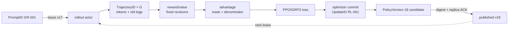

# 20장. 온라인 RL

19장의 reward·reference 계약을 behavior/current PolicyVersion과 trajectory에 결합한다. 25장은 red-team 공격·거절 품질을 rollout·sealed evaluation에 나눠 정책 update로 환류하고, 30장은 생성된 PolicyVersion을 merge·quantization·canary·rollback 계보로 넘겨 준다.

온라인 RL은 하나의 trainer가 아니다. prompt queue, rollout engine, reward·value 계산, advantage, policy update, weight publication, checkpoint가 서로 다른 속도로 움직이는 폐쇄 루프다. 어느 한 함수의 수식이 맞더라도 서로 다른 시점의 상태를 조합하면 update 전체는 틀린다. 따라서 이 장의 출발점은 알고리즘 이름이 아니라 다음 한 줄의 계보다.

## GR-001 수직 추적: prompt lease에서 새 정책 publication까지

19장의 `GR-001-P1`로 승인한 policy를 `PolicyVersion=17`로 배포했다고 하자. 동일 계열 prompt `GR-001`을 actor가 lease해 completion 세 개를 만들고 reward service가 점수를 붙이며 learner가 한 번 update해 version 18을 만든다. 온라인 RL의 최소 단위는 loss scalar가 아니라 이 **versioned closed loop**다.



verl 0.9.0 commit `483b8a00…`의 [`core_algos.py` reduction 경계](https://github.com/volcengine/verl/blob/483b8a009ba3a97563edee3a19887e4862b8094a/verl/trainer/ppo/core_algos.py#L1143-L1204)는 `loss_agg_mode`가 표본 측도를 바꾸는 위치다. OpenRLHF commit `3c3be623…`의 [`ppo_actor.py` update·동기화 경로](https://github.com/OpenRLHF/OpenRLHF/blob/3c3be6234e0cb353e76bb8019947db9dfe99fca7/openrlhf/trainer/ray/ppo_actor.py#L400-L470)와 [`vllm_worker_wrap.py` weight 수신 경계](https://github.com/OpenRLHF/OpenRLHF/blob/3c3be6234e0cb353e76bb8019947db9dfe99fca7/openrlhf/trainer/ray/vllm_worker_wrap.py#L32-L63)는 learner와 actor 사이 상태 이동을 보여 준다. 함수 존재를 atomic publication 보증으로 확대하지 않는다.

| 경계 | tensor·shape | dtype·device | 분모·소유 state | 반드시 관측할 증거 |
|---|---|---|---|---|
| rollout | `input_ids[B,T]`, `response_mask[B,T]` | `int64`, actor CUDA | behavior v17, seed, sampling config | token, termination, weight digest |
| likelihood | `old/ref/current_log_probs[B,T-1]` | FP32 권장, CUDA | action mask와 one-token shift | 세 revision, mask checksum |
| reward/value | reward `[B]` 또는 `[B,T-1]`, values `[B,T-1]` | FP32 | reward/value revision | component와 join cardinality |
| advantage | `advantages[B,T-1]` | FP32 | terminal/bootstrap·group rule | mean/std, all-equal 처리 |
| policy loss | `loss_mat[B,T-1]→scalar` | FP32 reduction | token/sequence/group 분모 | numerator와 세 denominator |
| optimizer | policy grad·moment shards | mixed precision, learner CUDA | RolloutID 집합, accumulation | clip/skip, delta, `RL-001` |
| publication | model digest per replica | storage→actor CUDA | candidate v18, routing epoch | required ACK, active version |
| checkpoint | model·optimizer·queue·dedup·RNG | durable storage | consistent cut | next RolloutID·UpdateID parity |

PPO의 token 비율은 $\rho_t=\exp(\ell_t^{\mathrm{current}}-\ell_t^{\mathrm{old}})$다. 코드에서는 `[B,T-1]`의 `loss_mat`가 만들어지고 `core_algos.py`의 reducer가 token mean인지 sequence 내부 평균 뒤 batch mean인지 정한다. 이 마지막 함수가 수식의 $D$다. GRPO라면 같은 prompt의 완성된 group이 advantage 모집단이며 group 일부가 누락되면 shape가 맞아도 다른 목적함수다.

반증 실험은 찢어진 경계를 겨냥한다. rollout 저장 뒤 ACK 전에 actor를 죽여 같은 `TrajectoryID`가 두 optimizer effect를 만들지 않는지 본다. v18을 일부 replica에만 load한 순간 장애를 내 routing pointer가 v17에 머무는지 확인한다. frozen trajectory에서 learner와 rollout engine의 old log-prob를 비교한다. action mask 한 칸 mutation은 최종 KL이 아니라 likelihood checksum에서 먼저 실패해야 한다. [online RL policy-version lab](../labs/20-online-rl-policy-version-lab.md)은 상태 전이와 중복 effect를, [종단 golden lab](../labs/30-sft-rl-deploy-golden-lab.md)은 SFT 부모부터 publication까지 검산한다.

이후 PPO·GRPO·DAPO·GSPO와 queue·checkpoint 절은 이 표의 변형으로 합쳐 읽는다. 알고리즘마다 새 서사를 시작하지 말고 `GR-001`의 ratio 사건 단위, advantage 모집단, reducer 분모, publication state 중 달라지는 칸만 비교한다.

> `PromptID → behavior PolicyVersion → RolloutID/TrajectoryID → OldLogProbRevision → RewardRevision → AdvantageRevision → UpdateID → candidate PolicyVersion → published PolicyVersion`

이 식별자들은 장부 장식이 아니다. `PromptID`는 어떤 표본 분포에서 질문이 뽑혔는지를, behavior `PolicyVersion`은 실제 행동을 낸 확률분포를, old log-prob revision은 PPO 비율의 분모를, reward revision은 학습 신호를 만든 판정기를 고정한다. `UpdateID`는 어떤 trajectory 집합이 optimizer effect를 정확히 한 번 만들었는지를 증명한다. 마지막 `PolicyVersion`은 그 effect로 생성된 불변 weight 묶음이다. 이 연결 하나라도 끊기면 높은 reward나 낮은 KL은 원인을 설명하지 못하는 숫자가 된다.

위 `GR-001` 그래프에는 의도적으로 `latest`가 없다. rollout을 시작한 순간에는 구체적인 불변 version을 lease하고, learner는 그 version에서 계산한 old log-prob와 reward revision을 사용한다. candidate를 commit했다고 actor가 곧바로 그것을 쓰는 것도 아니다. 모든 필수 replica의 load·checksum·사용 가능 시점이 확인된 뒤 routing pointer가 바뀌어야 published가 된다.

| 상태 | 반드시 고정할 것 | 다음 상태로 넘어가는 조건 | 이 상태가 없을 때 생기는 모호함 |
|---|---|---|---|
| prompt selected | `PromptID`, source/curriculum revision, sampling probability | actor lease 발급 | 어떤 데이터 분포를 최적화했는지 모른다 |
| rollout leased | behavior `PolicyVersion`, replica digest, sampling config, seed | generation start/end digest 일치 | response 중간에 weight가 섞였는지 모른다 |
| generated | token IDs, action mask, termination reason, old log-prob | immutable trajectory persist | 문자열 재토큰화와 shift 오류를 찾지 못한다 |
| rewarded | reward component·model·normalizer revision | join cardinality와 입력 hash 검증 | 늦게 도착한 새 reward가 과거 표본을 조용히 바꾼다 |
| admitted | stale·safety·validity 판정, accepted content hash | 단 하나의 accumulation window 예약 | retry가 두 update에 들어가거나 느린 표본만 탈락한다 |
| consumed | numerator·denominator contribution, minibatch/epoch | optimizer effect commit | loss 평균은 같아도 실제 표본 가중을 복원하지 못한다 |
| committed | `UpdateID`, parent version, optimizer/scheduler state | 후보 산출물의 완결성 검증 | parameter와 optimizer가 서로 다른 step이 된다 |
| published | loaded replica set과 digest, routing epoch | 다음 rollout lease 허용 | 일부 actor만 새 weight를 쓰는 mixed fleet가 숨는다 |

## 20.1 정책 경사에서 표본 측도까지: 온라인 RL의 수학적 계약

폐쇄 루프를 이해하려면 먼저 한 trajectory가 loss에 얼마만큼 기여하는지 고정해야 한다. PPO·GAE·GRPO·RLOO의 차이를 이름으로 외우지 않고, token·sequence·group 가운데 무엇을 표본 단위로 삼으며 어느 정책의 확률을 분모로 두는지부터 비교한다.

### 20.1.1 policy gradient·GAE·PPO

token trajectory: 수식보다 먼저 행동 좌표를 고정한다. prompt `x`와 response token `a_1,…,a_T`에 대해 상태 `s_t=(x,a_{<t})`이고 행동은 다음 token `a_t`다. rollout record는 문자열이 아니라 token ID, action mask `m_t`, behavior log-prob `ℓ_t^old=log π_old(a_t|s_t)`, reward, value, 종료 이유를 보존한다. prompt의 마지막 위치 logits가 첫 response token의 확률을 만든다는 한 칸 shift까지 이 record의 계약이다.

mask가 적용된 policy-gradient loss를 실제 코드의 reduction에 가깝게 쓰면 다음과 같다.

`L_PG = - [Σ_i Σ_t m_it A_it log π_θ(a_it|s_it)] / D`

여기서 가장 위험한 기호는 분자가 아니라 `D`다. `D=Σm`이면 전체 action-token 평균이라 긴 response가 더 큰 표본 가중을 얻는다. 각 sequence 내부를 먼저 평균하고 batch를 평균하면 prompt/sequence가 같은 가중을 얻는다. data-parallel 환경에서 rank-local `numerator/local_D`를 평균하면 rank마다 valid token 수가 다를 때 global token mean과 달라진다. global token mean을 의도했다면 분자와 `D`를 각각 all-reduce한 뒤 한 번만 나눈다. loss 값만 기록하지 말고 `loss_numerator`, `valid_action_tokens`, `valid_sequences`, `valid_groups`를 함께 기록해야 하는 이유다.

baseline은 기대 gradient를 바꾸지 않으면서 분산을 줄이는 장치다. 다만 advantage를 policy graph에서 분리하지 않으면 actor loss가 value·reward 계산 쪽으로 역전파된다. `detach`는 성능 최적화 옵션이 아니라 어떤 함수가 gradient를 소유하는지를 정하는 경계다.

GAE는 `δ_t=r_t+γ b_t V(s_{t+1})−V(s_t)`, `A_t=δ_t+γλ b_t A_{t+1}`를 뒤에서 계산한다. `b_t`는 “tensor가 존재하는가”가 아니라 다음 상태에서 bootstrap할 수 있는가를 나타낸다. 정상 EOS, environment terminal, time-limit truncation, actor timeout과 padding은 같은 값이 아니다. padding mask 하나로 terminal 의미를 대신하면 infrastructure timeout을 나쁜 행동의 return으로 학습하거나, truncation에서 유효한 bootstrap을 잃는다. `return_t=A_t+V(s_t)`도 같은 terminal revision과 value revision에서 만들어져야 한다.

PPO는 `ρ_t=exp(ℓ_t^new−ℓ_t^old)`와 `s_t=min(ρ_tA_t, clip(ρ_t,1−ε,1+ε)A_t)`를 만들고 `L_PPO=−Σm_ts_t/D`를 최소화한다. negative advantage에서는 `min`의 결과와 loss의 부호가 직관과 어긋나 보이므로 양·음 advantage를 모두 손으로 검산한다. `cliprange`는 gradient norm 제한이 아니다. behavior policy에서 너무 멀어진 action이 surrogate 개선을 과장하지 못하게 목적함수의 해당 항을 평평하게 만든다. 반대로 gradient clipping은 parameter gradient의 norm을 제한한다. 두 옵션은 다른 상태를 바꾼다.

하나의 rollout batch를 `ppo_epochs`번 다시 쓰면 old log-prob는 그대로지만 current log-prob는 매 optimizer step 뒤 달라진다. epoch 수 증가는 단순 계산량 증가가 아니라 같은 데이터가 점점 더 off-policy가 되는 경로다. minibatch 크기를 바꾸면 update 횟수, advantage normalization 범위, global denominator와 scheduler clock까지 함께 바뀔 수 있다. KL penalty, target-KL early stop, ratio clipping은 각각 objective 항·제어 흐름·surrogate 범위를 바꾸는 별도 장치다.

### 20.1.2 GRPO·RLOO와 denominator

group 상대 advantage: group을 통계 단위로 보존한다. GRPO류는 같은 `PromptID`에서 `G`개의 completion을 생성하고 group reward의 상대 위치로 advantage를 만든다. 대표적인 형태는 `A_i=(R_i−μ_g)/sqrt(σ_g²+ε)`이지만 구현마다 분산을 `G`로 나누는지 `G−1`로 나누는지, epsilon을 분산 안에 더하는지 표준편차 뒤에 더하는지, reward component를 합치기 전후 어느 지점에서 정규화하는지가 다를 수 있다. 함수 이름이 `grpo`라는 사실보다 이 네 선택을 source branch에서 확인해야 한다.

group size가 1이면 상대 비교가 정의되지 않는다. reward가 모두 같으면 분자는 0이고 분모도 0에 가까워진다. epsilon으로 NaN만 막아도 학습 신호가 생기는 것은 아니다. `zero_variance_group_count`, group size, 결손 completion의 처리와 group 재조립 revision을 남긴다. 비동기 actor에서 빠른 completion만 먼저 minibatch로 보내면 원래 group의 통계가 달라지므로 group은 queue에서도 원자적 admission 단위가 되어야 한다.

그다음 두 번째 분모가 남는다. group advantage `A_i`를 response의 모든 action token에 복제한 뒤 전체 token mean을 취하면 긴 response가 더 큰 가중을 얻는다. response 내부 평균 뒤 prompt/group 평균을 취하면 response 길이의 직접 가중은 사라진다. `group_size`, `num_generations`, `loss_agg_mode`를 바꿀 때는 rollout 비용뿐 아니라 이 최종 objective measure가 어떻게 바뀌는지 함께 적는다.

RLOO는 `A_i=R_i−[Σ_{j≠i}R_j/(G−1)]`처럼 자기 reward를 제외한 나머지 평균을 baseline으로 잡는다. 계산량을 줄인다는 이름이 아니라 leave-one-out estimator다. `G=1`에서는 정의되지 않고 `G=2`에서는 두 response가 서로의 baseline이 된다. 자기 자신까지 포함한 group mean과 우연히 비슷한 curve가 나올 수 있으므로 작은 reward `[1,3,8]`로 두 구현을 비교한다. sequence advantage를 모든 action token에 복제할 때도 최종 loss를 sequence mean으로 할지 token mean으로 할지 명시한다.

구현의 reduction switch는 목적함수의 표본 측도를 바꾼다. verl 계열의 actor loss aggregation 옵션은 token-mean과 sequence-mean 경로를 바꾼다. 이 값은 logging 표시가 아니라 “token을 균등 표본으로 볼 것인가, response나 prompt를 균등 표본으로 볼 것인가”를 정한다. valid token 수가 rank마다 다르면 local mean의 DP 평균 대신 global numerator/denominator를 합쳐야 한다.

분모 오류를 찾는 가장 빠른 분리 실험은 내용이 같은 response를 길이만 달리해 두 rank에 배치하는 것이다. 의도한 token mean이라면 단일 rank reference와 global numerator/denominator 결과가 같아야 한다. rank-local mean 평균에서만 달라지면 collective나 optimizer가 아니라 reduction 순서가 원인이다. sequence mean을 의도했다면 긴 response의 token을 복제해도 sequence 하나의 총가중이 변하지 않아야 한다.

### 20.1.3 DAPO·Dr. GRPO·GSPO: 이름보다 측도와 ratio의 좌표를 읽는다

GRPO 이후의 변형은 모두 같은 문제를 고친다고 묶기 쉽지만, 실제로 건드리는 축은 서로 다르다. DAPO는 표본을 배치에 넣는 규칙, importance ratio의 비대칭 clip, token loss의 전역 분모, overlong reward를 함께 바꾼다. Dr. GRPO는 group 표준편차와 response 길이가 만드는 재가중을 제거하려 한다. GSPO는 더 근본적으로 importance ratio와 clip의 단위를 token에서 sequence로 옮긴다. 따라서 `loss_type` 하나만 로그에 남기면 재현할 수 없다.

| 계열 | behavior/current 비율 | advantage | policy-loss 분모 | 추가로 바뀌는 상태 |
|---|---|---|---|---|
| PPO | token `ρ_it` | GAE 또는 return | 구현별 token·sequence mean | value revision, epoch reuse |
| GRPO | token `ρ_it` | `(R_i−μ_g)/(σ_g+ε)` | response 내부 token mean 뒤 sequence mean | 완성된 GroupID |
| Dr. GRPO | token `ρ_it` | `R_i−μ_g`, std 나눗셈 없음 | `B·L_max` 같은 전역 상수 | generation budget revision |
| DAPO | token `ρ_it` | 보통 group-normalized outcome | global accumulated active token 수 | 비퇴화 group refill, overlong shaping, asymmetric clip |
| GSPO | `s_i=exp[(Σ_t m_it(logπ−logπ_old))/T_i]` | sequence/group advantage | sequence mean, 내부 token mean | sequence clip과 rollout likelihood revision |

이 표의 `Dr. GRPO`와 `DAPO` 분모는 같은 것이 아니다. `B·L_max`는 실제 길이가 변해도 한 response가 가질 수 있는 최대 token budget을 기준으로 둔다. 반면 DAPO의 global active-token 분모는 accumulation window에서 실제로 살아 있는 action token 수에 따라 달라진다. 둘 다 response별 `1/T_i`를 없애지만, 전자는 token이 짧아지면 update 총량도 줄고 후자는 살아 있는 token 하나의 평균 기여를 일정하게 만든다. 그래서 동일한 batch에서 loss curve가 다르게 나오는 것은 버그가 아니라 서로 다른 표본 측도를 선택한 결과일 수 있다.

**DAPO는 네 개의 스위치를 한꺼번에 묶은 recipe다.** 논문의 목적함수는 `ε_low`와 `ε_high`를 분리하고, 같은 prompt에서 정답 수가 0도 `G`도 아닌 group만 인정하며, 모든 completion의 active token 합으로 나눈다. `Clip-Higher`는 낮은 확률의 좋은 token이 위로 움직일 여지를 넓히려 `ε_high`를 키우되, `ε_low`는 작게 유지한다. 이 값은 entropy bonus가 아니라 positive advantage token의 ratio 상한을 직접 바꾼다. 높은 clip fraction이 줄었다는 사실만으로 탐색이 좋아졌다고 단정하지 말고, positive/negative advantage별 upper·lower clipped token과 생성 entropy를 함께 본다.

동적 표본 추출은 reward가 전부 같아 advantage가 0이 되는 group을 버리고 새 prompt group으로 채운다. 여기서 버리는 단위는 completion 하나가 아니라 완성된 `GroupID`다. `[1,1,1,1]`의 일부만 `[1,0,1,0]` group에 섞으면 gradient는 생기지만 prompt-conditioned baseline이 깨진다. 또한 쉬운 문제와 불가능한 문제를 지속적으로 제거하므로 학습 대상 prompt distribution 자체가 바뀐다. `sampled_prompt_count`, `filtered_zero_group`, `filtered_one_group`, `refill_count`, 원래 sampling probability와 최종 admission probability를 기록하지 않으면 “효율 향상”과 curriculum shift를 구분할 수 없다.

overlong 처리도 하나의 선택이 아니다. truncated completion 전체를 mask하면 reward noise는 줄지만 긴 reasoning의 학습 기여가 0이 된다. soft overlong punishment는 `L_max−L_cache`까지 0, 그 뒤 `L_max`까지 선형으로 0에서 −1로 내려가며 correctness reward에 더해진다. `mask_truncated_completions`와 soft shaping을 동시에 켰다면 shaping된 reward가 계산되어도 policy loss에서는 사라질 수 있다. termination reason, raw correctness reward, length reward, final reward와 action mask를 따로 남겨야 이 모순을 찾는다.

TRL의 고정 revision에서 `_compute_loss`는 `epsilon_low/high`로 token ratio를 clip한 뒤 `loss_type`별로 분모만 갈라 놓는다. `grpo`는 각 response의 active token으로 먼저 나누고, `dr_grpo`는 `batch_size·max_completion_length`, `dapo`는 generation batch를 포괄하는 `num_items_in_batch`를 DP 크기·gradient accumulation·`steps_per_generation`에 맞춰 재조정한다. 따라서 micro-batch마다 `num_items_in_batch`를 현재 micro-batch token 수로 다시 계산하면 global accumulated objective가 무너진다. 이 값은 tensor 부속물이 아니라 accumulation window의 상태다.

```python
# TRL v1.10.0, grpo_trainer.py의 핵심 분기만 축약
if loss_type == "dr_grpo":
    loss = masked_loss.sum() / (batch_size * max_completion_length)
elif loss_type == "dapo":
    normalizer = num_items_in_batch / world_size
    normalizer *= grad_accum_steps / steps_per_generation
    loss = masked_loss.sum() / normalizer
```

**Dr. GRPO는 두 bias를 따로 제거한다.** 첫째, response마다 `1/T_i`로 나누면 positive-advantage의 짧은 정답은 token 하나당 더 크게 강화되고 negative-advantage의 긴 오답은 더 약하게 벌받는다. 둘째, prompt group마다 `1/σ_g`를 곱하면 보상 분산이 작은 쉬운·어려운 질문이 더 큰 가중을 얻는다. `scale_rewards=False`는 둘째만 제거하고 `loss_type="dr_grpo"`는 첫째를 제거한다. 둘 중 하나만 바꾸고 Dr. GRPO를 재현했다고 쓰면 안 된다.

작은 fixture로 차이를 고정한다. prompt A의 reward가 `[0,1]`, prompt B가 `[0,0.1]`이면 centered reward는 두 group 모두 `[-0.5,0.5]`와 `[-0.05,0.05]`다. group std로 나누면 둘의 advantage scale이 거의 같아져 B가 A와 비슷한 질문 가중을 얻는다. std를 끄면 A의 signal이 열 배 크다. response 길이가 각각 2와 8이고 token surrogate가 모두 1이라면 response mean은 두 completion을 같은 1로 만들지만, `L_max=8` 상수 분모에서는 총기여가 `2/8`과 `8/8`이 된다. 이 숫자가 reward scaling 문제와 length normalization 문제를 독립적으로 검출한다.

**GSPO는 ratio의 사건 단위를 sequence로 바꾼다.** `s_i`는 response likelihood ratio의 기하평균이다. 단순 곱 `π(y)/π_old(y)`는 길이에 따라 지수적으로 퍼지므로 로그비의 active-token 평균을 지수화한다. 이 때문에 GSPO의 clip 폭은 token-ratio GRPO의 `0.2`를 그대로 복사할 수 없다. 공식 논문의 Qwen 실험은 GSPO 좌·우 폭을 `3e-4`, `4e-4`, GRPO를 `0.2`, `0.27`로 사용했다. 이는 보편 기본값이 아니라 ratio 좌표계가 다름을 보여 주는 비교다.

verl의 `compute_policy_loss_gspo`는 먼저 `negative_approx_kl_seq=Σm(logπ−logπ_old)/Σm`을 만든다. 이어 `log_prob−log_prob.detach()+negative_approx_kl_seq.detach()`로 token 모양의 surrogate를 구성한다. forward 값은 모든 active token에서 같은 sequence log-ratio지만 gradient는 각 current token log-prob로 흐른다. 이 stop-gradient 항을 빼고 sequence scalar만 token에 broadcast하면 loss 숫자는 비슷해 보여도 autograd ownership과 gradient scale이 달라질 수 있다. `seq-mean-token-mean` 집계까지 한 계약으로 검산한다.

GSPO가 모든 multi-turn 문제의 답은 아니다. trajectory 전체에 outcome reward 하나가 붙는다면 sequence ratio와 reward 단위가 맞는다. 반대로 tool turn이나 process verifier가 부분 구간별 advantage를 준다면 GSPO-token처럼 sequence ratio의 수치와 token별 advantage를 결합하거나, 명시적인 sub-sequence 단위를 정의해야 한다. “sequence-level”을 이유로 tool observation token까지 action mask에 넣으면 정책이 생성하지 않은 사건의 likelihood를 ratio에 섞는다.

MoE에서는 같은 response라도 update 뒤 expert routing이 달라져 token log-prob ratio가 크게 흔들릴 수 있다. GSPO 논문은 GRPO의 routing replay와 달리 sequence likelihood가 이 변동에 더 관대하다고 보고한다. 그러나 이것은 router state를 기록하지 않아도 된다는 뜻이 아니다. `old/current PolicyVersion`, routing implementation revision, recomputed sequence log-likelihood와 inference-engine likelihood의 오차를 남긴다. training engine의 old log-prob 재계산을 생략할지는 tolerance fixture를 통과한 뒤 결정한다.

**적용 판단은 증상에서 시작한다.** all-equal group이 많아 effective batch가 줄면 DAPO식 dynamic sampling을 검토하되 distribution shift를 계측한다. reward std가 작은 prompt가 update를 지배하면 std normalization을 끄는 Dr. GRPO ablation을 먼저 한다. 길이만 다른 frozen response에서 총가중이 의도와 다르면 `grpo/dr_grpo/dapo` 분모를 바꾼다. token ratio tail과 MoE routing 변화가 collapse의 첫 분기라면 GSPO를 검토한다. 이 네 조건을 확인하지 않고 최신 알고리즘 이름만 바꾸는 것은 원인에 대한 처방이 아니다.

최소 실패 suite의 앞 절반은 표본과 분모를 겨냥한다. `(1)` all-correct·all-wrong group이 completion 단위가 아니라 group 단위로 제거되고 정확한 수만큼 refill되는가. `(2)` `[0,1]`과 `[0,0.1]`에서 reward std switch만 바꿔 question weight가 예상대로 달라지는가. `(3)` 길이 2·8에서 response mean, `B·L_max`, global active-token denominator가 손계산과 일치하는가.

뒤 절반은 clip·termination·autograd를 겨냥한다. `(4)` positive/negative advantage와 ratio `0.7, 1.0, 1.4`에서 asymmetric clip branch가 맞는가. `(5)` 모든 completion이 truncated이면 mask 경로에서 parameter effect가 0이고 denominator가 NaN이 아닌가. `(6)` 같은 frozen sequence에서 verl GSPO의 forward 값과 수동 sequence ratio가 같고, token log-prob 각각에 gradient가 존재하는가. 공개 test가 확인한 범위와 이 통합 fixture 전체를 혼동하지 않는다.

## 20.2 rollout에서 복구까지: 버전이 있는 폐쇄 루프

수식의 입력은 저절로 일관성을 얻지 않는다. 여기서는 rollout을 만든 weight, reward를 붙인 판정기, learner가 읽은 tensor와 checkpoint가 같은 역사에 속한다는 사실을 `PolicyVersion`과 consistent cut으로 증명한다.

### 20.2.1 rollout engine·PolicyVersion·weight sync

생성과 학습의 두 weight view. rollout engine은 serving layout의 weight를, trainer는 sharded optimizer layout을 가질 수 있다. update commit 뒤 trainer state를 새로운 `PolicyVersion=v+1`로 만들고, 모든 rollout replica에 weight를 전송·검증한 뒤에만 published version을 올린다. OpenRLHF 계열은 actor weight를 vLLM worker에 broadcast 또는 CUDA IPC 경로로 동기화할 수 있다. checkpoint를 거치지 않아도 fresh weight를 보낼 수 있지만, 전송 중 replica 일부만 새 weight를 보는 atomicity 문제는 별도다.

각 rollout에는 generation 시작 때의 published `PolicyVersion`, model hash, sampling config, RNG seed, old log-prob revision을 찍는다. generation 도중 weight가 바뀌지 않도록 lease를 건다. prefix가 old, suffix가 new인 partial rollout은 단일 old-policy likelihood로 다룰 수 없다. text가 자연스럽다는 사실은 version 일관성의 검사가 아니다. generation start/end digest와 token별 behavior log-prob가 증거다.

update 함수의 상태 전이. `RolloutID`는 `leased→generated→rewarded→admitted→consumed`로 이동하고, 여러 consumed rollout의 optimizer effect가 `UpdateID: prepared→committed`를 만든다. 그 결과 policy는 `candidate→verified→published`로 이동한다. rollout과 update와 policy의 상태 기계를 하나로 뭉개지 않는 이유는 재시도의 범위가 다르기 때문이다. reward timeout은 reward attempt만 다시 할 수 있지만 committed optimizer effect를 queue 재전달 때문에 다시 적용해서는 안 된다.

optimizer commit에는 소비한 RolloutID 집합, 각 accepted content hash와 parent PolicyVersion을 기록한다. gradient accumulation 중 중복 sample이 들어오지 않도록 admission key를 accumulation buffer 직전에 확인한다. weight publication 실패는 optimizer commit을 되돌리는 것이 아니라 `committed-but-unpublished`로 남겨 같은 candidate를 재검증·재전송한다. learner의 `step=18`과 actor의 active `PolicyVersion=17`은 잠시 공존할 수 있으며, 이 차이를 오류가 아니라 명시적 상태로 관측해야 한다.

### 20.2.2 async queue·retry·consistent cut

exactly-once의 범위. 메시지 queue의 exactly-once와 optimizer effect의 exactly-once는 다르다. worker가 결과를 보낸 뒤 ACK 전에 죽으면 rollout은 재전달될 수 있다. `RolloutID` dedup ledger가 optimizer commit과 같은 transaction 경계를 가져야 중복 gradient를 막는다. 외부 environment state와 reward service가 checkpoint되지 않으면 전체 시스템의 sample-exact resume는 주장할 수 없다.

staleness 허용치 `max_policy_lag`는 queue admission을 바꾼다. 단순 version 차이 `v_current−v_behavior`는 update 크기가 일정하다는 보장이 없어 거리의 대용물일 뿐이다. 가능하면 sampled log-ratio, approximate KL와 wall-clock age를 함께 본다. lag가 큰 rollout을 버리면 throughput만 줄지 않는다. 긴 reasoning·tool call·느린 언어 표본이 더 자주 만료되어 실제 prompt distribution이 달라질 수 있다. importance correction을 쓰면 ratio tail과 variance가 달라진다. 보정이나 PPO clipping이 곧 on-policy 동등성의 증명은 아니다.

golden failure timeline. `PolicyVersion=17`에서 rollout 네 개를 lease한다. 두 개가 완료된 뒤 optimizer가 version 18을 commit하고 replica 셋 중 둘만 sync된 순간 한 replica를 죽인다. 복구기는 다음을 판정한다.

1. version 17 lease는 끝까지 version 17 weight를 사용했는가.
2. version 18 미동기 replica가 published set에 포함되지 않았는가.
3. 재전달된 RolloutID가 두 번째 optimizer effect를 만들지 않았는가.
4. checkpoint의 queue cursor, dedup ledger, optimizer commit, published version이 하나의 consistent cut인가.

공개 구현은 이 네 조건 전체를 언제나 증명하지 않는다. 따라서 실험하지 않은 atomic publication과 외부 environment 복구를 보장으로 쓰지 않는다.

실패 징후에서 첫 잘못된 상태로 내려간다. | 관측된 징후 | 먼저 고정할 상태 | 가장 싼 분리 실험 | 판정과 다음 행동 |
|---|---|---|---|
| KL·clip fraction 동시 급등 | behavior/current/reference revision, action mask, shift, denominator | 같은 frozen trajectory로 old/current log-prob를 eager 단일 GPU에서 재계산 | 여기서 다르면 tokenizer·mask·version 경계, 같으면 minibatch reuse·LR·publication lag를 본다 |
| reward 상승, task 성능 하락 | reward component/revision, response length, format·verifier outcome | 길이·형식이 같은 paired subset과 reward component ablation | shortcut에서만 상승하면 learner가 아니라 reward 계약을 수정한다 |
| GRPO advantage가 0 또는 NaN | 완성된 GroupID, 결손 candidate, variance 정의, epsilon 위치 | reward `[1,3,8]`과 all-equal group을 손계산과 비교 | group 재조립 문제와 zero-variance 정책을 구분한다 |
| GPU 사용률은 높은데 유효 update 감소 | generated/rewarded/admitted/consumed token, queue age, discard 이유 | actor rate를 낮춘 동기식 기준선과 accepted token/GPU-second 비교 | stale waste가 줄면 actor 증설이 아니라 backpressure·비율 문제다 |
| 재시작 뒤만 parameter가 달라짐 | queue cursor, effect ledger, accumulation window, optimizer/scheduler/RNG | ACK 직전과 commit 직후를 각각 kill한 frozen-stream replay | RolloutID 중복이면 transaction, first batch만 다르면 consistent cut 누락이다 |
| actor replica별 결과가 갈림 | loaded digest, TP shard ACK, CUDA event, routing epoch | generation 중 publication fault와 deterministic greedy prompt | start/end digest가 다르면 mixed-weight publication을 fence한다 |

이 순서는 “KL이 높으니 learning rate를 낮춘다”처럼 관측량을 곧바로 hyperparameter 처방으로 바꾸지 않는다. 먼저 같은 trajectory를 frozen input으로 만들고 수학·tensor 경계를 닫는다. 그다음 단일 learner, 동기식 actor, 비동기 queue 순으로 복잡성을 한 층씩 되돌린다. 어느 층에서 처음 결과가 달라지는지가 원인 후보의 상한이다.

throughput 저하는 queue age, rollout latency, reward latency, learner wait, update latency와 sync bytes로 나눈다. 평균만 보지 말고 가장 오래된 항목의 age와 PolicyVersion histogram을 본다. stale 비율이 증가하면 rollout capacity를 늘리기 전에 publication 지연, actor/learner 생산·소비율과 reward tail latency를 확인한다. 처리량의 분모는 generated token이 아니라 unique admitted·consumed action token이며, stale·retry·quarantine 비용은 별도로 남긴다.

### 20.2.3 tensor contract를 먼저 적는다

한 rollout batch를 padded tensor로 표현하면 `input_ids[B,T]`, `attention_mask[B,T]`, `response_mask[B,T]`, `old_log_probs[B,T-1]`, `ref_log_probs[B,T-1]`, `values[B,T-1]`, token rewards와 advantages가 있다. action log-prob는 다음 token을 예측한 logits와 맞물리므로 response token 위치와 log-prob index가 한 칸 어긋날 수 있다. prompt 마지막 token이 첫 response token의 확률을 만든다는 사실을 fixture로 고정한다.

variable-length packed 경로에서는 `[B,T]`가 아니라 전체 token 수 `N`으로 flatten되고 cumulative sequence length가 boundary를 표현할 수 있다. padded reference와 packed kernel이 같은 action 집합, position, causal boundary를 쓰는지 확인한다. response mask에는 prompt·padding뿐 아니라 tool observation처럼 policy action이 아닌 token이 제외될 수 있다. reward가 붙는 위치와 policy gradient가 붙는 위치는 동일할 필요가 없다.

sequence reward `R_i`를 response 모든 token의 advantage로 복제할 때 token-mean loss는 긴 response가 더 많은 항을 제공한다. sequence-mean-token-mean은 각 response 내부 평균 뒤 sequence를 평균해 prompt별 비중을 맞춘다. sequence-mean-token-sum은 sequence별 token 합을 다시 sequence 평균해 길이 효과를 유지한다. 이름이 비슷해도 objective가 다르므로 numerator와 denominator를 metrics에 별도 기록한다.

PPO를 작은 숫자로 검산한다. old log-prob가 `−1.0`, current가 `−0.8`이면 ratio는 `exp(0.2)≈1.221`이다. positive advantage가 2이고 clip range가 0.2라면 unclipped 항은 `2.442`, clipped 항은 `2.4`이므로 더 작은 2.4를 사용한다. advantage가 −2이면 최소/최대 선택의 부호를 잘못 구현하기 쉽다. loss 구현을 손계산과 비교해 positive·negative 두 경우를 모두 test한다.

KL penalty를 `logπ−logπ_ref`의 sampled estimate로 둘지, 분포 전체 KL을 둘지 구현에 따라 다르다. sampled estimator는 개별 token에서 음수가 될 수 있다. “KL은 항상 양수”라는 검사로 올바른 sampled 값까지 오류 처리하면 안 된다. 대신 batch 평균과 별도의 exact toy distribution을 검증한다.

GAE fixture는 길이 3 trajectory로 만든다. 마지막이 true terminal이면 `V_{t+1}=0`, time-limit truncation이면 환경 정의에 따라 bootstrap value를 쓸 수 있다. 두 경우의 return이 달라지는 test가 없으면 EOS와 timeout mask가 뒤섞여도 발견하기 어렵다. `γ=1, λ=1`에서는 finite horizon Monte Carlo return과 맞는지 검산한다.

verl과 OpenRLHF의 고정 소스 경계. verl 0.9.0 commit `483b8a009ba3a97563edee3a19887e4862b8094a`에서 PPO actor loss reduction은 `verl/trainer/ppo/core_algos.py:1143–1204` 부근의 aggregation 경로로 내려간다. `loss_agg_mode`는 logging mode가 아니라 token/sequence weighting을 바꾼다. advantage estimator와 actor update, rollout worker는 서로 다른 module과 actor가 소유하므로 config에서 지원된다는 사실만으로 실제 선택 branch를 알 수 없다.

OpenRLHF commit `3c3be6234e0cb353e76bb8019947db9dfe99fca7`의 `openrlhf/trainer/ray/ppo_actor.py:400–470`은 actor update 뒤 rollout engine으로 weight를 동기화하는 상위 경로를, `openrlhf/trainer/ray/vllm_worker_wrap.py:32–63`은 broadcast/CUDA IPC 수신 경계를 보여준다. 이 경로는 checkpoint 파일을 매 update마다 쓰지 않고도 rollout weight를 갱신할 수 있음을 보여준다. 그러나 함수가 존재한다는 사실은 process failure 순간 모든 replica가 원자적으로 같은 version을 보게 된다는 증명이 아니다.

공개 코드에서 확인할 수 있는 것은 호출 순서, tensor broadcast, worker method와 정상 test다. queue와 외부 environment까지 포함한 exactly-once, process kill 중 publication atomicity, uninterrupted run과 crash/resume의 최종 parameter 동일성은 별도의 실행 증거가 필요하다. 책에서는 이 경계를 기능 누락으로 단정하지도, 보장으로 과장하지도 않는다.

### 20.2.4 PolicyVersion의 생성 규칙

version을 단순 정수 counter로만 저장하면 split-brain에서 같은 번호가 다른 weight를 가리킬 수 있다. `PolicyVersion` record에는 parent version, optimizer commit ID, logical parameter manifest digest, full 또는 shard hash root, tokenizer/template, model config, publish epoch를 기록한다. 숫자는 정렬용이고 identity는 manifest digest다.

구현 walkthrough: 생성 version에서 proximal 확률과 group advantage까지. 비동기 RL에서 `version`은 로그에 붙이는 꼬리표가 아니다. 생성 결과의 확률분포를 식별하고, learner가 비교할 proximal policy를 정하며, 같은 prompt에서 살아남은 completion의 통계 경계를 복원하는 입력이다. AReaL commit `94ce16558b31ebf114f1d6d469e58e3af6d7ea59`의 세 코드 경로를 한 trajectory로 이어 읽으면 이 관계가 선명해진다.

첫 단계는 요청 단위 귀속이다. `RemoteInfEngine.agenerate`는 HTTP 요청을 만들기 **전에** `request_version = self.get_version()`을 한 번 읽고, 응답이 돌아온 뒤에도 현재 version을 다시 읽어 덮어쓰지 않는다. 반환된 `K`개 생성 token에는 캡처해 둔 scalar를 `[request_version] * K`로 복제한다. prompt token에는 이 배열이 붙지 않으며, 누적 생성 경로에서는 `output_tokens[K]`, `output_logprobs[K]`, `output_versions[K]`의 좌표가 함께 늘어난다.

```python
# areal/infra/remote_inf_engine.py:966-1016에서 핵심만 축약
request_version = self.get_version()
http_req = self.backend.build_generation_request(req, version=request_version)
result = await arequest_with_retry(...)
gen_result = self.backend.parse_generation_response(result)
accumulated_output_tokens.extend(gen_result.output_tokens)
accumulated_output_logprobs.extend(gen_result.output_logprobs)
accumulated_versions.extend([request_version] * len(gen_result.output_tokens))
```

race fixture는 이 배치 순서가 왜 필요한지 숫자로 닫는다. 요청을 만들 때 engine은 version 10이고, 응답을 parse하는 동안 fixture가 engine을 11로 전진시킨다. 기대 결과는 현재 값 `[11,11,11]`이 아니라 `output_versions=[10,10,10]`이다. 가장 먼저 비교할 불변식은 `len(output_tokens) == len(output_logprobs) == len(output_versions)`이고, 최초 불일치 좌표는 세 배열 가운데 version이 11로 바뀐 첫 token index다.

이 검사는 “어느 weight가 실제 CUDA forward를 수행했는가”까지 증명하지 않는다. 요청에 10을 보냈고 결과에도 10을 보존했다는 **귀속 계약**만 증명한다. server가 stale 요청을 받아들이는지, load 중인 weight가 원자적으로 전환되는지, mixed-version trajectory를 admission에서 거부하는지는 별도 시험 대상이다.

둘째 단계는 learner의 proximal log-prob 근사다. `compute_prox_logp_approximations`의 입력은 모양이 같은 `old_logp[B,T]`, 현재 forward의 `logprobs[B,T]`, token별 `versions[B,T]`와 scalar `current_version`이다. 여기서 `old_logp`는 rollout을 실제로 만든 behavior policy의 값이고, `v_proximal=current_version−1`로 둔다. 생성 token만 `versions>=0`이며 prompt 위치의 음수 version은 근사에서 제외한다.

`v_b`를 token의 behavior version, `v_θ`를 current version이라 하면 코드가 만드는 계수는 다음과 같다.

`α = clamp((v_θ−1−v_b)/(v_θ−v_b), 0, 1)`

log-linear 경로는 `ℓ_prox=ℓ_old+α(ℓ_current−ℓ_old)`다. `old_logp=[[-1,-2,-3]]`, current log-prob가 `[[-1.5,-2.5,-3.5]]`, token version이 모두 0, current version이 2이면 `α=1/2`이고 결과는 `[[-1.25,-2.25,-3.25]]`다. 혼합 배치 `old=[[-1],[-2]]`, current=`[[-1.5],[-2.2]]`, versions=`[[0],[2]]`, current version 4에서는 row별 `α=[0.75,0.5]`, 결과가 `[[-1.375],[-2.1]]`이 된다. scalar batch 평균만 맞추면 이 버그를 놓치므로 입력과 결과의 shape 보존, token별 `α`, 최초 오차 `(batch,row-token)`을 저장한다.

```python
generated = versions >= 0
alpha = torch.where(
    (current_version - versions > 0) & generated,
    (current_version - 1 - versions) / (current_version - versions),
    torch.zeros_like(versions, dtype=torch.float),
).clamp(0, 1)
prox_logp = old_logp + alpha * (logprobs - old_logp)
```

이 보간은 “stale rollout을 최신 on-policy 표본으로 바꾸는 정확한 공식”이 아니다. 고정 fixture가 증명하는 것은 forward 보간값뿐이다. 실제 proximal forward와의 오차 상한, PPO loss·gradient·optimizer delta, 허용 가능한 stale threshold는 증명하지 않는다. 특히 `versions`가 잘못 귀속되면 수식은 정확히 실행되면서도 잘못된 `α`를 만든다. 그래서 version race 검사는 proximal fixture의 선행조건이다.

셋째 단계는 completion 결손 뒤 advantage의 모집단을 복원하는 일이다. reward나 GAE advantage를 `x[B]` 또는 `x[B,T]`로 받는 `Normalization.__call__`은 실제 `group_sizes`를 cumulative slice로 바꾼다. 예를 들어 세 prompt의 completion 수가 `[3,2,3]`이면 slice는 `[0:3]`, `[3:5]`, `[5:8]`이다. 고정 `group_size=2`로 `[0:2]`, `[2:4]`처럼 자르면 첫 prompt의 마지막 completion과 둘째 prompt의 첫 completion이 같은 평균·표준편차를 공유한다. 이는 수치 안정성 문제가 아니라 서로 다른 질문의 reward를 한 baseline에 섞는 목적함수 오류다.

공개 fixture는 `x=[0,3,6,10,20,1,2,3]`을 `[3,2,3]`으로 잘라 각 slice의 정규화 평균이 0인지 확인한다. 2차원 advantage fixture는 `x.shape=[5,2]`, `group_sizes=[3,2]`에서 shape와 유한성을 보존한다. all-equal group `[5,5]`는 centered numerator와 std가 모두 0이므로 `std+eps`로 나눈 결과가 `[0,0]`이어야 한다. leave-one-out의 singleton은 비교할 peer가 없으므로 자기 자신을 baseline으로 삼아 0을 낸다. `sum(group_sizes) != B`, 0이나 음수 size는 조용히 tail을 버리지 않고 `ValueError`로 거부한다.

```python
def slices(batch_size, group_sizes):
    assert all(size > 0 for size in group_sizes)
    assert sum(group_sizes) == batch_size
    offset = 0
    for size in group_sizes:
        yield slice(offset, offset + size)
        offset += size

for s in slices(x.size(0), group_sizes):
    centered[s] = x[s] - group_mean(x[s])
    normalized[s] = centered[s] / (group_std(x[s]) + eps)
```

변형 fixture는 세 축을 하나씩 흔든다. 먼저 응답 중 engine을 10에서 11로 바꾸고 세 token이 모두 10인지 본다. 다음으로 같은 `old/current logp`에 token version 한 칸만 0에서 2로 바꿔 오직 그 좌표의 `α`와 proximal 값만 달라지는지 본다. 마지막으로 completion 하나를 제거해 `group_sizes=[3,2,3]`을 `[3,1,3]`으로 갱신하고, 뒤 group의 slice가 왼쪽으로 한 칸 이동하되 다른 prompt와 섞이지 않는지 확인한다. 최초 불일치는 차례로 `output_versions[token]`, `prox_logp[batch,token]`, `group slice의 첫 row`에서 찾아야 한다.

이 walkthrough가 닫는 범위는 세 가지다. 요청 중 current version이 바뀌어도 결과 token에는 요청 시작 version이 남는다. token별 behavior version은 `old_logp`와 current log-prob 사이의 근사 좌표를 바꾼다. 실제 variable group boundary는 advantage의 mean·std 모집단을 결정하며 퇴화 분모는 유한하게 처리된다. 반면 stale rollout admission, replica weight publication의 원자성, 여러 rank의 valid token을 합친 global loss denominator는 여기서 닫히지 않는다. 각각 admission ledger·publication 장애 주입·분자와 분모의 분산 all-reduce fixture로 따로 증명해야 한다.

trainer update의 transaction은 rollout admission set을 고정하고 gradient를 계산한 뒤 optimizer state와 parameter를 commit한다. 이 순간 version 18은 `Committed`지만 아직 `Published`가 아니다. sync coordinator는 replica별 expected tensor list와 checksum을 전송하고 ACK를 모은다. 모든 required replica가 확인되거나 health policy에 따라 published set이 확정된 뒤 routing table이 version 18을 노출한다.

replica가 weight를 tensor별로 받는 동안 요청을 처리하면 혼합 weight model이 생길 수 있다. 두 buffer를 두고 inactive buffer에 load한 뒤 pointer를 전환하거나, 요청 admission을 막고 stream dependency를 걸거나, worker process를 교체하는 방식 가운데 실제 계약을 명시한다. “sync 완료” callback 하나로 중간 요청의 안전성을 추론하지 않는다.

lease가 보호하는 범위. rollout lease는 `(RolloutID,PolicyVersion,ReplicaID,deadline,attempt)`를 묶는다. replica는 generation 시작 전에 version hash를 확인하고, 완료 결과에 같은 hash를 돌려준다. lease가 만료되어 재시도하더라도 원 attempt 결과가 늦게 도착할 수 있다. admission ledger는 attempt별 결과를 보존하되 RolloutID 하나만 accepted effect를 갖게 한다.

multi-turn tool 환경에서는 한 rollout이 여러 generation segment와 environment transition을 가진다. segment 사이에 새 policy를 허용하면 trajectory는 명시적인 version sequence를 가져야 하고 일반 PPO old-policy ratio를 그대로 쓰지 못한다. 한 version lease를 전체 episode에 유지하면 freshness가 낮아질 수 있다. 이 선택은 correctness와 throughput의 tradeoff다.

partial response resume은 RNG state와 KV cache만 복원하는 문제가 아니다. prefix action 확률은 old version, suffix는 new version일 수 있다. 이를 하나의 response로 합치려면 behavior log-prob를 segment별로 보존하고 estimator가 허용하는지 증명해야 한다. 그렇지 않으면 partial result를 버리고 동일 version에서 다시 생성한다.

retry와 optimizer effect. queue가 at-least-once delivery를 제공해도 application이 exactly-once effect를 만들 수 있다. 핵심은 dedup 확인과 optimizer commit이 분리되지 않는 것이다. worker가 `consumed` 표식을 먼저 쓰고 optimizer commit 전에 죽으면 rollout이 영원히 유실된다. optimizer를 먼저 commit하고 consumed 표식 전에 죽으면 재전달이 중복 update를 만든다.

실제 대형 tensor optimizer를 일반 DB transaction에 넣기 어렵기 때문에 write-ahead intent를 둔다. commit record는 parent PolicyVersion, admitted RolloutID set, gradient accumulation window, expected new state hash를 기록한다. 복구기는 intent와 durable model/optimizer shard를 비교해 commit 완료 또는 rollback 가능한 checkpoint를 선택한다. 동일 intent를 두 번 적용하지 않도록 commit ID가 optimizer state에 포함된다.

gradient accumulation에서는 microbatch 하나가 중복되어도 최종 update가 달라진다. dedup은 batch dequeue 단계뿐 아니라 accumulation buffer에 추가하기 직전에 확인한다. retry로 다른 sampling seed를 쓰면 같은 RolloutID의 content가 달라질 수 있으므로 새 attempt ID와 content hash를 갖고 acceptance policy를 명시한다.

### 20.2.5 consistent-cut checkpoint 설계

RL checkpoint manifest에는 trainer parameter/optimizer/scheduler/scaler, committed PolicyVersion, published version과 replica ACK set, rollout queue cursor, active lease, rewarded/admitted/consumed ledger, reward/reference revision이 들어간다. 외부 tool environment가 durable state를 가지면 environment snapshot ID도 포함한다. 어느 한 항목이 빠지면 복구 등급을 낮춘다.

checkpoint boundary는 네 후보가 있다. rollout generation 중, reward 계산 뒤, optimizer accumulation 중, optimizer commit 뒤 publication 전이다. 가장 단순한 boundary는 optimizer commit과 publication이 안정되고 active lease를 drain한 시점이지만 throughput 비용이 크다. async snapshot은 각 subsystem의 logical time을 manifest에 적고 서로 호환되는 cut인지 검증해야 한다.

queue offset만 저장하면 충분하지 않다. offset 이전 message 중 optimizer effect가 없는 항목, offset 이후지만 이미 effect가 있는 retry가 있을 수 있다. RolloutID effect ledger가 진실의 기준이어야 한다. object store checkpoint publication은 17장과 마찬가지로 immutable shards와 최종 commit marker를 쓴다.

장애 주입 행렬. 첫 실험은 rollout result persist 뒤 ACK 전에 worker를 죽인다. 결과가 재전달되더라도 optimizer commit은 하나여야 한다. 둘째 reward 계산 뒤 admission 전에 reward worker를 죽여 deterministic reward 재계산 또는 revision-preserving reuse를 확인한다. 셋째 accumulation의 마지막 microbatch 뒤 optimizer step 전에 learner를 죽여 partial gradients가 재개되는지, 아니면 전체 window를 재실행하는지 확인한다.

optimizer commit 뒤 첫 replica sync 중 coordinator를 죽이면 version은 committed-but-unpublished로 발견되어야 하며, 복구 후 동일 weight를 재전송해야 한다. 이어 replica ACK 뒤 routing table 전환 전에 죽여 ACK set과 published pointer의 순서를 확인한다. 마지막으로 published 뒤 checkpoint marker 전에 죽여 serving은 18인데 durable checkpoint는 17인 상태의 복구 정책을 시험한다.

일곱째 stale rollout flood를 넣어 `max_policy_lag` discard가 prompt·length·reward 분포를 어떻게 편향시키는지 측정한다. 여덟째 한 replica가 잘못된 tensor checksum으로 ACK하도록 만들어 publication이 차단되는지 본다. 아홉째 tool environment 응답을 non-deterministic하게 바꿔 sample-exact claim이 거부되는지 확인한다.

각 장애는 기대하는 terminal state와 금지 state를 함께 쓴다. 프로세스가 다시 뜨는 것만으로 통과가 아니다. 중복 optimizer effect 0, mixed-version trajectory 0, published hash mismatch 0, orphan lease의 bounded recovery를 수치로 판정한다.

운영 결정 트리. KL이 갑자기 뛰면 첫째 rollout의 old PolicyVersion과 learner가 사용한 old log-prob revision이 같은지 본다. 둘째 action mask와 shift를 확인한다. 셋째 ratio histogram을 prompt 길이·response 길이별로 나눈다. 넷째 reference policy가 바뀌었는지 확인한다. 이 네 가지가 맞은 뒤에야 lr이나 clip range를 조정한다.

reward는 오르는데 task metric이 떨어지면 length-only baseline, format reward, judge position bias, reward version drift를 확인한다. group reward variance가 0인 prompt 비율과 advantage normalization epsilon을 본다. GRPO group이 여러 policy version에서 섞였는지도 확인한다.

throughput이 떨어지면 queue age를 generation, reward, learner wait, weight sync로 분해한다. GPU utilization만 보고 actor를 늘리면 stale queue가 커질 수 있다. policy lag distribution, discard ratio, sync bytes와 optimizer step time을 같은 timeline에 놓는다. 가장 긴 단계가 아니라 critical path와 backpressure owner를 찾는다.

중복 update가 의심되면 parameter 차이부터 보지 말고 commit ledger에서 RolloutID의 multiplicity를 조회한다. 같은 RolloutID가 두 commit에 있으면 즉시 release를 중단한다. ledger는 정상인데 parameter가 다르면 checkpoint shard, optimizer state, non-deterministic collective 순서를 조사한다.

resume 뒤만 성능이 달라지면 첫 batch의 PromptID, sampling seed, PolicyVersion, old/ref log-prob, reward revision, scheduler step을 uninterrupted run과 대조한다. queue cursor 하나만 같다는 보고는 충분하지 않다.

## 20.3 실행 가능한 oracle과 원자적 정책 배포

계약을 문서에만 적어 두면 장애 순간에 해석이 갈린다. 작은 상태 전이 oracle로 허용 전이를 실행하고, candidate weight가 모든 replica에서 검증되기 전에는 published가 될 수 없도록 publication protocol과 대시보드를 같은 상태 기계에 묶는다.

### 20.3.1 상태 전이 oracle을 코드로 만든다

장애 주입은 로그를 사람이 읽는 데서 끝나면 회귀시험이 되기 어렵다. oracle은 event stream을 받아 금지 전이를 거부한다. rollout은 `leased`에서 `generated`, `rewarded`, `admitted`, `consumed`로만 전진한다. retry attempt는 늘어날 수 있지만 accepted content hash는 하나다. optimizer commit은 parent version 하나와 RolloutID 집합 하나를 가진다.

```python
def apply(event, state):
    if event.kind == "optimizer_commit":
        assert event.parent_version == state.committed_version
        assert not (set(event.rollout_ids) & state.consumed_rollouts)
        state.consumed_rollouts.update(event.rollout_ids)
        state.committed_version = event.new_version
    elif event.kind == "publish":
        assert event.version <= state.committed_version
        assert all(a.weight_hash == event.weight_hash for a in event.replica_acks)
        state.published_version = event.version
```

실제 구현은 정수 비교 대신 parent DAG와 manifest hash를 사용한다. oracle은 trainer와 다른 코드 경로로 작성한다. production 함수를 그대로 호출하면 같은 버그를 공유할 수 있다. event 순서를 무작위로 섞는 property test로 publish-before-commit, duplicate consume, hash mismatch가 반드시 실패하는지 확인한다.

동기식 기준선을 먼저 닫는다. async 결과를 평가하려면 동기식 reference가 필요하다. prompt batch를 고정하고 rollout을 모두 완료한 뒤 reward, advantage, update, weight sync를 순서대로 수행한다. old policy와 rollout policy가 같고 queue lag가 0인 상태에서 token-level log-prob, advantage, loss numerator/denominator, parameter delta를 저장한다.

그다음 actor와 learner를 분리하되 queue capacity를 1로 두어 같은 의미를 유지한다. 결과가 달라지면 async staleness가 아니라 serialization, mask, weight transfer 문제다. 이 기준을 통과한 뒤 capacity와 concurrent actor를 늘린다. 한 번에 전체 async stack을 켜면 최초 divergence를 찾기 어렵다.

동기 reference와 async를 bitwise 비교하기 어려운 GPU collective·sampling 경로에서는 고정 generated token을 재생해 learner update만 비교한다. generation randomness, reward randomness, optimizer randomness을 단계별로 제거한다. 어느 수준의 numerical tolerance를 쓰는지 선언한다.

staleness 정책의 데이터 편향. policy lag가 큰 rollout을 버리면 늦게 생성되는 prompt가 더 많이 사라진다. 긴 응답, tool-heavy task, 느린 reward category가 체계적으로 제외될 수 있다. stale discard rate를 전체 평균만 보지 말고 prompt domain, length, reward latency, replica별로 나눈다. discard 뒤 realized training mixture가 configured prompt mixture와 달라진다.

queue priority를 reward나 difficulty로 정하면 online data selection이 objective에 들어온다. priority 계산 revision과 dequeue 확률을 기록한다. retry를 queue 앞에 넣는지 뒤에 넣는지도 sample distribution과 latency tail을 바꾼다. throughput 최적화가 학습 데이터 policy를 조용히 바꾸지 못하게 한다.

importance ratio로 stale rollout을 보정할 때 극단 ratio clipping과 effective sample size를 측정한다. behavior log-prob가 정확히 보존되지 않았거나 generation 중 policy가 섞였으면 보정 식의 입력부터 잘못됐다. correction 옵션을 켰다는 사실로 on-policy 동등성을 주장하지 않는다.

### 20.3.2 multi-replica publication protocol

replica sync record에는 `ReplicaID`, old/new version, expected tensor count, received bytes, hash root, load completion CUDA event, ready timestamp를 기록한다. host가 copy를 enqueue한 시점과 GPU stream이 실제로 소비 가능한 시점은 다르다. CUDA IPC나 broadcast 뒤 적절한 stream dependency 없이 ready ACK를 보내면 이전 buffer를 읽을 수 있다.

publication coordinator는 required replica set을 topology와 health state에서 고정한다. sync 도중 새 replica가 join하면 다음 epoch에 포함할지 현재 version을 bootstrap할지 규칙이 필요하다. failed replica를 set에서 제거해 quorum publish할 수 있지만 router가 제거된 replica로 요청을 보내지 않는 원자적 configuration update가 뒤따라야 한다.

두 coordinator가 동시에 publish하지 못하도록 epoch/term 또는 단일 writer lease를 둔다. network partition에서 양쪽이 version 18과 19를 각각 publish하면 정수 max만으로 복구할 수 없다. parent commit과 writer epoch를 검증한다. control-plane의 합의가 없으면 atomic publication 보장 범위를 단일 process lifetime으로 제한해 적는다.

reward·reference service versioning. policy weight만 versioned하고 reward service를 mutable endpoint로 두면 같은 RolloutID를 retry할 때 reward가 달라질 수 있다. `RewardRevision`에는 model hash, tokenizer/template, normalization, ensemble weights, safety rules를 기록한다. reference log-prob service도 `ReferenceRevision`과 numerical backend를 기록한다.

reward recompute가 허용되는 조건은 deterministic input·revision·backend 또는 명시한 tolerance다. 사람 feedback이나 외부 API처럼 재현 불가능한 reward는 원 결과를 immutable event로 보존한다. reward correction이 생기면 기존 optimizer commit을 몰래 수정하지 않고 correction dataset과 새 branch를 만든다.

value model이 별도 critic이면 critic version과 checkpoint가 actor consistent cut에 포함된다. actor만 복구해 critic이 미래 state를 유지하면 GAE와 update가 달라진다. group estimator처럼 critic이 없는 config와 actor-critic config의 checkpoint schema를 같다고 가정하지 않는다.

보안과 무결성 실패. rollout queue는 학습 입력 경계이므로 RolloutID spoofing, reward tampering, stale replay가 optimizer를 오염시킬 수 있다. event에 producer identity, content hash, policy/reward revision을 서명하거나 신뢰 경계 안의 인증된 channel로 묶는다. dedup key만 같고 content hash가 다른 retry는 보안 incident다.

weight sync에서 tensor name·shape·dtype·hash를 검증한다. 일부 tensor 누락이 default 기존 weight로 남으면 혼합 version이 된다. expected manifest와 정확히 일치하지 않는 ACK를 거부한다. checkpoint와 publication manifest의 hash root를 비교해 저장된 trainer state와 serving weight의 계보를 연결한다.

private red-team prompt와 reward signal이 일반 telemetry에 노출되지 않도록 access와 retention을 정한다. 그렇다고 lineage를 버리면 안 된다. PromptID와 encrypted/controlled artifact reference, contribution index를 분리해 감사 가능성과 비밀성을 함께 유지한다.

### 20.3.3 event ledger와 지표를 잇는 운영 대시보드

첫 줄은 committed PolicyVersion, published PolicyVersion, replica별 loaded version, active lease version 분포다. 숫자가 다르면 정상 전이 중인지 장애인지 publication age와 함께 본다. 둘째 줄은 queue age와 policy lag histogram, stale discard/correction 비율이다. 셋째는 rollout·reward·learner·sync latency와 throughput이다.

학습 panel은 reward mean만이 아니라 reward component, response length, KL, clip fraction, advantage mean/std, zero-variance group, ratio tail, entropy, value error를 보여준다. denominator를 함께 표시하지 않은 mean은 비교하지 않는다. domain별 realized prompt mixture와 retry/discard 비율도 둔다.

correctness panel은 duplicate delivery count, duplicate effect count, mixed-version trajectory count, hash mismatch ACK, orphan lease, incomplete checkpoint discovery를 표시한다. 이 값들은 평균이 아니라 대부분 0이어야 하는 invariant다. 하나라도 발생하면 reward curve가 좋아도 release를 멈춘다.

종단 복구 리허설. 리허설은 version 17 checkpoint에서 시작한다. version 18 optimizer commit, 세 replica 중 두 개 sync, rollout result 하나 ACK 전 상태에서 coordinator와 learner를 함께 죽인다. 복구기는 durable manifest를 읽어 committed 18, published 17, partial ACK set, active/retry rollout을 재구성한다.

먼저 version 18 shard hash를 확인한다. 완전하면 나머지 replica에 같은 version을 재전송하고 publication을 완료하거나 정책에 따라 17로 routing을 유지한다. optimizer commit에 포함된 RolloutID는 재전달되어도 effect를 만들지 않는다. ACK되지 않았지만 effect도 없는 result는 content hash와 lease policy에 따라 다시 admission한다.

복구 후 첫 새 rollout은 실제 published version을 기록해야 한다. 첫 learner batch의 RolloutID 집합, old log-prob, reward revision, scheduler state를 uninterrupted control과 비교한다. 외부 environment snapshot이 없으면 parameter-equivalent 또는 ledger-consistent 같은 제한된 등급만 선언한다.

리허설 보고서는 “서비스 복구 3분”만 쓰지 않는다. data loss, duplicate effect, discarded rollout, version rollback 여부, 최종 parameter tolerance, red-team EvalID 결과를 적는다. 이 기록이 있어야 async 처리량을 얻기 위해 어떤 일관성 비용을 지불했는지 판단할 수 있다.

종료 조건. 온라인 RL run은 reward가 단순히 높다고 끝나지 않는다. committed/published version 차이가 해소되고, active lease가 처리되며, dedup ledger와 checkpoint가 같은 cut을 가리켜야 release 후보가 된다. 마지막 private EvalID는 실제 published weight hash와 template를 소비해야 한다. 이 조건을 만족하지 못하면 마지막 optimizer step이 아니라 마지막 일관된 PolicyVersion을 배포한다.

## 20.4 수치 기준선·증거·비용을 한 실험으로 묶기

이제 단일 trajectory의 손계산에서 비동기 클러스터까지 한 단계씩 확장한다. 각 단계는 결과 숫자뿐 아니라 event schema, source 좌표, 비용의 분자·분모를 남기므로 빠른 실행이 실제 개선인지 재현 가능한 증거로 판정할 수 있다.

### 20.4.1 수치 기준선에서 비동기 클러스터까지 확장하는 실습

세 token PPO worksheet. 고정 trajectory는 prompt 뒤 action 세 개와 terminal을 가진다. old log-prob `[-1.0,-0.7,-1.2]`, current `[-0.8,-0.8,-1.0]`, reference `[-0.9,-0.75,-1.1]`, advantage `[2.0,-1.0,0.5]`를 쓴다. ratio는 각각 `exp(0.2)`, `exp(-0.1)`, `exp(0.2)`다. clip range 0.2에서 첫째와 셋째 ratio는 약 1.221이므로 1.2 경계와 비교한다.

positive advantage는 `min(rA,clip(r)A)`, negative advantage는 같은 min 식 안에서 부호 때문에 더 불리한 항이 선택된다. 구현자가 positive case만 손계산하면 negative branch 오류를 놓친다. token별 unclipped/clipped 값과 선택 mask를 표로 만들고 loss sum, valid action count, mean을 저장한다. prompt와 padding log-prob를 하나씩 고의로 넣어 denominator assertion이 실패하는지도 본다.

sampled KL을 `current_logp-reference_logp`로 두면 값은 `[0.1,-0.05,0.1]`이며 개별 token은 음수일 수 있다. 분포 전체 KL의 비음수 성질과 sampled estimator를 혼동하지 않는다. exact 2-token categorical fixture에서는 전체 KL을 직접 합해 nonnegative와 autograd를 검증하고, trajectory fixture에서는 batch 평균·tail을 관측한다.

value가 `[0.4,0.2,0.1]`, 마지막 scalar reward가 1이라고 하자. `γ=1,λ=1`과 true terminal에서는 Monte Carlo return이 각 action에서 1이고 advantage는 `[0.6,0.8,0.9]`다. timeout truncation이 bootstrap value 0.3을 허용하면 return은 1.3으로 달라진다. terminal mask 하나가 objective를 바꾸므로 environment event와 함께 저장한다.

GRPO와 RLOO의 group 분모. 하나의 prompt에서 네 response reward가 `[1,2,4,5]`라면 group mean은 3, population standard deviation은 약 1.58이다. GRPO식 표준화 advantage는 대략 `[-1.26,-0.63,0.63,1.26]`이다. 구현이 sample standard deviation을 쓰거나 epsilon 위치를 바꾸면 숫자가 달라진다. 모든 reward가 2인 group에서는 variance 0이므로 epsilon 처리와 zero-advantage 정책을 시험한다.

response 길이가 2,4,8,16 token일 때 token mean은 긴 response에 더 많은 항을 준다. sequence 내부 token mean 뒤 group response mean을 내는 식과 전체 valid token mean을 비교한다. config의 `loss_agg_mode`가 바로 이 통계 단위를 바꾼다. group이 rank 사이에 찢어지면 local mean으로 advantage를 만들지 않고 전체 group reward를 모은다.

RLOO는 각 sample의 baseline에서 자기 reward를 제외한다. 네 reward에서 첫 sample baseline은 `(2+4+5)/3`, 마지막 sample baseline은 `(1+2+4)/3`이다. 전체 group mean을 모두에게 빼는 것과 다르다. group size 1은 leave-one-out baseline이 정의되지 않으므로 admission에서 막거나 별 정책을 둔다. retry로 같은 response가 두 번 들어가 group size를 부풀리는 장애도 dedup이 잡아야 한다.

PPO, GRPO, RLOO 비교는 같은 reward 숫자만 넣는다고 공정해지지 않는다. critic 소유 여부, group sampling 비용, advantage normalization, token aggregation, KL/reference 항, policy lag 허용을 manifest에 둔다. loss scalar 크기를 방법 우열로 읽지 않고 동일 prompt budget과 실제 generated token, wall time, task metric을 함께 본다.

동기식 기준 구현. 첫 구현은 queue가 없다. PolicyVersion 0의 hash를 고정하고 prompt batch를 생성하며, generation 직후 token과 behavior log-prob를 immutable artifact로 저장한다. reward와 reference는 고정 revision으로 계산한다. learner는 저장 artifact만 읽어 advantage와 loss를 계산하고 optimizer step 뒤 PolicyVersion 1을 commit한다. 이 경로에서 worksheet와 autograd, parameter delta를 닫는다.

다음 구현은 generation token을 재생한다. actor sampling을 다시 하지 않고 old/current/reference log-prob와 learner만 비교해 backend 차이를 좁힌다. padded와 packed 입력은 action token 집합과 per-sequence sum이 같아야 한다. bitwise가 어렵다면 사전 tolerance를 쓰되 최초 divergence token과 layer를 남긴다.

그다음 구현에는 capacity 1 queue를 넣는다. actor와 learner process는 분리되지만 한 version의 한 batch가 끝나야 다음 batch를 허용한다. 동기 기준선과 RolloutID, log-prob, reward, denominator, update delta가 같아야 하며, 여기서 다르면 staleness가 아니라 serialization, weight transfer, mask 또는 revision 오류다.

그 뒤 capacity를 늘리고 actor를 추가한다. 매 단계마다 policy lag histogram과 realized prompt mixture를 기록한다. throughput이 증가해도 긴 tool task가 stale discard로 사라지면 다른 data policy가 된 것이다. 동기 결과와 다름을 예상되는 staleness와 예상 밖의 state 오류로 나눈다.

### 20.4.2 durable event schema와 oracle

event 공통 필드는 EventID, timestamp, producer, attempt, content hash다. rollout lease는 PromptID, PolicyVersion, replica, deadline을 가진다. generation result는 token IDs, behavior log-prob, sampling config와 RNG seed를 가진다. reward result는 RewardRevision, component, denominator를 가진다. admission은 accepted content hash를 하나 선택한다.

optimizer intent에는 parent PolicyVersion, RolloutID 집합, accumulation window, expected child ID가 있다. durable shard가 완성되면 commit event가 child weight/optimizer hash를 확정한다. publication은 required replica set, ACK hash, routing epoch를 가진다. log line의 시간 순서만 신뢰하지 않고 parent edge와 monotonic state rule로 검증한다.

독립 oracle은 같은 RolloutID가 두 optimizer commit에 들어가는 것, commit 전 publish, parent가 다른 child, tensor hash가 다른 replica ACK, published 전 version을 actor가 lease하는 것을 거부한다. production state transition 함수를 재사용하지 않는다. event 순서를 무작위로 섞는 property test와 하나씩 삭제하는 test로 oracle 민감도를 확인한다.

event store가 exactly-once append를 제공해도 optimizer effect는 별개다. commit ID를 optimizer checkpoint manifest와 event 양쪽에 넣고 복구 시 일치시킨다. DB에는 consumed인데 tensor shard는 없는 찢어진 상태, shard는 있는데 commit event가 없는 상태를 각각 fixture로 만든다. 자동 rollback 또는 roll-forward 조건을 문서화한다.

여섯 crash point timeline. 정상 사건은 `t0 lease`, `t1 generation persist`, `t2 reward persist`, `t3 admission`, `t4 optimizer intent`, `t5 shard durable`, `t6 optimizer commit`, `t7 replica sync`, `t8 publication`이다. 첫 crash는 t1 뒤 ACK 전이다. message가 재전달돼도 accepted content와 optimizer effect는 하나여야 한다.

t3 뒤 t4 전에 crash가 나면 admitted row는 복구 queue로 돌아오거나 명시적으로 취소되어야 한다. gradient accumulation 중 crash에서 partial gradient를 durable하게 저장하지 않았다면 window 전체를 같은 RolloutID 집합으로 재생하며, 일부 microbatch만 다시 더하지 않는다.

t5 뒤 t6 전에 crash가 나면 완성 shard가 있어도 commit marker가 없으므로 published child가 아니다. intent와 hash가 완전할 때 roll-forward할지 마지막 parent로 rollback할지 정책을 고정한다. replica 두 곳만 ACK한 t7에서는 router가 아직 parent를 제공해야 하며 partial replica를 요청 대상으로 섞지 않는다.

여섯 번째는 t8 직후 checkpoint catalog 갱신 전이다. 실제 serving version과 trainer catalog가 잠시 다를 수 있으므로 publication event와 routing epoch가 복구의 사실 기준이다. 다음 trainer update가 잘못된 parent에서 branch하지 않도록 reconciler가 committed/published/catalog 세 pointer를 맞춘다.

각 장애 보고서는 process가 재기동됐다는 문장이 아니라 duplicate effect, lost accepted rollout, mixed-version trajectory, published hash mismatch, final parent, recovery time을 낸다. 앞의 네 correctness 값은 대부분 0이어야 한다. 하나라도 위반되면 task reward와 무관하게 release를 막는다.

weight publication의 CUDA 경계. coordinator가 tensor copy나 broadcast를 호출한 시점은 GPU가 새 weight를 사용할 수 있는 시점이 아니다. replica ACK는 expected tensor name/shape/dtype/hash를 받고 load stream의 completion event까지 기다린 뒤 만들어야 한다. default stream과 load stream 사이 dependency가 없으면 일부 kernel이 이전 buffer를 읽을 수 있다.

double buffer 방식은 active model을 서비스하는 동안 inactive buffer에 새 weight를 적재하고 모든 검증 뒤 pointer를 전환한다. 메모리는 늘지만 mixed tensor window를 줄인다. in-place 방식은 request admission을 멈추고 active CUDA work를 drain한 뒤 load해야 한다. backend가 어느 방식을 쓰는지 source와 trace에서 확인한다.

tensor parallel replica는 rank 하나의 ACK만으로 준비되지 않는다. replica group의 모든 shard manifest와 collective communicator 상태가 맞아야 한다. rank 하나가 old shard를 유지한 채 ready라고 응답하는 장애를 hash root가 잡는다. routing table 전환과 replica ready set 갱신도 같은 epoch를 써 split-brain을 막는다.

### 20.4.3 Prometheus와 실험 tracker의 역할

Prometheus형 운영 metric은 짧은 scrape interval의 queue age, active lease, replica version, error count, latency histogram과 경보에 적합하다. experiment tracker는 config, artifact, 학습 curve, 표와 report를 RunID에 묶는다. 어느 한쪽으로 모두 해결하려 하지 않는다. high-cardinality RolloutID를 metric label에 넣으면 운영 시스템을 망가뜨릴 수 있으므로 event store나 trace에서 조회한다.

metric 이름에는 단위와 denominator가 드러나야 한다. `rollout_queue_age_seconds`, `policy_lag_versions`, `stale_rollouts_total{reason}`, `actor_generated_tokens_total`, `learner_valid_action_tokens_total`, `optimizer_commits_total`, `publication_age_seconds`를 구분한다. reward mean 옆에는 count와 domain, response length를 둔다. histogram bucket은 실제 SLO와 tail을 볼 수 있게 고른다.

W&B류 run에는 PolicyVersion별 recipe, source revision, PromptID mixture, RewardRevision, checkpoint와 evaluation artifact를 연결한다. metric step 축이 microstep인지 committed optimizer step인지 generated token인지 명시한다. actor와 learner의 clock이 다른데 같은 x축에 섞으면 인과 순서를 잘못 읽는다. event timestamp와 version join으로 timeline을 재구성한다.

경보는 원인 후보와 첫 조회를 연결한다. KL tail 급등은 version/mask/reference diff, stale 증가와 queue age는 publication/actor 비율, reward 상승과 correctness 하락은 length/format counterfactual, duplicate effect는 즉시 training stop과 ledger audit로 이어진다. GPU utilization 하나만으로 actor 수를 조정하지 않는다.

red-team을 학습 loop에 넣는 경계. red-team prompt는 일반 benchmark와 분리된 접근 통제 artifact지만 PromptID와 생성 절차 revision을 가진다. 공격 성공은 safety policy, judge/reward revision, raw response hash와 함께 기록한다. 사람이 확인하기 전 자동으로 reward training label로 넣지 않는다. 오탐과 공격 문자열 유출이 새 data corruption을 만들 수 있다.

승인된 사례는 preference pair, rule reward, environment failure 가운데 어떤 형태로 들어갈지 결정한다. 새 RewardRevision을 학습하면 기존 rollout을 소급해 몰래 덮어쓰지 않는다. 새 branch에서 동일 red-team EvalID와 benign capability set을 평가한다. 공격 성공률이 낮아져도 과잉 거절이 늘면 release하지 않는다.

private prompt를 반복 tuning에 사용하면 사실상 validation overfitting이 생긴다. 조회 횟수, 의사결정, 생성 family를 기록하고 holdback family를 둔다. production incident에서 온 prompt는 retention과 개인정보 삭제 경로를 갖는다. 삭제가 reward와 policy 후손에 미치는 영향은 19장의 lineage 계약으로 역추적한다.

독자의 최종 산출물. 독자는 PPO/GRPO/RLOO 수치 worksheet와 autograd 결과, padded/packed parity, 동기식 parameter delta를 먼저 제출한다. 다음으로 capacity 1 queue parity, durable event schema, 독립 oracle test, 여섯 crash timeline, publication hash report를 제출한다. 마지막으로 metric dashboard와 red-team release decision을 묶는다.

보장표에는 sample-exact, update-exact, ledger-consistent, behaviorally evaluated를 구분한다. 외부 tool state나 사람 reward를 복원하지 못하면 sample-exact를 주장하지 않는다. 최종 parameter가 tolerance 안에서 같아도 다른 prompt를 소비했다면 numerical 결과와 data provenance를 별도 판정한다.

이 산출물의 목적은 비동기 시스템을 완벽하다고 선언하는 것이 아니다. 어느 queue와 service가 objective의 입력을 소유하고, 어느 crash에서 무엇을 잃으며, 어떤 metric과 oracle이 그 손실을 발견하는지 구체화하는 것이다. 이 조건이 닫혀야 throughput 개선을 학습 알고리즘 개선과 구분할 수 있다.

### 20.4.4 source 좌표와 실행 주장의 경계

고정 source 지도는 공개 trainer 진입점에서 끝나지 않는다. config parsing, rollout worker 생성, sampling output와 old log-prob, reward 호출, advantage estimator, actor loss reduction, optimizer commit, weight sync receiver까지 실제 선택 branch를 잇는다. commit과 file/function 좌표를 함께 쓰고 config의 값이 어느 conditional을 선택했는지 run trace로 확인한다.

verl의 actor loss reduction source는 aggregation mode가 objective weighting을 바꾼다는 근거지만 특정 cluster에서 global denominator가 맞았다는 실행 증거는 아니다. OpenRLHF의 weight update 함수는 정상 weight transfer 경로를 보여주지만 coordinator crash 중 atomic publication까지 보장하지 않는다. TRL의 단일-process trainer test는 Ray actor retry나 vLLM replica mixed weight를 대신 검증하지 않는다.

upstream test 표에는 test name, fixture topology, injected fault, assertion을 쓴다. 정상 forward test를 crash recovery evidence로 확장하지 않는다. 로컬 실행은 command, source digest, container/driver/CUDA, GPU topology, event log와 output hash를 보존한다. 실제 multi-node fault를 실행하지 않았다면 해당 행은 `Proposed`이고 본문 설계는 검증 계획으로 읽힌다.

### 20.4.5 비용과 품질의 공동 판정

actor 수를 두 배로 늘렸을 때 generated tokens/s가 늘어도 accepted fresh tokens/s는 줄 수 있다. 표에는 generated, rewarded, admitted, consumed token을 각각 둔다. stale discard와 invalid reward, duplicate retry를 빼고 optimizer가 실제 소비한 비율을 계산한다. GPU utilization이 높다는 이유로 유효 학습 처리량이 높다고 하지 않는다.

policy lag가 0, 1–2, 3 이상인 rollout을 나눠 reward, ratio tail, clip fraction, task domain을 본다. 오래 걸리는 tool task가 높은 lag에 몰리면 lag threshold가 dataset curriculum을 바꾼다. threshold sweep은 throughput, effective sample size, task metric, waste GPU seconds를 함께 보고 선택한다.

weight publication 빈도를 낮추면 sync overhead는 줄지만 actor policy가 오래된다. update마다, N update마다, 시간 기반 publication을 비교한다. 같은 optimizer step budget뿐 아니라 generated/accepted token과 version lag를 맞춘 표가 필요하다. compression이나 delta sync를 쓰면 transfer bytes와 reconstruction hash parity를 추가한다.

reward service가 병목이면 actor를 늘리기 전에 reward queue와 batching을 본다. reward batch 크기는 latency와 throughput뿐 아니라 padding, truncation, numerical backend를 바꿀 수 있다. batch size가 달라도 동일 response reward가 tolerance 안에서 같은지 golden fixture로 확인한다. dynamic reward rules가 시간을 읽는다면 재현 불가능 상태로 명시한다.

최종 인수 리허설. 인수자는 먼저 PolicyVersion 0의 동기 worksheet를 재실행한다. action mask, old/current/reference log-prob, advantage, loss denominator, first parameter delta가 reference와 맞지 않으면 cluster를 켜지 않는다. 다음으로 capacity 1 queue에서 event oracle과 parameter parity를 확인한다. 그 뒤에만 concurrent actor와 stale policy를 허용한다.

장애 리허설은 알려진 checkpoint에서 시작하고 여섯 crash point를 자동 순회한다. 각 run은 terminal event graph, consumed RolloutID set, committed/published version, replica hash, orphan lease를 machine-readable report로 낸다. 사람이 로그를 읽어 “대체로 정상”이라고 판정하지 않는다. oracle 자체의 negative test도 release artifact에 포함한다.

운영 대시보드에는 동일 timeline의 세 층이 있다. data 층은 prompt mixture와 token/length, algorithm 층은 reward/KL/ratio/advantage, system 층은 queue/latency/version/sync다. spike를 클릭하면 GoldenBatch 또는 RolloutID event로 내려갈 수 있어야 한다. private text는 접근 통제하고 ID와 revision만 일반 화면에 노출한다.

마지막 release 후보는 실제 published weight hash로 private task·safety·red-team eval을 실행한다. committed지만 publish되지 않은 trainer weight를 평가하지 않는다. evaluation 중 template나 reward/judge가 바뀌면 새 EvalID다. 결과가 통과해도 duplicate effect, mixed version, hash mismatch invariant가 하나라도 깨졌다면 release하지 않는다.

종료 보고서는 달성 reward만 적지 않는다. 소비 prompt/token, discarded/retried 양, staleness distribution, recovery 등급, 알려진 비결정적 environment, source/test/execution evidence를 함께 남긴다. 이 보고서를 다음 운영자가 받아 어느 state부터 안전하게 재개할지 결정할 수 있어야 온라인 학습이 완성된 것이다.

인수 마지막 단계에서는 coordinator를 교체한 뒤 새 writer epoch에서 한 번 더 publication한다. 이전 coordinator의 지연 message가 도착해도 routing pointer와 replica ready set을 되돌리지 않아야 한다. parent DAG가 갈라지거나 같은 version 숫자가 다른 hash를 가리키면 자동 선택하지 않고 배포를 정지한다. 정상 경로뿐 아니라 오래된 control-plane event를 거부하는 증거가 있어야 multi-node 복구 범위를 주장할 수 있다.

또한 학습 종료 뒤 active lease를 무조건 삭제하지 않는다. 완료·만료·취소를 구분하고 late result가 도착했을 때 ledger가 거부하는지 확인한다. 최종 checkpoint manifest의 consumed set과 queue의 terminal state를 대조해 orphan과 중복 가능성을 0으로 닫는다. 이 일관성 검사가 끝난 시점을 run 종료 시각으로 기록한다.

## 20.5 비동기 서비스의 인수와 관측 가능성

비동기화는 계산 순서만 바꾸지 않는다. 느린 표본의 탈락, 재전달, version lag가 학습 분포와 optimizer effect를 바꾸므로 lifecycle·crash matrix·metric을 함께 검토해야 서비스 인수가 가능하다.

### 20.5.1 사례 연구: 비동기 RL 서비스를 안전하게 인수한다

사례의 topology와 보장 범위. 사례 cluster는 learner group 하나, rollout replica 네 개, reward service 둘, durable event store와 object checkpoint store로 구성한다. router는 published PolicyVersion만 actor에 lease한다. learner가 optimizer를 commit한 version과 actor가 사용할 수 있는 published version은 분리된다. reference와 reward service도 immutable revision을 요청마다 받는다.

첫 보장 목표는 accepted RolloutID가 optimizer effect를 최대 한 번 만든다는 것이다. 둘째는 한 trajectory segment가 하나의 behavior PolicyVersion을 가진다는 것이다. 셋째는 published replica가 동일 weight manifest를 가진다는 것이다. 넷째는 crash 뒤 마지막 consistent cut에서 재개할 수 있다는 것이다. 외부 tool environment가 snapshot을 제공하지 않으면 sample-exact 복구는 범위 밖으로 명시한다.

throughput과 reward는 correctness 보장을 통과한 뒤 평가한다. 비동기 처리량이 높아도 duplicate update나 mixed version이 하나 발생하면 후보를 승인하지 않는다. 반대로 bitwise resume가 불가능해도 ledger-consistent와 behavioral recovery를 정확히 입증하면 제한된 운영 등급을 줄 수 있다.

source 지도를 실제 selected branch로 만든다. framework 고정 commit에서 config가 rollout backend, advantage estimator, loss aggregation, weight sync 방식을 선택하는 경로를 추적한다. CLI/config field에서 factory, worker class, remote method, core loss 함수까지 이어지는 call graph를 그린다. source line은 commit permalink와 함께 두며 run trace에서 class/function이 실제 호출됐는지 확인한다.

rollout output schema에서 prompt/response 경계, old log-prob와 token shift, sampling metadata를 읽는다. reward worker가 scalar를 어느 token에 배치하는지, advantage estimator가 terminal과 response mask를 어떻게 쓰는지 잇는다. actor loss의 numerator/denominator와 DP reduction을 별 node로 둔다.

weight sync source는 learner tensor enumeration, transport, replica receiver, load 완료와 ready 신호를 연결한다. 함수가 정상 경로를 제공해도 crash atomicity는 별 실험이다. upstream unit test, integration test, 우리의 fault test를 evidence table의 다른 열에 둔다.

동기식 numerical oracle. 고정 prompt 두 개에서 각각 네 response를 미리 저장한다. sampling을 재실행하지 않고 token, behavior/reference log-prob, reward를 FP64 worksheet에 넣는다. PPO/GRPO/RLOO estimator별 advantage와 actor loss sum/count를 계산한다. autograd 입력 score gradient를 finite difference와 비교한다.

model learner는 같은 saved rollout을 padded와 packed로 읽는다. response action 집합, sequence별 log-prob sum, loss numerator가 같아야 한다. padding token을 response mask에 하나 넣고, terminal mask를 뒤집고, group response를 한 rank에서 빼는 세 negative test가 oracle을 실패시켜야 한다.

single learner step은 pre-update parameter/state hash, group lr, gradient, post-update delta를 저장한다. 이 결과가 queue capacity 1 분산 architecture의 기준선이다. sampling randomness과 staleness를 추가하기 전에 serialization과 RPC가 objective를 바꾸지 않았음을 닫는다.

### 20.5.2 RolloutID의 durable lifecycle

router가 PromptID와 PolicyVersion으로 lease를 만들면 attempt 0이 시작된다. actor는 generation 시작 전에 loaded weight hash를 lease와 비교한다. 결과는 token, log-prob, seed, finish reason과 content hash를 가진다. persist 뒤 ACK 전 actor가 죽으면 attempt 1로 재전달될 수 있지만 원 result도 늦게 도착할 수 있다.

reward service는 RolloutID, content hash, RewardRevision을 key로 결과를 만든다. 같은 key 재시도는 immutable result를 돌려주고 revision이 바뀌면 새 결과 identity다. 사람 또는 외부 API reward처럼 재계산 불가능하면 첫 관측 event를 보존한다. learner admission은 여러 attempt 중 accepted content 하나를 transactionally 선택한다.

state는 `leased, generated, rewarded, admitted, consumed, committed`로 전진한다. cancelled와 expired는 terminal reason을 가진다. event가 늦게 도착해 terminal state를 되돌릴 수 없다. oracle은 허용 edge와 required fields를 검사하고 production state machine과 독립 구현한다.

optimizer effect transaction. learner는 accumulation window에 넣을 RolloutID set을 먼저 고정한다. duplicate ledger를 확인한 뒤 intent record에 parent PolicyVersion, set digest, GoldenBatch checksum, expected child를 쓴다. gradient를 계산하고 model/optimizer shards를 immutable staging에 쓴다. 모든 shard hash가 완성되면 commit marker가 child version을 확정한다.

일반 DB transaction이 GPU parameter update를 감싸지 못하므로 event와 shard 사이 찢어진 상태를 복구기가 이해해야 한다. intent만 있고 shard가 없으면 window를 재생한다. shard는 완전하지만 commit이 없으면 policy에 따라 hash를 검증해 roll-forward하거나 parent checkpoint로 돌아간다. 일부 owner shard만 새 상태면 child를 거부한다.

consumed 표식은 commit ID와 함께 durable해져야 한다. 먼저 consumed로 표시하고 update 전에 죽으면 data가 유실되고, 먼저 update하고 표식 전에 죽으면 duplicate가 된다. commit marker가 RolloutID set을 소유하고 ledger index가 그 marker에서 파생되도록 설계한다. 복구 후 같은 RolloutID를 새 intent가 참조하면 oracle이 실패한다.

PolicyVersion publication protocol. committed child는 곧 published child가 아니다. sync coordinator는 required replica set과 routing epoch를 고정하고 expected tensor manifest를 전송한다. 각 replica는 inactive buffer에 load하고 shape/dtype/hash와 CUDA completion을 확인한 뒤 ACK한다. group의 모든 TP shard가 준비돼야 replica ACK가 완성된다.

coordinator가 required ACK를 모으면 routing pointer를 원자적으로 전환한다. quorum publication을 허용한다면 제외된 replica가 router target에서 같은 epoch에 제거돼야 한다. join 중 replica는 현재 publication set에 끼우지 않고 bootstrap protocol을 따른다. 두 writer가 동시에 publish하지 않도록 writer term을 둔다.

actor request는 routing 순간의 published version lease를 받고 generation 종료까지 유지한다. load buffer switch와 request admission 사이에 barrier가 없으면 prefix와 suffix가 다른 weight를 볼 수 있다. mixed-version fixture는 generation 중 publish를 발생시키고 actor result의 start/end hash가 같은지 검사한다.

### 20.5.3 crash matrix를 자동화한다

fault controller는 event t0–t8 가운데 하나에서 process kill, network partition, delayed message, corrupted ACK를 주입한다. seed와 selected fault를 run artifact에 기록한다. 각 run은 expected terminal graph와 forbidden invariant를 미리 가진다. 성공은 service가 다시 뜨는 것이 아니라 oracle 결과다.

generation persist 뒤 ACK 전 kill은 duplicate delivery를 만들되 duplicate effect는 0이어야 한다. reward persist 뒤 kill은 같은 revision 결과를 재사용해야 한다. accumulation 중 learner kill은 partial gradient를 reuse하지 않거나 정확히 checkpoint했다는 증거가 있어야 한다. optimizer commit 뒤 coordinator kill은 committed-but-unpublished child를 보존한다.

replica 일부 sync 뒤 network partition에서는 router가 parent를 계속 제공하거나 준비된 quorum만 child로 전환한다. old replica가 child라고 거짓 ACK하면 hash mismatch가 publication을 막는다. publish 뒤 catalog update 전 kill은 routing event에서 실제 active version을 복구한다.

consistent-cut checkpoint. checkpoint root는 model/optimizer/scheduler/scaler, committed version, published version, replica ACK set, queue cursor, active lease, reward/admission/consumed ledger, reward/reference/critic revision을 가진다. 외부 environment snapshot이 있으면 ID와 logical time을 추가한다. 단순 model state dict는 RL system checkpoint가 아니다.

snapshot 중 subsystem이 계속 진행하면 각 component의 event offset과 parent relation을 기록한다. queue offset만으로 effect 여부를 판단하지 않고 commit ledger와 join한다. immutable component 뒤 root manifest를 마지막에 publish한다. incomplete root는 catalog에서 숨긴다.

restore는 먼저 event graph와 shard hash를 검증하고 routing을 열기 전에 committed/published pointer를 reconcile한다. active lease는 version과 deadline에 따라 재개·재시도·취소한다. first new rollout과 first learner window를 uninterrupted control 또는 declared recovery class와 비교한다.

staleness를 objective와 data 양쪽에서 본다. policy lag는 단순 version 차이와 parameter distance가 다를 수 있다. version lag, sampled KL, ratio tail을 함께 본다. `max_policy_lag`로 버리면 늦은 task가 더 많이 사라질 수 있으므로 domain, response length, tool latency별 discard를 낸다. realized learner mixture를 original prompt policy와 비교한다.

importance correction은 accurate behavior log-prob와 action mask가 있을 때만 의미가 있다. generation 중 weight가 섞였거나 log-prob backend가 다른 template를 썼으면 ratio 입력이 잘못됐다. clipping이 extreme ratio를 제한해도 effective sample size와 bias가 남는다. correction을 켰다는 사실을 on-policy equivalence로 쓰지 않는다.

publication frequency sweep은 sync cost, generated/accepted tokens, lag, task metric을 함께 본다. actor를 늘려 queue가 커지면 generated throughput만 상승하고 learner 유효 throughput은 정체할 수 있다. capacity는 queue age SLO와 stale waste budget으로 제한한다.

### 20.5.4 observability를 event와 metric으로 결합한다

Prometheus label에는 domain 같은 제한된 차원만 두고 RolloutID는 trace/event store로 보낸다. counter는 generated/rewarded/admitted/consumed/retried/discarded를 분리한다. histogram은 queue age, rollout, reward, learner, sync, publication latency를 담는다. gauge는 committed/published version과 replica loaded version이다.

algorithm panel은 reward component, response length, KL/ratio histogram, clip fraction, advantage mean/std, zero-variance group, entropy와 value error를 valid count와 함께 낸다. system panel과 같은 PolicyVersion/time 축에 둔다. 데이터 panel은 prompt domain, language, tool use와 discard/retry를 보여준다.

경보에서 event bundle로 내려간다. KL tail 급등은 old/current/reference revision과 action mask를 자동 수집한다. queue age 급등은 actor/reward/learner/sync critical path와 version lag를 붙인다. duplicate effect는 즉시 learner admission을 정지하고 관련 commit DAG를 격리한다.

reward hacking과 red-team 회귀. reward 상승과 task correctness, safety, response length를 함께 본다. length/format counterfactual은 같은 내용을 늘이거나 정리해 reward shortcut을 검사한다. reward service revision이 바뀌면 같은 frozen response set을 전후 평가해 scale과 ordering drift를 구한다.

red-team dataset은 attack family, PromptID, generator/human procedure, expected policy와 접근 등급을 가진다. 발견 결과를 바로 train에 넣지 않고 사람 triage, 개인정보·오탐 검토, label policy를 거친다. preference pair, rule reward, environment change 가운데 remediation owner를 정한다.

새 policy는 attack set뿐 아니라 benign over-refusal, base capability, 다른 언어를 평가한다. private set 조회가 반복 tuning 신호가 되지 않도록 holdback family와 access log를 둔다. production incident row 삭제가 필요하면 reward/policy/checkpoint 후손을 추적한다.

운영 incident 세 가지. 첫 incident는 reward mean 급등과 answer accuracy 하락이다. RewardRevision과 policy version timeline, length distribution, judge position을 비교한다. frozen response 재평가에서 reward만 달라지면 reward service drift다. response 자체가 장황해졌으면 policy shortcut이다. 서로 다른 remediation을 적용한다.

둘째는 learner GPU는 idle인데 actor GPU가 바쁜 상황이다. queue count만 보지 않고 rewarded/admitted age, reward batch tail, publication lag를 본다. stale discard가 높다면 actor 증설은 악화시킨다. reward 병목이면 batching parity를 검증한 뒤 capacity를 조정한다.

셋째는 resume 뒤 KL 급등이다. 첫 window의 PromptID, old log-prob, PolicyVersion, reference revision, mask, scheduler를 control과 비교한다. queue cursor가 같다는 사실로 충분하지 않다. future critic state나 stale reference cache가 섞였는지 checkpoint graph를 본다.

### 20.5.5 성능 실험의 공정성

동기와 비동기 비교는 동일 prompt policy, generated token budget만으로 충분하지 않다. 비동기는 discard와 retry가 있으므로 accepted/consumed token, unique PromptID, policy lag를 함께 보고한다. hardware allocation과 reward service capacity도 고정하거나 비용에 포함한다.

primary endpoint는 wall-clock task threshold, consumed-token task threshold, safety gate, correctness invariant다. multiple topology를 탐색한 뒤 best 하나만 내지 않고 탐색 범위와 실패를 남긴다. nondeterministic environment는 seed만으로 재현된다고 하지 않고 response artifact를 보존한다.

실행하지 않은 multi-node kill은 proposed다. 단일-node process kill 결과를 network partition 보장으로 확대하지 않는다. source가 retry option을 제공한다는 사실과 duplicate optimizer effect를 막았다는 실행 증거를 분리한다.

인수 시험과 release gate. 인수자는 numerical worksheet, padded/packed parity, capacity 1 learner delta를 먼저 통과한다. 다음으로 event oracle negative test와 crash matrix를 실행한다. publication 중 generation, wrong hash ACK, duplicate delivery, partial commit이 모두 forbidden state 0을 만들어야 한다.

dashboard에서 임의 PolicyVersion을 선택해 consumed RolloutID, reward/reference revision, optimizer commit, replica publication, private EvalID를 재구성한다. 하나의 join이 끊기면 운영 인수에 실패한다. high-cardinality raw text는 권한 있는 artifact에서만 읽는다.

release는 실제 published hash를 평가하고 committed/published 차이가 해소된 consistent cut을 보존한다. active lease와 late result policy를 닫고 final ledger audit을 한다. 보장 범위와 미실행 fault, external environment 한계를 release note에 쓴다.

## 20.6 incident에서 학습 재개까지

운영자는 경보를 보고 곧바로 learning rate를 바꾸어서는 안 된다. KL 급등, duplicate effect, mixed-version, reward drift를 각각 재현 가능한 incident bundle로 좁힌 뒤 복구 리허설과 release gate를 통과시켜 학습을 재개한다.

### 20.6.1 현장 참고표: incident에서 학습 재개까지

KL 급등 runbook. 첫 조회는 문제가 난 optimizer commit의 RolloutID set이다. 각 rollout의 behavior PolicyVersion, learner current, reference revision, action mask와 valid count를 비교한다. old log-prob를 stored token과 behavior weight에서 재계산해 cache와 맞춘다. template나 truncation이 바뀌었다면 ratio를 해석하기 전에 run을 중지한다.

revision이 맞으면 ratio histogram을 domain, response length, policy lag로 나눈다. 소수 extreme token인지 전체 이동인지 본다. clip fraction과 sampled KL, exact toy KL을 구분한다. reference service hot-swap이나 stale actor flood가 같은 시각에 있었는지 publication/event timeline을 본다.

입력 invariant가 모두 맞은 뒤에 lr, clip range, KL coefficient를 조정한다. 변경은 새 branch와 recipe digest를 만들고 frozen rollout replay로 즉시 loss/delta 효과를 확인한다. production queue에서 바로 여러 값을 바꾸지 않는다.

duplicate effect incident. metric의 duplicate delivery는 retry 시스템에서 정상일 수 있지만 duplicate optimizer effect는 0이어야 한다. 경보가 울리면 learner admission을 멈추고 RolloutID가 들어간 commit ID를 전수 조회한다. 같은 ID가 두 commit set에 있으면 두 child와 모든 published 후손을 격리한다.

원인은 consumed ledger와 commit marker의 transaction 순서, event replay, key collision, content hash가 다른 retry일 수 있다. 로그 timestamp가 아니라 durable parent graph를 기준으로 한다. 어느 child까지 오염됐는지 모르면 last clean PolicyVersion으로 routing을 되돌린다.

복구 후 fault fixture를 재실행해 ACK 전 kill과 delayed result가 duplicate effect를 만들지 않는지 본다. 단순히 duplicate row를 dataset에서 빼고 계속하지 않는다. optimizer moment와 scheduler가 이미 effect를 소비했기 때문이다.

mixed-version replica incident. replica hash mismatch 또는 generation start/end version mismatch가 발생하면 해당 replica와 같은 publication epoch를 routing에서 제거한다. request trace로 영향 받은 RolloutID를 찾고 admission 전이면 폐기한다. 이미 commit에 들어갔다면 behavior log-prob가 segment별로 정확히 보존됐는지 증명하지 못하는 한 오염 branch로 처리한다.

원인은 CUDA load completion 전 ACK, tensor 누락, in-place update 중 request, TP rank 일부 실패, stale routing table일 수 있다. expected tensor manifest와 per-rank ACK, CUDA event, request admission timeline을 맞춘다. weight 숫자 version만 같고 hash가 다르면 같은 policy가 아니다.

수정 뒤 generation 중 publication fault를 반복한다. double buffer pointer 또는 drain barrier가 old/new 중 하나만 보게 해야 한다. text가 우연히 같다는 결과 대신 start/end hash와 token log-prob를 검사한다.

### 20.6.2 reward drift incident

같은 policy인데 reward mean이 바뀌면 frozen response panel을 old/new RewardRevision으로 평가한다. component별 scale, rank correlation, length와 safety slice를 본다. normalization 통계, tokenizer/template, ensemble weight, rule 변경을 revision diff에서 찾는다.

reward service 배치 크기나 hardware backend가 수치 차이를 만들 수도 있다. golden response의 scalar와 component tolerance를 batch 1/large에서 비교한다. nondeterministic 외부 judge는 response별 원 observation을 보존하고 confidence를 포함한다.

새 reward를 채택하면 기존 optimizer commit의 reward를 소급 수정하지 않는다. 새 branch에서 rollout 또는 approved replay를 수행하고 policy behavior를 재평가한다. reward 상승과 task/safety를 함께 release gate에 둔다.

cluster 장애와 장비 fault. GPU Xid, ECC, NCCL timeout, node loss는 training event timeline에 들어간다. hardware event가 있었다는 사실만으로 corruption을 단정하거나 무시하지 않는다. 해당 rank가 소유한 optimizer shard, active replica request, collective stage와 hash를 확인한다.

learner rank loss가 optimizer commit 전이면 current intent를 재생하거나 last checkpoint로 돌아간다. commit 뒤 publication 전이면 durable child를 검증해 roll-forward할 수 있다. actor node loss는 lease retry를 만들지만 accepted effect는 하나다. reward node loss는 immutable revision result를 재사용한다.

network partition은 단순 process kill보다 어렵다. 두 coordinator writer가 각기 publish하지 못하도록 term/lease가 필요하다. 합의 범위가 단일 coordinator process뿐이면 그 한계를 운영 문서에 쓴다. partition test를 하지 않고 multi-region atomicity를 주장하지 않는다.

비용 대시보드와 capacity planning. GPU별 역할 비용을 generated, reward-evaluated, learner-consumed token으로 나눈다. actor waste는 stale/discard/retry token과 시간, reward waste는 rejected result, learner waste는 aborted intent로 계산한다. 총 GPU utilization보다 유효 consumed token당 GPU seconds를 본다.

queue capacity sweep은 p50/p95 age, policy lag, discarded mixture, learner idle, actor idle을 낸다. actor 수 증가는 reward/learner 병목 전까지만 유효하다. publication bytes와 frequency가 network를 차지하면 model delta/compression을 검토하되 reconstruction parity를 새 gate로 추가한다.

checkpoint 주기는 expected lost work와 storage/network stall의 tradeoff다. async staging이 step critical path와 겹치는지 trace한다. 장애율과 recovery time을 바탕으로 정책을 정하고 정상 평균만으로 선택하지 않는다.

### 20.6.3 red-team 운영 cycle

새 attack은 발견, triage, reproduction, remediation owner, training/eval 편입, release, 재검사의 상태를 가진다. raw prompt와 sensitive output은 통제 artifact에 두고 일반 event에는 ID와 family만 둔다. 생성 model과 seed, 사람 편집 procedure를 기록한다.

remediation이 data preference인지 reward rule인지 environment guard인지 구분한다. 여러 층을 동시에 바꾸면 기여를 알 수 없으므로 가능하면 branch ablation을 둔다. safety 개선과 benign refusal, task regression을 같은 published hash에서 평가한다.

attack family holdback은 반복 조회하지 않는다. production incident로 holdback이 노출되면 새 family를 생성하고 revision을 올린다. 성공률 denominator, judge/human disagreement, query budget을 보고한다. 단일 공격 실패를 전체 안전 증명으로 쓰지 않는다.

### 20.6.4 consistent cut을 증명하는 복구 리허설

version 17 published에서 시작해 18 optimizer commit, replica 절반 sync, reward result ACK 전이라는 상태를 만든다. learner, coordinator, actor 하나를 동시에 죽인다. 복구기는 committed 18, published 17, partial ACK와 unacked result를 재구성한다.

18 shard가 완전하면 같은 hash를 재전송하고 publication하거나 17 routing을 유지한다. 이미 consumed된 RolloutID는 재전달돼도 effect를 만들지 않는다. unconsumed result는 revision/content hash를 검증해 admission한다. orphan lease는 만료·재시도 정책으로 terminal에 도달한다.

복구 첫 rollout과 learner window는 version, prompt, old/ref log-prob, reward, denominator, scheduler를 control과 비교한다. 외부 environment가 달라 sample-exact가 아니면 ledger-consistent와 behavioral evaluation 등급만 선언한다. report는 lost/discarded/duplicate/mixed 수와 recovery time을 낸다.

release checklist. 수치 worksheet와 autograd, padded/packed, capacity 1 parity가 통과해야 한다. selected source branch와 upstream/local test 범위가 연결돼야 한다. event oracle의 negative test, duplicate transaction, publication hash, crash matrix가 통과해야 한다.

대시보드는 data/algorithm/system timeline을 PolicyVersion으로 join할 수 있어야 한다. KL/reward/queue/replica 경보가 incident bundle로 내려가야 한다. private red-team은 실제 published hash와 template를 평가해야 한다. committed candidate만 평가해선 안 된다.

consistent checkpoint와 last safe rollback이 있어야 한다. active lease와 late event가 terminal 처리돼야 한다. 미실행 partition과 external environment 한계가 명시돼야 한다. 이 조건이 닫히면 온라인 RL을 높은 reward 곡선이 아니라 복구 가능한 분산 state transition으로 인수할 수 있다.

### 20.6.5 운영자가 설명해야 할 인과 사슬

인수자는 RolloutID 하나를 골라 PromptID와 behavior PolicyVersion, replica hash, generated token과 old log-prob, RewardRevision, admission, optimizer commit, published child까지 event graph로 걷는다. retry attempt가 여러 개면 어느 content가 accepted됐고 나머지가 왜 effect를 만들지 않았는지 설명해야 한다.

다음 질문은 crash 위치에 따라 terminal state가 어떻게 달라지는가다. commit 전 kill은 parent에서 window replay, commit 후 publication 전 kill은 durable child 검증과 재전송, publication 뒤 catalog 전 kill은 routing event reconciliation이 핵심이다. 모든 상황을 “마지막 checkpoint load”로 처리하면 data와 serving version을 잃는다.

이어 reward 상승이 진짜 개선인지 묻는다. 같은 published hash에서 task, safety, length와 red-team을 보고, frozen response panel로 reward revision drift를 분리한다. judge와 private set 조회도 version과 횟수를 기록하며, reward scalar 하나로 release하지 않는다.

마지막 질문은 처리량의 분모다. generated token이 아니라 unique admitted와 consumed token, stale/retry waste와 GPU seconds를 함께 계산한다. actor 증설이 queue lag와 data mixture를 악화했다면 높은 utilization은 개선이 아니다. dashboard에서 이 인과를 PolicyVersion timeline으로 재구성해야 한다.

마지막으로 source에서 정상 함수가 있다는 사실, upstream test가 검사한 사실, 현재 topology에서 crash를 실행한 사실을 서로 다른 evidence로 말해야 한다. 미실행 network partition과 외부 environment 복구는 한계로 남긴다. 이 다섯 질문에 artifact와 oracle로 답할 수 있을 때 online RL system이 인수 가능한 상태다.

이상의 추적표와 검증 산출물이 이 단계에서 넘겨야 할 최소 제출 파일이다.

## 20.7 서비스·프레임워크·옵션이 목적함수를 바꾸는 경계

같은 알고리즘도 service ownership과 framework data protocol에 따라 다른 상태를 갖는다. rollout actor, reward service, learner, publisher의 경계를 먼저 세운 뒤 verl·OpenRLHF류 call graph와 PPO·GRPO·generation 옵션이 tensor와 표본 측도를 어디서 바꾸는지 추적한다.

### 20.7.1 서비스 경계와 상태 원장

online RL을 네 서비스와 두 원장으로 나눈다. 최소 구성은 rollout actor, reward/reference service, learner, weight publisher다. actor는 특정 PolicyVersion으로 prompt를 생성하고 token log-prob와 trajectory를 만든다. reward service는 pinned RewardModelVersion으로 score를 붙인다. learner는 accepted trajectory를 objective tensor로 바꾸고 optimizer effect를 만든다. publisher는 새 policy snapshot을 검증한 뒤 actor가 볼 수 있게 한다.

두 원장은 RolloutLedger와 OptimizerEffectLedger다. 전자는 RolloutID가 어느 prompt·policy·sampling으로 생성되고 reward/reference를 받아 accepted/rejected/expired된 과정을 기록한다. 후자는 어떤 RolloutID 집합이 어느 optimizer update에 정확히 한 번 포함됐는지 기록한다. queue 메시지는 원장이 아니라 전달 수단이다.

actor가 응답을 생성했다는 사실과 learner가 그 응답을 사용했다는 사실을 분리한다. retry로 같은 RolloutID가 두 번 전달돼도 effect는 한 번이어야 한다. 반대로 score 전에 죽은 rollout은 generated 상태에 남아 재채점하거나 만료할 수 있다. state transition과 idempotency key를 명시한다.

weight publisher는 checkpoint file을 복사하는 역할보다 강하다. candidate version의 artifact closure와 GoldenPrompt, replica load 성공을 확인하고 immutable version을 active alias로 승격한다. 일부 actor만 새 weight를 받은 mixed fleet 상태를 관측하고 허용 staleness policy를 적용한다.

token trajectory의 tensor contract. trajectory에는 prompt와 response token IDs, attention/position mask, old-policy token log-prob, reference log-prob 또는 KL term, scalar/token reward, value prediction, terminal/truncation mask와 PolicyVersion이 있다. shape와 dtype, response span을 먼저 고정한다. string을 재토큰화해 old log-prob와 다른 sequence를 만들지 않는다.

EOS로 정상 종료한 것, maximum length에서 truncated된 것, environment/tool error로 중단된 것을 다른 terminal state로 둔다. bootstrap value와 advantage가 달라진다. 모두 `done=True` 하나로 합치면 return이 편향된다.

token reward는 scalar terminal reward를 마지막 token에 둘 수도 있고 KL penalty를 매 token에 둘 수도 있다. reward-to-go와 GAE가 어느 time index에서 시작하고 padding을 제외하는지 작은 3-token worksheet로 확인한다. prompt token이 policy loss denominator에 들어가지 않게 한다.

old-policy log-prob는 rollout을 생성한 exact model과 sampling 전 logits에서 계산돼야 한다. temperature/top-k/top-p가 sampling probability와 policy likelihood에 어떻게 반영되는지 objective 정의를 명시한다. sampling filter 뒤 renormalized probability를 old policy로 쓸지 raw model probability를 쓸지 implementation에서 확인한다.

packed trajectory나 variable response를 batch할 때 valid-token mask와 sequence-level grouping이 필요하다. trajectory mean, token mean, group mean reduction이 다른 gradient weighting을 만든다. global numerator/denominator를 rank와 accumulation 경계에서 검증한다.

PPO를 한 update의 상태 전이로 해부한다. learner는 current policy log-prob와 stored old log-prob의 차이를 exponentiate해 ratio를 만든다. unclipped surrogate와 clip 범위에 제한한 surrogate 중 advantage 부호에 따라 더 보수적인 값을 고른다. 구현이 log-ratio clamp를 먼저 하는지 ratio 뒤 clip하는지 numerical 극단에서 확인한다.

value loss는 return target과 current value의 차이를 사용하며 old value clipping을 둘 수 있다. policy와 value가 backbone을 공유하면 두 loss의 gradient가 충돌한다. value coefficient와 shared/separate optimizer, gradient norm을 기록한다. critic checkpoint/version도 trajectory와 맞아야 한다.

entropy bonus는 policy 분포의 탐색을 유지하지만 full vocabulary entropy 계산과 sampled approximation이 다를 수 있다. coefficient와 actual entropy, response diversity를 본다. 높은 entropy가 더 좋은 탐색이라는 단순 결론을 피하고 invalid/tool/safety rate를 함께 본다.

한 rollout batch를 여러 PPO epoch/minibatch로 재사용하면 data efficiency는 늘지만 policy가 old policy에서 더 멀어진다. epoch 수, shuffle와 early-stop KL이 update semantics를 바꾼다. 각 minibatch의 ratio/clip fraction과 approximate KL, explained variance를 trace한다.

gradient accumulation과 distributed reduction에서 valid response token 수가 다르면 local mean 평균이 objective를 바꾼다. policy/value/entropy numerator와 denominator를 각각 정의한다. zero-valid minibatch를 조용히 평균에 넣지 않는다.

GAE를 경계 조건부터 계산한다. TD residual은 reward와 다음 value, 현재 value, discount와 terminal mask로 만든다. GAE는 residual의 discounted 누적이다. 마지막 token이 true terminal이면 next value를 0으로 두고, time-limit truncation이면 환경 정의에 따라 bootstrap할 수 있다. language generation의 max-length cutoff를 true terminal로 오인하지 않는다.

padding mask는 뒤에서 recursion을 끊어야 한다. batch padding value가 advantage에 스며들지 않게 response length별 reverse loop 또는 vectorized scan을 검산한다. prompt/value position alignment도 확인한다. value head가 각 token hidden에서 output하는지 마지막 scalar만 내는지에 따라 contract가 다르다.

gamma와 lambda는 bias-variance와 credit assignment 길이를 바꾼다. terminal scalar reward만 있고 긴 response라면 작은 gamma가 앞 token signal을 약하게 만든다. KL token penalty와 terminal reward가 서로 다른 scale과 위치를 가지므로 advantage profile을 시각화한다.

advantage normalization을 batch, minibatch, group, rank 어디에서 하는지 확인한다. global mean/std와 rank-local normalization은 다른 gradient다. reward scale 변화가 normalization으로 일부 사라져도 clipping, value target과 sample weighting에는 남을 수 있다.

3-token fixture에서 reward, value와 terminal을 숫자로 정하고 residual과 advantage를 손으로 역산한다. EOS와 truncation을 바꾼 두 반례가 code output에서 달라져야 한다. 이 fixture가 PPO/actor-learner 최적화보다 먼저 통과해야 한다.

GRPO group의 의미와 함정. GRPO는 같은 prompt에서 여러 response를 생성하고 group reward의 상대 위치로 advantage를 만든다. group mean과 표준편차를 쓰는 구현에서 모든 reward가 같으면 denominator와 zero advantage 처리를 확인한다. epsilon이 어디에 들어가는지 작은 group으로 계산한다.

group size는 estimator variance와 rollout 비용을 바꾼다. candidate 수를 늘리면 한 prompt에 더 많은 compute와 objective weight가 몰릴 수 있다. prompt-mean과 token-mean reduction을 분리한다. group별 response length 차이도 advantage와 token denominator에 영향을 준다.

reward normalization은 prompt 내부의 절대 난도를 제거한다. 모든 response가 나쁜 prompt에서도 상대 winner가 positive advantage를 받을 수 있다. absolute quality threshold, verifier correctness와 group-relative signal을 함께 쓸지 결정한다.

duplicate response가 group에 많으면 effective diversity와 표준편차가 낮다. token/string/semantic duplicate를 metric으로 내고 sampling configuration을 본다. 같은 reward tie 처리와 gradient가 collapse를 악화하는지 확인한다.

distributed에서 group member가 rank 사이로 갈라지면 global group statistics를 정확히 모아야 한다. 편의를 위해 rank-local group을 생성하면 prompt assignment와 GPU load가 바뀐다. GroupID와 membership, reward version을 trajectory에 둔다.

RLOO와 leave-one-out baseline. RLOO는 한 sample의 baseline을 같은 prompt의 다른 samples 평균으로 만들어 자기 reward를 baseline에 포함하는 bias를 피한다. group size가 1이면 정의되지 않으며 size 2에서는 서로의 reward가 baseline이 된다. 작은 숫자로 advantage 합과 scale을 검산한다.

reward가 correlated하고 group diversity가 낮으면 leave-one-out variance reduction이 제한된다. sampling seed만 다르고 response가 같은 group을 탐지한다. group size와 temperature를 공동 조정한다.

KL penalty와 sequence reward를 어느 단계에서 합치고 leave-one-out을 적용하는지 구현에 따라 다를 수 있다. terminal reward baseline만 빼는지 token-level shaped return을 쓰는지 source branch를 확인한다.

group reduction 뒤 token policy loss로 펼칠 때 한 response의 advantage가 모든 response token에 적용된다. 긴 response의 weight와 length normalization을 명시한다. prompt/group mean의 global denominator를 검증한다.

PolicyVersion을 immutable하게 만든다. PolicyVersion은 training step 숫자만이 아니다. model weight closure, tokenizer/template, adapter/merge state, generation kernel/config와 parent optimizer effect를 가리키는 immutable ID다. `latest` alias는 discovery 편의이며 rollout event에는 실제 version을 기록한다.

publisher는 candidate checkpoint를 storage에 commit하고 loader compatibility와 GoldenPrompt/logit을 검증한다. replica에 preload한 뒤 readiness를 수집하고 active alias를 원자적으로 바꾼다. old version은 in-flight rollout과 retry가 끝날 때까지 retention한다.

actor가 version을 lease하면 한 response 생성 동안 weight가 바뀌지 않아야 한다. tensor를 in-place update하는 hot swap은 진행 중 kernel이 mixed layer version을 볼 위험이 있다. double buffer 또는 request boundary swap과 CUDA stream/event ownership을 확인한다.

fleet rollout은 canary→부분→전체로 진행할 수 있다. 각 actor가 active/loaded version과 in-flight count를 metric으로 낸다. policy가 mixed된 데이터가 learner에 들어올 때 stored old log-prob와 version으로 correction 가능 범위를 판단한다. 허용 staleness를 넘으면 reject/quarantine한다.

rollback은 alias만 되돌리는 것이 아니라 tokenizer/template, reward/reference compatibility와 cache를 맞춘다. revoked version이 lease를 새로 얻지 못하게 하고 기존 rollout 처리 정책을 정한다.

staleness를 숫자로 계약한다. staleness는 current learner version과 rollout PolicyVersion의 step 차이, weight distance, KL 또는 wall time으로 정의할 수 있다. step 차이는 update 크기가 변하면 의미가 달라진다. 가능한 경우 sampled prompt의 policy KL이나 log-ratio distribution을 함께 본다.

오래된 trajectory를 그대로 쓰면 importance ratio tail과 clip fraction이 커지고 effective sample이 줄어든다. PPO clipping이 모든 off-policy bias를 해결하지 않는다. max version lag, ratio/approx-KL threshold와 reject 정책을 둔다.

stale data를 버리면 특정 느린 prompt·긴 response·tool task가 더 자주 폐기되어 data distribution bias가 생긴다. reject rate를 source/length/reward/safety별로 본다. actor capacity와 timeout을 개선할지 objective correction을 바꿀지 분리한다.

queue backlog는 staleness의 선행 지표다. generated→scored→accepted→consumed 각 state의 age와 count를 본다. 평균 queue depth보다 oldest age와 version histogram이 중요하다. publisher 속도를 올려도 learner/actor balance가 맞지 않으면 backlog가 반복된다.

staleness sweep은 throughput과 quality, reject waste, ratio/clip/KL을 공동 비교한다. 최적값은 hardware와 workload뿐 아니라 update magnitude에 의존하므로 static 초 단위 timeout 하나로 고정하지 않는다.

exactly-once optimizer effect. 분산 queue가 message를 exactly once 전달한다고 믿지 않는다. actor·reward·learner crash와 network retry에서 at-least-once가 일반적이다. learner는 RolloutID와 batch/effect ID로 중복을 검출하고 optimizer commit과 ledger update의 순서를 protocol로 만든다.

optimizer update 전 effect intent를 durable하게 기록하고, update 후 commit을 기록하는 사이 process가 죽을 수 있다. GPU memory update를 database transaction처럼 원자화하기 어렵다. 안전한 기본은 optimizer-boundary checkpoint와 effect ledger의 consistent cut으로 rollback해 uncertain effect를 다시 적용하지 않는 것이다.

batch를 구성했지만 update 전에 죽으면 RolloutID는 재사용 가능하다. 일부 microbatch backward 뒤 죽었어도 optimizer effect가 없으면 gradient state를 버리고 batch를 재시작한다. optimizer가 update됐지만 commit이 없으면 memory state를 신뢰하지 않고 마지막 durable cut으로 돌아간다.

checkpoint에는 policy/optimizer, effect ledger high-water mark, accepted queue snapshot 또는 재구성 cursor, RNG와 sampler가 함께 있어야 한다. queue ack를 checkpoint 전에 보내면 rollback 뒤 rollout을 잃고, 너무 늦게 보내면 duplicate가 생긴다. idempotent effect check가 후자를 흡수한다.

failure injection은 dequeue 전, reward 후, backward 중, optimizer 직후, ledger commit 전후와 checkpoint 중에 process를 죽인다. 최종 parameter update 수와 consumed RolloutID set이 synchronous oracle과 같아야 한다.

actor와 learner 용량을 맞춘다. actor 생산률은 prompt와 response length, generation batch, sampling, model size와 serving kernel에 달린다. learner 소비율은 trajectory token, PPO epoch/minibatch, policy/value/reference forward와 distributed update에 달린다. `rollout/s`와 `update/s` 대신 유효 response token과 accepted trajectory 기준으로 양쪽을 같은 단위에 맞춘다.

actor가 빠르면 queue age와 staleness가 늘고 reject waste가 커진다. learner가 빠르면 GPU가 data를 기다리고 작은 batch로 update해 gradient variance가 달라질 수 있다. target queue age와 version lag를 정하고 actor admission 또는 publisher/update 빈도를 제어한다.

response length distribution의 tail이 actor latency와 learner token batch를 동시에 흔든다. max tokens만 줄이면 task quality와 terminal semantics가 바뀐다. length bucket, dynamic batching, timeout/truncation과 curriculum을 함께 설계한다.

reward service가 병목이면 score batching/cache/replica를 늘릴 수 있다. 그러나 reward version pin과 truncation, OOD contract가 유지되어야 한다. timeout response를 버리면 특정 긴·위험 prompt가 편향되므로 failure slice를 본다.

용량 모델은 평균만 쓰지 않는다. actor/reward/learner 각 service의 p50/p99와 queueing, checkpoint/publication pause, failure/retry를 넣는다. 실제 rollout age distribution과 predicted 값의 차이로 모델을 갱신한다.

### 20.7.2 프레임워크 경계와 운영 loop

verl의 role과 data protocol을 읽는 법. verl류 system을 읽을 때 trainer entrypoint에서 worker role 생성과 resource pool, rollout generation, reward, advantage, learner update, weight sync를 호출 순서로 그린다. decorator와 distributed RPC가 실제 remote state ownership을 숨길 수 있으므로 object가 어느 process/GPU에 사는지 표로 만든다.

DataProto 같은 batch carrier가 tensor batch와 non-tensor metadata를 어떻게 나누고 split/concat/repeat하는지 확인한다. RolloutID·PolicyVersion·prompt grouping이 tensor operation 뒤에도 정렬되는지 test한다. shape만 맞고 identity가 섞이는 버그를 막는다.

advantage estimator selector가 GAE, GRPO, RLOO branch를 고를 때 필요한 field와 reduction을 비교한다. configuration 이름, selected function과 GoldenTrajectory 수치를 연결한다. reward/kl manager가 token reward를 어디서 수정하는지도 본다.

worker group과 resource pool 설정은 actor·critic·reference·reward의 colocate/separate, GPU ownership과 weight sync path를 바꾼다. option을 성능 knob로만 보지 않고 memory contention, CUDA stream, failure domain과 checkpoint closure를 분석한다.

OpenRLHF의 actor-critic 경계를 읽는다. OpenRLHF류 구현에서도 CLI option에서 strategy, model wrapper, experience maker, replay buffer, trainer와 remote actor로 이어지는 call graph를 찾는다. rollout engine과 training model이 같은 process인지 별도 service인지에 따라 PolicyVersion publication과 memory ownership이 다르다.

experience object에 sequences, attention/action mask, old log-prob, values, returns/advantages, reward와 metadata가 어떻게 들어가는지 확인한다. action mask가 response token만 가리키고 EOS/truncation을 올바르게 처리하는지 작은 fixture로 본다.

replay buffer의 append/sample/clear가 rollout 재사용과 staleness를 결정한다. random shuffle와 packing이 GroupID/trajectory identity를 보존하는지 확인한다. buffer capacity를 넘길 때 어떤 source가 먼저 탈락하는지 data bias를 본다.

strategy wrapper가 all-reduce, gradient accumulation, optimizer step와 EMA/weight sync를 소유할 수 있다. public trainer loop만 보고 global denominator와 exactly-once effect를 단정하지 않는다. selected backend의 source와 test를 따라간다.

CUDA 경계에서 weight를 옮긴다. learner weight가 sharded되어 있으면 publication은 full gather, shard-aware transfer 또는 serving layout conversion을 필요로 한다. tensor parallel degree가 actor와 learner에서 다를 수 있다. global tensor offset과 dtype을 보존하는 conversion manifest를 만든다.

GPU-to-GPU transfer는 NCCL collective, IPC, RDMA 또는 host/object-store staging을 사용할 수 있다. 경로마다 source buffer lifetime과 stream/event dependency가 다르다. copy enqueue가 끝났다는 사실과 destination에서 사용 가능하다는 사실을 구분한다.

in-place hot swap은 request가 layer마다 다른 version을 볼 위험이 있다. inactive buffer에 새 weight를 load하고 모든 tensor checksum/shape를 확인한 뒤 request boundary에서 pointer/version을 바꾼다. old request가 끝날 때까지 old buffer lease를 유지한다.

CUDA Graph를 사용하는 actor는 weight address가 같아도 graph replay와 parameter update의 synchronization이 필요하다. 새 buffer 주소면 graph recapture가 필요할 수 있다. publisher가 replica ready를 선언하기 전에 graph/kernel warmup과 GoldenPrompt를 수행한다.

weight sync metric은 total byte와 bandwidth뿐 아니라 gather/conversion, transfer, load, validation, fleet convergence time을 분리한다. sync가 학습/rollout critical path와 얼마나 겹치는지 본다.

reward와 KL의 scale을 운영한다. terminal reward, verifier reward, format reward, safety penalty와 token KL을 합칠 때 component별 raw scale과 normalization을 보존한다. 합산 결과만 기록하면 어느 component가 policy를 지배했는지 알 수 없다. RolloutID event에 component vector와 version을 둔다.

KL coefficient를 고정하거나 target KL에 맞춰 controller로 조정할 수 있다. controller state에는 observed KL, target, horizon과 update rule이 들어간다. checkpoint에서 controller state를 복원하지 않으면 재시작 뒤 coefficient가 튄다.

KL 계산은 sampled token의 log-prob 차이 근사인지 full distribution인지, reference와 current/old policy 중 무엇을 비교하는지 확인한다. estimator가 negative 값을 낼 수 있는지와 clipping을 본다. dashboard metric 이름에 estimator를 붙인다.

reward normalization을 rolling mean/std로 하면 window state와 policy distribution drift가 결합된다. multi-replica가 각자 local statistics를 쓰면 같은 raw reward가 다른 advantage가 된다. global/versioned normalizer와 checkpoint를 둔다.

component cap이나 clipping은 outlier 안정성을 높이지만 reward hacking과 safety event를 숨길 수 있다. raw tail과 clipped effect, cap hit rate를 함께 보고 alert는 raw signal에도 둔다.

verifier와 environment reward. 수학/code/tool task는 unit test, compiler, exact answer와 environment transition으로 reward를 줄 수 있다. verifier version, sandbox/environment, timeout과 nondeterminism이 RewardModelVersion만큼 중요하다. RolloutID에 verifier artifact와 observation digest를 연결한다.

timeout을 실패 reward로 처리하면 느린 infrastructure가 policy label이 된다. timeout/error/invalid answer를 다른 outcome으로 두고 retry budget과 learner inclusion을 정한다. source·length별 timeout 편향을 본다.

partial credit verifier는 subtest weight와 aggregation을 명시한다. policy가 쉬운 subtest만 공략할 수 있다. hidden test와 adversarial case, test leakage를 관리한다. execution log가 민감 code나 secret을 노출하지 않게 한다.

tool environment는 rollout 중 stateful effect를 만들 수 있다. retry가 tool action을 두 번 실행하지 않도록 environment episode/action ID와 idempotency를 둔다. 외부 부작용이 있는 tool은 격리 sandbox와 승인된 mock을 사용한다.

verifier가 deterministic이어도 policy가 test harness shortcut을 배울 수 있다. alternate implementation, metamorphic test와 human audit을 둔다. high reward response의 execution trace를 표본 검토한다.

asynchronous queue가 만드는 selection bias. 느린 rollout이 staleness cutoff에 자주 걸리면 긴 reasoning, tool use, 특정 language가 학습에서 빠진다. accepted/rejected/expired를 prompt source, length, reward, safety category와 PolicyVersion별로 비교한다. queue 최적화가 curriculum을 몰래 바꾸지 않게 한다.

priority queue를 reward나 uncertainty로 정렬하면 high-reward/easy 또는 hard sample이 먼저 소비된다. priority 자체가 objective weighting이다. selection probability와 age를 기록하고 필요하면 importance correction이나 quota를 둔다.

retry가 많은 service/source는 duplicate candidate를 만들 수 있다. RolloutID idempotency가 optimizer 중복은 막아도 generation 비용과 distribution이 바뀐다. CandidateID와 semantic duplicate를 추적한다.

backpressure로 actor 요청을 거부할 때 prompt sampler가 같은 prompt를 재큐잉하는지 다음 prompt로 넘어가는지 확인한다. dropped prompt lineage와 coverage를 본다. queue success metric만으로 data completeness를 알 수 없다.

consistent-cut checkpoint의 구성. online RL checkpoint는 learner policy/critic/optimizer/scheduler/RNG만으로 부족하다. active/candidate PolicyVersion과 publisher state, effect ledger high-water mark, reward/reference/normalizer version, accepted queue cursor와 prompt sampler를 포함한다.

actor in-flight rollout은 checkpoint cut 전에 생성 완료되지 않았을 수 있다. 이를 버리고 재생성할지, old PolicyVersion lease와 함께 external durable state로 유지할지 선택한다. 재생성하면 sampling RNG와 CandidateID가 달라질 수 있다. 요구 동일성 등급을 명시한다.

reward request가 in-flight이면 idempotent request ID와 pinned version으로 재시도한다. optimizer effect가 uncertain하면 마지막 committed effect checkpoint로 rollback한다. queue ack와 ledger commit 순서를 manifest protocol로 검증한다.

restore는 publisher alias를 바로 최신 learner memory로 바꾸지 않는다. checkpoint PolicyVersion artifact를 actor replica에 검증한 뒤 active를 복원한다. learner가 먼저 몇 update 진행해 old actor data와 version gap을 키우지 않도록 startup barrier를 둔다.

chaos test는 actor/reward/learner/publisher와 coordinator를 각 phase에서 죽인다. 복구 뒤 consumed RolloutID set, optimizer step, active fleet version과 first update가 synchronous oracle과 일치해야 한다.

Prometheus와 trace를 연결한다. metric은 처리량, 신선도, 학습 신호의 세 화면으로 나눈다. 처리량 화면에는 생성·채점·승인·소비·거절·만료된 rollout counter를 둔다. 신선도 화면에는 상태별 queue depth와 가장 오래된 항목의 나이, version lag histogram을 둔다. 학습 신호 화면에는 reward 성분과 불확실성, PPO ratio·clip·KL·entropy·value, update latency와 tokens/s를 함께 놓는다.

label cardinality를 제한해 full RolloutID/PolicyVersion digest를 metric label에 넣지 않는다. exemplar나 event store로 연결한다. version은 stable short generation 범위로 aggregate하고 exact ID는 trace에서 찾는다.

trace는 prompt admission, actor generation, reward/reference calls, queue transitions, learner minibatch/effect, checkpoint와 publication span을 RolloutID/EffectID로 잇는다. sampling raw text는 privacy를 고려해 별도 보호 저장소에 둔다.

dashboard 첫 화면에는 quality/reward/KL, pipeline freshness, capacity, fleet version과 last durable cut을 함께 둔다. reward가 좋아도 staleness·duplicate·mixed version이 나쁘면 release를 멈춘다.

alert에는 expected first action을 넣는다. KL 급등은 mixed tokenizer/reference, learning rate/update, reward scale을 확인하고, queue age는 actor/learner/reward rate와 length slice를 확인한다. duplicate effect 경보는 즉시 learner를 중단하고 checkpoint/ledger cut을 보존한다.

online red-team loop. red-team generator는 공격 PromptID와 objective/version을 만들어 actor와 같은 PolicyVersion에 보낸다. reward가 높고 safety judge/human이 낮은 disagreement를 우선 queue로 보낸다. training data와 sealed regression variant를 분리한다.

adaptive attacker가 같은 reward를 반복 질의하면 reward model 정보를 추출하거나 특정 shortcut에 과적합할 수 있다. query budget과 attacker version을 기록하고 독립 human/rule evaluator를 둔다.

critical response는 optimizer에 즉시 넣지 않고 quarantine·review를 거친다. raw 위험 content 접근과 retention을 제한한다. 수정 reward/policy는 새 version으로 canary하고 기존 attack과 unseen family를 함께 평가한다.

red-team metric은 attack success뿐 아니라 over-refusal과 benign counterfactual, language/tool category를 본다. safety reward weight를 올려 attack이 줄어도 helpfulness가 무너지면 완료가 아니다.

### 20.7.3 옵션·토폴로지·평가가 목적함수를 바꾸는 지점

PPO option을 상태와 효과로 번역한다. clip range는 ratio가 old policy에서 멀어진 sample의 surrogate 기여를 제한한다. 값을 줄이면 update가 보수적일 수 있지만 clip fraction이 커져 많은 token이 flat 영역에 놓일 수 있다. ratio histogram, advantage sign별 clipped 비율과 KL·quality를 본다.

PPO epoch 수는 같은 rollout을 재사용하는 횟수와 staleness를 learner 내부에서 늘린다. epoch가 많을수록 data efficiency가 좋아 보이지만 old-policy ratio가 멀어진다. minibatch별 KL/clip과 early stop을 기록한다.

mini-batch와 micro-batch는 optimization denominator와 memory를 바꾼다. gradient accumulation이 global valid-token loss와 같은지 확인한다. batch 크기 변경은 advantage normalization statistics와 prompt/group coverage도 바꾼다.

value coefficient와 clipping은 critic 학습과 shared backbone gradient를 바꾼다. explained variance가 낮다고 coefficient만 올리기 전에 return/terminal/GAE contract를 검증한다. critic lag와 policy version도 본다.

KL coefficient/controller, entropy coefficient, reward normalization은 서로 scale을 바꾼다. 하나씩 isolated sweep하고 raw component를 보존한다. config diff에는 controller state와 normalizer window도 포함한다.

GRPO option을 상태와 효과로 번역한다. group size는 prompt당 candidate와 group statistic의 분모, rollout compute를 바꾼다. global batch를 같게 유지하면 unique prompt 수가 줄 수 있다. candidate 수, unique prompt, response token과 GPU cost를 함께 보고한다.

advantage normalization의 std epsilon과 zero-variance 처리는 모든 reward가 같은 group의 gradient를 결정한다. zero로 둘지 rank/absolute reward fallback을 쓸지 implementation을 확인한다. tie-heavy task에서 비율을 metric으로 낸다.

loss aggregation이 token, sequence, group 중 어느 단위인지 확인한다. 긴 response와 group size가 effective weight를 바꾼다. distributed에서 GroupID가 rank 경계를 넘으면 정확한 group stats를 gather한다.

old-policy clipping과 reference KL을 함께 쓰는 GRPO variant는 reference-free라는 단순 표현과 다르다. selected branch의 required model, memory와 log-prob cache를 기록한다. algorithm 이름보다 exact terms를 모델 카드에 쓴다.

actor generation option의 숨은 학습 효과. temperature, top-p, top-k는 탐색과 candidate distribution을 바꾼다. sampling 옵션은 serving 품질 knob가 아니라 online training data generator다. PolicyVersion과 함께 SamplingPolicyVersion을 RolloutID에 둔다.

maximum tokens와 stop sequence는 terminal/truncation과 reward opportunity를 바꾼다. 긴 reasoning을 잘라 negative reward로 만들거나 EOS를 못 본 trajectory를 terminal로 처리할 수 있다. retained length와 termination reason을 기록한다.

dynamic batching과 prefix cache는 성능을 높이지만 request별 RNG independence와 output identity를 확인한다. retry가 같은 seed로 같은 candidate를 요구하는지 새 exploration sample을 요구하는지 명시한다. CandidateID semantics가 달라진다.

speculative decoding이나 optimized rollout engine은 target policy distribution parity를 검증해야 한다. rejection sampling이 정확하더라도 numerical/kernel 차이가 있을 수 있다. GoldenPrompt의 token/log-prob와 distribution test를 표준 generation과 비교한다.

actor-learner 분리의 네 topology. colocated topology는 같은 GPU에서 generation과 learner를 시간 분할한다. weight sync는 단순하지만 memory swap과 phase idle이 있다. phase schedule과 KV/optimizer memory reclaim, CUDA graph recapture를 측정한다.

분리 topology는 actor와 learner GPU pool이 독립이며 pipeline throughput을 높일 수 있다. network weight transfer와 staleness, fleet 비용이 생긴다. 양쪽 parallel degree가 다르면 layout conversion이 필요하다.

hybrid topology는 일부 reference/reward를 actor와 colocate하거나 learner node의 spare GPU를 사용한다. resource contention과 failure domain이 복잡하다. scheduler resource pool과 process ownership을 표로 만든다.

multi-cluster topology는 actor를 저렴한 cluster에 두고 learner를 고대역폭 cluster에 둘 수 있다. WAN rollout/weight byte, version lag, object-store consistency와 security가 중요하다. data locality가 prompt mixture를 편향하지 않게 한다.

topology 비교는 같은 accepted valid token, policy update와 quality에서 GPU-hour, queue age, sync, failure/recovery를 본다. 최고 generation throughput만으로 선택하지 않는다.

failure timeline 여덟 개. actor가 token 생성 중 죽으면 RolloutID는 generated commit 전이며 다시 생성하거나 abandoned한다. 같은 CandidateID 재현이 필요하면 RNG와 policy lease를 복원한다. 그렇지 않으면 새 CandidateID를 만든다.

actor가 enqueue 뒤 ack 전에 죽으면 message가 중복될 수 있다. learner dedup가 RolloutID를 한 번만 accepted하게 한다. reward service가 score 저장 뒤 응답 전 죽으면 idempotent request로 같은 version 결과를 돌려준다.

learner가 dequeue 뒤 backward 전에 죽으면 queue lease 만료 뒤 trajectory가 재전달된다. backward 중 죽어 optimizer effect가 없으면 gradient를 버린다. optimizer 직후 ledger commit 전 죽으면 uncertain cut으로 보고 durable checkpoint에 rollback한다.

publisher가 일부 replica load 뒤 죽으면 candidate version을 active로 승격하지 않는다. replica는 inactive buffer를 폐기하거나 같은 candidate로 resume한다. alias 변경 뒤 죽었으면 active record와 fleet readiness를 재조정한다.

checkpoint coordinator가 queue/ledger snapshot 중 죽으면 commit 없는 generation을 제외한다. reward model이 rollout batch 중 승격돼도 request pin으로 old version을 완료한다. revoked version이면 policy에 포함할지 quarantine할지 명시한다.

성능 최적화의 공정한 기준선. 동기식 single-process 작은 구현을 numerical oracle로 둔다. 같은 trajectories에서 log-prob, reward shaping, advantage, loss와 parameter delta를 계산한다. 분산/비동기 구현이 동일한 accepted set과 version일 때 oracle과 맞는지 본다.

성능 실험은 prompt/response length, group size, sampling, policy/reward model과 hardware/environment를 고정한다. generated token뿐 아니라 accepted/consumed valid response token과 optimizer effect를 단위로 쓴다. stale/rejected work도 비용에 포함한다.

actor optimization은 generation throughput, learner optimization은 update throughput, pipeline optimization은 end-to-end useful token/quality와 freshness로 평가한다. 한 stage가 빨라져 queue와 staleness가 악화되면 전체 최적화가 아니다.

warmup/compile/graph capture와 steady state를 분리하되 restart 비용에는 포함한다. checkpoint/publication/red-team/evaluation cycle을 포함한 장시간 창도 측정한다. 실패 run을 제외하지 않고 recovery GPU-hour를 넣는다.

online data governance. prompt가 사용자 traffic에서 오면 consent, purpose, retention과 access를 정의한다. raw prompt/response/reward는 민감할 수 있어 RolloutID metadata와 원문 저장을 분리한다. debug metric에 text를 label로 넣지 않는다.

삭제 요청은 PromptID/RolloutID에서 reward cache, trajectory buffer, checkpoint와 release 영향 범위를 찾는다. online queue에서 삭제된 rollout이 재전달되지 않게 tombstone과 dedup를 둔다. 이미 optimizer effect에 들어간 경우 governance 판정을 기록한다.

red-team/tool rollout은 위험 payload와 external side effect를 가질 수 있다. sandbox, network/credential 제한과 audit를 적용한다. reward verifier log가 secret이나 사용자 data를 복제하지 않게 한다.

human feedback escalation은 annotator privacy와 보호를 포함한다. high-risk category의 접근과 export를 제한한다. model improvement 목적이 운영 data의 무제한 재사용 권한을 뜻하지 않는다.

policy evaluation을 training loop에서 격리한다. online training metric과 sealed release evaluation을 분리한다. reward/judge score를 매 update 최적화하면서 같은 private prompt를 반복 조회하면 leakage가 된다. evaluation frequency와 query budget, checkpoint selection rule을 기록한다.

canary PolicyVersion은 일부 prompt traffic 또는 offline replay에서 평가한다. production 사용자에게 실험을 노출한다면 안전 guard와 consent/rollback을 갖춘다. critical safety gate는 평균 reward보다 우선한다.

paired evaluation은 같은 prompt/seed 조건에서 old/new policy response를 human/judge로 비교한다. stochastic generation은 여러 sample과 uncertainty가 필요하다. length/style-controlled와 base capability를 포함한다.

release metric이 통과해도 fleet mixed version과 publisher health가 불안하면 승격하지 않는다. model quality와 deployment consistency를 다른 gate로 둔다. 승격 뒤 post-deploy window에서 reward/quality/safety와 system metric을 본다.

## 20.8 장애·회귀·출시 증거를 닫는 법

정상 실행의 metric만으로는 재시작 뒤 같은 학습을 이어 간다고 증명할 수 없다. 장애 주입, 회귀 묶음, release certificate를 연결해 어느 effect가 commit되었고 어느 policy가 실제 actor fleet에 노출되었는지를 닫힌 증거 사슬로 만든다.

### 20.8.1 장애·복구·운영 비용

incident: KL이 갑자기 폭증한다. 먼저 metric estimator와 reference version, tokenizer/template가 섞였는지 확인한다. reference cache stale, active adapter state, sampling/log-prob mismatch가 실제 policy 변화 없이 KL을 키울 수 있다.

실제 update라면 learning rate, beta/KL controller, reward scale/normalizer, advantage tail, gradient clipping과 optimizer step 중복을 본다. 최초로 KL이 변한 EffectID와 RolloutID set을 찾는다.

mixed PolicyVersion rollout 또는 오래된 queue는 ratio/KL tail을 만든다. version lag와 queue age, reject policy를 본다. actor fleet publication이 일부 실패했는지 확인한다.

완화는 learner pause, last durable checkpoint rollback, old stable PolicyVersion pin과 queue quarantine이다. coefficient를 임의로 키워 symptom만 누르기 전에 root cause evidence를 보존한다.

복구 후 GoldenTrajectory numerical oracle과 short canary를 실행하고 KL/quality/safety envelope를 확인한다. incident counterexample을 failure suite와 alert에 추가한다.

incident: duplicate optimizer effect. 같은 RolloutID/EffectID가 ledger에 두 번 나타나거나 parameter step과 ledger count가 어긋나면 즉시 learner를 멈춘다. queue ack와 optimizer/ledger commit 순서, retry attempt를 보존한다.

memory state가 어느 effect까지 적용됐는지 확정할 수 없으면 추측으로 ledger를 고치지 않는다. 마지막 consistent checkpoint의 policy/optimizer와 effect high-water mark로 rollback한다. queue는 committed set을 제외하고 재구성한다.

중복이 quality에 작아 보여도 exactly-once 불변식 실패다. 특정 high-reward trajectory가 중복되면 bias가 크고 재현성이 깨진다. affected branch의 checkpoint/release를 quarantine한다.

수정은 idempotency key와 durable intent/commit, checkpoint cut protocol로 검증한다. optimizer 직후 crash를 반복 주입해 synchronous oracle과 final parameter/consumed set이 같아야 한다.

incident: mixed-version actor fleet. fleet dashboard에서 active alias와 replica loaded version, in-flight lease를 비교한다. alias가 바뀌었지만 일부 replica가 old version이면 publisher readiness/ack와 load failure를 확인한다. load 성공 log보다 GoldenPrompt와 version-reported response를 본다.

mixed period의 RolloutID를 PolicyVersion별로 분리하고 learner의 staleness 허용 범위를 적용한다. version metadata가 없으면 trajectory를 신뢰하지 않고 quarantine한다. 문자열 응답만으로 생성 version을 추정하지 않는다.

원인이 memory 부족, layout conversion, CUDA graph recapture, network transfer 중 어디인지 publication phase latency와 replica event로 좁힌다. 실패 replica를 route에서 제거하고 안정 version을 유지한다.

수정 후 canary→fleet 승격을 반복하고 old lease drain과 retention을 확인한다. 혼합을 재현하는 delayed-replica failure injection을 suite에 넣는다.

incident: reward drift. frozen response panel을 과거와 현재 RewardModelVersion, calibration/normalizer에 재채점한다. raw score 변화와 policy response distribution 변화를 분리한다. preprocessing/template/truncation과 service model digest를 확인한다.

online data로 reward를 갱신했다면 포함 PolicyVersion과 annotation/judge rubric, data mixture를 본다. co-adaptation과 shortcut을 length/style/safety counterfactual로 조사한다. OOD와 ensemble disagreement도 본다.

policy learner에는 reward version을 pin하고 drift한 version batch를 멈춘다. 필요하면 stable reward로 rollback하고 affected rollout을 재채점한다. 서로 다른 version raw score를 normalization만으로 섞지 않는다.

RCA에는 reward version DAG와 response panel, 최초 affected PolicyVersion, detector gap을 남긴다. release gate에 frozen panel과 disagreement tail을 추가한다.

multi-node learner의 denominator. rank마다 response token 수, group 수와 trajectory weight가 다르다. local mean loss를 DDP가 평균하면 rank를 같은 weight로 두어 global token/group objective와 다를 수 있다. policy/value/entropy/KL term의 numerator와 denominator를 명시한다.

gradient accumulation은 microbatch별 valid token 차이를 더한다. global numerator의 gradient를 누적하고 전체 denominator로 scale하는 oracle과 framework 결과를 비교한다. group-relative advantage는 GroupID가 rank 경계를 넘는지에 따라 별도 collective가 필요하다.

sampler가 world-size 배수로 trajectory를 반복하면 duplicate effect가 된다. evaluation sampler의 harmless padding 습관을 training에 가져오지 않는다. RolloutID unique coverage와 ledger가 막아야 한다.

world-size 변경 resume는 effective prompt/group/token batch와 optimizer hyperparameter를 재검토한다. 같은 step count가 같은 data exposure를 뜻하지 않는다.

learner의 CUDA·NCCL critical path. policy/value/reference forward와 backward, gradient reduce-scatter/all-reduce, optimizer shard update가 stream과 bucket으로 겹친다. PPO multiple epoch는 같은 trajectory를 반복하지만 parameter version이 minibatch마다 바뀐다. trace에 epoch/minibatch/EffectID를 둔다.

valid sequence length 편차가 rank compute imbalance를 만든다. length-aware assignment은 균형을 개선하지만 prompt/group 구성과 sampling bias를 보존해야 한다. padding token FLOP와 valid token throughput을 분리한다.

actor와 learner가 node/NIC를 공유하면 weight sync, rollout transfer와 gradient collective가 경쟁한다. network byte를 traffic class별로 측정하고 publication/checkpoint 스케줄을 조절한다. 총 NIC utilization만으로 원인을 찾지 않는다.

NCCL timeout은 learner code branch, rank OOM, data wait에서 시작할 수 있다. 마지막 collective sequence와 minibatch/RolloutID, 최초 exception을 연결한다.

online RL에서 checkpoint 간격을 정한다. RPO는 optimizer step뿐 아니라 소비된 expensive rollout과 policy/reward version state를 포함한다. checkpoint가 드물면 rollback GPU-hour와 rollout generation/reward 비용이 크다. 너무 잦으면 learner pause, publication과 storage contention이 늘어난다.

policy/optimizer full checkpoint와 effect ledger/queue의 작은 frequent snapshot을 계층화할 수 있다. 그러나 작은 snapshot만으로 weight update를 복원할 수 없다. 두 artifact의 compatible generation을 manifest로 연결한다.

checkpoint trigger는 update step, accepted token 또는 시간 기준일 수 있다. variable response와 PPO epoch에서는 step마다 비용이 다르므로 RPO를 useful token/effect로 함께 측정한다.

복구 rehearsal은 actor/reward/publisher까지 포함해 first new effect를 확인한다. learner process만 load한 시각을 RTO로 쓰지 않는다.

rollout data의 curriculum. prompt source와 난도, group size, maximum response, verifier/reward composition을 시간에 따라 바꾸면 online curriculum이다. CurriculumVersion을 RolloutID에 넣고 learner mixture와 evaluation을 연결한다.

policy가 좋아지면서 쉬운 prompt reward가 포화되면 hard prompt를 늘릴 수 있다. reward uncertainty만으로 선택하면 reward blind spot과 OOD에 치우칠 수 있어 static anchor와 human audit를 유지한다.

red-team과 safety 비율을 올리면 over-refusal과 helpfulness tradeoff가 변한다. curriculum transition은 component reward, behavior slice와 gradient conflict로 검증한다.

queue priority와 staleness reject가 실제 curriculum을 계획과 다르게 만들 수 있다. generated와 consumed mixture를 둘 다 보고한다. 계획 weight가 아니라 optimizer effect에 들어간 weight가 진짜 curriculum이다.

policy collapse를 조기에 찾는다. response diversity, entropy, unique n-gram, repetition, length와 EOS/invalid rate를 PolicyVersion별로 본다. reward 상승과 동시에 다양성이 급락하면 shortcut/collapse 후보다. task상 정답이 하나인 경우와 open-ended prompt를 분리한다.

KL과 ratio clip이 정상이어도 특정 prompt slice가 collapse할 수 있다. source/language/safety/tool별 metric과 high-reward samples를 본다. aggregate는 작은 critical slice를 숨긴다.

advantage 분포가 몇 outlier에 지배되는지 top contribution과 effective sample size를 계산한다. reward clipping만으로 숨기지 않고 원인 response와 verifier/reward를 audit한다.

collapse 완화는 stable checkpoint rollback, reward/curriculum 수정, entropy/KL과 sampling 조정일 수 있다. 한 hyperparameter 변경을 universal fix로 쓰지 않고 negative control로 인과를 확인한다.

policy publication 보안. publisher는 signed manifest와 weight/tokenizer/template closure를 검증한다. learner credential이 active alias를 직접 임의 변경하지 못하게 candidate write와 approval/promotion 역할을 분리할 수 있다.

rollback 공격으로 오래된 취약 policy가 active가 되지 않도록 monotonic generation과 revocation을 검사한다. 긴급 rollback은 승인된 stable version allowlist와 audit를 가진다.

actor는 loaded artifact digest를 보고하고 request trace에 version을 넣는다. alias 이름만 신뢰하지 않는다. weight transfer 중 checksum과 destination validation을 수행한다.

reward/reference service와 policy의 compatibility matrix를 manifest에 둔다. 공격자가 tokenizer/template 하나만 교체해 safety marker를 바꾸는 것을 closure 검증으로 막는다.

online RL 비용 장부. actor generation GPU-hour, reward/reference/verifier inference, learner forward/backward/update, weight sync, checkpoint, evaluation/red-team과 rejected/stale/duplicate work를 분리한다. accepted useful response token과 quality threshold당 비용을 본다.

colocation은 idle과 transfer를 줄일 수 있지만 model swap/phase scheduling 비용이 있다. disaggregation은 parallel pipeline을 만들지만 fleet와 network, staleness 비용이 있다. 같은 quality/freshness gate에서 비교한다.

group size를 늘리면 reward variance는 줄 수 있지만 prompt당 rollout 비용과 unique prompt coverage가 바뀐다. PPO epoch 증가는 rollout 재사용과 learner 비용을 바꾼다. cost-quality Pareto로 선택한다.

실패/rollback 비용을 제외하면 brittle system이 싸게 보인다. incident GPU-hour와 lost/redo rollout, operator time과 storage/network를 포함한다. raw consumption을 보존해 가격 변화와 독립적으로 재계산한다.

모델 카드와 운영 카드. 모델 카드에는 initial/reference/reward/verifier, RL objective와 exact terms, rollout prompt/data와 sampling, optimizer/update budget, quality/safety/base regression과 known shortcut을 쓴다.

운영 카드에는 actor-learner topology, PolicyVersion protocol, staleness/reject, queue/ledger exactly-once, checkpoint/RPO/RTO, publication/rollback과 monitoring을 쓴다. model quality 문서가 system consistency 문서를 대체하지 않는다.

version별 training data와 effect lineage, private evaluation query, red-team과 governance limitation을 연결한다. 실행하지 않은 scale 주장은 공개 근거와 추정 범위를 표시한다.

### 20.8.2 수학·분산 상태·장애 복구의 교차 검산

종합 GoldenTrajectory. 한 prompt에서 3-token response 두 개를 고정한다. old/current/reference log-prob, terminal reward, token KL과 value를 적고 GAE, PPO ratio/clip, GRPO와 RLOO advantage를 손으로 계산한다. token/group/global denominator 차이를 보인다.

RolloutID와 PolicyVersion을 actor 생성부터 reward, accepted queue, EffectID와 new version publication까지 이동시킨다. 같은 RolloutID를 중복 전달해 effect가 한 번인지 확인한다.

optimizer 직후 crash와 publisher partial rollout을 주입하고 consistent checkpoint에서 복원한다. consumed set, parameter delta와 active fleet version이 synchronous oracle과 같아야 한다.

마지막으로 reward version drift, long-response staleness와 red-team disagreement를 넣는다. metric·trace·runbook이 최초 불일치를 찾아 quarantine/rollback과 새 data lifecycle로 연결해야 한다.

수학식의 불변성과 시스템의 비불변성. PPO surrogate 식이 같아도 rollout을 어느 policy로 만들었는지, old log-prob를 어떻게 저장했는지, advantage를 어느 집합에서 normalize했는지에 따라 실제 gradient가 달라진다. 논문 식을 구현했다고 system semantics가 자동으로 같아지지 않는다.

동기식에서는 batch 생성 뒤 곧바로 update하므로 version 경계가 단순하다. 비동기식에서는 actor queue와 publication이 식에 없는 state를 만든다. staleness reject와 importance ratio, selection bias를 별도 계약해야 한다.

distributed reduction도 수식의 기대값을 구현하는 핵심이다. token·trajectory·prompt/group 가운데 어느 모집단의 평균인지 명시하지 않으면 같은 scalar 식을 서로 다르게 계산한다. GoldenTrajectory와 global numerator/denominator가 연결 고리다.

failure recovery는 optimizer가 이미 적용한 effect 집합을 바꿀 수 있다. 중복·누락은 loss 식 어디에도 드러나지 않지만 optimization trajectory를 직접 바꾼다. 그래서 EffectLedger와 consistent cut이 algorithm correctness의 일부다.

actor sampling 확률과 policy log-prob. temperature는 logits를 나눈 뒤 softmax distribution을 바꾼다. top-k/top-p는 후보 집합을 자르고 재정규화한다. 생성 engine이 반환하는 log-prob가 raw model distribution인지 filtered sampling distribution인지 확인한다. PPO old policy ratio에 어느 것을 사용할지는 objective 정의와 맞춰야 한다.

repetition penalty, min-length, banned token과 grammar constraint도 sampling policy를 바꾼다. policy model의 unconstrained log-prob로 update하면서 constrained environment가 candidate를 만들면 support와 likelihood 해석이 달라진다. constraint version을 RolloutID에 둔다.

speculative decoding은 target distribution을 보존하도록 설계될 수 있지만 log-prob 반환 경로와 numerical precision을 검증한다. draft model ID도 performance lineage에 넣는다. target policy likelihood를 draft likelihood로 대체하지 않는다.

seed 재현은 batch scheduling과 distributed RNG consumption에 민감하다. CandidateID를 exact replay로 정의할지 semantic new sample로 정의할지 결정한다. retry가 exploration diversity를 조용히 줄이지 않게 한다.

advantage와 reward를 혼동하지 않는다. reward는 trajectory의 관측된 평가이며 advantage는 특정 value/baseline에 비해 action이 얼마나 나았는지 추정한 값이다. reward가 양수여도 group 평균보다 낮으면 GRPO advantage는 음수일 수 있다. dashboard에 둘을 같은 단위로 겹치지 않는다.

advantage normalization은 평균 0, 분산 1로 바꿔 raw reward scale 정보를 없앨 수 있다. reward drift detector는 normalization 전 값을 봐야 한다. policy gradient stability는 normalized tail과 effective sample size를 본다.

critic error가 크면 GAE advantage가 reward ranking과 다르게 흔들린다. explained variance, value bias를 terminal/length slice별로 본다. value loss를 높이는 것보다 return/terminal contract 오류를 먼저 배제한다.

group baseline은 prompt 난도를 제거하지만 absolute unsafe response도 relative winner가 될 수 있다. 안전 constraint나 absolute verifier gate를 advantage 전에 적용할지 명시한다.

policy update를 canary하는 방법. 새 learner checkpoint를 곧바로 전체 actor에 배포하지 않는다. offline GoldenPrompt와 logit, safety regression을 통과한 candidate를 소수 actor에 load한다. canary rollout은 stable policy와 같은 prompt pool에서 paired 비교한다.

canary metric에는 reward/win뿐 아니라 response length/diversity, safety, latency, error와 reward OOD를 둔다. reward model과 같은 shortcut을 공유할 수 있으므로 sealed human/judge sample을 포함한다.

승격 threshold와 관찰 token/time을 사전에 정한다. canary가 나쁘면 candidate를 revoke하고 learner branch/EffectID를 보존한다. 좋으면 fleet를 단계적으로 늘리며 mixed-version과 queue staleness를 감시한다.

전체 승격 뒤 old version lease가 drain되고 cache가 정리되는지 확인한다. rollback rehearsal을 정기 수행해 alias와 artifact만이 아니라 fleet/queue가 일관되게 돌아가는지 본다.

online RL의 공급망. policy, reference, reward, verifier, tokenizer/template와 rollout engine image가 하나의 environment closure를 이룬다. 각 artifact를 서명하고 immutable digest로 연결한다. model 이름 alias만으로 request와 checkpoint를 재현하지 않는다.

custom reward/verifier code는 untrusted response를 입력으로 받는다. parser, sandbox, timeout과 resource limit을 둔다. arbitrary code generation을 host credential이 있는 process에서 실행하지 않는다.

dependency update는 numerical kernel, tokenizer와 serialization을 바꿀 수 있다. source anchor와 GoldenTrajectory, artifact load와 security scan을 함께 갱신한다. 기능 성공이 이전 policy likelihood parity를 보장하지 않는다.

revocation은 새 rollout admission, retry, cache와 active fleet에 전파된다. 이미 생성된 rollout의 처리 정책을 명시한다. revoked reward/version을 몰래 fallback하지 않는다.

장비 장애와 algorithm signal을 분리한다. GPU ECC/Xid, clock/thermal, NVLink/NIC error는 actor latency·learner collective와 timeout을 만든다. timeout rollout을 낮은 reward로 처리하지 않고 infrastructure failure로 분리한다. node/rank health를 RolloutID/EffectID timeline과 연결한다.

한 actor node가 느리면 long response source가 staleness로 빠져 data bias가 생길 수 있다. hardware quarantine 뒤 consumed mixture가 회복되는지 본다. learner rank failure는 uncertain optimizer effect와 checkpoint rollback을 trigger한다.

reward service GPU 오류로 NaN score가 오면 finite/schema gate에서 quarantine한다. NaN을 normalization이나 clipping으로 0으로 만들지 않는다. 최초 device/kernel error를 crash bundle에 남긴다.

장애 복구 후 topology/kernel 변화로 numerical order가 바뀔 수 있다. equality grade와 GoldenTrajectory tolerance를 적용하고 canary quality를 확인한다.

experiment tracker가 기록할 축. run에는 code/config/environment, actor/learner topology와 initial/reference/reward IDs를 둔다. step metric에는 optimizer effect 기준 step, consumed valid token과 unique prompt/group, active data/reward/policy versions를 둔다.

rollback 뒤 같은 global step이 다시 나타나므로 attempt와 lineage를 분리한다. tracker graph는 old failed trajectory와 resumed trajectory를 한 선으로 덮어쓰지 않는다. checkpoint/effect ledger ID를 point에 연결한다.

raw reward, component/normalized reward, advantage, KL/entropy/ratio, policy/value loss와 gradient를 함께 기록한다. aggregate뿐 아니라 privacy-safe slice와 artifact query를 둔다.

tracker가 queue/Prometheus를 대체하지 않는다. 실험 비교는 tracker, 실시간 SLO와 fleet 상태는 metric, causal per-rollout/effect는 trace/ledger가 소유한다. stable ID로 세 체계를 연결한다.

최종 인수 질문. 어느 PolicyVersion이 이 rollout을 만들었으며 old log-prob는 어느 distribution인가. reward/reference/version과 truncation은 무엇인가. advantage는 어느 baseline·group·terminal과 denominator에서 계산됐는가. 이 RolloutID는 어느 EffectID에 한 번 포함됐는가.

actor가 늦거나 죽으면 trajectory가 중복·누락 없이 어떻게 이동하는가. optimizer 직후 죽으면 어느 durable cut으로 돌아가는가. publisher가 절반의 replica만 갱신하면 mixed fleet을 어떻게 막거나 표시하는가. reward가 바뀌면 in-flight request는 어떤 version을 쓰는가.

처리량이 늘었을 때 accepted/consumed valid token과 staleness·reject waste가 어떻게 변했는가. reward가 올랐을 때 human/private quality와 safety, length/diversity가 유지되는가. 운영자는 dashboard, 개발자는 source/test, 연구자는 objective/data 계약에서 같은 답을 찾아야 한다.

정적 코드 검토 과제. 첫 과제는 trainer entrypoint에서 advantage estimator selector와 PPO/GRPO loss까지 call graph를 그리는 것이다. configuration field가 어느 branch를 고르고 batch에서 어떤 tensor key를 요구하는지 적는다. action mask, old/reference log-prob, reward/return/advantage의 shape와 reduction을 고정 source와 test에서 찾는다.

둘째는 rollout engine request에서 experience/trajectory object까지다. PolicyVersion, sampling, token IDs와 log-prob, EOS/truncation, GroupID/RolloutID가 어디서 생성되고 serialize되는지 추적한다. string 재토큰화와 metadata loss 경계를 찾는다.

셋째는 optimizer step과 effect/queue ack다. backward, clip, step, scheduler, ledger/ack/checkpoint의 실제 순서를 그린다. framework에 durable ledger가 없다면 exactly-once가 보장되지 않는 범위를 명시하고 외부 protocol 요구를 설계한다.

넷째는 weight sync/publication이다. learner shard에서 serving layout, transfer, replica load, readiness와 active alias까지 따라간다. CUDA stream/event와 buffer lease, graph recapture를 적는다. source가 증명하지 않는 production behavior는 실행 증거로 분리한다.

### 20.8.3 출시 후보를 고정하는 회귀 묶음

최소 수치 fixture 세 개. PPO fixture는 response 세 token과 old/current log-prob, advantage 양·음, clip range를 두어 unclipped/clipped surrogate 선택을 모두 통과한다. prompt/pad token을 넣어 mask와 global denominator를 검산한다.

GAE fixture는 true EOS와 time-limit truncation 두 trajectory에 reward/value를 넣는다. bootstrap 차이와 reverse recursion을 손으로 계산한다. padding 뒤 value가 advantage에 새지 않아야 한다.

GRPO/RLOO fixture는 reward가 모두 같은 group, outlier가 하나인 group, size 2를 만든다. epsilon/zero variance와 leave-one-out baseline, prompt/group mean을 검산한다. two-rank로 group을 갈라 distributed statistic도 비교한다.

세 fixture는 eager synchronous reference와 optimized/distributed branch에 공통 적용한다. tolerance와 dtype을 사전에 정하고 algorithm/library upgrade 때 재실행한다.

release 전 chaos day. actor 생성 중·enqueue 직후, reward score commit 전후, learner backward·optimizer·ledger commit 전후, publisher partial load와 checkpoint commit 중 process를 죽인다. 각 crash point의 expected state와 allowed retry/rollback을 미리 적는다.

network delay로 reward timeout과 weight sync lag, actor partition을 만든다. hardware signal로 slow rank와 link degradation을 모사한다. queue oldest age, PolicyVersion mix, duplicate detector와 RPO/RTO가 예상대로 움직여야 한다.

reward model을 승격하는 순간 in-flight request를 재시도하고 version pin을 확인한다. tokenizer/template incompatible candidate와 corrupt shard를 publisher가 거부해야 한다. red-team high-reward unsafe response를 넣어 disagreement quarantine을 시험한다.

chaos day 성공은 service가 살아났다는 말이 아니다. consumed RolloutID set과 optimizer delta, active fleet, reward/version lineage가 oracle과 맞고, 최초 causal event와 복구 결정이 보존돼야 한다.

책의 다른 장과 연결되는 edge. 데이터 장은 PromptID·mixture/curriculum과 governance를 넘긴다. tokenizer/template 장은 exact token과 action mask의 parent다. optimizer·parallel·checkpoint 장은 learner state, global denominator와 consistent effect cut을 제공한다.

preference 장은 RewardModelVersion, calibration/OOD와 known shortcut을 넘긴다. evaluation/red-team 장은 sealed gate와 adaptive counterexample을 제공한다. 관측성·공급망 장은 metric/trace/ledger와 signed artifact closure를 제공한다.

serving stack과의 연결은 actor generation kernel, batching/KV cache와 PolicyVersion hot swap이다. training objective를 빠르게 만들려다 serving distribution이나 cache version을 깨뜨리지 않는다. 모든 edge는 stable ID와 state transition, failure signal을 가진다.

최종 운영 계약. online RL은 “생성하고 점수를 받아 학습한다”는 세 동사보다 훨씬 구체적이다. immutable Policy/Reward/Reference/Sampling version, RolloutID와 EffectID, token trajectory, advantage/reduction, queue/ledger와 publisher protocol이 하나의 system state를 이룬다.

품질 계약은 reward 하나가 아니라 private human/judge, base regression, safety, length/diversity와 OOD를 가진다. 성능 계약은 generated가 아니라 accepted/consumed useful token, freshness, waste와 total cost를 가진다. 복구 계약은 exactly-once effect와 first new effect의 RPO/RTO를 가진다.

새 algorithm이 들어와도 같은 질문을 적용한다. 입력 trajectory와 baseline, loss numerator/denominator가 무엇인가. 어느 version에서 data가 왔고 어느 parameter effect가 생기는가. 비동기·장애에서 중복/누락과 mixed version을 어떻게 막는가. 무엇을 관측하고 어떤 반례가 release를 멈추는가.

이 질문에 source, numerical fixture, ledger/trace와 artifact로 답할 수 있을 때 수학적 policy update와 실제 cluster 운영이 같은 설명 안에서 만난다.

변경을 승인하는 diff. algorithm 변경 diff에는 PPO/GRPO/RLOO estimator, reward shaping, normalization, loss terms와 numerator/denominator를 넣는다. system diff에는 actor/learner topology, queue, version/staleness, sync/checkpoint를 넣는다. data diff에는 prompt curriculum, sampling, reward/verifier와 red-team을 넣는다.

각 diff는 예상되는 quality, freshness, cost와 failure signal을 가진다. 예를 들어 group size를 늘리면 variance 감소뿐 아니라 unique prompt 감소, rollout 비용과 group denominator가 바뀐다. actor 수를 늘리면 generated throughput뿐 아니라 queue age와 stale discard가 바뀐다.

변경 전후 GoldenTrajectory와 synchronous oracle을 통과한 뒤 canary를 수행한다. numerical parity가 의도적으로 달라지는 algorithm 변경은 새 expected 값을 손계산한다. system 최적화는 동일 accepted set에서 parameter delta가 tolerance 안인지 확인한다.

승인 결과에는 실패한 후보와 rollback condition을 남긴다. 여러 option을 한 번에 바꾼 긴급 수정은 사후 isolated replay로 인과를 복원한다. next release는 이전 결과가 아니라 이 diff와 증거를 parent로 삼는다.

30분 진단 절차. 첫 5분에는 run/attempt, active policy/reward/reference와 last durable effect를 고정한다. quality 이상인지 pipeline freshness/consistency 이상인지 나눈다. learner를 계속 돌리면 증거와 피해가 커질 때 pause한다.

다음 10분에는 queue state age/version, actor fleet mix, reward timeout/OOD, consumed duplicate와 checkpoint health를 본다. quality 이상이면 frozen panel의 old/new reward와 policy output을 비교한다. system 이상이면 최초 state transition 지연과 rank/service error를 찾는다.

다음 10분에는 RolloutID 한 건을 prompt admission부터 EffectID까지 추적한다. token/log-prob/reward/advantage/loss와 version을 확인한다. aggregate dashboard의 가설을 개별 causal trace로 검증한다.

마지막 5분에는 rollback/quarantine/canary 중 행동을 결정하고 예상 metric과 owner를 기록한다. 원인이 확정되지 않았어도 안전한 stable policy/reward로 되돌릴 수 있다. 그러나 evidence bundle을 덮어쓰거나 suspect queue를 조용히 삭제하지 않는다.

마지막 독자 과제. 독자는 작은 synchronous PPO/GRPO worksheet와 비동기 state machine을 한 그림에 겹친다. 수식의 old policy가 어느 PolicyVersion이고 group/denominator가 어느 RolloutID 집합인지 표시한다. optimizer arrow에는 EffectID와 durable commit을 붙인다.

이어 actor 지연, reward version 변경, optimizer 직후 crash와 partial publication을 주입한 event table을 만든다. 각각 accepted/rejected/rollback과 metric·alert, data bias를 판정한다.

마지막 제출물은 source/test 좌표, resolved config, GoldenTrajectory 수치, queue/ledger schema, checkpoint/publication manifest, chaos result와 quality/safety report다. 어느 하나도 나머지를 대신하지 않는다. 이 묶음을 다른 운영자가 읽고 같은 version과 effect를 복원할 수 있어야 한다.

마지막 회귀 묶음. 매 release에서 numerical suite는 EOS/truncation, positive/negative advantage, clip 안팎, zero-variance group, global denominator를 검사한다. identity suite는 duplicate RolloutID, missing/mixed PolicyVersion, stale reward cache와 GroupID 분할을 검사한다.

failure suite는 actor/reward/learner/publisher와 checkpoint coordinator의 crash point를 검사한다. optimizer 직후와 ledger commit 사이, alias 변경과 fleet readiness 사이처럼 불확실성이 큰 경계를 반드시 포함한다. 최종 consumed set과 parameter, active version을 oracle과 비교한다.

quality suite는 frozen prompt, private human/judge, base capability, safety/red-team, length/diversity와 calibration/OOD를 포함한다. reward 상승만으로 suite를 통과시키지 않는다. system suite는 accepted/consumed throughput, queue age/version lag, stale/retry waste, weight sync와 RPO/RTO를 포함한다.

governance/security suite는 Prompt/Rollout 삭제 lineage, dangerous tool sandbox, artifact signature·revocation과 least privilege를 검사한다. tracker/metric/log에 raw sensitive text가 새지 않는지 본다.

library·CUDA·kernel·topology·model/reward/tokenizer·objective·queue schema 중 하나가 바뀌면 영향받는 suite를 다시 실행한다. 이름이 같은 option과 API가 의미를 보존한다고 가정하지 않는다. diff와 고정 source branch를 먼저 읽는다.

회귀 묶음의 결과는 단순 통과율이 아니라 실패의 최초 state와 evidence link를 가진다. flaky test를 재시도로 숨기지 않고 nondeterminism source와 허용 분포를 정한다. 실패한 release candidate와 수정 branch도 lineage에 남긴다.

이렇게 해야 online RL은 논문 수식, training code, rollout serving과 cluster operation이 분리된 조각으로 남지 않는다. 한 token trajectory가 왜 그 advantage를 받고 어느 update에 한 번 반영되어 어떤 version으로 배포됐는지 끝까지 설명 가능한 시스템이 된다.

최종 승인자는 임의의 RolloutID를 골라 token·old policy·reward·advantage·loss·EffectID·checkpoint·published PolicyVersion을 차례로 제시한다. 이어 같은 rollout의 retry와 crash가 parameter를 두 번 바꾸지 않는 이유를 설명한다. 설명은 함수 이름이나 dashboard 화면이 아니라 immutable artifact와 event, numerical oracle로 해소되어야 한다.

성능 담당자는 actor·reward·learner의 rate와 queue age, stale waste를 같은 useful-token 단위로 설명한다. 연구 담당자는 objective의 모집단·분모와 quality/safety 반례를 설명한다. 운영 담당자는 mixed version, duplicate effect와 rollback의 causal timeline을 설명한다. 세 설명이 같은 stable ID에서 만날 때 비로소 장의 계약이 닫힌다.

다음 algorithm이나 engine을 도입할 때도 이 계약을 출발점으로 삼는다. 새 이름이 PPO·GRPO를 대체하더라도 trajectory identity, behavior-policy likelihood, reward validity, estimator denominator, optimizer effect와 publication version은 다시 정의해야 한다. 정의되지 않은 state는 구현 편의에 맡겨지고 장애 때 가장 먼저 모순을 드러낸다.

따라서 upgrade review는 성능 숫자 전에 state diff와 GoldenTrajectory를 요구한다. 수치가 통과한 뒤 failure matrix와 canary를 실행하고, 마지막에만 throughput·cost와 품질을 승인한다.

모든 판정과 artifact는 다음 release가 재검토할 수 있도록 immutable parent와 함께 보존한다.

비동기 경로의 디버깅은 실제 상태 전이 좌표에서 시작한다. `sources/training-openrlhf/openrlhf/trainer/ppo_trainer.py:177` 부근의 학습 loop에서 rollout batch가 actor·critic update로 전달되는 순서를 확인하고, `sources/training-distill-lmops/llm-as-a-coach/verl/verl/trainer/ppo/ray_trainer.py:1040`에서 critic·reference·reward worker를 초기화한 뒤 1058~1060행에서 rollout worker를 마지막에 초기화하는 순서를 확인한다. weight publication은 `sources/training-gap-areal/areal/v2/weight_update/awex/megatron_adapter.py:1`의 adapter 경계까지 추적한다.

로컬 checkout에서 좌표가 이동했다면 고정 commit과 symbol을 함께 기록하고 새 좌표를 승인한다.

운영 디버깅 체크리스트는 `RolloutID→PolicyVersion→RewardVersion→OptimizerEffectID`의 최초 단절을 찾는다. queue lag만 높으면 생성 병목인지 publication 대기인지 구분하고, KL만 급등하면 mixed version batch와 mask·분모를 먼저 확인한다. source 좌표, event 원장, metric 시각을 한 incident bundle에 묶어야 재시작 뒤 같은 rollout이 중복 적용되었는지 판정할 수 있다.

최종 bundle은 numerical worksheet, frozen rollout, event schema와 oracle, optimizer commit manifest, publication ACK, consistent checkpoint, crash report, dashboard와 red-team report를 가진다. 모든 파일은 PolicyVersion과 source/recipe digest를 공유한다. 서로 다른 run의 좋은 결과를 한 release card에 섞지 않는다.

crash report는 fault seed, event cut, killed component, durable before/after, expected·forbidden state를 가진다. duplicate delivery와 duplicate effect를 분리하고, lost accepted rollout, mixed trajectory, wrong replica hash를 수치로 낸다. 정상 종료 log만 제출하면 장애 인수를 통과하지 못한다.

dashboard snapshot에는 metric query와 denominator, scrape gap, event join 범위를 붙인다. 그래프 이미지만 보존하면 나중에 PolicyVersion별 원인을 재구성할 수 없다. private prompt text는 통제 artifact에 두고 일반 report는 EvalID와 aggregate만 가진다.

checkpoint restore script는 routing을 열기 전에 ledger/shard/version을 검증한다. dry-run mode에서 active lease 처리와 committed/published reconciliation 계획을 출력한다. 실제 restore 뒤 첫 rollout과 learner window report를 자동 생성한다.

source map은 정상 call path와 fault 보장 사이의 경계를 표시한다. selected function이 존재하는 것, upstream test, local single-node, multi-node fault를 구별한다. 이 bundle을 제3자가 재생해 numerical baseline과 한 crash invariant를 확인할 수 있어야 장의 인수 조건을 충족한다.

새 topology를 도입하면 기존 보장을 자동 승계하지 않는다. actor 수 증가는 staleness와 data mixture, learner world size 변경은 denominator와 optimizer shard, reward replica 증가는 retry ordering을 다시 검증하게 한다. 변경 RFC는 영향을 받은 invariant와 다시 실행할 worksheet·fault를 열거한다. 결과가 같아 보여도 event graph와 owner가 달라졌다면 새 evidence bundle을 만든다.

운영 종료 뒤에도 final event root와 checkpoint retention을 확인한다. metric backend의 보존 기간이 짧아져도 incident를 재구성할 최소 event와 manifest는 남겨야 한다. 민감한 prompt는 정책에 따라 삭제하되 ID, 삭제 event와 영향을 받은 후손의 감사 가능성은 유지한다. 보존과 삭제를 서로 반대되는 요구로만 취급하지 않는다.

**이 장이 넘기는 것.** `PolicyVersion`, RolloutID lease/dedup ledger, optimizer commit ID, replica publication set, RL `CheckpointID`, private red-team `EvalID` 입력.

**다음 단계에서 깨질 수 있는 것.** 배포와 red-team이 trainer가 publish하지 않은 replica나 다른 template를 평가하면 release 판단이 무효다.

**검증 체크포인트.** old log-prob 재계산, swapped mask, duplicate delivery, partial weight sync, crash-before/after-commit을 각각 주입하고 optimizer effect와 published version을 확인한다.

## 20.9 목적함수와 queue를 하나의 상태 기계로 읽기

learner의 수식과 queue의 전달 규칙은 별개의 운영 문제가 아니다. queue가 어떤 trajectory를 언제 소비시키는지가 곧 데이터 분포와 off-policy 정도를 정하므로 objective state와 delivery state를 하나의 ledger로 읽는다.

### 20.9.1 목적함수와 비동기 정책 상태

PPO의 한 줄은 네 개의 확률분포를 동시에 다룬다. PPO 구현을 읽을 때 `ratio = exp(new_logprob - old_logprob)`만 찾으면 가장 중요한 상태 경계를 놓친다. rollout을 생성한 행동 정책 μ, 현재 갱신 중인 정책 πθ, KL 기준이 되는 reference πref, 보상을 만든 reward model은 서로 다른 revision을 가질 수 있다. old log-prob는 rollout 시점의 μ가 남긴 증거여야 한다. 현재 actor로 다시 계산한 값을 old라고 부르면 ratio가 1 근처로 축소되어 clipping이 사실상 무력해진다. reference log-prob는 중요도 비율의 분모가 아니라 정책 표류를 제어하는 별도 항이다.

토큰 (t)의 비율을 (r_t(\theta)=\exp(\log \pi_\theta(a_t|s_t)-\log \mu(a_t|s_t)))라 하면 clipped surrogate는

\[ L_t=\min\{r_t A_t,\operatorname{clip}(r_t,1-\epsilon,1+\epsilon)A_t\}. \]

(A_t>0)일 때 지나친 확률 증가는 위에서 잘리고, (A_t<0)일 때 지나친 확률 감소도 반대 방향으로 제한된다. `min`을 기계적으로 외우기보다 부호별 그래프를 그려 보면 clipping의 비대칭이 보인다. padding과 prompt 토큰은 이 평균의 분모에서 빠져야 한다. response mask를 곱한 뒤 단순 `.mean()`을 쓰면 긴 padding batch에서 gradient 크기가 작아진다. 유효 response token 수로 나누는지, sequence별 평균 뒤 batch 평균을 내는지에 따라 긴 답변의 가중치가 달라진다.

로컬 고정 좌표에서는 `sources/trl-v1.10.0/trl/experimental/ppo/ppo_trainer.py:75`의 `generate`와 297행의 `PPOTrainer`를 출발점으로 삼는다. 이 좌표는 생성과 학습 경계를 찾기 위한 시작점이지 구현의 영구 행 번호가 아니다. 사용 revision의 commit, symbol, 호출자, 입력 tensor shape를 함께 기록한다. fixture는 두 response 길이와 서로 다른 advantage 부호를 포함하고, old=new일 때 ratio=1, mask를 뒤집었을 때 loss가 명확히 실패하도록 만든다.

GAE는 시간축의 credit와 종료 의미를 함께 소유한다. Generalized Advantage Estimation은 δt=γV(st+1)(1-dt)-V(st)+rt를 뒤에서 누적해 (A_t=\delta_t+\gamma\lambda(1-d_t)A_{t+1})를 만든다. 여기서 `done` 하나로 모든 종료를 표현하면 문제가 생긴다. 환경의 진짜 terminal, 최대 길이 truncation, 안전 필터 중단, tool timeout은 bootstrap 가능성이 서로 다르다. 최대 길이 때문에 잘린 응답을 terminal로 처리하면 마지막 value를 0으로 두어 장문 trajectory를 체계적으로 낮게 평가할 수 있다.

상태 소유자는 rollout worker가 남기는 `termination_reason`과 learner가 적용하는 bootstrap policy로 나뉜다. worker는 관측 사실을 기록하고, learner는 학습 규칙에 따라 value mask를 만든다. worker가 미리 하나의 boolean으로 의미를 소실하면 나중에 규칙을 바꿔 재계산할 수 없다. event에는 `eos`, `length`, `environment_terminal`, `safety_abort`, `transport_error`를 구분하고 reward와 value 계산에서 각각의 취급을 시험한다.

**수치 fixture.** 보상 `[0,0,1]`, value `[0.2,0.3,0.4,0.0]`를 두고 terminal과 truncation을 각각 계산한다. λ=0이면 one-step TD, λ=1이면 Monte Carlo에 가까워지는지 확인한다. 마지막 value를 0과 0.5로 바꾼 결과 차이를 손으로 계산한 값과 대조한다. 분산 worker 결과를 합칠 때 trajectory 경계를 잃으면 다음 샘플의 value가 bootstrap에 섞이므로 `episode_id`와 offset을 shuffle 이후에도 보존한다.

GRPO의 group은 통계 단위이자 queue 원자다. GRPO는 같은 prompt에서 얻은 G개 completion의 보상을 중심화하고 표준화해 상대 advantage를 만든다. 단순형은 (A_i=(r_i-\bar r)/(s_r+\epsilon))이다. 평균 baseline은 prompt 난이도를 제거하지만 group 내부 변동이 0이면 학습 신호도 사라진다. 모든 답이 실패한 group, deterministic decoding으로 복제된 group, reward가 양자화되어 동률이 된 group을 따로 계수해야 한다. epsilon은 0 나눗셈을 막지만 정보가 없는 group을 유효하게 만들지는 않는다.

고정 구현 좌표는 `sources/trl-v1.10.0/trl/trainer/grpo_trainer.py:2330`의 `_generate_and_score_completions`, 3061행의 `_compute_loss`다. 생성·채점 함수에서 prompt 반복 순서, reward function 결합, completion mask와 policy revision을 확인하고, loss 함수에서 old log-prob, per-token importance ratio, KL estimator와 reduction을 추적한다. 함수 사이에 전달되는 batch가 group contiguous를 전제하는지 검증한다. distributed gather가 rank 순서를 바꾸거나 일부 completion retry만 뒤늦게 도착하면 다른 prompt의 보상을 한 group으로 정규화할 수 있다.

queue 원자는 completion 하나가 아니라 `GroupID=(PromptID, PolicyVersion, SamplingConfig, AttemptSet)`다. timeout으로 G개 중 일부만 도착했을 때 세 선택지가 있다. group 전체를 버리면 비용은 늘지만 estimand가 명확하다. 부분 group을 허용하면 최소 크기와 보정 규칙을 고정해야 한다. 대체 생성으로 채우면 최초 attempt와 replacement를 구분해야 한다. 빠른 성공 응답만 먼저 학습하는 방식은 latency와 reward가 상관될 때 선택 편향을 만든다.

**실험 판정.** group size를 늘리며 reward 표준오차, unique completion ratio, zero-variance group 비율, prompt당 wall time, learner idle time을 함께 그린다. 최종 reward만 보면 큰 group이 항상 좋아 보일 수 있지만 생성 비용과 freshness가 나빠진다. 19장의 reward calibration이 변하면 동일 raw response의 group 순위도 바뀌므로 RewardVersion을 GroupID에 포함한다.

RLOO는 leave-one-out baseline의 누출을 시험해야 한다. RLOO에서 completion i의 baseline은 나머지 G-1개 보상의 평균이다. (A_i=r_i-\frac{1}{G-1}\sum_{j\ne i}r_j)이므로 자기 보상이 baseline에 들어가지 않는다. 모든 표본 평균을 빼는 GRPO식 중심화와 scale이 다르며, G가 작을수록 차이가 커진다. `sources/trl-v1.10.0/trl/trainer/rloo_trainer.py:1348`의 `_generate_and_score_completions`와 1677행의 `_compute_loss`에서 repeat 배치와 leave-one-out 계산이 어느 축을 사용하는지 확인한다.

가장 유용한 fixture는 G=2다. 보상이 `[1,3]`이면 advantage는 `[-2,2]`가 되어야 한다. 전체 평균을 빼면 `[-1,1]`이므로 잘못된 구현을 즉시 잡는다. G=1은 정의되지 않으므로 config validation에서 거부할지, 별도 baseline으로 fallback할지 명시한다. rank별 local batch에서 baseline을 계산한 뒤 gather하면 동일 prompt의 completion이 여러 rank에 흩어진 경우 오답이다. group 전체를 한 owner에 배치하거나 reward를 먼저 전역 gather해야 한다.

RLOO라는 이름이 variance 감소를 자동 보장하지 않는다. reward noise가 크고 group 내 응답이 강하게 상관되면 baseline도 noisy하다. seed를 바꾸어 gradient norm과 advantage variance의 신뢰구간을 보고, PPO·GRPO와 동일 token budget 및 동일 prompt exposure에서 비교한다. algorithm 이름이 아니라 비용당 안정성과 최종 정책의 calibration이 판정 기준이다.

비동기 온라인 RL의 핵심 변수는 policy lag다. rollout 생성 속도와 learner 갱신 속도가 다르면 샘플에는 lag (k=v_{train}-v_{rollout})가 생긴다. queue 길이는 lag의 대리변수일 뿐이다. 한 update가 오래 걸리거나 publication이 지연되면 짧은 queue에서도 version 차이가 클 수 있다. 모든 rollout에 생성 policy version을 박고, learner 입장 시 현재 version과 차이를 histogram으로 기록한다. 평균뿐 아니라 p95와 reward·prompt strata별 lag를 본다.

오래된 샘플을 처리하는 전략은 drop, importance correction, bounded reuse, learner pause로 나뉜다. drop은 bias보다 데이터 낭비가 문제이고, correction은 ratio variance가 폭발할 수 있다. reuse는 동일 고보상 trajectory의 과대 반영을 막는 effect ledger가 필요하다. pause는 freshness를 회복하지만 GPU utilization을 떨어뜨린다. 따라서 `max_policy_lag` 옵션은 단순 성능 knob가 아니다. acceptance set, 데이터 혼합, 비용과 안정성의 경계를 동시에 바꾼다.

**상태 기계.** rollout은 `generated(v) → scored(r) → admitted(at learner v') → consumed(update u) → committed(checkpoint c)`를 지난다. admission이 거부된 샘플도 이유를 durable하게 남겨야 drop률의 분모를 알 수 있다. learner crash가 loss 계산 뒤 optimizer commit 전에 나면 재처리 가능하지만, commit 뒤 ACK 전에 나면 effect ledger로 중복 적용을 막아야 한다. exactly-once 전송을 가정하지 말고 at-least-once delivery와 idempotent effect를 설계한다.

weight publication은 파일 복사가 아니라 일관성 프로토콜이다. actor weight가 여러 rollout replica에 배포될 때 tensor 일부만 새 버전인 상태를 허용하면 생성 확률분포를 정의할 수 없다. publication manifest는 parameter name, shard owner, dtype, shape, content hash, optimizer commit parent를 가진다. replica는 모든 shard를 staging 영역에 받은 뒤 manifest를 검증하고 atomic pointer를 바꾼다. 서비스 routing은 ACK한 replica에만 새 PolicyVersion을 보낸다.

tensor parallel degree가 learner와 inference engine에서 다르면 reshard가 필요하다. 단순 파일 분할이 아니라 각 tensor의 sharding axis와 replicated 여부를 알아야 한다. embedding, column-parallel projection, row-parallel projection, expert tensor는 변환 규칙이 다르다. adapter만 갱신할 때도 base revision과 adapter revision의 쌍을 manifest에 묶는다. 오래된 base에 새 adapter를 올리는 조합은 hash 검증에서 거부해야 한다.

**장애 주입.** 마지막 shard 전송 직전 replica를 죽이고 routing이 staging replica로 열리지 않는지 확인한다. pointer 교체 뒤 ACK 전 네트워크를 끊어 controller가 재시도해도 동일 version이 중복 로드될 뿐 상태가 섞이지 않는지 본다. replica 하나의 hash를 변조해 quarantine되는 동안 나머지 capacity와 queue backpressure가 어떻게 변하는지 측정한다. 17장의 distributed checkpoint commit과 같은 원리지만, publication은 더 짧은 주기와 활성 요청이라는 추가 제약을 가진다.

reward service도 학습 데이터 생산자다. reward endpoint를 순수 함수처럼 취급하기 쉽지만 tokenizer, template, truncation, normalization, ensemble weight가 모두 결과를 바꾼다. 요청에는 raw text만 보내지 말고 canonical message, rendered token IDs, truncation record 중 어느 것을 계약으로 삼을지 정한다. reward model이 자체 template를 다시 적용하면 policy가 본 문맥과 다른 문맥을 채점할 수 있다.

RewardVersion은 weight hash만으로 충분하지 않다. preprocessing revision, calibration parameters, rule reward code, external verifier version을 포함한다. 여러 reward를 (R=\sum_j w_j r_j)로 결합할 때 scale이 다른 항을 그대로 더하면 weight 의미가 사라진다. calibration snapshot과 clipping 규칙을 manifest에 넣고, component raw score와 combined score를 모두 보존한다. 그래야 19장의 preference 데이터 변화가 20장의 정책 update에 미친 영향을 역추적할 수 있다.

timeout을 0점으로 치환하면 느린 verifier가 실패 답변보다 낮게 평가되거나 특정 문제군이 체계적으로 불리해진다. transport failure, invalid output, verified failure를 서로 다른 상태로 둔다. retry는 동일 `RewardAttemptID` 아래 기록하고, 서로 다른 결과가 나오면 nondeterminism 지표를 올린다. reward service를 확장할 때 replica 간 score drift를 canary response로 지속 검사한다.

온라인 RL 실험은 처리량과 학습 효과를 같은 분모로 본다. 시스템 최적화가 tokens/s를 높였다고 학습이 빨라진 것은 아니다. stale rollout, 중복 completion, zero-variance group이 늘면 유효 update당 정보량이 줄어든다. 최소 보고 단위는 wall-clock hour당 generated tokens, admitted tokens, unique prompt, optimizer commits와 고정 평가의 개선량이다. 비용은 생성 GPU, learner GPU, reward GPU, idle time을 분리한다.

비교 실험은 동일 초기 checkpoint, prompt stream snapshot, reward revision, 평가 schedule을 고정한다. 비동기 실험에서 wall-clock을 맞추면 update 수가 달라지고, update 수를 맞추면 데이터 freshness와 비용이 달라진다. 두 관점을 모두 보고해야 한다. 적어도 세 seed에서 bootstrap confidence interval을 계산하고, seed별 장애·retry·drop 사건을 함께 공개한다. 한 seed의 높은 reward는 queue ordering의 우연일 수 있다.

판정표에는 quality, stability, freshness, efficiency, recoverability 다섯 축을 둔다. quality는 blind evaluation, stability는 KL·entropy·gradient anomaly, freshness는 lag distribution, efficiency는 유효 sample당 비용, recoverability는 chaos test의 invariant 통과율이다. 어느 한 축도 다른 축의 평균으로 상쇄하지 않는다. 학습 품질이 조금 올라도 crash 뒤 중복 update 가능성이 남으면 운영 후보가 아니다.

20장의 종단 추적은 하나의 rollout에서 시작한다. 임의의 RolloutID를 골라 PromptSnapshot, PolicyVersion, SamplingConfig, token IDs, old log-prob, termination reason, RewardVersion, component reward, group membership, advantage, admission decision, learner batch, optimizer effect, checkpoint와 published replica까지 추적한다. 각 연결에는 생성 주체와 durable 저장 위치가 있어야 한다. metric label만으로 연결하면 retention 이후 증거가 사라지고, 로그 문자열만으로 연결하면 중복 시도를 구별하지 못한다.

수학 검산은 같은 artifact에서 수행한다. 저장된 token과 logits로 old log-prob를 재계산하고 허용 오차를 확인한다. group reward로 GRPO 또는 RLOO advantage를 손으로 복원한다. response mask의 유효 token 수와 loss denominator를 대조한다. optimizer commit 이전·이후 parameter checksum을 비교하고 publication manifest가 정확히 그 commit을 가리키는지 본다.

두 장애를 겹쳐 넣는 시험도 수행한다. reward replica 하나가 오래된 calibration을 쓰는 동안 weight publication ACK를 지연시킨다. 시스템은 mixed RewardVersion group을 거부하고 lag 한도를 넘은 rollout을 명시적 사유로 drop하며, learner commit과 replica routing을 혼동하지 않아야 한다. 복구 뒤 동일 RolloutID가 다시 전달되어도 optimizer effect는 한 번뿐이어야 한다.

이 종단 추적이 닫히면 PPO·GRPO·RLOO는 더 이상 loss 공식의 목록이 아니다. 어떤 분포가 어떤 revision에서 표본을 만들었고, 어느 baseline이 credit을 정했으며, 어떤 commit이 정책을 바꾸었고, 어느 replica가 그 정책을 사용했는지를 설명하는 실행 가능한 계약이 된다. 16장의 scheduling, 17장의 복구, 19장의 reward 통계, 24장의 평가, 25장의 red-team은 이 계약의 서로 다른 검증면이다.

### 20.9.2 queue·도구·복구의 상태 기계

backpressure는 메모리 보호와 데이터 분포를 함께 바꾼다. 비동기 trainer의 semaphore와 queue capacity는 OOM 방지용 숫자에 그치지 않는다. `sources/training-openrlhf/openrlhf/trainer/ppo_trainer_async.py:27`의 acquire/release 경계, 100행과 202행의 `fit`, 255행의 `broadcast_to_vllm`, 327행의 상위 `fit`을 따라가면 producer·trainer·publication의 속도 결합을 확인할 수 있다. 어느 함수가 slot을 획득하고 예외 경로에서 반드시 반환하는지, cancellation이 release를 건너뛰지 않는지 먼저 본다.

queue가 가득 찼을 때 newest를 버리면 최신 정책 표본을 버리고, oldest를 버리면 이미 지불한 생성 비용을 잃는다. prompt producer를 멈추면 데이터 순서는 보존되지만 특정 난이도의 긴 prompt가 head-of-line blocking을 만들 수 있다. 우선순위 queue는 처리량을 높일 수 있으나 reward 예측값이나 길이를 priority로 쓰면 학습 분포를 바꾼다. 따라서 capacity와 eviction policy를 recipe의 일부로 기록하고, drop된 PromptID와 이유를 데이터 원장에 남긴다.

Little의 법칙 (L=\lambda W)는 첫 용량 추정에 쓸 수 있다. 평균 도착률 λ와 체류 시간 W로 평균 queue 길이 L을 예상하되, tail latency와 burst에서는 평균이 부족하다. p95 생성 시간, reward service timeout, learner pause를 섞은 부하 시험으로 고수위 지속 시간을 측정한다. GPU memory, host pinned memory, object store 사용량과 queue item 수를 같은 시각에 놓아 item 하나의 실제 크기 변화를 찾는다.

**실패 주입.** reward service를 30초 느리게 하고 semaphore permit이 누수되지 않는지 본다. publication 중 rollout worker 절반을 재시작해 queue가 어느 PolicyVersion으로 채워지는지 확인한다. shutdown 신호에서 accepted item이 durable ledger 없이 사라지지 않아야 하며, 재시작 뒤 active lease는 만료 또는 명시적 reclaim을 거쳐야 한다.

off-policy mask는 통계적 가정의 실행형 표현이다. TRL 고정본의 `sources/trl-v1.10.0/trl/trainer/grpo_trainer.py:2990` `get_off_policy_mask`와 3013행 `get_gamma_weights`는 off-policy 표본을 어느 token에서 학습에 포함할지 결정하는 경계다. 옵션 이름만 보고 켜지 말고 입력 ratio shape, threshold 비교 방향, sequence reduction을 확인한다. token 하나가 한도를 넘으면 그 token만 가리는지, 이후 suffix 전체를 가리는지, sequence 전체를 버리는지에 따라 estimand가 달라진다.

importance ratio는 support가 겹칠 때만 교정 의미가 있다. μ가 사실상 확률 0을 준 행동을 π가 높게 평가하면 ratio가 폭발하고 유한 batch의 분산이 커진다. clipping은 수치 안정성을 얻는 대신 편향을 도입한다. mask는 더 강한 편향을 도입하되 위험한 tail을 제거한다. 어느 선택도 공짜가 아니므로 ratio histogram, clipped mass, masked token fraction, masked sequence fraction과 reward strata를 함께 보고한다.

gamma weight가 위치에 따라 token contribution을 바꾸면 긴 completion의 앞·뒤 credit이 달라진다. response mask와 gamma weight를 곱한 뒤 분모가 weight 합인지 token 수인지 검산한다. 길이 2와 4인 fixture에서 reward와 log-prob를 상수로 두고 예상 contribution을 손으로 계산한다. padding 위치에 큰 임의 값을 넣어 결과가 변하지 않아야 한다. 이 시험은 vectorized loss가 mask 순서를 잘못 적용하는 버그를 빠르게 드러낸다.

entropy filtering은 탐색을 고르는 동시에 쉬운 토큰을 지운다. `grpo_trainer.py:1409`의 `get_high_entropy_mask`, 1448행의 `_get_per_token_logps_and_entropies`는 entropy 기반 token 선택을 추적할 고정 출발점이다. entropy가 높은 토큰은 정책이 불확실한 선택점이지만, 반드시 학습 가치가 높은 것은 아니다. tokenizer가 쪼갠 희귀 문자열, 코드의 긴 식별자, 다국어 byte 조각도 entropy가 높다. 반대로 안전 거절의 핵심 첫 토큰은 이미 낮은 entropy라 filter에서 사라질 수 있다.

threshold를 절대값으로 두면 vocabulary 크기와 temperature 변화에 민감하다. batch quantile을 쓰면 매 batch 일정 비율을 선택하지만 난이도가 낮은 batch에서도 불필요한 토큰을 남긴다. prompt별 quantile은 긴 응답과 짧은 응답을 균형 있게 만들 수 있으나 group 비교를 바꾼다. 옵션 변경 전후에 선택 토큰의 위치, token class, 언어, reward와 gradient norm 분포를 기록한다.

**반례.** 정답이 숫자 하나인 reasoning과 자유 서술을 섞는다. 정답 token entropy는 낮지만 앞선 추론 분기는 높을 수 있다. filter가 정답 검증 신호를 지우지 않는지 본다. 반대로 무작위 UUID를 출력에 붙여 entropy만 높이는 response가 gradient를 독점하지 않아야 한다. 5장의 tokenizer 분석과 24장의 subgroup 평가는 여기서 token selection bias를 설명한다.

tool-call rollout은 단일 trajectory가 아니라 중첩 상태 기계다. `grpo_trainer.py:1809`의 `_generate_single_turn`, 1974행의 `_tool_call_loop`, 2213행의 `_generate`를 연결하면 모델 생성과 외부 환경 전이가 교차한다. trajectory에는 assistant token, parsed tool call, validator decision, tool request, side effect, tool response, 다음 assistant turn이 순서대로 들어간다. text token만 저장하면 같은 답변이라도 실제로 어느 도구가 실행되었는지 복원할 수 없다.

각 tool call은 `ToolCallID`와 idempotency key를 가진다. parser retry와 실제 실행 retry를 구분한다. 결제·메일·파일 변경 같은 비가역 부작용은 rollout 학습 환경에서 기본적으로 mock 또는 transaction sandbox를 사용한다. 실제 환경을 쓴다면 prepare/commit 경계를 분리하고 trainer crash가 commit을 중복시키지 않도록 외부 effect ledger를 둔다. reward가 tool 성공 여부를 볼 때 관측 권한과 시점을 고정한다.

multi-turn credit은 마지막 scalar reward를 모든 token에 복제하는 단순 방식에서 특히 불명확하다. 어느 call이 성공을 만들었는지 step reward 또는 verifier trace로 보강하고, tool error를 모델 책임과 환경 책임으로 나눈다. timeout 때문에 실패한 trajectory를 정책의 나쁜 행동으로 학습하면 모델이 유효한 도구 사용 자체를 회피할 수 있다. `termination_reason`과 `tool_error_class`를 advantage 계산에 전달한다.

**보안 시험.** tool response에 간접 prompt injection을 넣고 system·user·tool authority 경계가 유지되는지 본다. schema에는 없지만 문자열 안에 숨은 argument, 초과 크기 response, 순환 tool call, 동일 call replay를 주입한다. 25장의 안전 판정은 최종 문장뿐 아니라 이 상태 trace의 금지 전이를 검사해야 한다.

checkpoint는 queue와 외부 효과까지 잘라야 한다. learner weight와 optimizer만 저장한 checkpoint는 온라인 RL 전체의 consistent cut이 아니다. durable prompt cursor, active lease, admitted rollout set, consumed effect ledger, RewardVersion, publication manifest와 replica ACK를 함께 고려한다. 모든 컴포넌트를 동시에 멈추기 어렵다면 epoch 또는 barrier ID를 event에 넣고, barrier 이전의 accepted effect가 모두 commit됐는지 manifest로 증명한다.

복구 정책은 active rollout을 재생성할지 폐기할지 정한다. 재생성하면 sampling nondeterminism 때문에 다른 completion이 나올 수 있으므로 동일 RolloutID 아래 새 AttemptID를 만든다. 폐기하면 prompt exposure 통계와 비용 원장에 drop을 남긴다. commit된 optimizer effect는 절대 다시 적용하지 않는다. checkpoint가 commit됐지만 publication이 덜 끝났다면 replica를 checkpoint version으로 수렴시킨 뒤 routing을 연다.

17장의 async checkpoint 프로토콜과 연결해 `prepare → shard durable → manifest commit → learner active`를 구분한다. online RL에서는 여기에 `rollout admission closed`, `effect ledger fenced`, `publication reconciled`가 추가된다. 복구 시험은 queue가 빈 정상 시점보다 queue가 가득 차고 reward retry와 publication이 동시에 진행되는 시점을 겨냥한다.

관측 지표는 보존 법칙으로 교차 검산한다. counter를 많이 수집해도 서로 맞지 않으면 원인을 찾기 어렵다. 일정 구간에서 `generated = admitted + rejected + pending`, `admitted = consumed + durable_queue`, `consumed = committed_effect + aborted_before_commit` 같은 보존식을 둔다. retry attempt 수는 logical rollout 수와 분리한다. process restart 뒤 counter가 0으로 돌아가도 durable event 집계와 맞출 수 있도록 monotonic ID와 run epoch를 사용한다.

token 보존도 유용하다. generated response token, reward가 실제 채점한 token, learner mask의 유효 token이 어디서 줄었는지 단계별로 센다. truncation, parser 제거, off-policy mask를 별도 원인으로 분해한다. learner가 보고한 throughput 분모가 generated token인지 trained token인지 dashboard 이름에 명시한다. 두 값을 섞으면 filter를 강하게 할수록 처리량이 좋아 보이는 역설이 생긴다.

cardinality 폭발을 막기 위해 RolloutID를 Prometheus label로 쓰지 않는다. metric은 version, worker pool, reason class처럼 제한된 차원을 사용하고 개별 ID는 trace 또는 event store에 둔다. exemplar로 일부 trace를 연결한다. scrape gap, worker clock skew, delayed export를 관측 자체의 품질 지표로 둔다. 26장의 모니터링 설계는 이 보존식을 alert rule과 incident query로 옮긴다.

알고리즘 변경 승인은 frozen stream과 live shadow를 모두 통과한다. PPO에서 GRPO나 RLOO로 바꿀 때 서로 다른 batch size와 생성 예산을 그대로 비교하면 알고리즘 효과를 알 수 없다. 먼저 frozen rollout stream에서 loss, advantage, gradient를 재계산해 수치 차이를 해부한다. 이 단계는 새 정책이 데이터를 바꾸는 피드백을 제거한다. 다음으로 동일 prompt producer와 reward version을 사용한 live shadow에서 데이터 분포 변화까지 측정한다.

frozen 단계에서는 group을 재구성할 충분한 ID가 있어야 한다. PPO의 value prediction, GRPO의 group reward, RLOO의 peer reward를 같은 artifact에 담는다. 각 알고리즘의 자연스러운 hyperparameter를 억지로 같게 하지 말고, 비교 가능한 token budget과 KL envelope를 정한다. live 단계에서는 wall time, publication 주기, policy lag가 달라질 수 있으므로 시스템 효과를 별도 표로 낸다.

승인 기준은 평균 reward 하나가 아니다. 고정 benchmark와 blind 사람 평가, reward hacking probe, KL·entropy, 응답 길이, subgroup, 비용, crash recovery를 포함한다. 새 방식이 평균을 높이면서 특정 언어의 zero-variance group을 늘리거나 tool timeout을 악용하면 거부한다. 변경 RFC는 어떤 수학적 baseline, 어떤 queue 원자, 어떤 checkpoint 상태가 바뀌는지 명시한다.

독자가 코드를 읽는 마지막 순서. 먼저 config에서 algorithm 이름보다 생성 수, mini-batch, accumulation, KL, clipping, normalization, lag와 queue 옵션을 추출한다. `_generate_and_score_completions`에서 ID와 version이 생성되는 순간을 찾고 reward component와 group 축을 확인한다. 이어 `_compute_loss`의 mask, ratio, reduction과 denominator를 손 계산 fixture로 검증한 뒤, optimizer commit과 weight publication을 따라가 외부 replica의 실제 hash까지 닫는다.

마지막으로 예외 경로를 읽는다. timeout, empty completion, NaN reward, zero-variance group, OOM, worker death와 partial broadcast가 어떤 상태로 기록되는지 본다. 정상 경로의 함수 이름을 나열하는 것보다 각 예외가 lease와 effect를 어떻게 정리하는지 확인하는 편이 중요하다. 테스트가 없다면 fault fixture를 먼저 만든 뒤 구현을 신뢰한다.

마지막 판정 질문은 간단하다. “이 token의 gradient가 왜 이 부호와 크기를 가졌으며, 그것을 만든 rollout은 정확히 어느 정책·reward·도구 상태에서 나왔고, crash 뒤 몇 번 적용되었으며, 어느 replica가 결과 weight를 사용했는가?” 이 질문에 하나의 증거 사슬로 답할 수 없다면 온라인 RL 파이프라인은 아직 설명 가능하지도, 복구 가능하지도 않다.

### 20.9.3 상태 원장에서 원인을 재구성하는 독해 실습

sequence와 token objective를 혼동하지 않는다. 응답 하나에 scalar reward가 붙더라도 loss reduction은 sequence 수준과 token 수준 사이에서 선택을 만든다. 모든 response token에 같은 advantage를 복제하고 전체 token 평균을 내면 긴 응답이 더 큰 총 영향력을 가질 수 있다. sequence별 token 평균을 먼저 내고 batch 평균을 내면 응답마다 같은 가중치를 갖는다. 길이 정규화는 장황함 편향을 줄이지만, 긴 reasoning에 필요한 credit까지 약화할 수 있다.

구현에서는 `completion_mask.sum()`이 전 batch인지 sequence별인지 확인한다. gradient accumulation microbatch마다 분모를 따로 계산하고 loss를 평균하면 짧은 microbatch와 긴 microbatch가 같은 가중치를 얻어 global token mean과 달라진다. distributed rank별 유효 token 수가 다를 때 local mean을 all-reduce하는 것도 같은 오류를 만든다. 정확한 global token mean이 목적이면 numerator와 denominator를 각각 합산해야 한다.

fixture는 길이 1과 3의 두 응답, 동일 advantage와 동일 log-ratio를 둔다. token mean, sequence mean, local-rank mean의 예상값을 손으로 적고 선택한 계약만 통과시킨다. length curriculum이나 packing 옵션이 바뀌면 이 시험을 다시 실행한다. 6장의 packing, 13장의 batch scaling과 이 절을 연결하면 “동일 batch size”가 동일 gradient weighting을 뜻하지 않는 이유가 보인다.

KL은 벌점, 관측량, 제어기의 세 역할을 구분한다. KL을 loss에 넣는 방식과 reward에서 빼는 방식은 credit 위치가 다를 수 있다. per-token (\log\pi_\theta-\log\pi_{ref})를 reward shaping으로 쓰면 return과 advantage에 들어가 앞선 token까지 영향을 준다. loss에 별도 항으로 더하면 해당 token의 직접 gradient로 작동한다. sample estimator는 음수가 나올 수 있어도 기대값은 KL과 관련되며, 구현이 어떤 estimator를 쓰는지 식을 확인해야 한다.

adaptive KL controller는 관측 KL이 target보다 높으면 coefficient β를 키우고 낮으면 줄인다. 이때 관측 window, update 주기, clamp와 restart 상태가 제어기의 동역학을 정한다. checkpoint에서 β를 저장하지 않으면 복구 직후 정책이 갑자기 느슨해질 수 있다. 여러 learner가 local KL로 각자 β를 바꾸면 rank별 objective가 갈라지므로 controller owner를 하나로 정하고 committed value를 broadcast한다.

실험에서는 β와 KL 그래프만 보지 말고 reference revision, response length, entropy, reward를 함께 본다. 길이가 짧아져 sequence KL이 낮아진 것을 정책 안정화로 오인할 수 있다. token KL과 sequence 합, 동일 prompt에서의 행동 변화를 분리한다. reference를 주기적으로 갱신한다면 그 순간 target의 의미가 바뀌므로 새 control epoch를 연다.

value model은 actor와 다른 데이터 수명주기를 가진다. PPO의 critic은 같은 rollout을 보더라도 target return과 bootstrap value가 필요하다. actor만 publication되고 critic은 learner 내부에 머물 수 있지만, checkpoint와 복구에서는 critic revision이 actor와 쌍을 이뤄야 한다. 오래된 critic으로 새 policy rollout의 advantage를 만들면 분산과 bias가 달라진다. critic update 횟수, clipping, value loss coefficient를 actor config의 부속값으로 숨기지 않는다.

value clipping은 old value와 새 value 차이를 제한한다. old value를 rollout 시점에 저장했는지, learner의 update 전 forward에서 계산했는지에 따라 의미가 다르다. return normalization을 사용하면 running mean·variance가 checkpoint state다. rank별 통계를 따로 갱신하면 동일 return이 다른 target으로 변환된다. 통계 merge의 가중치는 sample 수를 반영해야 한다.

**진단.** explained variance가 높아도 reward scale drift가 가려질 수 있으므로 raw return 분포와 calibration plot을 본다. prompt 유형별 value error, termination reason별 bootstrap error, 길이별 residual을 나눈다. critic이 safety-abort를 항상 낮은 가치로 예측하면 환경 장애와 정책 위반을 혼동한 결과일 수 있다. 19장의 reward uncertainty를 value target의 불확실성으로 전달할지 별도 실험한다.

sampling config는 학습 데이터 생성 정책이다. temperature, top-p, top-k, repetition penalty, maximum length는 단순 inference 옵션이 아니다. 온라인 RL에서는 이 값들이 exploration distribution μ를 정의한다. temperature를 높이면 다양한 completion을 얻지만 극단 ratio와 invalid output이 늘 수 있다. top-p를 낮추면 support가 잘려 importance correction이 어려워진다. maximum length는 truncation과 reward 기회를 동시에 바꾼다.

sampling config는 PolicyVersion과 별도 hash를 갖는다. 같은 weight라도 config가 다르면 old log-prob가 나타내는 행동 정책이 다르다. 생성 엔진이 logits processor를 적용한 뒤 반환하는 log-prob와 trainer가 raw model logits로 재계산한 값이 일치하지 않을 수 있다. forbidden token, min-length, repetition penalty를 포함해 실제 sampling distribution의 log-prob를 저장하거나 동일 processor를 재현한다.

탐색 schedule을 쓰면 시간에 따라 prompt당 completion 다양성과 난이도가 달라진다. schedule step의 owner를 learner update로 할지 generated token으로 할지 고정한다. worker마다 local step을 쓰면 같은 시각에 서로 다른 temperature가 섞인다. 실험 보고에는 config별 sample 수, reward, invalid rate와 lag를 남겨 탐색 변화와 정책 변화를 분리한다.

numerical failure는 skip이 아니라 상태 전이다. NaN loss를 발견해 batch를 건너뛰는 것만으로는 부족하다. 이미 reward 비용을 지불했고, gradient accumulation 중 앞선 microbatch gradient가 버퍼에 남아 있을 수 있다. scaler overflow, non-finite advantage, log-prob `-inf`, zero denominator를 서로 다른 reason으로 기록한다. skip 시 optimizer step, scheduler step, global step, data cursor 중 무엇이 증가하는지 계약으로 정한다.

mixed precision에서는 new와 old log-prob 차이를 낮은 정밀도로 exponentiate하면 ratio가 0 또는 inf가 되기 쉽다. log-ratio를 높은 정밀도로 계산하고 clamp 위치를 검토한다. reward normalization의 표준편차가 매우 작을 때 epsilon이 dtype에서 표현되는지도 본다. anomaly를 숨기기 위해 모든 값을 `nan_to_num`으로 바꾸면 어느 표본이 gradient를 오염시켰는지 잃는다.

failure fixture는 한 completion의 reward NaN, 한 token의 old log-prob `-inf`, response mask 전부 0, gradient overflow를 각각 넣는다. 전체 group 폐기와 개별 표본 폐기의 규칙을 확인하고, 폐기 뒤 분모와 group baseline을 다시 계산한다. event에는 offending RolloutID와 redacted tensor summary, PolicyVersion, source symbol을 남긴다. 재시작 후 같은 poisoned item이 무한 retry되지 않도록 terminal quarantine 상태를 둔다.

비용 모델은 병목 이동을 예측해야 한다. 온라인 RL 한 iteration의 임계 경로는 생성, reward, learner, publication의 최대와 동기화 비용으로 결정된다. 생성량을 (N\), 평균 response 길이를 (T\), group 크기를 (G\)라 두면 rollout 비용은 대략 prompt 수와 (GT)에 비례하지만 prefix cache와 batching으로 선형 계수가 달라진다. reward가 별도 큰 모델이면 같은 token을 다시 prefill·decode하거나 pairwise scoring해 추가 비용을 만든다.

rollout GPU를 늘리면 처음에는 learner idle이 줄지만 queue가 포화되면 policy lag만 커진다. learner를 늘리면 all-reduce와 optimizer shard 통신이 증가하고 publication shard 변환이 비싸질 수 있다. reward replica를 늘리면 score ordering과 calibration consistency가 새 문제가 된다. 따라서 각 증설은 다음 병목과 데이터 의미 변화를 함께 예측해야 한다.

측정표에는 component별 busy time, queue wait, serialization, network transfer, retry waste, dropped-token 비용을 둔다. generated token당 비용과 committed optimizer effect당 비용을 둘 다 계산한다. cheap but stale rollout과 expensive but fresh rollout의 품질 차이를 고정 평가 개선량으로 환산한다. 16장의 scheduler는 이 비용 모델을 placement와 admission으로 구현하고, 26장은 예측 대비 실제 병목 이동을 경보한다.

최종 인수는 서로 다른 세 재생으로 끝난다. 재생은 frozen tensor만으로 advantage, ratio, clipping, KL, mask, reduction과 gradient checksum을 복원하는 순수 수치 단계에서 시작한다. 이어 queue delivery, reward retry, learner commit과 publication ACK를 순서대로 넣어 동일 logical effect와 최종 active version을 얻는다. 마지막 의미 재생에서는 원 prompt와 tool environment를 통제된 sandbox에서 실행해 reward와 안전 판정이 같은 근거로 재현되는지 확인한다.

세 재생의 동일성 기준은 다르다. 수치 재생은 tolerance와 dtype을, event 재생은 idempotency와 state root를, 의미 재생은 허용 가능한 출력 집합과 금지 상태 전이를 사용한다. 비결정 생성에서 문자열 동일성을 요구하거나, optimizer 재생에서 의미적 유사성만 요구하면 판정 기준이 뒤바뀐다.

인수 패키지는 이 기준과 실패 사례를 함께 포함한다. happy path만 재생되는 패키지는 운영 증거가 아니다. stale policy, mixed reward, duplicate delivery, partial publication, tool timeout, NaN group을 최소 한 번씩 주입하고 예상 terminal state를 확인한다. 독자는 어느 알고리즘을 선택했는가보다 이 세 재생이 닫히는가를 먼저 보아야 한다. 그것이 온라인 RL을 연구 코드에서 장기간 운영 가능한 학습 시스템으로 바꾸는 경계다.

prompt stream에도 cursor와 공정성이 있다. 온라인 prompt는 고정 dataset row와 달리 사용자 traffic, 합성 생성기, 실패 재생 큐에서 동시에 올 수 있다. mixer가 source별 quota를 어떻게 적용하는지, quota가 prompt 수인지 token 수인지 명시한다. 긴 도구 과제 한 건과 짧은 질의 한 건을 같은 단위로 세면 GPU 비용과 gradient 노출이 크게 다르다. source별 `PromptCursor`와 snapshot revision을 남겨 재시작 뒤 일부 source만 처음부터 반복되지 않게 한다.

우선순위는 학습 목표를 바꾼다. reward가 낮은 prompt를 더 자주 뽑으면 hard-example mining이 되지만 noisy verifier와 불가능한 문제를 과대표집할 수 있다. 최근 실패를 올리는 curriculum은 정책 개선에 따라 분포가 이동하므로 고정 평가와 분리한다. source, 난이도, 언어, 길이, tool requirement별 exposure와 unique ratio를 기록한다.

재시도 정책도 공정성에 영향을 준다. timeout이 잦은 긴 prompt를 제한 없이 재시도하면 다른 source를 굶긴다. source별 retry budget과 dead-letter queue를 두고, 폐기 이유를 보존한다. 4·6장의 데이터 mixture 원칙은 여기서 정적 corpus 비율이 아니라 시간에 따라 변하는 admission 계약으로 확장된다.

evaluation worker는 학습 worker와 version fence를 공유한다. 정기 평가가 “현재 정책”을 평가하려면 current의 의미를 정해야 한다. learner memory의 최신 parameter, committed checkpoint, publication이 완료된 replica는 서로 다른 순간을 가리킨다. release 판단에는 immutable checkpoint 또는 모든 평가 replica가 ACK한 PolicyVersion을 사용한다. 평가 도중 weight가 교체되지 않도록 lease를 잡고 종료 시 manifest hash를 결과에 붙인다.

평가 prompt가 학습 queue로 유입되면 contamination과 직접 최적화가 생긴다. EvalID를 admission gate에서 차단하고, reward service cache key도 train·eval namespace를 분리한다. 사람 평가 후보를 뽑는 과정에서 reward 상위 응답만 선택하면 비교가 편향되므로 사전에 정의한 층화 표본을 쓴다.

평가 실패를 학습 장애와 구분한다. evaluator timeout은 정책 점수 0이 아니며, 일부 subgroup 누락 상태에서 전체 평균을 확정하지 않는다. 24장의 confidence interval과 multiple comparison, 25장의 safety case를 동일 PolicyVersion에 묶는다. 그 결과만이 publication 후 운영 정책의 근거가 된다.

privacy 경계는 rollout 원장 안에도 존재한다. rollout에는 사용자 prompt, hidden system instruction, tool credential의 흔적, reward rationale가 함께 담길 수 있다. 디버깅 편의를 이유로 이 tensor와 text를 모든 worker가 읽게 해서는 안 된다. 생성, reward, learner, 관측 계층마다 필요한 최소 필드를 정의하고 민감 원문은 별도 접근 제어 저장소에 둔다. 일반 event에는 비가역적 식별자와 shape·길이·reason만 남긴다.

gradient와 checkpoint도 무조건 비민감한 것은 아니다. memorization probe와 canary를 통해 민감 표본의 노출을 검사하고, 삭제 요청이 들어오면 PromptID에서 rollout, optimizer effect, checkpoint 후손까지 추적한다. 이미 반영된 effect를 단순히 queue에서 지웠다고 삭제 완료로 표시하지 않는다. 23장의 unlearning 판정으로 연결하고, 재학습 또는 모델 폐기 결정을 남긴다.

redaction은 재현성을 깨뜨릴 수 있으므로 통제된 원본과 공유 가능한 최소 재현 사례를 분리한다. 최소 사례가 같은 parser·mask·reward 실패를 보존하는지 검증한다. 보존 기간이 끝나 원본이 삭제되어도 source revision, state transition, aggregate 수치와 삭제 증거는 남겨 운영 사건의 존재 자체가 사라지지 않게 한다.

이 장의 완결 판정표. 수학 층에서는 advantage, ratio, KL, clipping, baseline과 reduction을 작은 tensor로 재현한다. 코드 층에서는 TRL의 generation·reward·loss 좌표와 OpenRLHF의 async fit·broadcast 좌표를 사용 revision에서 다시 확인한다. 상태 층에서는 PromptID, GroupID, RolloutID, PolicyVersion, RewardVersion, OptimizerEffectID, CheckpointID와 publication manifest의 owner를 지정한다.

실패 층에서는 worker death, queue saturation, stale sample, mixed reward, duplicate delivery, partial shard, tool side effect와 non-finite tensor를 주입한다. 복구 층에서는 consistent cut, lease reclamation, effect deduplication, version reconciliation을 증명한다. 실험 층에서는 품질, 안정성, freshness, 비용, 공정성과 복구성을 서로 다른 열로 판정한다.

이 표의 한 칸이라도 “로그를 보면 된다”로 남아 있으면 닫히지 않은 것이다. 어떤 로그의 어떤 식별자와 보존식이 주장을 지지하는지 적어야 한다. 반대로 이 연결이 모두 닫히면 algorithm 교체, cluster 확장, reward revision 변경 뒤에도 무엇을 다시 검증해야 하는지가 명확해진다. 그것이 20장이 다음 운영 장들에 넘기는 실제 계약이다.

마지막 독해 실습: 옵션 하나를 끝까지 추적한다. `num_generations`를 바꾼다고 가정하자. 표면적으로는 prompt당 completion 수만 변한다. 그러나 GRPO에서는 group 평균과 분산의 추정량이 바뀌고, RLOO에서는 leave-one-out baseline의 표본 수가 바뀐다. 생성 token과 reward 호출량, group completion 대기 시간, queue item 크기, policy lag, zero-variance 가능성도 함께 달라진다. distributed sampler가 group을 어느 rank에 배치하는지와 timeout 때 partial group을 허용하는지도 다시 검토해야 한다.

변경 전에는 작은 고정 reward vector로 advantage를 계산한다. 변경 후에는 동일 PromptID에서 unique response ratio, group reward 분산, masked token, wall time과 비용을 측정한다. learner batch를 맞추기 위해 gradient accumulation을 바꾸었다면 effective batch와 optimizer step당 prompt exposure도 기록한다. 단순히 처리량이 감소했다고 실패하거나 reward가 올랐다고 성공으로 판정하지 않는다.

이어서 장애를 넣는다. group의 마지막 completion만 지연하고, worker를 재시작하며, reward replica 하나를 실패시킨다. group이 다른 PolicyVersion이나 RewardVersion의 대체 응답으로 조용히 채워지지 않아야 한다. 폐기한다면 source별 drop률과 prompt cursor가 정확해야 하고, 재생성한다면 AttemptID가 달라야 한다. checkpoint 복구 뒤 같은 group이 optimizer에 두 번 반영되지 않는지도 확인한다.

model card와 운영 runbook도 함께 갱신한다. card에는 변경된 학습 분포와 품질·안전성 결과를, runbook에는 queue 수위, timeout, lag, zero-variance 경보와 복구 절차를 적는다. 이 연습은 `max_policy_lag`, KL coefficient, temperature와 off-policy threshold에도 반복할 수 있다. 옵션의 값에서 수학, 데이터, 상태, 비용, 장애와 출시 증거까지 이어지는 이 추적이 이 장 전체의 독법이다.

검토자는 결과표에서 하나의 개선 수치를 골라 역으로 질문한다. 그 수치의 분모는 어떤 prompt와 token인가, 누락된 group은 무엇인가, 평가 replica는 어느 weight를 썼는가, reward와 template revision은 무엇인가, crash나 retry가 표본 선택에 영향을 주었는가를 확인한다. 답은 dashboard의 눈금이 아니라 immutable event와 manifest로 이어져야 한다.

같은 절차를 실패 수치에도 적용한다. KL 급등을 발견했다면 어느 PolicyVersion 전이에서 시작했는지, sampling support와 old log-prob가 일치했는지, reference가 교체됐는지, 특정 worker pool의 lag가 컸는지 좁힌다. gradient를 줄이는 임시 조치만 기록하지 말고 최초 불일치와 재발 방지 invariant를 남긴다.

이렇게 성공과 실패를 대칭적으로 추적하면 온라인 RL은 “reward를 올리는 반복”에서 벗어난다. 데이터 생성과 최적화, 분산 시스템과 평가가 동일한 version graph 위에서 검증되는 폐쇄 루프가 된다. 폐쇄 루프가 유지되는 한 규모와 알고리즘이 바뀌어도 결과의 의미를 다시 계산할 수 있다.

최종 리뷰에서는 무작위로 고른 세 rollout을 서로 다른 rank와 시간 구간에서 추적한다. 모두 같은 경로만 통과했다면 장애·재시도·도구 호출 사례를 의도적으로 추가한다. 각 사례의 수치 worksheet, event graph, checkpoint parent, publication ACK와 평가 결과가 하나의 version 사슬을 이뤄야 한다. reviewer가 별도 구두 설명 없이 artifact만으로 최초 불일치와 복구 결과를 재구성할 수 있어야 승인한다.

이 조건은 문서화를 위한 부가 요구가 아니다. 비동기 시스템에서 보이지 않는 중복과 혼합 버전은 학습 곡선을 정상처럼 보이게 만들 수 있다. 증거 사슬은 그러한 침묵 실패를 관측 가능한 상태로 바꾸며, 다음 변경에서 재사용할 가장 값진 회귀 자산이 된다.

따라서 마지막 승인 서명은 점수가 아니라 재현된 상태 전이, 닫힌 실패 경로, 검증된 복구 증거 위에 놓인다.

## 20.10 trajectory·분포 migration·수치 인수

시스템 변경은 throughput 비교만으로 승인하지 않는다. 동일한 trajectory가 전처리·advantage·loss·update를 지나는 수치 경로와, 새 topology나 kernel로 옮길 때의 분포 변화를 함께 대조해 첫 불일치 지점을 찾는다.

### 20.10.1 trajectory 생명주기와 장애 주입

rollout을 immutable trajectory와 attempt로 분리한다. 하나의 prompt가 timeout·worker loss로 여러 번 생성될 수 있으므로 TrajectoryID와 AttemptID를 구분한다. trajectory identity에는 prompt family, policy·tokenizer/template revision, sampling config와 environment seed가 들어간다. attempt에는 worker, start·finish, generated token IDs, log-prob, tool events와 terminal reason이 붙는다. 늦게 도착한 이전 attempt가 accepted 결과를 덮지 않게 한다.

rollout은 prompt, response만 저장해서는 learner가 재현되지 않는다. behavior policy의 token log-prob, attention·action mask, reference log-prob 또는 계산 가능한 exact revision, reward components와 verifier disposition을 보존한다. truncation, EOS, tool error와 policy refusal을 서로 다른 terminal state로 둔다.

dedup은 문자열 일치가 아니라 trajectory·attempt disposition으로 한다. 동일 response라도 다른 behavior policy나 reward revision이면 학습 의미가 다르다. accepted·discarded·expired·invalid의 합이 생성 시도와 맞는지 원장으로 검산한다.

reward pipeline을 component·judge·policy state로 분해한다. 총 reward가 여러 component와 KL·penalty의 합이라면 component별 raw score, normalization, clip, weight와 total을 모두 저장한다. 평균 total만 보면 helpfulness 상승과 safety 하락이 상쇄될 수 있다. rule verifier, learned reward model, LLM judge와 environment outcome의 failure를 구분한다.

reward model은 exact artifact, tokenizer/template, max length와 calibration revision을 가진다. policy response가 reward input에서 다르게 truncation되거나 special token이 추가되는지 golden trajectory로 확인한다. judge timeout·malformed output을 zero reward로 바꾸면 실제 preference와 infrastructure failure가 섞인다.

normalization statistics는 어느 window·worker·policy version에서 계산됐는지 state다. distributed running mean이 rank마다 다르거나 resume에서 reset되면 reward scale과 advantage가 달라진다. raw reward를 보존해 새 normalization을 offline 재계산할 수 있게 한다.

advantage 계산의 분모와 경계를 손으로 검산한다. PPO 계열이면 return, value, discount와 GAE recursion의 terminal·truncation 처리를 작은 trajectory로 계산한다. GRPO류 group objective는 같은 prompt의 `G` responses에서 group mean·scale을 어떻게 계산하고 zero-variance group을 어떻게 처리하는지 본다. sequence advantage를 token loss에 broadcast할 때 action mask와 denominator를 명시한다.

global normalization은 여러 rank의 sum, squared sum과 count를 collective로 합쳐야 한다. rank-local normalization은 shard composition에 따라 gradient를 바꾼다. padding·invalid reward·discard된 response가 count에 들어가지 않는지 확인한다. all-masked batch를 조용히 zero loss로 commit하지 않는다.

canonical worksheet에는 reward, value, return, advantage, normalized advantage, old·new log-prob ratio, clip과 per-token contribution을 둔다. framework output과 독립 reference를 비교한다. scalar policy loss 하나만 맞는 것으로 수식 구현을 승인하지 않는다.

PPO clipping과 KL을 서로 다른 제어 장치로 읽는다. probability ratio clipping은 behavior policy에서 너무 먼 한 update의 surrogate 기여를 제한한다. reference KL은 정책을 기준 모델 주변에 붙드는 별도 항이다. 둘의 coefficient와 target·adaptive controller state를 섞지 않는다. reported approximate KL, exact sampled-token KL과 full-distribution KL도 다른 추정량이다.

old log-prob는 response를 생성한 exact policy·sampling support에서 계산돼야 한다. learner에서 현재 tokenizer나 adapter로 재계산해 덮으면 stale ratio를 숨긴다. policy lag가 허용 범위를 넘은 trajectory를 reject·downweight하는 rule과 disposition을 둔다.

clip fraction, ratio quantile, KL, entropy, advantage와 update norm을 함께 본다. reward 상승만 보고 대부분 token이 clip되거나 특정 prompt family에서 KL이 폭증하는 상태를 승인하지 않는다. coefficient 변경은 frozen trajectory replay와 live shadow 모두에서 비교한다.

GRPO류 group generation을 prompt-level transaction으로 만든다. 한 prompt의 group responses가 서로 다른 policy revision·sampling config나 reward revision에서 오면 group statistic의 의미가 깨진다. group manifest에 expected `G`, accepted attempts, policy bundle과 reward bundle을 둔다. 일부 response 실패를 재생성할지 group 전체를 폐기할지 사전에 정한다.

group reward variance가 0이거나 유효 response가 1개뿐이면 normalization이 불안정하다. epsilon, skip·zero-advantage policy와 metric denominator를 source에서 확인한다. 길이·terminal reason이 다른 response를 token reduction할 때 sequence weight가 어떻게 반영되는지 손으로 계산한다.

distributed group assembly는 prompt family가 rank 사이에서 섞이지 않게 stable group ID를 사용한다. late response와 duplicate attempt, partial checkpoint를 negative fixture로 둔다. learner batch에 들어간 group의 closure를 원장에서 재구성할 수 있어야 한다.

actor·learner 동시성을 policy publication protocol로 닫는다. learner가 checkpoint를 썼다고 actor가 새 policy를 사용하는 것은 아니다. candidate weight 생성, validation, publish, actor download·load와 ACK를 별도 사건으로 기록한다. PolicyVersion은 immutable model·adapter, tokenizer/template, generation config와 runtime code를 묶는다. alias 전환은 모든 required artifact가 ready인 뒤 atomic하게 한다.

actor pool은 loaded version과 outstanding trajectories를 보고한다. mixed version이 허용되면 learner가 version별 lag와 old log-prob를 처리하는 규칙이 필요하다. 허용되지 않으면 drain·fence 뒤 전환한다. stale actor의 late write가 새 queue로 들어오지 않게 generation token을 검사한다.

publication 실패, partial actor ACK, wrong digest와 rollback을 주입한다. rollback은 weight만 아니라 rollout queue namespace, reward/reference compatibility와 evaluation worker subject까지 되돌린다. 실제 loaded digest와 sentinel generation으로 복원을 확인한다.

replay buffer와 queue의 exactly-once 환상을 버린다. 분산 queue는 보통 retry와 at-least-once delivery를 보장한다. message ACK 시점, durable trajectory write와 learner consumption commit을 분리한다. duplicate delivery를 identity로 제거하고, crash 뒤 accepted지만 미학습·학습했지만 ACK되지 않은 상태를 disposition으로 표현한다.

buffer selection은 FIFO가 아닐 수 있다. reward, freshness, prompt fairness와 curriculum priority가 sampling distribution을 만든다. priority revision과 selection probability를 기록하지 않으면 off-policy bias와 data coverage를 설명할 수 없다. 특정 사용자·language·task가 starvation되지 않는지 본다.

retention과 privacy 삭제는 buffer·checkpoint·tracker copy에 전파된다. raw trajectory 접근과 aggregate metric을 분리한다. 삭제된 sample을 재학습하지 않는 것과 이미 반영된 weight에서 제거됐다는 주장은 다르다.

tool·environment rollout은 state snapshot과 side effect를 포함한다. tool RL에서 response token만으로 reward를 재현할 수 없다. initial environment, proposed·parsed call, authorization decision, tool result, side effect와 final state를 trajectory에 넣는다. live service 상태는 drift하므로 deterministic simulator, fault-injection environment와 bounded live canary를 구분한다.

retry가 non-idempotent tool을 두 번 실행하지 않게 idempotency key와 transaction state를 둔다. timeout이 실제 실패인지 side effect 후 response loss인지 확인한다. model output이 안전해 보여도 unauthorized action이 실행되면 hard failure다.

environment reset failure와 cross-trajectory state leakage를 negative fixture로 둔다. secret·개인정보를 reward log에 복제하지 않고 access-controlled evidence로 연결한다. tool schema·policy revision이 바뀌면 old trajectory의 재생 가능성과 학습 적합성을 재평가한다.

online RL checkpoint는 model보다 넓은 closure를 가진다. learner checkpoint는 policy, optimizer, scheduler, scaler, RNG와 update clock을 가진다. 폐쇄 루프 resume에는 prompt cursor, rollout queue disposition, reward/reference revisions, normalization·KL controller, policy publication과 actor ACK 상태가 더 필요하다. weight만 복원하고 같은 run으로 부르지 않는다.

snapshot barrier는 생성 중 attempt, accepted trajectory와 learner batch의 어느 경계를 보존하는지 명시한다. async component를 멈추지 못하면 consistent cut과 replay policy를 설계한다. checkpoint generation과 queue generation을 fencing해 old actors가 복구 뒤 stale write를 하지 못하게 한다.

연속 run과 resume run에서 frozen prompt·trajectory set의 next learner update, 새 PolicyVersion과 다음 selection을 비교한다. exact parity가 불가능하면 replay·discard 범위와 numerical tolerance를 기록한다. partial component를 조용히 초기화하면 새 branch다.

online RL의 모니터링을 네 개의 clock으로 나눈다. generation clock은 prompts·generated tokens와 attempts를, reward clock은 scored·invalid·pending을, learner clock은 batches·successful updates를, publication clock은 policy versions와 actor ACK를 센다. 하나의 global step으로 합치면 backlog와 stale policy를 볼 수 없다.

dashboard에는 queue age·depth, policy lag, acceptance·discard reason, reward components, advantage·ratio·KL, update norm, actor/learner throughput과 publication latency를 둔다. prompt family·language·tool slice를 bounded label로 집계하고 trajectory ID는 trace에 둔다. tracker outage가 canonical ledger를 멈추지 않게 한다.

alert는 행동으로 이어진다. stale mass가 threshold를 넘으면 ingestion을 fence하거나 actor를 drain하고, reward service 오류는 zero reward 학습이 아니라 affected trajectory quarantine으로 간다. KL 급등은 latest policy를 자동 publish하지 않고 frozen replay로 first divergence를 찾는다.

20장의 최종 종단 failure-injection. actor kill, duplicate trajectory, partial group, reward timeout·drift, stale policy, learner overflow, checkpoint partial write, publication partial ACK와 tool side-effect timeout을 하나씩 주입한다. 각 사건은 expected detector, state disposition, lost·replayed work, fence와 recovery oracle을 가진다.

복합 rehearsal에서는 reward service가 느려 queue가 쌓인 동안 새 policy publication이 시작되고 일부 actor만 ACK하는 상황을 만든다. automation은 mixed evidence에서 무리하게 learner를 계속하지 않고 version·queue를 fence해야 한다. cleanup 뒤 old trajectory와 actor가 새 generation에 쓰지 못하는지 확인한다.

독립 검토자는 prompt에서 rollout, reward, advantage, update, PolicyVersion, evaluation과 rollback까지 정방향으로 걷는다. production policy에서 parent trajectories·SFT/reference와 source code까지 역방향으로 걷는다. 수식 worksheet와 분산 event graph가 같은 identity로 만날 때 online RL을 재현·설명·복구 가능한 폐쇄 루프로 승인한다.

### 20.10.2 분포·migration·수치 인수 조건

prompt distribution은 학습 objective의 바깥 입력이 아니다. prompt stream의 source, eligibility, family, language·domain·difficulty와 sampling weight가 policy가 최적화하는 실제 분포를 만든다. queue에 먼저 도착한 prompt를 그대로 소비하면 latency·producer throughput이 숨은 curriculum이 된다. selection policy, probability와 cursor를 기록하고 user traffic·synthetic·red-team prompt를 구분한다.

한 prompt가 group generation·retry로 여러 번 소비될 때 unique prompt와 attempts를 별도 count한다. 특정 family가 high reward를 주어 priority sampling에 과대표집되는 feedback loop를 모니터링한다. holdout·private red-team prompt가 training stream으로 들어오지 않게 lineage gate를 둔다.

prompt mixture 변경은 reward curve의 scale과 difficulty를 바꾼다. old·new anchor prompts와 frozen replay를 사용해 policy improvement와 distribution drift를 분리한다. source·policy 변경을 annotation 없이 같은 series에 이어 붙이지 않는다.

reference policy와 reward model 교체는 migration 사건이다. reference가 바뀌면 동일 policy의 KL과 DPO·RL regularization 기준이 바뀐다. reward model 교체는 score scale·ordering과 calibration을 바꾼다. 새 artifact를 alias에 덮어쓰지 않고 immutable revision, overlap window와 migration DecisionEvent를 만든다.

frozen responses를 old·new reference·reward로 dual-score해 rank reversal, component drift와 learner update direction을 비교한다. 새 reward가 더 높은 평균을 낸다는 이유로 개선이라 부르지 않는다. human·rule anchor와 safety boundary에서 calibration한다.

online rollout 중 교체하면 trajectory별 exact revision을 보존하고 learner batch에서 혼합을 허용할지 정책을 둔다. controller statistics와 normalization을 자동 상속하지 않는다. migration checkpoint와 rollback target도 두 artifact closure를 포함한다.

numerical precision은 rollout과 learner에서 서로 다른 실패를 만든다. actor의 low-precision logits가 sampling distribution과 stored log-prob를 바꾸고 learner의 precision은 ratio·KL·gradient를 바꾼다. actor와 learner가 다른 runtime이면 same token IDs의 log-prob parity를 representative trajectories에서 비교한다. recompute한 log-prob를 behavior 기록으로 덮어쓰지 않는다.

긴 sequence의 log-prob sum은 precision과 length에 민감하다. token mask, reduction dtype와 sequence normalization을 명시한다. ratio exponentiation의 overflow·underflow, near-zero group variance와 advantage normalization을 adversarial numerical fixture로 검증한다. NaN trajectory를 zero weight로 숨기지 않는다.

AMP overflow에서 learner update가 skip되면 trajectory가 재사용되는지 폐기되는지 원장에 남긴다. scheduler·KL controller와 policy publication clock이 successful update와 맞아야 한다. 한 rank만 overflow를 판단하는 분기를 collective로 합의한다.

evaluation과 training feedback의 독립성을 지킨다. online evaluation worker가 실패 prompt를 곧바로 producer queue에 보내면 evaluation은 training data가 된다. incident·red-team 결과를 환류하려면 새 data generation, family lineage와 private holdout 분리를 거친다. 같은 paraphrase가 train과 final eval에 나타나지 않게 한다.

evaluation subject는 exact PolicyVersion과 sampling·tool environment를 가진다. actor pool의 mixed version 응답을 하나의 후보 점수로 합치지 않는다. release gate는 reward 평균뿐 아니라 utility·safety·over-refusal·calibration, cost와 tail latency를 본다.

best policy selection에 사용한 evaluation과 final untouched set을 나눈다. 여러 policy·reward·beta·prompt mixture를 탐색한 횟수를 기록한다. 작은 score 상승보다 paired uncertainty와 hard failure를 우선한다.

비용과 capacity를 queue stability로 계산한다. actor 생성률, reward 처리율과 learner 소비율 가운데 가장 느린 stage가 steady-state capacity를 정한다. prompt당 group `G`, response tokens와 reject·retry mass를 포함해 유효 update당 생성 tokens를 계산한다. 평균 throughput만 맞아도 tail·burst에서 queue가 무한히 늘 수 있다.

queue age와 policy lag는 서로 연결된다. actor를 늘려 generation을 빠르게 해도 reward·learner가 병목이면 stale mass가 증가한다. autoscaling은 worker 수뿐 아니라 loaded policy generation, warmup·cache와 checkpoint bandwidth를 고려한다. scale-down이 in-flight trajectory를 중복시키지 않게 drain한다.

capacity experiment는 frozen synthetic prompt로 stage service time을 측정하고 bounded live shadow로 distribution을 확인한다. quality hard gate 안에서 cost per accepted trajectory·successful update와 discarded compute를 보고한다. 싼 token이 stale·invalid mass에서 나온다면 최적화가 아니다.

online RL 운영 인계의 마지막 질문. 교대자는 현재 production PolicyVersion, parent checkpoint, reference·reward, prompt mixture, queue generation과 last committed learner update를 한 화면이 아니라 evidence bundle에서 찾을 수 있어야 한다. alias와 실제 actor-loaded digest가 다르면 즉시 promotion을 중단한다.

경보 하나를 골라 prompt→attempt→reward→batch→update→publication·evaluation으로 추적하고, checkpoint 하나를 골라 queue·actor·controller state까지 복구 closure를 확인한다. 필요한 원문 접근은 최소 권한과 audit를 따른다. log가 없다는 것을 정상 0으로 해석하지 않는다.

runbook은 stale policy, reward outage, runaway KL, partial publication, tool side effect와 privacy incident별 fence·rollback·replay 조건을 가진다. operator가 실제 bounded rehearsal에서 이를 수행하고 golden trajectory와 release sentinel이 복원되는지 증명할 때 20장의 폐쇄 루프를 운영팀에 넘긴다.

하나의 trajectory를 수학과 분산 상태에서 동시에 검산한다. 최종 실습은 prompt 하나와 group responses를 골라 token IDs, behavior log-prob, reward components, advantage, ratio·clip·KL과 loss contribution을 손으로 재계산한다. 이어 그 값이 어느 actor attempt, reward worker, queue message, learner rank와 PolicyVersion commit을 통과했는지 event graph에서 찾는다. 수학 worksheet와 시스템 원장이 같은 TrajectoryID·revision을 가리켜야 한다.

그 trajectory의 duplicate attempt, stale policy와 reward timeout을 각각 주입한다. verifier는 문자열이 같아도 wrong revision을 거부하고, infrastructure failure를 낮은 reward preference로 바꾸지 않아야 한다. learner overflow에서는 update·scheduler·publication clock이 보존되고 trajectory의 replay·discard disposition이 명시돼야 한다.

마지막으로 checkpoint에서 폐쇄 루프를 복원해 같은 frozen batch의 next update와 새 policy publication을 비교한다. prompt cursor, queue, normalization·controller와 actor fencing 중 하나를 제거한 negative fixture가 즉시 실패하는지 본다. 실행하지 않은 environment·world size·algorithm variant는 미검증으로 남긴다. 이 한 사례를 독립 검토자가 원문·코드·tensor·event와 release 결정까지 재구성할 수 있을 때 online RL 설명은 추상적인 알고리즘을 넘어 실제 시스템의 인과 관계를 담는다.

인수 기록에는 각 stage의 owner, immutable artifact, effective option, 입력·출력 tensor 계약, timeout과 retry 책임을 함께 적는다. actor·reward·learner가 같은 오류를 서로 재시도해 trajectory 폭증을 만들지 않도록 retry budget과 idempotency key를 검산한다. 복구 후 queue age, policy lag, discarded mass와 첫 정상 update가 budget 안으로 돌아왔는지 확인한다. 평균 reward만 회복되고 특정 prompt family·언어·tool 경로가 starvation되면 incident를 닫지 않는다. 이 검산까지 통과해야 폐쇄 루프가 품질과 운영 안전을 동시에 유지한다고 말할 수 있다.

### 20.10.3 RL 목적함수를 token 좌표에서 검산한다

언어 모델 RL의 state·action·trajectory를 token 좌표로 번역한다. prompt와 지금까지 생성한 token prefix가 state에 해당하고 다음 token이 action에 해당한다. policy는 vocabulary 분포를 내며 environment는 새 prefix, tool result 또는 terminal을 반환한다. 그러나 실제 구현은 전체 sequence를 batch tensor로 계산하므로 conceptual step과 tensor layout을 연결해야 한다.

trajectory는 prompt IDs, response IDs, attention·response mask, behavior logits/log-probs, terminal reason, reward와 environment state를 가진다. padding·truncation과 EOS 뒤 token을 objective에서 제외한다. tool call은 token action과 external side effect를 함께 기록한다.

Markov property가 실제 prompt·external service snapshot에서 성립하는지 과장하지 않는다. partial observation, hidden tool state와 delayed reward가 있을 수 있다. algorithm 가정과 production environment 차이를 명시한다.

세 token trajectory. 작은 vocabulary와 세 response tokens에서 action probabilities, cumulative log-prob, terminal reward와 mask를 손으로 적는다. actor tensor와 learner batch의 exact indices에 대응시킨다.

policy gradient를 log-prob와 advantage의 곱으로 읽는다. REINFORCE 계열의 기본 추정기는 `∇θ log πθ(a_t|s_t) A_t` 형태다. gradient ascent와 loss minimization의 부호를 구분한다. implementation loss가 `-logp×advantage`인지 source와 scalar fixture로 확인한다.

advantage가 양수면 sampled token의 log-prob를 높이는 방향, 음수면 낮추는 방향이다. softmax 때문에 한 token 변화가 다른 vocabulary logits와 경쟁한다. response mask와 token·sequence reduction이 각 sample의 weight를 결정한다.

baseline은 expectation의 gradient를 바꾸지 않으면서 variance를 줄이려는 목적이지만 estimated baseline·normalization과 finite batch에서는 dynamics가 달라진다. reward mean subtraction, value model과 group baseline을 구분한다.

logit gradient fixture. 두-action softmax에서 positive·negative advantage의 loss와 logit gradient를 FP64로 계산한다. padding·zero advantage, detached old log-prob와 current log-prob를 확인한다.

return과 GAE를 terminal·truncation 경계에서 계산한다. token 또는 environment step reward `r_t`와 discount `γ`가 있을 때 return은 미래 reward 합이다. language RL에서 terminal scalar reward를 모든 response tokens에 배분하는 구현과 per-token KL·process reward를 더하는 구현을 구분한다.

GAE는 TD residual `δ_t=r_t+γV(s_{t+1})-V(s_t)`를 `γλ`로 누적한다. true terminal에서는 bootstrap 0, time-limit truncation은 environment 의미에 따라 bootstrap할 수 있다. EOS, max-length, tool error와 abort를 같은 done으로 뭉개지 않는다.

padding·prompt positions에는 value·advantage mask가 필요하다. reverse scan이 sequence boundary를 넘지 않게 한다. distributed packed batch의 offsets를 확인한다.

GAE worksheet. 길이 3의 rewards·values와 terminal/truncated 두 cases에서 deltas·advantages·returns를 손계산한다. source function의 reverse loop·mask와 맞춘다. off-by-one next value를 negative fixture로 둔다.

PPO ratio를 behavior·current policy의 identity와 함께 검증한다. ratio `r_t=exp(logπθ(a_t|s_t)-logπold(a_t|s_t))`는 같은 token·prefix·template에서 계산된 두 log-prob를 요구한다. tokenizer, model, temperature·logit processor와 runtime이 다르면 behavior identity가 깨진다.

clipped surrogate는 positive·negative advantage에서 `min` 선택의 의미가 다르게 나타난다. 손계산 table로 ratio가 `1±ε` 밖일 때 objective와 gradient를 본다. clip fraction 하나만으로 update quality를 판정하지 않는다.

old log-prob를 actor가 저장했는지 learner가 old policy로 재계산했는지 구분한다. sampling temperature가 적용된 log-prob와 raw policy log-prob를 혼동하지 않는다. exact contract를 trajectory schema에 둔다.

ratio fixture. positive/negative advantages와 ratios 0.5, 1, 1.5를 넣어 unclipped·clipped terms를 계산한다. current=old일 때 ratio 1, stale wrong template에서 parity detector가 실패해야 한다.

value loss와 policy loss의 shared trunk 상호작용을 본다. actor-critic이 trunk를 공유하면 policy, value, entropy·KL gradients가 같은 parameters에 합쳐진다. loss coefficients와 reduction, detach boundary를 exact 식으로 적는다. separate value model이면 optimizer·PolicyVersion과 checkpoint가 별이다.

value clipping이 있다면 old values, returns와 clip range의 의미를 source에서 확인한다. terminal·mask와 reward scale이 value target을 바꾼다. explained variance 평균이 특정 prompt family failure를 숨길 수 있다.

shared trunk에서 value gradient가 policy representation을 지배하는지 component gradient norm·cosine을 표본화한다. coefficient sweep은 same trajectories에서 gradient replay로 비교한다.

component oracle. 작은 batch에서 policy·value·entropy·KL loss를 별 backward해 parameter gradient를 저장하고 weighted sum과 joint backward를 맞춘다. unexpected detach·double reduction을 찾는다.

entropy bonus는 탐색과 분포 모양을 바꾼다. categorical entropy `-Σp log p`를 bonus로 최대화하려면 minimized loss의 부호를 확인한다. 전체 vocabulary, top-k sampling distribution 또는 masked valid actions 중 어느 분포인지 구현을 읽는다.

entropy coefficient가 크면 diversity가 늘 수 있지만 syntax·tool accuracy와 reward를 해칠 수 있다. sampling temperature와 entropy regularization은 서로 다른 위치에서 분포를 바꾼다. 둘을 같은 knob로 부르지 않는다.

large vocabulary entropy 계산의 dtype·memory와 fused kernel을 확인한다. response mask·token reduction과 sequence length bias를 본다.

entropy fixture. uniform·peaked logits의 entropy와 gradient를 FP64로 계산한다. EOS-only valid action, masked logits와 low-precision underflow를 넣는다. coefficient schedule과 checkpoint state를 기록한다.

KL penalty를 estimator와 controller로 분리한다. policy와 reference의 forward KL, reverse KL 또는 sampled-token 근사는 같은 값이 아니다. online RL 구현이 selected token log-prob 차이를 reward shaping이나 loss penalty로 쓰는지 exact 식을 확인한다. “KL” 숫자 하나로 합치지 않는다.

adaptive KL controller는 observed KL가 target보다 높거나 낮을 때 beta를 조정한다. update formula, horizon·bounds, measurement window와 delay를 state machine으로 기록한다. stale mixed PolicyVersion metric을 controller에 넣지 않는다.

reference가 quantized·different runtime이면 log-prob parity와 dtype error를 본다. reference checkpoint·template identity를 trajectory에 붙인다. reference 교체는 controller reset·migration을 요구한다.

KL worksheet. 작은 vocabulary에서 exact forward/reverse KL와 sampled log-ratio를 계산해 차이를 보여 준다. controller의 high/low sequences에서 beta trajectory를 손계산하고 resume를 검증한다.

GRPO류 group baseline의 불변성과 취약점을 검산한다. 같은 prompt에서 G responses의 rewards를 표준화해 group-relative advantages를 만들면 별 value model 없이 baseline을 얻을 수 있다. exact mean·std, epsilon과 leave-one-out 여부는 method·implementation을 확인한다.

reward 모두 같으면 variance가 0이고 advantages가 0 또는 defined fallback이 된다. G가 작을 때 outlier 하나가 group을 지배할 수 있다. invalid·truncated response를 group denominator에 포함하는지 명시한다.

response length, token reduction과 group weighting이 prompt별 contribution을 결정한다. 한 prompt의 G가 많다고 batch를 지배하지 않게 global denominator를 본다. distributed group closure를 stable GroupID로 보장한다.

group table. rewards `[1,2,3]`, equal rewards와 one invalid case에서 advantage·loss weight를 손계산한다. group split·duplicate attempt를 negative fixture로 둔다.

verifiable reward는 verifier의 coverage와 exploit surface를 가진다. math answer checker, code tests, formal proof, tool task success처럼 자동 검증 가능한 reward는 scale을 키울 수 있다. 그러나 verifier가 측정하는 property만 최적화되며 loophole·test overfit과 side effect가 생길 수 있다.

verifier source·version, environment, timeout·resource, input normalization과 score components를 trajectory에 붙인다. pass/fail 외 partial credit와 infrastructure error disposition을 구분한다. timeout을 낮은 reward로 학습하지 않는다.

hidden tests와 final evaluation을 training verifier에서 분리한다. adversarial outputs, reward hacking과 sandbox escape를 red-team한다. verifier 변경은 old responses dual-score와 migration을 거친다.

verifier fixture. correct, subtly wrong, malformed, exploit, timeout과 environment failure cases를 둔다. deterministic replay와 audit log를 확인한다. score만 저장하지 않고 evidence digest를 연결한다.

process reward와 outcome reward의 credit assignment를 분리한다. outcome reward는 최종 성공을 평가하지만 어느 중간 token·step이 기여했는지 모호하다. process reward는 intermediate reasoning·tool steps를 평가해 더 직접적인 signal을 줄 수 있으나 step segmentation·label quality와 gaming surface를 추가한다.

process reward model 또는 rule이 어느 spans에 score를 주고 token advantages로 어떻게 변환되는지 exact pipeline을 적는다. future information leakage와 teacher-forced step 평가를 확인한다. hidden rationale를 사실 ground truth로 취급하지 않는다.

outcome·process·KL·format·safety components의 scale와 clipping을 기록한다. weighted sum의 평균만 보지 않고 component conflicts와 Pareto를 본다.

credit fixture. 같은 final reward를 가진 두 trajectories에 다른 intermediate scores를 넣어 returns·advantages와 policy gradient 차이를 계산한다. wrong step boundary를 negative case로 둔다.

RLOO류 leave-one-out baseline을 group 식으로 확인한다. 같은 prompt의 여러 samples에서 response i의 baseline을 나머지 rewards 평균으로 두면 self reward가 baseline에 들어가는 bias를 피하려는 추정기를 만들 수 있다. exact objective, KL shaping과 sequence/token reduction은 implementation을 확인한다.

G=1에서는 leave-one-out baseline이 정의되지 않는다. G=2에서는 각 response가 상대 하나와 직접 비교된다. invalid samples·duplicate와 unequal generation count를 어떻게 처리하는지 정책이 필요하다.

group-relative 표준화와 leave-one-out은 같은 baseline이 아니다. reward scale·variance와 advantage sum property를 손계산한다. prompt weighting과 distributed group closure를 본다.

RLOO fixture. rewards `[1,2,4]`에서 각 baseline·advantage를 계산한다. one invalid, equal reward와 partial group을 넣는다. source reduction·mask와 맞춘다.

clipping 없는 objective도 trust region이 사라지는 것은 아니다. PPO clip을 쓰지 않는 policy-gradient 변형은 KL penalty, importance sampling cap, gradient norm·LR 또는 data freshness로 update를 제한할 수 있다. “clip 없음”을 unconstrained update로 요약하지 않는다. exact loss와 controller를 적는다.

clipping이 있으면 어떤 term·방향과 token에 적용되는지, upper/lower bound가 symmetric인지 method별로 확인한다. 알고리즘 약어가 같아도 public implementation이 다를 수 있다.

ratio·KL, update norm과 policy behavior를 same frozen batch에서 비교한다. clip fraction이 0이어도 stale ratio·large KL가 있을 수 있다. 여러 guard의 상호작용을 본다.

ablation. clip·KL·gradient norm을 하나씩 on/off한 small replay에서 loss·gradient와 next logits를 비교한다. production quality claim과 수학 property test를 구분한다.

## 20.11 sampling 편향에서 actor–learner 토폴로지와 reward 환경까지

sampling option, queue 우선순위, actor–learner 배치는 서로 독립된 knob처럼 보이지만 실제로는 어떤 응답이 학습에 도달하는지를 공동 결정한다. reward environment와 하이퍼파라미터까지 같은 lineage에 놓고 품질·비용·신선도의 상충을 해석한다.

### 20.11.1 sampling·편향·off-policy 경계

length bias를 reward·advantage·loss 세 단계에서 추적한다. reward model·verifier가 긴 답변에 더 많은 성공 기회나 style score를 줄 수 있다. sequence reward를 모든 tokens에 복제하고 token 평균을 쓰면 긴 response의 total contribution이 달라질 수 있다. exact reduction을 계산한다.

length penalty·normalization은 해결책 후보지만 correct short·long task의 의미를 바꿀 수 있다. EOS reward, truncation과 max-length terminal disposition을 포함한다. answer verbosity, valid reasoning와 token cost를 별 metric으로 본다.

group sampling에서 길이별 generation compute와 invalid rate가 다르다. actor throughput 때문에 짧은 responses가 queue에 먼저 도착해 selection bias가 생길 수 있다. group closure를 기다린다.

length table. 동일 reward의 길이 2·4 responses에서 sequence mean/sum과 token loss contribution을 손계산한다. reward와 objective normalization option별 behavior를 비교한다.

reward normalization은 비교 가능성과 controller state를 바꾼다. batch mean/std, running statistics, group standardization과 clipping은 reward scale을 바꾼다. running mean·variance, count와 version은 checkpoint state다. prompt mixture·reward model 변경 때 자동 상속하지 않는다.

distributed statistics는 모든 ranks·valid samples의 numerator·denominator를 합의해야 한다. infrastructure error·NaN을 통계에 넣지 않는다. small variance epsilon과 outlier cap을 source에서 확인한다.

normalization 뒤 평균 reward 0은 policy가 개선되지 않았다는 뜻이 아니다. raw component, normalized advantage와 human/verifier anchors를 함께 본다.

statistics resume. known reward sequence의 running mean·variance를 hand reference와 맞춘다. checkpoint 전후 next normalized values와 world-size change를 시험한다. stale stats negative fixture를 둔다.

sampling config는 policy behavior와 exploration dataset을 만든다. temperature, top-k·top-p, min-p, repetition penalty, max tokens와 stop criteria가 rollout distribution을 바꾼다. reward·policy training 대상은 이 behavior distribution에 조건부다. resolved config와 actor runtime function을 고정한다.

logit processors를 적용한 sampling distribution과 raw policy logits의 log-prob를 구분한다. importance ratio에 어느 distribution을 쓰는지 exact contract가 필요하다. banned token·tool grammar mask를 포함한다.

seed·request batching, parallel sampler와 speculative generation이 token distribution·log-prob parity에 미치는 영향을 본다. deterministic mode와 statistical mode를 분리한다.

sampling oracle. 작은 logits에 temperature·top-k/p를 순서대로 적용해 final probabilities를 계산한다. stored behavior log-prob와 맞춘다. processor order change를 negative fixture로 둔다.

generation runtime와 learner의 tokenizer·logits 계약을 맞춘다. actor가 vLLM·SGLang 또는 다른 고성능 runtime를 사용하고 learner가 Transformers model을 쓰면 tokenizer/template, weight conversion, RoPE·attention, logits processors와 dtype가 다를 수 있다. exact PolicyVersion bundle을 양쪽에 배포한다.

selected prompts와 token prefixes에서 actor·learner raw logits 또는 chosen-token log-prob를 비교한다. runtime가 전체 logits를 노출하지 않으면 top candidates·chosen path와 tolerance를 사용한다. sampling result만으로 parity를 증명하지 않는다.

weight publish conversion, TP shard와 quantization이 추가 오차를 만든다. loaded digest·conversion manifest를 actor ACK에 넣는다. cache·CUDA Graph는 policy generation으로 namespace한다.

cross-runtime fixture. 짧은·긴 sequence, special/tool token과 GQA/MoE 경로를 모두 포함한다. eager FP32/BF16 reference→learner→actor 사다리로 최초 차이를 찾는다. actor가 실제로 실행하는 runtime 경로와 learner의 계산 경로를 같은 tensor 계약으로 직접 대조한다.

off-policy lag를 update 수보다 behavior distance로 본다. trajectory가 k policy versions 오래됐다는 lag는 유용하지만 각 update 크기가 다르면 behavior 차이를 정확히 나타내지 않는다. stored old/current log-prob ratio, KL와 reward drift를 함께 본다. prompt slice별 차이를 기록한다.

off-policy correction을 쓰는지, lag threshold로 discard·downweight하는지 exact algorithm을 확인한다. discard가 특정 긴·slow prompt family를 편향시키지 않는지 본다. accepted/discarded compute와 data coverage를 보고한다.

asynchronous learner가 빠르면 actor publication·load가 병목이 되고, actor가 빠르면 queue age가 늘어난다. rate control과 backpressure를 둔다.

lag intervention. actor 하나를 old version에 고정해 trajectories를 생성한다. detector, selection·weight와 queue fencing이 policy대로 작동하는지 본다. silent alias update를 방지한다.

asynchronous reward는 trajectory를 미완성 state로 오래 둔다. 여러 reward models, verifiers·human labels가 서로 다른 latency로 결과를 낼 수 있다. trajectory는 required components, optional·timeout와 partial disposition을 가진다. missing reward를 0으로 대체하지 않는다.

component join은 TrajectoryID, attempt와 exact scorer revision을 확인한다. duplicate·late result가 already trained batch를 다시 열지 않게 한다. human review queue의 privacy·access와 selection bias를 기록한다.

learner가 complete subset만 먼저 소비하면 fast-scoring prompt family가 과대표집될 수 있다. stratified waiting, deadline와 sampling correction을 검토한다.

join failure. one component timeout, wrong revision·duplicate와 delayed result를 주입한다. quarantine·retry와 final closure를 확인한다. queue age·coverage를 모니터링한다.

reward hacking을 detector 하나로 끝내지 않는다. policy가 reward proxy의 허점을 찾아 score는 올리지만 실제 utility·safety를 해칠 수 있다. reward component, human·rule anchors, novel adversarial tasks와 environment side effects를 함께 본다. known exploit pattern만 filter하지 않는다.

reward model disagreement, distribution shift와 extreme-score examples를 review queue로 보낸다. policy update 전후 causal intervention·trajectory replay를 한다. reward average 상승과 diversity·calibration·cost를 병기한다.

verifier·reward를 자주 patch하면 nonstationary objective가 된다. revision migration, normalization/controller와 old/new dual-score를 보존한다. held-out exploit family를 training에 누수시키지 않는다.

hacking canary. synthetic loophole, verbosity·format exploit, tool side effect와 collusion-like judge pattern을 넣는다. score·utility gap과 detector response를 본다. detailed exploit 원문은 접근 통제한다.

online RL은 안전한 중단이 가능한 시스템이어야 한다. runaway KL, reward outage, privacy leak, unauthorized tool action나 policy regression이 발생하면 actor ingestion, learner commit과 publication을 어느 순서로 fence할지 정한다. 이미 실행 중인 tool side effect와 trajectories를 disposition한다.

kill -9 하나로 중단하면 queue·actor·checkpoint가 불일치할 수 있다. control plane은 stop generation, drain·quarantine, last durable checkpoint와 rollback policy를 가진다. emergency override는 owner·expiry와 audit을 둔다.

중단 뒤 evidence를 보존하되 민감 trajectory 접근을 제한한다. root cause와 correction을 찾은 후 frozen replay·negative fixtures와 bounded canary로 재개한다.

stop rehearsal. 각 hard trigger를 synthetic event로 발생시켜 time-to-fence, last committed UpdateID, loaded actor versions와 orphan side effects를 확인한다. 평균 reward 회복만으로 재개하지 않는다.

### 20.11.2 actor–learner 토폴로지와 consistent cut

colocated와 disaggregated actor–learner를 resource graph로 비교한다. actor와 learner가 같은 GPU pool을 시간 분할하면 weight transfer가 짧을 수 있지만 generation·training memory와 kernels가 경쟁한다. 별 pools로 분리하면 각 workload에 맞는 batching·parallelism을 쓰지만 policy publication, network와 stale lag가 추가된다.

colocation은 phase 전환에서 KV cache, CUDA Graph·allocator와 optimizer state를 어떻게 보존·폐기하는지 확인한다. disaggregation은 converted weight shards, loaded ACK와 rollback을 관리한다. topology names보다 bytes·event DAG를 그린다.

reward·reference model을 actor와 함께 두거나 별 service로 둘 때 HBM·throughput와 failure domain이 달라진다. multiple models의 TP degree와 batching을 기록한다.

architecture comparison. accepted trajectories/s, successful updates/s, policy lag, weight publish bytes·latency, HBM, discarded compute와 recovery를 same quality gate에서 비교한다. synthetic steady throughput만 보고 선택하지 않는다.

actor continuous batching이 group fairness를 깨지 않는지 본다. high-performance generation runtime는 requests를 동적으로 batch하고 완료된 slot에 새 request를 넣는다. response length가 짧은 prompt가 먼저 많이 완료되며 group·prompt selection이 arrival order에 의존할 수 있다. GroupID closure와 fair scheduling을 둔다.

KV cache capacity, preemption·recompute와 prefix cache hit가 latency·cost를 바꾼다. cached prefix가 exact prompt·policy/template generation에 속하는지 확인한다. policy update 뒤 old cache를 재사용하지 않는다.

sampling RNG는 request·sequence identity와 연결해 batch order 변화가 의도하지 않은 상관을 만들지 않게 한다. exact determinism 요구와 statistical throughput mode를 구분한다.

batching fixture. 길이가 다른 groups를 교차 제출하고 completion order, attempts·seeds, log-prob와 closure를 기록한다. cache hit/miss와 request preemption을 넣는다. learner selection distribution을 확인한다.

weight publication을 shard·dtype와 model state별로 검증한다. learner의 FSDP/ZeRO·TP shards를 actor TP layout으로 변환해야 할 수 있다. global parameter role·range를 reconstruction·reshard하고 tied weight, adapter·MoE experts와 quantization scale를 포함한다. file copy보다 semantic conversion이다.

optimizer state는 actor에 필요 없지만 model weights, norm buffers, tokenizer/template, generation config와 derived kernels·cache generation은 필요하다. reference·reward compatibility도 manifest에 둔다.

streaming weight update를 in-place로 적용하면 actor가 mixed old/new layers를 볼 수 있다. inactive slot에 완전 load·checksum·sentinel을 수행하고 atomic generation을 전환한다. memory double-buffer 비용을 계산한다.

publication oracle. learner eager logits, converted artifact와 actor runtime logits를 canonical prefixes에서 비교한다. rank permutation, missing expert·scale와 partial load를 negative fixtures로 둔다. all actors ACK 전 rollout eligibility를 정책화한다.

rollout record를 재계산 가능한 최소 state로 만든다. 필수 fields는 PromptID, PolicyVersion, generation config, input/response IDs, response mask, behavior log-probs 또는 이를 재현할 artifact, terminal reason, attempts·seed와 timestamps다. reward components·revisions, environment state와 disposition을 뒤에 붙인다.

raw logits 전체 저장은 비싸므로 chosen-token log-prob, top candidates나 learner recompute를 선택할 수 있다. 선택에 따른 off-policy 검증 한계를 명시한다. text만 저장하면 tokenizer·normalization mismatch를 놓친다.

privacy 때문에 prompt·response 원문을 별 encrypted store에 두고 IDs·digests로 learner ledger와 연결할 수 있다. 삭제·retention과 audit을 설계한다. digest가 semantic reproduction을 대신하지 않는다.

schema validator. required fields, token lengths·mask, finite log-prob, model/reward revisions와 environment closure를 확인한다. unknown schema·partial record는 quarantine한다. migration은 old reader fixture를 가진다.

reward model inference를 pair training과 online scoring 사이에서 맞춘다. reward model이 pairwise preference로 학습됐더라도 online에서는 개별 response scalar를 출력한다. pooling 위치, end token, padding·template와 score calibration을 source에서 확인한다. pair ranking quality가 absolute scale 안정성을 보장하지 않는다.

response length, language·domain과 out-of-distribution prompts에서 score drift를 본다. ensemble·uncertainty 또는 abstain을 쓰면 controller state와 cost를 기록한다. reward service batch·quantization과 training reference parity를 검증한다.

reward model update는 dual-score frozen trajectories, human·rule anchors와 policy update replay를 거친다. normalization·KL·threshold를 함께 migration한다.

scoring fixture. chosen/rejected, tie, padding·EOS, very long, malformed/tool responses의 scalar와 ordering을 FP32 reference·service에서 비교한다. infrastructure timeout을 numeric reward로 바꾸지 않는다.

multi-objective reward를 weighted sum 하나로 숨기지 않는다. helpfulness, correctness, safety, format, tool success와 cost components가 서로 충돌할 수 있다. weighted sum은 trade-off를 선택하지만 scale·normalization과 weights가 policy objective의 일부다. raw·normalized components를 보존한다.

hard constraints는 큰 negative reward와 다를 수 있다. unauthorized tool action·privacy leak는 trajectory quarantine·publication block을 요구할 수 있다. 평균 utility로 상쇄하지 않는다.

Pareto frontier, lexicographic gates나 constrained optimization을 쓰면 exact controller와 feasibility를 설명한다. adaptive weights는 measurement delay·checkpoint state를 가진다.

component gradient. 같은 frozen batch에서 component별 loss·gradient 방향과 weighted sum을 비교한다. weight sweep, sign·scale error를 손계산한다. dashboard에 total만 표시하지 않는다.

policy loss denominator가 길이·prompt·rank 가중치를 결정한다. 모든 response tokens의 합을 global valid tokens로 나누면 긴 responses가 더 많은 weight를 가진다. sequence별 평균 뒤 prompt group 평균을 쓰면 다른 weighting이 된다. implementation의 reduction axes와 distributed denominator를 적는다.

PPO minibatch·epochs에서 같은 trajectory가 몇 번 update에 사용되는지, shuffled token·sequence batching이 어떻게 되는지 기록한다. incomplete last minibatch와 zero-valid rank를 처리한다. ratio·advantage statistics도 같은 denominator인지 확인한다.

group-relative 방법은 prompt별 equal weighting을 의도할 수 있지만 token loss가 다시 length bias를 넣을 수 있다. 수식과 code reduction을 양방향 검증한다.

denominator table. 길이·group size가 다른 two prompts에서 token mean, sequence mean와 group mean loss·gradient weight를 계산한다. distributed two-rank reference와 맞춘다.

multiple policy epochs와 minibatch reuse가 off-policy 거리를 만든다. 한 rollout batch로 여러 optimizer epochs를 돌리면 current policy가 behavior에서 점점 멀어진다. ratio·KL와 clip fraction을 epoch별로 본다. data efficiency와 trust-region risk를 비교한다.

minibatch shuffling seed, normalization statistics와 old values/log-probs를 checkpoint한다. mid-batch failure에서 completed minibatches를 replay할지 full learner update transaction을 rollback할지 정한다.

early stop on KL를 쓰면 threshold, aggregation·measurement lag와 distributed agreement를 기록한다. 일부 ranks만 stop하지 않는다. scheduler clock은 successful optimizer commits와 맞춘다.

epoch replay. 고정 trajectories로 each minibatch의 ratio, loss·gradient와 parameter checksum을 기록한다. uninterrupted/resume와 order permutation을 비교한다. reuse count가 config와 일치하는지 본다.

learner parallelism이 trajectory identity를 보존하는지 확인한다. DP는 trajectories를 ranks에 나누고 gradient를 합치며, TP·CP·PP는 policy model computation을 분할한다. TrajectoryID, token offsets와 old log-prob·advantage가 model shard와 independent하게 유지되어야 한다.

variable length packing에서 responses 경계를 넘는 attention·loss leakage를 막는다. sequence parallel·vocab parallel loss의 global denominator와 log-prob를 reference와 맞춘다. zero-token rank도 collectives에 참여한다.

FSDP/ZeRO optimizer state와 policy publication reshard를 15·17장과 연결한다. learner topology 변경이 PolicyVersion identity·numerical tolerance를 어떻게 바꾸는지 명시한다.

distributed learner fixture. small batch의 single-process FP64/eager reference와 target mesh loss·gradient·next update를 비교한다. group split, tail token과 rank failure를 넣는다. global TrajectoryID coverage가 exact once여야 한다.

actor·reward·learner retry budget을 한곳에서 조정한다. 각 stage가 독립 exponential retry를 하면 한 failed prompt가 많은 attempts·side effects를 만들 수 있다. end-to-end TrajectoryID에 total retry budget, idempotency와 terminal disposition을 둔다. infrastructure와 semantic invalid를 구분한다.

actor OOM·timeout, reward transient·permanent, learner overflow는 재시도 가능성이 다르다. 같은 seed·policy로 replay할지 새 attempt로 생성할지 기록한다. non-idempotent tool은 자동 actor retry를 제한한다.

retry storm은 queue·storage와 monitoring을 압박한다. circuit breaker, backoff·jitter와 per-family fairness를 둔다. breaker state는 control-plane checkpoint에 들어간다.

retry storm fixture. reward outage와 actor timeout을 겹쳐 attempts, queue growth와 side effects를 관측한다. budget을 넘으면 quarantine·fence되어야 한다. recovery 뒤 delayed duplicate가 새 generation에 들어오지 않게 한다.

폐쇄 루프 checkpoint를 consistent cut으로 설계한다. actor·queue·reward·learner와 publisher를 동시에 완전히 멈추기 어렵다면 distributed snapshot 관점으로 어느 messages가 cut 전·후인지 기록한다. accepted trajectory, in-flight reward, assembled batch와 committed update를 disposition한다.

canonical durable state는 policy·optimizer, scheduler·scaler·RNG, controllers, prompt cursor, queue offsets·dedup set, reward/reference versions와 actor loaded ACK를 가진다. raw trajectory storage는 content-addressed references로 연결할 수 있다.

checkpoint root를 publish한 뒤 old actor의 late writes는 old queue generation에만 들어가며 recovery generation이 거절해야 한다. exactly-once가 아니라 replay·dedup policy로 semantic once를 만든다.

consistent-cut fixture. 각 stage 사이에서 process를 죽이고 save manifest를 검사한다. uninterrupted frozen input의 next learner batch·update와 publication을 비교한다. missing queue offset·controller를 negative case로 둔다.

### 20.11.3 안전한 승격과 종합 실습

policy rollback은 reward와 data state까지 되돌리는 선택이다. production policy만 parent로 되돌려도 actor queue에 candidate trajectories, reward normalization과 prompt priority가 남을 수 있다. rollback scope를 policy artifact, actors, queues, controllers, reference/reward compatibility와 evaluator로 확장한다.

candidate가 생성한 tool side effect는 weight rollback으로 취소되지 않는다. environment compensation·audit를 별 수행한다. privacy·safety incident trajectory의 access·retention을 관리한다.

learner training을 parent checkpoint에서 계속할지 candidate data를 버릴지 DecisionEvent를 만든다. contaminated reward·prompt source가 원인이면 해당 lineage를 quarantine한다.

rollback parity. parent sentinel prompts, loaded digests, queue generation과 next frozen update를 확인한다. rollback 뒤 candidate actor의 late ACK/write가 차단돼야 한다. RTO·lost work를 측정한다.

online safety gate를 rollout 전·후·publication에 배치한다. prompt eligibility와 environment authorization은 rollout 전에, generated tool call·content와 side effect는 도중·후에, aggregate policy evaluation은 publication 전에 검사한다. 한 filter가 모든 위험을 다룬다고 가정하지 않는다.

hard safety violation은 reward negative만 주고 learner에 넣을지, quarantine하고 red-team evidence로만 둘지 policy가 필요하다. 학습 eligibility와 incident evidence를 구분한다. 반복 공격이 policy gradient를 조작하는 data poisoning도 고려한다.

publisher는 utility·safety·over-refusal·privacy와 tool authorization gates를 통과한 immutable PolicyVersion만 승격한다. emergency rollback과 kill switch를 rehearsal한다.

safety bypass fixture. role injection, benign neighbor, encoded harmful content, unauthorized tool·side effect와 reward-hacking output을 둔다. detector coverage와 false positive를 함께 본다. sensitive details는 접근 통제한다.

user traffic을 prompt source로 쓸 때 동의와 편향을 다룬다. 실제 traffic은 distribution realism을 주지만 개인정보, consent·retention과 product feedback loop가 있다. eligibility, redaction·sampling, opt-out와 geographic policy를 적용한다. raw logs를 학습 queue로 직접 연결하지 않는다.

traffic은 active users·latency와 UI에 의해 편향되고 rare safety cases가 적거나 과대표집될 수 있다. synthetic·curated mixture와 source weights를 기록한다. user satisfaction proxy가 task correctness와 다를 수 있다.

production policy가 traffic을 만들고 그 traffic으로 다시 학습하면 self-induced distribution shift가 생긴다. PolicyVersion별 prompt·behavior와 holdout external distribution을 비교한다.

privacy ledger. PromptID가 raw store, eligibility decision, trajectory·checkpoint와 deletion disposition까지 연결된다. access audit와 retention expiry를 시험한다. model rollback이 data deletion을 대체하지 않는다.

human feedback를 asynchronous reward source로 통합한다. human rating·preference는 guideline, annotator confidence·disagreement와 adjudication을 가진다. response pair·order randomization과 presentation bias를 관리한다. model/reward score를 숨길지 interface 정책을 기록한다.

human latency 때문에 오래된 PolicyVersion trajectories가 나중에 label된다. online learner에 넣을지 offline preference dataset으로 넘길지 freshness·objective policy를 둔다. annotator queue selection이 hard cases·language를 편향할 수 있다.

payment·workload와 quality control, sensitive content support를 윤리·운영 요구로 다룬다. label 원문 접근을 최소화한다. automated judge와 human disagreement를 보존한다.

human join. LabelEvent는 TrajectoryID, exact displayed content·order, guideline revision과 annotator pseudonymous ID를 가진다. duplicate·late·revoked label disposition을 시험한다. 19장의 preference model로 handoff한다.

online evaluation을 shadow·canary·promotion 단계로 나눈다. shadow policy는 production prompts의 승인된 복제나 synthetic stream에서 행동하되 side effect를 내지 않는다. canary는 제한 traffic·tool scope에서 실제 결과를 본다. promotion은 cohort를 단계적으로 넓힌다. 각 단계의 subject·exposure와 rollback을 명시한다.

offline reward·benchmark 이득이 online utility를 보장하지 않는다. latency·cost, task completion, user/human feedback, safety·over-refusal와 distribution drift를 본다. delayed outcome을 PolicyVersion에 연결한다.

multiple policies 비교는 traffic assignment·interference, novelty와 sequential testing을 관리한다. hard safety incident는 statistical significance를 기다리지 않는다.

promotion certificate. parent/candidate, prompt cohort, sampling·environment, metrics·uncertainty, incidents, loaded actor digests와 rollback rehearsal을 묶는다. alias 변경만 기록하지 않는다.

reward·policy metric의 분모를 event state와 맞춘다. mean reward의 분모가 generated, scored, valid, accepted 또는 trained trajectories 중 무엇인지 명시한다. invalid·timeout을 제외하면 system regression 때 평균이 오를 수 있다. disposition funnel과 각 분모를 함께 보여 준다.

KL·ratio·entropy는 valid response tokens, sequences 또는 prompt groups로 평균할 수 있다. length·group bias를 설명한다. queue age·lag는 accepted·pending population을 구분한다.

metric late arrival·recomputation과 reward revision을 series generation으로 관리한다. old/new scores를 한 선에 섞지 않는다. bounded labels와 trace IDs를 사용한다.

denominator audit. event ledger에서 dashboard 숫자를 재계산한다. duplicate·discard·zero-token과 partial group을 포함한다. 차이가 나면 canonical ledger를 기준으로 detector를 고친다.

online RL source를 trainer wrapper에서 tensor loss까지 따라간다. TRL·OpenRLHF·verl 또는 target framework의 trainer config, rollout generator, reward manager, advantage function, policy loss와 distributed worker를 fixed checkout에서 연결한다. project 이름을 구현 증거로 쓰지 않는다.

config parser→resolved options→batch fields→loss function→backward·optimizer→checkpoint와 publisher caller를 그린다. private symbol은 revision에서 확인하고 branch predicate·defaults를 저장한다.

custom fused loss·generation runtime가 있으면 eager reference와 gradient parity, supported dtype·shape와 fallback을 검증한다. examples는 시작점이며 production wrapper·patch를 포함한다.

source card. revision/path/symbol, input/output tensor shapes, detached·mutable state, reduction과 tests를 적는다. paper equation과 code divergence를 명시한다. 실행하지 않은 path는 `NOT_RUN`이다.

algorithm 선택은 reward 유형·capacity와 failure model에서 시작한다. value model이 필요한 PPO, group baseline 계열, leave-one-out·simple REINFORCE와 preference-style online objectives는 state·compute·variance가 다르다. benchmark 순위보다 available reward, group generation cost와 infrastructure를 본다.

verifiable outcome reward, dense process reward, learned reward와 human feedback은 noise·latency·exploit surface가 다르다. algorithm이 요구하는 on-policy freshness, value estimation와 minibatch reuse를 맞춘다.

후보마다 exact objective, persistent state, actor/reward/learner cost, checkpoint closure와 quality·safety evidence를 표로 둔다. method별 합리적 hyperparameter tuning을 제공한다.

selection ablation. 같은 frozen trajectories에서 loss·gradient estimator variance와 next update를 비교하고, closed-loop pilot에서 data distribution 변화까지 확인한다. small proxy와 target confirmation을 분리한다.

20장의 독자 실습: 여섯 response로 한 update를 만든다. 두 prompts에 각각 세 responses를 생성한 것으로 가정한다. token IDs·behavior log-probs, rewards·terminal을 적고 group baseline·advantages, ratio·clip·KL와 total loss를 FP64로 계산한다. length가 다르게 한다.

TrajectoryIDs를 actor attempts, reward revisions, queue·learner batch와 PolicyVersion에 배치한다. one duplicate, reward timeout와 stale actor를 주입해 disposition을 결정한다. valid global denominator를 계산한다.

실습 합격선. manual loss·gradient sign, framework eager와 distributed reduction이 맞아야 한다. checkpoint에서 same next batch·update와 actor publication을 재생한다. mathematical row와 event graph가 같은 IDs를 가리켜야 한다.

### 20.11.4 하이퍼파라미터와 reward 환경의 상태 변화

PPO hyperparameter를 각 state와 failure로 번역한다. clip range는 ratio surrogate의 gradient 영역을, value clip은 critic target 변경을, entropy·KL coefficients는 regularization gradient를 바꾼다. policy epochs·minibatch는 trajectory reuse와 off-policy distance를 바꾼다. learning rate·batch와 따로 설명하지 않는다.

gamma·lambda는 delayed reward credit horizon을, value coefficient와 reward scale은 shared trunk gradient를 바꾼다. max grad norm과 AMP overflow가 successful update clock에 영향을 준다. 모든 default·unit과 schedule을 resolved config에서 확인한다.

option 하나를 바꾸면 ratio·clip fraction, KL, value error, entropy, update norm과 policy quality가 어떻게 변할지 가설을 적는다. frozen replay와 closed-loop pilot을 구분한다.

PPO option matrix. 각 option의 parser, consumer function, tensor/state, metric·checkpoint와 negative fixture를 둔다. 추천값 목록보다 state transition을 보여 준다.

asymmetric clipping과 length handling을 exact implementation에서 읽는다. 일부 policy objectives는 ratio의 upper/lower clipping을 다르게 두거나 negative advantage에 별 규칙을 적용할 수 있다. exact equation, sign과 source branch를 확인한다. method 이름으로 식을 추정하지 않는다.

long responses의 token loss, overlong·truncated reward와 length penalty를 어떻게 처리하는지도 algorithm behavior다. max-length terminal을 failure·valid completion 중 무엇으로 보는지 기록한다.

clip bound와 advantage sign의 four cases를 hand table로 만든다. no-gradient 영역, ratio overflow와 low-precision exponentiation을 시험한다. aggregate clip fraction은 upper/lower·sign별로 나눈다.

boundary fixture. ratio가 각 bound 바로 아래·같음·위인 값과 positive/negative advantage를 넣는다. autodiff gradient와 manual subgradient expectation을 비교한다. tolerance로 boundary error를 숨기지 않는다.

advantage normalization의 축이 prompt fairness를 결정한다. global batch normalization, per-prompt group, per-task·rank normalization은 서로 다른 baseline을 만든다. group-relative 방법에서도 global rescale을 추가할 수 있다. exact axes와 detach를 적는다.

rank-local normalization은 data partition에 따라 gradient가 달라질 수 있다. distributed global statistics 또는 group co-location을 사용한다. small variance·one valid sample과 mixed reward scales를 처리한다.

normalization은 reward ordering은 보존해도 magnitude·prompt weighting을 바꾼다. high-variance prompt family가 과도한 signal을 받거나 flatten될 수 있다. raw·normalized distributions를 slice별로 본다.

axis table. 두 prompts, 서로 다른 G·reward scale에서 global/per-group advantages를 계산하고 loss weights를 비교한다. rank split·resume statistics를 시험한다.

importance sampling weight를 log-space에서 안전하게 계산한다. behavior와 target log-prob 차이를 exponentiate하면 긴·stale trajectories에서 overflow·underflow할 수 있다. token ratio, sequence product·sum과 clipped/capped weight 중 정확한 method를 확인한다. log-space cap과 dtype를 쓴다.

sampling logit processors·temperature가 behavior policy 정의에 포함돼야 한다. actor stored log-prob와 learner recompute를 선택적으로 audit한다. mismatch trajectory를 weight 0으로 조용히 버리지 않는다.

effective sample size, max weight와 weight mass by policy lag·prompt family를 본다. 소수 trajectories가 gradient를 지배하면 ingestion·freshness를 조정한다.

weight fixture. log-ratios `[-100,0,100]`, long sums와 finite cap을 FP64로 계산한다. FP16/BF16 target path와 first difference를 본다. NaN·Inf는 hard disposition을 가진다.

reference-free라는 표현의 숨은 기준점을 찾는다. 명시 reference model 없이 group baseline이나 reward를 사용해도 SFT parent, behavior old policy, reward model과 data distribution이 기준을 제공한다. KL term이 없다는 것을 constraint가 없다는 뜻으로 읽지 않는다.

reference-free objective의 exact regularization, policy lag와 collapse detector를 확인한다. style·reward hacking·forgetting을 base/SFT policy와 paired evaluation한다. reference forward 비용 절감과 안전·quality trade-off를 모두 본다.

checkpoint·rollback에는 parent policy identity가 여전히 필요하다. production promotion은 prior safe policy와 comparison을 유지한다.

baseline card. 명시·암묵 baseline, stored state, compute와 failure modes를 algorithm별로 표로 둔다. marketing label보다 update equation을 우선한다.

iterative preference optimization과 online RL의 경계를 명시한다. 현재 policy로 responses를 생성하고 preferences를 만든 뒤 offline DPO류 update를 반복하면 data generation은 online이지만 learner objective는 preference loss일 수 있다. actor-critic·policy-gradient와 같은 것으로 부르지 않는다.

iteration마다 PolicyVersion, generated pair, judge/reward revision, selection과 training checkpoint를 연결한다. old pairs reuse, freshness와 distribution shift를 기록한다. reference policy를 iteration마다 고정·갱신하는 정책을 둔다.

queue·publication·checkpoint closure는 online system과 비슷하지만 log-prob·advantage tensor 계약은 다르다. 19장과 20장의 경계를 source function으로 구분한다.

iteration fixture. prompt→two responses→preference→DPO loss→new policy를 손계산·event로 연결한다. PPO loss와 혼동하는 option·metric을 validator가 거절해야 한다.

reward ensemble과 uncertainty를 decision state로 만든다. 여러 reward models·rules가 score를 내면 mean, weighted·min 또는 learned aggregator가 objective를 정한다. component version, calibration·weight와 missing policy를 저장한다. ensemble 이름만으로 robustness를 보장하지 않는다.

disagreement는 uncertainty proxy가 될 수 있지만 models가 같은 data·architecture bias를 공유할 수 있다. human·verifiable anchors와 OOD slices를 사용한다. high disagreement trajectories를 review·exploration·quarantine 중 어디로 보낼지 정한다.

ensemble service의 partial outage를 remaining components 평균으로 대체하면 scale가 바뀐다. fail-closed 또는 explicit degraded generation을 사용한다. controller migration을 요구한다.

ensemble fixture. known component scores, one missing·outlier와 revision mismatch에서 aggregate·disposition을 손계산한다. checkpoint resume와 reward dual-score를 검증한다.

environment reset은 trajectory 독립성의 전제다. code sandbox, browser·game·tool environment가 이전 trajectory의 files, authentication, cache나 side effect를 남기면 다음 policy가 잘못된 state에서 시작한다. EnvironmentInstanceID, snapshot·reset result와 ownership을 기록한다.

reset이 비싸면 pool·snapshot을 재사용할 수 있지만 content digest·isolation probe를 통과해야 한다. terminal response 생성 전에 environment가 죽어도 reward·retry disposition을 구분한다.

external live service는 완전 reset 불가능할 수 있다. bounded account·namespace, idempotency와 compensating action을 사용한다. simulator와 live result 범위를 분리한다.

leakage fixture. 첫 trajectory가 남긴 file·cache·tool state를 다음 trajectory가 읽지 못해야 한다. intentional shared state task는 explicit episode group을 가진다. cleanup failure를 낮은 reward로 학습하지 않는다.

## 20.12 실패 provenance·실험 거버넌스·최종 판정

마지막 대절은 앞선 체크리스트를 반복하지 않고 판정 권한과 증거의 귀속을 정리한다. incident provenance, 새 연구의 흡수 절차, 평가와 승격 기록을 결합해 독립 검토자가 raw event에서 release 결론까지 역추적할 수 있게 한다.

### 20.12.1 실패 진단·관측·provenance

actor OOM과 KV cache pressure를 rollout semantics와 연결한다. long responses, large groups와 concurrent requests가 actor HBM·KV cache를 채운다. runtime가 request preempt·recompute, reject 또는 CPU swap할 수 있다. terminal reason과 attempt disposition을 trajectory에 기록한다.

OOM 때문에 긴 hard prompts가 더 많이 실패하면 accepted data distribution이 짧은 쉬운 cases로 편향된다. source·length별 invalid·retry와 selection probability를 본다. max tokens 축소는 objective/data 변경이다.

policy publish의 double-buffer weights와 cache가 겹치면 transient peak가 생긴다. admission·drain과 memory timeline을 설계한다. fallback runtime가 log-prob parity를 유지하는지 본다.

memory stress. length·group·concurrency 경계에서 HBM, cache high-water, preemptions와 accepted mix를 측정한다. OOM recovery 뒤 stale cache·duplicate attempts를 확인한다.

learner OOM을 minibatch 변경으로 고칠 때 objective를 다시 검산한다. microbatch를 줄이고 accumulation을 늘리면 global trajectories·valid tokens와 gradient reduction을 유지할 수 있다. variable lengths와 group closure 때문에 단순 sample count가 같아도 denominator가 달라질 수 있다.

activation checkpointing·CPU offload, FSDP/ZeRO와 sequence packing은 memory·compute·RNG·distributed owner를 바꾼다. 14–17장의 support cells를 확인한다. optimizer epochs·shuffle와 scheduler clock을 유지한다.

OOM batch를 drop하면 특정 long·high-reward samples를 편향시킬 수 있다. deterministic rebatch/retry와 ledger disposition을 둔다.

OOM parity. original logical batch의 loss·gradient를 smaller microbatches로 재구성해 reference와 맞춘다. clipping global norm, AMP overflow와 policy commit을 확인한다. 변경된 throughput·quality를 보고한다.

NaN을 reward·advantage·ratio·optimizer 순서로 이분한다. raw reward components와 normalization statistics가 finite인지 먼저 본다. 다음 returns·advantages, old/current log-probs, ratio·KL·entropy와 loss를 확인한다. backward gradient·clipping, optimizer moments와 parameter delta로 내려간다.

NaN trajectory 하나를 zero weight로 숨기면 data·runtime bug가 계속된다. TrajectoryID와 reward/runtime revisions를 quarantine하고 root cause를 찾는다. all-equal group variance·zero valid tokens와 exponent overflow를 대표 fixtures로 둔다.

distributed rank 하나의 non-finite가 collective로 퍼질 수 있다. finite decision과 optimizer skip을 모든 ranks가 합의하고 scheduler·publisher를 멈춘다. previous PolicyVersion을 유지한다.

NaN replay. serialized offending batch를 FP64/eager→mixed precision→fused/distributed 사다리로 실행한다. first bad tensor와 source operation을 기록한다. tolerance·epsilon 변경은 별 experiment다.

policy collapse를 reward 상승과 별로 감시한다. policy가 같은 짧은 답, 특정 formatting, refusal 또는 high-reward exploit로 몰릴 수 있다. token entropy, response diversity, unique n-grams·semantic clusters, length·EOS와 prompt-family coverage를 본다. 다양성이 높다고 quality가 좋다는 뜻도 아니다.

base/SFT/reference 대비 KL, per-layer update, behavior slices와 human/verifier utility를 연결한다. average reward가 오르면서 certain tasks·languages가 사라지는지 본다. group sampling diversity와 actor config drift를 확인한다.

collapse detector는 generation temperature와 evaluation protocol에 조건부다. fixed deterministic·stochastic probes를 둘 다 사용한다. promotion을 fence하고 parent rollback을 준비한다.

collapse intervention. reward를 한 canned response에 과도하게 주는 synthetic verifier를 사용해 detector를 시험한다. 실제 unsafe content를 만들지 않는다. remediation 뒤 diversity·utility·safety가 함께 회복돼야 한다.

KL target을 quality 보증 숫자로 오인하지 않는다. 작은 KL는 parent와 비슷하다는 뜻이지 더 안전·정확하다는 뜻이 아니다. 큰 KL도 필요한 domain improvement일 수 있다. target은 update regularization controller의 operating point이며 behavior evaluation과 함께 해석한다.

sampled-token KL estimator는 unobserved vocabulary·states를 보지 못하고 sampling distribution에 편향된다. exact small-vocab fixture와 multiple prompts로 calibration한다. sequence length·mask와 reference runtime parity를 본다.

layer·prompt family별 behavior 변화가 global KL 평균에 숨을 수 있다. hard safety·tool actions와 rare language slice를 별 gate로 둔다.

KL decision. target 변경은 beta controller state, allowed policy distance와 quality pilot을 바꾼다. option→state→effect 표와 rollback을 요구한다. dashboard line만 움직이지 않는다.

online RL 대시보드를 funnel과 causal trace로 구성한다. funnel은 prompts→attempts→generated→scored→valid→selected→trained→published→evaluated의 counts·rates를 보여 준다. 각 단계의 failure·discard reason과 latency를 둔다. 분모가 달라지는 평균 reward를 funnel 옆에 표시한다.

learner panel은 raw/components rewards, advantage·ratio·clip·KL·entropy, loss components, gradient·update와 non-finite를 본다. system panel은 actor/reward/learner throughput, queue age, lag, HBM·network와 publication ACK를 본다.

PolicyVersion·RewardVersion, PromptFamily와 bounded slice로 filter하고 TrajectoryID는 trace에 둔다. metric freshness·missing을 표시한다. tracker outage가 ledger를 멈추지 않는다.

drill-down. 경보에서 exact trajectories, batch·update, actor/reward workers와 source artifact까지 이동한다. raw sensitive content는 권한 아래 별 store에서 본다. dashboard screenshot만 incident evidence로 쓰지 않는다.

reward service SLO를 학습 품질과 연결한다. reward service latency·throughput, timeout·error와 revision consistency가 queue age·selection distribution을 바꾼다. fast average와 long tail을 분리한다. particular prompt length·language·tool family가 느린지 본다.

batching·quantization·model parallelism은 score parity와 capacity에 영향을 준다. reference FP32/eager와 canonical responses를 비교한다. fallback scorer가 다른 revision·scale이면 degraded generation을 분리한다.

autoscaling은 model load·warmup, cache와 revision ACK를 고려한다. old service가 late score를 새 trajectory에 붙이지 못하게 generation token을 검사한다.

SLO failure. timeout burst, slow family, partial replicas와 wrong revision을 주입한다. learner가 zero reward로 계속하지 않고 quarantine·backpressure하는지 본다. recovery 뒤 backlog fairness를 확인한다.

actor–learner pipeline의 비용을 accepted update로 나눈다. generation tokens, reward/reference forward, learner forward/backward, weight publication, evaluation와 discarded·retry compute를 합산한다. accepted trajectory와 successful optimizer update당 GPU-seconds·cost를 보고한다.

group size를 늘리면 reward comparison은 좋아질 수 있지만 generation cost·queue와 prompt coverage가 변한다. value model 제거가 절약한 compute와 extra samples를 비교한다. cheap verifier도 environment execution cost를 포함한다.

hardware별 throughput·price, failure·preemption과 checkpoint lost work를 넣는다. nominal tokens/s가 아닌 time-to-quality·safety와 Pareto로 본다.

cost ledger. TrajectoryID·AttemptID와 workers allocation intervals를 UpdateID에 조인한다. unaccounted compute와 orphan resources를 찾는다. invalid mass를 숨기지 않는다.

policy artifact의 provenance를 SFT parent까지 닫는다. PolicyVersion은 learner checkpoint, algorithm·config, training trajectories·reward/reference, prompt mixture, source/binary와 hardware support를 가리킨다. parent SFT checkpoint·adapter, tokenizer/template와 safety baseline을 포함한다.

online update data가 user·synthetic·red-team인지 eligibility와 retention을 기록한다. reward model 자체의 training provenance도 연결한다. circular evaluation·contamination을 표시한다.

serving export·quantization과 actor runtime conversion은 child artifacts다. loaded digest와 canonical logits를 certificate에 둔다. floating alias를 evidence로 사용하지 않는다.

reverse query. production response에서 PolicyVersion→updates→trajectories→prompt/reward/SFT parent까지 역추적한다. 접근 제어 아래 필요한 원문을 찾을 수 있어야 한다. missing edge는 release gap이다.

framework upgrade를 frozen trajectory로 검증한다. old/new rollout runtime, reward pipeline와 learner source를 한 번에 바꾸지 않는다. frozen prompts·responses·old log-probs와 rewards로 learner loss·gradient를 비교하고, canonical prompts로 actor logits·sampling parity를 본다.

config defaults, mask·denominator, detach·precision와 distributed grouping을 semantic diff한다. generated kernel·performance diff는 별로 둔다. changed expected artifacts를 자동 승인하지 않는다.

checkpoint old→new load와 next update, policy publication·rollback을 시험한다. queue schema migration과 old actors fencing을 포함한다.

upgrade matrix. source/binary combinations, model·dtype·topology와 algorithm cells를 risk-based로 실행한다. unsupported·not-run을 표시한다. 작은 loss parity를 full closed-loop support로 확대하지 않는다.

online RL과 offline preference 결과를 같은 평가 좌표에 놓는다. SFT parent, offline DPO류와 online PPO/group methods를 exact base·data budget과 evaluation에서 비교한다. online generated tokens·reward compute와 infrastructure cost를 포함한다. nominal optimizer updates를 같게 두는 것만으로 공정하지 않다.

offline는 fixed data 안정성, online은 policy-dependent exploration 장점과 feedback 위험을 가진다. data quality·coverage, reward hacking, KL·forgetting과 tool environment를 비교한다.

method별 합리적 tuning과 equal tuning budget, seed·PolicyVersion selection을 보고한다. best numbers만 섞지 않는다. hard safety·privacy gate는 공통이다.

comparative card. objective 식, persistent state, data generation, compute, quality·safety, checkpoint·serving와 failure surface를 열로 둔다. 어느 조건에서 어떤 방법을 선택했는지 쓴다.

20장의 completion matrix. 수학 행은 behavior log-prob, reward·return/advantage, policy/value·KL/entropy loss와 denominator다. data 행은 prompts, attempts·groups, environment와 reward revisions다. system 행은 actor·reward·learner queues, PolicyVersion publication와 clocks다.

state 행은 model/optimizer, controllers, RNG, queue offsets·dedup, checkpoint와 rollback이다. evaluation 행은 utility·safety·privacy, reward hacking·uncertainty와 cost다. 각 셀은 source, hand fixture, trace/artifact 또는 `NOT_RUN`을 가진다.

독립 인수. reviewer가 trajectory 하나의 수학 contribution과 event path, checkpoint의 next update, actor loaded policy와 rollback을 재생한다. 서로 같은 identities에서 닫히면 online RL support를 승인한다. reward 평균 하나로 빈 셀을 채우지 않는다.

### 20.12.2 실험 거버넌스와 새 연구 흡수

algorithm 이름과 실제 loss config를 분리한다. `ppo`, `grpo` 같은 config label은 exact loss를 충분히 말하지 않는다. ratio clipping, KL location, advantage normalization, length reduction, reward shaping와 group policy를 resolved equation card로 만든다.

paper·repository와 production wrapper가 다르면 어느 식을 실행했는지 source call graph와 tensor fixture로 확인한다. fork·patch와 default override를 기록한다. algorithm family 결과를 다른 변형의 증거로 쓰지 않는다.

equation digest. loss components·coefficients, masks·denominators, detach와 state revisions를 canonical serialization해 RecipeID에 넣는다. config alias가 같은데 digest가 다르면 다른 recipe다.

online RL hyperparameter search의 feedback 누수를 막는다. KL target, clip, group size, sampling temperature, LR·epochs와 reward weights를 online evaluation에 반복 맞추면 traffic·judge에 과적합한다. tuning cohort, final holdout와 safety red-team을 분리한다. policy variants 수와 consumed prompts·tokens를 기록한다.

short runs는 queue warmup·policy lag와 reward adaptation 때문에 steady behavior를 못 볼 수 있다. burn-in, evaluation window와 early-stop bias를 정한다. failed·unsafe candidates를 selection table에 남긴다.

selection. offline frozen replay, bounded closed-loop pilot와 canary를 단계로 나눈다. candidate는 새 prompt draws와 target infrastructure에서 confirm한다. best reward만 선택하지 않는다.

rollout data의 dedup과 diversity를 목적에 맞게 쓴다. 동일 prompt·response가 retries·deterministic sampling으로 반복될 수 있다. exact duplicate attempt는 시스템 중복이고, 같은 prompt의 다양한 responses는 group learning signal이다. identity와 semantic dedup을 구분한다.

priority가 high-reward samples를 반복 선택하면 narrow policy가 강화될 수 있다. prompt family coverage, response clusters와 effective sample weight를 본다. rare high-value failures를 무조건 dedup하지 않는다.

dedup fixture. same IDs/different attempts, same text/different PolicyVersion·reward와 paraphrases의 disposition을 표로 둔다. lineage를 잃는 text-only dedup을 피한다.

tool RL의 reward를 side-effect ledger에서 계산한다. task success는 final text보다 authorized action, state transition, cost·latency와 cleanup에 달릴 수 있다. environment before/after digest, tool calls·results와 permissions를 reward components에 연결한다.

non-idempotent action은 simulator·sandbox 또는 approved bounded account에서만 훈련한다. unsafe action은 negative reward 이전에 execution gate가 막아야 한다. reward가 보안 경계를 대체하지 않는다.

side-effect oracle. expected state delta와 observed event를 비교한다. timeout-after-commit, duplicate call와 compensating action을 시험한다. text response score와 분리한다.

policy publication cadence를 freshness와 안정성으로 정한다. 매 update publish하면 lag는 줄지만 conversion·load와 actor cache churn이 크고 품질 gate가 어렵다. 너무 드물면 stale trajectories가 늘어난다. update count보다 behavior KL, queue age·capacity와 evaluation cadence를 함께 본다.

candidate publication을 coalesce할 때 skipped PolicyVersions와 parent lineage를 보존한다. actor별 loaded ACK, drain과 rollout eligibility를 정한다. publisher failure가 learner commit을 되돌리는지 별 정책이다.

cadence experiment. 같은 learner trajectory에서 cadence 후보의 lag, publish cost, accepted updates와 quality를 비교한다. actor load peak·failure를 포함한다.

online RL의 reproducibility 등급을 선언한다. exact replay는 prompts, sampling RNG·runtime, environment, reward, queue order와 distributed update를 모두 고정해야 해 production에서는 어려울 수 있다. deterministic frozen replay, numerical next-update parity와 statistical closed-loop reproduction을 구분한다.

각 등급의 preserved state, tolerance·seed와 expected variance를 적는다. “seed 고정”만으로 exact라 부르지 않는다. tool/live environment는 snapshot 가능 범위를 명시한다.

report. frozen trajectory loss·gradient, checkpoint resume와 multiple-seed policy metrics를 별 표로 제공한다. 조건이 다른 재현을 하나의 PASS로 합치지 않는다.

incident runbook을 first invariant 중심으로 만든다. queue 증가이면 actor·reward·learner rates와 disposition을, reward 급변이면 revision·components·prompt mix를, KL 급등이면 logprob parity·ratio·update를 본다. publication mismatch이면 loaded digests·ACK와 cache generation을 확인한다.

tool·privacy hard incident는 ingestion·publication fence와 environment containment를 우선한다. model tuning 전에 evidence·scope와 last safe PolicyVersion을 찾는다. 각 action은 reversible containment와 cleanup을 구분한다.

교대 drill. 다음 운영자가 event bundle만으로 current state·safe parent와 action을 선택한다. 구두 정보가 필요하면 runbook gap이다. 변형 incident로 재시험한다.

online RL 로그의 민감도를 단계별로 분리한다. prompt·response·tool result와 human feedback은 민감할 수 있다. raw encrypted evidence, redacted trace와 aggregate metrics를 분리한다. TrajectoryID·PolicyVersion causal chain은 redaction 뒤에도 유지한다.

access, retention·deletion과 incident hold를 source policy에 연결한다. reward model training copy·checkpoint와 evaluation cache까지 파생 위치를 추적한다. secrets는 수집 전에 제거한다.

audit. 누가 어떤 raw trajectory를 왜 읽었는지 기록한다. debugging 편의를 위해 broad permanent access를 주지 않는다. privacy 삭제와 model unlearning 주장을 구분한다.

새로운 RL 논문을 흡수하는 조사 틀. exact objective·estimator, assumptions, persistent state와 algorithm baseline을 먼저 적는다. 공개 code의 config→function→tensor·reduction과 tests를 mapping한다. paper result의 model·data·reward·compute·hardware와 uncertainty를 보존한다.

independent reproduction, failure·negative results와 follow-up을 찾는다. 구현이 없거나 핵심 reward·data가 비공개면 미확인 범위를 밝힌다. target stack에는 small hand fixture와 frozen replay부터 적용한다.

채택 순서. 수식 oracle→eager code→distributed learner→actor/reward loop→checkpoint·failure→quality·safety canary다. 앞 단계 실패를 큰 run으로 덮지 않는다.

20장의 최종 한 페이지. online RL은 prompt distribution에서 policy가 trajectories를 만들고 reward·environment가 signal을 주며 learner가 update하고 검증된 PolicyVersion을 다시 actor에 배포하는 폐쇄 루프다. 각 화살표는 identity, timeout·retry와 durable state를 가진다.

수학은 log-prob·advantage·ratio·KL와 loss denominator를 책임지고, 시스템은 actor/reward/learner queues, publication·checkpoint와 failure disposition을 책임진다. 둘은 TrajectoryID와 UpdateID에서 만나야 한다.

끝 질문. 이 response가 어느 policy·sampling에서 나왔고 왜 이 reward·advantage를 받았으며 어느 update에 기여했는가. 현재 actor가 그 update의 정책을 실제로 쓰는가. 장애 뒤 같은 closure를 복구·rollback할 수 있는가. 답이 evidence로 재생되어야 한다.

## 20.13 코드 워크스루: `agg_loss`의 분모가 실제로 누구에게 투표권을 주는가

PPO와 GRPO를 비교할 때 clipping 식부터 보는 습관이 있다. 그러나 loss matrix가 이미 올바르더라도 마지막 reducer가 달라지면 최적화하는 표본 측도가 달라진다. 고정한 verl revision `483b8a0`의 `verl/trainer/ppo/core_algos.py:1140-1204`는 이 차이를 한 함수에 드러낸다. 입력 `loss_mat`와 `loss_mask`의 shape를 `[B,T]`라 할 때, `token-mean`은 모든 유효 token loss의 합을 global valid-token 수로 나눈다. 긴 응답은 유효 token 수만큼 더 많은 표를 가진다.

`seq-mean-token-mean`은 각 행에서 먼저 token 평균을 만든 뒤 유효 sequence 수로 나눈다. 이 경우 길이 2인 응답과 길이 200인 응답이 각각 한 표를 가진다. `seq-mean-token-sum`은 행 안에서는 token 합을 유지하고 행 사이에서 평균한다. 길이에 따른 영향은 남지만 batch size 변화에 대한 scale은 다르다. 이름이 비슷해도 세 reducer는 같은 gradient에 상수만 곱하는 관계가 아니다. 응답 길이와 loss가 상관되면 gradient 방향 자체가 달라질 수 있다.

두 sequence의 유효 token loss를 `[2,2]`와 `[1,1,1,1,1,1]`로 두자. `token-mean`은 `10/8=1.25`, `seq-mean-token-mean`은 `(2+1)/2=1.5`, `seq-mean-token-sum`은 `(4+6)/2=5`다. 뒤의 optimizer learning rate로 세 값을 단순 환산할 수 있다고 생각하면 안 된다. 실제 tensor에서는 sequence마다 parameter gradient 방향이 다르기 때문이다. 따라서 실험표에는 알고리즘 이름뿐 아니라 reducer, global numerator, global denominator와 유효 길이 분포를 함께 기록해야 한다.

DP 평균 앞의 `dp_size`는 중복 보정이 아니다.. DDP와 FSDP는 rank의 gradient를 평균한다. `token-sum` branch가 local masked sum에 `dp_size`를 곱하는 이유는 그 평균을 거친 뒤 global token 합을 복원하기 위해서다. upstream CPU test `tests/trainer/ppo/test_loss_aggregation_on_cpu.py:17-65`는 세 경계를 직접 고정한다. mask 밖의 큰 값이 합에 들어가지 않는지, microbatch별 scalar의 합이 whole batch 합과 같은지, rank마다 `dp_size`를 곱한 local sum을 평균한 결과가 global sum과 같은지를 검사한다.

반대로 `token-mean`에서는 global valid-token count가 필요하다. rank 0에 token 2개, rank 1에 token 8개가 있을 때 local 평균 두 개를 같은 비중으로 평균하면 token이 아니라 rank가 표본 단위가 된다. 올바른 global token 평균은 두 rank의 numerator 합을 10으로 나눈 값이다. 그래서 `dp_size>1`인데 `batch_num_tokens`가 없으면 함수는 `ValueError`를 낸다. sequence 평균 계열도 `global_batch_size`가 없으면 같은 방식으로 실패한다. 이 오류는 불편한 요구사항이 아니라 조용한 목적함수 변경을 막는 방화벽이다.

release fixture는 rank별 유효 token 수를 의도적으로 `[2,8]`처럼 비대칭으로 만든다. 각 rank에서 `(masked numerator, valid-token count)`를 기록하고 all-reduce 뒤 global pair를 손으로 재계산한다. accumulation을 1, 2, 4 microbatch로 바꾸어 optimizer 직전 gradient가 같은지도 본다. scalar loss만 같고 gradient가 다르면 autocast, loss scale 또는 backward 시점이 달라진 것이다. 반대로 gradient가 일정한 상수배라면 reducer와 DDP 평균 보정이 중복 적용됐는지 확인한다.

KL에는 reward를 바꾸는 reducer와 controller를 바꾸는 reducer가 따로 있다.. 같은 revision의 `ray_trainer.apply_kl_penalty`(`78-115`)는 `old_log_probs`와 `ref_log_prob`로 `[B,T]` KL estimate를 만들고 response mask를 곱한다. 학습에 들어갈 tensor는 `token_level_scores-beta*kld`다. 그런데 adaptive controller에 넘기는 `current_kl`은 sequence마다 masked token 평균을 낸 뒤 sequence 축을 다시 평균한 scalar다. 즉 token reward를 얼마나 깎았는지와 controller가 관측한 KL은 같은 분모의 통계량이 아니다.

길이가 1인 응답의 KL이 1이고 길이가 9인 응답의 각 KL이 0이라면 sequence-mean KL은 0.5지만 global token-mean KL은 0.1이다. 대시보드의 `actor/reward_kl_penalty=0.5`만 보고 reward에서 빠진 총량을 역산할 수 없다. 빈 response, 비대칭 길이와 uneven rank가 섞이면 차이는 더 커진다. 운영 메트릭에는 `sum(masked kld)`, `sum(mask)`, valid sequence 수, beta와 실제 `sum(beta*kld*mask)`를 함께 내야 한다.

여기서 actor와 reference의 소유권도 분리한다. `old_log_probs`는 rollout을 생성한 behavior policy와 sampling processor의 산출물이고, `ref_log_prob`는 동결 reference revision의 산출물이다. 이름이 같은 checkpoint alias를 썼다는 사실만으로 두 tensor의 정체성이 증명되지는 않는다. `RolloutID`에 behavior weight digest·processor digest를, reference 결과에 reference digest·tokenizer/template digest를 붙인다. mask가 같아도 어느 model이 계산했는지 바뀌면 KL의 의미가 바뀐다.

estimator test가 weight publication을 증명하지는 않는다.. 위 canonical test가 닫는 것은 CPU reducer의 산술이다. learner가 optimizer step 뒤 새 actor weight를 모든 rollout replica에 원자적으로 활성화했는지, 일부 shard만 갱신된 replica가 없는지, ACK 전에 routing이 시작되지 않았는지는 닫지 않는다. 안전한 경로는 `candidate manifest 작성 → 모든 shard hash 검증 → replica staging → request 경계에서 atomic activation → loaded digest ACK → routing 허용`이다.

따라서 weight sync 함수가 반환됐다는 로그 하나를 완료 증거로 삼지 않는다. replica별 expected digest와 loaded digest, activation epoch, in-flight request lease를 맞춘다. crash를 optimizer commit 전, commit 후 publication 전, 일부 ACK 후로 나누어 넣는다. 첫 경우에는 accumulation numerator·denominator까지 함께 되돌리고, 둘째에는 같은 effect ID로 publication만 재개하며, 셋째에는 미완 replica만 stage한다. 어느 경우에도 optimizer step을 중복 실행하거나 새·옛 behavior policy의 rollout을 같은 무표시 batch에 섞어서는 안 된다.

이 워크스루의 완료 조건은 loss가 유한하다는 것이 아니다. 한 trajectory의 token loss에서 시작해 mask, local numerator, global denominator, DP 평균, KL reward contribution, controller scalar와 최종 parameter gradient를 손으로 복원할 수 있어야 한다. 이어 그 update의 candidate digest가 어느 actor에 언제 활성화됐는지 event ledger로 증명해야 한다. 공개 reducer 코드와 test는 첫 절반의 강한 근거지만, production publication의 원자성과 exactly-once recovery는 별도 실행 증거가 생기기 전까지 `NOT_VERIFIED`다.

## 20.14 estimator 이름 아래 숨은 표본 측도를 고정한다

verl 0.9.0의 GRPO와 RLOO는 같은 중심화가 아니다. 고정 revision `483b8a009ba3a97563edee3a19887e4862b8094a`의 `verl/trainer/ppo/core_algos.py`를 보면 차이는 함수 이름보다 더 구체적이다. `compute_grpo_outcome_advantage`는 먼저 token reward를 response 축으로 합해 sequence score를 만들고, `index`가 같은 response끼리 묶는다. 둘 이상인 group에는 `torch.std(scores_tensor)`를 호출한다.

이 호출은 해당 revision의 PyTorch 기본, 곧 Bessel 보정을 쓰는 sample standard deviation이라는 사실까지 계약에 넣어야 한다. 논문 식에 흔히 쓰는 population standard deviation을 무심코 손계산하면 group size가 작을수록 다른 값을 얻는다. `norm_adv_by_std_in_grpo=False`는 표준편차 나눗셈만 제거하며, response별 길이 분모나 뒤쪽 policy-loss reducer까지 자동으로 Dr. GRPO가 되는 스위치는 아니다.

같은 파일의 `compute_rloo_outcome_advantage`는 group 평균을 구한 뒤 response 수를 `G`라 할 때 `G/(G-1)·(r_i-mean)`을 계산한다. 이를 전개하면 정확히 `r_i-(sum_{j≠i}r_j)/(G-1)`이다. 반면 `G=1` branch는 오류를 내지 않고 원 score를 그대로 통과시킨다. 수학적으로 leave-one-out baseline이 정의되지 않는 경우를 구현이 “baseline 0”인 REINFORCE 표본처럼 취급하는 셈이다. 따라서 production admission rule이 singleton group을 금지하는지는 이 함수로 증명되지 않는다. queue timeout으로 네 개 중 하나만 남았는데도 유한 loss가 나오는 것이 특히 위험한 이유다.

숫자 세 개로 두 추정량을 봉인해 보자. 한 prompt의 reward가 `[1,3,8]`이면 평균은 `4`, verl GRPO의 sample 표준편차는 `sqrt(13)`이다. 따라서 advantage는 대략 `[-0.83205,-0.27735,1.10940]`이다. RLOO는 `[-4.5,-1.5,6.0]`이다. 둘 다 합은 0이지만 scale은 전혀 다르다. reward를 모두 7로 바꾸면 둘 다 0이어야 하고, group index 하나를 다른 prompt로 바꾸면 전혀 다른 baseline이 생겨야 한다. `tests/trainer/ppo/test_core_algos_on_cpu.py:231-260`은 loop와 vectorized RLOO가 임의 mask에서 같음을 검증하지만, 이 singleton admission과 위의 수치 oracle까지 검증하지는 않는다.

옵션에서 상태와 효과로 내려가면 다음과 같다. `norm_adv_by_std_in_grpo=True`는 group sample variance를 읽어 advantage scale을 바꾸고, 낮은 분산 group의 gradient를 상대적으로 키운다. `False`는 중심화 값만 token 위치에 broadcast한다. `index`는 단순 logging label이 아니라 baseline membership을 바꾼다.

response mask는 broadcast된 sequence advantage가 어느 token에서 살아남는지를 바꾸지만 group score 자체는 이미 `token_level_rewards.sum(-1)`에서 정해진다. reward를 mask하지 않은 채 넘기면 padding reward도 baseline에 들어간다. 그래서 fixture는 estimator 함수 입구의 reward-mask 불변식과 policy-loss 출구의 token denominator를 따로 검사해야 한다.

REINFORCE++의 mask는 padding과 observation을 같은 0으로 보되 시간은 다르게 흐르게 한다. 같은 revision의 `compute_reinforce_plus_plus_outcome_advantage`는 critic 없이 token return을 뒤에서 앞으로 누적한 뒤 유효 token 전체를 `masked_whiten`한다. 핵심은 0인 mask 위치에서 `returns[:,t]`는 0으로 쓰지만 `running_return`은 지우지 않고 그대로 운반한다는 점이다. tool observation처럼 policy가 선택하지 않은 span은 gradient 표본에서 제외하면서, 그 뒤 terminal reward는 앞의 assistant action까지 전달한다. `gamma`도 observation 위치에서는 한 번 더 곱해지지 않는다. 반대로 trailing padding 뒤에는 아직 운반할 return이 없으므로 0으로 남는다.

예를 들어 mask `[1,1,0,0,1]`, reward `[0,0,0,0,2]`, `gamma=0.5`이면 raw return은 `[0.5,1,0,0,2]`다. observation 두 칸을 실제 time step처럼 할인했다면 앞쪽 값은 `[0.125,0.25,...]`가 되어 버린다. upstream의 `test_reinforce_pp_multiturn_on_cpu.py:37-105`는 compact trajectory와 observation 삽입 trajectory의 valid-token return 일치, observation 0, trailing padding 0, 할인 건너뛰기를 직접 고정한다. 이 범위에서는 canonical test가 있다. 그러나 whitening 뒤 policy loss가 global valid-token mean인지 sequence mean인지, 여러 DP rank의 mask count를 어떻게 합치는지까지 이 테스트가 증명하지는 않는다.

여기서 `gamma`는 단순 감쇠 숫자가 아니다. 값을 낮추면 terminal reward의 credit horizon이 짧아지고, observation span은 horizon clock에서 제외된다. `response_mask`는 세 역할을 동시에 한다. action token 선택, return 기록 위치, whitening의 모집단이다. padding mask와 tool-observation mask가 모두 0이더라도 종료 의미는 같지 않다. 중간 0은 return을 운반하고 trailing 0은 사실상 episode 밖이다. 모델이 생성한 tool-call token은 1이고 환경이 돌려준 observation은 0이어야 한다는 ownership을 tokenizer role boundary에서 잃으면, return은 유한하면서 엉뚱한 주체의 token에 gradient가 간다.

REINFORCE++ 논문이 제안한 구성, verl의 이 고정 함수가 구현한 advantage 경로, 실제 비공개 production recipe는 세 층으로 분리한다. 논문 결과는 공개 실험 조건의 주장이고, 위 코드는 특정 revision에서 확인한 return·whitening 동작이며, 어느 조직이 실제 actor queue·DP reducer·weight publication을 어떻게 운용하는지는 공개 artifact 없이는 `NOT_VERIFIED`다. “REINFORCE++를 쓴다”는 문장만으로 global whitening 범위나 exactly-once update를 추정하지 않는다.

estimator 수치가 맞아도 mixed policy와 partial resume는 별도로 실패한다. 추정량 fixture와 시스템 fixture를 한 테스트로 뭉치지 않는다. 첫 번째 golden artifact는 `GroupID`, reward vector, action mask, estimator config와 expected advantage를 가진다. 두 번째 frozen rollout은 실제 behavior `PolicyVersion`, sampling-processor digest와 old log-prob를 가진다. 세 번째 event fixture는 accepted `RolloutID` 집합, optimizer `EffectID`, candidate manifest와 actor ACK를 가진다. 수치식이 맞아도 두 번째나 세 번째가 틀리면 다른 목적함수를 최적화한다.

weight sync의 안전한 상태 전이는 `candidate written → all shard hashes verified → replica staged → atomic activation → ACK → routing eligible`이다. learner가 새 checkpoint를 썼다는 사실은 actor가 그 weight로 생성했다는 증거가 아니다. rollout 시작과 끝에서 loaded digest를 기록하고, 중간 activation을 금지하거나 request lease가 끝날 때까지 old pointer를 보존한다.

batch admission은 모든 trajectory의 behavior version과 old-logprob processor digest가 일치하는지 검사한다. 허용한 staleness가 있다면 version distance와 importance correction·drop rule을 명시한다. 공개 verl estimator 함수는 이 production publication 원자성을 구현했다는 증거가 아니다.

partial resume도 세 경우로 자른다. optimizer commit 전 crash라면 해당 accumulation window 전체를 replay하거나 accumulated gradient·mask numerator·denominator를 함께 복원한다. commit 후 publication 전 crash라면 같은 `EffectID`에서 candidate publication만 재개하고 optimizer를 다시 step하지 않는다. 일부 actor ACK 뒤 crash라면 ACK ledger로 미완 replica만 재시도하고, mixed pool을 하나의 “현재 정책”으로 집계하지 않는다. `global_step`과 model weight만 복원하면 queue lease, reward result, advantage revision과 이미 소비한 RolloutID를 잃어 duplicate effect가 생길 수 있다.

release fixture는 의도적으로 네 장애를 넣는다. `[1,3,8]` group의 index를 하나 바꿔 baseline membership 오류를 잡는다. observation 두 token을 삽입해 REINFORCE++ raw return의 `[0.5,1,0,0,2]` 불변성을 본다. publication 도중 actor 절반을 멈춰 새·옛 digest가 같은 batch에 들어오지 않는지 확인한다. optimizer commit 직후 coordinator를 죽여 재시작 뒤 동일 RolloutID의 parameter delta가 정확히 한 번인지 확인한다. 앞의 두 개는 고정 공개 코드와 canonical test가 뒷받침하지만, 뒤의 두 production 폐루프는 이 책이 요구하는 proposed acceptance fixture이며 실행 증거가 생기기 전에는 검증 완료로 쓰지 않는다.

## 20.15 여러 RL 프레임워크를 하나의 수치·상태 원장으로 검산한다

PPO, GRPO, DAPO, RLOO, REINFORCE++를 비교할 때 알고리즘 이름을 구현 계약으로 쓰면 안 된다. 실제 값은 `reward → advantage → current/old/reference log-probability → mask → loss numerator → denominator → DP gradient 평균`을 통과한다. 비동기 경로에는 `actor commit → rollout weight transfer → replica activation → rollout lease → admission → optimizer commit`이 더해진다. 앞의 수치 사슬과 뒤의 상태 사슬 가운데 하나만 달라도 같은 이름의 실험은 같은 실험이 아니다.

공통 fixture는 scalar가 아니라 중간 tensor를 고정한다. fixture는 prompt token은 mask 0, action은 1, padding은 0인 두 prompt와 길이 2·3·5의 응답을 쓴다. current, behavior(old), reference log-probability를 action마다 다르게 넣고 advantage에는 양수와 음수를 함께 둔다. GRPO류에는 reward가 모두 같은 group과 singleton을 추가한다. 분산 fixture는 rank 0에 유효 token 2개, rank 1에 8개를 배치한다.

각 framework adapter는 결과 loss만 반환하지 않는다. `action_mask`, token reward, advantage, ratio, clipped 선택 mask, KL numerator, policy-loss numerator, local/global valid count, DP compensation factor를 같은 schema로 내보낸다. shape, dtype와 source revision도 보존한다. scalar가 우연히 같아도 numerator와 denominator가 다르면 다음 배치나 world size에서 갈라질 수 있다.

DeepSpeed-Chat의 `compute_rewards`는 token별 `-kl_ctl·(logp-ref_logp)`에 clipped scalar reward를 마지막 유효 action에 더한다. `actor_loss_fn`은 `exp(current-old)` ratio와 clipped ratio의 부호 민감 max를 action mask 합으로 나눈다. `get_advantages_and_returns`는 역방향 GAE를 계산한다. 이 함수들만 떼어 읽으면 안 된다. 호출부가 sequence end 이후 reward와 value를 0으로 만드는 전처리까지 포함해야 padding tail이 credit에 들어가지 않는다.

token mean과 sequence mean은 투표권이 다르다. OpenRLHF의 `aggregate_loss`에는 직접 수치 시험이 있다. token fixture는 불균등 rank의 local numerator에 DP 보정을 적용한 뒤 rank 평균이 full-batch token mean과 같은지 단언한다. sequence fixture는 각 sequence의 token mean을 먼저 만들고 global sequence 수로 나누는 별도 추정량을 고정한다. 응답 길이가 2와 8이면 전자는 긴 응답에 네 배 token 질량을 주고 후자는 두 응답에 같은 질량을 준다.

gradient accumulation도 같은 문제다. `iter_grad_accum_global_norm`의 canonical fixture는 유효 token 2개와 5개인 microbatch가 optimizer-step 전체의 7-token 분모를 공유하는지 확인한다. microbatch mean 둘을 평균내면 2-token 쪽 token의 투표권이 커진다. accumulation step으로 나누는 내부 scaling까지 포함해 최종 gradient 계수를 손으로 복원한다.

TRL async GRPO의 `_score_group` 시험은 conversation reward `[1,3]`에서 advantage `[-1,+1]`을 만들고, fork된 두 training row에 같은 `+1`과 `model_version=7`이 찍히는지 단언한다. 따라서 `ConversationID`, `TrainingRowID`, `GroupID`, `PolicyVersion`을 분리한다. row 세 개를 독립 reward 표본으로 다시 표준화하면 fork가 많은 대화가 baseline과 불확실성을 동시에 왜곡한다.

lock과 update 호출은 원자 publication의 충분조건이 아니다. OpenRLHF normal async 생성 경로는 vLLM lock으로 generation과 weight broadcast의 중첩을 막는다. partial-rollout 경로는 이 규칙이 다르다. lock이 있어도 대기 요청, 여러 replica의 activation 시점, 일부 tensor 실패, coordinator 재시작을 함께 보지 않으면 한 요청이 단일 policy version을 보았다고 말할 수 없다.

verl checkpoint manager가 `global_steps`를 weight update에 전달하는 것은 중요한 버전 좌표다. 그러나 반환 성공은 모든 replica의 tensor가 같다는 digest proof가 아니다. publication manifest에는 `(PolicyVersion, ParentCommit, tensor name/shape/dtype/content digest, replica set, routing generation)`을 둔다. replica ACK는 단순 수신이 아니라 실제 load 뒤 계산한 digest root를 담는다.

장애 fixture는 구별 가능한 weight 17과 18을 쓴다. generation 중 한 rollout을 멈추고 새 weight를 stage한다. drain 정책이면 기존 요청은 전 token에서 17, 다음 요청은 18을 관측해야 한다. 어떤 응답도 tensor 일부는 17, 일부는 18인 root를 가져서는 안 된다. partial을 허용한다면 segment별 version을 기록하고 일반 PPO ratio의 적용 범위를 제한한다.

복구는 process 생존이 아니라 effect 동일성으로 판정한다. rollout은 `leased → generated → rewarded → admitted → consumed`로 전진한다. generated 뒤, reward 뒤, backward 뒤, parameter commit 뒤, publication 도중에 각각 crash를 넣는다. uninterrupted control과 accepted RolloutID multiset, attempt content hash, log-probability, advantage, numerator/denominator, optimizer parent/child digest와 published digest를 비교한다. accepted effect exactly-once와 mixed-version 0건은 tolerance 없는 구조 불변식이다.

검토한 공개 저장소에는 모든 tensor digest, replica quorum, routing generation CAS, in-flight single-version 관측과 crash recovery를 한 fixture로 닫는 canonical test가 없었다. 이는 구현이 틀렸다는 뜻이 아니라 공개 근거로 운영 보증을 확인하지 못했다는 뜻이다. update 함수 존재나 trainer smoke test를 atomic publication 증거로 승격하지 않는다.

최종 비교는 frozen tensor부터 시작한다. reward placement, advantage, mask, numerator, denominator, DP-scaled loss의 첫 차이를 찾은 다음에만 rollout과 queue를 붙인다. GRPO와 RLOO는 group baseline에서, REINFORCE++는 masked return whitening에서, PPO는 old-policy ratio와 value baseline에서 먼저 갈라진다. 의도된 차이는 manifest에 남기고, 같은 계약을 선언한 branch에서만 수치 parity를 요구한다.

인수표 한 행은 `(framework, revision, estimator, mask policy, std convention, KL estimator/location, reduction, DP rule, behavior version, reference digest, rollout digest, recovery grade)`다. 공통 계약의 목적은 프레임워크를 같다고 선언하는 것이 아니다. reward가 올랐을 때 긴 응답의 투표권, stale rollout, reference 변경과 실제 모델 개선 가운데 **어디서부터 달라졌는지 재현 가능하게 만드는 것**이다.

## 20.16 두 번째 alignment 폐쇄: 수치가 맞는 경계와 아직 열려 있는 경계를 가른다

이번 폐쇄의 공통 입력은 응답 길이 `2·3·5`, rank별 유효 토큰 `2·8`, 양수와 음수가 섞인 KL, reward `[1,3,8]`과 singleton `[5]`다. 최종 loss 하나만 비교하지 않는다. advantage, KL numerator, policy-loss numerator, global denominator, gradient, 선택한 parameter의 optimizer delta를 차례로 대조한다. 첫 차이가 난 tensor가 원인 좌표다.

verl의 canonical test는 RLOO의 loop 구현과 vectorized 구현이 무작위 mask에서도 같은 advantage와 return을 내는지 직접 고정한다. value-loss test는 global token count를 주지 않으면 microbatch 수만큼 누적 목적이 부풀 수 있음을 명시적으로 단언한다. 반대로 같은 global count를 모든 microbatch에 전달하면 `vpreds.grad`가 한 번에 계산한 gradient와 같아진다. 이는 단순 loss 출력 비교보다 강하지만 optimizer state와 learning rate까지 포함한 parameter delta 시험은 아니다. 따라서 release fixture에서는 한 scalar parameter와 고정 optimizer state를 더해 delta까지 닫는다.

OpenRLHF의 `aggregate_loss` 시험은 rank마다 유효 토큰 수가 달라도 local numerator에 DP 보정을 적용한 뒤 rank 평균이 full-batch token mean과 같아지는지를 고정한다. `PolicyLoss.forward`의 KL metric은 부호를 억지로 자르지 않는다. 이 성질은 unequal-length fixture에서 mask 적용 전 KL, masked numerator, valid-token denominator를 따로 기록해야 드러난다. KL scalar 하나만 보면 긴 응답의 토큰 질량과 음수 기여가 서로 상쇄되어 오류를 숨길 수 있다.

TRL의 `DataCollatorForRollout.torch_call`은 여러 길이의 sample을 rank별 row로 pack한 뒤 전체 completion token 수를 `global_n_tokens`로 계산하고 각 rank에 같은 값을 복제한다. 직접 시험은 길이가 다른 네 sample에서 값 `6`이 두 rank 모두에 실리는지 확인한다. `_score_group` 시험은 conversation이 두 row로 fork되어도 같은 advantage와 `model_version=7`이 모든 row에 전달되는지 확인한다. 여기까지가 공개 시험으로 말할 수 있는 범위다.

그보다 강한 보증은 아직 분리해야 한다. verl의 estimator가 singleton을 유한하게 처리한다는 사실은 production admission이 singleton GRPO group을 거부한다는 뜻이 아니다. TRL의 정수 `model_version` 전달은 actor, reference, rollout의 tensor digest가 다른 row를 batch 단계에서 거부한다는 증거가 아니다. 세 framework의 수치 parity, replica별 digest 검증, crash 도중 원자 activation을 한꺼번에 검증하는 공개 canonical test도 찾지 못했다. 이 세 항목은 구현됐다고 추정하지 않고 `NOT_VERIFIED`로 둔다.

운영 인수 시험은 그래서 두 단계다. 먼저 frozen tensor로 각 framework adapter의 중간 tensor와 optimizer delta를 비교한다. 다음에는 `(ActorVersion, ReferenceVersion, RolloutVersion, 세 digest root)`가 하나라도 다른 row를 섞어 admission을 시도한다. 명시한 staleness 정책이 없다면 batch 전체를 거부해야 한다. publication 중 crash를 넣은 시험에서는 replica quorum, routing generation, in-flight lease가 모두 맞은 뒤에만 새 version을 활성화한다. 함수가 반환했다는 로그나 version 숫자 하나는 이 상태 전이를 대체하지 못한다.
**논문이 보고한 RL 제어와 production orchestration을 구분한다.**

KL penalty, pretraining-gradient 혼합과 reward clipping은 서로 대체 가능한 하나의 안정화 옵션이 아니다. 각각 policy 이동, 능력 회귀와 극단 update에 다른 영향을 준다. reward-model overoptimization 결과는 proxy reward와 독립 gold/human utility를 함께 그려야 한다는 근거다. 다만 논문의 실험 결과만으로 비공개 rollout fleet, filtering, retry와 deployment gate의 상태 기계를 재구성해서는 안 된다.
**rollout revision fencing을 optimizer 입구에서 강제한다.**

한 optimization batch에는 같은 PolicyID와 RewardRevision으로 생성·채점된 rollout만 들어간다. stale window 밖의 row는 재가중·재채점 계약이 없다면 quarantine한다. mixed revision과 stale row를 일부러 섞은 fixture가 collate 이전에 실패하고 optimizer counter가 그대로인지 확인한다.

online learner가 받는 scalar reward와 calibrated preference probability를 혼동하지 않는 판정은 [reward calibration·tie·disagreement 실습](../labs/19-reward-calibration-disagreement-lab.md)의 centered score, temperature와 reward-hacking probe에서 확인한다. RolloutID에는 어떤 mapping을 적용했는지 RewardRevision으로 고정한다.
