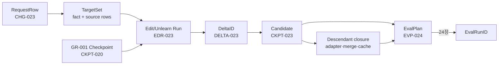
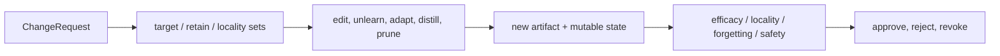

# 23장 지속학습·지식 편집·unlearning: 바꾼 뒤 무엇이 남는가

모델을 바꾸는 일보다 어려운 것은 바뀐 범위를 증명하는 일이다. 한 사실을 주입하고 benchmark 점수가 올랐다는 결과만으로는 이웃 사실, optimizer state, 후손 adapter와 quantized artifact가 어떻게 변했는지 알 수 없다.

이 장의 출발점은 방법 이름이 아니라 **변경 요청의 상태 사슬**이다.

`원천 사실·문서·제품 요청 → 변경 대상 → update 또는 mask → 직접 바뀐 parameter·row·optimizer state → 새 checkpoint → adapter·merge·quantization·distillation 후손 → locality·retention·forgetting·privacy 평가 → release 또는 revocation`

이 사슬에서 화살표 하나가 비면 “바뀌었다”는 결과는 재현할 수 없고, “지웠다”는 결과는 회수할 수 없다. 예를 들어 특정 질문에 새 답이 나왔다고 하자. 그 변화는 base weight 편집, LoRA adapter, retrieval 문서, 외부 n-gram row, system prompt 또는 출력 필터 중 어디서도 생길 수 있다. 관찰된 문자열은 같지만 rollback 단위와 개인정보 삭제의 의미는 전혀 다르다. 따라서 이 장에서는 먼저 요청을 `ChangeSetID`로 고정하고, 다음 다섯 질문을 순서대로 닫는다.

1. 무엇을 바꾸는가. 원문 객체, 사실 관계, 응답 행동, parameter 영향 가운데 목표를 구분한다.
2. 어느 상태가 실제로 바뀌었는가. tensor, adapter, optimizer moment, memory row, index와 policy를 구분한다.
3. 어디까지 전파됐는가. checkpoint에서 merge·quantization·distillation·serving cache까지 후손을 닫는다.
4. 무엇을 보존했는가. 직접 질문뿐 아니라 재질문, 의미적으로 가까운 사실, 무관 능력과 privacy attack을 따로 평가한다.
5. 어떤 근거로 배포하는가. 논문 결과, 공개 구현의 test, 이 모델에서 실행한 paired evaluation과 운영 lineage를 섞지 않는다.

지속학습, 지식 편집과 machine unlearning은 모두 parameter를 바꿀 수 있지만 목적함수는 다르다. 지속학습은 새 분포에 적응하면서 과거 능력을 보존하려는 **시간축 최적화**다. 지식 편집은 좁은 대상 행동을 바꾸면서 의미적 이웃을 보존하려는 **국소 제약 최적화**다. unlearning은 제거 요청 뒤 어떤 정보와 후손이 남았는지를 입증하는 **반사실·계보 문제**다. 같은 target accuracy를 냈다는 이유로 세 방법을 대체재처럼 비교하지 않는다.

|문제|직접 목표|바뀔 수 있는 상태|반드시 필요한 대조군|성공처럼 보이는 대표 실패|
|---|---|---|---|---|
|지속학습|새 분포 적응과 과거 능력 보존|weight, adapter, optimizer, replay buffer, scheduler clock|task×phase 평가 행렬, 동일 token budget run|평균 점수는 유지됐지만 한 언어·도메인이 붕괴함|
|지식 편집|target fact·행동의 제한된 변경|weight delta, adapter, retrieval/index, addressed-memory row|paraphrase, semantic neighborhood, retrieval×weight ablation|문구를 외웠거나 출력 필터만 바뀜|
|unlearning|요청 대상 영향 또는 접근 가능성 제거|weight, optimizer/EMA, shard, adapter와 모든 후손|삭제 제외 retrain, retain set, 공격·계보 대조군|거절은 하지만 membership·재학습 신호와 파생물이 남음|

이 표의 마지막 열이 이 장의 핵심이다. surface success를 더 많이 세는 것이 아니라, 성공으로 오인하기 쉬운 상태를 일부러 만들어 평가가 그것을 거부하는지 확인한다.

## 23.0 GR-001 변경 원장: 학습된 모델을 고치는 순간부터 출시 후보까지

앞 장까지의 `GR-001`은 동일한 base digest와 tokenizer revision 위에서 SFT와 preference 학습을 마쳤다. 이 장은 그 모델에 변경 요청 `CHG-023`을 적용한다. 예시는 “폐기된 제품 정책을 새 정책으로 교체하고, 삭제 대상 문서의 영향을 제거하라”는 요청이다. 편집 성공 문장만 남기지 않는다. 요청 행, 실제 parameter delta, 모든 파생 artifact와 평가 계획을 한 commit으로 만든다.



|row/state|예시 값|소유자와 수명|이 장의 불변조건|
|---|---|---|---|
|`ChangeSetID`|`CHG-023`|변경 승인자가 만들고 영구 보존|target·retain·forbidden set의 revision이 고정됨|
|parent|`CKPT-020@sha256:…91c`|model registry|GR-001의 tokenizer·config·base digest와 일치|
|target row|`DOC-0042 / fact-7`|data steward|삭제·교체 이유와 원천 계보가 존재|
|parameter delta|`DELTA-023`, layer 14 MLP|training worker→artifact store|방법 이름이 아니라 바뀐 tensor와 norm을 기록|
|descendants|adapter 2, merged 1, cache generation 3|registry·serving owner|도달 가능한 구 artifact가 하나도 promotion되지 않음|
|evaluation plan|`EVP-024`|독립 evaluator|efficacy·paraphrase·locality·retention·privacy row가 동결됨|

### 수학과 코드가 만나는 변경량

ROME류의 한 층 편집을 단순화하면 $W'=W+uv^\top$이고, 보존 손실을 포함한 변경 목적은 다음처럼 쓸 수 있다.

$$
L_{change}=L_{target}(\theta+\Delta\theta)
+\lambda_{loc}D(f_{\theta+\Delta\theta}(X_{retain}),f_\theta(X_{retain}))
+\lambda_{size}\lVert\Delta\theta\rVert_F^2.
$$

|수학 기호|실행 객체|shape·분모|코드에서 확인할 경계|
|---|---|---|---|
|$W$|선택한 projection weight|`[d_out,d_in]`|[ROME `execute_rome`의 복사·복원 경계](https://github.com/zjunlp/EasyEdit/blob/14cea8245f06715684592ab55184939b99d70784/easyeditor/models/rome/rome_main.py#L144-L159)|
|$u$|key 방향|`[d_out]`|[key 계산과 activation 수집](https://github.com/zjunlp/EasyEdit/blob/14cea8245f06715684592ab55184939b99d70784/easyeditor/models/rome/compute_u.py#L61-L127)|
|$v$|value 보정 방향|`[d_in]`|[목표 log-prob와 KL 제약 최적화](https://github.com/zjunlp/EasyEdit/blob/14cea8245f06715684592ab55184939b99d70784/easyeditor/models/rome/compute_v.py#L15-L208)|
|$D$|retain logits divergence|retain valid token 평균|24장에 넘길 locality row를 생성|
|$\Delta\theta$|`DELTA-023` tensor set|tensor별 FP32 norm과 digest|0이 아닌 tensor 목록이 manifest와 같아야 함|

코드 좌표는 구현 동작의 근거이지 GR-001에서의 성공 증거가 아니다. 실제 성공은 고정된 `EVP-024`를 다음 장에서 실행해야 성립한다. 연구 배경은 [ROME 논문](https://arxiv.org/abs/2202.05262)과 [OpenUnlearning의 고정 저장소](https://github.com/locuslab/open-unlearning/tree/4ad738aaf60f6a4385f6e2506d01da99e76c31f3)에서 원전으로 확인한다.

### 반증 실험과 24장 인계

`CHG-023-M1`에서는 target answer만 출력 필터로 바꾸고 weight delta를 0으로 둔다. 표면 efficacy는 통과할 수 있지만 paraphrase와 raw-logit 검사는 실패해야 한다. `M2`에서는 삭제 대상 adapter 하나를 descendant 목록에서 빼고, 역방향 계보 검사가 이를 잡아야 한다. `M3`에서는 optimizer moment를 parent에서 남겨 다음 한 step 뒤 target이 재출현하는지 측정한다. 기대 oracle은 “최종 점수 하락”이 아니라 각각 `raw-logit`, `descendant-closure`, `relearning` 단계가 최초 불일치라는 것이다.

이 실험은 [평가·오염·불확실성 실습](../labs/24-eval-contamination-uncertainty-lab.md)으로 이어진다. 이 장의 출력은 모델 한 개가 아니라 `{CKPT-023, DELTA-023, CHG-023, EVP-024, descendant-set}` 묶음이다. 아래의 지속학습·ROME·MEMIT·Engram·unlearning 심화 절은 모두 이 묶음의 방법 선택과 실패 경계를 확장한다. 새 계보를 따로 만들지 않는다.

## 23.1 지속학습·편집·삭제를 서로 다른 변경 문제로 정의한다

세 문제는 모두 모델 행동을 바꾸지만 허용하는 데이터, parameter 범위와 성공 조건이 다르다. 먼저 변경의 주체와 보존해야 할 능력을 분리한다.

### gradient 충돌을 관찰한다

새 task gradient `g_new`와 보존 task gradient `g_old`의 내적이 음수면 한 step이 보존 task loss를 올릴 수 있다. layer별 cosine과 gradient norm을 기록하면 forgetting을 scalar accuracy 뒤에서 꺼낼 수 있다. replay ratio는 단순 데이터 비율이 아니라 realized token과 유효 label 분모로 기록한다.

이 관찰을 과장해서는 안 된다. `g_new^T g_old < 0`은 현재 parameter와 두 mini-batch 주변의 1차 근사에서 충돌한다는 뜻이다. 여러 step 뒤의 task 성능 저하를 증명하지 않으며, cosine이 양수라고 장기 보존을 보장하지도 않는다. 그래서 같은 checkpoint에서 두 gradient를 따로 계산한 뒤 `(i)` layer별 cosine, `(ii)` projection 전후 norm, `(iii)` 실제 update 뒤 old/new batch loss 변화, `(iv)` phase checkpoint의 고정 evaluation row를 연결한다. 첫 세 항은 update 메커니즘을, 마지막 항은 장기 결과를 검증한다.

### continual checkpoint의 계보

지속학습에서는 weight만 되돌려도 과거의 학습 순서를 되찾지 못한다. replay buffer와 sampler cursor가 달라지면 다음 update가 다른 표본을 소비하고, 그 차이가 이후 checkpoint 전체로 퍼지기 때문이다. 그래서 `CheckpointID`는 parent, curriculum phase, replay buffer revision, sampler cursor를 함께 가리켜야 한다. world size 변경 뒤 replay order가 달라졌다면 같은 데이터 비율을 사용했어도 별개의 학습 궤적이다. 이전 task의 private canary를 phase마다 평가하면 평균 점수가 아니라 회귀가 처음 생긴 checkpoint를 찾을 수 있다.

### forgetting을 하나의 평균으로 보지 않는다

task `i`를 배운 직후 점수 `a_i*`와 마지막 점수 `a_i^T`의 차이를 forgetting으로 둘 수 있다. 그러나 평균은 특정 언어·도메인의 붕괴를 숨긴다. task별 paired row와 calibration, generation length도 본다. forward transfer와 backward transfer를 구분한다.

replay 결정 트리. 이전 task loss만 오르면 replay coverage와 gradient cosine을, 새 task도 안 배우면 LR/capacity/optimizer를 본다. replay sample 비율은 같은데 token 비율이 다르면 packing/length를 본다. buffer resume 뒤 ID stream이 달라지면 성능 분석 전에 reproducibility 실패다.

논문 지표를 run state에 연결한다. continual learning 논문은 average accuracy, forgetting, forward/backward transfer를 정의하지만 실제 run에서는 task boundary와 evaluation checkpoint가 필요하다. task `i`를 학습한 직후의 최고 점수를 사후에 고르면 optimistic bias가 생긴다. phase transition rule과 eval cadence를 미리 고정한다.

task 순서, replay ratio, optimizer/scheduler reset 정책이 다른 실험은 같은 알고리즘 이름으로 직접 비교하지 않는다. backbone의 normalization·adapter owner도 forgetting에 영향을 준다. model card의 평균 하나보다 task×phase matrix를 보존한다.

replay buffer state. buffer에는 sample ID, selection score, insertion/eviction time, class/domain quota와 RNG를 저장한다. reservoir sampling이면 seen count가 checkpoint state다. prioritized replay면 priority와 update count가 필요하다. 원문 bytes를 저장하지 않고 ID만 저장하면 corpus revision이 바뀔 때 같은 sample을 복원하지 못할 수 있다.

분산에서는 rank-local buffer인지 global service인지, 중복 sample과 realized token mixture를 어떻게 집계하는지 확인한다. checkpoint가 model만 저장하고 buffer를 잃으면 resume 뒤 다른 curriculum이다.

backward 충돌 실험. 같은 checkpoint에서 old batch와 new batch의 gradient를 따로 계산해 layer/group별 norm과 cosine을 낸다. 전체 vector cosine이 양수여도 특정 embedding/MLP layer가 충돌할 수 있다. replay update 전후 old/new loss의 first-order 예상과 실제 delta를 비교한다.

gradient projection 계열을 쓰면 projection 전/후 norm과 제약 위반을 기록한다. 작은 toy에서 old gradient 방향의 loss가 실제 보존되는지 finite step으로 검산한다. 장기 성능은 별도 eval이다.

replay·EWC·distillation을 같은 좌표계에서 비교한다. replay는 과거 표본의 gradient를 현재 update에 다시 넣는다. EWC류는 이전 해 `theta*`에서 중요한 parameter가 멀어지는 비용

`L(theta) = L_new(theta) + (lambda/2) sum_k F_k (theta_k - theta*_k)^2`

를 더한다. distillation은 과거 모델의 출력 분포와 현재 모델 사이의 KL을 제한한다. 세 방법은 모두 “과거를 보존”하지만 보존하는 객체가 각각 표본, parameter 방향, 관측된 함수 출력이다. replay corpus가 과거 능력을 덮지 못하면 그 능력은 gradient에 나타나지 않는다. diagonal Fisher는 parameter 간 상관을 버리며, Fisher를 추정한 분포 밖에서는 중요도 지도가 약해진다. distillation은 teacher prompt가 방문하지 않은 함수 영역을 보호하지 못한다.

따라서 `ContinualRunID`에는 method 이름만 적지 않는다. replay item과 realized valid-token 비율, Fisher artifact의 parent checkpoint·추정 corpus·dtype·normalization, teacher digest와 distillation prompt family, `lambda`와 각 loss 항의 실제 gradient norm을 함께 둔다. EWC가 좋아 보이면 `lambda=0`, 같은 compute의 replay, Fisher를 shuffle한 대조군을 둔다. Fisher shuffle에서도 결과가 같다면 “중요 parameter를 선택적으로 보호했다”는 해석은 약해진다.

parameter isolation도 공짜 보존이 아니다. task별 adapter를 얼려 두면 과거 weight 손상은 줄지만 어떤 adapter를 호출할지 정하는 router가 새 상태가 된다. oracle task ID에서는 좋아도 실제 router에서 무너지면 기억을 보존한 것이 아니라 선택 문제를 평가에서 제외한 것이다. `base digest → adapter digest → router revision → served adapter set`을 한 묶음으로 평가한다.

### 고정 소스 워크스루: TENT에서 SAR까지 reset은 상태 벡터의 연산이다

시험 시 적응을 “추론 중 한 번 학습한다”라고만 이해하면 가장 중요한 차이를 놓친다. 실제 구현에서 알고리즘을 가르는 것은 손실식뿐 아니라 **어떤 상태를 다음 입력으로 넘기고, 어느 사건에서 어디까지 되감는가**다. 상태를

`S_t = (theta_t, optimizer_t, teacher_t, anchor_t, prediction_ema_t, entropy_ema_t, counters_t)`

라고 쓰자. continual 모드는 `S_{t+1}=A(S_t,x_t)`이고, episodic 모드는 먼저 일부 또는 전부를 초기 snapshot `S_0`으로 보내고 `S_{t+1}=A(R(S_t),x_t)`를 계산한다. `R`이 복원하는 성분이 다르면 같은 `episodic=True`라는 이름도 같은 실험이 아니다.

TENT의 고정 소스에서 생성자는 model과 optimizer의 `state_dict`를 깊은 복사로 보관한다. `forward`는 episodic일 때 매 batch 앞에서 두 snapshot을 함께 복원하고, 현재 logits의 softmax entropy 평균을 backward한다. `configure_model`은 전체 gradient를 끈 뒤 `BatchNorm2d.weight`와 `bias`만 다시 켜며 running mean과 variance를 `None`으로 만든다. 여기에는 두 가지 함정이 있다. 첫째, weight만 복원하고 Adam moment를 남기면 다음 update가 원점에서 시작하지 않는다. 둘째, 이 계약은 BatchNorm affine에 기대므로 RMSNorm·LayerNorm 중심의 decoder-only LLM에 함수 이름만 이식할 수 없다. 어떤 parameter를 열 것인지 새로 정의하는 순간 별개의 방법이다.

CoTTA는 상태 벡터가 더 크다. student와 optimizer 외에 EMA teacher, 고정 anchor, 원 weight snapshot을 소유한다. anchor confidence가 낮으면 EMA teacher의 32개 증강 prediction을 평균하고, 높으면 단일 teacher prediction을 쓴다. student update 뒤 teacher를 EMA로 이동시키고, 학습 가능한 weight·bias의 일부를 Bernoulli mask로 원 snapshot에 되돌린다. 따라서 `mt_alpha`, restore probability와 augmentation RNG는 단순 hyperparameter가 아니라 다음 상태를 결정하는 transition 입력이다. reset은 student·optimizer를 복원한 뒤 teacher와 anchor를 다시 복제한다. teacher를 되감지 않은 구현과 결과를 같은 CoTTA로 비교하면 누적 기억량 자체가 다르다.

EATA는 reliable sample과 non-redundant sample을 차례로 고른다. 첫 문은 entropy가 `e_margin`보다 작은가이고, 둘째 문은 누적 prediction 평균과 현재 prediction의 cosine 유사도가 `d_margin` 안쪽인가이다. 선택 entropy에는 원천 parameter와 Fisher로 만든 quadratic penalty가 더해진다. 선택 표본 수가 0이면 optimizer step을 생략한다.

그러나 소스의 `reset()`은 model과 optimizer만 복원하고 `current_model_probs`, 두 sample counter는 지우지 않는다. 즉 shift 경계에서 `reset()`을 호출해도 표본 선택의 기억은 남는다. 이를 완전한 episodic reset으로 보고하면 weight 계보와 selector 계보를 혼동한다. 완전 초기화를 원한다면 prediction EMA와 counter까지 별도 digest로 확인해야 한다.

SAR는 reliable entropy로 첫 backward를 하고 SAM의 `first_step`으로 weight를 perturb한 뒤, 같은 표본을 다시 forward하여 두 번째 reliable set과 gradient를 만든다. `second_step` 뒤 두 번째 entropy의 EMA가 recovery threshold 아래로 내려가면 reset flag가 켜진다. wrapper의 reset은 model·optimizer를 복원하고 entropy EMA를 `None`으로 지운다. 여기서 “entropy가 낮으니 좋다”는 직관은 거꾸로 작동할 수 있다. 지나치게 낮은 entropy는 붕괴한 확신일 수 있어서 recovery trigger가 된다. 빈 reliable set에서 `mean()`이 NaN이 되는 경로, SAM 첫 단계만 실행된 뒤 두 번째 단계가 실패하는 경로도 반드시 fault injection으로 확인한다.

네 구현을 비교할 때는 정확도 표보다 먼저 reset 행렬을 만든다.

|방법|항상 이동하는 상태|기본 reset이 복원하는 상태|명시적으로 별도 확인할 상태|
|---|---|---|---|
|TENT|BN affine, optimizer|model, optimizer|batch-statistics 의존성과 입력 순서|
|CoTTA|student, optimizer, EMA teacher, stochastic restore RNG|student, optimizer, teacher, anchor 재생성|augmentation·restore RNG|
|EATA|model, optimizer, prediction EMA, counters|model, optimizer|prediction EMA와 counters|
|SAR|model, optimizer, entropy EMA, SAM 임시 상태|model, optimizer, entropy EMA|두 SAM 단계 사이 실패와 빈 선택|

검증 fixture는 동일 checkpoint와 동일 입력 multiset으로 `never reset`, `every batch`, `shift boundary` 세 정책을 실행한다. 입력 순서도 `A→B`와 `B→A`로 뒤집는다. 각 경계에서 model, optimizer, teacher, anchor와 EMA의 checksum을 남기고 update가 없었던 batch에서는 optimizer step counter까지 불변인지 확인한다. 저자 저장소에 이런 상태 폐루프를 독립적으로 검증하는 canonical unit test가 없다는 사실은 숨기지 않는다. main script가 실행된다는 사실은 reset parity의 증거가 아니다.

### BWT와 FWT는 전체 task×phase 행렬에서만 복원된다

task `j`까지 학습한 뒤 task `i`에서 얻은 점수를 `R_{i,j}`라 하자. 마지막 시점의 backward transfer는 흔히

`BWT = (1/(T-1)) sum_{i=1}^{T-1} (R_{i,T} - R_{i,i})`

로 쓴다. 음수면 과거 task가 나빠졌다는 뜻이지만 평균 BWT 0은 “망각이 없다”와 동치가 아니다. 한 task가 20점 떨어지고 다른 task가 20점 오르면 상쇄된다. 그래서 `R` 전체, task별 차이와 worst-task BWT를 보존한다. 학습 직후 점수 `R_{i,i}` 대신 사후에 고른 최고 checkpoint를 넣으면 기준선이 낙관적으로 변한다.

forward transfer는 아직 학습하지 않은 task `i`의 직전 점수와 무학습 baseline `b_i`를 비교해

`FWT = (1/(T-1)) sum_{i=2}^{T} (R_{i,i-1} - b_i)`

로 둘 수 있다. `b_i`는 같은 tokenizer, prompt, decoding과 evaluation code로 측정해야 한다. pretrained baseline과 random-init baseline을 섞거나 zero-shot prompt가 다르면 FWT의 영점이 달라진다. task order를 바꾸면 `R_{i,i-1}`의 선행 경험도 바뀌므로 seed 반복만으로 order sensitivity를 대체하지 않는다.

실무 대시보드는 average final score, BWT, FWT를 한 줄에 놓되 클릭하면 task×phase matrix, token budget, replay mixture와 reset policy로 내려가야 한다. instruction tuning에서는 task accuracy뿐 아니라 형식 준수와 reasoning knowledge를 별도 행으로 둔다. 새 instruction style을 배운 뒤 정답 지식은 남았지만 출력 형식이 무너졌다면 knowledge forgetting과 alignment forgetting을 분리할 수 있다. 이 구분이 있어야 replay를 늘릴지, router·adapter ownership을 고칠지, template distribution을 다시 섞을지 결정할 수 있다.

## 23.2 ROME·MEMIT과 addressed memory의 쓰기 경계를 읽는다

지식 편집을 사실 문자열의 교체로 보지 않고 locate, solve, write와 restore가 어떤 hidden state와 weight를 소유하는지 추적한다.

### low-rank edit의 범위

ROME류는 특정 MLP 계층의 key-value 연상을 low-rank update로 바꾼다. MEMIT은 여러 edit을 배치한다. 핵심 질문은 target prompt 성공이 아니라 paraphrase generalization, neighborhood preservation, multi-hop consistency다. edit request마다 target layer, pre/post weight digest, delta rank와 norm을 저장한다.

### Engram과 외부 주소 공간

hashed n-gram memory는 dense weight에 사실을 분산시키는 대신 discrete key로 row를 찾는다. row 교체는 국소적일 수 있지만 hash collision과 context gating 때문에 한 key가 한 사실과 동치라는 보장은 없다. 사용자별 memory를 편집할 때 tokenizer revision과 n-gram construction이 바뀌면 주소가 달라진다.

여기서 `n-gram = 지식 항목`이라는 직관은 절반만 맞는다. 주소 `a=h(x_{i:i+n})`, 조회값 `m=M[a]`, gate `alpha(x)`를 써서 hidden state가 `h'=h+alpha(x)m`처럼 바뀐다고 하자. row `M[a]`를 교체해도 gate가 0에 가까우면 행동은 바뀌지 않는다. 반대로 hash collision을 공유하는 다른 문자열은 같은 row를 읽고, downstream dense layer는 그 변화를 여러 관계에 재사용할 수 있다. **주소의 국소성**, **표현의 국소성**, **행동의 국소성**은 서로 다른 주장이다.

Engram/n-gram 편집 fixture는 그래서 네 갈래로 나눈다. 정확히 같은 token n-gram, normalization만 다른 표면형, 같은 row에 충돌하는 다른 n-gram, 의미는 같지만 다른 token으로 표현된 paraphrase를 준비한다. edit 전후에 selected address·row·gate·첫 logit divergence를 기록한다. exact-key만 성공하면 주소 변경에는 성공했지만 의미 일반화에는 실패한 것이다. paraphrase도 성공했다면 dense path가 이미 알고 있던 관계와 결합했을 가능성을 retrieval-off, memory-off ablation으로 분리한다.

### edit의 선형대수와 가정

low-rank update는 선택한 key `k`에서 원하는 value 변화 `v*`를 만들되 다른 key의 출력을 덜 바꾸려 한다. covariance 또는 inverse representation statistics가 neighborhood를 근사한다. 통계가 다른 domain에서 추정됐거나 matrix가 ill-conditioned하면 국소성 가정이 깨질 수 있다. solver residual, condition, delta norm을 저장한다.

source와 test 범위. ROME/MEMIT 공개 구현의 layer selection, key extraction, covariance cache, weight update를 고정 revision에서 읽는다. unit test나 benchmark success는 production 지식 관계망의 일관성을 증명하지 않는다. paraphrase·neighborhood·multi-hop을 별도 EvalID로 둔다.

ROME류 update를 상태로 적는다. edit request에는 subject, relation, target completion, prompt templates를 적는다. representation key를 뽑는 token 위치와 layer, desired value optimization seed/steps, covariance statistics artifact를 기록한다. update 전후 target weight digest와 delta를 저장한다.

같은 자연어 사실도 tokenizer가 바뀌면 subject token 위치와 key가 달라진다. covariance cache가 다른 model revision에서 만들어졌다면 재사용을 막는다. 여러 edit의 order가 결과를 바꿀 수 있으므로 batch/order와 parent checkpoint를 lineage로 둔다.

MEMIT의 다중 edit와 간섭. 여러 key/value constraint를 한꺼번에 풀 때 matrix rank와 conditioning이 중요하다. edit 수가 layer capacity와 statistics support를 넘으면 delta norm과 neighborhood damage가 커질 수 있다. solver residual, singular value/condition proxy, per-edit efficacy를 기록한다.

batch edit 평균 성공률만 보지 않고 먼저 실패한 edit와 서로 충돌하는 subject를 찾는다. 같은 key neighborhood를 공유하는 edit를 순서 바꿔 실행해 order sensitivity를 본다. 실행하지 않은 대규모 capacity를 논문 숫자로 일반화하지 않는다.

addressed memory edit. Engram/n-gram memory는 tokenizer output에서 hash key를 만들고 row를 lookup해 context gating으로 dense stream에 주입한다. edit 단위는 dense weight delta가 아니라 key→row payload 및 gating behavior일 수 있다. key construction revision, hash seed/table, collision set과 selected row를 저장한다.

row 하나를 바꿔도 collision key와 gate가 활성화되는 다른 context가 영향을 받는다. edit test는 target n-gram, collision control, 같은 단어 다른 context, tokenizer normalization 변형을 포함한다. external store version publication과 rollback도 checkpoint state와 연결한다.

편집과 fine-tuning 비교 실험. 동일 EditID를 low-rank edit, small SFT, adapter, retrieval/addressed memory로 수행한다. parameter/storage delta bytes, update 시간, target/paraphrase/neighborhood/multi-hop, rollback과 descendant artifact를 비교한다. 수치 비교는 같은 model/tokenizer/eval에서만 한다.

편집 방법의 목적이 다르므로 한 점수로 순위를 내리지 않는다. exact fact replacement, behavioral steering, personalized memory, broad domain adaptation을 구분한다. 독자는 원하는 invalidation/rollback 범위에서 방법을 선택한다.

재질문 성공과 semantic locality를 분리한다. 직접 prompt의 단어 순서만 바꾼 재질문은 같은 lexical key를 재사용할 수 있다. 이것을 의미 일반화의 증거로 세지 않는다. 최소한 `(a)` template 재배열, `(b)` 다른 언어·표기, `(c)` 관계를 한 단계 추론해야 하는 portability, `(d)` 같은 subject의 다른 relation, `(e)` 다른 subject의 같은 relation을 서로 다른 family로 둔다. `(a)~(c)`는 target generalization이고 `(d)~(e)`는 locality 대조군이다.

답 문자열만 비교하면 confidence 붕괴를 놓친다. target answer logit이 올랐지만 neighborhood 정답 logit이 더 크게 떨어질 수 있다. pre/post에서 정답 rank, log-probability, competing answer margin과 생성 결과를 함께 보존한다. generation 성공은 decoding policy의 함수이므로 greedy paired 결과와 raw logit contribution을 구분한다. semantic locality는 “정답 문자열이 그대로다”가 아니라 이웃 함수의 허용 변화 예산으로 정의한다.

편집을 디버깅한 paraphrase family를 최종 holdout으로 다시 쓰지 않는다. layer, rank, regularization과 prompt template를 그 family에 맞춰 고른 순간 selection set이 된다. untouched subject family에서 final efficacy/locality를 재평가하고, 탐색한 configuration 수를 기록한다.

## 23.3 forgetting과 검증 가능한 deletion을 구분한다

성능이 떨어졌다는 관찰은 학습 영향이 제거됐다는 증거가 아니다. forget·retain·relearn 평가와 artifact 계보를 함께 본다.

### behavioral forgetting의 한계

삭제 대상 질문에 답하지 못해도 parameter, optimizer moment, training log, adapter, distilled child에 정보가 남을 수 있다. 반대로 exact retraining 없이 특정 sample의 영향을 완전히 제거했다는 주장은 강하다. 책에서는 empirical unlearning score와 cryptographic deletion lineage를 분리한다.

“답하지 않는다”는 현상부터 원인을 나눈다. 출력 필터가 target string을 막았는가, policy가 거절을 선택했는가, target logit 자체가 내려갔는가, representation probe와 membership attack도 약해졌는가, 삭제 데이터를 제외한 retrain reference에 가까워졌는가. 앞의 조건은 뒤의 조건을 함의하지 않는다. 특히 거절문은 원래 사실을 조건으로 삼아 더 정확히 거절할 수도 있다. 그래서 output-filter-only와 refusal-SFT를 반드시 음성 대조군으로 둔다.

unlearning의 보장 수준은 다음처럼 이름을 붙여 기록한다.

- **접근 차단**: 원문·index·key를 더 이상 읽을 수 없다. 이미 만들어진 weight 영향에는 답하지 않는다.
- **행동 완화**: 정해진 prompt·공격 budget에서 target 출력이 줄었다. 다른 질문이나 미래 공격에는 일반화하지 않는다.
- **경험적 영향 감소**: membership, extraction, representation과 relearning probe가 대조군보다 약해졌다. 사용한 공격 family의 검출력에 한정된다.
- **retrain 근접성 또는 certified 보장**: 삭제 데이터를 처음부터 빼고 학습한 reference와 정의된 거리에서 가깝거나, 명시된 가정 아래 bound가 있다. 가정 밖의 동일성을 주장하지 않는다.

release record는 가장 강한 단어가 아니라 실제로 통과한 보장 수준을 쓴다.

### 후손 무효화

`RevocationID`는 raw document에서 token shard, packed sample, optimizer step, checkpoint, adapter, merged/quantized artifact, evaluation cache까지 reverse index를 따라야 한다. 삭제가 들어오면 실제 bytes를 지우는 것과 이미 만들어진 후손을 재사용 금지로 표시하는 것이 모두 필요하다.

### 영향 함수와 exact retraining의 거리

influence approximation은 Hessian inverse-vector product로 sample 제거의 parameter 변화를 근사할 수 있지만 비선형 장기 학습과 optimizer path를 정확히 되감지 않는다. 근사는 triage에 유용하되 exact deletion 증거가 아니다. training-from-scratch control과 비교하지 못하면 empirical claim으로 제한한다.

optimizer·cache 잔존물. Adam moment, EMA/SWA weight, gradient cache, distillation dataset, retrieval index, evaluation response cache도 descendant다. model weight만 교체하고 이들을 보존하면 삭제 sample의 신호가 되돌아올 수 있다. revocation query는 산출물 유형별 처리 결과와 실패를 남긴다.

exact deletion이 요구하는 counterfactual. sample `z`를 포함한 training 결과와 처음부터 제외한 결과의 차이를 알고 싶지만 대형 비선형 학습을 다시 하지 않으면 counterfactual을 직접 얻기 어렵다. unlearning algorithm은 근사 또는 behavioral 목표를 제공할 수 있다. 어떤 등가성을 주장하는지 명확히 한다.

parameter가 retrain baseline과 가까운지, target behavior만 사라졌는지, membership signal이 줄었는지, downstream utility가 유지됐는지는 다른 질문이다. “삭제” 한 단어로 합치지 않는다. 법적 산출물 삭제과 model influence removal도 분리한다.

데이터 lineage fixture. 작은 corpus에서 DocumentID 하나가 tokenizer shard, packed sample, optimizer batch, checkpoint, adapter, merged/quantized artifact로 이어지는 fixture를 만든다. RevocationID를 발행해 reverse index가 모든 descendant를 찾는지 검사한다. 일부 edge를 의도적으로 제거해 incomplete closure가 fail하는지 본다.

checkpoint가 sample-level contribution을 저장하지 않더라도 consumed batch manifest와 corpus revision으로 영향 범위를 보수적으로 잡을 수 있다. 정확히 좁힐 수 없으면 해당 checkpoint 이후 모든 descendant를 quarantine한다.

redaction과 cryptographic erasure. 원문 object를 지우거나 encryption key를 폐기하면 저장 bytes 접근은 막을 수 있다. 그러나 이미 파생된 token shard와 model weight의 영향은 자동으로 사라지지 않는다. storage deletion evidence와 model unlearning evidence를 별도 record로 둔다.

backup, cache, logs, experiment artifact와 third-party mirror의 retention을 포함한다. 삭제 실패/접근 불가도 숨기지 않는다. descendant system에 revocation을 전달하고 ack/version을 모은다.

## 23.4 relearning·복구·calibration으로 잔존 효과를 측정한다

정답률 하나 대신 재학습 속도, confidence와 주변 사실의 이동을 측정해 숨은 잔존과 과도한 손상을 구분한다.

### optimizer residual

weight만 unlearn하고 Adam moment를 보존하면 삭제 방향의 과거 gradient 정보가 남는다. 재학습 시 빠르게 되살아나는지 측정하고 optimizer state 초기화 범위를 기록한다. control fact와 삭제 fact의 relearning curve를 함께 비교한다.

### 최소 판정표

target efficacy, paraphrase, neighborhood, downstream task, membership/inference 공격, relearning speed를 같은 `EditID`/`RevocationID`로 묶는다. 한 지표 개선을 전체 삭제 성공으로 부르지 않는다.

### 재학습 실험

동일 budget으로 삭제 fact와 frequency가 비슷한 control fact를 다시 학습한다. 삭제 fact가 훨씬 빨리 돌아오면 residual representation 또는 optimizer state 가능성이 있다. seed 여러 개와 curve confidence interval을 사용한다. 이 실험도 정보의 존재를 완전히 증명하거나 부정하지 않는다.

release 결정 트리. 법적/보안 삭제라면 behavioral score만 통과해도 release하지 않는다. descendant closure가 불완전하면 해당 lineage 전체를 quarantine한다. 단순 품질 edit라면 locality와 downstream regression budget을 적용한다. 모든 결정에 rollback parent와 만료 시점을 둔다.

checkpoint와 optimizer 처리. edit가 weight를 직접 바꿨다면 optimizer moment가 새 weight와 일관적인지 결정해야 한다. moment를 유지하면 과거 trajectory가 edit를 되돌릴 수 있고, reset하면 학습 dynamics가 바뀐다. affected parameter group만 reset할지 전체 reset할지 manifest와 실험으로 정한다.

unlearning 후 continued training을 한다면 parent checkpoint, reset scope, replay/counterfactual data, scheduler clock을 저장한다. EMA/SWA가 있으면 edited/unlearned weight에서 재초기화하거나 update lineage를 명시한다. raw와 averaged artifact를 혼동하지 않는다.

실패 주입 실험. 먼저 descendant index edge 하나를 누락해 출시 관문가 실제로 차단되는지 확인한다. 이어 optimizer moment를 의도적으로 유지하거나 초기화해 두 relearning curve를 비교한다. hash collision addressed memory row를 바꾸는 실험은 control context 회귀를 드러내야 한다. 마지막으로 edit batch 순서를 뒤집어 multi-edit 결과가 순서에 얼마나 민감한지 측정한다.

각 실험은 target 성공만이 아니라 neighborhood, downstream, membership/relearning, 산출물 폐쇄성를 함께 본다. 하나가 실패하면 전체 결과를 평균으로 숨기지 않는다.

실행 trace. trace는 `EditID/RevocationID→parent checkpoint→method/config→affected tensors/rows→optimizer action→new checkpoint→descendant invalidation→EvalID set`을 잇는다. step duration보다 identity와 state transition이 우선이다. edit function의 return만으로 commit을 인정하지 않고 산출물 hash와 publication을 확인한다.

코드 경계도 이 순서를 드러내야 한다. 아래 의사 코드는 알고리즘 구현이 아니라 운영 transaction의 최소 골격이다.

```python
change = render_and_hash(request, tokenizer_revision)
parent = load_immutable_artifact(change.parent_digest)
delta, touched = method.compute(parent, change.target, statistics_digest)
candidate = apply_without_publish(parent, delta)

state_report = reconcile_state(
    touched_parameters=touched,
    optimizer_policy="reset_touched_groups",
    ema_policy="rebuild_from_candidate",
)
eval_report = evaluate_paired(candidate, change.eval_manifest)
closure = find_descendants(parent.digest, inventory_revision)

assert eval_report.hard_gates_passed
assert closure.complete
new_digest = commit(candidate, change, state_report, eval_report)
publish_atomically(new_digest, invalidate=closure)
```

`method.compute`가 성공했다는 사실은 아직 release가 아니다. `touched`가 optimizer parameter group과 맞지 않으면 과거 moment가 편집을 되돌릴 수 있고, `closure`가 incomplete이면 old adapter나 quantized child가 계속 서비스될 수 있다. `publish_atomically`가 지원되지 않는 환경에서는 generation별 alias와 replica ack를 이용해 consistent cut을 모사하고, 모든 응답 trace에 실제 loaded digest를 남긴다.

반대로 mask나 출력 필터만 바꿨다면 `touched_parameters`는 비어 있어야 한다. 이 차이를 숨기지 않아야 행동 완화를 weight unlearning으로 잘못 기록하지 않는다. 구현 함수의 return schema, checkpoint writer, optimizer loader와 deployment alias 전환을 각각 source 좌표로 고정한다.

분산/external memory에서는 일부 replica만 새 version을 읽는 partial publication을 시험한다. reader는 version/digest를 response trace에 남긴다. rollback도 같은 ack 경계를 사용한다.

논문·구현·실행의 경계. 편집/unlearning 논문은 특정 benchmark와 model에서 efficacy/locality를 보고한다. 공개 구현은 layer 선택, statistics cache, solver와 evaluation scripts를 보여준다. 우리 model/tokenizer/corpus의 삭제·편집 성공은 로컬 fixture와 실제 descendant graph 실행이 필요하다.

따라서 저자 reported score는 배경 근거이고, source test는 implementation branch 근거이며, release 결정은 우리의 EvalID와 revocation closure 근거다. 세 층을 합쳐 “완전히 삭제했다”고 쓰지 않는다.

## 23.5 작은 fixture에서 세 변경의 수치 계약을 비교한다

같은 base model과 고정된 retain·change·probe set을 사용해 objective와 gradient, parameter delta의 차이를 손으로 검산한다.

서로 겹치지 않는 두 분류/next-token task A와 B를 만든다. base에서 A를 학습하고 `Checkpoint-A`를 저장한다. B만 학습한 run, A replay를 10/30% 넣은 run, adapter를 분리한 run을 만든다. 각 phase에서 A/B row별 loss와 accuracy, gradient cosine, parameter delta를 저장한다.

replay 10%는 sample 비율과 valid-token 비율을 모두 기록한다. B sample이 길면 realized A token은 훨씬 적을 수 있다. 동일 optimizer step/token budget으로 비교한다. scheduler를 reset하는 실험과 이어가는 실험은 분리한다.

resume은 B phase 중간에서 수행한다. replay buffer ID stream, sampler cursor, first batch와 optimizer state를 uninterrupted run과 비교한다. buffer가 달라졌다면 forgetting 점수 차이를 algorithm 효과로 해석하지 않는다.

### 작은 fact edit fixture

subject “도시 A의 표지 색”과 target “파랑”을 만들고 paraphrase, 같은 subject의 다른 relation, 비슷한 도시, multi-hop question을 구성한다. edit 전 logits/logprob와 hidden key를 저장한다. edit 뒤 target efficacy, paraphrase, neighborhood와 unrelated task를 paired 비교한다.

weight edit라면 affected layer/tensor, delta rank/norm와 digest를 기록한다. addressed memory라면 n-gram key/hash/table row/collision control을 기록한다. adapter SFT라면 train row, target modules와 optimizer state를 기록한다. 방법별 storage/rollback 범위를 비교한다.

edit implementation의 unit test가 matrix shape와 save/load만 확인한다면 semantic locality까지 증명하지 않는다. 이 fixture의 row contribution이 별도 증거다.

### 작은 unlearning fixture

corpus 32개 중 target document 하나를 지정한다. full training, 처음부터 target을 제외한 retrain baseline, unlearning method를 같은 seed/config에서 실행한다. 작은 모델이므로 parameter distance와 exact data stream을 비교할 수 있다. 대형 모델에서 불가능한 counterfactual을 교육용으로 닫는다.

target continuation, paraphrase, neighborhood, membership score와 downstream utility를 측정한다. unlearning 뒤 optimizer state 유지/초기화 두 branch로 continued training을 하고 relearning curve를 비교한다. target bytes, token shard, checkpoints와 exports의 revocation closure도 시험한다.

method가 behavioral target은 지우지만 retrain parameter와 멀다면 “behavioral forgetting”으로 판정한다. descendant bytes가 남으면 deletion 완료라 하지 않는다.

### membership와 privacy 해석

membership inference score 하락은 특정 공격이 sample membership을 덜 구분한다는 뜻이지 정보가 완전히 사라졌다는 증거가 아니다. 공격 model, threshold, shadow data와 false-positive rate를 기록한다. 여러 공격 family와 control sample을 사용한다.

canary exposure와 exact memorization prompt는 강한 신호지만 자연 문서 전체 영향과 같지 않다. extraction budget과 sampling config가 결과를 바꾼다. unlearning 전후 동일 budget으로 paired 비교한다.

privacy/legal release는 behavioral, attack, 산출물 삭제을 모두 요구할 수 있다. 정책 요구 수준을 사전에 명시하고 하나의 proxy로 대체하지 않는다.

multimodal·diffusion descendant. 21장의 cached image/audio/video feature와 tokenizer code, 22장의 VAE latent와 generated trajectory도 training descendant가 될 수 있다. 원 media 삭제 시 cache와 synthetic/distilled sample을 추적한다. concept unlearning은 text encoder, denoiser, VAE/adapter, EMA, quantized export 중 어디를 바꿨는지 명시한다.

동일 initial noise와 neighboring prompts로 edit 전후 trajectory를 paired 비교한다. target concept은 줄었지만 unrelated visual attributes가 무너지는지 본다. scheduler를 고정해 model edit 효과와 trajectory policy를 분리한다.

generated synthetic data가 다음 training corpus로 들어갔다면 그 child run도 descendant다. direct model만 무효화하고 distillation child를 남기면 lineage closure가 아니다.

분산 publication. edit/unlearned model이나 external memory를 여러 replica에 게시할 때 version/digest와 ack set을 사용한다. 일부 replica가 old version을 제공하면 paired eval이 혼합된다. request trace에 served artifact version을 남기고 publication 완료 전 alias 전환을 막는다.

checkpoint shard가 일부만 edit되었거나 adapter merge가 rank별로 달라지는 fault를 주입한다. manifest hash와 tensor schema 검증이 이를 잡는지 본다. rollback도 모든 replica ack를 요구한다.

external memory row와 dense checkpoint가 함께 바뀌는 edit에는 consistent cut이 필요하다. 둘 가운데 하나만 새 version으로 전환되면 서로 맞지 않는 두 상태가 결합되어 model 함수의 의미를 확정할 수 없다. 따라서 두 generation/version의 pair 자체를 하나의 artifact로 취급한다.

평가 통계. edit efficacy가 100개 prompt 중 80개면 row별 paired 변화와 confidence interval을 낸다. paraphrase가 같은 template에서 파생됐다면 cluster 단위 bootstrap을 고려한다. 여러 edit method와 layer를 탐색한 뒤 최고 점수만 보고하면 selection bias가 생긴다.

neighborhood utility는 어떤 row를 얼마나 가중했는지 기록한다. target efficacy와 utility를 한 harmonic mean으로 합치더라도 원 component를 보존한다. relearning curve는 여러 seed의 time/token-to-threshold와 interval을 낸다.

threshold는 결과를 본 뒤 정하지 않는다. 법적 deletion, product personalization, factual correction은 서로 다른 강제 관문와 budget을 가진다.

결정 기록. 최종 record는 request의 법적/제품 목적, source data와 target fact, parent artifact, method/config/소스 리비전, affected state, optimizer 처리, descendant closure, EvalID 묶음, known limitation과 rollback을 가진다. 성공 여부만 쓰지 않는다.

실패하면 어느 gate에서 멈췄는지 남긴다. target efficacy 실패, locality 실패, privacy attack 실패, descendant closure 실패는 복구 방법이 다르다. 모든 실패를 “unlearning 품질 부족”으로 합치지 않는다.

release 뒤에도 재학습과 새로운 attack을 모니터링한다. 시간이 지나 tokenizer/model/serving artifact가 바뀌면 과거 판정을 자동 상속하지 않고 revocation/edit compatibility를 다시 확인한다.

독자가 답해야 할 질문. 무엇을 지우거나 바꾸려는가. behavior, parameter influence, stored bytes, external memory 중 어느 범위인가. counterfactual baseline은 무엇인가. target과 neighborhood는 어떻게 정의했는가. optimizer/EMA/replay/cache와 후손 artifact를 어떻게 처리했는가. rollback은 가능한가.

논문 점수, 공개 구현, 우리 실행 중 어느 층이 각 주장을 지지하는가. test는 수식, matrix update, semantic locality, descendant closure 중 무엇을 증명하는가. 답하지 못한 항목은 NeedsReview 같은 내부 용어 대신 본문에서 “검증하지 못했다”고 자연어로 쓴다.

이 질문에 답해야 24장의 평가가 edit/unlearning의 target과 side effect를 공정하게 집계할 수 있다.

## 23.6 실패 비용과 회수 절차를 변경 원장에 남긴다

국소 성공이 release 성공을 뜻하지 않는다. 계산 비용, 회귀 범위, rollback과 파생 artifact 폐기를 DecisionEvent로 기록한다.

target prompt만 성공하고 paraphrase가 실패하면 overfit/local key 문제다. paraphrase는 성공하지만 neighborhood가 무너지면 update locality나 edit batch conditioning을 본다. edit 직후 성공했다가 continued training에서 사라지면 optimizer moment, LR와 replay를 본다. 일부 serving replica만 실패하면 publication/version 문제다.

behavior는 사라졌지만 membership attack이 유지되면 privacy gate 실패다. storage bytes는 지웠지만 distilled child가 남으면 descendant closure 실패다. retrain baseline과 다르지만 policy상 behavioral forgetting만 요구했다면 제한된 성공일 수 있다. 요구 계약에 따라 판정한다.

### source 좌표와 짧은 인용의 원칙

본문 코드 인용은 edit update 함수, covariance/statistics load, evaluation loop처럼 상태 전이를 보여주는 짧은 부분만 사용한다. 저장소 commit, 파일, 함수와 줄을 소스 기록에 둔다. 논문의 equation 번호와 공개 구현의 변수명을 대응시키되 구현이 추가한 clamp, regularization, cache를 생략하지 않는다.

테스트 파일은 이름이 아니라 assertion을 읽는다. weight shape/save roundtrip test는 semantic edit를 증명하지 않고, benchmark script는 deterministic unit test가 아니다. RevocationID와 descendant invalidation은 공개 편집 구현 밖의 운영 계약일 수 있음을 명시한다.

### 비용과 선택

exact retraining은 강한 counterfactual이지만 비용이 크다. low-rank edit는 빠르고 국소적일 수 있으나 semantic side effect가 있다. adapter는 rollback이 쉽지만 serving/export descendant를 관리해야 한다. addressed memory는 row-level version이 가능하지만 collision과 tokenizer coupling이 있다. unlearning approximation은 비용을 줄이지만 보장 범위를 좁혀야 한다.

선택표의 열은 update compute, additional storage, rollback, target efficacy, locality, privacy evidence, exact deletion, descendant complexity다. 서로 다른 목표를 하나의 평균 점수로 순위화하지 않는다. hard requirement를 먼저 적용하고 남은 방법을 cost/quality budget으로 비교한다.

### checkpoint 회수 절차

revocation이 들어오면 영향 checkpoint와 descendant를 discoverable alias에서 먼저 내리고 새 job이 parent로 선택하지 못하게 한다. 삭제/재학습이 끝나기 전 quarantine 상태와 fallback artifact를 명시한다. metric/log에는 revocation reason 자체의 민감 정보를 노출하지 않는다.

재학습 또는 unlearning 결과가 나오면 새 parent edge와 EvalID를 검증하고 서명된 manifest를 게시한다. old artifact cache와 replica가 남지 않았는지 ack를 모은다. 완료 후에도 audit log는 접근 통제 아래 보존한다.

24장으로 넘기는 평가 계약. 24장은 target, paraphrase, neighborhood, downstream, privacy/relearning과 descendant closure를 서로 다른 metric family로 받는다. 각 row는 EditID/RevocationID, pre/post artifact, served version과 raw contribution을 가진다. 제외/실패 row도 denominator에 어떻게 처리했는지 기록한다.

동일 prompt의 pre/post paired 차이를 기본으로 하고 여러 edit가 같은 subject/domain에서 파생되면 cluster structure를 보존한다. threshold와 release rule은 결과를 보기 전에 고정한다. 이것이 편집 성공률을 믿을 수 있는 평가로 바꾸는 마지막 handoff다.

최종 검산 목록. request의 대상과 범위가 자연어뿐 아니라 data/fact/artifact ID로 고정됐는가. parent model·tokenizer·statistics/replay revision이 고정됐는가. update가 바꾼 tensor/row와 optimizer/EMA state를 아는가. edit 순서와 RNG를 복원할 수 있는가. target 외의 neighborhood와 downstream을 paired 평가했는가.

삭제라면 raw bytes, token/packed sample, checkpoint, adapter, merged/quantized, distillation child, cache와 serving replica까지 descendant 처리가 기록됐는가. behavioral forgetting, membership 공격, exact retraining distance 중 무엇을 실제로 측정했는가. 결과가 요구하지 않은 강한 의미로 과장되지 않았는가.

rollback artifact가 실제로 load되고 old/new version이 혼합되지 않는가. continued training에서 relearning과 regression을 관찰하는가. 공개 test, 로컬 fixture, 미실행 production 경계가 구분됐는가. 하나라도 답이 없으면 release record에 열린 위험으로 남긴다.

이 목록을 따른다고 모든 방법이 자동으로 완전해지는 것은 아니다. 각 실험이 무엇을 증명했으며 어떤 범위는 아직 증명하지 못했는지를 한눈에 드러내기 위한 최소 계약이다.

마지막 실패 실험. 출판 전에는 세 가지 혼합 상태를 의도적으로 만든다. wrong tokenizer revision으로 edit를 재생하면 subject key와 target token이 달라지므로 guard가 실패해야 한다. descendant manifest에서 quantized child 하나를 누락하면 closure gate가 release를 차단해야 한다. serving replica 하나를 old version으로 남긴 경우에는 version-aware evaluation이 혼합 응답을 발견해야 한다.

guard가 오류를 잡았다는 결과와 guard가 없는 production 경로를 구분한다. 실패 실험은 구현이 특정 fault를 검출한다는 증거이지 모든 공격·장애에 안전하다는 보장이 아니다. fault command, 주입 경계, 기대 신호, 실제 최초 신호와 recovery를 IncidentID에 묶는다.

이 세 실험 뒤 target/paraphrase/neighborhood/privacy/relearning evaluation을 다시 실행한다. recovery artifact가 이전 성공 점수를 단순 상속하지 않게 새 EvalID를 만든다. revocation/edit의 가치는 변경 순간보다 후손과 복구까지 설명할 때 비로소 완성된다.

마지막 보고서에는 성공한 방법만 남기지 않는다. 실패한 layer, unstable solver, collision case, 누락 descendant와 재현하지 못한 환경을 함께 적는다. 독자는 이 기록으로 다음 edit의 탐색 범위를 줄이고, 규제·보안 요구가 현재 증거보다 강할 때 release를 멈출 수 있다. 작은 fixture의 exact baseline과 production-scale 한계를 나란히 두는 것이 과장 없는 결론이다.

그리고 결과가 오래 유효하다고 가정하지 않는다. tokenizer, model, 서빙 실행 환경 또는 descendant graph가 바뀌면 이전 edit·삭제 판정을 새 artifact에 자동 적용하지 않는다. compatibility test와 revocation propagation을 다시 실행하고 새 parent/version을 기록한다. 이 재검증 의무까지 포함해야 변경의 생명주기가 닫힌다.

## 23.7 편집·삭제 목적함수의 기하와 근사를 검산한다

rank-one update, constrained solve, gradient ascent와 influence approximation이 어느 국소성 가정에 기대는지 식과 기하로 분해한다.

target fact 100개 중 generation 가능한 case가 90개이고 72개가 새 답을 내면 success를 72/90으로 낼지 72/100으로 낼지 선언한다. invalid prompt와 evaluator error를 제외하면 쉬운 case만 남을 수 있다. target, paraphrase, neighborhood와 unrelated set마다 numerator/denominator를 보존한다.

한 fact의 paraphrase 20개를 독립 case처럼 세면 특정 subject가 과가중된다. fact/family cluster별 score와 macro/micro를 함께 본다. paired pre/post contribution과 interval을 24장 평가 계약으로 넘긴다.

negative control은 같은 final percentage가 나오도록 성공 target 하나와 실패 target 하나를 동시에 누락한다. aggregate는 같아도 row/family ledger equality가 실패해야 한다.

### rank-one update 손계산

작은 linear layer `W`가 key `k`에서 원하는 value 변화 `δ`를 내게 하려면 rank-one `ΔW=uv^T` 형태를 생각할 수 있다. 2차원 toy에서 `k=[1,0]`, desired delta `[0,2]`라면 첫 column에 `[0,2]`를 더하는 update가 target을 맞춘다. 그러나 다른 input의 first component에도 영향을 준다.

이 손계산은 편집이 local이라는 주장과 실제 parameter-space support가 다름을 보여준다. real method는 covariance/statistics, layer selection과 nonlinear downstream을 사용하므로 source의 update solver symbol과 tensor shape를 따라간다.

negative input `[1,1]`의 output도 바뀌는 것을 neighborhood side effect로 기록한다. target만 맞는 fixture로 edit를 승인하지 않는다. update matrix, parent weight와 merge order를 EditID에 둔다.

### sequential edit collision

Edit A와 B가 같은 layer/key subspace를 쓰면 순서가 결과를 바꿀 수 있다. `W→A→B`와 `W→B→A`의 target·neighborhood를 비교하고 edit order를 산출물 DAG에 기록한다. rank-one update가 단순 덧셈이어도 statistics나 solver가 current weight에 의존하면 교환되지 않는다.

100개 batch edit가 개별 edit 100개와 같다고 가정하지 않는다. solver conditioning, memory와 constraint가 달라진다. edit count에 따른 target success, paraphrase, locality와 parameter/update norm을 curve로 본다.

negative control은 같은 EditID set을 reverse order로 replay한다. 결과 checksum이 다르면 order-sensitive임을 명시하고 checkpoint에 sequence를 저장한다. 이전 score를 새 order에 상속하지 않는다.

### knowledge injection과 retrieval 경계

모델 weight를 바꾸는 edit, prompt/system memory, retrieval index와 adapter injection은 서로 다른 state다. 사용자가 새 사실을 물었을 때 답이 바뀌어도 어느 계층이 기여했는지 provenance를 남긴다. retrieval 문서가 빠지면 재현되지 않는 결과를 weight edit로 보고하지 않는다.

동일 prompt에서 retrieval off/on, old/new weight의 2×2 ablation을 한다. new weight alone, retrieval alone과 interaction을 본다. cache와 router가 old document를 섞지 않도록 loaded version을 기록한다.

지식 주입의 freshness와 출처 신뢰도도 평가한다. 최신 fact를 외우게 했지만 source가 폐기되면 RevocationID가 retrieval index와 edited artifact 모두에 전파돼야 한다. private fact는 membership/privacy 평가를 추가한다.

flow matching을 지속적 상태 변화와 비교한다. “잊었다”는 판정은 세 기준으로 나누어야 한다. behavior 기준은 target prompt에서 이전 정보가 더 이상 나오는지 본다. privacy/inference 기준은 membership 또는 extraction attack의 advantage가 줄었는지 측정한다. retraining reference 기준은 삭제 데이터를 제외하고 재학습한 model과 얼마나 가까운지 비교한다. 세 결과가 같다고 가정하거나 하나의 점수로 합치지 않는다.

refusal을 학습하면 behavior score는 좋아져도 representation에 정보가 남을 수 있다. paraphrase, indirect prompt와 downstream classifier를 본다. 반대로 exact retraining과 parameter가 다르더라도 허용 behavior/privacy 기준을 만족할 수 있다. 요구 규격을 먼저 고정한다.

negative control은 output filter만 켜 target string을 막는다. surface behavior는 변하지만 hidden/logit 또는 다른 language extraction이 남아야 한다. 이 control이 평가가 단순 필터를 unlearning으로 오인하지 않는지 검증한다.

influence 범위 수치 예. 삭제 문서 D가 token shard 3, packed sample 40과 optimizer step 100~120 사이에 소비됐다고 하자. exact per-sample gradient가 없으면 contribution을 복원할 수 없지만 checkpoint 120 이후 descendant는 영향 가능 집합이다. adapter, merge, quant, distillation과 serving cache까지 closure를 찾는다.

오염 row를 evaluation에서 제외하는 조치와 이미 학습한 영향 제거는 다르다. retrain, certified method 또는 behavior mitigation 중 선택과 증거 강도를 기록한다. ancestor 하나가 폐기됐다고 모든 child를 즉시 삭제할지 quarantine/revalidate할지 정책을 둔다.

negative control은 quantized child 하나를 graph에서 숨긴다. closure count와 deployment inventory가 불일치를 잡아야 한다. 파일 이름 검색이 아니라 material digest edge를 사용한다.

relearning test. 편집/삭제 직후 성공해도 continued training이 old fact를 다시 드러낼 수 있다. clean replay corpus로 100, 1,000 step 뒤 target/paraphrase/privacy를 측정한다. old data가 replay에 없음을 lineage로 검증한다.

target score 회귀와 unrelated utility를 함께 본다. 강한 unlearning이 learning plasticity를 해치거나 특정 domain 전체를 손상할 수 있다. checkpoint ladder와 parameter/update norm으로 최초 회귀 step을 찾는다.

negative control은 deleted family paraphrase 하나를 replay에 몰래 넣는다. contamination gate가 training 전 잡고, 의도적 실험에서는 relearning sensitivity가 올라가야 한다. [contamination playbook](../playbooks/10-contamination.md)과 연결한다.

tokenizer와 subject identity. subject string은 tokenizer revision, unicode normalization과 context에 따라 다른 token span이 된다. edit key를 text만 저장하지 않고 raw bytes, rendered prompt, token IDs와 selected hidden position을 둔다. multi-token subject의 어느 position/aggregation을 쓰는지 소스 좌표로 기록한다.

[tokenizer mismatch playbook](../playbooks/04-tokenizer-mismatch.md)은 edit replay 전 exact mapping을 검증한다. added token이나 chat template가 바뀌면 old EditID를 자동 적용하지 않는다. vocabulary resize 뒤 update matrix shape도 확인한다.

negative control은 visually identical unicode subject를 다른 bytes로 만든다. normalization contract에 따라 같은/different identity를 기대하고 guard를 시험한다. 우연한 string match로 wrong subject를 편집하지 않는다.

## 23.8 구현 함수에서 출시 산출물까지 계보를 잇는다

요청이 model hook과 solver를 거쳐 새 checkpoint가 되고 평가와 배포 승인을 받는 전 경계를 고정 revision에서 추적한다.

ledger에는 request renderer, subject/key extraction, layer/statistics load, solver/update, adapter/weight save와 evaluation hook을 `repository@commit:path:symbol`로 둔다. config의 target layer, clamp, regularization과 batch size가 어느 branch/tensor를 바꾸는지 적는다.

공식 논문은 method 수식과 실험 조건의 근거이고 현재 repository 구현의 증거가 아니다. upstream tests가 toy edit, serialization, locality 중 무엇을 보장하는지 구분한다. model architecture-specific module path를 실제 parameter 목록과 맞춘다.

statistics artifact는 model/data/tokenizer revision에 종속된다. wrong statistics negative fixture가 startup에서 거부되는지 본다. mutable download alias를 쓰지 않는다.

### rollback과 mixed replica

edit release는 new 산출물 digest와 rollback parent를 가진다. serving replica가 old/new를 섞으면 paired evaluation이 model variance처럼 보일 수 있다. response metadata와 loaded digest inventory로 혼합을 강제 관문한다.

rollback은 old weight뿐 아니라 tokenizer, retrieval index, cache와 policy config의 compatible bundle을 적용한다. golden target/neighborhood와 privacy sentinel을 실행한다. cache invalidation이 늦으면 old answer가 남을 수 있다.

negative control은 replica 하나를 old version으로 남긴다. canary aggregator가 mixed version을 발견하고 score publication을 중단해야 한다. rollback 뒤 RevocationID와 replacement EditID의 관계를 기록한다.

### edit/unlearning 완료 패키지

패키지는 request scope, parent, data/fact identity, tokenizer/key, statistics, update tensor/order, target/paraphrase/neighborhood/privacy/relearning ledger와 descendant closure를 포함한다. failed edit와 rejected layer도 보존한다.

독립 검토자는 rank-one toy, sequential order, retrieval×weight ablation과 three unlearning criteria를 재계산한다. filter-only, missing child, wrong tokenizer/statistics와 mixed replica negative control이 실패해야 한다.

24장에는 paired contribution과 uncertainty, 27장에는 RevocationID와 descendant closure, 30장에는 accepted/rollback artifact를 넘긴다. 어떤 기준을 실제로 실행하지 않았는지 명시한다. 이 패키지 없이는 “지식을 지웠다”는 강한 주장을 하지 않는다.

### locality 수치 예

target 50개 중 45개 성공, paraphrase 200개 중 160개 성공, neighborhood 500개 중 25개가 원치 않게 변했다고 하자. target success 90%, paraphrase 80%, locality preservation 95%다. 그러나 변한 25개가 같은 subject family의 중요한 사실인지 random trivia인지 category를 본다.

pre/post paired row에서 answer만 아니라 logit/probability, calibration과 response style을 기록한다. exact text가 같아도 confidence가 크게 바뀔 수 있다. target과 neighborhood threshold를 결과 전에 고정한다.

negative control은 neighborhood row를 target set에서 제외해 success만 높인다. row/family ledger와 사전 manifest가 selection을 잡아야 한다. 평균 하나로 target/locality를 합치지 않는다.

privacy attack 분모. membership inference는 member/nonmember의 score distribution, threshold selection set과 final test를 분리한다. attack accuracy 하나보다 TPR at fixed FPR, advantage와 interval을 본다. nonmember가 다른 domain이면 쉬운 shortcut이 된다.

unlearning 전후 같은 candidate와 attack revision을 pair한다. attack를 edit 결과에 맞춰 튜닝하면 final holdout이 필요하다. extraction prompt 수와 budget, duplicate response와 refusal을 기록한다.

filter-only negative control은 surface string을 막지만 alternate prompt/logit attack에는 신호가 남는지 본다. attack 실패가 정보 부재를 완전히 증명하지 않는다는 한계를 적는다.

exact retrain reference. 삭제 데이터를 뺀 scratch/retrain model은 가장 강한 비교 중 하나지만 compute와 비결정성 때문에 exact weight equality가 어려울 수 있다. same seed/data order/environment와 checkpoint trace를 고정하고 parameter/output/statistical distance를 구분한다.

approximate unlearning model, original, retrain reference의 target/privacy/utility를 삼각 비교한다. retrain 자체가 golden resume와 data exclusion을 통과하지 않으면 reference가 아니다. compute가 없어 실행하지 못하면 behavior/privacy evidence만으로 주장을 제한한다.

negative fixture는 삭제 row 하나를 retrain data에 남긴다. lineage closure가 training 시작 전 거부해야 한다. final score가 비슷하다고 contamination을 허용하지 않는다.

source statistics와 covariance. 일부 editing method는 activation covariance나 key statistics를 사전 계산한다. statistics는 model layer, tokenizer/data, dtype와 sample selection에 종속된다. shape만 맞는 다른 model statistics를 load하지 않는다.

small matrix의 condition number와 regularization을 기록하고 solver residual을 본다. ill-conditioned update에서 target은 맞아도 update norm과 neighborhood damage가 커질 수 있다. layer 선택별 target/locality와 solver stability를 비교한다.

negative control은 same shape wrong statistics를 주입한다. digest guard가 load 전에 실패해야 한다. statistics 생성 소스 좌표와 dataset manifest를 EditID materials로 둔다.

adapter edit와 merge. edit를 adapter로 격리하면 rollback과 여러 edit 조합이 쉬울 수 있지만 serving에서 active adapter/version을 증명해야 한다. base+adapter, merge와 save/reload output parity를 검사한다. adapter order/weight를 기록한다.

merge 뒤 RevocationID가 adapter뿐 아니라 merged/quantized child로 전파돼야 한다. adapter 파일을 삭제해도 materialized delta는 남는다. 27장의 descendant closure와 30장의 merge parity를 사용한다.

negative control은 old adapter가 worker cache에서 계속 active인 mixed replica다. response digest와 loaded adapter set이 출시 관문를 막아야 한다. alias 이름이 아니라 exact digest를 쓴다.

## 23.9 지원 범위·평가·운영 인수 조건을 설계한다

방법 이름보다 request schema, architecture 가정, retain budget, 통계적 gate와 삭제 전파 범위를 명시한다.

지속학습, 지식 편집과 unlearning은 모두 기존 모델을 바꾸지만 성공 조건은 다르다. 새 분포 적응, 좁은 사실 변경, 제거 요청 이행을 한 점수로 합치면 어느 보장이 깨졌는지 알 수 없다. 다음 절에서는 세 문제의 목적함수와 반증 시험을 분리한 뒤, 공통 후손 추적과 출시 관문에서만 다시 합친다.

### 세 문제를 같은 질문으로 뭉개지 않는다

### continual learning은 시간에 따라 분포가 움직이는 문제다

시점 `t`의 데이터 분포를 `D_t`, 모델을 `theta_t`라 하자. 지속학습은 새 분포에서 잘하면서 이전 분포의 성능을 보존하는 문제다. 단순 continued pretraining은 `D_(t+1)`만 최적화하기 쉬우므로 이전 능력이 사라질 수 있다. replay, regularization, parameter isolation은 이 stability-plasticity trade-off를 다른 방식으로 다룬다.

평가 행렬 `A_(i,j)`를 task `i`까지 학습한 모델이 task `j`에서 낸 성능으로 두면 최종 평균만으로는 부족하다. backward transfer, forgetting `F_j = max_(i<T) A_(i,j) - A_(T,j)`, forward transfer를 따로 본다. task 순서와 checkpoint 간격도 결과의 일부다.

### knowledge editing은 좁은 행동 변화를 요구한다

편집 요청은 “주어 (s)의 관계 (r)에 대한 답을 (o_{old})에서 (o_{new})로 바꿔라”처럼 target이 좁다. 성공률만 높으면 prompt에 답을 덧붙이는 방식도 통과할 수 있다. paraphrase generalization, neighborhood locality, unrelated-task preservation, 여러 edit의 composition을 함께 본다.

기하학적으로 편집은 parameter space의 작은 이동 (\Delta\theta)가 target representation 방향의 logit을 바꾸되 다른 방향 투영은 작게 유지하도록 하는 constrained update다. 그러나 “low rank”가 곧 “국소적 의미 변화”를 보장하지 않는다. rank-one update도 공유 MLP가 수많은 context에서 쓰이면 광범위한 side effect를 낸다.

unlearning은 제거 요청에 대한 증거 문제다 삭제 대상에서 답을 못하게 만드는 behavioral forgetting과, 그 데이터가 없었을 counterfactual model에 가까워지는 것은 다르다. 거절문 학습은 전자를 만들 수 있지만 membership signal이나 내부 representation을 지우지 않을 수 있다. exact retraining이 gold reference지만 대규모 모델에서는 비싸다.

따라서 unlearning 보고서는 guarantee class를 밝힌다. exact retrain 비교, certified bound, empirical approximation, access blocking 가운데 무엇인가. “잊었다”라는 단어 하나로 합치지 않는다.

continual learning의 gradient 충돌을 측정한다

replay는 기억 저장소이자 sampling 정책이다 새 batch gradient `g_n`과 replay gradient `g_r`의 cosine이 음수면 두 objective가 충돌한다. 단순 합 `g = g_n + lambda g_r`에서 `lambda`는 sample 수뿐 아니라 token 수, loss scale, gradient norm의 영향을 받는다. 두 gradient를 별도로 계산한 diagnostic step으로 norm과 cosine 분포를 기록한다.

replay buffer는 reservoir, class-balanced, loss-based, diversity-based로 만들 수 있다. 오래된 원문을 보존할 수 없는 privacy 환경에서는 generative replay나 feature replay를 고려하지만, 생성 모델의 오류를 기억으로 굳힐 수 있다. buffer item의 source lineage와 삭제 요청 전파가 필요하다.

regularization은 어느 parameter를 중요한 것으로 보는가 EWC류는 이전 task의 Fisher diagonal을 parameter 중요도로 보고 (\sum_k\frac\lambda2F_k(\theta_k-\theta_k^*)^2)를 더한다. diagonal 근사는 parameter 상관을 버린다. Fisher 추정 데이터와 batch 수가 바뀌면 penalty geometry도 달라진다. normalization과 storage dtype을 checkpoint한다.

L2-to-initial은 모든 방향을 같게 벌하고, KL distillation은 이전 모델의 output distribution을 보존한다. distillation prompt 분포 밖의 능력은 보호하지 못한다. replay set을 어디서 뽑았는지가 regularizer 자체만큼 중요하다.

adapter 격리는 망각을 routing 문제로 옮긴다 task별 LoRA/adapter를 분리하면 base parameter 망각은 줄지만 어떤 adapter를 선택할지 알아야 한다. 사용자가 task ID를 주지 않는 환경에서는 router가 새 실패점이다. adapter 수가 늘수록 storage와 serving composition이 복잡해진다.

공유 adapter를 순차 업데이트하는 경우 optimizer moment가 이전 task 방향을 품고 있다. 새 phase 시작에서 moment를 유지·초기화·분리하는 세 실험을 비교한다. weight만 같고 optimizer state가 다르면 첫 update부터 다른 경로다.

ROME·MEMIT을 선형대수와 함수 경계로 읽는다

rank-one update의 제약식을 풀어 본다 MLP weight `W`가 key representation `k`를 value `v`로 보낸다고 근사하자. `W'k = v*`를 만족하는 최소 변화 `Delta W`를 찾는다. 단순 Euclidean norm이면 `Delta W = (v* - Wk) k^T / (k^T k)` 꼴의 rank-one update가 나온다. 실제 ROME 계열은 covariance로 key geometry를 보정하고, 원하는 value를 inner optimization으로 찾는다.

이 유도는 왜 denominator가 작은 key, covariance 역행렬 condition이 나쁜 경우 update가 커지는지 보여 준다. fp16로 inverse를 계산하거나 covariance snapshot이 target model과 다르면 불안정하다. layer 선택, key extraction prompt, covariance revision, solve dtype을 기록한다.

causal tracing은 편집 위치의 증거이지 완전한 인과 증명이 아니다 clean run의 hidden state 일부를 corrupted run에 복원해 정답 probability 회복을 보는 방식은 후보 layer를 찾는다. corruption 종류와 restoration 위치에 민감하며 attention/MLP의 상호작용을 완전히 분해하지 않는다. trace heatmap을 곧 “사실이 이 neuron에 저장됨”으로 번역하지 않는다.

편집 전 clean/corrupted/restored logits, layer/head/token 좌표를 보존한다. 동일 fact의 paraphrase와 다른 subject control을 넣는다. layer를 하나 옮겼을 때 edit efficacy와 locality가 어떻게 변하는지 실험한다.

MEMIT은 다중 제약을 한 번에 풀지만 충돌을 없애지 않는다 여러 key를 행렬 (K), desired residual을 (R)로 묶어 low-rank update를 풀 수 있다. key가 서로 거의 평행하면 Gram matrix condition number가 커지고 edit가 간섭한다. batch edit 수, subject 반복, relation 중복별로 condition number와 side effect를 본다.

순차 edit와 batch edit는 같지 않다. 순차에서는 앞 update가 뒤 key representation을 바꾼다. `edit_1 -> recompute key -> edit_2`와 고정 base에서 두 update를 합친 결과를 비교한다. rollback을 위해 base revision과 delta order를 저장한다.

구현 근거를 고정 revision에 묶는다 ROME 저자 코드의 대표 경로는 [`rome/rome_main.py`](https://github.com/kmeng01/rome/blob/92f6d6ca9d7f690bd66df21e5d25680bdab7c4c0/rome/rome_main.py)와 [`rome/compute_v.py`](https://github.com/kmeng01/rome/blob/92f6d6ca9d7f690bd66df21e5d25680bdab7c4c0/rome/compute_v.py)를 함께 읽는다. MEMIT 계열은 [`memit/memit_main.py`](https://github.com/kmeng01/memit/blob/0f77d2641bf36f879e2711eec42bc5b067c85916/memit/memit_main.py)에서 layer별 update 적용과 통계 load 경계를 확인한다.

로컬 snapshot에 revision이 다르면 실제 registry revision을 우선하고 링크를 재고정해야 한다.

코드가 지원하는 model family와 paper의 개념 범위를 분리한다. module name template, layer path, tokenizer behavior가 맞지 않으면 수식이 옳아도 구현은 적용되지 않는다. unsupported model을 억지로 이름 치환해 실행하지 않고 architecture adapter test부터 만든다.

knowledge injection의 네 경로를 비교한다

weight edit·fine-tuning·retrieval·external memory. weight edit는 latency가 낮지만 rollback과 locality가 어렵다. fine-tuning은 많은 사례에 일반화할 수 있지만 범위가 넓고 optimizer state가 생긴다. retrieval은 source를 갱신·삭제하기 쉽지만 검색 실패와 prompt injection이 있다. external addressed memory는 key collision과 serving dependency를 만든다.

선택 질문은 update 빈도, 사실 수, latency, provenance, 삭제 SLA다. 매시간 바뀌는 가격을 weight에 편집하는 것은 부적절하다. 반대로 항상 필요한 문법적 규칙은 retrieval document보다 parameter adaptation이 자연스러울 수 있다.

Engram류 주소 공간은 exact match와 neural generalization을 섞는다. n-gram 또는 learned key로 외부 embedding row를 조회하면 희소 기억과 dense model을 결합할 수 있다. 장점은 특정 entry를 교체하거나 주입하기 쉽다는 점이다. 그러나 tokenizer normalization, hash collision, unseen paraphrase, routing gate가 새 실패점이다.

주소 (a=h(x_{i:i+n})), memory (M[a]), gate (g)라면 hidden update를 (h'=h+gM[a])처럼 볼 수 있다. 지식이 memory row에만 있다고 단정할 수 없다. gate와 downstream weights가 그 row를 해석해야 한다. row 삭제 뒤에도 base model이 사실을 말할 수 있고, collision row 삭제가 다른 문맥을 해칠 수 있다.

retrieval을 편집 대조군으로 둔다. 같은 새 사실을 prompt retrieval, LoRA fine-tune, rank-one edit로 각각 주입한다. efficacy, paraphrase, locality, latency, rollback, provenance를 비교한다. 한 방법의 성공만 보고 “지식이 주입됐다”고 말하지 않고 어느 context distribution에서 어떤 메커니즘이 작동했는지 본다.

unlearning 알고리즘의 목적함수를 분해한다

gradient ascent는 forget loss만 올릴 뿐이다. forget set `D_f`의 likelihood를 낮추려고 `-L(D_f)`를 최적화하면 모델이 불안정해지고 관련 정상 지식까지 망가질 수 있다. retain set `D_r`의 KL 또는 CE를 함께 넣어 `L_unlearn = -alpha L_f + beta L_r + gamma KL(pi_theta || pi_ref)`처럼 구성한다.

각 항의 scale과 gradient cosine을 기록한다. forget 예제가 retain과 의미적으로 겹치면 objective 자체가 모순이다. 데이터 taxonomy에서 exact target, related knowledge, neighboring benign, global capability를 나눈다.

negative preference와 refusal은 삭제 증거가 아니다. 위험 지식 질문에 거절을 선호하게 DPO를 하면 surface behavior는 바뀐다. system prompt를 바꾸거나 jailbreak하면 다시 답할 수 있다. paraphrase, completion attack, representation probe, membership inference, relearning 속도로 잔존을 평가한다.

relearning test는 작은 target set으로 몇 step fine-tune해 성능 회복 곡선을 비교한다. 빠른 회복은 정보가 남았다는 신호일 수 있지만 optimizer geometry와 일반 사전지식 영향도 받으므로 단독 증명은 아니다. exact retrain reference와 여러 probe를 triangulate한다.

influence approximation의 오차를 숨기지 않는다. 한 training point 제거의 parameter 변화는 Hessian inverse-vector product로 근사할 수 있다. 거대 비선형 모델, 긴 학습 경로, optimizer moment에서는 local quadratic 가정이 약하다. influence score를 삭제 완료 증명으로 쓰지 않고 어떤 checkpoint 주변의 어느 loss에 대한 근사인지 밝힌다.

공개 framework를 release pipeline 관점에서 읽는다. Open Unlearning 고정 snapshot `4ad738aaf60f6a4385f6e2506d01da99e76c31f3`의 [repository](https://github.com/locuslab/open-unlearning/tree/4ad738aaf60f6a4385f6e2506d01da99e76c31f3)는 method, task/data, evaluation 구성을 분리해 비교 실험의 출발점을 제공한다. WMDP/RMU 계보 snapshot `c0b6c12bb0de3decf9c13bb13f9f1aa15754a132`의 [repository](https://github.com/centerforaisafety/wmdp/tree/c0b6c12bb0de3decf9c13bb13f9f1aa15754a132)는 위험 지식 평가와 representation misdirection 경계를 읽는 데 쓴다.

framework 실행 성공이 삭제 guarantee는 아니다. dataset split, base model, retain/forget metric, evaluator leakage, checkpoint export가 production lineage와 맞는지 별도 검증한다.

checkpoint 공급망에서 삭제를 전파한다

문서 삭제는 이미 학습된 weight 삭제가 아니다. 원 corpus에서 문서를 제거해도 token shard, pack index, replay buffer, cache, checkpoint, adapter, distilled descendant에 흔적이 남는다. 각 artifact가 immutable generation과 parent ID를 가져야 영향 집합을 계산할 수 있다. filter list만 수정하고 기존 shard를 재사용하면 미래 학습에도 다시 들어간다.

lineage graph는 `source_record -> normalized_document -> dedup cluster -> token shard -> packed sequence -> run -> checkpoint -> merged/quantized/distilled descendant -> deployment`를 잇는다. deletion request는 descendant closure를 만들고 상태를 `quarantine`, `future-use-blocked`, `retrain-required`, `unlearning-candidate`, `risk-accepted`로 전이시킨다.

optimizer와 EMA도 영향 artifact다. weight를 unlearned checkpoint로 교체해도 이전 optimizer moment를 load하면 삭제 방향이 다시 유입될 수 있다. diffusion EMA, reward model, value head, tokenizer vocabulary, retrieval index도 확인한다. “모델 파일”만 좁게 정의하면 후손이 남는다.

mixed replica 사고를 주입한다. replica 절반은 새 checkpoint, 절반은 영향받은 checkpoint를 load하게 하고 deployment controller가 lineage mismatch를 잡는지 본다. cache response에도 model revision을 넣어 old output이 재사용되지 않게 한다.

rollback은 delta 역적용이 아니라 검증된 base 복귀다. 여러 edit가 비가환이면 마지막 delta를 빼는 것만으로 원 상태가 되지 않을 수 있다. 편집마다 base checksum, ordered delta, optimizer 유무, evaluation report를 저장한다. rollback은 known-good immutable checkpoint를 load하고 health/eval gate를 다시 통과하는 절차다.

편집·삭제 평가를 통계적으로 설계한다

efficacy·generalization·locality·portability. efficacy는 직접 prompt, generalization은 paraphrase, locality는 무관·인접 prompt 보존, portability는 편집 사실을 추론에 사용하는 능력이다. 한 metric으로 평균내지 않는다. subject frequency, relation, language, prompt form별 slice를 둔다.

편집 전후 paired difference를 사용하고 여러 edit seed와 layer 선택을 반복한다. 성공 사례만 보고하지 않고 edit가 실패하거나 side effect가 큰 tail을 본다. sequential edit 수에 따른 degradation curve가 production 한계를 정한다.

unlearning은 forget과 retain의 Pareto 문제다. forget score가 낮을수록 좋은 metric과 retain score가 높을수록 좋은 metric을 함께 그린다. exact retrain point가 가능하면 reference로 놓는다. 공격 강도별 residual knowledge와 relearning curve도 별도 축이다. threshold는 요청의 법적·안전 위험에 따라 다르다.

diffusion concept erasure는 seed distribution을 본다. 22장의 `TrajectoryID`를 받아 동일 prompt·seed·scheduler에서 edit 전후를 비교한다. target concept 감소와 neighboring concept 품질, text alignment, image quality를 함께 본다. seed 하나의 성공 이미지는 분포 변화 증거가 아니다.

이제 설명을 실행 계약으로 바꾸려면 성공 경로를 반복하는 것만으로는 부족하다. 실패 주입으로 변경 계약을 반증하고, 그 결과를 다음 장의 평가 계약에 인계해야 한다.

continual learning 실패 주입. replay buffer에서 한 출처 계열를 과대표집하고, task order를 뒤집고, optimizer moment를 잘못 이어 붙인다. evaluation matrix와 gradient cosine이 사건을 잡아야 한다. 최종 평균만 보면 어느 task가 언제 잊혔는지 모른다.

edit·unlearning 실패 주입. 편집 covariance를 다른 model revision에서 load하고, sequential delta 순서를 바꾸고, 삭제 checkpoint와 old adapter를 결합한다. source-family cousin을 retain set에 넣어 objective 충돌도 만든다. 검증기는 checksum, condition number, lineage closure, split collision에서 각각 fail closed해야 한다.

24장으로 넘기는 평가 계약. 이 장은 `ChangeSetID`, base/checkpoint/delta checksum, target·paraphrase·locality·portability row family, retain/forget lineage, optimizer/EMA 상태, descendant closure, rollback target을 넘긴다. 24장은 이 row들이 독립인지, contamination이 없는지, paired uncertainty가 충분한지 검증한다.

최종 인수 조건은 다음과 같다. 임의 behavior change를 source request와 parameter/delta까지 역추적한다. 편집 효능과 locality를 같은 표본 가족에서 분리한다. unlearning guarantee class를 밝힌다. optimizer·adapter·descendant까지 삭제 영향을 닫는다. mixed replica를 자동 차단한다. exact 또는 근사 resume의 첫 divergence를 출력한다. 이 조건이 닫혀야 “바뀌었다”를 “통제 가능한 변경”이라고 부를 수 있다.

행에는 weight edit, adapter, retrieval/prompt, gradient unlearning, fine-tune/retrain과 output filter를 둔다. 열에는 target, paraphrase, neighborhood, privacy, relearning, rollback, descendant와 source/test를 둔다. 방법마다 증명할 수 있는 기준이 다르다.

한 fact edit 결과를 batch edit, multimodal fact나 diffusion concept erasure에 상속하지 않는다. diffusion은 22장의 paired trajectory와 representation, multimodal은 21장의 media identity를 추가한다. 미실행 method는 개념 설명과 실행 결과를 구분한다.

독립 검토자가 matrix의 빈칸과 evidence level을 확인한다. score가 없음을 0 side effect로 해석하지 않는다. release 요구보다 약한 method는 선택하지 않는다.

이 반증이 끝나면 운영 인수로 넘어간다. 인수 결정은 최소 실습과 배포 반례를 모두 통과한 뒤에만 낸다.

독자의 최소 실습 2×2 linear toy에서 rank-one fact edit와 neighborhood 변화를 손계산한다. 두 edit 순서를 바꿔 collision을 보고, retrieval on/off×weight old/new ablation을 한다. filter-only control로 behavior와 privacy 기준을 분리한다.

작은 산출물 DAG에서 base→adapter→merge→quant→replica를 만들고 adapter RevocationID의 closure를 계산한다. quant child 하나와 old replica를 누락해 gate가 실패하는지 본다. 실제 private fact 없이 synthetic ID를 사용한다.

보고에는 소스 좌표, target/locality denominator, update/order, negative tests와 미실행 privacy/retrain을 적는다. 이 실습으로 강한 “삭제” 주장에 필요한 증거와 현재 한계를 구분할 수 있다.

diffusion concept erasure 연결 diffusion concept erasure는 text encoder/condition, denoiser attention 또는 weight를 바꿀 수 있다. 22장의 same initial noise, prompt condition과 scheduler trajectory로 pre/post를 pair한다. final image classifier score만 보지 않고 최초 model-output/latent divergence를 기록한다.

target concept prompt, paraphrase와 compositional neighborhood, unrelated style/identity를 분리한다. safety filter로 final image를 막은 control은 weight erasure와 다르다. text encoder가 바뀌었다면 condition checksum부터 갈리는 것이 예상된다.

negative control은 scheduler 또는 VAE만 바꾸어 concept score를 낮춘다. 산출물 DAG와 trajectory가 model edit가 아님을 잡아야 한다. erasure parent와 descendant export/cache를 RevocationID에 포함한다.

edit release decision target success가 threshold를 넘더라도 neighborhood, privacy/relearning과 utility 강제 관문를 모두 본다. interval이 넓거나 family가 한 subject에 치우치면 표본을 늘린다. 평균 target 향상으로 치명적 unrelated fact 손상을 상쇄하지 않는다.

승인 candidate는 parent/edit order/statistics/tokenizer와 exact EvalID를 가진다. canary에서는 loaded digest, target sentinel과 unrelated sentinel을 함께 본다. mixed replica가 있으면 score를 publish하지 않는다.

rollback bundle과 descendant revocation을 tabletop으로 검증한다. edit case를 debugging에 썼다면 그 family는 untouched final에서 퇴역한다. 결정 record에는 evidence level과 미실행 privacy/retrain을 명시한다.

negative control matrix. 행에는 wrong tokenizer/statistics, reverse edit order, retrieval-only, output filter, missing descendant, stale adapter/cache와 mixed replica를 둔다. 열에는 expected first guard, target/locality/privacy/relearning과 cleanup을 둔다.

각 control은 일부 surface score를 우연히 통과할 수 있어야 한다. 그래야 독립 ledger와 deeper criterion이 실제로 필요한지 검증된다. 모든 control이 target score에서만 실패하면 평가가 단순하다.

독립 검토자는 fault 적용 evidence와 rejected artifact를 확인한다. 미실행 attack/method를 성공 0으로 넣지 않는다. matrix revision을 edit method/model 지원 표와 연결한다.

5,000어절 중간 인수 조건. 독자는 rank-one toy, sequential collision, target/locality denominator와 retrieval×weight ablation을 계산할 수 있어야 한다. unlearning의 behavior/privacy/retrain 기준을 구분하고 현재 evidence보다 강한 주장을 멈출 수 있어야 한다.

source/statistics/tokenizer/update order와 descendant closure가 immutable artifact로 연결돼야 한다. wrong input, filter-only, missing child와 mixed replica negative control이 실패해야 한다. diffusion/multimodal edit는 parent representation/trajectory를 추가한다.

24·27·30장에 paired ledger, RevocationID와 accepted/rollback bundle을 넘긴다. 독립 검토자가 target score부터 serving replica까지 추적할 수 있을 때 중간 게이트를 통과한다.

마지막 종합 edit. synthetic fact A를 rank-one update로 바꾸고 target 10, paraphrase 20, neighborhood 40 row를 pre/post pair한다. target 9/10, paraphrase 16/20, neighborhood change 2/40이라면 각 denominator와 family를 보존한다. 같은 aggregate를 만들도록 row를 누락한 negative run은 ledger equality에서 실패해야 한다.

이어 fact B를 다른 순서로 편집해 A retention과 update checksum을 비교한다. retrieval document를 켠 2×2 ablation, filter-only와 wrong statistics를 실행해 weight edit·external memory·surface suppression을 구분한다. continued clean training 뒤 relearning curve도 기록한다.

artifact graph는 base→adapter/edit→merge→quant→replica다. quant child 하나와 old replica를 숨긴 negative closure가 release를 막아야 한다. rollback 뒤 tokenizer/retrieval/cache bundle과 target/neighborhood sentinel을 다시 실행한다.

독립 검토자는 소스 심볼, statistics/data/tokenizer와 update order를 검산한다. privacy attack이나 exact retrain을 실행하지 않았다면 behavior evidence만으로 결론을 제한한다. 이 종합 edit가 증거의 강도와 descendant 책임을 함께 보여준다.

승인 record에는 실행한 기준, 미실행 attack/retrain, descendant count, rollback digest와 재검토 날짜를 넣는다. parent model이나 tokenizer가 바뀌면 edit 성공을 자동 상속하지 않고 compatibility와 locality를 다시 측정한다.

독립 검토자의 서명과 판정 시각도 immutable manifest에 함께 보존한다.

남은 위험과 다음 retest owner도 반드시 구체적으로 명시해 최종 완료한다.

이 장이 넘기는 것. 변경 전후 산출물 DAG, `EditID`, `RevocationID`, invalidated descendant set과 retest 목록을 24·27·30장에 넘긴다.

## 23.10 실제 저장소에서 request·hook·solver 경계를 찾는다

논문의 식을 repository에서 찾을 때 orchestration, model-specific hook, solve와 write-back을 섞지 않는다.

method 진입점보다 model mutation을 먼저 찾는다. 편집 repository를 열면 demo script의 이름보다 `named_parameters`, `get_parameter`, `copy_`, hook 등록, state-dict save 지점을 검색한다. 함수가 반환한 delta만 있는지 model object를 in-place로 바꾸는지 확인한다. `copy=False` 같은 옵션은 메모리 최적화가 아니라 rollback 의미를 바꿀 수 있다.

ROME의 고정 commit `92f6d6ca9d7f690bd66df21e5d25680bdab7c4c0`에서 [`rome_main.py`](https://github.com/kmeng01/rome/blob/92f6d6ca9d7f690bd66df21e5d25680bdab7c4c0/rome/rome_main.py)와 [`compute_u.py`](https://github.com/kmeng01/rome/blob/92f6d6ca9d7f690bd66df21e5d25680bdab7c4c0/rome/compute_u.py), [`compute_v.py`](https://github.com/kmeng01/rome/blob/92f6d6ca9d7f690bd66df21e5d25680bdab7c4c0/rome/compute_v.py)를 이어 읽는다. left/right vector 계산과 실제 outer-product 적용을 분리해야 수식의 어느 항이 어느 tensor가 되는지 보인다.

코드 워크스루—임시 개입과 weight에 남는 rank-one delta를 분리한다. EasyEdit revision `14cea8245f06715684592ab55184939b99d70784`의 [`apply_rome_to_model`](https://github.com/zjunlp/EasyEdit/blob/14cea8245f06715684592ab55184939b99d70784/easyeditor/models/rome/rome_main.py#L17-L56)→[`execute_rome`](https://github.com/zjunlp/EasyEdit/blob/14cea8245f06715684592ab55184939b99d70784/easyeditor/models/rome/rome_main.py#L59-L141)를 먼저 읽는다.

이어 [`compute_u`](https://github.com/zjunlp/EasyEdit/blob/14cea8245f06715684592ab55184939b99d70784/easyeditor/models/rome/compute_u.py#L61-L127)와 [`compute_v`](https://github.com/zjunlp/EasyEdit/blob/14cea8245f06715684592ab55184939b99d70784/easyeditor/models/rome/compute_v.py#L15-L208)를 같은 상태 전이의 안쪽 계산으로 연결한다.

request에는 `prompt`, `subject`, `target_new`가 들어 있고, `execute_rome`는 target 앞의 공백과 subject placeholder를 정규화한다. `compute_u`는 여러 context의 rewrite-module **입력**에서 subject token 표현을 평균하고 inverse second moment를 선택적으로 곱한 뒤 길이 1인 `u:[d_in]`을 낸다.

`compute_v`는 `delta:[d_out]`를 Adam으로 최적화하여 target-token NLL, KL 보존, norm penalty를 합친다. 그런 다음 현재 입출력 `k:[d_in]`, `Wk:[d_out]`과 목표 `v*:[d_out]`로 `v=(v*-Wk)/(k·u)`를 계산한다.

핵심 write-back은 다음 네 줄이다.

```python
upd_matrix = delta_u.unsqueeze(1) @ delta_v.unsqueeze(0)
w = nethook.get_parameter(model, w_name)
upd_matrix = upd_matrix_match_shape(upd_matrix, w.shape)
w[...] += upd_matrix
```

`u:[d_in]` × `v:[d_out]`의 outer product는 `[d_in,d_out]`이며, weight를 반대 방향으로 보관하는 구현은 [`upd_matrix_match_shape`](https://github.com/zjunlp/EasyEdit/blob/14cea8245f06715684592ab55184939b99d70784/easyeditor/models/rome/rome_main.py#L144-L159)에서 transpose를 선택한다. 수식의 선형 사상과 parameter storage 방향은 같은 개념이 아니기 때문이다.

`execute_rome`는 계산 중 순차 delta를 임시 적용하지만 134–137행에서 원 weight를 복원하고 vector만 반환한다. 영구 변경은 바깥 `apply_rome_to_model`의 43–52행에서 일어난다. 따라서 두 함수 사이 weight checksum이 원상 복귀되지 않는 것이 첫 불일치면 solver 성능이 아니라 rollback invariant 손상을 먼저 의심한다.

작은 변형 fixture는 모델 없이도 이 경계를 검사한다. `u=[1,2]`, `v=[3,4,5]`로 `[2,3]`과 `[3,2]` weight에 각각 원본과 transpose가 선택되는지, 둘 다 아닌 `[4,4]`가 `ValueError`로 거부되는지 본다. 이어 `k·u`를 0에 가깝게 만들어 `v` norm과 finite 여부를 계측한다.

현 revision에는 ROME 경로를 assertion하는 전용 unit test가 보이지 않고, [`examples/run_zsre_llama2.py`](https://github.com/zjunlp/EasyEdit/blob/14cea8245f06715684592ab55184939b99d70784/examples/run_zsre_llama2.py#L41-L48)는 entrypoint이지 회귀 시험이 아니다. 위 fixture와 `execute_rome` 전후 checksum, target·neighbor logit paired assertion을 추가해야 상태 계약을 검증할 수 있다. 이는 코드에서 도출한 검증 설계이며 대형 모델 편집 실행 결과를 주장하지 않는다.

model adapter가 architecture 가정을 품는다. layer module name, MLP projection 이름, hidden state를 뽑는 token 위치, subject tokenization이 model family마다 다르다. GPT류에 맞춘 `transformer.h.{}` 경로를 Llama류 이름으로 단순 치환하면 gated MLP의 어느 projection을 바꿀지 새로 결정해야 한다. adapter는 문자열 template가 아니라 편집 가정의 코드다.

golden architecture fixture는 subject가 한 token인 경우와 여러 token인 경우를 포함한다. first/last subject token 전략에 따라 key가 달라진다. chat template가 붙은 instruction model에서는 system prefix와 assistant generation marker도 hidden state를 바꾼다. base model에서 성공한 편집 좌표를 instruction model에 그대로 상속하지 않는다.

통계 cache도 revisioned input이다. covariance나 second-moment 통계를 별도 파일에서 읽는 구현은 model revision, corpus, tokenizer, layer, dtype가 맞아야 한다. 파일 이름이 같다고 호환된다고 보지 않는다. shape만 맞는 stale covariance는 실행되면서 update 방향을 왜곡한다.

cache manifest에 출발 모델 SHA, tokenizer SHA, corpus snapshot, sample count, accumulation dtype를 넣고 load 전에 비교한다. 한 항목을 바꾼 negative fixture가 거부되는지 확인한다. inverse 또는 solve의 condition number와 regularization도 기록한다.

### knowledge editing 실험을 한 fact에서 release까지 확장한다

한 fact의 손계산. 2×2 weight (W), key (k), desired value (v^*)를 정하고 최소 rank-one update를 계산한다. (k)와 직교한 control key에서는 output이 보존되는지 확인한다. 거의 평행한 neighbor key에서는 side effect가 커지는 것을 직접 계산한다. locality가 semantic label만이 아니라 representation geometry에 달린다는 직관을 얻는다.

열 fact의 충돌 실험. 동일 subject의 여러 relation, 동일 relation의 여러 subject, 무관 fact를 나누어 순차·batch 편집한다. edit order를 바꾸고 efficacy/locality/condition number를 측정한다. 같은 relation key가 모이면 interference가 커지는지 본다. delta norm만으로 충돌을 판정하지 않는다.

천 fact의 운영 실험. 모든 row를 사람이 읽을 수 없으므로 stratified audit와 tail inspection을 둔다. efficacy가 낮은 tail, locality loss가 큰 tail, high delta norm, low condition margin을 샘플링한다. 평균 성공률이 높아도 일부 edit가 model 전체를 손상시키면 release를 막는다.

rollback 실험. base→edit A→edit B를 적용하고 A만 제거하려는 경우를 시험한다. delta subtraction, base에서 B 재적용, immutable checkpoint 복귀를 비교한다. 비선형 representation 변화와 quantization/merge가 있으면 delta subtraction이 정확한 역이 아닐 수 있다. 지원하는 rollback 단위를 문서화한다.

### unlearning 요청을 데이터 공급망에서 실행한다

요청 인증과 scope. 먼저 삭제 요청자가 어떤 source record와 파생물을 통제할 권한이 있는지 확인한다. fuzzy text match만으로 unrelated document를 제거하지 않는다. 원 ID가 없으면 hash, source URL, time range, content fingerprint와 사람 검토를 결합한다.

descendant closure. normalized copy, dedup representative와 duplicate member, token shard, packed sample, replay buffer, feature cache, checkpoint, adapter, merge, quantized export, distilled model, serving cache를 찾는다. 어느 edge가 없어서 closure가 불완전한지 negative evidence로 남긴다. “검색 결과 없음”을 “영향 없음”으로 쓰지 않는다.

처리 전략. 아직 학습되지 않은 shard는 immutable generation으로 재작성하고 old generation 사용을 admission에서 막는다. 학습된 checkpoint는 quarantine 뒤 exact retrain, empirical unlearning, 접근 차단, 위험 수용 가운데 선택한다. 선택은 비용뿐 아니라 요구 guarantee와 descendant 수에 달린다.

검증과 release. forget/retain/locality/membership/relearning 평가를 수행하고 exact retrain reference가 있으면 비교한다. old checkpoint와 adapter가 deployment에 남지 않았는지 inventory를 대조한다. CDN과 response cache도 revision별로 purge한다. 처리 완료 시 사용한 method와 한계를 요청 기록에 연결한다.

Open Unlearning revision `4ad738aaf60f6a4385f6e2506d01da99e76c31f3`의 [`src`](https://github.com/locuslab/open-unlearning/tree/4ad738aaf60f6a4385f6e2506d01da99e76c31f3/src)와 recipe 구성을 읽을 때에도 이 공급망 전체가 자동 제공된다고 가정하지 않는다. framework는 알고리즘 실험을 돕지만 조직의 source 인증과 descendant deployment closure는 별도 시스템이다.

### 실패를 최초 불일치로 복구한다

편집 효능이 0이다. request rendering과 subject token span, chosen layer hidden, key/vector norm, covariance revision, update 적용 전후 weight checksum, target logit 순서로 본다. weight가 바뀌었는데 logit이 같다면 edited module이 forward 경로에서 실제 사용되는지 확인한다. quantized/compiled replica가 old weight를 잡고 있을 수도 있다.

locality가 폭락한다. delta spectral norm과 key covariance condition, target value optimization, neighbor key cosine, edit batch 충돌을 본다. layer를 옮기고 regularization을 키우는 실험은 한 번에 하나만 한다. target efficacy와 neighbor loss의 Pareto curve를 그린다.

unlearning 뒤 retain 성능이 무너진다. forget/retain gradient norm과 cosine, dataset family overlap, loss scale, optimizer moment, learning-rate schedule을 확인한다. retain set에 forget cousin이 들어가 objective가 모순인지 본다. global benchmark 평균보다 first affected slice를 찾는다.

삭제한 지식이 즉시 재학습된다. 공격 prompt만 바꾸어 다시 답하는지, 몇 step fine-tune 뒤 회복하는지, old adapter/optimizer/cache가 섞였는지 분리한다. 빠른 relearning 하나로 내부 기억을 단정하지 않지만, behavioral refusal만 만든 것은 아닌지 경고 신호로 쓴다.

최종 검증 패키지 ChangeSet에는 요청 원문과 policy, base revision, method code revision, hyperparameter, 통계 cache, trainable/mutated parameter, optimizer/EMA, ordered delta가 들어간다. EvalSet에는 target, paraphrase, portability, neighborhood, unrelated, retain, forget, membership와 relearning row family를 넣는다. DeploymentSet에는 모든 descendant와 replica, cache, rollback target을 넣는다.

검증자는 임의 edit 한 건을 골라 request→rendered prompt→key/value→weight delta→logit contribution→metric row까지 역추적한다. 임의 삭제 한 건은 source→shard→step/checkpoint→descendant→deployment 상태까지 추적한다. 두 경로 중 끊긴 edge가 있으면 완료가 아니다.

왜 이렇게 엄격해야 하는가. parameter를 바꿨다는 사실과 지식이 의도대로 바뀌었다는 사실 사이에는 architecture adapter, 공유 representation, optimizer residual, evaluator contamination, deployment lineage가 놓여 있기 때문이다. 이 층을 하나라도 생략하면 성공처럼 보이는 숫자가 다른 원인에서 나올 수 있다.

24장에는 raw 평균만 넘기지 않는다. paired row contribution, 출처 계열, edit order, seed, evaluator revision과 uncertainty를 넘긴다. 특히 edit에 사용한 prompt와 평가 paraphrase의 생성 계보를 분리한다. 그래야 다음 장이 memorized template를 generalization으로 잘못 세지 않는다.

변경을 승인하기 전 마지막 모의 사고 첫 번째 모의 사고는 mixed replica다. 배포 replica 세 개 가운데 하나만 편집 전 base를 load하고, 둘은 새 ChangeSet을 load한다. load manifest의 parent checksum과 active EditID가 다르면 traffic을 받기 전에 차단해야 한다. 요청별 응답 차이를 관찰해서 잡는 것은 늦다. router와 model process 양쪽에서 revision을 보고하고 control plane이 집합의 일관성을 검사한다.

두 번째 사고는 stale adapter다. base checkpoint는 unlearning 결과로 교체했지만 serving config가 이전 LoRA를 다시 결합한다. base만 평가한 report는 이 경로를 놓친다. deployable bundle의 실제 합성 순서로 golden forget/retain row를 실행한다. merge된 artifact와 runtime adapter artifact를 별도 descendant로 inventory한다.

세 번째 사고는 evaluator leakage다. knowledge edit target의 정확한 prompt를 evaluation에도 사용해 efficacy 100%를 얻는다. target 표현, independently authored paraphrase, compositional portability, neighbor control을 출처 계열로 나눈다. 편집 알고리즘이 value optimization에 사용한 prompt는 sealed generalization 분모에서 제외한다. prompt 생성기에 같은 reference answer를 제공했다면 그 계보도 오염 후보로 둔다.

네 번째 사고는 optimizer resurrection이다. unlearned weight를 저장했지만 continued-training job이 이전 optimizer moment와 scheduler cursor를 load한다. 첫 update 뒤 forget score가 회복될 수 있다. resume admission은 weight parent뿐 아니라 optimizer parent, data generation, RevocationID closure를 비교한다. old optimizer를 의도적으로 결합한 negative test가 거부되어야 한다.

다섯 번째 사고는 편집 순서 drift다. delta A와 B 파일은 모두 있지만 export가 이름순으로 적용해 원 실험의 B→A 순서를 A→B로 바꾼다. ordered manifest와 중간 checksum을 두고 각 적용 뒤 검증한다. commutative라고 입증하지 않은 delta는 set이 아니라 sequence다.

여섯 번째 사고는 silent locality regression이다. 전체 평균은 유지되지만 target subject와 의미적으로 가까운 저자원 언어 표현만 무너진다. neighbor set을 relation, language, entity frequency, prompt form으로 나누고 worst-slice를 강제 관문에 둔다. edit 성공의 비용을 무관 task 평균 하나로 숨기지 않는다.

모의 사고가 실패하면 최초로 계약을 어긴 edge와 owner를 기록하고 수정한 뒤 같은 fault를 재주입한다. golden path만 통과시키는 수정은 detector가 살아 있음을 증명하지 않는다. 모든 negative fixture의 기대 실패 위치가 고정되고, 독립 검토자가 ChangeSet과 descendant closure를 다시 계산해야 release할 수 있다.

이제 지속학습, 지식 편집, unlearning은 서로 다른 목적을 가지면서도 한 운영 문법으로 연결된다. 무엇을 바꾸려 했는지, 어느 parameter와 artifact가 실제로 바뀌었는지, 무엇이 보존되어야 하는지, 어떤 후손이 영향을 받는지, 실패하면 어디로 돌아갈지가 그 문법이다. 이 다섯 질문에 답할 수 있어야 변경을 “지식 관리”라고 부를 수 있다.

최종 승인 기록에는 지원한 model family와 module path, edit 수 범위, forget/retain dataset 범위, quantization·adapter 조합, 분산 replica 조건을 적는다. 한 모델의 rank-one 편집 fixture를 다른 MoE나 multimodal architecture에 자동 상속하지 않는다. routing과 modality connector가 있으면 parameter ownership과 locality 경계가 달라진다.

운영 중에는 EditID별 efficacy tail, neighbor regression, rollback 횟수, replica mismatch, old descendant 접근을 감시한다. RevocationID가 새 training job admission에서 다시 나타나면 즉시 격리한다. 평균 metric이 안정돼도 특정 변경 이후의 추세가 움직이는지 change-point를 본다.

독자는 새 방법을 만났을 때 논문의 평균 성공률보다 먼저 mutation 함수, 통계 cache, base checksum, 평가 family, descendant closure를 찾는다. 이 다섯 좌표가 없으면 방법의 수학을 이해해도 production에서 안전하게 적용할 수 없다. 좌표가 닫히면 알고리즘 비교와 장애 복구가 같은 증거 원장 위에서 가능해진다.

승인자는 변경 전후 weight checksum, 실제 deploy bundle checksum, 평가 manifest checksum을 서로 대조하고 서명한다. 이후 재평가는 이 세 식별자를 parent로 삼는다. mutable alias나 최신 파일을 다시 해석하지 않는다. 이 마지막 봉인이 있어야 편집 결과와 배포 결과가 같은 대상을 가리킨다.

## 23.11 ChangeID를 논리 명세와 검증 계획으로 바꾼다

자연어 요청을 target, scope, retain set, 금지 회귀, 권한과 만료 조건이 있는 실행 명세로 변환한다.

“이 사실을 바꿔라”는 문장은 모델 변경의 충분한 명세가 아니다. subject, relation, 기존 object, 새 object와 시간·관할·조건을 분리해야 한다. “회사의 대표는 B다”는 사실도 어느 날짜, 어느 법인, 어떤 직함인지 없으면 기존 지식과 충돌한다. 편집 요청을 canonical tuple과 자연어 paraphrase 집합, 반례, 유효 기간으로 만든다.

삭제도 무엇을 관측하지 못하게 할지 정의해야 한다. 정확한 문자열 재현, 의미상 답변, membership signal, 내부 representation, 파생 checkpoint의 사용을 각각 구분한다. 출력 거절은 정보가 지워졌다는 증거가 아니고, 특정 prompt에서 확률이 낮아진 것도 모든 paraphrase와 도구 경로에서 삭제됐다는 증거가 아니다.

target·neighbor·unrelated 집합. target은 직접 변경할 항목과 paraphrase다. neighbor는 같은 subject의 다른 relation, 같은 relation의 다른 subject, 다단계 추론에서 target을 사용하는 문항이다. unrelated는 일반 능력과 언어 유창성을 측정한다. 성공률은 세 집합별 효과와 불확실성을 함께 보여야 한다. target만 보면 무차별 손상을 성공으로 오인한다.

편집 전 model의 baseline probability와 generation을 저장한다. 이미 새 답을 알고 있거나 기존 답이 불안정하면 편집 성공률의 분모에서 별도 처리한다. 동일 prompt·decoding·tokenizer·checkpoint를 고정하고 변화량을 paired하게 계산한다.

요청 lineage와 승인 상태. 요청 출처, 근거 문서, 법적·정책적 권한, 제출·검증·승인 시각, 대상 dataset·checkpoint·adapter를 기록한다. 요청이 철회되거나 사실이 다시 바뀌면 이전 편집을 덮어쓰지 않고 새 event로 연결한다. 모델 weight 하나에 여러 변경이 누적될 때 적용 순서가 결과를 바꾸므로 ordered event log가 필요하다.

### ROME의 rank-one update를 수치로 읽는다

한 MLP layer의 선형 map `W`에서 key `k`를 새 value `v*`로 보내고 싶다고 하자. rank-one update `W'=W+uv^T`를 찾으면 `W'k=v*`라는 제약을 만족시키면서 다른 입력의 변화를 작게 하는 방향을 선택할 수 있다. 실제 ROME은 causal tracing으로 layer와 token 위치를 고르고, covariance 통계를 사용해 update 방향을 조절한다.

수식의 `k`는 prompt 문자열 자체가 아니라 선택 layer에 들어가는 activation 집계다. `v*`도 target token embedding을 그대로 복사한 값이 아니라 downstream likelihood objective로 최적화한 representation일 수 있다. 따라서 tokenizer·prompt template·layer hook·token index가 편집 state다. subject가 여러 token으로 쪼개질 때 어느 위치를 쓰는지 바뀌면 update가 달라진다.

covariance cache는 base model의 함수다. ROME의 second-moment 또는 covariance 통계는 corpus, sample 수, layer, dtype, base weight와 tokenizer에 의존한다. 파일 이름에 모델명만 넣어 재사용하면 revision이 다른 base에 stale 통계를 적용할 수 있다. cache key에 weight hash, tokenizer hash, dataset snapshot, activation extraction symbol과 layer를 넣는다.

regularization 또는 inverse 계산의 수치 안정성도 기록한다. covariance가 ill-conditioned하면 작은 방향에 큰 update가 생긴다. 고윳값 spectrum, damping, solve residual, update norm과 `||ΔW||/||W||`를 남긴다. target prompt 성공만 보고 큰 update를 승인하지 않는다.

적용 직후의 세 가지 검사. 검증은 layer에서 시작해 behavior로 넓힌다. 먼저 `W'k`가 목표 value에 얼마나 가까운지 layer-local residual을 본다. 이어 target과 paraphrase의 answer probability가 의도한 방향으로 움직였는지 확인한다. 마지막으로 neighbor activation과 출력 변화가 허용 범위인지 측정한다. local constraint를 만족했다고 해서 end-to-end behavior까지 보장되는 것은 아니므로 세 층을 분리한다.

### MEMIT을 다중 선형 제약과 순서 문제로 읽는다

여러 사실을 동시에 바꾸면 key matrix `K`와 desired residual matrix `R`에 대한 update를 푼다. key가 서로 거의 평행하면 독립 제약처럼 보여도 condition number가 커지고 한 편집이 다른 편집을 건드린다. 편집 수만 늘리는 benchmark보다 key geometry와 relation cluster별 interference를 본다.

batch 편집과 순차 편집은 일반적으로 같지 않다. 순차 방식은 앞 update가 뒤 key와 downstream objective를 바꾼다. batch 방식은 하나의 base에서 공동 해를 구하지만 상충 제약을 평균할 수 있다. 적용 순서를 shuffle한 여러 run에서 target·neighbor 변화의 분산을 측정한다.

rollback은 역 update가 아니다. rank-one update를 빼면 원 weight로 돌아갈 수 있지만 그 뒤 다른 편집이나 fine-tuning이 적용됐다면 단순 subtraction은 후속 변경과 충돌한다. immutable base와 ordered delta를 보존하고 새 branch에서 재합성하는 편이 안전하다. optimizer state까지 있는 continual training 중 편집했다면 weight rollback만으로 trajectory를 복원하지 못한다.

adapter로 격리하는 선택. 편집 delta를 LoRA나 별도 adapter에 담으면 activation 조건, 적용 순서와 merge를 명시적으로 관리할 수 있다. 그러나 여러 adapter의 합이 각각의 독립 효과를 보장하지 않는다. base hash, target module, rank, scale, composition order와 conflict test를 저장한다.

### Engram을 knowledge editing과 혼동하지 않는다

DeepSeek Engram의 공개 demo `sources/training-deepseek-engram/engram_demo_v1.py`는 compressed tokenizer, n-gram hash mapping, multi-head embedding과 gating을 통해 local token pattern의 lookup feature를 backbone에 주입한다. `CompressedTokenizer:60-120`은 input ID를 압축 vocabulary에 대응시키고, `NgramHashMapping:188-304`는 여러 n-gram order의 hash를 만든다. `MultiHeadEmbedding:305-325`가 table lookup을 수행하고 `Engram:326-379`가 hidden state와 결합한다.

이 구조는 특정 사실을 사후에 고치는 ROME과 목적이 다르다. 학습 중 반복되는 local pattern을 parametric backbone 밖의 lookup-like capacity로 제공해 계산 자원을 분배하는 architecture다. table entry를 바꿀 수 있다는 이유만으로 안전한 knowledge editing store라고 단정하지 않는다. hash collision, gating, context dependence와 downstream layers 때문에 entry와 사실 사이에 일대일 대응이 없다.

compressed tokenizer와 hash collision. 원 tokenizer ID를 압축하면 자주 쓰는 token과 희귀 token 처리, special token 보존이 중요하다. n-gram hash `h_k`가 유한 table index로 매핑되므로 서로 다른 n-gram이 collision할 수 있다. 여러 head와 서로 다른 prime·seed를 쓰면 collision이 동시에 겹칠 확률을 줄일 수 있지만 0으로 만들지는 않는다.

collision rate를 vocabulary 크기 하나로 예측하지 않고 실제 corpus n-gram 빈도와 head별 bucket occupancy, heavy bucket을 측정한다. 특정 언어의 tokenization이 긴 조각이나 희귀 ID를 만들면 collision 영향이 언어별로 다를 수 있다. tokenizer 변경은 모든 lookup address를 바꾸므로 checkpoint 호환성 경계다.

gating은 조회 결과의 신뢰도를 조절한다. lookup embedding을 hidden state에 무조건 더하면 collision과 stale pattern이 그대로 전파된다. Engram module은 normalization·short convolution·gate를 통해 문맥에 따른 기여를 조절한다. gate 평균만 보지 말고 n-gram order, layer, 언어·빈도 slice별 분포와 gradient를 본다.

table을 편집한 뒤 target n-gram뿐 아니라 같은 bucket을 공유하는 collision set, gate가 높은 문맥과 낮은 문맥을 평가한다. entry 변화가 출력까지 도달하는 layer별 activation patching을 수행하면 lookup과 parametric computation의 분담을 볼 수 있다.

User as an Engram을 개인화 위협 모델로 읽는다 사용자 상호작용을 지속적 memory나 engram으로 축적하는 발상에서는 knowledge update의 주체가 중앙 dataset만이 아니다. 사용자별 선호, 사실, 스타일을 어떤 표현으로 저장하고 언제 조회할지가 핵심이다. 개인화 메모리는 base weight fine-tuning, adapter, retrieval store, recurrent state 등 구현 방식에 따라 수명과 삭제 성질이 다르다.

“사용자를 기억한다”는 품질 목표와 “사용자 데이터를 모델에 영구 주입한다”는 구현은 같지 않다. 목적별 최소 보존, 명시적 동의, tenant 격리, expiry, export·delete가 필요하다. 개인화 평가에서는 동일 사용자 내 유용성과 다른 사용자로의 leakage를 동시에 측정한다.

n-gram memory와 의미 기억의 간극. local n-gram은 이름·표현·상용구를 빠르게 회수할 수 있지만 동의어, 장거리 조건, 시간에 따라 바뀐 사실을 직접 표현하지 못한다. semantic embedding이나 parametric update와 결합할 때 어느 store가 답에 기여했는지 provenance를 남긴다. 오래된 n-gram이 새 사실보다 높은 gate를 받는 stale-memory 오류를 fixture로 만든다.

tenant isolation을 hash seed에 맡기지 않는다. 사용자 ID를 hash table 주소에 섞는 것만으로 접근 통제가 되지 않는다. collision과 model extraction, shared gradient를 통해 누출될 수 있다. 물리·논리 namespace, encryption과 key deletion, per-tenant adapter, aggregate training 경계를 위협 모델에 맞춰 선택한다. 삭제 뒤 cache·checkpoint·replica까지 closure를 검증한다.

unlearning objective를 부호와 분모까지 감사한다 가장 단순한 gradient ascent는 forget set의 NLL을 키운다. 그러나 무한히 loss를 올리면 model이 불안정해지고 일반 능력을 손상한다. retain loss와 reference constraint를 더해 `L=-αL_forget+γL_retain+βR` 같은 목적을 쓸 수 있다. 각 항의 부호, token denominator, batch sampling과 gradient norm을 따로 기록한다.

`sources/training-open-unlearning-wave5/src/trainer/unlearn/grad_ascent.py:4-5`의 `compute_loss`, `grad_diff.py:7-41`의 retain·forget 결합은 이 경계를 보여 준다. NPO·DPO·SimNPO 구현의 `compute_loss`는 reference probability와 beta가 신호를 어떻게 바꾸는지 비교할 좌표다. 이름만 보고 알고리즘을 분류하지 말고 실제 log-ratio와 reduction을 추적한다.

RMU의 activation 경계. 같은 저장소 `rmu.py:9-139`는 matching module을 찾고 trainable parameter를 설정하며 hook으로 activation을 얻고 control vector·retain loss와 결합한다. module regex가 잘못 매치하면 의도하지 않은 layer를 바꾸거나 아무 parameter도 학습하지 않을 수 있다. matching module 이름과 수, activation shape, trainable count를 시작 시 assertion한다.

random control vector의 seed와 norm, forget activation mask가 state다. target activation을 임의 방향으로 밀어도 정보가 삭제됐다고 단정할 수 없다. alternate probe, paraphrase generation, relearning 속도와 neighbor damage를 본다.

이 제약을 코드에서 추적하면 dual variable이 단순한 수식의 기호가 아니라 resume 결과를 바꾸는 PDU 상태임이 드러난다.

`pdu.py:7-146`에는 dual parameter update와 callback이 분리돼 있다. retain utility 같은 constraint를 만족하며 forgetting을 최적화할 때 dual variable은 checkpoint state다. epoch callback 누락이나 resume에서 dual warm-up 재시작은 같은 weight에서도 다음 objective를 바꾼다.

dual value, constraint residual, update event와 optimizer step을 함께 저장한다. constraint가 평균에서는 만족해도 중요 slice에서 깨질 수 있으므로 retain set을 언어·능력·안전별로 분해한다.

삭제 검증을 공격자 관점에서 설계한다 직접 질문 거절만 검사하면 system prompt, paraphrase, 다국어, few-shot, chain-of-thought 유도, tool call, embedding probe로 정보가 드러날 수 있다. 공격 family별 예산과 성공 정의를 정하고 동일 base·edited model에 paired 평가한다. 공격을 무한히 시도한 뒤 하나라도 성공한 사례와 고정 예산 ASR을 구분한다.

membership inference와 extraction은 출력 내용 정확도와 다른 위험이다. target string을 생성하지 않아도 likelihood 차이나 gradient·representation으로 membership signal이 남을 수 있다. black-box와 white-box 위협 모델, query budget, attacker auxiliary data를 명시한다.

relearning speed는 잔존 정보의 간접 증거다. 적은 예제로 target을 다시 학습했을 때 original base보다 훨씬 빨리 회복되면 representation이 남았을 가능성이 있다. 그러나 optimizer state, initialization, related knowledge가 속도에 영향을 준다. 같은 training protocol과 multiple seed, random fact control을 사용한다. relearning은 단독 삭제 증명이 아니라 보조 검사다.

multi-hop closure. 직접 사실을 지워도 그 사실을 전제로 한 답이나 역관계에서 복원될 수 있다. 지식 관계망에서 target edge를 사용하는 path를 열거하고 one-hop neighbor와 multi-hop queries를 만든다. 모든 파생 사실을 무차별로 지우면 collateral damage가 커지므로 요청의 논리적 범위를 승인 단계에서 정한다.

deletion lineage를 공급망 전체로 닫는다 원 dataset row를 삭제해도 tokenized shard, packed sequence, cache, checkpoint, adapter, merged model, quantized export, evaluation exemplar, replica가 남는다. 각 artifact는 content hash와 parent를 가져야 descendant closure를 계산할 수 있다. 삭제 요청 ID를 영향받은 artifact와 연결하고 격리·재생성·접근 제한 상태를 기록한다.

checkpoint를 모두 폐기할 수 없는 경우 unlearning이나 접근 통제 같은 대안을 선택할 수 있지만, 원 데이터 삭제와 모델 영향 제거를 같은 완료 상태로 표시하지 않는다. artifact별 `deleted`, `quarantined`, `superseded`, `unlearned`, `unverified`를 구분한다.

파생 모델의 조립 순서를 추적한다. base+adapter, 여러 adapter composition, merge, quantization, distillation을 거치면 target 영향이 어느 artifact에 있는지 복잡해진다. parent DAG와 transform config, tool revision을 기록한다. adapter만 교체해도 base가 target을 기억할 수 있고, base만 바꿔도 adapter에 target delta가 남을 수 있다.

삭제 완료의 증거. 완료 패킷은 요청 범위, 소스 근거, descendant inventory, 수행 action, target·neighbor·utility·privacy 평가, 미도달 replica와 책임자를 포함한다. “검색 결과가 없다”가 아니라 closure query와 저장소별 acknowledgement를 증거로 둔다. 새 descendant가 늦게 등록되면 요청을 다시 열 수 있어야 한다.

편집과 continual learning의 경계를 잇는다 한두 사실의 국소 update는 editing으로 다룰 수 있지만 많은 변경이 누적되면 continual learning 문제가 된다. stability-plasticity trade-off, replay buffer, regularization, adapter routing, checkpoint branch가 필요해진다. 편집 횟수와 누적 update norm, interference graph를 모니터링하고 임계점에서 full retraining이나 consolidated fine-tuning으로 전환한다.

순차 task에서 catastrophic forgetting은 이전 task 성능만 떨어지는 현상이 아니다. calibration, safety refusal, multilingual 능력의 tail이 먼저 손상될 수 있다. task matrix의 forward transfer, backward transfer와 함께 핵심 운영 slice를 유지한다.

replay 데이터의 권리와 시간성. 이전 지식을 보존하려 replay하면 삭제 요청이 들어온 sample을 다시 학습할 수 있다. replay store도 deletion closure에 들어가야 한다. 오래된 사실을 보존하는 것이 오히려 오류일 수 있으므로 timestamp와 validity를 고려한 sampling이 필요하다.

optimizer state는 기억의 일부다. weight를 편집 전으로 돌려도 Adam moment가 편집 gradient를 담고 있으면 다음 update에 영향이 남는다. adapter·delta만 롤백할지 optimizer·scheduler·data cursor까지 branch할지 결정한다. production hot patch와 ongoing training branch를 분리하고 merge 절차를 둔다.

변경을 승인하는 최종 실무 계약 승인자는 target 성공률만 보지 않는다. 요청 명세의 정확성, base와 소스 리비전, mutation 함수와 layer·token 좌표, 통계 cache, delta norm, target·paraphrase·neighbor·unrelated 효과, privacy 공격, relearning, 산출물 폐쇄성를 순서대로 본다. 각 결과에 분모와 신뢰구간, 실패 exemplar를 붙인다.

배포 bundle은 실제 serving tokenizer, chat template, adapter composition, quantization과 함께 재평가한다. training checkpoint에서 성공한 편집이 export에서 누락되거나 다른 base에 조립될 수 있다. bundle checksum과 evaluation manifest checksum을 변경 event에 서명한다.

“지식이 지워졌다”는 가장 강한 주장은 제한된 평가로 완전히 증명하기 어렵다. 따라서 어떤 위협 모델과 query family, 산출물 폐쇄성에서 무엇을 확인했는지 범위를 정직하게 쓴다. 반증 가능하고 재현 가능한 제한 주장이 막연한 완전 삭제 선언보다 강하다.

이 장의 최종 기술은 특정 편집 알고리즘이 아니다. 변경할 사실을 논리적으로 명세하고, weight·memory·data 공급망에서 실제 mutation을 찾아, 행동·표현·privacy·utility를 교차 검증하며, 모든 descendant에 상태를 전파하는 방법이다. 이 연결이 닫힐 때 knowledge editing과 unlearning은 데모가 아니라 운영 가능한 변경 관리가 된다.

## 23.12 기억의 위치·국소성·영향 근사를 함께 해부한다

framework orchestration과 편집 알고리즘을 분리하고 representation, address, behavior locality와 influence 근사의 관계를 비교한다.

편집 프레임워크는 여러 방법을 공통 API로 호출하게 하지만 공통 함수 signature가 동일한 수학을 뜻하지 않는다. EasyEdit 계열 저장소를 읽을 때 editor entry point, hyper-parameter loader, algorithm registry, model-specific hook, dataset formatter, evaluation 함수를 분리한다. `edit` 호출이 내부에서 base model을 복사하는지 제자리 mutation하는지, 원 weight를 백업하는지, 여러 request를 batch 또는 sequential하게 적용하는지 확인한다.

hyper-parameter YAML은 결과를 나중에 적어 두는 기록에 그치지 않는다. layer 번호, module template, fact token strategy, covariance dataset, learning rate, iteration과 regularization이 mutation의 위치와 크기를 직접 결정한다. model architecture가 바뀌면 같은 module name string이 남아 있어도 가리키는 역할은 달라질 수 있다. 따라서 config의 model name보다 실제로 resolve된 module object와 parameter shape를 검증해야 한다.

method registry의 silent mismatch. registry가 문자열을 함수에 대응시킬 때 오타나 default fallback, method별 추가 인자가 누락될 수 있다. 요청한 method 이름, 실제 callable의 module·qualname, 소스 리비전과 resolved arguments를 run artifact에 남긴다. smoke test는 두 방법이 의도적으로 다른 작은 fixture에서 다른 update pattern을 만드는지 확인한다.

평가 helper가 답을 정규화하는 방식. 편집 성공은 exact match, token probability, generation prefix, semantic judge에 따라 달라진다. 공통 evaluator가 lower-case·공백·punctuation을 어떻게 처리하는지, target token이 여러 subtoken일 때 probability를 합산하는지 본다. 알고리즘 논문의 지표와 프레임워크 기본 지표가 같지 않을 수 있다.

### causal tracing을 개입 실험으로 엄밀하게 읽는다

causal tracing은 clean prompt와 corrupted prompt의 activation을 비교하고, 특정 layer·token의 clean activation을 corrupted run에 복원해 target probability가 얼마나 회복되는지 측정한다. 단순 activation magnitude나 attention visualization보다 인과적 질문에 가깝지만, corruption과 restoration이 정의한 intervention에 한정된다.

corruption noise의 scale과 주입 위치가 너무 크면 모든 정보가 파괴되고, 너무 작으면 ceiling effect가 생긴다. clean·corrupt target probability, restoration effect를 함께 보고 여러 seed에서 안정성을 확인한다. layer selection을 같은 평가 항목에서 최적화하고 성공률을 보고하면 selection bias가 생기므로 discovery와 confirm set을 나눈다.

token position은 tokenizer 함수다. subject의 마지막 token, 첫 token, 평균 activation 중 무엇을 쓰는지 편집 결과를 바꾼다. 앞 공백과 대소문자, 조사나 suffix가 tokenization을 바꿀 수 있다. prompt template별 subject span을 character offset에서 token offset으로 round-trip하고 special token 삽입 뒤 위치를 재검증한다.

복원 효과와 지식 위치를 구분한다. 어느 activation을 patch했을 때 출력이 회복된다는 것은 그 activation이 해당 경로에서 충분한 정보를 운반했다는 증거다. 지식이 그 layer에만 저장됐다는 증거는 아니다. upstream 정보를 downstream에 주입해 우회했을 수 있고 여러 위치가 중복 표현을 가진다. “causal bottleneck 후보”처럼 범위를 제한해 해석한다.

### 편집 delta의 기하를 분석한다

weight delta `ΔW`의 Frobenius norm만으로 영향 범위를 알 수 없다. base weight의 singular basis에서 어느 방향을 바꾸는지, 실제 activation distribution이 그 방향에 얼마나 투영되는지가 중요하다. `Δh=ΔW h`이므로 validation corpus에서 `||ΔWh||` 분포를 측정한다. target activation에는 크고 unrelated activation에는 작아야 국소성이 있다.

여러 편집 delta 사이 inner product와 principal angle을 보면 interference 가능성을 추정할 수 있다. 같은 relation의 편집은 비슷한 subspace를 공유할 수 있고, 반대 사실은 충돌할 수 있다. 그러나 weight-space orthogonality가 function-space 독립성을 보장하지 않으므로 출력과 activation 효과를 함께 본다.

Fisher와 curvature 관점. loss curvature가 큰 방향의 작은 update는 많은 예측을 바꿀 수 있고 평평한 방향은 큰 norm도 영향이 작을 수 있다. diagonal Fisher나 Hessian-vector product 근사로 utility-sensitive 방향을 식별할 수 있다. 계산 근사의 dataset·damping을 기록하고 정밀한 보장으로 과장하지 않는다.

delta compression과 merge. 편집 delta를 low-rank로 압축하면 저장은 쉬워지지만 target constraint residual과 neighbor 영향이 바뀐다. rank별 singular value와 function-space error를 비교한다. quantized base에 delta를 적용할 때 dequantize-update-requantize와 runtime adapter가 같지 않다. 실제 serving bundle에서 다시 평가한다.

### unlearning의 대조군을 설계한다

좋은 unlearning 평가는 original model, retrain-without-forget gold standard, unlearned model, random-data fine-tune나 weight perturbation 같은 대조군을 둔다. 완전 재학습이 비싸면 작은 모델·subset에서 gold standard를 만들고 큰 모델에서는 제한을 명시한다. 단순히 utility가 낮아진 모델도 forget score는 좋아질 수 있으므로 무차별 degradation 대조군이 중요하다.

retain과 forget set의 난이도·길이·중복이 다르면 loss를 직접 비교하기 어렵다. token denominator와 baseline probability를 맞추고 relation·language·frequency slice를 만든다. forget data와 retain data가 semantic duplicate를 공유하면 어느 쪽을 보존해야 하는지 요청 명세에서 해결한다.

privacy와 behavior metric의 교차표. 행에는 direct answer, paraphrase, extraction attack, membership inference, representation probe, relearning을 두고 열에는 target suppression, utility, calibration, safety를 둔다. 하나의 방법이 direct answer는 막지만 membership signal을 남길 수 있고, privacy는 줄이지만 calibration을 망칠 수 있다. 빈 칸을 평균 점수로 덮지 않는다.

statistical equivalence의 기준. retrained model과 점수가 유의하게 다르지 않다는 결과는 equivalence 증명이 아니다. 허용할 effect margin을 사전에 정하고 equivalence test나 confidence interval이 그 범위 안에 드는지 본다. 표본 부족으로 차이를 검출하지 못한 것과 충분히 가까운 것을 구분한다.

optimizer와 schedule이 삭제의 모양을 바꾼다 gradient ascent, NPO, retain regularization에서 같은 objective라도 Adam moment, weight decay, clipping과 layer별 learning rate가 update를 바꾼다. forget batch의 큰 gradient가 moment에 남아 뒤 retain step에도 영향을 준다. alternating forget/retain과 한 batch에서 합친 loss는 같은 기대값처럼 보여도 adaptive optimizer에서는 동일하지 않다.

layer를 제한하면 collateral damage를 줄일 수 있지만 target이 다른 경로로 남을 수 있다. trainable parameter names, layer별 update norm, target·retain gradient cosine을 기록한다. clipping 전후 norm과 어떤 group이 threshold를 결정했는지 본다.

early stopping을 target 하나로 정하지 않는다. forget metric이 threshold에 도달한 첫 checkpoint가 utility 측면에서 최선일 수 있지만 공격 robustness는 뒤늦게 개선될 수 있다. target, attack, retain, calibration의 Pareto frontier를 보며 policy에 따라 선택한다. evaluation noise 때문에 한 번 threshold를 넘은 것을 완료로 보지 않고 연속 window와 held-out family를 둔다.

mixed precision의 부호 오류를 찾는다. gradient ascent에서 loss 부호를 반전하고 scaler를 적용할 때 metric logging은 원 loss인지 반전 loss인지 구분한다. overflow step skip에서 scheduler와 dual variable이 증가하면 objective state가 어긋난다. fp32 작은 fixture에서 한 parameter가 예상 방향으로 움직이는지 finite difference로 검증한다.

분산 unlearning과 편집의 state ownership FSDP로 sharded weight를 편집할 때 선택 layer가 어느 rank에 있고 full matrix 통계가 어디서 계산되는지 확인한다. rank-one update를 local shard에 올바르게 slice하는지, covariance solve는 한 rank 후 broadcast인지 distributed인지 명시한다. 모든 rank의 delta shard hash를 manifest에 묶는다.

evaluation 중 model을 gather하거나 adapter를 merge하면 training state와 다른 bundle이 된다. 실제 deploy 형식에서 target·neighbor를 재검증한다. 일부 rank만 edit에 참여하거나 hook이 wrapper 바깥 module을 가리키면 silent no-op가 될 수 있다.

checkpoint atomicity. 편집은 짧아도 저장 도중 장애가 날 수 있다. base hash, ordered edit events, shard digest, tokenizer·adapter를 임시 위치에 쓰고 모두 검증한 뒤 commit marker를 만든다. partially edited model을 latest alias로 노출하지 않는다.

동시 요청의 직렬화. 두 편집 요청이 같은 base를 읽고 각각 결과를 저장하면 마지막 writer가 다른 변경을 잃을 수 있다. parent revision에 optimistic concurrency control을 두고 conflict면 재평가 후 새 branch에서 적용한다. facts가 논리적으로 충돌하면 기술적 merge 전에 정책 승인이 필요하다.

memory architecture의 다섯 선택지를 비교한다 base weight edit은 모든 사용자와 context에 적용되고 serving overhead가 작지만 rollback과 격리가 어렵다. adapter는 변경을 분리하지만 composition과 base 호환성이 문제다. retrieval store는 source와 expiry를 명시하기 쉽지만 retrieval failure와 prompt injection이 있다. n-gram lookup은 빠른 local pattern 기억에 유리하지만 collision과 의미 일반화 한계가 있다. session state는 수명이 짧고 격리가 쉽지만 장기 지식이 아니다.

선택 기준은 update 빈도, 대상 범위, latency, rollback, 삭제, provenance, 일반화다. 최신 가격이나 사용자 선호를 base weight에 영구 편집하는 것보다 retrieval·profile store가 나을 수 있다. 핵심 언어 능력이나 넓은 개념은 작은 key-value store로 대체하기 어렵다.

hybrid routing의 오류. router가 질문을 external memory로 보낼지 parametric model로 보낼지 정하면 stale source, confidence, latency와 fallback이 상태가 된다. memory가 답하지 못할 때 base가 오래된 사실을 자신 있게 말할 수 있다. source timestamp와 conflict policy를 response generation에 전달한다.

memory provenance를 사용자에게 노출한다. 가능한 시스템에서는 답이 base knowledge, retrieved document, user memory 중 어디서 왔는지 표시한다. 내부 attribution이 완벽한 인과 설명은 아니지만 수정·삭제 경로를 제공한다. provenance가 없는 편리한 기억은 운영상 부채가 된다.

모델 아키텍처별 편집 위치를 비교한다 dense decoder의 MLP projection을 겨냥한 방법을 MoE에 그대로 적용하면 router가 어떤 expert를 선택했는지에 따라 효과가 달라진다. shared expert와 routed expert, router weight 중 어디에 지식 효과가 나타나는지 prompt·token별 routing trace를 본다. 한 expert edit가 load balance와 다른 token을 건드릴 수 있다.

multimodal 모델에서는 사실이 vision encoder, connector, language decoder 또는 cross-modal association에 있을 수 있다. 이미지-인물 연결을 language MLP만 바꿔 direct text 질문은 고쳐도 image 질문은 남을 수 있다. 21장의 modality artifact와 counterfactual로 변경 경계를 찾는다.

diffusion model의 concept edit은 text encoder embedding, cross-attention, denoiser block, adapter에서 가능하다. 22장의 paired noise trajectory로 target prompt와 related prompt의 최초 model-output 차이를 본다. output suppression과 데이터 삭제를 구분한다.

tokenizer 변경은 지식 주소 변경이다. subject token 위치와 n-gram hash, embedding row가 tokenizer에 의존한다. tokenizer를 교체하면 기존 edit request의 token span과 lookup address를 재계산해야 한다. model weight shape가 호환돼도 의미 주소가 같지 않을 수 있다.

quantization 뒤 편집. quantized weight에 작은 delta를 반영하면 rounding으로 사라지거나 주변 값까지 scale을 바꿀 수 있다. full-precision master에서 edit 후 재양자화하는 경로와 adapter로 runtime 적용하는 경로를 비교한다. target 성공, neighbor damage와 latency·memory를 실제 backend에서 본다.

관측성과 사고 대응 production은 edit request 수, 성공·실패와 지연, target·neighbor canary, adapter composition, base·bundle hash, deletion closure 상태를 모니터링한다. request 내용 자체는 민감할 수 있으므로 원문 대신 접근 통제 ID와 category를 metric에 쓴다. 고 cardinality는 trace와 감사 저장소로 보낸다.

사고가 나면 현재 bundle에서 ordered edit events를 재구성하고, 문제가 시작된 첫 event를 binary search할 수 있다. event별 delta와 evaluation artifact가 있으면 특정 편집을 제외한 branch를 다시 조립한다. inplace mutation만 남았다면 원인을 분리하기 어렵다.

canary는 사실의 시간성을 포함한다. 정답이 바뀌는 사실을 영구 regression으로 두면 새 편집이 오답처럼 보인다. canary item에는 valid-from/to와 소스 리비전을 넣는다. 시간 조건 없는 prompt와 명시적 날짜 prompt를 나눠 모델이 현재 사실과 역사적 사실을 구분하는지 본다.

경보의 우선순위. bundle hash mismatch, 요청 미적용, tenant leakage, deletion descendant 신규 발견은 즉시 경보다. target 성공률 drift와 neighbor damage는 통계 window를 사용한다. utility 평균은 늦은 지표이며 먼저 delta norm·route·cache·composition 변화를 본다.

독자의 종단 실습 작은 transformer 또는 선형 toy model에서 한 key-value 편집을 구현한다. base prediction, key activation, rank-one delta, constraint residual과 neighbor output을 저장한다. 같은 편집을 두 개 순차와 batch로 적용해 순서 민감성을 측정한다. covariance damping을 바꾸며 update norm과 utility를 그린다.

다음 실습은 Engram demo의 compressed tokenizer와 n-gram hash를 작은 vocabulary로 재현한다. 모든 bigram을 열거해 head별 collision graph를 만들고 한 embedding entry 변경이 어떤 n-gram에 영향을 주는지 확인한다. gate 0과 1의 boundary case로 backbone-only와 lookup-only 효과를 비교한다.

세 번째는 OpenUnlearning objective를 한 parameter logistic model에 옮긴다. forget ascent와 retain descent의 gradient를 손계산하고 gamma·beta 변화에 따른 update 방향을 본다. optimizer moment를 복원하지 않은 resume가 다음 step을 어떻게 바꾸는지 확인한다.

실패 주입. stale covariance cache, subject token 한 칸 오류, module regex no-op, wrong loss sign, missing dual state, adapter base mismatch, descendant 누락을 각각 주입한다. 각 실패는 target metric 저하 전에 load gate나 구조 metric에서 검출되는 것이 이상적이다.

독립 검토. 다른 검토자는 request 명세와 소스 근거에서 시작해 mutation 함수, delta, deploy bundle, 평가와 deletion closure를 역추적한다. helper를 공유하지 않고 target probability와 간단한 constraint를 다시 계산한다. 검증하지 않은 attack family와 replica를 명시한다.

이 장의 최종 판정표 편집 정확성은 target과 paraphrase가 새 사실로 이동했는가다. 국소성은 neighbor와 unrelated가 보존됐는가다. 견고성은 공격·다국어·multi-hop·multimodal에서 변경이 유지되는가다. privacy는 extraction과 membership signal이 요청 범위 안에서 줄었는가다. 운영성은 rollback·동시성·lineage·closure가 재현되는가다.

한 축의 성공이 다른 축을 대신하지 않는다. 모든 답을 거절하면 target suppression은 높지만 utility와 진실성은 실패다. base 전체를 재학습하면 국소 편집보다 넓은 변화가 생길 수 있지만 deletion gold standard에 가까울 수 있다. 목적과 자원, 위협 모델에 따라 방법을 고르고 제한을 남긴다.

최종 서명은 알고리즘 이름이 아니라 구체적 변경 event에 붙는다. base checksum, request ID, source·token span, mutation symbol과 config, delta·bundle checksum, 평가 manifest, descendant closure, 미검증 범위가 한 묶음이다. 새 adapter나 quantization이 생기면 그 event의 descendant로 등록해 재평가한다.

이제 knowledge change는 “모델이 기억한다”는 은유에서 벗어난다. 어떤 입력 표현이 어느 파라미터·memory 경로를 활성화하고, 어떤 mutation이 확률과 activation을 어떻게 옮기며, 그 변화가 data·checkpoint·serving 공급망에 어떻게 전파되는지 추적할 수 있다. 이 추적 가능성이 24장의 신뢰할 수 있는 평가가 요구할 대상이다.

모델 내부의 기억을 세 층으로 분해한다 정보는 세 층에서 다시 나타날 수 있다. 표면 통계 층에서는 특정 철자와 token·n-gram이 반복되며 embedding, attention, Engram lookup이 이를 빠르게 회수한다. relation과 concept는 여러 paraphrase와 context가 같은 답으로 수렴하는 distributed representation에 놓여 있어 단일 neuron이나 weight row로 환원되지 않는다. 실행 시점에는 retrieval document, system prompt, user profile 같은 외부 memory와 context가 base weight와 결합해 답을 만들기도 한다.

편집 실패는 층을 잘못 겨냥할 때 생긴다. 표면 문자열을 막았지만 relation이 paraphrase에서 남을 수 있고, base weight를 바꿨지만 retrieval이 오래된 답을 다시 주입할 수 있다. 어느 층을 변경 대상으로 삼았는지와 다른 층의 conflict policy를 요청 명세에 넣는다.

embedding similarity는 지식 동일성이 아니다. 두 prompt hidden state의 cosine이 높다고 같은 사실을 인코딩한다고 단정할 수 없다. norm, subspace, downstream readout과 layer가 다르다. 편집 전후 representation distance는 행동 지표와 activation patching, linear probe를 함께 봐야 한다. probe가 정보를 읽는다고 실제 generation path가 사용한다는 뜻도 아니다.

superposition과 collateral damage. 한 weight 방향이 여러 feature에 쓰이는 superposition에서는 특정 사실 update가 관련 없는 기능을 건드릴 수 있다. activation sparsity와 feature co-occurrence, delta가 영향을 주는 corpus sample을 분석한다. 국소성을 parameter 수가 아니라 function-space 영향 분포로 정의한다.

지식 주입을 데이터 경로와 비교한다 새 사실을 SFT example로 넣는 방식은 optimizer와 전체 network를 통해 분산 update를 만든다. direct model editing은 선택 layer에 계산된 delta를 넣는다. retrieval은 weight를 바꾸지 않고 context에 source를 추가한다. Engram-like lookup은 architecture 내부의 addressable table을 학습한다. 각 방식은 일반화, latency, freshness, rollback과 삭제 성질이 다르다.

동일 fact set을 네 방식으로 처리해 direct question, paraphrase, multi-hop, conflict, time update를 비교할 수 있다. SFT가 넓게 일반화하지만 neighbor damage를 만들고, retrieval이 source 근거는 좋지만 retrieval miss가 있으며, direct edit가 빠르지만 누적 interference가 생길 수 있다. 하나의 평균으로 순위를 만들기보다 use case별 frontier를 본다.

SFT 주입의 gradient dilution. 새 fact example이 대규모 retain mixture에서 차지하는 token 비율이 작으면 gradient가 희석된다. oversampling하면 문구를 외우고 calibration이 깨질 수 있다. paraphrase diversity, answer-only loss mask, fact·retain gradient cosine과 update norm을 본다. epoch 수보다 consumed target tokens와 repeat count를 기록한다.

retrieval conflict를 명시한다. retrieved source와 parametric memory가 충돌할 때 “문서를 따르라”는 instruction만으로 충분하지 않다. source timestamp·authority와 abstention policy, citation correctness를 평가한다. malicious retrieved content가 편집을 우회하는 prompt injection도 25장의 redteam family로 넘긴다.

시간에 따라 바뀌는 사실을 모델링한다 사실은 단일 object 교체가 아니라 validity interval을 가질 수 있다. 역사 질문에서는 이전 object가 여전히 정답이고 현재 질문에서는 새 object가 정답이다. 무조건 old answer probability를 낮추는 편집은 역사 지식을 파괴한다. prompt에 시간 조건을 넣고 temporal relation을 별도 평가한다.

변경 event `e_i=(subject,relation,object,valid_from,valid_to,source)`를 ordered log로 두면 current view와 historical view를 만들 수 있다. base weight에 모든 이력을 넣을지 retrieval에서 시간 필터할지 선택한다. 자주 바뀌는 사실은 외부 memory가 운영상 유리할 수 있다.

stale knowledge와 hallucination을 구분한다. 모델이 과거에는 맞았던 답을 말하는 것은 근거 없는 생성과 다른 오류다. 평가 label과 source timestamp가 없으면 둘을 구분하지 못한다. stale answer, unsupported answer, conflicting sources, abstention을 분리한다.

update frequency와 consolidation. 짧은 간격의 hot patch를 계속 weight에 합치면 interference와 lineage가 복잡해진다. 일정 기간 adapter나 retrieval layer에서 변경을 모은 뒤 검증된 dataset으로 consolidation training을 하고 새 base lineage를 만든다. 이전 delta를 이중 적용하지 않도록 event coverage를 기록한다.

redaction과 unlearning의 수학적 목표 차이 데이터 redaction은 training input에서 특정 span이나 asset을 제거·변환한다. machine unlearning은 이미 학습한 model을 retrain-without-data에 가까운 상태로 바꾸려 한다. output filter는 특정 응답을 막는다. 세 방법은 다른 시스템 층을 바꾸며 서로 보완할 수 있지만 동의어가 아니다.

이상적인 unlearning은 원 dataset `D`에서 forget set `F`를 제외해 처음부터 학습한 `A(D\F)`의 분포와 현재 model 변환 `U(A(D),F)`가 가까운가를 묻는다. 학습 알고리즘의 stochasticity 때문에 bitwise 동일성은 기대하기 어렵고 어떤 function·privacy metric에서 가까울지 정의해야 한다.

certified deletion의 제한. 일부 convex 또는 제한된 학습 설정에서는 삭제 후 분포 보장을 분석할 수 있지만 거대 non-convex transformer의 heuristic unlearning에 같은 보장을 옮길 수 없다. “certified” 용어를 쓰면 가정, 확률, metric과 threat model을 명시한다. empirical attack 실패를 수학적 삭제 증명이라 부르지 않는다.

SISA와 shard 기반 재학습. 데이터를 shard·slice로 나누고 독립 model을 학습하면 삭제 시 영향받은 shard만 재학습할 수 있다. 하지만 ensemble serving 비용, shard간 utility, data placement와 checkpoint 수가 늘어난다. sample-to-shard lineage가 정확해야 하고 ensemble aggregation이 개인정보 신호를 다시 드러내지 않는지 평가한다.

평가 오염과 편집 benchmark의 함정 모델이 편집 benchmark의 target fact와 paraphrase를 pretraining에서 이미 봤을 수 있다. baseline success가 높은 항목, answer ambiguity, tokenizer length를 보고 분모를 정한다. edit hyper-parameter를 test set에서 고르면 과적합된다. 개발·확인 set과 unseen relation·language를 분리한다.

benchmark의 locality prompt가 너무 쉽거나 target과 lexical overlap이 없으면 실제 interference를 놓친다. same-subject, same-relation, semantic-neighbor, multi-hop, adversarial paraphrase를 계층화한다. 자동 생성 prompt는 생성 모델 bias와 오류를 표본 검수한다.

judge model의 독립성. semantic equivalence judge가 편집 대상 model과 같은 family이거나 target data를 공유하면 오류가 상관될 수 있다. rule-based exact/probability, 독립 judge, 사람 평가의 disagreement를 기록한다. judge prompt·revision·temperature도 평가 artifact다.

선택 보고를 방지한다. 성공한 edit만 평균내지 않고 모든 request와 failure reason을 보존한다. NaN solve, no-op module match, generation parse 실패도 분모에 포함하거나 별도 failure rate로 공개한다. seed·layer를 여러 번 시도해 최선만 고른 경우 search budget을 보고한다.

지식 편집의 안전 실패 공격자가 편집 API에 접근하면 허위 사실 주입, 안전 정책 약화, 특정 사용자 명예 훼손, backdoor를 만들 수 있다. 요청 권한과 evidence verification, two-person approval, rate limit, target relation allowlist가 필요하다. 모델 내부 mutation은 일반 콘텐츠 업데이트보다 blast radius가 크다.

악성 request는 겉으로 harmless한 target과 trigger context를 결합할 수 있다. direct target 평가만 통과하고 특정 token·image에서 행동이 바뀌는 backdoor를 찾기 위해 trigger search와 unrelated safety canary를 둔다. delta의 activation footprint와 rare-token 효과를 본다.

edit API의 감사 로그. 누가 어느 base에 어떤 evidence로 요청했고 어떤 code revision과 config가 delta를 만들었는지 서명한다. raw 민감 정보는 접근 통제하되 hash와 request ID로 변경을 재구성할 수 있어야 한다. rollback도 새 event로 기록해 삭제하지 않는다.

모델 탈취와 delta 공개. 작은 adapter나 delta가 target fact와 공격 정보를 직접 드러낼 수 있다. 배포 범위, encryption, access control과 reverse-engineering 위협을 고려한다. public delta를 공유할 때 base license와 개인정보 영향도 검토한다.

멀티클러스터에서 변경을 배포한다 여러 region과 cluster에 model replica가 있으면 edit bundle은 content-addressed ID와 rollout wave를 가진다. canary cluster에서 target·neighbor·latency를 검증한 뒤 확대한다. mutable `latest` 대신 expected base와 delta hash를 admission control에서 검사한다.

부분 rollout 중 같은 사용자 요청이 다른 version에 갈 수 있다. response와 telemetry에 bundle ID를 붙이고 session consistency 정책을 정한다. target이 법적 삭제라면 오래된 replica로 fallback하는 것을 금지해야 할 수 있다.

cache invalidation. prompt response cache, prefix KV cache, model worker, adapter cache가 이전 지식을 계속 제공할 수 있다. bundle activation event가 관련 cache namespace를 바꾸고 old entry expiry를 확인한다. weight checksum만 새것이어도 upstream cache가 stale answer를 반환할 수 있다.

rollback 기준. target 실패, neighbor damage, safety regression, latency·memory, cluster load 오류별 자동·수동 rollback threshold를 둔다. rollback bundle도 base와 adapter compatibility를 검증한다. 긴급 rollback 뒤 삭제 요청이 다시 노출되는 trade-off를 정책적으로 결정한다.

함수 단위 리뷰 체크리스트 mutation 함수에서는 inplace 여부, 대상 parameter, dtype·device, gradient graph, 반환되는 original weight를 본다. stats 함수에서는 dataset·layer·token extraction, cache key, solve precision을 본다. generation evaluator에서는 chat template, decoding, answer normalization과 probability denominator를 본다. save/load에서는 delta·base·tokenizer·ordered event를 본다.

OpenUnlearning의 trainer에서는 batch가 forget·retain으로 어떻게 구분되고 `compute_loss`에 들어가는지, reference model이 eval·no-grad인지, DeepSpeed preparation이 동일 weight를 쓰는지 본다. `UnlearnTrainer.prediction_step`은 training override loss와 evaluation loss를 분리하는 경계다. train objective가 평가 데이터에 잘못 적용되지 않는지 확인한다.

test가 증명해야 하는 것. 한 parameter toy의 update direction, module selection, cache invalidation, base mismatch 거부, request order, rollback, distributed shard 합성, tokenizer span, deletion closure를 각각 독립 test로 둔다. end-to-end benchmark 하나는 이 불변식을 대신하지 못한다.

소스 좌표의 수명. commit, repo-relative path, symbol, line span과 content hash를 함께 둔다. upstream rename에서 line은 움직여도 symbol·hash로 다시 찾는다. code에서 확인한 동작과 논문 설명, 모델 카드 주장을 별도 evidence로 유지한다.

최종 모의 사고: 편집은 성공했는데 고객에게는 옛 답이 나온다 offline checkpoint에서 target과 paraphrase가 모두 새 답을 내지만 production 일부 요청은 옛 답을 낸다고 하자. 먼저 response의 bundle ID와 region을 확인한다. 오래된 replica, adapter load 실패, response cache, retrieval source, session pinning을 순서대로 본다. model behavior와 serving state를 분리한다.

모든 replica가 새 checksum인데도 옛 답이면 retrieval document의 timestamp와 ranking, system prompt의 conflict policy를 본다. retrieval를 끈 paired request에서 base 편집 효과를 확인한다. 반대로 retrieval는 새 문서를 주는데 model이 무시하면 instruction hierarchy와 fine-tuning을 본다.

원인은 cache namespace가 bundle ID를 포함하지 않아 이전 응답을 재사용한 것으로 밝혀졌다고 하자. 수정은 cache key 변경과 old namespace purge, admission test다. 이어 같은 prompt의 cache hit·miss가 같은 bundle 결과를 내는 negative fixture를 추가한다. 사고 lineage에는 영향 request 수와 region, old answer exposure 기간을 기록한다.

이 사례는 편집 알고리즘 점수가 production truth의 일부에 불과함을 보여 준다. 데이터 source, model delta, adapter 조립, retrieval, cache와 routing이 모두 지식 응답을 구성한다. end-to-end checksum과 trace가 없으면 성공한 model edit도 사용자에게 전달되지 않는다.

24장에 넘기는 평가 대상 평가 manifest는 base·edited·retrained 또는 control model ID, ordered request events, target·paraphrase·neighbor·unrelated·attack item IDs, decoding과 judge revision을 담는다. item마다 baseline eligibility와 source validity interval을 기록한다. 제외된 항목과 이유도 분모와 함께 보존한다.

측정값은 answer probability, generation correctness, calibration, activation·delta effect, privacy attack, relearning, utility·safety slice, latency와 storage를 포함한다. 각 지표가 어떤 주장을 지지하고 무엇을 증명하지 못하는지 적는다. 24장은 표본추출과 불확실성, contamination, judge reliability를 감사한다.

편집·삭제 방법의 최종 비교는 동일 request set과 base, search budget, compute, evaluation policy에서 해야 한다. hyper-parameter 실패와 no-op도 비용에 포함한다. retrain gold standard가 없는 규모에서는 그 부재를 명시하고 proxy를 절대적 삭제 증명으로 쓰지 않는다.

이 인계가 닫히면 평가는 사후 점수표가 아니라 변경 event의 검증 절차가 된다. 어떤 사실을 왜 바꾸었고, 어느 함수가 어느 state를 바꿨으며, 어떤 행동과 artifact에서 효과와 부작용을 찾았는지 한 그래프로 읽을 수 있다.

수학적 국소성과 의미적 국소성을 구분한다 rank-one이나 low-rank update는 선형대수적으로 낮은 rank이지만 의미적으로 좁다는 보장은 없다. 한 방향이 많은 입력 activation과 겹치면 수많은 행동이 바뀐다. 반대로 여러 parameter를 조금씩 바꾸는 fine-tuning이 function space에서는 특정 context에만 영향을 줄 수도 있다. parameter rank, update norm, activation effect와 behavioral locality를 네 개의 별도 축으로 측정한다.

locality score의 분모도 중요하다. 무작위 unrelated prompt가 대부분 쉬운 일반 문장이라면 손상을 놓친다. target과 같은 subject·relation·언어·token pattern을 공유하는 hard neighbor를 포함한다. 출력 정확도뿐 아니라 probability shift와 calibration을 보면 정답은 유지됐지만 확신이 흔들린 경우를 찾을 수 있다.

함수 거리의 여러 정의. 두 model의 함수 차이를 input distribution에서 logit KL, total variation, hidden CKA, answer decision disagreement로 측정할 수 있다. 각각 민감한 변화가 다르다. KL은 전체 vocabulary 변화를 보고 decision은 top answer만 본다. target·neighbor·unrelated distribution에서 모두 계산하고 하나를 보편적 거리로 부르지 않는다.

국소성의 공간이 데이터에 의존한다. 평가 corpus가 다르면 `ΔWh`가 큰 activation의 빈도도 달라진다. training과 production traffic, adversarial paraphrase에서 영향 분포를 비교한다. 개인정보 때문에 raw traffic을 쓰기 어렵다면 정책에 맞는 aggregate slice와 synthetic probe를 만들고 한계를 기록한다.

편집을 검증하는 확률적 실험 설계 generation은 seed와 sampling에 따라 달라진다. greedy 한 번의 성공을 확률 이동으로 해석하지 않는다. target answer의 teacher-forced log probability, 여러 seed의 generation rate, calibration을 함께 본다. paired prompt와 seed를 사용해 edit 전후 차이의 분산을 줄인다.

여러 request와 metric을 동시에 보면 우연한 개선이 생긴다. primary target, locality와 safety margin을 사전에 정하고 나머지는 exploratory로 표시한다. effect size와 bootstrap 또는 cluster-aware confidence interval을 보고한다. 같은 subject의 여러 paraphrase는 독립 표본이 아니므로 subject 단위 resampling을 고려한다.

실패율의 분모. baseline이 이미 target을 말한 item, tokenizer span을 찾지 못한 item, solve가 실패한 item, 편집 후 생성 parse가 실패한 item을 각각 분류한다. 적용 성공 항목만 분모로 잡은 conditional success와 전체 요청 기준 operational success를 둘 다 보고한다.

search budget을 비용에 넣는다. layer, learning rate, seed, prompt template를 여러 번 시도해 가장 좋은 결과를 선택하면 실사용 비용과 overfitting 위험이 커진다. request당 시도 수와 evaluation query를 기록하고 고정 budget 비교를 한다. hyper-parameter selection set과 최종 확인 set을 분리한다.

사실 관계망과 model behavior graph를 연결한다 요청 tuple을 subject·relation·object의 사실 edge로 표현하면 같은 subject, inverse relation, temporal successor, multi-hop dependency를 찾을 수 있다. 그러나 사실 edge와 model 내부의 저장 위치가 일대일 대응한다고 가정하지 않는다. 사실 관계망은 평가 item과 논리적 영향 범위를 조직하고, activation·gradient 분석은 model behavior graph를 조직한다.

두 graph의 linkage는 `request → evidence → prompts → token spans → activations → mutation → outputs → artifacts` 순서다. 각 edge에 생성 규칙과 source를 둔다. 자동 생성 paraphrase와 multi-hop은 원 edge에서 derivation을 기록해 잘못된 label을 역추적한다.

모순 graph. 동일 subject·relation에 겹치는 validity interval과 다른 object가 있으면 승인 전에 conflict를 띄운다. source authority와 관할이 다르면 하나를 삭제하기보다 condition을 보강할 수 있다. 모델에게 모순을 숨기지 않고 질문 맥락에 따라 source를 설명하게 하는 것이 올바를 수 있다.

interference graph. 편집 event를 node로 두고 target·neighbor 효과나 delta interaction이 threshold를 넘으면 edge를 만든다. 누적 편집에서 dense component가 생기면 개별 rollback보다 component 전체 재합성과 consolidation을 검토한다. graph는 단순 시각화가 아니라 rollout·retest 범위를 정한다.

성능과 비용을 함께 승인한다 direct edit는 초 단위로 끝날 수 있지만 covariance 계산, hyper-parameter search, 공격 평가와 multi-cluster rollout이 총비용을 만든다. SFT와 retraining은 compute가 크지만 대량 변경에서 event당 비용이 낮아질 수 있다. retrieval은 학습 비용이 적지만 serving latency와 index 운영비가 있다.

보고서에는 mutation compute, 통계 cache 생성, 평가 queries, artifact storage, serving overhead, rollback 시간을 분리한다. “빠른 편집”은 어느 단계를 제외한 숫자인지 적는다. 대량 request에서 throughput과 interference 증가를 함께 본다.

carbon과 hardware보다 먼저 재실행 낭비를 줄인다. 정확한 cache key, 작은 fixture, atomic checkpoint와 first-divergence trace는 실패한 대규모 재실행을 줄인다. compute 효율은 kernel utilization뿐 아니라 잘못된 lineage로 버린 실험을 포함한다. invalid run을 조기에 멈추는 gate가 가장 큰 절감일 수 있다.

latency budget의 위치. adapter routing과 retrieval, multiple memory lookup은 token generation 이전 latency를 늘린다. p50만 아니라 p95·p99와 cold load, cache miss를 본다. 편집된 사실을 빠르게 제공하면서 unrelated request의 latency를 악화시키지 않는지 비교한다.

종합 독해 체크: 낯선 방법을 만났을 때 먼저 무엇을 변경하는지 묻는다. weight, activation, adapter, lookup table, retrieval corpus, output policy를 구분한다. 다음으로 요청 표현과 target 위치를 찾는다. 이어 실제 mutation 함수, 통계와 optimizer state, 저장·복원 경계를 찾는다. 마지막으로 target·neighbor·privacy·utility·공급망 closure를 검증한다.

논문에 높은 edit success가 있어도 base revision과 tokenizer, layer selection, 실패 분모와 search budget을 확인한다. 공개 코드에서는 config가 어느 symbol을 선택하고 update가 inplace인지, test가 어떤 불변식을 증명하는지 본다. 모델 카드에서는 deploy 조립과 제한을 찾는다.

새 방법이 n-gram table을 쓴다고 지식 편집으로, activation을 민다고 삭제로, 거절을 생성한다고 privacy 제거로 부르지 않는다. mechanism과 claim 사이의 논리적 다리를 요구한다. 그 다리가 없다면 흥미로운 실험 결과일 수는 있어도 운영 증거는 아니다.

인수 조건과 남기는 질문 이 장의 완료 조건은 임의의 변경 요청을 받아 canonical fact와 범위를 만들고, 적절한 memory·mutation 경로를 고른 뒤, 고정 revision 함수와 numeric state를 추적하고, target·neighbor·attack·utility를 통계적으로 평가하며, 모든 descendant artifact에 결과를 전파할 수 있는가이다.

완전한 보장을 할 수 없는 부분은 감추지 않는다. 거대 모델의 모든 paraphrase에서 정보 부재를 증명하기 어렵고, 내부 representation의 의미도 완전히 해석되지 않는다. 대신 위협 모델과 query budget, closure 범위, retrain reference의 유무를 명시해 주장을 반증 가능하게 만든다.

남는 연구 질문은 분명하다. 분산 representation에서 사실 단위를 어떻게 정의할 것인가, 많은 edit를 interference 없이 누적할 수 있는가, 효율적 unlearning이 retraining distribution에 얼마나 가까운가, 사용자 memory의 유용성과 삭제 가능성을 어떻게 함께 보장할 것인가다. 책은 이를 해결됐다고 꾸미지 않고 코드와 실험으로 어디까지 아는지 보여 준다.

최종적으로 편집은 하나의 행렬 연산이 아니라 변경 관리다. 사실의 근거, 모델의 mutation, 평가의 불확실성, 공급망과 사용자 영향이 연결돼야 한다. 이 관점을 갖추면 독자는 새 알고리즘을 보고 “성공률이 높은가”에서 멈추지 않고 “무엇을 어떻게 바꾸었으며 어디까지 증명했는가”를 물을 수 있다.

실전 판정 회의 회의에서는 요청 승인자와 데이터·모델·평가·배포 담당자가 같은 artifact를 본다. 첫 화면에서 요청의 canonical tuple과 source validity, base·deploy bundle hash를 확인한다. 다음 화면은 mutation symbol, 대상 parameter와 delta norm, cache·optimizer state를 보여 준다. 이어 target·neighbor·attack·utility의 paired effect와 confidence interval을 비교한다. 마지막 화면에서 descendant closure와 rollout 상태가 앞선 변경과 같은 generation을 가리키는지 확인한다.

모델 담당자는 target 성공을 설명하고 데이터 담당자는 사실 근거와 시간성을 반증한다. 평가 담당자는 분모, 제외 항목, judge와 attack coverage를 확인한다. 배포 담당자는 실제 bundle과 cache·replica가 같은 변경을 제공하는지 증명한다. 한 팀의 승인으로 다른 경계를 대신하지 않는다.

승인 예시. 새 대표자 사실은 direct·paraphrase·현재 시점 질문에서 목표 확률이 올랐고, 이전 날짜 질문에서는 옛 답이 유지됐다. 같은 인물의 다른 직함과 같은 회사의 소재지에는 허용 범위 밖 변화가 없었다. bundle canary와 cache hit·miss가 같은 답을 냈고 모든 serving region이 새 checksum을 보고했다. 이 경우 제한된 범위의 시간 조건 편집을 승인할 수 있다.

거부 예시. direct prompt는 성공했지만 다국어 paraphrase에서 옛 답이 남고, target과 같은 hash bucket의 다른 이름에서 확률이 움직였다. 편집 delta는 projector adapter에 있지만 production은 다른 base revision을 사용했다. 평균 utility는 유지됐어도 요청과 배포 대상이 일치하지 않으므로 거부한다. 알고리즘의 평균 점수가 높다는 사실은 이 오류를 상쇄하지 않는다.

코드에서 확인할 세 경계 첫 경계는 input preparation이다. subject span과 answer label, forget·retain batch, n-gram address가 실제 tokenizer output에서 어떻게 만들어지는지 본다. template가 달라지면 편집 위치와 loss mask가 바뀐다. fixture에는 raw text, token ID, character-token span과 hash index를 함께 둔다.

두 번째 검토는 mutation과 loss를 잇는다. ROME·MEMIT solve가 실제로 바꾸는 weight, OpenUnlearning `compute_loss`가 사용하는 부호와 reference, RMU hook이 잡는 activation을 각각 확인한다. 그런 다음 backward 뒤의 trainable parameter와 update 방향을 작은 수치로 검산해 설정이 실제 mutation으로 이어졌는지 본다.

세 번째 검토는 serialization에서 evaluation까지 이어진다. original weight·delta·adapter·dual state를 어떤 artifact로 저장하고 어느 base에 읽는지 확인한다. evaluator는 training override loss를 재사용하지 않고 독립된 generation·probability 경로를 사용해야 한다. 마지막 평가는 실제 serving tokenizer와 bundle로 반복해 training 환경에만 맞는 결과를 걸러낸다.

세 경계가 연결되는 trace. 하나의 request ID가 input artifact, mutation run, output bundle, evaluation item과 deletion closure를 관통해야 한다. 개인정보 원문은 권한 저장소에 두고 graph에는 content hash와 access-controlled reference를 쓴다. trace가 끊기면 변경 주장을 재현할 수 없다.

source와 test의 관계. production 함수 좌표는 무엇을 하는지 보여 주고 test는 어떤 조건에서 그 의미가 유지되는지 보여 준다. test가 happy path 하나만 덮으면 collision, base mismatch, wrong sign, resume를 별도 fixture로 보강한다. 문서의 예시는 test를 대체하지 않고 독자가 호출 관계를 이해하도록 돕는다.

다음 장을 위한 통계적 질문 편집 성공률 90%라는 숫자에는 어떤 request가 분모인지, subject별 clustering을 고려했는지, hyper-parameter search 뒤 같은 set을 평가했는지, baseline eligible item만 포함했는지가 숨어 있다. neighbor damage 1%도 어떤 neighbor family와 threshold인지 없으면 비교할 수 없다.

24장은 이 숫자들을 estimand로 다시 쓴다. 대상 population, sampling process, metric function, missing·failure policy, uncertainty와 decision threshold를 정의한다. model edit의 기술적 정확성이 평가 설계의 정확성을 자동으로 보장하지 않는다.

judge가 새 답과 옛 답을 평가할 때 source timestamp를 보지 않거나, attack generator가 target wording을 학습했다면 점수가 왜곡된다. contamination과 judge calibration을 독립적으로 검사한다. 동일 prompt family를 edit tuning과 final test에 재사용하지 않는다.

마지막 인계는 결론이 아니라 재현 가능한 질문 묶음이다. 어느 population에서 target 변화가 얼마인가, neighbor damage의 상한은 무엇인가, privacy attacker의 budget에서 잔존 signal은 얼마인가, production bundle이 같은 effect를 내는가를 묻는다. 이 질문에 답할 evidence가 갖춰졌을 때만 변경을 완료 상태로 옮긴다.

종합 요약을 행동으로 바꾼다 새 사실을 받으면 먼저 source와 시간 범위를 검증한다. 다음으로 weight edit, adapter, retrieval, Engram lookup, SFT 가운데 rollback·삭제·일반화 요구에 맞는 경로를 고른다. 선택한 경로의 실제 함수와 state를 고정 revision에서 찾고 작은 fixture로 update 방향을 검산한다.

편집 뒤에는 direct answer를 넘어 paraphrase, same-subject·same-relation neighbor, multi-hop, 다국어와 multimodal 조건을 본다. privacy 요구가 있으면 extraction, membership, representation probe와 relearning까지 확장한다. 결과는 target 효과와 collateral damage, 불확실성을 분리한다.

배포에서는 base·delta·adapter·tokenizer 조합을 checksum으로 고정하고 cache와 replica를 함께 갱신한다. 삭제 요청이면 tokenized shard, feature·stats cache, checkpoint, adapter, merge·quantized export와 backup의 descendant closure를 닫는다. 도달하지 못한 artifact는 완료로 숨기지 않고 owner와 상태를 남긴다.

장애가 생기면 request, input token·hash address, mutation, bundle assembly, routing·retrieval·cache, final output 순으로 최초 불일치를 찾는다. 알고리즘 평균을 다시 돌리기보다 실패한 request를 작은 artifact로 축소한다. 수정 후에는 원래 잘못된 상태가 명시적으로 거부되는 negative test를 보존한다.

이 절차가 반복되면 지식 변경은 수작업 hot patch에서 검증 가능한 lifecycle로 바뀐다. 모델이 무엇을 “기억한다”는 막연한 표현 대신, 어떤 입력에서 어느 경로가 어떤 확률과 행동을 만들며 어느 artifact가 그 변화를 운반하는지 말할 수 있다. 그 설명은 새로운 편집 방법과 memory architecture가 등장해도 유지된다.

최종 판정 문장은 범위를 포함한다. “이 base와 bundle, 이 요청 집합과 공격 예산, 이 source validity와 산출물 폐쇄성에서 목표 변화를 확인했고 neighbor·utility 손상이 정한 한계 안에 있었다.” 이보다 넓은 주장은 새 evidence를 요구한다. 정확한 제한은 약점이 아니라 재현성과 책임의 조건이다.

승인 뒤에도 request source가 갱신되거나 새 paraphrase 공격, 새 descendant artifact가 발견되면 평가를 다시 연다. 완료 상태는 영구 면책이 아니라 특정 evidence snapshot의 판정이다. 재평가 event는 이전 결론을 지우지 않고 parent로 연결해 왜 판단이 바뀌었는지 보존한다.

독자는 이제 논문의 edit score를 볼 때 최소 다섯 질문을 던질 수 있다. baseline과 분모는 무엇인가, 실제로 mutation된 함수와 state는 무엇인가, target 밖의 영향은 어떻게 표본화했는가, privacy와 삭제 주장을 어느 attacker와 closure에서 검증했는가, 실제 deploy bundle도 같은가. 답이 없는 숫자는 흥미로운 출발점이지 배포 승인 근거가 아니다.

이 다섯 질문을 소스 좌표, numeric fixture, lineage graph와 통계로 답할 때 지식 편집·주입·삭제는 서로 분리되면서도 하나의 변경 관리 체계 안에서 연결된다. 이것이 2권 전체가 요구하는 코드·수학·운영의 결합이다.

마지막으로 모든 변경에는 되돌아갈 기준선이 있어야 한다. immutable base, 적용 순서가 있는 delta, 평가 manifest와 serving bundle을 함께 보존한다. 기준선 없는 개선은 회귀를 설명할 수 없고, 기준선 없는 삭제는 무엇에서 무엇을 제거했는지 증명할 수 없다. 변경 전과 후를 같은 질문·artifact로 비교할 수 있을 때 이 장의 작업은 닫힌다. 이 기준선은 다음 재평가와 새 편집의 parent가 되며 모든 결론의 유효 범위를 명확히 고정한다. 독립 검토자는 같은 기록에서 동일한 판정을 재구성할 수 있어야 한다.

influence function으로 삭제 근사를 읽는다 학습 optimum `θ*`에서 한 sample weight를 조금 줄였을 때 parameter 변화는 Hessian inverse와 sample gradient로 근사할 수 있다. 직관적으로 sample gradient가 model을 밀었던 방향을 curvature로 보정해 되돌린다. 그러나 거대 non-convex network, 충분히 수렴하지 않은 optimizer와 큰 삭제에서는 1차 근사가 깨진다.

Hessian inverse-vector product를 conjugate gradient나 stochastic approximation으로 계산할 때 damping, data batch와 tolerance가 state다. solve residual과 update norm을 기록하고 작은 convex model에서 exact retraining과 비교한다. 이론적 식이 존재한다는 이유로 대형 model 삭제 보장을 주장하지 않는다.

parameter 영향과 행동 영향. 근사 `Δθ`가 작아도 high-curvature·rare prompt에서 output이 크게 변할 수 있다. target·neighbor distribution에서 `J_x Δθ`를 보고 실제 generation과 비교한다. parameter norm을 unlearning 성공 지표로 쓰지 않는다.

optimizer trajectory의 누락. 실제 training은 Adam moment, data order와 schedule을 거쳤다. optimum ERM 근사는 이 trajectory state를 모두 표현하지 않는다. 11~13장의 optimizer·scheduler를 연결해 가정과 실제 run 차이를 명시한다.

knowledge neuron 주장을 개입으로 검증한다 특정 neuron activation이 fact와 상관된다는 관찰은 저장 위치 증명이 아니다. neuron을 zero·clamp·patch했을 때 target probability와 neighbor가 어떻게 변하는지 본다. layer norm과 residual 때문에 한 neuron effect가 downstream에서 보상될 수 있다.

activation maximization prompt와 자연 prompt, paraphrase·언어에서 같은 unit이 반응하는지 본다. 여러 neuron의 distributed code와 superposition을 고려한다. 단일 top-k unit만 편집해 성공한 example를 전체 fact storage로 일반화하지 않는다.

sparse autoencoder probe. SAE feature를 사용하면 neuron보다 해석 가능한 방향을 찾을 수 있지만 encoder dictionary와 sparsity objective가 새 측정기다. feature activation, reconstruction error와 downstream causal effect를 함께 본다. SAE가 복원하지 못한 residual에 target 정보가 남을 수 있다.

layer·token causal graph. subject token에서 MLP, attention과 output logit까지 patch effect를 directed graph로 조직한다. 한 경로를 차단했을 때 대체 경로가 나타나는지 본다. 8·9장의 attention·MLP 구조를 편집 위치 선택에 연결한다.

ROME solve를 whitening geometry로 해석한다 covariance `C=E[kk^T]`를 이용한 방향은 activation space를 whitening한 좌표에서 target key를 구분하는 것으로 볼 수 있다. 자주 나타나는 높은 분산 방향의 update는 많은 다른 input에 영향을 주므로 inverse covariance가 이를 억제한다. damping은 작은 고윳값 방향의 폭증을 막는다.

eigendecomposition toy에서 target key가 큰·작은 eigenvalue 방향에 놓인 두 경우를 비교한다. 동일 constraint residual이라도 update norm과 neighbor effect가 달라진다. corpus가 바뀌면 `C`와 locality 기준도 바뀐다.

통계 cache drift. base weight·tokenizer·prompt extraction이 달라지면 key distribution이 바뀐다. model name이 같아도 fine-tuned checkpoint에는 stale `C`일 수 있다. probe corpus에서 cached·fresh covariance의 principal angle과 solve 결과를 비교한다.

수치 precision. bf16 activation으로 covariance를 누적하거나 inverse solve하면 condition number가 큰 방향을 잃을 수 있다. accumulation·solve dtype과 distributed reduction 순서를 기록한다. toy fp64 reference와 residual을 비교한다.

MEMIT batch의 conflict graph를 만든다 여러 request key의 Gram matrix와 condition number, desired residual cosine을 계산한다. 거의 같은 key에 다른 object를 요구하면 수학적으로 충돌한다. fact validity·context 조건을 보강하거나 request를 branch해야지 solver regularization으로 모순을 숨기지 않는다.

event node 사이에 key similarity, output interference와 logical relation edge를 둔다. dense component는 batch solve 또는 consolidation 대상이고 isolated event는 local adapter가 적합할 수 있다. 적용 순서 shuffle에서 분산이 큰 component를 찾는다.

batch 크기의 의미. 더 많은 edits를 한 solve에 넣으면 amortization은 좋아지지만 matrix conditioning과 memory가 나빠진다. request count뿐 아니라 unique subject·relation와 key rank를 보고 batch를 구성한다. 실패 solve를 작은 conflicting subset으로 축소한다.

incremental merge. 새 edit가 들어올 때 이전 delta가 만든 key·activation 변화 위에서 다시 통계를 계산하는지, immutable base 좌표에서 합치는지 결정한다. 두 방식은 같지 않다. parent bundle과 ordered events를 기록한다.

Engram hash table의 collision 확률을 실제 corpus와 연결한다 uniform hashing에서 `m`개의 unique n-gram을 `N` bucket에 넣을 때 occupancy와 collision은 balls-into-bins로 근사할 수 있지만 언어 n-gram 빈도는 매우 비균등하다. heavy hitter가 자주 같은 entry gradient를 갱신하고 희귀 pattern은 collision noise에 취약하다. head별 실제 occupancy와 frequency-weighted collision을 측정한다.

`training-deepseek-engram/engram_demo_v1.py:NgramHashMapping._get_ngram_hashes`와 `hash`, `MultiHeadEmbedding.forward`, `Engram.forward`를 고정 revision에서 읽는다. prime·seed, n-gram order와 compressed token mapping이 주소를 어떻게 만드는지 작은 ID 열로 계산한다.

여러 head의 독립성. head마다 hash가 독립이면 모든 head에서 같은 collision이 날 가능성을 줄인다. 그러나 같은 compressed tokens와 correlated modulus를 쓰면 완전 독립이 아닐 수 있다. n-gram pair별 shared-collision count와 output projection이 이를 분리하는지 본다.

entry edit의 blast radius. 한 table row를 바꾸면 그 bucket을 공유하는 모든 n-gram 후보가 영향을 받는다. corpus inverted index로 collision set을 만들고 gate activation이 높은 context를 평가한다. lookup addressability를 fact addressability로 과장하지 않는다.

개인 memory를 temporal database처럼 설계한다 사용자 선호와 사실은 create, update, conflict, expiry와 delete event를 가진다. 현재 value만 덮어쓰면 언제 어떤 근거로 바뀌었는지 잃는다. source conversation, consent, validity interval과 confidence를 저장하고 retrieval 시 current view를 만든다.

model weight에 personal memory를 주입하면 tenant 격리와 삭제가 어렵다. retrieval/profile store, per-user adapter, session context의 수명과 attack surface를 비교한다. 다른 사용자의 prompt에서 memory가 나오지 않는 cross-tenant negative test를 둔다.

stale memory conflict. 사용자가 새 선호를 말했는데 old n-gram·adapter와 retrieval record가 충돌할 수 있다. source timestamp와 precedence를 prompt에 전달하고 output provenance를 본다. memory update 뒤 cache invalidation을 bundle lineage에 둔다.

삭제 후 재생. primary store뿐 아니라 embedding index, response cache, adapter, backup과 training ingestion queue를 닫는다. 삭제 전 canary query와 삭제 후 multi-route query를 비교한다. 17·27장의 artifact 복구·공급망과 연결한다.

unlearning objective의 gradient field를 비교한다 gradient ascent는 forget NLL을 높이고, NPO류는 reference와 log-ratio를 사용해 이미 낮은 확률의 sample에 다른 weight를 줄 수 있다. retain loss는 utility 방향을 보존하려 하고 RMU는 activation을 target vector로 민다. 같은 “unlearning” 이름 아래 parameter update vector가 다르다.

toy model에서 forget·retain gradient와 cosine, 각 objective update를 그린다. target 감소와 retain increase의 Pareto를 본다. beta·gamma·alpha 변경이 단순 강도인지 weighting shape를 바꾸는지 식으로 확인한다.

OpenUnlearning에서 이 차이를 검산할 때는 다음 함수 좌표를 하나의 objective 사슬로 읽는다.

`grad_diff.py:25-41`의 retain·combined loss, `npo.py`·`simnpo.py`·`dpo.py`의 `compute_loss`, `rmu.py:83-139`의 activation hook·control·loss를 비교한다. `base.py:78`의 evaluation step이 training override와 어떻게 분리되는지 본다.

loss denominator. forget·retain answer token 수가 다르면 local mean 결합과 global token mean이 다르다. prompt mask, first answer token ignore와 distributed reduction을 기록한다. scalar weight만으로 gradient 기여를 설명하지 않는다.

unlearning 후 relearning을 learning curve로 본다 target examples를 1·2·4·8·16개 제공하며 probability recovery와 update norm을 측정한다. original, retrain-without-target, unlearned와 random perturbation control을 비교한다. 같은 optimizer·seed·data order를 사용한다.

빠른 relearning은 residual representation의 evidence일 수 있지만 related knowledge와 pretrained prior도 영향을 준다. random fictitious fact와 같은-frequency relation을 control로 둔다. curve의 area와 initial slope, asymptote를 분리한다.

optimizer state control. unlearned checkpoint에 원 optimizer moment가 남아 있으면 relearning speed가 달라진다. fresh optimizer와 restored optimizer 조건을 나눈다. weight와 training state의 memory를 구분한다.

attack budget. relearning example과 compute 자체가 attacker capability다. “쉽게 복구됐다”에는 budget과 model access를 붙인다. black-box extraction과 white-box fine-tuning을 같은 위협으로 섞지 않는다.

multimodal·diffusion 편집을 공통 lineage에 넣는다 이미지-인물 relation은 vision tower·connector·language decoder에 분산될 수 있다. text question만 고쳐도 image question에는 old association이 남을 수 있다. 21장의 asset counterfactual과 layer patching으로 최초 representation 차이를 찾는다.

diffusion concept edit는 text encoder, cross-attention, denoiser와 adapter 가운데 어디를 바꿨는지 22장의 paired trajectory로 본다. 동일 condition embedding과 noise에서 첫 model output 차이를 time·block별로 기록한다. output filter suppression을 weight edit로 부르지 않는다.

cross-modal neighbor. target 인물의 다른 이미지, 같은 style의 다른 concept, audio 이름과 text alias를 neighbor graph에 둔다. 한 modality test로 locality를 일반화하지 않는다. tokenizer·processor revision을 고정한다.

산출물 폐쇄성. edited base에서 파생된 image adapter, quantized export와 cached condition embedding까지 descendant를 연결한다. old cache가 concept를 다시 주입할 수 있다. 27장의 supply-chain 검증으로 넘긴다.

knowledge change의 운영 관측성 metric은 request counts·status, delta norm, target·neighbor canary, adapter composition과 bundle skew를 둔다. high-cardinality request ID는 trace로 연결한다. temporal fact는 validity interval에 맞는 canary를 쓴다.

drift가 생기면 source update, retrieval cache, model bundle과 judge revision을 순서대로 본다. output이 old fact라도 model weight가 원인이라고 단정하지 않는다. 26장의 metric·trace와 24장의 EvalID를 공유한다.

신규 descendant 경보. 삭제 완료 뒤 old checkpoint에서 새 export가 등록되면 closure를 다시 연다. lineage graph subscription과 admission control로 superseded parent 사용을 막는다. backup restore rehearsal에서도 deletion tombstone을 적용한다.

누적 edit 임계점. event count, total delta norm, interference component와 canary drift가 threshold를 넘으면 consolidation training이나 새 base를 계획한다. 임계점은 평균 success뿐 아니라 tail utility와 rollback complexity를 반영한다.

심화 wave의 종단 실험 한 temporal fact와 개인정보 삭제 요청을 선택한다. canonical tuple·source·validity와 artifact descendants를 만든다. ROME-like delta, adapter·retrieval과 unlearning objective 가운데 두 경로를 작은 model에서 비교한다. target·temporal·neighbor·privacy와 rollback을 평가한다.

Engram toy에는 compressed IDs와 두 n-gram head를 만들어 collision graph를 계산한다. 한 entry edit의 collision set과 gate를 추적한다. fact update store와 n-gram feature table의 차이를 직접 보여 준다.

실패 주입. stale covariance, token span 오류, conflicting MEMIT keys, wrong loss sign, missing dual state, old retrieval cache와 new descendant를 주입한다. 각각 source·load·loss·closure의 가까운 gate에서 실패해야 한다.

장간 상호검토. 7~10장의 representation·architecture, 11~18장의 optimizer·adapter·checkpoint, 21·22장의 modality·trajectory, 24·25장의 statistics·attack와 27~30장의 supply chain·실습을 같은 change event에 연결한다. 지식 변경은 한 함수가 아니라 전 stack의 검증 문제다.

## 23.13 편집 성공을 calibration·모델 계열·상태 전이로 판정한다

동일한 edit score도 calibration과 architecture가 다르면 의미가 달라진다. model family별 가정을 다시 묻고 상태 기계를 고정한다.

새 object가 top-1이 됐다는 사실만 보면 probability가 0.21에서 0.22로 겨우 뒤집힌 경우와 0.9로 안정된 경우를 구분하지 못한다. old·new object와 alternatives의 token-sequence probability, margin과 entropy를 본다. multi-token answer는 길이와 tokenizer boundary를 검산한다.

과도한 확신도 문제다. source가 불확실하거나 시간 조건이 필요한 fact를 무조건 0.99로 만들면 calibration과 conflict handling이 나빠진다. source confidence와 answer uncertainty를 rubric에 반영하고 abstention·citation을 평가한다.

sequence probability의 함정. 동의 표현의 token 길이가 다르면 raw log probability 합이 불리하다. normalized score와 generation rate, semantic correctness를 함께 본다. prompt prefix와 leading space를 5·24장의 tokenizer·evaluation 규율로 고정한다.

reliability slice. target, same-subject neighbor, temporal question과 unrelated population에서 edit 전후 calibration을 비교한다. target confidence 개선이 전체 overconfidence를 만들지 않는다.

### model editing과 data attribution을 연결한다

편집 request가 어느 training document에서 비롯됐는지 항상 알 수 있는 것은 아니다. 검색된 source overlap, influence approximation과 model output은 서로 다른 evidence다. training corpus에 exact fact가 있었다는 사실과 그 sample이 현재 behavior의 원인이라는 주장을 구분한다.

TracIn류 gradient similarity나 influence estimate를 사용할 때 checkpoint selection, probe loss와 parameter subset이 결과를 바꾼다. top influential samples를 삭제하면 behavior가 바뀌는 intervention으로 검증하되 exact retraining 부재의 한계를 쓴다.

attribution graph. 원문 문서, tokenized/packed examples, checkpoints, target prompts와 edit event를 연결한다. attribution score에는 method·config와 uncertainty를 둔다. 높은 score를 법적 provenance의 확정 증거로 쓰지 않는다.

data repair 우선. 잘못된 fact가 corpus와 future ingestion에 남으면 model edit 뒤 다시 학습돼 되살아날 수 있다. source·dataset correction과 dedup descendants를 먼저 닫고 weight remediation을 수행한다. 4·27장의 data lineage와 연결한다.

### adapter composition을 비가환 update로 본다

두 LoRA delta를 base에 단순 합하는 것은 weight 공간에서는 교환 가능해 보이지만 runtime gating, nonlinear layer와 순차 merge·requantization 때문에 행동은 달라질 수 있다. adapter A·B 단독, 동시 활성, A→merge→B와 B→merge→A를 실제 bundle에서 비교한다.

target modules가 겹치면 low-rank subspace의 principal angle과 scale을 본다. 안전 adapter와 fact adapter가 같은 projection을 바꾸면 conflict가 생길 수 있다. 18·25장의 adapter·safety 평가를 연결한다.

router 기반 adapter. prompt에 따라 adapter를 고르는 router는 새 mutation surface다. target·neighbor에서 routing probability와 fallback을 본다. tenant·time condition이 잘못되면 올바른 delta가 있어도 적용되지 않는다.

merge artifact. merge dtype, base hash, quantization scale과 tool revision을 저장한다. adapter evaluation과 merged export behavior를 paired하게 확인한다. merged weight만 남기면 event별 rollback이 어렵다.

### 삭제의 법적 요청과 기술적 threat model을 연결한다

법적 요청은 어떤 데이터와 처리 목적, 보존 예외를 대상으로 하는지 authority가 결정한다. 기술 팀은 dataset row, derived artifacts, model influence와 serving cache의 범위로 번역한다. 법적 삭제 완료와 empirical unlearning 성공을 같은 checkbox로 만들지 않는다.

model에서 특정 정보가 절대 나오지 않는다는 보장은 열린 prompt space에서 어렵다. 검증한 black·white-box attacker, query·fine-tuning budget과 산출물 폐쇄성를 보고한다. 필요한 경우 model 폐기·retraining, access restriction과 output control을 함께 쓴다.

audit evidence의 최소화. 삭제를 증명하려 원 개인정보를 계속 저장하는 역설을 피한다. keyed ID, 소스 명세서와 접근 통제된 evidence를 사용하고 retention을 정한다. 독립 auditor가 closure와 action을 확인할 수 있는 최소 정보를 남긴다.

backup restore. 오래된 backup을 복원하면 삭제된 data·checkpoint가 되살아날 수 있다. tombstone ledger와 restore 후 deletion replay를 runbook에 넣는다. 17장의 disaster recovery와 연결한다.

편집 benchmark를 실제 traffic과 맞춘다 공개 benchmark의 단문 subject-relation prompt가 production의 대화·retrieval·tool context를 대표하지 않을 수 있다. 개인정보를 보호한 traffic taxonomy에서 prompt length, language, ambiguity와 context source를 얻어 synthetic evaluation distribution을 만든다.

public score와 production-like score를 분리하고 weight를 임의로 합치지 않는다. online canary는 bundle·cache·retrieval을 포함하지만 사용자 영향과 selection bias를 고려한다. 변경의 value와 risk를 함께 본다.

incident-derived family. 실제 stale fact·tenant leakage를 causal core로 변환한 hidden family를 둔다. 원 문자열은 training에 넣지 않고 related variants로 remediation한다. 24장의 test firewall과 25장의 red-team lineage를 적용한다.

편집 시스템의 성능 장부 edit latency만 보고 방법을 비교하지 않는다. statistics cache 생성, solve·optimization, target·neighbor·attack 평가, bundle 조립, rollout과 rollback의 총시간·compute를 기록한다. request batch가 커질 때 conditioning과 memory, evaluation cost를 본다.

serving overhead는 adapter·router·retrieval과 provenance citation에 따라 달라진다. p50·tail, cold load와 cache invalidation을 본다. 빠른 hot edit가 rollout 검증 때문에 느릴 수 있지만 그것은 안전 비용이다.

amortized vs marginal. covariance·index처럼 여러 edits에 재사용하는 비용과 request당 비용을 분리한다. stale cache를 오래 써 수치를 좋게 만들지 않는다. refresh 정책과 accuracy impact를 포함한다.

인수자가 재현할 세 update 수치 실습은 작은 선형 layer의 rank-one constraint를 푸는 데서 시작한다. whitening과 damping을 바꾸며 delta가 어떻게 달라지는지 계산한다. 이어 두 conflicting keys를 한 번에 푸는 batch solve와 순차 update를 비교해 순서 효과를 확인한다. 마지막으로 forget·retain logistic loss에서 gradient ascent, NPO-like ratio와 retain regularization이 만드는 update를 손으로 구한다.

각 update 뒤 target, hard neighbor와 unrelated input의 output 변화를 계산한다. parameter norm과 function effect를 함께 본다. wrong token span, stale covariance와 loss sign을 넣어 expected failure를 만든다.

source 대응. toy의 key·value는 ROME·MEMIT code의 activation·desired value, n-gram address는 Engram demo, forget·retain loss는 OpenUnlearning `compute_loss`와 대응시킨다. 수학과 production symbol 사이가 끊기지 않게 한다.

심화 인수 판정 독자는 fact request의 논리·시간 범위를 정하고 weight, adapter, retrieval·Engram, SFT와 unlearning 경로의 장단점을 고른다. mutation의 수학과 실제 함수·cache·optimizer state를 추적한다. target 성공만 아니라 neighbor, attack·privacy, relearning과 산출물 폐쇄성를 평가한다.

지식이 한 neuron·MLP·lookup row에 저장됐다는 단순한 이야기에 머물지 않는다. causal intervention, activation distribution과 function-space effect를 사용해 주장의 범위를 정한다. 공개 code에서 확인한 사실과 논문 설명·추론을 구분한다.

18,000단어 심화는 지식 변경을 data source에서 production answer까지 연결한다. 잘못된 source와 cache, delta·adapter, quantized bundle과 region replica를 같은 change lineage에서 관리한다. 독자는 새 방법의 평균 score보다 먼저 mutation 함수, state owner, 공격과 rollback 증거를 찾을 수 있어야 한다.

model family가 달라질 때 편집 가정을 다시 묻는다 decoder-only dense model에서 특정 MLP projection을 겨냥한 layer template은 MoE, recurrent·state-space, hybrid attention model에 그대로 적용되지 않는다. MoE에서는 router와 selected expert, shared expert가 target token마다 달라진다. key를 추출한 prompt에서 어느 expert가 선택됐는지와 neighbor routing을 기록한다.

state-space layer는 explicit attention KV 대신 recurrent state와 convolution을 사용한다. fact effect가 sequence state에 어떻게 축적되는지 activation patch 위치가 달라진다. architecture 이름만 바꾸어 ROME module string을 대입하지 않는다. 9·10장의 실제 layer forward와 parameter map을 먼저 그린다.

tied embedding과 output head. embedding row를 편집하면 입력 의미와 output logit이 함께 바뀔 수 있다. tied 여부와 tokenizer ID, quantization·sharding을 확인한다. rare name row update가 같은 subtoken을 쓰는 다른 단어에 미치는 영향을 본다.

MoE load balance. expert edit 뒤 router는 같아도 expert activation·gradient와 output이 변한다. continual fine-tuning에서는 load-balance auxiliary loss와 routing distribution이 움직일 수 있다. target·neighbor뿐 아니라 expert utilization과 capacity drop을 평가한다.

편집 전후 attribution을 같은 측정기로 고정한다 activation patching, probe와 influence method가 edit 전후 다른 hyper-parameter나 normalization을 쓰면 representation change를 비교할 수 없다. 동일 prompt pairs, layer·token coordinates와 intervention amplitude를 고정한다. weight mutation으로 activation scale가 바뀌었으면 absolute·relative effect를 함께 본다.

probe를 edit 후 새로 fit하면 representation이 달라도 probe가 적응해 정보가 같아 보일 수 있다. frozen pre-edit probe와 separately fit probe를 구분한다. 하나는 coordinate stability, 다른 하나는 decodability를 묻는다.

측정기 공격. 편집 objective가 공개 probe나 judge를 최적화하면 실제 behavior보다 측정기 score를 개선할 수 있다. hidden probes와 behavioral counterfactual, independent judge를 둔다. 24·25장의 judge·reward hacking 원칙을 적용한다.

변경의 실패를 알려 주는 조기 지표 solve residual, covariance condition number, update-to-weight ratio와 gradient finite가 mutation 직후 신호다. target·neighbor probability와 activation effect가 다음 층이다. bundle mismatch, cache hit와 region skew가 운영 층이다. 최종 user incident는 가장 늦은 지표다.

alert에는 request·bundle ID와 source validity를 넣지만 원문 개인정보는 넣지 않는다. high-cardinality detail은 trace로 연결한다. temporal source가 만료되면 canary expected answer도 바뀌므로 policy event와 함께 갱신한다.

조기 중단. target success가 오르기 전에 hard neighbor damage나 solve instability가 threshold를 넘으면 search를 중단한다. 실패 run도 hyper-parameter budget과 분모에 포함한다. 성공할 때까지 반복한 뒤 best만 보고하지 않는다.

독립 감사의 종단 질문 요청 근거가 유효한가, mutation 대상 bundle과 production bundle이 같은가, tokenizer span과 activation key가 맞는가, cache·solve·optimizer state가 재현되는가를 묻는다. 이어 target·temporal·neighbor와 privacy attack, descendant closure와 rollback을 묻는다.

임의 event 하나에서 source 문서, request, delta·adapter, evaluation item과 deployment attestation을 역추적한다. 한 edge가 mutable alias나 기억에 의존하면 승인을 보류한다. original·edited·rollback bundle을 같은 fixture로 비교한다.

이 감사가 통과하면 지식 변경은 데모 성공을 넘어선다. 어떤 사실을 어떤 범위에서 바꾸었고, model과 외부 memory의 어느 state가 움직였으며, 어떤 반례와 공급망에서 이를 검증했는지 독립적으로 말할 수 있다.

마지막 종합 rehearsal 팀은 동시에 들어온 세 요청을 연습한다. 현재 사실의 temporal update, 한 사용자의 personal memory 삭제, 위험 concept의 diffusion suppression이다. 세 요청은 근거와 권한, 대상 artifact와 성공 조건이 다르다. 하나의 “model edit” queue로 합치지 않는다.

temporal update는 old fact를 역사 질문에서 보존하고 current answer만 바꾼다. retrieval record와 weight adapter가 충돌하지 않는지 본다. personal deletion은 profile·embedding·cache·adapter와 ingestion queue closure를 닫고 cross-tenant query를 실행한다. concept suppression은 paired noise trajectory와 neighbor prompts에서 효과·collateral damage를 본다.

각 요청에 wrong-source, stale-cache와 bundle-mismatch를 하나씩 주입한다. source validity gate, cache key, admission attestation에서 조기에 실패해야 한다. target output이 나빠질 때까지 기다리지 않는다. 복구 뒤 원 negative case가 계속 실패하고 positive·neighbor fixture가 통과하는지 확인한다.

검토자는 세 요청의 artifact graph가 공유 base와 tokenizer, serving cluster에서 어디서 만나는지 본다. 한 요청의 rollback이 다른 delta를 제거하지 않도록 ordered events와 branch를 재합성한다. quantized export와 region cache까지 실제 bundle hash를 대조한다.

평가 결과에는 target effect, temporal·neighbor utility, privacy·attack와 비용을 분리한다. 세 요청의 평균 성공률을 만들지 않는다. 각 위협 모델과 강제 관문를 적용하고 불확실한 항목은 review queue에 남긴다.

이 rehearsal은 알고리즘을 비교하는 시험이 아니라 변경 관리의 연결을 증명한다. source에서 data·memory, model mutation, evaluation, deployment와 삭제 closure까지 하나의 event ID가 유지돼야 한다. 다른 검토자가 같은 evidence로 승인·거부를 재구성할 수 있어야 한다.

마지막으로 다음 변경을 위한 기준선을 봉인한다. immutable base와 ordered deltas, cache·optimizer state, evaluation manifest와 deploy bundle checksum을 보존한다. 새 source·model·runtime이 들어오면 상속하지 않고 영향 graph에 맞춰 재검증한다.

인수자는 마지막으로 임의 target의 token-sequence probability를 손으로 다시 계산하고, rank-one 또는 unlearning update의 방향을 toy model에서 검산한다. production bundle에서는 같은 request의 rendered tokens와 adapter composition, retrieval evidence를 확인한다. 세 계산이 같은 변경을 가리켜야 한다.

target은 성공했지만 neighbor가 손상된 case, output은 막혔지만 membership signal이 남은 case, model은 바뀌었지만 old response cache가 답한 case를 각각 보존한다. 이 반례들이 correctness, privacy와 operations가 서로 다른 축임을 보여 준다.

결론은 제한된 문장으로 쓴다. 검증한 base·request family, attacker budget, 산출물 폐쇄성와 bundle에서 target change와 utility bound를 확인했다. 모든 paraphrase와 내부 정보 부재를 증명했다고 확대하지 않는다.

이 제한된 결론이 source 좌표, 수학적 update, paired evaluation과 lineage로 지지될 때 독자는 새 knowledge editing·unlearning 논문을 비판적으로 읽고 자신의 stack에서 재현 가능한 실험으로 옮길 수 있다.

새 실험은 기존 change event를 parent로 삼고 하나의 가설만 바꾼다. mutation method를 바꾸면 평가·bundle을 고정하고, tokenizer·runtime을 바꾸면 같은 delta와 request를 재생한다. 여러 축을 함께 바꾸면 system comparison이라고 명명한다.

모든 실패와 미검증 경계에는 owner와 다음 증거가 있다. 빈칸을 성공으로 세지 않는다. 이 엄격한 검증 규율이 장기간 누적되는 편집의 실제 복잡성을 관리하고 모든 삭제 요청의 기술적 책임과 재현 가능한 근거를 끝까지 보존한다. 다음 독립 감사와 후속 변경의 공식 기준선으로 사용한다. 모든 검토자가 같은 결론을 확인한다.

변경 요청을 locate·edit·validate 상태 기계로 고정한다 knowledge change request는 old/new claim 문자열만이 아니다. RequestID, subject/relation/object 또는 task predicate, evidence sources, effective time, scope, authority와 rollback policy를 가진다. `Locate`는 어느 data, representation, parameter, adapter 또는 retrieval record가 behavior에 기여하는지 후보를 만든다. `Edit`는 선택 state에 delta를 적용한다. `Validate`는 target과 non-target, privacy와 산출물 폐쇄성를 평가한다.

세 단계는 서로 다른 evidence를 낸다. locate score가 높다는 사실은 causal owner 증명이 아니다. edit target 성공은 locality/generality 보장이 아니다. validate prompt에서 답이 바뀌어도 parameter나 retrieval/cache가 모두 갱신됐다는 뜻은 아니다. 상태는 `Proposed→Located→Staged→Validated→Committed`로 이동하고 어느 gate 실패든 committed parent를 보존한다.

option은 locator layer/module, edit method/rank/strength, validation suites와 acceptance thresholds다. 상태는 candidate coordinates, parameter/retrieval/adapter delta, optimizer/runtime caches와 EvidenceID다. 효과는 target efficacy, locality, memory·latency와 rollback 비용이다. option→state→effect를 ChangeManifest에 둔다.

최소 change fixture 작은 deterministic transformer와 subject prompt, paraphrases, neighborhood prompts, unrelated controls를 만든다. base logits/activations, selected parameter와 checkpoint를 저장한다. one fact edit 후 exact target, paraphrase/generalization, locality와 portability를 평가한다. 여러 edit를 섞기 전에 하나의 delta만 적용한다.

wrong tokenizer/template, stale retrieval/cache, evaluation prompt leakage와 threshold post-selection을 독립 주입한다. validator가 mutation 자체와 serving 산출물 불일치를 구분해야 한다. final answer string만 비교하지 않고 probability/calibration과 selected internal state를 본다.

ROME류 update를 key·value locate와 rank-one solve로 읽는다 ROME류 해부에서는 특정 MLP layer의 key representation과 desired value behavior, weight matrix update를 구분한다. 논문 식을 실제 model hidden layout, module symbol과 parameter key에 연결한다. subject token 위치, context templates, covariance/statistics와 solve regularization이 state다.

rank-one update를 개념적으로 `W' = W + u v^T`로 두면 target key에서 desired value change를 만들고 다른 keys 영향은 inner product와 update direction에 달린다. 실제 구현의 orientation, bias, dtype와 covariance inverse/solve를 source에서 확인한다. transpose를 문서 기억으로 추정하지 않는다.

ROME source/test card 고정 revision에서 model-specific module lookup, representation extraction, target value optimization, covariance loading/solve와 parameter write를 좌표화한다. input/output tensor shapes, hook 위치, temporary optimizer와 restored state를 기록한다. hook가 compile graph나 activation을 바꾸는지도 본다.

fixture는 subject tokenization이 one/multiple tokens, repeated subject, layer boundary와 ill-conditioned covariance를 포함한다. solve residual, update norm과 target key response를 FP64 small oracle로 비교한다. wrong token index와 transposed delta가 expected gate에서 실패해야 한다.

covariance/statistics artifact는 base model, tokenizer, corpus, layer와 dtype digest를 요구한다. 다른 model revision 통계를 shape만 맞아 재사용하지 않는다. regularization/solve option은 delta norm, locality와 numerical stability를 바꾼다.

MEMIT류 batch edit를 conflict와 cumulative state로 검증한다 MEMIT류 multi-edit는 여러 key/value constraints를 layer(s)에 배분해 update를 푼다. batch size만 커진 ROME으로 보지 않는다. key matrix conditioning, edit layer allocation, covariance/state와 solve order가 target 간 interference를 결정한다. ChangeIDs와 row/column order를 manifest에 둔다.

conflict graph는 같은 subject, overlapping paraphrases, nearby keys와 contradictory desired objects를 edge로 표시한다. incompatible requests를 동시에 solve할지 policy로 거절할지 정한다. input ordering이 결과를 바꾸면 deterministic tie-break와 sensitivity를 보고한다.

batch failure suite duplicate same edit, contradictory pair, nearly collinear keys, one outlier update와 permutation을 넣는다. all target efficacy, pairwise interference, locality와 solve residual을 비교한다. 평균 success가 한 target 붕괴를 숨기지 않게 worst/quantile을 본다.

sequential edits와 batched edit는 일반적으로 같은 delta가 아닐 수 있다. `E2(E1(W))`와 batch solve를 별 child로 비교한다. rollback은 combined delta inverse를 추측하지 않고 parent checkpoint 또는 ordered delta log를 사용한다. numerical subtraction만으로 exact 원복을 주장하지 않는다.

MEND·SERAC류를 learned editor와 external memory로 분리한다 MEND류 learned editor는 edit example gradient 또는 representation을 작은 update로 변환하는 learned parameters를 가진다. base model과 editor checkpoint, training distribution, target module mapping과 normalization state를 분리한다. editor가 보지 못한 model revision/module shape에 일반화한다고 가정하지 않는다.

SERAC류 external memory/router 경로는 base parameter mutation 대신 edit memory, scope classifier와 counterfactual model/response를 결합한다. state는 memory records, embeddings/index, router threshold, fallback와 cache다. target behavior가 바뀌어도 base checkpoint는 같을 수 있다. parameter edit와 동일 rollback/checkpoint schema를 쓰지 않는다.

learned/external editor failure MEND editor/base revision mismatch, wrong target module, gradient scale/dtype와 out-of-distribution request를 넣는다. output delta, update norm과 locality를 작은 direct-gradient baseline과 비교한다. editor checkpoint 누락을 base default로 진행하지 않는다.

SERAC memory hit/miss, near-boundary paraphrase, contradictory records, stale index와 response cache를 넣는다. scope false positive는 unrelated query를 override하고 false negative는 edit를 적용하지 않는다. router calibration과 latency를 target efficacy와 함께 본다.

external memory edit는 retrieval index rebuild와 replica propagation이 commit protocol이다. 한 serving replica만 새 record를 읽지 않게 generation 합의를 한다. base model rollback과 memory tombstone/rollback을 별 축으로 기록한다.

n-gram·engram·retrieval·adapter 대안을 같은 변경 계약으로 비교한다 n-gram/engram memory는 key construction, hash/bucket, stored value와 collision resolution이 behavior를 바꾼다. retrieval은 document/chunk, embedding/index, query와 rerank를 가진다. adapter는 base graph에 trainable low-rank 또는 module delta를 붙인다. 모두 update 위치와 rollback 비용이 다르다.

hash memory fixture는 exact key, paraphrase, collision과 missing bucket을 넣는다. key normalization/tokenizer migration이 lookup을 깨뜨리는지 본다. collision probability 식뿐 아니라 production key distribution과 bucket occupancy를 측정한다. overwrite/merge policy와 checkpoint를 기록한다.

retrieval edit는 source record 추가/수정/삭제, index generation, prompt injection과 model grounding을 잇는다. retrieval hit가 있어도 model이 사용할지 별 문제다. target documents, distractors와 stale cache를 counterfactual로 평가한다. rights/deletion lineage는 4장과 연결한다.

adapter option adapter target modules, rank/alpha/dropout, training data, optimizer와 composition order를 manifest에 둔다. locality는 base parameter가 고정됐다는 사실만으로 보장되지 않는다. activated adapter가 broad prompts에 영향을 줄 수 있다. routing/scope와 no-adapter control을 평가한다.

여러 adapters composition은 가환하지 않을 수 있다. order, merge/stack와 routing을 state로 저장한다. rollback은 adapter disable/remove가 가능하지만 serving caches와 merged export도 무효화해야 한다. parameter-edit, memory, retrieval와 adapter를 efficacy 하나로만 비교하지 않는다.

continual learning을 data·regularizer·optimizer state의 결합으로 해부한다 continual learning update는 new-task data, replay memory 또는 generator, regularization/constraint와 optimizer/scheduler state를 가진다. stage별 checkpoint와 DataIDs, exposure counts를 기록한다. old-task retention과 new-task acquisition, forward/backward transfer를 같은 evaluation generation에서 본다.

replay option은 buffer size, sampling, class/domain balance, replacement와 privacy/retention이다. 상태는 stored examples/features/logits, sampler cursor와 rights/deletion revision이다. effect는 forgetting, compute, storage와 data exposure다. replay cache를 checkpoint에서 빼면 exact resume와 deletion 처리가 깨진다.

regularization은 parameter importance, teacher/reference outputs, projection subspace 또는 penalty coefficient state를 가진다. base/reference model generation과 parameter mapping을 요구한다. importance tensor가 old checkpoint parameter order와 어긋나면 shape가 맞아도 penalty가 틀린다.

optimizer continuity failure new stage에서 optimizer를 reset, carry 또는 일부 group만 reset하는 policy를 분리한다. same weights여도 moment/scheduler가 다음 update를 바꾼다. checkpoint stage knot 직전/후 first updates를 uninterrupted reference와 비교한다.

replay sample 중복, buffer eviction order, deleted item 잔존, importance stale와 teacher mismatch를 독립 주입한다. target/old-task metrics뿐 아니라 selected gradients, moments와 replay mass를 확인한다. world-size 변화는 global replay DrawID를 재배치한다.

machine unlearning objective와 기술적 주장 수준을 분리한다 forget set `Df`, retain set `Dr`와 base/reference model을 명시한다. loss ascent/negative preference, retain KL, gradient difference, distillation, fine-tuning controls와 retraining reference는 서로 다른 objective다. total scalar 아래 forget/retain numerator, denominator와 weight를 저장한다.

unlearning option은 attacker/threat model, scope, steps/lr, regularization, reference와 stopping이다. 상태는 model/optimizer delta, forget/retain data lineage, caches/adapters/retrieval와 evidence bundle이다. effect는 target behavior, utility, privacy signals와 relearning이다.

삭제 주장의 한계 specific prompts에서 응답 억제는 training example의 영향이 완전히 제거됐다는 증명이 아니다. membership/inversion attacker 실패는 정의한 attacker budget과 samples에서의 결과다. parameter closeness와 retrained model equivalence도 metric/tolerance 범위에 제한된다. 모든 내부 정보 부재를 주장하지 않는다.

법적 삭제 요청의 충족 여부는 기술 metric만으로 단정하지 않는다. identity/scope, data/controller policy, applicable process와 legal review가 별 evidence다. corpus tombstone, replay/retrieval/cache 제거와 model treatment를 산출물 폐쇄성로 연결한다. 모델 unlearning만 수행하고 raw/cache를 남기지 않는다.

locality·generality·portability·forgetting을 paired suite로 평가한다 efficacy는 direct target, generality는 paraphrase/context, portability는 dependent reasoning/task, locality는 unrelated/neighbor behavior를 측정한다. continual/unlearning에는 old/new task forgetting, relearning speed와 privacy attacks를 추가한다. prompt set과 templates를 edit 과정과 분리한 sealed evaluation으로 둔다.

score는 exact string만 아니라 probability, calibration, ranking와 semantic metric을 가질 수 있다. metric artifact와 thresholds를 사전 고정한다. multiple samples/templates의 worst/quantile과 confidence를 보고한다. 성공한 prompt만 골라 post-hoc 일반화하지 않는다.

counterfactual controls no-edit, random layer/rank-matched delta, data fine-tune, retrieval/adapter와 retrain 가능한 small reference를 비교한다. edit target과 lexical overlap이 있지만 관계가 다른 neighbor, contradiction와 temporal validity를 넣는다. target change가 generic logit drift인지 확인한다.

unlearning은 forget set labels/prompts 외 paraphrase, canary와 membership nonmembers를 쓴다. retain utility를 aggregate 하나로 숨기지 않고 strata별 본다. relearning curve는 same data budget와 optimizer state에서 비교한다.

분산 edit·unlearning의 owner와 collective를 검증한다 FSDP/ZeRO/TP/PP/EP에서 target parameter는 shard 또는 replica다. edit delta를 global tensor 좌표로 만들고 local slices에 적용한다. rank 0 full weight만 바꾸고 broadcast를 놓치지 않는다. tied/shared/expert parameters의 owner와 optimizer state를 15장 mesh에 둔다.

locate activations/statistics가 ranks에 분산되면 reduction group과 denominator를 기록한다. edit solve를 rank 0에서 하는지 distributed linear algebra인지 source에서 확인한다. delta checksum과 replicated/sharded coverage를 commit 전 검증한다.

distributed failure 한 rank delta 누락, wrong TP group, expert ID mis-map, optimizer moment stale와 collective 도중 rank death를 주입한다. global parameter reconstruction, target/locality suite와 first optimizer update를 single-process reference와 비교한다. group size가 같아 silent wrong-axis가 가능하다.

unlearning/replay data의 rank별 valid count가 다르면 global objective denominator를 사용한다. local means average를 금지한다. all-empty forget rank도 collectives에 참여한다. DP world-size change 뒤 sampler/attacker evaluation와 optimizer state를 재구성한다.

checkpoint·rollback·evidence lineage를 change transaction으로 닫는다 ChangeID는 parent CheckpointID, request/evidence, locate artifacts, method config, delta/state, evaluation와 serving/cache generation을 묶는다. staged edit는 shadow model/adapter/memory에서 검증하고 root commit 뒤 production resolver가 generation을 전환한다. file write 완료가 commit은 아니다.

parameter edit rollback은 parent checkpoint 또는 verified inverse/ordered delta log를 사용한다. adapter/memory/retrieval은 disable/tombstone와 cache invalidation이 필요하다. unlearning rollback은 법적/정책적으로 허용되지 않을 수 있으므로 기술 가능성과 authority를 분리한다.

mixed-generation failure new weights/old optimizer, new memory/old index, new retrieval/old response cache, new model/old evaluator와 partial rank checkpoint를 각각 섞는다. loader/admission이 ChangeID와 component generation mismatch를 거절해야 한다. shape/filename만 확인하지 않는다.

root manifest는 global parameter coverage, optimizer/scheduler, editor/adapter/router, replay/retrieval/cache, tokenizer/config와 evaluation evidence checksums를 가진다. new root round trip과 rollback rehearsal이 끝날 때까지 parent를 보존한다.

종단 failure rehearsal과 최종 인수 rehearsal은 direct edit, batch conflict, learned editor, external memory/retrieval, adapter, continual stage와 unlearning request를 작은 model/data에서 하나씩 실행한다. 각 method는 method-defined naive/reference, target/non-target suite와 state delta를 가진다. 여러 methods를 한 run에 섞지 않는다.

failure matrix는 wrong locate token/layer, ill-conditioned solve, conflict order, editor/base mismatch, hash collision/index stale, replay deletion, objective denominator, distributed shard와 mixed checkpoint다. expected first gate와 no-partial-commit을 확인한다.

성능은 locate statistics, solve/train, validation, checkpoint/index propagation와 serving latency를 분리한다. edit가 빠르다는 주장에 covariance build나 global validation을 숨기지 않는다. batch throughput과 worst conflict/locality를 함께 본다.

최종 dossier dossier는 RequestID/authority, parent artifacts, locate evidence, edit state/delta, target·generality·portability·locality/forgetting, privacy threat model, distributed owner, commit/rollback와 unsupported scope를 가진다. 모든 결론은 같은 ChangeID와 EvalGeneration을 가리킨다.

독립 검토자는 target 하나를 소스 근거에서 model/retrieval/adapter state, behavior와 checkpoint까지 추적한다. 이어 unrelated neighbor와 privacy attacker를 같은 bundle에서 재실행한다. 법적 충족은 기술 report와 별 authority evidence로 남긴다.

이 인수가 통과하면 편집과 unlearning을 “답이 바뀌었다”로 축약하지 않는다. locate 가설, 실제 mutation, paired validation, 산출물 폐쇄성와 rollback이 연결된다. continual changes가 누적되어도 parent/child lineage로 영향과 책임을 재구성할 수 있다.

## 23.14 source·Engram·OpenUnlearning의 구현 계약을 비교한다

model edit의 hook/solve/write와 addressed memory, forget/retain sampler를 같은 ChangeID 원장에 놓되 서로 다른 학습 문제임을 유지한다.

editing repository를 읽을 때 top-level `apply_edit` 이름만 고정하지 않는다. request parsing, subject token/representation extraction, target module resolver, statistics loader, solve/optimizer, delta write, original weight backup/restore와 evaluator를 각각 source card로 만든다. 고정 revision/path/symbol, caller, input/output shapes와 mutable state를 기록한다.

ROME/MEMIT 계열은 model-specific layer/module template와 token selection helper가 핵심이다. MEND류는 base/editor model load와 gradient→update network, SERAC류는 memory/index, scope classifier와 counterfactual path를 고정한다. 실제 선택 config가 어느 branch를 타는지 runtime trace와 맞춘다.

source failure fixture module name template가 한 layer off, tokenizer subject span이 마지막 token 대신 첫 token, statistics artifact layer/model mismatch와 dtype cast를 각각 넣는다. resolver/validator가 parameter write 전 실패해야 한다. hook가 호출되지 않았는데 empty activation을 성공으로 처리하지 않는다.

temporary parameter mutation 뒤 exception을 주입하고 original state checksum이 복구되는지 본다. in-place write가 optimizer/compiled graph/derived cache에 미치는 영향을 기록한다. shadow copy와 committed model generation을 분리한다.

### 편집 누적을 delta log·compaction·rebase로 관리한다

편집이 수백 개 누적되면 base+ordered deltas, periodic compacted checkpoint, adapters/memory records와 evaluation history를 관리해야 한다. delta는 ChangeID, parent generation, target ParameterIDs, tensor checksum와 order를 가진다. 같은 parameter의 deltas는 일반적으로 가환한다고 가정하지 않는다.

compaction은 deltas를 새 base checkpoint에 적용하고 global checksum과 behavior suite를 재검증한다. old parent/delta history를 retention policy 동안 보존한다. floating-point apply order 때문에 value가 달라질 수 있어 compacted output을 ordered replay와 tolerance 비교한다.

rebase conflict framework/model upgrade 또는 continual fine-tune이 base weights를 바꾸면 old delta 좌표와 semantics가 stale하다. shape가 같아도 representation/key가 달라질 수 있다. direct tensor reapply, re-locate/re-edit와 unsupported를 구분한다. target/locality suite를 다시 실행한다.

contradictory temporal edits는 old fact 삭제와 new fact effective time을 policy로 관리한다. latest-wins를 parameter arithmetic으로 자동 구현하지 않는다. retrieval/memory는 temporal query를 지원할 수 있지만 base parameter edit는 scope가 넓다. method 선택의 effect다.

### retrieval·cache·serving closure를 변경 commit에 포함한다

retrieval-backed change는 원문 문서, chunker, embedding model, index shard, reranker, prompt builder와 response/cache generation을 가진다. record만 바꾸고 index·query cache를 갱신하지 않으면 production answer가 old/new로 갈린다. root ChangeManifest가 모든 derived artifacts를 가리킨다.

replicas는 ChangeGeneration에 합의하고 request/session이 어느 generation을 사용했는지 남긴다. in-flight request를 old generation에서 완료할지 drain할지 정책을 정한다. memory/router와 model checkpoint를 함께 바꾸는 release는 atomic bundle 또는 explicit compatibility matrix가 필요하다.

stale closure failure new record/old embedding, new index/old router threshold, new model/old retrieval prompt, new answer/old response cache와 one stale replica를 독립 주입한다. target/locality traffic fixture와 resolver가 mismatch를 찾아야 한다. cache hit가 editor validation을 우회하지 않게 cache-off reference를 둔다.

삭제 request는 raw/chunk/index/cache/replay와 logs retention의 scope를 잇는다. tombstone 후 query에서 안 보이는 것과 storage에서 제거/격리된 것은 별 evidence다. authorized audit가 산출물 폐쇄성를 확인한다.

### privacy evaluation을 공격자·관측·budget 계약으로 제한한다

membership inference, extraction/inversion, canary exposure와 relearning은 서로 다른 관측을 사용한다. attacker는 model access(logits/samples/gradients), query budget, auxiliary data, prior와 calibration을 가진다. unlearning 전/후와 retrained/control models를 같은 pipeline에서 평가한다.

attack AUC/advantage 감소는 정의한 attacker에서의 결과다. threshold, samples와 confidence interval을 보고한다. utility/locality와 함께 paired seeds를 사용한다. attacker implementation/source/checkpoint와 input lineage를 EvalGeneration에 둔다.

attack failure controls labels를 shuffle한 null attacker, train/nonmember distribution mismatch, query caching, stochastic decoding와 post-processing을 test한다. weak attacker 실패를 privacy 성공으로 쓰지 않는다. forgotten prompts를 validation 중 editor가 보았다면 leakage와 overfitting을 구분한다.

relearning은 same optimizer/data budget에서 target behavior 회복 속도를 비교한다. 빠른 relearning이 남은 정보의 증거일 수 있지만 단독 privacy proof는 아니다. retained related knowledge와 representation sharing이 원인일 수 있다. 결론 범위를 제한한다.

continual learning의 distributed replay와 data rights를 정산한다 replay buffer는 global ExampleID, source rights/deletion revision, priority/stratum, exposure count와 storage owner를 가진다. DP ranks가 local buffers를 독립 sampling하면 planned global distribution과 중복이 달라질 수 있다. global DrawID 또는 명시 statistical policy를 사용한다.

buffer option은 reservoir, class/domain-balanced, priority와 generative replay다. state는 counters, RNG, examples/features/logits 또는 generator checkpoint다. effect는 retention, privacy/storage, distributed byte와 exact resume다. buffer size 숫자만 저장하지 않는다.

deletion과 topology failure deleted ExampleID를 one rank buffer와 prefetched queue에 남기고 admission이 차단하는지 본다. DP world size를 바꿔 next global replay draws, objective denominator와 optimizer first update를 비교한다. exact/statistical resume 등급을 명시한다.

generative replay는 generator/model generation, prompt/seed와 synthetic lineage를 가진다. 삭제 대상 정보를 generator가 다시 생성할 수 있는지 evaluation한다. raw buffer가 없다는 이유로 deletion closure를 자동 주장하지 않는다.

edit·continual·unlearning의 수치·성능 장부를 통일한다 수치 장부는 target efficacy, generality/portability, locality/retain utility, forgetting/relearning와 privacy attack을 가진다. method별 적용되지 않는 metric은 `해당 없음`이다. 같은 metric implementation과 prompt/data generation을 사용해야 cross-method 비교가 가능하다.

성능 장부는 locate statistics/activation, solve/editor training, validation, checkpoint/index propagation, serving latency와 recovery를 분리한다. covariance precompute나 retraining reference 비용을 숨기지 않는다. memory에는 base/editor/adapter, replay/retrieval/index와 temporary full parameters를 포함한다.

option→state→effect 예 ROME layer 변경은 key/parameter/statistics와 locality를, MEMIT batch size는 constraint matrix/conditioning과 conflict를, SERAC threshold는 memory scope/latency와 false positive를 바꾼다. replay size는 stored state/exposure와 forgetting/privacy를, unlearning KL weight는 reference state/gradient와 utility-forgetting tradeoff를 바꾼다.

효과를 말하기 전에 changed state를 trace/checkpoint에서 확인한다. config accepted 로그만으로 method가 적용됐다고 쓰지 않는다. selected parameter delta, memory hit, replay draw 또는 forget loss gradient를 증거로 둔다.

production admission과 독립 최종 감사 admission은 RequestID authority/scope, parent model/data/tokenizer, selected method support, locate artifacts, expected state mutation, validation/privacy suite, distributed topology와 rollback을 검증한다. unsupported model family/module mapping은 experimental flag와 shadow environment를 요구한다.

staged generation에서 target/locality/utility/privacy와 operational caches를 검증한 뒤 root를 commit한다. canary traffic은 generation별로 나눈다. metrics가 threshold를 넘으면 parent resolver로 rollback하고 in-flight/cache policy를 적용한다. legal tombstone은 rollback으로 되살리지 않는다.

독립 감사 네 질의 최종 검토는 target behavior가 어느 request·evidence와 state delta에서 나왔는지 추적하는 데서 시작한다. 그다음 paired suite로 unrelated neighbor와 dependent reasoning의 변화를 확인한다. raw·replay·retrieval·cache·모델 산출물가 요청 scope대로 닫혔는지도 검사한다. 이 계보가 완전해야 last parent로 기술적 rollback이나 policy-compliant recovery가 가능한지 판단할 수 있다.

auditor는 direct edit, memory/retrieval, continual replay와 unlearning case를 하나씩 골라 source→state→evaluation→checkpoint를 재생한다. `NOT_RUN`, threat model와 legal 판단 경계를 읽는다. final string 하나를 evidence로 승인하지 않는다.

새 method나 model release는 같은 schema를 채운 child dossier로 추가한다. ROME/MEMIT/MEND/SERAC이라는 이름을 capability로 상속하지 않는다. actual source, model mapping, state와 failure fixtures가 있을 때만 support cell을 연다.

이 감사가 닫히면 knowledge change는 순간적 parameter 수정이 아니다. locate 가설, mutation 또는 external state, continual data/optimizer, unlearning threat model, 산출물 폐쇄성와 운영 transaction이 하나의 lineage가 된다. 책임 있는 제한 문장은 이 lineage가 검증한 범위까지만 말한다.

rank-one·batch solve의 수치 oracle을 직접 만든다 작은 linear layer `W∈R^{dout×din}`와 key `k`, desired value shift `r`를 고정한다. update `ΔW = u v^T`가 target key에 만드는 변화 `ΔWk = u(v^Tk)`를 FP64로 계산한다. 구현이 사용하는 covariance/whitening과 regularized solve가 있으면 small positive-definite matrix를 만들어 independent linear solver와 residual을 비교한다.

검산 값은 constraint residual, update Frobenius/operator norm, target key response와 control keys 영향이다. target 성공만 보면 큰 update가 모든 outputs를 바꿔도 통과한다. regularization을 바꾸며 residual-locality frontier를 사전 grid에서 측정한다. 결과 뒤 가장 좋아 보이는 값만 고르지 않는다.

conditioning failure nearly collinear keys, singular covariance, scale가 10^±6인 keys와 mixed dtype을 넣는다. solver가 명확히 regularize/abort하고 NaN delta를 parameter에 쓰지 않아야 한다. condition estimate, solve residual과 cast 위치를 기록한다. low precision solve를 FP64 oracle과 비교한다.

batch constraints `K,V`에서는 `ΔWK≈R` residual과 permutation sensitivity를 본다. duplicate/contradictory columns의 rank와 conflict를 검사한다. batching order가 matrix layout/target mapping을 바꾸지 않게 ChangeID order를 stable하게 둔다. solve 후 각 target과 pairwise locality를 전수한다.

locate evidence를 correlation·intervention·necessity로 등급화한다 activation magnitude, attribution과 causal tracing은 후보를 좁히지만 서로 다른 질문이다. ablation은 selected component의 necessity를, patching은 alternate state의 sufficiency 일부를, gradient/update solve는 local sensitivity를 본다. 하나의 높은 score를 “지식이 저장된 곳”으로 확대하지 않는다.

fixture는 subject, relation, paraphrase와 lexical neighbor에서 layer/token/module scores를 계산한다. random/scale-matched controls와 여러 seeds를 사용한다. locate stability, target outcome와 edit locality의 관계를 보고한다. 가장 성공한 layer를 같은 validation set에서 post-hoc 선택하지 않는다.

hook와 cache 반례 token index off-by-one, padding/left-right, chat template, subword split와 cached decode에서 locate coordinate가 달라질 수 있다. raw message→token span→hidden coordinate를 5장의 BundleID로 고정한다. hook가 graph break/train mode/RNG를 바꾸지 않는지 no-hook output과 비교한다.

activation cache는 base model/checkpoint, prompt/tokenizer, layer, dtype와 hook position을 key로 가진다. model update 뒤 old cache를 다음 locate에 재사용하지 않는다. stale cache failure를 validator가 ChangeGeneration mismatch로 잡아야 한다.

unlearning reference와 산출물 폐쇄성를 two-axis로 판정한다 첫 축은 model behavior/state다. base, unlearned, retain-only 또는 feasible retrained reference를 같은 forget/retain/eval pipeline에서 비교한다. reference가 작은 proxy면 claim도 proxy 범위다. parameter distance가 작다고 function이 같지 않고 function metric이 맞다고 privacy가 증명되지 않는다.

둘째 축은 산출물 폐쇄성다. raw data, derived shards, replay buffers, retrieval/index, caches, checkpoints/adapters, logs와 replicas를 scope별로 `removed`, `tombstoned`, `restricted`, `retained-by-policy`, `not-applicable`로 기록한다. query timeout/unknown을 removed로 세지 않는다.

closure failure rehearsal forget example을 one replay rank, feature cache, stale retrieval replica와 old checkpoint child에 남긴다. lineage query와 loader admission이 각각 잡아야 한다. old checkpoint retention이 정책상 필요하면 access/usage restriction과 expiry를 evidence로 둔다. 기술자가 법적 적합성을 임의 판정하지 않는다.

unlearned model이 target을 답하지 않아도 response cache나 retrieval가 답하는 case, model은 유지하지만 raw data만 삭제된 case를 분리한다. product-level answer와 model-level behavior, storage-level closure를 세 report로 제공한다.

누적 변경의 장기 평가와 최종 rollback rehearsal edits `1,10,100,...`에서 target retention, newest/oldest efficacy, locality, calibration, utility와 memory/latency를 측정한다. 평균만 보면 early edits가 잊히거나 특정 domain이 손상되는 것을 숨긴다. edit age, conflict degree와 method별 strata를 본다.

continual stages에서는 old/new task matrix와 forgetting/forward transfer, replay exposure와 optimizer moments를 checkpoint마다 저장한다. unlearning requests가 누적되면 forget-set overlap, retain shrink와 attacker calibration을 갱신한다. old evaluation prompts를 editor training에 재사용해 leakage시키지 않는다.

rollback tree parameter changes는 parent checkpoint 또는 ordered delta prefixes, adapters는 activation set, memory/retrieval는 record/index generation, unlearning는 policy authority에 따른 allowed recovery path를 가진다. ChangeID 하나만 취소할 때 descendants가 의존하는지 dependency graph를 확인한다.

rehearsal은 change 1→2→3 commit 뒤 2 rollback request를 만든다. 3이 2 state에 의존하면 rebase/re-evaluate하거나 전체 parent로 돌아간다. tensor delta를 빼서 3을 유지한다고 자동 가정하지 않는다. all target/locality and 산출물 폐쇄성s를 새 child generation에서 검증한다.

최종 reviewer는 oldest/newest edit, unrelated control, forget/retain sample와 one stale artifact를 선택한다. source, state, evaluation, serving와 checkpoint generation을 왕복한다. rollback 뒤 caches/replicas까지 same generation인지 확인한다.

이 장기 rehearsal이 통과한 method만 운영 support로 표시한다. single edit benchmark success, 한 attacker 실패 또는 파일 삭제는 완결된 변경 증거가 아니다. 누적 state, 산출물 폐쇄성, 제한된 주장과 복구가 함께 재생되어야 책임 있는 knowledge change가 된다.

edit request admission에서 모순과 권한을 먼저 검사한다 admission은 request schema, subject/relation scope, evidence provenance, effective time, requester authority와 existing changes를 확인한다. 같은 subject에 incompatible desired values가 있으면 model mutation 전에 conflict state를 만든다. temporal facts, aliases와 opinions를 단일 truth overwrite로 취급하지 않는다.

change method는 request 성격과 rollback/latency/privacy 요구에서 선택한다. 즉시·좁은 reversible change는 retrieval/memory/adapter가 적합할 수 있고 broad model behavior는 fine-tune/edit가 필요할 수 있다. 이 문장은 일반 우선순위이지 자동 정책이 아니다. controlled pilot과 actual system constraints로 판정한다.

admission negative suite missing evidence, unauthorized requester, ambiguous entity, tokenizer가 다른 surface를 같은 ID span으로 오해, contradictory open request와 unsupported model module을 넣는다. reject/review status와 reason이 있어야 한다. rejected request는 covariance/activation을 읽거나 parameter shadow copy를 만들지 않는다.

request text에 prompt/control injection이 있어 locator/evaluator template를 탈출하지 않는지 본다. structured fields와 escaping을 사용하고 rendered prompt/token spans를 audit한다. user-provided evaluation expected output을 trusted oracle로 바로 사용하지 않는다.

final report를 주장·근거·반증 가능성으로 작성한다 report의 첫 문장에는 검증한 base/checkpoint, RequestIDs, method/config와 artifact generation을 적는다. 다음 문장에서는 direct target, generality/portability, locality/retain utility의 metric과 interval을 제시한다. 이어 privacy threat model과 산출물 폐쇄성, 아직 검증하지 못한 범위를 밝힌다. 이렇게 범위를 먼저 고정하면 “지식이 완전히 삭제됐다”처럼 증거보다 넓은 결론을 피할 수 있다.

소스 근거는 fixed functions와 state shapes, experiment evidence는 fixtures/controls/seeds, operational evidence는 commit/replica/cache/checkpoint와 rollback을 가진다. paper equation과 model card만으로 implementation success를 채우지 않는다. 실행하지 않은 large model/topology/attacker는 `NOT_RUN`이다.

반증 packet target success를 깨뜨릴 paraphrase/context, locality를 깨뜨릴 lexical/semantic neighbor, privacy를 깨뜨릴 stronger attacker, 산출물 폐쇄성를 깨뜨릴 stale replica/cache와 rollback을 깨뜨릴 dependent child를 packet에 둔다. future reviewer가 같은 IDs로 즉시 재실행할 수 있어야 한다.

method 개선 뒤 packet 결과를 parent report에 덮어쓰지 않고 child ChangeGeneration으로 추가한다. threshold나 evaluator가 바뀌면 metric generation도 새로 만든다. 이전 실패를 지우지 않고 어떤 state edge가 수정됐는지 연결한다.

최종 인수자는 report 문장 하나를 골라 source, tensor/state delta, paired evaluation와 committed artifact까지 추적한다. supporting edge가 끊기거나 claim 범위가 evidence보다 넓으면 문장을 축소한다. 이 검토가 편집·continual·unlearning의 기술적 결과와 책임 주장을 같은 수준으로 과장하는 일을 막는다.

운영자는 ChangeID resolver로 현재 active weights/adapters/memory/index, processor/model, evaluation와 parent rollback을 한 번에 조회한다. 사람이 여러 registry의 최신 파일을 추정하면 transaction이 아니다. resolver mismatch는 request serving과 다음 edit admission을 멈춘다.

이 최종 형식은 locate/edit/validate를 논문 방법 목록이 아니라 반복 가능한 change control로 만든다. ROME/MEMIT/MEND/SERAC, retrieval·adapter·replay와 unlearning은 각자의 state와 한계를 유지하면서 동일한 lineage·반증·rollback 질문에 답한다.

운영 drift와 재검증 주기 base model, tokenizer/template, retrieval corpus, 서빙 실행 환경나 evaluator가 바뀌면 기존 edit의 scope와 behavior가 달라질 수 있다. active ChangeIDs를 dependency graph로 조회해 affected target/locality/privacy cells를 stale로 돌린다. model 이름이 같다는 이유로 이전 validation을 재사용하지 않는다.

drift panel은 direct target hit, paraphrase/generalization, unrelated neighbor, calibration, router/memory hit, replay mass, forget/retain와 cache generation을 change age별로 본다. 전체 평균은 oldest edits와 conflict cluster의 붕괴를 숨길 수 있다. warning threshold는 baseline과 사전 policy에서 정한다.

scheduled rehearsal 주기적으로 oldest, newest, high-conflict, privacy-sensitive와 retrieval-backed changes를 층화 표본으로 고른다. cache-off/model-only와 full-serving paths를 함께 실행해 mutation과 external state를 분리한다. distributed replicas의 active generation과 checkpoint round trip을 확인한다.

drift가 발견되면 evaluator 변화, model behavior, stale artifact와 traffic distribution을 paired sample로 나눈다. 무조건 같은 delta를 재적용하지 않는다. re-locate/re-edit, memory/index rebuild, adapter retrain 또는 rollback 중 하나를 child plan으로 승인한다.

revalidation 동안 legal/rights tombstone은 parent rollback으로 되살리지 않는다. technical rollback target과 policy-minimum deletion revision을 독립 축으로 유지한다. replay/retrieval/cache admission은 최신 허용 revision을 계속 요구한다.

incident에서 임시 prompt block이나 response override를 쓰면 ChangeID, scope, owner와 expiry를 가진다. 이는 parameter unlearning 성공이 아니라 containment다. 후속 root cause와 산출물 폐쇄성 evidence가 생기기 전 report 문장을 확대하지 않는다.

최종 유지보수 기준은 active change 하나를 선택해 request authority, locate state, actual mutation/external record, current validation, serving generation와 rollback parent를 한 query로 재생하는 것이다. 누락 edge는 unknown이며 자동 성공으로 처리하지 않는다. 이 주기적 감사가 누적 편집과 삭제의 근거를 시간에 따라 보존한다.

마지막으로 운영자는 동일한 change를 cache-off base path, full serving path와 checkpoint-resumed path에서 비교한다. target efficacy와 locality가 cache나 router 우연에 의존하지 않는지 확인하고, 산출물 폐쇄성가 새 worker와 replica에도 전파됐는지 본다. 결과가 다르면 어느 component generation이 답을 소유했는지 incident timeline에 남긴다.

새 model family, tokenizer, editor checkpoint, retrieval encoder 또는 threat model이 들어오면 support matrix의 관련 셀을 다시 연다. 기존 방법 이름과 비슷하다는 이유로 locate coordinate, delta mapping과 privacy 결과를 상속하지 않는다. 최소 solve/state oracle, paired evaluation와 rollback rehearsal이 모두 있어야 child generation을 승인한다.

이 종료 절차는 변경 요청의 처리 속도뿐 아니라 잘못된 변경을 얼마나 빨리 반증하고 안전하게 되돌릴 수 있는지를 측정한다. target answer, unrelated utility, privacy 공격과 산출물 계보가 같은 ChangeID에서 설명될 때만 편집·continual·unlearning 결과를 다음 학습과 서비스의 신뢰 가능한 입력으로 넘긴다.

승인된 report와 fixtures는 immutable parent로 보존한다. 이후 metric threshold, evaluator prompt, attacker budget와 serving bundle이 달라지면 이전 성공을 재사용하지 않고 새 EvalGeneration에서 paired controls를 다시 실행한다. 독립 검토자가 같은 제한 문장을 재현할 수 있어야 최종 evidence lineage가 닫힌다.

Engram은 n-gram 언어모델이 아니라 주소가 결정적인 조건부 메모리다 DeepSeek Engram을 “Transformer 대신 n-gram으로 돌아간 모델”이라고 설명하면 핵심을 놓친다. causal suffix의 token IDs가 희소 table 주소를 미리 결정하고, 조회한 row를 현재 hidden state로 gate한 뒤 residual에 더한다. 주소는 정적이지만 읽은 값의 영향은 문맥에 따라 달라진다. 정확히는 deterministically addressed, context-gated parametric memory다.

고정 공식 demo `deepseek-ai/Engram@fb7f84a…`에서 order `n` suffix는 tokenizer compression mapping을 거친 뒤 position별 홀수 int64 multiplier와 XOR로 섞이고 prime table size로 나머지를 취한다. 여러 hash head가 같은 mix를 서로 다른 prime으로 나누므로 독립 hash라고 자동 가정할 수 없다. all-head collision 확률을 단순히 head별 `1/M`의 곱으로 쓰려면 균등성·독립성 가정이 추가로 필요하다.

tokenizer compression은 NFKC/NFD, accent 제거, lowercase와 whitespace normalization으로 표면형을 합칠 수 있다. 이것은 메모리 사용 밀도를 높이는 대신 대소문자·악센트가 뜻을 구분하는 언어에서 의도적 alias를 만든다. 따라서 row collision은 hash에서만 생기지 않는다. compression mapping 단계의 semantic alias와 hash bucket 충돌을 따로 측정한다.

table row의 gradient는 그 주소를 읽은 모든 token·order·head의 gradient 합이다. distinct key count보다 frequency-weighted collision mass가 중요하다. 초고빈도 suffix와 희귀 fact가 같은 row를 공유하면 희귀 edit가 곧 덮일 수 있다. head별 occupancy, all-head signature, row update count와 Adam second moment를 함께 본다.

gate는 collision을 지우지 않고 현재 효과만 줄인다 Engram은 retrieved embedding `e_t`에서 key와 value를 만들고, normalized hidden query와 key의 점수에 sigmoid gate를 적용한다. gate가 작으면 현재 residual 기여는 작아진다. 그러나 충돌한 두 suffix는 이미 같은 row parameter를 공유했고 학습 gradient도 합쳐졌다. gate가 collision 자체를 해소한다고 말해서는 안 된다.

공개 논문 식과 demo·TileKernels의 실제 연산도 구분해야 한다. 감사한 kernel reference는 normalized dot에 signed-square-root 변환을 적용한 뒤 sigmoid를 사용한다. 작은 절댓값은 상대적으로 키우고 큰 값은 압축하므로 derivative와 saturation이 논문에 단순히 적힌 sigmoid-dot 식과 다르다. 책의 손계산은 선택한 implementation revision의 식을 사용해야 한다.

value 직접 경로의 gradient는 gate 크기에 비례하고, key/query 경로에는 sigmoid의 `α(1-α)`가 들어간다. gate가 0이나 1에 포화되면 key/query의 credit assignment가 약해질 수 있다. row usage, gate preactivation·score, value norm과 marginal loss change를 함께 추적해야 “메모리가 사용됐다”는 말을 검증할 수 있다.

short causal convolution은 조회 값을 근처 위치에 섞지만 관계 추론 엔진은 아니다. kernel size와 dilation이 정한 제한된 receptive field 밖의 multi-hop 사실을 자동 조합하지 않는다. edit trigger와 답변 사이에 필요한 정보가 그 범위를 벗어나거나 suffix가 paraphrase에서 사라지면 row edit가 발화하지 않을 수 있다.

Engram row edit의 locality는 조건부 명제다 row `r`에 delta를 쓰면 그 row를 읽지 않는 위치의 직접 lookup 출력은 같은 forward trace에서 변하지 않을 수 있다. 이것이 “모델 전체가 bitwise untouched”라는 뜻은 아니다. 충돌 key는 같은 row를 읽고, autoregressive generation에서 바뀐 token은 이후 모든 hidden state의 입력이 된다. locality의 범위는 address trace와 생성 prefix에 조건부다.

편집 전에 목표 suffix, paraphrase, lexical neighbor, all-head collision keys와 multi-hop questions를 동결한다. 목표 query가 edit에 사용한 suffix를 보존하는지 먼저 확인한다. 보존하지 않는 paraphrase까지 성공한다면 backbone composition이나 우연한 generalization인지 별도로 분석한다. gate는 조회되지 않은 새로운 key를 찾아주지 않는다.

override map으로 base table을 덮으면 rollback은 쉽지만 address conflict 정책이 필요하다. 같은 row에 두 tenant가 다른 값을 요구하면 last-write-wins로 숨기지 않는다. tenant, fact, table generation, original/new bytes, TTL과 parent digest를 기록한다. address 집합이 실제로 서로소일 때만 edit write가 commute한다고 말할 수 있다.

[*User as Engram*](https://arxiv.org/abs/2606.19172)의 contamination·reasoning 개선 수치는 특정 사용자 수, fact schema, model과 baseline에서 나온 관측이다. “33,000배”, “5.6배”를 보편적 장점으로 옮기지 않는다. direct recall, cross-user leakage, paraphrase, top-k ceiling과 optimization 조건을 원 실험 범위와 함께 설명한다.

Engram-Nine은 충돌 제거와 일반화의 긴장을 드러낸다. [Engram-Nine 원 논문(arXiv:2601.16531v2)](https://arxiv.org/abs/2601.16531v2)은 corpus의 빈번한 n-gram에 minimal perfect hash hot tier를 두고 나머지를 multi-head cold hash로 보낸다. MPHF는 등록된 member set에서는 충돌이 없지만 non-member에도 어떤 index를 내므로 fingerprint membership test가 필요하다. 동적 삽입·삭제를 자동 제공하는 dictionary도 아니다.

소규모 통제 실험은 embedding parameter budget을 맞춘 뒤 collision-free hot tier를 비교했다. 일부 구간에서 hot loss와 cold loss의 순서가 뒤집히고, gate 선호가 이 변화에 늦게 반응하는 현상을 보고했다. 이는 collision이 일반화에 좋다는 확정 인과가 아니다. frequency, optimization age와 row drift가 함께 바뀌므로 gate reset·분리, alpha와 marginal loss의 상관 같은 추가 실험이 필요하다.

지식 편집 관점에서는 hot row의 무충돌성이 specificity와 rollback에 유리하다. 반면 pretraining에서는 controlled sharing이 regularization처럼 작용할 가능성이 있다. 따라서 모든 row를 한 정책으로 만들기보다 편집 대상 fact·tenant는 collision-free versioned tier, 일반 장기 memory는 별도 regularization과 cold tier로 나누는 설계를 검토할 수 있다.

이 설계도 자동 해답이 아니다. hot membership set의 갱신, row migration, optimizer moment, cached address와 distributed shard를 함께 version해야 한다. key가 hot↔cold로 이동하면 값뿐 아니라 gate 통계와 optimizer state가 달라진다. migration 전후 golden suffix, collision neighbor와 rollback을 검증한다.

n-gram memory 편집과 ROME·retrieval을 같은 질문으로 비교한다 Engram row edit는 exact surface trigger에서 O(1) lookup과 작은 override를 제공하지만 paraphrase 범위가 좁다. ROME·MEMIT은 MLP의 associative mapping을 바꿔 subject representation이 일반화하는 범위까지 효과가 갈 수 있지만 shared weight의 side effect가 있다. SERAC·retrieval은 외부 record를 version하고 삭제하기 쉽지만 query-time routing과 context 비용이 든다.

비교표의 열은 direct efficacy, paraphrase, multi-hop portability, neighbor locality, collision·scope error, write latency, read latency, serialized state, rollback과 descendant invalidation이어야 한다. parameter 수나 평균 benchmark 한 칸으로 합치지 않는다. 같은 fact set과 동일한 request authority, evaluation prompts를 사용한다.

지식이 자주 바뀌고 출처를 보여줘야 한다면 retrieval이 유리할 수 있다. 짧고 반복되는 lexical pattern을 낮은 latency로 읽는다면 Engram형 memory가 맞을 수 있다. 광범위한 behavior change는 fine-tuning이나 weight edit가 필요할 수 있다. 이것은 방법 이름의 서열이 아니라 변경 범위와 운영 계약의 일치 문제다.

hybrid에서는 routing owner를 명시한다. retrieval record와 Engram row, weight edit가 서로 다른 답을 내면 어떤 generation이 우선하는지 결정해야 한다. evaluator는 cache-off base, memory-only, retrieval-only와 full-serving path를 나눠 답의 소유자를 찾는다. full path 성공만 보면 stale external record가 weight edit 실패를 가릴 수 있다.

OpenUnlearning에서 forget·retain pair는 RNG가 만든 상태다 OpenUnlearning 고정 revision `4ad738aa…`의 `ForgetRetainDataset`은 한쪽 anchor index를 순회하면서 반대쪽 표본을 `torch.randint`로 선택할 수 있다. 따라서 config에 두 dataset 이름만 같다고 동일한 loss sequence가 재현되지 않는다. seed, worker 수, worker RNG state, sampler position과 실제 paired IDs가 run state다.

forget batch와 retain batch의 길이·유효 token 수가 다르면 각 loss의 reduction을 확인한다. batch mean 두 개를 `α`로 합치는 것과 전역 token sum/count를 합치는 것은 다른 목적함수다. sequence별 mean인지 token별 mean인지, prompt mask와 padding이 분모에서 빠지는지를 한 pair로 직접 계산한다.

재현 가능한 fixture는 forget 두 표본과 retain 세 표본처럼 크기가 다른 작은 dataset을 쓴다. 여러 worker와 resume 경계에서 실제 pair ordinal을 기록하고, checkpoint 전후 다음 pair가 uninterrupted run과 맞는지 본다. 단순 epoch·seed 저장만으로 worker prefetch queue까지 복구되는지 확인한다.

retain을 무작위로 다시 뽑는 이유는 forget update가 일반 utility를 무너뜨리는 것을 막는 stochastic control을 제공하기 위해서다. 그러나 retain corpus에 forget fact가 포함되면 같은 step에서 지우고 다시 가르치는 모순이 생긴다. exact·semantic overlap과 entity/relation overlap을 감사하고, 제거한 mass를 기록한다.

NPO류 목적함수는 reference와 현재 정책의 상대 우도다 Negative Preference Optimization 계열은 forget example의 현재 log-likelihood가 reference보다 높아지지 않도록 logistic 형태로 억제하고 retain objective를 더할 수 있다. 직관은 “정답 token을 무조건 틀리게 만들기”가 아니라 reference 대비 forget sequence의 선호를 낮추는 것이다. beta, sign, sequence reduction과 reference detach가 실제 함수다.

손계산에서는 chosen/rejected가 아니라 forget completion 하나의 current/reference token log-prob를 같은 mask로 합한다. 현재와 reference의 tokenizer, chat template와 shift가 다르면 ratio는 의미가 없다. reference logits를 저장했는지 매번 forward하는지, precision과 dropout mode를 고정한다.

beta가 크면 작은 log-ratio 차이도 logistic saturation으로 가고 gradient가 약해질 수 있다. beta가 작으면 update 신호가 약하거나 근사적으로 선형이 된다. forget loss, retain loss, ratio 분포와 saturation fraction을 함께 본다. total loss 하나로는 어느 항이 update를 지배하는지 알 수 없다.

forget answer likelihood가 내려가도 paraphrase·translated prompt·multi-hop implication에서 지식이 남을 수 있다. 더 심하게는 정답과 모든 오답의 확률이 함께 무너져 calibration만 나빠질 수 있다. direct recall, free generation, rank, calibration, retain utility와 relearning curve를 함께 평가한다.

RMU는 표현을 무작위 목표로 보내고 retain 표현을 붙든다 WMDP의 Representation Misdirection for Unlearning은 선택 layer의 forget activation을 고정된 random control vector `c`로 보내는 MSE와 retain activation을 frozen parent에 가깝게 두는 MSE를 합한다. 개념적으로 `||h_θ(x_f)-c||² + α||h_θ(x_r)-h_0(x_r)||²`다. 이 식에서 layer, token mask, `c`의 seed·norm과 trainable parameter 범위가 알고리즘이다.

공개 구현은 module regex로 hook 지점을 선택하고 parameter regex로 optimizer 대상을 제한한다. regex가 예상 module을 하나도 또는 여러 개 매치하는지 inventory를 출력한다. hook output이 tuple인지 tensor인지, gradient checkpointing 재실행에서 hook이 두 번 호출되는지 확인한다. “layer 7”이라는 자연어보다 실제 qualified symbol과 tensor shape를 남긴다.

token mask 뒤 hidden-dimension MSE를 유효 sequence 길이로 나누고 batch mean을 내는 구현이라면 긴 표본과 짧은 표본의 weight를 손으로 확인한다. all-padding 또는 zero-valid sample의 policy를 정한다. 분산에서 local means를 평균하면 rank별 유효 token 차이로 bias가 생길 수 있다.

control vector seed만 바꿔도 결과가 달라질 수 있으므로 여러 seed의 forget·retain·neighbor 분산을 보고한다. WMDP 객관식 점수가 내려갔다는 사실은 activation probe, 다른 언어, free-form extraction과 작은 재학습으로 지식이 복구되지 않는다는 증명이 아니다. RMU는 선택 표현의 행동 변화를 만든다는 제한된 주장으로 평가한다.

ROME의 rank-one update를 shape와 solve로 검산한다 ROME은 MLP weight가 subject representation key를 특정 value로 연결하는 associative memory처럼 동작한다는 가설에서 출발한다. 선택 weight `W`에 `ΔW = u v^T` 형태의 rank-one update를 만든다. 어느 축이 input/output인지 library의 linear weight layout에 따라 달라지므로 수식의 기호를 코드 tensor shape와 맞춘다.

locate 단계는 subject token의 hidden representation과 causal tracing 결과를 사용해 편집 layer·site를 고른다. correlation heatmap은 인과 증명이 아니다. activation patching으로 target probability가 복구되는지, 다른 token·layer intervention과 비교해 necessity와 sufficiency를 제한적으로 평가한다.

value solve는 목표 answer likelihood, KL 또는 preservation term을 최적화할 수 있다. solve 중 임시로 weight를 바꾸고 원래 weight로 되돌린 뒤 최종 update를 계산하는 구현에서는 예외가 발생해도 restore되는지 확인한다. fixed revision의 `apply_rome_to_model`이 반환한 original weight copy는 바로 그 base tensor의 rollback 재료다.

작은 oracle은 `W∈R^{d_out×d_in}`, key `k∈R^{d_in}`를 두고 update 뒤 `(W+ΔW)k`가 target value에 가까워지는지 본다. 동시에 preservation keys에서 출력 변화와 rank를 측정한다. FP16 solve는 covariance inverse와 division을 불안정하게 만들 수 있으므로 solve dtype, regularization과 condition number를 기록한다.

MEMIT batch edit는 독립 rank-one update의 단순 합이 아니다 MEMIT은 여러 request를 여러 MLP layers에 분배하며 covariance와 residual target을 사용한다. request가 같은 subject·neighbor representation을 공유하면 update columns가 상호작용한다. 각 edit를 독립적으로 계산해 합한 결과와 joint solve가 같다고 가정하지 않는다.

batch size, edit 순서와 layer distribution을 바꾸어 direct efficacy와 locality를 비교한다. A→B와 B→A가 다른 sequential edit를 만들 수 있고, A와 B가 모순이면 둘 다 높은 efficacy라는 평균이 의미가 없다. request conflict graph를 mutation 전에 만든다.

EasyEdit 같은 wrapper는 method 이름 아래 model family별 module path와 hyperparameter를 선택한다. config 파일이 존재한다는 것보다 실제 loaded layer names, covariance cache generation, tokenizer와 prompt template를 고정한다. covariance가 다른 base revision이나 data distribution에서 계산됐다면 stale artifact다.

rollback은 original weights 전체 또는 ordered deltas와 parent digest를 필요로 한다. edit 1 뒤 edit 2가 계산됐으면 edit 1만 delta subtraction으로 제거해 edit 2 의미를 보존할 수 없다. dependency child를 rebase·re-evaluate하거나 공통 parent에서 다시 적용한다.

MEND의 editor도 학습된 모델이며 공급망을 가진다 MEND는 raw gradient를 작은 learned editor가 변환해 weight delta를 만든다. 그러므로 base model과 request만 저장해서는 mutation을 재현할 수 없다. editor architecture·weights, training distribution, selected parameter mapping, normalization과 revision이 필요하다.

editor가 학습에서 보지 못한 model family, layer shape와 request domain에 일반화한다고 자동 가정하지 않는다. input gradient norm·direction이 training range를 벗어나는지, output delta norm과 locality가 어떻게 변하는지 OOD fixture에서 본다. parameter 이름이 같아도 tensor layout이 다른 모델에 editor를 이식하지 않는다.

MEND training 자체는 edit efficacy와 locality objective를 가진 meta-learning 문제다. inner request, outer locality batch, higher-order 또는 approximated gradient 경계를 코드에서 확인한다. editor training checkpoint에는 base model snapshot과 data split이 연결돼야 contamination과 leakage를 평가할 수 있다.

production에서는 editor output을 바로 commit하지 않고 shadow child에 적용한다. direct, paraphrase, neighbor, unrelated, safety와 rollback suite를 통과한 delta만 승인한다. learned editor의 confidence score가 있다 해도 검증을 대체하지 않는다.

SERAC·GRACE는 weight 밖의 상태를 편집한다 SERAC은 edit memory, scope classifier와 counterfactual model의 조합으로 요청이 편집 범위에 들어오면 별도 답변 경로를 사용한다. base weight가 그대로라는 사실은 시스템 동작이 그대로라는 뜻이 아니다. memory record, embedding/index, scope threshold와 counterfactual model이 serving artifact다.

scope false negative는 edit가 발화하지 않는 문제이고 false positive는 unrelated query가 편집 경로로 들어가는 locality 문제다. paraphrase·lexical neighbor·same entity different relation과 adversarial trigger를 threshold curve로 평가한다. 평균 accuracy만으로 두 비용을 합치지 않는다.

GRACE류 codebook adapter는 선택 layer hidden을 key와 radius로 매칭해 value를 주입한다. distance metric, normalization, radius와 collision/overlap 정책이 scope를 결정한다. 새 edit가 기존 ball과 겹치면 merge, split, reject 중 어느 정책을 쓰는지 기록한다.

external state 방법은 entry 삭제와 rollback이 상대적으로 쉽지만 cache와 replica 전파가 필요하다. entry를 registry에서 지워도 worker-local index와 prompt cache가 남으면 full-serving behavior는 계속된다. generation fence와 cache invalidation을 edit transaction에 포함한다.

unlearning 뒤 optimizer state가 과거 방향을 들고 있다 weight만 수정하고 Adam의 first·second moments와 step counter를 그대로 두면 다음 update에 mutation 이전 gradient history가 반영된다. 특정 sample의 기여를 moment에서 정확히 분리하는 일반적 방법은 없다. “모델에서 삭제했다”는 주장에 optimizer state가 빠져 있으면 범위가 제한적이다.

정책은 full retrain, 영향 parameter group의 optimizer reset, 일관된 state transform 또는 inference-only overlay 중 무엇인지 명시한다. reset은 과거 영향을 줄이지만 control run과 optimization trajectory를 바꾼다. transformed state는 수학적 근거와 fixture가 필요하다. 아무 정책도 자동 exact deletion을 보장하지 않는다.

mixed precision scaler, EMA weights, scheduler clock과 gradient accumulation buffer도 state다. unlearning checkpoint를 저장할 때 active weights만 바꾸고 EMA가 옛 weight를 들고 있으면 평가나 배포 시 지식이 되살아날 수 있다. optimizer·EMA·scaler inventory를 global manifest와 대조한다.

실험은 state 유지, 전체 reset, 선택 group reset의 세 child를 같은 parent·data order에서 비교한다. forget efficacy, retain utility와 첫 1·10·100 update의 delta를 본다. 차이를 삭제 성공으로 과장하지 않고 어떤 잔여 state가 trajectory를 바꾸는지 설명한다.

파생 산출물 DAG를 닫지 않으면 삭제가 아니다 parent checkpoint에서 LoRA adapter, merged model, quantized export, distillation student와 feature/logit cache가 만들어질 수 있다. parent를 새로 만들거나 폐기해도 이미 생성된 child bytes는 바뀌지 않는다. 요청은 모든 descendant를 찾아 valid, revoked, rebuild-required로 전파해야 한다.

adapter를 삭제해도 merge된 weight에는 delta가 남아 있다. quantization은 rounding과 scale 선택 때문에 원 FP delta를 빼는 exact rollback이 일반적으로 성립하지 않는다. distillation student는 teacher output을 통해 영향을 흡수했을 수 있다. 각 derivation edge는 tool revision, input/output digest와 config를 가진다.

retrieval corpus, packed shard와 evaluation cache도 포함한다. raw 문서를 지운 뒤 tokenized shard에 sample이 남거나 benchmark cache가 이전 answer를 반환하면 lifecycle은 닫히지 않았다. sample ledger로 raw record에서 shard offset, training run과 descendants를 질의한다.

법적·운영적 삭제에서는 기술 rollback과 최소 허용 revision이 다르다. 과거 parent로 되돌리면 삭제 대상이 되살아날 수 있으므로 tombstone이 rollback보다 우선한다. recovery planner는 사용 가능한 parent 중 policy floor 이상인 것만 선택한다.

행동상 망각과 exact deletion을 같은 말로 부르지 않는다 모델이 특정 질문에 정답하지 못하게 됐다는 것은 behavior가 바뀌었다는 증거다. 그 sample의 학습 영향이 모든 weight, optimizer state와 descendant에서 제거됐다는 증거는 아니다. 표면 억제, 정답 rank 하락, representation 이동과 utility 붕괴도 같은 관측을 만들 수 있다.

행동상 망각은 정해진 prompt·attacker·budget 아래 평가한다. exact deletion은 raw record와 모든 derived artifact를 추적해 제거하거나 삭제된 corpus로 재생성하는 생명주기 계약이다. approximate unlearning은 특정 기준 model 또는 retraining distribution에 가까워지는 수학적 목표를 가질 수 있지만 arbitrary future probe의 비회상을 보장하지 않는다.

보고서 문장은 이 범위를 반영한다. “TOFU direct와 paraphrase suite에서 parent 대비 likelihood가 감소했고 retain utility가 threshold 안에 있다”는 검증 가능한 주장이다. “사용자 지식이 완전히 삭제됐다”는 optimizer·descendant·모든 공격까지 증명하지 않았다면 쓸 수 없다.

법적 판단은 기술 benchmark 하나에서 자동 도출하지 않는다. 요청 authority, 보존 의무, audit record와 삭제 범위는 별도 정책·법률 검토가 필요하다. 기술 시스템은 어떤 artifact가 처리됐고 무엇이 아직 unknown인지 정확히 제공해야 한다.

membership inference는 공격 점수이지 삭제 인증서가 아니다 loss, reference ratio, zlib-normalized loss, gradient norm, Min-K와 Min-K++는 train membership을 추정하는 서로 다른 공격 score다. Min-K는 token log-probability 중 낮은 쪽 일정 비율을 골라 음의 평균 같은 통계를 만들 수 있다. tokenizer, completion boundary, `k`와 length가 바뀌면 score 분포도 달라진다.

attacker는 관측 권한을 명시한다. logits 전체, token log-probs, gradients, hidden states 또는 text output만 보는지, 몇 회 query할 수 있는지 정한다. threshold는 member/non-member calibration set에서 고정하고 mutation 결과를 본 뒤 조정하지 않는다. AUROC와 특정 FPR의 TPR, confidence interval을 함께 보고한다.

한 공격이 chance 수준이 됐다고 membership 정보가 없어진 것은 아니다. 더 강한 reference, prompt 변형, repeated querying이나 activation probe가 성공할 수 있다. 반대로 score가 높다고 특정 sample을 외웠다는 확정 증거도 아니다. distribution shift와 sample 난이도가 score를 바꾼다.

unlearning 전·후·retrained-without-forget 기준을 같은 attacker suite로 비교한다. utility가 무너진 모델은 모든 log-prob가 평평해져 공격을 어렵게 만들 수 있으므로 retain 성능과 calibration을 함께 본다. privacy gain을 성능 파괴와 분리한다.

extraction과 relearning은 남은 접근 가능성을 다른 각도에서 본다 prefix completion, temperature sampling, beam/search, jailbreak와 multi-turn elicitation은 직접 recall보다 강한 extraction probe가 될 수 있다. 공격 budget과 stopping, exact·semantic match를 사전 고정한다. evaluator model 하나의 판정만 쓰지 않고 rule·사람 audit와 disagreement를 보존한다.

relearning은 작은 number of steps, adapter rank 또는 examples로 forget behavior가 얼마나 빨리 돌아오는지 측정한다. 빠른 회복은 표현이나 optimization basin에 정보가 남았다는 신호일 수 있지만 그 자체로 exact membership 증명은 아니다. initialization, optimizer, data order와 compute budget을 맞춘 control이 필요하다.

curve는 step 0의 baseline부터 1·10·100·1000처럼 log scale로 측정하고 direct, paraphrase와 retain utility를 함께 본다. parent, unlearned, retrained-without-forget와 random-control model을 비교한다. 한 endpoint보다 회복 속도와 sample efficiency가 더 많은 정보를 준다.

adapter로만 relearn하면 base representation의 접근 가능성을 보는 probe가 되지만 adapter capacity가 제한이다. full fine-tune과 동일한 결과를 기대하지 않는다. 여러 seeds와 prompt formulations에서 variance를 보고한다.

## 23.15 종단 변경 연습과 benchmark로 인수 조건을 닫는다

마지막 절에서는 continual update, TOFU unlearning과 model merge 충돌을 한 ChangeID의 계산·평가·release 연습으로 닫는다.

지속학습은 시간에 따라 data distribution, model state, optimizer와 evaluation이 함께 변하는 문제다. 새 domain을 학습하면서 이전 능력을 유지하고, 충돌한 사실은 effective time에 맞게 바꾸며, 삭제 요청은 되살리지 않아야 한다. replay, regularization, adapters와 architecture expansion은 이 서로 다른 요구의 tradeoff를 푼다.

replay buffer에는 과거 sample뿐 아니라 그 sample을 계속 보존할 권리와 source별 retention, privacy tombstone, sampling weight가 함께 들어간다. reservoir sampling이나 class/domain balance, difficulty selection을 적용하면 model이 다시 보는 기억의 분포도 달라진다. 따라서 buffer generation과 실제 replayed IDs를 update ledger에 남겨야 한다.

EWC류 regularization은 이전 task에서 중요하다고 추정한 parameter의 변화에 penalty를 둔다. Fisher diagonal 같은 importance가 어느 data와 checkpoint에서 계산됐는지, normalization과 damping을 기록한다. diagonal 근사는 parameter 상호작용을 무시하며 대규모 LM에서 모든 forgetting을 막는 보장이 아니다.

adapter 분리는 task interference를 줄이고 rollback을 쉽게 하지만 routing과 base drift 문제를 만든다. shared base가 계속 업데이트되면 옛 adapter가 기대한 representation이 달라질 수 있다. adapter-only evaluation과 full active routing path를 모두 본다.

replay sampler의 권리와 분산 일관성. multi-node training에서 replay buffer를 rank마다 독립 샘플링하면 global realized mixture와 duplicate가 달라진다. global planner 또는 sample ledger로 rank assignment를 기록한다. 같은 sample이 여러 rank에 들어간 것이 의도된 oversampling인지 retry 중복인지 구분한다.

삭제 tombstone은 모든 data worker와 prefetch queue에 전파돼야 한다. 이미 collated된 forbidden sample이 optimizer update에 들어가기 전에 generation fence를 확인한다. 긴 gradient accumulation window에서는 microbatch 일부가 삭제 전 policy, 일부가 삭제 후 policy가 될 수 있으므로 update boundary에서 정책을 정한다.

buffer snapshot과 sampler cursor를 checkpoint에 넣어 resume 뒤 sequence를 재현한다. object store의 mutable listing을 다시 읽어 buffer를 구성하면 같은 checkpoint에서도 다른 data가 들어간다. content-addressed manifest와 membership digest를 사용한다.

rights expiration이나 source revocation으로 buffer가 줄면 replacement policy가 mixture를 바꾼다. 부족분을 특정 domain으로 채워 utility가 변할 수 있다. removed count, replacement source와 realized targets를 관측하고 evaluation slice를 stale로 돌린다.

편집·삭제 요청을 학습 scheduler와 원자적으로 연결한다. 긴 training run 중 request가 들어왔을 때 즉시 weight를 수정하면 현재 optimizer step과 collective를 깨뜨릴 수 있다. request는 admission 뒤 safe boundary를 기다리고, 모든 ranks가 같은 ChangeGeneration을 승인한 뒤 적용한다. pipeline microbatches가 남아 있거나 gradient accumulation 중이면 drain·abort 정책을 명시한다.

parameter edit는 shard owner별 delta를 적용하고 global checksum을 만든다. external memory edit는 serving index만 바뀌어도 trainer가 같은 state를 보는지 결정해야 한다. 다음 checkpoint root는 change request, delta/memory generation과 data tombstone을 하나의 consistent cut로 포함한다.

apply 중 rank failure가 나면 일부 shards만 바뀐 상태를 publish하지 않는다. shadow tensors 또는 child checkpoint에서 mutation하고 전역 검증 뒤 alias를 전환한다. in-place update가 필요하면 write-ahead log와 undo bytes, barrier와 commit marker를 둔다.

request가 연속으로 들어오면 dependency와 conflict를 batch하되 authority나 scope가 다른 요청을 평균내지 않는다. 동일 fact의 temporal update와 privacy deletion은 우선순위가 다를 수 있다. scheduler는 처리 순서, parent generation과 supersede 관계를 기록한다.

편집 시스템의 관측성은 평균 성공률보다 change age를 본다. 대시보드는 active changes, method, age, direct·paraphrase·neighbor efficacy, retrieval/scope hit, collision와 rollback readiness를 보여준다. oldest edits와 conflict cluster를 별도 slice로 본다. 최근 edit만 평가하면 누적 간섭과 drift를 놓친다.

unlearning은 forget/retain loss와 utility뿐 아니라 attacker score, extraction success, relearning curve, 산출물 폐쇄성와 stale replica 수를 함께 본다. technical behavior와 lifecycle closure를 별도 축으로 표시한다. 하나를 PASS했다고 다른 축을 자동 승인하지 않는다.

metric label에는 ChangeID 전체를 넣어 고카디널리티를 만들기보다 method·age bucket·generation을 집계하고 trace exemplar로 개별 request를 연결한다. evaluator revision과 threshold generation이 바뀌면 time series를 단절하거나 명확히 표시한다.

경보 뒤에는 target failure, locality regression, stale serving generation, rights tombstone violation과 rollback failure별 runbook이 있다. 가장 먼저 divergence한 state를 찾고, containment와 근본 수정의 status를 분리한다. prompt override로 가린 상태를 edit 성공으로 세지 않는다.

편집을 표현 공간의 국소 변형으로 본다 한 사실의 prompt들이 hidden space에서 하나의 작은 점으로 모인다고 가정하면 편집을 그 점의 출력만 옮기는 문제로 상상하기 쉽다. 실제로는 surface form, context와 layer에 따라 subject representation이 곡면처럼 퍼진다. direct prompt 하나의 key에 맞춘 delta가 paraphrase 전체를 덮으려면 이 표현 집합과 update 방향이 충분히 정렬돼야 한다.

선택 layer에서 target prompts의 activation matrix `K_t`, neighbor controls의 `K_n`을 만든다. update `ΔW`가 `ΔWK_t`에는 원하는 방향을 주고 `ΔWK_n`에는 작은 영향을 주는지 singular values와 projection으로 본다. 두 subspace가 크게 겹치면 완벽한 efficacy와 locality를 동시에 얻기 어렵다. 이는 구현 오류가 아니라 표현 기하의 제약일 수 있다.

rank-one edit는 output 변화가 `u(v^T h)` 꼴이므로 hidden `h`와 key direction `v`의 내적이 scope를 결정한다. lexical neighbor가 `v`에 크게 투영되면 side effect가 생긴다. paraphrase가 작게 투영되면 generalization이 약하다. 직접 activation을 측정하지 않고 subject 이름이 같다는 이유로 scope를 추정하지 않는다.

batch edit에서 여러 key가 거의 선형 종속이면 solve가 ill-conditioned해진다. covariance regularization과 float precision이 delta norm을 크게 바꿀 수 있다. condition number, residual, update spectral/Frobenius norm과 output target error를 기록한다. efficacy만 좋고 delta가 거대하면 이후 fine-tuning과 quantization에서 불안정할 수 있다.

causal tracing은 위치 찾기 도구이지 기억 위치의 증명서가 아니다 causal tracing은 clean prompt와 corrupted prompt의 activation을 비교하고 특정 layer·token activation을 복원해 target probability 회복을 측정한다. 복원 효과가 큰 site는 해당 개입 조건에서 출력에 인과적으로 중요한 후보다. 사실이 그 tensor 하나에 독점 저장됐다는 뜻은 아니다.

corruption 종류와 세기가 결과를 바꾼다. embedding noise, token replacement와 attention mask 변경은 서로 다른 intervention이다. clean/corrupt gap이 충분한지, patch 없이 baseline이 안정적인지 본다. probability, logit difference와 rank 중 어떤 metric을 쓰는지도 고정한다.

patching은 activation distribution 밖의 값을 주입할 수 있다. clean activation을 corrupt trajectory에 넣는 것이 실제 자연 입력에서 발생 가능한 상태인지 별도 문제다. 여러 noise seeds, context와 paraphrase에서 site가 안정적인지 보고한다. heatmap 하나를 universal memory map으로 해석하지 않는다.

locate와 edit를 분리해 평가한다. 잘못된 layer를 고르고도 큰 delta로 target을 맞출 수 있지만 locality가 나쁠 수 있다. 반대로 tracing site가 좋아도 선택 weight의 parameterization이 그 방향을 효율적으로 바꾸지 못할 수 있다. locate score와 edit outcome의 상관을 실제 request set에서 측정한다.

CounterFact·ZsRE·MQuAKE는 서로 다른 질문을 한다 CounterFact류 평가는 rewrite prompt, paraphrase와 neighborhood prompts로 efficacy·generalization·locality를 본다. neighborhood가 진정한 unrelated control인지, lexical overlap과 entity popularity가 어떻게 분포하는지 확인한다. metric normalization과 generation decoding을 고정한다.

ZsRE는 question-answering 형태의 factual requests를 제공하지만 answer alias와 surface normalization이 중요하다. exact match가 낮아도 동의어가 맞을 수 있고, 반대로 answer string이 포함돼도 관계가 틀릴 수 있다. alias list, judge와 사람 audit의 disagreement를 보존한다.

MQuAKE는 여러 edited facts를 합성해야 푸는 multi-hop questions를 통해 portability를 본다. direct facts가 각각 성공해도 reasoning chain이 새 값을 사용하지 않을 수 있다. 각 hop의 intermediate answer와 retrieval·generation trace를 기록해 어느 edge에서 옛 사실로 돌아갔는지 찾는다.

benchmark aggregate를 운영 success로 바로 옮기지 않는다. real request의 temporal conflict, authority, aliases, tenant isolation과 rollback은 benchmark가 충분히 다루지 않을 수 있다. 공개 benchmark는 reproducible cell이고, production acceptance는 별도 threat·change contract다.

evaluation contamination은 editor 선택도 왜곡한다 base model이나 editor가 CounterFact·ZsRE questions를 training에서 봤다면 pre-edit familiarity와 edit 난이도가 달라진다. exact/near duplicate, answer memorization과 benchmark 공개 시점을 조사한다. contamination detector의 false positive를 사람 표본으로 감사한다.

hyperparameter를 test set의 efficacy·locality에 반복 맞추면 benchmark가 validation data가 된다. request·entity·relation 단위 split을 고정하고 final test를 격리한다. 여러 method를 비교할 때 각자 다른 threshold를 test 뒤에 고르지 않는다.

learned editor는 editor-training examples와 evaluation facts의 entity·relation overlap을 별도로 본다. 일반화는 같은 template를 기억한 것인지 새로운 relation에 적용한 것인지 나눈다. OOD split에서 delta norm, failure와 abstention을 보고한다.

평가 judge가 같은 base family이면 표현·오류가 상관될 수 있다. rule, 독립 judge와 사람 audit를 조합하고, judge prompt·sampling revision을 보존한다. score가 바뀌면 model behavior와 evaluator drift를 paired cached outputs로 분리한다.

distributed weight edit는 shard layout을 이해해야 한다 FSDP/ZeRO 환경에서 논리 weight 하나가 ranks에 shard돼 있으면 rank 0의 local tensor에 full `ΔW`를 더할 수 없다. full parameter를 일시 materialize해 edit한 뒤 reshard하거나, delta를 같은 layout으로 나누어 owner ranks에 적용한다. 선택한 방법의 peak memory와 collective를 계산한다.

tensor parallel linear는 row 또는 column으로 분할될 수 있다. rank-one factors `u`, `v` 중 어느 축을 shard·replicate해야 하는지는 weight layout에 달려 있다. local update를 합쳐 global `uv^T`가 되는지 작은 matrix oracle로 검증한다. 모든 rank가 같은 factors를 가진다고 자동 가정하지 않는다.

optimizer state도 같은 sharding을 가진다. weight만 edit하고 local moments를 처리하지 않으면 다음 step에서 shard별 stale direction이 들어온다. reset·transform 정책을 logical parameter와 동일 layout으로 적용하고 global inventory를 대조한다.

commit은 모든 shards의 checksum과 ChangeID가 일치한 뒤 이루어진다. rank 하나가 실패하면 alias를 child로 전환하지 않는다. checkpoint save와 동시에 edit한다면 consistent cut에 pre/post 어느 generation이 들어가는지 barrier와 commit marker로 정한다.

sparse Engram table 편집의 분산 소유권 Engram table이 CPU·GPU 또는 원격 memory에 shard돼 있으면 address에서 owner를 결정한다. 같은 n-gram key의 여러 hash heads가 서로 다른 owner에 있을 수 있다. edit request는 모든 target rows와 collision set을 resolve하고 atomic group으로 묶는다.

remote fetch cache가 있다면 storage row를 바꾼 뒤 worker cache를 무효화해야 한다. version이 없는 row payload는 stale value를 정상으로 소비할 수 있다. fetch response에 table generation과 row version을 넣고 query generation과 비교한다.

optimizer가 sparse row를 update하는 training 중 override가 들어오면 write ordering이 필요하다. optimizer write가 edit 뒤에 도착해 덮을 수 있다. safe step boundary에서 row lock/generation fence를 적용하거나 override를 base table과 분리해 read-time에 우선한다.

collision neighbor는 privacy 경계가 될 수 있다. 한 tenant row edit가 다른 tenant suffix에 발화하면 leakage다. frequency-weighted collision뿐 아니라 tenant·rights domain별 collision을 측정한다. collision-free hot tier도 membership set과 fingerprint, version 정책이 틀리면 isolation을 보장하지 않는다.

safetensors는 파싱 표면을 줄이지 provenance를 보증하지 않는다 Safetensors는 제한된 JSON header와 연속 tensor byte region을 사용해 pickle의 임의 객체 실행 위험을 피한다. duplicate key와 buffer gap 같은 ambiguity를 금지한다. 그러나 tensor 값이 정상인지, 작성자가 신뢰되는지, backdoor가 없는지 또는 올바른 model revision인지는 보장하지 않는다.

ingest gate는 expected SHA-256, source identity, immutable revision, tensor names·shapes·dtypes, finite values와 total byte range를 확인한다. config, tokenizer, chat template와 adapter metadata를 같은 bundle로 고정한다. `trust_remote_code` Python 실행은 별도 권한이며 safetensors 파일 형식과 무관하다.

NaN/Inf를 가진 tensor, 올바른 shape의 잘못된 projector, 다른 base용 LoRA와 malicious but finite delta를 negative fixture로 둔다. parser 성공과 semantic compatibility를 별도 단계로 판정한다. adapter base digest가 다르면 강제로 merge하지 않는다.

pickle checkpoint를 받아야 한다면 격리된 무네트워크 환경에서 최소 권한으로 열고 허용 tensor만 safetensors로 변환한다. 변환 도구와 dependency hash, input/output digest를 남긴다. 변환됐다는 사실이 원 weight의 의미적 안전을 승인하지는 않는다.

quantization 뒤 편집과 rollback은 같은 대수 연산이 아니다 FP weight `W`에 delta를 더한 뒤 quantize한 `Q(W+Δ)`는 일반적으로 `Q(W)+Q(Δ)`와 같지 않다. scale·zero point와 rounding이 block 전체 값에 의존하기 때문이다. quantized model에 FP delta를 단순히 빼도 원 `Q(W)` bytes가 돌아오지 않는다.

안전한 경로는 immutable FP parent에 edit를 적용하고 target quantization을 새로 수행해 child를 만드는 것이다. quantization config, calibration data와 kernel layout을 고정한다. rollback은 child delta subtraction이 아니라 승인된 parent artifact로 alias를 되돌린다.

QLoRA adapter는 runtime에서 dequantized base에 low-rank contribution을 더할 수 있다. merge·requantize export는 다른 수치 함수다. edit 평가를 adapter runtime, merged FP와 quantized deployment 각각에서 수행한다. 한 경로의 locality를 다른 경로에 상속하지 않는다.

quantization error가 작은 edit delta를 삼키거나 block scale 변화가 unrelated rows에 영향을 줄 수 있다. target weight slice와 neighbor controls의 output 차이를 배포 kernel에서 측정한다. weight norm만 비교해서는 실제 activation 영향을 알 수 없다.

request authority와 사실성 판정을 분리한다 편집 요청자가 변경 권한을 가졌다는 사실과 요청 내용이 사실이라는 것은 다른 문제다. 개인 선호나 프로필은 당사자 authority가 핵심일 수 있고, 공공 사실은 신뢰 가능한 source와 effective time이 필요하다. 모델이 하나의 “진실”로 overwrite하면 temporal·관점 정보를 잃는다.

request schema는 subject identity, relation, desired value, evidence, effective interval, jurisdiction/tenant와 confidentiality를 가진다. ambiguous entity는 resolve 전 mutation하지 않는다. 같은 이름의 서로 다른 사람을 합치는 edit는 높은 efficacy보다 더 큰 오류다.

사실이 변한 경우 old value를 무조건 삭제할지, 역사적 질문에서 유지할지 정책을 정한다. retrieval record에는 temporal interval을 둘 수 있지만 weight edit는 시간 조건을 좁게 표현하기 어렵다. 이런 경우 external memory가 더 적합할 수 있다.

개인정보 삭제는 사실성 논쟁과 별개로 처리될 수 있다. 해당 정보를 틀린 값으로 바꾸는 것은 삭제가 아니다. source 산출물 폐쇄성와 비회상 평가, tombstone을 사용한다. 편집·삭제·접근 제어 요청을 동일한 answer replacement API로 축소하지 않는다.

한 ChangeID의 종단 계산 연습 간단한 factual update 하나를 고르고 parent model, tokenizer와 prompt를 고정한다. direct, 세 paraphrase, neighbor, multi-hop와 unrelated controls를 만든다. pre-edit logits·generation과 selected layer activations를 저장한다. request authority와 effective time을 manifest에 넣는다.

ROME이면 locate heatmap, chosen key/value와 `ΔW` shape·rank·norm을 기록한다. Engram이면 compressed suffix, head별 address, collision keys, gate와 row bytes를 기록한다. retrieval이면 document, encoder/index generation과 scope를 기록한다. 방법별 state가 다름을 숨기지 않는다.

shadow child에서 edit를 적용하고 direct·paraphrase·neighbor·multi-hop, text utility와 safety를 평가한다. 같은 request를 quantized export와 full-serving cache path에서도 본다. target 성공이 어느 component에 의해 소유되는지 ablation한다.

그 뒤 checkpoint를 round trip하고 optimizer next update를 수행한다. rollback은 parent alias와 caches·replicas까지 복구한다. dependent child를 하나 만들어 selective rollback이 conflict를 감지하는지 본다. 이 모든 결과가 같은 ChangeID와 generation graph로 연결될 때 편집을 재현했다고 말할 수 있다.

gradient ascent는 간단하지만 무엇을 망가뜨리는지 봐야 한다 forget loss에 gradient ascent를 적용하면 해당 completion의 likelihood를 낮출 수 있다. 구현은 보통 language-model loss의 부호를 뒤집거나 negative weight를 준다. 그러나 shared parameters 때문에 비슷한 표현, 언어와 일반 fluency까지 손상될 수 있다. update norm을 작게 둔다고 locality가 자동 보장되지 않는다.

손계산에서는 forget token의 cross-entropy `L_f`에 대해 optimizer가 `-L_f`를 최소화하는지 확인한다. retain loss와 합칠 때 sign, weight와 분모를 적는다. gradient clipping은 합친 gradient 전인지 각 항별인지에 따라 결과가 다르다. gradient accumulation 동안 forget/retain microbatch 순서도 nonlinear optimizer state에 영향을 준다.

정답 token 확률을 낮추면 특정 오답이나 거절 문구가 비정상적으로 높아질 수 있다. 전체 entropy, calibration, neighboring answers와 generation quality를 본다. 공격자가 answer prefix를 제공했을 때 남은 suffix가 복원되는지도 확인한다.

baseline으로서 단순하지만 강한 비교점이다. 복잡한 method가 같은 compute·retain budget에서 ascent보다 실제로 locality·privacy·relearning을 개선하는지 본다. ascent가 나쁘다는 선입견으로 hyperparameter를 불리하게 고르지 않는다.

KL·distillation 기반 retain은 함수 공간을 붙드는 장치다 retain prompts에서 current logits를 parent logits에 가깝게 하는 KL 또는 distillation loss는 weight가 움직여도 관측 함수가 유지되도록 한다. 어느 방향의 KL을 쓰는지, temperature와 vocabulary mask가 중요하다. `KL(parent||current)`와 `KL(current||parent)`는 mode-covering 성질이 다르다.

temperature `T`로 logits를 나눴다면 gradient scale을 맞추기 위해 `T²`를 곱하는 관습이 있을 수 있다. 실제 구현을 확인한다. full vocabulary KL, top-k logits cache와 sampled tokens는 서로 다른 근사다. parent logits artifact의 dtype·tokenizer와 prompt generation을 고정한다.

retain set이 좁으면 그 관측점에서만 parent를 보존한다. unseen domain과 long context에서 forgetting이 생길 수 있다. domain·language·safety slice를 층화하고 realized retain target mass를 기록한다. forget fact가 retain prompt의 답에 필요한 경우 conflict를 명시한다.

logit KL이 작아도 hidden representation이나 future fine-tuning response가 달라질 수 있다. 반대로 hidden MSE가 작아도 output이 크게 달라질 수 있다. preservation constraint가 보장하는 관측 범위를 보고서에 정확히 쓴다.

SCRUB류 teacher-student 절차의 두 방향 SCRUB류 방법은 teacher와 student 사이 distillation을 사용해 retain에서는 가깝게, forget에서는 특정 방향으로 멀어지게 만들 수 있다. maximize와 minimize phases, epoch 수와 learning rate가 결과를 정의한다. 방법 이름만으로 하나의 고정 loss라고 가정하지 않는다.

teacher가 원 parent인지 중간 checkpoint인지, eval/train mode와 temperature를 고정한다. forget에서 teacher와 멀어지는 것은 정답 지식만 제거하는 것이 아니라 teacher의 모든 출력 분포와 멀어질 수 있다. retain phase가 이를 얼마나 복구하는지 phase별 metric을 본다.

phase 전환에서 optimizer moment와 scheduler를 유지하는지 reset하는지 확인한다. maximize gradient history가 minimize phase에 남으면 두 단계의 단순 교대 설명이 부족하다. checkpoint는 현재 phase, cursor와 teacher digest를 포함한다.

iteration마다 direct forget, neighbor와 retain probe를 너무 자주 사용해 hyperparameter를 맞추면 evaluation leakage가 생긴다. tuning set과 final attack set을 분리한다. early stopping criterion과 여러 비교의 선택 편향을 보고한다.

Fisher·influence 근사는 삭제 대상의 경계를 제한한다 parameter importance나 influence approximation으로 특정 sample update를 되돌리려는 접근은 Hessian/Fisher와 local linearization에 의존한다. 대규모 non-convex network에서 exact retraining difference와 같다고 자동 가정하지 않는다. damping, curvature approximation과 parameter subset을 기록한다.

한 training sample의 gradient `g_i`와 inverse Hessian-vector product `H^{-1}g_i`는 작은 weight perturbation 근사를 줄 수 있다. 실제 full training trajectory에서는 data order, optimizer moments와 later gradients가 모두 영향을 받는다. sample이 반복 노출됐거나 augmentation이 여러 variant를 만들었다면 단일 gradient로 축소할 수 없다.

small model에서 leave-one-out retrain을 oracle로 만들고 approximation의 parameter/output error를 측정한다. model·training length가 커질수록 oracle을 실행하지 못한다면 주장 범위를 `NOT_RUN`으로 남긴다. 작은 실험의 정확도를 대규모 checkpoint에 그대로 이식하지 않는다.

curvature computation 자체가 data를 읽으므로 삭제 요청 authority와 data access를 확인한다. forget sample을 재처리할 수 없는 정책에서는 어떤 sufficient statistics만 허용되는지 정한다. derived statistics도 삭제 범위에 포함될 수 있다.

exact retraining이 강한 기준인 이유와 한계 삭제된 dataset으로 처음부터 동일 training pipeline을 재실행하면 해당 record를 입력으로 소비하지 않은 model을 만들 수 있다. 이것이 many unlearning comparisons의 강한 reference다. 그러나 hardware nondeterminism, data order와 dependency drift 때문에 byte-identical model을 기대할 수 없을 수 있다.

reference는 original run과 같은 allowed corpus generation, tokenizer, initialization, optimizer, schedule와 compute budget을 사용해야 한다. 삭제 외의 차이를 최소화하고 remaining nondeterminism을 기록한다. old checkpoint에서 계속 학습하는 것은 from-scratch retraining reference가 아니다.

대규모 모델에서는 비용 때문에 exact retraining이 현실적이지 않을 수 있다. 그렇다고 approximate method가 exact가 되는 것은 아니다. 비용, time-to-remediate와 residual risk를 함께 의사결정한다. inference block·retrieval removal 같은 containment를 먼저 적용하고 장기 rebuild를 수행할 수 있다.

retraining child도 raw corpus, shards, checkpoint와 exports의 새 lineage를 가진다. 옛 descendants를 자동 폐기하고 serving alias를 atomic하게 바꾼다. old artifact를 rollback 후보로 남기면 deletion floor를 위반할 수 있다.

sequential edits에서 간섭 행렬을 만든다 편집 `i` 적용 전후 다른 active edit `j`의 efficacy 변화 `A_{ij}`를 측정하면 누적 간섭을 볼 수 있다. diagonal은 새 edit 성공, off-diagonal은 기존 edits의 변화다. lexical/entity/relation overlap과 locate subspace overlap을 함께 기록한다.

모든 pair를 평가하기 어렵다면 conflict graph와 change age로 표본화한다. oldest, high-degree와 privacy-sensitive edits를 우선한다. 평균 유지율은 소수 critical edit의 완전 붕괴를 숨길 수 있으므로 worst slice와 confidence interval을 함께 본다.

adapter·external memory는 parameter edit보다 간섭이 적어 보여도 router/scope overlap이 있다. Engram은 row collision, retrieval은 index ranking과 context budget이 간섭 경로다. method별 간섭의 형태를 같은 0으로 취급하지 않는다.

compaction이나 delta merge 뒤 행렬을 다시 계산한다. ordered deltas를 full weight에 합치거나 codebook/index를 rebuild하면 floating-point와 routing이 바뀔 수 있다. pre/post compaction equivalence를 golden changes로 검증한다.

deletion request가 benchmark fact와 충돌할 때 평가 benchmark에 삭제 대상 개인·문서가 포함돼 있으면 평가를 계속 실행하는 행위 자체가 forbidden data를 처리할 수 있다. benchmark manifest를 raw rights graph와 연결하고 affected items를 quarantine한다. 점수의 denominator와 historical comparability가 바뀐 사실을 명시한다.

삭제 뒤 benchmark score 하락을 utility regression으로만 보면 잘못된 remediation을 할 수 있다. 해당 item은 더 이상 학습·평가 권한이 없으므로 재학습 대상이 아니다. 대신 허용된 대체 fixture와 aggregate bridge를 만든다.

public benchmark라고 해서 모든 조직이 무제한 보존·처리할 수 있다고 가정하지 않는다. license, 개인 정보와 takedown을 data acquisition 단계에서 확인한다. model card와 evaluation report에는 exclusion generation을 남긴다.

judge cache, human annotation export와 leaderboard submission도 파생 artifact다. request 범위가 닿는 경우 삭제·비식별·rebuild 정책을 적용한다. 단순히 training shard에서만 지웠다고 closure를 선언하지 않는다.

red-team 관점에서 편집과 망각을 공격한다 편집 공격자는 lexical variation, entity alias, 다른 언어, indirect question과 multi-hop을 사용해 old value를 끌어낸다. unlearning 공격자는 prefix, role-play, encoded prompt, repeated sampling과 model confidence를 조합한다. attack budget과 금지 범위를 사전 정의한다.

external memory는 scope classifier bypass와 record poisoning을 공격한다. Engram은 collision suffix와 gate를 여는 context를 탐색한다. weight edit는 neighbor prompt와 adversarial suffix로 locality failure를 찾는다. 같은 공격 목록을 모든 method에 기계적으로 적용하지 않고 state 구조에 맞춘다.

red-team sample이 실제 민감 정보를 포함하면 접근 통제와 최소 보존을 적용한다. 결과 보고에는 필요한 통계와 비식별 fixture를 쓰고 원 payload를 넓게 복사하지 않는다. 연구 재현성과 정보 노출을 함께 관리한다.

공격 성공 뒤 임시 output filter를 배포할 수 있지만 이는 unlearning 완료가 아니다. containment ChangeID와 만료, bypass monitoring을 두고 root mutation·산출물 폐쇄성를 계속 수행한다. filter가 efficacy metric을 높이는지 cache-off model path로 분리한다.

release certificate는 제한 문장으로 끝난다 certificate는 base·child digest, request authority와 scope, method·config, actual mutated state와 optimizer policy를 적는다. direct/generalization/locality, retain utility, privacy attacker와 relearning 결과를 metric generation과 함께 적는다. artifact descendants와 stale replicas의 closure status를 별도 표로 둔다.

지원 범위는 검증한 model, tokenizer, prompt family, language, method revision, dtype·quantization, topology와 attacker budget이다. 실행하지 않은 조건은 `NOT_RUN`이다. “완전 삭제”, “영구 편집” 같은 무제한 표현을 금지한다.

certificate는 parent와 child, rollback target, rights floor와 dependent changes를 연결한다. evaluator·threshold가 바뀌면 기존 certificate를 덮지 않고 새 evaluation generation을 만든다. 실패 이력과 containment도 보존한다.

독립 검토자가 certificate 문장 하나를 골라 request, source function, tensor/record delta, paired evaluation, checkpoint와 serving generation까지 왕복할 수 있어야 한다. 끊긴 링크는 unknown이며 승인자가 추정으로 메우지 않는다.

TOFU 평가에서 저자 프로필과 forget split을 읽는다 TOFU류 dataset은 가상 저자 프로필과 질의응답을 사용해 forget subset과 retain subset을 구성한다. split 비율만 보고 난이도를 판단하지 않는다. 같은 저자의 여러 facts가 forget·retain에 나뉘는지, relation과 lexical template가 겹치는지 확인한다. 한 fact를 지우면서 같은 정보가 retain answer에 남으면 objective와 평가가 충돌한다.

direct question, paraphrase와 real-author control은 서로 다른 역할을 한다. 정답 likelihood, truth ratio, generation overlap과 utility metric의 정확한 normalization을 확인한다. answer length와 tokenizer가 다르면 raw loss를 비교하기 어렵다. per-token과 per-sequence 통계를 구분한다.

모델이 저자 이름을 보고 모두 거절하면 forget efficacy는 좋아 보일 수 있지만 retain facts도 잃는다. 같은 저자의 retain questions, 다른 저자의 유사 relation과 일반 writing ability를 함께 본다. refusal rate와 calibration을 별도 측정한다.

dataset 자체가 synthetic이라는 사실은 privacy 삭제의 현실 전체를 대표하지 않는다. 실제 user data에는 문서 duplicates, 여러 언어, temporal updates와 downstream exports가 있다. TOFU는 통제된 behavior cell이며 lifecycle closure는 별도 검증한다.

WMDP는 위험 지식 proxy이지 위험 전체가 아니다 WMDP는 biosecurity, cybersecurity 등 특정 위험 영역의 객관식 questions로 모델 지식을 평가한다. 점수가 내려가도 free-form planning, 다른 언어와 외부 tool 사용에서 같은 능력이 사라졌다는 보장은 없다. 객관식 format의 shortcut과 random-guess floor도 고려한다.

RMU 같은 방법이 WMDP layer representation을 바꾸면서 MMLU·일반 utility를 얼마나 보존하는지 본다. 하지만 두 benchmark만으로 안전성을 승인하지 않는다. threat model에 맞는 generative probes, adversarial prompting과 human expert review를 추가한다.

answer choice 순서, prompt template와 tokenizer가 score를 바꿀 수 있다. choice permutation과 calibration을 사용해 position bias를 확인한다. evaluation harness revision, exact item IDs와 exclusion을 고정한다.

위험 정보를 평가하기 위해 민감 내용을 저장·노출할 때 접근 통제를 적용한다. 책에는 공격 실행에 불필요한 operational detail을 재현하지 않고, 메커니즘과 평가 한계를 설명한다. red-team 결과도 최소 권한으로 보존한다.

multilingual edit는 tokenizer와 표현 공유를 시험한다 영어 fact를 편집한 뒤 한국어·중국어 질문에서 새 value가 나타나는지는 cross-lingual representation과 output vocabulary의 문제다. 성공해도 번역 string overlap 때문인지 의미 전이인지 분리한다. 사람 번역, 독립 paraphrase와 transliteration controls를 사용한다.

Engram처럼 surface token suffix로 주소를 정하는 memory는 언어가 바뀌면 동일 row가 발화하지 않을 가능성이 크다. ROME/MEMIT은 shared hidden representation을 통해 전이할 수 있지만 보장되지 않는다. retrieval은 multilingual encoder와 corpus coverage에 의존한다.

한 언어에서 old value가 남으면 locality failure인지 미검증 scope인지 certificate에 명시한다. 모든 언어 삭제를 주장하려면 support 범위와 attacker가 훨씬 넓어야 한다. 번역 judge의 오류와 answer alias도 audit한다.

tokenizer normalization이 악센트·case를 합치면 의도치 않은 cross-language alias가 생길 수 있다. raw bytes, normalized tokens와 address를 나란히 기록한다. compression이 density를 높인다는 장점과 tenant·언어 충돌 위험을 함께 평가한다.

temporal knowledge는 overwrite보다 유효 구간이 필요하다 CEO, 정책, 가격처럼 시간에 따라 변하는 사실은 old value가 과거에는 맞았다. 모델 weight를 새 value로 바꾸면서 old value를 완전히 지우면 역사 질문이 틀릴 수 있다. request는 `valid_from`, `valid_to`와 query time interpretation을 가져야 한다.

retrieval store는 temporal records와 filtering을 명시적으로 표현하기 쉽다. parameter edit는 prompt에 시간 조건이 들어올 때 old/new mapping을 모두 보존하기 어렵다. model이 temporal reasoning을 지원하지 않으면 external memory가 더 안전한 선택일 수 있다.

평가는 현재 시점 direct question뿐 아니라 과거·미래·시점 없는 질문을 포함한다. 시점 없는 질문의 policy도 정한다. 최신값을 답할지 clarification을 요청할지 evaluator가 기대 행동을 갖는다.

rollback도 시간축을 이해해야 한다. new fact가 잘못돼 old generation으로 돌아갈 수 있지만 privacy tombstone이 있는 artifact까지 되살려서는 안 된다. factual history와 rights floor를 독립 graph로 관리한다.

편집 뒤 serving 최적화가 의미를 바꿀 수 있다 weight edit child를 quantize하고 tensor parallel로 배치하면 training-time FP path와 출력이 달라질 수 있다. 작은 logit margin의 edit는 quantization error로 사라질 수 있다. target·neighbor margin을 deployment kernel에서 다시 측정한다.

prefix cache가 edit 전 hidden/KV를 들고 있으면 새 model generation에 재사용해서는 안 된다. cache key에 model·adapter·memory·tokenizer generation을 포함한다. edit alias 전환과 cache invalidation을 같은 transaction으로 묶는다.

speculative decoding은 draft와 target model이 서로 다른 edit generation이면 acceptance와 latency뿐 아니라 old value proposal을 노출할 수 있다. draft도 rebuild·switch하거나 generation mismatch를 거절한다. 로그에 target만 기록해 draft leakage를 숨기지 않는다.

batch worker가 model generation을 장시간 pin하면 alias 전환 뒤에도 old responses가 나온다. lease와 drain 정책, active generation metric을 둔다. 모든 replicas가 ACK하기 전 deletion closure를 선언하지 않는다.

지식 편집과 안전 거절을 구분한다 특정 답을 거절하도록 SFT하거나 output filter를 넣으면 behavior는 바뀌지만 factual mapping 자체가 edit된 것은 아닐 수 있다. safe refusal가 요구되는 request와 사실 수정 request를 같은 metric으로 평가하지 않는다. refusal, corrected answer와 abstention을 별도 label로 둔다.

old fact를 묻는 prompt에 무조건 거절하면 direct edit score가 evaluator 규칙에 따라 높아질 수 있다. 그러나 paraphrase·multi-hop에서 old fact가 계속 나타날 수 있다. target response policy를 사전 정의하고 semantic judge가 refusal을 correct value로 세지 않게 한다.

안전상 공개해서는 안 되는 fact는 corrected value를 생성하는 것보다 접근 제어나 refusal가 적절할 수 있다. 이 경우 기술 목표는 unlearning, policy steering과 산출물 삭제 중 무엇인지 명시한다. 하나의 방법으로 세 계약을 모두 충족했다고 쓰지 않는다.

output filter는 빠른 containment이지만 model 내부 state와 derived artifacts는 그대로다. bypass suite, expiry와 root remediation owner를 둔다. filter success와 base path behavior를 보고서에서 분리한다.

계산 비용을 같은 예산에서 비교한다 ROME의 per-edit solve, MEMIT batch covariance, MEND editor inference, SERAC retrieval, Engram row optimization과 full fine-tuning은 비용 구조가 다르다. write latency, GPU memory, read-time overhead, persistent bytes와 evaluation cost를 별도 열로 둔다.

covariance나 feature cache를 미리 계산했다면 그 precomputation 비용과 generation을 포함한다. online edit latency만 재고 offline 비용을 숨기지 않는다. external memory는 index build와 replica propagation을 포함한다.

quality 비교는 동일 request set, target/locality suite와 compute budget에서 한다. 한 method에 더 많은 hyperparameter search를 허용하면 selection bias가 생긴다. tuning trials와 total accelerator hours를 보고한다.

운영 비용에는 rollback, descendant rebuild와 rights audit도 들어간다. write가 빠르더라도 stale replicas와 opaque merge 때문에 삭제 closure가 어렵다면 총비용이 크다. latency만으로 method를 선택하지 않는다.

실패를 의도적으로 심는 인수 시험 첫 결함은 wrong base digest의 ROME delta다. loader가 shape가 같아도 parent mismatch를 거절해야 한다. 둘째는 MEMIT edits의 순서를 바꾼 dependent child다. selective rollback이 비가환 dependency를 감지해야 한다.

셋째는 Engram collision row에 다른 tenant edit를 넣는다. admission이 collision을 표시하거나 isolation tier로 보내야 한다. 넷째는 SERAC stale index와 worker-local cache다. full-serving generation check가 old record를 차단해야 한다.

다섯째는 unlearning 뒤 EMA와 quantized export를 old generation으로 남긴다. artifact graph가 closure를 FAIL로 판정해야 한다. 여섯째는 attacker threshold를 결과 뒤 바꾼 report다. evaluation generation mismatch로 승인을 막는다.

마지막은 checkpoint 도중 rank failure다. partial mutation child가 publish되지 않고 parent가 계속 서비스돼야 한다. 복구 뒤 request를 idempotent하게 재적용하고 duplicate ChangeID가 두 번 update되지 않는지 확인한다.

23장의 최종 사고법 지식 변경은 한 tensor에 값을 쓰는 순간보다 요청의 의미와 영향 범위를 정의하는 일이 더 어렵다. fact update, preference, privacy deletion, safety containment과 temporal history는 서로 다른 계약이다. 올바른 method는 mutation locality뿐 아니라 권한·검증·rollback과 서비스 state에 맞아야 한다.

독자는 먼저 무엇을 바꾸려는지, 무엇은 보존해야 하는지, 어떤 공격과 future training을 견뎌야 하는지 쓴다. 그다음 locate·mutation·external state와 optimizer를 실제 코드에서 찾는다. 마지막에 descendant와 replicas를 포함한 durable generation을 검증한다.

성공의 증거는 target answer 하나가 아니다. paraphrase·multi-hop, neighbor, retain utility, extraction·membership·relearning, 산출물 폐쇄성와 rollback이 같은 ChangeID에서 설명돼야 한다. 실행하지 않은 범위는 unknown으로 남긴다.

이 원칙을 지키면 편집 논문의 높은 efficacy와 production의 책임 있는 변경 사이의 간극을 볼 수 있다. 24장에서는 이 모든 주장을 어떻게 통계적으로 측정하고 evaluator·benchmark의 오류에서 분리할지를 다룬다.

model merge와 지식 변경의 충돌 편집된 child와 다른 domain fine-tune을 weight merge하면 두 delta가 같은 parameter subspace에서 상쇄·증폭될 수 있다. linear merge는 함수 출력의 선형 보간을 보장하지 않는다. merge weight, normalization과 parent basis를 기록하고 target·locality suite를 다시 실행한다.

두 adapters를 동시에 활성화해도 insertion module과 scaling, 적용 순서가 중요하다. 같은 linear에 low-rank deltas를 더하는 경우와 한 adapter output 뒤 다른 nonlinear adapter가 적용되는 경우를 구분한다. runtime composition과 offline merge가 같은지 selected activations로 비교한다.

privacy deletion child를 다른 parent와 merge하면 삭제 대상이 다시 들어올 수 있다. artifact graph의 rights floor는 모든 merge inputs에 적용한다. 하나라도 forbidden ancestor가 있으면 output을 승인하지 않는다. 평균 weight가 지식을 희석한다는 주장은 deletion 근거가 아니다.

merge 뒤에는 original ChangeIDs가 어느 정도 살아 있는지 interference matrix를 갱신한다. 실패한 edit만 재적용하면 merge child에 새로운 side effect가 생길 수 있으므로 common parent와 ordered plan을 재검토한다.

distillation은 변경을 전달할 수도 되돌릴 수도 있다 edited teacher로 student를 distill하면 target behavior가 student에 전달될 수 있다. 하지만 distillation corpus에 target trigger가 없으면 edit가 거의 보이지 않는다. 반대로 unlearned teacher라도 old outputs를 저장한 logit cache나 다른 teacher가 있으면 지식이 다시 주입된다.

teacher generation, prompt corpus, stored logits와 sampling을 lineage에 넣는다. direct·paraphrase·neighbor triggers가 distillation data에 얼마나 등장했는지 기록한다. student의 edit efficacy가 낮은 원인을 model capacity와 exposure로 분리한다.

multi-teacher distillation에서는 edited와 unedited teacher의 conflict policy가 필요하다. 평균 logits는 사실성 투표가 아니다. privacy deletion 대상은 unedited teacher를 allowed source에서 제외해야 한다. cache까지 tombstone을 전파한다.

student는 새로운 artifact이므로 teacher certificate를 상속하지 않는다. target/locality/privacy와 extraction을 다시 평가한다. 작은 student가 answer를 못한다고 exact deletion을 주장하지 않는다.

parameter delta를 검사하는 세 척도 첫째 Frobenius norm은 전체 delta 크기를 보여주지만 layer scale을 반영하지 않는다. `||ΔW||/||W||`와 update-to-weight ratio를 함께 본다. 둘째 spectral norm은 가장 크게 증폭되는 input direction을 근사한다. rank-one edit에서는 factor norms와 직접 연결된다.

셋째 실제 activation-weighted output change `||ΔWh||`를 target, neighbor와 corpus samples에서 측정한다. weight delta가 커도 data manifold와 직교하면 영향이 작을 수 있고, 작은 delta도 높은 activation direction에 정렬되면 크다. 이 척도가 locality와 더 직접 연결된다.

quantization·merge 뒤에는 effective dequantized delta를 다시 계산한다. 파일 bytes나 parameter norm만으로 runtime operator의 변화를 알 수 없다. selected layer input distribution과 deployment dtype에서 output difference를 측정한다.

세 척도는 승인 threshold를 자동 결정하지 않는다. model·layer와 request 유형별 baseline distribution을 만들고 efficacy·utility와 함께 본다. outlier는 조사 신호이지 곧바로 실패 원인은 아니다.

재현 패킷에 반드시 들어갈 것 패킷은 request schema, authority evidence, parent digest, tokenizer/template, method 소스 리비전과 exact config를 포함한다. 소스 심볼s, selected modules, tensor shapes와 mutation checksum을 넣는다. data examples는 권한과 비식별 정책 안에서 최소 fixture로 보존한다.

평가에는 prompt IDs, expected policy, raw generations/logits, metric code·judge·threshold generation과 seeds가 들어간다. aggregate 표만 남기지 않는다. attacker budget, exclusion과 `NOT_RUN` 범위를 기록한다.

운영에는 checkpoint manifest, optimizer/EMA policy, descendants, serving replicas·cache ACK와 rollback result가 필요하다. external memory라면 index and record generation, Engram이면 addresses·collision set·row versions를 넣는다.

패킷을 새 환경에서 읽어 dry-run하면 필요한 dependency나 hidden default가 드러난다. model을 실제 대규모로 실행하지 않는 검토 단계에서도 file existence, digest, schema와 소스 좌표를 검증할 수 있다. 실행 결과처럼 꾸미지 않는다.

마지막 독립 검토 reviewer는 성공률이 가장 높은 request가 아니라 oldest, conflict가 큰 request와 privacy-sensitive request를 고른다. parent에서 현재 serving answer까지, mutation에서 checkpoint와 cache까지 추적한다. direct prompt와 반증 packet을 함께 실행한다.

다음으로 rollback 가능한 parent를 선택하고 rights floor를 확인한다. dependent children과 merge·quantized·distilled artifacts가 어떻게 처리되는지 예측한 뒤 runbook 결과와 비교한다. stale worker 하나를 의도적으로 남겨 generation fence가 막는지 본다.

마지막에는 certificate의 가장 강한 문장을 공격한다. 더 넓은 paraphrase, 다른 언어, stronger attacker나 replay 뒤에도 범위가 유지되는지 본다. 실패하면 문장을 축소하고 새 child remediation을 만든다. 이전 report를 소급해 성공으로 고치지 않는다.

이 독립 검토를 통과한 결과만 다음 지속학습 run의 입력으로 허용한다. 편집 속도나 benchmark 평균보다 change state의 설명 가능성, 반증 가능성과 안전한 복구가 우선한다.

독자가 책을 덮기 전에 답해야 할 질문 첫째, 요청은 사실 수정, 사용자 memory, privacy deletion, safety containment와 temporal update 중 무엇인가. 요청자가 그 변경을 지시할 권한이 있고 대상 entity가 정확히 resolve됐는가. old value를 역사 질문에서 보존해야 하는가. 이 질문이 불명확하면 model mutation을 시작하지 않는다.

둘째, 변경 state는 weight delta, adapter, Engram row, external record, replay/data tombstone 중 어디에 존재하는가. 실제 소스 심볼과 tensor·record shape, parent digest를 찾을 수 있는가. optimizer moment, EMA, cache와 replicas가 같은 generation을 보는가. 방법 이름만으로 state를 추측하지 않는다.

셋째, direct target 외에 paraphrase, multi-hop, lexical·semantic neighbor, unrelated utility와 다른 언어를 검사했는가. privacy 요청이면 membership·extraction·relearning attacker와 산출물 폐쇄성를 별도 축으로 평가했는가. evaluator revision, threshold와 budget이 결과 전에 고정됐는가.

넷째, edit가 다른 active changes와 충돌하는가. locate subspace, shared weight, Engram address, scope radius나 retrieval ranking에서 간섭이 생기는가. sequential order와 dependency를 보존했는가. compaction·merge·quantization·distillation 뒤에도 같은 결과를 재검증했는가.

다섯째, rollback은 어느 immutable parent로 가며 rights floor를 위반하지 않는가. selective rollback이 dependent child를 깨뜨리면 rebase할 계획이 있는가. rank failure, partial checkpoint와 stale worker에서 child가 publish되지 않는가. request 재시도는 idempotent한가.

여섯째, 보고서의 가장 강한 문장은 실제 근거보다 넓지 않은가. 행동상 억제를 exact deletion으로, 한 공격의 실패를 privacy 보장으로, benchmark 평균을 production closure로 바꾸어 말하지 않았는가. 접근하지 못했거나 실행하지 않은 조건을 분명히 남겼는가.

이 여섯 질문에 artifact와 수치로 답하면 독자는 ROME, MEMIT, MEND, SERAC, GRACE, Engram과 unlearning 방법을 유행어가 아니라 서로 다른 변경 기계로 볼 수 있다. 답하지 못한 칸은 실패가 아니라 다음 검증의 정확한 출발점이다. unknown을 숨기지 않는 태도가 누적 학습과 지식 삭제를 장기간 운영할 수 있게 한다.

최종 연습에서는 같은 사실 하나를 weight edit, retrieval record와 Engram override의 세 방식으로 설계한다. 각 방식의 write set, read path, paraphrase scope, persistent bytes, latency와 rollback을 표로 비교한다. 그런 다음 다른 언어 질문, 충돌 neighbor, stale cache와 다음 training update를 넣어 어느 방식이 어떤 경계에서 실패하는지 확인한다. 한 방식이 모든 열에서 이길 필요는 없다. 중요한 것은 변경 요청의 요구와 failure cost를 근거로 선택하는 것이다.

마지막으로 deletion request를 같은 표에 넣으면 차이가 선명해진다. 답변을 바꾸는 것, 접근을 막는 것, raw·derived artifacts를 폐기하는 것은 서로 대체되지 않는다. model behavior가 조용해졌어도 old adapter, optimizer state, quantized export나 replica가 남아 있으면 lifecycle은 열려 있다. 반대로 artifact를 제거했어도 허용된 model에서 행동 probe가 남을 수 있다. 두 축을 각각 검증하고 제한된 문장으로만 승인한다.

완료 뒤에도 change는 살아 있는 운영 객체다. base model, tokenizer, evaluator, 서빙 실행 환경나 rights policy가 바뀌면 의존 graph를 따라 관련 certificate를 stale로 돌린다. oldest edit와 privacy-sensitive request를 주기적으로 재검증하고, drift가 보이면 같은 delta를 무작정 덧쓰지 않는다. re-locate, re-edit, index rebuild, retraining 또는 rollback 가운데 근거가 맞는 child plan을 고른다. 이 유지 절차까지 있어야 한 번의 성공 실험이 장기적인 지식 변경 능력으로 이어진다.

독자는 마지막으로 현재 serving generation에서 임의 ChangeID를 조회해 request authority, 실제 활성 state, 최신 평가, descendant closure와 허용 rollback parent가 한 번에 나오는지 확인한다. 사람이 여러 파일의 최신본을 추정해야 한다면 아직 transaction이 아니다. resolver가 같은 답을 재현할 때 이 장의 변경 사슬이 닫힌다.

이 확인은 행정 절차가 아니라 기술적 반증이다. resolver가 가리킨 weight·adapter·memory row를 한 항목씩 비활성화해 direct target, locality와 retain set이 어느 경계에서 변하는지 다시 측정한다. 예상하지 않은 항목을 껐을 때 결과가 되돌아간다면 실제 변경 주체를 잘못 기록한 것이다. 그때는 certificate 문구를 넓히지 말고 write set과 descendant graph부터 고친다.

## 23.16 GR-001/Change fork — 편집·삭제·적응의 상태 수명을 분리한다

continual pretraining, TTA/TTT-layer, distillation·pruning과 direction removal은 모두 “모델 변경”이지만 mutation owner와 수명이 다르다. 후반 증보는 `ChangeID→target/support/retain/forbidden sets→method state→new subject→evaluation→revocation` trace 아래로 합친다.



| method | durable mutation | 반드시 보존할 state·oracle |
|---|---|---|
| continual pretraining | model+optimizer generation | replay mixture, forgetting slices, cursor |
| knowledge edit | selected parameter/update or external memory | target efficacy, paraphrase, locality |
| unlearning | model/data-deletion evidence | forget/retain/control와 descendant graph |
| TTA/TTT | request/session-local state일 수 있음 | reset boundary, leakage·poisoning |
| distill/prune | 새 architecture/parameter subject | teacher relation, mapping, quality/cost |
| direction removal | representation transform | projection geometry와 collateral change |

`θ'=θ-αuuᵀθ` 같은 direction projection은 특정 prompt/knowledge 삭제를 자동 증명하지 않는다. Engram/외부 memory 변경도 weight edit와 다른 revocation surface다. target success만 보고 승인하지 않고 retain·locality·general capability·safety와 confidence를 같은 subject에서 측정한다. session reset 누락, edit 순서 교환, deletion descendant 잔존과 prune mapping 누락을 주입한다. 24장에는 ChangeID별 평가 subject·sets·hypothesis를, 27장에는 rights/deletion graph와 새 artifact provenance를 넘긴다.
