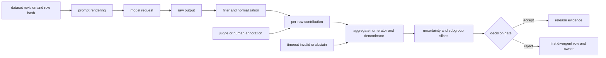

# 24장 믿을 수 있는 평가: 점수의 분모를 복원한다

평가 점수는 모델에 붙어 있는 고정 속성이 아니다. 데이터셋의 한 행을 프롬프트로 렌더링하고, 모델 출력을 디코딩한 뒤, 답을 정규화해 분자와 분모에 넣는 전 과정이 점수를 만든다. 어느 단계에서든 규칙이 바뀌면 가중치가 같아도 `accuracy`가 달라진다. 따라서 `accuracy=0.72`만 남겨서는 회귀를 조사할 수 없다. 어떤 행이 들어왔고, 무엇으로 변환됐으며, 어느 집계 규칙을 거쳐 0.72가 됐는지를 복원할 수 있어야 한다.

이 장의 진단 순서는 일관된다. 먼저 측정하려는 모집단과 행 집합을 고정한다. 이어 각 행의 기여값과 분모를 확인하고, 그 기여값을 합치는 가중치와 불확실성 계산을 검산한다. 마지막으로 judge 편향과 오염처럼 측정기 바깥에서 들어온 교란을 분리한다. 점수가 이상할 때 이 순서를 거꾸로 건너뛰어 모델 가중치부터 의심하면, 평가 배관의 오류를 모델 능력 변화로 오진하기 쉽다.

따라서 이 장은 점수표의 열을 하나씩 해설하는 순서가 아니라, 출시 결론이 만들어지는 인과 사슬을 따라 읽는다. 먼저 timeout·invalid·abstain을 포함해 **누가 분모에 남았는가**를 복원한다. 그 분모 위에서 cluster·paired resampling으로 **차이의 불확실성**을 추정하고, LLM judge와 사람 annotator가 만든 기여값은 순서 교환·blind 비교·사람 gold subset으로 **측정기를 교정**한다.

그 뒤에야 학습 데이터 노출과 benchmark adaptation이라는 **누출 경로**를 조사한다. 이 네 계약이 닫힌 점수만 utility·safety·efficiency 출시 관문에 넣으며, gate가 흔들리면 같은 사슬을 역방향으로 걸어 최초로 달라진 행과 함수를 찾는다. 독자는 `분모 → 통계 추정 → judge·human 교정 → leakage → release decision → first-difference debug`를 이 장의 주 탐색 경로로 삼으면 된다.



도식의 가운데에 model checkpoint가 아니라 **행별 기여값**이 놓인 이유가 있다. 평가 장애를 조사할 때 가장 먼저 필요한 단위는 모델 전체의 평균이 아니라 “이 행이 어떤 요청과 응답을 거쳐 분자에 얼마를 더했고, 분모에는 어떤 이유로 포함됐는가”이기 때문이다. 이후 절의 checklist는 모두 이 행을 왼쪽 원자료까지 되짚거나 오른쪽 release 판단까지 밀어 보는 데 사용한다.

## 24.1 benchmark row에서 metric contribution까지 계보를 잇는다

원문 item, prompt rendering, model output, parser, per-row contribution과 aggregate denominator를 같은 ItemID로 추적한다.

EvalID와 row identity. 각 행에는 데이터셋 revision, split, stable row hash를 붙인다. renderer가 만든 prompt bytes, tokenizer revision, token IDs, truncation 결과, few-shot row ID도 보존한다. 응답 뒤에는 raw text와 normalized answer를 모두 남긴다. metric contribution index는 어떤 행이 분자와 분모에 들어갔는지를 역추적하는 색인이다. 이 색인이 없으면 점수 하락이 오답 증가인지, timeout 제외 정책의 변화인지, 행 누락인지 구별할 수 없다.

stop과 truncation은 모델 바깥의 정책. stop string이 token boundary를 가로지르거나 최대 토큰 수에서 잘리면 정답 판정이 달라진다. left/right truncation은 few-shot 예시와 질문 중 무엇을 버리는지 바꾼다. 그러므로 비교 실험에서는 renderer와 stop config checksum이 같아야 한다. 긴 행에서만 점수가 떨어진다면 모델의 장문 능력을 결론 내리기 전에, 잘린 token span과 stop 직전·직후의 raw response부터 대조한다.

contribution ledger. metric이 `Σ score_i / N`이라면 행별 `score_i`, 포함 여부와 exclusion reason을 저장한다. category macro average라면 category denominator와 최종 weight도 저장한다. timeout을 제외해 `N`을 줄였는지, 실패로 간주해 0점을 넣었는지가 결과를 바꾼다. 따라서 분모는 단순한 표본 수가 아니라 실패 정책까지 압축한 상태다.

소스/시험 경계. lm-evaluation-harness와 Lighteval의 고정 revision에서 task config→renderer→request→filter→metric aggregation을 추적한다. upstream fixture가 통과했다는 사실은 특정 task 예시의 계약만 증명한다. 모델 카드에 적힌 모든 reported score가 같은 데이터 revision과 옵션으로 재현된다는 뜻은 아니다. 그러므로 model card의 harness version과 task alias를 별도로 확인하고, 공개되지 않은 설정은 추측해 채우지 않는다.

하나의 row가 점수가 되는 trace. 원래 행의 stable hash에서 시작해 few-shot example ID, renderer bytes, tokenizer IDs, truncation, generation request, raw response, filter/normalizer와 metric contribution을 순서대로 저장한다. 각 변환의 input/output checksum과 revision까지 기록해야 최초 divergence를 찾을 수 있다. 최종 점수부터 역산하지 말고 두 실행의 trace를 앞에서부터 비교해 처음 달라진 경계를 찾는 것이 핵심이다.

예를 들어 multiple choice row가 정답 `C`인데 renderer가 choice 순서를 섞었다면 answer index도 함께 변환돼야 한다. 모델 logits가 같은데 scorer index가 old order를 쓰면 조용한 오답이다. choice text와 label mapping을 fixture로 검산한다.

generation task에서는 stop이 raw response를 어디서 자르고 normalizer가 무엇을 지우는지 보존한다. 최종 scalar만 있으면 prompt drift와 scorer drift를 구분할 수 없다. 반면 frozen response를 이전·현재 scorer에 각각 넣었을 때 기여값이 달라진다면 모델을 다시 실행하지 않고도 scorer drift를 격리할 수 있다. 이것이 `EvalID`가 row contribution index를 가져야 하는 이유다.

평가 state와 checkpoint. 평가는 model checkpoint만 고정한다고 재현되지 않는다. dataset cursor, few-shot seed, sampling generator, cache key, judge revision과 sandbox image가 state다. distributed eval에서 rank별 row partition과 gather/dedup policy를 기록한다. worker crash 뒤 row를 재시도할 때 중복 contribution을 막는다.

partial result file은 generation별 temporary artifact로 쓰고 completion marker 뒤에만 집계한다. metric numerator/denominator와 row ID set을 함께 저장한다. 같은 EvalID에 서로 다른 row set이 들어오면 실패다.

model card score를 가져올 때 이 state가 공개되지 않았다면 reported result로 인용하되 locally reproduced라 쓰지 않는다.

few-shot·normalization·prompt 선택을 측정 조건으로 고정한다. example selection, order, tokenization과 score normalization은 모델 밖의 장식이 아니라 estimand를 바꾸는 평가 상태다.

예시 선택의 분산. few-shot seed가 바뀌면 prompt 난이도와 contamination 접촉면이 바뀐다. seed 하나의 점수 대신 여러 seed의 분포를 보거나, 최소한 선택된 example ID를 공개한다. chat template의 assistant prefix 유무도 첫 token probability를 바꾼다.

정답 정규화의 함정. 소문자 변환, 문장부호 제거, 숫자 parsing은 사소한 후처리가 아니라 task contract다. 모델 출력을 지나치게 관대하게 정규화하면 형식 오류를 숨기고, 지나치게 엄격하면 의미가 같은 답을 오답으로 만든다. raw exact match와 normalized score를 나란히 보존하면 두 실패를 구별할 수 있다. 정규화 변경 뒤 raw 점수는 그대로인데 normalized 점수만 움직였다면 모델 개선이 아니라 측정기 변경이다.

paired comparison. 같은 행에서 model A/B의 score 차이 `d_i`를 계산하면 공통된 행 난이도가 상쇄된다. paired bootstrap은 두 모델의 기여값을 떼지 않고 행 또는 cluster 단위로 함께 resample한다. 독립 run의 평균과 stderr만 놓고 신뢰구간의 겹침 여부로 차이를 판정하지 않는다. 평균 차이가 통계적으로 보이더라도 운영상 의미 있는 최소 효과보다 작을 수 있으므로 effect size와 practical budget도 함께 둔다.

judge model. LLM judge는 자체 tokenizer, template, sampling과 rubric을 가진 측정 장치다. 따라서 order swap, blinded identity, deterministic setting과 사람 audit subset으로 교정한다. A/B 순서를 바꾸자 승패가 뒤집히거나 답변 길이와 승률이 함께 움직이면 모델 품질보다 position·verbosity bias를 먼저 의심한다. judge revision이 바뀌면 frozen response에서 old/new judge의 차이를 측정한 뒤에만 과거 점수와 연결한다.

few-shot contamination과 order. few-shot example이 평가 row와 같은 원문 문서에서 왔거나 정답 pattern을 노출할 수 있다. example ID와 target row의 source/group을 비교해 leakage를 막는다. random seed만 고정하지 말고 실제 selected IDs와 order를 manifest에 둔다.

choice task에서는 example의 label distribution과 order가 answer prior를 만들 수 있다. seed 여러 개에서 paired score를 보고 order variance를 기록한다. 한 seed의 최고 점수를 model 능력으로 일반화하지 않는다.

template와 chat role. base completion model, instruction model, chat model은 prompt wrapper가 다르다. assistant generation prefix, BOS/EOS와 system message가 first-token logits를 바꾼다. model card의 권장 template와 evaluator override를 구분한다.

golden row 하나에서 rendered UTF-8, token IDs, role span, truncation을 비교한다. 동일한 question text가 있다고 같은 평가가 아니다. template revision이 달라지면 새 EvalID를 만든다.

loglikelihood normalization. multiple-choice를 continuation loglikelihood로 고를 때 token sum은 긴 choice를 불리하게 할 수 있다. token mean, byte/character normalization, unconditional calibration은 서로 다른 metric이다. 각 choice의 raw sum, token count, normalized score와 selected index를 저장한다.

normalization 이름만 보고 구현을 추측하지 않는다. evaluator source에서 prompt/continuation boundary, leading whitespace와 tokenizer offset을 확인한다. 한 token fixture로 손계산한다.

generation cache. cache key는 model/checkpoint, tokenizer/template, prompt bytes, generation config, evaluator revision을 포함해야 한다. temperature나 stop이 빠지면 다른 실험의 response가 재사용된다. cache hit에도 원 EvalID와 raw response digest를 남긴다.

cache를 끈 재실행 subset으로 key completeness를 검사한다. mutable model alias를 key로 쓰지 않는다. revocation/contamination 판정 뒤 영향 response cache를 무효화한다.

## 24.2 sampling uncertainty와 executable code oracle을 분리한다

표본 오차, generation randomness와 sandbox execution failure를 서로 다른 불확실성으로 보고한다.

24.1에서 행별 포함 여부를 확정했으므로 이제 표본 수 `n`은 임의로 정리한 숫자가 아니라 contribution ledger의 결과다. 이 절의 신뢰구간과 bootstrap은 그 원장의 ItemID를 resampling unit으로 사용한다. timeout을 제거하거나 category weight를 바꾸면서 예전 `n`의 표준오차를 재사용하면 분자·분모 계약과 통계 모형이 서로 다른 평가를 가리키게 된다.

stderr와 bootstrap. 각 행을 독립 Bernoulli 시행으로 볼 수 있다면 accuracy 표준오차는 `√(p(1-p)/n)`이다. 그러나 같은 문서에서 파생된 문항이나 같은 template family의 행은 함께 맞고 틀릴 수 있어 유효 표본 수가 `n`보다 작다. 이때 행 단위 표준오차는 확신을 과장한다. 원문 문서나 topic을 resampling unit으로 삼은 stratified·cluster bootstrap을 쓰고, 두 모델 비교에는 공통 행의 paired difference를 사용한다.

### pass@k의 분모

코드 문제마다 `n`개 sample 중 `c`개가 맞았을 때 unbiased pass@k estimator의 적용 조건을 확인한다. 표본 수가 `k`보다 작은 문제를 조용히 제외하거나 timeout·compile error를 `n`에서 빼면 어려운 문제가 선택적으로 사라져 점수가 부풀 수 있다. 문제별 `n,c,k`와 제외 사유를 먼저 검산하고, 그 뒤 sandbox image, timeout, test revision을 `EvalID`에 고정한다.

confidence interval의 가정. bootstrap 횟수보다 resampling unit이 중요하다. 같은 원문에서 파생된 여러 문항은 독립이 아니다. 원문 문서나 topic을 cluster로 잡는다. 작은 subgroup은 interval이 넓음을 숨기지 않는다. multiple comparison이 많으면 cherry-picking을 막는 사전 metric 목록을 둔다.

calibration. multiple-choice probability가 있으면 accuracy뿐 아니라 NLL, Brier, ECE를 볼 수 있다. ECE는 bin 선택에 민감하므로 bin edge와 sample count를 저장한다. generation judge score를 확률 calibration처럼 해석하지 않는다.

accuracy와 비율의 interval. IID Bernoulli 근사 표준오차 `sqrt(p(1-p)/n)`는 빠른 sanity check다. 작은 n이나 p가 0/1 근처면 Wilson 또는 exact interval을 고려한다. 하지만 동일 문서의 여러 문항처럼 상관된 row에는 cluster bootstrap을 사용한다. cluster ID가 없으면 독립 가정의 한계를 적는다.

bootstrap은 seed, resampling unit, 횟수와 percentile/BCa 방법을 기록한다. 10,000회라는 숫자만으로 잘못된 resampling unit이 고쳐지지 않는다. paired model 비교에서는 같은 resampled row에 A/B contribution을 함께 넣는다.

macro와 micro average. micro average는 모든 row contribution을 합쳐 큰 category가 지배한다. macro는 category 점수를 같게 가중해 작은 category의 분산을 키울 수 있다. category별 numerator/denominator와 final weight를 저장한다. 빈 category 처리도 명시한다.

model card의 aggregate가 어떤 평균인지 불명확하면 점수를 그대로 재현했다고 쓰지 않는다. 공개 output에서 category score를 다시 합산해 확인한다.

multiple testing과 선택. 수십 benchmark와 prompt/template를 시험하고 가장 좋은 조합만 보고하면 false discovery와 selection bias가 생긴다. primary metric, secondary diagnostic, exploratory metric을 사전에 분리한다. 출시 판정 임계값도 결과 전에 정한다.

correction이 항상 필요한 것은 아니지만 비교 횟수와 selection process를 공개한다. effect size, interval과 practical budget을 함께 본다. “유의하지 않음”을 “동일함”으로 해석하지 않는다.

pass@k 손계산. `n`개 생성 중 `c`개 정답일 때 적어도 하나 성공할 확률의 estimator는 실패 sample 중 k개를 고르는 조합을 사용한다. `1-C(n-c,k)/C(n,k)`의 적용 조건과 `n≥k`를 확인한다. 각 problem의 n/c를 저장하고 problem 평균을 낸다.

timeout, compile error, sandbox failure가 c와 n에 어떻게 들어가는지 명시한다. infrastructure error를 제외하면 어려운 sample이 선택적으로 빠질 수 있다. retry가 새 generation인지 같은 attempt 재실행인지 ID로 구분한다.

judge agreement. 두 judge 또는 사람과 model judge의 agreement를 confusion matrix와 category별로 본다. 단순 percent agreement는 class imbalance를 숨길 수 있다. disagreement sample을 무작위/고위험 strata로 사람 검토한다.

judge prompt와 rubric 수정은 evaluator 변경이다. old/new judge를 같은 frozen response set에서 비교해 drift를 측정한 뒤 live model 평가로 간다. judge가 자기 family output을 선호하는지 blinded model identity로 본다.

sequential evaluation. training 중 같은 eval을 자주 보며 early stop하면 final checkpoint selection에 eval이 사용된다. 그 split은 순수 holdout이 아니다. checkpoint selection set과 final test를 분리하고 조회 횟수와 selection rule을 기록한다.

private eval도 반복해서 개발 의사결정에 쓰면 간접 leakage가 생긴다. 접근 log, query budget과 rotation을 둔다. dynamic item의 difficulty를 anchor set으로 교정한다.

## 24.3 contamination을 노출 계보와 영향으로 역추적한다

문자열 중복만 찾지 않고 pretraining, fine-tuning, benchmark adaptation과 judge exposure의 간접 경로까지 조사한다.

여기서 누출 조사를 통계 추정보다 뒤에 두는 까닭은 오염된 행을 제외했을 때 분모와 paired sample이 함께 바뀌기 때문이다. 또한 judge가 특정 문체나 모델 계열을 선호하는 현상을 training contamination으로 오인하지 않으려면, 앞 절의 order swap·blind identity·human audit에서 측정기 편향을 먼저 분리해야 한다. 교정된 행 원장을 기준으로 `평가 item → 원문 span → training document → packed sample → checkpoint`를 잇고, match 후보와 실제 노출을 구별한다.

### n-gram match는 판결이 아니다

문자열 중복은 강한 신호지만 일반 문구를 잡을 수 있고 paraphrase는 놓친다. exact/fuzzy/semantic detector의 threshold와 false-positive control set을 함께 둔다. 발견된 match를 `DocumentID→packed sample→CheckpointID→EvalID`로 추적해야 영향 범위를 말할 수 있다.

### 공개·비공개 평가의 역할

공개 benchmark는 비교 가능성이 좋고 leakage 위험이 크다. private/dynamic eval은 leakage를 줄이지만 외부 검증이 어렵다. 출시 관문는 둘을 결합하고 private item 자체를 training feedback에 노출하지 않는다.

contamination sensitivity. match된 row를 제외한 점수, 포함 점수, high-risk match만 제외한 점수를 함께 낸다. 차이가 작아도 training corpus에 answer-bearing match가 있으면 provenance 문제는 남는다. score correction과 data deletion은 다른 조치다.

결정 트리. 점수가 갑자기 오르면 renderer/harness revision, few-shot seed, denominator, contamination, 모델 산출물 순으로 본다. 특정 category만 오르면 그 domain의 data lineage를 본다. private eval도 오르면 실제 능력 향상 가설이 강해지지만 judge drift를 확인한다.

contamination detector의 수학. exact hash는 정규화가 같을 때 강하지만 작은 수정에 약하다. n-gram Jaccard와 MinHash는 fuzzy overlap 후보를 만든다. banding candidate 확률은 similarity와 band/row 설정에 따라 달라지므로 threshold처럼 오해하지 않는다. semantic embedding은 paraphrase를 찾지만 false positive와 model bias가 있다.

detector마다 query normalization, n-gram unit, threshold, corpus index revision과 control set을 둔다. exact→fuzzy→semantic 순으로 candidate를 좁히고 high-risk match는 원문 span을 사람이 확인한다. answer-bearing span, question-only, boilerplate를 분리한다.

영향 lineage. match가 발견되면 평가 row에서 training document, dedup survivor, token shard, packed sample, consumed batch, checkpoint로 역추적한다. exact optimizer contribution을 알 수 없으면 영향 가능 checkpoint 범위를 보수적으로 잡는다. adapter/merged/quantized/distilled child도 descendant다.

`오염 row 제외 재집계`는 score sensitivity를 보여줄 뿐 이미 학습된 influence를 제거하지 않는다. retrain/unlearn/새 private eval과 artifact revocation은 별도 조치다. 어떤 조치를 했는지 EvalID와 RevocationID로 연결한다.

contamination 실험. 작은 corpus에 benchmark answer-bearing row를 의도적으로 넣은 run과 clean run을 만든다. exact/fuzzy/paraphrase 세 변형을 사용한다. detector recall/false positive, model score 변화와 memorization prompt를 비교한다.

detector threshold를 결과에 맞춰 고르지 않고 control set에서 정한다. clean run도 chance overlap을 가질 수 있다. seed 여러 개로 score variance와 contamination effect를 분리한다.

평가 failure injection. row 하나를 두 번 넣고 dedup이 contribution 중복을 잡는지 본다. worker를 response 생성 뒤 종료해 retry가 중복 contribution을 만들지 않는지 본다. partial result file을 만들어 completion marker 없는 generation이 집계되지 않는지 본다. normalizer revision을 바꿔 cache key가 miss하는지 본다.

각 주입마다 예상 numerator/denominator와 first alert를 정한다. final score만 같아도 row ID set이 다르면 실패다. retry 후 같은 response digest를 재사용했는지 새 sampling을 했는지 기록한다.

실행 decision tree. 점수가 예상보다 낮으면 먼저 invalid/timeout/exclusion과 denominator를 본다. 그다음 prompt/token/truncation, generation/stop, normalization/scorer, 모델 산출물 순이다. 특정 긴 row만 실패하면 context/truncation, 모든 row가 한 label로 쏠리면 choice mapping/prompt prior를 본다.

variance가 크면 few-shot/sample/judge seed와 category cluster를 본다. baseline도 같이 움직이면 evaluator/infrastructure drift다. model만 움직이면 artifact/training change 가설이 강해진다. 각 branch는 frozen-response rescoring 또는 frozen-prompt regeneration으로 scorer와 model을 분리한다.

source와 test 범위. lm-evaluation-harness 고정 revision `64f3d0924fc695efd6d776a5ac91f97138085516`, Lighteval과 Inspect AI registry revision에서 request, filter, metric와 sandbox를 읽는다. upstream test의 fixture row와 assertion을 기록한다. task config가 존재한다는 사실은 reported model score 재현 증거가 아니다.

model card의 harness command, commit/version, batch/few-shot와 generation config가 없으면 `reported`로만 분류한다. 로컬 재현은 raw row ledger와 run manifest가 있을 때만 쓴다. 수치가 다르면 먼저 config/data revision diff를 낸다.

평가 artifact와 checkpoint. 최종 artifact는 dataset/split hash, row set, renderer/tokenizer, generation/judge/scorer config, model digest, raw responses, contribution ledger, aggregate와 uncertainty를 가진다. private item은 접근 통제를 유지하면서 digest와 aggregate provenance를 남긴다.

EvalID는 immutable하다. scorer만 바꾸어 재집계하면 child EvalID를 만들고 frozen response parent를 가리킨다. model을 다시 생성하면 별도 generation artifact다. 이 DAG가 점수 변화를 model과 evaluator로 분해한다.

25장으로 넘기는 것. red-team case도 평가 row이므로 threat family, attack attempt, judge와 contribution ledger를 같은 원칙으로 받는다. 그러나 adaptive attacker와 tool environment는 IID benchmark보다 복잡한 state를 가진다. 25장은 AttackCaseID와 trajectory를 추가한다.

private safety eval을 training feedback으로 사용한 순간 해당 case는 holdout 지위를 잃는다. 24장의 row lineage와 access log를 25장의 train/private split에 넘긴다. release는 utility와 safety의 paired EvalID를 함께 본다.

기여 원장을 손으로 검산한다. 작은 fixture 네 개를 만든다. 정답, 오답, 시간 초과, 형식 오류를 하나씩 넣고 정책에 따른 예상 분자와 분모를 종이에 먼저 쓴다. 시간 초과를 0점으로 세는 정책이면 정확도는 `1/4`이고, 인프라 오류로 제외한다면 `1/3`이다. 어느 쪽이 옳다는 문제가 아니라 선언한 계약과 코드가 같은지가 핵심이다. category가 두 개라면 micro와 macro 결과도 별도로 계산한다.

그 다음 evaluator가 내놓은 row 원장과 손계산을 비교한다. row hash가 한 번씩만 나타나는지, 제외 사유가 허용 목록에 속하는지, category weight의 합이 1인지 검사한다. raw response를 바꾸지 않고 normalizer만 이전 버전으로 되돌려 재집계하면 scorer drift의 크기를 볼 수 있다. 반대로 scorer를 고정하고 response를 다시 생성하면 model 또는 decoding drift를 격리한다.

이 검산은 평균 점수가 그럴듯하다는 이유로 생략할 수 없다. 중복된 정답 하나와 누락된 오답 하나가 우연히 상쇄되면 최종 숫자는 같아도 원장은 틀렸다. 따라서 aggregate equality와 contribution-set equality를 서로 다른 assertion으로 둔다.

오염 판정의 세 단계. 첫 단계는 후보 생성이다. 정규화 exact hash, 연속 token n-gram, 문서 fingerprint, 의미 검색을 사용해 넓게 잡는다. 두 번째는 증거 분류다. 질문만 겹치는지, 선택지와 정답까지 겹치는지, 해설 문장이 포함됐는지, 공개 전후의 timestamp가 어떤지를 원문 span으로 확인한다. 세 번째는 영향 판단이다. 해당 문서가 실제 training manifest에 들어갔는지, 어느 shard와 packed sample을 거쳐 어느 checkpoint 이전에 소비됐는지 추적한다.

후보 점수 하나를 곧바로 오염 확률이라고 부르지 않는다. MinHash collision 가능성, embedding threshold, 짧은 상투구의 base rate가 다르다. detector별 검증 표본에서 precision과 recall의 하한을 추정하고 `confirmed`, `probable`, `ambiguous`, `cleared` 상태를 둔다. 판정자가 원문을 볼 수 없는 비공개 평가라면 독립 보관자가 digest와 overlap category만 공개하는 절차가 필요하다.

판정 뒤에는 세 숫자를 낸다. 원래 점수, confirmed row를 뺀 민감도 점수, confirmed와 probable을 모두 뺀 보수적 점수다. 이것은 능력의 진짜 점수를 복원하는 마법이 아니다. 학습 효과가 다른 row로 전이될 수 있으므로 결과에는 영향 범위와 한계를 함께 쓴다.

비공개 평가 운영 계약. 비공개라는 이름만으로 독립성이 생기지 않는다. item 원문을 읽을 역할, 실행만 할 역할, 집계만 볼 역할을 분리하고 모든 조회를 기록한다. 개발팀에는 row 결과 대신 사전에 정한 category aggregate와 실패 예시의 비식별 요약만 제공한다. 반복 조회 횟수가 늘수록 조직이 점수에 적응하므로 query budget과 교체 조건을 둔다.

새 item은 기존 anchor와 함께 실행해 난이도 drift를 추정한다. anchor까지 점수가 함께 움직이면 evaluator나 judge drift를 의심한다. 새 item만 달라지면 난이도 차이를 먼저 본다. 공격적·희귀 category의 표본 수가 작다면 전체 평균에 묻지 말고 interval과 worst-group 결과를 병기한다.

private set에서 발견한 실패를 학습 데이터로 승격할 때는 원본 family 전체를 test에서 퇴역시킨다. 단순 paraphrase나 번역은 독립 표본이 아니다. 퇴역 기록은 어떤 release 의사결정에 쓰였는지 남기며, replacement set이 준비되기 전에는 해당 축의 개선을 확정하지 않는다.

분산 평가의 정확히 한 번 의미. 대규모 평가는 row를 여러 worker에 나누므로 모델 품질과 무관한 분산 시스템 문제가 점수를 바꿀 수 있다. dispatcher는 `(EvalID,row_hash,attempt)`를 lease하고 worker는 response digest와 completion token을 원자적으로 제출한다. lease가 만료돼 재실행되더라도 집계 key는 row hash 하나여야 한다. 서로 다른 response가 도착하면 먼저 온 것을 임의로 고르지 말고 conflict로 격리한다.

checkpoint는 `assigned`, `generated`, `scored`, `committed` 상태를 구분한다. generated 뒤 죽었다면 같은 response artifact를 재채점할 수 있고, sampling 자체를 다시 했다면 새 attempt다. 비결정적 decoding에서 재시도 결과 중 좋은 것을 고르면 숨은 best-of-n이 되므로 선택 규칙을 사전에 고정한다.

테스트는 worker를 각 상태 경계에서 강제 종료한다. network partition, object-store 지연, judge timeout도 주입한다. 완료 뒤 입력 row set, committed row set, contribution row set이 정확히 같은지 검사한다. 처리량 그래프만 정상이라고 평가가 완전한 것은 아니다.

점수 회귀를 파는 실전 순서. 첫 질문은 “모델이 나빠졌는가”가 아니라 “같은 실험인가”다. model digest, tokenizer와 template, dataset revision, evaluator commit, generation config, sandbox image를 구조적으로 diff한다. 차이가 없다면 row 원장의 추가·누락·중복과 인프라 오류율을 본다. 그 뒤 frozen response를 old/new scorer로 교차 채점해 판정 계층을 분리한다.

scorer가 같고 생성만 다르면 prompt token trace와 첫 divergence token을 비교한다. deterministic 설정인데 첫 logits부터 다르면 weight, kernel, precision 또는 input이 다르다. 여러 token 뒤 갈라지면 수치 비결정성이나 cache 상태를 의심한다. sampling run이면 seed 하나의 문자열 대신 row별 success probability와 paired replicate를 본다.

category 한 곳만 하락하면 그 category의 길이, 언어, 출처, 도구 의존성과 training-data 변화의 교집합을 찾는다. 전체가 같은 폭으로 움직이면 template나 judge 같은 공통 계층이 우선이다. 원인이 확정되지 않았을 때 “모델 노이즈”라고 닫지 않고, 배제한 가설과 남은 가설을 결정 기록에 남긴다.

평가 완료 체크리스트. 평가를 완료했다고 말하려면 다음 질문에 모두 답할 수 있어야 한다. 정확히 어떤 bytes의 모델과 tokenizer를 썼는가. 어떤 row가 어떤 prompt와 token으로 변환됐는가. 누가 분자와 분모에 들어갔는가. 실패와 제외는 어느 정책으로 처리됐는가. 불확실성의 resampling unit은 무엇인가. 선택된 checkpoint와 prompt가 같은 test를 보며 골라진 것은 아닌가. 오염 탐지기의 임계값과 원문 확인 절차는 무엇인가.

또한 공개 점수, 로컬 재현 점수, 내부 비공개 점수를 표에서 구분한다. 재현되지 않은 수치에는 명령이 아니라 출처와 누락 config를 적는다. 재현된 수치에는 manifest와 row 원장의 digest를 붙인다. 최종 결정은 평균 하나가 아니라 primary metric, worst group, interval, contamination sensitivity, 비용과 latency를 포함한다.

이 조건이 충족되면 평가 산출물은 홍보용 숫자가 아니라 다음 팀이 실패를 재현하고 가설을 세울 수 있는 관측 기록이 된다. 충족되지 않으면 결론의 강도를 낮추고 누락된 증거를 다음 실행 항목으로 명시한다.

비교표를 쓰는 규칙. 모델 비교표의 한 행에는 score만 두지 않는다. model digest, prompt/template, few-shot 수와 seed 집합, dataset revision, metric 구현, 표본 수, interval과 실행 날짜를 함께 연결한다. 셀 하나가 공개 model card에서 온 것인지, 같은 환경에서 재실행한 것인지도 표식을 달리한다. 서로 다른 harness의 같은 task 이름은 설정을 대조하기 전에는 같은 열에 놓지 않는다.

비용과 성능을 비교할 때는 실패한 request를 숨기지 않는다. 성공 row당 GPU 시간, 전체 wall time, retry 수와 judge 비용을 낸다. 빠른 모델이 timeout row를 제외해 정확도와 처리량 모두 좋아 보이는 역전을 막는다. latency 제한 아래의 품질과 무제한 품질은 별도 실험이다.

표의 정렬과 강조는 결과를 본 뒤 임의로 바꾸지 않는다. primary metric과 tie rule을 사전에 정하고 interval이 겹친다는 이유만으로 동률이라 선언하지 않는다. 실질적 차이의 최소 크기와 운영 비용을 함께 판단한다. 독자가 원장을 다시 집계할 수 있도록 row contribution artifact의 digest를 함께 싣는다.

최소 재현 패키지. 최소 패키지는 실행 command 하나가 아니라 immutable manifest, environment lock, golden row, raw response, scorer fixture와 expected ledger를 포함한다. private data를 배포할 수 없다면 synthetic row로 변환 경계를 증명하고 실제 set의 digest·count·category aggregate를 별도 보관한다. 비밀을 공개하지 않으면서도 코드 경로는 검증 가능해야 한다.

새 환경에서 먼저 golden row의 rendered bytes와 token IDs를 비교한다. 그다음 frozen response의 score와 ledger, 마지막으로 작은 generation subset을 실행한다. 이 순서를 지키면 tokenizer·scorer·model의 불일치를 단계적으로 찾는다. 전체 benchmark부터 돌려 비용을 쓴 뒤 점수가 다르다는 사실만 발견하지 않는다.

재현자가 원 결과와 다르면 어느 단계의 최초 divergence인지 기록한다. 차이를 해결하지 못해도 environment와 관측을 공개하면 유용한 반증 자료가 된다. 반대로 config가 누락된 채 우연히 같은 scalar가 나왔다고 재현 성공으로 부르지 않는다.

평가 결정 기록의 예.

## 24.4 benchmark score를 population과 sampling이 만든 확률변수로 읽는다

점 추정치보다 target population, sampling unit, dependence와 uncertainty interval을 먼저 정의한다.

### 표본 평균 뒤에 숨은 모집단을 먼저 선언한다

정확도 72%라는 문장은 아직 평가 결과가 아니다. 어느 시점의 어떤 사용자 분포에서, 어떤 전처리와 프롬프트를 거친 요청을 모집단으로 삼았는지가 붙어야 비로소 확률변수가 된다. 고정 벤치마크의 행을 모집단 전체로 간주하면 72%는 기술통계지만, 앞으로 유입될 요청의 표본으로 간주하면 추정량이다. 이 둘을 섞으면 표준오차가 불필요하다는 주장과 신뢰구간이 필요하다는 주장이 같은 회의에서 충돌한다.

행 (i)의 성공을 (Y_i\in\{0,1\}), 가중치를 (w_i), 평가 정책을 (\pi)라 두면 보고할 값은 단순히 `sum(success)/N`이 아니라 (\hat\mu_\pi=\sum_iw_iY_i/\sum_iw_i)다. 여기서 정책에는 prompt template, decoding, stop string, parser, timeout 처리까지 들어간다. 모델 가중치가 같아도 정책이 바뀌면 다른 확률변수를 측정한다. 따라서 결과 테이블의 열에는 모델 ID보다 먼저 `EvalSpec` 해시와 모집단 정의를 놓는 편이 안전하다.

기하학적으로 보면 각 평가 행은 능력 공간의 한 방향을 찌르는 탐침이다. 행이 한 영역에 몰리면 평균은 그 방향의 투영만 크게 반영한다. 수학·코딩·다국어를 1:1:1로 섞은 macro 평균과 실제 트래픽을 8:1:1로 섞은 traffic-weighted 평균은 어느 쪽도 거짓이 아니다. 서로 다른 질문에 답할 뿐이다. 좋은 보고서는 먼저 질문을 선언하고 그 질문에 맞는 측도를 고른다.

### 독립 동일분포 가정이 깨지는 위치를 표시한다

대화형 행, 동일 저장소에서 뽑은 코드 문제, 같은 원문의 번역본은 독립 표본이 아니다. 같은 출처 계열에서 나온 행들은 오류를 함께 낸다. 행 단위 bootstrap을 하면 이런 상관을 잘라 버려 신뢰구간이 과도하게 좁아진다. `source_id`, `conversation_id`, `repo_id` 가운데 실제 생성 단위에 해당하는 키로 cluster bootstrap을 해야 한다.

실전에서는 두 신뢰구간을 나란히 계산한다. 행 단위 interval은 “이 파일 안에서 행을 다시 뽑으면”의 불확실성을, family 단위 interval은 “새로운 문제 가족을 만나면”의 불확실성을 나타낸다. 후자가 갑자기 넓어진다면 데이터 수보다 다양성이 부족하다는 신호다. 더 많은 paraphrase를 만드는 대신 새로운 가족을 수집해야 한다.

비교 실험은 반드시 paired하게 만든다. 모델 A와 B가 같은 행, 같은 few-shot 예시, 같은 parser를 통과하도록 한 뒤 (D_i=Y_{i,A}-Y_{i,B})를 bootstrap한다. 별도 표본으로 평가하면 문제 난이도 분산이 모델 차이를 덮는다. 생성 평가에서 난수를 쓴다면 각 행의 seed를 고정하되, seed 하나의 우연을 일반화하지 않도록 seed block을 여러 개 둔다.

calibration은 정답률과 다른 축이다. 두 모델의 정확도가 같아도 하나는 틀린 답에 0.99를 주고 다른 하나는 0.55를 줄 수 있다. 전자는 제품에서 더 위험하다. 확률을 직접 내는 분류 문제라면 Brier score와 expected calibration error를 함께 본다. 생성 모델에서는 정답 문자열의 token log-probability, 선택지 전체의 정규화 확률, 또는 별도 confidence head를 쓸 수 있지만 각각 다른 의미다.

길이가 다른 선택지를 비교할 때 합산 log-likelihood는 긴 답을 벌한다. 평균 token log-likelihood는 반대로 짧은 상투어를 선호할 수 있다. PMI 보정은 문맥 없는 답의 사전확률을 빼지만 calibration 대상 자체를 바꾼다. 그러므로 `normalization=none|token|pmi`는 숨은 구현 세부가 아니라 평가 명세의 일부다. 24.2에서 본 normalization 문제가 여기서는 확률 해석의 문제로 돌아온다.

## 24.5 evaluation code에서 release score까지 상태 전이를 고정한다

request construction, inference, postprocess, row metric, aggregation과 report가 어떤 revision을 소비하는지 명시한다.

### lm-evaluation-harness의 요청 경계를 읽는다

고정 revision의 평가 프레임워크를 읽을 때는 task 이름보다 요청 생성과 집계 함수를 먼저 찾는다. `sources/training-lm-evaluation-harness`에서 task가 document를 `loglikelihood`, `generate_until` 같은 request로 바꾸는 부분, model adapter가 batch를 실행하는 부분, metric accumulator가 결과를 합치는 부분을 세 덩어리로 분리한다. 이 경계를 섞으면 모델 오류와 parser 오류를 구별할 수 없다.

한 행의 추적 레코드는 최소한 다음 상태를 가진다.

```text
raw_doc -> rendered_context -> model_request -> raw_response
        -> parsed_answer -> metric_contribution -> aggregate
```

각 화살표마다 입력 해시와 함수 좌표를 남긴다. `raw_response`까지 같고 `parsed_answer`부터 다르면 모델 회귀가 아니다. tokenizer나 chat template가 바뀌어 `rendered_context`가 달라졌다면 checkpoint 비교도 아니다. 캐시 키는 모델 이름만으로 만들지 말고 rendered input, generation kwargs, tokenizer revision, adapter revision을 포함한다.

### HumanEval류 pass@k를 성공 횟수로 오해하지 않는다

한 문제에서 (n)개를 생성해 (c)개가 통과했을 때 pass@k의 불편 추정량은 (1-\binom{n-c}{k}/\binom nk)다. `c/n`을 k번 곱하거나 “상위 k개 중 하나”를 임의로 고르는 식이 아니다. (n<k)인 문제를 조용히 제외하면 분모가 바뀐다. compile timeout, sandbox crash, flaky test를 실패로 셀지 무효로 셀지도 명시해야 한다.

예를 들어 (n=10,c=2,k=3)이면 실패 세 개를 모두 고를 확률은 (\binom83/\binom{10}3=56/120), 따라서 pass@3은 약 0.533이다. 표본 두 개가 성공했으니 0.2라는 수와 전혀 다른 질문이다. 전자는 세 번의 기회 중 적어도 하나가 성공할 가능성을 추정한다.

코드 평가는 테스트 실행기까지 공급망이다. container image digest, compiler/interpreter version, CPU limit, wall-clock timeout, network 차단, test file 해시를 기록한다. 모델이 파일 시스템을 읽거나 테스트를 수정할 수 없도록 submission과 harness 권한을 분리한다. 이 경계가 없으면 “코딩 능력” 점수에 sandbox 취약점이 섞인다.

judge model은 측정기이므로 교정해야 한다. LLM judge는 사람이 읽기 어려운 대규모 출력을 빠르게 비교하지만, 권위자가 아니다. position bias, verbosity bias, self-preference, 특정 문체 선호가 있다. 순서를 A/B와 B/A로 뒤집고, reference 유무를 교차하며, 동률 선택지를 허용한다. 사람 라벨의 일부를 gold calibration set으로 격리하고 judge-human confusion matrix를 버전별로 남긴다.

승률을 Bradley–Terry로 모델링할 때 (P(A>B)=\sigma(s_A-s_B))로 둔다. 점수 (s)는 절대 품질이 아니라 비교 그래프에서의 위치다. 비교 그래프가 두 컴포넌트로 끊기면 서로의 (s)를 비교할 수 없다. 새 모델만 옛 champion과 붙이면 graph topology가 편향되므로 anchor 모델과 무작위 교차 매치를 배치한다. 동일 prompt의 여러 응답은 cluster이므로 naive logistic 표준오차도 주의해야 한다.

## 24.6 contamination·capability·safety·efficiency를 release 판단에 연결한다

출시 관문는 앞 절에서 만든 숫자의 소비자이지 별도의 점수 생성기가 아니다. denominator policy, uncertainty interval, judge calibration과 contamination sensitivity 가운데 하나라도 부모 artifact를 잃으면 gate는 보류되어야 한다. 반대로 모든 부모가 고정되면 평균 하나를 숭배하지 않고 capability·safety·efficiency의 허용 영역과 practical margin을 계산해 승인·거부·추가 실험 중 하나로 상태를 전이한다.

오염 탐지 결과를 점수 무효화 여부와 영향 범위로 번역하고 여러 품질 축을 하나의 평균으로 지우지 않는다.

### 문자열 일치는 경보이고 판결은 lineage다

n-gram overlap은 저렴하고 설명 가능하지만 공통 관용구도 잡고, 번역·paraphrase·코드 변수명 변경은 놓친다. embedding similarity는 의미 변형을 찾지만 threshold가 불투명하다. MinHash는 대규모 후보 검색에 유리하다. 세 방법은 경쟁자가 아니라 cascade다. cheap fingerprint로 후보를 좁히고 semantic matcher로 확장한 뒤 사람이 원문 계보를 확인한다.

핵심은 hit 자체가 아니라 `train_document -> normalized_span -> packed_tokens -> optimizer_step -> checkpoint -> evaluation_row` 경로다. 공개 corpus에 같은 문장이 있었다는 사실만으로 특정 checkpoint가 그 문장을 학습했다고 확정할 수 없다. 반대로 exact match가 없어도 문제 생성 템플릿이나 해설이 학습 데이터에 들어갔다면 평가가 새 능력을 측정하지 못한다.

오염 보고서는 최소 세 수준으로 나눈다. `possible`은 유사 후보, `probable`은 출처 계열 또는 생성 계보가 연결된 경우, `confirmed-exposure`는 실제 학습 shard와 step까지 확인한 경우다. 각 수준별로 전체 점수와 제외 점수를 함께 낸다. 오염 행을 모두 지운 “깨끗한 점수”만 내면 삭제 자체가 난이도 분포를 바꾸는 selection bias를 숨긴다.

### canary와 holdout은 생성 시점부터 보호한다

비공개 벤치마크도 영원히 비공개가 아니다. 사용자 제출, 로그, fine-tuning 데이터 회수 과정에서 새어 들어간다. 평가 항목을 만든 시점에 canary identifier와 access ledger를 부여하고, 학습 corpus ingestion에서 이를 차단한다. 원문 해시만 차단하면 번역본과 해설을 놓치므로 출처 계열 fingerprint를 함께 관리한다.

동적 평가는 memorization을 줄이지만 생성기 품질이라는 새 변수를 만든다. 매 실행마다 문제가 달라지면 모델 차이와 문제 난이도 차이를 분리하기 어렵다. 안전한 절충은 일정 기간 sealed batch를 사용하고 교체 시 anchor subset을 겹치게 하는 것이다. old/new form의 anchor performance로 난이도를 연결하고, 교체 전후 점수를 곧바로 같은 시계열로 잇지 않는다.

오염 민감도 실험을 의도적으로 만든다. 평가 문항 일부를 그대로, paraphrase로, 해설 포함으로 학습 데이터에 주입한 작은 통제 실험을 만든다. 동일 token budget의 무관 데이터 대조군과 비교하면 detector score와 실제 score inflation 관계를 추정할 수 있다. 목적은 production 모델을 오염시키는 것이 아니라 탐지기의 recall과 score 민감도를 교정하는 것이다.

실패 주입도 필요하다. split key 한 글자를 바꿔 train/test family가 섞이게 하고, normalization 이전과 이후의 hash가 달라지게 하고, 캐시가 이전 prompt 결과를 재사용하게 한다. 검증기는 이 세 사건을 모두 잡아야 한다. 잡지 못한다면 현재 “오염 없음”은 탐지 능력 부재일 뿐이다.

### 능력·안전·효율을 하나의 release 판단으로 묶는다

단일 평균 대신 Pareto 전선을 본다. 새 checkpoint가 일반 능력 +1.2, 코딩 +0.3, 위험 요청 거절 +4.0, 정상 요청 과잉 거절 +3.5를 보였다면 평균 하나로 합치는 순간 중요한 trade-off가 사라진다. 각 축의 방향과 허용 한계를 정하고 Pareto 전선을 그린다. hard constraint를 넘는 모델은 평균이 높아도 탈락시키고, 나머지에서 제품별 효용 함수를 적용한다.

비용도 능력의 분모다. 동일 품질이라면 token당 지연, 메모리, 에너지, retry율을 같이 본다. reasoning budget을 늘려 얻은 점수는 제한 없는 결과와 production budget 결과를 분리한다. 모델 A가 32k token을 쓰고 모델 B가 2k를 썼는데 accuracy만 비교하면 학습 개선과 추론 계산 증가를 혼동한다.

slice는 사후 낚시가 아니라 사전 계약이다. 언어, 길이, 도메인, 안전 category, tool 유무, 이미지 해상도 같은 slice를 결과를 본 뒤 무한히 만들면 우연한 승리를 찾게 된다. release-critical slice와 탐색적 slice를 사전에 분리한다. 전자는 multiple-testing 보정과 최소 표본 수를 적용하고, 후자는 다음 평가 설계를 위한 가설로만 기록한다.

Simpson 역설을 막으려면 mixture weight도 고정한다. 전체 점수가 올랐지만 어려운 언어에서 떨어졌고 그 언어의 비중이 줄었을 수 있다. 동일 고정 가중치로 재계산한 점수와 실제 트래픽 가중 점수를 둘 다 제공한다. 전자는 모델 변화, 후자는 사용자 경험을 묻는다.

sequential gate는 중간 관찰 비용을 반영한다. 평가가 끝날 때까지 기다리지 않고 매 100행마다 승리를 확인하다가 유리할 때 멈추면 false positive가 늘어난다. 미리 stopping boundary를 정하거나 alpha spending, confidence sequence를 사용한다. 더 단순하게는 개발용 빠른 gate와 최종 sealed gate를 분리하고, 최종 결과를 한 번만 본다.

release 결정 기록에는 `candidate`, `baseline`, `EvalSpec`, 데이터 snapshot, code revision, hardware/runtime, 모든 slice 결과, uncertainty, 알려진 contamination, waiver owner, rollback 조건을 넣는다. 숫자보다 중요한 것은 다음 사람이 같은 결정을 재구성할 수 있는가다.

## 24.7 평가 incident를 최초 분기와 handoff 계약으로 복구한다

출시 판단 뒤의 디버깅도 같은 계보를 거꾸로 읽는다. decision rule의 입력부터 aggregate, row contribution, judge·normalizer, response, rendered prompt와 dataset row까지 두 EvalID를 대조한다. 이렇게 해야 점수 회귀를 모델 변화라고 부르기 전에 분모 drift, 추정 단위 변경, judge drift와 leakage 판정 변경을 먼저 반증할 수 있다.

점수 변화에서 시작해 item, prompt, generation, parser와 aggregate의 최초 불일치를 찾고 red-team 단계로 증거를 넘긴다.

### 점수가 갑자기 오른 경우의 탐색 순서

예상 밖 상승은 먼저 축하할 일이 아니라 계측 이상 후보다. 첫째, evaluated row count와 invalid count를 비교한다. 둘째, rendered prompt hash가 baseline과 같은지 확인한다. 셋째, answer parser와 normalization diff를 본다. 넷째, generation cache hit와 key schema를 본다. 다섯째, contamination hit를 확인한다. 이 다섯 가지가 같을 때에만 모델 변화로 내려간다.

로그에는 첫 divergence row를 자동 출력한다. baseline과 candidate의 raw output, parsed answer, contribution을 같은 화면에 놓는다. aggregate부터 디버깅하면 수천 행의 합을 거꾸로 풀어야 한다. 첫 분기 원칙은 22장의 trajectory, 23장의 edit regression과 같다.

### 점수가 흔들리는 경우 분산을 분해한다

흔들림은 model sampling, few-shot selection, dataset subsampling, judge sampling, infrastructure timeout에서 온다. 각 난수원을 독립 seed로 나누고 하나씩 고정한 ablation을 돌린다. 모든 난수를 하나의 global seed로 묶으면 어느 층이 분산을 만들었는지 알 수 없다.

분산 평가에서 worker 재시작이 같은 행을 두 번 집계하지 않도록 `EvalID + row_id + attempt`를 쓴다. 결과 저장은 append 뒤 unique constraint 또는 idempotent upsert로 닫는다. timeout 재시도 결과가 둘 다 도착하는 late completion도 처리해야 한다. exactly-once 실행은 어렵지만 exactly-once contribution은 저장 계층에서 만들 수 있다.

현장에서 관찰값을 다음 조사 단계로 번역할 때는 한 번에 원인을 확정하지 않는다. 아래 표는 최초 가설과 그 가설을 반증할 비교 대상을 함께 둔다. 같은 증상이 여러 원인에서 나올 수 있으므로, 왼쪽에서 오른쪽으로 한 경계씩 확인한다.

| 관찰된 증상 | 먼저 확인할 상태 | 판별에 쓰는 비교 | 다음 행동 |
|---|---|---|---|
| 완료 행 수가 줄고 점수는 상승했다 | timeout·invalid·exclusion reason과 분모 | 입력 row set과 committed contribution set의 차집합 | 누락 행을 복구한 뒤 동일 정책으로 재집계한다 |
| raw response는 같은데 점수만 변했다 | filter·normalizer·scorer revision | frozen response를 old/new scorer로 교차 채점 | 최초로 contribution이 달라진 함수와 fixture를 고친다 |
| 긴 행에서만 회귀했다 | truncation side, max token, stop span | baseline/candidate의 rendered token과 잘린 span | 모델 결론 전에 prompt protocol을 동일하게 맞춘다 |
| 모든 선택지가 특정 위치로 쏠린다 | choice mapping과 position prior | 선택지 permutation 및 content-free prompt | label 변환 fixture와 calibration 정책을 검토한다 |
| judge 기반 task만 함께 움직인다 | judge snapshot·rubric·order·parser | 같은 응답을 old/new judge와 사람 표본에 교차 투입 | judge drift와 model effect를 분리한 child EvalID를 만든다 |
| 평균은 안정적인데 run 간 승패가 뒤집힌다 | few-shot·sampling·judge seed와 cluster | 공통 행의 paired replicate 및 family bootstrap | 가장 큰 분산 성분을 먼저 늘리거나 고정한다 |

이 표의 목적은 증상과 원인을 일대일로 외우게 하는 것이 아니다. 예컨대 긴 행 회귀가 truncation에서 발견되지 않으면 그다음에는 batching, KV 상태, 모델 산출물로 내려간다. 반대로 scorer 차이가 이미 확인됐다면 값비싼 모델 재생성을 먼저 할 이유가 없다. 항상 가장 앞선 divergence를 닫고 다음 경계로 이동한다.

최소 실패 주입 세트. 첫째 parser가 빈 문자열을 정답으로 바꾸는 fixture, 둘째 stop sequence가 정답 앞에서 잘리는 fixture, 셋째 동일 출처 계열가 양 split에 들어가는 fixture, 넷째 worker 재시작 중 duplicate contribution, 다섯째 judge 순서 반전, 여섯째 sandbox timeout을 주입한다. 각각은 aggregate 숫자만이 아니라 원장 invariant를 깨뜨려야 한다.

### 25장으로 넘기는 평가 계약

안전 평가는 공격 family가 분모다. 안전 평가의 한 행을 독립 공격으로 세면 같은 jailbreak 문장의 사소한 변형 천 개가 coverage를 부풀린다. 목표, 기법, 접근 권한, modality, 언어, tool surface를 묶은 attack family를 분모로 둔다. ASR은 성공 정의를 `judge_score >= threshold` 한 줄로 숨기지 않고 정책 위반 유형과 실제 영향으로 분해한다.

거절률만 높이는 모델은 안전해 보이기 쉽다. 정상 요청 세트에서 over-refusal, 도움됨, task completion을 함께 측정한다. 위험 경계 근처의 contrast pair—표면 문구는 비슷하지만 하나는 허용, 하나는 금지—가 decision boundary를 가장 잘 드러낸다.

인계 패키지는 공격을 학습 데이터로 바꿀 수 있어야 한다. 25장에 넘길 것은 평균 ASR이 아니라 실패한 `AttackCase`다. 원문 prompt와 모든 turn, tool observation, model response, policy label, judge 근거, 사람 판정, seed, model/template revision, family ID를 포함한다. 이 중 하나가 없으면 실패를 SFT row나 preference pair로 바꿀 때 의미가 변한다.

평가 세트와 학습 환류 세트는 물리적으로 분리한다. 실패를 곧바로 학습에 넣는 순간 해당 행은 다음 release의 sealed evaluation 자격을 잃는다. family 수준으로도 cousin을 분리해 memorized refusal을 능력 향상으로 오해하지 않는다.

이 장의 최종 인수 조건. 독자는 임의 점수 하나를 골라 raw row까지 역추적할 수 있어야 한다. 두 모델 차이의 paired uncertainty를 재계산할 수 있어야 하고, contamination candidate의 원문 계보를 확인할 수 있어야 한다. worker를 죽여도 contribution 중복이 없어야 한다. parser·template·judge를 바꾼 결과는 별도 EvalSpec으로 분기되어야 한다. 이 네 조건이 닫혀야 25장의 안전 학습 루프가 믿을 만한 입력을 받는다.

결정 기록은 “후보 B가 0.8점 높아 승인”처럼 쓰지 않는다. primary task의 paired difference와 interval, worst category, 오염 민감도, invalid 비율과 비용을 한 묶음으로 적는다. checkpoint 선택에 사용한 split이라면 test 근거에서 제외한다. judge disagreement가 높은 category는 사람 감사 결과가 끝날 때까지 조건부로 둔다.

승인하지 않은 경우에도 어느 threshold가 실패했는지, 추가 표본으로 뒤집힐 수 있는지, model 변경과 evaluator 수정 중 무엇이 필요한지 명시한다. 이 기록은 나중에 점수표만 보고 과거 결정을 재해석하는 일을 막는다. 다음 실행은 동일 manifest에서 단 하나의 가설만 바꾸도록 설계한다.

담당자와 재검토 날짜도 적어 미확정 결론이 영구적 사실처럼 굳어지는 일을 막는다. 새 증거가 생기면 원 기록을 덮지 않고 후속 기록으로 연결한다.

이 장이 넘기는 것. `EvalID`, row contribution index, renderer/normalizer checksum, uncertainty interval, contamination match와 영향받은 checkpoint 집합을 25·26·30장에 넘긴다.

## 24.8 estimand·framework 함수·decision rule을 함께 감사한다

무엇을 추정하는지, library가 어떤 요청과 집계를 만드는지, 그 결과가 어떤 release action으로 이어지는지 분리한다.

### 차이의 크기와 불확실성을 따로 읽는다

후보 모델의 정확도가 72.4%, 기준 모델이 71.8%라면 관측 차이는 0.6%포인트다. 이 숫자만으로 승패를 정하면 안 된다. 같은 평가 행에서 두 모델의 성공 여부를 짝지어 `후보만 성공`, `기준만 성공`, `둘 다 성공`, `둘 다 실패`의 네 칸을 만든다. 차이를 만드는 것은 앞의 두 불일치 칸이다. 쉬운 행을 둘 다 맞힌 횟수가 아무리 많아도 모델 간 차이에 직접 기여하지 않는다. 따라서 독립된 두 비율의 표준오차보다 행별 차이의 분산을 쓰는 paired estimator가 대개 더 효율적이다.

효과 크기는 통계적 유의성과 분리한다. 표본이 백만 개면 제품상 무의미한 0.02%포인트도 매우 좁은 구간을 가질 수 있다. 반대로 희귀 안전 범주의 3%포인트 개선은 표본이 적어 구간이 넓을 수 있다. 출시 계약에는 최소 실용 효과 `delta_min`, 허용 가능한 최악의 퇴행 `delta_harm`, 관측 비용을 먼저 적는다. 신뢰구간이 0을 넘었는지가 아니라 구간 전체가 실용 경계의 어느 쪽에 놓이는지를 본다.

비율 차이에 대한 정규 근사는 빠른 점검에는 쓸 수 있지만 작은 범주와 희귀 사건에서는 불안정하다. paired bootstrap은 같은 행 또는 같은 출처 계열의 두 모델 결과를 함께 재표집한다. 행들이 문서, 화자, 저장소, 번역 원문을 공유하면 그 가족을 한 덩어리로 뽑는다. 계층이 둘 이상이면 `문서→문항`, `대화→turn`처럼 실제 생성 과정을 반영하는 block을 정의한다. bootstrap 횟수만 늘리고 잘못된 단위를 재표집하면 소수점은 안정돼 보여도 추정 대상은 계속 틀리다.

예를 들어 2,000개 행에서 후보만 성공한 행이 90개, 기준만 성공한 행이 70개라면 차이는 `(90-70)/2000=1%포인트`다. 그러나 20개 차이가 모두 같은 원문을 변형한 문항에서 나왔다면 새 원문에 대한 일반화 근거는 한 가족뿐이다. 행 단위 구간과 family 단위 구간을 함께 내면 이 취약성이 보인다. 두 구간의 폭 차이는 단순 통계 장식이 아니라 다음 데이터 수집에서 새로운 가족을 우선해야 한다는 운영 신호다.

### 검정력은 실행 전에 묻는 질문이다

검정력 분석은 결과가 마음에 들지 않을 때 표본을 더 모으는 절차가 아니다. 기준 성공률, 검출하려는 최소 차이, 허용 1종·2종 오류, paired discordance 비율을 사전에 가정해 필요한 행 수를 정한다. 생성형 judge 평가라면 judge 불일치와 반복 sampling 분산도 설계 효과에 들어간다. 같은 prompt에서 응답을 여러 개 뽑는 것과 새로운 prompt를 늘리는 것은 정보량이 다르다. 모델 간 평균 차이가 목표라면 대개 후자가 더 가치 있다.

희귀한 치명적 사건에는 평균 기반 power만으로 충분하지 않다. 무단 결제나 비밀 유출을 한 번도 보지 못했다는 사실은 발생 확률이 0이라는 증명이 아니다. 독립 시행을 가정할 때 실패가 0회인 `n`개 관측의 상한을 근사하는 rule of three처럼, 무사고 표본 수가 허용 위험 상한을 얼마나 지지하는지 계산한다. 다만 adaptive attack과 같은 family 내 반복은 독립이 아니므로 유효 표본 수를 과장하지 않는다.

중간 결과를 보고 표본 수를 늘리거나 멈출 수 있다면 그 규칙을 설계에 포함한다. 고정 표본 검정을 매 백 행마다 반복하면 유리한 순간에 멈출 가능성이 커진다. confidence sequence, alpha spending 또는 사전에 정한 두 단계 설계를 사용한다. 가장 단순하고 감사하기 쉬운 방법은 개발용 공개 평가와 단 한 번 여는 sealed release 평가를 분리하는 것이다. sealed 결과가 모호하면 같은 행을 반복 조회하지 말고 새로운 sealed batch와 새 EvalID를 만든다.

검정력 표에는 전체 행 수만 적지 않는다. primary outcome의 유효 family 수, slice별 최소 표본, judge 사람감사 수, 예상 invalid 비율, 최대 비용과 중단 규칙을 적는다. 실행 뒤 실제 discordance와 cluster 크기를 넣어 achieved precision을 다시 계산한다. 계획보다 timeout이 많았으면 단순히 제출 행 수가 목표를 채웠다고 완료 처리하지 않는다.

release rule을 계산 가능한 문장으로 쓴다. “대체로 좋아지면 출시한다”는 규칙은 결과를 본 사람이 마음대로 가중치를 바꾸게 한다. 대신 `primary utility의 paired 하한 > -0.2%p`, `critical safety의 one-sided 상한 < 0.5%`, `worst-language 퇴행 < 1%p`, `invalid < 0.1%`, `p95 비용 < 예산`처럼 계산 가능한 조건을 둔다. 강제 관문는 평균으로 상쇄하지 않는다. soft objective는 강제 관문를 통과한 후보 사이에서 Pareto 선택에 쓴다.

threshold 바로 위의 관측값을 소수점 반올림으로 통과시키지 않는다. 판정은 원시 정밀도와 명시된 포함·제외 정책으로 계산한다. 값이 경계에 걸리고 구간이 양쪽을 가르면 결론은 승인이 아니라 정보 부족이다. 추가 표본의 기대 가치가 배포 지연 비용보다 큰지 판단하고, 그렇지 않다면 기존 모델을 유지한다. “유의하지 않으므로 같다”는 문장은 equivalence margin과 그에 맞는 검정이 없으면 성립하지 않는다.

여러 benchmark를 한꺼번에 gate로 쓸 때는 역할을 구분한다. primary는 출시 효용을 대표하고, guardrail은 용납할 수 없는 퇴행을 막으며, diagnostic은 원인을 찾는다. diagnostic 수십 개 중 하나가 나빠졌다는 이유로 자동 실패시키거나, 반대로 좋아진 지표만 골라 primary를 덮지 않는다. 각 지표의 방향, 변환, 가중치, 결측 처리와 비교 family를 EvalSpec에 넣는다.

최종 결정에는 숫자뿐 아니라 반사실을 적는다. “오염 의심 37개 행을 제외하면 차이가 0.6에서 0.1%포인트로 줄어 보류했다”, “judge revision을 되돌리면 안전 개선이 사라져 모델 개선으로 인정하지 않았다” 같은 문장이 원인을 보존한다. 이 기록은 다음 팀이 같은 표를 보고 다른 이야기를 만드는 일을 막는다.

### 평가 프레임워크를 함수 경계로 읽는다

lm-evaluation-harness에서 집계 전후를 분리한다. 로컬에 고정한 EleutherAI/lm-evaluation-harness revision `64f3d0924fc695efd6d776a5ac91f97138085516`에서 `lm_eval/evaluator.py:55-425`의 `simple_evaluate`는 모델·task 설정을 해석하고 평가 실행을 조직한다. 이어지는 `lm_eval/evaluator.py:429-714`의 `evaluate`는 request 실행 결과를 task별 sample과 aggregate로 연결한다. 이 두 좌표를 함께 읽어야 명령행 옵션이 모델 adapter, task limit, bootstrap 설정으로 전달되는 경로와 실제 기여값 집계 경로를 혼동하지 않는다.

후처리는 별도 상태다. 같은 revision의 `lm_eval/api/task.py:505-512`가 filter pipeline을 적용하는 경계다. raw response가 같아도 regex 추출, whitespace 처리, 다수 응답 선택이 달라지면 sample score가 달라진다. 따라서 저장할 최소 단위는 `response`가 아니라 `response + filter name/config + filtered value`다. filter를 고친 뒤 옛 response를 재채점한 결과는 모델을 다시 실행한 결과와 구분해 child EvalID로 남긴다.

불확실성도 이름만 믿지 않는다. `lm_eval/api/metrics.py:555-587`의 stderr 선택 경계와 `:640-649`의 group aggregation 좌표를 읽고, metric에 따라 analytic stderr인지 bootstrap인지, group weight가 sample 수인지 균등 가중인지 확인한다. 상류 구현이 표준오차를 제공한다는 사실은 row 독립 가정이 우리 데이터에 맞는다는 뜻이 아니다. 출처 계열가 필요한 경우 raw sample ledger에서 별도 cluster bootstrap을 수행한다.

회귀 fixture는 세 층으로 만든다. 첫째 request fixture는 한 raw document가 기대 prompt와 request type을 만드는지 본다. 둘째 filter fixture는 raw response와 기대 parsed answer를 고정한다. 셋째 aggregation fixture는 contribution 네 개로 numerator, denominator, stderr를 손계산한다. 상류 test가 통과해도 우리가 추가한 task YAML과 chat template의 계약은 별도 fixture로 고정해야 한다.

Lighteval과 Inspect AI의 다른 추상화를 대응시킨다. Hugging Face Lighteval 고정 revision `932e1f2f4c5af3e926534f12b2a84a3ae18d6d3f`의 `src/lighteval/metrics/metrics_sample.py`에는 sample-level `compute` 구현들이 모여 있다. 예를 들어 `:244-296` 부근의 선택지 log-probability 계산과 `:1264-1326`의 pass@k 계열은 같은 “metric”이라는 이름 아래서도 필요한 response 모양과 분모가 다르다. 프레임워크를 교체할 때 metric 이름만 매핑하지 말고 `Doc`, `ModelResponse`, 반환 contribution의 자료형을 대응시킨다.

Inspect AI revision `e2a3dfeb17a79da68f877f092322df6807d4cc9e`에서는 `src/inspect_ai/_eval/eval.py:118`의 `eval`, `:413`의 `eval_async`, `:681`의 내부 실행 경계가 task·solver·scorer와 log lifecycle을 조직한다. `src/inspect_ai/scorer/_metric.py:212-256`의 `value_to_float`는 구조화된 score를 집계 가능한 값으로 바꾸는 정책 경계다. `Score`가 unscored일 때, 다중 값일 때, metadata를 동반할 때 무엇을 버리는지 확인하지 않으면 서로 다른 평가기가 같은 숫자를 냈다는 이유로 동일한 실험이라 부르게 된다.

세 프레임워크의 개념을 억지로 하나로 만들 필요는 없다. 공통 교환 형식에는 raw row, rendered input, request kind, raw response, parsed contribution, exclusion reason과 metric config를 둔다. 각 프레임워크 고유의 task state와 sandbox trace는 namespaced extension으로 보존한다. 이 방법은 가장 작은 공통분모로 정보를 버리지 않으면서도 동일 row의 결과를 대조하게 한다.

교차 검증은 작은 golden set으로 한다. 같은 모델 출력을 미리 저장해 generation을 건너뛰고 세 scorer에 넣는다. 결과가 다르면 raw response가 아니라 renderer, filter, metric definition을 비교한다. 결과가 같아도 category weight와 invalid 처리까지 같은지 본다. 표면 점수 일치는 계약 동등성의 필요조건일 뿐 충분조건이 아니다.

재현 가능한 EvalID의 정규형. EvalID는 임의 UUID만으로는 부족하다. 식별자는 충돌을 막지만 내용 동일성을 말하지 않는다. canonical manifest에는 모델 산출물 digest, tokenizer와 chat template digest, dataset revision과 stable row set digest, renderer, generation config, evaluator commit, task config, scorer/judge, sandbox image, seed namespace와 retry policy를 정렬된 형식으로 넣는다. 비밀 값은 원문 대신 접근 통제된 secret version과 digest를 넣는다.

manifest 직렬화는 키 정렬, 숫자 표현, Unicode normalization과 path 규칙을 고정한다. `0.0`과 `0`, 상대 경로와 절대 경로, NFC와 NFD가 같은 의미인지 계약으로 정한다. canonical bytes의 해시를 EvalID의 내용 주소로 쓰고, 사람이 읽는 run alias는 별도 둔다. mutable branch, `latest`, 모델 별칭은 manifest 값으로 금지한다.

결과 index는 `(EvalID, row_id, attempt_id, stage)`를 기본 키로 삼는다. stage는 rendered, generated, parsed, scored, committed처럼 단조롭게 전이한다. worker가 죽었다 살아나도 committed contribution은 idempotent하게 한 번만 들어가고, 늦게 도착한 이전 attempt는 quarantine한다. 실행 exactly-once를 약속하기보다 집계 exactly-once를 저장소 invariant로 만든다.

재채점은 parent response artifact를 가리키는 새 EvalID다. 새 tokenizer나 prompt로 재생성한 것은 response parent를 공유하지 않는다. contamination 판정이 뒤집히면 기존 결과를 덮지 않고 validity annotation과 successor decision을 연결한다. 이렇게 해야 발표 당시 무엇을 알았는지와 지금 무엇을 아는지를 동시에 보존할 수 있다.

## 24.9 다국어·멀티모달 변환과 평가 디버깅을 잇는다

언어·modality별 processor, judge와 parser가 추가하는 측정 오차를 한 작업일의 first-divergence 절차로 좁힌다.

### 번역 점수와 원언어 능력을 분리한다

영어 문항을 번역한 한국어 평가는 원언어 능력, 번역 품질, tokenizer 효율과 문화적 적합성을 함께 측정한다. 번역본이 원문보다 힌트를 더 주거나 선택지 길이를 바꿀 수 있다. 원천 행와 translation row를 pair로 묶고 번역자, 번역기 revision, 사람 검토, 의미 보존과 난이도 변화 label을 남긴다. 단순 back-translation 일치가 의미와 자연스러움을 보장하지 않는다.

언어별 표본 수가 다르면 전체 micro 평균이 고자원 언어를 대표한다. equal-language macro, 실제 traffic weight, worst-language와 family-balanced 값을 함께 낸다. tokenizer fertility, truncation 비율, answer parsing 실패를 언어별로 보고하면 모델 지식 부족과 평가 배관 실패를 구분할 수 있다. 코드 스위칭, 숫자·날짜 형식, 조사와 띄어쓰기처럼 정규화가 의미를 바꾸는 사례는 golden fixture로 둔다.

judge 역시 언어별 측정기다. 영어 rubric을 번역해 같은 모델에 넣었다고 동일 calibration이 유지되지 않는다. 사람 gold subset에서 언어별 confusion matrix와 abstention을 측정한다. 표본이 적은 언어는 전체 threshold를 그대로 적용하기보다 사람 검토를 늘리고 넓은 구간을 공개한다. judge가 답을 번역한 뒤 판정했다면 번역기가 평가 pipeline의 일부다.

### 이미지·음성·영상의 행은 변환 그래프다

멀티모달 sample은 파일 하나가 아니다. 원본 bytes가 decoder, resize/crop, frame sampler, audio resampler, feature extractor를 거쳐 tensor와 modality token이 된다. 각 변환의 revision, parameter, output shape와 digest를 남긴다. 이미지 URL만 저장하면 서버의 내용 변경, EXIF orientation, 색공간 변환을 재현하지 못한다. 영상은 선택된 frame timestamp, 음성은 channel과 sample rate가 필요하다.

질문과 media의 결합 순서도 prompt다. 같은 이미지라도 system text 앞뒤, 여러 이미지의 순서, tile 수와 최대 pixel이 attention budget을 바꾼다. 평가 row에는 모델이 실제 받은 placeholder token 위치와 시각·음성 token 수를 저장한다. 텍스트 transcript만으로 재평가하면 encoder와 projector의 오류를 지워 버린다.

멀티모달 judge가 없어서 caption이나 OCR로 변환해 text judge를 쓸 수 있다. 다만 그 점수는 원본 출력 안전성이나 품질이 아니라 변환 pipeline의 측정이다. OCR 누락과 caption 완곡화가 false negative를 만들 수 있다. 원본을 보는 사람 표본, modality-native judge, 변환 judge를 교차해 어느 경계에서 disagreement가 생기는지 기록한다.

slice가 겹칠 때 최악 집단을 찾는다. 한국어 전체와 이미지 전체가 괜찮아도 한국어가 들어간 저해상도 이미지에서 실패할 수 있다. 모든 축의 Cartesian product를 만들면 표본이 희소해지므로 threat와 제품 사용량에 근거한 교차 slice를 사전에 고른다. hierarchical model이나 partial pooling을 쓸 수 있지만 작은 집단의 불확실성을 평균으로 숨기지 않는다.

slice 발견은 두 단계로 나눈다. 탐색 set에서 의심 집단을 찾고, 독립 confirmatory set에서 같은 규칙으로 검증한다. 결과를 본 뒤 threshold와 grouping을 바꾸었다면 탐색 결과다. release-critical worst group은 정의와 최소 표본을 버전 관리한다.

### 실무자가 평가를 디버깅하는 하루

첫 한 시간에는 점수를 보지 않는다. 새 checkpoint 평가가 끝나면 먼저 run manifest와 completion 상태를 확인한다. 예상 row 수, unique row 수, attempt 수, invalid·timeout·judge error, worker별 처리량을 본다. model digest와 tokenizer/template digest가 승인 목록과 일치하는지 확인한다. 이 단계에서 이상이 있으면 aggregate 비교를 중단한다.

다음으로 baseline과 candidate의 row set을 exact join한다. 한쪽에만 있는 행, excluded reason이 다른 행, raw prompt hash가 다른 행을 낸다. 첫 divergence 열을 기준으로 renderer, generation, parser, scorer 문제를 분기한다. 이 표 한 장이 평균 점수에 대한 장시간 논쟁보다 빠르다.

두 번째 시간에는 손계산과 frozen artifact를 쓴다. 각 metric에서 대표 행과 경계 행을 골라 contribution을 손으로 계산한다. multiple choice는 선택지별 raw log-likelihood, token 수, normalization과 argmax를 확인한다. generation은 stop 전후 문자열과 normalizer 결과를 본다. pass@k는 문제별 `n,c,k`와 infrastructure failure 처리부터 검산한다.

모델 문제인지 scorer 문제인지 가르려면 frozen response를 새 scorer로 재집계하고, frozen prompt를 같은 model config로 재생성한다. 전자만 변하면 측정기, 후자가 변하면 model/runtime 쪽이다. judge drift는 같은 frozen response를 old/new judge와 사람이 교차 판정한다.

마지막에는 다음 실험을 하나만 바꾼다. 원인이 chat template인지 contamination인지 모호할 때 두 변수를 동시에 고치지 않는다. 가장 앞선 divergence를 수정하고 동일 manifest에서 한 필드만 바꾼 child run을 만든다. 추가 표본이 필요한지, evaluator bug fix가 필요한지, 모델 rollback이 필요한지 결정한다.

완료 보고에는 성공한 점수뿐 아니라 미실행 slice, 넓은 interval, judge 불일치, 알려진 오염과 waiver를 쓴다. 재현 패키지를 다른 사람이 열어 임의 행의 bytes에서 aggregate까지 따라갈 수 있어야 한다. 평가의 품질은 표의 화려함이 아니라 반대 결론을 가진 사람이 같은 근거를 검산할 수 있는 정도로 측정한다.

## 24.10 점수표를 평가 카드와 실험 설계로 되돌린다

결과 표마다 estimand, item lineage, uncertainty, contamination, cost와 known limitation을 복원한다.

### 평가 행의 선택 확률을 보존한다

평가 데이터가 실제 요청에서 표집됐다면 각 행이 들어올 확률과 제외될 확률이 결과 해석에 영향을 준다. 길이가 긴 요청, media가 큰 요청, tool을 쓰는 요청이 비용 때문에 먼저 빠지면 관측된 평균은 운영 난이도를 과소평가한다. ingestion에서 원 후보 수, filter별 탈락 수, 최종 inclusion probability를 slice별로 남긴다. 표본 가중치를 쓴다면 raw contribution과 weighted contribution을 나란히 보존한다.

importance weighting은 마법이 아니다. target traffic에는 있는데 평가 표본에는 전혀 없는 영역은 가중치로 복원할 수 없다. 큰 weight 몇 개가 평균을 지배하면 effective sample size가 작아진다. weight clipping 전후 결과와 최댓값, 유효 표본 수를 보고하고 새로운 데이터를 수집한다. 실제 traffic weight에는 개인정보와 계절 변화가 있으므로 snapshot 시점과 집계 정의를 고정한다.

human preference 표본에도 선택 편향이 생긴다. annotator에게 보내기 쉬운 짧은 답, judge가 불확실한 답, 사용자 신고가 들어온 답이 과대표집될 수 있다. 이 표본으로 전체 만족도를 추정하려면 sampling frame과 선택 정책이 필요하다. 능동 표집은 judge 개선에는 유용하지만 그대로 제품 전체의 비율 추정에 쓰지 않는다.

### 반복 측정에서 분산 성분을 분해한다

한 행에서 여러 seed를 실행하면 `행 난이도`, `model sampling`, `backend nondeterminism`, `judge sampling`이 섞인다. 행과 seed를 교차한 설계를 만들고 variance component를 추정한다. 같은 seed 숫자가 서로 다른 backend에서 같은 난수 흐름을 보장하지 않으므로 실제 output digest를 보존한다. deterministic decoding에서도 kernel, batching과 floating-point reduction이 경계 token을 바꿀 수 있다.

release 비교에서 baseline 한 번과 candidate 다섯 번을 비교하면 분산 추정이 비대칭이다. 동일한 seed block과 실행 횟수를 사용하고 실행 순서를 교차해 시간대별 backend drift를 줄인다. 비용이 제한되면 모든 행을 반복하기보다 불확실성이 큰 대표 strata에 반복을 배치한다. 다만 결과를 본 뒤 유리한 strata만 반복한 경우 선택 과정을 공개한다.

분산 분해는 디버깅 우선순위를 준다. row component가 크면 데이터 다양성을 늘리고, seed component가 크면 decoding 정책과 반복 수를 다룬다. judge component가 크면 rubric과 사람 calibration을 고친다. infrastructure component가 크면 모델 결론을 내리기 전에 backend를 안정화한다.

effect size를 사용자 비용으로 환산한다. 정확도 1%포인트는 행 백 개 중 하나의 차이다. 하지만 그 하나가 사소한 형식 오류인지, 잘못된 의료 안내인지에 따라 가치가 다르다. category별 오류 비용을 사전에 정하고 모델 차이를 expected loss로 환산한다. 비용값에 논쟁이 있다면 단일 숫자로 숨기지 않고 여러 합리적 시나리오의 민감도 표를 낸다.

모델 품질은 운영 비용과 결합된다. 더 긴 reasoning으로 성공률이 오르면 요청당 token, latency, timeout, retry와 GPU 비용이 함께 변한다. 한 성공을 추가로 얻는 증분 비용과 한 위험 오류를 줄이는 비용을 계산한다. 트래픽 규모를 곱해 월간 영향 범위를 제시하되, 표본 불확실성과 traffic forecast 불확실성을 따로 둔다.

benchmark 포화 뒤의 다음 질문. 상위 모델들이 거의 모두 맞히는 benchmark는 평균 비교 능력이 떨어진다. 그렇다고 어려운 행만 임의로 추가하면 과거 시계열이 끊긴다. stable anchor set, 새로운 challenge set, 실제 traffic set을 분리한다. anchor는 장기 비교, challenge는 frontier 구분, traffic은 제품 효용을 담당한다.

동적 문제 생성기는 answer validity와 난이도 calibration을 함께 검증해야 한다. 생성 모델이 낸 문항을 같은 계보 judge가 판정하면 공유 오류가 생긴다. symbolic verifier, 독립 사람 검토, 중복 탐지와 anchor item을 결합한다. 생성 실패와 무효 문제를 모델 오답 분모에 넣지 않되 그 비율을 별도 품질 metric으로 낸다.

평가 보고서의 독자별 층위. 연구자는 row contribution과 estimator를, 모델 개발자는 첫 divergence와 slice를, 출시 책임자는 강제 관문와 비용을, 감사자는 소스 리비전과 접근 기록을 필요로 한다. 하나의 거대한 표로 모두를 만족시키지 말고 같은 EvalID를 가리키는 요약, 진단, 재현, 감사 view를 만든다. 요약에서 근거로 한 번에 내려갈 수 있어야 한다.

모델 카드에는 재현된 결과와 외부 reported 결과를 명확히 구분한다. command가 있어도 dataset revision, template, raw output이 없으면 완전 재현이라 쓰지 않는다. 실패한 benchmark와 미실행 modality도 표에 남긴다. 빈 칸을 0점과 구분하고, 최신 결과가 이전 결과를 덮지 않도록 평가 시점과 artifact를 표시한다.

평가 인수 회의에서 묻는 열두 질문. 첫째 모집단은 무엇인가. 둘째 행은 어떻게 선택됐는가. 셋째 baseline과 candidate가 같은 bytes를 받았는가. 넷째 최초 divergence는 어느 stage인가. 다섯째 invalid와 retry의 분모는 무엇인가. 여섯째 row와 family 중 어느 단위로 불확실성을 계산했는가.

일곱째 최소 실용 효과와 hard harm 경계는 사전에 정했는가. 여덟째 contamination과 judge drift에 민감한가. 아홉째 다국어·멀티모달 최악 집단은 어디인가. 열째 비용과 latency를 같은 budget에서 비교했는가. 열한째 미실행 영역과 waiver는 무엇인가. 열두째 지금 결론을 뒤집을 수 있는 증거는 무엇인가.

이 질문에 답하지 못하면 점수를 더 많이 계산하는 것이 먼저가 아니다. EvalSpec과 원장을 고치고 다시 실행해야 한다. 반대로 모두 답할 수 있다면 결과가 기대와 달라도 평가는 성공이다. 신뢰할 수 있는 평가는 좋은 숫자를 만드는 장치가 아니라 잘못된 결론을 어렵게 만드는 장치다.

### 한 장의 평가 카드로 결론을 압축한다

앞면에는 비교 가능한 사실만 둔다. 평가 카드의 앞면은 후보와 기준 산출물 digest, EvalSpec digest, 평가 기간, primary 모집단, 유효 row와 family 수, paired effect와 interval, 강제 관문 판정으로 시작한다. 가장 높은 점수나 유리한 benchmark가 제목을 차지하지 않는다. baseline과 candidate가 실제로 같은 row·prompt·budget을 받았다는 검증 결과를 함께 둔다. 이 전제가 깨졌다면 결과 칸에는 승패 대신 무효 사유를 쓴다.

표의 각 수치는 파일 index를 따라 numerator, denominator와 row contribution으로 내려갈 수 있어야 한다. macro 평균에는 category weight, worst-group에는 group 정의와 표본 수, pass@k에는 문제별 n·c·k가 붙는다. 신뢰구간에는 confidence level뿐 아니라 estimator와 resampling unit을 적는다. `95% bootstrap`만 쓰지 말고 `source-family paired percentile bootstrap, 10,000 resamples`처럼 판단 가능한 정보를 준다.

비용 열에는 요청당 input/output token, p50·p95 latency, timeout·retry, 추론 설정과 가격 snapshot을 둔다. reasoning budget이 다른 결과는 별도 행으로 분리한다. 안전 열에는 attack row 수보다 family 수, 판정 오류, over-refusal과 치명적 side effect를 둔다. 하나의 종합 점수는 원축을 모두 공개한 뒤에만 보조적으로 사용한다.

뒷면에는 의심할 이유를 먼저 쓴다. 뒷면은 알려진 contamination, private set 접근, judge disagreement, translation uncertainty, multimodal preprocessing 차이, infrastructure error와 미실행 slice를 기록한다. 이것은 면책 문구가 아니라 결론의 적용 범위다. 예를 들어 한국어 text에서는 개선됐지만 한국어 image-text의 표본이 부족했다면 “다국어 개선”이라 넓혀 쓰지 않는다.

민감도 분석을 하면 결론이 어떤 선택에 의존하는지 드러난다. contamination 후보 제외, invalid를 실패로 포함, macro와 traffic weight, old/new judge, row와 family bootstrap을 바꾼 표를 나란히 둔다. 합리적인 선택 하나만 바꿔도 승패가 뒤집히면 release 근거는 견고하지 않다. 그 사실을 숨기기보다 필요한 추가 데이터와 결정 기한을 적는다.

마지막에는 승인, 조건부 승인, 보류, 거부 중 하나와 이유를 쓴다. 조건부 승인에는 노출 범위, monitor, rollback threshold와 만료일이 있다. 보류에는 어떤 증거를 더 모으면 판정 가능한지 적는다. 거부에도 model, evaluator, data 중 어느 층을 고쳐야 하는지 첫 divergence를 남긴다.

평가 카드 자체도 immutable artifact다. 작성자와 승인자, 생성 스크립트 revision, 원장 digest, 생성 시각을 보존한다. 나중에 contamination이나 judge 오류가 발견되면 옛 카드를 수정하지 않고 철회 annotation과 후속 카드를 연결한다. 이 방식은 숫자를 영구 진리로 만들지 않으면서 당시 결정이 어떤 근거 위에 있었는지를 지킨다.

카드를 검토할 때는 재현 담당자가 임의의 행 세 개를 뽑아 원본에서 contribution까지 독립적으로 따라간다. 통계 담당자는 paired difference와 interval을 원장에서 다시 계산하고, 제품 담당자는 traffic weight와 비용 가정이 현재 배포에 맞는지 확인한다. 안전 담당자는 치명적 slice의 개별 실패와 judge 근거를 읽는다. 네 사람이 같은 aggregate를 다른 경로로 검산해야 숫자와 의사결정 사이의 빈틈이 드러난다.

마지막 검토자는 의도적으로 반대 결론을 써 본다. 후보를 거부하려면 어떤 근거가 필요한지, 승인하려면 어떤 불확실성을 받아들여야 하는지 적는다. 두 주장 가운데 한쪽만 원장으로 내려갈 수 있다면 카드가 편향됐다. 양쪽 모두 같은 사실을 쓰되 위험 선호와 비용 가정에서 갈린다면 결정권자가 판단할 수 있는 상태다. 좋은 평가 문서는 의견을 없애지 않는다. 사실, 추정, 가치 판단의 경계를 선명하게 만든다.

카드가 완성된 뒤에는 자동 검증도 건다. manifest가 가리키는 모든 digest가 존재하는지, row 합집합과 제외 집합이 원 후보 집합과 일치하는지, contribution 합계가 aggregate를 재현하는지 검사한다. interval 계산 seed와 resampling unit이 기록됐는지, release rule이 결과를 읽지 않고도 실행 가능한 표현인지 확인한다. 검증 실패는 문서 경고가 아니라 승인 차단이다.

마지막 산출물은 점수표가 아니라 검증 가능한 주장이다. 어떤 모집단, 예산, 측정기와 위험 경계 안에서 얼마만큼 좋아졌고 무엇은 아직 모르는지를 말한다. 반박자가 같은 원장과 코드에서 다른 결과를 얻는다면 차이가 생긴 첫 stage를 찾아 새 EvalID로 남긴다. 이것이 평가를 홍보 문구가 아니라 누적 가능한 기술 지식으로 만든다.

출시 뒤 실제 traffic에서 관측된 변화도 원 평가를 덮어쓰지 않는다. 운영 표본의 선택 정책, 사용자 mixture, latency와 incident 분모를 가진 별도 EvalID를 만들고 사전 카드와 비교한다. 예상 구간 밖으로 벗어난 slice는 새로운 데이터 수집 가설이 된다. 반대로 평균이 예상 범위에 들어와도 치명적 신규 failure family가 발견되면 강제 관문를 다시 연다.

따라서 평가는 학습이 끝난 뒤 붙이는 시험지가 아니다. 데이터 설계 때 contamination 경계를 만들고, 학습 중 checkpoint 선택 set의 소모를 기록하며, 출시 때 위험 계약을 실행하고, 운영에서 모집단 이동을 감지하는 연속된 제어 계층이다. 이 연결을 유지해야 한 숫자가 모델 개발의 다음 행동으로 번역된다.

점수보다 먼저 estimand를 쓴다. 평가가 추정하려는 대상은 “모델의 능력”처럼 막연한 명사가 아니다. 예를 들어 “한국어 법률 질문 모집단에서 특정 chat template와 greedy decoding을 쓴 현재 bundle의 exact-match 기대값”처럼 population, intervention, metric과 시스템 경계를 포함해야 한다. dataset 행 평균은 이 estimand의 추정량일 뿐이다.

benchmark dataset이 모집단에서 단순 무작위 표본이 아니면 행 평균을 사용자 traffic에 그대로 일반화할 수 없다. 문제 작성자, 난이도, 언어와 domain의 선택 과정이 sampling weight를 만든다. benchmark 내 비교와 production population 추정을 구분하고, 후자에는 traffic mixture나 중요도 가중이 필요할 수 있다.

unit of analysis를 결정한다. 한 문항에 여러 paraphrase와 seed가 있으면 행을 모두 독립 표본으로 취급해 표준오차를 줄여서는 안 된다. item, subject, conversation, user, task family 중 독립에 가까운 cluster를 정한다. bootstrap도 그 단위로 resample한다. 모델 간 paired comparison에서는 같은 cluster와 seed를 유지한다.

missingness를 점수에 포함한다. timeout, OOM, parse 실패, safety refusal, tool error를 제외하고 성공 응답만 평균내면 운영 성능을 과대평가한다. 실패를 task metric의 0으로 둘지 별도 failure rate와 conditional score로 나눌지 사전에 정한다. 어떤 방식이든 전체 요청 수와 reason별 분모를 보존한다.

## 24.11 harness·loglikelihood·judge·distributed 실행을 함수로 검산한다

multiple-choice 손 계산에서 judge calibration, rank reduction과 출시 관문까지 실제 framework 경계를 연결한다.

`sources/training-lm-eval-harness/lm_eval/evaluator.py:55`의 `simple_evaluate`는 모델·task 설정을 해석하는 상위 경계이고 `:429`의 `evaluate`는 request 실행과 결과 집계를 이끈다. `api/task.py:64`의 `Task`는 dataset document를 context·request·metric으로 바꾸는 계약이다. CLI 한 줄의 score 뒤에 이 세 층이 있다.

`Task.build_all_requests`와 `construct_requests`는 prompt와 few-shot context를 실제 model request로 만든다. `process_results`는 raw loglikelihood나 generation을 item metric으로 바꾸고 `aggregation`은 item metric을 최종 수치로 줄인다. 오류를 찾을 때 최종 수치에서 역으로 aggregation, item result, model response, request, document를 추적한다.

few-shot은 dataset sampling이다. `fewshot_context`와 `set_fewshot_seed`가 어떤 split에서 example을 뽑고 target item과 중복을 피하는지 확인한다. seed를 고정해도 task revision이나 row order가 바뀌면 example이 달라질 수 있다. item마다 실제 few-shot IDs와 rendered context hash를 저장한다.

few-shot 수를 늘리면 단순 정보 추가만 일어나지 않는다. context length와 truncation, answer format imitation, contamination 가능성이 바뀐다. zero-shot과 few-shot 결과를 같은 task 이름으로 덮어쓰지 않고 prompt protocol ID를 분리한다.

filter와 aggregation 순서를 고정한다. `Task.apply_filters`는 model response를 metric 전에 정규화하거나 여러 sample을 선택할 수 있다. 정규식 추출 실패, majority vote와 pass@k는 서로 다른 estimand다. raw response, filtered response, item metric을 모두 연결한다. filter 변경은 model weight가 같아도 평가 lineage를 바꾼다.

### multiple choice의 loglikelihood를 손계산한다

선택지 `c_j`의 조건부 loglikelihood는 선택지 token들의 log probability 합일 수 있다. 길이가 긴 선택지는 합에서 불리하므로 length normalization을 쓸 수 있고, 공통 prefix를 어디까지 context로 두는지 결과를 바꾼다. leading space와 tokenizer split도 중요하다. 정답 문자열만 같아도 token 열이 다르면 점수가 달라진다.

작은 vocabulary와 두 선택지를 둔 fixture에서 각 token log probability, 합, 정규화 점수와 선택 결과를 계산한다. harness model adapter가 context 마지막 token과 continuation 첫 token의 boundary를 올바르게 처리하는지 확인한다. rolling loglikelihood와 일반 continuation 요청을 혼동하지 않는다.

calibration과 option bias. 모델이 내용과 무관하게 A나 첫 위치를 선호할 수 있다. 선택지 순서를 permutation한 paired 평가와 content-free prompt의 prior를 측정한다. calibration correction을 적용하면 원 score와 corrected score를 둘 다 보고 correction이 evaluation protocol 일부임을 명시한다.

exact match와 semantic correctness. generation task에서 exact match는 재현성이 높지만 동의 표현을 오답 처리하고, semantic judge는 유연하지만 bias와 비결정성이 있다. 구조화 가능한 답은 parser와 normalization 규칙을 고정하고, 열린 답은 rubric·judge calibration·사람 표본 검수를 결합한다.

### 불확실성을 숫자 하나로 축약하지 않는다

점수 `p̂=k/n`에 표준오차를 붙일 때 IID Bernoulli 가정이 맞는지 묻는다. item이 task family와 source별로 cluster돼 있으면 naive interval은 좁다. cluster bootstrap, stratified resampling이나 hierarchical model을 고려한다. 작은 n과 극단 확률에서는 normal approximation보다 Wilson·exact interval이 낫다.

모델 A-B 차이는 각 모델 interval을 따로 보는 것보다 paired item difference를 사용한다. 동일 item에서 둘의 성공 여부 차이를 bootstrap하거나 McNemar류 검정을 쓸 수 있다. effect size와 interval을 먼저 보고 p-value를 출시 판단 하나로 쓰지 않는다.

practical margin. 0.1점 변화가 통계적으로 검출돼도 비용·위험상 의미가 없을 수 있다. 출시 전에 최소 유의 효과와 safety non-inferiority margin을 정한다. 표본 수는 그 margin과 desired power에서 역산한다. 결과를 본 뒤 margin을 바꾸지 않는다.

sequential evaluation의 소모. checkpoint마다 같은 test set을 보고 최선을 고르면 test가 training feedback이 된다. 반복 조회 횟수와 선택 규칙을 기록하고 development set, hidden confirmation set, 최종 release set을 분리한다. 매번 p-value 0.05를 적용하면 전체 false-positive가 늘어난다.

### contamination을 문자열 중복보다 넓게 찾는다

exact n-gram overlap은 출발점이지만 번역, paraphrase, 코드 변수 변경, 이미지 재인코딩, 답안 설명을 통한 간접 노출을 놓친다. normalized text hash, MinHash·suffix array, semantic retrieval, asset perceptual hash, OCR와 transcript를 계층적으로 사용한다. 각 detector의 threshold와 false positive 표본을 보존한다.

`Task.doc_to_decontamination_query`와 `should_decontaminate` 같은 경계는 평가 행에서 검색 query를 만드는 위치다. query가 문제만 포함하는지 답까지 포함하는지, normalization이 어느 언어에 편향되는지 확인한다. training corpus snapshot과 query 결과를 content-addressed artifact로 고정한다.

contamination과 memorization의 차이. 평가 문항이 corpus에 있었다고 모델이 외웠다는 뜻은 아니고, corpus에서 못 찾았다고 노출이 없었다는 뜻도 아니다. exposure evidence, model behavior와 causal claim을 구분한다. overlap level별 score 차이와 answer perturbation, likelihood를 분석하되 검출기 coverage 한계를 쓴다.

benchmark adaptation도 누출이다. 평가 prompt, exemplars, public leaderboards를 반복해 fine-tuning하면 원문 학습이 아니어도 benchmark에 적응한다. tuning 중 본 task family와 variant, query 횟수를 lineage에 기록한다. public benchmark 성능과 truly held-out capability를 분리한다.

judge model을 측정기로 교정한다. LLM judge는 prompt, position, verbosity, self-preference, language와 style에 편향될 수 있다. 사람 label이 있는 calibration set에서 confusion matrix와 score distribution을 측정한다. 전체 agreement뿐 아니라 안전·사실성·문화·긴 답변 slice를 본다. judge가 abstain할 수 있는지와 invalid output 정책을 정한다.

pairwise judge는 답 순서를 뒤집은 두 평가에서 일관성을 검사한다. ties를 강제로 한쪽 승리로 만들지 않는다. 여러 judge와 prompt를 ensemble하면 불확실성이 줄어들 수 있지만, 공유된 training data와 family bias 때문에 각 판정이 독립이라고 가정할 수는 없다.

rubric을 executable schema로 만든다. rubric의 criteria, scale anchor, forbidden evidence와 required citation을 구조화하고 parser schema를 고정한다. judge raw response와 parsed score, rationale hash를 보존한다. parser failure는 제외하지 않고 별도 rate로 보고한다.

judge drift. API model alias나 system prompt가 바뀌면 같은 답의 score가 달라질 수 있다. judge model snapshot, decoding, request·response와 calibration set 결과를 evaluation ID에 묶는다. 새 judge로 과거 결과를 재평가하면 기존 수치를 덮지 않고 새 lineage를 만든다.

멀티모달 평가를 변환 그래프로 만든다. 이미지 질문의 행은 asset bytes, decoder, resize·crop, processor, prompt interleave, model output, normalization·judge를 거친다. audio는 resample과 feature mask, video는 frame timestamp를 더한다. 21장의 `MediaSampleID`를 그대로 참조해 학습과 평가 transform이 같은지, 의도적으로 다른지 밝힌다.

모델 비교에서 한 backend가 decode 실패한 행을 제외하면 분모가 달라진다. 공통 성공 subset과 전체 운영 실패 포함 결과를 함께 낸다. image order·audio tail·frame sampling을 바꾸는 negative fixture로 model이 실제 modality를 쓰는지 확인한다.

VQA의 답 정규화. 관사·숫자·구두점 정규화는 언어별로 다르다. 영어 규칙을 한국어에 그대로 적용하면 조사와 띄어쓰기 차이를 잘못 처리한다. 원언어 rubric과 다중 annotator 합의 규칙을 고정한다. 번역 평가에서는 원문 답과 번역 답의 의미 변환 오차를 분리한다.

생성 이미지·audio 평가. 24장이 diffusion 결과를 평가할 때 condition adherence, perceptual quality, diversity, safety와 latency를 분리한다. feature-based distribution metric의 encoder·reference statistics, 사람 평가의 prompt·seed sampling을 고정한다. 22장의 trajectory error는 최종 품질의 진단 지표이지 대체물이 아니다.

평가 실행을 분산 시스템으로 운영한다. 대규모 evaluation은 task partition, model replica, request retry와 aggregation 단계로 나뉜다. 같은 item이 retry로 두 번 집계되거나 shard가 누락될 수 있다. item instance ID, attempt ID, final disposition을 두고 exactly-once aggregation을 검증한다. 완료 행 수가 manifest 기대값과 맞지 않으면 점수를 내지 않는다.

batching은 generation 결과를 바꿀 수 있다. left padding, max tokens, stop sequence, seed와 backend scheduling을 resolved request에 기록한다. throughput 최적화 전후에 golden requests의 token·logit과 output을 비교한다.

timeout과 retry의 선택 편향. 긴·어려운 prompt가 timeout될 가능성이 높으면 성공 응답만 집계할 때 점수가 오른다. timeout을 failure로 포함한 operational metric, 완료 subset의 conditional quality와 latency survival curve를 함께 본다. retry budget과 fallback model 사용을 item result에 남긴다.

비용 장부. 평가당 input·output token, GPU seconds, judge calls, wall time와 cache hit를 보고한다. 모델 A가 더 높은 score를 위해 훨씬 긴 답을 생성하면 latency·비용과 함께 비교한다. benchmark query budget은 contamination과 checkpoint selection 소모에도 들어간다.

출시 관문를 의사결정 함수로 쓴다. release 판정은 weighted average 하나가 아니라 hard safety constraints, capability non-inferiority, targeted improvements, latency·cost와 reproducibility 조건의 conjunction일 수 있다. 각 threshold와 uncertainty 처리, missing policy를 사전에 config로 둔다. 한 치명적 slice가 평균에 묻히지 않게 한다.

gate가 실패하면 어느 item·slice·metric이 blocker인지 trace하고 학습 데이터·checkpoint·serving owner로 인계한다. 수동 override에는 승인자, 근거, expiry와 재평가 조건을 남긴다. threshold를 통과시키려고 evaluation config를 바꾸면 새 EvalID로 분기한다.

champion-challenger의 paired 계약. 동일 item, prompt artifact, backend policy와 seed에서 두 bundle을 비교한다. base와 adapter, tokenizer, chat template, quantization을 bundle ID로 고정한다. challenger만 실패한 행과 champion만 실패한 행을 모두 본다.

출시 뒤 검증. shadow와 canary traffic은 production population에 가깝지만 selection과 user consent, safety가 필요하다. offline item과 대응 가능한 aggregate metric을 만들고 distribution shift를 본다. incident는 offline benchmark에 없던 새 failure family로 등록해 다음 release set을 확장한다.

독자의 함수 단위 감사 실습. lm-evaluation-harness의 한 task를 골라 `eval_docs`, `fewshot_context`, `construct_requests`, model adapter, `process_results`, `aggregation`을 따라간다. 문항 하나의 raw document에서 최종 metric까지 모든 중간 artifact를 저장하고 수작업으로 다시 계산한다. task config dump와 dataset revision을 고정한다.

negative fixture는 choice 순서를 바꾸고 leading space를 제거하며 filter가 parse하지 못할 response와 timeout을 넣는다. 어느 변화가 request token, raw score, filtered result, denominator를 바꾸는지 확인한다. expected failure가 조용히 제외되면 evaluator를 고친다.

Lighteval과 Inspect 경계. `sources/training-lighteval/src/lighteval/main_inspect.py:217`의 `eval`과 `:528`의 `bundle`, `main_tasks.py`의 task inspect·dump 경로를 읽어 task 정의와 실행 bundle을 분리한다. `mean_metrics_by_prefix`와 markdown table은 표현 계층이며 raw item evidence를 대신하지 않는다.

독립 집계. framework가 낸 item-level JSON을 읽어 별도 작은 script나 spreadsheet로 primary metric과 interval을 재계산한다. 같은 aggregation helper를 import하지 않는다. 차이가 나면 missing, weight, normalization과 cluster 단위를 찾는다.

최종 인수 패키지. 패키지는 estimand, population과 sampling, dataset·prompt·model·judge revision, item instance와 raw response, filter·metric·aggregation, failure policy, uncertainty, contamination report, cost와 release rule을 포함한다. 결과표의 각 셀은 item evidence로 drill-down할 수 있어야 한다.

검토자는 임의 item 세 개를 골라 원천 행, rendered prompt, token 또는 media input, model response, normalized answer와 metric을 역산한다. 임의 aggregate 하나는 item metric과 weight에서 재계산한다. 이 두 검사가 실패하면 보고서의 소수점 정밀도는 의미가 없다.

평가의 신뢰성은 높은 점수를 얻는 능력이 아니라 틀린 결론을 막는 능력이다. 무엇을 측정했고 누구에게 일반화하며 어떤 실패를 분모에 넣었는지 명확해야 한다. 코드 함수와 통계 추정량, release 행동이 한 lineage에 있을 때 점수는 비로소 다음 결정을 안내한다.

## 24.12 dataset·sandbox·tool trajectory·calibration을 환류한다

label audit, code sandbox, tool-use trajectory와 decision cost를 분석해 평가 실패를 다음 data 작업으로 돌려보낸다.

checkpoint별 benchmark를 반복하면 어떤 step을 선택했는지 자체가 학습 절차다. validation loss, task metric, safety와 calibration이 서로 다른 시점에 최적일 수 있다. checkpoint selector의 objective, tie-breaking, patience와 평가 지연을 상태로 저장한다. 가장 높은 test score를 사후에 고르는 행위를 validation이라고 부르지 않는다.

평가가 비동기로 돌아가면 결과가 도착했을 때 training은 이미 여러 step 진행됐을 수 있다. checkpoint ID와 consumed tokens, data mixture, optimizer state를 metric에 연결하고 “현재 model” alias로 덮지 않는다. early stop signal이 어느 checkpoint 결과인지와 실제로 어느 step에서 멈췄는지 구분한다.

noisy curve를 평활화하는 대가. moving average는 추세를 보기 좋게 하지만 변화점을 늦추고 독립 표본 수를 늘리지 않는다. raw point와 interval을 보존하고 평활화 window를 공개한다. 같은 fixed eval items를 반복했을 때 curve 변동은 model 변화이지 sampling uncertainty만은 아니다. seed sampling과 item sampling의 분산원을 분리한다.

selection-induced optimism. 많은 checkpoint 중 최고를 고르면 true 성능보다 높게 관측될 가능성이 있다. hidden confirmation set으로 선택 결과를 한 번 더 검증하고 search 후보 수를 기록한다. 여러 optimizer·dataset 실험까지 포함하면 선택 공간이 더 커진다.

### 평가 dataset의 품질을 label audit로 확인한다

정답이 틀리거나 질문이 모호하면 좋은 모델을 벌준다. 각 item에 answerability, ambiguity, source validity, temporal validity와 annotator agreement를 둔다. 오류를 발견해 고친 dataset revision은 과거 score와 직접 비교하지 않고 old/new item mapping을 보존한다.

label audit은 무작위 표본과 model-disagreement 표본을 함께 쓴다. 후자는 오류 발견 효율이 높지만 model이 어려워하는 분포에 편향된다. population error rate 추정에는 selection probability를 고려하고, debugging용 발견률과 분리한다.

다중 정답과 부분 점수. 수학·코드·열린 QA에는 여러 유효 답이 있다. exact answer set, symbolic equivalence, executable test, rubric score 중 적절한 oracle을 고른다. partial credit function은 사전에 고정하고 사람이 해석한 사후 예외를 숨기지 않는다.

시간에 민감한 문항. 대표자, 가격, 법률처럼 바뀌는 사실은 source timestamp와 evaluation cutoff가 필요하다. 모델 cutoff를 묻는 평가와 최신 retrieval 시스템을 묻는 평가를 구분한다. 오래된 label로 최신 답을 오답 처리하지 않는다.

### 코드 평가의 실행 sandbox와 oracle

코드 문제는 생성 문자열보다 test 통과를 보는 것이 유용하지만 test coverage와 sandbox가 oracle을 정의한다. hidden tests가 edge case와 specification을 실제로 덮는지, timeout·memory·nondeterminism을 어떻게 처리하는지 본다. import·network·filesystem 권한은 안전과 재현성을 바꾼다.

pass@k는 k개 sample 중 하나 이상 성공할 확률을 추정한다. sample 수 `n`, 성공 수 `c`, 선택한 k와 unbiased estimator 가정을 공개한다. temperature와 중복 sample, early stopping이 독립성에 영향을 준다. pass@1과 pass@k를 같은 계산 budget 없이 비교하지 않는다.

test leakage와 reward hacking. public tests를 prompt에 주면 model이 특정 예만 맞추고 specification을 위반할 수 있다. mutation testing, property-based test와 hidden edge case를 쓴다. code가 test harness를 탐지하거나 파일을 읽어 정답을 얻지 못하도록 sandbox를 격리한다.

실행 실패의 분류. compile, runtime exception, timeout, wrong answer, nondeterminism, sandbox violation을 나눈다. 모두 0점일 수 있어도 개선 owner가 다르다. generated code와 test revision, language runtime·dependency image hash를 item evidence에 둔다.

### tool-use와 agent 평가를 상태 궤적으로 본다

도구 사용 task의 결과 정답만 보면 불필요한 호출, 위험 action, 우연한 성공을 놓친다. observation, model action, tool request·response, state와 final answer의 trajectory를 기록한다. tool simulator나 실제 external system revision, latency·failure injection을 고정한다.

성공률과 함께 tool calls, token·비용, unsafe action, recovery, idempotence를 본다. 환경이 stochastic하면 같은 initial state에서 여러 run을 수행하고 environment seed를 기록한다. 외부 state 변화로 실패한 것과 policy 실패를 구분한다.

partial credit의 상태 기반 정의. 최종 목표를 못 이뤄도 필요한 정보를 정확히 찾고 안전하게 중단했을 수 있다. 반대로 성공했지만 금지된 action을 했을 수 있다. milestone state와 hard safety violation을 rubric에 둔다. judge narrative만으로 trajectory의 사실을 대신하지 않는다.

multi-agent attribution. 여러 agent가 계획·검색·검토를 나눌 때 어떤 message와 tool result가 final decision에 기여했는지 trace한다. team 성공률만으로 병목 agent를 알 수 없다. handoff 손실, duplicated work, contradiction resolution과 total compute를 측정한다.

calibration을 의사결정 비용과 연결한다. 정확도가 같아도 confidence가 잘 맞는 model이 human review와 abstention을 더 효율적으로 배분한다. reliability diagram, ECE, Brier score를 쓰되 bin 수와 class imbalance를 공개한다. generation confidence는 sequence log probability, verbal confidence, self-consistency가 서로 다른 측정기다.

threshold `τ`에서 answer·abstain을 결정하면 false accept와 false reject 비용이 생긴다. risk-coverage curve를 그리고 domain별 비용에서 threshold를 고른다. 전체 calibration이 좋아도 safety-critical slice에서 과신하면 출시할 수 없다.

선택적 예측의 분모. coverage가 낮아 정확도가 높아진 것을 전체 성능 개선으로 말하지 않는다. coverage, accepted accuracy, abstained item의 위험을 함께 보고한다. abstention이 특정 언어·사용자 집단에 편향되지 않았는지 본다.

post-hoc calibration lineage. temperature scaling이나 calibrator는 별도 모델 산출물다. fit dataset, base bundle, feature와 version을 저장한다. base model·prompt가 바뀌면 calibration을 재검증한다. serving에서 calibrator가 누락되지 않았는지 bundle test를 둔다.

benchmark 간 상관과 중복을 이용한다. 여러 benchmark가 같은 source, skill, prompt format을 공유하면 점수를 단순 평균해도 독립 evidence가 늘지 않는다. item embedding, source provenance, model error correlation으로 중복을 본다. benchmark graph에서 밀집 cluster를 찾아 대표 task와 고유 coverage를 구분한다.

상관이 높다고 하나를 바로 제거하지 않는다. 두 task가 다른 언어·위험 severity·운영 protocol을 가질 수 있다. content overlap과 error correlation, decision relevance를 별도 축으로 본다. dashboard의 평균 weight가 benchmark 수에 의해 우연히 정해지지 않게 한다.

latent capability factor의 한계. factor analysis나 IRT로 item 난이도와 model ability를 요약할 수 있지만 unidimensional 가정이 깨질 수 있다. 언어, 지식, reasoning, format compliance가 다른 factor를 이룬다. 모델 순위를 하나로 압축하기보다 factor별 uncertainty와 anomalous items를 본다.

suite pruning과 regression coverage. 비용을 줄이려 representative subset을 선택할 때 rare catastrophic failure item을 버리지 않는다. 빠른 presubmit suite, nightly broad suite, release exhaustive suite를 계층화한다. suite version과 item mapping을 고정한다.

안전 평가의 severity를 확률과 곱하지 않는다. 드문 치명적 실패와 흔한 경미한 실패를 단일 평균 ASR로 섞으면 의사결정이 왜곡된다. attack family, impact severity, exposure와 mitigation detectability를 분리한다. hard prohibited behavior는 낮은 빈도여도 blocker가 될 수 있다.

red-team attack generator가 실패했다고 model이 안전한 것은 아니다. attack coverage, adaptive budget, transferability를 보고한다. 방어를 알고 공격을 조정하는 adaptive evaluation과 고정 benchmark를 분리한다. 자세한 feedback loop는 25장과 연결한다.

safety judge의 false negative 비용. judge calibration을 위험 category별로 수행하고 false negative를 표본 human review한다. refusal string heuristic은 우회·부분 compliance를 놓친다. 모델이 유해 계획을 tool call로 실행하고 텍스트는 거절처럼 보일 수도 있다.

utility-safety paired item. 같은 benign request와 경계·malicious 변형을 묶어 over-refusal과 unsafe compliance를 동시에 본다. 안전 fine-tuning 뒤 malicious ASR만 줄고 benign utility가 무너지는 것을 개선이라 부르지 않는다. pair cluster에서 effect를 계산한다.

평가 결과를 데이터 작업으로 되돌린다. 실패 item은 원인을 data absence, label·prompt 오류, tokenization, model limitation, decoding, tool·serving 장애로 분류한다. 모든 실패를 곧바로 training example로 넣으면 benchmark leakage와 과적합이 생긴다. root-cause family를 추상화한 새 data를 만들고 원 test item은 hidden confirmation에 남긴다.

hard-negative mining은 현재 model의 오류에 집중하지만 selection bias와 feedback loop를 만든다. mining policy, source pool, model revision을 기록하고 stable random sample을 유지해 전체 분포를 감시한다. 수정 데이터가 neighbor·safety에 미치는 영향도 재평가한다.

curriculum과 평가의 경계. development benchmark가 curriculum gate를 정하면 그 set은 training control signal이다. final test와 분리하고 조회 횟수를 기록한다. skill별 gate를 통과했을 때 data mixture가 어떻게 바뀌는지 6장의 curriculum state와 연결한다.

incident-to-benchmark. production incident를 그대로 공개 test에 넣기 어려우면 개인정보를 제거하고 causal core를 보존한 synthetic fixture를 만든다. 원 incident ID와 변환 방법, validity review를 연결한다. 한 사례와 같은 문자열을 외우는 regression이 아니라 failure family를 막는 test여야 한다.

평가 코드 변경의 회귀 검사. metric parser나 task config를 바꾸면 과거 score가 달라질 수 있다. golden raw responses에 old/new evaluator를 모두 적용해 item-level diff를 만든다. 의도한 bug fix와 예상 밖 변화, denominator 변화를 분리한다. dataset·code version과 score를 함께 이동한다.

framework upgrade에서 model adapter의 tokenization, padding, loglikelihood normalization이 바뀔 수 있다. fixed logits와 token fixture, live small model의 golden response로 adapter와 task layer를 나눠 test한다. 전체 score 유사성만으로 세부 일치성을 가정하지 않는다.

backward compatibility보다 명시적 lineage. 과거 잘못된 metric을 억지로 유지하지 않는다. 새 정의를 새 EvalID로 만들고 과거 결과를 가능하면 재계산한다. old score와 new score를 같은 column에 섞지 않는다. 변경 이유와 영향 item 수를 migration note에 쓴다.

deterministic serialization. task config와 result JSON의 key ordering 자체보다 canonical content hash가 중요하다. float precision, NaN, large response와 binary media reference를 안정적으로 직렬화한다. raw artifact와 summary checksum을 검증한다.

신뢰 가능한 평가를 점검하는 열다섯 질문. 무엇을 추정하는가, 어느 population인가, sampling은 어떻게 됐는가, 독립 단위는 무엇인가, missing은 어떻게 처리했는가를 먼저 묻는다. dataset·prompt·few-shot·model·backend·judge revision은 무엇인가, contamination과 repeated test use는 얼마인가를 이어 묻는다.

metric은 raw response에서 어떻게 계산되고 aggregation weight는 무엇인가, 불확실성과 practical margin은 무엇인가, 어떤 slice가 강제 관문인가, 비용과 latency는 얼마인가를 묻는다. 마지막으로 item evidence를 재계산할 수 있는가, 실패가 학습과 운영의 어느 owner로 돌아가는가, 미검증 범위는 무엇인가를 묻는다.

이 열다섯 질문 중 하나라도 빈칸이면 최종 score의 해석 범위가 줄어든다. 빈칸을 숨기기보다 report card에 노출하고 다음 evidence 작업으로 만든다. 높은 완성도는 모든 숫자가 많다는 뜻이 아니라 각 숫자의 생성 과정과 결정 의미가 닫혀 있다는 뜻이다.

## 24.13 split·long context·release review를 독립 rehearsal로 검증한다

시간·개체 split, regression bisect, 위치/검색 분리와 contamination graph를 release 직전 독립 실행으로 닫는다.

무작위 row split은 같은 문서의 chunk, 같은 사용자의 대화, 같은 코드 저장소의 유사 문제가 train과 test에 나뉘는 것을 막지 못한다. leakage unit을 document, author, repository, patient, conversation, temporal event처럼 실제 의존 단위로 정한다. split 생성 함수는 이 group ID를 기준으로 배정하고 row 수 비율뿐 아니라 group·domain 분포를 보고한다.

시간 split은 미래 배포를 더 잘 모사하지만 domain과 정책 변화가 함께 섞인다. random split과 temporal split의 성능 차이를 model aging, concept drift, contamination 관점에서 분석한다. cutoff 이후 source를 retrieval로 제공하는 평가와 parametric knowledge만 보는 평가를 분리한다.

split checksum과 불변식. item ID와 group ID, split assignment를 manifest로 저장하고 중복 group이 두 split에 없는지 assertion한다. dataset revision에서 row가 추가되면 기존 item의 split을 유지하고 새 group만 결정적으로 배정하는 정책을 쓸 수 있다. 임의 재분할로 과거 비교를 깨지 않는다.

curriculum과 test firewall. 평가 실패를 data generator에 보낼 때 원 test prompt와 answer가 training corpus로 들어가지 않도록 firewall을 둔다. failure taxonomy와 추상 skill만 넘기고 생성된 training item이 test와 semantic near-duplicate인지 재검사한다. test 접근 권한과 학습 pipeline 계정을 분리한다.

### 회귀의 원인을 이분 탐색한다

새 모델 bundle이 나빠졌다면 data, weight, tokenizer·template, inference backend, metric 중 어느 축이 바뀌었는지 resolved manifests를 diff한다. 가능하면 old weight+new runtime, new weight+old runtime의 교차 실행으로 training regression과 serving regression을 분리한다. 모든 축을 동시에 되돌리는 rollback은 서비스는 복구해도 원인을 증명하지 못한다.

checkpoint 사이에서 regression이 시작된 구간을 binary search하고 고정 item subset으로 빠르게 재평가한다. 다만 subset이 전체 결론을 대신하지 않는다. 최초 bad checkpoint를 찾은 뒤 data mixture, optimizer event와 gradient anomaly를 26장의 observability로 연결한다.

item-level diff를 군집화한다. 평균 차이보다 win, loss, both-correct, both-wrong item을 나누고 loss item을 source·skill·길이·언어·format으로 군집화한다. 생성 답의 edit distance만 아니라 error taxonomy와 log probability shift를 본다. 한 preprocessing bug가 특정 template family에 몰렸는지 발견할 수 있다.

반증 순서. raw input hash와 rendered prompt, token IDs가 같으면 data·template를 잠정 제외한다. logits가 같고 output만 다르면 decoding·stop, output이 같고 score만 다르면 parser·metric을 본다. logits부터 다르면 weight·kernel·dtype을 본다. 최초 불일치 원칙이 평가에도 그대로 적용된다.

### long-context 평가의 위치와 검색을 분리한다

긴 문맥 benchmark는 context 안에 답이 있다는 사실만으로 충분하지 않다. relevant evidence의 위치, distractor 수, 문서 구조, answer span과 query distance가 난이도를 만든다. context length별 평균과 함께 위치·needle frequency·multi-hop slice를 본다.

tokenizer와 chat template가 최대 길이에서 무엇을 truncate하는지 확인한다. 오른쪽 truncation으로 answer evidence가 사라지면 model 능력이 아니라 input corruption을 측정한다. 최종 token IDs와 evidence span 생존 여부를 item artifact에 둔다.

retrieval과 synthesis. RAG 평가는 retrieval recall, context precision, answer faithfulness와 final correctness를 분리한다. oracle document를 넣은 조건과 실제 retriever 조건을 비교해 retrieval bottleneck을 찾는다. retrieved source가 맞아도 model이 무시하거나 잘못 결합할 수 있다.

context utilization counterfactual. evidence를 제거·위치 이동·상충 문서 추가하고 답 probability가 논리적으로 반응하는지 본다. model이 parametric memory로 이미 답을 아는 item은 context grounding 평가에서 별도 처리한다. citation이 있다는 사실보다 cited span이 답을 지지하는지 확인한다.

### multilingual 평가에서 번역을 측정 오차로 본다

영어 문항을 번역하면 언어 능력뿐 아니라 번역 자연스러움과 문화 적합성을 측정한다. 원언어로 작성된 item, 전문 번역, machine translation을 provenance로 구분한다. answer choice length와 위치, 고유명사 transliteration이 난이도를 바꿀 수 있다.

동일 의미의 bilingual pair에서 model 차이와 item translation 차이를 분해한다. 언어별 tokenizer token 수와 truncation, loglikelihood length normalization을 기록한다. 언어 macro average와 traffic-weighted average를 함께 보여 저자원 언어가 규모에 묻히지 않게 한다.

문화적 정답의 다원성. 사회 규범과 정책 질문은 하나의 영어 source를 보편 정답으로 두기 어렵다. locale, jurisdiction, date와 source authority를 rubric에 넣는다. judge가 해당 언어와 맥락을 이해하는지 human calibration을 한다.

code-switch와 transliteration. 실제 사용자는 언어를 섞고 로마자 표기를 쓴다. 표준 번역 benchmark와 code-switch robustness를 분리한다. normalization이 서로 다른 script를 과도하게 동일시하거나 다르게 처리하지 않는지 본다.

모델 비교의 재현 범위를 hardware까지 확장한다. 같은 weight도 quantization, attention backend, CUDA kernel과 batch 설정에서 logit이 달라질 수 있다. benchmark는 model bundle뿐 아니라 serving config, hardware class, driver·library revision을 기록한다. deterministic requirement와 허용오차를 task별로 정한다.

throughput batch가 달라져 output이 바뀌면 continuous batching이나 padding, seed assignment를 본다. quality run과 performance run을 완전히 분리하면 실제 production behavior를 놓칠 수 있으므로 production-like load에서도 golden request를 삽입한다.

수치 drift의 판정. token logit tolerance, greedy output equality, stochastic distribution과 task metric 중 어느 수준을 요구하는지 정한다. 작은 logit 차이가 동점 token 결정을 바꾸면 output은 크게 달라질 수 있다. margin이 작은 item을 별도 slice로 보고 backend regression을 과장하거나 숨기지 않는다.

성능 측정의 warm-up. compile과 cache warm-up, model load, tokenizer를 포함한 cold latency와 steady state를 분리한다. request arrival distribution과 concurrency, input·output length를 고정한다. p50만 아니라 tail과 failure, energy를 품질 gate와 함께 본다.

benchmark를 살아 있는 계약으로 유지한다. benchmark는 한 번 만든 파일이 아니라 item 추가·수정·retire와 source 만료가 있는 versioned product다. 각 item에는 목적 skill, source, difficulty, known limitations, contamination 상태, 마지막 review와 owner가 있다. 모델 성능이 포화되면 더 어려운 item을 추가하되 기존 trend를 연결할 anchor subset을 유지한다.

benchmark 공개는 연구 비교에 유용하지만 test adaptation 위험을 높인다. 공개 개발 set과 접근 통제 confirmation set, 정기적으로 교체하는 incident set을 조합한다. 비공개라는 사실만으로 quality를 보장하지 않으므로 item audit과 분포 설명을 제공한다.

retire의 이유. 정답 만료, source 삭제, 심한 contamination, ambiguity, 차별적·유해 premise, parser bug로 item을 retire할 수 있다. 과거 score에서 조용히 제거하지 않고 affected metric을 새 version으로 재계산한다. retire log가 evaluation lineage의 일부다.

benchmark governance. task owner와 독립 검토자, security·privacy 담당의 승인 범위를 둔다. model team이 자신의 실패 item을 임의로 수정하지 못하게 변경 review를 분리한다. item access와 query를 감사해 test 소모를 추적한다.

평가 결과의 시각화를 오해 없이 만든다. radar chart는 scale과 area가 왜곡되기 쉬워 정밀 비교에 부적합하다. dot plot과 interval, paired difference plot, risk-coverage curve를 사용한다. 축의 방향과 denominator, 높을수록 좋은지, uncertainty를 표시한다. truncated y-axis로 작은 차이를 과장하지 않는다.

heatmap은 model×task 평균만 보여 주지 않고 sample size와 missing cell을 표시한다. red/green 하나로 safety severity를 축약하지 않는다. 독자는 summary에서 item evidence와 failure exemplar로 내려갈 수 있어야 한다.

비교 가능한 유효숫자. 표준오차가 1점인데 소수 셋째 자리까지 쓰지 않는다. sample size와 uncertainty에 맞춰 반올림한다. 서로 다른 protocol score를 같은 열에 놓지 않고 footnote가 아니라 column ID에 protocol을 넣는다.

narrative와 수치의 일치. “전반적으로 개선”이라는 문장은 primary tasks 대부분의 paired effect와 safety gate가 지지해야 한다. 특정 slice 악화를 본문에서 숨기지 않는다. 자동 report는 claim template에 필요한 metric과 interval을 연결하고 unsupported 표현을 lint할 수 있다.

실제 평가 사고를 복구한다. release 후보가 갑자기 multiple-choice에서 5점 올랐지만 generation task는 그대로라고 하자. item-level raw loglikelihood를 비교했더니 choice token 앞 leading space 처리 변경으로 짧은 선택지 점수가 달라졌다. weight가 아니라 adapter tokenization 계약의 변화다.

old/new adapter로 고정 logits fixture를 실행하고 boundary token을 손계산한다. metric code가 아니라 model request 생성에서 first divergence가 난 것을 확인한다. 결과를 무효화하고 EvalID를 새로 만들며 이전 candidate selection도 다시 수행한다.

사고의 교훈을 test로 옮긴다. 공통 prefix와 leading space, multi-token choice, Unicode를 포함한 fixture를 adapter test에 추가한다. framework upgrade gate에서 token IDs와 loglikelihood가 reference와 맞아야 한다. score 회귀를 기다리지 않는다.

영향 범위를 계산한다. 변경된 protocol로 실행한 모든 model·checkpoint와 report를 lineage query로 찾는다. dashboard cache와 외부 공유 table을 supersede하고 수정 notice를 남긴다. 한 파일 수정으로 과거 결론이 자동 정정됐다고 가정하지 않는다.

최종 종단 실습의 채점 기준. 독자는 하나의 task를 골라 estimand와 population, independent unit을 정의한다. dataset revision과 split manifest를 고정하고 한 item의 prompt·few-shot·token·response·filter·metric을 재현한다. framework aggregation을 독립 재계산해 score와 interval을 만든다.

두 bundle을 paired 비교하고 item-level win/loss, practical margin과 uncertainty를 보고한다. timeout과 invalid response를 분모에 포함하며 contamination detector와 judge calibration의 범위를 적는다. runtime·hardware와 비용도 묶는다.

마지막으로 parser 오류, row 누락, stale judge, leading-space 변화, timeout 편향을 주입한다. 각각이 예상 gate에서 검출되는지 확인한다. 종합 score가 그럴듯하게 남아도 구조 gate가 실패해야 한다.

이 실습의 합격은 높은 점수가 아니다. 다른 검토자가 같은 artifact로 동일 item과 aggregate를 재계산하고, 어떤 population과 protocol에만 결론이 유효한지 설명할 수 있어야 한다. 그리고 regression이 발견됐을 때 어느 함수와 owner로 돌아갈지 명확해야 한다.

preference 평가의 쌍과 순서를 감사한다. 두 답 가운데 더 나은 답을 고르는 평가는 pair construction이 결과를 지배할 수 있다. candidate가 서로 다른 decoding budget과 길이를 썼는지, 어느 모델의 답인지 blind했는지, order를 randomize했는지 확인한다. 같은 prompt에서 답 두 개를 paired unit으로 유지하고 bootstrap도 prompt 단위로 한다.

position bias는 A/B 순서를 뒤집어 일관성을 측정한다. 길이 bias는 답 길이를 공변량으로 분석하고 concise한 정답과 장황한 오답 pair를 포함한다. self-preference는 judge와 candidate의 family·style 유사성을 slice한다. 한 번의 판정보다 order-swapped 결과와 tie를 보존한다.

Bradley–Terry류 집계의 가정. pairwise win에서 latent strength를 추정하는 모델은 비교 graph의 연결성과 transitivity를 가정한다. 모델 집단이 분리돼 직접 비교가 없으면 rating의 상대 위치가 불확실하다. comparison graph와 edge 수, opponent mixture를 공개한다. 새 모델이 약한 opponent만 만난 결과를 기존 rating과 직접 비교하지 않는다.

사람 평가의 품질. annotator training, rubric 이해, fatigue, language competence와 compensation을 기록한다. gold checks와 disagreement adjudication을 쓰되 annotator를 단순 자동 필터로 다루지 않는다. agreement가 낮으면 task가 주관적이거나 rubric이 모호하다는 evidence일 수 있다.

사실성 평가를 source verification으로 바꾼다. 답의 문장마다 atomic claim을 추출하고 source가 entail하는지 검증하는 방식은 단일 overall judge보다 디버깅에 유리하다. claim extraction 자체가 누락·과분할 오류를 만들므로 원 답, claim span, source query, retrieved evidence와 verdict를 연결한다. source authority와 publication date도 기록한다.

closed-book factuality와 retrieval-grounded faithfulness를 구분한다. 전자는 model parametric answer의 정확성을, 후자는 제공된 source를 따르는지를 묻는다. source가 틀리거나 상충할 때 정답 정책을 정한다.

citation precision과 completeness. citation이 있는 claim 중 source가 지지하는 비율과, 지지가 필요한 claim 중 citation이 있는 비율을 나눈다. URL 존재나 string overlap은 entailment가 아니다. cited span과 claim을 human-audited subset에서 교정한다.

최신성 평가. evaluation query 시각과 source snapshot을 고정한다. live web를 쓰면 같은 모델을 나중에 재현하기 어렵다. retrieval result와 page content hash를 저장하되 저작권·개인정보 정책에 맞춰 접근 참조를 사용한다.

수학·과학 reasoning의 과정 평가를 조심한다. 최종 답 정확도는 과정 오류가 우연히 상쇄된 경우를 놓치고, chain-of-thought judge는 숨은 reasoning과 일치하지 않을 수 있다. 공개된 풀이 텍스트를 model 내부 사고의 충실한 설명으로 간주하지 않는다. step verification은 작성된 proof·calculation의 논리적 유효성을 평가한다.

symbolic calculator나 theorem prover로 검증 가능한 단계와 자연어 judge가 필요한 단계를 분리한다. 단위, 부호, boundary condition을 포함한 adversarial examples를 둔다. final answer와 process score가 불일치하는 항목을 별도 분석한다.

contamination에 강한 변형 문제. 숫자·변수·관계 구조를 바꾼 programmatic variant는 원문 암기를 줄일 수 있지만 generator bug가 정답을 틀리게 만들 수 있다. symbolic solver로 answer를 검증하고 난이도 분포가 원 task와 같은지 본다. variant seed와 generator revision을 저장한다.

tool-augmented reasoning. calculator·code interpreter 사용을 허용하면 도구 없는 모델과 다른 system을 평가한다. tool policy, call budget, sandbox와 오류 handling을 고정한다. final answer 개선을 model reasoning 자체의 개선으로 귀속하지 않는다.

privacy 평가의 공격과 분모. membership inference는 member와 non-member score distribution을 비교한다. 두 집합의 난이도·길이·빈도와 source를 맞추지 않으면 데이터 차이를 membership signal로 오인한다. threshold 한 점의 accuracy뿐 아니라 ROC, low-FPR 영역과 calibration을 본다.

training data extraction은 prompt와 query budget, dedup normalization, approximate match 기준에 의존한다. 우연히 흔한 문장을 생성한 것과 희귀 training span을 재현한 것을 구분한다. canary를 사용하면 insertion count와 exposure를 기록한다.

개인정보 severity. 모든 문자열 재현을 같은 위험으로 보지 않는다. public fact, 민감 개인 정보, credential과 생체 정보의 severity와 source legality를 구분한다. 낮은 평균 leakage라도 단일 credential 노출은 blocker가 된다.

unlearning 평가 인계. 23장의 forget target을 대상으로 direct likelihood, extraction, membership, paraphrase와 relearning을 paired하게 평가한다. 공격이 실패한 범위와 budget을 명시하고 완전 부재로 과장하지 않는다. retrain-without-target reference가 있으면 distribution distance를 함께 본다.

robustness를 자연 변화와 적대 변화로 나눈다. typo, formatting, dialect, background noise처럼 실제 입력 변화와 공격자가 의도적으로 최악의 변형을 찾는 상황은 평가 설계가 다르다. 자연 변화는 모집단 빈도와 utility를, 적대 변화는 threat model과 budget을 요구한다. perturbation 하나의 평균으로 섞지 않는다.

semantic-preserving 변형인지 확인하지 않으면 정답 자체가 바뀐 item을 robustness 실패로 센다. 사람 검수나 programmatic invariant로 label 보존을 검사한다. 이미지 crop·audio speed·video frame drop도 task evidence가 남는 범위에서 적용한다.

adaptive attack. 방어 정보를 아는 공격자가 query feedback으로 prompt를 고칠 수 있다. 공격 algorithm revision, budget, success oracle와 random restart를 기록한다. 여러 공격 중 성공한 하나를 선택했다면 총 query budget을 분모에 포함한다.

corruption curve. noise severity별 score를 그려 threshold 한 점보다 degradation shape를 본다. clean score가 다른 모델은 absolute와 relative degradation을 함께 보고한다. 배포 환경의 예상 severity distribution과 연결한다.

공정성 평가에서 집단 정의와 불확실성. 집단별 score 차이는 표본 크기, label validity, task relevance와 교차 특성에 의존한다. 성별·지역·언어 같은 민감 attribute를 추론해 붙이면 추론 오류와 privacy 문제가 생긴다. attribute source와 consent, missing policy를 명시한다.

작은 집단은 interval이 넓고 intersection을 늘리면 더 희소해진다. 평균 차이뿐 아니라 worst-group risk와 uncertainty를 본다. 통계적으로 불확실하다는 이유로 위험을 0으로 보지 않고 추가 data 수집과 human review를 계획한다.

counterfactual pair. 이름·대명사 등 attribute만 바꾸고 의미를 유지한 쌍은 직접 비교에 유용하지만 모든 사회적 맥락을 제거할 수 없다. template artifact와 stereotype가 결과를 만들 수 있으므로 자연 발생 dataset과 함께 본다.

공정성과 안전의 충돌. over-refusal이 특정 dialect나 언어에 집중될 수 있다. safety ASR만 낮아도 해당 집단의 benign utility가 손상될 수 있다. 25장의 attack·defense 결과를 group slice와 연결한다.

경제적 가치와 benchmark 점수를 분리한다. task score 1점이 실제 사용자 성공과 비용에 어떤 영향을 주는지 모르면 출시 우선순위를 정하기 어렵다. offline metric과 human completion, escalation, latency·token cost의 상관을 validation한다. 상관이 약하면 benchmark weight를 재검토한다.

online A/B는 더 직접적이지만 사용자 분할, interference, novelty, guardrail과 장기 효과가 있다. 사전 분석 계획과 stop rule을 둔다. 안전 위험이 있는 후보를 online traffic으로 시험해 알아내려 하지 않는다.

proxy gaming. 학습과 선택이 특정 proxy를 최적화하면 실제 목표와 어긋날 수 있다. 답을 길게 써 judge score를 올리거나 정답 format만 맞출 수 있다. proxy와 실제 outcome의 관계를 주기적으로 재검증하고 adversarial audit를 둔다.

다목적 의사결정. quality, safety, latency, cost, privacy를 하나의 임의 weight로 합치기보다 hard constraint와 Pareto frontier를 쓴다. stakeholder별 비용이 다르면 trade-off를 명시적으로 승인한다. scorecard가 정책 결정을 숨기지 않게 한다.

재현 가능한 보고서의 문장 규칙. “유의하게 향상됐다”에는 estimand, 비교 대상, effect와 interval, test와 correction을 붙인다. “안전하다” 대신 검증한 attack family, budget과 failure upper bound를 쓴다. “오염이 없다” 대신 사용한 corpus와 detector에서 발견하지 못했다고 쓴다.

인과 표현은 intervention이나 충분한 design이 있을 때만 쓴다. 두 run이 data·runtime까지 달라졌다면 “방법 X 때문에”가 아니라 bundle 비교라고 말한다. 추정과 직접 source 확인, 해석을 문장에서 구분한다.

숫자의 provenance. 표와 본문의 모든 숫자는 EvalID, metric version과 query로 역추적 가능해야 한다. 수작업 복사한 숫자는 검증 gate에서 거부한다. report build가 result artifact checksum을 확인한다.

실패 exemplar의 존중. 개인정보와 유해 내용을 그대로 출판하지 않으면서도 failure family와 causal core를 설명한다. redaction·paraphrase 과정과 원본 접근 경로를 기록한다. exemplar를 선정한 기준을 밝혀 자극적인 사례만 고르지 않는다.

release review의 순서. release review는 평가 대상과 배포 대상의 동일성을 확인하는 데서 시작한다. 두 bundle의 weight·adapter·tokenizer·template·실행 환경 hash가 일치해야 하며, 그다음 task manifest에서 완료된 row와 누락·재시도 기록을 대조한다. 이 전제가 닫힌 뒤에야 primary metric과 interval, 안전·개인정보 보호의 필수 통과 조건, latency와 비용을 해석할 수 있다.

이어서 contamination과 judge calibration, 반복된 test 사용, protocol 변경이 결과를 얼마나 흔들었는지 검토하고 item-level loss cluster와 새 failure family를 살핀다. 종합 설명과 rollout 계획은 이 검토가 끝난 뒤에만 승인한다. 표의 색깔부터 보고 결론을 정하면 앞선 동일성·완전성 검사가 형식적인 체크리스트로 전락한다.

서명과 expiry. 승인자는 evidence snapshot과 decision rule에 서명하고 유효 기간 또는 재평가 trigger를 둔다. dataset·judge·runtime·traffic distribution 변화, incident와 새 attack이 trigger다. 과거 승인을 새 bundle에 상속하지 않는다.

반대 의견을 보존한다. metric 선택이나 risk margin에 이견이 있으면 minority report와 근거를 남긴다. 합의된 평균이 불확실성을 지우지 않게 한다. 향후 incident에서 당시 경고를 재검토할 수 있다.

장의 인수 판정. 평가의 대상은 추상 모델 파일이 아니라 data·prompt·processor·runtime·decoding·judge가 결합된 bundle이다. 결과는 특정 population과 sampling, failure policy에서 정의된 추정량이다. 이 두 문장을 잊으면 높은 정밀도의 숫자가 잘못된 대상을 정확히 측정한다.

함수 수준에서는 document를 request로 만드는 경계, model response, filter, item metric과 aggregation을 추적한다. 통계 수준에서는 독립 단위, pairing, cluster, uncertainty와 practical margin을 추적한다. 운영 수준에서는 exactly-once row, 산출물 identity, 비용, 출시 관문와 incident feedback을 추적한다.

완료 증거는 score table이 아니다. 임의 item과 aggregate를 독립 재계산할 수 있고, contamination·judge·missing·protocol drift의 한계를 설명하며, regression을 최초 불일치 함수와 owner로 되돌릴 수 있어야 한다. 이 조건이 맞을 때 평가는 다음 학습 행동을 고르는 제어 장치가 된다.

25장은 이 제어 장치 위에서 공격과 방어의 feedback을 다룬다. attack success의 분모와 adaptive budget, safety judge의 false negative, benign utility를 같은 EvalID 규율로 기록한다. red-team 결과를 training data로 되돌릴 때 test firewall을 유지해야 다음 평가가 다시 신뢰를 얻는다.

평가 장애 runbook을 실제 분기로 만든다. 첫 경보가 전체 score 급락이면 완료 row 수와 failure reason부터 본다. row 수가 줄었으면 task loading, shard, timeout과 retry owner를 확인한다. row는 같은데 raw response 길이·형식이 달라졌으면 runtime·decoding·template를 본다. response가 같고 metric만 다르면 filter·parser·aggregation을 본다. 이 분기 순서가 무작정 model rollback하는 일을 막는다.

특정 task만 변하면 해당 task config와 dataset revision, few-shot IDs를 diff한다. 여러 task가 같은 model adapter request type에서 함께 변하면 tokenization·loglikelihood 경계를 의심한다. judge-based task만 변하면 judge revision·prompt·API failure와 parser를 본다. source가 다른 증상을 하나의 “평가 노이즈”로 묶지 않는다.

row-level quarantine. 깨진 media asset이나 judge invalid response를 발견하면 row를 삭제해 점수를 다시 내지 않는다. reason과 attempt를 가진 quarantine 상태로 두고 원래 분모와 conditional score를 함께 보존한다. 수정 뒤 같은 item ID의 새 attempt를 연결하고 old result를 덮지 않는다.

집계 잠금. expected item manifest, metric version, model bundle과 모든 attempt disposition이 고정될 때만 aggregate를 publish한다. 일부 shard가 늦게 도착해 score가 조용히 바뀌지 않도록 finalized marker를 둔다. 재집계는 새 artifact와 reason을 만든다.

평가 환경의 공급망을 검증한다. dataset loader는 원격 code와 cache, model adapter는 tokenizer와 runtime, judge는 외부 API에 의존할 수 있다. dependency lock, container digest, remote dataset script revision과 offline cache hash를 기록한다. network가 실패해 fallback dataset이나 model이 선택되지 않게 fail closed한다.

평가 script가 model repository의 custom code를 실행하면 공급망 위험이 있다. trust 정책과 sandbox, 허용 revision을 정한다. 결과 파일에 credential이나 raw private prompt가 섞이지 않도록 schema와 redaction을 검사한다.

task package의 코드 검토. YAML task도 embedded template과 unsafe expression, dataset mapping을 포함할 수 있다. source review와 signature를 거친 task bundle만 출시 관문에 사용한다. local patch가 있으면 upstream commit 위의 diff를 artifact로 남긴다.

evaluator 자체의 테스트. 정답이 알려진 fake model로 task pipeline을 통과시켜 score를 예상한다. 항상 첫 choice, 정답 token에 고정 logit, timeout·invalid response를 반환하는 adapter를 만들어 denominator와 metric을 검증한다. 실제 모델 성능은 evaluator correctness의 oracle가 아니다.

red-team 인계를 평가 schema로 고정한다. 25장에 넘길 각 attack case는 attack family, target policy, transformation, attacker knowledge·query budget, model bundle, prompt·media·tool state, raw response·action, judge와 human verdict, severity를 가진다. 성공 여부 하나만 넘기면 training feedback과 재평가를 설계할 수 없다.

attack generator가 adaptive하면 시도 전체 trajectory와 선택 규칙을 보존한다. 최종 성공 prompt만 저장하면 budget과 search 과정이 사라진다. 여러 defense를 비교할 때 동일 attack budget과 initial seed set을 쓰고 adaptive attack은 각 defense에 다시 최적화한다.

benign counterpart. 각 위험 case에 가능한 한 같은 주제·형식의 benign request를 연결한다. 방어 학습 뒤 unsafe compliance와 over-refusal을 paired하게 측정한다. tool attack에는 정상 tool workflow, multimodal attack에는 정상 변환을 둔다.

test firewall. 발견한 공격을 SFT·DPO·RL data로 사용할 때 원 release test item은 보존한다. 공격 family와 failure mechanism을 바탕으로 새로운 training variants를 생성하고 semantic overlap을 검사한다. final confirmation은 사용하지 않은 attacks와 paraphrases에서 한다.

한 페이지 평가 카드의 실제 필드. 상단에는 목적과 estimand, 대상 population, bundle ID와 evaluation cutoff를 둔다. 중앙에는 primary effect와 interval, capability·safety·privacy 강제 관문, latency·cost를 둔다. 하단에는 missing·failure, contamination, judge calibration, repeated test use와 미검증 범위를 둔다.

부록 링크에는 task manifest, item evidence, source·prompt·model·judge config, independent aggregation과 release decision record를 둔다. 카드만 복사해도 숫자의 protocol ID가 빠지지 않아야 한다. 다른 protocol score를 시각적으로 같은 계열로 연결하지 않는다.

카드의 반대편. 가장 큰 regression slice, 가장 불확실한 결론, 새 failure family와 override를 먼저 적는다. 성공 수치만 있는 카드보다 의사결정에 유용하다. owner와 다음 evidence date를 붙인다.

machine-readable decision. 사람용 문장과 함께 gate input, threshold, result와 reason을 구조화한다. CI와 deployment admission이 같은 artifact를 읽게 한다. 수동 결론이 machine result와 다르면 override event를 요구한다.

독자가 기억해야 할 세 문장. 첫째, 점수는 모델의 고유 속성이 아니라 model bundle과 평가 protocol, 표본의 함수다. 둘째, 불확실성은 소수점 뒤에 붙이는 장식이 아니라 출시 행동을 결정하는 범위다. 셋째, 신뢰할 수 있는 평가는 실패를 숨기지 않고 최초로 잘못된 함수와 owner까지 되돌린다.

이 세 문장을 적용하면 benchmark 이름보다 item이 어떻게 request가 되고 response가 metric으로 줄어드는지 보게 된다. leaderboard 차이보다 비교 가능한 protocol과 paired evidence를 묻게 된다. 평균 향상보다 위험 slice와 미검증 범위를 먼저 읽게 된다.

평가의 목적은 모델을 칭찬하거나 벌주는 일이 아니다. 데이터와 학습, serving의 다음 변경을 올바르게 고르는 것이다. 원인을 말하지 못하는 점수는 관측이고, 재현 가능한 item·통계·lineage와 owner를 가진 점수는 제어 신호다.

24장을 닫는 증거는 다른 사람이 같은 bundle과 manifest에서 같은 request·raw response·item score·aggregate와 판정을 재구성하는 것이다. 이 재현이 성립하고 한계가 명시될 때 25장의 공격·방어 feedback도 단순 사례 모음이 아니라 학습 가능한 안전 데이터와 검증 가능한 release contract가 된다.

독립 재현자가 남기는 감사 기록. 재현자는 원 보고서 작성자의 notebook이나 in-memory object를 믿지 않고 immutable result artifact에서 시작한다. manifest의 expected item IDs와 attempt disposition을 확인한 뒤 임의 task의 raw rows를 읽는다. prompt rendering과 normalization code revision을 checkout하고 item metric을 다시 계산한다. 이어 전체 primary aggregate와 interval을 별도 구현으로 구한다.

값이 다르면 반올림부터 맞추지 않는다. item inclusion, weight, cluster unit, missing policy, filter와 metric version을 순서대로 비교한다. framework summary와 독립 계산이 같아진 뒤 report table의 number provenance를 확인한다. 문장에 쓰인 “개선”, “비열등”, “안전”이 실제 decision rule을 만족하는지도 본다.

재현 성공의 수준. artifact 재집계 동일성, 동일 backend 재실행의 수치 동일성, 다른 지원 hardware에서의 행동 등가를 나눈다. 첫 수준이 실패하면 평가 코드·보고서 문제다. 둘째가 실패하면 runtime·RNG·model bundle을 본다. 셋째는 허용오차와 task decision 안정성을 요구한다. 가장 약한 수준 하나로 모든 재현을 주장하지 않는다.

재현 실패도 산출물이다. 누락된 dataset revision이나 private judge 때문에 재실행할 수 없으면 그 사실과 필요한 authority를 기록한다. 공개할 수 없는 raw data에는 접근 절차와 검증 가능한 aggregate·hash를 둔다. 재현 불가를 성공처럼 표시하지 않되 개인정보 보호를 무시하지 않는다.

평가 부채를 backlog로 관리한다. 미검증 언어·hardware·attack family, 작은 표본, 낮은 judge agreement, 오래된 source와 contamination detector 사각지대는 평가 부채다. 각 항목에 위험, owner, 필요한 표본·도구, 우선순위와 완료 증거를 붙인다. “추후 확인”이라는 문장으로 흩어 두지 않는다.

부채는 출시를 모두 막지는 않지만 지원 범위와 monitoring을 결정한다. 검증하지 않은 긴 audio를 runtime에서 제한하거나, 작은 언어 집단 traffic에 더 강한 human review를 둘 수 있다. 제한을 완화하려면 해당 부채의 evidence gate를 통과한다.

부채의 만료와 재평가. model·dataset·judge revision이 바뀌면 과거 해결 항목 일부가 다시 열린다. dependency graph로 어떤 evaluation을 재실행할지 계산한다. 모든 suite를 무조건 재실행하는 비용과 아무것도 재검증하지 않는 위험 사이를 lineage가 조절한다.

부채가 data roadmap이 되는 방식. 불확실성이 큰 중요 slice는 새로운 annotation과 source 수집 우선순위가 된다. 반복되는 parser failure는 evaluator 개선, timeout tail은 serving 최적화, contamination은 dataset governance 작업이 된다. 평가가 발견한 문제를 score report 안에 가두지 않는다.

25장을 여는 질문. 안전 평가에서 공격 성공이 7%라면 어떤 공격자와 budget, 어떤 policy와 judge, 어느 severity의 7%인지 먼저 묻는다. 방어 뒤 2%가 됐다면 동일 attack이었는지 adaptive하게 다시 최적화했는지, benign utility와 tool completion이 어떻게 변했는지 묻는다.

공격 prompt를 학습에 넣은 뒤 같은 prompt로 0%를 얻었다면 일반화 증거가 아니다. attack family의 unseen 변형과 새로운 generator, 사람 red team으로 확인한다. 테스트 firewall과 attack lineage가 필요하다. safety judge가 방어 문구에 익숙해진 것은 model 안전 개선과 다르다.

25장은 공격을 단순한 나쁜 문자열로 보지 않는다. model, system prompt, retrieval, tool permission, media processor, monitor와 human escalation을 포함한 attack surface로 본다. 이 장의 EvalID와 item·attempt·severity·decision schema가 그 복잡한 경로를 비교 가능한 데이터로 만든다.

평가가 공격자에게도 적응해야 한다는 사실은 완료 기준을 없애지 않는다. 정한 threat model과 budget에서 reproducible evidence를 만들고 미검증 경계를 명시한다. 새 공격이 발견되면 새 lineage로 gate를 다시 연다. 이 반복 가능한 절차가 “완전히 안전하다”는 검증 불가능한 선언보다 실제 시스템을 더 안전하게 만든다.

종합 검산표. 출판 전 검토자는 세 개의 정수를 먼저 맞춘다. manifest item 수, 완료·실패·quarantine disposition의 합, aggregate에 실제 들어간 분모다. 이어 세 개의 hash를 맞춘다. model bundle, rendered prompt set, metric·judge config다. 마지막으로 세 개의 수치를 다시 계산한다. 임의 item metric, primary paired effect, hard safety gate다.

정수 하나가 다르면 shard와 missing policy를, hash가 다르면 lineage와 cache를, 수치가 다르면 filter·weight·통계를 본다. 이 검산은 평가 방법론을 모두 증명하지 않지만 보고서와 실제 실행이 같은 대상을 가리킨다는 최소 조건이다.

독립 검토자는 가장 좋은 결과보다 가장 불편한 결과를 하나 선택해 원천 행까지 내려간다. 그 failure가 유효한 item인지, model·runtime·judge 중 누구의 실패인지, 평균과 release decision에 어떻게 반영됐는지 확인한다. exemplar가 보고서에서 사라졌다면 선택 보고 가능성을 다시 감사한다.

승인 문장은 bundle과 protocol의 범위를 포함하고 다음 재평가 trigger를 명시한다. 새로운 data snapshot, tokenizer·template·runtime·judge 변경, production incident와 adaptive attack은 기존 승인을 자동 상속하지 않는다. 변경 dependency에 맞는 suite를 다시 실행한다.

이 검산표까지 통과하면 평가 결과는 소수점 숫자를 넘어선다. 입력 모집단과 code path, 통계적 추정, 위험 판정, 후속 data·학습·배포 행동이 연결된다. 독자는 점수가 왜 움직였는지 파고들 수 있고, 팀은 잘못된 결론을 더 이른 경계에서 멈출 수 있다.

마지막 artifact에는 실행하지 않은 경로도 들어간다. 특정 언어, 긴 context, audio·video codec, quantized backend, tool permission과 공격 budget을 검증하지 않았다면 지원 표의 빈칸으로 남긴다. smoke test 한 건을 전체 범위로 일반화하지 않는다.

새 경로가 필요해지면 기존 평균에 행만 더하지 않는다. estimand와 sampling, oracle, failure policy를 정하고 golden item과 negative fixture를 추가한다. 기존 protocol과 비교 가능한 부분과 새롭게 정의된 부분을 구분한다.

평가를 이렇게 관리하면 “테스트를 더 돌리자”는 말이 구체적인 설계 작업으로 바뀐다. 어떤 모집단의 어떤 위험을 어느 precision으로 판단하려는지, 어느 함수와 artifact가 그 판단을 만드는지 답하게 된다. 이 답이 25장의 안전 학습 feedback과 26장의 모니터링 경보를 같은 근거 위에 세운다.

이제 모든 score에는 주어와 조건이 있다. 누가 무엇을 어느 입력과 runtime에서 측정했고 어떤 실패를 포함했는지 말할 수 있다. 조건이 바뀌면 새 평가를 만들고, 결론이 바뀌면 evidence와 함께 기록한다. 이 규율이 평가를 홍보 수치가 아니라 반복 가능한 공학으로 만든다. 독립 검토자가 동일한 evidence에서 같은 판단을 재구성할 수 있어야 하며, 그 결과와 제한은 다음 평가의 비교 가능한 출발점으로 보존한다.

IRT로 문항 난이도와 모델 능력을 분리한다. Rasch model은 item `i`의 정답 확률을 `σ(θ_m-b_i)`처럼 모델 능력 `θ_m`과 문항 난이도 `b_i`의 차이로 표현한다. 2PL은 item discrimination을 더하고 3PL은 guessing을 모델링한다. 단순 평균보다 item 특성을 설명할 수 있지만 하나의 latent ability와 local independence 가정이 필요하다.

언어·reasoning·지식이 섞인 suite에서는 단일 `θ`가 부족할 수 있다. multidimensional IRT나 task factor를 고려하고 residual correlation을 본다. 모델 family별로 item characteristic이 달라지는 differential item functioning도 검사한다.

anchor item과 scale drift. benchmark version이 바뀔 때 공통 anchor items로 ability scale을 연결한다. anchor가 contamination되거나 포화되면 scale이 왜곡된다. item retire·추가와 model population 변화의 영향을 bootstrap한다.

adaptive testing의 선택. 현재 model 수준에 informative한 item을 선택하면 적은 query로 능력을 추정할 수 있지만 model별로 다른 items를 보게 된다. item exposure와 비교 가능성, test leakage를 관리한다. release 강제 관문의 rare safety item은 information 기준으로 제거하지 않는다.

Bayesian hierarchical model로 slice를 함께 추정한다. 언어·domain·난이도 slice별 표본이 작을 때 각각 독립 평균을 내면 극단값이 흔들린다. hierarchical model은 group effect를 population distribution에서 부분 pooling해 추정한다. 큰 group은 자체 데이터를 더 따르고 작은 group은 전체 평균 쪽으로 수축한다.

prior와 model specification이 결과에 영향을 주므로 raw counts와 frequentist interval도 함께 보인다. posterior mean 하나보다 credible interval과 decision probability를 제시한다. safety 강제 관문는 pooling이 rare catastrophic signal을 희석하지 않도록 별도 model을 쓴다.

model×task interaction. 모델 main effect와 task effect만 두면 특정 architecture가 code·multimodal에서 유독 강한 interaction을 놓친다. interaction posterior와 held-out prediction을 본다. leaderboard 순위를 하나로 압축하지 않는다.

반복 seed와 judge. prompt, seed, judge를 random effect로 두면 variability source를 분해할 수 있다. judge 하나의 확신을 item truth로 간주하지 않는다. 계산 비용과 identifiability 한계를 보고한다.

multiple testing과 model selection을 실험 원장에 넣는다. 30개 benchmark, 10개 checkpoint, 여러 prompt·seed를 비교하면 우연한 best가 나온다. primary hypotheses와 exploration을 사전에 나누고 family-wise 또는 false discovery control을 목적에 맞게 사용한다. 그러나 correction 하나로 repeated leaderboard tuning을 해결할 수 없다.

모든 query event를 model·checkpoint·task·prompt version과 연결한다. test set을 본 뒤 data·hyper-parameter를 바꾸면 그 test는 development feedback이 됐다. sealed confirmation set과 incident set을 분리한다.

winner's curse. 최고 checkpoint의 관측 effect는 과대 추정될 가능성이 크다. independent confirmation에서 shrink하는지 보고 selection 후보 수와 rule을 공개한다. best score만 저장하지 않고 모든 candidate 결과를 원장에 둔다.

optional stopping. 원하는 결과가 나올 때까지 seed·item을 더 돌리면 nominal interval이 틀린다. sequential design의 stop boundary를 미리 정하거나 항상 유효한 방법을 쓴다. 실행 실패 뒤 seed를 바꾼 것도 선택 과정에 포함한다.

judge calibration을 latent class 문제로 본다. 사람 label도 완전한 gold가 아닐 수 있다. 여러 annotator와 judge의 sensitivity·specificity를 latent true label을 기준으로 추정하는 방법을 고려할 수 있다. 하지만 identifiability는 조건부 독립성과 anchor labels에 의존한다. domain expert adjudication과 명확한 rubric을 대체하지 않는다.

judge별 confusion matrix를 category·language·answer length에서 본다. overall agreement가 높아도 high-severity false negative가 많을 수 있다. judge threshold와 abstain 정책을 비용 행렬에 맞춘다.

rationale의 역할. judge rationale는 audit에 도움을 주지만 verdict의 충실한 인과 설명이라고 가정하지 않는다. source citation과 rubric criterion별 structured field를 요구하고 raw rationale는 민감 콘텐츠 정책에 따라 저장한다.

judge adversarial test. verbosity, flattering text, fake citation, instruction injection과 answer order를 바꾼다. verdict가 content보다 형식에 흔들리는지 본다. evaluation judge와 training reward judge의 공유 blind spot을 25장과 연결한다.

contamination을 graph reachability로 확장한다. training document와 evaluation item 사이 exact overlap만 찾지 않고 translation, paraphrase, derivation, shared source와 model-generated variant edge를 둔다. item에서 training ancestor까지 path가 있으면 exposure 유형과 confidence를 기록한다. 한 detector score로 binary clean/dirty를 만들지 않는다.

code benchmark는 같은 repository·commit의 sibling function과 tests가 training에 있었을 수 있다. math 문제는 template와 numeric variant, multimodal은 원 asset·crop·caption을 연결한다. 4·21장의 data·asset lineage를 사용한다.

answer-only leakage. 질문이 없고 정답·해설만 corpus에 있어도 model이 association을 배울 수 있다. decontamination query에 question·answer·source signatures를 계층적으로 쓴다. 답을 query에 넣어 test label을 corpus service에 노출하는 보안 문제도 관리한다.

오염 민감도 분석. overlap confidence threshold를 바꿔 score와 model difference가 얼마나 달라지는지 본다. clean subset이 특정 domain·난이도만 남기는 selection bias를 보고한다. contamination-corrected 점수를 절대 truth로 부르지 않는다.

benchmark harness의 concurrency를 item identity로 검증한다. lm-evaluation-harness `Eval`은 request를 group·batch하고 model adapter로 보낸다. async evaluator는 completion 순서가 request 순서와 다를 수 있다. item·instance·request ID를 response까지 유지하고 positional zip에만 의존하지 않는다.

OpenAI Evals의 `sources/training-openai-evals/evals/eval.py:46` `Eval`, `eval_sample:77`, `run:86`, `async_eval_all_samples:90`과 semaphore 경계를 고정 revision에서 읽는다. custom eval 문서의 `eval_sample`·`run` contract를 production code와 test에 연결한다.

retry와 RNG. retry가 새 sample을 생성하는지 동일 request를 반복하는지 policy를 정한다. stochastic evaluation에서 failed first attempt를 버리고 successful retry만 쓰면 selection bias가 있다. attempt tree와 seed를 보존한다.

cache key. model alias·prompt·decoding뿐 아니라 tokenizer/template, tool environment와 media processor를 key에 넣는다. judge response cache도 rubric·judge revision을 포함한다. stale cache를 일부러 주입해 gate를 test한다.

generative metric을 proper scoring rule과 분리한다. log loss와 Brier score는 예측 분포를 정직하게 보고하도록 설계된 proper scoring rule이다. exact match나 judge score는 decision quality를 보지만 확률 calibration을 직접 평가하지 않는다. 모델이 confidence를 제공하지 않는 generation에서도 sequence probability, calibrated verifier를 별도 측정기로 쓸 수 있다.

긴 sequence의 log probability는 길이에 따라 감소하고 tokenizer에 의존한다. token mean, byte-normalized와 semantic correctness를 구분한다. 동일 model family 비교에만 제한할지 명시한다.

selective generation. confidence threshold 아래 abstain하게 하면 risk-coverage curve를 본다. refusal과 epistemic abstention, safety refusal을 다른 state로 label한다. 모든 불확실성을 같은 refusal metric에 넣지 않는다.

calibration transfer. domain·language·temperature와 prompt template가 바뀌면 calibrator가 깨질 수 있다. bundle artifact로 versioning하고 production drift를 monitor한다.

benchmark의 causal estimand를 설계한다. SFT 기법 A의 효과를 알고 싶으면 A 외 data, compute, optimizer와 selection을 고정하거나 factorial design으로 조절한다. 서로 다른 final bundle을 비교해 A 때문이라고 쓰지 않는다. treatment assignment와 potential outcome 관점으로 estimand를 명시한다.

학습 run은 비싸고 seed가 적어 randomization inference가 제한될 수 있다. small model·subset factorial과 large run paired checkpoint를 결합하고 external validity를 구분한다. source implementation 차이까지 treatment package에 포함한다.

mediation. 방법이 loss를 낮춰 benchmark를 높였는지, 더 긴 output이나 tool use로 높였는지 mediator를 분석할 수 있다. post-treatment variable 해석의 한계를 명시한다. 단순 correlation을 인과 경로로 부르지 않는다.

negative control. 영향이 없어야 하는 unrelated task·shuffled labels와 runtime-only comparison을 둔다. 예상 밖 변화가 나면 confounding이나 metric bug를 찾는다.

drift detection을 distribution과 performance로 나눈다. input token·language·length, media codec와 tool distribution이 바뀌는 covariate drift와 정답 관계가 바뀌는 concept drift를 구분한다. unlabeled traffic에서는 input drift만 빨리 볼 수 있고 performance는 delayed labels·human feedback이 필요하다.

population stability index, embedding two-sample test와 classifier-based drift는 각각 가정이 있다. high-dimensional detector의 false alarm과 reference window를 검증한다. drift score를 자동 retraining trigger 하나로 쓰지 않는다.

label delay. 운영 outcome이 며칠 뒤 오는 task에서는 checkpoint·request lineage를 유지해 나중 label을 올바른 bundle에 붙인다. traffic routing과 user selection bias를 고려한다.

incident family. 평균 drift가 작아도 새 치명적 failure family 하나가 출시 관문를 다시 열 수 있다. 25·26장의 incident·monitoring과 같은 taxonomy를 쓴다.

multimodal·tool 평가의 state oracle. 멀티모달 question은 answer text와 함께 processor·asset state가 oracle 일부다. tool agent는 external state 변화가 oracle이다. text judge가 “성공했다”는 문장을 높게 평가해도 파일·결제·database가 목표와 다르면 실패다.

mock environment에는 deterministic state transition과 failure injection이 구현돼 있다. 실제 environment와 schema·permission semantics가 같은지 contract test를 한다. state snapshot, action log와 idempotency를 item evidence에 둔다.

partial observability. agent가 볼 수 없는 hidden state를 evaluator만 사용해 success를 판정할 수 있다. model observation과 evaluator oracle을 분리한다. 정보 leakage가 prompt에 들어가지 않는지 확인한다.

safety dominance. 목표 상태를 만들었어도 forbidden action이나 secret exfiltration이 있으면 hard failure다. success와 safety를 weighted average로 상쇄하지 않는다. 25장의 tool threat model과 paired benign task를 쓴다.

평가 실패를 데이터·학습·serving으로 라우팅한다. raw item·source가 틀리면 dataset owner, rendered prompt·token이 다르면 template·adapter owner, logits가 다르면 model·runtime, output은 같고 score가 다르면 evaluator, tool state만 다르면 environment owner다. first-divergence 표가 issue routing을 결정한다.

오류를 training data로 바로 보내지 않는다. benchmark label·parser bug는 evaluator를 고치고, runtime truncation은 serving을 고친다. model limitation일 때도 원 test item 대신 family-level training variants를 만든다.

closed-loop metric. failure 발견에서 root cause, remediation, sealed confirmation과 rollout까지 incident ID를 유지한다. 수정 후 원 failure와 negative fixture가 통과하는지 본다. test set 소모를 기록한다.

24장 심화 실험 패키지. 하나의 task에서 raw document, few-shot selection, request, response, filter, item metric과 aggregation을 고정한다. lm-evaluation-harness와 독립 계산을 비교한다. async ordering, retry, cache와 missing을 주입한다.

두 model을 item·seed paired하게 비교하고 cluster bootstrap, practical margin과 selection history를 보고한다. IRT·hierarchical 분석은 보조로 사용해 난이도·slice를 해석하되 raw counts를 숨기지 않는다.

contamination graph와 judge calibration, tool·multimodal state oracle를 같은 EvalID에 넣는다. 21~23장의 artifacts와 25장의 attack, 26·27장의 monitoring·supply chain, 28~30장의 reproducible run을 연결한다.

심화 인수 판정. 독자는 score가 어느 estimand, population과 protocol의 추정량인지 말할 수 있다. item dependency, missing·retry, uncertainty와 repeated selection을 고려한다. framework의 함수에서 raw response가 metric이 되는 경로를 독립 재계산한다.

또한 높은 score를 신뢰하기 전에 contamination, judge bias, runtime·bundle identity와 state oracle을 확인한다. regression을 model 탓으로 돌리기 전에 request·output·metric의 최초 차이를 찾는다. failure를 올바른 owner와 새로운 data·test 행동으로 되돌린다.

18,000단어 심화는 통계 이론을 늘어놓는 데 있지 않다. IRT·hierarchical model·causal estimand가 어떤 비교 오류를 막고 어떤 가정을 요구하는지 실제 harness state와 연결한다. 독자가 어느 페이지를 열어도 숫자의 분모와 source, 함수와 결정 행동을 추적할 수 있어야 한다.

benchmark score의 측정 불변성을 확인한다. 같은 능력이라면 언어·집단·model family가 달라도 item이 같은 construct를 측정해야 비교가 가능하다. differential item functioning이 크면 score 차이가 능력보다 item 형식·문화·tokenizer에 반응할 수 있다. group별 item difficulty·discrimination과 residual을 비교한다.

번역 item은 lexical length와 option 위치, source culture가 바뀐다. 동일 meaning pair의 response와 confidence를 보고 translation artifact를 찾는다. 불변성이 깨진 item을 무조건 제거하지 않고 어느 population 비교에 부적합한지 표시한다.

model family DIF. code-specialized나 multimodal model이 특정 format에 유리할 수 있다. capability 차이인지 adapter·template 차이인지 rendered prompt와 token을 고정한다. bundle 비교에서 protocol interaction을 보고한다.

anchor review. 시간에 따라 포화되거나 contamination된 anchor는 scale linking에 부적합하다. anchor set revision과 uncertainty를 유지한다. leaderboard 장기 trend를 새 score scale과 섞지 않는다.

평가의 정보량과 비용을 함께 최적화한다. 모든 item을 매 commit 실행할 수 없다면 regression 검출력과 compute를 기준으로 suite를 계층화한다. presubmit에는 빠르고 민감한 golden·past failures, nightly에는 broad task·slice, release에는 sealed·adaptive attacks와 사람 평가를 둔다.

item의 historical variance, discrimination과 unique coverage를 이용해 subset을 고를 수 있다. 그러나 rare safety·privacy 강제 관문는 평균 information이 낮아도 유지한다. 선택 algorithm 자체를 versioning하고 coverage loss를 보고한다.

sequential triage. 빠른 suite가 큰 regression을 발견하면 expensive judge·attack을 시작하기 전에 산출물 identity와 root cause를 검사한다. 반대로 빠른 suite 통과가 release suite를 대체하지 않는다. 단계별 false stop·miss 비용을 정한다.

cache의 정당성. model·prompt·runtime이 정확히 같을 때 deterministic result를 cache할 수 있다. stochastic sampling과 adaptive attack, live tool은 재사용 조건이 다르다. cache hit가 evaluation budget과 uncertainty에 어떻게 반영되는지 쓴다.

사람 평가의 표본설계와 안전. 사람 평가 item을 편의 표본으로 고르면 흥미로운 실패만 과대표집한다. random population sample, model-disagreement·high-risk oversample을 분리하고 selection probability를 저장한다. population estimate와 error discovery rate를 다른 결과로 보고한다.

annotator에게 model identity와 실험 가설을 blind해 confirmation bias를 줄인다. 답 순서 randomization과 duplicate consistency를 사용한다. 전문 domain은 자격과 locale를 고려한다.

annotator protection. 유해 콘텐츠 노출에는 사전 동의, category opt-out, 노출 제한과 지원이 필요하다. raw 개인정보를 최소화한다. annotation quality를 위해 사람 안전을 희생하지 않는다.

adjudication lineage. 초기 labels, disagreement와 final adjudication을 모두 보존한다. final 하나로 덮으면 rubric ambiguity를 잃는다. policy 변경 때 old labels를 새 기준으로 조용히 재해석하지 않는다.

평가 결과를 모델 카드와 운영 SLO로 나눈다. 모델 카드는 재현 가능한 offline protocol, data·compute와 limitations를 설명한다. 운영 SLO는 latency, failure, safety intervention과 user population에서의 outcome을 다룬다. offline benchmark를 production SLO로 그대로 옮기지 않는다.

같은 bundle ID와 task taxonomy로 둘을 연결하면 offline 예상과 online 관측 차이를 볼 수 있다. traffic selection, retrieval·tool와 monitor가 추가된 시스템 효과를 분리한다. model card revision과 deployment policy가 독립 artifact임을 유지한다.

SLO error budget. latency·availability뿐 아니라 high-severity unsafe action과 critical task failure에 별도 budget을 둘 수 있다. 평균 quality 개선으로 hard safety budget 초과를 상쇄하지 않는다. incident가 budget을 소모하면 rollout·change velocity를 제한한다.

지원 matrix. 언어·context·modality·tool·hardware별 offline·online evidence와 owner를 표시한다. 빈칸은 미지원 또는 미검증이다. 성공 request 몇 개로 matrix를 자동 채우지 않는다.

숫자를 설명하는 독자 실습. 독자는 report의 primary score 하나를 골라 item IDs, raw outcomes와 weights에서 재계산한다. paired difference와 cluster interval을 손으로 작은 subset에서 구한다. missing row 하나를 failure·exclude 처리했을 때 결론이 어떻게 달라지는지 sensitivity를 본다.

judge item 하나는 raw 답과 rubric에서 사람 verdict를 내고 model judge와 비교한다. order swap·verbosity 변형을 넣어 bias를 확인한다. contamination item 하나는 source graph에서 training ancestor 후보까지 따라간다.

함수 좌표. lm-evaluation-harness `Task.build_all_requests`, `process_results`, `aggregation`, evaluator `simple_evaluate`·`evaluate`, OpenAI Evals `Eval.eval_sample`·`run`·async path를 고정 revision에서 연결한다. test가 request identity·metric·concurrency 중 무엇을 검증하는지 쓴다.

release 회의의 반증 순서. 첫째 bundle과 protocol identity, 둘째 item count·failure, 셋째 raw response와 metric, 넷째 statistical decision, 다섯째 contamination·judge·runtime limitation을 본다. summary chart부터 결론내리지 않는다.

challenger 개선 항목만 아니라 champion이 이긴 item과 high-severity regression을 본다. primary margin을 통과해도 safety·privacy 강제 관문가 실패하면 release하지 않는다. override에는 owner·expiry와 mitigation을 둔다.

다른 장으로의 인계. model error는 4~23장의 data·training state, system error는 26·27장, 재현 failure는 28·29장, 종단 fix는 30장으로 보낸다. 25장의 red-team attack는 같은 attempt·severity schema를 쓴다.

심화 검산의 완료 조건. 독립 검토자는 package helper 없이 item metric과 aggregate를 재계산하고 같은 release rule에서 같은 결론을 얻는다. 다른 supported hardware에서는 defined tolerance와 behavior equivalence를 확인한다. 불일치가 나면 최초 request·output·metric 경계를 찾는다.

모든 결론에는 population, bundle, protocol, cutoff와 미검증 범위가 있다. “성능이 높다”, “안전하다”, “오염이 없다” 같은 무주어 문장을 쓰지 않는다. 어느 detector·attacker와 sample에서 무엇을 발견했는지 제한한다.

평가는 지식의 마지막 장식이 아니라 training loop와 운영을 조절하는 feedback sensor다. sensor의 calibration, sampling과 failure state를 모르면 잘못된 방향으로 최적화한다. 이 장의 통계와 코드 감사는 sensor 자체를 검증하는 공학이다.

재현성 등급을 세 단계로 명시한다. 첫 등급은 결과 artifact 재집계다. item outcomes와 metric code로 같은 score·interval을 얻는다. 둘째는 동일 bundle·환경에서 request를 재실행해 같은 raw response 또는 정의된 stochastic distribution을 얻는다. 셋째는 독립 구현·지원 hardware에서 conclusion이 유지되는가다.

세 등급의 실패 원인은 다르다. 재집계 실패는 metric·manifest, 동일환경 실패는 RNG·cache·runtime, 독립환경 실패는 backend numerical·processor compatibility를 본다. 가장 낮은 등급 하나만 통과하고 “재현됐다”고 뭉개지 않는다.

bitwise와 behavioral. token IDs·exact dataset row는 bitwise를 요구할 수 있고 bf16 logits는 tolerance, stochastic generation은 distribution을 요구한다. task decision이 stable하더라도 numeric drift를 별도 기록한다. tolerance를 결과 본 뒤 넓히지 않는다.

평가 데이터의 개인정보와 권리. 실제 대화·image·audio evaluation에는 개인정보와 저작권이 있다. 수집 목적, consent·license, retention과 access를 manifest에 둔다. raw item을 report·trace·judge provider로 보낼 때 data flow를 검토한다.

private evaluation의 item 원문을 공개하지 못해도 source authority, sampling과 verifier access를 제공할 수 있다. 공개 불가능을 이유로 모든 audit를 생략하지 않는다. content-addressed restricted artifact와 aggregate proof를 사용한다.

judge provider leakage. 외부 API judge에 test item을 보내면 future training·retention과 confidentiality 문제가 있다. 계약과 설정을 확인하고 필요한 경우 local judge·redaction을 쓴다. provider revision도 provenance에 둔다.

평가 pipeline의 property test. item 순서를 permutation해도 aggregate가 같아야 하고, response와 item ID를 함께 permutation하면 item metric이 유지돼야 한다. duplicated item은 manifest gate에서 잡혀야 한다. 모두 invalid response인 task는 NaN·failure로 보여야지 0점 또는 통과로 조용히 바뀌면 안 된다.

choice permutation에서 target index를 함께 바꾸면 semantic score가 유지되는지, leading space·Unicode normalization은 protocol에 따라 예상 변화가 나는지 본다. few-shot seed와 item order의 불필요한 coupling을 찾는다.

metamorphic test. benign paraphrase, answer option order, media resize처럼 의미를 보존한다고 정의한 변환에서 metric relation을 검사한다. 변환 자체가 label을 바꾸지 않았는지 사람·programmatic oracle로 검증한다.

model card 숫자를 source까지 역추적한다. 표의 한 cell에서 EvalID, task·dataset revision, prompt protocol, bundle, item results와 aggregation으로 내려간다. model card generator가 checksum을 확인하고 수동 숫자를 거부한다. 실패·제외와 search budget이 footnote가 아니라 artifact에 들어간다.

제3자 결과를 인용할 때 동일 protocol인지, self-reported인지 independent reproduction인지 구분한다. leaderboard API의 mutable 값은 snapshot과 retrieval date를 둔다. 비교 불가능한 score를 같은 행에 놓지 않는다.

마지막 독립 판정 rehearsal. 검토자는 challenger 결과에서 임의의 개선, regression, invalid item을 하나씩 골라 raw source까지 추적한다. paired effect와 interval을 다시 계산하고 강제 관문를 적용한다. champion·challenger bundle hash와 serving candidate를 대조한다.

이어 judge order bias, timeout row 누락과 stale cache를 주입한다. 각각 calibration·manifest·cache gate에서 실패해야 한다. score가 여전히 좋아 보여도 구조 gate가 release를 막아야 한다.

마지막 보고는 확인한 사실, 통계적 추정, 해석과 미검증 영역을 구분한다. 독자는 다른 합리적 decision margin에서 결론이 어떻게 달라지는지 볼 수 있다. 정책 trade-off를 metric 뒤에 숨기지 않는다.

이 rehearsal이 통과하면 평가 stack은 model 개발을 통제할 준비가 됐다. 새 data·architecture·runtime과 attack가 들어와도 같은 item identity, 함수 경계, estimand와 lineage로 재검증한다. 신뢰는 한 번의 높은 score가 아니라 이 반복 가능한 절차에서 생긴다.

독자가 자신의 평가 suite에 적용하는 순서. 먼저 기존 task 목록을 그대로 실행하지 않고 각 task의 decision purpose와 population을 한 줄로 쓴다. 같은 목적을 중복 측정하는 task, 중요한데 빈 population·risk를 표시한다. primary·diagnostic·safety 강제 관문로 역할을 나눈다.

다음으로 문항 identity와 source·split, prompt renderer, model adapter, filter·metric과 aggregation의 함수 지도를 만든다. item 하나를 raw document에서 score까지 수작업으로 추적한다. 이 경로가 불명확한 task는 출시 관문에서 제외하고 audit backlog로 보낸다.

그다음 failure·missing policy와 independent unit, paired comparison과 practical margin을 정한다. 과거 score를 보고 threshold를 맞추지 않는다. expected sample size와 power, rare severity upper bound를 계산한다.

contamination detector, judge calibration과 runtime golden fixture를 추가한다. code·multimodal·tool task에는 executable·state oracle를 둔다. test data가 training feedback으로 들어가는 경로를 차단하고 query ledger를 만든다.

마지막으로 result artifact에서 report와 deployment admission을 자동 생성한다. 수동 override는 signed event와 expiry를 요구한다. production incident는 새 hidden family가 되지만 원문 그대로 training과 test에 동시에 쓰지 않는다.

첫 회고 질문. 어떤 score가 실제로 의사결정을 바꾸었고, 어떤 task는 관성적으로 돌았는가. 가장 큰 uncertainty와 미검증 population은 무엇인가. evaluator bug와 model limitation을 몇 번 혼동했는가. 이 답이 다음 suite revision의 우선순위다.

두 번째 회고 질문. 더 많은 benchmark를 추가하는 대신 item quality·source와 failure trace를 개선할 곳은 어디인가. judge call을 줄이면서 human calibration을 유지할 수 있는가. presubmit·nightly·release suite의 정보·비용 frontier를 갱신한다.

이 순서를 거치면 평가 suite는 논문 표를 복사한 목록에서 운영 가능한 측정 체계로 변한다. 모든 task가 무엇을 추정하고 어느 failure를 찾으며 다음 data·code owner에게 무엇을 넘기는지 설명된다.

## 24.14 revisioned evaluation과 safety risk를 최종 인수한다

item, population, model, prompt, judge revision을 분리하고 lm-eval row 생애와 attack family·hard-harm slice를 위험 비용으로 승인한다.

평가 item은 prompt 문자열 하나가 아니다. 원문 문서·revision, raw item, normalization, renderer, few-shot context, answer·rubric, media·tool assets와 parser policy를 가진다. `ItemID`는 이 bundle의 digest로 만들고 mutable row number를 identity로 쓰지 않는다.

dataset split은 train·validation·test 이름보다 생성 계보와 cutoff가 중요하다. 같은 원문에서 파생된 paraphrase·translation·multiple-choice가 split을 가로지르는지 component 단위로 검사한다. near duplicate cluster와 answer-bearing span을 보존한다.

문항 수정은 제자리 덮어쓰기가 아니라 새 ItemRevision이다. typo correction이 정답 의미를 바꾸는지 dual run으로 확인한다. old report가 어느 revision을 썼는지 역추적할 수 있어야 한다.

rendered request에는 system·user roles, chat template, tool schema, generation prompt, max tokens·stop과 media preprocessing을 포함한다. raw item은 같아도 renderer가 달라지면 다른 evaluation protocol이다. exact bytes·IDs와 mask를 fixture로 둔다.

response disposition은 valid, abstain, timeout, parser failure, safety block, missing과 duplicate를 구분한다. denominator에서 조용히 제외하지 않는다. 전체 item count가 disposition 합과 맞아야 한다.

oracle은 reference answer, executable verifier, state transition, human rubric나 judge model일 수 있다. oracle revision과 input/output, uncertainty를 기록한다. 하나의 metric scalar로 oracle 종류를 숨기지 않는다.

property test 24-ID. item order·storage shard를 바꾸고 ItemID와 aggregate가 유지되는지 본다. answer option permutation은 target mapping을 함께 바꿔 semantic score가 유지돼야 한다. duplicated revision은 manifest gate가 잡아야 한다.

### 추정량을 population·sampling·decision으로 분해한다

benchmark 평균은 정의한 item population 아래의 추정량이다. item을 임의로 모았거나 category별 수를 인위적으로 맞췄다면 실제 사용 population과 같은 measure가 아니다. target population과 sampling weight를 명시한다.

accuracy에서 independent unit이 item인지 원문 문서·user·template family인지 정한다. 같은 원문의 변형은 상관돼 item bootstrap이 uncertainty를 과소평가할 수 있다. cluster bootstrap이나 hierarchical model을 쓰되 raw counts를 보존한다.

champion·challenger는 같은 items·seeds에서 paired difference를 계산한다. 각각의 confidence interval을 겹쳐 판단하는 것보다 pair-level wins·losses·ties가 정보가 많다. missing response가 pair를 어떻게 처리하는지 사전에 정한다.

statistical significance와 practical margin을 분리한다. 표본이 크면 작은 차이도 유의할 수 있다. release에는 최소 개선, non-inferiority와 safety hard floor를 정책으로 둔다. 결과를 본 뒤 margin을 바꾸지 않는다.

여러 benchmarks·slices를 동시에 보면 false discovery와 선택적 보고가 생긴다. primary endpoints와 diagnostics를 구분하고 correction·hierarchical summary 또는 confirmatory rerun을 계획한다. 가장 좋은 slice만 model card에 내지 않는다.

rare severe failure가 0건이어도 risk 0은 아니다. binomial upper bound와 exposure를 보고하고 adversarial sampling의 population 차이를 명시한다. severity와 frequency를 별 축으로 둔다.

평가 결과는 effect estimate, interval, sample·cluster 수, missingness, protocol과 decision rule을 함께 가진다. score 소수점만 비교하지 않는다.

### 생성 평가의 stochastic state를 고정한다

temperature·top-p·top-k·seed·max tokens·stop과 repetition control이 response distribution을 정한다. greedy와 sampling result를 같은 protocol로 비교하지 않는다. sample별 RNG를 ItemID와 repeat index에서 파생해 batch ordering 변화와 분리한다.

한 prompt에 여러 samples를 만들면 item 내부 반복과 item population을 구분한다. pass@k, best-of-n과 mean reward는 서로 다른 estimand와 compute budget을 가진다. n·selection rule과 verifier calls를 보고한다.

serving batcher가 seed assignment, padding·KV cache와 stop을 바꿀 수 있다. single-request reference와 batched run의 tokens·logprobs를 GoldenRequest로 비교한다. runtime optimization 평가가 model evaluation을 오염하지 않게 한다.

timeout은 모델 failure, infrastructure failure와 evaluator budget을 분리한다. retry가 새 RNG를 쓰면 다른 sample이다. attempt ID와 original response를 보존하고 성공한 retry만 점수화하지 않는다.

logprob 기반 multiple choice는 choice serialization, leading space, normalization, length normalization과 answer tokenization을 고정한다. generation parser와 다른 metric임을 명시한다. full choice probability가 여러 tokens일 때 sum·mean convention을 source로 확인한다.

stop string이 UTF-8·token boundary를 가로지르거나 answer 뒤 rationale를 자를 수 있다. rendered IDs와 raw output, parsed answer를 단계별로 저장한다. decoded text만으로 backend parity를 주장하지 않는다.

stochastic 평가의 interval은 item sampling과 generation sampling 두 변동을 고려한다. seed 하나의 win을 일반화하지 않고 repeat allocation을 information budget에 맞춘다.

### 코드·수학·tool 평가를 실행 상태로 검증한다

코드 평가는 생성 문자열이 아니라 sandbox에서 compile·tests를 실행하는 state transition이다. language·compiler/runtime, dependency lock, CPU·memory·time, filesystem·network policy와 test revision을 EvalBundle에 둔다. untrusted code를 credential이 있는 evaluator에서 실행하지 않는다.

pass/fail 외에 compile error, timeout, runtime error, test failure와 sandbox violation을 분리한다. hidden tests의 item identity와 leakage를 보호하되 verifier source·schema를 감사한다. flaky test를 model failure로 세지 않도록 repeated control을 둔다.

수학 평가는 final answer exact match, symbolic equivalence, numerical tolerance와 proof rubric을 구분한다. parser normalization이 부호·단위·조건을 지우지 않는지 counterexample을 넣는다. CAS가 지원하지 못한 식을 자동 오답으로 처리하지 않는다.

tool-use 평가는 tool schema, environment initial state, call sequence, arguments, observations와 final state를 저장한다. 최종 텍스트가 맞아도 금지 action이나 잘못된 state mutation이 있으면 실패다. deterministic simulator와 live service를 구분한다.

multi-turn agent는 history truncation, retry와 external state version을 가진다. episode success 외에 step validity, recovery·cost와 safety를 본다. environment drift를 model revision 차이로 오해하지 않는다.

verifier 자체의 golden positive·negative와 metamorphic tests를 둔다. code tests를 비활성화하거나 tool state reset을 누락하는 fault가 score 구조 gate에서 잡혀야 한다.

실행 artifact는 command, image/container digest, inputs, stdout·stderr, resource use, exit·reason과 output digest를 가진다. raw logs의 secret·개인정보를 redaction하되 판정 근거는 유지한다.

LLM judge를 측정기기로 calibration한다. LLM judge는 절대 oracle이 아니라 prompt·model·decoding에 조건부인 noisy annotator다. JudgeID에 model·provider revision, rubric, examples, order, temperature와 parser를 넣는다. mutable latest model을 쓰지 않는다.

position bias는 candidate A/B를 swap해 측정한다. verbosity·style bias는 content를 보존한 길이·format counterfactual로 본다. self-preference와 shared training contamination은 judge·candidate family를 교차해 평가한다.

human-labeled calibration set에서 agreement, confusion, tie·abstain과 severity slice를 본다. aggregate correlation만 높아도 rare safety·multilingual에서 실패할 수 있다. judge가 불확실하면 human queue로 보낸다.

pairwise judge의 order swap 결과가 충돌하면 자동으로 한쪽을 고르지 않는다. tie·inconsistent disposition을 정의하고 denominator에 포함한다. repeated judge calls의 majority는 비용과 correlated error를 가진다.

rubric prompt injection을 방지하려면 candidate content와 system rubric 경계를 명확히 하고 tool·markup을 escape한다. 공격 fixture가 judge instruction을 바꾸지 못해야 한다. 외부 provider data retention과 privacy를 검토한다.

judge score를 training reward와 release metric에 동시에 쓰면 Goodhart와 adaptive overfitting이 생긴다. sealed human/verifier suite와 query budget을 둔다. judge prompt 변경은 metric migration이며 old/new dual run이 필요하다.

report에는 human calibration sample, uncertainty, known bias와 invalid rate를 둔다. “GPT judge”라는 이름을 신뢰 근거로 쓰지 않는다. source response와 judge rationale를 제한 접근 artifact로 보존한다.

contamination을 노출·적응·간접 계보로 나눈다. direct contamination은 prompt·answer·rationale span이 training data에 존재하는 경우다. exact·n-gram·semantic 후보와 answer-bearing 판정을 사용하고 raw DocumentID→packed sample→UpdateID를 역추적한다. corpus 존재와 실제 소비를 구분한다.

paraphrase·translation·synthetic data는 문자열이 달라도 같은 평가 정보를 전달할 수 있다. 생성 teacher와 prompt lineage, dedup component를 본다. model이 만든 benchmark 해설이 후속 SFT·preference data에 들어간 간접 descendant를 찾는다.

adaptive contamination은 개발자가 test score를 반복 보고 hyperparameter·prompt를 맞추는 현상이다. query ledger, holdout rotation과 sealed final set을 둔다. item 원문을 보지 않아도 aggregate feedback으로 overfit할 수 있다.

judge·metric model이 benchmark를 학습했을 가능성도 별 축이다. candidate 평가와 judge calibration을 분리한다. shared contamination으로 두 모델이 같은 shortcut을 선호할 수 있다.

오염 row를 제외해 점수만 다시 내는 것은 이미 학습된 model을 복구하지 않는다. contaminated checkpoint descendants와 새 private·time-split·counterfactual evaluation을 보고한다. release claim을 축소하거나 재학습·unlearning을 검토한다.

detector threshold는 known positives, boilerplate·same-topic negatives, 짧은 answers와 code/math로 calibration한다. detector 불일치는 manual adjudication으로 보낸다. 무오염이라는 결론에도 미검증 범위를 둔다.

model card에는 contamination scan revision, cutoff, confirmed·suspected와 sensitivity를 기록한다. benchmark를 조용히 교체해 old score와 직접 비교하지 않는다.

adaptive·dynamic benchmark의 상태를 저장한다. IRT·adaptive testing은 이전 responses에 따라 다음 item을 고른다. item bank, selection policy, ability posterior와 stopping rule이 evaluator state다. model별 다른 items를 받으므로 raw accuracy를 직접 비교하지 않는다.

selection policy revision이나 exposure control이 바뀌면 EvalID가 바뀐다. item leakage를 줄이기 위한 exposure cap과 randomization seed를 저장한다. repeated evaluation에서 같은 model이 bank를 소진하지 않게 한다.

dynamic benchmark가 web·tool environment를 사용하면 snapshot·timestamp와 external state를 기록한다. live data drift와 model improvement를 분리하기 위해 anchor items와 replayable simulator를 둔다.

adversarial red-team generator가 model response를 보고 다음 prompt를 만들면 search policy와 budget, seed·parent prompt가 계보다. 발견률은 fixed population accuracy와 다른 estimand다. 공격 능력이 더 좋아진 결과를 model regression으로 오해하지 않는다.

benchmark item을 자동 생성할 때 generator, verifier·filter와 human review를 분리한다. 생성 model의 오류·style leakage와 duplicate를 검사한다. accepted/rejected item disposition을 보존한다.

evaluation cache는 model·protocol·item·runtime bundle과 stochastic repeat를 key에 포함한다. adaptive state를 무시한 per-item cache 재사용은 selection process를 바꿀 수 있다. live recompute canary로 검증한다.

checkpoint resume이 가능한 long evaluation은 completed item/episode, RNG, adaptive posterior와 external state snapshot을 저장한다. partial result와 duplicate scoring을 막는다.

출시 관문를 서명된 결정 사건으로 만든다. release input은 ChampionID·ChallengerID, EvalBundle, primary effects·intervals, safety 강제 관문s, missingness와 contamination report다. 산출물 digest가 맞지 않으면 회의를 시작하지 않는다. slide에 수동 복사한 숫자를 source로 쓰지 않는다.

gate는 improvement, non-inferiority, absolute floor와 operational SLO를 분리한다. 하나의 weighted score로 severe safety failure를 상쇄하지 않는다. policy owner와 threshold revision을 명시한다.

override는 가능하더라도 signer, 근거, 영향 population, expiry와 compensating monitor를 가진 DecisionEvent다. 영구 예외로 남기지 않고 expiry 전에 재평가한다. 실패 artifact를 삭제하지 않는다.

deployment canary는 offline EvalBundle과 동일한 model·tokenizer·실행 환경 리비전인지 확인한다. first request tokens·logits와 stop을 GoldenRequest로 비교한다. 배포 bundle이 다르면 offline score를 자동 상속하지 않는다.

post-release metric은 distribution drift, task success, safety·latency와 evaluator sampling을 구분한다. production incident를 새 test family로 만들되 raw user data를 training과 test에 무단 재사용하지 않는다.

rollback condition은 어떤 강제 관문·SLO가 얼마나 지속되면 어느 ArtifactID로 돌아가는지 적는다. mixed revision replicas를 격리하고 cache namespace도 함께 되돌린다.

최종 서명은 확인 사실, 통계 추정, 정책 판단과 미검증 영역을 구분한다. 독립 검토자가 한 score에서 raw items·responses·aggregation과 decision rule을 재구성해야 한다.

심화 wave의 마지막 검산. 세 수를 다시 확인한다. manifest의 전체 items, disposition의 합, aggregate denominator가 일치해야 한다. 세 artifact를 확인한다. rendered requests, raw responses와 metric config의 hash가 report와 연결돼야 한다. 세 판단을 재현한다. primary effect, non-inferiority와 safety 강제 관문다.

검토자는 IRT·hierarchical summary를 보기 전에 raw success·failure와 cluster를 본다. model assumption이 바뀌어도 기본 evidence가 남아야 한다. posterior·factor score를 절대 능력으로 과장하지 않는다.

신규 benchmark나 judge를 넣으면 old scale·decision을 자동 상속하지 않는다. anchor·calibration과 overlap graph를 만들고 dual-running으로 migration effect를 측정한다. old 결과를 덮어쓰지 않는다.

최종 인수 문장은 대상과 범위를 가진다. 이 bundle을 이 protocol·population·cutoff와 failure policy에서 평가했고 정한 margin·risk gate를 통과했으며, 열거한 영역은 검증하지 않았다. 독립 검토자가 같은 artifacts에서 이를 재구성할 수 있어야 한다.

이 문장 뒤에는 원천 행, 함수, 통계와 decision event가 있다. 그 연결이 끊기지 않는 한 새로운 model·training method가 와도 score를 비판적으로 읽고 올바른 다음 행동으로 번역할 수 있다.

마지막으로 평가 자체의 failure budget을 관리한다. dataset load, model request, parser·judge와 aggregation 오류율을 stage별로 보고하고 threshold를 둔다. evaluator가 불안정하면 model release 결론을 내리지 않는다.

같은 suite를 다음 revision에서 실행할 때 item identity와 protocol change를 diff한다. 의도하지 않은 변화는 결과 계산 전에 막는다. 의도한 migration은 old·new dual score와 영향 row를 공개한다.

독자는 이 기록에서 “왜 이 수치를 믿는가”뿐 아니라 “어떤 새 evidence가 결론을 뒤집는가”도 찾을 수 있어야 한다. 구체적인 반증 조건과 책임자가 명확한 평가만 복잡한 학습과 실제 배포 의사결정을 장기간 안전하고 정확하게 제어한다. 모든 후속 변경의 독립 비교 기준선으로 사용한다. 안전하게 영구 보존한다.

평가 harness의 함수 경계를 따라 숫자를 역추적한다. 평가 저장소를 읽을 때 benchmark 이름부터 찾으면 중요한 구현 차이를 놓친다. 먼저 sample loader가 어떤 필드를 읽고 stable item ID를 만드는지 본다. 다음으로 prompt renderer와 chat template가 system·few-shot·answer delimiter를 어떻게 직렬화하는지 확인한다. model adapter는 tokenizer revision, generation kwargs, stop sequence와 tool schema를 실제 호출로 옮긴다. response parser는 원문을 정답 표현으로 바꾸며, metric reducer가 item score를 slice와 전체 수치로 집계한다. 이 다섯 경계 중 하나라도 revision이 빠지면 같은 모델의 점수도 재현되지 않는다.

작은 golden case는 각 함수 경계에 둔다. loader 출력의 canonical JSON, rendered prompt의 token IDs, raw response bytes, parsed answer와 item score를 차례로 고정한다. final aggregate 하나만 snapshot하면 parser가 틀린 두 사례가 우연히 상쇄될 수 있다. 반대로 모든 raw response를 수동 검토하는 것도 규모가 커지면 불가능하다. 경계별 golden case와 무작위 표본의 사람 검토를 결합한다.

async·distributed harness에서는 item ID와 attempt ID를 구분한다. timeout 뒤 재시도된 응답이 두 번 집계되거나 늦게 도착한 이전 attempt가 최신 결과를 덮지 않게 한다. reducer는 expected item manifest와 disposition을 비교하고 success, invalid, infrastructure failure, policy skip의 합이 전체와 맞는지 확인한다. rank별 임시 파일을 합칠 때도 row count가 아니라 identity uniqueness를 검사한다.

생성 설정은 모델 능력이 아니라 평가 protocol의 일부다. temperature, top-p, top-k, repetition penalty, max new tokens와 stop은 단순한 추론 옵션이 아니다. 이 값이 바뀌면 평가가 묻는 확률적 행위 자체가 바뀐다. greedy exact-match와 stochastic pass@k를 같은 score처럼 비교하지 않는다. pass@k에서는 생성 수, 중복 제거, sample independence와 estimator를 기록하고, 각 item의 성공 개수 분포를 보존한다.

긴 reasoning을 허용하면 정답률이 오를 수 있지만 token budget과 tool budget도 함께 증가한다. 모델 비교에는 고정 budget과 운영 현실을 반영한 budget 두 표가 필요하다. max tokens에 잘린 답을 오답으로 처리할지 invalid로 처리할지도 사전에 정한다. stop string이 답 내부에 등장해 조기 종료되는 사례, EOS가 tokenizer mismatch로 인식되지 않는 사례를 golden test에 넣는다.

seed를 고정해도 GPU kernel, batching 순서와 provider runtime 때문에 bitwise 동일 응답이 보장되지는 않는다. 그러므로 deterministic claim의 범위를 써야 한다. 가능한 곳에서는 logits·token IDs를 비교하고, 확률 생성에서는 repeat 분포와 confidence interval을 사용한다. stochastic repeat를 평균 하나로 지우지 말고 model-by-item variance를 남겨 불안정한 slice를 찾는다.

코드 생성 평가는 sandbox 상태까지 포함한다. 코드 답변의 문자열 유사도는 실행 가능성을 대신하지 못한다. evaluator는 source extraction, compile 또는 import, test discovery, execution, resource enforcement와 result parsing으로 나뉜다. 각 단계의 stderr, exit code, timeout과 environment digest를 저장한다. compile failure와 wrong answer, memory limit, forbidden syscall을 모두 오답 한 칸으로 합치면 학습 문제와 인프라 문제를 구분할 수 없다.

sandbox image에는 언어 runtime, compiler, package lock, locale, timezone, CPU architecture와 network policy가 포함된다. hidden test가 external service나 현재 시각에 의존하면 replay가 깨진다. file system은 case마다 초기화하고 이전 답의 artifact가 다음 답에 남지 않게 한다. 병렬 실행에서 port·temporary path·cache가 충돌하는지도 시험한다.

평가 코드 자체도 공격 입력이다. 생성 코드가 host secret을 읽거나 evaluator process를 종료하고 다른 case 결과를 변조하지 못해야 한다. wall-clock timeout만 두면 fork bomb나 disk exhaustion을 놓칠 수 있으므로 process, memory, file, syscall과 network 제한을 함께 둔다. 안전 위반은 모델 능력 점수와 별도 강제 관문로 기록한다. 이 경계는 25장의 tool-agent 위협 모델과 이어진다.

수학 평가는 최종 숫자와 추론 경로를 분리한다. 수학 문제에서 exact answer는 명확해 보이지만 표현 normalization이 결론을 바꾼다. fraction, radical, unit, interval과 multiple choice를 문제별 parser에 맞게 처리하고, symbolic equivalence가 허용되는 범위를 정한다. CAS가 timeout하거나 가정 조건을 잃은 경우를 정답으로 추측하지 않는다. parser가 원문에서 마지막 숫자만 뽑으면 중간 예시나 부정문을 답으로 오인할 수 있다.

최종 답이 맞아도 reasoning이 잘못되었을 수 있고, 경로가 타당해도 transcription 때문에 답이 틀릴 수 있다. product 목적에 따라 outcome score와 process score를 나누되, process judge의 신뢰도를 별도로 calibration한다. chain-of-thought 원문을 공개하거나 학습에 재사용할 수 있는지 정책·개인정보 경계도 명시한다. reasoning 길이가 점수의 proxy가 되지 않도록 blinded rubric과 반례를 둔다.

오류 분석은 계산, 전제 선택, 문제 해석, 단위·형식, parser failure로 분해한다. 이 taxonomy를 training data 제작과 연결하면 단순히 같은 문제를 더 넣는 대신 부족한 연산·표현 능력을 겨냥할 수 있다. 다만 평가 문항과 그 파생 풀이가 학습 corpus에 들어가면 다음 점수는 독립 검증이 아니다. item family와 solution lineage를 함께 관리한다.

LLM judge의 prompt와 출력 parser도 모델 artifact다. judge model 이름만 기록해서는 평가를 재현할 수 없다. system rubric, candidate 순서, reference answer, 출력 schema, sampling 설정, provider revision과 parser가 한 bundle이다. pairwise judge는 A/B 순서를 뒤집은 두 실행을 표본 검사하고 position inconsistency를 보고한다. pointwise score는 숫자 간 간격이 등간척도라는 보장이 없으므로 평균의 의미를 검토한다.

calibration set에는 명백한 positive·negative뿐 아니라 전문가가 의견을 달리하는 boundary case가 필요하다. 사람 adjudication도 절대 진실이라기보다 protocol이므로 labeler 모집, 지침, 독립 판정 수와 합의 절차를 남긴다. judge-human agreement가 높아도 특정 언어·도메인·길이 slice에서 무너질 수 있다. 전체 상관계수 하나로 출시하지 않는다.

judge upgrade는 model migration이다. 이전 judge와 새 judge로 동일한 frozen response set을 dual-score하고 confusion, rank reversal와 release decision reversal을 측정한다. 새 judge가 더 좋아 보인다는 이유로 과거 결과를 덮어쓰지 않는다. evaluator parser가 malformed JSON을 default zero나 pass로 바꾸는지도 property test로 막는다.

평가 결과를 학습 변경으로 번역하는 최소 반증 루프. 낮은 점수를 발견하면 먼저 item·renderer·runtime·parser·metric의 evaluator 결함을 배제한다. 다음으로 오류가 특정 tokenizer, 길이, 언어, task family, checkpoint 시점이나 decoding 설정에 모이는지 slice한다. 그 뒤에야 데이터, objective, optimizer, architecture와 serving 중 어떤 변경이 원인 후보인지 세운다. 점수만 보고 곧바로 SFT 데이터를 추가하면 contamination과 과적합을 만들기 쉽다.

가설마다 최소 intervention을 둔다. chat template 결함이면 weight를 건드리지 않고 renderer만 수정한다. 특정 형식 오류면 constrained decoding과 형식 SFT를 비교한다. 지식 부족이면 retrieval·continued pretraining·editing의 locality와 비용을 나란히 본다. 추론 불안정이면 stochastic repeat와 verifier를 먼저 측정한다. 각 intervention은 예상 개선 slice와 악화될 수 있는 counter-slice를 사전에 쓴다.

변경 후에는 실패 문항 자체, 같은 family의 비공개 변형, 인접 능력과 전체 회귀를 순서대로 평가한다. 원 실패만 통과하면 memorization일 수 있다. paired effect와 uncertainty, training exposure 여부, 새 evaluator revision을 DecisionEvent에 묶는다. 독립 검토자가 “어떤 관찰이 어떤 변경을 정당화했고 무엇이 그 결론을 반증할 수 있는가”를 찾을 수 있어야 평가가 학습 시스템을 실제로 제어한다.

uncertainty는 item 수가 아니라 표본 구조에서 나온다. 정답률의 표준 오차를 단순히 Bernoulli 독립 표본으로 계산하면 같은 passage·template·source에서 파생된 문항의 상관을 무시한다. 문항 1,000개가 있어도 20개 출처 계열의 사소한 변형이라면 실질 정보량은 훨씬 작다. bootstrap을 쓸 때도 row가 아니라 독립성을 가정한 cluster 단위로 재표집한다. multilingual benchmark라면 언어와 출처 계열가 교차하므로 어느 축을 population으로 일반화하려는지 먼저 정한다.

두 모델 비교는 가능하면 동일 item의 paired difference를 사용한다. 각 모델 점수의 독립 confidence interval을 겹쳐 보는 것은 검정과 같지 않다. pair별 승·패·동률과 effect distribution을 보존하고, severe safety item처럼 평균으로 상쇄할 수 없는 항목은 강제 관문로 분리한다. 작은 slice에서는 asymptotic interval이 불안정할 수 있으므로 exact·Bayesian·bootstrap 중 선택 이유를 기록한다.

평가를 반복해 가장 좋은 checkpoint만 보고하면 uncertainty는 문항 표본뿐 아니라 선택 과정에서 생긴다. 몇 개 checkpoint와 prompt·decoding 설정을 탐색했는지 실험 원장에 남기고, 최종 holdout은 선택에 사용하지 않는다. 동일 holdout을 여러 차례 들여다보면 조직 자체가 간접적으로 적응한다. calendar holdout·private family·새 표본 수집으로 이 적응을 제한한다.

benchmark mixture의 평균은 제품 분포를 자동으로 대표하지 않는다. 여러 benchmark를 평균한 숫자는 가중치가 암묵적인 utility function이다. task마다 item 수가 다르면 큰 dataset이 결론을 지배하고, score scale이 다르면 단순 평균의 단위가 없다. 먼저 deployment population과 의사결정 비용을 정의하고 task·언어·난이도·위험 slice별 보고서를 만든다. 하나의 headline score가 필요해도 원 slice와 weight를 함께 공개한다.

macro average와 micro average는 서로 다른 질문에 답한다. macro는 작은 task를 동등하게 다루고 micro는 item이 많은 task에 무게를 준다. 사용자 수가 아니라 요청 수로 가중하면 반복 사용이 많은 고객군이 지배할 수 있다. safety에서는 발생 빈도가 낮아도 피해가 큰 사건을 평균 빈도로 축소하면 안 된다. 기대 손실과 absolute constraint를 병행한다.

mixture revision이 바뀌면 과거 aggregate와 직접 비교하지 않는다. 겹치는 anchor item으로 모델 변화와 population 변화의 영향을 분리하고 old·new weight로 모두 계산한다. Simpson 역설이 생길 수 있으므로 전체 점수가 올랐어도 주요 slice가 모두 개선됐는지 확인한다. 학습 data mixture와 평가 mixture가 우연히 같은 source를 공유하는지도 계보로 점검한다.

calibration은 정확도와 별도의 배포 능력이다. 모델이 맞을 확률을 얼마나 정직하게 표현하는지는 정답률만으로 알 수 없다. multiple-choice에서는 선택 token의 정규화된 probability를 얻을 수 있지만 chat answer의 self-reported confidence는 같은 양이 아니다. confidence extractor와 target event를 명확히 하고 Brier score, log loss, reliability diagram과 selective risk를 함께 본다. ECE 하나는 binning 선택에 민감하므로 bin 경계와 표본 수도 남긴다.

temperature scaling이나 isotonic regression을 적용할 때 calibration fit set과 최종 test를 나눈다. 후처리 파라미터도 배포 artifact다. model·tokenizer·prompt revision이 바뀌면 재사용 가능성을 검증한다. 언어·길이·도메인 drift에서 전체 calibration이 유지되어도 특정 slice는 과신할 수 있다. abstention threshold는 정확도뿐 아니라 거절 비용과 위험 비용으로 결정한다.

생성 모델의 token probability가 사실성 확률은 아니다. 여러 표현 경로와 length normalization, tool observation 때문에 sequence likelihood와 semantic correctness가 다르다. self-consistency, verifier와 retrieval evidence를 쓰더라도 각각의 오류 상관을 측정한다. “confidence 0.9”의 의미가 무엇인지 operation definition 없이 사용자에게 노출하지 않는다.

contamination scan은 문자열 검색을 넘어 계보 추론이어야 한다. exact match는 명백한 누출을 잡지만 번역·paraphrase·풀이·정답표·GitHub test처럼 간접 노출을 놓친다. scan unit은 benchmark question뿐 아니라 answer, rationale, metadata와 원문 문서다. canonicalization, n-gram overlap, MinHash·embedding retrieval을 단계적으로 사용하고, threshold 근처는 사람이 source context를 확인한다. detector score를 곧 contamination의 확률로 부르지 않는다.

학습 corpus가 shard·dedup·filter를 거쳤다면 raw source에서 final sample까지 변환 계보를 조회해야 한다. raw에 있었지만 filter에서 제거된 문항과 실제 optimizer에 노출된 문항은 주장이 다르다. packed sequence의 sample IDs, epoch·curriculum window와 consumed token ledger가 있어야 exposure를 더 강하게 증명할 수 있다. lineage가 없으면 “찾지 못했다”를 “노출되지 않았다”로 바꾸지 않는다.

오염이 확인된 item을 조용히 제외하면 benchmark 난이도와 비교 가능성이 달라진다. confirmed·suspected·clean-checked·unscannable disposition을 공개하고 전체·제외·민감도 결과를 함께 낸다. 새 private item도 개발 과정에서 반복 사용하면 조직 누출이 생긴다. 접근 로그와 evaluation-to-training export 경계를 둔다.

leaderboard는 연구 측정기이면서 적응을 만드는 환경이다. 공개 leaderboard에 여러 제출을 허용하면 참가자는 점수를 통해 test set 정보를 학습한다. 제출 횟수, feedback granularity와 공개 slice가 adaptive query budget이다. 최종 순위의 작은 차이를 일반 능력 차이로 해석하기 전에 team별 submission count와 model selection 경로를 봐야 한다. private test라도 반복 feedback이 있으면 완전히 비공개인 것은 아니다.

운영자는 rate limit, rolling item refresh, public·private split과 final one-shot evaluation을 조합할 수 있다. 그러나 item refresh가 난이도를 바꾸면 시간대별 점수 scale이 달라진다. anchor set과 overlap design으로 scale을 연결하고 exposure가 심한 item은 retire하되 과거 결과를 보존한다. benchmark 버전과 evaluation date를 model card에 쓴다.

조직 내부에서도 같은 문제가 생긴다. 팀이 nightly dashboard를 보며 data와 prompt를 계속 바꾸면 dashboard는 training signal이다. 개발용 suite와 release holdout, post-release monitor를 목적별로 분리한다. 실패 예시를 공유할 때 family ID를 붙여 파생 데이터가 holdout으로 되돌아오지 않게 한다.

평가 비용과 지연도 실험 설계 변수다. 전체 suite를 매 step 실행할 수 없으므로 smoke, diagnostic, regression, release와 longitudinal tier를 나눈다. smoke는 pipeline 파손을 빨리 찾고 diagnostic은 원인을 좁히며 release는 독립 판정을 내린다. 작은 suite가 전체 점수의 proxy인지 주기적으로 확인한다. 빠르다는 이유만으로 변동이 큰 judge metric을 optimizer signal처럼 사용하지 않는다.

비용 원장에는 model tokens, tool·judge 호출, sandbox CPU/GPU 시간, 사람 판정과 데이터 접근 비용을 포함한다. cache hit를 공짜 sample로 세지 말고 어떤 artifact 조합에서 재사용했는지 기록한다. cache가 오래되어 evaluator migration을 가릴 수 있으므로 live recompute canary를 둔다. timeout을 줄이면 어려운 item만 invalid가 되어 점수가 인위적으로 오를 수 있다.

sequential testing이나 early stopping으로 평가 비용을 줄일 수 있지만 stopping rule을 사전에 정해야 한다. 중간 결과가 좋을 때만 멈추면 bias가 생긴다. hard safety failure는 조기 중단하더라도 나머지 missingness를 명시하고 전체 능력 추정으로 오해하지 않는다. 비용 최적화의 목표는 숫자를 빨리 얻는 것이 아니라 동일한 의사결정 오류 한도에서 필요한 증거를 효율적으로 수집하는 것이다.

멀티모달 평가는 입력 변환을 전처리 뒤에 숨기지 않는다. 이미지·음성·영상 평가는 파일 이름만 저장해서 재현되지 않는다. decoder library, color profile, resize·crop, frame sampling, audio resampling, normalization과 processor revision이 실제 tensor를 결정한다. 같은 JPEG도 EXIF orientation 처리와 색 공간 변환에 따라 pixel 배열이 달라질 수 있다. 평가 manifest에는 원본 digest와 변환 config, 최종 shape·dtype·간단한 tensor checksum을 함께 둔다.

질문과 media의 정렬도 item identity다. 영상에서 어느 시간 구간을 보였는지, 여러 이미지 순서와 placeholder token이 일치하는지, audio channel을 어떻게 합쳤는지 기록한다. dynamic frame sampling이나 random crop은 seed와 selection 결과를 저장한다. preprocessing failure와 모델 오답을 분리하고, corrupt media가 조용히 blank tensor로 대체되지 않게 한다.

멀티모달 judge는 텍스트 답만 보면 grounding failure를 놓친다. object·region·time span과 답의 연결을 평가하고, OCR·ASR 같은 중간 subsystem의 오류를 별도 slice로 둔다. 이미지 속 prompt injection과 개인정보도 25장의 safety gate로 이어진다. media license·consent와 얼굴·음성 식별 위험은 평가 artifact의 접근·보존 정책에 포함한다.

tool-use 평가는 결과 문자열보다 환경 상태 전이를 채점한다. 도구 사용 답변은 올바른 API 이름을 생성했다고 성공한 것이 아니다. argument schema validation, authorization, 호출 순서, retry·idempotency와 실제 environment state가 목표를 만족했는지 봐야 한다. trajectory마다 initial snapshot, proposed call, parsed call, policy decision, tool observation과 final snapshot을 사건으로 저장한다. 최종 텍스트가 같아도 부작용 경로가 다르면 다른 결과다.

simulator는 재현성이 높지만 실제 API의 latency·partial failure·rate limit을 놓칠 수 있고, live environment는 현실적이지만 외부 상태 drift가 생긴다. deterministic simulator, fault-injection environment, 제한된 live canary의 세 층을 둔다. 같은 scenario를 반복할 때 fixture reset이 실패하면 이전 실행의 상태가 다음 모델을 돕거나 방해한다. cleanup 성공도 evaluator metric이다.

tool benchmark는 exact call match와 task success를 구분한다. 여러 유효한 계획이 있는 문제에서 reference call sequence 하나만 정답으로 강제하지 않는다. 반대로 final state만 맞으면 금지된 권한 사용이나 불필요한 destructive call을 놓친다. success, policy violation, cost, latency와 recovery를 다차원으로 판정한다.

평가 보고서의 표 하나를 raw evidence까지 복원한다. 출판 전에는 임의의 표 한 칸을 고르고 역추적한다. report cell에서 aggregate row와 metric config, 포함 item IDs, 각 parsed score, raw response, rendered request, 모델 산출물와 dataset source까지 내려간다. 다시 같은 artifact로 집계를 실행해 숫자와 반올림이 맞는지 확인한다. 수동 spreadsheet 보정이나 복사된 수치가 끼면 provenance가 끊긴다.

정방향 검사도 한다. expected manifest의 item을 하나 골라 disposition, attempt, response, score, slice aggregate와 최종 표에 어떻게 기여했는지 찾는다. 제외되었다면 사유와 승인자가 있어야 한다. aggregate에는 들어갔지만 raw response가 없거나, response는 있지만 denominator에서 사라진 ghost row를 막는다.

마지막으로 보고서 문장을 세 종류로 표시해 검토한다. “관찰했다”는 artifact로 재현되어야 하고, “추정한다”는 통계 가정과 uncertainty를 가져야 하며, “출시한다”는 정책 threshold와 signer를 가져야 한다. 이 구분은 좋은 문체를 위한 장식이 아니라 측정 사실과 조직 결정을 뒤섞지 않는 안전장치다.

24장의 독립 인수 체크리스트. 검토자는 빈 환경에서 dataset·model·evaluator manifest를 읽어 작은 대표 subset을 재구성한다. rendered prompt와 token IDs, raw response, parser output과 score가 저장된 golden artifact와 맞아야 한다. distributed 실행에서는 duplicate·missing·late attempt를 의도적으로 주입해 reducer가 정확한 disposition을 내는지 본다. judge와 sandbox failure가 모델 오답으로 섞이지 않는지도 확인한다.

통계 검토자는 population, sampling unit, cluster, primary estimand와 stopping rule을 찾는다. paired effect와 interval을 재계산하고 multiple comparison·checkpoint selection의 영향을 확인한다. contamination 검토자는 detector 결과가 아니라 source에서 consumed sample까지의 lineage와 미검증 범위를 본다. 안전 검토자는 강제 관문가 평균 점수에 상쇄되지 않는지 확인한다.

모든 검사를 통과해도 검증 범위를 문서에 남긴다. 평가하지 않은 언어·길이·도구·media·hardware와 live drift는 열린 위험이다. 다음 revision에서 item, renderer, model, runtime, judge, metric 중 무엇이 바뀌면 재평가해야 하는지를 change trigger로 명시한다. 이 체크리스트를 독립 검토자가 재현할 수 있을 때 평가 장은 숫자 모음이 아니라 학습과 배포를 통제하는 실행 가능한 측정 체계가 된다.

평가 결함을 재현하는 최소 failure-injection 실험. 좋은 평가기는 정상 실행만 재현하지 않고 자신의 실패도 드러낸다. manifest에서 item 하나를 누락하고, 같은 attempt를 두 번 전달하며, parser가 읽을 수 없는 응답과 늦게 도착한 응답을 주입한다. reducer는 각각 missing, duplicate, parse failure와 superseded attempt로 분류해야 한다. 어느 경우에도 조용히 denominator가 줄거나 default pass가 생겨서는 안 된다.

judge endpoint에는 timeout, rate limit, malformed schema와 서로 모순되는 재시도 응답을 넣는다. sandbox에는 compile failure, memory exhaustion, forbidden network와 cleanup failure를 넣는다. media processor에는 corrupt file, 잘못된 channel 수와 oversized input을 준다. 이때 model score와 evaluator health metric이 분리되는지 확인한다. 평가 인프라 장애가 모델 회귀처럼 보이면 출시 관문는 믿을 수 없다.

분산 실행에서는 worker 종료, rank별 clock skew, object-store의 지연된 목록 갱신과 partial upload를 흉내 낸다. writer는 content digest와 atomic commit marker를 사용하고 aggregator는 완결된 artifact만 읽어야 한다. resume 뒤 이미 완료된 item을 다시 생성하더라도 exactly-once 집계가 유지되는지 identity로 검산한다. 단순 row count는 같은 item의 중복과 다른 item의 누락이 상쇄될 수 있다.

마지막에는 의도적으로 잘못된 model digest, tokenizer revision과 dataset version을 report에 연결해 lineage validator가 차단하는지 본다. 실패 주입마다 예상 경보, 담당자, 복구 절차와 재실행 조건을 runbook에 쓴다. 이 실험을 정기적으로 통과해야 green dashboard가 측정 체계의 건강을 뜻한다. 실행하지 않은 failure path는 지원된다고 선언하지 않는다.

인수 기록에는 각 주입의 입력 artifact, 실제 관찰, 예상 판정, 경보 지연과 복구 후 재검증 결과를 남긴다. 한 번 통과한 결과를 영구 보증으로 쓰지 않고 evaluator code, dependency, runtime image나 저장소 semantics가 바뀔 때 다시 실행한다. 특히 parser·judge·aggregation의 사소한 변경도 과거 score를 재해석할 수 있으므로 변경 전후 frozen response set을 dual-run한다. 두 결과가 달라지면 영향 item과 release decision reversal을 먼저 조사한다. 이런 반복 검증이 있어야 독자는 수치의 화려함보다 측정기의 한계와 신뢰 범위를 정확히 읽을 수 있다.

## 24.15 framework revision과 safety risk를 독립 인수한다

마지막 절은 model·dataset·prompt·harness·judge revision을 분리하고 실제 framework row, sandbox, safety slice와 release certificate를 독립 재계산한다.

평가 점수 하나에는 최소 다섯 개의 독립 revision이 들어간다. 첫째 TargetBundle은 model weight, adapter, tokenizer/template, runtime과 decoding이다. 둘째 DatasetRevision은 item, split, asset와 source lineage다. 셋째 RenderRevision은 raw document를 prompt·media·tool state로 바꾼다. 넷째 JudgeRevision은 parser, executable verifier 또는 LLM judge다. 다섯째 MetricRevision은 item contribution을 aggregate와 uncertainty로 바꾼다.

이 다섯 개를 EvalID의 canonical manifest에 넣는다. model만 같아도 template가 다르면 target behavior가 달라지고, raw response가 같아도 parser·judge가 달라지면 score가 달라진다. dataset row는 같지만 few-shot selection이나 option order가 다르면 rendered request가 다르다. “같은 benchmark”라는 이름으로 이 차이를 숨기지 않는다.

각 revision 사이에는 명시적 artifact가 있다. Dataset item에서 RenderedRequest, model에서 RawResponse, judge에서 ItemContribution, aggregator에서 ReportCell로 이어진다. 모든 edge는 input digest, config, code symbol과 attempt를 가진다. 임의의 report cell을 raw bytes까지 역추적하고 임의 item이 report에 어떻게 기여했는지 정방향으로 찾을 수 있어야 한다.

변경 승인표는 어느 revision이 바뀌었는지에 따라 재실행 범위를 정한다. metric만 바뀌면 frozen response를 재집계할 수 있고, renderer가 바뀌면 generation부터 다시 해야 한다. tokenizer/runtime가 바뀌면 TargetBundle이 새로 생긴다. dataset correction은 affected item과 aggregate를 새 lineage로 만든다. 과거 결과를 덮어쓰지 않는다.

평가 결론은 이 결합 bundle의 특정 population에 대한 추정이다. “모델 A가 우수하다”보다 “이 Dataset·Render·Judge·Metric 아래 TargetBundle A의 paired effect가 이 범위였다”가 정확하다. 범위를 명시해야 다른 팀이 무엇을 재현하고 어디까지 일반화할지 알 수 있다.

estimand를 metric 이름보다 먼저 고정한다. accuracy를 계산하기 전에 무엇의 평균인지 정한다. 공개 benchmark의 고정 item 평균, 실제 traffic population, 출처 계열 균등 평균, 사용자별 평균과 worst-group은 서로 다른 estimand다. 같은 item contribution을 다른 weight로 합치면 모두 수학적으로 맞지만 product 질문은 다르다.

unit은 row가 아니라 prompt, 원문 문서, conversation, user, attack family 또는 coding problem일 수 있다. 같은 prompt에서 response를 열 번 생성하면 model sampling uncertainty는 줄지만 prompt population 정보는 거의 늘지 않는다. cluster를 무시한 row bootstrap은 interval을 지나치게 좁힌다. sampling frame과 독립 unit을 manifest에 둔다.

missing과 invalid policy도 estimand다. timeout을 제외한 성공 request 조건부 accuracy, 모든 assigned item에서 timeout을 실패로 센 reliability-adjusted accuracy와 infrastructure health를 별도 낸다. parse failure를 denominator에서 빼면 format robustness를 숨긴다. 다만 corrupt dataset item은 model failure와 구분해 quarantine하고 원래 count를 보고한다.

paired comparison은 같은 item·seed에서 A와 B의 차이를 이용해 item 난이도 분산을 줄인다. 한쪽만 timeout이거나 invalid일 때 pair disposition을 사전에 정한다. model별로 서로 다른 sample을 생성하고 독립 평균 차이를 paired test라고 부르지 않는다. stochastic evaluation은 prompt와 seed를 교차해 pairing을 정의한다.

decision threshold도 estimand와 연결한다. 평균 0.5% 개선이 최소 실용 효과를 넘는지, hard safety slice가 악화되지 않았는지, latency budget에서 성능이 유지되는지 정한다. 결과를 본 뒤 primary metric과 population을 바꾸면 multiple selection이 생긴다. 사전 원장과 변경 이유를 남긴다.

contamination을 exposure·adaptation·lineage로 나눈다. contamination은 train corpus에 exact question이 있었는가 하나가 아니다. exposure는 item, answer, explanation, 원문 문서나 paraphrase가 pretraining·fine-tuning·preference data에 있었는지다. adaptation은 모델 개발자가 benchmark score를 보고 checkpoint·prompt·data를 반복 선택했는지다. lineage contamination은 evaluation generator, judge 또는 synthetic data가 같은 benchmark를 parent로 사용했는지다.

exact hash는 높은 정밀도의 출발점이지만 formatting·translation·paraphrase를 놓친다. normalized n-gram, suffix array, minhash, embedding candidate와 source metadata를 단계적으로 사용한다. semantic detector 결과를 사실로 간주하지 않고 사람 audit 표본으로 precision을 추정한다. detector revision과 threshold를 보존한다.

answer-only contamination도 중요하다. question text는 달라도 canonical proof, code solution, option rationale가 corpus에 있을 수 있다. source URL, document ancestor와 generated derivative를 graph로 연결한다. benchmark item과 train chunk 사이 경로가 있으면 exact overlap이 없어도 review candidate다. inaccessible private corpus 영역은 검증하지 못했다고 표시한다.

decontamination은 의심 item 삭제만이 아니다. contaminated, clean, uncertain slice를 나누고 model difference가 어떻게 변하는지 sensitivity analysis를 한다. 의심 item을 제외해 승패가 뒤집히면 결론은 contamination assumption에 민감하다. clean subset 자체가 difficulty와 domain에서 대표적인지도 확인한다.

반복 leaderboard 사용은 test를 training signal로 만든다. query 수, 공개한 category feedback, checkpoint selection과 prompt tuning을 기록한다. 마지막 선택에 사용한 benchmark는 독립 final test가 아니다. sealed successor, dynamic generation과 evaluation firewall을 쓰되 generator·judge contamination도 별도 검사한다.

decontamination detector의 오류를 통계에 반영한다. detector는 perfect binary oracle가 아니다. precision과 recall이 불확실하다. labeled audit sample에서 contamination prevalence와 detector confusion을 추정하고, 후보 제외 전후 점수 외에 misclassification sensitivity bound를 낸다. 모든 semantic match를 제거하면 특정 domain과 긴 문장을 과도하게 제거할 수 있다.

audit sampling은 detector-positive만 보면 recall을 알 수 없다. positive score strata와 negative random sample, high-value 출처 계열를 함께 검토한다. train corpus가 너무 커 full scan이 어려우면 index coverage, inaccessible shard와 normalization failure를 보고한다. scan되지 않은 영역을 clean으로 표시하지 않는다.

pairwise model 비교에서는 contamination이 두 model에 같은 영향을 준다고 가정하지 않는다. 학습 data와 capacity가 다르면 memorization 이득이 다르다. item별 overlap strength와 A-B difference를 분석하되 post-hoc correlation을 causal로 확대하지 않는다. source date와 model cutoff도 사용한다.

decontaminated score의 denominator와 uncertainty를 새로 계산한다. 제외 item 수만 빼고 과거 standard error를 재사용하지 않는다. 출처 계열 cluster가 사라지면 effective sample size가 크게 줄 수 있다. macro category weight가 유지되는지, empty category가 생기는지 명시한다.

detector 변경은 DatasetRevision을 바꾸지 않더라도 ContaminationAnalysisRevision을 바꾼다. 옛 report를 수정하지 않고 sensitivity appendix를 연결한다. release rule이 clean-only hard threshold를 사용한다면 detector false-negative budget과 waiver를 decision record에 넣는다.

uncertainty를 model sampling·item sampling·judge로 분해한다. 한 score의 흔들림은 item population sampling, model decoding seed, few-shot selection, backend numerical variation, judge sampling과 annotation disagreement에서 온다. seed 하나를 바꾼 standard deviation은 이 모두를 추정하지 않는다. row×model-seed×judge-seed의 교차 또는 nested design을 만들어 variance component를 분리한다.

고정 benchmark 전체를 평가했다면 그 item set에 대한 산술 평균은 확정적일 수 있지만 더 넓은 task population으로 일반화하려면 item uncertainty가 남는다. benchmark를 finite population 자체로 볼지 source population sample로 볼지 명시한다. bootstrap interval이 자동으로 보편적 능력 uncertainty가 되지 않는다.

paired binary 결과는 discordant pair가 정보의 핵심이다. McNemar 계열 분석이나 paired bootstrap을 사용할 수 있다. continuous judge score는 prompt cluster와 judge 반복을 고려한다. 소수 category의 Wilson·Bayesian interval과 hierarchical shrinkage를 쓸 수 있지만 prior와 pooling이 hard harm를 희석하지 않게 한다.

bootstrap은 resampling unit을 독립 unit과 맞춘다. 출처 계열를 cluster로 뽑고 그 안 item을 유지하거나 multi-stage resampling을 한다. 같은 prompt의 여러 response를 독립 row처럼 뽑지 않는다. replicate 수, seed, percentile·BCa와 paired 여부를 report한다.

uncertainty는 release 결정을 대신하지 않는다. interval이 0을 넘는지 외에 최소 실용 효과, hard regression과 비용을 본다. 표본 부족으로 interval이 넓으면 “차이 없음”이 아니라 inconclusive다. 필요한 추가 family 수와 judge audit 수를 계산한다.

multiple comparisons와 checkpoint selection을 같은 원장에 둔다. 30개 benchmark, 20개 checkpoint와 여러 prompt를 보면 우연한 최고점이 생긴다. 최종 표에 선택된 checkpoint 하나만 있어도 선택 과정의 비교 수는 사라지지 않는다. ModelCandidateID, evaluated EvalID, primary·secondary metric, stopping과 selection rule을 experiment ledger에 남긴다.

confirmatory primary hypothesis에는 family-wise error 또는 false discovery control을 검토한다. 그러나 모든 exploratory slice에 기계적으로 Bonferroni를 적용해 정보가 없게 만들 필요는 없다. confirmatory와 exploratory를 구분하고 후자는 후속 독립 검증을 요구한다. correction method와 hypothesis family 정의가 metric이다.

checkpoint를 validation benchmark로 고른 뒤 같은 score의 interval을 test evidence처럼 쓰면 selection bias가 있다. independent test, nested split 또는 selection-adjusted uncertainty를 사용한다. private set을 매일 보고 tuning하면 이름만 private일 뿐 validation signal이다. query budget과 공개 feedback granularity를 제한한다.

sequential evaluation은 언제 중단할지 사전에 정한다. 매 100 item마다 p-value를 보고 유리할 때 멈추면 type-I error가 늘어난다. alpha spending, confidence sequence 또는 fixed horizon을 선택한다. 비용·안전 때문에 조기 중단할 hard boundary는 별도다.

report는 raw effect, interval, adjusted decision과 number of looks를 함께 보여준다. correction 뒤 유의하지 않다고 effect가 0인 것은 아니다. 반대로 작은 p-value가 product 가치나 contamination-free causality를 보장하지 않는다. decision record가 통계와 정책을 분리한다.

pass@k를 sampling protocol과 sandbox 성공의 합성으로 읽는다. 문제마다 n개 completion 중 c개가 verifier를 통과했을 때 pass@k estimator는 \(1-\binom{n-c}{k}/\binom nk\)다. 이는 n sample에서 k개를 무작위 선택할 때 하나 이상 성공할 확률의 불편 추정이다. n<k 문제를 조용히 빼지 않고 protocol error 또는 별 정책으로 처리한다.

sample이 독립 동일분포라는 이상화는 temperature, duplicate, nucleus sampling과 shared prefix cache에서 어긋날 수 있다. estimator 식은 observed n,c에 적용돼도 실제 deployment best-of-k와 차이가 날 수 있다. decoding config, seed namespace, duplicate rate와 early stop을 기록한다. k별 compute budget을 함께 보고한다.

c는 parser와 sandbox가 만든다. compile error, timeout, memory, forbidden syscall, flaky test, infrastructure crash와 wrong answer를 구분한다. evaluator infrastructure failure를 model fail로 셀지 rerun할지 사전에 정하고 두 rate를 보고한다. 실패 sample을 버리고 성공할 때까지 n개를 채우면 숨은 retry budget이 생긴다.

문제별 pass@k를 평균할 때 problem이 독립 unit이다. solution row를 평균하지 않는다. model A/B 비교는 같은 problem과 seed cohort를 pairing한다. problem 출처 계열 cluster와 test quality uncertainty를 고려한다. 몇 문제의 취약 test가 score를 부풀 수 있다.

golden fixture는 n=10,c=0·2·10과 k=1·3·10을 손계산하고 duplicate sample, n<k와 sandbox crash를 포함한다. integer overflow 없이 product form으로 계산하는 implementation을 test한다. report cell에서 problem별 n,c,k와 disposition으로 내려갈 수 있어야 한다.

calibration을 confidence source별로 나눈다. multiple-choice model probability, free-form self-confidence, verifier success probability와 LLM judge score는 다른 confidence다. 선택지 log-likelihood를 softmax한 probability는 option set과 normalization에 의존한다. 생성된 “확률 80%” text는 instruction-following output이며 internal probability와 동일하지 않다. judge 1–10 score도 calibration 없이 확률이 아니다.

binary correctness에는 Brier score, log loss와 reliability curve를 쓸 수 있다. ECE는 bin edge와 weighting에 민감하므로 binning, count와 uncertainty를 제공한다. adaptive bins를 썼다면 revision을 기록한다. class imbalance에서 accuracy가 높아도 calibration이 나쁠 수 있다.

selective prediction은 confidence threshold 이상만 답할 때 coverage와 risk curve를 본다. abstention이 가능한 product에서 정확도 하나보다 중요하다. slice별 coverage가 다르면 취약 언어·domain을 과도하게 거절할 수 있다. worst-group coverage와 error를 같이 본다.

temperature scaling은 validation set에서 fit한 T와 application range를 ArtifactID로 둔다. model, template나 runtime이 바뀌면 재검증한다. same benchmark에서 T를 fit하고 calibration을 보고하면 optimistic하다. OOD traffic에서 calibration drift를 canary와 delayed labels로 추적한다.

LLM judge calibration은 사람 gold verdict에 대한 confusion, score conditional correctness와 abstention을 본다. judge와 target model family, answer length와 language별로 분리한다. judge score threshold 변경은 MetricRevision이고 과거 raw response를 재집계해 영향 결정을 확인한다.

LLM-as-judge의 bias를 counterfactual matrix로 측정한다. position bias는 candidate A/B 순서를 swap해 identity 기준 verdict가 같은지 본다. verbosity bias는 내용은 같고 길이·format만 바꾼 pair를 만든다. self-preference는 judge와 candidate family·style 유사성을 block한다. reference bias는 정답 reference 유무와 quality를 교차한다.

한 counterfactual만으로 bias 원인을 확정하지 않는다. order×length×model-family의 balanced design으로 main effect와 interaction을 추정한다. same prompt에서 파생된 pair는 cluster다. judge decoding seed와 prompt wording도 반복한다. 사람 gold는 일부를 blinded하게 평가한다.

rubric은 criteria, priority, scale anchor, tie·abstain과 forbidden evidence를 구조화한다. judge가 candidate identity, hidden metadata나 reference answer를 의도치 않게 보지 않게 request를 audit한다. prompt injection이 candidate 안에서 judge system instruction을 공격하는 fixture를 둔다.

parser는 raw judge output을 verdict로 바꾸는 별 component다. malformed JSON, multiple labels, rationale 속 label 문자열과 refusal을 시험한다. parse failure를 default tie 또는 fail로 정할 때 denominator와 bias가 달라진다. raw output, parser revision과 disposition을 보존한다.

judge ensemble은 member가 correlated할 수 있다. model family, training data와 rubric이 같으면 vote 수가 독립 evidence가 아니다. member별 confusion, disagreement와 quorum failure를 보고한다. 일부 endpoint timeout으로 ensemble 구성이 바뀌면 같은 JudgeRevision 결과로 cache하지 않는다.

### lm-eval-harness 고정 revision의 row 생애를 추적한다

EleutherAI lm-evaluation-harness commit `64f3d0924fc695efd6d776a5ac91f97138085516`에서 `lm_eval/evaluator.py`의 `simple_evaluate`는 model·task·few-shot·limit·bootstrap 설정을 해석하고 `evaluate`로 넘긴다. `evaluate`는 request를 실행하고 task sample, filter와 aggregate를 연결한다. CLI 숫자 하나를 이해하려면 두 함수를 함께 읽는다.

`lm_eval/api/task.py`의 Task 계층은 dataset document를 context와 request로 변환하고 response를 `process_results` contribution으로 바꾼다. YAML task는 prompt template, target, metric와 filter를 선언하지만 embedded behavior와 dataset mapping을 포함한다. task alias만으로 revision을 고정하지 않는다.

request type은 loglikelihood, rolling likelihood와 generate_until처럼 model adapter 계약이 다르다. multiple-choice는 option별 token loglikelihood, leading space와 length normalization이 결과를 바꾼다. generation은 stop string, max tokens와 filter가 raw output을 바꾼다. adapter batch reorder 뒤 InstanceID가 맞는지 확인한다.

filter pipeline은 raw response의 regex extract, decontamination, majority와 normalization을 적용할 수 있다. filter별 score는 같은 generation에서 다른 MetricRevision이 될 수 있다. raw, filtered output과 item contribution을 모두 저장한다. filter 실패를 빈 정답으로 만들지 않는다.

decontamination은 설정 이름이나 함수 존재만 보고 통과시키기 특히 위험하다. 이 revision의 `tests/test_janitor.py:1-4`는 `pytest.skip(..., allow_module_level=True)`를 호출해 모듈 전체를 collection 단계에서 건너뛴다. 아래 `test_word_ngrams`(`:51-73`)에는 공백으로 나눈 단어열에서 `n=1,2,3,5,13`의 sliding window가 기대 목록과 길이·순서·문자열에서 같아야 한다는 assertion이 작성돼 있다. 그러나 작성된 assertion과 실행된 회귀 테스트는 다르다. 일반 test run에서 이 assertion은 decontamination의 성공 증거가 아니다.

더구나 `word_ngrams`의 국소 동등성만으로 종단 오염 제거를 증명할 수도 없다. corpus index가 같은 정규화를 썼는지, lookup이 실행됐는지, overlap threshold가 의도대로 적용됐는지, 오염 문서가 contribution에서 빠졌는지, 제외 뒤 metric 분모를 다시 계산했는지는 각각 별 경계다. 작은 fixture에 clean 문서, exact overlap, 대소문자·공백 변형, threshold 바로 아래·위 overlap을 하나씩 넣고 `raw ItemID → normalized n-gram → index hit → disposition → committed contribution → aggregate denominator`를 저장한다. 변형마다 최초 차이는 예상한 열에서만 나타나야 한다. 이 종단 fixture가 없으면 report에는 `decontamination=미검증`이라고 쓰고 clean score로 부르지 않는다.

golden task는 document 하나에서 rendered context, few-shot IDs, token request, raw adapter response, each filter와 metric contribution을 고정한다. distributed partition과 retry 후에도 same ItemID가 정확히 한 번 aggregate에 들어가야 한다. upstream test가 다루지 않는 local model/template 조합은 독립 fixture를 추가한다.

LightEval의 sample metric과 response type을 대응시킨다. LightEval commit `932e1f2f4c5af3e926534f12b2a84a3ae18d6d3f`에서 sample-level metric은 `Doc`와 model response의 특정 type을 기대한다. logprob multiple-choice, generative exact match와 pass@k는 같은 metric interface 아래에서도 필요한 field와 aggregation unit이 다르다. metric 이름만 lm-eval 결과와 대응하지 않는다.

task configuration이 prompt function, stop sequence, few-shot과 metric list를 어떻게 조립하는지 call graph로 읽는다. model backend가 token logprob, generated token과 truncated flag를 어떤 response object에 넣는지 확인한다. missing logprob를 0이나 empty list로 대체하면 score가 유효하게 보일 수 있다.

normalization은 선택지 문자, whitespace, Unicode, 숫자와 language-specific answer format에 따라 다르다. 동일 raw response를 두 harness normalizer에 넣고 contribution diff를 만든다. framework score 차이가 model 차이가 아니라 parser 차이일 수 있다. benchmark별 canonical normalizer가 무엇인지 별 SourceCard로 고정한다.

pass@k metric은 solution sample과 problem grouping, n,c,k를 정확히 유지해야 한다. distributed worker가 sample 일부를 잃거나 retry하면 problem별 n이 달라진다. generation manifest와 sandbox result를 ItemID·SampleID로 join하고 aggregate 전에 completeness를 검사한다.

cross-harness parity는 final aggregate만 맞추지 않는다. 동일 rendered prompt, token options, raw response와 item contribution을 비교한다. renderer가 다르면 model behavior experiment가 달라졌음을 인정하고 frozen-response metric parity와 regeneration parity를 분리한다.

OpenAI Evals의 Eval·Recorder 경계를 고정한다. 로컬 OpenAI Evals commit `8eac7a7de5215c907fbddc30efdaf316913eccdd`에서 `evals/eval.py`의 `Eval`과 `run`, `SolverEval`은 evaluation 실행 계약을 정의한다. CLI·registry가 EvalSpec을 resolve하고 eval implementation이 sample을 실행하며 Recorder가 event와 final metric을 남기는 흐름을 추적한다. registry entry가 있다는 사실은 특정 model score의 재현이 아니다.

Recorder는 단순 log가 아니라 sample event에서 aggregate를 재구성할 evidence 경계다. sample ID, model request/response, score event와 final report가 연결되는지 확인한다. async·retry가 있으면 attempt와 committed contribution을 구분한다. final metric만 남고 raw sample이 없으면 parser·judge drift를 재검증할 수 없다.

basic match, includes, fuzzy/json match와 model-graded eval은 정답 의미가 다르다. substring match는 semantic correctness를 보장하지 않고 fuzzy threshold는 MetricRevision이다. JSON validator는 schema와 parse policy, model-graded path는 judge prompt·model·parser를 추가한다. 같은 “accuracy” label로 합치지 않는다.

SolverEval이나 tool conversation은 stateful interaction과 budget을 가진다. step limit, tool permissions, observation, retry와 termination을 EvalSpec에 넣는다. final answer만 recorder에 남기지 않고 trajectory와 environment snapshot을 보존한다. external endpoint revision도 dependency다.

fixed source audit는 `evals/cli/oaieval.py`, registry resolution, `evals/eval.py`, selected suite의 `run`과 recorder implementation을 잇는다. local patch와 dependency lock을 기록한다. frozen response를 old/new scorer로 dual-run하는 fixture를 만든다.

HELM의 scenario·adapter·metric 분리를 활용한다. HELM commit `63754d05db6f874e41a395880fb573890a13e791`에서는 scenario가 instances를 만들고 adapter specification이 prompt·request를 구성하며 executor가 service를 호출하고 metric이 RequestState에서 Stat을 만든다. 이 구조는 dataset, rendering, execution과 metric revision을 독립적으로 보는 좋은 지도다.

RunSpec은 scenario, adapter와 metric specs의 결합이다. model deployment와 tokenizer, max tokens·temperature도 함께 고정해야 한다. 같은 scenario라도 adapter가 few-shot order, input/output prefix와 truncation을 바꾸면 다른 evaluation이다. RunSpec digest를 report cell에 연결한다.

RequestState에는 instance, request, result와 reference 같은 중간 evidence가 들어갈 수 있다. metric은 generation text뿐 아니라 latency, toxicity나 custom evaluator를 소비한다. metric service가 외부 judge/API를 호출하면 그 revision과 failure를 model request와 분리한다. cache key에 evaluator dependency를 넣는다.

scenario별 metric normalization과 group aggregation은 benchmark 이름으로 추정하지 않는다. exact match, quasi-exact, F1, calibration, efficiency와 bias metric의 Stat 이름·count를 읽는다. 여러 Stat을 presentation layer가 group score로 묶을 때 weight와 missing policy를 기록한다.

HELM parity fixture는 한 Instance를 RunSpec에서 RequestState와 Stat까지 추적한다. service cache hit·miss, timeout과 empty completion을 주입한다. 다른 harness와 비교할 때 scenario source, rendered request와 item contribution이 같은지 먼저 확인한다. final score만 맞는 우연을 parity로 인정하지 않는다.

benchmark normalization을 data contract로 분리한다. 정답 normalization은 lowercase·whitespace 제거처럼 사소해 보여도 metric을 정의한다. 숫자에서는 comma, decimal, fraction, unit와 tolerance, 수학에서는 LaTeX·symbolic equivalence, QA에서는 article·punctuation과 alias가 있다. 언어별 Unicode normalization과 segmentation도 다르다.

multiple-choice는 option label `A`와 option text를 구분한다. model이 “정답은 (A).”라고 생성했을 때 regex가 무엇을 추출하는지, option order shuffle가 target label을 함께 바꾸는지 확인한다. loglikelihood 방식은 leading whitespace와 answer prefix가 token probability를 바꾼다.

수학 parser는 final boxed answer를 찾다가 중간 식을 고를 수 있다. symbolic equivalence는 domain assumption, floating tolerance와 timeout을 가진다. code execution은 stdout normalization보다 hidden tests와 environment가 진실이다. open QA semantic judge는 alias table보다 유연하지만 calibration과 cost가 추가된다.

normalizer는 raw output을 덮어쓰지 않고 ParsedAnswer artifact를 만든다. parser version, matched span, warnings와 invalid reason을 기록한다. ambiguous multiple matches를 첫 번째로 조용히 고르지 않는다. golden strings와 adversarial strings로 property test를 만든다.

benchmark score를 보고할 때 official normalizer와 local strict/lenient sensitivity를 구분한다. local 개선이 합리적이어도 official leaderboard 수치와 동일 이름을 쓰지 않는다. parser 변경으로 과거 response를 재집계해 얼마나 decision이 바뀌는지 본다.

code·tool sandbox를 evaluator의 실행 환경으로 봉인한다. sandbox artifact에는 container image digest, OS, compiler/interpreter, package lock, CPU/GPU architecture, memory·time·process limit, filesystem seed, network policy와 test revision이 들어간다. language version 하나만 고정해서는 재현되지 않는다. locale와 timezone도 date·string test를 바꿀 수 있다.

untrusted code는 host secret, network, kernel과 다른 candidate artifact에 접근하지 못해야 한다. seccomp·namespace·VM 등 격리 방식과 알려진 한계를 기록한다. output 크기, fork bomb, disk fill과 infinite loop를 제한한다. timeout kill 뒤 child process와 file을 정리했는지 검사한다.

test는 deterministic해야 하지만 flaky external time, random seed와 unordered map이 있을 수 있다. 같은 candidate를 반복해 flake를 검출하고 policy를 사전 정의한다. 실패할 때 성공한 rerun만 고르면 pass@k가 부풀어 오른다. infrastructure retry와 semantic retry를 분리한다.

tool evaluation은 initial database/filesystem snapshot, credential scope와 side-effect log를 보존한다. reset이 실패하면 다음 candidate가 이전 결과를 본다. destructive action은 simulator나 disposable environment에서 실행한다. final state success와 policy violation을 별 metric으로 낸다.

sandbox health canary는 known pass, fail, timeout, memory, forbidden network와 cleanup fixture를 매 run 전에 실행한다. canary가 실패하면 model evaluation을 시작하지 않는다. partial worker image mismatch는 admission에서 막는다. SandboxRevision이 바뀌면 frozen code set을 dual-run한다.

distributed evaluation을 exactly-once contribution으로 설계한다. 평가 실행 자체를 exactly-once로 만들기 어렵다. network timeout 뒤 model이 응답했는지 모를 수 있고 worker가 result upload 후 죽을 수 있다. 대신 `(EvalID,ItemID,SampleID,AttemptID,Stage)` event를 남기고 committed contribution은 item/sample당 한 번만 인정한다. late attempt는 quarantine한다.

stage는 assigned, rendered, generated, parsed, judged, sandboxed, committed로 단조롭게 전이한다. 각 stage artifact는 이전 digest를 참조한다. generated 뒤 judge가 실패하면 같은 response를 재채점할 수 있다. generation을 다시 했다면 새 SampleAttempt이며 더 좋은 결과를 고르지 않는다.

partition은 row 수보다 token·media·sandbox 예상 비용으로 균형을 잡을 수 있지만 ItemID ownership을 보존한다. dynamic work stealing과 retry에서 duplicate를 막는다. rank별 local aggregate만 남기지 않고 contribution ledger를 central 또는 immutable shard로 commit한다. aggregator는 complete manifest만 읽는다.

distributed seed는 EvalID, ItemID, SampleIndex와 stage namespace에서 만든다. worker rank를 seed에 넣으면 topology 변경 시 output이 달라진다. backend nondeterminism은 digest 차이로 관측한다. exact output을 요구하지 않는 stochastic eval도 sample identity와 selected attempt를 고정한다.

resume는 expected item/sample set과 committed set의 차집합을 계산한다. raw count만 맞추지 않는다. worker kill, object-store delay, partial shard, duplicated message와 clock skew를 주입한다. 결과는 missing=0, duplicate contribution=0과 명시적 invalid disposition이어야 한다.

multimodal evaluation에서 processor를 숨은 judge로 만들지 않는다. image resize·crop, color space, EXIF orientation와 alpha handling이 model이 보는 evidence를 바꾼다. audio resample, channel mixing과 loudness, video frame sampling·timestamp가 같다. ProcessorRevision과 실제 선택 결과를 MediaItemID에 연결한다. corrupt input을 blank tensor로 대체하지 않는다.

질문이 특정 region·frame·time span을 참조하면 annotation과 processed media의 coordinate mapping을 보존한다. crop 뒤 reference box가 사라지거나 frame stride가 event를 놓칠 수 있다. model failure와 processor information loss를 분리하는 oracle을 둔다. 사람도 processed view와 original을 교차 검토한다.

OCR·ASR·caption으로 media를 text화해 judge하면 변환 subsystem이 평가 대상 사이에 들어간다. 원본을 보는 modality-native judge, transformed-text judge와 사람 gold를 비교한다. 변환 누락을 target model hallucination으로 돌리지 않는다. judge가 media bytes를 실제 받았는지 request trace로 확인한다.

멀티모달 generation 평가는 decoder·rendering도 고정한다. image compression, audio codec와 video container가 metric model 입력을 바꾼다. raw model output와 published asset을 별 ArtifactID로 둔다. watermark·privacy detector가 어느 variant를 평가했는지 적는다.

sample size는 media 출처 계열, subject와 capture session cluster를 고려한다. 같은 영상의 인접 frame을 독립 item 수로 세지 않는다. modality·language·accessibility slice와 processing failure interval을 보고한다. 21·22장의 processor·decoder lineage를 그대로 참조한다.

RL·agent 평가를 policy version과 environment state로 묶는다. RL policy 평가는 prompt-response 한 번이 아니라 episode trajectory다. PolicyRevision, reward/judge revision, initial environment snapshot, observation, action, tool result, termination과 cumulative outcome을 기록한다. 같은 final text라도 금지된 action이나 과도한 cost를 썼다면 다른 결과다.

environment stochasticity와 policy stochasticity를 다른 seed로 둔다. same environment seed에서 model A/B를 paired 비교하되 action이 environment path를 갈라 subsequent observation이 달라짐을 인정한다. success, regret, violation, intervention, token/tool cost와 latency를 다차원으로 본다.

adaptive agent는 memory와 previous episode를 학습할 수 있다. clean-reset 평가와 continual-session 평가를 분리한다. memory leak으로 test answer를 다음 episode에 쓰는지 확인한다. tool credential, rate limit과 simulator revision이 EnvironmentID다.

reward model 점수는 true task success가 아니다. executable final-state verifier와 human audit를 사용하고 reward hacking counterexample을 둔다. online RL이 최적화한 RewardRevision을 primary evaluator로만 쓰지 않는다. 19·20장의 policy/reference/reward lineage를 받아 independent target을 추가한다.

episode timeout, environment crash와 policy refusal의 denominator를 분리한다. distributed rollout retry가 유리한 trajectory만 선택하지 않게 AttemptID를 고정한다. failure episode를 25장 red-team과 training data로 넘겨도 sealed successor를 유지한다.

### safety·red-team 평가를 attack family와 budget으로 정의한다

공격 prompt 변형 천 개를 독립 coverage로 세지 않는다. goal, technique, attacker knowledge, access, modality, language, tool surface와 target harm을 AttackFamilyID로 묶는다. family 내 variants는 robustness를 측정하고 family 수는 threat coverage를 나타낸다. 둘을 다른 denominator로 보고한다.

attack success는 judge threshold 하나보다 policy violation type, actionable detail, actual tool effect와 severity로 분해한다. 텍스트가 거절처럼 끝나도 tool call이 harm을 실행했을 수 있다. partial compliance와 information leakage를 별 state로 둔다. 사람 gold에서 safety judge false negative를 category별로 추정한다.

adaptive attacker는 query budget과 feedback을 사용한다. fixed prompt ASR과 adaptive budget-k ASR을 분리한다. attacker model·prompt·seed, target response와 feedback history를 보존한다. 여러 번 시도해 성공한 것만 보고하면 budget이 denominator에 들어가야 한다.

hard safety gate는 평균 capability 향상으로 상쇄하지 않는다. category별 upper confidence bound, severity-weighted count와 zero-tolerance event를 정책으로 정한다. 표본 0 success가 risk 0을 뜻하지 않으므로 interval을 낸다. benign over-refusal와 utility도 함께 본다.

발견한 case를 training에 쓰면 original eval에서 제거하는 것이 아니라 exposed로 표시하고 sealed successor를 만든다. 25장에는 raw trajectory, family, model/judge revision, human verdict와 lineage를 넘긴다. 재평가는 variant generalization과 unrelated utility 회귀를 본다.

privacy 평가를 membership·extraction·PII로 분리한다. membership inference는 특정 record가 training에 포함됐는지 signal을 추정하고, data extraction은 memorized sequence를 실제 복원하는지 보며, PII detection은 output에 민감 정보가 있는지 본다. 세 목표와 denominator가 다르다. canary memorization과 실제 개인 data 노출도 구분한다.

membership test는 member/non-member sampling이 같은 distribution인지 중요하다. train record가 더 오래되거나 중복이 많으면 confounding이 생긴다. attack model을 같은 evaluation set에서 tuning·report하지 않는다. AUC뿐 아니라 low false-positive 영역과 confidence interval을 본다.

extraction은 query budget, prefix knowledge, decoding과 dedup rule을 기록한다. exact string, semantic secret와 source verification을 나눈다. 웹에 공개된 문자열을 생성했다고 training memorization으로 단정하지 않는다. source availability와 model cutoff를 확인한다.

PII detector는 false positive·negative와 language/domain bias가 있다. regex, classifier와 LLM judge revision을 고정하고 사람 protected audit를 사용한다. raw PII artifact 접근을 최소화하고 encrypted evidence·redacted report를 분리한다. 평가를 위해 privacy를 더 침해하지 않는다.

deletion 또는 unlearning claim은 target record exposure 전후, control record와 utility를 함께 본다. 23장의 descendant lineage와 model revision을 참조한다. 공격 성공 감소가 parser나 decoding 변화 때문인지 frozen-response·regeneration으로 분리한다.

production canary를 offline benchmark의 복사본으로 만들지 않는다. production canary는 실제 traffic schema, latency, tool·retrieval dependency와 safety policy를 반영한다. 공개 benchmark 점수를 실시간 반복하는 것만으로 drift를 찾지 못한다. synthetic fixed canary, sampled shadow traffic, delayed-label outcome와 incident replay의 네 층을 둔다.

fixed canary는 evaluator drift를 찾기 좋지만 model이 과적응할 수 있다. dynamic canary는 coverage가 넓지만 difficulty가 흔들린다. anchor item을 함께 실행해 generator·judge drift를 추정한다. canary exposure와 query 수를 기록하고 successor를 교체한다.

shadow traffic은 consent·privacy와 sampling bias를 관리한다. raw prompt를 무기한 저장하지 않고 feature·digest와 제한된 secure sample을 사용한다. feedback이 있는 user만 보면 complaint bias가 있다. traffic weight와 selection propensity를 추정한다.

drift는 input distribution, output behavior, evaluator health와 downstream outcome으로 분리한다. length·language·tool mix 변화만으로 average score가 움직일 수 있다. frozen input on new model과 frozen model on new traffic을 교차해 model과 population effect를 분리한다.

alert는 rollback 가능한 BundleID와 decision rule에 연결한다. judge endpoint drift나 parser failure면 model rollback이 해법이 아니다. hard safety canary, latency·cost와 calibration threshold를 별 alert로 둔다. incident 뒤 case를 sealed regression suite와 25장 red-team으로 넘긴다.

evaluator failure를 target regression과 분리하는 dual-run. 점수가 갑자기 변하면 frozen-response rescoring과 frozen-request regeneration을 수행한다. 같은 raw response를 old/new parser·judge·metric에 넣어 scorer effect를 본다. 같은 rendered request를 old/new TargetBundle에 넣어 model/runtime effect를 본다. renderer가 바뀌면 old/new rendered bytes도 비교한다.

baseline model도 함께 변하면 evaluator 또는 infrastructure 공통 원인이 강하다. candidate만 변하면 target change 가능성이 커진다. judge-based task만 움직이면 JudgeRevision, sandbox task만 움직이면 image·test dependency를 본다. category correlation이 call graph의 shared component와 맞는지 확인한다.

dual-run은 cache namespace를 분리한다. new judge result가 old JudgeRevision key를 덮지 않고 frozen response digest가 정확히 같아야 한다. external API alias는 snapshot identity가 없으면 reproducibility grade를 낮춘다. raw request·response와 timestamp를 보존한다.

parser upgrade는 golden adversarial strings와 전체 frozen corpus를 모두 돌린다. changed contribution item, aggregate delta와 release decision reversal을 낸다. intended fixes 외 slice가 바뀌면 review한다. threshold를 새 output에 맞춰 조정해 과거 decision을 사후 합리화하지 않는다.

incident record에는 first changed artifact, affected EvalIDs, old/new aggregate, selected decision, rollback과 regression fixture를 넣는다. “평가 노이즈”라는 원인으로 닫지 않는다. 미해결 차이는 model 성능 claim에서 제외한다.

최종 evaluation certificate를 독립 재계산 가능하게 만든다. certificate는 TargetBundle, Dataset·Render·Judge·Metric·Sandbox revision, population, sampling, seed와 retry policy를 담는다. expected/assigned/generated/valid/committed item count, invalid disposition와 contribution ledger digest를 포함한다. report cell은 certificate key를 가진다.

통계 부분은 estimand, unit·cluster, effect, numerator·denominator, interval estimator, resampling seed, multiple-comparison family와 stopping rule을 적는다. pass@k는 문제별 n,c,k, calibration은 probability source와 bin/fit split을 담는다. contamination analysis와 sensitivity table을 연결한다.

judge 부분은 prompt/rubric, model snapshot, parser, order randomization, human gold confusion과 bias counterfactual을 가진다. code/tool은 sandbox image·limit·test, multimodal은 processor·asset와 selected frame, RL은 environment snapshot·budget을 가진다. privacy evidence에는 접근 통제를 적용한다.

독립 verifier는 빈 환경에서 representative item을 render·execute·score하고 임의 report cell을 재집계한다. worker kill과 duplicate attempt fixture를 실행한다. frozen-response old/new scorer와 TargetBundle canary를 돌려 provenance가 맞는지 확인한다. 실패하면 score table을 승인하지 않는다.

decision record는 primary effect·interval, practical threshold, 강제 관문, cost, contamination·judge limitation, waiver와 signer를 담는다. 결론을 뒤집을 evidence와 만료 trigger를 적는다. 평가 certificate는 숫자를 영구 진리로 만드는 문서가 아니라 당시 측정과 결정을 다시 검토할 수 있게 하는 실행 증거다.

multiple-choice log-likelihood의 숨은 선택을 해부한다. multiple-choice 평가는 각 option continuation의 log-likelihood를 비교한다. raw sum은 긴 option에 더 많은 음수 항이 쌓이고 token mean은 길이 bias를 줄이지만 다른 estimand다. byte·character normalization도 language와 tokenizer에 따라 다르다. benchmark official convention과 local sensitivity를 구분한다.

context 끝과 option 시작 사이 leading space는 tokenization과 probability를 바꾼다. renderer가 `Answer:` 뒤 space를 넣는지 option text가 이미 space로 시작하는지 golden bytes로 확인한다. label A/B/C/D의 likelihood를 보는지 option 전체 text를 보는지도 다르다. 한 task 안에서 섞이지 않게 한다.

few-shot example의 option order와 answer label이 함께 permutation되는지 검사한다. target item order shuffle도 정답 index를 갱신해야 한다. 모델이 positional prior를 갖는지 original·shuffled score를 비교한다. shuffle seed와 realized mapping이 ItemInstanceID다.

loglikelihood adapter는 context truncation 시 option보다 prompt 앞부분을 자를 수 있다. few-shot 수, max context와 truncation side가 item마다 달라진다. effective retained examples와 target span을 저장한다. option token이 context limit을 넘으면 invalid로 명시한다.

metric ledger는 option별 token IDs, per-token logp, sum, valid count, normalized score, argmax와 target을 가진다. vocabulary-parallel backend의 global softmax와 API logprob top-k truncation을 검증한다. top-k에 target token이 없어 추정값을 넣으면 exact likelihood task가 아니다.

generation benchmark의 stop·parser·answer space를 분리한다. generation config의 stop string은 model output 뒤 parser 편의가 아니라 behavior protocol이다. stop이 정답 앞에서 발화되거나 code string 내부에 나타날 수 있다. API가 stop token을 response에 포함하는지, multiple stop 중 무엇이 먼저 적용됐는지 기록한다. raw token과 returned text를 모두 보존한다.

max_new_tokens에 닿은 truncated response를 일반 오답과 구분한다. 모델 능력, context budget과 serving limit의 합성 실패다. unlimited sensitivity 또는 더 큰 budget slice를 실행하되 primary protocol을 사후 변경하지 않는다. length distribution과 cost를 함께 보고한다.

parser는 final answer marker, regex, JSON와 natural-language alias를 처리한다. no-match, multiple-match, malformed와 refusal을 distinct disposition으로 둔다. lenient parser가 정답 substring을 우연히 찾거나 prompt를 echo한 부분에서 답을 추출하지 않게 adversarial fixture를 둔다.

answer space가 닫혀 있으면 constrained decoding이 parser failure를 줄이지만 unconstrained generation과 다른 target behavior다. grammar, tool schema와 retry를 EvalSpec에 넣는다. constrained score를 raw instruction-following 능력으로 넓혀 쓰지 않는다. product가 constraint를 실제 제공한다면 해당 bundle을 평가 대상으로 삼는다.

normalizer sensitivity는 official, strict와 semantic judge를 frozen response에 적용해 비교한다. winner가 parser 하나에 따라 바뀌면 추가 사람 audit를 한다. report에는 raw invalid와 conditional-correct를 함께 제공해 parser 개선이 model 개선처럼 보이지 않게 한다.

dynamic dataset generation을 문항 제작 실험으로 검증한다. 동적 benchmark는 contamination과 고정 test 과적응을 줄일 수 있지만 generator가 새로운 측정기다. generator prompt/model, source seed, difficulty control, answer creator와 verifier를 revision으로 고정한다. 생성 timestamp만으로 item identity를 만들지 않고 canonical problem과 parent source digest를 둔다.

validity는 문항이 풀 수 있고 정답이 유일하거나 rubric이 완전한지다. symbolic solver, executable test와 사람 expert를 조합한다. generator와 judge가 같은 model family면 common error가 생길 수 있다. 독립 verifier와 anchor item을 사용한다. invalid generation rate도 benchmark health metric이다.

difficulty는 generator의 자기평가가 아니라 anchor model panel, 사람 성공률 또는 IRT로 calibration한다. 새 batch가 이전보다 쉬우면 score가 올라 model drift처럼 보인다. 공통 anchor를 섞고 equating한다. anchor exposure가 늘면 교체 graph를 만든다.

중복과 leakage는 새 item끼리, 기존 benchmark, training source와 비교한다. paraphrase generator가 surface만 바꾼 동일 문제를 많이 만들 수 있다. semantic component를 sampling unit으로 두고 unique information을 보고한다. generated explanation이 answer를 prompt metadata에 누출하지 않는지 검사한다.

adaptive item selection은 model별로 다른 item을 보여줘 효율을 높일 수 있지만 direct paired comparison이 어려워진다. selection probability와 policy를 기록하고 common anchor를 유지한다. score estimator가 adaptivity를 어떻게 보정하는지 명시한다. 실패한 item generation을 model denominator에 넣지 않는다.

IRT를 leaderboard 장식이 아니라 문항 진단으로 사용한다. 1PL/Rasch model은 item difficulty와 model ability의 차이로 success probability를 표현하고 2PL은 discrimination을 추가한다. 이 latent scale은 model과 item panel에 의존하며 절대 지능 점수가 아니다. model family가 제한되면 item parameter가 그 panel에 특화될 수 있다.

높은 discrimination item은 근처 ability model을 잘 가르지만 shortcut이나 contamination 때문에 비정상적으로 높을 수 있다. 낮은 discrimination은 ambiguous answer, parser noise 또는 모든 model에게 너무 쉽거나 어려움을 뜻할 수 있다. item characteristic와 residual을 audit queue로 사용한다.

unidimensional assumption이 맞지 않는 benchmark mixture에서는 하나의 ability가 reasoning, knowledge와 formatting을 뭉갠다. domain별 multidimensional model 또는 category effect를 고려한다. fit improvement만으로 복잡한 model을 선택하지 않고 interpretability와 표본 수를 본다.

새 item batch를 anchor로 equate할 때 anchor drift와 exposure를 확인한다. judge·parser가 바뀌면 item response가 변해 scale link가 깨질 수 있다. frozen response rescoring과 common model panel을 사용한다. uncertainty가 큰 item parameter를 fixed truth로 쓰지 않는다.

IRT 결과는 raw item contribution을 대체하지 않는다. official accuracy, traffic-weighted effect와 함께 진단층으로 둔다. release 강제 관문를 latent ability 하나에만 걸지 않는다. model-item residual에서 특정 family failure를 찾아 data·architecture 검토로 연결한다.

hierarchical slice 추정에서 hard harm를 평균으로 숨기지 않는다. 언어·domain·length·demographic slice는 표본 수가 다르다. 완전 분리 추정은 작은 slice interval이 넓고 전체 pooling은 차이를 지운다. hierarchical model은 partial pooling을 제공하지만 prior와 group structure가 결과에 영향을 준다. raw count와 unpooled interval을 함께 보여준다.

binary outcome은 group intercept와 model difference interaction을 둘 수 있다. 출처 계열와 prompt cluster random effect를 추가해 반복 item을 처리한다. judge error가 group마다 다르면 관측 success model에 measurement layer를 둔다. computation이 복잡해져도 가정을 문서화한다.

shrinkage는 일반 performance estimate에 유용하지만 zero-tolerance safety event를 전체 평균 쪽으로 줄여 승인하면 안 된다. hard harm는 observed case와 conservative bound를 별 gate로 둔다. fairness worst-group도 policy에 따라 unpooled 또는 conservative posterior를 쓴다.

group 정의를 결과를 본 뒤 세분해 가장 나쁜 slice만 고르면 multiple search가 생긴다. core slice를 사전 등록하고 exploratory slice를 표시한다. 새로운 failure slice는 successor evaluation에서 confirm한다. group membership이 ambiguous하면 overlap과 unknown을 보존한다.

posterior probability가 practical threshold를 넘는지 decision에 쓸 수 있지만 prior sensitivity와 calibration을 확인한다. frequentist cluster bootstrap과 결론이 크게 다르면 원인을 조사한다. 숫자 하나보다 어떤 data와 pooling이 결론을 만드는지 밝힌다.

fairness 평가의 counterfactual과 construct validity. 집단 간 score 차이가 곧 모델 차별을 의미하지 않는다. item 난이도, language quality, context와 label validity가 다를 수 있다. construct가 각 group에서 같은 의미인지 measurement invariance를 검사한다. translated item의 cultural appropriateness와 judge calibration을 사람 검토한다.

counterfactual pair는 이름·대명사·demographic attribute만 바꾸고 나머지 의미를 유지하려 한다. 현실적으로 attribute가 context와 상호작용할 수 있어 무조건 identity-preserving은 아니다. template-generated pair를 사람 audit하고 unnatural prompt를 제외하되 exclusion rate를 보고한다.

outcome metric은 stereotyping, toxicity, refusal, quality와 allocation decision을 분리한다. 하나의 fairness score로 합치지 않는다. group별 false positive/negative와 calibration을 본다. task base rate가 다르면 parity metric 사이 trade-off가 생긴다.

LLM judge가 group dialect나 문화 표현을 다르게 채점할 수 있다. frozen response에 attribute swap과 dialect paraphrase를 적용하고 judge-human confusion을 group별로 본다. judge bias가 있으면 target model fairness 결론을 유보하거나 calibrated human layer를 사용한다.

privacy를 위해 작은 group raw evidence를 공개하지 않을 수 있다. suppression·noise가 통계에 미치는 영향을 적고 secure reviewer가 재검산할 절차를 둔다. 표본이 너무 작으면 “문제 없음”이 아니라 미검증이다. 25장의 harm category와 연결한다.

factuality를 claim·evidence·entailment 세 단계로 채점한다. 답 전체에 1–5 factuality 점수를 주면 어떤 사실이 틀렸는지 알기 어렵다. atomic claim을 추출하고 각 claim의 verifiability, source retrieval와 evidence entailment를 평가한다. claim span, normalized claim, query, source URI·date, evidence span과 verdict를 연결한다.

claim extractor가 복합 문장을 과소·과분할하거나 중요한 implication을 놓칠 수 있다. 사람 표본에서 coverage와 boundary를 평가한다. model이 구체적 claim을 회피해 factuality를 높이는 것을 막기 위해 informativeness와 task completeness를 함께 본다. denominator는 claims뿐 아니라 expected facts일 수 있다.

retriever 실패와 model hallucination을 분리한다. authoritative source가 검색되지 않았으면 unsupported이지 반드시 false는 아니다. source authority, temporal cutoff와 contradiction을 기록한다. 여러 source가 충돌하는 live fact는 evaluation timestamp와 jurisdiction을 포함한다.

entailment judge는 lexical overlap과 citation 모양에 속을 수 있다. evidence에 answer가 실제로 포함되는지, source가 claim을 지지하는지와 citation 위치가 맞는지 별로 본다. adversarial irrelevant citation과 outdated source를 넣는다. human gold calibration을 domain별로 한다.

aggregate는 claim precision, coverage, supported-weighted informativeness와 answer-level failure를 나눈다. 같은 답의 claim 수가 많아 row 독립성이 없으므로 answer cluster interval을 쓴다. retriever·extractor·judge revision을 EvalID에 넣어 model drift와 측정기 drift를 구분한다.

production drift를 population shift와 conditional failure로 분해한다. input drift는 language, length, domain, tool usage와 media mix 같은 p(x) 변화다. conditional performance drift는 같은 x slice에서 correctness·safety가 변하는 것이다. average outcome은 둘이 합쳐진다. old/new population reweighting으로 composition과 conditional effect를 분리한다.

label delay가 길면 proxy canary와 operational signal을 쓰지만 proxy가 true outcome을 계속 대표하는지 주기적으로 검증한다. complaint, retry, abandonment는 선택 bias와 product UI 영향을 받는다. delayed human audit와 randomized shadow test를 제한적으로 사용한다.

drift detector threshold는 seasonality와 multiple monitoring을 고려한다. 매분 많은 slice를 보면 false alarm이 늘어난다. alert family, persistence와 practical magnitude를 정한다. hard safety event는 통계 threshold와 별 즉시 gate다. baseline window와 model rollout stage를 기록한다.

canary judge도 drift할 수 있다. fixed response anchor를 주기적으로 score하고 old/new judge를 overlap 기간 dual-run한다. input processor·retriever·tool backend canary를 model과 분리한다. 여러 baseline model이 동시에 움직이면 evaluator 또는 environment를 먼저 본다.

rollback 판단은 TargetBundle과 EnvironmentRevision을 함께 본다. model rollback이 tool outage나 judge change를 고치지 못한다. incident case를 offline replay suite에 넣고 traffic sampling weight를 갱신한다. canary가 학습에 사용되면 exposed로 표시하고 sealed successor를 만든다.

평가의 비용·latency를 quality와 같은 protocol로 측정한다. evaluation cost에는 target input/output token, accelerator seconds, media processing, sandbox CPU, tool/API, judge call, storage와 사람 audit가 들어간다. cache hit가 다른 run의 비용을 왜곡할 수 있어 cold/warm을 구분한다. 실패·retry 비용을 제외하지 않는다.

latency는 request p50·p95·p99, time-to-first-token, completion time, tool episode와 judge turnaround를 나눈다. batch throughput이 높아도 single-request tail이 product SLO를 못 맞출 수 있다. 동일 concurrency와 traffic shape에서 비교한다. rate-limit backoff를 숨기지 않는다.

quality under budget은 max token, timeout, best-of-k와 tool budget을 고정한다. unlimited score와 latency-constrained score를 별로 낸다. 더 긴 reasoning으로 정확도가 올라가도 비용·timeout·privacy exposure가 커질 수 있다. Pareto frontier와 minimum requirement를 본다.

judge 비용을 줄이기 위한 sampling은 전체 score estimator에 weight를 요구할 수 있다. high-uncertainty item만 사람에게 보내는 active audit는 calibration 개선에는 좋지만 population error rate에 그대로 쓰지 않는다. selection probability와 strata를 보존한다.

비용 변화도 소스 리비전과 연결한다. tokenizer, batching, runtime와 prompt가 token 수를 바꾼다. score 개선이 evaluator prompt를 짧게 하거나 timeout row를 제외한 결과인지 분리한다. report cell에서 quality·cost·health denominator로 내려간다.

재현성 등급을 row·aggregate·decision으로 나눈다. row reproducibility는 같은 artifact에서 rendered request, raw response 또는 deterministic contribution을 재현하는 능력이다. stochastic API는 exact response를 못 재현할 수 있어 request·response evidence를 보존하고 statistical grade를 명시한다. local deterministic backend도 kernel과 batching이 달라질 수 있다.

aggregate reproducibility는 저장된 contribution ledger에서 metric과 interval을 다시 계산하는 능력이다. model endpoint가 사라져도 raw response와 judge evidence가 있으면 가능하다. 외부 judge raw response만 있고 model snapshot이 없으면 rescoring은 가능해도 regeneration은 불가능하다.

decision reproducibility는 당시 threshold, waiver, multiple comparisons, signer와 evidence로 같은 승인 결론을 재구성하는 능력이다. 현재 정책이 바뀌었다고 과거 결정을 덮어쓰지 않는다. 새 policy로 재판정한 record를 연결한다.

등급은 exact, evidence-replay, statistical와 reported-only처럼 명시할 수 있다. 공개 model card 숫자에 command와 raw ledger가 없으면 reported-only다. repository가 있다는 이유로 exact로 올리지 않는다. private data는 secure verifier 접근 절차와 digest로 재현 등급을 유지할 수 있다.

dependency가 사라지기 전에 container, dataset cache, task bundle, model/adapter, judge prompt와 sandbox를 보존한다. 정기 cold replay로 실제 읽히는지 확인한다. reproducibility claim도 시간이 지나면 만료될 수 있다.

평가 failure matrix를 stage×fault로 완성한다. 행은 평가 항목이 지나가는 순서로 배치한다. dataset 적재와 render에서 시작해 model 요청, generation, parse, judge, sandbox, 항목별 metric, commit, aggregate와 report로 내려간다. 열에는 누락, 중복, 오래된 revision, timeout, 형식 오류, asset 손상, 부분 쓰기, 권한 없는 접근, 비결정성과 worker 종료를 둔다. 각 칸은 최초 탐지기, 실패 처리 방식, 재시도 책임자와 분모가 어떻게 달라지는지를 답해야 한다.

dataset load 실패가 fallback split을 선택하지 않게 fail closed한다. renderer exception을 empty prompt로 보내지 않는다. model timeout 뒤 late response가 새 attempt를 덮지 않는다. parser malformed를 default pass로 만들지 않는다. judge retry가 다른 verdict를 내면 selected policy와 disagreement를 기록한다.

sandbox infrastructure crash는 semantic fail과 별 health state다. 그러나 무한 rerun으로 hard problem을 제외하지 않는다. retry budget 후 unresolved disposition을 primary denominator 정책에 따라 처리한다. object-store partial contribution shard는 commit marker 없이는 aggregator가 읽지 않는다.

report stage에는 wrong ModelID, stale dataset, manual spreadsheet edit와 rounding mismatch를 주입한다. provenance validator와 cell recomputation이 차단해야 한다. graph가 끊긴 숫자를 문서에 붙이지 않는다. corrected report는 old report를 철회 annotation으로 연결한다.

failure test는 expected alert latency, owner, runbook와 recovery 후 dual-run을 포함한다. evaluator change 때 affected cells를 재실행한다. green score table보다 failure detector가 예상대로 동작했다는 negative evidence가 측정 체계의 신뢰를 만든다.

최종 release rehearsal을 반대 결론 팀과 실행한다. 한 팀은 candidate release를 지지하고 다른 팀은 반대 결론을 찾는다. 두 팀 모두 같은 certificate와 contribution ledger를 사용한다. 지지 팀은 primary effect·비용과 capability를, 반대 팀은 contamination, judge bias, hard slice, missing과 selection을 검산한다. rhetorical debate가 아니라 artifact 재계산이다.

반대 팀은 contamination 후보 제외, invalid-as-fail, old/new judge, macro/traffic weight, row/family bootstrap과 parser strictness를 sensitivity matrix로 실행한다. 합리적인 선택 하나로 승패가 바뀌면 추가 data나 조건부 rollout을 제안한다. cherry-pick이 아니라 사전 정의된 robustness set을 쓴다.

지지 팀은 improvement의 first difference가 model/runtime에서 시작함을 입증한다. frozen response scorer만 바뀐 효과를 model improvement로 쓰지 않는다. paired item에서 실제 behavior gain, practical magnitude와 product distribution relevance를 증명한다. 비용·latency와 safety constraint를 포함한다.

최종 회의는 aggregate color보다 manifest completeness, evaluator health, primary effect, hard harm, uncertainty와 rollback 순으로 본다. signer는 결론을 뒤집을 evidence, rollout percentage와 canary trigger를 적는다. 미실행 slice와 만료일을 남긴다.

rehearsal 뒤 임의 report cell 세 개와 failure item 세 개를 독립 재계산한다. 동일한 결론이 아니라 동일한 evidence와 차이 이유를 재현하는 것이 목표다. 이 절차를 통과해야 평가는 학습·배포의 통제 장치로 작동한다.

harness 교체를 동일 score 이름의 migration으로 다루지 않는다. lm-eval-harness에서 LightEval이나 HELM으로 옮길 때 task 이름과 metric label이 같아도 experiment가 같다고 가정하지 않는다. dataset loader revision, split, few-shot selection, prompt bytes, option formatting, tokenizer boundary, generation stop, parser, item contribution과 aggregation을 단계별로 대응한다. 하나라도 다르면 parity와 intentional difference를 구분한다.

첫 단계는 frozen document parity다. 동일 raw item에서 각 harness가 만든 rendered request와 target을 byte·token 수준으로 비교한다. 둘째는 frozen response parity다. 같은 option logps 또는 generated text를 각 metric에 넣어 parsed answer와 contribution을 비교한다. 셋째만 실제 model regeneration parity다. 처음 두 단계가 다르면 final score 차이를 runtime 탓으로 돌리지 않는다.

few-shot example은 ID, order, delimiter와 answer inclusion을 모두 비교한다. random seed 숫자가 같아도 sampling algorithm과 document order가 다르면 selected set이 달라진다. realized FewShotSetID를 저장한다. limit·shuffle·filter가 적용되는 순서도 확인한다. `limit=100`이 같은 100 items를 뜻하지 않을 수 있다.

model adapter는 loglikelihood input, continuation boundary, batch reorder와 API logprob precision을 비교한다. generate path는 chat template 적용 위치와 stop handling을 본다. harness가 chat template를 적용하고 backend가 다시 적용하는 double formatting fixture를 둔다. raw request trace가 필요하다.

migration report는 exact-parity item 비율, render diff, contribution diff와 aggregate delta를 낸다. official score continuity가 필요하면 old/new를 overlap 기간 dual-run하고 새 lineage로 전환한다. 과거 curve를 시각적으로 이어 붙이지 않는다. SourceCard에 두 fixed commit과 mapping test를 보존한다.

safety judge의 false negative를 위험 비용으로 평가한다. safety judge accuracy 평균은 위험 category의 놓침 비용을 반영하지 않는다. confusion matrix를 category·severity·language·modality별로 만들고 false negative 사례를 사람 expert가 검토한다. class prevalence가 실제 traffic과 다르면 calibration set accuracy를 production miss rate로 직접 해석하지 않는다.

threshold를 낮추면 false negative는 줄지만 benign false positive와 human review 비용이 늘어난다. risk-cost curve와 hard category minimum recall을 사전에 정한다. judge abstention과 escalation을 포함한다. uncertain을 safe로 default하지 않는다. human queue capacity와 latency도 deployment contract다.

텍스트 refusal heuristic은 tool action, encoded content와 partial compliance를 놓친다. trajectory의 action·observation과 final text를 함께 judge한다. 이미지·audio는 OCR/ASR 변환이 harmful detail을 누락할 수 있어 modality-native review를 표본화한다. 변환 detector failure와 judge failure를 분리한다.

adaptive red-team sample은 위험 case가 과대표집되어 prevalence 추정에는 부적합하지만 failure discovery에는 유용하다. discovery recall과 traffic risk estimation을 별 study로 둔다. sampling weight 없이 둘을 합치지 않는다. AttackFamilyID cluster로 interval을 계산한다.

judge revision을 바꾸면 frozen harmful·benign set을 old/new로 score하고 decision reversal을 낸다. 새 judge가 training feedback에 쓰였으면 independent sealed judge와 사람 set을 유지한다. false-negative incident는 25장 attack case와 successor regression으로 연결한다.

privacy를 지키면서 item evidence를 재현한다. 평가 재현성을 이유로 민감 prompt, 개인 media와 secret를 일반 artifact store에 남기지 않는다. 공개 manifest에는 stable pseudonymous ItemID, content digest, schema, source authority와 access policy를 둔다. 원문은 암호화된 restricted store에 보존하고 reader role·purpose·expiry를 audit한다.

report cell 재계산에는 원문 접근이 필요한 경우 secure enclave 또는 승인된 clean room에서 metric script를 실행할 수 있다. reviewer는 raw data를 export하지 않고 contribution digest와 signed aggregate를 받는다. 이 방식의 code, image와 key revision도 certificate에 넣는다. “private라 재현 불가”와 “안전한 절차로 재현 가능”을 구분한다.

작은 demographic slice 통계는 재식별 위험이 있다. minimum cell, suppression와 noise를 적용할 수 있지만 decision threshold와 interval에 영향을 준다. 공개 table과 internal secure table을 분리하고 transformation을 기록한다. noise가 들어간 aggregate를 exact raw metric처럼 쓰지 않는다.

LLM judge API로 민감 item을 보내면 외부 retention과 training policy가 evaluation dependency다. 허용된 endpoint, zero-retention contract와 regional routing을 고정한다. 불가능하면 local judge나 redacted protocol을 사용하되 measurement change를 명시한다. raw prompt가 application log·trace에 새지 않게 한다.

deletion 요청은 ItemID에서 rendered request, response, judge evidence, cache와 report로 전파한다. 과거 decision provenance는 원문 없이 tombstone·digest로 남길 수 있다. 삭제 뒤 aggregate를 새 EvalRevision으로 재계산하고 차이를 기록한다. privacy와 auditability를 동시에 설계한다.

평가 결과를 학습 data로 되돌릴 때 test firewall을 유지한다. 평가 실패를 SFT row, preference pair나 RL prompt로 바꾸면 해당 item은 더 이상 독립 test가 아니다. EvalItemID에서 TrainingExampleID로 feedback edge를 만들고 exposed status를 표시한다. 원 benchmark score는 historical evidence로 남지만 새 model의 final test 근거로 재사용하지 않는다.

failure family를 학습할 때 exact item 복사보다 underlying skill과 변형을 만든다. 그러나 생성 변형이 original answer를 누출하거나 같은 template surface만 반복할 수 있다. source-independent generator, human audit와 semantic component dedup을 사용한다. original은 sealed diagnostic으로 제한할 수 있지만 반복 조회 횟수를 기록한다.

successor test는 같은 construct를 측정하되 training descendants와 lineage가 분리되어야 한다. anchor 일부는 drift equating에 필요하지만 exposure를 감안한다. dynamic generator도 training generator와 model·prompt를 공유하면 indirect contamination이다. GeneratorRevision graph를 본다.

24장의 contribution ledger는 4·6장의 data lineage, 18·19장의 fine-tuning data와 25장의 red-team case로 넘어간다. training team은 failure severity, source, parser/judge uncertainty와 expected behavior를 함께 받는다. score 0 하나만 넘기면 잘못된 target을 학습할 수 있다.

재학습 뒤 평가는 original diagnostic, transformed family, sealed successor와 unrelated capability를 나눠 실행한다. original memorization, family generalization, true holdout improvement와 regression을 분리한다. release 문장은 어느 층에서 개선됐는지 정확히 쓴다.

장간 연결을 평가 artifact의 소비 관계로 고정한다. 1·5장은 token probability, tokenizer와 template를 제공해 multiple-choice loglikelihood와 generation boundary를 결정한다. 10장은 model architecture와 runtime, 14·15·16장은 precision·parallel·cluster가 evaluation output과 latency에 미치는 경계를 제공한다. TargetBundle은 이 state를 digest로 참조한다.

17장은 evaluation checkpoint와 contribution commit의 durability를 제공한다. assigned·generated·scored·committed state, attempt fence와 cold resume를 적용한다. 18·19·20장은 SFT·preference·RL policy, reference와 reward revision을 넘기고 24장은 independent evaluator로 behavior를 다시 측정한다.

21·22장은 media processor, VAE·decoder, Token2Wav와 action trajectory를 넘긴다. multimodal evaluation은 raw media와 processed view, generated asset를 구분한다. 23장은 editing·unlearning claim과 target/control lineage를 제공하고 privacy·capability 평가가 검증한다.

25장은 AttackCaseID, attacker budget과 safety judge를 받아 adaptive red-team을 확장한다. 26장은 production drift와 evaluator health metric, 27장은 dataset·code·sandbox supply chain, 29장은 distributed failure injection을 제공한다. 각 crosslink는 장 번호보다 ArtifactID·state·invariant와 failure owner를 가진다.

30장의 end-to-end run은 평가 certificate가 출시 관문의 입력이 되는 지점이다. training loss나 self-judge score가 아닌 independent Target/Dataset/Render/Judge/Metric bundle을 사용한다. 승인·rollback과 successor data 생성이 같은 lineage graph에서 닫혀야 한다.

### 최종 golden evaluation run을 빈 환경에서 실행한다

golden suite는 multiple-choice leading-space, free-form stop·parser, pass@k sandbox, LLM judge swap, multimodal crop, tool state와 safety attack item을 포함한다. 각 item에는 expected rendered bytes, raw mock response, parsed result, contribution과 disposition이 있다. 정상·경계·악성 input을 함께 둔다.

첫 단계는 dataset·renderer다. fixed commits와 cache에서 stable item set을 읽고 few-shot IDs, media selection과 token boundary를 비교한다. 둘째는 model adapter다. logp option, generated token·stop와 attempt identity를 검증한다. 셋째는 parser·judge·sandbox를 독립 실행한다.

넷째는 distributed run이다. worker kill, duplicate message, delayed response와 partial contribution shard를 주입한다. resume 뒤 expected set과 committed set이 정확히 같고 aggregate exactly-once가 유지돼야 한다. infrastructure error와 model fail count가 분리되어야 한다.

다섯째는 statistics다. paired difference, cluster bootstrap, pass@k, calibration, contamination sensitivity와 multiple-comparison decision을 hand fixture와 비교한다. old/new judge와 parser dual-run에서 expected reversal item을 확인한다. report cell을 raw evidence까지 역추적한다.

마지막은 production preflight다. fixed canary, shadow schema, latency·cost와 hard safety alert를 실행하고 rollback BundleID를 확인한다. certificate에는 fixed source commits, 산출물 digests, tested scope, known contamination·judge limitation과 NotExecuted를 넣는다. 독립 검토자가 임의 item과 표 cell을 다시 계산해야 서명한다.

평가 책무의 마지막 기준. 신뢰할 수 있는 평가는 높은 score를 만드는 기술이 아니다. 어떤 대상이 어떤 population에서 어떤 protocol로 측정됐고, missing·failure·contamination과 judge error가 결론을 얼마나 바꿀 수 있는지 밝히는 기술이다. 숫자의 소수점보다 revision과 denominator가 먼저다.

좋은 평가 pipeline은 자신의 오류를 모델 오류와 분리한다. parser·judge·sandbox·worker를 고장 내도 contribution ledger가 깨지지 않고, frozen response와 frozen request dual-run으로 first changed layer를 찾는다. 변경하지 않은 artifact는 digest로 증명한다.

좋은 통계는 유의성 하나보다 estimand, independent unit, practical effect와 decision cost를 드러낸다. 넓은 interval은 실패가 아니라 정보가 부족하다는 사실을 정직하게 드러낸다. hard harm는 평균으로 상쇄하지 않고 exploratory 발견은 successor에서 확인한다.

좋은 운영은 offline benchmark와 live canary를 연결하되 test를 training signal로 소진하지 않는다. failure가 data로 돌아가면 exposed edge와 sealed successor를 만든다. evaluator drift와 traffic shift를 model regression으로 오인하지 않는다.

최종 합격 질문은 간단하다. 반대 결론을 가진 독립 검토자가 같은 artifact에서 임의 item, aggregate와 release decision을 재계산하고 차이의 원인을 특정할 수 있는가. 가능하다면 평가가 학습·배포를 통제할 수 있다. 불가능하다면 score table은 정밀해 보여도 아직 신뢰할 수 있는 측정이 아니다.

evaluator source upgrade를 semantic diff로 승인한다. lm-eval-harness, LightEval, HELM이나 OpenAI Evals의 version을 올릴 때 changelog만 읽고 과거 score를 상속하지 않는다. fixed old/new commit에서 task resolver, renderer, request model, filter/parser, metric, bootstrap과 cache key의 symbol diff를 만든다. dependency lock과 dataset script도 비교한다.

golden item suite를 old/new에서 실행해 rendered bytes, request arguments, raw mock response handling, contribution과 aggregate를 단계별로 비교한다. line 번호가 움직였지만 function body가 같은 change와 default·branch가 달라진 change를 구분한다. unknown semantic diff는 frozen full response set에서 영향 item을 찾는다.

task config schema가 새 default를 넣거나 deprecated field를 무시하면 effective config를 dump해 확인한다. few-shot seed, chat template, normalization, bootstrap iteration과 stderr 계산은 사소해 보여도 score·interval을 바꾼다. warning을 log에만 남기지 않고 release evaluator에서는 gate로 올린다.

cache migration은 특히 위험하다. old renderer나 judge가 만든 result를 new namespace가 hit하면 dual-run이 무의미하다. cache key에 evaluator commit, task/render/judge/metric digest를 넣고 content가 다른 collision fixture를 둔다. 필요한 경우 raw model response만 재사용하고 parsed contribution은 새로 만든다.

upgrade report는 changed items, aggregate delta, uncertainty delta, release decision reversal과 accepted intentional change를 담는다. overlap 기간 old/new report를 병기하고 새 EvalSpec lineage를 시작한다. 새 version이 더 최신이라는 이유만으로 과거 결과와 한 시계열로 연결하지 않는다.

표 한 장에 필요한 최소 증거를 고정한다. 표의 각 열에는 TargetBundleID, Dataset·Render·Judge·MetricRevision과 cutoff가 있다. 각 행에는 task/slice population, expected·valid·invalid count, independent cluster 수와 weight가 있다. 셀에는 numerator, denominator, effect, interval, estimator, 소스 원장 digest와 reproduction grade가 붙는다.

model 비교 표에는 A와 B의 단독 score뿐 아니라 paired difference, discordant item, practical threshold와 winner decision을 넣는다. timeout·parser·judge·sandbox failure를 footnote로 숨기지 않고 health column으로 둔다. latency·token·judge·human 비용과 동일 budget score도 함께 싣는다.

pass@k 셀에는 k 외에 problem 수, problem별 n range, total samples, c distribution, decoding과 sandbox revision을 기록한다. calibration 셀에는 probability source, fit/eval split, binning, coverage와 Brier/log loss를 넣는다. judge 셀에는 사람 gold 수, confusion, order-swap flip과 abstention을 넣는다.

오염 열에는 exact·semantic candidate, audited precision, clean/uncertain sensitivity와 repeated benchmark exposure를 적는다. safety·privacy 강제 관문에는 severity, upper bound와 unresolved cases를 적는다. 미실행 slice와 waiver를 빈 칸이 아니라 명시적 상태로 둔다.

표 생성기는 contribution ledger에서 자동으로 만들고 spreadsheet 수동 수정은 금지한다. report digest, generation script commit, 작성·검토·승인자와 생성 시각을 기록한다. 임의 셀의 drill-down link가 raw response와 decision까지 이어져야 한다. 이 최소 증거가 없는 표는 발표용 요약일 수는 있어도 release 근거가 될 수 없다.

평가 변경의 first-difference 승인표. TargetBundle 변경은 같은 rendered request에서 raw response token 또는 action이 처음 달라져야 한다. renderer 변경은 request bytes·media selection에서, parser 변경은 frozen raw response의 ParsedAnswer에서, judge 변경은 frozen answer의 verdict에서, metric 변경은 동일 contribution의 aggregate에서 차이가 시작돼야 한다. 예상보다 앞선 차이는 revision 혼합이다.

dataset correction은 affected ItemID와 expected set digest를 바꾸지만 unrelated item request는 같아야 한다. sandbox image 변경은 fixed code canary의 compile/runtime 또는 disposition에서 시작한다. distributed scheduler 변경은 output을 보존하는 것이 목표라면 committed contribution과 aggregate가 같아야 한다. 각 행에 old/new artifact, expected first difference와 유지 invariant를 적는다.

승인 fixture는 positive와 negative를 모두 가진다. intentional parser fix가 경계 문자열을 바꾸는지, stale cache가 old contribution을 반환하면 gate가 실패하는지 본다. wrong model digest, missing item, duplicate attempt, judge alias drift와 report manual edit를 주입한다. 최종 aggregate가 우연히 같아도 lineage invariant가 깨지면 실패다.

reviewer는 change 작성자가 고른 item 외에 무작위 item과 high-risk slice를 선택한다. frozen response rescoring, frozen request regeneration과 full small-run을 조합한다. decision reversal이 있으면 과거 release와 production canary 영향도 계산한다. threshold를 새 결과에 맞춰 사후 변경하지 않는다.

승인 뒤 표는 immutable evidence로 보존한다. evaluator, dependency, dataset, judge endpoint, sandbox나 storage semantics가 바뀌면 관련 행을 stale 처리한다. 이 first-difference 규칙이 있어야 점수 변화의 원인을 model, data, 측정기와 infrastructure 중 올바른 owner에게 돌릴 수 있다.

최종 서명에는 model cutoff, evaluation cutoff, dataset access date, source commits, runtime image, hardware, concurrency, region과 external endpoint snapshot을 넣는다. 시간에 따라 변하는 사실·API·judge는 같은 이름이어도 같은 측정기가 아니다. 재실행 불가능한 외부 dependency는 raw request·response와 statistical reproducibility grade를 남긴다.

서명자는 known contamination, invalid·timeout, judge disagreement, smallest critical slice, privacy restriction와 untested scope를 읽고 승인한다. report의 headline만 확인하지 않는다. rollout 뒤 canary가 어느 threshold에서 중단·rollback되는지와 다음 재평가 날짜를 적는다. 이 운영 조건까지 있어야 평가 결과가 문서 속 숫자를 넘어 실제 배포 결정을 안전하게 통제한다.

모든 승인과 철회는 append-only decision ledger에 기록한다. 새 evidence가 과거 결론을 바꾸면 원 기록을 수정하지 않고 successor decision과 이유, 영향 BundleID, 재평가 범위와 사용자 보호 조치를 연결한다. 평가 체계는 틀리지 않는 척하는 장치가 아니라 오류를 발견하고 정확히 수정하는 장치다.

## 24.16 사람 판정을 원자료에서 추정량까지 닫는다

사람 평가의 최종 승률만 남기면 가장 중요한 질문을 잃는다. 누가 어떤 항목을 어떤 순서로 보았는지, 모델 이름과 답 순서가 가려졌는지, 스킵과 무효 판정이 어느 분모에 들어갔는지 알 수 없기 때문이다. 최소 원장은 `AssignmentID → TaskID → AnnotatorID(pseudonym) → RubricRevision → PresentationOrder → RawRating → AdjudicationID → ContributionID → EstimateID`를 보존한다. AnnotatorID를 공개하라는 뜻은 아니다. 접근 통제된 대응표와 분석용 가명을 분리하고, 분석 자료에는 필요한 군집 식별자만 남긴다.

Label Studio의 실제 task 선택 경계는 이 구분이 UI 장식이 아님을 보여 준다. `projects/functions/next_task.py:192-221`은 low-agreement 조건, distinct annotator 수, overlap과 추가 배정 용량으로 후보 집합을 다시 만든다. `:240-279`는 ground-truth를 overlap 수에서 제외하고 이미 정원을 채운 항목을 배제한다. 따라서 관측된 불일치율은 annotator 특성뿐 아니라 어떤 항목을 중복 배정했는지의 함수다. disagreement가 큰 항목만 추가 판정에 보내면 raw 전체와 adjudication subset의 모집단이 달라진다.

OpenAI의 `lm-human-preferences`는 downstream 경계를 더 선명하게 만든다. `label_types.py:33-55`의 `PickBest`는 정수 `best`를 sparse softmax loss로 바꾸고, `:58-83`의 `ScalarRating`은 float score를 MSE와 상관계수로 읽으며, `:86-109`의 `ScalarComparison`은 두 reward의 차이를 사람 difference와 맞춘다. 이 셋은 같은 “human label”이 아니다. 원자료가 pairwise choice인데 export 과정에서 임의의 연속 점수로 바뀌었다면 loss가 정상 감소해도 estimand가 바뀐 것이다. `train_reward.py:64-96`은 JSON 행을 schema key로 배열화하고 앞 `total_labels`개만 취한다. 그러므로 원천 행 order와 split digest도 run identity의 일부다.

### 배정·판정·재심·추정을 서로 다른 표로 둔다

`assignments`에는 후보 집합, sampling probability, blind condition, 응답 순서와 배정 시각을 둔다. `ratings`에는 원 클릭·점수·tie·abstain·invalid, rubric 질문별 하위 판정과 수정 이력을 append-only로 둔다. `adjudications`에는 어떤 raw rating들을 보았는지, 합의인지 독립 전문가 판정인지, 바뀐 이유와 적용 범위를 둔다. `estimates`에는 raw 또는 adjudicated 중 어느 열을 소비했는지, cluster·weight·missingness와 interval 계산을 둔다. 재심 결과로 원 클릭을 덮어쓰면 annotator agreement도, 재심 효과도 다시 계산할 수 없다.

agreement는 품질의 충분조건이 아니다. 모든 annotator가 같은 shortcut을 쓰면 일치하면서 틀릴 수 있고, 열린 질문에서 서로 다른 정당한 표현은 불일치할 수 있다. nominal choice에는 우연 일치를 보정한 계수를 고려하되 prevalence와 annotator별 marginal을 함께 보고, ordinal rating에는 거리 구조를 보존하는 통계를 쓴다. 단일 IRR 숫자로 rubric 타당성이나 제품 모집단 일반화를 주장하지 않는다. 여기서 “특정 계수가 높으므로 label이 참이다”는 사실이 아니라 과도한 추론이다.

### 작은 failure injection으로 최초 불일치를 고정한다

여섯 항목, 세 annotator의 손 fixture를 만든다. 첫 실행은 모든 항목을 두 명에게 균형 배정하고, 일부는 세 번째 판정으로 넘긴다. 대조군 estimate는 raw majority와 adjudicated verdict를 각각 계산한다. 그 뒤 (1) 답 A/B 위치를 한 annotator에게만 뒤집고 orientation metadata를 그대로 둔다, (2) tie를 B 승리로 강제한다, (3) 스킵 행을 삭제한다, (4) low-agreement 재배정 한 건을 중복 표본처럼 센다, (5) adjudication이 raw 행을 덮어쓰게 한다, (6) annotator 군집을 무시한 bootstrap을 실행한다.

각 주입의 first divergence는 다르다. (1)은 rendered presentation과 raw choice 사이, (2)는 rating normalization, (3)은 missingness denominator, (4)는 assignment inclusion weight, (5)는 provenance cardinality, (6)은 estimator resampling unit에서 처음 달라져야 한다. 최종 승률이 우연히 같아도 이 최초 상태가 다르면 검사는 실패다. 체크리스트에는 assignment coverage, position balance, duplicate exposure, rubric revision, raw immutability, adjudication parent, annotator·item cluster, subgroup IRR, abstention·invalid 분모와 access audit를 둔다.

사람 평가에서 dropout도 두 종류로 구분한다. annotator dropout은 배정받고 끝내지 않은 missing outcome이고, reward model의 dropout은 같은 label로도 stochastic prediction을 만드는 학습 연산이다. 전자는 응답 확률과 selection bias를, 후자는 seed·train/eval mode와 uncertainty를 추적한다. 둘을 “dropout 10%” 한 열로 합치면 데이터 수집 실패와 모델 regularization을 구분할 수 없다. 보상 점수의 차이가 label 구성, reward normalization, model dropout 중 어디에서 시작됐는지 frozen-label 재계산으로 좁힌다.

코드 워크스루: PyRIT 판정 상태를 평가 분모로 옮기기 전에 멈춘다. 여기서 질문은 “공격이 성공했는가”보다 한 단계 앞선다. **응답·scorer·score 가운데 무엇이 없을 때 어느 상태가 만들어지는가?** 고정 revision의 `PromptSendingAttack._determine_attack_outcome`(`pyrit/executor/attack/single_turn/prompt_sending.py:243-273`)은 응답과 scorer가 모두 있는 정상 경로만 처리하는 함수가 아니다. 응답이 없거나 scorer가 없거나 score가 없는 경우를 `FAILURE`와 `UNDETERMINED`로 갈라 놓는다. 이 상태를 먼저 보존하지 않으면 평가 집계기가 관측 실패를 모델 실패나 안전 성공으로 바꾼다.

고정 입력은 네 행이면 충분하다. `(response, scorer, score)`를 각각 `(있음, 있음, true)`, `(있음, 있음, false)`, `(없음, 있음, 없음)`, `(있음, 없음, 없음)`으로 둔다. 호출 경로는 `PromptSendingAttack._perform_async → _determine_attack_outcome → AttackExecutorResult → contribution ledger`다. 첫 함수의 출력 shape는 scalar label 하나가 아니라 `(outcome, reason)` 쌍이다. 기대 상태는 차례로 `SUCCESS`, `FAILURE`, `FAILURE`, `UNDETERMINED`다. 마지막 두 행을 하나의 0점으로 합치면 유효 평가 분모가 두 건에서 네 건으로 부풀고, scorer coverage 결함이 모델 성능처럼 보인다.

이 계약에는 직접 oracle이 있다. `tests/unit/executor/attack/single_turn/test_prompt_sending.py:867-907`의 네 test는 성공, 점수 기반 실패, 무응답, scorer 부재를 각각 호출하고 outcome과 reason 문자열을 함께 assert한다. 따라서 디버깅 순서는 다음처럼 고정한다.

1. raw response가 존재하는지 확인한다. 없으면 target·network·filter 경계에서 멈춘다.
2. objective scorer가 구성됐는지 확인한다. 없으면 평가 설정 결손이며 model failure로 세지 않는다.
3. score가 반환됐는지와 parser가 유효했는지 확인한다.
4. `(outcome, reason)`을 원자료 그대로 ledger에 쓴 뒤에만 valid denominator를 계산한다.
5. 집계 결과가 다르면 frozen 네 행으로 state mapping을 재생한다. raw response까지 달라졌다면 metric 문제가 아니다.

이 테스트가 증명하는 범위는 상태 변환뿐이다. scorer의 정책 타당성, 공격 coverage, 사람 판정과의 calibration, 비동기 executor의 누락 없는 전달, 최종 출시 관문는 증명하지 않는다. 특히 `FAILURE`는 안전하다는 보증이 아니며, `UNDETERMINED`를 성공·실패 어느 쪽에도 자동 편입하지 않는다. 이렇게 질문·입력·호출 경로·상태·분모·oracle·경계를 한 묶음으로 두면 “점수가 떨어졌다”는 보고가 target 장애, scorer 결손, parser 오류와 실제 모델 변화 가운데 하나로 좁혀진다.

## 24.17 lm-eval의 점수 한 칸을 실행 단계로 다시 펼친다

점수 한 칸은 곧바로 집계식으로 가지 않는다. 먼저 분산 rank가 실제·padding request를 어떻게 실행하는지 확인한 뒤, raw response에서 filter·sample contribution·aggregate로 이어지는 변환을 따라가야 한다. 다음 두 절은 이 실행 경계와 통계 경계를 차례로 분리한다.

## 24.18 분산 평가의 padding request가 점수 행으로 새지 않는지 증명한다

고정한 lm-evaluation-harness revision `64f3d092…`의 `evaluate`는 task별 request를 만든 뒤 rank마다 instance 수를 `all_gather`한다. 가장 많은 rank와의 차이 `numpad`를 계산하고, FSDP/DDP가 같은 횟수의 forward를 수행하도록 마지막 request를 복제한다. 실행 뒤에는 `task.instances`만 doc별로 다시 모아 `process_results`에 넘긴다. 따라서 의도된 경계는 **collective 횟수를 맞추는 가짜 실행**과 **점수에 들어갈 진짜 instance**의 분리다.

여기서 중요한 것은 코드에 적힌 한계까지 읽는 일이다. 해당 revision은 multiple-choice를 `loglikelihood`로 정규화하지만, 여러 request type을 내는 task에서는 padding 계산이 충분하지 않을 수 있다는 TODO를 583행에 남긴다. 이는 “현재 반드시 오답이다”라는 증거가 아니라, 구현자가 명시한 **검증되지 않은 경계**다. 더구나 padding loop가 그 request type 순회의 마지막 `req` 객체를 재사용하므로, pseudo 실행의 response도 같은 객체의 `resps`에 append된다. 정상 metric 경로가 필요한 반복 수만 소비하는지는 task·filter 구현에 달려 있다. 따라서 단일 GPU 점수 일치만으로 multi-rank 무오염을 일반화할 수 없다.

세 rank의 최소 fixture로 실행 정렬과 통계 정렬을 나눈다. fixture는 두 종류의 request를 내는 synthetic task, rank별 실제 문서 수 `[3, 2, 1]`, request별 `repeats` 1과 2를 사용한다. model stub은 `(rank, request_type, doc_id, call_index)`를 response에 심는다. 다음 불변식을 각각 검사한다.

- 모든 rank가 request type별로 같은 collective 호출 횟수를 가진다.
- padding response의 doc ID가 `logged_samples`와 `raw_metrics`에 나타나지 않는다.
- rank 0에 gather된 실제 `doc_id` multiset이 원래 shard union과 정확히 같다.
- 단일 rank와 3-rank의 per-document metric, aggregate, sample count가 같다.
- filter가 `resps`의 첫 값·마지막 값·전체 목록을 각각 소비할 때 pseudo response가 실제 request의 선택 결과를 바꾸지 않는다.

마지막 항목이 실패하면 단순히 평균을 보정해서는 안 된다. padding용 독립 instance를 만들거나, model 호출 결과를 metric 대상 객체에 append하기 전에 실제 clone 수로 잘라야 한다. 수정 후에는 multiple-choice뿐 아니라 복수 request type task를 회귀 fixture에 넣는다.

운영 체크리스트: 점수 차이를 모델 변화로 오인하지 않는다. 분산도를 바꿔 점수가 움직였을 때 첫 질문은 GPU 수가 아니라 실행 장부다. task revision, limit/sample index, shard별 doc ID, request type별 real/padded count, repeats, filter key, sample hash를 저장한다. `world_size=1,2,3`의 동일 sample set을 비교하고, 점수뿐 아니라 per-doc response hash와 metric을 diff한다. `log_samples=False`로 메모리를 아꼈다면 적어도 golden subset에는 raw response와 doc/prompt/target hash를 남긴다.

이 검사는 16장의 collective 대칭성, 17장의 재개 cursor, 21장의 multimodal capability gate와 직접 이어진다. 분산 padding은 처리량을 위한 내부 세부사항이지만, 그 response가 실제 instance state를 오염시키는 순간 평가 추정량의 표본이 바뀐다. “같은 benchmark”라는 이름보다 실제 doc multiset과 request lifecycle이 더 강한 동일성 조건이다.

## 24.19 raw response에서 aggregate까지 첫 차이를 찾는다

lm-evaluation-harness의 고정 revision `64f3d09`에서 `evaluate`(`lm_eval/evaluator.py:541-704`)는 요청을 실행한 뒤 response filter를 적용하고 sample metric을 만든다. `_compute_task_aggregations`(`lm_eval/evaluator_utils.py:176-217`)는 그 sample들을 task metric으로 집계하고 stderr 계산 경계를 잇는다. 따라서 report의 `accuracy=0.7`은 모델 호출 하나의 직접 출력이 아니다. request, raw response, filter key, sample contribution, aggregation function과 stderr 절차를 통과한 파생값이다.

첫 차이 검사는 raw response부터 시작한다. 같은 rendered request의 raw response가 다르면 model·runtime·decoding을 조사한다. raw가 같고 filtered response가 다르면 filter revision과 선택 key를 본다. sample contribution까지 같고 aggregate만 다르면 invalid row 포함 규칙, weight와 aggregation을 본다. stderr만 다르면 resampling unit, seed와 effective sample count를 확인한다. 이 순서를 거꾸로 밟으면 aggregation 문제를 model regression으로 오진한다.

손 fixture에는 정상 두 행, invalid 한 행, filter가 두 출력을 만드는 한 행을 둔다. 각 단계의 row count와 contribution을 고정하고, invalid 포함 여부 하나만 바꿔 aggregate와 stderr의 최초 차이를 확인한다. 기존 코드 span은 실행·filter·aggregation 단계가 존재한다는 사실을 직접 뒷받침하지만, 저장소의 이름 참조나 부분 assertion만으로 이 전체 lifecycle을 검증했다고 볼 수는 없다. 그러므로 원고의 출시 관문는 frozen request→raw→filtered→sample→aggregate를 잇는 별도 종단 fixture를 요구한다.

## 24.20 같은 task 점수도 group 평균의 모집단을 먼저 묻는다

벤치마크 표의 `average`는 중립적인 연산 이름이 아니다. 고정 lm-evaluation-harness revision `64f3d092…`의 `Group.aggregate`(`lm_eval/api/group.py:183-281`)는 leaf task별 metric과 `sample_len`을 모은 뒤 `weight_by_size`에 따라 `aggregate_subtask_metrics`를 호출한다. task A가 2문서에서 1.0, task B가 4문서에서 0.25라면 size-weighted 값은 `(2×1+4×0.25)/6=0.5`, task-equal 값은 `(1+0.25)/2=0.625`다. 숫자의 차이는 반올림이 아니라 **문서를 같은 질량으로 볼지 task를 같은 질량으로 볼지**라는 estimand 차이다.

`tests/test_aggregation_pipeline.py:112-175`는 raw sample에서 task mean과 group mean으로 이어지는 두 경우를 직접 고정한다. 이어 `:177-245`는 `sample_len`이 모든 leaf task의 총 문서 수이고, `sample_count[metric,filter]`는 실제로 그 metric/filter에 기여한 문서 수임을 분리한다. 어떤 task에 `f1`이 없거나 특정 filter가 없을 때 headline의 `sample_len`을 그 metric의 분모로 쓰면 coverage를 과장하게 된다.

평가 원장에는 적어도 다음을 함께 저장한다.

| 필드 | 답하는 질문 | 잘못 합쳤을 때 생기는 오류 |
|---|---|---|
| `task_metric` | 각 task 내부 sample을 어떻게 집계했는가 | micro와 macro 평균 혼동 |
| `task_sample_len` | leaf task가 가진 평가 문서는 몇 개인가 | 큰 task의 질량 소실 |
| `metric_filter_sample_count` | 해당 metric/filter에 실제 기여한 문서는 몇 개인가 | 결측 metric을 0점처럼 취급 |
| `weight_by_size` | 문서와 task 중 무엇이 동일 질량인가 | 서로 다른 estimand를 같은 benchmark로 비교 |
| `stderr_method/unit` | 불확실성을 어느 단위로 재표집했는가 | cluster 상관을 독립 표본으로 계산 |

회귀 fixture는 위의 2문서·4문서 예제를 그대로 두고 네 변형을 추가한다. B에서 metric을 제거해 warning과 `sample_count`를 확인하고, filter 하나를 A에만 추가하고, task 순서를 바꾸고, nested group을 한 층 더 둔다. 기대 불변식은 입력 순서에 무관한 값, metric별 정확한 기여 문서 수, 명시한 weight 정책에 따른 0.5/0.625 분기다. nested group에서는 child를 다시 한 표본처럼 평균내지 않고 leaf task 정의가 유지되는지도 확인한다.

이 canonical test가 모든 평가 타당성을 증명하는 것은 아니다. `sample_len`은 문서 수이지 유효 token·질문 난이도·언어·모달리티 시간량이 아니다. 서로 상관된 video clip, 같은 화자의 여러 음성, 한 원이미지의 여러 crop을 독립 문서로 세면 size weighting이 오히려 가짜 정밀도를 키운다. 사람 판정이 항목당 여러 annotator를 가지면 row 수가 곧 독립 표본 수도 아니다. 그래서 보고서에는 group headline 옆에 task별 값, cluster ID, 결측 이유, 가장 작은 중요 slice와 두 weighting 정책의 민감도 차이를 함께 둔다.

멀티모달 benchmark에서는 이 구분이 특히 중요하다. 이미지 task 1,000개와 긴 video task 100개를 문서 수로 가중하면 전자가 열 배 질량을 갖지만 decode FLOP이나 관측 시간은 반대일 수 있다. 그렇다고 compute로 자동 가중할 수도 없다. 제품 위험, 사용자 빈도, task 동등성, 문서 동등성은 서로 다른 목표다. 먼저 배포 의사결정이 요구하는 모집단을 쓰고, 그 모집단에서 sampling probability와 cluster를 정의한 뒤 group aggregate를 선택한다. 평균 함수는 마지막 단계이지 모집단을 대신 정하는 장치가 아니다.

## 24.21 pairwise judge의 판정에서 순위와 불확실성까지 닫는다

두 응답을 judge에게 보여 주고 승자를 세는 일은 단순해 보인다. 그러나 `A 승`, `B 승`, `동률`, `파싱 실패` 네 상태를 latent strength와 신뢰구간으로 바꾸는 순간 측정모형이 개입한다. 이 절에서는 Arena-Hard-Auto와 AlpacaEval의 고정 소스를 따라가며, 한 판정이 순위표 한 칸이 되기까지 어느 가정이 추가되는지 펼친다. 핵심 질문은 “누가 이겼는가”가 아니라 **무엇을 독립 관측으로 셌고, 어떤 tie 모형과 사람 기준을 거쳐, 어느 불확실성을 순위까지 운반했는가**다.

### 24.21.1 판정 원장을 먼저 고정한다

원장의 최소 행은 `(prompt_id, prompt_family, user_or_conversation_cluster, model_a_revision, model_b_revision, orientation, judge_revision, rubric_hash, raw_verdict, parsed_outcome, valid)`다. 같은 답쌍을 A/B와 B/A로 두 번 판정했으면 두 raw 행을 남긴다. 둘이 불일치한다고 즉시 `tie` 한 행으로 덮어쓰면 진짜 내용 동률, 위치 편향, judge sampling 변동을 다시 분리할 수 없다. FastChat의 `play_a_match_pair`가 두 orientation을 호출하고 Arena-Hard-Auto의 `pairwise_judgment`가 두 game을 만드는 이유도 이 관측층을 남기는 데 있다.

파싱 실패도 동률이 아니다. 동률은 judge가 두 답의 효용이 구별되지 않는다고 관측한 값이고, invalid는 측정값이 없는 상태다. 유효 판정만으로 계산한 조건부 승률과 전체 시도 대비 invalid 비율을 함께 낸다. timeout이나 content filter가 특정 모델의 긴 답에서 더 자주 일어나면 complete-case 승률 자체가 선택 편향을 가진다. `orientation × model × length slice`별 missingness를 먼저 보고, 실패를 패배로 간주한 보수적 경계와 제외한 조건부 추정값을 나란히 둔다.

### 24.21.2 tie를 0.5로 넣는 것과 tie를 모델링하는 것은 다르다

Arena-Hard-Auto의 `bt_loss`(`utils/math_utils.py`)는 모델 잠재 강도 차이 `d = xᵀθ`에 binary cross entropy를 적용한다. 승패만 있을 때 Bradley–Terry 확률은 다음과 같다.

\[
P(A\succ B)=\sigma(d),\qquad d=\theta_A-\theta_B.
\]

tie를 outcome `0.5`로 넣으면 손실은 `-0.5 log σ(d)-0.5 log(1-σ(d))`가 된다. 이는 `d=0`을 선호하도록 만드는 soft target이지, “동률이 발생할 별도 확률질량”을 정의한 모형은 아니다. 반면 같은 저장소의 `rk_loss`는 학습되는 tie 문턱 `η`를 두고

\[
P_W=\sigma(d-\eta),\quad P_L=\sigma(-d-\eta),\quad P_T=1-P_W-P_L
\]

로 나눈다. 구현은 `outcome == 0.5`만 tie로 취급한다. 따라서 upstream이 tie를 문자열, 0, NaN 가운데 무엇으로 정규화했는지는 사소한 포맷이 아니라 likelihood를 바꾸는 계약이다.

손 fixture는 네 모델보다 세 모델이면 충분하다. A–B는 A승 8·tie 2, B–C는 B승 8·tie 2로 두고 A–C edge를 제거한다. 먼저 BT soft-tie와 Rao–Kupper를 각각 적합해 `θ`, `η`, pairwise probability를 저장한다. 그 뒤 tie를 B승으로 바꾸고, 강한 선호 한 건을 단순히 세 행으로 복제하고, A–C edge를 추가한다. 순위가 바뀌면 “데이터가 같지만 알고리즘이 흔들렸다”가 아니다. tie 의미, 관측 weight, 비교 graph라는 서로 다른 입력을 바꾼 것이다.

### 24.21.3 optimizer가 수렴해도 순위가 식별됐다는 뜻은 아니다

`fit_pairwise_model`은 model별 column을 가진 설계행렬과 outcome을 받아 LBFGS closure에서 계수를 적합한다. 이 함수가 유한한 tensor를 반환해도 전역 순위의 의미가 자동으로 생기지는 않는다. 비교 graph가 두 component로 끊기면 서로 만나지 않은 집단의 offset을 데이터가 정하지 못한다. 한 모델이 모든 상대를 이기는 완전분리에서는 strength가 사실상 무한대로 밀릴 수 있다. opponent mixture가 달라지면 transitivity 위반이 있는 현실 판정에서 rating도 달라진다.

그러므로 순위표에는 모델별 battle 수만 쓰지 않는다. graph component, degree, 상대 모델 구성, orientation balance, tie·invalid 비율을 함께 낸다. anchor model을 고정했다면 그 revision과 anchor 선택 민감도를 쓴다. leave-one-opponent-out 재적합으로 특정 상대 하나가 순위를 떠받치는지 확인한다. graph가 분리됐으면 component 내부 순위만 보고하고 component 간 서열은 미식별로 남긴다.

### 24.21.4 bootstrap의 행은 독립 단위가 아닐 수 있다

Arena-Hard-Auto의 `bootstrap_pairwise_model`은 battle 행 수만큼 index를 IID 복원추출하고 매 반복마다 모형을 다시 적합한다. 이 구현은 계산 가능한 bootstrap을 제공하지만, 같은 prompt에서 여러 모델쌍을 만들거나 같은 사용자의 연속 대화를 여러 행으로 만든 경우의 상관을 보존하지 않는다. 행 수가 10만이어도 독립 prompt family가 500개라면 10만 IID 표본처럼 만든 구간은 지나치게 좁을 수 있다.

목표 모집단에 맞춰 resampling unit을 고른다. 새 prompt에 대한 일반화가 목표면 `prompt_id` 또는 중복·변형을 묶은 `prompt_family`를 통째로 뽑는다. 사용자 경험이 목표면 user나 conversation을 cluster로 뽑는다. 동일 prompt의 A/B swap과 여러 judge 반복은 부모 cluster와 함께 이동한다. bootstrap 반복마다 raw 판정에서 tie 정규화, feature matrix 생성, model fit, anchor 변환, 순위 계산까지 전 pipeline을 다시 수행해야 한다. 이미 계산된 모델별 평균만 재표집하면 covariance와 graph 변화를 잃는다.

순위 불확실성은 각 모델의 marginal 5·95 분위수만으로 끝나지 않는다. release 질문이 “후보가 baseline보다 낫나”라면 각 bootstrap draw에서 `Δ=θ_candidate-θ_baseline` 또는 대응 win probability를 계산한다. `P(Δ>0)`, practical margin을 넘는 비율, rank distribution과 top-k 포함 확률을 함께 낸다. judge 보정치를 사용했다면 보정 parameter도 같은 draw에서 human-gold cluster를 재표집해 다시 추정한다. point calibration을 고정한 채 battle만 bootstrap하면 측정기 불확실성이 최종 구간에서 사라진다.

### 24.21.5 human-gold는 정답표가 아니라 두 번째 표본이다

AlpacaEval의 `Analyzer.agreement_of_annotations`와 `tests/test_analyze.py::test_agreement_of_annotations`는 동일 항목의 cross-annotation에서 majority vote 수를 바꾸며 score, sample SEM, annotator SEM을 직접 고정한다. 시험 fixture에서 annotator 수와 scoring rule을 바꾸면 agreement와 두 종류의 SEM이 어떻게 달라지는지 명시적으로 assert한다. 이 직접 oracle이 증명하는 것은 집계 계약이다. 실제 annotator 모집의 대표성, 운영 judge revision의 calibration 유지, 언어·안전 slice의 충분한 표본까지 증명하지는 않는다.

human-gold calibration 표에는 최소한 confusion matrix를 둔다. pairwise 세 상태를 유지한다면 win/tie/loss 3×3이고 invalid와 abstain은 별도 열이다. 전체 accuracy 하나로 줄이지 말고 orientation, 답 길이 차, 언어, 안전 범주, judge와 candidate 계보 유사성별로 본다. gold 자체도 annotator disagreement를 가지므로 adjudicated label만 남기지 않고 raw votes, assignment, majority rule, adjudication parent를 보존한다.

새 judge revision을 old judge와 비교할 때는 같은 immutable answer pair를 둘 다 판정하고 사람이 stratified subset을 본다. old/new의 오류가 같은 행에서 상관되므로 독립 두 비율의 표준오차를 쓰지 않는다. paired disagreement와 cluster bootstrap을 사용한다. threshold를 calibration slice에서 고른 뒤 같은 slice로 성능을 보고하면 낙관 편향이 생기므로 threshold fitting과 final audit slice를 분리하거나 nested resampling을 적용한다.

### 24.21.6 코드·시험·운영 보증의 경계를 읽는다

AlpacaEval의 `PairwiseAnnotator.annotate_head2head`에는 행 정렬 계약을 고정하는 직접 시험이 있다. `test_annotate_head2head`는 두 번째 frame의 순서를 뒤집고 `is_ordered=False`로 호출해 원래 annotation이 복원되는지 확인한다. 이는 행 misalignment를 막는 강한 지역 증거다. 반면 Arena-Hard-Auto의 BT/Rao–Kupper 적합과 row bootstrap에는 이 고정 revision에서 graph disconnection, perfect separation, cluster resampling을 직접 단언하는 canonical unit test를 찾지 못했다. 실행 예제나 leaderboard 생성 성공을 그 보증으로 승격하지 않는다.

최종 인수 fixture는 다음 순서로 닫는다. frozen answer pair에 두 orientation과 세 judge 반복을 생성한다. raw win/loss/tie/invalid를 보존한다. human-gold subset에서 confusion과 abstention을 계산한다. IID와 prompt-cluster bootstrap을 각각 실행한다. BT soft-tie와 explicit-tie 모형을 각각 적합한다. 마지막으로 candidate-baseline 차이, rank distribution, graph component와 invalid 민감도를 한 카드에 표시한다. 하나의 합리적 선택만 바꿔도 출시 결론이 뒤집히면 더 예쁜 단일 순위를 고르는 대신 추가 표본과 미식별 경계를 보고한다.

이 폐루프가 주는 실무적 이득은 명확하다. 위치를 뒤집은 뒤에만 승자가 달라지면 judge presentation 문제다. human-gold와 특정 언어에서만 어긋나면 calibration 문제다. IID 구간만 좁고 cluster 구간이 넓으면 표본 구조 문제다. tie 모형에 따라 순위가 바뀌면 관측 해석 문제다. 어느 경우도 즉시 모델 품질 차이라고 결론 내리지 않는다. 첫 불일치가 발생한 층으로 되돌아가야 다음 학습 recipe가 잘못된 평가 신호를 최적화하지 않는다.

## 24.22 reward model을 확률 예측기로 교정한다

pair accuracy 하나는 calibration을 말하지 않는다. score 차이를 선호 확률로 변환한 뒤 confidence bin별 예측 확률과 실제 선택률, Brier/log loss, tie·기권 coverage를 함께 낸다. annotator와 prompt cluster를 무시한 random split은 같은 사람·template가 train과 test에 걸쳐 낙관적 수치를 만들 수 있으므로 group split과 시간 split을 병행한다.

tie 포함·제외 agreement는 서로 다른 조건부 통계다. 위치 반전에서 판정이 달라진 pair를 단순 tie로 압축하기 전에 두 raw judgment를 보존한다. 길이와 style slice별 calibration이 다르면 전역 temperature 하나로 숨기지 않는다. 공개 코드의 tie 집계 test는 계산 규칙을 고정하지만 production labeler population과 adjudication drift는 공개되어 있지 않다.

## 24.23 평가 누출을 문자열 일치보다 넓은 관측 문제로 본다

평가셋 원문이 pretraining corpus에 있는 경우만 찾으면 가장 쉬운 누출만 닫힌다. temporal leakage는 benchmark 공개 뒤 생긴 풀이·mirror·leaderboard 해설이 학습에 들어오는 사건이다. template leakage는 숫자와 이름만 바뀐 동일 생성 규칙이 train과 test에 걸치는 사건이다. semantic leakage는 번역·paraphrase·정답을 품은 교육 문서처럼 표면 n-gram이 달라도 답을 복원할 정보가 건너가는 사건이다. adaptive leakage는 사람이 benchmark 결과를 반복 관측해 data mixture, prompt, RL reward와 checkpoint 선택을 조정하는 동안 holdout이 사실상 training signal이 되는 사건이다.

이 네 가지는 detector도 다르다. lexical exact/n-gram은 설명 가능하고 싸지만 번역과 paraphrase를 놓친다. MinHash는 근접 복사를 찾지만 의미가 같은 재서술을 놓친다. embedding detector는 recall을 넓히는 대신 같은 개념을 정당하게 설명하는 clean 문서를 과잉 제거한다. template detector는 변수 치환 뒤 AST·구조를 비교해야 하고, temporal 검사는 row의 최초 공개 시각과 모든 mirror의 수집 시각을 보아야 한다. adaptive leakage는 corpus scan이 아니라 누가 어느 score를 몇 번 관측해 어떤 결정을 바꿨는지 observation ledger로 잡는다.

24.23.1 split은 파일명이 아니라 family와 시간의 계보다. 먼저 exact·near-duplicate component와 template family를 만든 뒤 split을 나눈다. 행을 먼저 무작위로 나누고 split 안에서 dedup하면 같은 family가 양쪽에 남을 수 있다. `ItemID → family/component → benchmark revision → split role → release date → prompt/template revision`을 고정하고, training data뿐 아니라 quality classifier의 학습 split, curriculum selection validation, reward/judge calibration과 final audit holdout 사이의 edge도 검사한다.

시간 경계에는 불확실성이 있다. benchmark repository의 commit 시각은 공개 하한일 뿐, 사전 공유·논문 초안·mirror가 더 일찍 존재했을 수 있다. `known-before`, `known-after`, `unknown-window`를 구분한다. unknown을 clean으로 간주하지 않는다. 합성 문제도 generator template와 seed가 공개되면 무한한 새 숫자가 모두 독립 holdout인 것은 아니다.

24.23.2 detector를 calibration하지 않으면 clean 점수도 왜곡된다. 평가 item마다 exact, n-gram, MinHash, template와 semantic score를 보존하고 사람 판정 표본에서 detector별 precision·recall을 추정한다. threshold를 같은 표본에서 고르고 성능까지 보고하면 낙관 편향이 생기므로 calibration과 audit 표본을 나눈다. 흔한 지시문 때문에 n-gram hit가 난 clean item, 번역돼 lexical detector가 놓친 contaminated item, 같은 수학 정리를 설명하지만 benchmark answer를 포함하지 않는 교육 문서를 hard negative로 넣는다.

점수는 최소 세 분모로 낸다. 전체(`all`), detector가 clean으로 판정한 집합(`detector-clean`), 사람이 판정한 audit clean 집합이다. detector-clean 점수만 발표하면 false positive로 어려운 clean item이 제거돼 점수가 오를 수 있다. 제거율, 난이도·domain 질량과 detector uncertainty를 함께 표시한다. contamination flag가 붙은 item을 0점 처리하는 것과 분모에서 제외하는 것도 다른 estimand다.

24.23.3 adaptive evaluation에는 관측 예산이 필요하다. public benchmark를 매 checkpoint마다 보고 그 결과로 학습 recipe를 바꾸면 item을 gradient에 직접 넣지 않아도 정보가 이동한다. 실행마다 `ObservationID`, 요청자, model/checkpoint, benchmark revision, 공개된 statistic의 해상도, 의사결정과 부모 관측을 기록한다. 전체 점수 하나와 item-level trace는 정보량이 다르다. 반복 횟수뿐 아니라 공개된 slice와 error example의 세밀함을 함께 제한한다.

최종 holdout은 tuning loop 밖의 별도 권한과 시점에 둔다. holdout을 열어 실패를 고친 순간 그 집합은 development set으로 승격하고 새 final audit가 필요하다. benchmark suite를 바꾸는 것으로 충분하지 않다. 같은 template, 원문 문서, judge나 reward model이 새 suite와 연결됐는지 graph를 다시 검사한다.

24.23.4 반사실 인수 시험으로 인과 주장의 상한을 정한다. 인수 fixture는 동일 정답을 가진 원문·paraphrase·번역, 같은 template의 변수 치환, 흔한 지시문만 공유하는 clean negative, 공개일 전후 mirror를 넣는다. detector별 TP·FP·FN과 clean/all metric을 낸다. 이어 contaminated family만 제외한 data rebuild와 token budget·mixture를 맞춘 control rebuild를 비교하는 설계를 적되, 실제 대규모 재학습을 수행하지 않았다면 `RuntimeUnverified`로 남긴다.

코드 직접 시험은 지역 계약을 고정한다. lm-evaluation-harness의 `BaseTasks.test_should_decontaminate`는 decontamination을 켠 task가 query 함수를 제공하는지 확인한다. DataTrove와 NeMo Curator의 시험은 normalization, signature, component의 작은 oracle을 준다. 어느 시험도 semantic·temporal·adaptive leakage가 없거나 checkpoint 행동에 인과 효과가 없음을 보증하지 않는다. 이 음성 증거를 명시해야 “검출기를 실행했다”가 “평가가 깨끗하다”로 부풀려지지 않는다.
**model-written eval의 생산성과 판정 독립성을 함께 관리한다.**

모델이 행동 가설과 문항을 생성하면 coverage를 빠르게 넓힐 수 있지만 생성 모델, 피평가 모델과 judge가 공유하는 편향도 함께 들어온다. prompt generator revision과 seed, dedup family, judge revision, 사람 anchor를 분리하고 sealed split에서 재검증한다. 공식 논문의 reported result는 publication evidence이며 현재 모델에서 같은 confusion·coverage를 얻었다는 실행 증거가 아니다.
paired difference, 층화 bootstrap, 다중 검정과 judge 기권의 계산 경계는 [평가·오염·불확실성 결정적 실습](../labs/24-eval-contamination-uncertainty-lab.md)의 열두 행 fixture로 다시 확인한다.

soft vote frequency를 target으로 한 Brier score, reliability bin과 ECE, tie 분모와 길이-only baseline은 [reward calibration·tie·disagreement 실습](../labs/19-reward-calibration-disagreement-lab.md)의 expected table로 검산한다. 여섯 행 구현 oracle을 실제 calibration 성능 주장으로 확대하지 않는다.
