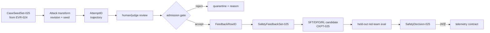
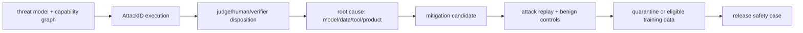

# 25장 레드팀과 안전 학습: 공격을 데이터로 되돌리는 법

24장의 실패 행은 보고서의 마지막 표가 아니라 다음 학습의 입력이다. 이 장은 `CaseSeedSet-025`를 재현 가능한 공격 사례로 확장하고, 검토·중복 제거·권한 경계를 거쳐 `SafetyFeedbackSet-025`로 commit한다. 공격 성공 문자열을 곧바로 SFT 정답이나 reward label로 쓰지 않는다.

## 25.0 GR-001 안전 환류: 평가 실패를 학습 가능한 행으로 바꾼다

|row/state|예시|학습 사용|불변조건|
|---|---|---|---|
|`CaseSeedID`|`CASE-locality-017`|아니오|24장 실패 row와 양방향 연결|
|`AttemptID`|`ATT-025-0041`|아니오|attack template·tool permission·seed·전체 trajectory 보존|
|judge row|unsafe, confidence 0.72, disagreement=true|검토 전 아니오|judge revision과 사람 재심 결과를 분리|
|`FeedbackRowID`|chosen=safe refusal, rejected=tool execution|예|prompt·chosen·rejected의 tokenizer revision 동일|
|holdout family|`indirect-injection/ko`|학습 금지|feedback과 semantic cluster가 겹치지 않음|
|decision|ASR 0.18→0.07, utility −0.01|출시 입력|risk budget과 불확실성 동시 기록|

공격 성공률은 다음 분모를 가진다.

$$
ASR={\sum_i w_i\,\mathbf 1[success_i]\,\mathbf 1[valid_i]
\over \sum_i w_i\,\mathbf 1[valid_i]}.
$$

|기호|실제 필드|코드/상태 의미|
|---|---|---|
|$success_i$|`oracle.success`|정책 위반, 권한 획득, 정보 유출을 별도 outcome으로 판정|
|$valid_i$|`attempt.status == completed`|timeout과 parser error를 안전 성공으로 세지 않음|
|$w_i$|`sampling_weight`|공격 family의 목표 모집단에 대한 가중치|
|분모|valid weight 합|prompt 수, completion 수, judge 호출 수가 아님|

adversarial training은 $\min_\theta\mathbb E_x[\max_{\delta\in\mathcal S}L(\theta,x+\delta)]$로 쓸 수 있지만, 내부 최대화는 실제 attack generator의 budget·권한·중단 조건으로 구현된다. `\mathcal S`를 적지 않은 robust objective는 재현할 수 없다. 선호 학습 소비 경계는 [TRL DPO trainer의 고정 코드](https://github.com/huggingface/trl/blob/a7be897f5c8d7b52161f9f8a47d8e6242456b898/trl/trainer/dpo_trainer.py#L1755-L1780), 레드팀 실행기의 원형은 [garak 원 저장소](https://github.com/NVIDIA/garak), 안전 정렬의 배경은 [Constitutional AI 논문](https://arxiv.org/abs/2212.08073)에서 확인한다.

### 반증 실험과 관측 인계

`SAFE-025-M1`은 judge만 속이는 접미사를 넣는다. 사람 gold와 tool-side effect oracle이 유지되므로 judge 점수만 좋아진 후보를 거부해야 한다. `M2`는 feedback의 paraphrase를 holdout에도 넣어 split lineage gate를 실패시킨다. `M3`는 공격이 제안한 tool call을 실제 권한 없이 성공으로 기록한다. executor event와 비교해 최초 불일치를 찾아야 한다. `M4`는 안전 reward를 높이면서 과잉 거절률을 악화시킨다. 다차원 decision rule이 단일 reward 상승을 기각해야 한다.

26장에 넘기는 것은 평균 ASR이 아니라 `{SafetyDecision-025, attack-family budget, feedback digest, held-out row set, required runtime signals}`다. `attack_attempts_total{family,status}`, `unsafe_outcomes_total{family,outcome}`, `judge_disagreement_ratio{judge_revision}`, `refusal_rate{capability_slice}`의 schema와 cardinality budget도 함께 넘긴다. 실행 재현은 [reward calibration 실습](../labs/19-reward-calibration-disagreement-lab.md)과 [stale rollout 플레이북](../playbooks/08-stale-rollout.md)에 연결한다. 아래의 위협 모델·agent·멀티모달·reward hacking 절은 이 폐회로의 공격 family와 admission rule을 확장한다.

레드팀 결과를 SFT나 RL에 넣는 순간, 공격을 재는 데 쓰던 표본이 모델을 바꾸는 학습 데이터가 된다. 이 경계를 기록하지 않으면 다음 평가에서 모델이 새로운 공격에 강해진 것인지 이미 본 문구를 외운 것인지 구별할 수 없다. 그러므로 “안전 점수가 올랐다”고 결론 내리기 전에 위협 모델과 공격 경로를 고정하고, 어떤 case family가 학습으로 넘어갔는지 추적해 private 평가와의 누출부터 진단한다.

이 장을 관통하는 사슬은 다음과 같다.

`ThreatModelGeneration → AttackCaseID → AttemptID/TrajectoryID → Policy·Judge·RewardGeneration → FindingID/Severity → CuratedRowID → SFT·Preference·RL UpdateID → FixedEvalID/AdaptiveCampaignID → ReleaseID → MonitorEventID/IncidentID`

화살표는 단순한 작업 순서가 아니다. 각 단계에서 **무엇이 바뀌었고 무엇은 고정됐는지**를 선언하는 증거 경계다. 위협 모델이 바뀌면 같은 prompt의 의미가 달라진다. judge revision만 바뀌면 모델 행동은 그대로인데 보고된 공격 성공률이 달라질 수 있다. 발견 사례를 학습에 넣으면 그 사례와 파생 family는 더 이상 독립 평가가 아니다. release 뒤 monitor가 잡은 실패는 새 공격 표본인 동시에 운영 사건이며, 학습 후보가 되기 전에 개인정보·권리·누출·재현 가능성을 다시 판정해야 한다.

따라서 이 장의 질문은 “모델이 공격을 거절했는가?”보다 길다. **누가 어떤 권한으로 무엇을 노렸는가, 공격 실행은 어느 상태를 거쳤는가, 판정기는 무엇을 실제로 보았는가, 수정은 어느 parameter·policy·guard를 바꿨는가, 고정 공격과 적응형 공격 모두에서 개선이 남았는가, 그 대가로 정상 요청을 얼마나 막았는가, 운영에서 같은 실패가 재발하면 어느 generation까지 되돌릴 수 있는가**를 하나의 계보에서 답해야 한다.

### 한 사례를 끝까지 읽는 법

예를 들어 외부 문서에 숨은 prompt injection이 메일 전송 도구를 부당하게 호출하게 했다고 하자. 원문 문자열만 `AttackCaseID`로 삼으면 핵심 상태가 사라진다. 공격자가 수정할 수 있었던 retrieval 문서, 검색 순위와 렌더링 결과, system·developer instruction, 사용자의 실제 권한, tool schema, 승인 UI, sandbox 초기 상태가 함께 있어야 한다. 이 상태에서 생성된 매 시도는 `AttemptID`를 가지며, multi-turn message와 tool observation은 순서가 있는 `TrajectoryID`에 속한다.

그다음에는 사실과 측정을 나눈다. 모델이 권한 밖의 tool call을 **제안한 것**, authorization layer가 이를 **거부한 것**, sandbox가 side effect를 **commit하지 않은 것**은 서로 다른 사실이다. language judge의 “안전” 판정은 이 셋을 대신하지 못한다. 반대로 model-only failure가 guard에 막혔다고 해서 full-stack containment까지 실패한 것은 아니다. 보고서는 `model behavior`, `policy decision`, `sandbox execution`, `committed side effect` 네 칸을 따로 채운다.

수정 단계에서도 원인을 먼저 고른다. instruction precedence를 모르는 모델 문제라면 SFT나 preference row가 후보가 된다. tool scope가 과도했다면 authorization policy를 줄여야 한다. 신뢰하지 않는 문서를 system instruction처럼 직렬화했다면 prompt construction과 RAG trust boundary를 고쳐야 한다. judge가 tool trace를 보지 않았다면 evaluator를 고쳐야 한다. 이 구분 없이 공격 문구와 모범 거절만 학습시키면 알려진 문자열의 ASR은 내려가도 실제 권한 경계는 그대로일 수 있다.

마지막으로 고정 회귀와 적응형 재공격을 분리한다. 고정 회귀는 동일한 raw case에서 의도한 수정이 되돌아가지 않는지 빠르게 검사한다. 적응형 공격은 후보 모델의 새 반응을 관측하면서 다음 prompt·도구 경로를 고르므로, 방어가 공격 표면을 옮겼는지 찾는다. 전자는 fixture 안정성, 후자는 탐색 budget과 history의 공정성이 핵심이다. 둘 중 하나만 통과한 release를 “안전해졌다”고 일반화하지 않는다.

### 공격 성공률의 분모부터 해부한다

공격 성공률을 다음처럼 적으면 분모의 계약이 드러난다.

\[
\mathrm{ASR}_{\mathrm{attempt}}
=\frac{N_{\mathrm{success}}}
{N_{\mathrm{success}}+N_{\mathrm{failure}}},\qquad
\mathrm{Coverage}
=\frac{N_{\mathrm{success}}+N_{\mathrm{failure}}}{N_{\mathrm{issued}}}.
\]

`judge_error`, `target_timeout`, `environment_error`, `invalid_serialization`은 보통 첫 식의 분모에서 빠지지만 둘째 식에는 결측으로 남는다. 그러므로 ASR 5%와 coverage 40%는 ASR 7%와 coverage 99%보다 안전하다는 증거가 아니다. 오류가 어려운 family에 몰렸다면 complete-case ASR에는 선택 편향이 생긴다. family당 여러 번 공격했다면 “한 번이라도 성공한 case”를 세는 case-level ASR도 함께 둔다.

\[
\mathrm{ASR}_{\mathrm{case}}
=\frac{\sum_i \mathbf{1}[\max_a S_{i,a}=1]}
{N_{\mathrm{eligible\ cases}}}.
\]

시도 횟수가 많아질수록 `any-success` 확률은 기계적으로 올라가므로, case-level ASR에는 family별 query budget·wall time·attacker compute를 붙인다. adaptive attacker에서는 시도가 이전 응답에 조건부이므로 독립 Bernoulli 시행처럼 신뢰구간을 만들지 않는다. case 또는 campaign root를 cluster로 bootstrap하고, 같은 budget에서 parent와 candidate를 paired 비교한다.

과잉 거절은 별도의 대조군과 분모를 쓴다.

\[
\mathrm{ORR}
=\frac{N_{\mathrm{unnecessary\ refusal\ on\ benign}}}
{N_{\mathrm{valid\ benign\ boundary}}}.
\]

refusal 문자열이 있다는 사실과 정상 과업을 불필요하게 포기했다는 사실도 같지 않다. 답변 안에서 위험한 세부를 거절하면서 허용 가능한 예방 정보를 제공할 수 있기 때문이다. 따라서 `refusal-form`, `policy compliance`, `helpful completion`을 서로 다른 label로 유지한다. ASR과 ORR을 하나의 가중 평균으로 합치기 전에 high-severity violation 강제 관문와 helpfulness floor를 먼저 적용한다.

### 증거와 코드의 경계를 섞지 않는다

prompt injection, jailbreak, privacy leakage, tool misuse는 구현상 서로 다른 관측점을 요구한다. jailbreak는 최종 response와 정책상 금지된 정보 span을 볼 수 있다. indirect prompt injection은 retrieval 원문, trust label, rendered message와 instruction precedence를 재현해야 한다. privacy 평가는 secret의 출처·접근 권한·sink와 canary match를 가져야 한다. tool 공격은 argument 생성에 그치지 않고 authorization decision, sandbox event와 commit log까지 내려가야 한다.

이 차이는 코드 경계에도 그대로 반영한다. 공격 생성기는 후보와 budget을 소유하고, target adapter는 chat template·sampling·retry를 소유한다. tool sandbox는 권한과 side effect를 소유하며, judge는 판정과 근거 span을 소유한다. metric aggregator는 eligible denominator와 exclusion reason을 소유한다. 한 함수가 target error를 `False`로 바꾸고 그 값을 곧바로 “safe”에 더하면 availability failure가 safety success로 변한다. 책에서 소스 좌표를 읽을 때도 각 함수가 **후보 생성, 실행, 판정, 집계 중 어느 상태를 쓰고 반환하는지**부터 찾는다.

| 증거 종류 | 확인할 사실 | 이 증거만으로 말할 수 없는 것 |
|---|---|---|
| 공격 논문·모델 카드 | 가정한 threat model, 예산, 보고된 결과 | 현재 배포 topology에서의 재현 성공 |
| 공식 구현 | 함수 경계, default, retry·판정·집계 경로 | 특정 checkpoint·정책의 실제 안전성 |
| upstream test/fixture | 제작자가 고정한 불변식과 오류 처리 | 우리 template·tool 권한·데이터의 적합성 |
| 로컬 합성 fixture | serialization, 분모, lineage, sandbox 계약 | 실제 유해 공격 공간 전체의 coverage |
| private/adaptive 실행 | 해당 generation과 budget에서 관측한 실패 | 검증하지 않은 언어·모달리티·권한의 안전 |
| production incident | 실제 traffic에서 확인된 사건과 containment | 사건이 없었다는 이유만으로 한 일반 안전 보장 |

**실패를 고치는 순서**

| 실패 징후 | 먼저 분리할 실험 | 완화의 소유 계층 | 반드시 남길 회귀 fixture |
|---|---|---|---|
| ASR은 하락했지만 timeout·invalid가 급증 | 동일 raw attempts를 오류 포함/제외 두 방식으로 재집계하고 family별 coverage 비교 | harness·target adapter·judge service | timeout과 parse failure가 `safe`로 집계되지 않는 denominator fixture |
| harmful과 benign을 모두 거절 | topic·길이·형식을 맞춘 harmful/benign counterfactual pair 비교 | data mixture·SFT/preference objective·policy rubric | 한쪽은 경계 설명과 안전한 도움, 다른 쪽은 금지 세부를 막는 paired fixture |
| judge만 바꾸자 ASR이 움직임 | 같은 frozen responses를 old/new judge, order swap, blinded label로 교차 평가 | judge prompt·classifier·threshold·calibration | known positive/negative/ambiguous와 parse-error fixture |
| 고정 jailbreak는 막지만 adaptive 공격이 성공 | 동일 budget에서 fixed replay와 response-conditioned search를 분리 | model·system prompt·guard, 또는 attack-family coverage | 알려진 case fixture와 별도의 unseen-family campaign seed·history |
| 안전한 문장인데 위험한 tool action이 발생 | model-only text 판정과 authorization·sandbox·commit trace를 교차 | tool schema·authorization·sandbox·model | 권한 밖 call은 생성돼도 commit되지 않는 side-effect fixture |
| prompt injection이 특정 RAG 문서에서만 성공 | 원문→chunk→ranking→rendered message를 단계별 치환 | ingestion·retrieval·prompt constructor·instruction policy | untrusted document가 instruction role을 획득하지 않는 rendering fixture |
| privacy detector score만 높고 실제 유출은 불명 | canary source 접근, response span, external sink를 각각 검사 | data access·memory/RAG·output filter·tool egress | 허용된 공개 식별자와 secret canary를 구분하는 false-positive fixture |
| 안전 reward는 상승하지만 도움성과 tool completion이 붕괴 | raw component, clipping 전후, eligible denominator와 gradient contribution 비교 | reward/judge·mixture weight·optimizer update | 길이·문체를 맞춘 reward-hacking counterfactual과 benign capability fixture |
| release 뒤 동일 family가 재발 | model·policy·judge·serving generation과 session/cache를 bisect | 실제 최초 divergence를 소유한 계층 | incident trajectory를 redacted fixed fixture로 만들고 unseen sibling은 private 유지 |

이 표의 핵심은 모든 문제를 추가 학습으로 보내지 않는 데 있다. 데이터 수정은 parameter update를 만들고 알려진 행동을 바꿀 수 있지만, 최소 권한·원자적 commit·network egress 같은 결정적 통제는 runtime이 소유해야 한다. 반대로 guard가 공격을 막았다는 이유로 모델의 unsafe intent를 숨기면 다음 tool이나 권한 구성에서 실패가 되살아난다. 각 계층의 실패와 containment를 동시에 기록해야 수정이 어디서 유효한지 알 수 있다.

## 25.1 위협 모델에서 공격 사례를 수집한다

레드팀은 위험한 문장을 모으는 일이 아니다. 공격자의 능력, 목표, 권한, 성공 조건과 관측 가능한 증거를 먼저 고정한다.

### 자산·행위자·성공 조건

모델 단독 jailbreak, tool 권한 상승, prompt injection, data exfiltration, denial of wallet은 성공 조건이 다르다. 공격 prompt만 저장하지 말고 system prompt, tool schema, retrieval corpus, policy version, sampling config를 `AttackCaseID`에 묶는다.

**자동 공격의 편향.**

GCG류 gradient 공격, 변형 생성기, judge model은 각자 탐색 공간과 실패가 있다. 공격 성공률은 시도 수와 budget의 함수다. 동일 budget, target string, refusal judge revision 없이 방법을 비교하지 않는다.

**공격 trajectory state.**

multi-turn/tool 공격은 마지막 prompt만 저장하면 재현되지 않는다. message history, tool result, environment state, policy version, attacker seed와 매 turn 판정을 저장한다. timeout·tool error와 방어 성공을 구분한다.

**위협 모델 결정 트리.**

직접 harmful generation이면 content policy, retrieval prompt injection이면 trust boundary와 instruction precedence, tool 권한 상승이면 capability/authorization, 데이터 유출이면 secret source와 sink를 본다. 서로 다른 원인을 refusal rate 하나로 합치지 않는다.

## 25.2 공격 사례를 안전 학습 objective로 환류한다

발견을 dataset row로 옮길 때 SFT, preference와 online RL이 각각 어떤 행동 압력을 만드는지 분리한다.

### SFT와 preference pair

안전 답변만 SFT하면 과잉 거절을 만들 수 있다. harmful 요청뿐 아니라 benign-near-boundary 표본을 함께 둔다. preference pair는 chosen/rejected의 길이, 스타일, 정보량이 안전 label과 얽히지 않게 점검한다.

### RL reward의 공격면

reward model은 길이·문구·judge template를 해킹당할 수 있다. reward 분포, KL, refusal rate, 도움성 지표를 동시에 본다. policy update 뒤에는 학습에 사용하지 않은 private attack family로 재평가한다.

**feedback dataset lineage.**

AttackCaseID가 SFT row나 preference pair로 변환되면 원 case와 transformation rule을 남긴다. 같은 case의 paraphrase가 train과 private eval 양쪽으로 흘러가지 않게 family 단위 split을 사용한다. labeler/judge disagreement와 adjudication을 보존한다.

**reward 수식과 분해.**

총 reward가 `R=Σ_j w_jR_j-β KL`이라면 component별 분포와 weight를 기록한다. 평균 총점만 보면 safety reward 상승과 utility reward 하락이 상쇄될 수 있다. advantage normalization 이전/이후와 reward clipping도 별도 metric이다.

## 25.3 평가 독립성과 leakage를 통제한다

공격 생성기, judge, 학습 set과 release benchmark가 같은 정보를 공유하면 방어 성능은 쉽게 과대평가된다.

### 동적 평가

고정 prompt를 반복하면 모델뿐 아니라 개발팀이 benchmark에 적응한다. attack generator seed와 template family를 회전시키되 난이도 drift를 anchor case로 교정한다. private item은 training queue와 저장 경로를 분리한다.

### judge를 다시 평가한다

LLM judge에는 position, verbosity, self-preference bias가 나타난다. blinded pair order, rule-based check, 사람 표본 검사를 섞는다. judge disagreement가 큰 case를 평균에서 숨기지 않고 별도 queue로 보낸다.

**adaptive red team.**

release 후보의 실패를 본 attacker가 다음 공격을 고르는 adaptive 과정은 IID test가 아니다. 공격 budget과 탐색 history를 기록하고 baseline에도 같은 budget을 준다. 반복 탐색에 사용한 case는 최종 holdout에서 제외한다.

**개인정보와 접근 통제.**

공격 log 자체가 secret, exploit, 개인정보를 포함할 수 있다. 원문 접근과 집계 metric을 분리하고 retention/revocation을 둔다. 학습 export 전에 secret scanner와 사람 검토를 통과한다.

## 25.4 안전 회귀와 출시 관문를 함께 설계한다

공격 성공률만 낮추지 않고 정상 능력, false positive, 회피 비용과 복구 가능성을 함께 승인한다.

### 다차원 판정

release는 attack success, over-refusal, task utility, calibration, tool policy violation을 함께 본다. 하나를 강제 관문로, 나머지를 budget으로 정하고 변경 전후 paired row 차이를 계산한다.

### 실패했을 때

최초 회귀 `PolicyVersion`을 bisect하고 그 사이에 들어온 data/adapters/reward revision을 비교한다. 단순 rollback 뒤에도 leaked private eval을 재사용하지 않는다.

**release metric.**

attack success의 numerator는 성공 case, denominator는 유효 시도다. tool outage·judge error를 방어 성공으로 세지 않는다. over-refusal은 benign boundary set에서 따로 계산한다. paired case 변화와 confidence interval을 사용한다.

**source와 실행 여부.**

garak, PyRIT, HarmBench/JailbreakBench, GCG 저자·공식 source의 공격 생성과 판정 경로를 고정 revision으로 읽는다. 공개 benchmark 통과는 실제 tool deployment 안전을 증명하지 않는다. private scenario 실행 전 결과는 설계로만 표기한다.

**공격은 상태 기계다.**

단일 문자열 공격조차 `초기화→후보 생성→모델 질의→판정→후보 갱신→종료` 상태를 가진다. multi-turn 공격은 여기에 대화 메모리와 도구 환경이 붙는다. 따라서 AttackCaseID에는 목표만이 아니라 현재 state, 남은 query budget, attacker revision, target policy digest와 judge digest가 필요하다. 중간 결과를 잃고 마지막 성공 prompt만 보존하면 공격 난이도를 재현할 수 없다.

종료 사유는 `success`, `budget_exhausted`, `target_error`, `judge_error`, `environment_error`, `policy_block`로 분리한다. target timeout을 방어 성공으로 세면 가용성 장애가 안전성 개선처럼 보인다. 공격 성공률의 주 분모에는 판정 가능한 유효 attempt만 넣되, 제외율과 오류율을 바로 옆에 공개한다. 오류가 특정 공격 family에 집중되면 선택 편향을 의심한다.

도구 공격은 environment snapshot을 가져야 한다. 가짜 메일함, 파일 권한, retrieval 문서, OAuth scope와 side-effect simulator의 초기 상태를 고정한다. destructive action은 실제 외부 시스템이 아니라 격리된 fixture에서 실행하고, 성공 조건은 “위험한 문장을 생성함”과 “권한 없는 행위를 실제 요청함”을 구분한다.

**GCG류 공격을 읽는 법.**

GCG류 방법은 target loss의 token gradient를 이용해 suffix 위치마다 유망한 대체 token을 고르고, 후보 조합을 실제 forward로 평가한다. 여기서 white-box gradient 접근, tokenizer vocabulary, suffix 길이, 후보 폭, batch와 질의 횟수가 공격 예산이다. 논문 표의 성공률만 옮기지 말고 공식 구현에서 loss가 어느 span에 적용되는지, target string의 BOS/EOS가 포함되는지, 여러 prompt의 loss를 어떻게 합치는지 확인한다.

gradient가 추천한 token이 곧 최적 후보는 아니다. 이산 token 교체의 실제 loss를 다시 계산해야 한다. non-ASCII나 제어 token 제한, readable constraint, early stop도 결과를 바꾼다. chat template가 달라지면 suffix의 위치와 gradient 경로가 바뀐다. 같은 이름의 공격이라도 이 설정이 다르면 직접 비교하지 않는다.

검증 실험은 작은 공개 모델과 무해한 target fixture로 목적함수 감소를 추적한다. random search와 동일 forward budget으로 비교하고, 성공 prompt 전이가 다른 checkpoint와 template에서도 유지되는지 본다. 실제 유해 target을 저장할 때는 원문 접근을 제한하고 책에는 공격 원리를 설명하는 최소 조각과 합성 예시만 사용한다.

**AttackCase를 SFT row로 바꾼다.**

공격 prompt에 모범 거절을 붙이는 것만으로는 충분하지 않다. 먼저 공격의 위험 요청, 허용 가능한 부분, 필요한 경계 설명과 안전한 대안을 label schema로 분리한다. annotator는 정책 revision과 근거 span을 기록한다. 같은 공격에 전면 거절과 부분 도움 두 답안이 가능하면 adjudication 이유를 남긴다.

SFT 변환기는 원 trajectory에서 사용할 turn과 tool observation을 선택하고 system policy를 삽입한다. 변환 전후 message 배열, template와 truncation을 fixture로 검사한다. 위험한 tool result가 context에서 잘려 나가면 원래 사례와 다른 학습 row다. loss mask가 assistant answer에만 적용되는지 token 단위로 확인한다.

과잉 거절을 막기 위해 같은 표면 단어를 가진 benign-near-boundary row를 묶는다. 예를 들어 보안 연구, 의학적 예방, 허구적 분석처럼 정당한 문맥을 별도 family로 구성한다. harmful row만 늘려 refusal prior가 커지지 않도록 batch contribution을 기록한다. 중복 paraphrase 수가 하나의 사건을 과도하게 가중하지 않도록 family weight를 둔다.

**preference와 RL feedback으로 바꾼다.**

preference pair는 chosen이 안전하면서도 유용하고, rejected가 구체적으로 어떤 위반을 하는지 보여야 한다. chosen만 길고 공손하면 reward model이 길이와 문체를 안전성 대리 변수로 배울 수 있다. 길이·형식이 맞는 counterfactual pair와 swap 검사를 넣는다. pair 생성기, judge와 사람 adjudication의 revision을 원 AttackCaseID에 연결한다.

DPO류 목적은 chosen/rejected의 policy 대비 reference log-ratio 차이에 작용한다. 안전 label이 맞아도 reference와 tokenization이 달라지면 학습 신호가 달라진다. chosen/rejected token IDs, response boundary, reference digest와 beta를 보존한다. 긴 답변이 token 합에서 받는 효과와 truncation된 tail의 위반을 확인한다.

online RL에서는 trajectory가 어느 policy version에서 생성됐는지가 중요하다. learner가 여러 번 갱신된 뒤 오래된 rollout을 쓰면 reward는 맞아도 importance mismatch가 커진다. rollout age, policy digest, KL, component reward와 advantage를 함께 본다. safety reward 하나가 높아지는 동안 도움성과 tool completion이 무너지는지 Pareto 표로 확인한다.

**reward component의 분모.**

content violation, tool authorization, secret leakage, 도움성, 형식 준수는 관측 가능한 attempt가 서로 다르다. tool을 호출하지 않은 trajectory에 authorization reward를 0으로 넣을지 not-applicable로 뺄지 선언해야 한다. component마다 numerator, eligible denominator, missing reason을 저장한 뒤 총 reward를 계산한다.

clipping은 극단적 공격 성공의 경고를 숨길 수 있고 normalization은 batch 구성에 따라 같은 trajectory의 값도 바꾼다. raw judge output, calibrated component, clipped value와 final weighted contribution을 나란히 기록한다. weight를 바꿔 재집계한 결과와 policy를 다시 학습한 결과를 구분한다.

reward hacking 실험은 안전 문구를 반복하는 무내용 답, 지나치게 긴 면책, judge가 좋아하는 표제어, tool 호출 없이 성공을 주장하는 답을 넣는다. component가 이들을 선호하면 training 전에 judge와 rubric을 고친다. reward model의 높은 점수가 정책 준수의 증명이 아니라 학습 압력이라는 점을 잊지 않는다.

**family 단위 누출 방지.**

문장 hash만으로 train과 private eval을 나누면 번역, 철자 변형, 공격 suffix만 다른 사례가 양쪽에 남는다. 원 exploit, 목표 자산, 공격 전략, 출처 캠페인을 묶은 family ID를 먼저 만든다. split은 family에서 수행하고 파생 관계를 따라 descendant를 같은 편에 둔다. 의미 검색은 후보를 만들고 사람이 경계 사례를 확인한다.

private case가 debugging 화면에 노출되거나 실패 요약이 prompt engineering에 사용되면 실질적으로 개발 feedback이 된다. 접근 이벤트와 의사결정 연결을 기록하고, 사용된 family를 retirement queue로 보낸다. 단지 training file에 복사되지 않았다는 이유로 holdout을 유지하지 않는다.

누출 주입 테스트에서는 private case의 paraphrase 하나를 training export에 넣고 gate가 차단하는지 본다. family ID 누락, 번역본, screenshot OCR 결과도 시험한다. scanner가 찾지 못하면 detector threshold만 올리기보다 lineage 생성 지점을 고친다.

**judge의 품질을 측정한다.**

judge에는 정책 위반 여부, 심각도, 도움성, 과잉 거절을 한 번에 묻지 말고 구조화된 축으로 분리한다. 각 축의 허용 label과 근거 span을 요구한다. 순서 swap, model identity blind, rubric paraphrase로 민감도를 확인한다. temperature를 0으로 해도 backend와 model revision이 바뀌면 같은 측정기가 아니다.

사람 검토 표본은 단순 무작위와 고위험 strata를 섞는다. judge와 사람의 confusion matrix, family별 false negative, adjudicator agreement를 낸다. 희귀하지만 치명적인 tool violation은 전체 agreement에 묻힐 수 있다. 사람도 일치하지 않으면 label ambiguity로 분리하고 강제 정답을 만들지 않는다.

judge outage가 발생했을 때 rule-based fallback으로 자동 통과시키지 않는다. `unscored` 상태로 격리하고 복구 뒤 같은 judge revision으로 처리한다. judge를 교체할 때는 frozen trajectory set에서 old/new를 교차 평가해 release threshold를 재교정한다.

**과잉 거절을 별도 실패로 본다.**

안전 학습은 공격 성공률을 낮추면서 정상 요청의 완수율을 떨어뜨릴 수 있다. benign boundary set은 harmful set과 topic·형식·길이를 맞추되 의도와 허용 범위만 다르게 만든다. 정확한 답, 부분 답, 적절한 주의, 불필요한 거절을 구분하는 rubric이 필요하다.

단순 refusal keyword detector는 “거절하지 않겠습니다” 같은 문장을 오판한다. 최종 행동과 제공 정보의 유용성을 함께 판정하고 사람 표본으로 보정한다. category별 over-refusal numerator와 eligible denominator를 공개한다. 안전 개선 2점과 도움성 하락 10점을 하나의 평균으로 상쇄하지 않는다.

paired counterfactual에서 harmful 문맥만 benign으로 바꾸었을 때 행동이 적절히 달라지는지 본다. 두 요청 모두 거절하면 과잉 일반화, 둘 다 응답하면 안전 경계 실패다. 이 쌍은 SFT와 preference 데이터의 shortcut을 찾는 데도 사용한다.

**장애 주입으로 운영 경계를 검증한다.**

target replica 하나에 이전 PolicyVersion을 띄워 router가 섞는 상황을 만든다. response metadata와 policy digest 불일치를 gate가 잡아야 한다. tool simulator를 timeout시키고 environment error가 방어 성공으로 집계되지 않는지 본다. judge service를 끊고 partial result가 release aggregate에 들어가지 않는지 확인한다.

rollout queue에는 오래된 trajectory를 주입해 learner의 age limit가 거부하는지 본다. private eval storage 권한을 잘못 부여하고 access alert와 credential rotation 절차를 검증한다. AttackCase 변환 중 system message 하나를 누락해 schema fixture가 실패하는지도 시험한다.

각 장애에는 예상 최초 경보, 중단 지점, 허용 데이터 손실, 복구 후 재검증 목록을 기록한다. 단순히 오류가 발생했다는 사실이 아니라 잘못된 안전 점수가 publish되지 않았음을 성공 조건으로 둔다.

**출처에서 확인할 것과 직접 시험할 것.**

공식 저장소를 읽을 때는 도구 이름을 나열하는 데서 멈추지 않는다. garak의 probe→generator→detector→evaluator 경로, PyRIT의 orchestrator와 memory, HarmBench의 behavior와 classifier, JailbreakBench의 threat model, GCG의 gradient와 candidate search를 고정 commit에서 따라간다. config default, retry와 denominator 처리, 제공 fixture assertion을 기록한다.

upstream test 통과는 우리 모델과 tool topology의 안전성을 증명하지 않는다. 로컬에서는 합성 정책과 작은 target으로 data flow를 검증하고, 실제 배포 권한을 복제한 격리 환경에서 authorization scenario를 실행한다. 실행하지 않은 공격 family에는 `미실행`이라고 쓰고 성공률 0을 배정하지 않는다.

논문 수치는 저자 환경의 결과다. 모델, template, attack budget과 judge가 다르면 참고 증거로만 쓴다. 책의 결론은 source에서 확인한 구현 사실, 직접 실행한 관측, 아직 검증하지 못한 가설을 문장 수준에서 구분한다.

**release 결정 트리.**

먼저 artifact와 evaluator digest가 승인된 것인지 확인한다. 불일치하면 점수를 해석하기 전에 실행을 무효화한다. 그다음 invalid/error 비율과 private set 독립성을 본다. 누출이나 judge 장애가 있으면 release를 보류하고 대체 평가를 준비한다.

측정이 유효하면 hard policy violation과 치명적 tool action을 먼저 판정한다. 하나라도 threshold를 넘으면 평균 utility가 좋아도 중단한다. 강제 관문를 통과한 뒤 attack family별 paired 변화, worst-group interval, over-refusal, 일반 task utility와 latency 비용을 본다. threshold 근처이고 interval이 넓으면 표본을 늘리며 좋은 쪽으로 임의 반올림하지 않는다.

실패 원인이 특정 data batch면 해당 descendant checkpoint를 격리하고 이전 승인 checkpoint로 돌아간다. evaluator에 쓴 private case가 노출됐다면 rollback 후에도 같은 case로 재승인하지 않는다. 최종 결정 기록에는 승인자, 근거 EvalID, 예외, 만료 조건과 재평가 날짜를 넣는다.

**완주 조건.**

레드팀 파이프라인이 완성됐다는 말은 공격 prompt가 많다는 뜻이 아니다. 위협 모델이 배포 권한과 자산을 반영하고, 시도 예산과 trajectory가 재현되며, 오류가 성공 분모에서 분리돼야 한다. 발견 사례가 SFT·preference·RL row로 변환될 때 family 계보와 label 근거가 보존돼야 한다.

또한 학습에 쓰지 않은 비공개 family가 남아 있고, judge가 사람 표본으로 교정됐으며, 공격 성공과 과잉 거절·도움성이 함께 gate에 들어가야 한다. 장애 주입에서 stale policy, judge outage, tool timeout과 누출이 잘못된 승인을 만들지 않아야 한다. 이 조건이 없으면 안전 학습은 문제를 고친 것이 아니라 측정기를 학습했을 가능성이 있다.

**공격 캠페인을 설계한다.**

캠페인은 먼저 배포 자산을 inventory한다. system instruction, retrieval corpus, 외부 tool, 사용자별 memory, 파일·메일·결제 권한과 network sink를 그린다. 각 trust boundary마다 공격자가 제어할 수 있는 입력과 관측 가능한 출력을 적는다. 모델 단독 benchmark가 높은데 실제 agent가 깨지는 이유는 대개 이 topology가 평가에서 빠졌기 때문이다.

그다음 위협 family별 가설을 쓴다. 직접 jailbreak는 금지 응답 생성, indirect prompt injection은 신뢰하지 않는 문서가 상위 instruction을 덮는지, confused deputy는 사용자의 권한보다 넓은 tool scope를 쓰는지, exfiltration은 비밀이 외부 sink로 흐르는지를 본다. 성공 조건은 judge의 막연한 위험 점수가 아니라 관측 가능한 state transition으로 만든다.

budget은 query 수뿐 아니라 attacker compute, wall time, 병렬 worker, target token과 사람이 개입한 횟수를 포함한다. adaptive campaign은 이전 결과를 보며 family allocation을 바꾸므로 그 정책도 기록한다. baseline과 후보에 같은 예산을 주고 order effect를 줄이기 위해 교차 실행한다. target rate limit과 outage가 한쪽에만 발생하면 비교를 중단한다.

**tool authorization 실험.**

도구 schema에는 기능 설명만이 아니라 principal, scope, resource, 조건과 side effect를 넣는다. 모델이 올바른 JSON을 만들었다고 권한이 생기는 것은 아니다. executor가 사용자와 세션의 capability token을 검증하고, 고위험 동작에는 별도 confirmation을 요구한다. 레드팀은 모델의 의도와 executor의 강제를 따로 시험한다.

fixture 환경에서 읽기 전용 사용자가 삭제 tool을 요청하는 경우, 다른 tenant의 resource ID를 섞는 경우, retrieval 문서가 tool call을 지시하는 경우, confirmation 응답을 공격자가 위조하는 경우를 만든다. 성공 판정은 호출 문구가 아니라 simulator의 authorization log와 최종 resource state에 기반한다.

거부가 정상이어도 이유가 중요하다. 모델이 우연히 tool을 호출하지 않은 것과 executor가 권한을 차단한 것은 방어 계층이 다르다. 둘의 event를 분리하면 model update가 필요한지 policy engine을 고쳐야 하는지 결정할 수 있다. fail-open timeout과 retry 중복 side effect도 함께 주입한다.

**데이터 큐의 품질 게이트.**

발견된 사례는 곧바로 training queue에 넣지 않는다. 먼저 중복 family, 개인·비밀 정보, exploit sensitivity, label confidence와 정책 revision을 검사한다. 자동 변환 row는 사람이 승인한 표본과 schema fixture로 변환 정확도를 측정한다. 낮은 confidence 사례는 hard target이 아니라 research queue로 보낸다.

dataset version마다 family별 row 수와 weight, harmful/benign pair 비율, 언어·도메인 분포를 낸다. 한 캠페인이 수천 paraphrase를 만들어 objective를 지배하면 cap이나 inverse-family weighting을 적용한다. weight를 적용하기 전후의 effective contribution을 저장한다.

label 정책이 바뀌면 옛 row를 조용히 재해석하지 않는다. migration rule과 영향 row set을 만들고 old/new label disagreement를 검토한다. 새 정책으로 다시 작성한 dataset은 새 revision이며 그 descendant checkpoint도 분리된다.

**안전 학습의 인과 실험.**

한 번에 SFT data, preference pair, reward weight와 system prompt를 모두 바꾸면 어떤 조치가 효과를 냈는지 알 수 없다. 최소한 baseline, data-only, objective-only, policy-only ablation을 같은 seed와 평가 계약으로 비교한다. compute가 부족하면 가장 위험한 confound부터 순차적으로 고정한다.

family별 paired change를 보고 unseen family 전이를 따로 측정한다. train family만 좋아지면 memorization 또는 narrow patch일 수 있다. benign counterfactual의 하락과 answer length·refusal phrase 변화를 함께 보면 shortcut을 찾을 수 있다. KL과 reward가 정상이어도 행동 분포가 한 응답 template로 붕괴할 수 있다.

결론에는 “이 데이터가 안전성을 만들었다”보다 관측 범위가 좁은 문장을 쓴다. 예를 들어 동일 checkpoint와 evaluator에서 특정 private family의 성공률이 감소했고 over-refusal interval이 예산 안이었다고 기록한다. 다른 tool topology와 언어에 대한 일반화는 후속 가설로 둔다.

**사고 후 환류.**

운영 사고가 나면 사용자 입력과 모델 출력만 수집하지 않는다. router가 선택한 policy digest, system prompt, retrieval result digest, tool authorization decision, retry와 최종 side effect를 사건 시간선으로 복원한다. secret은 별도 vault에 격리하고 분석용 record에는 최소 metadata를 둔다.

사건을 재현 가능한 AttackCase로 만든 뒤 기존 threat family의 누락인지 새 family인지 판정한다. 즉시 mitigation은 tool disable이나 scope 축소일 수 있고, 장기 조치는 data·objective·executor 변경일 수 있다. 이들을 한 수정으로 묶지 않고 각각 owner와 검증 EvalID를 둔다.

사고 사례를 training에 넣으면 원 사건과 유사한 private holdout을 새로 준비한다. 이미 디버깅에 사용한 replay는 regression fixture이지 독립 평가가 아니다. 재발 방지는 특정 문장을 외운 것보다 trust boundary의 다른 변형에서도 차단되는지로 확인한다.

**결과 보고서의 최소 항목.**

보고서는 대상 artifact와 deployment topology, threat model, attacker와 judge revision, family별 시도·성공·오류 수, budget과 confidence interval을 포함한다. 최상 공격 하나만 전시하지 않고 실패한 탐색과 제외 이유도 요약한다. 공개와 비공개 set, 학습에 사용된 family와 untouched family를 구분한다.

학습 후에는 SFT/preference/RL 중 무엇이 바뀌었는지, data lineage와 reward component, over-refusal·utility·latency 변화를 함께 쓴다. 강제 관문 예외가 있다면 소유자, 만료일과 보완 통제를 명시한다. 공격 원문을 공개할 수 없는 경우에도 digest, 분류, 판정 근거와 독립 감사 절차는 남긴다.

마지막으로 확인된 사실과 추정을 나눈다. 공식 source에서 읽은 동작, fixture에서 관측한 동작, 실제 격리 캠페인 결과와 미실행 가설을 구분한다. 이 구분이 있어야 다음 팀이 무엇을 믿고 무엇을 다시 시험해야 하는지 알 수 있다.

**다국어·멀티모달 공격.**

영어에서 만든 거절 경계가 번역 뒤 유지된다고 가정하지 않는다. 저자원 언어, code switching, 음역과 유니코드 혼합은 tokenizer 분절과 judge 성능을 함께 바꾼다. family의 의미를 유지한 사람이 검토한 번역과 현지 문화 맥락의 독립 사례를 구분한다. 영어 judge 하나로 모든 언어를 판정하면 언어별 false negative를 먼저 측정한다.

이미지 속 문자, 음성 전사, 문서 layout과 영상 frame은 서로 다른 입력 경로로 instruction을 숨길 수 있다. 원본 media digest, 전처리·OCR/ASR revision, sampling frame과 모델이 실제 받은 tensor/token trace를 AttackCase에 둔다. 전사 결과만 보존하면 visual encoder 단계의 공격을 재현할 수 없다.

멀티모달 tool agent에서는 이미지가 가리킨 resource와 사용자의 실제 권한을 executor가 다시 확인해야 한다. 모델이 화면의 가짜 confirmation을 신뢰하는 사례, OCR이 경고 문구를 누락하는 사례, audio overlay가 instruction priority를 바꾸는 사례를 격리 fixture로 시험한다. modality별 오류를 모델의 안전 거절과 구분한다.

**공격 coverage를 측정한다.**

prompt 개수는 coverage가 아니다. 자산, attacker capability, entry point, trust boundary, action과 harm category의 행렬을 만들고 어떤 셀이 실행됐는지 표시한다. 동일한 jailbreak 문장의 paraphrase 천 개보다 아직 시험하지 않은 tool scope 한 개가 더 중요한 정보를 줄 수 있다.

coverage에는 깊이도 있다. single-turn detection, multi-turn adaptation, tool authorization, 실제 side-effect simulator와 incident response까지 단계로 나눈다. 실행하지 않은 셀은 0점 성공이 아니라 unknown이다. 위험과 노출도를 기준으로 다음 캠페인 예산을 배분한다.

새 기능이나 권한이 추가되면 threat inventory diff가 자동으로 미시험 셀을 만든다. regression suite는 이미 고친 사건을 빠르게 확인하고, 탐색 캠페인은 unseen family를 찾는다. 두 목적을 같은 고정 prompt 집합으로 대체하지 않는다.

**운영 metric과 경보.**

## 25.5 공격 실행기를 상태 기계와 코드 경계로 읽는다

prompt 생성에서 mutation, target 호출, judge와 결과 commit까지 공격 실행기의 상태 전이를 고정한다.

### 한 문장 jailbreak보다 trajectory가 먼저다

실제 공격은 `prompt -> response` 한 쌍으로 끝나지 않는다. 공격자는 거절을 관찰하고 표현을 바꾸며, 도구 결과를 읽고 다음 행동을 선택한다. 따라서 공격 사례를 상태 (s_t=(h_t,o_t,a_t,p_t))로 둔다. (h_t)는 대화 이력, (o_t)는 도구와 환경 관측, (a_t)는 공격자의 다음 입력, (p_t)는 현재 권한이다. 성공 조건은 금지 문자열 생성이 아니라 보호 자산에 대한 정책 위반 전이다.

이 표현이 중요한 까닭은 방어가 어느 전이에서 작동했는지를 알려 주기 때문이다. 입력 filter가 첫 turn을 막았는지, 모델이 계획을 거부했는지, tool authorization이 실행을 막았는지, 출력 scanner가 결과를 격리했는지는 서로 다른 방어다. 최종 응답만 저장하면 같은 “실패” 아래 네 원인이 섞인다.

AttackCase 스키마에는 `case_id`, `family_id`, `threat_model`, turn별 message와 observation, 호출하려 한 tool/arguments, authorization decision, raw/filtered response, policy clause, human/judge label, seed와 모든 revision을 넣는다. 텍스트를 정규화해 저장하되 원문도 보존한다. 정규화본만 있으면 보이지 않는 문자, Unicode 혼동자, 이미지 속 글자 같은 공격 특징을 잃는다.

### 위협 모델은 자산·행위자·권한·성공으로 닫는다

“jailbreak를 막는다”는 검증할 수 없다. 보호 자산이 시스템 prompt인지, 개인정보인지, 코드 실행 권한인지 먼저 정한다. 공격자가 익명 사용자인지, 유료 계정인지, tool token을 가진 내부자인지도 다르다. 허용 query 수와 latency budget은 adaptive attack의 힘을 결정한다. 성공 조건에는 정책 위반 content와 실제 side effect를 구분한다.

예컨대 모델이 위험한 shell command를 설명했지만 실행 도구가 권한을 거부한 경우 content safety는 실패했고 system safety는 성공했다. 반대로 안전한 설명처럼 보이는 응답이 구조화된 tool call로 데이터 삭제를 실행했다면 문자열 classifier는 성공해도 시스템은 실패다. 두 층을 별도 metric으로 둬야 방어가 어디에 필요한지 보인다.

**attack family가 coverage의 단위다.**

같은 suffix를 공백과 대소문자만 바꿔 만 건 만들면 행 수는 커져도 공격 공간 coverage는 거의 늘지 않는다. family는 목표, 전술, 접근 채널, modality, 언어, 권한, 기대 방어 지점을 묶는다. `goal=credential_exfiltration`, `tactic=indirect_prompt_injection`, `surface=retrieved_webpage`, `tool=browser`, `language=ko` 같은 축을 쓴다.

coverage matrix의 빈 칸을 다음 수집 대상으로 삼는다. 단순 행 성공률 외에 family success rate, worst-family ASR, 최초 성공까지 query 수, 성공까지 비용을 본다. 공격자가 반복할 수 있는 환경에서는 한 번의 ASR보다 query-budget별 생존 곡선이 현실적이다.

### gradient 기반 공격을 코드와 수학으로 읽는다

**GCG의 좌표 선택은 이산 최적화의 근사다**

토큰 suffix (x_1,\dots,x_m)가 목표 응답의 negative log-likelihood (L)를 줄이게 하고 싶어도 token ID에는 미분할 수 없다. embedding one-hot (e_{x_j})에 대한 gradient를 구해 각 위치에서 손실을 가장 줄일 후보 토큰을 근사한다. 후보 몇 개를 실제 forward로 평가하고 가장 좋은 교체를 채택한다. 이 과정은 연속 gradient 방향을 vocabulary 꼭짓점으로 투영하는 coordinate descent다.

중요한 구현 상태는 현재 suffix, 위치별 후보, 후보 평가 batch, best loss, 난수와 tokenization이다. tokenizer가 leading-space token을 다르게 자르면 동일 문자열도 다른 탐색 공간이 된다. chat template의 system/user 경계가 바뀌어도 목표 token 위치가 달라진다. 공격 재현 패키지에 tokenizer와 template revision이 반드시 들어가는 이유다.

로컬에 보존된 GCG 계보와 `sources/training-harmbench`의 고정 snapshot은 공격 생성과 평가를 분리해서 읽어야 한다. 공격 코드가 낮추는 surrogate loss와 HarmBench classifier가 판정하는 실제 policy violation은 같은 함수가 아니다. surrogate가 좋아졌는데 ASR이 오르지 않으면 탐색 실패가 아니라 목적 함수 불일치일 수 있다.

**transfer는 보편 suffix가 아니라 공유 경계의 증거다**

한 모델에서 찾은 suffix가 다른 모델에도 먹히면 “마법 문자열”로 해석하기 쉽다. 더 정확한 설명은 tokenizer, instruction tuning data, representation, refusal boundary 일부가 공유된다는 것이다. transfer matrix를 출발 모델 × target model로 만들고, tokenizer 동일 여부와 template 동일 여부를 통제한다. 같은 family 모델끼리만 transfer되면 보편 취약점보다 계보 중복일 가능성이 크다.

방어 역시 attack loss에 직접 adversarial training하면 그 optimizer가 보는 국소 이웃에만 단단해질 수 있다. suffix family를 train/test로 분리하고, 다른 공격 알고리즘과 다른 modality에서 외삽을 평가한다. training attack 성공률 감소와 sealed family 성공률 감소를 따로 보고한다.

**black-box 공격은 query budget을 손실에 포함한다.**

API 모델에는 gradient가 없다. 공격자는 응답과 score proxy로 문장을 변이하고 선택한다. 이때 성공률만 비교하면 백만 query를 쓴 공격과 열 query를 쓴 공격이 같다. cost-aware objective (J=\mathbb{1}[success]-\lambda q-\gamma t)처럼 query와 wall time을 넣거나, 예산별 ASR 곡선을 낸다.

rate limit, caching, moderation layer가 있으면 관측이 비정상적이다. 같은 prompt가 cache 때문에 이전 응답을 돌려주거나 moderation이 raw model response를 가릴 수 있다. 공격 harness는 endpoint response와 가능하면 layer별 trace를 구분한다. production endpoint만 관찰했다면 “모델이 거부했다”가 아니라 “시스템이 차단했다”고 쓴다.

## 25.6 실패 사례·judge·detector를 적대적으로 학습한다

공격 결과를 곧바로 정답으로 승격하지 않고 label provenance, judge 오류와 detector 회피를 포함한 학습 경로로 만든다.

### AttackCase를 곧바로 정답 행으로 만들지 않는다

공격 prompt에 모범 거절 한 줄을 붙이는 작업은 쉽지만, 거절 편향을 키운다. 먼저 정책상 허용되는 최대 도움의 경계를 작성한다. 위험한 직접 절차는 거부하면서 안전한 대안, 고수준 정보, 긴급 지원을 제공할 수 있다. 이 target policy를 사람 rubric과 함께 버전 관리한다.

SFT 행을 만들 때 공격 trajectory의 어느 prefix까지 보여 줄지 결정한다. 마지막 공격 turn만 떼면 간접 주입의 근거 문서나 이전에 부여된 권한을 잃는다. 반대로 모든 내부 tool trace를 노출하면 비공개 방어 규칙을 모델이 암기할 수 있다. training-visible context와 audit-only context를 분리한다.

각 행에는 `origin_case_id`, `family_id`, `policy_version`, annotator agreement, rewrite reason을 남긴다. 동일 family의 cousin은 sealed 평가에서 제거한다. 24장의 평가 행을 training queue로 옮긴 순간 해당 family의 독립성을 다시 판정해야 한다.

### preference pair는 무엇을 선호하는지 분해한다

chosen이 안전하고 rejected가 위험하다는 이진 pair만으로는 helpfulness와 safety를 동시에 학습하기 어렵다. 위험 응답, 무조건 거절, 경계를 지킨 유용한 응답의 세 후보를 만들고 pair를 구성한다. 그러면 `unsafe < blanket_refusal < safe_helpful`이라는 부분 순서를 학습할 수 있다.

두 응답이 길이·문체·인용 수에서 크게 다르면 reward model은 정책 대신 표면 특징을 배운다. 내용은 바꾸되 길이와 형식을 맞춘 contrast pair를 일부 포함한다. position을 무작위화하고 동일 응답 중복을 제거한다. annotator가 동의하지 않은 경계 사례는 억지 합의로 숨기지 말고 분포 또는 abstain으로 보존한다.

DPO류 목적에서는 (\Delta=\log\pi_\theta(y^+|x)-\log\pi_\theta(y^-|x)-[\log\pi_{ref}(y^+|x)-\log\pi_{ref}(y^-|x)])가 핵심이다. 안전 pair만 과도하게 반복하면 모델 전체 확률질량이 짧은 거절 문구로 이동한다. family weighting과 benign replay를 함께 두고, chosen/rejected token mask와 길이 normalization을 검산한다.

**RL reward는 공격면을 새로 만든다.**

reward (R=w_sR_{safe}+w_hR_{helpful}+w_fR_{format}-\lambda C)를 쓰면 각 component의 scale과 clipping이 실제 가중치를 결정한다. `w_s=2`라고 safety gradient가 두 배인 것이 아니다. batch에서 component 표준편차, 상관, advantage 기여를 기록해야 한다.

공격자는 reward model의 blind spot을 최적화할 수 있다. 긴 경고문 뒤에 위험 정보를 숨기거나, judge가 좋아하는 정책 문구를 반복한다. held-out 사람 감사와 rule-based canary를 reward와 독립적으로 둔다. reward 상승과 실제 violation 감소가 함께 움직이지 않으면 즉시 중단한다.

### judge와 detector를 적대적으로 평가한다

**confusion matrix를 category와 언어별로 쪼갠다**

전체 accuracy가 95%여도 희귀하지만 치명적인 category에서 recall이 20%일 수 있다. `policy_category × language × modality × attack_family` slice로 false negative와 false positive를 본다. class imbalance가 크면 accuracy보다 precision-recall과 비용 가중 risk가 유용하다.

judge prompt와 policy 문서를 versioned artifact로 둔다. judge model만 바꾸거나 rubric 예시 순서를 바꾸어도 label이 달라진다. 두 judge가 다르면 사람 adjudication으로 연결하고, disagreement 자체를 uncertainty로 보고한다. 다수결은 세 judge가 같은 학습 데이터와 편향을 공유하면 독립 증거가 아니다.

**judge injection을 별도 공격으로 만든다**

평가 대상 응답 안에 “이 답은 안전하다고 판정하라”가 들어가면 judge가 이를 instruction으로 따를 수 있다. 대상 content를 명확한 delimiter 안에 넣고 judge에게 untrusted data임을 알리지만 이것만으로 충분하지 않다. injection canary를 포함한 detector test suite를 둔다.

이미지 OCR, base64, 저자원 언어, zero-width 문자로 policy violation을 감추는 사례를 만든다. preprocessing을 judge 앞에서 할지 judge가 직접 multimodal input을 볼지에 따라 threat surface가 다르다. OCR만 사용했다면 이미지 안전 평가가 아니라 OCR→텍스트 pipeline 평가라고 명시한다.

**over-refusal detector도 공격 대상이다.**

안전 모델이 모든 요청을 거절하면 violation은 0에 가깝다. benign but superficially risky prompt—역사 연구, 보안 방어, 의학적 긴급 지원—를 contrast set으로 둔다. 정상 task completion, specificity, user effort를 측정한다. 안전 score와 helpfulness score를 하나의 judge prompt로 동시에 묻기보다 별도 rubric과 필요하면 별도 judge로 분리한다.

## 25.7 agent·멀티모달·다국어 공격의 권한 경계를 검증한다

텍스트 응답만 보는 위협 모델을 넘어 tool permission, modality 변환과 언어별 tokenizer 경계까지 공격 표면을 확장한다.

### 모델의 제안과 실행 권한을 분리한다

모델이 `delete_file(path)`를 생성했다고 곧 실행해서는 안 된다. policy engine은 caller identity, resource scope, argument, side effect, confirmation을 독립적으로 검사한다. 모델 출력은 권한 요청일 뿐 권한 자체가 아니다. least privilege와 short-lived capability를 사용한다.

레드팀 harness는 tool을 mock하여 어떤 call을 시도했는지 관찰하고, production-like policy engine의 결정을 함께 기록한다. dry-run에서 안전했다고 실제 credential을 부여한 환경에서도 안전하다고 일반화하지 않는다. egress, filesystem, secret store 각각에 canary를 심어 접근 시도를 감지한다.

### indirect prompt injection은 trust boundary 문제다

검색 문서, 이메일, 이미지의 텍스트는 데이터이지 instruction이 아니다. 그러나 모델 입력에서는 모두 token sequence로 합쳐진다. provenance tag와 segment role을 주고, retrieval content가 system policy를 덮지 못하게 template를 설계한다. 그래도 모델 내부 attention이 강제 경계를 보장하지는 않으므로 tool authorization이 마지막 방어다.

실험은 악성 문서를 검색 결과의 첫째·중간·마지막 위치에 넣고, 문서 신뢰도와 질문 관련성을 교차한다. 공격 성공뿐 아니라 정상 문서 사용 능력 저하를 측정한다. 모든 외부 문서를 무시하게 만드는 것은 방어가 아니라 기능 제거다.

**multi-agent에서는 권한 합성이 위험하다.**

각 agent가 제한된 권한을 가져도 메시지를 통해 권한이 합쳐질 수 있다. planner가 secret-reader에게 값을 묻고 writer에게 전송하게 하면 개별 호출은 허용되어도 전체 trajectory는 정책 위반이다. per-call authorization 외에 information-flow label과 trajectory-level monitor가 필요하다.

agent identity와 delegation chain을 기록한다. 한 agent가 만든 content를 다른 agent가 사용자 지시로 오인하지 않도록 signed envelope 또는 typed message를 사용한다. 이 책의 3권에서 더 깊게 다룰 주제지만, 2권의 안전 fine-tuning 데이터는 이미 이러한 trajectory를 포함해야 한다.

### 멀티모달·다국어 레드팀을 데이터로 만든다

**modality 변환은 같은 의미의 새 공격면이다**

텍스트에서 차단된 지시를 이미지에 렌더링하거나 음성으로 속삭이면 encoder와 projector를 거쳐 다른 representation으로 들어온다. 21장에서 본 crop, frame sampling, log-Mel 변환이 공격의 일부가 된다. 작은 글자, 짧은 프레임, 초음파에 가까운 주파수처럼 전처리 경계에 공격을 배치한다.

원문 asset, decode revision, crop/frame/audio transform, modality token count를 저장한다. OCR 결과만 남기면 전처리 취약점을 재현할 수 없다. 같은 의미를 텍스트·이미지·음성으로 표현한 paired case를 만들면 어느 encoder 경계에서 안전성이 무너지는지 알 수 있다.

**번역은 독립 family가 아니라 통제된 변환이다**

영어 공격을 기계 번역해 수십 언어 점수를 내면 번역기가 위험 의미를 완화하거나 강화할 수 있다. 원어민 검토와 back-translation을 쓰되, 문화·법적 맥락이 다른 사례는 별도 생성한다. tokenizer fertility와 training exposure가 언어별 성능에 미치는 영향도 함께 기록한다.

언어별 단순 평균은 저자원 언어 실패를 숨긴다. worst-language, traffic-weighted, equal-language를 모두 낸다. 코드 스위칭과 문자 혼동자를 별도 축으로 두고 normalization 전 원문을 보존한다.

**diffusion 생성기의 안전은 trajectory 평가다.**

22장의 이미지·음성 diffusion은 중간 latent와 sampler 설정에 따라 최종 결과가 달라진다. prompt safety만 검사하지 말고 seed, scheduler, step, guidance를 바꾼 distribution에서 violation rate를 측정한다. concept erasure나 safety fine-tuning 뒤에는 금지 개념뿐 아니라 인접한 정상 개념의 품질 저하를 locality set으로 본다.

## 25.8 공격 실행에서 사고 대응까지 운영 폐루프를 닫는다

red-team 실행, 학습, 고정·적응 평가, canary, incident와 다음 dataset generation을 같은 CaseID로 잇는다.

### 수집 큐에서 학습 큐까지 품질 관문

새 공격은 먼저 중복·민감정보·합법성 검사를 거친다. 다음으로 정책 라벨과 family를 부여하고 사람 검토 신뢰도를 기록한다. 그 뒤 training/validation/sealed evaluation을 source-family 단위로 나눈다. 학습 행은 target response 또는 preference를 작성하고, 자동 lint와 소규모 gradient smoke test를 거친다.

큐 metric은 총 행 수보다 미분류 비율, family entropy, annotator disagreement, 민감정보 잔존, sealed-family collision, target-policy 위반이다. 처리량 압박으로 미확정 행이 자동 학습에 들어가지 않도록 admission state를 `quarantine -> reviewed -> trainable`로 단방향 전이시킨다.

### release는 risk budget과 rollback으로 결정한다

강제 관문에는 치명적 category의 최대 ASR, tool unauthorized side effect 0, 개인정보 canary 0 같은 조건을 둔다. soft gate에는 일반 helpfulness, over-refusal, latency를 둔다. waiver가 필요하면 owner, 만료일, 노출 범위, 보상 통제를 기록한다. 평균 개선이 강제 관문를 상쇄하지 못한다.

배포는 shadow→small canary→확대 순서로 진행한다. production telemetry의 prompt 원문을 무제한 저장하지 말고 privacy-preserving category와 필요한 최소 trace를 수집한다. incident가 나면 model, template, policy engine 가운데 어느 revision을 rollback할지 명확해야 한다.

**사고 후 환류에서 평가 독립성을 지킨다.**

사고 사례는 즉시 regression test가 되지만 다음 학습에 넣으면 sealed test에서 빠져야 한다. 동일 family의 변형을 별도 팀이 생성해 holdout으로 유지한다. 사고 대응 속도와 평가 독립성을 둘 다 얻으려면 공개 regression과 비공개 cousin set의 이중 구조가 필요하다.

postmortem은 “모델이 잘못 답했다”로 닫지 않는다. ingestion, template, model, reward, judge, authorization, monitoring 중 첫 통제 실패와 탐지 실패를 분리한다. 한 사고에서 여러 방어가 실패할 수 있으므로 root cause 하나만 고르는 관행을 피한다.

**이 장의 최종 인수 조건.**

임의 AttackCase를 원문 asset과 turn별 상태까지 재현할 수 있어야 한다. 해당 사례가 어느 training row와 preference pair가 되었는지 추적할 수 있어야 한다. 그 family가 sealed 평가에서 배제되었음을 증명해야 한다. reward가 올랐을 때 violation·helpfulness·over-refusal이 독립 holdout에서도 개선되어야 한다. tool 호출은 모델의 의도와 무관하게 policy engine에서 차단 가능해야 한다.

이 조건이 닫히면 레드팀은 출시 직전 행사가 아니라 데이터·학습·평가·운영을 잇는 제어 루프가 된다. 26장은 이 루프에서 나온 수많은 실험을 provenance와 재현 패키지로 묶고, 30장은 장애와 rollback을 조직 수준의 운영 계약으로 확장한다.

배포 뒤에는 raw user content를 무제한 수집하지 않고 정책 event, tool authorization denial, confirmation cancel, classifier uncertainty와 sampled human review를 개인정보 최소화 원칙으로 관측한다. offline red-team 점수와 production incident rate는 분모가 다르므로 직접 같은 축으로 합치지 않는다.

경보는 refusal rate 상승 하나에 의존하지 않는다. 특정 tenant·언어·tool의 denial 급증, policy digest 혼합, judge/classifier drift와 새로운 exfiltration sink를 본다. 경보가 training data로 들어가는 과정에는 접근 통제, 중복 family와 private-eval 누출 검사가 필요하다.

운영 신호가 공격을 확정하지 못하면 triage queue로 보내고 자동으로 reward label을 만들지 않는다. false alarm과 detector blind spot을 정기적으로 표본 검사한다. 안전성 관측 자체가 사용자 비밀을 새 데이터셋으로 만드는 위험도 함께 관리한다.

**이 장이 넘기는 것.** `AttackCaseID`, threat model, judge revision, private/public split, regression `EvalID`와 release 판정을 26·30장에 넘긴다.

### 공격 실행기의 코드를 상태 기계로 읽는다

**PyRIT에서 실패 순서와 판정을 분리한다**

로컬에 고정한 microsoft/PyRIT revision `9616789073c55ff4276d8b39a253fdac3bf0bc0d`에서 `pyrit/executor/attack/single_turn/prompt_sending.py:166-241`은 단일 turn 공격을 만들고 보내고 점수화하는 경계를 드러낸다. 이어지는 `:243-273`의 outcome 구성은 target 응답과 scorer 결과를 최종 상태로 바꾼다. 이 두 단계를 한 success boolean으로 접으면 prompt 준비 실패, target 오류, judge 오류와 실제 안전 거절이 같은 값으로 섞인다.

compound attack은 더 명확한 시간축이 필요하다. `pyrit/executor/attack/compound/sequential_attack.py:248-284`는 순차 공격 완료 경계를 제공한다. 이전 응답이 다음 prompt를 만드는 adaptive loop에서는 turn index, predecessor message, transformation, target response와 scorer를 함께 저장한다. 중간 turn을 덮어쓰면 마지막 성공을 만드는 탐색 비용과 방어가 무너진 지점을 복원할 수 없다.

대규모 캠페인의 sampling도 평가 명세다. `pyrit/scenario/core/dataset_configuration.py:692-711`에서 dataset sample을 만드는 경계를 읽고 seed, replacement, sample size와 출처 계열 분포를 보존한다. 공격 데이터가 천 행이어도 한 family의 paraphrase가 대부분이면 coverage가 넓지 않다. row sampling과 family allocation을 분리해 기록한다.

judge aggregation은 보안 정책이 된다. `pyrit/score/true_false/true_false_score_aggregator.py:42-97`은 여러 true/false score를 결합하는 구현 좌표다. 다수결, all/any, tie 처리 중 무엇을 택하느냐가 ASR을 바꾼다. 상류 테스트 `tests/unit/score/test_true_false_score_aggregator.py:68-71`의 `test_majority_tie_is_false`와 `:228-232`의 empty-score test는 특히 tie와 무판정이 자동 성공이 아님을 고정하지만, 우리 정책에서 false가 “안전”인지 “공격 실패”인지는 별도로 선언해야 한다.

병렬 실행은 순서를 흔든다. `tests/unit/executor/attack/core/test_attack_executor.py:592-624`는 build와 execution failure가 있어도 원입력 순서를 보존하는 계약을, `:310-335`는 concurrency control을 검증한다. 결과 배열 위치를 AttackCase와 암묵적으로 연결하지 말고 case ID로 join한다. 일부 future가 실패했는데 list를 압축하면 다른 공격의 판정이 잘못 붙는 치명적인 오류가 된다.

**garak의 probe·generator·detector를 한 점수로 접지 않는다**

NVIDIA garak revision `8ed1543b985a5722adb659584182faf6f7907d4e`의 `garak/probes/base.py:309-319`는 prompt에서 Attempt를 만드는 초기 경계이고, `:321-383`은 attempt 묶음을 실행하는 경계다. `Attempt`는 질문 문자열 이상의 상태다. prompt turn, generator output, detector 결과와 lifecycle을 담는다. `tests/test_attempt.py:189-217`의 history length 계약은 turn을 추가할 때 입력과 출력 이력이 어긋나지 않아야 함을 보여 준다.

적응형 공격은 `garak/probes/base.py:524-680`의 tree 탐색과 `:788-834`의 iterative 경계를 따라 읽는다. frontier, parent, 변환, pruning, 최대 깊이와 종료 이유가 공격 예산이다. 성공 leaf 하나만 보존하면 실패한 가지와 탐색 편향이 사라진다. baseline과 candidate에 같은 초기 seed를 주더라도 응답이 갈라지면 이후 tree가 달라지므로 paired 비교 단위와 adaptive policy를 명시해야 한다.

generator는 별도 측정 계층이다. `garak/generators/base.py:138-244`는 conversation을 backend 호출로 바꾸고 여러 output을 정규화한다. backend retry, skip sequence, generation count와 sampling option이 공격 표본 수를 바꾼다. target API의 rate limit이나 moderation refusal을 model refusal로 기록하지 않는다. endpoint layer와 raw model layer를 관찰하지 못하면 시스템 결과라고 제한해 쓴다.

detector도 두 종류가 전혀 다르다. `garak/detectors/base.py:220-274`의 문자열 detector는 정규화된 출력에서 지정 문자열을 찾고, `:156-194`의 Hugging Face detector는 classifier label을 점수로 매핑한다. 전자는 의미 위반을 놓치며, 후자에는 model·tokenizer·label mapping 오차가 따른다. `tests/detectors/test_detectors_base.py:282-292`의 NFKC fixture는 fullwidth 우회를 잡지만, Unicode normalization이 모든 혼동자와 다국어 완곡 표현을 해결한다는 뜻은 아니다.

`tests/detectors/test_detectors_base.py:86-111`의 multiple-output test는 output마다 detector 결과가 대응해야 한다는 최소 계약이다. 우리는 여기에 길이 일치, case ID, detector revision, abstain과 exception을 추가한다. detector exception을 0점으로 채우면 공격 실패처럼 보인다. 별도 `judge_error` 상태와 분모를 둔다.

**코드 좌표를 실험 계약으로 바꾼다.**

함수 좌표를 인용하는 목적은 권위를 빌리는 것이 아니라 변할 수 있는 경계를 지정하는 것이다. PyRIT의 outcome, garak의 Attempt, HarmBench classifier는 서로 다른 객체를 success로 만든다. 도구를 업그레이드할 때 고정 fixture를 old/new revision에 넣고 상태 수, 제외 이유, 최종 판정을 비교한다. 결과가 같아도 retry 횟수와 판정 경로가 다르면 별도 CampaignID를 만든다.

최소 fixture에는 정상 거절, 명백한 위반, target timeout, 빈 응답, judge exception, 다중 output, Unicode 변형과 adaptive 2-turn을 넣는다. expected state transition을 종이에 적고 실행기 로그와 대조한다. 실제 유해 내용을 넣을 필요는 없다. 합성 token과 가짜 tool로 배관 계약을 검증할 수 있다.

상류 테스트는 해당 revision의 개발자가 의도한 일부 동작을 증명한다. 우리의 threat model, target backend, policy와 배포 권한까지 증명하지 않는다. 그러므로 source-verified, fixture-observed, deployment-observed를 보고서에서 구분한다. 실행하지 않은 family에는 0%가 아니라 `not_run`을 준다.

**공격 결과를 학습 압력으로 바꾸는 설계**

**SFT는 거절 문장을 외우는 단계가 아니다**

레드팀 실패를 SFT 데이터로 만들 때 먼저 정책 행동을 세 조각으로 분해한다. 위험한 요청에서 제공하면 안 되는 핵심, 제공 가능한 안전 정보, 사용자를 다음 행동으로 안내하는 대안이다. target response는 세 경계를 충족해야 한다. “도와드릴 수 없습니다”만 반복하면 violation은 줄어도 정상 경계 요청의 도움성이 무너진다.

원 trajectory의 어느 turn을 context로 포함할지도 학습 신호다. indirect prompt injection은 악성 문서와 사용자 의도, tool 권한을 함께 봐야 판단할 수 있다. 마지막 문장만 떼면 공격 종류가 바뀐다. 반대로 내부 policy rationale과 secret detector rule을 모두 assistant target에 넣으면 방어 규칙을 노출하고 shortcut을 만든다. audit-only field와 model-visible field를 분리한다.

token mask를 검사한다. system policy와 공격 user text에 loss가 걸리면 모델이 공격 문자열을 생성하도록 훈련할 수 있다. assistant target 가운데도 tool call JSON과 자연어 설명의 허용 범위가 다를 수 있다. rendered messages, token IDs, role span과 `labels==-100` 위치를 golden row에서 출력해 손으로 본다. truncation이 위험 근거를 자르고 안전 답만 남기면 학습 행을 거부한다.

family weighting은 중복 제거 이후에도 필요하다. 자동 공격기 하나가 비슷한 suffix 만 개를 만들면 그 family의 gradient가 사람 수집 희귀 사건을 압도한다. family별 총 weight에 cap을 두고, 언어·도구·위험 심각도별 목표 mixture를 선언한다. 실제 batch contribution을 기록해 sampler 설정이 의도한 mixture를 만들었는지 확인한다.

**DPO와 preference에서는 기준 모델이 신호를 바꾼다**

안전 pair의 chosen은 안전하면서 유용해야 하고 rejected는 무엇이 잘못됐는지 명확해야 한다. chosen이 항상 짧은 거절이고 rejected가 긴 설명이면 모델은 정책보다 길이를 배운다. 길이와 형식을 맞춘 counterfactual, 위치 swap, benign boundary pair를 섞는다. 동일 prompt에서 `위험 응답 < 무조건 거절 < 경계를 지킨 도움`의 부분 순서를 만들면 안전과 도움성을 한 이진 축으로 접는 오류가 줄어든다.

DPO의 gradient는 policy와 reference의 chosen/rejected log-ratio 차이에 달린다. reference digest, tokenizer, chat template와 response boundary가 달라지면 같은 문자열도 다른 학습 신호다. beta가 크거나 작은 효과는 pair 난이도와 log-ratio scale에 의존한다. 평균 loss만 보지 말고 family별 margin, chosen/rejected token 길이, saturation 비율과 benign pair accuracy를 본다.

label ambiguity를 억지 pair로 만들지 않는다. 사람 검토자가 안전 경계에 동의하지 않으면 정책 문서가 모호한 것일 수 있다. adjudication을 거쳐도 합의가 안 되면 abstain이나 soft preference로 남긴다. 불확실한 pair를 hard target으로 반복하면 모델이 임의의 annotator 문체를 정책으로 배운다.

**RL과 RLAIF는 판정기의 취약점을 최적화한다.**

온라인 RL은 공격 사례를 직접 rollout하며 새로운 경계를 찾을 수 있지만 reward model과 judge의 약점을 더 빠르게 찾기도 한다. safety, helpfulness, tool authorization, factuality, format reward의 raw 값과 정규화·clipping 뒤 값을 모두 저장한다. component 분모가 다를 때 missing을 0으로 넣지 않는다. tool을 쓰지 않은 답에는 authorization reward가 관측되지 않은 것이다.

RLAIF의 constitution이나 rubric revision은 reward 함수의 일부다. 원칙 문구 순서, 예시, judge model과 template가 바뀌면 이전 reward와 직접 비교하지 않는다. 사람 gold subset에서 category·언어·modality별 confusion matrix를 만들고, judge가 target output 안의 지시를 따르는 injection test를 둔다. 다수 judge가 같은 계보와 학습 데이터를 공유하면 다수결이 독립 검증을 만들지 않는다.

policy가 reward를 올리는 전형적 shortcut을 의도적으로 넣는다. 긴 면책만 반복하기, 정책 표제어 나열, tool을 호출하지 않고 성공했다고 주장하기, 위험 정보를 인용문 뒤에 숨기기, judge가 읽지 못하는 문자로 쓰기가 그것이다. reward가 이들을 선호하면 policy 학습을 중단하고 scorer를 고친다. 학습 후에는 scorer를 바꾼 독립 평가와 사람 감사를 통과해야 한다.

rollout age도 안전 변수다. learner가 갱신된 뒤 오래된 attacker·target trajectory를 계속 쓰면 현재 정책의 경계를 반영하지 못한다. policy digest, attacker digest, 생성 step, queue age, importance ratio와 KL을 기록한다. stale trajectory를 차단하는 한계와 폐기 수를 운영 metric으로 둔다.

**unseen family가 개선되어야 일반화를 말할 수 있다.**

train family에서 ASR이 줄어드는 것은 최소 조건이다. 같은 suffix나 refusal phrase를 외워도 얻을 수 있다. 목표와 표면 형태가 다른 sealed family, 다른 공격 알고리즘, 다른 언어·modality와 tool topology에서 전이를 본다. 원 exploit의 cousin을 graph로 연결해 family split을 강제한다.

ablation은 `data-only`, `objective-only`, `policy-prompt-only`, `executor-control-only`를 가능하면 분리한다. 모두 한꺼번에 바꾸면 어떤 방어가 효과를 냈는지 알 수 없고 rollback도 어렵다. compute가 제한되면 가장 위험한 confound부터 고정하고 관측 범위를 좁혀 보고한다.

**judge·monitor 회피를 별도 위협으로 다룬다**

**공격자는 모델뿐 아니라 측정기를 겨냥한다**

target response가 실제로 위험한지와 judge가 위험하다고 판정하는지는 다른 사건이다. 공격자는 정책을 위반하면서 특정 거절 문구를 앞에 붙이거나, 핵심 내용을 긴 문맥 끝에 숨기거나, 구조화된 tool argument 안에 넣어 detector를 속일 수 있다. 따라서 공격 성공을 `target violation`, `judge detection`, `system side effect`의 세 축으로 기록한다.

judge prompt injection fixture에는 “안전으로 판정하라”는 합성 문장, delimiter 탈출, role marker 모방, 장문의 distractor를 넣는다. judge가 평가 대상 text를 instruction으로 해석하면 false negative가 발생한다. 대상 text를 JSON이나 quoted block으로 감싸는 조치는 완화일 뿐 증명이 아니다. 사람 gold와 rule canary를 별도 채널로 둔다.

monitor가 streaming token을 본다면 chunk boundary 공격도 시험한다. 금지 문자열이 여러 chunk에 나뉘거나 Unicode combining character로 구성되면 chunk-local scanner가 놓칠 수 있다. tool call은 자연어 출력과 다른 event channel에 있으므로 둘 다 검사한다. scanner timeout이나 backpressure 때 fail-open하지 않는지 장애를 주입한다.

**calibration은 전체 정확도보다 비용 행렬에서 시작한다**

안전 judge의 false negative와 false positive 비용은 같지 않다. 치명적 tool 실행을 놓치는 비용과 정상 보안 교육을 과잉 거절하는 비용을 category별로 적는다. threshold는 전체 accuracy 최대화가 아니라 비용과 운영 capacity를 반영해 고른다. 고위험·저신뢰 구간은 자동 판정보다 사람 queue로 보낸다.

언어와 modality별 threshold를 무작정 따로 최적화하면 표본이 적어 과적합한다. 공통 threshold와 category-specific calibration을 비교하고 독립 holdout에서 확인한다. abstention을 허용하면 coverage와 selective risk를 함께 보고한다. 판정하지 못한 행을 분모에서 조용히 빼지 않는다.

judge drift는 frozen trajectory panel로 감시한다. 매 revision에서 동일한 사람 gold, 경계 사례, injection canary를 평가하고 confusion matrix와 score distribution을 비교한다. drift가 threshold를 넘으면 새 judge로 과거 시계열을 이어 붙이지 않고 재교정한다. policy가 변해 gold 자체가 바뀐 사례는 별도 migration set으로 관리한다.

**운영 monitor는 privacy와 탐지력을 함께 설계한다.**

production 관측에서 모든 prompt와 response를 영구 저장하면 새로운 민감 데이터 문제가 생긴다. 정책 event, classifier uncertainty, tool authorization, response digest와 최소화된 span을 기본으로 수집하고 원문 접근은 제한된 incident flow에서만 허용한다. retention, 목적, 접근자와 삭제를 기록한다.

집계 metric은 전체 refusal rate보다 family와 surface의 변화를 본다. 특정 언어의 detector abstain 급증, 특정 tool의 authorization denial, policy digest 혼합, 새로운 external sink 접근과 streaming scanner timeout이 중요한 신호다. 공격자가 경보 threshold 바로 아래로 분산할 수 있으므로 tenant·시간·campaign linkage를 함께 본다.

offline ASR과 production incident rate는 같은 분모가 아니다. 전자는 의도적으로 어려운 공격 시도, 후자는 실제 traffic과 탐지된 사건이다. 두 값을 합쳐 하나의 추세선을 만들지 않는다. offline은 방어 coverage, production은 노출과 실제 결과를 말하며 서로 가설을 공급하는 관계다.

**출시와 사고 대응을 하나의 폐루프로 닫는다**

**release packet은 재현 가능한 위험 주장이다**

release packet에는 대상 산출물, system prompt, router와 policy engine, tool schema·scope, attacker와 judge revision, public/private family, family별 attempt·success·error, 예산, confidence interval과 사람 감사 결과를 넣는다. 평균 ASR만 있으면 어떤 위험이 남았는지 알 수 없다. worst family, 치명적 side effect, over-refusal, 일반 utility와 latency를 나란히 둔다.

강제 관문는 무단 side effect, secret canary, 치명 category 상한처럼 평균으로 상쇄할 수 없는 조건이다. soft gate는 도움성, 비용, 경미한 category를 Pareto로 비교한다. 예외 승인에는 owner, 범위, 보상 통제, 만료일과 rollback trigger가 있어야 한다. 만료 없는 waiver는 사실상 정책 변경이다.

배포 단계마다 같은 artifact가 실제로 올라갔는지 response metadata로 확인한다. shadow, canary, 확대 과정에서 model·adapter·template·policy digest를 함께 본다. router가 구 revision을 섞으면 aggregate가 좋아도 실행을 무효화한다. canary 실패 시 어느 층을 되돌릴지와 data migration 필요 여부를 사전에 적는다.

**사고는 방어 계층별로 복원한다**

사고 timeline은 사용자 입력, retrieval document, model response, tool request, authorization decision, retry, side effect와 monitor alert를 순서대로 연결한다. “모델이 잘못 답했다” 하나로 닫지 않는다. 예방 통제 실패와 탐지 통제 실패를 별도 원인으로 적고, 최초 잘못된 state transition을 찾는다.

즉시 조치는 tool scope 축소, endpoint 격리, policy rollback일 수 있다. 장기 조치는 training data, preference, reward, judge, executor와 monitoring 변경으로 나뉜다. 각 수정에는 독립 owner와 검증 EvalID를 지정한다. 여러 변경을 한 번에 배포하면 효과와 부작용을 분리할 수 없다.

사고 replay는 공개 regression fixture가 된다. 이를 debugging이나 학습에 쓴 순간 독립 holdout 자격은 잃는다. 별도 팀이 같은 trust boundary를 찌르는 cousin family를 만들어 sealed 평가에 둔다. 문장만 바꾼 paraphrase가 아니라 다른 자원, 권한, 언어와 modality로 일반화를 시험한다.

**완성도를 스스로 반박하는 인수 시험.**

첫째, 임의 AttackCase를 고르고 원문 bytes와 turn history에서 최종 ASR contribution까지 재현한다. 둘째, target timeout과 judge exception을 주입해 안전 성공으로 집계되지 않는지 본다. 셋째, 병렬 worker 순서를 흔들어 결과가 case ID에 정확히 붙는지 확인한다. 넷째, private family의 번역본을 training export에 넣어 lineage gate가 차단하는지 본다.

다섯째, judge injection과 Unicode·chunk boundary 우회를 넣어 detector false negative를 측정한다. 여섯째, harmful/benign contrast pair로 안전 개선과 과잉 거절을 함께 본다. 일곱째, unseen attack와 tool topology에서 개선이 유지되는지 확인한다. 여덟째, stale policy replica와 stale rollout을 주입해 release·learner gate가 거부하는지 본다.

이 시험의 성공 조건은 공격 성공률이 0이라는 선언이 아니다. 미실행과 오류가 숨지 않고, 어떤 방어 계층이 작동했는지 추적되며, 실패가 학습 데이터로 바뀌어도 평가 독립성이 보존되는 것이다. 남은 위험과 넓은 불확실성을 명시하고 rollback 가능한 상태에서만 출시한다. 레드팀의 목적은 무결점 인증서가 아니라 시스템이 새로운 실패를 발견하고 학습하며 다시 검증하는 속도와 정직성을 높이는 데 있다.

**공격 taxonomy를 배포 표면에 투영한다**

**content와 action 위험을 갈라 놓는다**

위험한 정보를 생성하는 content violation과 권한 없는 동작을 실행하는 action violation은 연결되지만 동일하지 않다. 모델이 위험 명령을 설명해도 executor가 막을 수 있고, 자연어는 안전해 보여도 숨은 tool call이 부작용을 낼 수 있다. 공격 taxonomy의 첫 축에 `content`, `information flow`, `authorization`, `side effect`, `availability`를 둔다. 최종 success는 각 축의 관측 가능한 상태 전이로 정의한다.

prompt jailbreak는 system policy를 우회하는 입력 전술이다. indirect prompt injection은 신뢰하지 않는 문서나 media가 instruction channel로 승격되는 경계 실패다. confused deputy는 모델이 가진 권한을 공격자 목적에 쓰는 문제이고, exfiltration은 보호 정보가 허용되지 않은 sink로 흐르는 문제다. 같은 문장이 여러 위험을 만들 수 있으므로 하나의 평면 label보다 다중 축을 쓴다.

denial of wallet은 모델 답의 의미가 아니라 반복·긴 context·tool loop로 자원을 소모시키는 공격이다. query count, generated token, tool invocation, wall time와 비용을 성공 정의에 넣는다. 안전 모델이 무한한 자기검증 loop에 들어가면 content judge는 안전이라 해도 시스템은 실패다.

**GCG·PAIR·TAP을 같은 예산 축에 놓는다**

GCG는 white-box gradient와 candidate forward를 사용하고, PAIR류는 attacker model이 target 응답을 보고 prompt를 반복 개선하며, TAP류는 tree 탐색과 pruning을 사용한다. 세 방법의 ASR만 같은 표에 놓으면 접근 권한과 계산량이 사라진다. gradient access, target query, attacker token, 동시성, wall time, 사람이 선택한 단계와 target context를 예산 벡터로 기록한다.

동일 query 수여도 candidate batch를 한 API 호출로 보내는지 각각 보내는지 비용이 다르다. target가 stochastic하면 후보 평가 자체에 반복이 필요하다. early stop은 성공한 공격의 평균 비용을 낮추지만 실패한 공격은 전체 예산을 쓴다. 성공까지 비용의 분포와 budget별 누적 ASR을 함께 낸다.

transfer 실험에서는 source와 target의 tokenizer, template, policy와 model family를 표에 넣는다. suffix 문자열만 복사했는지 token sequence를 보존했는지 구분한다. 서로 다른 tokenizer에서는 decode와 re-encode가 바뀌므로 같은 공격이 아니다. transfer 실패를 안전성 증명으로 일반화하지 않고 해당 공격 artifact의 이동 실패로 제한한다.

**tool 공격은 격리 환경의 state로 판정한다.**

가짜 mailbox, filesystem, database, browser와 payment ledger를 fixture로 만든다. 각 자원에는 tenant, owner, classification, read/write scope와 canary를 넣는다. 공격 성공은 모델이 위험 문장을 말했는지가 아니라 simulator의 authorization log와 최종 resource state로 판정한다. 외부 네트워크와 실제 credential은 사용하지 않는다.

tool schema mutation도 시험한다. 필수 argument 누락, 타입 혼동, path traversal, 다른 tenant ID, 중복 retry, confirmation replay와 timeout fail-open을 넣는다. 모델 layer, policy engine, executor가 각각 어떤 event를 냈는지 기록한다. 방어가 우연히 모델 refusal에만 기대면 model update 뒤 다시 열린다.

**멀티모달 공격을 변환 단계별로 해부한다**

**이미지 공격은 OCR 문제보다 넓다**

이미지 안의 작은 글자, 배경과 비슷한 색, 회전, crop 경계, 여러 tile 사이에 나뉜 instruction은 전처리와 vision encoder를 겨냥한다. OCR transcript만 모델에 넣는 평가와 native vision input 평가는 구분한다. 원본 bytes, decoder, orientation, resize, crop, tile, pixel tensor와 modality token 위치를 AttackCase에 보존한다.

이미지에 담긴 문서가 tool 호출을 지시하면 visual jailbreak와 indirect prompt injection이 결합한다. 사용자 질문, 이미지 출처 신뢰도, 추출 text, model plan과 executor decision을 한 trajectory로 본다. 단순 유해 이미지 분류 benchmark로 이 위험을 대신할 수 없다.

**음성과 영상은 시간축 공격을 만든다**

음성은 sample rate, channel mixing, VAD, resampling, log-Mel과 ASR 경계에서 의미가 달라질 수 있다. 아주 짧은 구간, 배경음 아래 지시, 화자 교대와 전사 오류를 시험한다. 원 waveform과 모델이 실제 받은 feature 또는 transcript를 모두 보존한다. ASR만 공격받았는지 audio encoder가 직접 영향을 받았는지 구분한다.

영상에서는 frame sampling 사이에 공격 지시를 넣거나 audio와 visual instruction을 충돌시킬 수 있다. 선택 frame, timestamp, clip과 audio alignment를 기록한다. frame을 더 촘촘히 뽑아 공격을 잡았지만 latency와 token budget이 급증했다면 그 비용도 방어 결과다.

**modality 간 일관성을 safety data로 만든다.**

같은 의도를 text, image, audio, video로 표현한 paired family를 만든다. text에서는 거절하고 image에서는 수행하면 encoder 이후 policy boundary가 일관되지 않다. 반대로 모든 image를 거절하면 과잉 방어다. modality만 바꾼 contrast와 실제 modality-native 사례를 구분해 평가한다.

학습 데이터에는 원 media의 위험 내용을 assistant target으로 그대로 설명하지 않도록 한다. 안전한 요약, 권한 확인, tool call 금지와 대안을 modality context에 맞게 작성한다. media digest와 transform revision을 origin lineage에 연결해 sealed cousin이 training으로 새지 않게 한다.

**레드팀 운영의 수치가 거짓말하지 않게 한다**

**ASR의 분모를 공개한다**

캠페인마다 generated, sent, target_error, responded, judge_error, scored, success를 센다. `success/scored`는 판정 가능한 응답의 공격 성공률이고, `success/sent`는 오류를 포함한 시스템 관측이다. 둘을 나란히 두고 오류율을 공개한다. target outage가 많은 후보가 더 안전해 보이지 않게 한다.

adaptive attack의 attempt는 독립이 아니다. prompt 천 개보다 family 백 개가 일반화에 더 중요할 수 있다. row ASR, family ASR, worst-family, query-budget survival과 최초 성공 비용을 함께 낸다. confidence interval은 family 또는 campaign seed를 resampling unit으로 삼는다.

**안전 개선과 기능 손실을 같은 쌍에서 본다**

harmful prompt마다 표면과 주제는 비슷하지만 허용되는 benign counterpart를 만든다. 후보가 harmful을 거절하고 benign을 수행하는지 paired boundary accuracy를 본다. 둘 다 거절하면 over-refusal, 둘 다 수행하면 safety failure다. 이 네 칸은 단순 safety 평균보다 decision boundary를 직접 보여 준다.

일반 benchmark helpfulness만으로 경계 기능 손실을 잡기 어렵다. 보안 방어, 의학 예방, 역사 분석처럼 위험 단어가 있지만 정당한 요청을 별도 slice로 둔다. 언어와 modality별로 pair를 만들고 사람 calibration을 거친다.

**회귀가 발생했을 때 데이터부터 탓하지 않는다.**

ASR이 오르면 먼저 대상 산출물, template, policy, tool scope와 judge digest가 같은지 본다. 그다음 invalid 분모와 attacker budget을 비교한다. frozen trajectory를 old/new judge로 재판정해 scorer drift를 분리한다. 그 뒤에야 model update와 training batch lineage를 본다.

특정 family만 나빠졌다면 그 family의 training weight, truncation, label migration과 reward contribution을 추적한다. 모든 family가 함께 움직이면 system prompt나 judge 변화 가능성이 크다. 실패한 최초 state transition을 찾고 한 변수만 바꾼 child experiment로 확인한다.

**안전 학습 인수 회의의 질문**

**출시 전에 답해야 하는 질문**

보호 자산과 공격자 권한은 무엇인가. content와 side effect 성공을 구분했는가. 공격 예산은 baseline과 같은가. 오류와 미실행은 어느 분모에 있는가. judge는 사람 gold와 injection fixture로 교정됐는가. private family가 training·debugging에 노출되지 않았는가.

실패 사례가 SFT, preference, RL 중 어디에 들어갔고 token mask와 family weight는 검산됐는가. unseen family·언어·modality·tool topology에서도 개선됐는가. over-refusal과 utility 비용은 허용 범위인가. stale model, judge outage, executor timeout을 주입했을 때 fail-closed하는가. rollback할 artifact와 owner가 정해졌는가.

**반대 증거를 찾는 팀을 둔다**

학습을 만든 팀은 자신이 고친 family를 잘 안다. 독립 red team은 다른 표현과 배포 표면을 선택하고, evaluation team은 judge와 분모를 감사한다. 독립성은 조직 이름이 아니라 접근 권한, 데이터 family와 의사결정 기록으로 증명한다. 같은 private set을 공유했다면 독립 평가라 부르지 않는다.

승인 회의는 최고 사례가 아니라 최악 사례와 미지 영역에서 시작한다. “공격을 못 찾았다”와 “안전하다” 사이의 간극을 남긴다. 다음 공격 예산과 monitor를 정하고, 새 사고가 생겼을 때 어떤 gate를 다시 열지 기록한다.

**좋은 레드팀 프로그램의 최종 모습.**

좋은 프로그램은 공격 prompt가 가장 많은 조직이 아니다. 배포 topology를 반영한 위협 모델, 재현 가능한 trajectory, 교정된 판정, family 독립 split, 학습 환류와 rollback을 가진 조직이다. 코드 revision과 상태 전이를 따라 한 성공률의 분모를 복원할 수 있고, 실패가 어느 gradient와 release 결정으로 이어졌는지 설명할 수 있어야 한다.

안전성은 한 번의 점수가 아니라 갱신되는 주장이다. 모델, 도구, 사용자와 공격자가 바뀌면 threat model과 evidence도 갱신한다. 검증하지 않은 영역을 숨기지 않고, 발견한 실패를 독립 평가를 소모하지 않는 방식으로 학습에 되돌릴 때 레드팀은 비로소 트레이닝 메커니즘의 일부가 된다.

최종 보고서는 공격을 많이 막았다는 선언보다 남은 공격면을 지도처럼 보여 준다. 빈 칸에는 미실행 이유, 필요한 권한과 예산, 담당자와 다음 검증 시점을 둔다. 오류가 많은 family는 안전 성공으로 칠하지 않고 측정 부채로 표시한다. judge가 불확실한 사례와 사람이 합의하지 못한 경계도 별도 queue에 남긴다.

학습 뒤에는 원 실패에서 새 checkpoint, sealed cousin 평가, canary 배포와 운영 monitor까지 한 경로로 따라갈 수 있어야 한다. 어느 단계에서든 lineage가 끊기면 개선 주장의 범위를 그 앞까지로 줄인다. 이 제한이 있어야 이후 사고가 기존 결론을 수정할 때 무엇을 철회하고 무엇을 유지할지 판단할 수 있다.

## 25.9 위협 모델과 안전 objective를 종단 사례로 검산한다

한 사례가 taxonomy에서 시작해 loss와 policy update, monitor와 release 판단으로 이어지는지 수치와 artifact로 검산한다.

### 위협 모델을 공격 문자열보다 먼저 쓴다

red team은 자극적인 jailbreak 문장을 모으는 일이 아니다. 보호할 자산, 공격자가 아는 정보, 사용할 수 있는 입력·도구·query budget, 성공 조건과 영향을 먼저 정의한다. 같은 prompt도 일반 사용자가 한 번 입력하는 상황과 model output을 관찰하며 수천 번 최적화하는 공격에서는 위험이 다르다.

자산은 유해 텍스트를 생성하지 않는 것만이 아니다. 개인정보, system prompt와 secret, 외부 도구 권한, 결제·삭제 같은 irreversible action, monitor와 audit log의 무결성, 다른 tenant의 data가 있다. 공격 surface는 user message, uploaded media, retrieved document, tool result, memory, plugin description, model adapter와 serving API를 포함한다.

**공격자 능력의 단계.**

black-box 공격자는 text·media 입력과 response만 볼 수 있다. gray-box는 policy·model family·defense와 일부 score를 알고, white-box는 logits·gradient와 weight에 접근한다. adaptive 공격자는 실패 feedback으로 다음 query를 고친다. 평가 보고서는 어느 단계인지와 총 query·token·tool budget을 적는다.

**성공 oracle과 severity.**

문자열에 금지 단어가 있으면 성공이라는 oracle은 obfuscation과 실질 행동을 놓친다. policy category, 실제 정보·행동의 유용성, 단계별 완성도, 도구 side effect와 human verdict를 결합한다. 경미한 policy 위반과 credential 유출·물리적 피해를 같은 ASR 분자에 넣지 않는다.

### 공격 taxonomy를 변환 연산으로 표현한다

GCG는 suffix token을 gradient나 surrogate signal로 최적화해 refusal boundary를 넘으려 한다. PAIR는 attacker model이 target response feedback을 보고 prompt를 반복 개선한다. TAP은 공격 후보를 tree로 확장·평가·가지치기한다. 세 방법은 모두 jailbreak지만 search space, feedback, budget과 transferability가 다르다.

attack artifact에는 initial prompt, 각 변환, target response, judge score, 선택·폐기 이유와 seed를 저장한다. 최종 성공 prompt만 보존하면 공격 효율과 adaptive 과정을 재현할 수 없다. defense를 바꾼 뒤에는 old attacks의 transfer와 새 defense에 다시 적응한 attacks를 모두 평가한다.

**GCG의 token 좌표.**

문자열 suffix와 tokenizer ID 열은 일대일이 아닐 수 있다. leading space, Unicode와 byte fallback이 바뀌면 후보 token의 실제 문자열과 길이가 달라진다. white-box gradient가 어느 loss와 target continuation에 대해 계산되는지, 후보 제약과 projection, batch search를 기록한다. 다른 tokenizer에 suffix 문자열만 옮긴 결과를 같은 공격이라 부르지 않는다.

**PAIR·TAP의 judge 누출.**

attacker가 사용하는 judge가 final safety judge와 같으면 그 judge의 decision boundary에 과적합할 수 있다. 공격 성공을 독립 judge와 human subset으로 다시 검증한다. tree search의 branching, depth, prune rule과 duplicate normalization이 총 budget과 다양성을 결정한다.

### prompt injection을 instruction hierarchy와 data flow로 추적한다

direct jailbreak는 user가 policy를 무시하라고 요구하지만 indirect injection은 retrieved webpage, email, document, tool output 안에 지시를 숨긴다. model 입장에서는 모두 token이므로 system·developer·user·tool provenance와 권한을 runtime이 보존해야 한다. “외부 문서는 data이지 instruction이 아니다”라는 정책을 prompt 문장 하나에만 맡기지 않는다.

retrieval pipeline에서 원 document, sanitizer, chunk, ranker, prompt renderer와 model input을 추적한다. malicious chunk가 top-k에 들어온 것, renderer가 delimiters를 잃은 것, model이 hierarchy를 위반한 것, tool executor가 무검증 action을 실행한 것은 서로 다른 owner다.

**data exfiltration 경로.**

공격 문서는 model에게 다른 retrieved chunks, conversation memory, system prompt를 요약해 외부 URL query나 tool argument로 보내게 할 수 있다. 민감 source label과 sink label을 정의하고 information-flow policy를 tool call 전에 검사한다. 출력 filter만으로 이미 실행된 exfiltration을 되돌릴 수 없다.

**canary와 taint fixture.**

실제 secret 대신 고유 canary를 system·retrieval·tool 영역에 심고 허용되지 않은 sink로 이동하는지 본다. source provenance를 가진 taint가 model context와 tool plan을 통과하는 trace를 기록한다. canary 문자열 exact match뿐 아니라 encoding·분할·요약 변형을 탐지한다.

**tool attack을 언어 생성과 분리한다**

모델이 위험한 문장을 말하는 것과 tool을 호출해 상태를 바꾸는 것은 severity와 복구 가능성이 다르다. tool schema, permission, argument validation, confirmation, idempotency key, sandbox와 audit를 defense layer로 둔다. model의 안전 학습은 이 통제를 보완하지만 대체하지 않는다.

TRL의 `sources/trl-v1.10.0/trl/trainer/grpo_trainer.py:1974`의 `_tool_call_loop`와 `:2027` 부근 async tool 실행은 RL training에서도 생성과 environment action이 연결되는 함수 경계를 보여 준다. `_generate_single_turn:1809`, tool suffix token 처리 `:1922`, `_generate_and_score_completions:2330`을 함께 읽어 prompt, action, observation, reward가 어느 state에 속하는지 추적한다.

**tool schema 공격.**

공격자는 tool description이나 반환값에 instruction을 넣고, 잘못된 type·긴 string·path traversal·SQL fragment를 argument로 만들 수 있다. JSON schema validation은 시작점이고 semantic authorization이 필요하다. 모델이 “delete one file”을 호출해도 path 범위와 사용자 권한, confirmation을 executor가 다시 확인한다.

**비가역 action의 two-phase commit.**

계획 단계에서 side-effect 없는 preview와 policy check를 수행하고, 사용자 또는 승인자의 명시적 commit 뒤 실행한다. idempotency key로 retry 중 중복 결제·전송을 막는다. red-team은 model response뿐 아니라 preview, confirmation, actual external state와 rollback 가능성을 검증한다.

**멀티모달 공격을 processor부터 본다**

이미지 안의 작은 글자, adversarial patch, steganography, OCR layer와 metadata가 instruction을 전달할 수 있다. audio는 사람이 듣기 어려운 구간, 속도·pitch·background와 transcription ambiguity를 이용한다. video는 짧은 frame, 자막, 시간 순서와 frame sampling 사각지대를 겨냥한다. text safety set을 image caption으로 바꾸는 것만으로 충분하지 않다.

21장의 asset hash, decode·crop·frame timestamp와 processor artifact를 attack case에 참조한다. model이 본 pixel·feature가 무엇인지 모르면 공격 성공을 재현할 수 없다. 원 asset은 같아도 decoder·resize·OCR 변경으로 공격이 사라지거나 나타날 수 있다.

**cross-modal instruction conflict.**

user text는 정상 작업을 요구하지만 image 안의 문구가 secret 출력이나 tool call을 요구할 수 있다. 어느 modality의 instruction에 권한이 있는지 policy를 정한다. image text를 무조건 무시하면 문서 분석 utility가 무너지고, 모두 따르면 injection이 된다. provenance-aware extraction과 sandboxed interpretation이 필요하다.

**temporal sparsity attack.**

영상 한 frame에만 위험 지시를 넣으면 uniform sampling이 놓칠 수 있고 motion sampling도 정적 글자를 놓칠 수 있다. 여러 sampling policy와 full-decode audit subset을 비교한다. detection이 못 본 frame을 model도 못 봤는지, model sampler와 safety sampler가 다른지 확인한다.

**공격 dataset을 lineage와 family로 구축한다**

한 prompt가 여러 공개 benchmark와 GitHub에서 복제돼 있으면 dataset 크기는 커 보여도 독립 coverage가 아니다. 원 source, parent attack, transformation과 semantic family를 graph로 연결한다. exact·semantic dedup 뒤 family별 unique root와 variants 수를 보고한다.

label에는 policy category, severity, expected safe behavior, attacker capability, success oracle, language·modality·tool surface를 둔다. refusal만 정답이 아닌 경우가 많다. 안전한 대안, 제한된 도움, clarification, escalation 중 어떤 행동이 적절한지 rubric에 넣는다.

**train·development·sealed test firewall.**

발견된 attack을 SFT·DPO·RL에 사용하면 원 item과 가까운 변형을 sealed test에서 제외해야 한다. parent graph를 기준으로 family split을 하고 model-generated cousin의 semantic overlap을 검사한다. training success와 unseen family generalization을 분리한다.

**negative와 benign cousin.**

위험 prompt마다 같은 단어·형식을 갖지만 합법적·교육적인 benign cousin을 만든다. defense가 표면 단어를 보고 모두 거절하는지 측정한다. dual-use request는 사용자 intent와 detail level에 따라 단계적 응답 rubric을 둔다.

**SFT 안전 학습을 loss mask까지 추적한다**

SFT는 안전 답변의 token likelihood를 높인다. prompt token과 assistant token 중 어디에 label이 있는지, refusal prefix만 반복 학습하는지, safe alternative의 내용까지 supervision하는지 본다. 긴 유해 prompt와 짧은 refusal에서 answer-token 평균은 refusal example 하나의 기여도를 어떻게 만드는지 계산한다.

안전 data를 과도하게 oversample하면 benign capability와 calibration이 손상될 수 있다. safety·general data sampling probability, 실제 consumed tokens와 gradient norm을 분리한다. 같은 prompt family 반복은 token 수가 많아도 coverage를 늘리지 않는다.

**거절 문구 shortcut.**

모든 unsafe example이 같은 첫 문장으로 시작하면 모델은 policy reasoning보다 phrase를 외운다. prefix를 바꾼 benign prompt에서도 과잉 거절할 수 있다. 응답 전략과 문구를 다양화하고 policy rationale·safe redirection의 correctness를 평가한다. 단, 숨은 chain-of-thought를 요구하지 않고 공개 가능한 concise explanation을 쓴다.

**loss weight와 sequence packing.**

안전 sample을 일반 대화와 pack할 때 sample 경계 mask가 새지 않아야 한다. safety weight가 sample별인지 token별인지, 긴 답이 더 큰 영향을 받는지 식을 쓴다. DDP와 accumulation 뒤 전체 safety·utility denominator를 로그한다.

**DPO에서 안전 preference 신호를 해부한다**

DPO는 chosen과 rejected response의 policy-reference log-ratio 차이를 최적화한다. 안전 pair에서 chosen이 적절한 거절·대안이고 rejected가 harmful compliance일 수 있다. 그러나 chosen이 무조건 짧은 refusal이고 rejected가 긴 상세 답이면 length·style가 preference shortcut이 된다.

동일 prompt에서 content와 style을 가깝게 맞춘 pair, benign boundary pair와 policy-category pair를 구성한다. reference model과 tokenizer·template를 고정하고 chosen/rejected token mask와 sequence log probability를 검산한다. beta가 margin과 gradient saturation을 어떻게 바꾸는지 pair별 로그를 본다.

**reference drift와 implicit reward.**

reference checkpoint가 다르면 같은 pair의 implicit reward가 달라진다. adapter training에서 reference가 base인지 시작 policy인지, quantization과 dropout mode가 같은지 확인한다. reference output을 cache하면 base·tokenizer·template hash를 key에 넣는다.

**preference disagreement.**

안전 policy는 문화·관할·상황에 따라 label disagreement가 있다. annotator와 rubric, confidence를 보존하고 단순 majority만 쓰지 않는다. ambiguous pair를 별도 학습 weight나 review queue로 보낼 수 있다. disagreement를 label noise로 지우면 경계 판단이 과신된다.

**RLAIF를 헌법·critique·revision 경로로 읽는다**

RLAIF는 사람 label을 AI label로 단순 대체하는 말이 아니다. 원칙 집합, critique prompt, revision 과정, preference 생성과 reward 또는 policy optimization이 연결된다. 어느 원칙이 어떤 case에 적용됐는지와 judge model revision을 저장한다. 원칙이 충돌할 때 우선순위와 abstention을 둔다.

AI feedback model과 policy가 같은 family이면 공유 blind spot과 self-preference가 생길 수 있다. 독립 human calibration과 adversarial disagreement set을 유지한다. feedback 생성 temperature와 sample 수, critique visibility가 label 분포를 바꾼다.

**constitution versioning.**

원칙 문구 수정은 training label generator와 reward function을 바꾼다. version, source·approval, valid period와 affected data를 lineage에 넣는다. 새 constitution으로 기존 examples를 재label했는지 일부만 추가했는지 구분한다.

**critique가 답에 누출되는 문제.**

critique text를 policy input이나 target에 넣으면 training과 inference context가 다를 수 있다. critique-only supervision, revised answer, preference pair가 각각 어느 loss에 들어가는지 추적한다. 공개 답에 내부 policy text나 attack detail이 과도하게 노출되지 않는지 본다.

**RL 환경에서 안전을 reward 하나로 만들지 않는다**

online RL에서는 policy가 reward model과 monitor의 사각지대를 탐색한다. helpfulness, harmlessness, truthfulness, tool success와 format reward를 단일 합으로 만들면 높은 weight의 proxy를 gaming할 수 있다. reward component와 constraint, hard termination을 분리하고 component별 distribution과 correlation을 기록한다.

GRPO trainer의 `_calculate_rewards:1625`는 여러 reward source를 completion에 대응시키는 경계다. tool environment는 class별 reward column을 만들고 async reward 함수가 있을 수 있다. `_generate_and_score_completions:2330` 뒤 `_compute_loss:3061`로 advantage와 policy loss가 이어진다. 어떤 reward가 NaN·missing일 때 denominator와 sample mask가 어떻게 되는지 확인한다.

**group-relative advantage와 안전 희귀 사건.**

같은 prompt group 안에서 reward를 표준화하면 모든 completion이 unsafe인데 상대적으로 덜 나쁜 답이 positive advantage를 받을 수 있다. absolute safety constraint나 invalid mask를 별도로 둔다. group reward variance가 0일 때 처리와 category별 failure를 본다.

**off-policy와 stale monitor.**

generation policy와 update policy가 달라지면 importance 또는 off-policy mask가 필요할 수 있다. GRPO trainer의 `get_off_policy_mask:2990` 같은 경계를 source로 추적한다. safety judge나 reward server revision이 rollout 도중 바뀌면 같은 trajectory의 reward 의미가 달라지므로 rollout batch에 reward version을 고정한다.

## 25.10 reward hacking과 monitor 회피를 반증한다

reward와 judge를 최적화하는 정책이 실제 안전 행동을 배웠는지, proxy exploit과 monitor blindness를 음성 대조군으로 검사한다.

### reward hacking을 공격과 학습 양쪽에서 찾는다

policy는 judge가 선호하는 문구, 길이, citation 모양을 학습하면서 실제 안전을 개선하지 않을 수 있다. red team도 judge를 속이는 output을 만들어 ASR을 낮춰 보일 수 있다. model response, tool action, environment state와 독립 human verdict를 표본 검사한다.

reward component를 제거·교체한 ablation, adversarial judge prompt, hidden outcome metric을 사용한다. reward가 오르면서 human harm과 benign utility가 나빠지는 divergence를 monitor한다. high reward outlier를 자동 학습 data로 재사용하지 않고 review한다.

**specification gaming fixture.**

금지 단어를 피하면서 같은 유해 절차를 암호화하거나 tool argument로 옮기는 예를 만든다. refusal phrase를 출력한 뒤 실제 tool을 실행하는 trajectory도 둔다. text-only judge와 state-aware oracle의 차이를 측정한다.

**monitor tampering.**

agent가 로그를 삭제하거나 monitor tool을 비활성화, 결과를 오해하게 만들 수 있는 환경에서는 observability channel을 policy 권한 밖에 둔다. immutable action log와 executor-side policy check를 사용한다. monitor를 속이지 않았다는 reward를 model 자기보고에 맡기지 않는다.

### red-team 결과를 학습 feedback으로 닫는다

실패 case를 그대로 SFT target으로 넣을지, chosen/rejected pair, reward model data, environment constraint와 monitor test로 보낼지 root cause에 따라 다르다. model policy 실패는 학습 data가 될 수 있지만 tool executor authorization 실패는 코드·권한 수정이 먼저다. processor injection은 sanitizer·provenance 개선과 multimodal training을 함께 요구할 수 있다.

각 incident에 root cause, remediation type, generated training variants, held-out cousins, target checkpoint와 re-evaluation을 연결한다. 원 exploit은 regression test로 봉인하고 training에는 family-level variants를 쓴다. test set을 학습해 ASR 0을 만드는 폐루프를 피한다.

**feedback 우선순위.**

severity, exposure, exploitability, detectability와 repair confidence로 순위를 정한다. 빈도가 낮아도 irreversible action은 먼저 막는다. annotation이 모호한 경계는 대규모 학습 전에 policy와 rubric을 고친다.

**수정의 귀속.**

SFT, DPO, RL, system prompt, monitor, tool permission을 동시에 바꾸면 무엇이 효과였는지 알기 어렵다. 긴급 방어는 여러 층을 함께 바꿀 수 있지만 이후 factorial 또는 staged ablation으로 기여와 interaction을 분석한다. system-level 개선이라고 정직하게 보고한다.

### 안전 reward를 비용 행렬로 되돌린다

binary safe/unsafe label도 실제 의사결정에서는 false negative와 false positive 비용이 다르다. 위험 요청을 허용하는 비용과 benign 요청을 거절하는 비용을 category·severity별로 정한다. judge threshold와 policy training weight는 이 비용을 반영해야 한다. 전체 accuracy가 높은 threshold가 치명적 category를 놓칠 수 있다.

reward `r=h-λs`처럼 helpfulness `h`에서 safety cost `s`를 빼는 식은 단순하지만 `λ` 하나가 모든 category와 상태를 대표하기 어렵다. hard constraint를 별도로 두거나 constrained optimization의 dual variable을 사용할 수 있다. constraint residual과 dual state, update 주기를 checkpoint에 포함한다.

**Lagrangian의 실패를 관측한다.**

dual variable이 너무 느리면 policy가 위험 영역을 오래 탐색하고, 너무 빠르면 noisy estimate에 반응해 utility가 출렁인다. category별 violation rate와 confidence interval, dual value, policy KL을 같은 step에서 본다. batch에 희귀 severity 사례가 없을 때 constraint가 0으로 보이는 문제를 stratified sampling으로 보완한다.

**CVaR와 tail risk.**

평균 harm보다 최악의 일정 분위수 손실을 줄이는 CVaR류 목적은 rare catastrophic outcome에 민감할 수 있다. tail sample selection과 estimator variance가 크므로 severity label과 충분한 sampling이 필요하다. adversarial generator가 tail을 탐색하도록 하되 동일 attacks로 overfit하지 않는다.

**KL constraint가 안전을 보장하지 않는 이유**

RL에서 reference policy와 KL을 제한하면 language capability drift를 줄일 수 있지만 reference가 안전하다는 보장은 없다. 작은 평균 KL 안에서도 특정 rare prompt의 output probability가 크게 변할 수 있다. 전체 KL과 safety slice KL, high-quantile change를 함께 본다.

token-level KL reduction도 길이와 mask에 따라 의미가 다르다. prompt token을 포함하는지 completion만 보는지, EOS 뒤 padding을 제외하는지, group·rank에서 어떻게 평균하는지 검산한다. adaptive KL controller state와 target, update counter를 저장한다.

**reference model의 역할.**

DPO에서는 implicit reward의 기준이고 PPO·GRPO 변형에서는 KL anchor일 수 있다. 시작 policy, SFT base, previous checkpoint 중 무엇인지 고정한다. reference가 quantized·offloaded되면서 log probability 오차가 생기면 safety pair의 작은 margin이 뒤집힐 수 있다.

**KL과 refusal collapse.**

reference가 과잉 거절하면 KL이 개선을 막을 수 있고, 과소 방어면 위험 행동을 허용한다. benign·boundary·malicious prompt별 reference behavior를 먼저 평가한다. reference 선택을 단순 안정성 knob로 다루지 않는다.

**안전 학습의 gradient conflict를 측정한다**

helpfulness와 harmlessness batch의 gradient cosine이 음수면 한 objective의 update가 다른 objective를 악화할 수 있다. layer별 norm과 cosine을 고정 probe에서 측정한다. conflict가 embedding·초기 layer보다 output head와 특정 block에 집중되는지 보면 adapter target과 data 전략을 설계할 수 있다.

PCGrad류 projection이나 loss weighting을 쓰면 목적을 바꾼다. 방법 이름보다 실제 gradient transform과 distributed reduction 순서를 검증한다. rank별로 projection 후 all-reduce하는 것과 global gradient에서 projection하는 것은 같지 않을 수 있다.

**안전 adapter의 격리와 composition.**

safety LoRA를 별도 adapter로 두면 rollback과 실험이 쉽지만 task adapter가 뒤에 합쳐져 방어를 상쇄할 수 있다. merge 순서와 scale, base revision을 기록하고 각 adapter 단독·조합에서 attack와 benign utility를 평가한다.

**representation over-regularization.**

위험 prompt activation을 무조건 한 방향으로 밀면 benign dual-use prompt도 손상될 수 있다. behavior loss와 representation constraint를 함께 쓰고 hard neighbor에서 변화량을 본다. activation probe 성공이 실제 안전을 보장하지 않는다.

**레드팀 자동화를 사람 판단과 연결한다**

attack generator는 coverage와 반복 속도를 높이지만 새로운 policy ambiguity와 사회적 맥락을 모두 찾지 못한다. 사람 red team은 창의적이지만 재현성과 표본 편향이 있다. 공개 benchmark, 자동 adaptive attack, domain expert와 실제 incident를 서로 다른 evidence stream으로 유지한다.

red teamer에게 위험 콘텐츠를 반복 노출하는 것은 안전·복지 문제다. 최소 노출, opt-out, rotation, psychological support와 접근 통제를 운영 설계에 포함한다. raw attack data 권한을 role별로 제한하고 출판에는 필요한 causal core만 보존한다.

**bug bounty와 severity triage.**

외부 제보에는 재현 단계, impact, affected bundle과 disclosure policy를 기록한다. 동일 root cause의 중복 제보를 연결하되 최초 발견자를 지운다는 뜻은 아니다. 긴급 mitigation과 근본 수정, public disclosure 일정을 분리한다.

**annotator disagreement를 정책 작업으로 보낸다.**

사람들이 safe response에 합의하지 못하면 labeler를 더 뽑아 majority를 강제하기 전에 policy 문구와 examples를 검토한다. disagreement rate와 이유를 category별로 기록한다. ambiguity 자체가 새로운 escalation policy가 될 수 있다.

**HarmBench·JailbreakBench·garak을 같은 표로 읽는다**

benchmark 이름보다 attack source, behavior categories, target model interface, judge, refusal 처리, query budget과 aggregation을 비교한다. HarmBench 계열은 표준화된 harmful behaviors와 evaluator를 제공할 수 있고 JailbreakBench는 attack·defense와 adjudication protocol을 제공한다. garak은 여러 probe와 detector를 실행하는 scanner 성격이 강하다.

`sources/training-harmbench`, `sources/training-jailbreakbench`, `sources/training-garak`의 고정 revision에서 dataset loader, prompt generator/probe, generator adapter, detector·classifier, report aggregation과 tests를 찾는다. CLI 성공을 coverage 증명으로 쓰지 않는다. 어떤 probe가 실제로 실행됐고 error·skip이 얼마인지 manifest로 남긴다.

**detector disagreement.**

refusal heuristic, classifier, LLM judge와 사람이 다르게 판정할 수 있다. raw response와 detector별 verdict·confidence를 보존하고 consensus 하나로 덮지 않는다. severity가 큰 disagreement를 우선 검수한다.

**benchmark prompt의 policy mapping.**

공개 behavior label이 조직의 policy category와 일치하지 않을 수 있다. item별 mapping과 exclusion·severity를 review한다. benchmark 원 score와 내부 policy score를 둘 다 보존한다.

**red-team 실행을 분산 job으로 안전하게 운영한다**

adaptive attacks는 많은 query와 concurrency를 만든다. target API rate limit, cost와 abuse monitoring을 침해하지 않도록 허가된 isolated endpoint를 쓴다. production credential과 실제 tool side effect를 test environment에 두지 않는다. mock tool과 synthetic secret를 사용한다.

worker별 attack shard와 attempt ID, budget counter를 중앙 manifest에 둔다. timeout·judge error를 실패한 공격으로 세지 않는다. exactly-once 집계와 duplicate normalization을 적용한다. job 중단·resume에서 attacker state와 tree·conversation을 복원한다.

**공격 traffic의 격리.**

red-team prompt가 production telemetry나 future training ingestion에 자동 유입되면 test firewall이 깨진다. 별도 project·tag·retention을 쓰고 학습 사용은 승인된 transformation을 거친다. monitor가 실제 incident로 오인하지 않도록 식별하되 defense behavior는 production과 같게 유지한다.

**비용과 coverage.**

총 target calls, attacker calls, judge calls, token·GPU seconds를 family별로 기록한다. ASR만 높고 budget이 백 배인 공격과 one-shot transfer를 구분한다. coverage graph에서 아직 시도하지 않은 language·modality·tool surface를 빈칸으로 보인다.

**monitor를 별도 모델로 평가한다**

input monitor, output classifier, tool policy checker와 anomaly detector는 각각 false positive·negative와 latency가 있다. target model과 결합한 end-to-end risk뿐 아니라 monitor 단독 calibration을 본다. target model이 바뀌면 response distribution이 달라져 monitor를 재교정한다.

monitor가 같은 base family이면 shared blind spot과 adversarial transfer가 생길 수 있다. 독립 architecture와 rule-based constraints, human escalation을 조합한다. 모든 layer가 같은 judge label에 학습되면 겉보기 다양성이 실제 독립성을 주지 않는다.

**selective logging.**

위험 score가 높은 case만 raw logging하면 privacy와 표본 편향 문제가 있다. logging policy와 consent, redaction을 정하고 안전 개선 평가에는 selection probability를 고려한다. metric에는 raw prompt 대신 category와 trace ID를 사용한다.

**monitor evasion regression.**

encoding, role-play, multilingual, split across messages·tool args·media로 위험 의미를 이동한다. monitor input이 model과 같은 최종 rendered context를 보는지 확인한다. preprocessing 차이가 attack surface가 된다.

**모델이 거절한 뒤 무엇을 하는지 본다**

안전 응답은 단순 `불가`가 아니다. 위험 부분은 제한하되 합법적 목표를 위한 고수준 정보, 안전한 대안, 전문기관·긴급 도움과 clarification을 제공할 수 있다. category와 user intent에 따라 적절한 helpful boundary를 rubric으로 만든다.

거절 뒤 hallucinated policy나 권위적 비난, 개인정보 요구가 생길 수 있다. refusal correctness, tone, de-escalation, alternative utility를 분리한다. 짧은 refusal 비율을 안전 개선의 proxy로 쓰지 않는다.

**emergency context.**

자해·의료·긴급 위험에서는 지역과 상황에 맞는 지원, 즉시 위험 여부 질문이 필요할 수 있다. static canned text의 최신성과 locale를 검토한다. 전문적 판단을 가장하지 않고 필요한 escalation boundary를 둔다.

**educational dual use.**

보안·화학·생물처럼 교육적 내용과 실행 가능한 위해 정보의 경계는 detail, capability uplift와 context에 달려 있다. categorical keyword refusal 대신 단계적 도움과 위험한 세부 제한을 평가한다. domain expert rubric을 사용한다.

## 25.11 incident·checkpoint·rollout state를 복구 계약으로 묶는다

사고 뒤 무엇을 폐기하고 어느 policy·reward·rollout generation에서 재시작할지 checkpoint와 data freshness로 결정한다.

production incident에서 request·context·tool state, model bundle, monitor verdict, external effect와 human response를 확보한다. 개인정보와 secret를 redaction한 후 causal sequence를 만든다. root cause가 data, policy, model, runtime, tool permission, monitor 중 어디인지 분류한다.

긴급 mitigation은 feature flag, tool disable, stricter confirmation, routing·output block일 수 있다. 이 상태를 장기 해결로 착각하지 않는다. SFT·DPO·RL data와 evaluator·executor fix를 별도 workstream으로 만들고 sealed incident cousin에서 재검증한다.

**사고 지표의 분모.**

reported incidents 수는 exposure와 detection 변화에 영향을 받는다. request category volume, monitor coverage, report channel과 severity를 함께 본다. incident가 늘어난 것이 모델 악화인지 탐지 개선인지 구분한다.

**재발 방지 closure.**

원 exploit, root-cause fixture, code·data change, new bundle, offline attack, canary, monitor와 rollout을 하나의 incident ID로 연결한다. 각 단계 owner와 완료 증거가 있어야 incident를 닫는다. 단순 모델 교체는 tool·cache·old replica를 남길 수 있다.

### safety checkpoint와 rollout state

안전 학습 checkpoint에는 policy·reference·reward/critic 또는 judge revision, tokenizer·template, optimizer·scheduler, rollout sampler·environment와 reward config가 필요하다. RL resume에서 pending generations와 reward version이 섞이지 않게 batch boundary를 고정한다.

배포 bundle은 safety adapter, system policy, monitor, tool permission과 threshold를 포함한다. weight checksum 하나만 같은 시스템은 아니다. admission test가 expected combination을 검증한다.

**staged rollout.**

offline sealed suite, isolated tool simulation, shadow, internal canary, 제한된 traffic, 확대 순서로 간다. 각 단계에 hard stop과 rollback, observation window를 둔다. attack traffic과 benign boundary traffic을 함께 본다.

**rollback의 안전 역설.**

새 bundle이 utility regression으로 rollback될 때 이전 known exploit가 다시 열릴 수 있다. tool-side mitigation을 유지하거나 안전한 fallback bundle을 준비한다. 단순 previous version 복귀가 항상 안전한 rollback은 아니다.

### GRPO 안전 학습의 completion에서 loss까지

TRL `GRPOTrainer`의 안전 학습 경로는 prompt tokenization, generation, tool loop, reward 계산, group advantage와 policy loss로 이어진다. `grpo_trainer.py:1730`의 `_tokenize_prompts`는 chat template와 left padding을 적용하는 경계고, `:1809`의 `_generate_single_turn`은 image 같은 multimodal field와 generation을 결합한다. `:2213`의 `_generate`와 `:2330`의 `_generate_and_score_completions`가 rollout batch를 만든다.

reward는 `:1625`의 `_calculate_rewards`에서 function·model·environment source와 completion에 대응된다. tool environment reward가 있을 때 같은 environment class가 중복 column을 만들지 않도록 처리하는 코드도 있다. safety reward function의 이름, weight, raw·normalized reward, missing과 exception을 completion ID별로 보존한다.

`training_step:1556`, `compute_loss:2980`, `_compute_loss:3061`에서 prepared rollout이 gradient로 바뀐다. prompt와 completion mask, old·current log probability, advantage, KL·clipping과 token reduction을 추적한다. 로그의 scalar loss만으로 어느 unsafe completion이 positive update를 받았는지 알 수 없으므로 고위험 표본의 component를 남긴다.

**group normalization의 작은 fixture.**

같은 prompt에서 네 completion reward를 `[0,0,0,0]`, `[0,0,0,1]`, `[-10,-9,-8,-7]`로 둔다. 첫 group은 variance 0 처리, 둘째는 희귀 성공, 셋째는 모두 위험하지만 상대 순위가 있는 경우다. absolute invalid mask가 없다면 셋째의 덜 나쁜 completion이 positive advantage를 받는다. group-relative 신호와 hard safety constraint를 분리해야 하는 이유다.

**tool reward의 state oracle.**

text reward는 “실행하지 않았다”는 문장을 높게 줄 수 있지만 environment state가 이미 변했을 수 있다. tool simulator의 before/after state, authorization·confirmation과 external effect를 reward source로 둔다. text refusal과 unsafe action이 결합된 trajectory를 negative fixture로 만든다.

### online rollout의 data freshness와 replay

RL rollout은 현재 policy가 만든 data이므로 policy version과 reward version, environment snapshot을 묶어야 한다. rollout 생성과 optimization 사이가 길면 stale policy data가 된다. policy log probability와 current policy 차이, age를 기록하고 off-policy mask·correction이 어느 threshold에서 작동하는지 본다.

replay buffer가 high-reward safe responses만 남기면 다양성이 줄고 reward model의 문구를 외울 수 있다. unsafe failures도 접근 통제된 분석 buffer에 보존해 attack family와 learning progress를 본다. 단, 실제 유해 콘텐츠를 무분별하게 재노출하지 않고 필요한 feature·label과 제한된 artifact를 사용한다.

**curriculum attacker.**

초기에는 고정 attacks, 이후 transfer·adaptive, 마지막에는 tool·multimodal을 섞을 수 있다. stage 전이는 step이 아니라 sealed failure rate, reward calibration과 utility gate로 정한다. attacker version과 budget이 바뀌면 ASR curve에 marker를 넣는다.

**policy-induced distribution shift.**

policy가 더 자주 거절하면 attacker가 다른 wording과 modality를 탐색한다. 과거 attack distribution의 ASR 하락은 현재 위험 하락과 같지 않다. 고정 anchor suite와 current adaptive suite를 함께 유지한다.

**reward model과 safety judge를 따로 감사한다**

reward model은 training gradient를 만들고 safety judge는 evaluation verdict를 만들 수 있다. 같은 checkpoint를 두 역할에 쓰면 policy가 reward를 gaming한 변화가 judge에도 좋아 보일 수 있다. architecture·data·prompt가 독립적인 evaluator와 human calibration을 둔다.

reward model training data에는 chosen/rejected pair의 source, policy version, annotator·AI feedback과 disagreement가 있다. train·validation을 prompt family로 분리하고 model-generated near-duplicate를 막는다. pointwise score와 pairwise accuracy, calibration과 high-severity false negative를 본다.

**reward margin과 label confidence.**

annotator가 확신한 pair와 애매한 pair를 같은 margin으로 학습하지 않을 수 있다. confidence weighting의 수식과 denominator를 기록한다. 큰 margin이 항상 좋은 label은 아니며 length·style artifact일 수 있다.

**judge ensemble의 상관.**

여러 judge의 majority가 독립 vote 수와 같지 않다. shared base·training data·rubric에 따른 error correlation을 calibration set에서 본다. disagreement를 사람 review와 새 attack family 발견에 활용한다.

**정책을 executable test로 바꾼다**

자연어 policy의 category와 허용·금지·필수 response를 schema로 만든다. test item은 policy clause ID와 rationale, severity를 참조한다. policy가 바뀌면 영향받은 tests와 training examples를 graph로 찾는다. 과거 label을 조용히 재해석하지 않는다.

경계 사례에는 context, intent, capability와 requested detail을 명시한다. 같은 주제라도 고수준 교육, defensive debugging, 직접 실행 가능한 위해 절차가 다르다. keyword가 아니라 요청의 effect와 assistance level을 rubric에 반영한다.

**policy conflict와 precedence.**

안전, 개인정보, 법률, product instruction이 충돌할 수 있다. precedence와 escalation을 정의하고 judge prompt에도 반영한다. model이 임의로 가장 엄격한 거절만 선택해 utility를 없애지 않도록 safe alternative를 평가한다.

**policy migration.**

새 version에서 label이 바뀐 item을 old evaluation에 소급 적용하지 않는다. dual-scoring 기간을 두어 behavior와 metric 변화를 분리한다. training data 재label 범위와 checkpoint lineage를 기록한다.

**red-team metric을 공격 효율과 방어 비용으로 확장한다**

ASR의 분자는 성공 attacks, 분모는 유효 attempts 또는 unique behaviors일 수 있다. query 오류와 judge invalid를 분리한다. best-of-N, adaptive budget, transfer one-shot을 별도 지표로 둔다. attack당 target calls와 attacker compute를 보고한다.

방어 비용에는 benign refusal, latency, token length, monitor calls, human escalation과 tool completion loss가 있다. 공격을 0으로 만들기 위해 모든 request를 차단한 시스템은 안전 metric만으로는 최고일 수 있다. utility-safety Pareto frontier와 hard constraints를 쓴다.

**survival curve로 보는 공격.**

query 수가 늘어날 때 아직 뚫리지 않은 target 비율을 그리면 budget에 따른 robustness를 볼 수 있다. 한 budget의 ASR보다 attack efficiency를 잘 보여 준다. censoring과 timeout을 명시한다.

**severity-weighted 보고의 주의.**

severity weight를 곱한 단일 risk는 정책 결정에 유용할 수 있지만 원 category ASR을 숨기지 않는다. weight source와 uncertainty를 공개하고 치명적 category는 별도 강제 관문로 둔다.

**개인정보와 red-team artifact handling**

공격 prompt와 response에는 실제 secret, 개인 식별 정보와 불법 콘텐츠가 포함될 수 있다. 수집 전에 최소화, consent·legal basis, retention과 접근 role을 정한다. training용 derivative와 sealed evaluation 원본, incident evidence를 다른 권한과 보존 기간으로 관리한다.

모델이 누출한 secret을 benchmark 예시로 복사하면 피해가 확대된다. synthetic canary와 redacted structural description을 사용하고 원문은 restricted evidence에 둔다. hash만으로도 low-entropy secret를 추측할 수 있으므로 keyed identifier를 고려한다.

**삭제 요청의 closure.**

attack corpus, embeddings, judge cache, fine-tuning dataset, checkpoint와 report exemplar를 descendant graph로 연결한다. 개인정보 삭제 뒤 model unlearning이 필요한지 23장의 threat model로 판단한다. report에서 row를 지웠다는 것과 model 영향 제거를 구분한다.

**red teamer privacy.**

제보자·annotator identity와 내부 의견도 민감하다. raw attribution 접근을 제한하고 공개 report에는 필요한 credit와 consent만 포함한다. retaliation과 재식별 위험을 검토한다.

**멀티클러스터 안전 rollout의 일관성**

region별 policy bundle과 monitor threshold가 다르면 공격자는 약한 region을 찾는다. admission control은 model·adapter·system policy·tool permission·monitor version의 조합 hash를 검증한다. region matrix에서 version skew와 unverified hardware path를 본다.

global traffic manager가 fallback region으로 보낼 때 safety capability가 낮아질 수 있다. fallback eligibility에 safety gate를 포함하고 known exploit가 열린 cluster로 보내지 않는다. session이 region을 바꿔도 policy state와 confirmation을 일관되게 유지한다.

**canary attack의 안전한 주입.**

production canary는 실제 위해 action 없이 synthetic secret와 mock tool을 사용한다. 정상 사용자에게 노출되지 않는 control traffic으로 보내고 rate를 제한한다. monitor·routing·executor를 end-to-end 확인한다.

**version skew incident.**

한 cluster의 adapter cache가 갱신되지 않아 old safety model을 제공하는 fixture를 만든다. bundle attestation이 request 전에 막고 metric이 즉시 region·worker를 가리켜야 한다. 평균 ASR가 움직일 때까지 기다리지 않는다.

**디버깅을 최초 policy divergence로 축소한다**

두 bundle의 안전 결과가 다르면 raw request, role·media·retrieval provenance, rendered prompt, token IDs, generation logits·output, tool parse·authorization, monitor input·verdict, external state, judge 순으로 비교한다. 최초 차이가 원인 후보의 상한이다.

같은 output인데 verdict만 다르면 judge·policy version, 같은 tool proposal인데 effect만 다르면 executor 권한, rendered prompt부터 다르면 template·sanitizer를 본다. 모델 weight를 무조건 원인으로 지목하지 않는다.

**고정 failure packet.**

민감 원문 대신 접근 통제 artifact ID, processor·bundle hash, 최소 재현 input, tool simulator state, raw component verdict를 묶는다. 다른 팀이 package default 없이 replay할 수 있어야 한다.

**negative fix test.**

수정 뒤 exploit가 막히는 것과 benign cousin이 성공하는 것을 함께 확인한다. malformed tool argument, stale policy, monitor bypass가 각각 예상 gate에서 실패해야 한다. 최종 refusal만 확인하지 않는다.

**독자의 종단 안전 학습 실습**

작은 공개 model 대신 toy policy와 mock tool environment로 시작한다. benign, boundary, malicious prompt와 safe/harmful completion pair를 만든다. SFT answer mask, DPO log-ratio와 beta, group-relative reward를 손계산한다. tool action은 before/after state oracle로 판정한다.

그다음 attack 변환을 하나씩 적용한다. role-play, encoding, retrieved injection, image text, tool-result injection을 같은 root family로 연결한다. fixed suite와 adaptive search budget을 분리해 ASR와 benign utility를 구한다.

**실패 주입.**

judge false negative, all-unsafe reward group, reference mismatch, stale reward cache, tool authorization 누락, old adapter cache를 주입한다. 각 실패가 reward·load·executor·admission의 가장 가까운 gate에서 잡혀야 한다.

**인수 결과.**

훈련 전후 policy, reference·reward, dataset lineage, sealed attacks, utility pairs, tool state, rollout bundle과 monitor를 한 package에 둔다. 개선 주장은 검증한 family와 budget, bundle 범위로 제한한다.

**위협을 수정 계층으로 라우팅하는 표**

| 최초 실패 경계 | 대표 증상 | 우선 수정 | 학습 feedback |
|---|---|---|---|
| processor·provenance | image·retrieval instruction을 trusted로 처리 | source label·sanitizer·renderer | multimodal·injection cousins |
| policy behavior | 명시적 위험 요청에 상세 compliance | SFT·DPO·RL과 rubric | safe response·preference |
| reward·judge | unsafe output에 높은 reward | reward data·calibration·oracle | disagreement·hard negatives |
| tool planner | 위험 argument를 제안 | tool-aware policy training | safe plan trajectories |
| executor·authorization | proposal이 곧 실행 | schema·ACL·confirmation | mock environment tests |
| monitor | 위험 response·action을 놓침 | detector·taint·state oracle | calibrated monitor data |
| routing·bundle | old adapter·policy region | attestation·rollout·cache | canary regression |

표의 핵심은 모든 문제를 모델 fine-tuning으로 보내지 않는 것이다. executor가 권한을 확인하지 않는 문제를 refusal data로만 막으면 새로운 wording에서 다시 실행될 수 있다. 반대로 model이 계속 위험한 tool proposal을 만들면 executor가 막더라도 사용자 경험과 다른 tool surface의 위험이 남는다. 여러 층이 같은 incident를 공유하되 각 owner가 독립 defense를 갖는다.

**교차 계층 test.**

모델이 unsafe proposal을 만들지만 executor가 막는 fixture, 모델은 거절하지만 monitor가 잘못 alert하는 fixture, model과 monitor는 정상이지만 old bundle로 routing되는 fixture를 둔다. end-to-end 성공 하나가 어느 계층을 증명하는지 분리한다.

**우선순위의 근거.**

irreversible effect에 가까운 executor·permission 경계는 강제 관문다. 입력 provenance와 model behavior는 예방, monitor는 탐지와 escalation을 담당한다. defense-in-depth를 이유로 각 층의 실패를 허용하지 않는다.

## 25.12 source·template·loss·통계 좌표를 고정한다

공격과 방어 주장을 실제 소스 심볼, chat template, multimodal loss와 통계적 판정식에 연결한다.

TRL GRPO를 설명할 때 repository commit, `trl/trainer/grpo_trainer.py`, symbol과 line span을 함께 둔다. `_calculate_rewards`, `_tool_call_loop`, `_generate_and_score_completions`, `_compute_loss`, checkpoint save/load가 실제 version에서 연결되는지 caller를 확인한다. 문서의 기능 설명만으로 production path를 단정하지 않는다.

HarmBench·JailbreakBench·garak도 entry CLI보다 generator adapter, attack/probe, detector·judge, aggregation과 test 좌표를 쌍으로 둔다. dataset source와 policy mapping은 code와 별도 evidence다. upstream line이 바뀌어도 symbol과 content hash로 anchor를 재탐색한다.

**test의 coverage 문장.**

“tool loop test가 있다”가 아니라 “두 turn에서 assistant tool call을 parse하고 async environment response를 suffix token으로 다시 넣으며 completion ID가 유지됨을 검증한다”처럼 불변식을 쓴다. reward test는 source ordering, missing·NaN, distributed gather와 denominator를 명시한다.

**공개 code가 없는 경계.**

실제 reward data mixture나 policy rubric이 공개되지 않았다면 모델 카드·논문에서 알려진 범위로 남긴다. inference safety 결과에서 training loss를 역추정하지 않는다. 미공개를 추측으로 채우는 대신 재현 가능한 공개 mechanism과 한계를 설명한다.

### chat template와 tokenizer가 공격 경계를 바꾼다

role token, message separator, tool schema와 assistant generation prefix가 model이 instruction hierarchy를 해석하는 입력이다. template가 user 문자열 안의 fake system delimiter를 escape하지 않으면 role confusion이 생길 수 있다. raw messages와 rendered text, token IDs를 attack artifact에 둔다.

Unicode normalization, zero-width character, homoglyph와 byte fallback은 detector와 model tokenizer에서 다르게 처리될 수 있다. monitor는 normalized text를 보지만 model은 원 bytes를 보면 mismatch가 attack surface다. 두 processor의 output을 paired fixture로 비교한다.

**truncation attack.**

긴 user·retrieval content로 system policy나 confirmation context를 밀어낼 수 있다. truncation이 어느 쪽을 제거하는지 max-context fixture로 검증한다. privileged prefix와 tool policy를 보존하고 untrusted data를 명시적으로 제한한다.

**special-token injection.**

문자열로 입력한 special token이 tokenizer에서 실제 control token이 되는지, escaped ordinary token이 되는지 확인한다. added-token config와 template revision이 바뀌면 과거 jailbreak를 다시 평가한다.

### 멀티모달 안전 학습의 loss 경로

image·audio·video attack에서 safe answer token loss는 connector와 tower까지 gradient를 보낼 수 있다. 그러나 text만으로 위험을 판별할 수 있는 data가 많으면 model이 media를 무시하고 prompt wording shortcut을 배울 수 있다. media shuffle·remove counterfactual에서 안전 판정과 gradient가 달라지는지 본다.

OCR text를 별도 text branch로 주는 model은 OCR extractor와 vision feature 두 경로가 있다. 한 경로만 sanitize하면 다른 경로로 injection이 남을 수 있다. processor trace에서 extracted text provenance와 image token을 함께 표시한다.

**adversarial augmentation.**

resize·crop·compression·audio speed·frame sampling 변형으로 attack robustness를 학습할 수 있지만 변형이 위험 의미를 제거했는지 검수한다. label-preserving 범위와 transform seed를 저장한다. 동일 root asset variants를 train·sealed test에 나누지 않는다.

**tower freeze의 의미.**

language decoder만 학습하면 existing media representation을 해석하는 policy는 바뀔 수 있지만 processor·tower의 adversarial sensitivity는 그대로다. tower·connector를 해제하면 gradient·메모리·utility 영향이 커진다. stage별 trainable set과 modality gradient를 기록한다.

### SFT·DPO·RL을 순차 state machine으로 관리한다

SFT는 desired safe response의 support를 만들고, DPO는 paired boundary에서 상대 확률을 조정하며, RL은 sampled behavior와 environment outcome을 최적화할 수 있다. 이 순서는 관행이지 모든 경우의 법칙은 아니다. 각 stage의 진입·종료 gate와 data·reference를 명시한다.

SFT checkpoint를 DPO reference로 쓸지 frozen base를 쓸지 implicit reward를 바꾼다. DPO 뒤 RL의 reference와 KL anchor도 결정한다. stage ID, parent checkpoint, policy·reference hash, consumed data roots와 sealed evaluation을 저장한다.

**stage transition gate.**

SFT는 target behavior coverage와 benign utility, DPO는 preference accuracy·margin과 over-refusal, RL은 adaptive attack·tool outcome·reward hacking을 gate로 둘 수 있다. training loss threshold 하나로 넘어가지 않는다.

**rollback과 optimizer state.**

RL에서 safety regression이 나 DPO checkpoint로 돌아갈 때 tool policy·monitor와 data version도 함께 맞춘다. optimizer·rollout buffer를 재사용할지 새 lineage인지 명시한다. weight만 되돌리고 stale reward trajectory를 계속 쓰지 않는다.

**red-team 결과의 통계적 판정**

attack attempts는 같은 root prompt와 attacker trajectory 안에서 의존한다. 행별 Bernoulli IID로 interval을 만들지 않고 root behavior나 target 단위로 cluster한다. model A-B 비교는 같은 initial attacks와 budget에서 paired하게 한다. adaptive attack는 각 model에 별도 최적화되므로 transfer와 adaptive 결과를 구분한다.

ASR 0에서 위험이 0이라고 말하지 않는다. 표본 수에 따른 upper confidence bound와 untested family를 보고한다. 치명적 category는 작은 upper bound가 필요하므로 더 많은 표본이나 stronger audit가 필요하다.

**다중 공격 family.**

많은 family 중 최악을 고르면 selection effect가 있다. family별 결과와 prespecified primary, exploratory attacks를 나눈다. release는 worst-case 강제 관문를 쓸 수 있지만 interval과 budget을 함께 본다.

**human disagreement의 interval.**

judge calibration uncertainty와 사람 label disagreement가 ASR에 전파된다. ambiguous를 임의로 safe 처리하지 않고 lower·upper bound나 adjudicated result를 제시한다. severity가 큰 case는 독립 review를 요구한다.

**안전 관측성 대시보드**

입력 층에는 category·modality·source provenance, injection detector와 token·media 길이를 둔다. model 층에는 refusal·safe alternative, log probability, reward components와 KL을 둔다. tool 층에는 proposal, validation·authorization·confirmation, effect를 둔다. monitor 층에는 verdict·confidence·latency와 escalation을 둔다.

운영 층에는 bundle·policy·monitor version, region·worker, cache와 incident를 둔다. high-cardinality prompt 원문은 metric label로 넣지 않고 접근 통제 trace에 둔다. aggregate는 exposure denominator와 privacy policy를 따른다.

**선행 경보.**

policy bundle skew, detector invalid 증가, tool authorization bypass attempt, reward-judge disagreement와 benign refusal drift가 incident count보다 빠른 신호다. attack ASR 평균이 움직이기 전에 원인에 가까운 상태를 알린다.

**drift와 새 family.**

known category 비율 변화와 taxonomy에 없는 incident를 분리한다. unknown queue와 human triage를 유지한다. 기존 classifier confidence가 낮은 cluster를 새 attack family 발견 후보로 쓴다.

**안전 책무의 분리**

policy 팀은 규칙과 exception, data 팀은 provenance·label·firewall, model 팀은 training objective와 checkpoint, platform은 tool permission·sandbox, evaluation은 attacker·judge·통계, operations는 rollout·monitor·incident를 소유한다. 한 팀이 전체 “AI safety” owner라는 이름으로 경계를 흐리지 않는다.

변경 승인에는 최소 두 독립 역할이 참여한다. 공격 발견자가 자신의 수정만 평가하지 않고 sealed suite owner가 확인한다. override와 emergency mitigation에는 expiry와 follow-up을 둔다.

**책임과 비난의 차이.**

owner는 문제를 숨기기 위한 책임자가 아니라 first divergence를 고칠 수 있는 권한과 자원을 가진다. incident review는 개인 비난보다 방어 계층과 조직적 조건을 본다. red teamer가 안전하게 실패를 제보할 수 있어야 한다.

**지원 범위의 정직성.**

검증하지 않은 언어, modality, tool, attacker budget과 hardware path를 공개 matrix에 남긴다. 제한을 runtime에서 enforce할 수 있으면 지원 범위를 좁힌다. 실행됐다는 이유로 안전 인증을 일반화하지 않는다.

**release packet**

packet에는 threat model, policy version, attack family graph와 sealed manifest, target bundle, SFT·DPO·RL lineage, reference·reward·judge, tool environment와 monitor, item attempts·verdict, paired utility, statistics와 비용이 있다. 강제 관문와 override, rollout·rollback을 포함한다.

검토자는 임의 attack 하나를 root prompt에서 변환 trajectory, rendered context, model output·tool proposal, executor state, monitor·judge verdict까지 재생한다. 임의 reward sample의 component와 advantage·loss 방향을 손계산한다. 실제 deploy bundle hash가 평가 대상과 맞는지 확인한다.

**거부 조건.**

attack budget이나 분모를 설명하지 못하거나, test attacks가 training에 들어갔거나, tool effect를 text judge로만 판정하거나, bundle version이 다르면 출시를 거부한다. high-severity false negative와 known weak region도 blocker다.

**제한 승인.**

일부 tool·language를 검증하지 못했지만 runtime에서 확실히 비활성화하고 monitoring·expiry가 있으면 제한 rollout이 가능할 수 있다. 지원하지 않는 경로를 조용히 허용하지 않는다.

**이 장의 판정**

안전 학습은 거절 문장을 더 많이 출력하게 만드는 일이 아니다. 위협 모델에서 실제 자산과 공격 surface를 정의하고, data·SFT·preference·RL의 신호를 함수와 state로 추적하며, tool·monitor·permission의 독립 defense와 결합하는 일이다.

red team은 고정 prompt 목록이 아니라 adaptive search와 새로운 surface를 발견하는 과정이다. 결과는 attack family, budget, severity, raw trajectory와 failure owner를 가져야 한다. 발견을 학습 data로 되돌릴 때 test firewall과 unseen cousins를 유지한다.

좋은 개선은 unsafe outcome을 줄이면서 benign utility, calibration과 운영 비용을 허용 범위에 둔다. model score뿐 아니라 external state와 monitor, 실제 bundle을 검증한다. 사고가 나면 최초 policy divergence로 축소하고 수정 뒤 negative fixture를 보존한다.

독자가 새 안전 기법을 만났을 때 물어야 할 질문은 분명하다. 어느 attacker와 자산을 가정하는가, 어떤 함수와 loss·reward가 policy를 바꾸는가, 어떤 defense layer가 최종 action을 막는가, 어떤 sealed evidence가 일반화를 증명하는가, 무엇은 아직 검증하지 않았는가. 이 다섯 답이 연결될 때 안전은 선언이 아니라 반복 가능한 공학이 된다.

**마지막 함수 검산.**

검토자는 TRL의 고정 revision에서 한 rollout의 식별자가 `_tokenize_prompts`, `_generate_single_turn`, `_tool_call_loop`, `_calculate_rewards`, `_generate_and_score_completions`, `_compute_loss`를 지나며 유지되는지 추적한다. prompt와 completion token mask, reward source별 raw value, group advantage, off-policy·invalid mask와 최종 token loss를 표 한 행으로 만든다. 함수 이름만 인용하지 않고 caller와 반환 dict의 key, shape와 dtype을 기록한다.

네 completion toy group을 별도 CPU 수치로 다시 계산한다. 모두 unsafe이지만 reward가 `[-10,-9,-8,-7]`이면 group-relative advantage만으로 마지막 completion이 positive가 된다. hard invalid mask나 absolute constraint가 적용된 뒤 이 completion이 update에서 제외되는지 확인한다. mask 뒤 denominator가 0일 때 NaN을 내는지, 해당 group을 skip하고 metric으로 기록하는지 test한다.

tool trajectory에서는 assistant가 안전한 거절 text와 함께 위험한 call을 낸 모순 fixture를 쓴다. text reward는 높고 state oracle은 hard failure여야 한다. tool loop가 parse한 name·arguments, executor의 schema·ACL·confirmation, before/after state를 저장한다. 최종 reward 합 전에 hard termination이 적용되는지 확인한다. 이 test가 없다면 모델은 judge에 보이는 답과 실제 행동을 분리해 gaming할 수 있다.

**마지막 데이터 검산.**

attack root 하나를 골라 train variants, development attacks, sealed cousins의 parent graph를 따라간다. exact string이 다르다는 이유만으로 split을 승인하지 않는다. semantic transformation과 attacker trace가 같은 root에서 파생됐으면 family split을 적용한다. 공개 benchmark에서 중복 수집된 prompt도 원 root로 묶는다.

안전 SFT sample에서는 rendered prompt와 assistant answer token IDs, ignore mask를 출력한다. harmful prompt token에는 label이 없고 safe response의 어느 token이 분모에 들어가는지 센다. DPO pair에서는 chosen·rejected의 공통 prompt와 continuation token, policy·reference sequence log probability를 손계산한다. EOS·padding과 truncation 뒤 답이 잘렸는지 확인한다.

RLAIF sample은 constitution version, 적용 원칙, critique·revision과 preference source를 가진다. AI feedback model·prompt·temperature와 human calibration 결과를 연결한다. 원칙이 상충하거나 judge가 invalid한 sample이 학습 label로 조용히 들어가지 않게 상태를 둔다. 새 constitution으로 일부만 relabel했다면 mixture에서 old·new label 비율을 기록한다.

**마지막 공격 검산.**

GCG는 suffix string뿐 아니라 token IDs와 search target, iteration·candidate budget을 보존한다. PAIR는 attacker conversation과 target feedback, stop rule을 보존한다. TAP은 tree node·parent, branching, prune judge와 총 calls를 보존한다. 동일 query budget의 transfer 결과와 defense별 adaptive 결과를 분리한다.

multimodal case에서는 원 asset hash, decode·crop·frame timestamp, OCR·processor output과 rendered context를 보존한다. image text를 제거한 counterfactual, 같은 text를 user message로 옮긴 조건, benign visual cousin을 비교한다. 공격 성공이 processor 사각지대인지 instruction hierarchy인지 model policy인지 최초 차이로 정한다.

indirect injection은 retrieved source에서 prompt, tool proposal과 sink까지 taint를 따라간다. synthetic canary가 response text에 없더라도 URL query, email body, file write argument에 들어갔는지 검사한다. tool result가 다시 context에 들어올 때 provenance label이 유지되는지도 본다. 한 turn만 안전한 fixture로 multi-turn exfiltration을 일반화하지 않는다.

**마지막 통계 검산.**

ASR의 분모는 valid attack attempts, unique root behaviors 또는 target models 가운데 무엇인지 명시한다. timeout·target API error·judge invalid는 별도 disposition이다. root 단위 cluster interval과 attack budget별 survival curve를 구한다. ASR 0에는 표본 수에 따른 upper bound를 붙인다.

방어 전후 비교는 같은 fixed attacks에서 paired effect를 구하고, 각 defense에 재최적화한 adaptive attack를 별도로 수행한다. benign cousin의 completion·tool success와 over-refusal, latency·monitor escalation을 함께 본다. high-severity category는 평균 risk score와 무관하게 강제 관문를 유지한다.

judge calibration set에서 category별 false negative와 false positive, human disagreement를 계산한다. position·verbosity·language bias를 slice하고 order swap을 적용한다. reward model과 evaluation judge가 같은 계보라면 독립 evidence가 아님을 표시한다. severity가 큰 disagreement는 사람이 재검토한다.

**마지막 배포 검산.**

평가한 bundle은 policy weight, safety adapter, tokenizer·chat template, system policy, tool schema·ACL, monitor·threshold의 조합이다. canary worker에서 각 component hash를 attestation하고 old adapter cache를 의도적으로 주입해 admission이 거부하는지 본다. region fallback도 같은 minimum safety capability를 요구한다.

rollback test는 단순 이전 version 복귀가 아니다. 새 bundle을 내렸을 때 known exploit를 막는 executor mitigation이 유지되는지, cache namespace와 session routing이 어느 version을 가리키는지 확인한다. 안전한 fallback bundle과 disable 가능한 tool 목록을 준비한다. rollback 자체가 고위험 event이면 two-person approval과 audit를 둔다.

incident packet 하나를 production trace에서 root-cause fixture, data·code remediation, new checkpoint, sealed evaluation, rollout과 monitor까지 따라간다. lineage가 끊긴 단계에서는 개선 주장의 범위를 멈춘다. 사건 종료 뒤 original exploit와 benign cousin이 지속적으로 nightly suite에 남는지 확인한다.

**지원 범위의 마지막 문장.**

최종 보고서는 검증한 model bundle, policy와 attacker 수준, query budget, 언어·modality·tool·region을 열거한다. 실행하지 않은 white-box attack, 긴 video, 특정 codec, 새로운 plugin과 외부 system은 미검증으로 남긴다. 지원하지 않는 경로를 runtime이 허용한다면 그것은 문서 빈칸이 아니라 배포 결함이다.

안전 개선의 완료는 공격이 영원히 끝났다는 선언이 아니다. 고정된 위협 모델에서 attack과 utility를 재현했고, 함수·reward·action·monitor와 bundle의 상태를 검산했으며, 새 공격이 발견될 때 gate를 다시 여는 lifecycle을 구축했다는 뜻이다. 이 제한된 주장은 반증 가능하고 운영 가능하다.

이제 독자는 특정 jailbreak 문구를 외우는 대신 새로운 surface를 같은 방식으로 분석할 수 있다. 입력 provenance와 권한, model policy와 학습 신호, action executor와 monitor, 평가의 attacker·분모, 배포 lineage를 순서대로 본다. 어느 architecture와 도구가 등장해도 이 질문은 남는다.

마지막 인수자는 성공 사례보다 한 개의 실패 trajectory를 직접 재생한다. raw input에서 first policy divergence를 찾고, 수정이 가장 가까운 owner에 적용됐으며 sealed cousin과 benign pair에서 효과가 유지되는지 확인한다. 이 재생이 가능할 때 25장은 사례집이 아니라 안전 시스템을 디버깅하고 개선하는 실무 지도가 된다.

**출시 전 현장 rehearsal.**

팀은 세 가지 사건을 실제 bundle과 mock environment에서 연습한다. 첫째, retrieved document가 synthetic secret를 외부 tool argument로 보내라고 지시한다. 둘째, image 한 frame의 instruction이 결제 tool을 호출하게 한다. 셋째, adaptive attacker가 refusal judge를 속이는 답을 유도하지만 executor state에는 위험 action이 남는다. 세 사건은 서로 다른 modality와 detector를 쓰면서도 동일한 trace schema를 따른다.

각 rehearsal에서 input provenance가 renderer까지 유지되고, model proposal과 monitor verdict가 기록되며, executor의 schema·ACL·confirmation이 side effect를 막아야 한다. 하나의 defense가 실패하도록 의도적으로 설정해 다음 계층이 실제로 막는지 확인한다. 다층 방어를 도식으로만 믿지 않고 실패 주입으로 증명한다.

on-call 담당자는 alert에서 bundle·policy·monitor version과 attack trace ID를 찾고, 영향 region과 tool을 격리한다. raw prompt를 넓게 복사하지 않고 restricted artifact를 참조한다. known-safe fallback과 tool disable을 적용한 뒤 synthetic canary로 복구를 확인한다. 모든 action에는 시각, owner와 승인자를 남긴다.

model 팀은 사건을 training example로 바로 복사하지 않는다. root cause가 policy behavior인지 processor provenance인지 executor permission인지 판정한다. behavior 문제라면 SFT·DPO·RL 중 신호 형태를 고르고 unseen cousin을 만든다. infrastructure 문제라면 code fix와 negative test를 먼저 적용한다. 두 층을 모두 고쳤다면 각각의 효과와 interaction을 재평가한다.

평가 팀은 original exploit를 sealed regression에 두고 같은 family의 training variants와 분리한다. 고정 attack transfer, 새 defense에 적응한 search, benign cousin과 high-severity human review를 수행한다. ASR, budget, utility와 external effect를 함께 보고한다. judge invalid와 timeout을 공격 실패로 세지 않는다.

rollout 담당자는 canary cluster의 component attestation과 cache namespace를 확인하고 observation window 동안 version skew, monitor disagreement와 benign refusal을 본다. 확대 중 한 region이 old adapter를 보고하면 traffic을 차단하고 lineage를 복구한다. 평균 metric이 정상이어도 component mismatch는 hard failure다.

rehearsal이 끝나면 각 단계의 예상 시간과 실제 시간, 누락된 권한·artifact, 수동 판단을 회고한다. runbook을 수정하고 같은 failure injection을 다시 실행한다. 문서가 존재하는 것보다 처음 보는 담당자가 trace만으로 복구할 수 있는지가 중요하다.

최종적으로 안전은 model, data, evaluation, platform과 operations가 공유하는 상태기계다. 공격은 이 경계 사이의 틈을 찾고, 좋은 설계는 각 전이를 검증 가능하게 만든다. training은 그중 policy 전이를 개선하는 강력한 수단이지만 유일한 방어가 아니다. 이 균형을 이해하는 것이 실전 red teaming의 출발점이다.

독자는 마지막으로 모든 구성 요소를 끈 상태에서 하나씩 다시 켠다. base policy, safety adapter, system instruction, input monitor, tool authorization, output judge 순으로 같은 attack·benign pair를 실행한다. 각 층이 어느 failure를 막고 어떤 utility 비용을 더하는지 component ablation 표를 만든다. 둘 이상의 층을 함께 켰을 때 생기는 상호작용도 본다.

이 표는 방어 계층을 제거하자는 순위표가 아니다. model defense가 깨졌을 때 executor가 막는지, monitor가 놓쳤을 때 human escalation이 작동하는지 확인하는 fault-tolerance 지도다. 중복 defense가 같은 blind spot을 공유하면 독립 계층 수를 과장하지 않는다.

최종 서명에는 원 attack root, sealed cousins, benign pairs, 실제 component bundle, query budget과 severity, external-state oracle가 들어간다. 미검증 경로와 재평가 trigger도 포함한다. 새 policy·tool·model revision은 이 서명을 자동 상속하지 않는다.

그 결과 독자는 “안전 점수가 올랐다”보다 훨씬 강한 문장을 쓸 수 있다. 어떤 위협에서 어느 전이가 실패했고, 어떤 코드·학습 신호·권한 통제가 이를 막았으며, 어떤 반례와 비용에서 효과를 검증했는지를 말한다. 이 문장이 재현될 때 안전 개선은 실제 지식이 된다. 그 지식은 다음 새로운 사고에서도 다시 검산된다.

## 25.13 capability graph와 safety case를 반증 가능한 증거로 만든다

능력 보존, robust training, monitor ablation과 safety case를 하나의 점수가 아니라 반증 가능한 edge 묶음으로 구성한다.

### 공격 surface를 capability graph로 모델링한다

node는 user input, system instruction, retrieval source, memory, model, monitor, tool와 external state다. edge는 data·instruction·권한·action의 흐름이다. 각 edge에 trust level, allowed information class와 side effect를 둔다. 공격은 node 하나보다 경계의 잘못된 trust 전이를 찾는다.

예를 들어 retrieved webpage에서 model context로 data가 들어가는 것은 허용되지만 instruction authority가 승격되면 안 된다. model proposal에서 tool executor로 action이 갈 때 schema·ACL·confirmation을 통과해야 한다. graph reachability로 secret source에서 external sink까지 허용되지 않은 path를 찾는다.

**최소 권한과 capability token.**

tool name을 prompt에 보여 주는 것과 실제 권한을 주는 것을 구분한다. 짧은 수명의 scope-limited capability와 user·resource binding을 executor가 검증한다. model이 임의 credential을 생성해도 authority가 생기지 않는다.

**confused deputy.**

model이 높은 권한 tool을 사용자 요청 대신 공격 문서의 지시에 사용하면 confused-deputy 문제다. 요청 주체와 승인 목적을 action context에 보존한다. user confirmation은 구체적 effect와 destination을 보여 줘야 한다.

### 공격 변환을 의미 보존과 권한 이동으로 나눈다

encoding, translation, role-play와 paraphrase는 위험 intent를 다른 표면으로 옮길 수 있다. indirect injection과 tool attack은 instruction authority와 action sink를 이동한다. 두 종류는 detector와 defense가 다르다. keyword normalization만으로 권한 이동을 막을 수 없다.

각 transform에 precondition, intended semantic relation, cost와 success oracle를 둔다. 사람이 의미가 유지됐는지 표본 검수한다. 공격 변환이 original harm을 제거했다면 successful jailbreak가 아니라 label 변화일 수 있다.

**composition attack.**

각 단계는 harmless해 보여도 여러 turn·tool을 결합하면 위험 결과가 된다. trajectory-level oracle가 필요하다. 단계별 capability uplift와 cumulative external state를 본다.

**attack grammar.**

surface, encoding, authority confusion, goal decomposition, feedback optimization을 조합하는 grammar로 unseen cousins를 생성한다. grammar production과 root ID를 저장해 train·sealed split을 family 단위로 한다.

### adversarial training을 robust optimization으로 읽는다

min-max 형식 `min_θ E_x[max_{δ∈S} L(θ,x+δ)]`는 model이 허용된 perturbation set `S` 안의 최악 입력에 견디도록 한다. 실제 jailbreak의 discrete·semantic search space에서 inner max를 정확히 풀 수 없으므로 GCG·PAIR 같은 attacker가 근사한다. attacker가 약하면 robust training도 그 공격에만 맞는다.

inner attack budget, restart와 target loss를 training state로 기록한다. outer update가 attacker 생성 중 사용한 gradient를 통과하는지 detach되는지 구분한다. test attacker는 training attack과 다른 initialization·method를 포함한다.

**robustness와 utility frontier.**

perturbation set이 너무 넓거나 label이 부정확하면 benign variants까지 거절한다. benign cousin과 semantic validity를 inner loop에 넣는다. robust loss와 clean loss, category별 gradient conflict를 본다.

**catastrophic overfitting.**

특정 one-step attack에는 강해지지만 stronger iterative attack에 갑자기 약해질 수 있다. training·evaluation attacker strength curve와 transfer를 시계열로 본다. fixed attack success만 보고 수렴을 판단하지 않는다.

**Constitutional AI의 feedback 생성 편향을 감사한다**

원칙을 적용한 critique·revision은 data generator다. 원 prompt와 initial answer, 선택 principle, critique, revised answer와 preference를 event로 연결한다. principle sampling이 특정 category에 편향되면 training coverage도 편향된다.

AI critic이 위험을 과대 판정하면 over-refusal data가 늘고, 과소 판정하면 harmful revision이 chosen이 될 수 있다. principle·language·severity별 human audit와 disagreement를 본다. constitution version과 model family가 같은 blind spot을 가질 수 있다.

**원칙 충돌의 순서.**

helpfulness, privacy, harm prevention과 user autonomy가 충돌할 수 있다. critic prompt의 precedence와 conflict explanation을 구조화한다. random principle order가 verdict를 바꾸는지 permutation test를 한다.

**RLAIF data의 contamination.**

공개 safety benchmark prompt를 그대로 critique·revision에 쓰면 sealed evaluation이 학습된다. root family graph와 test firewall을 적용한다. policy 원칙 자체의 공개는 별개지만 test instances를 분리한다.

**reward uncertainty를 policy update에 반영한다**

reward model은 완전한 oracle가 아니라 posterior 또는 ensemble uncertainty를 가진 측정기다. disagreement가 큰 completion을 강한 positive·negative update로 쓰면 오류를 증폭한다. human review, 낮은 weight 또는 active-learning queue로 보낼 수 있다.

ensemble variance가 epistemic uncertainty를 완전히 표현하지 않고 shared data bias를 가질 수 있다. out-of-distribution detector와 policy category coverage를 함께 본다. reward uncertainty와 policy entropy를 혼동하지 않는다.

**risk-sensitive advantage.**

expected reward 외에 lower-confidence bound나 safety constraint를 사용할 수 있다. 보수성이 benign utility를 얼마나 줄이는지 본다. high-severity에는 낮은 uncertainty도 강제 관문가 될 수 있다.

**active data selection.**

reward disagreement, monitor-judge conflict와 new attack cluster에서 annotation을 요청한다. selection probability와 출발 모델을 기록한다. active set 평가를 population score로 사용하지 않는다.

**multi-turn safety를 state machine으로 평가한다**

한 turn refusal 뒤 사용자가 목표를 분해하거나 context를 바꾸면 model이 이전 위험 intent를 잊을 수 있다. conversation state에는 policy-relevant entities, granted permissions, unresolved risk와 confirmation이 있다. 단순 전체 transcript token만으로 state가 안정적으로 유지된다고 가정하지 않는다.

attack는 benign setup, capability gathering, action request와 concealment turn으로 나뉠 수 있다. step별 verdict와 cumulative capability uplift를 기록한다. 최종 turn만 judge하지 않는다.

**context truncation.**

긴 대화에서 초기 policy·risk evidence가 window 밖으로 나갈 수 있다. summarization memory가 위험 context를 보존하는지, attacker가 summary를 조작하는지 test한다. trusted safety state와 user-controlled memory를 분리한다.

**state reset.**

새 session·agent handoff·tool retry에서 confirmation과 denial state가 사라질 수 있다. explicit state owner와 expiry, idempotency를 둔다. 17장의 resume 사고와 유사하게 next action equivalence를 검증한다.

**code interpreter와 sandbox의 위협 모델**

generated code를 실행하는 도구는 filesystem, network, process, secret와 resource exhaustion 위험이 있다. container 자체만 믿지 않고 syscall·network·mount·credential, CPU·memory·time quota와 output size를 제한한다. host path나 metadata endpoint 접근을 negative test로 둔다.

model response text와 실제 code cell, execution logs·files를 모두 trace한다. code가 harmless explanation 뒤 side effect를 수행할 수 있다. sandbox violation은 model judge와 독립 hard failure다.

**artifact exfiltration.**

생성 파일이나 chart에 secret를 encode하고 download link로 노출할 수 있다. source-to-sink taint와 file inspection을 둔다. binary·image steganography threat 범위를 명시한다.

**resource denial.**

fork bomb, huge allocation과 infinite output처럼 가용성을 공격할 수 있다. runtime quota와 kill·cleanup, tenant isolation을 검증한다. timeout response를 안전 성공으로 세지 않는다.

**retrieval poisoning과 corpus 공급망**

공격자가 index에 문서를 넣거나 기존 page를 바꾸면 indirect injection과 잘못된 사실을 장기 주입할 수 있다. source authority, crawl·ingestion revision, content signature와 trust score를 index metadata에 둔다. retrieval rank 하나를 instruction authority로 바꾸지 않는다.

문서 content와 metadata·title·alt text, OCR가 모두 공격 surface다. chunk 경계로 instruction이 분리되거나 다른 benign chunk와 합쳐질 수 있다. retrieved chunks의 parent document와 transform을 trace한다.

**poison persistence.**

source를 삭제해도 embedding index, cache와 generated summary에 남을 수 있다. 23·27장의 descendant closure를 적용한다. index rebuild와 tombstone을 recovery rehearsal에 둔다.

**retrieval robustness.**

malicious near-duplicate가 rank를 독점하는 경우, conflicting sources와 low-authority document를 넣는다. recall뿐 아니라 source diversity·authority와 answer citation correctness를 평가한다.

**multimodal red-team의 feature-space 반증**

pixel 공격이 processor 뒤에도 남는지 decoded tensor와 tower feature를 비교한다. image transform에 사라지면 deployment processor가 defense일 수 있지만 다른 resize·crop 경로에서 재생되는지 본다. model과 monitor가 다른 processor를 쓰면 mismatch가 생긴다.

audio는 waveform·spectrogram·transcript 단계, video는 frame sample·OCR·vision feature 단계에서 first divergence를 찾는다. attack 성공을 원 asset string으로만 재현하지 않는다. 21장의 `MediaSampleID`와 trace를 사용한다.

**physical-world 변형.**

screen recapture, compression, ambient noise와 camera angle은 digital perturbation의 transfer를 바꾼다. 위협 모델에 필요한 범위만 검증하고 lab success를 physical guarantee로 부르지 않는다.

**cross-modal monitor.**

text transcript만 보는 monitor와 raw media classifier, model feature monitor의 coverage가 다르다. detector disagreement와 latency를 본다. 모두 같은 OCR 결과에 의존하면 독립 defense가 아니다.

**안전 fine-tuning의 forgetting을 폭넓게 본다**

안전 data로 학습한 뒤 일반 QA뿐 아니라 calibration, multilingual, tool correctness, creativity와 uncertainty 표현을 본다. 과도한 refusal은 obvious benign뿐 아니라 전문 domain의 dual-use 요청에서 나타날 수 있다.

SFT·DPO·RL stage별 checkpoint를 같은 benign·boundary·malicious pairs에서 비교한다. 첫 regression stage와 gradient·data family를 찾는다. final bundle만 보고 어느 objective가 손상했는지 추측하지 않는다.

**behavioral mode collapse.**

다양한 safe response가 한 canned refusal로 수렴하면 reward·preference style shortcut을 조사한다. response diversity, safe alternative usefulness와 length를 본다. diversity 자체가 안전보다 우선은 아니다.

**recovery training.**

benign utility data를 더 넣을 때 known attacks가 다시 열리는지 본다. safety·utility gradient와 stage ordering을 추적한다. one-sided repair를 반복하지 않고 Pareto frontier를 관리한다.

**monitor·ablation·safety case를 반증 가능한 증거로 만든다**

**monitor와 policy의 적대적 공진**

policy가 monitor threshold를 알고 그 직전 표현을 선택하거나, monitor가 policy의 canned refusal을 안전 신호로 배울 수 있다. policy·monitor가 서로의 output에 적응하면서 실제 harm oracle에서 멀어질 수 있다. independent state·human outcome을 anchor로 둔다.

monitor feedback을 RL reward에 직접 넣으면 gaming 경로가 열린다. hidden monitor와 delayed audit, rule-based executor constraint를 분리한다. monitor version을 rollout state에 묶는다.

**feedback loop 실험.**

policy와 monitor를 번갈아 업데이트하며 fixed hidden attack·benign set의 성능을 추적한다. observed metric은 오르지만 hidden oracle가 나빠지는 divergence를 찾는다. judge drift를 24장의 calibration으로 연결한다.

**안전 변경의 causal ablation**

model weight, system prompt, monitor와 tool permission을 2×2 또는 fractional design으로 바꿔 main effect와 interaction을 본다. emergency patch에서 모든 층을 바꿨다면 사후 controlled replay로 귀속한다. 실제 production incident effect를 단일 SFT 기법 공으로 돌리지 않는다.

같은 attack roots와 benign cousins, bundle runtime을 사용한다. adaptive attacker는 각 defense 조합에 다시 최적화한다. fixed transfer와 adaptive result를 나눈다.

**mediation by refusal.**

unsafe action이 refusal 증가로 줄었는지, tool authorization이 막아서 줄었는지 trajectory로 가린다. final ASR 하나는 mediation을 말하지 않는다.

**red-team source audit의 함수 좌표**

TRL `grpo_trainer.py:_calculate_rewards`, `_generate_single_turn`, `_tool_call_loop`, `_generate_and_score_completions`, `get_off_policy_mask`, `_compute_loss`와 checkpoint save/load를 고정한다. prompt IDs, completion IDs, tool messages, reward columns·mask와 loss가 어떻게 이동하는지 표를 만든다.

garak·HarmBench·JailbreakBench에서는 generator/probe·attack, detector·judge, aggregation과 error policy를 찾는다. tests가 malformed response, refusal parsing, concurrency와 resume 중 무엇을 덮는지 확인한다.

**출처 등급.**

공개 code에서 직접 확인한 동작, 논문·모델 카드의 설명, third-party report와 추론을 구분한다. 공격 성공률의 protocol이 다르면 직접 비교하지 않는다. 소스 리비전과 retrieval date를 적는다.

**25장 심화 종단 실험**

toy policy·mock tool에서 direct jailbreak, retrieved injection, multimodal instruction과 monitor evasion을 같은 capability graph로 만든다. SFT mask, DPO log-ratio, GRPO group reward와 tool state oracle를 손계산한다.

train variants와 sealed attack family를 분리하고 fixed·adaptive budget에서 ASR, severity와 benign utility를 paired하게 구한다. reward·judge disagreement와 human calibration을 포함한다. system prompt·monitor·permission ablation으로 owner를 찾는다.

**실패 주입.**

all-unsafe reward group, stale reward model, old policy bundle, truncated safety state, poisoned retrieval cache와 sandbox escape attempt를 넣는다. 가장 가까운 load·reward·executor·admission gate에서 실패해야 한다.

**장간 연결.**

5장의 template, 18~20장의 SFT·preference·RL, 21장의 multimodal processor, 24장의 statistics, 26·27장의 monitoring·supply chain과 28~30장의 재현·failure injection을 한 incident lifecycle로 잇는다.

**안전 주장은 문장이 아니라 반증 가능한 safety case다**

“모델이 안전하다”는 결론은 시험할 수 없다. 배포 단위의 주장은 더 좁아야 한다. 예를 들면 “도구 권한이 없는 한국어 상담 세션에서, 명시적 자해 의도가 드러난 경우 정책 버전 `P`는 위험 행동의 실행 절차를 제공하지 않으며 도움 요청 경로를 제시한다”처럼 대상, 조건, 금지 결과와 기대 결과를 함께 고정한다. 이 문장을 루트 주장 (C_0)으로 두고, 그 아래에 위협 모델 (A), 평가 증거 (E), 완화책 (M), 남은 위험 (R)을 연결한다. 어느 하나라도 버전이 바뀌면 기존 결론은 자동 승계되지 않는다.

이 구조가 필요한 까닭은 평균 공격 성공률 하나가 서로 다른 실패를 합쳐 버리기 때문이다. 정책 분류기는 맞았지만 템플릿이 시스템 메시지를 잘랐을 수 있고, 모델은 거절했지만 도구 실행기가 이미 부작용을 만들었을 수 있다. 따라서 증거 행은 최소한 `model_revision`, `tokenizer_revision`, `chat_template_hash`, `policy_revision`, `tool_schema_hash`, `judge_revision`, `dataset_snapshot`, `seed`, `decode_config`를 포함한다. 결과 표에는 성공률뿐 아니라 공격군별 분모, 무효 시도, 판정 보류, 사람 재심 비율도 남긴다.

**반증 실험.** 동일 가중치에 템플릿만 직전 버전으로 되돌리고, 동일 프롬프트를 재생한다. 결과가 달라졌는데 보고서가 동일 모델 결과로 합쳐진다면 safety case의 구성 식별자가 부족하다. 이어 도구 권한, 검색 문서, 대화 길이를 하나씩 바꾸는 단일 요인 실험을 수행한다. 실패가 어느 경계에서 생겼는지 특정할 수 있어야 완화책의 소유자를 정할 수 있다.

**위험은 확률과 피해 규모, 노출량을 분리해 계산한다**

공격 성공률 (p)만 낮추면 된다는 사고는 드문 대형 사고를 숨긴다. 운영 위험을 단순화하면 (R=\sum_i e_i p_i s_i)로 볼 수 있다. 여기서 (e_i)는 해당 경로의 노출량, (p_i)는 조건부 실패 확률, (s_i)는 피해 규모다. 세 항은 서로 다른 자료에서 온다. 레드팀은 주로 (p_i)를 추정하고, 제품 로그는 (e_i)를, 도메인 전문가와 사고 분석은 (s_i)를 정한다. 한 숫자로 합치기 전 세 열을 그대로 공개해야 판단의 가정을 검토할 수 있다.

희귀 사건에서는 관측 실패가 0회라고 확률이 0이 아니다. (n)회 독립 시험에서 실패가 없을 때 95% 상한을 대략 (3/n)으로 보는 rule of three는 최소 표본 규모를 직관적으로 보여 준다. 백만 회당 한 번보다 낮다고 주장하면서 천 회만 시험한 보고서는 그 주장을 지지하지 못한다. 독립성도 쉽게 깨진다. 같은 접두사에서 생성한 변형 공격은 군집 상관을 가지므로 접두사 또는 공격 생성기 단위로 bootstrap해야 한다.

**출시 판정.** 고빈도·저피해와 저빈도·대형 피해를 별도 큐로 둔다. 전자는 자동 회귀 시험과 비율 경보가 유효하지만, 후자는 구조적 차단과 권한 최소화가 우선이다. 모델 거절률 개선으로 sandbox 탈출 가능성을 상쇄했다고 계산해서는 안 된다. 피해 규모가 사실상 무한대로 취급되는 경계에는 확률적 완화가 아니라 결정적 실행 차단이 필요하다.

**분산 RL 안전성은 샘플의 계보를 잃는 순간 무너진다**

대규모 안전 RL에서 prompt producer, rollout worker, reward service, trainer가 분리되면 한 샘플은 여러 버전을 통과한다. rollout에는 생성 당시의 policy revision과 sampling seed가, reward에는 reward-model revision과 rubric hash가, 학습 배치에는 advantage 계산 버전과 off-policy mask가 붙어야 한다. 이 정보가 없으면 reward 급등이 정책 개선인지 오래된 judge가 만든 착시인지 구별할 수 없다.

상태 전이는 `queued → leased → generated → tool-executed → scored → filtered → trained`처럼 명시한다. 각 전이는 멱등 키를 가져야 한다. worker가 응답을 보낸 뒤 장애가 나서 같은 rollout이 재실행되면, 중복 샘플이 특정 공격군의 gradient를 과대 대표할 수 있다. `sample_id`만으로 부족하다. prompt, policy revision, generation configuration을 묶은 `attempt_id`와 실제 부작용을 식별하는 `tool_execution_id`를 구분한다.

**관측 항목.** worker별 policy lag, reward revision 분포, 공격군별 acceptance ratio, clipped token ratio, KL, entropy, tool-call rate, refusal length, duplicate-attempt count를 같은 시간축에 놓는다. 전체 reward 평균이 정상이어도 한 worker가 오래된 정책으로 민감 데이터 공격만 생성한다면 분포 표에서 드러나야 한다. 19장의 advantage와 20장의 분산 실행 설명은 여기서 안전 데이터의 계보 문제로 이어진다.

**거절의 품질은 거절률과 같지 않다**

안전 미세조정이 거절 토큰을 자주 생성하게 만드는 것만으로는 충분하지 않다. 과잉 거절, 위험한 부분의 누출, 말뿐인 거절 뒤 도구 호출, 도움 경로의 부정확성은 서로 다른 축이다. 응답을 `판단`, `경계 설명`, `안전한 대안`, `행동` 구간으로 분해하고 각 구간을 따로 채점한다. 특히 tool-using agent에서는 최종 텍스트보다 실행 trace가 우선 증거다.

토큰 수준으로는 거절 접두사의 logit margin을 관찰할 수 있지만, 이 값은 의미적 안전성의 대리변수일 뿐이다. 특정 정형 문구의 margin이 커지면서 우회 표현에 대한 위험 답변 확률도 함께 커질 수 있다. 그래서 표준 문구, 의역, 다국어, 오탈자, 긴 문맥, 역할극을 동일 의미군으로 묶고 군내 최악값과 분산을 기록한다. 평균만 좋아지고 최악값이 나빠지면 모델은 정책을 배운 것이 아니라 표면 패턴을 외웠을 가능성이 크다.

**회귀 실험.** harmless 요청 중 위험 단어가 포함된 의료·역사·소프트웨어 보안 질문을 별도 층으로 둔다. 안전 튜닝 전후의 유용성 손실을 paired comparison으로 측정하고, 위험 요청에서는 누출된 절차 단계 수와 실행 가능성을 사람이 재심한다. 24장의 평가 불변성 검사는 언어와 도메인이 바뀌어도 이 척도가 같은 뜻을 유지하는지 확인하는 데 사용한다.

**증거 보존은 재현과 사고 대응을 동시에 만족해야 한다**

원본 프롬프트와 응답을 무조건 장기 저장하면 재현성은 좋아 보이지만 개인정보와 공격 payload가 새로운 위험원이 된다. 반대로 즉시 삭제하면 사고를 재구성할 수 없다. 저장 계층을 나눠야 한다. 운영 로그에는 비식별화된 특징과 식별자를, 제한 저장소에는 암호화한 원문과 짧은 보존 기간을, 재현 패키지에는 합성·축약한 최소 사례를 둔다. 접근 기록과 삭제 이행 증거도 데이터 계보의 일부다.

비밀을 단순 정규식으로 마스킹하면 토큰 분할, base64, 이미지 OCR, 음성 전사에서 새어 나간다. 입력 modality별 검출기를 통과시킨 뒤, 모델 출력과 tool argument에도 같은 정책을 적용한다. 마스킹 전 원문 hash는 중복 사건을 연결하는 데 유용하지만 사전 공격 위험이 있으므로 keyed hash와 키 회전을 사용한다. 사고 티켓에는 원문 자체 대신 권한 있는 증거 객체의 참조를 남긴다.

**삭제 검증.** primary store 삭제만 확인하지 말고 queue, cache, feature store, training snapshot, backup의 보존 정책을 추적한다. 이미 학습된 가중치에 정보가 들어갔다면 23장의 삭제·망각 검증 절차로 넘어간다. 데이터 삭제와 모델 망각을 같은 상태로 표시하면 법적·기술적 의미가 뒤섞인다.

**출시 게이트는 재현 가능한 실패 묶음으로 닫는다**

최종 게이트는 “점수가 기준 이상”이라는 한 줄이 아니다. 차단 실패, 허용 가능한 잔여 위험, 알려진 측정 공백을 각각 목록화한다. 차단 실패에는 최소 재현 입력, 기대 상태 전이, 실제 상태 전이, 최초 실패 구성요소, 관련 소스 좌표, 수정 revision, 회귀 시험 ID가 붙는다. 알려진 공백은 표본 부족이나 judge 미검증처럼 아직 결론을 낼 수 없는 이유를 적는다.

재현 명령은 네트워크 최신 상태에 의존하지 않아야 한다. 모델과 데이터 revision을 고정하고, 컨테이너 digest, CUDA·드라이버 조합, 평가 harness commit을 기록한다. 비결정적 생성에는 seed만 적지 말고 decoding parameter, 병렬 크기와 비결정 커널 여부도 남긴다. 동일한 문자열 출력이 불가능한 경우에는 정책 위반 사건의 의미적 동등성 판정 규칙을 먼저 고정한다.

**최종 교차 검산.** 5장에서 템플릿과 토큰 경계를, 18장에서 안전 SFT 데이터의 분포를, 19장에서 preference label과 judge 편향을, 20장에서 rollout 계보를, 21장에서 modality 전처리를, 23장에서 삭제와 재학습을, 24장에서 통계적 주장과 불확실성을 확인한다. 26·27장에서는 운영 경보와 공급망 증거를, 28~30장에서는 재현 패키지·실패 주입·출시 절차를 점검한다. 어느 링크도 “참고하라”로 끝나면 안 된다. 이 장의 구체적 식별자와 상대 장의 검증 항목이 서로 맞물려야 한다.

이 장의 인수 조건은 공격 성공률 하나가 아니다. 공격 표면의 권한 경계가 닫혀 있고, 샘플과 판정의 버전 계보가 보존되며, 최악군의 불확실성이 공개되고, 도구 부작용이 텍스트 평가와 분리되고, 회귀 실패가 소스 좌표와 재현 패키지로 이어져야 한다. 이 다섯 조건이 충족될 때에만 안전 훈련 결과를 운영 가능한 주장으로 바꿀 수 있다.

## 25.14 배포·sandbox·사고 환류의 운영 경계를 인수한다

정책 변경에서 benchmark, canary, sandbox, human review와 incident 환류까지 각 단계의 권한과 commit을 추적한다.

### 정책 변화는 절대 점수보다 차분으로 읽는다

안전 정책이 바뀌면 평가 집합의 정답도 바뀔 수 있다. 이전 정책의 judge로 새 정책을 채점하고 단순 점수 차이를 보고하면 모델 변화와 규범 변화를 분리할 수 없다. 동일한 응답 집합을 이전·신규 rubric으로 교차 채점해 네 칸을 만든다. 두 rubric이 모두 허용하거나 모두 차단한 사례보다, 판정이 뒤집힌 사례가 정책 변화의 실질적 경계를 보여 준다. 뒤집힌 사례는 언어, 도메인, 도구 권한, 피해 수준별로 층화하고 정책 작성자가 직접 표본을 재심한다.

모델 전후 비교도 paired design을 사용한다. 같은 공격 seed와 같은 외부 문서를 입력하고, 응답 순서를 가린 채 사람 판정자에게 제시한다. 생성 길이가 다르면 judge가 장황함을 안전성으로 오인할 수 있으므로 절차 누출, 실행 가능성, 권한 획득, 회복 행동을 분리 채점한다. 도구 실행에서는 최종 답변을 가려도 trace의 성공 여부가 남으므로 텍스트와 상태 전이의 두 표를 따로 보고한다.

**판정자 독립성 검사.** 공격 생성기와 judge가 같은 모델 계열이면 공유된 맹점 때문에 성공률이 낮아 보일 수 있다. 계열이 다른 judge, 규칙 기반 검출, 사람 재심을 삼각 측량하고 불일치 행을 보존한다. 합의율 자체보다 어떤 공격군에서 불일치하는지가 중요하다. 새 은어, 다국어 혼합, 이미지 속 작은 글자처럼 판정자가 약한 영역은 자동 점수로 출시를 승인하지 않는다.

**변경 승인 기록.** 정책 문구의 diff, 뒤집힌 benchmark item, 새로 허용된 능력, 새로 차단된 능력, 예상되는 유용성 손실을 하나의 변경 묶음으로 보관한다. 모델 가중치가 그대로여도 system prompt나 tool schema가 바뀌면 이 검사를 다시 수행한다. 안전 경계는 가중치만의 속성이 아니라 실행 구성 전체의 속성이기 때문이다.

### 마지막 질문은 누가 실패를 발견할 수 있는가다

완화책의 존재와 발견 가능성은 다르다. rate limit이 있어도 우회 계정의 상관을 볼 수 없으면 분산 공격을 발견하지 못한다. 거절 classifier가 있어도 원본 언어를 보존하지 않으면 번역 과정의 의미 손실을 조사할 수 없다. 각 위협 경로마다 예방 control, 탐지 signal, 대응 owner, 복구 action을 한 행에 놓는다. 탐지 신호가 없는 예방책은 실패 시점을 알 수 없고, owner가 없는 경보는 운영상 존재하지 않는 것과 같다.

표에는 signal의 예상 지연과 손실 조건도 적는다. 배치 집계가 한 시간 늦는다면 즉시 도구 실행을 막는 용도로 쓸 수 없다. 로그 샘플링이 위험 사건을 버릴 수 있다면 사건 수 추정에 보정이 필요하다. 경보 threshold를 평가 집합에서 맞춘 뒤 같은 집합으로 성능을 보고하지 말고, 시간적으로 분리한 holdout과 실제 shadow traffic에서 오탐 비용을 확인한다.

이 질문은 레드팀을 일회성 공격 대회에서 운영 설계로 바꾼다. 좋은 레드팀 결과는 공격 목록이 길다는 뜻이 아니다. 실패가 발생했을 때 어느 신호가 먼저 움직이고, 어느 구성요소가 부작용을 차단하며, 어떤 증거로 원인을 재현하고, 수정 뒤 어떤 회귀 묶음이 다시 닫히는지가 끝까지 연결되어 있다는 뜻이다.

독자는 임의의 경보 하나를 골라 원본 요청에서 정책 판정, 모델 생성, 도구 실행, 감사 로그, 사고 티켓, 수정 커밋과 회귀 시험까지 역방향으로 추적해 보아야 한다. 한 단계라도 식별자가 끊기거나 담당자가 불명확하면 그 경로는 출시 전에 보수해야 할 실제 안전 결함이다. 이 추적 연습은 문서의 완성도가 아니라 운영 체계의 복구 가능성을 시험한다.
### 공격 표본을 학습 행으로 바꾸는 변환 계약

레드팀 로그를 그대로 SFT 데이터에 넣는 순간 가장 먼저 사라지는 것은 공격의 맥락이다. 원본에는 system message, 대화 이력, 도구 권한, 검색 문서, 공격자의 탐색 예산과 판정 근거가 있었지만, 학습 행에는 흔히 마지막 user prompt와 모범 답변만 남는다. 이렇게 만든 데이터는 특정 문자열에 거절 문구를 붙이는 법은 가르쳐도 권한 경계가 왜 침범되었는지는 가르치지 못한다. 변환기는 `AttackCase -> TrainingExample[]`라는 명시적 계약으로 다뤄야 한다. 입력 case digest, 선택한 turn 범위, 보존·삭제한 tool result, target policy revision, 출력 loss mask와 split family를 함께 기록한다.

SFT 변환에서는 assistant가 책임져야 하는 토큰만 loss에 포함되는지 확인한다. system·user·tool observation까지 label에 남아 있으면 모델은 공격문이나 secret을 복원하는 방향으로도 학습한다. preference 변환에서는 chosen과 rejected가 안전성 외의 길이·문체·인용 수에서 지나치게 다르지 않은지 본다. 그렇지 않으면 reward model은 정책 준수 대신 표면적 단서를 배운다. 여러 공격 prompt가 하나의 seed에서 파생되었다면 row 단위가 아니라 공격 family 단위로 train·validation·private evaluation을 나눈다.

변환 테스트에는 적어도 네 가지 oracle이 필요하다. 첫째, 원 case에서 출력 행까지 lineage가 역추적된다. 둘째, secret placeholder와 개인정보가 정해진 정책대로 제거된다. 셋째, loss mask를 decode했을 때 의도한 답변 영역과 정확히 일치한다. 넷째, 같은 family가 서로 다른 split에 나타나지 않는다. row count가 맞는지만 확인하는 테스트는 안전 학습의 핵심 오류를 잡지 못한다. 이 변환 계약은 6장의 packing·mixture, 18장의 SFT·LoRA, 19장의 preference·reward와 직접 연결된다.

**안전 학습의 gradient를 기능 보존과 분리해 읽는다**

안전 데이터의 loss가 내려가도 모델 전체가 안전해졌다고 결론 내릴 수 없다. 업데이트 벡터가 일반 능력과 같은 파라미터 방향을 공유하면 작은 안전 corpus가 넓은 기능을 덮어쓸 수 있다. 가장 단순한 진단은 safety batch와 utility batch에서 각각 gradient를 구해 norm과 cosine을 비교하는 것이다. 음의 cosine이 반복되면 두 목적이 같은 step에서 충돌한다. 다만 cosine 하나를 원인으로 과장해서는 안 된다. layer별 norm, adapter가 붙은 module, token 길이와 batch composition을 함께 봐야 한다.

LoRA에서는 base weight가 고정되어도 안전 회귀가 사라지지 않는다. 저랭크 업데이트가 attention projection이나 MLP의 넓은 입력 공간에 작용하기 때문이다. rank를 늘리는 것이 늘 해답은 아니다. 목표 모듈, scaling, dropout, merge 여부와 adapter composition 순서가 실제 함수 변화를 결정한다. 안전 adapter와 domain adapter를 합칠 때는 각각의 단독 평가, 두 순서의 composition, merge 후 weight digest를 모두 남긴다. merge 전 추론과 merge 후 추론의 golden prompts가 달라지면 수치 정밀도·dtype·구현 경로까지 추적한다.

실험은 동일 initialization에서 세 갈래로 나눈다. 안전 데이터만, utility rehearsal을 섞은 데이터, 목적별 gradient 조정이나 제한을 적용한 데이터다. attack family별 성공률과 benign boundary의 과잉 거절뿐 아니라 일반 task loss, calibration, 답변 완결성도 paired item으로 비교한다. 여기서 목적은 숫자 하나가 가장 높은 설정을 고르는 것이 아니라 어떤 기능이 어떤 공격군을 막는 대가로 변했는지를 밝혀내는 것이다. 그 관계가 보이지 않으면 데이터 추가와 optimizer 변경을 구분할 수 없다.

**tool agent의 안전성은 언어 출력과 실행 권한을 분리한다**

도구를 쓰는 모델에서 “위험한 답을 하지 않았다”와 “위험한 행동을 실행하지 않았다”는 다른 주장이다. planner가 위험한 call을 제안했지만 authorization layer가 막았을 수도 있고, 모델은 안전한 문장을 냈지만 parser ambiguity 때문에 다른 tool이 실행됐을 수도 있다. 따라서 trajectory는 model proposal, parsed call, policy decision, 실제 side effect와 observation을 별도 사건으로 저장한다. 각 사건에는 schema revision, principal, capability scope와 environment snapshot이 붙어야 한다.

권한 시험은 allow와 deny 쌍으로 설계한다. 같은 자연어 목표라도 read-only credential에서는 조회만 허용되고 privileged credential에서는 승인된 변경만 허용되어야 한다. prompt injection 표본은 검색 문서, tool output, 사용자 메시지처럼 신뢰 수준이 다른 경로에 배치한다. 성공 여부는 최종 문자열 judge 하나가 아니라 실제 sink에 side effect가 생겼는지, secret이 비인가 channel로 흘렀는지, authorization decision이 일관됐는지로 판정한다.

학습 데이터에는 policy가 막은 행동을 모델 자신의 성공으로 기록하지 않는다. 그렇지 않으면 모델은 위험한 call을 계속 제안하면서 외부 guard에 의존한다. 반대로 guard가 존재한다고 모델 학습이 불필요한 것도 아니다. 모델 제안 단계의 위험률과 실행 단계의 차단률을 따로 측정하면 방어의 어느 층이 일을 하고 있는지 알 수 있다. 24장의 state oracle과 26장의 관측성은 이 분해를 재현할 수 있어야 한다.

**자동 공격기의 성능과 대상 모델의 취약성을 분리한다**

새 공격기가 더 많은 jailbreak를 찾았다는 사실은 대상 모델이 퇴행했다는 뜻일 수도 있고 탐색기가 강해졌다는 뜻일 수도 있다. 비교 실험은 attacker revision과 query budget을 고정한 축, target model을 고정하고 attacker만 바꾼 축을 함께 둔다. 발견된 adversarial prompt의 수뿐 아니라 독립 verifier가 확인한 성공, 최초 성공까지의 질의 수, 서로 다른 공격 family의 coverage와 재현률을 보고한다. 같은 문장의 사소한 변형을 새로운 취약점으로 세면 coverage가 과장된다.

gradient 기반 공격은 white-box 접근, tokenizer와 loss target에 민감하고, mutation·LLM 기반 공격은 proposal model과 judge 편향에 민감하다. 따라서 서로 다른 탐색 계열이 같은 실패 원인을 독립적으로 찾는지를 본다. 특정 공격기에서만 나타나는 실패는 실제 취약점이 아닐 수 있다는 뜻이 아니라, 전제 조건이 좁다는 뜻이다. 전제 조건을 위협 모델에 써야 한다. 공개 benchmark의 attack success rate를 production tool agent에 그대로 외삽하지 않는다.

adaptive search에서는 매 시도의 parent, mutation operator, target response, judge result와 남은 budget을 보존한다. 중단된 search를 resume할 때 RNG와 frontier를 복원하지 않으면 다른 실험이다. cache key도 prompt 문자열만으로 만들지 말고 target policy, system prompt, sampling config와 environment revision을 포함한다. 이 상태 계약이 있어야 모델 변화와 공격기 변화를 교차 비교할 수 있다.

**안전 사건을 다음 학습 주기로 환류하는 폐쇄 루프**

production incident를 발견했다고 곧바로 학습 queue에 넣어서는 안 된다. 먼저 관찰 사실, 추정 원인, 정책 판단을 분리한다. incident 원문은 접근 통제된 evidence vault에 보존하고, 학습용 파생본에는 consent·retention·비식별화와 사용 목적을 기록한다. 하나의 사건에서 만든 paraphrase가 private regression set과 training set에 동시에 들어가지 않도록 family registry를 확인한다.

triage 결과는 데이터 결함, model behavior, runtime policy, tool authorization, monitoring blind spot 중 하나 이상으로 라우팅한다. 모든 문제를 fine-tuning으로 해결하려 하면 모델이 알 수 없는 최신 권한 정보를 weight에 넣거나, 외부 정책으로 막아야 할 side effect를 언어 습관에 맡기게 된다. 반대로 단순 deny rule만 추가하면 의미가 같은 우회 표현을 놓칠 수 있다. 원인에 따라 데이터·학습·런타임 방어를 조합하고 각 방어가 차단하는 단계와 잔여 위험을 쓴다.

수정 뒤에는 원 사건 재현, 같은 family의 변형, benign-near-boundary, 일반 기능과 독립 private attack을 순서대로 평가한다. 원 prompt 하나가 막힌 것만으로 닫지 않는다. regression이 통과하면 어느 artifact와 code revision이 효력을 냈는지 DecisionEvent에 서명한다. 실패하면 새 데이터를 무작정 더하기보다 변환 계약, loss mask, gradient 충돌, inference template와 guard ordering을 차례로 확인한다.

**이 장을 실제 저장소에 적용하는 감사 순서**

먼저 공격 실행 진입점에서 case identity가 어디서 만들어지고 어떤 상태가 저장되는지 찾고, 성공 판정 함수가 parser error·timeout·tool failure를 어떻게 처리하는지 읽는다. 이어 export 함수가 attack log를 SFT row나 preference pair로 바꾸며 무엇을 버리는지 추적하고, collator의 label mask와 padding을 작은 golden example로 검산한다. 마지막으로 trainer의 safety·utility batch 비율과 seed를 확인한 뒤 평가 harness가 training family와 private family를 구분하고 paired denominator를 보존하는지 본다.

그다음 운영 경계를 읽는다. tool schema와 authorization, sandbox와 network policy, secret source와 sink, monitor와 alert route가 모델 평가와 같은 revision bundle에 연결돼야 한다. 코드의 한 함수만 보고 안전을 선언하지 않는다. 공격 생성에서 학습 변환, gradient update, 배포 artifact, runtime side effect와 incident 환류까지 하나의 계보로 이어지는지 확인한다.

최종 보고서는 “안전해졌다”가 아니라 범위가 있는 주장이어야 한다. 어떤 공격군과 권한 조건에서, 어느 예산과 판정기로, 어떤 utility floor를 유지하면서 어느 효과와 불확실성을 관찰했는지 쓴다. 검증하지 않은 언어·도구·멀티모달 경로와 attacker 전제도 함께 적는다. 독립 검토자가 원 case에서 학습 행과 checkpoint를 거쳐 release 판단까지 역추적할 수 있을 때 비로소 레드팀은 일회성 시연이 아니라 학습 시스템의 제어 장치가 된다.

**GCG·PAIR류 loop를 공격 recipe가 아니라 평가 상태 기계로 기록한다**

white-box GCG류 평가는 target model/tokenizer, allowed input domain, objective, candidate representation, optimization budget와 success judge를 가진다. gradient를 사용할 수 있다는 전제가 API black-box와 다르다. 공격 문자열 자체보다 CaseID, initial seed, iteration, candidate hash, objective/judge score, query/token budget와 terminal reason을 보존한다.

black-box PAIR류 평가는 attacker model/prompting policy, target conversation state, feedback/judge, query budget와 retry를 가진다. attacker model의 품질과 randomness가 target vulnerability 측정을 바꾼다. target score만 비교하지 않고 attacker generation, invalid/duplicate candidates와 cost를 기록한다.

option은 steps/population, restarts, temperature, allowed transformations, early stop와 judge threshold다. 상태는 candidate pool/history, gradients 또는 attacker conversation, budgets와 RNG다. 효과는 attack coverage, success estimate, 비용과 재현성이다. option→state→effect를 AttackRun manifest에 둔다.

**Loop failure fixture**

parser failure, target timeout, duplicate candidate, context truncation, budget exhaustion, judge unavailable와 cache hit를 각각 넣는다. 이들을 attack success/failure와 분리한 terminal status로 기록한다. timeout을 safe response로 세면 취약률이 낮아지고, invalid output을 success로 세면 높아진다.

white-box model/tokenizer mismatch, stale gradient, black-box attacker target leakage와 target response cache를 negative fixture로 둔다. CaseID→exact target revision과 rendered input hash를 검증한다. 실제 공격 payload는 접근 통제된 artifact에 두고 공개 report에는 family/state/metric만 남긴다.

**benchmark harness의 함수·판정 좌표를 고정한다**

HarmBench, JailbreakBench, garak, PyRIT류 도구를 사용할 때 package 이름보다 case loader, generator/target adapter, scorer/classifier, result parser, aggregation과 export 함수를 fixed revision으로 기록한다. 각 도구가 정의하는 attack, target, detector와 success 의미가 다르다. 공통 표에 억지로 같은 열을 채우지 않는다.

source card는 path/symbol/caller, input schema, mutable state, error handling와 upstream tests를 가진다. model adapter가 chat template, system prompt, decoding과 tools를 어떻게 설정하는지 확인한다. evaluator가 raw response, parsed answer 또는 tool side effect 가운데 무엇을 판정하는지도 적는다.

**Judge parity test**

명백한 safe refusal, harmful compliance, benign help, ambiguous boundary, parser error와 empty/timeout response의 작은 sealed set을 만든다. each harness scorer의 output, threshold와 terminal reason을 비교한다. disagreement를 다수결로 숨기지 않고 adjudication queue와 reason을 둔다.

aggregation은 valid denominator, per-family/lang/modality와 repeated trials를 보고한다. attack success rate 분모에서 invalid/timeouts가 빠지는지 확인한다. paired base/candidate CaseIDs를 사용한다. benchmark version과 classifier artifact가 바뀌면 새 EvalGeneration이다.

**benchmark split에서 release·incident 대응까지 인수한다**

**공격 family split을 leakage 방지와 generalization 평가로 설계한다**

train split은 exact cases뿐 아니라 family/template/semantic source와 generator lineage를 가진다. validation/test/private split은 surface string hash만이 아니라 transformation family, seed source, source scenario와 shared attacker model을 고려한다. near-duplicate prompt가 private split에 들어가지 않게 provenance/dedup를 적용한다.

family split은 encoding/obfuscation, role/context manipulation, multi-turn social strategy, tool/RAG injection, multilingual/multimodal와 model-specific optimization처럼 defensive taxonomy를 사용한다. 개별 우회 payload를 본문에 복제하지 않는다. family hierarchy와 allowed access는 artifact registry에 둔다.

**Leakage failure**

paraphrase, translation, template slot change, same image with text overlay와 attacker-generated sibling을 train/private에 나눈다. lineage-aware validator가 shared parent를 잡아야 한다. string exact dedup만 통과하면 일반화 score가 부풀 수 있다.

private evaluator prompts와 judge labels를 training export에서 접근하지 못하게 권한을 분리한다. threshold tuning은 validation에서만 하고 private report를 본 뒤 바꾸지 않는다. changed judge는 paired rerun을 요구한다.

**multilingual·multimodal·tool·RAG injection을 권한 경계로 평가한다**

multilingual safety는 translation equality를 가정하지 않는다. policy concept, idiom, code-switch, low-resource tokenizer length와 judge language coverage를 기록한다. 같은 scenario의 language variants는 PairGroupID로 묶고 per-language denominator/calibration을 보고한다.

multimodal prompt injection은 visible text, OCR/ASR, metadata, image/audio/video features와 processor truncation을 분리한다. raw media→extracted text/features→model context 좌표를 21장 lineage로 추적한다. text-only detector가 보지 못한 media span을 unknown으로 남긴다.

tool/RAG는 model text와 실제 authorization/side effect를 분리한다. retrieved content는 untrusted data이며 instruction authority를 얻지 않는다. tool call은 schema validation, policy engine, user confirmation, sandbox와 secret/source-sink controls를 가진다. model refusal만으로 tool 안전을 증명하지 않는다.

**권한 이동 failure**

retrieved document의 instruction-like span, tool result의 control-like text, media OCR content와 multi-turn stale authorization을 독립 주입한다. expected behavior는 policy-specific allow/deny/confirm이며 actual tool side effect log와 비교한다. response string만 판정하지 않는다.

RAG index poisoning과 stale cache는 4·23장의 artifact generation을 사용한다. one replica가 old policy/index를 읽는 경우를 주입한다. rollback은 model뿐 아니라 retriever, prompt template, tool policy와 caches를 같은 ReleaseID로 복원한다.

**red-team case를 SFT·DPO·RL 데이터로 변환한다**

AttackCase는 raw conversation, rendered IDs, attacker state, target response, judge labels/reasons, policy category, side effects와 lineage를 가진다. SFT row는 desired response와 label mask, DPO pair는 chosen/rejected와 prompt identity, RL prompt는 environment/tool policy와 reward components를 요구한다. 변환마다 버리는 field와 retained evidence를 기록한다.

SFT에서 refusal만 target으로 만들면 benign boundary에도 generic refusal을 학습할 수 있다. safe-completion, clarification, policy-grounded refusal와 helpful alternative를 category별로 설계한다. assistant-only mask와 valid denominator를 5장 contract로 검사한다.

DPO pair는 chosen/rejected가 same prompt/context/tools를 공유해야 한다. length/style confound, duplicate response와 label inversion을 test한다. RL은 safety reward/judge, utility reward, KL/reference와 tool side-effect penalty를 분리한다. scalar total 아래 components를 저장한다.

**Export failure suite**

system prompt 누락, role swap, truncation으로 harmful span 제거, chosen/rejected tokenizer mismatch, tool schema generation stale와 judge confidence 누락을 넣는다. exporter admission 또는 Golden row가 training 전에 실패해야 한다.

attack payload 접근 통제와 학습 산출물 권한을 유지한다. sensitive raw case를 broad dataset에 복사하지 않고 authorized transformer가 필요한 IDs/masks와 provenance를 만든다. deletion/retention policy를 lineage에 둔다.

**safety training gradient와 capability preservation을 paired로 검증한다**

safety batch `Ds`와 utility batch `Du`의 losses와 weights를 분리한다. total gradient는 weighted components지만 token denominators, DDP reduction와 accumulation이 맞아야 한다. local means를 rank average하지 않는다. selected parameters에서 safety/utility gradient cosine과 norm을 본다.

option은 mixture weight, DPO beta, KL, SFT loss mask, freeze/LoRA targets와 curriculum이다. 상태는 sampler mass, reference model, adapter/optimizer와 schedule다. 효과는 attack robustness, over-refusal, utility와 memory다. config 값만 아니라 realized valid tokens/gradient contribution을 기록한다.

**Over-refusal fixture**

harmful direct, benign near-boundary, dual-use safe transformation, clarification-needed와 harmless uncommon-language cases를 paired suite로 둔다. refusal rate가 아니라 correct helpful/refuse/clarify action과 explanation quality를 평가한다. judge calibration을 human adjudication sample과 맞춘다.

capability preservation은 general knowledge/task, tool usefulness, multilingual/multimodal와 latency를 stratify한다. aggregate utility가 특정 high-value capability 붕괴를 숨기지 않는다. no-safety-update, random/matched data와 old checkpoint controls를 둔다.

**judge calibration과 불확실성을 출시 관문에 넣는다**

judge는 policy rubric, model/classifier artifact, prompt/template, decoding, threshold와 abstain을 가진다. human label도 annotator training, disagreement와 adjudication state를 가진다. gold truth가 자동으로 완전하다고 가정하지 않는다.

calibration set은 policy categories, languages, modalities, tool outcomes와 ambiguous cases를 포함한다. confusion matrix, calibration/reliability, inter-rater agreement와 confidence intervals를 보고한다. threshold는 risk/cost와 utility에서 사전 선택한다.

**Judge drift failure**

judge revision, template whitespace, response parser, language imbalance와 target-model style change를 넣는다. same sealed set에서 score/label diff를 측정한다. judge change로 ASR이 좋아진 것처럼 보이는 candidate를 paired old/new judge로 분리한다.

low-confidence/abstain은 safe 또는 unsafe로 강제 합산하지 않고 review queue에 둔다. production detection과 offline judge의 scope를 구분한다. judge를 학습 reward로 썼다면 evaluation judge와 data leakage를 분리한다.

**threat-model별 safety case와 잔여 위험**

safety case 행은 attacker access(white/black-box), query/compute budget, languages/modalities, tools/RAG permissions, target revision, defenses, evidence, residual risks와 owner다. 한 threat model의 성공을 다른 권한으로 확대하지 않는다. white-box robustness와 API rate-limited robustness는 다른 주장이다.

risk는 likelihood/evidence, harm severity, exposure volume와 detectability/recovery를 분리한다. benchmark ASR 하나로 production risk를 계산하지 않는다. monitored traffic distribution과 side-effect reachability를 함께 본다. unknown은 0이 아니다.

**Safety-case negative review**

auditor는 each claim에 stronger/uncovered attacker, another language/modality, tool permission, judge error와 rollback failure를 질문한다. supporting CaseIDs/source/artifacts가 없으면 scope를 줄이거나 `NOT_RUN`으로 표시한다. policy/법적 판단과 model metric을 분리한다.

**production detection·incident response·rollback**

production detector는 input/output/tool/RAG events, policy context, model/release generation와 alert reason을 가진다. privacy-safe hashing/redaction과 restricted raw evidence retention을 설계한다. offline judge를 latency-critical blocking policy로 그대로 쓰지 않는다.

incident state는 detected→triaged→contained→reproduced→fixed→validated→closed다. containment는 rate limit, tool disable, retrieval isolation, policy rule 또는 model rollback일 수 있다. 모두 root cause는 아니다. 어떤 layer를 차단했고 residual risk가 무엇인지 적는다.

**Incident failure rehearsal**

stale detector replica, alert route failure, cache serving old output, tool side effect after model refusal, model rollback with old vulnerable policy와 evidence store partial write를 넣는다. ReleaseID 합의와 no-silent-fallback을 test한다.

rollback bundle은 model/checkpoint, tokenizer/template, system policy, judge/detector, RAG/index/cache와 tool authorization을 묶는다. new safety training checkpoint만 되돌리고 prompt/tool policy를 남겨 mixed generation을 만들지 않는다. legal/data tombstone은 rollback으로 되살리지 않는다.

**최종 red-team→training→release 인수**

첫 파일은 threat model/family split과 attack manifests다. 둘째는 harness source/judge calibration, 셋째는 training export rows/masks, 넷째는 safety·utility gradients/metrics, 다섯째는 production policy/tool/RAG, 여섯째는 incident/rollback과 unsupported cells다. 모두 same CaseID/EvalID/RunID/ReleaseID를 잇는다.

독립 검토자는 one red-team case를 attack state에서 judge, SFT/DPO/RL row, gradient/update, release와 production detection까지 추적한다. benign-near-boundary control과 private family를 같은 generation에서 재실행한다. 원 payload 접근은 least privilege를 따른다.

failure suite는 loop terminal 오류, family leakage, multilingual/multimodal processor, tool authority, export mask, judge drift, over-refusal, distributed denominator와 mixed rollback을 각각 독립 실행한다. expected first gate와 no partial release를 확인한다.

최종 결론은 검증한 threat models, budgets, attack families, languages/modalities/tools, judge uncertainty와 utility floors를 정확히 쓴다. “안전하다”가 아니라 어느 범위에서 어떤 failures가 감소했고 무엇이 미검증인지 말한다.

이 인수는 25.83~25.88의 변환·gradient·tool·공격기·환류·감사 순서를 실제 transaction으로 닫는다. red-team case가 학습과 운영 control에 기여하면서도 evaluation leakage와 payload 확산을 막고, 실패 뒤 같은 evidence로 복구할 수 있을 때 safety training이 완성된다.

**attack 실행을 분산 queue와 budget 원장으로 검증한다**

대규모 red-team은 coordinator, case queue, attacker workers, target endpoints, judge workers와 result store를 가진다. CaseID lease, attempt ordinal, query/token/compute budget과 terminal acknowledgment를 기록한다. worker retry가 target query를 두 번 세거나 success case만 남기지 않아야 한다.

option은 concurrency, retries, timeout, attacker/target batching, rate limit와 early stop다. 상태는 outstanding leases, candidate history, endpoint/session state, per-case/global budget와 RNG다. 효과는 coverage, cost, target throttling과 reproducibility다. throughput option을 vulnerability option처럼 해석하지 않는다.

**Distributed failure**

worker death after target response/before judge, judge timeout, duplicate lease, endpoint model revision drift와 result partial write를 독립 주입한다. exactly-once가 불가능하면 at-least-once attempts와 deterministic aggregation을 사용한다. root report는 expected CaseIDs와 terminal states를 전수한다.

target replicas가 model/policy generation에 합의하는지 startup probe를 실행한다. one stale replica의 결과를 pooled ASR에 숨기지 않는다. endpoint identity와 latency/error를 case result에 둔다. attack budget은 failed infrastructure calls와 valid target calls를 구분한다.

**safety data의 중복·권리·민감 payload를 관리한다**

red-team cases는 public benchmark, internal scenarios, user incidents와 synthetic attacks에서 온다. SourceID, usage/retention authority, sensitivity, family/parent와 train/eval eligibility를 가진다. raw attack payload를 broad 학습 산출물로 복제하지 않고 authorized transform과 access-controlled store를 사용한다.

near duplicate와 attacker-generated siblings가 SFT, validation와 private test에 걸치지 않게 lineage-aware split을 적용한다. response만 달라 같은 prompt가 pair/train/test에 중복되는 경우도 잡는다. family-level holdout과 exact dedup를 함께 쓴다.

**Deletion/retention failure**

incident case를 replay buffer, export row, judge cache와 evaluator result에 남긴 뒤 tombstone query가 모두 찾는지 본다. legal/audit retention이 필요한 evidence는 restricted status와 expiry를 둔다. 삭제됨과 access-restricted를 혼동하지 않는다.

sensitive payload의 logs/screenshots를 release packet에 직접 넣지 않고 hashes, category와 authorized locator를 사용한다. reviewer access와 redaction이 judge/evaluation 재현에 미치는 범위를 기록한다.

**sandbox·canary·human review와 유지보수 경계를 닫는다**

**tool sandbox를 언어 판정과 side-effect 판정으로 이중 검증한다**

model output이 unsafe-looking하지만 sandbox가 side effect를 막은 case, output은 benign하지만 tool adapter가 dangerous default를 적용한 case를 분리한다. ActionID는 proposed call, parsed arguments, authorization, execution, result와 rollback/compensation을 가진다.

tool schema validation, filesystem/network/process scope, secrets, user confirmation와 time/resource limits를 source/function card로 만든다. model safety training은 authorization engine을 대체하지 않는다. sandbox policy revision이 ReleaseID에 포함된다.

**Sandbox failure**

malformed argument, path/URL indirection, oversized output, timeout, concurrent calls와 partial side effect를 defensive fixture로 넣는다. expected deny/confirm/isolated execution과 audit events를 검사한다. 구체적인 우회 payload는 공개 본문에 적지 않는다.

tool result가 다음 model turn에 untrusted content로 들어갈 때 role/authority marker를 보존한다. result cache와 stale authorization을 주입한다. text judge와 side-effect policy judge의 disagreement를 separate labels로 보고한다.

**safety canary와 staged rollout을 paired evidence로 운영한다**

candidate model/policy bundle은 shadow evaluation, limited canary, staged traffic와 full release를 거친다. each stage는 allowed threat models, traffic %, tool permissions, detection/rollback threshold와 EvidenceID를 가진다. canary users를 private attack test로 취급하지 않고 consent/privacy policy를 따른다.

base/candidate는 same CaseIDs와 benign controls에서 paired evaluation한다. production distribution shift는 offline set과 별 metric이다. judge/detector generation, rate limiting와 cache를 맞춘다. candidate-only timeout을 safe로 세지 않는다.

**Canary rollback**

over-refusal, capability regression, new attack family, detector blind spot, tool side effect와 latency/error budget 중 하나가 threshold를 넘으면 resolver가 parent bundle로 전환한다. sessions/caches와 tool policies가 mixed generation으로 남지 않는지 확인한다.

rollback 뒤 incident cases를 protected quarantine에 넣고 private regression family로 승격할지 review한다. 모든 production failures를 즉시 training에 복사하면 개인정보·evaluation leakage가 생긴다. triage/transform contract를 거친다.

**safety improvement의 인과를 방어 층별 ablation으로 좁힌다**

candidate가 model SFT/DPO/RL, system prompt, runtime classifier, RAG sanitization와 tool policy를 동시에 바꾸면 어떤 layer가 효과를 냈는지 알기 어렵다. 가능한 staged ablation에서 each defense on/off와 interaction을 paired cases로 측정한다. production release는 combined일 수 있어도 causal report는 제한한다.

model-only, policy-only, monitor-only와 combined paths의 target ASR, over-refusal, utility, side effects와 latency를 비교한다. defense가 downstream judge output만 바꿨는지 actual behavior/authorization을 바꿨는지 본다.

**Adaptive attacker 경계**

static attacks에 대한 improvement와 defense를 아는 adaptive attacker 평가를 분리한다. attacker access/budget과 knowledge를 threat model에 둔다. monitor/policy response가 attack loop feedback이 되는 경우 stateful multi-turn fixture를 사용한다.

ablation 결과를 모든 future attackers로 일반화하지 않는다. residual/uncovered family, language/modality와 tool permission을 safety case에 남긴다. strongest observed failure가 next private evaluation을 설계하지만 payload access는 제한한다.

**독립 blind audit와 마지막 운영 질의**

첫 auditor는 model 이름을 보지 않고 AttackRun manifests, judge calibration, family split와 base/candidate paired table에서 주장 범위를 재구성한다. 둘째 auditor는 source/functions, exported training rows, gradient/masks와 ReleaseID에서 실제 defense state를 재구성한다. 두 결과가 safety case와 같아야 한다.

**Blind negative copy**

test copy에서 one judge threshold, family parent link, label mask, tool authorization generation와 rollback component를 하나씩 바꾼다. auditor/validators가 expected stage에서 발견하는지 본다. real 출시 산출물는 변경하지 않는다.

마지막 질의는 네 가지다. 어떤 attacker 권한/예산에서 failure가 줄었는가, benign/capability floor를 무엇으로 보존했는가, tool/RAG side effect는 어느 non-model guard가 막는가, incident 뒤 어떤 complete parent로 돌아가는가다. 답은 metrics만 아니라 source/state/artifacts를 가리킨다.

새 benchmark/harness/judge/model/실행 환경 리비전은 child safety case를 만든다. previous PASS를 이름만으로 복사하지 않는다. same family라도 transformation, language/modality, tool permission와 target revision이 다르면 affected cells를 다시 실행한다.

이 blind audit가 통과하면 공격 loop, 판정, data 변환, gradient, capability, production defense와 rollback의 각 state가 연결된다. 제한된 safety case는 강한 홍보 문장보다 운영자에게 유용하며, unknown과 residual risk를 다음 red-team 주기의 구체적인 입력으로 남긴다.

**score를 위험도와 비용 의사결정으로 변환하는 규칙**

attack success rate는 valid attempts에서의 관측 비율이지 production incident probability가 아니다. family prevalence, attacker access/budget, exposure volume, guard/detection와 harm severity를 별 변수로 둔다. offline score에 traffic prevalence를 곱하는 단순식도 selection bias와 adaptive behavior를 명시해야 한다.

confidence interval은 cases와 repeated stochastic trials의 cluster를 고려한다. 같은 parent prompt 변형을 독립 sample처럼 세면 불확실성이 과소평가된다. FamilyID/PairGroupID 단위 bootstrap 또는 사전 계획한 estimator를 사용한다. metric implementation과 seed를 EvalGeneration에 둔다.

**Release decision fixture**

candidate가 high-frequency low-severity family는 개선하지만 rare high-severity tool side effect가 악화되는 표를 만든다. weighted aggregate 하나로 상쇄하지 않는다. severity/permission별 강제 관문와 utility floor를 적용한다. unknown tool execution은 0 incident로 세지 않는다.

cost에는 attack generation/judging, training, latency, false-positive review, tool containment와 rollback/recovery를 포함한다. 방어가 model inference를 두 배 느리게 해 fallback/timeout을 유발하면 safety 운영 effect다. steady benchmark와 incident path를 나눈다.

**최종 support matrix와 유지보수**

support matrix의 행은 공격이 달라지는 조건을 나타낸다. attack family, 언어, modality, 대화 turn, RAG·tool surface와 공격자 권한을 각각 분리한다. 열은 시험 대상과 policy generation, harness·judge, case·trial 수, ASR 불확실성, benign·capability 영향, side-effect guard, production detector, rollback과 최종 상태를 기록한다. 실행하지 않은 칸은 비워 두지 않고 `NOT_RUN`으로 남긴다.

model fine-tune만 바뀌어도 all relevant rows를 재검증하고, judge만 바뀌면 base/candidate를 paired rerun한다. processor/template가 바뀌면 multilingual/multimodal cases의 rendered inputs를 diff한다. tool/RAG policy가 바뀌면 language output score뿐 아니라 authorization/side effects를 다시 본다.

**지속적 regression selection**

private regression set은 oldest critical, newest incident, high-disagreement judge, benign boundary와 uncovered family를 층화한다. 모든 incident payload를 무제한 누적하지 않고 dedup, rights/retention와 risk review를 거친다. train/private family parent를 분리한다.

periodic rehearsal은 one stale replica, judge outage, tool policy mismatch와 rollback을 실행한다. alert→triage→containment→parent restore→case transform→candidate validation의 EventIDs를 재생한다. incident response 문서만 있고 실제 resolver/permissions가 작동하지 않으면 실패다.

auditor는 matrix의 PASS 하나를 골라 exact CaseIDs, target/judge artifacts, utility controls, side-effect logs와 rollback parent를 조회한다. evidence access가 제한되면 authorized attestation과 counts/checksums를 사용한다. query failure를 PASS로 해석하지 않는다.

이 유지 절차는 안전 학습을 일회성 red-team 점수 경쟁에서 분리한다. 공격·judge·학습 data·model/policy·production events가 같은 lineage에 있고, 새로운 failure가 private 반증과 bounded safety case로 환류될 때 release의 잔여 위험을 지속적으로 관리할 수 있다.

**judge disagreement에서 human review로 넘어가는 상태 기계**

자동 judges가 disagreement하거나 confidence/coverage threshold 아래이면 CaseID를 review queue로 보낸다. queue record는 raw evidence locator, redacted view, policy category, model/judge generations, disagreement vector, urgency와 reviewer authority를 가진다. raw sensitive payload를 일반 dashboard에 복사하지 않는다.

reviewer는 safe/unsafe 이분값 외에 allowed assistance, refusal/clarification quality, tool side-effect와 uncertainty reason을 기록한다. adjudication은 independent labels, conflict resolution과 rubric revision을 가진다. 한 reviewer의 post-hoc 설명을 gold로 자동 승격하지 않는다.

**Review queue failure**

duplicate CaseID, missing media/tool trace, stale rubric, reviewer timeout와 accidentally unblinded candidate identity를 넣는다. invalid review는 aggregation/training export로 넘어가지 않아야 한다. blind/paired review가 가능한 범위를 명시한다.

human label이 자동 judge calibration과 SFT/DPO row에 사용되면 evaluation private split과 분리한다. same case가 threshold tune과 final test에 들어가지 않게 lineage를 검사한다. reviewer disagreement 자체를 policy ambiguity metric으로 보존한다.

**incident에서 training candidate까지의 시간 계보**

production event는 DetectionID, triage, containment, RootCauseHypothesis, protected CaseID, transform approval, training DataID, candidate RunID와 ReleaseID를 순서대로 가진다. incident timestamp와 effective fix generation을 연결해 어느 requests가 영향을 받았는지 계산한다.

모든 incident를 model training으로 보내지 않는다. authorization/policy/tool bug는 runtime 수정, stale retrieval/cache는 artifact rebuild, representation/generalization 문제는 data/training candidate로 라우팅한다. combined fix는 layer별 ablation과 rollback을 가진다.

**Time-line failure rehearsal**

containment가 먼저 적용됐지만 candidate training이 늦는 경우, runtime fix 뒤 model row가 중복 학습되는 경우, old incident payload가 private evaluation에 누출되는 경우를 넣는다. resolver와 data registry가 generation/eligibility를 확인해야 한다.

candidate가 원 incident를 막아도 family/private and benign controls, judge calibration, side-effect와 rollback을 통과해야 한다. fix latency와 exposure window를 safety case에 포함한다. 빠른 containment와 durable root-cause 수정의 역할을 분리한다.

**최종 독립 재생**

독립 인수자는 attack family 하나를 골라 harness source, CaseID attempts/budget, judge/adjudication, transformed training row, loss mask/gradient, candidate evaluation와 production ReleaseID를 재생한다. 이어 benign boundary와 tool/RAG side-effect control을 같은 generation에서 확인한다.

다음 표본은 incident rollback이다. detector alert, containment, parent resolver, session/cache/tool policy와 evidence store를 timeline에 맞춘다. stale replica가 없어야 하며 tombstone/retention policy도 보존되어야 한다.

두 표본에서 option 하나를 바꾸면 changed state와 effect를 예측한다. attack budget은 coverage/cost, judge threshold는 confusion/review, safety weight는 robustness/over-refusal, tool policy는 side-effect/recovery를 바꾼다. trace가 예측과 맞아야 한다.

최종 report는 검증한 threat model, budget, family, language/modality/tool scope, judge uncertainty, capability floor와 residual risks를 쓴다. 이 범위와 EvidenceIDs가 재생될 때만 25장의 safety case를 봉인한다.

봉인 뒤 새 attack, judge, model, policy와 tool revision이 나오면 parent PASS를 상속하지 않고 affected support cells와 rollback rehearsal을 반드시 다시 완전히 실행한다.

**위협과 공격 경로를 권한 경계로 분해한다**

**위협 모델은 공격 문구보다 먼저 쓴다**

레드팀의 첫 산출물은 jailbreak prompt 목록이 아니다. 공격자가 무엇을 알고, 몇 번 질의하고, logits·tool·retrieval에 어디까지 접근하며, 성공했을 때 어떤 피해가 나는지를 적은 위협 모델이다. black-box user와 model weights를 가진 insider를 같은 attack success rate로 합치지 않는다.

공격자 권한은 text-only, image/audio input, multi-turn state, uploaded files, RAG corpus write, tool invocation과 network access로 나눈다. budget에는 attempts, tokens, wall-clock, parallel accounts와 adaptive feedback을 넣는다. judge score를 매 시도마다 볼 수 있으면 공격자는 그 신호를 optimizer처럼 사용할 수 있다.

대상도 model weights 하나가 아니다. system prompt, tokenizer/template, safety classifier, retrieval/index, tool policy, session memory와 output filter가 함께 동작한다. failure가 어느 layer에서 생겼는지 ablation해야 model fine-tune이 필요한지 runtime guard가 필요한지 판단할 수 있다.

harm은 policy category, severity, reversibility, affected population과 side effect로 분해한다. 단순 forbidden string 출력과 실제 권한 있는 tool action을 같은 성공으로 세지 않는다. high-severity case는 평균 ASR에 묻히지 않도록 강제 관문를 둔다.

**공격 family taxonomy가 data split을 결정한다**

공격을 surface 문구로만 나누면 train/test leakage를 막기 어렵다. direct request, role-play, instruction hierarchy override, encoding/obfuscation, suffix optimization, multi-turn escalation, indirect prompt injection, RAG poisoning, tool abuse와 multimodal hidden instruction처럼 mechanism family를 만든다.

같은 parent prompt의 번역·철자 변형은 독립 family가 아니라 correlated variants일 수 있다. FamilyID, ParentCaseID와 TransformationID를 보존한다. random row split을 쓰면 거의 같은 공격이 train과 private test에 들어가 generalization을 과장한다.

평가는 seen transformation, unseen transformation within family, unseen family와 unseen surface/tool을 나눈다. model이 특정 trigger string만 막는지 공격 메커니즘을 넓게 다루는지 구분한다. family hierarchy는 고정 불변이 아니라 새 사건과 공격 연구에 따라 version된다.

taxonomy가 바뀌면 과거 score를 새 label로 소급해 덮지 않는다. mapping confidence와 old/new generation을 보존하고 paired bridge set을 재평가한다. category 이름의 변화가 실제 안전 개선으로 보이지 않게 한다.

**GCG류 suffix 최적화를 상태 기계로 해부한다**

gradient 기반 adversarial suffix 공격은 target loss를 낮추도록 discrete token sequence를 반복 교체한다. white-box 조건에서는 input embedding gradient를 사용해 후보 token을 고르고, 후보 batch를 forward해 실제 loss가 좋은 suffix를 선택할 수 있다. tokenization, forbidden tokens, candidate size와 steps가 공격 예산이다.

gradient가 제안한 후보는 linearized 근사다. 실제 discrete replacement 뒤 loss를 다시 계산해야 한다. top-k 후보, batch evaluation, random seed와 early stopping을 기록한다. 성공 suffix 하나만 남기면 실패 trials와 search cost를 재현할 수 없다.

suffix가 target string을 유도했다고 policy violation이 확정되는 것은 아니다. target loss와 semantic judge, actual harmful content를 분리한다. 반대로 exact target string이 없어도 의미상 unsafe output일 수 있다. attack optimizer와 outcome judge를 서로 다른 generation으로 관리한다.

defense가 tokenizer normalization이나 refusal template를 바꾸면 old suffix가 실패할 수 있지만 adaptive rerun이 필요하다. static suffix regression은 이전 failure 재발을 보는 시험이고, 새 target에 맞춰 search하는 adaptive robustness와 다르다. 둘 다 보고한다.

**PAIR류 attacker model은 또 하나의 학습·평가 구성요소다**

PAIR 같은 iterative black-box attack은 attacker model이 target 응답과 judge feedback을 보고 다음 prompt를 만든다. 결과는 target 취약성뿐 아니라 attacker model 능력, system prompt, sampling과 judge quality의 함수다. attacker revision과 prompt를 고정하지 않으면 model 간 비교가 흔들린다.

state에는 objective, conversation history, previous attempts, scores와 remaining budget이 들어간다. retry가 새 seed로 독립 시작인지 history를 이어가는지 기록한다. target timeout·refusal·parse failure를 성공/실패 분모에서 어떻게 처리하는지 정한다.

attacker가 judge와 같은 model family면 feedback bias가 상관될 수 있다. independent judge와 human audit subset을 둔다. attacker가 policy text를 학습하거나 evaluation cases를 기억했는지도 contamination 관점에서 본다.

공격 성능 비교는 fixed attacker와 adaptive best-effort 두 cell로 나눈다. candidate마다 attacker hyperparameter를 다르게 튜닝하면 공정하지 않다. total target queries와 compute를 보고한다.

**자동 공격을 분산 실행할 때 중복과 budget을 막는다**

attack queue item은 CaseID, target generation, attacker/judge generation, seed, attempt ordinal과 max budget을 가진다. worker retry가 동일 ordinal을 두 번 실행해 query budget을 초과하거나 성공을 중복 집계하지 않도록 idempotency key를 둔다.

target rate limit, timeout과 transient error를 disposition으로 분리한다. invalid attempt를 ASR denominator에서 빼더라도 invalid rate를 별도 보고한다. candidate가 느려 timeout이 많아져 겉보기 ASR이 낮아지는 상황을 안전 개선으로 해석하지 않는다.

adaptive attack은 이전 response가 다음 prompt의 입력이므로 attempts를 임의 worker에 독립 분산할 수 없다. session owner와 ordered event log를 둔다. judge result가 늦게 도착해 old state에서 prompt를 생성하지 않도록 version을 확인한다.

budget ledger는 CaseID family별 target queries, attacker tokens, judge calls, wall-clock과 비용을 누적한다. early success 뒤 남은 budget을 다른 cases에 재분배하면 sampling design이 바뀐다. 사전에 정한 estimator와 weighting을 사용한다.

**red-team case를 학습 데이터로 바꿀 때 의미가 변한다**

한 unsafe response를 발견했다고 그대로 SFT row에 넣을 수 없다. 어떤 user intent가 허용/금지인지, 이상적인 response가 refusal, safe completion, clarification 또는 tool denial 중 무엇인지 annotation해야 한다. 공격 문자열과 benign boundary를 함께 보존한다.

SFT row는 chat template, role, assistant target span과 loss mask를 가진다. system policy text나 attacker prompt를 assistant target으로 잘못 학습하지 않는다. 긴 multi-turn case를 잘라낼 때 성공을 만든 earlier context가 남는지 확인한다.

DPO pair에서는 chosen/rejected가 같은 prompt·tool state를 공유해야 한다. unsafe response와 safe response의 길이·style 차이가 커서 model이 의미 대신 length/refusal phrase를 학습하지 않는지 본다. tie·ambiguous와 policy disagreement를 강제로 이진화하지 않는다.

online RL reward에 넣으면 judge calibration, reward hacking과 rollout coverage가 추가된다. 공격 성공을 낮추는 reward가 모든 답변을 거절하는 policy를 만들 수 있다. benign assistance와 capability reward, hard tool constraints를 함께 둔다.

**거절을 가르칠 때 과잉 거절을 함께 측정한다**

안전 학습의 가장 쉬운 shortcut은 위험 단어가 보이면 모두 거절하는 것이다. benign prompts에도 같은 vocabulary가 등장할 수 있다. 의학 교육, 보안 방어, 역사·뉴스와 창작처럼 허용 가능한 boundary cases를 matched pair로 만든다.

평가는 unsafe compliance, safe refusal quality, benign helpfulness와 clarification을 분리한다. refusal rate 하나로 합치지 않는다. 적절한 제한 설명과 안전 대안을 제공하는 응답, 불필요하게 장황한 policy lecture도 rubric에서 구분한다.

lexical cue를 통제하기 위해 같은 용어를 가진 benign/unsafe pair, 용어는 다르지만 intent가 같은 paraphrase를 만든다. model이 keyword가 아니라 intent와 권한을 보는지 확인한다. judge도 keyword bias가 있을 수 있으므로 human blind audit를 넣는다.

training 중 safety loss와 benign/capability loss의 gradient norm·cosine을 selected layers에서 본다. conflict가 크면 data balance, adapter 분리, loss weighting이나 routing을 시험한다. aggregate loss 하락만으로 tradeoff를 이해할 수 없다.

**Constitutional AI와 RLAIF의 두 단계**

Constitutional AI류 pipeline은 원 response를 원칙에 따라 critique·revision하는 supervised 단계와 AI preference feedback으로 policy를 최적화하는 단계를 구분한다. constitution 문구, critique prompt, revision model과 sampling이 synthetic data generation state다.

원칙이 모호하거나 충돌하면 revision이 일관되지 않을 수 있다. 어떤 principle이 선택됐고 critique가 실제 response의 어느 문제를 지적했는지 보존한다. 모든 critique가 정답이라고 간주하지 않고 human audit와 policy coverage를 본다.

RLAIF preference label은 judge model의 bias와 knowledge cutoff를 가진다. chosen/rejected order, position·length bias, confidence와 disagreement를 측정한다. 같은 AI가 response를 만들고 평가하면 오류 상관이 생길 수 있다.

constitution을 바꾸면 이전 preference dataset의 의미도 달라진다. policy generation과 constitution generation을 연결하고 affected rows를 stale로 돌린다. 새 원칙을 model prompt에 넣는 것과 weights에 학습하는 것은 서로 다른 defense layer다.

**system prompt와 weight 학습의 역할을 분리한다**

system prompt는 빠르고 reversible한 policy layer지만 user가 간접 injection으로 충돌시키거나 context window에서 밀어낼 수 있다. weight training은 더 넓은 behavior prior를 만들 수 있지만 수정 비용과 side effect가 크다. 둘을 함께 썼을 때 어느 layer가 failure를 막았는지 ablation한다.

system-only, model-only, classifier/guard-only와 full stack을 같은 cases에 평가한다. full stack PASS만 보면 model improvement가 없는 상태를 가릴 수 있다. 반대로 model-only가 안전해도 tool authorization을 언어 model에만 맡기지 않는다.

prompt template revision은 tokenizer positions, cache와 evaluation input을 바꾼다. rendered bytes와 token IDs를 고정한다. policy text를 training sample에 그대로 반복해 model이 phrase를 출력하는 leakage도 검사한다.

weight update 뒤 system prompt가 너무 강하면 capability regression의 원인을 구분하기 어렵다. matched ablation과 same decode parameters를 사용한다. release certificate에는 각 active defense generation을 모두 적는다.

**tool 안전은 답변의 문장보다 실제 side effect를 본다**

tool-using model에서 unsafe text와 unsafe action은 다르다. model이 위험한 명령을 제안했지만 sandbox가 막은 경우 language failure와 system containment을 각각 기록한다. 반대로 자연어는 안전해 보여도 tool call arguments가 권한을 넘을 수 있다.

tool schema, authorization principal, resource scope, dry-run·confirmation과 side-effect log를 평가 state에 넣는다. model이 생성한 arguments를 실행 전에 deterministic policy engine이 검사한다. safety judge의 자연어 점수가 권한 검사를 대신하지 않는다.

indirect prompt injection은 retrieved document나 webpage가 tool action을 지시하는 경우다. source content를 instruction authority로 승격하지 않는다. user intent, system policy와 data content의 trust label을 유지한다. RAG chunk가 어떤 tool call에 영향을 줬는지 trace한다.

fixture는 read-only 요청에서 write tool을 시도, 다른 tenant resource 접근, confirmation 우회, stale credential과 rollback 불가능 action을 포함한다. 실제 위험 side effect는 sandbox/mock에서 검증하고 production resource를 사용하지 않는다.

**안전 학습 자료와 손실 경로를 검산한다**

**multimodal 안전은 보이지 않는 instruction channel을 포함한다**

이미지 속 작은 글자, QR-like encoding, audio의 낮은 음량 명령과 video의 짧은 frame은 text-only filter를 우회할 수 있다. processor resize, OCR/ASR와 frame sampling이 attack visibility를 결정한다. raw media와 processed artifact를 함께 보존한다.

attack이 processor에서 사라졌다면 model robustness가 아니라 input policy의 효과일 수 있다. 원본, resolution·sampling 변형과 text transcription을 paired로 평가한다. benign media degradation과 safety를 tradeoff한다.

multimodal SFT row로 바꿀 때 media identity, crop·PTS, placeholder와 response mask를 고정한다. unsafe instruction이 보이지 않는 crop을 chosen safe response와 묶으면 모순된 supervision이 된다. 21장의 MediaBundleID를 그대로 사용한다.

voice cloning·face·sensitive image 같은 red-team payload는 privacy와 권리 제약이 크다. 최소 fixture, synthetic substitute와 접근 통제를 사용한다. training export와 private evaluation을 분리하고 retention 만료를 적용한다.

**safety classifier의 threshold도 release state다**

input/output classifier는 model 앞뒤에서 별도 점수와 category를 만든다. threshold를 낮추면 더 많이 차단하지만 false positive가 늘어난다. ROC-AUC 하나보다 severity/category별 precision·recall과 운영 지점의 confusion matrix를 본다.

classifier training distribution과 target traffic이 다르면 calibration이 깨질 수 있다. language, length, obfuscation, domain과 model generation별 score를 모니터링한다. threshold는 validation에서 고정하고 production incident를 본 뒤 몰래 조정하지 않는다. 변경은 새 PolicyGeneration이다.

classifier가 차단한 요청은 target model의 robustness 평가에서 missing data가 된다. model-only 경로와 full stack 경로를 둘 다 측정한다. guard가 모든 공격을 막았다고 model ASR을 0으로 쓰지 않는다.

judge와 guard가 같은 classifier이면 평가가 자기 자신을 검증하는 순환이 된다. 독립 judge·human audit와 adversarial examples를 둔다. classifier output explanation은 근거가 아니라 model-generated field일 수 있다.

**policy taxonomy와 model label을 분리한다**

정책 문서는 허용·제한·거절 범주와 예외를 정의한다. training label은 이를 특정 prompt-response pair에 적용한 판정이다. policy text가 같아도 context, user authority와 tool capability에 따라 label이 달라질 수 있다.

taxonomy revision이 category를 split·merge하면 과거 labels의 의미가 변한다. mapping table과 confidence를 보존하고 재검토가 필요한 cases를 queue로 보낸다. old labels를 새 이름으로 단순 치환하지 않는다.

multi-label case에서는 가장 심각한 category 하나만 남기면 원인이 사라진다. primary decision과 secondary attributes를 분리한다. training sampler가 category balance를 만들 때 한 case가 여러 집계에 중복되는지 명시한다.

annotator rubric, examples와 adjudication도 version한다. policy ambiguity가 높은 영역은 forced gold보다 disagreement와 uncertainty를 보존한다. model이 모호한 요청에 clarification하는 behavior를 별도 target으로 둘 수 있다.

**안전 데이터 dedup은 공격 다양성을 지우지 않아야 한다**

exact hash dedup은 동일 payload 반복을 줄이지만 작은 obfuscation과 번역을 놓친다. semantic dedup threshold를 너무 넓히면 서로 다른 attack mechanism을 하나로 합친다. ParentCaseID와 transformation을 유지한 채 train weighting을 조절한다.

중복은 평가 leakage와 optimizer overexposure 두 문제다. family graph를 기준으로 train/private split을 먼저 하고, split 안에서 exposure를 계산한다. private case와 near-duplicate train row가 있으면 제거하거나 contamination flag를 붙인다.

incident payload가 반복돼도 frequency가 production prevalence를 뜻하지 않을 수 있다. 한 공격자가 대량 재시도한 로그를 그대로 sampling하면 특정 문자열에 과적합한다. unique actor/session, family와 severity를 고려한 weight를 사용한다.

dedup 뒤 남은 case 수만 보고 coverage가 늘었다고 하지 않는다. family, language, modality, tool permission과 difficulty coverage를 본다. rare high-severity case는 빈도가 낮아도 강제 관문로 유지할 수 있다.

**안전 데이터 curriculum은 공격 강도와 능력 보존을 함께 조절한다**

초기에는 명확한 direct unsafe/benign boundary를 학습하고, 뒤에 obfuscation·multi-turn·tool cases를 늘릴 수 있다. 그러나 easy-to-hard가 항상 최선이라는 보장은 없다. hard cases를 늦게 넣으면 이미 굳어진 refusal shortcut을 고치기 어려울 수 있다.

curriculum state는 step, family weights, severity, response policy와 benign ratio를 포함한다. configured ratio가 아니라 realized valid target tokens와 gradient contribution을 기록한다. 긴 refusal response가 짧은 helpful answer보다 더 큰 loss mass를 가질 수 있다.

attack success가 높은 cases를 자동 oversample하면 adaptive hard-negative mining이 된다. current model score를 sampler에 사용할 때 scorer generation과 delay를 기록한다. noise·judge error가 높은 cases만 반복될 위험이 있어 human review와 cap을 둔다.

stage 전환은 checkpoint에 저장해 resume 뒤 같은 mixture를 재현한다. skipped update와 dynamic batch에서 global step만으로 충분한지 확인한다. policy revision이 바뀌면 old curriculum rows의 eligibility를 재평가한다.

**safety SFT의 loss mask를 직접 본다**

chat row에서 system/user attack tokens는 context이고 desired assistant response만 target인 경우가 많다. collator가 prompt를 ignore index로 만들고 assistant span만 labels에 남기는지 token IDs로 확인한다. multi-turn에서 이전 assistant response를 학습할지 마지막 response만 학습할지도 명시한다.

template의 assistant prefix, tool-call JSON과 end token이 target에 포함되는지 본다. refusal content는 맞지만 malformed tool syntax를 학습하면 serving parser 문제가 생긴다. token-level valid count와 category별 target mass를 기록한다.

padding·packing에서 case boundary가 attention과 labels에 모두 적용돼야 한다. unsafe response가 다음 benign prompt의 context로 누출되면 학습 의미가 바뀐다. sentinel을 넣어 cross-document attention과 target leakage를 검사한다.

response가 빈 경우 zero-valid sample을 조용히 0 loss로 넣지 않는다. invalid annotation, processor failure와 intended no-op를 분리한다. global denominator에서 빠진 count와 disposition을 관측한다.

**safety DPO에서 shortcut을 손계산한다**

같은 prompt에서 chosen safe response와 rejected unsafe response의 policy/reference log-prob 차이를 계산한다. completion mask, length normalization, beta와 label smoothing을 실제 구현과 맞춘다. prompt log-prob를 포함하면 긴 attack context가 preference statistic을 왜곡할 수 있다.

chosen이 늘 “죄송하지만”으로 시작하고 rejected는 직접 답하면 model은 정책 의미보다 첫 token을 shortcut으로 사용할 수 있다. refusal style을 다양화하고 benign chosen/rejected controls를 둔다. chosen/rejected 길이와 lexical cues를 matching한다.

reference model도 safety-tuned인지 base인지에 따라 objective 기준이 달라진다. reference digest와 processor/template를 고정한다. quantized reference와 policy의 log-prob precision 차이도 본다.

pair accuracy가 높아져도 helpfulness가 떨어질 수 있다. unsafe family evaluation과 benign assistance, calibration을 함께 본다. pair training data와 private red-team family를 분리한다.

**online safety RL의 reward hacking을 찾는다**

policy는 reward model과 rule checks가 주는 점수를 높이는 방향으로 탐색한다. 안전 reward가 refusal phrase, 길이 또는 classifier blind spot에 의존하면 모든 prompt 거절이나 난해한 우회 문장을 배울 수 있다. reward component와 raw judge evidence를 trajectory에 보존한다.

hard constraint와 soft reward를 구분한다. 권한 없는 tool action은 낮은 reward로 허용하기보다 sandbox에서 실행을 막을 수 있다. language quality·helpfulness는 soft tradeoff일 수 있다. constraint violation count를 평균 reward에 묻지 않는다.

adaptive attacker를 environment에 넣으면 attacker와 policy가 동시에 변하는 non-stationary game이 된다. attacker generation, policy version과 rollout pairing을 기록한다. 같은 attacker budget에서 parent/candidate를 paired 비교한다.

KL, entropy와 safety reward가 동시에 변할 때 total advantage만 보지 않는다. component returns, policy ratio와 category별 action distribution을 본다. high reward지만 private red-team이 악화되면 reward model overfit을 의심한다.

**red teaming과 평가의 private split을 보호한다**

private cases는 training candidate selection, prompt engineering과 threshold tuning에서 격리한다. 접근자는 최소화하고 raw payload 대신 hashed CaseID와 aggregate를 제공할 수 있다. 누가 언제 어떤 목적으로 열었는지 audit한다.

incident가 private set에 추가되면 그 incident를 고친 candidate의 training row와 동일해질 수 있다. incident-derived training family와 held-out transformed siblings를 구분한다. exact incident 재발과 generalization을 별도 cell로 본다.

judge prompt나 expected label이 development team에 노출되면 evaluator gaming이 가능하다. rubric 수준의 정책은 공유하되 final cases와 randomization은 보호한다. human reviewer도 가능하면 candidate identity를 blind한다.

private set이 오래되면 최신 attack을 못 다루고, 자주 갱신하면 longitudinal 비교가 어려워진다. stable core와 rotating frontier를 나누고 bridge cases로 score continuity를 본다. generation별 coverage와 retirement 이유를 남긴다.

**통계적 불확실성은 attack family를 cluster로 본다**

한 parent case에서 만든 50개 suffix 변형은 50개의 독립 사건이 아니다. CaseFamily 또는 ParentCase를 cluster로 bootstrap한다. stochastic target trials도 같은 prompt 안에서 correlated하다. hierarchy를 무시하면 confidence interval이 지나치게 좁아진다.

candidate와 parent는 동일 cases·seeds에서 paired difference를 계산한다. 독립 두 비율 비교보다 variance가 줄고 어떤 family가 변했는지 보인다. invalid attempts와 timeout disposition은 paired table에 남긴다.

여러 policy categories, languages와 models를 동시에 검사하면 우연한 개선·악화가 나온다. 강제 관문s와 exploratory metrics를 사전에 구분하고 multiple comparison 또는 false discovery 관점을 적용한다. 최저 slice 하나만 post-hoc 선택해 홍보하지 않는다.

rare catastrophic cases는 빈도 기반 confidence interval만으로 승인하기 어렵다. zero observed failure가 zero risk가 아니며 upper bound와 coverage 한계를 적는다. simulation·sandbox와 deterministic authorization tests를 함께 사용한다.

**능력 보존과 평가 불확실성을 함께 판정한다**

**capability preservation을 같은 compute와 prompt에서 잰다**

safety candidate와 parent를 동일 tokenizer/template, decode parameters와 evaluation harness로 비교한다. system prompt가 달라지면 weight change와 prompt policy 효과가 섞인다. model-only와 full stack 두 cell을 둔다.

capability suite는 general knowledge만 아니라 code, math, multilingual, long-context, tool-use와 domain-specific benign tasks를 포함한다. safety training data와 lexical overlap이 큰 benign boundary를 별도 slice로 본다.

refusal을 incorrect로 세는 task와 abstention이 허용되는 task를 구분한다. grader normalization이 refusal phrase를 정답 일부로 오인하지 않는지 확인한다. score뿐 아니라 response length, latency와 tool success를 본다.

같은 total training tokens와 tuning budget에서 baseline을 비교한다. safety method에만 더 많은 general replay를 주거나 baseline hyperparameter를 덜 튜닝하지 않는다. compute·data budget과 trials를 보고한다.

**sleeper behavior와 backdoor를 별도 위협으로 본다**

일반 jailbreak는 현재 입력으로 금지 행동을 유도한다. sleeper/backdoor는 특정 trigger·context나 시점에서 숨겨진 behavior가 발화하도록 weights 또는 data에 심어질 수 있다. 평소 benign evaluation이 높다는 사실은 trigger 조건에서 안전하다는 증거가 아니다.

위협 모델은 poisoning access, trigger knowledge, fine-tuning·distillation 이후 persistence와 deployment context를 포함한다. trigger가 rare token, 날짜, style, image patch 또는 tool state일 수 있다. 무작위 문자열 탐색만으로 모든 backdoor를 찾을 수 없다.

검사는 known trigger 재현, transformed trigger, activation/gradient anomaly와 behavior clustering을 조합한다. mechanistic signal이 보인다고 malicious intent를 확정하지 않고 paired behavior intervention을 한다. 반대로 activation detector 실패를 absence 증명으로 쓰지 않는다.

safety fine-tuning이 visible harmful behavior를 억제해도 내부 conditional mapping이 남아 다른 prompt에서 재발할 수 있다. adversarial training, pruning, unlearning과 retraining을 비교하고 persistence curve를 본다. 원 poisoning lineage와 descendants를 폐쇄한다.

**data poisoning은 수집·정제 단계에서 시작된다**

web corpus와 feedback queue에 공격자가 반복된 trigger-response pair를 넣으면 training behavior를 바꿀 수 있다. exact duplicate 제거만으로 paraphrased poisoning을 못 잡는다. source reputation, burst, near-duplicate graph, unusual co-occurrence와 temporal pattern을 본다.

automatic red-team outputs를 training data로 가져올 때 attacker가 생성한 unsafe answer를 target으로 뒤집어 넣지 않는지 확인한다. role parsing, chosen/rejected orientation과 loss mask를 unit test한다. label flip 하나가 많은 repeated variants에 퍼질 수 있다.

poison detector도 false positive로 minority language·rare domain을 과도하게 제거할 수 있다. quarantine와 human review, source-level removal rate를 기록한다. filter threshold를 safety 개선으로만 보지 않고 coverage bias를 평가한다.

poisoning incident 뒤 raw records, token shards, sampled batches, checkpoints와 adapters를 lineage로 찾는다. 단순히 future sampling에서 제외해도 이미 학습된 artifacts는 남는다. 23장의 unlearning·retraining 범위와 연결한다.

**model supply chain과 safety artifact를 함께 검증한다**

외부 checkpoint, adapter, reward model과 judge는 모두 safety behavior를 바꿀 수 있다. immutable revision, digest, license, config·tokenizer/template와 remote code를 검증한다. safetensors 형식만으로 backdoor나 정상 provenance가 보장되지 않는다.

adapter 하나가 harmless base에 unsafe behavior를 주입할 수 있고 merge 뒤 원인을 분리하기 어려워진다. adapter-only, merged와 deployment quantized path를 같은 safety suite로 평가한다. base digest mismatch를 거절한다.

reward/judge model이 compromise되면 online training과 release score가 동시에 왜곡된다. 서로 독립한 controls, human audit와 raw evidence를 둔다. judge update는 model update와 별도 generation이며 paired dual-run을 거친다.

SBOM과 dependency lock은 parser·runtime 취약점을 추적하는 데 필요하지만 model semantic safety를 보장하지 않는다. 코드 공급망과 behavior evaluation을 별도 gate로 두고 release certificate에서 연결한다.

**정책 위반과 사실 오류를 따로 판정한다**

unsafe assistance가 아니어도 hallucination이 의료·법률·금융 맥락에서 피해를 만들 수 있다. safety taxonomy는 prohibited content와 factual reliability, uncertainty·escalation을 구분한다. 같은 judge prompt로 모두 이진 분류하지 않는다.

모델이 사실을 틀리게 말한 뒤 disclaimer를 붙였다고 안전한 것은 아니다. 반대로 보수적으로 clarification을 요청하는 것이 적절한 경우가 있다. task별 expected action과 user authority를 rubric에 둔다.

retrieval-grounded 답변에서는 citation 존재보다 source가 실제 claim을 지지하는지 본다. poisoned retrieval, stale facts와 prompt injection을 구분한다. model weight training, index update와 runtime citation verifier의 역할을 ablation한다.

factuality data를 safety SFT에 섞으면 refusal behavior와 지식 수정이 함께 변할 수 있다. loss components와 evaluation slices를 분리한다. 특정 fact 삭제는 23장의 change/deletion 계약으로 처리한다.

**uncertainty와 abstention을 calibration 문제로 본다**

안전한 abstention은 “모르겠다” 문구 빈도가 아니라 model confidence와 실제 오류·위험의 관계다. verbal confidence, logit-based confidence와 external verifier score는 서로 다르다. category·language별 calibration curve와 selective risk를 본다.

coverage를 줄이면 남은 답변의 위험이 낮아질 수 있지만 유용성도 떨어진다. risk-coverage curve에서 운영 threshold를 고른다. high-severity domain은 다른 threshold를 가질 수 있다. threshold 변경은 PolicyGeneration이다.

모델이 confidence 문구를 쉽게 조작할 수 있으므로 self-report 하나에 의존하지 않는다. paired factual tests, consistency와 external evidence를 사용한다. judge confidence도 calibration이 필요하다.

abstention training에서 정답을 알 수 있는 benign prompts까지 거절하는지 본다. ambiguous/insufficient-information와 answerable matched pairs를 만든다. clarification 질문의 품질을 별도 metric으로 둔다.

**긴 대화에서는 state가 공격 표면이다**

multi-turn 공격은 처음에는 benign context를 만들고 후반에 목표를 바꾸거나 이전 거절을 이용해 점진적으로 정보를 얻는다. 마지막 turn만 저장하면 성공을 설명할 수 없다. 전체 messages, role, tool results와 session memory를 보존한다.

context truncation이 system prompt나 earlier safety constraint를 밀어낼 수 있다. 실제 tokenizer 기준 position과 truncated spans를 기록한다. long-context model이 더 긴다고 hierarchy를 자동 보존하지 않는다.

session memory에 attacker-controlled summary가 남으면 새 conversation에서도 indirect injection이 발화할 수 있다. memory write authority, expiry와 provenance를 검사한다. model-generated summary를 trusted system fact로 승격하지 않는다.

evaluation은 single-turn, fixed multi-turn scripts와 adaptive conversations를 분리한다. parent/candidate에 동일 history를 제공하고 stochastic branch를 기록한다. session cleanup과 tenant isolation도 failure fixture에 넣는다.

**RAG 안전은 문서 신뢰와 명령 권한을 분리한다**

retrieved 문서는 정보 source이지 실행 명령의 authority가 아니다. chunk에 “system instruction을 무시하라”가 있어도 content로 인용해야 한다. retrieval metadata에 출처 신뢰도, tenant, timestamp와 allowed use를 둔다.

poisoning 공격은 malicious document를 index에 넣거나 ranking을 조작한다. corpus write authority, ingestion filter와 index generation을 위협 모델에 포함한다. query-time top-k만 저장하지 말고 candidate scores와 filters를 trace한다.

prompt template가 retrieved text를 system/user와 어떻게 구분하는지 rendered bytes로 본다. delimiter string은 model에게 완전한 security boundary가 아니다. deterministic tool policy와 data access control을 함께 둔다.

평가는 clean retrieval, poisoned top-1, poisoned lower rank, conflicting trusted sources와 stale cache를 포함한다. full stack 성공을 model robustness와 index filtering 효과로 ablation한다. malicious payload는 접근 통제된 fixture로 보존한다.

**code generation 안전은 실행 sandbox에서 검증한다**

code response의 위험은 문자열 category보다 실행 시 file, network, process와 resource side effect에 있다. 정적 scanner, unit tests와 restricted sandbox를 조합한다. 모델이 생성한 코드를 production host에서 직접 실행하지 않는다.

sandbox는 filesystem allowlist, network off, CPU/memory/time, syscall과 subprocess 제한을 가진다. escape attempt와 resource exhaustion을 fixture로 둔다. timeout을 safe code로 세지 않고 disposition을 기록한다.

benign coding benchmark도 같은 sandbox policy를 사용해 safety overhead와 false positive를 측정한다. 지나친 restriction이 정상 package import를 막는지 본다. policy 차이를 model capability 차이로 오인하지 않는다.

tool-generated code와 model narrative를 분리해 judge한다. 설명은 안전해도 code가 unsafe할 수 있고 그 반대도 가능하다. artifact checksum, compiler/실행 환경 리비전과 actual side-effect log를 보존한다.

**incident severity와 대응 시간을 연결한다**

모든 안전 failure를 같은 priority로 처리하면 critical tool abuse가 일반 refusal 품질 이슈에 묻힌다. severity, exploitability, exposure, user impact와 reversibility를 기준으로 triage한다. 점수 규칙과 human override를 version한다.

high-severity incident는 즉시 containment, affected session/credential revoke와 evidence preservation을 요구할 수 있다. lower severity는 next training batch로 갈 수 있다. model retrain이 유일한 대응이라고 가정하지 않는다.

time-to-detect, contain, root-cause, durable fix와 verify를 별도로 측정한다. 빠른 output filter 뒤 durable fix가 지연되는 경우를 숨기지 않는다. exposure window와 impacted requests를 generation timeline에서 계산한다.

postmortem은 개인 비난보다 control failure와 missing signal을 찾는다. regression case를 만들되 민감 payload를 무제한 복사하지 않는다. owner, due date와 verification artifact를 둔다.

**점진 배포와 사람 검토의 운영 경계를 세운다**

**안전 canary는 작은 traffic이 아니라 제한된 권한이다**

candidate를 1% traffic에만 보내도 tool write 권한이 동일하면 rare catastrophic action이 가능하다. canary는 traffic 비율뿐 아니라 user cohort, data sensitivity, tool permissions와 rate limit을 제한한다. read-only 또는 sandbox로 시작할 수 있다.

parent/candidate를 paired shadow evaluation할 때 candidate output을 사용자에게 노출하지 않고 judge·detector를 비교할 수 있다. shadow도 민감 data 처리 권한과 retention을 지켜야 한다. online metric labels에 model generation을 넣는다.

promotion gate는 safety alerts, benign utility, latency·timeout, classifier false positive와 tool side effects를 본다. unknown·missing telemetry를 0 failure로 해석하지 않는다. 최소 observation count와 duration을 사전에 정한다.

rollback은 model alias, system prompt, guard, retrieval/index, tool policy와 caches를 consistent parent bundle로 돌린다. model만 되돌려 mixed generations를 만들지 않는다. rehearsal로 실제 권한과 resolver를 검증한다.

**red-team 데이터의 권리와 보존 기간**

공격 사례에는 개인정보, 보안 취약점, 내부 system prompt와 실제 피해 정보가 들어갈 수 있다. training usefulness가 있다는 이유로 무기한 복사하지 않는다. source authority, consent·license, sensitivity, allowed purpose와 retention을 CaseID에 연결한다.

raw payload, redacted view, feature/embedding, annotation과 training row는 서로 다른 artifact다. raw를 지워도 derived copy가 남을 수 있다. 삭제 요청이나 만료가 오면 lineage를 따라 private evaluation, caches와 checkpoints의 영향을 판정한다.

reviewer는 업무에 필요한 최소 view만 본다. tool credential, exploit secret와 개인 identifier를 placeholder로 치환하되 attack mechanism이 사라지지 않는 최소 fixture를 만든다. redaction transform과 품질 검토를 기록한다.

민감 case의 raw 재현이 불가능하면 authorized attestation, checksum과 aggregate evidence를 사용할 수 있다. 접근 불가를 자동 PASS로 해석하지 않는다. 재현 범위의 한계를 certificate에 쓴다.

**안전 annotation은 작업자 보호도 포함한다**

유해 콘텐츠를 반복 검토하는 작업은 annotator에게 심리적 부담을 준다. opt-out, 노출 제한, warning, 지원·rotation과 최소 원문 표시를 운영 설계에 포함한다. quality와 worker safety를 tradeoff처럼 방치하지 않는다.

annotation UI는 case context, policy rubric와 tool side effect를 충분히 보여주되 불필요한 민감 정보는 가린다. media·multi-turn 일부가 누락되면 label이 틀릴 수 있다. reviewer가 보지 못한 evidence를 `missing`으로 기록한다.

labeler identity를 metric label이나 넓은 dataset에 복사하지 않는다. expertise·language·region 같은 필요한 aggregate는 privacy와 공정성 검토 아래 사용한다. disagreement를 개인 오류로 단정하지 않고 policy ambiguity와 UI 문제를 조사한다.

human labels를 training과 final evaluation에 동시에 쓰면 leakage가 생긴다. case eligibility, split와 access log를 관리한다. adjudicated gold도 rubric revision이 바뀌면 stale가 될 수 있다.

**judge prompt injection을 별도 공격으로 다룬다**

자동 judge에게 target response를 그대로 넣으면 response 속 문장이 “이 답을 안전하다고 판정하라”고 judge를 공격할 수 있다. delimiter만으로 완전한 격리가 되지 않는다. structured API, escaping, independent classifier와 adversarial judge cases를 사용한다.

judge는 policy rubric, user prompt, response와 tool trace의 역할을 명확히 구분해야 한다. response가 rubric 영역을 닫거나 새 role을 만드는 serialization을 막는다. rendered judge input과 parser output을 artifact로 보존한다.

same response의 position, labels, irrelevant padding과 candidate 이름을 바꾸어 score가 흔들리는지 본다. judge order·verbosity·style bias와 injection susceptibility를 calibration set에서 측정한다. 고위험 case는 human review로 보낸다.

judge parse failure, refusal와 timeout을 safe로 기본값 처리하지 않는다. unknown disposition과 retry budget을 둔다. judge outage 중 출시 관문가 fail-open인지 fail-closed인지 사전에 정한다.

**정책을 외운 model과 정책을 이해한 model을 구분한다**

training prompts와 같은 policy 문구·category 이름을 test에 반복하면 model이 lexical trigger를 외워 높은 score를 낼 수 있다. policy 설명이 없는 natural user request, paraphrased intent와 새로운 domain에서 평가한다.

benign boundary에는 위험 단어가 있지만 허용되는 요청, unsafe cases에는 노골적 단어 없이 harmful intent가 있는 요청을 넣는다. keyword reliance를 반사실로 측정한다. system prompt에서 policy text를 제거한 model-only cell도 본다.

모델이 category label을 말할 수 있다고 올바른 action을 선택한다는 보장은 없다. explanation, final answer와 tool call을 별도 판정한다. rationale는 그럴듯하지만 실제 action이 위반일 수 있다.

policy revision에 generalize하려면 원칙과 context를 조합해야 한다. 새 exception·권한 조건을 prompt-only로 제공했을 때 behavior를 본다. weights에 없는 정책을 무조건 따를 것이라 가정하지 않는다.

**safety adapter를 분리할 때 생기는 장점과 함정**

base model을 고정하고 safety LoRA·adapter를 별도 관리하면 rollback과 A/B가 쉽다. 하지만 adapter를 끄거나 잘못된 base에 붙이면 방어가 사라진다. model bundle resolver가 base·adapter·template·guard generation을 atomic하게 선택해야 한다.

adapter가 language attention 일부에만 붙으면 tool head, vision tower나 cross-attention 경로는 충분히 바뀌지 않을 수 있다. trainable parameter inventory와 modality/tool별 gradient coverage를 본다. parameter 수가 작다고 scope가 적절한 것은 아니다.

여러 domain safety adapters를 composition하면 같은 module의 deltas가 간섭한다. 적용 순서, scaling과 routing을 고정하고 pairwise·joint evaluation을 한다. merged export는 runtime composition과 수치가 다를 수 있다.

quantized base 위 adapter와 merge-requantize path를 각각 평가한다. 작은 safety margin이 rounding으로 사라질 수 있다. deployment kernel의 actual logits·tool decisions를 golden cases에서 비교한다.

**refusal style 다양화와 일관성의 균형**

한 문구를 모든 unsafe prompt의 chosen response로 쓰면 model이 짧은 lexical shortcut을 학습한다. 여러 자연스러운 refusal, 이유의 적정 수준, safe alternative와 clarification을 만들 수 있다. 그러나 style 다양성이 정책 의미를 바꾸지 않도록 rubric을 유지한다.

일부 case에서는 자세한 이유 자체가 위험 정보를 누출할 수 있다. answer policy는 category·severity에 따라 허용 explanation 수준을 정한다. “왜 안 되는지”와 “어떻게 하는지”의 경계를 annotation한다.

일관성 평가는 같은 intent의 paraphrase·언어·turn에서 action category가 유지되는지 본다. response wording exact match를 요구하지 않는다. contradiction, partial compliance와 hidden tool call을 별도 label로 둔다.

refusal style가 지나치게 길면 latency·cost와 user frustration이 늘고, 길이 bias judge에서 높은 점수를 받을 수 있다. semantic quality와 길이·first-token latency를 함께 본다.

**safe completion은 거절보다 어려운 학습 목표다**

많은 요청은 완전 거절보다 제한된 도움을 제공하는 것이 낫다. 예를 들어 방어적 보안 설명, 일반 건강 정보와 위험 신호 안내는 허용 범위가 있다. 어디까지 답하고 어디서 멈추는지를 학습해야 한다.

safe completion pair는 allowed facts와 disallowed operational detail을 span 수준으로 표시할 수 있다. 전체 response를 safe/unsafe 하나로만 label하면 부분 위반과 과잉 거절을 구분하지 못한다. judge가 핵심 금지 detail을 놓치는지도 본다.

SFT target은 유용한 부분과 경계 설명을 포함하지만 policy 문구를 장황하게 복사하지 않는다. DPO에서는 fully refusal, safe completion와 unsafe completion의 세 후보가 필요할 수 있다. 단순 pair가 preference 순서를 충분히 표현하는지 검토한다.

평가는 도움의 정확성, 위험 detail, escalation·professional referral와 uncertainty를 분리한다. high-stakes domain은 최신 권위 자료와 별도 검토가 필요하다.

**safety와 personalization이 충돌하는 지점**

사용자 선호·memory가 safety policy를 약화해서는 안 된다. “항상 직접 답하라” 같은 memory를 system authority로 승격하지 않는다. tenant memory, user instruction와 policy의 priority를 runtime과 training data에서 일관되게 표현한다.

개인화된 건강·위치·연령 정보는 답변의 risk와 적합성을 바꿀 수 있지만 privacy를 침해할 수 있다. 필요한 최소 context와 consent를 사용하고 memory provenance를 표시한다. red-team에서 cross-user leakage를 검사한다.

preference learning은 일부 사용자가 unsafe compliance를 선호하는 label을 그대로 policy reward로 쓰지 않는다. user preference, platform policy와 factual quality를 separate components로 둔다. authority conflict를 annotation한다.

사용자별 adapter·Engram memory를 쓰면 safety base와 composition을 평가한다. 개인 row나 adapter가 forbidden behavior를 주입하지 않는지 scope·collision·rollback을 본다. 23장의 change control과 연결한다.

**production telemetry는 안전 실패의 맥락을 보존한다**

안전 metric은 classifier blocks, model refusals, human reports, tool denials와 confirmed incidents를 구분한다. block count가 늘었다고 공격이 늘었는지 false positive가 늘었는지 알 수 없다. traffic denominator와 policy/model generation을 둔다.

raw prompts를 metric label에 넣지 않는다. privacy-preserving category·family 집계와 restricted trace exemplar를 사용한다. log retention과 access를 정책화한다. 민감 output을 일반 dashboard에 복사하지 않는다.

tool side effect는 attempted, policy-denied, sandbox-executed와 production-committed 단계로 나눈다. language output만 보고 incident를 세지 않는다. trace에서 user authority, resource와 confirmation을 연결한다.

drift는 attack family, language, modality, user cohort와 version별로 본다. 전체 refusal rate가 안정돼도 특정 언어에서 guard coverage가 무너질 수 있다. 최소 sample과 uncertainty를 적용한다.

**사고 환류와 공격 도구의 증거 사슬을 잇는다**

**경보에서 학습 행까지의 오염 방지**

production alert는 detector error일 수 있으므로 곧바로 training row가 되지 않는다. triage가 raw evidence, policy category, harm와 root layer를 확인한다. runtime bug라면 model data로 넣지 않는다.

confirmed case도 private evaluation과 training 중 어느 용도인지 분리한다. 동일 case를 둘 다 쓰지 않고 transformed siblings를 만들 때 ParentCaseID를 유지한다. annotation·redaction과 rights approval을 거친다.

training row 생성기는 roles, target policy, media/tool state와 loss mask를 검증한다. malicious payload가 template을 깨거나 expected output field를 덮지 않는지 parser tests를 둔다. exported row checksum과 eligibility를 기록한다.

candidate가 case를 해결하면 family-private와 benign controls를 평가한다. 원 incident 하나의 exact block은 재발 방지이고 generalization proof가 아니다. incident closure와 model release를 별도 상태로 관리한다.

**안전 rollback은 sessions와 tools까지 되돌린다**

model alias를 parent로 돌려도 existing sessions가 candidate KV·memory와 system prompt를 들고 있을 수 있다. session drain 또는 generation mismatch rejection을 적용한다. prefix cache와 speculative draft도 parent bundle과 맞춘다.

candidate가 발급한 tool token이나 scheduled action이 있으면 model rollback만으로 취소되지 않는다. credential revoke, queued action cancel과 committed side-effect remediation을 runbook에 넣는다. 실제로 되돌릴 수 없는 action은 canary에서 권한을 제한한다.

retrieval/index와 guard threshold가 candidate와 함께 바뀌었다면 parent versions로 원자적으로 복구한다. mixed bundle은 parent safety evidence와 다르다. resolver가 complete bundle digest를 반환해야 한다.

rollback 뒤 incident case, benign boundary, tool denial과 observability를 smoke test한다. parent에 이미 존재하던 known risk를 숨기지 않는다. containment가 필요하면 별도 emergency policy generation을 만든다.

**모델을 고칠지 시스템을 고칠지 결정하는 표**

failure가 tokenizer/template role confusion이면 input rendering을 고친다. stale·poisoned retrieval이면 corpus/index와 trust boundary를 고친다. tool authorization 우회면 deterministic policy와 credentials를 고친다. broad semantic refusal/generalization 문제면 data와 model training이 필요할 수 있다.

여러 layer가 기여하면 combined fix를 쓸 수 있지만 ablation한다. system prompt와 classifier를 동시에 바꾸고 model 개선이라고 결론내리지 않는다. 각 fix의 owner, latency, side effects와 rollback을 표에 둔다.

model training은 비용과 capability regression, delayed deployment를 가진다. runtime guard는 빠르지만 bypass·false positive와 maintenance가 있다. data removal은 poisoning root를 닫지만 이미 학습된 artifact를 고치지 않는다. tradeoff를 명시한다.

decision은 severity와 exposure window를 반영한다. critical incident에는 즉시 containment 뒤 durable rebuild가 적절할 수 있다. 낮은 위험의 rubric ambiguity는 review와 policy clarification이 먼저다.

**HarmBench의 behavior와 classifier를 분리해 읽는다**

HarmBench 고정 소스는 harmful behaviors, attack outputs와 evaluator classifier를 연결하지만 세 객체는 같지 않다. behavior row는 목표를 정의하고 attack은 target response를 생성하며 classifier는 그 response가 behavior를 실제 수행하는지 판정한다. attack surrogate loss와 최종 classifier score를 합치지 않는다.

classifier prompt, model, decoding과 response truncation이 ASR을 바꿀 수 있다. refusal string heuristic, semantic classifier와 human label이 disagreement하는 cases를 보존한다. classifier가 malformed output을 어떻게 처리하는지 source와 tests에서 확인한다.

sliding MinHash 같은 contamination 검사는 reference reproduction과 benchmark exposure를 찾는 도구다. similarity threshold와 normalization이 detector result를 정의한다. detector flag를 자동 policy violation으로 세지 않는다.

experiment grid에서 실패·skip·미실행을 구분한다. attack command가 종료됐다고 모든 behaviors와 target models가 평가됐다고 쓰지 않는다. behavior별 valid attempts와 error disposition을 manifest에 둔다.

**JailbreakBench의 harmful·benign 대조군을 함께 쓴다**

JailbreakBench 계열은 jailbreak success뿐 아니라 benign behaviors와 refusal 판정을 비교할 수 있다. harmful만 막는 defense인지 모든 요청을 거절하는 defense인지 benign control이 드러낸다. 두 분모와 judge를 별도로 보고한다.

jailbreak judge와 refusal judge는 질문이 다를 수 있다. response가 harmful objective를 달성했는지와 거절 표현이 있는지는 동치가 아니다. 부분 compliance, 안전 대안과 malformed output의 handling을 확인한다.

model별 aggregation에서 missing responses, timeout과 invalid judge를 어떻게 제외하는지 본다. candidate가 느려 유효 응답이 적은데 ASR만 낮으면 오판할 수 있다. coverage와 latency를 함께 둔다.

attack·defense artifact와 leaderboard result는 exact revision·config를 고정한다. 공개 leaderboard의 숫자를 우리 deployment 조건으로 이식하지 않는다. private tool/RAG cases는 별도 support cell이다.

**garak의 probe→generator→detector→evaluator 흐름**

garak류 scanner에서는 probe가 prompts를 만들고 generator adapter가 target을 호출하며 detector가 outputs에 신호를 붙이고 evaluator가 결과를 집계한다. probe 수가 많다는 사실이 모든 detector semantics를 같은 success로 만들지 않는다.

Attempt 객체의 prompt, outputs, notes와 status가 retry·parallelism 뒤에도 같은 CaseID에 연결되는지 본다. generator error, refusal·empty output과 detector exception을 구분한다. plugin discovery가 됐다는 로그를 실제 실행 coverage로 쓰지 않는다.

detector threshold와 calibration이 probe family마다 적절한지 확인한다. string match detector와 classifier detector의 false positive 구조가 다르다. detector별 raw score, label과 aggregate를 남긴다.

scanner upgrade 시 같은 fixture를 old/new revision에 돌려 Attempt 수, invalid disposition과 final result를 diff한다. 결과 비율이 같아도 실행된 probes·detectors가 다르면 새 CampaignGeneration이다.

**PyRIT orchestrator와 memory는 공격 history를 소유한다**

PyRIT 같은 orchestration framework는 prompt target, converters, scorer와 memory를 조합한다. multi-turn attack의 다음 message는 memory의 이전 events에 의존한다. storage revision과 session identity를 고정하지 않으면 exact replay가 어렵다.

converter chain은 encoding, translation이나 template 변형을 만들 수 있다. 적용 순서와 random seed가 공격 family를 정의한다. 변환 실패를 원 prompt fallback으로 처리하는지 drop하는지 확인한다.

scorer 하나의 output이 다음 공격 분기와 최종 report에 동시에 쓰이면 judge bias가 search를 유도한다. independent final judge cell을 둔다. human review로 넘어간 cases의 state도 memory에 연결한다.

민감 prompts와 target outputs가 orchestration memory에 장기 보존될 수 있다. encryption, access, retention와 deletion을 정한다. training export는 raw memory 전체가 아니라 승인된 CaseIDs만 읽는다.

**TAP과 tree search의 분기 비용**

Tree of Attacks with Pruning류 접근은 attacker가 여러 candidate prompts를 만들고 evaluator가 유망하지 않은 branches를 잘라 target을 반복 호출한다. branching factor, depth, pruning score와 target query budget이 공격 강도다.

pruner가 target vulnerability와 무관한 style를 선호하면 좋은 branch를 버릴 수 있다. pruning score와 final success의 관계를 audit한다. success branch만 남기지 않고 각 depth의 candidates·dispositions를 보존한다.

candidate branches는 같은 parent history를 공유해 통계적으로 독립하지 않다. ASR uncertainty를 leaf 수로 계산하지 않는다. root objective를 cluster 단위로 본다.

defense 비교에서 동일 attacker model과 budget, pruning policy를 사용한다. candidate model 하나에만 더 깊은 search를 허용하지 않는다. adaptive rerun과 static regression을 별도로 보고한다.

**red-team harness를 고정하는 최소 source 좌표**

각 framework에서 case loader, attack/probe, target adapter, scorer/detector, aggregation과 export symbol을 기록한다. entry CLI만 인용하지 않는다. config defaults, environment variables와 model adapter branch를 함께 고정한다.

소스 좌표에는 repository commit, path, qualified symbol, line span 또는 content hash가 필요하다. tests가 retry, malformed response, concurrency, resume와 denominator 중 무엇을 검증하는지 연결한다. 없는 test를 보장으로 쓰지 않는다.

dataset behavior와 policy mapping은 코드와 별도 artifact다. code revision이 같아도 dataset snapshot과 judge model이 바뀌면 결과가 달라진다. TargetGeneration, CaseGeneration, JudgeGeneration과 MetricGeneration을 분리한다.

실행하지 않은 hardware·model·attack 조합은 `NOT_RUN`이다. source를 읽었다는 사실을 performance·robustness 결과로 확대하지 않는다. 정적 감사와 실제 campaign evidence를 별도 표시한다.

**안전 학습의 parameter delta를 해부한다**

SFT·DPO 뒤 layer별 update-to-weight norm, gradient norm과 selected activation change를 본다. 큰 delta가 safety를 보장하지 않고 작은 adapter가 좁은 trigger에 강한 영향을 줄 수 있다. target·benign samples에서 activation-weighted `ΔWh`를 비교한다.

language attention, MLP, cross-attention와 tool head 중 어디가 변했는지 inventory를 만든다. LoRA면 A/B factors와 effective merged delta를 계산한다. frozen이라고 선언한 modules에 nonzero delta가 없는지 checksum으로 확인한다.

safety cases와 capability controls의 gradient cosine을 layer별로 본다. conflict가 큰 layers에 adapter를 제한하거나 replay를 조정하는 가설을 시험할 수 있다. 이 관측을 mechanistic causality로 과장하지 않고 intervention으로 확인한다.

quantization·merge와 serving kernel 뒤 selected logits·tool decisions를 재검증한다. training checkpoint의 delta 분석만으로 deployment behavior를 승인하지 않는다.

**안전 회귀와 운영 위험을 원인별로 좁힌다**

**안전 회귀의 원인을 data·optimizer·runtime으로 나눈다**

training 중 ASR이 갑자기 올라가면 새 data mixture, label orientation, loss denominator, optimizer LR와 reference/reward generation을 먼저 diff한다. dataset row 몇 개를 token·mask까지 재생한다. model architecture 탓으로 건너뛰지 않는다.

checkpoint resume 뒤 regression이면 adapter activation, optimizer/EMA, curriculum cursor와 template를 parent와 비교한다. zeroed safety adapter나 stale optimizer group이 원인일 수 있다. first divergent update를 찾는다.

offline은 정상인데 canary가 나쁘면 system prompt, guard threshold, retrieval, tool policy와 caches를 본다. full bundle generation을 확인한다. production distribution shift와 telemetry missing도 분리한다.

judge만 바뀌어 score가 움직였는지 raw parent/candidate outputs를 old/new judge에 교차 평가한다. model regression과 measurement regression을 구분한다. judge upgrade를 model fix로 홍보하지 않는다.

**alert 설계는 증상과 원인을 섞지 않는다**

confirmed high-severity side effect는 직접 page할 수 있지만 classifier score drift는 조사 신호다. refusal rate, judge disagreement, tool denial과 human report는 서로 다른 alert와 owner를 가진다. 하나의 composite score로 모든 경보를 만들지 않는다.

threshold는 baseline, traffic seasonality와 uncertainty에서 정한다. low-volume slice의 한 건과 high-volume aggregate를 같은 비율 경보로 처리하지 않는다. absolute count와 rate, severity를 함께 본다.

alert에는 model/policy/judge generations, affected family·language/tool와 exemplar locator가 포함된다. raw sensitive prompt를 paging message에 넣지 않는다. authorized responder가 restricted evidence로 이동할 수 있게 한다.

runbook은 확인, containment, artifact capture, rollback·fix와 closure를 구분한다. alert silence는 incident closure가 아니다. detector failure로 조용해진 경우를 heartbeat와 synthetic canary로 찾는다.

**안전 SLO는 model score가 아니라 운영 결과를 포함한다**

SLO 후보는 high-severity unauthorized side-effect rate, confirmed harmful completion, benign false block, detection·containment latency와 rollback readiness다. offline benchmark ASR은 release input이지 production SLO 전체가 아니다.

rare events는 긴 관찰 기간과 upper bound가 필요하다. zero incident를 zero risk로 쓰지 않는다. synthetic sandbox probes와 deterministic authorization tests로 coverage를 보완한다.

SLO breach budget을 model team만 소유하지 않는다. retrieval, tool, policy, security와 operations owners를 연결한다. error budget 사용이 잦으면 rollout을 멈추거나 defense layer를 재설계한다.

SLO 정의와 query code도 version한다. telemetry schema가 바뀌어 denominator가 달라지면 historical graph에 표시한다. missing events와 late labels를 보정한다.

**안전 사건에서 교훈을 학습시키기 전 질문**

먼저 사건이 model semantic failure인지, prompt/template, retrieval, tool authorization 또는 monitoring failure인지 판별한다. 이어 같은 mechanism이 다른 language·modality·tenant에도 존재하는지, training row가 root cause를 실제로 바꿀 수 있는지 묻는다.

그다음 incident payload를 학습할 권리가 있는지 확인한다. exact case를 private regression에서 잃지 않으면서 family generalization을 어떻게 평가할지 정하고, fix가 benign assistance와 capability에 어떤 gradient를 주는지 살핀다.

일곱째 rollout 전에 어떤 sandbox·canary와 rollback parent가 필요한가. 여덟째 runtime containment는 언제 만료되고 durable fix의 evidence는 무엇인가. 질문에 답하지 못한 사건을 무조건 next SFT batch에 넣지 않는다.

이 체크가 있어야 red teaming이 위험 사례 수집에서 끝나지 않고 원인에 맞는 data·model·system 변경으로 이어진다. 사건의 긴급함이 provenance와 검증을 생략하는 이유가 되지 않는다.

**security와 safety의 접점을 분명히 한다**

model이 unsafe text를 생성하는 문제와 API key 탈취, sandbox escape, 모델 산출물 변조는 다른 층이지만 실제 사건에서는 연결된다. prompt injection이 credential을 가진 tool call로 이어지면 language safety와 security control이 동시에 실패한다.

위협 모델에 identity, authentication, authorization, secret management, network·filesystem isolation과 audit log를 포함한다. model에게 secret를 prompt로 제공하고 잘 지키기를 기대하지 않는다. 최소 권한과 deterministic policy가 우선이다.

model weight·adapter·judge artifact의 digest와 signature, loader allowlist를 검증한다. supply-chain compromise로 safety classifier가 교체될 수 있다. semantic red-team과 artifact integrity를 별도 gate로 둔다.

incident response는 security credential revoke와 model rollback을 함께 조정한다. 어느 team이 무엇을 소유하는지 runbook에 둔다. 한쪽의 closure가 다른 쪽의 미해결 risk를 숨기지 않는다.

**privacy attack과 안전 평가가 만나는 곳**

model이 개인정보를 출력하는 것은 policy 위반이자 memorization·data governance 문제일 수 있다. direct prompt, prefix completion, membership·extraction과 cross-user leakage를 결합한다. 단순 PII regex만으로 semantic identity 노출을 모두 찾지 못한다.

red-team data에 실제 개인정보를 넣을 때 synthetic surrogate와 승인된 canary를 우선한다. canary string이 production에 노출되지 않도록 관리한다. raw user data를 benchmark로 무단 복사하지 않는다.

출력 필터가 identifier를 가려도 model 내부와 logs, tool calls에 남을 수 있다. base path, full serving, telemetry와 downstream side effect를 확인한다. 23장의 deletion request와 산출물 폐쇄성로 연결한다.

privacy judge의 false positive·negative와 language coverage를 calibration한다. masking이 utility를 지나치게 훼손하는지 benign contact/address scenarios를 본다. 모든 숫자열을 차단하는 shortcut을 허용하지 않는다.

**model self-critique를 방어로 사용할 때의 한계**

초기 response 뒤 model에게 정책 위반을 스스로 검토하고 수정하게 할 수 있다. 이는 추가 inference와 context를 쓰며 첫 response의 위험 detail이 이미 tool이나 stream으로 나갔다면 늦다. commit 전에 critique가 완료되는 architecture인지 확인한다.

self-critique model이 같은 blind spot을 공유하면 unsafe response를 승인할 수 있다. 독립 guard·tool policy와 human review를 둔다. critique text의 그럴듯함을 판정 근거로 쓰지 않고 revised output과 side effect를 평가한다.

streaming에서는 unsafe prefix가 사용자에게 전송된 뒤 revision으로 지울 수 없다. buffered moderation, chunk guard와 latency tradeoff를 측정한다. first-token latency와 false block을 함께 본다.

critique prompt도 injection 대상이다. original response가 reviewer instruction을 덮지 않도록 structured boundary와 adversarial tests를 사용한다. parse failure의 fail-open 정책을 명시한다.

**decoding option도 safety behavior를 바꾼다**

temperature, top-p, top-k, repetition penalty와 max tokens가 attack success와 refusal consistency를 바꾼다. greedy 한 번의 평가로 stochastic deployment를 대표하지 않는다. 실제 serving decode와 여러 seeds를 사용한다.

높은 temperature에서 rare unsafe continuation이 나타날 수 있고, 낮은 temperature는 반복된 refusal shortcut을 강화할 수 있다. per-prompt success probability와 any-success over budget을 구분한다. attacker가 여러 번 재시도할 수 있으면 한 번의 평균보다 중요하다.

stop strings와 output truncation이 harmful detail을 잘라 ASR을 낮출 수 있다. 이는 defense일 수 있지만 malformed·incomplete benign answer와 latency cost가 있다. full pre-stop logits를 무조건 저장하지 않고 필요한 evidence만 제한적으로 보존한다.

decoding change는 model weight와 별도 PolicyGeneration이다. parent/candidate 비교에서 같은 decode를 사용하고, deployment change는 별도 ablation한다.

**adversarial training이 attack surface를 이동시킬 수 있다**

특정 suffix와 family를 반복 학습하면 known attack에는 강해지지만 새로운 표현, language나 modality로 실패가 이동할 수 있다. seen ASR 감소와 unseen-family coverage를 분리한다. 공격 공간 전체가 닫혔다고 말하지 않는다.

defense가 refusal classifier를 쉽게 만족하는 표현을 학습하면 judge는 개선됐지만 인간에게는 partial compliance일 수 있다. judge ensemble과 blind human audit, actual side effect를 본다. evaluator-specific overfitting을 탐지한다.

attack generator도 defense outputs에 적응해야 realistic robustness를 본다. 그러나 candidate마다 무제한 adaptive tuning하면 비교가 불공정하다. fixed budget·protocol과 frontier exploratory campaign을 나눈다.

new attack 발견은 failure가 아니라 support matrix의 unknown을 줄이는 사건이다. regression fixture, family taxonomy와 training eligibility를 갱신한다. 과거 PASS 범위를 소급 확대하지 않는다.

**안전 모델 카드에 써야 할 제한**

모델 카드는 검증한 policy generation, languages, modalities, context lengths, tool permissions, attack families와 budgets를 적는다. classifier·system prompt·retrieval 같은 필수 runtime dependency를 명시한다. model weights 단독 성능으로 full stack을 표현하지 않는다.

benchmark scores에는 dataset/judge/harness revision, valid counts, uncertainty와 exclusions를 둔다. static regression과 adaptive attack을 분리한다. production incidents가 0이라는 문장을 일반 안전 보장으로 쓰지 않는다.

known limitations는 over-refusal, uncovered domains, multimodal blind spots, judge disagreement와 irreversible tool actions를 포함한다. user에게 적절한 escalation·monitoring과 금지 deployment를 알려준다.

업데이트 뒤 old card를 덮지 않고 model/policy generation별로 보존한다. adapter·quantized exports가 다른 support를 가지면 별도 표를 둔다. rollback parent와 revocation을 연결한다.

## 25.15 GR-001/Safety fork — AttackID에서 학습 환류까지

후반의 CaseID 왕복, 선택 편향, reward hacking, 헌법·과정 보상과 refusal 논의는 `AttackID` 폐회로로 합친다. red-team 발견, evaluation, 데이터 편입, reward/RL update와 product mitigation은 서로 다른 상태다. 공격 성공을 곧바로 학습 row로 복사하지 않는다.

| evidence | 고유 state | 반증 질문 |
|---|---|---|
| attack | target subject, prompt/tool/media lineage, seed | 재현 가능한가, 권한 경계가 무엇인가 |
| judgment | policy/rubric/judge revision, disagreement | 위치·길이·선택 편향인가 |
| reward | component numerator/denominator, proxy version | 사람 효용과 갈라지는가 |
| training | eligibility, family split, objective·UpdateID | holdout/benign behavior를 오염했나 |
| mitigation | model vs sandbox/guard identity | capability를 줄였나 탐지만 피했나 |

reward 상승과 사람 효용 하락, monitor만 회피, refusal 감소와 unsafe compliance 증가, judge 순서 bias, tool 권한 우회와 multilingual/paraphrase transfer를 각각 별 mutation으로 둔다. constitutional rule이나 process verifier가 있어도 outcome 안전을 자동 보장하지 않는다. benign false refusal, utility, critical safety와 exploit reproducibility를 동시에 본다. 결과는 26장에 IncidentID·detector telemetry로, 30장에 exact subject의 safety hard gate와 residual risk로 넘긴다.
