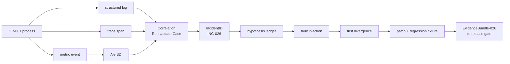
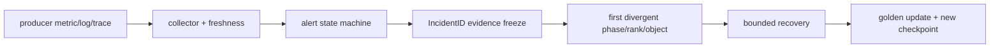

# 26장 모니터링과 디버깅: 숫자를 원인으로 바꾸는 법

25장의 `SafetyDecision-025`는 출시 허가가 아니다. 그 판정이 production과 같은 경로에서 지속되는지 볼 수 있어야 27장의 promotion 심사로 넘어간다. 이 장은 GR-001의 학습·평가·안전 신호를 공통 `RunID/UpdateID/CaseID/IncidentID`로 결합하고, 경보를 재현 가능한 회귀 fixture로 닫는다.

## 26.0 GR-001 관측 계약: 한 metric을 원인과 복구까지 운반한다



|event/state|실제 값|metric label 여부|보존 위치와 이유|
|---|---|---|---|
|`RunID`|`GR-001`|예, 저카디널리티|모든 telemetry의 실행 경계|
|`UpdateID`|`u000008`|metric에는 아니오|exemplar/trace·structured log에서 정밀 상관|
|rank|`3`|예, world size가 제한될 때|straggler·collective owner 식별|
|loss numerator/denominator|`1842.6 / 4096 tokens`|값 자체가 sample|평균을 재계산하고 mask 오류 탐지|
|safety family|`indirect-injection`|예, bounded enum|25장의 risk budget과 연결|
|`IncidentID`|`INC-026-02`|metric에는 아니오|alert→가설→조치→회귀 시험의 parent|

valid-token loss가 rank $r$에서 $(N_r,D_r)$로 관측되면 global loss는

$$L={\sum_r N_r\over\sum_r D_r}$$

이다. $\frac1R\sum_r(N_r/D_r)$와 같지 않다. throughput도 $T=\sum_r tokens_r/\Delta t$인지, 최저 rank의 step rate인지 먼저 정의한다.

|기호|instrumentation 객체|source/aggregation|
|---|---|---|
|$N_r$|`train_loss_numerator_total` delta|worker가 mask 뒤 loss 합을 counter로 기록|
|$D_r$|`train_valid_tokens_total` delta|유효 label token만 counter 증가|
|$\Delta t$|동일 update window|Prometheus scrape interval이 아니라 UpdateID 경계|
|GPU util|`DCGM_FI_DEV_GPU_UTIL`|[DCGM exporter 기본 counter 정의](https://github.com/NVIDIA/dcgm-exporter/blob/181290c399d46a9b905e083d0204348be63cb436/etc/default-counters.csv#L23-L48)|
|histogram|step duration buckets|[Prometheus Python histogram 구현](https://github.com/prometheus/client_python/blob/209834673397d48340e3b3bde6dfd4383087a359/prometheus_client/metrics.py#L577-L655)|
|trace|CPU/CUDA activity span|[PyTorch profiler schedule 경계](https://github.com/pytorch/pytorch/blob/3691693263d2b66a68867e39b7449876844e06cf/torch/profiler/profiler.py#L768-L810)|

PromQL 예시는 목적을 드러내야 한다. `sum(rate(train_loss_numerator_total[5m])) / sum(rate(train_valid_tokens_total[5m]))`는 token-weighted loss다. `max by(run_id) (step_seconds) / quantile(0.5, step_seconds)`처럼 raw gauge에 존재하지 않는 quantile을 꾸며내지 않는다. histogram이면 `histogram_quantile`과 bucket을, rank gauge면 `max/avg`와 관측 시점을 명시한다.

### 반증 실험과 27장 인계

`OBS-026-M1`은 rank 3 exporter만 멈추되 학습 process는 살려 둔다. 값 0이 아니라 `up=0`과 stale timestamp로 감시자 실패를 검출해야 한다. `M2`는 긴 sample을 한 rank에 몰아 GPU util은 높지만 collective 대기를 늘린다. trace의 collective span과 rank step skew가 최초 차이를 가리켜야 한다. `M3`는 `SampleID`를 metric label로 넣어 cardinality budget gate가 배포 전에 거부해야 한다. `M4`는 W&B alias를 재지정한다. immutable artifact digest 비교가 같은 run이라는 오판을 막아야 한다([W&B resume 시스템 시험](https://github.com/wandb/wandb/blob/367110d0f2df864e881251f678bf8c6ed649075d/tests/system_tests/test_core/test_resume.py#L15-L37)).

재현 절차는 [NaN](../playbooks/01-nan.md), [OOM](../playbooks/05-oom.md), [rank hang](../playbooks/06-rank-hang.md) 플레이북을 사용한다. 27장에는 `{EvidenceBundle-026, metric-schema revision, alert rules digest, closed IncidentID set, unresolved risk set}`을 넘긴다. 아래의 Prometheus·DCGM·W&B·profiler 심화 절은 모두 이 schema와 IncidentID를 확장하며 독립된 대시보드 설명으로 읽지 않는다.

대시보드의 수가 늘어도 원인을 좁힐 수 없다면 시스템은 관측 가능하지 않다. loss의 token 분모가 바뀌면 같은 모델도 다른 곡선을 만들고, nominal throughput은 padding 증가를 성능 향상처럼 보이게 할 수 있으며, GPU 평균은 한 rank의 지연을 숨긴다. 따라서 metric마다 먼저 분자·분모와 집계 범위를 복원하고, 그 값이 만들어진 tensor와 rank로 내려가야 숫자를 진단 근거로 쓸 수 있다.

관측성의 목적은 “현재 GPU 사용률이 몇 퍼센트인가”에 답하는 데 있지 않다. 더 중요한 질문은 **어느 학습 상태 전이가 처음 달라졌고, 그 차이가 어떤 artifact까지 전파됐으며, 어디까지 되돌려야 다시 안전한 update를 만들 수 있는가**이다. 이 질문에 답하려면 학습 loop를 단순한 반복문이 아니라 다음 사건 원장으로 읽어야 한다.

`BatchPrepared → ForwardCommitted → LossReduced → BackwardCompleted → GradientsReduced → OptimizerCommitted → SchedulerAdvanced → CheckpointPublished`

각 화살표는 metric을 기록하기 좋은 임의의 위치가 아니라 상태의 소유권이 바뀌는 경계다. `OptimizerCommitted` 전에 AMP overflow가 검출되면 parameter·optimizer·scheduler는 전진하지 않아야 한다. `CheckpointPublished`는 파일 하나가 생긴 시점이 아니라 model·optimizer·sampler·RNG와 parent generation을 함께 재개할 수 있다고 durable manifest가 선언한 시점이다. 따라서 같은 `global_step=842`라는 문자열도 microbatch 처리 횟수, 시도한 update, 실제 commit된 optimizer update, scheduler clock 가운데 무엇을 뜻하는지 밝히지 않으면 correlation key가 될 수 없다.

이 장은 다음 경로를 반복해서 사용한다.

| 독자가 묻는 질문 | 필요한 최소 증거 | 아직 결론낼 수 없는 것 |
|---|---|---|
| 값이 정말 변했는가 | metric type·unit·분자·분모·집계·freshness | 원인 component |
| 어디서 처음 달라졌는가 | 같은 UpdateID의 batch·tensor boundary·rank별 phase event | 최종 root cause |
| compute인가 통신인가 | collective input-ready 시각, enqueue·complete 시각, payload, topology | “NCCL이 느리다”는 포괄적 결론 |
| 장비 문제인가 workload 문제인가 | rank/node 교환 실험, 같은 batch control, CUDA/DCGM·host·network 동시축 | vendor나 팀의 책임 |
| 재시작해도 되는가 | last durable CheckpointID, data cursor, optimizer/scaler/RNG clock | 복구 완료 |
| 복구됐는가 | 첫 다음 batch와 첫 committed update, numerical·sample invariant, 새 checkpoint commit | 재발하지 않는다는 보장 |

이 표의 마지막 열이 중요하다. 신호는 가설을 여는 증거이지 원인 이름표가 아니다. GPU busy가 낮다는 사실은 input starvation·host synchronization·collective wait를 구분하지 못하고, NCCL kernel이 길다는 사실은 늦게 도착한 rank와 fabric 전송 지연을 구분하지 못한다. 도구가 관찰하지 못하는 영역까지 결론을 넓히지 않는 것이 디버깅의 첫 규칙이다.

## 26.1 관측 신호를 학습 상태 전이로 되돌린다

dashboard의 숫자를 원인으로 취급하지 않고 BatchID, UpdateID, checkpoint와 collective가 만든 상태 변화의 관측값으로 읽는다.

### 한 update에 붙이는 상태 좌표

운영 로그와 trace에는 적어도 `(RunID, AttemptID, WorldGeneration, UpdateID, MicrobatchID, Rank, ProcessGeneration)`을 기록한다. 이 중 metric label에는 cardinality가 제한된 값만 남기고, MicrobatchID·batch digest·stack 같은 고카디널리티 좌표는 exemplar가 가리키는 structured event에 둔다. hostname은 identity가 아니다. elastic restart 뒤 같은 rank가 다른 GPU에 놓일 수 있으므로 `(rank ↔ process ↔ GPU UUID ↔ NIC ↔ node)` mapping을 시간 구간별 inventory edge로 보존한다.

학습 event producer는 값뿐 아니라 전이 결과를 기록한다. 예를 들어 AMP update 사건은 `scale_before`, `found_inf`, `optimizer_committed`, `scale_after`, `scheduler_advanced`를 같은 UpdateID에 묶는다. `loss=NaN`만 남기면 NaN이 forward에서 생겼는지, backward에서 overflow가 생겨 update가 건너뛰었는지, logging reduction이 잘못됐는지 알 수 없다. checkpoint 사건도 `Writing → Validating → Committing → Published`를 분리하고 generation·parent·digest를 남긴다.

### 최초 불일치가 원인 탐색의 기준점이다

장애가 보인 마지막 위치에서 거꾸로 추측하지 말고, 정상 control과 문제 run을 동일한 사건 좌표로 정렬해 최초로 달라진 행을 찾는다. 다음 표는 한 update의 축약된 예다.

| Update 842의 경계 | 정상 | 문제 | 판정 |
|---|---:|---:|---|
| loss-bearing tokens | 131,072 | 131,072 | workload 분모 동일 |
| forward complete, max rank | 94 ms | 95 ms | forward는 반증 근거 |
| backward input-ready, rank 7 | 277 ms | 508 ms | **최초 시간 불일치** |
| collective complete, peer ranks | 325 ms | 556 ms | 선행 지연이 노출됨 |
| optimizer commit | 338 ms | 569 ms | 후속 증상 |

이 경우 collective duration graph만 보면 통신 장애처럼 보이지만 최초 차이는 rank 7의 collective 진입 전이다. rank 7의 직전 CUDA kernel·host callback·PCIe/NUMA 경로를 연다. 반대로 모든 rank가 거의 동시에 collective에 들어갔는데 completion만 늘고 payload·algorithm은 같으며 특정 fabric counter와 retry가 함께 변했다면 network 가설이 살아남는다. “최초”는 wall-clock 한 점을 맹신한다는 뜻이 아니다. node clock offset을 통제하고 logical sequence, CUDA event와 monotonic clock을 함께 사용한다.

### 경보에서 회귀 fixture까지 닫히는 사건 흐름

관측 운영은 다음 상태 머신으로 닫는다.

`Alerted → Triaged → Contained → EvidenceFrozen → FirstDivergenceLocated → HypothesisDiscriminated → Recovered → Verified → FixturePromoted`

| 상태 | 반드시 남길 것 | 다음 상태로 갈 조건 |
|---|---|---|
| Alerted | exact rule revision, query window, firing series, sample freshness | 관측 backend 장애와 실제 학습 이상을 구분함 |
| Triaged | 영향 RunID·rank·UpdateID·CheckpointID, blast radius | hard invariant 위반 여부와 owner 후보를 좁힘 |
| Contained | checkpoint publication·artifact promotion·자동 삭제의 중지 여부 | 증거와 last good generation을 보호함 |
| EvidenceFrozen | metric snapshot, structured log, short trace, topology/config/source digest | 재시작이 원시 증거를 덮지 않음 |
| FirstDivergenceLocated | 정상/문제 사건의 첫 다른 state·tensor·rank | 후속 증상과 분리됨 |
| HypothesisDiscriminated | 가설별 예상 관측, 반증 query, 최소 차이 실험 | 적어도 하나의 경쟁 가설을 실제로 기각함 |
| Recovered | 선택 checkpoint, fenced old process, 복원된 state clocks | job이 실행을 재개함 |
| Verified | 첫 batch·첫 committed update·새 durable checkpoint의 invariant | 단순한 process 생존을 넘어 의미가 복원됨 |
| FixturePromoted | 최소 synthetic fault, expected first signal, recovery assertion | 같은 failure family가 release gate에 편입됨 |

`Recovered`와 `Verified`를 합치지 않는다. process가 다시 움직여도 sampler cursor가 되감겨 batch가 중복됐거나, optimizer는 step 842인데 scheduler만 843에서 시작했거나, incomplete checkpoint를 읽었다면 복구가 아니다. 사건을 닫는 마지막 산출물은 RCA 문서가 아니라 같은 결함을 다시 주입했을 때 최초 신호와 안전한 복구를 자동 판정하는 fixture다.

**먼저 보는 결정 트리**

```text
경보 발생
├─ metric freshness·scrape·rule evaluation이 비정상인가?
│  ├─ 예: observability incident로 분리하고 durable event ledger로 우회
│  └─ 아니오: 학습 상태를 조사
├─ hard invariant가 깨졌는가?  (non-finite, rank progress 정지, commit 불완전)
│  ├─ 예: publication 중지 → 증거 동결 → last durable generation 확인
│  └─ 아니오: workload-normalized 성능·품질 drift 조사
├─ 같은 batch·shape·state clock에서도 재현되는가?
│  ├─ 아니오: data/curriculum/sampler/packing 분기
│  └─ 예: host wait와 device critical path를 분리
├─ 한 rank만 늦는가?
│  ├─ 예: late-arrival 이전 phase → rank/node swap → topology·hardware 대조
│  └─ 아니오: 공통 input/storage/runtime/config 변경 대조
└─ 수정 뒤 첫 다음 update와 checkpoint commit이 모두 검증됐는가?
   ├─ 아니오: incident를 닫지 않음
   └─ 예: regression fixture와 release gate로 승격
```

결정 트리의 각 분기는 query가 아니라 **분리 실험**으로 끝나야 한다. 예컨대 rank를 다른 node로 옮기는 실험에서 이상이 logical rank를 따라가면 workload·control-flow 후보가 강해지고, physical GPU/NIC를 따라가면 장비·runtime 후보가 강해진다. 다만 배치와 topology까지 동시에 바꾸면 두 효과를 다시 분리할 수 없으므로 한 번에 하나의 상태만 바꾼다.

## 26.2 metric 분모와 도구의 관찰 범위를 고정한다

loss, throughput, utilization과 error rate의 분자·분모·시간창을 적고 Prometheus, W&B, DCGM, profiler와 trace가 볼 수 있는 범위를 나눈다.

### loss와 gradient

train loss 옆에 유효 label 수, modality/task별 contribution, accumulation microbatch 수를 기록한다. gradient norm은 clip 전·후와 parameter group별로 나눈다. AMP에서는 scale, overflow, skipped step을 같이 보지 않으면 평평한 loss를 optimizer 정체로 오판한다.

### throughput과 memory

nominal tokens는 `batch×sequence`이고 actual tokens는 padding을 뺀 수, loss-bearing tokens는 ignore label을 뺀 수다. 세 값을 모두 낸다. memory는 allocated, reserved, active, inactive split과 peak 시점을 구분한다. OOM 직전 snapshot 없이는 “모델이 커서”라는 결론을 내리지 않는다.

### 평균 loss가 만들어지는 정확한 순서

분산 학습에서 `loss=2.1`은 적어도 네 가지 뜻을 가질 수 있다. 각 rank가 자기 유효 token으로 평균한 뒤 rank 평균을 낼 수도 있고, 모든 rank의 loss 합과 유효 token 합을 각각 all-reduce한 뒤 나눌 수도 있다. sequence별 평균을 먼저 내고 batch 평균을 낼 수도 있으며, microbatch loss를 accumulation 횟수로만 나눌 수도 있다. 길이가 다르면 네 값은 같지 않다.

rank `r`의 token loss 합을 `S_r`, 유효 token 수를 `M_r`라 하자. 우리가 원하는 global token mean은 `L=(Σ_r S_r)/(Σ_r M_r)`다. `mean_r(S_r/M_r)`는 `M_r`가 모두 같을 때만 같다. 마지막 partial batch, multimodal mask, packed response-only SFT에서는 이 조건이 쉽게 깨진다. metric exporter에는 numerator와 denominator를 별도 counter로 내고 대시보드에서 ratio를 만든다. 그래야 집계 window가 달라도 의미가 보존된다.

gradient norm도 마찬가지다. FSDP shard의 local norm 평균은 full parameter norm이 아니다. 제곱합을 reduce한 뒤 제곱근을 취하는지, clipping 함수가 이미 global norm을 반환하는지 구현을 확인한다. clipping 전 norm, clipping coefficient `min(1,c/(||g||+ε))`, clipping 후 norm을 같은 optimizer step ID에 붙인다.

**처리량의 세 시계.**

optimizer step/s는 accumulation과 batch가 바뀌면 비교할 수 없다. sample/s는 sequence 길이를 숨긴다. nominal token/s는 padding을 유용한 계산처럼 센다. 따라서 다음 세 값을 함께 낸다.

`nominal = global_batch × padded_length / step_seconds`

`nonpad = Σ attention_mask / step_seconds`

`loss_bearing = Σ(label≠ignore) / step_seconds`

MoE라면 routed token과 dropped token, diffusion이라면 latent element와 model evaluation 수를 추가한다. throughput이 20% 올랐는데 loss-bearing token/s가 그대로라면 padding이나 denominator가 변한 것일 수 있다. 반대로 activation checkpointing으로 step/s가 내려가도 더 큰 batch가 가능해 time-to-target이 좋아질 수 있다. 운영 목표는 peak throughput이 아니라 정해진 품질에 도달하는 GPU-hour다.

**도구의 관찰 범위**

**Nsight와 PyTorch profiler**

Nsight Systems는 CPU API, CUDA stream, kernel, memcpy, NCCL의 시간 관계를 본다. Nsight Compute는 선택한 kernel의 counter를 깊게 본다. 전체 run에 NCU를 걸어 overhead를 만든 뒤 production throughput이라 부르지 않는다. profiler schedule과 수집 rank를 manifest에 기록한다.

**DCGM·Prometheus·W&B**

DCGM은 장비 health, ECC, XID, NVLink counter를 제공하지만 model loss의 의미를 모른다. Prometheus label에 `sample_id`를 넣으면 cardinality 폭발이 난다. run/rank/node/model revision처럼 제한된 label만 metric에 두고 높은 cardinality identity는 log/trace에 둔다. W&B resume에는 stable run ID와 checkpoint step을 연결한다.

**네 도구를 한 시간축에 놓는다**

W&B의 step 842가 느렸다는 사실만으로는 kernel인지 network인지 알 수 없다. training log에는 `RunID`, optimizer step, monotonic timestamp를 기록한다. Prometheus에는 node/rank의 wall clock metric을, Nsight trace에는 NVTX range로 같은 step을, checkpoint manifest에는 마지막 durable step을 기록한다. clock skew가 있는 노드는 NTP/PTP 상태와 offset을 사건 기록에 넣는다.

예를 들어 trace가 다음처럼 보인다고 하자.

```text
rank0 step=842 data=18ms fwd=92ms bwd=181ms allreduce=46ms opt=12ms
rank7 step=842 data=17ms fwd=93ms bwd=412ms allreduce=47ms opt=12ms
DCGM rank7: XID=0, SM_ACTIVE=99%, PCIE_REPLAY rising
Nsight rank7: one GEMM 227ms longer, NCCL starts late
```

모든 rank의 NCCL duration은 비슷하지만 rank7이 collective에 늦게 도착했다. 이 경우 NCCL을 원인으로 부르면 안 된다. rank7의 긴 backward kernel과 PCIe replay를 먼저 조사한다. 반대로 모든 rank가 같은 시각 NCCL 안에서 멈추고 한 rank의 마지막 collective sequence가 다르면 control-flow 불일치가 우선이다.

**Prometheus metric 설계.**

counter는 누적 token·sample·OOM·skipped step처럼 단조 증가하는 사건에, gauge는 memory·LR·queue depth처럼 오르내리는 상태에, histogram은 step/collective/checkpoint latency 분포에 쓴다. counter의 `rate()`와 gauge의 차분을 혼동하지 않는다. histogram bucket은 관측하려는 SLO 주위에 촘촘해야 한다.

```python
TRAIN_TOKENS.labels(run=run_id, rank=rank).inc(valid_tokens)  # sample ID를 label로 넣지 않는다.
STEP_SECONDS.labels(run=run_id, rank=rank).observe(step_seconds)
NONFINITE.labels(run=run_id, group=param_group).inc(nonfinite_count)
```

metric의 `run` label도 무한히 쌓이면 cardinality가 된다. 짧은 retention의 live metric과 장기 보존할 run summary를 분리한다. 원시 sample identity와 tensor checksum은 object storage의 사건 bundle에 둔다.

**W&B resume가 학습 resume를 뜻하지 않는 이유.**

W&B가 같은 run ID에 chart를 이어 그려도 model·optimizer·sampler가 같은 checkpoint에서 재개됐다는 증거는 아니다. logging step이 겹치거나 이전 run의 마지막 point 뒤에 다른 branch가 붙을 수 있다. W&B run metadata에 `CheckpointID`, parent, code/config digest를 기록하고, resume 직후 별도 event로 first batch ID와 LR을 남긴다. UI의 매끈한 선보다 manifest의 parent edge를 신뢰한다.

## 26.3 signal에서 가설·반증·recovery까지 사건을 닫는다

경보에서 시작해 최소 차이 실험, 원인 owner, 복구 action과 재발 방지 test가 같은 IncidentID에 속하도록 한다.

### IncidentID

alert가 울리면 `IncidentID`를 만들고 최초 이상 timestamp, affected ranks, metric query, log slice, 추적 산출물, topology, last good checkpoint를 묶는다. RCA는 추정이 아니라 가설·반증·최초 divergence를 기록한다.

### alert 설계

단일 threshold보다 rate, duration, rank spread를 함께 본다. GPU utilization 저하는 input starvation, collective wait, CPU stall 모두 가능하다. `max(rank step time)-min(rank step time)`과 collective duration을 함께 보아 첫 분기를 정한다.

### 결정 트리: 느린 step

첫째, loss-bearing token 수가 변했는지 본다. 변했다면 workload drift다. 같다면 rank step-time spread를 본다. spread가 작고 모두 느리면 공통 storage, scheduler, thermal/power, 새 kernel을 본다. spread가 크면 가장 느린 rank의 data wait와 CUDA busy를 나눈다. data wait가 길면 dataloader/storage/CPU affinity, CUDA busy가 길면 kernel shape와 clock, busy가 낮은데 collective가 길면 communicator/network를 본다.

각 분기는 반증 조건을 가져야 한다. “network가 느리다”는 가설은 collective bytes가 같고 특정 link counter·retry가 증가하며 작은 synthetic collective에서도 재현될 때 살아남는다. application compute가 늦게 collective에 진입했다면 기각한다.

**alert에서 recovery까지의 상태 머신.**

`Detected→Contained→EvidenceFrozen→Hypothesis→Reproduced→Recovered→Verified`를 사용한다. Contained는 새 checkpoint publication과 자동 삭제를 멈추는 단계다. EvidenceFrozen은 metric query 범위, logs, trace, checkpoint generation을 immutable bundle로 묶는다. Recovered는 job이 다시 돈다는 뜻이고, Verified는 sample stream과 numerical tolerance까지 확인했다는 뜻이다. 둘을 합치면 조용한 중복 학습을 놓친다.

**실패 주입은 경보가 아니라 상태 계약을 시험한다**

실패 주입의 합격 조건을 “alert가 울렸다”로 두면 절반만 시험한 셈이다. 주입점, 최초로 깨져야 할 invariant, 허용되는 자동 행동, 보존할 증거, 복구 뒤 첫 유효 상태를 한 행에 고정한다. 실제 production 원문이나 대형 GPU run이 없어도 counter reset·metric gap·잘못된 denominator·중복 event·partial manifest 같은 제어면 결함은 synthetic event stream으로 검증할 수 있다. GPU·fabric 고장이 필요한 항목은 실행 환경과 결과를 분리해 `NotExecuted`로 남긴다.

| 주입점 | 예상 최초 신호 | 잘못된 판정 | 복구 인수 조건 | 회귀 fixture |
|---|---|---|---|---|
| 한 microbatch의 empty loss mask | contributing token 분모 0, update 미commit | loss 0을 정상으로 기록 | sampler 정책에 따른 skip과 모든 clock 정렬 | empty/non-empty rank 혼합 reduction |
| AMP 전 gradient에 `Inf` | `found_inf`와 skipped optimizer commit | clipping으로 정상화됐다고 간주 | parameter·optimizer·scheduler가 모두 미전진 | scaler overflow와 다음 정상 update |
| dataloader worker 지연 | queue residence 증가 뒤 consumer wait | 낮은 GPU busy를 장비 고장으로 분류 | batch lineage 보존, bounded retry·quarantine | 느린 decode row와 queue 회복 |
| 한 rank의 collective 호출 누락·순서 변경 | rank별 progress sequence 불일치 | network bandwidth 저하로 분류 | stale rank fencing, 같은 collective sequence로 재개 | 최소 2-rank control-flow fixture |
| checkpoint completion marker 이전 중단 | generation이 `Published`에 도달하지 못함 | 존재하는 shard를 최신 checkpoint로 선택 | last durable parent에서 다음 UpdateID가 연속 | partial shard·stale marker 조합 |
| exporter counter reset·scrape 누락 | process generation/reset/freshness 이상 | 처리량 급락 또는 값 0으로 해석 | event ledger와 series 증가량 reconciliation | reset·missing·duplicate series rule test |
| label 값의 무한 증가 | active series·scrape/remote-write backlog 증가 | backend 증설만으로 해결 | offending producer 격리, bounded schema 복원 | 매 event 새 label을 만드는 exporter |

주입은 관측 대상의 실행 경로를 바꿀 수 있다. `CUDA_LAUNCH_BLOCKING`, anomaly detection, full profiler와 tensor dump는 원인 위치를 좁히는 별도 debug run에만 사용하고 그 run의 처리량을 성능 근거로 쓰지 않는다. fault를 넣은 정확한 소스/config revision과 cleanup을 기록해 다음 정상 run에 fault가 잔류하지 않게 한다.

**evidence bundle은 다시 계산할 수 있어야 한다**

IncidentID 아래에 screenshot만 모으지 않는다. 최소 bundle은 다음 질문에 답할 수 있어야 한다.

- 경보: rule·recording rule·data소스 리비전, exact query, 평가 시각과 firing series는 무엇인가.
- 상태: RunAttempt·WorldGeneration·UpdateID별 expected/observed event와 마지막 durable CheckpointID는 무엇인가.
- workload: contributing tokens, sequence/modality bucket, batch digest와 sampler cursor가 정상 control과 같은가.
- 실행: rank별 phase와 collective input-ready/enqueue/complete, CUDA stream, host thread와 network path를 어떻게 맞췄는가.
- 장비: GPU UUID·driver/CUDA/NCCL·clock/power/ECC/XID, PCIe/NVLink/NIC mapping과 metric freshness는 무엇인가.
- 소스: producer symbol·config branch·loaded binary digest와 관련 fixture가 설치 revision에 맞는가.
- 복구: 선택한 parent generation, fencing, 첫 batch·첫 committed update·새 checkpoint의 검증 결과는 무엇인가.

bundle의 raw counter에서 보고서의 loss와 throughput을 다시 계산할 수 없다면 보고서가 맞더라도 인수하지 않는다. 접근 제한 때문에 원시 batch·trace를 한곳에 복사할 수 없다면 digest와 재현 가능한 secure query를 남긴다. “증거가 존재한다”와 “다음 교대자가 읽고 검산할 수 있다”는 서로 다른 조건이다.

**시간 예산별 triage**

**5분**

변경 배포를 멈추고 run/config/checkpoint를 보존한다. loss denominator, skipped step, alive rank, disk space, XID를 본다. 자동 재시작이 증거를 덮어쓰지 않게 한다.

**30분과 반나절**

30분에는 한 golden batch·한 rank·한 layer로 축소해 data/model/numeric/distributed/storage를 분기한다. 반나절에는 profiler와 failure injection으로 가설을 재현하고 recovery checkpoint의 sample/numerical equivalence를 판정한다.

**소스 좌표를 읽는 순서**

PyTorch 고정 revision `3691693263d2b66a68867e39b7449876844e06cf`에서는 profiler schedule과 memory snapshot 구현을 먼저 읽고, 실제 설치 버전과 revision이 같은지 확인한다. OLMo-core `b7e9671d7ea48af94838c4f124703c3ae36f0c70`과 TorchTitan `b482babc5f1d5d718e1719a735f9a2d86d1b9aff`에서는 metric reduction과 유효-token validation 분모를 비교한다. NCCL RAS는 unresponsive와 async error를 원인명이 아니라 관측 상태로 읽는다. 소스가 말하는 계약, upstream test가 검증한 분기, 현장 trace에서 관찰한 결과를 한 문장에 섞지 않는다.

**실행 여부와 증거 등급.**

이 장의 metric 식과 상태 분리는 코드·공식 문서에서 확인한 계약이다. 그러나 특정 GPU에서의 counter 값과 alert threshold는 workload 의존적이다. 로컬 trace bundle이 없는 수치는 `실행 예정`으로 남긴다. 독자는 threshold를 복사하지 말고 정상 run의 분포에서 warning과 page 기준을 정한다.

**이 장이 넘기는 것.** `IncidentID`, alert query, trace/log bundle, RCA와 recovery `CheckpointID`를 27·29장에 넘긴다.

## 26.4 PromQL과 trace로 병목의 시간·rank 소유자를 가른다

집계 query의 분모를 손 계산하고 trace와 profiler로 평균 뒤에 숨은 critical path와 straggler rank를 찾는다.

exporter가 `train_contributing_tokens_total`과 `train_optimizer_step_seconds_total`을 단조 counter로 내보낸다고 하자. job 전체 유효 token 처리량은 다음처럼 같은 window의 증가율을 합산해 구한다. data parallel rank는 서로 다른 token을 소유하지만 tensor-parallel rank는 같은 token을 복제하므로 exporter 단계에서 `token_owner="true"`인 rank만 세게 한다.

```promql
sum by (run_id) (
  rate(train_contributing_tokens_total{token_owner="true"}[5m])
)
```

step 시간 counter를 token 분모로 다시 나누지 않는다. 처리량은 token/time이고 위 counter의 rate 자체가 token/s다. `optimizer_steps_total` rate를 함께 그리면 accumulation이나 긴 sequence 때문에 token/s와 update/s가 다른 방향으로 움직이는 이유를 볼 수 있다. missing owner rank가 있으면 합이 낮아지므로 expected owner count를 별도 alert로 확인한다.

counter reset 직후 짧은 window는 불안정할 수 있다. `resets()`로 restart를 annotation하고 scrape lag와 process start time을 함께 본다. 새 process가 같은 RunID로 잘못 합류해 old/new series가 겹치면 합이 부풀 수 있으므로 process generation label은 제한된 cardinality로 둔다.

### PromQL: loss를 올바르게 집계한다

loss exporter는 `train_loss_numerator_total`과 `train_loss_tokens_total`을 같은 optimizer commit event에서 증가시킨다. global token-weighted loss는 rank별 local mean의 평균이 아니라 두 rate 합의 비율이다.

```promql
sum(rate(train_loss_numerator_total[5m])) by (run_id)
/
clamp_min(sum(rate(train_loss_tokens_total[5m])) by (run_id), 1)
```

분모가 0인 구간을 1로 바꾸면 값 0처럼 보일 수 있으므로 별도의 `train_loss_tokens_total` rate와 empty-mask alert를 반드시 함께 표시한다. dashboard의 시각적 편의를 의미 있는 0으로 오해하지 않는다. evaluation phase와 training phase가 같은 metric을 쓰면 `phase` enum으로 분리한다.

loss spike alert는 비율뿐 아니라 numerator와 denominator 변화 조건을 annotation한다. denominator가 baseline의 20% 아래면 `small_denominator`, numerator만 급증하면 `high_loss_sum` 분기로 보낸다. 두 분기는 offending batch를 다르게 조사한다. recording rule test에는 분모 0, counter reset, 한 rank 누락과 서로 다른 rank token 수를 넣는다.

### PromQL: straggler와 skew

rank별 step duration을 histogram이나 gauge로 관측했다면 한 시점의 `max-min`만 보지 않고 같은 committed optimizer step을 맞춘다. exporter가 `train_last_step_duration_seconds`와 `train_last_committed_step`을 낸다면 step label을 만들지 않고 structured log/exemplar로 exact join을 보완한다. Prometheus는 고카디널리티 step ID 저장소가 아니다.

5분 window의 rank별 p95를 구하고 job 내 최대/중앙값 비율을 recording rule로 만든다. 최대가 1.5배를 넘고 collective wait도 증가하면 slow rank를 연다. 그러나 rank의 step sample 수가 다르면 quantile 비교가 왜곡되므로 count rate를 확인한다.

```promql
max by (run_id) (train_rank_step_p95_seconds)
/
clamp_min(quantile by (run_id) (0.5, train_rank_step_p95_seconds), 0.001)
```

실제 rule에서는 precomputed gauge의 생성 계약을 문서화하거나 원 histogram에서 계산한다. rank median이 아니라 p95의 중앙값이라는 의미를 명시한다. 이 query는 straggler 존재를 알려줄 뿐 compute·data·network 원인을 판정하지 않는다.

### PromQL: GPU와 학습 신호 결합

GPU busy가 낮고 data wait가 높은 상태를 탐지하려면 서로 다른 exporter의 label을 GPU UUID 또는 node/rank inventory로 join해야 한다. 문자열 rank가 우연히 같다는 이유로 join하지 않는다. inventory recording rule이 `run_id,rank,gpu_uuid` mapping을 제공해야 한다.

```promql
(avg_over_time(train_data_wait_ratio[10m]) > 0.30)
and on (run_id, rank)
(avg_over_time(gpu_sm_active_ratio[10m]) < 0.55)
```

metric 이름은 설치한 DCGM exporter의 실제 field mapping에 맞춰 소스 원장에 고정한다. unsupported field나 scrape failure는 비교에서 사라질 수 있으므로 `absent`와 target health를 별도 경보한다. `and` 결과가 없다는 사실을 정상으로 읽지 않는다.

반대로 SM active가 높고 처리량이 낮으면 memory-bound, spin, 긴 kernel과 shape 증가를 후보로 둔다. DRAM/tensor activity, clock과 Nsight trace가 다음 증거다. PromQL 하나로 kernel bottleneck을 확정하지 않는다.

**histogram과 p99의 함정.**

rank별 histogram bucket을 job 전체로 합칠 때 `le` label을 유지한 채 rate를 합친다. bucket을 먼저 quantile로 바꾸고 rank 결과를 평균하면 global distribution이 아니다. sample이 request인지 step인지도 명시한다. batch마다 token 수가 다른 step latency p99는 사용자 token latency와 다르다.

bucket 경계가 `[0.25,0.5,1,2,+Inf]`이고 대부분 step이 0.8~1.1초면 p99 변화가 거칠게 보인다. baseline과 SLO 근처에 더 촘촘한 bucket을 둔다. native histogram을 사용한다면 schema와 Prometheus version을 소스 명세서에 남긴다.

tail alert에는 sample count 하한을 둔다. 새 job의 세 step으로 계산한 p99는 안정적이지 않다. warm-up과 compile phase를 별도로 태깅하고 steady sample 수가 채워진 뒤 gate를 활성화한다. tail이 나빠졌어도 어떤 rank와 trace exemplar가 기여했는지 이동할 수 있어야 한다.

**trace 사례로 병목의 소유자를 가른다**

정상 step은 CPU collate 18ms, H2D 12ms와 GPU forward가 overlap된다. 문제 step에서 worker 하나의 decode가 640ms 걸리고 prefetch queue가 0이 되면 GPU stream에 590ms 빈 구간이 나타난다. DCGM SM active도 같은 window에서 내려가지만 원인은 GPU가 아니다.

structured log에서 slow sample의 media type, byte size와 cache hit를 비식별 bucket으로 확인한다. 특정 corrupted image decoder retry가 원인이라면 timeout row를 skip하는 정책이 distribution을 바꾸는지 본다. retry 횟수와 worker queue wait를 numerator/denominator로 기록한다.

수정은 decoder timeout, quarantine 또는 preprocessing일 수 있다. fix 뒤 synthetic slow fixture가 예상 error로 빠지고 queue가 bounded recovery하는지 확인한다. [OOM playbook](../playbooks/05-oom.md)과 혼동하지 않도록 host RSS와 GPU allocation이 안정적이라는 반증도 RCA에 넣는다.

**trace 사례: hidden synchronization**

logging callback이 매 microstep `loss.item()`을 호출하면 device 결과를 CPU로 가져오며 stream synchronization이 생길 수 있다. trace에는 반복되는 CUDA synchronize와 CPU wait가 보이고 kernel 사이 overlap이 줄어든다. 로그 빈도를 낮추거나 device-side numerator를 accumulation 끝에 reduce하는 ablation으로 확인한다.

정상과 문제 run에서 같은 batch/dtype, profiler-off 반복 median을 비교한다. callback을 끄자 빨라졌다는 사실만으로 끝내지 않고 source 좌표에서 `.item()` 호출과 실행 조건을 고정한다. metric 값과 step alignment가 변경 뒤에도 맞는지 golden exporter fixture를 실행한다.

동기화 제거가 error reporting을 늦출 수 있다. non-finite detection과 loss logging을 서로 다른 주기로 설계하고 hard invariant는 필요한 경계에서 유지한다. 빠른 비동기 logging이 잘못된 step에 값을 붙이지 않도록 event와 optimizer commit을 연결한다.

**trace 사례: collective가 범인이 아닐 때**

Nsight에서 모든 rank의 NCCL kernel이 길어 보여도 시작 시각을 비교한다. rank 5가 180ms 늦게 collective에 들어오고 나머지가 일찍 들어왔다면 NCCL duration에는 대기 시간이 포함된다. rank 5의 직전 fused optimizer kernel이 재컴파일로 느렸다면 compiler/cache branch가 최초 원인이다.

collective bytes, algorithm과 fabric counter가 정상이라는 반증을 수집한다. rank 5를 다른 node로 옮겼을 때 logical rank를 따라가면 workload/control flow, node를 따라가면 hardware/runtime 가설이 강하다. 29장의 [rank hang playbook](../playbooks/06-rank-hang.md)으로 sequence와 선행 range를 넘긴다.

RCA에는 “NCCL 400ms”와 “exposed communication 220ms, late arrival 180ms”를 구분한다. 최적화 우선순위도 달라진다. network tuning보다 compiler warm-up과 graph break 제거가 먼저다.

**trace 사례: allocator retention**

step 1의 active memory가 40GB이고 매 100 step마다 0.5GB씩 오르지만 reserved는 60GB로 일정하다고 하자. callback이 evaluation tensor를 Python list에 저장해 graph reference를 유지하면 active block이 해제되지 않는다. allocator snapshot의 allocation stack과 object lifetime을 비교한다.

`empty_cache`로 reserved를 줄여도 살아 있는 tensor는 사라지지 않는다. batch 감소로 OOM을 미루는 것도 원인 수정이 아니다. callback에서 detach·CPU 요약만 보존하고 두 evaluation cycle 뒤 active memory가 baseline으로 돌아오는지 확인한다.

raw activation/gradient dump는 개인정보와 저장 폭발 위험이 있다. 필요한 tensor shape·dtype·norm과 stack만 먼저 저장하고 exact tensor는 synthetic fixture에서만 쓴다. [OOM playbook](../playbooks/05-oom.md)에 leak slope, first owner와 regression window를 넘긴다.

**trace 사례: thermal throttling.**

긴 run 3시간 뒤 rank 2 step이 15% 느려지고 GPU temperature, throttle reason과 clock이 함께 변했다고 하자. workload token 길이와 kernel sequence가 같은지 확인한 뒤 power/thermal state를 비교한다. fan·airflow와 neighboring workload event도 node 기록에 넣는다.

GPU를 식힌 재실행과 logical rank swap으로 문제가 device/node를 따라가는지 본다. application clock이나 power cap의 accidental setting도 확인한다. 단 한 번의 온도 상관으로 hardware를 교체하지 않는다. 반복 incident와 vendor diagnostic을 함께 사용한다.

자동 node drain threshold는 XID/ECC 같은 강한 signal과 단순 온도 경고를 구분한다. drain 뒤 29장의 topology manifest가 바뀌므로 recovered run의 performance baseline을 새로 확인한다.

**W&B chart의 통계 함정.**

서로 다른 seed run의 smoothed loss line을 눈으로 비교하면 window와 missing step이 차이를 숨긴다. raw history를 optimizer step 또는 tokens seen으로 맞추고 동일 evaluation checkpoint를 비교한다. smoothing 설정은 시각화일 뿐 원 수치가 아니다.

best run만 남기면 selection bias가 생긴다. sweep의 전체 trial, early-stop rule, failed/OOM run과 primary metric을 보존한다. failed run을 제외한 평균과 전체 resource/error rate를 분리한다. hyperparameter 탐색에 사용한 evaluation set은 최종 holdout이 아니다.

chart panel의 group-by가 display name인지 immutable config인지 확인한다. 같은 이름의 재개·fork가 섞일 수 있다. RunID와 parent checkpoint digest를 table에서 검산하고 summary metric이 raw row의 마지막 값인지 best 값인지 정의한다.

## 26.5 관측 계층의 실패와 장기 운영 계약을 검증한다

metric 누락, label 폭증, clock skew와 exporter 지연을 주입해 관측 시스템이 학습 장애를 만들거나 숨기지 않는지 본다.

exporter process를 종료하고 dashboard가 GPU utilization 0이 아니라 `no data`와 collector health failure를 표시하는지 본다. scrape target이 살아 있지만 특정 field 수집만 실패하는 경우도 주입한다. unsupported와 transient error를 metric metadata 또는 log로 구분한다.

exporter가 높은 CPU를 사용하거나 scrape가 길어질 때 training host에 간섭하지 않도록 resource limit와 scrape timeout을 둔다. timeout으로 일부 series만 누락되면 join query의 결과가 조용히 사라질 수 있다. expected GPU UUID count와 sample age를 recording rule로 검사한다.

복구 뒤 누적 hardware counter의 reset 여부와 series identity를 확인한다. old/new exporter가 같은 GPU를 중복 report하지 않게 process generation과 target inventory를 정리한다. fault 결과를 26장의 관측 backend incident type으로 남긴다.

### 경보의 precision과 recall

지난 incident를 replay해 alert가 몇 건을 잡고 정상 window에 몇 번 울리는지 계산한다. 그러나 historical incident만 최적화하면 새 failure를 놓칠 수 있으므로 synthetic fault matrix와 실제 운영 표본을 결합한다. severity별 false negative 비용이 다르다.

NaN·checkpoint corruption은 hard invariant로 높은 recall을 요구하고, mild throughput regression은 지속 window와 human triage로 precision을 높일 수 있다. 하나의 종합 alert score로 합치지 않는다. detector revision별 confusion table과 query를 보존한다.

threshold 변경은 detector calibration run이다. old/new를 shadow로 비교하고 incident owner가 missed/false case를 review한다. alert volume 감소가 관측력 향상을 뜻하지 않는다. silence와 dedup으로 사라진 page도 raw event에서는 집계한다.

### 운영 인계 훈련

새 담당자에게 dashboard 설명 없이 IncidentID bundle만 주고 30분 안에 최초 divergence와 next playbook을 선택하게 한다. 어느 field를 찾지 못했는지, source 좌표와 query가 이해 가능한지 기록한다. 원 담당자의 머릿속 지식에 의존한 단계는 runbook에 보강한다.

훈련 사건은 data stall, hidden sync, rank late arrival와 partial checkpoint를 섞지 않고 하나씩 주입한다. 숙련 뒤에는 두 신호가 동시에 나타나는 합성 사건으로 가설 우선순위를 시험한다. 정답 맞히기보다 지지·반박 증거와 안전한 다음 행동을 평가한다.

최종적으로 담당자는 [단일 GPU lab](../labs/28-single-gpu-golden-lab.md)과 [멀티노드 lab](../labs/29-multinode-failure-lab.md)의 evidence bundle을 열어 recovery assertion까지 확인한다. 이 훈련이 통과해야 모니터링 체계가 특정 개인이 아니라 조직에 재현된다.

### PromQL: checkpoint freshness

checkpoint exporter가 마지막 complete optimizer step과 현재 step을 gauge로 내면 두 값의 차이로 replay exposure를 본다. wall-time freshness도 marker publish timestamp에서 계산한다. current step gauge가 restart로 뒤로 가는 경우 membership generation을 확인한다.

```promql
max by (run_id) (train_current_optimizer_step)
-
max by (run_id) (train_last_complete_checkpoint_step)
```

rank별 current step이 다르면 max 하나로 숨기지 않고 spread alert를 먼저 낸다. checkpoint save가 진행 중이라는 이유로 complete gauge를 미리 올리지 않는다. marker가 publish된 뒤에만 갱신한다.

freshness budget은 step time과 failure cost를 반영한다. 500 step 차이도 짧은 toy run과 긴 RL rollout에서 의미가 다르다. tokens/replay와 wall time을 함께 기록한다. [partial checkpoint playbook](../playbooks/09-partial-checkpoint.md) 링크를 alert annotation에 둔다.

**PromQL: AMP skip 비율.**

`optimizer_updates_attempted_total`과 `optimizer_updates_committed_total`의 차이는 overflow나 다른 skip을 포함한다. 이유별 counter를 별도로 두고 committed/attempted denominator를 명시한다.

```promql
1 - (
  sum(rate(optimizer_updates_committed_total[10m])) by (run_id)
  /
  clamp_min(sum(rate(optimizer_updates_attempted_total[10m])) by (run_id), 1e-9)
)
```

warm-up의 scale 조정에서 소수 skip은 정상일 수 있지만 지속 상승과 loss/gradient non-finite를 함께 본다. scheduler가 attempted가 아니라 committed update에 맞는지 trace한다. rank 하나만 overflow인데 global update가 commit됐으면 distributed scaler 합의 문제다.

skip ratio가 0인 것은 gradient가 건강하다는 증거가 아니다. gradient가 모두 0이거나 mask가 비어도 overflow는 없다. contributing token, gradient norm과 adapter delta를 함께 본다.

**PromQL: memory leak slope.**

GPU active bytes gauge의 단순 현재값보다 동일 phase와 sequence bucket에서 시간에 따른 증가를 본다. evaluation·checkpoint와 compile peak를 annotation한다. `deriv`는 noisy gauge에서 후보를 만들 뿐 allocator leak 판결은 아니다.

```promql
deriv(train_gpu_active_bytes{phase="train"}[30m]) > 10000000
```

초당 10MB 증가는 30분에 약 18GB이므로 빠른 triage가 필요하지만 실제 threshold는 workload baseline으로 정한다. reserved, host RSS, object count와 allocator snapshot이 다음 증거다. process restart로 gauge가 reset되면 window를 분리한다.

leak fix는 slope가 0에 가까워졌는지 여러 evaluation cycle에서 확인한다. batch 감소로 OOM까지 시간이 늘어난 것을 성공으로 세지 않는다.

**장기 운영의 관측 계약을 설계한다**

structured log에는 timestamp/monotonic, RunID, process generation, host/rank, optimizer/microstep, event type, 산출물 digest와 bounded fields를 둔다. 자유 텍스트 stack은 별도 field이며 metric label로 승격하지 않는다. schema revision을 기록한다.

prompt, customer data, token, environment secret와 storage URI credential은 allowlist 기반 redaction을 거친다. hash도 작은 domain에서는 역추측될 수 있으므로 keyed digest와 접근 분리를 고려한다. incident bundle export 전 scanner와 사람 표본 검토를 수행한다.

redaction이 진단에 필요한 tensor shape나 error code까지 지우지 않게 synthetic fixture로 시험한다. raw restricted log와 sanitized 공유본의 digest/derivation을 연결한다. 삭제 요청과 retention이 downstream RCA artifact에 전파되게 한다.

**profiler sampling 전략**

매 N step 고정 capture는 주기적 evaluation/checkpoint와 겹쳐 편향될 수 있다. random 또는 trigger-based window와 정상 control window를 함께 둔다. trigger가 alert 뒤 너무 늦게 실행되면 원 event가 지나가므로 rank-local ring과 pre-trigger buffer가 필요하다.

모든 rank를 full trace하면 파일과 overhead가 크다. representative rank, suspected straggler와 peer control을 선택하고 topology를 기록한다. sequence mismatch incident는 모든 rank의 lightweight collective ledger가 필요하다. 도구 비용에 따라 계층화한다.

capture rate와 저장 retention은 incident 빈도와 privacy를 반영한다. trace upload 실패를 training failure로 만들지 않되 evidence gap을 경보한다. 선택되지 않은 rank에서 원인이 있었을 가능성을 RCA 한계로 남긴다.

**모델 품질과 시스템 품질의 교차**

처리량이 좋아져도 empty-mask skip 증가나 truncation으로 token denominator가 줄면 가짜 개선이다. tokens/s, valid-row rate와 evaluation을 함께 본다. quantization이나 sequence cap 변경도 workload를 바꾸므로 같은 baseline이 아니다.

loss가 낮아져도 data repetition이나 contamination이면 품질 향상이 아니다. [sample-repeat playbook](../playbooks/03-sample-repeat.md)과 [contamination playbook](../playbooks/10-contamination.md)의 lineage signal을 monitoring event에 연결한다. model metric과 data metric의 owner를 분리하되 IncidentID는 공유한다.

반대로 hardware throttle이 특정 language의 긴 sequence에서만 timeout을 만들어 평가 분모를 바꿀 수 있다. 시스템 오류를 0점/제외 중 어떻게 처리했는지 24장의 contribution ledger에서 확인한다. 운영과 모델 평가는 독립 숫자가 아니다.

**실험 결과의 시각적 정직성**

y축을 좁혀 작은 차이를 크게 보이게 하거나 smoothing으로 spike를 숨기지 않는다. raw 점, interval과 sample count를 함께 싣는다. 서로 다른 단위의 loss와 throughput을 dual-axis로 겹칠 때 인과처럼 보이지 않게 event annotation을 쓴다.

rank heatmap은 색 범위와 missing 표현을 고정한다. no-data를 최저값 색으로 칠하지 않는다. node ordering을 topology와 맞춰 fabric pattern을 볼 수 있게 한다. chart export에는 query와 time range를 embedded metadata로 둔다.

책의 그림도 합성 예와 실제 trace를 명확히 표시한다. 실제 log를 윤문해도 수치 의미와 denominator를 바꾸지 않는다. 독자가 원 artifact 없이 그림만 보고 확정할 수 없는 결론을 caption에서 제한한다.

**안전 학습에서 가져올 인과 실험 원칙.**

최종 점검은 장의 길이가 아니라 질문 coverage를 본다. loss/throughput/memory/latency의 분모, PromQL aggregation·reset·missing·cardinality, DCGM field, W&B resume, Nsight trace와 소스 좌표가 실제 예로 이어지는지 확인한다.

NaN, OOM, plateau, sample repeat, rank hang과 partial checkpoint는 playbook으로 이동하고 돌아오는 regression evidence가 있어야 한다. 단일/멀티노드 labs와 링크가 실제 존재하며 broken path가 없어야 한다. 합성 수치와 직접 실행 결과를 구분한다.

독립 검토자가 숫자를 다시 계산하고 다른 가설을 제시할 수 있다면 설명은 충분히 열려 있다. 재계산 불가능한 dashboard claim, mutable source와 미실행 tool의 단정은 삭제하거나 증거 강도를 낮춘다.

**negative control 묶음.**

올바른 detector는 정상 run에서 조용하기만 해서는 부족하다. loss numerator를 유지한 채 denominator만 절반으로 조작하면 small-denominator branch가 열려야 한다. counter를 reset하고 scrape 하나를 누락해도 rate rule이 허위 spike를 만들지 않아야 한다. rank 하나의 series를 제거하면 expected-target alert가 먼저 울려야 한다.

Nsight 사례에서는 정상 collective 앞에 CPU sleep을 넣어 late arrival가 network처럼 보이는 trace를 만든다. 독자가 NCCL duration만 보고 오진하는지 시험한다. allocator 사례에는 reserved만 높고 active는 안정적인 control과 실제 reference retention을 나란히 둔다. 두 경우에 같은 leak alert가 울리면 detector가 틀렸다.

W&B resume control은 checkpoint step보다 history가 앞선 상태와 정확히 맞는 상태를 만든다. 새 run policy가 전자만 분기하는지 본다. negative control의 예상 실패 assertion과 실제 결과를 immutable test artifact로 보존한다.

**지원 범위 표.**

지원 표의 행은 model family, optimizer, dtype, single/multi-node, GPU/DCGM field set, profiler tool/version과 observability backend다. 열에는 golden baseline, tested fault, 소스 좌표, known overhead와 미실행 조합을 둔다. “PyTorch 지원”처럼 넓은 한 칸으로 덮지 않는다.

GPU SKU가 바뀌면 clock/thermal/DCGM 정상 범위와 Nsight counter availability가 달라진다. optimizer가 바뀌면 moment/update metric과 NaN branch가 달라진다. streaming dataset은 data wait와 cursor 관측이 map-style과 다르다. 새 조합은 공통 fixture와 해당 특화 fault를 통과한 뒤 표에 넣는다.

지원 종료도 기록한다. dashboard가 남아 있어도 source/실행 환경 리비전이 폐기되면 결과를 새 release에 상속하지 않는다. 과거 IncidentID 재현을 위해 read-only manifest는 보존한다.

**관측 code의 리뷰 체크.**

instrumentation patch 리뷰에서는 event가 정확히 한 번 증가하는지, exception/retry와 resume에서 중복되지 않는지 본다. counter 증가와 optimizer/checkpoint commit의 순서, distributed reduction의 token weighting, label cardinality와 secret 노출을 확인한다.

timer가 synchronization을 만들지, hook이 graph를 보존하지, exporter exception이 training state를 바꾸지 않는지 test한다. unit test는 synthetic event, integration은 short golden run, fault test는 backend outage와 counter reset을 담당한다. performance overhead에도 허용 예산을 정한다.

소스 좌표와 metric 사전을 같은 change에서 갱신한다. code만 바뀌고 dashboard/rule이 old semantics를 쓰면 release를 막는다. reviewer는 rendered chart보다 raw series 한 window를 손계산한다.

**운영 중 분포 변화를 반영하는 동적 평가.**

패키지에는 metric 사전, PromQL/rule test, exporter/profiler 소스 원장, normal fingerprint, negative/fault injection, IncidentID/RCA, recovery golden과 지원 범위가 들어간다. 각 파일에는 digest와 schema revision을 붙인다.

최소 재현 command는 synthetic batch와 mock GPU/data signal로 numerator·denominator, reset/missing과 alert branch를 검증한다. 실제 DCGM/Nsight가 필요한 항목은 별도 hardware test로 표시한다. 접근 불가능한 trace를 공개 결과인 것처럼 쓰지 않는다.

독립 검토자는 패키지에서 세 계산을 수행한다. token-weighted loss, owner-rank throughput, checkpoint freshness다. 이어 late-arrival trace의 최초 원인과 recovery gate를 선택한다. 결과가 문서와 같을 때 26장을 최종 완료로 판정한다.

**관측에서 실험으로 넘어가는 질문.**

이상 신호를 보면 먼저 어떤 관측이 사실이고 어떤 계산이 파생인지 나눈다. raw counter, trace event와 산출물 digest가 사실이고 p99·rate·원인 label은 계산 또는 해석이다. query revision을 바꾸어 결론이 얼마나 민감한지 확인한다. window 하나에서만 보이는 상관을 원인으로 확정하지 않는다.

다음 실험은 가장 값싼 반증을 고른다. data stall 가설이면 synthetic local batch, hardware 가설이면 logical rank/device swap, network 가설이면 payload/entry time과 제한된 microfixture다. production 장기 run을 무작정 다시 돌리지 않는다. 한 번에 하나의 축을 바꾸고 expected first divergence를 적는다.

결과가 가설과 다르면 관측을 버리지 않고 새 branch를 만든다. 배제한 가설과 남은 불확실성을 RCA에 기록한다. “노이즈”는 반복 분산과 detector 한계를 수치로 보였을 때만 쓴다.

**독자를 위한 마지막 지도.**

처음에는 loss와 throughput의 numerator/denominator를 손계산한다. 다음은 optimizer step·RunID·rank를 metric/log/trace/checkpoint에 연결한다. 그 뒤 PromQL rule과 synthetic reset/missing을 검증하고, NaN·OOM·data stall 하나씩 playbook으로 해결한다.

멀티노드에서는 collective sequence와 topology를 더하고, release 단계에서는 EvalID와 artifact descendant를 붙인다. 이 순서를 거꾸로 해 거대한 dashboard부터 만들면 숫자가 많아도 최초 오류를 찾기 어렵다.

도구 이름을 외우는 것이 목표가 아니다. 새로운 exporter나 profiler가 와도 “무엇을 측정하며 분모는 무엇이고 어느 state와 artifact에 연결되는가”를 묻는다. 답을 fixture와 소스 좌표로 검증하면 이 장의 방법을 다른 stack에도 옮길 수 있다.

**마지막 worked incident.**

최종 연습에서 step 9,120의 token/s가 25% 하락하고 rank 3 GPU busy는 높으며 peer collective p99가 증가했다고 하자. 먼저 valid token denominator와 sequence bucket이 같은지 확인한다. rank 3은 collective에 140ms 늦게 들어오고 직전 optimizer range가 길다. DCGM clock은 정상이고 trace에는 logging callback의 device synchronization이 반복된다.

callback을 끈 synthetic golden에서 optimizer range와 collective wait가 정상화되지만 raw metric이 사라진다면 관측을 제거한 것이지 수정이 아니다. callback을 accumulation boundary의 비동기 reduction으로 바꾸고 exporter fixture에서 loss numerator/denominator와 step alignment를 재검증한다. profiler 없는 반복 run에서 처리량이 baseline으로 돌아오고 numerical invariant가 같아야 한다.

RCA는 “network slowdown”이 아니라 `rank3 logging sync→late collective entry→peer wait`의 인과 사슬을 쓴다. network counter 정상, rank swap과 callback ablation은 반증·지지 증거다. fix commit의 source 좌표, negative control, PromQL rule과 recovered checkpoint/EvalID를 묶는다. 이 예에서는 여러 도구의 증거가 하나의 first divergence로 수렴한다.

독립 검토자는 callback을 다시 켠 negative build에서 동일 synchronization과 처리량 회귀가 재현되는지 확인한다. 새 build에서는 metric 값이 old exporter와 같은 numerator/denominator를 유지하면서 synchronization만 사라져야 한다. 단순히 logging 빈도를 줄여 spike를 놓친 것은 통과가 아니다. 30분 steady run과 checkpoint resume 뒤에도 series continuity, process generation과 W&B history가 맞는지 본다. 이 마지막 비교가 성능 수정과 관측 의미 보존을 동시에 증명한다.

검토자는 결과에 서명하고 지원 환경, 관측 공백, 남은 가설과 재검토 시각을 함께 기록한다. 이후 source나 exporter revision이 바뀌면 이 승인을 자동 상속하지 않고 영향 fixture를 다시 실행한다.

## 26.6 한 step에서 incident·회귀 판정까지 종단 추적한다

data wait, forward, backward, collective, optimizer와 checkpoint의 시간을 사건으로 잇고 독자가 동일 trace를 재구성하게 한다.

global batch에 길이 1,024인 row 8개가 있고 response mask가 각각 600 token만 살린다고 하자. 두 microbatch의 loss numerator가 1,440과 1,560이고 contributing token이 2,400씩이면 optimizer-step loss는 `(1,440+1,560)/(2,400+2,400)=0.625`다. microbatch loss 0.60과 0.65의 단순 평균도 여기서는 우연히 같지만 mask 수가 1,200과 3,600이면 같지 않다. 따라서 dashboard에는 `loss_sum_total`과 `loss_tokens_total`을 내고 recording rule에서 비율을 구한다.

step wall time이 820ms라면 데이터 대기 90ms, forward 230ms, backward 360ms, optimizer 80ms, checkpoint amortized 60ms처럼 exclusive range가 합과 맞는지 본다. CUDA overlap이 있으면 단순 합이 wall time보다 클 수 있으므로 inclusive/exclusive 정의를 표시한다. 유효 token 4,800을 0.82초로 나눈 5,854 token/s와 입력 전체 8,192 token을 나눈 9,990 token/s는 모두 계산 가능하지만 이름을 분리해야 한다.

rank 8개에서 각자 5,854 token/s가 나왔다고 global 값이 46,832인 것은 data parallel의 global 처리량을 셀 때만 맞다. tensor parallel rank는 같은 token을 공동 처리하므로 rank 합을 내면 8배 부풀린다. `parallel_role`과 global sample ownership이 분모 정의에 들어가야 한다. 이 손계산 표를 golden metric fixture로 저장한다.

### trace에서 병목을 읽는 순서

먼저 step NVTX range의 wall time을 정상 fingerprint와 비교한다. 그다음 CPU가 다음 kernel을 늦게 launch했는지, GPU stream에 빈 구간이 있는지, H2D copy와 compute가 겹쳤는지 본다. GPU가 계속 바쁘면 가장 긴 kernel과 호출 shape를 찾고, 모든 rank의 같은 range를 정렬한다. collective가 길어도 한 rank의 backward가 늦게 끝났다면 network가 아니라 straggler가 출발점이다.

예를 들어 rank 7의 attention backward가 227ms 길고 다른 rank가 all-reduce에서 220ms 더 기다렸다면 최초 divergence는 attention이다. DCGM에서 rank 7의 clock 하락과 power cap이 동시에 보이면 thermal/power 가설을 연다. clock이 정상이고 input sequence가 길면 batch imbalance를 본다. Nsight Compute는 동일 shape·clock에서 문제 kernel만 재생해 memory throughput과 stall reason을 비교한다.

trace의 색이나 kernel 이름만으로 원인을 쓰지 않는다. kernel launch caller, tensor shape/dtype, stream dependency와 device counter를 IncidentID에 연결한다. profiling overhead로 step이 20% 느려졌다면 절대 duration 대신 정상/문제 window의 상대 순서와 shape를 주 증거로 쓴다. 재현 run에서는 동일 profiler schedule과 capture rank를 사용한다.

### source 좌표를 실제로 소비한다

source 좌표는 라이브러리 이름이 아니라 `repository@commit:path:symbol`이다. 예를 들어 framework profiler schedule이 궁금하면 public API 문서에서 멈추지 않고 callback이 `step()`을 호출하는 training loop, profiler가 active window를 전환하는 symbol과 trace handler까지 따라간다. Prometheus metric은 client의 `Counter.inc`보다 exporter가 어느 step event에서 얼마를 증가시키는지가 중요한 좌표다.

좌표 옆에는 세 가지를 적는다. 입력 config가 어떤 branch를 고르는가, 이 symbol이 바꾸는 state 또는 반환하는 value는 무엇인가, 어떤 upstream test가 그 계약을 고정하는가. commit을 올릴 때 semantic anchor 주변 diff를 보고 좌표가 이동했는지와 의미가 바뀌었는지를 분리한다. line number만 고정하면 주석 추가에도 깨지고 다른 branch의 동명 함수와 혼동한다.

본문에서 독자가 확인할 최소 좌표 목록은 PyTorch profiler schedule/step/trace export, Prometheus counter·histogram과 rule evaluation, DCGM exporter collector의 field mapping, W&B run resume/history/artifact commit이다. NVIDIA 도구는 설치 version의 user guide section과 실제 command의 version output을 manifest에 둔다. 직접 실행한 trace가 없다면 “이 counter가 원인이다”가 아니라 “이 좌표와 counter로 다음 가설을 검증한다”고 쓴다.

### playbook을 관측 계약에 연결한다

NaN이 발생하면 [NaN playbook](../playbooks/01-nan.md)의 첫 단계가 loss scalar 확인이 아니라 최초 non-finite tensor와 offending batch를 고정하는 것인지 확인한다. 본 장의 `nonfinite_count`, AMP scale, skipped update와 parameter-group trace가 그 단계의 입력이다. playbook 실행 결과는 IncidentID와 golden batch regression으로 돌아온다.

메모리 문제는 [OOM playbook](../playbooks/05-oom.md)에 allocator snapshot, sequence bucket, active/reserved와 retry 결과를 넘긴다. batch를 줄인 뒤 성공했다는 사실만 기록하지 않고 tokens/update와 throughput이 바뀌었는지 본다. plateau는 [학습 정체 playbook](../playbooks/02-plateau.md)에서 mask denominator, LR, update-to-weight, data repetition과 evaluation drift를 함께 확인한다.

분산 hang은 [rank hang playbook](../playbooks/06-rank-hang.md)으로 collective sequence와 slow-rank 선행 trace를, partial 저장은 [checkpoint playbook](../playbooks/09-partial-checkpoint.md)으로 generation marker와 hash를 넘긴다. playbook 링크는 부록 장식이 아니다. alert annotation에 exact 상대 경로와 필요한 evidence bundle을 넣어 담당자가 같은 진단 순서를 실행하게 한다.

**Prometheus rule의 수치 예.**

한 job의 `optimizer_steps_total`이 5분 동안 600 증가하고 `train_tokens_total`이 30,000,000 증가했다면 update rate는 2/s, 처리량은 100,000 token/s다. 두 counter가 같은 rank 집합과 commit event를 세는지 확인한다. 한 rank가 재시작해 token counter가 reset되어도 `rate`가 이를 처리하지만 scrape interval보다 짧은 process 수명은 누락될 수 있다.

정상 baseline이 120,000±5,000 token/s이고 10분간 95,000 아래이며 data wait ratio가 0.35를 넘는다면 input stall warning을 열 수 있다. 그러나 첫 compile, evaluation과 checkpoint window를 제외하는 state label 또는 event join이 필요하다. label로 step state를 과도하게 늘리기보다 별도 `training_phase`의 제한된 enum을 쓴다.

histogram으로 step latency를 볼 때 `histogram_quantile`은 bucket별 rate를 job/rank aggregation 순서에 맞게 합친다. rank별 p99의 평균은 global p99가 아니다. bucket 경계가 0.5, 1, 2초뿐이면 0.82와 0.99초 차이를 읽을 수 없다. 정상 SLO와 예상 장애 영역을 기준으로 bucket을 설계하고 변경 시 새 metric revision을 만든다.

**W&B와 checkpoint의 교차 검산.**

checkpoint manifest가 optimizer step 842, tokens seen 4.1B, scheduler step 842를 가리키는데 W&B latest step이 850이라면 resume 시작점을 UI 값으로 고르지 않는다. 843~850은 checkpoint commit 뒤 비내구 metric일 수 있다. 새 process는 842 state에서 시작하고 logging은 동일 step의 duplicate policy를 적용하거나 child run을 만든다.

W&B artifact에는 checkpoint directory를 무조건 올리지 않고 signed manifest와 content-addressed shard를 연결한다. upload completion과 training checkpoint completion은 다른 event다. network 장애로 artifact upload가 실패해도 local checkpoint가 완전할 수 있고, 반대도 가능하다. 두 상태를 각각 metric과 event로 둔다.

resume test는 10 step 연속 run과 5 step 저장·재개 run을 만든다. W&B chart의 x축, raw history row, checkpoint global step, sample ledger와 optimizer checksum을 비교한다. 겹친 step이 chart에서 하나로 보인다고 실제 중복이 사라진 것은 아니다. export한 history에서 `(RunID,optimizer_step,attempt)` uniqueness를 검사한다.

**DCGM 경보를 모델 신호와 합친다.**

temperature 상승만으로 page하지 않고 throttle reason, clock, power, utilization과 step regression을 같이 본다. GPU가 85도여도 설계 범위에서 clock이 유지되고 throughput이 정상일 수 있다. 반대로 온도는 낮지만 power cap이나 application clock 설정 때문에 느릴 수 있다. node inventory의 GPU SKU와 정상 범위를 기준으로 한다.

PCIe replay나 NVLink error counter는 누적 counter이므로 rate와 incident window의 증가를 본다. process restart 전부터 높았던 누적값을 현재 장애로 오인하지 않는다. field가 unsupported이면 시계열 부재를 detector health 경보로 보내고 0으로 채우지 않는다.

XID가 발생하면 GPU UUID, driver, process와 가장 이른 CUDA/NCCL error를 bundle한다. peer rank의 timeout은 후속 증상일 수 있다. 동일 UUID에서 반복되는지, workload를 다른 GPU로 옮기면 사라지는지 확인한 뒤 hardware 격리 결정을 내린다. 자동 drain은 false positive 비용이 크므로 강한 event와 반복 조건을 명시한다.

**Nsight capture playbook.**

첫 run은 framework profiler로 문제 step과 operator를 좁힌다. 두 번째 run은 Nsight Systems에서 문제 전후 3~5 step만 capture하고 NVTX와 CUDA/NCCL timeline을 얻는다. 세 번째는 동일 shape의 선택 kernel을 Nsight Compute로 분석한다. 세 도구를 한 번에 full capture해 overhead와 파일 크기를 폭발시키지 않는다.

capture manifest에는 command, tool version, rank, start/end condition, sampling·trace flag, environment와 output digest를 둔다. 문제 run과 baseline은 같은 clock/power, shape와 profiler 설정을 사용한다. trace 파일에 host path나 command argument의 secret이 들어갈 수 있으므로 export 전 redaction과 접근 통제를 한다.

결론은 “occupancy가 낮다”에서 끝나지 않는다. 낮은 이유가 작은 grid, register/shared-memory 제한, dependency stall인지 metric을 고르고, 예상 개선이 어느 code branch나 shape를 바꾸는지 적는다. 수정 뒤 동일 kernel counter, step wall time와 numerical golden invariant를 다시 측정한다.

**독자 실험과 회귀 판정을 수행한다**

첫 15분에 synthetic golden batch로 loss numerator/denominator와 token throughput을 손계산한다. 다음 15분에 Prometheus exporter를 띄우고 counter reset을 포함한 rule test를 실행한다. 이후 data loader에 500ms 지연을 한 worker에만 넣고 data wait, GPU idle, rank skew가 예상 순서로 나타나는지 본다.

다음에는 한 layer의 출력에 의도적 non-finite를 넣되 외부 데이터와 실제 장기 job을 사용하지 않는다. [NaN playbook](../playbooks/01-nan.md)으로 최초 tensor와 skipped update를 찾고 fix 뒤 regression을 수행한다. 마지막으로 checkpoint 뒤 process를 종료해 W&B step과 내구 checkpoint가 갈리는지 확인한다.

실험 보고에는 예상 signal, 실제 signal, detector latency, 오탐·누락, 최초 divergence와 복구 assertion을 표로 쓴다. 도구가 설치되지 않아 실행하지 못한 단계는 결과 칸을 비워 두고 대체 관측을 명시한다. 이 과정을 통과하면 독자는 dashboard 사용자가 아니라 metric 계약을 검증하는 운영자가 된다.

**loss spike를 조사하는 예**

step 842에서 loss가 0.6에서 8.2로 튀었다면 먼저 `loss_sum`과 contributing token을 본다. token 수가 4,800에서 60으로 줄었다면 작은 분모와 특이 row가 평균을 키웠을 수 있다. token 수가 같으면 batch family, logits/gradient finite와 LR·AMP scale을 비교한다. 모든 rank가 같은 batch digest를 보는 병렬화인지 sample ownership도 확인한다.

spike 뒤 parameter delta가 정상이고 다음 step이 회복되면 data outlier 가설, gradient norm과 clipping이 함께 폭증하면 optimization 가설이 강하다. optimizer update가 skip됐는데 scheduler만 진행하면 state bug다. W&B chart의 smoothing을 끄고 raw history와 Prometheus counter, structured batch log를 같은 optimizer step으로 정렬한다.

offending batch는 [NaN playbook](../playbooks/01-nan.md)과 [plateau playbook](../playbooks/02-plateau.md)에 재사용 가능한 synthetic/minimized fixture로 전달한다. 원문을 그대로 공유하지 않고 token·mask statistic과 권한 통제 artifact를 사용한다. fix 뒤 spike가 없어졌는지뿐 아니라 해당 batch의 expected loss/gradient가 설명되는지 검증한다.

**처리량 회귀를 양분한다**

commit 전후 처리량이 100k에서 82k token/s로 떨어졌다면 workload token 분포와 effective batch가 같은지 먼저 본다. 같다면 data wait와 GPU active time으로 host/input과 device 영역을 양분한다. GPU active가 유지되고 wall time만 늘면 CPU launch·synchronization·checkpoint/logging, active 자체가 길면 kernel/collective를 본다.

kernel 수가 늘었는지, 같은 kernel duration이 늘었는지, payload가 늘었는지를 Nsight summary로 비교한다. compile graph break가 생기면 CPU launch gap과 kernel fragmentation이 함께 보인다. DCGM clock/power 차이를 통제하고 profiler 없는 반복 run에서 effect size를 확인한다.

git bisect는 각 commit에서 golden workload, warm-up과 threshold를 자동 실행할 수 있을 때 유효하다. noisy shared cluster에서는 한 번의 결과로 good/bad를 정하지 않고 반복 median과 dispersion을 쓴다. 최초 bad commit의 source diff를 trace의 변한 range와 연결한다.

**장기 run의 drift**

짧은 golden run은 memory leak, data curriculum 변화와 thermal drift를 놓칠 수 있다. 시간 대신 tokens seen과 optimizer step을 공통 축으로 두고 window별 loss denominator, sequence length, allocation, clock과 throughput을 본다. evaluation/checkpoint phase는 별도 annotation으로 제외하거나 분리한다.

처리량이 서서히 하락하면 allocator active block, host RSS, dataloader queue와 object count를 함께 본다. 특정 curriculum 단계에서 sequence가 길어진다면 정상 변화일 수 있다. workload-normalized throughput과 실제 end-to-end throughput을 나란히 둬 운영 비용과 kernel 효율을 구분한다.

drift alert는 단기 spike와 다른 window를 사용한다. baseline도 동일 tokens-seen 구간을 비교하고 hardware aging을 단정하기 전에 workload/config event를 대조한다. 장기 관측의 downsampling이 rare spike를 지우지 않게 raw incident window를 별도 보존한다.

**관측 결과를 결정으로 바꾼다.**

metric은 action이 없으면 장식이다. 각 alert에 `계속 관측`, `새 checkpoint 중단`, `job fail-fast`, `node 격리`, `release 보류` 중 허용 action과 승인 주체를 둔다. loss spike 하나로 node를 격리하거나 XID 하나를 data 문제로 처리하지 않는다.

결정에는 예상 손실을 쓴다. 30분 triage가 소모할 GPU-hour, restart 시 checkpoint age와 replay, 계속 실행할 때 오염될 descendant checkpoint를 비교한다. 불확실성이 크고 failure가 전파될 수 있으면 보수적으로 새 artifact promotion을 멈춘다.

복구 뒤 alert silence만 확인하지 않고 28장의 golden invariant, 29장의 recovery parity와 24장의 평가 ledger를 통과한다. 관측→결정→복구→검증이 연결될 때 모니터링은 원인을 찾고 안전한 상태를 증명하는 시스템이 된다.

**metric 사전과 대시보드 감사.**

metric 사전의 각 행은 이름, type, unit, event, numerator/denominator, aggregation, labels, cardinality ceiling, owner, 소스 심볼과 alert consumer를 가진다. 이름에 `_total`, `_seconds`, `_bytes` 같은 단위를 일관되게 쓰고 gauge와 counter를 혼동하지 않는다. 같은 개념을 W&B와 Prometheus에 기록한다면 step 축과 reduction 차이를 명시한다.

대시보드 감사자는 panel마다 query, datasource, time zone, variable와 missing-data 표현을 확인한다. 빈 시계열을 0으로 채운 panel, rank를 평균해 straggler를 숨기는 panel, counter 원값을 rate처럼 그리는 panel을 fixture로 잡는다. 정상·counter reset·rank dropout synthetic series의 screenshot과 expected query result를 보존한다.

변경 전후 dashboard가 같은 incident를 어떻게 보여주는지 비교하고, 사용되지 않는 panel과 alert를 제거한다. panel 수가 많다고 coverage가 넓은 것은 아니다. threat/failure matrix의 각 branch에 최초 signal과 next action이 하나 이상 연결되는지를 기준으로 빈틈을 찾는다.

**26장의 최종 인수 조건.**

독자는 하나의 optimizer step을 raw event에서 loss와 처리량까지 손계산하고, rank 평균 오류와 counter reset을 설명할 수 있어야 한다. Prometheus·W&B·DCGM·Nsight가 각각 무엇을 알 수 없으며 어떤 ID와 시간축으로 결합되는지 말할 수 있어야 한다.

운영자는 NaN, OOM, data stall, rank hang, partial checkpoint와 관측 backend 장애를 주입해 예상 alert와 playbook 분기를 재현해야 한다. source 좌표는 고정 commit과 symbol, config branch·state·test를 가져야 한다. 미실행 도구나 GPU field는 빈 결과로 남긴다.

마지막으로 RCA에서 최초 divergence, 영향 checkpoint, recovery evidence와 회귀 test로 내려갈 수 있어야 한다. 이 인수 조건이 충족되면 26장은 모니터링 제품 소개가 아니라 학습 시스템의 숫자를 의사결정 가능한 증거로 바꾸는 장이 된다.

인계 manifest에는 RunID·IncidentID, metric 사전과 rule revision, 정상 baseline window, alert 발생·확인·복구 시각, affected step/checkpoint, trace/log digest, source 좌표, 실행한 playbook과 regression EvalID를 넣는다. private batch와 host 정보는 접근 제한 artifact로 분리한다. 다음 담당자는 summary 문장을 믿는 대신 이 field에서 query와 raw counter를 재계산할 수 있어야 한다.

인계를 거부할 조건도 적는다. denominator가 불명확하거나 metric gap이 정상 0으로 채워진 경우, profiler 설정과 overhead가 누락된 경우, recovery 뒤 golden invariant가 실행되지 않은 경우다. XID나 timeout 같은 후속 증상만 있고 first divergence가 보존되지 않았다면 원인 확정 표현을 낮춘다. 이 규칙이 성급한 RCA가 다음 장의 잘못된 장애 실험 설계로 전파되는 일을 막는다.

마지막 독립 검토자는 같은 manifest로 loss와 throughput 한 구간을 다시 계산하고 alert query를 synthetic series에 실행한다. 계산값이 보고서와 다르면 dashboard가 예뻐도 인계를 중단한다. source 좌표가 설치 revision과 맞는지도 command version과 loaded library digest로 확인한다. 이 재검산 기록 자체를 새로운 immutable review artifact로 남긴다.

## 26.7 도구별 결정 트리와 증거 완료 조건을 닫는다

어떤 신호에서 logs, metrics, trace, profiler와 tensor dump로 이동할지 실패 비용이 싼 순서로 정한다.

`tokens_per_second`를 기록하려면 numerator가 유효 non-padding token인지, 생성 token인지, microbatch에 들어간 모든 token인지 정한다. denominator도 GPU kernel time, optimizer step wall time, data wait를 포함한 end-to-end time 중 하나를 고른다. 같은 이름으로 서로 다른 시계를 쓰면 최적화 전후 비교가 무효다. counter는 누적 단조 증가로 내보내고 rate 계산은 query 계층에서 한다.

loss는 per-token sum과 contributing token count를 함께 내보낸다. rank 평균의 평균은 rank별 token 수가 다르면 틀린 값이다. global numerator와 denominator를 reduce한 뒤 나눈다. gradient accumulation 중 microstep loss와 optimizer-step loss를 구분하고 skipped update, overflow와 empty mask 수를 별도 counter로 둔다.

latency histogram은 bucket 경계와 관측 단위를 고정한다. 평균만 보면 긴 tail과 hang 직전 stall을 놓친다. p99를 gauge로 미리 계산해 export하지 않고 histogram bucket에서 query한다. label에는 model revision, job, rank 역할처럼 cardinality가 제한된 값만 쓰고 request·sample·stack trace는 log나 trace로 보낸다.

### Prometheus query를 검산한다

Prometheus counter에는 restart가 있으므로 단순 차분 대신 `rate`나 `increase`를 쓰고 scrape 누락과 reset을 고려한다. `sum(rate(tokens_total[5m])) / sum(rate(step_seconds_total[5m]))` 같은 식도 두 counter가 같은 event를 세는지 먼저 확인한다. 분모가 0인 warm-up 구간과 종료된 rank를 어떻게 처리할지 명시한다.

alert는 순간값보다 지속 시간과 복수 신호를 쓴다. 처리량 하락과 GPU utilization 저하가 동시에 지속되며 data wait가 오르면 input 병목 가설이 강하다. utilization은 높은데 step이 느리고 collective 시간이 늘면 communication 또는 straggler를 본다. 하나의 query가 원인을 확정하지 않고 triage branch를 연다.

recording rule 변경도 evaluator 변경처럼 version을 가진다. rule test에 synthetic time series를 넣어 counter reset, missing scrape, 한 rank dropout과 정상 warm-up에서 기대 alert가 나는지 검사한다. dashboard screenshot보다 query text, rule revision, datasource와 time range를 IncidentID에 보존한다.

### DCGM의 관측 범위

DCGM exporter는 GPU utilization, framebuffer memory, temperature, power, clock, PCIe와 NVLink 관련 counter, XID 같은 device signal을 Prometheus로 전달한다. 정확한 field 지원은 GPU·driver·DCGM revision에 따라 다르므로 dashboard 이름만 믿지 않고 실제 exposed metric과 help text를 capture한다. unsupported field의 빈 시계열을 정상 0으로 해석하지 않는다.

GPU utilization 100%는 tensor core가 유효 연산으로 가득 찼다는 뜻이 아니다. memory-bound kernel, spin, 작은 kernel의 연속도 busy로 보일 수 있다. SM·tensor·DRAM throughput과 kernel trace를 함께 본다. framebuffer 사용량은 allocator reserved와 model tensor ownership을 구분하지 못하므로 framework memory snapshot과 연결한다.

XID와 ECC, thermal/power throttle은 hardware 또는 driver 경로의 강한 단서지만 곧바로 root cause는 아니다. event 시각을 rank log, NCCL error와 scheduler reschedule에 맞춘다. node별 baseline과 firmware 차이를 inventory에 넣고 동일 GPU UUID의 반복 incident를 추적한다.

### W&B를 실험 원장으로 쓴다

W&B run에는 immutable RunID와 config digest를 넣고 mutable display name을 identity로 쓰지 않는다. metric step을 training global step, optimizer update, tokens seen 중 하나로 명시한다. 서로 다른 x축을 같은 chart에 자동 정렬하면 gradient accumulation이나 resume 구간이 왜곡된다. raw numerator/denominator를 artifact나 summary에 남긴다.

resume는 UI run을 이어 붙이는 기능이지 optimizer, scheduler, sampler와 RNG 복원을 보증하지 않는다. checkpoint generation과 W&B last step을 교차 확인하고 overlap 구간을 중복 기록할지 덮을지 정책을 둔다. forked experiment는 parent run과 checkpoint digest를 연결하되 같은 run identity를 재사용하지 않는다.

dataset, checkpoint, profiler trace와 evaluation ledger는 versioned artifact로 연결한다. secret, private row와 공격 원문을 config나 table에 올리지 않는다. offline buffer 재전송 뒤 metric 순서가 뒤섞이는지 시험하고, 관측 backend 장애가 training step을 막지 않되 evidence gap을 경보하도록 설계한다.

**Nsight로 first divergence를 좁힌다.**

Nsight Systems는 CPU thread, CUDA API, kernel, memory copy, collective와 NVTX range의 시간 관계를 본다. trace 전에 training loop의 data load, forward layer, backward, optimizer, checkpoint와 collective에 안정된 range를 넣는다. 전체 장기 run을 무제한 capture하지 않고 정상/비정상 step의 짧은 window를 같은 설정으로 비교한다.

CPU launch gap이 길면 Python·data·synchronization을 보고, kernel 사이가 촘촘하지만 시간이 길면 kernel 또는 shape를 본다. memcpy와 page fault가 늘면 pinning·offload·NUMA 경로를 의심한다. NCCL kernel이 한 rank에서 늦게 시작하면 먼저 도착하지 못한 선행 compute를 확인하고 network 탓으로 단정하지 않는다.

Nsight Compute는 선택 kernel의 occupancy, achieved throughput, memory transaction과 stall reason을 더 깊게 본다. roofline의 위치를 dtype·shape·GPU clock이 같은 baseline과 비교한다. profiler overhead와 replay가 실행을 바꾸므로 관측 run과 성능 발표 run을 구분한다.

**correlation ID와 시간 정렬.**

metric, log, trace와 artifact event를 연결하려면 RunID, rank, host, process, global step, microstep, batch digest와 checkpoint generation을 공통 field로 둔다. wall clock은 NTP drift가 있으므로 process monotonic time과 step sequence를 함께 쓴다. 서로 다른 node의 nanosecond 순서를 과도하게 해석하지 않는다.

request나 sample 원문을 metric label로 넣지 않는다. high-cardinality ID는 exemplars나 structured log에 두고 histogram에서 대표 trace로 이동한다. batch digest는 private data를 복원하지 못하는 방식으로 만들고 접근 권한을 나눈다. 로그 샘플링은 error와 rare state를 버리지 않도록 rule을 둔다.

checkpoint 저장 중 incident가 나면 trace의 generation ID와 object-store completion marker를 연결한다. recovery run은 parent IncidentID와 recovered checkpoint를 기록한다. 이 연결이 있어야 dashboard의 spike가 어떤 bytes의 모델에 영향을 주었는지 판단할 수 있다.

**NaN 결정 트리.**

NaN이 보이면 최초 검출 위치를 loss가 아니라 tensor boundary로 좁힌다. input IDs와 label range, attention mask의 empty row, logits와 loss numerator, scaled gradient, unscaled gradient, optimizer moment와 parameter를 순서대로 검사한다. 모든 rank에서 같은 step이면 data나 수식, 한 rank만이면 shard·hardware·collective 가설이 강하다.

AMP에서는 scale, overflow flag와 skipped optimizer update를 남긴다. gradient clipping이 non-finite 값을 정상으로 만들지는 못한다. loss만 건너뛰면 scheduler와 sampler state가 어긋날 수 있으므로 skip contract를 명시한다. offending batch를 비식별 digest와 최소 tensor fixture로 격리한다.

재현은 단일 GPU·고정 batch·고정 dtype에서 시작해 autocast, fused optimizer, compile과 distributed를 하나씩 복원한다. anomaly detection과 full tensor dump는 비용과 비밀 노출이 크므로 짧은 window와 allowlisted statistic부터 쓴다. 원인을 찾은 뒤 같은 fault를 넣은 regression test를 만든다.

**memory와 OOM 결정 트리.**

OOM 전 allocated, reserved, active, inactive split, peak와 largest free block을 본다. model/optimizer/gradient/activation, communication buffer, data staging과 profiler가 차지하는 메모리를 구분한다. reserved가 크다는 이유만으로 leak라고 단정하지 않고 allocator snapshot에서 생존 allocation의 stack과 step을 비교한다.

step마다 active bytes가 증가하면 graph retention, log에 tensor를 붙인 경우, cache와 unclosed reference를 찾는다. 특정 sequence length에서만 폭증하면 padding, attention workspace와 activation checkpoint 정책을 본다. 첫 step OOM은 static footprint, 여러 step 뒤 OOM은 fragmentation 또는 retention 가설이 우선이다.

batch를 줄여 통과했다고 원인을 닫지 않는다. tokens/update와 optimizer dynamics가 바뀌었는지 기록하고 gradient accumulation으로 보정한다. 해결책별 throughput·수치 parity·checkpoint compatibility를 golden run에서 검증한다.

**source 좌표와 실행 증거.**

Prometheus 공식 문서와 고정 version source에서 counter reset, histogram, rule evaluation을 확인한다. DCGM exporter의 metric mapping과 NVIDIA DCGM field 문서에서 GPU별 지원 범위를 읽는다. W&B SDK의 resume·step·artifact 동작과 PyTorch profiler/Nsight 공식 guide의 capture 경계를 고정 revision으로 기록한다.

본문의 구현 주장은 repository commit과 `path:symbol`을 소스 기록에 연결한다. 예시는 Prometheus client의 counter/histogram 생성, exporter collector, framework profiler schedule과 training callback의 logging 지점까지 따라간다. upstream test가 보장하는 fixture와 우리 cluster에서 직접 관측한 결과를 구분한다.

실행 가능한 최소 실험은 counter reset, rank dropout, W&B resume overlap, GPU throttle, data stall, NaN batch와 allocator retention을 하나씩 주입한다. 각 실험은 예상 metric·trace·alert, 최초 triage branch와 recovery assertion을 가진다. 실행하지 않은 도구 조합은 권장안으로만 표기한다.

**모니터링 완료 조건.**

모든 핵심 metric은 의미, type, unit, numerator, denominator, aggregation, label budget과 owner가 있어야 한다. 정상 golden run의 범위가 hardware·model·batch bucket별로 존재하고 alert는 synthetic series와 실제 fault injection을 통과해야 한다. dashboard는 이 계약의 표현일 뿐 source of truth가 아니다.

incident가 나면 alert에서 trace·log·batch/checkpoint artifact로 이동하고 first divergence와 영향 run을 찾을 수 있어야 한다. recovery 뒤 동일 golden fixture와 평가를 실행하고 alert가 단순히 사라진 것이 아니라 상태가 복원됐음을 증명한다. 관측 공백과 detector 한계도 RCA에 남긴다.

**cardinality 예산.**

Prometheus 시계열 수는 metric 이름과 label 값의 곱으로 커진다. rank, host, model, stage는 제한 가능하지만 sample ID, exception text, file path를 label로 넣으면 저장소와 query를 무너뜨린다. metric마다 예상 label 조합과 최대 series를 계산하고 scrape target 증가까지 capacity에 넣는다.

사용자·prompt·batch 원문은 structured log의 접근 제한 field나 trace baggage에도 무심코 넣지 않는다. correlation에는 난수 ID나 비복원 digest를 쓰고 실제 데이터 mapping은 별도 권한 저장소에 둔다. log aggregation에서도 stack trace를 label로 승격하지 않는다.

cardinality fault 실험은 새로운 label 값이 계속 생기는 exporter를 격리 환경에 넣고 ingestion·query latency와 guard가 작동하는지 본다. 관측 시스템 과부하가 training node CPU/network를 잠식하지 않게 resource limit와 비동기 buffer를 둔다.

**관측 시스템 자체를 감시한다.**

scrape success, sample lag, remote-write backlog, dropped series, rule evaluation duration와 notification failure를 별도 health metric으로 둔다. 데이터가 없음을 GPU가 0%라고 해석하지 않는다. dashboard panel에는 last sample age와 target count를 보여준다.

W&B나 log backend가 끊겨도 training을 계속할 수 있지만 local buffer의 용량과 보존 시간을 정한다. buffer가 차면 raw debug를 우선 버릴지 training을 중단할지 위험 등급별 정책이 필요하다. private data가 임시 디스크에 평문으로 남지 않게 한다.

observability outage 중 발생한 release candidate에는 evidence gap이 남는다. 핵심 invariant와 checkpoint manifest가 로컬에 남지 않았다면 나중의 summary upload만으로 승인하지 않는다. 복구 뒤 누락 구간과 영향 step을 IncidentID로 기록한다.

**gradient와 optimizer 대시보드.**

global gradient norm만 보면 한 layer의 폭발과 다른 layer의 소실이 평균에 가려진다. embedding, attention, MLP, norm, adapter와 head 같은 제한된 module group별 norm·zero/nonfinite count를 낸다. parameter별 label은 피하고 상세 값은 주기적 artifact로 저장한다.

update-to-weight ratio, optimizer moment norm, clipping fraction, AMP scale과 skipped update를 LR·loss와 같은 optimizer step 축에 놓는다. microstep 축의 loss와 섞지 않는다. frozen parameter group은 update 0이 정상이고 trainable adapter의 연속 0은 경보다.

gradient histogram은 매 step 전체 tensor를 전송하지 않고 sampling 주기와 bucket을 둔다. 이상 step에서 ring buffer를 flush한다. 개인정보가 gradient inversion 위험을 가질 수 있으므로 raw gradient 접근과 retention을 제한한다.

**data pipeline을 관측한다.**

fetch, decode/tokenize, augmentation, collate, host-to-device와 queue wait를 분리한다. queue depth 하나만으로 병목을 확정하지 않는다. worker별 처리 시간, retry/error, cache hit, bytes와 token length bucket을 기록한다. sample 원문은 metric에 넣지 않는다.

GPU idle이 늘었는데 data wait가 낮다면 측정 range가 잘못됐을 수 있다. CUDA synchronization 위치와 prefetch overlap을 trace에서 확인한다. pin memory와 NUMA가 바뀔 때 H2D bandwidth, page fault와 CPU utilization을 함께 본다.

slow sample fixture와 data worker kill, remote storage throttle을 주입해 alert와 backpressure를 확인한다. timeout sample을 skip하면 training distribution이 바뀌므로 skip count와 family를 lineage에 남긴다.

**alert 피로와 소유권.**

alert마다 영향, 즉시 행동, dashboard/query, owner와 자동 종료 조건을 둔다. 단순 임계값 여러 개가 같은 incident를 폭발시키지 않게 symptom alert를 correlation한다. warning과 page는 사람이 실제 대응 가능한 시간과 위험을 기준으로 나눈다.

threshold는 최근 나쁜 run에 맞춰 임의 조정하지 않는다. golden baseline, SLO와 fault injection의 detection time으로 교정한다. silence에는 사유, 범위와 만료가 있어야 하며 job 전체를 무기한 끄지 않는다.

incident가 끝나면 false positive, missed signal과 time-to-diagnosis를 회고한다. 새 metric을 추가할 때 제거할 metric과 cardinality 비용도 평가한다. 관측량이 많다는 사실보다 결정 시간을 줄였는지가 품질 기준이다.

**RCA 문서의 구조.**

RCA는 증상, 영향 artifact/step, 시간선, 최초 divergence, 직접 원인, 기여 조건, detection gap과 복구 증거를 분리한다. “NCCL 문제” 같은 계층 이름을 원인으로 쓰지 않는다. 어떤 rank가 어떤 sequence에서 왜 도착하지 않았는지까지 좁힌다.

가설마다 지지·반박 증거와 실행한 test를 남긴다. fix 뒤 정상 run 하나만 보지 않고 원 fault regression, golden invariant와 성능 baseline을 확인한다. 임시 완화와 근본 수정의 owner·기한을 구분한다.

RCA에 첨부하는 dashboard는 고정 time range와 query revision을 가진다. mutable link만 남기지 않는다. 민감 log는 접근 제한 artifact로 두고 본문에는 비식별 요약과 digest를 적는다.

**metric 변경의 회귀 시험.**

instrumentation도 code path를 바꾼다. CUDA synchronize를 넣는 timer, tensor `.item()` 호출, 과도한 histogram과 forward hook은 overlap을 깨고 메모리를 늘릴 수 있다. 관측 기능을 켠 run과 끈 run에서 수치 invariant, step time과 peak memory를 비교한다. overhead budget을 넘으면 sampling 주기나 비동기 경로를 조정한다.

metric 이름이나 denominator를 바꿀 때 old/new를 짧은 shadow 기간에 함께 계산한다. 같은 이름의 시계열 의미를 조용히 바꾸지 않고 새 version이나 recording rule을 만든다. dashboard와 alert migration 뒤 old rule의 consumer가 남았는지 inventory한다.

exporter와 callback에는 synthetic batch fixture를 넣어 expected counter 증가, histogram observation과 label set을 exact 검증한다. process restart, skipped optimizer step, empty mask와 checkpoint resume도 포함한다. 관측 code가 실패해도 training state를 오염시키지 않는지 exception 경계를 시험한다.

최종 승인에는 signal의 정확성뿐 아니라 해당 signal이 실제 fault를 정해진 시간 안에 발견하고 올바른 결정 트리로 연결했는지가 필요하다. 이 기준을 충족하지 못한 chart는 참고 시각화이지 운영 제어 장치가 아니다.

관측 변경의 배포도 canary로 시작한다. 일부 job에서 old/new exporter의 series와 overhead를 비교하고 query 결과의 차이를 row 형태로 보존한다. 새 alert가 page를 만들기 전에 shadow notification으로 precision을 확인한다. rollout 뒤에는 old collector와 임시 debug flag가 남지 않았는지 검사한다. 관측 계층의 변경 시각을 training trace에 표시해야 같은 시점의 처리량 변화가 모델 code 때문인지 계측 overhead 때문인지 분리할 수 있다.

이 비교 결과와 승인자는 관측 manifest에 함께 고정한다.

## 26.8 metric schema·cardinality·temporality를 상태 계약으로 읽는다

도구 이름보다 counter, gauge, histogram과 event가 어떤 state lifetime과 label budget을 표현하는지 API처럼 버전 관리한다.

### 고정 소스 좌표에서 metric의 수명 주기를 복원한다

관측 스택을 도입할 때 가장 위험한 문장은 “Prometheus로 수집한다” 또는 “W&B에 남긴다”다. 제품 이름은 어떤 상태가 언제 증가하고, 프로세스 재시작 뒤 무엇이 보존되며, 같은 step을 다시 쓰면 어떤 일이 일어나는지를 말해 주지 않는다. 따라서 계측 설계도 학습 코드와 똑같이 생성 함수, 내부 상태, 직렬화 경계, 실패 시험 순으로 읽어야 한다.

Prometheus Python client의 고정 revision `209834673397d48340e3b3bde6dfd4383087a359`에서 [`Counter`](https://github.com/prometheus/client_python/blob/209834673397d48340e3b3bde6dfd4383087a359/prometheus_client/metrics.py#L292-L395)는 단조 증가를 표현하고, [`Histogram`](https://github.com/prometheus/client_python/blob/209834673397d48340e3b3bde6dfd4383087a359/prometheus_client/metrics.py#L577-L655)은 bucket별 누적 개수와 합을 노출한다.

여기서 중요한 차이는 그래프 모양이 아니다. counter는 process가 재시작되면 local 값이 다시 시작될 수 있으므로 query가 reset을 해석해야 하고, histogram bucket은 이미 배포한 경계를 나중에 바꾸면 전후 구간을 같은 분포처럼 합치기 어렵다. `samples_seen_total`에는 재시작과 rank 교체 시험이 필요하고, step time histogram에는 sequence-length bucket과 scrape 비용을 포함한 경계 설계가 필요하다.

DCGM exporter의 같은 원칙은 metric 이름과 하드웨어 사건을 분리하게 한다. revision `181290c399d46a9b905e083d0204348be63cb436`의 [기본 counter 정의](https://github.com/NVIDIA/dcgm-exporter/blob/181290c399d46a9b905e083d0204348be63cb436/etc/default-counters.csv#L23-L48)는 GPU utilization, 마지막 XID, framebuffer 사용량의 type과 unit을 서로 다르게 선언한다. 특히 XID gauge의 마지막 값과 exporter가 별도로 만드는 XID event series는 같은 질문에 답하지 않는다. “현재 마지막 오류 번호는 무엇인가”와 “관측 구간에 오류가 몇 번 발생했는가”를 한 alert 식으로 섞으면 restart나 반복 XID에서 사건 수를 잘못 센다.

그래서 raw field, 변환된 series, alert의 세 층을 manifest에 따로 적는다.

그 분리는 같은 revision의 [XID event 설명](https://github.com/NVIDIA/dcgm-exporter/blob/181290c399d46a9b905e083d0204348be63cb436/README.md#L335-L343)에서도 확인할 수 있다. 값 0을 사건으로 세지 않는다는 규칙까지 alert의 기대값에 넣어야 exporter 교체 뒤 회귀를 검출할 수 있다.

W&B resume도 단순한 UI 이어 붙이기가 아니다. revision `367110d0f2df864e881251f678bf8c6ed649075d`의 [`resume='must'` system test](https://github.com/wandb/wandb/blob/367110d0f2df864e881251f678bf8c6ed649075d/tests/system_tests/test_core/test_resume.py#L15-L37)는 존재하지 않는 run ID와 기존 run ID에서 서로 다른 결과를 요구한다. 따라서 tracker의 resume 성공을 checkpoint resume의 증거로 사용해서는 안 된다. tracker는 history identity를 복원하고, training checkpoint는 parameter·optimizer·scheduler·sampler·RNG의 상태를 복원한다.

두 generation ID를 연결하되 어느 한쪽 성공으로 다른 쪽을 추론하지 않는다.

성능 trace도 같은 원칙을 따른다. PyTorch revision `3691693263d2b66a68867e39b7449876844e06cf`의 [`torch.profiler.schedule`](https://github.com/pytorch/pytorch/blob/3691693263d2b66a68867e39b7449876844e06cf/torch/profiler/profiler.py#L768-L810)은 wait·warmup·active·repeat 구간을 step 함수로 바꾼다. capture가 켜진 step만 느려졌는지 모르면 profiler가 찾아낸 병목과 profiler가 만든 병목을 구분할 수 없다.

**실패 주입 26-V.** 한 worker의 Prometheus process만 재시작하고 학습은 유지한다. raw counter 감소, reset-aware rate, 전체 rank 합과 dashboard annotation이 예상대로 움직이는지 확인한다. 다음에는 histogram bucket을 shadow metric에서만 바꾸고 old/new quantile 차이를 보존한다.

**실패 주입 26-W.** 같은 W&B run ID로 `resume='must'`를 요청하되 의도적으로 한 step 오래된 checkpoint를 로드한다. UI의 history가 이어져도 checkpoint generation 불일치가 출시 관문를 막아야 한다. 반대로 tracker가 끊겨 새 run을 만들더라도 동일 checkpoint에서 복원된 학습 상태를 parent IncidentID로 연결할 수 있어야 한다.

**디버깅 판정표.** GPU utilization만 낮으면 먼저 data wait와 collective wait를 나눈다. framebuffer 사용량이 계단식으로 늘면 allocator reserved가 아니라 active allocation의 생존 stack을 본다. XID가 나타나면 해당 GPU의 rank, 직전 collective sequence, checkpoint generation을 결합한다. counter가 감소하면 성능 회복으로 읽지 말고 target restart 여부를 확인한다. run history의 step이 겹치면 logger 문제로 닫지 말고 optimizer step과 checkpoint generation을 대조한다.

이렇게 읽으면 관측 도구는 장식용 dashboard가 아니라 상태 기계의 외부 증거가 된다. 29장의 다중 노드 실패 주입은 이 metric 계약을 실제 rank 탈락과 collective 정지에 연결하고, 30장의 승인 절차는 tracker와 checkpoint의 독립적인 identity가 모두 맞을 때만 산출물을 승격한다.

### 지표를 계산식과 상태 전이로 다시 정의한다

**loss와 처리량의 분모를 코드 경계에 고정한다.**

학습 대시보드에서 가장 그럴듯하면서도 가장 자주 틀리는 값은 평균 loss다. 각 rank가 자기 batch의 평균을 계산한 뒤 그 평균들을 다시 평균 내면, 유효 token 수가 서로 다른 rank에 같은 가중치를 준다. padding, sequence packing, label mask, 마지막 불완전 batch가 있으면 이 값은 전역 token 평균과 다르다. 올바른 전역 값은 각 rank의 loss 합을 먼저 더하고 유효 label 수를 따로 더한 뒤 나눈다.

\[ L_{global}=\frac{\sum_r\sum_{i\in V_r}\ell_i}{\sum_r |V_r|} \]

여기서 \(V_r\)는 rank \(r\)에서 `labels != ignore_index`인 위치다. numerator와 denominator는 같은 collective에 참여하고 같은 optimizer update에 귀속되어야 한다. numerator만 지연 보고되거나 denominator가 microbatch 기준이면 그래프는 부드러워도 의미가 없다. metric payload에는 `optimizer_step`, `microstep`, `tokens_valid`, `tokens_padded`, `samples`, `sequence_length_bucket`을 분리해 넣는다. 모든 차원을 Prometheus label로 내보내지는 않는다. 고정되고 작은 차원만 시계열 label로 쓰고, batch별 상세는 bounded artifact에 남긴다.

처리량도 `samples/s`, 입력 token/s, 유효 학습 token/s, padding을 포함한 계산 token/s가 서로 다른 질문에 답한다. 긴 sequence를 짧게 자르면 samples/s가 좋아져도 같은 corpus를 처리하는 시간은 악화될 수 있다. packing을 켜면 계산 token/s는 비슷한데 유효 token/s가 상승할 수 있다. 따라서 최적화 전후 비교표에는 적어도 다음 세 분모를 함께 둔다.

| 지표 | 분자 | 분모 | 주로 밝히는 것 |
|---|---|---|---|
| 유효 token 처리량 | loss에 실제 기여한 token | wall-clock second | 데이터·packing·전체 시스템 효율 |
| 계산 token 처리량 | attention/MLP를 통과한 token | wall-clock second | kernel과 shape 효율 |
| update 처리율 | 성공한 optimizer update | wall-clock second | accumulation·overflow·checkpoint를 포함한 운영 속도 |

AMP overflow 때문에 optimizer step이 건너뛰어졌다면 microbatch는 처리했지만 update는 전진하지 않았다. 이때 `global_step`을 loop iteration으로 증가시키는 구현과 실제 optimizer update에서만 증가시키는 구현을 같은 차트에 놓으면 학습률과 loss의 인과 순서가 어긋난다. logger가 읽는 step counter의 소유자를 코드에서 확인하고, scheduler가 증가하는 순간과 일치하는지를 시험한다.

**판정 실험.** 길이가 다른 두 fixture를 두 rank에 배치하고 한쪽 label 절반을 `ignore_index`로 만든다. rank-local mean의 단순 평균과 numerator/denominator all-reduce가 의도적으로 다른 값을 내는지 확인한다. 이어 한 update에 overflow를 주입해 `samples_seen_total`은 증가하되 `optimizer_updates_total`은 증가하지 않는지 본다. 이 시험을 통과해야 loss와 처리량 그래프를 모델 품질의 증거로 쓸 수 있다.

**latency histogram을 평균과 분위수의 함정에서 구한다.**

step time 평균은 straggler가 동기식 임계 경로를 지배한다는 사실을 흐린다. 그러나 모든 rank와 모든 step을 `rank` label로 내보내면 cardinality가 job 수와 GPU 수의 곱으로 폭발한다. 운영 지표는 step마다 rank-local 시간을 모아 `min`, `median`, `max`, `max/min`, `max-median`처럼 제한된 집계로 바꾼다. 원 rank별 값은 이상 window에서만 추적 산출물로 저장한다.

Prometheus histogram의 bucket은 서버에서 나중에 원자료처럼 다시 자를 수 없다. 관측 시점에 경계별 누적 counter로 바뀐다. 그러므로 100 ms에서 120 ms로 늘어난 kernel을 구분하려는데 bucket이 0.1초와 0.5초뿐이면 정보는 이미 사라졌다. 반대로 지나치게 촘촘한 bucket은 series 수와 scrape 비용을 키운다. golden run의 분포와 SLO 경계를 이용해 bucket을 정하고, 변경 시에는 새 metric 이름으로 shadow 수집한다.

분위수를 합산하는 법도 주의한다. client가 계산한 summary quantile은 여러 rank나 replica 사이에서 일반적으로 합칠 수 없다. histogram bucket은 합산할 수 있지만 `histogram_quantile`의 정확도는 bucket 폭과 표본 분포에 의존한다. p99 하나로 장애를 닫지 말고 count, sum, bucket 증가량과 해당 window의 workload 구성을 함께 본다. scrape interval보다 짧은 spike는 exemplar나 trace trigger가 없으면 사라질 수 있다.

**option→state→effect.** profiler의 `wait`, `warmup`, `active`, `repeat`를 바꾸면 내부 schedule이 각 step을 skip, 준비, 기록 상태로 분류한다. `active`를 늘리면 더 긴 인과 사슬을 보지만 trace 크기와 관측 overhead가 커진다. `with_stack`이나 shape·memory 기록을 켜면 귀속성이 좋아지는 대신 Python stack 수집과 metadata 비용이 생긴다. 따라서 옵션 선택은 “상세하게 본다”가 아니라 “어떤 가설을 반증하는 데 필요한 최소 window인가”로 정한다.

### cardinality를 자원 예산으로 다룬다

**label 하나가 만드는 시계열 수를 배포 전에 계산한다.**

Prometheus의 비용은 metric 이름 수보다 label 조합 수에 가깝다. `job_id × rank × gpu_uuid × model × dataset × phase × error_message`를 무심코 결합하면 가능한 series 수는 각 집합 크기의 곱이다. 특히 `request_id`, sample ID, checkpoint path, exception 전문처럼 실행마다 새 값이 생기는 차원은 시계열 label이 되어서는 안 된다. 이것들은 log field, trace attribute 또는 digest가 붙은 artifact로 보낸다.

배포 전 cardinality worksheet에는 label별 최대 집합 크기, series 수 상한, sample 주기, retention, remote-write 복제 계수를 적는다. 예를 들어 100개 job, job당 64 rank, rank당 GPU 1개, phase 6개, error class 20개를 한 metric에 모두 조합하면 768,000 series 후보가 된다. 실제로 모든 조합이 나타나지 않더라도 장애 순간 error class가 늘며 head memory와 query latency가 급증할 수 있다.

카디널리티를 줄인다는 이유로 진단력을 없애서도 안 된다. fleet dashboard에는 `cluster`, `job`, `phase`, bounded `error_class`만 두고, rank 편차는 max/min과 top-k artifact로 축약한다. incident가 열리면 짧은 기간에만 rank별 debug metric을 켜고 자동 만료시킨다. 상세 모드의 시작·종료와 예상 series 증가량을 audit log에 남긴다.

**실패 주입 26-X.** exporter fixture가 매 scrape마다 새로운 `sample_id`를 생성하게 한다. series 증가율, Prometheus head memory, rule evaluation time, remote-write backlog가 사전 한도를 넘기 전에 guard가 exporter를 거부하거나 label을 drop해야 한다. 단순히 backend가 살아 있다는 판정은 실패다. 학습 node의 CPU·network overhead가 예산 안에 있고, 핵심 alert series가 계속 도착해야 성공이다.

**absent, zero, stale을 구분한다.**

GPU utilization 0과 sample 부재는 전혀 다르다. 0은 exporter가 GPU를 관측했고 지정 window의 활동이 없었다는 값이다. 부재는 target down, service discovery 누락, scrape timeout, relabel drop, exporter crash 가운데 하나일 수 있다. dashboard가 빈 값을 0으로 채우면 관측 계층 장애가 GPU idle로 위장한다.

모든 핵심 panel에는 값과 함께 last sample age, scrape success, expected target count를 둔다. alert도 `low_utilization`과 `telemetry_missing`을 분리한다. 후자는 모델 최적화 담당자가 아니라 observability owner에게 먼저 간다. process restart 뒤 counter reset은 `rate` 계열 함수가 해석할 수 있지만, exporter가 identity label을 바꾸어 새 series가 되면 이전 값과 이어지지 않는다. deployment revision과 target identity를 annotation으로 남겨야 한다.

## 26.9 GPU·W&B·profiler 신호를 반증 가능한 RCA로 바꾼다

utilization과 memory를 원인으로 단정하지 않고 experiment lineage, kernel timeline과 다른 가설을 배제하는 증거로 사용한다.

**DCGM field와 profiler timeline을 시간 정렬한다.**

GPU utilization이 높다는 사실만으로 tensor core가 효율적으로 사용됐다고 말할 수 없다. 작은 kernel이 빈틈없이 반복되어도 busy는 높다. HBM bandwidth가 높다고 좋은 것도 아니다. 의도치 않은 materialization이나 dtype cast가 메모리 트래픽을 키울 수 있다. power limit과 clock throttle은 처리량 감소의 조건일 수 있지만, 낮은 power는 data starvation의 결과일 수도 있다.

따라서 DCGM window는 같은 시각의 host data wait, CUDA kernel·memcpy, collective, allocator event와 결합한다. 시계열 backend와 profiler trace의 clock 기준이 다르면 NTP/PTP offset과 수집 지연을 기록한다. “step 1420이 느렸다”는 공통 key를 만들려면 profiler annotation에 optimizer step과 rank를 넣고, DCGM query window에는 같은 wall-clock 범위를 사용한다.

XID는 특히 조심한다. 마지막 XID gauge가 nonzero인 것은 관측 window에 새 사건이 발생했다는 뜻과 같지 않다. event counter와 log timestamp로 새 사건인지 확인하고, GPU UUID를 rank와 node에 매핑한다. 이어 직전 collective sequence, ECC·replay·NVLink 신호, process exit code, checkpoint generation을 묶는다. XID 번호만 보고 보드 교체를 결정하거나 NCCL 오류만 보고 network 문제로 닫지 않는다.

**RCA 분기.** 모든 rank에서 compute kernel이 같은 시점에 멈추고 한 rank만 data wait가 길면 입력 병목을 먼저 본다. 한 rank의 kernel duration만 길고 clock/power가 바뀌면 thermal·power 제약을 조사한다. collective duration이 길지만 exposed time이 짧으면 통신이 compute 뒤에 숨겨져 있으므로 전체 step 병목이 아닐 수 있다. collective exposed time이 길고 특정 rank의 진입이 늦다면 fabric보다 그 rank의 선행 compute 또는 data path가 원인일 수 있다.

**allocator 수치를 생존 객체와 연결한다.**

`reserved - allocated`가 크다고 곧 fragmentation은 아니다. caching allocator가 재사용을 위해 segment를 보존할 수 있다. 반대로 allocated가 계속 증가하면 Python reference, graph retention, tensor list 축적처럼 살아 있는 객체가 늘었을 수 있다. OOM 직전 수치 하나가 아니라 phase별 allocated, reserved, active, inactive split, retry와 allocation request 크기의 시간 변화를 본다.

memory snapshot을 켤 때도 overhead와 개인정보를 고려한다. stack과 tensor shape는 코드 귀속성을 주지만 trace는 크고 내부 경로를 노출할 수 있다. golden run과 동일 shape 순서에서 짧은 window만 캡처한다. 수정 뒤에는 OOM이 사라졌다는 사실뿐 아니라 peak, retry, step time, 다음 update 수치가 기준 범위에 들어오는지 확인한다. batch를 줄여 숨긴 OOM은 처리량·최적화 계약이 바뀐 완화이지 동일 조건의 수정이 아니다.

### W&B를 실험 계보로 사용하되 복구 시스템과 분리한다

**run identity와 training state identity는 독립적이다.**

W&B run에는 config, scalar history, media, artifact와 tag를 묶을 수 있다. 이 결합이 유용한 이유는 차트를 보기 쉬워서가 아니라 “어떤 코드·데이터·설정으로 어떤 checkpoint와 평가가 나왔는가”를 역추적할 수 있기 때문이다. 그러나 run `resume`은 tracker history의 identity를 복구할 뿐 optimizer moment, scheduler, scaler, RNG와 data cursor를 읽지 않는다.

manifest에는 최소한 `run_id`, `attempt_id`, `checkpoint_generation`, `parent_generation`, code commit, environment lock digest, dataset manifest digest, tokenizer digest를 별도 필드로 둔다. 같은 run ID로 오래된 checkpoint를 복원하면 history가 이어져도 generation 검사가 실패해야 한다. 반대로 backend 장애로 새 run ID가 생겨도 올바른 checkpoint에서 이어졌다면 parent relation으로 계보를 복구할 수 있다.

offline mode는 네트워크 단절 시 유용하지만 durability 보장은 아니다. node-local scratch가 사라지면 기록도 사라진다. buffer 용량, flush 주기, 원격 동기화 재시도와 종료 시점의 drain 정책을 정한다. artifact upload 성공 전에 checkpoint를 삭제하지 않으며, remote object의 digest를 다시 읽어 검증한 뒤 local retention 정책을 적용한다.

분산 실행에서 모든 rank가 같은 scalar를 같은 run에 기록하면 중복과 순서 충돌이 생긴다. 전역 값은 rank 0 또는 명시한 logging rank가 소유하되, 그 값이 모든 rank의 numerator/denominator reduction을 마친 결과인지 보장한다. rank-local 진단은 bounded summary로 reduce하거나 incident artifact로 보존한다. logger owner가 죽었을 때 새 owner가 이어받는다면 epoch와 fencing token으로 이중 기록을 막는다.

**복구 시험.** tracker backend를 20분 차단하고 그 사이 checkpoint 두 세대를 만든다. 학습은 정책대로 계속되며 local buffer가 한도를 넘지 않아야 한다. 연결 복구 뒤 scalar 순서, 산출물 digest, checkpoint generation이 중복 없이 동기화되어야 한다. 이어 logging rank만 종료해 재선출 동안 학습 상태가 변질되지 않고 gap이 명시적으로 기록되는지 확인한다.

### profiler로 병목 가설을 반증한다

**trace를 호출 트리보다 임계 경로로 읽는다.**

trace에서 가장 긴 operation을 찾는 것만으로 병목을 결정할 수 없다. 긴 collective가 compute와 겹쳐 전체 step에 노출되지 않을 수 있고, 짧은 동기화가 host thread를 막아 뒤의 모든 launch를 지연시킬 수 있다. 먼저 optimizer step의 경계를 표시하고, data fetch, H2D, forward, backward, collective, optimizer, checkpoint의 구간을 나눈다. 그다음 GPU queue의 빈 구간과 CPU launch gap을 따라 최초 원인을 찾는다.

`tensor.item()`, 암묵적 device-to-host copy, anomaly/debug option, 일부 timer는 synchronization을 만든다. 코드상 한 줄이어도 이전에 queue된 GPU 작업이 끝날 때까지 기다리므로 그 줄의 CPU 시간이 크게 보인다. 이것은 그 연산 자체가 비싼 것과 다르다. 해당 호출을 제거하거나 비동기 집계로 바꾼 shadow run에서 gap이 이동하는지 확인한다.

kernel 이름도 원인 설명이 아니다. shape, dtype, stride, alignment, fusion 여부, compilation graph break와 launch 횟수를 함께 본다. 같은 attention kernel이라도 sequence length와 head dimension이 달라지면 tile 효율이 변한다. 동적 shape로 재compile이 반복되면 GPU kernel보다 host compile 구간이 step tail을 지배할 수 있다. trace에는 compile cache hit/miss와 shape bucket을 제한된 annotation으로 남긴다.

profile window는 warm-up과 steady state를 분리한다. 최초 CUDA context 생성, allocator 성장, graph compilation, data cache cold start가 포함된 step을 정상 처리량에 섞지 않는다. 동시에 warm-up을 무한히 제외해 실제 재시작 비용을 숨기지도 않는다. steady-state SLO와 recovery-to-productivity SLO를 별도 지표로 둔다.

**관측 오버헤드를 측정한다.**

profiler를 켠 실행 자체가 기준 실행과 달라질 수 있다. stack, shape, memory 옵션을 하나씩 켜며 step time, peak memory, host CPU, trace bytes를 측정한다. overhead는 평균뿐 아니라 p95와 max-rank에서 본다. 2% 예산을 정했다면 capture window 밖에서도 hook과 buffer가 남겨 놓는 비용을 포함한다.

수치 검증도 필요하다. 관측용 hook이 tensor reference를 보존하면 autograd graph 생존 시간이 늘 수 있고, callback 예외가 optimizer 순서를 바꿀 수 있다. 같은 seed·batch에서 관측 on/off의 첫 몇 update, parameter checksum 또는 허용 오차 내 loss를 비교한다. 성능 계측이 학습 의미를 바꾸지 않았음을 증명하지 못하면 그 trace는 원래 실행의 증거가 아니다.

### 사건을 닫는 RCA는 반증 가능한 문서다

**증상·직접 원인·기여 조건을 분리한다.**

“GPU utilization이 떨어졌다”, “loss가 NaN이 됐다”, “NCCL timeout이 났다”는 증상이다. 직접 원인은 상태 전이를 설명해야 한다. 예컨대 특정 rank의 data worker가 재시도 루프에 들어가 forward 진입이 늦었고, 다른 rank들이 같은 sequence의 all-reduce에서 기다렸다는 식이다. remote storage timeout이 짧고 retry에 jitter가 없었다는 사실은 기여 조건이다. alert가 data wait를 수집하지 않아 NCCL timeout만 먼저 보였다는 사실은 detection gap이다.

좋은 RCA 시간선은 code revision, job attempt, rank mapping, optimizer step, collective sequence, checkpoint generation과 wall-clock을 함께 가진다. “오후 3시쯤”이라는 서술만으로는 dashboard, log, trace를 결합할 수 없다. 최초 사용자 영향과 최초 내부 divergence도 구분한다. loss spike가 step 4000에 보였어도 잘못된 data shard가 step 3970에 읽혔을 수 있다.

가설 표에는 지지 증거뿐 아니라 반박 증거와 결정적 시험을 둔다. `fabric congestion` 가설은 collective exposed time과 link counter가 지지할 수 있다. 그러나 한 rank의 collective 진입이 이미 늦었다면 반박된다. `memory leak` 가설은 동일 phase에서 active allocation이 반복적으로 증가하고 snapshot의 생존 stack이 같을 때 강해진다. reserved만 증가하고 이후 재사용된다면 약하다.

수정 완료 조건은 “다시 안 났다”가 아니다. 원 fault fixture가 수정 전에는 재현되고 수정 후에는 검출·완화되며, golden run의 수치와 성능 invariant가 유지되어야 한다. alert precision, detection latency, recovery point objective도 다시 측정한다. threshold를 높여 page를 없앤 것은 원인 수정이 아니다.

**현장 체크리스트를 시간 예산에 맞춘다.**

**첫 5분.** 새 배포·데이터·토폴로지 변경 여부, 영향 job과 step 범위, checkpoint freshness, telemetry health를 확인한다. destructive restart 전에 log·trace·manifest를 보존한다. loss·token denominator·optimizer update가 실제로 전진하는지 확인한다.

**30분.** max-rank step을 data, compute, collective, optimizer, checkpoint로 분해한다. GPU UUID와 rank mapping, XID/event, allocator와 fabric 신호를 같은 window로 정렬한다. 가장 가능성 높은 두 가설에 서로 다른 예측을 적고 최소 반증 실험을 고른다.

**반나절.** 고정 batch·seed·revision의 작은 fixture로 최초 divergence를 재현한다. profiler와 상세 rank metric은 제한된 window에만 켠다. 수정 후보를 한 번에 하나씩 적용하고 수치·성능·복구 invariant를 비교한다. 산출물 digest와 query revision을 RCA에 고정한다.

**종료 전.** 정상 checkpoint에서 깨끗한 process로 resume하고 다음 batch ID, loss, update, scheduler가 기준과 맞는지 확인한다. canary에서 old/new metric과 overhead를 shadow 비교한다. 임시 debug flag, silence, 높은 cardinality series가 만료됐는지 검사한다. 29장의 fault campaign에 회귀 fixture를 추가하고 30장의 release evidence DAG에 RCA와 검증 결과를 연결한다.

이 절차의 목적은 관측량을 늘리는 것이 아니다. 모델 상태, 데이터 상태, 분산 상태와 하드웨어 상태 사이에서 원인 후보를 빠르게 줄이고, 수정이 학습 의미를 보존했다는 증거를 만드는 것이다. 값 하나의 임계치를 외우는 대신 분자·분모·소유 rank·시간축·재시작 의미를 읽을 수 있을 때 관측 시스템은 비로소 학습 시스템의 일부가 된다.

**PromQL을 학습 상태의 검산식으로 쓴다**

**counter는 구간 증가량으로 읽는다**

누적 counter의 원값을 서로 빼는 대시보드는 process restart와 target 교체에서 깨진다. `rate`와 `increase`는 counter reset을 고려하지만, 그것만으로 의미가 완성되지는 않는다. 어떤 process가 counter를 소유하는지, scrape 누락이 얼마나 허용되는지, 같은 작업이 retry될 때 중복으로 증가하는지를 알아야 한다. 예를 들어 유효 token 처리량은 다음처럼 numerator counter의 구간 증가를 합산할 수 있다.

```promql
sum by (cluster, job) (
  rate(train_valid_tokens_total{phase="train"}[5m])
)
```

모든 rank가 자신이 소비한 token을 기록하는 계약이라면 합이 맞다. rank 0만 전역 합을 기록하는 계약인데 다시 모든 rank를 합산하면 중복된다. metric 이름만 보고 어느 쪽인지 추측하지 않는다. exporter callback의 호출 위치와 reduction 이전·이후를 확인하고 synthetic two-rank fixture의 기대 증가량으로 고정한다.

optimizer update 처리율은 loop iteration과 분리한다.

```promql
sum by (job) (rate(train_optimizer_updates_total[10m]))
```

이 값이 0인데 valid token counter가 증가한다면 gradient accumulation 중일 수도 있고, AMP overflow가 반복될 수도 있으며, optimizer가 의도치 않게 건너뛰어질 수도 있다. accumulation 설정에서 예상되는 최대 정지 구간을 계산하고 `amp_skipped_updates_total`, scaler 값, accumulation microstep을 함께 본다. 하나의 alert가 세 상태를 같은 장애로 취급하지 않는다.

counter reset을 별도 사건으로 보려면 `resets`를 관측한다.

```promql
sum by (job, instance) (
  resets(train_samples_total[30m])
) > 0
```

그러나 rolling restart가 정상인 배포에서는 reset 자체가 page 조건이 아니다. checkpoint generation 변화와 process start time을 조합해 예상된 재시작과 예기치 않은 재시작을 가른다. service discovery가 instance label을 새 값으로 만들면 `resets`가 이전 series와 연결되지 않을 수 있으므로 stable worker identity와 ephemeral process identity를 따로 둔다.

**histogram은 bucket의 증가량을 합친다**

step latency p99를 계산할 때는 같은 bucket schema를 가진 series만 합친다.

```promql
histogram_quantile(
  0.99,
  sum by (le, cluster, job) (
    rate(train_step_seconds_bucket[10m])
  )
)
```

이 결과를 “99%의 rank가 이 시간보다 빠르다”고 곧바로 읽으면 안 된다. 무엇을 observe했는지가 rank-local step인지, rank max인지, end-to-end update인지에 따라 모집단이 다르다. rank-local 관측치를 모두 합친 p99는 동기식 step의 임계 경로를 직접 나타내지 않는다. 각 step의 max-rank 시간을 별도 bounded aggregation으로 기록하거나 trace에서 rank 정렬을 복원한다.

평균은 `_sum / _count`로 계산하되 두 rate를 같은 label 집합과 window에서 나눈다. traffic이 없는 series에서 0으로 나누는 경우를 명시적으로 처리한다. 빈 값을 0 latency로 치환하면 idle job이 fleet 평균을 낮춘다. recording rule에는 query, metric schema version, 단위와 empty-window 정책을 함께 version control한다.

**alert는 증상과 지속 시간을 분리한다**

한 번의 step spike로 page하지 않는다. 반대로 긴 `for`가 짧고 치명적인 XID나 nonfinite update를 숨겨서도 안 된다. 신호의 물리적 의미에 따라 지속 조건을 다르게 둔다. 처리량 저하는 golden baseline 대비 비율이 여러 window에서 지속될 때 경보하고, nonfinite parameter나 checkpoint corruption은 한 번으로도 release를 차단한다.

동적 threshold는 편리하지만 최근의 나쁜 run을 정상으로 학습할 수 있다. baseline artifact에는 workload digest, hardware, topology, software revision, batch shape와 profiler overhead 상태를 고정한다. 비교 대상이 이 compatibility key와 다르면 자동 회귀 판정 대신 별도 cohort로 보낸다.

alert annotation에는 실행 가능한 query와 playbook version을 넣는다. dashboard URL만 두면 나중에 panel query가 바뀌어 당시 판단을 재현할 수 없다. firing 시점의 recording-rule 값, 관련 config digest와 checkpoint generation을 incident artifact로 snapshot한다.

## 26.10 NaN·throughput·보안 incident를 최초 불일치로 좁힌다

최초 비정상 tensor, critical path owner와 telemetry 노출 범위를 찾아 수정과 출시 관문를 연결한다.

### nonfinite은 결과가 아니라 전파 경로다

loss NaN이 보인 step은 최초 오류 step보다 늦을 수 있다. optimizer moment가 먼저 비유한 값이 되었거나, 특정 layer activation이 overflow한 뒤 최종 reduction에서만 드러날 수 있다. 먼저 마지막 정상 optimizer generation과 최초 비정상 generation을 고정한다. 같은 checkpoint, batch IDs, sampler cursor와 RNG에서 작은 재현을 만든다.

검사 순서는 비용이 싼 것부터 올린다. loss component와 유효 token denominator, learning rate, AMP scale·overflow·skipped update, global gradient norm을 확인한다. 이어 제한된 module group의 activation·gradient finite count와 norm을 본다. 모든 tensor에 매 step hook을 다는 것은 overhead와 graph lifetime을 바꿀 수 있으므로 binary search처럼 layer 구간과 step window를 좁힌다.

mixed precision에서는 표현 범위를 고려한다. 큰 logit에서 안정화 없이 exponent를 계산하거나, mask가 모든 위치를 제거해 분모가 0이 되거나, 작은 variance를 낮은 정밀도로 계산하면 nonfinite이 발생할 수 있다. “bf16이라서”라고 닫지 말고 어느 연산의 입력 범위가 어떤 dtype 한계를 넘었는지를 기록한다. 의심 연산만 fp32로 올린 fixture가 최초 divergence를 없애는지 보고, 성능 비용과 수치 계약을 함께 평가한다.

gradient clipping 지표의 시점도 중요하다. AMP를 쓰면 scale된 gradient를 그대로 norm 계산한 값, unscale 뒤 clip 전 값, clip 뒤 값이 다르다. 관측 callback이 어느 순간에 실행되는지 optimizer code path로 확인한다. clip coefficient가 계속 작다면 폭발을 막고 있는 것이지 원인이 해결된 것이 아니다. layer group별 update-to-weight ratio로 실제 parameter 이동을 본다.

**NaN 최소 재현 체크리스트.** checkpoint digest와 다음 batch ID를 고정한다. dropout과 data augmentation RNG를 복원한다. gradient accumulation의 같은 microstep 순서를 유지한다. distributed reduction을 제거한 단일 rank 재현과 유지한 재현을 둘 다 비교한다. anomaly detection이나 sync를 켠 결과가 원 실행과 달라질 수 있음을 기록한다. 수정 뒤 최초 문제 batch뿐 아니라 그 다음 여러 update와 정상 fixture를 검증한다.

### 처리량 저하를 임계 경로의 소유권 문제로 푼다

### wall time을 겹침 가능한 구간과 노출 구간으로 나눈다

한 update의 시간은 data, host launch, compute, communication, optimizer, checkpoint 시간의 단순 합이 아니다. 일부는 겹친다. 중요한 것은 각 작업의 총 duration보다 critical path에 노출된 duration이다. communication duration이 늘어도 backward compute와 완전히 겹치면 step time은 변하지 않을 수 있다. 반대로 짧은 마지막 all-reduce는 숨길 compute가 없어 그대로 노출된다.

trace에서 각 rank의 update 시작·종료를 맞추고 가장 늦은 rank를 찾는다. 그 rank가 collective에 늦게 진입했다면 collective 내부보다 선행 구간을 조사한다. 모든 rank가 동시에 진입했는데 완료만 늦다면 topology, message size, channel, congestion과 error counter를 본다. rank마다 서로 다른 collective sequence라면 성능 문제가 아니라 correctness·liveness 문제다.

MFU도 convention을 고정하지 않으면 비교할 수 없다. theoretical FLOPs에 forward만 넣는지 forward+backward를 넣는지, recompute를 계산량에 포함하는지, MoE의 active expert만 세는지, hardware peak를 어느 dtype과 sparsity 기준으로 쓰는지에 따라 값이 달라진다. MFU 상승이 유효 token 처리량 상승과 동반되는지 확인한다. padding이나 불필요 recompute를 FLOPs로 세면 더 많은 낭비가 MFU를 높일 수도 있다.

**처리량 회귀 이분법.** 같은 유효 token·shape에서 step time이 늘었는가를 먼저 본다. 아니면 workload composition이 바뀐 것이다. 늘었다면 max-rank data wait가 변했는지 본다. data가 아니면 GPU queue의 idle gap과 kernel duration을 나눈다. kernel이 같고 gap이 늘었으면 host·compile·sync를 본다. kernel duration이 늘었으면 shape/dtype/fusion/clock/HBM을 본다. collective exposed time이 늘었으면 진입 skew와 transfer 자체를 다시 나눈다.

이 분기는 metric만으로 끝나지 않는다. 각 갈림길마다 다음 증거를 얻을 최소 trace나 fixture를 지정한다. dashboard에서 상관관계가 보였다는 이유로 원인을 확정하지 않는다. 예를 들어 CPU utilization과 data wait가 함께 올랐어도 둘 다 remote storage retry의 결과일 수 있다.

**관측 데이터의 보안과 보존을 설계한다**

**label과 artifact가 학습 데이터를 새지 않게 한다**

sample text, prompt, user ID, 원본 URI, access token과 exception 전문을 metric label에 넣지 않는다. label은 광범위하게 복제되고 장기간 보존되며 query UI와 alert notification으로 퍼질 수 있다. 민감 값은 가능한 수집하지 않고, 재현에 필요한 sample identity는 keyed digest와 접근 통제된 manifest로 대체한다.

gradient, activation, profiler memory snapshot도 민감할 수 있다. 원 데이터 복원 가능성과 모델 parameter 노출을 고려해 역할별 접근, 암호화, retention, export audit를 둔다. incident 대응을 이유로 무기한 보존하지 않는다. debug artifact에는 생성 목적, owner, 만료와 파기 증거를 붙인다.

W&B나 원격 telemetry backend로 나가는 config에 secret 환경변수가 포함되지 않는지 allowlist로 제어한다. 전체 환경 dump는 금지한다. repository URL이나 command line에도 credential이 들어갈 수 있다. upload 전에 scanner를 거치고 차단 사건 자체에는 secret 원문이 아니라 rule ID와 digest만 남긴다.

**보존 기간을 의사결정 시간과 맞춘다**

고해상도 raw series, recording rule, dashboard, trace와 출시 산출물는 필요한 기간이 다르다. 최근 incident 분석에는 짧은 scrape 간격의 raw data가 필요하지만 장기 추세에는 downsampled aggregate가 충분할 수 있다. checkpoint와 연결된 핵심 평가·config·RCA는 release 수명 동안 보존해야 한다. retention을 저장 비용만으로 정하면 오래된 모델의 회귀 원인을 검증할 수 없다.

downsampling 전에 counter reset과 histogram schema 변경을 처리한다. 서로 다른 metric semantics를 하나의 장기 series로 합치지 않는다. schema version을 label로 무한 증가시키기보다는 metadata catalog에서 시계열 유효 구간을 관리한다. 삭제 정책은 개인정보 요구와 재현 요구가 충돌할 때 어떤 파생 artifact까지 폐기하는지 명시한다.

**관측성 승인표로 구현과 운영을 검증한다**

**구현 검토 항목**

- 각 metric의 생성 위치, 호출 위치, 소유 rank와 reduction 전후를 고정 revision 좌표로 확인했는가.
- counter, gauge, histogram의 type이 상태 의미와 맞고 process restart 의미가 시험되었는가.
- loss·reward·KL·entropy·throughput의 numerator와 denominator가 별도로 정의되었는가.
- optimizer step, microstep, samples와 tokens의 시간축을 혼동하지 않는가.
- label별 최대 집합 크기와 전체 series 예산을 계산했는가.
- `rank`, sample, path, exception처럼 unbounded한 차원을 metric label에서 제거했는가.

**운영 검토 항목**

- scrape 실패, stale sample, target 누락을 실제 값 0과 구분하는가.
- logger·exporter·remote-write 장애가 학습을 멈출지 계속할지 위험별 정책이 있는가.
- profiler와 상세 debug mode의 overhead budget, 자동 만료와 on/off 수치 비교가 있는가.
- W&B run identity와 checkpoint generation을 독립적으로 검증하는가.
- GPU field, profiler, log와 collective sequence의 clock을 정렬할 수 있는가.
- alert마다 owner, 즉시 행동, 반증 query, silence 만료와 종료 조건이 있는가.

**장애 검증 항목**

- exporter restart, counter reset, cardinality 폭발과 remote backend 단절을 주입했는가.
- slow data worker, nonfinite batch, allocator pressure, rank skew와 XID fixture를 구분해 시험했는가.
- 수정 전 fault 재현, 수정 후 fault 억제, golden invariant 보존의 세 증거가 모두 있는가.
- RCA가 최초 divergence, 직접 원인, 기여 조건, detection gap과 남은 위험을 분리하는가.
- 회귀 fixture가 29장의 다중 노드 campaign과 30장의 release DAG에 연결되었는가.

이 표에서 빈 칸은 “나중에 운영하면서 채운다”는 사소한 문서 부채가 아니다. metric이 상태를 정확히 나타낸다는 증거, 장애가 실제로 검출된다는 증거, 수정이 학습 의미를 보존한다는 증거 가운데 하나가 빠진 것이다. 세 증거가 함께 있을 때만 관측 계층은 화려한 화면을 넘어 파인튜닝 산출물을 승인할 수 있는 제어면이 된다.

## 26.11 incident 복원에서 metric architecture와 objective telemetry를 검증한다

세 사건의 raw signal부터 schema version, aggregation, objective별 loss와 최종 판단을 역추적한다.

**사례 A: loss는 정상인데 학습이 느려졌다.**

새 데이터 mixture를 배포한 뒤 유효 token 처리량이 18% 줄었지만 GPU utilization은 여전히 95%였다. 이 조합만 보면 GPU kernel 회귀를 의심하기 쉽다. 먼저 workload를 검산하니 긴 문서 비율이 증가했고 packing ratio가 낮아졌다. 계산 token 처리량은 거의 같았으나 padding token이 늘었다. 즉 GPU는 쉬지 않고 쓸모가 줄어든 계산을 수행했다.

진단자는 같은 dataset manifest에서 length bucket별 samples, valid tokens, padded tokens를 비교했다. 변경 전후의 kernel duration은 동일 shape bucket 안에서는 같았다. 전체 평균만 느려진 이유는 workload composition이었다. 수정은 kernel tuning이 아니라 packer가 document boundary와 maximum sequence length를 다루는 정책이었다. 수정 뒤에는 valid-token throughput, example boundary invariant, label mask와 다음 update loss를 함께 검증했다.

이 사례에서 GPU utilization은 거짓말하지 않았다. 다만 질문에 답하지 않았다. “GPU가 일하는가”에는 답했지만 “학습에 기여하는 token을 효율적으로 처리하는가”에는 답하지 못했다. 분모를 계산 token에서 valid token으로 바꾸자 원인이 드러났다.

**사례 B: NCCL timeout 전에 한 rank가 늦었다.**

다중 노드 작업이 all-reduce timeout으로 종료됐다. NCCL log의 마지막 오류만 보면 network 장애처럼 보였다. 그러나 rank별 trace를 collective sequence로 맞추니 일곱 rank는 같은 all-reduce에 제때 도착했고 한 rank만 43초 늦었다. 그 rank의 GPU queue에는 긴 idle 구간이 있었고 data worker retry counter가 동시에 증가했다.

remote object 하나의 decode가 반복 실패했고 retry backoff가 training thread를 막았다. 다른 rank는 collective에서 기다렸으므로 표면 증상은 NCCL timeout이었다. 직접 원인은 특정 sample 처리 경로의 무제한 retry였고, 짧은 collective timeout과 data-wait metric 부재는 기여 조건이었다. network link counter와 다른 collective의 bandwidth가 정상이었다는 반박 증거도 RCA에 남겼다.

수정은 실패 sample을 조용히 skip하는 것이 아니었다. retry budget을 제한하고 deterministic quarantine manifest를 만들며 모든 rank가 같은 data decision을 공유하게 했다. fault fixture는 같은 corrupt object를 제공한다. 수정 전에는 collective timeout, 수정 후에는 bounded quarantine와 명시적 data-quality alert가 발생해야 한다. skip된 sample family와 token 수는 다음 데이터 release 판단에 연결한다.

**사례 C: resume 뒤 그래프는 이어졌지만 결과가 갈라졌다.**

preemption 뒤 W&B run은 같은 ID로 정상 resume됐고 loss curve도 처음 몇 step은 자연스러웠다. 그러나 일정 시간이 지나 baseline과 차이가 커졌다. checkpoint manifest를 비교하니 model과 optimizer는 복원됐지만 data sampler cursor가 저장되지 않았다. 같은 shard 앞부분이 다시 소비됐고 scheduler step은 이미 전진한 상태였다.

tracker resume 성공은 이 문제를 발견하지 못한다. 해결에는 `run_id`가 아니라 checkpoint generation별 state completeness가 필요하다. model, optimizer, scheduler, scaler, RNG, sampler와 dataloader worker seed를 각각 manifest 항목으로 두고, 깨끗한 process에서 다음 batch identity와 다음 update를 비교한다.

수정 뒤 fault test는 의도적으로 preemption 시점을 accumulation 중간과 shard 경계에 놓는다. 정책이 accumulation을 재실행한다면 중복 token 수와 gradient 처리 방식을 명시한다. 정확히 이어가려면 microstep gradient까지 저장해야 하는 비용을 평가한다. 출시 관문는 UI 곡선의 연속성이 아니라 다음 batch·loss·update·scheduler의 허용 오차 내 일치를 요구한다.

세 사례의 공통점은 증상 이름으로 원인을 정하지 않았다는 데 있다. 처리량 저하는 workload 분모 문제였고, NCCL timeout은 data retry 문제였으며, 자연스러운 loss curve 뒤에는 sampler 상태 누락이 있었다. 좋은 관측 설계는 이런 계층 횡단을 가능하게 한다.

### metric schema를 API처럼 버전 관리한다

**이름보다 의미 호환성을 검사한다.**

`train_loss`라는 이름이 같아도 per-token인지 per-sequence인지, label smoothing 전후인지, auxiliary loss를 포함하는지에 따라 값은 다르다. schema에는 type, unit, numerator, denominator, aggregation, emission point, owner rank, reset behavior와 introduced revision을 적는다. 의미가 바뀌면 같은 이름을 조용히 재사용하지 않는다.

deprecated metric에는 대체 식과 dual-write 기간을 둔다. old/new 값의 예상 관계를 fixture로 검증한다. 예컨대 sequence 평균에서 token 평균으로 바꾸면 두 값이 항상 같아야 한다고 기대해서는 안 된다. 동일 길이 fixture에서는 같고 불균등 길이 fixture에서는 계산된 차이가 나야 한다. 차이가 있다는 사실 자체가 migration 실패는 아니다.

단위도 schema 일부다. bytes와 MiB, seconds와 milliseconds, ratio와 percent를 이름이나 help에 명시한다. exporter가 원 field 단위를 변환한다면 변환식과 boundary test를 둔다. GPU memory를 decimal MB로 표시한 panel과 binary MiB alert를 같은 threshold로 비교하지 않는다.

metric help text는 운영 문서가 아니라 machine contract에 가깝게 관리한다. 생성 코드 test는 이름·type·label set·단위와 대표 sample을 검사한다. dashboard와 alert repository는 참조하는 metric schema version을 선언한다. 제거 전에 recording rule, notebook, 외부 consumer를 검색한다.

### 최종 관측 아키텍처를 데이터 흐름으로 읽는다

**학습 process 안쪽.**

training loop는 수치 의미를 가장 잘 아는 위치에서 numerator, denominator, optimizer update, overflow와 checkpoint generation을 생성한다. hot path에서는 lock, 동기 device read와 큰 serialization을 피한다. bounded queue에 event를 넣고 logger failure가 optimizer state를 바꾸지 않게 예외 경계를 둔다. queue가 찰 때 무엇을 버리는지 우선순위를 정한다.

**node 경계.**

DCGM exporter와 host agent는 GPU·CPU·network 신호를 수집한다. stable node/GPU identity를 scheduler의 job/rank mapping과 결합한다. mapping은 시간에 따라 바뀔 수 있으므로 유효 구간이 필요하다. rank 3이라는 label만으로는 elastic restart 전후 같은 process나 GPU를 뜻하지 않는다.

**집계 경계.**

Prometheus는 bounded operational series와 alert를 담당한다. 고카디널리티 trace, raw sample, checkpoint와 config는 artifact store로 분리한다. W&B는 run과 artifact 계보를 보여 주지만 authoritative checkpoint catalog를 대신하지 않는다. 서로 다른 저장소는 digest와 generation key로 연결한다.

**판정 경계.**

recording rule은 raw 신호를 SLO에 필요한 비율과 분위수로 바꾼다. alert는 사람에게 보낼 symptom을 선택한다. playbook은 다음 반증 query와 안전한 조치를 제시한다. RCA는 당시 query revision과 artifact를 고정한다. 출시 관문는 incident가 닫혔고 golden regression이 통과했는지 확인한다.

**학습으로의 피드백.**

관측 결과는 단순 보고로 끝나지 않는다. 반복되는 long-tail data wait는 dataset materialization과 curriculum 설계를 바꾼다. overflow와 update ratio는 optimizer·precision 정책을 바꾼다. exposed collective와 straggler는 parallel ownership과 cluster placement를 바꾼다. resume divergence는 checkpoint schema를 바꾼다. 이때 모든 변경은 새 experiment hypothesis가 되고 이전 baseline과 비교된다.

이 구조에서 dashboard는 마지막 화면일 뿐이다. 핵심은 학습 상태가 손실 없이 의미 있는 신호로 바뀌고, 신호가 반증 가능한 진단으로 이어지며, 진단이 회귀 시험과 release 결정으로 되돌아오는 폐루프다. 어느 연결이 끊겨도 “보였다”는 사실만 남고 “왜 그랬으며 고쳐졌는가”는 증명되지 않는다.

### 목적함수별 지표를 하나의 loss 곡선에 숨기지 않는다

**SFT에서 token loss와 데이터 구성을 함께 본다.**

SFT의 평균 loss가 내려가도 answer token 비율, sequence length, 언어와 도메인 구성이 바뀌면 같은 능력 향상을 뜻하지 않는다. prompt token을 loss에서 제외하는 collator라면 valid-token denominator가 answer 길이에 따라 크게 달라진다. batch 평균을 비교하기 전에 masking policy와 length bucket을 고정한다. 데이터 family별 loss는 unbounded dataset name을 label로 쓰지 않고 승인된 작은 taxonomy로 집계한다.

token accuracy는 쉬운 빈출 token에 지배될 수 있다. 전체 accuracy가 좋아져도 코드 delimiter, 수식, 도구 호출 형식 같은 희소 slice가 무너질 수 있다. 운영 대시보드에는 모든 slice를 올리지 않는다. release-critical slice의 bounded summary와 정기 evaluation artifact를 연결한다. loss와 evaluation 사이의 지연도 표시한다. 현재 loss와 몇 시간 전 checkpoint 평가를 같은 step처럼 겹치지 않는다.

**DPO와 preference objective에서 pair 단위를 보존한다.**

선호 학습은 chosen·rejected log-probability, reference 차이, margin과 accuracy를 함께 본다. chosen reward만 오르고 rejected도 같은 폭으로 오르면 pair separation은 개선되지 않았다. preference accuracy 하나는 margin 크기와 calibration을 숨긴다. 길이에 따른 log-probability 합의 편향, padding mask와 reference model revision을 기록한다.

β를 바꾸면 log-ratio에 곱해지는 scale과 sigmoid 포화 영역이 달라진다. 이 옵션은 단순 learning-rate knob가 아니다. `beta → scaled preference logit → loss curvature·gradient magnitude → margin/accuracy 변화`의 상태 사슬을 추적한다. β 변경 전후에 raw log-ratio 분포 없이 loss만 비교하면 원인을 알 수 없다.

pair가 여러 rank에 불균등하게 배치될 때 accuracy의 rank mean을 다시 평균 내지 않는다. correct pair 수와 전체 valid pair 수를 reduce한다. chosen/rejected 중 하나가 truncate되어 무효가 된 pair는 denominator 정책에 따라 제외하고 count를 별도 기록한다. silent drop은 데이터 분포 변경이다.

**PPO·GRPO 계열에서 rollout과 update 시간축을 분리한다.**

온라인 RL은 prompt sampling, generation, reward scoring, advantage construction과 policy update가 서로 다른 clock을 가진다. `step` 하나에 모두 매달면 stale rollout을 발견할 수 없다. policy version, rollout generation, reward model revision과 optimizer update를 별도 key로 둔다. learner가 소비한 rollout age의 histogram을 기록한다.

reward mean만 높아지는 현상은 성공이 아니다. reward standard deviation, clip fraction, KL, entropy, response length, invalid format, duplicate와 verifier pass를 함께 본다. advantage normalization을 쓰면 batch 내 mean과 std가 algorithm state다. 거의 같은 reward만 있는 group에서 std가 작아질 때 epsilon과 mask가 gradient를 어떻게 바꾸는지 코드 경계에서 확인한다.

KL의 방향과 reduction도 명시한다. token 평균인지 sequence 합인지, sampled action만 쓰는 estimator인지 full distribution인지에 따라 scale이 다르다. controller가 KL coefficient를 조절한다면 target, horizon, current coefficient를 기록한다. KL spike가 coefficient 상승의 원인인지 그 결과인지 optimizer step 순서로 구분한다.

generation server와 learner가 분리되면 throughput 하나가 두 병목을 섞는다. prompt queue age, generation tokens/s, reward latency, learner queue depth, accepted rollout tokens/s와 successful updates/s를 나눈다. queue depth가 높을 때 generator가 빠르다고 칭찬할 수 없다. learner가 소비하지 못한 stale rollout을 쌓고 있을 수 있다.

**red-team 학습은 공격 성공률의 분모를 보존한다.**

attack success rate는 유효 공격 시도, parser 성공, target policy revision과 evaluator 기준이 같아야 비교된다. 공격 생성 자체가 실패한 sample을 분모에서 제외하면 방어 성능이 과대평가될 수 있다. 생성 실패·무효·정책 거부·judge 판정을 계단식 funnel로 기록한다. 자동 judge 변경은 metric schema 변경이므로 과거 결과와 shadow calibration을 한다.

## 26.12 분산 집계·관측 비용·교대 인수를 함께 설계한다

rank reduction이 metric 의미를 보존하는지 확인하고 진단력과 storage·runtime overhead의 예산을 정한다.

**collective 관측 코드도 collective 순서를 가진다.**

metric을 위해 추가한 all-reduce가 모든 rank에서 같은 순서로 호출되지 않으면 학습 자체를 멈출 수 있다. 조건부 logging branch 안에서 일부 rank만 collective에 진입하지 않게 한다. 전역 집계는 training collective와 명확한 process group·sequence 소유권을 가지며, 실패해도 optimizer가 일부 rank에서만 전진하지 않도록 경계를 설계한다.

관측 빈도를 `global_step % n`으로 정할 때 모든 rank의 step이 같다는 invariant가 필요하다. overflow나 data error로 한 rank만 step을 건너뛰면 조건이 갈라진다. rank-local 상태를 먼저 합의하거나 중앙 owner가 이미 training path에서 reduce된 결과를 기록한다. metric 편의를 위해 새로운 synchronization을 hot path에 넣을 때는 overlap 손실을 측정한다.

비동기 logging은 training latency를 줄이지만 event 순서와 durability 문제를 만든다. event에는 monotonic local sequence, optimizer generation, rank epoch를 넣는다. queue worker가 재시도할 때 idempotency key로 중복을 제거한다. process 종료 시 flush timeout을 정하고, flush 실패가 checkpoint 성공으로 위장되지 않게 manifest에 telemetry completeness를 기록한다.

**elastic membership에서 rank label의 의미가 바뀐다.**

elastic restart 뒤 global rank 3은 이전과 다른 node·GPU·process일 수 있다. 장기 series를 rank label만으로 이어 붙이면 서로 다른 하드웨어의 신호가 한 선으로 보인다. membership epoch, stable worker role, node ID와 GPU UUID의 매핑 artifact를 보존한다. 고카디널리티를 피하려고 모든 값을 label로 내지 말고 mapping table을 시간 범위와 함께 별도 저장한다.

world size가 바뀌면 sum metric과 mean metric의 의미도 변한다. global batch와 learning-rate policy가 유지되는지, gradient normalization이 world size를 어떻게 반영하는지 확인한다. 처리량 증가는 GPU 추가의 결과일 수 있으므로 per-GPU와 global을 함께 본다. loss denominator는 실제 valid token 합이므로 world size 변화에도 정의가 유지되어야 한다.

**clock skew와 ingestion lag를 수치화한다.**

rank별 log timestamp가 어긋나면 collective 진입 순서를 잘못 추론할 수 있다. host clock offset을 주기적으로 관측하고 trace 내부의 monotonic clock과 wall clock 변환점을 저장한다. remote-write lag와 W&B upload lag는 event time과 ingestion time을 분리해 기록한다. 늦게 도착한 과거 sample이 현재 alert를 다시 firing하지 않게 query 정책을 시험한다.

### 관측 비용을 모델 학습 비용과 함께 최적화한다

**비용표에는 저장소만 아니라 GPU 시간을 넣는다.**

고해상도 profiler가 step을 5% 늦추면 비싼 GPU 시간도 5% 늘어난다. metric extraction의 `.item()` 동기화, histogram 계산, gradient norm 추가 pass, artifact compression과 network upload가 각각 host·GPU·network에 주는 비용을 분해한다. 기능별 on/off ablation으로 평균과 max-rank overhead를 측정한다.

항상 켜둘 신호는 싸고 직접적인 invariant로 제한한다. valid token, successful update, loss numerator/denominator, nonfinite count, checkpoint age, scrape health는 상시 수집한다. module histogram, stack trace, memory snapshot과 full profiler는 trigger 기반 window로 올린다. trigger 자체가 이상을 놓치지 않는지는 fault injection으로 검증한다.

sampling은 사건을 편향할 수 있다. 매 100 step 고정 sampling은 100 step 주기의 checkpoint와 항상 겹치거나 항상 피할 수 있다. seeded jitter나 phase-aware schedule을 사용하고 sampling policy를 manifest에 기록한다. rare spike를 포착하려면 ring buffer와 threshold-triggered flush를 조합한다.

retention tier는 raw·aggregate·artifact로 나눈다. raw GPU series는 짧게, recording rule은 장기 추세만큼, release와 incident evidence는 artifact 수명만큼 보존한다. 비용 절감으로 raw를 삭제하기 전에 해당 기간의 open incident와 release hold를 확인한다. 삭제 job도 audit와 실패 경보를 가진다.

**관측 투자 효과를 진단 시간으로 평가한다.**

새 dashboard panel 수가 성공 지표가 아니다. fault class별 detection latency, time to first discriminating evidence, time to mitigation, false-page rate와 재발률을 본다. metric이 많아졌는데 최초 반증 증거를 얻는 시간이 늘면 정보 구조가 나빠진 것이다. playbook에서 실제 사용되지 않는 신호는 제거 후보가 된다.

정기 game day는 같은 fault를 반복하는 데 그치지 않는다. 신규 software revision, topology와 workload에서 alert가 계속 유효한지 본다. 운영자가 dashboard 이름을 외우는지가 아니라 소스 좌표, denominator, rank aggregation을 설명하고 다음 안전한 실험을 선택할 수 있는지를 평가한다.

### 관측성의 성숙도 판정 조건

관측성은 Prometheus, W&B, DCGM과 profiler가 설치됐을 때 완성되지 않는다. 첫째, 각 값이 어떤 학습 상태에서 만들어지고 어떤 분자·분모·rank 집계·시간축을 갖는지 코드와 fixture로 증명되어야 한다. 둘째, telemetry restart·cardinality 폭발·backend 단절·NaN·OOM·straggler·collective stall을 주입했을 때 정해진 시간 안에 올바른 분기로 들어가야 한다. 셋째, 수정 뒤 원 fault와 golden numerical·performance invariant를 함께 검증해야 한다.

독자는 새로운 장애를 만나면 다음 질문으로 시작할 수 있다. 이 값은 누가 만들었는가. 어느 상태 전이 전후인가. 분모는 무엇인가. rank와 시간은 어떻게 합쳐졌는가. 값이 없다는 것은 0인가 관측 실패인가. 같은 증상을 만들 수 있는 경쟁 가설은 무엇인가. 어느 최소 실험이 두 가설을 갈라놓는가. 수정이 모델 의미를 바꾸지 않았다는 증거는 무엇인가.

이 질문들은 도구 버전이 바뀌어도 남는다. 함수 이름과 dashboard는 변하지만 counter의 reset, histogram의 bucket, 분산 reduction, 비동기 event의 순서, checkpoint generation과 run identity의 분리는 사라지지 않는다. 그래서 이 장의 최종 산출물은 고정된 화면 모음이 아니라 상태 계약, 반증 절차, 회귀 fixture와 evidence DAG다.

다음 단계에서 29장의 다중 노드 실패 주입은 여기서 정의한 신호가 실제 rank 탈락, network 지연, straggler와 elastic restart를 구분하는지 시험한다. 30장의 종단 recipe는 데이터 manifest부터 checkpoint·evaluation·release까지 같은 generation과 digest로 연결한다. 관측성은 그 두 장을 외부에서 바라보는 부록이 아니라, 실행이 의도한 상태 기계를 따랐음을 증명하는 내부 감각기관이다.

### 한 화면에서 판단할 것과 화면 밖에서 증명할 것을 가른다

운영 첫 화면의 목적은 모든 값을 보여 주는 것이 아니라 다음 조사 경로를 고르는 것이다. 맨 위에는 job identity, code·dataset·checkpoint generation, membership epoch와 telemetry freshness를 둔다. 그 아래에 valid-token throughput, successful update rate, max-rank step time, loss numerator/denominator, nonfinite·overflow, checkpoint age를 같은 optimizer-step 범위로 배치한다. GPU utilization부터 크게 그리면 학습이 전진하는지보다 장비가 바쁜지가 먼저 보인다.

두 번째 화면은 step을 data wait, H2D, forward, backward, exposed collective, optimizer, checkpoint로 분해한다. 평균 막대 하나가 아니라 p50·p95와 max-rank를 구분한다. workload length bucket과 packing ratio가 같은 시간축에 있어야 shape 변화와 구현 회귀를 가른다. deployment, membership, profiler capture와 checkpoint event를 annotation으로 표시한다.

세 번째 화면은 수치 안정성이다. LR, loss components, grad·parameter·update norm, clipping coefficient, AMP scale, skipped update와 nonfinite count를 optimizer generation에 맞춘다. module group은 embedding, attention, MLP, norm, adapter, output head처럼 bounded taxonomy를 쓴다. parameter 이름 전체를 label로 만들지 않는다.

네 번째 화면은 하드웨어와 fabric이다. GPU UUID별 SM activity, HBM traffic, memory, power·clock·throttle, XID event와 NVLink/NIC 신호를 보여 주되 rank mapping과 sample age를 함께 둔다. utilization과 memory만으로 원인을 확정하지 않고 profiler·allocator artifact로 이동할 link를 제공한다.

화면 밖의 artifact에는 full trace, memory snapshot, rank-local ordered event, config, environment, checkpoint manifest, evaluation과 RCA가 있다. 이 자료는 고카디널리티이거나 민감하고 크므로 시계열 backend에 억지로 넣지 않는다. dashboard의 IncidentID와 digest로 정확한 artifact를 찾는다. mutable latest link는 증거가 아니다.

**대시보드 리뷰 질문.** 이 panel의 값이 없으면 어떤 모양인가. process가 재시작하면 어떻게 보이는가. world size가 바뀌면 sum과 mean은 어떻게 달라지는가. workload 길이 분포가 바뀌어도 비교 가능한가. 경보가 울리면 첫 안전한 조치는 무엇인가. 반증할 경쟁 가설은 무엇인가. query revision과 단위가 화면에 드러나는가. 이 질문에 답하지 못하는 panel은 시각적으로 훌륭해도 운영 계약이 아니다.

**신규 metric을 받아들이는 코드 리뷰 절차**

metric 추가 pull request는 먼저 의사결정을 설명해야 한다. “gradient를 보고 싶다”가 아니라 “adapter가 frozen되어 update가 0인 상태와 정상적으로 작은 update를 10분 안에 구분한다”처럼 쓴다. 그다음 생성 위치와 상태 시점을 지정한다. unscale 전인지 후인지, clip 전인지 후인지, microstep인지 optimizer update인지가 코드 줄로 확인되어야 한다.

reviewer는 type과 단위를 본다. 재시작 뒤 초기화되는 누적 사건은 counter가 적합하고, 현재 scale·queue depth·마지막 XID는 gauge가 적합하다. 분포에 histogram을 쓸 때 bucket과 예상 범위를 검토한다. label은 bounded set과 최악 cardinality를 계산한다. 사용자 입력이나 path가 label로 흘러갈 가능성을 test한다.

다음으로 분산 의미를 검토한다. 모든 rank가 내보내는가, owner만 내보내는가, numerator와 denominator는 어디서 reduce되는가, membership 변화에서 identity는 무엇인가를 적는다. logging 때문에 새 collective나 synchronization이 생기면 ordering과 overhead test가 필요하다. callback 예외가 training loop 밖으로 전파되는지도 명시한다.

시험은 정상 값 하나로 끝나지 않는다. empty mask, zero valid token, nonfinite, overflow skip, process restart, queue full, backend timeout과 elastic rank 교체를 포함한다. 예상 series text 또는 collector output을 exact 비교한다. 관측 on/off의 다음 update와 peak memory·step time도 검사한다.

배포는 작은 canary에서 old/new shadow metric을 함께 기록한다. query 차이와 overhead를 artifact로 남기고 alert는 처음에 notification 없이 평가한다. precision과 detection latency가 기준을 통과한 뒤 page를 켠다. migration이 끝나면 old series, dashboard, rule과 임시 flag를 제거한다. 제거 여부까지 pull request의 완료 조건이다.

이 절차를 거치면 metric은 “나중에 유용할지도 모르는 숫자”가 아니라 특정 불확실성을 줄이는 검증 장치가 된다. 반대로 의사결정, 상태 시점, 분산 집계, fault fixture와 비용이 없는 metric은 운영 복잡도만 늘린다.

**교대 인계가 가능한 관측 시스템으로 마무리한다**

장기 학습은 한 사람이 끝까지 지켜보지 않는다. 교대 인계 문서에는 현재 optimizer generation, 마지막 정상 checkpoint와 검증 상태, 열린 incident, 적용 중인 silence·debug flag, 최근 배포, 다음 예정된 evaluation과 위험한 임계치를 적는다. “그래프가 정상” 같은 평가는 쓰지 않고 query와 시간 범위, baseline digest를 붙인다.

인수자는 대시보드를 수동으로 훑는 데 그치지 않는다. valid token과 successful update가 전진하는지, telemetry target이 모두 살아 있는지, checkpoint가 RPO 안에 있는지, max-rank skew와 nonfinite가 기준 안인지 확인한다. W&B run과 checkpoint generation이 일치하는지도 독립적으로 본다. 확인 시각과 결과를 immutable handoff event로 남긴다.

열린 가설에는 다음 판별 사건을 적는다. “메모리가 조금 오른다”가 아니라 “다음 evaluation 뒤 active allocation이 해제되지 않으면 snapshot window를 연다”처럼 쓴다. 자동 조치가 있다면 발동 조건, 최대 횟수와 사람이 중단하는 방법을 명시한다. 반복 restart가 root cause evidence를 지우지 않게 최초 실패 artifact를 먼저 보존한다.

관측 시스템 자체가 degraded라면 그 사실을 최상단에 둔다. 누락 구간 동안 모델 품질을 추론으로 채우지 않는다. release 후보가 그 구간을 통과했다면 필요한 재평가나 재실행 범위를 지정한다. 인계의 품질은 문장 길이가 아니라 다음 사람이 같은 상태와 판단 근거를 복원할 수 있는지로 평가한다.

마지막으로 관측 manifest, metric schema, alert rule, dashboard, playbook, fault fixture와 RCA template의 revision을 하나의 운영 bundle로 고정한다. 학습 code만 되돌리고 관측 bundle을 그대로 두면 의미가 어긋날 수 있다. 호환성 표가 없는 조합은 canary에서 다시 검증한다. 이 bundle이 있어야 29장의 장애 주입 결과와 30장의 release 승인이 특정 시점의 재현 가능한 증거가 된다.

이로써 관측의 최종 질문은 “무엇을 그릴까”가 아니다. “어떤 학습 상태를 어떤 비용으로 관찰하고, 어떤 경쟁 가설을 얼마나 빨리 갈라내며, 수정 뒤 어떤 불변량으로 종료를 증명할까”다. 이 질문에 답할 수 있으면 새로운 모델·옵티마이저·클러스터에서도 도구 이름에 매이지 않고 진단을 시작할 수 있다.

운영자는 마지막으로 실제 경보 하나를 골라 역방향으로 추적한다. 경보에서 recording rule, raw series, exporter 변환, 학습 함수의 상태 변경, 해당 fixture와 소스 리비전까지 끊김 없이 도달해야 한다. 반대로 checkpoint generation 하나에서 출발해 loss·처리량·GPU·fabric·evaluation과 incident를 찾을 수 있어야 한다. 어느 방향에서든 끊기는 링크는 다음 장애 때 추측으로 메워질 자리다. 링크를 보강한 뒤 query를 다시 실행하고 산출물 digest를 확인하며, 다른 교대자가 같은 결론에 도달하는지 검토한다. 이 양방향 추적 시험까지 통과해야 관측 bundle을 해당 학습 release의 신뢰 가능한 증거로 승인한다.

승인 기록에는 검토자, 검토 시각, 사용한 query revision, 재현 fixture, 남은 위험과 다음 재검토 조건을 함께 남긴다. 그래야 승인이 단순 서명이 아니라 다시 실행 가능한 기술적 주장으로 보존된다.
## 26.13 Prometheus·W&B·DCGM·Nsight·OpenTelemetry 생성 경로를 잇는다

metric point가 device counter, training loop와 exporter를 지나 query와 dashboard에 도달하는 전체 변환을 추적한다.

`gpu_utilization=95`라는 숫자는 GPU가 유효한 model 연산을 95% 수행했다는 뜻이 아니다. 어떤 장치가 일정 sampling interval 동안 하나 이상의 kernel을 실행한 시간의 비율인지, SM active cycle인지, tensor pipe 사용률인지부터 확인해야 한다. 같은 이름의 utilization이라도 수집기가 NVML device sample을 읽는지, DCGM profiling field를 watch하는지, framework가 CUDA event 구간을 나누는지에 따라 질문이 달라진다. 따라서 dashboard의 각 panel에는 metric name만 아니라 producer, 원 field, 단위, temporality, sample interval, aggregation, reset 조건과 missing 정책을 연결한다.

이 책에서 고정한 dcgm-exporter 사본에서는 `internal/pkg/transformation/const.go:44`가 `DCGM_FI_DEV_GPU_UTIL` 이름을 per-process 변환에 연결한다. 그러나 이름의 존재는 수집 성공의 증거가 아니다. `pkg/cmd/app.go:745` 부근의 `populateRegistry`는 factory의 `NewCollectors`를 registry lifecycle마다 정확히 한 번 부르는 계약을 설명하고, `pkg/cmd/app_test.go:2047`의 `TestPopulateRegistry_CallsNewCollectorsOnce`가 중복 watch 설치를 막는 회귀 시험이다. watch가 두 번 생기거나 cleanup이 누락되면 exporter가 값을 내더라도 장기 실행에서 resource와 lifecycle이 틀릴 수 있다.

실제 metric 경로는 `DCGM field watch → collector.GetMetrics → registry.Gather → exposition → Prometheus scrape → rule evaluation`으로 적는다. 각 edge마다 timestamp의 주체가 누구인지 표시한다. device가 측정한 시각, host가 DCGM에서 읽은 시각, exporter가 노출한 시각과 Prometheus가 scrape한 시각은 같지 않다. step time이 2초이고 field update가 10초라면 다섯 step이 같은 관측값을 공유할 수 있다. 이 값을 step별 원인 분석에 쓰면 거짓 정밀도를 만든다.

DCGM profiling watch의 stale timestamp는 0이나 낮은 GPU 사용률보다 더 위험하다. 정상처럼 보이는 마지막 값이 반복될 수 있기 때문이다. 고정 사본의 `internal/pkg/collector/gpu_collector_test.go:780` `TestDCGMCollectorRepairsFrozenProfilingTimestampAndRetries`, `:834` `TestDCGMCollectorRejectsSameTimestampAfterRepair`, `:876` `TestDCGMCollectorPreservesHealthyMetricsWhenRepairFails`는 frozen sample, repair 뒤에도 같은 timestamp인 경우와 부분 실패를 갈라 놓는다.

운영 검증은 테스트 이름을 인용하는 데서 끝나지 않고 exporter build가 이 경로를 포함하는지, 실제 scrape에 sample age 또는 collector error가 드러나는지 확인한다.

counter, gauge와 histogram의 의미도 producer에서 결정된다. XID 사건처럼 누적 사건은 순간 gauge로 읽으면 scrape 사이 사건을 놓친다. 고정 사본의 `internal/pkg/collector/xid_total_collector.go:56` `GetMetrics`, `:88` `collectNewEvents`, `:138` `snapshotTotals`와 `xid_total_collector_test.go:65`의 scrape 사이 사건 시험에는 cursor로 새 사건을 누적해 total로 노출하는 경로가 구현돼 있다. process restart 뒤 counter reset은 사건이 사라진 것이 아니다. PromQL에서는 raw difference 대신 `increase`나 reset-aware rate를 쓰고, exporter restart와 GPU reset label을 함께 본다.

metric spec sheet에는 세 질문의 답이 있어야 한다. “값이 커지면 무엇이 실제로 증가했는가?”, “값이 그대로일 때 producer가 살아 있음을 어떻게 아는가?”, “값이 없을 때 0과 unknown 가운데 무엇인가?”다. GPU memory used가 고정된 것은 leak일 수도 allocator reserve일 수도 있고, exporter가 멈춘 것일 수도 있다. 값 옆에 scrape health, sample age, process uptime와 allocator allocated/reserved를 놓으면 서로 다른 가설을 분리할 수 있다.

### Prometheus temporality와 label cardinality를 손으로 계산한다

Prometheus는 pull 시점의 sample을 time series에 붙인다. 동일 metric name이라도 label 집합이 다르면 별도 series다. 128노드, 노드당 GPU 8개, job 20개, rank label 1개와 pod 재시작 세대를 모두 조합한다고 단순 가정하면 GPU 단위 metric 하나가 최대 `128×8×20` series가 되는 것이 아니라 실제 scheduling cardinality에 따라 활성 조합이 정해진다. 그러나 request ID, SampleID나 checkpoint path처럼 사실상 무한한 값을 label로 넣으면 매 사건마다 새 series가 생긴다. 1분에 10만 sample이 들어와도 series가 1천 개인 경우와 10만 개인 경우의 index와 memory 비용은 전혀 다르다.

손계산을 먼저 한다. GPU 1,024개에 device metric 40개, 고정 label 조합 하나라면 약 40,960 series다. 15초 scrape이면 하루 sample은 `40,960×(86,400/15)=235,929,600`개다. 여기에 process label 평균 6개가 붙은 per-process metric 10개를 추가하면 `1,024×6×10=61,440` series와 하루 353,894,400 sample이 더 생긴다. retention과 remote-write replication을 정하기 전에 bytes/sample, compression과 index overhead를 실제 storage에서 측정한다. 이 산술만으로도 “label 몇 개 더”가 관측 backend 장애로 번지는 이유를 알 수 있다.

counter `training_tokens_total`에서 60초 동안 12,000,000이 늘었다면 평균은 초당 200,000 token이다. 하지만 scrape 하나가 빠졌거나 worker가 재시작했으면 두 점을 단순 빼면 안 된다. `rate` window는 적어도 여러 scrape를 포함해야 하고 reset을 처리해야 한다. 15초 scrape에 `[20s]` window는 경계에서 sample 두 개도 얻지 못할 수 있다. `[2m]`는 안정적이지만 10초 stall을 희석한다. 빠른 detector는 step heartbeat나 short-window rate를, capacity 추세는 long-window rate를 사용하고 서로 다른 목적을 panel 제목에 적는다.

histogram에서는 bucket이 누적 counter다. latency bucket 경계가 1, 2, 5, 10초이고 대부분 step이 2.1초라면 p95는 2~5초 bucket 안에서 선형 보간될 뿐 정확한 2.1초가 아니다. alert threshold가 2.2초라면 이 histogram으로 판정할 수 없다. bucket을 SLO 경계 주변에 배치하거나 raw distribution을 profiler trace에서 확인한다. 여러 worker histogram을 합칠 수 있지만 client-side summary quantile은 일반적으로 합쳐 전체 p95를 만들 수 없다는 차이도 명시한다.

label은 원인 축으로 제한한다. `job_id`, `cluster`, `node`, `gpu`, `rank`, `phase`도 모두 항상 필요한 것은 아니다. node와 GPU UUID가 안정 mapping을 제공하면 volatile pod name을 recording rule에서 제거할 수 있다. error text 전체를 label로 넣지 않고 bounded error category를 label로, 상세 stack과 SampleID는 trace/log field로 보낸다. label budget 표에는 예상 cardinality, worst case, owner와 drop rule을 둔다.

missing을 0으로 채우는 recording rule은 특히 조심한다. rank가 사라진 상태에서 throughput absent를 zero로 바꾸는 것은 전체 합계 alert에는 도움이 되지만 exporter down과 실제 idle을 합친다. `up`, target discovery, last successful step과 함께 사용한다. dashboard query의 `or vector(0)`는 화면을 예쁘게 만들 수 있으나 unknown을 정상 0으로 숨길 수 있다. 그래프가 비었다는 사실 자체가 관측해야 할 상태다.

### W&B run은 실험 원장이지 진실의 유일한 저장소가 아니다

Weights & Biases 같은 experiment tracker는 config, scalar, media와 artifact 관계를 한 run에 모으는 데 유용하지만, framework가 log한 값의 의미를 자동으로 보증하지 않는다. `loss=1.2`가 microbatch 평균인지 gradient accumulation 뒤 global token-weighted 평균인지, padding과 ignored target을 분모에서 제외했는지 run summary만으로 알 수 없다. logging call 앞의 numerator, denominator와 distributed reduction을 소스 좌표로 연결한다.

예를 들어 두 rank의 valid target 수가 각각 100과 900이고 mean loss가 2.0과 1.0이라면 rank mean의 단순 평균은 1.5다. 올바른 token-weighted global mean은 `(100×2.0+900×1.0)/1000=1.1`이다. tracker에 어느 값을 보냈는지에 따라 학습 곡선의 해석이 달라진다. 각 rank가 이미 mean을 냈다면 valid count도 함께 all-reduce하거나 sum loss를 reduce한 뒤 global valid count로 나눈다. 이 계산은 7장의 loss mask와 15장의 ownership 계약을 관측 층까지 이어 준다.

run config는 requested value와 effective value를 구분한다. 사용자가 `gradient_accumulation_steps=8`을 요청해도 auto batch tuning, world-size 변경이나 resume가 실제 update당 sample 수를 바꿀 수 있다. `requested/*`, `effective/*` namespace를 나누고 optimizer step마다 tokens, sequences, microbatches, world size를 기록한다. 코드가 default를 채운 뒤의 resolved config와 산출물 digest가 기준이다. command line 문자열만으로 재현 가능하다고 주장하지 않는다.

산출물 계보는 model checkpoint만 올리는 기능이 아니다. dataset manifest, tokenizer/template, code revision, environment lock, optimizer/scheduler state, evaluation result와 release bundle을 typed edge로 잇는다. tracker의 mutable alias `latest`는 사람이 보기 편한 pointer일 뿐 provenance anchor가 아니다. immutable digest를 본체로 저장하고 alias가 어느 digest를 가리킨 시각과 변경자를 audit한다. offline run을 나중에 sync할 때 run ID 충돌, 시각 순서와 artifact 중복을 시험한다.

logging은 training critical path를 막을 수 있다. media table, histogram과 large config serialization이 step latency를 늘리는지 queue depth와 logger flush time을 측정한다. async logging에서 process crash가 마지막 N step을 잃을 수 있으므로 last persisted tracker step과 checkpoint committed step을 구분한다. tracker outage 때 학습을 중단할지 local spool로 계속할지 정책을 phase별로 정한다. safety audit나 release evidence가 필요한 단계는 단순 scalar loss보다 강한 durability를 요구할 수 있다.

민감 데이터는 tracker로 보내기 전에 data classification을 통과한다. 원문 prompt, image, audio와 generated response를 debugging 편의로 자동 업로드하지 않는다. bounded fixture 또는 redacted hash를 사용하고 access policy, retention과 deletion을 artifact 종류별로 둔다. redaction 함수 revision과 redacted/not-redacted 상태도 provenance다. metric label이나 run name에 사용자 식별자가 들어가면 데이터 테이블보다 찾기 어려운 유출이 된다.

tracker dashboard는 결론이 아니라 탐색 entry point다. 이상 run을 고른 뒤 exact checkpoint, batch/sample manifest와 profiler window로 내려갈 수 있어야 한다. 반대로 28장의 golden run packet에서 tracker run URL 또는 immutable export로 올라갈 수 있어야 한다. 외부 서비스가 사라져도 핵심 재현 자료가 local manifest와 object store에 남도록 export 계약을 유지한다.

### DCGM 지표를 원인 사슬로 조합한다

GPU 사용률 하나로 병목을 판정하지 않는다. step이 느리고 GPU utilization이 낮을 때 가능한 원인은 data loader starvation, host-to-device copy, collective wait, CPU preprocessing, synchronization과 collector 오류다. GPU utilization이 높아도 memory-bound kernel, replay되는 오류 kernel 또는 다른 process가 장치를 점유했을 수 있다. 가설마다 반증할 동시 지표와 trace를 정한다.

memory는 framebuffer used, framework allocated, reserved와 active tensor를 구분한다. PyTorch caching allocator가 block을 reserve하면 model tensor가 해제돼도 device used가 즉시 내려가지 않을 수 있다. 따라서 monotonically increasing device used만 보고 leak이라 하지 않는다. 동일 shape 반복에서 allocated와 reserved의 high-water mark, inactive split, step boundary와 checkpoint/eval phase를 비교한다. OOM 직전에는 largest free block과 fragmentation, 다른 process memory도 조사한다.

power와 clock은 성능의 원인 또는 결과다. power cap에 닿아 clock이 내려갔는지, workload가 memory stall이라 power를 쓰지 못하는지 구분한다. throttle reason을 clock과 동시에 보고, 온도·fan·ambient 조건을 연결한다. 단순 규칙 `power<50% → 장애`는 communication-heavy phase와 checkpoint write에서 오탐한다. phase label과 expected envelope를 학습한다.

ECC와 XID는 사건의 severity와 지속성을 분리한다. corrected error 한 번, uncorrected error와 page retirement, GPU reset은 같은 alert가 아니다. counter 증가 시점 주변의 rank failure, kernel error와 node health를 trace에 연결한다. exporter restart로 total이 reset됐는지 device 사건이 실제로 초기화됐는지도 본다. XID number만으로 원인을 단정하지 않고 NVIDIA 진단 절차와 driver log, hardware ticket를 연결한다.

NVLink, PCIe와 network telemetry는 collective trace와 함께 읽는다. link bytes가 낮은 것이 병목일 수도 collective가 없던 phase일 수도 있다. 29장의 fault injection에서는 한 link를 낮추거나 rank를 지연시킨 뒤 DCGM link, NCCL log, step straggler와 trace span이 같은 시간축에서 반응하는지 검증한다. metric이 fault를 감지하지 못하면 alert threshold보다 collector scope와 sampling interval을 먼저 의심한다.

MIG에서는 physical GPU, GPU instance와 compute instance label을 혼동하지 않는다. 서로 다른 tenant process의 metric을 physical device에 합치면 한 training job의 사용률처럼 보일 수 있다. entity hierarchy와 UUID mapping을 startup inventory로 저장한다. 고정 dcgm-exporter 사본의 `internal/pkg/collector/p2p_status_collector_test.go:226`은 entity별 label 격리를 시험한다. 운영 환경에서도 duplicate label과 UUID reuse를 synthetic registry scrape로 검사한다.

DCGM exporter 자체의 건강도 model metric과 같은 dashboard에 둔다. scrape duration, collector error, stale sample, watch repair count와 exporter restart를 표시한다. 고정 사본의 `gpu_collector_test.go:1069`는 실패 repair rate limit, `:1142`는 concurrent scrape에서 하나의 repair만 수행하는지를 검증한다. alert가 울리지 않았다는 사실은 collector가 정상일 때만 정상의 증거다.

**Nsight로 metric의 시간 평균을 kernel 인과관계로 내린다**

Prometheus와 tracker가 “언제 느려졌는가”를 말한다면 Nsight Systems는 CPU thread, CUDA API, kernel, memcpy와 communication이 같은 timeline에서 어떻게 겹쳤는지 보여 준다. 그러나 전체 학습을 무제한 trace하면 수집 오버헤드와 파일 크기로 workload를 바꾼다. stable golden run에서 warm-up 뒤 몇 step을 capture하고, 이상 구간은 trigger window를 좁힌다. capture 시작과 종료 step, profiler option, buffer drop과 clock domain을 기록한다.

한 step의 wall time을 `T_step`이라 하고 CPU input 준비 `T_cpu=40ms`, H2D `T_copy=20ms`, GPU compute `T_gpu=180ms`, all-reduce `T_comm=60ms`라 하자. 모두 직렬이면 300ms지만 copy가 compute와 15ms, communication이 backward와 45ms 겹치면 critical path는 단순 합보다 60ms 짧을 수 있다. metric의 각 phase duration을 더해 step time과 맞지 않는다고 오류라 하지 말고 overlap interval을 계산한다. 최적화는 가장 큰 component가 아니라 critical path에서 겹치지 않은 구간을 줄여야 한다.

Nsight Systems에서는 dataloader thread가 비어 있는 구간, `cudaMemcpyAsync`가 실제로 async인지, default stream synchronization과 `cudaDeviceSynchronize` 호출, NCCL kernel의 시작 지연을 본다. CPU launch gap이 길면 Python, compilation, allocator나 input pipeline을 좁힌다. GPU kernel 사이 gap이 없는데 step이 느리면 kernel duration과 occupancy, memory throughput을 Nsight Compute로 내려간다.

Nsight Compute의 achieved occupancy가 낮다는 사실만으로 block size를 바꾸지 않는다. register와 shared-memory 제한, instruction mix, memory dependency와 tensor core eligibility를 함께 본다. arithmetic intensity가 낮고 DRAM throughput이 roof에 가까우면 occupancy를 조금 높여도 이득이 작을 수 있다. 반대로 tensor core kernel이 예상 dtype/shape 경로를 타지 않으면 framework option, alignment와 fallback kernel을 source까지 추적한다.

profiler marker는 model hierarchy와 optimizer/collective phase를 연결한다. NVTX range 이름에 무한한 SampleID를 넣지 않고 bounded layer/module와 step을 사용한다. compiled graph와 fused kernel에서는 Python module 이름과 kernel이 일대일이 아니므로 graph break, compilation cache key와 generated kernel artifact를 남긴다. 같은 kernel 이름이라도 shape와 launch parameter가 다르면 별도 관측이다.

trace와 metric time alignment를 검증한다. host NTP skew, profiler-relative timestamp와 Prometheus server timestamp를 무시하면 fault 직전의 DCGM 사건을 다른 step에 붙인다. run 시작 시 monotonic과 wall-clock anchor를 기록하고, rank별 marker를 공통 step/attempt ID에 연결한다. trace file 손실을 대비해 capture manifest와 checksum을 둔다.

profiler의 결론은 재실행 반례로 닫는다. “data loader 병목”이면 synthetic preloaded batch에서 gap이 사라지는지, “all-reduce 병목”이면 작은 tensor 또는 single-rank에서 critical path가 어떻게 변하는지, “kernel regression”이면 동일 input의 fixed old/new build를 비교한다. profiler 화면의 모양만으로 원인을 선언하지 않는다.

**OpenTelemetry trace로 학습 제어면과 데이터면을 잇는다**

분산 학습에는 scheduler가 job을 배치하는 제어면, worker가 data와 gradient를 처리하는 데이터면, checkpoint와 tracker를 저장하는 외부 시스템이 있다. OpenTelemetry trace는 이 경계를 span과 context로 연결하지만 모든 token이나 kernel을 span으로 만들면 오버헤드와 cardinality가 폭발한다. job, attempt, checkpoint transaction, evaluation request와 fault recovery처럼 인과 경계가 분명한 단위를 span으로 삼고 step/kernel 상세는 metric과 profiler artifact로 연결한다.

trace ID는 재시작 뒤 새 attempt에도 이어지는 logical RunID와 다르다. RunID 아래 attempt ID, world generation과 rank를 resource attribute로 둔다. span attribute에는 bounded phase, status와 산출물 digest를 넣고 raw prompt, full file path와 stack text는 event 또는 접근 통제 log로 보낸다. sampling으로 span이 빠져도 checkpoint commit과 fatal error 같은 필수 사건은 tail-sampling 또는 별도 audit stream으로 보존한다.

temporality를 혼합하지 않는다. metric counter는 구간 누적이고 span duration은 단일 사건이며 log는 시점 사건이다. `checkpoint_duration_seconds` histogram이 길어졌으면 해당 bucket의 exemplar로 trace ID를 연결해 upload, barrier, fsync와 manifest commit span을 연다. exemplar가 모든 sample을 저장하는 것은 아니므로 대표성 조건과 sampling rate를 표시한다.

context propagation은 process와 node 경계를 넘는다. launcher가 environment로 전달한 trace context가 worker restart에서 오래된 parent를 재사용하지 않는지, dataloader subprocess와 async checkpoint thread가 올바른 attempt에 붙는지 시험한다. collective 하나에 수천 child span을 만들지 않고 coordinator span에 rank summary와 straggler links를 둔다. causal parent가 아닌 동시 참여자는 span link가 더 정확하다.

collector pipeline 자체도 backpressure를 가진다. application SDK queue, node collector, gateway와 backend 가운데 어디서 drop됐는지 self-telemetry를 본다. backend outage에서 training thread가 export timeout을 기다리면 관측 시스템이 장애를 만든다. bounded queue와 batch export를 사용하고 drop count를 local metric으로 남긴다. 반면 release audit event는 best-effort telemetry와 분리해 durable manifest에 쓴다.

schema evolution은 dashboard 변경보다 엄격하다. attribute rename, unit 변경과 status code 의미 변경은 이전 run 비교를 깨뜨린다. semantic convention version과 internal schema revision을 resource에 넣고 compatibility view를 함께 둔다. 새 collector가 같은 이름으로 milliseconds를 seconds처럼 내보내는 사고는 threshold tuning으로 고칠 수 없다.

trace 검증 fixture는 한 번의 정상 checkpoint, timeout, worker crash와 retry를 실행해 기대 graph를 비교한다. timeout span이 error로 닫히고 retry가 새 attempt child 또는 link로 이어지는지, 최종 committed artifact가 어느 attempt의 결과인지 확인한다. 17장의 checkpoint transaction과 29장의 elastic recovery가 같은 trace graph로 표현될 때 운영자가 원인과 복구를 한 화면에서 따라갈 수 있다.

**alert는 통계·비용·복구 행동으로 보정한다**

threshold는 관찰한 평균에 임의 배수를 곱해 정하지 않는다. 먼저 alert가 보호할 invariant와 가능한 행동을 쓴다. “GPU utilization 60% 미만”은 invariant가 아니다. “steady training phase에서 expected tokens/s가 10분 동안 기준선의 70% 미만이고 input queue 또는 collective wait 중 하나가 동반되며 자동 재시작보다 진단 capture가 싸다”처럼 조건과 대응을 연결한다.

baseline은 model, batch shape, phase, hardware와 software revision별로 다르다. warm-up, compilation, evaluation와 checkpoint 구간을 steady-state와 분리한다. 최근 7일 p50을 기준으로 쓰면 이미 퇴화한 상태가 baseline에 흡수될 수 있으므로 28장의 승인된 golden envelope를 anchor로 둔다. 환경 변화가 승인되면 새 envelope를 비교 실험과 함께 version한다.

false positive와 false negative의 비용을 수치로 둔다. 1,000 GPU job을 잘못 중단해 10분을 잃으면 10,000 GPU-minute이고, 실제 silent corruption을 1시간 놓치면 전체 run이 폐기될 수 있다. hardware fatal alert는 높은 recall과 즉시 격리를, 약한 성능 이상은 capture와 ticket를 우선할 수 있다. severity가 달라야 같은 anomaly score를 같은 행동으로 연결하지 않는다.

multi-window burn-rate 사고방식을 training budget에도 적용할 수 있다. 한 시간 허용 stall budget이 60초인데 최근 5분에 30초를 소모했다면 단기 burn rate는 6배다. 긴 window가 지속성을, 짧은 window가 급격한 악화를 잡게 조합한다. 단, step 자체가 20초라면 1분 window는 sample이 너무 적다. 최소 event 수와 scrape 간격을 계산한다.

alert correlation은 원인을 단정하는 규칙이 아니라 우선순위를 줄이는 evidence다. `tokens/s down + input queue empty + CPU preprocessing high`는 input 가설을, `tokens/s down + NCCL span high + link error`는 network 가설을 높인다. 여러 alert를 하나로 deduplicate할 때 underlying labels와 first occurrence를 잃지 않는다. 동일 rack의 여러 node가 동시에 흔들리면 개별 GPU ticket 64개보다 shared fabric incident 하나가 유용하다.

모든 alert에는 runbook, owner, silence 범위, rollback 또는 capture command와 검증 종료 조건이 있다. silence는 alert를 없애는 작업이 아니라 만료 시각과 이유가 있는 상태다. maintenance label이 넓게 적용돼 진짜 장애를 숨기지 않는지 negative test를 둔다. firing에서 resolved로 바뀌었다고 복구가 끝난 것이 아니라 throughput과 correctness invariant가 일정 window 회복되고 checkpoint가 commit됐는지 확인한다.

보정은 fault injection으로 검증한다. dataloader sleep, artificial all-reduce delay, exporter freeze, counter reset, GPU clock cap와 disk stall을 각각 주입해 어느 metric이 언제 반응하는지 측정한다. detector latency, alert latency, operator acknowledgement, mitigation과 full recovery 시간을 분리한다. 예상하지 않은 alert와 울리지 않은 alert 모두 calibration backlog에 넣는다. 29장의 대규모 훈련 전 단일 GPU와 작은 두 노드에서 안전하게 반복한다.

**관측 계약을 출시 관문로 닫는다**

관측 기능이 있다는 설명과 실제 release에서 쓸 수 있다는 증거를 분리한다. collector source가 존재해도 deployment config가 field를 watch하지 않을 수 있고, exporter가 노출해도 scrape discovery가 빠질 수 있으며, Prometheus가 저장해도 dashboard query의 label join이 series를 버릴 수 있다. canonical synthetic event를 producer에서 주입해 alert와 runbook까지 종단 검증한다.

gate의 첫 단계는 schema다. metric마다 source field, unit, type, temporality, labels, expected interval, stale/missing/reset 정책과 owner가 있다. 두 번째는 fixture다. 정상, zero, missing, stale, counter reset, overflow와 multi-entity isolation을 재생한다. 세 번째는 부하다. target 수와 cardinality worst case에서 exporter scrape duration, backend ingestion, query와 remote-write queue가 budget 안인지 본다. 네 번째는 행동이다. alert가 지정 severity로 울리고 operator가 trace/profile/artifact까지 내려가며 복구 후 종료 조건을 확인한다.

dashboard screenshot은 증거가 약하다. query text와 rule revision, evaluation timestamp, source series와 immutable fixture result를 보존한다. recording rule이 raw metric의 unit을 바꾸거나 label을 drop하면 mapping을 선언한다. panel transform이 rate나 percentile을 다시 계산한다면 server query와 client transform을 모두 고정한다.

독립 인수자는 “GPU가 느리다”라는 ticket 하나로 시작해 run/job/attempt를 찾고, expected envelope와 비교하고, data·compute·collective·storage 가설을 최소 두 개 반증한다. 이어 exact profiler window와 collector health를 확인하고, 복구 행동 뒤 동일 golden fixture가 돌아왔는지 검증한다. 이 경로에서 별도 관리자 기억이나 임시 query가 필요하면 인계 계약이 닫히지 않았다.

관측 artifact 자체도 27장의 공급망 대상이다. exporter image digest, dashboard/rule source, collector config, OTEL schema, profiler version과 runbook revision을 release manifest에 넣는다. unsigned image나 mutable dashboard가 production 판단을 바꾸지 못하게 한다. 28장의 golden run은 모델 산출물뿐 아니라 이 관측 bundle의 canonical 출력도 고정한다.

최종 표는 metric 수가 아니라 답할 수 있는 질문으로 구성한다. loss 급등의 분모가 바뀌었는가, 특정 rank가 느린가, GPU가 compute·memory·communication 중 어디서 기다리는가, collector 값이 신선한가, checkpoint가 어느 span에서 멈췄는가, alert가 어떤 비용을 막았는가를 증거로 답한다. 답할 수 없는 질문에는 필요한 collector, fixture와 owner를 남기고 NotExecuted를 Passed로 바꾸지 않는다.

관측 시스템의 성공은 모든 값을 저장하는 데 있지 않다. 의미가 고정된 최소 신호가 source와 runtime 사건을 연결하고, 이상을 재현 가능한 좁은 실험으로 바꾸며, 복구가 실제로 완료됐음을 증명하는 데 있다. 이 계약이 있어야 29장의 장애 주입이 연출이 아니라 인프라의 검증이 되고, 30장의 release 판단이 좋은 곡선을 골라내는 취향이 아니라 감사 가능한 결정이 된다.

## 26.14 loss·data·straggler telemetry를 가설 원장으로 진단한다

objective numerator, gradient, optimizer, input wait와 rank progress를 같은 clock에 놓고 최소 차이 실험으로 원인을 좁힌다.

학습 관측의 중심은 loss 한 줄이 아니라 parameter update를 만드는 연산 사슬이다. batch의 valid target loss sum을 `L_sum`, valid target 수를 `N`, gradient accumulation 횟수를 `A`, data-parallel world size를 `D`라 하자. framework가 microbatch mean을 각각 backward하고 단순히 `1/A`로 나누면 microbatch별 `N`이 다를 때 전체 token mean gradient와 달라질 수 있다. 관측에는 각 microstep의 `L_sum`, `N`, accumulation boundary, reduction 전후 gradient scale을 남겨야 한다.

두 microbatch의 valid token이 10과 90이고 mean loss가 3과 1이면 올바른 combined mean은 `(10×3+90×1)/100=1.2`다. microbatch mean 평균은 2다. padding ratio나 packing이 바뀌는 순간 loss curve가 뛰는 현상이 model 퇴화가 아니라 분모 변경일 수 있다. 6장의 packer와 7장의 mask가 낸 valid count를 26장의 metric schema로 직접 연결한다.

gradient norm은 어느 시점의 norm인지 적는다. AMP loss scale을 unscale하기 전 norm, clipping 전 global norm, clipping 뒤 norm과 optimizer가 실제 사용한 sharded norm은 다르다. FSDP나 ZeRO에서 rank local shard norm을 평균내 global norm이라고 부르지 않는다. p-norm의 shard contribution을 올바르게 reduce하고, nonfinite detection이 clipping 전인지 후인지 기록한다. `clip_fraction`, `nonfinite_parameter_count`, first offending parameter group과 scaler growth/backoff를 함께 본다.

update-to-weight ratio는 learning rate만으로 보이지 않는 상태를 드러낸다. layer `l`에서 `r_l=||Δθ_l||₂/(||θ_l||₂+ε)`를 계산하고 embedding, attention, MLP, norm과 newly initialized adapter를 분리한다. adapter는 weight norm이 작아 비율이 크게 보일 수 있으므로 absolute update와 함께 해석한다. AdamW에서는 gradient step과 decoupled weight decay contribution을 따로 추정해야 “큰 update”가 data gradient인지 decay인지 알 수 있다.

optimizer telemetry는 11·12장의 수학과 연결한다. Adam 계열은 first/second moment norm, bias correction step과 epsilon dominance를 표본 parameter에서 확인한다. Muon 같은 matrix optimizer는 orthogonalization residual, iteration 수와 fallback을 본다. 모든 parameter tensor를 매 step histogram으로 보내지 않고 layer stratified sample과 이상 trigger capture를 사용한다. 표본 선택 seed와 tensor 좌표가 고정돼야 run 간 비교가 된다.

학습률 metric도 scheduler가 반환한 scalar만 저장하지 않는다. parameter group별 effective LR, warm-up progress의 분모인 planned/actual optimizer steps, resume 뒤 scheduler step과 optimizer step parity를 기록한다. skipped AMP step에서 scheduler가 전진했다면 LR schedule이 실제 update보다 앞선다. `optimizer_step_attempted`, `optimizer_step_applied`, `scheduler_step` counter를 나누면 즉시 드러난다.

이상 detector는 단일 임계값보다 관계를 본다. loss가 정상인데 gradient norm이 0이면 target mask, detach 또는 frozen parameter를 의심한다. gradient norm은 있는데 update가 0이면 scaler skip, LR 0, optimizer parameter-group 누락을 본다. update는 있는데 loss가 고정이면 data repetition, metric stale 또는 objective mismatch를 본다. 관계표의 각 행을 작은 failure fixture로 만들고 28장의 golden run에 포함한다.

### 데이터 파이프라인의 지연과 의미를 함께 계측한다

GPU idle을 줄이는 것만 목표로 data loader queue를 크게 만들면 resume와 provenance가 흐려질 수 있다. 관측 단위는 read bytes와 queue depth뿐 아니라 SampleID, dataset shard, cursor, transform revision과 batch membership이다. 민감 원문은 저장하지 않되 어느 manifest row가 어느 optimizer step에 기여했는지 digest graph를 유지한다.

pipeline 시간을 source open, remote read, decompress, decode, tokenize/process, pack, collate, pin, H2D와 consumer wait로 나눈다. 비동기 stage는 wall duration 합이 batch ready time과 같지 않으므로 queue residence와 critical wait를 따로 측정한다. producer가 100 batch 앞서 있다면 현재 step의 높은 decode latency가 아직 GPU에 영향을 주지 않을 수 있다. batch creation timestamp와 consumption timestamp를 연결한다.

queue depth는 너무 낮아도 starvation, 너무 높아도 memory와 stale prefetch를 만든다. 평균 depth 대신 empty duration, full duration과 age distribution을 본다. worker가 죽어 일부 shard만 반복해도 queue는 찰 수 있다. dataset cursor coverage, unique SampleID rate와 duplicate rate를 함께 둔다. global shuffle이 정상이어도 rank별 partition 오류로 같은 sample을 여러 rank가 처리할 수 있다.

throughput 분모를 명시한다. raw bytes/s, decoded examples/s, non-padding tokens/s, supervised target tokens/s와 optimizer-update당 tokens는 다른 용량 질문에 답한다. 멀티모달에서는 audio seconds/s, video frames/s와 visual feature tokens/s를 추가한다. 모델이 계산한 padded tokens/s만 높이고 valid target/s가 낮아지는 최적화는 objective 효율을 개선하지 않는다.

cache hit ratio는 좋은 값으로 고정되지 않는다. tokenizer artifact가 바뀌었는데 hit가 높으면 stale cache일 수 있다. key에 dataset·tokenizer·template·processor revision이 포함됐는지 negative revision fixture로 확인한다. hit latency와 miss latency, regeneration backlog와 cache corruption을 분리한다. checksum failure를 miss로 조용히 처리하면 공급망 사건이 성능 문제로 숨는다.

remote storage 관측은 request count, bytes, latency와 throttling/retry를 연결한다. retry가 성공률을 높여도 동일 range를 반복 전송해 비용과 tail을 키울 수 있다. exponential backoff로 GPU가 기다리는지, local spool이 압력을 흡수하는지 본다. node별 동시에 시작한 job이 metadata service를 폭주시킬 수 있으므로 startup storm과 steady read를 분리한다.

failure injection은 worker sleep, corrupt compressed block, slow object, cache permission error와 tokenizer process crash를 포함한다. 기대 결과는 모두 job 중단이 아니다. recoverable item은 bounded retry와 quarantine manifest로, provenance가 불명확하거나 checksum이 틀린 item은 fail closed로 간다. metric은 처리된 sample 수만 아니라 dropped mass와 mixture weight 변화를 보여야 한다.

### 분산 straggler를 평균에서 꺼내 rank 좌표로 돌려놓는다

data-parallel step은 가장 느린 rank의 collective 도착을 기다린다. rank별 compute가 190, 192, 191, 260ms라면 평균 208.25ms는 병목을 희석한다. collective 시작 시각과 종료 시각, 각 rank의 arrival skew를 기록한다. 느린 rank가 70ms 늦게 도착했고 collective duration은 모두 30ms라면 network bandwidth보다 pre-collective compute 또는 input을 먼저 조사한다.

straggler metric에는 rank가 영구 label로 필요할 수 있지만 장기 cardinality와 elastic generation을 관리해야 한다. `(RunID, attempt, world_generation, global_rank)`를 안정 좌표로 두고 hostname, GPU UUID와 NIC를 inventory edge로 연결한다. 재시작 뒤 rank 3이 다른 node로 옮겨졌다면 rank history를 덮어쓰지 않는다. node 고장과 workload partition 문제를 구분하려면 이 lineage가 필요하다.

layer별 timing을 모두 상시 export하면 비용이 크다. 먼저 step-level max/p50/p95와 rank skew를 수집하고 threshold를 넘으면 profiler capture를 trigger한다. capture에는 input batch shape, sequence histogram, routing load와 compilation/cache 상태가 함께 있어야 한다. MoE에서는 특정 expert로 token이 몰려 일부 rank가 느려질 수 있으므로 9장의 expert load와 dispatch bytes를 연결한다.

collective duration도 message size와 algorithm에 조건화한다. 1MB all-reduce와 1GB all-reduce를 같은 threshold로 비교하지 않는다. 예상 bandwidth 모델 `T≈α·rounds+bytes/B_effective`와 실측을 비교한다. 작은 message는 latency `α`, 큰 message는 effective bandwidth가 지배한다. tensor-parallel, pipeline-parallel과 data-parallel group을 분리하고 group membership digest를 기록한다.

clock skew는 arrival time 비교를 망칠 수 있다. 가능하면 collective 내부 event 또는 공통 coordinator의 monotonic-relative marker를 사용하고 host clock synchronization 상태를 함께 본다. rank log timestamp만 비교해 5ms straggler를 선언하지 않는다. trace propagation latency와 exporter scrape 지연도 별도다.

straggler 대응은 즉시 rank를 죽이는 것만이 아니다. 재현 가능한 batch-specific 지연이면 sample/shape를 격리하고, node-specific이면 hardware/network 진단과 reschedule, thermal이면 cooling/power, compile이면 warm cache 정책을 본다. 일시적 지연을 elastic restart하면 모든 rank의 재작업과 checkpoint rollback 비용이 더 클 수 있다. mitigation 비용과 expected remaining run을 비교한다.

훈련은 특정 rank에 CPU sleep, NIC shaping, GPU clock cap와 slow storage를 주입한다. detector가 rank와 최초 phase를 맞히는지, capture가 증거를 보존하는지, 복구 뒤 inventory mapping과 throughput envelope가 돌아오는지 검사한다. 29장의 fault matrix는 이 작은 실험에서 검증된 detector만 대규모로 확장한다.

### 디버깅은 가설 원장과 최소 차이 실험으로 수행한다

장애 대응에서 가장 비싼 행동은 근거 없이 여러 option을 동시에 바꾸는 것이다. 처음 관측된 symptom, 마지막 정상 checkpoint/step, 변경 revision과 영향을 받는 범위를 고정한다. 이어 가능한 가설마다 예측되는 관측, 반증 실험, 비용과 위험을 표로 쓴다. “NCCL 문제 같다”가 아니라 “rank arrival는 비슷하지만 collective kernel duration이 특정 link group에서만 증가한다”처럼 측정 가능한 문장으로 만든다.

최소 차이 실험은 가능한 한 같은 data, seed, checkpoint와 hardware에서 한 축만 바꾼다. old/new binary 비교에서 container뿐 아니라 driver나 cache가 함께 바뀌면 결과가 모호하다. 환경을 완전히 같게 할 수 없다면 차이를 manifest에 적고 결론 강도를 낮춘다. 관측되지 않았다는 사실을 같다는 증거로 사용하지 않는다.

bisect unit은 git commit만이 아니다. dataset shard, tokenizer revision, compiler flag, kernel choice, node subset과 batch shape를 이분할할 수 있다. deterministic failure이면 빠르게 줄일 수 있지만 timing race는 반복 횟수와 confidence가 필요하다. 10회 중 1회 실패가 20회 모두 통과했다고 사라졌다고 단정하지 않는다. 사전 확률과 필요한 검출력을 정한다.

debug build나 anomaly detection이 문제를 가릴 수 있다. synchronization을 추가하면 race가 사라지고 allocator pattern이 바뀐다. 따라서 instrumented run과 production-like run을 쌍으로 둔다. profiler overhead, logging interval과 validation hook가 step time에 끼친 영향도 측정한다. “관측할수록 재현되지 않는” 경우 자체가 timing 가설의 evidence다.

복구는 process가 다시 떴다는 사건이 아니라 correctness와 progress의 회복이다. checkpoint checksum, optimizer/scheduler/data cursor parity, world generation, first resumed batch와 loss/update continuity를 확인한다. throughput envelope와 collector freshness가 일정 window 유지되는지 본다. lost work는 last committed global step과 failure point 차이로 계산하고 duplicate sample/update 가능성을 기록한다.

사후 분석에는 최초 invariant violation, detection gap, mitigation 선택, evidence와 counterfactual을 쓴다. 사람의 실수를 원인으로 끝내지 않고 왜 잘못된 option이 gate를 통과했고 alert가 늦었는지 system edge를 수정한다. 새 detector는 synthetic regression fixture와 owner 없이 추가하지 않는다. threshold만 낮추면 다음에는 alert fatigue가 생긴다.

해결된 incident는 28장의 golden run 또는 29장의 fault suite로 승격한다. production raw data를 복사하지 않고 최소 synthetic fixture와 state transition을 보존한다. 같은 class의 장애가 소스 리비전 변경 뒤에도 올바른 gate에서 잡히는지 정기 실행한다. 이 순환이 관측 시스템을 dashboard 모음에서 학습 인프라의 실행 가능한 지식으로 바꾼다.

**하나의 이상 신호를 종단에서 해부한다**

구체적인 사례로 계약을 검증해 보자. 승인 기준선에서 step time은 800ms, supervised target throughput은 초당 240,000개였다. 어느 배포 뒤 step time이 1,050ms로 늘고 GPU utilization은 92%에서 88%로 조금만 내려갔다. 평균 GPU utilization만 보면 GPU는 여전히 바쁜 것처럼 보이므로 kernel regression이라고 단정하기 쉽다. 그러나 먼저 metric freshness와 phase를 확인한다. DCGM sample age는 3초, scrape 간격은 15초이고 값은 정상적으로 갱신된다. 문제 구간은 warm-up이나 checkpoint가 아닌 steady SFT phase다.

rank별 step trace를 열면 64개 rank 가운데 8개가 backward 종료 뒤 210ms 늦게 all-reduce에 도착한다. collective kernel 자체의 p50과 p99는 기준선과 같다. network 원인 가설은 우선순위가 내려간다. 느린 8개 rank는 같은 node 두 대에 있고, input queue empty duration이 step마다 180ms다. CPU utilization은 높지만 remote read bytes는 정상이다. stage timing은 image decode가 4배 길어졌음을 보인다.

data manifest를 비교하니 새 processor revision이 특정 고해상도 이미지에서 orientation correction 뒤 resize 전에 색 공간 변환을 수행한다. cache key에는 processor revision이 있지만 새 cache가 아직 채워지지 않아 두 node가 cold shard를 집중 처리했다. 여기서 단순히 prefetch를 늘리면 일시적으로 GPU idle은 줄어도 CPU memory와 stale work가 늘어난다. 최소 차이 실험은 같은 256개 SampleID를 old/new processor로 처리하고 decode, transform, feature shape와 IDs parity를 비교한다.

결과는 old 18ms, new 74ms이며 feature tensor와 placeholder 수는 같다. 새 동작이 correctness bug인지 의도한 image fidelity 변경인지 processor 변경 기록에서 확인한다. 품질 요구상 새 변환이 필요하다면 optimized decode path, cache warming과 shard distribution을 비교한다. old behavior로 즉시 rollback할 수 있지만 image semantics가 달라질 수 있으므로 성능만 보고 되돌리지 않는다.

cache를 미리 생성한 canary에서는 step time이 815ms, target throughput이 235,000으로 회복된다. 그러나 acceptance는 평균만 보지 않는다. cache hit 99%, miss tail, slowest rank skew, feature parity, storage bytes와 startup time을 확인한다. processor digest를 바꾼 negative fixture가 old cache를 재사용하지 않는지도 검사한다. exporter와 tracker에는 requested/effective processor revision, cache namespace와 hit/miss가 연결돼야 한다.

이 사례에서 첫 symptom은 step time, 최초 invariant violation은 일부 rank의 input queue starvation, 근본 변경은 processor cold-path 비용이었다. GPU utilization, NCCL time과 CPU utilization은 각각 단독으로 원인이 아니었다. 서로 다른 시간축과 ownership을 연결했기 때문에 network 교체나 kernel tuning 같은 비싼 오진을 피했다.

반례도 실행한다. 같은 node에서 synthetic predecoded tensors를 공급하면 rank skew가 사라져 input 가설을 지지한다. 반대로 NIC bandwidth를 제한하면 queue가 비는 모양은 비슷할 수 있지만 remote read latency와 network span이 함께 변한다. 두 장애의 alert가 같은 “GPU low utilization” 하나로 합쳐지지 않도록 detector category를 조정한다.

최종 incident packet에는 raw 민감 이미지를 넣지 않고 affected SampleID digest, processor revision, stage timings, trace window, cache manifest와 비교 fixture를 보존한다. fix commit만 기록하지 않는다. 이 packet은 27장의 signed evidence bundle에 들어가고, 28장의 single-GPU cold/warm cache golden case와 29장의 node-skew failure injection으로 재사용된다.

관측성의 깊이는 도구 수가 아니라 이처럼 한 숫자에서 source state, 분산 timing, data artifact와 복구 검증까지 내려갔다가 다시 release 판단으로 올라오는 능력으로 측정한다. operator가 같은 evidence로 같은 결론에 도달하고, 다른 원인 반례를 구분할 때 이 장의 실전 계약이 완성된다.

마지막으로 관측 bundle 자체의 회귀 시험을 실행한다. 고정 fixture exporter는 정상 gauge, 증가 counter, reset counter, stale timestamp, missing entity와 label collision을 순서대로 노출한다. Prometheus rule은 각 상태에서 기대 alert와 recording series를 만들고, OpenTelemetry collector는 연결된 trace exemplar를 보존한다. tracker export에는 같은 RunID와 산출물 digest가 나타나야 한다. 어느 한 backend의 화면만 맞는 것은 종단 통과가 아니다.

시간축 시험에서는 exporter clock을 앞으로 보내는 대신 fixture timestamp를 명시해 scrape·rule window 경계를 재현한다. 15초 scrape와 2분 rate window라면 최소 sample 수, 한 번의 scrape loss와 counter reset 뒤 기대값을 손으로 계산해 golden 결과에 넣는다. wall clock 의존 테스트는 느리고 불안정하므로 deterministic clock injection을 사용한다.

권한 시험도 포함한다. dashboard 열람자는 민감 trace payload나 원문 sample에 접근할 수 없어야 하고, alert operator는 필요한 bounded diagnostic에는 접근할 수 있어야 한다. service account가 rule을 임의 변경하거나 artifact alias를 덮어쓰지 못하게 한다. 접근 거부도 telemetry에 남기되 credential이나 content를 log하지 않는다.

업그레이드 전후에는 동일 fixture를 두 collector image에 재생한다. metric name이 같더라도 unit, labels, missing 처리와 timestamp가 달라졌는지 series와 alert output을 diff한다. 의도한 schema 변경이면 compatibility 기간과 dashboard migration을 선언한다. 알 수 없는 차이는 threshold를 다시 맞추기 전에 release를 멈춘다.

이 최종 회귀 묶음의 digest, 실행 환경, pass·fail·not-executed 표가 관측 release의 서명 대상이다. 그래야 다음 장의 공급망 검증이 model weight뿐 아니라 model을 판단하는 눈까지 신뢰할 수 있다.

인수자는 마지막으로 metric 하나를 무작위로 골라 원 DCGM 또는 framework state까지 내려가고, incident 하나를 골라 alert에서 복구 checkpoint까지 올라간다. 두 경로의 revision, timestamp와 단위가 모두 이어져야 한다. 값은 있지만 생성 경로를 설명할 수 없거나, alert는 울렸지만 어떤 상태가 회복됐는지 증명할 수 없다면 관측 계약은 미완료다. 미완료 cell은 숨기지 않고 owner와 재현 fixture를 남긴다. 또한 재현 명령, 예상 최초 실패 지점, 필요한 권한과 hardware 조건을 함께 적어 다음 교대자가 추측 없이 같은 검증을 실행하게 한다.

**Prometheus metric type을 학습 상태의 수명 주기와 맞춘다**

counter는 process 수명 동안 누적되는 사건에 사용한다. consumed tokens, successful updates, overflow와 checkpoint failures처럼 감소하지 않는 값이다. process restart에서 0으로 돌아갈 수 있으므로 `rate`나 `increase`가 reset을 처리하게 하고 RunID·process generation을 별도 식별한다. checkpoint에서 복원한 optimizer step을 process-local counter에 그대로 넣으면 reset semantics가 모호해진다. durable training ledger와 exporter counter를 구분한다.

gauge는 current LR, loss scale, allocator bytes, input queue depth와 last completed update처럼 오르내리는 상태다. 여러 rank의 gauge를 합할 때 sum, max, min과 quantile 중 무엇이 의미 있는지 정한다. `avg(gpu_utilization)`은 straggler rank를 숨길 수 있고 `sum(loss_scale)`은 의미가 없다. recording rule 이름에 unit과 aggregation domain을 드러낸다.

histogram은 step latency, data wait, collective와 checkpoint duration의 분포를 본다. bucket이 workload보다 너무 좁거나 넓으면 tail을 읽지 못한다. client-side summary는 여러 replica를 안전하게 합치기 어려우므로 목적을 분리한다. exemplar로 trace ID를 붙일 때 높은 cardinality label로 series 자체를 폭발시키지 않는다.

**label cardinality는 진단력과 저장 비용의 계약이다**

`rank`, `node`, `stage`, `model_revision` 같은 bounded label은 원인 분리에 유용하지만 SampleID, request ID, file path와 full error message는 시계열 label로 넣지 않는다. 고유 값이 계속 늘면 memory·ingestion·query 비용이 폭증하고 incident 때 dashboard가 가장 먼저 느려진다. high-cardinality identity는 trace·log·artifact에 두고 metric에는 bounded category와 exemplar link를 둔다.

새 label을 추가하기 전에 가능한 series 수를 곱셈으로 계산한다. 1,024 ranks × 80 layers × 64 experts × 10 metric status는 한 metric family만 수백만 series가 된다. layer·expert 상세는 낮은 cadence의 forensic snapshot이나 top-k offender로 내리고, 상시 metric은 aggregate와 최대 불균형을 사용한다. 어떤 정보를 버렸는지와 drill-down 경로를 문서화한다.

cardinality budget alert도 둔다. active series, scrape bytes, rule evaluation duration과 remote-write backlog가 threshold를 넘으면 model alert와 별개로 telemetry health incident를 연다. 관측 시스템이 포화되면 “이상이 없다”가 아니라 “이상을 볼 수 없다”다.

**W&B run과 학습 원장의 clock을 합치되 동일시하지 않는다**

W&B 같은 tracker는 config, metric, table과 artifact를 탐색하기 좋지만 durable source of truth를 대신하지 않는다. network outage, offline sync, duplicate resume와 사용자의 수동 summary 수정이 있을 수 있다. run에는 immutable RunID, 소스/config/environment digest와 tracker run ID를 함께 저장하고 canonical ledger는 append-only artifact로 보존한다.

metric의 x-axis를 명시한다. microbatch, global batch, successful update, consumed input tokens, valid target tokens와 wall time은 서로 다르다. overflow나 skipped update가 있으면 logging step과 optimizer clock이 갈라진다. 여러 run을 overlay할 때 같은 `step` 문자열만 보고 비교하지 않는다. curriculum·sequence length가 변하면 tokens per update도 달라진다.

artifact alias `latest`·`best`는 탐색 편의이며 release identity가 아니다. checkpoint, dataset과 evaluation table은 immutable digest와 generation을 가진다. tracker 삭제·권한 변경에도 복구 가능한 export를 주기적으로 검증한다. 민감 sample·prompt를 table에 올리기 전 access·retention·redaction 정책을 적용한다.

**NaN을 발견했을 때 최초 비정상 tensor까지 내려간다**

loss NaN alert가 울리면 먼저 어느 update·microbatch·rank에서 처음 finite invariant가 깨졌는지 찾는다. raw sample과 mask, model input range, activation, logits, loss numerator, scaled gradient, unscaled gradient, norm과 optimizer state의 순서로 경계를 좁힌다. 모든 tensor를 상시 dump하지 않고 anomaly trigger 직전의 bounded ring buffer와 representative statistics를 사용한다.

AMP overflow는 반드시 결함이 아닐 수 있다. scaler가 모든 rank에서 같은 update를 skip하고 state·scheduler clock을 보존하면 설계된 회복이다. 그러나 한 rank만 found-inf를 보거나 clipping 전에 unscale하지 않거나 skipped step에서 moments가 변하면 semantic failure다. overflow count, scale transition과 successful update ID를 같은 사건으로 묶는다.

재현 fixture는 실패 sample과 바로 앞 정상 sample, 동일 checkpoint·RNG·config를 가진다. batch size 1, fused kernel off, fp32 reference처럼 한 축씩 단순화해 first divergence를 찾는다. 단순화로 실패가 사라지면 차이를 원인 후보로 기록하지 “수정됐다”고 결론 내리지 않는다.

**OOM은 allocated bytes 하나가 아니라 메모리 수명 문제다**

CUDA OOM 당시 allocated, reserved, active·inactive split, largest allocation request와 fragmentation을 구분한다. activation peak, attention workspace, optimizer state, communication buffer, checkpoint staging과 telemetry snapshot이 어느 phase에서 겹쳤는지 timeline으로 본다. 평균 memory가 낮아도 특정 shape와 collective 시점의 순간 peak가 실패를 만든다.

batch·sequence length·image resolution·expert routing과 gradient accumulation이 memory를 바꾸므로 OOM case의 exact shape와 SampleID family를 보존한다. variable-length packing에서 평균 길이만 기록하지 않는다. gradient checkpointing은 activation을 줄이는 대신 recompute와 kernel 선택을 바꾼다. offload는 GPU bytes를 줄여도 host·PCIe stall을 만들 수 있다.

완화는 한 축씩 비교한다. microbatch, max tokens, checkpoint segment, attention backend, optimizer sharding과 allocator config를 바꾸며 peak, valid tokens/s와 loss parity를 측정한다. OOM이 사라졌지만 긴 sample이 조용히 drop되거나 label denominator가 줄면 성공이 아니다.

**rank hang은 collective sequence와 progress clock으로 진단한다**

GPU utilization 0은 hang의 원인이 아니라 증상이다. 각 rank의 last entered·completed collective, sequence number, tensor shape·dtype, process group과 preceding compute span을 수집한다. 한 rank가 data error로 collective에 도달하지 못했는지, 서로 다른 group·shape로 들어갔는지, transport가 멈췄는지 구분한다.

watchdog timeout은 workload의 정상 긴 kernel보다 충분히 길어야 하지만 무한 대기는 막아야 한다. heartbeat는 host thread가 살아 있다는 사실과 GPU progress를 분리한다. async NCCL error, CUDA error와 network counter를 incident timeline에 배치한다. 강제 종료 전에 bounded stack, collective trace와 data/update cursor를 보존한다.

failure injection은 한 rank의 pre-collective delay, shape mismatch, process kill, network loss와 storage stall을 별도로 심는다. 모두 같은 timeout으로 끝나더라도 최초 invariant와 복구 정책은 다르다. incomplete update generation을 폐기하고 complete checkpoint에서 data replay 의미를 검증한 뒤 재개한다.

**데이터 이상은 loss와 throughput을 동시에 왜곡한다**

sample repeat, shard skew, corrupt media, tokenizer mismatch와 label mask 오류는 서로 다른 징후를 만든다. SampleID·family coverage, token length, valid-target ratio, packing waste, decode/transform latency와 cache hit를 rank·time window로 본다. raw content를 metric label에 넣지 않고 digest와 access-controlled manifest로 drill-down한다.

loss가 갑자기 좋아진 경우도 경보다. 쉬운 shard 반복, target 누락, train-eval leakage나 denominator 감소가 원인일 수 있다. consumed rows가 아니라 unique family와 valid target tokens를 확인한다. curriculum 전환처럼 의도한 distribution change는 DecisionEvent와 expected metric shift를 가진다.

processor·tokenizer upgrade는 cache namespace, output shape와 special token semantics를 바꾼다. old·new 변환을 동일 golden rows에 dual-run하고 bytes→IDs·mask·feature tensor의 first divergence를 기록한다. 성능 cache를 재사용하더라도 transform digest가 key에 포함돼야 한다.

**alert는 페이지를 울리는 조건과 조사용 신호를 구분한다**

모든 metric anomaly를 paging하면 operator가 중요한 사고를 놓친다. page는 즉각 행동으로 피해를 줄일 수 있는 hard condition에 사용한다. warning은 근무 시간 조사, dashboard annotation은 예상된 변화, ticket은 장기 개선으로 나눈다. 각 alert에는 subject, severity, duration, false-positive cost, owner와 첫 세 query를 둔다.

threshold는 정상 run 한 번의 평균으로 정하지 않는다. workload bucket, hardware·model revision, 시간대와 known transition을 반영하고 holdout incident로 sensitivity를 검증한다. static threshold, rate-of-change, peer rank deviation과 multi-signal rule을 비교한다. 복잡한 rule이 원인을 설명하지 못하면 운영자가 복구 행동을 선택하기 어렵다.

alert가 사라진 것을 복구로 간주하지 않는다. successful update 재개, data ledger 연속성, checkpoint·model state와 golden sentinel을 확인한다. silence·inhibition은 유지보수 window와 parent incident에만 묶고 expiry를 둔다. 무기한 silence는 장애를 해결하지 않고 감춘다.

**관측성 장의 최종 장애 주입과 인수**

고정 synthetic run에서 counter reset, stale scrape, missing rank, label explosion과 tracker sync failure를 먼저 주입한다. 이어 NaN·overflow, OOM, data starvation, collective hang과 partial checkpoint를 한 번에 하나씩 넣는다. 각 사건에서 metric·trace·log·artifact가 같은 RunID·update ID·rank·timestamp domain으로 연결되는지 확인한다.

검토자는 dashboard에서 raw state까지 내려가고 raw failure에서 alert·runbook·복구 판정까지 올라간다. 단위 변환, aggregation, sampling과 retention 때문에 끊긴 edge를 찾는다. detector가 맞아도 evidence 접근 권한이 없거나 runbook이 destructive action만 제안하면 인수하지 않는다.

최종 support matrix는 실행한 hardware·world size·objective·failure, 실행하지 않은 조건과 known blind spot을 구분한다. collector·framework·CUDA·NCCL이나 metric schema가 바뀌면 영향 fixture를 재실행한다. 관측성은 한번 설치하는 부속품이 아니라 학습 시스템의 의미를 계속 검증하는 측정기다.

**CUDA 관측값을 kernel 실행 구간과 맞춘다**

GPU utilization은 측정 window 안에 kernel이 실행된 비율에 가깝지 연산 효율 그 자체가 아니다. utilization이 높아도 작은 비효율 kernel이 연속 실행될 수 있고, 낮아도 CPU input·collective·synchronization을 기다리는 이유는 다양하다. SM active, tensor-core utilization, achieved occupancy, memory throughput과 kernel duration을 NVTX range·training phase에 연결한다.

occupancy가 낮다고 block size부터 바꾸지 않는다. register·shared-memory 사용, instruction dependency, memory latency와 shape tail을 함께 본다. theoretical occupancy와 achieved throughput은 다른 질문이다. Nsight Systems로 host launch·stream·collective overlap을 보고, 필요한 kernel만 Nsight Compute로 깊게 본다. 상시 profiler가 장기 run을 교란하지 않게 bounded capture와 cadence를 둔다.

CUDA error는 비동기적으로 뒤늦게 표면화될 수 있다. error가 보고된 API call을 원인으로 단정하지 않고 앞선 kernel·stream과 synchronization boundary를 추적한다. 디버그 동기화는 first divergence를 찾는 임시 실험이며 성능 결과와 섞지 않는다. 실패 fixture, binary·driver·GPU architecture와 kernel dispatch를 incident packet에 넣는다.

**NCCL 지표를 topology와 collective 의미로 읽는다**

collective duration은 message bytes, algorithm·protocol, rank group, topology와 경쟁 traffic의 함수다. 전체 NCCL time이 늘었다고 network 결함으로 단정하지 않는다. compute가 빨라져 collective 노출 시간이 상대적으로 커졌거나, bucket ordering·tensor shape가 바뀌었을 수 있다. collective sequence별 bytes, start skew, duration과 overlap을 본다.

NVLink·PCIe·InfiniBand counter는 physical path와 rank placement에 연결한다. NIC port aggregate가 정상이어도 특정 rail·link의 retry와 rank skew가 병목일 수 있다. topology snapshot, process affinity, HCA selection과 environment effective value를 저장한다. host 이름만으로 GPU↔NIC 경로를 추론하지 않는다.

성능 문제와 correctness 문제를 분리한다. 느린 all-reduce는 throughput 회귀지만 rank별 group·sequence·shape 불일치는 hang이나 잘못된 update를 만든다. synthetic collective 결과만으로 실제 gradient bucket overlap을 증명하지 않고, 작은 reference와 representative training trace를 함께 사용한다.

**checkpoint 관측은 파일 생성보다 commit 의미를 본다**

checkpoint dashboard에는 요청 시각, rank별 write start·finish, bytes, manifest 생성, validation과 atomic commit을 별도 phase로 둔다. 파일 수가 맞는 것만으로 complete generation이 아니다. optimizer, scaler, scheduler, RNG, data cursor와 topology metadata의 disposition을 검사한다. partial upload와 stale listing을 failure로 주입한다.

async checkpoint는 foreground stall을 줄여도 staging buffer와 writer backlog를 만든다. 다음 checkpoint가 이전 write와 겹치는지, memory peak와 storage bandwidth가 training을 방해하는지 본다. queue가 쌓이면 오래된 요청을 drop할지 training을 throttle할지 정책을 정한다. 성공 counter는 durable commit 뒤에만 증가해야 한다.

복구 metric은 load duration뿐 아니라 reshard, data iterator 복원, first successful update와 golden state 검증까지 포함한다. RTO와 RPO를 분리하고 재처리·누락 sample을 원장으로 수량화한다. “checkpoint saved” alert가 실제 복구 가능성을 과장하지 않게 정기 restore rehearsal 결과를 연결한다.

**관측 데이터 자체의 보안과 보존을 설계한다**

trace·log·tracker table에는 prompt, dataset row, path, credential과 사용자 정보가 들어갈 수 있다. 디버깅 편의를 이유로 raw content를 무기한 중앙 수집하지 않는다. metric은 bounded category, trace는 필요한 필드의 redaction, 원문 evidence는 접근 통제된 저장소와 retention을 사용한다. secret scanner도 telemetry export 경계에 둔다.

사건 조사자는 필요한 bounded window에 시간 제한 접근을 받고 모든 조회가 audit된다. dashboard 공유 링크와 artifact alias가 권한을 우회하지 않는지 시험한다. 삭제·철회 요구가 telemetry copy와 backup에 어떻게 전파되는지 명시한다. 보존 기간을 줄이면 RCA 능력이 낮아질 수 있으므로 위협·운영 요구와 균형을 문서화한다.

관측 pipeline도 공급망이다. exporter·collector image, rule·dashboard revision, endpoint와 credential scope를 서명된 bundle로 관리한다. 악성 또는 잘못된 metric이 alert를 억제하거나 cardinality 공격을 만들 수 있다. schema validation, rate limit과 telemetry health monitor를 model monitor와 독립적으로 둔다.

## 26.15 cardinality·hang·CUDA clock을 observability golden run으로 닫는다

교대자는 label budget, progress sequence, stream/event time과 host timestamp를 검산하고 빈 환경에서 incident replay를 수행한다.

운영 인수자는 사전 설명 없이 세 경보를 받는다. loss NaN, 특정 rank의 step 지연, checkpoint commit timeout이다. 각 경보에서 RunID와 update clock을 확인하고 관련 data window, rank trace, optimizer state와 storage generation으로 내려간다. 원인을 바로 맞히는 것이 목적이 아니라 증거를 보존하며 안전한 다음 query를 선택하는지 본다.

NaN 사건에서는 scaler가 전 rank에서 update를 skip했는지, 최초 non-finite tensor와 sample family를 찾는다. rank 지연에서는 input queue, compute kernel, collective start skew와 topology를 비교한다. checkpoint 사건에서는 write 지연과 manifest·commit 실패를 나누고 incomplete generation을 복구 대상으로 선택하지 않는다. 세 runbook의 명령이 read-only 진단과 state-changing 복구를 명확히 구분해야 한다.

훈련 도중 metric 하나를 의도적으로 stale하게 만들고 trace exemplar 하나의 권한을 제거한다. 교대자가 값이 0인 것과 관측 불능을 구분하고 필요한 최소 권한을 요청하는지 확인한다. dashboard가 비어 있다는 이유로 학습이 정상이라고 판단하거나 광범위한 credential을 요구하면 절차를 수정한다.

복구 뒤에는 경보 해제만 보지 않는다. successful updates, data ledger, checkpoint generation과 golden sentinel이 연속되는지 확인하고 영향 token·sample·시간을 기록한다. incident report에는 symptom, 최초 invariant, root cause, 반례, fix, rollback과 새 regression fixture가 들어간다. 독립 검토자가 같은 artifact에서 결론을 재구성할 수 있을 때 교대 훈련을 통과한다.

이 훈련을 framework·hardware·collector와 rule revision 변경 뒤 반복한다. 지원하지 않거나 실행하지 않은 장애 cell은 명시하고 owner와 계획을 둔다. 관측성의 최종 품질은 dashboard 수가 아니라 불완전한 정보에서도 시스템을 더 손상시키지 않고 원인을 좁히며 재현 가능한 복구 증거를 남기는 능력으로 판정한다.

훈련 결과는 개인의 숙련도 평가로 끝내지 않는다. 어떤 query가 느렸는지, 식별자가 어느 저장소에서 끊겼는지, 잘못된 aggregation이나 단위가 어떤 오판을 유도했는지 시스템 결함으로 환류한다. 경보부터 첫 유효 가설, 최초 불변식 발견, 안전한 복구와 검증 완료까지의 시간을 구간별로 측정한다. 평균만 보지 않고 가장 오래 걸린 사건과 권한·문서·도구 병목을 고친다.

새 regression fixture는 실제 민감 payload를 복사하지 않고 실패 의미를 보존하는 최소 synthetic case로 만든다. fixture에는 expected metric·trace·alert, 최초 실패 edge와 복구 acceptance가 있다. 다음 release에서 collector나 dashboard가 바뀌어도 이 case를 재생해 관측 의미가 유지되는지 검증한다. 이렇게 incident가 재현 가능한 시험으로 축적될 때 운영 지식은 사람의 기억에서 시스템의 실행 가능한 자산으로 이동한다.

최종 서명자는 임의의 counter와 histogram을 골라 exporter source, scrape sample, recording rule, alert와 incident artifact까지 단위·timestamp·labels를 재계산한다. 이어 임의의 incident에서 복구된 checkpoint와 첫 정상 update를 찾아 data·optimizer clock의 연속성을 검증한다. 두 방향이 모두 이어져야 metric은 장식이 아니라 의사결정 근거가 된다. 어느 경로든 추정값, mutable alias, 누락된 revision이나 접근 불가능한 원문에 의존하면 해당 support cell을 다시 열고 owner·재현 절차·완료 조건을 기록한다.

### 한 training update를 사건 원장으로 만든다

관측의 기본 단위는 wall-clock log 한 줄이 아니라 logical UpdateID다. update는 data assigned, batch materialized, host-to-device, forward, loss numerator·denominator, backward, collective, clipping·overflow, optimizer attempted·committed, scheduler·EMA, checkpoint requested·committed 사건으로 나눈다. 각 사건은 monotonic timestamp, rank, attempt와 parent event를 가진다.

data 사건에는 SampleID, dataset revision, token·media valid count, sequence/resolution bucket, augmentation seed와 queue wait가 있다. Prometheus label에 SampleID를 넣지는 않는다. bounded structured log나 trace attribute와 secure artifact에 둔다. 시계열에는 dataset cohort와 bucket처럼 제한된 차원만 노출한다.

forward·backward 사건에는 model revision, microstep, autocast dtype, compiled graph ID, selected kernel path와 duration이 있다. 모든 module tensor를 상시 저장하지 않고 sentinel layer의 norm·nonfinite count와 triggered snapshot을 사용한다. loss는 scalar뿐 아니라 objective term별 numerator, denominator와 coefficient를 기록한다.

collective 사건은 process group generation, sequence number, op, payload bytes, input-ready, enqueue, start와 completion을 구분한다. optimizer 사건은 attempted와 committed를 나누고 skip reason, scaler, grad norm, clipping과 parameter delta canary를 가진다. checkpoint는 request와 durable commit UpdateID를 구분한다.

이 event ledger가 Prometheus, trace, W&B와 checkpoint를 join하는 기준이다. dashboard의 step 숫자와 framework loop index를 같은 것으로 가정하지 않는다. accumulation, overflow와 retry가 있을 때 microstep·attempted·committed clock이 다르다. incident는 wall time과 UpdateID 두 축에서 재구성한다.

### data pipeline 관측을 처리량과 의미로 동시에 본다

data loader가 빠르다는 사실은 올바른 batch를 공급한다는 뜻이 아니다. source read, decode, transform, tokenize, pack, collate, pin, prefetch와 H2D를 phase로 나눈다. 각 phase의 duration, input/output count, invalid·drop, retry와 queue depth를 기록한다. SampleID lineage는 고카디널리티 artifact에 둔다.

throughput denominator는 raw documents, sequences, valid tokens, media pixels·frames와 optimizer-committed tokens 중 무엇인지 적는다. padding token을 처리량에 포함하면 길이 분포가 변할 때 개선처럼 보일 수 있다. packing ratio, valid/padded ratio와 drop-last를 함께 본다. data consumed와 update committed를 연결한다.

prefetch queue가 0이 되면 GPU idle이 나타날 수 있지만 원인은 upstream decode, storage, worker crash 또는 skew다. queue depth 하나로 결론내지 않고 oldest item age, worker phase와 host CPU·I/O를 본다. queue가 가득 차도 stale/repeated sample이면 의미는 깨진다.

data drift는 feature·length·language·source mixture, duplicate, invalid와 label/reward 분포를 baseline manifest와 비교한다. online dashboard histogram은 상세 원문을 저장하지 않는다. secure sample audit와 deterministic sketch를 사용한다. drift가 curriculum change인지 unexpected source failure인지 config event와 join한다.

failure fixture는 one worker sleep, corrupt shard, tokenizer mismatch, duplicate cursor, prefetch leak와 silent empty batch를 넣는다. expected metric 순서와 SampleID ledger invariant를 정한다. GPU utilization 하락만 감지하고 duplicate consumption을 놓치면 data observability가 불완전하다.

### forward observability를 graph·shape·kernel 세 층으로 나눈다

graph 층은 eager/compiled path, graph break, recompilation, module range와 dynamic shape를 본다. shape 층은 batch, sequence, hidden, expert/token distribution과 attention mask를 본다. kernel 층은 launch, stream, duration, memory와 selected implementation을 본다. 평균 forward time만으로 세 원인을 분리할 수 없다.

NVTX 또는 profiler range에는 stable logical module ID와 microstep을 넣는다. Python object address나 full parameter name을 metric label로 쓰지 않는다. compiled graph ID와 guard failure reason은 structured event로 둔다. graph cache miss가 특정 shape에서 반복되는지 본다.

activation 관측은 layer별 mean/std/max, norm, zero·nonfinite와 saturation을 표본화할 수 있다. 매 tensor `.item()`을 호출하면 device synchronization과 큰 overhead가 생긴다. device-side reduction, 비동기 copy와 sampling interval을 사용하되 어느 UpdateID 값인지 event로 fence한다.

MoE는 router entropy, expert token count, capacity drop와 all-to-all payload가 필요하다. multimodal model은 modality token count와 encoder latency를 분리한다. diffusion은 time/sigma bucket, RL은 rollout version을 넣는다. objective-specific metric을 공통 loss chart 하나에 숨기지 않는다.

forward regression은 same SampleID·shape·dtype·graph와 hardware cohort에서 비교한다. profiler-off 반복 결과가 없으면 성능 개선을 주장하지 않는다. trace는 가설 생성 증거이며 실제 throughput은 관측 overhead를 제거한 run에서 측정한다.

**loss telemetry를 계산 가능한 분자와 분모로 보존한다**

token loss는 rank별 mean 평균이 아니라 valid token negative-log-likelihood sum의 전역 합을 valid token 수 전역 합으로 나눈다. preference pair, multimodal element, RL token과 auxiliary loss는 서로 다른 denominator를 가진다. 모든 term이 `loss` 한 scalar로만 남으면 mixture 변화와 objective 변화를 분리할 수 없다.

metric producer는 optimizer commit event마다 term numerator, denominator, coefficient와 final scalar를 낸다. accumulation window에서 microbatch mean을 다시 평균하지 않는다. DP rank에 valid count가 0이어도 collective에 참여하고 denominator 0을 explicit invalid로 처리한다. NaN을 0으로 치환하지 않는다.

Prometheus counter는 cumulative numerator와 denominator를 노출할 수 있고 rate ratio로 window mean을 계산한다. process restart reset과 missing rank를 고려한다. W&B에는 committed UpdateID의 reduced scalar와 components를 기록한다. 두 backend의 sample cadence와 reduction이 다르면 같은 이름을 쓰지 않거나 schema에 표시한다.

loss spike는 numerator, denominator, data cohort, target norm, logit·activation과 gradient를 순서대로 본다. denominator 급감, invalid row 제거와 objective coefficient 변경은 model divergence가 아니다. raw contribution top-k는 secure triggered artifact로 보존해 outlier SampleID를 찾는다.

golden fixture는 uneven rank token, empty microbatch, accumulation, auxiliary term과 overflow skip을 포함한다. hand-calculated global loss와 exporter counter, dashboard query가 같아야 한다. restart 뒤 rate와 W&B resume에서 duplicate step 처리도 시험한다.

**gradient·backward 이상을 최초 tensor에서 좁힌다**

gradient global norm 하나는 이상 위치를 알려주지 않는다. layer group별 norm, max, nonfinite count, zero fraction, update-to-weight ratio와 clipping contribution을 표본화한다. sharded parameter는 local norm을 global norm으로 오인하지 않고 squared sum을 올바른 process group에서 reduce한다.

backward hook은 실행 순서와 overhead를 바꿀 수 있다. sentinel parameter와 trigger-based full scan을 사용한다. anomaly detection은 디버그 fixture에서만 제한적으로 켜고 production throughput run과 분리한다. hook이 gradient를 materialize하거나 communication overlap을 깨는지 측정한다.

NaN runbook은 loss target/input, forward activation, backward output, gradient bucket, unscale, clip, optimizer moment와 parameter를 순서대로 검사한다. 처음 nonfinite가 발견된 op의 input dtype·range와 SampleID를 저장한다. 뒤의 모든 gradient가 NaN인 현상을 root cause로 쓰지 않는다.

gradient explosion과 legitimate hard batch를 구분하려면 data cohort, loss denominator와 clipping을 본다. single batch replay, neighboring batch와 fixed model에서 재현한다. 특정 rank만 nonfinite면 data partition, kernel·hardware와 collective propagation을 본다. scaler skip 합의가 전 rank에 같은지 확인한다.

fixture는 divide-by-zero, overflow matmul, invalid target, one-rank NaN과 optimizer moment corruption을 넣는다. detector가 expected boundary와 UpdateID를 보고하고 global update가 commit되지 않아야 한다. 수정 뒤 numerical golden과 performance overhead를 함께 검증한다.

**collective telemetry를 대기와 전송으로 분해한다**

NCCL kernel duration에는 peer가 도착하기를 기다리는 시간이 포함될 수 있다. collective가 길다는 이유로 network를 원인으로 확정하지 않는다. rank별 input-ready, enqueue, GPU start와 completion을 맞춰 late arrival와 slow transfer를 분리한다. 직전 compute·data·logging range를 본다.

collective identity는 process group generation, sequence number, op, element count, dtype와 caller bucket이다. rank마다 sequence가 어긋나면 hang이 생긴다. high-cardinality sequence를 metric label로 넣지 않고 flight recorder와 structured event에 둔다. Prometheus에는 operation class와 bounded group만 둔다.

payload가 달라진 경우 bucketization, unused parameter, expert routing와 shape change를 본다. 같은 payload에서 duration이 늘면 topology, contention, clock, retransmit와 late arrival를 구분한다. NIC/NVLink counter는 time window와 rank↔GPU↔node mapping을 맞춘다.

async collective는 enqueue 완료와 data-ready가 다르다. CUDA stream dependency와 wait 위치를 trace한다. overlap ratio를 total communication minus exposed critical path처럼 정의하고 분모를 적는다. kernel 합 duration만 더해 overlap을 음수나 100% 이상으로 만들지 않는다.

fixture는 one rank CPU sleep, slow kernel, network rate limit, mismatched collective order와 process group stale member를 각각 주입한다. late arrival와 fabric slowdown이 다른 first difference를 보여야 한다. timeout 뒤 모든 rank의 sequence snapshot과 last progress를 evidence로 모은다.

**optimizer·scaler·scheduler clock을 관측한다**

training loop에는 microstep, attempted optimizer update, committed update와 scheduler step이 있다. mixed precision overflow가 나면 optimizer update를 skip할 수 있고 accumulation boundary가 아니면 attempt조차 없다. 하나의 `global_step` metric으로 이 clock을 합치지 않는다.

counter는 microbatches processed, updates attempted, committed, skipped_by_overflow, skipped_nonfinite와 scheduler advances를 별로 둔다. scaler value, growth tracker, overflow agreement와 clipping norm을 UpdateID에 연결한다. scheduler가 attempted가 아니라 committed update에 맞춰 움직이는지 invariant를 둔다.

optimizer telemetry에는 group별 LR, weight decay, beta, moment norm과 update/weight ratio가 있다. 모든 parameter moment를 상시 scan하지 않고 sentinel과 triggered snapshot을 쓴다. fused optimizer와 sharded state에서 logical parameter ID를 보존한다. local shard 통계를 global 분포처럼 쓰지 않는다.

LR spike나 stalled training은 config보다 effective optimizer state를 본다. checkpoint resume 뒤 scheduler off-by-one, scaler reset과 missing moment를 next-update oracle로 찾는다. W&B UI의 last step을 authoritative resume point로 사용하지 않고 17장의 durable generation을 따른다.

failure fixture는 scaler disagreement, scheduler advance on skip, clipping before unscale, one optimizer group LR wrong와 stale moment shard를 넣는다. alert가 average loss 변화 전에 clock invariant로 잡아야 한다. rollback 뒤 first committed update와 새 checkpoint를 검증한다.

**checkpoint telemetry를 durable generation state로 설계한다**

checkpoint requested, snapshot captured, local staged, remote uploaded, readback verified, generation committed와 DR replica-ready는 다른 사건이다. `checkpoint_success=1` 하나로 합치지 않는다. phase duration, bytes, retry, queue age, oldest uncommitted UpdateID와 durable lag를 기록한다.

training loop가 save future를 받았을 때 어느 phase가 끝났는지 API contract를 metric에 반영한다. local D2H 완료를 durable commit으로 표시하면 RPO가 과소평가된다. latest requested, committed와 replica-ready UpdateID를 dashboard에서 분리한다.

object store listing으로 최신 generation을 추정하지 않고 commit record와 manifest를 읽는다. partial object, missing shard와 checksum error는 health metric과 selector decision에 나타나야 한다. high-cardinality object key는 log/trace에 둔다. metric은 backend, phase와 error class만 label로 쓴다.

checkpoint가 step latency를 늘리면 D2H, serialization, local I/O, remote upload와 commit을 trace한다. training network, PCIe와 host memory contention을 본다. async queue가 밀리면 periodic request coalesce와 preemption priority를 policy event로 남긴다.

failure fixture는 rank writer kill, disk full, object timeout, commit response loss와 retention race를 넣는다. 이전 committed generation이 복구 가능하고 partial generation이 선택되지 않아야 한다. 복구 후 next update와 새 commit까지 관측해야 incident가 닫힌다.

**Prometheus metric type을 event semantics에 맞춘다**

Counter는 process lifetime 동안 단조 증가하는 event total에 적합하다. valid tokens, committed updates, errors와 bytes를 센다. Gauge는 queue depth, current scale, memory와 last timestamp처럼 오르내리는 값이다. Histogram은 관측 분포를 bucket cumulative count와 sum으로 만든다. Summary와 histogram의 집계 성질을 혼동하지 않는다.

Prometheus Python client commit `209834673397d48340e3b3bde6dfd4383087a359`의 Counter·Histogram source를 producer fixture와 연결한다. library class 계약만으로 metric 의미가 생기지 않는다. training event가 정확히 한 번 `inc`·`observe`하는 call site와 exception/retry branch를 검토한다.

counter rate는 reset을 처리하지만 process가 scrape 사이에 태어나 죽으면 event를 놓칠 수 있다. short-lived worker는 push/OTLP나 durable log와 reconcile할 수 있다. gauge missing을 0으로 채우지 않는다. target `up`, last success timestamp와 sample age를 함께 본다.

histogram bucket은 관측 후 바꿀 수 없다. SLO·baseline 주변에 경계를 두고 overflow +Inf 비율을 본다. old/new bucket을 같은 metric name으로 섞지 않고 shadow name으로 migration한다. native histogram은 backend version·schema와 query compatibility를 고정한다.

recording rule과 alert query도 code다. unit, rate window, rank aggregation, absent와 denominator zero를 unit test한다. `sum(rate(numerator))/sum(rate(denominator))`와 `avg(local mean)`의 차이를 golden series로 검증한다.

**cardinality를 metric별 budget으로 계산한다**

series 수는 metric name과 label value combination의 곱이다. run×cluster×stage×rank×gpu×error처럼 label을 모두 조합하면 빠르게 늘어난다. 실제 scheduling constraint로 활성 조합을 추정하고 peak restart generation과 retention을 포함한다. series당 memory·remote-write 비용을 관측한다.

SampleID, UpdateID, checkpoint path, exception text, trace ID와 model prompt는 metric label이 아니다. exemplar, structured log, trace나 artifact index에 둔다. error label은 bounded enum으로 normalize하고 raw message는 log에 보낸다. user-controlled string이 label에 들어가지 않게 schema validation한다.

metric review는 expected labels, maximum values, series ceiling, scrape bytes, query consumer와 owner를 가진다. exporter가 ceiling을 넘으면 new label을 drop하거나 metric emission을 제한하고 telemetry health alert를 낸다. 핵심 alert series가 cardinality attack에 밀리지 않게 한다.

rank label은 진단에 유용하지만 10만 rank 장기 retention은 비싸다. aggregate 상시 metric과 short-retention rank detail을 분리하고 incident trigger로 trace를 올릴 수 있다. GPU UUID와 rank mapping은 time-valid mapping table에서 join한다.

fixture는 매 scrape마다 unique sample/error 값을 생성한다. series growth, head memory, remote-write backlog와 query latency가 guard 전에 악화되는지 본다. backend가 살아 있다는 사실만으로 PASS하지 않고 training overhead와 alert freshness를 확인한다.

**histogram·quantile·exemplar를 올바르게 연결한다**

histogram_quantile은 bucket별 rate를 이용해 bucket 내부를 보간한 추정이다. raw latency percentile이 아니며 coarse bucket에서 정확도가 낮다. `le` label을 보존해 합치고 서로 다른 bucket schema를 섞지 않는다. rank 합 histogram quantile과 rank별 p99 max는 다른 질문이다.

step latency tail을 보려면 workload cohort와 profiler status를 분리한다. sequence length가 다른 histogram을 합치면 regression을 숨긴다. label을 무한히 늘리지 않고 bounded length bucket과 trace exemplar를 사용한다. exemplar는 특정 느린 observation의 trace ID를 연결하지만 모든 sample을 저장하지 않는다.

exemplar trace에는 RunID, rank, committed UpdateID와 workload digest가 있어야 한다. metric scrape timestamp와 event timestamp가 다를 수 있어 span 시간과 join한다. trace가 retention 만료됐거나 권한이 없으면 dashboard가 broken link를 건강하게 표시하고 raw ID를 secret처럼 노출하지 않는다.

SLO 경계 1초인데 buckets가 0.5와 5초뿐이면 alert 민감도가 낮다. shadow histogram으로 0.75·1·1.25 경계를 시험하고 storage 증가를 계산한다. bucket 변경 전후 quantile을 같은 curve로 잇지 않는다.

golden series는 known observations, reset, missing scrape와 mixed ranks를 넣어 count, sum, quantile와 SLO burn query를 손계산한다. exemplar가 correct trace로 연결되는지 test한다. dashboard screenshot보다 rule test artifact가 인수 증거다.

**OpenTelemetry trace를 training control plane과 잇는다**

trace의 root는 RunAttempt 또는 bounded update sample이 될 수 있다. 모든 update를 full trace하면 비용이 크므로 head sampling과 anomaly-triggered tail strategy를 설계한다. span은 data, forward, backward, collective, optimizer와 checkpoint phase를 표현하고 stable semantic attributes를 쓴다.

OpenTelemetry Python v1.44.0 로컬 source에서 tracer provider, span processor, batch exporter와 context propagation 경계를 고정한다. API 호출 자체보다 training thread, dataloader worker, background checkpoint와 remote service에 context가 어떻게 전달되는지 본다. process fork 뒤 stale provider를 재사용하지 않는다.

CUDA kernel은 host span과 자동으로 같은 timing domain이 아니다. NVTX·profiler trace와 correlation ID를 사용한다. span 종료가 CUDA enqueue 직후인지 device completion 뒤인지 attribute로 명시한다. host duration을 GPU compute라고 부르지 않는다.

batch span processor는 queue, export interval와 drop policy를 가진다. exporter 장애가 training을 block하지 않게 하되 dropped spans, oldest queue와 last success를 metric으로 낸다. shutdown·fork·crash에서 flush semantics를 시험한다. retry가 duplicate span을 만들 수 있어 trace backend idempotency를 이해한다.

privacy를 위해 prompt, SampleID 원문, tensor와 credential을 attribute에 넣지 않는다. bounded cohort와 digest를 사용하고 secure artifact link를 둔다. trace sampling이 rare safety/data failure를 놓치지 않게 hard invariant trigger는 별 event로 보존한다.

**W&B와 TensorBoard의 step 축을 durable state와 맞춘다**

W&B run에는 rich config, history, summary와 산출물 계보가 있지만 authoritative checkpoint catalog는 아니다. stable RunID, AttemptID, parent checkpoint generation과 code/data digest를 config에 둔다. UI latest step이 durable update보다 앞설 수 있다. resume는 checkpoint manifest가 결정한다.

`wandb.log(step=...)`의 explicit step, implicit history와 out-of-order update 정책을 fixed SDK revision에서 확인한다. accumulation microstep과 committed optimizer step을 같은 x축에 섞지 않는다. rollback resume에서 old step을 다시 기록할 때 child run 또는 generation label policy를 정한다.

TensorBoard event file도 wall time, step와 tag를 가진다. process restart가 새 event file을 만들고 동일 step이 중복될 수 있다. reader가 어떤 값을 선택하는지 확인한다. event file 존재를 checkpoint 성공으로 해석하지 않는다. raw event와 metric schema revision을 보존한다.

두 tool에 같은 `loss`를 보내도 reduction과 cadence가 다를 수 있다. source producer에서 하나의 reduced event를 fan-out하거나 각각의 semantics를 이름에 표시한다. smoothing UI는 incident에서 끄고 raw history를 본다. summary min/max가 invalid·NaN을 어떻게 처리하는지도 test한다.

artifact upload는 network·CPU·disk와 credential을 사용한다. training critical path에서 비동기로 분리하고 queue·failure를 관측한다. secret, private sample와 full gradient를 무심코 config/artifact에 올리지 않는다. retention과 access를 project별로 정한다.

**Grafana dashboard를 탐색 계층으로 제한한다**

dashboard는 원인 증명서가 아니라 다음 query를 고르는 탐색 UI다. 첫 화면은 RunID, workload·bundle revision, committed update, valid tokens/s, loss numerator/denominator, checkpoint lag와 telemetry health를 보여준다. 평균만 아니라 max-rank와 cohort를 둔다.

두 번째 화면은 step phase p50/p95/max-rank와 data queue·H2D·compute·collective·optimizer를 보여준다. 세 번째는 optimization clock, scaler·overflow·gradient와 LR다. 네 번째는 GPU/NIC hardware와 rank mapping이다. profiler/trace link는 exemplar와 access 상태를 가진다.

panel query는 repository에서 version 관리하고 unit·denominator·missing을 annotation한다. dashboard variable이 empty일 때 모든 cluster를 조회하거나 잘못된 fallback을 하지 않게 한다. time range와 rate window가 step duration보다 짧지 않은지 본다.

deployment, topology, dataset, profiler capture와 checkpoint event annotation을 같은 timeline에 둔다. annotation backend가 실패해도 graph만 보고 causal claim을 하지 않는다. baseline overlay는 workload·hardware compatibility key가 맞는 run만 고른다.

dashboard screenshot은 RCA evidence가 아니다. exact query, data소스 리비전, time range와 raw series digest를 사건에 저장한다. panel 변경 뒤 old incident를 재현할 수 있게 dashboard revision을 보존한다.

**NVML·DCGM signal을 장비 상태의 제약으로 읽는다**

NVML utilization, memory, clock, power와 temperature는 sampled device signal이다. DCGM profiling field는 다른 sampling·watch mechanism을 가질 수 있다. metric 이름의 “GPU utilization”만 보고 SM useful work나 tensor-core occupancy라고 해석하지 않는다. producer, field ID, sample interval와 unit을 기록한다.

dcgm-exporter commit `181290c399d46a9b905e083d0204348be63cb436`의 default counter와 collector lifecycle을 소스 원장에 둔다. GPU SKU, driver와 DCGM version에 따라 unsupported field가 있다. absent series를 0으로 채우지 않고 field support와 collector health를 확인한다.

XID last value gauge와 XID event count는 질문이 다르다. ECC corrected·uncorrected, retired page, row remap과 PCIe replay도 cumulative/gauge semantics를 확인한다. counter reset과 device reset을 event로 보존한다. hardware error를 무조건 training bug나 vice versa로 단정하지 않는다.

SM active가 낮고 data wait가 높으면 host bottleneck 후보, SM active가 높지만 throughput이 낮으면 shape 증가, memory-bound, spin과 clock 저하 후보다. power cap·thermal throttle와 clock을 함께 본다. Nsight trace로 useful kernel과 idle gap을 확인한다.

rank↔GPU UUID↔node mapping은 scheduler membership generation별 유효 구간을 가진다. elastic restart 전후 rank 3이 같은 GPU가 아니다. hardware incident는 UUID·serial, topology와 affected UpdateID를 기록한다. multi-cluster에서는 field availability 차이를 support matrix에 둔다.

**Nsight Systems와 Compute를 가설 단계별로 사용한다**

Nsight Systems는 CPU thread, CUDA API, stream, kernel, memcpy, NVTX와 NCCL의 시간 관계를 본다. 장기 full capture 대신 anomaly 전후 짧은 window와 control window를 같은 설정으로 잡는다. capture rank, start trigger, tool/version, flags와 output digest를 기록한다.

Systems trace에서 late collective entry, CPU launch gap, graph compilation, D2H sync와 copy overlap을 찾는다. kernel 이름만으로 source op를 확정하지 않고 NVTX caller, shape와 compiled graph를 연결한다. trace가 profiler overhead로 느려졌다면 절대 time보다 ordering과 relative difference를 우선한다.

Nsight Compute는 선택 kernel을 replay하고 occupancy, memory throughput와 stall counter를 깊게 본다. 전체 training에 무차별 적용하지 않는다. same shape, dtype, clock와 input distribution의 isolated reproduction을 사용한다. replay가 stateful kernel이나 collective에 안전한지 확인한다.

roofline 위치는 theoretical peak와 achieved counter의 정의에 의존한다. low occupancy가 항상 문제는 아니며 register/shared memory와 tile choice의 trade-off일 수 있다. baseline kernel과 end-to-end exposed time이 개선되는지 본다. NCU counter 하나로 performance claim을 하지 않는다.

성능 보고는 profiler-off 반복 median·dispersion, warm-up, workload digest와 max-rank를 사용한다. 직접 실행하지 않은 조합에는 expected effect가 아니라 investigation plan을 쓴다. 추적 산출물의 command·path·environment secret을 redaction한다.

**PyTorch profiler를 schedule state machine으로 운영한다**

PyTorch commit `3691693263d2b66a68867e39b7449876844e06cf`의 `torch.profiler.schedule`은 wait, warmup, active와 repeat를 step별 action으로 바꾼다. training loop가 `prof.step()`을 어느 microstep/optimizer boundary에서 호출하는지에 따라 capture window 의미가 달라진다. schedule config만 보고 step alignment를 추정하지 않는다.

record_shapes, with_stack, profile_memory와 activities는 trace 정보와 overhead를 바꾼다. option을 한 번에 모두 켜지 않고 반증할 가설에 필요한 최소 set을 선택한다. each option on/off에서 step p95, peak memory, host CPU와 trace bytes를 측정한다. profiler-off가 performance baseline이다.

operator table의 self/total CPU·CUDA time은 async execution과 attribution 한계가 있다. NVTX/trace timeline에서 stream dependency를 본다. aggregated op 평균은 rare tail을 숨길 수 있어 problem UpdateID의 event를 찾는다. dynamic shape를 group하지 않으면 서로 다른 workload가 섞인다.

memory profile은 allocation lifetime와 stack을 보지만 capture 자체가 overhead를 만든다. allocator snapshot과 profiler memory event의 관찰 범위를 구분한다. snapshot에 parameter content를 넣지 않더라도 stack·path가 민감할 수 있다. 접근과 retention을 둔다.

trace handler upload failure, process fork와 rank collision을 시험한다. rank별 filename과 attempt ID를 사용하고 partial trace를 complete로 publish하지 않는다. manifest로 complete captures만 analyst에게 노출한다.

**distributed flight recorder를 collective black box로 쓴다**

PyTorch distributed flight recorder 또는 NCCL trace buffer는 최근 collective event, sequence, timing과 stack을 ring buffer에 보존해 hang 시점을 찾는다. 모든 환경에서 같은 field가 지원된다고 가정하지 않고 fixed framework revision과 environment option을 기록한다.

ring buffer 크기는 관측 window와 memory 비용의 trade-off다. 너무 작으면 hang 원인 전 event가 덮이고 너무 크면 host memory와 dump 비용이 커진다. 정상 collective rate로 몇 초/step이 보존되는지 계산한다. trigger와 dump가 전 rank에서 같은 IncidentID로 수집되게 한다.

sequence mismatch에서는 각 rank의 last enqueued/completed op, process group와 tensor metadata를 비교한다. 한 rank가 다른 op를 호출했는지, 아예 도착하지 않았는지 구분한다. stack은 caller를 찾지만 optimized/compiled path에서 해상도가 제한될 수 있다. structured logical op ID를 함께 넣는다.

timeout 후 dump가 storage congestion 때문에 실패할 수 있다. local emergency path, size limit와 asynchronous collection을 설계한다. dump 자체가 secret/path를 포함할 수 있어 secure access와 redaction을 둔다. incident 종료 뒤 자동 만료한다.

fixture는 op order mismatch, one rank skip, process kill와 delayed entry를 주입한다. flight recorder가 expected sequence와 caller를 보존하고 runbook이 safe abort·checkpoint fallback으로 이어지는지 확인한다. 미실행 backend·topology는 지원으로 선언하지 않는다.

**OOM을 peak가 아니라 allocation lifetime으로 진단한다**

OOM 시 allocated, reserved, active, inactive split, peak, requested bytes와 largest free block을 본다. reserved가 높다는 이유만으로 leak라고 하지 않는다. caching allocator는 재사용을 위해 reserve한다. fragmentation, true live-set growth와 transient workspace를 분리한다.

memory budget은 parameter, gradient, optimizer, master weight, activation, attention workspace, communication bucket, data staging, compiled graph, profiler와 checkpoint buffer로 나눈다. dynamic sequence·resolution과 expert routing이 peak를 바꾼다. average batch size보다 OOM sample shape를 기록한다.

step별 surviving allocation stack과 tensor owner를 비교한다. Python reference, metric callback·hook, saved activation와 output list가 tensor lifetime을 늘릴 수 있다. `.detach()`만 해도 storage가 남을 수 있다. minimal reproduction에서 component를 하나씩 끄고 correctness를 유지한다.

fragmentation은 allocation size histogram, split policy와 free block distribution을 본다. allocator config 변경은 performance·memory와 correctness regression을 같이 시험한다. cache clear로 일시 회복됐다고 root cause가 해결된 것은 아니다. graph capture와 address stability 영향도 본다.

OOM recovery가 batch를 자동 축소하면 global batch, accumulation, scheduler와 data replay semantics가 바뀐다. policy transition을 기록하고 exact resume로 숨기지 않는다. partial update가 commit되지 않았고 SampleID replay가 계산되는지 확인한다.

**hang을 progress clock과 sequence로 진단한다**

hang detector는 wall time만 보지 않고 data fetched, forward completed, backward bucket, collective sequence, optimizer committed와 heartbeat clock을 본다. 어느 clock이 마지막으로 움직였는지 최초 정지 phase를 찾는다. CPU deadlock, GPU kernel, collective와 storage wait가 서로 다른 trace를 가진다.

heartbeat thread가 GIL이나 host overload 때문에 멈출 수 있다. process heartbeat, CUDA progress와 peer observation을 분리한다. false positive timeout이 장기 kernel·checkpoint를 죽이지 않도록 phase-specific budget을 둔다. 그러나 dynamic threshold가 최근 hang을 정상으로 학습하지 않게 baseline을 고정한다.

collective hang은 rank별 sequence와 arrival를 비교한다. data loader hang은 worker queue와 stack, file/network 상태를 본다. GPU hang은 last CUDA launch, XID와 stream event를 본다. storage hang은 request ID, timeout·retry와 checkpoint lease를 본다. 하나의 “job stalled” alert에서 owner를 분기한다.

safe action은 evidence capture, new work fence, distributed abort와 last durable checkpoint 확인 순서다. 무작정 process kill하면 flight recorder와 memory state를 잃을 수 있다. 반대로 evidence 때문에 recovery deadline을 넘기지 않게 capture budget을 둔다.

fixture는 data infinite wait, endless CUDA kernel 대체, collective mismatch, object-store hang과 observability backend hang을 넣는다. monitoring failure 자체가 training hang으로 보이지 않게 한다. RTO와 lost UpdateID를 사건에 기록한다.

**straggler를 rank tail과 workload tail로 분해한다**

global step duration은 slowest rank가 결정한다. 평균 rank time은 병목을 숨긴다. phase별 max, median, p95와 max-median skew를 같은 committed UpdateID에서 계산한다. exact UpdateID는 trace/log에서 join하고 metric label로 만들지 않는다.

straggler rank가 항상 같으면 hardware, NUMA, topology, local storage와 background process를 본다. rank가 batch에 따라 이동하면 sequence length, resolution, expert tokens, augmentation와 data source를 본다. rank swap experiment로 GPU/node와 workload effect를 분리한다.

collective duration이 peer rank에서 길어진 것은 slow rank의 late arrival 결과일 수 있다. slow rank 직전 phase를 찾는다. network counter와 payload가 정상이라면 network RCA를 낮춘다. fabric slowdown fixture와 compute slowdown fixture의 trace 차이를 runbook에 넣는다.

load balancing은 padding·token bucket, expert capacity와 dynamic batch를 바꾸므로 objective denominator와 data order를 확인한다. 성능을 위해 long sample을 drop하지 않는다. curriculum·sampling change는 새 DatasetRevision이다. throughput와 quality invariant를 함께 본다.

straggler alert는 sustained tail과 practical exposed time을 기준으로 한다. 한 번의 rare long sample을 page하지 않고 cohort metric으로 조사한다. 그러나 safety-critical hang precursor와 clock throttle는 별 alert다. profiler capture를 anomaly trigger로 제한한다.

**multi-cluster incident를 공통 clock과 identity로 연결한다**

multi-cluster run은 cluster, region, scheduler job, node, GPU UUID, rank, membership generation, RunAttempt와 UpdateID가 필요하다. rank 번호는 restart 뒤 재사용된다. mapping table은 valid-from/to time을 갖고 모든 telemetry가 root manifest digest를 참조한다.

wall clock은 NTP/PTP offset과 scrape/export latency가 다르다. event에는 host monotonic과 wall time, collector observed time를 구분한다. cross-cluster causality는 UpdateID·request ID와 logical sequence로 보완한다. millisecond timestamp만으로 remote checkpoint가 network stall을 일으켰다고 단정하지 않는다.

shared object store, dataset service, artifact registry와 WAN이 common dependency다. 여러 cluster에서 같은 시각 error가 나면 service-side 가설이 강해진다. 한 cluster만이면 local fabric·credential·version을 본다. control cluster와 canary request를 둔다.

incident evidence는 cluster별 metric snapshot, trace, 소스/config, membership, storage generation과 external service logs를 하나의 IncidentID로 묶는다. access boundary 때문에 raw artifact를 모을 수 없으면 digest와 secure query procedure를 둔다. region별 retention time을 맞춘다.

DR failover는 telemetry continuity도 시험한다. 새 cluster가 same run lineage와 checkpoint parent를 기록하고 old cluster stale writer를 fence해야 한다. dashboard가 두 attempt token을 합쳐 throughput을 두 배로 보이지 않게 한다. recovery 후 first update parity와 new commit을 확인한다.

**alert를 symptom·invariant·SLO 세 층으로 분리한다**

symptom alert는 loss spike, throughput drop, memory rise와 GPU error를 알려준다. invariant alert는 denominator zero, nonfinite, clock mismatch, duplicate SampleID, collective sequence와 partial checkpoint처럼 correctness를 직접 위협한다. SLO alert는 durable lag, step tail와 recovery budget을 본다. severity와 action이 다르다.

page는 사람이 즉시 행동해야 하고 안전한 runbook이 있을 때만 울린다. 조사용 anomaly는 ticket/dashboard로 보낼 수 있다. 모든 noisy metric을 page로 만들면 alert fatigue가 hard invariant를 묻는다. alert rate, acknowledge, false positive와 missed incident를 관측한다.

multi-window burn rate는 빠른 큰 위반과 느린 지속 위반을 함께 찾을 수 있다. error budget의 event와 denominator를 정확히 정의한다. update SLO는 attempted가 아니라 committed, checkpoint SLO는 requested가 아니라 durable commit을 쓴다. missing telemetry를 good event로 세지 않는다.

alert label에는 bounded owner, run/cluster와 severity를 두고 raw error·SampleID는 link로 보낸다. dedup과 inhibition이 서로 다른 incident를 합치지 않게 logical dependency를 쓴다. shared storage outage 때 rank별 수천 page를 한 service incident로 묶는다.

rule test는 counter reset, absent, denominator zero, brief spike, sustained failure와 recovery를 synthetic series로 실행한다. dashboard에서 visually 맞아 보이는 것으로 승인하지 않는다. rule revision과 expected notification을 artifact로 둔다.

**SLO를 model progress와 recovery 결과로 정의한다**

availability는 process alive가 아니라 valid committed optimizer update를 만드는 비율일 수 있다. progress SLI는 committed updates 또는 valid tokens per wall time이며 warm-up, planned pause와 failure policy를 적는다. 잘못된 data로 빠르게 update하는 run은 available이 아니다. correctness invariant를 강제 관문로 둔다.

latency SLO는 step p99보다 max-rank phase, workload cohort와 batch contract를 포함한다. checkpoint RPO는 current UpdateID-latest durable UpdateID, RTO는 detection·allocation·restore·first validated update로 분해한다. multi-cluster DR는 replica-ready generation을 쓴다.

quality SLO는 online loss만으로 정의하지 않는다. golden sentinel, held-out evaluation와 drift를 다른 cadence로 본다. training loss가 정상이어도 duplicate data나 evaluation regression이 있을 수 있다. 24장의 EvaluationCertificate를 release SLO에 연결한다.

observability SLO도 있다. scrape/export freshness, trace availability, alert evaluation latency와 required field coverage를 본다. monitoring blackout 중 model이 정상이라고 선언하지 않는다. telemetry degradation은 training stop 또는 risk-accepted continuation policy를 가진다.

error budget 사용은 incident count보다 lost valid tokens, GPU time, delayed checkpoint와 unsafe exposure를 포함할 수 있다. budget 소진 시 feature rollout, profiler change와 cluster upgrade를 제한한다. SLO 변경은 과거 나쁜 상태에 맞춘 threshold 이동이 아니라 decision revision이다.

**runbook을 read-only 진단과 state change로 분리한다**

runbook 첫 단계는 RunID·attempt·membership·UpdateID와 telemetry health 확인이다. 이어 evidence capture, phase 분류와 가설 반증을 read-only로 수행한다. process kill, LR 변경, batch 축소, checkpoint rollback과 node cordon은 state-changing이며 authority와 영향이 필요하다.

NaN runbook은 update fence, first nonfinite capture, SampleID quarantine와 last durable state를 확인한다. OOM은 live-set snapshot과 shape를 보고 auto batch change의 optimization semantics를 승인한다. hang은 flight recorder capture budget 뒤 distributed abort를 실행한다. straggler는 rank swap과 workload replay를 한다.

각 command는 expected output, timeout, safe scope와 rollback을 가진다. broad recursive deletion, secret 출력과 production raw sample 다운로드를 피한다. credential은 least privilege와 time bound를 쓴다. 결과를 IncidentID에 자동 연결한다.

runbook success는 alert silence가 아니다. golden batch/update, data cursor, optimizer clock, checkpoint commit와 relevant performance baseline을 검증한다. workaround가 telemetry를 끄는 것이라면 관측을 잃은 채 성공으로 판정하지 않는다. deferred risk와 expiry를 기록한다.

분기마다 owner와 escalation threshold를 둔다. framework, data, network, hardware, storage와 observability team이 같은 evidence schema를 사용한다. handoff 때 이미 배제한 가설과 pending query를 전달한다. shift rehearsal로 문서가 실제 권한·tool과 맞는지 시험한다.

**rollback을 bundle·checkpoint·telemetry revision으로 실행한다**

rollback은 code image만 되돌리는 일이 아니다. model/optimizer checkpoint, dataset/tokenizer, runtime/CUDA/NCCL, metric schema, rule/dashboard와 collector가 결합된다. mixed revision replica가 같은 run metric을 쓰면 비교가 깨진다. RollbackBundleID와 compatibility matrix를 둔다.

성능 regression rollback은 old code와 same checkpoint·workload에서 profiler-off baseline을 재확인한다. numerical regression은 golden next update를 비교한다. data incident는 cursor와 affected SampleID, checkpoint parent를 계산한다. observability incident는 model state를 불필요하게 rollback하지 않는다.

metric schema rollback은 old/new recording rule와 dashboard cache를 함께 다룬다. counter 이름을 재사용해 다른 semantics를 넣지 않는다. W&B/TensorBoard history는 parent generation과 annotation으로 분기한다. old result를 삭제하지 않는다.

rollback 전 stale writer·trainer를 fence하고 last durable generation을 선택한다. rollback 후 membership, data cursor, optimizer/scheduler/scaler와 first update를 검증하고 새 checkpoint를 commit한다. canary와 alert가 old bundle baseline으로 돌아왔는지 본다.

rehearsal은 framework/CUDA upgrade 전에 수행한다. new writer artifact를 old reader가 읽는지, telemetry agent version이 metric을 같은 의미로 내는지 시험한다. 미지원 combination은 자동 fallback하지 않고 admission에서 막는다.

**관측 비용을 상시·trigger·forensic tier로 관리한다**

상시 tier는 valid token, update clock, loss numerator/denominator, nonfinite, queue, checkpoint lag, telemetry health와 bounded hardware signal처럼 싸고 직접적인 invariant다. trigger tier는 layer norm, detailed rank histogram, short profiler와 allocator summary다. forensic tier는 full trace, stack, memory snapshot와 raw sample audit다.

각 signal에는 GPU/CPU time, memory, network, storage series/bytes와 privacy 비용 budget이 있다. `.item()` sync, gradient scan, histogram sort, compression과 upload를 on/off ablation으로 측정한다. 측정하지 않은 overhead를 0이라고 쓰지 않는다. workload·topology별 support cell을 둔다.

trigger가 anomaly 뒤 너무 늦게 켜지면 원인이 ring buffer 밖으로 사라진다. pre-trigger bounded buffer와 post-trigger window를 설계한다. trigger 자체가 false positive로 비용 폭증하지 않도록 rate limit과 cooldown을 둔다. hard correctness event는 sampling하지 않는다.

forensic artifact는 자동 expiry, encryption, access audit와 deletion을 가진다. gradient·activation이 training data나 model secret을 노출할 수 있다. incident 해결 뒤 무기한 저장하지 않는다. synthetic reproduction으로 실패 의미를 옮기고 민감 원본을 폐기한다.

비용 report는 observability-off가 아니라 최소 상시 baseline 대비 tier별 overhead를 낸다. profiler capture run의 throughput을 production 성능으로 사용하지 않는다. 진단력과 비용의 Pareto를 support matrix에 기록한다.

**보안·privacy를 telemetry schema에 내장한다**

metric label, log, trace, W&B config와 profiler command에 secret·prompt·file path·user ID가 새지 않게 allowlist schema를 사용한다. raw exception은 bounded error code와 secure detail로 분리한다. cardinality와 exfiltration을 동시에 줄인다.

SampleID는 pseudonymous digest여도 dictionary attack 가능성을 검토한다. salt/key rotation과 authorized join service를 사용한다. 소규모 cohort label이 개인을 식별하지 않게 minimum group을 둔다. tensor histogram과 gradient도 membership·data leakage 위험이 있다.

collector·agent는 host와 GPU에 높은 권한을 가질 수 있다. signed image, least privilege, read-only mount, network allowlist와 credential rotation을 적용한다. metric endpoint에 internal topology·model name이 공개되지 않게 인증한다. malicious exporter가 fake healthy metric을 내는 threat를 고려한다.

trace/profile artifact는 command arguments, environment와 source path를 포함할 수 있다. export 전 automated scan과 access review를 한다. encryption key lifetime이 retention보다 짧아 cold incident review가 불가능해지지 않게 한다. deletion 증거를 남긴다.

incident break-glass access는 approval, time bound와 audit가 필요하다. privacy 때문에 evidence를 전혀 못 보는 것과 secure procedure로 검증하는 것을 구분한다. 정기 rehearsal로 실제 접근 가능성을 확인한다.

**multi-cluster observability의 저장·전송 장애를 검증한다**

remote-write와 OTLP exporter가 WAN 장애를 만나면 local buffer, retry와 drop이 발생한다. buffer 용량을 event rate와 outage budget으로 계산한다. disk full이 training filesystem을 압박하지 않도록 quota와 별 path를 둔다. oldest/newest drop policy와 hard invariant 보존을 정한다.

offline buffer replay는 event time과 ingestion time을 구분한다. 늦게 온 metric이 과거 alert를 현재 울리거나 counter reset을 왜곡하지 않게 한다. trace span order와 duplicate export를 backend가 처리하는지 본다. replay generation을 telemetry health에 표시한다.

cluster마다 metric schema·DCGM field·clock sync가 다르면 federation aggregate가 틀린다. schema digest와 capability handshake를 둔다. unsupported series를 0으로 합치지 않는다. region별 data residency와 retention을 적용한다.

central backend outage가 training을 막지 않더라도 관측 blackout risk policy가 있다. correctness hard event는 local durable log와 node alert에 남긴다. 일정 blackout을 넘으면 new high-risk rollout이나 destructive recovery를 제한할 수 있다. blind continuation을 정상으로 보지 않는다.

fixture는 WAN partition, remote-write throttle, collector restart, buffer corruption와 clock jump를 넣는다. 핵심 event가 회복 후 exactly-once 또는 defined duplicate semantics로 재구성되는지, alert gap이 incident report에 나타나는지 확인한다.

**독립 검토자가 실행하는 observability golden run**

golden run은 synthetic data로 두 rank, uneven valid tokens와 accumulation을 사용한다. 한 정상 update의 data, forward, loss, backward, collective, optimizer와 checkpoint event expected 값을 손계산한다. Prometheus scrape, W&B/TensorBoard history, trace와 manifest가 같은 UpdateID 의미를 가져야 한다.

다음으로 data sleep, NaN, OOM pressure, late collective, sequence mismatch, checkpoint timeout과 exporter restart를 하나씩 주입한다. 각 fault의 first changed metric/span, expected alert, runbook branch와 recovery를 고정한다. 두 fault를 합친 case도 일부 실행해 symptom collision을 본다.

profiler는 scheduled short window에서만 켜고 capture/off overhead를 측정한다. Nsight가 필요한 hardware cell은 실제 tool/version과 command를 별 시험으로 둔다. 접근하지 못한 GPU counter·topology는 NotExecuted다. 가상의 성능 개선 수치를 쓰지 않는다.

recovery는 last durable checkpoint에서 first next update, data cursor와 new commit을 검증한다. alert가 사라져도 numerical·sample invariant가 깨지면 실패다. incident package에는 query/rule/dashboard/소스 리비전s와 raw evidence digest를 넣는다.

independent reviewer는 임의 counter의 producer call site에서 report panel까지, 임의 incident의 symptom에서 first divergence와 rollback까지 양방향으로 추적한다. 이 run을 framework, hardware, topology와 collector upgrade 뒤 반복한다.

**최종 인수표를 state·signal·action으로 닫는다**

state 인수는 SampleID·valid denominator, model/optimizer/scaler/scheduler clock, collective sequence, checkpoint generation과 bundle revision을 본다. signal 인수는 producer, type, unit, temporality, aggregation, labels, freshness, cost와 privacy를 본다. action 인수는 alert, read-only query, authority, rollback과 acceptance를 본다.

각 metric은 어느 state transition에서 생성되고 어떤 failure를 검출하며 어떤 잘못된 결론을 내릴 수 있는지 적는다. GPU utilization은 model correctness를 말하지 않고 W&B latest step은 durable state를 말하지 않는다. tool의 관찰 범위를 넘는 claim을 금지한다.

각 incident class는 normal fingerprint, positive fault, negative control, first divergence, evidence retention과 fix regression을 가진다. NaN·OOM·hang·straggler·data drift·checkpoint·telemetry outage가 최소 matrix다. multi-cluster membership과 clock skew를 포함한다.

출시 관문는 metric/rule schema, cardinality budget, exporter health, profiler overhead, security와 golden fault suite를 확인한다. performance 주장은 profiler-off same-workload 반복을 실제 실행한 cell에만 한다. unsupported hardware·tool version은 명시한다.

최종 질문은 dashboard가 많은가가 아니다. 어느 update가 왜 멈추거나 달라졌는지 data에서 checkpoint까지 최초 사건을 찾아, 시스템을 더 손상시키지 않는 복구를 선택하고, 다음 update와 durable generation으로 그 복구를 증명할 수 있는가다. 가능할 때 관측성은 장식이 아니라 training control system이 된다.

**OpenTelemetry metric temporality와 Prometheus 변환을 검산한다**

OTLP metric은 cumulative 또는 delta temporality를 사용할 수 있고 exporter·collector가 Prometheus 시계열로 변환할 수 있다. Counter 이름이 같아도 process 누적값인지 interval delta인지 알아야 rate와 reset을 해석한다. SDK reader, exporter와 collector processor의 temporality preference를 fixed config로 기록한다.

delta event를 cumulative로 합칠 때 collector restart가 state를 잃으면 apparent reset이 생긴다. cumulative source를 delta로 바꿀 때 missed export가 영구 gap이 될 수 있다. training event ledger의 committed update·token count와 backend series를 주기적으로 reconcile한다. 수집 방식 차이를 model throughput 변화로 읽지 않는다.

resource attribute는 service, cluster, run과 host identity를 제공하지만 모든 attribute를 metric label로 promotion하면 cardinality가 폭증한다. trace에는 richer attribute, metric에는 bounded subset을 쓴다. collector transform rule과 dropped attribute를 schema artifact로 둔다. tenant·region routing도 검증한다.

batching과 aggregation temporality는 alert latency를 만든다. SDK export interval, collector queue, remote-write와 Prometheus scrape가 연속된다. sample age와 end-to-end telemetry delay를 측정한다. 10초 GPU field를 1초 scrape한다고 1초 해상도가 생기지 않는다.

fixture는 SDK process restart, collector state loss, duplicate OTLP batch, out-of-order timestamp와 temporality mismatch를 넣는다. expected Prometheus counter·rate, gap과 telemetry health alert를 손계산한다. data가 도착했다는 사실보다 의미가 보존됐는지 판정한다.

**NCCL·CUDA environment option을 incident evidence에 고정한다**

NCCL behavior는 topology, communicator, algorithm/protocol 선택, channel, buffer와 async error·timeout 관련 environment에 좌우된다. 모든 option을 일반 tuning recommendation으로 나열하지 않고 incident run의 resolved environment와 library build를 capture한다. 민감한 endpoint·credential은 redaction한다.

debug logging을 켜면 출력량, timing과 disk가 달라질 수 있다. production 상시 verbose log 대신 trigger window와 rank subset을 사용한다. subsystem filter와 output path, rotation·quota를 둔다. log line timestamp와 process group generation을 trace와 맞춘다.

CUDA launch blocking 같은 option은 async 실행을 동기화해 오류 위치를 좁힐 수 있지만 성능과 scheduling을 크게 바꾼다. debug reproduction에서만 사용하고 해당 run의 throughput을 baseline으로 보고하지 않는다. anomaly가 사라지거나 이동할 수 있어 control run을 둔다.

communicator dump나 RAS signal은 unresponsive peer와 error state를 보여 주지만 application이 왜 다른 collective를 호출했는지는 말하지 않을 수 있다. flight recorder stack, logical collective ID와 data/control path를 연결한다. NCCL error 문자열을 root cause로 복사하지 않는다.

upgrade 시 old/new NCCL·driver·CUDA와 topology에서 same collective fixture를 실행한다. payload, order, correctness, failure injection과 profiler-off latency를 실제 측정한 support cell에만 기록한다. 실행하지 않은 hardware에서는 조사 절차만 제시한다.

**anomaly detection을 baseline compatibility와 결합한다**

moving average나 z-score는 workload가 안정적일 때만 의미가 있다. sequence, resolution, topology, software와 curriculum이 바뀌면 baseline cohort를 나눈다. compatibility key가 다른 run을 정상 분포에 섞으면 false alarm 또는 regression 은폐가 생긴다. deployment event를 model feature로 쓰기 전에 원인을 분리한다.

dynamic threshold가 최근 window를 학습하면 천천히 악화되는 상태를 정상으로 흡수할 수 있다. immutable golden baseline, seasonal operational baseline과 hard invariant를 함께 둔다. golden은 drift에 민감하고 operational은 자연 변동을 설명한다. 둘의 역할을 바꾸지 않는다.

multivariate detector는 loss, gradient, throughput와 hardware 관계를 볼 수 있지만 설명과 retraining drift가 어렵다. detector revision, feature preprocessing, training window와 threshold를 artifact로 둔다. incident evidence에는 어떤 feature가 기여했는지 기록한다. detector alert 자체를 root cause로 쓰지 않는다.

rare anomaly label은 부족하므로 synthetic fault와 historical incident replay를 사용한다. synthetic fixture가 실제 failure distribution을 대표한다고 과장하지 않는다. false positive cost, detection delay와 missed hard case를 측정한다. hard nonfinite·clock mismatch는 learned detector에 맡기지 않는다.

baseline update는 change review와 dual-run을 거친다. old/new detector가 frozen telemetry에서 어떤 alerts를 바꾸는지, incident decision reversal을 낸다. 나쁜 새 normal에 맞춰 threshold를 넓히는 것을 막는다.

**비용 이상을 compute·idle·waste로 분해한다**

training 비용은 GPU allocation time만이 아니다. useful committed update compute, data/collective idle, failed/replayed work, checkpoint·evaluation·observability overhead와 reserved but unused allocation을 나눈다. token당 비용 denominator는 valid committed token을 사용한다. padding·failed update를 useful work로 세지 않는다.

straggler가 peer GPU를 기다리게 하면 slow rank compute뿐 아니라 peer idle 비용이 생긴다. phase trace에서 exposed wait를 GPU-seconds로 합산한다. checkpoint interval이 짧으면 stall, 길면 failure replay 비용이 커진다. observed failure·commit distribution으로 trade-off를 본다.

OOM·NaN 뒤 재시작은 last durable UpdateID 이후 compute를 waste로 기록한다. partial checkpoint upload와 orphan storage 비용도 포함한다. run cancellation 뒤 cloud allocation이 남는지 scheduler event와 billing을 join한다. dollar estimate의 price revision·discount 가정을 기록한다.

observability 비용은 진단으로 줄인 downtime과 직접 overhead를 함께 본다. profiler를 켜 5% 느려졌다면 capture GPU-seconds를 비용으로 넣는다. 직접 측정하지 않은 “overhead negligible” 주장을 하지 않는다. tier별 on/off ablation을 support matrix에 둔다.

비용 alert가 quality/correctness를 해치는 자동 action을 실행하지 않게 한다. batch·precision·checkpoint 변경은 policy transition과 golden validation이 필요하다. 비용 최적화가 telemetry와 safety gate를 제거하지 않게 minimum observability budget을 유지한다.

**metric source upgrade를 event parity로 승인한다**

Prometheus client, OTel SDK, W&B, PyTorch profiler와 dcgm-exporter를 올릴 때 이름이 같다고 semantics가 같다고 가정하지 않는다. old/new fixed commit에서 producer class, temporality, default bucket, lifecycle, retry와 serialization을 diff한다. dependency·runtime image도 고정한다.

golden event stream을 두 version에 넣어 exposition, OTLP payload, history/event file와 trace manifest를 비교한다. intentional metadata addition과 counter/reset·timestamp change를 구분한다. dashboard aggregate가 우연히 같아도 raw event가 중복·누락되면 실패다.

dcgm-exporter는 field mapping, watch lifecycle, timestamp freshness와 cleanup을 시험한다. GPU 없이 가능한 mock fixture와 실제 hardware field test를 구분한다. unsupported field가 old version에서 숨겨지고 new에서 노출됐을 때 과거 0과 이어 붙이지 않는다.

profiler upgrade는 schedule action, callback, trace schema와 overhead를 검증한다. old trace parser가 new output을 조용히 일부만 읽지 않게 schema version을 확인한다. flight recorder environment와 dump format도 incident tool compatibility에 포함한다.

upgrade report는 changed series/spans, cardinality, storage·CPU overhead, alert decision reversal와 rollback을 담는다. overlap shadow 수집 후 pointer를 이동한다. new agent가 old metric name에 다른 unit을 쓰지 않게 admission한다.

**production incident 사례를 가설 원장으로 운영한다**

사건 시작에는 증상, 영향 RunIDs, 최초 알려진 good/bad UpdateID와 telemetry health를 적는다. 가설마다 예상 관측, 반증 query, 결과와 confidence를 둔다. 채택하지 않은 가설도 보존해 shift handoff가 같은 조사를 반복하지 않게 한다.

예를 들어 token/s 하락과 NCCL duration 증가가 있으면 network, late compute, data imbalance와 logging sync를 후보로 둔다. rank arrival skew, payload, fabric counter와 callback ablation을 차례로 본다. logging sync가 한 rank optimizer를 늦추고 peer wait가 생겼다면 NCCL 증상과 root cause를 분리한다.

각 query는 소스 리비전, time range, RunAttempt와 exact command를 가진다. dashboard screenshot만 붙이지 않는다. profiler capture로 workload가 바뀌었으면 그 사실을 evidence에 표시한다. same-shape profiler-off 반복으로 fix effect를 확인한다.

mitigation과 root fix를 나눈다. 문제 node cordon·logging interval 증가가 임시 완화일 수 있고 async event producer 수정이 root fix다. mitigation expiry와 재발 detector를 둔다. state-changing action 전 last durable checkpoint와 blast radius를 확인한다.

RCA는 symptom→first invariant→mechanism→impact→fix→regression chain을 쓴다. “GPU 문제”, “network 불안정”처럼 owner만 쓰지 않는다. actual lost tokens/GPU time, RPO/RTO와 customer/research effect를 계산한다. 새 fixture가 source change와 출시 관문에 들어가야 닫힌다.

**지원 matrix를 hardware·topology·objective별로 작성한다**

행에는 model family, objective, optimizer, dtype, GPU, driver/CUDA/NCCL, single/multi-node/cluster, storage와 observability backend가 있다. 열에는 metric schema, golden baseline, tested faults, profiler/tool version, overhead와 known limitation을 둔다. “CUDA 지원” 한 칸으로 넓혀 쓰지 않는다.

GPU SKU가 바뀌면 DCGM field, clock/power 정상 범위, memory와 NCU counter가 달라진다. topology가 바뀌면 rank skew·collective baseline이 달라진다. objective가 바뀌면 loss denominator, rollout·time bucket과 clock이 달라진다. common fixture와 specialized fixture를 모두 요구한다.

support cell의 성능 수치는 exact workload, warm-up, repetitions, profiler-off, median·dispersion와 max-rank를 가진다. trace만 캡처하고 throughput을 추정한 cell은 performance-NotExecuted다. hardware 접근이 없으면 expected signal과 command를 계획으로 남긴다.

fault coverage에는 NaN, OOM, data stall/drift, late rank, collective mismatch, checkpoint partial, telemetry reset/cardinality와 backend outage가 있다. 모든 cell에 모든 fault를 실행할 수 없으면 risk 기반 representative와 미실행을 명시한다. 과거 다른 GPU 결과를 상속하지 않는다.

matrix는 release admission과 runbook routing에 사용한다. unsupported combination이 자동으로 generic dashboard에 들어가 녹색을 보이지 않게 한다. 새 cell은 golden run과 reviewer 서명을 거친다. revision 변경은 dependency graph의 affected cell을 stale 처리한다.

**최종 observability certificate의 최소 필드**

certificate는 RunID·AttemptID, code/data/model/checkpoint digest, topology·membership, hardware/software, metric/rule/dashboard/collector/trace schema revision과 time sync 상태를 담는다. event ledger에서 expected·observed·dropped·late count와 telemetry gap을 기록한다.

metric inventory는 name, type, unit, event, numerator/denominator, aggregation, labels, cardinality, freshness, producer symbol, consumer와 owner를 가진다. histogram은 buckets/schema, exemplar policy와 query를 포함한다. OTel은 temporality와 pipeline, W&B/TensorBoard는 step·resume 정책을 포함한다.

profiler evidence는 tool/version, command, schedule, rank, capture window, options, trace digest와 measured overhead를 가진다. DCGM/NVML은 field ID, support, sample period와 rank mapping을 가진다. flight recorder는 buffer, trigger와 dump completeness를 기록한다.

incident coverage는 injected fault, expected first signal, alert latency, runbook, recovery, next-update/checkpoint acceptance와 regression fixture를 가진다. performance result는 actual executed cell만 포함한다. privacy·security review, retention과 access도 서명한다.

독립 검토자는 metric 하나를 producer에서 alert/action까지, incident 하나를 symptom에서 durable recovery까지 재계산한다. source·artifact가 없거나 query가 mutable alias에 의존하면 certificate를 거부한다. 이 문서가 있어야 관측 stack 자체의 변경도 training code처럼 검증할 수 있다.

**CUDA stream·event를 host timestamp와 혼동하지 않는다**

CPU가 CUDA kernel을 enqueue한 시각과 GPU가 실행·완료한 시각은 다르다. host span이 forward call을 감싸도 내부 stream이 비동기라면 span 종료는 enqueue 완료일 수 있다. GPU duration은 CUDA event 또는 profiler timeline으로 측정하고 synchronization이 어디서 일어나는지 적는다.

default, compute, communication, copy와 checkpoint stream 사이 dependency는 event wait로 표현된다. H2D가 compute와 overlap되는지, collective가 gradient-ready 뒤 시작하는지, D2H checkpoint가 optimizer와 경쟁하는지 stream timeline에서 본다. 단순 kernel duration 합은 overlap된 critical path를 과대계산한다.

CUDA event timing도 event record 위치, stream와 synchronization을 정확히 해야 한다. 매 step event synchronize는 training을 직렬화할 수 있다. ring buffer와 delayed query를 쓰되 어떤 UpdateID에 귀속되는지 fence한다. event object 재사용과 wraparound를 fixture로 검증한다.

kernel launch error는 뒤의 synchronization call에서 보고될 수 있다. stack trace의 report 위치가 원인 op와 다를 수 있다. debug blocking run, anomaly fixture와 profiler를 사용하되 blocking run 성능을 report하지 않는다. asynchronous error propagation을 incident 원장에 표시한다.

CUDA graph는 capture/replay, graph ID, input shape/address와 fallback을 관측한다. replay counter가 증가해도 correct graph인지 golden output을 확인한다. recapture, cache eviction과 stale parameter pointer를 structured event로 둔다. graph variant ID를 무제한 metric label로 만들지 않는다.

**data drift·model drift·evaluator drift를 교차 실험으로 가른다**

training loss가 움직이면 current data on current model 하나만 보지 않는다. frozen golden batch를 current model에 넣고 model drift를, current sampled batch를 frozen checkpoint에 넣어 data effect를 본다. loss producer·normalizer가 바뀌었으면 frozen logits를 old/new metric으로 계산해 evaluator drift를 분리한다.

data 분포는 source mixture, language, length, duplicate, packing, tokenizer invalid와 target/reward를 본다. model state는 parameter·optimizer·scheduler·scaler, precision과 kernel을 본다. evaluator는 mask, denominator, logging reduction과 judge/reward revision이다. 세 bundle digest를 incident timeline에 둔다.

frozen batch는 반복 사용으로 과적응할 수 있어 sentinel과 rotating audit를 병행한다. privacy-safe synthetic fixture와 restricted real cohort를 나눈다. golden batch 결과가 정상이어도 live distribution 특정 slice가 실패할 수 있다. cohort별 current-on-frozen test를 사용한다.

drift detector의 feature pipeline 자체도 revision이다. histogram bucket, embedding model과 normalization이 바뀌면 distance가 달라진다. old/new detector를 frozen samples에 dual-run한다. threshold를 current bad distribution에 맞춰 자동 재학습하지 않는다.

결론은 교차표에 쓴다. frozen data에서도 current model만 나쁘면 model/runtime, frozen model에서 current data만 나쁘면 data, stored logits의 metric만 바뀌면 evaluator가 우선이다. interaction이 있으면 단일 owner로 조급하게 닫지 않고 최소 재현을 만든다.

**교대 runbook rehearsal을 제한 시간과 권한으로 시험한다**

rehearsal은 NaN, rank hang, data stall, OOM과 checkpoint timeout 중 무작위 사건을 준다. 운영자는 RunID·membership·UpdateID, telemetry freshness와 last durable generation을 먼저 확인해야 한다. dashboard만 보고 원인을 맞히는 시험이 아니라 evidence를 보존하고 안전한 query를 선택하는 시험이다.

각 단계에 시간 budget을 둔다. 5분 안에 blast radius와 hard invariant, 15분 안에 phase와 safe mitigation, 30분 안에 first viable hypothesis를 요구할 수 있다. 실제 SLO에 맞춰 조정한다. 증거 capture가 recovery deadline을 넘지 않게 하고 불필요한 destructive action을 막는다.

권한도 실제와 같아야 한다. trace·restricted sample·node command 접근이 막혔을 때 최소 escalation을 요청하는지 본다. broad admin credential을 기본 요구하거나 secret를 incident chat에 붙이면 실패다. break-glass는 승인·expiry와 audit가 있다.

관측 backend 자체를 부분적으로 끊어 0과 missing을 구분하는지 시험한다. old dashboard query, stale DCGM와 broken exemplar를 섞는다. operator가 alternate durable event와 checkpoint manifest로 판단할 수 있어야 한다. telemetry blackout risk policy를 따른다.

rehearsal 후 개인 점수보다 system gap을 고친다. 느린 query, 끊긴 identity, 잘못된 unit, missing permission, 불명확한 owner와 unsafe command를 backlog와 fixture로 만든다. 수정 뒤 다른 교대자가 same scenario variant를 재실행한다.

**관측 변경 승인표를 first signal로 작성한다**

metric producer 변경은 같은 synthetic event에서 exposition value가 처음 달라져야 한다. recording rule 변경은 raw series는 같고 derived series에서, alert 변경은 derived series는 같고 firing state에서 차이가 시작돼야 한다. dashboard 변경은 query 결과를 바꾸지 않는다면 presentation만 달라야 한다.

profiler option 변경은 capture state, trace detail와 measured overhead를 바꾸지만 profiler-off training update는 같아야 한다. collector upgrade는 same device mock에서 field·timestamp를 보존해야 한다. OTel sampling 변경은 span coverage를 바꾸되 hard event ledger와 metric은 유지해야 한다.

각 행에는 old/new source·config digest, expected first difference, preserved invariant, golden fixture, overhead, security, rollback과 reviewer를 둔다. negative fixture는 stale cache, duplicate exporter, unit mismatch, cardinality expansion, missing target와 out-of-order event를 포함한다. aggregate graph가 그럴듯해도 schema gate가 실패해야 한다.

change rollout은 shadow metric/span과 limited cluster canary에서 시작한다. old/new query와 alert decision reversal, series·bytes·CPU overhead와 missed events를 본다. performance effect는 profiler-off repeated workload에서 실제 측정한다. 미실행 cluster/GPU는 지원으로 승격하지 않는다.

승인 뒤 schema registry, rule/dashboard, runbook와 certificate를 같은 bundle로 publish한다. mixed version agent가 있으면 admission 또는 cohort 분리를 한다. rollback pointer와 old schema retention을 확인한다. 관측 stack도 training code와 동일한 변경 규율을 가져야 한다.

**운영 인사이트가 흘러나오는 질문 집합**

값 하나를 볼 때 producer는 누구이고 어느 state transition에서 어떤 unit·temporality로 생성됐는가를 묻는다. 분자·분모와 rank/accumulation aggregation은 무엇인가. missing, reset, retry와 resume에서 의미가 유지되는가. label cardinality와 sample age는 얼마인가.

이상 신호를 볼 때 같은 UpdateID의 data, forward, loss, backward, collective, optimizer와 checkpoint 중 어디서 처음 달라졌는가를 묻는다. hardware·runtime·workload와 telemetry health가 control과 같은가. profiler나 debug option이 현상을 만들지 않았는가. 반증 가능한 다음 query는 무엇인가.

복구 전에는 어떤 state-changing action이며 authority, blast radius와 rollback이 무엇인가를 묻는다. last durable checkpoint와 data cursor는 어디인가. evidence capture budget이 RTO를 넘는가. stale process를 fence했는가. 복구 뒤 next update·sample과 새 commit이 검증됐는가.

주장을 쓸 때 실제로 실행한 hardware·topology·tool/version인가를 확인한다. trace 관찰, source contract와 performance measurement를 한 문장에 섞지 않는다. profiler-off repeated result가 없으면 속도 수치를 주장하지 않는다. NotExecuted와 unknown을 정상으로 승격하지 않는다.

마지막으로 독립 교대자가 metric에서 source·alert·action으로, incident에서 first divergence·fix·checkpoint로 양방향 추적할 수 있는지 묻는다. 가능하다면 관측 데이터가 인사이트와 안전한 행동으로 이어진다. 불가능한 edge가 다음 instrumentation·fixture·runbook 작업의 우선순위다.

**metric에서 trace와 source로 내려가는 한 사례**

`train_step_seconds` p99가 1.1초에서 1.8초로 올랐다고 하자. 먼저 histogram bucket schema, rate window, workload cohort, max-rank와 telemetry freshness를 확인한다. valid tokens와 sequence bucket이 함께 증가했다면 implementation regression 결론을 보류한다. 같은 workload에서 max-rank만 늘었는지 본다.

exemplar가 rank 7의 UpdateID 42,810 trace를 가리킨다. phase span은 data와 forward가 정상이고 backward 뒤 collective가 600ms 길다. 여기서 network라고 결론내리지 않는다. rank별 collective input-ready를 비교하니 rank 7만 570ms 늦고 peer는 이미 enqueue했다. rank 7의 직전 gradient norm callback에 host synchronization이 있다.

소스 원장에서 callback은 특정 update마다 tensor `.item()`을 호출하고, recent config가 interval을 100에서 1로 바꿨음을 확인한다. callback-disabled synthetic control과 async device reduction patch를 same batch에서 비교한다. Nsight Systems short capture는 sync gap이 사라지고 collective arrival가 정렬됨을 보여준다. DCGM clock·fabric counter는 control과 같다.

수정 뒤 profiler-off 반복에서 same workload step p50/p99와 max-rank skew를 측정하고 numerical loss numerator·denominator, gradient와 parameter delta가 golden과 같은지 확인한다. callback metric이 사라지지 않고 correct committed UpdateID에 비동기로 붙는지 exporter fixture를 실행한다. 성능 수치는 이 actual run에서만 보고한다.

RCA는 “NCCL 지연”이 아니라 `callback interval change→rank7 device sync→late collective arrival→peer exposed wait`로 쓴다. config, source fix, trace, negative control, alert·rule와 rollback을 IncidentID에 연결한다. 이 사례의 핵심은 도구 수가 아니라 한 metric에서 first changed event와 code state까지 이어지는 검산이다.

**최종 release certificate와 만료 조건**

release certificate는 metric schema, producer source commits, Prometheus/OTel/W&B/TensorBoard pipeline, DCGM field set, profiler/flight-recorder, rule/dashboard, security·retention과 support matrix digest를 가진다. training BundleID, topology·hardware와 checkpoint protocol도 참조한다.

golden event run과 NaN·OOM·data stall·straggler·collective mismatch·checkpoint/telemetry failure injection 결과를 포함한다. 각 case에는 expected first signal, actual alert latency, runbook, recovery acceptance와 new fixture가 있다. 미실행 hardware·cluster는 NotExecuted로 남긴다.

비용 부분은 상시·trigger·forensic tier별 measured CPU/GPU, memory, series/bytes, storage와 privacy exposure를 적는다. profiler-off baseline과 capture overhead를 구분한다. 직접 실행하지 않은 성능은 숫자로 채우지 않는다. cardinality ceiling과 exporter backlog threshold를 포함한다.

certificate는 framework, CUDA/NCCL/driver, GPU/topology, dataset/objective, collector·backend, metric/rule 또는 security policy가 바뀌면 affected cell을 stale 처리한다. incident, new failure family와 repeated alert miss도 재검증 trigger다. 과거 PASS를 새 revision에 자동 상속하지 않는다.

서명자는 임의 metric과 incident를 양방향 재현하고 rollback 뒤 first valid update·checkpoint commit을 확인한다. certificate가 만료되거나 evidence가 읽히지 않으면 dashboard가 녹색이어도 support grade를 낮춘다. 관측성은 설치 완료 상태가 아니라 계속 검증되는 training 안전 계약이다.

certificate의 report cell은 RunID, UpdateID, metric schema, exact query, time range, 소스 심볼, evidence digest와 owner를 가진다. 숫자를 dashboard에서 복사해 문서에 붙이지 않는다. counter reset, missing scrape, rank membership과 workload cohort를 재계산할 수 있어야 한다. trace·profile 권한이 만료됐다면 재현 불가를 명시하고 secure cold artifact 절차를 실행한다.

운영 rollout은 작은 cluster canary에서 metric freshness, alert decision, cardinality, overhead와 golden update를 먼저 확인한다. 이후 cluster 비율을 늘리며 old/new telemetry를 shadow 비교한다. model throughput과 correctness가 같은데 관측 비용만 늘거나 alert가 달라지면 원인을 해결한다. mixed collector revision을 같은 aggregate에 숨기지 않는다.

한 달 뒤에는 incident와 false alert, missed signal, trace access, storage 비용과 runbook 시간을 회고한다. 사용되지 않는 고비용 metric은 제거 후보지만 hard invariant와 regression fixture를 먼저 확인한다. 새로운 failure가 나타나면 event ledger, alert와 golden suite에 추가한다. 이 순환이 관측 체계를 실제 장애와 함께 성장시킨다.

회고 결과는 metric·rule·runbook 변경 제안과 owner, 비용, 위험, 검증 fixture와 만료일을 가진다. 단순히 dashboard를 더 추가하지 않는다. 정보가 중복되거나 행동으로 이어지지 않는 panel은 정리하고 first-divergence 탐색 시간을 줄이는 signal을 우선한다. 다음 교대 rehearsal에서 변경이 실제 진단과 복구를 개선했는지 같은 failure family의 새로운 variant로 검증한다.

검증 결과와 미해결 공백은 다음 release certificate에 누적해 독립 검토자가 다시 확인한다.

## 26.16 GR-001/Incident fork — signal에서 safe recovery까지

DCGM, W&B, profiler/memory snapshot, NCCL timeout과 MLflow 증보는 `IncidentID` 실행 순서로 합친다. metric 값은 학습 상태가 아니며 producer freshness, collection path와 해당 UpdateID의 durable event를 join해야 한다.



| signal | 필수 좌표 | 흔한 오판 |
|---|---|---|
| DCGM/Xid | GPU UUID, field status, timestamp·age | stale/missing `0`을 정상 0으로 봄 |
| W&B/MLflow | RunID, UpdateID, artifact digest, finalize | alias·chart 존재를 commit으로 봄 |
| profiler | schedule/window, `prof.step` owner, overhead control | 관측 run을 baseline 성능으로 봄 |
| memory snapshot | allocator generation, ring coverage, stack | reserved-allocated를 usable free로 봄 |
| NCCL | PG generation, ordinal/op/count/dtype, rank phase | timeout rank를 원인 rank로 단정 |

telemetry loss와 실제 update 실패를 동시에 주입해 둘을 분리한다. duplicate param batch는 partial write가 없어야 하고, profiler/history off paired control은 동일 B117의 loss·gradient·delta를 보존해야 한다. label cardinality budget과 alert `for`/inhibition 상태도 revisioned policy다. triage는 [rank hang](../playbooks/06-rank-hang.md), [OOM](../playbooks/05-oom.md), [NaN](../playbooks/01-nan.md)으로 분기하며, 27장에는 실제 loaded component·collector revision을, 29장에는 detector/failure injection point를 넘긴다.
