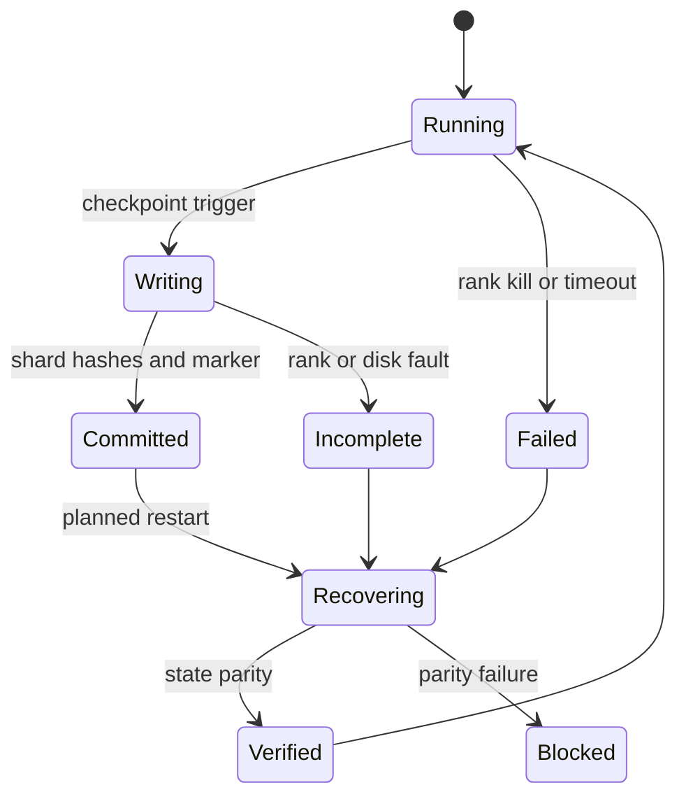
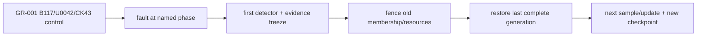

# 29장 멀티노드 golden lab: 느려짐과 고장을 분리한다

단일 GPU 기준선을 여러 GPU로 확장할 때 먼저 물어야 할 것은 “몇 배 빠른가”가 아니다. 누가 parameter·gradient·optimizer state·sample을 소유하고, 한 rank가 죽을 때 어느 상태가 확정됐는가다.

이 장의 실행은 `GR-001/MN-029`다. 28장의 동일한 `BatchID`와 `UpdateID` 의미를 여러 rank로 분할하되, global loss 분모와 committed update가 단일 GPU 기준선과 같아야 한다. 장애 주입은 별도 데모가 아니라 이 동등성의 어느 합의 경계를 깨뜨리는지 확인하는 반증 실험이다.



## 29.1 정상 update의 상태 사슬을 기준선으로 고정한다

멀티노드 장애를 이름으로 외우면 운영자는 마지막으로 울린 경보를 원인으로 오인한다. `NCCL timeout`은 대개 원인이 아니라, 앞선 어느 상태가 다음 상태로 넘어가지 못했다는 결과다. 이 장에서는 한 번의 logical update를 다음 아홉 경계로 고정한다.

```text
Topology/Config
  -> Launch/Rendezvous
  -> Rank/ProcessGroup
  -> Data/RNG
  -> Forward
  -> Backward/Collective
  -> Optimizer Commit
  -> Checkpoint Commit
  -> Restart/Next Update
```

화살표마다 생산자, 소비자와 commit 증거가 있어야 한다. topology/config 단계는 node·GPU UUID·NIC·NUMA·CUDA/NCCL/framework digest와 DP×TP×PP×CP×EP 좌표를 생산한다. launch/rendezvous는 이 manifest에 동의한 `AttemptID`와 `MembershipGeneration`을 만든다. rank/process-group 단계는 logical coordinate를 실제 PID·device·communicator에 결박한다.

data/RNG 단계는 이번 update의 ordered `SampleID`, token denominator, packing map, sampler cursor와 RNG state를 정한다. forward/backward는 microbatch별 activation과 collective sequence를 전진시킨다. optimizer commit은 overflow·gradient clipping·scheduler 조건까지 통과한 뒤에만 새 `UpdateID`를 확정한다.

checkpoint commit은 그 UpdateID의 parameter·optimizer·scheduler·scaler·RNG·data cursor를 하나의 durable generation으로 봉인한다. restart는 그 generation을 읽어 첫 다음 update가 같은 의미를 갖는지 증명한다.

중요한 점은 process 생존과 학습 commit이 서로 다른 사실이라는 것이다. rank가 모두 살아 있어도 한 rank가 다른 batch를 읽었거나 collective 순서가 갈라지면 update는 무효다. 반대로 process가 죽었더라도 optimizer commit 전이고 이전 checkpoint가 온전하면 미완료 accumulation window를 버린 뒤 안전하게 replay할 수 있다. 따라서 사고 보고서의 첫 질문은 “어느 rank가 죽었나”가 아니라 “아홉 경계 가운데 마지막으로 모든 참여자가 합의한 경계가 어디인가”다.

### 29.1.1 각 경계의 합의 증거를 한 행으로 남긴다

| 경계 | 반드시 같은 값 | 진행 증거 | 실패했을 때 금지할 행동 |
|---|---|---|---|
| topology/config | bundle digest, mesh 좌표, GPU/NIC 경로 | rank별 manifest all-gather와 expected/observed diff | 다른 binary·config를 가진 rank를 그대로 합류시키기 |
| launch/rendezvous | RunID, AttemptID, generation, world size | lease와 fencing token을 가진 membership record | 이전 generation의 worker나 writer를 재사용하기 |
| rank/process group | group member·순서·backend·device | group별 creation digest와 smoke collective | hostname·rank 숫자만 보고 같은 topology라 가정하기 |
| data/RNG | SampleID 순서, packing, valid-token 분모, seed/counter | microbatch manifest와 cursor checksum | metric의 step 번호를 data commit으로 간주하기 |
| forward | model revision, tensor shape/dtype, autocast mode | microbatch enter/exit와 selected tensor checksum | 느린 forward를 곧바로 network 장애라 부르기 |
| backward/collective | group, sequence, op, shape/dtype, split sizes | call·enqueue·complete event와 CUDA dependency | peer timeout을 최초 원인으로 기록하기 |
| optimizer commit | overflow 결정, global norm, LR, moment·parameter delta | 전 rank commit vote 뒤 발급된 UpdateID | 일부 rank만 update한 상태에서 계속 진행하기 |
| checkpoint commit | exact shard set, size/hash, UpdateID, data cursor | 검증된 manifest와 마지막 completion marker | 임시 prefix나 newest listing을 복구점으로 고르기 |
| restart/next update | parent generation, replay set, 새 topology | first-next-update parity certificate | loss가 내려간다는 이유만으로 복구를 승인하기 |

이 행을 `RunID/AttemptID/MembershipGeneration/UpdateID/CheckpointGeneration`으로 조인하면 서로 다른 저장소의 로그가 하나의 인과 그래프가 된다. wall clock은 보조 정보다. host clock이 어긋날 수 있으므로 group sequence, send/receive edge, monotonic interval과 generation을 우선한다. 어느 값이 수집되지 않았다면 추정으로 채우지 않고 `Unknown`으로 남긴다. 관측 공백은 정상의 증거가 아니다.

### 29.1.2 기다리는 rank보다 진행하지 못한 선행자를 찾는다

hang 조사에서는 네 시각을 분리한다. `call`은 framework가 collective API를 호출한 시각, `enqueue`는 work가 CUDA stream에 제출된 시각, `device-ready`는 입력 tensor를 만든 producer event가 만족된 시각, `complete`는 소비자가 결과를 사용할 수 있는 시각이다. 한 rank가 call하지 않았다면 control flow·data·선행 compute 문제다. call했지만 enqueue하지 못했다면 host thread, allocator, exception 또는 process-group 상태를 본다. enqueue했지만 device-ready가 늦으면 GPU kernel·stream dependency·PCIe/NVLink producer 경로를 본다. 모든 rank가 device-ready인데 complete만 멈추면 communicator·NIC·fabric 가설이 비로소 강해진다.

```text
if collective signatures differ:
    inspect control-flow, group membership, shape and split sizes
elif some rank did not call/enqueue:
    walk backward to data, host thread and producer kernel
elif enqueue times are skewed:
    classify the earliest slow predecessor; do not blame transport yet
elif all device-ready events agree and link progress stops:
    inspect communicator, NVLink/PCIe, NIC and fabric path
else:
    compare completion skew, consumer wait and telemetry health
```

이 결정 순서는 진단 비용을 줄인다. 예를 들어 rank 7만 all-reduce에 800ms 늦게 들어왔다면 다른 일곱 rank의 긴 NCCL duration은 기다림을 포함한 결과다. 반대로 모든 rank가 2ms 안에 들어왔는데 한 rail의 transmitted bytes가 더는 증가하지 않고 retry가 시작됐다면 transport fault 후보가 된다. 둘을 같은 `collective_seconds` 그래프만으로는 구분할 수 없다.

### 29.1.3 증상에서 회귀 fixture까지 운영 루프를 닫는다

| 장애군 | 표면 증상 | 찾아야 할 최초 불일치 | 가장 작은 분리 실험 | 복구 기준 | 회귀 fixture |
|---|---|---|---|---|---|
| rank hang·kill | peer timeout, heartbeat 소실, GPU idle | 마지막 group sequence와 마지막 completed microbatch | 동일 topology에서 payload 없는 sequence ledger로 call 누락과 process freeze를 각각 재현 | group 전체 abort, old generation fencing, last committed update에서 replay | 한 rank의 call 생략, exact PID freeze, abort 전파와 stale join 거부 |
| NIC·fabric | collective tail, retry·ECN·port error | device-ready 이후 처음 멈춘 endpoint·rail·path counter | 같은 placement·message size의 synthetic collective와 반대 rail 비교 | fault rule 제거, communicator 정책 적용, numerical·steady-state performance parity | namespace 한정 delay/loss, 자동 만료, counter·cleanup assertion |
| NVLink·PCIe | node 내부 peer만 지연, fallback, Xid 동반 가능 | GPU UUID 사이 link·route, producer event, PCIe AER/replay | 동일 peer pair의 read-only topology 확인과 작은 P2P/collective smoke test | 의심 device/node 격리, 깨끗한 topology에서 새 generation | 특정 logical peer mapping을 보존한 synthetic payload; 물리 fault 미실행은 NotExecuted |
| straggler | rank arrival skew, bubble 전파, p99 악화 | collective 이전 data/CPU/GPU/stage event 가운데 첫 지연 | rank와 data shard 또는 node를 교환하는 교차 A/B | 원인을 따라가는 축을 확인하고 baseline dispersion 회복 | bounded sleep·긴 sample·CPU worker stall을 서로 다른 fixture로 유지 |
| ECC·Xid | CUDA error 뒤 peer timeout, clock 저하, corrected ECC burst | 해당 GPU의 최초 health event와 직전 kernel | 장비를 손상시키지 않는 recorded-event replay와 health-policy unit test | policy에 따른 drain/quarantine, replacement topology에서 state parity | Xid/ECC event parser·severity mapping·duplicate/out-of-order event fixture |
| host OOM | worker SIGKILL, dataloader 정지, peer timeout | cgroup/OS OOM event, RSS·pinned memory·async checkpoint staging 증가 | 작은 allocation failure 또는 mock allocator로 예외·cleanup 경로 검사 | host leak·staging 원인 제거, incomplete update 폐기, clean restart | allocation error injection과 writer cancellation·lease 반환 fixture |
| partial checkpoint | latest generation load 실패, shard 누락·hash mismatch | shard write/report/manifest/marker 중 끊긴 최초 전이 | 임시 generation에서 missing·truncated·mutated shard를 하나씩 제공 | marker와 모든 hash가 맞는 이전/새 generation만 선택 | marker-before-shard 거부, corruption 거부, last-good fallback |
| network partition | 두 membership, duplicate rank/writer, stale metric | lease 갱신 실패와 처음 분기한 fencing generation | in-memory rendezvous/store에서 old token의 join·write를 재생 | 단 하나의 authoritative history, minority/old writer 거부 | stale lease, duplicate rank, delayed old shard와 split-brain write 거부 |

표의 “분리 실험”은 원 장애를 그대로 재현한다는 뜻이 아니다. process freeze fixture는 host hardware hang을 증명하지 않고 timeout·abort·fencing 로직만 검증한다. recorded Xid event는 GPU가 실제로 같은 고장을 낸다는 증거가 아니라 parser와 운영 정책의 분기를 검증한다. 작은 synthetic collective가 성공해도 실제 모델의 tensor 순서·stream dependency·메시지 크기·fabric congestion이 정상이라는 결론은 낼 수 없다. 각 fixture가 검증하는 코드 경계와 검증하지 않는 물리 경계를 보고서에 함께 쓴다.

**합성 시험의 의미 범위와 blast radius를 제한한다**

안전한 합성 시험은 공유 host의 광범위 process, 기본 route, SSH/control-plane interface, production rendezvous와 공용 checkpoint prefix를 건드리지 않는다. 전용 allocation·namespace·PID/cgroup·object prefix를 사전 조건으로 요구하고, target identity를 실행 직전에 다시 읽는다. dry-run은 대상과 예상 변경을 출력한다. fault에는 lease와 out-of-band 자동 원복이 있으며 controller가 죽어도 만료돼야 한다. cleanup 검사가 실패하면 다음 cell을 시작하지 않는다.

그러나 “안전하다”는 말은 blast radius만 작다는 뜻이 아니다. synthetic fixture가 실제 하드웨어 효과를 주장하지 못하도록 의미 범위도 제한해야 한다. 이 책에서 실행 가능한 기본 fixture는 다음과 같다.

- immutable event와 sequence table을 넣어 detector·분류·fencing 정책을 시험한다.
- 임시 디렉터리의 작은 fake shard로 manifest·hash·marker·fallback을 시험한다.
- loopback 또는 실험 namespace의 작은 process group으로 collective ordering과 timeout cleanup을 시험한다.
- mock allocator·writer·rendezvous로 host OOM, writer cancellation과 stale generation을 시험한다.

반면 실제 NVLink disable, GPU ECC 유발, switch port 차단, 공유 NIC의 firewall/qdisc 변경, host-wide OOM과 production scheduler preemption은 기본 fixture에 포함하지 않는다. 승인된 격리 lab, 장비 소유자와 자동 복구 경로가 없으면 `NotExecuted`다. 예상 로그를 실제 결과처럼 쓰지 않는다. 대규모 클러스터에서 얻은 throughput·MTTR도 이 장에서 실행한 것으로 주장하지 않으며, 실제 run bundle이 들어온 환경과 revision에만 귀속한다.

회귀 fixture의 합격 조건은 “예외가 발생했다”가 아니다. `fault applied → earliest detector → new commit 금지 → group abort/fencing → last-safe 선택 → replay reconciliation → first-next-update oracle → cleanup`이 모두 관측돼야 한다. negative control도 둔다. fault trigger가 적용되지 않은 run은 detector가 울리지 않아야 하고, 이미 만료된 generation의 late event는 정식 history에 합쳐지지 않아야 한다. 이 계약을 통과해야 장애 대응이 재시작 스크립트가 아니라 학습 의미를 보존하는 검증 체계가 된다.

## 29.2 topology와 병렬화 config의 비용을 예측한다

### 29.2.1 parameter·gradient·optimizer·data 소유권을 표시한다

DDP는 parameter를 복제하고 gradient를 all-reduce한다. FSDP는 parameter·gradient·optimizer state를 shard한다. TP는 layer tensor를 나누고 PP는 layer와 microbatch 시간을 나눈다. EP는 expert와 token route를 나눈다. 적용 전 각 방식의 rank group, local tensor shape, collective bytes, checkpoint layout을 표로 쓴다.

### 29.2.2 scaling 효율의 분모를 고정한다

global batch를 고정한 strong scaling과 rank당 batch를 고정한 weak scaling을 섞지 않는다. step time을 data, forward, backward, collective, optimizer, checkpoint로 분해한다. 평균뿐 아니라 rank min/max와 p95를 본다. 유효 token/s와 loss denominator가 단일 GPU와 같은지 먼저 확인한다.

### 29.2.3 collective 비용을 손으로 계산한다

ring all-reduce에서 rank당 전달량의 근사는 `2(P-1)/P × G`다. `P`는 data-parallel rank 수, `G`는 gradient bytes다. 이 값은 wire protocol overhead와 topology를 생략한 하한에 가깝지만 trace sanity check에 유용하다. BF16 gradient 14GB를 8 rank에서 줄이면 rank당 약 24.5GB가 이동한다. 관측 bytes가 이보다 훨씬 작으면 gradient sharding/compression이나 측정 범위를, 훨씬 크면 bucket 재전송·다른 collective·프로토콜 overhead를 확인한다.

FSDP는 all-gather와 reduce-scatter가 layer 경계에 나타나며 peak memory는 prefetch window와 겹침에 달렸다. TP column/row parallel은 activation collective를 만들고 sequence 길이에 민감하다. EP all-to-all은 token routing 불균형에 민감하다. 그러므로 “통신 비율” 하나로 병렬 전략을 비교하지 않는다. 각 collective의 tensor shape, owner group, stream, 소비 kernel을 기록한다.

**pipeline bubble과 microbatch.**

pipeline stage 수를 `p`, microbatch 수를 `m`이라 할 때 단순 1F1B의 bubble fraction은 대략 `(p-1)/(m+p-1)`다. `m`을 늘리면 bubble은 줄지만 activation lifetime, scheduler overhead와 gradient accumulation state가 늘어난다. stage별 compute가 불균형하면 이 식보다 나쁘다. 정상 fingerprint에는 stage별 forward/backward duration과 빈 구간을 넣는다.

microbatch 수는 checkpoint resume의 상태이기도 하다. optimizer step 중 몇 개 microbatch까지 backward됐는지 durable하지 않다면 process crash 뒤 부분 gradient를 재사용해선 안 된다. 일반적으로 last committed optimizer step에서 전체 accumulation window를 다시 실행한다.

## 29.3 trace·metric·collective ledger로 정상 fingerprint를 만든다

### 29.3.1 최소 관측 세트를 설치한다

rank별 step/microbatch ID, collective sequence, CUDA/NCCL duration, dataloader wait, allocated/reserved memory, GPU util, XID/ECC/NVLink를 수집한다. high-cardinality `GoldenBatchID`는 trace/log에, 집계 가능한 rank/node는 metric label에 둔다.

### 29.3.2 정상 run fingerprint를 만든다

장애 주입 전에 20 step의 rank별 timeline과 checkpoint commit 시간을 저장한다. collective 호출 순서 hash, batch manifest, loss/gradient checksum이 baseline이다. 정상 fingerprint 없이 hang trace만 보면 늦은 rank와 원인 rank를 혼동한다.

### 29.3.3 collective sequence를 원장으로 기록한다

각 rank가 `(step, microbatch, group, op, tensor_numel, dtype, sequence)`를 남긴다. payload 전체를 log하지 않고 header를 hash한다. hang 시 rank별 마지막 sequence를 모으면 세 경우를 가른다.

```text
rank0..6: step=91 mb=3 seq=441 ALL_REDUCE numel=67108864
rank7:    step=91 mb=3 seq=440 ALL_GATHER numel=4194304
```

이 예에서 rank7은 아직 이전 collective에 있거나 다른 branch를 탔다. network가 아니라 control-flow, data-dependent MoE route, exception swallowing을 먼저 본다. 반대로 모든 rank가 seq 441에 있고 link retry가 한 경로에서 치솟으면 transport 가설이 강해진다.

**metric과 trace의 최소 schema.**

metric에는 `step_seconds`, `collective_seconds`, `data_wait_seconds`, `checkpoint_seconds`, `valid_tokens`, `rank_progress`, GPU util/clock/power/ECC/XID/NVLink를 기록한다. trace에는 NVTX step/microbatch range, CUDA kernel, NCCL API와 stream event를 기록한다. log에는 batch ID, checkpoint generation, collective sequence 같은 높은 cardinality identity를 기록한다. 세 저장소를 `IncidentID`와 monotonic time으로 조인한다.

## 29.4 fault matrix를 경계와 안전 범위로 설계한다

### 29.4.1 rank kill과 network stall을 분리한다

forward 전, backward collective 중, optimizer step 뒤에 rank를 종료한다. 각 지점에서 launcher가 모든 rank를 중단하는지, elastic rerendezvous가 가능한지, 이미 적용된 optimizer step을 어떻게 판정하는지 본다. network stall은 packet loss보다 특정 collective sequence를 지연시켜 timeout, watchdog, async error가 어떤 순서로 나타나는지 기록한다.

주입 경계는 이름만으로 충분하지 않다. `optimizer.step()`이 return했지만 checkpoint marker가 쓰이기 전이라면 model/optimizer memory에는 새 step이 있고 durable storage에는 없다. recovery가 이전 checkpoint를 선택하면 그 step의 sample을 다시 소비한다. 이것은 올바른 at-least-once 재실행일 수 있지만, 외부 data cursor나 metric counter가 먼저 commit됐다면 중복/불일치가 생긴다.

안전한 원장은 `optimizer_epoch`, `batch_manifest_hash`, `checkpoint_generation`을 묶는다. 같은 optimizer epoch에 다른 batch hash가 나타나면 split-brain이다. metric backend의 step 숫자는 commit 증거가 아니다.

### 29.4.2 장애 명령의 안전 경계를 코드화한다

rank kill은 test allocation의 PID/cgroup을 명시적으로 확인한 뒤 실행한다. network fault는 해당 job의 namespace/interface와 peer만 대상으로 한다. disk fault는 별도 test prefix/quota를 사용한다. broad host firewall 변경이나 공유 filesystem 삭제를 lab 명령으로 제시하지 않는다.

fault controller는 주입 전 manifest와 대상 rank를 출력하고, dry-run을 제공하며, 정한 만료 시간 뒤 자동 복구한다. fault 자체가 다른 job에 영향을 주면 실험 결과도 윤리적으로 사용할 수 없다.

### 29.4.3 network stall 결정 트리를 실행한다

첫 신호가 모든 rank의 collective timeout이면 sequence ledger를 비교한다. sequence가 다르면 application branch다. 같으면 NIC/link counter와 NCCL RAS peer 상태를 본다. 특정 node만 retry/error가 증가하면 물리·driver·routing, counter는 정상인데 proxy thread가 CPU starvation이면 affinity/cgroup을 본다. synthetic collective가 정상이고 실제 model만 실패하면 tensor size/order, stream dependency, compute straggler로 돌아간다.

NCCL timeout을 늘려 통과했다면 원인이 사라진 것이 아니다. 정상 step p99와 장애 step의 격차, 서비스 SLO, false timeout을 근거로 timeout budget을 조정한다.

**partial checkpoint.**

shard write 중 process를 죽이고 completion marker가 생기지 않는지 확인한다. marker 뒤 shard를 손상시켜 load-time hash가 실패하는지 본다. “load가 예외를 냈다”뿐 아니라 이전 complete generation으로 안전하게 fallback하는지 판정한다.

## 29.5 restart 뒤 학습 의미의 동등성을 판정한다

### 29.5.1 exact·numerical·statistical 복구 등급

산출물 유효성, state-restorable, topology-portable, sample-exact, numerical-equivalent를 순서대로 판정한다. world size가 달라지면 RNG/sampler mapping과 optimizer reshard가 어떻게 바뀌는지 기록한다. 동일 final loss만으로 sample repeat를 숨기지 않는다.

### 29.5.2 출판 가능한 실행 증거를 구분한다

각 주입에는 `IncidentID`, fault command, timestamp, affected rank, last durable step, recovery checkpoint, batch diff, parameter tolerance를 기록한다. 실제 멀티노드 장비에서 실행하지 않은 주입은 `실행 예정`이며 예상 결과만 제시한다.

### 29.5.3 복구 동일성을 수식으로 판정한다

sample-exact는 recovery run의 ordered sample stream `S'`가 기준 run `S`와 비교 구간에서 같다는 뜻이다. numerical equivalence는 parameter vector에 대해 예를 들어 `||θ'-θ||₂/(||θ||₂+ε)≤τ`와 주요 eval 차이가 budget 안에 있음을 뜻한다. 이 tolerance는 결과를 본 뒤 정하지 않는다.

bitwise identity가 깨졌을 때 바로 실패라고 하지 않는다. collective reduction order, nondeterministic kernel, world-size reshard가 원인일 수 있다. 그러나 sample stream과 LR/scheduler가 다른데 numerical tolerance만 통과한 경우도 성공이 아니다. 비교 등급을 계층적으로 판정한다.

**world-size 변경 캠페인은 tensor와 sample을 따로 판정한다.**

고정 topology 재개의 최소 양성 대조군은 TorchTitan revision `b482babc5f1d5d718e1719a735f9a2d86d1b9aff`의 [16-row suffix fixture](https://github.com/pytorch/torchtitan/blob/b482babc5f1d5d718e1719a735f9a2d86d1b9aff/tests/unit_tests/cpu/components/data/test_grain_data.py#L240-L258)처럼 구성한다. 둘째 epoch 중간에서 저장한 iterator state를 같은 topology에 복원하고 다음 16개 ordered row가 uninterrupted run과 같은지 비교한다.

음성 대조군은 [DP world-size 1→2 fixture](https://github.com/pytorch/torchtitan/blob/b482babc5f1d5d718e1719a735f9a2d86d1b9aff/tests/unit_tests/cpu/components/data/test_grain_data.py#L1484-L1516)다. 명시적인 cursor 이관 규칙이 없는 loader는 이 변경을 `ValueError`로 거부해야 한다. 예외를 성공으로 바꾸는 wrapper는 복구 기능이 아니라 sample 무결성 검사를 우회하는 코드다.

tensor 쪽 양성 대조군은 PyTorch revision `3691693263d2b66a68867e39b7449876844e06cf`의 [DCP reshard planner fixture](https://github.com/pytorch/pytorch/blob/3691693263d2b66a68867e39b7449876844e06cf/test/distributed/checkpoint/test_planner.py#L552-L604)를 따른다. global length 128에서 world 8의 local `[16]` 두 조각을 world 4의 local `[32]`에 destination offset `0, 16`으로 놓고, 역방향에서는 32-element storage shard의 offset 16부터 length 16을 읽는다. 캠페인 결과에는 다음 네 판정을 별도 열로 남긴다.

| 판정 열 | 합격 oracle | 이 열만으로 주장할 수 없는 것 |
|---|---|---|
| `cursor_restore_same_topology` | ordered 16-row suffix 일치 | 장기 replay, optimizer·RNG 일치 |
| `cursor_topology_change` | 지원 계약에 따른 exact global suffix 또는 명시적 거부 | tensor reshard 성공 |
| `tensor_read_plan` | storage/destination offset·length의 완전한 coverage | 실제 I/O와 수치 궤적 |
| `first_next_update` | batch identity, loss·gradient·delta가 합의한 등급 통과 | storage crash consistency |

장애 주입의 최초 불일치도 이 열 순서로 찾는다. DP 1→2 state 주입에서 거부되면 loader capability 문제다. loader가 수용했지만 global row suffix가 다르면 cursor redistribution 문제다. row는 같고 tensor가 다르면 DCP read item과 실제 range read를 가른다. 둘 다 같고 첫 update만 다르면 optimizer parameter mapping, scaler, scheduler와 RNG를 본다. 이 분해가 없으면 “world-size 변경 뒤 loss가 달라졌다”라는 한 줄이 데이터 중복, shard offset 오류와 정상적인 reduction-order 차이를 모두 뒤섞는다.

캠페인의 durability 판정은 별도다. `.metadata.tmp`를 flush/fsync한 코드와 overwrite·오류 정리 unit test만으로 전원 차단 뒤의 복구를 합격 처리하지 않는다. metadata fsync 직후 kill, directory fsync 누락, rename 전후, 기존 generation 교체, object-store copy-delete와 stale read를 각각 fault point로 둔다. 종료 뒤 새 process가 exact key로 읽은 commit·manifest·shard closure가 last-good 또는 새 generation 가운데 정확히 하나로 수렴해야 한다. 이 시험을 실행하지 않았다면 결과표에는 `NotExecuted: crash consistency`라고 쓰며, 단순한 process exception fixture를 대신 인용하지 않는다.

운영 인수 체크리스트는 짧고 엄격해야 한다.

- [ ] 동일 topology의 ordered suffix를 uninterrupted control과 비교했는가.
- [ ] 지원하지 않는 DP world-size 변경이 조용히 수용되지 않는가.
- [ ] 지원 topology마다 global row 중복·누락과 packing boundary를 검산했는가.
- [ ] DCP read item의 source/destination offset·length와 실제 global-index tensor가 모두 맞는가.
- [ ] model뿐 아니라 optimizer slot, RNG, scheduler와 첫 update까지 최초 불일치 순서로 비교했는가.
- [ ] filesystem·object store별 전원 차단과 publish 원자성 시험을 unit test와 구분해 기록했는가.

**partial checkpoint commit protocol.**

writer는 새 generation의 temporary prefix에 shard를 쓴다. 각 shard가 close/fsync 또는 object-store durability 조건을 만족한 뒤 manifest에 size/hash를 기록한다. 마지막에 completion marker를 원자적으로 publish한다. reader는 marker가 있고 manifest의 모든 shard가 검증되는 generation만 선택한다.

async checkpoint는 training이 다음 step으로 진행하는 동안 이전 state를 복사할 수 있다. capture 시점의 tensor가 이후 mutation과 분리됐는지, writer error가 trainer에 전파되는지 확인한다. “save API가 return했다”와 “remote durable commit이 끝났다”를 분리한다.

**소스와 실행의 경계.**

PyTorch distributed checkpoint와 TorchTitan/OLMo-core 고정 revision은 state dict·planner·async save·data/RNG 복구 경로를 보여준다. NCCL 고정 revision과 공식 RAS 문서는 communicator 상태 신호를 보여준다. 그러나 특정 storage의 atomic rename, object-store consistency, 실제 fabric 장애 복구는 deployment마다 다르다. 동반 lab의 주입은 설계이며 실제 장비 로그가 들어오기 전 결과로 인용하지 않는다.

**이 장이 넘기는 것.** topology manifest, 정상 trace, 세 장애의 IncidentID, recovery parity report를 30장의 release 판단에 넘긴다.

## 29.6 사건 시간선으로 causal predecessor를 복원한다

모든 fault report는 `T-준비`, `T0-주입`, `T1-최초 물리 신호`, `T2-application detector`, `T3-중단 결정`, `T4-last-safe 선택`, `T5-재시작`, `T6-parity 완료`, `T7-cleanup`으로 쓴다. wall clock과 monotonic offset, membership generation을 함께 둔다. node clock 차이 때문에 millisecond 순서를 확정할 수 없으면 uncertainty를 표시한다.

T1과 T2의 차이는 detector latency, T2와 T3는 사람·자동화 결정 시간, T3~T6는 recovery time이다. 총 복구 시간 하나만 보면 어디를 개선해야 하는지 모른다. fault가 실제 적용된 evidence가 없으면 T0가 성립하지 않으므로 run을 successful injection으로 세지 않는다.

각 시점에는 immutable artifact를 붙인다. T0의 fault rule digest, T2의 alert query revision, T4 checkpoint marker, T5 topology, T6 parameter/data/EvalID와 T7 post-cleanup inventory다. [멀티노드 failure lab](../labs/29-multinode-failure-lab.md)은 이 시간선을 공통 보고 형식으로 사용한다.

### 29.6.1 backward 중 rank kill

8-rank data parallel run에서 step 500 backward, collective sequence 92 직전에 rank 6을 종료한다. `T0=10:00:00.000`, rank 6 heartbeat 종료가 T1 2초, peer watchdog alert가 T2 32초, job abort가 T3 35초라 하자. timeout 30초가 detection budget에 맞는지와 wasted GPU 7×35초를 계산한다.

last complete marker가 step 499라면 step 500의 모든 microbatch를 폐기한다. 일부 rank가 optimizer update에 도달하지 않았다는 sequence/update ledger를 확인한다. rank 6만 다시 띄워 peer의 old communicator에 붙이지 않고 전체 worker group generation을 새로 만든다.

T5에서 step 499 checkpoint를 load하고 topology/config digest를 all-gather한다. step 500의 exact sample/packing을 replay하고 control run과 loss numerator, gradient와 parameter checksum을 비교한다. T6 parity가 요구 tolerance를 통과한 뒤에만 장기 run을 계속한다. cleanup에는 죽은 process와 stale rendezvous key 부재가 포함된다.

### 29.6.2 collective 안의 process freeze

SIGSTOP 같은 실험은 process를 죽이지 않고 heartbeat thread와 CUDA work의 동작이 어떻게 달라지는지 보여준다. 안전한 실험 namespace에서 exact PID를 확인하고 자동 SIGCONT timer를 둔다. process 전체 freeze와 한 CUDA stream stall은 다른 fault다.

rank 3이 sequence 184 all-reduce에 들어간 뒤 멈추면 다른 rank의 sequence는 일치하지만 completion이 없다. NIC error가 없고 rank 3 host heartbeat도 멈춘다면 host/process stall 가설이 강하다. application heartbeat가 별도 thread라 계속 살아 있으면 collective progress heartbeat가 필요하다.

자동 원복으로 process가 재개돼 collective가 완료되더라도 step deadline을 넘겼다면 run을 계속할지 정책을 적용한다. freeze 동안 lease·scheduler가 worker를 대체했다면 old process가 돌아와 split-brain을 만들지 못하게 generation fencing을 사용한다. 이 사례는 timeout 값뿐 아니라 fencing의 필요성을 검증한다.

### 29.6.3 비대칭 network 지연

rank 2의 지정 training interface outbound에만 80ms 지연을 넣는다. T0 전에 interface, qdisc와 대상 traffic을 read-only로 확인하고 control plane을 제외한다. fault는 watchdog이 2분 뒤 자동 제거한다. 적용 증거로 rule dump와 작은 probe latency를 보존한다.

ring all-reduce에서는 한 방향 지연이 여러 rank의 completion에 전파된다. rank 2만 duration이 길 것이라고 기대하지 않는다. collective sequence와 payload는 같고 completion tail, NIC queue와 exposed communication이 증가해야 한다. forward compute와 data wait가 정상이라는 반증을 수집한다.

fault 제거 뒤 다음 20 step이 baseline dispersion으로 돌아오는지 본다. communicator를 재생성해야 하는지 backend 정책에 따라 결정한다. qdisc cleanup과 probe 정상화가 T7이다. timeout을 늘려 통과한 run과 fault 없는 성능을 같은 성공으로 세지 않는다.

**사례 D: 간헐 packet loss.**

0.1% loss는 job을 죽이지 않고 tail latency와 retry만 늘릴 수 있다. fault window 전후 NIC retry/retransmit, ECN, collective duration과 payload를 비교한다. switch telemetry 접근이 없으면 application-level evidence의 한계를 적는다. loss가 storage traffic에도 적용됐는지 범위를 확인한다.

step p50은 같고 p99만 2배라면 평균 처리량 alert가 놓칠 수 있다. 26장의 histogram과 straggler detector가 필요한 이유다. 특정 message size에서만 민감하면 NCCL protocol/algorithm과 chunking을 고정한 microbenchmark로 후보를 좁힌다.

loss rule 제거 뒤 누적 counter가 계속 높다는 이유로 장애가 지속된다고 판단하지 않는다. rate와 fault window를 본다. 재발 방지는 fabric 조치인지 application timeout/route 변경인지 구분하고 numerical parity와 performance recovery를 함께 검증한다.

**사례 E: storage slow write.**

checkpoint step 1,000에서 object-store write latency를 rank 5 shard에만 10배로 늘린다. training이 synchronous checkpoint라면 모든 rank pause가 늘고, asynchronous라면 host staging memory와 다음 checkpoint overlap이 커질 수 있다. save range, rank write duration과 allocator/host RSS를 관측한다.

coordinator는 늦은 shard를 기다리며 marker를 publish하지 않아야 한다. deadline을 넘기면 generation을 failed로 표시하고 training을 계속할지 fail할지 정책을 적용한다. 느린 shard 없이 incomplete manifest를 latest로 만들면 hard failure다.

latency가 정상화된 뒤 같은 temporary generation을 이어 쓸지 새 generation을 만들지 정한다. object identity 충돌을 피하려면 새 attempt namespace가 안전하다. read-back hash, restore와 [partial checkpoint playbook](../playbooks/09-partial-checkpoint.md)을 통과한 뒤 T6로 간다.

**사례 F: shard corruption.**

완전히 쓴 temporary shard 한 byte를 marker 전 변조한다. coordinator의 reported digest와 read-back digest가 달라 marker publish가 거부돼야 한다. marker 뒤 storage bit rot을 가정한 실험에서는 loader가 restore 전 manifest hash에서 거부해야 한다.

corruption을 missing key warning이나 zero initialization으로 넘기지 않는다. 어느 tensor가 해당 shard에 있었는지 index로 영향 범위를 계산하지만 artifact 전체를 격리한다. 이전 complete generation으로 rollback하면 exact 선택 이유와 corrupted generation RevocationID를 기록한다.

복구 뒤 golden batch와 optimizer state parity를 확인한다. model weight만 정상이고 optimizer shard가 이전 generation이면 trajectory가 다르다. checkpointer source 좌표에서 strict hash/schema branch와 upstream corruption fixture를 연결한다.

**사례 G: rendezvous split brain.**

old worker가 network partition 뒤 살아 있고 scheduler가 replacement를 시작하면 두 집단이 같은 RunID로 rendezvous할 위험이 있다. membership generation과 lease fencing이 없으면 duplicate rank 또는 두 개의 world가 checkpoint를 쓸 수 있다. store key와 writer lease를 generation에 묶는다.

실험은 old generation의 rank가 새 rendezvous에 join하려는 요청, stale coordinator가 marker를 publish하려는 요청을 넣는다. 둘 다 generation mismatch로 거부돼야 한다. 단지 rank count가 맞는다고 membership identity가 맞는 것은 아니다.

object store writer도 generation lease를 확인해야 한다. old group의 late shard가 new generation namespace에 들어오지 못하게 한다. cleanup은 stale process kill, lease expiry와 temporary object quarantine까지 포함한다.

**사례 H: scheduler preemption.**

preemption notice가 120초 전에 온다고 가정한다. 현재 checkpoint 예상 시간이 180초라면 full checkpoint를 시작해 deadline에 잘릴 가능성이 크다. lightweight state 또는 마지막 complete generation을 선택하는 정책을 사전에 둔다. notice 수신 시각과 chosen action을 event로 남긴다.

job이 새 node에 재큐잉되면 GPU/NIC topology, driver와 container digest를 다시 검사한다. local dataset/cache가 없을 수 있으므로 data fetch time을 recovery SLO에 포함한다. world size가 달라지면 동일 recovery가 아니라 elastic child run이다.

preemption은 hardware failure가 아니므로 node 격리 ticket를 열지 않는다. 그러나 자주 반복되면 checkpoint interval과 scheduler class의 비용 문제다. lost compute, checkpoint overhead와 queue wait를 합쳐 정책을 최적화한다.

**사례 I: GPU XID 후 peer timeout.**

rank 4에서 XID가 T1에 발생하고 3초 뒤 CUDA error, 30초 뒤 peer rank NCCL timeout이 나타났다면 가장 늦은 timeout을 root cause로 쓰지 않는다. GPU UUID, XID code, driver log와 preceding kernel을 보존한다. peer timeout은 영향 신호다.

해당 GPU를 drain하고 동일 logical rank를 spare GPU에 배치한다. fault가 workload를 따라 재현되는지와 device에서 사라지는지를 본다. hardware diagnostic이 필요하면 synthetic kernel/collective로 최소화하고 production data를 사용하지 않는다.

recovery topology가 바뀌므로 clock/performance fingerprint를 다시 만든다. numerical parity가 맞아도 slow spare가 SLO를 깨면 release run으로 쓰지 않는다. 반복 XID의 자동 drain rule에는 field 지원과 false-positive 조건을 명시한다.

**사례 J: expert overload와 network 오진.**

특정 multilingual batch에서 expert 7에 token이 6배 몰리고 all-to-all 시간이 증가했다고 하자. fault injection이 아니라 workload-induced imbalance다. router assignment, capacity/drop, expert compute와 payload를 같은 step으로 본다. fabric counter가 정상이라면 network tuning보다 routing/data가 우선이다.

[expert imbalance playbook](../playbooks/07-expert-imbalance.md)으로 offending family, layer와 auxiliary loss를 찾는다. batch를 균형 synthetic routing으로 바꿔 collective가 정상화되는지 A/B한다. expert parallel group mapping도 확인한다.

capacity factor를 올리면 dropped token은 줄지만 memory/communication이 늘 수 있다. auxiliary weight를 바꾸면 training objective가 달라진다. 운영 완화와 algorithm 변경을 분리하고 후자는 새 golden/EvalID를 만든다.

## 29.7 detector·recovery 비용과 오진을 회계한다

checkpoint interval이 짧으면 failure lost work는 줄지만 I/O overhead가 늘어난다. 평균 failure interval과 save time, asynchronous interference, checkpoint size와 retention을 사용해 기대 비용을 비교한다. 단순히 매 N step이라는 관행으로 정하지 않는다.

step 시간이 workload에 따라 달라지면 wall-time 또는 tokens-seen 기준 interval을 고려한다. preemption 가능성이 높은 queue와 안정 cluster의 최적값이 다르다. full model/optimizer checkpoint와 lightweight progress state의 복구 등급을 구분한다.

실제 incident에서 last-safe age, replay tokens와 save overhead를 수집해 모델을 갱신한다. checkpoint가 너무 느려 다음 interval과 겹치면 backpressure와 skip policy가 필요하다. skipped save를 successful checkpoint counter에 넣지 않는다.

### 29.7.1 failure detector의 false positive

긴 compile이나 evaluation으로 heartbeat가 늦어 rank failure alert가 울릴 수 있다. heartbeat thread가 training loop와 같은 GIL/stream에 묶였는지 본다. phase-aware deadline을 쓰더라도 무한 예외 window를 만들지 않는다. expected long operation은 event와 최대 시간을 선언한다.

network detector가 transient congestion을 node failure로 오인해 반복 restart하면 더 큰 손실을 만든다. retry/abort threshold와 circuit breaker를 fault injection에서 교정한다. detector가 판단에 사용한 raw series와 query revision을 보존한다.

false positive run도 incident로 회고한다. detection sensitivity를 낮추기 전에 실제 hard failure recall을 synthetic matrix로 다시 확인한다. alert silence가 reliability 향상은 아니다.

### 29.7.2 recovery 중 monitoring gap

worker group이 재시작될 때 old Prometheus series가 stale되고 새 process generation이 생긴다. dashboard가 둘을 합쳐 world size를 16으로 보거나 old last value를 유지하지 않게 한다. expected membership과 scrape target을 generation으로 맞춘다.

W&B resume가 old step 뒤에 new history를 연결해도 exact retry attempt를 숨길 수 있다. `(RunID,generation,optimizer_step,attempt)`를 structured artifact에 둔다. recovery window의 metric gap을 0 utilization으로 채우지 않는다.

alert backend 자체가 network fault의 영향을 받으면 local rank ring buffer와 scheduler event가 대체 증거다. 복구 뒤 buffer upload의 시간축을 event time으로 복원한다. 관측 불가능 구간은 parity가 좋아도 명시한다.

### 29.7.3 복합 fault는 단일 fault 뒤에 시험한다

rank kill과 storage latency를 동시에 넣으면 checkpoint 실패 원인을 분리하기 어렵다. 각 single fault의 detector와 recovery가 먼저 통과한 뒤 조합한다. 실제 incident가 연쇄적이어도 실험은 변수 하나에서 시작해 interaction을 추가한다.

예를 들어 network stall로 checkpoint deadline이 지연되고 scheduler preemption이 이어지는 조합은 last-safe 선택을 시험한다. expected timeline과 우선순위, 자동 원복이 충돌하지 않는지 본다. 두 watchdog이 서로 다른 restart를 시작하면 fencing이 필요하다.

조합 결과를 single-fault 성공률에 합치지 않는다. interaction case로 별도 matrix 행을 만들고 더 보수적 cleanup·parity gate를 적용한다. production fault 확대는 영향 범위와 복구 권한이 충분할 때만 한다.

**장애 실험 보고서 예.**

보고서 첫 줄은 `Run R7, topology T3, fault network-delay-rank2-outbound, generation 4`처럼 identity를 고정한다. 다음에는 예상 timeline과 실제 T0~T7, detector latency, checkpoint/replay, numerical/performance parity를 표로 둔다. fault command 원문보다 resolved target과 rule digest가 중요하다.

결론은 관측 범위에 맞춘다. “80ms 지연에서 30초 watchdog이 job을 abort하지 않고 20 step 안에 performance가 baseline으로 복귀했다”처럼 쓴다. 모든 network 장애에 안전하다고 일반화하지 않는다.

첨부에는 topology, sequence ledger, trace/DCGM/NIC, scheduler/storage event, checkpoint manifest, cleanup와 EvalID가 들어간다. 민감 infrastructure 정보는 접근을 통제한다. 독립 검토자가 같은 evidence로 last-safe와 parity 판정을 재현해야 한다.

**계층별 오진 사례를 분리한다.**

rank 0~2가 sequence 310에서 all-reduce를 호출하고 rank 3만 evaluation branch로 들어가 broadcast 310을 호출했다고 하자. 모든 rank stack은 collective wait를 보이지만 op와 caller range가 다르다. network microbenchmark가 정상이어도 해결되지 않는다.

rank 3의 evaluation condition이 local step이나 data exhaustion에 의존했는지 본다. global control decision을 broadcast하거나 evaluation을 barrier-safe boundary로 이동한다. 단순 barrier 추가는 새로운 순서 mismatch를 만들 수 있으므로 group별 ledger로 검증한다.

regression은 한 rank의 local condition만 다르게 만들어 startup/step assertion이 collective 전에 실패하는지 본다. timeout을 줄였다는 것은 detection 개선이지 원인 수정이 아니다. source 좌표에서 conditional caller와 group membership을 연결한다.

**shape mismatch 사례.**

rank 5의 gradient bucket이 16MB, 나머지가 20MB인데 같은 all-reduce sequence를 호출하면 backend가 오류를 내거나 hang처럼 보일 수 있다. 원인은 model/config, unused parameter나 conditional adapter의 ownership 불일치다. parameter/bucket schema checksum을 startup과 step boundary에서 all-gather한다.

dynamic sequence 길이로 activation shape가 달라도 collective tensor contract는 병렬화별로 호환돼야 한다. all-gather count exchange가 필요한 path와 fixed shape path를 source에서 확인한다. padding으로 강제할 때 memory/compute 비용과 loss mask를 본다.

fix 뒤 모든 rank의 trainable parameter set, bucket order와 payload ledger를 exact 비교한다. model score가 같다는 이유로 schema mismatch를 허용하지 않는다.

**host OOM과 GPU failure 혼동.**

dataloader worker 또는 checkpoint staging으로 host RSS가 증가해 kernel OOM killer가 rank process를 죽일 수 있다. peer에는 NCCL timeout만 보인다. scheduler/container exit reason, kernel log와 host memory가 가장 이른 신호다.

GPU framebuffer가 안정적이라는 반증을 넣는다. worker count, pinned buffer, async checkpoint queue와 object lifetime을 분리한다. host limit을 늘려 통과해도 leak가 지속되면 해결이 아니다.

rank kill recovery fixture와 같은 경로를 사용하되 root cause와 예방은 다르다. host memory slope alert, bounded queue와 retention regression을 26장에 추가한다. node hardware 격리는 근거가 없으면 수행하지 않는다.

**DNS와 control-plane 지연.**

rendezvous endpoint나 object store DNS가 느리면 모든 rank가 동시에 startup/save에서 stall할 수 있다. training fabric과 별개다. resolver latency, cache 만료와 endpoint connection phase를 trace한다. 민감 hostname은 공유 보고서에서 비식별화한다.

fault 실험은 전용 namespace의 test hostname과 resolver를 사용하며 공용 DNS를 건드리지 않는다. timeout/fallback endpoint가 서로 다른 storage generation을 가리키지 않는지 확인한다. retry storm이 control plane을 더 악화시키지 않게 jitter와 ceiling을 둔다.

복구 뒤 resolved endpoint identity와 산출물 digest를 검증한다. 연결 성공만으로 올바른 store를 썼다고 말할 수 없다. topology manifest에 control/storage endpoint identity를 포함한다.

**mixed-version worker.**

rolling image update 중 한 worker만 다른 framework/NCCL extension을 쓰면 startup은 성공해도 collective behavior나 kernel이 달라질 수 있다. 모든 rank가 container, 소스/config와 loaded library digest를 all-gather해 exact policy를 적용한다.

실험은 rank 하나의 harmless build ID를 바꿔 startup gate가 거부하는지 본다. 실제 incompatible binary를 production fabric에서 실행하지 않는다. 허용되는 heterogeneous driver/GPU 조합은 compatibility matrix와 별도 golden evidence를 가져야 한다.

실행 환경 drift가 incident 중 발견되면 해당 run artifact를 격리하고 last-safe도 같은 drift를 가졌는지 조사한다. 단순 재시작으로 homogeneous해졌다고 과거 update를 신뢰하지 않는다.

**storage와 compute checksum 연결.**

checkpoint shard hash가 맞아도 rank가 잘못된 logical shard를 썼다면 global model이 틀릴 수 있다. manifest에는 parameter name/range, owner group/generation과 shard digest를 둔다. restore 시 current topology에 reshard mapping을 검증한다.

저장 직전 parameter/optimizer logical checksum과 restore 뒤 checksum을 비교한다. file-level hash는 전송 무결성, logical checksum은 mapping을 검증한다. tied/shared parameter와 flatten order는 소스 좌표에 연결한다.

partial checkpoint lab은 shard missing뿐 아니라 두 rank shard swap을 주입한다. size와 개별 hash가 모두 유효해도 mapping assertion이 실패해야 한다. 이 negative control이 index 검증의 실효성을 보여준다.

**대규모 world의 관측 샘플링.**

수백 rank에서 모든 detailed trace를 상시 수집하기 어렵다. 모든 rank에는 heartbeat, sequence, payload와 bounded event ring을 두고, detailed profiler는 대표·suspect rank로 제한한다. anomaly가 생기면 ring을 동결하고 선택 rank capture를 확대한다.

대표 rank는 node/rack/stage와 GPU type strata에서 고른다. rank 0만 보면 다른 fabric edge나 pipeline stage를 놓친다. sampling policy와 미관측 범위를 report에 둔다. high-cardinality rank series의 retention/downsampling도 설계한다.

incident 후 full evidence가 없는 rank를 정상이라고 단정하지 않는다. sequence/payload invariant와 aggregate counter로 범위를 좁히고 필요한 재현 실험을 한다. 관측 비용 감소와 diagnosis latency를 함께 측정한다.

## 29.8 fault campaign을 자동화하고 지원 범위를 인수한다

최종 점검은 rank kill, freeze, network delay/loss, XID, preemption, rendezvous, storage slow/corrupt와 mixed version의 T0~T7가 모두 설명되는지 본다. 각 fault에는 first signal, abort/recovery, last-safe, replay, parity와 cleanup을 명시한다.

collective sequence·shape·payload, topology와 parallelism ownership을 수치로 읽을 수 있어야 한다. source 좌표와 labs/playbooks가 실제 링크되고 synthetic/실행 결과가 구분돼야 한다. fault가 적용되지 않은 run은 성공으로 세지 않는다.

독립 검토자가 checkpoint object와 logical mapping을 검산하고 recovery grade를 재판정할 수 있다면 장이 닫힌다. world/backend/storage 미실행 조합은 명시적으로 남기며 한 topology의 성공을 전체 cluster에 일반화하지 않는다.

### 29.8.1 negative control 묶음을 만든다

rank kill command가 잘못된 PID를 가리켜 아무 fault도 적용하지 않은 run을 넣는다. detector가 조용하고 job이 완주했어도 injection success는 false여야 한다. T0 evidence와 target process generation을 확인하지 않으면 이런 거짓 성공을 잡지 못한다.

checkpoint control은 missing shard, swapped logical mapping, byte corruption과 정상 but slow shard를 구분한다. hash gate는 corruption, object-set gate는 missing, logical schema는 swap을 잡아야 한다. slow but valid generation을 corruption으로 폐기하지 않는다.

network control은 CPU late arrival와 실제 delay를 같은 collective duration으로 만든다. sequence 진입 시각, NIC/fault rule과 선행 range로 분리한다. negative control을 통과하지 못한 detector는 실제 incident success 통계에서 제외한다.

### 29.8.2 지원 topology 표를 evidence로 갱신한다

행에는 world size, GPU/node, data/tensor/pipeline/expert group, NIC/fabric, scheduler, rendezvous와 storage backend를 둔다. 열에는 정상 fingerprint, fault matrix, recovery grade, source/실행 환경 리비전과 마지막 검토 시각을 둔다. 하나의 8-rank Ethernet 결과를 256-GPU InfiniBand에 상속하지 않는다.

동일 GPU 수라도 NVLink/NVSwitch, NIC affinity와 storage topology가 다르면 새 행이다. mixed GPU나 elastic resize는 별도 지원이다. 미실행 fault와 known observation gap을 빈칸이 아니라 명시적 상태로 둔다.

upgrade는 compatibility 문서만으로 승인하지 않는다. startup/schema, collective microfixture, checkpoint restore와 high-risk fault subset을 다시 실행한다. 성능 fingerprint의 drift도 새 baseline 또는 failure로 판정한다.

### 29.8.3 자동화 권한과 중단 조건을 제한한다

자동화는 exact target resolution, precondition, timeout 원복과 post-cleanup assertion을 제공한다. destructive fault 실행 전 사람 승인과 namespace policy가 필요할 수 있다. 자동 script가 broad process/network pattern을 조립하지 못하게 schema와 allowlist를 둔다.

recovery automation은 last complete marker와 policy를 선택하되 ambiguous generation에서 임의 fallback하지 않는다. numerical parity와 sample ledger가 끝나기 전 production promotion을 열지 않는다. 사람은 예외를 승인할 수 있지만 owner·만료와 risk를 기록한다.

automation code에도 source commit, test와 signed image를 연결한다. fault controller compromise가 실제 cluster 장애를 만들 수 있으므로 credential scope, audit와 kill switch를 검증한다.

**단일 GPU 관찰 지점을 rank별 관찰로 확장한다.**

패키지에는 topology/group ownership, normal sequence/performance, T0~T7 fault reports, checkpoint object/logical manifest, data replay와 numerical EvalID, cleanup와 지원 표를 넣는다. 26장의 metric/rule revision과 30장의 accepted checkpoint edge를 연결한다.

독립 검토자는 4-rank trace에서 late rank와 mismatch를 판정하고, 16-shard example의 last safe generation을 선택한다. rank kill/network/storage negative control과 실제 fault를 구분한다. restore 뒤 sample/optimizer checksum과 performance를 다시 계산한다.

어느 evidence가 private infrastructure를 포함하면 접근 제한과 sanitized derivation을 둔다. 검토자가 raw evidence를 볼 권한이 없으면 그 범위의 결론을 독립 재현했다고 쓰지 않는다. 이 패키지가 통과할 때 29장은 최종 완료다.

**장애 전 readiness review.**

fault를 넣기 전 정상 run이 단일 GPU golden과 global batch 의미에서 맞는지 확인한다. topology/group, heartbeat와 sequence ledger, checkpoint complete/restore, alert와 자동 cleanup이 모두 준비돼야 한다. 하나라도 없으면 fault day를 진단 시스템 설치일로 바꾸고 주입은 연기한다.

참가자는 중단 권한, control plane 접속, storage rollback과 hardware escalation owner를 확인한다. 현재 cluster에 다른 tenant나 critical job이 없는지 read-only inventory로 본다. resolved target과 maximum blast radius를 두 사람이 검토한다.

예상 T0~T7, abort threshold와 성공/실패 assertion을 결과 전에 서명한다. “job이 살아남음”만 성공으로 두지 않는다. fault 적용, detector, last safe, parity와 cleanup이 모두 필요하다.

**독자를 위한 사건 추적 지도.**

첫 단계는 네 rank synthetic sequence와 16-shard checkpoint를 손으로 판정하는 것이다. 둘째는 작은 test cluster에서 rank kill, 제한 network delay와 shard corruption을 하나씩 수행한다. 셋째에 scheduler/storage/GPU와 fault 조합을 추가한다.

매 단계에서 정상 fingerprint와 last safe를 먼저 만든다. 장애 뒤에는 process status보다 sample/update/checkpoint와 topology를 검증한다. 실행할 안전한 환경이 없으면 timeline과 negative fixture까지만 수행하고 실제 recovery로 주장하지 않는다.

새 backend에서도 질문은 같다. 누가 무엇을 소유했고 어느 collective/commit 순서를 따라야 하며, failure 뒤 어떤 state가 내구적이고 어떻게 동등성을 증명하는가. 이 질문이 명령보다 오래 남는 멀티노드 디버깅 도구다.

**세 경계를 가로지르는 종합 incident.**

step 2,000 checkpoint 중 storage write가 느려지고 동시에 scheduler preemption notice가 왔다고 하자. temporary generation은 15/16 shard만 완료됐고 남은 시간은 40초다. coordinator는 marker를 publish하지 않고 step 1,950 complete generation을 last safe로 선택한다. incomplete generation을 latest로 승격시키지 않는다.

새 allocation에는 다른 node/NIC mapping이 배정된다. startup에서 source/container, group과 logical shard mapping을 all-gather하고 1,950을 restore한다. sample ledger는 1,951~2,000 replay 범위를 보이며 scheduler/optimizer가 1,950에서 시작해야 한다. W&B history의 1,951~2,000 old attempt는 별도 generation으로 남긴다.

parity가 맞아도 recovered topology의 collective p95가 12% 느리면 performance gate가 실패한다. NIC affinity 오류를 수정하고 새 normal fingerprint를 만든 뒤 장기 run을 재개한다. 이 사례는 storage, scheduler, topology와 monitoring을 한 시간선에 놓지만 각 single-fault 증거가 먼저 있어야 해석할 수 있음을 보여준다.

독립 검토자는 incomplete generation restore가 실제로 거부되는 negative test와 1,950 restore의 object/logical checksum을 다시 실행한다. replay가 50 step 경계를 넘지 않고 duplicate update가 없으며 cleanup 뒤 old scheduler allocation과 temporary writer lease가 사라졌는지도 확인한다.

이 검토 결과와 판정 시각을 최종 manifest에 서명한다.

**병렬화별 failure surface를 손으로 검산한다.**

rank 0~3의 backward 종료 시각이 각각 510, 512, 735, 511ms이고 all-reduce 완료가 모두 790ms라면 collective duration만 보고 280ms network 장애라 쓰지 않는다. rank 2가 223ms 늦게 진입했고 다른 rank는 그만큼 기다렸다. rank 2의 data/forward/backward range에서 최초 지연을 찾는 것이 우선이다.

반대로 모든 rank가 510±3ms에 진입했는데 완료가 790ms라면 communication path 가설이 강해진다. payload가 정상 400MB에서 800MB로 늘었는지, bucket config와 gradient dtype이 바뀌었는지 확인한다. payload가 같으면 NIC mapping, algorithm/protocol, fabric counter와 경쟁 traffic을 본다.

sequence ledger가 rank 2만 `op=all_gather, seq=184`이고 나머지가 `reduce_scatter, seq=184`라면 timeout을 늘리지 않는다. conditional branch나 group construction이 갈린 것이다. 각 rank의 config digest와 seq 183 이후 caller range를 비교한다. 이 네 행의 synthetic trace를 [멀티노드 실습](../labs/29-multinode-failure-lab.md)의 첫 fixture로 사용한다.

**parallelism별 failure surface.**

data parallel은 replica가 같은 parameter update에 합의하고 sample을 분할한다. 주요 실패는 sample ownership, gradient reduction, straggler와 optimizer commit의 불일치다. tensor parallel은 한 layer 연산을 나누므로 collective가 더 촘촘하고 한 rank failure가 즉시 layer 진행을 막는다. shape와 shard mapping 오류가 첫 forward에서 드러날 수 있다.

pipeline parallel은 microbatch schedule, send/recv와 stage state가 핵심이다. stage 하나의 지연이 bubble로 전파되고 last/first stage의 loss·input ownership이 다르다. kill 위치가 forward wave와 backward wave 중 어디인지 기록해야 replay 범위를 판단한다. interleaved schedule은 virtual stage까지 ledger에 넣는다.

expert parallel은 token routing count와 capacity 때문에 payload가 data-dependent하다. 특정 rank의 expert overload를 network 장애로 오인할 수 있다. [expert imbalance playbook](../playbooks/07-expert-imbalance.md)의 router count, dropped token과 all-to-all bytes를 정상 fingerprint에 연결한다. 여러 병렬화를 조합하면 각 process group ID를 분리한다.

**NCCL source와 runtime 좌표.**

본문의 source 좌표는 사용하는 PyTorch commit의 process-group collective enqueue, watchdog/timeout, async error와 communicator abort symbol을 가리켜야 한다. NCCL은 설치 library version, 공식 communicator·collective·environment 문서와 debug log를 연결한다. Python API line만 인용하면 실제 비동기 오류가 어디에서 surfaced되는지 놓친다.

좌표를 읽을 때 `all_reduce` 호출이 work handle을 반환한 뒤 어느 stream에 enqueue되는지, timeout은 host wait·watchdog·rendezvous 중 어디에 적용되는지, exception이 다른 rank를 어떻게 abort시키는지 적는다. upstream distributed test의 world size, backend와 failure fixture도 함께 기록한다.

환경 flag는 진단 run에만 적용하고 manifest에 남긴다. debug level이나 blocking wait가 timing과 failure behavior를 바꿀 수 있다. vendor 문서의 권장 flag를 영구 production 설정으로 복사하지 않고, 문제를 좁힌 뒤 정상 설정에서 regression과 recovery를 다시 확인한다.

이 책의 좌표는 PyTorch revision `3691693263d2b66a68867e39b7449876844e06cf`와 NCCL revision `73cf112295c33aee2b895f329f592f2a9b4b0f97`에 고정한다. Python launcher가 각 worker에 비동기 오류 정책을 넘기는 경계는 `sources/training-pytorch/torch/distributed/elastic/agent/server/local_elastic_agent.py:439-440`이다. 이 좌표에서 `TORCH_NCCL_ASYNC_ERROR_HANDLING`의 환경값과 default가 worker 환경으로 들어간다. 옵션을 바꾸면 단순 로그 양이 아니라 communicator 오류 뒤 process를 정리하는 상태 전이가 달라질 수 있으므로 RunID에 실제 worker 값을 기록한다.

ProcessGroup 생성의 Python binding과 timeout 입력은 `sources/training-pytorch/torch/csrc/distributed/c10d/init.cpp:3871-3910`에 있다. communicator가 ProcessGroup 관리 밖에서 만들어지면 monitoring 범위 밖일 수 있다는 경고는 같은 파일 `3913-3921`, high-priority stream과 NCCL config를 받는 options binding은 `4079-4127`에서 확인한다. 따라서 “backend=nccl” 한 줄만으로 stream, timeout, communicator ownership을 고정했다고 볼 수 없다. group ID, options digest와 creator symbol을 topology manifest에 넣는다.

PyTorch upstream의 monitored-barrier failure fixture는 `sources/training-pytorch/torch/testing/_internal/distributed/distributed_test.py:8829-8993`에 있다. 정상 barrier, rank timeout, all-reduce에 멈춘 rank와 failure order를 서로 다른 test로 나눈다는 점이 중요하다. 우리의 fault lab은 이 test가 보장하는 backend/world-size 범위를 그대로 일반화하지 않고, 사용 topology에서 collective sequence ledger와 함께 재현한다. upstream test는 fault category의 실행 가능한 참고점이고 현장 fabric의 증명서는 아니다.

NCCL communicator 초기화의 공개 진입은 `sources/nccl-v2.30.7-1/src/init.cc:2561-2572`의 `ncclCommInitRank`이며, config를 받는 variant와 비동기 오류 확인은 `2655-2682`에 있다. abort 진입은 같은 파일 `3024-3025`다. rank kill 실험에서 기대하는 상태는 한 Python exception이 아니라 remaining rank가 communicator error를 관측하고 더는 collective를 commit하지 않으며 process group 전체가 재시작 경계로 이동하는 것이다. `ncclCommAbort`가 보였다는 사실만으로 optimizer state가 일관되게 rollback됐다고 주장하지 않고 checkpoint generation과 update ledger를 별도로 확인한다.

고정 source를 올릴 때는 이 semantic anchor들을 diff한다. 환경 default, watchdog/monitoring thread, work-handle 완료와 abort ordering이 바뀌면 detector latency와 failure assertion을 다시 정한다. source-confirmed, upstream-test-confirmed, local fault-executed와 hardware-pending을 구분하며, 이 장에서는 대규모 멀티노드 runtime 수치를 만들어내지 않는다.

추가 검산 좌표로 options의 high-priority stream binding은 `sources/training-pytorch/torch/csrc/distributed/c10d/init.cpp:4103`, monitored-barrier가 all-reduce hang을 만드는 fixture는 `sources/training-pytorch/torch/testing/_internal/distributed/distributed_test.py:8886`, communicator abort 구현 진입은 `sources/nccl-v2.30.7-1/src/init.cc:3025`에 고정한다. 이 세 좌표는 각각 설정 소비, 탐지 test와 backend 정리를 맡으므로 한 종류의 근거로 합치지 않는다.

ProcessGroup이 실제 async error mode를 읽어 내부 상태로 바꾸는 좌표는 `sources/training-pytorch/torch/csrc/distributed/c10d/ProcessGroupNCCL.cpp:975`다. launcher의 환경 전달과 이 소비 지점을 양쪽에서 확인해야 설정 문자열이 runtime policy로 이어졌다고 말할 수 있다.

디버깅 기록에는 선택한 환경 변수와 원래 값을 함께 남겨 실험 뒤 정확히 원복한다. 진단 flag를 켠 상태의 timeout·throughput을 정상 baseline과 직접 비교하지 않으며, fault를 제거한 정상 설정에서 parity와 recovery assertion을 다시 실행한다.

**rank hang playbook과 교차한다.**

[rank hang playbook](../playbooks/06-rank-hang.md)은 먼저 모든 rank의 heartbeat, 마지막 completed global step과 collective sequence를 snapshot한다. 이 장의 topology/group manifest와 ring buffer가 필수 입력이다. 하나의 rank stack만 수집하면 기다리는 위치만 보이고 먼저 실패한 rank의 예외가 사라질 수 있다.

다음 분기는 “collective에 들어오지 못함”, “다른 collective에 들어감”, “같은 collective 내부에서 멈춤”이다. 첫 경우 선행 compute/data/device, 둘째 control flow·shape/group, 셋째 fabric/backend/device를 본다. 각 분기에 필요한 trace와 counter가 다르다.

복구는 process kill로 끝나지 않는다. last committed checkpoint, replay sample, scheduler/optimizer step과 loaded topology를 확인한다. playbook 결과의 RCA와 parity report를 [멀티노드 실습](../labs/29-multinode-failure-lab.md)에 다시 넣어 같은 fault에서 detector가 더 빨라졌는지 측정한다.

**checkpoint failure의 수치 예.**

8 rank가 각각 2 shard를 쓰면 expected object는 16 shard와 index, global state, manifest, marker다. rank 5의 두 번째 shard가 빠진 상태에서 directory listing이 19개를 보인다고 complete라 할 수 없다. manifest의 exact object set과 shard별 digest가 모두 있어야 marker를 publish한다.

optimizer step 1,000 marker는 완전하고 1,001 temporary generation에서 rank 5가 죽었다면 loader는 1,000을 선택한다. accumulation이 4 microstep이고 1,000 commit 뒤 3 microstep을 수행했다면 이 3개를 재실행한다. data ledger가 sample ID 40,001~40,024의 replay를 보여야 한다. scheduler는 1,001로 미리 진행하면 안 된다.

[partial checkpoint playbook](../playbooks/09-partial-checkpoint.md)은 marker 부재, hash mismatch, index mismatch를 각기 다른 incident로 분리한다. object store가 늦게 보이는 상황에는 list 재시도보다 marker가 가리킨 key의 direct read를 사용한다. fallback generation을 선택했다면 UI의 latest 이름이 아니라 exact digest를 기록한다.

**network fault의 관측 행렬.**

완전 단절은 heartbeat·collective timeout과 interface error가 선명하지만 짧은 지연과 비대칭 loss는 tail만 늘릴 수 있다. fault마다 주입 duration, direction, interface, port/class와 예상 signal을 표로 둔다. training/data/control/storage traffic이 같은 NIC를 공유한다면 영향 범위를 사전에 분리한다.

지연 50ms를 rank 3 outbound에만 넣었을 때 all-reduce algorithm에 따라 여러 peer가 연쇄 지연될 수 있다. “rank 3만 느려야 한다”는 잘못된 assertion을 두지 않는다. sequence는 같고 collective duration과 NIC queue가 증가하며 fault 제거 뒤 baseline으로 돌아오는지를 본다.

packet loss가 retry로 감춰져 error 없이 throughput만 하락할 수 있다. NIC retransmit/retry, ECN/congestion, switch telemetry와 collective payload를 같은 window에서 본다. counter 접근 권한이 없으면 관측 한계를 명시하고 application trace만으로 물리 원인을 확정하지 않는다.

**data replay를 검산한다.**

정상 control은 optimizer step 100에서 sample A~H를 처리하고 step 101에서 I~P를 처리한다. 장애 run이 step 101 collective 중 죽었다면 durable checkpoint가 100일 때 I~P를 다시 처리하는 bounded replay가 자연스럽다. 그러나 일부 rank만 101 update를 적용했다면 전체 group state는 폐기해야 한다.

sample ledger에는 row ID뿐 아니라 packed batch digest와 contributing token count를 둔다. worker 재배치 뒤 packing이 바뀌면 같은 row 집합이어도 gradient가 달라질 수 있다. sample-exact 등급은 batch composition과 order까지 같아야 한다. 통계 등급이면 replay/skip 비율과 distribution 변화를 보고한다.

[sample repeat playbook](../playbooks/03-sample-repeat.md)은 sampler cursor, worker seed, epoch와 checkpoint global step을 대조한다. 반복이 예상 recovery window를 넘으면 cursor 복원 오류다. duplicate를 dedup해 조용히 제거하기보다 왜 state가 어긋났는지 먼저 찾는다.

**straggler 이진 탐색.**

logical stage를 다른 physical GPU에 매핑하고 증상이 어디를 따라가는지 본다. rank 2 workload를 GPU B로 옮겼는데 느림이 GPU A에 남으면 device/node, rank 2를 따라가면 data/stage 가설이 강하다. NIC도 함께 바뀌었다면 한 번에 두 변수를 바꾼 것이므로 topology를 통제한다.

data를 golden synthetic batch로 바꿔 느림이 사라지면 input length/decode/storage를, 유지되면 compute/communication을 본다. communication을 작은 all-reduce microbenchmark로 분리하되 training의 stream overlap과 payload schedule을 재현하지 못하는 한계를 적는다. kernel을 eager/fused로 교차해 compiler path도 좁힌다.

실험 결과는 host, GPU UUID, logical rank, data shard, NIC와 소스/config의 축으로 표를 만든다. 원인이 이동한 축과 변하지 않은 축을 기록하면 막연한 “노드가 불안정하다”보다 교체·수정 결정을 내릴 수 있다.

**elastic scale 변화의 수학.**

data-parallel world size가 8에서 7로 줄고 per-rank batch가 같으면 global batch와 tokens/update가 12.5% 줄어든다. learning rate, gradient normalization과 scheduler의 tokens-seen 축이 그대로면 다른 학습 알고리즘이 된다. shrink를 단순 recovery로 허용하려면 이 변화의 정책과 검증이 필요하다.

global batch를 유지하려 per-rank accumulation을 바꾸면 update boundary와 memory가 달라진다. 8로 나누어떨어지던 sample 수가 7에서는 padding/drop을 만들 수 있다. optimizer sharding은 state를 재분배해야 하고 hash mapping과 moment parity를 검사한다.

따라서 기본 golden gate는 동일 world size restart다. elastic resize는 별도 child run과 EvalID를 만든다. 지원을 주장하려면 28장의 단일 GPU 수식 invariant, short trajectory와 final statistical comparison을 모두 통과한다.

**독자 실습과 최종 판정표를 만든다.**

[멀티노드 장애 실습](../labs/29-multinode-failure-lab.md)은 정상 fingerprint부터 시작한다. topology, sequence ledger와 checkpoint generation이 없으면 fault를 넣지 않는다. 첫 fault는 training process 하나의 명시적 rank kill이며 expected job policy와 last safe commit을 확인한다.

두 번째는 실험 namespace의 한 interface에 제한된 지연을 넣고 자동 원복을 검증한다. 세 번째는 checkpoint temporary shard 하나를 손상시켜 loader가 marker/hash gate에서 거부하는지 본다. 각 실험 뒤 깨끗한 topology에서 recovery parity를 실행한다.

보고서는 fault 적용 증거, 최초 alert, time-to-detect/recover, replay sample, first divergence, final EvalID와 cleanup assertion을 포함한다. 실행 권한이나 안전한 cluster가 없으면 command를 흉내 내지 않고 synthetic sequence/checkpoint fixture만 수행한다. 미실행 상태를 성공으로 표시하지 않는다.

**pipeline bubble 수치 예.**

pipeline stage가 4개이고 microbatch가 8개인 단순 1F1B schedule이라면 warm-up과 drain bubble의 비율을 대략 stage와 microbatch 관계로 예측할 수 있다. 실제 효율은 stage compute balance, activation send/recv와 backward 시간에 따라 달라진다. 각 microbatch의 stage enter/exit를 trace해 이론적 빈 슬롯과 추가 stall을 분리한다.

stage 2가 40ms, 나머지가 25ms라면 전체 pipeline은 stage 2 throughput에 제한된다. 다른 stage의 낮은 GPU utilization을 장비 문제로 보지 않는다. layer partition을 조정한 뒤 activation memory, communication bytes와 numerical ownership이 유지되는지 검증한다.

fault가 stage 2에서 발생하면 in-flight microbatch가 여러 stage에 흩어져 있다. commit boundary 이전 전체 window를 replay하는 정책이 단순하다. microbatch별 partial update를 허용하지 않으며 schedule ledger로 버린 범위를 기록한다.

**MoE all-to-all 장애 해석.**

MoE에서 rank별 token count가 `[100,102,98,700]`이면 rank 3의 all-to-all payload와 expert compute가 커진다. network counter만 보고 fabric 문제라 하지 않고 router logits, capacity, dropped/padded token과 expert assignment를 본다. 정상 traffic imbalance와 packet loss를 분리한다.

[expert imbalance playbook](../playbooks/07-expert-imbalance.md)은 layer별 assignment histogram, auxiliary loss, capacity factor와 input family를 요구한다. routing을 균등하게 강제해 loss가 바뀌면 algorithm 변경이므로 단순 운영 fix가 아니다. 동일 tokens에서 topology edge counter를 비교한다.

rank kill recovery 뒤 expert optimizer shard가 올바른 새 owner로 복원됐는지 parameter/moment checksum을 본다. expert 하나의 stale state는 전체 loss 평균에 늦게 나타날 수 있다. golden expert fixture로 각 expert delta를 확인한다.

**rendezvous 실패를 분리한다.**

training collective 전에 rendezvous가 실패하면 DNS, endpoint 접근, lease/timeout, stale run ID와 scheduler partial start를 본다. NCCL timeout과 같은 dashboard에 묶지 않는다. store key는 RunID와 membership generation으로 namespace를 나누고 이전 job의 rank가 합류하지 못하게 한다.

일부 worker가 늦게 시작할 때 deadline 전까지 기다릴지 allocation을 취소할지 정책을 둔다. 준비된 GPU가 idle한 시간과 image/data prefetch를 metric으로 낸다. retry마다 새 rendezvous generation을 만들고 old process가 종료됐는지 확인한다.

synthetic test는 duplicate rank, 잘못된 world size, expired lease와 stale key를 넣는다. startup gate가 training data를 읽거나 GPU memory를 크게 할당하기 전에 실패해야 한다. 복구 뒤 topology all-gather 결과를 manifest와 비교한다.

**first-divergence atlas를 분산 경계까지 확장한다.**

수치 parity가 맞아도 recovery 뒤 throughput이 20% 낮을 수 있다. NIC fallback, GPU clock, lost affinity, cache cold와 debug flag 잔존을 본다. recovered membership의 topology digest를 parent와 비교한다. 동일 world size라도 rank-NIC mapping이 달라질 수 있다.

처음 몇 step의 cache warm-up과 steady regression을 분리한다. warm-up 이후에도 collective duration이나 data wait가 높으면 정상 fingerprint의 range별 diff를 낸다. debug log나 profiler가 켜진 채라는 단순 원인도 manifest 비교로 잡는다.

release에는 numerical recovery와 performance recovery를 별도 gate로 둔다. 성능만 낮다고 모델 산출물가 틀린 것은 아니지만 비용과 timeout SLO를 위반할 수 있다. 원인을 못 찾으면 topology를 승인 범위에서 제외하고 새 baseline을 만들지 않는다.

**26장과 30장으로 잇는다.**

26장의 metric contract에서 rank heartbeat, collective sequence, GPU/fabric, checkpoint state와 detector health를 가져온다. fault 실험은 해당 metric이 실제로 울렸는지 검증하고 query revision과 trace bundle을 IncidentID에 돌려준다. 관측 공백은 recovery 성공으로 덮지 않는다.

30장에는 마지막 안전 checkpoint, replay/skip ledger, recovered topology, numerical/performance parity와 미실행 fault를 넘긴다. end-to-end SFT/RL run이 이 범위를 벗어난 backend나 world size를 쓰면 29장의 승인을 상속할 수 없다.

이 연결 덕분에 “분산 학습이 다시 시작됐다”가 아니라 어떤 state가 어느 보장 등급으로 복원됐고 final artifact가 왜 release 가능한지 설명할 수 있다. cross-link의 목적은 장 번호 인용이 아니라 실제 evidence bundle의 입출력을 맞추는 것이다.

**failure matrix 표를 만든다.**

행에는 rank kill, process freeze, network delay/loss, GPU XID, scheduler preemption, rendezvous stale key, storage partial/corruption을 둔다. 열에는 injection boundary, expected first signal, timeout, last safe commit, recovery policy, replay allowance, numerical/performance gate와 cleanup을 둔다. `미실행`과 `실행했으나 detector 실패`를 분리한다.

각 셀은 IncidentID와 소스 좌표를 가리킨다. 예를 들어 collective 중 rank kill은 process-group watchdog/abort symbol, temporary shard corruption은 checkpoint loader의 manifest/hash branch와 연결된다. 표의 success check가 process 재시작만이면 부족하다. data/update ledger와 final EvalID가 필요하다.

새 backend, world size나 storage를 지원할 때 기존 행을 그대로 복사하지 않는다. topology와 failure semantics가 바뀌므로 정상 fingerprint와 high-risk row를 우선 재실행한다. 표는 marketing coverage가 아니라 알려지지 않은 영역을 드러내는 도구다.

**다음 실험 단계로 넘어갈 승인 조건.**

독자는 네 rank의 시각 표에서 late arrival와 slow collective를 구분하고, sequence mismatch와 network stall에 서로 다른 다음 행동을 선택할 수 있어야 한다. parallelism별 ownership, payload와 checkpoint commit을 숫자로 설명할 수 있어야 한다.

운영자는 [멀티노드 실습](../labs/29-multinode-failure-lab.md)에서 안전 계약 아래 rank·network·storage fault를 주입하고 자동 원복을 증명해야 한다. 복구 뒤 sample replay, optimizer/scheduler, topology와 성능이 선언한 등급으로 맞아야 한다. partial generation과 stale communicator는 승인 경로에 들어가면 안 된다.

source·upstream test·local trace·미실행 조합이 구분되고 각 incident가 26장 관측 bundle과 30장 release DAG로 이어지면 중간 게이트를 통과한다. 단순히 대규모 job이 끝까지 돌았다는 사실은 이 조건을 대신하지 않는다.

30장으로 넘기는 recovery manifest에는 parent RunID, fault type과 정확한 injection boundary, topology/membership generation, last committed checkpoint, replay·skip sample range, optimizer/scheduler step, recovered 산출물 digest와 parity EvalID를 넣는다. 성능 fingerprint, debug flag cleanup과 미실행 fault도 같은 record에 둔다. 다음 run은 mutable latest가 아니라 recovered digest를 명시적으로 material로 삼는다.

인계를 거부하는 경우는 marker 없는 checkpoint를 load했거나 rank별 sequence ledger가 불완전한 경우, 일부 replica의 parameter/optimizer state가 확인되지 않은 경우, network rule·scheduler taint가 남은 경우다. process가 재시작되고 loss가 내려간다는 사실만으로는 부족하다. sample/update ownership과 numerical gate가 설명되지 않으면 새 SFT/RL artifact를 만들어 영향 범위를 키우지 않는다.

독립 검토자는 fault 적용 전후 topology와 rule을 비교하고, 네 rank synthetic trace에서 first late rank와 sequence mismatch를 다시 판정한다. checkpoint manifest의 expected object set을 직접 hash 검산하고 last safe generation에서 restore한다. recovery step의 sample·token denominator와 optimizer checksum을 control run과 대조한다.

검토 결과가 다르면 두 보고서를 평균내지 않는다. clock alignment, trace loss, manifest revision과 fault 적용 여부를 먼저 확인한다. 재현되지 않은 fault는 미실행으로 되돌리고 detector 성공률에서 제외한다. 이 보수적 규칙이 장애를 실제로 넣지 않았는데도 복구가 성공했다는 거짓 증거를 막는다.

최종 판정자와 검토 시각도 함께 고정한다.

## 29.9 launch·rendezvous에서 복구 generation까지 계약한다

앞 절까지는 장애 실험의 판정법을 세웠다. 이제 실제 실행 순서로 내려간다. allocation과 launch가 만든 rank 집합, rendezvous가 합의한 membership generation, process group이 선택한 collective sequence를 하나의 시작 계약으로 묶고, 이 계약이 없는 실행은 fault campaign에 진입시키지 않는다.

manifest에는 node, GPU UUID, rank, local rank, process group, NIC, NUMA, PCIe root, NVLink와 network interface 매핑을 둔다. hostname과 GPU index만으로는 scheduler 재배치 뒤 같은 topology인지 알 수 없다. rank가 사용할 device와 NIC affinity를 startup all-gather로 모아 expected topology와 비교한다.

모든 rank가 world size, rendezvous ID, model/data/pipeline group membership과 config digest에 합의해야 첫 collective로 간다. 한 rank의 batch size나 sequence 설정이 다르면 shape mismatch가 늦게 hang으로 나타날 수 있다. parameter ownership과 shard metadata checksum도 합의한다.

간단한 point-to-point와 all-reduce smoke test로 connectivity, dtype와 byte count를 확인한다. 이 결과는 training collective의 정확성을 증명하지 않지만 wiring 오류를 빨리 잡는다. timeout, retry와 interface fallback을 manifest에 기록하고 기대하지 않은 NIC를 쓰면 실패시킨다.

### 29.9.1 collective sequence를 launch 계약에 연결한다

distributed hang의 핵심은 rank가 같은 communicator에서 같은 순서와 호환 shape의 collective를 호출했는지다. 각 호출에 group ID, sequence number, op, tensor count·dtype·shape, caller range와 enqueue/complete 시각을 붙인다. hot path 전체 log가 비싸면 ring buffer와 incident flush를 쓴다.

한 rank가 조건문 때문에 all-reduce를 건너뛰고 다음 collective로 가면 다른 rank는 영원히 기다릴 수 있다. sequence ledger를 rank별로 정렬해 최초 누락 또는 불일치 op를 찾는다. 마지막 stack만 보면 대기 중인 collective를 원인으로 오인하기 쉽다. 먼저 도착하지 못한 rank의 선행 compute·data·exception을 본다.

gradient accumulation, no-sync, unused parameter와 conditional expert routing은 collective 순서를 바꿀 수 있다. control-flow decision digest를 step ledger에 넣고 동일해야 하는 범위를 선언한다. dynamic MoE의 token count는 달라도 dispatch collective contract는 맞아야 한다.

### 29.9.2 정상 fingerprint를 generation에 결박한다

장애를 넣기 전에 동일 topology에서 여러 정상 run을 수행한다. step time을 data, forward, backward, collective, optimizer와 checkpoint로 나누고 rank별 median·tail·skew를 저장한다. collective별 payload bytes와 duration, NIC throughput, GPU utilization과 clock을 함께 본다.

fingerprint는 sequence-length bucket, microbatch, parallelism와 hardware revision별로 만든다. 평균 한 줄로 서로 다른 workload를 섞지 않는다. straggler threshold는 정상 dispersion을 바탕으로 정하며 느린 rank가 매 step 이동하는지 특정 host에 고정되는지도 기록한다.

정확성 측면에서는 단일 GPU golden batch와 대응하는 loss numerator/denominator, gradient norm, parameter checksum과 sample ownership을 비교한다. global batch 의미가 같아야 한다. 분산 run에서 padding과 sample drop이 달라지면 수치 차이를 collective 탓으로 돌릴 수 없다.

### 29.9.3 rank kill 뒤 restart generation을 검증한다

rank를 죽이는 시점은 data fetch 전, forward 뒤, collective 대기 중, optimizer update 뒤와 checkpoint write 중으로 나눈다. scheduler 명령은 명시적 job/process ID와 실험 전용 namespace에서만 실행한다. production cluster나 광범위 process pattern을 대상으로 하지 않는다.

예상 동작은 backend와 elastic policy에 따라 다르다. 전체 job fail-fast, worker group restart, shrink recovery 중 요구 정책을 먼저 적는다. rank가 사라졌는데 나머지가 timeout까지 멈춘다면 detection time을 측정한다. restart 뒤 world membership과 data cursor가 어떻게 정해지는지 검증한다.

중복 sample, 빠진 optimizer update와 partial side effect를 ledger로 찾는다. rank kill을 정상 gradient 0으로 처리하면 안 된다. 복구된 run은 parent IncidentID, last committed checkpoint와 새 membership generation을 가져야 한다.

**network stall과 packet loss.**

network fault는 완전 단절, 지연, 대역 제한, 비대칭 loss와 reorder를 구분한다. 실험 대상 interface와 두 endpoint를 명시하고 control plane/SSH 경로를 건드리지 않는다. 적용 전후 rule을 확인하고 자동 복구 timer를 둔다. 장애 종료 뒤 rule이 제거됐는지 별도 검사한다.

stall 중에는 collective enqueue/complete gap, rank skew, NIC retry/error, GPU idle와 heartbeat를 같은 시간축에서 본다. 모든 GPU utilization이 높다고 network가 정상인 것은 아니다. collective kernel이 spin하거나 stream을 점유할 수 있다. Nsight와 NCCL log를 짧은 window에서 연결한다.

timeout을 늘려 job이 살아남는 것은 해결이 아닐 수 있다. step deadline과 checkpoint freshness, wasted GPU time을 포함해 recover와 abort 중 어느 정책이 싼지 결정한다. transient fault 재시도는 collective가 idempotent한 경계와 communicator generation을 확인해야 한다.

**straggler를 분류한다.**

한 rank가 느리면 먼저 그 rank가 collective에 늦게 들어온 것인지 collective 안에서 느린지 분리한다. 진입 전이면 data worker, CPU/NUMA, GPU thermal/power, 다른 process와 shape imbalance를 본다. 모든 rank가 동시에 collective에서 길어지면 fabric congestion, algorithm 변경이나 payload 증가를 본다.

pipeline parallel에서는 한 stage의 지연이 bubble로 전파돼 다른 stage가 idle하다. 최초 느린 stage를 schedule trace에서 찾는다. tensor parallel은 한 rank의 작은 지연도 group 전체를 막는다. data parallel은 느린 replica의 sample length와 input pipeline을 함께 비교한다.

node를 교환해 문제가 hardware를 따라가는지 workload/rank를 따라가는지 A/B한다. 특정 GPU UUID를 따라가면 device, 특정 data shard를 따라가면 input, 특정 logical stage를 따라가면 model partition 가설이 강하다. 한 번의 이동으로 확정하지 않고 반복한다.

**checkpoint commit protocol.**

각 rank는 generation별 임시 경로에 shard와 state를 쓰고 hash·size를 coordinator에 보고한다. coordinator는 expected rank/shard set, index mapping과 global state가 모두 도착했을 때만 manifest와 completion marker를 publish한다. marker는 모든 digest를 포함하거나 서명된 manifest를 가리킨다.

rank가 write 완료를 보고하기 전 죽는 경우, 보고 뒤 marker 전 coordinator가 죽는 경우, marker 뒤 일부 object read가 지연되는 경우를 주입한다. loader는 list 결과만 믿지 않고 marker의 exact object를 읽어 hash를 확인한다. eventual consistency와 stale cache를 정상 generation으로 오해하지 않는다.

retention은 last good generation을 새 generation 검증 전에 지우지 않는다. garbage collection은 active lease와 restore pin을 확인한다. partial generation은 조사 기간 후 제거하되 이름 충돌로 재사용하지 않는다.

**data exactly-once의 현실.**

분산 학습에서 완벽한 exactly-once는 비용이 크므로 보장 수준을 명시한다. sample cursor와 optimizer commit이 원자적이지 않으면 장애 직전 microbatch가 재실행되거나 빠질 수 있다. sample ID ledger와 checkpoint step을 이용해 at-least-once 또는 bounded replay를 측정한다.

streaming dataset은 source offset, shuffle buffer, epoch seed와 worker assignment를 checkpoint해야 sample-exact resume가 가능하다. 복원이 안 되면 tokens-seen과 분포 equivalence 수준으로 낮춘다. duplicate 허용 범위가 objective와 curriculum에 미치는 영향을 기록한다.

gradient accumulation 중 장애가 나면 commit되지 않은 microstep 전체를 버리고 accumulation window 처음부터 재실행하는 정책이 단순하다. 일부 gradient만 복원한다면 bucket과 scaler state까지 저장해야 한다. 어느 정책이든 scheduler step과 logging counter가 실제 optimizer commit에 맞아야 한다.

**accumulation과 scheduler clock을 함께 시험한다.**

worker 재구성 때마다 membership generation을 새로 만든다. 이전 communicator와 collective future를 새 rank가 재사용하지 않는다. rendezvous store에는 run과 generation을 namespace로 넣고 stale key를 거부한다. rank 번호가 바뀌어도 logical data shard와 checkpoint ownership을 재매핑할 수 있어야 한다.

world size가 변하는 shrink/expand recovery는 global batch, learning rate, optimizer shard와 normalization을 바꾼다. 단순 restart와 같은 실험으로 부르지 않는다. 지원한다면 reshard source 좌표와 parity test를 둔다. 지원하지 않으면 동일 world size가 확보될 때까지 fail closed한다.

recovery 성공은 process가 다시 떴다는 뜻이 아니다. 첫 commit step의 sample set, loss denominator, gradient와 parameter delta를 golden uninterrupted run과 비교한다. performance fingerprint가 안정 범위로 돌아오는지도 본다.

**복구 등급을 판정한다.**

가장 강한 등급은 sample과 update가 exact한 state restoration이다. 그 아래는 bounded replay가 있지만 동일 optimizer trajectory를 설명할 수 있는 등급, 수치 tolerance 안의 trajectory, 최종 metric의 통계적 동등성 순이다. 장애 유형별 요구 등급을 사전에 정한다.

비결정적 kernel 환경에서 bitwise mismatch만으로 실패라 하지 않지만 sample 누락을 수치 tolerance로 숨기지도 않는다. data ledger, step trace와 final evaluation을 서로 다른 축으로 판정한다. 성능 회복 시간과 잃은 GPU-hour도 운영 등급에 포함한다.

parity report에는 정상 parent, fault window, last committed generation, replayed sample 범위, first divergent step와 최종 EvalID를 넣는다. 설명할 수 없는 divergence가 있으면 release evidence로 쓰지 않는다.

**source와 test 좌표.**

PyTorch distributed의 process group, monitored barrier, elastic rendezvous와 checkpoint API를 사용하는 고정 commit의 `path:symbol`로 추적한다. NCCL 공식 문서에서 communicator, async error와 debug environment를 확인하고 실제 설치 library digest를 기록한다. scheduler와 storage commit 동작도 사용하는 revision에서 읽는다.

upstream test는 작은 world와 특정 backend fixture를 보장할 뿐 우리 fabric·GPU·storage에서의 recovery를 증명하지 않는다. 소스 기록에는 call path, timeout 소비 지점, retry/abort branch와 state side effect를 적는다. line 좌표에는 commit과 symbol anchor를 붙인다.

로컬 fault matrix에는 topology, injection point, expected alert, recovery policy와 assertion을 기록한다. 실행하지 않은 world-size 변화나 backend에는 미실행 표식을 둔다. 논문이나 vendor 수치를 우리 cluster의 recovery time처럼 인용하지 않는다.

**멀티노드 완료 조건.**

정상 run fingerprint와 단일 GPU 수치 parity가 먼저 있어야 한다. 모든 rank의 topology·group·sequence ledger를 연결할 수 있고 straggler의 최초 발생 지점을 collective 전후로 분리할 수 있어야 한다. rank kill, network stall과 partial checkpoint를 안전한 경계에서 실제 주입해야 한다.

복구 뒤 data/update ledger와 checkpoint generation이 선언한 등급으로 맞고, stale communicator·partial object·중복 metric이 승인 결과에 들어가지 않아야 한다. 소스 좌표, 실행 log, RCA와 parity report가 하나의 IncidentID graph로 이어지면 30장의 end-to-end release 근거가 된다.

**운영 경계와 안전 계약을 검증한다.**

ring all-reduce의 rank당 전송량은 대략 `2(N-1)/N`배 payload이지만 실제 시간은 latency, bandwidth, topology와 chunking에 좌우된다. tree·hierarchical algorithm과 protocol 선택이 message size별로 달라질 수 있다. 이 식을 예측 기준으로만 쓰고 trace의 실제 bytes·duration과 비교한다.

gradient bucket 크기와 overlap은 통신 총량이 같아도 exposed time을 바꾼다. backward compute와 collective의 겹침을 timeline에서 측정한다. 마지막 bucket이 늦게 만들어지는 경우, 너무 작은 bucket의 launch overhead와 너무 큰 bucket의 overlap 손실을 ablation한다.

ZeRO/FSDP의 all-gather·reduce-scatter는 parameter ownership과 reshard 정책에 따라 위치가 달라진다. module별 collective sequence와 peak memory를 같이 본다. 단순 all-reduce 공식으로 모든 병렬화를 설명하지 않는다.

**scheduler와 preemption을 구분한다**

node failure처럼 보이는 사건이 scheduler preemption, eviction, maintenance와 quota일 수 있다. job event, node condition, container exit reason과 process signal을 IncidentID 시간선에 넣는다. application timeout만으로 hardware 장애를 결론 내리지 않는다.

preemption notice가 있으면 새 checkpoint 시작보다 남은 시간에 맞는 lightweight state commit을 선택할 수 있다. commit deadline을 넘긴 generation은 publish하지 않는다. 재큐잉 뒤 topology와 world size가 달라졌는지 startup gate에서 확인한다.

gang scheduling이 일부 rank만 시작시키는 상황과 image pull 지연, DNS/rendezvous 장애를 주입한다. 모든 rank 준비 전 GPU가 무한 대기하지 않도록 startup deadline과 cleanup을 둔다. 실패 allocation의 resource가 누수되지 않는지 본다.

**storage 장애를 별도 경계로 둔다**

checkpoint storage에는 느린 write, partial visibility, permission 만료, quota와 checksum mismatch를 주입한다. rank별 write latency와 coordinator wait를 metric으로 내고 training stream과 checkpoint I/O의 간섭을 trace한다. 비동기 저장은 host memory staging의 peak도 본다.

credential 만료를 retry만 하면 모든 rank가 같은 실패를 반복한다. refresh owner와 최대 retry, fail-fast 조건을 둔다. 새 credential을 log나 manifest에 남기지 않는다. write 성공 응답 뒤 read-back hash 검증으로 실제 durability를 확인한다.

restore 실험은 다른 node 집합에서 수행한다. local cache에 우연히 남은 shard를 쓰지 못하게 깨끗한 환경에서 marker·manifest만으로 불러온다. corruption 시 조용히 이전 generation으로 fallback하지 않고 선택한 generation과 사유를 기록한다.

**GPU와 fabric 고장을 분리한다**

XID, ECC, link error, thermal throttle와 clock을 GPU UUID별로 모은다. 같은 rank 역할을 다른 GPU로 옮겨 증상이 device를 따라가는지 본다. GPU reset 뒤 process group과 CUDA context를 재사용하지 않는다.

NVLink/NVSwitch와 network fabric의 counter를 topology edge에 연결한다. 특정 edge error와 collective slowdown의 시간 상관을 보되 counter 증가만으로 인과를 확정하지 않는다. payload/algorithm을 고정한 microbenchmark와 training trace를 함께 사용한다.

faulty node를 격리하면 capacity가 줄어 world size를 유지할 수 있는지 확인한다. spare가 없으면 job 중단과 shrink 중 승인된 정책을 따른다. hardware ticket에는 reproducible microbenchmark, driver/firmware와 incident digest를 제공한다.

**운영 runbook.**

hang alert가 오면 먼저 job/rank heartbeat와 collective sequence를 snapshot하고 성급히 전체 process를 죽이지 않는다. 마지막 정상 global step, checkpoint generation과 storage 상태를 고정한다. 그 뒤 scheduler event, slow rank의 선행 range와 fabric/device signal을 확인한다.

복구 선택은 last committed checkpoint age, 재실행 비용, 데이터 replay 범위와 장애 지속성을 비교한다. 동일 node에서 무한 restart하지 않고 반복 횟수 뒤 격리/escalation한다. recovery run startup에서 topology와 산출물 digest를 다시 검증한다.

종료 뒤 parity report와 performance fingerprint를 승인하기 전 production queue로 보내지 않는다. runbook 단계마다 명령의 대상 범위와 read-only 확인을 먼저 둔다. 실험용 network rule과 debug flag가 남지 않았는지 cleanup assertion을 수행한다.

**장애 실험의 안전 계약.**

각 fault에는 대상 job·namespace·node/interface의 exact identifier, 최대 지속 시간, 자동 원복과 중단 담당자가 있어야 한다. 광범위 process pattern, unresolved variable나 공용 network interface를 대상으로 삼지 않는다. 실행 직전 read-only 명령으로 target과 active workload를 재확인한다.

control plane, SSH와 monitoring 경로를 fault 대상에서 분리해 복구 가능성을 보존한다. network rule과 resource pressure는 별도 watchdog이 만료 뒤 원복한다. 실험 중 예상 범위를 벗어난 tenant나 storage 영향이 보이면 즉시 abort한다.

## 29.10 rank·process group·collective commit을 추적한다

membership이 합의되면 각 rank가 무엇을 소유하고 어느 collective에 몇 번째로 들어가는지를 고정한다. 호출 반환을 완료나 학습 commit으로 오해하지 않도록 `call→enqueue→device completion→optimizer commit`을 분리한다. 이 네 경계가 다음 절의 fault injection 위치가 된다.

**global rank만으로 소유권을 설명하지 않는다.**

각 process에는 global rank, local rank, node, GPU UUID, CPU NUMA, NIC, data/tensor/pipeline/expert group과 membership generation이 있다. rank 숫자는 restart 뒤 다른 process·GPU에 재할당될 수 있다. stable worker role과 ephemeral process identity를 분리한다.

topology manifest에는 group별 ordered rank list와 목적을 기록한다. 동일 rank 집합이어도 data-parallel gradient group과 checkpoint coordination group은 다른 lifecycle·timeout을 가질 수 있다. ProcessGroup creator, backend, timeout, high-priority stream, NCCL config와 communicator ID를 기록한다.

모든 rank가 manifest digest를 startup all-gather로 교환한다. code/config, model·data, container, loaded framework·NCCL, group topology와 checkpoint parent가 exact policy를 만족해야 첫 forward에 진입한다. mismatch를 경고로 남기고 진행하면 뒤의 collective hang이 원래 입력 불일치를 가린다.

startup assertion은 rank가 기대 GPU와 NIC affinity를 가졌는지도 본다. scheduler가 GPU를 할당했더라도 local rank mapping, CUDA visible device와 process binding이 틀릴 수 있다. GPU UUID, PCIe/NVLink topology와 NIC distance를 manifest에 넣되 하드웨어 serial처럼 민감한 값의 접근을 제한한다.

**membership generation은 fencing token이다.**

elastic restart에서 이전 generation의 느린 process가 뒤늦게 돌아오면 새 worker group에 합류하거나 checkpoint를 publish해서는 안 된다. rendezvous가 발급한 membership epoch를 collective ledger, checkpoint writer lease와 artifact upload key에 넣는다. stale epoch 요청은 명시적으로 거부한다.

heartbeat 부재만으로 process death를 즉시 확정하지 않는다. network partition과 CPU stall도 같은 증상을 만든다. detector가 generation 변경을 결정하면 모든 survivor가 old communicator를 abort하고 같은 restart boundary로 이동해야 한다. 일부 rank만 optimizer를 계속 commit하지 않는다.

### 29.10.1 collective를 call·enqueue·complete·commit으로 나눈다

Python에서 `all_reduce`를 호출한 시각은 GPU 작업 완료 시각이 아니다. work가 stream에 enqueue되고 dependency를 기다린 뒤 kernel·transport가 실행되며 completion이 host에 surfaced된다. async handle을 반환받았다는 사실은 tensor가 사용 가능한 상태라는 뜻이 아니다.

collective ledger에는 process group, membership epoch, rank, local sequence, operation, tensor shape·dtype·numel, async flag, enqueue와 complete event를 넣는다. payload 원문은 저장하지 않고 필요한 경우 checksum을 제한적으로 쓴다. 모든 rank의 같은 group에서 sequence와 operation signature가 일치해야 한다.

한 rank가 조건부 branch에서 collective 하나를 건너뛰면 다음 호출이 서로 다른 operation과 tensor를 맞추려 할 수 있다. backend가 즉시 shape mismatch를 보고할 수도 있고 hang·corruption으로 나타날 수도 있다. 작은 fixture는 rank별 branch를 의도적으로 갈라 ledger가 backend timeout보다 먼저 mismatch를 찾는지 시험한다.

gradient bucket all-reduce는 framework가 bucket order와 readiness에 따라 enqueue할 수 있다. 단순 Python module order만 기록해서는 부족하다. bucket assignment, parameter FQN set, dtype·size와 rebuild generation을 manifest에 넣는다. unused parameter나 dynamic graph가 bucket readiness를 바꿀 수 있다.

**collective 완료와 optimizer commit을 원자적으로 연결한다.**

모든 required gradient reduction이 성공한 뒤에만 optimizer update를 commit한다. 한 communicator에서 async error가 발생했는데 일부 tensor handle의 completion만 보고 step을 진행하지 않는다. update ledger에는 필요한 collective sequence range와 completion proof를 연결한다.

rank-local overflow나 nonfinite도 group decision이 되어야 한다. 한 rank만 optimizer를 skip하고 다른 rank가 step하면 replica가 갈라진다. found-inf 또는 commit vote를 reduce해 parameter·moment·scheduler가 모든 replica에서 함께 전진하거나 함께 멈추게 한다. fault fixture는 rank 하나에만 nonfinite를 주입한다.

### 29.10.2 비용 모델로 이상 위치를 분류한다

ring all-reduce에서 각 rank가 보내고 받는 data volume은 이상적으로 대략 \(2(P-1)N/P\)이며 \(P\)는 rank 수, \(N\)은 tensor bytes다. 실제 시간은 latency, bandwidth, protocol·channel, topology와 contention을 포함한다. 작은 message는 latency에, 큰 message는 bandwidth에 더 민감하다.

tree, ring이나 hierarchical algorithm 선택은 message size와 topology에 따라 달라질 수 있다. `NCCL_ALGO`, `NCCL_PROTO` 같은 설정을 바꾸면 내부 algorithm/protocol 후보가 제한되고 performance·failure behavior가 달라질 수 있다. 실제 선택은 debug log와 trace에서 확인한다. 옵션 문자열만 기록하지 않는다.

node 안 NVLink/NVSwitch와 node 사이 NIC를 계층적으로 사용하는 경우 intra/inter-node 구간을 나눈다. 특정 rank의 NIC affinity가 잘못되면 host interconnect나 다른 NUMA를 돌아 straggler가 될 수 있다. topology XML이나 runtime graph, PCIe distance와 measured link traffic을 결합한다.

collective duration이 길어도 compute와 겹치면 exposed time은 작을 수 있다. step regression은 max-rank critical path에서 exposed collective를 본다. 모든 rank가 collective에 동시에 들어왔는지 진입 skew를 먼저 확인한다. 늦게 들어온 rank가 있으면 transport가 아니라 선행 compute·data가 원인일 수 있다.

**microbenchmark는 학습 trace의 가설을 검증한다.**

학습과 동일 node/rank mapping, message-size bucket, dtype와 process group에서 bounded microbenchmark를 실행한다. control traffic과 다른 tenant에 영향을 주지 않는 격리 환경을 사용한다. warm-up, 반복, min/median/p95와 rank max를 기록한다.

microbenchmark가 정상인데 학습 collective만 느리면 overlap, bucket readiness, stream dependency나 workload skew를 본다. microbenchmark도 같은 message bucket에서 느리면 fabric, topology·protocol과 contention 가설이 강해진다. microbenchmark 하나가 정상이라고 모든 collective shape와 동시 workload를 정상으로 선언하지 않는다.

### 29.10.3 rank kill을 update commit 경계에 놓는다

fault target은 RunID, membership epoch, node, PID, rank와 GPU UUID를 read-only 조회로 확인한다. launcher나 node 전체가 아니라 지정 worker process만 종료한다. command 실행 직전 target이 여전히 같은 generation인지 재확인한다. 자동 복구를 위해 cleanup보다 fault 자체가 좁아야 한다.

T0에는 마지막 complete checkpoint, committed update와 collective sequence를 기록한다. T1에 backward all-reduce 중 rank를 종료한다. survivor가 communicator error를 언제 관측하고 optimizer commit을 중단했는지 측정한다. timeout을 기다리는 동안 다른 rank가 checkpoint를 complete로 publish해서는 안 된다.

elastic agent가 worker group을 restart하면 새 membership generation, process identity와 topology manifest를 만든다. 이전 process의 late event와 telemetry를 새 generation에 합치지 않는다. checkpoint selector는 last complete generation과 parent lineage를 검증한다.

resume 뒤 first BatchID, data replay·skip count, parameter·optimizer·scheduler state를 28장의 uninterrupted oracle과 비교한다. 정책이 update boundary로 rollback한다면 그 이후 sample을 결정적으로 replay한다. accumulation 중간을 잃는 정책이면 중복 token과 metric denominator를 명시한다.

성공은 process가 다시 떴다는 사실이 아니다. detector latency, wasted work, recovery-to-first-commit, data/update exactness와 final EvalID로 판정한다. tracker gap과 monitoring recovery도 포함한다. 동일 fault를 여러 위치와 seed에서 반복해 false success를 줄인다.

**network stall과 진입 skew를 분리한다**

network fault는 training interface, peer CIDR, port와 direction을 명시한다. SSH, scheduler, rendezvous, storage와 monitoring control path를 제외한다. qdisc나 fault proxy는 TTL watchdog로 자동 원복하고 적용 전후 rule dump와 probe를 보존한다.

latency, loss, reordering, bandwidth cap과 blackhole은 다른 fault다. 한 번에 하나씩 시작한다. 80 ms delay는 packet loss나 connection reset과 같은 결과를 보장하지 않는다. expected detector, timeout과 recovery를 fault별로 쓴다.

stall 중 rank별 collective enqueue/complete, heartbeat, NIC bytes·retry/error, GPU queue와 process CPU를 같은 clock에 놓는다. 한 rank의 collective 진입이 늦으면 data·compute straggler다. 모두 진입했는데 특정 path의 completion만 늦으면 transport 가설이 강해진다.

NCCL debug를 상시 최고 verbosity로 켜지 않는다. incident window와 subsystem을 제한하고 log volume·secret·performance 비용을 측정한다. communicator ID, channel, peer와 operation sequence를 ledger에 연결한다. 로그 문자열만으로 optimizer rollback 성공을 추론하지 않는다.

fault 제거 뒤 connection·communicator가 자동 회복되는지, group restart가 필요한지 정책을 확인한다. transient 회복 중 일부 rank가 old communicator, 일부가 new generation을 쓰지 않게 fencing한다. baseline throughput과 p95가 정한 step 수 안에 돌아오는지 본다.

**straggler를 위치와 지속성으로 분류한다.**

**rank가 느린가, rank가 기다리는가.**

동기 학습에서 가장 늦은 rank가 step을 결정하지만 collective에서 오래 기다린 rank가 원래 느린 것은 아니다. rank별 phase start/end를 맞춰 최초로 skew가 커진 구간을 찾는다. data fetch, H2D, forward layer, backward bucket readiness, collective와 optimizer 순서로 양분한다.

특정 host의 같은 rank role이 계속 느리면 CPU·NUMA, GPU clock, thermal, ECC, NIC affinity, storage cache와 background process를 본다. 느린 rank가 batch마다 이동하면 sequence length, MoE token routing, data decode나 dynamic shape가 원인일 수 있다. 모든 rank가 동시에 느려지면 shared storage, control plane, power cap이나 workload change를 조사한다.

평균 step time은 rare tail을 숨긴다. max-rank p95·p99, max/median ratio와 straggler rank persistence를 기록한다. threshold는 정상 run의 workload bucket별 dispersion에서 정한다. 긴 sequence batch가 정상적으로 느린 것을 hardware 장애로 page하지 않는다.

**계산 straggler.** 동일 input shape에서 kernel duration과 GPU clock·power·HBM을 비교한다. compilation·graph break와 allocator retry도 본다. 한 rank만 profiler를 켜 관측 overhead를 straggler로 만들지 않는다. 짧은 synchronized capture 또는 rotating sample의 영향을 측정한다.

**데이터 straggler.** fetch·decode·tokenize·collate와 queue wait를 분리한다. remote object retry, slow sample, worker GC·OOM과 NUMA를 본다. sample을 skip하는 완화는 distribution 변경이므로 ledger에 남긴다. 같은 row fixture에서 재현한다.

**통신 straggler.** collective 진입 시각이 같고 completion만 늦을 때 link·protocol·message와 contention을 본다. 진입이 늦으면 통신을 기다리는 peer의 NCCL 시간은 결과다. exposed time과 total duration을 구분한다.

**NCCL 옵션을 상태와 위험으로 번역한다**

`NCCL_DEBUG`는 log verbosity를 바꾸며 training semantics를 고치지 않는다. 높은 수준은 진단 정보를 늘리지만 I/O와 log volume을 키울 수 있다. `NCCL_DEBUG_SUBSYS`로 INIT, GRAPH, COLL, NET 등 가설에 필요한 subsystem만 고른다. 실제 worker environment와 log header의 version을 evidence에 넣는다.

interface 선택 관련 옵션은 communicator가 사용할 network device 후보를 바꾼다. 잘못 지정하면 intended NIC를 제외하거나 control interface를 사용할 수 있다. 옵션 적용 뒤 selected interface와 peer path를 log·traffic에서 확인한다. node별 이름 차이와 container namespace를 고려한다.

algorithm/protocol 제한은 topology와 message size에 따른 선택 공간을 바꾼다. 문제 회피를 위해 특정 algorithm을 고정하면 다른 크기에서 성능·안정성이 악화될 수 있다. golden message bucket과 actual selection, fault matrix를 새 support row로 만든다. 임시 debug override는 자동 만료한다.

socket thread·connection·buffer 관련 tuning은 host CPU와 network parallelism, memory를 바꾼다. vendor recipe 값을 무조건 복사하지 않고 NIC, CPU core와 workload에서 측정한다. 너무 많은 helper thread가 data loader와 CPU를 경쟁할 수 있다. CPU affinity와 step critical path를 함께 본다.

timeout, async error handling과 monitoring 옵션은 실패 후 기다림, abort와 process termination의 상태 전이를 바꾼다. 짧게 하면 transient congestion을 node failure로 오진하고 길게 하면 GPU 시간을 낭비한다. rank kill, short delay와 true blackhole fixture로 precision·detection latency를 교정한다.

설정은 job launcher, process environment와 ProcessGroup consumption의 세 위치에서 확인한다. parent shell에 값이 있다는 사실로 worker 적용을 추론하지 않는다. framework가 default를 덮어쓰거나 child environment를 변환할 수 있다. effective option bundle digest를 rank startup all-gather에 넣는다.

**NCCL RAS와 watchdog을 복구 증거로 연결한다.**

RAS 또는 communicator health 정보는 transport·communicator 상태를 조사하는 단서다. query endpoint와 timeout, enable 조건은 설치 NCCL version의 공식 계약에 맞춘다. 기능 존재를 모든 version과 backend에 일반화하지 않는다. 결과는 membership generation과 communicator ID에 연결한다.

watchdog가 timeout work를 찾으면 collective sequence, enqueue time, last completed work와 rank state를 보존한 뒤 abort 정책을 실행한다. timeout exception 하나만 남기면 어떤 rank가 먼저 늦었는지 알 수 없다. flight recorder나 trace buffer가 있다면 size·retention과 dump trigger를 fault test한다.

monitoring thread가 watchdog heartbeat 부재를 process hang으로 판단할 수 있다. CPU starvation이나 observer deadlock도 heartbeat를 막을 수 있으므로 detector chain을 기록한다. monitoring이 process를 종료한 시각과 underlying collective stall 시작을 구분한다.

communicator abort는 이후 collective 사용을 막지만 training checkpoint를 자동 rollback하지 않는다. elastic agent가 process를 재시작하고 checkpoint selector가 last complete를 고르는 별도 경로가 필요하다. RAS success와 recovery success를 다른 gate로 둔다.

fault campaign은 RAS가 켜진 행과 꺼진 행, 다른 async policy를 support matrix에서 구분한다. detection·abort latency, log/trace completeness와 false positive를 비교한다. 실행하지 않은 version 조합은 `NOT-RUN`으로 남긴다.

**distributed checkpoint의 shard 원자성을 시험한다**

각 rank가 model·optimizer shard를 쓰는 checkpoint에서는 한 rank의 성공이 generation 완료가 아니다. coordinator manifest는 expected rank·component set, planner와 logical-to-physical mapping, child digest를 포함한다. 모든 required shard와 global metadata가 확인된 뒤 complete로 승격한다.

rank 0이 manifest를 쓰기 전에 죽는 경우, nonzero rank가 shard를 덜 쓰는 경우, object upload가 늦게 보이는 경우와 coordinator failover를 각각 주입한다. retry가 같은 key에 다른 byte를 덮어쓰지 않게 immutable attempt를 사용한다. stale membership rank의 upload는 fencing token으로 거부한다.

logical state 검증은 file completeness보다 깊다. parameter FQN이 정확히 한 shard mapping에 존재하는지, optimizer state가 해당 parameter와 연결되는지, tied/shared weight와 replicated state 규칙이 맞는지 검사한다. distinctive tiny tensors로 wrong-shard swap을 찾는다.

async distributed save는 checkpoint용 process group과 training collective의 경쟁을 만들 수 있다. 별도 group을 쓰더라도 NIC·storage bandwidth와 GPU staging memory를 공유할 수 있다. step latency, save duration과 exposed collective를 함께 측정한다. writer future failure가 coordinator에 어떻게 집계되는지 본다.

restore는 같은 world size와 resharding을 분리한다. 동일 topology resume는 exact next-step oracle을 요구한다. world-size 변경은 새 shard plan과 data/optimizer semantics를 가진 elastic child run이다. reshard transform provenance와 logical tensor checksum을 보존한다.

remote storage가 일시적으로 stale listing을 반환할 수 있다면 latest directory scan에 의존하지 않는다. strongly consistent commit object 또는 catalog generation을 읽고 child를 digest 검증한다. retry와 timeout은 partial을 complete로 오판하지 않아야 한다.

**elastic resize를 새로운 실험으로 취급한다.**

world size가 \(P\)에서 \(P'\)로 바뀌면 global batch, gradient normalization, learning-rate schedule, optimizer shard와 sample ownership이 바뀔 수 있다. process 재시작과 동일한 resume이라고 부르지 않는다. child RunID와 new membership·config digest를 만든다.

global batch를 유지하려면 per-rank batch나 accumulation을 조정해야 한다. valid token 수가 variable이면 sample 곱만으로 충분하지 않다. update별 token denominator와 LR policy를 기록한다. batch scaling rule을 적용한다면 optimizer와 warmup assumptions를 명시한다.

sampler는 새 rank 집합에 remaining rows를 재분배한다. 이미 committed update에 소비된 rows, prefetch·uncommitted rows와 다음 cursor를 구분한다. exact-once가 불가능하면 bounded replay/skip 정책과 실제 count를 기록한다. data distribution이 달라지면 final metric 차이를 network failure 탓으로 해석하지 않는다.

optimizer sharding은 새 mapping으로 reshard한다. moment와 step을 logical parameter에 맞게 보존한다. source checkpoint, transform tool/config와 output digest를 새 provenance edge로 만든다. reshard 뒤 next-step을 logical full-state reference와 비교한다.

pipeline parallel stage 수나 tensor-parallel degree 변경은 architecture execution graph와 checkpoint layout까지 바꾼다. 단순 elastic data-parallel resize보다 훨씬 강한 migration이다. 지원하지 않으면 명시적으로 거부한다. 지원한다면 각 parallel dimension별 conversion과 numerical oracle이 필요하다.

elastic child의 성공은 동일 world-size exact resume보다 낮은 numerical/statistical 등급일 수 있다. short trajectory와 final evaluation distribution을 모두 본다. 어떤 invariant가 exact이고 어느 것이 numerical인지 지원 표에 쓴다.

**scheduler preemption과 node replacement를 분리한다.**

preemption 통지는 graceful checkpoint 기회를 줄 수 있지만 deadline 안에 complete generation을 publish하지 못할 수 있다. notification 수신, save 시작, complete, termination 시각을 측정한다. incomplete save를 최신으로 고르지 않는다. RPO는 마지막 complete update와 실제 termination 사이 wasted work다.

강제 eviction은 통지 없이 rank kill과 비슷하지만 scheduler exit reason과 replacement policy가 추가된다. job-level restart인지 worker replacement인지, max restart와 backoff를 config에 넣는다. 반복 failure가 무한 restart로 GPU와 storage를 소모하지 않게 circuit breaker를 둔다.

새 node는 GPU/NIC topology, driver, image, policy bundle, dataset/cache와 local scratch가 다를 수 있다. startup exact gate를 다시 실행한다. cache warm-up과 data materialization을 recovery-to-productivity 시간에 포함한다. 새 node의 첫 step만 느린 것을 steady straggler로 오판하지 않는다.

node health detector가 failure를 보고 scheduler가 drain하는 흐름과 training watchdog의 abort가 경쟁할 수 있다. 어느 component가 restart generation을 소유하는지 정하고 fencing한다. 두 controller가 동시에 replacement를 만들지 않는다.

preemption fault는 scheduler의 실제 다른 tenant나 node를 방해하지 않는 test queue·namespace에서 수행한다. 지원되지 않으면 process signal fixture로 application path만 검증하고 scheduler integration은 `NOT-RUN`으로 남긴다. 실행하지 않은 결과를 실제 preemption 성공으로 쓰지 않는다.

## 29.11 병렬화 차원별 failure surface를 주입한다

정상 collective 사슬이 기록된 뒤에만 fault를 넣는다. DP·TP·PP·EP마다 tensor 소유권과 진행 단위가 다르므로 같은 rank kill도 다른 미완료 상태를 남긴다. 실험은 fault 이름이 아니라 끊긴 소유권과 기대 recovery action으로 행을 만든다.

**data parallel.** 각 replica가 다른 sample을 처리하고 gradient reduction 뒤 같은 parameter update에 합의한다. rank 하나의 slow data, rank-local nonfinite, collective mismatch와 replica state divergence를 시험한다. update 뒤 selected parameter checksum을 all-gather해 exact 또는 numerical policy를 확인한다.

data sampler가 rank별 row를 중복·누락하지 않는지 update ledger와 연결한다. drop-last, uneven input과 iterator exhaustion에서 일부 rank만 loop를 끝내면 collective sequence가 갈릴 수 있다. join-like 기능을 사용하면 shadow rank가 어떤 collective에 참여하고 optimizer semantics가 어떻게 유지되는지 source·fixture로 확인한다.

**tensor parallel.** 한 layer의 tensor가 rank에 나뉘므로 forward부터 collective가 촘촘하다. shard shape·axis, replicated bias/norm과 vocabulary partition을 manifest로 고정한다. 한 rank의 wrong shard나 config mismatch는 첫 layer boundary에서 잡아야 한다. 최종 loss timeout까지 기다리지 않는다.

tensor-parallel collective fault는 해당 layer의 output assembly와 backward gradient에 직접 영향을 준다. communicator recovery만으로 중간 activation을 재사용하지 않고 update boundary에서 전체 group을 재시작한다. checkpoint logical tensor와 physical shard mapping을 검증한다.

**pipeline parallel.** stage와 virtual stage, microbatch schedule, send/recv peer와 tensor schema를 기록한다. stage 하나가 늦으면 pipeline bubble과 queue가 어디서 커지는지 본다. process kill은 in-flight microbatch와 gradient accumulation window를 무효화한다.

1F1B 같은 schedule은 warm-up, steady와 drain 구간으로 나뉜다. bubble 비율만으로 성능을 설명하지 않고 microbatch별 stage entry/exit와 communication exposed time을 본다. stage imbalance fixture는 한 stage compute를 제한적으로 지연한다. recovery는 모든 stage가 같은 committed update에서 돌아오는지 확인한다.

**expert parallel.** token router가 rank별 expert로 variable payload를 보내므로 all-to-all 크기와 load imbalance가 입력에 따라 달라진다. expert assignment histogram, capacity/drop policy, send/recv counts와 router auxiliary loss를 기록한다. 특정 expert로 token을 몰아 straggler와 overflow 정책을 시험한다.

한 expert rank 장애는 일부 token만 영향을 받는 것처럼 보이지만 collective group 전체 liveness와 objective를 깨뜨린다. token drop으로 조용히 계속하는 정책은 model semantics 변경이다. 정확한 counter와 EvalID를 요구한다. expert shard checkpoint와 router config의 parent relation을 보존한다.

**context·sequence parallel.** sequence dimension partition은 attention mask, position과 collective shape를 바꾼다. variable length와 padding에서 rank별 partition이 합쳐져 reference와 같은 logits·loss를 내는지 28장 fixture를 확장한다. 한 rank의 length metadata mismatch가 collective 전에 검출되는지 본다.

병렬 차원을 조합하면 process group이 겹친다. group 생성 order, rank membership과 collective ledger namespace를 분리한다. fault를 한 group에 넣었을 때 다른 group의 timeout은 downstream 영향일 수 있다. 가장 이른 sequence와 dependency graph를 따라 root cause를 찾는다.

### 29.11.1 GPU에서 switch까지 network 경로를 따른다

GPU buffer가 collective에 들어갈 때 device memory, CUDA stream, transport registration, PCIe/NVLink, NIC와 switch를 지난다. GPUDirect RDMA 사용 여부와 fallback은 topology·driver·library 설정에 의존한다. 실제 path를 log와 traffic에서 확인한다.

GPU Direct path가 비활성화되면 host staging과 CPU·memory bandwidth가 병목일 수 있다. GPU utilization이나 NIC throughput 하나로 판단하지 않는다. pinned memory, NUMA affinity, PCIe link width·generation과 IOMMU 같은 환경 정보를 support row에 넣는다.

RoCE 환경이라면 lossless·congestion control 설정과 counter, InfiniBand라면 port state·error·retry와 routing을 운영 팀의 authoritative 자료에 연결한다. fabric 설정을 책의 일반 명령으로 무조건 변경하지 않는다. fault lab은 승인된 isolated link·traffic class에서만 수행한다.

NVLink/NVSwitch error와 NIC error를 같은 `network`로 묶지 않는다. node-local tensor parallel과 inter-node data parallel이 서로 다른 fabric을 쓸 수 있다. group별 path와 topology를 manifest로 기록해 어느 collective가 어느 counter와 연결되는지 안다.

MTU, routing, DNS와 rendezvous는 data-plane collective 전후의 다른 계층이다. startup store 연결 실패, communicator bootstrap 실패와 established transport stall을 reason code로 분리한다. DNS 지연을 NCCL kernel 성능 문제로 분석하지 않는다.

### 29.11.2 storage fault의 통신 장애 위장을 찾는다

checkpoint save가 shared network와 NIC를 경쟁하면 collective가 느려질 수 있다. save interval과 overlap window, storage bytes·latency, NIC class와 collective exposed time을 함께 본다. checkpoint가 원인이면 save를 끈 control이나 traffic isolation에서 회귀가 사라져야 한다.

dataset streaming도 동일 network·filesystem을 사용할 수 있다. 한 rank의 cache miss나 slow object가 collective 진입 skew를 만든다. remote object ID와 data wait를 rank-local ledger에 기록한다. peer의 NCCL timeout은 결과다.

storage fault는 latency, timeout, partial write, stale list, permission, quota와 corruption으로 나눈다. object store fault proxy 또는 test bucket을 사용하고 production credential·bucket을 건드리지 않는다. expected writer/reader gate와 cleanup을 지정한다.

credential 만료가 rank마다 다른 시점에 발생하면 일부 shard write 또는 data fetch만 실패할 수 있다. secret rotation generation을 startup manifest와 event에 넣되 secret 원문은 기록하지 않는다. retry가 오래된 credential로 무한 반복되지 않게 한다.

checkpoint와 dataset traffic을 분리하거나 QoS를 적용하는 최적화는 topology별 검증이 필요하다. 별도 NIC가 실제 다른 PCIe/NUMA path인지, routing이 intended interface를 쓰는지 확인한다. 분리 이름만 있고 같은 bottleneck을 공유할 수 있다.

### 29.11.3 fault campaign을 반복 가능한 실험으로 만든다

campaign 행에는 topology, parallel dimensions, workload bucket, checkpoint·observer config와 baseline digest를 둔다. 열에는 fault class, target, trigger phase, magnitude·duration, expected detector, first failure, recovery policy, cleanup과 result를 둔다. 각 셀은 IncidentID와 raw evidence를 가리킨다.

먼저 single fault와 정상 negative control을 실행한다. rank kill을 요청했지만 target이 이미 종료돼 fault가 적용되지 않은 경우를 성공으로 세지 않는다. 적용 증거와 detector 증거를 분리한다. fault 제거 증거도 필요하다.

반복 수와 timing을 사전에 정한다. collective 중, compute 중, checkpoint staging·publish와 evaluation 같은 phase별로 결과가 다를 수 있다. 결과를 본 뒤 성공한 시점만 고르지 않는다. seed와 target rank를 바꿔 특정 host 우연을 줄인다.

조합 fault는 단일 fault의 detector와 recovery가 검증된 뒤 수행한다. network stall 중 preemption, storage delay와 rank kill, telemetry outage와 XID처럼 controller가 충돌하는 조합을 고른다. expected priority와 fencing owner를 먼저 쓴다.

성공률 하나로 요약하지 않는다. detection precision·latency, abort completion, lost committed/uncommitted work, recovery-to-first-commit, data replay/skip, checkpoint integrity, numerical/evaluation grade와 monitoring gap을 함께 보고한다.

미실행, fault-not-applied, detector-missed, recovery-failed, recovered-with-drift와 pass를 서로 다른 상태로 둔다. 관측 artifact 누락은 pass로 승격하지 않는다. result reviewer는 fault injector와 독립적이어야 한다.

**복구 동일성을 ledger로 판정한다**

연속 run의 committed parameter state를 \(\theta_k\), optimizer state를 \(o_k\), scheduler를 \(s_k\), 다음 data cursor를 \(d_k\), RNG를 \(r_k\)라 하자. exact same-world-size resume은 선택한 boundary \(k\)에서 이 tuple과 checkpoint 복원 tuple이 같아야 한다.

`(\theta_k,o_k,s_k,d_k,r_k)_{resume} = (\theta_k,o_k,s_k,d_k,r_k)_{control}`

numerical policy면 component별 tolerance를 정의하지만 BatchID, generation, integer clock과 schema는 exact다. 다음 update 함수 \(U\)를 적용한 결과도 비교한다.

\[ U(\theta_k,o_k,s_k,d_k,r_k,B_{k+1}) \]

첫 결과가 같아도 여러 step의 trajectory와 selected boundary를 본다. fault 이전에 in-flight microbatch가 있었으면 checkpoint boundary까지 rollback하고 어떤 sample을 replay했는지 ledger에 남긴다. 이미 committed update를 다시 실행하지 않는다.

elastic resize는 tuple의 shard layout과 sample ownership이 달라지므로 transform \(T_{P\to P'}\)를 가진 child run이다. logical model·optimizer state 보존, new batch/LR policy와 statistical EvalID를 검증한다. exact same-resume 식을 그대로 적용하지 않는다.

final evaluation만 같으면 중간 duplicate·skip이나 moment 결함을 숨길 수 있다. 반대로 tiny numerical 차이만으로 모든 행동 실패를 선언하지 않는다. exact state, short numerical trajectory와 final statistical evaluation의 등급을 분리한다.

**incident 시간선을 T0부터 T9까지 고정한다**

T0에는 baseline fingerprint와 last complete checkpoint를 확인한다. T1은 fault apply 시작, T2는 실제 적용 증거, T3는 최초 raw symptom, T4는 detector firing, T5는 training commit 중단, T6는 communicator/process teardown, T7은 새 membership과 restore, T8은 첫 successful commit, T9는 baseline·evaluation 회복이다.

각 시각에는 wall clock뿐 아니라 membership generation, optimizer update, collective sequence와 checkpoint generation을 붙인다. host clock skew와 ingestion lag를 보정한다. 가장 늦게 나타난 exception을 root cause 시각으로 쓰지 않는다.

detector latency는 T4−T2, unsafe progress window는 T5−T3, teardown은 T6−T5, restore는 T8−T7, 전체 recovery는 T8−T2다. RPO는 last complete와 T5 사이 uncommitted/committed 정책으로 계산한다. T9는 성능·품질 회복을 분리한다.

telemetry outage가 있으면 missing interval을 표시한다. 추정한 사건 시각과 직접 관측한 시각을 구분한다. fault injector, scheduler, framework, NCCL, node·GPU와 storage log를 IncidentID로 묶되 원시 시각을 보존한다.

시간선 review는 경쟁 가설을 표로 만든다. rank kill, host OOM, network partition, slow data, XID와 control-plane failure가 예측하는 최초 신호를 비교한다. 반박 증거 없이 “NCCL 장애” 같은 계층 이름으로 닫지 않는다.

**세 가지 다중 노드 사건을 종단 복원한다.**

**사례 A: all-reduce timeout의 원인은 host OOM이었다.**

peer rank의 마지막 메시지는 NCCL timeout이었지만 가장 이른 사건은 한 node의 host OOM killer였다. checkpoint staging이 full optimizer state를 host memory에 모으는 동안 data workers와 겹쳤고 rank process가 종료됐다. GPU memory와 fabric counter는 정상이었다.

RCA는 `async checkpoint`를 원인으로 단순화하지 않았다. staging memory owner, save/data overlap과 host limit이 직접 상태 전이를 설명했다. 기여 조건은 checkpoint phase의 host RSS metric 부재와 peer timeout alert가 먼저 page된 것이었다.

수정은 staging bound와 save scheduling, worker memory budget을 바꾸었다. fault fixture는 checkpoint phase에 제한된 host allocation failure를 주입한다. writer가 generation을 incomplete로 남기고 training policy가 안전하게 중단하며 이전 checkpoint로 resume해야 한다. NCCL timeout만 늘려 숨기지 않는다.

**사례 B: 한 rank만 오래된 container를 실행했다.**

rolling node image 교체 뒤 startup은 성공했지만 특정 message size에서 collective가 반복 정지했다. rank startup manifest를 비교하니 한 node의 NCCL·plugin digest가 달랐다. package version 문자열은 같았지만 host-mounted native object byte가 달랐다.

문제는 transport tuning이 아니라 startup exact gate가 Python version만 확인한 것이었다. runtime loaded-object inventory와 communicator option digest를 all-gather하도록 수정했다. mismatch는 첫 collective 이전에 실패한다. stale node cache와 host mount를 negative fixture로 유지한다.

**사례 C: elastic 복구가 성공했지만 데이터가 중복됐다.**

rank kill 뒤 worker group은 빠르게 재시작했고 loss curve와 final evaluation은 허용 범위였다. 그러나 sample-stream ledger는 prefetch된 두 batch가 다시 소비됐음을 보였다. sampler checkpoint는 yielded cursor를 저장했고 committed update cursor와 달랐다.

정책은 rollback boundary에서 replay를 허용할 수 있지만 actual duplicate token 수와 optimizer update 관계를 기록해야 한다. exact-once를 주장할 수 없다. 수정은 committed cursor와 prefetched range를 분리하고 resume manifest에 replay set을 넣었다. final metric만 봤다면 놓쳤을 오류다.

**관측 시스템 장애를 campaign에 포함한다.**

fault가 발생한 순간 Prometheus scrape, log shipper나 tracker가 끊길 수 있다. 관측 부재를 GPU 0이나 정상으로 해석하지 않는다. collector health, last sample age와 local ring buffer를 별도 신호로 둔다. IncidentID와 checkpoint generation은 local durable log에도 남긴다.

telemetry backend 지연과 rank failure를 동시에 주입해 detector가 어떤 local source로 failover하는지 본다. 관측이 충분치 않으면 자동 recovery는 가능해도 numerical release 승인을 보류할 수 있다. summary upload가 나중에 성공했다고 raw gap이 복원된 것은 아니다.

NCCL high-volume debug가 log pipeline을 압도해 핵심 scheduler·checkpoint event를 drop하지 않는지 시험한다. subsystem·window 제한과 rate budget을 둔다. collector backpressure가 training CPU/network를 잠식하지 않게 resource isolation을 한다.

membership restart 뒤 old rank의 late telemetry가 new series에 섞이지 않도록 epoch를 label·event key에 넣는다. cardinality를 제어하기 위해 raw rank series는 incident window artifact로 두고 fleet metric은 bounded summary를 쓴다.

관측 on/off control에서 step time, memory와 numerical state를 비교한다. profiler·flight recorder가 failure timing을 바꿀 수 있다. fault가 instrumentation을 켰을 때만 재현된다면 observer effect를 RCA에 포함한다.

**자동 복구가 더 큰 장애를 만들지 않게 한다.**

network detector, framework watchdog, elastic agent, scheduler와 node remediation이 모두 restart 권한을 가지면 중복 복구가 발생한다. fault class별 primary owner와 escalation을 정한다. membership generation과 lease로 stale controller action을 거부한다.

retry budget에는 횟수뿐 아니라 total elapsed, backoff, jitter와 shared dependency가 있다. 수백 rank가 동시에 object store나 rendezvous를 재시도하면 thundering herd가 된다. fault fixture는 synchronized failure와 recovery에서 backend load를 관측한다.

circuit breaker는 반복 rank failure, 동일 node, checkpoint corruption과 restore 실패를 구분한다. 새로운 node에서 같은 generation restore가 반복 실패하면 자동 loop를 멈추고 artifact를 suspect로 전이한다. 실패 횟수를 초기화하는 조건을 명시한다.

자동 node drain은 실제 hardware fault에 유용하지만 application bug를 node 문제로 오인하면 fleet capacity를 소모한다. 같은 failure가 여러 node로 이동하는지, XID·ECC·fabric evidence가 특정 hardware에 고정되는지 본다. quarantine에는 expiry와 재검증이 있다.

복구 성공 뒤 temporary NCCL override, debug verbosity, network rule, profiler와 extra checkpoint cadence를 원복한다. config drift를 new membership startup manifest에서 검사한다. 임시 완화가 다음 baseline에 조용히 포함되지 않게 한다.

**fault 실험의 안전 장치를 코드화한다.**

모든 destructive operation은 target selector와 scope assertion을 통과한다. RunID, namespace, node·PID, interface와 expiry가 test allowlist에 있어야 한다. wildcard와 unresolved variable을 거부한다. dry-run은 실제 resolved target과 예상 영향 경로를 출력한다.

process kill은 child training worker만 대상으로 하고 launcher·SSH·monitoring을 보호한다. network fault는 control-plane·storage를 제외한 명시적 data-plane tuple에만 적용한다. disk fault는 quota·wrapper를 사용하고 shared filesystem을 실제로 채우지 않는다.

watchdog는 fault controller와 독립 process 또는 control plane에서 실행한다. training worker와 함께 멈추면 자동 원복이 사라지는 설계를 피한다. TTL, cleanup command와 성공 verification을 설정한다. cleanup 실패는 campaign을 즉시 중단하는 P0다.

blast radius monitor는 다른 job, node health, storage와 network error가 예상 범위를 넘는지 본다. 넘으면 새로운 fault를 중지하고 현재 fault를 원복한다. 실험 성공을 위해 안전 경고를 무시하지 않는다.

fault artifact에는 적용 command 전체보다 정규화된 spec, resolved target, before/after state와 controller revision을 둔다. credential이나 민감 infrastructure detail을 과다 노출하지 않는다. 실행 권한과 evidence 읽기 권한을 분리한다.

**support topology matrix를 증거 기반으로 유지한다.**

행은 GPU/node 수만으로 정하지 않는다. GPU model, intra-node fabric, NIC·interconnect, CPU/NUMA, driver·CUDA·NCCL·framework, scheduler, storage, parallel dimensions, precision과 checkpoint mode를 compatibility key로 묶는다.

각 행에는 last golden RunID, normal fingerprint, fault coverage, recovery grade, known issue, evidence age와 owner가 있다. 8-rank Ethernet 결과를 256-GPU InfiniBand에 상속하지 않는다. 같은 GPU 수라도 topology·software revision이 바뀌면 새 행 또는 재검증이 필요하다.

fault coverage는 rank kill, process freeze, latency/loss/blackhole, straggler, XID 또는 GPU error, host OOM, checkpoint partial·storage, preemption과 telemetry outage를 상태로 표시한다. `NOT-RUN`, `FAULT-NOT-APPLIED`, `DETECTED-NOT-RECOVERED`, `RECOVERED-WITH-DRIFT`, `PASS`를 구분한다.

지원 범위는 가장 약한 필수 cell을 따른다. 정상 scaling benchmark만 통과했다고 fault-tolerant topology가 아니다. rank restart가 됐어도 data/update oracle이 실패하면 exact recovery를 주장하지 않는다. monitoring gap이 있으면 evidence completeness가 낮다.

matrix는 release policy에 연결한다. production job config가 검증된 row와 exact match하거나 승인된 범위 안에 있어야 한다. 새 NCCL option이나 async checkpoint는 단순 config change가 아니라 support row 변경이다.

**다음 장에 장애 evidence package를 넘긴다**

package의 root에는 topology·membership·group manifest와 normal run fingerprint가 있다. collective ledger schema, rank clock mapping, workload bucket과 28장의 GoldenBatchID·update/checkpoint oracle을 연결한다.

각 IncidentID에는 fault spec·적용 증거·cleanup, T0~T9 시간선, raw metric/log/trace, first failure, detector, controller action, checkpoint selection, data/update replay와 numerical·evaluation 결과가 있다. summary만 있고 raw child digest가 없는 incident는 승인 evidence가 아니다.

checkpoint lineage에는 distributed shard manifest, complete/partial generation, restore·reshard transform과 selected parent가 있다. runtime package에는 rank별 container/소스/config, loaded native/NCCL와 hardware mapping을 넣는다. W&B run은 이 identity를 참조하되 대신하지 않는다.

support matrix와 known exception에는 owner, expiry, mitigation과 재실행 조건이 있다. cleanup verification과 temporary override inventory도 package에 포함한다. fault-not-applied나 telemetry gap을 숨기지 않는다.

30장의 recipe는 이 package를 읽어 어떤 topology와 recovery mode에서 artifact가 생성됐는지 확인한다. release checkpoint는 모든 rank가 같은 committed generation에 합의했고 current policy에서 허용돼야 한다. incident가 열린 generation이나 drift recovery는 별도 승인 없이는 promotion하지 않는다.

**다중 노드 lab의 최종 판정.**

첫째, startup 전에 모든 rank의 code·config·artifact·실행 환경 library와 group ownership이 합의된다. 둘째, collective의 호출·enqueue·complete와 optimizer commit이 sequence ledger로 연결된다. 셋째, normal fingerprint가 workload와 topology별로 존재한다.

넷째, rank kill, network stall, straggler, storage·checkpoint와 scheduler fault가 안전한 범위에서 실제 적용된다. 다섯째, detector가 경쟁 가설을 구분하고 controller가 중복 restart 없이 old generation을 fencing한다. 여섯째, last complete checkpoint에서 data·RNG·optimizer clock을 복원한다.

일곱째, exact same-world-size와 elastic child recovery 등급을 분리한다. 여덟째, first commit과 final evaluation까지 numerical evidence가 있다. 아홉째, telemetry gap, false positive와 recovery 비용을 숨기지 않는다. 열째, 모든 fault가 원복되고 clean control이 다시 통과한다.

이 열 조건이 없으면 “멀티노드에서 돌아갔다”는 사실만 남는다. 조건이 있으면 독자는 timeout을 통신이라는 이름으로 뭉개지 않고, 늦은 collective 진입, transport completion, rank death, host·storage와 control plane 가운데 최초 상태 변화를 찾을 수 있다.

29장의 가장 중요한 산출물은 장애가 없다는 주장이 아니다. 장애가 생겼을 때 unsafe update를 막고, 어떤 durable generation으로 돌아가며, 어떤 data를 replay했고, 복구 뒤 같은 학습 의미를 유지했는지 증명하는 능력이다. 이 능력이 30장의 종단 release를 실제 운영 가능한 recipe로 만든다.

**rendezvous와 bootstrap 실패를 별도 실험으로 다룬다.**

training collective가 시작되기 전 worker는 rendezvous backend에서 run identity, membership과 rank assignment를 얻고 peer bootstrap을 수행한다. 이 단계의 timeout은 established NCCL collective timeout과 다른 상태다. dashboard와 reason code를 분리한다.

stale RunID와 store key가 남으면 이전 job process가 새 membership에 섞일 수 있다. namespace에 job·attempt와 generation을 넣고 lease expiry를 검증한다. old worker가 뒤늦게 join하거나 heartbeat를 보내는 fixture에서 fencing이 동작해야 한다.

일부 node만 DNS 또는 endpoint에 접근하지 못하면 partial membership과 반복 retry가 생긴다. control-plane probe, DNS resolution, TCP 연결, authentication, lease와 rank assignment 단계를 나눠 측정한다. NCCL debug를 켜기 전에 rendezvous가 완료됐는지 확인한다.

min/max node와 timeout 설정은 availability와 semantics를 바꾼다. fewer-node로 시작을 허용하면 world size와 batch·LR policy가 달라질 수 있다. 의도한 elastic mode가 아니면 exact expected world size가 모일 때 fail한다. option→membership state→training config effect를 manifest에 넣는다.

rendezvous backend 장애 뒤 새 backend나 endpoint로 failover하면 동일 attempt인지 child run인지 정한다. split brain을 막기 위해 하나의 authoritative generation과 quorum/lease 정책이 필요하다. 두 endpoint가 서로 다른 rank assignment를 내는 fault를 거부해야 한다.

**GPU XID와 silent corruption을 구분한다.**

XID event는 GPU·driver가 보고한 오류 단서이며 code별 의미와 권장 조치는 공식 문서·운영 정책에 따른다. 마지막 XID gauge와 새 event count를 구분한다. GPU UUID, node, rank, kernel/collective, driver log와 발생 시각을 연결한다.

XID 뒤 peer rank의 NCCL timeout은 영향일 수 있다. 가장 이른 GPU event와 process CUDA error, communicator abort 순서를 본다. 특정 GPU에서 반복되는지, workload·kernel을 따라 이동하는지 비교해 hardware와 application 후보를 가른다.

모든 hardware error가 즉시 crash하지는 않는다. silent data corruption 후보는 loss·activation·gradient checksum, ECC·hardware signal과 independent replica/evaluation으로 찾는다. 한 rank의 nonfinite vote는 group commit을 막아야 한다. finite하지만 잘못된 값은 더 어렵기 때문에 selected invariant와 periodic checkpoint validation을 쓴다.

synthetic corruption fault는 실제 GPU memory를 무작위로 훼손하지 않는다. selected tensor copy 또는 checkpoint shard에서 bounded bit flip을 주입해 checksum·schema·numerical oracle이 잡는지 본다. running parameter corruption fixture는 작은 test model과 단일 update 범위에서만 수행한다.

node quarantine 뒤 재투입에는 diagnostics와 clean golden fixture가 필요하다. 시간이 지났다는 이유로 자동 해제하지 않는다. 반대로 application bug를 hardware fault로 분류해 정상 node를 계속 격리하지 않도록 cross-node 재현과 evidence를 요구한다.

**성능 scaling과 복구 능력을 함께 읽는다.**

speedup은 단일 GPU 기준 시간 \(T_1\)과 \(P\) GPU 시간 \(T_P\)에서 \(S_P=T_1/T_P\), efficiency는 \(E_P=S_P/P\)로 쓸 수 있다. 그러나 workload와 global batch가 같지 않으면 strong scaling 비교가 아니다. weak scaling은 per-GPU workload를 유지하며 다른 질문에 답한다.

valid token throughput, numerical objective와 data mixture를 고정한다. gradient accumulation과 LR가 달라진 run을 순수 시스템 scaling으로 비교하지 않는다. MoE active fraction, recompute와 padding을 FLOP convention에 명시한다.

빠른 topology가 복구가 좋은 것은 아니다. performance 표 옆에 detection, abort, restore, first commit, wasted work와 fault success를 둔다. 공격적인 timeout이 평균 recovery를 줄여도 transient false restart를 늘릴 수 있다. expected annualized failure와 checkpoint overhead를 함께 고려한다.

checkpoint interval \(I\), save overhead \(C\), failure rate와 recovery cost 사이에는 trade-off가 있다. 정확한 최적값은 failure distribution과 storage behavior에 의존한다. 평균 공식 하나를 맹신하지 않고 실제 incident·fault campaign에서 lost work와 save contention을 측정한다.

scale이 커지면 개별 component failure 확률과 straggler tail이 커질 수 있다. 8 GPU 결과를 선형 외삽하지 않는다. support matrix는 실제 검증 topology와 bounded inference를 구분한다. 대규모 runtime을 실행하지 않은 이 책의 상태는 `hardware-pending`으로 남긴다.

**운영자가 사용할 장애 결정 트리.**

**startup 전에 멈췄다면** scheduler allocation, image/runtime manifest, rendezvous·DNS·store, rank/world와 communicator bootstrap 순으로 본다. 모든 rank의 last state를 모으고 한 rank의 로그만으로 판단하지 않는다.

**첫 forward에서 멈췄다면** group membership, tensor shard shape, collective sequence와 model/config mismatch를 본다. data batch shape와 token denominator도 rank별로 비교한다. transport tuning 전에 signature mismatch를 제거한다.

**일정 step 뒤 느려졌다면** workload bucket을 고정하고 최초 rank skew를 data, compute, collective 진입·completion과 checkpoint로 나눈다. max-rank critical path를 본다. 평균 GPU utilization과 collective duration만으로 원인을 닫지 않는다.

**갑자기 timeout이 났다면** 가장 이른 rank/process/GPU/host/storage event를 찾는다. peer timeout은 downstream일 수 있다. collective sequence와 membership generation, XID, host OOM·scheduler exit를 같은 시간선에 놓는다.

**재시작은 됐지만 loss가 다르면** selected checkpoint, component digest, BatchID·replay, RNG, optimizer/scheduler와 world-size change를 본다. tracker history 연속성을 resume correctness로 쓰지 않는다. exact resume와 elastic child를 분리한다.

**처리량이 복구되지 않으면** 새 node topology·cache warm-up, 임시 debug·network rule, compile, data materialization과 communicator algorithm을 본다. recovery 첫 step과 steady-state를 분리한다.

**평가만 다르면** training trajectory, evaluated checkpoint subject, harness/data/decoding과 statistical variance를 비교한다. final score가 같아도 data duplicate·moment divergence를 correctness pass로 소급하지 않는다.

**독립 인수 체크리스트.**

- topology와 모든 process group의 ordered membership, option·실행 환경 library digest가 고정됐는가.
- rank·node·GPU·NIC mapping과 membership epoch를 모든 event·checkpoint에서 복원할 수 있는가.
- collective signature와 sequence가 모든 rank에서 일치하며 completion이 optimizer commit에 연결되는가.
- normal fingerprint가 workload bucket, rank min/median/max와 exposed communication을 포함하는가.
- rank kill, stall, straggler, storage, partial checkpoint와 preemption이 실제 적용됐다는 증거가 있는가.
- fault controller가 control plane을 보호하고 TTL 원복·blast monitor를 가지는가.
- detector false positive와 telemetry gap을 측정했는가.
- old membership과 stale checkpoint writer가 fencing되는가.
- last complete generation의 모든 shard와 logical state가 검증되는가.
- resume의 next BatchID, RNG, parameter·optimizer·scheduler와 final EvalID가 등급에 맞는가.
- elastic resize는 new config·RunID·reshard·data policy를 가진 child로 처리되는가.
- support matrix가 실제 topology·revision과 미실행 fault를 정직하게 표시하는가.

각 질문의 답에는 설명 문단이 아니라 산출물 digest, query·소스 좌표와 assertion result를 붙인다. 인수자는 임의 incident 하나를 T0부터 T9까지 재구성하고 임의 rank의 update에서 required collective와 checkpoint generation을 역추적한다.

마지막으로 fault controller를 끈 상태의 clean run을 수행한다. network rule, profiler, high-volume debug, scheduler override와 temporary storage가 남지 않아야 한다. 정상 fingerprint와 28장의 numerical oracle이 다시 통과해야 한다. cleanup 없는 장애 실험은 운영 환경을 오염시키므로 전체 campaign 실패다.

**버전 업그레이드가 detector와 복구를 바꾸는지 검사한다.**

PyTorch나 NCCL revision을 올리면 communicator 생성, work completion, timeout·watchdog, async error와 abort ordering이 바뀔 수 있다. launcher가 worker environment를 만드는 좌표와 ProcessGroup이 값을 소비하는 좌표를 새 revision에서 함께 찾는다. environment 이름이 같다고 semantic contract가 같다고 가정하지 않는다.

old/new source diff에서 ProcessGroup options, default timeout, monitoring thread, trace buffer, communicator init·abort와 elastic agent restart path를 검토한다. 문서 default와 코드 default가 일치하는지, Python binding이 duration·config를 변환하는지 본다. deprecated·renamed option은 canonical manifest가 거부하거나 명시적으로 migrate한다.

업그레이드 전 정상 fingerprint와 rank kill·short delay·blackhole fixture를 고정한다. 새 revision에서 detection latency, exception reason, abort·restart, checkpoint selection과 numerical oracle을 비교한다. expected 변화와 실제 first divergence가 일치해야 한다.

성능만 좋아지고 failure fixture가 hanging하면 upgrade를 승인하지 않는다. 반대로 detector가 빨라졌어도 transient delay를 과도하게 restart하면 false-positive 비용을 평가한다. timeout과 monitoring parameter를 새 behavior에 맞춰 재교정하되 실패를 숨기도록 임계치를 늘리지 않는다.

NCCL library만 바꿨다고 생각해도 container native dependency, driver compatibility와 framework extension이 함께 바뀔 수 있다. runtime loaded-object inventory와 SBOM delta를 확인한다. 일부 node cache가 old library를 유지하는 mixed-version fixture는 startup exact gate에서 거부되어야 한다.

upgrade evidence는 새 support matrix row 또는 기존 row의 새 generation이 된다. 과거 PASS를 덮어쓰지 않는다. rollback candidate가 현재 checkpoint schema와 호환되는지도 확인한다. 호환되지 않으면 마지막 rollback-safe generation과 migration을 기록한다.

**source 좌표를 runtime 사건과 양방향으로 연결한다.**

한 IncidentID에서 Python training call, distributed wrapper, C++ ProcessGroup, NCCL communicator와 transport log까지 내려가는 link를 만든다. 각 좌표에는 commit, path, symbol, line range와 semantic anchor를 기록한다. line number가 이동해도 symbol과 test가 contract를 다시 찾게 한다.

반대 방향으로 `ncclCommAbort`나 watchdog symbol에서 시작해 어떤 runtime metric·log, failure fixture와 recovery assertion이 그 branch를 소비하는지 찾는다. source를 인용했지만 책의 판정이나 test에 쓰이지 않는다면 근거가 고립된 것이다.

upstream test는 backend, world size, device와 fault 조건을 기록한다. CPU/gloo test를 CUDA/NCCL fault evidence로 확대하지 않는다. mock communicator test와 실제 multi-node hardware test를 상태로 분리한다. 이 장에서는 대규모 runtime을 실행하지 않았으므로 그러한 cell은 `hardware-pending`이다.

공식 NCCL 문서는 option과 communicator contract를 제공하지만 특정 cluster에서의 성능·복구 결과를 보장하지 않는다. source-confirmed, upstream-test-confirmed, local-synthetic-executed, controlled-multinode-executed와 hardware-pending을 evidence에 명시한다.

runtime artifact에는 framework·NCCL version 문자열뿐 아니라 loaded library digest, effective worker environment, communicator/group identity와 topology를 넣는다. 소스 리비전과 실제 binary가 다르면 source 분석을 실행 환경 동작 증거로 사용하지 않는다.

**장애 훈련 결과에서 후속 실험을 설계한다.**

회고는 incident narrative로 끝나지 않는다. detector가 늦었다면 어떤 raw signal·clock·aggregation이 부족했는지, 잘못된 restart를 했다면 controller priority·fencing 중 무엇이 없었는지, numerical drift가 있었다면 checkpoint·data·RNG 중 첫 차이가 무엇인지 적는다.

각 action에는 code·config·metric·playbook·fixture와 owner·deadline을 연결한다. 새 metric을 추가하면 cardinality와 overhead test를, timeout을 바꾸면 short transient와 true failure를, checkpoint schema를 바꾸면 partial write와 old/new reader를 함께 갱신한다.

동일 fault regression은 수정 전 expected failure와 수정 후 expected recovery를 모두 포함한다. 정상 negative control과 다른 topology row에서도 side effect를 본다. root cause를 수정하지 않고 alert silence만 추가한 action은 완료로 닫지 않는다.

recovery SLO도 실제 측정으로 갱신한다. detector, teardown, scheduling, cache/data warm-up, restore와 first commit 가운데 tail을 지배한 구간을 개선한다. 평균 하나가 아니라 failure class와 topology별 분포를 유지한다.

새로운 위험은 backlog가 아니라 support matrix의 명시적 `NOT-RUN` 또는 exception이 된다. 다음 release가 해당 조합을 요청하면 gate가 자동으로 재실행이나 승인을 요구한다. 회고가 책의 문장으로만 남지 않고 운영 state를 바꿔야 한다.

**다중 노드 기준선이 보장하는 범위.**

멀티노드 학습은 단일 GPU 계산을 여러 장비에 복제한 것이 아니다. parameter, activation, token, optimizer와 checkpoint의 소유권을 process group에 나누고 collective와 storage transaction으로 다시 합의하는 시스템이다. 따라서 성능과 correctness, liveness와 durability가 같은 update boundary에서 만난다.

독자는 timeout을 보면 먼저 network를 탓하지 않는다. 어느 membership generation, 어느 group·sequence, 어떤 rank가 마지막 정상 상태였고 collective에 제때 진입했는지 묻는다. communicator가 abort된 뒤에는 어떤 checkpoint와 data cursor로 돌아갔는지, 모든 replica가 같은 update를 다시 시작했는지 확인한다.

빠른 실행도 같은 기준을 통과해야 한다. overlap, fusion, async checkpoint와 aggressive timeout은 시간을 줄이지만 stream dependency, snapshot lifetime과 false recovery라는 새 상태를 만든다. 옵션에는 효과뿐 아니라 failure surface와 fixture가 따른다.

완성된 package는 정상 trace보다 장애 trace에서 더 가치가 있다. fault가 실제 적용됐고, detector가 올바른 원인을 좁혔으며, unsafe commit이 막혔고, last complete generation에서 학습 의미가 복구됐다는 증거를 제공한다. 그 증거가 있을 때만 30장은 data에서 production artifact까지 이어지는 recipe를 승인할 수 있다.

**독립 인수자가 수행하는 cold rehearsal.**

인수자는 support matrix에서 실제 production과 가장 가까운 한 행을 고른다. topology manifest를 scheduler allocation과 runtime inventory에서 다시 계산하고 모든 rank의 group membership·option digest가 같은지 확인한다. 기존 summary를 그대로 믿지 않는다.

정상 run의 임의 update 하나에서 BatchID, rank별 gradient bucket sequence, collective completion, optimizer commit과 checkpoint parent를 역추적한다. peer rank의 ledger가 같은 operation signature를 가지는지, max-rank가 어느 phase에서 critical path를 만들었는지 검산한다.

다음으로 rank kill incident 하나를 T0부터 T9까지 재구성한다. fault spec과 적용 증거, 최초 raw symptom, detector, abort, new membership, selected generation, replay rows, first commit과 EvalID를 child artifact에서 확인한다. summary 시간선과 원시 clock의 차이를 설명할 수 있어야 한다.

network stall incident에서는 모든 rank의 collective 진입 skew와 transport completion, NIC·GPU와 host signal을 대조한다. fault가 control plane을 건드리지 않았고 TTL 원복이 실행됐는지 본다. 단순 timeout 증가가 복구로 기록되지 않았는지 확인한다.

partial checkpoint fixture에서는 rank shard 하나를 제거하거나 digest를 바꾼다. loader가 incomplete generation을 거부하고 last complete를 선택해야 한다. stale membership writer의 late publish도 fencing되어야 한다. 변조를 제거한 뒤 clean resume가 28장의 next-step oracle을 다시 통과해야 한다.

관측 backend를 잠시 차단해 local evidence와 telemetry completeness 정책을 시험한다. detector가 필요한 증거를 잃었다면 자동 recovery와 release approval을 구분해야 한다. backend 복구 뒤 late event가 새 membership에 잘못 귀속되지 않는지 본다.

마지막으로 모든 fault controller와 debug option을 끄고 clean run을 실행한다. qdisc, process freezer, quota, profiler, high-volume logging, temporary checkpoint와 scheduler override inventory가 비어 있어야 한다. 다른 tenant와 shared service에 영향이 없었는지 blast monitor를 확인한다.

인수자는 각 단계의 tool revision, command·resolved target, expected와 actual assertion, evidence digest와 검토 시각을 새 report로 묶는다. 작성자와 다른 사람이 같은 결론에 도달했다는 사실이 campaign의 독립성을 높인다. 차이가 있으면 평균 성공률로 덮지 않고 원 evidence와 policy를 다시 조사한다.

이 리허설이 끝나면 29장은 단순한 장애 목록이 아니다. topology와 학습 상태를 고정하고, 실패를 제한된 경계에 실제 주입하며, 탐지·중단·복구·수치 동일성과 원복을 재실행할 수 있는 검증 체계가 된다.

**실행 상태를 과장하지 않는 보고 규칙.**

고정 source를 읽고 branch와 test contract를 확인한 결과는 `source-confirmed`다. upstream repository가 제공한 test를 검토한 결과는 `upstream-test-confirmed`다. 작은 local fixture를 실행했다면 `local-synthetic-executed`, 통제된 실제 다중 노드에서 fault를 주입했다면 `controlled-multinode-executed`다. 장비가 필요한데 실행하지 않았다면 `hardware-pending`이다.

한 상태를 다른 상태로 승격하지 않는다. NCCL source에서 abort 함수를 확인했다는 사실은 특정 cluster에서 rank kill 뒤 30초 안에 복구됐다는 증거가 아니다. 공식 성능 자료도 독자의 topology와 workload 결과가 아니다. 이 책은 대규모 runtime을 실행하지 않았으므로 측정값을 만들어내지 않는다.

`hardware-pending` 행에는 독자가 실행할 fault spec, 안전 경계, expected first failure, metric·trace, recovery assertion과 cleanup을 제공한다. 단순 TODO가 아니다. 실행 뒤에는 environment/topology digest, raw evidence와 reviewer를 새 generation에 추가한다.

실패한 실험도 가치가 있다. fault가 적용되지 않았는지 detector가 놓쳤는지 recovery가 drift했는지 구분해 남긴다. 성공한 결과만 골라 support matrix를 만들지 않는다. telemetry가 누락되면 `evidence-incomplete`를 표시한다.

이 보고 규칙은 독자가 책의 정적 분석, upstream 계약과 실제 자기 장비의 결과를 정확히 분리하게 한다. 동시에 무엇을 실행하면 빈칸을 강한 증거로 바꿀 수 있는지 알려 준다. 정직한 상태 표기가 멀티노드 운영에서 가장 중요한 안전장치 가운데 하나다.

보고서에는 적용 범위의 상한도 적는다. 검증한 최대 world size, node 수, message·sequence bucket, fault duration, checkpoint 크기와 반복 횟수를 명시한다. 상한 밖의 환경에서는 결과를 참고 가설로만 사용하고 새로운 support row를 실행한다.

독자는 임의의 결론 하나에서 raw evidence와 source anchor까지 내려갔다가 다시 recovery assertion과 support matrix로 올라오는 양방향 추적을 수행한다. 링크가 끊기면 문장으로 메우지 않고 누락 artifact 또는 미실행 상태로 기록한다.

마지막 승인에는 fault injector와 독립된 reviewer가 필요하다. reviewer는 target 적용, cleanup, numerical oracle과 telemetry completeness를 교차 확인한다. 동일한 자동화 bug가 fault와 판정을 동시에 통과시키지 않도록 critical assertion은 별도 경로로 검산한다.

이 기준을 만족한 결과만 30장의 release evidence DAG에 들어간다. 그 밖의 실험은 유용한 조사 기록이지만 production topology의 복구 보증은 아니다. 이 경계가 명확해야 빠른 실험과 강한 운영 주장을 동시에 유지할 수 있다.

인수자는 최종 artifact index의 digest와 policy generation을 서명하고, 재검증 시점과 조건을 기록한다. topology, framework, NCCL, checkpoint backend 또는 detector policy가 바뀌면 관련 fault cell을 다시 실행한다. 과거 PASS는 새 환경의 자동 승인이 아니다. 이 갱신 규칙까지 운영 저장소에서 추적 가능해야 한다.

모든 변경은 새 evidence generation을 만들고 이전 판정과 비교 가능한 차이를 반드시 남긴다.

명령 자체보다 expected state transition이 중요하다. injection event, 최초 detector, job abort/restart, checkpoint 선택, parity 완료와 cleanup을 시간선으로 남긴다. fault가 실제로 적용되지 않았으면 정상 통과를 recovery 성공으로 세지 않는다.

실험 후 node health, fabric rule, scheduler taint, temporary artifact와 credential을 검사한다. 반복 가능한 합성 fault와 실제 incident의 증거 수준을 구분하고, production 고장을 재현한다는 이유로 데이터 손실 위험을 확대하지 않는다.

fault matrix는 분기별 최소 한 번의 성공과 의도적 assertion 실패를 요구한다. detector가 울렸지만 recovery gate가 잘못된 checkpoint를 허용하는 경우를 반드시 포함한다. 실험 결과에는 주입이 확인된 증거, detector latency, 마지막 안전 commit, replay 범위와 cleanup digest를 넣는다. 정기 재실행에서 source·driver·fabric 변경으로 결과가 달라지면 old threshold를 자동 상속하지 않고 정상 fingerprint부터 다시 만든다.

실험을 통과한 topology 범위를 명시하고 다른 GPU 수, NIC 또는 storage backend로 결과를 일반화하지 않는다. 새 조합은 smoke test, 정상 fingerprint와 핵심 fault 세트를 다시 실행한 뒤 지원 표에 추가한다.
## 29.12 물리 topology·transport·checkpoint 경계를 교차 진단한다

논리 rank의 정지는 물리 GPU, NVLink·PCIe, NIC·fabric, storage와 control plane 가운데 어느 층에서도 시작할 수 있다. 이 절은 timeout을 원인으로 쓰지 않고 endpoint에서 durable checkpoint까지 경로를 따라 최초 진행 불변식이 깨진 위치를 찾는다.

“NCCL이 느리다”는 진단은 topology 좌표가 없으면 행동으로 이어지지 않는다. 각 rank를 node, process, GPU UUID, PCIe bus ID, NUMA node, NIC/HCA port, NVLink peer와 switch fabric에 연결한다. global rank는 elastic restart에서 다른 장치로 이동할 수 있으므로 `(RunID, attempt, world_generation, rank)`와 physical inventory를 분리한다. fault 전후 mapping digest가 달라졌는지 확인한다.

8-GPU node 두 대를 예로 들면 node 내부 tensor-parallel group은 NVLink/NVSwitch를, node 간 data-parallel group은 NIC와 fabric을 주로 사용할 수 있다. 하지만 process placement와 NCCL topology 탐색이 다르면 PCIe 또는 다른 NIC를 선택할 수 있다. 의도한 topology와 actual transport를 NCCL log, profiler와 link counter로 확인한다. environment variable을 설정했다는 사실은 경로 선택의 증거가 아니다.

collective 비용을 손으로 근사한다. ring all-reduce에서 rank당 전송량은 대략 `2(D-1)/D × S`다. world size `D=8`, tensor `S=1GiB`이면 약 `1.75GiB`를 보내고 받는다. effective bandwidth가 100GB/s라면 bandwidth 항만 약 17.5ms지만 chunk/round latency, protocol, contention와 synchronization이 더해진다. 16 rank로 늘려도 전송량은 1.875GiB에 가까워지지만 rounds와 fabric 경합이 변한다.

tree algorithm은 작은 message latency와 topology에 따라 유리할 수 있고 ring은 큰 message bandwidth를 잘 활용할 수 있다. algorithm/protocol 선택을 무조건 고정하지 않고 message size, group과 actual selection을 기록한다. fault injection 전 baseline은 message size sweep, warm-up 뒤 p50/p99, rank arrival skew와 bus bandwidth를 포함한다.

InfiniBand와 RoCE는 둘 다 RDMA를 제공할 수 있지만 운영 상태와 failure mode가 같다거나 interchangeable하다고 쓰지 않는다. IB는 subnet manager, port state와 fabric counter를, RoCE는 Ethernet lossless 설정, PFC/ECN, congestion과 priority mapping을 확인한다. GID index, interface와 HCA 선택 option이 어느 address/port state를 바꾸는지 resolved config와 runtime log로 검증한다.

GPUDirect RDMA 경로에서는 GPU memory와 NIC 사이 data path, IOMMU/ACS, peer memory support와 NUMA locality가 성능·지원 여부를 바꾼다. fallback host staging이 작동해 job은 성공하지만 throughput이 낮아질 수 있다. profiler의 memcpy, CPU usage와 transport log를 함께 본다. “성공”과 “의도한 direct path”를 별도 invariant로 둔다.

topology manifest에는 driver/CUDA/NCCL, NIC firmware/driver, switch/routing revision과 kernel 설정도 들어간다. 같은 cable mapping이어도 software가 transport와 protocol을 다르게 고를 수 있다. 27장의 signed environment subject와 연결하고 26장의 collector가 이 inventory와 동일 UUID/port label을 쓰는지 확인한다.

### 29.12.1 transport·process·storage·control plane을 분리한다

network fault 하나로 모든 장애를 대표하지 않는다. transport 층에는 packet loss/congestion, link down, bandwidth shaping, latency와 asymmetric path가 있다. process 층에는 rank crash, hang, slow compute와 collective 순서 불일치가 있다. storage에는 checkpoint upload stall/corruption, control plane에는 scheduler lease·rendezvous와 membership update 실패가 있다. symptom이 비슷해도 복구 계약이 다르다.

bandwidth shaping은 정확한 interface와 traffic class에 적용됐다는 증거가 필요하다. command exit 0만으로 충분하지 않다. before/after rate, queue/counter와 unaffected control flow를 확인한다. shared production interface를 건드리지 않는 bounded namespace 또는 reserved nodes에서 실행한다. cleanup command와 post-state checksum을 fault manifest에 둔다.

link down은 즉시 socket error를 만들 수도 alternate rail로 failover해 throughput만 낮출 수도 있다. expected state는 topology와 multi-rail policy에 따라 다르다. detector는 job heartbeat, NCCL error, port state, retransmit/congestion counter와 step straggler를 연관시킨다. failover를 성공으로 판정하려면 correctness, throughput envelope와 redundancy 감소 alert를 모두 본다.

rank hang은 crash보다 어렵다. process가 살아 있고 GPU kernel이나 socket wait에서 멈출 수 있다. watchdog timeout은 정상적인 긴 checkpoint/compilation보다 커야 하지만 장애 발견 budget보다 작아야 한다. step/collective sequence number와 last progress timestamp를 기록한다. 강제 종료 전에 profiler/log capture를 시도하되 전체 cluster의 복구를 무기한 막지 않는다.

collective mismatch를 의도적으로 만든다. 한 rank가 all-reduce를 호출할 때 다른 rank가 broadcast를 호출하거나 tensor count/dtype이 다르면 hang 또는 오류가 난다. model bug와 network fault를 구분하려면 per-rank collective sequence, operation, group digest와 tensor metadata가 필요하다. payload content를 전부 log하지 않고 bounded checksum과 shape를 쓴다.

slow rank fault는 CPU sleep, GPU clock cap, data delay와 communication delay를 따로 주입한다. 같은 step p99 상승에서도 arrival skew와 collective duration이 달라야 한다. detector가 “straggler”만 말하지 않고 최초 phase와 physical coordinate를 찾는지 본다. fault magnitude를 여러 단계로 올려 alert calibration curve를 만든다.

storage fault는 checkpoint transaction 중 shard write, upload, manifest commit과 latest pointer update 사이에 넣는다. partial generation이 loader에 보이지 않고 last committed checkpoint로 돌아가는지 검사한다. network fault와 storage retry가 같은 NIC를 경쟁하면 복합 장애가 되므로 단일 fault baseline 뒤 조합한다.

control-plane fault에서는 rendezvous backend 지연, lease 만료, scheduler API outage와 duplicate launch를 시험한다. data plane이 계속 학습하는 동안 authorization이 끊겼을 때 계속할지 중단할지 정책을 고정한다. split brain으로 두 world generation이 같은 output generation에 쓰지 못하게 fencing token을 둔다.

### 29.12.2 NCCL timeout과 비동기 오류 lifecycle

collective API가 반환됐다고 GPU work가 완료된 것은 아니다. async enqueue, CUDA stream 실행과 remote rank 진행 사이에 시간이 있다. 오류가 어느 host call에서 관측되는지는 실제 원인 시점보다 늦을 수 있다. operation sequence와 CUDA event, watchdog detection, communicator abort와 process exit를 하나의 timeline으로 저장한다.

timeout option은 하나의 큰 값으로 정하지 않는다. baseline collective size/phase의 tail, checkpoint/eval 등 정상 pause, fault detection SLO와 lost work 비용을 고려한다. timeout이 너무 짧으면 congestion spike를 job-wide restart로 키우고, 너무 길면 수천 GPU가 hang을 기다린다. small controlled fault에서 detection latency distribution을 측정한다.

비동기 error handling option은 오류 발견 뒤 communicator와 process를 어떻게 정리하는지 바꾼다. 값의 이름만 복사하지 않고 monitoring thread, abort propagation, exception/exit와 launcher restart state를 actual version source에서 확인한다. 일부 rank만 빠져나와 다른 rank가 영원히 기다리는 상태를 negative fixture로 둔다.

communicator abort 뒤 같은 process에서 안전하게 재사용 가능한지 가정하지 않는다. framework가 process-wide restart를 요구한다면 in-process retry를 시도하지 않는다. CUDA context와 outstanding work, allocator와 model state가 어느 상태인지 증명하기 어렵다. recovery boundary를 명시한다.

NCCL debug log는 유용하지만 상시 최고 verbosity는 I/O와 민감 topology 노출 비용이 있다. 정상 run은 bounded level, anomaly trigger에서 상세 subsystem을 켜고 file naming에 run/attempt/rank를 넣는다. log flush가 shared filesystem 병목을 만들지 local spool과 rate를 관리한다. 로그가 없다는 사실을 오류 없음으로 해석하지 않는다.

RAS와 runtime telemetry가 제공되는 version에서는 communicator state, timeout와 peer 정보를 collector에 연결한다. 지원하지 않는 version에 동일 metric을 기대하지 않는다. source-confirmed, small-cluster-executed와 target-fabric-pending을 구분한다. 환경 variable을 선언했으나 binary가 해당 기능을 포함하지 않는 상태를 startup capability report로 잡는다.

오류 뒤 checkpoint 선택은 last written이 아니라 last committed다. 모든 rank가 같은 generation과 optimizer/data cursor를 복원하고 새 world generation을 얻는다. failure 직전 일부 rank가 optimizer update를 적용했다면 그 memory state를 계속 쓰지 않고 committed boundary로 맞춘다. duplicate/lost token mass를 계산한다.

복구 성공은 첫 collective 통과가 아니다. canonical batch loss/update, rank parameter checksum, data cursor, scheduler/scaler와 throughput envelope가 일정 window 맞아야 한다. 26장의 collector freshness와 alert resolved 조건도 확인한다. communicator가 새로 생겼지만 old stale metrics가 남은 경우를 구분한다.

### 29.12.3 NVLink·NIC·fabric fault를 계층적으로 주입한다

NVLink fault를 흉내 내기 위해 단순히 NCCL interface를 바꾸는 것은 동일하지 않다. 먼저 hardware가 노출하는 link state/error와 지원되는 진단·격리 방법을 확인한다. production 장비의 physical link를 임의로 내리지 않고 vendor-supported diagnostic, traffic path exclusion 또는 reserved test system을 사용한다. 실제 fault와 emulation을 report 상태로 구분한다.

node 내부 link가 저하되면 NCCL이 다른 NVLink route, NVSwitch 또는 PCIe 경로로 우회할 수 있다. expected effect는 topology마다 다르다. peer bandwidth matrix와 collective benchmark, DCGM NVLink counters, profiler kernel을 before/after 비교한다. 특정 GPU pair만 느린지 group 전체가 느린지 본다.

NIC fault는 port 하나, rail 하나, entire node interface를 분리한다. multi-rail에서 한 port를 제한했을 때 traffic redistribution과 remaining headroom을 측정한다. throughput이 유지돼도 redundancy가 사라졌으므로 degraded state alert가 필요하다. 두 번째 rail fault가 catastrophic이 되는 복합 시험은 blast radius와 자동 중단을 둔다.

InfiniBand에서는 port state, symbol/link errors, congestion와 VL counter를, RoCE에서는 pause duration, ECN/CNP, queue drops와 retransmission 관련 신호를 vendor/driver가 제공하는 범위에서 본다. 이름이 비슷한 counter의 unit, reset과 scope를 source spec에 연결한다. switch port와 host HCA timestamp를 공통 incident timeline에 맞춘다.

PFC storm 같은 fabric 현상은 한 job의 NIC counter만으로 원인을 찾기 어렵다. rack/switch 단위 상관관계, 다른 tenant와 traffic class를 본다. 그렇다고 무제한 label로 telemetry를 폭발시키지 않고 topology inventory edge로 join한다. shared fabric fault 주입은 격리된 환경 없이는 실행하지 않고 simulation/NotExecuted로 남긴다.

asymmetric fault는 특히 중요하다. A→B path만 느리거나 한 rank의 receive가 막히면 평균 node bandwidth가 정상처럼 보일 수 있다. directed peer tests와 collective rank timing을 사용한다. all-reduce만으로 topology의 모든 directed edge를 충분히 진단한다고 가정하지 않는다.

fault magnitude는 5%, 20%, 50%, hard down처럼 단계적으로 올린다. 각 단계에서 detector sensitivity, job slowdown과 recovery 행동을 기록한다. 작은 degradation에서 즉시 restart하는 정책과 큰 fault를 오래 견디는 정책은 둘 다 잘못 보정될 수 있다. alert와 elastic action threshold를 별도로 둔다.

모든 주입 뒤 hardware health를 원상 검증한다. shaping rule, route/interface option, clock/power cap와 diagnostic mode가 남지 않았는지 inventory diff와 microbenchmark를 실행한다. cleanup이 불확실하면 node를 다음 실험이나 production pool에 돌려보내지 않는다.

**elastic membership을 generation 상태 기계로 만든다**

elastic training은 죽은 rank를 새 process로 바꾸는 기능이 아니다. membership이 달라지면 communicator, rank mapping, data partition, parameter ownership과 random stream이 함께 새 generation으로 이동한다. `(RunID, attempt, world_generation)`을 명시하고 이전 generation의 worker가 checkpoint, metric 또는 rollout queue에 쓰지 못하게 fencing token을 사용한다.

상태를 `RUNNING(g) → FAILURE_DETECTED(g) → QUIESCING(g) → RENDEZVOUS(g+1) → RESTORING(g+1) → VALIDATING(g+1) → RUNNING(g+1)`로 둔다. 각 전이에 timeout, durable record와 rollback target이 있다. failure detector가 먼저 새 worker를 띄우고 old rank가 아직 쓰는 split brain을 막는다. scheduler lease만 믿지 않고 artifact commit과 data ledger가 generation을 검사한다.

world size가 64에서 56으로 줄어드는 경우 global batch를 어떻게 할지 정책을 고정한다. rank당 microbatch와 accumulation을 그대로 두면 update당 sample/token 수가 12.5% 감소한다. global batch를 유지하려 accumulation을 조정하면 scheduler cadence와 step latency가 바뀐다. learning rate와 optimizer hyperparameter를 자동 변경할지 금지할지 명시한다. requested/effective state와 old/new 비교를 checkpoint recovery report에 둔다.

parameter sharding은 새 world size에서 reshard가 필요할 수 있다. old shard 파일을 rank 번호로만 배정하지 않고 logical tensor, slice coordinate와 checkpoint manifest로 재구성한다. optimizer moment, master weight와 gradient scaler도 같은 ownership transform을 거친다. selected full tensor를 작은 fixture에서 gather해 uninterrupted oracle과 checksum/수치 tolerance를 비교한다.

data cursor는 더 까다롭다. rank별 cursor만 저장하면 world size 변경 뒤 어느 sample이 소비됐는지 알기 어렵다. global sample ledger 또는 deterministic global permutation과 committed optimizer boundary를 기준으로 repartition한다. prefetch됐지만 update에 기여하지 않은 sample, accumulation 중간에 처리한 sample과 이미 commit된 sample을 구분한다. 중복과 누락 mass를 report한다.

RNG도 global seed 하나로 복원되지 않는다. model dropout, data sampling, augmentation와 expert routing의 stream을 logical sample/step 또는 generation 정책에 연결한다. world size 변경 뒤 rank-derived seed가 바뀌면 exact replay가 불가능할 수 있다. exact/semantic/statistical recovery 범위를 구분하고 golden fixture에서는 가능한 범위를 byte 또는 tolerance로 검증한다.

rendezvous store 장애를 주입한다. stale member, duplicate rank, lease expiry와 store restart에서 하나의 generation만 quorum을 얻는지 본다. membership digest가 모든 rank에서 같은지 collective 전에 all-gather하고 불일치하면 fail closed한다. 새 communicator가 만들어졌다는 log만으로 topology와 ownership parity를 통과시키지 않는다.

recovery 완료 후에는 첫 K update의 loss numerator/denominator, gradient norm, selected parameter delta, data SampleID와 throughput을 uninterrupted 또는 last committed reference와 비교한다. old generation metric을 새 run에 합치지 않고 generation label과 counter reset을 처리한다. 26장의 alert가 recovery 중 expected gap과 재실패를 구분해야 한다.

**checkpoint와 data cursor를 원자적 복구점으로 묶는다**

checkpoint가 model weight만 완전하면 훈련은 재개되지만 같은 실험은 아닐 수 있다. optimizer/scheduler/scaler, RNG, sampler·dataloader, mixture controller, accumulation boundary와 world topology를 root manifest로 닫는다. 각 shard upload가 끝난 뒤 manifest를 commit하고 마지막에 authorized pointer를 갱신한다. latest 파일의 mtime으로 고르지 않는다.

fault matrix는 shard write 전, write 중, upload 완료 뒤 manifest 전, manifest 뒤 pointer 전, pointer 뒤 일부 rank acknowledgement 전을 포함한다. 각 지점에서 process 또는 storage를 끊고 loader가 partial generation을 선택하지 않는지 본다. object store의 list consistency나 overwrite semantics를 추정하지 않고 immutable generation name과 explicit child digest를 쓴다.

accumulation 8회 중 5회 뒤 failure가 났다면 정책은 두 가지다. microstep gradient까지 durable하게 저장해 정확히 이어가거나, 마지막 optimizer boundary로 돌아가 5개 microbatch를 다시 처리한다. 후자는 허용 가능하지만 duplicate processing과 RNG replay를 기록한다. scheduler와 optimizer step은 applied update 수 기준으로 되돌아가야 한다.

async checkpoint는 training과 snapshot 사이 copy-on-write 또는 staging consistency를 요구한다. parameter 일부는 step `t`, 일부는 `t+1`인 torn snapshot을 막는다. snapshot 시작 global step, tensor version과 optimizer state version을 manifest에 둔다. training thread가 계속 진행하는 동안 staging buffer를 덮어쓰지 않는지 fault fixture로 확인한다.

data mixture가 adaptive하면 cursor만으로 부족하다. 각 optimizer step에 사용된 dataset weight, sampling controller state와 feedback metric generation을 저장한다. resume 후 최근 loss를 다시 계산해 다른 mixture를 고르면 data distribution이 갈라진다. state가 복원되지 않으면 새 RunID/attempt의 비동등 recovery로 선언한다.

checkpoint corruption은 load error만 일으키지 않을 수 있다. bit flip이 유효 float로 읽혀 silent divergence를 만든다. file/part checksum과 logical tensor checksum을 검증하고, selected parameter statistic과 canonical forward를 복구 gate에 둔다. checksum metadata 자체가 같은 failure domain에 있다면 signed root 또는 independent replica로 보호한다.

스토리지 retry가 같은 generation key를 overwrite하지 않게 idempotency token을 사용한다. 두 rank가 coordinator라고 믿고 manifest를 commit하는 split brain을 fencing한다. garbage collection은 authorized pointer와 retained recovery window에서 reachability를 계산하고 진행 중 upload를 삭제하지 않는다. cleanup도 audit event다.

복구 시간을 detector, quiesce, rendezvous, download, reshard, validation과 warm-up으로 분해한다. 단순 restart 시간만 줄이다 validation을 생략하지 않는다. expected remaining training, lost-work window와 checkpoint overhead를 함께 계산해 cadence를 정한다. 10분마다 2분 checkpoint를 쓰는 정책과 1시간마다 2분 쓰는 정책은 failure rate에 따라 최적점이 다르다.

**silent divergence를 rank와 layer에서 양분한다**

multinode 장애는 hang만이 아니다. 잘못된 gradient scale, 한 rank의 stale batch, data partition 중복, dtype mismatch와 partial optimizer update는 job을 계속 돌리며 model을 손상한다. heartbeat와 throughput이 정상이라도 correctness detector가 필요하다.

작은 golden model에서 모든 rank가 같은 initial parameter와 canonical batch partition으로 한 update를 수행한다. global loss sum/count, gradient checksum, clipping 전후 norm과 selected parameter delta를 reference로 둔다. rank 하나의 loss를 world size로 두 번 나누거나 valid count를 잘못 주입했을 때 어느 detector가 처음 달라지는지 본다.

두 rank의 valid token이 100과 900, loss mean이 2와 1이면 global mean은 1.1이다. rank mean 평균 1.5를 사용해도 loss curve는 그럴듯하다. gradient reduction 전에 sum/count를 separate all-reduce하고 report하면 분모 오류를 잡는다. padding과 packing이 rank별로 다를수록 위험하다.

parameter checksum은 매 step 모든 tensor를 gather하지 않는다. deterministic selected tensor/slice와 rolling interval을 사용하고, 이상 시 full audit로 확대한다. floating reduction order 때문에 bitwise difference가 정상일 수 있으므로 exact 영역과 tolerance/ULP 영역을 선언한다. 큰 tolerance로 corruption을 숨기지 않도록 golden noise envelope를 측정한다.

collective sequence는 같지만 tensor dtype/count가 잘못된 fixture를 둔다. 일부 mismatch는 runtime error, 일부 구현에서는 잘못된 payload 해석으로 이어질 수 있다. operation metadata digest를 collective 전 debug channel에서 비교한다. production 상시 비용은 sampling/trigger로 줄이되 release fault suite에서는 전수한다.

한 rank의 optimizer step을 skip하고 scheduler만 전진시키는 fault, scaler overflow를 rank local로만 처리하는 fault를 주입한다. 모든 rank가 update 적용 여부에 합의해야 한다. `step_attempted`, `step_applied`, scaler value와 parameter generation을 all-reduce invariant로 확인한다. 하나가 다르면 다음 forward 전에 중단한다.

data duplication은 parameter checksum보다 늦게 드러날 수 있다. global SampleID sketch/exact golden ledger, shard cursor와 mixture mass를 비교한다. privacy를 위해 raw content 대신 manifest row digest를 쓴다. bloom/filter sketch는 collision 가능성을 선언하고 incident에서는 exact bounded window를 확인한다.

MoE에서는 expert ownership과 token routing count가 rank마다 일관된지 본다. 한 rank가 stale routing metadata를 쓰면 all-to-all이 성공해도 token이 잘못된 expert로 갈 수 있다. dispatch/receive token ID 또는 bounded checksum, expert load와 output reconstruction coordinate를 검증한다. 9장과 15장의 ownership 계약을 fault suite로 가져온다.

silent divergence detector가 울리면 무조건 현재 checkpoint를 저장해 evidence로 삼지 않는다. corrupt state를 authorized recovery pointer로 publish하지 않고 quarantine snapshot으로 별도 보존한다. last known-good generation으로 복구하고 fault window의 sample/update mass를 기록한다.

**fault injection 실험 자체를 안전한 transaction으로 만든다.**

각 실험은 `preflight → baseline → arm detector → inject → prove applied → observe → mitigate → recover → cleanup → prove clean` transaction이다. injection command만 실행한 run은 증거가 아니다. fault가 target node/interface/process에 적용됐다는 independent counter와 예상 국소 효과를 확인한다.

preflight는 reserved cluster, owner, maintenance window, blast radius와 emergency stop을 검증한다. production control plane, shared storage와 다른 tenant에 영향을 줄 fault는 격리 없이는 실행하지 않는다. simulation, emulation, controlled hardware와 production-observed를 report에서 분리한다.

baseline은 동일 topology, model/batch와 collector revision으로 여러 반복을 실행해 정상 변동을 얻는다. 단 한 번의 빠른 run을 기준으로 threshold를 만들지 않는다. warm-up/compile, checkpoint와 evaluation phase를 분리한다. baseline artifact가 fault와 같은 source/environment subject인지 확인한다.

detector를 먼저 arm한다. alert rule, profiler trigger, rank log와 checkpoint cadence가 준비됐는지 synthetic signal로 확인한다. fault를 넣은 뒤 telemetry가 없었다면 detector 실패인지 collector 미배포인지 구분할 수 있어야 한다. 관측 backend outage 자체를 별도 fault로 시험한다.

injection에는 FaultID, target physical coordinate, mechanism/version, requested/effective magnitude와 start/end monotonic timestamp가 있다. shell process가 죽어 cleanup trap이 실행되지 않는 경우를 대비해 out-of-band lease와 reconciler를 둔다. lease expiry가 곧 cleanup 성공은 아니므로 post-state를 확인한다.

mitigation은 detector의 자동 행동과 operator 행동을 분리한다. communicator abort, rank restart, node drain, route failover와 checkpoint rollback 가운데 무엇이 실행됐는지 event로 남긴다. 여러 automation이 동시에 충돌하지 않게 IncidentID와 action fencing을 쓴다.

recovery oracle은 process count가 아니다. model/optimizer/data state, communicator membership, canonical update, throughput envelope, link health와 collector freshness를 확인한다. 일정 observation window 동안 재발이 없어야 resolved다. degraded redundancy로 훈련을 계속하면 resolved가 아니라 mitigated 상태다.

cleanup은 shaping/qdisc, interface route, environment override, clock/power cap, killed service와 temporary credentials를 inventory diff한다. microbenchmark와 health diagnostic이 baseline 범위로 돌아오는지 본다. cleanup 실패 node는 quarantine하고 다음 fault와 production scheduling을 차단한다.

실험 비용에는 lost GPU-minute와 recovery time뿐 아니라 corrupted checkpoint/data 위험이 있다. fault magnitude를 작은 것부터 올리고 stop condition을 둔다. 같은 detector 질문에 더 작은 blast radius 실험이 있으면 그것부터 실행한다. 대규모 destructive test는 lower-scale contract가 통과한 뒤에만 한다.

**독립 리허설에서 detector와 복구를 교차 검증한다.**

작성 팀이 만든 fault와 detector를 같은 사람이 판정하면 기대한 신호만 찾기 쉽다. 독립 검토자는 fault catalog에서 하나를 무작위로 고르고 injection 세부를 operator에게 숨긴 bounded blind drill을 수행한다. safety controller는 실제 target과 emergency stop을 알지만 진단자는 telemetry로 원인 계층과 좌표를 찾아야 한다.

판정표는 detection 여부만 보지 않는다. 최초 invariant violation, detection latency, alert routing, competing hypothesis 두 개의 반증, mitigation 선택, lost work, recovery proof와 cleanup을 채점한다. 정확한 fault name을 맞혀도 잘못된 node를 drain하거나 corrupt checkpoint로 복구하면 실패다.

network drill에서는 arrival skew와 collective duration을 구분한다. dataloader sleep을 NIC fault로 오진하지 않는지, rail degradation을 GPU compute 문제로 숨기지 않는지 본다. actual transport와 topology manifest를 사용해 physical switch/HCA까지 내려간다. 접근할 수 없는 fabric telemetry는 NotExecuted로 남긴다.

elastic drill은 rank crash 시점을 accumulation 전·중·후와 checkpoint transaction 단계별로 바꾼다. 새 world generation, fencing, reshard, global batch 정책과 data cursor를 검증한다. 같은 seed의 exact replay가 보장되지 않는 범위에서도 semantic invariant와 duplicate/lost mass를 수치로 보고한다.

silent drill은 loss denominator, scaler step 또는 one-rank parameter를 미세하게 바꾼다. throughput과 GPU metric이 정상인 상태에서 correctness detector가 다음 checkpoint 전에 잡는지 본다. detector overhead와 false positive envelope도 측정한다. 잡지 못한 fault는 release risk로 남긴다.

독립 검토자는 raw logs만 보지 않고 source/test coordinate와 binary revision을 확인한다. configuration에 option이 있어도 actual NCCL build나 collector가 지원하는지 capability report를 본다. upstream test 통과를 target cluster 실행으로 승격하지 않는다.

리허설 결과에서 새 threshold를 만들 때 동일 run에 과적합하지 않는다. 별도 magnitude와 topology에서 재시험한다. detector sensitivity를 올려 정상 congestion이나 checkpoint를 장애로 잡지 않는지 negative control을 둔다. false positive 비용과 false negative 비용을 함께 기록한다.

최종 evidence packet에는 topology, environment, baseline, FaultID/injection proof, raw bounded telemetry, decision timeline, recovery checkpoint, cleanup diff와 서명이 있다. 누구든 clean 분석 환경에서 timeline과 계산을 재구성할 수 있어야 한다. dashboard screenshot만 제출하지 않는다.

29장의 완료 조건은 모든 장애를 막는 것이 아니다. 어떤 fault를 어디까지 실제로 시험했고, 최초로 무엇이 깨지며, detector가 어떻게 구분하고, 어느 durable state로 돌아가며, hardware와 model correctness가 회복됐음을 어떻게 증명하는지 닫는 것이다. 이 결과가 30장의 release graph에 연결될 때 멀티노드 운용은 낙관이 아니라 검증된 계약이 된다.

**elastic membership을 epoch와 fencing token으로 제어한다.**

elastic이라는 말은 죽은 rank를 하나 보충하면 학습이 그대로 이어진다는 뜻이 아니다. membership이 바뀌면 world generation, rank assignment, process group, shard ownership, sampler partition과 collective sequence가 함께 바뀐다. 이전 world의 process가 늦게 살아나 새 world와 같은 checkpoint나 output을 쓰는 split brain을 막으려면 모든 외부 쓰기에 단조 증가하는 fencing token을 요구한다.

rendezvous가 membership epoch 17을 승인했다면 checkpoint staging path, metric stream과 lease renewal에 `world_epoch=17`을 넣는다. epoch 16 writer가 늦게 manifest를 publish하려 해도 storage가 현재 token보다 작은 쓰기를 거부해야 한다. application에서 “나는 오래된 rank다”라고 확인하는 것만으로 부족하다. pause된 process는 자신이 추방됐다는 사실을 모를 수 있으므로 durable sink가 token을 집행한다.

membership 상태를 `FORMING`, `ACTIVE`, `SUSPECT`, `FENCED`, `DRAINING`, `TERMINATED`로 나눈다. heartbeat 누락만으로 즉시 죽었다고 확정하면 일시적 control-plane stall이 불필요한 재시작을 만든다. 반대로 `SUSPECT` rank가 collective와 checkpoint를 계속 commit하게 두면 두 world가 진행할 수 있다. policy는 suspect 동안 허용되는 진행, fence 시점과 lost-work budget을 정한다.

네 rank `0,1,2,3` 가운데 rank 2가 사라져 세 rank로 계속할지 새 rank를 보충해 네 rank로 복구할지 선택한다. data parallel의 평균 gradient denominator가 world size에 의존한다면 세 rank의 한 update는 기존 네 rank update와 같지 않다. effective global batch를 유지하려 accumulation을 조정해도 batch ordering, LR scaling과 optimizer clock이 바뀐다. resize는 동일 run의 투명한 retry가 아니라 새 world generation과 migration record다.

tensor·pipeline parallel은 임의 resize가 더 어렵다. parameter shard와 layer stage 수가 topology에 묶여 있다. 지원하지 않는 degree로 줄이면 checkpoint reshard가 필요하며 communicator만 다시 만들 수 없다. support matrix가 허용한 `(DP,TP,PP)` 조합만 선택하고, reshard tool revision과 input/output tensor coverage를 provenance로 남긴다. unsupported resize는 빠르게 실패해야 한다.

duplicate launch fixture를 만든다. scheduler가 network timeout 뒤 동일 logical rank의 replacement를 시작했는데 old process도 회복한다. 두 process가 같은 rank number를 주장하더라도 lease ID와 world epoch가 다르다. old process의 collective participation, checkpoint write와 metric publish가 모두 거부되는지 본다. metric만 중복되고 storage는 안전한 상태도 완전 성공은 아니다. 운영자는 두 process가 존재했다는 경보를 받아야 한다.

membership 변경 뒤에는 모든 rank가 같은 membership digest를 합의한다. 정렬된 `(logical_rank, process_id, node_id, device_id, lease_id)` 목록의 digest를 collective 전에 비교하고 checkpoint manifest에 넣는다. 일부 rank가 다른 group view를 갖는 상태를 `GROUP_VIEW_MISMATCH`로 종료한다. hang이 난 뒤에야 발견하지 않는다.

복구 성공은 새 process group 생성으로 끝나지 않는다. last committed checkpoint의 world epoch와 parent generation을 확인하고, reshard한 parameter·optimizer state의 logical checksum, sampler next ID와 scheduler/scaler clock을 비교한다. 일정 step 동안 rank checksum, loss numerator·denominator와 throughput envelope가 안정돼야 active로 승격한다.

**NCCL collective를 sequence와 payload 계약으로 추적한다.**

collective 장애를 network 문제라고 부르기 전에 모든 rank가 같은 collective를 같은 순서로 호출했는지 증명한다. 각 operation에 process-group digest, monotonic sequence, op type, tensor count, shape, dtype, reduction, root와 CUDA stream을 기록한다. payload 전체를 log하지 않고 input·output의 bounded checksum과 finite count를 표본으로 남긴다.

rank 0의 sequence 81이 `all_reduce([1024], bf16)`인데 rank 3은 sequence 81에서 `broadcast([1024], bf16, root=0)`을 호출하면 fabric이 정상이어도 hang 또는 비동기 오류가 난다. 모든 rank의 마지막 sequence를 모으면 mismatch가 network timeout보다 먼저 원인을 설명한다. conditional branch가 collective를 건너뛰는 negative fixture를 작은 synthetic graph에서 실행한다.

shape mismatch도 byte count가 우연히 같을 수 있다. `[256,4] fp16`과 `[512,2] fp16`은 byte 수가 같지만 logical layout이 다르다. transport 성공을 model correctness로 보지 않는다. shape·stride와 parameter shard mapping을 collective contract에 포함한다. reduce-scatter와 all-gather는 input/output partition 관계도 검사한다.

all-reduce 평균의 손계산을 하자. 네 rank의 gradient scalar가 `[1,2,3,6]`이면 sum은 12, world mean은 3이다. rank별 supervised token 수가 `[1,1,2,8]`이라면 local mean의 단순 평균은 학습 objective의 token mean이 아니다. 각 rank numerator가 `[1,2,6,48]`이면 global token mean은 `57/12=4.75`다. denominator까지 reduce하거나 loss scaling을 그에 맞게 해야 한다. straggler 복구 뒤 world size만 바꾸면 이 의미가 흔들린다.

async work handle의 생성, enqueue, stream completion, watchdog 관측과 abort를 timeline에 넣는다. host call return과 GPU completion 사이에 rank가 죽을 수 있다. checkpoint snapshot은 outstanding gradient collective가 완료됐는지 확인한 뒤 시작한다. 그렇지 않으면 일부 parameter는 reduced gradient, 일부는 local gradient인 상태를 저장할 수 있다.

NCCL option은 resolved runtime report로 검증한다. interface, socket/IB path, algorithm·protocol, channel과 async error policy를 환경 변수 선언만으로 추정하지 않는다. 현재 binary와 topology에서 실제 선택이 무엇인지 debug/RAS와 profiler 증거를 연결한다. option이 무시되거나 fallback됐으면 requested와 actual을 분리한다.

communicator abort fixture는 한 rank crash, one-sided hang, collective mismatch와 transport error를 나눠 실행한다. 기대 detector와 detection latency가 달라야 한다. abort 뒤 같은 process reuse를 지원한다고 명시적으로 검증하지 않았다면 process-wide restart한다. stale CUDA work나 allocator state를 다음 world로 가져오지 않는다.

**NVLink와 PCIe 경로의 고장을 물리 좌표로 찾는다.**

node 내부 GPU 통신 경로는 GPU pair마다 다를 수 있다. NVLink peer, NVSwitch hop, PCIe switch, root complex와 CPU socket을 topology graph로 고정한다. `GPU0↔GPU1` bandwidth 저하를 node 전체 평균 하나로 숨기지 않는다. directed pair bandwidth·latency matrix와 peer access capability를 baseline artifact로 만든다.

8 GPU node에서 directed pair는 self-edge를 빼면 56개다. 모든 pair를 매 step 측정할 수 없으므로 startup과 anomaly 시 bounded peer test를 실행한다. topology가 기대상 대칭이어도 counter와 path는 방향별로 다를 수 있다. A→B만 느린 asymmetric fault를 평균 `(A→B+B→A)/2`로 없애지 않는다.

NVLink 하나가 degraded돼도 NVSwitch나 alternate link로 traffic이 우회해 collective correctness는 유지될 수 있다. 이때 throughput 감소, link error counter와 redundancy loss를 별도 상태로 만든다. 즉시 job을 죽일지 degraded로 계속할지는 남은 headroom, error 증가율과 checkpoint proximity를 고려한다. silent error 가능성이 있으면 성능보다 correctness가 우선이다.

PCIe fallback은 대역폭뿐 아니라 CPU root와 NIC affinity를 바꿀 수 있다. GPU가 local NIC 대신 다른 socket의 NIC로 나가면 intra-node와 inter-node 문제가 겹친다. `nvidia-smi topo`류 inventory, PCI bus ID, NUMA와 HCA affinity를 process placement에 연결한다. 장비 이름이나 logical CUDA index만 기록하지 않는다.

fault injection은 가능한 물리 fault와 emulation을 구분한다. peer traffic을 특정 path에서 제외하는 설정, GPU clock cap, synthetic traffic contention은 link failure와 동일하지 않다. report에는 `PHYSICAL`, `VENDOR_DIAGNOSTIC`, `PATH_EXCLUSION`, `SHAPING`, `SIMULATED`를 표시한다. 측정하지 않은 hardware counter를 상상으로 채우지 않는다.

silent corruption fixture는 collective input에 rank별 distinctive pattern을 넣고 output checksum뿐 아니라 selected elements를 비교한다. checksum collision을 보안 hash처럼 과신하지 않는다. actual training에서는 bounded tensor hash, nonfinite, norm과 cross-rank parameter sample을 주기적으로 비교한다. 차이가 나면 last equal checkpoint와 collective sequence 사이를 양분한다.

복구 후 peer matrix가 baseline envelope로 돌아왔는지 확인한다. routing exclusion, clock cap, diagnostic mode와 persistence setting이 남으면 node를 quarantine한다. 재부팅만으로 해결됐다고 닫지 않고 XID, link counter와 repeated microbenchmark를 보존한다. 같은 physical coordinate의 반복 failure는 hardware repair queue로 승격한다.

**InfiniBand와 RoCE를 같은 네트워크라는 이름으로 합치지 않는다.**

InfiniBand와 RoCE는 RDMA를 제공해도 control, congestion과 관측 지점이 다르다. fabric type, HCA, port, link layer, GID, MTU, traffic class, queue pair와 routing을 environment manifest에 넣는다. NCCL이 socket fallback을 선택하면 RDMA support가 설치됐다는 사실과 실제 data path가 갈라진다.

InfiniBand에서는 port state, symbol·link error, VL congestion, retransmission과 subnet/routing 상태를 HCA와 switch 양쪽에서 본다. RoCE에서는 Ethernet loss, ECN marking, CNP, PFC pause, queue drop와 DSCP·priority mapping을 본다. counter 이름과 unit은 device·firmware마다 달라질 수 있으므로 vendor spec과 collection revision을 ledger에 고정한다.

PFC pause가 높다고 무조건 원인이라고 단정하지 않는다. 정상 burst에서도 pause가 보일 수 있고 counter가 누적 lifetime 값일 수 있다. campaign window 전후 delta, rate와 peer port의 상관관계를 쓴다. counter reset 여부와 wrap도 기록한다. host timestamp, switch timestamp와 job step clock을 공통 incident time으로 맞춘다.

multi-rail node에서 rail 0을 50% shaping했을 때 전체 throughput이 거의 같다면 traffic이 rail 1로 이동했는지 확인한다. remaining rail utilization과 queue가 포화에 가까우면 redundancy는 사라졌다. detector는 `SERVICE_OK_BUT_REDUNDANCY_LOST`를 낼 수 있어야 한다. rail 1까지 fault를 넣는 실험은 자동 중단 threshold와 reserved fabric에서만 한다.

RoCE congestion fixture는 isolated traffic class에서 bounded competing flow를 넣고 ECN/CNP, PFC와 step tail을 관찰한다. shared production switch에서 PFC storm을 의도적으로 만들지 않는다. 격리 환경이 없으면 simulation과 passive replay로 제한하고 `NOT-EXECUTED`를 쓴다. 네트워크 namespace shaping은 switch congestion과 동등하다고 주장하지 않는다.

IB port down 또는 cable fault를 실제로 실행할 권한이 없으면 vendor diagnostic과 path exclusion로 detector 일부만 검증한다. detector coverage를 physical-link, routing, congestion, HCA reset, socket fallback별로 표시한다. 한 emulation PASS로 모든 fabric fault를 지원한다고 쓰지 않는다.

복구는 link up 확인보다 넓다. route·GID·MTU, NCCL actual transport, peer connectivity, bandwidth tail과 error counter rate가 정상 envelope인지 본다. stale connection과 communicator를 재사용하지 않고 새 world에서 검증한다. node 하나만 정상이어도 switch path의 shared fault가 남을 수 있어 cross-node directed pair를 표본 측정한다.

**checkpoint와 data cursor를 하나의 commit으로 복원한다.**

분산 복구에서 model parameter만 last checkpoint로 돌아가고 data cursor는 failure 직전 위치를 유지하면 sample을 잃는다. 반대로 cursor만 checkpoint로 돌아가고 일부 optimizer update가 남으면 중복 sample이 다른 state에 적용된다. checkpoint generation은 model, optimizer, scheduler·scaler, RNG, membership, sampler·packing cursor와 committed update를 하나의 논리 transaction으로 묶는다.

rank별 data cursor를 단순 local integer로 쓰지 않는다. dataset generation, global sample order, epoch, shard assignment, row·token offset, packing buffer와 prefetch ownership을 기록한다. elastic resize 뒤 logical global cursor에서 새 rank partition을 파생한다. old local cursor를 새 rank number에 그대로 붙이지 않는다.

예를 들어 four-rank run이 global sample IDs 0~39를 round-robin으로 소비했고 checkpoint가 ID 23까지 commit됐다고 하자. failure 전 prefetch로 rank별 queue에는 24~31이 있으나 update는 commit되지 않았다. 복구 world는 24부터 다시 소비해야 한다. fetch cursor 31을 durable cursor로 쓰면 8 sample을 잃는다. 반대로 16부터 시작하면 8 sample이 중복된다.

gradient accumulation 중 failure도 정의한다. accumulation 4에서 micro-step 두 개를 backward한 뒤 rank 하나가 죽었다면 partial gradient를 모든 rank에서 버리고 last committed update로 돌아가는 정책이 단순하다. partial accumulation을 저장하려면 모든 rank gradient buffer, denominator와 micro-batch cursor가 원자 checkpoint에 있어야 한다. 일부 rank만 보존하면 global gradient가 성립하지 않는다.

distributed checkpoint shard에는 world epoch, logical tensor range, parent generation과 snapshot token을 넣는다. 모든 shard의 membership digest와 snapshot token이 같아야 complete다. replacement rank가 old shard와 new shard를 섞지 않게 manifest가 exact component set을 선언한다. storage listing으로 “가장 최신 파일”을 추측하지 않는다.

resume branch는 uninterrupted control과 일정 window를 비교한다. next global SampleID set, per-rank assignment, global loss numerator·denominator, reduced gradient checksum, parameter delta, optimizer moment, scheduler LR와 scaler가 맞아야 한다. rank number가 재배치돼 local file digest는 달라도 logical reconstructed state가 같아야 한다.

at-least-once data delivery를 선택했다면 duplication bound와 objective 영향을 기록한다. exactly-once라는 용어는 sample read, micro-step backward, optimizer commit 중 어느 경계를 말하는지 명시한다. 외부 streaming source가 replay를 지원하지 않으면 checkpoint보다 data source offset이 앞서거나 뒤설 위험과 보상 정책을 쓴다.

**silent numerical divergence를 rank와 layer에서 양분한다.**

분산 장애는 hang이나 crash만이 아니다. collective가 반환되고 loss가 finite인데 한 rank parameter가 조금씩 갈라질 수 있다. 원인은 wrong shard, skipped collective, dtype mismatch, memory corruption, nondeterministic branch, stale parameter와 denominator 오류다. detector는 평균 loss만 보지 않고 rank consistency와 28장의 단일 GPU oracle을 결합한다.

저비용 detector는 selected parameter의 bounded digest, norm, finite count와 optimizer step을 일정 interval마다 all-gather한다. data-parallel replica라면 update 뒤 동일해야 하는 parameter가 rank마다 같은지 본다. dropout이나 local activation은 다를 수 있으므로 불변 대상과 변동 대상을 구분한다. tensor-parallel shard는 동일 byte가 아니라 logical range와 reconstructed checksum을 비교한다.

차이가 step 1,000에는 없고 1,100에 있다면 checkpoint 또는 lightweight digest interval을 좁혀 이 구간을 재실행한다. 최초 다른 update를 찾은 뒤 gradient reduce 전 local gradient, reduce 후 gradient, clip coefficient, optimizer state와 delta를 비교한다. reduce 전만 다르면 input·forward·backward, reduce 후부터 다르면 collective·denominator, delta부터 다르면 optimizer ownership을 의심한다.

layer 양분은 28장과 같다. 32개 layer에서 rank-local selected activation을 비교하되 data가 다른 data-parallel rank끼리 직접 비교하지 않는다. 같은 GoldenBatch를 모든 rank에 넣는 diagnostic mode나 single-GPU reference와 각 rank를 비교한다. diagnostic mode가 production sampler semantics를 바꾸므로 별도 short run으로 수행한다.

non-associativity로 생기는 허용 오차와 bug를 구분한다. reduction tree가 바뀌면 FP sum의 마지막 bit가 달라질 수 있다. 사전에 topology variants의 clean envelope를 측정하고 max·quantile·norm, cosine과 downstream update를 본다. 결과를 본 뒤 tolerance를 넓히지 않는다. exact해야 하는 BatchID, shard mapping과 step clock에는 tolerance를 쓰지 않는다.

distinctive synthetic tensor도 유용하다. rank r의 element i를 `1000r+i`처럼 채우면 reduce-scatter와 all-gather mapping 오류를 눈으로 검산할 수 있다. 모든 원소가 1인 tensor는 shard swap을 숨긴다. shape, uneven partition과 zero-length boundary를 포함한다. large production tensor 전체 dump 대신 작은 fixture로 mapping contract를 증명한다.

divergence가 발견되면 checkpoint를 즉시 promotion하지 않고 last-equal generation 이후 후손을 `suspect`로 표시한다. clean hardware와 network에서 동일 fixture를 재실행해 transient hardware, deterministic software와 data-dependent bug를 분리한다. XID가 없다는 사실로 silent corruption을 배제하지 않는다.

**장애 test matrix를 topology와 복구 경계로 구성한다.**

test matrix의 축은 fault 이름만이 아니다. topology `(nodes, GPUs/node, DP,TP,PP)`, transport, fault location, magnitude, phase, detection, recovery boundary와 expected data loss가 있다. 모든 Cartesian product는 불가능하므로 production topology, 의미가 바뀌는 경계와 high-severity silent fault를 우선한다.

최소 정상 행은 startup, steady forward/backward, optimizer commit, checkpoint write, evaluation과 shutdown이다. fault 행은 rank crash, rank hang, collective mismatch, NVLink degradation, NIC rail loss, fabric congestion, rendezvous stall, scheduler duplicate launch, storage partial write와 silent tensor divergence를 포함한다. 각 행에 clean control이 있다.

phase가 중요하다. rank crash가 forward 전, collective 중, optimizer 일부 적용 뒤, checkpoint staging 중에 발생하면 lost state와 복구가 다르다. 한 crash 시험으로 전 phase를 승인하지 않는다. 가장 위험한 non-atomic 경계를 source와 timeline에서 찾아 주입한다. fault trigger가 실제 기대 phase에 들어갔다는 CUDA event·sequence 증거를 남긴다.

magnitude sweep은 detector calibration을 만든다. 5%, 20%, 50% slowdown과 hard failure에서 alert latency, false positive, job response와 recovery cost를 측정한다. 작은 저하마다 restart하면 availability가 나빠지고 큰 저하를 warning만 내면 cost가 폭발한다. alert threshold와 action threshold를 분리한다.

matrix cell 상태는 `PASS`, `FAIL`, `NOT-RUN`, `UNSUPPORTED`, `STALE`이다. emulated NIC shaping PASS를 physical switch fault cell에 복사하지 않는다. firmware, NCCL, driver나 topology가 바뀌면 관련 cell을 stale로 만든다. result에는 exact environment와 evidence index가 있어야 한다.

coverage는 cell 수 비율 하나로 말하지 않는다. required production path coverage, detector coverage, recovery boundary coverage와 silent-failure coverage를 따로 낸다. 쉬운 crash test 수십 개로 silent divergence 한 개의 누락을 상쇄하지 않는다. 출시 관문는 severity별 required set을 요구한다.

campaign 순서는 단일 fault 정상화, magnitude sweep, 위치 이동, 복합 fault 순이다. storage와 network를 처음부터 같이 끊으면 root cause와 detector sensitivity를 알 수 없다. 단일 baseline 뒤 shared NIC를 사용하는 checkpoint upload와 collective congestion 같은 현실적인 조합을 시험한다. 복합 시험에는 더 엄격한 blast radius와 abort budget을 둔다.

**독립 리허설에서 운영 자동화까지 검산한다.**

독립 팀은 작성자의 shell history, warm cache와 수동 판단 없이 campaign manifest에서 test environment를 복원한다. topology inventory와 production 격리, fault permission, automatic abort, cleanup과 evidence sink를 먼저 검증한다. 실제 fault를 넣기 전에 dry-run이 정확한 node, interface, port와 process를 가리키는지 확인한다.

첫 리허설은 rank crash와 last committed checkpoint 복구다. expected sequence에서 process를 종료하고 watchdog, launcher, fencing과 new world formation timeline을 수집한다. next global sample set, parameter·optimizer state와 loss가 uninterrupted control과 맞아야 한다. 서비스가 다시 step을 찍었다는 사실만으로 통과시키지 않는다.

둘째는 asymmetric network degradation이다. reserved rail 또는 bounded namespace에서 한 방향을 제한하고 peer matrix, NCCL sequence, NIC·switch counter와 straggler detector를 비교한다. failover가 있으면 redundancy-loss alert와 remaining headroom을 확인한다. cleanup 뒤 route, shaping, counter rate와 microbenchmark가 baseline으로 돌아와야 한다.

셋째는 silent divergence다. wrong-rank shard 또는 bounded collective payload corruption fixture를 synthetic tensor에 주입한다. job이 hang하지 않아도 rank checksum과 first-divergence detector가 정한 step·layer·state를 찾는지 본다. affected checkpoint가 suspect가 되고 promotion에서 차단돼야 한다.

넷째는 split brain이다. old rank의 heartbeat를 지연시키고 replacement를 시작한 뒤 old process를 회복시킨다. fencing token이 old checkpoint·metric write와 collective rejoin을 막는지 확인한다. 두 world generation이 같은 alias를 갱신하지 못해야 한다. control-plane log와 durable sink의 reason code를 대조한다.

독립 검토자는 fault를 제거한 뒤 모든 clean control을 다시 실행한다. process, communicator, routing rule, clock cap, staging shard와 stale lease가 남지 않았는지 inventory diff를 본다. cleanup 불확실 node는 production pool로 자동 복귀하지 않는다. 리허설 evidence 자체도 27장의 provenance와 서명을 갖는다.

운영 자동화에는 사람이 해석할 수 있는 중단점이 필요하다. automation은 detector confidence, affected world, last committed generation, expected lost work와 선택 가능한 recovery를 제시한다. evidence가 모순되거나 graph freshness가 낮으면 무리한 in-place 복구보다 fence와 escalation을 선택한다. 수동 override에는 owner, reason, scope와 expiry를 기록한다.

반복 리허설의 결과는 threshold와 runbook을 갱신하지만 과거 실패를 삭제하지 않는다. detector가 늦었던 사례, 잘못 restart한 정상 congestion과 불완전 cleanup을 regression fixture로 보존한다. 다음 NCCL·driver·firmware upgrade에서 같은 campaign subset을 재실행해 lifecycle과 counter 의미가 바뀌지 않았는지 확인한다.

이 독립 리허설이 통과하면 다중 노드 지원 범위는 실행한 topology와 fault cell에 한정해 선언한다. 물리 fabric fault를 실행하지 않았다면 emulation-confirmed로 남긴다. 명확한 미검증 경계와 재실행 명령이 있어야 운영자는 어떤 증거를 믿고 어느 환경에서 추가 시험해야 하는지 알 수 있다.

## 29.13 정상 분산 step을 global logical update로 확장한다

물리 경로를 확인했으면 28장의 rank-local 수치 oracle을 전역 update로 확장한다. sample과 RNG가 rank에 투영되고, forward·backward collective가 gradient를 합의하며, optimizer·scheduler·data cursor가 하나의 UpdateID로 commit되는 순서를 먼저 재계산한다. fault 결과는 이 정상 DAG와 비교할 때만 의미가 있다.

장애를 심기 전에 forward, backward, gradient bucket ready, collective launch·complete, optimizer commit과 checkpoint request의 정상 순서를 event DAG로 저장한다. 각 사건에는 world generation, rank·process group, update ID, tensor logical ID, shape·dtype와 stream이 있다. wall-clock timestamp만으로 순서를 추론하지 않고 sequence와 happens-before edge를 둔다.

단일 GPU oracle의 loss·gradient·next update와 분산 재조립 값을 비교한다. DDP라면 reduction 전 rank-local gradient와 reduction 뒤 값, FSDP·ZeRO라면 shard range와 logical tensor reconstruction을 본다. 정상 reference가 없으면 fault 뒤 값이 복구됐는지 판단할 수 없다.

clean control은 fault campaign 전후에 실행한다. campaign tool, traffic shaping, stale process와 storage artifact가 남아 control을 오염시키지 않는지 확인한다. baseline 자체가 drift하면 fault 결과를 승인하지 않는다.

### 29.13.1 process kill을 update commit 경계마다 주입한다

forward 전, backward 중, collective launch 전후, optimizer kernel 중, checkpoint staging과 commit 직전에 rank를 종료한다. 같은 process kill이라도 durable state와 collective 참여 여부가 다르므로 복구 semantics가 달라진다. fault controller는 target rank·event predicate·world generation과 injection acknowledgement를 기록한다.

남은 rank는 실패를 finite timeout 안에 감지하고 unsafe update를 commit하지 않아야 한다. 일부 rank가 parameter·moment step을 증가시켰다면 해당 generation 전체를 폐기한다. replacement rank가 old communicator나 stale checkpoint writer와 동시에 활동하지 않게 fencing한다.

복구 뒤 last complete checkpoint, data cursor와 successful update clock을 확인한다. replayed·skipped samples를 ledger로 수량화하고 첫 정상 update를 clean reference와 비교한다. process가 다시 떴다는 사실을 복구 성공으로 세지 않는다.

### 29.13.2 collective signature와 호출 순서를 검증한다

한 rank의 tensor shape·dtype을 바꾸거나 서로 다른 process group, collective type·sequence로 진입하게 한다. 잘 설계된 wrapper는 launch 전에 계약 mismatch를 잡고, 그렇지 못하면 watchdog trace가 각 rank의 last sequence와 payload를 보여야 한다. timeout 하나만 남기면 network hang과 code divergence를 구분할 수 없다.

bucket rebuild, unused parameter와 conditional branch는 collective order를 바꿀 수 있다. 동일 input·model state인데 rank별 control flow가 달라지는 fixture를 둔다. distributed sampler와 modality·MoE routing도 rank-local shape를 변화시킬 수 있으므로 all-to-all counts와 padding contract를 검증한다.

failure 뒤 communicator를 재생성할 때 old async work와 CUDA stream event를 정리한다. stale work가 새 generation buffer를 쓰지 못하게 generation token을 검사한다. cleanup 실패 node는 quarantine한다.

### 29.13.3 network fault를 loss·delay·reorder·partition으로 나눈다

bandwidth cap은 congestion을 모사하지만 packet loss·retry, asymmetric path와 hard partition을 대신하지 않는다. NIC·switch·rail·link의 physical coordinate와 affected rank pair를 기록한다. InfiniBand와 RoCE의 counter·congestion control, NVLink와 PCIe fallback을 같은 지표 이름으로 합치지 않는다.

delay를 점차 늘리는 canary로 detector threshold와 false positive를 보정한다. 정상 긴 kernel·checkpoint traffic을 hang으로 오인하지 않는지 본다. hard partition에서는 rendezvous·elastic membership과 checkpoint store도 같은 failure domain에 있는지 확인한다. control plane과 data plane이 함께 끊기면 별도 복구 경로가 필요하다.

fault 제거 뒤 route, queue, retry counter와 throughput이 baseline으로 회복되는지 본다. 임시 shaping rule이나 degraded link가 남으면 clean run도 오염된다. hardware 교체 전에는 cable·port·GPU affinity를 포함한 topology diff를 저장한다.

**straggler와 dead rank를 progress invariant로 구분한다.**

느린 rank는 여전히 forward·collective sequence를 진행하지만 dead rank는 progress가 멈춘다. heartbeat만 보면 host thread가 살아 있고 GPU kernel은 걸린 상태를 놓칠 수 있다. last completed microbatch·collective, CUDA event와 input queue progress를 함께 본다.

CPU throttling, cold data shard, thermal cap, GPU ECC event, network congestion과 expert imbalance를 한 번에 하나씩 주입한다. slowest-rank step time만으로 원인을 단정하지 않고 compute, data wait, collective start skew와 bytes를 분해한다. 평균 utilization은 straggler를 숨긴다.

speculative restart나 rank eviction은 잘못 적용하면 정상 작업을 중복 실행한다. detector confidence와 grace period, lost-work estimate를 제시하고 update commit 중에는 fence를 우선한다. 자동화가 판단할 수 없는 경우 안전하게 중단하고 evidence를 보존한다.

**checkpoint store 장애를 training 장애와 교차한다.**

object store의 timeout, partial upload, stale list, permission denial과 quota exhaustion을 checkpoint phase별로 주입한다. rank별 shard write 성공과 global manifest·commit 성공을 구분한다. complete marker가 없으면 일부 파일이 모두 존재해도 복구 대상으로 publish하지 않는다.

async writer backlog가 training memory와 bandwidth를 소모하는지 본다. 연속 checkpoint 요청이 겹칠 때 drop·coalesce·throttle 정책을 검증한다. storage 장애가 optimizer update를 중단시키는지, checkpoint만 실패한 채 학습이 진행되는지 RunSpec의 durability policy와 맞아야 한다.

training rank loss와 storage partial write가 동시에 생기는 복합 fixture도 둔다. 복구기는 최신 timestamp가 아니라 last validated generation을 선택한다. staging·quarantine artifact를 cleanup하되 incident evidence는 별도 보존한다.

**world-size 변경의 수학적 의미를 다시 계산한다**

rank 수가 바뀌면 global batch, gradient reduction, sampler partition, RNG, optimizer shard와 scheduler token clock이 달라질 수 있다. elastic resume가 process 수만 조정하는 것인지 동일 training trajectory를 주장하는지 구분한다. effective batch와 valid tokens per update를 보존하거나 변경을 새 RunID·DecisionEvent로 기록한다.

checkpoint reshard는 logical tensor·optimizer state를 재조립한 뒤 새 ranges로 나눈다. parameter name·shape·dtype·digest와 moment·step mapping을 검증한다. load 성공만으로 올바른 reshard를 증명하지 않고 동일 다음 gradient의 one-step parity를 본다.

data cursor는 old rank partitions에서 consumed SampleID set을 재구성해 새 sampler에 넘긴다. at-least-once replay가 있으면 범위와 RNG 의미를 보고한다. world generation별 process group과 writer lease를 fencing해 old rank가 돌아와도 합류하지 못하게 한다.

**silent corruption은 checksum과 의미 oracle을 함께 사용한다.**

collective payload 한 부분, checkpoint shard 또는 gradient bucket에 bounded corruption을 넣는다. transport checksum이 잡는 오류와 정상 bytes지만 wrong-rank tensor를 사용하는 semantic 오류를 구분한다. tensor digest를 매 step 전체 계산하면 비용이 크므로 representative layer, rolling checksum과 periodic full reconstruction을 조합한다.

rank별 loss가 비슷해도 parameter가 갈라질 수 있다. layer·tensor별 norm, checksum과 update ID를 비교해 first divergence를 양분한다. tied parameter, optimizer moments와 scaler·scheduler clock도 포함한다. 최종 evaluation만으로 divergence를 늦게 발견하지 않는다.

corrupt checkpoint가 validation을 통과하지 못하고 last clean generation으로 rollback되는지 본다. 잘못된 expected checksum을 fault controller가 함께 바꾸지 않게 oracle과 injector의 trust boundary를 분리한다.

**멀티노드 지원 조합의 증거 표.**

행은 rank kill, process-group mismatch, network delay·loss·partition, straggler, GPU·NIC fault, storage partial write, world-size change와 silent corruption이다. 열은 topology, injection point, detector, detection time, state disposition, lost work, recovery, cleanup과 post-recovery oracle이다. pass·fail·not-executed·emulated를 구분한다.

독립 검토자는 fault cell 셋을 무작위로 실행하고 clean control을 앞뒤에 둔다. automation이 예상 fault만 처리하고 모순된 evidence에서는 fence·escalation하는지 확인한다. destructive injection은 승인된 scratch cluster·explicit targets와 kill switch를 사용한다. production credential·data를 fixture에 넣지 않는다.

최종 주장은 실행한 hardware, fabric, world size, framework·CUDA/NCCL revision과 fault cells에 한정한다. 미검증 조건에는 owner와 재현 명령을 둔다. 단일 GPU oracle에서 분산 update, checkpoint·data replay와 fleet cleanup까지 evidence가 이어질 때 29장의 장애 복구 계약을 인수한다.

**MoE expert imbalance와 all-to-all 실패를 함께 주입한다.**

router logits를 조정해 일부 expert에 token이 몰리는 fixture와 all-to-all 한 peer를 지연시키는 fixture를 분리한다. 두 경우 모두 step tail이 늘지만 첫째는 send count·capacity·dropped token 불균형, 둘째는 동일 payload의 transport 지연이 특징이다. expert별 tokens, capacity overflow, peer bytes와 collective start skew를 같은 update ID로 연결한다.

capacity factor나 token drop을 바꿔 throughput만 회복하지 않는다. auxiliary loss, routed·dropped tokens, output parity와 gradient owner를 확인한다. expert parallel group의 counts exchange와 payload shape가 rank마다 일치하는지 launch 전 검증한다. empty expert와 all tokens to one expert를 negative fixture로 둔다.

rank replacement 뒤 expert shard와 optimizer state가 같은 logical expert에 복원되는지 검사한다. physical rank number만으로 mapping하지 않고 expert ID·tensor range와 generation을 사용한다. stale rank의 late payload가 새 group buffer에 쓰이지 않게 fence한다.

**pipeline parallel 장애는 microbatch별 commit 위치로 찾는다.**

pipeline은 여러 microbatch의 forward·backward가 겹쳐 하나의 rank failure가 서로 다른 진행 상태를 남긴다. stage·microbatch·direction과 activation·gradient send/recv sequence를 trace한다. forward는 끝났지만 backward가 오지 않은 activation, recompute 중 실패와 optimizer commit 직전 실패를 구분한다.

한 stage를 지연시키고 다른 stage의 queue·memory가 어떻게 증가하는지 본다. watchdog가 단순 step timeout만 내지 않고 막힌 send/recv와 최초 지연 stage를 보여야 한다. in-flight microbatch를 부분적으로 commit하지 않고 update generation 전체의 disposition을 정한다.

복구는 activation을 임의 재사용하지 않고 complete checkpoint와 data window에서 pipeline을 재구성한다. schedule·virtual stage·microbatch count가 바뀌면 새 실행 의미다. single-GPU oracle과 재조립 gradient를 비교해 pipeline ordering이 objective를 바꾸지 않았는지 확인한다.

**fault controller도 실패하고 오작동할 수 있다.**

injector가 잘못된 rank·node를 대상으로 삼거나 예정 시간보다 오래 network를 차단하면 시험 자체가 사고가 된다. target은 immutable cluster·job·world generation과 allowlist로 검증하고 실행 전 dry-run inventory를 보여 준다. production namespace와 broad host pattern을 금지하며 kill switch와 최대 duration을 둔다.

controller process crash, acknowledgement loss, cleanup API failure와 clock skew를 주입한다. fault가 적용됐는지, 부분 적용됐는지 모르는 상태를 성공으로 기록하지 않는다. independent observer가 actual network rule, process·device state와 controller log를 대조한다. cleanup 불확실 자원은 quarantine한다.

실험 evidence에는 injector revision·config·approval, target snapshot, apply·remove acknowledgement와 post-clean inventory를 기록한다. model training telemetry와 fault control telemetry를 분리해 injector가 detector 정답을 조작하지 못하게 한다. 안전한 장애 시험 능력 자체가 검증 대상이다.

**복합 사고 rehearsal.**

현실의 장애는 하나씩 오지 않을 수 있다. cold data shard로 한 rank가 느려진 동안 checkpoint store latency가 상승하고, operator가 이를 dead rank로 오인해 replacement를 시작하는 시나리오를 제한된 환경에서 실행한다. automation은 evidence가 모순될 때 in-place commit을 계속하지 않고 world를 fence해야 한다.

incident timeline에는 data queue, collective sequence, checkpoint generation, membership lease와 operator decision을 같은 causal edge로 놓는다. 최초 원인은 data stall이지만 unsafe state를 만드는 사건은 premature replacement일 수 있다. root cause 하나로 모든 contributing factor를 지우지 않는다.

복구 뒤 lost work, replayed samples, discarded checkpoint·rollout, detection·decision·restore 시간을 보고한다. runbook과 threshold를 수정하고 단일·복합 regression fixture를 모두 보존한다. 다음 framework·NCCL·storage upgrade에서 이 rehearsal을 재실행해 detector와 fencing 의미가 유지되는지 확인한다.

독립 검토자는 복합 사고 중 생성된 모든 generation을 열거해 complete, incomplete, suspect, quarantined와 revoked disposition이 상호 배타적인지 확인한다. 최신 timestamp나 가장 큰 step을 자동 선택하지 않고 validation·commit과 world fencing token을 기준으로 복구점을 고른다. 이어 old rank, replacement, checkpoint writer와 scheduler가 같은 RunID alias를 동시에 갱신할 수 없는지 negative fixture로 검증한다. cleanup 뒤 node·NIC rule·communicator·staging object와 lease inventory가 clean control과 같아야 한다. 한 항목이라도 불확실하면 자원을 pool에 반환하지 않고 owner와 재검증 절차를 남긴다.

마지막으로 복구된 첫 update의 logical parameter와 optimizer state를 single-GPU oracle 및 장애 전 checkpoint에서 재구성한 reference와 비교한다. data cursor·RNG·scheduler clock까지 이어져야 재시작이 아니라 의미 있는 복구로 승인한다.

**single-GPU oracle을 global logical update로 확장한다**

28장의 oracle은 한 process에서 SampleID, token, forward, loss, gradient, optimizer와 next state를 비교한다. multi-node에서는 physical shard를 먼저 canonical global state로 재조립한다. parameter, optimizer slot, gradient와 data contribution을 stable logical ID와 global coordinate로 표현한다. rank 번호는 placement다.

정상 distributed update에는 input SampleID set, per-sample valid count, global loss numerator·denominator, global gradient, clipping/overflow decision, optimizer delta와 scheduler·RNG cursor를 기록한다. DP local mean, TP shard tensor와 FSDP flat parameter를 그대로 비교하지 않는다. canonical gather 또는 distributed digest를 사용한다.

oracle 등급은 same-world-size bitwise, same logical topology numerical, elastic global-state와 behavioral로 나눈다. collective reduction order가 달라 bitwise가 불가능하면 tensor별 tolerance와 first divergence를 사전 고정한다. final loss가 비슷하다는 이유로 data replay나 optimizer moment 누락을 허용하지 않는다.

fault-free baseline은 20개 이상의 committed updates에서 rank별 event DAG, collective sequence, SampleID ledger와 checkpoint를 저장한다. fault run과 same seed·workload·bundle을 사용한다. instrumentation overhead가 baseline을 바꾸는지 profiler-off control을 둔다. hardware 미실행 cell은 성능 주장을 하지 않는다.

복구 oracle은 last committed generation에서 clean control과 faulted-recovered branch를 시작해 다음 N updates를 비교한다. 첫 SampleID, RNG draw, loss·gradient, parameter/moment와 새 checkpoint digest를 본다. 이 closure가 있어야 “재시작 성공”을 training continuity로 승격한다.

**rank·host·mesh identity를 membership generation으로 고정한다.**

global rank, local rank, node hostname, GPU UUID, scheduler task와 mesh coordinate는 서로 다른 identity다. elastic restart 뒤 rank 3은 다른 node/GPU를 가질 수 있다. MembershipGeneration마다 ordered world, host/GPU mapping, DP·TP·PP·CP·EP coordinates와 process group list를 manifest로 만든다.

startup에서 모든 worker가 code/config, model/checkpoint, container/native library, dataset root와 topology manifest digest를 all-gather한다. exact policy mismatch는 first collective 전에 거부한다. same package version이나 image tag만으로 통과하지 않는다. actual loaded NCCL/framework digest를 사용한다.

process group에는 GroupID, purpose, ordered ranks, backend, timeout, high-priority stream와 creator symbol이 있다. rank set이 같아도 gradient, checkpoint와 control group은 lifecycle이 다를 수 있다. communicator ID와 group generation을 flight recorder·trace에 연결한다.

replacement worker는 new membership fencing token을 받아 old group의 storage/catalog/optimizer commit을 갱신하지 못한다. rendezvous lease와 checkpoint commit token을 연결한다. stale rank가 늦게 살아나 collective에 들어오거나 alias를 쓰는 negative fixture를 둔다.

mapping table은 time-valid interval을 가져 multi-cluster telemetry와 XID/NIC incident를 physical device로 연결한다. hostname alias와 recycled pod 이름을 identity로 쓰지 않는다. incident report에는 source/target membership과 transition reason을 둔다.

**collective를 call signature·sequence·completion proof로 기록한다.**

collective signature에는 group generation, logical caller, op, tensor global role, local shape, dtype, element/byte count와 reduction semantics를 기록한다. 모든 rank가 같은 sequence에서 compatible signature를 호출해야 한다. debug log 문자열보다 application ledger가 semantic identity를 제공한다.

call, enqueue, GPU start와 completion은 다른 사건이다. async Work handle 반환은 collective data가 ready라는 뜻이 아닐 수 있다. consumer stream wait와 optimizer commit이 모든 required completion 뒤인지 확인한다. one rank exception에서 일부 handles만 성공했다고 update를 진행하지 않는다.

sequence hash는 bounded window와 checkpoint boundary에 저장한다. per-sequence label을 Prometheus에 넣지 않고 flight recorder/structured log에 둔다. expected sequence를 model graph·bucket plan과 연결한다. dynamic unused parameter나 MoE routing이 collective set을 조건부로 바꾸는 경우 group-wide branch 합의를 확인한다.

payload mismatch는 order mismatch와 다른 failure다. 같은 sequence에서 count/dtype가 다르면 hang·memory corruption이 생길 수 있다. preflight metadata collective가 자체 순서 문제를 만들지 않게 debug fixture에서 사용한다. source path와 caller stack을 IncidentID에 둔다.

negative fixture는 one rank op skip, all-reduce/all-gather mismatch, count off-by-one, process group mismatch와 completion-before-consume를 각각 넣는다. timeout이 아니라 signature gate나 flight recorder에서 first divergence를 보여야 한다. after abort optimizer commit count가 늘지 않아야 한다.

**PyTorch ProcessGroupNCCL의 async error lifecycle을 소스로 읽는다.**

고정 PyTorch revision `3691693263d2b66a68867e39b7449876844e06cf`에서 launcher가 `TORCH_NCCL_ASYNC_ERROR_HANDLING`을 worker 환경으로 전달하는 경로와 `ProcessGroupNCCL.cpp`가 이를 소비하는 경로를 함께 고정한다. config 문자열이 worker와 C++ state에서 같은지 RunManifest로 확인한다.

ProcessGroup 생성 binding은 timeout, high-priority stream와 NCCL config를 받는다. communicator가 관리 밖에서 생성되면 watchdog/monitoring coverage가 다를 수 있다. GroupID, creator와 options digest를 기록한다. `backend=nccl` 한 줄로 모든 communicator를 설명하지 않는다.

Work enqueue, timeout/watchdog, async error, trace buffer와 abort path를 call graph로 만든다. source contract, upstream test와 실제 cluster fault evidence를 구분한다. CPU/Gloo fixture가 CUDA/NCCL recovery를 증명하지 않는다. installed build digest와 environment를 기록한다.

timeout은 detector budget이며 원인 수리가 아니다. 너무 짧으면 long legitimate collective를 false abort하고 너무 길면 unsafe progress/recovery가 늦어진다. message size·topology baseline과 SLO로 정한다. timeout 변경은 support row와 failure campaign을 다시 실행한다.

framework upgrade는 environment option 이름이 같아도 default·cleanup ordering이 달라질 수 있다. old/new source diff, sequence mismatch, rank kill와 timeout fixture를 재실행한다. 실제 미실행 topology에는 behavior·performance를 확정하지 않는다.

**NCCL communicator를 init·transport·abort state로 추적한다.**

NCCL revision `73cf112295c33aee2b895f329f592f2a9b4b0f97`에서 `ncclCommInitRank`, config variant, async error query와 `ncclCommAbort`를 고정 좌표로 사용한다. 공개 API 진입은 application state와 communicator state의 경계를 보여주지만 optimizer rollback까지 보장하지 않는다.

communicator bootstrap은 unique ID 교환, peer discovery, topology·transport selection과 channel setup을 거친다. rendezvous 완료와 communicator init 완료를 분리한다. init hang을 established collective stall과 같은 alert로 묶지 않는다. bootstrap logs·socket와 GroupID를 기록한다.

transport는 intra-node P2P/SHM/NVLink, inter-node network plugin과 route를 선택할 수 있다. actual selected algorithm/protocol/channel와 transport를 debug log·trace에서 확인한다. `NCCL_ALGO`, `PROTO` 설정은 후보를 제한할 뿐 actual performance를 증명하지 않는다.

abort는 communicator resource와 pending work를 정리하지만 model/optimizer consistency는 application recovery protocol이 맡는다. 모든 survivor가 old group에서 new commit을 중단하고 same restart boundary로 이동해야 한다. abort invocation만 보고 recovery success라고 쓰지 않는다.

fixture는 partial init, peer bootstrap failure, communicator async error, abort during pending work와 stale communicator reuse를 포함한다. cleanup 후 sockets, CUDA resources와 process group inventory가 clean control과 같은지 본다. actual hardware cell과 mock source test를 분리한다.

**DP fault를 sample·gradient·replica commit으로 분해한다**

DP는 parameter를 복제하고 sample을 분할한다. failure surface는 sample ownership, gradient all-reduce, overflow/clip 합의와 replica optimizer commit이다. one rank가 batch를 못 읽거나 valid count 0이어도 global denominator와 collective sequence를 맞춰야 한다.

loss는 local mean 평균이 아니라 numerator와 denominator global sum이다. rank kill 전에 local backward 일부가 끝났어도 required reduction이 complete되지 않으면 update를 commit하지 않는다. found-inf와 clipping decision도 group vote다. one rank만 skip하면 replica가 silent divergence한다.

sampler cursor는 fetched, delivered, update-applied와 checkpoint-committed를 구분한다. fault 뒤 last committed update로 rollback하면 uncommitted window의 SampleID를 replay한다. exact-once를 보장하지 못하면 duplicate·skip set과 token count를 report한다. rank-local offset만 저장하지 않는다.

fixture는 one rank empty batch, NaN, data sleep, process kill after backward-before-allreduce와 commit vote loss를 넣는다. parameter checksum뿐 아니라 optimizer moment·scheduler와 next SampleID를 비교한다. peer collective timeout은 가장 늦은 symptom일 수 있다.

elastic DP resize는 global batch·accumulation과 reduction order를 바꾼다. same optimization semantics를 유지할 조건을 명시하고 numerical grade로 비교한다. LR auto scaling을 normal recovery로 숨기지 않는다. 새 branch decision이다.

**FSDP·ZeRO fault를 parameter materialization window에 주입한다.**

FSDP와 ZeRO는 parameter, gradient와 optimizer state를 shard한다. layer forward 전 all-gather, backward reduce-scatter와 optimizer ownership이 memory lifetime과 collective sequence를 만든다. prefetch와 reshard-after-forward option이 in-flight materialization을 바꾼다.

loss denominator collective도 독립 fault point로 둔다. count all-reduce 직전·도중·직후 rank 하나를 종료하고 watchdog timeout, surviving rank의 명시적 failure와 all-rank no-commit을 검사한다. parameter digest만으로는 부족하다. optimizer step, scheduler step, scaler와 global token clock까지 전후가 같아야 한다. 모든 label이 ignore인 global zero-valid batch도 같은 oracle로 별도 실행한다.

checkpoint campaign에서는 정상적인 FSDP2 full→sharded round-trip이나 DeepSpeed의 rank별 tag 불일치 거부를 장애 내구성의 대리 지표로 쓰지 않는다. one-rank kill, multipart 중단, stale list, missing/corrupt shard와 두 writer의 conditional commit race를 phase별로 주입한다. loader가 commit 없는 generation을 한 번이라도 선택하거나 model은 이전 generation인데 optimizer는 새 generation인 혼합 상태를 만들면 실패다.

fault boundary는 shard all-gather 중, full parameter compute 중, reduce-scatter 중, optimizer shard update와 checkpoint stage로 나눈다. partial full parameter나 local optimizer update를 다음 membership에 재사용하지 않는다. last committed global state에서 materialize한다.

checkpoint manifest에는 flat/unflattened logical parameter, global offsets, padding, optimizer slots와 source topology를 기록한다. rank file명이 target owner가 아니다. restore planner가 global coverage, gap·overlap과 replica equality를 검증한다. model만 복원하고 optimizer shard를 reset하지 않는다.

ZeRO stage 변경이나 world-size reshard는 canonical optimizer slot schema를 필요로 한다. fused state 변환이 검증되지 않으면 exact recovery를 거부한다. peak restore memory, byte range와 temporary storage를 admission한다. OOM을 fault recovery 실패와 구분한다.

fixture는 one shard missing/corrupt, rank kill during all-gather, optimizer slot swap, flatten order drift와 world size change를 넣는다. next update의 global parameter·moment와 data cursor를 single-GPU oracle에 연결한다. load success만 PASS하지 않는다.

**TP·CP fault를 layer tensor와 sequence ownership으로 추적한다.**

tensor parallel은 linear weight/activation axis를 나눠 all-reduce, all-gather와 reduce-scatter를 layer마다 호출한다. row/column parallel의 collective 위치와 payload가 다르다. shard axis, global shape와 group을 manifest에 둔다. local output shape만 맞는 silent mapping 오류를 검출한다.

context/sequence parallel은 token axis를 나누고 attention을 위해 all-gather·reduce-scatter 또는 all-to-all을 쓸 수 있다. padding·position·causal mask와 global token index를 보존한다. variable sequence와 ring/context algorithm이 sequence ledger를 바꾼다.

fault는 QKV projection 뒤, attention collective, output projection와 layer norm boundary에 넣는다. one rank slow compute가 peer NCCL duration을 늘릴 수 있다. rank input-ready와 kernel을 비교한다. network fixture와 compute fixture를 구분한다.

vocabulary-parallel loss는 global max·exp denominator와 target logit reduction을 모두 필요로 한다. one rank stale logits나 missing token owner는 finite wrong loss를 만들 수 있다. tiny vocabulary single-GPU oracle와 compare한다. checksum과 semantic loss oracle를 함께 쓴다.

TP/CP degree 변경은 weight/position reshard와 reduction order를 바꾼다. supported conversion, numerical tolerance와 memory를 명시한다. positional cache, RoPE state와 attention backend도 BundleID에 둔다. 미실행 sequence length/GPU는 performance를 주장하지 않는다.

**PP fault를 microbatch schedule·stage commit으로 추적한다.**

pipeline parallel은 layer stage와 microbatch time을 나눈다. GPipe, 1F1B, interleaved schedule마다 warm-up, steady와 drain의 activation·gradient 위치가 다르다. StageID, virtual stage, microbatch ID, send/recv sequence와 optimizer window를 event DAG로 기록한다.

stage failure 시 다른 stage에는 forward-only activation, backward 일부와 pending communication이 남아 있다. optimizer commit 전 전체 accumulation window를 버리고 last durable boundary에서 replay하는 정책이 단순하다. partial gradient를 재사용하려면 모든 stage state를 저장해야 하며 보통 피한다.

fault는 activation send 전후, stage compute, gradient recv, drain과 checkpoint에 넣는다. downstream timeout보다 upstream stage의 first missing event를 찾는다. one stage artificial delay로 bubble과 peer wait fingerprint를 만든다. stage imbalance와 fabric fault를 구분한다.

loss가 last stage에만 있어도 valid denominator와 SampleID가 first stage input까지 연결돼야 한다. microbatch reorder, dropped tail와 duplicate send를 ledger로 잡는다. exact same batch gradient를 single-GPU sequential model과 비교한다.

recovery에서 stage assignment·virtual chunks와 microbatch count가 바뀌면 new schedule branch다. weight reshard와 optimizer state를 검증한다. activation을 checkpoint 없이 임의 재사용하지 않는다. first complete update와 new checkpoint를 확인한다.

**EP fault를 route·expert load·all-to-all로 분해한다.**

expert parallel은 router가 token을 expert에 배정하고 dispatch all-to-all, expert compute와 combine 통신을 수행한다. token count·capacity·drop, expert ID와 replica group이 payload를 결정한다. all-to-all duration 하나로 network와 load imbalance를 분리할 수 없다.

route ledger는 global token ID, selected expert, weight, capacity/drop와 source/destination rank count를 bounded artifact로 보존한다. metric에는 expert load histogram, max/mean skew와 dropped count를 둔다. high-cardinality token route를 label로 쓰지 않는다.

fault는 router output corruption, one expert slow/OOM, dispatch link delay, destination process kill와 combine mismatch를 넣는다. same entry time인데 one peer transfer만 늦는 case와 one expert compute가 늦어 combine entry가 늦는 case를 구분한다. network counters와 trace를 사용한다.

expert optimizer state와 checkpoint는 ExpertID라는 global identity로 식별한다. EP degree 변경이나 expert placement 변경에서 slots를 reshard한다. expert 수 자체 변경은 architecture migration이며 recovery로 숨기지 않는다. shared expert와 router state도 포함한다.

oracle은 global routed token, auxiliary load-balancing loss numerator·denominator, expert gradients와 parameter update를 single-process small MoE와 비교한다. finite loss만으로 dropped/duplicate token을 놓치지 않는다. recovery 뒤 route RNG와 data cursor를 본다.

**NVLink·PCIe topology를 physical path로 기록한다.**

intra-node GPU 통신은 NVLink/NVSwitch, PCIe switch/root complex와 host memory path를 사용할 수 있다. GPU pair별 connectivity, link generation/count, PCIe hierarchy, CPU NUMA와 NIC affinity를 TopologyID로 기록한다. node SKU 이름만으로 path를 추정하지 않는다.

collective algorithm은 topology와 message size에 따라 path를 선택할 수 있다. P2P enabled 여부, actual transport와 channel을 NCCL log·trace에서 확인한다. NVLink counter가 없거나 unsupported면 0으로 해석하지 않는다. GPU UUID와 link endpoint를 맞춘다.

fault injection은 destructive hardware 조작보다 isolated lab의 bandwidth contention, approved link disable/simulation과 route constraint를 사용한다. exact mechanism과 실제 적용 증거를 남긴다. production broad command를 책의 일반 recipe로 만들지 않는다. kill switch와 cleanup inventory를 둔다.

PCIe replay, link error, bandwidth 하락과 H2D/D2H·P2P latency를 함께 본다. checkpoint D2H와 data H2D가 PCIe를 경쟁해 collective가 느려 보일 수 있다. Nsight/telemetry time alignment으로 first contention을 찾는다. GPU utilization 하나로 결론내지 않는다.

fixture는 one GPU pair slow, host-memory fallback, wrong NUMA binding과 checkpoint overlap을 분리한다. clean control과 actual path, numerical state를 검증한다. 직접 실행하지 않은 NVSwitch/GPU topology의 performance는 NotExecuted다.

**InfiniBand와 RoCE fault를 transport semantics로 구분한다.**

InfiniBand와 RoCE는 RDMA를 제공할 수 있지만 link/routing, congestion와 loss handling이 다르다. IB port state, LID/GID, routing, symbol/error/retry counter와 RoCE Ethernet, PFC/ECN, priority, MTU·DSCP를 authoritative environment manifest에 둔다. 일반 명령으로 production fabric을 바꾸지 않는다.

RDMA path는 GPU Direct RDMA, host staging, HCA, PCIe affinity와 switch route를 포함한다. actual NCCL network plugin/device selection을 기록한다. same NIC name이라도 namespace, bond와 virtual function이 다를 수 있다. rank↔GPU↔NIC mapping을 membership generation에 둔다.

fault는 delay, loss, bandwidth cap, partition, MTU mismatch, congestion/traffic contention와 link flap을 분리한다. RoCE lossless setting 오류는 retry/timeout fingerprint가 fabric에 의존한다. IB routing failure와 DNS/rendezvous failure를 NCCL established transport와 구분한다.

synthetic collective와 actual model을 함께 사용한다. microbenchmark가 정상인데 model만 실패하면 message pattern, compute arrival와 stream dependency를 본다. microbenchmark performance도 actual isolated setup에서 측정한 cell만 보고한다. debug logging overhead를 분리한다.

cleanup은 qdisc/firewall/port rule, traffic generator, route와 counters가 clean baseline으로 돌아왔는지 independent observer가 확인한다. 불확실 node/NIC는 quarantine한다. fault controller acknowledgement만 믿지 않는다.

## 29.14 orchestrator startup·rendezvous·restart를 분리한다

프로세스를 다시 띄웠다는 사실은 학습을 복구했다는 증거가 아니다. Slurm·Kubernetes·Ray의 allocation과 launch, rendezvous lease, 새 membership generation, checkpoint restore와 next update를 별도 사건으로 기록한다. restart의 성공 조건은 새 PID가 아니라 consistent cut 이후 첫 전역 update의 동등성이다.

Slurm에서는 allocation, node list, task launch, environment propagation, GPU binding와 application rendezvous가 단계다. pending allocation을 NCCL startup failure로 보지 않는다. JobID, StepID, task/rank, node/GPU mapping과 cgroup/resource를 manifest에 둔다.

`srun`/launcher가 environment, working directory와 container를 모든 task에 동일하게 전달하는지 startup digest all-gather로 검증한다. one node의 stale mount·image/native library를 first forward 전에 거부한다. hostlist order와 rank mapping이 checkpoint topology와 맞는지 본다.

partial task launch, node drain, preemption signal, epilog cleanup와 requeue를 별 fault로 넣는다. scheduler가 job을 재큐잉했다고 framework state가 exact resume되는 것은 아니다. new AttemptID·membership과 parent checkpoint를 만든다. preemption deadline 내 durable commit을 확인한다.

Slurm controller/daemon 장애와 data-plane network fault를 분리한다. task가 살아 있는데 accounting/heartbeat가 끊긴 case, task kill이 peer NCCL timeout으로 보이는 case를 실행한다. scheduler log, kernel/process와 framework event를 IncidentID로 묶는다.

미실행 Slurm version/plugin combination은 지원하지 않는다. job script, container integration와 binding option은 fixed local environment 소스/config에 근거한다. performance는 actual cluster run에만 기록한다.

### 29.14.1 Kubernetes startup의 pod·device·discovery 경계

Kubernetes multi-node training은 workload controller, pod scheduling, image pull, volume, device plugin, DNS/service/rendezvous, container startup와 worker membership을 거친다. Pending, ImagePull, Mount, CrashLoop와 rendezvous timeout을 distinct reason으로 둔다.

pod name·ordinal은 physical identity가 아니다. Pod UID, node UID, GPU UUID, rank와 membership generation을 연결한다. replacement pod가 same ordinal을 가져도 new attempt다. old pod의 lease·storage writer를 fence한다. StatefulSet 이름만으로 exact worker identity를 쓰지 않는다.

rolling image update는 mixed worker generation을 만들 수 있다. all-rank image/source/native digest gate로 막고 workload controller가 whole world를 재시작하게 한다. one pod만 new NCCL plugin을 가진 fixture를 둔다. admission policy와 runtime sentinel을 확인한다.

network policy, CNI, service/DNS와 RDMA device plugin이 control/data path에 영향을 준다. pod-to-store probe, rendezvous, NCCL bootstrap와 collective를 단계별로 시험한다. sidecar/telemetry resource contention도 straggler 원인이 될 수 있다.

pod eviction, node NotReady, API/control-plane partition와 volume detach를 주입한다. expected controller action, checkpoint selection와 first update를 검증한다. broad production namespace fault는 금지하고 isolated allowlist·TTL·cleanup을 둔다.

**Ray multi-node startup을 actor generation과 placement로 읽는다.**

Ray 기반 training에서는 head/control plane, cluster membership, placement group, worker actor, resource assignment와 training rendezvous가 있다. actor restart count와 logical rank를 분리한다. Ray task success가 distributed optimizer commit success를 뜻하지 않는다.

placement group이 GPU·node affinity를 어떻게 정하는지, actor가 environment/container/native library를 같은 digest로 받는지 확인한다. rescheduling 뒤 rank/host/GPU mapping과 topology가 달라질 수 있다. startup manifest와 checkpoint reshard policy를 적용한다.

fault는 actor process kill, node loss, head/control-plane outage, object store pressure, scheduling delay와 network partition을 나눈다. control-plane retry가 duplicate training actor/world를 만들지 않게 RunID·membership fencing을 쓴다. stale actor가 checkpoint alias를 갱신하지 못해야 한다.

object store/serialization pressure가 data wait·host memory와 peer NCCL timeout으로 보일 수 있다. Ray event, process memory, data queue와 collective arrival를 시간 정렬한다. one actor slow와 transport slow를 분리한다. generic Ray status만으로 root cause를 쓰지 않는다.

recovery는 new actor world가 exact checkpoint, data cursor와 bundle digest를 합의한 뒤 시작한다. first next update oracle과 new checkpoint를 확인한다. 실제 Ray version·cluster에서 실행하지 않은 performance는 주장하지 않는다.

### 29.14.2 rendezvous를 lease·namespace·fencing 상태로 만든다

rendezvous는 RunID namespace에서 workers를 모으고 membership generation, rank assignment와 lease를 만든다. DNS/TCP/auth/store, join, quorum, finalize와 heartbeat를 phase로 분해한다. timeout 하나로 뭉개지 않는다. store key와 owner를 기록한다.

stale key가 새 run의 worker를 old world에 합류시키지 않게 RunID·attempt·generation namespace와 fencing token을 쓴다. rank assignment를 받은 뒤 일부 worker가 사라지면 generation을 폐기하고 survivor 모두가 같은 next generation으로 이동한다. partial world가 first forward에 들어가지 않는다.

clock skew가 lease expiry에 영향을 줄 수 있다. server/monotonic time owner를 명시하고 host wall time에만 의존하지 않는다. network partition에서 split membership이 생기지 않게 single authoritative decision 또는 consensus semantics를 이해한다. 구현하지 않은 강도를 주장하지 않는다.

fixture는 stale store, duplicate worker ID, slow join, auth failure, coordinator kill, response loss와 partition heal을 넣는다. expected membership events와 old-token rejection을 검증한다. retry가 two active worlds를 만들면 실패다.

rendezvous source/test는 small process fixture일 수 있다. actual scheduler, DNS와 multi-cluster store의 behavior를 별 support cell에서 시험한다. bootstrap 성능은 실행한 환경에서만 보고한다.

### 29.14.3 straggler를 progress vector로 판정한다

rank progress vector에는 data ready, forward layer, backward bucket, collective sequence, optimizer commit와 checkpoint phase를 기록한다. dead rank는 모든 clock이 멈추고, compute straggler는 특정 phase가 늦게 움직이며, network stall은 same collective arrival 뒤 completion이 늦다. heartbeat 하나보다 해상도가 높다.

peer rank의 long NCCL duration은 slow rank의 late arrival 결과일 수 있다. max-median skew와 input-ready timestamp를 비교한다. slow rank 직전 data, kernel, logging, host scheduling와 clock/power를 본다. fabric counter와 payload가 정상인지 확인한다.

persistent physical straggler는 rank swap에서 GPU/node를 따라가고 workload straggler는 SampleID/shape를 따라간다. rank swap experiment가 topology를 바꾸므로 same route를 가능한 범위에서 통제한다. long sequence, expert load와 cache miss cohort를 본다.

detector timeout은 phase/workload p99와 recovery SLO로 정한다. dynamic threshold가 slow degradation을 normal로 흡수하지 않게 immutable baseline을 둔다. transient straggler를 dead로 오인해 unnecessary world restart하는 비용을 측정한다.

fixture는 CPU sleep, long GEMM surrogate, data cache miss, NIC delay와 GPU clock cap을 각각 넣는다. expected first progress component와 detector decision을 고정한다. 실제 hardware 조작이 없는 fixture를 performance evidence로 쓰지 않는다.

**GPU Xid·ECC·silent corruption을 세 경로로 분리한다.**

Xid는 driver/GPU가 보고한 error code이며 의미는 code·driver·hardware context에 따라 다르다. 발생 시 GPU UUID, timestamp, preceding kernel, process CUDA error, reset과 peer communicator effect를 보존한다. peer NCCL timeout은 후속 증상일 수 있다.

ECC corrected/uncorrected, retired page와 row remap은 temporality와 counter semantics를 확인한다. corrected count 상승이 즉시 wrong tensor를 뜻하지 않지만 health policy와 반복성을 본다. unsupported field missing을 0으로 해석하지 않는다. DCGM/NVML source와 installed version을 기록한다.

hard GPU fault는 process error·abort로 이어질 수 있고 silent corruption은 finite wrong value를 만들 수 있다. selected activation/gradient/parameter checksum, replica disagreement와 numerical oracle을 사용한다. checksum이 같아도 semantic wrong target이 있을 수 있어 SampleID·loss oracle를 함께 본다.

fault injection은 실제 GPU 손상을 만들지 않는다. safe tensor bit flip, one-rank output perturbation, mock Xid event와 approved node health simulation을 사용한다. detector가 hardware signal과 numerical divergence를 어떻게 결합하는지 시험한다. 실제 Xid recovery claim은 hardware lab evidence가 있어야 한다.

node quarantine, job restart와 RMA/escalation policy는 error class·recurrence에 따른다. same faulty GPU 무한 restart를 막는다. rollback 뒤 recovered next update와 new checkpoint를 확인한다. hardware incident와 model bug를 분리한다.

**NIC·link fault를 endpoint·path·fabric으로 단계화한다.**

endpoint는 process/NCCL network plugin, NIC/HCA와 queue pair state를 포함한다. path는 PCIe affinity, cable/port와 switch route다. fabric은 congestion, routing와 control policy다. error counter가 어느 층에서 생성되는지 기록한다. 모든 rank timeout을 fabric 원인으로 쓰지 않는다.

injection은 one flow delay/loss, NIC bandwidth cap, port/link simulation, switch traffic contention와 partition으로 나눈다. exact target, traffic class, duration와 apply evidence를 둔다. control traffic/DNS와 training data path를 의도치 않게 함께 차단하지 않게 allowlist한다.

counter에는 bytes, retry, errors, drops, congestion/ECN·PFC와 port state가 있을 수 있으나 environment별 semantics를 authoritative source에 고정한다. sample interval와 reset을 기록한다. counter 정상도 application late arrival를 배제하지 않는다.

synthetic RDMA/NCCL test, application collective와 data/checkpoint traffic을 교차한다. only application failure는 message sequence, stream와 workload를 본다. all traffic failure는 path/service를 우선한다. storage가 same NIC를 포화해 training stall을 만드는 fixture를 둔다.

cleanup은 rule/port/traffic generator와 counters를 확인하고 clean baseline test를 실행한다. uncertainty가 남은 NIC/node는 pool에 반환하지 않는다. performance number는 actual isolated hardware run에서만 보고한다.

**storage·control-plane 실패를 collective에서 분리한다**

data streaming, checkpoint와 telemetry가 network/storage를 공유하면 storage stall이 rank late arrival·host memory와 collective timeout으로 보일 수 있다. data object read, checkpoint upload/commit와 telemetry export를 phase·request ID로 기록한다. peer NCCL duration만 보지 않는다.

storage fault는 latency, throttle, timeout, partial write, stale listing, checksum corruption, credential revoke와 disk full로 나눈다. checkpoint protocol은 immutable objects와 commit record를 사용하고 partial generation을 선택하지 않는다. data read retry가 SampleID duplicate를 만들지 않게 cursor를 본다.

control-plane fault는 scheduler API, rendezvous coordinator, Kubernetes/Ray/Slurm service와 artifact catalog를 포함한다. data-plane GPU collective가 정상이어도 replacement·checkpoint selection이 실패할 수 있다. control request와 membership generation을 trace한다.

복합 fixture는 checkpoint upload backlog로 host buffer가 차 rank process가 OOM kill되고 peers가 timeout하는 case다. first event는 storage/host memory이며 timeout 증가가 해결이 아니다. resource budget, backpressure와 previous generation preservation을 수정한다.

recovery는 storage health, catalog consistency, membership와 last committed generation을 확인한다. same broken backend에 무한 restart하지 않는다. DR replica와 local staging fallback은 policy·RPO를 명시한다. clean checkpoint까지 만들어야 한다.

**elastic recovery를 global batch·data semantics와 연결한다.**

world size 변화는 process만 늘고 줄지 않는다. global batch, gradient denominator, accumulation, sampler partition와 collective reduction order가 바뀐다. same optimization semantics가 목표면 global batch와 consumed tokens/update를 유지하고 target microbatch·accumulation을 재계산한다.

유지할 수 없으면 LR scaling이나 batch change는 new policy branch다. automatic recovery 성공률에 섞지 않는다. optimizer moment와 scheduler token/update clock 영향, expected quality를 승인한다. ParentRunID와 ExperimentBranch를 만든다.

data sampler는 committed global SampleID boundary에서 remaining rows를 새 world에 배분한다. prefetch·uncommitted rows를 replay하거나 discard하는 정책과 actual set을 기록한다. rank-local seed/offset에서 재생성하지 않는다. duplicate·skip count를 oracle에 넣는다.

checkpoint reshard는 model, optimizer, EMA, scaler/RNG와 data cursor의 global coverage를 검증한다. target mesh plan digest에 all ranks가 합의한다. first update 전 external progress를 publish하지 않는다. stale old world를 fence한다.

elastic grade는 global state equality, numerical next update와 behavior를 나눈다. topology reduction order가 바뀔 때 tolerance를 사전 고정한다. restored job이 실행된다는 사실만으로 exact recovery를 선언하지 않는다.

**optimizer·data·checkpoint의 consistent cut**

분산 consistent cut k는 parameter θ_k, optimizer o_k, scheduler/scaler s_k, RNG r_k, committed data cursor d_k와 topology-independent logical state가 함께 유효한 boundary다. checkpoint manifest가 이 tuple과 UpdateID를 묶는다. metric step은 durability 증거가 아니다.

gradient accumulation 중에는 partial gradient와 microstep cursor가 추가 state다. 저장하지 않는 정책이면 complete optimizer update boundary에서만 commit하고 incomplete window 전체를 replay한다. 일부 rank가 optimizer를 적용한 split cut을 허용하지 않는다. commit vote를 group-wide로 만든다.

async checkpoint snapshot은 capture UpdateID와 mutable tensor ownership을 고정한다. writer가 training update와 같은 storage를 읽지 않게 copy/freeze한다. all shard coverage·readback 뒤 conditional commit한다. old coordinator lease를 fence한다.

data cursor는 fetched가 아니라 update-applied·checkpoint-committed를 기준으로 한다. external streaming offset과 side effect가 있으면 replay log와 policy를 둔다. at-least-once range를 계산한다. loss logging/W&B advance가 durable state보다 앞서도 resume point로 쓰지 않는다.

fixture는 rank 일부 optimizer apply 후 kill, cursor early commit, async writer stale buffer와 commit response loss를 넣는다. loader가 previous valid cut을 선택하고 next update oracle이 맞아야 한다. conflicting commit이 생기면 protocol failure다.

**post-recovery next update를 tensor와 event로 비교한다**

복구 process는 빈 state에서 exact checkpoint와 dependency만 load한다. source control은 uninterrupted branch가 same generation에서 다음 batch를 실행한다. target은 same SampleID/token, augmentation, RNG mask, LR·scaler, global loss와 gradient를 비교한다.

비교 순서는 data IDs·valid denominator, model/optimizer state coverage, forward selected tensors, loss terms, backward gradient, collective result, clipping/overflow, parameter/moment update, scheduler·cursor와 next RNG다. final loss만 비교하지 않는다. 최초 다른 logical tensor와 coordinate를 report한다.

parallel shards는 canonical global digest나 expected partition으로 비교한다. all-gather가 memory를 넘으면 streaming hash와 sampled tensor를 사용하되 collision-resistant digest와 coverage를 검증한다. tied/expert state relation을 포함한다. physical rank order를 비교하지 않는다.

same topology bitwise와 elastic numerical tolerance를 구분한다. 여러 updates에서 divergence growth, discrete overflow/router decision을 본다. tolerance를 result에 맞춰 넓히지 않는다. failure면 recovery grade를 낮추고 normal progress를 publish하지 않는다.

target은 첫 update 뒤 새 durable checkpoint를 commit한다. source/target membership, recovery plan, replay SampleIDs, first-update certificate와 new generation을 evidence bundle로 묶는다. 이 단계까지 통과해야 recovery가 닫힌다.

## 29.15 incident evidence와 multi-node release를 독립 검토한다

마지막 절은 성공 로그를 요약하지 않는다. fault controller의 권한, telemetry 공백, topology별 반복 결과, restart 뒤 first divergence와 보존된 학습 의미를 제3자가 재생할 certificate로 묶는다. 실행하지 않은 topology와 복구 조합은 과거 PASS가 아니라 `NOT_RUN`으로 남긴다.

multi-cluster job은 control store, artifact/checkpoint, dataset와 telemetry가 서로 다른 WAN path를 가질 수 있다. partial partition에서 workers는 서로 보이지만 coordinator/catalog는 보이지 않을 수 있다. failure matrix에 control/data/storage/telemetry path 조합을 둔다.

single active membership generation과 commit fencing token을 사용한다. cluster A가 lease를 잃고 B가 takeover하면 A의 trainer·checkpoint writer·metric normal progress가 old token으로 commit하지 못해야 한다. network heal 뒤 두 worlds를 merge하지 않는다. losing world의 uncommitted work를 폐기한다.

clock skew가 lease와 incident timeline을 왜곡할 수 있다. authoritative lease clock, host monotonic/wall time와 observed ingestion time를 기록한다. timestamp가 최신이라고 generation을 고르지 않는다. commit record와 token을 쓴다.

replica checkpoint는 manifest, all objects, keys와 dependency가 ready해야 DR candidate다. primary commit timestamp만 복제됐다고 takeover하지 않는다. target cluster의 topology reshard와 data access를 cold drill한다. RPO는 replica-ready UpdateID다.

fixture는 one-way partition, coordinator isolation, catalog unavailable, delayed heal와 dual takeover request를 넣는다. expected active world, blocked commits, selected checkpoint와 data replay를 검증한다. actual multi-cluster performance는 실행한 cell만 보고한다.

### 29.15.1 telemetry gap과 직접 관측을 구분한다

fault controller, scheduler, framework, NCCL, node/GPU, network와 storage log는 서로 다른 clock·collection delay를 갖는다. IncidentID에 event wall time, host monotonic, source sequence와 collector ingestion을 보존한다. NTP/PTP offset과 status를 기록한다.

T2 actual fault apply evidence가 controller request보다 늦을 수 있다. controller acknowledgement loss에서는 apply 여부가 unknown이다. independent observer가 process, qdisc/link와 storage state를 확인한다. 추정 time을 observed처럼 쓰지 않는다. confidence를 timeline에 둔다.

telemetry backend partition은 last value를 반복하거나 series를 absent하게 할 수 있다. 0과 unknown을 분리하고 sample age를 본다. local durable flight recorder/event ledger와 central metrics를 reconcile한다. missing window를 정상 progress로 채우지 않는다.

offline buffer replay는 event time과 ingestion time를 구분한다. old alerts가 current incident로 울리지 않게 한다. duplicate export와 counter reset을 처리한다. cross-cluster aggregate가 two attempts를 합쳐 throughput을 부풀리지 않게 membership generation label을 사용한다.

failure report는 detection latency의 upper/lower bound, direct/derived timestamps와 evidence gap을 포함한다. gap 때문에 root cause를 확정할 수 없으면 가능성 수준을 낮춘다. 다음 campaign에 local evidence buffer와 clock fixture를 추가한다.

### 29.15.2 fault controller를 capability-limited transaction으로 만든다

controller는 immutable CampaignID, target cluster/job/membership, allowed fault, duration, blast radius와 approval을 받는다. target selector는 broad wildcard, production namespace와 unresolved alias를 거부한다. dry-run은 exact nodes/processes/links와 expected cleanup을 보여준다.

apply에는 precondition, action, independent verification과 expiry를 명시한다. partial apply를 all-applied로 쓰지 않는다. controller crash·ack loss에서도 TTL/lease로 cleanup되거나 resource가 quarantine된다. kill switch는 controller와 독립 path를 갖는다.

network fault 권한, process signal, storage corruption fixture와 scheduler control을 최소 scope로 분리한다. controller credential이 production secret와 model data를 읽을 필요가 없다. signed image/source, audit와 operator identity를 둔다. malicious/buggy controller도 threat다.

cleanup은 inverse API success만 아니라 actual qdisc/firewall, process, device, storage staging와 lease inventory를 clean snapshot과 비교한다. uncertainty가 남으면 node/resource를 pool에 반환하지 않는다. next campaign 전 residue scanner를 실행한다.

controller telemetry와 system detector telemetry를 분리한다. detector가 controller의 expected fault label을 읽어 정답을 맞히지 않게 blinded mode를 둔다. post-hoc join은 CampaignID로 한다. fault timing·effect가 실제 적용됐음을 증명한다.

### 29.15.3 campaign의 반복성과 통계 조건을 기록한다

campaign factor는 topology, parallel dimensions, message/workload, injection type·boundary·duration, detector config와 recovery policy다. 모든 Cartesian product 대신 risk·interaction 기반 matrix를 만든다. happy path 중앙뿐 아니라 boundary workload와 preemption/checkpoint 교차를 포함한다.

각 cell에는 hypothesis, expected first signal, forbidden state, detector latency, last safe cut, recovery, oracle와 cleanup을 기록한다. `NotExecuted`, injection failed, detector failed, recovery failed와 PASS를 구분한다. fault가 실제 적용되지 않은 run을 성공으로 세지 않는다.

반복은 fixed seed·boundary regression과 randomized bounded timing을 함께 사용한다. random event trace와 seed를 저장해 재현한다. rare race는 soak campaign을 사용하되 fault rate가 현실과 너무 다르면 결과 범위를 명시한다. one success로 reliability를 주장하지 않는다.

control은 no-fault instrumentation run, fault-applied-but-noncritical negative와 component microfixture가 있다. observer overhead와 controller effect를 측정한다. profiler/high debug capture run의 performance를 baseline으로 쓰지 않는다.

report는 success rate 하나보다 detection precision/latency, unsafe progress, wasted work, replay/skip, restore, parity, performance recovery와 cleanup을 낸다. actual hardware/topology cell에만 수치를 기록한다. failure에서 새 fixture와 runbook change를 만든다.

**release matrix를 topology fingerprint로 작성한다**

compatibility key는 GPU/node 수, GPU SKU, NVLink/NVSwitch/PCIe, NIC/fabric, CPU/NUMA, driver/CUDA/NCCL/framework, scheduler/container, storage, DP·TP·PP·CP·EP, dtype, checkpoint와 workload shape다. 한 축이 바뀌면 affected support row를 stale 처리한다.

row에는 normal event DAG, collective sequence/payload, rank skew, throughput·memory, checkpoint phase와 recovery SLO가 있다. performance는 profiler-off repeated actual run에서만 기록한다. source/mock-only row에는 numerical/function status와 hardware-pending을 둔다.

장애 열은 실패가 나타나는 계층에 따라 묶는다. 시작 계층에는 startup·rendezvous와 rank·node 종료를, 실행 계층에는 straggler와 collective 불일치를 둔다. 장비 계층에는 link·NIC, Xid·ECC와 silent corruption을, 외부 상태 계층에는 storage·control·telemetry, 부분 checkpoint와 elastic resize를 둔다. 각 칸에는 실제로 시험한 경계, fixture와 source, 최초 탐지기, 복구 등급과 cleanup 결과를 적는다.

admission은 production config가 exact tested row 또는 approved interpolation 범위인지 확인한다. unknown NCCL option, mixed image/native library와 new checkpoint mode를 경고로 진행하지 않는다. canary campaign과 rollback target을 요구한다.

matrix는 incident 결과와 framework/NCCL upgrade diff로 갱신한다. old PASS를 new runtime에 자동 상속하지 않는다. operator가 row에서 exact runbook, evidence와 NotExecuted를 볼 수 있어야 한다.

**failure evidence certificate를 만든다**

certificate에는 CampaignID, Run/Attempt, source/data/model/container/native digests, topology/membership, process groups, checkpoint parent와 fault controller revision을 기록한다. injection request, actual effect, cleanup과 direct/estimated timeline을 포함한다.

baseline에는 SampleIDs, loss denominator, collective signatures, parameter/optimizer/RNG and checkpoint fingerprint를 기록한다. fault result에는 first signal, timeout/abort, unsafe progress, last valid cut, replay·skip, restore plan와 first next-update certificate를 기록한다.

hardware/network evidence에는 GPU UUID, Xid/ECC, link/NIC path, counter and tool/version을 기록한다. scheduler/control/storage/telemetry events와 clock offsets를 연결한다. sensitive logs는 secure access를 유지한다. missing evidence를 추정으로 채우지 않는다.

outcome은 injection success, detector, recovery, numerical grade, performance recovery와 cleanup을 별 status로 둔다. actual 미실행 performance는 NotExecuted다. exception, runbook change와 regression fixture를 기록한다. final EvaluationCertificate와 new checkpoint를 연결한다.

independent reviewer는 random fault cell에서 target/effect, first divergence, selected cut와 next update를 재계산한다. 소스 심볼과 runtime event가 맞고 old world fencing·cleanup이 완전해야 서명한다. 이 certificate가 30장의 end-to-end release input이다.

**병렬 state와 복구 의미를 독립 인수한다**

startup에서 모든 rank가 exact bundle, topology와 group manifest에 합의했는가. collective signature·sequence·completion이 optimizer commit에 연결되는가. loss denominator, overflow·clip와 RNG가 group-wide semantics를 갖는가. physical rank와 logical parameter/data identity를 분리했는가.

fault를 넣었을 때 actual effect가 증명됐고 earliest signal이 보존됐는가. timeout·peer wait 같은 후속 symptom을 root cause로 오인하지 않았는가. data, compute, transport, storage, control와 telemetry failure를 분리했는가. fault controller residue가 없는가.

복구점은 complete committed generation과 data cursor의 consistent cut인가. old membership이 fenced되고 target topology reshard가 검증됐는가. replay·skip SampleID와 lost UpdateID가 계산됐는가. next loss·gradient·parameter/moment·scheduler/RNG와 새 checkpoint가 oracle을 통과했는가.

Slurm/Kubernetes/Ray와 multi-cluster path는 실제 tested revision·hardware인가. unsupported NIC/GPU/scheduler에 performance와 recovery를 확대하지 않았는가. NotExecuted, telemetry gap와 unknown을 명시했는가. security·privacy와 safe fault authority를 지켰는가.

이 질문에 artifact·source·event·fixture로 답할 수 있을 때 multi-node failure injection은 장애를 흉내 내는 공연이 아니라 분산 학습의 의미와 복구를 증명하는 실험이 된다. 비어 있는 답은 다음 campaign의 우선순위다.

**collective ordering bug를 최소 재현으로 축소한다.**

분산 hang을 발견했다고 곧바로 전체 학습 스크립트를 반복 실행하면 원인이 더 흐려진다. 먼저 각 process group마다 `group_id`, `membership_generation`, `collective_seq`, `op`, `shape`, `dtype`, `device`, `root`, `split_sizes`를 기록한다. 같은 sequence에서 rank마다 signature가 다르면 ordering mismatch다. signature는 같지만 일부 rank만 enqueue했다면 control-flow divergence다. 전원이 enqueue했지만 completion event가 멈췄다면 communicator, transport, device 실행을 차례로 의심한다. 이 세 경우는 화면에서는 모두 timeout처럼 보이지만 수정 위치가 완전히 다르다.

최소 재현은 원래 topology를 보존하면서 model computation을 제거한다. 예를 들어 TP group의 `all_reduce`가 문제라면 같은 node 배치, CUDA device ordinal, stream 관계와 tensor byte 수를 유지한 작은 프로그램을 만든다. 단순히 world size 2로 줄이면 node 경계나 rail 선택이 사라져 원인도 사라질 수 있다. 축소 순서는 layer 제거, tensor 내용 단순화, unrelated group 제거, microbatch 감소, rank 감소다. 각 축소 단계에서 topology fingerprint와 failure signature가 같은지 확인한다.

ordering fixture에는 정상 trace와 의도적 불일치 trace를 함께 둔다. 한 rank에서 collective를 건너뛰는 fixture, shape를 바꾸는 fixture, process group 생성 순서를 바꾸는 fixture, 다른 CUDA stream에서 dependency event를 누락하는 fixture를 분리한다. 기대 결과는 단순 실패가 아니다. first detector, 제한 시간, abort 전파, surviving rank 종료, 다음 rendezvous의 성공까지 명시한다. detector가 늦어지거나 다른 rank에서 먼저 울리면 관측 계약이 바뀐 것이다.

flight recorder를 사용할 때 ring buffer 크기가 사고 구간을 덮는지 계산한다. 초당 collective 수와 보존할 초를 곱해 필요한 event 수를 정한다. timeout 뒤 dump만 켜 놓고 buffer가 수 초 만에 덮이면 최초 divergence는 사라진다. 반대로 모든 tensor payload를 저장하면 관측 자체가 timing을 바꾼다. metadata trace, sampled checksum, anomaly-triggered payload capture를 계층화한다. trace overhead도 baseline에서 측정하고 실행 조건에 기록한다.

NCCL 로그는 framework sequence와 결합해야 한다. communicator id, channel, peer와 transport 로그만으로는 어느 layer의 어느 logical group인지 알기 어렵다. framework가 부여한 group과 sequence를 NVTX range 또는 별도 event table로 연결하고, host enqueue 시각과 CUDA completion 시각을 나눈다. 이 연결이 있어야 “NCCL이 멈췄다”를 “TP group 3의 sequence 814에서 rank 11이 reduce-scatter를 enqueue하지 않았다”로 바꿀 수 있다.

**timeout은 원인이 아니라 관측 예산이다.**

timeout 값은 장애를 고치는 옵션이 아니다. 정상 작업의 tail latency, checkpoint pause, JIT compilation, topology별 collective 크기와 scheduler preemption을 포함한 관측 예산이다. 너무 짧으면 정상 straggler를 dead rank로 오인하고, 너무 길면 GPU 시간과 operator 대응 시간을 낭비한다. 하나의 전역 숫자보다 startup, rendezvous, collective, checkpoint I/O와 teardown에 별도 budget을 두는 편이 의미가 분명하다.

budget은 p50만 보고 정하지 않는다. 동일한 topology와 부하에서 p99.9, 최대 정상 구간, 계절성 잡음과 known maintenance를 기록한다. 그 위에 detection margin을 더하되, 무한정 늘리지 않는다. straggler 실험으로 정상보다 2배, 5배, 20배 느린 rank를 만들고 어느 지점에서 warning, quarantine, abort가 일어나는지 확인한다. 경계값 근처를 반복해 oscillation과 false positive도 측정한다.

async error handling은 네 가지 시각을 갖는다. device kernel 또는 transport에서 fault가 생긴 시각, watchdog이 감지한 시각, process가 abort를 결정한 시각, orchestration layer가 replacement를 시작한 시각이다. 한 줄의 “timeout after N seconds”로 합치면 detection delay와 propagation delay를 구분할 수 없다. monotonic clock 기반 local interval을 우선 쓰고 host 간 wall clock은 offset uncertainty와 함께 표시한다.

abort가 안전하려면 새 collective enqueue를 막고, outstanding work를 실패로 돌리고, optimizer commit을 금지하며, checkpoint writer를 중단하거나 generation을 invalid로 표시해야 한다. process 하나만 죽이고 나머지가 다음 update를 진행하면 global semantics가 찢어진다. 따라서 timeout test의 합격 조건에는 모든 관련 process group의 terminal state, stale work handle의 오류, CUDA resource 정리와 old membership fencing이 들어간다.

긴 timeout으로 문제가 “해결”됐다면 먼저 straggler 원인을 찾는다. CPU dataloader, filesystem metadata, GPU thermal throttling, corrected ECC burst, NIC retransmission, background checkpoint와 scheduler cgroup contention을 교차한다. 정상적으로 오래 걸린 것인지 영원히 끝나지 않을 작업을 오래 기다린 것인지 progress counter로 판정한다. bytes transferred, completed kernels, advanced samples 가운데 어느 것도 움직이지 않으면 latency 문제가 아니라 hang 후보다.

**병렬 축을 겹쳐 넣은 3D mesh 사고를 읽는다.**

실제 대규모 학습은 DP 하나가 아니라 DP×TP×PP, 여기에 CP와 EP가 겹친다. physical rank 숫자만 보면 rank 37의 실패가 무엇을 잃었는지 알 수 없다. `Coordinate(dp=1,tp=5,pp=2,cp=0,ep=3)` 같은 logical coordinate, node, GPU UUID와 각 process group membership을 manifest로 고정한다. 동일 process가 여러 group에 참여하므로 하나의 fault가 여러 collective를 동시에 막는다는 점도 표현한다.

예를 들어 PP stage 2의 TP rank가 죽으면 그 stage의 tensor shard만 사라지는 것이 아니다. 앞 stage의 send가 대기하고 뒤 stage의 recv가 굶으며, 같은 DP replica의 gradient reduction도 완성되지 않는다. EP group을 공유하면 unrelated-looking MoE layer의 all-to-all도 멈춘다. 최초 신호와 fan-out 증상을 causality graph로 분리하지 않으면 마지막에 timeout한 DP all-reduce를 원인으로 오인한다.

failure campaign은 좌표 기반으로 sampling한다. node-local TP peer, node-crossing TP peer, pipeline 경계 rank, expert ownership이 큰 rank, DP leader와 checkpoint coordinator를 각각 죽인다. “임의 rank 하나”는 topology의 비대칭을 덮는다. 각 좌표에서 lost tensor ownership, in-flight microbatch, pending collective와 durable data cursor를 계산하고 기대 recovery action을 fixture에 넣는다.

mesh를 변경해 복구할 때 logical parameter identity를 유지한다. old TP=8 shard를 new TP=4로 합칠 때 parameter full shape, shard interval, padding, layout와 dtype을 검사한다. expert 수나 pipeline partition이 바뀌면 단순 reshard가 아니라 execution plan migration이다. 지원하지 않는 변환은 명시적으로 거부한다. 성공적으로 load됐다는 사실은 동일한 다음 update를 보장하지 않는다.

3D fixture는 아주 작은 모델로도 만들 수 있다. 각 layer와 expert에 식별 가능한 값을 넣고, sample마다 예측 가능한 route와 gradient를 만든다. fault 직전 full parameter와 optimizer state를 logical order로 모아 fingerprint를 남긴다. 복구 뒤 다시 모아 비교하고 첫 update의 sample set, loss numerator/denominator와 parameter delta를 oracle과 대조한다. 작은 deterministic fixture가 거대한 실전 모델보다 shard permutation과 중복 update를 더 빨리 드러낸다.

**checkpoint 저장소를 분산 트랜잭션으로 시험한다.**

checkpoint는 파일 묶음이 아니라 generation 단위 commit이다. writer마다 shard를 임시 namespace에 쓰고 digest와 byte length를 manifest 후보에 등록한다. 모든 필수 shard, metadata, data cursor와 RNG state가 확인된 뒤 하나의 commit marker를 게시한다. loader는 marker가 없는 generation을 보지 않는다. object store의 rename 또는 list semantics를 POSIX filesystem과 같다고 가정하지 않는다.

failure point는 write 전, partial write, upload 완료 전 응답 손실, manifest 작성 중, marker 직전, marker 직후와 garbage collection 중으로 나눈다. 각 지점에서 writer를 kill하고 durable object 집합을 조사한다. 기대 결과는 이전 committed generation이 계속 load되고, incomplete generation이 선택되지 않으며, retry가 같은 key를 안전하게 재사용하거나 새 attempt namespace를 쓰는 것이다.

저장 성공 응답도 검증 대상이다. client가 timeout을 받았지만 server에는 object가 남을 수 있고, 반대로 local buffer flush만 끝나 remote durability가 확보되지 않았을 수 있다. storage API의 consistency와 durability 계약을 고정된 문서 버전으로 기록하고, HEAD/read-after-write와 digest 검사를 어느 계층에서 수행하는지 명시한다. 추정한 보장은 evidence가 아니다.

multi-node checkpoint는 global consistent cut을 가져야 한다. rank A는 update 100 이후 state, rank B는 update 99 state를 쓰면 모든 파일이 정상이어도 복구할 수 없다. update commit barrier와 checkpoint snapshot boundary를 연결하고, optimizer step, scheduler step, scaler state와 data cursor가 같은 UpdateID를 가리키게 한다. asynchronous checkpoint라면 copy-on-write 또는 immutable snapshot이 어느 순간의 state를 보존하는지 증명한다.

복구 시험은 load 성공에서 끝나지 않는다. old topology와 new topology 양쪽에서 full logical state를 재구성하고, reference run과 첫 다음 update를 비교한다. missing shard, duplicate shard, swapped shard, stale manifest와 corrupted byte를 각각 주입한다. loader는 침묵 속에 zero fill하거나 최신처럼 보이는 generation을 고르면 안 된다. 명시적인 failure class와 operator remediation을 반환해야 한다.

**데이터 replay를 sample ledger로 증명한다.**

장애 복구에서 가장 흔한 숨은 오류는 같은 데이터를 다시 쓰거나 건너뛰는 것이다. epoch와 dataloader index만으로는 dynamic packing, filtering, mixture sampling과 worker prefetch를 복원하기 어렵다. 각 logical update에 `SampleID`, source dataset revision, token span 또는 packed segment, augmentation seed와 loss weight를 기록한 ledger를 둔다. 개인정보 원문 대신 안정적인 식별자와 필요한 provenance만 저장한다.

global batch의 의미는 world size 변화와 분리해 정의한다. 목표가 update당 token 수인지 sequence 수인지, padding을 denominator에서 제외하는지, gradient accumulation window가 어디서 commit되는지 명시한다. fault가 accumulation 중간에 발생하면 그 window 전체를 replay할지 completed microbatch gradient를 복원할지 결정해야 한다. 후자는 gradient buffer까지 checkpoint하지 않았다면 일반적으로 증명하기 어렵다.

replay fixture는 sample마다 고유한 gradient 표식을 만든다. 정상 run에서 UpdateID별 sample multiset과 loss denominator를 저장하고, rank kill 뒤 복구 run과 비교한다. 순서가 수학적으로 중요하지 않은 경우 multiset equality를, dropout이나 curriculum처럼 순서가 영향을 주는 경우 ordered sequence equality를 요구한다. duplicate와 omission을 합계 loss만으로 찾으려 하지 않는다.

streaming dataset은 source offset만 저장해도 충분하지 않을 수 있다. upstream shard 교체, decompression boundary, randomized buffer와 tokenizer revision이 같은 sample을 다시 만들지 못하게 한다. content digest, dataset manifest revision, shuffle buffer state와 tokenizer digest를 함께 묶는다. remote source가 mutable하면 training bundle에 snapshot 또는 immutable object version을 요구한다.

elastic resize 뒤 sample을 rank에 재배치하는 함수도 버전 관리한다. `owner = hash(SampleID, generation) mod world_size` 같은 규칙이라도 generation 변경 시 pending sample 처리와 already-committed set을 명시해야 한다. old worker의 late commit은 fencing token으로 거부한다. ledger reconciliation 결과가 clean하지 않으면 optimizer를 한 번도 진행시키지 않는다.

**GPU와 네트워크 이상을 교차 진단한다.**

collective slowdown은 NIC만의 문제가 아니다. GPU kernel이 늦게 producer event를 내면 network는 기다릴 뿐이고, PCIe replay나 NUMA 원격 메모리도 같은 증상을 만든다. 진단은 application progress, CUDA stream event, GPU engine counter, PCIe/NVLink counter, NIC queue와 fabric counter를 동일한 interval로 묶는다. 한 계층의 utilization 그래프만 보고 병목을 선언하지 않는다.

Xid는 숫자만 수집하지 말고 GPU UUID, host boot id, driver version, timestamp와 직전 CUDA/NCCL work를 연결한다. corrected ECC 증가는 즉시 crash를 만들지 않아도 straggler나 향후 page retirement의 전조일 수 있다. uncorrected ECC와 device loss는 해당 rank뿐 아니라 같은 communicator의 안전한 abort를 요구한다. 어떤 Xid를 자동 quarantine할지는 고정된 운영 정책과 vendor 문서를 근거로 한다.

NVLink fault에서는 link별 counter와 routing을 본다. aggregate bandwidth가 정상이어도 특정 peer path가 degraded될 수 있다. PCIe에서는 AER, replay, link width와 speed downgrade, ACS/IOMMU 경로를 확인한다. GPUDirect RDMA가 의도대로 사용됐는지와 fallback path도 기록한다. 환경 변수 하나를 보았다고 실제 data path를 확정하지 않는다.

InfiniBand에서는 port state, symbol/error counter, congestion, credit와 route 변화를 보고, RoCE에서는 PFC, ECN, pause storm, loss/retransmission과 L2/L3 configuration을 함께 본다. 두 transport의 failure semantics를 하나의 “RDMA 오류”로 합치면 remediation이 틀린다. dual-rail 환경은 rail affinity와 failover가 process group별로 같은지 검증한다.

fault injection도 계층별로 한다. process SIGSTOP은 compute straggler, CUDA long kernel은 device queue delay, traffic control은 host network impairment, switch port 또는 fabric 정책은 path fault다. 서로를 대체하지 않는다. 실제 효과는 counter와 packet/path evidence로 확인한다. 주입 명령이 성공했다는 로그만으로 네트워크 장애가 발생했다고 판정하지 않는다.

**scheduler 재시작과 학습 복구를 분리한다.**

Slurm의 job requeue, Kubernetes의 pod restart, Ray의 actor reconstruction은 process를 다시 띄우는 기능이다. 어느 checkpoint를 고르고, sample replay를 조정하며, old membership을 fence하는 학습 복구와는 별개다. scheduler가 컨테이너를 재시작했다고 training state가 안전해진 것은 아니다. 두 state machine의 transition과 책임 경계를 표로 고정한다.

Slurm에서는 allocation, node list, task rank mapping, `SLURM_PROCID` 계열 identity와 launch attempt를 기록한다. node drain, preemption, controller failover와 partial task launch를 각각 시험한다. 같은 job id 안의 requeue라도 attempt generation은 새로 부여한다. stale rendezvous key와 old process가 새 attempt에 합류하지 못하게 한다.

Kubernetes에서는 pod UID와 이름을 구분한다. 같은 이름으로 재생성된 pod는 다른 instance다. device plugin allocation, node label/taint, topology manager, DNS/service discovery와 persistent volume attachment가 모두 startup dependency다. readiness probe는 process 생존이 아니라 rendezvous 가입, model/checkpoint 검증과 collective smoke test 뒤에만 성공시킨다.

Ray에서는 logical actor와 physical worker process, placement group bundle과 node identity를 나눈다. actor 재구성이 local in-memory optimizer나 dataloader buffer를 자동 복원한다고 가정하지 않는다. head/control service 장애와 worker 장애를 분리하고, actor generation을 membership token에 포함한다. placement가 바뀌면 topology fingerprint도 새로 계산한다.

공통 startup fixture는 일부 rank 지연, 중복 launch, 환경 변수 불일치, image/native library mismatch, device 누락, rendezvous store 지연과 controller failover를 주입한다. 합격 조건은 빠른 실패만이 아니다. 원인을 가리키는 진단, 고아 process 정리, GPU/NIC lease 반환, stale key 제거와 깨끗한 재시작까지 포함한다.

**multi-cluster 복구는 WAN을 신뢰 경계로 본다.**

서로 다른 cluster 또는 region을 잇는 학습은 지연이 큰 network 문제만이 아니다. control plane, identity, object store, clock와 운영 권한이 분리된 신뢰 경계다. cluster id, membership generation, certificate 또는 workload identity와 checkpoint namespace를 manifest에 포함한다. 한쪽 cluster의 stale coordinator가 새 generation을 만들지 못하게 quorum 또는 단일 authoritative lease를 둔다.

WAN partition에서 양쪽이 계속 optimizer step을 하면 두 개의 정당해 보이는 history가 생긴다. 따라서 partition tolerance 정책은 progress보다 safety를 우선하는지 명시한다. majority side만 진행한다면 data ledger와 checkpoint writer 권한도 같은 fencing decision을 따라야 한다. minority side의 late object와 metric이 정식 history에 섞이지 않게 generation token을 모든 write에 붙인다.

clock 차이는 사건 순서를 뒤집는다. NTP/PTP 상태와 offset estimate를 수집하되, 분산 인과관계는 sequence, request id와 send/receive edge로 재구성한다. wall-clock timestamp만으로 “cluster B가 먼저 실패했다”고 단정하지 않는다. telemetry pipeline 자체가 WAN partition으로 끊길 수 있으므로 local durable spool과 수집 재개 시 deduplication 규칙을 시험한다.

cross-cluster checkpoint replication은 commit과 replica availability를 나눈다. primary에서 committed됐지만 secondary에 아직 복제되지 않은 generation, manifest만 먼저 보인 상태, 일부 shard만 도착한 상태를 주입한다. failover loader는 자신이 완전히 검증한 generation만 고른다. recovery point objective와 실제 lost UpdateID를 certificate에 함께 기록한다.

성능 수치는 실행한 WAN topology에만 귀속한다. emulator delay로 얻은 결과를 실제 carrier congestion, MTU, routing과 storage locality가 있는 환경으로 확대하지 않는다. 미실행 조합은 NotExecuted다. multi-cluster 지원의 핵심 증거는 최고의 throughput보다 partition 중 단일 history와 검증 가능한 다음 update다.

**관측 시스템의 실패도 fault matrix에 넣는다.**

Prometheus scrape 누락, log agent crash, trace sampling과 dashboard query 오류는 학습 장애와 독립적으로 발생한다. metric이 평평하다고 system이 정상인 것은 아니다. 각 signal에 producer heartbeat, collection delay, last sample age와 expected cadence를 둔다. 값 0, missing, stale을 서로 다른 상태로 표현한다.

고카디널리티 rank label을 무제한 metric에 넣으면 monitoring backend가 사고를 키울 수 있다. aggregate metric, bounded topology label과 on-demand per-rank trace를 계층화한다. exemplar 또는 RunID로 metric에서 상세 artifact로 이동한다. incident에 필요한 GPU UUID와 sequence 같은 identity는 durable event table에 보존한다.

alert는 symptom과 evidence gap을 나눈다. collective latency alert와 동시에 trace ingestion gap이 생기면 “network root cause”가 아니라 “collective 지연, 상세 관측 불완전”으로 표시한다. first signal을 보존하기 위해 alert evaluation time, source event time와 ingestion time을 모두 기록한다. 늦게 도착한 로그가 사고 순서를 다시 쓸 수 있어야 한다.

telemetry fault fixture는 한 host의 log drop, metric delay, duplicate event, out-of-order delivery, clock jump와 backend outage를 만든다. 학습 fault와 직교 조합해 evidence certificate가 unknown을 정직하게 표현하는지 본다. 관측이 없을 때 자동 복구가 허용되는 조건과 human approval이 필요한 조건도 정책으로 둔다.

민감한 dataset path, prompt, token과 credential이 trace에 새지 않게 schema 단계에서 redact한다. 사고 분석을 위해 무조건 원문을 남기는 방식은 안전하지 않다. SampleID, digest와 access-controlled artifact로 필요한 재현성을 제공한다. retention과 삭제 정책도 run bundle에 연결한다.

**실전 runbook은 판단 분기를 코드와 증거에 연결한다.**

runbook 첫 화면은 “NCCL 오류면 재시작”이 아니라 현재 UpdateID, membership generation, affected groups, first detector와 last committed checkpoint를 보여준다. operator는 먼저 새 optimizer commit을 막고 old membership fencing을 확인한다. 그다음 compute, collective, network, storage, scheduler와 telemetry branch로 이동한다.

각 branch에는 관측 명령의 고정 버전, 기대 출력, 안전한 권한과 종료 조건을 명시한다. 예를 들어 GPU health branch는 UUID 매핑, Xid/ECC, device accessibility와 peer link를 보고 quarantine 여부를 결정한다. network branch는 endpoint, rail, port와 path counter를 본다. “로그를 확인한다”처럼 결과 해석이 없는 단계는 runbook이 아니다.

restart decision에는 선택 가능한 checkpoint generation과 rejection 이유가 보여야 한다. newest라는 이유만으로 고르지 않고 committed marker, manifest completeness, digest, UpdateID와 data cursor cut을 검증한다. topology가 달라지면 지원되는 reshard plan과 dry validation을 거친다. operator가 임의로 partial shard를 복사해 살리는 경로는 두지 않는다.

복구 뒤에는 smoke test collective, state fingerprint, replay ledger reconciliation과 first next-update oracle을 순서대로 실행한다. 이 단계가 실패하면 production traffic 또는 긴 training run으로 복귀하지 않는다. 반복 실패는 같은 checkpoint를 계속 소비하지 않도록 circuit breaker와 escalation을 둔다.

incident가 끝나면 runbook 실행 log를 fixture로 환원한다. 실제 first detector가 문서와 달랐는지, 필요한 counter가 없었는지, 권한 요청이 늦었는지, cleanup이 누락됐는지를 기록한다. 문서 개정만 하지 말고 해당 fault campaign과 CI smoke test를 추가해야 지식이 다음 release에 남는다.

**장의 증거를 재현 가능한 실험 묶음으로 패키징한다.**

이 장의 주장은 소스 리비전, configuration, topology, fixture와 artifact가 함께 있을 때만 재검증할 수 있다. experiment bundle에는 repository commit, container와 native library digest, CUDA driver/runtime, NCCL, framework build option, scheduler revision과 hardware inventory를 넣는다. mutable tag나 “최신 버전” 표기는 금지한다.

fixture manifest에는 precondition, injection target, trigger, duration, expected actual effect, earliest detector, unsafe state prohibition, recovery grade와 cleanup을 기록한다. 실행되지 않은 cell은 빈칸이 아니라 NotExecuted와 이유를 기록한다. flaky PASS는 반복 횟수, failure count와 confidence 없이 합격으로 승격하지 않는다.

artifact index는 host/rank event, framework trace, NCCL log, CUDA/NVML health, NIC/fabric, scheduler, storage와 checkpoint inspection을 RunID와 monotonic interval로 연결한다. 큰 원본은 외부 immutable object에 둘 수 있지만 digest, byte length, access rule과 retention을 남긴다. 요약 보고서만 남기고 원본 evidence를 잃지 않는다.

재현 스크립트는 fault를 넣기 전에 target identity를 다시 확인하고 blast radius를 제한한다. production credential과 endpoint를 기본값으로 갖지 않는다. dry-run, explicit confirmation, lease와 automatic cleanup을 제공한다. controller가 죽어도 fault가 영구히 남지 않도록 out-of-band watchdog을 둔다.

독립 검토자는 임의의 cell을 골라 baseline부터 injection, detector, abort, checkpoint 선택과 next update까지 다시 계산한다. 소스 심볼의 동작과 runtime event가 연결되지 않거나 evidence gap을 추정으로 메웠다면 해당 주장은 보류한다. 이 절차가 있어야 많은 로그가 아니라 검증 가능한 지식이 축적된다.

**release 판단은 복구된 process가 아니라 보존된 학습 의미를 기준으로 한다.**

멀티노드 장애 대응의 목표는 GPU가 다시 바빠지는 것이 아니다. 장애 전후로 어느 sample과 update가 유효한지, parameter·optimizer·scheduler·RNG·data state가 하나의 consistent cut을 이루는지, 새 topology의 첫 update가 정의된 수학과 같은지를 증명하는 것이다.

이를 위해 startup identity, mesh와 process group, collective ordering, physical topology와 storage generation을 하나의 실행 그래프로 연결한다. fault는 실제 효과를 확인하고 first divergence를 보존한다. timeout과 재시작은 원인이 아니라 그 그래프의 상태 전이다. operator와 자동화는 같은 generation과 certificate를 읽어야 한다.

최종 인수에서는 최소한 다음 질문에 artifact로 답한다. 어떤 rank·host·GPU·rail이 어떤 logical shard를 소유했는가. 어느 collective sequence에서 progress가 갈라졌는가. 어떤 checkpoint와 data cursor가 마지막 committed cut인가. replay와 skip은 정확히 어떤 SampleID인가. 복구 뒤 첫 loss, gradient, parameter delta와 optimizer moment는 reference와 어떤 허용 오차로 일치하는가.

답할 수 없는 항목은 성공으로 윤색하지 않는다. NotExecuted, Unknown, telemetry gap과 unsupported topology를 그대로 남긴다. 성능은 실행한 환경의 결과만 말한다. 이렇게 닫아야 failure injection이 화려한 장애 시연을 넘어, 대규모 학습이 고장 속에서도 같은 의미를 이어 간다는 기술적 증명이 된다.

실제 인수 회의에서는 장애 이름이 아니라 보존해야 할 invariant 순서로 판정한다. 첫째, identity invariant다. 모든 event와 shard가 RunID, AttemptID, membership generation, logical coordinate, host boot id와 GPU UUID에 귀속돼야 한다. 둘째, ordering invariant다. process group마다 collective sequence와 optimizer commit 사이에 빠진 edge가 없어야 한다. 셋째, durability invariant다. loader가 선택한 generation의 모든 shard와 manifest가 같은 UpdateID를 가리켜야 한다. 넷째, data invariant다. committed sample은 정확히 한 번만 기여하고, replay된 sample은 명시된 정책 안에 있어야 한다. 다섯째, numerical invariant다.

다섯째 invariant의 판정은 복구 뒤 첫 update가 허용 오차와 결정성 등급 안에서 reference와 맞는지 확인하는 일이다. 이 검사는 process가 다시 실행됐다는 운영 신호를 학습 의미가 복원됐다는 수치 증거로 바꾼다.

이 순서는 조사 비용도 줄인다. identity가 깨졌는데 tensor checksum부터 비교하면 서로 다른 실행을 같은 실행으로 착각한다. ordering이 깨졌는데 network throughput만 보면 기다리는 rank의 증상만 측정한다. durability가 깨졌는데 loss curve를 길게 관찰하면 이미 혼합된 optimizer state 위에서 새 데이터를 소비한다. 앞 invariant가 통과한 뒤 다음 invariant를 검사해야 증거의 전제가 유지된다.

판정 표의 각 행에는 `Claim`, `Required evidence`, `Observed`, `Gap`, `Decision`, `Owner`를 기록한다. “자동 복구 성공”이라는 claim에는 old membership fencing, committed checkpoint 선택, data reconciliation, reshard validation, first next-update certificate가 필요하다. 이 가운데 하나라도 없으면 제한적 성공 또는 미검증이지 완전 성공이 아니다. 담당자는 gap을 없앨 fixture와 release 시점을 함께 적는다.

허용 오차도 사전에 고정한다. bitwise equality가 필요한 metadata와 SampleID ledger, exact shape·dtype·shard interval, 부동소수점 오차가 가능한 loss·gradient와 parameter delta를 나눈다. 수치 오차에는 absolute/relative tolerance뿐 아니라 비교 tensor, reduction order, precision mode와 반복 분포를 기록한다. 장애 run에서만 넓은 tolerance를 쓰면 corruption을 정상적인 비결정성으로 숨길 수 있다.

복구 성능은 safety 합격 뒤 별도로 본다. detection time, abort propagation, replacement allocation, checkpoint load, reshard, warm-up와 useful-update 재개 시간을 분해한다. 전체 recovery time 하나로 합치면 scheduler 병목을 checkpoint 문제로 오인한다. 각 구간의 start/end event와 clock uncertainty를 남기고, 반복 실행의 분포를 제시한다. 단 한 번의 가장 빠른 결과를 운영 보장으로 쓰지 않는다.

cleanup도 독립된 invariant다. old process, rendezvous lease, object-store temporary shard, network fault rule, drained node, GPU quarantine와 monitoring silence가 남았는지 검사한다. 다음 campaign이 이전 campaign의 residue를 상속하면 결과는 재현되지 않는다. cleanup 실패는 실험 실패로 기록하고 새 run을 시작하기 전에 환경을 재검증한다.

마지막 reviewer는 보고서의 결론부터 읽지 않고 artifact 하나를 임의로 선택해 역방향으로 추적한다. checkpoint shard에서 manifest와 UpdateID로, UpdateID에서 sample ledger와 collective completion으로, completion에서 rank·GPU·network path와 소스 심볼로 이동한다. 반대 방향으로도 소스/config에서 runtime event와 최종 parameter delta까지 도달해야 한다. 양방향 추적이 끊기는 지점은 장황한 설명으로 메우지 않고 다음 계측 또는 fixture의 요구사항으로 바꾼다.

이렇게 구성된 장은 특정 scheduler나 NCCL 버전의 요령집에 머물지 않는다. 구현과 topology가 바뀌어도 identity, ordering, durability, data와 numerical meaning이라는 질문은 남는다. 새 framework option이나 새로운 GPU fabric을 도입할 때도 같은 질문에 필요한 source anchor와 실행 증거를 다시 채우면 된다. 그것이 멀티노드 학습을 운에 맡긴 재시작이 아니라 검토 가능하고 반복 가능한 공학으로 다루는 기준이다.

출시 관문는 이 기준을 자동 검사와 사람의 검토로 나눈다. schema completeness, digest, sequence continuity와 ledger reconciliation은 자동화하고, 허용 오차의 타당성, 새로운 topology의 확대 가능성, evidence gap의 위험은 reviewer가 판단한다. 자동 검사 통과를 의미 보존의 충분조건으로 오해하지 않는다. 반대로 사람의 경험만으로 누락된 artifact를 승인하지 않는다. 두 경로가 같은 certificate에 서명해야 배포 가능한 결과가 된다.

새 사고가 기존 분류에 맞지 않으면 억지로 끼워 넣지 않는다. 새로운 failure class, detector와 invariant를 추가하고 이전 campaign 가운데 영향을 받는 cell을 다시 실행한다. 이 반복이 쌓일수록 장은 고정된 정답지가 아니라 실제 장애에서 더 정밀해지는 검증 체계가 된다.

## 29.16 GR-001/Chaos fork — membership·collective·durability를 따로 깨뜨린다

비동기 checkpoint, Xid, observability loss, 병렬 경계와 object-store chaos 증보는 하나의 fault matrix로 합친다. 한 사건에 여러 fault를 섞기 전에 control→단일 mutation→detector→bounded recovery→next-update oracle 순서를 지킨다.



| fault family | injection point | 통과 조건 |
|---|---|---|
| membership | rendezvous 전/후 rank kill | 새 generation, duplicate U0042 없음 |
| collective | ordinal/count/dtype mismatch, zero-token rank | first divergent rank/group/op 검출 |
| Xid/GPU | forward/backward/optimizer 사이 device loss | old CUDA/PG fenced, complete parent 복원 |
| telemetry | exporter/collector/alert path drop | 학습 실패와 관측 실패 분리 |
| async save | staging 완료 뒤, durable publish 전 kill | incomplete CK43 비가시성 |
| object store | shard truncate, stale listing, manifest CAS fail | 이전 committed generation만 선택 |
| pipeline/expert | flush boundary, empty expert, migration | global sample/gradient mass 보존 |

비동기 staging future 완료를 durable commit으로 세지 않는다. Xid 주입은 process 재시작뿐 아니라 cursor·optimizer·scheduler generation과 U0042 exactly-once를 검사한다. detector latency, false diagnosis, lost UpdateID/sample/token, cleanup과 RTO/RPO를 함께 회계한다. [멀티노드 장애 실습](../labs/29-multinode-failure-lab.md)과 [rank hang](../playbooks/06-rank-hang.md)·[partial checkpoint](../playbooks/09-partial-checkpoint.md)을 실행 entry로 쓰며, 30장에는 PASS/NOT_RUN/UNSUPPORTED support matrix와 residual risk를 넘긴다.
