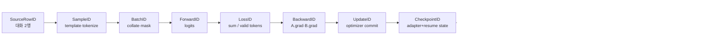
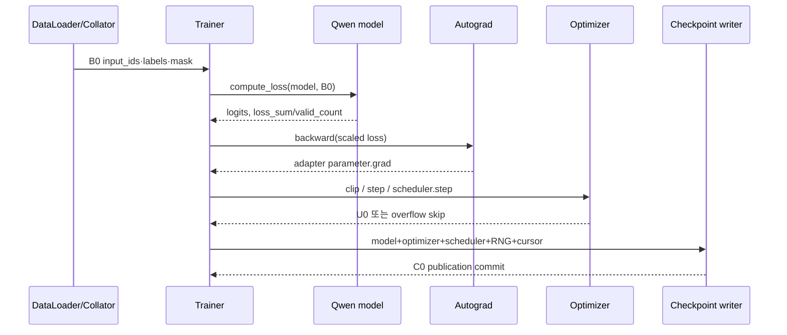

# 30장 SFT·RL·배포 golden lab: 하나의 변경을 끝까지 책임진다

마지막 장은 여러 framework의 명령을 한데 모으지 않는다. 이 장에서는 `GR-001`이라는 **하나의 실행**을 붙잡는다. 두 개의 짧은 대화가 같은 tokenizer와 collator를 지나 한 번의 optimizer update를 만들고, 그 update가 adapter checkpoint·merge·평가·release candidate로 이어지는 과정을 실제 식별자와 tensor로 추적한다. 이후의 대규모 SFT·DPO·온라인 RL·분산 실행은 이 기준 실행에서 무엇이 달라지는지를 설명하는 가지다.

독자는 아래 그림에서 현재 위치를 잃지 않아야 한다. 각 화살표는 단순한 처리 순서가 아니라 **소유자가 입력을 읽고 새로운 상태를 commit하는 경계**다. 뒤에서 어떤 기법을 만나더라도 먼저 이 그림의 어느 화살표를 바꾸는지 찾는다.



### GR-001의 작은 실제값

`GR-001`은 거대한 학습 성능을 재현하려는 benchmark가 아니다. 복잡한 실행에서 사라지기 쉬운 의미를 손으로 대조하기 위한 deterministic fixture다. 대표 모델은 [`Qwen/Qwen2.5-0.5B-Instruct` 모델 카드 revision `7ae5576…`](https://huggingface.co/Qwen/Qwen2.5-0.5B-Instruct/blob/7ae557604adf67be50417f59c2c2f167def9a775/README.md)와 같은 작은 decoder-only Qwen 계열로 고정하고, [`config.json`](https://huggingface.co/Qwen/Qwen2.5-0.5B-Instruct/blob/7ae557604adf67be50417f59c2c2f167def9a775/config.json)·tokenizer·weight 파일 digest를 함께 기록한다. 대화 두 행을 길이 `T=16`으로 padding했다고 가정하면 collator의 핵심 출력은 다음처럼 작아서 사람이 직접 검사할 수 있다. 이 revision은 설명의 재현 좌표이며 “현재 최신”이라는 뜻이 아니다.

| 식별자·상태 | 예시 값 | shape·dtype·device | 이 값을 만드는 owner | 다음 consumer |
|---|---|---|---|---|
| `SampleID=S0,S1` | role span과 assistant span | 가변 길이, CPU metadata | chat template·tokenizer | data collator |
| `BatchID=B0/input_ids` | token ID 두 행 | `[2,16]`, `int64`, CPU→CUDA | collator | model forward |
| `B0/labels` | prompt·padding은 `-100` | `[2,16]`, `int64`, CUDA | collator | causal-LM loss |
| `ForwardID=F0/logits` | vocabulary별 점수 | `[2,16,V]`, BF16, CUDA | decoder+LM head | shifted CE |
| `LossID=L0` | `loss_sum / 9 valid tokens` | scalar FP32 accumulation | loss function | autograd |
| `BackwardID=G0` | LoRA A/B gradient | module별 `[r,d_in]`, `[d_out,r]` | autograd | optimizer |
| `UpdateID=U0` | A/B와 Adam state 변화 | parameter별 FP32/BF16 | optimizer step | checkpoint writer |
| `CheckpointID=C0` | adapter, optimizer, RNG, cursor | file/shard digest | save transaction | clean-process resume |

이 표의 숫자는 실행 결과를 꾸며 낸 것이 아니다. 실제 run에서는 `V`, 유효 token 수, dtype과 device를 manifest에서 읽어 표를 다시 생성한다. 중요한 것은 `loss=...` 한 줄이 아니라 `L0`의 분자와 분모가 `B0/labels`에서 재계산되고, `U0`의 parameter delta가 바로 그 `L0`에서 비롯됐음을 증명하는 것이다.

### 실제 코드에서 닫히는 호출 경로

Transformers의 고정 revision `550d7b3834670483a4df436541272c055dc364bf`에서 [`Trainer._inner_training_loop`](https://github.com/huggingface/transformers/blob/550d7b3834670483a4df436541272c055dc364bf/src/transformers/trainer.py#L1456-L1889)는 dataloader iteration, accumulation, optimizer commit과 logging clock을 소유한다. 한 microbatch는 [`training_step`](https://github.com/huggingface/transformers/blob/550d7b3834670483a4df436541272c055dc364bf/src/transformers/trainer.py#L1892-L1963)을 거쳐 [`compute_loss`](https://github.com/huggingface/transformers/blob/550d7b3834670483a4df436541272c055dc364bf/src/transformers/trainer.py#L1965-L2052)로 들어간다. optimizer와 scheduler는 각각 [`create_optimizer`](https://github.com/huggingface/transformers/blob/550d7b3834670483a4df436541272c055dc364bf/src/transformers/trainer.py#L1168-L1242)와 [`create_scheduler`](https://github.com/huggingface/transformers/blob/550d7b3834670483a4df436541272c055dc364bf/src/transformers/trainer.py#L1244-L1274)에서 생성된다.



이 호출 그래프는 함수 이름을 나열하려는 것이 아니다. `gradient_accumulation_steps`, mixed-precision overflow, resume cursor 같은 옵션이 어느 화살표를 바꾸는지 찾는 지도다. 예를 들어 overflow로 step이 건너뛰어졌다면 backward가 끝났다는 사실만으로 `UpdateID`를 발급하면 안 된다. optimizer state와 parameter가 실제로 commit된 경우에만 `U0`가 생긴다.

## 30.1 마지막 장의 읽기 계약: 점수가 아니라 변경의 책임을 추적한다

이 장은 앞선 기술을 나열하지 않는다. 하나의 변경 요청이 데이터에서 시작해 학습·변환·평가·배포·복구를 지나며 어떤 증거를 남겨야 하는지, 종단 상태의 흐름으로 다시 조립한다.

이 장의 단위는 model 하나가 아니라 **검증 가능한 derivation edge**다. SFT가 만든 adapter, preference·RL update, merge, quantization, export, serving config는 각각 부모를 받아 새로운 상태를 만든다. 어느 edge에서 의미가 달라졌는지 알려면 모든 단계를 같은 질문으로 읽어야 한다.

`승인된 입력 artifact → 선택된 코드·옵션 → 변환 전 상태 → 변환 후 상태 → 경계별 parity fixture → 평가 분자·분모 → release gate → rollback parent`

예를 들어 최종 tool success가 떨어졌다고 하자. 원인은 SFT mask, preference length bias, stale rollout, merge scale, quantization outlier, tokenizer/template, serving position ID, scheduler timeout 중 어디에나 있을 수 있다. 최종 문자열 두 개만 비교하면 이 원인들이 같은 증상으로 합쳐진다. 이 장은 부모와 자식 사이에서 처음 달라진 `token IDs → first logits → layer sentinel → selected token → tool call → environment state`를 찾아 조사 범위를 한 edge로 줄인다.

### 종단 상태 원장

| 단계 | immutable parent | 새로 생기는 상태 | 반드시 닫을 parity·판정 | 실패하면 돌아갈 곳 |
|---|---|---|---|---|
| 데이터·template | raw/annotation revision | rendered bytes, IDs, role span, labels | byte·ID·mask·valid-token count | 승인된 dataset/template bundle |
| SFT·adapter | base checkpoint | A/B parameter, optimizer state, UpdateID | frozen-base delta, loss `S/N`, resume delta | base 또는 직전 adapter checkpoint |
| preference | SFT policy·reference | pair log-ratio, margin, policy child | pair swap, mask, reference-cache parity | 승인 SFT policy |
| online RL | published behavior policy | rollout, old log-prob, reward, advantage | version·group·denominator·exact-once commit | 직전 published policy |
| merge | base+adapter/policy | merged dense weight | adapter path와 load-after-save logits | unmerged parent graph |
| quantize | merged weight·calibration | scale/group/packed weight | layer sentinel·task/worst-group budget | merged BF16 artifact |
| export·serve | model/tokenizer/runtime | serving package·scheduler config | offline↔online IDs·logits·greedy·load smoke | 직전 승인 serving bundle |
| release | 모든 EvalID·manifest | alias·replica generation | signature, hard gate, canary, rollback smoke | 이전 release manifest |

이 표의 각 행에는 commit 경계가 있다. 파일 쓰기나 학습 step이 끝났다는 사실만으로 자식 artifact를 공개하지 않는다. manifest·hash·필수 shard·검증 상태가 모두 준비된 뒤 `Candidate → Verified → Published`로 승격한다. 실패한 candidate를 같은 ID로 덮어쓰면 어느 평가가 어느 byte를 보았는지 잃는다.

### 한 edge를 조사하는 여덟 칸

종단 원장을 실제 프로젝트에 옮길 때는 단계마다 문서 형식을 바꾸지 않는다. 다음 여덟 칸을 채우면 “옵션을 켰고 점수가 올랐다”는 기록이 재현 가능한 변환 계약으로 바뀐다.

| 칸 | 조사 질문 | 남겨야 할 artifact |
|---|---|---|
| parent | 정확히 어떤 bytes와 generation을 읽었는가 | 입력 digest, parent ID, resolver 결과 |
| consumer | 어느 고정 revision의 함수·branch가 읽었는가 | `repository@commit:path:symbol`, 호출 trace |
| option | default를 포함해 어떤 값이 어느 branch를 골랐는가 | resolved config와 option diff |
| state | tensor·mask·queue·cache·owner가 어떻게 바뀌었는가 | shape/dtype/owner와 전후 sentinel |
| arithmetic | 무엇을 더했고 무엇으로 나눴는가 | numerator, denominator, excluded count |
| first divergence | 정상 parent와 처음 달라지는 관측은 무엇인가 | 최소 positive fixture와 negative control |
| commit | 언제 불완전 child가 공개 불가능해지는가 | completion manifest, shard hash, publication event |
| recovery | 실패 시 어떤 parent와 외부 state로 돌아가는가 | rollback bundle, smoke 결과, 새 generation ID |

예를 들어 `beta=0.1→0.2`는 DPO 설정 한 줄의 변화로 끝나지 않는다. 실제 loss 함수가 읽은 beta, chosen/rejected response mask, 네 log-prob와 pair margin, 유효 pair 분모가 같은 row ledger에 있어야 한다. `group_size=128→64`도 파일 크기 비교가 아니라 quantizer가 만든 scale tensor의 shape, 선택된 kernel·fallback, layer sentinel, calibration family와 task 분모까지 이어져야 한다. 이 공통 형식 덕분에 서로 다른 framework에서도 첫 불일치를 같은 질문으로 좁힐 수 있다.

인계 시에는 여덟 칸을 설명문에만 남기지 않는다. edge마다 기계 판독 가능한 manifest와 사람이 읽는 decision note를 짝지어 전달한다. 전자는 identity·수치·상태를 재계산하게 하고, 후자는 왜 그 budget과 rollback parent를 골랐는지 설명한다. 둘 중 하나만 있으면 자동 검증 또는 기술적 판단이 끊긴다.

### 옵션을 효과가 아니라 상태 차이로 기록한다

`lora_rank`, `beta`, `cliprange`, quantization group size, max sequence length, chat template, serving batch policy는 서로 다른 층의 옵션이지만 공통 형식으로 기록할 수 있다.

| 질문 | 기록할 내용 |
|---|---|
| 무엇이 소비하는가 | parser·builder가 아니라 실제 forward/loss/kernel/scheduler 함수 |
| 무엇이 바뀌는가 | tensor shape·mask·분모·parameter owner·cache·queue·artifact schema |
| 기대 효과는 무엇인가 | memory·gradient geometry·off-policy 제한·latency 등 직접 기전 |
| 새 위험은 무엇인가 | stale state·fallback·quality shortcut·resume 불일치·부분 publication |
| 최초 관측점은 어디인가 | option diff 다음의 첫 tensor, metric numerator/count, dispatch, manifest field |
| 되돌림 단위는 무엇인가 | config만이 아니라 그 옵션으로 파생된 child artifact 전체 |

옵션 이름과 최종 benchmark만 남기지 않는다. 같은 점수 상승도 assistant 유효 token이 늘어서인지, reference margin이 달라져서인지, timeout row가 분모에서 빠져서인지 구분해야 한다. option diff와 state diff, evaluation denominator가 한 기록에 있어야 “왜 좋아졌는가”를 설명할 수 있다.

**최종 장애를 가르는 최초 불일치 지도**

| 증상 | 먼저 비교할 부모·자식 | 가장 싼 분리 실험 | 다음 owner |
|---|---|---|---|
| SFT loss는 낮지만 응답 형식이 무너진다 | rendered IDs·assistant mask·EOS | 한 대화의 token별 label 표와 수동 `S/N` | template/collator |
| preference 승률만 오르고 답이 길어진다 | chosen/rejected 길이·token reduction·reference | 길이 일치 최소쌍과 pair swap | dataset/objective |
| RL reward만 급등한다 | reward component numerator/count·environment state | frozen trajectory 재채점과 verifier 대조 | reward/judge/environment |
| merge 뒤 첫 logit이 달라진다 | adapter path vs merged weight | 한 module의 `W+sBA`와 load-after-save 비교 | merge/tied weight/dtype |
| quantized artifact의 특정 도메인만 깨진다 | layer sentinel·group scale·outlier | 민감 layer만 높은 precision으로 되돌린 child | quantizer/calibration |
| offline은 맞고 serving batch에서만 다르다 | IDs·position·cache slot·request mapping | batch 1/2와 padding 방향을 한 축씩 비교 | loader/cache/scheduler |
| canary p99만 악화된다 | request mix·queue·prefill/decode·failure count | 길이·concurrency bucket별 service time 분해 | scheduler/kernel/network |
| rollback 뒤에도 이상이 남는다 | weight 외 tokenizer/runtime/queue/cache | exact bundle digest와 외부 state generation 확인 | deployment/control plane |

“어느 framework가 문제인가”는 마지막 질문이다. 첫 질문은 정상 parent와 문제 child가 처음 달라진 상태가 어디인가다. 그 차이를 재현하는 최소 fixture와 그 차이가 사라지는 음성 대조군을 함께 확보해야 원인 판정을 닫을 수 있다.

## 30.2 SFT에서 release까지 한 번의 상태 전이로 읽는다

먼저 SFT, 선호 학습, 산출물 변환과 release를 서로 떨어진 recipe가 아니라 부모와 소비자가 명시된 하나의 흐름으로 잇는다.

### 30.2.1 response-only loss가 정답 token만 남기는 경계

chat renderer가 만든 token과 assistant span을 저장한다. label mask의 유효 token 수를 보고 user/system token에 loss가 새지 않는지 검사한다. LoRA는 target module, rank, alpha, dropout, base digest를 manifest에 넣는다. frozen base delta가 0인지 한 step 뒤 확인한다.

QLoRA로 바꾸면 이 경계에 dtype 원장이 하나 더 붙는다. 양자화 base weight, dequant compute dtype, trainable adapter dtype, optimizer state dtype을 구분한다. memory 절감 수치는 같은 batch와 sequence에서 peak allocated와 reserved를 측정할 때만 쓴다. adapter를 읽은 직후에는 golden logits를 저장해 양자화와 label 경계 중 어느 쪽에서 최초 차이가 났는지 분리한다.

그다음 response-only mask를 token index에서 검산한다. renderer는 대화 문자열을 token ID로 바꾸지만 어떤 token이 loss를 받는지는 trainer와 collator가 정한다. `labels=input_ids.clone()` 뒤 user/system span을 ignore로 바꾸는 구현도 있고 assistant mask를 template가 직접 반환하는 구현도 있다. decoded 문자열만 보지 말고 token index별 `(id, role, label, byte_offset)` 표를 만든다.

unreduced cross entropy를 `ℓ_i`, assistant mask를 `m_i`라 하면 `L=Σ_i m_iℓ_i/Σ_i m_i`다. packing한 여러 대화의 assistant span이 섞일 때 document boundary와 EOS가 정확한지 본다. 모든 label이 ignore인 sample은 NaN 분모 또는 0-loss sample이 될 수 있으므로 fail-fast한다.

짧은 확인 코드는 다음 불변식을 검사한다.

```python
valid = labels.ne(ignore_index)
assert valid.any(), "assistant target이 없는 표본"
assert torch.equal(labels[~valid], torch.full_like(labels[~valid], ignore_index))
loss = token_loss[valid].sum() / valid.sum()
```

실제 library 함수명과 mask 생성 분기는 고정 revision에서 다시 확인해야 한다. 이 코드는 구현 인용이 아니라 독자용 invariant다.

이 mask가 올바르더라도 LoRA update와 merge 수식은 별도로 검산한다. 원 weight `W∈R^{d_out×d_in}`에 rank `r` adapter `B∈R^{d_out×r}`, `A∈R^{r×d_in}`를 두면 forward는 `y=(W+sBA)x`다. 흔히 `s=α/r`지만 RS-LoRA 등은 scale이 다르다. target module 이름만 같아도 fused QKV layout이나 tensor-parallel shard 축이 다르면 merge 위치가 달라진다.

한 step 뒤 검사할 state는 base weight digest, A/B delta norm, optimizer가 소유한 parameter ID다. adapter dropout이 켜진 train mode와 eval mode logits를 그대로 비교하지 않는다. merge parity는 eval mode, 같은 dtype, 같은 input에서 `W+sBA`와 adapter path를 비교한다.

### 30.2.2 preference와 online RL의 분모·버전 원장

DPO로 넘어갈 때는 chosen/rejected logprob와 reference revision뿐 아니라 denominator를 함께 고정한다. 길이가 다른 pair에서 token sum과 mean은 서로 다른 objective를 만든다. online RL에서는 같은 문제가 더 많은 상태로 퍼지므로 `PromptID`, rollout lease, behavior `PolicyVersion`, old logprob, reward/judge revision을 trajectory에 붙인다.

DPO의 대표 형태는 `-log σ(β[(logπθ(y⁺|x)-logπref(y⁺|x))-(logπθ(y⁻|x)-logπref(y⁻|x))])`다. 여기서 sequence logprob를 token sum으로 만들면 긴 답변의 절댓값이 커진다. token mean을 쓰면 길이 가중은 줄지만 원 논문의 목적과 달라질 수 있다. padding과 prompt token을 합에서 제외하고 chosen/rejected 유효 token 수를 metric으로 남긴다.

reference가 base인지 직전 SFT인지, adapter가 reference에도 로드되는지에 따라 `logπref`가 바뀐다. reference 산출물 digest가 manifest에 없다면 loss를 재현할 수 없다.

PPO·GRPO에서는 이 기록을 state ledger로 확장한다. PPO token ratio는 `r_t=exp(logπ_current(a_t|s_t)-logπ_behavior(a_t|s_t))`다. clipped surrogate는 ratio가 `[1-ε,1+ε]` 밖으로 나갈 때 update를 제한한다. GAE는 `δ_t=r_t+γV(s_{t+1})-V(s_t)`, `A_t=δ_t+γλA_{t+1}`로 뒤에서 누적한다. 여기서 response mask, terminal/truncation, reward 위치가 수식과 code 사이의 핵심 계약이다.

GRPO/RLOO는 group을 기준으로 baseline을 만들므로 `PromptID/group_id`가 섞이면 다른 알고리즘이 된다. zero variance group 처리, 표준편차 분모, sequence advantage를 token에 broadcast하는 위치를 기록한다. metric에는 raw reward, centered/normalized advantage, KL, clip fraction, response length를 같이 둔다.

trajectory 원장에는 다음 state가 들어가야 한다.

```text
PromptID, dispatch_id, group_id, attempt_id
behavior PolicyVersion, token-span version, old logprobs
reward/judge revision, termination reason, response mask
enqueue/dequeue/optimizer commit, batch manifest hash
```

이 원장이 있어야 async queue를 지연 원인별 결정 트리로 읽을 수 있다. policy age가 커지면 queue wait와 environment runtime을 나눈다. queue wait가 크면 producer/learner rate와 queue capacity, environment가 길면 tool timeout과 rollout length를 본다. 같은 trajectory 안 token-span version이 둘 이상이면 partial resume 또는 weight publication 중 생성이 의심된다.

retry는 새 `attempt_id`를 갖되 같은 idempotency key를 유지해야 한다. queue `get` 직후 worker가 죽으면 at-least-once 재전달 또는 유실 중 하나가 된다. optimizer commit에 `(trajectory_id, optimizer_epoch)` uniqueness가 없으면 exactly-once를 주장하지 않는다.

여기서 stale rollout과 weight publication은 같은 문제의 양쪽이다. freshness threshold는 throughput과 off-policy bias의 교환이다. weight 게시가 모든 inference replica에 원자적으로 적용됐다고 가정하지 않는다. replica별 산출물 digest와 ack를 남기고 mixed-version token span을 거부하거나 명시한다.

### 30.2.3 merge·quantize·export의 artifact 계보

학습이 끝나면 파일 목록보다 산출물 DAG를 먼저 그린다. base+adapter→merged BF16→quantized artifact→serving package의 parent digest를 기록한다. merge 전 adapter-enabled logits와 merged logits을 같은 input에서 비교한다. quantization은 별도 tolerance와 task eval을 요구한다.

그 DAG에는 tokenizer와 serving parity도 포함한다. tokenizer, chat template와 special token을 artifact에 넣고 offline trainer와 serving API에 동일 prompt bytes를 주어 token IDs, first-step logits, greedy output을 비교한다. sampling 결과 불일치는 RNG 계약이 다를 수 있으므로 greedy parity부터 닫는다.

merge parity의 오차 예산은 결과를 보기 전에 정한다. BF16 adapter path와 BF16 merged path가 같은 수학을 구현해도 연산 순서 때문에 bitwise 같지 않을 수 있다. `max_abs`, `mean_abs`, cosine, top-k token set과 greedy token을 기록한다. tolerance는 calibration prompt 결과를 보기 전에 dtype과 kernel을 근거로 정한다.

불일치는 base-only logits부터 확인한다. 여기서 다르면 base artifact/실행 환경 매핑, adapter-enabled만 다르면 target module/scale/load, merged만 다르면 merge dtype와 tied weight, quantized만 다르면 scale/group/calibration/backend를 본다. 최종 text만 비교하면 첫 token의 작은 divergence가 sampling으로 증폭된 원인을 찾을 수 없다.

quantization과 calibration은 merge parity의 다음 edge다. weight-only INT4, GPTQ/AWQ, FP8, NVFP4는 scale granularity와 calibration 목적이 다르므로 “4비트” 하나로 묶지 않는다. tensor별/group별 scale, zero point 유무, activation dtype, excluded modules, calibration dataset revision을 manifest에 둔다.

quantization 전후에는 layer output error를 먼저 보고 task eval로 간다. 특정 layer에서 error가 급증하면 sensitivity에 따라 higher precision으로 남긴다. serving backend가 해당 format/kernel을 지원하지 않아 dequant fallback하면 memory·latency 주장이 달라진다. 실제 선택된 kernel과 fallback log를 보존한다.

export contract도 weight 파일에 그치지 않는다. config architecture/model type, generation config, tokenizer files, chat template, special token map, adapter/quantization metadata, shard index가 하나의 package다. remote code가 필요하면 revision과 code digest를 포함한다. shard별 SHA와 index가 가리키는 tensor name/shape를 검사한다.

red-team, evaluation과 release에서는 회귀 묶음을 위험 종류별 `EvalID`로 분리한다. task utility, private safety, over-refusal, contamination, latency/memory를 각각 실행한다. 실제 실행하지 않은 production latency는 release 표에 결과를 넣지 않는다. revocation 대상이 있으면 모든 후손 artifact가 invalidated됐는지 확인한다.

마지막 release decision matrix는 강제 관문와 budget을 나눈다. 산출물 hash/format 검증, tokenizer parity, private critical safety는 강제 관문가 될 수 있다. task score, latency, memory는 baseline 대비 budget으로 둘 수 있다. benchmark의 표준오차보다 작은 하락을 무조건 실패로 보지 않되 paired row에서 특정 domain이 무너졌는지 본다.

```text
Gate A provenance: PASS/FAIL
Gate B offline↔serving token/logit parity: PASS/FAIL
Gate C utility paired delta and CI: value/budget
Gate D private red-team + over-refusal: value/budget
Gate E runtime smoke on declared hardware: PASS/FAIL/미실행
Gate F rollback load smoke: PASS/FAIL
```

`미실행`은 PASS가 아니다. 운영자가 risk를 수용한다면 예외의 소유자, 범위, 만료일, 관측 alert를 기록한다.

평가 도구의 단위 테스트와 release 통합 테스트도 섞지 않는다. 예를 들어 garak의 고정 fixture `[0.0,0.8,None]`은 `passed=1`, `fails=1`, `nones=1`, `total_evaluated=2`, `total_processed=3`이라는 report 계약을 확인한다. 이는 `None`을 유효 판정 분모에서 빼되 처리 건수에는 남기는 규칙을 증명한다. 실제 요청 처리 성능을 측정하거나 high-severity fail이 registry publication을 막는다는 사실, 실패 사례가 SFT·RL 데이터로 환류된다는 사실은 증명하지 않는다.

release rehearsal에서는 이 경계를 다음 순서로 닫는다. 첫째, raw detector score에서 pass·fail·none과 두 분모를 독립 재계산한다. 둘째, threshold·`None` 처리·severity를 하나씩 바꾼 변형 fixture에서 최초 불일치가 disposition, metric, policy decision 가운데 예상한 열에 생기는지 확인한다. 셋째, 강제 관문 실패을 넣어 publish 함수가 호출되지 않고 차단 decision과 근거 CaseID가 append-only ledger에 남는지 시험한다. 넷째, 학습 후보를 만들었다면 `CaseID→TrainingExampleID→UpdateID`를 추적하고 sealed 평가 sibling이 export에서 거절되는지 확인한다. 어느 단계든 직접 assertion이 없으면 해당 칸은 PASS가 아니라 `미검증`이다.

오염 제거도 같은 원칙을 따른다. lm-eval-harness 고정 revision의 `tests/test_janitor.py`는 모듈 전체가 skip되므로 그 아래 n-gram equality assertion은 현재 실행되는 종단 증거가 아니다. `설정 활성화→정규화→corpus lookup→overlap 판정→문항 제외→분모 재집계`를 잇는 local fixture가 없다면 clean-only 점수를 release 근거로 올리지 않는다. 작성돼 있으나 실행되지 않은 테스트, 실행됐으나 국소 함수만 보는 테스트, 실제 release를 차단하는 통합 테스트를 manifest에서 서로 다른 evidence class로 기록한다.

**rollback도 배포다.**

rollback artifact가 object storage에 있다는 사실만으로 복구 가능하지 않다. tokenizer/config/runtime compatibility와 load smoke를 미리 시험한다. database나 rollout queue 같은 외부 state가 새 policy version으로 진행됐다면 weight만 되돌려도 일관성이 회복되지 않을 수 있다.

배포 시 published version을 alias에 연결하기 전에 replica별 산출물 digest와 readiness를 모은다. partial publication 중 요청이 old/new로 갈리는지 canary ID로 관찰한다. rollback도 같은 two-phase 경계를 사용한다.

**멀티노드 검증에서 이어지는 소스와 실행의 경계.**

PEFT `1feedf1a4b96c86e2efcdd28b84ce9b949e3732c`, TRL `a7be897f5c8d7b52161f9f8a47d8e6242456b898`, Transformers `550d7b3834670483a4df436541272c055dc364bf`에서 adapter injection, merge, SFT/DPO/GRPO의 실제 함수와 test를 읽는다. verl `483b8a009ba3a97563edee3a19887e4862b8094a`, OpenRLHF `3c3be6234e0cb353e76bb8019947db9dfe99fca7`, PRIME-RL `21a4a324506282ece21cb5dc6d75acba875fecc8`, ART `cce3d8e8f7654e29b7ef4da19657c5b2f0c9943c`의 policy version/weight sync/lease/queue 경계를 비교한다.

이 revision의 공개 코드는 구현 계약을 확인하는 근거다. 실제 SFT→RL→quantize→serving 수치와 failure recovery는 동반 lab을 실행해야 결과로 인정할 수 있다. 현재 장은 실행 절차와 판정 규칙을 다루며 production 성능을 주장하지 않는다.

**결정 기록.**

release decision에는 승인자보다 근거가 중요하다. base/adapter/merged/quantized digest, training/eval config, known limitation, rollback checkpoint, red-team 결과, runtime-unverified 항목을 한 manifest로 묶는다. gate 하나라도 실패하면 예외 승인과 만료 조건을 기록한다.

**이 장의 인계물.** 재현 가능한 derivation DAG, parity report, EvalID 묶음, release/rollback manifest를 넘긴다. 이것이 제2권의 최종 산출물이다.

인계물은 이름만 나열해서는 닫히지 않는다. 최종 `ReleaseID`에서 역방향으로 `serving bundle→export→quantization→merge→preference/RL→SFT adapter→base·dataset·template`가 모두 해석돼야 한다. 각 edge는 위 여덟 칸과 해당 negative control을 가리키고, rejected child도 실패 assertion과 함께 남는다. 정방향으로는 parent 폐기나 data family revocation을 넣었을 때 영향받은 모든 descendant와 replica가 검색돼야 한다. 역추적과 영향 추적 가운데 하나라도 끊기면 인계 상태는 `PASS`가 아니라 `INCOMPLETE`다.

최종 인수자는 다음 순서로 판정한다. 첫째, alias가 아닌 digest로 한 canonical row를 render·mask·loss까지 재계산한다. 둘째, 같은 row가 adapter/preference 또는 RL child에서 어떤 수치 변화를 만들었는지 확인한다. 셋째, merge·quantize·export·serving의 first logits를 차례로 비교한다. 넷째, EvalID의 분자·분모에서 release decision을 다시 만든다. 다섯째, 실패한 edge의 parent bundle로 rollback smoke를 실행한다. 이 다섯 단계가 동일한 계보에서 닫힐 때만 다음 팀이 결과를 믿고 이어갈 수 있다.

## 30.3 하나의 사례 연구로 종단 계약을 검산한다

추상적인 계약은 실제 사례에서 깨지는 지점을 찾을 때 비로소 쓸모가 있다. 여기서는 한 변경 요청을 데이터 감사부터 rollback까지 추적한다.

가상의 7B instruction model이 한국어 고객지원 tool JSON에서 형식 오류 12%를 보인다고 하자. 목표는 exact JSON 성공률을 95% 이상으로 높이고 일반 도움성 회귀를 0.5점 이내, safety attack success 증가를 0으로, serving p99 증가를 5% 이내로 제한하는 것이다. SFT 뒤 preference와 작은 online RL을 수행하고 LoRA merge·4-bit export로 배포한다.

base model/tokenizer/template, 40k SFT row, 8k preference pair, 2k private evaluation family와 runtime을 immutable digest로 고정한다. private family의 parent/paraphrase는 training export에서 차단한다. primary와 강제 관문, checkpoint selection set, final test와 canary 중단 조건을 결과 전에 기록한다.

한 번에 모든 것을 바꾸지 않는다. SFT adapter `A1`, preference policy `P1`, online policy `P2`, merge `M1`, quant `Q1`, export `E1`, deployment `D1`을 별도 artifact로 만든다. 각 edge가 실패하면 직전 승인 artifact로 돌아간다. [종단 실습](../labs/30-sft-rl-deploy-golden-lab.md)은 이 ID를 축소한 synthetic 사례로 재현한다.

### 데이터 감사와 split

40k SFT row를 출처 캠페인, intent, language, tool schema revision과 conversation family로 묶는다. 고객 ticket 원문은 개인정보 제거와 사용 권한을 확인하고 training row에는 필요한 최소 field만 남긴다. exact duplicate뿐 아니라 template-generated paraphrase가 한 family에서 수백 개 생겼는지 본다.

row 통계에는 평균 길이뿐 아니라 p50/p95, assistant contributing token, tool call 비율, truncation·empty mask와 JSON schema별 count를 담는다. 4% row에서 answer tail이 잘린다면 max length를 늘리거나 row를 재구성한다. 잘린 row를 그대로 학습해 closing brace 오류를 강화하지 않는다.

split은 family 단위로 하고 private evaluation access log를 확인한다. data transformation마다 DocumentID→conversation→rendered→tokenized/packed lineage를 둔다. [contamination playbook](../playbooks/10-contamination.md)으로 answer-bearing overlap을 검사하고 ambiguous match는 사람이 span을 확인한다.

**SFT golden batch**

golden batch는 일반 답변, 단일 tool, multi-turn tool result, 긴 한국어와 malformed 원천 행를 포함한다. malformed row는 학습에 넣는 것이 아니라 validation이 거부하는지 시험한다. raw bytes, token IDs, role spans와 response mask를 [단일 GPU lab](../labs/28-single-gpu-golden-lab.md) 형식으로 고정한다.

예를 들어 네 row의 contributing token이 80, 120, 200, 0이라면 마지막은 `empty_mask`로 거부하고 denominator는 400이다. numerator가 240이면 loss 0.6이다. collator가 네 row를 평균해 마지막 0-loss를 포함한 0.45를 보고하면 버그다.

한 optimizer update 뒤 expected trainable adapter set에만 delta가 있어야 한다. base, embedding와 output head는 정책상 frozen이다. AMP scale·clipping, LR와 update-to-weight를 기록한다. continuous와 checkpoint-resume 10-step trace를 비교한 뒤 장기 SFT를 시작한다.

**SFT run의 관측**

primary x축은 optimizer step과 contributing tokens seen이다. train loss sum/tokens, exact JSON training fixture, gradient/update group, empty/truncated row, tokens/s와 peak memory를 함께 본다. evaluation은 selection set과 private final을 분리한다. 판단 근거는 W&B display chart보다 raw RunID history와 checkpoint digest에 둔다.

step 2,400에서 loss는 계속 내려가지만 selection JSON이 93%에서 정체되고 일반 도움성이 하락한다면 training을 더 길게 하는 것이 답이 아닐 수 있다. error를 missing key, invalid type, truncation과 hallucinated field로 분해한다. 특정 schema revision에 몰리면 data coverage와 template를 본다.

plateau가 mask/LR/parameter delta 문제인지 [plateau playbook](../playbooks/02-plateau.md)으로 확인한다. sample ledger에서 같은 family 반복이 늘면 [sample-repeat playbook](../playbooks/03-sample-repeat.md)을 사용한다. 최종 SFT checkpoint `A1`은 selection rule로 선택하고 final private set을 아직 열지 않는다.

**preference pair 감사.**

8k pair의 chosen은 schema-valid하면서 실제 요청을 수행하고, rejected는 unsafe가 아니라 형식·helpfulness 실패의 명확한 유형을 가진다. chosen이 평균 200 token, rejected가 80 token이라면 길이 shortcut을 조사한다. 길이와 문체를 맞춘 counterfactual pair, pair swap과 annotator disagreement를 넣는다.

response boundary가 prompt를 포함하지 않는지 token fixture로 확인한다. policy/reference chosen/rejected logprob, token count와 DPO margin을 row별로 기록한다. reference는 SFT artifact `A1`의 exact digest다. tokenizer/template mismatch는 시작 전에 [tokenizer mismatch playbook](../playbooks/04-tokenizer-mismatch.md)으로 차단한다.

training과 final private family가 겹치지 않는지 lineage를 다시 검사한다. rejected가 운영 로그에서 왔다면 개인정보·secret과 incident access를 분리한다. label policy와 adjudication revision을 manifest에 넣는다.

**preference 결과 판정.**

`P1`이 selection JSON 96%, 도움성 -0.2, over-refusal +0.1이면 목표 범위다. 그러나 pair training family에서만 좋아지고 unseen schema가 90%라면 일반화가 부족하다. family별 paired interval과 failure type을 본다.

reward margin이 커지면서 response length가 선택 label 방향으로만 변하면 shortcut 가설을 연다. pair swap fixture, held-out length-matched set과 reference KL을 확인한다. training loss 감소를 preference 품질의 증거로 쓰지 않는다.

`P1`은 SFT `A1`과 preference dataset/reference/objective를 materials로 가진다. optimizer state까지 보존해 resume를 검증하지만 online RL의 시작 policy로 쓸 때는 published immutable generation을 새로 만든다.

### online RL에서 publication까지 추적한다

tool environment는 schema validator, fake customer DB와 side-effect simulator로 구성된다. 실제 production credential이나 외부 API를 사용하지 않는다. prompt family, environment snapshot, tool result와 termination을 trajectory에 저장한다. success는 model의 “성공했습니다” 문장이 아니라 simulator state와 valid JSON으로 판정한다.

reward는 schema 0.4, task completion 0.4, helpfulness 0.2에서 authorization violation hard penalty와 KL을 분리한다. 각 component의 eligible denominator를 둔다. tool을 호출하지 않은 response는 authorization success로 세지 않는다. judge error와 environment timeout은 unscored다.

rollout worker는 `P1` digest를 load하고 시작·종료 version을 보고한다. learner publication, queue age와 duplicate attempt를 [stale-rollout playbook](../playbooks/08-stale-rollout.md)으로 검증한다. 작은 synthetic group에서 advantage를 손계산한 뒤 GPU run으로 간다.

**RL run 중 이상 징후**

step 300에서 평균 reward가 0.62에서 0.78로 오르지만 response length가 절반, 도움성이 -2점이라면 model이 빈 최소 JSON으로 schema component를 해킹했을 수 있다. component별 numerator와 simulator task completion을 보면 schema만 상승했음을 알 수 있다.

reward weight를 즉시 바꾸기 전에 faulty trajectory를 frozen set으로 재채점하고 rubric/validator가 의도와 맞는지 본다. task completion을 강화하는 변경은 objective revision이므로 child run을 만든다. 같은 W&B run을 이어 쓰지 않는다.

KL, entropy, unique response와 family coverage도 확인한다. rollout queue가 쉬운 prompt에 치우쳤다면 accepted denominator가 변한 것이다. timeout/expired가 어려운 family에 몰리는지 본다. fix 뒤 untouched environment variant에서 행동을 재평가한다.

**RL publication 장애 사례**

learner가 `P2-generation-17`의 8 shard 중 7개만 쓴 상태에서 alias가 바뀌는 fault를 넣는다. worker는 completion manifest가 없으므로 load를 거부하고 기존 `P1`을 유지하되 response metadata에 그 digest를 남긴다. learner는 이 trajectory를 age policy로 처리한다.

한 worker가 local cache 때문에 `P2-generation-16`을 계속 쓰면 loaded-version inventory가 mixed 상태를 경보한다. queue의 policy version 분포와 expected worker count를 본다. mixed batch를 조용히 학습하지 않는다.

복구는 17 generation을 폐기하고 새 18을 완전히 publish한다. 모든 worker가 18을 load한 뒤 synthetic prompt의 old logprob와 generation parity를 확인한다. incident는 [stale-rollout playbook](../playbooks/08-stale-rollout.md)의 regression으로 남긴다.

**SFT와 RL의 최종 선택**

final private set은 개발이 끝난 후보 `A1`, `P1`, `P2`에 제한된 횟수로 실행한다. utility, schema/tool, safety와 over-refusal, calibration과 latency를 같은 row ledger 원칙으로 본다. final 결과를 본 뒤 `P2` reward를 다시 조정하면 set은 selection에 사용된 것이다.

가령 `P2`가 JSON 97.2%, 도움성 -0.3, safety 변화 0, over-refusal +0.2라면 model gate를 통과한다. interval과 worst schema도 threshold 안인지 확인한다. `P1`과 차이가 작고 RL 운영 비용이 크면 단순한 artifact를 선택할 수도 있다.

선택 기록에는 effect size뿐 아니라 training GPU-hour, rollout/judge 오류, reproducibility와 serving 비용을 넣는다. 최고 평균 score가 자동 승자가 아니다. 사례에서는 `P2`를 merge 대상으로 선택했다고 가정한다.

### merge·quantize·export를 사례로 검산한다

`P2`가 adapter policy라면 active adapter+base와 merge `M1`을 같은 128개 golden prompt에서 비교한다. selected logits max absolute error가 BF16 budget 0.015, greedy divergence 0인지 본다. 저장·재로드 후 같은 검사를 반복한다.

특정 tied output head에서 error 0.08이 나오면 merge dtype과 tied reference를 source 좌표에서 확인한다. FP32 accumulation으로 merge하고 cast하는 `M2`를 새 artifact로 만든다. `M1`을 덮어쓰지 않는다. `M2`가 0.01로 통과하면 fix 근거가 된다.

adapter module이 남아 delta가 두 번 적용되지 않는지 parameter/module 목록을 검사한다. base와 adapter, merge code/config/dtype가 derivation edge에 들어간다. 원 adapter와 optimizer checkpoint는 rollback/재현을 위해 보존한다.

**quantization calibration 사례**

`M2`를 4-bit weight-only로 바꿀 때 1,024개의 별도 calibration row를 사용한다. 한국어 긴 문장, JSON punctuation, 드문 tool key와 long context bucket을 포함한다. private final row와 family overlap은 0이어야 한다.

group size 128 설정 `Q1`은 평균 task 회귀 -0.1이지만 rare schema exact가 -6점이라 강제 관문를 실패한다. layer error를 보면 output projection의 outlier channel이 크다. group size 64 또는 해당 layer higher precision인 `Q2`를 실험한다. memory·latency tradeoff를 함께 측정한다.

`Q2`가 rare schema -0.4, 전체 -0.15, memory 45% 감소, latency 12% 개선이면 예산 안이다. calibration과 quant backend commit, scale/metadata를 artifact에 둔다. 숫자는 실제 실행 예가 아니라 책의 판정 절차를 설명하는 합성 사례임을 명시한다.

**export 사례**

`Q2`를 target runtime format `E1`로 내보낸다. tensor name/shape/dtype, shard index, quant scale, architecture/config, tokenizer/template와 generation defaults를 schema 검사한다. unexpected/missing key는 0이어야 한다.

source runtime과 target runtime에서 128 golden prompt의 prefill logits, decode 3 step과 greedy token을 비교한다. batch 1은 맞지만 batch 8에서 tool closing brace가 갈리면 cache slot/padding을 조사한다. token IDs가 exact인지 먼저 확인한다.

원인이 target loader의 left-padding position ID branch라면 fixed runtime commit으로 `E2`를 만든다. weight export가 같아도 runtime material이 다르므로 새 serving bundle이다. source 좌표에 parser/position/cache symbol과 local regression fixture를 연결한다.

**serving 부하 사례**

`E2`를 concurrency 1, 8, 32와 prompt/decode length bucket에서 측정한다. cold load, warm-up과 steady state를 분리한다. successful request p50/p99, 전체 error/timeout, prefill/decode token/s와 GPU memory를 기록한다.

concurrency 32에서 p99가 baseline보다 9% 느리고 KV cache eviction이 늘면 5% budget을 실패한다. quant kernel은 빨라도 scheduler batching과 cache metadata가 병목일 수 있다. Nsight/serving metric으로 first changed range를 찾는다.

batch policy `B2`에서 p99 +3%, error unchanged, quality parity가 맞으면 새 runtime config edge를 승인한다. 성능을 위해 max context를 줄이거나 timeout row를 제외했다면 같은 비교가 아니다. request mix와 denominator를 고정한다.

**release·canary·rollback을 판정한다**

형식 최적화가 refusal이나 tool authorization을 바꿀 수 있으므로 model `P2`, merge `M2`, quant `Q2`, runtime `E2/B2` 각 sentinel에서 safety를 본다. final bundle에서 25장의 private tool scenario와 benign boundary를 실행한다.

quant 뒤 한 언어에서 refusal classifier score가 달라졌다면 사람 표본과 raw behavior를 확인한다. classifier logit drift를 model 안전 회귀로 바로 해석하지 않는다. tool executor가 최종 authorization을 강제하는지도 simulator state로 판정한다.

red-team case가 debugging에 쓰이면 해당 family는 후속 holdout에서 퇴역한다. fix가 필요하면 새 artifact와 replacement private family를 만든다. safety 강제 관문를 utility 평균으로 상쇄하지 않는다.

**canary 시간선**

T0에 production replica 2%가 exact bundle `D1`을 load한다. T1 startup에서 signature/schema/golden prompt, T2 30분 low-risk traffic, T3 2시간 대표 traffic, T4 10% 확대처럼 단계별 observation과 승인자를 둔다. loaded digest가 desired와 다른 replica가 하나라도 있으면 확대를 멈춘다.

관측은 request success/error, JSON/tool success proxy, latency bucket, authorization denial과 safety classifier drift를 본다. proxy는 offline EvalID를 대신하지 않는다. private content는 metric label에 넣지 않고 sampled review는 접근 통제한다.

T2에서 JSON은 좋아졌지만 한 tool timeout이 2배면 runtime/traffic interaction을 조사한다. threshold를 넘으면 evidence snapshot 후 이전 bundle로 rollback한다. canary case를 training feedback으로 쓰면 lineage와 holdout retirement를 적용한다.

**rollback 사례**

rollback manifest는 이전 승인 bundle `D0`의 weight/tokenizer/runtime/config digest를 모두 가진다. weight만 되돌리고 새 template를 유지하지 않는다. rollout 시작 전 node cache가 `D1` quant shard를 재사용하지 않는지 key와 revocation을 확인한다.

각 replica가 `D0` loaded digest를 보고하면 synthetic golden request와 tool simulator smoke를 실행한다. latency/error가 baseline으로 돌아왔는지, incident queue가 drain됐는지 본다. rollback 성공 뒤에도 `D1` 문제 원인은 미확정일 수 있다.

RCA는 traffic bucket, runtime config와 `E2/Q2/P2` edge를 교차한다. fix는 가장 가까운 failing edge에서 child artifact로 만든다. canary에서 노출된 case만 외워 통과하지 않도록 family variant와 untouched 평가를 사용한다.

**case study의 소스 원장**

SFT mask·loss와 Trainer update, PEFT adapter injection/merge, preference objective, rollout publication, quantizer/exporter와 runtime loader/scheduler의 `repository@commit:path:symbol`을 claim별로 기록한다. option이 실제 소비되는 branch와 tensor/state, upstream test와 local fixture를 붙인다.

`M1→M2`는 merge accumulation/tied weight symbol, `E1→E2`는 position ID/cache mapping symbol이 first divergence와 연결된다. 단순히 “PEFT 버그”, “runtime 버그”라고 쓰지 않는다. fix commit과 regression fixture가 같은 semantic anchor를 검증해야 한다.

공개 source로 확인하지 못한 custom service는 내부 revision/digest와 interface contract를 기록하고 책에서는 합성 구현임을 밝힌다. 실제로 실행하지 않은 대규모 수치는 관측 결과처럼 쓰지 않는다. 사례 숫자는 판정법을 보여주는 worked example이다.

**case study의 최종 record.**

최종 record는 변경 계약, data/split 감사, `A1→P1→P2→M2→Q2→E2/B2→D1` DAG, rejected `M1/Q1/E1`, edge parity와 EvalID를 포함한다. 실패 artifact도 보존해야 왜 최종 선택이 나왔는지 알 수 있다.

표에는 JSON/safety/helpfulness, merge/quant/runtime logit error, latency/memory, training/serving 비용과 interval을 둔다. 각 셀은 row ledger나 raw trace로 내려간다. “통과”만 쓰지 않고 threshold와 denominator를 적는다.

독립 검토자는 synthetic row 하나를 원문 문서에서 production response까지 재현하고, rejected edge의 failure assertion이 실제로 실패하는지 확인한다. 이 negative control이 없으면 test가 아무 artifact나 통과시키는지 알 수 없다.

**변형 실험과 비용·지원 범위를 결정한다**

새 architecture에서는 기존 threshold를 그대로 복사하지 않는다. tokenizer/template, attention/position, adapter target, quant kernel과 export schema의 source diff를 먼저 본다. 공통 invariant와 architecture-specific invariant를 나눈다.

multimodal model이면 media processor와 placeholder/token-projector lineage, modality-specific calibration과 serving batch를 추가한다. MoE면 expert target adapter, router auxiliary loss, quantization과 expert-parallel serving을 추가한다. diffusion 계열이면 token logprob 대신 scheduler/noise/latent와 sampler state가 중심이다.

그래도 네 질문은 유지된다. 입력/state, 소비 symbol, 관측 가능한 출력과 rollback edge다. 새로운 recipe를 외우기보다 이 틀로 missing fixture와 source 좌표를 채운다. 기존 case study는 정답이 아니라 조사 순서의 예다.

**독자가 만드는 변형 실험**

첫 변형은 SFT max length만 바꾸고 truncation, contributing token, quality와 memory를 비교한다. 둘째는 adapter rank만 바꾸고 trainable count, gradient/update와 merge error를 본다. 셋째는 preference beta 또는 RL stale limit 하나만 바꿔 objective/queue trace를 비교한다.

넷째는 quant group size와 calibration corpus를 분리해 ablation한다. 다섯째는 runtime batch policy만 바꿔 quality parity와 latency tail을 본다. 각 변형은 parent artifact와 한 edge만 추가한다.

실험 보고에는 예상 효과와 반증 조건을 먼저 쓴다. 결과 뒤 이유를 만들어내지 않는다. 좋지 않은 결과도 rejected artifact로 DAG에 남기면 다음 독자가 같은 막다른 길을 반복하지 않는다.

**case study의 실패 분기표**

SFT loss가 이상하면 token/mask→parameter ownership→optimizer 순으로, preference가 이상하면 pair boundary→reference/logprob→shortcut 순으로 본다. RL은 environment/reward denominator→policy version/queue→objective를, merge/export는 tensor mapping/dtype→serialization→실행 상태를 본다.

offline score만 실패하면 first failing artifact의 sentinel을 찾고, offline은 맞지만 canary만 실패하면 traffic/topology/runtime config와 loaded digest를 우선한다. 모든 경우에 input과 parent를 고정하고 한 edge만 교체한다.

표의 각 branch는 [NaN](../playbooks/01-nan.md), [OOM](../playbooks/05-oom.md), [tokenizer](../playbooks/04-tokenizer-mismatch.md), [stale rollout](../playbooks/08-stale-rollout.md), [partial checkpoint](../playbooks/09-partial-checkpoint.md)으로 연결된다. 돌아올 때 first divergence와 regression digest가 필요하다.

**비용 원장**

SFT, preference, rollout/learner, evaluation, merge/quant/export와 serving benchmark의 GPU-hour, wall time, storage와 judge/tool 호출을 artifact별로 기록한다. failed run과 warm-up도 총 비용에서 제외하지 않는다. successful checkpoint 하나의 비용만 보고하지 않는다.

RL로 0.3점 개선하는 비용과 preference-only `P1`의 단순성, serving quant memory 절감을 함께 판단한다. 비용은 quality 강제 관문를 상쇄하지 않지만 후보가 사실상 동률일 때 선택 근거가 된다. replay와 incident lost work도 29장 manifest에서 가져온다.

예상/실제 비용 차이가 크면 sequence distribution, utilization, queue와 retry를 조사한다. 다음 experiment budget과 early-stop rule을 조정하고 결과 뒤 좋은 run만 남기지 않는다.

**model card로 내보낼 근거.**

model card에는 base와 training 방법, data 범주·제약, tokenizer/template, intended use, evaluation config와 주요 한계를 적는다. 내부 private row나 secret을 공개하지 않으면서 digest, count, family split과 독립성 절차를 설명한다.

reported score에는 EvalID, harness/실행 환경 리비전, uncertainty와 contamination status를 연결한다. 합성 case study 숫자를 실제 model 성능처럼 쓰지 않는다. 미실행 언어·modality/tool과 quant/runtime 조합을 명확히 제한한다.

artifact signature/provenance와 사용 license를 release record에서 참조한다. model card는 검증 record의 요약이지 weight bytes와 실행 환경을 대신하지 않는다. 새 revision은 old card를 덮지 않고 변경 내역과 parent를 명시한다.

**post-release feedback.**

production metric에서 JSON failure, latency, tool denial과 safety event를 privacy-preserving aggregate로 본다. incident sample이 training candidate가 되기 전 consent/권한, secret/PII, family dedup과 private-eval 누출을 검사한다.

운영 실패는 regression fixture로 먼저 만들고 원 artifact/runtime에서 재현한다. data를 추가하기 전에 executor, template, runtime cache나 traffic 문제가 아닌지 분리한다. model fix가 필요하면 새 dataset revision과 child DAG를 시작한다.

새 feedback을 사용한 순간 해당 case family는 독립 holdout이 아니다. replacement private family를 준비하고 access/decision lineage를 남긴다. release 수명 주기가 다음 training cycle의 data provenance로 닫힌다.

**종합 증명 패키지로 사례를 연결한다**

최종 점검은 SFT row/mask/loss, adapter, preference log-ratio, RL environment/version/reward, merge, quant calibration, export/runtime, evaluation/canary/rollback이 한 DAG로 연결되는지 본다. 각 edge에 소스 좌표, numeric fixture, artifact와 failure action이 있어야 한다.

실제 labs/playbooks 링크는 존재하고 상대 경로가 깨지지 않아야 한다. 합성 case 숫자는 합성임을 밝히고 직접 실행 증거와 구분한다. mutable alias, unexplained fallback과 퇴역 holdout은 강제 관문다.

독립 검토자가 rejected `M1/Q1/E1` failure와 최종 경로를 모두 재현하고 한 synthetic row를 production response까지 추적할 수 있다면 장이 닫힌다. 그때 독자는 recipe를 복사하지 않고 새로운 training stack의 최초 divergence를 스스로 찾을 수 있다.

**negative control 묶음**

SFT control은 assistant mask를 한 token 이동시켜 fixture가 실패하는지 본다. preference control은 prompt token 하나를 response 합에 넣고 손계산 margin이 mismatch를 잡는지 본다. RL control은 stale policy trajectory와 judge missing을 넣어 learner gate가 거부하는지 확인한다.

merge control은 adapter를 두 번 적용하고, quant control은 calibration family overlap과 scale metadata 하나를 바꾼다. export control은 tokenizer special ID와 cache position을 바꾼다. 각 edge의 전용 assertion이 실패해야 하며 final aggregate score까지 기다리지 않는다.

release control은 한 replica를 old digest로 남기고 canary 확대가 중단되는지 본다. rollback control은 incompatible template bundle을 선택해 schema/smoke gate가 거부하는지 확인한다. negative control이 모두 통과하면 test가 실제 오류에 민감하다는 근거가 생긴다.

**지원 조합 표**

행에는 model architecture, tokenizer/template, adapter method, preference/RL objective, merge dtype, quant backend/config, export format/runtime, GPU와 serving topology를 둔다. 열에는 소스 리비전, golden/parity, evaluation, performance, fault/rollback과 미실행 영역을 둔다.

새 architecture가 같은 Trainer를 쓴다고 merge/quant/실행 증거를 상속하지 않는다. 새 tokenizer는 data/mask부터, 새 quant backend는 calibration/export부터 child verification을 시작한다. GPU가 바뀌면 kernel/performance와 numerical tolerance를 다시 본다.

model card의 broad compatibility와 이 실증 표는 구분해서 읽는다. 표에 없는 조합은 unsupported 또는 unverified다. 사용자에게 fallback을 허용한다면 어떤 느린 reference path인지 loaded evidence로 밝힌다.

**최종 증명 패키지**

패키지는 변경 계약, data/split lineage, SFT/preference/RL 원장, `A1→P1→P2→M2→Q2→E2/B2→D1`과 rejected artifacts, 소스 원장, edge parity, EvalID, canary/rollback과 비용을 포함한다. 모든 identity는 digest다.

독립 검토자는 synthetic row의 render/mask/loss, adapter delta, preference margin, advantage, merge/quant/runtime logits와 final token을 재계산한다. negative control은 해당 edge에서 실패해야 한다. 실제 GPU/cluster가 없는 검토는 미실행 범위를 표시한다.

최종 승인 기록에는 지원 조합, 알려진 회귀·예외와 다음 feedback cycle이 들어간다. 이 패키지가 있어야 2권의 결론이 특정 날의 좋은 점수가 아니라 다시 실행하고 반증할 수 있는 training-to-release 시스템이 된다.

**release 전 tabletop review.**

data owner는 split/권한과 contamination, training owner는 mask/objective/checkpoint, runtime owner는 merge/quant/export parity, safety·evaluation owner는 untouched set과 gate를 설명한다. 각자는 말이 아니라 manifest와 fixture를 연다.

reviewer는 임의의 final score 셀 하나에서 raw row denominator까지, deployed digest에서 base/data/source까지 역추적한다. 이어 `M1/Q1/E1`이 왜 거부됐는지 negative assertion을 실행한다. 경로가 끊기면 release를 연기한다.

마지막으로 canary fault와 exact rollback bundle을 tabletop으로 연습한다. 연락망, 자동 stop, cache/revocation과 private incident handling이 실제 owner를 가져야 한다. 예외는 회의록이 아니라 machine-readable policy와 만료로 남긴다.

**독자를 위한 마지막 지도.**

작은 synthetic row에서 시작해 token/mask/loss와 adapter update를 확인한다. preference margin과 RL advantage/version을 추가하고, merge·quant·export마다 logits edge를 고정한다. 마지막에 평가와 canary를 연결한다.

중간 단계가 실패하면 final score까지 가지 않는다. 소스 좌표에서 config branch와 state를 확인하고 해당 lab/playbook의 minimal fixture로 줄인다. fix 뒤 rejected control과 golden path를 모두 재실행한다.

새 model이나 framework에서도 산출물 DAG와 네 질문을 유지한다. 입력/state, 소비 symbol, 관측 assertion, rollback parent다. 이 구조가 있으면 독자는 recipe가 바뀌어도 학습과 배포의 “왜”를 코드·수치·운영 결정으로 다시 세울 수 있다.

**마지막 종합 판정.**

사례의 final candidate `D1`은 JSON 97.2%, 도움성 -0.3, safety 변화 0, over-refusal +0.2, p99 +3%와 memory -45%로 모든 사전 budget을 통과했다고 하자. 이 숫자만으로 승인하지 않고 각 값의 산출물 digest, row ledger, interval과 successful/all-request denominator를 확인한다.

rejected `M1/Q1/E1`의 negative fixture가 여전히 실패하고 final `M2/Q2/E2`만 통과하는지 독립 환경에서 확인한다. canary replica 모두 exact loaded digest를 보고하고 rollback `D0` bundle도 smoke test를 통과해야 한다. private final set 조회 횟수와 퇴역 family가 정책 안인지 검토한다.

승인 기록은 합성 사례임을 명시하고 실제 프로젝트에서는 빈 관측 칸을 채우도록 요구한다. 조건이 하나라도 미실행이면 전체 성공으로 일반화하지 않는다. 최종 결론은 “모델이 좋다”가 아니라 이 data/code/runtime 조합이 선언한 범위에서 재현·복구·배포 가능하다는 제한된 주장이다.

이 제한과 지원 조합, 다음 재검토 날짜는 model card와 release record 양쪽에 일관되게 남긴다. 두 문서의 digest가 가리키는 artifact가 다르면 승인을 중단한다.

독립 승인자의 서명과 판정 시각도 함께 보존하고 완료한다.

## 30.4 수치 원장으로 경계마다 같은 주체를 추적한다

종단 계보가 말뿐인 연결이 되지 않도록 한 row, adapter, preference pair와 배포 응답을 수치 원장으로 닫는다.

원 conversation `doc:17/row:4`가 system 20 token, user 40 token, assistant 60 token으로 render됐다고 하자. response-only mask는 assistant span의 60 token만 살려야 한다. BOS/EOS와 role marker 때문에 실제 token index가 달라지므로 문자열 길이로 mask를 만들지 않고 template output의 role boundary를 fixture로 검산한다.

collator가 네 row를 pack해 512 token block을 만들었어도 row boundary와 loss span은 ledger에 남는다. 이 block의 loss numerator가 72, contributing token이 120이면 loss는 0.6이다. 다른 block과 평균할 때 block loss의 단순 평균이 아니라 numerator와 denominator를 합한다. [SFT·RL·배포 실습](../labs/30-sft-rl-deploy-golden-lab.md)은 이 숫자를 첫 assertion으로 사용한다.

SFT adapter checkpoint는 dataset, template, mask/collator와 base digest를 materials로 가진다. preference pair로 변환됐다면 원 row family와 chosen/rejected transformation을 연결한다. online rollout이 이 prompt를 다시 사용했다면 policy version, response, old logprob와 reward component가 child event가 된다. final export에서 실패했을 때 이 trace를 역으로 따라 어느 edge가 처음 달라졌는지 찾는다.

### SFT source 좌표를 읽는다

Transformers/TRL의 고정 commit에서 trainer의 batch 준비, model 호출, loss 반환과 gradient accumulation을 `repository@commit:path:symbol`로 연결한다. response-only mask는 data collator 또는 preprocessing callback이 label을 `ignore_index`로 바꾸는 symbol, causal LM은 logits-label shift와 reduction symbol까지 내려간다.

PEFT는 target module matching, adapter layer 생성, trainable parameter marking과 state-dict save/load를 따라간다. 이미 18장에서 고정한 PEFT commit `1feedf1a4b96c86e2efcdd28b84ce9b949e3732c`의 `src/peft/tuners/tuners_utils.py` `merge_and_unload` 진입은 merge 단계의 출발점이다. 그러나 실제 adapter class의 merge 수식과 dtype cast symbol도 model type에 맞춰 추가해야 한다.

독자는 option 표를 복사하지 않고 config 값이 소비되는 branch를 찾는다. `gradient_accumulation_steps`, packing, max length, target modules와 compute dtype이 caller에서 어떤 tensor/state를 바꾸는지 적는다. 설치 revision이 다르면 symbol diff와 upstream fixture를 다시 확인한다.

**adapter 수치 trace**

LoRA가 `ΔW = (α/r)BA`라 하고 rank `r=2`, `α=4`이면 scale은 2다. 작은 `W`와 `A`,`B`를 float64로 만들어 `xW + 2xBA`와 merge한 `x(W+2BA)`가 같은지 손계산한다. production BF16 merge에서는 round-off가 생길 수 있으므로 float32 merge reference와 오차를 비교한다.

adapter-active output, merged in-memory output, 저장·재로드 output의 세 edge를 따로 검사한다. 첫 edge가 맞고 두 번째가 다르면 merge convention/dtype, 두 번째는 맞고 세 번째가 다르면 serialization/shard 문제다. top-1 token agreement만으로 작은 logit drift를 숨기지 않고 max absolute/relative error와 selected vocabulary slice를 저장한다.

여러 adapter를 weighted merge하면 순서와 base dtype이 결과를 바꿀 수 있다. active adapter set, weight와 merge order를 manifest에 둔다. merge 뒤 trainable adapter state와 optimizer moment를 복원할 수 없다는 점을 명시하고 원 adapter artifact를 보존한다.

### preference와 async RL을 손으로 검산한다

한 prompt에서 policy의 chosen/rejected response logprob 합이 -8/-10, reference가 -9/-9.5라면 policy-reference 차이는 chosen 1, rejected -0.5이고 margin은 1.5다. DPO류 logistic objective에 beta를 적용하기 전 이 네 값을 row ledger에 둔다. token mean을 쓰는 변형과 sum을 쓰는 구현은 다른 objective다.

chosen이 20 token, rejected가 80 token이면 길이가 logprob sum과 label에 얽힐 수 있다. response boundary와 contributing token 수, truncation을 보존한다. prompt token이 objective 합에 들어가지 않는지 selected token fixture로 확인한다. padding position의 logprob가 margin을 바꾸면 mask 오류다.

pair swap 시 loss가 기대 방향으로 바뀌는지, policy와 reference가 동일하면 margin이 0인지 시험한다. tie와 empty response, 한쪽 truncation도 fixture에 넣는다. [SFT·RL·배포 실습](../labs/30-sft-rl-deploy-golden-lab.md)에서 framework output과 손계산을 비교한다.

**online RL 숫자 원장**

같은 prompt의 네 response reward가 1, 2, 3, 4라면 group mean은 2.5다. 단순 centered advantage는 -1.5, -0.5, 0.5, 1.5이고 표준편차 normalization을 쓰면 구현의 biased/unbiased 정의와 epsilon을 확인한다. response 하나가 judge error로 빠지면 mean 자체가 바뀌므로 missing을 reward 0으로 넣을지 group을 폐기할지 계약이 필요하다.

rollout policy `P17`의 old logprob와 learner `P20`의 new logprob로 ratio를 계산한다면 age=3이다. stale limit가 2이면 batch 전 거부되어야 한다. [stale rollout playbook](../playbooks/08-stale-rollout.md)은 policy digest, queue age, publication generation과 consumed trajectory set을 요구한다.

평균 reward, KL, clip fraction과 entropy는 같은 accepted trajectory denominator를 쓰는지 확인한다. timeout과 length truncation이 특정 prompt family에 몰리면 accepted distribution이 바뀐다. queue depth만 보지 않고 age와 family histogram, duplicate/expired counter를 함께 기록한다.

**async publication state machine**

learner는 `building→written→hashed→complete→published→loaded` 상태로 policy를 배포한다. shard가 모두 쓰이기 전 mutable alias를 바꾸지 않는다. rollout worker는 manifest와 digest를 검증하고 새 policy로 시작한 trajectory를 끝까지 같은 version으로 생성한다. hot swap을 허용한다면 turn/token 경계와 old logprob 의미를 별도 정의한다.

publication fault 실험은 shard 하나 누락, alias 선행, worker cache stale, revoked generation과 mixed tokenizer를 각각 주입한다. worker가 fallback old policy를 쓴다면 response metadata에 old digest가 명확히 남아야 하고 learner의 age gate를 통과할지 정책을 적용한다. 조용한 fallback은 실패다.

recovery 뒤에는 published generation, 각 worker loaded digest, trajectory version과 learner consumed set을 교차한다. W&B chart의 policy version label보다 immutable digest를 근거로 한다. queue retry가 같은 prompt를 새 sampling해 더 좋은 결과를 선택하지 않는지 attempt ID를 본다.

### artifact와 serving parity의 오차를 추적한다

float merged logits를 기준으로 weight-only quant, dequantized layer output와 final logits를 단계별 비교한다. layer reconstruction MSE가 작아도 작은 logit margin의 token 순서가 바뀔 수 있다. top-k overlap, KL과 greedy divergence를 sequence-length·language·format bucket별로 본다.

calibration set은 training/evaluation lineage와 분리하고 token·activation 범위를 대표해야 한다. 긴 context, code, 한국어, tool JSON과 outlier channel을 포함한다. scale/group size를 바꾸는 ablation에서 memory, kernel latency와 error를 같은 hardware에서 측정한다. calibration row가 private test와 겹치면 해당 EvalID를 독립 근거로 쓰지 않는다.

[tokenizer mismatch playbook](../playbooks/04-tokenizer-mismatch.md)은 quant/export 뒤 이상 출력이 weight error인지 token mapping인지 먼저 분리한다. exact prompt bytes와 token IDs가 다르면 logits parity를 논하기 전에 tokenizer bundle을 고친다. tokenizer가 같으면 merge→quant→runtime edge별 first divergence를 찾는다.

**export와 runtime source 좌표**

exporter의 tensor-name mapping, shard writer, config serialization과 quant metadata symbol을 고정 commit에서 기록한다. target runtime에서는 config parser, weight loader, attention/position/KV cache와 tokenizer/template 적용 entry를 따라간다. unsupported architecture가 generic fallback으로 가는 branch를 확인한다.

source/target 양쪽에서 embedding input IDs, 첫 layer와 final logits의 selected slice를 capture한다. prefill 한 번만 맞추지 않고 decode 1~3 step, KV reuse와 batch padding을 시험한다. target runtime이 fused kernel이라 intermediate capture가 어렵다면 eager/reference mode나 작은 unfused path를 사용하고 한계를 적는다.

export source가 weights를 transpose, pack, fuse하거나 scale을 재배치하는 경우 변환 전후 schema와 checksum을 둔다. file이 load된다는 assertion보다 known small matrix가 기대 output을 내는 fixture가 강하다. source upgrade 뒤 mapping table diff를 출시 관문에 넣는다.

**serving parity trace**

prompt bytes와 token IDs가 같고 source logits top-3가 `[A:8.0,B:7.9,C:4.0]`, target이 `[B:8.01,A:7.99,C:4.0]`이면 max error는 작아도 greedy token이 갈린다. margin이 작은 fixture에서는 generation divergence를 예상하고 distribution metric과 task 결과를 함께 본다.

prefill logits는 맞는데 decode 2에서 갈리면 KV cache write/read, position ID, attention mask와 dtype을 본다. batch size 1은 맞고 8에서만 갈리면 padding, cache slot mapping과 scheduler를 본다. long context에서만 갈리면 RoPE scaling, context truncation과 kernel 경계를 확인한다.

streaming text가 다르면 token generation 전에 template/tokenizer를, token은 같은데 text가 다르면 decoder/stream buffer와 stop 처리를 본다. [SFT·RL·배포 실습](../labs/30-sft-rl-deploy-golden-lab.md)은 이 분기를 exact fixture로 만든다.

**release matrix의 수치 예**

primary utility가 +1.2점이고 paired interval이 `[+0.4,+2.0]`, safety attack success가 -3점, over-refusal이 +0.8점이라 하자. hard budget이 over-refusal +0.5라면 평균 utility가 좋아도 승인하지 않는다. threshold를 결과 뒤 +1.0으로 바꾸려면 별도 정책 변경과 재평가가 필요하다.

quant export에서 utility -0.2가 tolerance 안이어도 tool JSON exact match가 -4점이면 format 강제 관문가 실패한다. 평균 task aggregate에 숨기지 않는다. latency p99가 20% 개선됐지만 error rate와 fallback이 늘면 successful request 분모와 전체 request 분모를 모두 본다.

decision record는 각 수치의 EvalID, row contribution, environment와 산출물 digest를 가리킨다. 미실행 language/tool은 0 회귀가 아니라 unknown이다. canary는 offline matrix를 통과한 exact bundle만 받으며 runtime loaded digest를 확인한다.

**rollback playbook.**

canary에서 강제 관문가 울리면 신규 traffic 확대를 멈추고 evidence snapshot을 먼저 확보한다. desired/loaded digest, request bucket, runtime config와 incident sample의 비식별 trace를 저장한다. 그다음 승인된 이전 bundle digest로 새 rollout을 시작한다. mutable `last-good` 별칭을 해석하지 않는다.

rollback 뒤 tokenizer/template와 runtime config가 이전 weight와 호환되는지 smoke/golden fixture를 실행한다. 캐시에 새 quant shard나 policy가 남아 mixed serving을 만들지 loaded digest heartbeat로 확인한다. safety private case가 incident triage에 쓰였다면 이후 untouched holdout에서 퇴역시킨다.

원인 분석은 SFT/RL model, merge, quant, export, runtime과 traffic shift를 edge별로 교차한다. rollback 성공을 원인 확정으로 쓰지 않는다. fix artifact는 실패 edge의 최소 regression, 전체 release matrix와 canary를 다시 통과한다.

**독자 실습과 제2권 검증 조건을 연결한다**

[단일 GPU golden lab](../labs/28-single-gpu-golden-lab.md)은 mask, loss, gradient, adapter delta와 checkpoint resume를 검증한다. [멀티노드 failure lab](../labs/29-multinode-failure-lab.md)은 topology, rank kill과 checkpoint commit을 검증한다. 두 결과의 manifest가 없으면 [종단 SFT·RL·배포 lab](../labs/30-sft-rl-deploy-golden-lab.md)을 시작하지 않는다.

실습 중 NaN/OOM/tokenizer/sample-repeat/rank-hang/stale-rollout/partial-checkpoint가 나오면 해당 [playbooks 디렉터리](../playbooks/)의 문서로 분기한다. 돌아올 때는 설정을 바꿨다는 메모가 아니라 fault fixture, first divergence, fix commit과 새 golden digest를 가져온다.

독자는 모든 대규모 단계를 실행할 필요가 없다. 작은 모델과 synthetic data로 수식·state machine·artifact gate를 실행하고, GPU cluster가 필요한 부분은 미실행으로 표시한다. 관측 사실과 설계 주장을 분리하면 나중에 실제 환경에서 빈 칸을 정확히 채울 수 있다.

**최종 소스 원장**

ledger의 각 행에는 claim ID, repository commit, path:symbol, semantic anchor, config input, observable output/state, upstream test와 local fixture가 들어간다. 최소한 SFT mask와 loss, PEFT injection/merge, preference/RL objective, policy publication, quant/export loader와 serving cache를 다룬다.

논문은 objective와 실험 조건의 근거이고 현재 library 구현의 증거가 아니다. model card는 권장 template와 reported score를 제공하지만 설치 code의 default를 보장하지 않는다. 공식 source, test, 직접 실행 trace와 미검증 가설을 별도 열에 둔다.

upgrade review는 old/new symbol diff에서 시작해 영향을 받는 DAG edge와 golden fixture를 선택한다. 모든 실습을 무작정 재실행하기보다 변경이 실제 소비되는 branch를 기준으로 범위를 정하되, architecture/runtime 조합이 새로 추가되면 종단 integration을 생략하지 않는다.

이 장의 adapter 좌표는 PEFT revision `1feedf1a4b96c86e2efcdd28b84ce9b949e3732c`에 고정한다. LoRA wrapper의 책임과 생성 입력은 `sources/training-peft/src/peft/tuners/lora/model.py:90-120`, 실제 target 교체가 rank·alpha pattern을 소비하고 4/8-bit 및 quantization config를 전달하는 branch는 같은 파일 `219-290`이다. 따라서 CLI의 `r`, `lora_alpha`, `target_modules`는 단순 metadata가 아니다. 어떤 module이 replacement 대상이 되고 어떤 quantization-aware kwargs가 layer 생성에 전달되는지를 바꾼다.

시작 직후 matched module 목록, trainable parameter ownership과 unmatched pattern을 artifact로 남긴다.

merge 경계는 `sources/training-peft/src/peft/tuners/tuners_utils.py:700-728`의 base-layer replacement와 embedding tie 상태 정리, `730-766`의 `merge_and_unload` 공개 진입에 고정한다. 이 구현은 반환 model을 받아 사용해야 하며 merge가 단순 in-place flag 변경이라고 가정할 수 없다. `safe_merge`는 NaN 검사 branch를 바꾸고 `adapter_names`는 합칠 adapter 집합을 바꾼다. merge 전 adapter-active logits, 반환 model logits, save/reload logits을 같은 fixture로 비교하고 parent·adapter·merged digest를 산출물 DAG에 연결한다.

full-model publication의 좌표는 Transformers revision `550d7b3834670483a4df436541272c055dc364bf`의 `sources/transformers-v5.15.1/src/transformers/modeling_utils.py:3278` `save_pretrained`와 `:3859` `from_pretrained`다. 함수 이름만 인용하지 않고 safe serialization, shard size, dtype와 config/tokenizer 동반 여부가 실제 호출에서 어떤 값인지 기록한다. directory가 만들어졌다는 사실 대신 clean process가 manifest만으로 load하고 expected class·dtype·vocabulary·tied-weight 상태와 golden logits를 복원하는지를 판정한다.

분산 또는 accelerator state를 함께 보존하는 경우에는 Accelerate revision `fd01e35c83d8cc43b88cf0896007716fc5986558`의 `sources/training-accelerate/src/accelerate/accelerator.py:3584` `save_state`와 `:3750` `load_state`를 별도 edge로 둔다. 이 state checkpoint와 serving용 `save_pretrained` artifact는 목적이 다르다. 전자는 optimizer·scheduler 등 재개 상태를, 후자는 독립 load 가능한 model package를 목표로 한다. 둘의 directory 이름이 비슷하다는 이유로 interchange하지 않고 각각 resume parity와 serving parity를 검증한다.

디버깅할 때는 최초 불일치가 adapter-active에서 merge로 넘어가는 edge인지, merge save에서 clean reload로 넘어가는 edge인지, runtime load 뒤 logits 또는 generation policy에서 생기는지를 나눈다. 각 소스 좌표에 `source-confirmed`, upstream fixture, local synthetic 실행과 hardware-pending 상태를 붙인다. 이 책에서는 대규모 모델이나 cluster training을 실행하지 않으므로 실제 성능값은 독자가 자신의 artifact로 채운다.

merge 반환값을 놓치는 회귀를 위한 정확한 semantic anchor는 `sources/training-peft/src/peft/tuners/tuners_utils.py:739`이며, safe merge의 nonfinite 검사 계약은 같은 파일 `sources/training-peft/src/peft/tuners/tuners_utils.py:744`에서 시작한다. 각각 API ownership과 수치 안전성이라는 다른 assertion에 연결한다.

**독자 친화적 종단 질문**

단계마다 네 질문을 반복한다. 입력 bytes와 state는 무엇인가. 어떤 code symbol이 이를 어떤 출력으로 바꾸는가. 수치와 artifact 중 무엇을 관측하면 변환이 맞다고 말할 수 있는가. 실패하면 어느 이전 승인 edge로 돌아갈 것인가.

SFT에서는 row→token/mask→loss/update, RL에서는 trajectory/version→reward/advantage→policy, merge/quant/export에서는 parent tensor→변환 tensor→runtime logits가 답이다. release에서는 EvalID와 canary event가 산출물 digest에 연결돼야 한다.

이 질문에 답하지 못하는 option이나 최적화는 우선 끈다. 단순한 golden path를 통과한 뒤 하나씩 켜고 새 edge를 추가한다. 그렇게 해야 2,000쪽의 지식이 명령 목록이 아니라 새로운 stack을 파고드는 재사용 가능한 사고법이 된다.

**3일짜리 최소 완주 계획**

첫날에는 synthetic conversation과 작은 model로 tokenizer/template, response mask, loss와 LoRA update를 검산한다. adapter-active와 merge/reload logits parity를 통과하고 checkpoint resume를 시험한다. 결과는 [단일 GPU lab](../labs/28-single-gpu-golden-lab.md)의 manifest 형식으로 보존한다.

둘째 날에는 작은 preference pair의 log-ratio와 group reward/advantage를 손계산하고 mock queue에 stale·duplicate·partial rollout을 넣는다. 실제 유해 데이터나 대규모 online 환경 없이 state machine을 검증한다. policy publication의 partial shard와 loaded digest assertion을 통과시킨다.

셋째 날에는 merge→quant→export 각 edge의 logits를 비교하고 작은 서빙 실행 환경에서 prefill/decode, template와 stop을 확인한다. utility/safety synthetic EvalID, latency와 rollback bundle을 만든다. cluster가 없으면 29장 fault는 미실행으로 남기되 production 승인으로 확대하지 않는다.

**최종 실패 예산.**

모든 edge에 허용 오차와 실패 action을 둔다. token/mask/schema/digest mismatch는 tolerance가 없는 hard failure다. floating output은 dtype별 absolute/relative 예산, evaluation은 paired interval과 worst-group budget, serving은 latency·error SLO를 쓴다.

여러 작은 오차가 edge마다 누적될 수 있으므로 final만 보지 않는다. merge 0.1, quant 0.4, runtime 0.3의 logit 오차가 각각 허용돼도 합성 결과가 token margin을 넘을 수 있다. edge와 종단 예산을 동시에 적용한다.

예외에는 owner, 근거, 영향 범위와 만료가 있다. “모델 특성”이나 “분산 노이즈”를 설명 없이 예산으로 쓰지 않는다. 만료 전에 source 수정이나 더 강한 fixture로 불확실성을 줄이고 release record를 갱신한다.

**산출물 DAG 감사 질의.**

감사자는 final deployed digest에서 parent를 역순으로 탐색한다. runtime bundle은 export·quant artifact와 tokenizer/config를, quant는 calibration과 merged weight를, merge는 base와 adapter를, adapter/policy는 dataset·objective·source/container를 가리켜야 한다. 끊긴 edge나 mutable alias가 하나라도 있으면 provenance 실패다.

각 edge의 parity assertion도 확인한다. base+adapter와 merge logits, merge와 quant error, export와 runtime prefill/decode, policy publication과 rollout version이 연결돼야 한다. 수치는 raw trace와 denominator로 재계산 가능해야 한다. 최종 평가만 통과하고 중간 edge가 비어 있으면 first divergence를 찾을 수 없다.

revocation은 가상으로 실행한다. dataset family, base checkpoint, signer 또는 runtime dependency 하나를 폐기했을 때 affected descendant와 serving replica가 모두 검색되는지 본다. 대체 bundle과 rollback도 같은 검증을 통과해야 한다.

**제2권 종단 인수 조건.**

독자는 작은 synthetic fixture로 SFT mask/loss, LoRA merge, preference margin, group advantage와 quant/export parity를 손계산할 수 있어야 한다. 각 library option이 실제 소스 분기와 tensor/state를 어떻게 바꾸는지 찾아갈 수 있어야 한다.

운영자는 single-GPU resume, multi-node recovery, async rollout publication, partial export와 canary rollback을 실행 가능한 playbook으로 검증해야 한다. 모든 결과는 immutable 산출물 DAG와 EvalID, 소스 원장, 오류 예산과 decision record에 연결돼야 한다.

미실행 architecture·cluster·modality는 명시적으로 남기고, 책의 문장은 공식 source 사실·직접 관측·추론을 구분한다. 이 조건을 충족하면 30장은 recipe 모음을 벗어나 데이터를 모델로 바꾸고 안전하게 배포하는 전체 훈련 메커니즘을 검증 가능한 결론으로 묶는다.

최종 handoff bundle에는 deployed digest뿐 아니라 base·dataset·adapter·policy·merge·quant·export의 모든 parent, 소스 원장, golden/recovery report, utility·safety·serving EvalID, canary와 rollback manifest가 들어간다. 독자는 bundle 하나에서 각 주장과 실행 증거를 역추적할 수 있어야 한다.

승인은 빈 edge, mutable revision, unexplained fallback, 퇴역한 private 평가나 만료 예외가 있으면 중단한다. 이 마지막 거부 규칙이 책의 모든 “왜”를 실제 배포 결정과 연결한다.

독립 재현자는 synthetic row 하나를 final runtime까지 통과시키며 mask, adapter delta, preference/RL 원장, merge·quant 오차와 생성 token을 다시 계산한다. 어느 단계든 expected artifact와 다르면 그 edge의 승인부터 되돌린다. 최종 점수가 좋다는 이유로 중간 불일치를 면제하지 않는다.

검토 결과도 서명해 보존한다.

**종단 재현 절차를 다시 실행한다**

end-to-end run은 “모델을 개선한다”가 아니라 대상 행동, 허용 회귀, 비용과 배포 형식을 선언한다. primary SFT/RL objective, untouched evaluation family, over-refusal·utility·latency budget과 rollback 조건을 결과 전에 정한다. base model, tokenizer, dataset과 서빙 실행 환경의 immutable digest를 시작 manifest에 둔다.

한 실험에서 dataset, template, adapter rank, optimizer와 quantization을 동시에 바꾸지 않는다. 불가피한 production bundle 변경은 component별 ablation과 integration run으로 분해한다. 각 결정은 parent artifact와 바뀐 edge를 derivation DAG에 남긴다.

실행 전 28장의 golden batch와 29장의 topology smoke test를 통과한다. 실패하면 긴 SFT를 시작하지 않는다. 소스 좌표 목록과 config 소비 branch를 검토해 문서에만 있고 실제 code에서 무시되는 option을 찾는다.

**SFT row의 생애**

원 document에서 conversation row, chat template, token IDs, truncation, response-only mask와 packed batch까지 transformation digest를 연결한다. assistant span이 여러 개인 multi-turn에서 어느 turn을 학습하는지 선언한다. tool call과 observation을 loss에 넣을지 role별로 fixture를 만든다.

collator가 padding과 packing을 적용한 뒤 contributing token count를 기록한다. batch 평균 loss가 아니라 token-sum과 denominator로 run 간 비교한다. 긴 row가 잘려 answer가 사라지거나 mask 합이 0이면 skip counter와 reason을 남기고 silent zero loss를 막는다.

dataset revision마다 source, license, dedup family, quality/safety label과 split lineage를 보존한다. private evaluation family의 descendant가 training export에 들어오지 않는지 gate를 둔다. curriculum이나 sampling weight는 실제 draw ledger로 검증한다.

**adapter injection을 확인한다**

LoRA target module 문자열이 존재한다고 모든 의도 layer에 adapter가 들어갔다고 가정하지 않는다. source에서 module matching과 replacement branch를 따라가고, 실제 trainable parameter 이름·shape·dtype와 layer coverage를 출력한다. expected set과 exact 비교해 누락·과다 injection을 실패시킨다.

base parameter는 frozen이고 adapter에는 gradient와 delta가 있어야 한다. dropout과 initialization 때문에 첫 step의 한 행렬 gradient가 0일 수 있는 구조를 수식으로 확인하고 성급히 오류라 하지 않는다. 여러 step 뒤에도 delta가 없는 parameter는 조사한다.

QLoRA에서는 quantized base storage dtype, dequant compute dtype, adapter dtype와 optimizer state를 구분한다. “4-bit 학습”이 모든 연산과 state가 4-bit라는 뜻이 아니다. double quant, quant type와 device placement를 manifest에 넣고 golden output을 full-precision reference와 비교한다.

**SFT 학습 결정 트리**

loss가 내려가지 않으면 contributing token과 mask, batch repetition, LR과 parameter delta부터 본다. delta가 없으면 freeze/injection/scaler/optimizer, delta는 있는데 loss가 고정이면 labels·data diversity·saturation을 본다. training loss만 내려가고 eval이 악화되면 leakage, overfit, template mismatch와 catastrophic forgetting을 분리한다.

NaN이면 26장의 tensor boundary와 AMP state를 사용한다. OOM이면 sequence/packing bucket, activation, adapter optimizer와 quant workspace를 분해한다. throughput이 낮으면 data wait, unfused adapter path, dequant kernel과 checkpoint overhead를 trace한다.

fix 뒤에는 같은 offending batch regression과 작은 golden run부터 수행한다. 전체 run 재시작만으로 오류가 사라졌다고 결론 내리지 않는다. seed variation에서 효과와 variance를 구분한다.

**preference dataset 계약.**

chosen/rejected는 같은 prompt와 정책 조건을 공유하고 response boundary가 정확해야 한다. 길이·형식·언어가 label과 우연히 결합하지 않는지 통계를 내고 swap/counterfactual test를 둔다. tie와 annotator disagreement를 억지 binary label로 만들지 않는다.

DPO류 계산에서는 policy와 reference의 chosen/rejected log probability sum, token count, log-ratio와 beta를 row별로 저장한다. response token만 합산하는지 소스 심볼과 손계산 fixture로 확인한다. reference digest와 tokenizer가 policy와 호환되는지 fail-fast한다.

offline pair가 어느 policy에서 생성됐는지와 timestamp를 기록한다. 오래된 rejected가 너무 쉬워지면 gradient 정보가 약해질 수 있다. SFT data family와 preference/private eval의 중복을 lineage로 검사한다.

**online RL state ledger.**

rollout에는 prompt family, policy version, sampler config, response tokens, old log probabilities, value, component reward, termination reason과 environment state가 들어간다. learner batch는 포함 trajectory ID와 rollout age를 기록한다. queue enqueue/dequeue/expire와 retry를 event로 남긴다.

policy publication은 temporary weight generation을 완성하고 digest를 검증한 뒤 atomic alias를 갱신한다. rollout worker는 시작·종료 policy digest를 보고하고 중간 hot swap을 금지하거나 명시적으로 처리한다. mixed version batch를 허용하면 objective가 사용하는 old-policy 값을 정확히 보존한다.

environment timeout, judge error와 policy refusal을 서로 다른 termination으로 둔다. reward component의 eligible denominator와 missing reason을 기록한다. stale trajectory를 버릴 때 curriculum과 prompt distribution이 편향되는지 본다.

**PPO·GRPO 수식 경계.**

PPO에서는 probability ratio, clipped surrogate, value loss, entropy와 KL을 component로 분리한다. ratio를 만드는 old/new log probability가 같은 tokens와 mask에 대응하는지 fixture로 검산한다. advantage normalization의 group/batch 축과 padding 제외를 확인한다.

GRPO류 group baseline은 같은 prompt의 여러 response reward 분포에서 advantage를 만든다. group size, reward 표준편차가 0인 경우와 normalization epsilon을 기록한다. timeout sample을 group에서 빼면 denominator와 baseline이 달라진다. source에서 grouping과 mask branch를 따라간다.

평균 reward 상승만 보지 않고 KL, clip fraction, entropy, response length, unique response와 component별 score를 본다. reward가 오르며 entropy와 diversity가 붕괴하면 exploitation일 수 있다. private untouched family에서 실제 행동을 재평가한다.

**async RL 장애 주입.**

queue에 오래된 policy rollout, 중복 trajectory, reward 없는 partial record와 잘못된 tokenizer revision을 넣는다. learner가 age/version/schema gate에서 거부하고 denominator에 포함하지 않아야 한다. rollout worker를 generation 뒤 publish 전에 죽여 retry가 best-of-two를 만들지 않는지 본다.

policy store에는 partial shard, 늦은 alias update와 revoked generation을 주입한다. worker는 완전 manifest와 digest를 확인한 뒤 load해야 한다. judge service stall은 reward 0이 아니라 unscored/expired 상태가 된다. queue backlog alert는 count뿐 아니라 age distribution과 prompt-family skew를 본다.

복구 뒤 learner step, consumed trajectory set과 published policy graph를 uninterrupted control과 비교한다. sample-exact가 불가능하면 replay/drop 범위와 통계적 parity 등급을 명시한다.

**산출물 변환과 평가·release를 검증한다**

LoRA merge 전 base+adapter forward와 merge 뒤 model의 동일 input logits를 비교한다. adapter scale, transpose/fan convention, tied weights와 dtype cast를 source 및 작은 행렬 손계산으로 확인한다. merge order와 accumulation dtype을 manifest에 둔다.

exact equality가 아닌 경우 layer별 first divergence와 max absolute/relative error, top-token agreement를 본다. tolerance는 downstream generation 전에 정한다. merge 뒤 adapter module이 남거나 두 번 적용되지 않았는지 parameter 목록을 검사한다.

merge artifact는 base와 adapter digest, merge code/config를 materials로 가진 새 checkpoint다. inplace로 원본을 덮지 않는다. 저장·재로드 뒤에도 parity를 다시 확인해 serialization과 shard index 오류를 잡는다.

**quantization calibration**

quantization은 weight format 변환만이 아니라 scale/group/outlier 정책과 kernel contract다. per-tensor/channel/group, symmetric/asymmetric, weight-only와 activation quantization을 구분한다. calibration corpus의 길이·언어·domain과 sample selection digest를 남긴다.

calibration leakage는 accuracy 평가와 별개로 관리한다. evaluation answer-bearing row를 calibration에 넣지 않는다. calibration size를 늘린 ablation과 held-out layer/output error를 보고 특정 benchmark만 맞춘 scale을 피한다.

layer별 reconstruction error, activation saturation, perplexity·task·safety와 latency/memory를 함께 본다. 평균 metric이 유지돼도 rare token, 긴 context와 tool JSON이 깨질 수 있다. golden fixture에 이 경계를 넣는다.

**export format 계약**

export에는 tensor name mapping, dtype/shape, shard index, config architecture, tokenizer와 special tokens, chat template, generation defaults와 license/provenance가 포함된다. target runtime이 요구하는 RoPE, attention, quant metadata와 vocabulary padding을 schema로 검사한다.

Transformers checkpoint가 load된다는 사실은 서빙 실행 환경 parity가 아니다. source/target에서 동일 prompt의 rendered bytes, token IDs, selected logits, greedy tokens와 stop behavior를 비교한다. sampling은 RNG 구현이 달라 exact하지 않을 수 있으므로 logits와 distribution statistic을 우선한다.

unsupported operator나 custom remote code를 fallback으로 조용히 실행하지 않는다. export log에 converted, fused, skipped tensor를 남기고 unexpected/missing key를 강제 관문로 둔다. target runtime의 고정 revision과 loader symbol을 소스 기록에 연결한다.

**serving parity와 성능**

base, adapter-active, merged, quantized, exported artifact를 같은 fixture에서 단계적으로 비교한다. 한 번에 base와 final만 비교하면 divergence가 merge인지 quant/export인지 알 수 없다. 각 edge에 허용 오차와 EvalID를 둔다.

prefill/decode의 logits, KV cache dtype·layout, long-context position과 batch padding을 시험한다. chat template와 stop string이 runtime에서 다시 적용돼 이중 BOS/EOS가 생기지 않는지 확인한다. streaming chunk를 합친 text와 non-streaming 결과도 비교한다.

latency는 warm/cold, prefill/decode, batch/sequence bucket과 concurrency별로 재고 GPU memory와 error rate를 함께 낸다. quantized가 느린 shape나 unsupported GPU도 있을 수 있다. 성능 향상을 정확성 회귀와 상쇄해 한 평균으로 승인하지 않는다.

**평가 묶음을 구성한다.**

평가는 SFT objective와 직접 연결된 task, 일반 capability 회귀, safety/red-team, calibration, format/tool, long context와 serving parity를 포함한다. training에 쓴 family와 untouched private family를 분리한다. row contribution과 contamination sensitivity는 24장의 계약을 따른다.

checkpoint selection set과 final test를 분리하고 반복 조회를 기록한다. SFT, RL, merge, quant/export 각 edge에서 작은 sentinel을 실행해 최초 회귀 artifact를 찾는다. final에서만 발견하면 원인 공간이 너무 넓다.

release matrix에는 강제 관문, budget, interval과 owner를 둔다. 평균 향상으로 worst-group safety 실패를 덮지 않는다. 실행하지 않은 modality, language와 deployment topology는 unknown으로 남긴다.

**release와 canary.**

release manifest에는 exact artifact bundle, runtime/container, config, topology, EvalID, provenance와 rollback digest가 들어간다. staging에서 production으로 재package하지 않는다. signature와 revocation을 load 전에 검증한다.

canary는 traffic 비율뿐 아니라 tenant·language·tool 위험을 제한한다. loaded digest, error, latency, refusal/utility proxy와 authorization event를 관측한다. 자동 중단 threshold는 rollout 전에 정한다. private content를 metric label에 넣지 않는다.

점진 확대 단계마다 최소 observation window와 승인자를 둔다. 일부 replica가 stale digest면 혼합 상태를 숨기지 않고 확대를 중단한다. rollback도 이전 승인 bundle을 새 deployment로 적용하고 같은 parity/smoke test를 수행한다.

**source/test 좌표.**

Transformers Trainer/model/collator, TRL의 SFT·DPO·PPO/GRPO trainer, PEFT injection/merge, quantization backend와 export/runtime loader를 고정 commit의 `path:symbol`로 연결한다. config option이 실제 어느 branch와 tensor를 바꾸는지 caller에서 callee까지 기록한다.

upstream test는 저자가 고정한 작은 fixture의 보장이다. 우리 tokenizer, model architecture, CUDA/runtime와 cluster를 자동으로 보장하지 않는다. source 사실, upstream assertion, 로컬 golden 관측과 미실행 가설을 구분한다.

dependency upgrade 시 coordinate diff로 영향 edge를 선택해 다시 검증한다. line number만 인용하지 않고 commit, path, symbol과 semantic anchor를 둔다. 외부 model card 수치는 reported 결과로 표기하고 동일 config의 로컬 EvalID가 있을 때만 재현이라고 쓴다.

**end-to-end 결정 트리.**

SFT golden이 실패하면 이후 단계를 중단한다. SFT는 맞고 preference/RL만 실패하면 pair mask, reference, rollout version과 reward denominator를 본다. policy는 맞고 merge parity가 깨지면 adapter convention/dtype, quant 단계만 깨지면 scale/calibration/kernel, serving만 깨지면 export schema/template/cache를 본다.

offline eval은 맞고 canary가 실패하면 deployment topology, traffic mix, tool authorization와 실행 환경 drift를 우선한다. 모든 replica digest가 같은지 확인한 뒤 model 원인을 논한다. rollback 후에도 incident sample을 독립 holdout처럼 재사용하지 않는다.

각 branch는 최초 divergence artifact와 최소 fixture, fix commit과 재검증 edge로 닫는다. 원인을 모르면 가장 가까운 승인 artifact에서 새 branch를 만들고 여러 변경을 동시에 되돌리지 않는다.

**최종 완주 조건.**

원 document에서 SFT row·preference·rollout, adapter·policy checkpoint, merge·quant·export와 deployment까지 모든 derivation edge가 digest로 이어져야 한다. 각 edge는 소스 좌표, 실행 manifest, invariant·오차 예산과 EvalID를 가진다.

단일 GPU와 멀티노드 resume, async queue와 partial artifact 장애를 실제 주입하고 선언한 복구 등급을 만족해야 한다. untouched evaluation, safety·utility·serving parity와 성능 budget이 release matrix를 통과해야 한다. canary와 rollback도 loaded digest로 검증돼야 한다.

이 조건을 만족한 책의 마지막 실험은 명령 모음이 아니다. 독자가 숫자의 분모, 데이터와 코드의 계보, 최초 divergence와 의사결정 근거를 따라가며 자신의 stack에서 같은 질문을 다시 실행할 수 있는 폐쇄된 검증 사슬이다.

**최종 감사 표.**

최종 표의 행은 base, SFT adapter, RL policy, merged, quantized, exported와 deployed bundle이다. 열에는 parent digest, code/config/data, tokenizer/template, numerical parity, utility·safety EvalID, latency/memory, signature와 승인 상태를 둔다. 빈 셀을 이전 행에서 암묵적으로 상속하지 않는다.

각 edge의 책임자는 변환이 무엇을 바꿀 수 있는지 설명한다. merge는 수치 표현, quantization은 오차와 kernel, export는 schema와 runtime, deployment는 topology와 traffic을 바꾼다. 예상 밖 변화는 다음 edge로 넘기기 전에 닫는다.

감사자는 표에서 수치를 클릭해 row ledger, 소스 좌표, run manifest와 raw 산출물 digest로 이동할 수 있어야 한다. 결과 요약만 있고 재계산 가능한 분모가 없으면 미완료로 판정한다.

**독자의 재현 순서.**

독자는 거대한 RL run부터 시작하지 않는다. 공개 synthetic row와 작은 모델로 tokenizer/mask/loss, adapter update와 merge를 검산한다. 다음으로 preference log-ratio와 group advantage를 손계산하고 async queue fault를 mock한다. 그 뒤 자신의 checkpoint와 cluster로 범위를 넓힌다.

각 단계에서 소스 리비전과 expected invariant를 고정하고 하나의 option만 바꾼다. 실패하면 최초 divergence에서 멈춰 26장의 관측 계약과 28·29장의 golden baseline을 사용한다. 전체 pipeline을 재실행해 우연한 성공을 기다리지 않는다.

최종적으로 export runtime과 canary까지 같은 산출물 DAG를 유지한다. 이 순서가 작동하면 독자는 특정 framework recipe를 외운 것이 아니라 새로운 모델·optimizer·runtime에도 적용할 수 있는 검증 방법을 얻는다.

**마지막 결정 기록.**

마지막 기록에는 무엇이 좋아졌는지만 아니라 어느 데이터 family와 objective가 어떤 artifact edge를 만들었고, 어떤 untouched 평가에서 얼마의 불확실성으로 유지됐는지를 쓴다. 알려진 회귀, 미실행 환경, canary 제한과 rollback digest도 함께 둔다.

승인자는 표의 모든 숫자가 분자·분모와 raw ledger로 내려가는지 확인한다. 하나라도 mutable alias나 설명되지 않은 fallback에 의존하면 release를 보류한다. 이 기록이 다음 개정의 parent가 되어 개선과 부채를 모두 이어받는다.

## 30.5 프로젝트 의사결정을 실행 가능한 recipe로 바꾼다

이제 사례에서 얻은 원리를 프로젝트 정의, framework 선택, 비용과 실패 주입으로 일반화한다. 각 선택은 옵션 이름이 아니라 바뀌는 상태와 검증 순서로 기록한다.

**모델을 먼저 고르지 않는다.**

파인튜닝 프로젝트의 시작점은 “어떤 base model을 쓸까”가 아니라 어떤 사용자 행동과 실패를 바꾸려는가다. 입력 분포, 출력 계약, latency·cost, privacy·license, safety와 rollback 요구를 적는다. 성공 metric과 절대 넘지 말아야 할 hard constraint를 분리한다.

현재 base model의 untouched evaluation에서 실패를 재현한다. prompt·template·decoding과 model revision을 고정하고 오류를 data, knowledge, format, reasoning, safety와 tool-use slice로 분류한다. 파인튜닝이 필요한지 retrieval, prompt, constrained decoding이나 product guard가 더 적합한지 비교한다.

가설은 intervention과 예상 first change를 포함한다. “SFT를 하면 좋아진다”가 아니라 “검증된 tool-call trajectory를 추가하면 schema-valid rate가 오르고 untouched general slice는 예산 안에 남는다”처럼 쓴다. 데이터 추가, objective, adapter capacity와 optimizer를 한 실험에서 모두 바꾸지 않는다.

baseline artifact에는 base·tokenizer·template, evaluation harness/data, raw generations, metric denominator와 environment가 있다. 이 identity가 없으면 나중의 향상이 모델 변경인지 평가 변경인지 알 수 없다. selection set과 final untouched set을 분리한다.

project charter에는 compute·wall-time·storage, 데이터 접근, red-team, reviewer와 release channel을 넣는다. 실험이 성공해도 provenance·license나 serving budget을 통과하지 못하면 production 후보가 아니다. 초기부터 30장의 Artifact DAG leaf를 예약한다.

**데이터 recipe를 row에서 mixture까지 고정한다**

**source에서 학습 row까지 transformation graph를 만든다.**

각 source batch에는 acquisition, license·consent, content digest와 policy 상태를 기록한다. parsing, normalization, language·quality·safety filter, dedup, redaction, template rendering과 tokenization은 code/config revision과 input/output manifest를 만든다. 중간 파일 이름이 아니라 digest edge로 연결한다.

filter threshold는 row 수만 바꾸는 옵션이 아니다. domain·language·length와 safety distribution을 바꾸고 loss denominator, curriculum와 evaluation slice에 영향을 준다. threshold sweep은 retained/removed sample의 bounded audit와 downstream small run을 연결한다. 개인 원문을 metric label에 넣지 않는다.

exact dedup과 near-duplicate cluster는 split 전에 수행해 train/eval family leakage를 막는다. 하나의 document에서 파생된 chunk·translation·synthetic response가 다른 split으로 가는지 lineage group으로 제어한다. final test descendant가 training export에 하나라도 있으면 gate를 실패시킨다.

SFT row는 prompt, context, response, role와 optional tool schema를 canonical internal schema로 바꾼다. chat template가 rendered bytes와 assistant loss mask를 결정한다. tokenizer revision과 special token map을 row manifest에 연결한다. raw text가 같아도 template가 다르면 다른 TokenFixtureID다.

mixture는 dataset 이름과 비율만으로 재현되지 않는다. sampling unit, temperature·weight, replacement, exhaustion, curriculum schedule와 actual draw ledger가 필요하다. update별 valid token·family count를 기록한다. 작은 dataset oversampling이 memorization과 duplicate gradient를 만들 수 있다.

**데이터 변경을 model 변경처럼 review한다.**

새 source, filter, template와 mixture edge마다 기대 개선 slice와 위험 slice를 적는다. data unit tests는 schema, encoding, special token, mask, maximum length, empty/duplicate와 license state를 다룬다. statistical tests는 length·language·domain·toxicity와 dedup family 변화를 본다.

golden rows는 실제 pipeline과 같은 functions를 통과한다. production export를 별도 notebook에서 재구현하지 않는다. row 하나를 source에서 loss numerator까지 추적하고 28장의 손계산 fixture로 검산한다. data artifact가 승인되기 전 training job이 시작되지 않는다.

**SFT recipe를 option→state→effect로 작성한다**

**base와 trainable surface.**

`model_name_or_path`와 `revision`은 immutable base bundle로 resolve한다. tokenizer와 model revision이 서로 맞는지, remote code와 attention backend를 검증한다. full fine-tuning, LoRA, QLoRA와 다른 adapter는 trainable ownership과 memory·optimizer state를 바꾼다.

LoRA의 rank는 저랭크 update capacity와 parameter 수를, alpha는 scale을, target modules는 update가 닿는 경계를 바꾼다. dropout은 stochastic path를 추가한다. bias·modules-to-save는 adapter bundle의 state schema를 바꾼다. 옵션마다 injection inventory, gradient·delta와 merge fixture를 둔다.

QLoRA의 quantization bit, quant type, double quant와 compute dtype은 base storage, dequantization과 numerical path를 바꾼다. optimizer·adapter가 같은 낮은 bit라는 뜻이 아니다. device map과 offload는 parameter placement·transfer를 바꾼다. actual loaded dtype·kernel을 기록한다.

**batch와 objective.**

per-device batch, accumulation과 world size는 nominal effective batch를 결정하지만 variable length에서는 update별 valid token이 실제 denominator다. packing, max length, truncation과 assistant-only mask가 objective를 바꾼다. microbatch mean의 단순 평균이 global token mean과 맞는지 검산한다.

learning rate, warmup, scheduler, optimizer beta·epsilon·decay와 clipping은 committed update clock에 연결한다. overflow skip에서 scheduler가 멈추는지 확인한다. evaluation·save·logging step이 loop인지 optimizer update인지 framework source를 읽는다.

**실행과 증거.**

첫 golden batch에서 token·label·mask, loss numerator/denominator, adapter gradient와 two-step delta를 확인한다. 짧은 overfit fixture로 pipeline이 학습 가능한지 보되 일반화 증거로 사용하지 않는다. full run은 data mixture, loss·norm·overflow, valid token/s와 checkpoint generation을 기록한다.

checkpoint에는 base reference, adapter 또는 full weight, optimizer, scheduler, scaler, RNG, sampler와 canonical config가 들어간다. clean process resume를 실행한다. W&B run resume를 checkpoint correctness로 대신하지 않는다.

### preference recipe에서 pair와 reference를 고정한다

preference row에는 prompt, chosen, rejected와 provenance를 기록한다. 두 response가 같은 template·tokenizer와 truncation policy를 거쳐야 한다. pair 한쪽이 잘리거나 mask가 비면 무효 이유와 denominator를 기록한다.

DPO 계열의 핵심 입력은 policy와 reference의 chosen/rejected log probability 차이다. β는 scaled log-ratio와 loss curvature를 바꾼다. reference-free, label smoothing, length normalization이나 variant option은 수식과 code branch를 함께 기록한다.

golden pair에서 네 log-probability, raw margin, β scaling, sigmoid loss와 preference accuracy를 손으로 계산한다. rank-local pair mean을 단순 평균하지 않고 numerator·valid pair denominator를 reduce한다. chosen/rejected length와 token reduction을 명시한다.

reference model digest와 adapter state를 고정한다. reference를 implicit base로 쓰는지 별도 model로 쓰는지, dropout/eval mode와 cache를 확인한다. policy update 중 reference가 움직이지 않는지 parameter digest를 본다.

평가에서는 preference accuracy만 보지 않는다. margin distribution, chosen·rejected log-prob, response length, KL·entropy, utility와 safety slice를 함께 본다. reward hacking과 verbosity bias를 별도 judge·human audit로 조사한다.

**온라인 RL recipe를 versioned queue로 설계한다**

rollout record에는 prompt/data ID, policy generation, tokenizer/template, decoding, random seed, response tokens·logprobs, reward model/verifier, reward components와 completion status가 들어간다. partial·duplicate·stale record를 learner가 거부할 schema와 idempotency key를 둔다.

generator가 사용하는 policy publication은 immutable generation과 complete marker를 가진다. learner checkpoint를 쓰는 중 worker가 partial weight를 load하지 않는다. publication alias는 atomic하게 움직이고 worker는 actual loaded digest를 보고한다.

policy lag는 단순 queue age가 아니다. rollout generation과 learner current generation의 차이, wall time과 intervening updates를 기록한다. 허용 age를 넘은 trajectory는 denominator에서 제외하고 count를 남긴다. stale data를 섞어 throughput만 높이지 않는다.

reward에는 component별 numerator, mask와 denominator를 붙인다. verifier failure·timeout, invalid format, length와 safety penalty를 분리한다. group-based advantage는 group completeness, mean/std, epsilon과 zero-variance 처리를 golden group에서 계산한다.

KL, entropy, clip fraction, reward, advantage와 response length를 같은 policy generation 축에 놓는다. controller coefficient가 변하면 state를 checkpoint한다. generator·reward·learner throughput과 queue를 분리해 bottleneck과 staleness를 함께 본다.

fault는 rollout worker kill, duplicate retry, reward timeout, stale policy, wrong tokenizer와 partial publication을 주입한다. learner가 invalid record를 commit하지 않고 queue·policy state를 복구하는지 본다. final reward 상승만으로 queue correctness를 승인하지 않는다.

**checkpoint 선택을 다목적 결정으로 만든다**

training loss가 가장 낮은 checkpoint가 release 최적은 아니다. utility, safety, worst-group, calibration, format/tool validity, latency·memory와 robustness를 decision matrix에 둔다. hard constraint와 trade-off metric을 구분한다.

selection set에서 checkpoint와 hyperparameter를 고르고 final untouched set은 결정 뒤 한정된 횟수로 사용한다. 반복 조회와 human inspection도 selection pressure다. EvalID와 access log를 남긴다. test 결과를 보고 recipe를 바꾸면 새 experiment generation이다.

여러 metric을 하나의 가중 평균으로 합치면 safety hard fail을 utility가 덮을 수 있다. 강제 관문s를 적용한 뒤 통과 후보 사이 Pareto와 비용을 본다. weight를 쓰면 사전 정의와 sensitivity를 공개한다.

confidence interval과 seed variance를 고려한다. 작은 차이를 순위로 확정하지 않는다. benchmark contamination과 judge bias, prompt/template 변경을 audit한다. slice denominator가 작다면 불확실성을 표시한다.

선택된 checkpoint subject, evaluation artifacts와 decision record를 연결한다. 사람이 “best” alias를 수동 이동하지 않는다. 후보가 나중에 데이터 철회·취약점으로 suspect가 되면 selection을 재실행한다.

**adapter merge를 독립 변환으로 검증한다**

LoRA merge는 base \(W\)에 저랭크 delta \(sBA\)를 더한다. scale, matrix orientation, fan-in/fan-out convention, dtype와 accumulation precision이 output을 결정한다. 작은 행렬에서 수동 계산해 library의 parameter layout과 맞춘다.

merge 전에는 base+active adapter forward를, merge 뒤에는 adapter module이 제거되거나 비활성화된 model forward를 같은 fixture에서 비교한다. adapter가 두 번 적용되거나 일부 target만 merge되지 않았는지 parameter inventory를 본다. tied weight와 shared storage를 특별히 검사한다.

FP16/BF16 base에 delta를 바로 더하는 경로와 FP32 accumulation 뒤 cast하는 경로는 rounding이 다를 수 있다. edge별 max absolute·relative error, layer norm과 top-logit margin을 기록한다. tolerance는 결과를 보기 전에 정한다. token argmax가 같아도 작은 margin에서 다음 단계 quantization이 순위를 바꿀 수 있다.

여러 adapter를 merge할 때 order, weight와 conflict를 recipe에 넣는다. 합이 수학적으로 교환 가능해 보여도 dtype rounding과 nonlinear merge variant는 다를 수 있다. ordered parent list와 output digest를 남긴다. 원 base·adapter를 inplace로 덮지 않는다.

merge 후 save/reload parity를 다시 검사한다. tensor key, dtype·shape, shard index, config와 tokenizer relation을 검증한다. `merge_and_unload` 같은 함수 이름만으로 모든 adapter state가 안전하게 반영됐다고 가정하지 않고 fixed revision의 branch와 tests를 따른다.

merged artifact는 새 subject다. base와 adapter, merge 소스/config/environment를 provenance materials로 가지고 새 signature·SBOM·evaluation을 받는다. adapter의 기존 승인이 merged byte에 자동 상속되지 않는다.

**quantization을 오차 배분과 kernel 계약으로 다룬다**

weight-only, weight-activation, static·dynamic, post-training과 quantization-aware path를 구분한다. bit 수만 기록하지 않는다. symmetric/asymmetric, per-tensor/channel/group, group size, scale·zero-point dtype, clipping·outlier와 compute/accumulation dtype을 manifest에 넣는다.

calibration이 필요한 방식은 corpus, sample order, sequence·batch, observer와 statistic reduction을 고정한다. calibration data가 target domain을 대표하지 않으면 일부 layer·activation range가 잘못 추정될 수 있다. length, language, modality와 outlier slice를 기록한다. evaluation test를 calibration selection에 누출하지 않는다.

layer별 quant error와 final logit error를 함께 본다. weight reconstruction error가 작아도 activation sensitivity가 큰 layer는 output을 크게 바꿀 수 있다. selected sentinel에서 base→merged→quantized boundary를 비교해 최초 divergence를 찾는다.

quant metadata는 runtime kernel이 기대하는 packing order, group, scale layout와 architecture를 맞춰야 한다. loader가 unsupported GPU·shape에서 다른 kernel 또는 dequantized fallback을 선택할 수 있다. 실제 실행 경로, memory와 latency를 기록한다. fallback을 성공으로 숨기지 않는다.

성능은 batch, prefill/decode, sequence, concurrency와 GPU별로 잰다. 낮은 bit가 항상 빠른 것은 아니다. dequant overhead, kernel availability와 memory bandwidth에 따라 작은 batch에서 느릴 수 있다. correctness와 speed gate를 독립 적용한다.

quant artifact는 merged parent, calibration, code/config와 target runtime compatibility를 가진 새 subject다. serialization 재로드와 target runtime parity를 수행한다. 원 FP artifact의 signature만 재사용하지 않는다.

**export를 tensor mapping과 runtime schema로 검증한다**

export는 weight file format을 바꾸는 작업 이상이다. tensor 이름·axis·shard mapping, architecture config, RoPE·attention, vocabulary padding, tokenizer·special token·chat template, generation default와 quant metadata를 target runtime schema로 옮긴다.

mapping table은 source key, target key, transform, expected shape·dtype와 owner를 가진다. unexpected·missing·duplicate를 강제 관문로 둔다. transpose, fused QKV와 gated MLP처럼 여러 tensor를 합치거나 나누는 경로는 distinctive tiny values로 exact 검증한다.

unsupported operator와 remote custom code는 명시적으로 거부하거나 승인된 fallback을 기록한다. exporter log의 warning을 무시하지 않는다. converted, fused, skipped와 fallback 집합을 artifact로 남긴다. fallback은 성능·numerical support row를 새로 만든다.

sharded export는 index와 actual key set, size·digest를 비교한다. partial write와 interrupted export를 staging generation에서 주입한다. complete marker 전에는 release catalog에 보이지 않는다. resumeable exporter가 같은 key에 다른 byte를 덮어쓰지 않게 한다.

tokenizer와 template는 weight와 함께 release bundle에 들어간다. serving이 다른 default template나 BOS/EOS를 적용하면 model logits 이전 input부터 달라진다. raw prompt에서 rendered bytes·token IDs를 training fixture와 비교한다.

target runtime loader의 고정 revision, selected implementation과 option을 소스 원장에 넣는다. exporter와 loader가 schema version을 합의한다. loader success 뒤 same fixture prefill logits, next-token distribution와 deterministic generation을 출발 모델과 비교한다.

**serving parity를 prefill과 decode로 분해한다**

training/evaluation model과 서빙 실행 환경의 첫 비교는 동일 rendered token IDs다. 이어 initial state에서 prefill logits를 비교한다. 마지막 prompt position과 selected intermediate boundary를 본다. mismatch면 weight mapping, position/RoPE, mask, dtype·kernel과 quantization을 조사한다.

decode는 prefill에서 만든 KV cache와 새 token을 사용한다. 첫 decode token, cache shape·dtype·position과 logit을 비교한다. prefill이 같고 decode만 다르면 cache layout·position increment, paged/block mapping이나 decode kernel을 본다.

batching은 요청 간 state isolation을 시험한다. 단일 request와 같은 requests를 batch한 결과, 길이와 stop가 다른 mixed batch를 비교한다. padding, sequence reorder와 cache reuse가 다른 request의 token에 영향을 주지 않아야 한다.

sampling parity는 RNG algorithm과 distributed sampling 때문에 exact가 어려울 수 있다. 먼저 logits·probability와 greedy output을 numerical oracle로 삼는다. temperature, top-k/p, repetition penalty, seed와 stop normalization을 고정한다. sampled distribution은 반복 통계로 본다.

chat template, tool schema와 structured output parser는 model 밖 serving layer에서도 바뀔 수 있다. raw request→rendered bytes→tokens→logits→decoded text→postprocess boundary를 연결한다. 최종 text만 같으면 중간 mismatch를 숨길 수 있다.

serving 성능은 warm/cold load, prefill/decode, batch·sequence·concurrency와 streaming time-to-first-token을 나눈다. latency, throughput, GPU memory, error와 quality를 독립 gate로 둔다. 빠른 fallback이 다른 model byte를 load하지 않았는지 runtime digest를 확인한다.

### evaluation을 utility·safety·robustness로 구조화한다

utility suite는 프로젝트 가설과 직접 연결된 primary task, general capability와 worst-group slice를 가진다. benchmark 이름보다 dataset revision, prompt/template, harness, decoding, scorer와 denominator를 고정한다. contamination audit와 selection history를 기록한다.

safety suite는 policy category, benign false refusal, jailbreak·multi-turn, tool/data exfiltration과 target deployment context를 포함한다. 자동 judge는 model/revision, rubric, calibration과 disagreement를 기록한다. critical sample은 human review 또는 독립 verifier를 둔다.

robustness는 paraphrase, length, format noise, multilingual, adversarial suffix, context conflict와 distribution shift를 다룬다. 모든 변형을 한 score로 평균내지 않는다. expected invariance와 intentionally changed behavior를 구분한다.

red-team 결과는 단순 실패 문장 모음이 아니다. AttackID, source/generator, 대상 산출물, config, result, judge, policy category, exploit reproducibility와 mitigation parent를 가진다. private exploit 원문은 접근 통제하되 digest와 재검증 경로를 보존한다.

regression suite에는 high-severity incident와 수정 fixture를 넣는다. 데이터나 objective로 mitigation한 경우 affected training material과 checkpoint를 연결한다. serving guard로 막은 경우 model change와 product control을 분리한다. 안전 향상을 model 자체의 능력으로 과장하지 않는다.

confidence와 sample denominator를 표시한다. 평균 개선이 작은 language·safety group의 큰 하락을 덮지 않는다. 강제 관문 실패는 다른 metric 향상으로 상쇄하지 않는다. 실행하지 않은 modality·언어와 topology는 unknown이다.

**모델 카드를 Artifact DAG에서 생성하고 사람이 다듬는다**

모델 카드의 base, training method, data category, evaluation, limitation, license와 intended use는 DAG의 stable IDs에서 생성할 수 있다. 그러나 설명과 위험 맥락은 사람이 검토한다. 자동 생성 값과 manual narrative의 source를 구분한다.

training detail에는 canonical config의 핵심 option과 실제 committed updates, valid tokens, hardware/topology support, precision·optimizer와 checkpoint policy를 쓴다. 실행하지 않은 hardware 성능이나 데이터 규모를 만들어내지 않는다. 공개할 수 없는 정보는 이유와 검증 범위를 설명한다.

evaluation 표는 selected checkpoint subject와 EvalID를 연결한다. best-of-many selection, seed와 confidence, untouched set 여부를 표시한다. benchmark score만 나열하지 않고 known failure slice와 red-team 상태를 설명한다.

quantized·merged·exported variant마다 parent와 parity·support matrix가 다르다. 하나의 base card 문구를 모든 variant에 복사하지 않는다. model card revision과 산출물 digest를 매핑한다. latest alias가 이동해도 과거 card가 어느 byte를 설명했는지 남는다.

card에는 reproducibility package, 소스 리비전과 citation을 제공하되 private secret·데이터를 노출하지 않는다. limitation과 exception은 owner·expiry를 machine policy와 연결한다. 문서가 policy gate를 대신하지 않는다.

**release manifest와 승인 transaction을 실행한다**

release bundle subject에는 model shards/index, config, tokenizer, template, adapter·quant metadata, license/notice와 필요한 custom code가 있다. provenance, signature, SBOM, evaluation, golden/recovery, serving parity와 model card는 evidence index의 child다.

승인자는 모든 child가 같은 subject와 parent DAG를 가리키는지 확인한다. SFT EvalID가 다른 adapter, serving benchmark가 다른 quant export를 평가한 것이면 실패한다. floating alias와 mutable URL을 resolved digest로 바꾼다.

강제 관문는 provenance·license, schema/load, numerical parity, data leakage, critical safety, checkpoint/recovery와 rollback readiness를 포함한다. performance와 비용은 budget gate다. exception에는 좁은 범위, owner, mitigation, expiry와 자동 재판정이 있다.

approval request는 subject와 evidence-index digest에 서명한다. evidence가 바뀌면 이전 승인 유효성을 다시 평가한다. build·evaluate·approve·promote 권한을 분리한다. 한 사용자가 결과 파일을 교체하고 alias까지 옮길 수 없게 한다.

promotion은 alias generation compare-and-swap과 durable audit event를 가진 transaction이다. deployment는 alias를 다시 resolve하지 않고 approved digest를 받는다. canary가 actual loaded digest와 runtime inventory를 보고해야 `deployed` 상태가 된다.

rollback subject도 현재 policy와 serving compatibility를 검증한다. 데이터 철회나 vulnerability 때문에 이전 version이 금지됐을 수 있다. viable predecessor가 없을 때 traffic 제한·기능 disable 같은 안전 정책을 사전에 정한다.

**canary를 모델·시스템·제품 신호로 판정한다**

canary cohort는 request 분포와 risk를 고려해 선택한다. 내부 synthetic만 통과한 뒤 실제 traffic을 한꺼번에 받지 않는다. privacy와 사용자 동의를 지키며 shadow, opt-in, 작은 percentage와 단계적 rollout을 사용한다.

모델 신호에는 schema/tool validity, refusal·safety, quality proxy와 drift가 있다. 시스템 신호에는 load success, TTFT, prefill/decode latency, throughput, GPU memory, error·timeout과 cache가 있다. 제품 신호에는 task completion, retry·fallback, escalation과 사용자 feedback이 있다.

online metric의 분모와 delayed feedback를 정의한다. request mix가 baseline과 다르면 raw 평균을 직접 비교하지 않는다. cohort, language, length, tool와 safety slice를 bounded하게 본다. sample text와 사용자 ID를 metric label에 넣지 않는다.

automatic rollback은 hard signal과 sustained budget signal을 구분한다. corruption, wrong digest와 critical safety는 즉시 차단한다. noisy quality proxy는 최소 sample·confidence와 human confirmation을 요구할 수 있다. rollback detector 자체를 replay·fault test한다.

canary 중 model server가 fallback model을 쓰면 success rate가 좋아 보여도 candidate가 실제 평가되지 않았다. response마다 loaded model digest와 fallback reason을 안전하게 기록한다. candidate exposure denominator를 분리한다.

rollout 단계 변경, config·traffic route와 actual replica digest를 같은 time line에 놓는다. incident가 생기면 last good stage와 request range를 보존한다. rollback 뒤 latency뿐 아니라 correctness·safety와 cache isolation이 baseline으로 돌아왔는지 확인한다.

**rollback을 되돌림이 아닌 새 transaction으로 본다**

rollback request는 IncidentID, failed subject, target predecessor, reason과 evidence를 가진다. target의 current signature·revocation, runtime compatibility와 data policy를 다시 검증한다. 과거에 안전했다는 이유로 현재도 허용된다고 가정하지 않는다.

traffic route를 먼저 바꿀지 replica를 먼저 교체할지는 serving architecture에 따라 다르다. partial rollout에서 두 model digest가 공존할 수 있으므로 cohort별 state를 기록한다. cache, adapter hot-load와 prefix/KV state가 model 사이에 공유되지 않게 isolation key를 확인한다.

rollback 중 새 request는 target으로 가지만 in-flight stream은 정책에 따라 완료·중단될 수 있다. 사용자 영향과 billing, tool side effect를 고려한다. model swap 성공만으로 transaction 완료를 선언하지 않는다.

모든 replica가 target digest와 config를 report하고 health·sentinel을 통과하면 rollback complete다. failed subject는 `suspect` 또는 `revoked`로 전이하고 신규 load를 막는다. evidence와 traffic sample을 보존한 뒤 root cause를 조사한다.

수정 release는 failed artifact를 inplace 덮지 않고 새 parent generation으로 만든다. regression fixture는 original failure를 수정 전 재현하고 수정 후 통과하며 untouched suite를 보존해야 한다. alias history와 rollback event는 immutable audit에 남는다.

**종단 실패를 최초 artifact edge에서 찾는다**

final runtime output이 다르면 raw request·template·token부터 비교한다. input이 같다면 base+adapter, merged, quantized, exported와 loaded runtime logits를 순서대로 본다. 마지막 정상 edge와 첫 비정상 edge가 owner와 조사 범위를 정한다.

SFT loss부터 다르면 data render·mask·denominator와 source config를 본다. SFT는 같고 preference만 다르면 pair truncation, reference digest, β·log-ratio reduction을 본다. RL만 다르면 rollout policy age, reward/version, group completeness와 publication을 본다.

training checkpoint는 맞고 merge에서 다르면 scale·orientation, target/tied weight와 dtype을 본다. quant edge면 calibration, group/packing, outlier와 kernel을 본다. export edge면 tensor mapping·config/tokenizer를 본다. serving decode만 다르면 KV cache·position·runtime kernel을 본다.

evaluation만 다르면 evaluated subject, dataset/harness, prompt·decoding, scorer와 selection leakage를 본다. canary만 다르면 traffic mix, fallback, product layer와 runtime topology를 본다. 모든 차이를 모델 quality로 합치지 않는다.

debug bundle은 edge 양쪽 산출물 digest, shared input, first difference, 소스 좌표, option/config diff와 minimal reproducer를 가진다. PASS한 이전 edge도 증거로 남긴다. 수정 뒤 그 edge의 negative fixture와 full end-to-end sentinel을 모두 실행한다.

**세 가지 release 사건으로 방법을 검산한다**

**사례 A: merge는 맞았지만 tokenizer가 달랐다.**

base+adapter와 merged logits는 같은 token에서 tolerance 안이었다. export runtime의 생성만 달랐다. raw prompt boundary를 비교하니 serving bundle이 이전 tokenizer의 special-token map을 포함했다. weight 변환이 아니라 bundle assembly edge가 원인이었다.

수정은 tokenizer 파일을 복사하는 데 그치지 않았다. release manifest가 weight, config, tokenizer와 template의 compatible parent를 검사하고 serving startup sentinel이 rendered bytes·TokenID를 비교하게 했다. stale cache fixture를 regression에 추가했다.

**사례 B: quantized model은 빨랐지만 safety slice가 무너졌다.**

평균 utility와 latency는 개선됐지만 작은 multilingual refusal slice에서 critical regression이 나타났다. layer error와 token margin을 추적하니 특정 output projection group의 quantization이 가까운 refusal·compliance logits 순위를 바꿨다.

평균 score로 상쇄하지 않고 hard safety gate가 release를 막았다. group size·outlier policy 후보를 새 quant artifact로 만들고 edge parity와 slice를 다시 평가했다. calibration corpus에 해당 language·format을 대표하는 sample을 추가하되 final safety test를 calibration에 사용하지 않았다.

**사례 C: canary 품질 하락은 fallback 구성 문제였다.**

candidate exposure의 user metric이 낮아졌지만 model digest별로 나누니 candidate 자체는 정상이고 일부 replica가 timeout 때 오래된 fallback template를 사용했다. aggregated dashboard가 둘을 섞어 candidate 문제처럼 보였다.

runtime actual digest, fallback reason과 template identity를 request ledger에 넣어 원인을 분리했다. rollback은 fallback configuration만 먼저 수정했고 candidate rollout은 hold했다. 수정 뒤 same traffic slice와 synthetic sentinel을 재실행했다. model retraining은 필요하지 않았다.

### 비용 원장을 기술 의사결정과 연결한다

비용은 GPU-hour 하나가 아니다. data acquisition·processing·storage, training compute, checkpoint·artifact, evaluation·red-team, engineer review, failed run·recovery와 serving을 나눈다. 각 비용은 RunID와 artifact edge에 귀속된다.

valid token당 training 비용, successful committed update, candidate 하나를 승인하는 evaluation 비용과 incident recovery cost를 계산한다. padding·stale rollout·failed checkpoint·repeated test access 같은 낭비를 드러낸다. GPU utilization을 비용 효율과 동일시하지 않는다.

LoRA·QLoRA는 trainable state와 memory를 줄일 수 있지만 dequant kernel, merge/export와 compatibility review 비용을 추가한다. full fine-tuning은 artifact가 단순할 수 있지만 optimizer·checkpoint compute가 크다. objective와 quality 요구, operational support까지 비교한다.

checkpoint cadence는 save overhead와 failure lost work 사이 trade-off다. fault campaign의 실제 recovery 분포를 사용한다. remote storage 비용을 줄여 마지막 safe generation을 잃지 않는다. async save의 staging memory와 network contention도 회계한다.

evaluation은 모든 후보에 전체 suite를 실행할 필요가 없을 수 있다. cheap sentinel→slice→full untouched의 단계적 gate를 사용하되 selection bias와 critical safety를 보호한다. 실행을 줄인 항목은 `NOT-RUN`으로 남기고 자동 승인하지 않는다.

비용 최적화는 quality·safety 강제 관문 안에서 수행한다. 가장 싼 model이 아니라 요구를 만족하는 Pareto 후보를 고른다. 비용 추정의 hardware·가격·기간과 불확실성을 기록한다. 시간이 지나 가격이 변해도 당시 decision을 재연할 수 있다.

**멀티모달 recipe의 추가 경계를 포함한다**

image, audio와 video는 decoder·preprocessor, sampling, augmentation와 modality tokenizer를 추가한다. source media digest, codec·frame/audio sampling, resize·crop, normalization과 processor revision을 manifest에 넣는다. 원 파일 이름만으로 재현하지 않는다.

text와 modality token의 ordering, placeholder, position·attention mask와 label policy를 golden fixture에서 검사한다. variable resolution·duration과 padding이 denominator와 memory를 바꾼다. corrupted media, decompression bomb와 decoder vulnerability를 sandbox·resource limit으로 다룬다.

vision/audio encoder를 frozen할지 adapter/full update할지 parameter ownership을 기록한다. projector·cross-attention과 language model의 gradient/delta를 분리한다. modality dropout이나 augmentation RNG를 checkpoint·resume에 넣는다.

평가는 text quality 외에 perception grounding, temporal consistency, OCR·speech, harmful visual/audio와 cross-modal jailbreak slice를 포함한다. 자동 judge 한 모델에만 의존하지 않는다. media license·privacy와 biometric risk를 data policy에 연결한다.

export/runtime은 modality processor, encoder weight와 target operator를 bundle에 포함한다. serving preprocessor가 training과 같은 bytes→tensor 변환을 하는지 sentinel로 비교한다. weight logits가 같아도 frame sampling이 다르면 input부터 다르다.

실행하지 않은 modality를 text result에서 일반화하지 않는다. support matrix에 modality, resolution/duration, hardware·runtime와 fault coverage를 별도 행으로 둔다. 본 recipe의 graph·state 원리는 같지만 concrete fixtures와 risk는 추가된다.

**소스 원장를 함수와 option path로 완성한다**

Transformers에서는 argument parser와 TrainingArguments default, Trainer initialization, dataloader·collator, `training_step`, loss compute, optimizer/scheduler creation, checkpoint save/load와 callback event를 caller→callee로 연결한다. option이 실제 어느 internal state와 branch를 바꾸는지 적는다.

PEFT에서는 adapter config, target module match, injection, trainable marking, state dict filtering, load와 merge/unload path를 본다. target 문자열이 0·과다 match하는 test, tied/shared parameter와 quantized base integration을 연결한다.

TRL 계열에서는 SFT render/mask와 packing, DPO log-prob/reference·β reduction, PPO/GRPO rollout·reward·advantage·KL와 trainer update 경로를 objective별로 분리한다. 같은 이름의 metric이 token/sequence/group 중 무엇을 분모로 하는지 source와 test에서 확인한다.

quantization backend는 config parsing, calibration/observer, packing, serialization, loader와 kernel dispatch를 따라간다. export/runtime은 tensor mapping, schema, actual kernel·fallback과 cache 경로를 본다. Python wrapper 한 줄만 인용하지 않는다.

각 좌표는 repository, commit, path, symbol, line/semantic anchor, upstream test와 관련 option을 가진다. source-confirmed, upstream-test-confirmed, local-synthetic-executed, hardware-pending을 구분한다. large 학습 실행 환경을 실행하지 않은 숫자를 만들지 않는다.

revision upgrade 때 semantic anchor와 fixture를 diff한다. expected baseline부터 재생성해서는 안 된다. first divergence가 예상 edge에 있는지 보고 support matrix와 model card를 갱신한다.

**framework recipe를 같은 상태 기계로 비교한다**

Transformers Trainer, TRL, Accelerate, PEFT, Unsloth, Axolotl이나 NeMo 계열은 서로 다른 abstraction과 default를 제공한다. CLI 모양을 비교하기보다 data render, trainable ownership, objective reduction, optimizer commit, checkpoint와 publication 상태가 어디에 구현되는지 같은 열로 정렬한다.

Trainer 기반 recipe는 `TrainingArguments`, model·dataset/collator와 callbacks를 전달한다. 편의 default가 많으므로 parsed argument와 runtime canonical config를 저장한다. `remove_unused_columns`, label names, gradient accumulation, eval/save strategy와 best-model load가 data·clock·selected checkpoint를 어떻게 바꾸는지 확인한다.

Accelerate 계열 loop는 `prepare`, accumulation context, backward, gradient sync와 state save의 ownership이 사용자 코드와 framework 사이에 나뉜다. 마지막 uneven batch, `sync_gradients`, mixed precision과 tracker integration을 source에서 읽는다. 사용자가 scheduler를 호출하는 위치가 committed update와 맞는지 fixture로 검증한다.

TRL의 trainer는 objective-specific preprocessing과 metric을 추가한다. SFT packing·assistant mask, DPO reference/log-prob, GRPO group generation·advantage와 PPO rollout/learner clock을 각각 별도 recipe로 본다. 같은 `beta`, `max_length`나 `loss_type` 이름이 버전·trainer별로 다른 branch를 가질 수 있다.

Unsloth 같은 최적화 layer는 model patch, kernel, gradient checkpointing, quantized loading과 trainer integration을 바꿀 수 있다. 빠르다는 주장보다 실제 patched symbol, supported architecture·dtype·shape, fallback과 save/merge path를 manifest에 넣는다. upstream Transformers/PEFT reference와 같은 golden fixture를 비교한다.

Axolotl 같은 configuration-driven framework는 YAML field가 dataset strategy, model loader, adapter, optimizer, distributed launcher와 callbacks로 번역되는 경로를 따라간다. unknown·deprecated option과 merged defaults를 canonicalize한다. example config를 production evidence로 쓰지 않고 실제 resolved config와 source commit을 기록한다.

NeMo/Megatron 계열은 tensor/pipeline/expert parallel과 distributed checkpoint, optimizer·scheduler ownership이 더 깊이 결합된다. 28장의 single-GPU oracle에서 29장의 group/shard manifest로 확장한다. framework가 다르다는 이유로 token denominator와 산출물 DAG를 생략하지 않는다.

동일 recipe를 옮길 때 option 이름을 1:1 번역하지 않는다. effective batch·valid tokens, objective equation, trainable set, update clock, precision state, checkpoint coverage와 evaluation subject가 같아야 한다. 차이가 있다면 migration experiment와 first-divergence map을 만든다.

**Artifact DAG의 node와 edge 계약을 명시한다**

node는 수명주기에 따라 나누어 읽는다. 입력 계층에는 SourceTree, Environment, RawDataset, ProcessedDataset와 Tokenizer가 있다. 학습 계층에는 BaseModel, RunConfig, TrainingRun, Checkpoint, Adapter와 Policy가 있다. 변환·출시 계층에는 MergedModel, QuantizedModel, ExportBundle, Evaluation, ModelCard, ReleaseDecision과 Deployment가 있다. 어느 계층에 있든 각 node는 안정적인 ID, content digest, 형식 정의, 생성 시각, policy 상태와 판정 근거를 갖춰야 한다.

edge에는 `resolved-from`, `transformed-from`, `trained-on`, `initialized-from`, `evaluated-by`, `merged-with`, `quantized-with`, `exported-for`, `approved-by`, `deployed-as`처럼 구체적인 의미를 부여한다. 단순 `related-to`로 모두 연결하면 영향 query와 책임을 계산할 수 없다.

TrainingRun은 code/config/environment, model/tokenizer, dataset·mixture와 parent로 연결된다. Checkpoint에는 run과 generation, state completeness가 기록된다. Evaluation은 exact subject와 harness/data/config에 연결된다. ReleaseDecision은 subject, 모든 required EvalID, policy와 reviewer를 parent로 삼는다.

edge마다 변환 함수 source, option digest, invariant와 error budget이 있다. merge edge는 logit parity, quant edge는 layer/final error, export edge는 tensor mapping/runtime parity, deployment edge는 loaded digest·canary를 요구한다. 빈 edge는 다음 단계에서 추론으로 채우지 않는다.

DAG는 순환을 허용하지 않는다. evaluation 결과가 다음 data generation을 만들면 새 Dataset·Run generation으로 forward edge를 만든다. 기존 run의 parent를 나중에 바꾸지 않는다. mutable alias는 graph 밖 catalog pointer이며 node identity가 아니다.

철회 query는 material에서 descendants로, RCA는 deployment에서 ancestors로 이동한다. orphan node, digest 없는 edge, unknown transform과 policy-expired node를 정기 검사한다. graph completeness report와 largest connected release component를 evidence에 넣는다.

**종단 recipe의 실행 순서를 gate로 고정한다**

**Gate 0: 문제와 baseline.** 실패 slice, intended behavior, hard safety·latency·cost와 untouched evaluation을 고정한다. intervention 없이 base를 재현하지 못하면 data/training으로 진행하지 않는다.

**Gate 1: data.** source·license·privacy, dedup/split leakage, transform·template와 mixture를 검증한다. golden rows의 bytes/token/label/mask와 denominator가 exact fixture를 통과한다. final test descendant가 training에 없음을 확인한다.

**Gate 2: single-GPU.** canonical config, parameter ownership, SFT/preference/RL objective와 optimizer two-step, checkpoint/resume를 28장 oracle로 검증한다. 실행하지 않은 precision·compile·kernel은 support에서 제외한다.

**Gate 3: scale-out.** topology/group/shard, collective commit, fault detection·recovery와 data replay를 29장 package로 검증한다. same-world-size와 elastic 등급을 분리한다. unsafe update나 incomplete generation이 하나라도 있으면 후보를 막는다.

**Gate 4: checkpoint selection.** selection set에서 utility·safety·robustness·cost를 평가하고 강제 관문를 적용한다. final untouched 조회 규칙과 decision record를 지킨다. selected subject를 immutable digest로 고정한다.

**Gate 5: transformation.** adapter merge, quantization과 export를 독립 artifact로 만들고 각 edge parity·schema·source를 검증한다. unsupported fallback과 unexplained error budget은 거부한다.

**Gate 6: serving.** raw request/token, prefill/decode logits, cache·batch isolation, generation과 runtime digest를 비교한다. latency·memory는 correctness와 같은 workload에서 측정한다.

**Gate 7: security and documentation.** provenance, signature, SBOM/runtime inventory, license, red-team, model card와 rollback target을 같은 subject에 연결한다. exception과 unknown을 숨기지 않는다.

**Gate 8: canary and promotion.** approved digest를 직접 배포하고 actual replica identity, model·system·product signal을 본다. rollback transaction을 rehearsal한다. fleet rollout과 audit 뒤 release generation을 완료한다.

각 gate는 pass artifact와 실패 reason을 생성한다. 다음 gate가 이전 gate를 암묵적으로 재검증한다고 가정하지 않는다. 실패하면 first-divergence edge로 돌아가 새 child generation을 만들며 기존 evidence를 덮어쓰지 않는다.

**하이퍼파라미터 탐색을 계보와 통계로 관리한다**

search space, sampling algorithm, budget, early-stop와 primary metric을 사전에 기록한다. learning rate, batch/token budget, adapter rank, dropout, weight decay와 objective coefficient를 무제한 동시 탐색하지 않는다. prior와 범위를 기술 가설로 설명한다.

trial은 parent data/model, config diff, seed, checkpoint와 metric을 담은 Run node다. failed·pruned trial도 이유와 consumed budget을 남긴다. 성공 trial만 보존하면 selection bias와 운영 실패율을 숨긴다.

early stopping metric의 noise와 evaluation cadence를 고려한다. 늦게 좋아지는 후보를 짧은 warmup에서 버릴 수 있다. asynchronous scheduler는 fast hardware나 짧은 sequence trial을 선호할 수 있으므로 resource·workload normalization을 본다.

best trial을 같은 data와 final test에 반복 재학습할 때 seed·environment 차이를 기록한다. selection run과 production run이 다른 artifact다. hyperparameter가 같다는 이유로 evaluation을 상속하지 않는다. production candidate를 다시 평가한다.

multiple comparisons로 우연한 최고점이 생긴다. 후보 수, seed 반복, uncertainty와 effect size를 보고한다. 작은 차이는 더 단순·싼·안전한 후보를 선택할 수 있다. final test를 search feedback에 사용하면 새 untouched set이 필요하다.

search 결과에는 option→state insight가 쌓여야 한다. rank가 늘어 품질이 좋아졌다는 표만 남기지 말고 trainable capacity, update norm, overfit slice와 merge cost가 어떻게 변했는지 설명한다. 다음 search의 prior와 책의 troubleshooting에 연결한다.

**실패한 recipe를 빠르게 분류하는 표**

| 증상 | 먼저 확인할 경계 | 흔한 경쟁 가설 | 결정적 다음 실험 |
|---|---|---|---|
| loss가 안 내려감 | token·mask·trainable delta | LR, target module, all-ignore | golden batch·two-step delta |
| NaN/overflow | loss→unscale→clip | bad row, dtype, LR, kernel | fixed batch boundary trace |
| OOM | phase별 memory owner | activation, optimizer, staging | same-shape snapshot/ablation |
| resume drift | generation·BatchID·RNG | sampler, moment, callback RNG | clean branch next-step |
| 분산 hang | group·sequence·rank entry | data skew, mismatch, fabric | ledger+bounded microbench |
| reward만 상승 | reward components·KL·length | hacking, stale policy, judge | golden group+independent eval |
| merge mismatch | base/adapter→merged | scale, transpose, tied, dtype | tiny matrix+layer boundary |
| quant 회귀 | merged→quant | calibration, group, kernel | layer error+slice eval |
| serving mismatch | token→prefill→decode | template, mapping, KV, fallback | edge parity sentinel |
| canary 회귀 | actual digest·cohort | traffic mix, fallback, product | digest-stratified replay |

이 표는 원인을 단정하지 않는다. 증상을 최초로 갈라지는 경계와 최소 반증 실험으로 연결한다. 모든 행은 26장의 관측, 27장의 산출물 identity, 28장의 numerical oracle와 29장의 distributed ledger를 사용한다.

**제2권의 완성도를 증명하는 감사 절차**

감사자는 목차의 각 장에서 핵심 주장 하나를 골라 고정 source·test, 수식·직관, option→state→effect, failure fixture와 운영 checklist까지 이어지는지 확인한다. 설명만 있고 code coordinate가 없거나, source만 있고 독자 판단으로 연결되지 않는 부분을 결손으로 기록한다.

30장의 final deployed node에서 raw data·source까지 모든 parent를 역추적한다. 이어 source shard 하나에서 모든 descendant checkpoint·adapter·export·deployment와 철회 action을 정방향 조회한다. digest 없는 edge와 mutable alias가 없어야 한다.

모든 numerical result가 numerator·denominator, workload, environment와 raw artifact로 재계산 가능한지 본다. 실행하지 않은 대규모 runtime·hardware와 modality를 `NOT-RUN`으로 표시했는지 확인한다. source-confirmed를 executed result로 과장하지 않는다.

운영 문서는 장·절·항의 책임 경계, 중복된 판정과 서로 충돌하는 절차를 검사한다. 표·코드·상태도는 실제 장애에서 다음 행동을 고를 수 있을 때만 유지한다. 실행자가 같은 문장을 서로 다른 의미로 해석하는 부분은 assertion과 reason code로 바꾼다.

evidence viewer는 manifest와 artifact link, 언어·접근성, 표·코드·수식과 상태도가 작은 운영 화면에서도 읽히는지 검증한다. 매우 넓은 matrix는 fault class와 책임자별 view로 나누되 원래 행의 stable ID를 보존한다. 내부 link가 끊기면 인수 gate를 실패시킨다.

completion ledger는 분량만 아니라 semantic coverage, source anchor, exercise, checklist와 cross-link를 본다. 15,000단어는 장별 심층화의 최소 gate이지 2,000페이지 전체 목표의 대체물이 아니다. 전체 word/page, 장별 균형과 독자 여정을 별도로 평가한다.

**독자가 새로운 stack에 적용하는 법**

새 framework를 만나면 recipe를 복사하기 전에 data boundary, objective, parameter ownership, update commit, durability와 publication symbol을 찾는다. CLI option이 parser에서 어떤 state로 들어가 어느 branch·tensor를 바꾸는지 caller→callee를 따라간다.

새 model architecture는 tokenizer/template, embedding/position, attention, MLP/MoE, norm·head와 loss boundary를 map한다. adapter target과 quant/export schema를 architecture에 맞춘다. 기존 모델의 target 이름과 tolerance를 그대로 상속하지 않는다.

새 optimizer는 update equation, parameter class, state, precision과 distributed reduction을 작은 tensor로 검산한다. AdamW나 Muon과 이름이 비슷하다는 이유로 state schema·scheduler interaction을 가정하지 않는다. checkpoint two-step oracle을 만든다.

새 cluster는 28장의 single-GPU package에서 시작해 world size와 parallel dimension을 하나씩 추가한다. 정상 fingerprint 뒤 fault를 넣는다. vendor benchmark를 자기 topology recovery 증거로 쓰지 않는다.

새 runtime은 training/export와 같은 tokens에서 prefill/decode boundary를 비교한다. loader와 kernel fallback, KV/cache와 batching isolation을 검증한다. performance는 correctness를 통과한 support row에서만 측정한다.

이 방법은 특정 library version보다 오래 간다. 이름과 default가 바뀌어도 상태 소유권, commit, 산출물 identity, first divergence와 recovery proof라는 질문은 남는다. source upgrade는 이 질문의 새 좌표를 찾는 작업이다.

**하나의 synthetic row를 production까지 추적한다**

row `R-001`은 공개·합성된 짧은 tool-call 대화다. RawDataset node에 source·license와 content digest를 기록한다. normalization은 Unicode와 field schema를 고정하고, template renderer는 exact UTF-8 bytes를 만든다. tokenizer는 TokenFixtureID, labels와 assistant-only mask를 만든다.

SFT GoldenBatchID에는 R-001과 다른 길이 row가 있어 token-weighted denominator를 검산한다. eager FP32 reference가 loss numerator, gradient와 adapter two-step delta를 만든다. candidate BF16 경로는 boundary별 오차 budget을 통과한다. overflow negative control은 update·scheduler가 함께 멈추는지 확인한다.

단일 GPU checkpoint generation 10은 model/adapter, optimizer, scheduler, scaler, RNG와 sampler를 complete manifest로 묶는다. generation 11의 partial write를 주입하면 loader는 10을 고른다. clean resume가 next BatchID와 update를 uninterrupted branch와 맞춘다.

다중 노드 child run은 같은 GoldenBatchID와 initial state를 shard한다. rank/group manifest와 collective sequence가 합의되고 selected parameter update가 single-GPU numerical grade에 맞는다. rank kill fault는 old generation을 fencing하고 last complete에서 replay set을 기록한다.

preference phase에서는 R-001 prompt의 chosen/rejected pair와 reference digest를 만든다. 네 log-probability와 β-scaled margin을 손계산한다. 온라인 RL 변형은 policy generation, response tokens·logprobs, reward components와 group advantage를 versioned rollout record로 보존한다.

선택된 adapter checkpoint는 base와 merge되어 new MergedModel subject가 된다. R-001 token에서 base+adapter와 merged logits를 비교한다. quantization에는 calibration artifact와 layer/final error를, export에는 tensor mapping과 runtime schema를 기록한다.

serving sentinel은 R-001 raw request를 같은 template/token으로 만들고 prefill·첫 decode logit과 greedy token을 비교한다. batch에 길이가 다른 request를 넣어 cache isolation을 시험한다. runtime은 actual loaded export digest를 보고한다.

evaluation은 utility, tool schema validity와 safety slice의 EvalID를 만든다. model card는 이 exact subject와 evidence를 설명한다. release decision은 강제 관문s를 통과하고 canary는 candidate exposure와 fallback을 digest별로 분리한다.

최종 graph query는 deployed response에서 R-001, base·adapter, source code와 모든 변환을 역추적한다. 반대로 R-001에서 그것을 소비한 run·checkpoint·variant와 deployment를 찾는다. row 하나의 생애가 끊기지 않으면 더 큰 corpus도 같은 schema로 감사할 수 있다.

**최종 release 전 스무 가지 질문**

1. 해결하려는 실패와 untouched baseline이 같은 artifact·harness로 재현됐는가.
2. 모든 source·dataset·model·code와 environment가 immutable digest로 resolve됐는가.
3. license·privacy·split leakage·dedup과 mixture draw가 검증됐는가.
4. rendered bytes, tokens, labels, masks와 objective denominator를 손으로 검산할 수 있는가.
5. trainable·frozen parameter가 gradient, optimizer group과 delta에서 일치하는가.
6. accumulation·AMP·clip·optimizer·scheduler의 committed update 순서가 시험됐는가.
7. checkpoint가 model 밖 state를 포함하고 partial generation을 거부하는가.
8. clean resume의 next batch·RNG·loss·delta가 선언 등급에 맞는가.
9. 모든 rank의 group·collective와 checkpoint shard ownership이 합의됐는가.
10. rank·network·storage fault 뒤 unsafe commit이 없고 clean control이 복구됐는가.
11. preference pair 또는 RL rollout의 policy/reference/reward version과 denominator가 고정됐는가.
12. checkpoint 선택이 hard safety와 untouched evaluation 규칙을 지켰는가.
13. merge, quantization과 export가 각각 새 subject와 edge parity를 가지는가.
14. tokenizer·template와 target runtime의 prefill/decode parity가 검증됐는가.
15. latency·memory·cost가 correctness와 같은 workload·environment에서 측정됐는가.
16. provenance·signature·SBOM·runtime inventory와 revocation이 같은 bundle을 가리키는가.
17. 모델 카드의 데이터·평가·한계가 실제 subject evidence와 일치하는가.
18. canary가 actual loaded digest와 fallback을 구분하고 rollback을 rehearsal했는가.
19. 모든 exception·NOT-RUN·unknown에 owner와 재검증 조건이 있는가.
20. final deployment에서 모든 parent로, 임의 material에서 모든 descendant로 graph를 순회할 수 있는가.

하나라도 “아마 그렇다”라면 gate는 완료되지 않았다. 답은 source link 하나나 dashboard screenshot이 아니라 assertion, 산출물 digest와 decision record를 가져야 한다.

**설명 문서와 운영 인계 자료를 함께 보존한다**

기술 설명은 실행자가 왜 각 경계가 필요한지 이해하고 자기 stack에서 파고들 수 있게 한다. raw scrape나 편집 중간물 대신 검증된 소스 좌표, 실행 artifact와 decision을 싣는다. 필요한 source는 짧은 핵심 인용, 고정 revision link와 의미 설명으로 제시한다.

운영 evidence package에는 machine manifest, raw fixture, trace, checkpoint·evaluation, policy와 incident가 들어간다. 민감 자료는 접근 통제하고 본문에는 비식별 요약과 digest를 둔다. 본문이 길다고 운영 evidence가 대체되지 않고, evidence가 많다고 설명이 자동으로 친절해지지 않는다.

운영 package의 table·code·diagram은 작은 화면과 incident console에서도 읽혀야 한다. 매우 넓은 matrix는 여러 view로 분리한다. 상태도는 lifecycle과 edge를 설명할 때 사용하고 이미지 장식으로 늘리지 않는다. 모든 internal link와 산출물 identity를 검증한다.

개정판은 이전 book/evidence generation을 덮어쓰지 않는다. source upgrade, 새 model·optimizer·runtime과 incident는 새 parent graph를 만든다. 독자는 어느 문장이 어느 revision 범위에서 유효한지 알 수 있어야 한다.

외부 공유용 문서와 내부 evidence는 같은 subject를 설명해야 한다. 번역이나 요약본을 만들더라도 기술적 범위와 강제 관문를 줄여 다른 release처럼 보이게 해서는 안 된다. 파생 문서는 원 decision record와 revision을 명시한다.

**제2권의 기술적 결론**

파인튜닝은 weight를 조금 더 학습시키는 API 호출이 아니다. 데이터가 rendered token과 objective가 되고, gradient가 optimizer state와 parameter update로 commit되며, checkpoint·evaluation·변환과 deployment가 같은 산출물 계보를 공유하는 시스템이다.

“왜”는 각 최적화의 이득과 새 실패면을 함께 설명할 때 기술적 의미를 가진다. packing은 유효 token 효율과 boundary 위험을, adapter는 trainable state 절감과 target·merge 위험을, mixed precision은 tensor-core·memory 이득과 overflow·오차를, 분산화는 처리량과 collective·shard liveness를 함께 만든다.

코드 독해는 함수 이름 수집이 아니다. option이 parser에서 state가 되고 어떤 branch·tensor·clock과 artifact를 바꾸는지 따라간다. test는 happy path뿐 아니라 empty mask, nonfinite, partial write, stale policy, rank loss와 fallback을 포함한다.

수학과 직관도 코드와 분리되지 않는다. token-weighted loss, gradient accumulation, AdamW·Muon update, preference log-ratio, advantage, collective cost와 quantization error가 손계산 fixture에서 실제 tensor state로 이어진다.

운영의 핵심은 first divergence와 recovery proof다. 최종 score 하나로 중간 오류를 덮지 않는다. input, forward, gradient, optimizer, checkpoint, distributed, merge, quant, export와 serving edge 가운데 마지막 정상과 최초 차이를 찾는다.

완성된 release는 model file이 아니라 검증된 graph다. data·source·environment, training states, evaluation, provenance·security, serving parity, canary와 rollback이 같은 subject를 중심으로 연결된다. 이 graph를 읽고 깨뜨리고 다시 복구할 수 있을 때 독자는 새로운 framework와 architecture에서도 독립적으로 문제를 찾을 수 있다.

## 30.6 운영 인계와 재현 패키지를 완성한다

학습 결과를 운영팀이 다시 검증하고 되돌릴 수 있도록 상태 요약, 재현 절차, 비용·규제·공급망 경계를 하나의 인계 패키지로 묶는다.

요약 첫 줄에는 production subject, runtime/container, tokenizer/template, policy와 rollback digest를 둔다. 이름이나 alias만 적지 않는다. current canary/fleet percentage와 actual replica digest 일치율을 함께 표시한다.

두 번째 블록은 강제 관문s다. provenance·license, data leakage, numerical/serving parity, critical safety, checkpoint/recovery와 rollback rehearsal의 상태와 evidence generation을 보여 준다. exception은 범위·owner·expiry를 같은 화면에 둔다.

세 번째 블록은 운영 budget이다. TTFT, prefill/decode latency, throughput, GPU memory, error·fallback, quality/safety sentinel과 cost를 workload bucket별로 표시한다. baseline과 current의 environment·traffic compatibility를 확인한다. 평균 하나로 worst cohort를 숨기지 않는다.

네 번째 블록에는 열린 위험과 즉시 행동을 적는다. 어떤 alert가 어떤 IncidentID·playbook으로 이어지고 자동 rollback 조건과 사람이 중단할 방법이 무엇인지 밝힌다. temporary debug, silence와 override의 만료도 기록한다.

다섯 번째 블록은 lineage다. base, data, SFT/preference/RL, adapter, merge, quant, export와 deployment의 parent digest를 접을 수 있는 graph에 담는다. 임의 node에서 provenance, evaluation와 owner까지 도달해야 한다.

이 요약은 전체 evidence를 복사한 보고서가 아니다. 현재 결정을 재검산할 entrypoint다. 값마다 raw query나 artifact, source와 policy로 내려가는 link가 있다. stale sample과 telemetry outage는 정상 0과 다르게 표시한다.

교대 인수자는 loaded digest, checkpoint·policy generation, canary status와 열린 incident를 직접 확인해 서명한다. 이전 담당자의 “정상” 표현을 그대로 이어 쓰지 않는다. 인계 시각과 query revision을 남긴다.

**release 이후에도 graph를 살아 있게 유지한다**

production 배포 뒤 새 vulnerability, 데이터 철회, red-team exploit, runtime upgrade와 distribution drift가 발생한다. release graph는 immutable history이면서 current authorization을 다시 계산하는 입력이다. 과거 signature validity와 현재 사용 허가를 분리한다.

새 advisory는 SBOM component에서 descendants와 replica를 찾는다. 데이터 요청은 원천 행/shard에서 trained checkpoint와 모든 variant를 찾는다. model incident는 deployment에서 upstream transform으로 역추적한다. graph query 결과와 조치가 새 IncidentID를 만든다.

drift monitoring은 training distribution과 production request를 privacy-preserving aggregate로 비교한다. drift가 있다는 사실만으로 재학습을 자동 시작하지 않는다. failure slice와 causal hypothesis, new data eligibility와 untouched evaluation을 다시 Gate 0·1로 보낸다.

재학습은 기존 release를 overwrite하지 않고 새 generation이다. 추가 데이터, 수정 objective·code와 parent checkpoint를 명시한다. old incident fixture가 regression suite에 들어가고 general·safety slice를 다시 검증한다. continual update가 test set을 반복 소비하는 문제를 관리한다.

runtime이나 driver만 바뀌어도 serving parity와 support row를 재검증한다. model byte가 같다는 이유로 kernel·cache·latency와 safety generation이 같다고 가정하지 않는다. rollback compatibility도 다시 확인한다.

퇴역 시 alias와 traffic을 제거하고 cache·replica를 검증한다. artifact byte retention은 license·privacy·audit policy에 따른다. metadata, decision과 tombstone을 남겨 과거 incident와 citation을 설명할 수 있게 한다. retired와 revoked를 구분한다.

**최종 독립 재현 절차**

독립 검토자는 clean workspace와 cache에서 evidence index를 받는다. immutable data fixture, base·tokenizer와 source/environment를 digest 검증한다. canonical config를 생성해 제출된 digest와 비교한다. 선언되지 않은 network·local input을 차단한다.

R-001 golden row의 render/token/mask/loss, adapter gradient와 two-step optimizer를 재계산한다. checkpoint partial/resume fixture를 실행한다. hardware가 없으면 해당 CUDA gate를 `hardware-pending`으로 남기고 source/CPU 결과로 승격하지 않는다.

선택된 distributed incident의 topology, fault 적용·cleanup과 recovery oracle을 raw evidence에서 재구성한다. 실제 cluster 재실행이 없으면 `controlled-multinode-executed`를 새로 주장하지 않는다. report 상태를 그대로 복사하지 않고 산출물 완전성를 확인한다.

base+adapter→merge→quant→export→runtime sentinel의 edge parity를 다시 계산한다. 한 edge가 다르면 final score를 보지 않고 그 승인부터 취소한다. tokenizer/template와 actual loaded digest를 포함한다.

evaluation은 same subject, harness/data/config에서 summary를 raw rows로 재집계한다. hard safety·worst group와 confidence를 확인한다. selection과 untouched access history를 검토한다. 모델 카드 표가 이 EvalID와 일치하는지 본다.

provenance signature, subject binding, builder authorization, SBOM, revocation와 policy를 독립 verifier로 확인한다. canary·rollback report의 loaded digest와 traffic cohort를 검산한다. 모든 결과를 새 VerificationReport로 묶고 child digest를 서명한다.

독립 결과가 제출 결과와 다르면 평균이나 다수결로 합치지 않는다. 최초 다른 input, tool·policy revision과 artifact edge를 찾는다. 설명과 regression fixture가 생길 때까지 promotion을 보류한다. 이것이 종단 recipe의 마지막 gate다.

**새 프로젝트를 시작할 때 복사할 것은 값이 아니라 검증 순서다**

이 장의 batch, learning rate, adapter rank나 timeout을 다른 모델에 그대로 옮기지 않는다. 모델 크기·architecture, data length·quality, hardware와 objective가 다르면 적절한 값도 달라진다. 대신 baseline→data→golden update→scale fault→selection→transform→serving→release라는 gate 순서를 가져간다.

각 gate에서는 가장 작은 반증 가능한 fixture부터 만든다. tokenizer와 mask는 row 몇 개, optimizer는 작은 tensor 두 step, checkpoint는 tiny generation, collective는 bounded rank·message, merge·quant·export는 sentinel input이면 된다. 작은 fixture가 production code path와 분리되지 않게 한다.

처음부터 모든 옵션 조합을 실행하지 않는다. reference에서 한 option edge씩 추가하고 expected state와 first divergence를 적는다. 조합 explosion은 hard invariant 전수, numerical·performance의 위험 기반 sampling과 explicit `NOT-RUN`으로 관리한다.

문제가 생기면 전체 pipeline을 무작정 다시 돌리지 않는다. identity와 last passing edge를 고정하고 경쟁 가설을 나눈다. data, forward, gradient, optimizer, durability, distributed, artifact transform과 runtime 가운데 한 경계를 최소 실험으로 검증한다.

성공 뒤에는 숫자만 저장하지 않는다. 소스 리비전, input, environment, raw numerator·denominator, assertion, fault와 recovery를 Artifact DAG에 넣는다. 다른 사람이 clean workspace에서 같은 결론에 도달할 수 있게 한다.

**완주 판정**

파인튜닝 pipeline은 최종 checkpoint가 생성됐을 때 끝나지 않는다. 데이터와 목적함수가 의도대로 구현되고, optimizer commit과 resume가 일관되며, 분산 장애 뒤 안전하게 복구되고, 모든 변환과 serving edge가 검증돼야 한다.

utility 향상은 safety·robustness, provenance·license와 운영 예산 안에서만 release 근거가 된다. 평균 향상으로 hard failure를 덮지 않는다. unknown과 미실행 범위를 명시한다. model card와 canary도 같은 subject를 설명해야 한다.

최종 인수자는 deployment에서 raw material로, raw material에서 모든 descendant로 graph를 순회한다. 임의 수치의 분자·분모와 실행 artifact를 재계산한다. incident 하나의 first failure, recovery generation과 cleanup을 복원한다.

그 세 가지 순회가 가능하고 모든 강제 관문가 현재 evidence로 통과할 때만 release를 완료한다. 조건이 하나라도 빠지면 실패를 감춘 완료가 아니라 다음 실험이 명확한 미완료다. 이 엄격함이 실험 속도를 늦추는 것이 아니라 원인을 잃은 재실행과 위험한 배포를 줄인다.

운영팀은 release 직후 첫 checkpoint·metric·incident generation을 이 DAG의 child로 연결한다. 연구 단계의 evidence와 운영 결과가 끊어지면 다음 개선에서 같은 검증을 처음부터 반복하게 된다. 연결이 유지되면 새로운 failure fixture, data correction과 runtime upgrade가 정확한 parent에서 시작한다.

마지막 승인 기록에는 subject, policy, support matrix, reviewer, loaded replica 확인과 다음 재검증 조건을 넣는다. library, model architecture, tokenizer, dataset, CUDA/NCCL, topology, quantization backend나 서빙 실행 환경이 바뀌면 영향을 받는 edge를 다시 실행한다. 과거 PASS를 새로운 조합에 자동 상속하지 않는다.

이 원칙을 지키면 recipe는 특정 도구의 사용법을 넘어선다. 독자는 새로운 stack에서도 상태가 어디에서 만들어지고 누가 소유하며 언제 commit되고 어떤 artifact로 남는지 질문할 수 있다. 그리고 장애나 품질 회귀를 만났을 때 최초 차이에서 멈추어 안전하게 수정하고 다시 증명할 수 있다.

모든 증명은 재실행 가능하며 미검증 범위는 명시적으로 남긴다.
**하나의 Qwen 계열 모델로 모든 상태 전이를 고정한다**

종단 레시피는 추상적인 “모델” 대신 하나의 실제 계열과 revision을 고정해야 option이 어느 tensor와 artifact를 바꾸는지 말할 수 있다. 여기서는 decoder-only Qwen 계열 causal LM을 예로 삼되, 특정 크기의 숫자를 보편값으로 복사하지 않는다. base model config, tokenizer·chat template, model weight, source/실행 환경 리비전과 data manifest digest를 root subject에 묶는다. remote alias가 같은 이름을 가리키더라도 digest가 다르면 다른 실험이다.

첫 gate는 모델이 학습되기 전의 순전파다. canonical raw conversation을 chat template로 render하고 IDs, attention mask, assistant label mask를 저장한다. embedding lookup 뒤 첫 block input, 선택한 attention/MLP boundary와 final logits를 inference mode에서 기록한다. full tensor를 모두 보존하기보다 shape, dtype, norm, checksum과 작은 고정 slice를 둔다. dropout을 끄고 seed와 deterministic 범위를 선언한다. base model이 이 oracle을 통과하지 못하면 SFT를 시작하지 않는다.

`max_seq_length`는 단순 memory option이 아니다. tokenizer/packer가 어느 token을 자르고, rotary position 범위와 attention work, valid target mass를 바꾼다. 5·6장의 fixture에서 길이 4,097인 sample을 4,096으로 자를 때 assistant EOS 또는 마지막 target이 사라지는지 확인한다. sequence 길이가 두 배가 되면 attention 구현에 따라 memory와 compute가 선형보다 크게 늘 수 있으므로 tokens/s와 peak memory를 실제 kernel 경로에서 측정한다.

`packing=True`는 여러 document를 한 sequence에 넣어 padding 낭비를 줄이지만 boundary mask와 position policy를 바꾼다. block diagonal causal mask인지 단순 concatenation인지, EOS를 경계로만 쓰는지 확인한다. 서로 다른 대화 B의 첫 token이 A의 assistant 답변을 attend하는 것을 허용하면 objective가 달라진다. packer output의 segment ID, position, loss mask와 attention accessibility를 작은 두 문서 손계산으로 검증한다.

SFT에서 `learning_rate`, `warmup`, `weight_decay`, `gradient_accumulation_steps`, precision과 gradient clipping은 optimizer state를 바꾼다. requested option을 resolved config로 변환한 뒤 optimizer parameter group, scheduler total/update step, scaler와 autocast dtype을 dump한다. gradient accumulation을 8로 바꾸면 optimizer step당 token 수와 scheduler progress가 8배가 되는지, dataloader batch와 world size 때문에 다른 값이 되는지 계산한다.

LoRA를 쓰면 `r`, `alpha`, `dropout`, `target_modules`, bias와 modules-to-save가 trainable parameter graph를 결정한다. rank `r`가 커지면 두 low-rank matrix의 parameter와 optimizer state가 늘고 표현 용량도 달라진다. `alpha/r` scaling을 쓰는 구현과 다른 scaling을 구분한다. target module 문자열이 실제 module name과 맞지 않아 adapter가 하나도 붙지 않거나 일부 projection만 붙는 오류를 trainable name/shape inventory와 nonzero gradient로 막는다.

QLoRA에서는 base weight quantization config가 storage dtype, compute dtype, quantization group/block와 double quantization state를 만든다. “4bit” 한 단어로 끝내지 않는다. dequantized matmul이 어떤 compute dtype으로 수행되고 norm/head가 어떤 dtype으로 남는지 본다. preparation 함수가 parameter를 freeze하고 input gradient hook나 norm cast를 적용하는지 fixed source에서 확인한다. quantized base의 작은 forward를 full-precision base와 비교해 허용 오차와 first divergent module을 기록한다.

이 단계의 출력은 adapter file만이 아니다. base requirement digest, adapter config, trainable parameter inventory, data/template, SFT checkpoint optimizer/scheduler/cursor state, evaluation subject와 canonical logits를 포함한다. 다음 preference 단계가 adapter 또는 merged checkpoint 중 어느 subject에서 시작하는지 명시한다. 같은 이름의 “SFT 모델”이 두 계보를 가리키지 않게 한다.

**데이터 row가 SFT update가 되는 과정을 손으로 검산한다**

한 row를 고른다. system, user와 assistant message가 template를 거쳐 열 개 token ID를 냈고 assistant target이 마지막 네 개라고 하자. causal LM에서 position `t`의 logit은 다음 token `t+1`을 예측한다. labels를 한 칸 밀어 구현하는지 model forward가 내부 shift를 하는지 확인한다. 둘 다 shift하면 target이 두 칸 어긋나고, 둘 다 하지 않으면 같은 token 복사를 학습한다.

네 target의 정답 확률이 각각 0.5, 0.25, 0.1, 0.8이면 token NLL은 `-ln p`이고 mean은 `[-ln(0.5)-ln(0.25)-ln(0.1)-ln(0.8)]/4`, 약 `(0.693+1.386+2.303+0.223)/4=1.151`이다. collator와 model이 내놓은 loss를 이 값과 비교한다. padding·system·user token은 ignore index여야 하고 denominator 4에 들어가지 않는다.

gradient accumulation에서 두 microbatch의 target 수가 4와 12이면 각각 mean loss를 반씩 더하는 방식은 token-weighted objective가 아니다. 첫 batch loss 1.2, 둘째 0.8이면 단순 평균은 1.0이지만 global token mean은 `(4×1.2+12×0.8)/16=0.9`다. trainer가 어느 reduction을 구현하는지 26장의 telemetry에서 numerator와 denominator로 증명한다.

optimizer step 전에는 선택한 adapter matrix element의 gradient를 손으로 좁힌다. full Jacobian을 계산하지 않아도 finite difference로 parameter `θ_i±ε`의 loss 차이와 autograd gradient가 맞는지 작은 model에서 본다. dropout은 끄고 동일 batch를 사용한다. gradient가 0이면 target mask, detach, module 미부착 또는 saturation을 차례로 반증한다.

AdamW 첫 step의 상태도 기록한다. 초기 moment가 0이고 gradient가 `g`라면 bias correction 뒤 첫 moment는 `g`, second moment는 `g²`에 가까워 update 방향은 `g/(|g|+ε)`가 된다. 실제 parameter delta에는 learning rate와 decoupled decay가 더해진다. parameter 전후 차이, moment, scheduler LR와 scaler skip을 비교한다. optimizer가 다른 parameter group을 업데이트했는데 loss가 내려간 것을 선택한 adapter가 학습됐다는 증거로 착각하지 않는다.

row를 반복한 tiny overfit은 plumbing test다. loss가 내려가고 target probability가 올라가며 non-target behavior가 완전히 붕괴하지 않는지 본다. memorization 가능성은 일반화 증거가 아니지만, 이 작은 row조차 못 외우면 대규모 run을 시작할 이유가 없다. 반대로 한 row만 과적합되고 validation이 나빠지는 것은 데이터 mixture, LR와 regularization 문제를 다시 본다.

checkpoint를 step 직전과 직후에 끊어 같은 다음 batch와 update를 재현한다. model/adapter weight뿐 아니라 optimizer moment, scheduler, scaler, RNG, dataloader cursor와 accumulation microstep을 복원한다. halfway accumulation에서 저장하지 않는 정책이면 마지막 committed optimizer boundary로 명시적으로 되돌아가고 중복 처리 mass를 기록한다.

이 golden row는 이후 모든 edge의 sentinel이 된다. preference pair의 chosen/rejected로 확장하고, merge와 quantize 뒤 logits, serving chat template와 stop 동작을 비교한다. 원문을 공개할 수 없다면 동등 구조의 synthetic row를 사용하되 실제 data pipeline code path를 지나야 한다.

**SFT에서 preference objective로 넘어갈 때 subject를 바꾸지 않는다**

선호 학습의 입력은 prompt, chosen과 rejected response지만 무엇이 reference policy이고 무엇이 trainable policy인지 명확해야 한다. SFT adapter가 base 위에 얹힌 상태에서 DPO를 시작한다면 policy subject는 `(base digest, SFT adapter digest)`다. reference가 같은 SFT 시작점인지 base인지에 따라 log-ratio와 최적점이 달라진다. memory 절약을 위해 adapter enable/disable로 reference를 계산할 때 실제로 같은 base weight와 template를 쓰는지 검증한다.

한 pair에서 policy의 chosen/rejected sequence log probability가 `-2.0`, `-3.0`, reference가 `-2.4`, `-2.8`이라고 하자. policy log-ratio는 1.0, reference log-ratio는 0.4, 차이는 0.6이다. 기본 logistic DPO 형태에서는 `-log σ(β×0.6)`이 pair loss가 된다. `β=0.1`이면 margin은 0.06, `β=1`이면 0.6으로 gradient와 KL pressure가 달라진다. option 표에는 “선호 강도”가 아니라 이 logit state 변화를 적는다.

sequence log probability를 sum으로 쓸지 length-normalized로 쓸지, prompt token을 제외하는지, EOS와 truncation을 어떻게 다루는지 구현을 확인한다. chosen이 길다는 이유로 logprob sum이 더 낮아질 수 있다. dataset filter가 tie, empty response, shared prefix와 invalid template를 어떻게 처리하는지 count와 mass를 보고한다. SFT와 preference에서 template revision이 달라지면 같은 response가 다른 token sequence가 된다.

`beta`, label smoothing, loss variant와 reference-free option은 각각 objective equation을 바꾼다. trainer argument가 내부 loss branch, reduction과 metric name을 어디서 바꾸는지 fixed 소스 좌표로 연결한다. option을 켰는데 logging label만 바뀌고 실제 branch가 그대로인지 golden pair 손계산으로 잡는다.

chosen accuracy가 오른다고 release하지 않는다. reward margin, policy/reference KL proxy, length, style, refusal와 domain slice를 함께 본다. validation pair가 training source와 중복됐는지 24장의 leakage gate를 통과한다. 선호 annotator population과 production user가 다르면 aggregate 승률은 목표와 어긋날 수 있다.

online RL로 넘어가면 데이터 subject가 고정 dataset에서 `(prompt sampler, policy generation, reward, verifier)` transaction으로 바뀐다. rollout을 생성한 policy revision, sampling temperature/top-p/max tokens, reward model와 code verifier revision을 각 trajectory에 묶는다. learner가 update된 뒤 오래된 rollout을 사용할 수 있는 범위와 importance correction을 선언한다.

policy ratio clipping에서 old logprob와 current logprob의 tokenization과 mask가 같아야 한다. response token별 ratio를 쓰는지 sequence ratio인지, advantage normalization이 global/rank/minibatch 중 어디서 일어나는지 본다. reward가 높아도 KL, entropy와 length가 붕괴할 수 있다. invalid verifier output이나 timeout을 reward 0으로 조용히 바꾸면 infrastructure availability를 학습 신호로 주입한다.

SFT→preference→RL 각 edge에서 canonical prompt generation을 보존한다. first-token logits, generated raw IDs, stop reason, reward component와 update delta를 비교한다. 최종 model score만 보면 어느 objective가 behavior를 바꿨는지 알 수 없다. 각 단계의 parent와 delta checkpoint, evaluation suite를 분리한다.

**online RL의 동시성과 stale policy를 상태 기계로 관리한다**

동기 RL에서는 rollout worker가 policy generation `g`로 trajectories를 모으고 learner가 update한 뒤 `g+1`을 배포한다. 비동기 구조에서는 learner가 여러 번 전진하는 동안 오래된 generation의 rollout이 도착할 수 있다. option `max_policy_lag`는 성능 knob이 아니라 어떤 trajectory가 update에 참여할 수 있는지 정하는 correctness gate다.

trajectory에는 policy digest, generation, tokenizer/template, sampling config, prompt SampleID, raw IDs, old logprob, reward component, termination과 verifier status가 있다. learner는 current subject와 compatibility를 검사한 뒤 accept, re-score, downweight 또는 discard한다. discard mass가 높으면 effective prompt distribution이 바뀌므로 throughput metric과 함께 원 source weight를 본다.

advantage `A_t`는 reward-to-go, value baseline과 normalization으로 만들어진다. batch 평균 0, 표준편차 1로 normalize하면 outlier scale은 줄지만 rank local normalization은 각 rank가 다른 distribution을 보게 한다. 두 rank advantage가 `[1,3]`, `[-10,-8]`이면 각각 local normalize할 때 둘 다 `[-1,1]`이 되어 global ordering을 잃는다. global statistics와 mask를 reduce하는지 확인한다.

PPO식 clipped surrogate에서 ratio `r=exp(logπ_new-logπ_old)`이고 `ε=0.2`라 하자. positive advantage에서 `r=1.5`이면 clipped 1.2가 update 이득을 제한한다. negative advantage에서는 min/max 방향을 손으로 확인해야 부호 오류를 잡는다. loss implementation의 clamp, sign, mask와 reduction을 작은 tensor test로 고정한다.

GRPO류 group-relative 방식은 같은 prompt의 여러 response reward로 baseline을 만든다. group 크기, reward tie와 표준편차 0 처리, incomplete group timeout이 state를 바꾼다. 빠른 response만 모인 group으로 update하면 length와 hardware latency selection bias가 생긴다. missing member를 기다릴지 group을 폐기할지 정책과 mass를 기록한다.

reward는 scalar 하나로 뭉치기 전에 correctness, format, safety, style, length penalty와 KL component를 보존한다. weight 변경은 label 없이 objective를 바꾸므로 reward config digest를 policy checkpoint에 묶는다. reward model upgrade는 동일 held-out trajectories를 old/new로 re-score해 rank correlation, slice reversal과 calibration을 본 뒤 새 generation으로 시작한다.

rollout server와 learner의 tokenizer/template 불일치는 치명적이다. server가 반환한 text를 learner가 retokenize하면 raw generated IDs와 old logprob가 다른 sequence를 가리킬 수 있다. 가능하면 IDs와 logprob를 함께 전달하고 bundle digest를 gate한다. detokenized text는 감사용 파생물이지 policy ratio의 기준이 아니다.

recovery에서는 learner checkpoint뿐 아니라 rollout queue와 generation authorization을 다룬다. crash 뒤 old queue를 재사용하면 이미 소비한 trajectory를 중복 update하거나 너무 stale한 policy를 쓸 수 있다. trajectory ID와 consumed ledger를 durable하게 commit하고, checkpoint global update와 허용 generation 범위를 묶는다. 복구 fixture는 crash를 receive 전, update 후 commit 전, policy publish 중간에 각각 주입한다.

**adapter 병합은 대수적 동등성을 tensor별로 증명한다**

LoRA linear layer가 `y = Wx + sBAx`라면 merge는 `W' = W+sBA`를 materialize해 adapter 없이 `W'x`를 계산한다. 이 식은 같은 dtype과 연산 순서에서 개념적으로 같지만 finite precision, quantized base와 tied/shared storage 때문에 byte나 logits가 정확히 같지 않을 수 있다. merge option은 adapter 파일을 지우는 편의 기능이 아니라 parameter graph를 새 subject로 만드는 변환이다.

대상 module inventory부터 비교한다. adapter config의 target module마다 base weight shape, A/B shape, rank, scaling과 merge status를 표로 만든다. 누락, 중복 merge와 이미 merged 표시를 검사한다. 여러 adapter를 가중 합성하면 적용 순서와 weight를 명시한다. nonlinear routing이나 서로 다른 base에서 학습한 adapter는 단순 합으로 안전하다고 가정하지 않는다.

작은 행렬을 손으로 검산한다. `W`가 2×2, `A`가 1×2, `B`가 2×1이면 `BA`는 2×2 rank-1 update다. canonical vector 두 개에 대해 adapter-on forward와 merged forward를 비교하고, 전체 `W'-(W+sBA)` norm을 계산한다. 큰 model에서는 각 tensor max/mean error와 sentinel logits error를 기록한다.

base가 4bit quantized이면 저장된 low-bit code에 `BA`를 그대로 더할 수 없다. dequantize→merge→선택 dtype 저장 또는 re-quantize 경로가 필요하다. 어떤 scale/group으로 다시 quantize했는지가 새로운 오차를 만든다. QLoRA training compute path와 deployment quantizer가 다르면 adapter-on quantized model, merged full model, merged-requantized model 세 subject를 비교한다.

embedding과 output head tie, shared expert 또는 tensor alias는 serialization 뒤 유지되는지 확인한다. 한 storage를 두 module이 가리키던 model에서 각각 merge/save하면 file size와 behavior가 달라질 수 있다. load 후 pointer identity 또는 declared tying, logits parity를 검사한다. adapter가 modules-to-save로 head/norm을 별도 저장했다면 base 값으로 덮어쓰지 않는다.

merge precision option은 peak memory와 오차를 바꾼다. fp32 temporary는 안정적이지만 대형 model에서 host/GPU memory를 넘을 수 있고, bf16 merge는 rounding이 크다. shard별 streaming merge는 tensor ownership과 output ordering을 고정한다. 중간 실패에서 partial file을 valid checkpoint로 publish하지 않고 temporary generation과 atomic manifest commit을 사용한다.

검증은 adapter-off가 아니라 adapter-on 원 subject와 비교한다. canonical prompt별 first logits, selected hidden boundaries와 deterministic greedy IDs를 tolerance로 본다. sampling output 문자열 일치만으로는 확률 차이를 숨길 수 있다. worst token logit error, KL과 argmax margin이 작은 case를 따로 본다.

merge를 통과해도 원 adapter와 base를 버리지 않는다. merged subject의 parent digests, merge code/config/environment와 parity report를 manifest에 둔다. 문제 발생 시 어느 transform에서 차이가 시작됐는지 되돌릴 수 있어야 한다.

**양자화 option을 저장 형식·kernel·오차로 분해한다**

“INT4 모델”이라는 이름만으로 deployment behavior를 설명할 수 없다. weight-only인지 activation도 quantize하는지, symmetric/asymmetric, group size, per-channel/per-tensor, scale dtype, zero point, outlier path, calibration dataset과 kernel layout을 적는다. 같은 logical quantization도 runtime pack format이 다르면 다른 kernel과 hardware 지원을 요구한다.

대칭 uniform quantization에서 group 최대 절댓값이 `a`, signed qmax가 7이면 scale `s=a/7`, code는 `round(w/s)`를 범위에 clamp한다. `a=1.4`이면 `s=0.2`이고 weight 0.51은 code 3, dequantized 0.6이 되어 오차 0.09다. group에 outlier 7.0이 하나 들어가면 scale 1.0이 되어 작은 weight가 모두 거칠어진다. group size와 outlier handling이 중요한 이유를 이 손계산으로 확인한다.

calibration은 dataset 선택과 observer state를 만든다. activation range를 max로 잡을지 percentile로 잡을지, sequence·domain·modality가 충분한지 본다. calibration prompt가 production tail을 포함하지 않으면 드문 큰 activation이 clipping된다. calibration manifest, observer histogram/scale와 excluded sample을 보존한다. test set을 calibration에 쓰면 evaluation 독립성을 잃는다.

AWQ/GPTQ류 weight transformation은 단순 round가 아니라 activation 또는 Hessian 근사를 이용해 오차를 배분할 수 있다. algorithm option이 어떤 layer order, sample 수, damping, group과 sequential update를 바꾸는지 source와 config로 연결한다. 이름이 같은 algorithm도 implementation revision에 따라 kernel layout과 결과가 다를 수 있다.

품질 관문는 aggregate benchmark 하나가 아니다. logits KL, token agreement, perplexity, generation task, long context, code/math, multilingual, safety와 calibration slice를 본다. quantization이 argmax를 자주 바꾸지 않아도 low-probability tail과 sampling diversity를 바꿀 수 있다. temperature가 높거나 tool token margin이 작은 workload를 별도 평가한다.

performance는 actual runtime kernel을 확인한다. low-bit file이 로드됐어도 unsupported shape 때문에 dequantize fallback을 쓸 수 있다. profiler에서 kernel name, input layout, fused path, temporary memory와 H2D를 본다. model byte가 작아진 것과 tokens/s가 빨라진 것은 별도 주장이다. batch size와 prefill/decode phase별로 측정한다.

quantization 뒤 tokenizer, template와 generation config는 그대로 보존돼야 하지만 model config의 quantization metadata와 tensor dtype/layout은 달라진다. runtime이 metadata를 무시하거나 다른 default compute dtype을 선택하는지 fresh process에서 effective state를 dump한다. invalid group size나 missing scale file은 fallback하지 않고 fail closed한다.

rollback은 quantized artifact에서 adapter를 분리해 되돌리는 일이 아니다. parent merged/SFT subject와 deployment config, cache namespace를 함께 가리킨다. quantized canary의 오류가 model approximation인지 runtime kernel bug인지 full-precision 동일 runtime과 다른 runtime의 2×2 비교로 좁힌다.

**export와 serving에서 학습 좌표계를 잃지 않는다**

export는 state dict key rename, shard, dtype cast, config generation과 tokenizer/template 복사를 수행할 수 있다. 각 transform 전후 logical parameter inventory를 비교한다. key 수가 같아도 tensor transpose나 shard concatenation order가 틀릴 수 있으므로 selected tensors의 shape, checksum과 canonical forward를 검사한다.

서빙 실행 환경은 학습 framework와 attention implementation, KV cache layout, logits processor와 generation loop가 다를 수 있다. parity를 raw prompt 문자열에서 시작하지 않고 training canonical rendered IDs를 직접 넣는 경로와 runtime tokenizer 경로 두 가지로 나눈다. direct IDs가 다르면 model/runtime, tokenizer 경로만 다르면 preprocessing 문제다.

prefill first logits를 비교한 뒤 한 token씩 decode한다. step마다 raw selected ID, pre-sampling logits의 고정 slice, top candidates, position과 KV length를 기록한다. 첫 step은 같은데 두 번째부터 다르면 KV update, position, attention mask나 cache dtype을 본다. sampling은 deterministic greedy부터 통과하고 이후 fixed RNG와 sampler option을 검증한다.

`temperature`, `top_p`, `top_k`, repetition penalty, min/max tokens, stop IDs와 stop strings는 generation state를 바꾼다. temperature 0을 특별 greedy branch로 처리하는지 0으로 나눠 NaN을 만드는지 본다. top-p는 softmax와 정렬 뒤 누적 확률 집합을 바꾸며 tie-break가 deterministic한지 확인한다. repetition penalty가 prompt 포함 전체 history에 적용되는지 generated tokens에만 적용되는지 구현을 읽는다.

stop string은 token 경계와 일치하지 않을 수 있다. streaming decoder가 partial byte와 partial stop prefix를 보존해야 한다. stop token을 출력에 포함할지, EOS와 max length 중 어느 reason이 우선인지 API contract를 고정한다. training EOS target이 serving에서 다른 ID로 설정되면 끝없이 생성하거나 너무 빨리 멈출 수 있다.

batching은 단일 request parity 뒤 검증한다. padding side, position, request reorder와 cancellation이 다른 request KV에 영향을 주지 않는지 sentinel pair를 섞는다. 짧은 A와 긴 B를 따로/함께 실행해 A logits가 tolerance 안인지 본다. continuous batching에서 slot reuse 뒤 이전 request state가 남지 않는 negative fixture를 둔다.

adapter serving이면 base+adapter digest와 scale, loaded slot을 응답/trace에 남긴다. hot swap 중 mixed request가 어느 generation을 사용했는지 atomic하게 고정한다. merged subject와 adapter-on subject의 parity report를 runtime에서도 재사용한다. adapter cache eviction이 잘못된 tenant adapter를 로드하지 않는지 권한과 identity를 시험한다.

release sentinel은 모델 품질만 보지 않는다. rendered IDs, first logits, decode IDs, latency/peak memory, error category와 actual loaded digests를 한 row에 둔다. canary와 production fleet가 모두 같은 subject를 보고하는지 확인한다. alias와 파일명은 증거가 아니다.

**평가와 릴리스 결정을 동일 subject에 묶는다**

평가 결과는 checkpoint 이름이 아니라 exact subject digest에 귀속한다. SFT adapter, merged fp16, quantized runtime은 서로 다른 subject이고 parity가 확인돼도 결과의 적용 범위를 명시한다. benchmark harness, prompt/template, decoding option, data revision과 metric code도 EvalID에 포함한다.

selection set과 untouched final set을 분리한다. 여러 checkpoint와 option을 같은 benchmark로 반복 선택하면 benchmark에 간접 과적합한다. access count, 선택 decision과 final unlock 권한을 기록한다. final score가 좋아도 SFT/TRL/quantization 중 어느 선택이 실제 improvement를 만들었는지는 ablation과 parent 비교가 필요하다.

aggregate 평균 밑의 worst slice를 본다. language, length, domain, safety category, modality와 tool use별 sample count, estimate와 uncertainty를 둔다. 표본 10개에서 90%와 표본 10,000개에서 90%는 같은 신뢰가 아니다. paired comparison이면 같은 item에서 old/new 차이를 계산해 variance를 줄인다.

LLM judge는 model/version, prompt, order randomization과 calibration을 artifact로 둔다. judge가 candidate와 같은 계열이거나 style 편향을 가지면 결과가 뒤틀릴 수 있다. rule-based verifier, human audit와 judge agreement를 slice별로 본다. invalid/timeout을 실패 또는 제외 중 무엇으로 처리했는지 분모를 적는다.

safety gate는 평균 helpfulness와 trade하지 않는 hard criterion을 가진다. red-team exploit fixture, refusal overreach, privacy leakage와 tool authorization을 검사한다. refusal률만 낮추려다가 unsafe compliance가 늘지 않는지 paired prompt를 사용한다. reward model이 안전 문구 스타일을 학습한 것과 실제 정책 준수를 구분한다.

serving canary는 offline 평가의 복사본이 아니다. actual traffic cohort에서 latency, error, fallback, cache와 quality sentinel을 본다. traffic allocation은 deterministic cohort와 privacy policy를 따른다. canary subject, baseline subject와 request assignment를 기록해 contamination을 막는다. 자동 rollback condition에는 최소 sample과 observation window를 둔다.

promotion decision에는 passed, failed, not-executed와 exception이 있다. exception은 owner, 범위, 만료와 compensating control을 요구한다. hardware가 없어 multinode fault를 실행하지 못했다면 single-GPU source 검증으로 통과시키지 않는다. 29장의 fault report와 26장의 alert calibration을 release evidence로 연결한다.

서명 대상은 model file 하나가 아니라 root manifest와 child digest graph다. data, base, SFT/preference/RL, merge/quantize/export, eval, SBOM, serving config와 rollback pointer가 닫힌다. 서명 후 mutable alias가 바뀌어도 승인 subject는 변하지 않는다. fleet가 실제로 그 digest를 load했는지 runtime attestation과 sentinel로 확인한다.

**옵션 표를 인과 그래프로 읽는 마지막 연습**

옵션 문서는 default와 허용 범위만 나열하면 실전에 약하다. 각 row를 `requested option → parser/validator → resolved state → affected function/module → tensor/artifact change → expected behavior → metric → failure fixture → rollback`으로 쓴다. 하나의 option이 아무 state도 바꾸지 않으면 deprecated, ignored 또는 조건부 branch일 수 있다.

예를 들어 `gradient_checkpointing=True`는 activation 일부를 저장하지 않고 backward에서 forward를 재계산하게 한다. expected effect는 activation memory 감소와 compute 증가다. 실제 model method가 checkpoint wrapper를 어느 block에 적용하는지, input requires-grad와 cache option을 어떻게 바꾸는지 본다. memory가 줄지 않으면 option 전달, unsupported module 또는 다른 tensor peak를 조사한다.

`bf16=True`는 모든 tensor를 bf16으로 만드는 것이 아니다. autocast 대상 op, parameter/master weight, optimizer state, reduction과 loss scale 경로를 effective dtype inventory로 본다. hardware support가 없을 때 fp32 fallback인지 오류인지 명시한다. 속도가 늘었다는 결과만으로 numerical parity를 생략하지 않는다.

`load_best_model_at_end`는 evaluation metric name, direction, eval/save cadence와 checkpoint retention을 결합한다. save step에 없는 best evaluation을 선택할 수 있는지, adapter와 optimizer state 가운데 무엇을 restore하는지 확인한다. metric key 오타로 default loss를 선택하는 실패 fixture를 둔다.

LoRA `target_modules="all-linear"` 같은 convenience option은 effective matched module list를 저장한다. architecture와 framework revision이 바뀌면 match가 달라질 수 있다. parameter count가 예상과 맞고 embedding/head 제외 정책이 의도인지 본다. QKV fused module에서는 q/v만 선택한다는 낡은 pattern이 더 이상 맞지 않을 수 있다.

preference `beta`는 앞서 계산한 policy-reference margin을 scale하고, rollout `temperature`는 generated data distribution을 바꾼다. 둘 다 “다양성” knob으로 합치지 않는다. beta는 training loss gradient, temperature는 sampling probability와 trajectory support를 바꾼다. 어느 단계의 state인지 분리한다.

quantization `group_size`는 scale 공유 범위, metadata bytes, kernel compatibility와 error를 바꾼다. 더 작으면 항상 좋은 것이 아니라 scale overhead와 kernel path가 달라진다. actual packed layout와 profiler kernel을 확인한다. unsupported 값이 다른 group으로 조용히 보정되면 requested/effective를 둘 다 기록한다.

serving `max_model_len`은 model config, rotary support, KV allocation과 request validation을 연결한다. 값을 크게 설정했다고 model이 그 길이를 학습한 것은 아니다. memory reservation과 batching capacity가 줄 수 있고, runtime이 rope scaling을 자동 적용하면 logits가 달라진다. long-context quality, OOM와 reject behavior를 함께 본다.

마지막으로 option 조합을 본다. gradient checkpointing과 cache, QLoRA와 merge precision, quantized runtime과 adapter hot-load, packing과 assistant mask처럼 서로 영향을 주는 pair를 risk matrix로 고른다. 모든 조합 전수 실행은 어렵지만 hard invariant와 알려진 상호작용은 반드시 negative fixture를 둔다.

이 인과 그래프를 만들면 “어떤 값을 써야 하는가”에 앞서 “이 값이 실제로 무엇을 바꾸고, 어디서 확인하며, 틀렸을 때 어떻게 되돌리는가”를 답할 수 있다. 새 framework가 등장해 option 이름이 바뀌어도 같은 질문으로 구현을 해부할 수 있다.

**실행 가능한 directory와 명령 계약을 만든다**

종단 recipe는 prose만으로 재현되지 않는다. root에는 immutable input manifest, resolved config, source/environment lock, scripts, expected fixtures와 output schema가 있다. script는 현재 작업 directory나 사용자의 shell history를 암묵적으로 의존하지 않는다. 상대 경로는 root manifest 기준으로 해석하고 network access와 cache 사용을 명시한다.

단계별 명령은 `prepare → golden-sft → scale-sft → preference → rollout/rl → merge → quantize → export → serve-parity → evaluate → package`처럼 분리한다. 각 command는 input subject digest를 읽고 새 output generation을 temporary location에 만든 뒤 validation 후 commit한다. 중간 실패가 기존 `latest`를 덮어쓰지 않는다. return code 0만 성공이 아니라 expected artifact와 invariant report가 있어야 성공이다.

`prepare`는 raw manifest의 content digest, eligibility/license, split, tokenizer/template와 processor revision을 검증한다. output token cache key와 sample count, valid target mass를 낸다. invalid row를 버리면 ID, reason과 mixture mass를 기록한다. prepared shard만 있고 raw provenance가 없으면 retokenization과 삭제 요청을 수행할 수 없다.

`golden-sft`는 작은 deterministic subset과 model slice 또는 최소 full path를 실행한다. canonical row의 render/IDs/mask/loss, trainable inventory, gradient와 두 optimizer step을 expected JSON에 비교한다. update가 없는 parameter와 있어야 할 parameter를 모두 검사한다. resume command는 한 step을 중단하고 동일 다음 update를 재현한다.

`scale-sft`는 golden config에서 바뀐 option edge를 diff한다. world size, effective batch/tokens, precision, parallel ownership와 checkpoint cadence를 resolved state로 출력한다. 환경이 실제 cluster를 지원하지 않으면 실행 상태를 simulation이나 NotExecuted로 남긴다. 명령 파일이 존재하는 것을 실행 증거로 세지 않는다.

`preference`와 `rl`은 SFT subject를 digest로 요구한다. canonical pair 또는 trajectory의 policy/reference logprob, reward component와 손계산 loss를 test mode에서 출력한다. production run에서는 trajectory queue generation, accepted/discarded mass와 consumed ledger를 durable artifact로 만든다. reward service timeout fixture가 정해진 상태 전이를 보이는지 검사한다.

`merge`, `quantize`, `export`는 순수 transform처럼 보이지만 각각 새 subject를 만든다. command는 parent, transform code/config, tensor inventory와 parity report를 반드시 출력한다. 기존 파일 위에 저장하지 않는다. full-precision, merged와 quantized sentinel을 한 table에 비교한다. tolerance가 config에 숨겨져 임의로 넓어지지 않게 version한다.

`serve-parity`는 isolated runtime을 띄워 health가 아니라 actual loaded digest를 확인한다. direct IDs와 runtime-rendered path, single/batched, prefill/decode, stop와 streaming fixture를 실행한다. server 종료와 temporary cache cleanup도 command contract다. port 충돌이나 이전 server에 요청해 거짓 통과하지 않도록 process generation과 endpoint nonce를 확인한다.

package 명령은 evidence index, model/data card, SBOM, signatures, evaluation와 rollback pointer를 root manifest로 닫는다. 누락 child, mutable alias만 있는 dependency와 Failed/NotExecuted 강제 관문가 있으면 생성하지 않는다. 결과를 새 directory에서 verifier command 하나로 검사할 수 있을 때 recipe가 실행 가능하다.

**실패를 심는 순서가 디버깅 능력을 결정한다**

정상 경로만 통과한 종단 실습은 production 준비가 아니다. 각 edge에서 effect보다 앞선 gate가 실패하는지 의도적으로 깨뜨린다. data 단계에서는 checksum mismatch, tokenizer revision mismatch, zero assistant target과 duplicate split을 넣는다. 기대 결과는 학습 loss 이상이 아니라 prepare 또는 preflight의 명시적 거부다.

SFT에서는 target module pattern을 틀려 trainable adapter가 0개가 되게 하고, optimizer parameter group에서 하나를 누락하고, scheduler step을 resume에서 한 칸 앞서게 한다. trainable inventory, nonzero gradient, parameter delta와 step parity 가운데 무엇이 최초로 잡는지 기록한다. loss가 조금 내려갈 때까지 기다리는 detector는 너무 늦다.

분산 단계에서는 한 rank의 valid token 분모, batch cursor와 gradient reduction을 깨뜨린다. 모든 rank가 실행을 계속해도 update가 다른 silent divergence를 탐지해야 한다. selected parameter checksum과 global numerator/denominator, rank ownership을 비교한다. collective timeout만 장애로 생각하면 의미 불일치를 놓친다.

preference에서는 chosen/rejected를 뒤집고 reference subject를 base로 잘못 연결하며 prompt token을 loss에 포함한다. canonical pair 손계산이 각각 margin sign, reference log-ratio와 mask에서 첫 차이를 보여야 한다. RL에서는 stale generation, duplicate trajectory, reward timeout과 verifier version mismatch를 주입한다. accept/discard ledger와 update authorization이 fail closed하는지 본다.

checkpoint fault는 model shard 하나의 truncation, manifest-before-data commit, optimizer state 누락과 dataloader cursor rollback을 포함한다. loader는 부분 generation을 고르지 않고 last committed parent로 돌아가야 한다. 복구 후 next SampleID와 update가 uninterrupted oracle과 맞는지 검사한다. process 재시작만 성공으로 세지 않는다.

merge에서는 adapter target 하나를 건너뛰고, quantization에서는 scale file을 바꾸며, export에서는 shard order를 뒤집는다. file이 로드되는 것과 behavior parity를 구분한다. tensor inventory와 canonical first logits가 첫 divergence를 지적해야 한다. quantized tolerance가 너무 넓어 corrupt scale을 통과하지 않는지도 negative control로 확인한다.

serving fault는 stale tokenizer/template, wrong adapter slot, KV slot reuse, stop prefix chunk split과 unsupported quant kernel fallback을 포함한다. response가 그럴듯해도 loaded digests, raw IDs, first logits와 profiler kernel이 차이를 잡아야 한다. canary에서는 traffic assignment와 rollback pointer를 일부러 틀려 authorization gate를 시험한다.

fault matrix에는 injection mechanism, blast radius, cleanup, expected detector, detection latency, first failed invariant, recovery action과 recovery proof가 있다. fault가 실제 적용됐다는 증거가 없으면 detector가 울리지 않은 결과를 평가할 수 없다. cleanup failure는 다음 실험을 오염하므로 pre/post state checksum을 둔다.

실패를 많이 만드는 것이 목표는 아니다. 한 fault가 어느 계약을 시험하는지, 다른 원인과 구분되는지, 수정 뒤 regression fixture로 남는지가 중요하다. 28장의 단일 GPU에서 값싼 semantic fault부터 검증하고 29장의 cluster에서는 network·process·storage fault로 확장한다.

**비용·시간·품질을 하나의 release 식으로 뭉개지 않는다**

종단 최적화에는 training GPU-hour, data/annotation, rollout serving, checkpoint storage, evaluation과 운영 latency가 함께 든다. 그러나 이를 임의의 scalar 하나로 합치면 hard safety와 correctness를 비용으로 상쇄할 수 있다. invariant와 강제 관문를 통과시킨 뒤 후보 사이에서 비용·품질 Pareto frontier를 비교한다.

SFT 비용을 대략 `GPU 수 × wall hours × 단가`로만 계산하면 실패·idle·재작업을 숨긴다. effective target tokens, padding/packing waste, achieved FLOPs 또는 tokens/s, checkpoint/eval overhead와 lost work를 분해한다. 64 GPU가 10시간 실행해도 평균 20%가 input stall이면 capacity 계획과 개선 우선순위가 달라진다.

LoRA/QLoRA는 optimizer/gradient memory를 줄여 작은 hardware에서 학습하게 하지만 base forward compute와 activation이 사라지는 것은 아니다. adapter file이 작다는 것과 end-to-end training이 싸다는 것을 구분한다. QLoRA dequantization kernel, sequence length와 gradient checkpoint recompute가 wall time을 바꾼다. full fine-tune 대비 trainable parameter, peak memory, tokens/s, 품질과 merge/deploy 비용을 같은 표에서 본다.

preference와 RL 비용은 response generation이 지배할 수 있다. prompt당 group 크기 `G`, 평균 generated tokens `T`, prompt 수 `P`이면 최소 response token은 대략 `P×G×T`다. rejected timeout과 discard를 포함하면 유효 update당 생성량은 더 커진다. reward/verifier와 policy lag 때문에 버린 trajectory mass를 비용에 넣는다.

quantization은 GPU memory와 때로 throughput을 개선하지만 calibration, transform, parity/eval과 runtime-specific packaging 비용을 만든다. 여러 hardware/runtime format을 유지하면 variant 수만큼 evaluation과 보안 update surface가 늘어난다. 한 artifact가 작아진 절감과 공급망 복잡성 증가를 함께 본다.

품질 차이는 point estimate만으로 가격을 붙이지 않는다. 후보 A가 benchmark 0.3% 높지만 confidence interval이 겹치고 특정 안전 slice가 낮다면 추가 GPU 비용을 정당화하기 어렵다. 반대로 critical domain에서 작은 절대 개선이 큰 incident 비용을 줄일 수 있다. workload weight와 hard threshold를 사전에 선언한다.

latency는 평균 대신 TTFT, inter-token latency, p95/p99와 workload bucket을 본다. 긴 context와 높은 concurrency에서 quantized kernel이나 adapter loading이 tail을 악화할 수 있다. cost per output token은 batch와 utilization에 따라 달라지므로 canary traffic distribution과 비교한다. cache hit 개선이 stale subject 재사용에서 나온 것이 아닌지 확인한다.

release review에는 후보별 강제 관문, quality vector, training/rollout/eval cost, serving capacity, operational complexity와 rollback 시간을 둔다. 한 숫자로 winner를 정하지 않고 어떤 조건에서 어느 후보가 지배되는지 설명한다. 선택하지 않은 후보와 이유를 남겨 traffic이나 hardware가 바뀔 때 재평가할 수 있게 한다.

최종 최적화의 핵심은 가장 싼 run도 가장 높은 평균 score도 아니다. 동일 subject와 evidence 아래 correctness와 안전을 보존하면서 목표 workload의 품질, 처리량과 운영 복구성을 가장 설득력 있게 만족하는 release를 고르는 일이다.

**하나의 변경 요청을 처음부터 끝까지 판정한다**

마지막 연습으로 “Qwen 계열 base를 도메인 SFT하고 preference 학습한 뒤 4bit로 배포하되 긴 요청의 p99를 줄인다”는 요청을 받았다고 하자. 바로 trainer command를 만들지 않는다. 성공 조건을 도메인 held-out 정확도, 일반 능력 회귀 한계, safety 강제 관문, 8K/32K context별 TTFT·decode p99, GPU memory와 rollback 시간으로 나눈다. 각각의 metric subject와 workload를 고정한다.

첫 번째 통과 조건에서는 base, tokenizer/template, 소스와 실행 환경, license를 digest로 고정한다. 이 동일성이 확인되면 두 번째 조건으로 넘어가 domain data의 eligibility, split leakage, assistant mask와 length distribution을 검사한다. 32K 요청을 지원한다고 하면서 training data가 대부분 2K 이하라면 실행 환경의 `max_model_len`만 늘려 문제가 해결됐다고 판단해서는 안 된다. long-context evaluation과 data coverage 부족은 서로 분리된 위험으로 기록한다.

Gate 2의 golden SFT는 canonical domain row의 IDs, loss 손계산, adapter gradient와 두 step resume를 통과한다. `r=32`, `alpha=64`, target modules와 bf16을 requested/effective table로 펼친다. matched module 수가 예상과 다르면 대규모 run 전에 중단한다. sequence packing이 켜지면 document attention과 target 분모를 다시 검증한다.

scale run에서는 optimizer update당 target token, rank skew, padding waste와 checkpoint overhead를 본다. loss가 내려도 domain shard 하나가 반복되거나 validation split이 섞이면 폐기한다. 선택 checkpoint는 mutable `best` alias가 아니라 EvalID와 digest로 고정한다. adapter와 optimizer/data cursor를 보존해 재개 가능성을 검증한다.

preference 단계에서는 SFT subject를 policy와 reference 시작점으로 명시하고 canonical pair의 log-ratio와 `beta` 효과를 손으로 맞춘다. chosen 승률뿐 아니라 length, refusal와 general slice를 본다. online RL을 추가한다면 rollout generation, reward/verifier와 consumed ledger까지 새 gate가 생긴다. 일정이 촉박하다는 이유로 이 상태를 추정하지 않는다.

병합 뒤 adapter-on logits parity를 통과하고 4bit transform을 수행한다. group size, calibration, scale format과 kernel을 고정한다. aggregate score가 유지돼도 긴 context와 낮은 margin tool token의 error를 별도 본다. profiler에서 실제 low-bit kernel을 쓰는지 확인한다. file size 감소는 p99 개선의 증거가 아니다.

serving parity에서 direct IDs first logits, token-by-token KV decode, single/batched와 streaming stop을 검증한다. 32K KV allocation 때문에 concurrency가 줄어 p99가 악화될 수 있으므로 context bucket과 concurrency matrix를 측정한다. `max_model_len`, KV dtype, batch token budget을 한 축씩 바꾸고 actual state와 memory를 기록한다.

canary에는 quantized candidate와 full-precision parent를 같은 traffic policy로 배치한다. actual loaded digest, request cohort, fallback과 error를 확인한다. domain 품질 sentinel이 오르고 일반·safety gate가 유지되며 8K/32K p99와 cost가 budget 안일 때만 승격한다. 부족하면 어느 edge가 마지막으로 통과했는지에서 rollback한다.

릴리스 manifest는 data→SFT adapter→preference adapter→merge→quantize→runtime→evaluation의 모든 parent를 잇는다. model card에는 실제 실행된 범위와 미실행 hardware/traffic cell을 구분한다. 운영 인계자는 canary와 rollback을 직접 리허설하고 26장의 alert가 이 subject의 오류와 latency를 감지하는지 확인한다.

이 사례의 핵심은 도구의 수가 아니다. 하나의 요구를 각 단계의 state transition과 반증 가능한 invariant로 바꾸고, quality 개선과 format/runtime 변환을 섞지 않으며, 최초 차이에서 멈추고 복구할 수 있게 만든 과정이다. 독자는 다른 model과 trainer에서도 같은 순서로 option의 실제 효과를 밝혀낼 수 있다.

독립 검토자는 여기서 일부러 중간 artifact 하나를 숨긴다. preference adapter의 parent, quantization calibration manifest 또는 serving template 가운데 하나가 빠졌을 때 root verifier가 어느 edge에서 실패하는지 확인한다. 최종 model이 정상 응답한다고 누락 lineage를 통과시키면 package gate가 잘못된 것이다.

이어 option 하나를 요청값과 다르게 적용한다. 예를 들어 `group_size=128`을 요청했지만 runtime packer가 64를 선택하거나, `max_model_len`이 config보다 짧게 clamp되는 상황을 만든다. command line이 아니라 effective state, packed metadata와 allocator 결과가 차이를 보여야 한다. 성능이나 품질이 우연히 좋아도 승인 subject와 다르므로 실패다.

마지막으로 rollback을 실제 traffic 없이 dry-run만 하지 않는다. bounded canary에서 candidate cache와 adapter slot을 사용한 뒤 parent release로 되돌려 loaded digest, KV/cache namespace, tokenizer/template와 sentinel logits가 모두 복원되는지 본다. rollback 시간이 budget 안인지, 진행 중 request를 drain 또는 terminate하는 정책이 지켜졌는지 측정한다.

이 세 시험은 종단 recipe의 세 축을 확인한다. lineage 누락은 무엇을 만들었는지, effective option 불일치는 무엇을 실행했는지, rollback 실패는 어떻게 안전하게 되돌리는지를 묻는다. 세 질문에 실행 증거로 답해야 완주라고 부를 수 있다.

최종 승인자는 문서의 결론을 그대로 믿지 않고 raw fixture 하나와 production sentinel 하나를 선택해 양방향 경로를 다시 걷는다. 원천 행에서 token·mask·update·checkpoint·transform·runtime response까지 내려가고, 응답에서 loaded subject·quantized parent·학습 data와 평가 결정까지 올라간다. 각 edge에 digest, 실행 revision, option의 effective value와 검증 상태가 있어야 한다. 추정으로 건너뛴 edge, 자동으로 갱신된 expected 값, 실행하지 않은 cell을 발견하면 해당 gate를 다시 연다. 그리고 owner, 재현 명령, 최초 실패 invariant와 복구 acceptance를 명시한 뒤 실제 결과로만 닫는다. 이 엄격함이 긴 pipeline을 신뢰 가능한 한 권의 실행 지식으로 묶는다.

**실행 전 preflight는 실패 비용이 싼 순서로 배열한다**

대규모 run을 시작하기 전에 configuration parse, 소스 리비전, environment import, dataset manifest, tokenizer/template, parameter ownership과 output path를 순서대로 확인한다. 각 검사는 앞 단계가 통과해야 의미가 생긴다. dataset을 읽지 못하는 상태에서 NCCL 성능을 재거나 trainable parameter가 0개인데 loss curve를 기다리지 않는다. preflight 결과는 단순 green flag가 아니라 requested value, effective value, evidence source와 failure action을 가진 표다.

첫 batch dry-run에서는 raw row, rendered text, token IDs, attention·position·label mask와 valid target count를 artifact로 저장한다. forward loss를 수동 cross-entropy 표본과 비교하고 backward 뒤 예상 module에 gradient가 있는지 본다. optimizer step 전후 parameter·moment digest를 찍고 zeroing 뒤 stale gradient가 없는지 확인한다. 모델 규모와 무관하게 이 작은 경계가 틀리면 이후 throughput과 평가 수치는 해석할 수 없다.

분산 preflight는 rank·local device·hostname, process group membership, shard range와 collective order를 manifest로 만든다. all-reduce 작은 fixture와 checkpoint write 권한을 확인하지만 큰 학습 runtime을 대신 실행하지 않는다. CUDA·driver·NCCL library와 topology snapshot을 저장하고 지원하지 않은 조합을 명시한다. preflight가 확인한 범위와 실제 장기 run에서 추가로 검증할 항목을 구분한다.

**첫 열 step은 학습 곡선보다 상태 전이를 관찰한다**

초기 수십 step에서는 loss 평균 하나보다 sample IDs, valid tokens, LR, loss scale, overflow, gradient norm, clipping coefficient, update norm과 step latency를 함께 본다. data iterator가 예상 shard를 순회하는지, accumulation window의 마지막 microbatch에서만 update가 commit되는지, scheduler가 successful update clock을 따르는지 확인한다. logging step과 optimizer step을 같은 `step` 열에 섞지 않는다.

두 step golden test는 첫 update가 state를 만들고 두 번째가 그 state를 소비하는지 검증한다. 첫 step만 보면 Adam moments, momentum·orthogonalization과 scheduler transition의 오류를 놓친다. 중간 checkpoint를 저장해 연속 run과 resume run의 다음 batch·loss·parameter·optimizer state를 비교한다. 허용오차와 비결정성 범위를 사전에 정한다.

성능 warmup은 correctness warmup과 분리한다. compile·autotune·cache 때문에 느린 초기 step을 제거하더라도 그 구간의 overflow와 data error를 버리지 않는다. steady-state tokens/s를 보고할 때 제외한 step 범위와 이유를 남긴다. 빠른 처리량이 padding·label 누락이나 sample drop에서 나온 것이 아닌지 valid target tokens를 분모로 검산한다.

**장기 run의 건강은 단일 dashboard가 아니라 일치하는 원장들이다**

data ledger는 consumed sample family와 valid tokens를, update ledger는 successful optimizer update와 skipped reason을, checkpoint ledger는 generation과 state completeness를 기록한다. rollout·preference 학습이면 policy·reference·reward revision과 generated·accepted·discarded tokens가 추가된다. 세 원장의 clock을 join할 수 있어야 loss spike가 어느 데이터와 update, checkpoint 사이에서 발생했는지 찾는다.

metric은 저비용 aggregate와 고비용 forensic snapshot으로 나눈다. 매 step에는 loss, LR, throughput, memory와 overflow를 남기고 낮은 cadence로 layer별 gradient·update ratio, activation·moment quantile과 kernel profile을 수집한다. forensic 수집 자체가 synchronization과 메모리 peak를 만들 수 있으므로 instrumentation-on/off paired profile을 둔다. 관측으로 실행 의미가 바뀌면 그 metric은 중립적이지 않다.

alert는 증상과 최초 불변식 위반을 구분한다. loss NaN은 결과이며 원인은 corrupt sample, overflow 합의 실패, 잘못된 mask, optimizer state 손상이나 kernel 오류일 수 있다. alert payload에 RunID, update ID, last checkpoint, data window, rank와 관련 metric link를 넣는다. 담당자가 원본 artifact 없이 그래프만 보고 추측하지 않게 한다.

**중간 실패는 재시작보다 증거 보존이 먼저다**

rank hang이나 OOM이 생기면 자동 재시작이 증거를 덮을 수 있다. watchdog는 process group·collective sequence, allocator state, last completed microbatch·update와 checkpoint commit 상태를 bounded하게 수집한다. 모든 rank의 거대한 dump를 무제한 저장하지 않고 incident ID와 sample policy를 둔다. 재시작 전 incomplete checkpoint와 partial output을 quarantine한다.

resume policy는 failure class에 따라 다르다. transient worker loss는 마지막 complete generation에서 같은 data cursor로 재개할 수 있지만 corrupt data는 해당 sample을 조사하지 않고 건너뛰면 denominator와 curriculum이 달라진다. world-size change는 sharding·batch·RNG 의미를 바꿀 수 있어 elastic 등급의 검증이 필요하다. 단순히 loader가 성공했다는 이유로 연속 run으로 부르지 않는다.

복구 뒤에는 첫 successful update를 incident 전 reference와 비교하고 replayed·skipped sample을 원장에 표시한다. checkpoint 저장 시점과 data commit 시점의 경계에서 중복 소비가 생길 수 있다. exactly-once를 보장하지 못하면 at-least-once semantics와 영향량을 보고한다. 실패를 숨긴 매끈한 loss curve보다 복구 의미가 분명한 기록이 더 신뢰할 수 있다.

**checkpoint 선택은 학습 종료와 별개의 통계적 결정이다**

마지막 checkpoint가 최선이라는 보장은 없지만 validation을 반복해 가장 좋은 것을 고르면 선택 편향이 생긴다. checkpoint cadence, primary metric, tie-breaker와 patience를 run 전에 정한다. 선택에 사용한 dataset과 최종 untouched evaluation을 분리하고, 여러 candidate를 시험한 횟수를 원장에 남긴다.

선택 대상은 weight뿐 아니라 tokenizer, template, adapter composition, quantization 이전 상태와 runtime config를 포함한다. mutable `best` symlink는 편의 포인터일 뿐 identity가 아니다. EvalID가 가리킨 exact checkpoint generation과 digest를 release candidate로 고정한다. evaluation이 끝난 뒤 같은 경로를 덮어쓰지 않는다.

utility 평균이 좋아도 safety 강제 관문, 특정 언어·길이 slice와 calibration이 악화되면 자동 승격하지 않는다. paired item effect와 uncertainty, contamination disposition을 함께 본다. 후보를 선택하지 않은 이유도 기록해 향후 데이터 분포나 정책이 바뀔 때 결정을 다시 평가할 수 있게 한다.

**recipe migration은 옵션 이름이 아니라 invariant를 옮긴다**

Transformers Trainer에서 custom Accelerate loop, Axolotl, Unsloth나 Megatron 계열로 옮길 때 `gradient_accumulation_steps=8` 같은 문자열을 복사하는 것으로 충분하지 않다. global valid tokens per successful update, loss reduction, parameter trainable set, scheduler clock, mixed-precision state, checkpoint coverage와 data order가 같은지 비교한다. framework가 자동으로 batch를 device 수만큼 조정하거나 마지막 batch를 처리하는 방식이 다를 수 있다.

한 canonical row와 고정 two-step gradient sequence를 old·new stack에 통과시킨다. rendered IDs·mask, loss numerator/denominator, gradient·update와 checkpoint round-trip의 first divergence를 찾는다. exact parity가 불가능하면 차이의 원인과 허용 범위를 쓴다. throughput 향상이 correctness 차이를 상쇄하지 않는다.

source 좌표는 각 stack의 argument resolution, dataloader/collator, training step, optimizer/scheduler creation, save/load와 adapter merge까지 연결한다. wrapper 문서의 default만 믿지 않고 resolved config와 실제 dispatch를 저장한다. migration 뒤 과거 metric을 같은 series에 이어 붙이기 전에 overlap run으로 scale과 의미를 확인한다.

**제2권의 종단 실습을 닫는 증거 패키지**

최종 패키지는 문제 정의와 threat model, source·environment manifest, data lineage, tokenizer/template fixture, canonical config, trainable ownership, two-step golden run, 장기 원장, checkpoint·resume, evaluation, merge·quantize·export parity, canary와 rollback 기록을 포함한다. 각 파일은 content digest와 parent를 가지며 보고서에서 원본으로 내려갈 수 있다.

독립 검토자는 세 방향으로 걷는다. raw row에서 release response까지 정방향으로, production response에서 학습 data까지 역방향으로, config option에서 실제 함수 branch와 state change까지 측방향으로 추적한다. 세 경로 가운데 하나라도 추정으로 건너뛰면 해당 주장의 검증 범위를 줄이거나 gate를 다시 연다.

책을 다 읽은 뒤 독자가 가져가야 할 것은 특정 버전의 명령어 목록만이 아니다. 새 모델·objective·hardware·framework가 등장해도 tensor와 state의 소유자, commit clock, 변환 edge, failure invariant와 decision evidence를 다시 세우는 방법이다. 그 방법을 작은 fixture에서 분산 학습과 배포까지 일관되게 적용할 수 있을 때 파인튜닝 recipe는 복사 가능한 주문이 아니라 설명하고 반증하며 복구할 수 있는 공학 체계가 된다.

**모델 카드의 문장을 실행 artifact에 고정한다**

모델 카드는 학습 방법을 그럴듯하게 요약하는 홍보 문서가 아니다. base model과 tokenizer, data cutoff·mixture, objective, trainable parameter, compute·hardware, checkpoint selection, evaluation protocol, safety와 known limitation을 exact artifact에 연결한다. “Qwen 계열”, “웹 데이터”, “A100 여러 장”처럼 범위가 넓은 표현만 남기지 않는다. 공개할 수 없는 원본은 access-controlled ID와 검증 가능한 aggregate·policy state로 연결한다.

결과 표에는 evaluation subject와 harness·dataset revision, decoding, contamination disposition과 uncertainty를 붙인다. adapter-on, merged, quantized와 serving artifact 중 무엇을 평가했는지 구분한다. full-precision checkpoint 점수를 low-bit 배포물에 자동 상속하지 않는다. 미실행 언어·길이·도구·hardware cell은 지원 불가와 아직 검증하지 않음을 나눠 쓴다.

제한 사항은 막연한 면책이 아니라 반증 가능한 경계다. 어떤 입력 분포에서 어떤 실패가 관찰되었고, 어느 guard·monitor가 완화하며, 어떤 새 증거가 재평가를 촉발하는지 적는다. model card revision도 release generation과 함께 보존하고 과거 결론을 조용히 덮어쓰지 않는다.

**개인정보·라이선스·삭제 요구는 data edge를 따라 전파한다**

학습 전 eligibility 판정은 source license, consent, 개인정보, 지역·용도 제한과 retention을 sample family에 연결한다. dedup·filter·packing 뒤에도 원 source로 역추적할 수 있어야 삭제·철회 영향을 계산한다. raw text를 모든 downstream artifact에 복제하는 방식은 피하고 stable ID와 접근 통제된 evidence를 사용한다.

삭제 요청이 오면 raw corpus에서 final dataset, run, checkpoint, adapter와 release까지 descendants를 찾는다. 이 graph가 곧 weight에서 해당 정보가 완전히 사라졌음을 증명하지는 않는다. 데이터 삭제, 향후 학습 제외, model unlearning, serving suppression과 법적 이행을 서로 다른 action·claim으로 기록한다. 기술적 검증 수준과 정책 판단을 섞지 않는다.

재학습·언러닝·편집을 선택하면 23장의 locality·generality·forgetting suite와 24장의 independent evaluation을 거친다. 비용 때문에 즉시 교체할 수 없다면 exposure control, retrieval 삭제, output filter와 expiry를 가진 임시 완화를 둔다. 예외 owner와 종료 조건이 없는 임시 조치는 영구 위험이 된다.

**공급망 변경은 학습을 다시 하지 않아도 release를 바꾼다**

CUDA, PyTorch, Transformers, PEFT, tokenizer library나 quantization runtime upgrade는 weight가 같아도 tensor 변환과 실행 kernel을 바꿀 수 있다. source lock, wheel·container digest, compiled architecture와 runtime inventory를 release에 포함한다. floating dependency나 mutable model repository code를 production에서 다시 내려받지 않는다.

upgrade 검증은 import 성공보다 old·new environment의 canonical fixture dual-run에서 시작한다. token IDs, first logits, loss·gradient, optimizer next update, checkpoint load와 serving decode를 단계별로 비교한다. 차이가 처음 생긴 경계를 찾고 expected artifact를 자동 갱신하지 않는다. 보안 patch처럼 변경이 필수여도 의미 변화의 범위와 compensating evaluation을 남긴다.

SBOM·signature와 vulnerability scan은 필요하지만 모델의 수치 parity를 대신하지 않는다. 반대로 logits parity가 맞아도 취약한 dependency와 unsafe loader를 승인할 수 없다. 공급망 무결성, 실행 의미와 model behavior를 독립 gate로 둔 뒤 같은 release decision에 묶는다.

**마지막 운영 인계는 사람과 시간을 포함한다**

운영 인계 문서에는 배포 artifact, 정상 workload·metric 범위, alert threshold, dashboard와 runbook뿐 아니라 owner, escalation, 접근 권한, rollback target과 의사결정 시간을 넣는다. 경보가 정확해도 야간에 artifact를 읽고 복구할 사람이 없으면 시스템은 복구 가능하지 않다. 신규 담당자가 sentinel failure에서 원인 후보와 안전한 다음 행동을 찾는 tabletop rehearsal을 수행한다.

정상성 기준은 고정 숫자 하나가 아니다. traffic·context·language·adapter와 hardware bucket별 baseline과 seasonality를 관리하고 model revision이 바뀌면 cohort를 섞지 않는다. drift alert가 울렸을 때 data distribution, evaluator drift, runtime regression과 실제 model behavior를 분기하는 최소 query를 runbook에 둔다.

분기별로 rollback rehearsal을 반복하고 cache namespace, in-flight request, adapter slot, tokenizer/template와 monitor subject까지 이전 generation으로 복원되는지 확인한다. 복구 뒤에는 incident 동안 생성된 output·feedback data를 quarantine하고 학습 queue에 자동 환류하지 않는다. 운영자가 이 절차를 독립적으로 실행하고 증거를 남길 수 있어야 제2권의 종단 pipeline이 실제 서비스 수명 주기까지 닫힌다.

**종단 recipe의 최종 failure-injection 표**

data 단계에는 중복 family의 split 침투, 잘못된 chat template, assistant mask 누락과 corrupt sample을 심는다. trainer 단계에는 absent gradient, overflow, accumulation 마지막 batch, scheduler clock 불일치와 rank별 update decision 차이를 넣는다. checkpoint 단계에는 partial shard, metadata·tensor generation 불일치, parameter reorder와 data cursor 손실을 넣는다. 각 주입은 예상 detector, 최초 invariant, 차단 gate와 복구 acceptance를 가진다.

변환 단계에는 adapter target 0개, merge dtype drift, quantization group metadata 불일치와 unsupported kernel fallback을 넣는다. evaluation에는 duplicate item, parser failure, stale judge cache와 contamination disposition 누락을 넣는다. serving에는 tokenizer mismatch, mixed revision replica, KV/cache namespace 충돌, streaming stop 차이와 long-context OOM을 넣는다. 최종 출력이 그럴듯하더라도 identity나 state contract가 틀리면 실패로 판정한다.

사고를 한꺼번에 여러 개 심지 않는다. 가장 작은 정상 fixture에서 한 edge씩 깨고 expected alert와 실제 artifact를 비교한다. failure injection이 아무 경보 없이 score·throughput만 바꾸면 관측 체계가 불완전하다. 경보는 났지만 owner와 안전한 action이 없으면 운영 gate가 불완전하다. 복구 뒤 golden row와 sentinel response를 재실행해 원상 복귀를 확인한다.

최종 표에는 실행한 주입, 지원하지만 이번에 미실행한 주입, 현재 구조에서 지원하지 않는 주입을 분리한다. “장애 시험 완료”라는 한 칸으로 범위를 과장하지 않는다. framework·hardware·world size·objective나 실행 환경 리비전이 바뀌면 영향 failure cell을 다시 연다. 이 표가 source 좌표, runbook, checkpoint와 release decision으로 이어질 때 새로운 팀도 같은 실패를 반복하지 않고 시스템의 실제 한계를 빠르게 발견할 수 있다.

독립 검토자는 표에서 서로 멀리 떨어진 세 사건을 고른다. 데이터 오염 하나, 분산 update 실패 하나, 배포 cache 격리 실패 하나를 선택해 입력 주입에서 경보, 증거 보존, owner 판단, rollback과 회귀 시험까지 실제 식별자로 연결한다. 세 사건이 모두 같은 추상적인 “재실행” 절차로 끝난다면 runbook이 원인을 충분히 구분하지 못한 것이다. 데이터 오염은 family split과 파생 artifact를 격리해야 하고, unsafe distributed update는 incomplete generation을 폐기해야 하며, cache 문제는 model rollback만으로 남은 namespace를 제거하지 못할 수 있다.

복구 시간과 데이터 손실 범위도 측정한다. detection latency, evidence capture, decision, artifact restore와 first healthy request를 별도 구간으로 나누고 목표와 실제값을 기록한다. checkpoint 간격 때문에 재처리된 sample, 폐기된 rollout, canary 중 영향받은 request도 수량화한다. 평균 복구 시간 하나는 가장 느린 경계와 반복 손실을 숨긴다.

마지막 인수에서는 성공 사례를 늘어놓기보다 가장 약한 미검증 cell을 공개한다. 그 cell의 위협, 현재 완화, 검증 계획과 owner가 release 문서에 있어야 한다. 모르는 영역을 숨기지 않고 다음 실험으로 연결하는 능력까지 갖출 때 종단 recipe는 완성된 척하는 문서가 아니라 변화와 사고를 견디며 계속 개선되는 운영 지식이 된다.

이 인수 기록은 다음 학습 주기의 입력이기도 하다. incident·evaluation failure와 사용자 feedback을 곧바로 corpus에 넣지 않고 eligibility, family lineage, privacy와 holdout 독립성을 다시 심사한다. 새 데이터가 어떤 실패 가설을 겨냥하며 어느 counter-slice를 악화시킬 수 있는지 적고, 최소 intervention과 baseline을 고정한다. 이전 release의 미검증 영역과 실패 증거가 새 run의 Gate 0으로 이어져야 한다. 이렇게 세대 간 판단 근거를 보존하면 팀은 매번 처음부터 시행착오를 반복하지 않고도 모델·데이터·하드웨어 변화의 효과를 분리해 설명할 수 있다. 새 세대가 이전 결론을 뒤집었다면 어느 새로운 관찰·가정·정책이 달라졌는지 DecisionEvent에 명시한다. 단순히 최신 모델이라는 이유로 과거 근거를 삭제하지 않는다.

선택하지 않은 대안과 남은 uncertainty도 유지해 이후 traffic·규정·비용 조건이 바뀔 때 동일한 evidence에서 판단을 다시 구성한다.

## 30.7 GR-001 규범 trace — 입력 계약에서 committed update까지

30.5와 30.6의 recipe·인계 규칙은 이제 이 trace를 기준으로 읽는다. 프로젝트 charter, data contract, tokenizer, objective와 launcher 설명은 각각 별 원장이 아니라 `GR-001`의 입력을 확정하는 단계다. 같은 ArtifactID·UpdateID·DecisionID를 다시 정의하는 문단은 이 절의 표로 합친다.

```mermaid
flowchart LR
    P[Gate 0<br/>problem + hard constraints] --> D[Gate 1<br/>family split + data lineage]
    D --> T[Gate 2<br/>token/template/mask]
    T --> G[GoldenBatch B117]
    G --> U[Update U0042<br/>optimizer+scheduler commit]
    U --> K[Checkpoint CK43<br/>next-update oracle]
    K --> X[merge / quantize / export]
    X --> E[EvalID + red-team]
    E --> R[ReleaseDecision RD7]
    R --> C[canary / rollback rehearsal]
```



| gate | 반드시 고정할 입력 | 최초 mutation·출력 | 반증·중단 조건 |
|---|---|---|---|
| 0 문제 | 사용자·업무·출력 계약, latency·cost·privacy·safety hard limit | ProjectGeneration | retrieval·prompt·guard가 더 적합하거나 baseline 실패가 재현되지 않음 |
| 1 데이터 | acquisition·rights, family lineage, split, filter·dedup·mixture revision | SourceRow/FamilyID와 draw ledger | train/eval descendant 교차, 권리·privacy 불명 |
| 2 좌표계 | tokenizer·template digest, special IDs, truncation, assistant mask | TokenFixtureID, valid-token denominator | training/eval/serving token 또는 mask 불일치 |
| 3 update | model·adapter surface, objective, optimizer, scheduler, dtype, topology | `U0042` parameter·moment delta | NaN, rank decision 불일치, scheduler 선행 |
| 4 durability | canonical FQN, RNG·scaler·cursor, global tensor ranges | `CK43(COMMITTED)` | partial generation, next sample/update 불일치 |
| 5 변환 | base+adapter parents, merge/quant/export config·runtime | 새 immutable subject | missing key, fallback, logits·decode parity 실패 |
| 6 판정 | exact subject, EvalID, judge·harness, hard gates·uncertainty | `RD7` | contamination, critical safety, 미검증 subject |
| 7 운영 | approved digest, cohort, loaded runtime, rollback parent | ReleaseGeneration | wrong digest, cache isolation, sustained budget 위반 |

Gate마다 `owner, input digest, code/config revision, mutation, output digest, oracle, evidence location, rollback parent` 여덟 칸만 쓴다. W&B run, 파일명, `latest` alias와 dashboard URL은 보조 locator이지 identity가 아니다. 중복된 “원장을 남긴다”는 문장은 이 schema를 참조하고, 해당 단계의 고유 필드만 덧붙인다.

## 30.8 GR-001 실행 — 작은 기준선에서 분산 commit까지

실행은 단일 GPU의 B117에서 시작한다. raw messages→rendered bytes→token IDs→labels/mask→loss numerator·denominator→gradient→parameter delta를 손계산 oracle과 맞춘다. 짧은 overfit은 학습 가능성만 증명하며 일반화 근거가 아니다. LoRA/QLoRA라면 injection inventory, trainable ParameterID, base immutability, adapter save/reload와 merge parity를 함께 본다.

그다음 규모만 바꾼다. nominal batch보다 update별 valid tokens를 보존하고, `(per-device batch, accumulation, DP world size, packing)`이 denominator와 scheduler clock을 어떻게 바꾸는지 기록한다. FSDP·ZeRO·TP·PP·EP를 선택하면 parameter·gradient·optimizer·activation의 global shape, local shard, dtype와 bytes, group membership, collective ordinal을 먼저 계산한다. 실제 logical payload와 fabric wire byte를 구분한다.

관측의 최소 join은 `(RunID, AttemptID, UpdateID, BatchID, rank, phase, ObjectID)`다. loss·gradient norm·LR·overflow·valid tokens, step time, collective tail, HBM, data wait를 같은 UpdateID에서 비교한다. 높은 utilization 자체는 성공이 아니고 objective denominator, parameter delta와 checkpoint lag가 동시에 정상이어야 한다.

| 실행 mutation | 최초로 틀려야 할 증거 | 안전한 terminal |
|---|---|---|
| assistant mask 한 칸 이동 | B117 valid-token set·loss numerator | data generation 거부 |
| rank 하나 `found_inf` | rank finite-vote ledger | 전 rank U0042 skip |
| collective ordinal 누락 | group generation+ordinal trace | communicator 폐기, last commit 복귀 |
| accumulation 마지막 microbatch kill | AttemptID와 gradient buffer | U0042 미공개, microbatch 전체 replay |
| scheduler 이중 step | applied LR/ClockGeneration | parameter generation 승인 금지 |

단일 GPU 기준선은 [golden run](../labs/28-single-gpu-golden-lab.md), rank·collective fault는 [멀티노드 장애 실습](../labs/29-multinode-failure-lab.md), NaN/OOM/hang은 각각 [NaN](../playbooks/01-nan.md)·[OOM](../playbooks/05-oom.md)·[rank hang](../playbooks/06-rank-hang.md) 플레이북으로 재현한다. launcher, mixed precision, FSDP/ZeRO backend 조합은 실제 실행한 support-matrix cell만 PASS로 둔다. 다른 조합은 이름이 비슷해도 `NOT_RUN`이다.

## 30.9 GR-001 durability — checkpoint에서 변환 산출물까지

checkpoint 요청, snapshot, shard write, manifest와 catalog publish는 서로 다른 사건이다. `CK43`에는 model/adapter, optimizer moments·step, scheduler, scaler, RNG, sampler/data cursor, canonical config와 source topology가 같은 `U0042`를 가리켜야 한다. clean process가 next BatchID B118을 읽어 uninterrupted reference와 같은 loss·gradient·moment·parameter delta를 내야 복구가 끝난다.

merge·quantize·export는 배포 준비 옵션이 아니라 각각 새 artifact subject를 만드는 변환이다. merge는 `W'=W+sBA`의 orientation·scale·dtype와 tied storage를, quantization은 group/scale/zero-point·packing·calibration과 selected kernel을, export는 source→target tensor key·axis·shard mapping과 tokenizer/template/runtime schema를 보존한다. 매 edge에서 parent/input digest, tool revision, output digest와 first-divergence tensor를 기록한다.

| edge | 고유 oracle | 대표 실패 |
|---|---|---|
| save→load | next sample·next update equality | partial shard, cursor·scheduler 세대 불일치 |
| adapter→merged | 같은 tokens의 layer/logit parity | scale/orientation, target 누락, double apply |
| merged→quantized | layer error+top-logit margin+target kernel | group metadata, outlier, dequant fallback |
| quantized→exported | key/shape/dtype coverage와 load parity | transpose/QKV split, tokenizer 누락 |
| exported→serving | rendered IDs, prefill, first decode, cache generation | RoPE/mask/KV layout, mixed replica |

complete marker 이전 generation은 catalog에 보이지 않아야 한다. checkpoint·export 중 kill, shard truncation과 stale selector를 주입해 이전 complete parent로만 fallback하는지 본다. 부분 checkpoint는 [partial-checkpoint 플레이북](../playbooks/09-partial-checkpoint.md), 전체 artifact 연결은 [SFT·RL·배포 종합 실습](../labs/30-sft-rl-deploy-golden-lab.md)으로 확인한다.

## 30.10 GR-001 판정 — evaluation에서 release transaction까지

evaluation은 exact artifact subject를 utility·safety·robustness·cost에서 판정한다. dataset/harness/prompt/template/decoding/scorer revision, denominator, seed·confidence와 selection history를 고정한다. final untouched set을 보고 recipe를 바꾸면 새 experiment generation이다. 평균 score는 critical safety·privacy·license·schema·recovery hard fail을 상쇄하지 못한다.

preference와 RL 산출물은 추가 좌표를 요구한다. preference row에는 chosen/rejected lineage, policy/reference digest, 네 log-probability와 valid-pair denominator를 둔다. rollout에는 policy generation, token/logprob, reward/verifier generation, queue attempt와 completion을 둔다. duplicate·partial·stale rollout은 learner denominator에서 제외한다. red-team 결과는 AttackID, 대상 subject, policy category, 재현 조건, judge/human disposition과 mitigation parent를 가진다.

`RD7`은 자동 metric이 아니라 `(subject digest, evidence-index digest, policy generation, selected/rejected candidates, residual risks, reviewer)`의 서명된 DecisionEvent다. build·evaluate·approve·promote 권한을 분리한다. promotion은 alias generation compare-and-swap이며 replica는 actual loaded digest를 보고한다. quantized/merged variant는 parent와 support matrix가 다르므로 base model card의 승인을 자동 상속하지 않는다.

## 30.11 GR-001 운영 — canary·rollback·feedback 폐회로

canary는 model, system, product 신호를 분리한다. model 신호는 schema/tool validity·refusal·quality slice, system 신호는 load·TTFT·prefill/decode·memory·error, product 신호는 task completion·retry·fallback이다. cohort·언어·길이·tool·candidate exposure denominator를 기록하고 actual model·template digest와 fallback reason을 join한다. candidate가 아닌 fallback 응답을 candidate 성과로 세지 않는다.

rollback은 과거 alias로 돌아가는 동작이 아니라 새 transaction이다. target predecessor의 현재 signature·revocation·runtime compatibility를 다시 검사하고, traffic·replica뿐 아니라 adapter slot, tokenizer/template, prefix/KV cache namespace와 monitor subject를 복원한다. in-flight stream과 tool side effect 처리도 명시한다. 모든 replica가 target digest를 보고하고 sentinel과 hard gate를 통과해야 완료다.

최종 rehearsal은 아래 세 사건을 서로 다른 runbook으로 수행한다.

1. 데이터 family 오염: descendant를 격리하고 affected checkpoint·evaluation·export graph를 역추적한다.
2. 분산 partial update: incomplete generation과 communicator를 폐기하고 last committed UpdateID에서 재생한다.
3. 배포 cache 격리 실패: model rollback과 별개로 cache namespace·in-flight owner를 drain한다.

각 rehearsal은 detection latency, evidence capture, decision, restore, first healthy request, lost UpdateID·sample·rollout과 영향 request를 측정한다. 정상 재생만 반복하거나 세 사건을 모두 “재실행”으로 끝내면 실패다. [sample-repeat](../playbooks/03-sample-repeat.md), [partial-checkpoint](../playbooks/09-partial-checkpoint.md), [multinode failure](../labs/29-multinode-failure-lab.md)의 terminal 조건을 사용한다.

feedback·incident output은 자동 학습 queue로 보내지 않는다. eligibility, rights·privacy, family lineage와 untouched holdout 독립성을 재심사하고, 겨냥한 실패 가설·counter-slice·최소 intervention을 Gate 0의 새 ProjectGeneration으로 만든다. 이전 release의 선택하지 않은 대안, 미검증 support cell과 residual risk를 지우지 않는다.

## 30.12 최종 인수 — 다음 날 다시 실행할 최소 묶음

독자는 `GR-001` evidence만으로 다음 순서를 실행할 수 있어야 한다.

1. immutable base·data·tokenizer/template와 B117을 resolve한다.
2. 단일 GPU에서 loss·gradient·U0042 delta를 재생한다.
3. target topology에서 같은 denominator와 collective commit을 확인한다.
4. CK43을 clean process에 복원해 B118/U0043을 비교한다.
5. merge→quantize→export→serving 각 edge의 first-divergence oracle을 실행한다.
6. exact deployment subject에 evaluation·red-team hard gate를 적용한다.
7. canary fault와 rollback rehearsal을 수행하고 새 complete generation을 봉인한다.

최종 인수표에는 `PASS`, 실행 환경 때문에 아직 하지 못한 `NOT_RUN`, 구조적으로 지원하지 않는 `UNSUPPORTED`를 분리한다. strongest claim은 가장 약한 cell보다 넓을 수 없다. 원전·고정 revision, machine-readable artifact ledger, decision record, runbook과 독립 reviewer가 같은 subject를 양방향으로 순회할 때 제2권의 파인튜닝 폐회로가 닫힌다.
