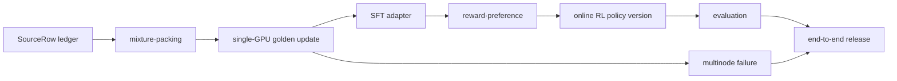

# 실습 색인

이 부록은 본문에서 설명한 계약을 작은 고정 입력으로 다시 확인하는 출발점이다. 실제 대규모 학습을 재현했다고 주장하지 않는다. 각 실습은 실행 전에 입력·revision·seed·예상 불변조건을 기록하고, 실행 뒤에는 최초 불일치와 산출물 digest를 남긴다.

## GR-001 실습 사슬

실습은 서로 독립된 예제가 아니다. 가능한 곳에서는 같은 `GR-001` 계보를 부모로 사용하고, 각 실습이 닫은 경계만 새 artifact로 만든다.

| 실습 | 입력 artifact | 새로 만드는 artifact | 최소 mutation·완료 조건 |
|---|---|---|---|
| source→commit | raw/normalized `SourceRowID` | `PackID·BatchID·UpdateID` ledger | 중복·revision mutation이 commit 전에 거부됨 |
| mixture realized mass | source별 draw와 valid targets | source별 committed numerator/denominator | source 소진·resume 뒤 질량이 손계산과 같음 |
| single GPU | golden batch와 model revision | gradient·moment·checkpoint bundle | kill/reload 뒤 next batch와 delta가 요구 등급으로 같음 |
| SFT adapter | base digest, role mask, target-module manifest | `SFT-001` adapter | all-ignored·누락 module 실패, reload/merge parity 통과 |
| reward calibration | `GR-001-P1`, 사람·judge label | calibrated reward/eval table | pair swap·tie·길이 shortcut이 예상 위치에서 드러남 |
| online RL | behavior policy와 trajectory set | `RL-001`, candidate/published version | retry가 중복 optimizer effect를 만들지 않음 |
| evaluation | response·label·contamination ledger | `EvalID`, CI·판정 | row mutation이 aggregate의 예상 항만 바꿈 |
| multinode | single-GPU 기준 checkpoint | rank/collective/failure trace | 장애 뒤 sample·step·state 복구 등급을 판정 |
| end-to-end | 위 evidence bundle의 digest | release manifest | clean process에서 부모·반례·평가를 재생 |

각 링크를 열면 먼저 입력 표를 복사하고 expected 값을 가린 채 계산한다. 정상 경로가 맞으면 mutation을 실행하고 **어느 assertion이 가장 먼저 실패해야 하는지** 미리 쓴다. 실제 첫 실패가 뒤쪽 metric이라면 실습이 성공한 것이 아니라 관측점이 부족한 것이다.

## 데이터에서 update commit까지

- [SourceRow에서 committed UpdateID까지](06-source-to-commit-golden-lab.md): 정제·토큰화·패킹·분모·commit·checkpoint·fresh resume를 모델 학습 없이 한 deterministic ledger로 검산한다.
- [설정한 mixture가 실제 손실 질량이 되기까지](06-mixture-realized-mass-lab.md): 설정 확률과 실현 문서·입력 토큰·유효 타깃·커밋 손실 질량을 분리하고, 소진 뒤 재정규화·curriculum 경계·resume cursor·중복/평가 누수 격리를 순수 산술로 검산한다.

## 파인튜닝과 정렬

- [SFT·adapter golden lab](18-sft-adapter-golden-lab.md): `GR-001`의 response mask, PEFT injection, A/B gradient, optimizer delta와 reload·merge parity를 닫는다.
- [Reward calibration·tie·disagreement lab](19-reward-calibration-disagreement-lab.md): score 중심화와 확률 보정, tie·사람 불일치, 길이 shortcut, Brier/ECE, 전역 분모와 proxy hacking을 고정 표로 검산한다.
- [온라인 RL policy version lab](20-online-rl-policy-version-lab.md): rollout lease, 중복 delivery, optimizer effect와 candidate→published 전이를 검증한다.
- [SFT·RL·배포 종단 lab](30-sft-rl-deploy-golden-lab.md): 앞 실습의 artifact digest를 한 release manifest로 연결한다.

## 단일 GPU와 멀티노드

- [단일 GPU golden lab](28-single-gpu-golden-lab.md): forward부터 resume 뒤 첫 update까지의 대조군을 만든다.
- [멀티노드 failure lab](29-multinode-failure-lab.md): 대조군에 rank·collective·checkpoint 장애를 더하고 복구 등급을 판정한다.

## 판정 계약

- [평가·오염·불확실성 결정적 실습](24-eval-contamination-uncertainty-lab.md): 고정 열두 행으로 exact/near contamination, 가중 분모, paired·층화 bootstrap, 다중 비교, 기권·judge confusion과 최초 불일치를 검산한다.

성공 로그만 남기지 않는다. 실패 fixture가 예상 경계에서 실패했는지, 수정 뒤 같은 fixture가 회귀 테스트로 닫혔는지, checkpoint·평가·배포가 동일한 입력과 상태 ID를 가리키는지 확인한다.
